# 2020年深圳市考公务员录用考试《行测2》试题（网友回忆版）

> 省考 · 2020 年 · 4 个模块 · 共 74 题

- [政治理论](#%E6%94%BF%E6%B2%BB%E7%90%86%E8%AE%BA) · 8 题
- [常识判断](#%E5%B8%B8%E8%AF%86%E5%88%A4%E6%96%AD) · 20 题
- [言语理解与表达](#%E8%A8%80%E8%AF%AD%E7%90%86%E8%A7%A3%E4%B8%8E%E8%A1%A8%E8%BE%BE) · 31 题
- [资料分析](#%E8%B5%84%E6%96%99%E5%88%86%E6%9E%90) · 15 题

---

## 政治理论

### 第 1 题　qid 2730525 · 新思想

习总书记强调，我们追求的发展是（    ）的发展，我们追求的富裕是全体人民（    ）。

- **A**. 人人共享、共同富裕
- **B**. 造福人民、同步富裕
- **C**. 人人共享、同步富裕
- **D**. 造福人民、共同富裕　✅

**答案**：D

**官方解析**

本题考查政治常识。
2015年8月21日，中共中央在中南海召开党外人士座谈会，中共中央总书记习近平主持座谈会并发表重要讲话。讲话指出：“广大人民群众共享改革发展成果，是社会主义的本质要求，是我们党坚持全心全意为人民服务根本宗旨的重要体现。我们追求的发展是造福人民的发展，我们追求的富裕是全体人民共同富裕。改革发展搞得成功不成功，最终的判断标准是人民是不是共同享受到了改革发展成果。”
故正确答案为D。

---

### 第 2 题　qid 2730526 · 新思想

习近平新时代中国特色社会主义思想系统回答了（    ）这个重大时代课题。

- **A**. 新形势下实现什么样的发展、怎样发展
- **B**. 新时代坚持和发展什么样的中国特色社会主义，怎样坚持和发展中国特色社会主义　✅
- **C**. 什么是社会主义、怎样建设社会主义
- **D**. 建设什么样的党、怎样建设党

**答案**：B

**官方解析**

本题考查政治常识。
A项错误，《中国共产党章程》指出：“十六大以来，以胡锦涛同志为主要代表的中国共产党人，坚持以邓小平理论和“三个代表”重要思想为指导，根据新的发展要求，深刻认识和回答了新形势下实现什么样的发展、怎样发展等重大问题，形成了以人为本、全面协调可持续发展的科学发展观。”
B项正确，《中国共产党章程》指出：“十八大以来，以习近平同志为主要代表的中国共产党人，顺应时代发展，从理论和实践结合上系统回答了新时代坚持和发展什么样的中国特色社会主义、怎样坚持和发展中国特色社会主义这个重大时代课题，创立了习近平新时代中国特色社会主义思想。”
C、D两项错误，《中国共产党章程》指出：“十三届四中全会以来，以江泽民同志为主要代表的中国共产党人，在建设中国特色社会主义的实践中，加深了对什么是社会主义、怎样建设社会主义和建设什么样的党、怎样建设党的认识，积累了治党治国新的宝贵经验，形成了“三个代表”重要思想。”
故正确答案为B。

---

### 第 3 题　qid 2730541 · 新思想

根据《深圳建设中国特色社会主义先行示范区综合改革试点实施方案（2020-2025年）》，中央支持更高水平深港合作，增强在粤港澳大湾区建设中的（    ）功能，努力创建社会主义现代化强国的城市范例。

- **A**. 聚合辐射
- **B**. 桥梁纽带
- **C**. 头雁领航
- **D**. 核心引擎　✅

**答案**：D

**官方解析**

本题考查政治常识。
2020年10月，中共中央办公厅、国务院办公厅印发了《深圳建设中国特色社会主义先行示范区综合改革试点实施方案（2020－2025年）》。方案中指出：“按照党中央、国务院决策部署，牢牢把握正确改革方向，围绕中国特色社会主义先行示范区的战略定位和战略目标，赋予深圳在重点领域和关键环节改革上更多自主权，支持深圳在更高起点、更高层次、更高目标上推进改革开放，率先完善各方面制度，构建高质量发展体制机制，推进治理体系和治理能力现代化，加快形成全面深化改革、全面扩大开放新格局，推动更高水平深港合作，增强在粤港澳大湾区建设中的核心引擎功能，努力创建社会主义现代化强国的城市范例。”
故正确答案为D。

---

### 第 4 题　qid 2730549 · 新思想

《中国共产党章程》规定，在特殊情况下可以直接接收党员。新冠肺炎“战疫”中，许多表现突出的医务人员、公安民警、社区工作者、基层干部群众等纷纷“火线入党”。关于在抢险救灾、抗击疫情等重大任务第一线发展党员，下列说法错误的是：

- **A**. 应当进行入党宣誓
- **B**. 在一线递交入党申请书或向党组织提出入党申请的，可及时吸收其为预备党员
- **C**. 已确定为入党积极分子的，可及时吸收其为预备党员
- **D**. 已确定为发展对象的，可及时吸收其为正式党员　✅

**答案**：D

**官方解析**

本题考查政治常识。
2020年2月23日，中共中央组织部发布《关于抓紧做好在新冠肺炎疫情防控第一线发展党员工作的通知》（以下简称《通知》）。
A项正确，《通知》中指出，抗疫一线基层党组织要采取适当方式，组织新发展的预备党员进行入党宣誓。
B项正确，《通知》中指出，对上一线前以及在抗疫一线递交入党申请书或向党组织提出入党申请，本人一贯表现好、符合党员条件、在抗疫一线表现特别突出的，经党支部研究同意，报上级党委批准，可以吸收其为预备党员。
C项正确，《通知》中指出，对奋战在抗疫一线的医务人员、基层干部群众、公安民警、社区工作者等，已确定为入党积极分子或发展对象，本人一贯表现好、符合党员条件，但培养考察期未满一年，在抗疫一线事迹突出的，经党支部研究同意，报上级党委批准，可及时吸收其为预备党员。
D项错误，根据《通知》内容，已确定为入党积极分子或发展对象的，可及时吸收其为预备党员，而非正式党员。
本题为选非题，故正确答案为D。

---

### 第 5 题　qid 2730683 · 新思想

《深圳建设中国特色社会主义先行示范区综合改革试点实施方案（2020-2025年）》提出，（    ），各方面制度建设取得重要进展，形成一批可复制可推广的重大制度成果，试点取得阶段性成效。

- **A**. 2021年
- **B**. 2022年　✅
- **C**. 2023年
- **D**. 2025年

**答案**：B

**官方解析**

本题考查政治常识。
2020年10月11日，中共中央办公厅、国务院办公厅印发了《深圳建设中国特色社会主义先行示范区综合改革试点实施方案（2020-2025年）》（以下简称《方案》）。《方案》指出：2020年，在要素市场化配置、营商环境优化、城市空间统筹利用等重要领域推出一批重大改革措施，制定实施首批综合授权事项清单，推动试点开好局、起好步。2022年，各方面制度建设取得重要进展，形成一批可复制可推广的重大制度成果，试点取得阶段性成效。2025年，重要领域和关键环节改革取得标志性成果，基本完成试点改革任务，为全国制度建设作出重要示范。
故正确答案为B。

---

### 第 6 题　qid 2730509 · 新思想

《中共中央 国务院关于支持深圳建设中国特色社会主义先行示范区的意见》指出，优化政府管理和服务，深化“放管服”改革，全面推行权力清单、责任清单、负面清单制度，推进“（    ）”改革建设，实现主动、精准、整体式、智能化的政府管理和服务。

- **A**. 法治政府
- **B**. 数字政府　✅
- **C**. 学习型政府
- **D**. 服务型政府

**答案**：B

**官方解析**

本题考查政治常识。
《中共中央 国务院关于支持深圳建设中国特色社会主义先行示范区的意见》中指出：健全政企沟通机制，加快构建亲清政商关系，进一步激发和弘扬优秀企业家精神，完善企业破产制度，打造法治化营商环境。深化“放管服”改革，全面推行权力清单、责任清单、负面清单制度，推进“数字政府”改革建设，实现主动、精准、整体式、智能化的政府管理和服务。
故正确答案为B。

---

### 第 7 题　qid 2730511 · 时事政治

2020年9月8日，全国抗击新冠肺炎疫情表彰大会在北京人民大会堂隆重举行，习近平向“共和国勋章”获得者钟南山和（    ）国家荣誉称号获得者张伯礼、张定宇、陈薇颁授勋章奖章。

- **A**. “人民英雄”　✅
- **B**. “人民楷模”
- **C**. “抗疫英雄”
- **D**. “抗疫模范”

**答案**：A

**官方解析**

本题考查政治常识。
2020年9月8日，全国抗击新冠肺炎疫情表彰大会在北京人民大会堂隆重举行。中共中央总书记、国家主席、中央军委主席习近平向“共和国勋章”获得者钟南山，“人民英雄”国家荣誉称号获得者张伯礼、张定宇、陈薇颁授勋章奖章。
故正确答案为A。

---

### 第 8 题　qid 2730972 · 新思想

《中共中央 国务院关于支持深圳建设中国特色社会主义先行示范区的意见》指出，到2025年，深圳经济实力、发展质量跻身全球城市前列，研发投入强度、产业创新能力世界一流，文化软实力大幅提升，公共服务水平和生态环境质量达到国际先进水平，建成（    ）城市。

- **A**. 信息化多元化标杆型
- **B**. 法治化专业化典范型
- **C**. 特色化品牌化中心型
- **D**. 现代化国际化创新型　✅

**答案**：D

**官方解析**

本题考查政治常识。
《中共中央 国务院关于支持深圳建设中国特色社会主义先行示范区的意见》指出，到2025年，深圳经济实力、发展质量跻身全球城市前列，研发投入强度、产业创新能力世界一流，文化软实力大幅提升，公共服务水平和生态环境质量达到国际先进水平，建成现代化国际化创新型城市。到2035年，深圳高质量发展成为全国典范，城市综合经济竞争力世界领先，建成具有全球影响力的创新创业创意之都，成为我国建设社会主义现代化强国的城市范例。到本世纪中叶，深圳以更加昂扬的姿态屹立于世界先进城市之林，成为竞争力、创新力、影响力卓著的全球标杆城市。
故正确答案为D。

---

## 常识判断

### 第 1 题　qid 2730523 · 人文常识

2020年，是具有特殊意义的一年，它承载了许多重大历史记忆，也将开启更加美好的国家未来。下列历史时点不属于2020年度记忆的是：

- **A**. 深圳证券交易所成立40周年　✅
- **B**. “东方红一号”发射成功50周年
- **C**. 深圳经济特区建立40周年
- **D**. 全面建成小康社会收官之年

**答案**：A

**官方解析**

本题考查政治常识。
A项错误，深圳证券交易所于1990年12月1日开始营业，是经国务院批准设立的全国性证券交易场所，受中国证监会监督管理。因此，2020年12月1日年是深圳证券交易所成立30周年纪念日。
B项正确，1970年4月24日，我国自行研制的第一颗人造地球卫星——“东方红一号”准确进入预定地球轨道，开创了中国航天事业的新纪元，使中国成为世界上第五个自行研制和发射人造卫星的国家，也掀开了中国向浩瀚宇宙进军的璀璨篇章。因此，2020年4月24日是“东方红一号”发射成功50周年纪念日。
C项正确，1980年8月，党和国家批准在深圳、珠海、汕头、厦门设置经济特区。2020年10月14日上午，深圳市经济特区建立40周年庆祝大会在广东省深圳市隆重举行。
D项正确，党的十八届五中全会指出：“到二〇二〇年全面建成小康社会，是我们党确定的‘两个一百年’奋斗目标的第一个百年奋斗目标。‘十三五’时期是全面建成小康社会决胜阶段，‘十三五’规划必须紧紧围绕实现这个奋斗目标来制定。”同时党的十九大报告指出：“从现在到二〇二〇年，是全面建成小康社会决胜期。”因此，2020年是我国全面建成小康社会收官之年。
本题为选非题，故正确答案为A。

---

### 第 2 题　qid 2730524 · 人文常识

（    ）是决定当代中国命运的关键一招，也是决定实现“两个一百年”奋斗目标、实现中华民族伟大复兴的关键一招。

- **A**. 科教兴国
- **B**. 改革开放　✅
- **C**. 从严治党
- **D**. 依法治国

**答案**：B

**官方解析**

本题考查政治常识。
A项错误，1995年5月6日，中共中央、国务院颁布了《关于加速科学技术进步的决定》，首次提出在全国实施科教兴国的战略。同月，为全面部署落实这一决定，中共中央、国务院在北京召开全国科学技术大会。江泽民在会上发表讲话指出：“科教兴国，是指全面落实科学技术是第一生产力的思想，坚持教育为本，把科技和教育摆在经济社会发展的重要位置，增强国家的科技实力及向现实生产力转化的能力，提高全民族的科技文化素质，把经济建设转到依靠科技进步和提高劳动者素质的轨道上来，加速实现国家繁荣强盛。”1997年中共十五大进一步明确了将科教兴国战略作为我国经济发展的战略之一。
B项正确，2018年12月18日，庆祝改革开放40周年大会在北京人民大会堂隆重举行。中共中央总书记、国家主席、中央军委主席习近平在大会上发表重要讲话。习近平主席指出：“改革开放是党和人民大踏步赶上时代的重要法宝，是坚持和发展中国特色社会主义的必由之路，是决定当代中国命运的关键一招，也是决定实现‘两个一百年’奋斗目标、实现中华民族伟大复兴的关键一招。”
C项错误，党的十九大报告指出：“坚持全面从严治党。勇于自我革命，从严管党治党，是我们党最鲜明的品格。”
D项错误，党的十九大报告指出：“全面依法治国是中国特色社会主义的本质要求和重要保障。”
故正确答案为B。

---

### 第 3 题　qid 2730527 · 地理国情

中国的主权和领土完整不容侵犯和分割，维护国家主权、统一和领土完整是包括港澳同胞和台湾同胞在内的（    ）的共同义务。

- **A**. 全中国人民　✅
- **B**. 全中国公民
- **C**. 全体居民
- **D**. 全体国民

**答案**：A

**官方解析**

本题考查政治常识。
《中华人民共和国国家安全法》第十一条第二款规定：“中国的主权和领土完整不容侵犯和分割。维护国家主权、统一和领土完整是包括港澳同胞和台湾同胞在内的全中国人民的共同义务。”
故正确答案为A。

---

### 第 4 题　qid 2730545 · 人文常识

公权本姓公，用权当为民。党风廉政建设是党的重大政治任务，更是治党治国的永恒课题，下列名言体现了“廉洁自律”的精神内涵的是：

- **A**. 见善如不及，见不善如探汤　✅
- **B**. 功崇惟志，业广惟勤
- **C**. 君子务本，本立而道生
- **D**. 法不能独立，类不能自行；得其人则存，失其人则亡

**答案**：A

**官方解析**

本题考查人文常识。
A项正确，“见善如不及，见不善如探汤”出自《论语·季氏》，意思是说看到善事就唯恐来不及似的赶紧去做，看到不善的事情就好像碰到沸水那样立刻收手。习近平总书记在中国共产党第十八届中央纪律检查委员会第三次全体会议上借此古训，提醒领导干部要心存敬畏，方能行有所止，告诫党员干部应廉洁自律，不要心存侥幸。
B项错误，“功崇惟志，业广惟勤”出自《尚书·周官》，意思是说功勋卓著，只有靠立志高远；学识广博，只能靠勤奋努力。也就是说，想要建立一番功业，既要有高远的志向，同时也要付出辛勤的努力，“志”与“勤”二者缺一不可。该项与廉洁自律无关。
C项错误，“君子务本，本立而道生”出自《论语·学而》，意思是说君子要潜心致力于根本的事物，确立了根本，治国做人的基本原则也就随之产生了。该项与廉洁自律无关。
D项错误，“法不能独立，类不能自行；得其人则存，失其人则亡”是荀子所说。意思是说，良好的律法，仅仅是治国的一个开端，一个条件而已，没有恰当的执行法的人，“良法”只能停留在口头上、纸面上，无法成为现实的社会秩序。该项与廉洁自律无关。
故正确答案为A。

---

### 第 5 题　qid 2730552 · 人文常识

中共十九届五中全会提出到二〇三五年基本实现社会主义现代化远景目标，其中不包括：

- **A**. 基本建成法治国家、法治政府、法治社会
- **B**. 平安中国建设达到更高水平，基本实现国防和军队现代化
- **C**. 生态环境根本好转，美丽中国建设目标基本实现
- **D**. 基本建成文化强国、教育强国、人才强国、体育强国、健康强国　✅

**答案**：D

**官方解析**

本题考查政治常识。
A、B、C三项正确，中国共产党第十九届中央委员会第五次全体会议，于2020年10月26日至29日在北京举行。全会提出了到二〇三五年基本实现社会主义现代化远景目标，这就是：我国经济实力、科技实力、综合国力将大幅跃升，经济总量和城乡居民人均收入将再迈上新的大台阶，关键核心技术实现重大突破，进入创新型国家前列；基本实现新型工业化、信息化、城镇化、农业现代化，建成现代化经济体系；基本实现国家治理体系和治理能力现代化，人民平等参与、平等发展权利得到充分保障，基本建成法治国家、法治政府、法治社会；建成文化强国、教育强国、人才强国、体育强国、健康中国，国民素质和社会文明程度达到新高度，国家文化软实力显著增强；广泛形成绿色生产生活方式，碳排放达峰后稳中有降，生态环境根本好转，美丽中国建设目标基本实现；形成对外开放新格局，参与国际经济合作和竞争新优势明显增强；人均国内生产总值达到中等发达国家水平，中等收入群体显著扩大，基本公共服务实现均等化，城乡区域发展差距和居民生活水平差距显著缩小；平安中国建设达到更高水平，基本实现国防和军队现代化；人民生活更加美好，人的全面发展、全体人民共同富裕取得更为明显的实质性进展。
D项错误，中共十九届五中全会提出的目标是“建成”而非“基本建成”，是“健康中国”而非“健康强国”。
本题为选非题，故正确答案为D。

---

### 第 6 题　qid 2730688 · 人文常识

与传统基础设施相比，新型基础设施更加侧重于产业转型升级的新方向，更能体现数字经济的特征。下列不属于“新基建”的是：

- **A**. 地下综合管廊　✅
- **B**. 深汕高铁
- **C**. 5G基站
- **D**. 特高压输电工程

**答案**：A

**官方解析**

本题考查科技常识。

2020年3月4日，中共中央政治局常务委员会召开会议，研究当前新冠肺炎疫情防控和稳定经济社会运行重点工作。会议强调，要加大公共卫生服务、应急物资保障领域投入，加快5G网络、数据中心等新型基础设施建设进度。新基建主要包含5G基站建设、特高压、城际高速铁路和城市轨道交通、新能源汽车充电桩、大数据中心、人工智能和工业物联网。

A项错误，地下综合管廊是指建设在城市地下，用于集中敷设电力、通信、广播电视、给水等市政管线的公共隧道。地下综合管廊可有效杜绝“拉链马路”现象，让技术人员无需反复开挖路面，在管廊中就可对各类管线进行抢修、维护、扩容改造等，同时大大缩减管线抢修时间。地下综合管廊不属于“新基建”。

B项正确，深汕高铁指深圳至汕尾高速铁路，其由深圳西丽始发，终点站为深汕站，正线全长126.8千米，其中约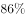为高架线路，深汕高速铁路将是深圳第一条时速350公里以上城际高速铁路。深汕高铁属于“新基建”。

C项正确，5G基站是5G网络的核心设备，提供无线覆盖，实现有线通信网络与无线终端之间的无线信号传输。基站的架构、形态直接影响5G网络如何部署。5G基站属于“新基建”。

D项正确，特高压输电工程具有输电容量大，送电距离长，线路损耗低，节省工程建设投资，减少土地使用面积等优势。发展特高压输电技术能够促进大煤电、大水电、大核电的集约化发展。特高压输电工程属于“新基建”。

本题为选非题，故正确答案为A。

---

### 第 7 题　qid 2730749 · 科技常识

众所周知，吸烟有害健康，于是，一个卷烟替代品——电子烟，借助“健康无害”的标签在烟民中流行起来。某科学期刊曾发布一项研究，对31名无吸烟史的健康人士进行电子烟吸食测试，测量其在吸食后的血氧变化。研究表明，只要吸食一次，血管功能便会短暂受损，若长期吸食，则血管功能可能难以修复，并有几率诱发心血管疾病。
以上事例体现的哲学原理不包括：

- **A**. 量变是质变的必要准备，质变是量变的必然结果
- **B**. 实践是认识产生和发展的基础
- **C**. 矛盾着的事物及其每一个侧面各有其特点　✅
- **D**. 事物之间的联系具有普遍性

**答案**：C

**官方解析**

本题考查政治常识。
A项正确，质量互变规律是唯物辩证法的三个基本规律之一，强调量变是质变的必要准备，质变是量变的必然结果。题干中提到，长期吸电子烟可能会导致血管功能难以修复，并有几率诱发心血管疾病，体现了质量互变规律。
B项正确，实践是认识发展的动力，实践的发展不断地提出认识的新课题，推动着认识向前发展。题干中提到对31名无吸烟史的健康人士进行电子烟吸食测试，得到了研究结论，体现了实践是认识产生和发展的基础。
C项错误，矛盾具有特殊性，矛盾及其各个方面在不同发展阶段各有特点。观察事物，首先就要注意到矛盾的特殊性，坚持具体问题具体分析。题干中并未体现这一哲学原理。
D项正确，事物的联系具有普遍性，主要表现在：第一，任何事物内部的各个部分、要素、环节都是相互联系的；第二，任何事物都与周围的其他事物相互联系着；第三，整个世界是一个相互联系的统一整体。电子烟借助“健康无害”的标签流行起来，体现了事物联系的普遍性。
本题为选非题，故正确答案为C。

---

### 第 8 题　qid 2730751 · 法律常识

某涉外机构拟对全体员工进行《中华人民共和国国家安全法》的普及教育活动，以提高全员的国家安全法治意识，增强防范和抵御安全风险能力，该机构将活动安排在（    ）将最具教育意义。

- **A**. 4月15日　✅
- **B**. 5月4日
- **C**. 9月18日
- **D**. 12月4日

**答案**：A

**官方解析**

本题考查人文常识。
A项正确，2015年7月1日，第十二届全国人民代表大会常务委员会第十五次会议通过新《中华人民共和国国家安全法》。其中，第十四条明确规定，每年4月15日为全民国家安全教育日。若要进行《中华人民共和国国家安全法》的普及教育活动，安排在4月15日将最具教育意义。
B项错误，中华人民共和国成立后，中央人民政府政务院于1949年12月正式宣布以五月四日为中国青年节。五四青年节源于中国1919年反帝爱国的“五四运动”，五四爱国运动是一次彻底的反对帝国主义和封建主义的爱国运动，也是中国新民主主义革命的开始。
C项错误，9月18日是九·一八事变纪念日。九·一八事变，又称奉天事变、柳条湖事件，是1931年9月18日夜日本在中国东北蓄意制造并发动的一场侵华战争，是日本帝国主义侵华的开端。
D项错误，2014年11月1日，第十二届全国人民代表大会常务委员会第十一次会议通过设立每年12月4日为国家宪法日的决定。设立国家宪法日，传递的是依宪治国、依宪执政的理念，其目的是形成举国上下尊重宪法、宪法至上、用宪法维护人民权益的社会氛围。
故正确答案为A。

---

### 第 9 题　qid 2730504 · 科技常识

2020年7月23日，长征五号遥四运载火箭托举着我国首次火星探测任务（    ）探测器点火升空，开启奔向火星的旅程。

- **A**. “天问一号”　✅
- **B**. “天宫一号”
- **C**. “星辰一号”
- **D**. “星火一号”

**答案**：A

**官方解析**

本题考查科技常识。
2020年7月23日12时41分，长征五号遥四运载火箭托举着我国首次火星探测任务“天问一号”探测器，在中国文昌航天发射场点火升空。
故正确答案为A。

---

### 第 10 题　qid 2730506 · 人文常识

近年来，深圳着力提高政务服务便捷化水平，更加注重从企业和群众的办事体验出发，积极拓展政务服务新模式，让市民办事少折腾、少跑腿、更舒心，下列不属于深圳政务服务新模式的是：

- **A**. 千人千面
- **B**. 无感申办
- **C**. 容缺办理
- **D**. 多门多网　✅

**答案**：D

**官方解析**

本题考查政治常识。
深圳以习近平新时代中国特色社会主义思想为指引，按照建设双区驱动的要求，把智慧城市建设作为推进深化改革、优化营商环境和增进人民福祉的重要抓手，推出了一系列改革，为提升城市治理体系和治理能力现代化赋能，让市民生活更方便，让企业办事更便捷。深圳政务服务新模式主要包括以下内容：强化电子证照和电子材料共享复用，推出申报端“秒报”（无感申办）服务；推广容缺办理，打造有温度的政务服务；深圳市统一政务服务APP“i深圳”，推出了区块链电子证照、AI智能客服、千人千面等创新模块。因此，多门多网不属于深圳政务服务新模式。
本题为选非题，故正确答案为D。

---

### 第 11 题　qid 2730514 · 人文常识

下列党政机关公文格式处理，正确的是：

- **A**. 睦邻街道办事处印发公文，其发文字号为“睦邻街道发〔2020〕第5号”
- **B**. 多部门联合行文，为便于在首页列全发文机关，将正文移至第二页显示
- **C**. 教育局印发公文，其印章顶端上距附件说明三行
- **D**. 保密局印发公文，其密级和保密期限同行排列　✅

**答案**：D

**官方解析**

本题考查公文写作与处理。
A项错误，根据《党政机关公文格式》第七条第二项规定：“发文字号编排在发文机关标志下空二行位置，居中排布。年份、发文顺序号用阿拉伯数字标注；年份应标全称，用六角括号“〔〕”括入；发文顺序号不加“第”字，不编虚位（即1不编为01），在阿拉伯数字后加“号”字。”故发文字号不应有“第”字。
B项错误，根据《党政机关公文格式》第七条第三项规定：“主送机关编排于标题下空一行位置，居左顶格，回行时仍顶格，最后一个机关名称后标全角冒号。如主送机关名称过多导致公文首页不能显示正文时，应当将主送机关名称移至版记。”首页必须显示正文。
C项错误，根据《党政机关公文格式》第七条第三项规定：“加盖印章的公文，单一机关行文时，印章端正、居中下压发文机关署名和成文日期，使发文机关署名和成文日期居印章中心偏下位置，印章顶端应当上距正文（或附件说明）一行之内。”故距离三行错误。
D项正确，根据《党政机关公文格式》第七条第二项规定：“如需标注密级和保密期限，一般用3号黑体字，顶格编排在版心左上角第二行；保密期限中的数字用阿拉伯数字标注。密级和保密期限为同行排列，编排至版心左上角第二行。”
故正确答案为D。

---

### 第 12 题　qid 2730971 · 人文常识

粤港澳大湾区由香港、澳门两个特别行政区和珠三角九市组成，是中国开放程度最高，经济活力最强的区域之一，在国家发展大局中具有重要的战略地位。下列不属于粤港澳大湾区城市的是（    ）。

- **A**. 深圳
- **B**. 珠海
- **C**. 汕头　✅
- **D**. 肇庆

**答案**：C

**官方解析**

本题考查政治常识。
2019年2月，中共中央、国务院印发了《粤港澳大湾区发展规划纲要》。《纲要》指出：粤港澳大湾区由香港、澳门两个特别行政区和广东省广州、深圳、珠海、佛山、惠州、东莞、中山、江门、肇庆九个珠三角城市组成，总面积5.6万平方公里，2018年末总人口已达7000万人，是中国开放程度最高、经济活力最强的区域之一，在国家发展大局中具有重要战略地位。
本题为选非题，故正确答案为C。

---

### 第 13 题　qid 2730532 · 法律常识

2020年3月1日，《网络信息内容生态治理规定》正式施行，该项规定旨在整合多方主体，着力整治“网络暴力”乱象，但有人认为，此举将限制公民在网络平台自由发表言论的权利。甲、乙、丙对此展开讨论。
甲：“公民依托互联网行使言论自由时，网络信息内容服务平台应积极履行信息内容管理主体责任。”
乙：“英美等国限制言论自由的方式是追惩制，我国则是多方参与治理，以追惩制为主，预防制为辅。”
丙：“有的网民发微博诋毁公众人物，其行使言论自由但侵害他人名誉权的行为触犯刑法。”
以上三人的说法正确的是：

- **A**. 只有甲　✅
- **B**. 只有丙
- **C**. 甲、乙
- **D**. 甲、乙、丙

**答案**：A

**官方解析**

本题考查法律常识。
甲的说法正确，《网络信息内容生态治理规定》第八条规定：“网络信息内容服务平台应当履行信息内容管理主体责任，加强本平台网络信息内容生态治理，培育积极健康、向上向善的网络文化。”
乙的说法错误，追惩制是事后限制，即所有的言论与出版不受事前的审查，都事先被假定为可以行使，只有在表达言论后构成违法的才依法定程序予以制裁的制度。英国、美国等世界上的大多数国家都实行这种制度。我国的限制方式是追惩与预防二者结合，没有主辅之说。
丙的说法错误，《网络信息内容生态治理规定》第二十一条规定：“网络信息内容服务使用者和网络信息内容生产者、网络信息内容服务平台不得利用网络和相关信息技术实施侮辱、诽谤、威胁、散布谣言以及侵犯他人隐私等违法行为，损害他人合法权益。”《网络信息内容生态治理规定》第四十条规定：“违反本规定，给他人造成损害的，依法承担民事责任；构成犯罪的，依法追究刑事责任；尚不构成犯罪的，由有关主管部门依照有关法律、行政法规的规定予以处罚。”《刑法》第二百四十六条规定：“以暴力或者其他方法公然侮辱他人或者捏造事实诽谤他人，情节严重的，处三年以下有期徒刑、拘役、管制或者剥夺政治权利。前款罪，告诉的才处理，但是严重危害社会秩序和国家利益的除外。通过信息网络实施第一款规定的行为，被害人向人民法院告诉，但提供证据确有困难的，人民法院可以要求公安机关提供协助。”因此，诋毁公众人物必须达到以暴力或者其他方法公然侮辱或者捏造事实诽谤，情节严重的程度，才触犯刑法。
故正确答案为A。

---

### 第 14 题　qid 2730974 · 经济常识

在全球经济一体化背景下，若一国的国际收支盈余，则该国短期内最不可能出现的情况是：

- **A**. 通货膨胀率升高
- **B**. 外汇储备增加
- **C**. 公民出境人数增加　✅
- **D**. 对外清偿能力增强

**答案**：C

**官方解析**

本题考查经济常识。
国际收支盈余是在一定时期内（通常为一年），各个国家之间对外经济往来的收入总额大于支出总额的差额，即为顺差。
A项正确，一国的国际收支盈余，会造成一国国际储备增加，货币供应增加，物价上升，加剧通货膨胀。
B项正确，一国的国际收支盈余增强了综合国力，有利于维护国际信誉，提高对外融资能力，增加外汇储备。
C项错误，公民出境受到多种因素影响，如国家政策、安全因素、汇率因素、交通成本、闲暇时间等，国际收支盈余虽然意味着国民收入有所增长，对公民出境产生了一定积极影响，但综合考虑，短期内出境人数增加是最不可能出现的情况。
D项正确，一国的国际收支盈余，本币趋于升值，对外偿还债务的能力增强。
本题为选非题，故正确答案为C。

---

### 第 15 题　qid 2730973 · 经济常识

下列措施不属于货币政策的是：

- **A**. 保持广义货币M2和社会融资规模的增速与名义GDP的增速大体相当
- **B**. 用好信贷、债券、股权“三支箭”的政策组合，应对民营和小微企业的“融资难”
- **C**. 国务院提前下达下一年度新增地方政府债务限额　✅
- **D**. 人民银行以信贷资产质押方式发放信贷政策支持再贷款

**答案**：C

**官方解析**

本题考查经济常识。
货币政策也就是金融政策，是指中央银行为实现其特定的经济目标而采用的各种控制和调节货币供应量和信用量的方针、政策和措施的总称。
A项正确，货币供应量，是指一国在某一时点上为社会经济运转服务的货币存量，它由包括中央银行在内的金融机构供应的存款货币和现金货币两部分构成。它包括了一切可能成为现实购买力的货币形式，通常反映的是社会总需求变化和未来通胀的压力状态。要保持市场上货币量与GDP的增速大致相当，这样可以有效地防止通货膨胀，属于货币政策。
B项正确，信贷、债券、股权“三支箭”是中国人民银行有力支持民企渡过难关的系列政策措施，属于货币政策。
C项错误，财政政策的手段主要包括税收、预算、国债、购买性支出和财政转移支付等手段，国务院提前下达下一年度新增地方政府债务限额的政策属于财政政策。
D项正确，人民银行以信贷资产质押方式发放信贷政策支持再贷款，有助于解决地方法人金融机构高等级债券质押品相对不足的问题，便利央行向地方法人金融机构提供流动性支持，属于货币政策。
本题为选非题，故正确答案为C。

---

### 第 16 题　qid 2730708 · 人文常识

2020年2-3月，中国科学院紫金山天文台接连发现三颗近地小行星，并对其开展了跟踪观测，以评估与预测对地球环境和人类生存安全可能产生的影响。若近地小行星撞击地球，下列说法错误的是：

- **A**. 小行星穿越大气层时，其部分机械能转化为内能，产生高温
- **B**. 小行星穿越大气层时，大气中的氮气在高温条件下与水化合成硝酸盐，形成强酸雨　✅
- **C**. 小行星穿越大气层后，其重力势能转化为动能，产生极大加速
- **D**. 小行星撞击地球后，可能引发地震、海啸、火山喷发、森林大火等次生灾害

**答案**：B

**官方解析**

本题考查科技常识。
A项正确，小行星穿越大气层时，小行星和大气摩擦生热，小行星表面温度升高，这是通过克服摩擦做功的方式使其内能增加的，在此过程中把机械能转化为内能。
B项错误，小行星穿越大气层时，氮气和水不会发生反应，不会形成强酸雨。当小行星撞击地球时，大量的硫磺气体被释放到大气中，容易形成强酸雨。
C项正确，小行星在空中加速降落时，不考虑质量变化，速度增大，高度减小，所以动能增加，重力势能减少，重力势能转化为动能。
D项正确，小行星高速冲进地球大气层，压缩前端的大气层分子，形成强大的高温高压冲击波，冲击波撞击地面，诱发强烈的地震和海啸，引发森林大火，使撞击的靶岩气化、熔融、破碎和溅射，挖掘出一个巨大的撞击坑。
本题为选非题，故正确答案为B。

---

### 第 17 题　qid 2730711 · 人文常识

葡萄牙语是世界上使用最广泛的语种之一，目前，葡萄牙语的使用人口最多的国家（地区）是（    ）。

- **A**. 乌拉圭
- **B**. 澳门
- **C**. 葡萄牙
- **D**. 巴西　✅

**答案**：D

**官方解析**

本题考查人文常识。
葡萄牙语是罗曼语族的一种语言，葡萄牙语为官方语言或者通用语言的国家和地区：葡萄牙、巴西、安哥拉、莫桑比克、几内亚比绍、佛得角、圣多美和普林西比、东帝汶、中国澳门，葡萄牙语是世界上少数几种分布广泛的语言。葡萄牙语的使用者绝大部分居住在巴西，而只有一小部分的人居住在葡萄牙。
故正确答案为D。

---

### 第 18 题　qid 2730716 · 人文常识

《诗经》有云：“蒹葭苍苍，白露为霜。”露和霜的形成机制大体相似，都是空气中水分冷却到一定温度凝结而成，其凝结温度分别称为“露点”“霜点”。一般而言，露点、霜点与冰点的高低关系为（    ）。

- **A**. 
露点冰点霜点
　✅
- **B**. 
露点霜点冰点

- **C**. 
霜点露点冰点

- **D**. 
露点冰点霜点

**答案**：A

**官方解析**

本题考查科技常识。

霜点是指大气中的水分在冷却的光滑面上开始凝华而结成白霜时的最高温度，通常在以下。露点也是空气中的水汽达到饱和程度后，冷却时的温度，通常在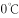以上。冰点是指水的凝固点，即水由液态变为固态的温度，标准大气压下温度是。因此露点冰点霜点。

故正确答案为A。

---

### 第 19 题　qid 2730718 · 人文常识

下列现象与漫反射无关的是：

- **A**. 会议室门窗采用毛玻璃，使室内光线柔和并保障隐私
- **B**. 自行车尾灯在夜间提示后方汽车注意　✅
- **C**. 蝴蝶翅膀呈现缤纷色彩
- **D**. 清晨在茂密的森林中，枝叶间透过一道道光柱

**答案**：B

**官方解析**

本题考查科技常识。
漫反射，是投射在粗糙表面上的光向各个方向反射的现象。当一束平行的入射光线射到粗糙的表面时，表面会把光线向着四面八方反射，所以入射线虽然互相平行，由于各点的法线方向不一致，造成反射光线向不同的方向无规则地反射，这种反射称之为“漫反射”或“漫射”。
A项正确，毛玻璃的表面粗糙，可将会议室内的部分光线通过漫反射的方式向室内的各个方向反射，使得室内光线柔和不刺眼。同时室内的另一部分光线通过毛玻璃后发生折射，使得室外的人看不到完整的像，进而保障会议室内的隐私。
B项错误，自行车尾灯本身不会发光。自行车的尾灯会使用角反射器，角反射器由两个互相垂直的平面镜组成，自行车尾灯有多组相互垂直的平面镜。当平行光入射到角反射器上时，根据光的反射原理，反射光线会与入射光线平行反射回来。因此，自行车尾灯利用的是镜面反射。
C项正确，蝴蝶翅膀表面凹凸不平，光线照射到蝴蝶翅膀上被反射后，产生了光的漫反射。
D项错误，这属于丁达尔现象，是光的散射。丁达尔现象是指光线透过胶体时，会发生散射现象，从垂直入射光方向可以观察到一条光亮的“通路”。在清晨的森林中，由于气温较低，会生成云和雾气，从而形成丁达尔现象，可以观察到光柱。
本题为选非题，故正确答案为B。
备注：本题出题不严谨。D项从科学严谨的角度说，应该是光的散射而非漫反射。但本题是一道单选题，D项从出题人的意图来看，也可以从光的漫反射角度解释。即由于叶子表面凹凸不平，所以光照射到叶子的表面，发生了漫反射的现象，我们才能够从各个角度看到叶子。
从选择最优选项的角度出发，粉笔给出的倾向性答案为B。

---

### 第 20 题　qid 2730721 · 人文常识

往水瓶里注水，可以通过声音判断水位的高低，这是因为当瓶内水位升高时，（    ）。

- **A**. 空气振动频率降低，音调升高
- **B**. 空气振动频率降低，音调降低
- **C**. 空气振动频率升高，音调升高　✅
- **D**. 空气振动频率升高，音调降低

**答案**：C

**官方解析**

本题考查科技常识。
声音频率的高低叫做音调，频率决定音调。物体振动得快，发出声音的音调就高；振动得慢，发出声音的音调就低。当瓶内水位升高时，瓶内的空气柱变短，频率升高，音调升高。
故正确答案为C。

---

## 言语理解与表达

### 第 1 题　qid 2730448 · 语句表达

将下列选项中的词语依次填入句子横线处，最恰当的一组是：
走过绚烂之夏，秋天宛如巨幅油画缓缓        在眼前，处处如泼墨一般，流溢着斑斓的色彩。绸缎般厚重的色调蔓延成流动的河，让高处的云天、远处的雪山、眼前的草地、脚下的河流渲染着奔放而自由的美丽，        着浓到化不开的秋意。

- **A**. 展现、点染
- **B**. 铺展、浸染　✅
- **C**. 展现、浸染
- **D**. 铺展、点染

**答案**：B

**官方解析**

第一空，将秋天比喻为巨幅油画，横线处修饰油画，B、D两项“铺展”意思是铺开并向四外伸展，可以形象地描绘出油画缓缓铺开并展现在眼前的画面，保留；A、C两项“展现”意思是明显地表现出来，“铺展”更符合油画展开的特点，排除。
第二空，根据横线后“浓到化不开的秋意”可知，此处将“秋意”比喻为某种液体，横线处表意为“秋意”这种液体渗入到油画之中，B项“浸染”意思是液体渗入而使染上颜色，符合文意，当选；D项“点染”意思是绘画时点缀景物和着色，侧重小面积点缀，不符合液体渗入的特点，排除。
故正确答案为B。
【文段出处】《秋之韵章》

---

### 第 2 题　qid 2730433 · 片段阅读

好的人才如高岭之花，求贤若渴者甚多。古有周公“            ”、秦昭王“五跪得范雎”、萧何“月下追韩信”、刘备“三顾茅庐”，想要在众多竞争者中最终得到人才，还得看如何抓住人才的心，创造出适合他们发挥才能的环境，并使其安居乐业，没有后顾之忧。

- **A**. 三年不目月
- **B**. 三年不窥园
- **C**. 一沐三握发　✅
- **D**. 一饭三遗矢

**答案**：C

**官方解析**

横线处通过“、”与“五跪得范雎”“月下追韩信”“三顾茅庐”构成并列结构，且根据“求贤若渴者甚多”“想要在众多竞争者中最终得到人才”可知，横线处表意为对人才的渴求，C项“一沐三握发”出自《史记·鲁周公世家》，意思是洗一次头要多次握起头发，起来接待贤士，这样还怕失掉天下贤人，比喻求贤心切，符合文意，当选。
A项“三年不目月”出自《法言·修身》，意思是三年不见日月，精神不振，眼睛朦胧，比喻懒于修养，不求进取，与文意不符，排除；
B项“三年不窥园”出自《汉书·董仲舒传》，意思是三年没有进过一次花园，甚至连一眼都没瞧过，形容专心苦学，不受外界干扰，与文意不符，排除；
D项“一饭三遗矢”出自《史记·廉颇蔺相如列传》，意思是一顿饭的功夫上了三次厕所，形容年老体弱或年老无用，与文意不符，排除。
故正确答案为C。
【文段出处】《长三角崛起“沪宁线”人才走廊》

---

### 第 3 题　qid 2730452 · 逻辑填空

陈寅恪讲课，从不            。他曾言：“前人讲过的，我不讲；近人讲过的，我不讲；外国人讲过的，我不讲；我自己过去讲过的，也不讲。现在只讲未曾有人讲过的。”因而，陈寅恪上课的教室，总是坐得满满的。

- **A**. 拾人牙慧　✅
- **B**. 人云亦云
- **C**. 步人后尘
- **D**. 随波逐流

**答案**：A

**官方解析**

所填成语呼应后文“前人讲过的，我不讲；近人讲过的，我不讲；外国人讲过的，我不讲；我自己过去讲过的，也不讲。现在只讲未曾有人讲过的”，强调陈寅恪讲课有自己的思考，不拾取别人或自己以前的成果，A项“拾人牙慧”指拾取人家的只言片语当作自己的话，比喻窃取别人的语言和文字，符合语境，当选。
B项“人云亦云”指人家说什么自己也跟着说什么，侧重强调没有主见，若置于横线处结合横线前的否定词，表示有主见，而文段侧重强调陈寅恪讲课不拾取别人或自己以前的成果，与“拾人牙慧”对比，“拾人牙慧”更符合文意。故“人云亦云”排除；
C项“步人后尘”指跟在别人的后面走，比喻追随、模仿别人，D项“随波逐流”指随着波浪起伏，跟着流水漂荡，比喻自己没有主见，随着潮流走，两者均侧重行为，而“讲课”侧重说话，排除。
故正确答案为A。
【文段出处】《陈寅恪的“四不讲”》

---

### 第 4 题　qid 2730460 · 逻辑填空

将下列选项中的词语依次填入各句横线处，最恰当的一项是：
（1）她对这些诗人诗作的解析，            ，丝丝入扣，毫无牵强，读她的文章，就像是面对着那个活生生的诗人。
（2）在边防工作站，我们见到了年轻的站长，他能用流利的外语与境外人员交谈，对境外的民族、文化等知识更是            。
（3）他删除的用心是隐秘的、手法是细腻的，但是，在            的历史学家眼里，他所有暗中的手脚都无所遁形。

- **A**. 明察秋毫 洞若观火 了如指掌
- **B**. 明察秋毫 了如指掌 洞若观火
- **C**. 了如指掌 明察秋毫 洞若观火
- **D**. 洞若观火 了如指掌 明察秋毫　✅

**答案**：D

**官方解析**

本题可从第二空入手，程度词“更”表递进，所填成语语义比“能用流利的外语与境外人员交谈”重，强调站长十分了解境外的民族、文化等知识，B、D两项“了如指掌”指好像指着自己的手掌给人看一样，形容对情况非常清楚，程度较重，均符合语境，保留；A项“洞若观火”形容看得清楚明白，C项“明察秋毫”形容为人非常精明，任何小问题都看得很清楚，两者均不符合语境，排除。
第三空，所填成语搭配“历史学家”，表示历史学家能够看出他暗中的手脚，D项“明察秋毫”侧重不太容易看到的细节能看得清楚，符合语境，且与“历史学家”搭配恰当，保留；B项“洞若观火”侧重于观察事物的透彻程度，十分明白清楚，体现不出对不容易看到的细节观察仔细，不符合语境，且搭配人时一般表述为“某人洞若观火”，不能表述为“洞若观火的某人”，排除。
第一空，代入验证。结合后文“读她的文章，就像是面对着那个活生生的诗人”可知，她对这些诗人诗作的解析是很清楚明白的，读者看得懂、能理解，D项“洞若观火”符合语境，当选。
故正确答案为D。
【文段出处】《一道亮丽的风景线——云南边防见闻之五》《李敖快意恩仇录》等

---

### 第 5 题　qid 2730471 · 逻辑填空

将下列选项中的词语依次填入句子横线处恰当的一组是：
我们自幼及长，从做学生时的大小考试，到毕业后的就业、定级、升迁等，一生中不知要过多少关口。等候判决的滋味真没少尝。当然，一个人        有足够的悟性，        迟早会看淡浮世功名，不再把自己放在这个等候判决的位置。        ，        修炼到类似涅槃的境界，恐怕总有一些事情的结局是我们不能无动于衷的。

- **A**. 只要 就 因此 哪怕
- **B**. 如果 就 但是 若非　✅
- **C**. 即使 也 于是 一旦
- **D**. 只有 才 然而 倘若

**答案**：B

**官方解析**

本题可从第三空入手，根据前文“迟早会看淡浮世功名”可知，横线前表意为不在意功名，根据后文“恐怕总有一些事情的结局是我们不能无动于衷的”可知，横线后表意为在意事情发展的结果，横线前后呈转折关系，B项“但是”、D项“然而”均符合文意，保留；A项“因此”、C项“于是”均表示因果关系，与文段逻辑不符，排除。
第四空，“修炼到超脱生死的境界”与“恐怕总有一些事情的结局是我们不能无动于衷的”表意相反，B项“若非”表否定假设，填入横线处与后文对应得当，保留；D项“倘若”表假设关系，填入横线处与后文矛盾，排除。
第一空、第二空，代入验证。B项“如果······就”表假设关系，符合文段逻辑，当选。
故正确答案为B。
【文段出处】周国平《等的滋味》

---

### 第 6 题　qid 2730472 · 逻辑填空

将下列选项中的词语依次填入句子横线处恰当的一组是：
毛笔文化的特征，恰是中国传统文人群体人格的        。在总体上，它应该淡隐了，但这并不        书法作为一种传统艺术光耀百世。喧嚣迅捷的现代社会时时需要获得审美慰抚，书法对此独具功效。我自己每每在头昏脑胀之际，近乎本能地把手伸向那些碑帖，只要轻轻翻开，洒脱委和的        立即扑面而来。

- **A**. 反映 妨害 神韵
- **B**. 映照 妨碍 气韵　✅
- **C**. 映射 阻碍 韵味
- **D**. 映衬 阻隘 风韵

**答案**：B

**官方解析**

第一空，根据“毛笔文化的特征，恰是中国传统文人群体人格的”可知，横线处表意为毛笔文化的特征能体现出中国传统文人群体的人格特征，A项“反映”比喻把客观事物的本质表现出来，B项“映照”指照射、呼应，C项“映射”指照射、映照，均符合文意，保留；D项“映衬”指相互映照、衬托，文段并未体现“毛笔文化”与“中国传统文人群体人格”的相互性，也无“衬托”之意，排除。
第二空，横线处表意为毛笔文化的淡隐没有影响书法的发扬光大，横线处要体现影响之意，B项“妨碍”、C项“阻碍”均指干扰、阻碍，使事情不能顺利进行，均符合文意，保留；A项“妨害”指有害于、阻碍，文段并未体现损害之意，程度过重，排除。
第三空，根据“近乎本能地把手伸向那些碑帖”“扑面而来”可知，横线处搭配“碑帖”，B项“气韵”指文章或书法绘画的意境或韵味，与“碑帖”搭配得当，且与“扑面而来”相对应，当选；C项“韵味”指风味、风韵，无法对应“扑面而来”，排除。
故正确答案为B。
【文段出处】余秋雨《笔墨祭》

---

### 第 7 题　qid 2730773 · 逻辑填空

将下列选项中的词语依次填入句子横线处恰当的一组是：
（1）这样多的读者哪一个是先看批评家的文章，然后再让批评家牵着鼻子走，            地去读原著呢？我看是绝无仅有的。
（2）30年前，国际形势            ，国内改革            ，党中央作出重大决策，掀开了我国改革开放向纵深推进的崭新篇章。

- **A**. 照本宣科 风云变幻 风起云涌
- **B**. 按图索骥 风起云涌 风云变幻
- **C**. 照本宣科 风起云涌 风云变幻
- **D**. 按图索骥 风云变幻 风起云涌　✅

**答案**：D

**官方解析**

第一空，根据文段“先看批评家的文章，然后再让批评家牵着鼻子走”可知，横线处表达读者依据已知信息阅读文章。“按图索骥”比喻根据线索去寻找或追究事物，符合文意，保留B、D两项；“照本宣科”指死板地照现成文章或稿子宣读，侧重强调死板不灵活，与文意不符，排除A、C两项。
第二空，横线处搭配“国际形势”，B项“风起云涌”比喻事物迅速发展，声势浩大，搭配不当，排除；D项“风云变幻”比喻事物变化复杂或局势动荡不安，搭配恰当，保留。
第三空，代入验证，横线处搭配“国内改革”，D项“风起云涌”搭配恰当，符合文意，当选。
故正确答案为D。
【文段出处】《文学批评无用论》《下一个三十年，浦东如何续写传奇？12位金融机构高管、专家学者献良策》

---

### 第 8 题　qid 2730777 · 逻辑填空

将下列选项中的词语依次填入各句横线处，最恰当的一项是：
（1）春运是我国特别的        ，1978-2020，我们经历了40多个春运，经过40多年的高速发展。我国已经从经济发展受交通瓶颈制约的国家成长为交通大国。
（2）国务院决定，2020年4月4日举行全国性哀悼活动。在此期间，全国和驻外使领馆下半旗        ，全国停止公共娱乐活动。

- **A**. 胜景 致哀
- **B**. 胜景 志哀
- **C**. 盛景 致哀
- **D**. 盛景 志哀　✅

**答案**：D

**官方解析**

第一空，搭配“春运”，且根据后文可知，横线处表达春运是较为繁盛的景象之意。“盛景”指盛大的景象，符合文意，保留C、D两项。“胜景”指优美的风景，与“春运”搭配不当，排除A、B两项。
第二空，由文段信息可知，全国和驻外使领馆通过采取下半旗的方式表示哀悼。D项“志哀”是指以某种方式或活动来表示哀悼，多指集体的大型的哀悼方式，与文意相符，当选。C项“致哀”指用语言向别人传达自己对某人某事的哀意，多用于“向······致哀”，与文意不符，排除。
故正确答案为D。
【文段出处】《为何说春运是我国特别的盛景？40多年见证了时代变迁》《国务院公告：2020年4月4日举行全国性哀悼活动》

---

### 第 9 题　qid 2730778 · 逻辑填空

将下列选项中的词语依次填入横线处，最恰当的一组是：
一位学者在给中华书局百年的贺词中写道：“清末以来，中国文化传统之所以危而未倾，中华书局在以往百年中之努力与有功焉。”回望历史，此言可谓            ，一个国家民族的历史文化由其典籍        ，典籍存，则文化存；典籍亡，则文化亡。

- **A**. 不刊之论 承载　✅
- **B**. 不根之论 承载
- **C**. 不刊之论 承继
- **D**. 不根之论 承继

**答案**：A

**官方解析**

第一空，“此言”指代前文学者的言论，且根据“典籍存，则文化存；典籍亡，则文化亡”可知，横线处表达学者的话正确的意思，A、C两项“不刊之论”指正确的、不可修改的言论，符合文意，均保留。B、D两项“不根之论”指没有根据的言论，与文意不符，均排除。
第二空，横线处所填词语应体现出“典籍”与“历史文化”的关系，且根据后文“典籍存，则文化存；典籍亡，则文化亡”可知，历史文化留存依靠典籍，A项“承载”指承受负载，与文意相符，当选。C项“承继”指继承，典籍不能继承历史文化，与文意不符，排除。
故正确答案为A。
【文段出处】《中华书局，一个世纪的光荣与梦想——守正出新启民智》

---

### 第 10 题　qid 2730780 · 语句表达

下列语句中，没有语病的一句是：

- **A**. 
世界上没有哪一个国家能在这么短的时间内帮助这么多人脱贫，这对中国和世界都具有重大意义。
　✅
- **B**. 
有学者统计，李时珍写《本草纲目》，参考书目极为丰富，其中和道教有关的超过左右。

- **C**. 
通过越来越先进的计算机及其算法，使天文学家们对整个可观测宇宙中数以万亿计的星系演变过程有了更为细致的模拟分析。

- **D**. 
冬日的内蒙古巴彦淖尔是十分寒冷的时候，但形式多样的冬季旅游活动却进行得热火朝天。

**答案**：A

**官方解析**

A项，无语病，当选。 B项，“超过左右”表述矛盾，应去掉“左右”，排除。

C项，语句不通顺，应改为“天文学家们通过越来越先进的计算机及其算法，对整个可观测宇宙中数以万亿计的星系演变过程有了更为细致的模拟分析。”排除。

D项，搭配不当，“内蒙古巴彦淖尔”不能是“时候”，应改为，“内蒙古巴彦淖尔的冬日是十分寒冷的时候”，主干成分搭配不当，排除。

故正确答案为A。

---

### 第 11 题　qid 2730774 · 语句表达

下列语句中，有语病的一句是：

- **A**. 仍然有人经常问及中美科幻的差距，但现在的答案已与十年前格外大相径庭。　✅
- **B**. 书是工具和媒介，它是用来传播知识的，只有被使用它才有价值。
- **C**. 广交会的延期举办不仅是一项经济命题，也是一项政治命题，更是一项生命命题。
- **D**. 红荷的红不同于桃、杏，鲜艳中显出端庄，就像白玉兰于素静中显出华贵一样。

**答案**：A

**官方解析**

A项，语义重复，“格外”即表示“超过寻常”，“大相径庭”比喻彼此差别很大，极为不同，两者均有“超过寻常”之意，语义重复，删除“格外”，当选。
B、C、D三项均无语病，排除。
故正确答案为A。

---

### 第 12 题　qid 2730686 · 语句表达

下列语句中，没有歧义的一句是：

- **A**. 这个连外科主任医师王刚都不认识的人，居然被评为本院的“杰出青年”？
- **B**. 这本讲述了一名大学生毕业之后的支教故事的小说被放在抽屉里。　✅
- **C**. 教练让我们三个人一组去完成任务，这确实是最佳方案。
- **D**. 小宝似乎有绘画天赋，他最喜欢的事情就是在车上画画。

**答案**：B

**官方解析**

A项，有两种理解：“王刚不认识的人”；“不认识王刚的人”，存在歧义，排除；
C项，有两种理解：“我们一共三个人”；“我们所有人每三人一组”，存在歧义，排除；
D项，有两种理解：“小宝在车身上画画”；“小宝在车里画画”，存在歧义，排除；
B项说法并无歧义，当选。
故正确答案为B。

---

### 第 13 题　qid 2730765 · 语句表达

下列语句中，没有语病的一句是：

- **A**. 清华大学智能产业研究院将以人工智能、类脑计算与智能汽车开发相结合，打造世界顶尖的创新研究平台。
- **B**. 经过不懈努力，阿伯如今已经可以通过摄影获得稳定收入，他还和妻子一起开办了农家乐，生活条件大为改善。　✅
- **C**. 该行动将严厉打击拒不支付劳动报酬犯罪，帮助被拖欠工资农民工解决临时生活困难，依法处置拖欠农民工工资违法行为。
- **D**. 在这场严峻的考验中，彰显了挺立风雨的坚强脊梁，共克时艰的磅礴力量，以及休戚与共的责任担当。

**答案**：B

**官方解析**

A项，“清华大学智能产业研究院将以人工智能、类脑计算与智能汽车开发相结合”成分多余，滥用介词，应去掉介词“以”，改为“清华大学智能产业研究院将人工智能、类脑计算与智能汽车开发相结合”，排除；
B项，表意明确，没有语病，当选；
C项，句子“该行动将严厉打击拒不支付劳动报酬犯罪”成分残缺，缺少宾语，应添加宾语，改为“该行动将严厉打击拒不支付劳动报酬的犯罪行为”，排除；
D项，“在这场严峻的考验中，彰显了······”成分残缺，缺少主语，应添加主语，可改为“国人在这场严峻的考验中，彰显了······”，排除。
故正确答案为B。

---

### 第 14 题　qid 2730767 · 语句表达

下列语句中，有语病的一句是：

- **A**. 令陈老板意想不到的是，自己苦心经营多年的企业之所以破产，竟然是因为舆情应对不力引起的。　✅
- **B**. 天空高处很蓝，愈往边上愈淡，亮亮地发白，此时的未名湖畔像是一幅没有着色只有线条的钢笔画。
- **C**. 今年以来，各大城市都在结合自身情况，打造从垃圾产生源头到回收的整套解决方案。
- **D**. 理论医学并不会代替实验医学和循证医学，而是以二者的研究成果为基本研究材料。

**答案**：A

**官方解析**

A项，句子“企业之所以破产，竟然是因为舆情应对不力引起的”中的“因为”和“引起的”表意重复，造成了句式杂糅，可改为“企业之所以破产，竟然是因为舆情应对不力”或“企业之所以破产，竟然是舆情应对不力引起的”，故存在语病，当选。
B、C、D三项均表意明确，没有语病，排除。
故正确答案为A。

---

### 第 15 题　qid 2730968 · 逻辑填空

填入下面横线处的句子，最恰当的顺序是：
口碑的背后是审美，这是一个有主观意识的评判，它受个人阅历经验的影响，也与地域文化、风俗习惯有关联，反映到电影的感受，可能就会出现这样的景象：同一部电影，你觉得是一地鸡毛，                    ；你觉得毫无会心之处，                    ；你觉得强行煽情，                    。
①他却笑得前仰后合
②他却觉得曾经沧海
③他早已哭得梨花带雨

- **A**. ①②③
- **B**. ②①③　✅
- **C**. ①③②
- **D**. ②③①

**答案**：B

**官方解析**

根据前文可知，横线处应体现不同的人对同一部电影的感受是不同的。
第一空，横线处对应“一地鸡毛”，“一地鸡毛”指生活中的琐事，即强调电影反映的内容很平凡，故横线处应表达有的人认为电影所述内容不平凡，能体现大世面，①句“笑得前仰后合”与大世面无关，②句讲述的“曾经沧海”比喻曾经见过大世面，不把平常事物放在眼里，符合文意，排除A、C两项。
第二空，横线处与“毫无会心之处”语意相反，强调可以领悟理解电影表达的含义，①③两句均符合文意，保留。
第三空，横线前讲述的是“强行煽情”，即强行煽动别人的感情或情绪，故横线处应表达不必强行煽情，早已被感动，③句“早已哭得梨花带雨”符合文意，锁定B项。①句“笑得前仰后合”与“强行煽情”无关，与第二空“毫无会心之处”刚好构成转折，即你觉得无趣，他觉得很有意思，排除D项。
故正确答案为B。
【文段出处】人民日报《评论员随笔：中国电影释放生长的力量》

---

### 第 16 题　qid 2730925 · 语句表达

填入下面横线处的句子，最恰当的顺序是：
黄昏酒醒，灯孤人寂，先生是否想起缘缘堂——                    ，                    ，亲戚老友，小聚闲谈，                    ，                   ，笼罩了座中人的感情，                    。
①清茶之外，佐以小酌，上灯不散
②油灯暗淡平和的光度和建筑的亲和力
③形式朴素，不事雕琢，却高大轩敞
④安心舒适，娓娓不倦
⑤正南向三开间，中央铺方大砖，西室铺地板为书房，陈列书籍数千卷，东室为饮食间

- **A**. ③⑤①②④　✅
- **B**. ⑤③④②①
- **C**. ③⑤②④①
- **D**. ⑤③①②④

**答案**：A

**官方解析**

观察选项，对比首句，为③⑤两句，③句阐述的是“缘缘堂”的整体风格，强调缘缘堂高大轩敞，即房屋高大宽敞；⑤句中的“三开间”“大砖”“书籍数千卷”即指出了缘缘堂非常宽敞，故⑤句是对③句的具体解释说明，故③句应在⑤句之前，排除B、D两项。
第三空根据横线前“亲戚老友，小聚闲谈”可知，横线处应填入与亲友小聚场景相关的内容，观察A、C两项，①句描述的是小酌的场景，与前文衔接恰当，②句描述的是油灯及建筑，与前文衔接不当，排除C项。
故正确答案为A。
【文段出处】《丰子恺那群小燕子似的孩子》

---

### 第 17 题　qid 2730934 · 语句表达

把下面几个句子组成语意连贯的一段文字，排序正确的一项是：
①清醒前释放高水平的糖皮质激素，会促使人体将脂肪酸和糖转化为能量。
②如果昼夜节律紊乱，例如由于轮班工作或时差原因，会引起糖皮质激素水平的改变，可能会发生严重的代谢异常。
③在一个健康的系统中，肾上腺每天早晨都会产生糖皮质激素。
④人体中的每个细胞都由内部生物钟驱动。
⑤该生物钟遵循24小时的昼夜节律，与白天和黑夜的自然周期同步运行，主要受阳光控制，也受社交习惯控制。

- **A**. ③②①④⑤
- **B**. ③①②④⑤
- **C**. ④⑤③①②　✅
- **D**. ④⑤②③①

**答案**：C

**官方解析**

观察选项，判断首句，④句指出人体的每个细胞都与内部生物钟有关，③句指出在健康的情况下，肾上腺每天会产生固定物质，对比③、④两句内容可知，首句不易判断。
观察句子，⑤句指出生物钟主要受阳光控制，也受社交习惯控制，故文段应先论述“阳光控制”，再论述“社交习惯控制”，②句以轮班工作和时差为例，指出个人行为即社交习惯会改变生物钟，③句强调在健康的情况下，身体每天清晨会产生激素，即生物钟受自然阳光的影响，故③句应在②句前，排除D项。且③句和②句是对⑤句内容的详细的解释说明，故⑤句应在③句和②句之前，排除A、B两项。
故正确答案为C。
【文段出处】科技日报《昼夜节律紊乱或致糖尿病脂肪肝》

---

### 第 18 题　qid 2730938 · 语句表达

把下面几个句子组成语意连贯的一段文字，排序正确的一项是：
①原因是，一个人永远不可能再是同一个人。
②一切社会理想都犯这种错误。
③一旦有可能通过强大的意志推翻整个世界，我们就会立刻加入独立的精神的行列。
④给全人类刻板地套上某种特殊的国家形式或社会形式是一种狭隘的做法。
⑤于是，世界历史对于我们来说只不过是一种梦幻般的自我沉迷状态。

- **A**. ③⑤①②④
- **B**. ④①⑤②③
- **C**. ③⑤④①②
- **D**. ④②①③⑤　✅

**答案**：D

**官方解析**

观察选项，判断首句。④句提出观点，作者认为给全人类刻板地套上某种特殊的国家形式或社会形式的做法是错误的，③句引出话题，如果有强大的意志推翻世界我们会加入独立的精神的行列，对比两句可知，首句不易判断。
观察句子，②句出现指代词“这种错误”，故前文应提到某种错误做法，①句为原因解释，客观论述一个人不可能永远保持同一性，无法与②句指代词进行捆绑，排除A、C两项。④句“狭隘的做法”和⑤句“自我沉迷状态”均可理解为错误的做法，故④句和⑤句均可与②句指代词进行捆绑，故保留B、D两项。
对比尾句，⑤句通过结论词“于是”引导结论，而③句通过“一旦······就会······”进行假设论证，对比而言，从形式看，⑤句更适合作尾句，从内容看，⑤句“梦幻般的自我沉迷状态”是③句“加入独立的精神的行列”所带来的结果，故⑤句适合放在③句之后，锁定D项。
验证D项，④句开篇提出作者观点，认为给全人类刻板地套上某种特殊的国家形式或社会形式的做法是狭隘的，紧接着②句指出一切社会理想都会犯这种狭隘做法的错误，①句解释原因，③句假设论证作者观点，最后⑤句通过“于是”总结全文，强调世界历史对于我们来说是一种自我沉迷的状态，逻辑通顺，表述合理，当选。
故正确答案为D。
【文段出处】弗里德里希·威廉·尼采《潜在力量》

---

### 第 19 题　qid 2730940 · 语句表达

把下面几个句子组成语意连贯的一段文字，排序正确的一项是：
①由此形成了一个悖论。
②一方面，专业化才能有好作家；另一方面，文学脱离生活本质，专业化难有好作家。
③专门文学家的出现，是文学史上产生众多优秀作品的原因之一。
④但是，文学的专门化，又使文学家们得以生活在书斋、阁楼、亭子间里，局限在一个独特的小圈子中，与社会和他人的生活相隔离。
⑤文学家们受过良好教育，熟悉各种文学经典，掌握丰富的创作技巧，这些都是普通人难以企及的。

- **A**. ②③④⑤①
- **B**. ③④②①⑤
- **C**. ③⑤④①②　✅
- **D**. ③⑤①②④

**答案**：C

**官方解析**

观察选项，判断首句。②句论述专业化和好作家的关系，③句指出专门文学家的出现带来了文学史上众多的优秀作品，从内容上分析，难以判断首句，进而寻找其他线索。
④句出现转折词“但是”，且主要阐述“文学的专门化”给文学家带来的劣势，故前文应论述其优势，对比选项，③句和⑤句均论述了文学家的优势，可与④句构成转折词捆绑，而②句结尾部分未论述文学家的优势，无法与④句构成语义相反的转折词捆绑，故排除D项。
继续对比选项，较大的区别在于①句和②句的先后顺序，②句论述了“专业化”和“好作家”之间的矛盾，是对①句“悖论”的解释说明，故①句应在②句之前，可初步锁定答案为C项。
验证C项，③句首先引出“专门文学家”的话题，随后⑤④两句分别论述其优势与劣势，接着①句的“由此”下结论，指出“悖论”的存在，并通过②句对结论进行了具体解释。经验证，C项顺序符合逻辑，当选。
故正确答案为C。
【文段出处】《文学，请回归生活（文学观象）》

---

### 第 20 题　qid 2730942 · 片段阅读

鳝鱼在水中，若不将头部伸出水面呼吸新鲜空气的话，即使水中溶氧十分丰富，也很可能会窒息而死。一般雄鳝将头伸出水面呼吸的频率较高，雌鳝相对较低，小雌鳝甚至不到水面吞吐空气。因为，刚孵出的稚鳝具有胸鳍和鳍褶，上面有许多毛细血管，卵黄囊上具有与水有很大接触面的血管网膜，这些血管网膜是这一时期的主要呼吸器官。稚鳝的胸鳍和鳍褶不停地扇动，在水中进行着气体交换，而不必将头伸出水面呼吸。随着稚鳝的个体增大，卵黄囊、鳍褶和胸鳍逐渐退化，而后主要靠口腔和喉部呼吸。
根据上文，不能推出的是：

- **A**. 即使水中溶氧丰富，鳝鱼也需要呼吸水面空气
- **B**. 血管网膜不再是成年鳝鱼的呼吸器官　✅
- **C**. 在相同时间内，雄鳝将头部伸出水面的次数比雌鳝多
- **D**. 稚鳝一般不会将头部伸出水面呼吸

**答案**：B

**官方解析**

A项，根据“即使水中溶氧十分丰富，也很可能会窒息而死”可知，A项“鳝鱼也需要呼吸水面空气”符合文意，排除。
B项，根据“刚孵出的稚鳝具有胸鳍和鳍褶，上面有许多毛细血管······这些血管网膜是这一时期的主要呼吸器官······而后主要靠口腔和喉部呼吸”可知，鳝鱼并不是完全不用血管网膜呼吸，只是成年后，血管网膜不再是主要的呼吸器官，故B项“血管网膜不再是成年鳝鱼的呼吸器官”表述过于绝对，当选。
C项，根据“一般雄鳝将头伸出水面呼吸的频率较高，雌鳝相对较低”可知，在相同时间内，雄鳝会比雌鳝伸出水面呼吸的次数多，符合文意，排除。
D项，根据“稚鳝的胸鳍和鳍褶不停地扇动，在水中进行着气体交换，而不必将头伸出水面呼吸”可知，稚鳝一般不会把头伸出水面呼吸，符合文意，排除。
本题为选非题，故正确答案为B。
【文段出处】《常见放生物种及生活习性》

---

### 第 21 题　qid 2730946 · 片段阅读

她从原来五四新女性、学运领袖的立场，向中国传统女性回归，为了应付家务，她断笔、完完全全成为爱人和孩子的附庸。关心家庭多于社会，关心鲁迅的病体多于关心他的心灵，她倦于跟踪先生思想的发展，她甘于庸常。这在一个不断探索的思想战士看来，太遗憾了。这能怪她吗？你自己没有责任？事务的泥沼注定要淹没思想的，难道你不知道？你为什么把一切家务全都搁在她的肩上呢？
根据上文，作者对“她”的感情不包括：

- **A**. 理解
- **B**. 责罪　✅
- **C**. 同情
- **D**. 叹惋

**答案**：B

**官方解析**

文段开篇指出“她”从五四新女性、学运领袖转变为中国传统女性所作出的牺牲，即“甘于庸常”，紧接着以感叹句“太遗憾了”表达作者对“她”的惋惜之情，后文通过四个反问句表明作者认为“她”的境遇是有原因的，责任不能完全归咎于“她”。故文段整体表达作者对“她”的境遇的恻隐之心。
A项，由“事务的泥沼注定要淹没思想的，难道你不知道？”可知，作者认为“她”的境遇是有外部因素影响的，是可以理解的，符合文意，排除；
B项，文段通篇并未表明作者对“她”有责怪的意思，无中生有，不符合文意，当选；
C项，由后文的四个反问句可知，作者对“她”的境遇有恻隐、同情之心，符合文意，排除；
D项，由“太遗憾了”可知，作者对“她”的境遇有惋惜之情，符合文意，排除。
本题为选非题，故正确答案为B。
【文段出处】《人间鲁迅》

---

### 第 22 题　qid 2730694 · 片段阅读

虽说器物的名称只是一个符号，但名称又往往与我们对器物功能、性质的认定密切相关，尤其是夏商周时期的礼器。因此在器物命名上，我们应该慎重，不能想当然，应尽量避免简单化和先入为主。在考虑器形的同时，更应该通过多学科手段弄清楚器物的功能、用途。此外，考古学界还应该制定某种共同遵守的器物命名标准与规范。唯有如此，我们对古代器物的命名才可能更准确，更具有科学性、规范性和统一性。
下列对材料的理解，错误的是（    ）。

- **A**. 考古学界以往对器物的命名往往流于简单化和先入为主，不够慎重　✅
- **B**. 器物的名称不仅是一个符号，还反映了人们对器物功能、性质的认知
- **C**. 器物的功能、性质、用途以及器形，都是器物命名的依据
- **D**. 制定器物命名标准与规范是提高器物命名准确性和统一性的必要手段

**答案**：A

**官方解析**

A项，由“因此在器物命名上，我们应该慎重，不能想当然，应尽量避免简单化和先入为主”可知，我们在给器物命名时要避免简单化和先入为主，并没有体现出以往对器物是怎样命名的，表述错误，当选；
B项，由“虽说器物的名称只是一个符号，但名称又往往与我们对器物功能、性质的认定密切相关”可知，表述正确，排除；
C项，由“在考虑器形的同时，更应该通过多学科手段弄清楚器物的功能、用途”可知，表述正确，排除；
D项，由“在考虑器形的同时······此外，考古学界还应该制定某种共同遵守的器物命名标准与规范。唯有如此······更具有科学性、规范性和统一性”可知，制定共同遵守的器物命名标准与规范对提高器物命名准确性和统一性很重要，表述正确，排除。
本题为选非题，故正确答案为A。
【文段出处】《开展多学科的现代名物学研究》

---

### 第 23 题　qid 2730698 · 片段阅读

在北京人头盖骨失踪63年后，周口店再次成为世界关注的焦点。目前，这里正在进行大规模勘探，希望北京人头盖骨能够“再现”。与“挖新”工程几乎同一时刻，“搜旧”工作也被提上了有关部门的议事日程。日籍沉船“阿波丸”号被许多人认为是北京人头盖骨最有可能的藏身之处。据报道，国家博物馆水下考古研究中心主任、中国水下考古队队长表示，水下考古队正在集训，等待明年选择适当时机出发——打捞“阿波丸”号。
最适合做这段文字标题的是：

- **A**. 北京人头盖骨失踪之谜
- **B**. 寻觅沉船——北京人头盖骨在哪里
- **C**. 周口店有望“再现”北京猿人遗址
- **D**. 考古队明年下水搜寻北京人头盖骨　✅

**答案**：D

**官方解析**

文段开篇指出周口店再次成为世界关注的焦点，并介绍了目前的情况，随后引出“搜旧”这一话题，指出“日籍沉船’阿波丸’号”最有可能成为北京人头盖骨的藏身之处，尾句明确指出，明年会下水打捞“阿波丸”号，即对北京人头盖骨进行搜寻，故文段重点强调要下水搜寻北京人头盖骨，对应D项。
A项，“失踪之谜”在文中并未体现，排除；
B项，文段重点并非“搜寻”沉船，而是要去寻找北京人头盖骨，对于沉船，仅仅是“打捞”而已，排除；
C项，“周口店有望‘再现’”对应文段第二句话的内容，非重点，且“北京猿人遗址”在文中并未体现，排除。
故正确答案为D。
【文段出处】《新浪网：中国明年下水寻找失踪63年北京人头盖骨》

---

### 第 24 题　qid 2730701 · 片段阅读

想来一杯奶茶不用排队，“代买奶茶”的小哥会将热乎的奶茶送到手中；外出旅行家里的宠物没人照看，代遛狗服务让主人们安心外出；商场停车位难找，代客泊车服务让逛街更方便；朋友聚会喝酒，代驾司机送自己安全到家······在互联网模式普及后，随着移动支付以及共享经济发展趋于成熟，“代经济”的发展速度得以提升。动动手指就能解决问题，“代经济”的发展不仅为“懒人”们提供全新消费选择，也为市场注入新活力。有学者表示，于社会而言，专业的事由专业的人来干，催生相关行业兴起，社会分工进一步细化有助于增加就业机会，促进经济增长。当然，“代经济”个性化发展还需谨防乱象伴生。
这段文字接下来最有可能讲述的是（    ）。

- **A**. “代经济”增加就业机会，促进经济增长的具体表现
- **B**. “代经济”所伴生的乱象的种种表现　✅
- **C**. “代经济”所伴生的乱象对社会的负面影响
- **D**. 对“代经济”所伴生的乱象予以监管的具体措施

**答案**：B

**官方解析**

本题为接语选择题，需通读全文，重点把握文段最后讨论的核心话题。文段开篇论述“代经济”发展迅速，接着介绍“代经济”发展带来的好处，尾句通过“当然”强调在看到好处的同时也要谨防问题产生。故文段接下来应重点介绍“代经济”所伴生的问题的具体表现，对应B项。
A项，“增加就业机会”前文已经论述过，排除；
C项，“对社会的负面影响”与尾句衔接不紧密，应先介绍乱象的具体表现，再论述乱象带来的负面影响，排除；
D项，“予以监管的具体措施”与尾句衔接不恰当，应先介绍乱象的具体表现，再论述监管措施，排除。
故正确答案为B。
【文段出处】《代买奶茶，代遛狗：火爆“代经济”需要正确打开方式》

---

### 第 25 题　qid 2730705 · 片段阅读

如今，音乐艺术好像进入了一个兴盛时期。中国人谁不能唱几支歌？然而，就是在这种全民皆卡拉OK的热潮中，音乐正令人不安地走“下坡路”。有报道称，目前各种演奏会的观众中，大部分是音乐圈的人。其余的是音乐学院的老师和学生们，形成今天你演我看、明天我演你看的情形。与此形成强烈反差的，是人们对儿童音乐教育的热情。笛子二胡、吉他扬琴、黑管小号萨克斯、电子琴手风琴乃至钢琴，所有高雅的乐器都走进了儿童世界。
文中“与此形成强烈反差的”中的“此”具体指代的是：

- **A**. 音乐正令人不安地走“下坡路”　✅
- **B**. 全民皆卡拉OK的社会现象
- **C**. 专业音乐人士是各种演奏会的主要观众来源
- **D**. 各种演奏会上，音乐圈内人互为表演者和观众的情形

**答案**：A

**官方解析**

定位文段，“与此形成强烈反差的”中的“此”位于文段结尾。结合文段结尾“人们对儿童音乐教育的热情······都走进了儿童世界”可知，“此”指代的内容应为比较消极的情况。文段开篇论述音乐艺术好像进入了兴盛时期，紧接着通过转折词“然而”指出音乐正令人不安地走“下坡路”这一情况，后文通过报道的内容对其进行具体解释说明，故“此”指代的内容即音乐正令人不安地走“下坡路”，对应A项。
B项，“全民皆卡拉OK的社会现象”对应文段问题前的表述，且与“此”之后的内容“人们对儿童音乐教育的热情”无法构成反差，排除；
C项“专业音乐人士是各种演奏会的主要观众来源”、D项“各种演奏会上，音乐圈内人互为表演者和观众的情形”均对应文段“有报道称”之后的内容，属于对“此”这一指代内容的具体解释说明，而非指代内容本身，排除。
故正确答案为A。

---

### 第 26 题　qid 2730712 · 片段阅读

前颞上回是位于耳朵上方的一小块脑组织，左右各一个，主要负责声音信号的处理，和语言能力有关。“人的左脑负责语言和逻辑思维，右脑负责空间意识和直觉”这一说法是有道理的，原因就在于左右脑前颞上回的神经结构有所不同。左脑前颞上回向其他部位伸展的神经树突数量较少，长度也较短。这样的结构提高了神经信号的传导速度，却降低了信号来源的广度。右脑前颞上回则正相反，向外伸展的神经树突数量较多，走的距离也长，这样的结构牺牲了神经信号的传导速度，却让右脑接收信息的来源更广，可供选择的信息更多，更容易找出隐藏在大脑深处的被遗忘的信息，而灵感就是这么来的。
下列说法与原文意思相符的是（    ）。

- **A**. 人的左右脑对语言能力的分工不同源于左右脑结构的重大差异
- **B**. 灵感来临时，右脑前颞上回比左脑前颞上回更活跃　✅
- **C**. 由于右脑前颞上回的神经树突数量多、距离长，因而右脑的反应速度比左脑慢
- **D**. 灵感与以往知识或经验的积累有关

**答案**：B

**官方解析**

A项，根据“人的左脑负责语言和逻辑思维······神经结构有所不同”可知，分工不同是源于“左右脑前颞上回的神经结构”的不同，而非“左右脑结构”，表述不准确，且“重大差异”程度过重，排除；
B项，根据“右脑前颞上回······灵感就是这么来的”可知，灵感的出现主要是来自于右脑对大脑深处被遗忘信息的调动，与左脑关系不大，因此“右脑前颞上回更活跃”符合文意，当选；
C项，根据“左脑······提高了神经信号的传导速度”和“右脑······牺牲了神经信号的传导速度”可知，文段仅介绍了“神经信号”传导速度的快慢，未提及“反应速度”如何，且未将二者进行对比，排除；
D项，根据尾句中“更容易找出隐藏在大脑深处的被遗忘的信息，而灵感就是这么来的”可知，“灵感”是与“大脑深处的被遗忘的信息”有关的，而非“以往知识或经验的积累”，排除。
故正确答案为B。
【文段出处】《灵光如何才能一现》

---

### 第 27 题　qid 2730747 · 片段阅读

文物是活着的历史，保护文物本质就是保护历史，护佑文化传承。近年来，随着城市化进程加快，文物破坏严重与保护不力的矛盾日益突出，亟待公益诉讼在依法保护文物方面及时补位，而文物具有典型的公共利益属性，完全契合公益诉讼保护公共利益的立法意图。此前的司法实践中，也曾有社会组织对破坏、损毁文物的违法行为提起过公益诉讼。由于我国目前尚未建立起文物保护的民事公益诉讼制度，多数社会组织在提起文物保护的公益诉讼时，只能以破坏生态环境为由，诉请追究未认真履行保护文物职责的地方政府或职能部门的法律责任。
这段文字意在（    ）。

- **A**. 揭露文物保护不力的社会现象
- **B**. 陈述文物保护公益诉讼的司法实践
- **C**. 呼吁将文物保护纳入民事公益诉讼范围　✅
- **D**. 强调用法律武器保护文物的重要性

**答案**：C

**官方解析**

文段开篇提出文物的定义及保护文物的重要性。随后指出近年来文物破坏严重与保护不力的矛盾日益突出，并通过“亟待”提出“公益诉讼”这一对策，且论述文物契合公益诉讼的立法意图。后文通过介绍因为我国缺乏文物保护的民事公益诉讼制度，导致在此前的司法实践中此类公益诉讼只能以破坏生态环境为由，再次强调公益诉讼在保护文物中的失位。故文段意在强调对策，即把涉及文物保护的案件纳入公益诉讼领域，主题词为“文物保护”和“公益诉讼”，对应C项。
A、D两项未提及文段主题词“公益诉讼”，偏离文段核心话题，排除；
B项“司法实践”对应文段中的问题表述，文段重点在于对策，且选项表述不明确，排除。
故正确答案为C。
【文段出处】《以公益诉讼加强文物保护正当其时》

---

### 第 28 题　qid 2730752 · 片段阅读

2019年9月底，国内首批智能网联汽车载人试运营许可证在国家智能网联汽车（武汉）测试示范区颁发。百度、海梁科技、深兰科技3家企业获得湖北省武汉市交通运输局颁发的首批智能网联汽车载人试运营许可证。这标志着智能网联汽车从测试走向商业化运营开启了破冰之旅，国内首条自动驾驶商用运营线路落地武汉CBD中央商务区，逐渐驶入市民的生活。
下文最有可能介绍的是（    ）。

- **A**. 智能网联汽车的定义和技术特点
- **B**. 国内首条自动驾驶商用运营线路的车辆情况　✅
- **C**. 国内智能网联汽车的发展现状
- **D**. 市政府对于智能网联汽车研发的激励措施

**答案**：B

**官方解析**

本题为接语选择题，需通读全文，重点把握文段最后讨论的核心话题。文段开篇引出了智能网联汽车载人试运营许可证的话题，并说明3家企业获得了该许可证，尾句阐述智能网联汽车走向商业化运营，国内首条自动驾驶商用运营线路驶入市民的生活。故下文应围绕“国内首条自动驾驶商用运营线路”这个核心话题进行论述，对应B项。
A项，“智能网联汽车的定义和技术特点”非文段最后强调的核心话题，排除；
C项，“国内智能网联汽车的发展现状”在前文已经论述，故下文不会再论述，排除；
D项，“激励措施”非文段最后强调的核心话题，排除。
故正确答案为B。
【文段出处】《首批载人试运营许可证在武汉落地 智能网联汽车将驶近你我》

---

### 第 29 题　qid 2730662 · 逻辑填空

有一个以善于攀爬树木而闻名的男子让徒弟练习爬高树。徒弟爬到最高处时，他一言不发；等到徒弟下降到屋檐那么高时，男子才开口说：“要小心，别失足了！”路人问道：“已经下到这个地方，稍微一跳就可以下来了，为何还要这么说呢？”男子回答道：“正是到这个高度才应该提醒。人爬到了最高点，枝危而目眩，自当有所戒备，故不必多言。而失误常常发生于易处，因此就必说不可了。”
这个故事没有提醒人们（    ）。

- **A**. 常备不懈
- **B**. 戒骄戒躁
- **C**. 一鼓作气　✅
- **D**. 阴沟翻船

**答案**：C

**官方解析**

根据材料和提问句可知，本题为中心理解题。文段描述了一个故事，尾句“而失误常常发生于易处，因此就必说不可了”为文段的主旨句，强调越在易处越要小心谨慎，C项“一鼓作气”比喻趁劲头大的时候一下子把事情完成，与文意不符，当选。
A项，“常备不懈”比喻时刻准备着，毫不松懈，与文意相符，排除；
B项，“戒骄戒躁”比喻警惕产生骄傲和急躁情绪，与文意相符，排除；
D项，“阴沟翻船”比喻在有把握的地方出了问题，与文意相符，排除。
本题为选非题，故正确答案为C。
【文段出处】《难处易过 易处难过》

---

### 第 30 题　qid 2730757 · 片段阅读

我国自主研制的C919大型客机首架机正式下线仪式在上海举行，C919的命名颇具深意，“C”是“中国商飞”英文缩写“COMAC”的第一个字母，也代表“China”，也恰好与“空中客车（Airbus）”和“波音（Boeing）”的字头构成顺序排列。第一个“9”代表“长久”，后面的“19”则代表最大载客可达190座。C919承载着中国人的“大飞机”梦想。它将在首飞和通过适航测试之后，进入航线运营，填补航线上没有中国干线喷气客机的空白。
下列说法不能体现C919“命名颇具深意”的是（    ）。

- **A**. C919既具备国际辨识度又彰显本土特色
- **B**. 字母“C”可谓“一语三关”，同时又表明了研发公司、所属国家、行业地位
- **C**. 数字“919”既有表达祝福的情感内涵，又有对实际功能的标注作用
- **D**. C919正式进入航线运营后，寓意中国人的“大飞机”梦想成真　✅

**答案**：D

**官方解析**

A项，由“‘C’是‘中国商飞’······可达190座”可知，C919的命名既具备国际辨识度又彰显本土特色，说法正确，排除；
B项，由“‘C’是‘中国商飞’英文缩写‘COMAC’的第一个字母，也代表‘China’，也恰好与‘空中客车（Airbus）’和‘波音（Boeing）’的字头构成顺序排列。”可知，C919的“C”代表了研发公司“中国商飞”及所属国家“中国”以及行业地位，即与“空中客车”“波音”处于相似地位，说法正确，排除；
C项，由“第一个‘9’······可达190座”可知，数字919既代表长久这一情感内涵，又标注实际功能，说法正确，排除；
D项，由“C919承载着中国人的‘大飞机’梦想······填补航线上没有中国干线喷气客机的空白。”可知，此为C919运行意义，不是其命名本身的含义，与提问要求不符，当选。
本题为选非题，故正确答案为D。
【文段出处】《走进C919：国产大型客机解密》

---

### 第 31 题　qid 2730758 · 片段阅读

在传统画论中，诸如“神”“妙”“能”“逸”等术语暗示了一系列内化的批评标准，关注的是画家内在的感受能力和情绪状态，而不是能否准确地再现外部世界，或画面本身的形式感，与功能性较强的人物故事画或肖像画相比，山水画的题材处理相对自由，千树万树，只要把握“常理”，即可自由生发。苏轼说：“余尝论画，以为人禽宫室器用皆有常形，至于山石竹木，水波烟云，虽无常形，而有常理。”“常理”即自然万物的勃勃生机，需要画家超越肉眼所见的真实，用心灵去感受万物的生命与气质，有了这样的自由，山水画更便于展示“书写”的技巧与趣味。早在荆浩的《笔记法》中，“筋”“肉”“骨”“血”这一类书法创作经验已经完成了向山水画的转移，《笔记法》为画家提供了丰富的形式语言，当然，也提出了更高的技术要求。
下列对材料的理解，正确的是：

- **A**. “神”“妙”“能”“逸”等术语是专门用于评价传统山水画家的内化标准
- **B**. 画家需把握自然万物的“常理”，方能更自如地在山水画中展示“书写”的技巧与趣味　✅
- **C**. 书法创作较之山水画创作，技术要求更高
- **D**. 人禽宫室器用，因其有常形，故可用作人物故事画或肖像画的题材，而山石竹木，水波烟云，因其无常形则不可

**答案**：B

**官方解析**

A项，根据“诸如‘神’‘妙’‘能’‘逸’等术语暗示了一系列内化的批评标准”可知，“专门用于”无中生有，排除；
B项：根据“山水画的题材处理相对自由，千树万树，只要把握‘常理’，即可自由生发”和“‘常理’即自然万物的勃勃生机······有了这样的自由，山水画更便于展示‘书写’的技巧与趣味”可知，画家只有把握住“常理”，便能更好地展示“书写”的技巧和趣味，表述正确，当选；
C项，根据“《笔记法》为画家提供了丰富的形式语言，当然，也提出了更高的技术要求”可知，山水画创作需要更高的技术要求，表述错误；且文段并未涉及书法创作和山水画创作之间的对比，属于无关对比，排除；
D项，根据“余尝论画，以为人禽宫室器用皆有常形，至于山石竹木，水波烟云，虽无常形，而有常理”可知，人物故事画或肖像画的题材与有常形和无常形无关，无中生有，排除。
故正确答案为B。
【文段出处】《中国绘画史图鉴》| 山水卷

---

## 资料分析

### 材料 1

        2018年，某市实现地区生产总值24221.98亿元，比上年增长。其中，第一产业增加值22.09亿元，增长；第二产业增加值9961.95亿元，增长；第三产业增加值14237.94亿元，增长。现代产业中，现代服务业增加值10090.59亿元，增长；先进制造业增加值6564.83亿元，增长；高技术制造业增加值6131.20亿元，增长。四大支柱产业中，金融业增加值3067.21亿元，增长；物流业增加值2541.58亿元，增长；文化及相关产业（规模以上）增加值1560.52亿元，增长；高新技术产业增加值8296.63亿元，增长。七大战略性新兴产业增加值合计9155.18亿元，比上年增长，占地区生产总值比重。其中，新一代信息技术产业增加值4772.02亿元，增长；数字经济产业增加值1240.73亿元，增长；高端装备制造产业增加值1065.82亿元，增长；绿色低碳产业增加值990.73亿元，增长；海洋经济产业增加值421.69亿元，下降；新材料产业增加值365.61亿元，增长；生物医药产业增加值298.58亿元，增长。

        全市年末常住人口1302.66万人，其中常住户籍人口454.70万人，增长，占常住人口比重；常住非户籍人口847.97万人，增长，占比重。年末城镇登记失业率为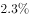。全年居民消费价格比上年上涨。全年完成一般公共预算收入3538.41亿元，比上年增长。其中税收收入2899.60亿元，增长。一般公共预算支出4282.54亿元，下降。

#### 第 1 题　qid 2730982 · 增长

2017年，该市三大产业增加值同比增速最快的是：

- **A**. 第一产业
- **B**. 第二产业
- **C**. 第三产业
- **D**. 无法判断　✅

**答案**：D

**官方解析**

定位文字材料第一段，材料中没有给出2017年三大产业增加值同比增速的相关数据，故无法判定2017年同比增速的大小。
故正确答案为D。

---

#### 第 2 题　qid 2730983 · 增长

2018年，下列产业对该市地区生产总值增长的贡献率最大的是：

- **A**. 第三产业
- **B**. 现代服务业
- **C**. 文化及相关产业（规模以上）
- **D**. 高新技术产业　✅

**答案**：D

**官方解析**

根据题干“2018年，······对······贡献率最大的是”，结合材料时间为2018年，可判定本题为现期比重问题。根据公式：增长贡献率，总体增长量均为该市地区生产总值增长量，则本题只需比较部分增长量的大小即可。定位文字材料第一段可知，第三产业增加值14237.94亿元，增长；现代服务业增加值10090.59亿元，增长；文化及相关产业（规模以上）增加值1560.52亿元，增长；高新技术产业增加值8296.63亿元，增长。根据增长量比较“大大则大”原则，文化及相关产业（规模以上）增加值及同比增速均为最小，则其增长量最小，排除C项。根据公式：增长量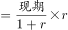，则第三产业增加值的增长量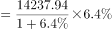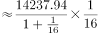亿元；现代服务业增加值的增长量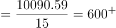亿元；高新技术产业增加值的增长量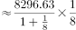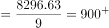亿元。故高新技术产业增加值的增长量最大，对该市地区生产总值增长的贡献率最大。

故正确答案为D。

---

#### 第 3 题　qid 2730984 · 增长

2018年，从产业增加值的同比增量看，该市七大战略性新兴产业中，高端装备制造产业和（    ）最接近。

- **A**. 新一代信息技术产业
- **B**. 数字经济产业
- **C**. 绿色低碳产业　✅
- **D**. 生物医药产业

**答案**：C

**官方解析**

根据题干“从产业增加值的同比增量看，······高端装备制造产业和（    ）最接近”，可判定本题为增长量计算问题。定位文字材料第一段可知，高端装备制造产业增加值1065.82亿元，增长；新一代信息技术产业增加值4772.02亿元，增长；数字经济产业增加值1240.73亿元，增长；绿色低碳产业增加值990.73亿元，增长；生物医药产业增加值298.58亿元，增长。根据公式：增长量，各产业增加值的同比增量如下： 

高端装备制造产业增加值：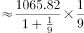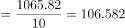亿元；

新一代信息技术产业增加值：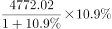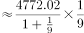亿元；

数字经济产业增加值：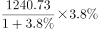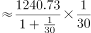亿元；

绿色低碳产业增加值：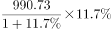亿元；

生物医药产业增加值：亿元。

则高端装备制造产业增加值的同比增量与绿色低碳产业增加值的同比增量最接近。

故正确答案为C。

注：考试时，通过观察比较数据，可知“高端装备制造产业增加值”与“绿色低碳产业增加值”的现期量与同比增速均是最接近的，可直接猜C项。

---

#### 第 4 题　qid 2730985 · 增长

2018年，该市年末常住人口同比增长约：

- **A**. 

- **B**. 

　✅
- **C**. 

- **D**. 

**答案**：B

**官方解析**

根据题干“2018年，该市年末常住人口同比增长约”，结合选项为百分数，且材料给出该市2018年末该市常住户籍人口与常住非户籍人口的增长率，可判定本题为混合增长率问题。定位文字材料第二段，2018年，全市年末常住人口1302.66万人，其中常住户籍人口454.70万人，增长，占常住人口比重；常住非户籍人口847.97万人，增长，占比重。根据“混合后居中，偏向基期大的（一般用现期量代替基期量计算）”，可得：，结合选项，排除A、C两项；由于常住户籍人口数（454.70万人）常住非户籍人口数（847.97万人），可得：更接近常住非户籍人口的增长率（），即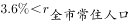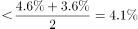，只有B项在范围内。

故正确答案为B。

---

#### 第 5 题　qid 2730986 · 综合

根据上文，下列说法正确的是：

- **A**. 2018年，该市第二产业增加值占地区生产总值比重同比下降
- **B**. 2017年，该市四大支柱产业中，物流业增加值最大
- **C**. 2018年，该市年末城镇登记失业人口29.96万人
- **D**. 2018年，该市一般公共预算收入中，非税收收入同比负增长　✅

**答案**：D

**官方解析**

A项：定位文字材料第一段，“2018年，某市实现地区生产总值24221.98亿元，比上年增长。其中，······第二产业增加值9961.95亿元，增长”，根据两期比重比较的结论：若部分增长率整体增长率，比重上升；反之下降。，因此第二产业增加值占地区生产总值比重同比上升，错误。

B项：定位文字材料第一段，2018年“四大支柱产业中，金融业增加值3067.21亿元，增长；物流业增加值2541.58亿元，增长；文化及相关产业（规模以上）增加值1560.52亿元，增长；高新技术产业增加值8296.63亿元，增长”。根据基期量，2017年四大支柱产业增加值分别为：

2017年金融业增加值：亿元；

2017年物流业增加值：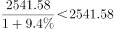亿元；

2017年文化及相关产业（规模以上）增加值：亿元；

2017年高新技术产业增加值：亿元。

比较可知，2017年该市四大支柱产业中，高新技术产业增加值最大，错误。

C项：定位文字材料第二段，根据城镇登记失业率，材料并未给出城镇从业人员的数据，故无法推出城镇登记失业人数，错误。

D项：定位文字材料第二段，2018年“全年完成一般公共预算收入3538.41亿元，比上年增长。其中税收收入2899.60亿元，增长”，根据线段法“距离与量成反比（一般用现期量代替基期量计算）”，可知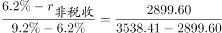，即，解得，即非税收收入同比负增长，正确。

故正确答案为D。

---

### 材料 2

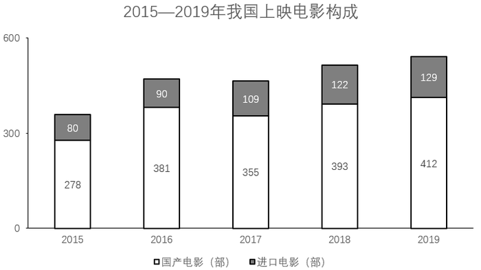

#### 第 6 题　qid 2730989 · 平均数

若电影票房按“观影人次平均票价”计算，则2019年电影平均票价比2015年：

- **A**. 高2.2元　✅
- **B**. 高3.9元
- **C**. 低2.2元
- **D**. 低3.9元

**答案**：A

**官方解析**

根据题干“2019年电影平均票价比2015年”，结合选项：高/低单位，可判定本题为平均数的增长量问题。定位统计图一可知：2019年票房收入为642.66亿元，观影人次为17.27亿人次；2015年票房收入为440.69亿元，观影人次为12.60亿人次。代入平均票价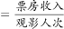可得：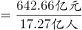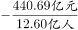元，与A项最接近。

故正确答案为A。

---

#### 第 7 题　qid 2730990 · 增长

2016-2019年，电影票房同比增幅最低的年份，当年观影人次的同比增幅为：

- **A**. 

- **B**. 

- **C**. 

　✅
- **D**. 

**答案**：C

**官方解析**

根据题干“当年观影人次的同比增幅”，结合选项为，可判定本题为一般增长率计算问题。定位统计图一，已知2016~2019年电影票房收入，根据公式：增长率，可知各年份电影票房增长率如下：

2016年：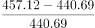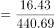；

2017年：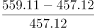；

2018年：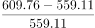；

2019年：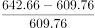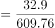。

则2016年电影票房同比增幅最低，结合统计图一，2015、2016年的观影人次分别为12.60亿人、13.72亿人，故2016年的观影人次的同比增幅，与C项最接近。

故正确答案为C。

---

#### 第 8 题　qid 2730991 · 增长

2016-2019年，上映电影数同比增幅超过的年份有（    ）个。

- **A**. 1
- **B**. 2　✅
- **C**. 3
- **D**. 4

**答案**：B

**官方解析**

根据题干“······同比增幅超过······”，可判定本题为一般增长率问题。定位统计图二可知上映电影数进口电影国产电影，可知各年份上映电影数：2015年为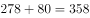；2016年为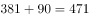；2017年为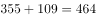；2018年为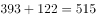；2019年为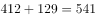；根据公式：增长率，同比增幅超过，即现期量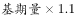。2016年：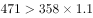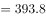，满足；2017年上映电影数较上年下降，排除；2018年：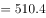，满足；2019年：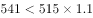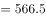，排除。因此2016-2019年，上映电影数同比增幅超过的年份有2个。

故正确答案为B。

---

#### 第 9 题　qid 2730993 · 综合

2016-2019年，下列指标中，与下方折线图的变化趋势最相符的是：

- **A**. 上映国产电影数
- **B**. 电影观影人次同比增量　✅
- **C**. 电影平均票价
- **D**. 上映进口电影数同比增量

**答案**：B

**官方解析**

A项：定位统计图二可得2016-2019年我国每一年上映的国产电影数量，发现2017年的355部2016年的381部，与折线图趋势不符，排除；

B项：定位统计图一的折线图可得2015-2019年我国每一年的观影人次，根据增长量，可得2016-2019年的增长量分别为，，，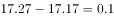，与折线图趋势一致，当选；

C项：定位统计图一可得2016-2019年我国每一年的票房和观影人次，根据平均票价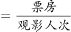，可得2016-2019年平均票价分别为元/人，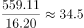元/人，元/人，元/人，发现2019年的平均票价是最高的，与折线图趋势不符，排除；

D项：定位统计图二可得2015-2019年我国每一年上映的进口电影数量，根据增长量，可得2016-2019年的增长量分别为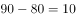，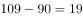，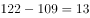，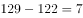，发现2018年的增长量132016年的增长量10，折线图中第一个点高于第三个点，排除。

故正确答案为B。

备注：折线图中第一点与第三点的高度差别不明显，第二、三点之间的高度差明显大于第三、四点之间的高度差，故排除D项。

---

#### 第 10 题　qid 2730994 · 综合

根据上图，下列说法正确的是：

- **A**. 2015—2019年，上映电影数与电影票房的变化趋势一致
- **B**. 2016—2019年，观影人次同比增长最快的一年，其电影票房及上映电影数均同比增长最快
- **C**. 2015—2019年，上映电影平均票房均超1亿元/部
- **D**. 2015—2019年，当年电影票房超过五年年均电影票房的年份有3个　✅

**答案**：D

**官方解析**

A项：定位统计图一、二，发现2017年电影票房增加，而2017年上映的电影总数下降，变化趋势不一致，错误；

B项：定位统计图一，根据公式：增长率，可知2016-2019年观影人次增长率依次为：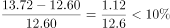；；；，观影人次同比增长最快的为2017年。定位统计图二，观察发现2017年上映电影数同比减少，故上映电影数同比增长率为最低的一年，不满足电影票房及上映电影数均同比增长最快，错误；

C项：定位统计图一、二，可得2015-2019年票房数以及电影数量，根据公式：平均票房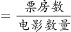，可得2015-2019年每年的平均票房依次为：；；；；，没有均超1亿元/部，错误；

D项：定位统计图一，可得2015-2019年票房数，根据年均票房，超过540的有3个，正确。

故正确答案为D。

---

### 材料 3

#### 第 11 题　qid 2730465 · 增长

2012-2018年，国家财政支出同比增速最快的年份是：

- **A**. 2018年
- **B**. 2015年　✅
- **C**. 2014年
- **D**. 2012年

**答案**：B

**官方解析**

根据题干“2012-2018年，······同比增速最快的年份是”，可判定本题为一般增长率计算问题。定位统计表材料，可知2011-2018年国家财政支出。根据公式：增长率，可知选项各年份的增长率如下：

2018年：；

2015年：；

2014年：；

2012年：。

则同比增速最快的年份是2015年。

故正确答案为B。

---

#### 第 12 题　qid 2730466 · 综合

2011-2018年，国家财政赤字的变化趋势为：

- **A**. 不断缩小
- **B**. 与国家财政收入的变化趋势相反
- **C**. 不断扩大　✅
- **D**. 先扩大后缩小

**答案**：C

**官方解析**

财政赤字是指财政支出超过财政收入的部分，即财政赤字财政支出财政收入。定位统计表材料，可知2011-2018年国家财政收入和国家财政支出。则各年份的财政赤字如下：

2011年：亿元；

2012年：亿元；

2013年：亿元；

2014年：亿元；

2015年：亿元；

2016年：亿元；

2017年：亿元；

2018年：亿元。

则2011-2018年，国家财政赤字的变化趋势为不断扩大。

故正确答案为C。

---

#### 第 13 题　qid 2730467 · 增长

2018年，上表所列国家税收收入的税种中，按税收收入同比增速从高到低排序，正确的是：

- **A**. 
企业所得税国内增值税个人所得税国内消费税关税

- **B**. 
个人所得税企业所得税国内增值税国内消费税关税
　✅
- **C**. 
企业所得税个人所得税国内增值税关税国内消费税

- **D**. 
个人所得税国内消费税企业所得税国内增值税关税

**答案**：B

**官方解析**

根据题干“2018年······同比增速从高到低排序······”，可判定本题为一般增长率计算问题。定位统计表材料，可知2017年及2018年选项各税种的税收收入。根据公式：增长率，表中各税种的增长率如下：

国内增值税：；

国内消费税：；

关税：；

个人所得税：；

企业所得税：。

则按税收收入同比增速从高到低排序为：个人所得税企业所得税国内增值税国内消费税关税。

故正确答案为B。

---

#### 第 14 题　qid 2730468 · 增长

2011-2016年，中央税收收入年均增速约为：

- **A**. 

　✅
- **B**. 

- **C**. 

- **D**. 

**答案**：A

**官方解析**

根据题干“2011-2016年，······年均增速约为”，可判定本题为年均增长率计算问题。定位统计表材料，可知2011年及2016年中央税收收入分别为48632亿元、65669亿元。根据年均增长率计算公式，，因此。因，所以，，只有A项满足。

故正确答案为A。

---

#### 第 15 题　qid 2730469 · 增长

根据上表，下列说法正确的有（    ）个。
（1）2011-2018年，中央财政支出占国家财政支出比重逐年降低
（2）2011-2018年，地方财政收入均超过6万亿元
（3）与2011年相比，2018年中央财政收入的增幅小于国家财政收入的增幅

- **A**. 3
- **B**. 2
- **C**. 1　✅
- **D**. 0

**答案**：C

**官方解析**

（1）定位统计表，可知2011年-2018年中央及国家财政支出。2011年占比为；2012年占比为；2013年占比为；2014年占比为，不满足逐年降低趋势，错误。

（2）定位统计表，可知2011年-2018年中央及国家财政收入。地方财政收入国家财政收入中央财政收入，2011年地方财政收入为亿元万亿元，不满足均超过，错误。

（3）定位统计表，可知2011年中央及国家财政收入分别为51327亿元、103874亿元；2018年中央及国家财政收入分别为85456亿元、183360亿元。中央财政收入增幅为，国家财政收入增幅为，中央财政收入的增幅小于国家财政收入的增幅，正确。

因此只有（3）表述正确。

故正确答案为C。

---
