# 2020年贵州省公务员录用考试《行测》试题（网友回忆版）

> 省考 · 2020 年 · 6 个模块 · 共 115 题

- [政治理论](#%E6%94%BF%E6%B2%BB%E7%90%86%E8%AE%BA) · 2 题
- [常识判断](#%E5%B8%B8%E8%AF%86%E5%88%A4%E6%96%AD) · 13 题
- [言语理解与表达](#%E8%A8%80%E8%AF%AD%E7%90%86%E8%A7%A3%E4%B8%8E%E8%A1%A8%E8%BE%BE) · 40 题
- [数量关系](#%E6%95%B0%E9%87%8F%E5%85%B3%E7%B3%BB) · 10 题
- [判断推理](#%E5%88%A4%E6%96%AD%E6%8E%A8%E7%90%86) · 30 题
- [资料分析](#%E8%B5%84%E6%96%99%E5%88%86%E6%9E%90) · 20 题

---

## 政治理论

### 第 1 题　qid 2616012 · 新思想

2020年1月8日，习近平总书记在“不忘初心、牢记使命”主题教育总结大会上的讲话中引用了一句古语：“君子之过也，如日月之食焉：过也，人皆见之；更也，人皆仰之。”下列选项最能体现这一古语精髓的是：

- **A**. 敢于自我革命，勇于开拓创新
- **B**. 敢于坚持真理，勇于担当作为
- **C**. 敢于直面问题，勇于修正错误　✅
- **D**. 敢于坚持原则，勇于承担责任

**答案**：C

**官方解析**

本题考查政治常识。
2020年1月8日，在“不忘初心、牢记使命”主题教育总结大会上，在说到必须以正视问题的勇气和刀刃向内的自觉不断推进党的自我革命时，习近平总书记使用了古语“君子之过也，如日月之食焉：过也，人皆见之；更也，人皆仰之”。该古语出自《论语》，意思是君子的过错，如同日食月食：他犯了错误，人们都看得见；他改正了错误，人们都仰望他。
故正确答案为C。

---

### 第 2 题　qid 2616114 · 新思想

习近平总书记2020年3月6日在决战决胜脱贫攻坚座谈会上强调，这次会议的主要任务是，分析当前形势，克服新冠肺炎疫情影响，凝心聚力打赢脱贫攻坚战，做到“两个确保”。下列属于“两个确保”内容的是：
①如期完成脱贫攻坚目标任务 ②实现经济社会高质量发展
③打赢疫情防控阻击战 ④全面建成小康社会

- **A**. ①②
- **B**. ①③
- **C**. ②④
- **D**. ①④　✅

**答案**：D

**官方解析**

本题考查政治常识。  
习近平总书记2020年3月6日在决战决胜脱贫攻坚座谈会上强调，这次会议的主要任务是，分析当前形势，克服新冠肺炎疫情影响，凝心聚力打赢脱贫攻坚战，确保如期完成脱贫攻坚目标任务，确保全面建成小康社会。
故正确答案为D。

---

## 常识判断

### 第 1 题　qid 2616013 · 人文常识

下列有关公共卫生的说法正确的是：

- **A**. 突发公共卫生事件应急响应分为Ⅰ级、Ⅱ级、Ⅲ级三个等级
- **B**. 按照我国现行标准，甲类传染病有鼠疫、霍乱、传染性非典型肺炎三种
- **C**. 省、自治区、直辖市人民政府卫生行政主管部门有权向社会发布本行政区域内突发事件的消息
- **D**. 医疗卫生机构发现可能发生传染病暴发、流行的，应当在2小时内向所在地县级人民政府卫生行政主管部门报告　✅

**答案**：D

**官方解析**

本题考查法律常识。
A项错误，《国家突发公共卫生事件应急预案》总则第三条规定：“根据突发公共卫生事件性质、危害程度、涉及范围，突发公共卫生事件可分为特别重大（Ⅰ级）、重大（Ⅱ级）、较大（Ⅲ级）和一般（Ⅳ级）四级。”“突发公共卫生事件的应急反应和终止”部分第一条规定：“发生突发公共卫生事件时，事发地的县级、市（地）级、省级人民政府及其有关部门按照分级响应的原则，作出相应级别应急反应······”因此，应急响应为四个等级。
B项错误，根据《中华人民共和国传染病防治法》第三条第二款规定：“甲类传染病是指：鼠疫、霍乱。”
C项错误：《突发公共卫生事件应急条例》第二十五条规定：“国家建立突发事件的信息发布制度。国务院卫生行政主管部门负责向社会发布突发事件的信息。必要时，可以授权省、自治区、直辖市人民政府卫生行政主管部门向社会发布本行政区域内突发事件的信息。信息发布应当及时、准确、全面。”
D项正确，根据《突发公共卫生事件应急条例》第十九条第三款规定：“有下列情形之一的，省、自治区、直辖市人民政府应当在接到报告1小时内，向国务院卫生行政主管部门报告：（一）发生或者可能发生传染病暴发、流行的；（二）发生或者发现不明原因的群体性疾病的；（三）发生传染病菌种、毒种丢失的；（四）发生或者可能发生重大食物和职业中毒事件的。······”第二十条第一款规定：“突发事件监测机构、医疗卫生机构和有关单位发现有本条例第十九条规定情形之一的，应当在2小时内向所在地县级人民政府卫生行政主管部门报告；接到报告的卫生行政主管部门应当在2小时内向本级人民政府报告，并同时向上级人民政府卫生行政主管部门和国务院卫生行政主管部门报告。”
故正确答案为D。

---

### 第 2 题　qid 2616027 · 人文常识

下列关于我国科技自主可控的说法错误的是：

- **A**. 基础性技术创新关乎科技自主可控的根本
- **B**. 国产替代是我国近期和未来科技进步和工业发展的主要途径
- **C**. 当前我国科技发展的主要问题表现为“缺芯少魂”“缺芯少屏”
- **D**. 实现科技自主可控，要着力引进技术，引领关键核心领域科技崛起　✅

**答案**：D

**官方解析**

本题考查科技常识。
A项正确，基础性技术创新关乎科技自主可控的根本。只有从源头开始的基础性技术创新才可能真正做到自主可控，并充分享有国际分工与合作的好处。

B项正确，国产替代将是中国近期和未来科技进步与工业发展的主要途径。任何国家层面上的工业发展、科技进步可以通过以下三种途径完成：引进技术、国产替代和自主创新。

C项正确，“缺芯”指的是“缺少国产的芯片”，“少屏”指的是“缺少国产的屏幕”，“少魂”则是指缺少国产的操作系统，常用来形容我国科技发展的现状。虽然目前“少屏”已大为改善，但“缺芯少魂”的问题一直存在。

D项错误，随着我国经济由高速增长阶段转向高质量发展阶段，关键核心技术受制于人已成为制约经济高质量发展的瓶颈。习近平总书记强调：“关键核心技术是要不来、买不来、讨不来的。只有把关键核心技术掌握在自己手中，才能从根本上保障国家经济安全、国防安全和其他安全。”所以实现科技自主可控，关键是在于提高自主创新能力，而非着力引进技术，让引进的技术去引领关键核心技术领域的科技崛起更是违背了自主可控的原则。
本题为选非题，故正确答案为D。
备注：本题C项亦存在问题，2020年，中国新型显示产业直接营收达到4460亿元，全球占比高达40.3%，产业规模位居全球第一。尤其是LCD屏幕领域，目前我国已经成为全球最大的LCD屏幕生产国、出口国，占全球50%以上的市场份额。“少屏”已经不再是我国科技发展的主要问题。

---

### 第 3 题　qid 2616018 · 人文常识

下列诗词所反映的历史时期按时间先后顺序排列正确的是：
①风云突变，军阀重开战。洒向人间都是怨，一枕黄粱再现
②外侮需人御，将军赋采薇。师称机械化，勇夺虎罴威
③宜将剩勇追穷寇，不可沽名学霸王。天若有情天亦老，人间正道是沧桑
④山高路远坑深，大军纵横驰奔。谁敢横刀立马？唯我彭大将军

- **A**. ①②③④
- **B**. ①②④③
- **C**. ①④②③　✅
- **D**. ②③①④

**答案**：C

**官方解析**

本题考查毛中特。
①“风云突变，军阀重开战。洒向人间都是怨，一枕黄粱再现”出自毛泽东的《清平乐·蒋桂战争》。该词反映的是一九二九年春发生于国民党南京军阀蒋介石和广西（简称“桂”）军阀李宗仁、白崇禧之间的战争，即蒋桂战争。
②“外侮需人御，将军赋采薇。师称机械化，勇夺虎罴威”出自毛泽东的《五律·挽戴安澜将军》。1942年，中国远征军第5军200师师长戴安澜率部赴缅甸援英抗日，历经血战，不幸殉国，年仅38岁。此诗为毛泽东主席为戴安澜将军写的挽诗。
③“宜将剩勇追穷寇，不可沽名学霸王。天若有情天亦老，人间正道是沧桑”出自毛泽东的《七律·人民解放军占领南京》。该诗写于1949年，诗人热情歌颂了人民解放军飞渡长江天堑，解放南京，改造黑暗旧社会的光辉史实，并以富有哲理意味的诗句，阐发了“追穷寇”的深刻军事哲理。
④“山高路远坑深，大军纵横驰奔。谁敢横刀立马？唯我彭大将军”出自毛泽东的《六言诗·给彭德怀同志》。1935年10月，彭德怀在吴起镇战斗中歼敌一个团，击溃三个团，毛主席立即挥毫赋诗一首，赞扬彭德怀杰出的军事指挥才能。
因此，按照时间先后顺序排列应为①④②③。
故正确答案为C。

---

### 第 4 题　qid 2616015 · 人文常识

下列俗语与其蕴含的经济学道理对应错误的是：

- **A**. 田忌赛马—成本与收益　✅
- **B**. 知人知面不知心—信息不对称
- **C**. 十年栽树，百年树人—长期投资
- **D**. 萝卜白菜，各有所爱—偏好理论

**答案**：A

**官方解析**

本题考查经济常识。
A项错误，“田忌赛马”讲的是田忌通过调整自己的马与齐威王的马的对阵顺序，最终取胜的故事。这个故事告诉我们如何利用自己的长处去对付对手的短处，从而在竞技中获胜。从经济学角度看，这揭示了权衡取舍的原理，只有懂得取舍，才能作出最优的决策，在市场竞争中取胜。“田忌赛马”的故事跟“成本与收益”无关。
B项正确，“知人知面不知心”指认识一个人容易，但要了解一个人的内心却很困难。信息不对称理论是指在市场经济活动中，各类人员对有关信息的了解是有差异的；掌握信息比较充分的人员，往往处于比较有利的地位，而信息贫乏的人员，则处于比较不利的地位。“知人知面不知心”体现了各类人员对有关信息的了解存在差异，体现了信息不对称理论。
C项正确，“十年栽树，百年树人”意思是小树需要十年才能长成大树，而人则需要更长的时间才能被培养成才。长期投资是指不准备随时变现，持有时间超过1年的企业对外投资。“十年栽树，百年树人”体现了长期投资。
D项正确，“萝卜白菜，各有所爱”指的就是各人有各人的喜好。消费者偏好是反映消费者对不同产品和服务的喜好程度的个性化偏好，是影响市场需求的一个重要因素。“萝卜白菜，各有所爱”体现了消费者偏好理论。
本题为选非题，故正确答案为A。

---

### 第 5 题　qid 2616016 · 法律常识

下列关于法律基础知识的表述正确的是：

- **A**. 司法机关在适用法律审理案件时，优先适用法律原则，再适用法律规则
- **B**. 法的渊源通常指法的形式意义上的渊源，即法律规范的创制方式和外部表现形式　✅
- **C**. 法的公布与法的实施是两个不同的概念，但实践中法的公布日期即法的实施日期
- **D**. 当同一机关制定的法律出现效力冲突时，一般解决原则是新法优于旧法，一般法优于特别法

**答案**：B

**官方解析**

本题考查法律常识。
A项错误，法律原则是指在一定法律体系中作为法律规则的指导思想、基础或本原的、综合的、稳定的原理和准则。法律规则是采取一定的结构形式具体规定人们的法律权利、法律义务以及相应的法律后果的行为规范。法律规则是法律要素里最主要的构成，也是具体案件适用的首选，在穷尽了规则后，法律规定也可以在具体案件中适用法律原则。
B项正确，法的渊源简称“法源”。通常指法的创立方式及表现为何种法律文件形式。分为直接渊源和间接渊源两种。前者为成文法，后者可以是判例、惯例甚至法理。
C项错误，法的实施日期也即法的生效日期，法律的生效时间主要有三种：1.自法律公布之日起生效；2.由该法律规定具体生效时间；3.规定法律公布后符合一定条件时生效。因此，法的公布日期和法的实施日期并非同一概念。
D项错误，当同一机关制定的法律出现效力冲突时，一般适用如下原则：根本法优于普通法、上位法优于下位法、新法优于旧法、特别法优于一般法等。
故正确答案为B。

---

### 第 6 题　qid 2616111 · 人文常识

下列政府举措中，不能够直接促进城镇居民人均可支配收入增长的是：

- **A**. 减税
- **B**. 发行政府债券　✅
- **C**. 将学前教育纳入义务教育
- **D**. 提高退休职工养老金发放标准

**答案**：B

**官方解析**

本题考查经济常识。
城镇居民人均可支配收入是指将家庭总收入扣除交纳的个人所得税和个人交纳的各项社会保障支出之后，按照居民家庭人口平均的收入水平。其中，家庭总收入是指该家庭中生活在一起的所有家庭人员从各种渠道得到的所有收入之和。城镇居民人均可支配收入标志着居民的购买力，是衡量城镇居民收入水平和生活水平的最重要和最常用的统计指标。
A项正确，减税可以降低居民所交纳的个人所得税等税费，少交的税费可以用于其他家庭支出，从而直接提高居民可支配收入。
B项错误，发行政府债券是国家对经济进行宏观调控的工具，可以通过国家对经济的宏观调控来间接影响个人收入。
C项正确，学前教育纳入义务教育后将不再交纳学费，省下的学费可用于其他家庭支出，故可以直接提高居民可支配收入。
D项正确，提高退休职工养老金发放标准可以直接增加居民的工资收入，从而直接提高了居民可支配收入。
本题为选非题，故正确答案为B。

---

### 第 7 题　qid 2616026 · 人文常识

下列关于我国城市的表述错误的是：

- **A**. 北京市、上海市、天津市和重庆市是直辖市
- **B**. 昆山市、义乌市、江阴市、温岭市是县级市
- **C**. 东莞市、三沙市、中山市和嘉峪关市是地级市
- **D**. 成都市、西安市、杭州市和长沙市是副省级市　✅

**答案**：D

**官方解析**

本题考查地理国情。
A项正确，直辖市的行政地位与省、自治区、特别行政区相同，是中华人民共和国省级行政区，是直接由中央人民政府所管辖的建制市。我国现有北京市、天津市、上海市、重庆市4个直辖市。
B项正确，昆山市是江苏省辖县级市，由苏州市代管；义乌市是浙江省金华市所辖县级市；江阴市是江苏省无锡市所辖县级市；温岭市是浙江省台州市所辖县级市。
C项正确，东莞市是广东省地级市；三沙市是海南省地级市；中山市是广东省地级市；嘉峪关市是甘肃省地级市。
D项错误，副省级市是中国行政架构为副省级建制的地级市，其行政级别正式施行于1994年2月25日，前身为计划单列市。最初共有16个副省级市，后来由于重庆市直辖，副省级市变为目前的15个，分别是：广州、武汉、哈尔滨、沈阳、成都、南京、西安、长春、济南、杭州、大连、青岛、深圳、厦门、宁波。长沙市不属于副省级市。
本题为选非题，故正确答案为D。

---

### 第 8 题　qid 2616030 · 人文常识

为治疗由维生素缺乏导致的夜盲症、败血症、佝偻病和脚气病而需要补充相对应的食物依次是：

- **A**. 谷类、深海鱼、胡萝卜、柑橘
- **B**. 柑橘、深海鱼、谷类、胡萝卜
- **C**. 深海鱼、胡萝卜、谷类、柑橘
- **D**. 胡萝卜、柑橘、深海鱼、谷类　✅

**答案**：D

**官方解析**

本题考查科技常识。
夜盲症指在光线昏暗环境下或夜晚视物不清或完全看不见东西、行动困难的症状，缺乏维生素A可以引发夜盲症，多吃肝脏、鱼肝油、胡萝卜等能补充维生素A。
败血症是指病原微生物侵入血液循环并生长繁殖，产生大量毒素和代谢产物，引起严重毒血症症状的全身感染综合征。缺乏维生素C可以引发坏血病，维生素C在新鲜的水果、蔬菜当中含量非常丰富，像菠菜、韭菜、苹果、橘子、香蕉等，尤其在番茄和柑橘当中的量特别丰富。（注意：该题出题不严谨，题干应为坏血病）
佝偻病即维生素D缺乏性佝偻病，是由于婴幼儿、儿童、青少年体内维生素D不足，引起钙、磷代谢紊乱，从而产生的一种以骨骼病变为特征的全身、慢性、营养性疾病，植物性食物中维生素D的含量极小，它主要存在于动物性食物中，如猪肝、鸡肝、羊肝、海鱼、虾、扇贝、蛋黄等。
维生素B1（硫胺素）缺乏病又称脚气病，是常见的营养素缺乏病之一。多吃糙米、瘦肉、麦麸等能补充维生素B1的不足。
故正确答案为D。

---

### 第 9 题　qid 2616024 · 科技常识

下列诗词没有描述生物应激性反应的是：

- **A**. 明月别枝惊鹊，清风半夜鸣蝉
- **B**. 我有迷魂招不得，一唱雄鸡天下白
- **C**. 人间四月芳菲尽，山寺桃花始盛开　✅
- **D**. 飞蛾性趋炎，见火不见我。愤然自投掷

**答案**：C

**官方解析**

本题考查科技常识。
应激性是指一切生物对外界各种刺激（如光、温度、声音、食物、化学物质、机械运动、地心引力等）所发生的反应。应激性是一种动态反应，是细胞对刺激发生反应的特性。
A项正确，“明月别枝惊鹊，清风半夜鸣蝉”出自辛弃疾的《西江月·夜行黄沙道中》，意为天边的明月升上了树梢，惊飞了栖息在枝头的喜鹊，清凉的晚风仿佛传来了远处的蝉叫声。喜鹊被惊飞，体现了生物应激性反应。
B项正确，“我有迷魂招不得，一唱雄鸡天下白”出自李贺的《致酒行》，意为我的魂魄好像迷失在外，招不回来；当长夜过去，雄鸡高唱，天下大白的时候，才会有我的出路。公鸡对光线特别敏感，当天刚刚发亮时，就能感受到光而报晓，体现了生物应激性反应。
C项错误，“人间四月芳菲尽，山寺桃花始盛开”出自白居易的《大林寺桃花》，意为人间四月里百花凋零已尽，可是山寺之中，桃花却刚刚盛开。由于地势高的原因，山中的温度一般比平原的温度要低，所以山中的植物达到有效积温所需时间就长，发育就慢。其没有描述生物应激性反应。
D项正确，“飞蛾性趋炎，见火不见我。愤然自投掷”出自秦应阳的《飞蛾》，意为飞蛾的本性惯于趋向炎热，只见到火而见不到自己。像愤然投掷一样。飞蛾夜间活动，具有趋光性，属于生物应激性反应。
本题为选非题，故正确答案为C。

---

### 第 10 题　qid 2616109 · 人文常识

香蕉水作为油性涂料、油漆等建筑材料的溶剂和稀释剂，常用于家庭和办公室装修。下列关于香蕉水的说法正确的是：

- **A**. 香蕉水是无色透明易挥发的有机液体　✅
- **B**. 香蕉水的主要成分是乙醇，易燃无毒
- **C**. 香蕉水是一种特殊水溶液，不易燃烧
- **D**. 香蕉水是提取于香蕉的天然无毒液体

**答案**：A

**官方解析**

本题考查科技常识。
A项正确，香蕉水是由多种有机溶剂配制而成的无色透明易挥发的液体。
B项错误，香蕉水的主要成分是甲苯、醋酸丁酯、环己酮、醋酸异戊酯、乙二醇乙醚醋酸酯等，易燃有毒。
C项错误，香蕉水易燃烧，其蒸气与空气可形成爆炸性混合物，遇明火、高热能引起燃烧爆炸。
D项错误，香蕉水的得名是因为有乙酸戊酯或乙酸异戊酯的香蕉味，其对人体有一定的毒性。
故正确答案为A。

---

### 第 11 题　qid 2616028 · 人文常识

手机电池的发展经历了镍镉电池、镍氢电池和锂离子电池3个阶段。锂离子电池相对于其他两种电池的优势在于：
①重量轻
②安全性高
③绿色环保
④高低温适应性强

- **A**. ①②③
- **B**. ①③④　✅
- **C**. ①②④
- **D**. ②③④

**答案**：B

**官方解析**

本题考查科技常识。

锂系电池分为锂电池和锂离子电池。锂离子电池是一种二次电池（充电电池），它主要依靠锂离子在正极和负极之间移动来工作。锂离子电池重量轻，相同体积下重量约为铅酸产品的-，故①正确；锂离子电池绿色环保，不论生产、使用和报废，都不含有、也不产生任何铅、汞、镉等有毒有害重金属元素和物质，故③正确；锂离子电池高低温适应性强，可以在至的环境下使用，经过工艺上的处理，可以在环境下使用，故④正确；由于锂离子电池组成物质非常活跃，若使用错误将会出现电解液分解、燃烧甚至爆炸的重大事故，错误使用存在安全隐患，故②错误。

故正确答案为B。

---

### 第 12 题　qid 2616021 · 科技常识

下列关于光现象的物理解释正确的是：

- **A**. 小孔成像——光的衍射现象
- **B**. 天空呈现蓝色——光的散射现象　✅
- **C**. 早上和黄昏的太阳是红色的——光的反射现象
- **D**. 衣服湿了颜色变深——布料沾水后反射到眼睛的光波频率发生变化

**答案**：B

**官方解析**

本题考查科技常识。
A项错误，当用一个带有小孔的板遮挡在屏幕与物之间，屏幕上就会形成物的倒像，我们把这样的现象叫小孔成像。这是利用了光的直线传播原理，即光在同种均匀介质中，不受引力作用干扰的情况下沿直线传播。
B项正确，在晴朗的天气里空气中会有许多微小的尘埃、水滴、冰晶等物质，当太阳光通过空气时，太阳光中波长较长的红光、橙光、黄光都能穿透大气层，直接射到地面，而波长较短的蓝、紫、靛等色光，很容易被悬浮在空气中的微粒阻挡，从而使光线散射向四方，使天空呈现出蔚蓝色。
C项错误，地球大气会使光线散射，短波光的散射比长波光要强得多，所以阳光中的短波光—紫色光被大气层中微小尘埃和空气分子散射要比长波光—红色光强10倍以上。由于日落日出的时候，阳光所穿透的大气层增厚，黄、红色光穿透能力最大，所以此时太阳看起来深黄、殷红。
D项错误，当光线照到干燥的衣服上面，因为有大量的光线被竖立着的衣服纤维漫反射出来，只有少部分的光线被衣服吸收。当衣服被水浸湿以后，有一些纤维绒毛因为水的缘故而倾倒，于是不能很好地、有效地反射光线。因此，被水浸湿的衣服比干燥时的衣服所反射的光少，所以颜色更深。
故正确答案为B。

---

### 第 13 题　qid 2616023 · 人文常识

下列食物经过人体口腔能够初步消化的是：

- **A**. 牛肉和鱼
- **B**. 鸡蛋和牛奶
- **C**. 青菜和螃蟹
- **D**. 米饭和馒头　✅

**答案**：D

**官方解析**

本题考查科技常识。
A项错误，牛肉和鱼肉中含有大量蛋白质和少量脂肪，口腔中不含蛋白酶和脂肪酶，不能完成牛肉和鱼的初步消化。蛋白质的消化开始于胃，蛋白质进入胃以后，在胃液中胃蛋白酶的作用下进行初步消化后进入小肠，小肠里的胰液和肠液含有消化蛋白质的酶，在这些酶的作用下，蛋白质被彻底消化为氨基酸而被人体吸收利用；而脂肪的消化主要在小肠进行，先是胆汁（不包含任何消化酶）将脂肪颗粒乳化为脂肪微粒，再在肠液和胰液中脂肪酶的作用下，被彻底分解为甘油和脂肪酸。
B项错误，鸡蛋和牛奶的主要成分是蛋白质，在胃中完成初步消化。
C项错误，青菜中含有大量纤维素，但由于人体缺乏分解纤维素的酶，因此青菜的主要成分在人体不能被消化吸收；螃蟹肉主要成分是蛋白质和脂肪，蛋白质在胃中完成初步消化，脂肪在小肠中完成初步消化。
D项正确，米饭和馒头的主要成分是淀粉，口腔中含有唾液淀粉酶，能将淀粉初步分解为麦芽糖，因此米饭和馒头可以在口腔内初步消化。
故正确答案为D。

---

## 言语理解与表达

### 第 1 题　qid 2616063 · 逻辑填空

苏区是一个坚实的实践样本，蕴含着整个中国近代历史的主题、主线，预示着中华民族的前途。苏区研究既属于历史主干研究，也属于历史支系研究。经过多年积累，目前的苏区研究，其广泛、细致的程度前所未有，堪称血肉丰满、            、支系发达。
填入划横线部分最恰当的一项是：

- **A**. 枝繁叶茂　✅
- **B**. 繁花似锦
- **C**. 春色满园
- **D**. 生机盎然

**答案**：A

**官方解析**

单空成语题。横线所填成语搭配“苏区研究”，根据前文“苏区研究既属于历史主干研究，也属于历史支系研究”可知，文段将苏区研究比作有主干和支系的大树，再由后文“广泛、细致的程度前所未有”“血肉丰满”“支系发达”可知，苏区研究十分兴盛，故横线处应体现出苏区研究这棵“大树”发展很好之意。A项“枝繁叶茂”指树木的枝叶繁密茂盛，符合文意，当选。
B项“繁花似锦”指无数盛开的花朵像美丽多彩的锦缎，C项“春色满园”指欣欣向荣的景象，D项“生机盎然”比喻生命力旺盛的样子，虽然均能体现兴盛之意，但均无法体现主干、支系的关系，排除。
故正确答案为A。
【文段出处】《李红岩：从改革开放40年来历史学的整体发展看苏区研究的前景》

---

### 第 2 题　qid 2616061 · 逻辑填空

从某种意义上来说，唐卡是藏文化中第一个走产业化的门类。文化产业化的指标之一是        ，早在数百年前，唐卡就已经有了《造像度量经》，而“度量”是决定一幅唐卡价值的基本条件，一幅上乘的手绘唐卡，应该是完全按照《造像度量经》之规定绘制的。
填入划横线部分最恰当的一项是：

- **A**. 类型化
- **B**. 标准化　✅
- **C**. 数据化
- **D**. 规模化

**答案**：B

**官方解析**

根据后文“一幅上乘的手绘唐卡，应该是完全按照《造像度量经》之规定绘制的”可知，横线处所填词语强调唐卡因为有自己的统一标准，所以才具备走产业化的条件。B项“标准化”指为适应科学技术发展和合理组织生产的需要，在产品质量、品种规格、零件部件通用等方面规定统一的技术标准，符合文意，当选。
A项“类型化”指将具有共同特征的事物划到一个种类，C项“数据化”指用数值的形式将各种参数进行呈现，D项“规模化”指事物的规模大小达到了一定的标准，在文段中均未体现，排除。
故正确答案为B。
【文段出处】《西藏特色文化产业之窗让藏文化不再“高冷”》

---

### 第 3 题　qid 2616127 · 逻辑填空

研究结果显示，只要手机在视线范围或            的范围之内，就会导致人们的注意力下降。这并不是手机的推送或通知分散了人的注意力，而是人们下意识地不去“        ”手机，但发布这个指令的过程本身就会耗费有限的认知资源，造成脑力流失。
依次填入划横线部分最恰当的一项是：

- **A**. 近在咫尺  牵挂
- **B**. 唾手可得  惦念
- **C**. 触手可及  惦记　✅
- **D**. 一步之遥  想念

**答案**：C

**官方解析**

第一空，根据横线前“手机在视线范围”可知，所填词语表达距离手机很近之意。A项“近在咫尺”形容离得特别近，C项“触手可及”指近在手边，一伸手就可以接触到，形容距离极近，D项“一步之遥”指一步的距离，比喻距离很近，三项均符合文意，保留。B项“唾手可得”形容非常容易得到，与文意不符，排除。
第二空，根据文意可知，下意识地不去“想”手机的过程本身就会耗费有限的认知资源，故所填词语应体现“总想着、记着”之意。C项“惦记”指对人或事物心里老想着，放不下，置于此处形容人心里一直想着手机，符合文意，当选。A项“牵挂”指挂念，因放心不下而想念，D项“想念”指对离别的人或环境不能忘怀，希望见到，两者均有主观上关心之意，形容“手机”不恰当，排除。
故正确答案为C。
【文段出处】《科普：手机在身边会影响大脑认知功能》

---

### 第 4 题　qid 2616125 · 逻辑填空

文化是“人化”，同时又要“化人”。城市中的人一方面是文化形象的        和代言人，人们的精神面貌、道德修养、行为举止诸方面都反映出城市的文化形象；另一方面其行为方式又受到城市文化形象的影响，良好的文化形象会对人产生引导、规范和        作用。
依次填入划横线部分最恰当的一项是：

- **A**. 载体  激励　✅
- **B**. 体现  训诫
- **C**. 内涵  塑造
- **D**. 象征  制约

**答案**：A

**官方解析**

第一空，所填词语和“代言人”构成近义并列，且能对应后文“人们的精神面貌、道德修养、行为举止诸方面都反映出城市的文化形象”，A项“载体”指能够承载其他事物的事物；B项“体现”指某种性质或现象在某一事物上具体表现出来；D项“象征”指用来象征某种特别意义的具体事物，均符合文意，保留。C项“内涵”指一个概念所反映的事物的本质属性的总和，也就是概念的内容，文段并未体现此意，排除。
第二空，所填词语和“引导”“规范”构成近义并列，由前文“良好的文化形象”可知，所填词语应该是褒义词。A项“激励”指激发鼓励，为褒义词，符合文意，当选。B项“训诫”指教导和告诫，与文段“良好的文化形象”对应不当，排除；D项“制约”指限制约束，感情色彩中性，且常用于消极语境，与文段感情色彩不符，排除。
故正确答案为A。
【文段出处】《以城市文化形象助力城市发展》

---

### 第 5 题　qid 2616145 · 逻辑填空

国学如果停留在浅层次的形式复古，无异于             ，甚至会把国学弄成与现代文明相对抗的姿态，凡事不问好坏对错，一切以东西古今划界。凡是古人的都是好的，哪怕骑驴；凡是现代的都是“非我族类”，都该保持距离。如此下去，国学非但不会被这些人发扬光大，相反可能会走入狭隘化、极端化、边缘化的境地，钻进狭小天地里            ，与文明发展割断脉络，把自己变成了一块“化石”。
依次填入划横线部分最恰当的一项是：

- **A**. 缘木求鱼  蓬荜生辉
- **B**. 掩耳盗铃  纤尘不染
- **C**. 刻舟求剑  皮里阳秋
- **D**. 买椟还珠  孤芳自赏　✅

**答案**：D

**官方解析**

此题第一空不易判断，可先从第二空入手，由文段“凡是古人的都是好的······凡是现代的都是‘非我族类’”、“钻进狭小天地里”可知，所填词语应体现出贬义色彩，表达国学比较“自负”的意思。D项“孤芳自赏”指自命清高，自我欣赏，符合文意，保留。A项“蓬荜生辉”指有客来临或别人的恩德使居所等增添光辉，B项“纤尘不染”指一点灰尘也没有，形容非常的干净，这两项均不符合文意，且与文段感情不符，排除。C项“皮里阳秋”指表面上不作评论但内心有所褒贬，不符合文意，排除。
第一空，代入验证。由文段可知，国学停留在“浅层次”的形式复古、“凡事不问好坏对错，一切以东西古今划界”的做法是没有眼光，不恰当的。D项“买椟还珠”比喻没有眼光，取舍不当，符合文意，当选。
故正确答案为D。
【文段出处】《弘扬国学要对接现代文明》

---

### 第 6 题　qid 2616181 · 逻辑填空

在未来30年里，“气候变化技术”既包括        防洪设施、使用转基因技术使庄稼抵御干旱气候等短期防御科技，也包括使用碳隔离方式将温室气体从大气层抽离并存入地下，将二氧化铝离子植入大气层以此来减少太阳辐射对地球温度影响等长期防御科技        。
依次填入划横线部分最恰当的一项是：

- **A**. 修建  计划
- **B**. 兴建  打算
- **C**. 建设  设想
- **D**. 建造  构想　✅

**答案**：D

**官方解析**

第一空，搭配“防洪设施”，D项“建造”指建筑或修建，A项“修建”指施工，B项“兴建”指开始建筑，三项均搭配恰当，保留；C项“建设”指建立、设置，通常指创立新事业，与“防洪设施”这一具体事物搭配不当，排除。
第二空，横线对应“使用碳隔离方式将温室气体从大气层抽离并存入地下，将二氧化铝植入大气层以此来减少太阳辐射对地球温度影响等”，根据现实可知此防御科技更多为一种想法，而非目前可以实施的工作。A项“计划”指工作或行动以前预先拟定的具体内容和步骤，不符合文意，排除；B项“打算”为口语化表述，用于文段中表述不恰当，排除；D项“构想”指构思，形成想法，符合文意，当选。
故正确答案为D。
【文段出处】《美国陆军部&lt;2016-2045年新兴科技趋势&gt;解读》

---

### 第 7 题　qid 2616009 · 逻辑填空

壁虎吸附墙壁是靠它们脚上细微毛发与墙壁        的分子间吸附力，仿壁虎材料运用了相同原理，核心在于有方向的吸附力，也就是说这种材料在平时不粘，而当有        的时候就会牢牢吸住物体表面，整个过程几乎不需要进行按压。
依次填入划横线部分最恰当的一项是：

- **A**. 粘连  向心力
- **B**. 附着  零重力
- **C**. 贴合  离心力
- **D**. 接触  切向力　✅

**答案**：D

**官方解析**

第一空，由“仿壁虎材料运用了相同原理”可知，壁虎吸附墙壁的原理与后文阐述的仿壁虎材料的原理是一致的。根据后文“这种材料在平时不粘”可知，壁虎脚上的细微毛发与墙壁之间也是不粘的，A项“粘连”与文意相悖，排除；B项“附着”指较小的物体黏着在较大的物体上，壁虎脚上细微毛发并非脱离壁虎本体而黏着在墙壁上面，不符合语境，排除；C项“贴合”指贴切吻合，表示两事物大小、形状等完全吻合，壁虎脚上的细微毛发与墙壁并非完全吻合，排除；D项“接触”指挨上、碰着，可以用于表示壁虎脚上的细微毛发与墙壁的位置关系，保留。
第二空，代入验证，D项“切向力”是物体作曲线运动时，在其轨道切线方向上所受到的力，与前文“有方向的吸附力”构成对应，符合文意，当选。
故正确答案为D。
【文段出处】《科学家研制仿壁虎抓手，你知道用来干嘛吗？》

---

### 第 8 题　qid 2616131 · 语句表达

长期以来，人们对于“阳春白雪”的传统文化，都是一种仰望的姿态，认为            ，于是常常过而不入。从这个意义上说，搞好文创，需要首先激发起人们对文化的浓厚兴趣，然后同样重要的，是想方设法保留住它。如此，人们才会在文化探索的旅程中              ，走得更深、更远。
依次填入划横线部分最恰当的一项是：

- **A**. 海水不可斗量  登堂入室
- **B**. 百思不得其解  斗折蛇行
- **C**. 夏虫不可语冰  登高履危
- **D**. 可望而不可即  拾级而上　✅

**答案**：D

**官方解析**

第一空，根据文意可知，人们对于传统文化是仰望的姿态，故横线处应与此意相近，D项“可望而不可即”指可以望到但无法接近，与文段对应恰当，保留；A项“海水不可斗量”比喻不可根据某人的现状就低估他的未来，文段未谈论人的现状与未来，与文段语义无关，排除；B项“百思不得其解”的意思是对事情百般思索都不明白，文段谈论的是人们对传统文化的看法而非是否明白，与文段语义无关，排除；C项“夏虫不可语冰”比喻时间局限人的见识，也比喻人的见识短浅，不懂大道理，文段并未提及见识是否短浅，与文段语义无关，排除。
第二空，代入验证，D项“拾级而上”的意思是顺着阶梯一步一步地往上走，与后文“走得更深、更远”对应恰当，符合语境，当选。
故正确答案为D。
【文段出处】《文创产业功夫在诗外》

---

### 第 9 题　qid 2616133 · 逻辑填空

饮食在中国文化传承中是较稳定的领域，国有盛衰，代有兴亡，用筷子吃饭数千年不变，与宴饮相关的某些礼仪程式也很少变化，盛行在西周的乡饮酒礼，上可溯至三代遗风，下传至清道光年间，其敬老、尊长、议政的古风            ，连酒会程序——谋宾、迎宾、旅酬和送宾等礼仪也            。
依次填入划横线部分最恰当的一项是：

- **A**. 如出一辙  毫无二致
- **B**. 一脉相承  大同小异　✅
- **C**. 一脉相通  相差无几
- **D**. 衣钵相传  半斤八两

**答案**：B

**官方解析**

第一空，文段指出我国饮食在传统文化中比较稳定，相关的吃饭习俗数千年不变，且横线前提到“上可溯至三代遗风，下传至清道光年间”，故横线处表示敬老、尊长、议政的古风是一直传承、延续的。A项“如出一辙”表示好像从一道车辙上走过来，形容两种言论或行动一模一样，与文中表示古风一直延续、传承的语义不符，排除；B项“一脉相承”表示从同一血统、派别世代相承流传下来，可体现出敬老、尊长、议政的古风一直传承、延续之意，保留。C项“一脉相通”指事物之间相互关联，可以互通，侧重强调关联性强，文段表示传承之意，而非事物之间的关联性，排除；D项“衣钵相传”比喻技术、学术的师徒相传，不符合语境，排除。
第二空，代入验证，横线处前“也”字表明与上文内容形成近义并列，应表达这些礼仪也大致相同之意。B项“大同小异”表示大部分相同，只有小部分不同，与文意相符，当选。
故正确答案为B。
【文段出处】《150年前，西餐进入中国，吃个饭竟然促进了男女平等》

---

### 第 10 题　qid 2616124 · 逻辑填空

艺术桥是巴黎的一个标志，不仅        了塞纳河畔的风景，更记载了艺术文化的传承和人类文明的繁荣。热爱美景、艺术和生活的人都会乐见艺术桥能够长久地        ，发挥其应有的便民功能以及作为文物景观的历史价值和艺术作品的美学价值。
依次填入划横线部分最恰当的一项是：

- **A**. 衬托  连续
- **B**. 渲染  继续
- **C**. 装饰  持续
- **D**. 点缀  存续　✅

**答案**：D

**官方解析**

第一空，所填词语修饰“艺术桥”与“塞纳河畔的风景”的关系， C项“装饰”指在身体或物体的表面加些附属的东西，使美观；D项“点缀”指加以衬托或装饰，使原有事物更加美好，均符合文章要求，搭配得当，均保留。A项“衬托”指为了使事物的特色突出，把另一些事物放在一起来陪衬或对照，侧重于两个事物之间的对比、对照，让某物更突出，但文中没有通过对比让某物更突出的意思，排除；B项“渲染”指国画的一种画法，用水墨或淡的色彩涂抹画面，以加强艺术效果；也可用来比喻夸大地形容，搭配“艺术桥”不妥，排除。
第二空，所填词语亦要搭配“艺术桥”，D项“存续”指存在并延续，搭配合适，并能与文中“长久地”形成对应，当选。C项“持续”指延续不断，多为某种行为、状态继续下去，搭配“艺术桥”不当，排除C项。
故正确答案为D。
【文段出处】《人民日报环球走笔：真爱不必上锁》

---

### 第 11 题　qid 2616128 · 逻辑填空

在新型城镇化的过程中，凸显本地文化特色至关重要。文化是一座城市的灵魂，只有文化的        ，城市才能        其特色与气质。人是一种文化的存在，所以我们必须切实推进有文化记忆的城镇化。
依次填入划横线部分最恰当的一项是：

- **A**. 传播  凸显
- **B**. 继承  形成
- **C**. 融入  定格
- **D**. 浸润  彰显　✅

**答案**：D

**官方解析**

本题从第二空入手，根据前文“凸显本地文化特色至关重要”可知，横线处表示城市显示出它的特色与气质。A项“凸显”表示清楚地显露，D项“彰显”表示鲜明地显示，均符合文意，保留。B项“形成”表示发展变化而成，C项“定格”表示固定在某一个画面上，均不符合文意，排除。
第一空，横线处搭配“文化”，根据前文“文化是一座城市的灵魂”可知，文化是深入骨髓的。A项“传播”搭配文化，强调文化传递、广泛散布，不能体现文化是灵魂这层含义，排除。D项“浸润”表示浸染、熏陶，文化经过熏陶可逐渐由表及里，体现文化是灵魂的含义，符合文意，当选。
故正确答案为D。
【文段出处】《推进有文化记忆的城镇化》

---

### 第 12 题　qid 2616008 · 逻辑填空

在西汉时期，一种青铜染炉非常流行，以至于在许多地方都有出土。这种染炉分为三个构造：主体为炭炉，下部是        炭灰的盘体，上面放置一具活动的杯。它曾让几代学者对它的用途             ，直到今天，考古界才确定它就是一种类似现代意义上的“小火锅”。
依次填入划横线部分最恰当的一项是：

- **A**. 接收  孜孜以求
- **B**. 承接  迷惑不解　✅
- **C**. 收纳  朝思暮想
- **D**. 盛放  潜精研思

**答案**：B

**官方解析**

第一空，根据文段信息“主体为炭炉，下部是······炭灰的盘体”可知，染炉下部是用来接上面掉下来的炭灰的。B项“承接”意思是承前接后，体现出接住上面掉下的东西，与文段对应恰当，保留。A项“接收”指收取、收受，一般搭配“礼物、遗产、工程”等，与炭灰搭配不当，排除；C项“收纳”指收留容纳，D项“盛放”指安放，均体现要把东西收好、保存，炭灰是燃烧后的废物不需要完好保存，与文意不符，排除。
第二空，代入验证，根据后文“直到今天，考古界才确定它就是······”可知，以前几代学者并不知道染炉的用途。B项“迷惑不解”指对某事非常疑惑，很不理解，与文段对应恰当，当选。
故正确答案为B。
【文段出处】《考古证实：汉代吃火锅撸串儿喝酒很流行 》

---

### 第 13 题　qid 2616129 · 逻辑填空

两相比较，白话文在通俗易懂的同时，往往在韵律上缺少节奏感，篇幅冗长，而文言文能用            传达出深层或多层意思，其凝练之美、韵律之美和意境之美是白话文            的。
依次填入划横线部分最恰当的一项是：

- **A**. 一语双关  略逊一筹
- **B**. 只言片语  无与伦比
- **C**. 三言两语  相形见绌
- **D**. 寥寥数语  无可比拟　✅

**答案**：D

**官方解析**

第一空，根据“两相比较”可知，文段把白话文与文言文作对比，所填成语与“篇幅冗长”构成反义对应，表示文章字数少的意思。B项“只言片语”指个别词句或片断的话，C项“三言两语”形容话很少，D项“寥寥数语”指非常简括地说，均能体现出文言文篇幅不冗长的含义，保留。A项“一语双关”指一句话包含两个意思，不强调文章的字数少，无法与“篇幅冗长”对应，排除。
第二空，根据文段“其凝练之美、韵律之美和意境之美”可知，白话文不具备以上特点，所填成语表示文言文的三种美是白话文无法相比的。D项“无可比拟”指没有可以相比的，符合语境，当选。B项“无与伦比”指事物非常完美，没有能够与它相比的同类的东西，用在此处程度过重，排除；C项“相形见绌”指和同类的事物相比较显出不足，文段强调的是文言文的三种美是白话文无法与之相比，并非强调白话文自身的缺陷和不足，排除。 
故正确答案为D。 
【文段出处】《冉启斌：文言文在意境、形式、音韵等方面有特殊美感》

---

### 第 14 题　qid 2616141 · 逻辑填空

研究人员分别给成年小鼠和老年小鼠喂食膳食纤维含量不同的两种食物，持续4周，然后对小鼠血液中短链脂肪酸水平、肠道炎症状况等进行检测，结果表明，多补充膳食纤维，不仅可以提高老年小鼠血液中短链脂肪酸水平，而且会显著        小鼠肠道炎症，增强细胞抗炎能力，进而抑制有害化学物质的产生，延缓大脑功能        进程。
依次填入划横线部分最恰当的一项是：

- **A**. 减弱  衰萎
- **B**. 减缓  衰弱
- **C**. 减轻  衰退　✅
- **D**. 减少  衰变

**答案**：C

**官方解析**

第一空，搭配“炎症”，A项“减弱”，C项“减轻”，D项“减少”均可与之搭配，保留。B项“减缓”指速度变慢，不能直接搭配“炎症”，排除。
第二空，横线前搭配“大脑功能”，C项“衰退”指衰弱减退，可与“大脑功能”搭配，当选。A项“衰萎”指衰败萎缩，可以搭配“大脑”，但不能搭配“功能”，排除。D项“衰变”指放射性元素放射出粒子后变成另一种元素的现象，与本题语境无关，排除。
故正确答案为C。
【文段出处】《补充膳食纤维有助于延缓大脑衰退》

---

### 第 15 题　qid 2616161 · 逻辑填空

不少街坊所熟知的“冬病夏治”，就是根据祖国医学“春夏养阳，秋冬养阴”的理论，        四时特性的养生疗法。“冬病”指某些好发于冬季，或在冬季加重的病变，如支气管炎、慢性阻塞性肺疾病、过敏性鼻炎、失眠、骨关节痛、体质虚寒症等疾病。“夏治”指夏季这些病情有所缓解，趁其发作缓解季节，补气扶阳、辨证施治，以        冬季旧病复发，或减轻其症状。
依次填入划横线部分最恰当的一项是：

- **A**. 服从  防止
- **B**. 适应  免予
- **C**. 顺应  预防　✅
- **D**. 符合  避免

**答案**：C

**官方解析**

第一空，搭配“四时特性”，且由前一分句的“根据”可知，横线处表示“冬病夏治”受到了“四时特性”的引导与影响。A项“服从”指遵照、听从，一般搭配命令、管理等，与“四时特性”搭配不当，排除；D项“符合”指数量、形状、情节等相合，虽然可与“四时特性”搭配，但体现不出受到了其影响之意，排除；B项“适应”指适合，C项“顺应”指顺从、适应，均可与“四时特性”搭配，且能体现出受到了其影响之意，保留。
第二空，根据文意，“夏治”的目的即提前做准备，防止冬季旧病复发，故横线处应体现时间角度的提前，做防备之意。C项“预防”指事先防备，符合文意，当选。B项“免予”指不给予或不施行，与文意不符，排除。
故正确答案为C。
【文段出处】《夏天晒太阳防病有讲究》

---

### 第 16 题　qid 2616010 · 逻辑填空

目前，第五代移动通信（5G）已成为当前和未来全球业界的焦点，将        移动互联网进入新时代。美国高通公司指出，5G技术将成为同电力、互联网等发明一样的通用技术，        未来的转型变革，重新定义工作流程并        经济竞争优势规则。到2035年，5G将在全球创造12.3万亿美元的经济产出，同时创造2200万个工作岗位。
依次填入划横线部分最恰当的一项是：

- **A**. 带领  催生  重造
- **B**. 引领  催化  重塑　✅
- **C**. 引导  催发  制定
- **D**. 带动  催促  制订

**答案**：B

**官方解析**

本题可从第三空入手，搭配“规则”，且由“并”可知，横线处所填词语与“重新”构成并列语义相近。B项“重塑”指重新塑造，与文意相符且搭配恰当，保留。A项“重造”指不把原先做基础，完全重新再造，与“规则”搭配不当，排除；C项“制定”指经过一定的程序定出（法律、规程、计划等），D项“制订”指草拟创制，二者均无法体现“重新”之意，排除。
第一空，代入验证，形容“5G”对“移动互联网”的作用，B项“引领”指引导、带领，符合文意且搭配恰当。
第二空，代入验证，搭配“转型变革”，B项“催化”指促使化学反应的速率发生改变，有使加快速度之意，可与“未来的转型变革”搭配，表达加快未来的转型变革，当选。
故正确答案为B。
【文段出处】《移动互联网》

---

### 第 17 题　qid 2616130 · 逻辑填空

改革开放以来，伴随着一系列体制障碍的清除，物质资本和人力资本得到巨大的             和有效的重新            。中国终于把自己在几个世纪“大分流”中的落后地位，            为向发达经济体的“大趋同”，开始了中华民族复兴的宏伟征程，并以成为世界第二位经济体为象征，取得了世人瞩目的发展成就。
依次填入下划线部分最恰当的一项是

- **A**. 累积  组合  扭转
- **B**. 积聚  分配  转化
- **C**. 积累  配置  逆转　✅
- **D**. 积攒  组织  转化

**答案**：C

**官方解析**

本题可从第二空入手，所填词语搭配“物质资本和人力资本”。A项“组合”、B项“分配”、C项“配置”放在此处搭配均可，保留。D项“组织”指安排分散的人或事物使具有一定的系统性或整体性，常搭配人员、活动等，与“资本”搭配不当，排除。
第三空，根据文意，从横线前的“大分流”中的落后地位到横线后的发达经济体的“大趋同”可知，所填词语体现出的是中国从落后到发达的转变，“大分流”、落后与“大趋同”、发达方向相反，C项“逆转”指向相反的方向转变，与文段对应恰当，符合文意。A项“扭转”指纠正或改变事物的发展方向或目前的状况，B项“转化”指转变、改变，均体现不出向相反的方向转变之意，排除。
第一空代入验证，C项“积累”与“物质资本和人力资本”搭配恰当，符合语境，当选。
故正确答案为C。
【文段出处】 《蔡昉：改革开放是中国经济由衰至盛的转折点》

---

### 第 18 题　qid 2616011 · 逻辑填空

近年来，人们的生活条件越来越好，对旅游        的要求也越来越高，从前到此一游、            的旅游方式已逐渐被深度体验、注重文化与互动的旅游方式所替代。正是在这种背景下，文化与旅游融合的发展方式            ，并成为热点。
依次填入划横线部分最恰当的一项是：

- **A**. 质量  浮光掠影  脱颖而出
- **B**. 环境  浅尝辄止  蔚然成风
- **C**. 品质  走马观花  应运而生　✅
- **D**. 生态  蜻蜓点水  蔚为大观

**答案**：C

**官方解析**

本题可从第三空入手，根据“这种背景下”指代前文，前文指出近年来人们的旅游方式“已逐渐被深度体验、注重文化与互动的旅游方式所替代”，故横线处应体现在这样的背景下，“文化与旅游融合的发展方式”随着人们的需要开始兴起。C项“应运而生”指随着某种形势而产生，符合文意，保留。
A项“脱颖而出”本意指锥尖透过布袋显露出来，也指人的本领全部显露出来，体现不出“开始兴起”的含义，与文意不符，排除；
B项“蔚然成风”指事物盛极一时，成为风气，体现不出“开始兴起”的含义，与文意不符，排除；
D项“蔚为大观”指事物美好而繁多，多指文物、盛大的景象等，与“发展方式”搭配不当，排除。
第一空，代入验证，“旅游品质的要求”搭配恰当，保留。
第二空，代入验证，横线处与“到此一游”构成并列，“走马观花”指粗略地观察一下，与“到此一游”语义相近，当选。
故正确答案为C。
【文段出处】《在文旅融合中讲好民俗故事》

---

### 第 19 题　qid 2616005 · 逻辑填空

曹雪芹通过贾府的衣食住行把            人家的富贵之相刻画得淋漓尽致。一屋一室，或雕梁画栋，或            ，或金碧辉煌，或简约古朴，相映成辉，相映成画；一餐一饮精烹细作，食不厌精；            ，雀衣彩绣，美轮美奂。但仍然没有宴席上的浅斟深酌更能体现出贾府“鲜花着锦、烈火烹油”之盛；没有比推杯换盏之时的琴歌酒赋更能体现出翰墨书香之族的风流雅致。
依次填入划横线部分最恰当的一项是：

- **A**. 筚门圭窦  岸芷汀兰  一裙一裳
- **B**. 兰艾同焚  粉墙黛瓦  一丝一缕
- **C**. 钟鸣鼎食  曲径通幽  一衣一带　✅
- **D**. 桑枢瓮牖  小桥流水  一鞋一袜

**答案**：C

**官方解析**

第一空，搭配“人家”，根据文段信息“富贵之相”以及后文一系列具体描述可知，此处应体现贵族人家非常富有之意。C项“钟鸣鼎食”指古代富贵人家击钟奏乐，列鼎而食。形容生活奢侈豪华，符合文意，保留。A项“筚门圭窦”形容住室极其简陋，旧指穷人住处，B项“兰艾同焚”指兰花跟艾草一起烧掉，比喻不分好坏，一同消灭，D项“桑枢瓮牖”指用桑树做门轴，用瓦罐做窗户，比喻贫苦之家，均与文意无关，排除。
第二空，代入验证，C项“曲径通幽”是指弯曲的小路通到风景美丽的地方。形容景色雅致迷人，放在此处形容贾府的风景美丽，符合语境，保留。
第三空，代入验证，C项“一衣一带”即“每条衣带”，对应“雀衣彩绣”，符合语境，当选。
故正确答案为C。
【文段出处】《红楼女性聚饮时的琴歌酒赋》

---

### 第 20 题　qid 2616187 · 逻辑填空

随着智能科技和产业的发展，数据和计算正在成为            经济增长和发展的关键            。作为第四次工业革命的引擎，智能科技和经济在中国的发展            于经济转型升级中所创造的智能化需求。
依次填入划横线部分最恰当的一项是：

- **A**. 推动  因素  产生
- **B**. 驱使  要点  内化
- **C**. 触动  质素  生长
- **D**. 驱动  要素  内生　✅

**答案**：D

**官方解析**

第一空，此处需分别搭配“经济增长”和“发展”，A项“推动”指的是使事物推进，D项“驱动”指的是使动起来，均可与“经济增长”、“发展”构成搭配，保留A、D两项；B项“驱使”指的是强迫人按照自己的意志行动，一般搭配为“在……驱使下”“利益驱使”等，与“经济增长”、“发展”搭配不当，排除；C项“触动”指的是碰、撞，因某种刺激而引起（感情变化、回忆等），与“增长”、“发展”搭配不当，排除；
第二空，搭配“关键”，A项“因素”、D项“要素”均可构成搭配，保留；
第三空， 结合文段，此处需表达智能科技和经济能够在中国得以发展是由于有经济转型升级中所创造的智能化需求，即横线要表达智能科技和经济的发展与智能化需求之间存在因果关系。D项，“内生”指的是靠自身发展，智能这一领域的科技和经济之所以发展靠的是自身领域的需求——智能化的需求，在此能够体现同一领域的两者之间的因果关系，保留；A项“产生”指的是由已有的事物中生出新的事物，更多形容两个不同领域之间的因果关系，与文意不符，排除。
故正确答案为D。
【文段出处】《中国人工智能如何更好发展》

---

### 第 21 题　qid 2615973 · 片段阅读

正因为中国法律史学除了单纯的理论研究，还要探究解决当代中国的法律问题，所以有必要坚持独立的中国立场。不论是单纯的理论研究，还是切近实际的应用研究，都需坚持独立思想立场，才能做出有价值的研究成果。这里的独立立场，其实就是中国自身的立场，而不是站在别国的立场之上。近代以来，西方国家一些学者对于中国法律不客观的负面评价，曾经影响到中国学者对待本国法律历史的态度。直到今天，这种影响仍没有完全消除，需要加以矫正。
这段文字旨在强调：

- **A**. 中国法律史学研究需探究解决当代中国的法律问题
- **B**. 中国法律史学研究受到西方学者不客观的负面评价
- **C**. 中国法律史学研究必须坚持中国自身独立的立场　✅
- **D**. 中国法律史学研究曾受西方学者影响至今未消除

**答案**：C

**官方解析**

文段开篇通过结论词“所以”提出观点，强调中国法律史学研究需坚持独立的中国立场，后文分别从正反两个方面来论证前文观点，一方面“坚持独立思想立场才能做出有价值的研究成果”，即需要坚持中国立场，另一方面“西方国家一些学者对于中国法律不客观的负面评价······这种影响仍没有完全消除，需要加以矫正”，即通过反面的角度来强调需要坚持中国立场。故文段为总分结构，旨在强调中国法律史学研究必须坚持中国自身独立的立场，对应C项。
A项“当代中国的法律问题”对应开篇话题引入部分，结论之前的内容非重点，排除。
B项“西方学者不客观的负面评价”，D项“影响至今未消除”均对应解释说明部分的内容，非重点，排除。
故正确答案为C。
【文段出处】《构建具有中国风格的法律史学》

---

### 第 22 题　qid 2616006 · 片段阅读

水熊被认为是世界上最顽强的动物，其显著特征是能在各种极端环境中存活下来。科学家曾经将水熊冰冻在冰层之中，暴露在放射线之下，甚至将它们发送至太空，但令人惊奇的是，水熊仍能从假死状态中复活。最近，科学家揭示了水熊复活的秘密，其DNA兼具动物和细菌成分，使其成为“弗兰肯斯坦”混合体。此外，科学家们在研究水熊复活过程中哪些基因会被激活时，还发现了一组特殊蛋白质。这组蛋白质能够快速替换体内损耗的水分，并修复受损细胞，致使这种动物接近于不可毁灭状态。
这段文字旨在说明：

- **A**. 水熊的显著特征是能在各种极端环境中存活
- **B**. 水熊是一种能复活的“弗兰肯斯坦”混合体
- **C**. 水熊拥有神秘DNA使它接近于不可毁灭　✅
- **D**. 水熊拥有的特殊蛋白质能修复受损的细胞

**答案**：C

**官方解析**

文段首先介绍水熊是世界上最顽强的动物，随后从将水熊“冰冻”、“暴露在放射线之下”、“发送至太空”，水熊依然能够复活等方面进行解释说明。后文通过介绍科学家的发现引出文段重点，介绍水熊复活的秘密究竟是什么，根据“此外”前后两部分的内容可知，因为特殊的DNA，使得水熊接近于不可毁灭的状态，对应C项。
A项，“能在各种极端环境中存活”为文段引出话题部分，非重点，排除；
B项，偏离文段核心话题，文段重点围绕“DNA”的作用展开，排除；
D项，“特殊蛋白质”偏离核心话题“DNA”，且未指出水熊生命力顽强这一观点，排除。
故正确答案为C。
【文段出处】《无水无食物仍存活30年，揭秘最顽强动物——水熊的神秘DNA！》

---

### 第 23 题　qid 2616007 · 片段阅读

最新研究表明，火星表面可能包含着一种叫做高氯酸镁的有毒化合物，它在紫外线下能摧毁细菌。研究者将枯草杆菌放置在短波紫外线辐射下，其状况类似于火星表面，发现高氯酸镁具有强杀菌性。只要存在高氯酸镁，枯草杆菌几分钟内就失去生存能力。同时，研究人员发现火星表面其他两种物质——氧化铁和过氧化氢，与高氯酸镁结合后杀菌性能增强10倍。这项发现表明，火星表面对细胞非常危险。长远来看，可能对后续的火星探索产生影响，尤其是可能大大增加了人类开发火星的成本。
这段文字意在强调：

- **A**. 高氯酸镁杀枯草杆菌有奇效
- **B**. 已找到为火星表面消毒的方法
- **C**. 火星自身具有杀菌自净的能力
- **D**. 火星比预想更不适宜生命存活　✅

**答案**：D

**官方解析**

文段开篇指出研究表明，火星表面有一种叫高氯酸镁的有毒化合物可以消灭细菌，紧接着用“同时”表并列指出，火星还存在氧化铁和过氧化氢，也存在杀菌的作用。随后，文段通过“这项发现表明”指代前文得出结论：火星表面对细胞非常危险，这大大增加了人类开发火星的成本。故文段重在强调火星表面不适宜细胞生存，对应D项。
A项“高氯酸镁”属于结论前的内容，非重点，且属于“同时”前的内容，表述片面，排除；
B项“已找到为火星表面消毒的方法”文段并未提及，属于无中生有，排除；
C项“火星自身具有杀菌自净的能力”属于结论前的内容，非重点，排除。
故正确答案为D。
【文段出处】《火星比预想更不适宜生命存活：有毒化学物质摧毁细菌》

---

### 第 24 题　qid 2616245 · 片段阅读

生长在非洲大草原上的灰犀牛，身躯庞大，给人一种行动迟缓、安全无害的错觉，从而时常忽略了危险的存在——当灰犀牛被触怒发起攻击时，却会体现出惊人的爆发力，阻止它的概率接近于零，最终引发破坏性极强的灾难。概率大、破坏力强是“灰犀牛”事件最重要的特征。很多危机事件，与其说是“黑天鹅”，不如说更像是“灰犀牛”。它们并非发端于不可预测的小概率事件（“黑天鹅”），而是大概率、高风险事件（“灰犀牛”）不断演化的结果，这些风险的存在早就广为人知，却由于体制或认识的局限，没有得到积极防范和应对，最终升级为全面的系统性危机。
根据上述文字，下列说法正确的是：

- **A**. “黑天鹅”和“灰犀牛”事件都是严重的无法防范的危机事件
- **B**. 与“灰犀牛”相对，“黑天鹅”是指破坏性不强的小概率事件
- **C**. 许多“黑天鹅”事件背后都隐藏着“灰犀牛”危机　✅
- **D**. “灰犀牛”和“黑天鹅”事件没有明显区别，一定条件下可以互相转化

**答案**：C

**官方解析**

A、B两项存在共性错误，文中只强调“灰犀牛”事件“概率大、破坏力强”，但是对“黑天鹅”事件只定性为“不可预测的小概率事件”，但其破坏性是否严重文段未提及，A项将“黑天鹅”事件定性为严重的无法防范的事件、B项将其定性为破坏性不强的事件，均为无中生有，排除；
C项，根据“很多危机事件，与其说是‘黑天鹅’，不如说更像是‘灰犀牛’”可知，表面看似是“黑天鹅”事件，其实可能是“灰犀牛”，即“黑天鹅”背后隐藏着“灰犀牛”，表述正确，符合文意，当选；
D项，根据文段可知“黑天鹅”是小概率事件，“灰犀牛”是大概率、高风险事件，两者不同，“没有明显区别”表述错误，且“互相转化”文段未提及，无中生有，排除。
故正确答案为C。
【文段出处】《“灰犀牛”，究竟什么来头？》

---

### 第 25 题　qid 2615972 · 片段阅读

大凡作诗填词，都是语言与情感互相迁就的过程。一位初学者最初萌生什么样的感情，选择什么样的句式来起手，是不可预知的。可是一旦他有了初步的构思，就总能在《唐宋词格律》这部书里得到适当的帮助。他会知道哪些词牌适合表达怎样的感情，应该选择什么样的韵脚，以及怎样合理运用某些修辞方法，在面对特殊句法的时候不上当。如果读过足够多的古人诗词，具有一定的语感，就确实能在这部书的帮助下完成初次创作。它不能教人写出惊才绝艳的名篇，却以最大的诚意，防止你闹出各种笑话。
上述文字意在说明：

- **A**. 《唐宋词格律》因词调丰富而适合初学者使用
- **B**. 诗词创作实质上是语言与情感互相迁就的过程
- **C**. 《唐宋词格律》为初学者提供了非常好的帮助　✅
- **D**. 诗词创作者须有充沛的情感及较高的文学修养

**答案**：C

**官方解析**

文段开篇引出“作诗填词”的话题，随后论述了“初学者”最初萌生什么感情和选择什么句式不可预知。紧接着通过转折词“可是”引出文段重点，强调“初学者”有了初步构思，就能从《唐宋词格律》里得到帮助。后文进行具体解释，阐释了这本书可以从“词牌”“韵脚”“修辞方法”“特殊句法”等方面为“初学者”提供帮助，防止“初学者”闹出笑话。故文段旨在强调“初学者”可以从《唐宋词格律》里得到帮助，对应C项。
A项，“词调丰富”无中生有，文段未提及，排除；
B项，“诗词创作实质上是语言与情感互相迁就的过程” 为转折之前的内容，非重点，且未包含主题词《唐宋词格律》，排除；
D项，“诗词创作者须有充沛的情感及较高的文学修养”无中生有，文段未提及，且未包含主题词《唐宋词格律》，排除。
故正确答案为C。
【文段出处】《阅读龙榆生 词人生命中的声音与性情》

---

### 第 26 题　qid 2615975 · 片段阅读

在移动阅读时代，自媒体的影响力不可小觑。由于拥有更广阔的传播途径和分发渠道，受公众关注度高，自媒体人掌握了一定话语权。有些自媒体人与传统媒体机构相比，确实不落下风，公信力给他们带来了收益。然而，公信力是把双刃剑，自媒体人既要看到流量背后的利益，也要认识到滥用自己的公信力会引发哪些负面效果。若以为可以仰仗传播力而“任性”，则实实在在打错了算盘。滥用话语权的后果，将直接影响自己辛苦树立起来的公信力，失去公众的支持与关注。
这段文字意在强调：

- **A**. 自媒体具有强大的影响力
- **B**. 自媒体人不应只关注收益
- **C**. 自媒体人应争取公众支持
- **D**. 自媒体的话语权不可滥用　✅

**答案**：D

**官方解析**

文段开篇介绍自媒体影响力不可小觑的背景，并指出由于自媒体人掌握了一定话语权，可凭借公信力获得收益。之后通过“然而”转折引出重点，指出滥用公信力会引发负面效果的问题，尾句从反面提出对策。故文段强调自媒体不能仰仗传播力而“任性”，不能滥用话语权，对应D项。
A项，“影响力”对应文段转折前内容，非重点，排除；
B项，“不应只关注收益”对应尾句之前内容，非重点，排除；
C项，“争取公众支持”对应文段尾句滥用话语权的后果，非重点且表述片面，排除。
故正确答案为D。
【文段出处】《自媒体公信力不可滥用》

---

### 第 27 题　qid 2616002 · 片段阅读

社交恐惧症是焦虑障碍的一个重要亚型，其主要症状是害怕受到注视，例如害怕在大庭广众之下讲话等，症状严重时甚至不敢出门。害羞则是一种常见的人格特质，本身并不具有病理性。不过，绝大多数社交恐惧症患者在接受治疗之后，症状都会得到明显缓解。对于症状程度较轻的患者，应该首选心理治疗；如果患者因工作忙等原因不能或不愿意接受心理治疗，则可以首选药物治疗，但将药物治疗与心理治疗结合起来才是治疗社交恐惧症最有效的方法。此外，大多数社交恐惧症患者都起病于青少年时期，所以预防非常重要。
根据这段文字，下列说法正确的是：

- **A**. 害羞是社交恐惧症的一个重要亚型
- **B**. 社交恐惧症无法通过药物治疗治愈
- **C**. 中老年人不会成为社交恐惧症患者
- **D**. 症状程度较轻者用结合治疗最有效　✅

**答案**：D

**官方解析**

A项，根据“社交恐惧症是焦虑障碍的一个重要亚型”“害羞则是一种常见的人格特质，本身并不具有病理性”可知，害羞并非是社交恐惧症的一个重要亚型，它是一种常见的人格特质，本身并不具有病理性，偷换概念，排除；
B项，根据“如果患者因工作忙等原因不能或不愿意接受心理治疗，则可以首选药物治疗”可知，药物可以治疗社交恐惧症，表述错误，排除；
C项，根据“大多数社交恐惧症患者都起病于青少年时期”可知，中老年人也可能成为社交恐惧症患者，表述绝对，排除；
D项，根据“将药物治疗与心理治疗结合起来才是治疗社交恐惧症最有效的方法”可知，表述正确，当选。
故正确答案为D。

---

### 第 28 题　qid 2616119 · 片段阅读

有研究团队让22名17岁至42岁的志愿者在两周内每晚照常使用电子设备，但在睡前佩戴三小时防蓝光眼镜，发现其晚间褪黑激素水平整体上升了大约，上升幅度甚至超过服用褪黑激素补充剂带来的变化。志愿者感觉睡眠质量改善，入睡更快，整体睡眠时间延长。研究者说，最大的蓝光光源是日光，但大部分基于LED灯的设备也会发出蓝光，“人造蓝光”会激活对褪黑激素有抑制作用的内在光敏视网膜神经节细胞，从而干扰睡眠。该研究者建议睡前少用电子设备，或佩戴防蓝光眼镜。

从这段文字可以推出：

- **A**. 电子设备的蓝光会减少褪黑激素的分泌而促进睡眠
- **B**. 天然的日光并不会激活内在光敏视网膜神经节细胞
- **C**. 睡前不佩戴防蓝光眼镜会使褪黑激素水平整体上升
- **D**. 提升褪黑激素水平有助于入睡更快和睡眠质量改善　✅

**答案**：D

**官方解析**

A项，根据“大部分基于LED灯的设备也会发出蓝光，‘人造蓝光’会激活对褪黑激素有抑制作用的内在光敏视网膜神经节细胞，从而干扰睡眠”可知，蓝光会减少褪黑激素的分泌，干扰睡眠，而非促进睡眠，与文意相悖，排除；

B项，文段只说“人造蓝光”会激活神经节细胞，对于天然日光并未提到，无中生有，排除；

C项，根据“在睡前佩戴三小时防蓝光眼镜，发现其晚间褪黑激素水平整体上升了大约”可知，佩戴防蓝光眼镜可以使褪黑激素水平整体上升，选项表述错误，排除；

D项，根据“在睡前佩戴三小时防蓝光眼镜，发现其晚间褪黑激素水平整体上升了大约”和“志愿者感觉睡眠质量改善，入睡更快，整体睡眠时间延长”可知，选项表述正确，当选。

故正确答案为D。

【文段出处】中国青年网《晚上用电子设备易失眠》

---

### 第 29 题　qid 2615979 · 片段阅读

生命存在的首要条件是液态水，一颗行星是否宜居取决于表面温度能否维持液态水的存在。冰行星或冰卫星地表原本被冰雪覆盖，此前研究认为，随着恒星辐射增强，其地表冰雪最终会融化形成液态水，从而适宜生命生存。不过，最新研究证明，随着恒星辐射增强，冰行星或冰卫星将直接进入极端炎热的温室逃逸状态，表面温度将升至100摄氏度以上，液态水无法存在。一旦冰雪融化，行星地表反射能力的突然降低使其吸收恒星辐射的能力大大增强。此外，冰雪融化后，大量水汽进入大气，强温室效应也使地表温度进一步升高。
下列说法与原文相符的是：

- **A**. 宜居行星在事实上并不存在
- **B**. 冰行星或冰卫星其实不宜居　✅
- **C**. 冰行星或冰卫星其实没有冰
- **D**. 温室逃逸状态阻止了冰融化

**答案**：B

**官方解析**

A项，根据“冰行星或冰卫星地表原本被冰雪覆盖……不过，最新研究证明……液态水无法存在”可知，冰行星或者冰卫星不宜居，而非所有行星均不宜居，故话题范围扩大，排除；
B项，根据“冰行星或冰卫星地表原本被冰雪覆盖……不过，最新研究证明……液态水无法存在”可知，选项表述正确，当选；
C项，根据“冰行星或冰卫星地表原本被冰雪覆盖”可知，冰行星或冰卫星是有冰的，故选项表述与文意相悖，排除；
D项，根据“冰行星或冰卫星将直接进入极端炎热的温室逃逸状态，表面温度将升至100摄氏度以上，液态水无法存在”可知，温室逃逸状态使液态水无法存在，而非是阻止了冰融化，排除。
故正确答案为B。
【文段出处】《新研究显示宜居行星可能少于此前估计》

---

### 第 30 题　qid 2616116 · 片段阅读

全球数以百计的医疗机构声称可用干细胞疗法修复多发性硬化症患者受损的组织细胞。专家指出，这些机构直接向患者打广告称可治愈疾病，而实际上没有任何证据表明它们有效或不会造成伤害。在这种情况下，处理相关广告十分必要，某些类型的干细胞移植，例如使用血液或皮肤干细胞，经全面临床试验证实能治疗特定种类的癌症以及让烧伤病人完成植皮手术，因而得到监管机构批准。专家称，虽然干细胞疗法前景广阔，但许多潜在的干细胞疗法仍处于研发的最初阶段，尚未得到监管机构的批准，还需要通过严格的临床试验和监管手续来确定其是否安全有效。
这段文字意在说明:

- **A**. 血液和皮肤干细胞已广泛用于治疗
- **B**. 干细胞疗法目前仍然存在一定风险　✅
- **C**. 监管组织应引入有效广告管理措施
- **D**. 研发细胞和组织疗法仍是巨大挑战

**答案**：B

**官方解析**

文段首先引出“干细胞疗法”这一话题，接着通过专家的观点，指出某些机构打广告称干细胞疗法可治愈疾病是没有证据的，进而说明，处理相关的广告十分必要，随后通过举例说明，有些干细胞移植是经过临床试验证实，因而得到监管机构批准的，由此可知，并非所有的干细胞疗法都是可行的。尾句依然通过专家的观点指出许多潜在的干细胞疗法还需要经过严格的临床试验确定是否安全有效。因此文段重在说明干细胞疗法依然有些问题存在，对应B项。
A项，“血液和皮肤干细胞”属于例子内容，非重点，排除；
C项，“监管组织应引入有效广告管理措施”，虽是对策表述，但偏离文段核心话题“干细胞疗法”，且文中处理相关广告只是为了说明有些干细胞疗法存在问题，非重点，排除；
D项，“研发细胞和组织疗法”主题词范围扩大，文段具体围绕“干细胞疗法”展开，排除。
故正确答案为B。
【文段出处】《干细胞疗法有风险 专家呼吁严管“干细胞医疗旅游”》

---

### 第 31 题　qid 2615996 · 片段阅读

蟑螂的生殖分为有性生殖和孤雌生殖两种方式。蟑螂雌性个体生活在完全由雌性组成的群体中时，会进行孤雌生殖，产卵的时间也会提前。研究者通过实验分别验证蟑螂性别和雌性激素对孤雌生殖的影响。首先，将一只雌性蟑螂和被阉割的雄性蟑螂放在一起饲养，发现这只雌性蟑螂产卵的时间没有发生变化；接着，又为雌性个体定期提供雌性激素，造成它们生活在雌性群体中的假象，但它们的产卵时间也没有提前。据此，研究者推测蟑螂需要雌性散发特有的化学信号才能完成孤雌生殖，并非因为性激素或者其他化学信号的参与。
根据上述文字，下列说法正确的是：

- **A**. 雄性的出现影响了蟑螂的产卵时间
- **B**. 纯雌性群体生活加快蟑螂繁殖速度
- **C**. 定期提供雌性激素对蟑螂毫无作用
- **D**. 孤雌生殖或依赖雌性特有化学信号　✅

**答案**：D

**官方解析**

A项，根据“研究者通过实验分别验证蟑螂性别和雌性激素对孤雌生殖的影响。首先，将一只雌性蟑螂和被阉割的雄性蟑螂放在一起饲养，发现这只雌性蟑螂产卵的时间没有发生变化”可知，雄性的出现并不会影响蟑螂的产卵时间，表述不正确，排除；
B项，根据“蟑螂雌性个体生活在完全由雌性组成的群体中时，会进行孤雌生殖，产卵的时间也会提前”可知，纯雌性群体生活会使得蟑螂产卵的时间提前，文段中只提到“时间”，没有提到“繁殖速度”，无中生有，排除；
C项，根据“又为雌性个体定期提供雌性激素，造成它们生活在雌性群体中的假象，但它们的产卵时间也没有提前”可知，定期为蟑螂提供雌性激素对蟑螂产卵时间提前并无作用，故选项话题偷换，且表述过于绝对，排除；
D项，根据尾句“研究者推测蟑螂需要雌性散发特有的化学信号才能完成孤雌生殖，并非因为性激素或者其他化学信号的参与”可知，孤雌生殖或许需要依赖雌性散发的特有的化学信号，表述正确，当选。
故正确答案为D。
【文段出处】《除不尽的蟑螂：没有“男人”也能生生生》

---

### 第 32 题　qid 2616138 · 片段阅读

人之所以能看到物体，是因为物体阻挡了光波的通过。如想让某个小球隐形，可在该小球的四周覆盖一层以同心圆形状排列的超材料，这种材料能挡住传来的一切光波，并且不发生反射或吸收现象。被挡开的波在物体的另一边再次汇合后继续沿直线传播。在观察者看来，物体就似乎变得“不存在”了，也就实现了视觉隐身，简而言之，隐身衣使用的超材料，可以让雷达波、光线或者其他的波绕过物体而不会被反弹，进而达到不可视的效果。未来，隐身衣将被首先应用于军事领域，提高作战的隐蔽性和安全性。但如果任何人都可以实现隐形，也会引发一系列社会问题。
与这段文字意思相符的一项是：

- **A**. 隐身衣能够让光线穿透自身
- **B**. 物体阻挡光波使人能够视物　✅
- **C**. 隐身衣用于军事会引发战争
- **D**. 使用超材料能够反弹雷达波

**答案**：B

**官方解析**

A项，根据“隐身衣使用的超材料，可以让雷达波、光线或者其他的波绕过物体而不会被反弹，进而达到不可视的效果”可知，隐身衣可以让光波绕过物体，而非穿透自身，故表述错误，排除；
B项，根据“人之所以能看到物体，是因为物体阻挡了光波的通过”可知，表述正确，当选；
C项，根据“未来，隐身衣将被首先应用于军事领域，提高作战的隐蔽性和安全性”可知，“会引发战争”强加因果，排除；
D项，根据“简而言之，隐身衣使用的超材料，可以让雷达波、光线或者其他的波绕过物体而不会被反弹，进而达到不可视的效果”可知，使用超材料不会反弹雷达波，故表述错误，排除。
故正确答案为B。
【文段出处】《隐形人能从传说走向现实吗》

---

### 第 33 题　qid 2615994 · 片段阅读

技术是一把“双刃剑”，应用得当可以造福社会、造福人民，应用不当会危害社会、危害人民。当前，从整个世界范围来看，网络安全威胁不断增加，信息安全问题日益突出。没有网络安全就没有国家安全，没有信息安全就谈不上让信息化更好造福人民。信息时代，人们享受着数字化生活带来的诸多便利，但网络黑客、互联网诈骗、侵犯个人隐私等又让很多人“中招”。可见，信息化应用越深入，就越要重视信息安全问题。
这段文字意在强调：

- **A**. 必须完善法律法规，为数字化生活提供法治保障
- **B**. 解决信息安全问题，提高数字化生活的安全系数　✅
- **C**. 降低信息化应用成本，增进人民福祉、造福社会
- **D**. 提高数字化生活质量，就必须加强信息技术手段

**答案**：B

**官方解析**

文段先指出“技术是一把‘双刃剑’”，交代了当前的背景。随后重点描述目前网络信息安全问题十分突出，关乎国家和人民的切身利益。接下来通过正反论证分析问题，指出信息时代人们享受着数字化生活的便利，但又面临网络安全的威胁。最后，由结论词“可见”总结前文，并提出对策“要重视信息安全问题”。故文段为分总结构，意在指出当下需要重视信息安全问题，对应B项。
A项，“完善法律法规”无中生有，排除；
C项，“降低信息化应用成本”无中生有，排除；
D项，文段讨论的核心并非是提高数字化生活质量的问题，而是信息安全问题，且提出的对策是“重视信息安全”，而非“加强信息技术手段”，排除。
故正确答案为B。
【文段出处】《创造更好的数字化生活》

---

### 第 34 题　qid 2615993 · 片段阅读

近来，多家情商教育机构针对不同年龄段推出相应套餐，“情商班”火爆家长圈。情商是控制和驾驭情绪的能力，对人的生活和工作有重要的作用。可是，在很多人的心里，情商的内涵已经被异化，最早的情商概念和如今流行的情商观念大相径庭。许多人对情商的理解，是圆滑世故、阿谀奉承的另一种说法。实际上，情商的核心既是对自身情绪的认识和控制能力，也包括与人交往、融入集体的能力。这两种能力的培养，需要在日常生活中实践。孩子能否培养出良好的情绪控制能力和社交能力，很大程度上取决于家长，任何情商培训都无法取代日常生活中的情商培养。
接下来最可能讲述的是：

- **A**. 情商补习应当引起家长高度关注
- **B**. 家长在家庭教育中的身体力行
- **C**. 家长要理性地看待情商培训班　✅
- **D**. 需要培养和提高家长的情商

**答案**：C

**官方解析**

根据提问方式可知，本题为接语选择题，应重点关注文段最后讨论的核心话题。文段开篇引出“情商教育”的话题并介绍情商的作用，而后通过转折词“可是”强调很多人对情商的认知存在偏差并进行具体说明，接着通过“实际上”论述了情商的核心，通过“需要”提出对策，指出情商应在日常生活中实践得到，尾句进一步论述，日常的情商培养中家长应起到重要作用，而不能过分依赖培训班。故接下来最有可能详细介绍家长面对情商培训班的态度，对应C项。
A项，与文意相悖，文段之前提到自身情绪的认识和控制能力需要在日常生活中实践，并非是靠补习，排除；
B项，“家庭教育”范围扩大，文中强调的是情商的培养，排除；
D项，“培养和提高家长的情商”与文段话题衔接不当，排除。
故正确答案为C。
【文段出处】《“情商班”火爆家长圈 不如家长先负起责任》

---

### 第 35 题　qid 2616162 · 语句表达

①用小小的木制手织机，固定在房角一柱上，一面伸出憔悴的手来
②做母亲的全按照一个地方的风气，当街坐下，织男子们束腰用的板带过日子
③当白日照到这长街时，这一条街静静的像在午睡
④敏捷地把手中犬骨线板压着手织机的一端，退着粗粗的棉线，一面用一个棕叶刷子为孩子们拂着蚊蚋
⑤许多小小的屋里，湿而发霉的土地上，头发干枯脸儿瘦弱的孩子们，皆蹲在土地上或伏在母亲身边睡着了
⑥什么地方柳树桐树上有新蝉单纯而又倦人的声音
将以上6个句子重新排列，语序正确的是：

- **A**. ③⑥⑤②①④　✅
- **B**. ⑤①②④③⑥
- **C**. ⑥⑤①②④③
- **D**. ⑤①⑥②④③

**答案**：A

**官方解析**

观察选项，③、⑤和⑥充当首句，③“这长街”“这一条街”出现指代词，但是结合文段以及选项可知，文段中没有出现“这一条街”的指代对象，故③不能直接通过首句排除。⑤和⑥具体介绍长街上的屋子、人和声音，故首句不好判断。
观察文段，①、④两句中有共同话题“手织机”，并且①句中出现“一面伸出憔悴的手来”，④中出现“一面用一个棕叶刷子为孩子们拂着蚊蚋”，共同信息以及成对出现关联词捆绑，故锁定A项。
验证A项，③引出长街这一话题，⑥介绍长街树上有倦人的蝉声，⑤承接⑥中“倦人”，说孩子睡在母亲身边，②继续围绕母亲展开，说明母亲在街上织腰带，①、④两句进一步展开母亲的动作，并围绕手织机这一共同话题。逻辑通顺，话题衔接紧密，当选。
故正确答案为A。
【出处】沈从文《街》

---

### 第 36 题　qid 2615981 · 片段阅读

世界卫生组织的调查指出，嗜糖之害，甚于吸烟，长期食用含糖量高的食物会使人的寿命明显缩短。近年来，中国人对糖的消耗量居高不下，特别是儿童。调查数据显示，10年前我国儿童人均每天喝饮料715毫升，10年后的今天翻了一番。目前市售的多数饮料含糖量为至，一瓶容量为500毫升的饮料，含糖量就在40克至55克之间。医学专家建议成人每天摄入的添加糖不宜超过50克，最好控制在25克以下。儿童每天摄入的添加糖不可以超过25克。然而，仅1瓶饮料中的添加糖含量就已经超过推荐值底线。殊不知，就在我们大快朵颐、痛快吃糖的同时，糖也在悄无声息地“吃掉”我们的健康。

最适合做这段文字标题的是：

- **A**. 甜蜜诱惑，难以抗拒
- **B**. 减糖行动，刻不容缓　✅
- **C**. 嗜糖之害，甚于吸烟
- **D**. 低糖饮食，有益健康

**答案**：B

**官方解析**

文段首先引出糖摄入量过多会给人们的健康带来危害这一问题，然后后文通过“调查数据显示”列举我国儿童对糖的消耗量在不断增加的数值，对于前面的问题进行分析，并且通过“殊不知”依然强调糖摄入量过多的同时会损害健康，因此文段为提出问题分析问题的行文脉络，重点要去提出解决问题的对策，即不要过多摄入糖份，要注意减糖，对应B项。
A项，“难以抗拒”为问题表述，文段侧重于强调解决问题，而非问题本身，排除；
C项，“嗜糖之害”依然是强调问题本身，文段重点强调的是解决问题的对策，且本文段并非重点强调“嗜糖”与“吸烟”的对比，而是通过比较引出嗜糖的危害，文段更想表达的是如何解决糖摄入量过多这一问题，排除；
D项，“有益健康”是意义表述，而非对策，对策与意义相比较，优先选择对策本身，排除。
故正确答案为B。
【文段出处】《“甜蜜诱惑”侵蚀孩子健康 儿童“减糖”“戒糖”刻不容缓》

---

### 第 37 题　qid 2616123 · 语句表达

①虽然农村留守儿童的生活状态令人担忧，所需的关爱力度更大
②长此以往，势必会加重城市留守儿童问题
③当前，留守儿童关爱措施主要是针对农村留守儿童
④但长期以来，城市留守儿童问题始终被边缘化
⑤从而给社会造成新的难题
⑥既无过多关注，也无相应关爱措施
将以上6个句子重新排列，语序正确的是：

- **A**. ③①④⑥②⑤　✅
- **B**. ③①②⑥④⑤
- **C**. ①③④②⑤⑥
- **D**. ①④③②⑥⑤

**答案**：A

**官方解析**

观察选项，判断首句。对比①句和③句，①句对农村留守儿童的生活状态进行了论述，而③句通过背景引入，引出农村留守儿童的话题。按照常规写作思路，通常先引出话题，再展开具体论述，即③句比①句更适合做首句，排除C、D两项。
观察①句中出现了“虽然”转折关系的前半部分，后面应接转折词，剩下AB两项，①后接④或者②，④中出现“但”转折词，①④转折关联词配套捆绑，锁定A项。
故正确答案为A。
【文段出处】人民网《城市留守儿童问题也需重视》

---

### 第 38 题　qid 2616140 · 片段阅读

作为一种积极有效的开发性保护模式，全域旅游强调旅游发展与资源环境承载能力相适应，要通过全面优化旅游资源、基础设施、旅游功能、旅游要素和产业布局，更好地疏解和减轻核心景点景区的承载压力，更好地保护核心资源和生态环境，实现设施、要素、功能在空间上的合理布局和优化配置，对推动生态保护新格局具有重要意义。
最适合做这段文字标题的是：

- **A**. 以全域旅游减轻景区的承载压力
- **B**. 以全域旅游推动生态保护新格局　✅
- **C**. 以全域旅游资源观保护核心资源
- **D**. 以全域旅游环境观优化产业布局

**答案**：B

**官方解析**

文段开篇引出全域旅游的话题，后利用程度词“更好”强调全域旅游可以带来多方面的好处，最后指出实现合理布局和优化配置后对推动生态保护新格局具有重要意义，故文段重在强调全域旅游对生态保护新格局的推动作用，对应B项。
A项“减轻景区的承载压力”对应“更好地疏解和减轻核心景点景区的承载压力”，属于好处之一，表述片面，排除；
C项侧重强调“全域旅游资源观”，D项侧重强调“全域旅游环境观”，均偏离文段核心话题 “全域旅游”，排除。
故正确答案为B。
【文段出处】《以全域旅游推动生态保护新格局》

---

### 第 39 题　qid 2615982 · 语句表达

非遗曲艺周、非遗公开课、非遗影像展等3700多项活动在全国同步展开，400多项体验传承活动在20多个省区市推出······刚刚过去的“文化和自然遗产日”，一系列精彩的活动让人们走进“养在深闺人未识”的文化遗产，感知岁月积淀的文化魅力，也让人们意识到，                    。 
填入划横线部分最恰当的一项是：

- **A**. 文化遗产保护为先，还需要社会公众的高度参与
- **B**. 文化遗产可以摆脱高冷的标签，飞入寻常百姓家　✅
- **C**. 如何让文化遗产“活”起来也是值得思考的话题
- **D**. 我国能有如此丰富的文化遗产，得益于保护管理

**答案**：B

**官方解析**

横线出现在文段结尾，起到总结前文的作用。文段开篇以非遗的各种活动为例引出话题，随后通过介绍“文化和自然遗产日”的精彩活动，指出这一系列活动让人们走进文化遗产，感受文化魅力。横线前通过“也”表并列，故所填句子也应表达各种非遗的活动让平时“养在深闺”的文化遗产能与普通百姓接触的意思，对应B项。
A、D两项：文段未提及对文化遗产的“保护”，属无中生有，排除。
C项：选项中“让文化遗产‘活’起来”的表述不明确，文段强调的是让平时不常见的文化遗产走近普通百姓，排除。
故正确答案为B。
【文段出处】《让文化遗产“活”在寻常百姓家》

---

### 第 40 题　qid 2616144 · 语句表达

压缩空气储能属于一种物理方式的储能，即空气在整个过程中只存在温度、压强等状态的变化，而不会发生化学方面的变化。储存了众多电力的压缩空气需要放在一间封闭性极好的“屋子”里，而这间“屋子”的“主人”就是盐。食盐开采后会自然留下一个场所，学名叫做“盐穴”。“盐穴”是一种极其宝贵的不可再生资源，并且密封性能良好。然而，长期以来这种资源的利用系数很低。由于盐岩具有良好的蠕变特性、自愈合特性，渗透率极低，并且不会与空气中的氧气发生反应。因此，                    。
填入划横线部分最恰当的一项是：

- **A**. 要依托盐穴资源的优势发展储能产业
- **B**. “盐穴”是储存高压空气的理想场所　✅
- **C**. 应当利用盐穴储能改善发电与用电
- **D**. 要大力开发盐岩提高能源利用效率

**答案**：B

**官方解析**

横线出现在文段结尾，且横线前出现“因此”，故需要结合前文内容进行分析。前文说压缩空气储能属于一种物理方式的储能，它需要放在一间封闭性极好的“屋子”里，即“盐穴”。后文接着分析“盐穴”密封性能良好、有良好蠕变特性、自愈合特性，渗透率极低，不会与空气中的氧气发生反应等优点。“因此”应该承接前文进行总结，所以横线上的内容应该围绕“盐穴”封闭性好，可以被用来存储高压空气展开，对应B项。
A项，“发展储能产业”在文段没有体现，无中生有，排除；
C项，“利用盐穴储能改善发电与用电”在文段没有体现，无中生有，排除；
D项，“大力开发盐岩”在文段没有体现，无中生有，排除。
故正确答案为B。
【文段出处】《平时储能用时取出 盐穴竟然是能量银行？》

---

## 数量关系

### 第 1 题　qid 2616087 · 数学运算

某企业员工组织周末自驾游。集合后发现，如果每辆小车坐5人，则空出4个座位；如果每辆小车少坐1人，则有8人没坐上车。那么，参加自驾游的小车有：

- **A**. 9辆
- **B**. 10辆
- **C**. 11辆
- **D**. 12辆　✅

**答案**：D

**官方解析**

设一共有辆车，根据总人数一定，列方程得：。解得，故参加自驾游的小车有12辆。

故正确答案为D。

---

### 第 2 题　qid 2616085 · 数学运算

南部某战区一个10人小分队里有6人是特种兵，某次突击任务需派出5人参战，若抽到3名或3名以上特种兵可成功完成突击任务，那么成功完成突击任务的概率有多大？

- **A**. 

- **B**. 

- **C**. 

- **D**. 

　✅

**答案**：D

**官方解析**

10人小分队里有6人是特种兵，则另外4人是非特种兵，派出5人参战，共有种组合情况。

若不能成功完成突击任务，则5名参战队员中只有1名特种兵或2名特种兵，共有种组合情况。

则成功完成突击任务的概率。

故正确答案为D。

---

### 第 3 题　qid 2616069 · 数学运算

某篮球队共有九人，分三组举行三人制篮球赛，他们的球衣号码分别是从1号到9号，分组后发现三组的球衣号码之和不同，且最大和是最小和的两倍。则各组号码之和不可能是下列哪个数？

- **A**. 10
- **B**. 11
- **C**. 12
- **D**. 13　✅

**答案**：D

**官方解析**

根据等差数列求和公式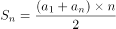可得，所有球衣号码之和为。

方法一：代入排除法。

A项：假设最小和为10，则最大和为，则中间和为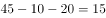，满足题意，排除；

B项：假设最小和为11，则最大和为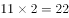，则中间和为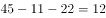满足题意，排除；

C项：根据B项可得，12为可能的号码和，排除；

D项：假设最小和为13，则最大和为，则中间和为，不满足题意；假设中间和为13，则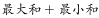，32不是3的倍数，不满足题意，当选。

方法二：方程法。

根据题意设最小和与最大和分别为、，中间和为，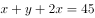，根据可得，，则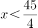，对应A、B两项，当时，，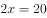；当时，，，均符合题意，排除；根据倍数特性，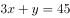中与45均为3的倍数，则必为3的倍数，对应C项，时，，，符合题意，排除。 

本题为选非题，故正确答案为D。

---

### 第 4 题　qid 2616083 · 数学运算

某公司现有6箱不同的水果，安排三个配送员送到A、B、C三个不同的仓储点，其中A地1箱，B地2箱，C地3箱，问配送方式有：

- **A**. 60种
- **B**. 180种
- **C**. 360种　✅
- **D**. 420种

**答案**：C

**官方解析**

根据分步原理，选择一个配送员给A地送1箱的情况数为：种；选择一个剩下的配送员给B地送2箱的情况数为：种；最后剩下的一个配送员将剩下的3箱送给C地，情况数为1种，分步用乘法，则所求情况数为种。

故正确答案为C。

---

### 第 5 题　qid 2616076 · 数学运算

甲乙丙丁四人通过手机的位置共享，发现乙在甲正南方向2公里处，丙在乙北偏西方向2公里处，丁在甲北偏西方向。若丁与甲、丙的距离相等，则该距离为：

- **A**. 
1公里

- **B**. 
公里
　✅
- **C**. 
公里

- **D**. 
2公里

**答案**：B

**官方解析**

根据题意，四人的位置关系如下图所示：

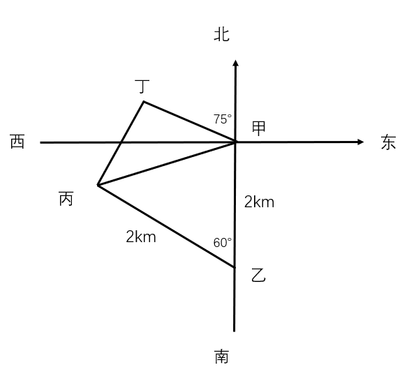

因为丙在乙北偏西方向，且乙与甲、丙的距离均为2公里，所以甲乙丙三人的位置构成等边三角形，则甲到丙的距离为2公里。丁在甲北偏西方向，则丁-甲-丙构成的角度为，且丁与甲、丙的距离相等，则甲丁丙三人的位置构成等腰直角三角形，因此所求的距离为公里。

故正确答案为B。

---

### 第 6 题　qid 2616156 · 数学运算

物业派出小王、小曾、小郭三名工作人员负责修剪小区内的6棵树，每名工作人员至少修剪1棵（只考虑修剪的棵数），问小王至少修剪3棵的概率为：

- **A**. 

　✅
- **B**. 

- **C**. 

- **D**. 

**答案**：A

**官方解析**

3个人修剪6棵树，每人至少1棵，根据插板法，m个相同的元素分成n组，每组至少1个，则情况数为。总的情况数是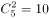种。小王至少修剪3棵，则满足条件的有3种情况：①小王3棵、小曾2棵、小郭1棵。②小王3棵、小曾1棵、小郭2棵。③小王4棵，小曾、小郭各1棵。所求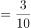。

故正确答案为A。

---

### 第 7 题　qid 2616079 · 数学运算

某电商平台每隔5千米有一座仓库，共有A、B、C、D四座仓库，图中数字表示各仓库库存货物的吨数。现需要把所有的货物集中存放在其中某一个仓库中，如果每吨货物运输1千米需要运费3元，要使运费最少，则需将货物集中到哪座仓库？

- **A**. 仓库A
- **B**. 仓库B
- **C**. 仓库C　✅
- **D**. 仓库D

**答案**：C

**官方解析**

方法一：根据题意直接代入选项计算总运费。

若将货物集中到仓库A，则运费为元;

若将货物集中到仓库B，则运费为元；

若将货物集中到仓库C，则运费为元；

若将货物集中到仓库D，则运费为元；

则运费最少的是将货物集中到仓库C。

方法二：货物集中问题，只与各个仓库的存放量有关，与距离及运费无关。先考虑AB打包，CD打包，显然前者存放量（30吨）不如后者（40吨）多，因此AB的货物均需要向CD方向移动，先移到仓库C中。此时仓库C共有货物吨，仓库D有25吨，则仓库D向仓库C移动，最后货物都集中到仓库C中。

故正确答案为C。

---

### 第 8 题　qid 2616143 · 数学运算

村民陶某承包一块长方形种植地，他将地分割成如图所示的4个小长方形，在A、B、C、D四块长方形土地上分别种植西瓜、花生、地瓜、水稻。其中长方形A、B、C的周长分别是20米、24米、28米，那么长方形D的最大面积是：

- **A**. 42平方米
- **B**. 49平方米
- **C**. 64平方米　✅
- **D**. 81平方米

**答案**：C

**官方解析**

如下图所示，假设标注的四条边长分别为、、、，已知长方形A、B、C的周长分别是20米、24米、28米，根据长方形周长，可得，化简得，即，解得。而c、d分别代表长方形D的长和宽，和一定时，当且仅当时面积最大，此时米，故长方形D的最大面积平方米。

故正确答案为C。

---

### 第 9 题　qid 2616081 · 数学运算

某会展中心布置会场，从花卉市场购买郁金香、月季花、牡丹花三种花卉各20盆，每盆均用纸箱打包好装车运送至会展中心，再由工人搬运至布展区。问至少要搬出多少盆花卉才能保证搬出的鲜花中一定有郁金香？

- **A**. 20盆
- **B**. 21盆
- **C**. 40盆
- **D**. 41盆　✅

**答案**：D

**官方解析**

根据问法“至少······才能保证······”，可判定本题为最不利构造型最值问题。考虑最不利情况为前面搬出的花卉都是月季花和牡丹花，则一共搬出盆花卉。在此基础上再搬1盆花，就可以保证一定是郁金香，则至少需要搬盆花卉。

故正确答案为D。

---

### 第 10 题　qid 2616082 · 数学运算

在屋内墙角处堆放稻谷（如图，谷堆为一个圆锥的四分之一），谷堆底部的弧长为6米，高为2米，经过一夜发现谷堆在重力作用下底部的弧长变为8米，若谷堆的谷量不变，那么此时谷堆的高为：

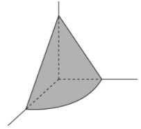

- **A**. 
米
　✅
- **B**. 
米

- **C**. 
米

- **D**. 
米

**答案**：A

**官方解析**

根据图示，谷堆的体积恰好是四分之一圆锥，则圆锥的底面圆周长为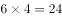米。根据周长公式，，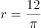米。经过一夜之后，底部弧长变为8米，则新的四分之一圆锥底部圆的半径为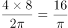米。谷堆为四分之一圆锥，体积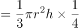。谷堆的谷量不变，有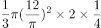，整理得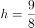米。

故正确答案为A。

---

## 判断推理

### 第 1 题　qid 2616108 · 图形推理

把下面六个图形分为两类，使每一类图形都有各自的共同特征或规律，分类正确的一项是：

- **A**. ①②④，③⑤⑥
- **B**. ①③④，②⑤⑥
- **C**. ①③⑥，②④⑤
- **D**. ①④⑤，②③⑥　✅

**答案**：D

**官方解析**

本题为分组分类题目。每个正方体中均出现一个三角形阴影，观察发现，图①④⑤中的三角形均为等腰三角形，图②③⑥中的三角形均不是等腰三角形。即①④⑤一组，②③⑥一组。
故正确答案为D。

---

### 第 2 题　qid 2616105 · 图形推理

把下面六个图形分为两类，使每一类图形都有各自的共同特征或规律，分类正确的一项是：

- **A**. ①⑤⑥，②③④　✅
- **B**. ①②⑤，③④⑥
- **C**. ①②④，③⑤⑥
- **D**. ①③⑤，②④⑥

**答案**：A

**官方解析**

元素组成不同，优先考虑属性规律。对称、曲直均无明显规律，考虑开闭性。图①⑤⑥均为带有封闭区域的图形，图②③④均为全开放的图形，即①⑤⑥为一组，②③④为一组。
故正确答案为A。

---

### 第 3 题　qid 2615999 · 图形推理

从所给的四个选项中，选择最合适的一个填入问号处，使之呈现一定的规律性：

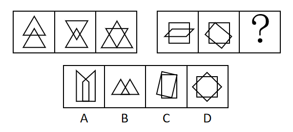

- **A**. A
- **B**. B
- **C**. C
- **D**. D　✅

**答案**：D

**官方解析**

观察题干的图形特征发现，第一组图都是两个图形相交在一起，并且相交面的形状分别是三角形、四边形、五边形，满足相交面的边数依次递增。第二组应用规律，相交面的形状分别是六边形、七边形，故问号处图形相交面的形状应该是八边形。选项相交面的形状依次是五边形、三角形、四边形、八边形，因此只有D项符合。
故正确答案为D。

---

### 第 4 题　qid 2616003 · 图形推理

从所给的四个选项中，选择最合适的一个填入问号处，使之呈现一定的规律性：

- **A**. A
- **B**. B
- **C**. C　✅
- **D**. D

**答案**：C

**官方解析**

元素组成相同，优先考虑位置规律。九宫格图形优先按横行来看，观察第一行图形，发现图1通过顺时针旋转得到图2，图2通过左右翻转得到图3。第二行验证，同样满足此规律。因此问号处的图形应该是第三行中的图2通过左右翻转得到，四个选项中只有C项符合。

故正确答案为C。

---

### 第 5 题　qid 2616106 · 图形推理

如下图所示，左侧为大立方体，右侧为其部分立体截面，问哪个选项能够与其拼成完整的大立方体： 

 

- **A**. A
- **B**. B
- **C**. C　✅
- **D**. D

**答案**：C

**官方解析**

本题考查立体拼合，解题原则为凹凸一致。根据题干要求，可知正确选项和右侧图形拼合后应为左侧正方体。如下图所示，将选项C进行转动后，可与题干右侧图形拼合成左侧正方体。

故正确答案为C。

---

### 第 6 题　qid 2615980 · 定义判断

联觉是一种感觉器官受到刺激时引起性质完全不同的其他感觉的现象。它是不同感觉间相互作用的结果，也是一种条件反射现象。联觉现象在所有感觉中都存在，表现有个别差异。在现实生活中，由于某一种事物属性的出现经常伴随着另一种事物属性的出现，这两种事物属性所引起的感觉之间就形成了固定的条件联系。
根据上述定义，下列选项不属于联觉的是：

- **A**. 小徐看到涂成蓝色的墙壁，浑身充满凉意
- **B**. 各种菜肴香味飘来，小刘听到了旋律变化
- **C**. 小李对人十分热情，人们都说他好像一团火　✅
- **D**. 看到写在纸上的手机号，小冯感到阵阵发麻

**答案**：C

**官方解析**

第一步：找出定义关键词。
“一种感觉器官受到刺激时引起性质完全不同的其他感觉的现象”。
第二步：逐一分析选项。
A项：小徐看到涂成蓝色的墙壁，浑身充满凉意，是视觉受到刺激后引起了触觉的变化，符合“一种感觉器官受到刺激时引起性质完全不同的其他感觉的现象”，符合定义，排除； 
B项：各种菜肴香味飘来，小刘听到了旋律变化，是嗅觉受到刺激后引起了听觉的变化，符合“一种感觉器官受到刺激时引起性质完全不同的其他感觉的现象”，符合定义，排除；
C项：小李对人十分热情，人们都说他好像一团火，是对小李的整体评价，没有涉及多种感觉，不符合“一种感觉器官受到刺激时引起性质完全不同的其他感觉的现象”，不符合定义，当选；
D项：看到写在纸上的手机号，小冯感到阵阵发麻，是视觉受到刺激后引起了触觉的变化，符合“一种感觉器官受到刺激时引起性质完全不同的其他感觉的现象”，符合定义，排除。
本题为选非题，故正确答案为C。

---

### 第 7 题　qid 2615984 · 定义判断

亲环境行为是指个体通过减少或消除自身活动对环境的负面影响以达到改善生态系统结构的行为。它的本质是通过有效减轻环境问题实现环境改善，核心任务是构造环境稳态友好型的社会。
根据上述定义，下列选项属于亲环境行为的是：

- **A**. 植树造林
- **B**. 低碳出行　✅
- **C**. 细水长流
- **D**. 围海造田

**答案**：B

**官方解析**

第一步：找出定义关键词。

“个体通过减少或消除自身活动对环境的负面影响”、“改善生态系统结构”。

第二步：逐一分析选项。

A项：植树造林是新造或更新森林的生产活动，不符合“个体通过减少或消除自身活动对环境的负面影响”，不符合定义，排除； 

B项：低碳出行是一种降低“碳”的出行方式，符合“个体通过减少或消除自身活动对环境的负面影响”，符合“改善生态系统结构”，符合定义，当选；

C项：细水长流是指节约使用财物，精细安排，长远打算，与生态环境无关，不符合“个体通过减少或消除自身活动对环境的负面影响”，也不符合“改善生态系统结构”，不符合定义，排除；

D项：围海造田是把海洋变成陆地、田地，有效利用海洋空间，不符合“个体通过减少或消除自身活动对环境的负面影响”，也不符合“改善生态系统结构”，不符合定义，排除。

故正确答案为B。

注——本题出处如下：

王玉珏的论文《亲环境行为研究综述》中提到：个体亲环境行为可分为四类，其中私人领域的环保行为就包括“使用环保的出行工具”，即本题B项的“低碳出行”。

---

### 第 8 题　qid 2615989 · 定义判断

算法歧视是以算法为手段实施的歧视，主要指在大数据背景下，依靠机器计算的自动决策系统在对数据主体做出决策分析时，由于数据和算法本身不具有中立性或者隐含错误、被人为操控等原因，对数据主体进行差别对待，造成歧视性后果。
根据上述定义，下列属于算法歧视的是：

- **A**. 某新生班主任根据学生的入学成绩高低来安排他们的学号
- **B**. 某水果商家总是对长期参与团购的客户给予更低价格折扣
- **C**. 某信用评估平台通过用户的网络使用行为来判定其信用值
- **D**. 某招聘网站给男性推送高薪职位的广告次数是女性的6倍　✅

**答案**：D

**官方解析**

第一步：找出定义关键词。
“大数据背景下”、“机器计算的自动决策系统在对数据主体做出决策分析时”、“不具有中立性或者隐含错误、被人为操控”、“对数据主体进行差别对待，造成歧视性后果”。
第二步：逐一分析选项。
A项：某新生班主任根据学生的入学成绩高低来安排他们的学号，不符合“大数据背景下”，也不符合“对数据主体进行差别对待，造成歧视性后果”，不符合定义，排除； 
B项：某水果商家总是对长期参与团购的客户给予更低价格折扣，不符合“大数据背景下”，也不符合“对数据主体进行差别对待，造成歧视性后果”，不符合定义，排除； 
C项：某信用评估平台通过用户的网络使用行为来判定其信用值，不符合“对数据主体进行差别对待，造成歧视性后果”，不符合定义，排除；
D项：某招聘网站给男性推送高薪职位的广告次数是女性的6倍，符合“大数据背景下”，且性别本身并不存在差别，但是网站的推送结果存在差别，符合“不具有中立性或者隐含错误、被人为操控”、“对数据主体进行差别对待，造成歧视性后果”，符合定义，当选。
故正确答案为D。

---

### 第 9 题　qid 2615985 · 定义判断

积极强化是指用某种有吸引力的结果对某一行为进行奖励和肯定，以期在类似条件下重复这一行为。消极强化是指在行为出现时把不愉快的刺激撤销或减少，这样也可以增加行为频率。
根据上述定义，下列选项属于积极强化的是（    ）。

- **A**. 君子一日三省其身
- **B**. 杀鸡骇猴以儆效尤
- **C**. 重赏之下必有勇夫　✅
- **D**. 从轻发落戴罪立功

**答案**：C

**官方解析**

第一步：找出定义关键词。
积极强化：“用某种有吸引力的结果”、“对某一行为进行奖励和肯定”、“以期在类似条件下重复这一行为”；
消极强化：“在行为出现时把不愉快的刺激撤销或减少”、“可以增加行为频率”。
第二步：逐一分析选项。
A项：君子一日三省其身，意思是君子多次自觉地检查自己，不符合“对某一行为进行奖励和肯定”，也不符合“在行为出现时把不愉快的刺激撤销或减少”，不符合任何一个定义，排除；
B项：杀鸡骇猴以儆效尤，意思是用惩罚一个人的办法来警告别人，未体现奖励或减少不愉快的刺激，不符合“对某一行为进行奖励和肯定”，也不符合“在行为出现时把不愉快的刺激撤销或减少”，不符合任何一个定义，排除；
C项：重赏之下必有勇夫，意思是用重金悬赏，就会有勇于出来干事的人，符合“用某种有吸引力的结果”、“对某一行为进行奖励和肯定”、“以期在类似条件下重复这一行为”，符合“积极强化”定义，当选；
D项：从轻发落戴罪立功，意思是处罚从宽，争取立下功劳，借以赎罪，不符合“对某一行为进行奖励和肯定”，也不符合“在行为出现时把不愉快的刺激撤销或减少”，不符合任何一个定义，排除。
故正确答案为C。

---

### 第 10 题　qid 2616001 · 定义判断

社会计算的内涵包括两个层面：一是社会的计算化，二是计算的社会化。社会的计算化是指通过人们在互联网上留下的海量而且相互关联的数据足迹，对人们的社会活动进行追踪、检索、汇编、计量和运算。计算的社会化则是指互联网创造了一种环境、一个平台，使人们能够广泛地参与计算过程，从而在数据的挖掘、分析和应用等方面获得更高效率。
根据上述定义，下列现象符合计算的社会化的是（    ）。

- **A**. 某购物平台根据用户购物经历，定期向用户推荐商品
- **B**. 某手机导航软件能为用户自动生成一个月来的行踪图
- **C**. 全班同学在暑假田野调查结束后合作制成精美的相册
- **D**. 小陈在众筹平台匿名捐款后，受助者上门送来感谢信　✅

**答案**：D

**官方解析**

第一步：找出定义关键词。
社会的计算化：“人们在互联网上留下的海量而且相互关联的数据足迹”、“对人们的社会活动进行追踪、检索、汇编、计量和运算”；
计算的社会化：“互联网创造了一种环境、一个平台”、“人们能够广泛地参与”、“获得更高效率”。
第二步：逐一分析选项。
A项：购物平台根据用户购物经历，符合“人们在互联网上留下的海量而且相互关联的数据足迹”，定期向用户推荐商品，符合“对人们的社会活动进行追踪、检索、汇编、计量和运算”，符合“社会的计算化”定义，不符合“计算的社会化”定义，排除；
B项：手机导航软件能为用户自动生成一个月来的行踪图，符合“人们在互联网上留下的海量而且相互关联的数据足迹”，符合“对人们的社会活动进行追踪、检索、汇编、计量和运算”，符合“社会的计算化”定义，不符合“计算的社会化”定义，排除；
C项：全班同学合作制成精美的相册，不符合“互联网创造了一种环境、一个平台”，也不符合“人们在互联网上留下的海量而且相互关联的数据足迹”，不符合任何一个定义，排除；
D项：小陈在众筹平台匿名捐款,其中众筹平台符合“互联网创造了一种环境、一个平台”、众筹这种方式符合“人们能够广泛地参与”、“获得更高效率”，符合“计算的社会化”定义，当选。
故正确答案为D。

---

### 第 11 题　qid 2615992 · 定义判断

外部性是指经济当事人的生产和消费行为对其他经济当事人的生产和消费行为施加的有益或者有害影响的效应。正外部性是指某个经济行为个体的活动使他人或社会受益，而受益者无需花费代价。负外部性是指某个经济行为个体的活动使他人或社会受损，而造成负外部性的人却没有为此承担成本。
根据上述定义，下列选项属于正外部性的是：

- **A**. 经过农田的蒸汽机车，喷出火花飞到农民种植的麦穗上
- **B**. 飞速行驶的火车尖锐的汽笛声吓跑在农田吃稻谷的小鸟　✅
- **C**. 某工厂在村庄建起了扶贫车间，为村民就近就业提供便利
- **D**. 某工厂排出了大量废水和有害气体，给周围居民带来健康危害

**答案**：B

**官方解析**

第一步：找出定义关键词。

正外部性：“某个经济行为个体的活动使他人或社会受益”、“受益者无需花费代价”；

负外部性：“某个经济行为个体的活动使他人或社会受损”、“造成负外部性的人却没有为此承担成本”。

第二步：逐一分析选项。

A项：火花飞到农民种植的麦穗上，对植物造成损害，符合“某个经济行为个体的活动使他人或社会受损”，不符合“某个经济行为个体的活动使他人或社会受益”，符合“负外部性”定义，不符合“正外部性”定义，排除；

B项：尖锐的汽笛声吓跑在农田吃稻谷的小鸟，保护了稻谷，符合“某个经济行为个体的活动使他人或社会受益”，且“受益者无需花费代价”，符合“正外部性”定义，当选；

C项：某工厂在村庄建起了扶贫车间，为村民就近就业提供便利，符合“某个经济行为个体的活动使他人或社会受益”，但村民到车间工作也需要付出劳动力等成本，不符合“受益者无需花费代价”，不符合任何一个定义，排除；

D项：某工厂排出了大量废水和有害气体，给周围居民带来健康危害，不符合“某个经济行为个体的活动使他人或社会受益”，不符合“正外部性”定义，排除。

故正确答案为B。

注：原文如下：

---

### 第 12 题　qid 2616102 · 类比推理

鲜花：塑料花

- **A**. 纸质书：电子书
- **B**. 相片：画像
- **C**. 原本：复印本　✅
- **D**. 钤章：印泥

**答案**：C

**官方解析**

第一步：判断题干词语间逻辑关系。
鲜花和塑料花是并列关系，且鲜花是真花，而塑料花是仿真花，是根据鲜花人工制作而成的。
第二步：判断选项词语间逻辑关系。
A项：纸质书和电子书是并列关系，但二者是书籍的两种载体形式，与题干逻辑关系不一致，排除；
B项：相片和画像是并列关系，但二者是记录人像的两种表现形式，相片是利用照相机拍摄出来的，而画像是利用画笔画出来的，与题干逻辑关系不一致，排除；
C项：原本和复印本是并列关系，且原本是正品，而复印本是根据原本复印而来的，与题干逻辑关系一致，当选；
D项：钤章是指旧时机关团体使用的图章，需要和印泥配套使用，二者是配套对应关系，与题干逻辑关系不一致，排除。
故正确答案为C。

---

### 第 13 题　qid 2615963 · 类比推理

鸳：鸯

- **A**. 蚱蜢：蝗虫
- **B**. 白猫：黑猫
- **C**. 雄鸡：雌鸡　✅
- **D**. 红男：绿女

**答案**：C

**官方解析**

第一步：判断题干词语间逻辑关系。
鸳鸯是一种鸟类，鸳指雄鸟，鸯指雌鸟，二者为并列关系，且为并列关系中的矛盾关系。
第二步：判断选项词语间逻辑关系。
A项：蚱蜢和蝗虫的关系较有争议，多数资料显示二者为全同关系，与题干逻辑关系不一致，排除；
B项：白猫和黑猫是并列关系，但为并列关系中的反对关系，与题干逻辑关系不一致，排除；
C项：雄鸡和雌鸡是并列关系，且为并列关系中的矛盾关系，与题干逻辑关系一致，当选；
D项： 红男绿女，意思是指穿着各种漂亮服装的青年男女，二者为并列关系，但不是矛盾关系，与题干逻辑关系不一致，排除。
故正确答案为C。

---

### 第 14 题　qid 2615964 · 类比推理

售后：品控

- **A**. 数据：科学
- **B**. 融资：风投
- **C**. 龙骨：地板
- **D**. 听证：监管　✅

**答案**：D

**官方解析**

第一步：判断题干词语间逻辑关系。
售后需要品控，二者为对应关系，且品控不只是售后阶段存在，所有阶段都需要品控。
第二步：判断选项词语间逻辑关系。
A项：科学研究需要数据，但两词顺序与题干相反，与题干逻辑关系不一致，排除；
B项：风投是一种融资方式，二者为种属关系，与题干逻辑关系不一致，排除；
C项：龙骨是用来支撑造型、固定结构的一种建筑材料，龙骨用来支撑地板，与题干逻辑关系不一致，排除；
D项：听证需要监管，二者为对应关系，且监管不只是听证阶段存在，所有阶段都需要监管，与题干逻辑关系一致，当选。
故正确答案为D。

---

### 第 15 题　qid 2615965 · 类比推理

牵牛花：喇叭花

- **A**. 乞巧节：七夕节　✅
- **B**. 七巧板：橡皮泥
- **C**. 人行道：车行道
- **D**. 防腐剂：添加剂

**答案**：A

**官方解析**

第一步：判断题干词语间逻辑关系。
牵牛花又称喇叭花，二者为全同关系。
第二步：判断选项词语间逻辑关系。
A项：乞巧节又称七夕节，二者为全同关系，与题干逻辑关系一致，当选；
B项：七巧板和橡皮泥均为儿童玩具，二者为并列关系，与题干逻辑关系不一致，排除；
C项：人行道和车行道为并列关系，与题干逻辑关系不一致，排除；
D项：防腐剂是添加剂的一种，二者为种属关系，与题干逻辑关系不一致，排除。
故正确答案为A。

---

### 第 16 题　qid 2615969 · 类比推理

空运：海运：运输

- **A**. 平装：精装：装帧　✅
- **B**. 货轮：客轮：邮轮
- **C**. 晚会：聚会：集会
- **D**. 试飞：试航：航天

**答案**：A

**官方解析**

第一步：判断题干词语间逻辑关系。
空运和海运是两种不同的运输方式，前两词为并列关系，并与第三词构成种属关系。
第二步：判断选项词语间逻辑关系。
A项：平装和精装是两种不同的装帧方式，前两词为并列关系，并与第三词构成种属关系，与题干逻辑关系一致，当选；
B项：货轮和客轮分别是用来运载货物和乘客的船舶，二者为并列关系，邮轮指的是在海洋中航行的旅游客轮，所以邮轮是客轮的一种，与货轮不构成种属关系，与题干逻辑关系不一致，排除；
C项：晚会是指在晚上举行的集会，多以文娱活动为主，聚会是指人数较多，有明确主题的集体活动，二者不构成并列关系，与题干逻辑关系不一致，排除；
D项：试飞是指在飞机交付使用前进行的试验性飞行，试航是指飞机、船只等在正式航行前进行的试验性航行，二者和航天没有必然关系，与题干逻辑关系不一致，排除。
故正确答案为A。

---

### 第 17 题　qid 2615968 · 类比推理

初伏：中伏：末伏

- **A**. 火星：木星：土星
- **B**. 大雨：小雨：谷雨
- **C**. 上旬：中旬：下旬　✅
- **D**. 大暑：小暑：处暑

**答案**：C

**官方解析**

第一步：判断题干词语间逻辑关系。
初伏、中伏、末伏，三者之间是并列关系，并且三者按照三伏天的时间先后顺序排列，先初伏，再中伏，最后末伏。
第二步：判断选项词语间逻辑关系。
A项：火星、木星、土星是太阳系八大行星中的三个行星，三者之间是并列关系，但是没有时间先后顺序，与题干逻辑关系不一致，排除；
B项：大雨、小雨是两种不同的天气，谷雨是二十四节气之一，三者不构成并列关系，与题干逻辑关系不一致，排除；
C项：上旬、中旬、下旬，三者之间是并列关系，并且三者按照一个月份的不同时间段的时间先后顺序排列，先上旬，再中旬，最后下旬，与题干逻辑关系一致，当选；
D项：大暑、小暑、处暑是二十四节气中的三个节气，三者之间是并列关系，但是它们的时间先后顺序应该是先小暑，再大暑，最后处暑，与题干逻辑关系不一致，排除。
故正确答案为C。

---

### 第 18 题　qid 2615967 · 类比推理

羊：羊奶：腥膻

- **A**. 蚕：蚕丝：雪白
- **B**. 蜘蛛：蛛丝：粘缚
- **C**. 蜂：蜂蜜：甘甜　✅
- **D**. 雨燕：燕窝：营养

**答案**：C

**官方解析**

第一步：判断题干词语间逻辑关系。
羊奶是羊的产出物，腥膻是羊奶的必然属性，且腥膻是一种味道。
第二步：判断选项词语间逻辑关系。
A项：蚕丝是蚕的产出物，但雪白不是蚕丝的必然属性，且雪白也不是一种味道，与题干逻辑关系不一致，排除；
B项：蛛丝是蜘蛛的产出物，但粘缚是蛛丝的功能，而非属性，与题干逻辑关系不一致，排除；
C项：蜂蜜是蜂的产出物，甘甜是蜂蜜的必然属性，且甘甜是一种味道，与题干逻辑关系一致，当选；
D项：燕窝是雨燕科几种金丝燕分泌的唾液及其绒羽混合粘结所筑成的巢穴，而燕窝并非是雨燕直接产出的，且营养也不是一种味道，与题干逻辑关系不一致，排除。
故正确答案为C。

---

### 第 19 题　qid 2615966 · 类比推理

花：牡丹：玫瑰

- **A**. 茶：红茶：绿茶
- **B**. 草：艾草：蓼草　✅
- **C**. 球：足球：绒球
- **D**. 车：轿车：客车

**答案**：B

**官方解析**

第一步：判断题干词语间逻辑关系。
玫瑰和牡丹都是花，二者之间为并列关系，与花均为种属关系，且玫瑰和牡丹都是自然界的植物。
第二步：判断选项词语间逻辑关系。
A项：红茶和绿茶都是茶，二者之间为并列关系，与茶均为种属关系，但红茶和绿茶都是经过人们加工而制成的，与题干逻辑关系不一致，排除；
B项：艾草和蓼草都是草，二者之间为并列关系，与草均为种属关系，且艾草和蓼草都是自然界的植物，与题干逻辑关系一致，当选；
C项：绒球是用彩色毛线或绒线扎成的球形物体，与足球不是一类事物，二者之间不是并列关系，与题干逻辑关系不一致，排除；
D项：轿车和客车都是车，二者之间为并列关系，与车均为种属关系，但轿车和客车都是人类制造出来的产物，与题干逻辑关系不一致，排除。
故正确答案为B。

---

### 第 20 题　qid 2615962 · 类比推理

（    ）对于  裁判  相当于  案件  对于（    ）

- **A**. 球员；法庭
- **B**. 黑哨；上诉
- **C**. 比赛；法官　✅
- **D**. 比分；律师

**答案**：C

**官方解析**

逐一代入选项。
A项：球员是裁判监督的对象，二者为主体和对象的对应关系，法庭是案件审判的场所，二者为场所对应关系，前后逻辑关系不一致，排除；
B项：黑哨是足球运动中裁判违反公平性原则的行为，二者为对应关系，上诉案件，二者为动宾关系，前后逻辑关系不一致，排除；
C项：裁判是一种职业，裁判可以判决比赛，法官是一种职业，法官可以判决案件，二者是职业主体和对象的对应关系，且主体与对象之间的关系均体现为“判决”，前后逻辑关系一致，当选；
D项：裁判是一种职业，裁判可以记录比分，律师是一种职业，律师可以处理案件，二者是职业主体和对象的对应关系，但主体与对象之间的关系不一致，前面为“记录”，后面为“处理”，前后逻辑关系不一致，排除。
故正确答案为C。

---

### 第 21 题　qid 2615978 · 类比推理

（    ）对于 世味年来薄似纱 相当于 达观 对于（    ）

- **A**. 忧郁；前度刘郎今又来
- **B**. 感伤；莫道谗言如浪深　✅
- **C**. 讽刺；道是无晴却有晴
- **D**. 斥责；金陵王气黯然收

**答案**：B

**官方解析**

逐一代入选项。
A项：“世味年来薄似纱”出自南宋陆游的《临安春雨初霁》，体现了诗人对世态炎凉的无奈和客籍京华的蹉跎，与“忧郁”无明显逻辑关系，“前度刘郎今又来”出自唐代刘禹锡的《再游玄都观》，描写的是曾经被排挤的人又回来了，暗寓自己不屈之志，与“达观”无明显逻辑关系，前后逻辑关系不一致，排除；
B项：“世味年来薄似纱”出自南宋陆游的《临安春雨初霁》，表达了诗人的“感伤”之情，“莫道谗言如浪深”出自唐代刘禹锡的《杂曲歌辞·浪淘沙》，描写的是不要说流言蜚语如同凶恶的浪涛一样令人恐惧，体现了诗人拼搏、乐观的心境，表达了“达观”之情，前后逻辑关系一致，当选；
C项：“世味年来薄似纱”与“讽刺”无明显逻辑关系，“道是无晴却有晴”出自唐代刘禹锡的《竹枝词二首·其一》，表面是说无晴但还有晴，实际上想表达说是没有感情但其实有情，是运用谐音双关的手法，把天“晴”和爱“情”这两件不相关的事物巧妙地联系起来，表现出初恋少女忐忑不安的微妙感情，与“达观”无明显逻辑关系，前后逻辑关系不一致，排除；
D项：“世味年来薄似纱”与“斥责”无明显逻辑关系，“金陵王气黯然收”出自唐代刘禹锡的《西塞山怀古》，描写的是东吴的王气黯然消逝，表明国家统一是人心所向，与“达观”无明显逻辑关系，前后逻辑关系不一致，排除。
故正确答案为B。

---

### 第 22 题　qid 2616032 · 逻辑判断

在市场竞争十分激烈的时候，一个企业要是不激流勇进，创造出富有竞争力的产品，也不适时撤退、主动割爱，放弃没有前景的市场，那么这个企业最后一定会陷入危机之中。
如果以上论断为真，下列说法正确的是（    ）。

- **A**. 某企业未能创造出富有竞争力的产品，最后一定会惨遭淘汰
- **B**. 某企业紧要关头急流勇退，转向其它市场，就可以避免危机
- **C**. 某企业放弃已显颓势的产业，转向新产品的开发，它可能不会被淘汰　✅
- **D**. 某企业研发出了富有竞争力的产品，它最后一定不会陷入危机之中

**答案**：C

**官方解析**

第一步：翻译题干。

-（激流勇进，创造出富有竞争力的产品）且-（适时撤退，主动割爱，放弃没有前景的市场）→陷入危机

第二步：逐一分析选项。

A项：翻译为-创造出有市场竞争力的产品→淘汰，“-创造出有市场竞争力的产品”是对题干翻译前件“且”关系一部分的肯定，据此无法判断整个“且”关系的真假，进而无法得出确定性结论，不能推出，排除；

B项：翻译为“急流勇退，转向其他市场陷入危机”，“急流勇退，转向其他市场”即“适时撤退、主动割爱，放弃没有前景的市场”，是对题干翻译前件“且”关系的一部分的否定，否前不能得到确定性结论，不能推出，排除；

C项：翻译为放弃已显颓势的产业→可能不会被淘汰，放弃已显颓势的产业是否定题干翻译前件“且关系”的一部分，否前不能得到确定性结论，但是C选项后面说的是可能不会被淘汰，是一种可能性的表述，可以推出，当选；

D项：翻译为富有竞争力的产品→-陷入危机，是否定题干翻译前件“且关系”的一部分，否前不能得到确定性结论，不能推出，排除。

故正确答案为C。

---

### 第 23 题　qid 2616107 · 类比推理

师范类院校学生来自全国各地，甲大学是师范类院校，所以甲大学的学生来自全国各地。
下列选项所犯逻辑错误与上述推理最相似的是：

- **A**. 牛不是食肉动物，而狮子不是牛，所以狮子不是食肉动物
- **B**. 父母爱读书的孩子爱运动，小黄爱运动，所以小黄的父母爱读书
- **C**. 私人捐赠的教学楼遍布全国各高校，何况是邵逸夫先生捐赠的逸夫楼　✅
- **D**. 文明司机都是礼让行人的，有些公务司机礼让行人，所以有些公务司机是文明司机

**答案**：C

**官方解析**

第一步：翻译题干。

A（师范类院校学生）B（来自全国各地），C（甲大学）A（师范类院校），结论：C（甲大学的学生）B（来自全国各地）。

第二步：逐一分析选项。

A项：A（牛）B（不是食肉动物），C（狮子）A（牛），结论：C（狮子）B（不是食肉动物），与题干推理形式不一致，排除；

B项：A（父母爱读书）B（孩子爱运动），C（小黄）B（爱运动），结论：C（小黄）A（父母爱读书），与题干推理形式不一致，排除；

C项：该句的后半句“何况是邵逸夫先生捐赠的逸夫楼”是反问，可以理解为“逸夫楼是私人捐赠的教学楼，所以逸夫楼遍布全国各高校”。即A（私人捐赠的教学楼）B（遍布全国各高校），C（逸夫楼）A（私人捐赠的教学楼），结论：C（逸夫楼）B（遍布全国各高校），与题干推理形式一致，当选；

D项：A（文明司机）B（礼让行人），C（有些公务司机）B（礼让行人），结论：C（有些公务司机）A（文明司机），与题干推理形式不一致，排除。

故正确答案为C。

---

### 第 24 题　qid 2616036 · 逻辑判断

食品添加剂是现代食品工业的重要组成部分，按规定使用食品添加剂既对人体无害，而且能够改善食品品质，起到防腐、保鲜的作用。正是因为有了食品添加剂的发展，才有了大量的方便食品，给人们的生活带来极大的便利。如果不加入食品添加剂，大部分食品要么难看、难吃或者难以保鲜，要么就是价格昂贵。
下列说法能够支持上面论点的是（    ）。

- **A**. 食品添加剂和人类文明史一样悠久，例如点豆腐用的卤水
- **B**. 如果不使用添加剂，食品会因微生物作用而引起食物中毒　✅
- **C**. 宣称无食品添加剂往往是商家迎合消费者心理造成的噱头
- **D**. 三聚氰胺也是一种添加剂，在水泥里能够作为高效减水剂

**答案**：B

**官方解析**

第一步：找出论点和论据。
论点：食品添加剂是现代食品工业的重要组成部分，按规定使用食品添加剂既对人体无害，而且能够改善食品品质，起到防腐、保鲜的作用。正是因为有了食品添加剂的发展，才有了大量的方便食品，给人们的生活带来极大的便利。如果不加入食品添加剂，大部分食品要么难看、难吃或者难以保鲜，要么就是价格昂贵。
论据：无
本题只有论点，没有论据，加强优先考虑补充论据，即解释为什么食品添加剂按规定添加既对人体无害，并且能够改善食品品质，防腐，保鲜，或举例证明某些食品添加剂对人体无害，并且能够改善食品品质，防腐，保鲜。
第二步：逐一分析选项。
A项：论点说的是食品添加剂按规定添加既对人体无害，并且能够改善食品品质，防腐，保鲜，该项说的是食品添加剂和人类文明一样历史悠久，话题不一致，无法加强，排除；
B项：若不使用食品添加剂，食品会因微生物作用而导致食物中毒，说明食品添加剂对于食品是有好处的，解释了为什么我们要在食品中添加食品添加剂，当选；
C项：论点说的是食品添加剂按规定添加既对人体无害，并且能够改善食品品质，防腐，保鲜，该项说的是商家会以什么样的噱头来吸引消费者，话题不一致，无法加强，排除；
D项：论点强调的是食品添加剂按规定添加既对人体无害，并且能够改善食品品质，防腐，保鲜，该项说的是三聚氰胺在不同的环境中所起到的作用，与题干话题不一致，排除。
故正确答案为B。

---

### 第 25 题　qid 2616067 · 逻辑判断

近年来，“类脑计算”从理念走向实践，正走出一条制造类人智能的新途径。所谓“类脑计算”，是指仿真、模拟和借鉴大脑神经系统结构和信息处理过程的装置、模型和方法，其目标是制造类脑计算机。然而有人提出质疑：大脑奥秘尚未揭示，我们还不了解智能背后的基本原理，怎么能制造出具有“大脑智能”的类脑计算机呢？
以下哪项如果为真，最能反驳上述质疑？

- **A**. 类脑计算机的器件速度是生物神经元和突触的百万倍，一旦产生智能，后果难以预料
- **B**. 关于“类脑计算”的伦理制度和风险评估等必须与“类脑计算”的技术发明同步展开
- **C**. 揭示大脑奥秘和发明类脑计算机是相互作用的复杂过程，不是“前者决定后者”的简单关系　✅
- **D**. 国内已经启动集合各高校、科研机构和企业优势研究力量的10多项“类脑计算”研究项目

**答案**：C

**官方解析**

第一步：找出论点和论据。
论点：大脑奥秘尚未揭示，我们还不了解智能背后的基本原理，怎么能制造出具有“大脑智能”的类脑计算机。
论据：无。
本题论点讨论揭示大脑奥秘，了解智能背后的基本原理和制造“大脑智能”的类脑计算机之间的关系，没有论据，优先考虑否定论点，即揭示大脑奥秘，了解智能背后的基本原理和制造“大脑智能”的类脑计算机之间没有必然联系。
第二步：逐一分析选项。
A项：选项讨论类脑计算机产生智能的后果，论点讨论的是能否制造出类脑计算机，话题不一致，无法削弱，排除；
B项：选项讨论的是“类脑计算”的伦理制度和风险评估，论点讨论的是能否制造出类脑计算机，话题不一致，无法削弱，排除；
C项：论点意为因为没有揭示大脑奥秘，不了解智能背后的基本原理，所以不能制造类脑计算机，选项指出了揭示大脑奥秘和发明类脑计算机不是简单的“前者决定后者”的关系，否定论点，可以削弱，当选；
D项：选项讨论的是国内已启动多项“类脑计算”研究项目，启动了项目不等于就能制造出类脑计算机，话题不一致，无法削弱，排除。
故正确答案为C。

---

### 第 26 题　qid 2616035 · 逻辑判断

心理学家考察了450位中年男性和女性，他们中有白领阶层，也有蓝领阶层；有技能判断型人群，也有决策制定型人群。结果发现，那些身居重要职位的高管人士普遍比一般员工更胖。研究者认为，做出许多决定所承受的压力通过饮食方式得到排解，这最终在一定程度上改变了高管人士之前的饮食习惯，如果你的职位幸运地得到晋升，你将发现不仅是薪水变多，自己的腰围也在变粗，伴随着体重上升。
以下哪项如果为真，最能质疑上述结论？（    ）

- **A**. 比较而言，技能判断型人群的腰围较小，决策制定型人群的腰围较大
- **B**. 比较而言，身居要职的高管人士更难抽出时间投入锻炼以缩小腰围　✅
- **C**. 每晋升一次，技能判断型人群的腰围平均会减少0.5厘米
- **D**. 每晋升一次，决策制定型人群的腰围平均会增大0.28厘米

**答案**：B

**官方解析**

第一步：找出论点和论据。
论点：做出许多决定所承受的压力通过饮食方式得到排解，这最终在一定程度上改变了高管人士之前的饮食习惯，如果你的职位幸运地得到晋升，你将发现不仅是薪水变多，自己的腰围也在变粗，伴随着体重上升。
论据：心理学家考察了450位中年男性和女性，他们中有白领阶层，也有蓝领阶层；有技术判断性人群，也有决策判断性人群，结果发现，那些身居重要职位的高管人士普遍比一般职员更胖。
本题的论据是做了一个研究，论点是研究之后的结果，并且以因果的方式呈现，所以可以考虑他因削弱和因果倒置。
第二步：逐一分析选项。
A项：比较技术判断型人和决策制定型人的腰围大小，和题干压力大饮食习惯变化导致腰围增加的论点没有关系，属于无关选项，排除；
B项：高管难抽出时间锻练无法减少腰围，论点是高管因为压力大饮食习惯发生变化导致腰围增加，而选项说明腰围变化的原因在于是否进行锻练，属于他因削弱，当选；
C项：技术判断型人群平均腰围随着晋升减少，题干说的是高管，而职级晋升不一定就是高管，属于不明确选项，排除；
D项：决策制定型人群平均腰围随着晋升增加，题干说的是高管，而职级晋升不一定就是高管，属于不明确选项，排除。
故正确答案为B。

---

### 第 27 题　qid 2616000 · 逻辑判断

地球表面的大部分都被海洋覆盖，生命也诞生于海洋之中。然而，据估计，地球有的物种生活在陆地上，而海洋中仅为，剩下的生活在淡水中。研究者认为，陆地栖息地的物理布局相对海洋可能更加支离破碎，是导致陆地物种更加多样化的主要原因之一。

以下哪项如果为真，最能加强上述研究者的观点？

- **A**. 地球表面可分成热带、南温带、北温带、南寒带、北寒带五个温度带，各温度带物种差异性大，种类丰富
- **B**. 深海相对于有阳光照射的浅海岸地区而言，基本上像个冰箱，而且门已经关上很久，物种远不如浅海丰富
- **C**. 根据某群岛记录显示，随着时间推移，自然选择甚至可以把两个岛屿上相同物种的不同族群变成截然不同的物种　✅
- **D**. 森林覆盖许多陆地，而树叶和枝干形成新的生态环境，海洋中的珊瑚也起同样作用，但覆盖海底的面积没那么大

**答案**：C

**官方解析**

第一步：找出论点和论据。

论点：陆地栖息地的物理布局相对海洋可能更加支离破碎，是导致陆地物种更加多样化的主要原因之一。

论据：无。

本题只有论点没有论据，优先考虑补充论据，补充能够证明陆地栖息地的物理布局比海洋更复杂和破碎，能影响陆地物种多样化的原因或例子。

第二步：逐一分析选项。

A项：该项说的是地球表面温度差异导致各温度带物种差异大，与论点讨论的陆地栖息地的物理布局更加支离破碎导致陆地物种更加多样化无关，话题不一致，无法加强，排除；

B项：该项说的是深海物种不如浅海丰富，与论点讨论的陆地栖息地的物理布局更加支离破碎导致陆地物种更加多样化无关，话题不一致，无法加强，排除；

C项：该项说的是自然选择可以让两个岛屿上的同一物种变得不同，即说明陆地栖息地的物理布局的破碎导致陆地物种更加多样化，通过举例的方式进行加强，当选； 

D项：该项说的是森林中树叶和枝干能形成新的生态环境，而且比海洋中起同样作用的珊瑚覆盖的面积更广，只能说明陆地与海洋相比，相似的生态环境面积要广，但是否一定带来物种的多样性不明确，不能加强，排除。

故正确答案为C。

注：【原文链接】http://www.360doc.com/content/17/0724/10/5554415_673699256.shtml

原文讨论的是陆地的物种多样性远超海洋的原因，根据文段结构，C项为“陆地栖息地的物理布局可能更加支离破碎，更加多样化”的例子，即本题论点的例子。而D项为解释海洋物理障碍少，陆地可以“建造出精品”的例子。

---

### 第 28 题　qid 2616034 · 逻辑判断

二氧化碳的排放量剧增导致全球气候变暖，使珠穆朗玛峰所在的喜马拉雅地区冰川面临急剧缩小的危险。研究显示，珠峰海拔在5000米到6000米的冰川集中区域出现快速融化的现象，这些地方将只在冬季而不是在温暖的季节时看到结冰。专家推论说，根据未来的气候变化趋势，喜马拉雅地区的冰川减少的速度还有可能加快，如果本世纪内气温如预计的一样继续升高，该地区的冰川最终将消失殆尽。
如果以下各项为真，最能削弱上述论证的是：

- **A**. 
喜马拉雅冰川每年缩小约到

- **B**. 
喜马拉雅其他地区冰川对温度不敏感
　✅
- **C**. 
过去50年珠峰周边冰川覆盖面积减少了

- **D**. 
珠穆朗玛峰7000米以上区域未出现冰川快速融化现象

**答案**：B

**官方解析**

第一步：找出论点和论据。

论点：根据未来的气候变化趋势，喜马拉雅地区的冰川减少的速度还有可能加快，如果本世纪内气温如预计的一样继续升高，该地区的冰川最终将消失殆尽。

论据：珠峰海拔在5000米到6000米的冰川集中区域出现快速融化的现象，这些地方将只在冬季而不是在温暖的季节时看到结冰。

论点说的是喜马拉雅地区的冰川将会消失殆尽，论据是珠峰海拔在5000米到6000米的冰川集中区域出现快速融化的现象，因此本题目的论证关系是通过珠穆朗玛峰5000米-6000米区域的变化，来预测喜马拉雅山未来整体的情况，论点和论据的话题不一致，要想否定论证，可以补充5000米-6000米之外的地方冰川不会消融来进行否定，即通过局部是推不出整体这种方式来进行否定。

第二步：逐一分析选项。

A项：选项说喜马拉雅冰川每年缩小约到，补充论据说明冰川在不断缩小，有加强力度，排除；

B项：选项说喜马拉雅其他地区冰川对温度不敏感，说明在珠穆朗玛峰5000米-6000米之外的其他地区冰川并不会受温度的影响，那么就说明从题干中的论据是推不出论点的，可以削弱，当选；

C项：过去50年珠峰周边冰川覆盖面积减少了，补充论据说明冰川在不断缩小，有加强力度，排除；

D项：珠穆朗玛峰7000米以上区域未出现冰川快速融化现象，通过举反例来证明冰川不会完全消失，但该项只是举出了7000米以上的地区，不如B项包含的范围广，可以削弱，但是力度比B项弱，排除。

故正确答案为B。

---

### 第 29 题　qid 2616160 · 逻辑判断

一项心理学研究认为，出身经济层次最低家庭的人中年后出现代谢综合征的比例最高，无论他们获得多大成就都是如此。该研究同时发现代谢综合征虽与童年生活状况有关，但该群体中那些拥有慈母的人不容易出现该综合征。究其原因，慈母具有同情心，会告诉孩子如何应对压力并鼓励他们健康饮食，保持良好生活方式。因此，我们在现实中可以设计一套方案，指导母亲教育孩子如何应对压力、健康生活和掌控命运。
由此可以推出：

- **A**. 设计针对母亲的指导方案，有助于降低特定群体出现代谢综合征的比例　✅
- **B**. 因为缺少母爱，出身经济层次最低家庭的人出现代谢综合征的比例最高
- **C**. 因为父亲不教导孩子保持良好生活方式，所以父亲对孩子的健康没影响
- **D**. 出身经济层次最低家庭的人，童年如受到慈母呵护，中年后身体很健康

**答案**：A

**官方解析**

日常结论题，根据题干信息逐一分析选项。
A项：根据题干可知拥有慈母的人不容易出现代谢综合征，慈母可以教育孩子如何应对压力、健康生活和掌握命运，因此，设计一套方案指导母亲，可帮助出身经济最低的人群降低出现代谢综合征的几率，当选；
B项：由文段可以得出，出身经济层次最低家庭的人中年后出现代谢综合征的比例最高，慈母可以降低这一比例，但是并没有提到出现代谢综合征是否是因为缺少母爱，无法推出，排除；
C项：父亲不教导孩子保持良好生活方式，题干中并未出现父亲相关描述，属于无中生有，排除；
D项：出身经济层次最低的人群，受到慈母呵护，只能得出代谢综合征的情况不易出现，并不能说明身体整体的健康情况，属于偷换概念，排除。
故正确答案为A。

---

### 第 30 题　qid 2615998 · 逻辑判断

肌萎缩侧索硬化症（ALS），俗称“渐冻症”。某科研团队研究发现，ALS的疾病发展与肠道微生物AM菌的数量密切相关。研究人员观察和比较了37名ALS患者及29名健康亲属的肠道菌群和血液、脑脊液样本。他们发现肠道细菌菌株有差异，其中有一种菌株与烟酰胺的产生有关。此外，在这些ALS患者的血液和脑脊液中，烟酰胺水平有所下降。
若要上述研究发现成立，需要补充的前提是：

- **A**. 人类肠道中的微生物非常复杂
- **B**. 烟酰胺是肠道微生物AM菌的代谢物　✅
- **C**. 小鼠补充烟酰胺后，ALS症状得到了减轻
- **D**. 人体肠道细菌的变化与ALS的疾病发展速度有关

**答案**：B

**官方解析**

第一步：找出论点和论据。
论点： ALS的疾病发展与肠道微生物AM菌的数量密切相关。
论据： 研究人员观察和比较了37名ALS患者及29名健康亲属的肠道菌群和血液、脑脊液样本。他们发现肠道细菌菌株有差异，其中有一种菌株与烟酰胺的产生有关。此外，在这些ALS患者的血液和脑脊液中，烟酰胺水平有所下降。
本题论点说的是ALS疾病与AM菌数量的关系，论据说的是ALS疾病与烟酰胺水平的关系，论点论据话题不一致，优先考虑搭桥的加强方式，即说明烟酰胺和AM菌之间存在关系。
第二步:逐一分析选项。
A项：人类肠道中微生物复杂，未提及“AM菌”与“ALS疾病”的关系，与论点话题不一致，属于无关项，无法加强，排除；
B项：烟酰胺是肠道微生物AM菌的代谢物，在“烟酰胺”和“AM菌”之间建立了关系，说明通过ALS患者烟酰胺水平下降可以判断ALS疾病与AM菌数量之间存在关系，搭桥项，可以加强，当选；
C项：小鼠补充烟酰胺后，ALS症状得到了减轻，说的是“ALS疾病”与“烟酰胺”的关系，未提及“ALS疾病”与“AM菌”或“烟酰胺”与“AM菌”之间的关系，与论点话题不一致，属于无关项，无法加强，排除；
D项：人体肠道细菌的变化与ALS的疾病发展速度有关，说的是“ALS疾病”与“人体肠道细菌”的关系，肠道细菌指的是不是“AM菌”不明确，属于不明确项，无法加强，排除。
故正确答案为B。

---

## 资料分析

### 材料 1

        截至2018年底，中国人工智能市场规模约为238.2亿元，同比增长率达到。从中国人工智能企业地域分布情况来看，北京企业数量最多，企业数量为368家；其次为广东，人工智能企业数量为185家；排名第三的是上海，数量为131家。

#### 第 1 题　qid 2616074 · 综合

截至2017年底，中国人工智能市场规模约为：

- **A**. 141.1亿元
- **B**. 152.1亿元　✅
- **C**. 156.1亿元
- **D**. 164.1亿元

**答案**：B

**官方解析**

定位柱形图1可得，2017年中国人工智能市场规模约为152.1亿元。

故正确答案为B。

注：若本题没有发现柱形图1的数据，直接看到文字材料，可以按照求解基期量计算。根据文字材料“截至2018年底，中国人工智能市场规模约为238.2亿元，同比增长率达到”，可得2017年中国人工智能市场规模约为亿元，与B项最接近。

---

#### 第 2 题　qid 2616148 · 综合

图2中排名第二的省（市），其人工智能企业数量的个数约是排名后四位的数量之和的多少倍？

- **A**. 11.3
- **B**. 12.3　✅
- **C**. 12.8
- **D**. 13.3

**答案**：B

**官方解析**

根据题干“···约是···的多少倍”，可判定本题为现期倍数计算问题。定位图2可得：排名第二的省（市）是广东，其人工智能企业数量为185个，排名后四位的为广西、重庆、河南、辽宁，其人工智能企业数量依次为1个、3个、5个、6个。因此所求倍数。

故正确答案为B。

---

#### 第 3 题　qid 2616077 · 增长

2015至2018年，中国人工智能市场规模同比增长率最高的年份是：

- **A**. 2015年
- **B**. 2016年
- **C**. 2017年
- **D**. 2018年　✅

**答案**：D

**官方解析**

根据题干“····同比增长率最高···”，可判定本题为一般增长率的比较问题。定位材料图1可知每一年的现期量与基期量，代入增长率公式：

2015年：；

2016年：；

2017年：；

2018年： 定位文字材料，截至2018年底，中国人工智能市场规模约为238.2亿元，同比增长率达到。

比较可知，2018年增长率最高。

故正确答案为D。

---

#### 第 4 题　qid 2616098 · 增长

若按照2018年同比增长率，到2019年底中国人工智能市场规模约为：

- **A**. 363亿元
- **B**. 371亿元
- **C**. 373亿元　✅
- **D**. 383亿元

**答案**：C

**官方解析**

根据题干“按照2018年同比增长率，到2019年底···约为”，材料给出的是2018年的数据，可判定本题为现期计算问题。定位文字材料：截至2018年底，中国人工智能市场规模约为238.2亿元，同比增长率达到。根据公式：，可得2019年底中国人工智能市场规模亿元，与C项最为接近。

故正确答案为C。

---

#### 第 5 题　qid 2616099 · 综合

下列说法正确的是：

- **A**. 
截至2018年底，中国人工智能市场规模每年同比增长率都超过

- **B**. 
截至2018年底，中国人工智能企业地域分布情况中，广东企业数量最多

- **C**. 
截至2018年底，中国人工智能企业北京企业数量不超过上海企业数量的

- **D**. 
截至2018年底，福建人工智能企业的数量等于河南、天津、广西三省企业数量之和
　✅

**答案**：D

**官方解析**

A项：定位图1，2015年中国人工智能市场规模同比增长率为，错误；

B项：定位文字材料，截至2018年底，中国人工智能企业地域分布中，北京企业数量最多，而非广东，错误；

C项：定位文字材料，截至2018年底，北京企业数量368家，上海企业数量131家，，错误；

D项：定位图2，截至2018年底，福建人工智能企业数为16家，河南、天津和广西分别为5家、10家和1家，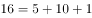，福建人工智能企业数量等于河南、天津、广西三省企业数量之和，正确。

故正确答案为D。

---

### 材料 2

        2019年5月，全国12358价格监管平台受理价格举报、投诉、咨询共计37576件，同比下降，环比下降。其中，价格举报4192件，环比下降；价格投诉2059件，环比下降；价格咨询31325件，环比下降。平台受理量排名前十的省（市）依次是北京（5786件）、江苏（3528件）、上海（2499件）、重庆（2486件）、河南（2469件）、陕西（2440件）、浙江（2321件）、天津（1571件）、福建（1483件）、广西（1309件）。平台受理量行业分布如下表所示：

#### 第 6 题　qid 2616168 · 综合

2019年4月，平台受理的价格咨询比价格举报约多：

- **A**. 26146件
- **B**. 27133件
- **C**. 28627件　✅
- **D**. 29614件

**答案**：C

**官方解析**

根据题干“2019年4月······比······多”，结合材料时间为2019年5月，可判定本题为基期和差问题。定位文字材料可得，“2019年5月······价格举报4192件，环比下降······价格咨询31325件，环比下降”，则2019年4月，平台受理的价格咨询比价格举报多件，与C项最接近。

故正确答案为C。

---

#### 第 7 题　qid 2616170 · 比重

2019年5月，平台受理量排名前五的行业占受理总数的比重约为：

- **A**. 

- **B**. 

　✅
- **C**. 

- **D**. 

**答案**：B

**官方解析**

根据题干“2019年5月，······占······的比重约为”，结合材料时间为2019年5月，可判定本题为现期比重问题。定位文字材料，“2019年5月，全国12358价格监管平台受理价格举报、投诉、咨询共计37576件······”；定位表格材料，可得平台受理量排名前五的行业分别为停车收费（10043件），商品零售（3118件），交通运输（2730件），社会服务（2686件），物业管理（2587件），则2019年5月，平台受理量排名前五的行业占受理总数的比重为，与B项最接近。    

故正确答案为B。

---

#### 第 8 题　qid 2616249 · 综合

2018年5月，平台受理价格举报、投诉、咨询总数约为：

- **A**. 26706件
- **B**. 34376件
- **C**. 41433件
- **D**. 63366件　✅

**答案**：D

**官方解析**

根据题干“2018年5月······总数约为”，结合材料时间为2019年5月，判定本题为基期计算问题。定位文字材料可得，2019年5月，平台受理价格举报、投诉、咨询总数共计37576件，同比下降。根据公式基期量可得，2018年5月平台受理价格举报、投诉、咨询总数约为件，只有D项满足。

故正确答案为D。

---

#### 第 9 题　qid 2616169 · 综合

2019年5月，平台受理量排名第二的省（市）约是排名第九的省（市）的多少倍？

- **A**. 1.4
- **B**. 2.4　✅
- **C**. 3.7
- **D**. 4.4

**答案**：B

**官方解析**

根据题干“2019年5月，······是······的多少倍”，结合材料时间为2019年5月，可判定本题为现期倍数问题。定位文字材料可得，2019年5月，平台受理量排名第二的省（市）为江苏（3528件），排名第九的省（市）为福建（1483件），则2019年5月，平台受理量排名第二的省（市）约是排名第九的省（市）的倍。

故正确答案为B。

---

#### 第 10 题　qid 2616172 · 综合

能够从上述资料推出的是：

- **A**. 
2018年5月，平台受理价格举报数量多于价格投诉数量

- **B**. 
2019年5月，平台受理价格咨询数量环比下降幅度最大

- **C**. 
2019年5月，平台受理教育行业数量不超过旅游行业的2倍

- **D**. 
2019年5月，平台受理量排名前三的省（市）占总数的比重低于
　✅

**答案**：D

**官方解析**

A项：定位文字材料“2019年5月，······价格举报4192件，环比下降；价格投诉2059件，环比下降”，已知现期量、环比增长率，无法求同比基期量，A项无法推出，错误；

B项：定位文字材料“2019年5月，······价格举报4192件，环比下降；价格投诉2059件，环比下降；价格咨询31325件，环比下降”，平台受理数量环比下降幅度最大的为价格举报，并非价格咨询，错误；

C项：定位表格材料“2019年5月，平台受理教育行业数量为927件，受理旅游行业数量为459件”，927件（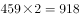件），即平台受理教育行业数量超过旅游行业的2倍，错误；

D项：定位文字材料“2019年5月，全国12358价格监管平台受理价格举报、投诉、咨询共计37576件······平台受理量排名前十的省（市）依次是北京（5786件）、江苏（3528件）、上海（2499件）······”前三的省（市）为北京（5786件）、江苏（3528件）、上海（2499件），合计11813件，则2019年5月，平台受理量排名前三的省（市）占总数的比重为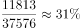，低于，正确。

故正确答案为D。

---

### 材料 3

 

#### 第 11 题　qid 2616071 · 比重

2016年，A市直接经济价值年值占现代农业生态服务价值年值的比重为：

- **A**. 

- **B**. 

　✅
- **C**. 

- **D**. 

**答案**：B

**官方解析**

根据题干“2016年，······占······的比重为”，结合材料时间“2017年”，可判定本题为基期比重问题。定位表格材料可得：2017年直接经济价值年值为372.60亿元，比上年增长，现代农业生态服务价值年值为3635.46亿元，比上年增长。故2016年A市直接经济价值年值占现代农业生态服务价值年值的比重，所求结果与B项最接近。

故正确答案为B。

---

#### 第 12 题　qid 2616080 · 比重

能够正确描述2017年A市间接经济价值年值中三个指标占比的统计图是：

 

- **A**. A　✅
- **B**. B
- **C**. C
- **D**. D

**答案**：A

**官方解析**

方法一：根据题干“······2017年······占比······”，结合材料时间“2017年”，可判定本题为现期比重问题。定位表格材料可得：2017年间接经济价值年值为1214.15亿元，旅游服务价值年值为804.78亿元，水力发电价值年值为8.68亿元，景观增值价值年值为400.70亿元。旅游服务价值年值占比为，即大于、小于，说明第一个扇形的圆心角大于、小于，结合选项排除B、C两项；景观增值价值年值占比为，说明最后一个扇形的圆心角大于，结合选项排除D项。

方法二：旅游服务价值年值与景观增值价值年值比例为，说明第一个扇形的面积约为第三个扇形面积的2倍，结合选项排除B、C、D三项。

故正确答案为A。

---

#### 第 13 题　qid 2616084 · 综合

2016年，A市旅游服务价值年值比农林牧渔业总产值年值多：

- **A**. 494.46亿元
- **B**. 462.79亿元
- **C**. 441.85亿元
- **D**. 404.35亿元　✅

**答案**：D

**官方解析**

根据题干“2016年，······比······多”，结合材料时间“2017年”，可判定本题为基期作差问题。定位表格材料可得：“2017年，A市旅游服务价值年值为804.78亿元，同比增长；农林牧渔业总产值年值为308.32亿元，同比增长”。根据：，列式：2016年A市旅游服务价值年值比农林牧渔业总产值年值多 亿元，所求结果与D项最接近。

故正确答案为D。

---

#### 第 14 题　qid 2616093 · 综合

2017年A市生态与环境价值中，年值、贴现值较上年均有所上升的指标有：

- **A**. 6个
- **B**. 5个　✅
- **C**. 4个
- **D**. 3个

**答案**：B

**官方解析**

根据题干“2017年······较上年均有所上升的······”，可知2017年A市生态与环境价值中“年值、贴现值”的增速都为正（即增长率大于0），即表明较上年均有所上升。定位表格可知：2017年A市生态与环境价值中，年值、贴现值同比增长率都为正的指标有：“气候调节价值（、）、水源涵养价值（、）、生物多样性价值（、）、防护与减灾价值（、）、土壤形成价值（、）”，共5个。

故正确答案为B。

---

#### 第 15 题　qid 2616096 · 综合

能够从上述资料中推出的是：

- **A**. 2016年A市气候调节价值年值超过700亿元
- **B**. 2017年A市现代农业生态服务价值年值增长率、贴现值增长率最低的是同一个指标
- **C**. 2017年A市生态与环境价值贴现值超过直接经济价值贴现值、间接经济价值贴现值之和的5倍　✅
- **D**. 2017年A市气候调节价值与水源涵养价值的年值之和超过生态与环境价值中其余指标的年值之和

**答案**：C

**官方解析**

A项：定位表格，2017年A市气候调节价值年值为732.34，比上年增长，则2016年A市气候调节价值年值为亿元，没有超过700亿元，错误。

B项：定位表格，2017年A市现代农业生态服务价值年值增长率最低的是土壤保持价值，增长率为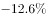，贴现值增长率最低的是水力发电价值，增长率为，非同一个指标，错误。

C项：定位表格，2017年A市生态与环境价值贴现值为9182.61亿元，直接经济价值贴现值为372.60亿元、间接经济价值贴现值为1214.15亿元，则，而，正确。

D项：定位表格，2017年A市气候调节价值年值为732.34，水源涵养价值年值为287.78，两个指标年值之和为：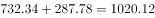亿元；生态与环境价值年值为2048.71，生态与环境价值其余指标的年值之和为：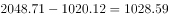亿元，1020.12亿元1028.59亿元，则2017年A市气候调节价值与水源涵养价值的年值之和小于生态与环境价值中其余指标的年值之和，错误。

故正确答案为C。

---

### 材料 4

        2019年6月，全国发行地方政府债券8996亿元，同比增长，环比增长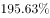。其中，发行一般债券3178亿元，同比减少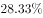，环比增长，发行专项债券5818亿元，同比增长，环比增长；按用途划分，发行新增债券7170亿元，同比增长，环比增长，发行置换债券和再融资债券1826亿元，同比减少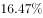，环比增长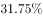。

        2019年6月，地方政府债券平均发行期限11.1年，其中新增债券10.4年，置换债券和再融资债券13.4年；地方政府债券平均发行利率，其中新增债券，置换债券和再融资债券。

        2019年1至6月，全国发行地方政府债券28372亿元，同比增长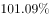。其中，发行一般债券12858亿元，同比增长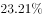，发行专项债券15514亿元，同比增长；按用途划分，发行新增债券21765亿元，同比增长，发行置换债券和再融资债券6607亿元，同比减少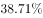。

        2019年1至6月，地方政府债券平均发行期限9.3年，其中一般债券11.2年，专项债券7.8年；地方政府债券平均发行利率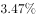，其中一般债券，专项债券。

        2019年全国地方政府债务限额为240774.3亿元。其中，一般债务限额133089.22亿元，专项债务限额107685.08亿元。截至2019年6月末，全国地方政府债务余额205477亿元，其中，一般债务118397亿元，专项债务87080亿元。

#### 第 16 题　qid 2616092 · 综合

2019年6月，全国发行的地方政府债券比2018年6月多约：

- **A**. 6151亿元
- **B**. 5953亿元
- **C**. 3653亿元　✅
- **D**. 3043亿元

**答案**：C

**官方解析**

根据题干“2019年6月，······比2018年6月多约”，判定本题为增长量计算问题。定位文字材料第一段“2019年6月，全国发行地方政府债券8996亿元，同比增长”。根据公式：增长量。代入数据，2019年6月，全国发行的地方政府债券的同比增长量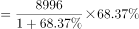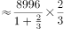亿元，与C项最接近。

故正确答案为C。

---

#### 第 17 题　qid 2616095 · 综合

2018年1至5月，全国发行地方政府债券约：

- **A**. 23029亿元
- **B**. 19376亿元
- **C**. 14109亿元
- **D**. 8766亿元　✅

**答案**：D

**官方解析**

根据题干“2018年1至5月······约”，定位材料第一段“2019年6月，全国发行地方政府债券8996亿元，同比增长”，第三段“2019年1至6月，全国发行地方政府债券28372亿元，同比增长”，可判定本题为基期和差问题。根据公式：基期量，可知2018年1至5月，全国发行地方政府债券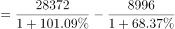亿元，与D项最接近。

故正确答案为D。

---

#### 第 18 题　qid 2616097 · 比重

2018年1至6月，发行一般债券的占比较发行专项债券的占比约：

- **A**. 
低

- **B**. 
低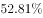

- **C**. 
高
　✅
- **D**. 
高

**答案**：C

**官方解析**

根据题干“2018年1至6月······占比约”，结合材料时间，可判定本题为基期比重问题。结合文字资料第三段“2019年1至6月，全国发行地方政府债券28372亿元，同比增长。其中，发行一般债券12858亿元，同比增长，发行专项债券15514亿元，同比增长”。代入公式：基期量和比重，可得所求比重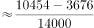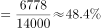，与C项最接近。

故正确答案为C。

---

#### 第 19 题　qid 2616100 · 综合

2018年6月，发行置换债券和再融资债券约为：

- **A**. 3157亿元
- **B**. 2186亿元　✅
- **C**. 1657亿元
- **D**. 1386亿元

**答案**：B

**官方解析**

根据题干“2018年6月”，结合选项单位与材料时间，可判定本题为基期计算问题。根据文字材料第一段“（2019年6月）发行置换债券和再融资债券1826亿元，同比减少”。结合公式：基期量可得，2018年6月发行置换债券和再融资债券亿元，与B项最接近。

故正确答案为B。

---

#### 第 20 题　qid 2616101 · 综合

不能从上述资料推出的是：

- **A**. 截至2019年6月末，地方政府一般债务余额和专项债务余额都控制在限额之内
- **B**. 2019年1至6月，地方政府一般债券的平均发行利率高于专项债券0.1个百分点
- **C**. 2019年5月，地方政府新增债券的平均发行期限比置换债券和再融资债券短　✅
- **D**. 2019年地方一般债务限额比专项债务限额多25404.14亿元

**答案**：C

**官方解析**

A项：定位文字材料最后一段“2019年······一般债务限额133089.22亿元，专项债务限额107685.08亿元。截至2019年6月末······一般债务118397亿元，专项债务87080亿元”，由于118397亿元133089.22亿元、87080亿元107685.08亿元，说明都控制在限额之内，正确；

B项：定位文字材料第四段“2019年1至6月，······其中一般债券，专项债券”，则一般债券平均发行利率专项债券平均发行利率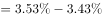个百分点，正确；

C项：定位文字材料第二段“2019年6月，······其中新增债券10.4年，置换债券和再融资债券13.4年”，只有2019年6月的年份数据，无法计算出2019年5月的数据，故无法推出，错误；

D项：定位文字材料最后一段“2019年······其中，一般债务限额133089.22亿元，专项债务限额107685.08亿元”，一般债务限额专项债务限额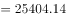亿元，正确。

本题为选非题，故正确答案为C。

---
