# 2021年上海市公务员录用考试《行测》题（A类）（网友回忆版）

> 省考 · 2021 年 · 6 个模块 · 共 130 题

- [政治理论](#%E6%94%BF%E6%B2%BB%E7%90%86%E8%AE%BA) · 8 题
- [常识判断](#%E5%B8%B8%E8%AF%86%E5%88%A4%E6%96%AD) · 32 题
- [言语理解与表达](#%E8%A8%80%E8%AF%AD%E7%90%86%E8%A7%A3%E4%B8%8E%E8%A1%A8%E8%BE%BE) · 25 题
- [数量关系](#%E6%95%B0%E9%87%8F%E5%85%B3%E7%B3%BB) · 27 题
- [判断推理](#%E5%88%A4%E6%96%AD%E6%8E%A8%E7%90%86) · 35 题
- [资料分析](#%E8%B5%84%E6%96%99%E5%88%86%E6%9E%90) · 3 题

---

## 政治理论

### 材料 1

        30年前，上海浦东地区生产总值60亿元；2019年，这一数字已是1.27万亿元，增长了210倍。浦东，以占全国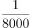的土地，创造了全国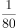的GDP、的外贸进出口总额。

        30年前，陆家嘴是“烂泥渡”，张江是片农田，临港则是孤悬东海的芦苇荒滩······如今，而立之年的浦东早已“脱胎换骨”。从蛙声一片的浦东稻田，到高耸云天的“大厦森林”，再到特斯拉上海超级工厂跑出的“上海速度”，令人惊艳的巨变也正是中国改革开放的象征和上海现代化建设的缩影。

        2020年11月12日，浦东开发开放30周年庆祝大会在上海举行。中共中央总书记、国家主席、中央军委主席习近平在会上发表重要讲话。他强调，30年前，党中央全面研判国际国内大势，统筹把握改革发展大局，作出了开发开放上海浦东的重大决策，掀开了我国改革开放向纵深推进的崭新篇章。党中央对浦东开发开放高度重视、寄予厚望，强调以上海浦东开发开放为龙头，进一步开放长江沿岸城市，尽快把上海建成国际经济、金融、贸易中心之一，带动长江三角洲和整个长江流域地区经济的新飞跃，要求浦东在扩大开放、自主创新等方面走在前列。进入新时代，党中央继续对浦东开发开放提出明确要求，把一系列国家战略任务放在浦东，推动浦东开发开放不断展现新气象。

        习近平指出，30年来，浦东创造性贯彻落实党中央决策部署，取得了举世瞩目的成就，经济实现跨越式发展，改革开放走在全国前列，核心竞争力大幅度增强，人民生活水平整体性跃升。浦东开发开放30年取得的显著成就，为中国特色社会主义制度优势提供了最鲜活的现实明证，为改革开放和社会主义现代化建设提供了最生动的实践写照。实践充分证明，党的十一届三中全会以来形成的党的基本理论、基本路线、基本方略是完全正确的；改革开放是坚持和发展中国特色社会主义、实现中华民族伟大复兴的必由之路；改革发展必须坚持以人民为中心，把人民对美好生活的向往作为我们的奋斗目标，依靠人民创造历史伟业。

#### 第 1 题　qid 2731500 · 新思想

浦东开发开放30年取得的显著成就，为中国特色社会主义制度优势提供了最鲜活的现实明证，为改革开放和社会主义现代化建设提供了最生动的实践写照。浦东要抓住机遇、乘势而上，努力成为                    ，更好向世界展示中国理念、中国精神、中国道路。

- **A**. 更高水平改革开放的开路先锋　✅
- **B**. 国家建设生态文明示范区
- **C**. 彰显“四个自信”的实践范例　✅
- **D**. 全面建设社会主义现代化国家的排头兵　✅

**答案**：ACD

**官方解析**

本题考查政治常识。
2020年11月12日，浦东开发开放30周年庆祝大会在上海市举行。中共中央总书记、国家主席、中央军委主席习近平在会上发表重要讲话，讲话中指出：“浦东要抓住机遇、乘势而上，科学把握新发展阶段，坚决贯彻新发展理念，服务构建新发展格局，坚持稳中求进工作总基调，勇于挑最重的担子、啃最硬的骨头，努力成为更高水平改革开放的开路先锋、全面建设社会主义现代化国家的排头兵、彰显‘四个自信’的实践范例，更好向世界展示中国理念、中国精神、中国道路。”
故正确答案为ACD。

---

#### 第 2 题　qid 2731507 · 新思想

改革不停顿，开放不止步。浦东开发开放30年的历程，走的是一条面向世界、扩大开放之路。习近平总书记在浦东开发开放30周年庆祝大会上指出，要深入推进高水平            ，增创国际合作和竞争新优势。

- **A**. 政策型开放
- **B**. 针对型开放
- **C**. 制度型开放　✅
- **D**. 行业型开放

**答案**：C

**官方解析**

本题考查政治常识。
2020年11月12日，浦东开发开放30周年庆祝大会在上海市举行。中共中央总书记、国家主席、中央军委主席习近平在会上发表重要讲话，讲话中指出：“深入推进高水平制度型开放，增创国际合作和竞争新优势。”
故正确答案为C。

---

### 材料 2

        习近平2020年7月21日下午主持召开企业家座谈会并发表重要讲话。他强调，改革开放以来，我国逐步建立和不断完善社会主义市场经济体制，市场体系不断发展，各类市场主体蓬勃成长。新冠肺炎疫情对我国经济和世界经济产生巨大冲击，我国很多市场主体面临前所未有的压力。市场主体是经济的力量载体，保市场主体就是保社会生产力。要千方百计把市场主体保护好，激发市场主体活力，弘扬企业家精神，推动企业发挥更大作用实现更大发展，为经济发展积蓄基本力量。

        习近平强调，党中央明确提出要扎实做好“六稳”工作、落实“六保”任务，各地区各部门出台了一系列保护支持市场主体的政策措施，要加大政策支持力度，激发市场主体活力，使广大市场主体不仅能够正常生存，而且能够实现更大发展。

        习近平指出，改革开放以来，一大批有胆识、勇创新的企业家茁壮成长，形成了具有鲜明时代特征、民族特色、世界水准的中国企业家队伍。企业家要带领企业战胜当前的困难，走向更辉煌的未来，就要弘扬企业家精神，在爱国、创新、诚信、社会责任和国际视野等方面不断提升自己，努力成为新时代构建新发展格局、建设现代化经济体系、推动高质量发展的生力军。要增强爱国情怀，把企业发展同国家繁荣、民族兴盛、人民幸福紧密结合在一起，主动为国担当、为国分忧，带领企业奋力拼搏、力争一流，实现质量更好、效益更高、竞争力更强、影响力更大的发展。要勇于创新，做创新发展的探索者、组织者、引领者，勇于推动生产组织创新、技术创新、市场创新，重视技术研发和人力资本投入，有效调动员工创造力，努力把企业打造成为强大的创新主体。要做诚信守法的表率，带动全社会道德素质和文明程度提升。要承担社会责任，努力稳定就业岗位，关心员工健康，同员工携手渡过难关。要拓展国际视野，立足中国，放眼世界，提高把握国际市场动向和需求特点的能力，提高把握国际规则能力，提高国际市场开拓能力，提高防范国际市场风险能力，带动企业在更高水平的对外开放中实现更好发展。

        习近平强调，在当前保护主义上升、世界经济低迷、全球市场萎缩的外部环境下，我们必须集中力量办好自己的事，充分发挥国内超大规模市场优势，逐步形成以国内大循环为主体、国内国际双循环相互促进的新发展格局，提升产业链供应链现代化水平，大力推动科技创新，加快关键核心技术攻关，打造未来发展新优势。以国内大循环为主体，绝不是关起门来封闭运行，而是通过发挥内需潜力，使国内市场和国际市场更好联通，更好利用国际国内两个市场、两种资源，实现更加强劲可持续的发展。从长远看，经济全球化仍是历史潮流，各国分工合作、互利共赢是长期趋势。我们要站在历史正确的一边，坚持深化改革、扩大开放，加强科技领域开放合作，推动建设开放型世界经济，推动构建人类命运共同体。

#### 第 3 题　qid 2731541 · 新思想

习近平指出，改革开放以来，一大批有胆识、勇创新的企业家茁壮成长，形成了具有鲜明时代特征、民族特色、世界水准的中国企业家队伍。我国的企业家是：

- **A**. 人民民主专政的领导力量
- **B**. 人民民主专政的阶级基础
- **C**. 中国特色社会主义的劳动者　✅
- **D**. 中国特色社会主义的建设者　✅

**答案**：CD

**官方解析**

本题考查政治常识。
A、B两项错误，根据《中华人民共和国宪法》第一条第一款规定：“中华人民共和国是工人阶级领导的、以工农联盟为基础的人民民主专政的社会主义国家。”因此，工人阶级是人民民主专政的领导力量，工农联盟是人民民主专政的阶级基础。
C项正确，《中华人民共和国宪法》序言指出：“在长期的革命、建设、改革过程中，已经结成由中国共产党领导的，有各民主党派和各人民团体参加的，包括全体社会主义劳动者、社会主义事业的建设者、拥护社会主义的爱国者、拥护祖国统一和致力于中华民族伟大复兴的爱国者的广泛的爱国统一战线，这个统一战线将继续巩固和发展。”我国新时期爱国统一战线内部结构中以劳动人民作为一个范围的层次，它包括工人、农民、知识分子以及其他一切从事社会主义建设事业的自食其力的劳动者。
D项正确，党的十六大报告指出：“在社会变革中出现的民营科技企业的创业人员和技术人员、受聘于外资企业的管理技术人员、个体户、私营企业主、中介组织的从业人员、自由职业人员等社会阶层，都是中国特色社会主义事业的建设者。”
故正确答案为CD。

---

### 材料 3

        民法典被誉为“社会生活百科全书”，与每个人的生活息息相关。新中国成立以来，党和国家曾先后四次启动民法制定工作，编纂一部彰显中华民族精气神的民法典是几代人的夙愿。编纂法典，是一个国家、一个民族走向繁荣强盛的象征和标志。“民法典理应成为治国理政的重要工具，成为中国国家治理模式稳定持续发展的重要保证。”全国人大代表、广东省律师协会会长说。

        结合当前疫情防控工作，民法典草案作出了一系列规定。全国人大代表表示：“民法典草案对与疫情相关的民事法律制度进行梳理研究，明确保护特殊情况下无人照顾的‘被监护人’，明确物业应急处置责任等，这都体现出了民法典应时而生、为民所需的特点。”

        全国政协常委、中国法学会副会长参与了民法典草案的编纂工作。她深有体会地说，民法典草案彰显“四个自信”，体现中国特色社会主义市场经济的基本要求，标志着中国特色社会主义法律制度的进一步成熟和稳定。

        2015年3月，全国人大常委会法制工作委员会启动民法典编纂工作。2017年3月，十二届全国人大五次会议审议通过民法总则。2019年12月，全国人大常委会审议了由民法总则与经过常委会审议和修改完善的民法典各分编草案合并形成的民法典草案，并决定将民法典草案提请十三届全国人大三次会议审议。2020年两会期间，代表委员们对民法典草案展开认真审议和热烈讨论。根据各方面意见，又作了100余处修改，其中实质性修改40余处。2020年5月28日，十三届全国人大三次会议表决通过了《中华人民共和国民法典》，宣告中国“民法典时代”正式到来。

        《中华人民共和国民法典》共7编、1260条，各编依次为总则、物权、合同、人格权、婚姻家庭、继承、侵权责任，以及附则。编纂民法典是党的十八届四中全会提出的重大立法任务，是以习近平同志为核心的党中央作出的重大法治建设部署。编纂民法典，是对我国现行的、制定于不同时期的民法通则、物权法、合同法、担保法、婚姻法、收养法、继承法、侵权责任法和人格权方面的民事法律规范进行全面系统的编订纂修，形成一部具有中国特色、体现时代特点、反映人民意愿的民法典。

#### 第 4 题　qid 2731577 · 新思想

民法典在中国特色社会主义法律体系中具有重要地位，是一部固根本、稳预期、利长远的基础性法律，（    ），都具有重大意义。

- **A**. 对推进全面依法治国、加快建设社会主义法治国家　✅
- **B**. 对发展社会主义市场经济、巩固社会主义基本经济制度　✅
- **C**. 对坚持以人民为中心的发展思想、依法维护人民权益、推动我国人权事业发展　✅
- **D**. 对推进国家治理体系和治理能力现代化　✅

**答案**：ABCD

**官方解析**

本题考查法律常识。
中共中央政治局于2020年5月29日下午就“切实实施民法典”举行第二十次集体学习。中共中央总书记习近平在主持学习时强调，民法典在中国特色社会主义法律体系中具有重要地位，是一部固根本、稳预期、利长远的基础性法律，对推进全面依法治国、加快建设社会主义法治国家，对发展社会主义市场经济、巩固社会主义基本经济制度，对坚持以人民为中心的发展思想、依法维护人民权益、推动我国人权事业发展，对推进国家治理体系和治理能力现代化，都具有重大意义。全党要切实推动民法典实施，以更好推进全面依法治国、建设社会主义法治国家，更好保障人民权益。
故正确答案为ABCD。

---

#### 第 5 题　qid 2731390 · 时事政治

2020年7月，中共中央印发了《中国共产党基层组织选举工作条例》。《条例》的制定和实施，对于发扬党内民主、尊重和保障党员民主权利、规范基层党组织选举，增强基层党组织政治功能和（    ），把基层党组织建设成为宣传党的主张、贯彻党的决定、领导基层治理、团结动员群众、推动改革发展的坚强战斗堡垒，巩固党长期执政的组织基础，具有重要意义。

- **A**. 社会功能
- **B**. 领导力
- **C**. 经济功能
- **D**. 组织力　✅

**答案**：D

**官方解析**

本题考查政治常识。
2020年7月，中共中央印发了《中国共产党基层组织选举工作条例》并发出通知。通知强调，《条例》的制定和实施，对于发扬党内民主、尊重和保障党员民主权利、规范基层党组织选举，增强基层党组织政治功能和组织力，把基层党组织建设成为宣传党的主张、贯彻党的决定、领导基层治理、团结动员群众、推动改革发展的坚强战斗堡垒，巩固党长期执政的组织基础，具有重要意义。
故正确答案为D。

---

#### 第 6 题　qid 2731393 · 毛中特

1935年遵义会议，确定了毛泽东同志为主要代表的马克思主义正确路线在中共中央的领导地位；1945年中共七大，确立毛泽东思想为党的指导思想；1978年十一届三中全会，把党的工作重点和全国人民的注意力转移到社会主义现代化建设上来。如果为“遵义会议、中共七大、十一届三中全会”确定一个研究主题，应是：

- **A**. 革命道路的开拓
- **B**. 政治体制的创建
- **C**. 关键时刻的抉择　✅
- **D**. 建国纲领的制定

**答案**：C

**官方解析**

本题考查政治常识。
遵义会议是中国共产党历史上一个生死攸关的转折点，标志着党从幼年走向成熟、从挫折走向胜利。中共七大是中国共产党在抗战胜利前夕的历史转折关头召开的一次重要会议，也是中国共产党建党以来完全独立自主召开的一次代表大会。此次会议制定了正确的路线、纲领和策略，指明了中国人民争取光明前途的方法与途径。党的十一届三中全会是建国以来我党历史上具有深远意义的转折点，是一次对思想、政治、组织等领域的全面拨乱反正的会议，揭开了社会主义改革开放的序幕。三个会议都是我党历史上关键时刻的重要抉择。
故正确答案为C。

---

#### 第 7 题　qid 2731394 · 新思想

面向未来，要战胜前进道路上的种种风险挑战，顺利实现中共十九大描绘的宏伟蓝图，必须紧紧依靠人民。正所谓“大鹏之动，非一羽之轻也；骐骥之速，非一足之力也”。中国要飞得高、跑得快，就得汇集和激发近14亿人民的磅礴力量。这是因为，人民群众是：

- **A**. 第一生产力
- **B**. 社会实践的主体　✅
- **C**. 社会存在和发展的基础
- **D**. 事物发展的内在动力

**答案**：B

**官方解析**

本题考查政治常识。
A项错误，邓小平同志提出：“科学技术是第一生产力”。
B项正确，“大鹏之动，非一羽之轻也；骐骥之速，非一足之力也”出自王符的《潜夫论·释难》，意思是大鹏翱翔，靠的不是一根羽毛的轻盈；骏马驰骋，靠的不是一只脚的力量。故我们要紧紧依靠人民，因为人民群众是社会实践的主体，是历史的创造者，是推动历史发展的决定力量。
C项错误，马克思认为，物质资料的生产方式是人类社会存在和发展的基础。
D项错误，矛盾是指事物之间或事物内部各要素之间的对立、统一的关系。事物发展的源泉和动力是事物的内部矛盾。
故正确答案为B。

---

#### 第 8 题　qid 2731398 · 时事政治

2020年10月14日，深圳经济特区建立40周年庆祝大会在广东省深圳市隆重举行。习近平总书记在会上发表重要讲话指出，深圳要建设好（    ），创建社会主义现代化强国的城市范例，提高贯彻落实新发展理念能力和水平。

- **A**. 社会主义市场经济改革试点区
- **B**. 中国特色社会主义改革试点区
- **C**. 社会主义市场经济先行示范区
- **D**. 中国特色社会主义先行示范区　✅

**答案**：D

**官方解析**

本题考查政治常识。
习近平总书记在深圳经济特区建立40周年庆祝大会指出：“当今世界正经历百年未有之大变局，我国正处于实现中华民族伟大复兴的关键时期，经济已由高速增长阶段转向高质量发展阶段。深圳要建设好中国特色社会主义先行示范区，创建社会主义现代化强国的城市范例，提高贯彻落实新发展理念能力和水平，形成全面深化改革、全面扩大开放新格局，推进粤港澳大湾区建设，丰富‘一国两制’事业发展新实践，率先实现社会主义现代化。”
故正确答案为D。

---

## 常识判断

### 材料 1

        30年前，上海浦东地区生产总值60亿元；2019年，这一数字已是1.27万亿元，增长了210倍。浦东，以占全国的土地，创造了全国的GDP、的外贸进出口总额。

        30年前，陆家嘴是“烂泥渡”，张江是片农田，临港则是孤悬东海的芦苇荒滩······如今，而立之年的浦东早已“脱胎换骨”。从蛙声一片的浦东稻田，到高耸云天的“大厦森林”，再到特斯拉上海超级工厂跑出的“上海速度”，令人惊艳的巨变也正是中国改革开放的象征和上海现代化建设的缩影。

        2020年11月12日，浦东开发开放30周年庆祝大会在上海举行。中共中央总书记、国家主席、中央军委主席习近平在会上发表重要讲话。他强调，30年前，党中央全面研判国际国内大势，统筹把握改革发展大局，作出了开发开放上海浦东的重大决策，掀开了我国改革开放向纵深推进的崭新篇章。党中央对浦东开发开放高度重视、寄予厚望，强调以上海浦东开发开放为龙头，进一步开放长江沿岸城市，尽快把上海建成国际经济、金融、贸易中心之一，带动长江三角洲和整个长江流域地区经济的新飞跃，要求浦东在扩大开放、自主创新等方面走在前列。进入新时代，党中央继续对浦东开发开放提出明确要求，把一系列国家战略任务放在浦东，推动浦东开发开放不断展现新气象。

        习近平指出，30年来，浦东创造性贯彻落实党中央决策部署，取得了举世瞩目的成就，经济实现跨越式发展，改革开放走在全国前列，核心竞争力大幅度增强，人民生活水平整体性跃升。浦东开发开放30年取得的显著成就，为中国特色社会主义制度优势提供了最鲜活的现实明证，为改革开放和社会主义现代化建设提供了最生动的实践写照。实践充分证明，党的十一届三中全会以来形成的党的基本理论、基本路线、基本方略是完全正确的；改革开放是坚持和发展中国特色社会主义、实现中华民族伟大复兴的必由之路；改革发展必须坚持以人民为中心，把人民对美好生活的向往作为我们的奋斗目标，依靠人民创造历史伟业。

#### 第 1 题　qid 2731488 · 经济常识

30年来，浦东创造性贯彻落实党中央决策部署，改革开放走在全国前列，诞生了（    ）等一系列“全国第一”。

- **A**. 第一个金融贸易区　✅
- **B**. 第一个保税区　✅
- **C**. 第一个自由贸易试验区　✅
- **D**. 第一家外商独资贸易公司　✅

**答案**：ABCD

**官方解析**

本题考查政治常识。
A项正确，1990年4月，全国唯一一个以“金融贸易”命名的国家级开发区——陆家嘴金融贸易区（陆家嘴金融城）成立。
B项正确，1990年9月8日，国务院批准设立上海外高桥保税区，是中国大陆启动最早、规模最大、产业最全、辐射最广的保税区。
C项正确，2013年9月，上海自贸区挂牌成立。中国（上海）自由贸易试验区是国内第一个自由贸易试验区，建设上海自贸区是党中央、国务院在新形势下全面深化改革和扩大开放的一项战略举措。
D项正确，1992年7月26日，经原国家外经贸部批准，我国第一家外商独资贸易公司——上海伊藤忠商事有限公司在外高桥保税区注册成立。
故正确答案为ABCD。

---

### 材料 2

        习近平2020年7月21日下午主持召开企业家座谈会并发表重要讲话。他强调，改革开放以来，我国逐步建立和不断完善社会主义市场经济体制，市场体系不断发展，各类市场主体蓬勃成长。新冠肺炎疫情对我国经济和世界经济产生巨大冲击，我国很多市场主体面临前所未有的压力。市场主体是经济的力量载体，保市场主体就是保社会生产力。要千方百计把市场主体保护好，激发市场主体活力，弘扬企业家精神，推动企业发挥更大作用实现更大发展，为经济发展积蓄基本力量。

        习近平强调，党中央明确提出要扎实做好“六稳”工作、落实“六保”任务，各地区各部门出台了一系列保护支持市场主体的政策措施，要加大政策支持力度，激发市场主体活力，使广大市场主体不仅能够正常生存，而且能够实现更大发展。

        习近平指出，改革开放以来，一大批有胆识、勇创新的企业家茁壮成长，形成了具有鲜明时代特征、民族特色、世界水准的中国企业家队伍。企业家要带领企业战胜当前的困难，走向更辉煌的未来，就要弘扬企业家精神，在爱国、创新、诚信、社会责任和国际视野等方面不断提升自己，努力成为新时代构建新发展格局、建设现代化经济体系、推动高质量发展的生力军。要增强爱国情怀，把企业发展同国家繁荣、民族兴盛、人民幸福紧密结合在一起，主动为国担当、为国分忧，带领企业奋力拼搏、力争一流，实现质量更好、效益更高、竞争力更强、影响力更大的发展。要勇于创新，做创新发展的探索者、组织者、引领者，勇于推动生产组织创新、技术创新、市场创新，重视技术研发和人力资本投入，有效调动员工创造力，努力把企业打造成为强大的创新主体。要做诚信守法的表率，带动全社会道德素质和文明程度提升。要承担社会责任，努力稳定就业岗位，关心员工健康，同员工携手渡过难关。要拓展国际视野，立足中国，放眼世界，提高把握国际市场动向和需求特点的能力，提高把握国际规则能力，提高国际市场开拓能力，提高防范国际市场风险能力，带动企业在更高水平的对外开放中实现更好发展。

        习近平强调，在当前保护主义上升、世界经济低迷、全球市场萎缩的外部环境下，我们必须集中力量办好自己的事，充分发挥国内超大规模市场优势，逐步形成以国内大循环为主体、国内国际双循环相互促进的新发展格局，提升产业链供应链现代化水平，大力推动科技创新，加快关键核心技术攻关，打造未来发展新优势。以国内大循环为主体，绝不是关起门来封闭运行，而是通过发挥内需潜力，使国内市场和国际市场更好联通，更好利用国际国内两个市场、两种资源，实现更加强劲可持续的发展。从长远看，经济全球化仍是历史潮流，各国分工合作、互利共赢是长期趋势。我们要站在历史正确的一边，坚持深化改革、扩大开放，加强科技领域开放合作，推动建设开放型世界经济，推动构建人类命运共同体。

#### 第 2 题　qid 2731517 · 经济常识

到2019年底，我国已有市场主体1.23亿户，其中企业3858万户，个体工商户8261万户。这些市场主体是（    ）。

- **A**. 我国经济活动的主要参与者　✅
- **B**. 社会主义市场经济的重要组成部分
- **C**. 就业机会的主要提供者　✅
- **D**. 技术进步的主要推动者　✅

**答案**：ACD

**官方解析**

本题考查政治常识。
2020年7月21日，习近平总书记在企业家座谈会上的讲话中指出：“到2019年底，我国已有市场主体1.23亿户，其中企业3858万户，个体工商户8261万户。这些市场主体是我国经济活动的主要参与者、就业机会的主要提供者、技术进步的主要推动者，在国家发展中发挥着十分重要的作用。”
故正确答案为ACD。

---

#### 第 3 题　qid 2731529 · 经济常识

为落实好纾困惠企政策，中央将实施更加积极有为的财政政策。下列与这一政策相符的是（    ）。

- **A**. 继续减税降费　✅
- **B**. 优化营商环境
- **C**. 强化金融支持
- **D**. 放宽市场准入

**答案**：A

**官方解析**

本题考查经济常识。
财政政策是国家制定的指导财政分配活动和处理各种财政分配关系的基本准则。积极有为的财政政策即扩张性财政政策，是国家通过财政分配活动刺激和增加社会总需求的一种政策行为，主要是通过减税、增加支出进而扩大财政赤字，增加和刺激社会总需求的一种财政分配方式。
A项正确，减税降费能够增加个人和企业的可支配收入，相应地减少国家财政收入。在财政支出规模不变的情况下，相应地扩大了社会总需求，属于积极有为的财政政策。
B项错误，扩张性财政政策主要措施有增加国债、降低税率、增加政府购买和转移支付。优化营商环境并不属于财政政策范畴。
C项错误，货币政策也就是金融政策，是指中央银行为实现其特定的经济目标而采用的各种控制和调节货币供应量和信用量的方针、政策和措施的总称。强化金融支持并不属于财政政策范畴，应属于金融政策。
D项错误，扩张性财政政策主要措施有增加国债、降低税率、增加政府购买和转移支付。放宽市场准入并不属于财政政策范畴。
故正确答案为A。

---

#### 第 4 题　qid 2731548 · 人文常识

下列选项中，体现了“两点论和重点论相统一”的论述是：

- **A**. 更好利用国际国内两个市场、两种资源　✅
- **B**. 集中力量办好自己的事，充分发挥国内超大规模市场优势
- **C**. 以国内大循环为主体、国内国际双循环相互促进　✅
- **D**. 推动建设开放型世界经济，推动构建人类命运共同体

**答案**：AC

**官方解析**

本题考查政治常识。
坚持两点论和重点论相统一，是指看问题、办事情，既要全面、统筹兼顾，又要善于抓住重点和主流。
A项正确，联系材料可知，“更好利用国际国内两个市场、两种资源”的前提是发挥内需的作用，“发挥内需”强调重在国内，即在发展和建设的过程中抓好国内这个重点，体现了“重点论”的观点；“国际国内两个市场、两种资源”表明在发展和建设的过程中要全面、统筹利用两个市场、两种资源，体现了“两点论”的观点。
B项错误，“集中力量”“国内”均表明在发展和建设的过程中要抓住重点和核心优势，体现了“重点论”的观点。
C项正确，“以国内大循环为主体”表明在发展和建设的过程中要抓住事物的主要矛盾，体现了“重点论”的观点；“国内国际双循环相互促进”表明在发展和建设的过程中，要促进国内国际市场共同、全面发展，体现了“两点论”的观点。
D项错误，“推动建设开放型世界经济，推动构建人类命运共同体”表明我们要全面地去看待世界，促进全世界共同发展，体现了“两点论”的观点。
故正确答案为AC。

---

### 材料 3

        民法典被誉为“社会生活百科全书”，与每个人的生活息息相关。新中国成立以来，党和国家曾先后四次启动民法制定工作，编纂一部彰显中华民族精气神的民法典是几代人的夙愿。编纂法典，是一个国家、一个民族走向繁荣强盛的象征和标志。“民法典理应成为治国理政的重要工具，成为中国国家治理模式稳定持续发展的重要保证。”全国人大代表、广东省律师协会会长说。

        结合当前疫情防控工作，民法典草案作出了一系列规定。全国人大代表表示：“民法典草案对与疫情相关的民事法律制度进行梳理研究，明确保护特殊情况下无人照顾的‘被监护人’，明确物业应急处置责任等，这都体现出了民法典应时而生、为民所需的特点。”

        全国政协常委、中国法学会副会长参与了民法典草案的编纂工作。她深有体会地说，民法典草案彰显“四个自信”，体现中国特色社会主义市场经济的基本要求，标志着中国特色社会主义法律制度的进一步成熟和稳定。

        2015年3月，全国人大常委会法制工作委员会启动民法典编纂工作。2017年3月，十二届全国人大五次会议审议通过民法总则。2019年12月，全国人大常委会审议了由民法总则与经过常委会审议和修改完善的民法典各分编草案合并形成的民法典草案，并决定将民法典草案提请十三届全国人大三次会议审议。2020年两会期间，代表委员们对民法典草案展开认真审议和热烈讨论。根据各方面意见，又作了100余处修改，其中实质性修改40余处。2020年5月28日，十三届全国人大三次会议表决通过了《中华人民共和国民法典》，宣告中国“民法典时代”正式到来。

        《中华人民共和国民法典》共7编、1260条，各编依次为总则、物权、合同、人格权、婚姻家庭、继承、侵权责任，以及附则。编纂民法典是党的十八届四中全会提出的重大立法任务，是以习近平同志为核心的党中央作出的重大法治建设部署。编纂民法典，是对我国现行的、制定于不同时期的民法通则、物权法、合同法、担保法、婚姻法、收养法、继承法、侵权责任法和人格权方面的民事法律规范进行全面系统的编订纂修，形成一部具有中国特色、体现时代特点、反映人民意愿的民法典。

#### 第 5 题　qid 2731561 · 法律常识

民法典将自（    ）起实施，现行婚姻法、继承法、民法通则、收养法、担保法、合同法、物权法、侵权责任法、民法总则同时废止。

- **A**. 通过之日
- **B**. 2020年10月1日
- **C**. 公布之日
- **D**. 2021年1月1日　✅

**答案**：D

**官方解析**

本题考查法律常识。
根据《民法典》第一千二百六十条规定：“本法自2021年1月1日起施行。《中华人民共和国婚姻法》、《中华人民共和国继承法》、《中华人民共和国民法通则》、《中华人民共和国收养法》、《中华人民共和国担保法》、《中华人民共和国合同法》、《中华人民共和国物权法》、《中华人民共和国侵权责任法》、《中华人民共和国民法总则》同时废止。”
故正确答案为D。

---

#### 第 6 题　qid 2731570 · 法律常识

民法典“与每个人的生活息息相关”，是因为它是一部体现对（    ）、生活幸福、人格尊严等各方面权利平等保护的民法典。是一部具有鲜明中国特色、实践特色、时代特色的民法典。

- **A**. 生命健康　✅
- **B**. 财产安全　✅
- **C**. 交易便利　✅
- **D**. 民主权利

**答案**：ABC

**官方解析**

本题考查法律常识。
《中华人民共和国民法典》经过2020年5月28日十三届全国人大三次会议表决通过，并于2021年1月1日起施行。该法典被称为“社会生活百科全书”，这是因为该法典是民事权利的宣言书和保障书。《民法典》是一部体现对生命健康、财产安全、交易便利、生活幸福、人格尊严等各方面权利平等保护的民法典，是一部具有鲜明中国特色、实践特色、时代特色的民法典。
故正确答案为ABC。

---

#### 第 7 题　qid 2731572 · 法律常识

结合新冠肺炎控情防控工作，民法典明确保护特殊情况下无人照顾的“被监护人”，规定因发生突发事件等紧急情况，监护人暂时无法履行监护职责，被监护人的生活处于无人照料状态的，被监护人住所地的（    ）或者民政部门应当为被监护人安排必要的临时生活照料措施。

- **A**. 公安部门
- **B**. 居民委员会、村民委员会　✅
- **C**. 妇联组织
- **D**. 慈善组织、社会福利机构

**答案**：B

**官方解析**

本题考查法律常识。
根据《民法典》第三十四条第四款规定：“因发生突发事件等紧急情况，监护人暂时无法履行监护职责，被监护人的生活处于无人照料状态的，被监护人住所地的居民委员会、村民委员会或者民政部门应当为被监护人安排必要的临时生活照料措施。”因此，被监护人的生活处于无人照料状态的，被监护人住所地的居民委员会、村民委员会或者民政部门应当为被监护人安排必要的临时生活照料措施。
故正确答案为B。

---

### 材料 4

        互助土族自治县位于六盘山集中连片特困地区。土族是全国28个人口较少的民族之一，自古崇尚彩虹，这里因此被称为“彩虹之乡”。由于地处青藏高原，发展条件受限，贫困就如大山一样横亘在眼前。直到2015年，班彦村的129户人家依然居住在被当地人称为“脑山”的山顶上，严重缺水、交通闭塞，是典型的“一方水土养活不了一方人”，正是脱贫攻坚，让这里发生了翻天覆地的变化。过去，村民们在山上住的是土坯房，风蚀雨侵、烟熏火燎，连墙面都成了炭黑色。如今，班彦新村紧邻省道，家家户户通自来水，步行10多分钟就可以到镇卫生院，小学就在旁边，幼儿园有校车接送小孩，镇中心学校也只有两三公里远······后顾之忧少了，村民外出务工的积极性高了。通过组织烹饪、电焊、开挖掘机等专项培训，2018年全村就有67人外出务工。

        山大沟深、土地瘠薄，对于祖祖辈辈困守在这里的班彦村民而言，有些人一辈子都盖不起新房。实施易地搬迁，一下子把他们挪穷窝和盖新房这两个“最大的包袱”给解决了。搬迁后，班彦新村实施了村道硬化、村庄亮化、文化广场、人畜饮水、环境综合整治等工程，补齐了基础设施和发展条件的短板，解开了脱贫的“死结”。2018年，青海省将班彦新村纳入《少数民族特色村镇传承保护规划》，投入专项资金扶持民族特色发展项目。“十年九旱，靠天吃饭”，这是过去班彦村的真实写照。搬下山后，在各级政府帮扶下，村集体经济“破零”，产业扶持资金到户到人，全村初步形成多元增收渠道。依托当地特有的八眉猪品牌，给每户在集中养殖区配套建设了36平方米的猪舍。全村八眉猪存栏最多时超过1200头，户均年可增收3000元，与相关企业合作建设分布式光伏项目，户均年收益2500元。

        土族盘绣2006年被确定为国家级非物质文化遗产，但是由于没有渠道与市场对接，一直养在深闺人未识，变不成收益。2018年班彦新村组建土族盘绣合作社，并与知名电商合作，使盘绣逐渐成为民族特色产业，带动了全村145名妇女就业，有的绣品还远销国外。由于长期受贫困困扰，过去村民们对奔好日子缺乏信心，驻村干部介绍，脱贫攻坚实施之初，“扶起来立不住，立住了走不动”的现象比较突出。驻村干部积极推进建章立制、移风易俗，以扶促教、以教助扶，引导村民实现从“要我发展”向“我要发展”的观念转变。搬迁前，村里娶媳妇的彩礼一般都在15万元以上，因婚致贫比较多，搬迁后，村里成立了红白理事会，通过村规民约加以引导，彩礼少了一大半，在2019年的“班彦感恩纪念日”上，村里还增设了“好婆婆”“好媳妇”评选、“脱贫光荣户”表彰等活动。

        在搬迁过程和产业发展中，村党支部委员会和村民委员会严格按照程序，始终公开、公正、公平地实施房屋分配、项目推进、资金收益分配等群众最为关心关注的重大事项。用真心真情换取信任。全村47名党员，都积极参与农民讲习所的宣讲和每月一次的“固定党日”活动。村干部普遍感到，只要增强组织凝聚力，发挥党员的带动作用，就能融洽干群关系，把村里的每项工作做好。

#### 第 8 题　qid 2731589 · 人文常识

结合材料可知，班彦村脱贫的最关键的举措是                    。

- **A**. 专项资金扶持
- **B**. 非遗申请成功
- **C**. 实施易地搬迁　✅
- **D**. 环境综合治理

**答案**：C

**官方解析**

本题考查政治常识。
A项错误，根据材料中“搬下山后，在各级政府帮扶下，村集体经济‘破零’，产业扶持资金到户到人，全村初步形成多元增收渠道”可知，专项资金扶持是在班彦村搬迁之后，促进班彦村民增收的举措，因此不是脱贫最关键的举措。
B项错误，根据材料中“土族盘绣2006年被确定为国家级非物质文化资产”“直到2015年，班彦村的129户人家依然居住在被当地人称为‘脑山’的山顶上，严重缺水、交通闭塞”可知，2006年非遗已经申请成功，但直至2015年班彦村依旧处于贫困状态，说明其并非脱贫的关键举措。
C项正确，根据材料中“实施易地搬迁，一下子把他们挪穷窝和盖新房这两个‘最大的包袱’给解决了”以及“搬迁后，班彦新村实施了村道硬化、村庄亮化、文化广场、人畜饮水、环境综合······等工程，补齐了基础设施和发展条件的短板，解开了脱贫的‘死结’”两处内容表明，班彦村脱贫的关键在于实施了异地搬迁，从而由严重缺水、交通闭塞的山顶村变成紧邻省道的班彦新村。
D项错误，环境综合治理是在实施异地搬迁之后才采取的举措，不是脱贫最关键的举措。
故正确答案为C。

---

#### 第 9 题　qid 2731593 · 人文常识

驻村干部介绍，脱贫攻坚实施之初，“扶起来立不住，立住了走不动”的现象比较突出。以下对这句话的理解正确的是                    。

- **A**. 扶持资金投入不到位
- **B**. 村民脱贫内生动力不足　✅
- **C**. 村民对异地搬迁存疑虑
- **D**. 扶贫而不扶志效果不佳　✅

**答案**：BD

**官方解析**

本题考查政治常识。
A项错误，根据材料中“2018年······将班彦新村纳入《少数民族特色村镇传承保护规划》，投入专项资金扶持民族特色项目”，而“扶起来立不住，立住了走不动”的现象出现在脱贫攻坚实施之初，从时间上来看，二者没有直接联系。
B、D两项正确，根据材料中“驻村干部积极推进建章立制、移风易俗、以扶促教、以教助扶，引导村民实现从‘要我发展’向‘我要发展’的观念转变”可知，这些举措是为了激发群众脱贫致富的内生动力，提升扶贫又扶志的效果，说明“扶起来立不住，立住了走不动”指的正是脱贫内生动力不足，扶贫而不扶志，村民们存在“要我发展”的错误观念，导致扶贫效果不佳。
C项错误，材料中并未体现出村民对于异地搬迁心存顾虑。
故正确答案为BD。

---

#### 第 10 题　qid 2731596 · 人文常识

在2019年的“班彦感恩纪念日”上，村里还增设了“好婆婆”“好媳妇”评选、“脱贫光荣户”表彰等活动，这属于治理类型中的：

- **A**. 自治　✅
- **B**. 人治
- **C**. 法治
- **D**. 德治　✅

**答案**：AD

**官方解析**

本题考查政治常识。
A项正确，自治是基层社会治理的基本目标，致力于政府与人民对公共生活的协同治理，它有赖于城乡社区成员的自愿合作，有赖于社会治理机制中如何激发社区成员的内驱动力，这既保证了公共利益最大化，又确保了社区成员的个人权益、个人意愿的实现。村设置评选、表彰活动，是社会治理中激发了村民的内驱动力的表现。
B项错误，人治，就是按照人的意志及其对利益的要求来行事的。题干并未体现人治。
C项错误，法治通过制度安排和规则程序，凭借一套具有普遍性、可预见性等理性化标准的正式规则来规范人们的行为区间。题干并未体现法治。
D项正确，德治重在依靠社会舆论、风俗习惯、内心信念等正面引导人们的价值取向和发展方向。增设了“好婆婆”“好媳妇”评选、“脱贫光荣户”表彰等活动就是通过社会舆论等正面引导人们的价值取向和发展方向。
故正确答案为AD。

---

#### 第 11 题　qid 2731599 · 人文常识

依据材料所示，互助土族自治县脱贫成功的经验包括：

- **A**. 挪穷窝，解开贫困症结　✅
- **B**. 谋产业，探索致富门路　✅
- **C**. 育新风，激活村民信心　✅
- **D**. 抓党建，发挥堡垒作用　✅

**答案**：ABCD

**官方解析**

本题考查政治常识。
A项正确，材料中提到，实施易地搬迁，一下子把他们挪穷窝和盖新房这两个“最大的包袱”给解决了。可体现脱贫成功的经验有挪穷窝，解开贫困症结。
B项正确，材料中提到，依托当地特有的八眉猪品牌······有的绣品还远销国外。可体现脱贫成功的经验有谋产业，探索致富门路。
C项正确，材料中提到，驻村干部积极推进建章立制、移风易俗，以扶促教、以教助扶，引导村民实现从“要我发展”向“我要发展”的观念转变。可体现脱贫成功的经验有育新风，激活村民信心。
D项正确，材料中提到，全村47名党员，都积极参与农民讲习所的宣讲和每月一次的“固定党日”活动。村干部普遍感到，只要增强组织凝聚力，发挥党员的带动作用，就能融洽干群关系，把村里的每项工作做好。可体现脱贫成功的经验有抓党建，发挥堡垒作用。
故正确答案为ABCD。

---

#### 第 12 题　qid 2731387 · 人文常识

党的十九届五中全会于2020年10月26至29日在北京举行。全会提出，坚持把发展经济着力点放在（    ）上，坚定不移建设制造强国、质量强国、网络强国、数字中国，推进产业基础高级化、产业链现代化，提高经济质量效益和核心竞争力。

- **A**. 知识经济
- **B**. 数字经济
- **C**. 产业经济
- **D**. 实体经济　✅

**答案**：D

**官方解析**

本题考查政治常识。
党的十九届五中全会提出：“坚持把发展经济着力点放在实体经济上，坚定不移建设制造强国、质量强国、网络强国、数字中国，推进产业基础高级化、产业链现代化，提高经济质量效益和核心竞争力。”
故正确答案为D。

---

#### 第 13 题　qid 2731407 · 经济常识

线上线下融合举办的2020年中国国际服务贸易交易会惊艳亮相，电影院陆续恢复营业，夜幕下的大街小巷烟火气渐浓······在常态化疫情防控措施护航下，大到城镇、小到街市，均呈现出热闹的复苏景象。更为关键的是，越来越多带有指标意义的数据开始企稳上扬，释放经济回暖信号。下列政策组合有助于进一步扩大内循环的是：

- **A**. 提高银行准备金率、扩大财政支出
- **B**. 降低存贷款准备金率、提高税率
- **C**. 发行数字货币、免征个人所得税
- **D**. 降低存贷款利率、扩大财政支出　✅

**答案**：D

**官方解析**

本题考查经济常识。
内循环，是指国内的供给和需求形成循环。从理念上讲，内循环是通过国产替代，完善技术和产业供应链，改变受制于人的局面；通过激发和做大内需，弥补外部需求的疲弱和不足，减轻外部需求波动对国内宏观经济的冲击，提升经济运行效率，解除居民消费后顾之忧，释放消费需求空间。
A项错误，银行准备金率即存款准备金率，存款准备金是指金融机构为保证客户提取存款和资金清算需要而准备的，是缴存在中央银行的存款。中央银行要求的存款准备金占其存款总额的比例就是存款准备金率。提高银行准备金率会降低市场中流动的货币，是紧缩的货币政策，不利于扩大内循环。扩大财政支出，可以增加投资，属于积极的财政政策，有助于刺激需求，扩大内循环。
B项错误，降低存贷款准备金率，意味着商业银行拥有更多的流动资金，属于积极的货币政策，有助于刺激需求，扩大内循环。但提高税率，公民和企业的纳税额会增加，市场上流通的货币会减少，属于紧缩的财政政策，不利于扩大内循环。
C项错误，数字货币是电子货币形式的替代货币。发行数字货币只是货币形态的变化，发行纸币或者电子货币要根据市场实际需要的货币量，单纯的多发行不能扩大内循环。免征个人所得税可以增加居民个人收入，有助于刺激需求，扩大内循环。
D项正确，存贷款利率是存款利率和贷款利率。中央银行降低存款利率可以降低存款带来的利息，降低存款的积极性；降低贷款利率可以降低从银行借钱的成本，提高向银行借款的积极性，是一种扩张性的货币政策，有助于刺激需求，扩大内循环。扩大财政支出会增加市场上流通的货币，属于积极的财政政策，有助于刺激需求，扩大内循环。
故正确答案为D。

---

#### 第 14 题　qid 2731411 · 人文常识

在中央国家机关中，负责编制《中华人民共和国国民经济和社会发展第十四个五年规划纲要》的是：

- **A**. 中共中央
- **B**. 国务院　✅
- **C**. 全国人大
- **D**. 全国人大常委会

**答案**：B

**官方解析**

本题考查法律常识。
A项错误，中共中央，是中国共产党中央委员会的简称，是中国共产党全国代表大会产生的中国共产党核心权力机构，主要职能是召集党的全国代表大会、领导全党工作、人事任免等。
B项正确，《宪法》第八十九条规定：“国务院行使下列职权：（一）根据宪法和法律，规定行政措施，制定行政法规，发布决定和命令；······（五）编制和执行国民经济和社会发展计划和国家预算；（六）领导和管理经济工作和城乡建设、生态文明建设；（七）领导和管理教育、科学、文化、卫生、体育和计划生育工作；······”《中华人民共和国国民经济和社会发展第十四个五年规划纲要》是关于国民经济和社会发展的计划，由国务院编制。
C项错误，《宪法》第六十二条规定：“全国人民代表大会行使下列职权：（一）修改宪法；（二）监督宪法的实施；（三）制定和修改刑事、民事、国家机构的和其他的基本法律；（四）选举中华人民共和国主席、副主席；（五）根据中华人民共和国主席的提名，决定国务院总理的人选；根据国务院总理的提名，决定国务院副总理、国务委员、各部部长、各委员会主任、审计长、秘书长的人选；······”编制《中华人民共和国国民经济和社会发展第十四个五年规划纲要》不是全国人大的职权。
D项错误，《宪法》第六十七条规定：“全国人民代表大会常务委员会行使下列职权：（一）解释宪法，监督宪法的实施；（二）制定和修改除应当由全国人民代表大会制定的法律以外的其他法律；（三）在全国人民代表大会闭会期间，对全国人民代表大会制定的法律进行部分补充和修改，但是不得同该法律的基本原则相抵触；（四）解释法律；（五）在全国人民代表大会闭会期间，审查和批准国民经济和社会发展计划、国家预算在执行过程中所必须作的部分调整方案；······”编制《中华人民共和国国民经济和社会发展第十四个五年规划纲要》不是全国人大常委会的职权。
故正确答案为B。

---

#### 第 15 题　qid 2731413 · 法律常识

《社区矫正法》自2020年7月1日起施行，这是我国首次就社区矫正工作专门立法。该法明确了社区矫正的目标和工作原则，规定社区矫正是为了“促进社区矫正对象顺利融入社会，（    ）”。

- **A**. 促进社会和谐
- **B**. 营造邻里相助的氛围
- **C**. 预防和减少犯罪　✅
- **D**. 深入开展法治宣传工作

**答案**：C

**官方解析**

本题考查法律常识。
《社区矫正法》第一条规定：“为了推进和规范社区矫正工作，保障刑事判决、刑事裁定和暂予监外执行决定的正确执行，提高教育矫正质量，促进社区矫正对象顺利融入社会，预防和减少犯罪，根据宪法，制定本法。”
故正确答案为C。

---

#### 第 16 题　qid 2731415 · 人文常识

十三届全国人大常委会第二十次会议表决通过《中华人民共和国香港特别行政区维护国家安全法》。根据该法规定，香港特别行政区设立（    ），负责香港特别行政区维护国家安全事务，承担维护国家安全的主要责任，并接受中央人民政府的监督和问责。

- **A**. 维护国家安全公署
- **B**. 国家安全事务顾问
- **C**. 维护国家安全委员会　✅
- **D**. 警务处维护国家安全部门

**答案**：C

**官方解析**

本题考查法律常识。
2020年6月30日，十三届全国人大常委会第二十次会议表决通过了《中华人民共和国香港特别行政区维护国家安全法》，该法第十二条规定：“香港特别行政区设立维护国家安全委员会，负责香港特别行政区维护国家安全事务，承担维护国家安全的主要责任，并接受中央人民政府的监督和问责。”
故正确答案为C。

---

#### 第 17 题　qid 2731419 · 法律常识

下列行为中形成的关系不属于行政法律关系的是？

- **A**. 某区市场监管局给予本单位执法人员叶某记过处分
- **B**. 某区环保局对某化工厂处以罚款1万元
- **C**. 某区税务局工作人员在街头设点宣传税法　✅
- **D**. 某区人民法院对某区公安局的强制措施进行合法性审查

**答案**：C

**官方解析**

本题考查法律常识。
行政法律关系是指受行政法律规范调控的因行政活动而形成或产生（引发）的各种权利义务关系。这种关系是一种行政法上的权利义务关系，既应包括在行政活动过程中所形成的行政主体与行政相对人之间的行政法上的权利义务关系，也应包括因行政活动产生或引发的救济或监督关系。
A项正确，某区市场监管局作为国家行政机关，给予本单位执法人员记过处分，该行为是行政处分，是国家行政机关依照行政隶属关系给予有违法失职行为的国家机关公务人员的一种惩罚措施，属于内部的行政法律关系。
B项正确，某区环保局作为国家行政机关，对某化工厂处以罚款1万元，该行为是行政处罚，化工厂是行政相对人，处罚行为对化工厂的权利义务产生了实质性影响，属于行政法律关系。
C项错误，某区税务局工作人员在街头设点宣传税法，不产生行政法意义上的权利义务关系，是行政指导行为，不属于行政法律关系。
D项正确，某区人民法院对某区公安局的强制措施进行合法性审查，是因行政活动产生的行政诉讼法律关系，属于行政法律关系。
本题为选非题，故正确答案为C。

---

#### 第 18 题　qid 2731424 · 法律常识

某公司生产的婴幼儿奶粉蛋白质含量低于规定标准，市场监督管理部门认定该奶粉为不合格产品，并向社会公布。市场监督管理部门认定该奶粉为不合格的行为属于：

- **A**. 行政处罚
- **B**. 行政强制
- **C**. 行政指导
- **D**. 行政确认　✅

**答案**：D

**官方解析**

本题考查法律常识。
A项错误，《行政处罚法》第九条规定：“行政处罚的种类：（一）警告、通报批评；（二）罚款、没收违法所得、没收非法财物；（三）暂扣许可证件、降低资质等级、吊销许可证件；（四）限制开展生产经营活动、责令停产停业、责令关闭、限制从业；（五）行政拘留；（六）法律、行政法规规定的其他行政处罚。”
B项错误，《行政强制法》第九条规定：“行政强制措施的种类：（一）限制公民人身自由；（二）查封场所、设施或者财物；（三）扣押财物；（四）冻结存款、汇款；（五）其他行政强制措施。”
C项错误，行政指导是国家行政机关在职权范围内，为实现所期待的行政状态，以建议、劝告等非强制措施要求有关当事人作为或不作为的活动，行政指导没有法律强制拘束力。
D项正确，行政确认是指行政机关和法定授权的组织依照法定权限和程序对有关法律事实进行甄别，通过确定、证明等方式决定管理相对人某种法律地位的行政行为。例如，道路交通事故责任认定，医疗事故责任认定，伤残等级的确定，产品质量的确认等。因此市场监督管理部门认定奶粉不合格的行为属于行政确认。
故正确答案为D。

---

#### 第 19 题　qid 2731430 · 人文常识

职位分类和职级分类是国家公务员制度的基本内容之一。下列选项中，属于职级分类特征的是：

- **A**. 以“事”为中心
- **B**. 工资高低与工作难度、责任大小和资历深浅成正比
- **C**. 职位变动，职级也就变动，职级随职位而定，不随人走
- **D**. 以公务员的任职时限为基本资格条件　✅

**答案**：D

**官方解析**

本题考查法律常识。
公务员的职级，是公务员的等级序列，是与领导职务并行的晋升通道，体现公务员政治素质、业务能力、资历贡献，是确定工资、住房、医疗等待遇的重要依据，不具有领导职责。
A项错误，《公务员法》第十六条规定：“国家实行公务员职位分类制度。公务员职位类别按照公务员职位的性质、特点和管理需要，划分为综合管理类、专业技术类和行政执法类等类别。”职位的分类是以“事”为中心的分类，不是职级的分类。
B项错误，《公务员法》第二十一条第四款规定：“公务员的领导职务、职级与级别是确定公务员工资以及其他待遇的依据。”工资高低由公务员的领导职务、职级与级别共同决定。
C项错误，根据《公务员职务与职级并行规定》第二十五条规定：“公务员晋升职级，不改变工作职位和领导指挥关系，不享受相应职务层次的政治待遇、工作待遇。因不胜任、不适宜担任现职免去领导职务的，按照其职级确定有关待遇，原政治待遇、工作待遇不再保留。”因此，公务员职位变动，职级也可能不变。
D项正确，根据《公务员职务与职级并行规定》第十七条规定，公务员晋升职级，应当在职级职数内逐级晋升，并且具备下列基本条件：（四）符合拟晋升职级所要求的任职年限和资历。因此，公务员晋升职级，应达到相应的任职年限和资历，再结合其他相关因素综合考虑，所以任职时限是基本的资格条件。
故正确答案为D。

---

#### 第 20 题　qid 2731433 · 经济常识

上海静安区南京西路街道摩天高楼与石库门并存，有税收过亿的商务楼宇，也有百年老建筑和历史悠久的老小区。如何统筹好各方利益和诉求，寻找居民意愿的最大公约数并形成共识，是打通治理壁垒的关键所在。从行使民主权利的途径来看，南京西路街道社区开展基层自治过程中，体现了民主监督的是：

- **A**. 社区委员会设评议专业委员会，完成社区代表会议闭会期间对前期工作的评议　✅
- **B**. 疫情防控期间，针对南京西路街道出入口关闭还是开放的问题，居民代表进行讨论
- **C**. 户代表、楼组长、块长对出入人员进行体温监测，无门岗出入口进行健康登记
- **D**. 根据《静安区社区代表会议实施办法》，成立社区代表会议落实基层民主

**答案**：A

**官方解析**

本题考查政治常识。
居民委员会是居民自我管理、自我教育、自我服务的基层群众性自治组织。社区民主监督就是社区居民及相关组织对社区管理和服务主体及其成员在开展社区管理和服务工作中的非权力性监督，通过建议、批评等形式提高社区管理和服务水平。主要形式包括：居务公开和民主评议等。
A项正确，社区委员会设立的评议专业委员会由部分社区代表组成，针对社区代表会议闭会期间对前期工作进行评议，这是行使民主监督的形式之一，体现了居民的民主监督。
B项错误，疫情防控期间居民代表针对南京西路街道出入口关闭还是开放的问题进行讨论，这是居委会进行自我管理的体现。
C项错误，户代表、楼组长、块长对出入人员进行体温监测、健康登记，这是居委会对社区居民进行自我服务的体现。
D项错误，南京西路街道社区根据《静安区社区代表会议实施办法》，成立社区代表会议，落实基层民主，这是民主管理的体现。
故正确答案为A。

---

#### 第 21 题　qid 2741938 · 人文常识

政策议程即提上政府议事日程，纳入政府决策的过程，本质上是社会各阶层各利益团体和人民群众反映和表达自己的愿望和要求，促使政策制定者制定政策予以满足的过程，政策议程建立的关键在于

- **A**. 政策方案选择
- **B**. 将社会问题转化为政策问题　✅
- **C**. 政策执行
- **D**. 政策制定

**答案**：B

**官方解析**

本题考查管理常识。
A项错误，政策选择亦称“政策优选”。对政策方案择优选择的过程。在政策分析者所提出的可供选择的政策方案的基础上，政策决定者根据自己的价值偏好、人生态度、谋略思想判断客观情势、权衡利弊、确定价值，择优选择决策方案，其不是政策议程建立的关键。
B项正确，政策议程是将政策问题纳入政治或政策机构实施行动计划的过程。政策问题是已进入政策过程的公共问题和社会问题，是政策制定过程的开端。因此，政策议程建立的关键在于社会问题转化为政策问题。
C项错误，政策执行是通过一定的方法，综合运用各种手段，为了实现政策目标而采取特定行为模式的过程。是将一种观念形态的政策方案付诸实施的一系列政策活动，其不是政策议程建立的关键。
D项错误，政策制定是针对公共政策问题提出并选择解决方案的过程，其不是政策议程建立的关键。
故正确答案为B。

---

#### 第 22 题　qid 2731437 · 人文常识

加强对行政管理过程的监督和控制，对保证行政管理的公正、稳定、高效具有重要意义。其中对（    ）的监督，成为行政监督最重要的内容。

- **A**. 行政部门及其工作人员是否廉洁勤政、不滥用权力
- **B**. 自由裁量权是否遭到违规滥用
- **C**. 决策是否科学、合法　✅
- **D**. 行政管理行为是否合法、合理

**答案**：C

**官方解析**

本题考查管理常识。
行政监督是指各类监督主体依法对政府行政机关及其工作人员行使行政权力行为是否合法、合理所实施的监察和督导活动。行政监督全面覆盖行政机关及其公职人员，行政权力和一切行政管理活动受到有效监督，其内容主要有以下四方面：
（1）监督决策是否科学、合法；（2）监督行政管理行为是否合法、合理；（3）监督公共部门及其工作人员是否廉洁勤政、不滥用权力；（4）监督自由裁量权是否被违规滥用。其中在行政管理活动中，决策居于最重要的地位，行政权力的运行总是从决策开始。因此，对决策的监督，便成为行政监督最重要的内容。
故正确答案为C。

---

#### 第 23 题　qid 2731441 · 经济常识

我国的市场经济创造了新型的社会关系，传统的行政价值观正在遭遇现代行政价值观的冲击与渗透，公共行政的价值选择受到多种因素的影响。                    不属于影响公共行政价值选择的主要因素。

- **A**. 经济发展水平影响
- **B**. 政府社会关系影响
- **C**. 生态地理环境影响　✅
- **D**. 领导者价值观影响

**答案**：C

**官方解析**

本题考查管理常识。
A项正确，经济发展水平是影响公共行政价值选择的主要因素。在社会总体生产力水平较低时，人们对发展经济、增加物质财富的需求会十分强烈。
B项正确，政府社会关系是影响公共行政价值选择的主要因素。政府与社会不同位次变化将引起公共行政价值的变化。
C项错误，生态地理环境不是影响公共行政价值选择的主要因素。
D项正确，领导者价值观是影响公共行政价值选择的主要因素。当领导者的个人价值与公共行政价值相统一时，在行政领导中便会努力地促进公共行政价值的实现。
本题为选非题，故正确答案为C。

---

#### 第 24 题　qid 2731445 · 法律常识

公共政策的功能是指执行公共政策对现实环境所产生的实际效果和影响，包括目标导向功能、法律规制功能、利益协调功能和政治象征功能等。下列行为中没有体现法律规制功能的是：

- **A**. 国家对电力、煤炭、自来水等垄断企业的产品和服务的价格设定上限
- **B**. 国家对小麦、大米、豆油等农产品实行进口关税配额管理
- **C**. 国家通过社会保障、转移支付等手段将税收用于公共卫生事业　✅
- **D**. 国家严格管制枪支弹药以维护社会安全

**答案**：C

**官方解析**

本题考查管理常识。
公共政策目标导向功能：公共政策对社会生活和经济发展规定了特定的目标，并以此来引导社会经济向这一目标发展。法律规制功能：规制的含义就是政府利用法律工具对社会行为和经济行为进行规范和管制的政策行为。利益协调功能：公共政策的核心是解决社会利益的分配和协调问题，公共政策的利益协调功能来自客观现实中永远存在的利益分配不平衡。公共政策的利益协调功能就是对国家和地方范围内出现的利益矛盾、冲突加以缓解、调和、协调，使它不断趋于和谐。政治象征功能：有一些公共政策用宏观的规范性话语来规定社会发展的方向和社会秩序的标准与条件，以此来达到表达政府政治态度和决心、表明政府立场的作用。
A项正确，国家对电力、煤炭、自来水等垄断企业的产品和服务的价格设定上限体现了法律规制功能。
B项正确，农产品实行进口关税配额管理体现了法律规制功能。
C项错误，通过社会保障、转移支付等手段将税收用于公共卫生事业体现的是公共政策利益协调功能。
D项正确，国家管制枪支弹药体现了法律规制功能。
本题为选非题，故正确答案为C。

---

#### 第 25 题　qid 2731448 · 科技常识

2020年7月23日，长征五号遥四运载火箭在中国文昌航天发射场点火升空，实施我国首次火星探测任务“天问一号”。相比探月任务，探测火星的难度更大。下列关于月球探测和火星探测的说法错误的是：

- **A**. 最佳的火星探测器发射窗口少于最佳月球探测器发射窗口
- **B**. 与月球不同，火星上存在大气层，因此火星探测器需要耐烧蚀性能和隔热性能更优异的防护材料结构
- **C**. 着陆于月球正面的探测器与地球进行通信不受任何限制，无需中继通信支持
- **D**. 火星上的昼夜温差比月球上大，因此火星巡视器在热控方面需要特别设计　✅

**答案**：D

**官方解析**

本题考查科技常识。
A项正确，由于地球和火星都在围绕太阳运转，两者的相对位置不断变化。当它们距离最近时，也被称为相冲，即太阳、地球和火星同处一条直线上，此时发射探测器明显更经济。出现相冲的时间间隔称为会合周期，通常我们认为会合周期就是发射窗口出现的周期（当然还有考虑其他因素）。地球与火星的会合周期是26个月，因此探测火星的发射窗口每隔26个月出现一次。月球探测器发射窗口一般每月都有一次。
B项正确，月球没有空气，而火星上有空气，在火星上着陆时就需要对高速进入大气产生的摩擦热流进行防护。着陆器要装备类似于神舟飞船的热防护外壳。在速度降低到一定程度时，还需要抛掉防热大底，展开降落伞减速降落。
C项正确，由于月球的自转周期和它的公转周期是完全一样的，所以地球上只能看见月球永远用同一面向着地球，此面即为月球正面。在月球正面的探测器与地球进行通信时，不会受到月球本身的阻挡，因此不需要中继通信。
D项错误，月球白天和夜晚的温差高达310摄氏度。且月球的白天和夜晚各自长达13.5天。这就使得月球巡视器在热控方面需要特别的设计，尤其要考虑它如何度过漫长而寒冷的月夜。而火星上存在稀薄的大气，能起到保温隔热作用，所以昼夜温差小于月球。
本题为选非题，故正确答案为D。

---

#### 第 26 题　qid 2731450 · 人文常识

降噪耳机是指利用某种方法达到降低噪音的一种耳机，通常采用的降噪方式分为主动降噪和被动降噪。现在流行的“有源消声”这一技术就是利用声波叠加的原理消除噪声的。下列说法正确的是：

- **A**. 采用硅胶耳塞等隔音材料来阻拦外界噪声是一种主动降噪
- **B**. “有源消声”技术是一种被动降噪
- **C**. “有源消声”是通过降噪系统产生与外界噪音完全相同的声波，将噪音中和的
- **D**. “有源消声”是需要电子系统处理的　✅

**答案**：D

**官方解析**

本题考查科技常识。
主动降噪的原理是通过发出与噪声相位相反，频率、振幅相同的声波与噪声干涉实现相位抵消。被动降噪是利用物理特性将耳朵与外部噪声进行隔离，通过隔声材料来实现，原理简单、降噪成本低，且被动降噪对高频率声音较有效，一般可使噪声降低大约15-20dB。声波叠加的定义是当两个或多个声频信号混合在一起时就会产生叠加，并且产生新的波形。
A项错误，采用硅胶耳塞等隔音材料属于被动降噪。
B项错误，“有源消声”利用声波叠加的原理消除噪声，属于主动降噪。
C项错误，“有源消声”发出与噪声相位相反，频率、振幅相同的声波与噪声干涉实现相位抵消，并非与外界噪音完全相同的声波。
D项正确，“有源消声”是需要电子系统处理的。
故正确答案为D。

---

#### 第 27 题　qid 2731453 · 科技常识

黑土是地球上最珍贵的土壤资源。我国东北黑土区总面积约103万平方公里，其中典型黑土区面积约17万平方公里，是我国重要的商品粮基地。下列关于黑土地形成的原因中，正确的是                    。

- **A**. 腐殖质演化　✅
- **B**. 有机质含量高
- **C**. 空气氧化结果
- **D**. 富含二氧化锰

**答案**：A

**官方解析**

本题考查地理国情。
东北地区纬度较高，气候较为寒冷。而黑土地是寒冷气候条件下，地表植被死亡后经过长时间腐蚀形成腐殖质后演化而成的，以其有机质含量高、土壤肥沃、土质疏松、最适耕作而闻名于世，素有“谷物仓库”之称。
A项正确，黑土地是寒冷气候条件下，地表植被死亡后经过长时间腐蚀形成腐殖质后演化而成的。
B项错误，有机质含量高是东北黑土地的特点。
C项错误，空气氧化不是黑土地形成的原因。
D项错误，富含二氧化锰不是黑土地形成的原因。
故正确答案为A。

---

#### 第 28 题　qid 2731456 · 科技常识

植物生长素在细胞分裂和分化、果实发育、插条生根的形成和落叶过程中发挥比较重要的作用，这其中生长素的作用表现为两重性：既能促进生长，也能抑制生长。以下描述中，属于抑制生长的是：

- **A**. 雌花形成
- **B**. 叶片扩大
- **C**. 伤口愈合
- **D**. 果实脱落　✅

**答案**：D

**官方解析**

本题考查科技常识。
植物生长素是由具分裂和增大活性的细胞区产生的调控植物生长方向的激素。植物生长素的主要作用是使植物细胞壁松弛，从而使细胞增长，在许多植物中还能增加RNA和蛋白质的合成，调节植物生长，尤其能刺激茎内细胞纵向生长并抑制根内细胞横向生长的一类激素。
A项错误，雌花形成是细胞的生长过程，属于促进生长。
B项错误，叶片扩大是细胞的生长过程，属于促进生长。
C项错误，伤口愈合是细胞的生长过程，属于促进生长。
D项正确，果实脱落是细胞的停止生长过程，属于抑制生长。
故正确答案为D。

---

#### 第 29 题　qid 2731457 · 人文常识

下列古代建筑工程按照建造时间先后顺序排列正确的一项是：

- **A**. 都江堰、秦始皇陵、未央宫、大明宫　✅
- **B**. 秦始皇陵、都江堰、大明宫、未央宫
- **C**. 未央宫、秦始皇陵、都江堰、大明宫
- **D**. 大明宫、都江堰、秦始皇陵、未央宫

**答案**：A

**官方解析**

本题考查人文常识。
都江堰位于四川省成都市都江堰市城西，坐落在成都平原西部的岷江上，始建于秦昭王末年（约公元前256～前251），是蜀郡太守李冰父子在前人鳖灵开凿的基础上组织修建的大型水利工程。
秦始皇陵建于秦王政元年（公元前247年）至秦二世二年（公元前208年），历时39年，是中国历史上第一座规模庞大，设计完善的帝王陵寝。
未央宫建于汉高祖七年（公元前200年），由刘邦重臣萧何监造，在秦章台的基础上修建而成，位于汉长安城地势最高的西南角龙首原上，是汉朝的政治中心和国家象征。
大明宫始建于唐太宗贞观八年（634年），是唐朝的政治中心和国家象征，也是唐长安城三座主要宫殿“三大内”（大明宫、太极宫、兴庆宫）中规模最大的一座。
因此，按时间先后顺序排序应为都江堰、秦始皇陵、未央宫、大明宫。
故正确答案为A。

---

#### 第 30 题　qid 2731458 · 人文常识

黄浦江是上海的地标河流，流经上海市区，将上海分成浦西和浦东，“浦”是古吴语中河的意思，一般多指人工河。黄浦江曾被称为黄龙浦，明清时“黄浦秋涛”为一大景观，农历八月十八在陆家嘴可见“银涛壁立如山倒”之景。而黄浦江别名黄歇浦，则是因为上海成为战国时的四公子之一（    ）的封地。

- **A**. 魏国信陵君
- **B**. 赵国平原君
- **C**. 齐国孟尝君
- **D**. 楚国春申君　✅

**答案**：D

**官方解析**

本题考查人文常识。
黄歇（前314年－前238年），楚国大臣，曾任楚相。楚考烈王元年（公元前262年），以黄歇为相，封为春申君。《上海地名志》等记载：上海简称“申”是源自受封于这里的春申君黄歇。黄歇未封吴地之时，黄浦江也不叫黄浦江，而且这条河由于泥沙淤积，河床过高，一到汛期常常洪水泛滥，老百姓苦不堪言。黄歇到后，就对这条河进行治理，疏通了河道，筑起了堤坝，使这条河不再泛滥，造福了当地的百姓。人们为了怀念他，将这条河改称为春申江或黄浦江，简称申江。后来，“申”字就成了上海的代称。
故正确答案为D。

---

#### 第 31 题　qid 2731460 · 人文常识

古人常用“煎茶”的方法品茶，下列诗句中，和该风俗无关的是（    ）。

- **A**. 雪乳已翻煎处脚，松风忽作泻时声
- **B**. 汤添勺水煎鱼眼，末下刀圭搅麹尘
- **C**. 西崦人家应最乐，煮芹烧笋饷春耕　✅
- **D**. 新芽连拳半未舒，自摘至煎俄顷馀

**答案**：C

**官方解析**

本题考查人文常识。
A项正确，“雪乳已翻煎处脚，松风忽作泻时声”出自北宋苏轼的《汲江煎茶》，这是一首关于茶道的七律，诗中描写了从取水、煎茶到饮茶的全过程。这句诗的意思是茶沫如雪白的乳花在煎处翻腾漂浮，沸声似松林间狂风在煮时震荡怒吼。
B项正确，“汤添勺水煎鱼眼，末下刀圭搅麹尘”出自唐白居易的《谢李六郎中寄新蜀茶》，这首诗是诗人被贬谪江州司马后，收到忠州刺史李景俭（即李六郎中）从蜀地寄来新茶后所作的酬谢诗。诗中的“勺水”指少量的水，“鱼眼”指水烧开时冒出的状如鱼眼大小的气泡，意思是取来煮茶的工具，煎水煮茶，用器具将茶碾成颗粒状，用小汤匙搅动茶叶细末。
C项错误，“西崦人家应最乐，煮芹烧笋饷春耕”出自北宋苏轼的《新城道中二首》，这首诗写作者出巡时途中所见的美丽景色，愉快地赞美了山村人家和平的劳动生活。这句诗的意思是西崦（西山）人家又是煮芹，又是烧笋，忙着春耕，其乐无穷，与“煎茶”习俗无关。
D项正确，“新芽连拳半未舒，自摘至煎俄顷馀”出自唐刘禹锡的《西山兰若试茶歌》，这首诗歌详尽地描写了茶叶从采摘到炒成、烹煮的整个过程。这句诗的意思是新采摘的茶嫩芽还未舒展开，从摘下来到煎好很快就完成。
本题为选非题，故正确答案为C。

---

#### 第 32 题　qid 2731464 · 人文常识

上海应急科技攻关项目“上海移动式核酸检测方舱实验室”正式交付使用。这是国内首个采用标准集装箱尺寸的P2移动式核酸检测实验室。实验室配备的检测设备来自国内企业研发生产。这一实验室首先交付使用的场所是_____。

- **A**. 北京首都国际机场
- **B**. 北京大兴国际机场
- **C**. 上海虹桥国际机场
- **D**. 上海浦东国际机场　✅

**答案**：D

**官方解析**

本题考查政治常识。

2020年8月7日，上海应急科技攻关项目“上海移动式核酸检测方舱实验室”在上海浦东国际机场正式交付。这是国内首个采用标准集装箱尺寸的p2移动式核酸检测实验室。实验室外观为一个标准集装箱大小，可支持集卡、货轮、铁路等各种运输方式。内部空间分为试剂准备室、样本处理室和核酸检测室三个独立区间，符合加强型生物安全二级实验室的规范要求。实验室正式启用后，可支持在浦东机场开展随到随检，与原先送至市区实验室相比，可节约2小时的等待时间。

故正确答案为D。

---

## 言语理解与表达

### 材料 1

        上个世纪90年代，中国高性能计算机领域存在的没得用、不适用、用不起的严重问题制约着国家的可持续发展。总体来看，我国的计算机水平比国外落后十几年，高性能计算机用户群窄小，只应用在科学计算类的“象牙塔”中，对各行各业的迫切需求的适配性很差，更没法大面积推广，没法形成产业。

        为此，中国科学院计算技术研究所成立了智能中心，着力发展既要“顶天”更要“立地”的高性能计算机，即“曙光”高性能计算机。在统一认识的基础上，智能中心明确提出坚定不移地按照“863”计划“发展高技术、实现产业化”的宗旨来发展曙光机，其内涵是：系统地发展机群架构技术体系，使得曙光机的计算速度不断提高、适用的应用领域不断扩大、机器台数不断增多。这也是“曙光”之路的“三叉戟”——性能、应用和产业。

        <u>这一时段</u>，在国外封锁的条件下，高性能计算机大多只为“两弹一星”等国家重大战略需求提供支撑。但因本身起步比国际上晚，加上西方国家的封锁和禁运，这些机器的研制大都耗费了较长的研制周期（如DJS系列、757机、“银河-Ι”），成果也不可能实现商品化、产业化，不过，对打破国外的封锁却具有里程碑式的意义。“曙光一号”诞生后仅3天，西方国家便宣布解除10亿次计算机对中国的禁运。

        21世纪初，随着国内各行各业对高性能计算的需求急剧增加并呈多样化，以及改革开放的浪潮，很多国外高性能计算机品牌（如IBM、HP等）涌入中国市场，在民用市场形成了垄断地位。当中国的高性能计算机技术和产业水平发展起来后，西方国家开始从产业链条与技术层面进行遏制。意识到严峻局势，智能中心决心走上引领创新之路。“曙光”“神威”“天河”都开始自主研制高性能处理器和加速器，用自己的核心部件构建世界上最快的计算机。2010年6月，“曙光6000”系统排名世界第二，从此拉开中国高性能计算机持续占据超算排名前三甲的序幕。“神威・太湖之光”系统更是排名世界第一。

        正是因为在技术和市场两方面都具备了能与国际巨头媲美的实力，对很多行业应用性能更高、价格更便宜、功耗更低，中科曙光成为国内第一家以高性能计算机为主业的上市公司。曙光机群高性能计算机强力竞争，也彻底改变了由国际大厂商制定的游戏规则，迫使国外的一些大公司也不得不采取“跳楼价”销售。目前，高性能计算在我国科研单位、大学基本实现了普及。但相比研制，更高性能计算机推广应用的历程却更加艰辛。

#### 第 1 题　qid 2731024 · 片段阅读

“这一时段”指的是                    。

- **A**. 上个世纪60年代
- **B**. 上个世纪90年代　✅
- **C**. 21世纪初
- **D**. 1910年以后

**答案**：B

**官方解析**

“这一时段”出现在文章第三段，且由“这”可知，指代内容为上文。根据一、二段内容可知，前文主要介绍在上个世纪90年代，中国高性能计算机领域在困境中成立了智能中心，努力发展自有的高性能计算机。故“这一时段”是指上个世纪90年代，对应B项。
A项“上个世纪60年代”、D项“1910年以后”文段均未提及，无中生有，排除；
C项“21世纪初”为后文内容，并非是“这一时段”所指代的对象，表述错误，排除。
故正确答案为B。
【文段出处】《高性能计算机发展与政策》

---

#### 第 2 题　qid 2731025 · 片段阅读

就相关文段推断，第二自然段所说的“立地”是指                  。

- **A**. 计算速度不断提高
- **B**. 高性能的处理器和加速器
- **C**. 价格更便宜、功耗更低
- **D**. 应用推广与产业化　✅

**答案**：D

**官方解析**

定位原文第二段，“立地”出现在文段首句，其所在句子是结论词“为此”引导的对策，指出高性能计算机既要“顶天”更要“立地”，结合第一段内容进行理解，“立地”应是针对“对各行各业的迫切需求的适配性很差，更没法大面积推广，没法形成产业”这一问题提出的对策，故“立地”指代的内容对应D项“应用推广与产业化”。
A项，“计算速度不断提高”对应第二段“使曙光机的计算速度不断提高，······”，是所述计划宗旨的内涵，并非“立地”指代的内容，排除；
B项，“高性能的处理器和加速器”对应第四段“‘曙光’‘神威’‘天河’都开始自主研制高性能处理器和加速器”，并非“立地”指代的内容，排除；
C项，“价格更便宜，功耗更低”对应第五段内容，并非“立地”指代的内容，排除。
故正确答案为D。
【文段出处】《高性能计算机发展与政策》

---

#### 第 3 题　qid 2731027 · 片段阅读

下列表述，与原文内容不吻合的一项是：

- **A**. 我国的高性能计算机是从上个世纪90年代才开始高速发展的
- **B**. 757机要比“曙光6000” 早约20年
- **C**. “神威・太湖之光”已经实现了产业化　✅
- **D**. 高性能计算在我国科研单位、大学基本实现普及是在2010年后

**答案**：C

**官方解析**

A项，根据第一段“上个世纪90年代，······制约着国家的可持续发展”及第二段“为此，中国科学院······‘曙光’高性能计算机”可知，我国自从上世纪90年代后开始发展“曙光”高性能计算机，选项表述正确，排除；
B项，根据第一段“上个世纪90年代，······制约着国家的可持续发展”及第三段“这一时段，······这些机器的研制大都耗费了较长的研制周期（如DJS系列、757机、‘银河-Ι’）”可知，757机诞生时间约为上世纪90年代；根据第四段“2010年6月，‘曙光6000’系统排名世界第二”可知，“曙光6000”诞生时间为2010年，二者相差约20年，选项表述正确，排除；
C项，根据第五段“中科曙光成为国内第一家以高性能计算机为主业的上市公司”可知，实现了产业化的是“曙光”高性能计算机，而文段未提及“神威”高性能计算机是否形成产业化，无中生有，当选；
D项，根据第四段“2010年6月，‘曙光6000’系统排名世界第二”及第五段“中科曙光成为国内第一家以高性能计算机为主业的上市公司······目前，高性能计算在我国科研单位、大学基本实现了普及”可知，2010年曙光机诞生后，高性能计算才在我国科研单位、大学基本实现了普及，选项表述正确，排除。
本题为选非题，故正确答案为C。
【文段出处】《高性能计算机发展与政策》

---

#### 第 4 题　qid 2731028 · 片段阅读

这一文段的语意重心是                    。

- **A**. 高性能计算机的推广应用
- **B**. 智能中心如何研制高性能计算机
- **C**. 高性能计算机的发展历程　✅
- **D**. 智能中心研制高性能计算机的历程

**答案**：C

**官方解析**

第一段论述了我国在高性能计算机领域存在的问题，第二、三、四段论述了高性能计算机的研制过程，第五段论述了高性能计算机的普及。故整篇文章论述了高性能计算机从无到有，再到发展越来越好，再到普及的发展过程，对应C项。
A项，“推广应用”无中生有，文段没有论述高性能计算机是如何推广应用的，排除；
B项，“如何研制高性能计算机”无中生有，文段没有论述研制高性能计算机的具体对策，并且“研制”只能对应前四段，表述片面，排除；
D项，“研制高性能计算机的历程”只能对应前四段，表述片面，排除。
故正确答案为C。
【文段出处】《高性能计算机发展与政策》

---

### 材料 2

桐叶封弟辨

柳宗元

古之传者（1）有言：成王以桐叶与小弱弟（2）戏（3），曰：“以封汝。”周公入贺。王曰：“戏也。”周公曰：“天子不可戏。”乃封小弱弟于唐。

吾意不然。王之弟当封邪，周公宜以时言（4）于王，不待其戏而贺以成之也。不当封邪，周公乃成其不中之戏，以地以人与小弱者为之主，其得为圣乎？且周公以王之言不可苟（5）焉而已，必从而成之邪？设有不幸，王以桐叶戏妇寺（6），亦将举而从之乎？凡王者之德，在行之何若。设未得其当，虽十易之不为病；要于其当，不可使易也，而况以其戏乎！若戏而必行之，是周公教王遂（7）过也。

吾意周公辅成王，宜以道，从容优乐（8），要归之大中（9）而已，必不逢其失而为之辞。又不当束缚之，驰骤（10）之，使若牛马然，急则败矣。且家人父子尚不能以此自克，况号为君臣者邪！是直小丈夫缺缺（11）者之事，非周公所宜用，故不可信。

或曰：封唐叔，史佚（12）成之。

注释：

（1）传者：文字记载，著作。

（2）小弱弟：周成王之弟叔虞。

（3）戏：开玩笑。

（4）时言：及时进言。

（5）苟：不严肃，轻率。

（6）妇寺：宫中的妃嫔和太监。

（7）遂：铸成。

（8）优乐：嬉戏、娱乐。

（9）大中：指适当的道理和方法。

（10）驰骤：被迫奔跑。

（11）缺缺：耍小聪明的样子。

（12）史佚：周武王时的史官尹佚。

#### 第 5 题　qid 2731030 · 片段阅读

关于周公和柳宗元对于成王以桐叶戏弟一事的看法，以下说法恰当的是                    。

- **A**. 周公认为成王可以和弟弟开玩笑，但不应该给弟弟封地
- **B**. 周公认为成王不应该和弟弟开玩笑，也不应该给弟弟封地
- **C**. 柳宗元认为成王可以和弟弟开玩笑，也可以给弟弟封地
- **D**. 柳宗元认为既然成王是开玩笑，就不应该把玩笑当真，真给弟弟封地　✅

**答案**：D

**官方解析**

由第一段“周公曰：‘天子不可戏。’乃封小弱弟于唐”，译为“周公说：‘天子不应该开玩笑。’于是成王把唐地封给了小弟弟”，可知，周公认为成王不可以和弟弟开玩笑，应该给弟弟封地，A、B两项表述错误，排除；
C项，由第二段“若戏而必行之，是周公教王遂过也”，可译为“假若开玩笑的话也一定要照办，这就是周公在教成王铸成过错啊”，以及第三段“吾意周公辅成王，······必不逢其失而为之辞”，可译为“我认为周公辅佐成王，······必定不会去逢迎他的过失，为他巧言辩解”，可知，柳宗元认为，和弟弟开玩笑，把玩笑当真，给弟弟封地，是一种过失，不应该逢迎成王的过失，即不应该给弟弟封地，表述错误，排除；
D项，由第二段“若戏而必行之，是周公教王遂过也”，可译为“假若开玩笑的话也一定要照办，这就是周公在教成王铸成过错啊”可知，柳宗元认为开玩笑的话不应该照办，即不应该把玩笑当真，真给弟弟封地，表述正确，当选。
故正确答案为D。
【文段出处】《桐叶封弟辨》

---

#### 第 6 题　qid 2731032 · 片段阅读

下列选项中，对句意理解有误的一项是                    。

- **A**. “吾意不然。”意思是我认为不是这样。
- **B**. “凡王者之德，在行之何若。”意思是大凡帝王的德行，在于他的行为怎么样。
- **C**. “若戏而必行之，是周公教王遂过也。”意思是假若开玩笑的话也一定要照办，周公就比成王做得更错。　✅
- **D**. “且家人父子尚不能以此自克，况号为君臣者邪！”意思是况且，在家人、父子之间尚且不能这样去约束，更何况名义上是君臣呢！

**答案**：C

**官方解析**

A项，“吾意不然。”意思是：我认为不是这样，表述正确，排除；
B项，“凡王者之德，在行之何若。”意思是：大凡帝王的德行，在于他的行为怎么样，表述正确，排除；
C项，“若戏而必行之，是周公教王遂过也。”意思是：假若开玩笑的话也一定要照办，这就是周公在教成王铸成过错啊，而非“周公就比成王做得更错”，表述错误，当选；
D项，“且家人、父子尚不能以此自克，况号为君臣者邪！”意思是：况且，在家人父子之间尚且不能这样去约束，更何况名义上是君臣呢！表述正确，排除。
本题为选非题，故正确答案为C。
【文段出处】《桐叶封弟辨》

---

#### 第 7 题　qid 2731034 · 片段阅读

以下选项中，对段落内容理解不准确的一项是                    。

- **A**. 第一自然段以简括的语言概述关于桐叶封弟史实的记载
- **B**. 第二自然段逐层加以辩驳，总共提出了三种假设，滴水不漏，在此基础上作者提出了自己的观点
- **C**. 第三自然段作者从正面阐述自己的观点，由对周公做法的批判，上升到讨论臣子应当以什么样的态度来辅佐君王
- **D**. 结尾是全文的高潮，作者抛出最重要的论据，证明桐叶封弟一事不是周公促成的，印证了自己对这件事记载失实的猜测　✅

**答案**：D

**官方解析**

A项，根据第一自然段“成王以桐叶与小弱弟······乃封小弱弟于唐”可知，该段简要概述了关于桐叶封弟的历史故事，故表述正确，排除。
B项，根据第二自然段“王之弟当封邪······不待其戏而贺以成之也”“不当封邪······其得为圣乎？”“若戏而必行之，是周公教王遂过也”可知，该段一共提出了三种假设，并在此基础上提出自己的观点，故表述正确，排除。
C项，根据第三自然段“且家人父子尚不能以此自克······故不可信”可知，该段提出了作者的观点，讨论臣子应当如何辅佐君王，故表述正确，排除。
D项，根据最后一段内容可知，文段并未提及这些内容是证明桐叶封弟的“最重要的论据”，表述过于绝对；且“或曰”指的是有的史书上的记载、表明，而非表示有确凿证据证明自己的观点，只是有另外的史书记载，“印证了······猜测”与文意不符，当选。
本题为选非题，故正确答案为D。
【文段出处】《桐叶封弟辨别》

---

#### 第 8 题　qid 2731036 · 片段阅读

本篇题为《桐叶封弟辨》，以下说法中，对此标题理解最为恰当的一项是                    。

- **A**. 辨是辨伪的意思，作者写作本文的主要目的是考证史书上记载的桐叶封弟一事，证明其并非周公之所为
- **B**. 辨是辨明是非曲直的意思，作者写作本文是为了借桐叶封弟一事阐述自己的政治观点　✅
- **C**. 辨有辩解之意，作者就桐叶封弟一事为成王辩解，认为戏言没有错，无须当真
- **D**. 辨有辩论之意，作者与古人隔空辩论，而自己的观点也在双方的激烈交锋中展现得更为犀利

**答案**：B

**官方解析**

文段开篇以“成王以桐叶与小弱弟”展开论述，围绕重臣应如何辅佐君主这一中心展开议论，批判臣子把玩笑话当作金科玉律，绝对地予以服从，进而尖锐地批评了这种荒唐现象，指出“凡王者之德，在行之何若”，对统治者的言行，要看它的客观效果如何，不能拘执盲从。故标题中的“辨”是辨明是非曲直的意思，作者借桐叶封弟一事阐述自己的政治观点，对应B项。
A项，本文的重点不在于“辨伪”，而是围绕重臣应如何辅佐君主这一中心展开议论，表述错误，排除；
C项，本文的“辨”并非“辩解”之意，且“认为戏言没有错，无须当真”偏离文段核心话题，排除；
D项，文段并未体现出“作者与古人隔空辩论”“双方的激烈交锋”，无中生有，排除。
故正确答案为B。
【文段出处】《桐叶封弟辨别》

---

#### 第 9 题　qid 2731005 · 片段阅读

文明一般与野蛮        ，既是指人类所创造的物质财富和精神财富的总和，也是指一种社会进步状态。人类摆脱野蛮趋向文明的历史和人类如何处理与自然的关系紧密        。人与自然的关系是人类社会最基本的关系。人靠自然界生活，人类也总是在同自然的        中生产、生活、发展。中华文明强调要把天地人统一起来，按照大自然规律活动，取之有时，用之有度。

- **A**. 对照，联系，斗争
- **B**. 对应，相连，互动　✅
- **C**. 对立，相联，妥协
- **D**. 矛盾，关联，了解

**答案**：B

**官方解析**

第一空，横线处所填词语形容“文明”与“野蛮”的关系，B项“对应”、C项“对立”均可表示文明与野蛮属于不同的两个方面，符合文意，保留；A项“对照”指放在一起加以比照，文段并未体现出要将两者互相作对比之意，与文意不符，排除；D项“矛盾”泛指事物互相抵触或排斥，文段并未体现出两者互相抵触之意，排除。
第二空，横线处搭配“紧密”，B项“相连”指互相连接、彼此关联，“紧密相连”为常见搭配，保留；C项“相联”为“相连”的错误用法，排除。
第三空，代入验证，B项“互动”指彼此联系，相互作用，用于此处表示人类与自然的紧密关系，对应后文“中华文明强调要把天地人统一起来”，符合文意，当选。
故正确答案为B。
【文段出处】《自觉养成讲文明讲卫生讲科学的健康生活方式》

---

#### 第 10 题　qid 2731006 · 语句表达

依次填入下列各句横线上的成语，与句意最贴切的一组是：
①起风了，黄山的云雾            ，让人目不暇接，真是美极了。
②雪花飘飘荡荡，            ，宛如仙女下凡，个个披上了漂亮的婚纱。
③有些石笋从地上冒出来，形状            ，让人忍不住赞叹大自然的鬼斧神工。

- **A**. 千变万化，千姿百态，千奇百怪　✅
- **B**. 千姿百态，千奇百怪，千变万化
- **C**. 千变万化，千奇百怪，千姿百态
- **D**. 千姿百态，千变万化，千奇百怪

**答案**：A

**官方解析**

本题可从第二空入手，第二空横线后“宛如仙女下凡，个个披上了漂亮的婚纱”为形象化表达，故横线处需对应“仙女”美好的特征，A项“千姿百态”形容姿态多种多样或种类十分丰富，可形容人的姿态优美，与“仙女”对应恰当，保留；B、C两项的“千奇百怪”形容各种各样奇怪的事物，文中并无“奇怪”之意，排除；D项“千变万化”形容变化非常多，无法对应“仙女”美好的特征，排除。
第一空，根据横线前“起风了，黄山的云雾”可知，此处表示起风后云雾形态在不断变化，A项“千变万化”符合文意，保留。
第三空，代入验证，A项“千奇百怪”形容事物奇异而多样，填入此处指石笋形状奇异多样，对应后文“大自然的鬼斧神工”，当选。
故正确答案为A。

---

#### 第 11 题　qid 2731007 · 逻辑填空

多年以后，        我已身处另一座城市。        ，每当回忆起那个生活多年之地，        能想起萍水相逢之人带我见识瓷器之美的那个遥远的下午。

- **A**. 尽管，甚至，总是
- **B**. 哪怕，只要，就
- **C**. 也许，可是，还是　✅
- **D**. 虽然，但是，仍然

**答案**：C

**官方解析**

本题可从第二空入手，根据“我已身处另一座城市”和“那个生活多年之地”可知，横线处应填入表示转折的关联词，C项“可是”、D项“但是”均可表示转折，保留；A项“甚至”表示递进、B项“只要······就”表示充分条件关系，均不符合文意，排除。
第一空，根据“多年以后······我已身处另一座城市”可知，此句为完整独立的复句，而D项“虽然······但是”一般只能连接分句，无法连接复句，排除。
第三空，代入验证，C项“还是”表示回忆没有中断，符合语境，当选。
故正确答案为C。
【文段出处】中国青年报《2020：愿每一颗闯荡的心都能被温柔呵护》

---

#### 第 12 题　qid 2731008 · 逻辑填空

由中晚唐到北宋，中国文化并未产生特别深刻的变化，但如果说不免物换星移，        也因为社会组织结构中平民阶级的兴起、社会生活中经贸活动因素的增加，逐渐形成不同的文化圈。其中主要的有两个，一个是士大夫文化圈，一个是平民文化圈。前者趋“雅”，后者趋“俗”，似乎是双轨的，这种情况         于宋代以后。当然“阳春白雪”同“下里巴人”并非完全        ，有时，士大夫也受“俗”的影响，譬如理学家朱熹等人的文字加入了许多白话、俗语的成分；同时民间文化也受“雅”的影响，如工艺器物讲究精致和素雅的风格等。

- **A**. 却，延续，隔离
- **B**. 确，沿续，剥离
- **C**. 确，延续，隔绝　✅
- **D**. 却，沿续，分隔

**答案**：C

**官方解析**

第一空，根据文段信息“但如果说不免物换星移”“因为社会组织结构中平民阶级的兴起······形成不同的文化圈”可知，文段体现的是除了时间的变化，还有社会因素的影响，进而逐渐形成了不同的文化圈，横线处要体现的含义是肯定、的确之意，B、C项的“确”指确实、的确，与文段对应恰当，保留；A、D项的“却”表示转折，与文意不符，排除。
第三空，根据后文“士大夫也受‘俗’的影响”“民间文化也受‘雅’的影响”可知，“阳春白雪”和“下里巴人”并不是隔离、隔断的，C项“隔绝”有隔断、不相往来的含义，符合文意，保留；B项“剥离”意为脱落、使两者分开，横线处形容的是“阳春白雪”和“下里巴人”的关系，且根据“似乎是双轨的”可知，两者并无在一起之意，排除。
第二空，代入验证，C项“延续”指照原来的样子继续下去，延长下去，填入此处表示这种情况一直持续到宋代以后，符合文意，当选。
故正确答案为C。
【文段出处】《&lt;清平乐&gt;中的宋朝美学：“超然乎尘垢之外，一新天下耳目”》

---

#### 第 13 题　qid 2731009 · 逻辑填空

灭绝是一个        的词。没有人知道，地球上最后一尾长江白鲟怎样度过了        的一生。尽管希望        ，研究者仍然希望，在长江某些水域之下，在某些未曾探测到的暗礁背后，还有几尾残存的白鲟个体。

- **A**. 凝重，孤独，渺茫
- **B**. 沉重，孤独，渺茫　✅
- **C**. 沉重，孤苦，迷茫
- **D**. 凝重，孤苦，迷茫

**答案**：B

**官方解析**

第一空，修饰“词”，B、C两项的“沉重”指分量大、程度深、（心情）忧郁，“沉重的词”为常见搭配，用于此处可体现“灭绝”一词对于人民内心上的激烈冲击，保留；A、D两项的“凝重”指端庄、庄重、浑厚，多搭配“表情、神态、声音”等，与“词”搭配不当，排除。
第二空，搭配“一生”，且对应前文“最后一尾”，B项“孤独”指孤单，独自一个，C项“孤苦”指孤单困苦，均搭配恰当，保留。
第三空，搭配“希望”，B项“渺茫”指因没有把握而难以预期，“希望渺茫”为固定搭配，当选；C项“迷茫”指神情迷离恍惚，多搭配“神色、神情”等，与“希望”搭配不当，排除。
故正确答案为B。
【文段出处】《长江白鲟的挽歌》

---

#### 第 14 题　qid 2731010 · 语句表达

下面句子表达准确的是                    。

- **A**. 目前世界上最快的磁悬浮列车最高时速可达600多公里/小时。
- **B**. 目前世界上最快的磁悬浮列车最高速度为600多公里。
- **C**. 目前世界上最快的磁悬浮列车最高时速为600公里。　✅
- **D**. 目前世界上最快的磁悬浮列车最高速度约为600公里。

**答案**：C

**官方解析**

A项，“时速”与“/小时”语义重复，成分多余，排除；
B项，“最高速度为600多公里”成分残缺，应为“最高速度为600多公里/小时”，排除；
C项，“最高时速为600公里”表述正确，当选；
D项，“最高速度约为600公里”成分残缺，应为“最高速度约为600公里/小时”，排除。
故正确答案为C。
【文段出处】新华网《有了高铁，为何还要研制时速600公里磁浮列车》

---

#### 第 15 题　qid 2731011 · 语句表达

以下句子正确的排序是_______。
①外在世界中的规律，只要我们发挥主观能动性就能认识。
②近代英国的哲学家贝克莱走得更远，他说：存在的都是被感知到的，唯一真实的只有我们的感觉。
③唯物主义认为，外在世界是客观存在的，它就是我们看到的样子。
④但是，这种浅薄的唯物主义马上就遭到了一些唯心主义哲学家的反驳。
⑤他们有的说，外在世界是否存在，本身就是一个问题，更别说去认识了。

- **A**. ③⑤④②①
- **B**. ③①④⑤②　✅
- **C**. ①④⑤②③
- **D**. ①③④②⑤

**答案**：B

**官方解析**

对比选项，确定首句。③句提到唯物主义的观点，①句是对唯物主义观点的具体阐释，故③句更适合作为首句，排除C、D两项。观察A、B两项，③句后接的是⑤句和①句，⑤句开头出现指代词“他们”，由文意可知，“他们”指的是④句中的“唯心主义哲学家”，故⑤句应和④句捆绑，③⑤两句捆绑不当，排除A项。
验证B项，③①两句阐述唯物主义的观点，④⑤②三句转折后阐述唯心主义的观点，逻辑合理，当选。
故正确答案为B。
【文段出处】《学哲学必须要想清楚的10个问题，一个都不能少！》

---

#### 第 16 题　qid 2731012 · 语句表达

以下选项中没有语病的一项是:

- **A**. 悠悠数千载以来，乳香的香气浓烈的弥漫在阿曼这块美丽的土地上，渗透进阿曼人的日常生活乃至精神世界。
- **B**. 时至今日，你若步入首都马斯喀特的马特拉传统阿拉伯市场，依然能看到大大小小的香料店前，一律古色古香地摆放着小香炉。
- **C**. 店主为了吸引顾客，就将炉里的几块炭火点燃，炉子上撒落几粒乳白的颗粒，随着青烟升腾起来后，一股特殊的香味便扑鼻而来。　✅
- **D**. 这种乳白色的颗粒便是乳香，它由乳香树渗出的树胶和树脂凝固而成。虽然如今乳香已不再是贵族阶层的专宠，价格却依然不菲。

**答案**：C

**官方解析**

A项，“悠悠数千载以来”语意重复，应改为“悠悠数千载”或“数千载以来”，此外“香气浓烈的弥漫”应改为“香气浓烈地弥漫”，故存在语病，排除；
B项，“古色古香”形容书画、器物、陈设或建筑等具有古雅的风味，可以形容“小香炉”，但不能修饰“摆放”，故语序错误，应改为“一律摆放着古色古香的小香炉”，排除；
C项，语句通顺，语义明确，没有语病，当选；
D项，“虽然如今乳香已不再是······依然不菲”语序不当，此句主语为“乳香”，“如今”作为时间状语应放在句首，应改为“如今虽然乳香已不再是贵族阶层的专宠”，故存在语病，排除。
故正确答案为C。

---

#### 第 17 题　qid 2731013 · 语句表达

下列选项中，引用诗文不恰当的一项是：

- **A**. 跨入1997年以后，北京的互联网开始火起来，大街小巷开始遍布着网络公司，开枝散叶般，真是“忽如一夜春风来，千树万树梨花开”。
- **B**. 从上海外滩眺望对岸浦东，可以清晰地看到东方明珠的11个大小不一、错落有致的球体从天空串到草地上，恰似“大珠小珠落玉盘”。
- **C**. 幸福是很难得到的，容易实现的是某一时某一刻的快活，而幸福就是追求幸福的过程，因为永远有要超越和实现的，永远有擦身而过转瞬即逝的，“曾经沧海难为水，除却巫山不是云”，真到了那种境界也没什么意思。　✅
- **D**. 人有思想，有意识，有意志，有理智，有精神力量，在生命的河流中，可以劈波击浪，排除险阻；也可以激浊扬清，“出淤泥而不染”。问题的关键在于：在复杂多变的环境面前，能否时刻保持一副清醒的头脑。

**答案**：C

**官方解析**

C项，“曾经沧海难为水，除却巫山不是云”意思是爱情之深广笃厚，强调专一，除了爱人就不会看别的人。而句子强调幸福不易得到，人到了每个阶段都有新的经历，幸福重在过程，意思不一致，引用不恰当，当选；
A项，“忽如一夜春风来，千树万树梨花开”意思是就好像一夜吹风，千树万树、漫山遍野的梨花竞相开放，强调好事来的很突然，速度快，范围大，句子强调互联网发展迅速，符合句义，引用恰当，排除；
B项，“大珠小珠落玉盘”意思是就像大珠小珠一串串掉落玉盘，有高低错落之意，符合句义，引用恰当，排除；
D项，“出淤泥而不染”意思是生长在淤泥中，而不被污泥所污染，强调处于污浊环境保持纯洁品格，对应“在复杂多变······清醒的头脑”，符合句义，引用恰当，排除。
本题为选非题，故正确答案为C。

---

#### 第 18 题　qid 2731015 · 语句表达

下列选项中，关联词语使用不恰当的一项是：

- **A**. 医生说如果皮肤粗糙到摸起来像洗碗布那样有沙沙的感觉，就不止是心肺的问题而已，而是内分泌失调、五脏六腑气血循环不良等诸多因素的影响。　✅
- **B**. 你的作品与其说是批判社会，不如说是最直接地表达一种生存状态。说得书卷气一些，叫人生探索。
- **C**. 一个理论家宁可要一个美的方程，也不要一个丑的但结果与实验数据更相近的方程。
- **D**. 量子卫星之所以能保障通信安全可靠，是因为量子卫星让信息传递者和接收者交换令信息无法被破解的量子密钥，而这个密钥是利用量子的奇异特性实现的，它就是“量子纠缠”。

**答案**：A

**官方解析**

A项，“不止······而是······”关联词使用不当，应该改为“不止······还有······”，当选；
B项“与其说······不如说······”、C项“宁可······也不”“但······”、D项“之所以······是因为······”关联词均使用恰当，排除。
本题为选非题，故正确答案为A。

---

#### 第 19 题　qid 2731017 · 片段阅读

淮河上游，在距今8000多年前的贾湖遗址的一些红烧土块内发现了保存很好的稻壳印痕，经过鉴定，这些水稻属于人工栽培而非野生；淮河中下游地区，距今8000余年前的顺山集遗址、距今7000多年前的双墩遗址、距今6000多年前的龙虬庄遗址和距今5000年前的尉迟寺遗址等，都出土了人工培育的水稻。
这一语段说明了：

- **A**. 淮河流域最晚在新石器中期便已开始种植人工培育的水稻　✅
- **B**. 考古发现淮河上游的历史早于淮河中下游
- **C**. 淮河流域比长江流域更适合种植水稻
- **D**. 考古证明，野生水稻并不存在

**答案**：A

**官方解析**

文段首先介绍了淮河上游发现了距今8000多年前人工栽培的稻壳印痕，接着指出淮河中下游地区多个遗址也出土了人工培育的水稻，故文段为并列结构，均在介绍淮河流域历史上存在人工培育的水稻的事实，对应A项。
B项，缺少主题词“人工培育的水稻”，排除；
C项，文段未把“淮河流域”与“长江流域”进行对比，属于无关对比，排除；
D项，文段主要论述的是“人工培育的水稻”，而非“野生水稻”，主题词错误，排除。
故正确答案为A。
【文段出处】《先秦淮河文明的历史地位》

---

#### 第 20 题　qid 2731018 · 片段阅读

地缘是从商业里发展出来的社会关系。血缘是身份社会的基础，而地缘却是契约社会的基础。契约是指陌生人中所作的约定。在订定契约时，各人有选择的自由，在契约进行中，一方面有信用，一方面有法律。法律需要一个同意的权力去支持。契约的完成是权利义务的清算，须要精密的计算、确当的单位、可靠的媒介。
提取语段的关键词，以下选项最恰当的是：

- **A**. 地缘 血缘
- **B**. 地缘 契约　✅
- **C**. 契约 法律
- **D**. 身份 契约

**答案**：B

**官方解析**

文段开篇引出“地缘是从商业里发展出来的社会关系”，对比了“血缘是身份社会的基础”强调“地缘是契约社会的基础”。后围绕“契约”进行讨论，指出在契约进行中需要“信用”和“法律”两方面。因此本文强调的主题应是“地缘”和“契约”，对应B项。
A项“血缘”、D项“身份”均对应“血缘是身份社会的基础”，非文段重点内容，排除。
C项，“法律”与“信用”均是契约在进行中的两个方面，是并列关系，因此“法律”表述片面，排除。
故正确答案为B。
【文段出处】《乡土中国》

---

#### 第 21 题　qid 2731019 · 逻辑填空

我们的流行语正在变得越来越“一锤定音”：带节奏、打工人、工具人······每当有新的社会议题出现，我们不自觉地、急匆匆地用这些词语来表达立场，划分你我。原本极具复杂性的、值得细细探讨的问题，被简化成一两个词轻轻抛出，思辨不复存在。
上句中的“一锤定音”，其感情色彩是            。

- **A**. 褒词褒用
- **B**. 褒词贬用　✅
- **C**. 贬词贬用
- **D**. 贬词褒用

**答案**：B

**官方解析**

横线处需判断“一锤定音”的感情色彩，“：”引导解释说明，根据后文“带节奏”“工具人”“急匆匆地”“划分你我”“原本极具复杂性的问题被简化”“思辨不复存在”可知，作者对于流行语的态度是消极的，即“一锤定音”在文段中应为贬义用法，对比选项可排除A、D两项。
“一锤定音”指凭一句话作出最后决定，比喻做事干脆，说话算数，语义偏积极，故此处双引号起到形象化表达的作用，感情色彩发生转变，B项“褒词贬用”当选，而C项“贬词贬用”与此处双引号的作用相悖，排除。
故正确答案为B。

---

#### 第 22 题　qid 2731020 · 语句表达

我们常说，群众的眼睛是雪亮的，其实包含两层意思：一层是，工作做得如何、问题改得如何，群众有切身体验，往往再清楚不过；另一层则是，问题的症结出现在哪里，有怎样的改进办法，群众也往往看得很清楚。从前者来看，在工作中引入群众监督，让群众来“鉴定”整改落实成效，能让工作更好对接群众需求；就后者而言，                    。
填入横线处最恰当的一项是：

- **A**. 群众监督应覆盖工作全过程，让结果更加服众
- **B**. 群众监督的过程也是一个集思广益的过程，能推动问题更好地得到解决　✅
- **C**. 工作中多倾听群众意见、多了解群众期待、多汲取群众智慧，并将之体现到整改方案中
- **D**. 群众的意见建议比领导的更有针对性和可操作性

**答案**：B

**官方解析**

横线出现在文段结尾，根据前文可知，文段通过两个并列结构对“群众的眼睛是雪亮的”进行解释，包含两层意思，根据横线前“就后者而言”可知，横线处对应第二层意思，即“问题的症结出现在哪里，有怎样的改进办法，群众也往往看得很清楚”，强调群众可以帮助解决问题，B项“能推动问题更好地得到解决”能体现群众帮助解决问题，当选。
A项，与群众帮忙解决问题无关，排除；
C项，“工作中多倾听群众意见、多了解群众期待、多汲取群众智慧”即体现出要在工作中引入群众监督，对应前文的第一层意思，但横线处应对应第二层意思，排除；
D项，文段并未对群众和领导的意见建议进行对比，故无中生有，排除。
故正确答案为B。
【文段出处】《以实际成效取信于民》

---

#### 第 23 题　qid 2731021 · 片段阅读

所有的谣言基本上都具有一个二元的信息结构和表达结构，即作为形式的表层信息和作为实质的深层信息。表层信息的特点是“来源神秘、内容夸张、高度模糊”，谣言的失实和荒谬基本都出现在这个部分。但这只是为了传播而采取的形式。谣言之所以能够广泛传播，不仅在于形式，更在于其传达的实质，即背后的深层次社会问题和所反映的社会焦虑。
根据上面文字的意思，谣言“快餐店的鸡有四只翅膀”传递的深层信息是                    。

- **A**. 大众的科学素养有待提高
- **B**. 生物技术有所突破
- **C**. 某种基因已产生变异
- **D**. 食物安全可能存在问题　✅

**答案**：D

**官方解析**

文段开篇介绍谣言的特点，即具有表层信息和深层信息，紧接着指出谣言的失实和荒谬来源于表层信息，后文通过转折词“但”指出谣言广泛传播的真实原因，是背后的深层次的社会问题和所反映的社会焦虑，即谣言的背后确有深层次问题存在。故“快餐店的鸡有四只翅膀”传递的深层信息对应文段尾句，即快餐店存在食品问题，对应D项。
A项，“快餐店的鸡有四只翅膀”属于有关食品方面的谣言，其传递的信息的实质应为食品本身，大众的科学素养非此谣言的实质，排除；
B项“生物技术有所突破”、C项“某种基因已产生变异”均属于无中生有，排除。
故正确答案为D。
【文段出处】《穿云破雾，提高对信息认知能力》

---

#### 第 24 题　qid 2731022 · 逻辑填空

除印文“大刘记印”四字之外，该印的尺寸也值得关注。从尺寸上看，长、宽各1.7厘米，约合汉尺七分四。湖南长沙收缴品“长沙王印”与之最接近，长1.65厘米、宽1.6厘米，约合汉尺七分。陕西咸阳征集品“皇后之玺”长、宽各2.8厘米，约合汉尺一寸二分，即《续汉书志·祭祀志》所谓“方十二分”。诸侯王玺长、宽各2.3厘米，约合汉尺一寸，即《汉书·严助传》所说的“方寸之印”。“大刘记印”和“长沙王印”的尺寸接近，加之两印的主人都是上层贵族。可见，西汉私人用印应该是            见方的规制。
填入横线处最恰当的一项是：

- **A**. 七分　✅
- **B**. 八分
- **C**. 一寸
- **D**. 一寸二分

**答案**：A

**官方解析**

横线位于文段结尾，且横线所在句由结论词“可见”引导，故文段尾句是对前文的总结。前文首先指出“大刘记印”的尺寸为汉尺七分四，而后论述与之最接近的“长沙王印”约为汉尺七分，之后引出尺寸为一寸二分的“皇后之玺”和尺寸为一寸的“诸侯王玺”与前文两种印进行对比，最后通过“可见”总结私人用印的规制，私人用印对应前文“大刘记印”和“长沙王印”，即“七分四”和“七分”，与A项“七分”最为接近，当选。B项“八分”、C项“一寸”、D项“一寸二分”均与文意不符，排除。
故正确答案为A。

---

#### 第 25 题　qid 2731023 · 片段阅读

网络世界在这个不同寻常的春节假期变得异常活跃。一场突如其来的疫情，让不少人被迫待在家中，通过上网来打发时间。可是，虽然此前不少年轻人都将“宅”生活视为理想状态，但是当“微博刷到脑壳痛”“追剧追到无聊”之后，人们才发现：这样的“宅”生活并非那么充实和舒适。与此同时，关于空虚、无聊的感慨也不绝于耳。网络互动，能否真正缓解人们的孤独？通过网络，我们似乎是联系在一起的，但实际上又活在自己的“气泡”之中，陷入了一种全新的孤独状态：对人际关系的焦虑、线上线下身份转换的模糊、新的时空紧张感，等等。
这一文段意在说明：

- **A**. 网络世界在这个春节假期变得异常活跃
- **B**. 网络“宅”生活并非那么充实和舒适
- **C**. 网络互动不能真正缓解人们的孤独　✅
- **D**. 在网络中，我们陷入了一种全新的孤独状态

**答案**：C

**官方解析**

文段开篇引出话题，即网络世界在春节期间异常活跃，接着指出疫情让大家被迫待在家里，保持“宅”的状态，再通过转折关联词“但”指出宅的生活状态不充实且空虚、无聊，最后进行发问，“网络互动，能否真正缓解人们的孤独？”尾句对这一问题进行回答，网络把我们联系在一起的同时，会让我们陷入一种全新的孤独状态，也就是说网络互动不能真正缓解人们的孤独，对应C项。此外，文段围绕“网络互动”这一话题进行发问和回答，从主题词角度看，也可对应到C项。
A项，“网络世界在这个春节假期变得异常活跃”，对应文段开篇的背景，并非文段重点，排除；
B项，“网络的宅生活并非那么充实和舒适”，对应发问之前，非重点，且表述片面，文段“与此同时”后还阐述了“空虚、无聊的感慨”，排除；
D项，对应回答问题部分解释说明的内容，非重点，排除。
故正确答案为C。
【文段出处】《网络互动能否缓解人们的孤独》

---

## 数量关系

### 材料 1

        上海市生活垃圾分类工作实施以来，在居民分类、垃圾分类处置、全过程分类体系、配套制度规范以及社会宣传等方面都取得了显著成效。下图为上海市垃圾分类年度日均完成量及2020年目标，下表为上海市垃圾分类回收处理量。

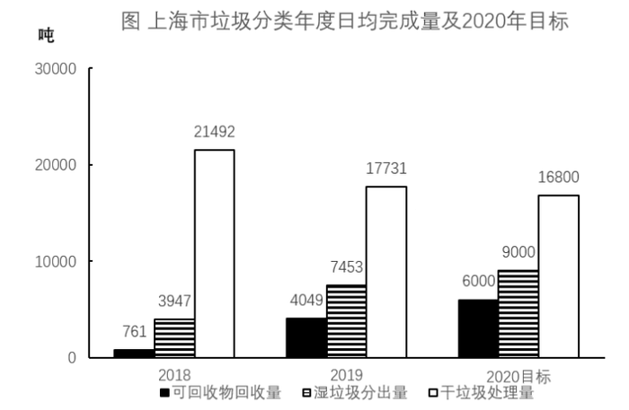

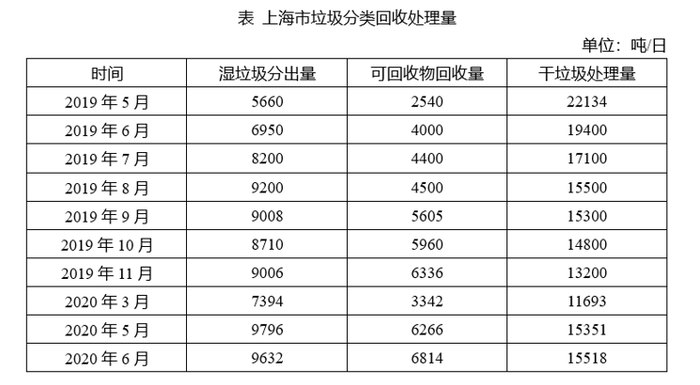

#### 第 1 题　qid 2731481 · 数学运算

表中，在日均湿垃圾分出量最高的月份，日均可回收物回收量与日均干垃圾处理量的比值约为：

- **A**. 0.26
- **B**. 0.44
- **C**. 0.41　✅
- **D**. 0.48

**答案**：C

**官方解析**

根据题干“表中，······与······比值约为”，可判定本题为比值计算问题。定位表格第二列可知，日均湿垃圾分出量最高的月份是2020年5月，分出量为9796吨/日，定位表格第三、四列可知，2020年5月日均可回收物回收量和日均干垃圾处理量分别为6266吨/日和15351吨/日。可得2020年5月，日均可回收物回收量与日均干垃圾处理量的比值约为，对应C项。

故正确答案为C。

---

#### 第 2 题　qid 2731516 · 数学运算

2019年7—9月，日均湿垃圾分出量约为（    ）吨。

- **A**. 8803
- **B**. 8702
- **C**. 9200
- **D**. 8800　✅

**答案**：D

**官方解析**

根据题干“2019年7—9月，日均湿垃圾分出量约······”，结合材料已给出2019年7—9月数据，可判定本题为现期平均数问题。定位表格材料，2019年7—9月日均湿垃圾分出量分别为8200吨/日、9200吨/日、9008吨/日。根据公式，日均湿垃圾分出量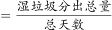，可得2019年7—9月，日均湿垃圾分出量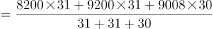吨，与D项相符。

故正确答案为D。

---

#### 第 3 题　qid 2731518 · 数学运算

2019年6—9月，日均干垃圾处理量月增长率的绝对值：

- **A**. 一直减小　✅
- **B**. 一直增大
- **C**. 先增大后减小
- **D**. 先减小后增大

**答案**：A

**官方解析**

根据题干“2019年6—9月，日均干垃圾处理量月增长率的绝对值”，结合选项为增大/减小，可判定本题为增长率的比较问题。定位表格可知，2019年6—9月日均干垃圾处理量。根据公式“”，则2019年6—9月日均干垃圾处理量月增长率分别为：6月；7月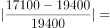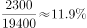；8月；9月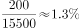。则2019年6—9月，日均干垃圾处理量月增长率的绝对值一直减小。

故正确答案为A。

注：由于表格中仅给出2019年5月~2020年6月的数据，未给出2018年6~9月的数据，故认为题干中“月增长率”为月环比增长率。

---

#### 第 4 题　qid 2731530 · 数学运算

以下说法错误的是：

- **A**. 
2019年7月环比数量变化最大的类别是干垃圾

- **B**. 
2019年7—10月，可回收物回收量增长率为

- **C**. 
2020年6月表中三类垃圾占比同比变化最大的是干垃圾

- **D**. 
2020年超额完成预计目标的月份为5月份和6月份
　✅

**答案**：D

**官方解析**

A项：定位表格可知，2019年6月与7月的湿垃圾日均分出量、可回收物日均回收量、干垃圾日均处理量。代入公式“总量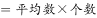”、“增长量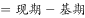”，可得2019年7月各类垃圾的环比变化数量分别为：

湿垃圾分出量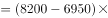吨；

可回收物回收量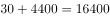吨；

干垃圾处理量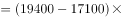吨；则2019年7月环比数量变化最大的类别是干垃圾，正确；

B项：定位表格可知，2019年7月与10月的可回收物日均回收量为4400吨与5960吨。根据公式“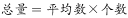”、“”，则2019年7—10月可回收物回收量的增长率为，正确；

C项：定位表格可知，2020年6月与2019年6月三类垃圾的日均处理量。2020年6月三类垃圾总量为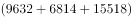吨，2019年6月三类垃圾总量为吨。2020年6月三类垃圾占比同比变化分别为：

湿垃圾分出量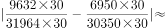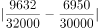；可回收物回收量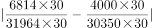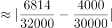；干垃圾处理量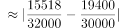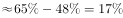，则占比同比变化最大的是干垃圾，正确；

D项：定位图形可知，2020年湿垃圾、可回收物、干垃圾的目标分别为9000吨/日、6000吨/日、16800吨/日。定位表格可知，2020年5月与6月的干垃圾处理量分别为15351吨/日与15518吨/日，未完成2020年预计目标，错误。

本题为选非题，故正确答案为D。

---

### 材料 2

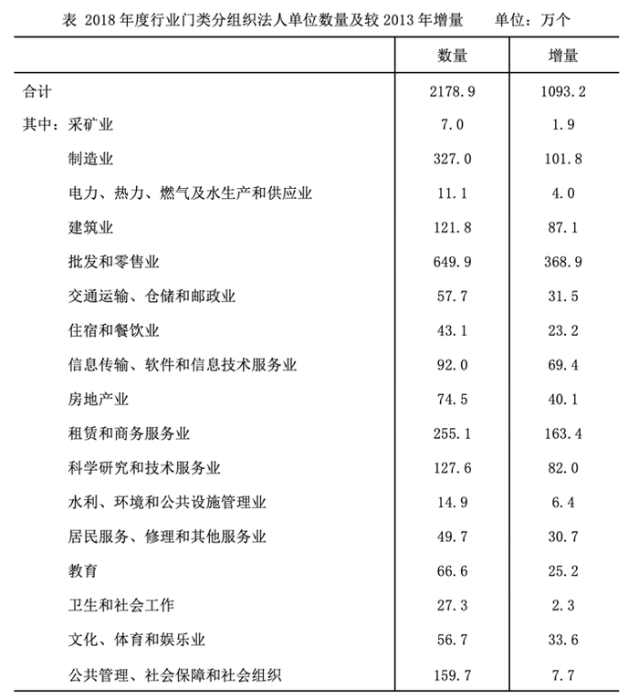

#### 第 5 题　qid 2731563 · 数学运算

2018年，全国法人单位数量比2013年增长以上的行业门类有<u>         </u>个。

- **A**. 8
- **B**. 9
- **C**. 10　✅
- **D**. 11

**答案**：C

**官方解析**

根据题干“2018年，全国法人单位数量比2013年增长以上”，可判定本题为一般增长率问题。定位表格数据，根据公式：增长率，即，化简得：。代入数据，符合要求的行业有：建筑业，批发和零售业，交通运输、仓储和邮政业，住宿和餐饮业，信息传输、软件和信息技术服务业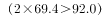，房地产业，租赁和商务服务业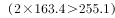，科学研究和技术服务业，居民服务、修理和其他服务业，文化、体育和娱乐业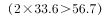，共10个。

故正确答案为C。

---

#### 第 6 题　qid 2731573 · 数学运算

2013—2018年间，全国法人单位数量增量最大的2个行业，2018年法人单位数之和为                    。

- **A**. 不到900万个
- **B**. 在900—950万个之间　✅
- **C**. 在950—1000万个之间
- **D**. 超过1000万个

**答案**：B

**官方解析**

根据题干“······2018年法人单位数之和”，结合统计表中增量和2018年法人单位数量均已给出，可判定本题为简单计算问题。定位表格资料可得：2013-2018年间，全国法人单位数量增量最大的2个行业分别是批发和零售业（368.9万个）与租赁和商务服务业（163.4万个），其2018年法人单位数分别为649.9万个、255.1万个，故所求万个，对应B项。

故正确答案为B。

---

#### 第 7 题　qid 2731575 · 数学运算

如制造业法人单位和全国法人单位数量均保持2013—2018年的年均增量不变，则2023年制造业法人单位数量占全国法人单位比重将比2018年约                    。

- **A**. 下降2个百分点　✅
- **B**. 下降8个百分点
- **C**. 上升2个百分点
- **D**. 上升8个百分点

**答案**：A

**官方解析**

根据题干“2023年······占······比重将比2018年约”，结合选项为上升/下降百分点，可判定本题为两期比重计算问题。定位表格材料，2018年制造业法人单位数量为327.0万个，2013-2018年间增量为101.8万个；2018年全国法人单位数量为2178.9万个，2013-2018年间增量为1093.2万个。根据公式：年均增长量，其中年均增长量和年份差均不变，故现期量基期量（2013-2018年间增量）也不变，则2023年制造业法人单位数量占全国法人单位的比重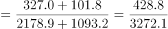，2018年该比重，故所求，即下降2个百分点，对应A项。

故正确答案为A。

---

#### 第 8 题　qid 2731579 · 数学运算

2013—2018年间，企业法人单位数量年均增量约是社会团体和其他法人数量年均增量的        倍。

- **A**. 10
- **B**. 13
- **C**. 16
- **D**. 19　✅

**答案**：D

**官方解析**

根据题干“2013-2018年间，······年均增量约是······年均增量的······倍”，可判定本题为现期倍数问题。定位统计图可得，2013年、2018年企业法人单位数分别为820.8万个、1857万个，2013年、2018年社会团体和其他法人单位数分别为161.1万个、214.4万个。根据公式：年均增长量，可得企业法人单位数年均增长量万个，社会团体和其他法人单位数年均增长量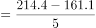万个；根据公式：现期倍数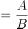，可得所求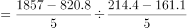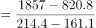。

故正确答案为D。

---

#### 第 9 题　qid 2731583 · 数学运算

能够从上述资料中推出的是：

- **A**. 
2013年，采矿业法人单位占全国法人单位的比重超过

- **B**. 
2013—2018年间，机关、事业法人单位年均增加不到1万个
　✅
- **C**. 
2013年，批发和零售业法人单位数量是教育法人单位数量的7倍以上

- **D**. 
2013—2018年间，科学研究和技术服务业是法人单位数年均增速最快的行业

**答案**：B

**官方解析**

A项：定位统计表可得，2018年采矿业法人单位数量及增量分别为7.0万个、1.9万个，全国法人单位总量为2178.9万个、1093.2万个，故2013年采矿业法人单位数量为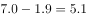万个，全国法人单位总量为万个。根据公式：比重，可得2013年采矿业法人单位占全国法人单位的比重，错误；

B项：定位统计图可得，2013年机关、事业法人单位数量为103.7万个，2018年机关、事业法人单位数量为107.5万个。根据公式：年均增长量，可得机关、事业法人单位年均增长量万个，正确；

C项：定位统计表可得，2018年批发和零售业法人单位数量为649.9万个，2018年较2013年增量为368.9万个，2018年教育法人单位数量为66.6万个，2018年较2013年增量为25.2万个，根据公式：基期，则2013年批发和零售业法人单位数量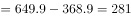万个；2013年教育法人单位数量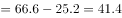万个，故所求，错误；

D项：根据公式：年均增长率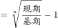，其中年份差相同，且表格资料中分别给出2018年各行业法人单位数量及较2013年增量，则比较即可，科学研究和技术服务业：，建筑业: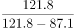，前者小于后者，故科学研究和技术服务业不是法人单位数年均增速最快的行业，错误。

故正确答案为B。

---

### 材料 3

        截至2019年底，广东省常住人口11521万人，比上年底增加175万人。其中，男性6022.03万人、女性5498.97万人，人口密度为641人/平方公里。2019年底，全省城镇化率（城镇常住人口占常住人口的比重）为，同比提高0.70个百分点。其中，珠三角九市的城镇化率为。

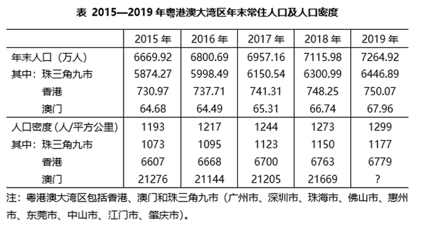

#### 第 10 题　qid 2731602 · 数学运算

截至2019年底，珠三角九市城镇常住人口约        万人。

- **A**. 5436
- **B**. 5562　✅
- **C**. 6200
- **D**. 6268

**答案**：B

**官方解析**

根据题干“截至2019年底，珠三角九市城镇常住人口约······”，结合文字和图表材料可知2019年末珠三角九市的城镇化率（城镇常住人口占常住人口的比重）和常住人口（总体），已知比重和总体求部分，且时间与材料一致，可判定本题为现期比重问题。定位文字材料可得∶“（2019年底）珠三角九市的城镇化率为”和表格材料“2019年珠三角九市常住人口为6446.89万人”。代入现期比重公式∶部分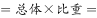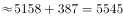万人，最接近B项。

故正确答案为B。

---

#### 第 11 题　qid 2731611 · 数学运算

2019年底除珠三角九市外，广东省其他地区的城镇化率                    。

- **A**. 
小于

- **B**. 
在至之间

- **C**. 
在至之间
　✅
- **D**. 
大于

**答案**：C

**官方解析**

根据题干“广东省其他地区的城镇化率······”，结合文字材料可知2019年底广东省常住人口、全省城镇化率及珠三角九市城镇化率，结合表格材料可知珠三角九市常住人口，由于广东省人口珠三角九市人口其他地区人口，因此可判定本题为混合比重问题。混合后总体为全省（常住人口11521万人，城镇化率为），部分量1为珠三角九市（常住人口6446.89万人，城镇化率为），设部分量2其他地区的城镇化率为，根据线段法，距离与量成反比：

即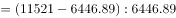，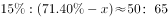，则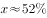，在C项范围内。

故正确答案为C。

---

#### 第 12 题　qid 2731621 · 数学运算

能够从上述资料中推出的是                    。

- **A**. 2019年底除珠三角九市外，广东省其余地区常住人口同比为负增长
- **B**. 表中“？”处的数字大于2.2万人/平方公里　✅
- **C**. 2019年底，广东省人口密度比上年底增加了20人/平方公里以上
- **D**. 2016-2019年间，香港和澳门常住人口呈持续增长趋势

**答案**：B

**官方解析**

A项：定位表格材料“珠三角九市2018年末与2019年末人口分别为6300.99万人和6446.89万人”则2019年珠三角九市常住人口同比增量现期量基期量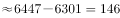万人。定位文字材料“广东省常住人口11521万人，比上年底增加175万人”，根据广东省常住人口同比增量珠三角九市常住人口同比增量其余地区常住人口同比增量，则其余地区常住人口同比增量为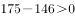，同比为正增长，错误。

B项：定位表格材料，2018年澳门人口密度21669人/平方公里，2018年和2019年澳门年末人口分别为66.74万人和67.96万人，根据地区面积，且澳门各年的面积保持不变，可列式：，则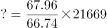，即大于2.2万人/平方公里，正确。

C项：定位文字材料“截至2019年底，广东省常住人口11521万人，比上年底增加175万人······人口密度为641人/平方公里”根据人口密度，则广东省面积为万平方公里，因为面积不变，因此人口密度增长量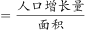人/平方公里，错误。

D项：定位表格材料，2016-2019年间，年末人口数据中，2016年澳门年末人口64.49万人2015年64.68万人，并非持续增长，错误。

故正确答案为B。

---

#### 第 13 题　qid 2731323 · 数学运算

2，2，，1，，<u>        </u>

- **A**. 

　✅
- **B**. 
0

- **C**. 

- **D**. 

**答案**：A

**官方解析**

观察数列，题干和选项中均有分数，优先考虑分数数列。反约分后，原数列可转化为：，，，，，（    ）。分子部分为连续自然数列，则所求项分子为6；分母部分是公比为2的等比数列，则所求项分母为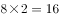。故所求项为。

故正确答案为A。

---

#### 第 14 题　qid 2731334 · 数学运算

根据下图规律，“？”处图形有<u>        </u>个白色小正方形。   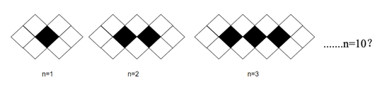

- **A**. 18
- **B**. 20
- **C**. 22
- **D**. 24　✅

**答案**：D

**官方解析**

观察趋势发现图形中白色小正方形的数量依次为6，8，10······，且n每增加1，就会增加2个白色小正方形，即白色小正方形的数量为首项为6，公差为2的等差数列，则当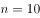时，有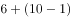个白色小正方形。

故正确答案为D。

---

#### 第 15 题　qid 2731335 · 数学运算

数列：（3，4），（6，8），（13，15），（27，29），

- **A**. （53，55）
- **B**. （54，55）
- **C**. （55，57）　✅
- **D**. （56，58）

**答案**：C

**官方解析**

观察数列特征，数列项数较多，考虑多重数列。交叉后无规律，考虑两两分组。括号中两项数字加和，得到7，14，28，56，（    ），是公比为2的等比数列，则所求项中两项之和，只有C项满足条件。

故正确答案为C。

---

#### 第 16 题　qid 2731342 · 数学运算

数列：[1，2]3，[1，2，3]0，[1，2，3，4]4，[1，2，3，4，5]-1，[1，2，3，4，5，6]5，[1，2，3，4，5，6，7]-2，[1，2，3，4，5，6，7，8]6，···，则[1，2，3，···，100]<u>        </u>

- **A**. 52　✅
- **B**. 50
- **C**. -50
- **D**. -52

**答案**：A

**官方解析**

方法一：数列项数较多，考虑多重数列。交叉来看，等号右边奇数数列为：3，4，5，6，······，是连续自然数列；等号右边偶数数列为：0，-1，-2，······，是公差为-1的等差数列。所求项是原数列的第99项，为奇数项，且为奇数数列的第50项，则所求项为52。

方法二：观察数列，计算发现：，，，，，，······，即连续自然数中、符号循环交替，则所求项为············。

故正确答案为A。

---

#### 第 17 题　qid 2731346 · 数学运算

将从1到11连续自然数填入下图中的圆圈内，要使每边上的三个数的和都相等，a不可能是<u>        </u>。

- **A**. 1
- **B**. 6
- **C**. 7　✅
- **D**. 11

**答案**：C

**官方解析**

根据等差数列求和公式，1到11连续自然数的和为。每边上的三个数的和均包括一个的值且都相等，则五条边上空白部分的两个数之和均相等，因此所有空白部分对应数据之和为5的倍数，即为5的倍数，代入选项验证：

A项：，符合；

B项：，符合；

C项：不为整数，不符合；

D项：，符合。

本题为选非题，故正确答案为C。

---

#### 第 18 题　qid 2731348 · 数学运算

有一架自动扶梯共25级，每秒移动2阶。A从扶梯的起点处站立乘坐，两秒后B从起点处以每秒1阶的速度向上走动。又过三秒后C来到扶梯起点处且以每秒4阶的速度向上跑。那么以下事件中最先发生的是        。

- **A**. A到达扶梯终点
- **B**. B追上A　✅
- **C**. C追上A
- **D**. C追上B

**答案**：B

**官方解析**

由题意可知本题为行程问题，事件最先发生的一定是总体用时最短的，分别计算四个事件的用时比较即可。

A项：由题意“有一架自动扶梯共25级，每秒移动2阶。A从扶梯的起点处站立乘坐”可知，阶/秒，A到达扶梯终点的时间秒；

B项：由题意“两秒后B从起点处以每秒1阶的速度向上走动”可知，阶/秒，阶，根据追及公式：，则，解得秒，故B追上A的总体用时秒；

C项：由题意“又过三秒后C来到扶梯起点处且以每秒4阶的速度向上跑”可知，阶/秒，阶，则，解得秒，故C追上A的总体用时秒；

D项：阶，则，解得秒，故C追上B的总体用时秒。

比较可知，选项中B追上A的事件总体用时最少。

故正确答案为B。

---

#### 第 19 题　qid 2731350 · 数学运算

办公楼高24层，小王在底楼，他有一个文件急需交给在顶楼的小李。大楼只有一个电梯，正停在底楼待命，电梯每上升或下降一层需要10秒，小李走楼梯下楼每层需要走15秒，小王走楼梯上楼每层需要走20秒，他们约在（    ）楼碰面最节约时间。

- **A**. 12
- **B**. 13
- **C**. 14
- **D**. 15　✅

**答案**：D

**官方解析**

要满足碰面时间最短，根据题干条件可知，小王选择坐电梯上楼，小李走楼梯下楼。可知小王坐电梯上楼和小李走楼梯下楼的时间之比，则小王坐电梯上3层和小李走楼梯下2层的时间相同。要碰面共需要走层，······层，则小王先坐电梯上层（到达13楼）和小李走楼梯下层（到达16楼）的时间相同，小王再坐电梯上2层（到达15楼）需要20秒，小李走楼梯下1层（到达15楼）需要15秒，则两人在15楼碰面，此时最节约时间。

故正确答案为D。

---

#### 第 20 题　qid 2731353 · 数学运算

某货运公司现有100辆货车，需招聘若干司机，条件是每工作五天后休息两天。公司希望司机休息时货车不休息，则至少要招聘        名司机。

- **A**. 128
- **B**. 136
- **C**. 140　✅
- **D**. 144

**答案**：C

**官方解析**

假设先给每辆货车分配1名司机，则5辆货车有5名司机需要休息天。这10天需要额外名司机来补充工作，即5辆货车至少需要7名司机。则100辆货车至少需要名司机。

故正确答案为C。

---

#### 第 21 题　qid 2731356 · 数学运算

一个长方形长6cm，宽4cm，现分别平行于长和宽剪了若干刀，将长方形分割成若干个小长方形，这些小长方形的周长之和比原长方形周长多了56cm。那么最多剪了         刀。

- **A**. 3
- **B**. 4
- **C**. 5
- **D**. 6　✅

**答案**：D

**官方解析**

设平行于长剪了刀，平行于宽剪了刀。每当长或宽多剪一刀，这些小长方形总周长比原长方形周长多了2倍的长或宽。由此可列：，化简可得，结合奇偶特性可知，应为偶数。根据，要剪的总刀数最多，即（）最大，则尽量小，由于为偶数且不能为0，则应取2。当时，，共剪刀。

故正确答案为D。

---

#### 第 22 题　qid 2731364 · 数学运算

甲到飞机场坐飞机，飞机场的十二个登机口排成一条直线，相邻两个登机口之间相距50米。甲在登机口等待时被告知登机口更改了，那么甲走到新登机口的距离不超过200米的概率是：

- **A**. 

- **B**. 

- **C**. 

- **D**. 

　✅

**答案**：D

**官方解析**

给情况求概率，考虑公式：概率。总情况为甲在任意登机口移动到另一登机口，共有种情况；满足条件的情况为甲走到新登机口的距离不超过200米，因相邻两个登机口距离为50米，则甲移动到相邻登机口要在4个及以内，分别讨论如下：

甲在1号登机口：满足条件的有2，3，4，5号登机口，共4种情况；

甲在2号登机口：满足条件的有1，3，4，5，6号登机口，共5种情况；

甲在3号登机口：满足条件的有1，2，4，5，6，7号登机口，共6种情况；

甲在4号登机口：满足条件的有1，2，3，5，6，7，8号登机口，共7种情况；

甲在5号登机口：满足条件的有1，2，3，4，6，7，8，9号登机口，共8种情况；

甲在6号登机口：满足条件的有2，3，4，5，7，8，9，10号登机口，共8种情况。

因登机口呈一条直线，故7~12号登机口与1~6号登机口情况对称，分别有8，8，7，6，5，4种情况。由此可知，满足条件的情况数共有种情况。

则甲走到新登机口的距离不超过200米的概率。

故正确答案为D。

---

#### 第 23 题　qid 2731367 · 数学运算

过年要写春联，小李拿来一张长宽分别为85厘米和75厘米的红纸，打算裁开使用。已知春联每联7个字，一副春联上下两联，再加一个4字横批，每个字长宽都是10厘米，则这张红纸最多可以制作（    ）副春联。

- **A**. 2
- **B**. 3　✅
- **C**. 4
- **D**. 5

**答案**：B

**官方解析**

一张长宽分别为85厘米和75厘米的红纸，面积为；一副完整的春联的包含上下联14个字及横批4个字，面积共为。要想制作的春联尽可能多，则红纸浪费的面积应尽可能少，若完全不考虑浪费，能制作春联幅，即最多能制作3幅，结合选项，排除C、D两项。

如下图所示，蓝色代表横批，红黄两色代表上下联，可知最多能制作3幅春联。

故正确答案为B。

---

#### 第 24 题　qid 2731374 · 数学运算

公司购买某设备24套，现要登记单价，但是数据上没有标注单价，且总价第一位和最后一位模糊不清，只看到是☆579△元。则☆可能是        。

- **A**. 3
- **B**. 5
- **C**. 7　✅
- **D**. 9

**答案**：C

**官方解析**

总价单价数量，设备数量为24套，故总价一定为24的倍数，即总价既是3的倍数又是8的倍数。

题干数字为☆579△，若要为8的倍数，则后三位应为8的倍数。79△800m，由于800是8的倍数，故m只能为8，则△只能为2。

此时题干数字为☆5792，若要为3的倍数，则各位数字之和应为3的倍数。☆☆，则☆可能为1、4、7，只有C项符合。

故正确答案为C。

---

#### 第 25 题　qid 2731378 · 数学运算

有一座13.2万人口的城市，需要划分为11个投票区，任何一个区的人口不得超过其他区人口的，那么人口最少的地区可能有<u>        </u>人。

- **A**. 9800
- **B**. 10500
- **C**. 10700
- **D**. 11000　✅

**答案**：D

**官方解析**

设人口最少的地区人数为万人。由于题目问的是“可能”，答案存在一定范围，因此需要对该地区的人数分情况讨论。

第一种情况：若要使该地区人数最少，则其他10个地区人数要尽量多。根据题意，此时其他10个地区人数均为万人，则，解得，人口最少的地区最少有1.1万人，即11000人。

第二种情况：若要使该地区人数最多，则其他10个地区人数要尽量少。根据题意，此时其他10个地区的人数均为万人，则，解得，人口最少的地区最多有1.2万人，即12000人。

因此11000人口最少的地区人数12000，只有D项在该范围内。

故正确答案为D。

（注：本题讨论完第一种情况，即可锁定D项）

---

#### 第 26 题　qid 2731380 · 数学运算

安排4名护士护理3个病房，每个病房至少一名护士，每名护士固定护理一个病房，则共有        种安排方法。

- **A**. 24
- **B**. 36　✅
- **C**. 48
- **D**. 72

**答案**：B

**官方解析**

4名护士护理3个病房，且每个病房至少一名护士，则人数分组为（2，1，1）。从4名护士中选出2名护士在一组，共同护理一个病房，有种方法；三组人员，分别护理3个病房，有种方法。则共有种安排方法。

故正确答案为B。

---

#### 第 27 题　qid 2731382 · 数学运算

假设三颗小行星绕着一颗恒星运动，它们的运行轨道都是圆形，每条轨道的圆心都是该恒星。且三条轨道都在同一平面内。若这三颗小行星同向旋转，且绕轨道运行一周的时间分别是60年、84年、140年。现在三颗小行星和恒星在同一直线上且三颗小行星都在恒星的同侧，那么至少        年后他们再次在同一直线上且三颗小行星都在恒星的同侧。

- **A**. 210　✅
- **B**. 315
- **C**. 420
- **D**. 630

**答案**：A

**官方解析**

题干较为复杂，考虑代入排除；问“至少”，考虑从小到大代入选项。

代入A项：210年后，运行周期为60年的小行星共运行周，运行周期为84年的小行星共运行周，运行周期为140年的小行星共运行周。此时，每个小行星的位置都偏离原来位置半圈，满足在同一直线上且三颗小行星都在恒星的同侧。

因A项已满足题意，B、C、D三项无需验证。

故正确答案为A。

---

## 判断推理

### 材料 1

某单位今年招录了8名应届毕业生，其中甲和乙是文科生，丙、丁、戊是理科生，己、庚、辛是工科生。8人中，甲、丙、己是女士。单位拟从中选出5人组成一个研发团队，团队中文科生、理科生和工科生至少各有1人，并且至少要有1名女士参加。此外，还要满足下列条件：

（1）丙和庚至多有1人参加；

（2）若乙参加，则丁也参加；

（3）戊和辛要么都参加，要么都不参加。

#### 第 1 题　qid 2731298 · 类比推理

下列（    ）项组合方案满足上述对于研发团队的要求。

- **A**. 甲、丙、丁、己、庚
- **B**. 甲、丁、戊、己、辛　✅
- **C**. 乙、丙、戊、己、辛
- **D**. 乙、丁、戊、己、庚

**答案**：B

**官方解析**

第一步，整理题干条件。

（1）丙或庚；

（2）乙丁；

（3）戊和辛要么都参加，要么都不参加。

第二步，根据题干条件分析选项。

根据条件（1）可知，丙和庚不能同时参加，排除A项；根据条件（2）可知，乙参加，丁一定参加，排除C项；根据条件（3）可知，戊和辛要么都参加，要么都不参加，排除D项。

故正确答案为B。

---

#### 第 2 题　qid 2731301 · 类比推理

如果甲没有参加，则下列（    ）项可能为真。

- **A**. 理科生只有戊参加
- **B**. 工科生只有己参加
- **C**. 3名理科生都参加　✅
- **D**. 3名工科生都参加

**答案**：C

**官方解析**

第一步，整理题干条件。

（1）丙或庚；

（2）乙丁；

（3）戊和辛要么都参加，要么都不参加；

（4）甲不参加。

第二步，根据题干条件分析选项。

根据条件（4）可知，甲不参加，结合题干信息文科生至少有一人参加，则乙一定参加，又结合条件（2）可知，丁一定参加，因此可排除A项。

结合题干问“可能为真”，故可采用代入法。

代入B项：工科生只有己参加，那么庚、辛不参加。根据条件（3）可知，戊不参加；此时，甲、庚、辛、戊四人不参加，不满足选出5人参加这一条件，故B项不可能为真，排除；

代入C项：3名理科生都参加，即丙、丁、戊都参加。根据条件（1）可知，庚不参加；根据条件（3）可知，辛参加。此时，参加人数有：乙、丙、丁、戊、辛5人，不参加有：甲、庚两人，现只需己不参加，即可符合题干要求，故C项可能为真，当选；

代入D项：3名工科生都参加，即己、庚、辛都参加，根据条件（1）可知，丙不参加；根据条件（3）可知，戊参加。此时，参加人数有：乙、丁、己、庚、辛、戊6人，不符合题干要求，故D项不可能为真，排除。

故正确答案为C。

---

#### 第 3 题　qid 2731049 · 类比推理

现代社会离不开电能，火力发电仍然是目前重要的发电形式之一，它“吃”进的是煤，“吐”的是电，在这个过程中的能量转化是：

- **A**. 
机械能内能化学能电能

- **B**. 
化学能内能机械能电能
　✅
- **C**. 
化学能重力势能动能电能

- **D**. 
内能化学能机械能电能

**答案**：B

**官方解析**

火力发电时，烧煤时煤的化学能先转变成内能，内能再转化为发电装置的机械能，最终转化为电能。
故正确答案为B。

---

#### 第 4 题　qid 2731050 · 类比推理

利用下列几组器材中的                    ，可以最为方便地判断一段有绝缘外皮包裹的导线中是否有直流电流通过。

- **A**. 小灯泡及导线
- **B**. 铁棒及细棉线
- **C**. 带电的小纸球及细棉线
- **D**. 被磁化的缝衣针及细棉线　✅

**答案**：D

**官方解析**

A项：若将小灯泡用导线接在有绝缘外皮的导线上，无论有绝缘外皮包裹的导线中是否有直流电流通过，小灯泡均为短路状态，不亮，故无法判断有绝缘外皮包裹的导线是否有直流电流通过，错误；
B项：用棉线将铁棒吊在导线上方，靠近有绝缘外皮包裹的导线时，若导线中有直流电流通过，则其产生的电磁场对铁棒有磁场力的作用，但磁场力相对于铁棒的重力来说较小，铁棒不会发生偏转，无论有绝缘外皮包裹的导线中是否有直流电流通过，铁棒都不会发生偏转，故无法判断该导线是否有直流电流通过，错误；
C项：用棉线将小纸球吊在导线上方，靠近有绝缘外皮包裹的导线时，无论导线中是否有直流电流通过，都不会对小纸球有磁场力的作用，故无法判断该导线是否有直流电流通过，错误；
D项：用细棉线将被磁化的缝衣针吊在导线上方，靠近有绝缘外皮包裹的导线时，若导线中无直流电流通过，缝衣针不发生偏转；若导线中有直流电流通过，则缝衣针在磁场力的作用下发生偏转，故可以用来判断有绝缘外皮包裹的导线中是否有直流电流通过，正确。
故正确答案为D。

---

#### 第 5 题　qid 2731052 · 类比推理

如图是两车发生交通事故后的现场图，由图片可判断：

- **A**. 一定是甲车去撞乙车的
- **B**. 碰撞前瞬间乙车的速度一定比甲车大
- **C**. 碰撞时两车的相互作用力大小一定相等　✅
- **D**. 碰撞前瞬间两车的动能大小一定相等

**答案**：C

**官方解析**

A项：图片是汽车碰撞之后的现场图，无法判断碰撞之前汽车的运动状态，错误；

B项：图片是汽车碰撞之后的现场图，无法确定碰撞前瞬间两个汽车的运动速度，错误；

C项：由牛顿的第三定律可知，当两个物体相互作用时，彼此施加给对方的力必定大小相等，方向相反。故两车碰撞时，两车的相互作用力大小一定相等，正确；

D项：由动能的公式可知，在碰撞之前两车的质量，速度，大小都不确定，故无法得知碰撞前瞬间两车动能的大小，错误。

故正确答案为C。

---

#### 第 6 题　qid 2731055 · 类比推理

喷水鱼因特殊的捕食方式而得名，能喷出一股水柱，准确击落空中的昆虫作为食物。下列各图中能正确表示喷水鱼看到昆虫像的光路图的是：

- **A**. A
- **B**. B
- **C**. C　✅
- **D**. D

**答案**：C

**官方解析**

此题考察光在不同介质中的折射，喷水鱼在水中看空气中的昆虫，是昆虫反射的光线进入到喷水鱼的眼睛，故A、B两项错误；光从空气中斜射入水中，实际光线的入射角大于折射角，鱼的眼睛看到的是水中光线的反向延长线上昆虫的虚像，看到的虚像比实际昆虫的位置偏高，C项正确，D项错误。
故正确答案为C。

---

#### 第 7 题　qid 2731059 · 定义判断

分类是科学研究的重要方法，物质可以分为纯净物和混合物，纯净物可以分为单质和化合物。下列四种物质符合如图所示关系的是：

- **A**. 铜
- **B**. 干冰
- **C**. 金刚石　✅
- **D**. 陶瓷

**答案**：C

**官方解析**

此题考察化学中常见物质分类，需要将题干中涉及的单质、导体、晶体、混合物的相关定义理解清楚。

单质：是由一种元素的原子组成的以游离形式较稳定存在的物质，例如：氧气（），铜（）等。

晶体：是原子、离子或分子按照一定的周期性，在三维空间作有规律的周期性重复排列所形成的物质，例如：冰（）等。

导体：能够导电的物体，例如铁（）等。

混合物：是由两种或多种物质混合而成的物质。

A项：铜（）既属于单质也属于导体，正确；

B项：干冰是固态的二氧化碳（），是纯净物，错误；

C项：金刚石（）是单质，也是原子晶体，正确；

D项：陶瓷是粘土、石英等混合烧制而成的，属于混合物，但陶瓷不能导电，是因为陶瓷原子的最外层电子被束缚在各自原子的四周，不能自由移动，错误。

故正确答案为C。

特殊说明：此题存在一定的争议，铜单质属于单质、导体、原子晶体，属于三者，图中的A只含有两个部分，粉笔更加倾向于选C。

---

#### 第 8 题　qid 2732923 · 逻辑判断

有一根金属丝弯成半圆弧的形状竖直于平面内，蚂蚁从a沿金属缓慢爬向b（a、b同一水平线），下列说法正确的是：

- **A**. 蚂蚁从a往圆顶爬时，它受摩擦力向下
- **B**. 蚂蚁从圆顶往b爬时，它受摩擦力向下
- **C**. 蚂蚁受的支持力，先增大后减小　✅
- **D**. 蚂蚁受的摩擦力，大小不变

**答案**：C

**官方解析**

A、B项：蚂蚁在沿着金属丝爬行时受到重力的作用，重力会使蚂蚁有沿着金属丝向下滑动的趋势，从a往圆顶爬行时，它所受摩擦力的方向沿着斜面的切线向上，蚂蚁从圆顶往b爬行时，它所受摩擦力的方向沿着斜面的切线向上，故A、B两项均错误；

C、D项：设蚂蚁的重力为， 蚂蚁和圆心连线与竖直方向的夹角为，对蚂蚁进行受力分析（如下图所示），蚂蚁在爬行时，受到重力、摩擦力、支持力，三个力的作用，蚂蚁在缓慢爬行时所受的合外力为0，根据受力平衡重力的分力的大小等于摩擦力，即，支持力，蚂蚁在爬行的过程中，先减小，后增大，则摩擦力先减小，后增大，支持力先增大，后减小。故C项正确，D项错误。

故正确答案为C。

---

#### 第 9 题　qid 2731071 · 逻辑判断

如图所示，一个弹性小球从a点静止释放，竖直撞击水平地面后反弹，已知空气阻力大小恒定，撞击地面无能量损失。对于小球下落后反弹至最高点的过程中，下列说法正确的是：

- **A**. 因为空气阻力大小不变，所以下落过程阻力做功等于反弹时阻力做的功
- **B**. 因为撞击时地面给小球向上的作用力，所以小球反弹的最高点高于a点
- **C**. 小球下落过程中空气阻力做负功，反弹过程中空气阻力做正功
- **D**. 小球下落过程和反弹过程均是匀变速直线运动，但加速度不同　✅

**答案**：D

**官方解析**

A项：功的公式，下落过程和反弹过程空气阻力相等，但是空气阻力一直做负功，下落过程的位移大于反弹时的位移，所以两个过程中空气阻力做的功不相等，错误；

B、C两项：小球在下落过程中所受的空气阻力方向向上，空气阻力方向与运动的方向相反，空气阻力做负功；小球反弹之后，小球向上运动，小球所受的空气阻力向下，空气阻力方向与小球的运动方向相反，空气阻力做负功，无论小球向上还是向下运动，空气阻力始终做负功，空气阻力做负功，使小球的机械能减少，小球反弹之后最高点一定低于a点，均错误；

D项：设小球的质量为，分析小球的受力情况，小球在下降过程中受到竖直向下的重力和竖直向上的空气阻力，由牛顿的第二定律可得，加速度大小方向均不变，小球做匀加速直线运动。小球在反弹之后向上运动的过程中受到竖直向下的重力和空气阻力，由牛顿第二定律可得，大小和方向均不变，故小球做匀减速直线运动，由以上分析可知，正确。

故正确答案为D。

---

#### 第 10 题　qid 2731104 · 类比推理

已知化学反应进行前后，参加反应的物质种类发生变化，总质量不发生变化，催化剂的质量也不发生变化。某密闭容器内有四种物质，反应一段时间后，测得反应前后各物质的质量如下表所示。下列说法正确的是：

- **A**. 丁一定是单质
- **B**. M的值是15
- **C**. 该反应是分解反应　✅
- **D**. 反应中的甲、丙质量比为15：27

**答案**：C

**官方解析**

A项：丁属于生成物，通过条件信息，无法确定丁是否为单质，错误；

B项：由化学反应原理可知，化学反应进行前后，反应前的物质总量等于反应后的物质的总量即，，错误；

C项：该反应为甲丙丁，故该反应为分解反应，正确；

D项：由以上分析可知，参加反应的甲为54克，生成的丙为30克，，错误。

故正确答案为C。

---

#### 第 11 题　qid 2731139 · 定义判断

“绿色化学”要求物质回收或循环利用，反应物原子利用率为，且全部转化为产物，“三废”必须先处理再排放。下列做法或反应符合“绿色化学”要求的是：

- **A**. 
焚烧塑料以消除“白色污染”

- **B**. 
深埋含镉、汞的废旧电池

- **C**. 

　✅
- **D**. 

**答案**：C

**官方解析**

A项：焚烧塑料会产生大量的废气污染空气，不符合条件中的“绿色化学”要求，错误；

B项：深埋含镉、汞的废旧电池，没有先处理再排放，不符合“绿色化学”要求，并且深埋处理会污染土壤和水源，错误；

C项：由化学反应方程式可知，丙炔、氢气、一氧化碳反应生成戊二醛，原子的利用率为，符合“绿色化学”要求，正确；

D项：利用高锰酸钾加热生产氧气，产物还有锰酸钾和二氧化锰，原子的利用率不足，不符合“绿色化学”要求，错误。

故正确答案为C。

---

#### 第 12 题　qid 2731143 · 逻辑判断

铝是地壳中含量最丰富的金属元素，具有良好的导电性和延展性，属于轻金属。下列有关铝的用途和性质，表述错误的是：

- **A**. 航空材料，密度小
- **B**. 电线电缆，导电性
- **C**. 耐火材料，熔点高　✅
- **D**. 铝箔，延展性好

**答案**：C

**官方解析**

A项：铝的密度比较小，，其密度约是铁的，同时铝还具有较强的防腐蚀能力，可以用来做航空材料，正确；

B项：铝的电阻率比较低，导电性比较强，延展性比较好，可以做电线电缆，正确；

C项：铝的熔点为，一般认为普通的耐火材料的耐火温度不低于，显然铝不适合做耐火材料，错误；

D项：铝的质地柔软，延展性比较好，可以直接把铝块压制成铝箔，正确。

本题为选非题，故正确答案为C。

---

#### 第 13 题　qid 2731146 · 类比推理

制作变色眼镜时需要加入溴化银或者氯化银，这是利用溴（氯）化银光照分解生成银和溴（氯）单质的原理。以下物质中无色透明的是：

- **A**. 溴化银　✅
- **B**. 银
- **C**. 溴单质
- **D**. 氯气单质

**答案**：A

**官方解析**

变色眼镜在无光照的时候呈透明色，在有光照的情况下呈暗棕色。在有光照的情况下溴化银或者氯化银见光分解为银和溴（氯）单质。银单质呈银白色，溴单质呈红棕色，氯气单质呈黄绿色，这三种物质都不符合题意。在普通玻璃中加入适量的溴化银和氧化铜的微晶粒即为变色镜片。当强光照射时，溴化银分解为银和溴的微小晶粒，分解出的溴的微小晶粒，使玻璃呈现暗棕色。当光线变暗或者无光照时，银和溴在氧化铜的催化作用下，重新生成溴化银，于是镜片的颜色又变浅了。故B、C、D三项均不符合题意，排除。
故正确答案为A。

---

#### 第 14 题　qid 2731152 · 图形推理

下列选项中，符合所给图形的变化规律的是：

- **A**. A
- **B**. B　✅
- **C**. C
- **D**. D

**答案**：B

**官方解析**

元素组成相同，优先考虑位置规律。题干八边形内部的田字形依次沿着八边形的边逆时针移动1、2、3条边，故？处应当在第4幅图的基础上逆时针移动4条边，排除A项。继续观察，田字形内部的小元素每幅图分别按照田字形的格子依次顺时针移动一格，只有B项符合规律。
故正确答案为B。

---

#### 第 15 题　qid 2731161 · 图形推理

下列选项中，符合所给图形的变化规律的是：

- **A**. A
- **B**. B　✅
- **C**. C
- **D**. D

**答案**：B

**官方解析**

题干每幅图中有多个小元素，优先考虑元素种类和个数。观察发现，左侧三幅图中，图三内部小元素数量为8，是图一内部小元素数量的2倍，同时图三内部小元素的方向与图二内部小元素的方向一致。右侧图形应用此规律，则？处图形内部箭头数量为图一内部箭头数量的2倍，应为6个箭头，排除A、D两项，图三内部箭头的方向应与图二内部箭头的方向一致，排除C项。
故正确答案为B。

---

#### 第 16 题　qid 2731169 · 图形推理

从所给的四个选项中，选择最合适的一个填入问号处，使之呈现一定的规律性：

- **A**. A
- **B**. B　✅
- **C**. C
- **D**. D

**答案**：B

**官方解析**

元素组成相似，线条重复出现，考虑样式规律。观察左侧第一组图发现，前两幅图去同存异，得到第三幅图。将此规律应用到右侧第二组图中，只有B项符合。
故正确答案为B。

---

#### 第 17 题　qid 2731178 · 图形推理

从所给的四个选项中，选择最合适的一个填入问号处，使之呈现一定的规律性：

- **A**. A
- **B**. B　✅
- **C**. C
- **D**. D

**答案**：B

**官方解析**

元素组成基本相同，优先考虑位置规律。整体来看，每一列都有三种元素，黑点、三角形、梯形，且三角形和梯形的位置依次往上移动。先看三角形，在依次往上移动的过程中，如果与黑点重合，三角形会把黑点覆盖，且三角形的方向会从尖朝上变成尖朝下，尖朝下时移动步数由一步变成两步，由第6列三角形尖朝上，可知三角形向上移动一步，排除C项。再看梯形，在往上移动的过程中，如果与黑点重合，梯形会把黑点覆盖，且梯形的方向会从短边在上变成短边在下，短边在下时步数由两步变成三步，由第6列梯形短边在下，可知梯形向上移动三步，又因为每一列都有三种元素，得知梯形在第7列必定与黑点重合了，所以梯形方向发生变化，由短边在下变成短边在上，排除A、D两项。
故正确答案为B。

---

#### 第 18 题　qid 2731186 · 图形推理

下列选项中，可以由左图折叠而成的立体图是：

- **A**. A
- **B**. B
- **C**. C　✅
- **D**. D

**答案**：C

**官方解析**

本题考查六面体。将原展开图标上序号，如下图，逐一进行分析。

A项：选项中包括面b和面d，而展开图中面b和面d为相对面，不能同时出现，选项与展开图不一致，排除；

B项：选项中出现了面f、带斜线的梯形面和带十字的梯形面。在展开图中，带斜线的梯形面可能为面a或面e，其中面f中的斜线与面e中的斜线相交于点A，面f中的斜线与面a中的斜线相交于点B，如上图所示。而在选项中，面f中的斜线无论是与面a中的斜线还是面e中的斜线均无交点，选项与展开图不一致，排除；

C项：选项与展开图一致，当选；

D项：选项中出现了面f、带斜线的梯形面和带十字的梯形面。在展开图中，带斜线的梯形面可能为面a或面e，其中面f中的斜线与面e中的斜线相交于点A，面f中的斜线与面a中的斜线相交于点B，如上图所示。而在选项中，面f中的斜线无论是与面a中的斜线还是面e中的斜线均无交点，选项与展开图不一致，排除。

故正确答案为C。

---

#### 第 19 题　qid 2731193 · 图形推理

下列选项中，符合所给图形的变化规律的是：

- **A**. A　✅
- **B**. B
- **C**. C
- **D**. D

**答案**：A

**官方解析**

元素组成相似，优先考虑样式规律。观察发现，第一组图，图1先顺时针旋转后，再与图2相加得到图3。第二组图满足同样的规律，图1先顺时针旋转后，再与图2相加得到图3，只有A项符合。

故正确答案为A。

---

#### 第 20 题　qid 2731200 · 图形推理

下列选项中，符合所给图形的变化规律的是：

- **A**. A
- **B**. B　✅
- **C**. C
- **D**. D

**答案**：B

**官方解析**

观察发现，第一横行图中，将所有位置的小黑三角形拼在一起，可以得到一个完整的黑色正方形；经验证，第二横行满足此规律；第三横行应用此规律，故？处左上角区域和右下角区域应各有一个小黑三角形，只有B项符合。
故正确答案为B。

---

#### 第 21 题　qid 2731208 · 图形推理

下列选项中，符合所给图形的变化规律的是：

- **A**. A　✅
- **B**. B
- **C**. C
- **D**. D

**答案**：A

**官方解析**

元素组成相同，优先考虑位置规律。每个图形都由5个圆组成，分别给这5个圆的位置标为1、2、3、4、5。从图一到图二，黑点由1号移动到2号位置，正方形由2号移动到4号位置，三角形由3号移动到1号位置，圆圈由4号移动到5号位置，×由5号移动到3号位置。经验证，从图二到图三也符合小元素由1号移动到2号位置，由2号移动到4号位置，由3号移动到1号位置，由4号移动到5号位置，由5号移动到3号位置。所以，从图三到图四也应符合此规律，只有A项符合。

故正确答案为A。

---

#### 第 22 题　qid 2731219 · 图形推理

下列选项中，符合所给图形的变化规律的是：

- **A**. A
- **B**. B
- **C**. C　✅
- **D**. D

**答案**：C

**官方解析**

观察前两幅图，元素组成基本相同，优先考虑位置规律，图1横线以上部分（如下图所示），向下翻转后与下半部分重叠得到图2；后两幅图遵循此规律，将图3上半部分向下翻转后与下半部分重叠，只有C项符合。

故正确答案为C。

---

#### 第 23 题　qid 2731224 · 图形推理

从所给的四个选项中，选择最合适的一个填入问号处，使之呈现一定的规律性：

- **A**. A
- **B**. B
- **C**. C
- **D**. D　✅

**答案**：D

**官方解析**

本题考查截面图。

观察发现，题干三幅立体图形水平截面都是圆，所以问号处立体图形的水平截面也应为圆，只有D项符合。

故正确答案为D。

---

#### 第 24 题　qid 2731229 · 图形推理

从所给的四个选项中，选择最合适的一个填入问号处，使之呈现一定的规律性：

- **A**. A
- **B**. B　✅
- **C**. C
- **D**. D

**答案**：B

**官方解析**

元素组成相似，且相同线条重复出现，优先考虑样式规律中的加减同异。第一组规律为外框内部的竖线求同，内框内部的横线求同，内外框互换得到图3。第二组应遵循同样的规律，外框内部的竖线求同，内框内部的横线求同，内外框互换得到，对应B项。
故正确答案为B。

---

#### 第 25 题　qid 2731237 · 图形推理

从所给的四个选项中，选择最合适的一个填入问号处，使之呈现一定的规律性：

- **A**. A
- **B**. B　✅
- **C**. C
- **D**. D

**答案**：B

**官方解析**

元素组成相同，优先考虑位置规律。通过观察发现，题干阴影三角形a从图1到图2，沿轴1进行翻转，从图2到图3，沿轴2进行上下翻转，图3到问号处也应遵循类似规律，阴影三角形a沿轴3进行翻转，呈现，排除C项；继续观察题干，根据就近原则，阴影三角形b从图1到图2，沿轴3进行翻转，从图2到图3，沿轴4进行左右翻转，图3到问号处也应遵循类似规律，阴影三角形b沿轴1进行翻转，呈现，排除A、D两项；进一步验证选项，阴影三角形c从图1到图2，沿轴1进行翻转，从图2到图3，沿轴2进行上下翻转，图3到问号处也应遵循类似规律，阴影三角形c沿轴3进行翻转，呈现，B项满足此规律。

故正确答案为B。

---

#### 第 26 题　qid 2731238 · 逻辑判断

研究人员发现一颗距离地球仅16光年的行星上具有与地球相似的温度和气候条件，因此很有可能在这颗行星上发现生命存在的迹象。
如果上述结论成立，需要下列哪项作为前提假设？

- **A**. 该行星上的生命存在条件与地球上的类似　✅
- **B**. 该行星距离地球的距离越近越好
- **C**. 研究人员还需经过长期的观测才能发现这颗行星上的生命迹象
- **D**. 生物必须要在固定的温度和气候条件下才能存活

**答案**：A

**官方解析**

第一步：找出论点和论据。
论点：很有可能在这颗行星上发现生命存在的迹象。
论据：一颗距离地球仅16光年的行星上具有与地球相似的温度和气候条件。
论点讨论的是很可能在这颗行星上发现生命，论据讨论的是行星与地球存在相似的温度和气候条件，论点与论据讨论的话题不一致，提问为前提假设，优先考虑搭桥，选项需要建立起生命存在与温度和气候条件之间的联系。
第二步：逐一分析选项。
A项：该项强调行星上的生命存在条件与地球相似，说明有了这样的生存条件就可能存在生命，建立起了生命存在与温度和气候条件之间的联系，可以加强，当选；
B项：该项强调行星与地球距离越近越好，但是距地球远近与该行星是否会存在生命之间的关系无法得知，无法加强，排除；
C项：该项强调还需要经过长时间观测才能发现行星上的生命迹象，说明现阶段并没有发现该行星上存在生命，且与题干讨论的温度、气候条件相似是否能代表存在生命的话题无关，无法加强，排除；
D项：该项强调了生物必须要在固定的温度和气候条件下才能存活，但是这种固定的温度和气候条件与地球的温度和气候条件之间的关系不明确，无法加强，排除。
故正确答案为A。

---

#### 第 27 题　qid 2731242 · 逻辑判断

根据中国和美国政府机构专家组成的工作组测算，美国官方统计的对华贸易逆差被高估了左右。更令人难以信服的是，美国政府引用的贸易数据只包括货物贸易，并未反映服务贸易。如果算进去，所谓的“贸易不平衡论”就更立不住了。

上述结论建立在下列哪项假设的基础之上？

- **A**. 美国对华服务贸易逆差巨大
- **B**. 美国对华服务贸易存在高额顺差　✅
- **C**. 美国购买了中国很多的工业产品
- **D**. 美国购买了中国很多的劳务服务

**答案**：B

**官方解析**

第一步：找出论点和论据。
论点：如果把服务贸易算进去，所谓的“贸易不平衡论”就更立不住了。
论据：美国政府引用的贸易数据只包括货物贸易，并未反映服务贸易。
本题问法为前提假设，加强优先考虑搭桥和必要条件，本题的论点和论据话题一致，都是在说服务贸易，故优先考虑补充必要条件。
第二步：逐一分析选项。
A项：指出美国对华服务贸易逆差巨大，如果把服务贸易算进去，增加了美国对华贸易存在的逆差，具有削弱作用，排除；
B项：指出美国对华服务贸易存在高额顺差，那么把服务贸易算进去，就会大大减少美国对华贸易存在的逆差，从而证明“贸易不平衡论”是立不住的，反过来如果美国对华服务贸易不存在高额顺差，那么即使把服务贸易算进去，也无法影响“贸易不平衡论”的成立，因此该项是论点成立的必要条件，当选；
C项：指出美国购买了中国很多的工业产品，工业产品属于货物贸易，与服务贸易无关，与论点话题不一致，无法加强，排除；
D项：指出美国购买了中国很多的劳务服务，但没有具体说明劳务服务是顺差还是逆差，无法加强，排除。
故正确答案为B。

---

#### 第 28 题　qid 2731272 · 逻辑判断

哺乳动物在衰老过程中，大脑中的小胶质细胞会转变为促炎表型，出现过度活化，进而产生损害认知和运动功能的化学物质。这是为什么人到老年大脑功能会衰退的原因之一。实验表明，多补充膳食纤维，可以平衡与年龄有关的肠道微生物群失调，从而提高血液中丁酸盐的水平。研究人员据此建议老年人多吃富含膳食纤维的食物，称这有助于他们延缓大脑功能衰退的进程。
下列（    ）项如果为真，最能支持上述研究人员建议。

- **A**. 膳食纤维会促进肠道中有益细菌的生长，产生多种短链脂肪酸
- **B**. 丁酸盐可以减轻大脑中的小胶质细胞的促炎表型，增强细胞抗炎能力　✅
- **C**. 多吃富含膳食纤维的食物需要增加牙齿的咀嚼，这增加了口腔的运动量
- **D**. 老年人吸收功能降低，多吃富含膳食纤维的食物可以增加肠道蠕动

**答案**：B

**官方解析**

第一步：找出论点和论据。
论点：老年人多吃富含膳食纤维的食物，这有助于他们延缓大脑功能衰退的进程。
论据：多补充膳食纤维，可以平衡与年龄有关的肠道微生物群失调，从而提高血液中丁酸盐的水平。
本题论点说的是多吃富含膳食纤维的食物有助于延缓大脑功能衰退的进程，而论据说的是补充膳食纤维可以提高血液中丁酸盐的水平。论点和论据讨论的话题不一致，优先考虑搭桥，即建立“丁酸盐”和“延缓大脑功能衰退的进程”之间的联系。
第二步：逐一分析选项。
A项：指出膳食纤维会促进肠道中有益细菌的生长，产生多种短链脂肪酸，但无法说明这些短链脂肪酸是否会对延缓大脑功能衰退的进程产生作用，无法加强，排除；
B项：指出丁酸盐可以减轻大脑中的小胶质细胞的促炎表型，再结合题干中的内容，小胶质细胞的促炎表型的过度活化正是大脑功能衰退的原因之一，在“丁酸盐”和“延缓大脑功能衰退的进程”之间建立联系，属于搭桥项，可以加强，当选；
C项：指出多吃富含膳食纤维的食物增加了口腔的运动量，与论点讨论的多吃富含膳食纤维的食物有助于延缓大脑功能衰退的进程无关，话题不一致，无法加强，排除；
D项：指出老年人多吃富含膳食纤维的食物可以增加肠道蠕动，与论点讨论的多吃富含膳食纤维的食物有助于延缓大脑功能衰退的进程无关，话题不一致，无法加强，排除。
故正确答案为B。

---

#### 第 29 题　qid 2731274 · 逻辑判断

有些人正是因为吃了太多肉类和海鲜，畅饮了过多啤酒，导致尿酸水平升高，造成尿酸盐在关节和肾脏部位沉积，才使他们患上痛风。因此，患上痛风，对于判断这些患者是否吃了太多肉类和海鲜，畅饮了过多啤酒是一项必不可少的条件。
下列（    ）项如果为真，最能削弱上述断定。

- **A**. 有些人吃了太多的肉类和海鲜，畅饮了过多的啤酒，经检验的确患有痛风
- **B**. 有些人没有吃太多的肉类和海鲜，畅饮过多的啤酒，但是患有痛风
- **C**. 有些人没有吃太多的肉类和海鲜，畅饮过多的啤酒，也未患有痛风
- **D**. 有些人吃了太多的肉类和海鲜，畅饮了过多的啤酒，但是并未患有痛风　✅

**答案**：D

**官方解析**

第一步：找出论点和论据。
论点：患上痛风，对于判断这些患者是否吃了太多肉类和海鲜，畅饮了过多啤酒是一项必不可少的条件。
论据：吃了太多肉类和海鲜，畅饮了过多啤酒，导致尿酸水平升高，造成尿酸盐在关节和肾脏部位沉积，才使他们患上痛风。
本题的论点和论据说的都是吃了太多肉类和海鲜，畅饮了过多啤酒会患上痛风，论点论据话题一致，优先考虑削弱论点，即证明吃了太多肉类和海鲜，畅饮了过多啤酒不会患上痛风。
第二步：逐一分析选项。
A项：指出有些人吃了太多的肉类和海鲜，畅饮了过多的啤酒，经检验的确患有痛风，是对论据的同义替换，无法削弱，排除；
B项：指出有些人没有吃太多的肉类和海鲜，畅饮过多的啤酒，而论点是有些人吃了太多的肉类和海鲜，畅饮了过多的啤酒，话题不一致，无法削弱，排除；
C项：指出有些人没有吃太多的肉类和海鲜，畅饮过多的啤酒，而论点是有些人吃了太多的肉类和海鲜，畅饮了过多的啤酒，话题不一致，无法削弱，排除；
D项：指出有些人吃了太多的肉类和海鲜，畅饮了过多的啤酒，但是并未患有痛风，说明患痛风并非是必不可少的条件，直接否定论点，可以削弱，当选。
故正确答案为D。

---

#### 第 30 题　qid 2731279 · 逻辑判断

在针对某病症的一项医药疗效的双盲实验中，某课题组将实验对象分成两个组：实验组和对照组，两组的重症率都在左右，和同期患该病症的整体重症率相当。实验结果显示：对照组18例中死亡7人，病死率为；使用该药的实验组34例中死亡3人，病死率仅为。课题组由此认为，该药物对此病症具有明显的疗效。

下列（    ）项如果为真，最能质疑课题组的结论。

- **A**. 
该药物组成成分并没有全部公开

- **B**. 
同期患该病症的整体死亡率为
　✅
- **C**. 
在普通人群中，患该病症的人数不到

- **D**. 
在古代医药典籍中，就已经记载有该药物的配方

**答案**：B

**官方解析**

第一步：找出论点和论据。

论点：该药物对此病症具有明显的疗效。

论据：某课题组将实验对象分成两个组：实验组和对照组，两组的重症率都在左右，和同期患该病症的整体重症率相当。实验结果显示：对照组18例中死亡7人，病死率为；使用该药的实验组34例中死亡3人，病死率仅为。

本题论点讨论的是该药物对此病症有明显的疗效，论据讨论的是通过对比实验说明用了该药物的实验组病死率较低，从而说明该药物有效果。论点和论据讨论的话题一致，优先考虑削弱论点。

第二步：逐一分析选项。

A项：该项讨论的是没有全部公开该药物的组成成分，但药物组成成分没有全部公开与药物是否有效无关，为无关选项，无法削弱，排除；

B项：该项说明了同期患该病症的整体死亡率为，比题干中实验组用该药后的病死率低，说明使用了该药物对此病症效果不明显，削弱论点，当选；

C项：论点讨论的是该药物对此病症具有明显的疗效，而选项讨论的是普通人群中患该病症的人数比例极小，与论点话题不一致，为无关选项，无法削弱，排除；

D项：该项说明该药物配方有记载可依，但是没提到该药物对于此病症的效果如何，与论点话题不一致，为无关选项，无法削弱，排除。

故正确答案为B。

---

#### 第 31 题　qid 2731283 · 逻辑判断

在一项考试成绩提升计划实施前，负责老师统计了参与该计划的、学业表现不佳的学生每天花在网上的平均时间。他重新制定了这些学生的学习计划，要求他们每天减少上网时间，并预测了遵守其要求的学生的考试成绩所可能的提升幅度。但是，考试成绩评定的最终结果表明，这些学生的成绩提升幅度并没有达到预期水平。
下列（    ）项如果为真，最能解释上述现象。

- **A**. 在计划结束前夕，参与计划的不少学生主动减少了比老师所要求的更多的上网时间
- **B**. 根据重新制定的学习计划，所有的课后作业都需要通过在线学习平台来完成和提交　✅
- **C**. 参与计划的学生每天上网时间的减少不会对他们完成新的学习计划产生影响
- **D**. 该负责老师成功预测过参与其他考试成绩提升计划的学生的成绩提升幅度

**答案**：B

**官方解析**

第一步：找出题干矛盾。
老师重新制定了学生的学习计划，要求他们每天减少上网时间，并预测了遵守其要求的学生的考试成绩所可能的提升幅度。但是，考试成绩评定的最终结果表明，这些学生的成绩提升幅度并没有达到预期水平。
第二步：逐一分析选项。
A项：该项只能说明有学生减少了更多的上网时间，但是没提到对成绩提升幅度的影响，不能解释题干矛盾，排除；
B项：该项说明根据重新制定的计划，所有的课后作业都需要通过在线学习平台来完成和提交，说明完成这些课后作业需要上网，但是计划要求减少上网时间，因此学习计划影响了学生完成和提交课后作业，从而可能会影响成绩的提升幅度，可以解释题干矛盾，当选；
C项：该项只能说明上网时间的减少不会对完成新的学习计划有影响，但是没提到对成绩的提升幅度是否有影响，不能解释题干矛盾，排除；
D项：该项只能说明该老师成功预测过参与其他学习计划的学生的成绩提升幅度，但是没提到此学习计划对这些学生的成绩提升幅度的影响，不能解释题干矛盾，排除。
故正确答案为B。

---

#### 第 32 题　qid 2731289 · 逻辑判断

李白的《江上吟》末二句云：“功名富贵若长在，汉水亦应西北流。”汉水，又名汉江，发源于今陕西省宁强县，东南流经湖北襄阳，至汉口汇入长江。
根据以上信息，下列哪项最符合李白的观点？

- **A**. 功名富贵能长在，但汉水不应西北流
- **B**. 若功名富贵不长在，则汉水不应西北流
- **C**. 功名富贵不能长在　✅
- **D**. 若汉水能西北流，则功名富贵能长在

**答案**：C

**官方解析**

第一步：翻译题干。

①功名富贵长在汉水西北流；

②汉水是东南流向。

第二步：逐一分析选项。

A项：翻译为功名富贵长在 且 汉水不应西北流，该选项为条件①的矛盾命题，所以不符合李白的观点，排除；

B项：翻译为功名富贵不长在汉水不应西北流，否定了条件①的前件，否前得不到确定结论，排除；

C项：条件②汉水是东南流向，是对条件①的否后，否后必否前，应得到功名富贵不长在，符合李白的观点，当选；

D项：翻译为汉水能西北流功名富贵能长在，肯定了条件①的后件，肯后得不到确定结论，排除。

故正确答案为C。

---

#### 第 33 题　qid 2731291 · 类比推理

赵、钱、孙、李、周、吴打算组队参加创新创业大赛。大赛规定一个团队必须为三位选手。赵说：“钱和李肯定不能组成一队。”钱说：“孙在哪队，我就在哪队。”孙说：我没和赵、李一队。”李说：“我和钱、孙一队。”周说：“我和赵不能在一队。”吴说：“我和周不在一队。”
如果六个人中有五个人的话为真，那么下列选项中正确的是（    ）项。

- **A**. 赵、钱、孙一队
- **B**. 钱、孙、周一队　✅
- **C**. 钱、孙、吴一队
- **D**. 赵、孙、李一队

**答案**：B

**官方解析**

第一步：分析题干条件。
赵、钱、孙、李、周、吴需要分为两组，每组有三人。
（1）赵：钱和李不在同一队；
（2）钱：孙和钱在同一队；
（3）孙：孙不和赵一队，孙也不和李一队；
（4）李：李、钱、孙都在同一队；
（5）周：周和赵不在同一队；
（6）吴：吴和周不在同一队。
分析题干条件，赵和李的话中针对的“钱和李是否在同一队”的说法必然有一假。
第二步：看其余，根据题干推理。
根据题干条件可知，六个人中有五个人的话为真，即本题只有一假，且赵和李的话必有一假，因此其他人说的都是真话。根据钱的话可知，钱和孙在一队，排除D项；根据孙的话可知，赵和李在一队，且不与孙一队，排除A项；根据周的话可知，周和赵不在同一队，排除C项，根据吴的话可知，吴和周不在同一队，整理所有结论可得，钱、孙、周在同一队，赵、李、吴在同一队，只有B项正确。
故正确答案为B。

---

#### 第 34 题　qid 2731292 · 类比推理

某单位2019年初招聘了8名研发人员，他们都非常优秀。其中，小李、小孔和小陈3人研发小组表现尤其突出。该团队氛围极佳，组长小陈非常关心小李和小孔，而小李非常敬佩小孔，小孔非常敬佩小陈。年终时，小陈获得了四项发明专利，小李获得了五项发明专利。
根据以上信息，可以得出下列哪项？

- **A**. 小孔的发明专利比小陈多
- **B**. 组长小陈获得的发明专利最多
- **C**. 小李的发明专利没有小孔多
- **D**. 有人获得的发明专利比其敬佩的人多　✅

**答案**：D

**官方解析**

第一步：分析题干所给信息。
（1）组长小陈非常关心小李和小孔；
（2）小李非常敬佩小孔；
（3）小孔非常敬佩小陈；
（4）小陈获得了四项发明专利；
（5）小李获得了五项发明专利。
第二步：根据题干信息逐一分析选项。
A项：题干中没有提及小孔的发明专利数量，无法推出，排除；
B项：组长小陈获得了四项发明专利，小李获得了五项发明专利，则小陈的发明专利不是最多的，无法推出，排除；
C项：题干中没有提及小孔的发明专利数量，无法推出，排除；
D项：由于小孔的发明专利数量不明，因此对小孔的发明专利数量进行假设：
假设小孔的发明专利数量不超过4，根据小李获得了五项发明专利，且小李非常敬佩小孔，可以推出有人获得的发明专利比其敬佩的人多；
假设小孔的发明专利数量大于4，根据小陈获得了四项发明专利，且小孔非常敬佩小陈，可以推出有人获得的发明专利比其敬佩的人多。
综合以上两种情况，D项当选。
故正确答案为D。

---

#### 第 35 题　qid 2731295 · 类比推理

将6盒茶叶放入甲、乙、丙、丁、戊、己、庚、辛八个箱子中，其中四个箱子有茶叶。已知：
（1）在甲、乙、丙、丁四个箱子中共有5盒茶叶；
（2）在丁、戊、己三个箱子中共有3盒茶叶；
（3）在丙、丁两个箱子中共有2盒茶叶。
根据以上信息，可以得出下列哪项？

- **A**. 甲箱中至少有1盒　✅
- **B**. 乙箱中至少有2盒
- **C**. 己箱中至少有2盒
- **D**. 戊箱中至少有1盒

**答案**：A

**官方解析**

第一步：分析题干条件。
（1）在甲、乙、丙、丁四个箱子中共有5盒茶叶；
（2）在丁、戊、己三个箱子中共有3盒茶叶；
（3）在丙、丁两个箱子中共有2盒茶叶。
第二步：根据题干条件进行推理。
根据条件（1）及茶叶总数量为6盒可知，戊、己、庚、辛四个箱子中共有1盒茶叶，则己箱中至多有1盒茶叶，排除C项；
根据条件（3）可知，丁箱子中至多有2盒茶叶，结合条件（2）可知，丁箱子中必定有2盒茶叶，丙箱子中没有茶叶，戊、己两个箱子中共有1盒茶叶，但不能确定茶叶在是戊箱子中还是己箱子中，排除D项；
此时丁箱子中有2盒茶叶，戊、己中的1个箱子中有1盒茶叶，丙、庚、辛三个箱子中没有茶叶；根据四个箱子有茶叶可知，甲、乙两个箱子中都要有茶叶；根据条件（1）（3）可知，甲、乙两个箱子中共有3盒茶叶，则可分为两种情况：①甲箱子中1盒茶叶，乙箱子中2盒茶叶；②甲箱子中2盒茶叶，乙箱子中1盒茶叶。综合以上两种情况，A项当选。
故正确答案为A。

---

## 资料分析

### 材料 1

        上海市生活垃圾分类工作实施以来，在居民分类、垃圾分类处置、全过程分类体系、配套制度规范以及社会宣传等方面都取得了显著成效。下图为上海市垃圾分类年度日均完成量及2020年目标，下表为上海市垃圾分类回收处理量。

#### 第 1 题　qid 2731510 · 增长

2019年日均可回收物回收量同比年增长率，与日均湿垃圾分出量同比年增长率相差约：

- **A**. 

- **B**. 

　✅
- **C**. 

- **D**. 

**答案**：B

**官方解析**

根据题干“2019年······同比年增长率，与······同比年增长率相差约”，可判定本题为一般增长率计算问题。定位柱状图可知，2019年、2018年日均可回收物回收量分别为4049吨、761吨；2019年、2018年日均湿垃圾分出量分别为7453吨、3947吨。根据公式，增长率，可得2019年日均可回收物回收量同比年增长率 ，2019年日均湿垃圾分出量同比年增长率。两者同比年增长率相差，与B项最为接近。

故正确答案为B。

---

### 材料 2

        截至2019年底，广东省常住人口11521万人，比上年底增加175万人。其中，男性6022.03万人、女性5498.97万人，人口密度为641人/平方公里。2019年底，全省城镇化率（城镇常住人口占常住人口的比重）为，同比提高0.70个百分点。其中，珠三角九市的城镇化率为。

#### 第 2 题　qid 2731605 · 增长

2016-2019年，有        年珠三角九市人口密度同比增量超过了20人/平方公里。

- **A**. 1
- **B**. 2
- **C**. 3
- **D**. 4　✅

**答案**：D

**官方解析**

根据题干“······同比增量超过了20人/平方公里”，可判定本题为增长量比较问题。定位表格材料可得∶2015-2019年珠三角九市的人口密度分别为1073、1095、1123、1150、1177。

代入公式∶增长量现期基期，可得，

2016年，；

2017年，；

2018年，；

2019年，。

有4个年份符合。

故正确答案为D。

---

#### 第 3 题　qid 2731618 · 增长

以下        中的柱状图能准确反映2016-2019年间粤港澳大湾区年末常住人口同比增量的变化趋势。

- **A**. 

　✅
- **B**. 

- **C**. 

- **D**. 

**答案**：A

**官方解析**

根据题干“同比增量的变化趋势”，结合选项为柱状图，可判定本题为增长量比较问题。定位表格材料，可知2015-2019年的年末人口，根据增长量现期基期，可以得到：

2016年增长量，

2017年增长量，

2018年增长量，

2019年增长量。观察数据可得2018年的增长量最大，排除C、D两项；结合刻度2018年增长量更靠近160，排除B项。

故正确答案为A。

---
