# 2021年上海市公务员录用考试《行测》题（B类）（网友回忆版）

> 省考 · 2021 年 · 6 个模块 · 共 116 题

- [政治理论](#%E6%94%BF%E6%B2%BB%E7%90%86%E8%AE%BA) · 8 题
- [常识判断](#%E5%B8%B8%E8%AF%86%E5%88%A4%E6%96%AD) · 24 题
- [言语理解与表达](#%E8%A8%80%E8%AF%AD%E7%90%86%E8%A7%A3%E4%B8%8E%E8%A1%A8%E8%BE%BE) · 21 题
- [数量关系](#%E6%95%B0%E9%87%8F%E5%85%B3%E7%B3%BB) · 25 题
- [判断推理](#%E5%88%A4%E6%96%AD%E6%8E%A8%E7%90%86) · 34 题
- [资料分析](#%E8%B5%84%E6%96%99%E5%88%86%E6%9E%90) · 4 题

---

## 政治理论

### 材料 1

        30年前，上海浦东地区生产总值60亿元；2019年，这一数字已是1.27万亿元，增长了210倍。浦东，以占全国的土地，创造了全国的GDP、的外贸进出口总额。

        30年前，陆家嘴是“烂泥渡”，张江是片农田，临港则是孤悬东海的芦苇荒滩······如今，而立之年的浦东早已“脱胎换骨”。从蛙声一片的浦东稻田，到高耸云天的“大厦森林”，再到特斯拉上海超级工厂跑出的“上海速度”，令人惊艳的巨变也正是中国改革开放的象征和上海现代化建设的缩影。

        2020年11月12日，浦东开发开放30周年庆祝大会在上海举行。中共中央总书记、国家主席、中央军委主席习近平在会上发表重要讲话。他强调，30年前，党中央全面研判国际国内大势，统筹把握改革发展大局，作出了开发开放上海浦东的重大决策，掀开了我国改革开放向纵深推进的崭新篇章。党中央对浦东开发开放高度重视、寄予厚望，强调以上海浦东开发开放为龙头，进一步开放长江沿岸城市，尽快把上海建成国际经济、金融、贸易中心之一，带动长江三角洲和整个长江流域地区经济的新飞跃，要求浦东在扩大开放、自主创新等方面走在前列。进入新时代，党中央继续对浦东开发开放提出明确要求，把一系列国家战略任务放在浦东，推动浦东开发开放不断展现新气象。

        习近平指出，30年来，浦东创造性贯彻落实党中央决策部署，取得了举世瞩目的成就，经济实现跨越式发展，改革开放走在全国前列，核心竞争力大幅度增强，人民生活水平整体性跃升。浦东开发开放30年取得的显著成就，为中国特色社会主义制度优势提供了最鲜活的现实明证，为改革开放和社会主义现代化建设提供了最生动的实践写照。实践充分证明，党的十一届三中全会以来形成的党的基本理论、基本路线、基本方略是完全正确的；改革开放是坚持和发展中国特色社会主义、实现中华民族伟大复兴的必由之路；改革发展必须坚持以人民为中心，把人民对美好生活的向往作为我们的奋斗目标，依靠人民创造历史伟业。

#### 第 1 题　qid 2731500 · 新思想

浦东开发开放30年取得的显著成就，为中国特色社会主义制度优势提供了最鲜活的现实明证，为改革开放和社会主义现代化建设提供了最生动的实践写照。浦东要抓住机遇、乘势而上，努力成为                    ，更好向世界展示中国理念、中国精神、中国道路。

- **A**. 更高水平改革开放的开路先锋　✅
- **B**. 国家建设生态文明示范区
- **C**. 彰显“四个自信”的实践范例　✅
- **D**. 全面建设社会主义现代化国家的排头兵　✅

**答案**：ACD

**官方解析**

本题考查政治常识。
2020年11月12日，浦东开发开放30周年庆祝大会在上海市举行。中共中央总书记、国家主席、中央军委主席习近平在会上发表重要讲话，讲话中指出：“浦东要抓住机遇、乘势而上，科学把握新发展阶段，坚决贯彻新发展理念，服务构建新发展格局，坚持稳中求进工作总基调，勇于挑最重的担子、啃最硬的骨头，努力成为更高水平改革开放的开路先锋、全面建设社会主义现代化国家的排头兵、彰显‘四个自信’的实践范例，更好向世界展示中国理念、中国精神、中国道路。”
故正确答案为ACD。

---

#### 第 2 题　qid 2731507 · 新思想

改革不停顿，开放不止步。浦东开发开放30年的历程，走的是一条面向世界、扩大开放之路。习近平总书记在浦东开发开放30周年庆祝大会上指出，要深入推进高水平            ，增创国际合作和竞争新优势。

- **A**. 政策型开放
- **B**. 针对型开放
- **C**. 制度型开放　✅
- **D**. 行业型开放

**答案**：C

**官方解析**

本题考查政治常识。
2020年11月12日，浦东开发开放30周年庆祝大会在上海市举行。中共中央总书记、国家主席、中央军委主席习近平在会上发表重要讲话，讲话中指出：“深入推进高水平制度型开放，增创国际合作和竞争新优势。”
故正确答案为C。

---

### 材料 2

        民法典被誉为“社会生活百科全书”，与每个人的生活息息相关。新中国成立以来，党和国家曾先后四次启动民法制定工作，编纂一部彰显中华民族精气神的民法典是几代人的夙愿。编纂法典，是一个国家、一个民族走向繁荣强盛的象征和标志。“民法典理应成为治国理政的重要工具，成为中国国家治理模式稳定持续发展的重要保证。”全国人大代表、广东省律师协会会长说。

        结合当前疫情防控工作，民法典草案作出了一系列规定。全国人大代表表示：“民法典草案对与疫情相关的民事法律制度进行梳理研究，明确保护特殊情况下无人照顾的‘被监护人’，明确物业应急处置责任等，这都体现出了民法典应时而生、为民所需的特点。”

        全国政协常委、中国法学会副会长参与了民法典草案的编纂工作。她深有体会地说，民法典草案彰显“四个自信”，体现中国特色社会主义市场经济的基本要求，标志着中国特色社会主义法律制度的进一步成熟和稳定。

        2015年3月，全国人大常委会法制工作委员会启动民法典编纂工作。2017年3月，十二届全国人大五次会议审议通过民法总则。2019年12月，全国人大常委会审议了由民法总则与经过常委会审议和修改完善的民法典各分编草案合并形成的民法典草案，并决定将民法典草案提请十三届全国人大三次会议审议。2020年两会期间，代表委员们对民法典草案展开认真审议和热烈讨论。根据各方面意见，又作了100余处修改，其中实质性修改40余处。2020年5月28日，十三届全国人大三次会议表决通过了《中华人民共和国民法典》，宣告中国“民法典时代”正式到来。

        《中华人民共和国民法典》共7编、1260条，各编依次为总则、物权、合同、人格权、婚姻家庭、继承、侵权责任，以及附则。编纂民法典是党的十八届四中全会提出的重大立法任务，是以习近平同志为核心的党中央作出的重大法治建设部署。编纂民法典，是对我国现行的、制定于不同时期的民法通则、物权法、合同法、担保法、婚姻法、收养法、继承法、侵权责任法和人格权方面的民事法律规范进行全面系统的编订纂修，形成一部具有中国特色、体现时代特点、反映人民意愿的民法典。

#### 第 3 题　qid 2731577 · 新思想

民法典在中国特色社会主义法律体系中具有重要地位，是一部固根本、稳预期、利长远的基础性法律，（    ），都具有重大意义。

- **A**. 对推进全面依法治国、加快建设社会主义法治国家　✅
- **B**. 对发展社会主义市场经济、巩固社会主义基本经济制度　✅
- **C**. 对坚持以人民为中心的发展思想、依法维护人民权益、推动我国人权事业发展　✅
- **D**. 对推进国家治理体系和治理能力现代化　✅

**答案**：ABCD

**官方解析**

本题考查法律常识。
中共中央政治局于2020年5月29日下午就“切实实施民法典”举行第二十次集体学习。中共中央总书记习近平在主持学习时强调，民法典在中国特色社会主义法律体系中具有重要地位，是一部固根本、稳预期、利长远的基础性法律，对推进全面依法治国、加快建设社会主义法治国家，对发展社会主义市场经济、巩固社会主义基本经济制度，对坚持以人民为中心的发展思想、依法维护人民权益、推动我国人权事业发展，对推进国家治理体系和治理能力现代化，都具有重大意义。全党要切实推动民法典实施，以更好推进全面依法治国、建设社会主义法治国家，更好保障人民权益。
故正确答案为ABCD。

---

#### 第 4 题　qid 2731390 · 时事政治

2020年7月，中共中央印发了《中国共产党基层组织选举工作条例》。《条例》的制定和实施，对于发扬党内民主、尊重和保障党员民主权利、规范基层党组织选举，增强基层党组织政治功能和（    ），把基层党组织建设成为宣传党的主张、贯彻党的决定、领导基层治理、团结动员群众、推动改革发展的坚强战斗堡垒，巩固党长期执政的组织基础，具有重要意义。

- **A**. 社会功能
- **B**. 领导力
- **C**. 经济功能
- **D**. 组织力　✅

**答案**：D

**官方解析**

本题考查政治常识。
2020年7月，中共中央印发了《中国共产党基层组织选举工作条例》并发出通知。通知强调，《条例》的制定和实施，对于发扬党内民主、尊重和保障党员民主权利、规范基层党组织选举，增强基层党组织政治功能和组织力，把基层党组织建设成为宣传党的主张、贯彻党的决定、领导基层治理、团结动员群众、推动改革发展的坚强战斗堡垒，巩固党长期执政的组织基础，具有重要意义。
故正确答案为D。

---

#### 第 5 题　qid 2741932 · 新思想

“四史”内容各有侧重，但整体讲的就是中国共产党为人民谋幸福、为民族谋复兴、为世界谋大同的实践史，“四史”的主线是：

- **A**. 中国共产党的领导　✅
- **B**. 人民民主专政
- **C**. 以人民为中心
- **D**. 构建人类命运共同体

**答案**：A

**官方解析**

本题考查政治常识。
A项正确，“四史”是指党史、新中国史、改革开放史、社会主义发展史。“四史”内容各有侧重，但整体讲的就是中国共产党为人民谋幸福、为民族谋复兴、为世界谋大同的实践史，中国共产党的领导是“四史”的主线。
B项错误，党的十九大报告指出：“我国是工人阶级领导的、以工农联盟为基础的人民民主专政的社会主义国家，国家一切权力属于人民。”与“四史”的主线无关。
C项错误，党的十九大报告指出：“坚持以人民为中心。人民是历史的创造者，是决定党和国家前途命运的根本力量。必须坚持人民主体地位，坚持立党为公、执政为民，践行全心全意为人民服务的根本宗旨，把党的群众路线贯彻到治国理政全部活动之中，把人民对美好生活的向往作为奋斗目标，依靠人民创造历史伟业。”与“四史”的主线无关。
D项错误，党的十九大报告指出：“坚持推动构建人类命运共同体。中国人民的梦想同各国人民的梦想息息相通，实现中国梦离不开和平的国际环境和稳定的国际秩序。必须统筹国内国际两个大局，始终不渝走和平发展道路、奉行互利共赢的开放战略，坚持正确义利观，树立共同、综合、合作、可持续的新安全观，谋求开放创新、包容互惠的发展前景，促进和而不同、兼收并蓄的文明交流，构筑尊崇自然、绿色发展的生态体系，始终做世界和平的建设者、全球发展的贡献者、国际秩序的维护者。”与“四史”的主线无关。
故正确答案为A。

---

#### 第 6 题　qid 2741933 · 新思想

面向未来要战胜前进道路上的种种风险挑战，顺利实现中共十九大描绘的宏伟蓝图，必须紧紧依靠人民。正所谓大鹏之动，非一羽之轻也；骐骥之速，非一足之力也。中国要飞得高，跑得快，就得汇集和激发14亿人民的磅礴力量。这是因为人民群众是：

- **A**. 第一生产力
- **B**. 社会实践的主体　✅
- **C**. 社会存在和发展的基础
- **D**. 事物发展的内在动力和源泉

**答案**：B

**官方解析**

本题考查政治常识。
“大鹏之动，非一羽之轻也；骐骥之速，非一足之力也”出自汉代思想家王符的《潜夫论·释难》，意思是大鹏翱翔，靠的不是一根轻盈的羽毛；骏马驰骋，靠的不是一只脚的力量。这句话意在强调要战胜前进道路上的种种风险挑战，顺利实现中共十九大描绘的宏伟蓝图，必须紧紧依靠人民。
A项错误，科学技术是第一生产力，是先进生产力的集中体现和主要标志，也是人类文明进步的基石。
B项正确，实践的观点是马克思主义认识论的首要和基本的观点。实践活动是以改造客观世界为目的、主体与客体之间通过一定的中介发生相互作用的过程。主体是指具有思维能力、从事社会实践和认识活动的人，客体是指实践和认识活动所指向的对象。在社会发展过程中，人民群众起着决定性作用，人民群众的总体意愿和行动代表了历史发展的方向，人民群众的社会实践最终决定历史发展的结局，具体表现在人民群众是社会物质财富的创造者，是社会精神财富的创造者，是社会变革的决定性力量。
C项错误，马克思主义认为，物质资料的生产方式是人类社会存在和发展的基础。
D项错误，马克思主义认为，矛盾是事物发展的动力和源泉，内因是事物发展的内在动力。
故正确答案为B。

---

#### 第 7 题　qid 2731398 · 时事政治

2020年10月14日，深圳经济特区建立40周年庆祝大会在广东省深圳市隆重举行。习近平总书记在会上发表重要讲话指出，深圳要建设好（    ），创建社会主义现代化强国的城市范例，提高贯彻落实新发展理念能力和水平。

- **A**. 社会主义市场经济改革试点区
- **B**. 中国特色社会主义改革试点区
- **C**. 社会主义市场经济先行示范区
- **D**. 中国特色社会主义先行示范区　✅

**答案**：D

**官方解析**

本题考查政治常识。
习近平总书记在深圳经济特区建立40周年庆祝大会指出：“当今世界正经历百年未有之大变局，我国正处于实现中华民族伟大复兴的关键时期，经济已由高速增长阶段转向高质量发展阶段。深圳要建设好中国特色社会主义先行示范区，创建社会主义现代化强国的城市范例，提高贯彻落实新发展理念能力和水平，形成全面深化改革、全面扩大开放新格局，推进粤港澳大湾区建设，丰富‘一国两制’事业发展新实践，率先实现社会主义现代化。”
故正确答案为D。

---

#### 第 8 题　qid 2741935 · 新思想

今年，面对新冠肺炎疫情冲击，习近平再次点名遏制舌尖上的浪费，一再强调越是面对风险挑战，越要稳住（    ），越要确保（    ）和（    ）安全。

- **A**. 农业 粮食 重要副食品　✅
- **B**. 农业 粮食 重要工业品
- **C**. 工业 市场 重要工业品
- **D**. 工业 市场 重要副食品

**答案**：A

**官方解析**

本题考查政治常识。
中共中央总书记、国家主席、中央军委主席习近平在今年2月底对全国春季农业生产工作作出重要指示强调，越是面对风险挑战，越要稳住农业，越要确保粮食和重要副食品安全。
故正确答案为A。

---

## 常识判断

### 材料 1

        30年前，上海浦东地区生产总值60亿元；2019年，这一数字已是1.27万亿元，增长了210倍。浦东，以占全国的土地，创造了全国的GDP、的外贸进出口总额。

        30年前，陆家嘴是“烂泥渡”，张江是片农田，临港则是孤悬东海的芦苇荒滩······如今，而立之年的浦东早已“脱胎换骨”。从蛙声一片的浦东稻田，到高耸云天的“大厦森林”，再到特斯拉上海超级工厂跑出的“上海速度”，令人惊艳的巨变也正是中国改革开放的象征和上海现代化建设的缩影。

        2020年11月12日，浦东开发开放30周年庆祝大会在上海举行。中共中央总书记、国家主席、中央军委主席习近平在会上发表重要讲话。他强调，30年前，党中央全面研判国际国内大势，统筹把握改革发展大局，作出了开发开放上海浦东的重大决策，掀开了我国改革开放向纵深推进的崭新篇章。党中央对浦东开发开放高度重视、寄予厚望，强调以上海浦东开发开放为龙头，进一步开放长江沿岸城市，尽快把上海建成国际经济、金融、贸易中心之一，带动长江三角洲和整个长江流域地区经济的新飞跃，要求浦东在扩大开放、自主创新等方面走在前列。进入新时代，党中央继续对浦东开发开放提出明确要求，把一系列国家战略任务放在浦东，推动浦东开发开放不断展现新气象。

        习近平指出，30年来，浦东创造性贯彻落实党中央决策部署，取得了举世瞩目的成就，经济实现跨越式发展，改革开放走在全国前列，核心竞争力大幅度增强，人民生活水平整体性跃升。浦东开发开放30年取得的显著成就，为中国特色社会主义制度优势提供了最鲜活的现实明证，为改革开放和社会主义现代化建设提供了最生动的实践写照。实践充分证明，党的十一届三中全会以来形成的党的基本理论、基本路线、基本方略是完全正确的；改革开放是坚持和发展中国特色社会主义、实现中华民族伟大复兴的必由之路；改革发展必须坚持以人民为中心，把人民对美好生活的向往作为我们的奋斗目标，依靠人民创造历史伟业。

#### 第 1 题　qid 2731488 · 经济常识

30年来，浦东创造性贯彻落实党中央决策部署，改革开放走在全国前列，诞生了（    ）等一系列“全国第一”。

- **A**. 第一个金融贸易区　✅
- **B**. 第一个保税区　✅
- **C**. 第一个自由贸易试验区　✅
- **D**. 第一家外商独资贸易公司　✅

**答案**：ABCD

**官方解析**

本题考查政治常识。
A项正确，1990年4月，全国唯一一个以“金融贸易”命名的国家级开发区——陆家嘴金融贸易区（陆家嘴金融城）成立。
B项正确，1990年9月8日，国务院批准设立上海外高桥保税区，是中国大陆启动最早、规模最大、产业最全、辐射最广的保税区。
C项正确，2013年9月，上海自贸区挂牌成立。中国（上海）自由贸易试验区是国内第一个自由贸易试验区，建设上海自贸区是党中央、国务院在新形势下全面深化改革和扩大开放的一项战略举措。
D项正确，1992年7月26日，经原国家外经贸部批准，我国第一家外商独资贸易公司——上海伊藤忠商事有限公司在外高桥保税区注册成立。
故正确答案为ABCD。

---

### 材料 2

        民法典被誉为“社会生活百科全书”，与每个人的生活息息相关。新中国成立以来，党和国家曾先后四次启动民法制定工作，编纂一部彰显中华民族精气神的民法典是几代人的夙愿。编纂法典，是一个国家、一个民族走向繁荣强盛的象征和标志。“民法典理应成为治国理政的重要工具，成为中国国家治理模式稳定持续发展的重要保证。”全国人大代表、广东省律师协会会长说。

        结合当前疫情防控工作，民法典草案作出了一系列规定。全国人大代表表示：“民法典草案对与疫情相关的民事法律制度进行梳理研究，明确保护特殊情况下无人照顾的‘被监护人’，明确物业应急处置责任等，这都体现出了民法典应时而生、为民所需的特点。”

        全国政协常委、中国法学会副会长参与了民法典草案的编纂工作。她深有体会地说，民法典草案彰显“四个自信”，体现中国特色社会主义市场经济的基本要求，标志着中国特色社会主义法律制度的进一步成熟和稳定。

        2015年3月，全国人大常委会法制工作委员会启动民法典编纂工作。2017年3月，十二届全国人大五次会议审议通过民法总则。2019年12月，全国人大常委会审议了由民法总则与经过常委会审议和修改完善的民法典各分编草案合并形成的民法典草案，并决定将民法典草案提请十三届全国人大三次会议审议。2020年两会期间，代表委员们对民法典草案展开认真审议和热烈讨论。根据各方面意见，又作了100余处修改，其中实质性修改40余处。2020年5月28日，十三届全国人大三次会议表决通过了《中华人民共和国民法典》，宣告中国“民法典时代”正式到来。

        《中华人民共和国民法典》共7编、1260条，各编依次为总则、物权、合同、人格权、婚姻家庭、继承、侵权责任，以及附则。编纂民法典是党的十八届四中全会提出的重大立法任务，是以习近平同志为核心的党中央作出的重大法治建设部署。编纂民法典，是对我国现行的、制定于不同时期的民法通则、物权法、合同法、担保法、婚姻法、收养法、继承法、侵权责任法和人格权方面的民事法律规范进行全面系统的编订纂修，形成一部具有中国特色、体现时代特点、反映人民意愿的民法典。

#### 第 2 题　qid 2731561 · 法律常识

民法典将自（    ）起实施，现行婚姻法、继承法、民法通则、收养法、担保法、合同法、物权法、侵权责任法、民法总则同时废止。

- **A**. 通过之日
- **B**. 2020年10月1日
- **C**. 公布之日
- **D**. 2021年1月1日　✅

**答案**：D

**官方解析**

本题考查法律常识。
根据《民法典》第一千二百六十条规定：“本法自2021年1月1日起施行。《中华人民共和国婚姻法》、《中华人民共和国继承法》、《中华人民共和国民法通则》、《中华人民共和国收养法》、《中华人民共和国担保法》、《中华人民共和国合同法》、《中华人民共和国物权法》、《中华人民共和国侵权责任法》、《中华人民共和国民法总则》同时废止。”
故正确答案为D。

---

#### 第 3 题　qid 2731570 · 法律常识

民法典“与每个人的生活息息相关”，是因为它是一部体现对（    ）、生活幸福、人格尊严等各方面权利平等保护的民法典。是一部具有鲜明中国特色、实践特色、时代特色的民法典。

- **A**. 生命健康　✅
- **B**. 财产安全　✅
- **C**. 交易便利　✅
- **D**. 民主权利

**答案**：ABC

**官方解析**

本题考查法律常识。
《中华人民共和国民法典》经过2020年5月28日十三届全国人大三次会议表决通过，并于2021年1月1日起施行。该法典被称为“社会生活百科全书”，这是因为该法典是民事权利的宣言书和保障书。《民法典》是一部体现对生命健康、财产安全、交易便利、生活幸福、人格尊严等各方面权利平等保护的民法典，是一部具有鲜明中国特色、实践特色、时代特色的民法典。
故正确答案为ABC。

---

#### 第 4 题　qid 2731572 · 法律常识

结合新冠肺炎控情防控工作，民法典明确保护特殊情况下无人照顾的“被监护人”，规定因发生突发事件等紧急情况，监护人暂时无法履行监护职责，被监护人的生活处于无人照料状态的，被监护人住所地的（    ）或者民政部门应当为被监护人安排必要的临时生活照料措施。

- **A**. 公安部门
- **B**. 居民委员会、村民委员会　✅
- **C**. 妇联组织
- **D**. 慈善组织、社会福利机构

**答案**：B

**官方解析**

本题考查法律常识。
根据《民法典》第三十四条第四款规定：“因发生突发事件等紧急情况，监护人暂时无法履行监护职责，被监护人的生活处于无人照料状态的，被监护人住所地的居民委员会、村民委员会或者民政部门应当为被监护人安排必要的临时生活照料措施。”因此，被监护人的生活处于无人照料状态的，被监护人住所地的居民委员会、村民委员会或者民政部门应当为被监护人安排必要的临时生活照料措施。
故正确答案为B。

---

#### 第 5 题　qid 2741931 · 人文常识

党的十九届五中全会于2020年10月26日至29日在北京举行，全会提到了到2035年基本实现社会主义现代化远景目标。这一远景目标包括基本实现新型工业化、信息化、（    ），建成现代化经济体系。

- **A**. 数字化、城市化
- **B**. 均等化、农业生态化
- **C**. 智能化、集聚化
- **D**. 城镇化、农业现代化　✅

**答案**：D

**官方解析**

本题考查政治常识。
党的十九届五中全会于2020年10月26日至29日在北京举行，全会提到了到2035年基本实现社会主义现代化远景目标。这一远景目标包括基本实现新型工业化、信息化、城镇化、农业现代化，建成现代化经济体系。
故正确答案为D。

---

#### 第 6 题　qid 2741934 · 经济常识

疫情期间，电子商务发挥了独特的重要作用。旨在缓解疫情影响，扩大消费需求的第二届“双品网购节”通过科技创新、数字化变革，将延续此力量，活跃消费市场，促进消费回补，盘活沉寂一时的生产力和消费力。对这一现象解读正确的是：

- **A**. 
消费需求增加信息技术进步市场规模扩大产品供给增加

- **B**. 
信息技术进步市场规模扩大生活方式改变企业效益增加

- **C**. 
信息技术进步消费方式改变市场规模扩大企业效益增加
　✅
- **D**. 
消费需求增加市场规模扩大产品供给增加企业效益增加

**答案**：C

**官方解析**

本题考查经济常识。
疫情期间，随着科技创新、数字化变革的发展，消费者开始通过电子商务的方式进行消费，如在网络购物平台购物，这表明随着信息技术进步，人们的消费方式发生改变；在网购影响下，人们的消费需求增加，市场规模不断扩大，推动企业增加产品供应；企业从中获得了丰厚的回报，企业经济效益增加。该现象强调了“科技创新”的力量。
A项错误，生产决定消费，信息技术的进步促进消费需求的增加。
B项错误，题干侧重信息技术进步对于扩大需求和转变消费方式的作用。
C项正确，由于信息技术进步，人们消费方式改变，活跃消费市场，消费需求增加，生产者的市场规模不断扩大，最终可以推动企业效益增加。
D项错误，未体现信息技术进步这一重要环节，与题干不符。
故正确答案为C。

---

#### 第 7 题　qid 2731415 · 人文常识

十三届全国人大常委会第二十次会议表决通过《中华人民共和国香港特别行政区维护国家安全法》。根据该法规定，香港特别行政区设立（    ），负责香港特别行政区维护国家安全事务，承担维护国家安全的主要责任，并接受中央人民政府的监督和问责。

- **A**. 维护国家安全公署
- **B**. 国家安全事务顾问
- **C**. 维护国家安全委员会　✅
- **D**. 警务处维护国家安全部门

**答案**：C

**官方解析**

本题考查法律常识。
2020年6月30日，十三届全国人大常委会第二十次会议表决通过了《中华人民共和国香港特别行政区维护国家安全法》，该法第十二条规定：“香港特别行政区设立维护国家安全委员会，负责香港特别行政区维护国家安全事务，承担维护国家安全的主要责任，并接受中央人民政府的监督和问责。”
故正确答案为C。

---

#### 第 8 题　qid 2741936 · 经济常识

上海市检察院正式出台《上海市检察机关关于深化服务保障科创板注册制改革的实施意见》，推动资本市场稳健运行，为上海基本建成国际金融中心和加快建设具有全球影响力的科创中心助力。下列选项中，上海市检察院可以采取的服务保障举措是：

- **A**. 依法审理证券欺诈责任纠纷案件，强化违法违规主体民事赔偿责任
- **B**. 为企业在上市、并购重组、资产支持证券等方面提供高效便捷服务
- **C**. 在欺诈发行等涉众型资本市场违法犯罪领域试点提起民事诉讼　✅
- **D**. 配合上交所，支持与疫情防控相关科技创新类企业在科创板上市

**答案**：C

**官方解析**

本题考查法律常识。
A项错误，2019年6月21日，最高人民法院召开新闻发布会，发布《最高人民法院关于为设立科创板并试点注册制改革提供司法保障的若干意见》，该《意见》明确，依法受理和审理证券欺诈责任纠纷案件，强化违法违规主体的民事赔偿责任。故上海市检察院不可以采取该服务保障举措。
B、D两项错误，上海市地方金融监管局副局长李军2月8日在上海市政府专题新闻发布会上表示，上海鼓励在沪金融市场开辟绿色通道，为这些企业在上市、再融资、并购重组和发行债券、资产支持证券等方面提供高效便捷的服务，也将积极配合上交所，大力支持与疫情防控相关的科技创新企业在科创板上市。故上海市检察院不可以采取该服务保障举措。
C项正确，上海市检察院出台的《上海市检察机关关于深化服务保障科创板注册制改革的实施意见》中指出，在违规披露、欺诈发行等涉众型资本市场违法犯罪领域试点提起民事公益诉讼。
故正确答案为C。

---

#### 第 9 题　qid 2731430 · 人文常识

职位分类和职级分类是国家公务员制度的基本内容之一。下列选项中，属于职级分类特征的是：

- **A**. 以“事”为中心
- **B**. 工资高低与工作难度、责任大小和资历深浅成正比
- **C**. 职位变动，职级也就变动，职级随职位而定，不随人走
- **D**. 以公务员的任职时限为基本资格条件　✅

**答案**：D

**官方解析**

本题考查法律常识。
公务员的职级，是公务员的等级序列，是与领导职务并行的晋升通道，体现公务员政治素质、业务能力、资历贡献，是确定工资、住房、医疗等待遇的重要依据，不具有领导职责。
A项错误，《公务员法》第十六条规定：“国家实行公务员职位分类制度。公务员职位类别按照公务员职位的性质、特点和管理需要，划分为综合管理类、专业技术类和行政执法类等类别。”职位的分类是以“事”为中心的分类，不是职级的分类。
B项错误，《公务员法》第二十一条第四款规定：“公务员的领导职务、职级与级别是确定公务员工资以及其他待遇的依据。”工资高低由公务员的领导职务、职级与级别共同决定。
C项错误，根据《公务员职务与职级并行规定》第二十五条规定：“公务员晋升职级，不改变工作职位和领导指挥关系，不享受相应职务层次的政治待遇、工作待遇。因不胜任、不适宜担任现职免去领导职务的，按照其职级确定有关待遇，原政治待遇、工作待遇不再保留。”因此，公务员职位变动，职级也可能不变。
D项正确，根据《公务员职务与职级并行规定》第十七条规定，公务员晋升职级，应当在职级职数内逐级晋升，并且具备下列基本条件：（四）符合拟晋升职级所要求的任职年限和资历。因此，公务员晋升职级，应达到相应的任职年限和资历，再结合其他相关因素综合考虑，所以任职时限是基本的资格条件。
故正确答案为D。

---

#### 第 10 题　qid 2741937 · 法律常识

根据《行政许可法》，下列事项中，可以不设行政许可的是：

- **A**. 直接涉及生态环境保护的特定活动的事项
- **B**. 通过市场竞争机制能够有效调节的事项　✅
- **C**. 企业的设立需要确定主体资格的事项
- **D**. 有限自然资源开发利用的事项

**答案**：B

**官方解析**

本题考查法律常识。
A、C、D三项均错误。根据《行政许可法》第十二条规定：“下列事项可以设定行政许可：
（一）直接涉及国家安全、公共安全、经济宏观调控、生态环境保护以及直接关系人身健康、生命财产安全等特定活动，需要按照法定条件予以批准的事项；
（二）有限自然资源开发利用、公共资源配置以及直接关系公共利益的特定行业的市场准入等，需要赋予特定权利的事项；
······
（五）企业或者其他组织的设立等，需要确定主体资格的事项；
······”
B项正确。根据《行政许可法》第十三条规定：“本法第十二条所列事项，通过下列方式能够予以规范的，可以不设行政许可：
（一）公民、法人或者其他组织能够自主决定的；
（二）市场竞争机制能够有效调节的；
（三）行业组织或者中介机构能够自律管理的；
（四）行政机关采用事后监督等其他行政管理方式能够解决的。”
故正确答案为B。

---

#### 第 11 题　qid 2731419 · 法律常识

下列行为中形成的关系不属于行政法律关系的是？

- **A**. 某区市场监管局给予本单位执法人员叶某记过处分
- **B**. 某区环保局对某化工厂处以罚款1万元
- **C**. 某区税务局工作人员在街头设点宣传税法　✅
- **D**. 某区人民法院对某区公安局的强制措施进行合法性审查

**答案**：C

**官方解析**

本题考查法律常识。
行政法律关系是指受行政法律规范调控的因行政活动而形成或产生（引发）的各种权利义务关系。这种关系是一种行政法上的权利义务关系，既应包括在行政活动过程中所形成的行政主体与行政相对人之间的行政法上的权利义务关系，也应包括因行政活动产生或引发的救济或监督关系。
A项正确，某区市场监管局作为国家行政机关，给予本单位执法人员记过处分，该行为是行政处分，是国家行政机关依照行政隶属关系给予有违法失职行为的国家机关公务人员的一种惩罚措施，属于内部的行政法律关系。
B项正确，某区环保局作为国家行政机关，对某化工厂处以罚款1万元，该行为是行政处罚，化工厂是行政相对人，处罚行为对化工厂的权利义务产生了实质性影响，属于行政法律关系。
C项错误，某区税务局工作人员在街头设点宣传税法，不产生行政法意义上的权利义务关系，是行政指导行为，不属于行政法律关系。
D项正确，某区人民法院对某区公安局的强制措施进行合法性审查，是因行政活动产生的行政诉讼法律关系，属于行政法律关系。
本题为选非题，故正确答案为C。

---

#### 第 12 题　qid 2741938 · 人文常识

政策议程即提上政府议事日程，纳入政府决策的过程，本质上是社会各阶层各利益团体和人民群众反映和表达自己的愿望和要求，促使政策制定者制定政策予以满足的过程，政策议程建立的关键在于

- **A**. 政策方案选择
- **B**. 将社会问题转化为政策问题　✅
- **C**. 政策执行
- **D**. 政策制定

**答案**：B

**官方解析**

本题考查管理常识。
A项错误，政策选择亦称“政策优选”。对政策方案择优选择的过程。在政策分析者所提出的可供选择的政策方案的基础上，政策决定者根据自己的价值偏好、人生态度、谋略思想判断客观情势、权衡利弊、确定价值，择优选择决策方案，其不是政策议程建立的关键。
B项正确，政策议程是将政策问题纳入政治或政策机构实施行动计划的过程。政策问题是已进入政策过程的公共问题和社会问题，是政策制定过程的开端。因此，政策议程建立的关键在于社会问题转化为政策问题。
C项错误，政策执行是通过一定的方法，综合运用各种手段，为了实现政策目标而采取特定行为模式的过程。是将一种观念形态的政策方案付诸实施的一系列政策活动，其不是政策议程建立的关键。
D项错误，政策制定是针对公共政策问题提出并选择解决方案的过程，其不是政策议程建立的关键。
故正确答案为B。

---

#### 第 13 题　qid 2731437 · 人文常识

加强对行政管理过程的监督和控制，对保证行政管理的公正、稳定、高效具有重要意义。其中对（    ）的监督，成为行政监督最重要的内容。

- **A**. 行政部门及其工作人员是否廉洁勤政、不滥用权力
- **B**. 自由裁量权是否遭到违规滥用
- **C**. 决策是否科学、合法　✅
- **D**. 行政管理行为是否合法、合理

**答案**：C

**官方解析**

本题考查管理常识。
行政监督是指各类监督主体依法对政府行政机关及其工作人员行使行政权力行为是否合法、合理所实施的监察和督导活动。行政监督全面覆盖行政机关及其公职人员，行政权力和一切行政管理活动受到有效监督，其内容主要有以下四方面：
（1）监督决策是否科学、合法；（2）监督行政管理行为是否合法、合理；（3）监督公共部门及其工作人员是否廉洁勤政、不滥用权力；（4）监督自由裁量权是否被违规滥用。其中在行政管理活动中，决策居于最重要的地位，行政权力的运行总是从决策开始。因此，对决策的监督，便成为行政监督最重要的内容。
故正确答案为C。

---

#### 第 14 题　qid 2741939 · 经济常识

上海静安区南京西路街道，摩天高楼与石库门并存，有税收过亿的商务楼宇，也有百年老建筑和历史悠久的老小区。如何统筹好各方利益和诉求，寻找居民意愿最大的公约数，并形成共识是打通治理壁垒的关键所在，从行使民主权利的途径来看南京西路街道社区开展基层自治过程中体现了民主监督的是：

- **A**. 社区委员会设评议专业委员会完成社区代表会议闭会期间对前期工作的评议　✅
- **B**. 疫情防控期间针对南京西路街道出入口关闭还是开放的问题居民代表进行讨论
- **C**. 户代表、楼组长、块长对出入人员进行体温监测，无门岗出入口进行健康登记
- **D**. 根据静安区社区代表会议实施办法成立社区代表会议落实基层民主

**答案**：A

**官方解析**

本题考查管理常识。
A项正确，民主监督作为“自下而上”的非权力性监督，主要是通过提出建议和批评协助党和国家机关改进工作，提高工作效率，克服官僚主义。评议专业委员会对社区代表会议闭会期间前期工作进行评议，体现了民主监督。
B项错误，协商民主包括政党协商、人大协商、政府协商、政协协商、人民团体协商、基层协商以及社会组织协商等多种形式。该项体现的是基层协商。
C项错误，民主管理是一种群众参与下的多数人管理多数人的管理，户代表、楼组长对出入人员进行体温监测，无门岗出入口进行健康登记体现的是民主管理。
D项错误，基层群众自治制度，是依照宪法和法律，由居民（村民）选举的成员组成居民（村民）委员会，实行自我管理，自我教育，自我服务，自我监督的制度。成立社区代表会议落实基层民主体现的是民主自治。
故正确答案为A。

---

#### 第 15 题　qid 2731445 · 法律常识

公共政策的功能是指执行公共政策对现实环境所产生的实际效果和影响，包括目标导向功能、法律规制功能、利益协调功能和政治象征功能等。下列行为中没有体现法律规制功能的是：

- **A**. 国家对电力、煤炭、自来水等垄断企业的产品和服务的价格设定上限
- **B**. 国家对小麦、大米、豆油等农产品实行进口关税配额管理
- **C**. 国家通过社会保障、转移支付等手段将税收用于公共卫生事业　✅
- **D**. 国家严格管制枪支弹药以维护社会安全

**答案**：C

**官方解析**

本题考查管理常识。
公共政策目标导向功能：公共政策对社会生活和经济发展规定了特定的目标，并以此来引导社会经济向这一目标发展。法律规制功能：规制的含义就是政府利用法律工具对社会行为和经济行为进行规范和管制的政策行为。利益协调功能：公共政策的核心是解决社会利益的分配和协调问题，公共政策的利益协调功能来自客观现实中永远存在的利益分配不平衡。公共政策的利益协调功能就是对国家和地方范围内出现的利益矛盾、冲突加以缓解、调和、协调，使它不断趋于和谐。政治象征功能：有一些公共政策用宏观的规范性话语来规定社会发展的方向和社会秩序的标准与条件，以此来达到表达政府政治态度和决心、表明政府立场的作用。
A项正确，国家对电力、煤炭、自来水等垄断企业的产品和服务的价格设定上限体现了法律规制功能。
B项正确，农产品实行进口关税配额管理体现了法律规制功能。
C项错误，通过社会保障、转移支付等手段将税收用于公共卫生事业体现的是公共政策利益协调功能。
D项正确，国家管制枪支弹药体现了法律规制功能。
本题为选非题，故正确答案为C。

---

#### 第 16 题　qid 2731441 · 经济常识

我国的市场经济创造了新型的社会关系，传统的行政价值观正在遭遇现代行政价值观的冲击与渗透，公共行政的价值选择受到多种因素的影响。                    不属于影响公共行政价值选择的主要因素。

- **A**. 经济发展水平影响
- **B**. 政府社会关系影响
- **C**. 生态地理环境影响　✅
- **D**. 领导者价值观影响

**答案**：C

**官方解析**

本题考查管理常识。
A项正确，经济发展水平是影响公共行政价值选择的主要因素。在社会总体生产力水平较低时，人们对发展经济、增加物质财富的需求会十分强烈。
B项正确，政府社会关系是影响公共行政价值选择的主要因素。政府与社会不同位次变化将引起公共行政价值的变化。
C项错误，生态地理环境不是影响公共行政价值选择的主要因素。
D项正确，领导者价值观是影响公共行政价值选择的主要因素。当领导者的个人价值与公共行政价值相统一时，在行政领导中便会努力地促进公共行政价值的实现。
本题为选非题，故正确答案为C。

---

#### 第 17 题　qid 2731453 · 科技常识

黑土是地球上最珍贵的土壤资源。我国东北黑土区总面积约103万平方公里，其中典型黑土区面积约17万平方公里，是我国重要的商品粮基地。下列关于黑土地形成的原因中，正确的是                    。

- **A**. 腐殖质演化　✅
- **B**. 有机质含量高
- **C**. 空气氧化结果
- **D**. 富含二氧化锰

**答案**：A

**官方解析**

本题考查地理国情。
东北地区纬度较高，气候较为寒冷。而黑土地是寒冷气候条件下，地表植被死亡后经过长时间腐蚀形成腐殖质后演化而成的，以其有机质含量高、土壤肥沃、土质疏松、最适耕作而闻名于世，素有“谷物仓库”之称。
A项正确，黑土地是寒冷气候条件下，地表植被死亡后经过长时间腐蚀形成腐殖质后演化而成的。
B项错误，有机质含量高是东北黑土地的特点。
C项错误，空气氧化不是黑土地形成的原因。
D项错误，富含二氧化锰不是黑土地形成的原因。
故正确答案为A。

---

#### 第 18 题　qid 2741940 · 人文常识

地磁传感器和重力传感器是手机中最常见的两种传感器，关于它们的应用说法正确的是：

- **A**. 手机定位导航是利用了地磁传感器
- **B**. 手机屏幕横竖自动切换是利用了重力传感器　✅
- **C**. 手机中的指南针是运用了重力传感器
- **D**. 利用左右摇摆模拟手机游戏中左右移动是运用了地磁传感器

**答案**：B

**官方解析**

本题考查科技常识。
A项错误，手机定位导航是利用了卫星定位系统。
B项正确，手机屏幕横竖自动切换是利用了重力传感器。重力传感器采用弹性敏感元件制成悬臂式位移器，与采用弹性敏感元件制成的储能弹簧来驱动电触点，完成从重力变化到电信号的转换。
C项错误，手机指南针功能是利用地磁场与手机内置地磁传感器，来实现地理方向定位，指南针指针方向有变化，说明地磁场与手机内置传达室感器已起作用，只是方向相反，此情况有可能受外界强磁场干扰所致，比如某个位置有强磁场，或其它外界因素与地磁场相反，就可能导致受此磁场影响。
D项错误，利用左右摇摆模拟手机游戏中左右移动是运用了重力传感器。
故正确答案为B。

---

#### 第 19 题　qid 2731448 · 科技常识

2020年7月23日，长征五号遥四运载火箭在中国文昌航天发射场点火升空，实施我国首次火星探测任务“天问一号”。相比探月任务，探测火星的难度更大。下列关于月球探测和火星探测的说法错误的是：

- **A**. 最佳的火星探测器发射窗口少于最佳月球探测器发射窗口
- **B**. 与月球不同，火星上存在大气层，因此火星探测器需要耐烧蚀性能和隔热性能更优异的防护材料结构
- **C**. 着陆于月球正面的探测器与地球进行通信不受任何限制，无需中继通信支持
- **D**. 火星上的昼夜温差比月球上大，因此火星巡视器在热控方面需要特别设计　✅

**答案**：D

**官方解析**

本题考查科技常识。
A项正确，由于地球和火星都在围绕太阳运转，两者的相对位置不断变化。当它们距离最近时，也被称为相冲，即太阳、地球和火星同处一条直线上，此时发射探测器明显更经济。出现相冲的时间间隔称为会合周期，通常我们认为会合周期就是发射窗口出现的周期（当然还有考虑其他因素）。地球与火星的会合周期是26个月，因此探测火星的发射窗口每隔26个月出现一次。月球探测器发射窗口一般每月都有一次。
B项正确，月球没有空气，而火星上有空气，在火星上着陆时就需要对高速进入大气产生的摩擦热流进行防护。着陆器要装备类似于神舟飞船的热防护外壳。在速度降低到一定程度时，还需要抛掉防热大底，展开降落伞减速降落。
C项正确，由于月球的自转周期和它的公转周期是完全一样的，所以地球上只能看见月球永远用同一面向着地球，此面即为月球正面。在月球正面的探测器与地球进行通信时，不会受到月球本身的阻挡，因此不需要中继通信。
D项错误，月球白天和夜晚的温差高达310摄氏度。且月球的白天和夜晚各自长达13.5天。这就使得月球巡视器在热控方面需要特别的设计，尤其要考虑它如何度过漫长而寒冷的月夜。而火星上存在稀薄的大气，能起到保温隔热作用，所以昼夜温差小于月球。
本题为选非题，故正确答案为D。

---

#### 第 20 题　qid 2731464 · 人文常识

上海应急科技攻关项目“上海移动式核酸检测方舱实验室”正式交付使用。这是国内首个采用标准集装箱尺寸的P2移动式核酸检测实验室。实验室配备的检测设备来自国内企业研发生产。这一实验室首先交付使用的场所是_____。

- **A**. 北京首都国际机场
- **B**. 北京大兴国际机场
- **C**. 上海虹桥国际机场
- **D**. 上海浦东国际机场　✅

**答案**：D

**官方解析**

本题考查政治常识。

2020年8月7日，上海应急科技攻关项目“上海移动式核酸检测方舱实验室”在上海浦东国际机场正式交付。这是国内首个采用标准集装箱尺寸的p2移动式核酸检测实验室。实验室外观为一个标准集装箱大小，可支持集卡、货轮、铁路等各种运输方式。内部空间分为试剂准备室、样本处理室和核酸检测室三个独立区间，符合加强型生物安全二级实验室的规范要求。实验室正式启用后，可支持在浦东机场开展随到随检，与原先送至市区实验室相比，可节约2小时的等待时间。

故正确答案为D。

---

#### 第 21 题　qid 2731456 · 科技常识

植物生长素在细胞分裂和分化、果实发育、插条生根的形成和落叶过程中发挥比较重要的作用，这其中生长素的作用表现为两重性：既能促进生长，也能抑制生长。以下描述中，属于抑制生长的是：

- **A**. 雌花形成
- **B**. 叶片扩大
- **C**. 伤口愈合
- **D**. 果实脱落　✅

**答案**：D

**官方解析**

本题考查科技常识。
植物生长素是由具分裂和增大活性的细胞区产生的调控植物生长方向的激素。植物生长素的主要作用是使植物细胞壁松弛，从而使细胞增长，在许多植物中还能增加RNA和蛋白质的合成，调节植物生长，尤其能刺激茎内细胞纵向生长并抑制根内细胞横向生长的一类激素。
A项错误，雌花形成是细胞的生长过程，属于促进生长。
B项错误，叶片扩大是细胞的生长过程，属于促进生长。
C项错误，伤口愈合是细胞的生长过程，属于促进生长。
D项正确，果实脱落是细胞的停止生长过程，属于抑制生长。
故正确答案为D。

---

#### 第 22 题　qid 2741941 · 人文常识

迁徙是鸟类遵循大自然环境的一种生存本能反应，每年全世界都有数以亿计的候鸟在相隔成千上万公里的繁殖地和越冬地之间往返迁徙。在我国古代常有读书人对此种震撼的自然景象进行描述，以下诗句不是描述候鸟迁徙的是：

- **A**. 木落雁南度，北风江上寒
- **B**. 洞庭一夜无穷雁，不待天明尽北飞
- **C**. 征蓬出汉塞，归雁入胡天
- **D**. 鸿雁于飞，肃肃其羽　✅

**答案**：D

**官方解析**

本题考查科技常识。
A项正确，“木落雁南度，北风江上寒”出自唐代孟浩然的《早寒江上有怀》，意为树叶飘落大雁飞向南方，北风萧瑟江上分外寒冷。北雁南飞体现了候鸟迁徙。
B项正确，“洞庭一夜无穷雁，不待天明尽北飞”出自唐代李益的《春夜闻笛》，意为晚上洞庭湖畔停宿的无数大雁，还没等到天亮就都急切地往北飞。大雁北飞体现了候鸟迁徙。
C项正确，“征蓬出汉塞，归雁入胡天”出自唐代王维的《使至塞上》，意为像随风而去的蓬草一样出临边塞，北归大雁正翱翔云天。北归大雁体现了候鸟迁徙。
D项错误，“鸿雁于飞，肃肃其羽”出自先秦诗歌《鸿雁》，意为鸿雁翩翩空中飞，肃肃有声地扇动着它（们）的趐膀。全诗三章，每章均以“鸿雁”起兴，并借以自喻，没有体现出候鸟迁徙。
本题为选非题，故正确答案为D。

---

#### 第 23 题　qid 2741942 · 人文常识

下列古代著名建筑工程按照建造时间先后排序正确的一项是：

- **A**. 都江堰 秦始皇陵 未央宫 大明宫　✅
- **B**. 秦始皇陵 都江堰 大明宫 未央宫
- **C**. 未央宫 秦始皇陵 都江堰 大明宫
- **D**. 大明宫 都江堰 秦始皇陵 未央宫

**答案**：A

**官方解析**

本题考查人文常识。
①公元前256年，战国时期秦国蜀郡郡守李冰主持，在成都附近的岷江上修建了都江堰。都江堰是一座综合性的水利枢纽，使堤防、分洪、排沙、控流等功效合成为一个系统，发挥出防洪、灌溉、水运等多方面的作用。
②秦始皇陵建于秦王政元年（前247年）至秦二世二年（前208年），历时39年，是中国历史上第一座规模庞大，设计完善的帝王陵寝。1987年12月，秦始皇陵及兵马俑坑被联合国教科文组织批准列入《世界遗产名录》。
③未央宫为西汉帝国的大朝正宫，汉朝的政治中心和国家象征，建于汉高祖七年（前200年），由刘邦重臣萧何监造，位于汉长安城地势最高的西南角龙首原上，因在长安城安门大街之西，又称西宫。
④大明宫为大唐帝国的大朝正宫，唐朝的政治中心和国家象征，位于唐京师长安（今西安）北侧的龙首原，始建于唐太宗贞观八年（634年）。1961年3月4日，大明宫遗址被中华人民共和国国务院公布为第一批全国重点文物保护单位。
因此按照建造时间先后排序应为都江堰、秦始皇陵、未央宫、大明宫。
故正确答案为A。

---

#### 第 24 题　qid 2731458 · 人文常识

黄浦江是上海的地标河流，流经上海市区，将上海分成浦西和浦东，“浦”是古吴语中河的意思，一般多指人工河。黄浦江曾被称为黄龙浦，明清时“黄浦秋涛”为一大景观，农历八月十八在陆家嘴可见“银涛壁立如山倒”之景。而黄浦江别名黄歇浦，则是因为上海成为战国时的四公子之一（    ）的封地。

- **A**. 魏国信陵君
- **B**. 赵国平原君
- **C**. 齐国孟尝君
- **D**. 楚国春申君　✅

**答案**：D

**官方解析**

本题考查人文常识。
黄歇（前314年－前238年），楚国大臣，曾任楚相。楚考烈王元年（公元前262年），以黄歇为相，封为春申君。《上海地名志》等记载：上海简称“申”是源自受封于这里的春申君黄歇。黄歇未封吴地之时，黄浦江也不叫黄浦江，而且这条河由于泥沙淤积，河床过高，一到汛期常常洪水泛滥，老百姓苦不堪言。黄歇到后，就对这条河进行治理，疏通了河道，筑起了堤坝，使这条河不再泛滥，造福了当地的百姓。人们为了怀念他，将这条河改称为春申江或黄浦江，简称申江。后来，“申”字就成了上海的代称。
故正确答案为D。

---

## 言语理解与表达

### 材料 1

桐叶封弟辨

柳宗元

古之传者（1）有言：成王以桐叶与小弱弟（2）戏（3），曰：“以封汝。”周公入贺。王曰：“戏也。”周公曰：“天子不可戏。”乃封小弱弟于唐。

吾意不然。王之弟当封邪，周公宜以时言（4）于王，不待其戏而贺以成之也。不当封邪，周公乃成其不中之戏，以地以人与小弱者为之主，其得为圣乎？且周公以王之言不可苟（5）焉而已，必从而成之邪？设有不幸，王以桐叶戏妇寺（6），亦将举而从之乎？凡王者之德，在行之何若。设未得其当，虽十易之不为病；要于其当，不可使易也，而况以其戏乎！若戏而必行之，是周公教王遂（7）过也。

吾意周公辅成王，宜以道，从容优乐（8），要归之大中（9）而已，必不逢其失而为之辞。又不当束缚之，驰骤（10）之，使若牛马然，急则败矣。且家人父子尚不能以此自克，况号为君臣者邪！是直小丈夫缺缺（11）者之事，非周公所宜用，故不可信。

或曰：封唐叔，史佚（12）成之。

注释：

（1）传者：文字记载，著作。

（2）小弱弟：周成王之弟叔虞。

（3）戏：开玩笑。

（4）时言：及时进言。

（5）苟：不严肃，轻率。

（6）妇寺：宫中的妃嫔和太监。

（7）遂：铸成。

（8）优乐：嬉戏、娱乐。

（9）大中：指适当的道理和方法。

（10）驰骤：被迫奔跑。

（11）缺缺：耍小聪明的样子。

（12）史佚：周武王时的史官尹佚。

#### 第 1 题　qid 2731030 · 片段阅读

关于周公和柳宗元对于成王以桐叶戏弟一事的看法，以下说法恰当的是                    。

- **A**. 周公认为成王可以和弟弟开玩笑，但不应该给弟弟封地
- **B**. 周公认为成王不应该和弟弟开玩笑，也不应该给弟弟封地
- **C**. 柳宗元认为成王可以和弟弟开玩笑，也可以给弟弟封地
- **D**. 柳宗元认为既然成王是开玩笑，就不应该把玩笑当真，真给弟弟封地　✅

**答案**：D

**官方解析**

由第一段“周公曰：‘天子不可戏。’乃封小弱弟于唐”，译为“周公说：‘天子不应该开玩笑。’于是成王把唐地封给了小弟弟”，可知，周公认为成王不可以和弟弟开玩笑，应该给弟弟封地，A、B两项表述错误，排除；
C项，由第二段“若戏而必行之，是周公教王遂过也”，可译为“假若开玩笑的话也一定要照办，这就是周公在教成王铸成过错啊”，以及第三段“吾意周公辅成王，······必不逢其失而为之辞”，可译为“我认为周公辅佐成王，······必定不会去逢迎他的过失，为他巧言辩解”，可知，柳宗元认为，和弟弟开玩笑，把玩笑当真，给弟弟封地，是一种过失，不应该逢迎成王的过失，即不应该给弟弟封地，表述错误，排除；
D项，由第二段“若戏而必行之，是周公教王遂过也”，可译为“假若开玩笑的话也一定要照办，这就是周公在教成王铸成过错啊”可知，柳宗元认为开玩笑的话不应该照办，即不应该把玩笑当真，真给弟弟封地，表述正确，当选。
故正确答案为D。
【文段出处】《桐叶封弟辨》

---

#### 第 2 题　qid 2731032 · 片段阅读

下列选项中，对句意理解有误的一项是                    。

- **A**. “吾意不然。”意思是我认为不是这样。
- **B**. “凡王者之德，在行之何若。”意思是大凡帝王的德行，在于他的行为怎么样。
- **C**. “若戏而必行之，是周公教王遂过也。”意思是假若开玩笑的话也一定要照办，周公就比成王做得更错。　✅
- **D**. “且家人父子尚不能以此自克，况号为君臣者邪！”意思是况且，在家人、父子之间尚且不能这样去约束，更何况名义上是君臣呢！

**答案**：C

**官方解析**

A项，“吾意不然。”意思是：我认为不是这样，表述正确，排除；
B项，“凡王者之德，在行之何若。”意思是：大凡帝王的德行，在于他的行为怎么样，表述正确，排除；
C项，“若戏而必行之，是周公教王遂过也。”意思是：假若开玩笑的话也一定要照办，这就是周公在教成王铸成过错啊，而非“周公就比成王做得更错”，表述错误，当选；
D项，“且家人、父子尚不能以此自克，况号为君臣者邪！”意思是：况且，在家人父子之间尚且不能这样去约束，更何况名义上是君臣呢！表述正确，排除。
本题为选非题，故正确答案为C。
【文段出处】《桐叶封弟辨》

---

#### 第 3 题　qid 2731034 · 片段阅读

以下选项中，对段落内容理解不准确的一项是                    。

- **A**. 第一自然段以简括的语言概述关于桐叶封弟史实的记载
- **B**. 第二自然段逐层加以辩驳，总共提出了三种假设，滴水不漏，在此基础上作者提出了自己的观点
- **C**. 第三自然段作者从正面阐述自己的观点，由对周公做法的批判，上升到讨论臣子应当以什么样的态度来辅佐君王
- **D**. 结尾是全文的高潮，作者抛出最重要的论据，证明桐叶封弟一事不是周公促成的，印证了自己对这件事记载失实的猜测　✅

**答案**：D

**官方解析**

A项，根据第一自然段“成王以桐叶与小弱弟······乃封小弱弟于唐”可知，该段简要概述了关于桐叶封弟的历史故事，故表述正确，排除。
B项，根据第二自然段“王之弟当封邪······不待其戏而贺以成之也”“不当封邪······其得为圣乎？”“若戏而必行之，是周公教王遂过也”可知，该段一共提出了三种假设，并在此基础上提出自己的观点，故表述正确，排除。
C项，根据第三自然段“且家人父子尚不能以此自克······故不可信”可知，该段提出了作者的观点，讨论臣子应当如何辅佐君王，故表述正确，排除。
D项，根据最后一段内容可知，文段并未提及这些内容是证明桐叶封弟的“最重要的论据”，表述过于绝对；且“或曰”指的是有的史书上的记载、表明，而非表示有确凿证据证明自己的观点，只是有另外的史书记载，“印证了······猜测”与文意不符，当选。
本题为选非题，故正确答案为D。
【文段出处】《桐叶封弟辨别》

---

#### 第 4 题　qid 2731036 · 片段阅读

本篇题为《桐叶封弟辨》，以下说法中，对此标题理解最为恰当的一项是                    。

- **A**. 辨是辨伪的意思，作者写作本文的主要目的是考证史书上记载的桐叶封弟一事，证明其并非周公之所为
- **B**. 辨是辨明是非曲直的意思，作者写作本文是为了借桐叶封弟一事阐述自己的政治观点　✅
- **C**. 辨有辩解之意，作者就桐叶封弟一事为成王辩解，认为戏言没有错，无须当真
- **D**. 辨有辩论之意，作者与古人隔空辩论，而自己的观点也在双方的激烈交锋中展现得更为犀利

**答案**：B

**官方解析**

文段开篇以“成王以桐叶与小弱弟”展开论述，围绕重臣应如何辅佐君主这一中心展开议论，批判臣子把玩笑话当作金科玉律，绝对地予以服从，进而尖锐地批评了这种荒唐现象，指出“凡王者之德，在行之何若”，对统治者的言行，要看它的客观效果如何，不能拘执盲从。故标题中的“辨”是辨明是非曲直的意思，作者借桐叶封弟一事阐述自己的政治观点，对应B项。
A项，本文的重点不在于“辨伪”，而是围绕重臣应如何辅佐君主这一中心展开议论，表述错误，排除；
C项，本文的“辨”并非“辩解”之意，且“认为戏言没有错，无须当真”偏离文段核心话题，排除；
D项，文段并未体现出“作者与古人隔空辩论”“双方的激烈交锋”，无中生有，排除。
故正确答案为B。
【文段出处】《桐叶封弟辨别》

---

#### 第 5 题　qid 2732682 · 逻辑填空

湖南是华夏文明的重要          之一。炎帝陵就坐落于今湖南省株洲市炎陵县城西鹿原陂，数千年的香火传承，        了其独特的历史文化地位，也成为了海内外炎黄子孙谒祖祈福、旅游观光、研学交流、文化体验以及接受中华传统文化教育和爱国主义教育的        旅游目的地。
依次填入画横线部分最恰当的一项是：

- **A**. 发源地，建立，知名
- **B**. 发祥地，成立，著名
- **C**. 发祥地，成就，知名　✅
- **D**. 发源地，树立，著名

**答案**：C

**官方解析**

第一空，横线处搭配“文明”，B、C两项“发祥地”原指帝王祖先兴起的地方，现用来指民族、革命、文化等起源的地方，与“文明”搭配得当，保留；A、D两项“发源地”指河流开始流出的地方，也指事物发端、起源的所在，常搭配具体事物，与“文明”搭配不当，排除。
第二空，横线处搭配“地位”，C项“成就”指完成，“成就了其独特的历史文化地位”，搭配得当，保留；B项“成立”指（组织、机构等）筹备成功，开始存在，或（理论、意见）有根据，如“成立红色文创联盟”“成立反腐机构”，与“地位”搭配不当，排除。
第三空，代入验证，“知名旅游目的地”，搭配得当，C项当选。
故正确答案为C。
【文段出处】《建设炎帝陵景区 传承炎帝神农文化》

---

#### 第 6 题　qid 2731006 · 语句表达

依次填入下列各句横线上的成语，与句意最贴切的一组是：
①起风了，黄山的云雾            ，让人目不暇接，真是美极了。
②雪花飘飘荡荡，            ，宛如仙女下凡，个个披上了漂亮的婚纱。
③有些石笋从地上冒出来，形状            ，让人忍不住赞叹大自然的鬼斧神工。

- **A**. 千变万化，千姿百态，千奇百怪　✅
- **B**. 千姿百态，千奇百怪，千变万化
- **C**. 千变万化，千奇百怪，千姿百态
- **D**. 千姿百态，千变万化，千奇百怪

**答案**：A

**官方解析**

本题可从第二空入手，第二空横线后“宛如仙女下凡，个个披上了漂亮的婚纱”为形象化表达，故横线处需对应“仙女”美好的特征，A项“千姿百态”形容姿态多种多样或种类十分丰富，可形容人的姿态优美，与“仙女”对应恰当，保留；B、C两项的“千奇百怪”形容各种各样奇怪的事物，文中并无“奇怪”之意，排除；D项“千变万化”形容变化非常多，无法对应“仙女”美好的特征，排除。
第一空，根据横线前“起风了，黄山的云雾”可知，此处表示起风后云雾形态在不断变化，A项“千变万化”符合文意，保留。
第三空，代入验证，A项“千奇百怪”形容事物奇异而多样，填入此处指石笋形状奇异多样，对应后文“大自然的鬼斧神工”，当选。
故正确答案为A。

---

#### 第 7 题　qid 2731009 · 逻辑填空

灭绝是一个        的词。没有人知道，地球上最后一尾长江白鲟怎样度过了        的一生。尽管希望        ，研究者仍然希望，在长江某些水域之下，在某些未曾探测到的暗礁背后，还有几尾残存的白鲟个体。

- **A**. 凝重，孤独，渺茫
- **B**. 沉重，孤独，渺茫　✅
- **C**. 沉重，孤苦，迷茫
- **D**. 凝重，孤苦，迷茫

**答案**：B

**官方解析**

第一空，修饰“词”，B、C两项的“沉重”指分量大、程度深、（心情）忧郁，“沉重的词”为常见搭配，用于此处可体现“灭绝”一词对于人民内心上的激烈冲击，保留；A、D两项的“凝重”指端庄、庄重、浑厚，多搭配“表情、神态、声音”等，与“词”搭配不当，排除。
第二空，搭配“一生”，且对应前文“最后一尾”，B项“孤独”指孤单，独自一个，C项“孤苦”指孤单困苦，均搭配恰当，保留。
第三空，搭配“希望”，B项“渺茫”指因没有把握而难以预期，“希望渺茫”为固定搭配，当选；C项“迷茫”指神情迷离恍惚，多搭配“神色、神情”等，与“希望”搭配不当，排除。
故正确答案为B。
【文段出处】《长江白鲟的挽歌》

---

#### 第 8 题　qid 2731008 · 逻辑填空

由中晚唐到北宋，中国文化并未产生特别深刻的变化，但如果说不免物换星移，        也因为社会组织结构中平民阶级的兴起、社会生活中经贸活动因素的增加，逐渐形成不同的文化圈。其中主要的有两个，一个是士大夫文化圈，一个是平民文化圈。前者趋“雅”，后者趋“俗”，似乎是双轨的，这种情况         于宋代以后。当然“阳春白雪”同“下里巴人”并非完全        ，有时，士大夫也受“俗”的影响，譬如理学家朱熹等人的文字加入了许多白话、俗语的成分；同时民间文化也受“雅”的影响，如工艺器物讲究精致和素雅的风格等。

- **A**. 却，延续，隔离
- **B**. 确，沿续，剥离
- **C**. 确，延续，隔绝　✅
- **D**. 却，沿续，分隔

**答案**：C

**官方解析**

第一空，根据文段信息“但如果说不免物换星移”“因为社会组织结构中平民阶级的兴起······形成不同的文化圈”可知，文段体现的是除了时间的变化，还有社会因素的影响，进而逐渐形成了不同的文化圈，横线处要体现的含义是肯定、的确之意，B、C项的“确”指确实、的确，与文段对应恰当，保留；A、D项的“却”表示转折，与文意不符，排除。
第三空，根据后文“士大夫也受‘俗’的影响”“民间文化也受‘雅’的影响”可知，“阳春白雪”和“下里巴人”并不是隔离、隔断的，C项“隔绝”有隔断、不相往来的含义，符合文意，保留；B项“剥离”意为脱落、使两者分开，横线处形容的是“阳春白雪”和“下里巴人”的关系，且根据“似乎是双轨的”可知，两者并无在一起之意，排除。
第二空，代入验证，C项“延续”指照原来的样子继续下去，延长下去，填入此处表示这种情况一直持续到宋代以后，符合文意，当选。
故正确答案为C。
【文段出处】《&lt;清平乐&gt;中的宋朝美学：“超然乎尘垢之外，一新天下耳目”》

---

#### 第 9 题　qid 2732684 · 逻辑填空

度过了漫长的中世纪之后，西方社会迎来了文化启蒙的思想大解放时期。这一时期，西方的哲学家将本体论的问题抛在了一边，            地研究起了认识论，也就是“人如何认识外在世界”的问题。外在世界        可以认识？这在我们普通人看来根本不是一个问题，        在哲学家眼中，这却是一个很大的问题。
依次填入画横线部分最恰当的一项是：

- **A**. 聚精会神 如何 或者
- **B**. 一本正经 居然 然而
- **C**. 心无旁骛 难道 不过
- **D**. 专心致志 是否 但　✅

**答案**：D

**官方解析**

第一空，横线处所填词语搭配“研究”，根据“将本体论的问题抛在了一边”可知，人们现在专心研究认识论，横线处所填词语应体现专心的意思。A项“聚精会神”指集中精神，集中注意力，C项“心无旁骛”形容心思集中，专心致志，D项“专心致志”形容一心一意，聚精会神，三者均能体现专心的意思，保留。B项“一本正经”形容很规矩，很庄重，与文意不符，排除。
第二空，根据文意可知，横线处所在句子应当是一个问题。A项“如何”和D项“是否”填入横线处可以构成一个问题，保留。C项“难道”填入横线处使所在句子为反问句，“外在世界难道可以认识？”即外在世界不可以认识，不是一个问题，与文意不符，排除。
第三空，横线前阐述普通人认为这根本不是一个问题，横线后阐述哲学家认为这是一个很大的问题，横线前后构成转折，D项“但”为转折标志词，置于此处恰当，当选。A项“或者”并不能体现转折关系，排除。
故正确答案为D。
【文段出处】《不可不知的1000个哲学常识》

---

#### 第 10 题　qid 2732685 · 语句表达

给下列句子排序正确的一项是        。
①我的心恨不得插上翅膀，和刚刚飞过车顶的雄鹰一样，好好看看这辽阔的草原。
②一只鹰从公路的一边滑翔到另一边，当它从车顶上飞过时，整个贡格尔草原都慢了下来。
③风舒缓地吹皱了贡格尔河的河水，牛羊在路两旁悠闲地散步。
④为了能及时躲避进入公路的牛羊，车子明显放慢了速度。
⑤眼前变得开阔了。
⑥绕过大山，大地如一张折叠着的纸被突然展平。

- **A**. ⑥⑤②③④①　✅
- **B**. ③②①⑤⑥④
- **C**. ⑥⑤①④③②
- **D**. ③②①⑥④⑤

**答案**：A

**官方解析**

根据选项判断首句。③句描写河边风景，牛羊在散步，⑥句绕过大山，地面开始平坦，对比③、⑥两句可知，首句不易判断。观察句子，⑥句变得平坦，⑤句提及眼前变得开阔，故二者之间可以捆绑，并存在先后顺序，应先从大山变平地，而后眼前才能开阔，⑥句应在⑤句前，排除B、D两项。对比A、C两项可知，区别在于⑤句后接①句还是②句，①句阐述自己的心想跟刚刚飞过的雄鹰一样，②句提到一只雄鹰飞过，故②句应在①句前，排除C项。
故正确答案为A。
【文段出处】人民网《宁静的贡格尔草原》

---

#### 第 11 题　qid 2731010 · 语句表达

下面句子表达准确的是                    。

- **A**. 目前世界上最快的磁悬浮列车最高时速可达600多公里/小时。
- **B**. 目前世界上最快的磁悬浮列车最高速度为600多公里。
- **C**. 目前世界上最快的磁悬浮列车最高时速为600公里。　✅
- **D**. 目前世界上最快的磁悬浮列车最高速度约为600公里。

**答案**：C

**官方解析**

A项，“时速”与“/小时”语义重复，成分多余，排除；
B项，“最高速度为600多公里”成分残缺，应为“最高速度为600多公里/小时”，排除；
C项，“最高时速为600公里”表述正确，当选；
D项，“最高速度约为600公里”成分残缺，应为“最高速度约为600公里/小时”，排除。
故正确答案为C。
【文段出处】新华网《有了高铁，为何还要研制时速600公里磁浮列车》

---

#### 第 12 题　qid 2732686 · 片段阅读

下列选项中有语病的一项是：

- **A**. 这些明代成化年间的新出土的碎瓷器型多样，花色繁多，充分展示了当时官窑瓷器的优良品质，大大丰富了成化官窑的品类，为研究成化官窑提供了更多珍贵的实物史料。　✅
- **B**. 景德镇官窑集中了从元至清的历代最优秀的工匠和最好的原料，烧造出当时世界最高水平的瓷器。
- **C**. 据文献记载，每百件成瓷仅有四件能入宫使用，绝大多数瓷器次品、试制品和贡余品都必须被集中砸碎后埋藏入官窑范围内，以禁绝流入民间。
- **D**. 这些碎片随着朝代的更替形成层次清晰的堆积，成为中国唯一能全面延续反映官窑陶瓷生产和文化信息的历史遗存。

**答案**：A

**官方解析**

本题为病句辨析题。
B、C、D三项均没有病句，只有A项存在语序不当的语病，将A项改为：“这些新出土的明代成化年间的碎瓷器型多样，花色繁多，充分展示了当时官窑瓷器的优良品质，大大丰富了成化官窑的品类，为研究成化官窑提供了更多珍贵的实物史料。”
故正确答案为A。

---

#### 第 13 题　qid 2731015 · 语句表达

下列选项中，关联词语使用不恰当的一项是：

- **A**. 医生说如果皮肤粗糙到摸起来像洗碗布那样有沙沙的感觉，就不止是心肺的问题而已，而是内分泌失调、五脏六腑气血循环不良等诸多因素的影响。　✅
- **B**. 你的作品与其说是批判社会，不如说是最直接地表达一种生存状态。说得书卷气一些，叫人生探索。
- **C**. 一个理论家宁可要一个美的方程，也不要一个丑的但结果与实验数据更相近的方程。
- **D**. 量子卫星之所以能保障通信安全可靠，是因为量子卫星让信息传递者和接收者交换令信息无法被破解的量子密钥，而这个密钥是利用量子的奇异特性实现的，它就是“量子纠缠”。

**答案**：A

**官方解析**

A项，“不止······而是······”关联词使用不当，应该改为“不止······还有······”，当选；
B项“与其说······不如说······”、C项“宁可······也不”“但······”、D项“之所以······是因为······”关联词均使用恰当，排除。
本题为选非题，故正确答案为A。

---

#### 第 14 题　qid 2731013 · 语句表达

下列选项中，引用诗文不恰当的一项是：

- **A**. 跨入1997年以后，北京的互联网开始火起来，大街小巷开始遍布着网络公司，开枝散叶般，真是“忽如一夜春风来，千树万树梨花开”。
- **B**. 从上海外滩眺望对岸浦东，可以清晰地看到东方明珠的11个大小不一、错落有致的球体从天空串到草地上，恰似“大珠小珠落玉盘”。
- **C**. 幸福是很难得到的，容易实现的是某一时某一刻的快活，而幸福就是追求幸福的过程，因为永远有要超越和实现的，永远有擦身而过转瞬即逝的，“曾经沧海难为水，除却巫山不是云”，真到了那种境界也没什么意思。　✅
- **D**. 人有思想，有意识，有意志，有理智，有精神力量，在生命的河流中，可以劈波击浪，排除险阻；也可以激浊扬清，“出淤泥而不染”。问题的关键在于：在复杂多变的环境面前，能否时刻保持一副清醒的头脑。

**答案**：C

**官方解析**

C项，“曾经沧海难为水，除却巫山不是云”意思是爱情之深广笃厚，强调专一，除了爱人就不会看别的人。而句子强调幸福不易得到，人到了每个阶段都有新的经历，幸福重在过程，意思不一致，引用不恰当，当选；
A项，“忽如一夜春风来，千树万树梨花开”意思是就好像一夜吹风，千树万树、漫山遍野的梨花竞相开放，强调好事来的很突然，速度快，范围大，句子强调互联网发展迅速，符合句义，引用恰当，排除；
B项，“大珠小珠落玉盘”意思是就像大珠小珠一串串掉落玉盘，有高低错落之意，符合句义，引用恰当，排除；
D项，“出淤泥而不染”意思是生长在淤泥中，而不被污泥所污染，强调处于污浊环境保持纯洁品格，对应“在复杂多变······清醒的头脑”，符合句义，引用恰当，排除。
本题为选非题，故正确答案为C。

---

#### 第 15 题　qid 2732688 · 片段阅读

毛囊中的一些干细胞是色素细胞的“储备库”。当毛发新生时，干细胞转变成色素细胞，为毛发着色。在压力刺激下，负责身体做出“战斗或逃跑”反应的交感神经系统释放一种名为“去甲肾上腺素”的物质，被周边负责色素再生的干细胞吸收。去甲肾上腺素会导致这些干细胞被过度激活，都转变成色素细胞。干细胞被消耗殆尽后，最终导致毛发变白。而且这一破坏是永久性的。
下面说法与上面文字相符的是：

- **A**. 毛囊中储备了大量的干细胞和色素细胞
- **B**. 干细胞能直接为新生的毛发着色
- **C**. 交感神经系统会因受到刺激而释放去甲肾上腺素，去甲肾上腺素的作用就是激活干细胞中的色素细胞
- **D**. 压力会对毛囊中负责色素再生的干细胞造成永久性损耗，最终导致毛发变白　✅

**答案**：D

**官方解析**

A项，“毛囊中储备了大量的干细胞和色素细胞”文段未提及，无中生有，排除；
B项，根据“当毛发新生时，干细胞转变成色素细胞，为毛发着色”可知，干细胞不能为毛发着色，是色素细胞可以为毛发着色，表述错误，排除；
C项，根据“在压力刺激下”“负责身体做出‘战斗或逃跑’反应的交感神经系统释放一种名为‘去甲肾上腺素’的物质”可知，选项中“刺激”概念扩大，且“去甲肾上腺素的作用就是激活干细胞中的色素细胞”表述过于绝对，且作用的为干细胞，而非色素细胞，表述错误，排除；
D项，根据“在压力刺激下······释放一种名为‘去甲肾上腺素’的物质······去甲肾上腺素会导致这些干细胞被过度激活······干细胞被消耗殆尽后，最终导致毛发变白。而且这一破坏是永久性的”可知，表述正确，当选。
故正确答案为D。
【文段出处】《新研究揭示压力导致“一夜白头”的机制》

---

#### 第 16 题　qid 2732690 · 片段阅读

书法是一门艺术，艺术的本质是抒情，抒情即表现生命的律动。书法与音乐作为艺域姊妹是现成的参照，如果说音乐是通过时间表现音质的空间，书法则通过黑白分割的空间记录一个创造者生命的时间。音乐有节奏、旋律、和声、音色，书法有用笔、结字、章法、墨法。在欣赏音乐与书法的过程中，可以领略印证其艺术维度的各种韵律味道。
对上面语段表达的意思概括准确的是：

- **A**. 音乐与书法都是寄托喜怒哀乐的载体，只是表现形式不同　✅
- **B**. 书法与音乐都是艺术
- **C**. 相比之下音乐更重抒情，书法更重章法
- **D**. 在抽象的时空中比较，音乐和书法是完全不同的艺术

**答案**：A

**官方解析**

文段首句先指出书法是一门艺术，并介绍艺术的本质是抒情，是表现生命的律动，接着以书法和音乐这两种艺术形式为参照，指出二者表现形式上的不同，最后尾句指出在欣赏音乐与书法的过程中，可以感受艺术维度的“各种韵律味道”，结合前文可知，尾句强调的艺术维度的各种韵律味道可理解为生命的律动，是抒情的表现。故整个文段为分总结构，论述的重点是音乐和书法作为艺术的本质都是抒情，只是二者的表现形式不同，A项“喜怒哀乐”泛指人的各种不同感情，符合文意，当选。
B项，“书法与音乐都是艺术”并非文段论述的重点，排除；
C项，“音乐更重抒情，书法更重章法”文段并未提及，排除；
D项，“完全不同”程度过重，排除。
故正确答案为A。
【文段出处】环球网《书法：科学与美学的合一》

---

#### 第 17 题　qid 2732691 · 语句表达

，是一个重要的议题。某种程度上，媒体为了传播效果，通常都希望获得一种“确定性”，比如确定某种药物有效、确定“拐点”何时到来等，这样的“重磅”报道自然也会迎来更多点击率。但是，一些报道引发的连锁反应，也让我们看到：不加辨别地去追求“确定性”，并不是抚平受众焦虑的办法，反而会进一步让人们产生不安，并影响媒体的公信力。因此，对于抗疫报道来说，应当接受疫情的“不确定性”，避免因不专业、不恰当的操作导致信息焦虑。
填入横线处最恰当的一项是：

- **A**. 加强对疫情信息的筛查
- **B**. 如何避免引发信息焦虑　✅
- **C**. 媒体不应一味地追求“确定性”
- **D**. 关于疫情的报道应该更专业

**答案**：B

**官方解析**

横线出现在文段开头，且根据“议题”可知，需填入一个表示“议题”的句子。后文首先提到为了传播效果，媒体希望“确定性”，紧接着通过“但是”指出问题，即不加区分的追求“确定性”会让人们产生不安，尾句“因此”提出对策，要接受“不确定性”，避免导致信息焦虑。故横线处应为如何避免信息焦虑的议题，对应B项。
A项“疫情信息的筛查”文段未体现，无中生有，排除；
C项“不应一味地追求‘确定性’”、D项“应该更专业”均为明确对策表述，而非讨论的议题，排除。
故正确答案为B。
【文段出处】《疫情之下如何避免引发信息焦虑》

---

#### 第 18 题　qid 2731022 · 逻辑填空

除印文“大刘记印”四字之外，该印的尺寸也值得关注。从尺寸上看，长、宽各1.7厘米，约合汉尺七分四。湖南长沙收缴品“长沙王印”与之最接近，长1.65厘米、宽1.6厘米，约合汉尺七分。陕西咸阳征集品“皇后之玺”长、宽各2.8厘米，约合汉尺一寸二分，即《续汉书志·祭祀志》所谓“方十二分”。诸侯王玺长、宽各2.3厘米，约合汉尺一寸，即《汉书·严助传》所说的“方寸之印”。“大刘记印”和“长沙王印”的尺寸接近，加之两印的主人都是上层贵族。可见，西汉私人用印应该是            见方的规制。
填入横线处最恰当的一项是：

- **A**. 七分　✅
- **B**. 八分
- **C**. 一寸
- **D**. 一寸二分

**答案**：A

**官方解析**

横线位于文段结尾，且横线所在句由结论词“可见”引导，故文段尾句是对前文的总结。前文首先指出“大刘记印”的尺寸为汉尺七分四，而后论述与之最接近的“长沙王印”约为汉尺七分，之后引出尺寸为一寸二分的“皇后之玺”和尺寸为一寸的“诸侯王玺”与前文两种印进行对比，最后通过“可见”总结私人用印的规制，私人用印对应前文“大刘记印”和“长沙王印”，即“七分四”和“七分”，与A项“七分”最为接近，当选。B项“八分”、C项“一寸”、D项“一寸二分”均与文意不符，排除。
故正确答案为A。

---

#### 第 19 题　qid 2731018 · 片段阅读

地缘是从商业里发展出来的社会关系。血缘是身份社会的基础，而地缘却是契约社会的基础。契约是指陌生人中所作的约定。在订定契约时，各人有选择的自由，在契约进行中，一方面有信用，一方面有法律。法律需要一个同意的权力去支持。契约的完成是权利义务的清算，须要精密的计算、确当的单位、可靠的媒介。
提取语段的关键词，以下选项最恰当的是：

- **A**. 地缘 血缘
- **B**. 地缘 契约　✅
- **C**. 契约 法律
- **D**. 身份 契约

**答案**：B

**官方解析**

文段开篇引出“地缘是从商业里发展出来的社会关系”，对比了“血缘是身份社会的基础”强调“地缘是契约社会的基础”。后围绕“契约”进行讨论，指出在契约进行中需要“信用”和“法律”两方面。因此本文强调的主题应是“地缘”和“契约”，对应B项。
A项“血缘”、D项“身份”均对应“血缘是身份社会的基础”，非文段重点内容，排除。
C项，“法律”与“信用”均是契约在进行中的两个方面，是并列关系，因此“法律”表述片面，排除。
故正确答案为B。
【文段出处】《乡土中国》

---

#### 第 20 题　qid 2731019 · 逻辑填空

我们的流行语正在变得越来越“一锤定音”：带节奏、打工人、工具人······每当有新的社会议题出现，我们不自觉地、急匆匆地用这些词语来表达立场，划分你我。原本极具复杂性的、值得细细探讨的问题，被简化成一两个词轻轻抛出，思辨不复存在。
上句中的“一锤定音”，其感情色彩是            。

- **A**. 褒词褒用
- **B**. 褒词贬用　✅
- **C**. 贬词贬用
- **D**. 贬词褒用

**答案**：B

**官方解析**

横线处需判断“一锤定音”的感情色彩，“：”引导解释说明，根据后文“带节奏”“工具人”“急匆匆地”“划分你我”“原本极具复杂性的问题被简化”“思辨不复存在”可知，作者对于流行语的态度是消极的，即“一锤定音”在文段中应为贬义用法，对比选项可排除A、D两项。
“一锤定音”指凭一句话作出最后决定，比喻做事干脆，说话算数，语义偏积极，故此处双引号起到形象化表达的作用，感情色彩发生转变，B项“褒词贬用”当选，而C项“贬词贬用”与此处双引号的作用相悖，排除。
故正确答案为B。

---

#### 第 21 题　qid 2732692 · 片段阅读

我们是否真的对音乐产生了情绪共鸣？这是一个看似简单的问题，但一些理论家却并不这么认为，一个带有争议的观点认为，我们所感知到的不过是反复交替的紧张与放松。这种感受的交替基于我们对下一段旋律的期望是否得到了满足。当下一个音符的走向与我们的预期相吻合时，我们感到愉悦；反之，我们感到懊丧或烦躁不已。
文中“一个带有争议的观点”认为                    。

- **A**. 我们确实对音乐产生了情绪共鸣
- **B**. 我们没有对音乐产生情绪共鸣　✅
- **C**. 我们对音乐不会产生任何情感反应
- **D**. 我们对音乐产生的主要是满足感

**答案**：B

**官方解析**

文段首先提出一个疑问，并指出这个问题简单。接着用“但”引出了带有争议的观点，即人们对音乐感知到的只是紧张与放松，即人们不会对音乐产生情绪共鸣。紧接着后文对观点进行了解释说明。故文段围绕“情绪共鸣”展开论述，强调了我们对音乐不会产生情绪共鸣，对应B项。
A项，“产生了情绪共鸣”与文意相悖，文段强调的是不会产生情绪共鸣，排除；
C项，“不会产生任何情感反应”表述绝对，我们也会对音乐感到紧张和放松，且没有提及主题词“情绪共鸣”，排除；
D项，“满足感”对应解释说明部分，非重点，且没有提及主题词“情绪共鸣”，排除。
故正确答案为B。
【文段出处】《音乐为何会让我们产生特定情绪？》

---

## 数量关系

### 材料 1

        近年来，各地方政府响应国务院《关于加快推进“互联网政务服务”工作的指导意见》，纷纷推出工作方案，共同促进全国一体化在线政务服务平台的建设。图1为2017年12月-2020年3月我国在线政务服务用户规模，图2为2016年6月-2019年12月我国政府网站数量，截至2019年12月国务院部门及其内设、垂直管理机构912个，省级及以下行政单位13562个。

#### 第 1 题　qid 2732735 · 数学运算

在线政务服务用户规模达5.1亿的当月，我国政府网站数量为（    ）个。

- **A**. 19868
- **B**. 15143　✅
- **C**. 14474
- **D**. 17962

**答案**：B

**官方解析**

定位图1可知，2019年6月，在线政务服务用户规模达5.1亿。定位图2可知，2019年6月，我国政府网站数量为15143个。
故正确答案为B。

---

#### 第 2 题　qid 2732736 · 数学运算

2019年上半年期间，在线政务服务用户约增长了：

- **A**. 

　✅
- **B**. 

- **C**. 

- **D**. 

**答案**：A

**官方解析**

根据题干“······约增长了”，结合选项为百分数，可判定本题为一般增长率计算问题。定位图1可知：2018年12月在线政务服务用户规模为3.9亿人，2019年6月在线政务服务用户规模为5.1亿人。根据公式：增长率，则2019年上半年期间，在线政务服务用户增长了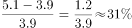。

故正确答案为A。

备注：题目没有明确是同比增长率还是环比增长率，如果按照同比计算无答案。

---

#### 第 3 题　qid 2732738 · 数学运算

2017-2019年政府网站数量精简最多的半年是：

- **A**. 2017年上半年
- **B**. 2017年下半年　✅
- **C**. 2018年上半年
- **D**. 2018年下半年

**答案**：B

**官方解析**

根据题干“······数量精简最多的半年是”，可判定本题为增长量比较问题。定位图2可知，2016年12月、2017年6月、2017年12月、2018年6月、2018年12月的政府网站数量分别为46405个、36916个、24820个、19686个、17962个。根据公式：增长量现期量基期量，则政府网站数量精简情况如下：

2017年上半年，个；

2017年下半年，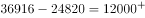个；

2018年上半年，个；

2018年下半年，个。

比较可知，2017-2019年政府网站数量精简最多的半年是2017年下半年。

故正确答案为B。

---

### 材料 2

        截至2019年底，广东省常住人口11521万人，比上年底增加175万人。其中，男性6022.03万人、女性5498.97万人，人口密度为641人/平方公里。2019年底，全省城镇化率（城镇常住人口占常住人口的比重）为，同比提高0.70个百分点。其中，珠三角九市的城镇化率为。

#### 第 4 题　qid 2731602 · 数学运算

截至2019年底，珠三角九市城镇常住人口约        万人。

- **A**. 5436
- **B**. 5562　✅
- **C**. 6200
- **D**. 6268

**答案**：B

**官方解析**

根据题干“截至2019年底，珠三角九市城镇常住人口约······”，结合文字和图表材料可知2019年末珠三角九市的城镇化率（城镇常住人口占常住人口的比重）和常住人口（总体），已知比重和总体求部分，且时间与材料一致，可判定本题为现期比重问题。定位文字材料可得∶“（2019年底）珠三角九市的城镇化率为”和表格材料“2019年珠三角九市常住人口为6446.89万人”。代入现期比重公式∶部分万人，最接近B项。

故正确答案为B。

---

#### 第 5 题　qid 2731611 · 数学运算

2019年底除珠三角九市外，广东省其他地区的城镇化率                    。

- **A**. 
小于

- **B**. 
在至之间

- **C**. 
在至之间
　✅
- **D**. 
大于

**答案**：C

**官方解析**

根据题干“广东省其他地区的城镇化率······”，结合文字材料可知2019年底广东省常住人口、全省城镇化率及珠三角九市城镇化率，结合表格材料可知珠三角九市常住人口，由于广东省人口珠三角九市人口其他地区人口，因此可判定本题为混合比重问题。混合后总体为全省（常住人口11521万人，城镇化率为），部分量1为珠三角九市（常住人口6446.89万人，城镇化率为），设部分量2其他地区的城镇化率为，根据线段法，距离与量成反比：

即，，则，在C项范围内。

故正确答案为C。

---

#### 第 6 题　qid 2731621 · 数学运算

能够从上述资料中推出的是                    。

- **A**. 2019年底除珠三角九市外，广东省其余地区常住人口同比为负增长
- **B**. 表中“？”处的数字大于2.2万人/平方公里　✅
- **C**. 2019年底，广东省人口密度比上年底增加了20人/平方公里以上
- **D**. 2016-2019年间，香港和澳门常住人口呈持续增长趋势

**答案**：B

**官方解析**

A项：定位表格材料“珠三角九市2018年末与2019年末人口分别为6300.99万人和6446.89万人”则2019年珠三角九市常住人口同比增量现期量基期量万人。定位文字材料“广东省常住人口11521万人，比上年底增加175万人”，根据广东省常住人口同比增量珠三角九市常住人口同比增量其余地区常住人口同比增量，则其余地区常住人口同比增量为，同比为正增长，错误。

B项：定位表格材料，2018年澳门人口密度21669人/平方公里，2018年和2019年澳门年末人口分别为66.74万人和67.96万人，根据地区面积，且澳门各年的面积保持不变，可列式：，则，即大于2.2万人/平方公里，正确。

C项：定位文字材料“截至2019年底，广东省常住人口11521万人，比上年底增加175万人······人口密度为641人/平方公里”根据人口密度，则广东省面积为万平方公里，因为面积不变，因此人口密度增长量人/平方公里，错误。

D项：定位表格材料，2016-2019年间，年末人口数据中，2016年澳门年末人口64.49万人2015年64.68万人，并非持续增长，错误。

故正确答案为B。

---

### 材料 3

        上海市生活垃圾分类工作实施以来，在居民分类、垃圾分类处置、全过程分类体系、配套制度规范以及社会宣传等方面都取得了显著成效。下图为上海市垃圾分类年度日均完成量及2020年目标，下表为上海市垃圾分类回收处理量。

#### 第 7 题　qid 2731481 · 数学运算

表中，在日均湿垃圾分出量最高的月份，日均可回收物回收量与日均干垃圾处理量的比值约为：

- **A**. 0.26
- **B**. 0.44
- **C**. 0.41　✅
- **D**. 0.48

**答案**：C

**官方解析**

根据题干“表中，······与······比值约为”，可判定本题为比值计算问题。定位表格第二列可知，日均湿垃圾分出量最高的月份是2020年5月，分出量为9796吨/日，定位表格第三、四列可知，2020年5月日均可回收物回收量和日均干垃圾处理量分别为6266吨/日和15351吨/日。可得2020年5月，日均可回收物回收量与日均干垃圾处理量的比值约为，对应C项。

故正确答案为C。

---

#### 第 8 题　qid 2731516 · 数学运算

2019年7—9月，日均湿垃圾分出量约为（    ）吨。

- **A**. 8803
- **B**. 8702
- **C**. 9200
- **D**. 8800　✅

**答案**：D

**官方解析**

根据题干“2019年7—9月，日均湿垃圾分出量约······”，结合材料已给出2019年7—9月数据，可判定本题为现期平均数问题。定位表格材料，2019年7—9月日均湿垃圾分出量分别为8200吨/日、9200吨/日、9008吨/日。根据公式，日均湿垃圾分出量，可得2019年7—9月，日均湿垃圾分出量吨，与D项相符。

故正确答案为D。

---

#### 第 9 题　qid 2731518 · 数学运算

2019年6—9月，日均干垃圾处理量月增长率的绝对值：

- **A**. 一直减小　✅
- **B**. 一直增大
- **C**. 先增大后减小
- **D**. 先减小后增大

**答案**：A

**官方解析**

根据题干“2019年6—9月，日均干垃圾处理量月增长率的绝对值”，结合选项为增大/减小，可判定本题为增长率的比较问题。定位表格可知，2019年6—9月日均干垃圾处理量。根据公式“”，则2019年6—9月日均干垃圾处理量月增长率分别为：6月；7月；8月；9月。则2019年6—9月，日均干垃圾处理量月增长率的绝对值一直减小。

故正确答案为A。

注：由于表格中仅给出2019年5月~2020年6月的数据，未给出2018年6~9月的数据，故认为题干中“月增长率”为月环比增长率。

---

#### 第 10 题　qid 2731530 · 数学运算

以下说法错误的是：

- **A**. 
2019年7月环比数量变化最大的类别是干垃圾

- **B**. 
2019年7—10月，可回收物回收量增长率为

- **C**. 
2020年6月表中三类垃圾占比同比变化最大的是干垃圾

- **D**. 
2020年超额完成预计目标的月份为5月份和6月份
　✅

**答案**：D

**官方解析**

A项：定位表格可知，2019年6月与7月的湿垃圾日均分出量、可回收物日均回收量、干垃圾日均处理量。代入公式“总量”、“增长量”，可得2019年7月各类垃圾的环比变化数量分别为：

湿垃圾分出量吨；

可回收物回收量吨；

干垃圾处理量吨；则2019年7月环比数量变化最大的类别是干垃圾，正确；

B项：定位表格可知，2019年7月与10月的可回收物日均回收量为4400吨与5960吨。根据公式“”、“”，则2019年7—10月可回收物回收量的增长率为，正确；

C项：定位表格可知，2020年6月与2019年6月三类垃圾的日均处理量。2020年6月三类垃圾总量为吨，2019年6月三类垃圾总量为吨。2020年6月三类垃圾占比同比变化分别为：

湿垃圾分出量；可回收物回收量；干垃圾处理量，则占比同比变化最大的是干垃圾，正确；

D项：定位图形可知，2020年湿垃圾、可回收物、干垃圾的目标分别为9000吨/日、6000吨/日、16800吨/日。定位表格可知，2020年5月与6月的干垃圾处理量分别为15351吨/日与15518吨/日，未完成2020年预计目标，错误。

本题为选非题，故正确答案为D。

---

#### 第 11 题　qid 2732722 · 数学运算

数列：3，4，5；12，5，13；8，15，17；24，7，

- **A**. 25　✅
- **B**. 26
- **C**. 28
- **D**. 31

**答案**：A

**官方解析**

数列项数较多，可按分号将数列分组分析。观察可知，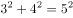，即每组中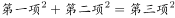，向后验证，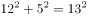，，符合规律。故，所求项为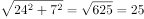。

故正确答案为A。

---

#### 第 12 题　qid 2732724 · 数学运算

有若干个相同的小正方体木块，按图（1）、（2）、（3）的叠放规律摆放，则到第七个图时，第七个图中小正方体木块总数应为<u>        </u>个。

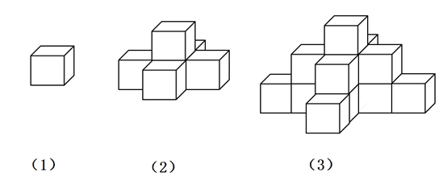

- **A**. 25
- **B**. 66
- **C**. 91　✅
- **D**. 120

**答案**：C

**官方解析**

由图可知，第一个图中有1层共1个正方体；第二个图中有2层，第二层比第一层多4个正方体；第三个图中有3层，第三层比第二层多4个正方体，即每层的个数构成公差为4的等差数列。则第七个图中应有7层，正方体总数为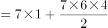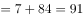个。

故正确答案为C。

---

#### 第 13 题　qid 2732726 · 数学运算

数列：2，4，8，12，18，24，

- **A**. 30
- **B**. 32　✅
- **C**. 36
- **D**. 38

**答案**：B

**官方解析**

方法一：数列变化平缓且无明显规律，优先考虑作差。后项减前项得到新数列：2、4、4、6、6、？，无规律，再次作差得到2、0、2、0，周期数列下一项2，则？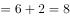。因此所求项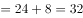。

方法二：数列变化平缓且无明显规律，考虑作和。两两加和可得，6、12、20、30、42，？，此数列变化平缓且无明显规律，考虑作差，后项减前项可得，6、8、10、12，构成公差为2的等差数列，下一项为，？项为，则所求项为。

故正确答案为B。

---

#### 第 14 题　qid 2731342 · 数学运算

数列：[1，2]3，[1，2，3]0，[1，2，3，4]4，[1，2，3，4，5]-1，[1，2，3，4，5，6]5，[1，2，3，4，5，6，7]-2，[1，2，3，4，5，6，7，8]6，···，则[1，2，3，···，100]<u>        </u>

- **A**. 52　✅
- **B**. 50
- **C**. -50
- **D**. -52

**答案**：A

**官方解析**

方法一：数列项数较多，考虑多重数列。交叉来看，等号右边奇数数列为：3，4，5，6，······，是连续自然数列；等号右边偶数数列为：0，-1，-2，······，是公差为-1的等差数列。所求项是原数列的第99项，为奇数项，且为奇数数列的第50项，则所求项为52。

方法二：观察数列，计算发现：，，，，，，······，即连续自然数中、符号循环交替，则所求项为············。

故正确答案为A。

---

#### 第 15 题　qid 2731346 · 数学运算

将从1到11连续自然数填入下图中的圆圈内，要使每边上的三个数的和都相等，a不可能是<u>        </u>。

- **A**. 1
- **B**. 6
- **C**. 7　✅
- **D**. 11

**答案**：C

**官方解析**

根据等差数列求和公式，1到11连续自然数的和为。每边上的三个数的和均包括一个的值且都相等，则五条边上空白部分的两个数之和均相等，因此所有空白部分对应数据之和为5的倍数，即为5的倍数，代入选项验证：

A项：，符合；

B项：，符合；

C项：不为整数，不符合；

D项：，符合。

本题为选非题，故正确答案为C。

---

#### 第 16 题　qid 2731348 · 数学运算

有一架自动扶梯共25级，每秒移动2阶。A从扶梯的起点处站立乘坐，两秒后B从起点处以每秒1阶的速度向上走动。又过三秒后C来到扶梯起点处且以每秒4阶的速度向上跑。那么以下事件中最先发生的是        。

- **A**. A到达扶梯终点
- **B**. B追上A　✅
- **C**. C追上A
- **D**. C追上B

**答案**：B

**官方解析**

由题意可知本题为行程问题，事件最先发生的一定是总体用时最短的，分别计算四个事件的用时比较即可。

A项：由题意“有一架自动扶梯共25级，每秒移动2阶。A从扶梯的起点处站立乘坐”可知，阶/秒，A到达扶梯终点的时间秒；

B项：由题意“两秒后B从起点处以每秒1阶的速度向上走动”可知，阶/秒，阶，根据追及公式：，则，解得秒，故B追上A的总体用时秒；

C项：由题意“又过三秒后C来到扶梯起点处且以每秒4阶的速度向上跑”可知，阶/秒，阶，则，解得秒，故C追上A的总体用时秒；

D项：阶，则，解得秒，故C追上B的总体用时秒。

比较可知，选项中B追上A的事件总体用时最少。

故正确答案为B。

---

#### 第 17 题　qid 2732728 · 数学运算

已知易拉罐的直径为8cm，现将7个易拉罐如图捆扎在一起，那么需要<u>        </u>cm长的绳子。（仅计算一圈的绳长）。

- **A**. 
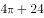

- **B**. 

- **C**. 
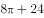

- **D**. 

　✅

**答案**：D

**官方解析**

如图，绳子的长度即为6个弧长6个线段的长度。每条线段的长度即圆的直径为8cm，则6条直线的长度是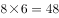cm。每条弧对应的圆心角是，6个弧长则对应的是整个圆的周长为cm。则绳子的长度是cm。

故正确答案为D。

---

#### 第 18 题　qid 2731356 · 数学运算

一个长方形长6cm，宽4cm，现分别平行于长和宽剪了若干刀，将长方形分割成若干个小长方形，这些小长方形的周长之和比原长方形周长多了56cm。那么最多剪了         刀。

- **A**. 3
- **B**. 4
- **C**. 5
- **D**. 6　✅

**答案**：D

**官方解析**

设平行于长剪了刀，平行于宽剪了刀。每当长或宽多剪一刀，这些小长方形总周长比原长方形周长多了2倍的长或宽。由此可列：，化简可得，结合奇偶特性可知，应为偶数。根据，要剪的总刀数最多，即（）最大，则尽量小，由于为偶数且不能为0，则应取2。当时，，共剪刀。

故正确答案为D。

---

#### 第 19 题　qid 2732730 · 数学运算

小李带女儿在健身步道上比赛，他让女儿先跑24步，然后他出发去追她，已知女儿跑12步的距离等于小李跑8步的距离，女儿跑4步的时间小李只能跑3步，则小李要跑        步才能追上女儿。

- **A**. 18
- **B**. 36
- **C**. 72
- **D**. 144　✅

**答案**：D

**官方解析**

由题意可知，女儿和小李的步长之比是8：122：3，设女儿的步长是2，小李的步长是3。单位时间内女儿跑4步，小李跑3步。则女儿和小李的速度之比是（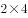）：（）8：9。女儿先跑24步，每步步长是2，则路程是。根据，可得，，即小李追上女儿需要48个单位时间，每个单位时间是3步，则一共是步才能追上女儿。

故正确答案为D。

---

#### 第 20 题　qid 2732731 · 数学运算

小李抽盲盒，这类盲盒一共有8款，小李只要其中的1款，他一次买了两个盲盒，则抽中他想要的那款的概率是        。

- **A**. 

- **B**. 

- **C**. 
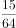
　✅
- **D**. 

**答案**：C

**官方解析**

正面情况较复杂，讨论反面情况。即小李买的两个盲盒都不是他想要的那款，一共8款，只有1款想要，则不是想要那款的概率是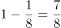，两个盲盒都不是的概率是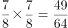。则抽中想要那款的概率是。

故正确答案为C。

---

#### 第 21 题　qid 2731380 · 数学运算

安排4名护士护理3个病房，每个病房至少一名护士，每名护士固定护理一个病房，则共有        种安排方法。

- **A**. 24
- **B**. 36　✅
- **C**. 48
- **D**. 72

**答案**：B

**官方解析**

4名护士护理3个病房，且每个病房至少一名护士，则人数分组为（2，1，1）。从4名护士中选出2名护士在一组，共同护理一个病房，有种方法；三组人员，分别护理3个病房，有种方法。则共有种安排方法。

故正确答案为B。

---

#### 第 22 题　qid 2731374 · 数学运算

公司购买某设备24套，现要登记单价，但是数据上没有标注单价，且总价第一位和最后一位模糊不清，只看到是☆579△元。则☆可能是        。

- **A**. 3
- **B**. 5
- **C**. 7　✅
- **D**. 9

**答案**：C

**官方解析**

总价单价数量，设备数量为24套，故总价一定为24的倍数，即总价既是3的倍数又是8的倍数。

题干数字为☆579△，若要为8的倍数，则后三位应为8的倍数。79△800m，由于800是8的倍数，故m只能为8，则△只能为2。

此时题干数字为☆5792，若要为3的倍数，则各位数字之和应为3的倍数。☆☆，则☆可能为1、4、7，只有C项符合。

故正确答案为C。

---

#### 第 23 题　qid 2731364 · 数学运算

甲到飞机场坐飞机，飞机场的十二个登机口排成一条直线，相邻两个登机口之间相距50米。甲在登机口等待时被告知登机口更改了，那么甲走到新登机口的距离不超过200米的概率是：

- **A**. 

- **B**. 

- **C**. 

- **D**. 

　✅

**答案**：D

**官方解析**

给情况求概率，考虑公式：概率。总情况为甲在任意登机口移动到另一登机口，共有种情况；满足条件的情况为甲走到新登机口的距离不超过200米，因相邻两个登机口距离为50米，则甲移动到相邻登机口要在4个及以内，分别讨论如下：

甲在1号登机口：满足条件的有2，3，4，5号登机口，共4种情况；

甲在2号登机口：满足条件的有1，3，4，5，6号登机口，共5种情况；

甲在3号登机口：满足条件的有1，2，4，5，6，7号登机口，共6种情况；

甲在4号登机口：满足条件的有1，2，3，5，6，7，8号登机口，共7种情况；

甲在5号登机口：满足条件的有1，2，3，4，6，7，8，9号登机口，共8种情况；

甲在6号登机口：满足条件的有2，3，4，5，7，8，9，10号登机口，共8种情况。

因登机口呈一条直线，故7~12号登机口与1~6号登机口情况对称，分别有8，8，7，6，5，4种情况。由此可知，满足条件的情况数共有种情况。

则甲走到新登机口的距离不超过200米的概率。

故正确答案为D。

---

#### 第 24 题　qid 2732733 · 数学运算

老李家的草莓园开展采摘活动，每位游客进园可以免费吃，并且带走2斤草莓。每位游客在采摘过程中平均吃1斤草莓。目前老李家的草莓园估计有成熟草莓2000斤，并且每天还会有40斤草莓成熟，为保证采摘活动至少可以持续20天，那么平均每天最多接待        位游客。

- **A**. 36
- **B**. 46　✅
- **C**. 56
- **D**. 66

**答案**：B

**官方解析**

由题意可知，每位游客免费吃1斤，带走2斤，则每位游客每天消耗草莓3斤。设每天最多接待位游客。要使活动至少可以持续20天，则草莓至少需要斤。由题意可得，解得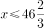，则平均每天最多接待46位游客。

故正确答案为B。

---

#### 第 25 题　qid 2731382 · 数学运算

假设三颗小行星绕着一颗恒星运动，它们的运行轨道都是圆形，每条轨道的圆心都是该恒星。且三条轨道都在同一平面内。若这三颗小行星同向旋转，且绕轨道运行一周的时间分别是60年、84年、140年。现在三颗小行星和恒星在同一直线上且三颗小行星都在恒星的同侧，那么至少        年后他们再次在同一直线上且三颗小行星都在恒星的同侧。

- **A**. 210　✅
- **B**. 315
- **C**. 420
- **D**. 630

**答案**：A

**官方解析**

题干较为复杂，考虑代入排除；问“至少”，考虑从小到大代入选项。

代入A项：210年后，运行周期为60年的小行星共运行周，运行周期为84年的小行星共运行周，运行周期为140年的小行星共运行周。此时，每个小行星的位置都偏离原来位置半圈，满足在同一直线上且三颗小行星都在恒星的同侧。

因A项已满足题意，B、C、D三项无需验证。

故正确答案为A。

---

## 判断推理

### 材料 1

某单位今年招录了8名应届毕业生，其中甲和乙是文科生，丙、丁、戊是理科生，己、庚、辛是工科生。8人中，甲、丙、己是女士。单位拟从中选出5人组成一个研发团队，团队中文科生、理科生和工科生至少各有1人，并且至少要有1名女士参加。此外，还要满足下列条件：

（1）丙和庚至多有1人参加；

（2）若乙参加，则丁也参加；

（3）戊和辛要么都参加，要么都不参加。

#### 第 1 题　qid 2731298 · 类比推理

下列（    ）项组合方案满足上述对于研发团队的要求。

- **A**. 甲、丙、丁、己、庚
- **B**. 甲、丁、戊、己、辛　✅
- **C**. 乙、丙、戊、己、辛
- **D**. 乙、丁、戊、己、庚

**答案**：B

**官方解析**

第一步，整理题干条件。

（1）丙或庚；

（2）乙丁；

（3）戊和辛要么都参加，要么都不参加。

第二步，根据题干条件分析选项。

根据条件（1）可知，丙和庚不能同时参加，排除A项；根据条件（2）可知，乙参加，丁一定参加，排除C项；根据条件（3）可知，戊和辛要么都参加，要么都不参加，排除D项。

故正确答案为B。

---

#### 第 2 题　qid 2731301 · 类比推理

如果甲没有参加，则下列（    ）项可能为真。

- **A**. 理科生只有戊参加
- **B**. 工科生只有己参加
- **C**. 3名理科生都参加　✅
- **D**. 3名工科生都参加

**答案**：C

**官方解析**

第一步，整理题干条件。

（1）丙或庚；

（2）乙丁；

（3）戊和辛要么都参加，要么都不参加；

（4）甲不参加。

第二步，根据题干条件分析选项。

根据条件（4）可知，甲不参加，结合题干信息文科生至少有一人参加，则乙一定参加，又结合条件（2）可知，丁一定参加，因此可排除A项。

结合题干问“可能为真”，故可采用代入法。

代入B项：工科生只有己参加，那么庚、辛不参加。根据条件（3）可知，戊不参加；此时，甲、庚、辛、戊四人不参加，不满足选出5人参加这一条件，故B项不可能为真，排除；

代入C项：3名理科生都参加，即丙、丁、戊都参加。根据条件（1）可知，庚不参加；根据条件（3）可知，辛参加。此时，参加人数有：乙、丙、丁、戊、辛5人，不参加有：甲、庚两人，现只需己不参加，即可符合题干要求，故C项可能为真，当选；

代入D项：3名工科生都参加，即己、庚、辛都参加，根据条件（1）可知，丙不参加；根据条件（3）可知，戊参加。此时，参加人数有：乙、丁、己、庚、辛、戊6人，不符合题干要求，故D项不可能为真，排除。

故正确答案为C。

---

#### 第 3 题　qid 2731055 · 类比推理

喷水鱼因特殊的捕食方式而得名，能喷出一股水柱，准确击落空中的昆虫作为食物。下列各图中能正确表示喷水鱼看到昆虫像的光路图的是：

- **A**. A
- **B**. B
- **C**. C　✅
- **D**. D

**答案**：C

**官方解析**

此题考察光在不同介质中的折射，喷水鱼在水中看空气中的昆虫，是昆虫反射的光线进入到喷水鱼的眼睛，故A、B两项错误；光从空气中斜射入水中，实际光线的入射角大于折射角，鱼的眼睛看到的是水中光线的反向延长线上昆虫的虚像，看到的虚像比实际昆虫的位置偏高，C项正确，D项错误。
故正确答案为C。

---

#### 第 4 题　qid 2731049 · 类比推理

现代社会离不开电能，火力发电仍然是目前重要的发电形式之一，它“吃”进的是煤，“吐”的是电，在这个过程中的能量转化是：

- **A**. 
机械能内能化学能电能

- **B**. 
化学能内能机械能电能
　✅
- **C**. 
化学能重力势能动能电能

- **D**. 
内能化学能机械能电能

**答案**：B

**官方解析**

火力发电时，烧煤时煤的化学能先转变成内能，内能再转化为发电装置的机械能，最终转化为电能。
故正确答案为B。

---

#### 第 5 题　qid 2732696 · 逻辑判断

一根电热丝的电阻值为，将它接在电压为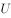的电路中时，在时间内产生的热量为。使用一段时间后，将电热丝剪掉一小段，剩下一段的电阻值为。现将剩下的这段电热丝接入电路，则：

- **A**. 
若仍将它接在电压为的电路中，在时间t内产生的热量为

- **B**. 
若仍将它接在电压为的电路中，产生的热量为，所需时间为

- **C**. 
若将它接入电压为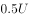的电路中，在时间内产生的热量为
　✅
- **D**. 
若将它接入另一电路，在时间内产生的热量仍为，这个电路的电压为

**答案**：C

**官方解析**

热量的表达式为，对于纯电阻电路可变式为。

当电路为一根电热丝时热量，当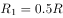时，逐项分析：

A项，此时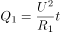，错误；

B项，若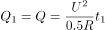，则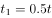，错误；

C项，若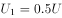，则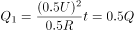，正确；

D项，若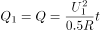，，，错误。

故正确答案为C。

---

#### 第 6 题　qid 2731104 · 类比推理

已知化学反应进行前后，参加反应的物质种类发生变化，总质量不发生变化，催化剂的质量也不发生变化。某密闭容器内有四种物质，反应一段时间后，测得反应前后各物质的质量如下表所示。下列说法正确的是：

- **A**. 丁一定是单质
- **B**. M的值是15
- **C**. 该反应是分解反应　✅
- **D**. 反应中的甲、丙质量比为15：27

**答案**：C

**官方解析**

A项：丁属于生成物，通过条件信息，无法确定丁是否为单质，错误；

B项：由化学反应原理可知，化学反应进行前后，反应前的物质总量等于反应后的物质的总量即，，错误；

C项：该反应为甲丙丁，故该反应为分解反应，正确；

D项：由以上分析可知，参加反应的甲为54克，生成的丙为30克，，错误。

故正确答案为C。

---

#### 第 7 题　qid 2732697 · 定义判断

日常生活中，需要对身边的一些常见的科学量进行估测，以下估测数据符合实际的是：

- **A**. 科学书中一页纸张的厚度约为0.01m
- **B**. 一粒西瓜子平放在桌面上时，对桌面的压强约为20Pa　✅
- **C**. 一个成年人从一楼走上二楼克服重力做的功约为150J
- **D**. 教室里的日光灯正常发光时的电流约为10mA

**答案**：B

**官方解析**

A项，0.01m1cm，一页纸张的厚度为1cm，不符合实际，错误；

B项，西瓜子的百粒平均重量约在20-30g之间，一粒西瓜子的质量约为0.2-0.3g，面积约为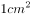，根据压强计算公式，压强约在20-30pa之间，正确；

C项，功的计算公式为，一个成年人的体重约为50-70kg，一层楼的高度约为3米，则克服重力做的功约为1500-2100J，150J不符合实际，错误；

D项，10mA0.01A，家庭电路的电压为220V，若电流为0.01A，根据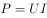，则日光灯工作时的功率W，功率太低，不符合实际，错误。

故正确答案为B。

---

#### 第 8 题　qid 2731071 · 逻辑判断

如图所示，一个弹性小球从a点静止释放，竖直撞击水平地面后反弹，已知空气阻力大小恒定，撞击地面无能量损失。对于小球下落后反弹至最高点的过程中，下列说法正确的是：

- **A**. 因为空气阻力大小不变，所以下落过程阻力做功等于反弹时阻力做的功
- **B**. 因为撞击时地面给小球向上的作用力，所以小球反弹的最高点高于a点
- **C**. 小球下落过程中空气阻力做负功，反弹过程中空气阻力做正功
- **D**. 小球下落过程和反弹过程均是匀变速直线运动，但加速度不同　✅

**答案**：D

**官方解析**

A项：功的公式，下落过程和反弹过程空气阻力相等，但是空气阻力一直做负功，下落过程的位移大于反弹时的位移，所以两个过程中空气阻力做的功不相等，错误；

B、C两项：小球在下落过程中所受的空气阻力方向向上，空气阻力方向与运动的方向相反，空气阻力做负功；小球反弹之后，小球向上运动，小球所受的空气阻力向下，空气阻力方向与小球的运动方向相反，空气阻力做负功，无论小球向上还是向下运动，空气阻力始终做负功，空气阻力做负功，使小球的机械能减少，小球反弹之后最高点一定低于a点，均错误；

D项：设小球的质量为，分析小球的受力情况，小球在下降过程中受到竖直向下的重力和竖直向上的空气阻力，由牛顿的第二定律可得，加速度大小方向均不变，小球做匀加速直线运动。小球在反弹之后向上运动的过程中受到竖直向下的重力和空气阻力，由牛顿第二定律可得，大小和方向均不变，故小球做匀减速直线运动，由以上分析可知，正确。

故正确答案为D。

---

#### 第 9 题　qid 2731059 · 定义判断

分类是科学研究的重要方法，物质可以分为纯净物和混合物，纯净物可以分为单质和化合物。下列四种物质符合如图所示关系的是：

- **A**. 铜
- **B**. 干冰
- **C**. 金刚石　✅
- **D**. 陶瓷

**答案**：C

**官方解析**

此题考察化学中常见物质分类，需要将题干中涉及的单质、导体、晶体、混合物的相关定义理解清楚。

单质：是由一种元素的原子组成的以游离形式较稳定存在的物质，例如：氧气（），铜（）等。

晶体：是原子、离子或分子按照一定的周期性，在三维空间作有规律的周期性重复排列所形成的物质，例如：冰（）等。

导体：能够导电的物体，例如铁（）等。

混合物：是由两种或多种物质混合而成的物质。

A项：铜（）既属于单质也属于导体，正确；

B项：干冰是固态的二氧化碳（），是纯净物，错误；

C项：金刚石（）是单质，也是原子晶体，正确；

D项：陶瓷是粘土、石英等混合烧制而成的，属于混合物，但陶瓷不能导电，是因为陶瓷原子的最外层电子被束缚在各自原子的四周，不能自由移动，错误。

故正确答案为C。

特殊说明：此题存在一定的争议，铜单质属于单质、导体、原子晶体，属于三者，图中的A只含有两个部分，粉笔更加倾向于选C。

---

#### 第 10 题　qid 2732698 · 类比推理

下图是碳酸氢铵（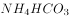）化肥包装袋上的部分信息，关于该化肥的说法错误的是：

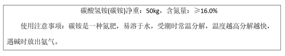

- **A**. 不要受潮或暴晒
- **B**. 与碱性化肥混合施用　✅
- **C**. 储存和运输时要注意密封
- **D**. 施用后要盖土或立即灌溉

**答案**：B

**官方解析**

A项，根据题干可以知道，碳酸氢铵（）受潮或暴晒时会分解，正确；

B项，碳酸氢铵（）中含有铵根离子，能和碱反应放出氨气，导致氮元素流失，肥效降低甚至完全消失，错误；

C项，运输过程中，需保持容器密封，利于防潮、防雨、防曝晒，正确；

D项，碳酸氢铵（）容易分解挥发，损失肥效，施用后要盖土或立即灌溉，可防止挥发，正确。

本题为选非题，故正确答案为B。

---

#### 第 11 题　qid 2731139 · 定义判断

“绿色化学”要求物质回收或循环利用，反应物原子利用率为，且全部转化为产物，“三废”必须先处理再排放。下列做法或反应符合“绿色化学”要求的是：

- **A**. 
焚烧塑料以消除“白色污染”

- **B**. 
深埋含镉、汞的废旧电池

- **C**. 

　✅
- **D**. 

**答案**：C

**官方解析**

A项：焚烧塑料会产生大量的废气污染空气，不符合条件中的“绿色化学”要求，错误；

B项：深埋含镉、汞的废旧电池，没有先处理再排放，不符合“绿色化学”要求，并且深埋处理会污染土壤和水源，错误；

C项：由化学反应方程式可知，丙炔、氢气、一氧化碳反应生成戊二醛，原子的利用率为，符合“绿色化学”要求，正确；

D项：利用高锰酸钾加热生产氧气，产物还有锰酸钾和二氧化锰，原子的利用率不足，不符合“绿色化学”要求，错误。

故正确答案为C。

---

#### 第 12 题　qid 2732702 · 类比推理

科学家认为二氧化碳不是造成温室效应的主要原因，导致温室效应的主要为以下四种气体：

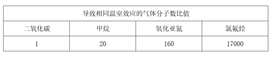

从这个表不能确定哪种是影响温室效应的主要气体，还应该收集下列<u>          </u>的数据才能得出是什么气体主要导致了温室效应。

- **A**. 关于这四种气体的产源
- **B**. 植物所能吸收这些气体的量
- **C**. 这四种气体的分子式
- **D**. 这四种气体在大气中的总排放量　✅

**答案**：D

**官方解析**

温室效应是指透射阳光的密闭空间由于与外界缺乏热对流而形成的保温效应，即太阳短波辐射可以透过大气射入地面，而地面增暖后放出的长波辐射却被大气中的二氧化碳等物质所吸收，从而产生大气变暖的效应。大气中的二氧化碳就像一层厚厚的玻璃，使地球变成了一个大暖房。

从题干中表格可知，与其他三种气体相比，最少量的二氧化碳即可导致相同效果的温室效应，这仅说明了二氧化碳对温室效应的作用效果是最强的。但要确定哪种气体是造成温室效应的主要原因，还需确定每种气体在大气中的量。作用效果排放量综合分析后方可确定，故D项正确，A、B、C三项均与题意无关。

故正确答案为D。

---

#### 第 13 题　qid 2731200 · 图形推理

下列选项中，符合所给图形的变化规律的是：

- **A**. A
- **B**. B　✅
- **C**. C
- **D**. D

**答案**：B

**官方解析**

观察发现，第一横行图中，将所有位置的小黑三角形拼在一起，可以得到一个完整的黑色正方形；经验证，第二横行满足此规律；第三横行应用此规律，故？处左上角区域和右下角区域应各有一个小黑三角形，只有B项符合。
故正确答案为B。

---

#### 第 14 题　qid 2731208 · 图形推理

下列选项中，符合所给图形的变化规律的是：

- **A**. A　✅
- **B**. B
- **C**. C
- **D**. D

**答案**：A

**官方解析**

元素组成相同，优先考虑位置规律。每个图形都由5个圆组成，分别给这5个圆的位置标为1、2、3、4、5。从图一到图二，黑点由1号移动到2号位置，正方形由2号移动到4号位置，三角形由3号移动到1号位置，圆圈由4号移动到5号位置，×由5号移动到3号位置。经验证，从图二到图三也符合小元素由1号移动到2号位置，由2号移动到4号位置，由3号移动到1号位置，由4号移动到5号位置，由5号移动到3号位置。所以，从图三到图四也应符合此规律，只有A项符合。

故正确答案为A。

---

#### 第 15 题　qid 2731219 · 图形推理

下列选项中，符合所给图形的变化规律的是：

- **A**. A
- **B**. B
- **C**. C　✅
- **D**. D

**答案**：C

**官方解析**

观察前两幅图，元素组成基本相同，优先考虑位置规律，图1横线以上部分（如下图所示），向下翻转后与下半部分重叠得到图2；后两幅图遵循此规律，将图3上半部分向下翻转后与下半部分重叠，只有C项符合。

故正确答案为C。

---

#### 第 16 题　qid 2731224 · 图形推理

从所给的四个选项中，选择最合适的一个填入问号处，使之呈现一定的规律性：

- **A**. A
- **B**. B
- **C**. C
- **D**. D　✅

**答案**：D

**官方解析**

本题考查截面图。

观察发现，题干三幅立体图形水平截面都是圆，所以问号处立体图形的水平截面也应为圆，只有D项符合。

故正确答案为D。

---

#### 第 17 题　qid 2731229 · 图形推理

从所给的四个选项中，选择最合适的一个填入问号处，使之呈现一定的规律性：

- **A**. A
- **B**. B　✅
- **C**. C
- **D**. D

**答案**：B

**官方解析**

元素组成相似，且相同线条重复出现，优先考虑样式规律中的加减同异。第一组规律为外框内部的竖线求同，内框内部的横线求同，内外框互换得到图3。第二组应遵循同样的规律，外框内部的竖线求同，内框内部的横线求同，内外框互换得到，对应B项。
故正确答案为B。

---

#### 第 18 题　qid 2731237 · 图形推理

从所给的四个选项中，选择最合适的一个填入问号处，使之呈现一定的规律性：

- **A**. A
- **B**. B　✅
- **C**. C
- **D**. D

**答案**：B

**官方解析**

元素组成相同，优先考虑位置规律。通过观察发现，题干阴影三角形a从图1到图2，沿轴1进行翻转，从图2到图3，沿轴2进行上下翻转，图3到问号处也应遵循类似规律，阴影三角形a沿轴3进行翻转，呈现，排除C项；继续观察题干，根据就近原则，阴影三角形b从图1到图2，沿轴3进行翻转，从图2到图3，沿轴4进行左右翻转，图3到问号处也应遵循类似规律，阴影三角形b沿轴1进行翻转，呈现，排除A、D两项；进一步验证选项，阴影三角形c从图1到图2，沿轴1进行翻转，从图2到图3，沿轴2进行上下翻转，图3到问号处也应遵循类似规律，阴影三角形c沿轴3进行翻转，呈现，B项满足此规律。

故正确答案为B。

---

#### 第 19 题　qid 2732705 · 图形推理

下列选项中，符合所给图形变化规律的是：

- **A**. A
- **B**. B
- **C**. C
- **D**. D　✅

**答案**：D

**官方解析**

元素组成相同，优先考虑位置规律。观察题干，图形中间部分的黑边正方形每幅图依次顺时针旋转，故？处图形中间部分的黑边正方形应在第三幅图形的基础上顺时针旋转，排除A、B两项；继续观察，题干图形的黑边长方形每幅图依次逆时针旋转，故？处图形的黑边长方形应在第三幅图形的基础上逆时针旋转，只有D项符合。

故正确答案为D。

---

#### 第 20 题　qid 2732706 · 图形推理

下列选项中，符合所给图形的变化规律的是：

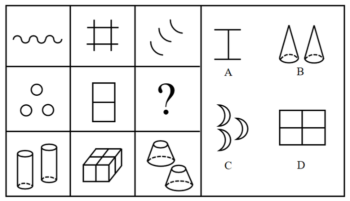

- **A**. A
- **B**. B
- **C**. C　✅
- **D**. D

**答案**：C

**官方解析**

元素组成不同，且无明显属性规律，考虑数量规律。九宫格优先横着看，第一行中，出现了单一线条，考虑线数量，线数量分别为1、4、3，加起来之和为8；第三行中，出现了立体图形，图2可以拆分看做4个六面体，立体图形个数分别为2、4、2，数量之和为8；第二行中，出现较多“窟窿”，考虑面数量，前两个图形的面数量分别为3、2，则“？”处面数量应为3，使面数量之和相加为8，只有C项符合。
故正确答案为C。

---

#### 第 21 题　qid 2732708 · 图形推理

下列选项中，符合所给图形变化规律的是：

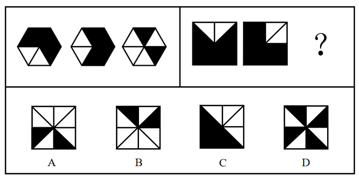

- **A**. A　✅
- **B**. B
- **C**. C
- **D**. D

**答案**：A

**官方解析**

元素组成相似，优先考虑样式规律。观察可知，题干图形轮廓相同，内部被切割且出现黑白格，考虑黑白运算，但直接进行黑白运算不存在规律，此时考虑样式规律与位置旋转相结合的复合考法。观察发现，运算规则为：；；；。根据此运算规则，第一组前两个图形叠加出的结果如图一所示，图一旋转得到第一组图中第三个图。第二组图遵循此规律，根据黑白运算规则得出的结果如图二所示，旋转，对应A项。

故正确答案为A。

---

#### 第 22 题　qid 2732711 · 图形推理

“·”和“○”按箭头指示路线运动。下列选项中，符合所给图形的变化规律的是：

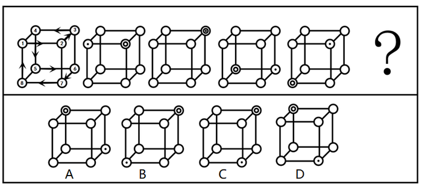

- **A**. A
- **B**. B
- **C**. C
- **D**. D　✅

**答案**：D

**官方解析**

元素组成相同，优先考虑位置规律。观察发现，黑点沿着第一幅图的箭头指示路线运动，从1号位置开始分别移动2、3、4步，因此问号处黑点位置应为前一幅图中黑点沿箭头路线走5步，应在7号位置，排除A、B两项；白圆沿着第一幅图的箭头指示路线，从2号位置开始分别移动1、2、3步，因此问号处白圆位置应为前一幅图中白圆沿箭头路径走4步，应在4号位置，排除C项。
故正确答案为D。

---

#### 第 23 题　qid 2732713 · 图形推理

下列选项中，符合所给图形的变化规律的是：

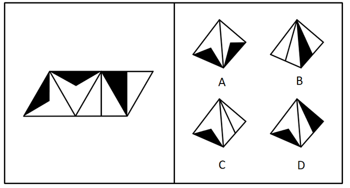

- **A**. A　✅
- **B**. B
- **C**. C
- **D**. D

**答案**：A

**官方解析**

本题考查四面体的空间重构。将题干展开图中的面依次标注为面a、b、c、d，如下图，逐一进行分析。

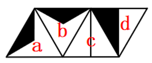

A项：选项与题干一致，当选；

B项：选项中出现了面c和面d。题干中面c和面d的公共点m在面d上为黑色直角三角形较大锐角对应的顶点，而选项中面c和面d的公共点m在面d上为黑色直角三角形较小锐角对应的顶点，选项和题干不一致，排除；

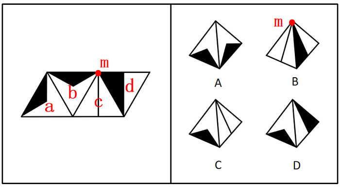

C项：选项中出现了面c和黑色钝角三角形的面，其中黑色钝角三角形的面可能为面a或面b。假设黑色钝角三角形的面是面a，题干中面c的直线与公共边1垂直，选项中面c的直线和公共边1在顶点相交，因此选项中的面不是面a；假设黑色钝角三角形的面是面b，题干中面b和面c的公共点n为面b黑三角形锐角顶点和面c直线的交点，而选项中面b和面c的两点并没有相交，选项和题干不一致，排除；

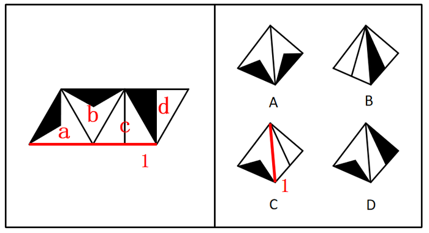

D项：选项中出现了面d和黑色钝角三角形的面，其中黑色钝角三角形的面可能为面a或面b。题干中公共边2在面a中为黑色钝角三角形的一条边，而选项中公共边2在面a中并非为黑色钝角三角形的一条边，因此选项中的面不可能是面a；题干中面b和面d的公共边3与选项也不一致，因此选项中的面也不可能是面b；选项和题干不一致，排除。

故正确答案为A。

---

#### 第 24 题　qid 2732714 · 图形推理

下列选项中，符合所给图形的变化规律的是：

- **A**. A　✅
- **B**. B
- **C**. C
- **D**. D

**答案**：A

**官方解析**

元素组成相似，优先考虑样式规律。观察可知，题干图形轮廓相同，内部被切割且出现黑白格，考虑黑白运算，但直接进行黑白运算不存在规律，此时考虑样式规律与位置旋转相结合的复合考法。观察发现，第一组第一幅图顺时针旋转，再与第二幅图黑白运算可得出第三幅图（如下图所示），运算规则为：同色相加为白，异色相加为黑。将第二组第一幅图顺时针旋转，再与第二幅图运用上述运算规则，得出右上角外圈圆为白，右上角内圈圆为黑，排除C项；右下角外圈圆为白，排除D项；左上角外圈圆为黑，排除B项。

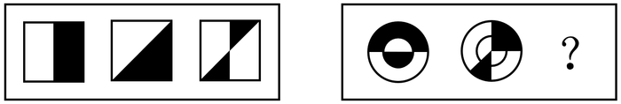

故正确答案为A。

---

#### 第 25 题　qid 2732716 · 逻辑判断

一个人如果没有奋斗的目标，就不会非常努力地工作；一个人如果不是非常努力地工作，就会逐渐消沉下去，从而把生活搞得一团糟。大学刚毕业的小陈工作非常努力，所以他一定可以实现自我价值。
下列各项如果为真，        项最能支持以上论述。

- **A**. 小陈不会把生活搞得一团糟
- **B**. 一个人如果失去了奋斗的目标就会逐渐消沉
- **C**. 只要有奋斗的目标，就一定可以实现自我价值　✅
- **D**. 自我价值的实现离不开良好的环境和个人的努力奋斗

**答案**：C

**官方解析**

第一步：找出论点和论据。

论点：小陈一定可以实现自我价值。

论据：①没有奋斗的目标没有努力工作逐渐消沉且把生活搞得一团糟；②小陈工作努力；

结合①②根据否后推出否前可知：小陈有奋斗目标。

由论据可以得到小陈有奋斗目标，而论点为小陈一定可以实现自我价值，话题不一致，优先考虑搭桥，需要建立起有奋斗目标与可以实现自我价值之间的联系。

第二步：逐一分析选项。

A项：小陈不会把生活搞得一团糟，是对论据①的否后，否后推否前，能得到小陈工作努力，有奋斗目标，是对论据的肯定，可以加强，保留；

B项：翻译为：没有奋斗的目标逐渐消沉，是对论据条件①的重复，可以加强，保留；

C项：翻译为：有奋斗的目标可以实现自我价值，建立了有奋斗目标和实现自我价值之间的联系，属于搭桥项，可以加强，保留；

D项：翻译为：实现自我价值良好的环境且个人努力奋斗，论据已知的是小陈工作努力，由此推不出小陈能实现自我价值，无法加强，排除。

比较A、B、C三项，C项搭桥力度强于A、B两项，当选。

故正确答案为C。

---

#### 第 26 题　qid 2732717 · 逻辑判断

在某市学生运动会上，男女100米短跑冠军均来自第一中学的体育班，而不是市体育学院，很多家长都在说：“第一中学比市体育学院的训练质量高。”
下列        项最能反驳这些家长们的结论。

- **A**. 本次运动会上第一中学的冠军数量比市体育学院少很多
- **B**. 有没有出现短跑冠军并不是衡量学校训练质量的唯一标准　✅
- **C**. 因为第一中学的老师待遇好，很多老师离开市体育学院去第一中学
- **D**. 第一中学的学生都住宿，所以他们在校训练的时间比市体育学院多

**答案**：B

**官方解析**

第一步：找出论点和论据。
论点：第一中学比市体育学院的训练质量高。
论据：在某市学生运动会上，男女100米短跑冠军均来自第一中学的体育班，而不是市体育学院。
本题的论点讨论第一中学与市体育学院训练质量的比较，论据讨论100米短跑冠军均来自第一中学的体育班，而不是市体育学院，二者话题不一致，削弱优先考虑拆桥。
第二步：逐一分析选项。
A项：该项讨论冠军数量，论点讨论第一中学比市体育学院的训练质量高，二者话题不一致，为无关项，无法削弱，排除；
B项：该项说明有没有出现短跑冠军并不是衡量学校训练质量的唯一标准，说明衡量学校训练质量不是完全以出现短跑冠军为依据的，拆断了论点论据之间的关系，为拆桥项，可以削弱，当选；
C项：该项讨论市体育学院很多老师离开市体育学院去了第一中学，论点讨论第一中学比市体育学院的训练质量高，二者话题不一致，为无关项，无法削弱，排除；
D项：该项讨论第一中学在校训练的时间更多，论点讨论第一中学比市体育学院的训练质量高，二者话题不一致，为无关项，无法削弱，排除。
故正确答案为B。

---

#### 第 27 题　qid 2731242 · 逻辑判断

根据中国和美国政府机构专家组成的工作组测算，美国官方统计的对华贸易逆差被高估了左右。更令人难以信服的是，美国政府引用的贸易数据只包括货物贸易，并未反映服务贸易。如果算进去，所谓的“贸易不平衡论”就更立不住了。

上述结论建立在下列哪项假设的基础之上？

- **A**. 美国对华服务贸易逆差巨大
- **B**. 美国对华服务贸易存在高额顺差　✅
- **C**. 美国购买了中国很多的工业产品
- **D**. 美国购买了中国很多的劳务服务

**答案**：B

**官方解析**

第一步：找出论点和论据。
论点：如果把服务贸易算进去，所谓的“贸易不平衡论”就更立不住了。
论据：美国政府引用的贸易数据只包括货物贸易，并未反映服务贸易。
本题问法为前提假设，加强优先考虑搭桥和必要条件，本题的论点和论据话题一致，都是在说服务贸易，故优先考虑补充必要条件。
第二步：逐一分析选项。
A项：指出美国对华服务贸易逆差巨大，如果把服务贸易算进去，增加了美国对华贸易存在的逆差，具有削弱作用，排除；
B项：指出美国对华服务贸易存在高额顺差，那么把服务贸易算进去，就会大大减少美国对华贸易存在的逆差，从而证明“贸易不平衡论”是立不住的，反过来如果美国对华服务贸易不存在高额顺差，那么即使把服务贸易算进去，也无法影响“贸易不平衡论”的成立，因此该项是论点成立的必要条件，当选；
C项：指出美国购买了中国很多的工业产品，工业产品属于货物贸易，与服务贸易无关，与论点话题不一致，无法加强，排除；
D项：指出美国购买了中国很多的劳务服务，但没有具体说明劳务服务是顺差还是逆差，无法加强，排除。
故正确答案为B。

---

#### 第 28 题　qid 2731289 · 逻辑判断

李白的《江上吟》末二句云：“功名富贵若长在，汉水亦应西北流。”汉水，又名汉江，发源于今陕西省宁强县，东南流经湖北襄阳，至汉口汇入长江。
根据以上信息，下列哪项最符合李白的观点？

- **A**. 功名富贵能长在，但汉水不应西北流
- **B**. 若功名富贵不长在，则汉水不应西北流
- **C**. 功名富贵不能长在　✅
- **D**. 若汉水能西北流，则功名富贵能长在

**答案**：C

**官方解析**

第一步：翻译题干。

①功名富贵长在汉水西北流；

②汉水是东南流向。

第二步：逐一分析选项。

A项：翻译为功名富贵长在 且 汉水不应西北流，该选项为条件①的矛盾命题，所以不符合李白的观点，排除；

B项：翻译为功名富贵不长在汉水不应西北流，否定了条件①的前件，否前得不到确定结论，排除；

C项：条件②汉水是东南流向，是对条件①的否后，否后必否前，应得到功名富贵不长在，符合李白的观点，当选；

D项：翻译为汉水能西北流功名富贵能长在，肯定了条件①的后件，肯后得不到确定结论，排除。

故正确答案为C。

---

#### 第 29 题　qid 2731292 · 类比推理

某单位2019年初招聘了8名研发人员，他们都非常优秀。其中，小李、小孔和小陈3人研发小组表现尤其突出。该团队氛围极佳，组长小陈非常关心小李和小孔，而小李非常敬佩小孔，小孔非常敬佩小陈。年终时，小陈获得了四项发明专利，小李获得了五项发明专利。
根据以上信息，可以得出下列哪项？

- **A**. 小孔的发明专利比小陈多
- **B**. 组长小陈获得的发明专利最多
- **C**. 小李的发明专利没有小孔多
- **D**. 有人获得的发明专利比其敬佩的人多　✅

**答案**：D

**官方解析**

第一步：分析题干所给信息。
（1）组长小陈非常关心小李和小孔；
（2）小李非常敬佩小孔；
（3）小孔非常敬佩小陈；
（4）小陈获得了四项发明专利；
（5）小李获得了五项发明专利。
第二步：根据题干信息逐一分析选项。
A项：题干中没有提及小孔的发明专利数量，无法推出，排除；
B项：组长小陈获得了四项发明专利，小李获得了五项发明专利，则小陈的发明专利不是最多的，无法推出，排除；
C项：题干中没有提及小孔的发明专利数量，无法推出，排除；
D项：由于小孔的发明专利数量不明，因此对小孔的发明专利数量进行假设：
假设小孔的发明专利数量不超过4，根据小李获得了五项发明专利，且小李非常敬佩小孔，可以推出有人获得的发明专利比其敬佩的人多；
假设小孔的发明专利数量大于4，根据小陈获得了四项发明专利，且小孔非常敬佩小陈，可以推出有人获得的发明专利比其敬佩的人多。
综合以上两种情况，D项当选。
故正确答案为D。

---

#### 第 30 题　qid 2732720 · 逻辑判断

与水和大气污染不同，土壤污染的隐蔽性较强。发达国家能用的土壤修复技术，在我国就不一定适用。目前，基于微生物细胞外呼吸的土壤原位修复技术已经成为我国华南地区土壤生物修复技术的生力军。与物理化学修复相比，这种修复方式具有高效率、低成本、非破坏、适用广等特点。
上述论述是建立在下列哪项的基础之上的？

- **A**. 发达国家的土壤和我国的有很大差异，并不适用土壤原位修复技术
- **B**. 土壤原位修复技术优于物理化学修复
- **C**. 土壤原位修复技术是在华南地区特点的土壤条件上开发起来的
- **D**. 发达国家的土壤修复主要采用物理化学修复　✅

**答案**：D

**官方解析**

第一步：找出论点和论据。
论点：发达国家能用的土壤修复技术，在我国就不一定适用。
论据：目前，基于微生物细胞外呼吸的土壤原位修复技术已经成为我国华南地区土壤生物修复技术的生力军。与物理化学修复相比，这种修复方式具有高效率、低成本、非破坏、适用广等特点。
本题的论点和论据话题不一致，论点是在论述发达国家土壤修复技术在我国未必适用，而论据是在说我国现有的土壤原位修复技术与物理化学修复技术相比的优势。论点、论据的话题不一致，加强优先考虑在发达国家土壤修复技术与物理化学修复技术进行搭桥。
第二步：逐一分析选项。
A项：论点是在论述发达国家的土壤修复技术是否适用于我国土壤，而非我国的土壤原位修复技术不适用于发达国家，属于无关项，无法加强，排除；
B项：选项指出我国土壤原位修复技术优于物理化学修复技术，但并未提及与发达国家的关系，属于无关项，无法加强，排除；
C项：选项在论述土壤原位修复技术完全适用于我国华南地区的土壤，但未与发达国家建立联系，属于无关项，无法加强，排除；
D项：选项指出发达国家运用的土壤修复技术就是物理化学修复技术，那么发达国家的土壤修复技术就不一定适用于我国，在论点和论据之间搭桥，可以加强，当选。
故正确答案为D。

---

#### 第 31 题　qid 2731295 · 类比推理

将6盒茶叶放入甲、乙、丙、丁、戊、己、庚、辛八个箱子中，其中四个箱子有茶叶。已知：
（1）在甲、乙、丙、丁四个箱子中共有5盒茶叶；
（2）在丁、戊、己三个箱子中共有3盒茶叶；
（3）在丙、丁两个箱子中共有2盒茶叶。
根据以上信息，可以得出下列哪项？

- **A**. 甲箱中至少有1盒　✅
- **B**. 乙箱中至少有2盒
- **C**. 己箱中至少有2盒
- **D**. 戊箱中至少有1盒

**答案**：A

**官方解析**

第一步：分析题干条件。
（1）在甲、乙、丙、丁四个箱子中共有5盒茶叶；
（2）在丁、戊、己三个箱子中共有3盒茶叶；
（3）在丙、丁两个箱子中共有2盒茶叶。
第二步：根据题干条件进行推理。
根据条件（1）及茶叶总数量为6盒可知，戊、己、庚、辛四个箱子中共有1盒茶叶，则己箱中至多有1盒茶叶，排除C项；
根据条件（3）可知，丁箱子中至多有2盒茶叶，结合条件（2）可知，丁箱子中必定有2盒茶叶，丙箱子中没有茶叶，戊、己两个箱子中共有1盒茶叶，但不能确定茶叶在是戊箱子中还是己箱子中，排除D项；
此时丁箱子中有2盒茶叶，戊、己中的1个箱子中有1盒茶叶，丙、庚、辛三个箱子中没有茶叶；根据四个箱子有茶叶可知，甲、乙两个箱子中都要有茶叶；根据条件（1）（3）可知，甲、乙两个箱子中共有3盒茶叶，则可分为两种情况：①甲箱子中1盒茶叶，乙箱子中2盒茶叶；②甲箱子中2盒茶叶，乙箱子中1盒茶叶。综合以上两种情况，A项当选。
故正确答案为A。

---

#### 第 32 题　qid 2731291 · 类比推理

赵、钱、孙、李、周、吴打算组队参加创新创业大赛。大赛规定一个团队必须为三位选手。赵说：“钱和李肯定不能组成一队。”钱说：“孙在哪队，我就在哪队。”孙说：我没和赵、李一队。”李说：“我和钱、孙一队。”周说：“我和赵不能在一队。”吴说：“我和周不在一队。”
如果六个人中有五个人的话为真，那么下列选项中正确的是（    ）项。

- **A**. 赵、钱、孙一队
- **B**. 钱、孙、周一队　✅
- **C**. 钱、孙、吴一队
- **D**. 赵、孙、李一队

**答案**：B

**官方解析**

第一步：分析题干条件。
赵、钱、孙、李、周、吴需要分为两组，每组有三人。
（1）赵：钱和李不在同一队；
（2）钱：孙和钱在同一队；
（3）孙：孙不和赵一队，孙也不和李一队；
（4）李：李、钱、孙都在同一队；
（5）周：周和赵不在同一队；
（6）吴：吴和周不在同一队。
分析题干条件，赵和李的话中针对的“钱和李是否在同一队”的说法必然有一假。
第二步：看其余，根据题干推理。
根据题干条件可知，六个人中有五个人的话为真，即本题只有一假，且赵和李的话必有一假，因此其他人说的都是真话。根据钱的话可知，钱和孙在一队，排除D项；根据孙的话可知，赵和李在一队，且不与孙一队，排除A项；根据周的话可知，周和赵不在同一队，排除C项，根据吴的话可知，吴和周不在同一队，整理所有结论可得，钱、孙、周在同一队，赵、李、吴在同一队，只有B项正确。
故正确答案为B。

---

#### 第 33 题　qid 2731283 · 逻辑判断

在一项考试成绩提升计划实施前，负责老师统计了参与该计划的、学业表现不佳的学生每天花在网上的平均时间。他重新制定了这些学生的学习计划，要求他们每天减少上网时间，并预测了遵守其要求的学生的考试成绩所可能的提升幅度。但是，考试成绩评定的最终结果表明，这些学生的成绩提升幅度并没有达到预期水平。
下列（    ）项如果为真，最能解释上述现象。

- **A**. 在计划结束前夕，参与计划的不少学生主动减少了比老师所要求的更多的上网时间
- **B**. 根据重新制定的学习计划，所有的课后作业都需要通过在线学习平台来完成和提交　✅
- **C**. 参与计划的学生每天上网时间的减少不会对他们完成新的学习计划产生影响
- **D**. 该负责老师成功预测过参与其他考试成绩提升计划的学生的成绩提升幅度

**答案**：B

**官方解析**

第一步：找出题干矛盾。
老师重新制定了学生的学习计划，要求他们每天减少上网时间，并预测了遵守其要求的学生的考试成绩所可能的提升幅度。但是，考试成绩评定的最终结果表明，这些学生的成绩提升幅度并没有达到预期水平。
第二步：逐一分析选项。
A项：该项只能说明有学生减少了更多的上网时间，但是没提到对成绩提升幅度的影响，不能解释题干矛盾，排除；
B项：该项说明根据重新制定的计划，所有的课后作业都需要通过在线学习平台来完成和提交，说明完成这些课后作业需要上网，但是计划要求减少上网时间，因此学习计划影响了学生完成和提交课后作业，从而可能会影响成绩的提升幅度，可以解释题干矛盾，当选；
C项：该项只能说明上网时间的减少不会对完成新的学习计划有影响，但是没提到对成绩的提升幅度是否有影响，不能解释题干矛盾，排除；
D项：该项只能说明该老师成功预测过参与其他学习计划的学生的成绩提升幅度，但是没提到此学习计划对这些学生的成绩提升幅度的影响，不能解释题干矛盾，排除。
故正确答案为B。

---

#### 第 34 题　qid 2731279 · 逻辑判断

在针对某病症的一项医药疗效的双盲实验中，某课题组将实验对象分成两个组：实验组和对照组，两组的重症率都在左右，和同期患该病症的整体重症率相当。实验结果显示：对照组18例中死亡7人，病死率为；使用该药的实验组34例中死亡3人，病死率仅为。课题组由此认为，该药物对此病症具有明显的疗效。

下列（    ）项如果为真，最能质疑课题组的结论。

- **A**. 
该药物组成成分并没有全部公开

- **B**. 
同期患该病症的整体死亡率为
　✅
- **C**. 
在普通人群中，患该病症的人数不到

- **D**. 
在古代医药典籍中，就已经记载有该药物的配方

**答案**：B

**官方解析**

第一步：找出论点和论据。

论点：该药物对此病症具有明显的疗效。

论据：某课题组将实验对象分成两个组：实验组和对照组，两组的重症率都在左右，和同期患该病症的整体重症率相当。实验结果显示：对照组18例中死亡7人，病死率为；使用该药的实验组34例中死亡3人，病死率仅为。

本题论点讨论的是该药物对此病症有明显的疗效，论据讨论的是通过对比实验说明用了该药物的实验组病死率较低，从而说明该药物有效果。论点和论据讨论的话题一致，优先考虑削弱论点。

第二步：逐一分析选项。

A项：该项讨论的是没有全部公开该药物的组成成分，但药物组成成分没有全部公开与药物是否有效无关，为无关选项，无法削弱，排除；

B项：该项说明了同期患该病症的整体死亡率为，比题干中实验组用该药后的病死率低，说明使用了该药物对此病症效果不明显，削弱论点，当选；

C项：论点讨论的是该药物对此病症具有明显的疗效，而选项讨论的是普通人群中患该病症的人数比例极小，与论点话题不一致，为无关选项，无法削弱，排除；

D项：该项说明该药物配方有记载可依，但是没提到该药物对于此病症的效果如何，与论点话题不一致，为无关选项，无法削弱，排除。

故正确答案为B。

---

## 资料分析

### 材料 1

        近年来，各地方政府响应国务院《关于加快推进“互联网政务服务”工作的指导意见》，纷纷推出工作方案，共同促进全国一体化在线政务服务平台的建设。图1为2017年12月-2020年3月我国在线政务服务用户规模，图2为2016年6月-2019年12月我国政府网站数量，截至2019年12月国务院部门及其内设、垂直管理机构912个，省级及以下行政单位13562个。

#### 第 1 题　qid 2732740 · 增长

2018年12月我国网民数量同比：

- **A**. 
减少了

- **B**. 
增加了

- **C**. 
减少了

- **D**. 
增加了
　✅

**答案**：D

**官方解析**

根据题干“2018年12月······同比”，结合选项为减少/增加百分数，可判定本题为一般增长率计算问题。定位图1可知，2017年12月我国在线政务服务用户规模为4.9亿人，占网民整体的比例为；2018年12月我国在线政务服务用户规模为3.9亿人，占网民整体的比例为。根据公式：整体和增长率，2018年12月我国网民数量同比增加了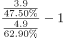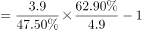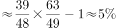，D项最接近。

故正确答案为D。

---

### 材料 2

        截至2019年底，广东省常住人口11521万人，比上年底增加175万人。其中，男性6022.03万人、女性5498.97万人，人口密度为641人/平方公里。2019年底，全省城镇化率（城镇常住人口占常住人口的比重）为，同比提高0.70个百分点。其中，珠三角九市的城镇化率为。

#### 第 2 题　qid 2731605 · 增长

2016-2019年，有        年珠三角九市人口密度同比增量超过了20人/平方公里。

- **A**. 1
- **B**. 2
- **C**. 3
- **D**. 4　✅

**答案**：D

**官方解析**

根据题干“······同比增量超过了20人/平方公里”，可判定本题为增长量比较问题。定位表格材料可得∶2015-2019年珠三角九市的人口密度分别为1073、1095、1123、1150、1177。

代入公式∶增长量现期基期，可得，

2016年，；

2017年，；

2018年，；

2019年，。

有4个年份符合。

故正确答案为D。

---

#### 第 3 题　qid 2731618 · 增长

以下        中的柱状图能准确反映2016-2019年间粤港澳大湾区年末常住人口同比增量的变化趋势。

- **A**. 

　✅
- **B**. 

- **C**. 

- **D**. 

**答案**：A

**官方解析**

根据题干“同比增量的变化趋势”，结合选项为柱状图，可判定本题为增长量比较问题。定位表格材料，可知2015-2019年的年末人口，根据增长量现期基期，可以得到：

2016年增长量，

2017年增长量，

2018年增长量，

2019年增长量。观察数据可得2018年的增长量最大，排除C、D两项；结合刻度2018年增长量更靠近160，排除B项。

故正确答案为A。

---

### 材料 3

        上海市生活垃圾分类工作实施以来，在居民分类、垃圾分类处置、全过程分类体系、配套制度规范以及社会宣传等方面都取得了显著成效。下图为上海市垃圾分类年度日均完成量及2020年目标，下表为上海市垃圾分类回收处理量。

#### 第 4 题　qid 2731510 · 增长

2019年日均可回收物回收量同比年增长率，与日均湿垃圾分出量同比年增长率相差约：

- **A**. 

- **B**. 

　✅
- **C**. 

- **D**. 

**答案**：B

**官方解析**

根据题干“2019年······同比年增长率，与······同比年增长率相差约”，可判定本题为一般增长率计算问题。定位柱状图可知，2019年、2018年日均可回收物回收量分别为4049吨、761吨；2019年、2018年日均湿垃圾分出量分别为7453吨、3947吨。根据公式，增长率，可得2019年日均可回收物回收量同比年增长率 ，2019年日均湿垃圾分出量同比年增长率。两者同比年增长率相差，与B项最为接近。

故正确答案为B。

---
