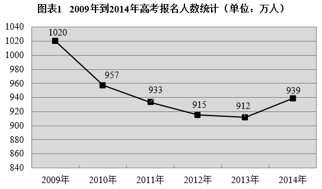
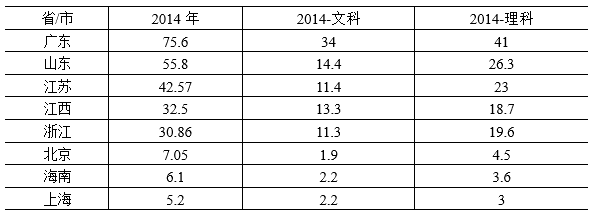
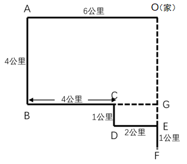
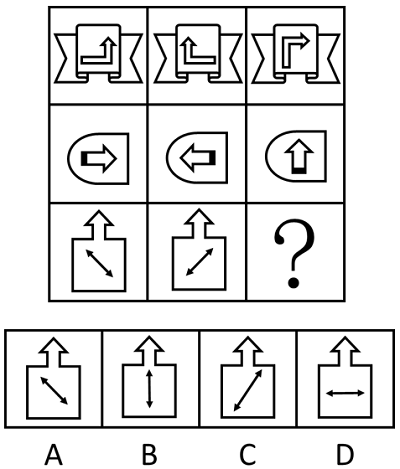
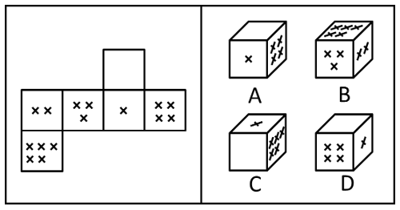
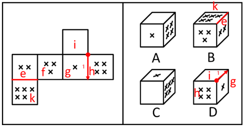
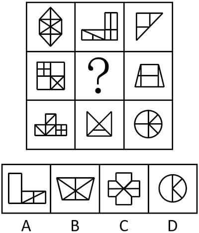
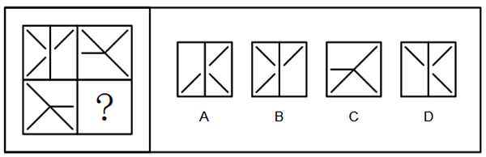
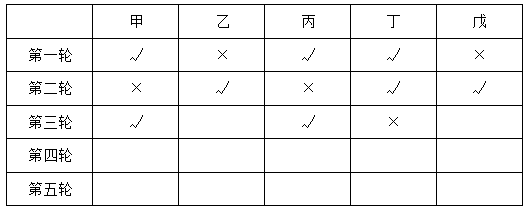

# 2021年上海市行政执法类考试《行测》试题（网友回忆版）

> 省考 · 2021 年 · 6 个模块 · 共 109 题

- [政治理论](#%E6%94%BF%E6%B2%BB%E7%90%86%E8%AE%BA) · 1 题
- [常识判断](#%E5%B8%B8%E8%AF%86%E5%88%A4%E6%96%AD) · 44 题
- [言语理解与表达](#%E8%A8%80%E8%AF%AD%E7%90%86%E8%A7%A3%E4%B8%8E%E8%A1%A8%E8%BE%BE) · 20 题
- [数量关系](#%E6%95%B0%E9%87%8F%E5%85%B3%E7%B3%BB) · 17 题
- [判断推理](#%E5%88%A4%E6%96%AD%E6%8E%A8%E7%90%86) · 24 题
- [资料分析](#%E8%B5%84%E6%96%99%E5%88%86%E6%9E%90) · 3 题

---

## 政治理论

### 第 1 题　qid 15657280 · 新思想

中国特色社会主义的根本任务是        。

- **A**. 让一部分人先富起来
- **B**. 和平统一
- **C**. 人民当家作主
- **D**. 解放和发展社会生产力　✅

**答案**：D

**官方解析**

本题考查理论与政策。
D项正确，A、B、C三项错误，2013年12月3日，习近平总书记在主持第十八届中央政治局第十一次集体学习时指出：“要学习和掌握物质生产是社会生活的基础的观点，准确把握全面深化改革的重大关系。生产力是推动社会进步的最活跃、最革命的要素。社会主义的根本任务是解放和发展社会生产力。”
故正确答案为D。

---

## 常识判断

### 材料 1

材料1

        2012年底，美国国家情报委员会（NIC）发布《全球趋势2030：可能的世界》报告，预测中国经济总量（GDP）将在2030年前超过美国，成为世界第一大经济体。而到2030年时，中国的GDP总量将是日本的2.4倍。报告同时称，未来中国经济将难以保持过去30多年平均8%~10%的增速，会遇到诸如人口老龄化、环境恶化、粮食安全、水资源紧张等因素的制约。国际经验表明，人均GDP在3000美元~10000美元的阶段，既是中等收入国家向中等发达国家迈进的机遇期，又是矛盾增多、爬坡过坎的敏感期。这一阶段，经济容易失调，社会容易失序，心理容易失衡，发展容易掉进“中等收入陷阱”。

材料2

        党的十八大报告指出：在当代中国，坚持发展是硬道理的本质要求就是坚持科学发展。以科学发展为主题，以加快转变经济发展方式为主线，是关系我国发展全局的战略抉择。要适应国内外经济形势新变化，加快形成新的经济发展方式，把推动发展的立足点转到提高质量和效益上来，着力激发各类市场主体发展新活力，着力增强创新驱动发展新动力，着力构建现代产业发展新体系，着力培育开放型经济发展新优势，不断增强长期发展后劲。

#### 第 1 题　qid 15657326 · 人文常识

面对国际上诸如“中国责任论”“中国崩溃论”“中国威胁论”之类的论调，我国应予以澄清的基本事实是（    ）。

- **A**. 中国人口多、底子薄、发展不平衡的基本国情没有改变　✅
- **B**. 中国已经是世界第二大经济体，即将告别社会主义初级阶段
- **C**. 中国将继续推进改革开放，有能力也有信心继续保持经济持续增长　✅
- **D**. 发展壮大的中国带给世界的是更多的机遇而不是威胁　✅

**答案**：ACD

**官方解析**

本题考查政治常识。
A项正确，中国仍然是世界上最大的发展中国家，人口多、底子薄、发展不平衡的基本国情没有变。中国需优先解决自身发展问题，不应被强加超出发展阶段的义务和责任。可以用来应对“中国责任论”。
B项错误，中国已经是世界第二大经济体，但仍处于并将长期处于社会主义初级阶段的基本国情没有变。“即将告别社会主义初级阶段”本身表述错误。
C项正确，中国将继续推进改革开放，有能力也有信心继续保持经济持续增长。中国经济韧性强、潜力大、活力足，长期向好的基本面没有改变。可以用来应对“中国崩溃论”。
D项正确，习近平主席强调，中国追求的是共同发展，既要让自己过得好，也要让别人过得好。中国的发展是世界的机遇，不是任何人的威胁。可以用来应对“中国威胁论”。
故正确答案为ACD。

---

#### 第 2 题　qid 15657317 · 经济常识

下列关于我国必须转变经济发展方式的原因分析中，不正确的是（    ）。

- **A**. 我国经济建设在取得巨大成就的同时，带来的资源、环境问题也十分严重
- **B**. 科技创新能力已越来越成为综合国力竞争的决定性因素
- **C**. 我国科技的总体水平同世界先进水平相比仍有较大差距，同我国经济社会发展的要求还有许多不相适应的地方
- **D**. 我国的基本经济制度已经越来越不能适应社会主义市场经济的发展　✅

**答案**：D

**官方解析**

本题考查政治常识。
A项正确，改革开放以来，我国经济社会发展取得举世瞩目的成就，但付出了过大的资源环境代价。我们决不能走西方发达国家“先发展经济，后治理环境”的老路，而要积极探索中国环保新道路，以环境保护优化经济发展。
B项正确，当今世界，百年变局加速演进，科技创新能力日益成为综合国力竞争的决定性因素。科学技术为转变经济发展方式、调整经济结构、优化经济体系提供内生动力，推动质量变革、效率变革、动力变革，成为经济社会发展的主要力量。
C项正确，我国科技的总体水平同世界先进水平相比仍有较大差距，同我国经济社会发展的要求还有许多不相适应的地方。我国经济增长将更多依靠人力资本质量和技术进步，必须让创新成为驱动发展新引擎。
D项错误，党的十九届四中全会指出，中国社会主义初级阶段的基本经济制度包括社会主义公有制为主体、多种所有制经济共同发展，按劳分配为主体、多种分配方式并存，社会主义市场经济体制。我国的基本经济制度始终与社会主义市场经济发展相适应，并且在实践中不断完善，是推动我国经济持续健康发展的制度保障。选项本身表述错误。
本题为选非题，故正确答案为D。

---

#### 第 3 题　qid 15657316 · 人文常识

加快形成新的经济发展方式，把推动发展的立足点转到提高质量和效益上来，需（    ）。

- **A**. 把保护环境、节能减排作为我国一切工作的中心
- **B**. 深化科技体制改革，加快建设国家创新体系　✅
- **C**. 实施可持续发展战略和科教兴国战略　✅
- **D**. 更加注重以人为本，更加注重全面协调可持续发展，更加注重统筹兼顾　✅

**答案**：BCD

**官方解析**

本题考查政治常识。
A项错误，中国共产党在社会主义初级阶段的基本路线是：领导和团结全国各族人民，以经济建设为中心，坚持四项基本原则，坚持改革开放，自力更生，艰苦创业，为把我国建设成为富强民主文明和谐美丽的社会主义现代化强国而奋斗。选项本身表述错误。
B项正确，2012年9月，中共中央、国务院印发《关于深化科技体制改革加快国家创新体系建设的意见》中指出：“当前，我国正处在全面建设小康社会的关键时期和深化改革开放、加快转变经济发展方式的攻坚时期······因此，抓住机遇大幅提升自主创新能力，激发全社会创造活力，真正实现创新驱动发展，迫切需要进一步深化科技体制改革，加快国家创新体系建设。”
C项正确，在新时期，要加快经济发展，就必须坚持“一个中心、两个基本点”的基本路线不动摇，必须实施科教兴国战略和可持续发展战略，必须抓住知识经济时代的机遇和迎接它的挑战。
D项正确，党的十七届五中全会指出，在当代中国，坚持发展是硬道理的本质要求，就是坚持科学发展，更加注重以人为本，更加注重全面协调可持续发展，更加注重统筹兼顾，更加注重保障和改善民生，促进社会公平正义。
故正确答案为BCD。

---

### 材料 2

        曹某（男28岁，家住在S市P区）。2014年7月23日，曹某因被经营地位于S市X区的某公司解雇，心情郁闷，遂购买多瓶啤酒来到S市C区某路边绿化带的草地上独自喝闷酒。酒后，曹某对多名路过行人无端辱骂，行人见其酒醉，均匆匆躲开。叶某（女22岁，家住S市J区）路过时，曹某也辱骂叶某，叶某与其理论，遭到曹某殴打，叶某衣服被撕破，身上多处软组织挫伤，叶某报警。随后，公安机关调查发现，曹某在当天中午离开公司的时候，还故意将停在楼下的公司老板的车辆玻璃砸破，损失经鉴定为7660元。公安机关认为，根据《治安管理处罚法》，曹某的上述行为涉及故意损毁公司财物和寻衅滋事两种违法行为。

#### 第 4 题　qid 15657318 · 法律常识

对曹某的上述行政违法行为，有权管辖的是（    ）公安机关。

- **A**. S市P区
- **B**. S市X区　✅
- **C**. S市J区
- **D**. S市C区　✅

**答案**：BD

**官方解析**

本题考查法律常识。
根据《公安机关办理行政案件程序规定》第十条第一款规定：“行政案件由违法行为地的公安机关管辖。由违法行为人居住地公安机关管辖更为适宜的，可以由违法行为人居住地公安机关管辖，但是涉及卖淫、嫖娼、赌博、毒品的案件除外。”
A项错误，S市P区为违法行为人的居住地，然而材料中并未表明违法行为人居住地公安机关管辖更为适宜的情节，故S市P区无管辖权。
B项正确，S市X区为某公司所在地，根据材料情节，曹某在当天中午离开公司的时候，还故意将停在楼下的公司老板的车辆玻璃砸破。由此可见，S市X区为故意损害他人财物的违法行为发生地，具有管辖权。
C项错误，S市J区为被侵害人叶某的居住地，无管辖权。
D项正确，S市C区为曹某酒后寻衅滋事的违法行为发生地，具有管辖权。
故正确答案为BD。

---

#### 第 5 题　qid 15657319 · 法律常识

如果曹某对区公安机关作出的行政处罚决定不服，可以（    ）。

- **A**. 直接申请行政复议　✅
- **B**. 直接提起行政诉讼　✅
- **C**. 先申请行政复议，对复议结果不服时，可以提起行政诉讼　✅
- **D**. 先提起行政诉讼，对诉讼结果不服时，可以申请行政复议

**答案**：ABC

**官方解析**

本题考查法律常识。
A、B两项正确，根据《中华人民共和国行政诉讼法》第四十四条第一款规定：“对属于人民法院受案范围的行政案件，公民、法人或者其他组织可以先向行政机关申请复议，对复议决定不服的，再向人民法院提起诉讼；也可以直接向人民法院提起诉讼。”因此，曹某对区公安机关作出的行政处罚决定不服，既可以直接申请行政复议，也可以直接提起行政诉讼。
C项正确，D项错误，根据《中华人民共和国行政诉讼法》第四十五条规定：“公民、法人或者其他组织不服复议决定的，可以在收到复议决定书之日起十五日内向人民法院提起诉讼·······”因此，曹某可以先申请行政复议，对复议结果不服时，可以再提起行政诉讼；若先提起行政诉讼，则不可以再申请行政复议。
故正确答案为ABC。

---

#### 第 6 题　qid 15657320 · 法律常识

曹某对叶某的辱骂、殴打是在其醉酒后所为，公安机关在对其作出行政处罚时（    ）。

- **A**. 可以从轻或减轻处罚
- **B**. 应当从轻或减轻处罚
- **C**. 应当从重处罚
- **D**. 应当正常处罚　✅

**答案**：D

**官方解析**

本题考查法律常识。
A、B、C三项错误，D项正确，根据《中华人民共和国治安管理处罚法》第十五条第一款规定：“醉酒的人违反治安管理的，应当给予处罚。”因此，曹某对叶某的辱骂、殴打是在其醉酒后所为，公安机关在对其作出行政处罚时，应当正常处罚。
故正确答案为D。

---

#### 第 7 题　qid 15657321 · 法律常识

曹某对公安机关作出的拘留的处罚决定不服申请行政复议的，该行政拘留的处罚决定（    ）。

- **A**. 可以停止执行
- **B**. 应当停止执行
- **C**. 不停止执行，处罚机关认为应当停止执行的除外　✅
- **D**. 不停止执行，曹某申请暂缓执行并符合法定条件的除外　✅

**答案**：CD

**官方解析**

A、B两项错误，C项正确，根据《中华人民共和国行政复议法》第四十二条第一项规定：“行政复议期间行政行为不停止执行；但是有下列情形之一的，应当停止执行：（一）被申请人认为需要停止执行；”因此，曹某申请行政复议，原则上行政拘留的处罚决定不停止执行，但公安机关作为处罚机关认为需要停止执行的，应当停止执行。
D项正确，根据《中华人民共和国治安管理处罚法》第一百二十六条第一款规定：“被处罚人不服行政拘留处罚决定，申请行政复议、提起行政诉讼的，遇有参加升学考试、子女出生或者近亲属病危、死亡等情形的，可以向公安机关提出暂缓执行行政拘留的申请。公安机关认为暂缓执行行政拘留不致发生社会危险的，由被处罚人或者其近亲属提出符合本法第一百二十七条规定条件的担保人，或者按每日行政拘留二百元的标准交纳保证金，行政拘留的处罚决定暂缓执行。”因此，曹某申请行政复议的，原则上行政拘留的处罚决定不停止执行，曹某申请暂缓执行并符合法定条件的除外。（注：1.本题涉及到《中华人民共和国治安管理处罚法》的修改，自2026年1月1日生效。）
故正确答案为CD。

---

### 材料 3

        互联网集文字、声音、图像于一体，构成一种立体化的传播形态，吸引众多网民加入其中的同时，也造就了独特的网络文化。网络技术所提供的虚拟、互动功能，更促成多元异质文化的碰撞、融汇，并使之成为网络文化的重要方面。

        互联网技术的进步在促进社会信息公开、提高透明度上发挥着积极作用。继论坛、博客之后，微信使信息发布的门槛进一步降低，信息生成和传播的即时性进一步加强，传播信息，使社会运行更加公开透明，从而促进整个社会更加公平公正、和谐有序。但是，网络给我们提供大量新鲜资讯的同时也泥沙俱下，发布传播不实信息、造谣诽谤，甚至蓄意捏造歪曲事实的事件时有发生。尤其在面对社会热点、群情沸腾的关键时段，一些不实信息迅速蔓延，极易造成不良社会后果。所以，对待网络，我们需要趋利避害，在必要的监管之外，我们呼吁网络使用者恪守真实诚信的道德底线。

#### 第 8 题　qid 15657322 · 人文常识

正确地看待网络文化，一方面要充分利用网络技术从网上获得健康的、有益的信息，同时要对网上的各种有害信息坚决进行抵制。这一观点体现了（    ）。

- **A**. 分清主次的方法
- **B**. 全面观察和分析问题的矛盾分析方法
- **C**. 具体问题具体分析
- **D**. 一分为二的矛盾分析方法　✅

**答案**：D

**官方解析**

本题考查政治常识。
A项错误，“分清主次”强调在事物的矛盾中，需区分“矛盾的主要方面”（决定事物性质的主导因素）和“矛盾的次要方面”（影响事物但不决定性质的因素），并重点把握主要方面。但题干仅并列指出网络文化的积极影响与消极影响两面，未判断哪一面是主导，也未强调“重点把握主要方面”，故不符合题意。
B项错误，“全面观察”是矛盾分析方法的整体要求，但该表述过于宽泛。“全面观察”可通过“一分为二”“分析多种矛盾”等具体方式实现。故该项并非最佳答案。
C项错误，“具体问题具体分析”的核心是“针对不同事物的矛盾，采取不同的解决方法”，强调“矛盾不同，方法不同”，故不符合题意。
D项正确，“一分为二”是矛盾分析方法的核心具体形式，指“任何事物都包含既对立又统一的两个方面，需既看到正面，也看到反面，全面认识事物”。题干中“网络文化”作为同一事物，包含“有益信息”（正面）和“有害信息”（反面）两个对立统一的方面，题干的观点正是“一分为二”看待网络文化的直接体现。
故正确答案为D。

---

#### 第 9 题　qid 15657323 · 人文常识

中国互联网协会启动“绿色网络之旅”活动，在活动中，网上有许多以“阳光网络伴我成长”为主题的网络心语，如“网络像无穷无尽的知识海洋，给我营养，给我力量”等网络心语能够发挥作用是因为（    ）。

- **A**. 文化会对社会产生积极的影响
- **B**. 优秀文化能够丰富人的精神世界
- **C**. 优秀文化能够增强人的精神力量　✅
- **D**. 优秀文化能够促进人的全面发展

**答案**：C

**官方解析**

本题考查政治常识。

A、B、D三项错误，C项正确，文化的作用具有双重性，只有优秀文化对社会和个人起积极影响，落后、腐朽文化（如网络谣言、低俗内容）会产生消极影响。题干“网络像无穷无尽的知识海洋，给我营养，给我力量”的核心关键词是“给我力量”，强调网络（此处指健康的网络文化）为个人提供了行动的动力和精神支撑，不涉及丰富精神世界和促进全面发展。
故正确答案为C。

---

#### 第 10 题　qid 15657324 · 法律常识

近年来，互联网上出现了晒客族。所谓晒客族，是指那些热衷于用文字、照片和视频等方式将私人物件以及生活经历放在网上曝光、与人分享的网友。晒客族的一个口号是“只有不想晒的，没有不能晒的”，这种观点（    ）。

- **A**. 是正确的，因为网络是绝对自由的天空
- **B**. 是正确的，因为公民是国家的主人
- **C**. 是错误的，因为公民的自由是法律范围内的自由　✅
- **D**. 是错误的，因为绝对的自由是不存在的　✅

**答案**：CD

**官方解析**

C、D两项正确，A、B两项错误，不存在绝对的自由，任何自由都不是无边界、无限制的；自由的边界由法律划定，公民只能在法律范围内享有和行使自由，法律既保障公民的合法自由（如合法晒自己的生活、公开合法信息），也划定了自由的边界（如禁止晒他人隐私、国家秘密）。“没有不能晒的”观点无视法律对自由的限制，违背了“自由在法律范围内行使”。
故正确答案为CD。

---

#### 第 11 题　qid 15657325 · 法律常识

我国采取一系列措施加强网络管理，如实行微博实名制，加大对散布谣言、传播色情、网络欺诈、非法网络攻关等各种网络犯罪的打击力度等。这些做法（    ）。

- **A**. 能够增强我国文化产业的国际竞争力
- **B**. 有利于净化文化环境，抵制落后文化、腐朽文化危害社会　✅
- **C**. 不利于发展人民群众喜闻乐见的大众文化
- **D**. 目的在于弘扬中华传统文化，加强思想道德建设

**答案**：B

**官方解析**

本题考查政治常识。
B项正确，A、C、D三项错误，题干中“实行微博实名制”“加大对散布谣言、传播色情、网络欺诈、非法网络攻关等各种网络犯罪的打击力度”等措施，本质是规范网络文化传播秩序、净化网络文化环境、保护公民合法权益、维护社会公共利益，有利于净化文化环境，抵制落后文化、腐朽文化危害社会。人民群众喜闻乐见的“大众文化”，前提是“健康、有益、符合社会主义核心价值观”的文化，而且打击“有害网络文化”，其目的正是为健康大众文化的发展清除障碍、营造良好环境，而非阻碍大众文化发展。题干不涉及文化产业发展、思想道德建设内容。
故正确答案为B。

---

### 材料 4

        随着城市化进程的加快，政府提供的公共设施如垃圾处理站、殡仪馆、公墓等越来越多，这些被称为“邻避设施”的公益性项目，虽然对社会的正常运行必不可少，但有时却会对所在地居民的生命健康产生潜在或现实的威胁，带来心理上的不适。

        “邻避设施”的规划选址、修建和运营管理过程，往往会引起附近公众的强烈反响，甚至引起群体性事件，这类事件被称为“邻避冲突”。例如，我国近几年发生的广州番禺垃圾发电厂选址之争和北京阿苏卫垃圾焚烧发电厂项目抗议事件等。“邻避冲突”作为一种基于公共政策而引发的部分个体和群体之间的利益冲突，是社会冲突的一部分。从国外的经验看，美国近年来建设“邻避设施”遇到的阻力越来越小，是因为“邻避设施”的选址方式由“决定—宣布—辩护”方式开始转向“参与—自愿—合作”的方式，减少了阻力。此外，“邻避冲突”是一个涉及多元主体博弈的政策议题，因而多元协作是实现邻避冲突治理的有效途径之一。

#### 第 12 题　qid 15657333 · 人文常识

“邻避设施”具有        属性、因此可能会导致当地社区强烈地反对将其建造于周边。

- **A**. 公共物品
- **B**. 私人物品
- **C**. 正外部性
- **D**. 负外部性　✅

**答案**：D

**官方解析**

本题考查经济常识。
A项错误，公共物品是与私人物品相对应的概念，具有非竞争性和非排他性。非竞争性是指当一个人消费某些产品和服务时，并不对其他人同时消费这种产品和服务构成任何影响；非排他性指的是我们无法阻止人们对于某一项产品或服务的消费。“邻避设施”作为政府提供的公益性项目，符合公共物品概念，但公共物品属性并不会导致当地社区强烈地反对将其建造于周边，故排除。
B项错误，私人物品是具有竞争性和排他性的物品。竞争性是指当某人消费给定数量的某种商品后，该商品无法被其他人同时使用的属性；排他性在经济学中是指一类物品（财产）归某位消费者或某类消费人群所拥有并控制，就可以把其他消费者排斥在获得该商品的利益之外。“邻避设施”作为政府提供的公益性项目，不符合私人物品概念，故排除。
C项错误，D项正确，外部性分为正外部性和负外部性。正外部性是某个经济行为个体的活动使他人或社会受益，而受益者无需花费成本；负外部性是某个经济行为个体的活动使他人或社会受损，而造成负外部性的人却没有为此承担代价。而“邻避设施”的核心特征是“为社会整体带来公共效益，却对设施周边社区造成直接不利影响”，符合负外部性概念，不符合正外部性概念。且负外部性属性会导致当地社区强烈地反对将其建造于周边。
故正确答案为D。

---

#### 第 13 题　qid 15657340 · 人文常识

材料以美国为例，说明要减少“邻避设施”遇到的阻力，应该        。

- **A**. 提升邻避政策制定的科学化和理性化，完善专家咨询制度
- **B**. 提升邻避政策制定的公平性和均衡性，保障公众的合法权益　✅
- **C**. 提升邻避政策制定的公开性和公正性，从封闭性转向开放性　✅
- **D**. 提升邻避政策制定的完整性和系统性，增强信息处理能力

**答案**：BC

**官方解析**

本题考查管理常识。
A项错误，材料提到“邻避冲突”涉及多元主体博弈，科学化的专家论证是多元协作的基础。通过引入科学评估和专家论证，可以减少政策制定的随意性，为公众参与提供客观依据，具有重要意义，但这与减小阻力关系不大。
B项正确，材料提到“邻避设施”可能对居民造成“潜在或现实的威胁”，根据环境正义理论，要确保利益分配和风险承担的公平性，避免弱势群体承担不成比例的负面影响，可以采取补偿机制等方式降低特定群体的抵触情绪，这有利于减小阻力。
C项正确，从“封闭性”到“开放性”的转变，本质是决策模式的重构。“封闭性”模式下，政策制定多由政府或少数主体主导，规划信息不透明，而“开放性”则强调打破信息壁垒，让公众从“旁观者”转为“参与者”，既能充分表达诉求，也能参与方案优化。而“公开性与公正性”是这一转变的核心支撑，公开性保障公众的知情权，公正性则体现在程序，让公众的意见被纳入决策考量，而非形式化参与，这种“被尊重”的过程能显著降低抵触情绪，有利于减小阻力。
D项错误，完整性和系统性虽重要，但属于基础性条件。若缺乏公开性和公平性支撑，信息处理能力提升对减少阻力的作用有限。
故正确答案为BC。

---

#### 第 14 题　qid 15657354 · 人文常识

“邻避冲突”是一个涉及多元主体博弈的政策议题，利益是邻避冲突治理的核心，因而       成为有效治理“邻避冲突”的必要条件。

- **A**. 设定利益博弈的有效规则
- **B**. 完善利益博弈的相关环境
- **C**. 建立多重利益补偿和回馈机制　✅
- **D**. 约束利益集团的利益扩张

**答案**：C

**官方解析**

本题考查管理常识。
A项错误，规则设定虽然重要，但更多属于程序性保障范畴。美国《协商制定规则法》的实践表明，即便建立了完善的博弈规则，若缺乏实质性的利益平衡机制，规则本身难以化解深层次的利益冲突。
B项错误，完善利益博弈的相关环境主要解决的是博弈的公平性问题，有一定意义，但无法直接发挥作用，有效治理“邻避冲突”。环境完善必须与实质利益补偿相结合才能见效。
C项正确，“邻避冲突”的核心矛盾之一是“利益失衡”——设施所在地居民往往承担潜在风险（成本），却未充分享受收益，而其他群体间接受益。建立利益补偿（如经济补偿、公共服务改善）和回馈机制（如设施运营收益反哺社区），能直接平衡多元主体的利益关系，缓解“局部承担成本”的抵触情绪，是针对“利益核心”的关键措施，故为必要条件。
D项错误，约束利益集团的利益扩张与“邻避冲突”的特性存在错位。“邻避冲突”主要源于居民权益保障不足而非企业过度获利，约束利益集团的利益扩张无法直接发挥作用，有效治理“邻避冲突”。约束手段需以补偿机制为基础才能发挥作用。
故正确答案为C。

---

#### 第 15 题　qid 15657351 · 人文常识

下列关于“邻避冲突”的说法，正确的是        。

- **A**. “邻避冲突”导致公共设施建设无法落实，阻碍政策制定和执行
- **B**. “邻避冲突”只属于一种环境问题
- **C**. “邻避冲突”的治理需要从冲突管理、民主政治、政策制定、规划管理等多方面共同入手　✅
- **D**. 随着我国社会经济发展和公民环保意识的增强，因“邻避效应”引发的“邻避冲突”将呈现增长趋势

**答案**：C

**官方解析**

本题考查管理常识。
A项错误，材料仅提及邻避冲突“往往会引起附近公众的强烈反响，甚至引起群体性事件”，但“强烈反响”“群体性事件”不等于“导致公共设施建设无法落实”，该表述夸大了冲突的后果，且材料未体现其“阻碍政策制定和执行”的必然性，表述错误。
B项错误，材料明确指出邻避冲突是“基于公共政策而引发的部分个体和群体之间的利益冲突，是社会冲突的一部分”，其成因涉及利益分配、公众参与、心理感受等多重因素，并非“只属于一种环境问题”，“只”字表述绝对，表述错误。
C项正确，材料提到邻避冲突“涉及多元主体博弈”，且“多元协作是实现邻避冲突治理的有效途径之一”。结合治理逻辑来看，冲突的化解需兼顾冲突本身的应对（冲突管理）、公众参与的保障（民主政治）、政策制定的优化（如开放性决策）、设施规划的合理性（规划管理）等，需多方面协同，表述正确。
D项错误，材料仅列举了我国近几年的邻避冲突案例，未提及“将呈现增长趋势”的相关判断。公民环保意识增强可能推动诉求表达，但若能借鉴有效治理经验（如材料中美国的参与式模式），冲突未必必然增长，该项属于无依据的主观推断，表述错误。
故正确答案为C。

---

### 材料 5

S市人民政府办公厅批转2020年市政府要完成的与人民生活密切相关的实事的通报

市政府各委、办、局，各区、县党委、人民政府：

        经市委领导同意，现将《2020年市政府要完成的与人民生活密切相关的实事》批转给你们，请认真组织实施。各有关部门和单位要加强领导，落实责任，协调配合，积极推进，并及时向市重大办反馈实事项目的进展情况和实施中出现的问题，确保项目按时完成。项目完成后，要及时做好评估工作。

附件：2020年市政府要完成的与人民生活密切相关的实事

S市人民政府办公厅综合处

2020年2月

2020年与人民生活密切相关的十件实事

1、······

2、······

······

10、······

#### 第 16 题　qid 15657346 · 人文常识

关于标题的不规范之处，下列表述正确的是（    ）。

- **A**. “批转”有误　✅
- **B**. 缺少介词“关于”　✅
- **C**. 文种错误　✅
- **D**. 文字排列不妥

**答案**：ABC

**官方解析**

本题考查公文写作与处理。
A项正确，上级机关转发下级机关的公文时用“批转”；转发上级机关或不相隶属机关的公文时用“转发”。S市人民政府办公厅为市政府的内设机构，而非上级机关，故不能用“批转”，应用“转发”。
B项正确，D项错误，《党政机关公文处理工作条例》在“第三章 公文格式”部分的第九条规定：“（七）标题。由发文机关名称、事由和文种组成。”转发类通知的标题一般也由“发文机关+关于转发+原文标题+文种”组成。故原标题中缺少介词“关于”，但文字排列并无不妥。
C项正确，《党政机关公文处理工作条例》在“第二章 公文种类”部分的第八条规定：“（八）通知。适用于发布、传达要求下级机关执行和有关单位周知或者执行的事项，批转、转发公文。”故批转公文的文种不应使用通报。
故正确答案为ABC。

---

#### 第 17 题　qid 15657349 · 人文常识

关于主送机关的不规范之处，下列修改意见正确的是（    ）。

- **A**. 逗号使用不当，应该为分号
- **B**. 主送机关不应送党委
- **C**. 各区县应排在市政府各部门前面　✅
- **D**. 主送机关应分成两行

**答案**：C

**官方解析**

本题考查公文写作与处理。
A项错误，公文的主送机关在写作时，同级同类单位间使用顿号分隔，同级不同类单位间使用逗号分隔。故主送机关中不应出现分号。
B项错误，《党政机关公文处理工作条例》在“第四章 行文规则”部分的第十六条中规定：“（二）党委、政府的办公厅（室）根据本级党委、政府授权，可以向下级党委、政府行文······”故主送机关中可以有党委。
C项正确，公文中有多个主送机关时，按先外后内（同级别地方政府在前，本机关职能部门在后）顺序排列，故各区县应排在市政府各部门前面。
D项错误，《党政机关公文格式》在“7.3.2 主送机关”中规定：“编排于标题下空一行位置，居左顶格，回行时仍顶格，最后一个机关名称后标全角冒号······”故主送机关不需要回行时不分成两行。‌
故正确答案为C。

---

#### 第 18 题　qid 15657352 · 人文常识

关于正文的不规范之处，下列表述正确的是（    ）。

- **A**. “市委领导”有误　✅
- **B**. “批转”有误　✅
- **C**. “请认真组织实施”后面的文字多余
- **D**. 不必标注附件说明　✅

**答案**：ABD

**官方解析**

本题考查公文写作与处理。
A项正确，《党政机关公文处理工作条例》在“第四章 行文规则”部分第十六条第二项规定：“（二）党委、政府的办公厅（室）根据本级党委、政府授权，可以向下级党委、政府行文······”故应写为“经市委同意”。
B项正确，上级机关转发下级机关的公文时用“批转”；转发上级机关或不相隶属机关的公文时用“转发”。S市人民政府办公厅为市政府的内设机构，而非上级机关，故不能用“批转”，应用“转发”。
C项错误，转发性通知除写明被转发文件名称和执行要求外，还可以再加上转发批示，批示要紧扣被转发文件内容，作出分析评价，强调意义，提出执行要求和注意事项。
D项正确，被批转或转发的文件，另面编排，不按附件处理，公文主体部分无需出现附件说明。
故正确答案为ABD。

---

#### 第 19 题　qid 15657355 · 人文常识

下列选项中，关于发文机关署名和成文日期写法正确的是（    ）。

- **A**. 发文机关应为“S市人民政府办公厅”　✅
- **B**. 发文机关应为“S市人民政府”
- **C**. 成文日期应把年月日写全　✅
- **D**. 成文日期应使用汉字

**答案**：AC

**官方解析**

本题考查公文写作与处理。
A项正确，B项错误，《党政机关公文处理工作条例》在“第三章 公文格式”部分的第九条中规定：“（十一）发文机关署名。署发文机关全称或者规范化简称。”故发文机关应为“S市人民政府办公厅”。
C项正确，D项错误，《党政机关公文格式》在“7.3.5.4 成文日期中的数字”部分规定：“用阿拉伯数字将年、月、日标全，年份应标全称，月、日不编虚位（即1不编为01）。”
故正确答案为AC。

---

#### 第 20 题　qid 15657357 · 人文常识

关于附件的不规范之处，下列表述正确的是（    ）。

- **A**. 附件中的标题与正文不一致　✅
- **B**. 结构层次序数不对　✅
- **C**. 位置应该在成文日期之前
- **D**. 应该合并成一个段落

**答案**：AB

**官方解析**

本题考查公文写作与处理。
A项正确，被转发公文标题应与正文保持一致，应写为“2020年市政府要完成的与人民生活密切相关的实事”。
B项正确，《党政机关公文格式》在“7.3.3 正文”部分规定“······文中结构层次序数依次可以用‘一、’‘（一）’‘1.’‘（1）’标注······”根据材料可知，被转发公文的内容只有一个结构层次，故可用阿拉伯数字。但序数后标点应为圆点，而不是顿号，正确写法应为“1.”“2.”“10.”。
C、D两项错误，转发性通知由通知正文和被转发文件两部分组成，正文结束后应在正文之下编排发文机关署名和成文日期（即文尾），之后另页编排被转发文件。因此，附件应位于成文日期之后，且不应合并成一个段落。
故正确答案为AB。

---

#### 第 21 题　qid 15657285 · 法律常识

按照不同的标准，法律有不同的分类。按照法的创制和表达形式的不同，可以将法分为        。

- **A**. 成文法　✅
- **B**. 实体法
- **C**. 不成文法　✅
- **D**. 程序法

**答案**：AC

**官方解析**

本题考查法律常识。
A、C两项正确，按照法的创制和表达形式的不同，可以将法分为成文法和不成文法。成文法指国家机关依照一定的程序制定和颁布的，表现为条文形式的规范性法律文件。不成文法是指由国家有权机关认可的、不具有文字形式或虽有文字形式但却不具有规范化条文形式的法的总称。
B、D两项错误，根据法律规定内容的不同进行划分，可以分为实体法和程序法。实体法是规定具体权利义务内容或者法律保护的具体情况的法律。程序法是规定以保证权利和职权得以实现或行使，义务和责任得以履行的有关程序为主要内容的法律。
故正确答案为AC。

---

#### 第 22 题　qid 15657283 · 地理国情

下列关于国家性质的叙述错误的是（    ）。

- **A**. 中华人民共和国是工人阶级领导的，以工农联盟为基础的人民民主专政的社会主义国家
- **B**. 人民民主专政是无产阶级专政的一种形式
- **C**. 人民民主专政是对人民民主与对敌人专政的结合，前者是基础，后者是保障
- **D**. 工人阶级的领导是人民民主专政的最高原则，工农联盟是人民民主专政的根本标志　✅

**答案**：D

**官方解析**

本题考查法律常识。
A项正确，根据《中华人民共和国宪法》第一条第一款规定：“中华人民共和国是工人阶级领导的、以工农联盟为基础的人民民主专政的社会主义国家。”
B项正确，根据《中华人民共和国宪法》序言部分规定：“工人阶级领导的、以工农联盟为基础的人民民主专政，实质上即无产阶级专政，得到巩固和发展······”
C项正确，在人民内部实行民主是实现对敌人专政的前提和基础。人民民主的实质就是社会上绝大多数人享有管理国家和社会的一切权力，就是人民当家作主，这是社会主义国家政权的本质特征。中国宪法总纲中明确规定：“中华人民共和国的一切权力属于人民。”对敌人实行专政是人民民主的有力保障。“专政”包含两层含义：一是说明统治关系，即一个国家谁是统治阶级，谁是被统治阶级；二是指统治手段，即采用暴力镇压的手段。尽管中国的阶级结构和阶级斗争状况已经发生了极其深刻的变化，但是对敌专政的职能并没有消失。
D项错误，工人阶级掌握国家领导权、成为领导力量，是无产阶级专政和人民民主专政的根本标志。
本题为选非题，故正确答案为D。

---

#### 第 23 题　qid 15657284 · 人文常识

下列有关我国公务员年龄，表述错误的是（    ）。

- **A**. 最低不得低于18周岁
- **B**. 最低不得低于20周岁　✅
- **C**. 最高不得高于35周岁　✅
- **D**. 最高不得高于60周岁　✅

**答案**：BCD

**官方解析**

本题考查法律常识。
A项正确，B、C、D三项错误，根据《中华人民共和国公务员法》第十三条规定：“公务员应当具备下列条件：（一）具有中华人民共和国国籍；（二）年满十八周岁；（三）拥护中华人民共和国宪法，拥护中国共产党领导和社会主义制度；（四）具有良好的政治素质和道德品行；（五）具有正常履行职责的身体条件和心理素质；（六）具有符合职位要求的文化程度和工作能力；（七）法律规定的其他条件。”因此，《中华人民共和国公务员法》只规定了我国公务员最低年龄限制为18周岁。
本题为选非题，故正确答案为BCD。

---

#### 第 24 题　qid 15657282 · 法律常识

下列选项中，只能由公安机关实施的行政处罚是（    ）。

- **A**. 吊销许可证
- **B**. 责令停产停业
- **C**. 较大数额的罚款
- **D**. 行政拘留　✅

**答案**：D

**官方解析**

本题考查法律常识。
A、B、C三项错误，D项正确，根据《中华人民共和国行政处罚法》第十八条第三款规定：“限制人身自由的行政处罚权只能由公安机关和法律规定的其他机关行使。”因此，行政拘留属于限制人身自由的行政处罚，只能由公安机关实施。
故正确答案为D。

---

#### 第 25 题　qid 15657293 · 人文常识

常规性决策或例行性决策属于        。

- **A**. 经验决策
- **B**. 程序化决策　✅
- **C**. 非程序化决策
- **D**. 确定性决策

**答案**：B

**官方解析**

本题考查理管理常识。
A项错误，经验决策是指决策者根据个人的知识、才干和经验作出的决策，经验决策是人们常用的，但只能用于简单问题的决策，重大而复杂的问题不宜采用经验决策。选项与题干无关。
B项正确，程序化决策又称为常规决策或重复决策，指的是经常重复发生，能按已规定的程序、处理方法和标准进行的决策，其决策步骤和方法可以程序化、标准化、简单化，重复使用。“常规性决策或例行性决策”均为经常重复发生，能按已规定的程序、处理方法和标准进行的决策。
C项错误，非程序化决策又称为非常规决策、例外决策，指的是具有极大偶然性、随机性，又无先例可循且有大量不确定性的决策。这类决策往往是独一无二的，因此，在很大程度上依赖于决策者的知识、经验、洞察力及胆识来进行。选项与题干无关。
D项错误，确定性决策，是指可供选择的方案中只有一种自然状态时的决策，即决策的条件是确定的。选项与题干无关。
故正确答案为B。

---

#### 第 26 题　qid 15657287 · 人文常识

公文处理过程中应坚持的原则包括        。

- **A**. 实事求是　✅
- **B**. 准确规范　✅
- **C**. 精简高效　✅
- **D**. 安全保密　✅

**答案**：ABCD

**官方解析**

本题考查理公文写作与处理。
A、B、C、D四项均正确，《党政机关公文处理工作条例》中“第一章 总则”部分指出：“第五条 公文处理工作应当坚持实事求是、准确规范、精简高效、安全保密的原则。”
故正确答案为ABCD。

---

#### 第 27 题　qid 15657295 · 人文常识

某市出台一个征收城市环境建设费的决策方案，由于一部分专家、企业、单位的反对而取消，这是行政执行障碍中的（    ）。

- **A**. 决策规范不完善
- **B**. 决策标准的不统一
- **C**. 行政执行资源不充分
- **D**. 执行对象的抵制和不合作　✅

**答案**：D

**官方解析**

本题考查管理常识。
行政执行障碍是指在行政执行过程中，影响、干扰或妨碍决策顺利实施的各种因素。在题干中，某市征收城市环境建设费的决策方案因部分专家、企业、单位的反对而取消，核心在于执行对象对决策的抵制。
A项错误，决策规范不完善指决策缺乏明确、统一的标准和规范，导致执行过程中出现理解偏差或执行困难。题干中未提及决策在规范层面存在缺陷，是因外部反对导致取消。
B项错误，决策标准的不统一强调决策中衡量目标、评估效果的标准不一致，导致执行混乱。题干中未涉及决策标准的问题，而是执行对象的态度问题。
C项错误，行政执行资源不充分指执行过程中缺乏资金、人力、技术等必要资源。题干中决策取消的原因是反对意见，而非资源不足。
D项正确，执行对象包括政策所指向的个人、组织或群体。题干中专家、企业、单位作为受决策影响的主体，其反对行为属于执行对象对决策的抵制，直接导致决策方案的取消，符合这一障碍的定义。
故正确答案为D。

---

#### 第 28 题　qid 15657291 · 人文常识

按照（    ）划分，可以把公共行政部门分为咨询部门、决策部门、执行部门、监督部门和信息反馈部门。

- **A**. 业务性质
- **B**. 管理对象
- **C**. 地区
- **D**. 管理程序　✅

**答案**：D

**官方解析**

本题考查管理常识。
A项错误，按业务性质划分，公共行政部门可分为一般权限部门和专门权限部门。一般权限部门是一级政府的首脑机关，负责统一领导指挥所辖行政区域内各行政机关的工作，如国务院；专门权限部门是一级政府所属各职能部门，负责某一方面的行政事务，如教育部、卫生部等。
B项错误，公共行政部门会根据不同的管理对象来设置，例如退役军人事务部门是针对退役军人这一特定群体进行管理和服务的，市场监督管理部门则是对市场主体和市场秩序等管理对象开展工作。
C项错误，按地区划分，是根据不同地域的自然、社会和历史条件等划分行政区域，组成不同层次的公共行政组织，如我国划分为省、自治区、直辖市等，这种划分方式主要是为了适应不同地区的管理需求。
D项正确，公共行政部门按管理程序划分，可分为咨询部门、决策部门、执行部门、监督部门和信息反馈部门。这种划分方式是基于行政管理活动的流程，明确各部门在不同环节的职能，以保障行政活动的有序开展。
故正确答案为D。

---

#### 第 29 题　qid 15657289 · 人文常识

下列选项中，属于定性调查方法的是（    ）。

- **A**. 问卷调查法
- **B**. 结构式访问法
- **C**. 深度访谈　✅
- **D**. 现场观察　✅

**答案**：CD

**官方解析**

本题考查科技常识。
定量调查是以封闭式问卷为工具，对代表性样本进行数据收集，并通过统计分析形成量化报告的研究方法。定性调查是从定性角度，通过科学抽象、理论分析和概念认识研究对象的非量化方法，其核心在于揭示潜在动机、态度及行为特征，不依赖数量测定而侧重现象的理论解析。
A项错误，问卷调查法是通过设计问卷、收集数据、分析结果来了解被调查者的观点、态度、行为等，属于定量调查方法。
B项错误，结构式访问法通常采用事先统一设计、有一定结构的问卷进行访问，其结果便于量化，可进行统计分析，属于定量调查方法。
C项正确，深度访谈是一种无结构的、直接的、一对一的访问形式。访问过程中，由掌握高级访谈技巧的调查员对调查对象进行深入的访问，用以揭示对某一问题的潜在动机、态度和情感，最常应用于探测性调查，属于定性调查方法。
D项正确，现场观察是利用感觉器官和其他手段收集和感受对象的资料，可分为参与式观察和非参与式观察、结构式观察和非结构式观察等，属于定性调查方法。
故正确答案为CD。

---

#### 第 30 题　qid 15657288 · 人文常识

联合国教科文组织保护非物质文化遗产政府间委员会将中国的（    ）列入教科文组织人类非物质文化遗产名录，它被誉为中国的第五大发明。

- **A**. 雕版印刷
- **B**. 珠算　✅
- **C**. 书法
- **D**. 篆刻

**答案**：B

**官方解析**

本题考查科技常识。
A、C、D三项错误，B项正确，2013年12月4日，联合国教科文组织保护非物质文化遗产政府间委员会第八次会议在阿塞拜疆巴库通过决议，正式将中国珠算项目列入教科文组织人类非物质文化遗产名录。珠算是以算盘为工具进行数字计算的一种方法，被誉为中国的第五大发明，此前已被列入中国国家级非物质文化遗产名录。
故正确答案为B。

---

#### 第 31 题　qid 15657297 · 人文常识

核技术是以核素、核辐射和其他相关理论为基础的科学技术。下列关于核技术，说法不正确的是（    ）。

- **A**. 核技术的原理包括核裂变和核聚变
- **B**. 在自然界中，太阳就是一个超巨型的“核裂变反应堆”　✅
- **C**. 核技术最初的应用是在医学领域　✅
- **D**. 目前为止，秦山核电站是我国唯一一个利用核技术发电的发电厂　✅

**答案**：BCD

**官方解析**

本题考查科技常识。
A项正确，核技术是指以核性质、核反应（包括核聚变和核裂变等）、核效应和核谱学为基础，以反应堆、加速器、辐射源和核辐射探测器为工具的现代高新技术。
B项错误，核裂变，又称核分裂，是指由重的原子核（主要是指铀核或钚核）分裂成两个或多个质量较小的原子的一种核反应形式。原子弹或核能发电厂的能量来源就是核裂变。其中铀裂变在核电厂最常见。核聚变，即氢原子核（例如氘和氚）结合成较重原子核（例如氦），放出巨大能量。太阳质量的大约四分之三是氢，剩下的几乎都是氦，太阳发光源于其核心区域正在进行的核聚变反应。
C项错误，核技术诞生于19世纪末。1895年德国科学家伦琴发现了极具穿透能力的X射线，开创了核技术时代。核技术一诞生，就开创性地投入应用，除X射线用于医学诊断、镭应用于癌症治疗外，夜光粉也被用于钟表业，同位素示踪被用于分析化学等。因此最初的应用并不局限在医学领域。
D项错误，中国有多个利用核技术发电的发电厂，除了秦山核电站外，还有大亚湾核电站、田湾核电站等。
本题为选非题，故正确答案为BCD。

---

#### 第 32 题　qid 15657298 · 人文常识

绿色产品是指生产、使用及处理过程均符合环境保护的要求，不危害人体健康，其垃圾无害或危害极小，有利于资源再生和回收利用的一类产品。下列属于绿色产品的是（    ）。

- **A**. 超薄塑料购物袋
- **B**. 洗衣粉
- **C**. 无氟家用制冷器　✅
- **D**. 锂离子电池　✅

**答案**：CD

**官方解析**

本题考查科技常识。
A项错误，超薄塑料购物袋容易破损，使用后大多被随意丢弃，会造成“白色污染”，且其难以降解，在自然环境中长期不分离，不符合绿色产品环保、有利于资源再生和回收利用的要求。
B项错误，普通洗衣粉中可能含有磷等对水体有害的物质，会造成水体富营养化等环境问题，虽然有无磷洗衣粉等环保型产品，但不能一概而论地说洗衣粉属于绿色产品。
C项正确，无氟家用制冷器不再将氟利昂等破坏臭氧层的化学气体作为制冷剂，在生产、使用及处理过程中对环境的影响较小，属于绿色产品。
D项正确，锂离子电池在生产、使用过程中不含有、也不出现任何铅、汞、镉等有毒有害重金属元素和物质，且其可回收利用，属于绿色产品。
故正确答案为CD。

---

#### 第 33 题　qid 15657292 · 人文常识

超级病菌是近年来出现的一类病菌，绝大多数受到超级病菌感染的患者，如采取常规的治疗方法，通常都难以治愈。超级病菌之所以对人体危害这么大，是因为（    ）。

- **A**. 它对几乎所有的抗生素药物都具有超强的耐药性　✅
- **B**. 它的传染性和毒性都极强
- **C**. 它进入人体之后繁殖极快
- **D**. 相对其他病菌而言，它在经过变异之后成为体型超大的病菌

**答案**：A

**官方解析**

本题考查科技常识。
A项正确，B、C、D三项错误，超级细菌不是特指某一种细菌，而是泛指那些对多种抗生素具有耐药性的细菌，它的准确称呼应该是“多重耐药性细菌”。这类细菌对抗生素有强大的抵抗作用，能逃避被杀灭的危险。而其传染性、毒性、繁殖速度等方面并不一定比其他病菌更强，且超级病菌并非是因为体型超大而对人体危害大。
故正确答案为A。

---

#### 第 34 题　qid 15657299 · 经济常识

下列关于常用的经济术语，描述正确的是（    ）。

- **A**. CPI——居民消费价格指数　✅
- **B**. PPI——生产者价格指数　✅
- **C**. GDP——国民生产总值
- **D**. GNP——国内生产总值

**答案**：AB

**官方解析**

本题考查经济常识。
A项正确，居民消费价格指数，简称CPI，是度量一定时期内居民消费商品和服务价格水平总体变动情况的相对数，综合反映居民消费商品和服务价格水平的变动趋势和变动程度。
B项正确，生产者价格指数，简称PPI，理论上应涵盖所有产业，即包括农业生产者价格指数、工业生产者价格指数和服务业生产者价格指数等指数。由于历史及技术原因，目前许多国家编制和发布的PPI仅指工业生产者价格指数。工业生产者出厂价格指数（PPI），指一定时期内工业企业产品第一次出售时的出厂价格总水平的变动趋势和变动幅度的相对数，是衡量一国生产领域价格变动的重要经济指标。
C、D两项错误，国内生产总值，简称GDP，指在一个季度或一年，一个国家或地区的经济中所生产出的全部最终产品和劳务的价值。GDP是国民经济核算的指标。国民生产总值，简称GNP，指一个国家（或地区）所有常住单位在一定时期内收入初次分配的最终结果。与国内生产总值不同，国民生产总值是个收入概念，而国内生产总值是个生产概念。C、D两项概念混淆，错误。
故正确答案为AB。

---

#### 第 35 题　qid 15657302 · 人文常识

中枢神经系统中的神经元以（    ）的形式互联，形成神经元网络。这对于感觉和思维的形成极为重要，同时也是中枢神经系统和身体的其他部分，例如肌肉和各种感受器交换信息的渠道。

- **A**. 树突
- **B**. 轴突
- **C**. 突触　✅
- **D**. 效应器

**答案**：C

**官方解析**

本题考查科技常识。
A、B两项错误，细胞突起是由细胞体延伸出来的细长部分，又可分为树突和轴突。细胞体的伸延部分产生的分枝称为树突，树突是接受从其它神经元传入的信息的入口。轴突，自神经元发出的一条突起，轴突传递自神经元发出的冲动。
C项正确，中枢神经系统中的神经元是构成人体中枢神经系统的基本功能单位，分为传出神经元、传入神经元和中间神经元三个主要类别，其中中间神经元数量占比最大。其通过突触连接形成网络，承担信息传递与整合的核心功能。
D项错误，传出神经纤维末梢或运动神经末梢及其所支配的肌肉或腺体一起称为效应器。这种从中枢神经向周围发出的传出神经纤维，终止于骨骼肌或内脏的平滑肌或腺体，支配肌肉或腺体的活动。
故正确答案为C。

---

#### 第 36 题　qid 15657300 · 科技常识

LED护眼灯是采用低压直流供电的节能护眼灯，LED是一种固态的半导体器件（发光二极管），它可以直接把电转化为光。下列关于LED护眼灯的说法错误的是        。

- **A**. LED护眼灯不含钨、汞等有毒贵金属，比普通白炽灯、荧光灯更环保
- **B**. LED护眼灯光源采用的是直流供电，不会产生频闪现象
- **C**. 同等功率下，LED护眼灯比白炽灯的亮度高，发热量大　✅
- **D**. LED护眼灯避免了采用交流供电引起的电磁辐射

**答案**：C

**官方解析**

本题考查科技常识。
A项正确，普通白炽灯泡的核心材料为钨丝，荧光灯（如日光灯）含有汞；而LED护眼灯的核心发光元件是半导体材料（如砷化镓、磷化镓），不含钨、汞等有毒贵金属，废弃后对环境影响更小。
B项正确，频闪是指光源光通量周期性波动的现象，主要由交流供电（电流周期性变化）导致。LED护眼灯采用低压直流供电，电流稳定无周期性波动，光通量恒定，因此不会产生频闪，可减少眼睛疲劳。
C项错误，LED护眼灯的发光原理是“电致发光”，能量转化效率极高，大部分电能用于发光，仅有少量转化为热能；而白炽灯是“热致发光”，电光转换效率仅约5%-10%，大部分电能转化为热能。因此，同等功率下，LED护眼灯亮度更高、发热量更低。
D项正确，交流供电时，电流会产生交变电磁场，进而引发电磁辐射（如普通灯具接交流电时，电线和镇流器会释放低频电磁辐射）；而LED护眼灯采用低压直流供电，电流方向和大小恒定，不会产生交变电磁场，因此可避免交流供电带来的电磁辐射，减少对人体（尤其是神经系统）的潜在影响。
本题为选非题，故正确答案为C。

---

#### 第 37 题　qid 15657301 · 人文常识

节假日或者庆典的场合，会放飞气球，以前这些都是氢气球，现在为了更安全、效果更好，已经改为氦气球，其原因是        。

- **A**. 氢气有毒
- **B**. 氢气和氧气混合遇热会发生爆炸　✅
- **C**. 氢气遇到空气中的氧气会生成水，氢气球飞不起来
- **D**. 氢气比空气重，不容易飞回来

**答案**：B

**官方解析**

本题考查科技常识。

A项错误，氢气（）是无色无味的气体，本身无毒，不会对人体产生毒性危害。日常生活中“氢气危险”的核心原因并非毒性，而是其易燃易爆特性。

B项正确，氢气是极易燃烧的气体，当氢气与空气（含氧气）混合，体积浓度达到4%-75%时会形成“爆炸极限”，遇明火、高温（如烟头、电火花）会瞬间发生剧烈爆炸，安全性极差（历史上多次发生氢气球爆炸伤人事件）；而氦气（He）是惰性气体，化学性质稳定，不燃烧、不助燃，即使遇热或撞击也不会发生爆炸，因此节日庆典中用氦气球替代氢气球，核心原因是规避爆炸风险。

C项错误，氢气与氧气在“点燃”条件下会发生反应生成水，但在常温常压下，氢气与空气中的氧气几乎不反应，不会自发生成水。氢气球能飞起来的核心原因是“氢气密度远小于空气”，与“是否生成水”无关。

D项错误，氢气的密度远小于空气，氦气的密度也小于空气，二者均为“轻于空气的气体”，都能使气球升空；且“是否容易飞回来”与气体密度无直接关系，主要取决于风力、气球密封性等因素。

故正确答案为B。

---

#### 第 38 题　qid 15657308 · 人文常识

山洪具有突发性、水量集中流速大、冲刷破坏力强等特点，常造成局部洪灾。在山区和峡谷等景区，突发山洪致游客遇险的事故时有发生。为保证自身安全，游客应掌握一定的防灾避灾知识。在进入山区峡谷时，若发现        等现象，就要警惕山洪发生。

- **A**. 上游或当地突降大雨　✅
- **B**. 溪水水位突然上涨或流速加快　✅
- **C**. 山谷上方突然传来异常的轰鸣声　✅
- **D**. 水的颜色发生变化，漂浮物增多　✅

**答案**：ABCD

**官方解析**

本题考查地理国情。
A项正确，山洪的核心水源是降水，上游或当地突降大雨（尤其是短时强降雨，如1小时降雨量超过20mm）会快速汇集成地表径流，导致山区溪流、河道水位急剧上涨，是山洪发生的“直接诱因”。因此，发现突降大雨时需立即警惕山洪风险。
B项正确，山区溪流、河道的水位和流速通常稳定，若突然出现“水位快速上涨（如10分钟内上涨超过30cm）”或“流速加快（如水流从平缓变为湍急）”，说明上游已形成大量径流，洪水正在向下游推进，是山洪即将爆发的“直接前兆”，需立即撤离。
C项正确，山谷上方传来的异常轰鸣声（如“隆隆声”），可能是上游发生山体滑坡、泥石流，或洪水冲刷岩石、树木产生的声音，预示着洪水或次生灾害正在逼近，需立即向高处撤离。
D项正确，山洪暴发前，上游的泥土、砂石、落叶等会被水流冲刷，导致溪水颜色从“清澈”变为“浑浊（黄色、褐色）”，同时漂浮物（树枝、杂草、垃圾）增多，这表明水流已具备较强的冲刷力，是山洪即将到来的“视觉信号”。
故正确答案为ABCD。

---

#### 第 39 题　qid 15657303 · 人文常识

空气质量指数（AQI）由“优”直至“严重污染”共分为6个等级。AQI为100，表示空气质量为        。

- **A**. 良　✅
- **B**. 轻度污染
- **C**. 中度污染
- **D**. 重度污染

**答案**：A

**官方解析**

本题考查地理国情。
A项正确，B、C、D三项错误，我国的空气质量指数（AQI）共分为0～50、51～100、101～150、151～200、201～300和大于300六个级别，分别对应的空气质量级别是一至六级，对应的空气质量状况是优（绿色）、良（黄色）、轻度污染（橙色）、中度污染（红色）、重度污染（紫色）、严重污染（褐红色）。AQI的数值越大、级别越高、表征颜色越深，说明空气污染状况越严重。因此，AQI为100，表示空气质量为良。
故正确答案为A。

---

#### 第 40 题　qid 15657306 · 人文常识

“秦晋之好”的典故出自春秋时期秦国和晋国的关系，现多指        。

- **A**. 两国之间的友好往来
- **B**. 面和心不和的虚伪
- **C**. 两姓联姻　✅
- **D**. 朋友的知己相交

**答案**：C

**官方解析**

本题考查人文常识。
C项正确，A、B、D三项错误，“秦晋之好”源于春秋时期，公元前654年，晋献公将女儿嫁给秦穆公（“秦晋联姻”），后来晋文公重耳流亡秦国时，秦穆公又将女儿嫁给重耳，两国通过多次“政治联姻”巩固关系。因此，“秦晋之好”最初指“秦晋两国的联姻”，现泛指“两姓联姻”。
故正确答案为C。

---

#### 第 41 题　qid 15657305 · 人文常识

成语“退避三舍”典出晋楚城濮之战，晋文公（重耳）不食诺言把军队向后撤退了        里。

- **A**. 30
- **B**. 60
- **C**. 90　✅
- **D**. 120

**答案**：C

**官方解析**

本题考查人文常识。
C项正确，A、B、D三项错误，“退避三舍”的典故出自《左传・僖公二十八年》，背景是：春秋时期，晋文公重耳流亡楚国时，楚成王以礼相待，重耳承诺“若返国执政，一旦晋楚交战，晋军将退避三舍”。后两国在城濮之战中，晋文公果然信守诺言，将军队后撤了九十里。古代“一舍”为30里，因此“三舍”即3×30里=90里。
故正确答案为C。

---

#### 第 42 题　qid 15657309 · 人文常识

对成语“高风亮节”和“兴高采烈”中的“高”字分别作解释，正确的是（    ）。

- **A**. 由下至上的距离大，尊贵
- **B**. 岁数大，声音响亮
- **C**. 高尚，高昂　✅
- **D**. 尊贵，声音响亮

**答案**：C

**官方解析**

本题考查人文常识。
C项正确，A、B、D三项错误，“高风亮节”出自宋代胡仔的《苕溪渔隐丛话后集》，指高尚的品格和坚贞的节操，其中“高”指高尚。“兴高采烈”最早出自于南朝梁刘勰的《文心雕龙·体性》，原义是文章旨趣高超，辞采峻切犀利，后多形容兴致高昂，精神饱满，其中“高”指高昂。
故正确答案为C。

---

#### 第 43 题　qid 15657327 · 人文常识

“一问三不知”出自《左传》，其中“三不知”是指对        不知道。

- **A**. 天文、地理、文学
- **B**. 事情的开始、经过、结果　✅
- **C**. 孔子、孟子、老子
- **D**. 自己的姓名、籍贯、生辰八字

**答案**：B

**官方解析**

本题考查人文常识。
B项正确，A、C、D三项错误，“一问三不知”的典故最早载于《左传·鲁哀公二十七年》：“君子之谋也，始衷终皆举之，而后入焉。今我三不知而入之，不亦难乎？”“一问三不知”原义是对某一事情的开始、发展、结果都不知道（三不知：指对事情的起因、经过、结果都不知道），后用来表示对实际情况一点也不知道。
故正确答案为B。

---

#### 第 44 题　qid 15657314 · 人文常识

以下描写节日的诗句，按照一年中节日先后次序排列正确的一项是（    ）。
①月上柳梢头，人约黄昏后
②独在异乡为异客，每逢佳节倍思亲
③千门万户曈曈日，总把新桃换旧符
④明月几时有，把酒问青天

- **A**. ①④②③
- **B**. ③②④①
- **C**. ③①④②　✅
- **D**. ①③②④

**答案**：C

**官方解析**

本题考查人文常识。
①“月上柳梢头，人约黄昏后”出自北宋欧阳修的《生查子·元夕》，意思是月儿升起在柳树梢头，他约我黄昏以后同叙衷肠。描写的是正月十五元宵节约会的场景。
②“独在异乡为异客，每逢佳节倍思亲”出自唐代王维的《九月九日忆山东兄弟》，意思是一个人独自在他乡作客，每逢节日加倍思念远方的亲人。描写的是重阳节思亲。
③“千门万户曈曈日，总把新桃换旧符”出自北宋王安石的《元日》，意思是初升的太阳照耀着千家万户，都把旧的桃符取下换上新的桃符。描写的是春节除旧迎新。
④“明月几时有，把酒问青天”出自北宋苏轼的《水调歌头》，意思是明月从什么时候开始有的呢？我拿着酒杯遥问苍天。描写的是中秋节。
综上，按照一年中节日先后次序排列是③①④②。
故正确答案为C。

---

## 言语理解与表达

### 材料 1

（一）全球变暖争论的核心议题，与气温在过去一个世纪里是否升高没有什么关系。几乎所有的科学家都认为，气温在过去100年里确实升高了，就像此前的数个世纪曾经多次变暖或变冷一样。更重要的议题是，从长期来看，目前的温度是否高得反常，目前的全球变暖趋势是否会在可预见的未来有造成灾难的危险。

（二）我们应该记住的首要原则是大背景。小冰河期结束后，尽管全球气温在过去100多年中确实上升了一些，但气温进一步上升的空间很小。从大约公元1300年持续到1900年的小冰河期，为这个星球带来了过去1万年来气温最低的时期。认为自小冰河期结束后气温上升了一度左右的说法，并不能说明气温的长期大环境，因为小冰河期这个衡量基准是个主观的武断看法，它是气候异常寒冷的反常时期。

（三）我们经常听到某个月、某年或者某十年是“有历史记载以来最热的”说法，但考虑到温度的长期变化，这种论断只有当“有记载的历史”被限定在小冰河期全盛的最近130年左右才是有效的。全球变暖危机论的支持者用来证明“历史记载”这一便利的定义具有合理性的，是大约130年前建立起来的一个相对全球化的气象站系统。很好，但是，代表性的数据有多种来源，其中包括在格陵兰和南极冰原钻取的冰心，这些数据表明，在过去1万年的大部分时期，全球温度都比今天更温暖。在气候条件比今天更温暖的时期，人类文明首次得到了发展，并继而繁荣起来。从更长远的人类发展历史来看，今天的气温偏冷，而不是偏热。

（四）我们需要记住的第二个原则是，地球温度的长期变化历史证明，在现实世界中，更温暖的温度始终比更寒冷的温度更有益于人类文明的进步。小冰河期意味着作物歉收、饥荒、瘟疫、极端的天气事件和人口的减少。相比之下，最近变暖的温度则让我们从小冰河期严酷而异常寒冷的环境中得到了舒展。在最近一个世纪中，随着全球温度的升高，森林面积扩展了，沙漠退却了，土壤水分提高了，作物也丰收了，而且飓风和龙卷风等极端天气事件发生的频率也更低了。

（五）虽然我们对饥荒、瘟疫、干旱、飓风等事件的记录更多地局限于小冰河期之前的一千年，但我们很清楚，在这个更温暖的千年里，人类文明发展繁荣，同时，这个星球的气候并没有进入混乱的恶性循环。事实上，虽然地球最近的数千年来相对更温暖，但地球的气候却一直相当温和。

（六）这就回到了全球变暖争论的核心。如果我们拥有真实世界的证据，而这些证据表明，过去的1万年中的大部分时期都比现在更温暖（在过去数百万年的几个间冰期也比现在更温暖），如果我们同样拥有真实世界的证据表明，人类文明在这些更温暖的时期得到了繁荣，更温暖的气候也并没有触发所谓的“临界点”而让这个星球陷入气候灾难，那么，我们就没有理由认为，现在这样的适度温暖气候即将引发气候灾难。

（七）对很多科学家来说，理论和真实世界状况的区别，是所谓的“杞人忧天者”与“怀疑论者”之间的争议所在。正如美国科罗拉多州立大学名誉教授和飓风专家格雷经常谈到的，杞人忧天者对气候的危言耸听之说建立在推测性的计算机模型基础之上，而这些模型则是在实验室里建立和运转的。另一方面，怀疑论者的怀疑则构建于真实世界的数据和观察资料的基础之上。

#### 第 1 题　qid 11446040 · 片段阅读

作者写这篇文章的目的是        。

- **A**. 解释全球变暖争论的核心
- **B**. 反驳“全球变暖危机正在迫近”的说法　✅
- **C**. 客观地介绍关于全球变暖的不同观点
- **D**. 预测目前的全球变暖趋势在未来可能造成的灾难

**答案**：B

**官方解析**

文章第（一）段首先明确全球变暖争论的核心并非“过去一个世纪气温是否升高”，而是“目前温度是否反常、未来是否会因变暖引发灾难”；第（二）-（三）段从“温度长期变化”切入，指出小冰河期是异常寒冷的特殊时期，以此为基准判断“当前最热”并不合理，且冰心等真实数据显示过去1万年多数时期比现在更温暖，彼时人类文明仍能发展繁荣，反驳“当前温度反常偏热”的观点；第（四）-（五）段通过对比小冰河期的严酷与近期变暖的益处，强调“温暖气候更利于人类文明”，进一步削弱“变暖有害”的认知；第（六）段得出结论，既然过去更温暖时期未引发气候灾难，人类文明反而繁荣，那么当前适度温暖也不会触发灾难；第（七）段区分“杞人忧天者”与“怀疑论者”，作者明确支持后者，强化对“变暖危机论”的反驳立场。故文段围绕“反驳全球变暖会引发灾难”展开，目的是驳斥“全球变暖危机正在迫近”的说法，对应B项。
A项，“解释全球变暖争论的核心”仅对应第（一）段的内容，引出话题，非重点，排除；
C项，“客观介绍不同观点”与文意相悖，作者明确支持基于真实数据的“怀疑论”，反驳“杞人忧天者”的危机论，排除；
D项，“预测未来可能造成的灾难”无中生有，作者通过多组真实数据论证“当前温暖气候不会引发灾难”，并未预测灾难，排除。
故正确答案为B。
【文段出处】福布斯《全球变暖真的是危机吗？》

---

#### 第 2 题　qid 11446044 · 片段阅读

全球变暖争议的核心在于        。

- **A**. 气温在过去100年里确实升高了，就像此前的数个世纪曾经多次变暖或变冷一样
- **B**. 我们是否有真实世界的证据证明全球变暖即将引发气候灾难
- **C**. 从长远来看，目前的温度是否高得反常，全球的变暖趋势是否会在可预见的未来有造成灾难性的危险　✅
- **D**. 虽然地球最近的数千年来相对更温暖，但地球的气候却一直相当温和

**答案**：C

**官方解析**

A项，根据第（一）段“全球变暖争论的核心议题，与气温在过去一个世纪里是否升高没有什么关系。几乎所有的科学家都认为，气温在过去100年里确实升高了”可知，“气温在过去100年里确实升高了”是科学家的共识，选项只是在陈述气温升高这一现象，并不存在争议，排除；
B项，根据第（六）段“如果我们同样拥有真实世界的证据表明······那么，我们就没有理由认为，现在这样的适度温暖气候即将引发气候灾难”可知，“是否有真实世界的证据”是支持或反驳争议核心的依据，而非争议核心本身，排除；
C项，根据第（一）段“全球变暖争论的核心议题，与气温在过去一个世纪里是否升高没有什么关系······更重要的议题是，从长期来看，目前的温度是否高得反常，目前的全球变暖趋势是否会在可预见的未来有造成灾难的危险”可知，全球变暖争议的核心在于目前的变暖是否异常且是否会导致灾难，当选；
D项，根据第（五）段“但我们很清楚，在这个更温暖的千年里，人类文明发展繁荣，同时，这个星球的气候并没有进入混乱的恶性循环。事实上，虽然地球最近的数千年来相对更温暖，但地球的气候却一直相当温和”可知，“最近数千年气候温和”是用于证明“温暖气候未引发混乱”的论据，并非争议核心本身，排除。
故正确答案为C。
【文段出处】福布斯《全球变暖真的是危机吗？》

---

#### 第 3 题　qid 11446048 · 片段阅读

根据文意，以下推断正确的是        。

- **A**. 格陵兰和南极冰原钻取的冰心数据可以用来反驳“全球变暖”的结论　✅
- **B**. 适宜的温度是促进人类进步的主导因素
- **C**. 地球变暖必将带来人类文明的大发展
- **D**. 2013年以来，上海持续40度以上的高温刷新了历史纪录，这支持了“全球变暖危机正在迫近”

**答案**：A

**官方解析**

A项，根据第三段“在格陵兰和南极冰原钻取的冰心，这些数据表明，在过去1万年的大部分时期，全球温度都比今天更温暖”可知，表述正确，当选；
B项，根据第四段“地球温度的长期变化历史证明，在现实世界中，更温暖的温度始终比更寒冷的温度更有益于人类文明的进步”可知，“主导因素”无中生有，排除；
C项，根据第四段“更温暖的温度始终比更寒冷的温度更有益于人类文明的进步”与第六段“如果我们同样拥有真实世界的证据表明，人类文明在这些更温暖的时期得到了繁荣”可知，文段只是认为温暖气候对人类文明进步存在正向作用，而非“必将带来”，表述过于绝对，排除；
D项，根据第五段“在这个更温暖的千年里，人类文明发展繁荣，同时，这个星球的气候并没有进入混乱的恶性循环”与第六段“如果我们拥有真实世界的证据······我们就没有理由认为，现在这样的适度温暖气候即将引发气候灾难”可知，表述错误，排除。
故正确答案为A。
【文段出处】福布斯《全球变暖真的是危机吗？》

---

#### 第 4 题　qid 11446050 · 片段阅读

作者希望通过第四段说明        。

- **A**. 如果我们拥有真实世界的数据，那么我们就不会认为现在的气候会引发气候灾难
- **B**. 温暖的地球更有益于人类文明的进步　✅
- **C**. 现在并不是最温暖的时期，过去的1万年中的大部分时期都比现在更温暖
- **D**. 无论我们拥有怎样的数据，我们都要说明现在的温暖气候即将引发气候灾难的说法是错误的

**答案**：B

**官方解析**

阅读第四段可知，文段开门见山表明观点，即温暖的温度比寒冷的温度更有益于人类文明的进步，然后举例论证，指出小冰河期会导致作物歉收、饥荒等不良后果，而变暖的温度会减轻这些不良后果，并通过最近一个世纪的情况进一步表明全球温度的升高会带来诸多好处，故该段主要想告诉我们温暖的温度更有益于人类文明的进步，对应B项。
A项，文段并未论述真实世界数据与是否认为会引发气候灾难的关系，无中生有，排除；
C项，文段并未提及过去1万年大部分时期与现在温度的比较，无中生有，排除；
D项，文段主要论述温暖气候的益处，并未提到温暖气候即将引发气候灾难这一说法，故并非反驳这一说法，无中生有，排除。
故正确答案为B。
【文段出处】福布斯《全球变暖真的是危机吗？》

---

#### 第 5 题　qid 11446051 · 逻辑填空

格雷教授对于怀疑论者所持的态度是        。

- **A**. 否定的
- **B**. 怀疑的
- **C**. 支持的　✅
- **D**. 客观的

**答案**：C

**官方解析**

根据第七段“正如美国科罗拉多州立大学名誉教授和飓风专家格雷经常谈到的······怀疑论者的怀疑则构建于真实世界的数据和观察资料的基础之上”可知，格雷教授认为怀疑论者的观点是基于客观事实产生的，故其态度应为认同、支持，对应C项。
A、B两项，均与文意相悖，并非格雷教授对于怀疑论者所持的态度，排除；
D项，为中立态度，不偏不倚，而文段中格雷教授对怀疑论者所持态度有明显的认同倾向，与文意不符，排除。
故正确答案为C。
【文段出处】福布斯《全球变暖真的是危机吗？》

---

#### 第 6 题　qid 11446009 · 逻辑填空

人的生命具有无限的韧性和耐力，只要你始终如一地努力做下去，无论在怎样的处境都不            ，就一定能创造出令自己和他人都感到震惊的成就。
填入画横线部分最恰当的一项是：

- **A**. 悔过自新
- **B**. 自暴自弃　✅
- **C**. 好高骛远
- **D**. 前功尽弃

**答案**：B

**官方解析**

根据“人的生命具有无限的韧性和耐力”“始终如一地努力做下去”可知，文段想表达无论在怎样的处境都能顽强、持久地坚持下去，不会放弃，横线处应体现放弃之意，B项“自暴自弃”指自己瞧不起自己，甘于落后或堕落，符合文意，当选。
A项“悔过自新”指悔改错误或罪过，重新做人，文中并无“悔过”之意，与文意不符，排除；
C项“好高骛远”比喻不切实际地追求过高过远的目标，与文意不符，排除；
D项“前功尽弃”指以前经过努力得到的成绩完全白费，文中并未体现“以前的成绩”，与文意不符，排除。
故正确答案为B。

---

#### 第 7 题　qid 11445967 · 逻辑填空

虽然我们还没有掌握外星人存在的直接证据，但现代天文学确证：地球人的出现是宇宙演变的结果；由于自然法则在宇宙中具有普遍性，导致地球人诞生的因素也会出现在苍茫宇宙的某处。因此，不少科学家        ：宇宙中存在外星人。
填入画横线部分最恰当的一项是：

- **A**. 怀疑
- **B**. 坚信　✅
- **C**. 质疑
- **D**. 证实

**答案**：B

**官方解析**

根据“因此”可知，横线处所填词语应与前文构成因果关系，根据“但现代天文学确证”以及“由于自然法则在宇宙中具有普遍性，导致地球人诞生的因素也会出现在苍茫宇宙的某处”可知，科学家认为宇宙中存在外星人这一推导结果是正确的，科学家相信宇宙中存在外星人，B项“坚信”指坚决相信，符合文意，当选。
A项“怀疑”指心中存疑、不相信，C项“质疑”指提出疑问或怀疑，均与“确证”“普遍性”等确定性证据矛盾，排除；D项“证实”指通过证据证明某事属实，而文段强调“没有掌握外星人存在的直接证据”，与文意相悖，排除。
故正确答案为B。
【文段出处】无限奇异果《费米悖论：外星人到底在哪儿呢？他们究竟存在吗？》

---

#### 第 8 题　qid 11445969 · 语句表达

一言以蔽之：倘若再不加大力度开发种种新能源，发展其相关技术、解决一些        难题，使其大规模付诸实用，全球性的能源危机则便            。
依次填入画横线部分最恰当的一项是：

- **A**. 棘手，指日可待　✅
- **B**. 棘手，为期不远
- **C**. 辣手，为期不远
- **D**. 刺手，指日可待

**答案**：A

**官方解析**

第一空，搭配“难题”，A、B两项“棘手”比喻事情如同荆棘般刺手难以处理，与“难题”搭配恰当，均保留。C项“辣手”形容（手段）狠毒，D项“刺手”指旧时对犯人施行的一种肉刑，均与“难题”搭配不当，排除。
第二空，搭配“能源危机”，且根据前文可知，横线处应体现如果不能使新能源大规模使用，全球性能源危机就会很快到来之意，A项“指日可待”形容（事情、希望等）不久就可以实现，侧重只要条件满足，目标很快会实现的预期，主语多为需要条件达成的事情，与“能源危机”搭配恰当且符合文意，当选。B项“为期不远”比喻要不了很长时间，侧重客观的时间距离，多搭配无论是否主动追求，只需时间推进就会发生的事件，与文意不符，排除。
故正确答案为A。
【文段出处】世界科学 2011年4月刊《无尽能源 绿色能源》

---

#### 第 9 题　qid 11445979 · 语句表达

一个人的涵养，不在心平气和时，而在心浮气躁时；一个人的理性，不在风平浪静时，而在众声        时；一个人的慈悲，不在居高临下时，而在人微言轻时；情侣间的尊重，不在闲情逸致时，而在观点        时；夫妻间的恩爱，不在花前月下时，而在大难临头时。
依次填入画横线部分最恰当的一项是：

- **A**. 喧哗，相右
- **B**. 喧哗，相左　✅
- **C**. 喧嚣，相右
- **D**. 喧嚣，相左

**答案**：B

**官方解析**

第一空，搭配“众声”，且“不在······而在······”引导反义并列，横线处应与“风平浪静”语义相反，体现出人声嘈杂、喧闹之意。A、B两项“喧哗”指声音大而杂乱，符合文意，且“众声喧哗”为常见搭配，保留。C、D两项“喧嚣”指声音杂乱、不清净，更侧重环境的喧闹，而文段强调人声的嘈杂，排除。
第二空，搭配“观点”，且“不在······而在······”引导反义并列，横线处应与“闲情逸致”语义相反，体现出观点不一致、有分歧之意。B项“相左”指相反，相互不一致，常用来表示意见、观点不一致，与“观点”搭配恰当且符合文意，当选。A项“相右”属于不规范表述，汉语中并无此词语，排除。
故正确答案为B。
【文段出处】读者《男人的教养》

---

#### 第 10 题　qid 11445990 · 语句表达

知识产权的拥有数量和质量、规模和水平，以及知识产权的运用与管理能力，已成为衡量一个国家经济、科技实力的重要        。知识产权的制度目标，应立足于保护创造成果、发展创意产业与营造创新环境。        ，在实施创新驱动发展战略、建设创新型国家的进程中，我们应依托知识产权制度，以科学发展为主题，着力增强创新驱动发展的新动力，努力打造经济社会发展的新引擎。
依次填入画横线部分最恰当的一项是：

- **A**. 标准，因而
- **B**. 指标，因此　✅
- **C**. 目标，因为
- **D**. 数据，然而

**答案**：B

**官方解析**

第一空，根据文意可知，横线处表达知识产权的拥有数量和质量、规模和水平，以及知识产权的运用与管理能力对于衡量一个国家经济、科技实力的作用。B项“指标”指衡量目标的参数，D项“数据”是指进行各种统计、计算、科学研究或技术设计等所依据的数值，均符合文意，保留。A项“标准”指衡量事物的准则，虽能体现衡量的作用，但侧重的是使事物统一、规范、具有一致性，而文段侧重的是分析、评估的作用，并非强调确保统一、规范和一致性，故不如B项“指标”语义恰当，排除；C项“目标”通常是努力要达到的境地或标准，无法体现衡量的作用，与文意不符，排除。
第二空，前文阐述了知识产权制度目标的内容，后文强调要依托知识产权制度去发展经济，故前后文是因果关系。B项“因此”表示因果关系，符合文段逻辑关系，当选。D项“然而”表示转折关系，与文段逻辑关系不符，排除。
故正确答案为B。
【文段出处】人民网《创新发展与知识产权制度》

---

#### 第 11 题　qid 11446001 · 片段阅读

下列语句表达有错误的是        。

- **A**. 该县虽然经济欠发达，农村道路基础建设也很薄弱，但让农村公交车兼职当校车，有效解决了山区学生乘车难的问题。
- **B**. 乡土文化在推动文化产业成为国民经济支柱性产业过程中，一直责无旁贷地扮演着重要角色。
- **C**. 柳州素有“桥梁博物馆”的美誉，在市区河段的百里柳江上十多座大桥一桥一式，是世间少有的奇景。
- **D**. 不少大学生对自己的英语水平信心满满，并希望尝试一下英语学习的巅峰，那么口译学习就是你们的正确选择。　✅

**答案**：D

**官方解析**

D项，“尝试······巅峰”动宾搭配不当，“尝试”侧重“试做某事”，“巅峰”是抽象的“最高水平”，可改为“挑战一下英语学习的巅峰”，当选。
A、B、C三项，均表意明确，没有语病，排除。
本题为选非题，故正确答案为D。

---

#### 第 12 题　qid 11446008 · 片段阅读

下列语句有歧义的是        。

- **A**. 早慧儿童罕见
- **B**. 美艳女子多情
- **C**. 壮丽山河多娇
- **D**. 大红苹果最贵　✅

**答案**：D

**官方解析**

D项，有两种理解，第一种是又大又红的苹果最贵，第二种是大红颜色的苹果最贵，有歧义，当选。
A、B、C三项，均无歧义，排除。
故正确答案为D。

---

#### 第 13 题　qid 11446002 · 语句表达

下列语句表达准确无误的是        。

- **A**. 我国网民已达5.91亿，手机网民有4.6亿。其中微博用户有3亿多。
- **B**. 中小学作为打基础的学习阶段，并不能满足于学校教授的知识，更需要通过课外阅读来获取大量的课外知识。
- **C**. 从解决公共交通拥堵的立场出发，限制公务车出行与提高私家车的使用成本，都具有一定的合理性。　✅
- **D**. 有序推进是以量力而行、实事求是为前提。

**答案**：C

**官方解析**

A项，“其中”指代不明，前句出现“网民”和“手机网民”两个主体，无法确定“其中”具体指代哪一个，因此语句存在歧义，排除；
B项，主语缺失。“并不能满足于······”缺乏明确的主语，应在“并不能”前补充主语，如“中小学生并不能满足于······”，否则句子结构不完整，排除；
C项，语句通顺，表意清晰，无语病，当选；
D项，主语表述不完整，逻辑不严谨。“有序推进”是推进方式，“以······为前提”需衔接具体行动，应补充具体对象，如“有序推进重点示范村建设”，否则句子显得突兀，逻辑不严谨，排除。
故正确答案为C。

---

#### 第 14 题　qid 11446011 · 语句表达

下列句子中，多义词“光鲜”的含义与其他三句不同的一句是        。

- **A**. 外表再光鲜的红苹果，放久了里面也会悄悄地变黑、变质。　✅
- **B**. 大多数职业人对销售这个工作的第一印象可以说是不怎么光鲜的，存在着社会受尊重程度低、收入没有保障等偏见。
- **C**. 她已经习惯了被人赞扬，不知不觉中戴上了厚厚的面具，把弱点深深地藏起，努力把最光鲜的一面呈现在外人面前。
- **D**. 我最近才体会到：光鲜的背后，是努力，是抉择，是忍耐，是坎坷。

**答案**：A

**官方解析**

“光鲜”意为明亮鲜艳；整洁漂亮或光彩、光荣。
A项，“光鲜”用来形容“红苹果”，且根据“放久了里面也会悄悄地变黑、变质”可知，本句中“光鲜”取“明亮鲜艳”之意；
B项，根据“存在着社会受尊重程度低、收入没有保障等偏见”可知，句中“光鲜”形容“工作”，取“光彩、光荣”之意；
C项，根据“习惯了被人赞扬”“把弱点深深地藏起”可知，句中“光鲜”形容“她”，取“光彩、光荣”之意；
D项，根据“是努力，是抉择，是忍耐，是坎坷”可知，句中“光鲜”形容人的外表或形象，取“光彩、光荣”之意。
综上，A项中“光鲜”的含义与其他三句不同，当选。
本题为选非题，故正确答案为A。

---

#### 第 15 题　qid 11446005 · 片段阅读

“吾闻二世少子也，不当立，当立者乃公子扶苏。”
下列选项中的“乃”与上句中的“乃”意义、用法相同的一项是        。

- **A**. 问今是何世，乃不知有汉，无论魏晋。
- **B**. 今公子有急，此乃臣效命之秋也。　✅
- **C**. 于是乃以田忌为将，而孙子为师。
- **D**. 于是先主遂诣诸葛亮，凡三往，乃见。

**答案**：B

**官方解析**

“吾闻二世少子也，不当立，当立者乃公子扶苏。”出自西汉·司马迁的《陈涉世家》，译为：我听说秦二世是始皇帝的小儿子，不应立为皇帝，应立的是公子扶苏。其中“乃”可译为“是”，为判断动词。
A项“问今是何世，乃不知有汉，无论魏晋。”出自东晋·陶渊明《桃花源记》，译为：他们问渔人现在是什么朝代，竟然不知道有过汉朝，更不必说魏晋两朝了。其中“乃”可译为“竟然”，为副词，与给定文段中“乃”字意义、用法不同，排除；
B项“今公子有急，此乃臣效命之秋也。”出自西汉·司马迁的《魏公子列传》，译为：如今公子有了急难，这就是我为公子杀身效命的时候了。其中“乃”可译为“是”，为判断动词，与给定文段中“乃”字意义、用法相同，当选；
C项“于是乃以田忌为将，而孙子为师。”出自西汉·司马迁的《七十列传·孙子吴起列传》，译为：于是就任命田忌做主将，孙膑做军师。其中“乃”可译为“就”，为副词，与给定文段中“乃”字意义、用法不同，排除；
D项“于是先主遂诣诸葛亮，凡三往，乃见。”出自晋朝·陈寿的《三国志·蜀书·诸葛亮传》，译为：于是刘备就去拜访诸葛亮，共去了三次，才见到。其中“乃”可译为“才”，为副词，与给定文段中“乃”字意义、用法不同，排除。
故正确答案为B。
【文段出处】《陈涉世家》、《桃花源记》、《魏公子列传》、《七十列传·孙子吴起列传》、《三国志·蜀书·诸葛亮传》

---

#### 第 16 题　qid 11446010 · 语句表达

生命的感动无处不在，在我们的有生之年，应该多多关爱无怨无悔地爱我们的父母，多花一些时间陪陪他们，“                    ”是人世间最痛彻心扉、追悔莫及的事，不值得亲历体验。
填入画横线部分最恰当的一项是        。

- **A**. 三年无改于孝之道
- **B**. 不孝有三，无后为大
- **C**. 自古忠孝难两全
- **D**. 子欲养而亲不待　✅

**答案**：D

**官方解析**

本题为语句填空题，横线在中间，需结合前后文判断。横线前指出在我们的有生之年应该多关爱、多陪伴父母。横线后“是人世间最痛彻心扉、追悔莫及的事”是对横线处所填句子的解释。故横线处应填入“最痛彻心扉、追悔莫及的事”。D项“子欲养而亲不待”意思是子女想要赡养父母，但父母却已等不到这一天，表达子女因错过赡养时机而产生的深切悔恨，符合语境，当选。
A项“三年无改于孝之道”意思是父母去世后，子女在一定时期内（“三年”为约数，指较长一段时间）不改变父母生前合理的行为准则和处事之道，就可以说是孝了；B项“不孝有三，无后为大”可以解释为不孝的表现很多，但以不尽后辈的本分为最，也有解释为不孝顺父母的事有三种，其中以没有子孙为最大；C项“自古忠孝难两全”意思是自古以来效忠国家和孝敬父母难以同时顾及，均无法体现“最痛彻心扉、追悔莫及”之意，排除。
故正确答案为D。

---

#### 第 17 题　qid 11446031 · 片段阅读

A国的文化创意产业的起步比发达国家并没有晚多少，政府对这个行业的扶持力度也看似不小，为什么仍然没有“积累”出能与世界巨头比肩的特效公司？对此，我们不能仅从行业的操作层面去分析。如果把亚马孙森林的那些参天大树的种子，种到塔克拉玛干沙漠里，再多的时间也长不出树苗，即便长出树苗也发育不大。
这段话的主要观点是        。

- **A**. 对于文化创意产业，政府应加大扶持力度
- **B**. 对于文化创意产业，社会文化环境的制约作用更加明显　✅
- **C**. 该国的文化创意产业要向世界上先进的特效公司学习
- **D**. 该国不适宜文化创意产业的发展

**答案**：B

**官方解析**

文段开篇提出问题，在起步时间相似、扶持力度看似不小的情况下，A国文化创意产业仍未“积累”出与世界巨头比肩的特效公司，接着通过“对此”指出不能仅从行业的操作层面分析，尾句通过亚马孙森林的种子种到塔克拉玛干沙漠无法发育的例子，强调环境对文化创意产业发展的重要性，即文化环境对文化创意产业发展存在影响，对应B项。
A项，“政府应加大扶持力度”对应文段开篇引出话题内容，非文段重点，排除；
C项，“向世界上先进的特效公司学习”文段并未提及，无中生有，排除；
D项，“不适宜文化创意产业的发展”文段并未提及，且程度过重，排除。
故正确答案为B。
【文段出处】《点石数码邓博弘：造“神八”易画“变形金刚”难》

---

#### 第 18 题　qid 11446034 · 片段阅读

一部高档手机，70%的功能都是没用的；一款高档轿车，70%的速度都是多余的；一幢豪华别墅，70%的面积都是空闲的；一座商城，70%的人是闲逛的；一大沓报纸，70%是不用看的。
根据以上现象可以得出的结论是        。

- **A**. 生活要回归自然才好
- **B**. 生活要简单直接才好　✅
- **C**. 生活要韬光养晦才好
- **D**. 生活要留有余地才好

**答案**：B

**官方解析**

文段开篇指出高档手机70%的功能是无用的，之后通过分号“；”列举了高档轿车、豪华别墅、商城、报纸等多个使用情况，这些现象共同说明了一个问题，即生活中很多东西其实都是过度的、不必要的，真正需要的只是其中的一小部分。故文段为并列结构，意在强调生活中应该摒弃复杂和多余，追求简单与实用，对应B项。
A项，“自然”文段未提及，无中生有，排除;
B项，“韬光养晦”指隐藏才能、不显露，与文意无关，排除；
D项，“留有余地”指保留缓冲空间（如做事留退路），文段强调生活中应该摒弃复杂和多余，与文意不符，排除。
故正确答案为B。
【文段出处】中国消费者报《给手机做个“减法”》

---

#### 第 19 题　qid 11446018 · 片段阅读

如果一个人掌握了他的学科的基础理论，更重要的是学会了独立思考和工作，他必定会找到他自己的道路，而且比起那种注重获得细节知识的人来说，他一定会更好地适应进步和变化。
上面语段认为对一个人的发展来说最重要的是        。

- **A**. 独立思考和工作能力　✅
- **B**. 学科的基础理论
- **C**. 细节知识的专门培训
- **D**. 广博的知识面

**答案**：A

**官方解析**

文段开篇通过程度词“更重要的是”强调学会独立思考和工作对于一个人发展的重要性，随后将具备该能力的人与“注重获得细节知识的人”对比，指出前者能更好地适应进步和变化，进一步凸显了学会独立思考和工作的重要性。故文段重点强调对个人发展最重要的是“独立思考和工作能力”，对应A项。
B项，“学科的基础理论”对应“更重要的是”之前的内容，并非文段强调的“最重要”因素，排除；
C项，“细节知识的专门培训”是文段中对比的对象，文段明确指出注重获得细节知识的人在适应进步和变化方面不如具备独立思考和工作能力的人，与“最重要”相悖，排除；
D项，“广博的知识面”在文段中并未提及，无中生有，排除。
故正确答案为A。
【文段出处】爱因斯坦语录

---

#### 第 20 题　qid 11446022 · 片段阅读

时间对于伟大的思想全然没有作用，因为伟大的思想从数百年前诞生的那个时候起，就与现代一样的新颖和富于青春活力。
上面这段话揭示了伟大思想的特性是        。

- **A**. 新颖别致
- **B**. 永不过时　✅
- **C**. 亘古永存
- **D**. 振奋人心

**答案**：B

**官方解析**

根据文段可知，伟大的思想不受时间的影响，从诞生起就与现代一样的新颖和富于青春活力，说明伟大的思想不会随时间的流逝而失去价值或变得过时，对应B项。
A项，仅对应文段中“新颖”的表述，无法体现“不受时间影响”的特性，排除；
C项，侧重存在的持久性，但文段强调的是伟大的思想在不同时代均保持活力与新颖，而非单纯“存在”，排除；
D项，文段未提及伟大的思想“振奋人心”的作用，无中生有，排除。
故正确答案为B。
【文段出处】《关于“书”的名言》

---

## 数量关系

### 材料 1

        教育部统计，今年全国高考报名939万人，增幅3%。其中普通高中应届生增加26万人；中职毕业学生增加11万人；复读生减少10万人。报名学生中农村户籍学生增加17万人，与近年高考政策向农村倾斜及各省农村专项生的扩大招生密不可分。此外异地高考全面实施，2014年将有28个省份开始解决随迁子女在当地参加高考问题，共有5.6万名符合条件的随迁子女将在居住地参加高考。

#### 第 1 题　qid 16540247 · 数学运算

2014年高考报名人数较2013年增加了        万人。

- **A**. 26
- **B**. 27　✅
- **C**. 31
- **D**. 32

**答案**：B

**官方解析**

根据题干“2014年······较2013年增加了······万人”，可判定本题为增长量计算问题。定位图表1可得：2013年、2014年全国高考报名人数分别为912万人、939万人。根据公式：增长量=现期量-基期量，则题干所求为939-912=27万人。
故正确答案为B。

---

#### 第 2 题　qid 16540248 · 数学运算

下列省市中，高考报名人数持续下跌的不包括        。

- **A**. 河南
- **B**. 浙江　✅
- **C**. 江苏
- **D**. 北京

**答案**：B

**官方解析**

定位图表2可知2009-2014年河南、浙江、江苏、北京每年的高考报名人数。观察可知，2009-2014年河南、江苏、北京的高考报名人数均持续下跌；浙江2011年高考报名人数（29.9万人）&lt;2012年高考报名人数（31.6万人），高考报名人数有所上升，并非持续下跌。
故正确答案为B。

---

#### 第 3 题　qid 16540249 · 数学运算

根据材料，2014年江浙沪省市报考人数占到全国报名总人数的        。

- **A**. 7.98%
- **B**. 8.21%
- **C**. 8.37%　✅
- **D**. 8.54%

**答案**：C

**官方解析**

根据题干“······2014年······占······”，结合选项为百分数，且材料时间为2014年，可判定本题为现期比重问题。定位图表1、2可得：2014年，全国高考报名人数为939万人；江苏、浙江、上海高考报名人数分别为42.57万人、30.86万人、5.2万人。根据公式：比重，则题干所求为，对应C项。

故正确答案为C。

---

#### 第 4 题　qid 16540254 · 数学运算

下表列举了8个省市2014年报考人数的分布（单位：万人），业内人士认为合理的文理科比例应为3：7，分析数据得出最接近这一比例的省市是<u>        </u>。

- **A**. 北京　✅
- **B**. 广东
- **C**. 上海
- **D**. 浙江

**答案**：A

**官方解析**

根据题干“······2014年······比例应为3：7，······最接近这一比例的省市······”，可判定本题为比值比较问题。定位题干表格可知2014年选项涉及四个省市的文理科报考人数，则文理科比例分别为：A项，；B项，；C项，；D项，。比较可知，最接近3：7（约0.43）这一比例的是A项。

故正确答案为A。

---

### 材料 2

#### 第 5 题　qid 16540258 · 数学运算

2009年三大产业的平均用电量约为城乡居民生活用电量的        。

- **A**. 
2.3倍
　✅
- **B**. 

- **C**. 
3.3倍

- **D**. 

**答案**：A

**官方解析**

根据题干“2009年······约为······的”，结合选项为倍数，且材料给出2009年的相关数据，可判定本题为现期倍数问题。定位统计图可得：2009年城乡居民生活、第三产业、第二产业、第一产业用电量分别为4571亿千瓦时、3921亿千瓦时、26993亿千瓦时、917亿千瓦时。则2009年三大产业的平均用电量亿千瓦时，故所求倍数倍。

故正确答案为A。

---

#### 第 6 题　qid 16540261 · 数学运算

相比上一年，2012年的第三产业用电量占全社会用电量的比重        。

- **A**. 下降了约0.3个百分点
- **B**. 下降了约0.7个百分点
- **C**. 上升了约0.3个百分点
- **D**. 上升了约0.7个百分点　✅

**答案**：D

**官方解析**

根据题干“相比上一年，2012年······占······比重”，结合选项为“上升/下降了+百分点”，可判定本题为两期比重问题。定位统计图可得2011年和2012年我国城乡居民生活、第三产业、第二产业、第一产业用电量。则2011年我国全社会用电量=5646+5082+35185+1015亿千瓦时，2012年我国全社会用电量=6219+5690+36669+1013亿千瓦时。根据公式：比重，可得2011年我国第三产业用电量占全社会用电量的比重，2012年我国第三产业用电量占全社会用电量的比重，故所求比重差=11.5%-10.8%=0.7%，即比重上升了约0.7个百分点。

故正确答案为D。

---

#### 第 7 题　qid 16540264 · 数学运算

根据材料下列选项正确的是        。

- **A**. 2010-2013年，第二产业用电量同比增长最快的是2011年
- **B**. 2010-2013年，我国全社会用电量同比增加最多的是2010年　✅
- **C**. 如果同比增速与上一年保持不变，预计2014年我国全社会用电量将超过60000亿千瓦时
- **D**. 2011年第一产业用电量占全社会用电量比重比上一年有所上升

**答案**：B

**官方解析**

A项：定位统计图可得：2009-2013年我国第二产业用电量分别为26993亿千瓦时、31318亿千瓦时、35185亿千瓦时、36669亿千瓦时、39143亿千瓦时。根据公式：增长率，可得2010-2013年我国第二产业用电量的同比增速分别为：2010年，；2011年，；2012年，；2013年，。故2010-2013年，第二产业用电量同比增长最快的是2010年，错误；

B项：定位统计图可得2009-2013年我国城乡居民生活、第三产业、第二产业、第一产业用电量。则2009年我国全社会用电量=4571+3921+26993+9174600+3900+27000+900=36400亿千瓦时，2010年我国全社会用电量=5125+4497+31318+9845100+4500+31300+1000=41900亿千瓦时，2011年我国全社会用电量=5646+5082+35185+10155600+5100+35200+1000=46900亿千瓦时，2012年我国全社会用电量=6219+5690+36669+10136200+5700+36700+1000=49600亿千瓦时，2013年我国全社会用电量=6793+6273+39143+10146800+6300+39100+1000=53200亿千瓦时。根据公式：增长量=现期量-基期量，则2010-2013年我国全社会用电量的同比增长量分别为：2010年，41900-36400=5500亿千瓦时；2011年，46900-41900=5000亿千瓦时；2012年，49600-46900=2700亿千瓦时；2013年，53200-49600=3600亿千瓦时。故2010-2013年，我国全社会用电量同比增加最多的是2010年，正确；

C项：定位统计图可得2012年和2013年我国城乡居民生活、第三产业、第二产业、第一产业用电量。则2012年我国全社会用电量=6219+5690+36669+10136200+5700+36700+1000=49600亿千瓦时，2013年我国全社会用电量=6793+6273+39143+10146800+6300+39100+1000=53200亿千瓦时。根据公式：增长率，可得2013年我国全社会用电量的同比增速=。根据公式：现期量=基期量×（1+增长率），可得如果同比增速与上一年保持不变，预计2014年我国全社会用电量＜53200×（1+10%）＜60000亿千瓦时，错误；

D项：定位统计图可得2010年和2011年我国城乡居民生活、第三产业、第二产业、第一产业用电量。则2010年我国全社会用电量=5125+4497+31318+9845100+4500+31300+1000=41900亿千瓦时，2011年我国全社会用电量=5646+5082+35185+10155600+5100+35200+1000=46900亿千瓦时。根据公式：增长率，可得2011年我国第一产业用电量的同比增速（a），2011年我国全社会用电量的同比增速（b）。根据两期比重比较结论：当a＜b时，比重下降。因为2011年第一产业用电量同比增速（a）＜2011年全社会用电量同比增速（b），故2011年第一产业用电量占全社会用电量比重比上一年有所下降，错误。

故正确答案为B。

---

#### 第 8 题　qid 16540203 · 数学运算

假如在高速公路上每隔51米设置一个路标，对路标进行连续计数，则超过第32号路标8.67公里的路标应是（    ）。

- **A**. 第201号路标
- **B**. 第202号路标　✅
- **C**. 第203号路标
- **D**. 第204号路标

**答案**：B

**官方解析**

因1公里=1000米，故8.67公里=8.67×1000米=8670米。根据题意可知，每相邻两个路标间隔51米，则8670米对应的间隔数为个。170个间隔对应新增170个路标，则最终的路标编号=第32号路标+新增路标数=32+170=202号。

故正确答案为B。

---

#### 第 9 题　qid 16540206 · 数学运算

小明和小红两人玩石头剪刀布的游戏，两人共玩了36次，每次都只有输和赢两种结果，则小明获胜次数和小红获胜次数的比不可能是（    ）。

- **A**. 1：2
- **B**. 2：3　✅
- **C**. 1：5
- **D**. 5：7

**答案**：B

**官方解析**

根据题意可知，每次游戏只有输赢两种结果，故小明获胜次数+小红获胜次数=36。对于每个选项的比例a：b，总份数为a+b，若该比例成立，则总份数a+b必须是36的因数，即36能被a+b整除。代入选项验证如下：
A项，a+b=1+2=3，36÷3=12，整数，可能；
B项，a+b=2+3=5，36÷5=7.2，非整数，不可能；
C项，a+b=1+5=6，36÷6=6，整数，可能；
D项，a+b=5+7=12，36÷12=3，整数，可能。
本题为选非题，故正确答案为B。

---

#### 第 10 题　qid 16540198 · 数学运算

某商场组织了抽奖活动，在纸箱内装了三种大小、形状、质地完全相同的球共50个，其中一种上写着“一等奖”，一种上写着“二等奖”，还有一种上写着“三等奖”，已知摸到写着“一等奖”和“二等奖”的球的概率分别是0.2和0.3，则写着“三等奖”的球有        个。

- **A**. 10
- **B**. 15
- **C**. 25　✅
- **D**. 30

**答案**：C

**官方解析**

根据题意可知，摸到写着“三等奖”球的概率为1-0.2-0.3=0.5。根据公式：概率，故满足条件的情况数=概率×总情况数，则写着“三等奖”的球有0.5×50=25个。

故正确答案为C。

---

#### 第 11 题　qid 16540213 · 数学运算

一个人投掷质地均匀硬币3次，正反面出现的概率相等，则正面出现的次数大于反面出现次数的概率是        。

- **A**. 

- **B**. 

- **C**. 

　✅
- **D**. 

**答案**：C

**官方解析**

根据“正反面出现的概率相等”，可知每次投掷硬币时，出现正面或者反面的概率均为。总共投掷3次硬币，要求正面出现的次数大于反面出现次数，则分为以下2种情况：

①正面出现2次，反面出现1次：从3次投掷中任选2次为正面，剩余1次为反面，概率为；

②正面出现3次，反面出现0次：概率为。

分类用加法，正面出现的次数大于反面出现次数的概率是。

故正确答案为C。

---

#### 第 12 题　qid 16540202 · 数学运算

某饭店新买的洗碗机每小时可以洗450个碗，原来的旧洗碗机每小时可以洗300个碗。如果新旧洗碗机同时开始工作则两台洗碗机洗900个碗一共需要        分钟。

- **A**. 70
- **B**. 72　✅
- **C**. 75
- **D**. 80

**答案**：B

**官方解析**

新旧洗碗机同时工作，每小时洗碗450+300=750个。根据公式：，则所求为分钟。

故正确答案为B。

---

#### 第 13 题　qid 16540230 · 数学运算

在一次考试中，小红答对了16道是非题和20道选择题，而小刚答对的是非题量是小红的一半，他答对的是非题和选择题的数量之和是小红的1.5倍，则小刚答对的选择题有        题。

- **A**. 60
- **B**. 54
- **C**. 46　✅
- **D**. 36

**答案**：C

**官方解析**

小刚答对的是非题量为道，则小刚答对的选择题量为（16+20）×1.5-8=46道。

故正确答案为C。

---

#### 第 14 题　qid 16540233 · 数学运算

假设10千克咖啡豆的价格是a元，每千克咖啡豆可以煮b杯咖啡，则煮一杯咖啡需要的费用是        元。

- **A**. 

- **B**. 

- **C**. 

　✅
- **D**. 

**答案**：C

**官方解析**

根据“10千克咖啡豆的价格是a元”，则每千克咖啡豆的价格是元。根据“每千克咖啡豆可以煮b杯咖啡”，则煮一杯咖啡需要千克咖啡豆。故煮一杯咖啡需要的费用是元。

故正确答案为C。

---

#### 第 15 题　qid 16540216 · 数学运算

某超市近期推出了易拉罐换可乐的活动。如果10个易拉罐可以换1罐可乐，则127个易拉罐最多可以换        罐可乐。

- **A**. 12
- **B**. 13
- **C**. 14　✅
- **D**. 15

**答案**：C

**官方解析**

根据空瓶换酒公式：n个空瓶可以换1瓶酒，x个空瓶最多可以换到瓶酒。根据题意，10个易拉罐可以换1罐可乐，127个易拉罐最多可以换罐可乐，可乐罐数一定是整数，则127个易拉罐最多可以换14罐可乐。

故正确答案为C。

---

#### 第 16 题　qid 16540217 · 数学运算

一瓶矿泉水的成本为0.2元，假设当价格为1元时A超市每月可售出200瓶，当价格为1.2元时每月可售出180瓶，当价格为1.5元时每月可售出100瓶。则价格为        时该超市可获得最大的利润。

- **A**. 1元
- **B**. 1.2元　✅
- **C**. 1.5元
- **D**. 三个一样多

**答案**：B

**官方解析**

根据公式：利润=售价-进价、总利润=单利×销量，则不同销售价格的总利润分别为：
当价格为1元时，总利润=（1-0.2）×200=160元；
当价格为1.2元时，总利润=（1.2-0.2）×180=180元；
当价格为1.5元时，总利润=（1.5-0.2）×100=130元。
比较可知，当价格为1.2元时该超市可获得最大的利润。
故正确答案为B。

---

#### 第 17 题　qid 16540228 · 数学运算

某人从家出发先向西走6公里，再向南走4公里，再向东走4公里，再向南走1公里，再向东走2公里，再向南走1公里，则现在离家        公里。

- **A**. 3
- **B**. 4
- **C**. 5
- **D**. 6　✅

**答案**：D

**官方解析**

如图，此人家在O点，终点在F点，连接OF，延长BC与OF交于点G。所求距离（OF）=OG+GE+EF=AB+CD+EF=4+1+1=6公里。

故正确答案为D。

---

## 判断推理

### 第 1 题　qid 19889510 · 定义判断

级差地租指耕种较优土地所获得的，归于土地所有者占有的超额利润。
根据上述定义，下列属于级差地租的是        。

- **A**. 甲以600元/亩的价格承包了村里一座70亩的山
- **B**. 农民甲外出打工，遂将家里的4块地租给乙耕种，其中最肥沃那块地租金最贵　✅
- **C**. 甲在不同区域拥有3套面积相当的房子，其中地段最好的那套租金最贵
- **D**. 甲将家里的10亩地给乙耕种，乙将每季度收益的30%作为地租支付给甲

**答案**：B

**官方解析**

第一步：找出定义关键词。
“耕种较优土地所获得的”、“归于土地所有者占有的超额利润”。
第二步：逐一分析选项。
A项：甲以600元/亩的价格承包了村里一座70亩的山，仅提到承包价格，未体现不同土地的优劣差异，也没有涉及因耕种较优土地产生的超额利润，不符合“耕种较优土地所获得的”、“归于土地所有者占有的超额利润”，不符合定义，排除；
B项：农民甲租给乙耕种的最肥沃那块地租金最贵，符合“耕种较优土地所获得的”、“归于土地所有者占有的超额利润”，符合定义，当选；
C项：甲地段最好的那套房子租金最贵，甲拥有的是房子而非土地，不符合“耕种较优土地所获得的”、“归于土地所有者占有的超额利润”，不符合定义，排除；
D项：乙将每季度收益的30%作为地租支付给甲，此为固定比例的租金，未体现不同土地的优劣差异及由此产生的超额利润，不符合“耕种较优土地所获得的”、“归于土地所有者占有的超额利润”，不符合定义，排除。
故正确答案为B。

---

### 第 2 题　qid 19889512 · 定义判断

强迫症是一种以源于自我但违反自我意愿而重复出现，缺乏现实意义的、不合情理的观念、情绪、意向或行为等强迫症状为主，具有意识的自我强迫和反强迫并存且冲突强烈，虽力图克制但又无力摆脱特点的神经症。
根据上述定义，下列不属于强迫症的是        。

- **A**. 甲头脑里总是不断回想别人说过的话，挥之不去，痛苦难耐
- **B**. 乙洗脸时，总会先洗额头再洗脸颊，一旦顺序颠倒，她就会重洗一次
- **C**. 丙想到第二天要参加高考，紧张情绪就冒了出来，总是忍不住不停的搓手，呼吸加速　✅
- **D**. 上课时，丁总是担心自己在回家路上会出车祸

**答案**：C

**官方解析**

第一步：找出定义关键词。
“源于自我但违反自我意愿而重复出现”、“缺乏现实意义的、不合情理的观念、情绪、意向或行为”、“意识的自我强迫和反强迫并存且冲突强烈”、“虽力图克制但又无力摆脱”。
第二步：逐一分析选项。
A项：甲头脑里不断回想别人说过的话，挥之不去且痛苦难耐，符合“意识的自我强迫和反强迫并存且冲突强烈”、“虽力图克制但又无力摆脱”，符合定义，排除；
B项：乙洗脸时必须遵循固定顺序，颠倒后要重洗，洗脸的顺序不影响洗脸效果，这种固定洗脸顺序源于自我、无现实意义且不合情理，符合“源于自我但违反自我意愿而重复出现”、“缺乏现实意义的、不合情理的观念、情绪、意向或行为”，符合定义，排除；
C项：丙因为即将参加高考而产生紧张情绪，进而表现出不停搓手、呼吸加速，这种行为是由高考这一现实事件引发的，具有合理性，不符合“缺乏现实意义的、不合情理的观念、情绪、意向或行为”，不符合定义，当选；
D项：丁上课时总是担心自己在回家路上会出车祸，丁在没有具体风险证据时过度担忧车祸，这种担心源于自我、无现实依据且不合情理，符合“源于自我但违反自我意愿而重复出现”、“缺乏现实意义的、不合情理的观念、情绪、意向或行为”，符合定义，排除。
本题为选非题，故正确答案为C。

---

### 第 3 题　qid 19889505 · 定义判断

自然的人化，一方面是指外在于人的客观对象被注入了人的本质力量，也可指人类在改造客观世界的过程中脱离了自身的自然属性而具有了社会化的品性。
根据上述定义，下列属于自然的人化的是        。

- **A**. 某工程公司根据项目需要将山挖开，作为某房地产项目的地基　✅
- **B**. 某偏远山区的人仍然保留着狩猎的传统
- **C**. 在长期演化过程中而形成的某地区特有的人文景观
- **D**. 某旅游公司决定开发推出一个特色旅游地方案

**答案**：A

**官方解析**

第一步：找出定义关键词。
“外在于人的客观对象被注入了人的本质力量”、“人类在改造客观世界的过程中脱离了自身的自然属性而具有了社会化的品性”。
第二步：逐一分析选项。
A项：工程公司将山挖开作为房地产项目地基，山是外在于人的客观对象，挖开体现了人类对自然的改造，将其用于房地产建设，是将人的需求注入自然对象，符合“外在于人的客观对象被注入了人的本质力量”，符合定义，当选；
B项：偏远山区的人保留狩猎传统，狩猎是人类依赖自然获取资源的原始行为，体现的是人类的自然属性，未体现对客观对象注入人的本质力量，也未体现改造客观世界的过程中脱离自然属性形成社会化品性，不符合“外在于人的客观对象被注入了人的本质力量”、“人类在改造客观世界的过程中脱离了自身的自然属性而具有了社会化的品性”，不符合定义，排除；
C项：长期演化形成的特有人文景观，若演化是自然过程而非人类主动改造，则未体现注入人的本质力量；即使包含人类活动，也未明确体现人类脱离了自身的自然属性，不符合“外在于人的客观对象被注入了人的本质力量”、“人类在改造客观世界的过程中脱离了自身的自然属性而具有了社会化的品性”，不符合定义，排除；
D项：旅游公司开发特色旅游地方案，是企业的商业规划行为，还没有付诸行动，未涉及对外在于人的客观对象的改造，也未体现人类自然属性的社会化转变，不符合“外在于人的客观对象被注入了人的本质力量”、“人类在改造客观世界的过程中脱离了自身的自然属性而具有了社会化的品性”，不符合定义，排除。
故正确答案为A。

---

### 第 4 题　qid 19889506 · 定义判断

分层抽样是指将总体的所有单位按其属性或特征，以一定的分类标准（如年龄、职业、地区）划分为若干层次或类型，然后在各层（各类）中进行抽样的方法。
根据上述定义，下列描述中属于分层抽样的是        。

- **A**. 某工厂想了解不同车间工人的敬业度，根据不同车间的总人数在每个车间随机抽取一定比例的员工进行问卷调查　✅
- **B**. 为了解中国人和外国人的开放度，小雷在上海人民广场随机寻找不同的中国人和外国人进行问卷调研
- **C**. 为了对企业生产的产品进行质量检测，质量管理员每8小时抽取1小时内生产的所有产品进行全面检测
- **D**. 为调查中学生患近视的情况，某研究小组选取了某中学高一年级7个班的学生作为调查对象

**答案**：A

**官方解析**

第一步：找出定义关键词。
“将总体的所有单位按其属性或特征，以一定的分类标准（如年龄、职业、地区）划分为若干层次或类型”、“在各层（各类）中进行抽样”。
第二步：逐一分析选项。
A项：某工厂根据不同车间的总人数进行问卷调查，是将工人按车间进行分层，符合“将总体的所有单位按其属性或特征，以一定的分类标准（如年龄、职业、地区）划分为若干层次或类型”，在每个车间随机抽取一定比例的员工，符合“在各层（各类）中进行抽样”，符合定义，当选；
B项：小雷随机寻找不同的中国人和外国人，没有体现出在中国人和外国人两个层次中分别进行抽样，不符合“在各层（各类）中进行抽样”，不符合定义，排除；
C项：质量管理员每8小时抽取1小时内生产的所有产品，没有体现出对产品的属性或特征进行分层，也没有在各层中进行抽样，不符合“将总体的所有单位按其属性或特征，以一定的分类标准（如年龄、职业、地区）划分为若干层次或类型”、“在各层（各类）中进行抽样”，不符合定义，排除；
D项：某研究小组选取了某中学高一年级7个班的学生作为调查对象，没有体现出对学生进行分层，也没有在各层中进行抽样，不符合“将总体的所有单位按其属性或特征，以一定的分类标准（如年龄、职业、地区）划分为若干层次或类型”、“在各层（各类）中进行抽样”，不符合定义，排除。
故正确答案为A。

---

### 第 5 题　qid 19889511 · 定义判断

合作剩余是指合作者通过合作所得到的纯收益，即扣除合作成本后的纯收益与如果不合作或竞争所能得到的纯收益（扣除竞争成本后的收益）之间的差额。它一般是通过市场交换中人们之间的诚信合作和商业信用来实现的。
根据上述定义，下列属于合作剩余的是         。

- **A**. 老王借钱给同事买房子，同事给他高于银行利率的利息，多获得的利息就是老王和同事的合作剩余　✅
- **B**. 银行贷款给企业，银行赚利息，企业赚利润，这种利息和利润就是银行与企业的合作剩余
- **C**. 连锁经营企业的经营利润就是连锁企业间的合作剩余
- **D**. 服装企业生产服装，网络商场和服装公司各自销售，两个销售渠道的利润之和就是合作剩余

**答案**：A

**官方解析**

第一步：找出定义关键词。
“合作者通过合作所得到的纯收益”、“扣除合作成本后的纯收益与如果不合作或竞争所能得到的纯收益（扣除竞争成本后的收益）之间的差额”。
第二步：逐一分析选项。
A项：老王借钱给同事，同事给他的利息符合“扣除合作成本后的纯收益”，这笔钱如果存在银行产生的利息符合“如果不合作或竞争所能得到的纯收益”，同事给他高于银行利率的利息，其中多获得的利息符合“合作者通过合作所得到的纯收益”、“扣除合作成本后的纯收益与如果不合作或竞争所能得到的纯收益（扣除竞争成本后的收益）之间的差额”，符合定义，当选；
B项：银行贷款给企业，银行赚利息，企业赚利润，这两者都属于合作后的收益，不涉及“如果不合作或竞争所能得到的纯收益”，不符合“扣除合作成本后的纯收益与如果不合作或竞争所能得到的纯收益（扣除竞争成本后的收益）之间的差额”，不符合定义，排除；
C项：连锁经营企业的经营利润，这属于合作后的收益，不涉及“如果不合作或竞争所能得到的纯收益”，不符合“扣除合作成本后的纯收益与如果不合作或竞争所能得到的纯收益（扣除竞争成本后的收益）之间的差额”，不符合定义，排除；
D项：网络商场和服装公司各自销售，二者没有合作，不符合“合作者通过合作所得到的纯收益”，不符合定义，排除。
故正确答案为A。

---

### 第 6 题　qid 19889513 · 图形推理

下列选项中，符合所给图形的变化规律的是<u>        </u>。

- **A**. A　✅
- **B**. B
- **C**. C
- **D**. D

**答案**：A

**官方解析**

元素组成相同，优先考虑位置规律。九宫格图形优先看横行，观察发现，第一行中图1外框位置不变、内部箭头通过左右翻转得到图2，图2外框位置不变、内部箭头通过顺时针旋转得到图3。经验证，第二行满足此规律。因此问号处图形应该是第三行中的图2外框位置不变、内部箭头通过顺时针旋转得到，只有A项符合。

故正确答案为A。

---

### 第 7 题　qid 19889517 · 图形推理

下列选项中，能由左边的图形折叠而成的是<u>        </u>。

- **A**. A　✅
- **B**. B
- **C**. C
- **D**. D

**答案**：A

**官方解析**

本题考查六面体。将题干展开图标上序号，如下图，逐一进行分析。

A项：选项由面g、面h与面i组成，选项与题干展开图一致，当选；

B项：选项由面e、面f与面k组成，题干展开图中，面e与面k的公共边挨着面k中的三个×，而选项中，面e与面k的公共边没有挨着面k中的三个×，选项与题干展开图不一致，排除；

C项：选项由面g、面i与面k组成，面i与面k是相对面，由于相对面不能同时出现，选项与题干展开图不一致，排除；

D项：选项由面g、面h与面i组成，以三个面的公共点为起始点在面g内顺时针画边，题干展开图中，边1挨着面h，而选项中，边1挨着面i，选项与题干展开图不一致，排除。

故正确答案为A。

---

### 第 8 题　qid 19889518 · 图形推理

下列选项中，符合所给图形的变化规律的是<u>        </u>。

- **A**. A　✅
- **B**. B
- **C**. C
- **D**. D

**答案**：A

**官方解析**

元素组成不同，且无明显属性规律，考虑数量规律。题干图形封闭区域明显，优先考虑数面。九宫格优先看横行，第一行图形的面数量依次为10、7、3，第三行图形的面数量依次为10、4、6，面数量的规律均为图2+图3=图1，第二行图一的面数量为10，图三的面数量为5，因此，？处图形的面数量应为5，只有A项符合。
故正确答案为A。

---

### 第 9 题　qid 19889522 · 图形推理

下列选项中，符合所给图形的变化规律的是<u>        </u>。

- **A**. A
- **B**. B
- **C**. C
- **D**. D　✅

**答案**：D

**官方解析**

元素组成相似，且相同线条重复出现，优先考虑样式规律中的加减同异。观察发现，第一组图中的前两幅图去掉相同的外框，经过组合后得到图三，其中，图一的内部图形在下方，图二的内部图形在上方。第二组图遵循相同的规律，只有D项符合。
故正确答案为D。

---

### 第 10 题　qid 18899566 · 图形推理

下列选项中，由左边图形折叠而成的是<u>        </u>。

- **A**. A
- **B**. B
- **C**. C
- **D**. D　✅

**答案**：D

**官方解析**

本题为空间重构题。对题干展开图标上序号，如下图所示，逐一进行分析。

A项：选项由面g、面h和面k构成，题干展开图中面h和面k为相对面，相对面不能同时出现，选项与题干展开图不一致，排除；

B项：选项出现两个面k，其中一个为无中生有的面，选项与题干展开图不一致，排除；

C项：选项由面g、面h和面k构成，题干展开图中面h和面k为相对面，相对面不能同时出现，选项与题干展开图不一致，排除；

D项：选项由面e、面h和面i构成，选项与题干展开图一致，当选。

故正确答案为D。

---

### 第 11 题　qid 18899568 · 图形推理

下列选项中，符合所给图形的变化规律的是<u>        </u>。

- **A**. A
- **B**. B
- **C**. C　✅
- **D**. D

**答案**：C

**官方解析**

元素组成相似，且有相似线条重复出现，优先考虑样式规律中的加减同异。第一组图形中，将图2顺时针旋转后，与图1之间，把相同的外框圆去掉，剩下的内部图案均保留从而得到图3；第二组图形也应满足此规律，将图2顺时针旋转后，与图1之间，把相同的外框矩形去掉，剩下的内部图案均保留从而得到？处图形，只有C项符合。

故正确答案为C。

---

### 第 12 题　qid 17619288 · 图形推理

下列选项中，符合所给图形的变化规律的是<u>        </u>。

- **A**. A
- **B**. B
- **C**. C　✅
- **D**. D

**答案**：C

**官方解析**

元素组成不同，且出现了不同的小元素，优先考虑元素的种类和个数。第一组图中图一和图二均有4个不同的小元素，而图三只有2个不同的小元素，且这2个小元素均出现在了图一和图二中。第二组图应用此规律，图一和图二中的相同小元素为“”和“”，故？处的图形应含有这2个小元素，对应C项。

故正确答案为C。

---

### 第 13 题　qid 18899567 · 图形推理

下列选项中，符合所给图形的变化规律的是<u>        </u>。

- **A**. A　✅
- **B**. B
- **C**. C
- **D**. D

**答案**：A

**官方解析**

元素组成不同，优先考虑属性规律。观察发现，右上角的图案和左下角的图案形状相同，二者为中心对称，故左上角和右下角的图案也应是形状相同，且为中心对称，当放入该图案后，题干图形整体为中心对称图形，故？处应填入A项。
故正确答案为A。

---

### 第 14 题　qid 17619291 · 图形推理

两个菱形上下平移，每次移动边长的，下列选项中，符合所给图形的变化规律的是<u>        </u>。

- **A**. A　✅
- **B**. B
- **C**. C
- **D**. D

**答案**：A

**官方解析**

元素组成相同，优先考虑位置规律。根据题干得知，两个菱形上下平移，每次平移边长的。观察发现，图一中位于上方的菱形向下平移其边长的，同时位于下方的菱形向上平移其边长的，即两个菱形一共平移菱形边长的，相当于整个菱形高度的，其他图形也符合该规律，图四到？处为第4次平移，故？处图形中两个菱形应平移到正好重合的位置，只有A项符合。

故正确答案为A。

---

### 第 15 题　qid 19889525 · 逻辑判断

除非是星期天、元旦或得了不宜进行高强度训练的疾病，否则国际级游泳运动员每天进行游泳训练的时间不少于6小时。
如果以上论断为真，以下        项所描述的运动员不可能是国际级的游泳运动员。

- **A**. 某运动员连续三天每天游泳5小时，并且没有发现任何身体不适　✅
- **B**. 某运动员几乎每天都要去水上训练中心进行训练
- **C**. 某运动员在某个星期三没有进行游泳训练
- **D**. 某运动员在右臂肌肉拉伤痊愈的一周里每天游泳至多3小时

**答案**：A

**官方解析**

第一步：翻译题干。

每天进行游泳训练的时间少于6小时是星期天、元旦或得了不宜进行高强度训练的疾病。

第二步：逐一分析选项。

A项：某运动员每天游泳5小时是对题干条件的肯前，肯前必肯后，可得是星期天、元旦或得了不宜进行高强度训练的疾病，但连续三天不满足“是星期天、元旦”（最多连续两天），没有身体不适说明不存在“不宜进行高强度训练的疾病”，该项是题干条件的矛盾命题，因此，该运动员不可能是国际级的游泳运动员，当选；

B项：某运动员几乎每天都要去水上训练中心进行训练，题干并没有提及训练中心，且去训练中心与训练时长无关，因此，无法判断该运动员是否为国际级的游泳运动员，排除；

C项：某运动员在某个星期三没有进行游泳训练，没有游泳训练是对题干条件的肯前，肯前必肯后，可得是星期天、元旦或得了不宜进行高强度训练的疾病，若该星期三是“元旦”或当天存在“不宜进行高强度训练的疾病”，则与题干条件不冲突，该运动员可能是国际级的游泳运动员，排除；

D项：某运动员每天游泳至多3小时是对题干条件的肯前，肯前必肯后，可得是星期天、元旦或得了不宜进行高强度训练的疾病，而右臂肌肉拉伤痊愈满足“不宜进行高强度训练的疾病”，此时与题干条件不冲突，该运动员可能是国际级的游泳运动员，排除。

故正确答案为A。

---

### 第 16 题　qid 19889523 · 逻辑判断

20世纪70年代以前，美国主要通过投放化学药物来控制日益泛滥的水生植物和藻类。为了避免化学药物所带来的环境安全问题，美国鱼类和野生动物局准备使用生物方法，从中国等国家引进亚洲鲤鱼作为河流和池塘的清洁员。
如果这一生物方法付诸实施，以下        项是它获得成功的必要条件。

- **A**. 引进美国的亚洲鲤鱼除了吃水生植物和藻类外，也以野生蚌类或鱼类为食
- **B**. 生长在美国河流与池塘中的水生植物和藻类也生长在中国等亚洲国家
- **C**. 水生植物和藻类的数量减少后，鱼类对这些水生植物和藻类所引起的疾病将会产生免疫力
- **D**. 引进美国的亚洲鲤鱼能够顺利存活并且形成一个足够大的群体，以便能大量消耗水生植物和藻类　✅

**答案**：D

**官方解析**

第一步：找出论点和论据。
论点：为了避免化学药物所带来的环境安全问题，美国鱼类和野生动物局准备使用生物方法，从中国等国家引进亚洲鲤鱼作为河流和池塘的清洁员，来控制日益泛滥的水生植物和藻类。
论据：无。
本题只有论点没有论据，且提问方式为“必要条件”，加强优先考虑必要条件。
第二步：逐一分析选项。
A项：该项在讨论亚洲鲤鱼的食物来源，而论点讨论的是亚洲鲤鱼能否控制水生植物和藻类，话题不一致，无法加强，排除；
B项：该项在讨论水生植物和藻类的生长环境，而论点讨论的是亚洲鲤鱼能否控制水生植物和藻类，话题不一致，无法加强，排除；
C项：该项在讨论鱼类对植物引起的疾病能否免疫，而论点讨论的是亚洲鲤鱼能否控制水生植物和藻类，话题不一致，无法加强，排除；
D项：该项指出引进美国的亚洲鲤鱼能够顺利存活并且形成一个足够大的群体，以便能大量消耗水生植物和藻类，如果亚洲鲤鱼不能存活，或无法形成足够大的群体，就不可能“大量消耗水生植物和藻类”，则生物方法不可行，即该项不成立则论点不成立，为论点成立的必要条件，可以加强，当选。
故正确答案为D。

---

### 第 17 题　qid 19889529 · 逻辑判断

参加奥数兴趣班的学生通常比那些不参加此类兴趣班的学生在学校数学考试中取得更好的成绩，因此参加奥数兴趣班有助于提高学生的数学考试成绩。
以下        项如果为真，最能构成对上述结论的质疑。

- **A**. 奥数兴趣班通过讲解思路、大量练习，能够提高学生对题目的反应能力
- **B**. 每学期都有相当一部分学生从奥数兴趣班退学
- **C**. 资料表明，参加奧数兴趣班的男生人数要多于女生
- **D**. 参加奧数兴趣班的往往是那些对数学有兴趣而且数学考试成绩较好的学生　✅

**答案**：D

**官方解析**

第一步：找出论点和论据。
论点：参加奥数兴趣班有助于提高学生的数学考试成绩。
论据：参加奥数兴趣班的学生通常比那些不参加此类兴趣班的学生在学校数学考试中取得更好的成绩。
本题论点和论据均在讨论参加奥数兴趣班和提高数学考试成绩的关系，二者话题一致，削弱优先考虑削弱论点，且论点为因果关系，也可以考虑因果倒置和他因削弱。
第二步：逐一分析选项。
A项：该项指出奥数兴趣班提高学生对题目的反应能力，说明对提高数学考试成绩有帮助，为加强项，无法削弱，排除；
B项：该项指出每学期都有部分学生从奥数兴趣班退学，但此行为与成绩高低无关，为无关项，无法削弱，排除；
C项：该项指出参加奥数兴趣班的性别比例，但性别比例与成绩高低无关，为无关项，无法削弱，排除；
D项：该项指出参加奥数兴趣班的学生对数学有兴趣而且数学考试成绩较好，即数学考试成绩好是参加奥数兴趣班的原因，而非结果，颠倒了题干的因果关系，因果倒置，可以削弱，当选。
故正确答案为D。

---

### 第 18 题　qid 19889524 · 逻辑判断

根据一项在美国25个州持续进行的医学调查，每天吸烟15—20支的人，其易患肺癌致死的概率是不吸烟者的14倍，这项具有很高可信度的调查排除了调查结果是碰巧发生的可能性。
如果上述信息是真的，那么它最能指出以下        项结论。

- **A**. 吸烟会造成肺部损伤
- **B**. 吸烟、酗酒、吸毒与因肺癌致死之间没有什么关系
- **C**. 吸烟的行为与吸烟者因肺癌致死之间具有显著的相关性　✅
- **D**. 这项医学调查试图证明人们不应该吸烟

**答案**：C

**官方解析**

日常结论题，根据题干信息逐一分析选项。
A项：题干仅探讨根据调查吸烟者易患肺癌致死的概率是不吸烟者的14倍，并未提及吸烟者是否存在肺部损伤，无中生有，无法推出，排除；
B项：题干“每天吸烟15—20支的人，其易患肺癌致死的概率是不吸烟者的14倍”说明吸烟和因肺癌致死之间明显相关，而非“没有什么关系”，且题干未提及酗酒、吸毒，无法推出，排除；
C项：题干“每天吸烟15—20支的人，其易患肺癌致死的概率是不吸烟者的14倍”说明吸烟和因肺癌致死之间明显相关，可以推出，当选；
D项：题干仅探讨调查的结果，未提及调查的目的，无中生有，无法推出，排除。
故正确答案为C。

---

### 第 19 题　qid 19889527 · 逻辑判断

由于大批农村少年儿童的父母进城务工，而他们的子女又很难随迁进城上学，每年仅有春节的短暂时间能与父母在家团圆，致使这些少年儿童的情绪长期处于一个较为焦虑的状态。有专家建议：为了确保少年儿童的健康成长和农民工家庭的幸福生活，教育部门应该明确规定并创造条件使农民工的子女能够在父母工作所在地上学。
以下        项如果为真，最能够支持专家的上述结论。

- **A**. 无论是城市居民还是农村进城务工人员，都有义务为少年儿童的健康成长创造条件
- **B**. 长期的情绪焦虑不利于少年儿童的健康成长以及他们所在家庭的幸福生活　✅
- **C**. 随着有关政策的调整，大部分农民工的子女将能够在父母工作所在地上学
- **D**. 这位专家之所以提出这些建议，其目的在于降低未能随父母迁往城市上学的农民工子女的情绪焦虑水平

**答案**：B

**官方解析**

第一步：找出论点和论据。
论点：为了确保少年儿童的健康成长和农民工家庭的幸福生活，教育部门应该明确规定并创造条件使农民工的子女能够在父母工作所在地上学。
论据：由于大批农村少年儿童的父母进城务工，而他们的子女又很难随迁进城上学，每年仅有春节的短暂时间能与父母在家团圆，致使这些少年儿童的情绪长期处于一个较为焦虑的状态。
本题论据讨论农民工子女因“难与父母团圆”而“长期焦虑”，论点讨论教育部门应创造条件“使农民工子女能在父母工作所在地上学”，使农民工子女与其父母“团圆”来确保“少年儿童的健康成长和农民工家庭的幸福生活”，话题不一致，加强优先考虑搭桥。
第二步：逐一分析选项。
A项：“城市居民和农村进城务工人员”都有义务为少年儿童的健康成长创造条件，而论点讨论“教育部门”应创造条件保障少年儿童的健康成长，主体不一致，为无关项，无法加强，排除；
B项：长期的情绪焦虑不利于少年儿童的健康成长以及他们所在家庭的幸福生活，在“长期焦虑”与“少年儿童的健康成长和农民工家庭的幸福生活”间建立联系，为搭桥项，可以加强，当选；
C项：随着有关政策的调整，大部分农民工的子女将能够在父母工作所在地上学，讨论政策的“执行进度”，而论点讨论这类政策的“目的和效果”，话题不一致，为无关项，无法加强，排除；
D项：专家提出这些建议的目的在于降低未能随父母迁往城市上学的农民工子女的情绪焦虑水平，但并不清楚该目的能否达成，为不明确项，无法加强，排除。
故正确答案为B。

---

### 第 20 题　qid 19889534 · 逻辑判断

一个人一定要有独立的人格、独立的思想。一个经过独立思考而坚持错误观点的人比一个不假思索而接受正确观点的人更值得肯定。
如果上述表述属实，则以下        项推断是正确的。

- **A**. 观点正确与否只有建立在独立思考的基础上才有意义　✅
- **B**. 拥有独立的人格和思想是一个人最重要的品质
- **C**. 经过独立思考而坚持正确的观点比经过独立思考而坚持错误的观点更值得肯定
- **D**. 独立思考的人比不假思索的人更容易接受错误的观点

**答案**：A

**官方解析**

日常结论题，根据题干信息逐一分析选项。
A项：根据题干第二句话“一个经过独立思考而坚持错误观点的人比一个不假思索而接受正确观点的人更值得肯定”可知，独立思考比单纯的观点正误更有意义，是该项的同义替换，可以推出，当选；
B项：根据题干第一句话“一个人一定要有独立的人格、独立的思想”可知，拥有独立的人格和思想是“必要的”，但题干并未提及这是“最重要的”品质，无法推出，排除；
C项：“经过独立思考而坚持正确的观点”题干并未提及，无中生有，无法推出，排除；
D项：“更容易接受错误的观点”题干并未提及，无中生有，无法推出，排除。
故正确答案为A。

---

### 第 21 题　qid 19889530 · 逻辑判断

在旺季，S服装厂的工人都需要加班加点赶货，工厂会采取更加严格的安全措施。所以，当订单增多时，工人们会更谨慎，工作的出错率会大大降低。
以下        项为真，最能质疑上述观点。

- **A**. 旺季时，员工常常加班加点，许多员工要求增加加班工资
- **B**. 员工对旺季很满意，因为他们可以获得更多的收入
- **C**. 为了提高效率，工厂可能淘汰一批旧设备，引进一批新设备
- **D**. 旺季时往往人手不足，需要招聘新的工人，而新工人通常缺乏必要的技能培训　✅

**答案**：D

**官方解析**

第一步：找出论点和论据。
论点：当订单增多时，工人们会更谨慎，工作的出错率会大大降低。
论据：在旺季，S服装厂的工人都需要加班加点赶货，工厂会采取更加严格的安全措施。
本题论据说的是订单增多时，某工厂会采取更加严格的安全措施；论点是基于此得出的订单增多时，工人们工作的出错率会降低，二者话题一致，削弱优先考虑削弱论点，即订单增多时，工人们工作的出错率并不会降低。
第二步：逐一判断选项。
A项：该项讨论的是加班的工资，而论点讨论的是工人们工作的出错率，二者话题不一致，无法削弱，排除；
B项：该项讨论的是旺季时，员工会因收入增多而感到满意，而论点讨论的是工人们工作的出错率，二者话题不一致，无法削弱，排除；
C项：该项指出为了提高效率，工厂可能更换新设备，但不清楚更换新设备后，工人们工作的出错率是否一定会降低，无法削弱，排除；
D项：该项指出旺季时往往需要招聘新工人，而新工人通常缺乏必要的技能培训，说明订单增多时，新招的工人会因技能不足而出错，即工人们工作的出错率会升高，削弱论点，可以削弱，当选。
故正确答案为D。

---

### 第 22 题　qid 19889533 · 逻辑判断

从20世纪80年代以来，曾广布于四川各地的麻雀大幅减少。出现这一现象是因为全球气候变暖引起麻雀从四川盆地向气温较低的地区举家迁移。
要得出上述结论需要以下        项为前提。

- **A**. 20世纪80年代以来四川盆地的平均气温与之前相比无显著差异
- **B**. 没有证据表明气温以外的其他因素与该地区麻雀数量减少有关　✅
- **C**. 麻雀喜欢在温暖、潮湿的环境内栖息
- **D**. 四川盆地是我国主要的麻雀栖息地

**答案**：B

**官方解析**

第一步：找出论点和论据。
论点：出现这一现象（曾广布于四川各地的麻雀大幅减少）是因为全球气候变暖引起麻雀从四川盆地向气温较低的地区举家迁移。
论据：无。
本题只有论点，没有论据，且提问方式为“前提”，加强优先考虑必要条件，即没有这个选项，论点则无法成立。
第二步：逐一分析选项。
A项：该项指出20世纪80年代以来四川盆地气候并未变暖，因此气候变暖并不是麻雀迁移的原因，削弱论点，无法加强，排除；
B项：该项指出没有证据表明气温以外的其他因素与该地区麻雀数量减少有关，否定代入，如果有气温以外的因素也导致了麻雀数量减少，那么说明麻雀举家迁移除了气温外还有其他原因，论点无法成立，是上述结论成立的前提，可以加强，当选；
C项：该项指出麻雀喜欢在温暖、潮湿的环境内栖息，而论点讨论的是全球气候变暖，不明确四川盆地的环境以及麻雀是否从四川盆地向其他地区迁移，为不明确项，无法加强，排除；
D项：该项指出四川盆地是我国主要的麻雀栖息地，仅说明四川盆地麻雀数量较多，而论点讨论的是我国麻雀从四川盆地迁出的原因，话题不一致，无关项，无法加强，排除。
故正确答案为B。

---

### 第 23 题　qid 19889535 · 类比推理

某病房中的五名病人甲、乙、丙、丁、戊轮流使用三台吸氧机。三台吸氧机每次只能供三人使用。下列是有关的使用规则：
（1）没有人可以连续吸氧超过三轮；
（2）没有人可以连续两轮不吸氧；
（3）每个人都必须吸氧三轮。
如果甲、丙和丁在第一轮使用吸氧机，而乙、丁和戊在第二轮使用，那么        一定会在第四轮使用吸氧机。

- **A**. 甲
- **B**. 乙
- **C**. 丙
- **D**. 丁　✅

**答案**：D

**官方解析**

第一步：分析题干条件。

（1）连续吸氧不能超过三轮；

（2）不能连续两轮不吸氧；

（3）每个人都必须吸氧三轮；

（4）甲、丙和丁在第一轮使用吸氧机，乙、丁和戊在第二轮使用吸氧机；

（5）三台吸氧机每次只能供三人使用。

第二步：根据题干条件进行推理。

条件（4）信息确定，以条件（4）作为推理的起点，结合条件（3）和（5）可知，最终使用吸氧机的轮次一共应有五轮。截至第二轮，吸氧的具体情况如下表所示：

结合条件（2）可知，第三轮中甲、丙一定需要吸氧，因此剩余吸氧的人应在乙、丁、戊中选择一人。由于乙、戊前两轮的吸氧情况一致，因此可以从不同的丁入手进行假设。假设第三轮中吸氧的人是丁。那么丁在前三轮中都吸氧。为满足条件（3），丁的第四轮和第五轮均不能再吸氧，此时与条件（2）发生矛盾。因此，该假设不成立，说明在第三轮中，丁不能吸氧。此时具体情况如下表所示：

结合条件（2）“不能连续两轮不吸氧”可知，丁在第四轮一定要使用吸氧机。

故正确答案为D。

---

### 第 24 题　qid 19889537 · 类比推理

有三瓶酒精浓度分别为42度、52度和70度的白酒。这三瓶白酒的包装分别为红色、白色和黄色，瓶身材质各不同。现了解到情况如下：玻璃瓶身和白色包装的白酒是70度的；瓷质瓶身的白酒不是52度的；塑料瓶身的白酒包装不是黄色的。
根据上文，下列说法正确的是        。

- **A**. 42度的白酒是塑料瓶身的
- **B**. 瓷质瓶身的白酒是红色包装的
- **C**. 塑料瓶身的白酒是52度的　✅
- **D**. 42度的白酒是红色包装的

**答案**：C

**官方解析**

第一步：分析题干条件。
（1）玻璃瓶身和白色包装的白酒是70度的；
（2）瓷质瓶身的白酒不是52度的；
（3）塑料瓶身的白酒包装不是黄色的。
第二步：根据题干条件进行推理。
条件（1）中“瓶身的材质”“包装的颜色”“白酒的度数”均已明确，可以作为突破口。结合条件（1）（2）可知，瓷质瓶身的白酒度数是42度，因此塑料瓶身的白酒度数是52度。结合（1）（3）可知，塑料瓶身的白酒应该是红色包装，因此瓷质瓶身的白酒应该是黄色包装。综上可知：
玻璃瓶身的白酒是白色包装，度数为70度；
瓷质瓶身的白酒是黄色包装，度数为42度；
塑料瓶身的白酒是红色包装，度数为52度。
因此，只有C项说法正确。
故正确答案为C。

---

## 资料分析

### 材料 1

        教育部统计，今年全国高考报名939万人，增幅3%。其中普通高中应届生增加26万人；中职毕业学生增加11万人；复读生减少10万人。报名学生中农村户籍学生增加17万人，与近年高考政策向农村倾斜及各省农村专项生的扩大招生密不可分。此外异地高考全面实施，2014年将有28个省份开始解决随迁子女在当地参加高考问题，共有5.6万名符合条件的随迁子女将在居住地参加高考。

#### 第 1 题　qid 16540245 · 综合

根据图表1，下列表述正确的是        。

- **A**. 2013年，全国高考报名人数已连续3年下降
- **B**. 2014年全国高考人数止跌回升
- **C**. 图表中报名人数跌幅最大的年份出现在2012年
- **D**. 报名人数峰值和低值相差百万左右　✅

**答案**：D

**官方解析**

定位图表1可知2009-2013年每年全国高考报名人数。

A项：观察发现，2010年、2011年、2012年、2013年全国高考报名人数均较上年有所下降，已连续下降4年，错误；

B项：高考人数并不等于高考报名人数，材料中并无高考人数，无法判断2014年趋势，错误；

C项：根据公式：增长率，则报名人数下跌年份对应的跌幅分别为：2010年，；2011年，；2012年，；2013年，。比较可知，图表中报名人数跌幅最大的年份出现在2010年，并非2012年，错误；

D项：观察发现，报名人数峰值在2009年（1020万人）、低值在2013年（912万人），两者相差1020-912=108万人，即相差百万左右，正确。

故正确答案为D。

---

### 材料 2

#### 第 2 题　qid 16540255 · 增长

2013年我国全社会总用电量同比增长约        。

- **A**. 3.5%
- **B**. 9.7%
- **C**. 7.3%　✅
- **D**. 5.6%

**答案**：C

**官方解析**

根据题干“2013年······同比增长约”，结合选项为百分数，可判定本题为一般增长率问题。定位统计图可得2012年和2013年我国城乡居民生活、第三产业、第二产业、第一产业用电量。则2012年我国全社会总用电量亿千瓦时，2013年我国全社会总用电量亿千瓦时。根据公式：增长率，则2013年我国全社会总用电量的同比增速。

故正确答案为C。

---

#### 第 3 题　qid 16540260 · 增长

相比城乡居民生活用电量，2010年第一产业用电量的同比增幅        。

- **A**. 较高
- **B**. 较低　✅
- **C**. 是一样的
- **D**. 无法比较

**答案**：B

**官方解析**

根据题干“······2010年······同比增幅”，可判定本题为一般增长率问题。定位统计图可得：2009年、2010年我国城乡居民生活用电量分别为4571亿千瓦时、5125亿千瓦时；2009年、2010年我国第一产业用电量分别为917亿千瓦时、984亿千瓦时。根据公式：增长率，可得2010年我国城乡居民生活用电量的同比增幅，第一产业用电量的同比增幅，故相比城乡居民生活用电量，2010年第一产业用电量的同比增幅较低。

故正确答案为B。

---
