# 2021年北京市公务员录用考试《行测》题（乡镇卷）（网友回忆版）

> 省考 · 2021 年 · 6 个模块 · 共 130 题

- [政治理论](#%E6%94%BF%E6%B2%BB%E7%90%86%E8%AE%BA) · 2 题
- [常识判断](#%E5%B8%B8%E8%AF%86%E5%88%A4%E6%96%AD) · 33 题
- [言语理解与表达](#%E8%A8%80%E8%AF%AD%E7%90%86%E8%A7%A3%E4%B8%8E%E8%A1%A8%E8%BE%BE) · 35 题
- [数量关系](#%E6%95%B0%E9%87%8F%E5%85%B3%E7%B3%BB) · 10 题
- [判断推理](#%E5%88%A4%E6%96%AD%E6%8E%A8%E7%90%86) · 30 题
- [资料分析](#%E8%B5%84%E6%96%99%E5%88%86%E6%9E%90) · 20 题

---

## 政治理论

### 第 1 题　qid 2742094 · 时事政治

2020年10月26日至29日，中国共产党第十九届中央委员会第五次全体会议在北京召开。根据本次全会的精神，下列属于我国十四五时期经济社会发展指导思想和必须遵循的原则有：
①将开启全面建设小康社会新征程
②贯彻创新、协调、绿色、开放、共享的新发展理念
③经济社会发展要以推动高速增长为主题
④以深化供给侧结构性改革为主线

- **A**. ①②
- **B**. ①③
- **C**. ②③
- **D**. ②④　✅

**答案**：D

**官方解析**

本题考查政治常识。
2020年10月29日，中国共产党第十九届中央委员会第五次全体会议通过《中共中央关于制定国民经济和社会发展第十四个五年规划和二〇三五年远景目标的建议》。《建议》指出：协调推进全面建设社会主义现代化国家、全面深化改革、全面依法治国、全面从严治党的战略布局，坚定不移贯彻创新、协调、绿色、开放、共享的新发展理念，坚持稳中求进工作总基调，以推动高质量发展为主题，以深化供给侧结构性改革为主线，以改革创新为根本动力，以满足人民日益增长的美好生活需要为根本目的，统筹发展和安全，加快建设现代化经济体系，加快构建以国内大循环为主体、国内国际双循环相互促进的新发展格局，推进国家治理体系和治理能力现代化，实现经济行稳致远、社会安定和谐，为全面建设社会主义现代化国家开好局、起好步。因此②④正确。
故正确答案为D。

---

### 第 2 题　qid 2742128 · 新思想

2020年4月29日，中共中央政治局常务委员会会议强调，在常态化疫情防控前提下，加快恢复生产生活秩序，扎实做好“六稳”工作，落实“六保”任务。其中“六保”包括：

- **A**. 保外贸、保外资
- **B**. 保居民就业、保基本民生　✅
- **C**. 保市场主体、保粮食能源安全　✅
- **D**. 保产业链供应链稳定、保基层运转　✅

**答案**：BCD

**官方解析**

本题考查政治常识。
A项错误，“六稳”指的是稳就业、稳金融、稳外贸、稳外资、稳投资、稳预期，涵盖了我国目前经济生活的主要方面，“外贸、外资”属于“六稳”内容。
B、C、D三项正确，2020年4月17日，中共中央政治局召开会议，分析研究当前经济形势，部署当前经济工作。会议首次强调保居民就业、保基本民生、保市场主体、保粮食能源安全、保产业链供应链稳定、保基层运转，六方面“保”的工作（即“六保”），与对当前形势的判断密不可分。
故正确答案为BCD。

---

## 常识判断

### 材料 1

        2017年9月，党中央、国务院批复的《北京城市总体规划（2016年-2035年）》提出，要构建“一核一主一副，两轴多点一区”的城市空间结构。2020年8月，党中央国务院批复的《首都功能核心区控制性详细规划（街区层面）（2018年-2035年）》，对未来核心区发展、建设和管理的目标方向、基本依据和具体要求都做了较为详细的规定。至此，首都规划体系的“四梁八柱”已初步形成，首都规划进入新的历史阶段。

#### 第 1 题　qid 2742114 · 经济常识

根据《首都功能核心区控制性详细规划（街区层面）（2018年-2035年）》，下列选项中，符合首都功能核心区的战略定位是：

- **A**. 国际交往中心的核心承载区　✅
- **B**. 高科技发展的重点地区
- **C**. 国家金融活动的中心地区
- **D**. 人居环境一流的核心示范区

**答案**：A

**官方解析**

本题考查政治常识。
2020年8月21日，中共中央、国务院批复同意《首都功能核心区控制性详细规划（街区层面）（2018年-2035年）》。《批复》指出，核心区是全国政治中心、文化中心和国际交往中心的核心承载区，是历史文化名城保护的重点地区，是展示国家首都形象的重要窗口地区。
故正确答案为A。

---

#### 第 2 题　qid 2742115 · 人文常识

《首都功能核心区控制性详细规划（街区层面）（2018年-2035年）》提出，要全面强化老城空间的整体性，加强九坛八庙保护。关于九坛八庙，下列说法中错误的是：

- **A**. 天坛为明清两代帝王祭天的场所
- **B**. 明清两代帝王每年秋分时在日坛祭日　✅
- **C**. 太庙是明清两代皇帝祭奠祖先的家庙
- **D**. 雍和宫先为雍亲王府，后成为藏传佛教寺庙

**答案**：B

**官方解析**

本题考查人文常识。九坛八庙指的是京城九坛和京华八庙。九坛，即天坛、地坛、祈谷坛、朝日坛、夕月坛、太岁坛、先农坛、先蚕坛和社稷坛诸坛；八庙系指太庙、奉先殿、传心殿、寿皇殿、雍和宫、堂子、文庙和历代帝王庙。
A项正确，天坛始建于明永乐十八年（1420年），是明清两代帝王祭祀皇天、祈五谷丰登之场所。而夕月坛始建于明嘉靖年间，是明清两代皇帝每年秋分祭夜明之神(月亮)和天上诸星宿的处所。
B项错误，日坛于明嘉靖九年（1530年）建造，明清二代均于每年春分日遣官致祭，清制遇甲丙戊庚壬年由皇帝亲祭。
C项正确，太庙始建于明永乐十八年（1420年），根据中国古代“敬天法祖”的传统礼制建造，是明清两代皇帝祭奠祖先的家庙。
 D项正确，雍和宫最早为清世宗胤禛作贝勒和亲王时期的府邸、清高宗弘历降生和成长之地。清朝康熙三十三年（1694），康熙帝在此建造府邸，赐予四子雍亲王，称雍亲王府；雍正三年（1725），改王府为行宫，称雍和宫；乾隆九年（1744），雍和宫改为喇嘛庙，特派总理事务王大臣管理其事务，并成为清政府掌管全国藏传佛教事务的中心。
本题为选非题，故正确答案为B。

---

#### 第 3 题　qid 2742116 · 经济常识

《首都功能核心区控制性详细规划（街区层面）（2018年-2035年）》确定了首都核心区“两轴、一城、一环”的城市空间结构。其中，“两轴”指的是中轴线和：

- **A**. 金融街
- **B**. 两广路
- **C**. 长安街　✅
- **D**. 平安大街

**答案**：C

**官方解析**

本题考查政治常识。
《首都功能核心区控制性详细规划（街区层面）（2018年-2035年）》第八条指出：“落实城市战略定位，延续古都历史格局，保障首都功能，强化‘两轴、一城、一环’的城市空间结构。两轴：长安街和中轴线。长安街以国家行政、文化、国际交往功能为主，体现庄严、沉稳、厚重、大气的形象气质。中轴线以文化功能为主，展示传统文化精髓，体现现代文明魅力。一城：北京老城。推动老城整体保护与复兴，使之成为体现中华优秀传统文化的代表地区。一环：沿二环路的文化景观环线。建设展示历史人文景观和现代化首都风貌的公园环。”
故正确答案为C。

---

#### 第 4 题　qid 2742119 · 人文常识

《首都功能核心区控制性详细规划（街区层面）（2018年-2035年）》提到，疏解非首都核心功能，让核心区“静”下来，要实施“双控”（控制人口、建设规模）和“四降”。“四降”包括：

- **A**. 降低人口密度、交通密度、建筑密度及商业密度
- **B**. 降低人口密度、交通密度、建筑密度及产业密度
- **C**. 降低人口密度、旅游密度、建筑密度及商业密度　✅
- **D**. 降低人口密度、旅游密度、建筑密度及产业密度

**答案**：C

**官方解析**

本题考查政治常识。
《首都功能核心区控制性详细规划（街区层面）（2018年-2035年）》第十二条指出：“严格实施‘双控四降’，优化配置资源，形成功能集中、疏密有度、便捷顺畅、衔接有序、职住平衡、环境优美、外部环境良好的核心区。‘双控四降’：‘双控’指控制人口规模、控制建设规模，‘四降’指切实把人口密度、建筑密度、商业密度、旅游密度降下来。”
故正确答案为C。

---

### 材料 2

        自2020年5月1日《北京市生活垃圾管理条例》（以下简称《条例》）实施以来，本市垃圾分类工作成效显著，全市厨余垃圾分出量增长、其他垃圾日清运量下降的良好态势得到巩固。10月份，全市家庭厨余垃圾分出量从《条例》实施前的309吨/日增长至3946吨/日，增长了近12倍，厨余垃圾分出率达到。进入到末端处理设施的其他垃圾量减少到1.6万吨/日，同比2019年下降。随着垃圾分类工作的深入推进，全市厨余垃圾分出质量、桶站设置达标率、指导员值守率等多项指标也逐步提升，绝大部分小区已启动垃圾分类，大部分家庭已能够有意识地进行垃圾分类。

#### 第 5 题　qid 2742122 · 人文常识

源头减量是全面推行垃圾分类制度的关键环节，下列措施中有利于从源头减少生活垃圾产生量的有：
①逐步推行净菜上市
②推动外卖包装绿色化
③生活垃圾分类运输至集中收集设施
④要求餐馆不主动提供一次性用品

- **A**. ①②③
- **B**. ①②④　✅
- **C**. ①③④
- **D**. ②③④

**答案**：B

**官方解析**

本题考查科技常识。
①正确，净菜上市是菜篮子工程的要求之一。即蔬菜市场应该提供无残留农药、茎叶类菜无菜根、无枯黄叶、无泥沙、无杂物的蔬菜。故逐步推行净菜上市有利于从源头减少生活垃圾产生量。
②正确，随着外卖市场不断扩大，外卖垃圾问题愈发凸显，推动外卖包装绿色化，有利于从源头减少生活垃圾产生量。
③错误，生活垃圾分类运输至集中收集设施可有效推进生活垃圾分类工作，并不能从源头减少生活垃圾产生量。
④正确，践行绿色生活方式，树立绿色环保的理念，餐馆不主动提供一次性用品有利于从源头减少生活垃圾产生量。
由此可知，①②④正确。
故正确答案为B。

---

#### 第 6 题　qid 2742124 · 人文常识

近期，本市组织动员党政机关、企事业单位党员干部签订垃圾分类个人承诺书并尽快到社区报到，参加“桶前值守”活动。这一措施将直接有助于：
①缓解桶前值守人力不足的问题
②提升党员干部及其家属垃圾分类意识
③营造积极进行垃圾分类的氛围和声势
④强化垃圾分类执法倒逼机制

- **A**. ①②③　✅
- **B**. ①②④
- **C**. ②③④
- **D**. ①③④

**答案**：A

**官方解析**

本题考查科技常识。
①正确，党政机关、企事业单位党员干部到社区参加“桶前值守”活动，为“桶前值守”活动增添人手，可缓解桶前值守人力不足的问题。
②③正确，党政机关、企事业单位党员干部签订垃圾分类个人承诺书，可提升垃圾分类意识，带头影响家人，做好垃圾分类的倡导者、践行者和宣传员，营造“人人参与、家家分类”的良好社会氛围。
④错误，党员干部无执法权，相关执法部门可以开展城市地区与农村地区、各行业主体全覆盖检查，加大对桶站设置等方面的检查，通过执法倒逼机制促进企业、个人自觉履行法定义务和社会责任。
故正确答案为A。

---

#### 第 7 题　qid 2742125 · 法律常识

下列居民的行为中，符合《条例》要求的是：

- **A**. 小王将装着剩饭的快餐盒投入厨余垃圾桶
- **B**. 张大爷将两根废旧节能灯管投入写有“其他”字样的垃圾桶
- **C**. 赵奶奶翻拣出垃圾分类投放站可回收物垃圾桶中的废纸箱
- **D**. 刘阿姨将废纸和金属易拉罐投入可回收物垃圾桶　✅

**答案**：D

**官方解析**

本题考查科技常识。
A项错误，根据《北京市生活垃圾管理条例》第七十八条第二款规定：“厨余垃圾，是指家庭中产生的菜帮菜叶、瓜果皮核、剩菜剩饭、废弃食物等易腐性垃圾；从事餐饮经营活动的企业和机关、部队、学校、企业事业等单位集体食堂在食品加工、饮食服务、单位供餐等活动中产生的食物残渣、食品加工废料和废弃食用油脂；以及农贸市场、农产品批发市场产生的蔬菜瓜果垃圾、腐肉、肉碎骨、水产品、畜禽内脏等。其中，废弃食用油脂是指不可再食用的动植物油脂和油水混合物。”故小王应将剩饭单独倒出，投入厨余垃圾桶。
B项错误，根据《北京市生活垃圾管理条例》第七十八条第四款规定：“有害垃圾，是指生活垃圾中的有毒有害物质，主要包括废电池（镉镍电池、氧化汞电池、铅蓄电池等），废荧光灯管（日光灯管、节能灯等），废温度计，废血压计，废药品及其包装物，废油漆、溶剂及其包装物，废杀虫剂、消毒剂及其包装物，废胶片及废相纸等。”故张大爷应将废旧节能灯管投入写有“有害垃圾”字样的垃圾桶。
C项错误，《北京市生活垃圾管理条例》第三十六条第六款规定：“生活垃圾分类管理责任人应当遵守下列规定：及时制止翻拣、混合已分类的生活垃圾的行为。”故赵奶奶不可以翻拣出垃圾分类投放站可回收物垃圾桶中的废纸箱。
D项正确，根据《北京市生活垃圾管理条例》第七十八条第三款规定：“可回收物，是指在日常生活中或者为日常生活提供服务的活动中产生的，已经失去原有全部或者部分使用价值，回收后经过再加工可以成为生产原料或者经过整理可以再利用的物品，主要包括废纸类、塑料类、玻璃类、金属类、电子废弃物类、织物类等。”
故正确答案为D。

---

#### 第 8 题　qid 2742126 · 法律常识

《条例》的顺利实施，重要的是鼓励居民积极参加生活垃圾分类活动。为此，亟需：
①抓好宣传引导工作，提升居民的知晓率
②严格执行惩罚制度，加大惩罚力度，提升居民的参与率
③加强垃圾分类投放行为的指导，提高居民垃圾正确投放率
④完善环境保护公益诉讼制度，提升居民的满意率

- **A**. ①②
- **B**. ②④
- **C**. ③④
- **D**. ①③　✅

**答案**：D

**官方解析**

本题考查科技常识。
①正确，《条例》的顺利实施的前提是公众知晓《条例》，而抓好《条例》宣传引导工作，有利于提升居民的知晓率，推进《条例》的顺利实施。
②错误，惩罚并不是提升居民参与率的措施，而且现阶段的垃圾分类以鼓励提倡为主，在没有法律法规的明确规定下，不易过多使用处罚手段。
③正确，垃圾分类的基础是有正确的垃圾投放行为，加强垃圾分类投放行为的指导，提高居民垃圾正确投放率，有利于垃圾分类的实施。
④错误，环境保护公益诉讼制度是事后监督制度，与居民参加生活垃圾分类和满意率无关。
故正确答案为D。

---

#### 第 9 题　qid 2742095 · 地理国情

下列关于我国国家发展重大战略或推动区域发展的重大举措，前后关系对应正确的是：

- **A**. 粤港澳大区建设——推动成渝地区双城经济圈建设
- **B**. 黄河流域生态保护和高质量发展——坚持山水林田湖草综合治理、系统治理、源头治理　✅
- **C**. 京津冀协同发展——在维护好国家粮食安全的前提下促进人口向中心城市聚集
- **D**. 长江经济带发展——打造中国最大的工业密集区

**答案**：B

**官方解析**

本题考查政治常识。

A项错误，2019年2月18日，中共中央、国务院印发《粤港澳大湾区发展规划纲要》。《纲要》指出：粤港澳大湾区包括香港特别行政区、澳门特别行政区和广东省广州市、深圳市、珠海市、佛山市、惠州市、东莞市、中山市、江门市、肇庆市。建设粤港澳大湾区，既是新时代推动形成全面开放新格局的新尝试，也是推动“一国两制”事业发展的新实践。而成渝地区双城经济圈主要指成都、重庆。

B项正确，2019年9月18日，习近平总书记在郑州主持召开黄河流域生态保护和高质量发展座谈会并发表重要讲话。他指出：治理黄河，重在保护，要在治理。要坚持山水林田湖草综合治理、系统治理、源头治理，统筹推进各项工作，加强协同配合，推动黄河流域高质量发展。

C项错误，2015年4月30日，中央政治局会议审议通过的《京津冀协同发展规划纲要》指出，推动京津冀协同发展是一个重大国家战略，核心是有序疏解北京非首都功能。要坚持协同发展、重点突破、深化改革、有序推进。要严控增量、疏解存量、疏堵结合调控北京市人口规模。

D项错误，2016年9月，《长江经济带发展规划纲要》正式印发，确立了长江经济带“一轴、两翼、三极、多点”的发展新格局，以推动经济高质量发展。环渤海经济圈约占中国国土面积的和人口的，是中国最大的工业密集区，也是中国科技力量最强大的地区。

故正确答案为B。

---

#### 第 10 题　qid 2742096 · 人文常识

根据《北京市人民政府关于向街道办事处和乡镇人民政府下放部分行政执法职权并实行综合执法的决定》（以下简称《决定》），自2020年7月1日起，共计431项行政执法职权下放至街道办事处和乡镇人民政府，下列与该决定相关说法有误的是：

- **A**. 街道、乡镇、以街道办事处、乡镇人民政府的名义开展执法工作
- **B**. 有助于破解长期以来“看得见的管不了，管得了的看不见”的基层执法难题
- **C**. 应尽量安排执法人员到一线从事执法工作，执法辅助人员可以独立开展执法活动　✅
- **D**. 区有关部门对街道办事处、乡镇人民政府的业务指导，协助其开展执法工作，并提供相应的技术支持

**答案**：C

**官方解析**

本题考查法律常识。
A项正确，《决定》明确指出：“加强基层综合执法队伍建设。······街道、乡镇综合行政执法队是街道办事处、乡镇人民政府管理的行政执法机构，以街道办事处、乡镇人民政府名义开展执法工作。”
B项正确，一直以来，“看得见的管不了，管得了的看不见”问题困扰着基层。这次权力下放就是聚焦社会焦点、百姓痛点、基层难点，将市容环境、扬尘治理、违建查处、河道管理等方面的处罚权和强制权赋予街道乡镇，希望解决这一问题。
C项错误，《决定》明确指出：“加强基层综合执法队伍建设。······除必要岗位外，应尽量安排执法人员到一线从事执法工作。统筹规范基层执法队伍中的协管员和编外聘用人员，严禁执法辅助人员独立开展执法活动。”故执法辅助人员不可以独立开展执法活动，说法错误。
D项正确，《决定》明确指出：“建立基层综合执法协调配合机制。······区有关部门要加强对街道办事处、乡镇人民政府的业务指导，积极协助其开展执法工作，并提供相应的技术支持。”
本题为选非题，故正确答案为C。

---

#### 第 11 题　qid 2742097 · 人文常识

近年来，北京市全面贯彻落实党中央，国务院部署，不断把“放管服”改革推向深入，持续转变政府职能、改革优化营商环境，为首都高质量发展提供有力支撑。下列具体措施中，能够体现政府部门深化“放管服”改革理念的有：
①在疫情期间，交管部门推出车驾管业务“延期办”“容缺办”举措
②全面推进权责清单“两单融合”，持续清理各类证明
③设置快递业务入职门槛，快递员上岗必须考取国家职业资格证书
④告知承诺制应用于不动产继承登记

- **A**. ①②③
- **B**. ①②④　✅
- **C**. ①③④
- **D**. ②③④

**答案**：B

**官方解析**

本题考查政治常识。
2016年5月9日，李克强在全国推进简政放权放管结合优化服务改革电视电话会议上强调，上下联动，攻坚克难，深化“放管服”改革，加快转变政府职能，不断提高行政效能。深化简政放权、放管结合、优化服务改革是推动经济社会持续健康发展的战略举措。
①正确，针对疫情变化，切实降低窗口单位等人员密集场所病毒传播风险，交管部门推行“网上办、自助办、延期办、容缺办”等措施，简化办事流程，减少办事环节，体现了政府部门深化“放管服”改革理念。
②正确，全面推进权责清单“两单融合”，持续清理各类证明，进一步清理规范行政审批中介服务。大力推进业务流程再造，以企业和群众需求倒逼政府职能转变，结合“信息共享、数据跑路”，真正提升行政效率，体现了政府部门深化“放管服”改革理念。
③错误，为贯彻落实“放管服”改革政策，扩大惠民利企力度，简化群众办事和认证流程，《北京市快递安全管理办法》规定，快递员上岗不再需要国家职业资格证书，申请快递业务经营许可不再要求申请人提供快递业务员的资格认定。
④正确，告知承诺制，是指行政机关在办理有关许可登记等事项时，以书面形式将法律法规规定证明的义务或者证明条件一次性告知当事人，由申请人书面进行承诺，已经符合这些条件、标准和要求，同时也愿意承担承诺不实的法律责任，行政机关就不再索要证明，直接予以办理。告知承诺制降低了行政管理成本，提高了行政效率，便利了申请人办事，从源头上预防腐败，实现了政府从传统管制型审批到现代契约化管理的转变。告知承诺制应用于不动产继承登记体现了政府部门深化“放管服”改革理念。
因此①②④正确。
故正确答案为B。

---

#### 第 12 题　qid 2742098 · 人文常识

关于街道办事处和居民委员会，下列说法正确的是：

- **A**. 街道办事处和居民委员会都是区人民政府的派出机关
- **B**. 街道办事处和居民委员会都是居民自我管理、自我教育、自我服务的基层群众性自治组织
- **C**. 街道办事处是居民自我管理、自我教育、自我服务的基层群众性自治组织，居民委员会是区人民政府的派出机关
- **D**. 街道办事处是区人民政府的派出机关，居民委员会是居民自我管理、自我教育、自我服务的基层群众性自治组织　✅

**答案**：D

**官方解析**

本题考查法律常识。
A、B、C三项错误，《中华人民共和国地方各级人民代表大会和地方各级人民政府组织法》第六十八条规定：“市辖区、不设区的市的人民政府，经上一级人民政府批准，可以设立若干街道办事处，作为它的派出机关”。街道办事处是区政府的派出机关。《城市居民委员会组织法》第二条规定：“居民委员会是居民自我管理、自我教育、自我服务的基层群众性自治组织。不设区的市、市辖区的人民政府或者它的派出机关对居民委员会的工作给予指导、支持和帮助。居民委员会协助不设区的市、市辖区的人民政府或者它的派出机关开展工作”。故居民委员会是居民自我管理、自我教育、自我服务的基层群众性自治组织。
D项正确，街道办事处是区人民政府的派出机关，居民委员会是居民自我管理、自我教育、自我服务的基层群众性自治组织。
故正确答案为D。

---

#### 第 13 题　qid 2742099 · 法律常识

2020年3月27日，《北京市物业管理条例》（以下简称《条例》）经北京市十五届人大常委会第二十次会议表决通过，于2020年5月1日施行。下列与该《条例》相关的说法中，错误的是：

- **A**. 是推进城市治理体系和治理能力现代化的重要举措
- **B**. 在社区治理中坚持党建引领，将物业管理纳入社区治理体系
- **C**. 对于没有业主大会、没有业主委员会小区的自治管理问题，首创组建过渡性质的“物业管理委员会”
- **D**. 进一步提高业主大会成立的“门槛”　✅

**答案**：D

**官方解析**

本题考查法律常识。
A项正确，根据北京市政协部署《北京市物业管理条例》立法协商工作一文：“开展《北京市物业管理条例》立法协商工作，是贯彻党的十九届四中全会精神，推进城市治理体系和治理能力现代化的重要举措”。
B项正确，根据《条例》第三条规定：“本市物业管理纳入社区治理体系，坚持党委领导、政府主导、居民自治、多方参与、协商共建、科技支撑的工作格局。建立健全社区党组织领导下居民委员会、村民委员会、业主委员会或者物业管理委员会、业主、物业服务人等共同参与的治理架构。推动在物业服务企业、业主委员会、物业管理委员会中建立党组织，发挥党建引领作用。”
C项正确，根据《条例》第五十三条规定：“有下列情形之一的，可以组建物业管理委员会：（一）不具备成立业主大会条件；（二）具备成立业主大会条件，但是确有困难未成立；（三）业主大会成立后，未能选举产生业主委员会。”
D项错误，《条例》第二十九条、第三十条、第三十一条规定了业主大会的组成、成立的申请等事宜，并未提高业主大会成立的“门槛”。
本题为选非题，故正确答案为D。

---

#### 第 14 题　qid 2742100 · 法律常识

根据2020年1月1日起施行的《北京市街道办事处条例》，社区服务站开展工作，直接接受：

- **A**. 社区党组织领导　✅
- **B**. 街道办事处领导
- **C**. 区人民政府民政部门领导
- **D**. 区人民政府领导

**答案**：A

**官方解析**

本题考查法律常识。
根据《北京市街道办事处条例》第三十四条规定：“街道办事处应当支持和保障社区服务站开展工作。社区服务站作为直接服务居民的专业服务机构，在社区党组织领导下开展社区公共服务、公益服务、便民服务等工作。”
故正确答案为A。

---

#### 第 15 题　qid 2742101 · 人文常识

用“九个指头和一个指头的关系”比喻成绩与不足哪个是主要的哪个是次要的，这种思想方法可以帮助我们在观察和处理问题时分清主流与支流、整体与局部、本质与现象。这是因为：
①事物的性质主要是由取得支配地位的矛盾主要方面决定的
②矛盾的双方互相依存、互相影响、互相转化
③应该抓住主要矛盾和矛盾的主要方面
④矛盾无时无处不在，具有普遍性和客观性

- **A**. ①④
- **B**. ②③
- **C**. ①③　✅
- **D**. ②④

**答案**：C

**官方解析**

本题考查政治常识。
矛盾就是对立统一。复杂事物发展过程中包含多重矛盾并有主次之分，主要矛盾在事物发展中处于支配地位，起着决定作用；次要矛盾对事物发展起着重要作用，但不是根本作用。主次矛盾关系原理要求我们处理复杂事物时要善于抓住重点。
同一矛盾内部可以分为矛盾的主要方面和次要方面，事物矛盾的双方有主次之分，事物的性质由矛盾的主要方面决定，这要求我们看问题要善于分清主流和支流。
题目用“九个指头和一个指头的关系”比喻成绩与不足哪个是主要的哪个是次要的，体现的正是主次矛盾和矛盾的主次方面的哲学原理，对应①③。②矛盾的双方互相依存、互相影响、互相转化的原理和④矛盾的普遍性和客观性原理并未体现，排除。
故正确答案为C。

---

#### 第 16 题　qid 2742102 · 经济常识

下列属于我国分配制度中的第三次分配手段的是：

- **A**. 慈善事业　✅
- **B**. 社会保障
- **C**. 转移支付
- **D**. 税收

**答案**：A

**官方解析**

本题考查经济常识。
在社会分配制度中，包含不同的分配形式。初次分配是按照各生产要素对国民收入贡献大小进行的分配，主要依靠市场机制形成。再分配是在初次分配基础上，对部分国民收入进行的重新分配，主要由政府调节机制起作用。第三次分配是在道德、文化、习惯等影响下，社会力量自愿通过民间捐赠、慈善事业、志愿行动等方式济困扶弱的行为，是对再分配的有益补充。
A项正确，党的十九届四中全会通过的《中共中央关于坚持和完善中国特色社会主义制度、推进国家治理体系和治理能力现代化若干重大问题的决定》中指出：“重视发挥第三次分配作用，发展慈善等社会公益事业。”因此，慈善事业属于第三次分配手段之一。
B项错误，社会保障是以国家或政府为主体，依据法律，通过国民收入的再分配，对公民在暂时或永久丧失劳动能力以及由于各种原因而导致生活困难时给予物质帮助，以保障其基本生活的制度。社会保障属于再分配的一种方式。
C项错误，转移支付是指政府或企业无偿地支付给个人以增加其收入和购买力的费用。转移支付属于再分配的一种方式。
D项错误，税收是指国家为了向社会提供公共产品、满足社会共同需要、按照法律的规定，参与社会产品的分配、强制、无偿取得财政收入的一种规范形式。税收属于再分配的一种方式。
故正确答案为A。

---

#### 第 17 题　qid 2742103 · 法律常识

按照我国法律的相关规定，高级人民法院院长由（    ）选举。

- **A**. 自治区、设区的市的人民代表大会常务委员会
- **B**. 省（自治区、直辖市）的人民代表大会常务委员会
- **C**. 自治区、设区的市的人民代表大会
- **D**. 省（自治区、直辖市）的人民代表大会　✅

**答案**：D

**官方解析**

本题考查法律常识。
《法官法》第十八条规定：“······地方各级人民法院院长由本级人民代表大会选举和罢免，副院长、审判委员会委员、庭长、副庭长和审判员，由院长提请本级人民代表大会常务委员会任免······”因此，高级人民法院院长由省（自治区、直辖市）的人民代表大会选举。
故正确答案为D。

---

#### 第 18 题　qid 2742104 · 法律常识

根据《中华人民共和国公务员法》，国家实行公务员交流制度。以下不属于公务员交流的是：

- **A**. 某区农业农村局公务员戴科长转任到该区医疗保障局
- **B**. 某事业单位新入职工作人员小李借调到某行政机关帮忙　✅
- **C**. 某国有企业管理人员严经理调入某机关担任领导职务
- **D**. 某市统计局采取挂职方式选派公务员小张到该市某低收入村任一年第一书记

**答案**：B

**官方解析**

本题考查法律常识。
A项正确，《公务员法》第六十九条第一款、第二款规定：“国家实行公务员交流制度。公务员可以在公务员和参照本法管理的工作人员队伍内部交流，也可以与国有企业和不参照本法管理的事业单位中从事公务的人员交流。”因此，某区农业农村局公务员戴科长转任到该区医疗保障局，属于公务员交流。
B项错误，《公务员法》第六十九条第三款规定：“交流的方式包括调任、转任。”借调不属于公务员交流。
C项正确，《公务员法》第七十条第一款规定：“国有企业、高等院校和科研院所以及其他不参照本法管理的事业单位中从事公务的人员，可以调入机关担任领导职务或者四级调研员以上及其他相当层次的职级。”因此，某国有企业管理人员严经理调入某机关担任领导职务，属于公务员交流。
D项正确，《公务员法》第七十二条规定：“根据工作需要，机关可以采取挂职方式选派公务员承担重大工程、重大项目、重点任务或者其他专项工作。”
注意：旧《公务员法》规定了公务员的交流方式包括：调任、转任、挂职锻炼三种，但根据最新的《公务员法》，公务员的交流包括调任和转任两种方式。因此本题出题不太严谨，由于是单选题，最佳答案给的是B。
本题为选非题，故正确答案为B。

---

#### 第 19 题　qid 2742105 · 人文常识

如图所示，应为亚洲东部哪个月的气压和风向图：

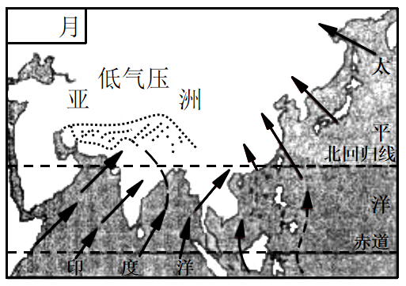

- **A**. 一月
- **B**. 四月
- **C**. 七月　✅
- **D**. 十一月

**答案**：C

**官方解析**

本题考查地理国情。
该图显示的是亚欧大陆上出现印度低压，因此是在北半球的夏季，即七月份。印度低压，又称“亚洲低压”，是亚洲大陆夏季大气活动中心之一。由于印度低压的存在，加强了亚洲南部夏季的西南季风，该季风会对我国东部的东南季风产生一定影响。因此，我国在七月份盛行偏南风，风从太平洋、印度洋带来丰沛的降水，降水量则由沿海向内陆逐渐减少。
故正确答案为C。

---

#### 第 20 题　qid 2742106 · 科技常识

2020年10月16日，中共中央政治局就量子科技研究和应用前景举行第二十四次集体学习。量子力学是人类探究微观世界的重大成果，量子科技发展具有重大科学意义和战略价值。以下关于量子科技的说法中，不正确的一项是：

- **A**. “量子”是一个天文学概念，是光传播的最小单位　✅
- **B**. 量子革命催生了激光、核磁共振、全球定位系统等现代技术
- **C**. 量子通信利用量子力学的基本原理对信息进行加密，具有传统通信技术不可比拟的安全性
- **D**. 量子计算机的一个量子比特既可处于0和1，还可处于0和1两种状态的叠加

**答案**：A

**官方解析**

本题考查科技常识。
A项错误，量子是现代物理的重要概念，即一个物理量如果存在最小的不可分割的基本单位，则这个物理量是量子化的，并把最小单位称为量子。量子并非光传播的最小单位。
B项正确，第一次量子革命催生了晶体管、激光、核磁共振、全球定位系统等现代技术，使人类进入信息时代。也是在这一次信息革命中，美国在全世界奠定了霸主地位。
C项正确，量子通信的应用方式包括量子密钥分发和量子隐形传态。量子密钥分发是原理上绝对安全的通信手段，是目前仅有的得到严格数学证明的通信方式。在量子密钥传输过程中，窃听者无法做到既偷看又不留下痕迹。利用量子力学的基本原理对信息进行加密，具有不可克隆、不可窃听的特性。
D项正确，在量子计算机中，基本信息单位是量子比特，用两个量子态│0&gt;和│1&gt;代替经典比特状态0和1。量子比特相较于比特来说，有着独一无二的存在特点，它以两个逻辑态的叠加态的形式存在，这表示的是两个状态是0和1的相应量子态叠加。
本题为选非题，故正确答案为A。

---

#### 第 21 题　qid 2742107 · 科技常识

下列与病毒、细菌有关的说法正确的是：

- **A**. 病毒是细菌的一种
- **B**. 病毒以二分裂方式增殖
- **C**. 病毒可以被细菌感染
- **D**. 病毒不具有细胞结构　✅

**答案**：D

**官方解析**

本题考查科技常识。
A项错误，病毒不是细菌。细菌是原核生物的一种，主要特点是没有核膜，其遗传物质分散在细胞质内一个相对固定的区域内，称为核区。病毒构造很简单，外面是一层蛋白质，称为病毒外壳。蛋白质外壳内部包裹着病毒的遗传物质，可以是DNA，也可以是RNA。
B项错误，病毒增殖的方式是以其基因为模板，合成与原来一样的基因，这种以病毒核酸分子为模板进行复制的方式称为自我复制。以无性二分裂方式繁殖（裂殖）的是细菌，细菌在生长到一定时期，其细胞中间会逐渐形成横隔，由一个母细胞分裂为两个大小相等的子细胞。
C项错误，病毒不能被细菌感染，相反，病毒能感染细菌。侵袭细菌的病毒有一个专门的名字叫噬菌体。噬菌体具有病毒的一些特性：个体微小；不具有完整细胞结构；只含有单一核酸。
D项正确，病毒是一种个体微小，结构简单，只含一种核酸（DNA或RNA），必须在活细胞内寄生并以复制方式增殖的非细胞型生物。因此病毒不具有细胞结构。
故正确答案为D。

---

#### 第 22 题　qid 2742108 · 科技常识

2020年7月23日，我国首次火星探测任务“天问一号”探测器成功发射，迈出了我国行星探测第一步。“天问”取自下列经典中的：

- **A**. 《中庸》
- **B**. 《楚辞》　✅
- **C**. 《山海经》
- **D**. 《淮南子》

**答案**：B

**官方解析**

本题考查科技常识。
A项错误，《中庸》是中国古代论述人生修养境界的一部道德哲学专著，其内容肯定“中庸”是道德行为的最高标准，把“诚”看成是世界的本体，认为“至诚”则达到人生的最高境界，并提出“博学之，审问之，慎思之，明辨之，笃行之”的学习过程和认识方法。
B项正确，“天问”取自屈原长诗《天问》，表达了中华民族对真理追求的坚韧与执着，体现了对自然和宇宙空间探索的文化传承，寓意探求科学真理征途漫漫，追求科技创新永无止境，《天问》出自《楚辞》。
C项错误，《山海经》内容主要是民间传说中的地理知识，包括山川、地理、民族等，保存了包括夸父逐日、精卫填海等不少脍炙人口的远古神话传说和寓言故事。它对中国古代历史、地理等的研究，均有参考价值。其中的矿物记录，更是世界上最早的有关文献。
D项错误，《淮南子》是西汉皇族淮南王刘安及其门客收集史料集体编写而成的一部哲学著作，其在继承先秦道家思想的基础上，综合了诸子百家学说中的精华部分，对后世研究秦汉时期文化起到了不可替代的作用。
故正确答案为B。

---

#### 第 23 题　qid 2742109 · 人文常识

关于家庭急救常识，以下做法中错误的是：

- **A**. 鼻出血后可以采取指压止血法
- **B**. 烧烫伤应迅速使用大量冷水冲洗创面
- **C**. 体温过高发生惊厥应用棉被捂住患者，并用力拍打其背部　✅
- **D**. 骨折受伤可先用夹板或书本固定患肢

**答案**：C

**官方解析**

本题考查科技常识。
A项正确，鼻出血一般都选择压迫止血的方法。在出血的第一时间，应该用拇指和食指捏住鼻翼两侧，而后寻找小块干净纱布稍用力堵塞住出血的鼻孔。
B项正确，烧烫伤应该马上采取能使受伤区域降温的办法，凉水是最容易得到的东西，马上用凉水冲洗创面，这在学术上也称为“冷疗”。
C项错误，体温过高发生惊厥急救处理方法：一人将患者的头偏向一侧，解开衣领，使患者呼吸通畅，同时用手掐压患者人中；另一人取一筷子插在患者的上下门牙之间，以防止舌咬伤或舌后坠引起的窒息，同时手用劲捏住患者的虎口穴；取冷湿毛巾大面积敷于患者头部，以利于快速降温；家人打电话，尽快去医院作进一步检查，及时治疗。体温过高不宜采用棉被捂住患者的方法，这种方法不利于降低体温。
D项正确，骨折受伤应迅速使用夹板固定患处，固定不应过紧；木板和肢体之间垫松软物品，再用带子绑好，木板长出骨折部位上下两个关节，如果没有木板可用树枝、擀面杖、雨伞、报纸卷等物品代替。
本题为选非题，故正确答案为C。

---

#### 第 24 题　qid 2742110 · 人文常识

某单位要给贫困地区的孩子邮寄一批学习用品，想在物资上写上一句古诗词，下列诗词最合适的是：

- **A**. 谁言寸草心，报得三春晖
- **B**. 海上生明月，天涯共此时
- **C**. 唯有门前镜湖水，春风不改旧时波
- **D**. 长风破浪会有时，直挂云帆济沧海　✅

**答案**：D

**官方解析**

本题考查人文常识。
A项错误，“谁言寸草心，报得三春晖”出自唐代诗人孟郊所作的《游子吟》，这两句诗的意思是：有谁敢说，子女像小草那样微弱的孝心，能够报答得了像春晖普泽的慈母恩情呢？反映的是子女报答慈母之恩，该项与题意不符。
B项错误，“海上生明月，天涯共此时”出自唐代诗人张九龄的《望月怀古》，这两句诗的意思是：茫茫的海上升起一轮明月，你我相隔天涯却共赏月亮。抒发的是怀念远方亲人之情，该项与题意不符。
C项错误，“唯有门前镜湖水，春风不改旧时波”出自唐代诗人贺知章的《回乡偶书·其二》，这两句诗的意思是：只有门前那在春风吹拂下泛起一圈一圈涟漪的镜湖的碧水，还是旧时模样。抒写的是久客伤老之情，该项与题意不符。
D项正确，“长风破浪会有时，直挂云帆济沧海”出自唐代诗人李白的《行路难·其一》，这两句诗的意思是：相信总有一天，能乘长风破万里浪；高高挂起云帆，在沧海中勇往直前。意喻孩子们总能走出困难，冲向更广阔的天地。符合题意。
故正确答案为D。

---

#### 第 25 题　qid 2742129 · 经济常识

建设国家服务业扩大开放综合示范区和设立中国（北京）自由贸易试验区，是党中央、国务院作出的重大战略决策，彰显了新形势下我国坚定不移扩大开放的信心决心，为新时代推动首都新发展注入了强大动力。下列关于抓好上述“两区”建设的说法，正确的是：

- **A**. 有利于深入落实首都城市战略定位，更好服务党和国家工作大局　✅
- **B**. 有利于为中央政务活动提供彰显文化自信、不断扩大中华文化影响力的空间场所
- **C**. 有利于发挥北京作为“一核”的辐射带动作用，推进京津冀协同发展　✅
- **D**. 有利于更好发挥首都资源优势，推动经济高质量发展　✅

**答案**：ACD

**官方解析**

本题考查政治常识。
A、C、D三项正确，2020年10月9日，北京市委书记蔡奇在建设国家服务业扩大开放综合示范区和中国（北京）自由贸易试验区动员部署大会上强调：“抓好‘两区’建设，有利于深入落实首都城市战略定位，更好服务党和国家工作大局；有利于更好发挥首都资源优势，推动经济高质量发展；有利于发挥北京作为‘一核’的辐射带动作用，推进京津冀协同发展。”
B项错误，2020年8月21日，《首都功能核心区控制性详细规划（街区层面）（2018年—2035年）》得到党中央国务院正式批复。该规划提出，通过加强老城整体保护、中轴线申遗，为中央政务活动提供彰显文化自信、不断扩大中华文化影响力的空间场所。
故正确答案为ACD。

---

#### 第 26 题　qid 2742130 · 人文常识

第七次全国人口普查是我国人口发展进入关键期开展的一次重大国情国力调查。作为此次普查工作的普查员，以下相关说法错误的是：

- **A**. 尽可能采集每一位居民的详细信息，为社区发展和服务居民直接提供决策依据　✅
- **B**. 告知所有普查对象此次普查工作采用网络自主填报方式进行　✅
- **C**. 在入户开展工作时，如居民不配合，普查员可以不再登记该户居民信息　✅
- **D**. 对普查对象的个人信息必须严格保密

**答案**：ABC

**官方解析**

本题考查政治常识。
A项错误，根据《全国人口普查条例》第二条规定：“人口普查的目的是全面掌握全国人口的基本情况，为研究制定人口政策和经济社会发展规划提供依据，为社会公众提供人口统计信息服务。”选项中“为社区发展和服务居民直接提供决策依据”说法错误。
B项错误，《国务院第七次全国人口普查领导小组办公室公告》指出：“普查方式：由政府人口普查机构派普查员到住户家中进行登记，或由住户自主填报普查短表。”因此，采用网络自主填报只是此次普查方式之一。
C项错误，D项正确，《国务院第七次全国人口普查领导小组办公室公告》指出：“依据《中华人民共和国统计法》和《全国人口普查条例》规定，公民有义务配合人口普查，如实提供普查所需资料。各级普查机构及其工作人员，对普查对象的个人信息必须严格保密。”如居民不配合，普查员应说服教育，不得放弃登记其信息。
本题为选非题，故正确答案为ABC。

---

#### 第 27 题　qid 2742131 · 法律常识

2020年5月28日，第十三届全国人民代表大会第三次会议表决通过了《中华人民共和国民法典》。该法自2021年1月1日起施行，下列哪些法律同时废止？

- **A**. 《中华人民共和国婚姻法》　✅
- **B**. 《中华人民共和国继承法》　✅
- **C**. 《中华人民共和国合同法》　✅
- **D**. 《中华人民共和国证券法》

**答案**：ABC

**官方解析**

本题考查法律常识。
《民法典》第一千二百六十条规定：“本法自2021年1月1日起施行。《中华人民共和国婚姻法》、《中华人民共和国继承法》、《中华人民共和国民法通则》、《中华人民共和国收养法》、《中华人民共和国担保法》、《中华人民共和国合同法》、《中华人民共和国物权法》、《中华人民共和国侵权责任法》、《中华人民共和国民法总则》同时废止。”
故正确答案为ABC。

---

#### 第 28 题　qid 2742132 · 人文常识

南方有一句谚语“人在屋里热得跳，稻在田里哈哈笑”，意思是夏季高温有利于水稻的生长，却使人感到闷热难耐。这句话体现的哲学原理有：

- **A**. 矛盾具有特殊性，对具体问题具体分析　✅
- **B**. 现象是本质的表现
- **C**. 人们很难认识到事物的发展规律
- **D**. 客观事物是不以人的主观意识为转移的　✅

**答案**：AD

**官方解析**

本题考查政治常识。
A项正确，矛盾的特殊性，是指具体事物所含的矛盾及其每一个侧面各有其特点。对人而言，夏季高温是不利条件；而对水稻而言，夏季高温则利于生长。换言之，对人而言，在高温与低温这一对矛盾中，高温是不利的；而对水稻而言，在高温与低温这一对矛盾中，高温是有利的，这体现了矛盾具有特殊性，对具体问题应具体分析。
B项错误，任何事物都有自己的现象和本质，二者不可分割，现象离不开本质，现象是本质的表现。选项表述正确，但与题干无关。
C项错误，选项表述错误，人能够发挥主观能动性，认识事物发展的规律。
D项正确，水稻是一种客观事物，喜高温，这一自然规律也是客观的，不以人的主观意识为转移。
故正确答案为AD。

---

#### 第 29 题　qid 2742133 · 科技常识

关于钢铁，下列说法中正确的是：

- **A**. 钢铁被腐蚀是发生了氧化反应　✅
- **B**. 钢铁在空气中的腐蚀需要空气中氮气的参与
- **C**. 油漆能与钢铁发生化学反应，使它与空气反应减慢
- **D**. 钢铁在海水中的腐蚀速率较快，是由于海水中含有浓度较高的电解质　✅

**答案**：AD

**官方解析**

本题考查科技常识。

A项正确，金属跟接触到的物质（如、、）等直接发生化学反应而引起的腐蚀叫做化学腐蚀。这类反应比较简单，仅仅是金属与氧化剂之间的化学反应。钢铁（一种碳铁合金）被空气中的氧气（作为氧化剂）腐蚀，是发生氧化反应。

B项错误，氮气不参与氧化还原反应，即不参加对钢铁的腐蚀。真正参加腐蚀的是空气中的氧气。

C项错误，油漆不与钢铁发生化学反应，钢铁刷油漆是为了隔绝氧气，以此避免或延缓氧气对钢铁的腐蚀。

D项正确，不纯的金属（或合金）跟电解质溶液接触时，会发生原电池反应，比较活泼的金属失去电子而被氧化，这种腐蚀叫做电化学腐蚀。钢铁（一种碳铁合金）在海水中的腐蚀速率较快，是由于海水中含有浓度较高的电解质。

故正确答案为AD。

---

#### 第 30 题　qid 2742134 · 地理国情

黄河是我国境内的第二长河，下列关于黄河的说法正确的是（    ）。

- **A**. 黄河河套地区有时会发生凌汛　✅
- **B**. 银川和济南都是其流经的省会城市　✅
- **C**. 其主要支流包括汾河、渭河等　✅
- **D**. 黄河壶口瀑布位于山西和河南的交界处

**答案**：ABC

**官方解析**

本题考查地理国情。
A项正确，凌汛是黄河常见的一种自然现象，由冰凌壅塞引起的暂时涨水。黄河许多河段在冬季都要结冰封河，由于黄河流经的地理位置和纬度不一，特别是兰州到内蒙古河口镇、郑州花园口到入海口两个河段，流向都是自低纬度流向高纬度，即从西南向东北流动。
B项正确，黄河发源于中国青海省巴颜喀拉山脉，流经青海、四川、甘肃、宁夏、内蒙古、陕西、山西、河南、山东9个省区。黄河在宁夏境内流经中卫市、吴忠市、银川市、石嘴山市；山东境内流经菏泽、济宁、泰安、聊城、济南、德州、滨州、淄博、东营。
C项正确，黄河主要支流有湟水、白河、黑河、洮河、清水河、大黑河、窟野河、汾河、无定河、泾、渭河、洛河、沁河、金堤河、大汶河十三条。
D项错误，壶口瀑布西临陕西省延安市宜川县壶口乡，东濒山西省临汾市吉县壶口镇，为两省共有旅游景区。
故正确答案为ABC。

---

#### 第 31 题　qid 2742135 · 科技常识

以下科学家与其所做的重要科学发现，对应正确的有：

- **A**. 牛顿——万有引力定律　✅
- **B**. 居里夫人一一元素铀
- **C**. 门捷列夫——元素周期表　✅
- **D**. 爱因斯坦一一能量守恒定律

**答案**：AC

**官方解析**

本题考查科技常识。
A项正确，万有引力定律为物体间相互作用的一条定律，1687年为牛顿所发现。
B项错误，元素铀的发现者为德国化学家克拉普罗特；居里夫人因发现元素钋和镭获得诺贝尔化学奖。
C项正确，俄国化学家门捷列夫于1869年总结发表元素周期表。
D项错误，能量守恒定律是自然界普遍的基本定律之一，发现者为德国物理学家罗伯特·迈尔；爱因斯坦的主要成就为提出光量子假说，解决了光电效应问题，创立了狭义相对论、广义相对论等。
故正确答案为AC。

---

#### 第 32 题　qid 2742136 · 科技常识

在自然条件下，下列关于植物种子及其主要传播方式的对应关系，正确的有：

- **A**. 红树一一水传播　✅
- **B**. 苍耳一一风传播
- **C**. 蒲公英一一动物传播
- **D**. 豌豆——弹射传播　✅

**答案**：AD

**官方解析**

本题考查科技常识。
A项正确，红树通过水传播种子。红树树形奇特，种子在果子未脱离母树前即行发芽，故又常称为胎生树，红树的种子在果实脱离母体前发育为长棒状幼苗后落水，沿海岸漂流一段时间后扎根定居。
B项错误，苍耳靠动物传播种子。苍耳种子的表面分布着很多钩刺，种子成熟后比较容易脱落，当人或动物触碰到成熟的苍耳种子时，钩刺很容易钩附在人或动物的身上，由人或动物将其带到其它地方予以传播。
C项错误，蒲公英通过风来传播种子。蒲公英一般先会开出黄色的小花。过一段时间后，金黄的花瓣脱落后，花托上会接着长出白色的绒球。一阵微风吹过，种子就随着风飘到其他地方。如果掉落到适合生长的地方，明年春天种子就会发芽，又会进行之前的循环。
D项正确，豌豆靠自身弹射和鸟类等动物来传播种子。其中自身弹射是指豌豆成熟之后，豆荚自己会裂开，然后将里面的种子弹射出去。
故正确答案为AD。

---

#### 第 33 题　qid 2742137 · 人文常识

关于生活用电，下列说法中正确的有：

- **A**. 可以用铜丝代替保险丝
- **B**. 严禁在高压电线下打井　✅
- **C**. 家用电器着火时应先切断电源再救火　✅
- **D**. 换灯泡时需要先切断电源　✅

**答案**：BCD

**官方解析**

本题考查科技常识。
A项错误，保险丝的作用是在电流异常升高到一定的高度和热度的时候，自身熔断切断电流，保护电路安全运行。铜丝的电阻率小，且不易熔断，不能起到保护电路的作用，因此禁止用铜丝代替保险丝。
B项正确，在高压电线下打井可能会使井管触碰高压线造成人员死亡，因此严禁在高压电线下打井。
C项正确，若家用电器着火，应立即关闭电器电源开关，切断电源再救火。救火时应使用不导电的灭火器，如二氧化碳灭火器等，不可用水直接灭火。
D项正确，换灯泡前需要先切断电源，防止触电。
故正确答案为BCD。

---

## 言语理解与表达

### 材料 1

以下是略有删节的公文部分内容，阅读之后回答51—55题。

第一节　传承千年运河，滋养流动的精神家园

第41条　构建“一河两道三区”发展格局

建设大运河国家文化公园（北京段），对文物本体及环境实施严格保护和管控，打造保护第一、传承优先的样板区，规划大运河文化主题展示区，建设文化旅游深度融合发展示范区。以大运河为轴线，建设全线滨河绿道及重点游船通航河道，结合大运河沿线不同特点，打造大运河文化展示区、大运河生态景观区和疏解整治提升区，构建“一河两道三区”的大运河文化带发展格局，传承大运河文化，激活沿线发展活力，进一步擦亮世界公认的国家文化符号。

第42条　系统开展大运河文化遗产保护

<u>        </u>大运河沿线文化遗产保护清单，系统开展大运河历史文化遗址遗迹保护工作。合理保存传统文化生态，逐步疏导不符合规划要求的设施、项目，<u>        </u>做好沿线古桥、古闸、古码头、古仓库等建筑遗迹和文物的保护修缮，聚焦重要物质文化遗产，扩大文物展览开放空间。加强路县故城遗址和通州古城整体保护利用，在活态保护中留住漕运古城风貌。推进重点片区的疏解搬迁与整治提升，规划建设大运河源头遗址公园，有效恢复历史景观格局。

第43条　<u>                    </u>

聚焦北运河、通惠河、萧太后河等大运河重要水系，开展综合治理，全面改善大运河生态环境，实现沿线污水全处理，河道水体全面还清。加强老城内历史水系保护，研究制定古河道恢复和景观设计方案，串联沿线闸桥古迹，增加人文景观和配套设施，展现古桥纵横、古屋比邻、商铺连绵、水穿街巷的亲水休闲历史风貌。做好北京城市副中心大运河两岸景观整体规划，精心打理水系，贯通亲水步道，打造高品质生态景观廊道。在大运河沿线构建大尺度绿色开放空间，更好服务群众休闲游憩。

第44条　打造文化旅游魅力走廊

做好“三庙一塔”周边风貌管控，优化提升旅游配套设施和服务品质，积极创建集休闲、度假、体验于一体的北京（通州）大运河国家5A景区。整合大运河水系、城市森林、文化遗产等资源，2021年实现北运河北京段通航，远期推进与天津、河北段通航，打造大运河水上旅游精品线路。统筹大运河文化带保护利用，保护张家湾古镇、漷县古镇，精心打造昌平白浮村、朝阳高碑店村、通州皇木厂村等传承大运河历史文化的特色古村落，促进遗产保护与区域发展的协调统一。利用在北京城市副中心规划的重大公共文化设施，展示好大运河文化，讲好大运河故事。

第45条　编织协同发展文化纽带

加大与天津、河北的工作对接力度，共同加强大运河京津冀段遗产保护，加快梳理大运河历史文脉。协同开发利用区域文化资源，促进文化产业和旅游休闲产业协同发展。按照统一标准，加强大运河水环境保护，整体塑造大运河沿线风貌，带动大运河周边区域发展。用好大运河文化带京杭对话等合作机制，联合大运河沿线八省市共同推动大运河文化传播推广。

#### 第 1 题　qid 2742324 · 片段阅读

本文节选自某篇公文，该公文的标题最可能是：

- **A**. 《北京市非物质文化遗产条例》
- **B**. 《中共北京市委关于新时代繁荣兴盛首都文化的意见》
- **C**. 《北京市关于做好旅游景区疫情防控和安全有序开放工作的通知》
- **D**. 《北京市推进全国文化中心建设中长期规划（2019年-2035年）》　✅

**答案**：D

**官方解析**

本文共论述了公文中第41-45条的内容。第41条主要介绍了建设大运河国家文化公园（北京段）及沿线景区；第42条主要介绍了对大运河文化遗产保护的措施；第43条主要介绍了要全面改善大运河生态环境和旅游环境的措施；第44条主要介绍了如何打造围绕大运河文化的文化旅游系列产品；第45条主要介绍了与天津、河北协力开发区域文化旅游资源的措施。概括起来，即本文主要论述了北京发展大运河及其辐射区域的旅游、文化资源的举措，对应D项。
A项，“非物质文化遗产”是非物质形态的，本文第42条明确论述了“聚焦重要物质文化遗产”，排除；
B项，“首都文化”强调的是首都，而本文论述了大运河及其辐射地区，包括天津、河北的协同发展，排除；
C项，“疫情防控和安全有序开放工作”本文未提及，无中生有，排除。
故正确答案为D。
【文段出处】《北京市推进全国文化中心建设中长期规划（2019年-2035年）》

---

#### 第 2 题　qid 2742330 · 逻辑填空

依次填入文中第42条画横线处最恰当的是：

- **A**. 完善 统筹　✅
- **B**. 制定 及时
- **C**. 整理 持续
- **D**. 研究 切实

**答案**：A

**官方解析**

第一空，搭配“保护清单”。A项“完善”的意思是使完备美好，B项“制定”指制作编定，C项“整理”强调整顿，使之有条理，均可搭配，保留。D项“研究”可表述为研究制定保护清单，单独与“保护清单”搭配不当，排除。
第二空，横线处搭配多处建筑遗迹及文物的保护修缮。A项“统筹”表示统一筹划，与开展多项工作搭配恰当，当选。B项“及时”强调效率，C项“持续”指连续不断，文段未提及效率、持续性方面的话题，均排除。
故正确答案为A。
【文段出处】《北京市推进全国文化中心建设中长期规划（2019年-2035年）》

---

#### 第 3 题　qid 2742331 · 语句表达

以下最适合填入文中第43条画横线处的是：

- **A**. 严格落实世界文化遗产保护要求
- **B**. 营造蓝绿交织生态文化景观　✅
- **C**. 加强大运河地区整体保护
- **D**. 发挥大运河文化辐射带动作用

**答案**：B

**官方解析**

第43条首先介绍了开展几条重要水系的综合治理，改善大运河生态环境，然后论述了打造亲水休闲旅游景观的措施，接着表示要做好大运河两岸景观的整体规划，构建绿色开放空间。概括该条内容，即论述了大运河及其沿岸的水系治理和景观环境建设规划，对应B项，“蓝”对应水系治理，“绿”对应景观建设。
A项，“世界文化遗产保护要求”文段未提及，无中生有，排除；
C项，“整体保护”对比B项，表述不明确，文段强调了对水系、生态环境方面的建设，排除；
D项，“发挥······带动作用”强调的是怎样使大运河文化对周边地区产生影响，文段未提及，排除。
故正确答案为B。
【文段出处】《北京市推进全国文化中心建设中长期规划（2019年-2035年）》

---

#### 第 4 题　qid 2742337 · 片段阅读

下列哪项均为文中提到的大运河沿线所包含的景观：

- **A**. 特色古村、亲水步道、皇家园林、城市森林
- **B**. 漕运古城、景观廊道、皇家园林、矿山遗址
- **C**. 漕运古城、特色古村、亲水步道、城市森林　✅
- **D**. 特色古村、亲水步道、城市森林、矿山遗址

**答案**：C

**官方解析**

A项和B项的“皇家园林”、B项和D项的“矿山遗址”本文均未提及，排除。
C项“漕运古城”对应第42条“在活态保护中留住漕运古城风貌”，“特色古村”对应第44条“······通州皇木厂村等传承大运河历史文化的特色古村落”，“亲水步道”对应第43条“精心打理水系，贯通亲水步道”，“城市森林”对应第44条“整合大运河水系、城市森林······”，当选。
故正确答案为C。
【文段出处】《北京市推进全国文化中心建设中长期规划（2019年-2035年）》

---

#### 第 5 题　qid 2742341 · 片段阅读

根据第45条，如果北京市人民政府与天津市人民政府、河北省人民政府拟共同印发一份关于加强大运河京津冀段遗产保护的文件，下列说法中不正确的是：

- **A**. 该公文应由三省市发文机关办公厅负责审核
- **B**. 该公文应由三省市发文机关的负责人会签
- **C**. 该公文应由三省市同级机关联合行文
- **D**. 该公文成文日期应为负责主要起草工作的发文机关负责人签发日期　✅

**答案**：D

**官方解析**

A项说法正确，根据《党政机关公文处理工作条例》第二十条规定，公文文稿签发前，应当由发文机关办公厅（室）进行审核，排除；
B项说法正确，联合行文需要行文各个机关的负责人会签，排除；
C项说法正确，联合行文的各机关部门必须是同级的，排除；
D项说法错误，根据《党政机关公文处理工作条例》第九条第十二项规定，联合行文时，公文的成文日期以最后一个机关负责人的签发日期为准，而不是主要负责人的，当选。
本题为选非题，故正确答案为D。
【文段出处】《北京市推进全国文化中心建设中长期规划（2019年-2035年）》

---

### 材料 2

        人体内每种细胞的表面都有一层独特的含糖外衣。细胞之间进行相互作用时，比如细菌和病毒感染人体时，必须识别糖代码并进行适当的“分子握手”。如果能够破解细胞“甜言蜜语”中的奥秘，掌握阅读和书写这种细胞语言的技巧，我们将获得一种强有力的干预细胞活动的新方法，从而控制和治疗相关疾病。然而要做到这一点并不容易，作为细胞语言的糖代码非常复杂。

        英国科学家在解释糖代码的复杂性时说，试着想象你是一种细菌，正在接近宿主细胞，在其表面上的生物分子“森林”上跳伞。你首先遇到的是由糖构成的“树枝”，它们通过蛋白质“树干”与细胞膜相连。任何想进入宿主细胞的细菌都必须<u>                    </u>。这是一个很高的要求，因为含糖“树枝”的形状太复杂了。糖代码（称为糖组）含有数十种不同的糖，这些糖在被称为聚糖的支链中融合在一起。阅读糖代码不仅仅是逐字解码，而是要认识每种糖的形状并理解它的含义。

        在自然界中负责抓取细胞表面糖的是被称为凝集素的蛋白质，其内部空腔与特定的糖紧紧贴合在一起。我们知道凝集素的发现已有100多年的历史，并且最近已经开始进行人工制造。但仅仅对不同的凝集素进行整理分类并没有提高我们对糖代码的理解。而当化学家分离出特定的糖并确定了它们的结构之后，我们才对糖代码有了进一步的了解。由于它们如此的庞大、复杂，最好的方法是利用质谱仪，将它们分解为一系列的小片段，借助算法重建母体分子。到了21世纪初，科学家已经确定了一些装饰某些类型细胞的糖。2002年，英国伦敦帝国理工学院的科学家提出了一种方法，将数百个单糖固定在一个培养皿上，然后用各种凝集素和其他分子对它们进行清洗，看看哪些分子会互相结合。这是理解糖代码的一种自动化方法。不久之后，人们尝试利用这种方法，来探究艾滋病病毒和H1N1流感病毒在感染人体的过程中，与人体细胞表面上的哪些糖类进行了结合。然而，我们对于细胞的糖代码仍然知之甚少。

        单纯阅读糖代码相对简单，但是如何书写或重写它们呢？这意味着将单个糖分子拼接成聚糖，这是一项艰苦的工作，包括要引导每种糖以正确的方式进行化学反应等。在人体内，这项工作由各种酶负责。不过，这项工作具有更加重要的意义。研究致病微生物表面的聚糖有助于开发更具针对性的疫苗。这种疫苗可使人体的免疫系统发现这些聚糖并杀死致病微生物。一些针对流感和脑膜炎的疫苗已经含有糖的成分，将来，这种方法可以有效治疗包括疟疾在内的其他疾病。

#### 第 6 题　qid 2742347 · 片段阅读

文中第1段“这一点”，指的是：

- **A**. 掌握细胞的结构与机能
- **B**. 识别细胞表面的糖代码　✅
- **C**. 获取干预细胞活动的方法
- **D**. 控制和治疗相关疾病

**答案**：B

**官方解析**

定位文章第1段尾句，“这一点”指代前文。前文首先指出细胞之间相互作用时“必须识别糖代码”，之后介绍了识别糖代码的好处，即“获得······干预细胞活动的新方法，从而控制和治疗相关疾病”。故“这一点”指代“识别糖代码”，且与尾句后半部分话题一致，呼应得当，对应B项。
A项，文段并未涉及“细胞的结构与机能”，故无中生有，排除；
C项，“获取干预细胞活动的方法”与文段表述的“新方法”概念偷换，且“干预细胞活动的新方法”也指代前文“识别糖代码”，故表述不如B项明确，排除；
D项，“控制和治疗相关疾病”是“识别糖代码”带来的好处，但“这一点”应指代“识别糖代码”，故对应错误，排除。
故正确答案为B。
【文段出处】《细胞的“甜言蜜语”》

---

#### 第 7 题　qid 2742348 · 语句表达

填入文中第2段画横线处最恰当的是：

- **A**. 有一个与含糖“树枝”相匹配的形状　✅
- **B**. 找到“树枝”与“树干”相恰的连接方式
- **C**. 在接近生物分子“森林”时找到合适的跳伞时机
- **D**. 首先识别蛋白质“树干”的种类、顺序等特点

**答案**：A

**官方解析**

横线位于文章第2段中间，需承上启下。横线前指出，细菌正在接近宿主细胞，在生物分子“森林”上跳伞，首先遇到的是由糖构成的“树枝”。横线后“这是一个很高的要求，因为含糖‘树枝’的形状太复杂了”。联系前后可知，横线处应围绕“树枝”谈论。A项，话题一致，且根据“含糖‘树枝’的形状太复杂了”可知，“细菌必须有一个与含糖‘树枝’相匹配的形状”要求很高，与后文呼应得当，符合文意，当选。
B项，横线处应体现“细菌”与“树枝”的关系，并非“树枝”与“树干”的关系，排除；
C项围绕“森林”谈论、D项围绕“树干”谈论，均与“树枝”话题无关，排除。
故正确答案为A。
【文段出处】《细胞的“甜言蜜语”》

---

#### 第 8 题　qid 2742349 · 片段阅读

人们对糖代码的进一步了解，源于：

- **A**. 发现了凝集素蛋白质
- **B**. 成功制造出人造凝集素
- **C**. 分离出特定的糖并确定其结构　✅
- **D**. 发明自动化清洗方法

**答案**：C

**官方解析**

“对糖代码的进一步了解”出现在第3段中间位置，根据“当化学家分离出特定的糖并确定了它们的结构之后，我们才对糖代码有了进一步的了解”可知，C项为正确答案。
A、B两项，根据第3段“我们知道凝集素的发现已有100多年的历史，并且最近已经开始进行人工制造。但仅仅对不同的凝集素进行整理分类并没有提高我们对糖代码的理解”，可知，“发现了凝集素蛋白质”“成功制造出人造凝集素”并不能让人们对糖代码有进一步了解，均排除；
D项，根据第3段“2002年，英国伦敦帝国理工学院的科学家提出了一种方法······用各种凝集素和其他分子对它们进行清洗······这是理解糖代码的一种自动化方法”可知，“发明自动化清洗方法”在对糖代码的进一步了解之后，并非是促进人们对糖代码进一步了解的原因，排除。
故正确答案为C。
【文段出处】《细胞的“甜言蜜语”》

---

#### 第 9 题　qid 2742350 · 片段阅读

下列说法与本文不相符的是：

- **A**. 细胞表面的糖可以用于细胞识别
- **B**. 凝集素的功能是结合细胞表面的糖
- **C**. 人体中的酶能够引导糖分子拼接成聚糖
- **D**. 聚糖合成技术已在疟疾治疗中得到应用　✅

**答案**：D

**官方解析**

A项，根据第1段“细胞之间进行相互作用时，比如细菌和病毒感染人体时，必须识别糖代码并进行适当的‘分子握手’”可知，细胞表面的糖可以用于细胞识别，表述正确，排除；

B项，根据第3段“在自然界中负责抓取细胞表面糖的是被称为凝集素的蛋白质”可知，凝集素可以结合细胞表面的糖，表述正确，排除；
C项，根据第4段“······这意味着将单个糖分子拼接成聚糖，这是一项艰苦的工作，······在人体内，这项工作由各种酶负责”可知， 人体中的酶能够引导糖分子拼接成聚糖，表述正确，排除；
D项，根据第4段“研究致病微生物表面的聚糖有助于开发更具针对性的疫苗······将来，这种方法可以有效治疗包括疟疾在内的其他疾病”可知，现在尚未在疟疾治疗中应用，故“已在疟疾治疗中得到应用”，表述有误，当选。
本题为选非题，故正确答案为D。
【文段出处】《细胞的“甜言蜜语”》

---

#### 第 10 题　qid 2742351 · 片段阅读

最适合做本文题目的是：

- **A**. 庞大的细胞“森林”
- **B**. 品尝另一种“糖”
- **C**. 细胞的“甜言蜜语”　✅
- **D**. 解码细胞生命之谜

**答案**：C

**官方解析**

文章第1段，通过介绍细胞的表面都有一层独特的含糖外衣，引出细胞的“糖代码”这一话题，并指出破解细胞“甜言蜜语”中的奥秘，即破解糖代码的好处；第2段解释了阅读和理解糖代码的复杂性；第3段介绍了我们由浅入深理解糖代码的过程；第4段阐述了由“理解”到“书写或重写”糖代码即“研究致病微生物表面的聚糖”对治疗疾病的重大意义。故文章全篇围绕“细胞的糖代码”论述，C项“甜言蜜语”指代“糖代码”，应作为文章题目。
A项，细胞“森林”指代生物分子，“细胞的糖代码”仅为“树枝”，故概念扩大，排除；
B项，“另一种”表述不明确，未出现主题词“细胞的糖代码”，排除；
D项，“细胞生命”将“细胞表面的糖代码”这一概念偷换，排除。
故正确答案为C。
【文段出处】《细胞的“甜言蜜语”》

---

### 材料 3

        科技发展蕴藏着进步力量。近年来，人工智能、大数据、5G等技术与医疗行业深度融合，为健康事业插上了智能翅膀。从可穿戴设备掀起健康管理热潮，到影像辅助技术用于病灶精准识别，再到远程医疗让大山里的病人也能享受到先进的医疗服务，技术红利大大提高了医疗服务质量，也深刻改变着医疗服务模式和理念，为构建新型医疗体系提供了重要支撑。

        人工智能赋能医疗，为我们呈现了一个美好前景。同时，<u>                     </u>。比如，数据是智能医疗的基础，但目前医疗健康数据的标准化、统一化和智能化尚有待提升。我国拥有上万家医院，每年产生的医疗健康数据规模巨大，但绝大部分是非结构化的数据，成为行业创新发展的瓶颈。又如，当前人工智能产品数量可观，但质量参差不齐，从量的积累到质的飞跃，亟待攻克一些核心技术短板、培养大量复合型人才。解决这些问题，需要政府立足长远科学谋划、破除政策壁垒，优化产学研成果转化机制、激发创新的动力，也需要相关企业加大研发力度、埋头攻关。各方形成合力，才能推动智能医疗行稳致远。

        也要看到，技术进步回避不了伦理道德问题。医疗人工智能技术只有与情感、伦理等人类最基本的需求相结合，才能真正实现造福人民的初衷。必须坚持以人民为中心的发展理念，把群众在医疗服务中反映最强烈的问题，作为科技创新攻关的方向。与此同时，也要处理好医疗人工智能在主体资格、侵权责任、数据和隐私保护等方面可能出现的问题，以安全、可靠、可控的技术产品，更好服务医生、患者和医疗事业。

        实施健康中国战略，是党的十九大报告提出的重要目标。健康中国关系到每个人的切身利益，也是人民群众获得感幸福感的重要来源。作为引领新一轮科技革命和产业革命的重要驱动力，人工智能为实现“健康中国”拓展了新的空间。从这个意义上说，筑牢技术创新的基石，擦亮造福人民的底色，智能医疗时代大有可为。

#### 第 11 题　qid 2742335 · 片段阅读

关于医疗人工智能的应用，文中没有提到的是：

- **A**. 远程医疗
- **B**. 可穿戴设备
- **C**. 影像辅助技术
- **D**. 养老服务机器人　✅

**答案**：D

**官方解析**

文章第一段介绍了医疗人工智能的应用，由“从可穿戴设备掀起健康管理热潮······也能享受到先进的医疗服务”可知，A项“远程医疗”、B项“可穿戴设备”、C项“影像辅助技术”文中均有所提及，排除；
D项“养老服务机器人”文中并未介绍，当选。
本题为选非题，故正确答案为D。
【文段出处】《人工智能为医疗打开更大空间》

---

#### 第 12 题　qid 2742338 · 语句表达

填入文中第2段画横线部分最恰当的一句是：

- **A**. 发展的过程中也面临着一些挑战　✅
- **B**. 政府与企业间的合作还有待加强
- **C**. 在医疗人工智能核心技术上存在短板
- **D**. 人工智能和医疗的复合型人才储备不足

**答案**：A

**官方解析**

横线出现在第2段中间，需注意与上下文的衔接。横线之前提到人工智能赋能医疗呈现了美好前景，横线之后通过“比如······又如······”举例介绍目前人工智能赋能医疗存在的一些问题，因此横线处应体现出人工智能赋能医疗中存在的一些问题，对应A项。
B项，“政府与企业间的合作”对应问题之后对策的介绍，与横线后问题的介绍衔接不当，排除；
C项，“医疗人工智能核心技术”表述片面，后文还提及“培养大量复合型人才”等其他问题，排除；
D项，“复合型人才储备不足”仅侧重人才不足，表述片面，排除。
故正确答案为A。
【文段出处】《人工智能为医疗打开更大空间》

---

#### 第 13 题　qid 2742339 · 片段阅读

以下哪项最符合作者的观点？

- **A**. 有感情、有意识地提供医疗服务的机器人同样应享有人权
- **B**. 群众在医疗服务中反映最强烈的问题正是科技创新的突破口　✅
- **C**. 每年规模巨大的医疗健康数据促进了医疗人工智能技术的发展
- **D**. 医疗人工智能技术的进步有助于医疗伦理道德问题的解决

**答案**：B

**官方解析**

A项，“享有人权”无中生有，文段仅提到医疗人工智能技术只有与情感、伦理等人类最基本的需求相结合，才能真正实现造福人民的初衷，排除；
B项，由第3段“把群众在医疗服务中反映最强烈的问题，作为科技创新攻关的方向”可知，该项表述正确，当选；
C项，由第2段“我国拥有上万家医院······瓶颈”可知，该项说法与文意相悖，排除；
D项，由第3段“技术进步回避不了伦理道德问题”可知，医疗人工智能技术的进步并不能帮助解决医疗伦理道德问题，表述错误，排除。
故正确答案为B。
【文段出处】《人工智能为医疗打开更大空间》

---

#### 第 14 题　qid 2742353 · 片段阅读

本文与以下哪一项“实施健康中国战略”的举措有关？

- **A**. 全面建立分级诊疗制度
- **B**. 健全全民医疗保障制度
- **C**. 发展健康产业，满足人民群众多样化健康需求　✅
- **D**. 完善人口政策，促进人口均衡发展与家庭和谐幸福

**答案**：C

**官方解析**

根据“健康中国关系到每个人的切身利益，也是人民群众获得感幸福感的重要来源。作为引领新一轮科技革命和产业革命的重要驱动力，人工智能为实现‘健康中国’拓展了新的空间”可知，人工智能赋能医疗满足的是每个人的健康需求。C项“发展健康产业，满足人民群众多样化健康需求”符合文意，当选。
A项，“分级诊疗制度”指按照疾病的轻重缓急及治疗的难易程度进行分级，不同级别的医疗机构承担不同疾病的治疗，是医疗制度的介绍，与文意无关，排除；
B项，“全民医疗保障制度”指医保的全覆盖，与文意无关，排除；
D项，“完善人口政策”文章并未提及，排除。
故正确答案为C。
【文段出处】《人工智能为医疗打开更大空间》

---

#### 第 15 题　qid 2742354 · 片段阅读

最适合做本文标题的是：

- **A**. 人工智能为医疗打开更大空间　✅
- **B**. 创新医疗服务大有可为
- **C**. 人工智能带来的希望与挑战
- **D**. 健康中国战略实施路径

**答案**：A

**官方解析**

文章第一段指出科技发展为构建新型医疗体系提供了重要支撑，第二段介绍人工智能赋能医疗存在的问题和解决方法，第三段指出发展医疗人工智能的一些要求，第四段介绍人工智能为实现“健康中国”拓展了新的空间，文章通篇围绕人工智能及医疗的话题展开，介绍了人工智能为医疗赋能，A项“打开更大空间”即为医疗赋能，符合文意，当选。
B项，“创新医疗服务”偏离文章核心话题，文章围绕人工智能赋能医疗的话题展开，排除；
C项，偏离文章核心话题“医疗”，排除；
D项，“健康中国战略实施路径”偏离文章核心话题，文章围绕人工智能赋能医疗的话题展开，排除。
故正确答案为A。
【文段出处】《人工智能为医疗打开更大空间》

---

### 材料 4

①历史学家曾经纠结于是否将采集狩猎时代写进历史，因为他们大多缺乏相应的研究技术，无法了解一个没有文字证据的时代。通常来说，研究采集狩猎的不是历史学家，而是考古学家、人类学家和史前历史学家。

②在缺乏文字证据的情况下，学者们常常采用三种截然不同的证据来了解这段时期的历史。第一种是远古社会留下的物质遗迹。考古学家解读人类骨骼、石器和其他历史遗迹，研究远古人类及其猎物的遗骸，或者某些物品的残留物，如石器、制作品或者食物残渣。此外，自然环境中的一些研究证据，也可以帮助学者们了解气候和环境变化。我们没有发现多少人类历史最早时期的骨骼遗迹，能够确认属于现代人类的骨骼遗迹，最早只能追溯至16万年前。尽管如此，考古学家仍能从支离破碎的骨骼遗迹中读取大量令人震惊的消息。比如，通过研究从海床和数万年前形成的冰盖中提取的花粉和果核样本，考古学家们已经成功地重构了当时的气候和环境变化模型，而且准确度越来越高。此外，半个世纪以来不断改进的年代测定技术，让我们能更加准确地推算年代，从而为整部人类历史编纂更加准确的大事年表。

③第二种用来研究早期人类历史的主要证据，来自于对现代采集狩猎部落的研究。这种研究方法必须<u>            </u>，因为现代采集狩猎者毕竟来自现代，他们的生活方式或多或少受到现代社会的影响。尽管如此，通过研究现代采集狩猎的生活方式，我们能够更多地了解古代小型采集狩猎部落的基本生活方式。这种研究可以帮助史前历史学家更好地解读为数不多的史前考古证物。

④近年来，基于现代基因差异进行对比研究的新方法，成为研究早期人类历史的第三种途径。基因研究可以测定现代族群之间的基因差异程度，帮助我们推测自己族群的历史，以及确定远古人口迁移时，不同族群分散的时间。

⑤要将这些不同类型的证据整合进一部世界历史并不简单：首先，大多数历史学家缺乏必要的专业知识和训练；其次，考古遗迹、人类学成果和基因研究会产生不同类型的信息，这些信息和大多数专业历史学家视为首要研究基础的文字记载是截然不同的。来自于采集狩猎时代的考古证据，无法像书面材料一样记载个性化的细节，但它可以揭示许多关于人类生活方式的信息。整合这些不同学科领域的真知洞见，是世界历史面临的主要挑战之一，尤其在研究采集狩猎时代时，它是我们必须直面的挑战。

#### 第 16 题　qid 2742332 · 片段阅读

“尽管考古证据向大家展示的大多是人类祖先的物质生活，但时不时也会让我们瞥见他们的文化甚至精神生活。我们至今仍然无法准确解读远古人类的一些艺术作品，如法国南部和西班牙北部的洞穴壁画，但是这些令人惊叹的艺术创作的确能向我们揭示更多关于早期人类社会的情况。”
这段文字最适合放入文中的位置是：

- **A**. ①段和②段之间
- **B**. ②段和③段之间　✅
- **C**. ③段和④段之间
- **D**. ④段和⑤段之间

**答案**：B

**官方解析**

所给文段论述“考古证据”的作用，即不仅展示物质生活也展示精神生活。
文章第②段介绍考古学家通过远古社会留下的物质遗迹来了解历史，属于“考古证据”，二者话题一致，第③段介绍通过对现代采集狩猎部落的研究了解历史，不属于“考古证据”，故题干文段应放在第②段和第③段之间，B项当选。
A项，文章第②段指出学者们采用三种证据来了解采集狩猎时代的历史，并引出关于考古证据的介绍，故题干文字应位于第②段后面，排除。
文章第③段和第④段分别介绍现代采集狩猎部落的证据和基因方面的证据，均与题干文字话题不一致，排除C、D两项。
故正确答案为B。
【文段出处】《极简历史系列》

---

#### 第 17 题　qid 2742342 · 片段阅读

“对牙齿的细致研究，可以告诉我们许多关于早期人类日常饮食的信息，而日常饮食又可以揭示许多关于生活的信息。同样，男女之间骨骼大小的差异，也可以帮助我们了解不少两性关系方面的信息。”对牙齿和骨骼的研究属于文中的哪种研究方法？

- **A**. 第一种　✅
- **B**. 第二种
- **C**. 第一种和第三种
- **D**. 三种都有

**答案**：A

**官方解析**

文章第②段指出“考古学家解读人类骨骼、石器和其他历史遗迹，研究远古人类及其猎物的遗骸，或者某些物品的残留物，如石器、制作品或者食物残渣”，对牙齿和骨骼的研究属于第②段的内容，故应属于第一种研究方法，A项当选。
第二种方法是研究现代采集狩猎部落，第三种方法是基于现代基因差异进行对比研究，均不包括对牙齿和骨骼的研究，排除B、C、D三项。
故正确答案为A。
【文段出处】《极简历史系列》

---

#### 第 18 题　qid 2742343 · 片段阅读

最适合填入文中第③段画线处的是：

- **A**. 谨慎使用　✅
- **B**. 不断完善
- **C**. 与时俱进
- **D**. 推而广之

**答案**：A

**官方解析**

横线后“因为”对空缺处进行解释说明，指出“现代采集狩猎者毕竟来自现代，他们的生活方式或多或少受到现代社会的影响”，意思是这种研究方法存在一定的局限性、不可靠性，A项“谨慎使用”强调在使用过程中要慎重，充分考虑到其中的不确定性，符合文意。
B项，文段没有体现出要对该方法进行“完善”，排除；
C项，“与时俱进”指随时间发展不断进步，文段没有体现出方法要随时间不断进步，排除；
D项，“推而广之”强调要推广使用，而横线后重点体现该方法的局限性，与文意相悖，排除。
故正确答案为A。
【文段出处】《极简历史系列》

---

#### 第 19 题　qid 2742344 · 片段阅读

以下哪项研究成果可以作为第三种证据？

- **A**. 某研究小组开发一种算法，对12种不同类型的癌症、3100多个癌症相关基因病变、数以亿计的基因进行筛选，精确地筛选出了89对合成致死基因
- **B**. 某国科学家近日在染色体3D结构以及在早期胚胎发育过程中染色体结构的重编程变化方面取得重大科学突破
- **C**. 某研究团队发表了对当代希腊人、古代迈锡尼人等群体的DNA检测结果，认为当代希腊人的绝大部分DNA继承自古迈锡尼人，而少部分基因来自外来移民　✅
- **D**. 一项研究分析了近800万个DNA位点和皮肤感知年龄的关系，发现带有MC1R基因特殊基因型的人看起来比同龄人平均年老两岁

**答案**：C

**官方解析**

重点关注第④段，第三种证据指“基于现代基因差异进行对比研究的新方法”，“可以测定现代族群之间的基因差异程度，帮助我们推测自己族群的历史，以及确定远古人口迁移时，不同族群分散的时间”。C项是通过对当代希腊人的基因进行测定，并与其他族群基因进行对比研究，推测当代希腊人的族群历史，属于第三种证据，当选。
A项，主要是通过癌症相关基因和癌症的统计学分析，筛选出合成致死基因，并非测定族群之间的基因差异度，排除；
B项，研究对象是染色体的结构和结构的重编程变化，不涉及族群基因及历史发展，排除；
D项，分析对象是基因和皮肤感知年龄，得到的结果是基因型与年龄感的关系，与族群基因和族群的历史发展无关，排除。
故正确答案为C。
【文段出处】《极简历史系列》

---

#### 第 20 题　qid 2742346 · 片段阅读

这篇文章意在说明，在研究采集狩猎时代时：

- **A**. 传统历史学家的研究存在一定局限
- **B**. 整合多学科的研究成果是一大挑战　✅
- **C**. 对物质遗迹的研究相较其他方法更为可靠
- **D**. 应该加大对现代采集狩猎部落的研究力度

**答案**：B

**官方解析**

文章第①到④段详细介绍了研究采集狩猎时代的三种方法。最后一段对上文三种方法结果进行整合，为全文的重点，最后一段指出要将这些不同类型的证据整合起来并不容易，“整合这些不同学科领域的真知洞见”，尤其是研究采集狩猎时代，是必须直面的挑战。故文章意在说明，在研究采集狩猎时代时，要整合不同学科领域的研究成果是一项重大挑战，对应B项。
A项，“传统历史学家的研究”对应最后一段的“首先”之后，是证据整合困难的一个方面，表述片面，排除；
C项，“对物质遗迹的研究”只是文章所介绍的研究方法之一，不足以概括全文，排除；
D项，文章没有指出要加大对现代采集狩猎部落的研究力度，无中生有，排除。
故正确答案为B。
【文段出处】《极简历史系列》

---

#### 第 21 题　qid 2742295 · 逻辑填空

语言是民族认同最重要的标志，因此，大力开展历史汉语、现代汉语研究的重要性            。
填入画横线部分最恰当的一项是：

- **A**. 有目共睹
- **B**. 不言而喻　✅
- **C**. 不置可否
- **D**. 众口一词

**答案**：B

**官方解析**

由文段“语言是民族认同最重要的标志”可知，大家对于语言重要性的认识是非常清晰的，B项“不言而喻”形容道理很浅显，不用说，大家都明白，能够体现出大家对于语言重要性的高度认同，符合文意，当选。
A项“有目共睹”指人人可以看到，极其明显，通常搭配“成效”“成就”等结果，与“重要性”搭配不当，排除；
C项“不置可否”指不表明态度，既不说对，也不说不对，文段前文已明确表示大家都是认同语言的重要性的，不符合文意，排除；
D项“众口一词”形容许多人都说同样的话，与“重要性”搭配不当，排除。
故正确答案为B。
【文段出处】《如何做好断代汉语方言史研究》

---

#### 第 22 题　qid 2742300 · 逻辑填空

《中庸》不同于《大学》，后者            ，对于核心概念的相互关系有明确规定；前者相对散漫，没有交代各个部分之间的逻辑联系，留下巨大的言说空间与理论张力。
填入画横线部分最恰当的一项是：

- **A**. 纲举目张　✅
- **B**. 包罗万象
- **C**. 字字珠玑
- **D**. 条分缕析

**答案**：A

**官方解析**

由横线后“对于核心概念的相互关系有明确规定”可知，横线处需体现后者关系比较明确，且由“《中庸》不同于《大学》”可知，横线处所填成语与下文“散漫”语义相反，A项“纲举目张”意为提起渔网的总绳一撒，所有网眼就都张开了，比喻做事抓住要领，就可带动其他环节；也比喻文章条理分明。填入横线处可体现后者书中对于核心概念关系的规定是比较条理清晰、明确的，符合文意，当选。
B项“包罗万象”形容内容丰富，无所不有，C项“字字珠玑”意思是比喻说话、文章的词句十分优美，均不符合文意，排除；D项“条分缕析”意思是有条有理地细细分析，与“纲举目张”的最大区别在于，“条分缕析”仅强调有条理，而“纲举目张”中的“纲、目”与后文“核心概念”的对应更加准确，排除。
故正确答案为A。
【文段出处】《谢琰：从文体角度考察&lt;中庸&gt;升格》

---

#### 第 23 题　qid 2742303 · 逻辑填空

在艺术加工时，为了制造情节冲突难免会和现实之间产生“折射”，导致        偏差，在一些情况下，只要“无关大雅”便“相安无事”。因此，我们不能过于        地要求电影等同现实。
依次填入画横线部分最恰当的一项是：

- **A**. 观点 简单
- **B**. 主题 严厉
- **C**. 线索 粗暴
- **D**. 细节 苛刻　✅

**答案**：D

**官方解析**

第一空，搭配“偏差”，且根据“为了制造情节冲突难免会和现实之间产生‘折射’”及“无关大雅”可知，此处应表示为了制造情节冲突，电影情节和现实之间会有一些偏差，且程度较轻。C项“线索”、D项“细节”均符合文意，保留。A项“观点”、B项“主题”均程度过重，排除。
第二空，根据“只要‘无关大雅’便‘相安无事’”可知，电影情节和现实之间会有偏差，但只要对主要方面没有妨害，就彼此和睦相处，故此处应体现我们对无关大雅的“偏差”，不应过严地要求，D项“苛刻”指（条件、要求等）过于严厉、刻薄，符合文意，当选。C项“粗暴”指鲁莽、暴躁，无法体现“过严地要求”，排除。
故正确答案为D。
【文段出处】《电影&lt;中国女排&gt;观后感》

---

#### 第 24 题　qid 2742311 · 逻辑填空

总是盯着科学大问题，不如蹲下身子多从        之处发掘一些“小问题”。有些科学问题看似小，只要            可能会有意想不到的惊喜。
依次填入画横线部分最恰当的一项是：

- **A**. 矛盾 矢志不渝
- **B**. 空白 锲而不舍
- **C**. 细微 坚持不懈　✅
- **D**. 隐蔽 百折不挠

**答案**：C

**官方解析**

第一空，根据文意可知，此处应体现需要“蹲下身子”，才能发现小问题，C项“细微”、D项“隐蔽”均可体现需蹲下身子找小问题之意，保留。A项“矛盾”、B项“空白”，均与需“蹲下身子”无关，且与前后的“大小问题”的对比无法对应，排除。
第二空，根据文意可知，有些科学问题看似小，但也会有意想不到的惊喜。C项“坚持不懈”指坚持到底，一点不松懈，填入文段可体现出对于“小的科学问题”，只要坚持钻研也可能会有重大发现，符合文意，当选。D项“百折不挠”形容意志坚强，屡受挫折而不屈服，文段未体现出“小的科学问题”让人们屡受挫折，排除。
故正确答案为C。
【文段出处】科技杂谈《“小问题”能挖出“大智慧”》

---

#### 第 25 题　qid 2742318 · 逻辑填空

公众对科普活动参与度越高，越有助于科学素质的提升；公众科学素质越高，科普事业也随之            。两者的良性循环，无疑会        出科学事业和创新驱动战略的一片沃土，培育出更多的创新人才和高素质创新大军。
依次填入画横线部分最恰当的一项是：

- **A**. 水涨船高 涵养　✅
- **B**. 日臻完善 挖掘
- **C**. 一日千里 开拓
- **D**. 方兴未艾 积蓄

**答案**：A

**官方解析**

第一空，根据并列关联词“也”和前文“越有助于科学素质的提升”可知，横线处所填成语表达科普事业随着公众科学素质的提高发展得越来越好之意。A项“水涨船高”比喻事物随着它所凭借的基础的提高而提高，符合文意，保留。B项“日臻完善”指一天天逐步达到完美的境地，与“随之”搭配不当，且文段并未提到科普事业逐步达到完美的境地，排除；C项“一日千里”形容进展极快，文段并非表示发展速度快，用在此处程度过重，排除；D项“方兴未艾”形容事物正在兴起发展，一时不会终止，横线处强调的是随着公众科学素质的提高变得更好，并非单纯强调持续发展，且与“随之”搭配不当，排除。
第二空，代入验证，A项“涵养”指蓄积并保持（水分等），与“沃土”搭配恰当，当选。
故正确答案为A。
【文段出处】《让科学素质跟上科技发展步伐》

---

#### 第 26 题　qid 2742323 · 逻辑填空

如果某些领域存在法律规制缺位，或法律惩罚力度过于轻微，抑或法律规范难以深入其中、            ，有关部门可以考虑在该领域引入信用制度来解决这些难题。但是，引入社会信用制度，是一把双刃剑，必须慎重对待，明晰认定标准，防止失信行为认定的        。
依次填入画横线部分最恰当的一项是：

- **A**. 顾此失彼 盲目
- **B**. 相形见绌 随意
- **C**. 力不从心 模糊
- **D**. 力有不逮 泛化　✅

**答案**：D

**官方解析**

第一空，由顿号可知，横线处所填成语应与“难以深入其中”构成同义并列，表达法律规范不能深入某些领域，力量不足之意。C项“力不从心”指心里想做，可是能力或力量够不上，D项“力有不逮”指能力达不到，能力触及不到，均符合文意，保留。A项“顾此失彼”指顾了这个，顾不了那个，与“难以深入其中”无法形成同义并列，排除；B项“相形见绌”指跟另一人或事物比较起来显得远远不如，文段并未将“法律规范”与其他人或事物进行比较，排除。
第二空，所填词语表示认定标准不明确、不慎重对待对“失信行为认定”带来的不良后果，D项“泛化”指由具体的、个别的扩大为一般的，即把本不属于失信的行为归为失信行为，符合文意，当选。C项“模糊”指不分明、不清楚，通常用法为“认定标准模糊”，与“失信行为认定”搭配不当，排除。
故正确答案为D。
【文段出处】《公共场所不戴口罩算失信？社会信用制度要防滥用》

---

#### 第 27 题　qid 2742328 · 逻辑填空

政企良性互动是优化营商环境的重要举措。市场经济是典型的“候鸟经济”，哪里环境好，企业就往哪里走。加强政企良性互动，广泛听取企业心声，充分了解企业诉求，有利于政府            、靶向发力，进一步提升营商环境优化的        性、落地率和覆盖面。
依次填入画横线部分最恰当的一项是：

- **A**. 因地制宜 主动
- **B**. 顺势而为 持续
- **C**. 对症开方 精准　✅
- **D**. 有的放矢 稳定

**答案**：C

**官方解析**

第一空，横线处成语与“靶向发力”形成并列关系，应体现政府了解企业想法后有针对性地解决问题。C项“对症开方”比喻针对事物的问题所在，采取有效的措施，D项“有的放矢”比喻说话做事有针对性，均符合文意，保留。A项“因地制宜”指根据各地的具体情况，制定适宜的办法，文段未提及不同地域，与文意不符，排除；B项“顺势而为”指做事要顺应潮流，不要逆势而行，不强调针对性，与文意不符，排除。
第二空，所填词语修饰“营商环境优化”，C项“精准”可以体现前文“对症开方”“靶向发力”的特点，符合文意，当选。D项“稳定”体现不出针对性，无法与前文构成对应关系，排除。
故正确答案为C。
【文段出处】《长沙市长撰文：党政领导干部要与企业家坦荡真诚交往》

---

#### 第 28 题　qid 2742302 · 逻辑填空

人工智能可以自动识别标本，这对植物学家来说当然不是        。毕竟，大部分鉴定工作枯燥又无聊，但又            ，人工智能在这些地方帮忙，真是不能更贴心。开一个脑洞，如果科学家能把那些        又不得不做的都交给人工智能，科学产出会不会更加丰富？
依次填入画横线部分最恰当的一项是：

- **A**. 打击 举足轻重 冗长
- **B**. 威胁 至关重要 繁琐　✅
- **C**. 阻挠 迫在眉睫 机械
- **D**. 妨碍 应接不暇 浅显

**答案**：B

**官方解析**

本题可先从第二空入手，根据“鉴定工作”的特点可知，横线处所填成语应体现出鉴定工作非常重要。A项“举足轻重”指处于重要地位，一举一动都足以影响全局；B项“至关重要”表示相当重要，不可缺少，均与文意相符，保留。C项“迫在眉睫”意思是事情十分紧急，已到眼前，文段未体现出时间紧迫性，与文意不符，排除；D项“应接不暇”形容来人或事情太多，应付不过来，文段没有体现出鉴定工作多到忙不过来，与文意不符，排除。

第三空，修饰“科学家要做的一些事”，B项“繁琐”形容繁杂琐碎，符合文意且搭配恰当，保留。A项“冗长”指文章、讲话等废话多，拉得很长，含贬义，与“科学家要做的一些事”搭配不当，排除。

第一空，代入验证B项，“这对植物学家来说当然不是威胁”，指人工智能自动识别标本与植物学家鉴定并不冲突，符合文意，当选。

故正确答案为B。

【文段出处】《人工智能识别植物准确率高达》

---

#### 第 29 题　qid 2742306 · 逻辑填空

有观点认为，在信息流爆炸及碎片化的当下，人物访谈节目已经不再被需要。但不能忽略的是，访谈背后是一个个        的人物，节目由此呈现对人性内里的深层次        ，社会话题也通过讨论引起发酵和反思，这正是访谈节目的        所在。
依次填入画横线部分最恰当的一项是：

- **A**. 典型 发挥 亮点
- **B**. 独特 揭露 内涵
- **C**. 鲜活 挖掘 价值　✅
- **D**. 有趣 展现 魅力

**答案**：C

**官方解析**

第一空，搭配“人物”，且由后文“引起发酵和反思”可知，横线处应体现访谈人物是真实且可引起深刻话题性的，A项“典型”、B项“独特”、C项“鲜活”均符合文意，保留；D项“有趣”指对某事或物很有兴趣，无法体现深刻的话题性，排除。
第二空，搭配“人性”，且由横线前后文意可知，横线处应体现对人性内里的深层次探究，C项“挖掘”指发掘，符合文意，保留；A项“发挥”指意思或道理充分表达出来，无法体现深层次之意，搭配不当，排除；B项“揭露”指让坏事显露出来，偏消极，与文段感情色彩不符，排除。
第三空，代入验证C项，访谈节目的“价值”对应前文“社会话题也通过讨论引起发酵和反思”，符合文意，当选。
故正确答案为C。
【文段出处】《访谈节目消亡史》

---

#### 第 30 题　qid 2742309 · 逻辑填空

弦理论有一项很古怪的推测，认为宇宙中        着成百上千种几乎隐形的粒子，并且在很久之前，这些粒子曾经组成过一张横跨整个宇宙的弦网络。尽管还未做到            ，但它是目前最接近真相的“万物理论”。这些假想粒子也被称为“轴子”，假如能        它们的存在，就意味着我们生活在一个广阔的“轴子宇宙”中。
依次填入画横线部分最恰当的一项是：

- **A**. 充斥 尽善尽美 证实　✅
- **B**. 弥漫 无懈可击 辨明
- **C**. 汇聚 天衣无缝 判断
- **D**. 映现 自圆其说 验证

**答案**：A

**官方解析**

第一空，横线处与“粒子”搭配，且由“成百上千种几乎隐形的粒子······横跨整个宇宙的弦网络”可知，横线处应体现这些粒子在宇宙中很多。A项“充斥”、B项“弥漫”均指充满，符合文意，保留；C项“汇聚”指聚集，与文意不符，排除；D项“映现”指由光线照射而显现，文段中提到粒子是隐形的，并未显现，与文意不符，排除。
第二空，由转折关联词“但”可知，转折前后语义相反，“最接近真相”指较为完美、很好的意思，转折前应体现“不完美”之意，但由横线前“还未做到”可知，横线处应体现“完美”之意。A项“尽善尽美”指非常完美，没有缺陷，符合文意，保留；B项“无懈可击”指没有漏洞可以被攻击或挑剔，强调无法被攻击，文段没有体现是否要对其定义进行攻击，与文意不符，排除。
第三空，代入验证A项，“证实它们的存在”对应“就意味着······‘轴子宇宙’中”，符合文意，当选。
故正确答案为A。
【文段出处】《“宇宙弦”可能阻止了宇宙的自我毁灭》

---

#### 第 31 题　qid 2742326 · 片段阅读

欧洲因为陆地面积与中国相近，所以常被作为一个整体与中国比较。事实上，欧洲城市整体更靠北，欧洲很靠南的城市马德里和北京的纬度接近。欧洲的居民生活在类似我国东北四季分明的天气里，夏季干热，待在树荫里就很凉快。同时，大西洋是一个巨大的恒温器，使得欧洲大部分地区处于温带海洋性气候，全年温差小，冬季气温，夏季，越靠近海洋气温越高，越靠近山地气温越低。

这段文字意在：

- **A**. 探讨欧洲人口分布的规律
- **B**. 纠正人们对欧洲气候的普遍误解
- **C**. 分析地理环境对欧洲气候的影响　✅
- **D**. 介绍温带海洋性气候的特征

**答案**：C

**官方解析**

文段开篇提出欧洲与中国因为陆地面积相近常常被比较。接着通过转折词“事实上”介绍了欧洲靠南的城市与北京纬度接近，欧洲的居民生活的天气与东北类似。尾句通过“同时”介绍了由于大西洋是一个恒温器，使欧洲大部分地区处于温带海洋性气候。故文段为并列结构，强调地理环境对欧洲气候的影响，对应C项。

A项，“欧洲人口分布”文段未涉及，无中生有，且缺少文段主题词“气候”，排除；

B项，“普遍误解”文段未涉及，无中生有，排除；

D项，“温带海洋性气候的特征”，只是“同时”中的内容，表述片面，且缺少主题词“欧洲”，排除。

故正确答案为C。

【文段出处】《环行星球：一年比一年热！欧洲人终于要向空调低头了？》

---

#### 第 32 题　qid 2742327 · 片段阅读

心理学教授丹•麦克亚当斯曾在一次访谈中形象地描绘道，“一个人的人格，就像是被种种人生故事包覆着的气质性格”。每个人所经历的人生故事，都在其内在人格特征中留下不一样的痕迹，所以没有两个人是完全一样的。在茫茫人海，熟识你的人能够一眼就认出你，正是因为每个人的认知、情感和行为都有其特有的模式，这些特征的总和构成了一个人独特而又稳定的人格。
最适合做这段文字标题的是：

- **A**. 茫茫人海中，只有一个独特的你　✅
- **B**. 正是你的性格决定了你的命运
- **C**. 江山易改，本性难移，这是真的
- **D**. 人生故事，展现了故事中的人生

**答案**：A

**官方解析**

文段开篇通过心理学教授丹•麦克亚当斯的话引出话题“人格”。后文介绍了每个人的人生故事都在人格特征中留下痕迹，接着通过结论词“所以”引出结论，即没有两个人是完全一样的，强调人的独特性。尾句通过介绍之所以熟识你的人能够一眼认出你，是因为每个人的特征形成独特而又稳定的人格，再次论证个人具有独特性。故文段强调人的独特性，对应A项。
B项“性格决定了你的命运”、C项“本性难移”无中生有，且均未提到主题词“独特”，排除；
D项，“人生故事”为结论之前的内容，非重点，且未提到主题词“独特”，排除。
故正确答案为A。
【文段出处】《你的人格是什么形状？|人格是决定你行为风格的基石》

---

#### 第 33 题　qid 2742333 · 片段阅读

天文学家到目前为止已经发现了超过1000颗系外行星，但考察其大小及其和恒星之间的距离，目前还没有发现任何一颗完全与地球相似的系外行星。“柏拉图”项目的实施将有望改变这一局面，该项目以专门搜寻那些位于宜居带的岩石行星为目标。所谓宜居带，是指围绕恒星周围距离适当的一个区域。在这一区域内，水可以液体状态存在。迄今为止，由于技术能力的限制，几乎所有用凌星法发现的小型系外行星都无法被详细考察。而“柏拉图”项目有可能探测到许多与地球相似的系外行星，并有能力对其大气层性质开展调查，寻找生命的迹象。
根据这段文字，对“柏拉图”项目的描述不正确的是：

- **A**. 有望探测到与地球相似的系外行星
- **B**. 其优势在于能进入远离恒星的区域　✅
- **C**. 可对小型系外行星进行详细特征考察
- **D**. 可对系外行星的大气层性质开展调查

**答案**：B

**官方解析**

B项，文段并未论述其优势在于能进入远离恒星的区域，无中生有，当选；
A项，由“目前还没有发现任何一颗完全与地球相似的系外行星。‘柏拉图’项目的实施将有望改变这一局面”可知，表述正确，排除；
C项，由“几乎所有用凌星法发现的小型系外行星都无法被详细考察。而‘柏拉图’项目有可能······寻找生命的迹象”可知，“柏拉图”项目可以对小型系外行星进行详细特征考察，表述正确，排除；
D项，由“并有能力对其大气层性质开展调查”可知，表述正确，排除。
本题为选非题，故正确答案为B。
【文段出处】《欧洲将发射“柏拉图”望远镜：搜寻第二地球》

---

#### 第 34 题　qid 2742334 · 片段阅读

城市发展的本质是人类对自然环境占有和改造的过程，也是人类对自身赖以生存的自然生态环境的认识与适应过程。无论是过去、现在还是未来，城市的发展质量在很大程度上不仅取决于人类对城市的认知和定位，更取决于城市的规划和建设理念。随着全球城市化加速发展和城市病日益突出，探索出未来可持续发展城市模式，成为一个时代命题。
这段文字意在说明：

- **A**. 城市发展质量取决于其管理理念
- **B**. 城市发展过程中应注重环境保护
- **C**. 现代城市发展模式有待转型升级　✅
- **D**. 全球城市化凸显了城市病的危害

**答案**：C

**官方解析**

文段首先通过“是······也是······”介绍城市发展的本质，引出城市发展的话题，接着指出城市发展的质量不仅取决于人类对城市的认知和定位，更取决于城市的规划和建设理念，尾句给出对策，强调在“全球城市化加速发展和城市病日益突出”的时代背景下，要“探索出未来可持续发展城市模式”。故文段意在强调在时代背景下要探索新的城市发展模式，即现代城市发展模式需要转型升级，对应C项。
A项，非重点，且文段说的是“城市的发展质量······更取决于城市的规划和建设理念”，该项中的“管理理念”偷换概念，排除；
B项，“环境保护”无中生有，排除；
D项，“全球城市化”、“城市病”呼应尾句背景部分的内容，非重点，且两者为并列结构，而非选项的“全球城市化凸显了城市病”，排除。
故正确答案为C。
【文段出处】《公园城市：美丽中国的未来城市形态》

---

#### 第 35 题　qid 2742297 · 片段阅读

从创新的角度来看，空间站的建设不仅彰显了探索未知的情怀，更重要的是占据未来数十年乃至更长时间的科技制高点。中国载人航天近30年的发展历程，不仅有空间站和航天技术自身的飞跃，还带动众多科学和工程技术领域的进步和突破，带来了航天成果造福社会和普通人的无数美好场景。正因如此，建成和运营的中国空间站将成为一个国家太空实验室，在如此独特环境下的太空科学技术实验平台上，全世界的科学家都将有机会用珍贵的太空资源致力于科学发现，运用中国的空间站造福人类。
这段文字意在说明中国空间站：

- **A**. 将带动科学领域进步进而造福人类　✅
- **B**. 致力于提升我国航天科学应用效益
- **C**. 彰显了我国航天人强烈的创新意识
- **D**. 成为我国科技事业国际合作新起点

**答案**：A

**官方解析**

文段首先从创新的角度阐述了空间站的重要意义，接着介绍了中国载人航天近30年取得的成就，尾句“正因如此”总结，指出中国空间站将助力科学家进行科学发现，进而造福人类。由此可知，文段为分总结构，尾句为文段重点，重在强调中国空间站的作用——助力科学发现，进而造福人类，对应A项。
B项，由“全世界的科学家都将有机会用珍贵的太空资源致力于科学发现”可知，中国空间站的作用不仅仅局限于“提升我国航天科学”，而是有利于全世界的科学进步，排除；
C项，呼应文段首句内容，非重点，排除；
D项，“成为······国际合作新起点”无中生有，排除。
故正确答案为A。
【文段出处】《人民日报人民时评：中国空间站彰显创新精神》

---

## 数量关系

### 第 1 题　qid 2742285 · 数学运算

小张早上起床的时候，发现挂钟电池没电已经停止了，他把挂钟换好电池，但未来得及调整时间就匆忙出门上班了，出门前挂钟显示时间是5点25分。小张赶到单位时，刚好是8点整。中午12点小张从单位返回家中吃饭，12点半进门。假设小张上下班路上花费时间相等，则小张进门时家里挂钟显示时间为：

- **A**. 9点25分
- **B**. 9点55分
- **C**. 10点25分　✅
- **D**. 10点55分

**答案**：C

**官方解析**

中午12点小张从单位返回家中，12点半进门，可得下班路上用时为30分钟，上下班路上花费时间相等，总计为1个小时。小张在单位时间为8点到12点，共计4个小时，所以小张总计离家小时。此时家中挂钟显示时间应为5点25分5小时10点25分。

故正确答案为C。

---

### 第 2 题　qid 2742289 · 数学运算

为响应国家“做好重点群体就业工作”的号召，某企业扩大招聘规模，计划在年内招聘高校毕业生240名，但实际招聘的高校毕业生数量多于计划招聘的数量。已知企业将招聘到的高校毕业生平均分配到7个部门培训，并在培训结束后将他们平均分配到9个分公司工作。问该企业实际招聘的高校毕业生至少比计划招聘数多多少人？

- **A**. 6
- **B**. 12　✅
- **C**. 14
- **D**. 28

**答案**：B

**官方解析**

根据条件，企业将实际招聘的毕业生平均分配到7个部门和9个公司，可得实际招聘的人数既是7的倍数，又是9的倍数，即为63的倍数。因实际招聘人数超过240名，满足条件的人数至少为人。则实际招聘的人数比计划招聘的人数至少多人。

故正确答案为B。

---

### 第 3 题　qid 2742292 · 数学运算

一种设备打九折出售，销售12件与原价出售销售10件时获利相同。已知这种设备的进价为50元/件，其他成本为10元/件。问如打八折出售，1万元最多可以买多少件？

- **A**. 80
- **B**. 83　✅
- **C**. 86
- **D**. 90

**答案**：B

**官方解析**

根据条件，该设备每件的进价为50元，其他成本为10元，则每件设备的总成本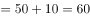元。设该设备的原价为元，因打九折销售12件与原价出售销售10件时获利相同，根据可得：，解得。如果打八折销售，则售价变为元。1万元最多可以买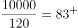件，则最多可以买83件。

故正确答案为B。

---

### 第 4 题　qid 2742298 · 数学运算

农场使用甲、乙两款收割机各1台收割一片麦田。已知甲的效率比乙高，如安排甲先工作3小时后乙加入，则再工作18小时就可以完成收割任务。问如果增加1台效率比甲高的丙，3台收割机同时开始工作，完成收割任务的用时在以下哪个范围内？

- **A**. 8小时以内
- **B**. 8-10小时之间
- **C**. 10-12小时之间　✅
- **D**. 12小时以上

**答案**：C

**官方解析**

甲的效率比乙高，即甲、乙效率比为5：4，赋值甲的效率为5，乙的效率为4，又因为丙的效率比甲高，丙的效率为。根据题干，甲先工作3小时，然后甲、乙再合作18小时即可完成，则工作总量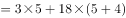。若3台收割机同时开始工作，用时为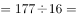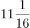小时，用时范围在10-12小时之间。

故正确答案为C。

---

### 第 5 题　qid 2742299 · 数学运算

甲、乙两家公司共同实施某个项目，甲公司的实际出资额比乙公司高60万元，投入人力是乙公司的一半，如将人力折算为出资额，则最终两家公司分得的利润相同。问两家公司投入的人力之和折算为多少万元的出资额？

- **A**. 240
- **B**. 180　✅
- **C**. 120
- **D**. 60

**答案**：B

**官方解析**

根据题意，设乙公司的实际出资额为万元，则甲公司的实际出资额为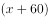万元。因甲投入人力是乙公司的一半，设甲公司投入人力折算为出资额是万元，则乙公司投入人力折算为出资额为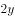万元，最终两家公司分得的利润相同，即总的出资额相同（包含人力折算），则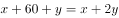，解得，两家公司投入的人力之和折算为万元。

故正确答案为B。

---

### 第 6 题　qid 2742280 · 数学运算

小张开车经高速公路从甲地前往乙地。该高速公路限速为120千米/小时。返程时发现有的路段正在维修，且维修路段限速降为60千米/小时。已知小张全程均按最高限速行驶，且返程用时比去程用时多30分钟，则甲、乙两地距离为多少千米？

- **A**. 150
- **B**. 160
- **C**. 180　✅
- **D**. 200

**答案**：C

**官方解析**

方法一：设甲、乙两地相距千米，30分钟小时，根据公式：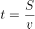，可列方程为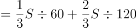，解得。

方法二：往返路程的时间差为维修路段行驶的时间差，根据路程一定，速度与时间成反比，可得维修路段往返时间之比为，设维修路段去程时间为小时，则返程时间为小时，，解得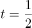，因维修路段占总路段的，则总路段去程时间为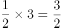小时，甲、乙两地距离为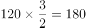千米。

故正确答案为C。

---

### 第 7 题　qid 2742281 · 数学运算

甲、乙、丙三条生产线生产某种零件，效率比为3：4：5，甲和乙生产线共同生产A订单，完成时甲比乙少生产250个。乙和丙共同生产B订单，完成时乙生产了720个。问A订单的零件个数比B订单：

- **A**. 少不到100个
- **B**. 少100个以上
- **C**. 多不到100个
- **D**. 多100个以上　✅

**答案**：D

**官方解析**

工程问题中给具体值，方程法解题。设A订单甲、乙产量分别为个、个，B订单乙、丙产量分别为个、个，根据题意可得：，解得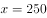，则A订单共生产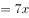个零件；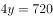，解得，则B订单共生产个零件。个个，即A订单的零件个数比B订单多100个以上。

故正确答案为D。

---

### 第 8 题　qid 2742282 · 数学运算

某电商平台开通会员费用为99元/年，全年最多可免240元运费，且会员在购买服饰类、非服饰类商品时可分别享受9折和95折优惠。小王去年在该平台上未开通会员，全年购买服饰类、食品类、家电类和其他类商品分别花费1480元、3200元、3600元和1500元，运费花费235元。如他去年开通会员，则在该平台支付总金额可减少：

- **A**. 不到500元
- **B**. 500-750元之间　✅
- **C**. 750-1000元之间
- **D**. 1000元以上

**答案**：B

**官方解析**

根据题意可得，若小王去年开通会员，服饰类商品可节省元，非服饰类商品可节省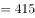元，运费在240元的限额内，故可节省235元。开通会员消费99元，则在该平台支付总金额可减少元，对应B项。

故正确答案为B。

---

### 第 9 题　qid 2742284 · 数学运算

为实现精准扶贫，某县政府工作人员对辖区内所有贫困户进行走访。已知第一周走访的户数为贫困户总户数的，第二周走访的户数是两周后剩余未走访户数的1.2倍。问两周后最少还有多少户贫困户未走访?

- **A**. 45
- **B**. 90
- **C**. 135　✅
- **D**. 180

**答案**：C

**官方解析**

方法一：已知第一周走访的户数为贫困户总户数的，则剩余未走访的户数为贫困户总户数的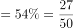，则第一周后未走访的户数为27的倍数。由第二周走访的户数是两周后剩余未走访户数的1.2倍可知，第二周走访的户数：两周后剩余未走访户数6：5，则第一周后未走访的户数为的倍数。综上，第一周后未走访的户数为的倍数。又因为第二周走访的户数：两周后剩余未走访户数6：5，则两周后剩余未走访户数为的倍数，求两周后最少还有多少户未走访，结合选项只有C项符合要求。

方法二：设两周后还有户贫困户未走访，贫困户总户数为，则可列方程：，有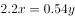，将两边系数化为最小整数有：，为保证为整数，则为27的倍数，结合选项，只有C项是27的倍数。

故正确答案为C。

---

### 第 10 题　qid 2742288 · 数学运算

某工厂的工号为5位数字。甲乙两个工人工号五位数字连乘之积都等于1764，但是甲的工号五位连加之和比乙的大4。问乙的工号为：

- **A**. 13677
- **B**. 22779
- **C**. 23677
- **D**. 33477　✅

**答案**：D

**官方解析**

五位数字连乘之积等于1764，可拆分，结合四个选项中均有2个数字7，可知其余三个数字之积，则此三个数字可以有（1，4，9）、（1，6，6）、（2，2，9）、（2，3，6）、（3，3，4）这5种情况，上述5种情况的数字之和分别为14、13、13、11、10，只有14比10大4，由于甲的工号五位连加之和比乙的大4，则乙的工号由（3，3，4，7，7）五位数字组成，只有D项符合要求。

故正确答案为D。

---

## 判断推理

### 第 1 题　qid 2742264 · 图形推理

每道题包含两套图形和可供选择的4个图形。这两套图形具有某种相似性，也存在某种差异。要求你从四个选项中选择最适合取代问号的一个。正确的答案应不仅使两套图形表现出最大的相似性，而且使第二套图形也表现出自己的特征。

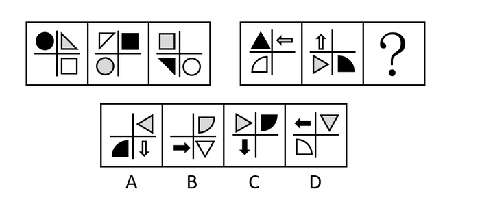

- **A**. A
- **B**. B　✅
- **C**. C
- **D**. D

**答案**：B

**官方解析**

元素组成相同，优先考虑位置规律。观察第一组图发现，每幅图均有三角形、圆、方块和空白四种元素组成，并且每种元素有明显位置变化，考虑平移。第一组图中，每种小元素依次逆时针平移一个格子，将规律应用到第二组图，故？处三角形的位置应当在十字格右下角，只有B项符合，当选。
故正确答案为B。

---

### 第 2 题　qid 2742267 · 图形推理

每道题包含两套图形和可供选择的4个图形。这两套图形具有某种相似性，也存在某种差异。要求你从四个选项中选择最适合取代问号的一个。正确的答案应不仅使两套图形表现出最大的相似性，而且使第二套图形也表现出自己的特征。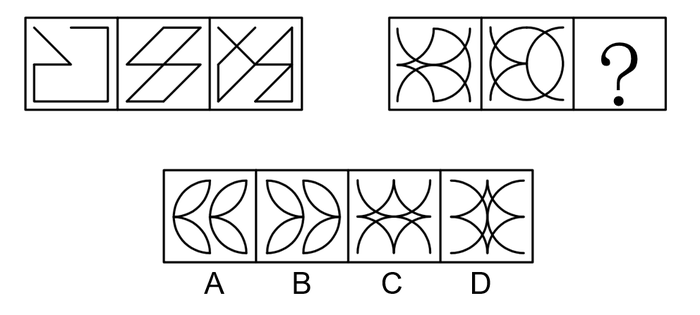

- **A**. A　✅
- **B**. B
- **C**. C
- **D**. D

**答案**：A

**官方解析**

元素组成相似，且相同线条重复出现，优先考虑样式规律中的加减同异。观察可知，第一组图形中的图1和图2去同存异之后得到图3，第二组图形遵循此规律，图1和图2去同存异之后得到？处图形，只有A项符合，当选。
故正确答案为A。

---

### 第 3 题　qid 2742270 · 图形推理

每道题包含一套图形和四个选项，请从四个选项中选出最恰当的一项填在问号处，使图形呈现一定的规律性。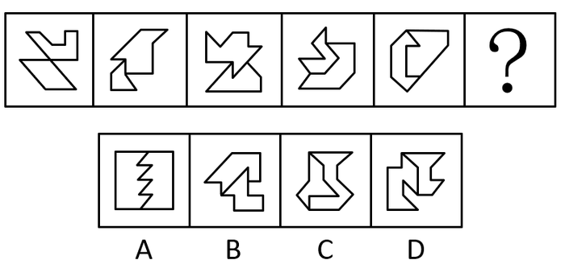

- **A**. A
- **B**. B
- **C**. C　✅
- **D**. D

**答案**：C

**官方解析**

元素组成不同，且每幅图均由两个图形构成，优先考虑图形间关系。观察发现，题干图形面与面之间相交的线数量分别为0、1、2、3、4，则？处要找一个面与面之间相交的线数量为5的图形，只有C项符合，当选。
故正确答案为C。

---

### 第 4 题　qid 2742274 · 图形推理

每道题包含一套图形和四个选项，请从四个选项中选出最恰当的一项填在问号处，使图形呈现一定的规律性。

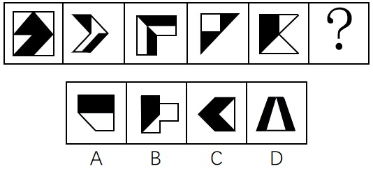

- **A**. A
- **B**. B　✅
- **C**. C
- **D**. D

**答案**：B

**官方解析**

元素组成不同，且无明显属性规律，优先考虑数量规律。题干图形均由黑色部分和白色部分构成，分开看无明显规律，考虑二者之间的关系。观察发现，图3、图4的黑色部分和白色部分面积明显相同，逐一验证，题干每个图形的白色部分面积与黑色部分面积均相等，故？处图形也应符合此规律，只有B项符合，当选。
故正确答案为B。

---

### 第 5 题　qid 2742277 · 图形推理

每道题包含一套图形和四个选项，请从四个选项中选出最恰当的一项填在问号处，使图形呈现一定的规律性。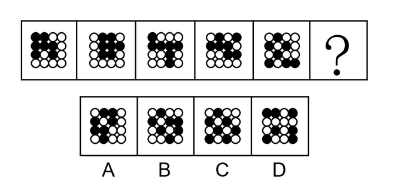

- **A**. A
- **B**. B　✅
- **C**. C
- **D**. D

**答案**：B

**官方解析**

元素组成相同，但无位置规律。观察发现，题干图形中的白球由图一至图五，分布越来越零散，考虑白球部分数。白球部分数分别为1、2、3、4、5，故？处应该选择一个白球部分数为6的图形。只有B项符合，当选。
故正确答案为B。

---

### 第 6 题　qid 2742278 · 类比推理

蚍蜉：大树

- **A**. 石头：鸡蛋
- **B**. 狮子：兔子
- **C**. 鱼肉：刀俎
- **D**. 螳螂：马车　✅

**答案**：D

**官方解析**

第一步：判断题干词语间逻辑关系。
蚍蜉和大树为对应关系，蚍蜉是指力量弱小的一方，大树是指力量强大的一方，蚍蜉撼大树比喻自不量力。
第二步：判断选项词语间逻辑关系。
A项：石头和鸡蛋为对应关系，鸡蛋是指力量弱小的一方，石头是指力量强大的一方，鸡蛋碰石头比喻自不量力，但顺序与题干相反，与题干逻辑关系不一致，排除；
B项：狮子和兔子为并列关系，与题干逻辑关系不一致，排除；
C项：鱼肉和刀俎为对应关系，鱼肉是指力量弱小的一方，刀俎是指力量强大的一方，但人为刀俎，我为鱼肉比喻生杀大权掌握在别人手里，自己处在被宰割的地位，与题干逻辑关系不一致，排除；
D项：螳螂和马车为对应关系，螳螂是指力量弱小的一方，马车是指力量强大的一方，螳臂当车比喻自不量力，与题干逻辑关系一致，当选。
故正确答案为D。

---

### 第 7 题　qid 2742279 · 类比推理

《蒹葭》：古体诗：诗歌

- **A**. 花椰菜：紫甘蓝：十字花科
- **B**. 电话：手机：电子产品
- **C**. 老虎：猫科：哺乳动物　✅
- **D**. 摩洛哥：阿拉伯：南非

**答案**：C

**官方解析**

第一步：判断题干词语间逻辑关系。
《蒹葭》是中国古代诗集《诗经》中的一首诗，是古体诗，二者为种属关系；古体诗是诗歌的一种，二者为种属关系。
第二步：判断选项词语间逻辑关系。
A项：花椰菜为十字花科植物；紫甘蓝也为十字花科植物；花椰菜和紫甘蓝二者为并列关系，与题干逻辑关系不一致，排除；
B项：手机又称移动电话，是电话的一种，二者为种属关系，但是前后位置颠倒，与题干逻辑关系不一致，排除； 
C项：老虎是猫科动物，二者为种属关系；猫科动物是哺乳动物的一种，二者为种属关系，与题干逻辑关系一致，当选； 
D项：摩洛哥是阿拉伯的组成部分，二者为组成关系，与题干逻辑关系不一致，排除。
故正确答案为C。

---

### 第 8 题　qid 2742259 · 类比推理

征稿：审校：出版

- **A**. 组装：维修：报废　✅
- **B**. 送审：开题：毕业
- **C**. 分离：发射：入轨
- **D**. 绘画：展出：装裱

**答案**：A

**官方解析**

第一步：判断题干词语间逻辑关系。
先征稿，再审校，最后出版，三者为时间先后的对应关系。
第二步：判断选项词语间逻辑关系。
A项：先组装，再维修，最后报废，三者为时间先后的对应关系，与题干逻辑关系一致，当选；
B项：先开题，再送审，最后毕业，开题应在送审之前发生，与题干逻辑关系不一致，排除；
C项：先发射，再分离，最后入轨，发射应在分离之前发生，与题干逻辑关系不一致，排除；
D项：先绘画，再装裱，最后展出，装裱应在展出之前发生，与题干逻辑关系不一致，排除。
故正确答案为A。

---

### 第 9 题　qid 2742261 · 类比推理

甲醛：胶黏剂：防腐液

- **A**. 木头：纸浆：纸张
- **B**. 乙醇：酒精：汽车燃料
- **C**. 芦荟：化妆水：饮料　✅
- **D**. 人造纤维：醋酯纤维：人造棉

**答案**：C

**官方解析**

第一步：判断题干词语间逻辑关系。
甲醛是制作胶黏剂和防腐液的原材料，第一词与后两词为原材料的对应关系。
第二步：判断选项词语间逻辑关系。
A项：木头是制作纸浆的原材料，二者为原材料的对应关系；纸浆是制作纸张的原材料，二者为原材料的对应关系，与题干逻辑关系不一致，排除；
B项：乙醇的俗称为酒精，二者为全同关系；乙醇是制作汽车燃料的原材料，二者为原材料的对应关系，与题干逻辑关系不一致，排除；
C项：芦荟是制作化妆水的原材料，二者为原材料的对应关系；芦荟也可以制作成饮料，因此第一词与后两词为原材料的对应关系，与题干逻辑关系一致，当选；
D项：醋酯纤维是按化学组成分类的一种人造纤维，二者为种属关系；人造棉是按形状和用途分类的一种人造纤维，二者为种属关系，与题干逻辑关系不一致，排除。
故正确答案为C。

---

### 第 10 题　qid 2742263 · 类比推理

病人：生老病死：医学

- **A**. 股票：商海沉浮：经济学
- **B**. 大海：潮涨潮落：海洋学　✅
- **C**. 战术：枪支弹药：军事学
- **D**. 地貌：斗转星移：地理学

**答案**：B

**官方解析**

第一步：判断题干词语间逻辑关系。
病人会生老病死，描述了病人的不同状态，医学的研究对象是病人，二者为对应关系。
第二步：判断选项词语间逻辑关系。
A项：商海沉浮的意思是在充满竞争和风险的商业领域随波逐流，经受考验、筛选，并不能描述股票的不同状态，与题干逻辑关系不一致，排除；
B项：大海会潮涨潮落，描述了大海的不同状态，海洋学的研究对象是大海，二者为对应关系，与题干逻辑关系一致，当选；
C项：战术中可能会应用到枪支弹药，但枪支弹药不是描述战术的不同状态，与题干逻辑关系不一致，排除；
D项：斗转星移的意思是星斗变动位置，指季节或时间的变化，与地貌无明显逻辑关系，与题干逻辑关系不一致，排除。
故正确答案为B。

---

### 第 11 题　qid 2742266 · 逻辑判断

某培训机构的一些舞蹈教师拥有舞蹈师资格证，所以，该机构有些女教师拥有舞蹈师资格证。
为使上述论证成立，需补充的前提是：

- **A**. 该机构有些舞蹈教师是女教师
- **B**. 该机构有些女教师是舞蹈教师
- **C**. 该机构所有舞蹈教师均为女教师　✅
- **D**. 该机构有些女舞蹈教师没有舞蹈师资格证

**答案**：C

**官方解析**

第一步：找出论点和论据。
论点：该机构有些女教师拥有舞蹈师资格证。
论据：某培训机构的一些舞蹈教师拥有舞蹈师资格证。
本题论点说的是女教师与舞蹈师资格证之间的关系，论据说的是舞蹈教师与舞蹈师资格证之间的关系，二者话题不一致，且问题为“前提”，优先考虑搭桥，即在舞蹈教师与女教师之间建立联系。
第二步：逐一分析选项。
A项：指出有些舞蹈教师是女教师，结合论据中一些舞蹈教师拥有舞蹈师资格证，无法确定是否有些女教师拥有舞蹈师资格证，不明确选项，无法加强，排除；
B项：指出有些女教师是舞蹈教师，可以推出有些舞蹈教师是女教师，与A项相同，无法确定是否有些女教师拥有舞蹈师资格证，不明确选项，无法加强，排除；
C项：指出所有舞蹈教师均为女教师，结合论据中一些舞蹈教师拥有舞蹈师资格证，可以推出有些女教师拥有舞蹈师资格证，即论点成立，搭桥项，当选；
D项：指出有些女舞蹈教师没有舞蹈师资格证，无法确定是否有些女教师拥有舞蹈师资格证，无法加强，排除。
故正确答案为C。

---

### 第 12 题　qid 2742268 · 逻辑判断

小学生使用铅笔比较多，小孩子经常会咬铅笔，铅笔灰有时也会抹得脸上嘴边到处都是。因此，二年级学生刘馨的妈妈担心孩子长期使用铅笔对健康有害。
以下哪项如果为真，能够为刘馨妈妈的担心提供支持？
Ⅰ.铅笔的木杆外面一般涂有彩色的颜料，颜料中含有微量重金属或其他有害物质
Ⅱ.儿童的铅笔盒通常很脏，经常咬铅笔会把很多细菌吃进嘴里
Ⅲ.现在，铅笔芯都由石墨和粘土混合制造而成，这些制作材料没有毒

- **A**. Ⅰ和Ⅱ　✅
- **B**. Ⅱ和Ⅲ
- **C**. Ⅰ和Ⅲ
- **D**. Ⅰ，Ⅱ和Ⅲ

**答案**：A

**官方解析**

第一步：找出论点和论据。
论点：孩子长期使用铅笔对健康有害。
论据：小学生使用铅笔比较多，小孩子经常会咬铅笔，铅笔灰有时也会抹得脸上嘴边到处都是。
本题论点是长期使用铅笔有害，论据是小孩子经常咬铅笔，而且铅笔灰抹得脸上嘴边到处都是，二者说的都是铅笔和小孩子之间的关系，加强优先考虑补充论据、解释原因或者举例。
第二步：逐一分析选项。
Ⅰ.指出铅笔的木杆颜料中含有微量重金属或其他有害物质，解释了为什么长期使用铅笔会对小孩子的健康有害，补充论据，具有加强作用；
Ⅱ.指出咬铅笔会把很多细菌吃进嘴里，解释了为什么长期使用铅笔会对小孩子的健康有害，补充论据，具有加强作用；
Ⅲ.指出铅笔芯的制作材料没有毒，证明咬铅笔时铅笔芯不会对小孩子的健康产生危害，具有削弱作用。
综合上述分析可知，Ⅰ、Ⅱ对刘馨妈妈的担心有支持作用。
故正确答案为A。

---

### 第 13 题　qid 2742271 · 逻辑判断

人体芯片是一种利用无线射频识别技术开发出来的可以植入人体的芯片，里面装有芯片、天线和信息发射装置，对应身体之外不同的接收装置。在医学上有广泛应用，比如植入式心脏检测器就是一种人体芯片，随着科技的发展，人体芯片有望在更多领域扮演重要角色，比如身份识别、支付、定位等功能，不少人慨叹，人体芯片即将成为人体不可或缺的一部分，未来发展形势一片大好。
以下陈述如果为真，哪项无法质疑上述观点？

- **A**. 将芯片这种外来物植入人体内，会增加感染或免疫系统排斥反应的风险，长期在体内感染几率更大
- **B**. 目前来看，芯片植入容易，取出困难，而且芯片的电池和使用寿命有限，安全取出芯片目前仍是个难题
- **C**. 人体芯片在进行信息传输的过程中，很可能被劫持、利用。如果存储在芯片里的个人信息数据被犯罪分子窃取，后果将不堪设想
- **D**. 数千名视力和听力障碍的患者经过芯片植入，获得了视觉和听觉的功能，不过这种后天赋予的能力与正常人天生具有的能力相比，还有些差距　✅

**答案**：D

**官方解析**

第一步：找出论点和论据。
论点：人体芯片即将成为人体不可或缺的一部分，未来发展形势一片大好。
论据：在医学上有广泛应用，比如植入式心脏检测器就是一种人体芯片，随着科技的发展，人体芯片有望在更多领域扮演重要角色，比如身份识别、支付、定位等功能。
本题的论点和论据都在讨论人体芯片的重要性，未来的形势好，论点论据话题一致，优先考虑削弱论点，即否定人体芯片的重要性，未来的形势好。
第二步：逐一分析选项。
A项：选项指出将芯片植入人体内会增加感染和排斥反应的风险，说明人体芯片将会对人体产生危害，否定了论点，可以削弱，排除；
B项：选项指出目前安全取出芯片仍是个难题，说明人体芯片不会在短期内成为人体不可或缺的一部分，否定了论点，可以削弱，排除；
C项：选项指出人体芯片传输的信息很可能被劫持、利用，如果被犯罪分子窃取，后果将不堪设想，说明人体芯片未来发展形势存在严重问题，否定了论点，可以削弱，排除；
D项：选项指出数千名视力和听力障碍的患者经过芯片植入，获得了视觉和听觉的功能，肯定了人体芯片的重要性，未来的形势好，不能削弱，当选。
本题为选非题，故正确答案为D。

---

### 第 14 题　qid 2742272 · 逻辑判断

某高校准备选派2021年第一批出国访学的中青年学者，选派分为高级访问学者以及青年骨干教师两类，选派的条件分别为：前者要求是教师或者科研人员，年龄在40周岁以上且具有高级职称；后者要求是具有博士学位的近三年新进校的教师。
关于该校选派出的2021年第一批出国访学人员，以下哪项判断一定为真？

- **A**. 选派为青年骨干教师的都不具有高级职称
- **B**. 没有博士学位的都在40周岁以上　✅
- **C**. 科研人员都不是近三年新进校的
- **D**. 具有博士学位的都是近三年新进校的

**答案**：B

**官方解析**

第一步：翻译题干。

①2021年第一批出国访学人员分为两种：高级访问学者与青年骨干教师；

②高级访问学者（教师或者科研人员）且40周岁以上且具有高级职称；

③青年骨干教师具有博士学位且是近三年新进校的教师。

第二步：逐一分析选项。

A项：该项中的“青年骨干教师”是对条件③的肯前，由于肯前可以推出肯后，可以得出“具有博士学位且是近三年新进校的教师”为真，但据此无法判断其是否具有高级职称，故无法确定该选项的真假性，排除；

B项：该项中的“没有博士学位”是对条件③的否后，由于否后可以推出否前，可以得出“青年骨干教师”为假。再结合条件①可知，“高级访问学者”为真，则是对条件②的肯前，由于肯前可以推出肯后，则可以得出“（教师或者科研人员）且40周岁以上且具有高级职称”为真，进而可知“40周岁以上”为真，即该选项一定为真，当选；

C项：根据该项中的“科研人员”无法判断条件②后面部分的真假性，所以无法据此进行进一步的推理，故无法确定该选项的真假性，排除；

D项：根据该项中的“具有博士学位”无法判断条件③后面部分的真假性，所以无法据此进行进一步的推理，故无法确定该选项的真假性，排除。

故正确答案为B。

---

### 第 15 题　qid 2742276 · 逻辑判断

波音737飞机出现后的50年中，航空发动机的直径越来越大，所以新一代的737MAX系列不得不将发动机的安装位置向机翼的前方移动，并尽可能升高，但这又可能会使飞机在飞行中自动向上抬头，导致失速。为解决这一问题，737MAX新增MCAS（机动特性增强系统），在必要的时候实现飞机“自动低头”的功能。但有专家分析，最近737MAX机型接连发生两次空难，可见MCAS系统并不可靠。
以下陈述如果为真，哪项可以作为专家的论据？

- **A**. 不少执飞737MAX机型的飞行员并不熟悉新款MCAS系统，错误操作可能导致事故
- **B**. 飞机传感器出现故障，使得MCAS接收到错误数据，进而不断执行“自动低头”的指令
- **C**. 两次空难均显示飞行速度大幅超过限制，进而产生飞机结构无法承受的气动力
- **D**. 两次空难均显示起飞后，飞行员与MCAS系统争夺控制权，但都没能阻止MCAS的“自动低头”功能，最终导致飞机俯冲　✅

**答案**：D

**官方解析**

第一步：找出论点和论据。
论点：最近737MAX机型接连发生两次空难，可见MCAS系统并不可靠。
论据：无。
本题只有论点说的是MCAS系统并不可靠，则需补充论据加强论点，即证明MCAS系统不可靠。
第二步：逐一分析选项。
A项：该项说的是飞行员不熟悉新款MCAS系统，而错误操作可能导致事故，说明空难可能是由于飞行员错误操作导致的，而不是MCAS系统本身存在问题，可以削弱，无法加强，排除；
B项：该项说的是飞机传感器出现故障使MCAS接收到错误数据，说明空难可能是由于飞机传感器出现故障导致的，而不是MCAS系统本身存在问题，可以削弱，无法加强，排除；
C项：该项说的是两次空难均显示飞行速度大幅超过限制，进而产生飞机结构无法承受的气动力，说明空难可能是由于飞行速度大幅超过限制导致的，而不是MCAS系统本身存在问题，可以削弱，无法加强，排除；
D项：该项说的是两次空难均显示MCAS系统主导了“自动低头”功能，最终导致飞机俯冲，说明MCAS系统就是空难产生的原因，加强论点，当选。
故正确答案为D。

---

### 第 16 题　qid 2742258 · 逻辑判断

某文化用品市场正在推进市场的信息化和电子化，市场主管部门建议市场里的商家可以使用电子付款系统或者使用自动贩卖机。
如果市场里的每家商户都落实了这一建议，那么以下哪项一定为真？
Ⅰ.市场里的一些商户使用了自动贩卖机。
Ⅱ.如果一家商店既没有使用自动贩卖机，也没有使用电子付款系统，那么这家商店一定不在该市场里。
Ⅲ.如果一家文具店既使用了自动贩卖机，也使用了电子付款系统，这家商店一定在该市场里。

- **A**. 只有Ⅰ
- **B**. 只有Ⅱ　✅
- **C**. 只有Ⅰ和Ⅱ
- **D**. 只有Ⅱ和Ⅲ

**答案**：B

**官方解析**

第一步：翻译题干。

市场里的商家使用电子付款系统 或 使用自动贩卖机。

第二步：逐一分析结论。

Ⅰ.题干中箭头后方是“或”关系，则无法确定市场里的商家使用的是电子付款系统还是自动贩卖机，因此无法推出市场里的一些商户使用了自动贩卖机，排除A、C两项；

Ⅱ.翻译为：商店没有使用自动贩卖机且没有使用电子付款系统商店一定不在该市场里，是对题干翻译的否后，根据否后必否前，可以推出该商店一定不在该市场里，可以推出；

Ⅲ.翻译为：一家文具店使用了自动贩卖机且使用了电子付款系统这家商店在该市场里，是对题干翻译的肯后，肯后得不到确定性结论，无法推出这家商店一定在该市场里，排除D项。

故正确答案为B。

---

### 第 17 题　qid 2742260 · 逻辑判断

最近有技术研发团队推出了一款“AI（人工智能）浓缩书”应用软件，宣称可以“提取全书干货”，文字量大约只占整书的，“为你提炼出这本书的结构、精华和观点，把作者的基本思路和整本书的框架都理出来。”研发团队认为，该软件能够帮助读者完成最初的选择过程，读者通过阅读浓缩的框架、观点、精华，判断这本书到底是不是自己需要的，是否值得进一步细致阅读。

以下各项如果为真，哪项最能驳斥研发团队的观点？

- **A**. 
浓缩过程中语句的选择无法完全客观，同时浓缩后原文的逻辑和思考也无法保留，无法做到客观呈现作品
　✅
- **B**. 
经对比，大部分知识类书籍经过浓缩后的版本，只能保留原书大约的内容

- **C**. 
经过浓缩的小说，只有故事梗概而缺乏细节描写，读者无法体会到人物之间细致的情感交流和互动，难以被感动 

- **D**. 
经过浓缩的文史、哲学等书籍，只能保留知识框架而不能呈现具体思维过程，不利于读者的判断思维能力发展

**答案**：A

**官方解析**

第一步：找出论点和论据。

论点：该软件能够帮助读者完成最初的选择过程，读者通过阅读浓缩的框架、观点、精华，判断这本书到底是不是自己需要的，是否值得进一步细致阅读。

论据：“AI（人工智能）浓缩书”应用软件，宣称可以“提取全书干货”，文字量大约只占整书的，“为你提炼出这本书的结构、精华和观点，把作者的基本思路和整本书的框架都理出来。”

论点讨论的是该软件通过浓缩的框架可以帮助读者筛选书籍，论据讨论的是该软件可以提炼框架，二者都在讨论该软件的优势，故论点论据讨论话题一致，削弱可优先考虑否定论点。

第二步：逐一分析选项。

A项：该项讨论的是浓缩过程中无法客观呈现作品，说明读者无法判断书籍是否值得去细致地阅读，削弱论点，可以削弱，当选；

B项：该项讨论的是大部分浓缩后的知识类书籍内容只有原书的，但我们无法确定通过这的内容，读者能否确定书籍是否值得去细致地阅读，不明确选项，无法削弱，排除；

C项：该项讨论的是读者无法被浓缩的作品感动，但是题干的论点在讨论读者是否能够通过浓缩的作品去判断应不应该细致阅读，与题干论点无关，无法削弱，排除；

D项：该项讨论的是浓缩作品不利于读者的判断思维能力发展，但是题干论点在讨论读者是否能够通过浓缩的作品去判断应不应该细致阅读，与题干论点无关，无法削弱，排除。

故正确答案为A。

---

### 第 18 题　qid 2742262 · 逻辑判断

问思是一家才创立两年左右的文具用品类公司，产品种类频多，有些高端产品价格不菲。问思生产的所有学生文具都是设计奇巧，充满了青春色彩。所有充满青春色彩的文具都得到了广大中小学生的喜爱。问思学生文具销量增长飞速，公司因此也加强了对这方面产品的研发与生产。
以下各项都能从题干的论述中推出，除了：

- **A**. 问思生产的所有学生文具都得到了中小学生的喜爱
- **B**. 所有不被中小学生喜爱的学生文具都缺乏青春色彩
- **C**. 问思生产的价格不菲的产品的销量的增长速度不高　✅
- **D**. 问思生产的一些设计奇巧的产品的研发得到了加强

**答案**：C

**官方解析**

第一步：翻译题干。

①有些高端产品价格不菲；

②问思学生文具设计奇巧 且 充满青春色彩；

③充满青春色彩的文具中小学生喜爱；

④问思文具销量增长飞速，公司加强这方面产品的研发与生产。

第二步：逐一分析选项。

A项：翻译为问思学生文具中小学生喜爱，根据条件②和③可知，问思文具受到中小学生喜爱，可以推出，排除；

B项：翻译为不被中小学生喜爱缺乏青春色彩，不被中小学生喜爱是对条件③的否后，根据否后必否前，可以推出缺乏青春色彩，可以推出，排除；

C项：根据题干有些高端产品价格不菲，说明一部分的高端产品价格不菲，但是无法推出价格不菲的问思产品销量增长速度的情况，无法推出，当选；

D项：翻译为有的问思生产的奇巧产品研发得到加强，根据题干中条件②问思学生文具设计奇巧 且 充满青春色彩，结合条件④，可以推出有的问思文具设计奇巧研发得到加强。故可以推出问思学生文具研发得到加强，可以推出，排除。

本题为选非题，故正确答案为C。

---

### 第 19 题　qid 2742265 · 逻辑判断

随着航天技术的发展，许多人开始打小行星的主意，认为人类可以通过开采小行星“发家致富”。各国科学家提出了多种开发小行星资源的方案，基本想法都是将探测器发射到小行星上，航天员开采资源后带回地球，或直接在太空用于建设。
以下各项如果为真，哪一项不能驳斥科学家的观点？

- **A**. 大多数小行星重力很弱，常规挖掘的撞击力足以将设备反推到太空中，进入小行星内部开采资源，目前难以实现
- **B**. 即使是近地小行星，距离地球最近时也常有数百万公里，人类访问一次可能需要几个月时间，航天员生活有很大困难
- **C**. 航天计划耗资巨大，而可以带回来的样本极其有限，开采小行星资源能带来的效益远远不及开采过程消耗的资源
- **D**. 从小行星岩石中提取可以制作推进剂的物质，或是可用的材料，可以直接在现场生产制造航天器的燃料，为航行提供补给　✅

**答案**：D

**官方解析**

第一步：找出论点和论据。
论点：开发小行星资源的方案，基本想法都是将探测器发射到小行星上，航天员开采资源后带回地球，或直接在太空用于建设。
论据：无。
第二步：逐一分析选项。
A项：说明常规挖掘、开采资源目前难以实现，论点中科学家的想法无法实现，否定论点，排除；
B项：说明航天员生活有很大困难，无法真正开采资源，论点中科学家的想法无法实现，否定论点，排除；
C项：说明开采的成本大于收益，那么人们也就不会去开采，论点中科学家的想法无法实现，否定论点，排除；
D项：说明从小行星岩石中提取的物质可以直接为航天器提供补给，说明可以用于太空建设，加强项，当选。
本题为选非题，故正确答案为D。

---

### 第 20 题　qid 2742269 · 类比推理

四月中旬，某省召开了文化馆建设会议，各市文化馆都派出了一名骨干参会。在进行了全体大会后，会议又组织了小组讨论，其中甲、乙、丙、丁、戊五人被分到同一小组，关于他们，有如下的信息：
（1）他们来自A、B、C、D、E五个市的文化馆。
（2）甲只与其中两人认识。
（3）来自B、C、E三市的三人之前一起参加过会议，相互熟悉。
（4）D市的与会者认识三人。
（5）乙不是B市的，并且和B市与会者头次见面。
（6）C市与会者和丙相识。
（7）丁只与一个人见过面。
根据以上信息，可以推断，戊来自哪座城市的文化馆？

- **A**. B市
- **B**. C市　✅
- **C**. D市
- **D**. E市

**答案**：B

**官方解析**

第一步：分析题干。
（1）甲、乙、丙、丁、戊与A、B、C、D、E对应。
（2）甲只与两人认识。
（3）B、C、E相互认识。
（4）D与其中三人认识。
（5）乙和B第一次见。
（6）C与丙认识。
（7）丁只认识一个人。
第二步：根据题干条件分析选项。
根据（7）丁只认识一个人，结合（3）B、C、E相互认识，所以丁不是B、C、E，根据（4）D与其中三人认识，所以丁不是D，那么丁只能是A。
根据（5）乙和B第一次见，结合（3）B、C、E相互认识，那么乙是D。
根据（4）D与其中三人认识，而（5）乙和B第一次见，所以D认识A、C、E，根据（2）甲只与两人认识，若甲是C或E，结合前文“D认识A、C、E”，可知甲认识三个人（B、D、E或B、C、D），这与条件（2）矛盾，故甲不是C或E，甲只能是B。
根据（6）可知C与丙认识，说明丙不是C而是E，此时可知戊是C。
故正确答案为B。

---

### 第 21 题　qid 2742273 · 定义判断

社区教育是指各种主体在一定区域范围内，有组织地开展的非学历、非认证（职业资格认证等）、非营利的教育活动和过程。
根据上述定义，以下不属于社区教育的是：

- **A**. 在某小区居住的几位朋友喜欢瑜伽，每天在该小区空地上组织小区其他居民一起学习瑜伽强身健体
- **B**. 某医院大夫多次到某学校开设义务急救培训课程，有很多教师学会了急救常识和技术
- **C**. 音乐学院退休的李教授在家里办起钢琴小学堂，收费低廉，同小区的家长纷纷给孩子报名　✅
- **D**. 社区居委会在暑假时，为某小区的小学生举办了每周一次的“认识身边的植物”公益知识讲座

**答案**：C

**官方解析**

第一步：找出定义关键词。
“在一定区域范围内”、“有组织地开展的非学历、非认证（职业资格认证等）、非营利的教育活动和过程”。
第二步：逐一分析选项。
A项：某小区居住的几位朋友在空地上组织小区其他居民学习瑜伽，符合“在一定区域范围内”、“有组织地开展的非学历、非认证（职业资格认证等）、非营利的教育活动和过程”，符合定义，排除；
B项：大夫到学校开设义务急救培训课程，符合“在一定区域范围内”、“有组织地开展的非学历、非认证（职业资格认证等）、非营利的教育活动和过程”，符合定义，排除；
C项：李教授在家里办钢琴小学堂，收费低廉，这是以营利为目的的，不符合“有组织地开展的非学历、非认证（职业资格认证等）、非营利的教育活动和过程”，不符合定义，当选；
D项：社区居委会为小区小学生举办公益知识讲座，符合“在一定区域范围内”、“有组织地开展的非学历、非认证（职业资格认证等）、非营利的教育活动和过程”，符合定义，排除。
本题为选非题，故正确答案为C。

---

### 第 22 题　qid 2742275 · 定义判断

感情动机是指由于人的喜、怒、哀、乐等情绪和道德、情操、观念等情感所引起的购买动机。
根据上述定义，以下是出于感情动机的购买行为的是：

- **A**. 小赵准备买一辆代步车，本着“支持国货”“绿色环保”的理念，最终选择了一辆国产新能源汽车　✅
- **B**. 小李带儿子逛商场时，儿子对一套奥特曼玩具爱不释手，哭闹着让爸爸买，小李看到价格之后，用一支冰淇淋把儿子哄出了商店
- **C**. 老张一家三代住了三十几年的老房子，承载了太多美好的回忆，因为拆迁，老张不得不重新购买邻近的一套公寓房
- **D**. 小菲下载了一款电商比价软件，输入商品名就能自动呈现各大商城的价格，小菲买到了全网最低价的一款手机，心里特别开心

**答案**：A

**官方解析**

第一步：找出定义关键词。
“人的喜、怒、哀、乐等情绪和道德、情操、观念等情感”、“引起的购买动机”。
第二步：逐一分析选项。
A项：小李买了一辆国产新能源汽车，“支持国货”体现了一种爱国情怀，“绿色环保”体现了爱护环境的观念，符合“人的喜、怒、哀、乐等情绪和道德、情操、观念等情感”、“引起的购买动机”，符合定义，当选；
B项：小李购买冰淇淋是为了安抚儿子的情绪，不符合“人的喜、怒、哀、乐等情绪和道德、情操、观念等情感”、“引起的购买动机”，不符合定义，排除；
C项：老张购买公寓房是因为拆迁，不符合“人的喜、怒、哀、乐等情绪和道德、情操、观念等情感”、“引起的购买动机”，不符合定义，排除；
D项：小菲购买手机，全网最低价和心里特别开心都不是购买动机，不符合“人的喜、怒、哀、乐等情绪和道德、情操、观念等情感”、“引起的购买动机”，不符合定义，排除。
故正确答案为A。

---

### 第 23 题　qid 2742307 · 定义判断

自助组织是指为了满足共同需要，克服共同面对的困难和问题，寻求个人和社会改变的一群人自发形成的组织。
根据上述定义，以下属于自助组织的是：

- **A**. 小王在戒毒成功后，为传授经验自费开通戒毒电话咨询热线
- **B**. 一些医学专业大学生成立志愿者协会来到医院为绝症患者进行心理疏导
- **C**. 某医院为帮助尿毒患者筹款治疗和提升生活质量，成立尿毒症康复会
- **D**. 某市部分残障儿童家长建了微信群互通消息，互相帮助且互相提供情感支持　✅

**答案**：D

**官方解析**

第一步：找出定义关键词。
“为了满足共同需要”、“克服共同面对的困难和问题”、“寻求个人和社会改变的一群人自发形成的组织”。
第二步：逐一分析选项。
A项：小王自费开通戒毒电话咨询热线，不符合“寻求个人和社会改变的一群人自发形成的组织”，不符合定义，排除； 
B项：一些医学专业大学生成立志愿者协会为绝症患者进行心理疏导，是解决这些患者的问题，不符合“为了满足共同需要”，也不符合“克服共同面对的困难和问题”，不符合定义，排除；
C项：医院为帮助尿毒症患者筹钱治疗和提升生活质量，是解决这些尿毒症患者的问题，不符合“为了满足共同需要”，也不符合“克服共同面对的困难和问题”，不符合定义，排除；
D项：部分残障儿童的家长建立微信群互相帮助互相提供情感支撑，符合“为了满足共同需要”，也符合“克服共同面对的困难和问题”，这些家长互相帮助和互相提供情感支撑，符合“寻求个人和社会改变的一群人自发形成的组织”，符合定义，当选。
故正确答案为D。

---

### 第 24 题　qid 2742313 · 定义判断

专家证人，特指具有特定实践经验或专门知识，在法庭上针对专业性问题阐述判断性意见的证人。专家证人对某一特定问题所发表的专业的、带有个人见解的观点、看法，称为专家证言。
根据上述定义，以下涉及专家证人的是：

- **A**. 晓峰在小区门口被张某撞伤后落下残疾。他认为是张某没有及时送他就医而导致自己残疾。晓峰提起诉讼，请目睹事故过程的王医生出庭描述事发经过
- **B**. 王老先生过世后，其女儿出具父亲手书遗嘱，称父亲将房产全都留给自己，要求继母立刻搬出。继母认为遗嘱笔迹不是王老先生的，要求对遗嘱进行鉴定
- **C**. 某村居民王某的两个儿子因为如何赡养母亲发生争执，村委会调解时，大儿子说当年分家时，请了有资质的调解员做见证，现在还请调解员来证明已经履行了义务
- **D**. 小安因为被同学欺辱，出现严重自杀倾向。小安的家长提起诉讼，要求其同学做出赔偿，小安的心理咨询师出庭说明校园霸凌与小安的自杀倾向之间的关联　✅

**答案**：D

**官方解析**

第一步：找出定义关键词。
专家证人：“具有特定实践经验或专门知识”、“在法庭上”、“针对专业性问题阐述判断性意见”；
专家证言：“对某一特定问题”、“专业的、带有个人见解的观点、看法”。
第二步：逐一分析选项。
A项：请目睹事故过程的王医生出庭描述事故经过，不符合“专家证人”中的“针对专业性问题阐述判断性意见”，也不符合“专家证言”中的“专业的、带有个人见解的观点、看法”，不符合定义，排除； 
B项：继母认为女儿出具的手写遗嘱中笔迹不是死者本人的，要求鉴定，不符合“专家证人”中的“针对专业性问题阐述判断性意见”，也不符合“专家证言”中的“专业的、带有个人见解的观点、看法”，不符合定义，排除；
C项：在村委会调解时，大儿子还请有资质的调解员来证明自己已经履行了义务，不符合定义“专家证人”中的“在法庭上”，不符合定义，排除；
D项：小安的心理咨询师出庭说明校园霸凌与小安的自杀倾向之间的关联，其中心理咨询师符合“具有特定实践经验或专门知识”，“出庭”符合“在法庭上”、说明校园霸凌和小安的自杀倾向的关联符合“针对专业性问题阐述判断性意见”，符合“专家证人”的定义，当选。
故正确答案为D。

---

### 第 25 题　qid 2742316 · 定义判断

沟通障碍是人际之间、团体之间交流意见、传递信息时所存在的困难。有如下几种类型：（1）语言障碍。语言是交流思想的工具，但不是思想本身，加之人们用语言表达思想的能力千差万别，故用语言表达思想，交流信息时，难免出现误差。（2）观念障碍。人们的社会经历不同，信念不同，对事物的态度和观点也必然不同，有时不能避免意见沟通中的观念冲突。（3）气质障碍。人的个性不同，气质不同，交流信息时可能发生困难。
根据上述定义，以下判断不正确的是：

- **A**. 小明说：“妈妈，我要煮鸡蛋。”妈妈说：“去吧，煮个五六分钟就行。”小明说：“不，我要吃一个煮鸡蛋。”属于语言障碍
- **B**. 妈妈说：“你挣一块钱恨不得花十块钱，跟你讲节俭，简直是对牛弹琴。”女儿说：“挣钱就是为了花的，存钱干什么？”属于观念障碍
- **C**. 妻子喜欢独自安静地读书，丈夫喜欢一大帮朋友外出游玩，所以在外人眼里他们俩不像一家人。属于气质障碍　✅
- **D**. 小张旅游时品尝到了“糖醋活鱼”这道菜，兴奋地拍了视频发给女友。女友回复：“这么残忍，你怎么下得去口？”两人为此吵了一架。属于观念障碍

**答案**：C

**官方解析**

第一步：找出定义关键词。
语言障碍：“用语言表达思想，交流信息时，难免出现误差”；
观念障碍：“人们的社会经历不同，信念不同，对事物的态度和观点也必然不同”；
气质障碍：“人的个性不同，气质不同，交流信息时可能发生困难”。
第二步：逐一分析选项。
A项：小明的真实想法是想吃一个煮鸡蛋，而他的妈妈告诉他怎么煮鸡蛋，交流时存在理解偏差，符合“用语言表达思想，交流信息时，难免出现误差”，符合语言障碍的定义，排除；
B项：妈妈和女儿的社会经历明显不同，她们关于节俭的看法也截然不同，符合“人们的社会经历不同，信念不同，对事物的态度和观点也必然不同”，符合观念障碍的定义，排除；
C项：妻子和丈夫的个性、气质确实不同，但选项中并没有涉及夫妻俩因为个性气质不同而存在交流困难，不符合“人的个性不同，气质不同，交流信息时可能发生困难”，不符合气质障碍的定义，当选；
D项：小张为品尝到了“糖醋活鱼”感到兴奋，其女友则认为吃活鱼很残忍，表明他俩对事物的态度和观点存在不同，并为此吵了一架，符合“人们的社会经历不同，信念不同，对事物的态度和观点也必然不同”，符合观念障碍的定义，排除。
本题为选非题，故正确答案为C。

---

### 第 26 题　qid 2742321 · 定义判断

定制公交是常规公交的补充，是公共交通的服务升级。它通过大数据应用及智能算法等技术的实现，来满足公众不同场景下的精准需求，提升公众的整体出行体验，为公众提供更加便捷、舒适、优质的服务，属于高科技、按需服务的新型公共交通服务。
根据上述定义，以下属于定制公交的是：

- **A**. 某大学在市内有多个校区，老师在多个校区内上课，交通不便。学校通过广泛调查，开设了多个校区之间的多条班车线路，提高了交通便捷程度
- **B**. 某医院在远郊区县开设了分院，为了方便医务人员去分院出诊，该院与公交公司沟通，增设了专线，定时接送该院医务人员往返
- **C**. 某房地产公司开发新住宅小区，向公交公司提出申请，公交公司为其延长了已有的公交线路，使得该小区的交通出行情况大为改善
- **D**. 有日常固定出行需求的居民可在某网络平台提出申请，当相同目的地的人达到一定数量后，网站根据始发地分析，为这些人制定开通最佳路线，票价略高于常规公交　✅

**答案**：D

**官方解析**

第一步：找出定义关键词。
“通过大数据应用及智能算法等技术的实现”、“来满足公众不同场景下的精准需求，提升公众的整体出行体验”、“为公众提供更加便捷、舒适、优质的服务，属于高科技、按需服务的新型公共交通服务”。
第二步：逐一分析选项。
A项：某大学通过广泛调查，开设了多个校区之间的多条班车线路，提高了交通便捷程度，没有涉及大数据应用及智能算法等技术，不符合“通过大数据应用及智能算法等技术的实现”，不符合定义，排除； 
B项：某医院与公交公司沟通，增设了专线，定时接送该院医务人员往返，没有涉及大数据应用及智能算法等技术，不符合“通过大数据应用及智能算法等技术的实现”，不符合定义，排除； 
C项：某房地产公司向公交公司提出申请，公交公司为其延长了已有的公交线路，使得该小区的交通出行情况大为改善，没有涉及大数据应用及智能算法等技术，不符合“通过大数据应用及智能算法等技术的实现”，不符合定义，排除； 
D项：居民在某网络平台提出相应出行申请，网站根据始发地分析，为符合要求的这些人制定开通最佳路线，符合“通过大数据应用及智能算法等技术的实现”、“来满足公众不同场景下的精准需求，提升公众的整体出行体验”、“为公众提供更加便捷、舒适、优质的服务，属于高科技、按需服务的新型公共交通服务”，符合定义，当选。
故正确答案为D。

---

### 第 27 题　qid 2742325 · 定义判断

无感审批是指通过智能技术强化身份认证、智能授权、自动填表等功能，企业群众无需出示证件、无需填写表单，“不知不觉”就拿到审批文件，实现“无感”审批、“省心”办事。
根据上述定义，以下属于无感审批的是：

- **A**. 某市旅游管理部门通过人脸识别等网络技术，实现了网上实名制购买全市公园门票。游客无需出示证件，可以直接出示购票二维码入园
- **B**. 某建设单位登录省投资在线监管平台，填写单位代码后，系统自动生成企业基本信息和申请表格，随后完成在线审核，获得建筑许可　✅
- **C**. 某市提高政府办事效率，对企业或个人办理业务，只需要到综合服务大厅询问工作人员，工作人员会帮忙核对材料，帮助他们方便快捷地完成相关手续
- **D**. 某保险公司提供网上业务办理和查询功能，客户登录公众号并通过人脸识别后，可完成查询、续费、转款等功能，无需出示证件、无需填写表单

**答案**：B

**官方解析**

第一步：找出定义关键词。
“通过智能技术强化身份认证、智能授权、自动填表等功能”、“企业群众无需出示证件、无需填写表单，‘不知不觉’就拿到审批文件”。
第二步：逐一分析选项。
A项：通过人脸识别等网络技术，实现了网上实名制购买全市公园门票，没有体现出拿到审批文件，不符合定义，排除； 
B项：系统自动生成企业基本信息和申请表格，符合“智能技术强化身份认证、智能授权、自动填表等功能”；随后完成在线审核，获得建筑许可，符合“企业群众无需出示证件、无需填写表单，‘不知不觉’就拿到审批文件”，符合定义，当选；
C项：对企业或个人办理业务，只需要到综合服务大厅询问工作人员，工作人员会帮忙核对材料，帮助他们方便快捷地完成相关手续。没有通过智能技术强化身份认证、智能授权、自动填表等功能，不符合定义，排除；
D项：客户登录公众号并通过人脸识别后，可完成查询、续费、转款等功能，无需出示证件、无需填写表单，没有涉及到审批，所以不符合“‘不知不觉’就拿到审批文件”，不符合定义，排除。
故正确答案为B。

---

### 第 28 题　qid 2742329 · 定义判断

限制性营销，是指面对超过了企业的供应能力的产品或服务时的企业营销对策。企业一般通过提高价格，减少促销活动来“低调”营销，其目的是通过企业行为来协调市场需求。抵制性营销与限制性营销不同，限制性营销是限制过度的需求，而不是否定产品或服务本身；抵制性营销则是强调产品或服务本身的有害性，从而抵制这种产品和服务的生产和经营。
根据上述定义，以下属于限制性营销的是：

- **A**. 节假日某私营艺术馆人满为患，降低了游客欣赏艺术的舒适感，因此该艺术馆实行网上预约制，没有预约不得进入　✅
- **B**. 鉴于香烟、烈酒对健康的不利影响，法律禁止18岁以下的人购买这些商品
- **C**. 近日交管局加强了对没有经营执照的个人营运出租车的管理，禁止其运营
- **D**. 人们对皮草、象牙制品的趋之若鹜刺激了生产，象牙、犀牛角等制品被禁止入关

**答案**：A

**官方解析**

第一步：找出定义关键词。
“超过了企业的供应能力的产品或服务时的企业营销对策”、“通过提高价格，减少促销活动来‘低调’营销”、“目的是通过企业行为来协调市场需求”。
第二步：逐一分析选项。
A项：某私营艺术馆人满为患，符合“超过了企业的供应能力的产品或服务”，该艺术馆实行网上预约制，没有预约不得进入，符合“通过企业行为来协调市场需求”，符合定义，当选； 
B项：鉴于香烟、烈酒对健康的不利影响，法律禁止18岁以下的人购买这些商品，不符合“超过了企业的供应能力的产品或服务时的企业营销对策”，不符合定义，排除；
C项：交管局加强了对没有经营执照的个人营运出租车的管理，禁止其运营，不符合“超过了企业的供应能力的产品或服务时的企业营销对策”，不符合定义，排除；
D项：人们对皮草、象牙制品的趋之若鹜刺激了生产，象牙、犀牛角等制品被禁止入关，不符合“超过了企业的供应能力的产品或服务时的企业营销对策”，不符合定义，排除。
故正确答案为A。

---

### 第 29 题　qid 2742340 · 定义判断

路演是指通过现场演示的方法，引起目标人群的关注，使他们产生兴趣，最终达成销售或吸引投资。路演通过在公众场所进行演说、演示产品、推介理念，向他人推介自己的公司、团体、产品、想法。
根据上述定义，以下属于路演的是：

- **A**. 陈女士购买了一台多功能吸尘器，销售人员在陈女士家中，现场演示了吸尘器除螨的效果，陈女士相当满意
- **B**. 科技交流会上，7家科技公司的负责人向数十位投资人展示本公司科技产品，最终5家公司的产品获得投资人青睐，得到了投资　✅
- **C**. 小刘在小区分发宣传单，介绍公司的功能床垫，蒋阿姨很感兴趣，小刘邀请蒋阿姨到公司体验馆现场体验，蒋阿姨欣然前往
- **D**. 某先锋舞台剧在居民小区进行演练，业主和路人纷纷观望，被逗得开怀大笑，导演对节目效果感到更加心中有数了

**答案**：B

**官方解析**

第一步：找出定义关键词。
“现场演示的方法，引起目标人群的关注，使他们产生兴趣”、“最终达成销售或吸引投资”、“公众场所进行”。
第二步：逐一分析选项。
A项：陈女士购买了一台多功能吸尘器，销售人员在陈女士家中，现场演示了吸尘器除螨的效果，陈女士相当满意，不符合“公众场所进行”，不符合定义，排除； 
B项：科技交流会上，7家科技公司的负责人向数十位投资人展示本公司科技产品，最终5家公司的产品获得投资人青睐，得到了投资，符合“现场演示的方法，引起目标人群的关注，使他们产生兴趣”、“最终达成销售或吸引投资”、“公众场所进行”，符合定义，当选；
C项：小刘邀请蒋阿姨到公司体验馆现场体验，蒋阿姨欣然前往，不符合“最终达成销售或吸引投资”，不符合定义，排除；
D项：某先锋舞台剧在居民小区进行演练，业主和路人纷纷观望，被逗得开怀大笑，导演对节目效果感到更加心中有数了，不符合“最终达成销售或吸引投资”，不符合定义，排除。
故正确答案为B。

---

### 第 30 题　qid 2742336 · 定义判断

研究型病房是指在具备相关条件的医院内，设立的以临床研究为导向的病房，医务人员在其中开展药物和医疗器械的临床试验、生物医学新技术的临床应用观察等研究工作。该病房与普通病房有着本质性的区别，它是重要的科技基础设施，是开展新技术、新方法、新药品和新器械创新研究的策源地和试验田，也是全产业链布局医药健康产业体系的重大举措。
根据上述定义，以下描述中涉及的病房符合研究型病房特征的是：

- **A**. 为研究剧烈运动对脑功能的影响，王教授在所属大学科研楼内建立一间设施完备的病房，研究健康大学生剧烈运动后的脑功能变化
- **B**. 某精神科病房专门收治阿尔茨海默症患者，病房主任收集到大量患者的检查数据，研究阿尔茨海默症患者不同发展阶段的脑功能变化
- **C**. 刘医生是肿瘤科医生，目前国内治疗某肿瘤有3种常用手术方式，刘医生想知道哪种方式对提高生活质量效果更好，在病房内开展对照研究
- **D**. 某地重金属污染较为严重，重度患者治疗效果一直都不理想，该地中心医院建立专门的病房，配备周全的设备，积极探索重金属中毒治疗的新模式和新药物　✅

**答案**：D

**官方解析**

第一步：找出定义关键词。
“在具备相关条件的医院内”、“以临床研究为导向的病房”、“开展药物和医疗器械的临床试验、生物医学新技术的临床应用观察等研究工作”。
第二步：逐一分析选项。
A项：王教授在所属大学科研楼内建立一间设施完备的病房，研究健康大学生剧烈运动后的脑功能变化，不符合“在具备相关条件的医院内”，不符合定义，排除；
B项：某精神科病房专门收治阿尔茨海默症患者，病房主任收集到大量患者的检查数据，研究阿尔茨海默症患者不同发展阶段的脑功能变化，不符合“以临床研究为导向的病房”、“开展药物和医疗器械的临床试验、生物医学新技术的临床应用观察等研究工作”，不符合定义，排除；
C项：刘医生是肿瘤科医生，目前国内治疗某肿瘤有3种常用手术方式，刘医生想知道哪种方式对提高生活质量效果更好，在病房内开展对照研究，不符合“以临床研究为导向的病房”，不符合定义，排除；
D项：该地中心医院建立专门的病房，配备周全的设备，积极探索重金属中毒治疗的新模式和新药物，符合“在具备相关条件的医院内”、“以临床研究为导向的病房”、“开展药物和医疗器械的临床试验、生物医学新技术的临床应用观察等研究工作”，符合定义，当选。
故正确答案为D。

---

## 资料分析

### 材料 1

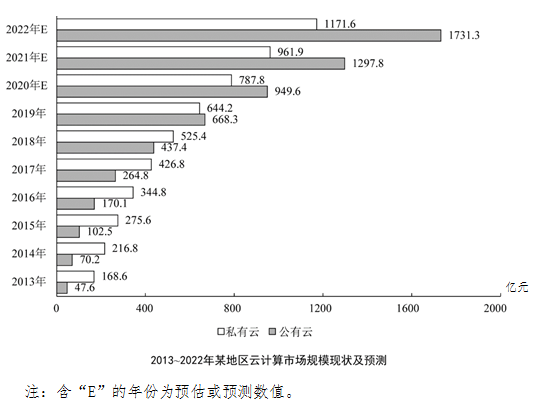

#### 第 1 题　qid 2742287 · 综合

2014年该地区私有云市场规模和公有云市场规模之比最接近以下哪一项？

- **A**. 1：4
- **B**. 4：1
- **C**. 1：3
- **D**. 3：1　✅

**答案**：D

**官方解析**

根据题干“2014年······之比······”，可判定本题为比值计算问题。定位条形图可得，2014年该地区私有云和公有云市场规模分别为216.8亿元、70.2亿元。则2014年该地区私有云市场规模和公有云市场规模之比约为。

故正确答案为D。

---

#### 第 2 题　qid 2742291 · 综合

根据预测，2021年该地区云计算整体市场规模最接近以下哪个数字？

- **A**. 1300亿元
- **B**. 1700亿元
- **C**. 2300亿元　✅
- **D**. 2900亿元

**答案**：C

**官方解析**

定位条形图可得，2021年该地区私有云和公有云市场规模分别为961.9亿元、1297.8亿元。则2021年该地区云计算整体市场规模约为亿元。

故正确答案为C。

---

#### 第 3 题　qid 2742294 · 增长

根据资料中所给数据和预测，2014-2022年间该地区公有云市场规模同比增速超过的年份有几个？

- **A**. 6
- **B**. 5
- **C**. 4　✅
- **D**. 3

**答案**：C

**官方解析**

根据题干“2014-2022年间······同比增速超过的年份有几个”，可判定本题为一般增长率问题。定位条形图，根据公式增长率可得，2014-2022年间该地区公有云市场规模同比增速分别为：2014年，，不满足；2015年，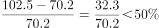，不满足；2016年，，满足；2017年，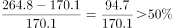，满足；2018年，，满足；2019年，，满足；2020年，，不满足；2021年，，不满足；2022年，，不满足。故该地区公有云市场规模同比增速超过的年份有2016年、2017年、2018年、2019年，共4个年份。

故正确答案为C。

---

#### 第 4 题　qid 2742301 · 增长

根据预测，2022年该地区云计算市场整体规模同比增长：

- **A**. 

- **B**. 

　✅
- **C**. 

- **D**. 

**答案**：B

**官方解析**

根据题干“2022年······同比增长”，结合选项为百分数，可判定本题为一般增长率计算问题。定位条形图可得： 2022年该地区云计算市场整体规模预测数值为亿元，2021年该地区云计算市场整体规模预测数值为亿元，则2022年该地区云计算市场整体规模同比增长率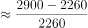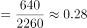，与B项最为接近。

故正确答案为B。

---

#### 第 5 题　qid 2742304 · 综合

根据材料中所给数据和预测，能够从上述资料中推出的是：

- **A**. 
2022年该地区公有云和私有云市场规模差距将超过500亿元
　✅
- **B**. 
2020年该地区公有云市场规模将首次超过私有云市场规模

- **C**. 
2019-2022年该地区私有云市场规模同比增量逐年递减

- **D**. 
2022年该地区私有云市场规模较2017年将增长以上

**答案**：A

**官方解析**

A项：定位条形图，2022年预测该地区公有云和私有云分市场规模别为1731.3亿元、1171.6亿元，则市场规模差距亿元500亿元，正确；

B项：定位条形图，2019年该地区公有云和私有云市场规模分别为668.3亿元、644.2亿元，公有云市场规模已经超过私有云市场规模，错误；

C项：定位条形图，2019-2021年，该地区私有云市场规模分别为644.2亿元、787.8亿元、961.9亿元，则2020年该地区私有云市场规模同比增量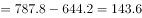亿元；2021年该地区私有云市场规模同比增量亿元，同比增量并非逐年递减，错误；

D项：定位条形图，2017年、2022年该地区私有云市场规模分别为426.8亿元、1171.6亿元，增长率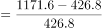，增长不足，错误。

故正确答案为A。

---

### 材料 2

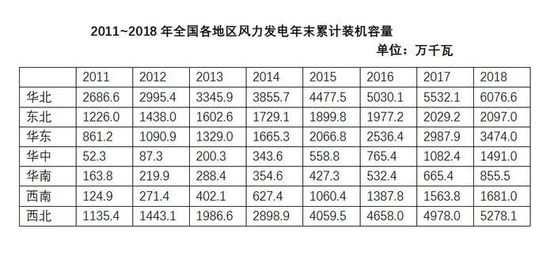

#### 第 6 题　qid 2742283 · 综合

2018年华北地区风力发电年末累计装机容量约占全国的：

- **A**. 

- **B**. 

- **C**. 

　✅
- **D**. 

**答案**：C

**官方解析**

根据题干“2018年······约占······”，结合材料给的是2011～2018年的数据，可判定本题为现期比重问题。定位表格材料最后一列，2018年华北地区风力发电年末累计装机容量为6076.6万千瓦，根据表格数据，2018年全国风力发电年末累计装机容量为万千瓦，因此2018年华北地区风力发电年末累计装机容量约占全国。

故正确答案为C。

---

#### 第 7 题　qid 2742286 · 增长

2012～2018年间，东北地区风力发电年末累计装机容量同比增速超过的年份有多少个？

- **A**. 2　✅
- **B**. 3
- **C**. 4
- **D**. 5

**答案**：A

**官方解析**

根据题干“······同比增速超过的年份有多少个”，可判定本题为一般增长率问题。定位表格材料第三行，可得2011～2018年东北地区风力发电年末累计装机容量，根据公式：增长率，则2012～2018年东北地区风力发电年末累计装机容量同比增速分别为：

2012年：，符合；

2013年：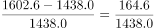，符合；

2014年：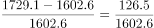，不符合；

2015年：，不符合；

2016年：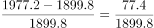，不符合；

2017年：，不符合；

2018年：，不符合。

因此符合的有2012年、2013年这两个年份。

故正确答案为A。

---

#### 第 8 题　qid 2742290 · 增长

2014年末～2018年末，西部地区（含西南和西北）风力发电累计装机容量年均增长：

- **A**. 不到800万千瓦
- **B**. 在800～850万千瓦之间
- **C**. 在850～900万千瓦之间　✅
- **D**. 超过900万千瓦

**答案**：C

**官方解析**

根据题干“2014～2018年末······年均增长”，结合选项有具体单位，可判定本题为年均增长量问题。定位表格材料倒数两行，可得2014年末西部地区（含西南和西北）风力发电累计装机容量为万千瓦，2018年末西部地区（含西南和西北）风力发电累计装机容量为万千瓦。根据公式：年均增长量，年份差为。则2014年末～2018年末，西部地区（含西南和西北）风力发电累计装机容量年均增长量万千瓦。

故正确答案为C。

---

#### 第 9 题　qid 2742293 · 增长

2012～2018年间华中地区风力发电年末累计装机容量同比增速最快的一年，当年年末华东地区风力发电累计装机容量同比增量约是华南地区的多少倍？

- **A**. 2.6
- **B**. 3.5　✅
- **C**. 4.1
- **D**. 5.1

**答案**：B

**官方解析**

根据题干“2012～2018年间······同比增速最快的一年······是······的多少倍”，结合材料所给时间为2011~2018年，可判定本题为现期倍数问题。根据公式：增长率，可得2012～2018年间华中地区风力发电年末累计装机容量同比增速分别为：2012年，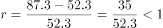；2013年，；2014年，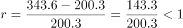；2015年，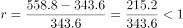；2016年，；2017年，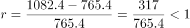；2018年，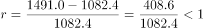；故2012～2018年间华中地区风力发电年末累计装机容量同比增速最快的一年为2013年。定位表格材料第四行可得：2013年末华东地区风力发电累计装机容量同比增量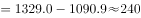万千瓦，定位表格材料倒数第三行可得：2013年年末华南地区风力发电累计装机容量同比增量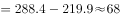万千瓦，故华东地区风力发电累计装机容量同比增量约是华南地区的倍。

故正确答案为B。

---

#### 第 10 题　qid 2742296 · 综合

能够从上述资料中推出的是：

- **A**. 2014年全国风力发电年末累计装机容量同比增量最大的地区是华北
- **B**. 2017年华北地区风力发电年末累计装机容量同比增长了一成以上
- **C**. 华中和华南地区风力发电年末累计装机容量之和在2015年末首次超过1000万千瓦
- **D**. 如保持2018年末同比增速，2020年华中地区风力发电年末累计装机容量将高于东北　✅

**答案**：D

**官方解析**

A项：定位表格材料第二行，可知2014年华北地区风力发电年末累计装机容量同比增量万千瓦；定位表格材料最后一行，可知2014年西北地区风力发电年末累计装机容量同比增量万千瓦，西北大于华北，故2014年全国风力发电年末累计装机容量同比增量最大的地区并非是华北，错误；

B项：定位表格材料第二行，可知2017年华北地区风力发电年末累计装机容量为5532.1万千瓦，2016年为5030.1万千瓦。代入公式：增长率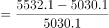，故2017年华北地区风力发电年末累计装机容量同比增长了不到一成（），错误；

C项：定位表格材料第五、六行，可知2015年末，华中地区风力发电年末累计装机容量为558.8万千瓦，华南地区风力发电年末累计装机容量为427.3万千瓦。则2015年末华中和华南地区风力发电年末累计装机容量之和为万千瓦，不足1000万千瓦，错误；

D项：定位表格材料第五行，可知2018年华中地区风力发电年末累计装机容量为1491.0万千瓦，2017年为1082.4万千瓦，代入公式：增长率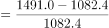，若保持2018年末同比增速（），则2020年华中地区风力发电年末累计装机容量万千瓦；定位表格材料第三行，可知2018年东北地区风力发电年末累计装机容量为2097.0万千瓦，2017年为2029.2万千瓦，代入公式：增长率，若保持2018年末同比增速（），则2020年东北地区风力发电年末累计装机容量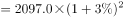＜2100×1.1=2310万千瓦＜2850万千瓦。故如保持2018年末同比增速，2020年华中地区风力发电年末累计装机容量将高于东北，正确。

故正确答案为D。

---

### 材料 3

        2018年全球茶叶产量585.6万吨，同比增长约，中国茶叶产量261.6万吨，同比增长0.7万吨。2018年，中国茶叶国内销售量为191万吨，同比增长，国内销售总额为2661亿元，出口量为36.5万吨，同比增长，出口总额为17.89亿美元（合人民币120亿元），同比增长（？）。

#### 第 11 题　qid 2742305 · 比重

2018年中国茶叶产量占全球茶叶产量的比重与2017年相比：

- **A**. 上升了约1个百分点
- **B**. 上升了约10个百分点
- **C**. 下降了约1个百分点　✅
- **D**. 下降了约10个百分点

**答案**：C

**官方解析**

根据题干“2018年······占······的比重与2017年相比”，可判定本题为两期比重计算问题。定位文字材料可得，2018年全球茶叶产量585.6万吨（），同比增长约（），中国茶叶产量261.6万吨（），同比增长0.7万吨。则2018年中国茶叶产量同比增速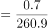，2018年与2017年相比，中国茶叶产量占全球茶叶产量的比重差为，即下降了约1个百分点。

故正确答案为C。

---

#### 第 12 题　qid 2742308 · 综合

设中国茶叶国内销售量和出口量与当年中国茶叶产量的比值分别为和，则2018年的和值与2017年分别相比：

- **A**. 
两者均下降

- **B**. 
两者均上升
　✅
- **C**. 
只有值上升

- **D**. 
只有值上升

**答案**：B

**官方解析**

根据题干“设······与······的比值分别为和，则2018年的和值与2017年分别相比”，可判定本题为比值比较问题。定位文字材料可得，2018年中国茶叶产量261.6万吨，同比增长0.7万，中国茶叶国内销售量为191万吨，同比增长（），出口量为36.5万吨，同比增长（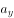）。根据本篇材料第1题的计算结果可知，2018年中国茶叶产量同比增速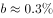，根据两期比重结论，当时，比重上升，2018年茶叶国内销售量增速（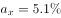）和出口量增速（）均高于茶叶产量增速（），可知2018年中国茶叶国内销售量和出口量与当年中国茶叶产量的比值均高于上年同期，即2018年的、值与2017年相比均有所上升。

故正确答案为B。

---

#### 第 13 题　qid 2742312 · 综合

资料中“（？）”处应当填入的数值最可能是以下哪一个？

- **A**. 

　✅
- **B**. 

- **C**. 

- **D**. 

**答案**：A

**官方解析**

根据题干“资料中‘（？）’处应当填入的数值最可能是以下哪一个”，结合材料可知？处为同比增速，可判定本题为一般增长率计算问题。定位文字材料及图形材料可得，2018年，中国茶叶出口总额为17.89亿美元，2017年茶叶出口量为35.5万吨，出口均价4.5千美元/吨。则2017年出口总额为，2018年出口总额同比增速为。

故正确答案为A。

---

#### 第 14 题　qid 2742314 · 综合

2016-2018年我国茶叶月均出口量约比2013-2015年间高多少万吨？

- **A**. 3.2
- **B**. 1.5
- **C**. 0.8
- **D**. 0.3　✅

**答案**：D

**官方解析**

由题干“······月均出口量约比······高多少”，结合材料时间，可判定本题为现期平均数问题。定位图形材料，2016-2018年我国茶叶出口量分别是32.9万吨、35.5万吨、36.5万吨，则2016-2018年月均出口量万吨；2013-2015年我国茶叶出口量分别是32.6万吨、30.1万吨、32.5万吨，则2013-2015年月均出口量万吨。故2016-2018年我国茶叶月均出口量约比2013-2015年间高万吨。

故正确答案为D。

---

#### 第 15 题　qid 2742319 · 综合

能够从上述资料中推出的是：

- **A**. 
2018年全球茶叶产量同比增长了20万吨以上

- **B**. 
2014-2018年间中国茶叶出口均价增速最快的年份，出口量也为正增长

- **C**. 
2017年中国茶叶出口总额同比增长了不到
　✅
- **D**. 
2018年国内销售的茶叶平均价格超过120元/市斤

**答案**：C

**官方解析**

A项：定位文字材料，2018年全球茶叶产量585.6万吨，同比增长约，根据增长量，2018年全球茶叶产量增长量万吨，不到20万吨，错误；

B项：定位图形材料，2013-2018年我国茶叶出口均价分别是3.8千美元/吨、4.2千美元/吨、4.3千美元/吨、4.5千美元/吨、4.5千美元/吨、4.9千美元/吨。则2014年-2018年出口均价的增长率分别是，，，，，比较可得2014年增速最快，根据图形材料可知，2013年茶叶出口量是32.6万吨，2014年是30.1万吨，故2014年出口量为负增长，错误；

C项：定位图形材料，2016年和2017年的茶叶出口量分别是32.9万吨和35.5万吨，2016年和2017年的茶叶均价都是4.5千美元/吨，则2016年和2017年出口总额分别是（）千美元和（）千美元，2017年中国茶叶出口总额的同比增长率，即增长率不到，正确；

D项：定位文字材料，2018年，中国茶叶国内销售量为191万吨，同比增长，国内销售总额为2661亿元，根据平均价格，可得我国茶叶国内销售的平均价格万元/吨，，元/市斤，则2018年国内销售的茶叶平均价格不到120元/市斤，错误。

故正确答案为C。

---

### 材料 4

        2016年全国女性就业人员占全社会就业人员的比重为，其中城镇单位女性就业人员6518万人，比2010年增加1656万人。

        2016年公有制企事业单位中女性专业技术人员1480万人，比2010年增加211万人，所占比重达，提高2.8个百分点；其中女性高级专业技术人员161万人，比2010年增加59.3万人，所占比重，提高3个百分点。

        2016年企业董事会中女职工董事占职工董事的比重为，企业监事会中女职工监事占职工监事的比重为，比2010年分别提高7.2和4.9个百分点；企业职工代表大会中女性代表比重为，略低于2010年0.3个百分点。

        2016年女性参加生育保险的人数达8020万人，比2010年增长。2016年，参加城镇职工基本医疗保险的女性1.4亿人，比2011年增长；参加城镇居民基本医疗保险的女性1.9亿人，比2011年增长了1.5倍。

        2016年全国参加城镇职工基本养老保险人数3.8亿人，其中女性1.8亿人，占比比2010年提高3个百分点；2016年，参加城乡居民基本养老保险人数5.1亿人，其中女性超过1.7亿人。

        2016年全国参加失业保险的人数超过1.8亿人，其中女性7551万人，分别比2010年增加4713万人和2402万人，增长约和；参加工伤保险人数2.2亿人，其中女性8129万人，分别比2010年增加5728万人和2429万人，增长约和。

#### 第 16 题　qid 2742310 · 增长

2010-2016年全国城镇单位女性就业人员年均增加约多少万人？

- **A**. 207
- **B**. 237
- **C**. 276　✅
- **D**. 331

**答案**：C

**官方解析**

根据题干“2010-2016年······年均增加约······万人”，可判定本题为年均增长量计算问题。定位文字材料第一段可得：2016年城镇单位女性就业人员6518万人，比2010年增加1656万人。根据公式：年均增长量，可得2010-2016年全国城镇单位女性就业人员年均增加万人，对应C项。

故正确答案为C。

---

#### 第 17 题　qid 2742315 · 比重

2016年公有制企事业单位中，高级专业技术人员占专业技术人员的比重约为：

- **A**. 

- **B**. 

　✅
- **C**. 

- **D**. 

**答案**：B

**官方解析**

根据题干“2016年······占······的比重······”，可判定本题为现期比重计算问题。定位文字材料第二段可得：2016年公有制企事业单位中女性专业技术人员1480万人，占比；其中女性高级专业技术人员161万人，占比。根据公式：整体，可得高级专业技术人员，专业技术人员。根据公式：比重，可得高级专业技术人员占专业技术人员的比重，对应B项。

故正确答案为B。

---

#### 第 18 题　qid 2742317 · 增长

2016年参加城镇职工和城镇居民基本医疗保险的女性比2011年增长了约多少倍？

- **A**. 0.7　✅
- **B**. 1.2
- **C**. 1.7
- **D**. 2.2

**答案**：A

**官方解析**

根据题干“2016年参加城镇职工和城镇居民基本医疗保险的女性比2011年增长了约······”，结合材料中分别给出了2016年参加城镇职工和城镇居民基本医疗保险的女性相对于2011年的增速，可判定本题为混合增长率问题。定位文字材料第四段可得：2016年，参加城镇职工基本医疗保险的女性1.4亿人，比2011年增长；参加城镇居民基本医疗保险的女性1.9亿人，比2011年增长了1.5倍。根据公式：基期量，可得2011年参加城镇职工基本医疗保险的女性人数亿人，2011年参加城镇居民基本医疗保险的女性人数亿人。根据“混合后居中”可得：，结合选项，排除C、D两项；根据“偏向基期量较大的”，结合2011年参加城镇职工基本医疗保险的女性人数（亿人）2011年参加城镇居民基本医疗保险的女性人数（亿人），可得：更接近参加城镇职工基本医疗保险的女性人数增长率（），即，即0.215倍倍，只有A项符合。

故正确答案为A。

备注：两个增长率差别大，不能近似用现期量代替基期量估算。

---

#### 第 19 题　qid 2742320 · 增长

如2017年及以后年份同比增量保持不变，同比增量按照2011-2016年间同比增量的平均值计算，全国参加失业保险的女性将在哪年超过1.2亿人？

- **A**. 2024
- **B**. 2026
- **C**. 2028　✅
- **D**. 2030

**答案**：C

**官方解析**

根据题干“······同比增量保持不变，······将在哪年超过······”，结合选项时间为2016年以后的时间，可判定本题为现期追赶问题。定位文字材料最后一段可得：2016年全国参加失业保险的人数超过1.8亿人，其中女性7551万人，分别比2010年增加4713万人和2402万人。且“同比增量按照2011-2016年间同比增量的平均值计算”， 故包括2011年的同比增量，2011-2016年间同比增量（即6年）的平均值为万人。假设年后全国参加失业保险的女性超过1.2亿人。根据公式：现期量，可得，解得，则过12年超过1.2亿人，即全国参加失业保险的女性将在年超过1.2亿人。

故正确答案为C。

---

#### 第 20 题　qid 2742322 · 综合

能够从上述资料中推出的是：

- **A**. 
2016年全国参加工伤保险的人中，女性占比低于2010年水平

- **B**. 
2010年全国参加城镇职工基本养老保险的人中，女性占比低于

- **C**. 
2010年女职工董事占职工董事的比重高于女职工监事占职工监事的比重

- **D**. 
2010年公有制企业事业单位中男性高级专业技术人员不到210万人
　✅

**答案**：D

**官方解析**

A项：定位文字材料最后一段可知，“2016年全国参加工伤保险人数2.2亿人，其中女性8129万人，分别比2010年增加······，增长约（b）和（a）”。根据两期比重比较结论：若部分增长率（a）＞整体增长率（b），则比重上升。43%（a）＞35%（b），即2016年全国参加工伤保险的人中，女性占比高于2010年水平，错误；

B项：定位文字材料第五段可知，“2016年全国参加城镇职工基本养老保险人数3.8亿人，其中女性1.8亿人，占比比2010年提高3个百分点”。则2016年全国参加城镇职工基本养老保险的人中，女性占比为，故2010年全国参加城镇职工基本养老保险的人中，女性占比为，错误；

C项：定位文字材料第三段可知，“2016年企业董事会中女职工董事占职工董事的比重为，企业监事会中女职工监事占职工监事的比重为，比2010年分别提高7.2和4.9个百分点”。则2010年女职工董事占职工董事的比重；女职工监事占职工监事的比重。可以看出，即2010年女职工董事占职工董事的比重低于女职工监事占职工监事的比重，错误；

D项：定位文字材料第二段可知，“2016年公有制企事业单位中女性专业技术人员1480万人，······其中女性高级专业技术人员161万人，比2010年增加59.3万人，所占比重，提高3个百分点”。由此可知2010年高级专业技术人员总人数为万人，2010年男性高级专业技术人员万人万人，正确。

故正确答案为D。

---
