# 2021年四川下半年公务员录用考试《行测》试题（网友回忆版）

> 省考 · 2021 年 · 6 个模块 · 共 100 题

- [政治理论](#%E6%94%BF%E6%B2%BB%E7%90%86%E8%AE%BA) · 2 题
- [常识判断](#%E5%B8%B8%E8%AF%86%E5%88%A4%E6%96%AD) · 13 题
- [言语理解与表达](#%E8%A8%80%E8%AF%AD%E7%90%86%E8%A7%A3%E4%B8%8E%E8%A1%A8%E8%BE%BE) · 30 题
- [数量关系](#%E6%95%B0%E9%87%8F%E5%85%B3%E7%B3%BB) · 10 题
- [判断推理](#%E5%88%A4%E6%96%AD%E6%8E%A8%E7%90%86) · 30 题
- [资料分析](#%E8%B5%84%E6%96%99%E5%88%86%E6%9E%90) · 15 题

---

## 政治理论

### 第 1 题　qid 4658511 · 新思想

习近平总书记在谈及生态文明建设时指出：“我们既要绿水青山，也要金山银山。宁要绿水青山，不要金山银山，而且绿水青山就是金山银山。”关于生态文明建设，下列理解正确的是：
①人与自然的关系是人类社会最基本的关系
②良好的生态环境是最公平的公共产品，是最普惠的民生福祉
③生态环境问题归根结底是气候变化问题
④绿水青山中蕴含着经济价值

- **A**. ①②③
- **B**. ②③④
- **C**. ①②④　✅
- **D**. ①③④

**答案**：C

**官方解析**

本题考查政治常识。
①正确，习近平总书记指出，人因自然而生，人与自然是一种共生关系。“共生”就是共同生活或者共同生存，强调了人与自然之间形成的紧密互利、不可分割的关系。“生命共同体”体现了与物共适、美美与共的有机整体世界观和有机整体生命观。人与自然的关系是人类社会最基本的关系。自然界是人类社会产生、存在和发展的基础和前提，人类可以通过社会实践活动有目的地利用自然、改造自然，但是人类的行为方式必须符合自然规律，而不能凌驾于自然之上。
②正确，2013年4月，习近平总书记在海南考察时指出，良好生态环境是最公平的公共产品，是最普惠的民生福祉。
③错误，2014年12月9日，习近平总书记在中央经济工作会议上的讲话中指出，生态环境问题归根到底是经济发展方式问题，要坚持源头严防、过程严管、后果严惩，治标治本多管齐下，朝着蓝天净水的目标不断前进。这是利国利民利子孙后代的一项重要工作，决不能说起来重要、喊起来响亮、做起来挂空挡。
④正确，2019年4月28日，习近平总书记在中国北京世界园艺博览会开幕式上的讲话中指出，我们应该追求绿色发展繁荣。绿色是大自然的底色。我一直讲，绿水青山就是金山银山，改善生态环境就是发展生产力。良好生态本身蕴含着无穷的经济价值，能够源源不断创造综合效益，实现经济社会可持续发展。
综上所述，理解正确的是①②④。
故正确答案为C。

---

### 第 2 题　qid 4658512 · 新思想

习近平总书记在一系列重要讲话文章中，善于引用经典名句，恰到好处地表达了中国共产党人的立场、观点和方法。习近平总书记在阐述中国共产党人的为民情怀和人民立场时引用的经典名句是：

- **A**. 政者，正也，其身正，不令而行；其身不正，虽令不从
- **B**. 如身使臂，如臂使指，叱咤变化，无有留难，则天下之势一矣
- **C**. 衙斋卧听萧萧竹，疑是民间疾苦声。些小吾曹州县吏，一枝一叶总关情　✅
- **D**. 图难于其易，为大于其细。天下难事，必作于易；天下大事，必作于细

**答案**：C

**官方解析**

本题考查政治常识。
A项错误，“政者，正也，其身正，不令而行；其身不正，虽令不从”出自《论语·子路》，意思是当政者本身言行端正，不用发号施令，大家自然起身效法，政令将会畅行无阻；如果当政者本身言行不正，虽下命令，大家也不会服从遵守。2015年3月5日，习近平总书记在参加十二届全国人大三次会议上海代表团审议时强调，当官就不要发财，发财就不要当官。对领导干部配偶和子女等经商办企业，党纪国法都有明确规定，问题是没有落实好。对领导干部，要求就是要严一些，正所谓“其身正，不令而行；其身不正，虽令不从”。体现的是对干部自身的要求。
B项错误，“如身使臂，如臂使指，叱咤变化，无有留难，则天下之势一矣”在《汉书·贾谊传》《宋史纪事本末》等典籍中可见相关表述，意思是政令执行如同身体驱使手臂，手臂驱使手指，指挥自如，没有困阻，这样一来全国上下便步调一致、行动统一。2018年7月3日，习近平总书记在全国组织工作会议上发表重要讲话指出，我们党是按照马克思主义建党原则建立起来的，形成了包括党的中央组织、地方组织、基层组织在内的严密组织体系。这是世界上任何其他政党都不具有的强大优势。党中央是大脑和中枢，党中央必须有定于一尊、一锤定音的权威，这样才能“如身使臂，如臂使指，叱咤变化，无有留难，则天下之势一矣”。强调维护党中央权威和集中统一领导。
C项正确，“衙斋卧听萧萧竹，疑是民间疾苦声。些小吾曹州县吏，一枝一叶总关情”出自清代郑燮的《潍县署中画竹呈年伯包大中丞括》，意思是在衙门里休息的时候，听见竹叶萧萧作响，仿佛听见了百姓啼饥号寒的怨声。2014年5月习近平总书记在参加兰考县委常委班子专题民主生活会时的讲话中指出，清代郑板桥，以画家、文学家著称于世，长期在河南范县、山东潍县担任知县。他重视农桑、赈济灾民，案无留犊、室无贿赂、清正廉明，深得百姓拥戴，其诗句“衙斋卧听萧萧竹，疑是民间疾苦声。些小吾曹州县吏，一枝一叶总关情”，成为千古流传的爱民心声。体现了中国共产党人的为民情怀和人民立场。
D项错误，“图难于其易，为大于其细。天下难事，必作于易；天下大事，必作于细”出自《老子·第六十三章》，意思是谋求解决难题的办法，要从容易之处开始，成就大事的行动，要从细微之处起步。天下所有的难事，必须从易事做起；天下所有的大事，必须从小处着手。2014年4月1日，习近平总书记在比利时布鲁日欧洲学院发表演讲时指出，“图难于其易，为大于其细。天下难事，必作于易；天下大事，必作于细。”随着中国改革不断推进，中国必将继续发生深刻变化。同时，我也相信，中国全面深化改革，不仅将为中国现代化建设提供强大推动力量，而且将为世界带来新的发展机遇。体现了改革的决心。
故正确答案为C。

---

## 常识判断

### 第 1 题　qid 4658514 · 人文常识

社会治理现代化是国家治理体系和治理能力现代化的题中应有之义。关于社会治理现代化的内容，下列表述正确的是：
①社会治理结构的合理化
②社会治理过程的民主化
③社会治理方式的科学化
④社会治理目标的多样化

- **A**. ①②③　✅
- **B**. ①③④
- **C**. ①②④
- **D**. ②③④

**答案**：A

**官方解析**

本题考查政治常识。
①②③正确，④错误，作为国家治理的重要领域，社会治理必须正确处理好维稳与维权、活力与秩序的关系，充分调动一切积极因素，确保社会既充满生机活力又保持安定有序。因此，提高社会治理效能，助推社会治理现代化，是完善国家治理体系和提升治理能力的应有之义。当前我国社会治理体系不断完善，社会安全稳定形势持续向好，人民生命财产安全得到有效维护，人民群众对社会事务参与意愿更加强烈，广大人民群众的安全感和满意度不断增强。提高治理效能，加强和创新社会治理，逐步实现社会治理结构的合理化、治理方式的科学化、治理过程的民主化，将有力推进国家治理现代化的进程。
故正确答案为A。

---

### 第 2 题　qid 4658515 · 人文常识

“十四五”规划纲要指出，全面推进健康中国建设，构建强大公共卫生体系。下列不属于公共卫生范畴的是：

- **A**. 大病医疗保障　✅
- **B**. 食品安全风险监测
- **C**. 流感流行应急预案
- **D**. 预防艾滋病母婴传播

**答案**：A

**官方解析**

本题考查政治常识。
A项错误，B、C、D三项正确，公共卫生，是全社会的公私机构、大小社群以及所有个人，通过有组织的努力与有根据的选择，来预防疾病、延长寿命并促进健康的科学与技术。公共卫生具体包括对重大疾病，尤其是传染病（如结核、艾滋病、SARS、新冠肺炎等）的预防、监控和治疗；对食品、药品、公共环境卫生的监督管制，以及相关的卫生宣传、健康教育、免疫接种等。
本题为选非题，故正确答案为A。

---

### 第 3 题　qid 4658516 · 法律常识

为了加强安全生产工作，防止和减少生产安全事故、保障人民群众生命和财产安全，促进经济社会持续健康发展，我国制定了相关的法律法规。根据我国安全生产管理的相关制度，下列说法错误的是：

- **A**. 建设工程施工单位应当在施工现场入口处设置明显的安全警示标志
- **B**. 烟花爆竹生产企业若未取得安全生产许可证的，不得从事生产活动
- **C**. 大型游乐设施属于特种设备，使用单位应当记录其日常使用情况
- **D**. 电梯应当至少每30日进行一次清洁、润滑、调整和检查　✅

**答案**：D

**官方解析**

本题考查法律常识。
A项正确，根据《建设工程安全生产管理条例》第二十八条第一款规定：“施工单位应当在施工现场入口处、施工起重机械、临时用电设施、脚手架、出入通道口、楼梯口、电梯井口、孔洞口、桥梁口、隧道口、基坑边沿、爆破物及有害危险气体和液体存放处等危险部位，设置明显的安全警示标志。安全警示标志必须符合国家标准。”
B项正确，根据《烟花爆竹生产企业安全生产许可证实施办法》第三条规定：“企业应当依照本办法的规定取得烟花爆竹安全生产许可证（以下简称安全生产许可证）。未取得安全生产许可证的，不得从事烟花爆竹生产活动。”
C项正确，根据《中华人民共和国特种设备安全法》第二条第二款规定：“本法所称特种设备，是指对人身和财产安全有较大危险性的锅炉、压力容器（含气瓶）、压力管道、电梯、起重机械、客运索道、大型游乐设施、场（厂）内专用机动车辆，以及法律、行政法规规定适用本法的其他特种设备。”第三十五条规定：“特种设备使用单位应当建立特种设备安全技术档案。安全技术档案应当包括以下内容：（一）特种设备的设计文件、产品质量合格证明、安装及使用维护保养说明、监督检验证明等相关技术资料和文件；（二）特种设备的定期检验和定期自行检查记录；（三）特种设备的日常使用状况记录；（四）特种设备及其附属仪器仪表的维护保养记录；（五）特种设备的运行故障和事故记录。”
D项错误，根据《特种设备安全监察条例》第三十一条规定：“电梯的日常维护保养必须由依照本条例取得许可的安装、改造、维修单位或者电梯制造单位进行。电梯应当至少每15日进行一次清洁、润滑、调整和检查。”
本题为选非题，故正确答案为D。

---

### 第 4 题　qid 4658481 · 人文常识

组织是经设计以达到某种特定目标的社会群体，下列关于组织的判断正确的是：

- **A**. 我国的共青团属于政府组织
- **B**. 机关的合唱团属于非正式组织　✅
- **C**. 社区是城市最基层的政府组织
- **D**. 职业足球俱乐部不属于经济组织

**答案**：B

**官方解析**

本题考查管理常识。
A、C两项错误，政府组织指国家的行政机关，即根据宪法和法律组建的、正是行政权力、执行行政职能、推行政务、管理国家公共事务的机关体系，是国家权力机关的执行机关。共青团不具有行政管理职能，不属于政府组织；社区是若干社会群体或社会组织聚集在某一个领域里所形成的一个生活上相互关联的大集体，是综合基础的群众基础机构，不具有行政管理职能，不属于政府组织。
B项正确，非正式组织指以情感、兴趣、爱好和需要为基础，以满足个体的不同需要为纽带，没有正式文件规定的、自发形成的一种开放式的社会组织。机关合唱团的组成没有正式文件规定，是喜欢合唱的人员自发形成的，属于非正式组织。
D项错误，经济组织是指如家庭、企业、公司等按一定方式组织生产要素进行生产、经营活动的单位，是一定的社会集团为了保证经济循环系统的正常运行，通过权责分配和相应层次结构所构成的一个完整的有机整体。职业足球俱乐部是进行经营活动的有机整体，属于经济组织。
故正确答案为B。

---

### 第 5 题　qid 4658484 · 人文常识

下列名言与作者对应不正确的是：

- **A**. 疾风知劲草，板荡识诚臣——刘邦　✅
- **B**. 世有伯乐，然后有千里马——韩愈
- **C**. 江山代有才人出，各领风骚数百年——赵翼
- **D**. 大鹏一日同风起，扶摇直上九万里——李白

**答案**：A

**官方解析**

本题考查人文常识。
A项错误，“疾风知劲草，板荡识诚臣”出自唐代李世民的《赐萧瑀》，意思是只有经过疾风的考验，才会知道什么是劲草；社会动荡，才能分辨出谁是忠臣。这是李世民对萧瑀的高度赞美和肯定，其中也不无感激之情。
B项正确，“世有伯乐，然后有千里马”出自唐代韩愈的《韩昌黎集·杂说》，意思是世间因有善识千里马的人然后才能有千里马。喻指人才常有，而能识才用才的人却难能可贵。
C项正确，“江山代有才人出，各领风骚数百年”出自清代赵翼的《论诗五首·其二》，意思是国家代代都有很多有才情的人，他们的诗篇文章以及人气都会流芳百世。
D项正确，“大鹏一日同风起，扶摇直上九万里”出自唐代李白的《上李邕》，意思是大鹏总有一天会和风飞起，凭借风力直上九霄云外。
本题为选非题，故正确答案为A。

---

### 第 6 题　qid 4658486 · 人文常识

人体包括运动系统、神经系统、内分泌系统、循环系统、呼吸系统、消化系统、泌尿系统、生殖系统这八大系统，关于人体八大系统，下列说法错误的是：

- **A**. 唾液腺和胃腺是消化腺，属于消化系统
- **B**. 组成人体循环系统的是体循环和肺循环　✅
- **C**. 糖尿病是内分泌系统紊乱所导致的疾病
- **D**. 泌尿系统由肾、输尿管、膀胱及尿道组成

**答案**：B

**官方解析**

本题考查科技常识。
A项正确，人体消化系统由消化道和消化腺两大部分组成。人体消化道包括口腔、咽、食管、胃、小肠(包括十二指肠、空肠、回肠)和大肠(包括盲肠、阑尾、结肠、直肠)。消化腺包括唾液腺、胃腺、肝脏、胰腺、肠腺，其主要功能是分泌消化液，参与消化。
B项错误，循环系统是分布于全身各部的连续封闭管道系统，它包括心血管系统和淋巴系统。心血管系统内循环流动的是血液，包括心、动脉、毛细血管和静脉。血液由心室射出，经动脉、毛细血管、静脉返回心房，这种周而复始循环不止的过程称血液循环，根据循环途径不同，可分为体循环和肺循环。淋巴系统内流动的是淋巴液。淋巴液沿着一系列的淋巴管道向心流动，最终汇入静脉，因此淋巴系统也可认为是静脉系统的辅助部分。
C项正确，内分泌系统紊乱，即内分泌失调。人体分泌各种激素和神经系统一起调节人体的代谢和生理功能。正常情况下各种激素是保持平衡的。如因某种原因使这种平衡打破了（某种激素过多或过少）这就造成内分泌紊乱，会引起相应的临床表现。糖尿病是一组以高血糖为特征的代谢性疾病。高血糖则是由于胰岛素分泌缺陷或其生物作用受损，或两者兼有引起。
D项正确，泌尿系统由肾脏、输尿管、膀胱及尿道组成。其主要功能为排泄。排泄是指机体代谢过程中所产生的各种不为机体所利用或者有害的物质向体外输送的生理过程。
本题为选非题，故正确答案为B。

---

### 第 7 题　qid 4658491 · 地理国情

关于地理知识，下列说法错误的是：

- **A**. 北京的气候类型特点是夏季高温多雨，冬季寒冷干燥
- **B**. 南北归线之间的区域每年太阳直射两次，形成热带
- **C**. 欧亚地震带，环太平洋地震带分别主要影响着我国西南部、中部地区　✅
- **D**. 北回归线自西向东依次穿越我国的云贵高原、东南丘陵等主要地形区

**答案**：C

**官方解析**

本题考查地理国情。

A项正确，北京地区属于华北，气候为暖温带半湿润半干旱季风气候，夏季高温多雨，冬季寒冷干燥，春、秋短促。全年无霜期180～200天，西部山区较短。2007年平均降雨量483.9毫米，为华北地区降雨最多的地区之一。降水季节分配很不均匀，全年降水的80%集中在夏季6、7、8三个月，7、8月有大雨。

B项正确，回归线指的是地球上南、北纬的两条纬度圈，是太阳每年在地球上直射来回移动的分界线。北纬称为北回归线，是阳光在地球上直射点的最北界线。南纬称为南回归线，是阳光在地球上直射点的最南界线。南北回归线是热带和南北温带间的分界线。北回归线和南回归线之间的地区为热带，这个区域太阳每年直射两次，获得的热量最多。

C项错误，欧亚地震带主要分布于欧亚大陆，从印度尼西亚开始，经中南半岛西部和我国的云、贵、川、青、藏地区，以及印度、巴基斯坦、尼泊尔、阿富汗、伊朗、土耳其到地中海北岸，一直延伸到大西洋的亚速尔群岛。环太平洋地震带是一个围绕太平洋经常发生地震和火山爆发的地区，有一连串海沟、列岛和火山。它像一个巨大的环，围绕着太平洋分布，主要影响我国台湾和福建等东部地区。

D项正确，北回归线在中国境内自西往东穿过的地区依次是：云南、广西、广东、台湾四省区，自西向东依次穿越我国的云贵高原、东南丘陵等主要地形区。

本题为选非题，故正确答案为C。

---

### 第 8 题　qid 4658493 · 人文常识

关于我国名胜古迹，下列说法错误的是：

- **A**. 桂林山水是典型的丹霞地貌　✅
- **B**. 敦煌石窟是世界现存壁画最多的石窟群
- **C**. 秦始皇陵兵马俑大部分采用泥土陶冶烧制
- **D**. 万里长城的修建是为了抵御游牧部落的侵扰

**答案**：A

**官方解析**

本题考查地理国情。

A项错误，桂林山水属于喀斯特地貌，也称岩溶地貌，而非丹霞地貌，桂林地区的岩溶洞穴，分布广(2400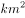)，数量多(达3000多个)，内容丰富，具多方面的研究和开发利用价值。

B项正确，敦煌石窟，即莫高窟，位于甘肃敦煌县城东南25公里处。始建于前秦建元二年（366年），经北魏、西魏、北周、隋、唐、五代、宋、西夏、元诸代相继凿建，成为庞大的石窟群，是我国乃至世界壁画最多、内容最丰富的石窟壁画。它与雕塑、建筑组成艺术的综合体，成为举世闻名的艺术宝库。

C项正确，兵马俑大部分是采用陶冶烧制的方法制成，先用陶模做出初胎，再覆盖一层细泥进行加工刻画加彩，有的先烧后接，有的先接再烧。火候均匀、色泽单纯、硬度很高。每一道工序中，都有不同的分工，都有一套严格的工作系统。

D项正确，万里长城是古代中国在不同时期为抵御塞北游牧部落联盟侵袭而修筑的规模浩大的军事工程的统称。长城东西绵延上万华里，因此又称作万里长城。现存的长城遗迹主要为明长城，西起嘉峪关，东至辽东虎山。

本题为选非题，故正确答案为A。

---

### 第 9 题　qid 4658476 · 科技常识

关于病毒，下列说法错误的是：

- **A**. 利用寄主细胞中的物质和能量，以复制的方式进行繁殖
- **B**. 据寄生的寄主不同分为动物病毒、植物病毒、细菌病毒
- **C**. 多数耐寒不耐热且对抗生素不敏感，可用碘化物等灭活
- **D**. 含有一种或两种核酸：DNA或RNA，或两种核酸兼有　✅

**答案**：D

**官方解析**

本题考查科技常识。
A项正确，病毒是一种个体微小，结构简单，必须在活细胞内寄生并以复制方式增殖的非细胞型生物。病毒离开宿主细胞，就成了没有任何生命活动、也不能独立自我繁殖的化学物质。它的复制、转录、和转译都是在宿主细胞中进行，当它进入宿主细胞后，它就可以利用细胞中的物质和能量完成生命活动，按照它自己的核酸所包含的遗传信息产生和它一样的新一代病毒。
B项正确，根据病毒寄生的宿主细胞的不同，病毒分为植物病毒、动物病毒和细菌病毒（噬菌体是侵袭细菌的病毒）。
C项正确，大多数病毒耐冷不耐热，对热不稳定。高温会使病毒的蛋白质变性。病毒对抗生素不敏感。碘能引起蛋白质变性（形成碘化蛋白质）而具有极强的杀菌力，能杀死细菌、霉菌、芽胞和病毒，碘化物（如碘酒、碘甘油等）可以杀灭病毒。
D项错误，病毒结构简单，只含一种核酸（DNA或RNA），从结构上还分为：单链RNA病毒，双链RNA病毒，单链DNA病毒和双链DNA病毒。
本题为选非题，故正确答案为D。

---

### 第 10 题　qid 4658479 · 人文常识

关于消防安全知识，下列说法错误的是：

- **A**. 居民小区消防通道宽度不应小于4米
- **B**. 电器着火、油着火时不能用水去扑救
- **C**. 生活区域应配置的灭火器为泡沫灭火器　✅
- **D**. 高层民用建筑内不得用瓶装液化石油气

**答案**：C

**官方解析**

本题考查科技常识。
A项正确，根据《中华人民共和国国际标准GB 50016-2006 建筑设计防火规范》：6.0.9消防车道的净宽度和净空高度均不应小于4.0m。即小区的消防车道最基本的标准是4米宽4米高。
B项正确，电器着火不能用水扑救，因为电器一般来说都是带电的，而泼上去的水是能导电的，用水救火可能会使人触电。油比水轻，当油着火的时候，如果泼水灭火，水会沉到油层底下去，使油层往上涨，大大增加它与空气接触的面积，导致火越烧越旺。
C项错误，生活区域配备的灭火器类型是干粉灭火器或者二氧化碳灭火器。泡沫灭火器最适宜扑救B类火灾，如汽油、柴油等液体火灾；也可用来扑灭A类火灾，如木材、棉布等固体物质燃烧引起的失火。
D项正确，瓶装液化石油气一旦泄漏会迅速气化，火灾危险系数高。高层建筑在人员疏散、扑救火灾上难度较高，而且运输不方便，如用电梯运输气瓶，一旦液化气漏入电梯中，容易发生严重爆炸事故。
本题为选非题，故正确答案为C。
注：本题A项说法不严谨，应为居民小区消防车道宽度不应小于4米。

---

### 第 11 题　qid 4658489 · 科技常识

石墨是一种①化合物，能够②导电，可用作③润滑剂，与金刚石互为④同素异形体。关于石墨性质的描述，画线部分错误的有几处?

- **A**. 1　✅
- **B**. 2
- **C**. 3
- **D**. 4

**答案**：A

**官方解析**

本题考查科技常识。
①错误，④正确，化合物是由两种或两种以上不同元素组成的纯净物（区别于单质）。石墨与金刚石、碳60、碳纳米管、石墨烯等都是碳元素的单质，它们互为同素异形体。
②正确，石墨的导电性比一般非金属矿高一百倍。石墨能够导电是因为石墨中每个碳原子与其他碳原子只形成3个共价键，每个碳原子仍然保留1个自由电子来传输电荷。
③正确，石墨的润滑性能取决于石墨鳞片的大小，鳞片越大，摩擦系数越小，润滑性能越好。
故②③④正确，①错误。
本题为选非题，故正确答案为A。

---

### 第 12 题　qid 4658496 · 科技常识

下列教学行为与体现的教学原则对应不正确的是：

- **A**. 陈老师在讲完一节课后，会给学生布置与上课内容相关的作业——巩固性原则
- **B**. 王老师在上新课时讲到“镭”这一元素，向同学们介绍了居里夫人和镭的故事，同学们深受教育——启发性原则　✅
- **C**. 刘老师对马虎的学生，注意抓他们的学习习惯，对课堂反应不积极的学生，激励他们主动回答问题——因材施教原则
- **D**. 李老师在讲《黄河大合唱》一文时，为了让学生更好地感受到《黄河大合唱》的气势，播放了对应歌曲——直观性原则

**答案**：B

**官方解析**

本题考查管理常识。
A项正确，巩固性原则是指教学中使学生在理解的基础上，将知识、技能牢固地保持在记忆中，达到熟练程度，需要时能及时、准确地再现。巩固知识、技能的主要方法是复习和练习。运用已经学过的知识解释新的事实或解决实际问题，是最有效地巩固旧知识的方法。陈老师布置与上课内容相关的作业是为了让学生复习课堂上所学的知识，体现了巩固性原则。
B项错误，启发性原则是指在教学中教师要承认学生是学习的主体，在教学工作中依据学习过程的客观规律，运用各种教学手段充分调动学生学习主动性、积极性，引导他们独立思考，积极探索，自觉地掌握科学知识、提析和解决问题的能力的教学原则。王老师介绍居里夫人和镭的故事没有体现出学生是学习的主体。
C项正确，因材施教原则是指教师要从学生实际情况、个别差异出发，有的放矢地进行有差别的教学，使每一个学生都能扬长避短，获得最佳发展。刘老师对不同的学生注意加强他们的不同方面，体现了因材施教原则。
D项正确，直观性原则是指教学中引导学生直接感知事物、模型或通过教师形象语言描绘学习对象，使学生获得感性认识。反映了从感性到理性的认识发展规律。李老师播放《黄河大合唱》属于直观性原则的电教应用中的语言直观。
本题为选非题，故正确答案为B。

---

### 第 13 题　qid 4658499 · 科技常识

辛弃疾所作《生查子·独游雨岩》写到：“溪边照影行，天在清溪底”。下列诗句中与此情景体现的物理原理一致的是：

- **A**. 举杯邀明月，对影成三人
- **B**. 潭清疑水浅，荷动知鱼散
- **C**. 独行潭底影，数息树边身　✅
- **D**. 香炉初上日，瀑水喷成虹

**答案**：C

**官方解析**

本题考查科技常识。
“溪边照影行，天在清溪底”意思是人在溪边行走溪水映照出人影，蓝天倒映在清清的溪水里。体现的物理原理是光的反射，指当光在两种物质分界面上改变传播方向又返回原来物质中的现象。光遇到水面、玻璃以及其他许多物体的表面都会发生反射。
A项错误，“对影成三人”（月亮、作者及其影子是为“三人”）中影子的形成是由于光的直线传播。光在同一种均匀介质中沿直线传播，当遇到障碍物遮挡时，由于光线不能穿过而在障碍物后形成阴影区，是为影子。
B项错误，“潭清疑水浅”意思是潭水清澈见底，感觉潭水很浅，原因是光线发生折射，当光线从水或其它介质中斜射入空气中时，折射光线会远离法线，因此，人会感觉池水变浅。
C项正确，“独行潭底影，数息树边身”意思是潭水中倒映着他独行的身影，他多次身倚树边休息。体现的物理原理是光的反射，与题干一致。
D项错误，“香炉初上日，瀑水喷成虹”意思是香炉峰升起一轮红日，飞瀑映照幻化成彩虹。彩虹的形成需要两个条件：①空气中有小水滴；②有光。当阳光照射到小水滴时，光线被折射和反射（阳光进入水滴，先折射一次，然后在水滴的背面反射，最后离开水滴时再折射一次，总共经过一次反射两次折射），不同波长的光折射率不同，所以就可以看到由外到内红、橙、黄、绿、蓝、靛、紫的七色彩虹。
故正确答案为C。

---

## 言语理解与表达

### 第 1 题　qid 4658471 · 逻辑填空

明确规定儿童票从“量身高”转为“看年龄”，顺应了公众普遍期待的改革方向，也是对相关概念的“            ”。无论是联合国儿童权利公约，还是我国相关法律法规，界定儿童的唯一标准就是年龄。
填入画横线部分最恰当的一项是：

- **A**. 追根究底
- **B**. 条分缕析
- **C**. 正本清源　✅
- **D**. 求真务实

**答案**：C

**官方解析**

根据横线后“界定儿童的唯一标准就是年龄”可知，明确规定儿童票从“量身高”转为“看年龄”是对相关概念有了更清晰的认知。C项“正本清源”指从根本上加以整顿清理，表示从根本上彻底解决问题，改变了以往的错误认知，符合文意，当选。A项“追根究底”意思是追究根底，一般指追问一件事的原由，文段并没有要去追问儿童票规定的原由是什么，不符合文意，排除；B项“条分缕析”形容分析得条理分明，极为严谨，文段并无细致分析的意思，不符合文意，排除；D项“求真务实”指要求真实的，不是虚假的，规定儿童票从“量身高”转为“看年龄”并不是让相关概念变真实了，而是有了更清晰的认知，不符合文意，排除。
故正确答案为C。
【文段出处】《南方日报：儿童票看年龄更加公平》

---

### 第 2 题　qid 4658473 · 逻辑填空

创新面对的最大难题是高失败率。高失败率导致创新的        太高，于是一些创业者便选择“拷贝”、模仿别人的创新。不过，哪怕创新失败的人也应得到社会的        ，因为正是不断的失败，造就了真正的创新者。
依次填入画横线部分最恰当的一项是：

- **A**. 门槛 理解
- **B**. 风险 同情
- **C**. 投入 认可
- **D**. 成本 尊重　✅

**答案**：D

**官方解析**

本题可从第二空入手，根据“因为正是不断的失败，造就了真正的创新者”可知，失败的创新也是有价值的，并非没有用处，因此创新失败的人同样是有价值的，横线处应体现出创新失败的人因为自身的价值，也应该得到社会的尊敬和重视。D项“尊重”指尊敬，重视并严肃对待，符合文意，保留。A项“理解”指懂，了解，体现不出得到社会重视，进而说明失败的创新一样有价值之意，排除；B项“同情”指对于别人的遭遇在感情上发生共鸣，体现不出创新失败的人同样有价值之意，排除；C项“认可”指许可、同意，同样体现不出创新失败的人同样有价值之意，排除。
第一空，代入验证，因失败率高，所以创新的“成本”高，D项“成本”符合文意，当选。
故正确答案为D。
【文段出处】《雷军：创新就是做别人没干过或干砸的事》

---

### 第 3 题　qid 4658475 · 逻辑填空

媒体一直被认为是社会的        ，通过新闻事实选择、新闻价值判断等新闻生产机制，对大千世界的变动进行舆论监督，进而        公众对大部分人所无法亲身经历和体验的事实的了解和认知，发挥着议程设置和社会协调的功能。
依次填入画横线部分最恰当的一项是：

- **A**. 守望者 影响　✅
- **B**. 掌控者 引导
- **C**. 巡夜人 激发
- **D**. 代言人 左右

**答案**：A

**官方解析**

第一空，横线处形容媒体和社会的关系，根据后文“对大千世界的变动进行舆论监督”可知，横线处表达媒体可以进行监督之意。A项“守望者”指在城墙上昼夜看守城池，为城内的人提供危险预警的人，能够体现监督之意，保留。B项“掌控者”指能够掌握、控制局面的人，文段仅表达媒体能够起到监督作用，并未提及媒体能够完全控制社会，程度过重，排除；C项“巡夜人”指在夜间巡逻的人，媒体并非只在夜间活动，不符合文意，排除；D项“代言人”指代表某方面（阶级、集团等）发表言论的人，文段并未提及代表社会发言，不符合文意，排除。
第二空，代入验证，横线处与“了解”和“认知”搭配，A项“影响”指对他人或周围事物起作用，语义恰当，且“影响了解”“影响认知”均搭配恰当，当选。
故正确答案为A。
【文段出处】《算法推送新闻中的认知窄化及其规避》

---

### 第 4 题　qid 4658483 · 逻辑填空

人际纠葛的处理方式直接体现社会成员的精神面貌与人格修养，也反映一个社会的文明程度。一些人面对磕磕碰碰，不是            ，而是火冒三丈；不是冷静应对，而是宣泄情绪。心态失衡、情绪失控，可能有压力过大等原因，但互联网上日渐增多的谩骂，现实中时有所闻的暴力，都提醒人们，“心灵炎症”需要疗治，理性        需要弥补。
依次填入画横线部分最恰当的一项是：

- **A**. 宽以待人 瑕疵
- **B**. 平心静气 缺失　✅
- **C**. 从容不迫 缺陷
- **D**. 据理力争 匮乏

**答案**：B

**官方解析**

第一空，根据“不是······而是”可知，横线处所填成语与“火冒三丈”构成反义并列，“火冒三丈”形容十分生气，故横线处应表达平静的意思。B项“平心静气”意思是心情平和，态度冷静，符合文意，保留。A项“宽以待人”意思是以宽宏大度的态度来对待别人，文段并未涉及对他人的态度，与文意不符，排除；C项“从容不迫”意为态度镇静沉着，不慌不忙，其反义应强调慌张，无法与“火冒三丈”构成反义并列，排除；D项“据理力争”意为根据事理，极力争辩或尽力争取，无法体现平静之意，排除。
第二空，代入验证，搭配“理性”，且根据横线后“需要弥补”可知，横线处意为缺少理性。B项“缺失”指缺少、有缺陷，搭配恰当，当选。
故正确答案为B。
【文段出处】《挥拳相向成部分人处理纠纷手段 分析称折射暴戾心态》

---

### 第 5 题　qid 4658490 · 逻辑填空

虽然美洲人很早就把玉米作为主食，但欧洲人对此            。直到15世纪末哥伦布到了北美，才发现这种美妙的粮食。不过，粮食与物种的传播过程，历来            ，也有人认为在哥伦布之前玉米就传到了欧洲。
依次填入画横线部分最恰当的一项是：

- **A**. 不屑一顾 莫衷一是
- **B**. 不以为然 不言自明
- **C**. 嗤之以鼻 见仁见智
- **D**. 浑然不知 众说纷纭　✅

**答案**：D

**官方解析**

第一空，根据后文“直到15世纪末哥伦布到了北美，才发现这种美妙的粮食”可知，直到15世纪欧洲人才发现玉米，横线处成语应体现欧洲人之前不知道还存在玉米之意，D项“浑然不知”形容糊里糊涂，什么都不知道，符合文意，保留。A项“不屑一顾”指不值得一看，形容极端轻视，B项“不以为然”即不认为是对的，表示不同意，C项“嗤之以鼻”即表示轻蔑，看不起，均强调已经发现玉米但是不重视、不认为玉米可以做主食，与文意不符，排除。
第二空，代入验证，根据前文“直到15世纪末哥伦布到了北美，才发现这种美妙的粮食”和后文“也有人认为在哥伦布之前玉米就传到了欧洲”可知，对于玉米的传播过程说法不统一，D项“众说纷纭”指各式各样的说法纷乱不一致，符合文意，当选。
故正确答案为D。
【文段出处】《玉米和吸血鬼》

---

### 第 6 题　qid 4658500 · 逻辑填空

在多元共生的文化语境里，影视艺术            。然而，近年来一些有悖于主流价值观和审美观的作品混入其中，甚至大行其道。而一些观众尤其是年轻观众却对这些作品            ，并由此产生认同和效仿，让不良思想渐次蔓延。
依次填入画横线部分最恰当的一项是：

- **A**. 异彩纷呈 趋之若鹜　✅
- **B**. 百花齐放 津津乐道
- **C**. 日新月异 乐此不疲
- **D**. 别具一格 奉若圭臬

**答案**：A

**官方解析**

第一空，根据“多元共生的文化语境”可知，横线处所填成语需体现影视艺术多种多样之意。A项“异彩纷呈”比喻突出的成就或表现纷纷呈现，B项“百花齐放”比喻不同形式和风格的各种艺术作品自由发展，均符合文意，保留。C项“日新月异”指每天每月都有新的变化，形容发展、进步很快，D项“别具一格”比喻另有一种独特的风格，均与文意不符，排除。
第二空，根据“并由此产生认同和效仿”可知，横线处表达一些观众模仿、追捧这些有悖于主流价值观和审美观的作品，感情色彩偏消极。A项“趋之若鹜”比喻许多人争着去追逐，符合文意，当选。B项“津津乐道”形容对这件事十分地感兴趣，很感兴趣地谈论，是中性词，与文段感情色彩不符，排除。
故正确答案为A。
【文段出处】《影视教育须强化价值引领》

---

### 第 7 题　qid 4658464 · 逻辑填空

古有西王母“其状如人，豹尾虎齿”，今有豹纹服饰。可见，在人类文化中，豹总是和        联系在一起。同时，豹也多是        的象征，希腊罗马神话中的酒神狄奥尼索斯就多以骑豹或者披豹皮的形象出现，《诗经·郑风·羔裘》中的君子也是“羔裘豹饰，孔武有力”。
依次填入画横线部分最恰当的一项是：

- **A**. 时尚 勇猛　✅
- **B**. 个性 魁梧
- **C**. 优美 智慧
- **D**. 高雅 彪悍

**答案**：A

**官方解析**

本题可从第二空入手，横线处所填词语形容“豹”的特点，且根据后文两个例子可知，应表达勇敢、威武之意，A项“勇猛”表示勇敢、有力，符合文意，保留。B项“魁梧”形容身体强壮高大，肌肉丰满，侧重人的外在特征，文段强调的是内在特征，与文意不符，排除；C项“智慧”形容辩析判断、发明创造的能力，与文意不符，排除；D项“彪悍”指强壮而勇猛，一般形容人，与“豹”搭配不当，排除。
第一空，代入验证，A项“时尚”填入文段，可与前文的两个例子构成对应，体现“豹”无论在古代还是现代，都与“时代潮流”有密切的关系，符合文意，当选。
故正确答案为A。
【文段出处】《不想挂高数（树），你可得拜一拜这只大猫》

---

### 第 8 题　qid 4658465 · 逻辑填空

在一个新词汇层出不穷的时代，准确说出所思所想，比不假思索套用流行词汇更有        。很多时候，网络用语的风头正盛只是暂时的，真正拥有生命力的语言总会在时间的沉淀下大浪淘沙。只有直面内心感受的差异化表达，才能            ，造就语言的经典。
依次填入画横线部分最恰当的一项是：

- **A**. 意义 一语中的
- **B**. 难度 历久弥新
- **C**. 价值 经久不衰　✅
- **D**. 个性 掷地有声

**答案**：C

**官方解析**

本题可从第二空入手，根据“网络用语的风头正盛只是暂时的，真正拥有生命力的语言总会在时间的沉淀下大浪淘沙”以及“造就语言的经典”可知，横线处所填成语应体现直面内心感受的差异化表达在经过时间的洗礼后能成为经典这一语义，B项“历久弥新”指经历长久的时间而更加鲜活，更加有活力，C项“经久不衰”指经历很长时间仍旧保持较高的旺盛状态，均符合文意，保留。A项“一语中的”指一句话就说中要害，D项“掷地有声”形容话语豪迈有力，均与文意不符，排除。
第一空，根据后文内容可知，横线处所填词语应体现表达时准确说出所思所想比直接套用流行语更能经受住时间的考验，C项“价值”指用途或积极作用，符合文意，当选。B项“难度”指工作或技术等方面困难的程度，文段并未表达准确说出所思所想比套用流行语更困难之意，与文意不符，排除。
故正确答案为C。
【文段出处】《人民日报人民时评：善用我们的语言宝库》

---

### 第 9 题　qid 4658497 · 逻辑填空

民族音乐被认为是一种高雅艺术，但高雅并不等于            。民族音乐来源于生活，是民众最        的东西，很容易产生共鸣。在各种音乐会中，我们很注意观众的        ，看哪些作品被演奏出来的时候，会将现场气氛推向一个高潮。
依次填入画横线部分最恰当的一项是：

- **A**. 完美无缺 亲近 体验
- **B**. 一枝独秀 欣赏 情绪
- **C**. 曲高和寡 熟悉 反应　✅
- **D**. 阳春白雪 喜欢 状态

**答案**：C

**官方解析**

第一空，根据后文“民族音乐来源于生活”以及“很容易产生共鸣”可知，横线处成语所在句子应体现出民族音乐虽然高雅但不等于不通俗之意，C项“曲高和寡”指曲调高深，能跟着唱的人很少，比喻言论或艺术作品不通俗，能理解或欣赏的人很少，D项“阳春白雪”指高深的、不通俗的文学艺术，均符合文意，保留。A项“完美无缺”指完善美好，没有缺点，B项“一枝独秀”指在同类事物中最为突出，最为优秀，均与文意无关，排除。
第二空，根据“民族音乐来源于生活”可知，横线处词语应体现出民众对民族音乐是熟知的，C项“熟悉”指知道得清楚，可以体现出熟知之意，保留。D项“喜欢”指对人或事物有好感或感兴趣，来源于生活的音乐并不一定都是民众最喜欢的，不符合文意，排除。
第三空，代入验证，横线处搭配“观众”，且根据后文“看哪些作品被演奏出来的时候，会将现场气氛推向一个高潮”可知，横线处词语应体现出观众对于作品的不同感受，C项“反应”指事情所引起的意见、态度或行动，符合文意，当选。
故正确答案为C。
【文段出处】光明网《高雅不等于“曲高和寡”》

---

### 第 10 题　qid 4658507 · 逻辑填空

取名不规范已经成为中国楼市的怪现状。讨彩头、求吉利本来            ，但如果追逐流俗，浮华之风和矫饰文化就会“            ”。若只是市场流俗，不违反法治原则和市场规则也就罢了，若用“大、洋、怪”或“擅自更名”的方式去        商业利润，不仅坐实了资本贪婪之名，甚至可能违反法律。
依次填入画横线部分最恰当的一项是：

- **A**. 无可厚非  应运而生  追逐　✅
- **B**. 理所当然  水到渠成  获取
- **C**. 习以为常  层出不穷  谋求
- **D**. 顺理成章  蔚然成风  牟取

**答案**：A

**官方解析**

第一空，根据横线后的转折关联词“但”可知，横线处所填成语应体现出讨彩头、求吉利而取名的行为本来是正常的、可以让人理解的，A项“无可厚非”指没有什么可以指摘或称赞的，B项“理所当然”指从道理上讲应当这样，D项“顺理成章”既指写文章或做事情，顺着条理就能做好，也指某种情况合乎情理，自然产生某种结果，均符合文意，保留。C项“习以为常”指习惯了，就觉得成常规了，通常主语为人，一般用为“人对某事习以为常”，此处用法不当，排除。
第二空，根据文意可知，追逐流俗，浮华之风和矫饰文化就会产生，A项“应运而生”原指顺应天命而降生，后泛指随着某种形式而产生，符合文意，保留。B项“水到渠成”比喻条件成熟，事情自然成功，文段强调的是浮华之风和矫饰文化出现，而非成功，与文意不符，排除；D项“蔚然成风”形容一种事物逐渐发展、盛行，形成风气，修饰“浮华之风”语义重复，搭配不当，排除。
第三空，代入验证，搭配“商业利润”，A项“追逐”指追赶、追求，搭配恰当，当选。
故正确答案为A。
【文段出处】《不规范地名越来越多已成中国楼市的怪现状》

---

### 第 11 题　qid 4658509 · 片段阅读

当下，众创空间正朝着差异化、专业化、品牌化的趋势迭代发展。全国有超过400家由投资机构建立的“投资+孵化”类众创空间；以创业咖啡、创业茶馆等为代表的各类主题式开放众创空间，有效降低了大众创业的门槛；采用共享经济理念发展的联合办公形式众创空间，帮助大众创业者共享信息、知识、技能、想法和拓宽社交圈子；由大企业或高校、科研院所建立的专业化众创空间，促进了大中小企业融通发展；另外还有将创业培训、创业投资等专业服务与互联网平台相结合的平台型众创空间等。这些众创空间各具特色，发展势头十分迅猛。
这段文字主要介绍众创空间：

- **A**. 未来的发展趋势
- **B**. 不同类型及特色　✅
- **C**. 对经济发展的影响
- **D**. 最主要的资金来源

**答案**：B

**官方解析**

文段开篇引出“众创空间”的话题，接着通过分号引导的并列结构详细介绍了当下不同种类的众创空间，文段结尾通过指代词“这些”对前文进行总结强调不同种类的众创空间各有特色，且目前的发展势头十分迅猛。故文段重在介绍众创空间的种类及特色，对应B项。
A项，“未来的发展趋势”偷换时态，文段论述的是目前的发展势头迅猛，排除；
C项，“对经济发展的影响”文段并未提及，无中生有，排除；
D项，“最主要的资金来源”文段并未提及，无中生有，排除。
故正确答案为B。
【文段出处】《众创空间服务标准正式发布，全国众创空间的七大特点及兴起意义分析》

---

### 第 12 题　qid 4658518 · 片段阅读

针对基层干部成长方向定型过早、综合素质偏弱等现实问题，为推进复合型干部队伍建设、实现党在新时代的强军目标，某部队大力破除“专职专用”“一专到底”的传统选人用人观念，通过送学培训、军政换岗、机关基层交叉任职等形式，打破专业界限，只要综合素质好，军政干部可以换岗，技术干部可以调任指挥干部。该部队大多数基层干部达到了本职专业精、相关专业通、其他专业懂的标准，解决了基层干部阅历浅、经验缺、能力单、素质偏等问题。
作者引用该部队的成功经验是为了证明：

- **A**. 基层干部能力素质直接关乎强军目标能否最终实现
- **B**. 要始终坚持把基层一线作为选拔任用干部的主渠道
- **C**. “专职专用”“一专到底”的观念会阻碍干部的成长
- **D**. 多岗位锻炼磨砺是打造复合型基层干部的重要举措　✅

**答案**：D

**官方解析**

文段开篇提出问题“基层干部成长方向定型过早、综合素质偏弱”，后文引用某部队通过“军政换岗、基层交叉任职”等做法解决了基层干部阅历浅、经验缺、能力单、素质偏等问题的成功经验。故文段引用该部队成功经验是为了证明“军政换岗、基层交叉任职”等对策能够解决基层干部综合素质弱的问题，从而推进复合型干部队伍建设，对应D项。
A项，文段重点强调如何提升基层干部能力素质，而非基层干部能力素质与强军目标的关系，偏离文段中心，排除；
B项，“基层一线作为选拔任用干部的主渠道”文段未提及，无中生有，排除；
C项，为问题表述，非重点，文段重点强调的是对策，排除。
故正确答案为D。
【文段出处】《基层干部如何成为“多面手”》

---

### 第 13 题　qid 4658460 · 片段阅读

有人认为，“要强化制度执行力，加强制度执行的监督，切实把我国制度优势转化为治理效能”，就是深化监察与督查体制改革，以监察和督查提升治理效能。事实上，监察和督查只是强化制度执行的一种方式。将国家制度优势转化为治理效能是一个过程，至少包括制度创设、有效执行、监督和反馈等环节，强化制度执行力也不能局限于监察、督查和问责，还应采取法制保障、德治引领等手段。
这段文字意在：

- **A**. 分析提升制度执行力的必要路径和有效方法
- **B**. 说明如何将制度优势有效转化为国家治理效能
- **C**. 纠正对监察和督查在强化制度执行中的作用的错误认识　✅
- **D**. 强调法制保障和德治引领在强化制度执行中的重要作用

**答案**：C

**官方解析**

文段开篇引入别人对“要强化制度执行力······转化为治理效能”这句话的理解，即深化监察与督查体制改革，以监察和督查提升治理效能。接着通过转折词“事实上”强调，监察和督查只是强化制度执行的一种方式，即否定了前文中“有人认为”的观点，认为强化制度执行不能仅靠监察和督查。后文进行具体的解释说明，指出国家制度优势转化为治理效能要包括诸多环节，强化制度执行力也不能局限于监察、督查和问责。故文段重点在转折之后，强调强化制度执行不能仅靠监察和督查，对应C项。
A项，“必要路径”文段未提及，无中生有，排除；
B项，可以运用反推思维，文段并未提及将制度优势有效转化为国家治理效能的具体对策，尾句中“应采取法制保障、德治引领等手段”为强化制度执行力的对策，与文意不符，排除；
D项，根据“法制保障、德治引领等手段”可知，“法制保障和德治引领”只为其中部分手段，“重要作用”无中生有，且文段重点围绕“监察和督查”话题进行阐述，偏离文段重点，排除。
故正确答案为C。
【文段出处】《把制度优势转化为治理效能》

---

### 第 14 题　qid 4658462 · 片段阅读

在中国哲学中，“以道观之”最初是与“物无贵贱”联系在一起的，它反对两种态度，其一是“以物观之”，其二是“以俗观之”。“以道观之，物无贵贱；以物观之，自贵而相贱；以俗观之，贵贱不在己。”以俗观之把贵贱视为命定的差异而承认之；以物观之强调“我”贵而“他”贱；以道观之则认为，万物没有高低贵贱的差异——从道的角度看，不仅美人与丑人、健全的人与不健全的人、做官的人与编草鞋的人没有高低贵贱的差别，庭柱与草茎、大鹏与小鸟也没有高低贵贱的差别。
这段文字主要介绍：

- **A**. “以道观之”的价值判断　✅
- **B**. 古代平等观念的哲学基础
- **C**. “道”在古代哲学中的重要地位
- **D**. 观察角度对古代哲学观念的影响

**答案**：A

**官方解析**

文段开篇点明主旨，强调“以道观之”与“物无贵贱”是相关联的。后文提出其反对“以物观之”“以俗观之”两种观念，并对这两种观念的不同侧重进行解释说明，接着通过“则”进行对比，进一步强调“以道观之”认为事物没有高低贵贱的差异，且通过破折号继续围绕此观点进行了解释说明。故文段为“观点+解释说明”的结构，重点强调“以道观之”所表达的平等价值观，对应A项。
B项，未体现文段主题词“以道观之”，且“哲学基础”无中生有，排除；
C项，未体现文段主题词“以道观之”，且“重要地位”无中生有，排除；
D项，未体现文段主题词“以道观之”，且文段重点强调的是“以道观之”这一观念，“观察角度”表述不明确，排除。
故正确答案为A。
【文段出处】《“以道观之”的价值之维》

---

### 第 15 题　qid 4658466 · 片段阅读

为什么过去租赁市场发展相对滞后？为什么房企更愿意采取“开发—出售”模式，而不是“开发—持有—出租”模式？其根源在于租赁需求不旺；租赁需求不旺的根源则在于租购不同权，租房者难以享受与购房者同等的基本公共服务。对症施策，就是在法律上明确规定“租购同权”，把所有居民享受基本公共服务与是否拥有住房剥离开来，购房与否不再作为基本公共服务区别提供的条件。
这段文字旨在说明：

- **A**. 租房者的租赁需求不旺的原因
- **B**. 需要规定“租购同权”的原因　✅
- **C**. 租赁市场发展相对滞后的原因
- **D**. 房企愿意采取现有模式的原因

**答案**：B

**官方解析**

文段首先提出有关于租赁市场发展滞后和房企不愿选择租赁模式的问题，接着分析问题产生的原因在于租购不同权，之后提出“租购同权”的对策，并具体介绍何为“租购同权”。故文段结构为提出问题+分析问题+解决问题，重在强调要明确“租购同权”，主题词是“租购同权”，对应B项。
A项“租赁需求不旺”、C项“租赁市场发展相对滞后”、D项“房企愿意采取现有模式”均为前文的问题表述，偏离文段核心话题“租购同权”，排除。
故正确答案为B。
【文段出处】《以“租购同权”加快房地产市场转型升级》

---

### 第 16 题　qid 4658467 · 片段阅读

人们通常以为人口爆炸是当今时代特有的现象，其实不然。生产技术获得重大突破时，都会伴随着壮观的人口增长。原因很明显，技术的发展导致生产率的提高，从而使能供养的人口大大增加。从旧石器时代初期到后期，技术初期的人口为12.5万人，末期为532万人，增长了40倍以上，堪比后来随历次技术革命而出现的人口爆炸。
这段文字旨在说明：

- **A**. 古今人口变化规律的异同
- **B**. 人口增长与生产技术的关系　✅
- **C**. 技术进步对人类的重要作用
- **D**. 旧石器时代人口规模变化趋势

**答案**：B

**官方解析**

文段开篇指出人口爆炸是当今时代特有的现象，紧接着通过转折词“其实”引出下文，强调人口增长与生产技术之间的关系，之后进行原因解释，接下来又通过旧石器时代初期到后期的例子加以论证，故文段为总分结构，强调人口增长与生产技术有关，对应B项。
A项，偏离文段核心话题“生产技术”，排除；
C项，“重要作用”表述不明确，文段重在强调对“人口增长”的作用，排除；
D项，“旧石器时代人口规模变化趋势”对应举例论证部分，非重点，排除。
故正确答案为B。
【文段出处】《全球通史》

---

### 第 17 题　qid 4658469 · 语句表达

翻开中国近代以来的沧桑历史，回顾中华民族被欺凌、被侵略、被瓜分的往事，每名中国人尤其是中国军人心头，都应该时刻响起警钟：忘战必危。我们看得到的地方，是敌人；看不到的地方，是忧患。                    。思想上的马放南山，比现实中的刀枪入库更危险；头脑里的锈蚀，比枪口炮管锈蚀更可怕。置身新时代的共和国军人，都应该点燃思想深处的狼烟。时刻保持枕戈待旦、引而待发的战备状态，为能打仗、打胜仗而不懈奋斗。
填入画横线部分最恰当的一项是：

- **A**. 真正的对手不是战场上的敌人，而是思想深处的麻痹与懈怠　✅
- **B**. 古语有云“忧先于事者，不及于忧；事至而忧者，无及于事”
- **C**. 要来一场“头脑革命”，以奋进的姿态推进新时代的练兵备战
- **D**. 打仗和准备打仗是军人的天职，忧患意识是其履行天职的根基

**答案**：A

**官方解析**

横线位于文段中间，需结合上下文语境。横线前首先指出“忘战必危”，接着指出看得到的地方是“敌人”，看不到的地方是“忧患”，引出“敌人”和“忧患”的话题。横线后先是通过分号并列强调思想上不重视，即没有“忧患意识”，比现实中的刀枪更危险更可怕，之后通过“应该”引出对策再次强调思想上要常备不懈，故横线处应该体现思想懈怠的危害，对应A项。
B项，“忧先于事者，不及于忧；事至而忧者，无及于事”意思是在事前忧虑，事到临头就不会有忧虑；事到临头才忧虑，对事情已经没有任何帮助。仅能对应前文的“忧患”，与后文衔接不当，且体现不出文段强调的“思想”，排除；
C项，“以奋进的姿态······”与后文衔接不当，后文强调思想上要常备不懈，而非“奋进的姿态”，排除；
D项，强调要有“忧患意识”，仅能对应前文的“忧患”，与后文衔接不当，排除。
故正确答案为A。
【文段出处】《强化战斗队思想，“艰难一日”正成为练兵场上的新常态》

---

### 第 18 题　qid 4658470 · 语句表达

从概念上讲，数字经济是指人们通过大数据的“识别——选择——过滤——存储——使用”，引导资源快速优化配置与再生，进而实现经济高质量发展的经济形态。从技术层面的大数据、物联网、云计算、区块链，到应用层面的数字金融、新零售、智慧城市等，都属于数字经济的范畴。近年来，我国数字经济快速发展，取得丰硕成果，特别是在当前经济下行压力加大的背景下，数字经济仍然保持强劲的增长势头。有统计显示，2018年数字经济对GDP增长贡献率达到67.9%，同比增长12.9%。这充分说明，数字经济已经                    。
填入画横线部分最恰当的一项是：

- **A**. 在引导资源快速优化配置与再生中发挥关键作用
- **B**. 成为带动经济增长、推动高质量发展的重要引擎　✅
- **C**. 在我国当前的经济结构中占有越来越重要的位置
- **D**. 成为当前经济下行背景下带动GDP增长的主力军

**答案**：B

**官方解析**

横线出现在段尾，且横线前由“这”指代上文，故横线处的句子对上文进行总结。文段开篇介绍数字经济的概念，并提出其目标是实现经济高质量发展。然后具体介绍数字经济的范畴，并指出数字经济快速发展，然后进行举例说明。故尾句总结前文，应强调数字经济对经济发展的作用，对应B项。
A项，“引导资源快速优化配置与再生”非重点，文段重在强调对经济发展的作用，排除；
C项，“经济结构”无中生有，文段并未提及，排除；
D项，“带动GDP增长”属于举例部分的内容，非重点，排除。
故正确答案为B。
【文段出处】《激发数字经济“牵引力”》

---

### 第 19 题　qid 4658477 · 语句表达

。人们通常认为菊花只枯不落，但是不看尽“寿客金英”，怎可知黄花也可遍地金？跳出教条的藩篱、突破程式化思维，多察实情、多听心声，拥抱广阔的社会生活，我们把握的将是多元多变的实际，赢得的则是更有价值的人生。
填入画横线部分最恰当的一项是：

- **A**. 博观而约取，厚积而薄发
- **B**. 欲穷千里目，更上一层楼
- **C**. 不识庐山真面目，只缘身在此山中
- **D**. 操千曲而后晓声，观千剑而后识器　✅

**答案**：D

**官方解析**

横线出现在文段开头，需结合后文内容进行分析。后文先通过反问句，强调应看尽“寿客金英”（为菊花的别名），随后强调要多察实情、多听心声，把握多元多变的实际才能赢得更有价值的人生。故横线处应体现人们要多听多看，把握实际的意思，D项“操千曲而后晓声，观千剑而后识器”意思是：只有弹过千百个曲调的人才能懂得音乐，看过千百口宝剑的人才能懂得武器。可引申为：做事要多观察实物，纸上谈兵是不行的。符合文段语境，当选。
A项，“博观而约取”意思是：广泛、大量地阅读，取其精华为己所用；“厚积而薄发”意思是：大量、充分地积蓄，少量、慢慢地释放。这两句都是指要经过长时间的积累才能有所作为，文段并非强调积累的重点性，排除；
B项，“欲穷千里目，更上一层楼”意思是：若想把千里的风光景物看够，那就要登上更高的一层城楼，反映了积极向上的进取精神，与文意无关，排除；
C项，“不识庐山真面目，只缘身在此山中”意思是：我之所以认不清庐山真正的面目，是因为我人身处在庐山之中，比喻人们囿于条件，不能摆脱主观态度，就看不清事物的真实面目，与文意不符，排除。
故正确答案为D。
【文段出处】《黄花也可遍地金》

---

### 第 20 题　qid 4658480 · 语句表达

①目前我国常住人口城镇化率为59.58%，户籍人口城镇化率为43.37%
②社会治理是中国特色社会学研究的一个基本课题，也是有可能做出突出研究成果的一个重要领域
③所以，我国社会学者的一大任务，就是探索一条使我国社会既充满活力，又保持秩序的现代化转型之路
④社会治理的基本原则是激发活力和保持社会秩序，困难之处在于我国正处于现代化转型任务比较艰巨的时期
⑤根据世界各国现代化的经验，当城镇化率处于50%上下的时候，是现代化转型最为艰巨的时期
⑥正是在这样的背景下，党中央提出“社会治理”的概念
将以上6个句子重新排列，语序正确的是：

- **A**. ④①②③⑥⑤
- **B**. ①④⑥②③⑤
- **C**. ⑤②⑥①③④
- **D**. ②④⑤①③⑥　✅

**答案**：D

**官方解析**

对比选项，确定首句。①句介绍目前我国常住人口城镇化和户籍人口城镇化的情况，②句给“社会治理”下定义，引出话题，④句介绍社会治理的基本原则和困难之处，⑤句介绍城镇化率在50%上下的时候，是现代化转型最为艰巨的时期，按照逻辑顺序应先引出“社会治理”的话题，再说社会治理的原则和困难之处，故②句应在④句之前，保留C、D两项，排除A、B两项。
接着观察发现，①⑤两句均出现有关“城镇化率”的数据表述，话题一致，故⑤句和①句紧密相连，D项当选。
故正确答案为D。
【文段出处】《中国特色社会学的形成与发展》

---

### 第 21 题　qid 4658485 · 语句表达

①它和金银、粮食一样作为重要财富，出现在历史的战争和商贸交易中，以其为中心形成了庞大的经济圈
②原来的骑兵和车夫虽然被替代了，但这些行当中相当一部分，转换为装甲兵和司机等新行当，重新投入到社会进程中
③随着科技的发展，这一现象彻底改变
④同时，汽车和火车大大提高了运输能力和效率，助力石油等行业飞速发展，新的就业机会大量涌现
⑤人类在战争中开始使用更先进的坦克和装甲车，汽车和火车将马匹挤下主干道也有100年左右的时间了
⑥马匹在人类的社会进程中起到十分重要的作用
将以上6个句子重新排列，语序正确的是：

- **A**. ⑤④⑥③①②
- **B**. ⑤③①⑥④②
- **C**. ⑥③⑤①②④
- **D**. ⑥①③⑤②④　✅

**答案**：D

**官方解析**

对比选项，确定首句。⑤句介绍人类战争中的装备更迭，句中“更······”体现一种递进关系，但程度比较对象不明确；⑥句提出“马匹在人类社会进程中起到重要作用”的观点，相较⑤句，更适合作首句，排除A、B两项。
结合题干，对比剩余两项。①句出现指代词“它”，并论述“它很重要”，与⑥句观点一致，且“它”恰指代前文“马匹”，故⑥①两句构成捆绑，D项当选；而⑤句指出“马匹”被“挤下主干道”，即其已不重要，与①句观点不一致，无法构成捆绑，排除C项。
故正确答案为D。
【文段出处】《人工智能不只是替代 更有创意的事情会发生》

---

### 第 22 题　qid 4658488 · 片段阅读

经历快速增长后，社交媒体如今却面临用户倦怠的尴尬局面。说到底，社交媒体只是人们彼此之间用来分享意见、见解、经验和观点的工具，如何使用好、管理好是关键。对广大网民而言，用好社交媒体，真诚与人交流、获取优质信息才是正道。一方面，要不断提升自身的媒介素养，学会去粗存精，生产更多优质的内容；另一方面，积极管理自己的行为，规避社交媒体产生的负面影响。对社交媒体平台而言，要引导用户生产更加优质的内容，切实保障平台用户的信息安全。管理者既要优化平台的功能和设计，还要加强隐私保护。
这段文字回答了下列哪一问题？

- **A**. 如何用好、管理好社交媒体　✅
- **B**. 用户为何对社交媒体失去兴趣
- **C**. 社交媒体如何保证用户信息安全
- **D**. 用户如何通过社交媒体获取优质信息

**答案**：A

**官方解析**

文段开篇交代背景即在快速增长后，用户对社交媒体产生倦怠心态，随后通过“说到底”表明社交媒体的实质作用，紧接着通过“关键”这一程度词强调“使用好、管理好”社交媒体很重要。随后分别从“广大网民”及“社交媒体平台”角度阐述了使用好、管理好社交媒体的具体对策。故文段主要回答的问题为“如何用好、管理好社交媒体”，对应A项。
B项，文段并未对用户对社交媒体失去兴趣进行解释，无中生有，排除；
C项，“保证用户信息安全”仅对应“社交媒体平台”管理者的做法，表述片面，排除；
D项，“获取优质信息”仅对应“广大网民”如何利用社交媒体，表述片面，排除。
故正确答案为A。
【文段出处】《在朋友圈里点“赞”，很赞吗？》

---

### 第 23 题　qid 4658495 · 片段阅读

政务新媒体的发展，不仅要注重“形”，更要注重“实”。但在政务新媒体建设过程中，有的地方贪多求全，运营多个平台，耗费运营者大量精力；有的一味追求阅读量、粉丝量。这类现象让政务新媒体建设表面上看着热热闹闹，实际上却陷入“指尖上的形式主义”，违背了政务新媒体建设的初衷，也加重了基层负担。政务新媒体应避免“重数量轻质量”“重外在轻内在”等形式主义倾向。
这段文字意在说明，政务新媒体应该：

- **A**. 创新运营模式，问政于民
- **B**. 加强平台管理，提升水平
- **C**. 丰富传播形式，增强互动
- **D**. 立足办好实事，注重实绩　✅

**答案**：D

**官方解析**

文段开篇提出观点，即政务新媒体的发展要注重“实”，随后通过转折词“但”指出问题，即政务新媒体建设存在形式主义，违背了建设初衷，加重了基层负担，最后尾句通过“应”提出对策，指出政务新媒体应避免形式主义倾向，即应立足办好实事，注重实绩，对应D项。
A项“创新运营模式”、C项“丰富传播形式”文段均未提及，无中生有，排除；
B项，未体现出避免形式主义的做法，偏离文段核心话题，排除。
故正确答案为D。
【文段出处】《人民时评：引导政务新媒体规范发展》

---

### 第 24 题　qid 4658502 · 片段阅读

氧气是地球上所有生物生存不可或缺的物质，在某种程度上是生命存在的迹象。地外星球上是否也有这样一种生命存在的标志物呢？近日，研究人员发现，磷化氢或将是这种标志物之一。磷化氢只能通过极端厌氧生物产生，如：细菌、微生物等。这一特性使得磷化氢成为某一种生命的标志。磷化氢是地球上最臭最毒的气体之一，存在于粪便堆、沼泽深处等肮脏地方。这种沼泽气体高度易燃，能与大气中的微粒发生反应。如果某一地外星球的磷化氢含量与地球上的甲烷相似，该星球的大气中会产生一种标志性光波，被人们观测到。一旦证实岩石行星上存在磷化氢，将可确认该星球上存在生命迹象。
据此，如果某岩石行星上存在磷化氢，则该行星：

- **A**. 大气中有甲烷
- **B**. 可能有氧气存在
- **C**. 有沼泽类环境
- **D**. 应该有厌氧生物　✅

**答案**：D

**官方解析**

根据“磷化氢只能通过极端厌氧生物产生”可知，如果某岩石行星上存在磷化氢则说明该行星应该有厌氧生物，对应D项。
A项“甲烷”，B项“氧气”均与磷化氢的存在无关，排除；
C项，根据“磷化氢是地球上最臭最毒的气体之一，存在于粪便堆、沼泽深处等肮脏地方”可知，“沼泽类环境”是磷化氢在地球上存在的环境类型之一，岩石行星上的磷化氢并非一定存在于“沼泽类环境”，排除。
故正确答案为D。
【文段出处】《最臭气体成分或为外星生命标志物》

---

### 第 25 题　qid 4658472 · 片段阅读

对天体光谱进行分析，可以判断出天体的运动速度。光波和声波一样，遵循“多普勒效应”：波源接近观测者时，波被压短，也就是“蓝移”；波源远离观测者时，波被拉长，也就是“红移”。根据压缩与拉长的程度，可以定量计算出波源靠近或者远离的速度。天文学家将测出的光谱与实验室里元素发光的光谱比较，得到其红移或者蓝移的数值，进而计算出恒星与星系相对地球的运动速度。尤其重要的是，天文学家发现大多数星系在远离地球，结合这些星系的距离，推断星系的退行速度与距离成正比，这意味着宇宙在膨胀。倒退回去，宇宙起源于一个极小的点。
最适合做这段文字标题的是：

- **A**. 无处不在的“多普勒效应”
- **B**. 天体光谱分析揭示宇宙起源　✅
- **C**. 宇宙中的“红移”与“蓝移”
- **D**. 宇宙大爆炸之前是什么样子

**答案**：B

**官方解析**

文段开篇引出“天体光谱分析”的话题，介绍对天体光谱进行分析能判断天体的运动速度，随后进行具体的解释说明。然后论述天文学家计算出了恒星与星系相对地球的运动速度，接着通过程度词“尤其”强调，通过分析能发现宇宙正在膨胀，倒退回去宇宙起源于一个点。故文段重点强调通过“天体光谱分析”发现了宇宙的起源，对应B项。
A项，“多普勒效应”对应解释说明部分，非重点，排除；
C项，“红移”和“蓝移”是对“多普勒效应”的具体说明，非重点，排除；
D项，缺少文段核心话题“天体光谱分析”，排除。
故正确答案为B。
【文段出处】《光谱：是它帮人类发现了宇宙大爆炸》

---

### 第 26 题　qid 4658474 · 片段阅读

长江拥有水生生物4300多种，其中鱼类400多种（含亚种），170多种为长江特有，是世界上水生生物多样性最为丰富的河流之一。水生生物尤其是鱼类是长江水域生态系统健康状况的标志，而实施长江流域重点水域常年禁捕就是要在一段时间内从根本上停止捕捞利用，这是有效缓解长江生物资源衰退和生物多样性下降危机的关键之举，对改善长江水域生态环境、恢复生态功能具有重要意义。
这段文字主要介绍：

- **A**. 长江水域生态环境修复的意义
- **B**. 长江水域生物多样性的变化趋势
- **C**. 水生生物对长江生态系统的作用
- **D**. 长江流域重点水域常年禁捕的主要原因　✅

**答案**：D

**官方解析**

文段开篇论述长江是世界上水生生物多样性最丰富的河流之一，接着通过程度词“尤其是”强调鱼类是长江水域生态系统健康状况的标志，紧接着引出“长江流域重点水域常年禁捕”的话题，强调“长江流域重点水域常年禁捕”能有效缓解长江生物资源衰退和生物多样性下降危机，对于改善长江水域的生态环境具有重要意义，故整个文段重点强调长江流域重点水域为何要常年禁捕，对应D项。
A项，缺少文段核心话题“长江流域重点水域常年禁捕”，且“环境修复的意义”无中生有，排除；
B项，“变化趋势”文段并未提及，无中生有，排除；
C项，“水生生物”对应程度词“尤其是”之前的内容，非重点，且缺少文段核心话题“长江流域重点水域常年禁捕”，排除。
故正确答案为D。
【文段出处】《长江流域重点水域开启常年禁捕》

---

### 第 27 题　qid 4658478 · 片段阅读

对个人数据信息的抓取和使用，的确有助于金融机构更准确地把握消费者需求，全面识别风险，设计出更符合消费者需求的产品和服务。因而有观点认为，大数据时代，消费者只要享受了信息互联互通的便利，就必须付出信息让渡的代价，这是一种公平交易。这一观点实际上忽视了信息的价值，忽略了信息的所有权。
作者在后文应该不会谈论：

- **A**. 互联网时代个人信息的价值及获取方式
- **B**. 个人信息被泄露或者滥用所带来的危害
- **C**. 通过法律规范个人信息交易的必要性
- **D**. 整顿信息交易对数字经济发展的影响　✅

**答案**：D

**官方解析**

根据提问方式可知，本题为接语选择题。文段开篇指出对个人数据信息的抓取和使用对金融机构有一定的好处，接着论述有观点认为“大数据时代，消费者只要享受了信息互联互通的便利，就必须付出信息让渡的代价”，最后尾句通过指代词“这”总结前文，强调前文论述的是忽视信息价值、忽略信息所有权的错误观点。根据话题一致原则，下文应继续围绕“个人信息”这一话题展开具体论述，A、B、C三项，均围绕“个人信息”这一话题，分别从“价值及如何获取”“泄露或者滥用危害”及“如何规范交易”的角度展开论述，可能作为接下来讨论的内容，排除。D项，“信息交易”范围扩大，与文段核心话题不一致，且按照逻辑顺序，“整顿信息交易对数字经济发展的影响”应该在分析危害及如何规范交易之后再进行论述，当选。
本题为选非题，故正确答案为D。
【文段出处】《个人数据使用，期待更规范》

---

### 第 28 题　qid 4658482 · 片段阅读

汉代“爱国”的观念开始大量出现，标志着中华民族爱国主义的确定与形成。虽然这一时期的“爱国如家”观念主要针对官员，但这一命题本身就含有普遍的意义。到了晋代，“忠贞爱国”作为一种政治道德，明确把先秦的忠贞思想与“爱国”结合在一起，显示出“爱国”的观念已深入人心。近代以来，有人说中国古代只知道忠君，不知道爱国，这是不符合历史事实的。
根据这段文字可以得出：

- **A**. 在汉代，“爱国”的观念已经深入人心
- **B**. “爱国”观念是忠贞思想的进一步升华
- **C**. 在中国古代，爱国是先于且重于忠君的
- **D**. 在汉代和晋代，对官员都有爱国的要求　✅

**答案**：D

**官方解析**

A项，根据“汉代‘爱国’的观念开始大量出现”和“到了晋代······显示出‘爱国’的观念已深入人心”可知，表述错误，排除；
B项，根据“到了晋代，‘忠贞爱国’作为一种政治道德，明确把先秦的忠贞思想与‘爱国’结合在一起”可知，“进一步升华”无中生有，排除；
C项，“爱国是先于且重于忠君的”无中生有，排除；
D项，根据“汉代‘爱国’的观念······虽然这一时期的‘爱国如家’观念主要针对官员”和“到了晋代，‘忠贞爱国’作为一种政治道德，明确把先秦的忠贞思想与‘爱国’结合在一起”可知，在汉代和晋代，官员都被要求“爱国”，表述正确，当选。
故正确答案为D。
【文段出处】《论中华民族爱国主义的精神》

---

### 第 29 题　qid 4658487 · 片段阅读

PPT的泛滥产生了一个有趣的词——“夺命PPT”。它既指一篇糟糕的演示文稿，也指一位蹩脚的演示者，或者两者兼具，让听众痛不欲生。其特征主要包括：首先，就内容而言，展示的是并非必要的长篇文稿；其次，就形式而言，页面塞满小而难以辨认的字体；只有文字而缺乏适当的图片或动画，或者是过多过滥地使用动画效果；最后，也是最糟糕的是，演示者使用单调乏味的口气去朗读幻灯片上的内容，但实际上观众是可以自己看屏幕的。
关于“夺命PPT”，文中没有提及：

- **A**. 内容缺乏重点
- **B**. 叙述逻辑混乱　✅
- **C**. 形式不利于观看
- **D**. 演示者缺乏技巧

**答案**：B

**官方解析**

A项，根据“就内容而言，展示的是并非必要的长篇文稿”可知，“内容缺乏重点”文段有所提及，排除；
B项，文段并未提及“逻辑混乱”，无中生有，当选；
C项，根据“就形式而言，页面塞满小而难以辨认的字体”可知，“形式不利于观看”文段有所提及，排除；
D项，根据“演示者使用单调乏味的口气去朗读幻灯片上的内容，但实际上观众是可以自己看屏幕的”可知，“演示者缺乏技巧”文段有所提及，排除。
本题为选非题，故正确答案为B。
【文段出处】《离开PPT，我们还能不能好好说话》

---

### 第 30 题　qid 4658494 · 片段阅读

应该看到，大部分人选择相信他人并愿意将自身利益、诉求置于陌生人的社会交往活动中，一个重要原因在于有一整套规范的法律制度和法律体系在保护守信人、惩戒失信人。法律制度与法律约束为和谐的社会交往、互信的人际秩序提供了可以依靠、可以遵循、可以坚守的行为规范。法律是构建社会诚信的根本保障，良序的社会需要健全的法治，越是健全的法治越能为美好的社会保驾护航。
对这段文字概括最为准确的一项是：

- **A**. 社会信任建设是一个不断强化的过程
- **B**. 良好的社会信任需要靠法律制度来保障　✅
- **C**. 多管齐下才能营造诚信友善的社会生态
- **D**. 信任是社会系统有序运转的重要润滑剂

**答案**：B

**官方解析**

文段首句指出大部分人选择相信他人并愿意在社会交往中将自身利益、诉求置于陌生人的原因在于有规范的法律制度和法律体系在保护守信人、惩戒失信人，接着指出法律制度与法律约束为和谐的社会交往、互信的人际秩序提供了行为规范，尾句指出需要构建健全的法治来保障社会诚信，文段围绕“法律”和“社会”展开，把握主题词“法律”“社会”，对应B项。
A项强调社会信任需要不断强化，C项强调需要通过多种方式营造诚信社会，D项强调信任的重要性，均缺少主题词“法律”，表述片面，排除。
故正确答案为B。
【文段出处】《释放诚实守信的正能量》

---

## 数量关系

### 第 1 题　qid 4658519 · 数学运算

为实现产业振兴，农科院对某县的所有自然村进行了调研，结果发现，适合种植A作物的自然村占。适合种植B作物的自然村有25个，同时适合种植两种作物的自然村占总数的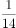，则在该县，不适合种植两种作物的自然村至少有多少个？

- **A**. 57
- **B**. 67
- **C**. 114　✅
- **D**. 134

**答案**：C

**官方解析**

由题意可知，自然村总数既是13的倍数，又是14的倍数，即自然村总数一定是13和14最小公倍数182的整数倍，设该县的自然村共有182x个，则适合种植A作物的自然村有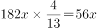个，同时适合种植两种作物的自然村有个。根据两集合容斥原理公式：A+B-AB=总数-都不，则56x+25-13x=182x-都不，整理可得：都不=139x-25。要使不适合种植两种作物的自然村（都不）数量尽可能小，则x应尽可能小，x最小取1，故不适合种植两种作物的自然村至少有139×1-25=114个。

故正确答案为C。

---

### 第 2 题　qid 4658544 · 数学运算

小王每天以v千米/小时的速度骑车到单位上班，如果速度提高20%，则可以提前10分钟到单位；如果以原速度骑行2千米后再提速30%，也可以提前10分钟到达。问小王家距离单位多少千米？

- **A**. 5.4
- **B**. 7.2　✅
- **C**. 8.5
- **D**. 9.6

**答案**：B

**官方解析**

根据路程不变时，速度与时间成反比。原速度（v）与提高20%后的速度之比为1：（1+20%），即为5：6，则全程所用时间之比为6：5，故小王以原速v千米/小时骑车到单位上班需要60分钟也就是1小时，则总路程为：v×1=v千米。根据“如果以原速度骑行2千米后再提速30%，也可以提前10分钟到达。”根据总路程不变，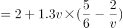，解得v=7.2，故总路程为7.2千米。

故正确答案为B。

---

### 第 3 题　qid 4658698 · 数学运算

农科院派出6名科技人员支援甲、乙、丙三个县农业发展，每个县分配2人。其中精通农业、牧业和渔业技术的分别有3人、3人和2人。有2人同时精通农业和牧业技术、且精通渔业技术的人均不精通农业和牧业技术，已知丙县因无条件发展渔业只需要农业和牧业技术专家，甲县和乙县都需要掌握3类技术的专家支援，问有多少种不同的安排方式？

- **A**. 4　✅
- **B**. 8
- **C**. 15
- **D**. 20

**答案**：A

**官方解析**

6名专家中有2人同时精通农业和牧业技术，有2人只精通渔业技术，根据两集合容斥原理可知，则余下2人分别精通农业和牧业技术。根据题干要求，甲、乙县均需1名双技术专家和1名渔业技术专家，只掌握农业、牧业技术的2名专家支援丙县，则安排方式共有种。

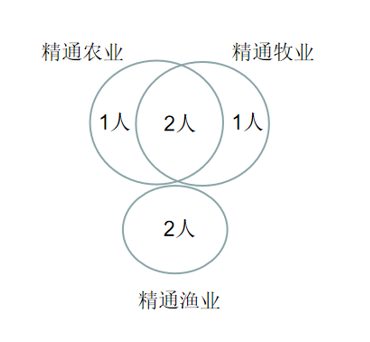

故正确答案为A。

---

### 第 4 题　qid 4658545 · 数学运算

现派出两个工作组对甲、乙、丙、丁和戊五个县的乡村振兴工作成果进行验收，要求每个工作组至少验收2个县，且每个县由1个工作组验收。问如按要求随机分配任务，则甲、乙两个县的乡村振兴工作成果由同一个工作组验收的概率为：

- **A**. 

- **B**. 

　✅
- **C**. 

- **D**. 

**答案**：B

**官方解析**

根据题意，每个工作组至少验收2个县，则令一个工作组验收2个县，一个工作组验收3个县。则总情况数为：先从2个工作组中选1个组验收2个县，再从5个县里选2个验收，共有种情况。

满足甲、乙两个县由同一个工作组验收的情况分类讨论如下：

①验收了2个县的工作组，恰好验收甲、乙两县。由于验收2个县的工作组有2种情况，故同时验收甲、乙两县的有2种情况。

②验收了3个县的工作组，验收甲、乙两县。由于验收3个县的工作组有两种情况，还需从剩余3个县中选1个使得该工作组共验收3县，有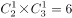种情况。

则所求概率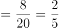。

故正确答案为B。

---

### 第 5 题　qid 4658522 · 数学运算

王、李、刘、张四人参加测试，每人得分均为正整数，张的得分高于任意一人，李的得分低于其余任意一人，王的得分高于刘，已知张和王得分之和为34，王和刘得分之和为20，刘和李得分之和为16，问张比王多得多少分？

- **A**. 8
- **B**. 10
- **C**. 12　✅
- **D**. 14

**答案**：C

**官方解析**

王、李、刘、张四人参加测试，根据“张的得分高于任意一人”，说明张的得分排名第一；根据“李的得分低于其余任意一人”，说明李的得分排名第四；根据“王的得分高于刘”，说明王的得分排名第二、刘的得分排名第三，即四人的测试成绩由高到低分别为：张、王、刘、李。由于“王和刘得分之和为20”，刘的得分应低于10分，同时由于“刘和李得分之和为16”，刘的得分应高于8分，即刘的得分为9分。由此可计算出王的得分为20-9=11分，张的得分为34-11=23分，张比王多得23-11=12分。
故正确答案为C。

---

### 第 6 题　qid 4658611 · 数学运算

某项工程，甲、乙、丙三个工程队如单独施工，分别需要12小时、10小时和8小时完成。现按“甲—乙—丙—甲······”的顺序让三个工程队轮班，每队施工1小时后换班，问该工程完成时，甲工程队的施工时间共计：

- **A**. 2小时54分
- **B**. 3小时
- **C**. 3小时54分　✅
- **D**. 4小时

**答案**：C

**官方解析**

赋值该工程的工作总量为12、10、8的公倍数120。则甲工程队每小时工作量为，乙工程队每小时工作量为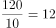，丙工程队每小时工作量为。按照甲、乙、丙三个工程队各施工1小时的顺序轮班，则甲、乙、丙三个工程队每3个小时的工作量为10+12+15=37，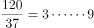，即三轮后（其中甲工程队施工3小时），该工程剩余工作量为9，剩余的工作量甲需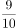小时完成，即分钟，故该工程完成时，甲工程队的施工时间共计3小时54分钟。

故正确答案为C。

---

### 第 7 题　qid 4658606 · 数学运算

某公司开展爱心捐款活动，50名员工人均捐款81.5元。已知任意2名员工捐款金额相差不超过10元，问该公司捐款83元及以上的员工最多可能有多少人？

- **A**. 40
- **B**. 42　✅
- **C**. 44
- **D**. 46

**答案**：B

**官方解析**

题目涉及平均数混合问题，可以考虑通过线段法求解。结合题意画出如下线段：

总人数为50人，设捐款83元及以上的员工最多为x人，则83元以下人数为（50-x）人。根据线段法“距离与量成反比”，要想x尽可能多，则捐款83元及以上的员工平均捐款额与81.5的差应尽量小，捐款83元以下的员工平均捐款额与81.5的差应尽量大。故捐款83元及以上的员工平均捐款最小为83元，捐款83元以下的员工平均捐款额最小为83-10=73元。因此可列式：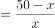，解得x=42.5，所求42.5为捐款83元及以上的员工人数最多的情况，因此人数需向下取整为42人。

故正确答案为B。

---

### 第 8 题　qid 4658623 · 数学运算

某工厂原有甲工种的人数是乙工种人数的2倍，由于公司扩大产能，又招聘了甲、乙两个工种的工人，且新招聘的甲工种人数是新招聘的乙工种人数的0.5倍，招聘后工厂中甲工种的人数是乙工种人数的1.5倍，问新招聘的乙工种人数是原乙工种人数的：

- **A**. 

- **B**. 

　✅
- **C**. 

- **D**. 

**答案**：B

**官方解析**

设工厂原有乙工种的人数为，则原有甲工种的人数为；新招聘乙工种的人数为，则新招聘甲工种的人数为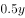。根据题意，，整理得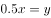，故新招聘的乙工种人数是原乙工种人数的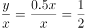。

故正确答案为B。

---

### 第 9 题　qid 4658587 · 数学运算

果农陈伯将收获的水果全部卖出，出售价格为苹果5元/公斤，冬枣6元/公斤，甜橘7元/公斤，已知苹果和冬枣的产量之比为4：3，苹果和甜橘的产量之比为5：2，出售冬枣的收入比甜橘多3400元，问他销售水果的总收入为多少元？

- **A**. 22800
- **B**. 23400
- **C**. 24000
- **D**. 24600　✅

**答案**：D

**官方解析**

根据“苹果和冬枣的产量之比为4：3，苹果和甜橘的产量之比为5：2”可得，苹果、冬枣、甜橘的产量之比为20：15：8，设苹果产量为20x公斤，则冬枣产量为15x公斤，甜橘产量为8x公斤，根据“出售冬枣的收入比甜橘多3400元”可得，6×15x=7×8x+3400，解得x=100，则销售水果的总收入为2000×5+1500×6+800×7=24600元。
故正确答案为D。

---

### 第 10 题　qid 4658593 · 数学运算

已知A单位在3月x日（x≤10）举行校招会，B单位在4月y日（y≥20）举行校招会，两个单位的校招会都在星期五举行，已知x+y=32，问y的值为：

- **A**. 24
- **B**. 25　✅
- **C**. 26
- **D**. 27

**答案**：B

**官方解析**

由题意可知，从3月x日至4月y日，经过3月份剩下的（31-x）天、4月份y天，共经过31-x+y=31-(32-y)+y=2y-1天。由于这两天均为星期五，因此2y-1为7的整数倍。代入选项，仅B项满足。
故正确答案为B。

---

## 判断推理

### 第 1 题　qid 4658571 · 图形推理

从所给的四个选项中，选择最合适的一个填入问号处，使之呈现一定的规律性：

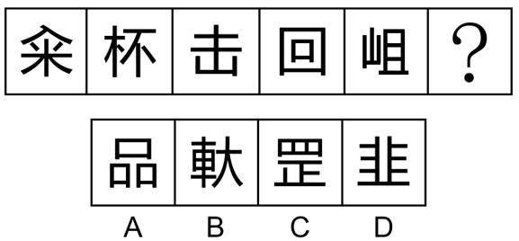

- **A**. A　✅
- **B**. B
- **C**. C
- **D**. D

**答案**：A

**官方解析**

元素组成不同，且无明显属性规律，优先考虑数量规律。题干汉字比较简单且存在窟窿面，但笔画数和面数量均无规律。观察题干发现，“回”字存在明显的横线和竖线，题干其他汉字也具备相同特点，优先考虑横线和竖线的数量。题干图形横线数依次为：1、2、3、4、5，竖线数依次为1、2、3、4、5，即横线和竖线的数量相等，只有A项符合。
故正确答案为A。

---

### 第 2 题　qid 4658458 · 图形推理

从所给的四个选项中，选择最合适的一个填入问号处，使之呈现一定的规律性：

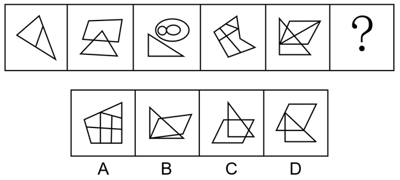

- **A**. A　✅
- **B**. B
- **C**. C
- **D**. D

**答案**：A

**官方解析**

元素组成不同，且无明显属性规律，优先考虑数量规律。观察发现，题干图形被分割、窟窿明显，考虑面数量。题干图形面数量依次为：2、3、4、5、6、？，故“？”处应该选择有7个面的图形，观察选项，只有A项符合。
故正确答案为A。

---

### 第 3 题　qid 4658540 · 图形推理

从所给的四个选项中，选择最合适的一个填入问号处，使之呈现一定的规律性：

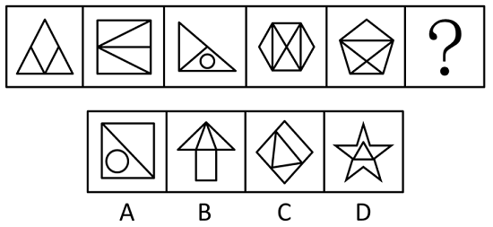

- **A**. A
- **B**. B
- **C**. C　✅
- **D**. D

**答案**：C

**官方解析**

元素组成不同，且无明显属性规律，优先考虑数量规律。观察发现，题干图形封闭区域明显，优先考虑数面，题干图形的面数量依次为3、4、3、6、5、？，单独数面无规律；继续观察发现，题干图形的外框均为多边形，考虑数外框直线数，外框直线数依次为3、4、3、6、5、？，规律为面数量=外框直线数量，只有C项符合此规律。
故正确答案为C。

---

### 第 4 题　qid 4658541 · 图形推理

左图为所给正方体纸盒的外表面展开图，问哪一项可以由其折叠而成？

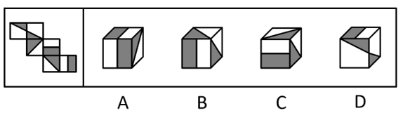

- **A**. A　✅
- **B**. B
- **C**. C
- **D**. D

**答案**：A

**官方解析**

将题干展开图标上序号如下图所示，逐一进行分析。

A项：选项由面d、面e和面f组成，选项与题干展开图一致，当选；

B项：选项一定包含面c和面e，由于面c和面f为Z字形两端的相对面，相对面不能同时出现，故选项的正面应为面d。在题干展开图中，面c、面d和面e的公共点挨着面d中的灰色长方形，但在选项中，三个面的公共点挨着面d中的白色长方形，选项与题干展开图不一致，排除；

C项：选项一定包含面c和面e，由于面c和面f为Z字形两端的相对面，相对面不能同时出现，故选项的正面应为面d。在题干展开图中，面c、面d和面e的公共点挨着面d中的灰色长方形，但在选项中，三个面的公共点挨着面d中的白色长方形，选项与题干展开图不一致，排除；

D项：选项一定包含面a和面b，由于面a和面d为Z字形两端的相对面，相对面不能同时出现，故选项的顶面应为面f。在题干展开图中，面f中的白色长方形的长边挨着面e，但在选项中，面f中的白色长方形的长边不挨着面e，选项与题干展开图不一致，排除。

故正确答案为A。

---

### 第 5 题　qid 4658468 · 图形推理

将下列六个图形分为两类，使每一类图形都有各自的特征或规律，分类正确的是：

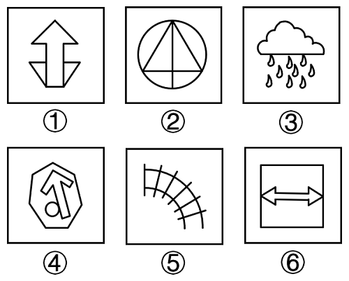

- **A**. ①④⑤，②③⑥
- **B**. ①②⑥，③④⑤　✅
- **C**. ①⑤⑥，②③④
- **D**. ①②③，④⑤⑥

**答案**：B

**官方解析**

本题为分组分类题目。元素组成不同，优先考虑属性规律。观察发现，图①②⑥均存在明显的等腰元素，故考虑对称性。图①②⑥为对称图形，图③④⑤不是对称图形，即图①②⑥为一组，图③④⑤为一组。
故正确答案为B。

---

### 第 6 题　qid 4658570 · 图形推理

将下列六个图形分为两类，使每一类图形都有各自的特征或规律，分类正确的是：

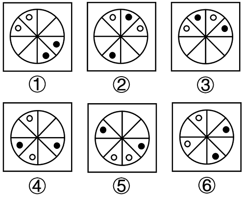

- **A**. ①②④，③⑤⑥
- **B**. ①⑤⑥，②③④　✅
- **C**. ①③⑤，②④⑥
- **D**. ①③⑥，②④⑤

**答案**：B

**官方解析**

本题为分组分类题目。元素组成相同，但无明显位置规律，观察发现，题干图形均由2个白球和2个黑球组成，考虑相同元素的位置。图①⑤⑥中白球到白球无需经过黑球，图②③④中白球到白球必须经过黑球，且黑球满足同样的规律，故图①⑤⑥为一组，图②③④为一组。
故正确答案为B。

---

### 第 7 题　qid 4658568 · 定义判断

自媒体是指区别于传统媒体的一种新媒体，即个人在任何地点、任何时间，通过网络个人平台向外界传递有关信息，与他人进行即时通讯，分享自己的真实感受。
根据上述定义，下列属于自媒体的是：

- **A**. 某晚报编辑小周管理旅游类公众号，定期推送副刊文章，转发率很高
- **B**. 张教授建立个人微信公众平台，发布自己原创诗词作品，受到学生好评　✅
- **C**. 小王参加了电台举办的“职场中的女性情感”网络直播活动，备受关注
- **D**. 摄影师小林不定期在某著名摄影杂志发布个人摄影作品，受到粉丝追捧

**答案**：B

**官方解析**

第一步：找出定义关键词。
“个人在任何地点、任何时间”、“通过网络个人平台向外界传递有关信息”、“与他人进行即时通讯，分享自己的真实感受”。
第二步：逐一分析选项。
A项：某晚报编辑小周管理的旅游类公众号，不是自己的网络个人平台，不符合“通过网络个人平台向外界传递有关信息”，定期推送副刊文章，不符合“个人在任何地点、任何时间”、“与他人进行即时通讯，分享自己的真实感受”，不符合定义，排除；
B项：张教授在自己的个人微信公众平台上发布原创诗词作品，符合“个人在任何地点、任何时间”、“通过网络个人平台向外界传递有关信息”、“与他人进行即时通讯，分享自己的真实感受”，符合定义，当选；
C项：小王参加的是电台举办的网络直播活动，不是自己的网络个人平台，不符合“通过网络个人平台向外界传递有关信息”，不符合定义，排除；
D项：小林不定期在某著名摄影杂志发布个人摄影作品，摄影杂志不属于小林自己的网络个人平台，不符合“通过网络个人平台向外界传递有关信息”，不符合定义，排除。
故正确答案为B。

---

### 第 8 题　qid 4658573 · 定义判断

见义勇为是指在法定职责、法定义务或者约定义务之外，为保护国家利益、社会公共利益或者他人的人身财产安全，挺身而出，同违法犯罪行为作斗争或者抢险、救灾、救人的行为。
根据上述定义，下列属于见义勇为的是：

- **A**. 某大学保安小张在日常巡查过程中，发现某实验室起火，迅速冲进实验室灭火，导致他脸上手上多处烧伤
- **B**. 赵大妈看到某美容院的橱窗中挂着邻居王女士的照片，经询问美容院并未获得王女士的授权，赵大妈坚决要求美容院老板撤下照片
- **C**. 小杨的父亲在河边挖土，不小心掉进了3米多深的河道，听到呼救声，小杨不顾一切赶上前去，迅速跳进冰冷的河水里，把父亲救上岸
- **D**. 黄老伯邻居家的几个孩子在河边玩耍，其中一个小孩掉进河里，听到孩子们的哭喊声，黄老伯不顾个人安危毅然冲进河中，将孩子救了　✅

**答案**：D

**官方解析**

第一步：找出定义关键词。
“在法定职责、法定义务或者约定义务之外”、“为保护国家利益、社会公共利益或者他人的人身财产安全”、“挺身而出”、“同违法犯罪行为作斗争或者抢险、救灾、救人”。
第二步：逐一分析选项。
A项：保安小张在巡查中发现起火，因处理灭火导致烧伤，防火是保安的主要职责，不符合“在法定职责、法定义务或者约定义务之外”，不符合定义，排除；
B项：赵大妈得知美容院并末获得王女士的授权，坚决要求撤下照片，但肖像权不属于“人身财产安全”，不符合“为保护国家利益、社会公共利益或者他人的人身财产安全”，不符合定义，排除；
C项：父亲掉进了河道，小杨把父亲救上岸，小杨对父亲有救援义务，不符合“在法定职责、法定义务或者约定义务之外”，不符合定义，排除；
D项：邻居家的小孩掉进河里，黄老伯不顾安危将孩子救了上来，符合“在法定职责、法定义务或者约定义务之外”、“为保护国家利益、社会公共利益或者他人的人身财产安全”、“挺身而出”、“同违法犯罪行为作斗争或者抢险、救灾、救人”，符合定义，当选。
故正确答案为D。

---

### 第 9 题　qid 4658567 · 定义判断

战争中的随机是指战争主体随着战争情况和条件的改变，因时因地灵活机智地把握和应对已出现的有利于或不利于军事行动的时机。
根据上述定义，下列没有体现战争中的随机的是：

- **A**. 得时无怠，时不再来
- **B**. 知己知彼，百战不殆　✅
- **C**. 待其来者而正之，因时之所宜而定之
- **D**. 兵无常势，水无常形，能因敌变化而取胜者，谓之神

**答案**：B

**官方解析**

第一步：找出定义关键词。
“战争主体随着战争情况和条件的改变”、“因时因地灵活机智地把握和应对已出现的时机”
第二步：逐一分析选项。
A项：意思是“得到了机遇就不要懈怠，机遇一旦错过，就不会再度重来。”该项指出能否遇到机遇是随机的，要灵活地把握机遇，体现了随机性，符合“战争主体随着战争情况和条件的改变”、“因时因地灵活机智地把握和应对已出现的时机”，符合定义，排除；
B项：意思是“如果对敌我双方的情况都能了解透彻，打多少次仗都不会失败。”该项只说明了常胜之道在于了解自身和对方，未体现对于时机的灵活应对，不符合“因时因地灵活机智地把握和应对已出现的时机”，不符合定义，当选；
C项：意思是“等待时机到来时就把不利于自己的局面扭转过来，根据对自己最适宜的情况把已扭转的局面予以巩固。”该项指出要灵活地利用时机来扭转局面，体现了随机性，符合“战争主体随着战争情况和条件的改变”、“因时因地灵活机智地把握和应对已出现的时机”，符合定义，排除；
D项：意思是“用兵作战没有固定不变的方式，如同水流没有固定的形状，能够依据敌情的变化而取胜，可称得上用兵如神了”。该项指出需要根据敌情的变化来布置战术，体现了随机性，符合“战争主体随着战争情况和条件的改变”、“因时因地灵活机智地把握和应对已出现的时机”，符合定义，排除。
本题为选非题，故正确答案为B。

---

### 第 10 题　qid 4658566 · 定义判断

碎片推理是指从只言片语或少量个案推导一般性结论的推理，这类推理往往以偏概全，缺乏说服力。
根据上述定义，下列不属于碎片推理的是：

- **A**. 有的家长让孩子“在家上学”，有的家长把孩子送到国外，这说明当下的应试教育很成问题
- **B**. 某位京剧名家想收一个关门弟子，挑了几次没有中意的，他很失望，认为现在的年轻人都比较怕吃苦
- **C**. 蔡某参加某企业的研发人员招聘面试，表达欠佳，面试官因此断定蔡某的技术能力有限，决定不予聘用
- **D**. 某教师在班级管理中采用了金钱奖励制度，想培养学生的经济意识，但有家长表示不满，认为不能让金钱污染孩子的心灵　✅

**答案**：D

**官方解析**

第一步：找出定义关键词。
“从只言片语或少量个案推导一般性结论的推理”、“以偏概全，缺乏说服力”。
第二步：逐一分析选项。
A项：让孩子“在家上学”或把孩子送到国外，只是部分家长的做法，属于少量个案，据此得出当下的应试教育很成问题，该观点是针对整个应试教育的判断，属于一般性结论，符合“从只言片语或少量个案推导一般性结论的推理”、“以偏概全，缺乏说服力”，符合定义，排除；
B项：某位京剧名家想收—个关门弟子，挑了几次没有中意的，这里挑选的几个人，属于少量个案，据此认为现在的年轻人都比较怕吃苦，该观点是针对整个年轻人群体的判断，属于一般性结论，符合“从只言片语或少量个案推导一般性结论的推理”、“以偏概全，缺乏说服力”，符合定义，排除；
C项：蔡某参加某企业的研发人员招聘面试，表达欠佳，面试官据此断定蔡某的技术能力有限，属于仅从一次面试的表达情况出发，来推断这个人的技术能力，符合“从只言片语或少量个案推导一般性结论的推理”、“以偏概全，缺乏说服力”，符合定义，排除；
D项：由于某教师在班级管理中采用了金钱奖励制度，家长表示不满并认为不能让金钱污染孩子的心灵，属于从制度本身出发，来推断该制度存在的问题，说明推出的是针对性结论，并非一般性结论，不符合“从只言片语或少量个案推导一般性结论的推理”，同时该推断具有一定的说服力，并非以偏概全，也不符合“以偏概全，缺乏说服力”，不符合定义，当选。
本题为选非题，故正确答案为D。

---

### 第 11 题　qid 4658577 · 定义判断

共同犯罪是指二人以上共同故意犯罪，共同故意犯罪要求共犯人知道共犯的内容及社会意义，并希望结果的发生，并且共犯人主观上要有共同犯罪意思联络，知道自己不是孤立的在犯罪，而是和他人一起共同犯罪。
根据上述定义，下列案件不属于共同犯罪的是：

- **A**. 李某和杨某系夫妻，与邻居黄某因为排水问题发生纠纷，继而发生口角，黄某被李某殴打。黄某受伤倒地后杨某未实施救助，与李某快速离开了现场。经鉴定，黄某受重伤　✅
- **B**. 周某和陈某对刘某怀恨在心，二人商议杀死刘某，于是二人非法购买了枪支，准备第二天杀死刘某。但是陈某感到害怕，于当天晚上告知刘某杀人计划，并和刘某一起到公安机关报案
- **C**. 张某和王某两人互不认识。一天深夜，张某进入一家超市偷东西时，碰到王某也在该超市偷东西，两人相视而笑。之后，张某和王某一起将偷取的东西变卖，分别获利2.2万元和1.3万元
- **D**. 谢某和丁某共谋盗窃汽车，谢某将开车所需的钥匙交给丁某。后来，谢某后悔，让丁某归还钥匙。丁某请求谢某让他配置—把钥匙之后再归还，谢某同意。随后丁某利用自己配置的钥匙盗窃了汽车

**答案**：A

**官方解析**

第一步：找出定义关键词。
“二人以上共同故意犯罪”、“要求共犯人知道共犯的内容及社会意义”、“希望结果的发生”、“共犯人主观上知道自己不是孤立的在犯罪”。
第二步：逐一分析选项。
A项：黄某被李某殴打至倒地后，身为李某妻子的杨某虽然未实施救助，但杨某本身并没有伤害邻居黄某，也无法预见丈夫会殴打黄某，并没有与丈夫共同故意犯罪，不符合“二人以上共同故意犯罪”，不符合定义，当选；
B项：周某和陈某商议杀死刘某，而且购买了枪支，说明二人的共同目的是杀死刘某，并且希望这个结果的发生，符合“二人以上共同故意犯罪”、“希望结果的发生”、“共犯人主观上知道自己不是孤立的在犯罪”。尽管陈某后来因害怕阻止了犯罪结果的发生，但二人曾为了这场犯罪付出了实际行动购买了枪支，仍属于共同犯罪，符合定义，排除；
C项：张某和王某虽然之前并不认识，但在偷盗过程中认识后一起将偷取的东西变卖以获利，说明二人的共同目的是偷窃东西获利，并且希望这个结果的发生，符合“要求共犯人知道共犯的内容及社会意义”、“希望结果的发生”、“共犯人主观上知道自己不是孤立的在犯罪”，符合定义，排除；
D项：谢某和丁某共谋盗窃汽车，而且谢某将车钥匙交给了丁某，说明二人的共同目的是盗窃汽车，并且希望这个结果的发生，符合“二人以上共同故意犯罪”、“希望结果的发生”、“共犯人主观上知道自己不是孤立的在犯罪”。尽管谢某后来后悔了，但行动上却仍默许了丁某配置汽车钥匙，使其成功盗窃了汽车，仍属于共同犯罪，符合定义，排除。
本题为选非题，故正确答案为A。

---

### 第 12 题　qid 4658579 · 定义判断

检出症候偏倚是医学研究中出现的一种系统误差，指的是病人常因某些与致病无关的因素就医，从而提高了早期病例的检出率，致使研究者过高地估计了该疾病与这些因素的关联程度，由此产生了系统误差。
根据上述定义，下列哪项反映了检出症候偏倚？

- **A**. 喜食高嘌呤饮食的痛风患者改善饮食后痊愈，研究者由此得出高嘌呤饮食与痛风有关的结论
- **B**. 有些中年人出现胸闷心悸后就诊，发现患有早期冠心病，研究者由此认为胸闷心悸与冠心病有关
- **C**. 某体检中心为社区30岁以上居民进行血脂检查，老年人因怀疑自身血脂异常乐于采血，年轻人却逃避检查，研究者由此得出30岁以上人群血脂异常比例大的结论
- **D**. 绝经期妇女服用雌激素造成子宫出血，就诊使子宫内膜癌被早期发现，而未服用者易漏诊或较迟发现，研究者由此得出绝经期妇女服用雌激素会导致子宫内膜癌的结论　✅

**答案**：D

**官方解析**

第一步：找出定义关键词。
“病人常因某些与致病无关的因素就医”、“提高了早期病例的检出率”。
第二步：逐一分析选项。
A项：高嘌呤饮食是与痛风相关的因素，而且痛风患者并没有出现就医行为，不符合“病人常因某些与致病无关的因素就医”，不符合定义，排除；
B项：中年人因胸闷心悸就诊，胸闷心悸是与冠心病相关的因素，不符合“病人常因某些与致病无关的因素就医”，不符合定义，排除；
C项：老年人因怀疑自身血脂异常而进行检查，血脂异常是疾病，老年人是因为可能出现的疾病就医，而不是因为与血脂异常不相关的因素就医，不符合“病人常因某些与致病无关的因素就医”，不符合定义，排除；
D项：妇女服用雌激素造成子宫出血，就诊时发现子宫内膜癌，而雌激素造成的子宫出血不是子宫内膜癌的致病因素，符合“病人常因某些与致病无关的因素就医”，子宫内膜癌被早期发现，也符合“提高了早期病例的检出率”，符合定义，当选。
故正确答案为D。

---

### 第 13 题　qid 4658583 · 定义判断

选择性理解是指不同的受众对传播媒介所传播的同一信息做出不同的解释、结论和反应。造成这种现象的主要原因是受众在理解过程中加进了许多主观因素，如固有的观念、态度、立场，个人的感情、情绪、习惯，使用传播媒介的动机和目的，等等。
根据上述定义，下列情形属于选择性理解的是：

- **A**. 小吴与小宋经常就新闻报道中的观点发生争执　✅
- **B**. 小婷与小凤就新闻受众问题提出不同的学术观点
- **C**. 小陈认为看时政新闻有意思，而小李认为文体新闻更刺激
- **D**. 小伍觉得晚上看新闻更有感觉，小王认为早上看能早知道

**答案**：A

**官方解析**

第一步：找出定义关键词。
“不同的受众”、“对传播媒介所传播的同一信息”、“做出不同的解释、结论和反应”。
第二步：逐一分析选项。
A项：小吴与小宋经常就新闻报道中的观点发生争执，符合“不同的受众”、“对传播媒介所传播的同一信息”、“做出不同的解释、结论和反应”，符合定义，当选；
B项：小婷与小凤就新闻受众问题提出不同的学术观点，二人讨论的对象是新闻受众，不符合“对传播媒介所传播的同一信息”，不符合定义，排除；
C项：小陈认为看时政新闻有意思，而小李认为文体新闻更刺激，只体现了二人对新闻类型的偏好不同，不符合“对传播媒介所传播的同一信息”，不符合定义，排除；
D项：小伍觉得晚上看新闻更有感觉，小王认为早上看能早知道，只体现了二人对看新闻时间的偏好不同，不符合“对传播媒介所传播的同一信息”，不符合定义，排除。
故正确答案为A。

---

### 第 14 题　qid 4658589 · 定义判断

隐形贫困人口是指工作收入并不低，但由于无节制的消费造成日常生活有时比较窘困的一类人。
根据上述定义，下列不属于隐形贫困人口是：

- **A**. 甲在某大型企业市场部工作，喜欢结交朋友，每月工资到手，通常隔三差五地邀请朋友聚会，潇洒过后，只能蹭朋友的饭或借钱度日
- **B**. 公关部经理乙因为工作原因，特别注意穿着打扮，每月工资一大半花费在购买时尚服装及高档化妆品上，而平时的生活只能将就着过
- **C**. 高级工程师丙收入不菲，儿子本科毕业后出国攻读硕士学位，虽然费用昂贵，但丙全力支持儿子的选择，自己在家过着俭朴的生活　✅
- **D**. 丁喜欢过安逸舒适的生活，刚工作不久便用收入的大部分租住高档小区，日常生活开销只能尽量缩减，或刷卡透支以待下月偿还

**答案**：C

**官方解析**

第一步：找出定义关键词。
“工作收入并不低”、“由于无节制的消费造成日常生活有时比较窘困”。
第二步：逐一分析选项。
A项：甲在某大型企业市场部工作，符合“工作收入并不低”，每月工资到手，隔三差五地邀请朋友聚会，潇洒过后，只能蹭朋友的饭或借钱度日，符合“由于无节制的消费造成日常生活有时比较窘困”，符合定义，排除；
B项：乙是公关部经理，符合“工作收入并不低”，每月工资一大半花费在购买时尚服装及高档化妆品上，平时生活只能将就着过，符合“由于无节制的消费造成日常生活有时比较窘困”，符合定义，排除；
C项：丙是高级工程师，收入不菲，符合“工作收入并不低”，但丙是为支持儿子出国攻读硕士学位而过着俭朴的生活，并非因为无节制的消费，不符合“由于无节制的消费造成日常生活有时比较窘困”，不符合定义，当选；
D项：丁刚工作不久便租得起高档小区，符合“工作收入并不低”，但丁把自己收入的大部分都用于租住高档小区，导致日常生活开销只能尽量缩减，或刷卡透支，符合“由于无节制的消费造成日常生活有时比较窘困”，符合定义，排除。
本题为选非题，故正确答案为C。

---

### 第 15 题　qid 4658581 · 定义判断

补偿性消费，也称“报复性”消费，是指某个特殊时期或场合限制了人们的消费需求，一旦解除限制，消费的需求会大幅度增加，甚至会超出合理的范畴。
根据上述定义，下列属于补偿性消费的是：

- **A**. 经济危机后，居民消费欲望低迷，为防风险，银行居民储蓄存款大幅增加
- **B**. 民俗有正月剃头不吉利的说法，因此农历二月一到，镇上的理发店人满为患　✅
- **C**. 月收入2500元的小丽为追赶时尚经常刷信用卡购买名牌服装，每月入不敷出
- **D**. 老丁常年忙于出差应酬，为了补偿对儿子的忽视，经常给他买一些贵重的礼物

**答案**：B

**官方解析**

第一步：找出定义关键词。
“某个特殊时期或场合限制了人们的消费需求”、“解除限制”、“消费的需求会大幅度增加”。
第二步：逐一分析选项。
A项：经济危机后，说明经济危机已经过去，符合“解除限制”，但银行居民储蓄存款大幅增加，说明人们把钱存进了银行，并没有用于消费，不符合“消费的需求会大幅度增加”，不符合定义，排除；
B项：民俗有正月剃头不吉利的说法，因此人们在正月期间不去理发店剃头，进入农历二月，解除了不能剃头的限制后，理发店人满为患，符合“某个特殊时期或场合限制了人们的消费需求”、“解除限制”、“消费的需求会大幅度增加”，符合定义，当选；
C项：小丽经常刷信用卡购买名牌服装，每月入不敷出，没有体现出消费需求被限制，不符合“某个特殊时期或场合限制了人们的消费需求”、“解除限制”、“消费的需求会大幅度增加”，不符合定义，排除；
D项：老丁为了补偿对儿子的忽视，经常给他买一些贵重的礼物，没有体现出在特殊时期或场合限制消费需求的情况，不符合“某个特殊时期或场合限制了人们的消费需求”、“解除限制”、“消费的需求会大幅度增加”，不符合定义，排除。
故正确答案为B。

---

### 第 16 题　qid 4658463 · 定义判断

损失憎恶效应是基于对资源浪费的担心而宁愿做出不理智或者错误选择的行为。这种担心与事情本身通常并不相干，其行为也是低效无益的。
根据上述定义，下列属于损失憎恶心理的是：

- **A**. 对于剩饭剩菜，老年人往往舍不得倒掉，就算子女极力反对，他们也要尽可能吃光，哪怕会吃坏身体　✅
- **B**. 在影院看一场近期很火的电影，刚刚开始看就发现完全不对胃口，但许多人还是会坚持到散场，因为毕竟是买了票来看这部电影的
- **C**. 老同学在微信朋友圈给他的女儿拉票，尽管孩子的舞蹈跳的一般，但还是有许多同学每天坚持去点赞，否则怕伤了那位老同学的心
- **D**. 陪孩子去上钢琴培训班，老李每次都要在教室外待上两个小时，虽然不太情愿，但也有收获，毕竟孩子明年就要参加钢琴十级考试了

**答案**：A

**官方解析**

第一步：找出定义关键词。

“基于对资源浪费的担心”、“宁愿做出不理智或者错误选择的行为”。
第二步：逐一分析选项。
A项：老年人舍不得倒掉剩饭剩菜，是担心浪费粮食，符合“基于对资源浪费的担心”，他们也要尽可能吃光，哪怕会吃坏身体，是一种错误的选择，符合“宁愿做出不理智或者错误选择的行为”，符合定义，当选；
B项：许多人坚持看完不对胃口的电影，是担心浪费电影票钱，符合“基于对资源浪费的担心”，但坚持看完电影，不符合“宁愿做出不理智或者错误选择的行为”，不符合定义，排除；
C项：许多同学投票是为了不让老同学伤心，并不是担心浪费资源，不符合“基于对资源浪费的担心”，不符合定义，排除；
D项：陪孩子学钢琴，老李在教室外待上两个小时，不符合“基于对资源浪费的担心”、“宁愿做出不理智或者错误选择的行为”，不符合定义，排除。
故正确答案为A。

---

### 第 17 题　qid 4658461 · 类比推理

文字：资料：图片

- **A**. 木板：建材：钢铁　✅
- **B**. 红色：颜色：彩色
- **C**. 塑料：脸盆：脚盆
- **D**. 窗户：窗帘：布料

**答案**：A

**官方解析**

第一步：判断题干词语间逻辑关系。
文字和图片是两种不同的信息展现方式，二者为并列关系，且二者都属于资料，与资料都构成种属关系。
第二步：判断选项词语间逻辑关系。
A项：木板和钢铁是两种不同的材料，二者为并列关系，且二者都属于建材，与建材都构成种属关系，与题干逻辑关系一致，当选；
B项：彩色是指除黑白灰之外的各种颜色，彩色包含红色，二者为包容关系，与题干逻辑关系不一致，排除；
C项：塑料是脚盆的原材料，二者为原材料与成品的对应关系，与题干逻辑关系不一致，排除；
D项：布料是窗帘的原材料，二者为原材料与成品的对应关系，与题干逻辑关系不一致，排除。
故正确答案为A。

---

### 第 18 题　qid 4658456 · 类比推理

公众号：新媒体：传播

- **A**. 电视：电器：消费
- **B**. 电饭煲：炊具：饮食
- **C**. 手机：通讯工具：交流　✅
- **D**. 电脑：电子产品：打字

**答案**：C

**官方解析**

第一步：判断题干词语间逻辑关系。
公众号是一种新媒体，二者为种属关系；新媒体的功能是传播，二者为功能对应。
第二步：判断选项词语间逻辑关系。
A项：电视是一种电器，二者为种属关系；电器的功能是为人们生产生活提供便利并非消费，与题干逻辑关系不一致，排除；
B项：电饭煲是一种炊具，二者为种属关系；炊具的功能是加工食材并非饮食，与题干逻辑关系不一致，排除；
C项：手机是一种通讯工具，二者为种属关系；通讯工具的功能是交流，二者为功能对应，与题干逻辑关系一致，当选；
D项：电脑是一种电子产品，二者为种属关系；电子产品的功能是学习娱乐并非打字，与题干逻辑关系不一致，排除。
故正确答案为C。

---

### 第 19 题　qid 4658537 · 类比推理

琴棋书画：古琴：围棋

- **A**. 梅兰竹菊：梅花：兰花　✅
- **B**. 花鸟虫鱼：菊花：画眉
- **C**. 笔墨纸砚：毛笔：砚台
- **D**. 江河湖海：长江：黄河

**答案**：A

**官方解析**

第一步：判断题干词语间逻辑关系。
琴棋书画原指古琴、围棋、书法、国画，后泛指弹琴、弈棋、写字、绘画，用来表示个人的文化素养。琴棋书画四字为并列关系，琴即为古琴，棋即为围棋，后两词分别与第一个词的前两个字为全同关系。
第二步：判断选项词语间逻辑关系。
A项：梅兰竹菊四字为并列关系，梅即为梅花，兰即为兰花，后两词分别与第一个词的前两个字为全同关系，与题干逻辑关系一致，当选；
B项：花鸟虫鱼四字为并列关系，菊花是花的一种，画眉是鸟的一种，后两词分别与第一个词的前两个字为种属关系，与题干逻辑关系不一致，排除；
C项：笔墨纸砚四字为并列关系，笔即为毛笔，砚即为砚台，但砚为第一个词中的第四个字，与题干逻辑关系不一致，排除；
D项：江河湖海四字为并列关系，长江是江的一种，黄河是河的一种，后两词分别与第一个词的前两个字为种属关系，与题干逻辑关系不一致，排除。
故正确答案为A。

---

### 第 20 题　qid 4658542 · 类比推理

睡觉对于（    ）相当于（    ）对于身体健康

- **A**. 精力充沛；跑步　✅
- **B**. 身心愉悦；工作
- **C**. 梦游；以逸待劳
- **D**. 减肥；有氧运动

**答案**：A

**官方解析**

逐一代入选项。
A项：睡觉可以使人精力充沛，跑步可以使人身体健康，二者均为方式目的的对应关系，前后逻辑关系一致，当选；
B项：睡觉可以使人身心愉悦，二者为方式目的的对应关系，工作压力大时会影响人的身体健康，二者不是方式目的的对应关系，前后逻辑关系不一致，排除；
C项：睡觉时可能会出现梦游，以逸待劳指在战争中养精蓄锐，等疲乏的敌人来犯时给以迎头痛击，和身体健康没有必然联系，前后逻辑关系不一致，排除；
D项：睡觉和减肥没有必然联系，有氧运动可以使人身体健康，前后逻辑关系不一致，排除。
故正确答案为A。

---

### 第 21 题　qid 4658457 · 类比推理

病毒 对于 （    ） 相当于 （    ） 对于 鲸鱼

- **A**. 疫苗；捕鲸船
- **B**. 微小；庞大
- **C**. 医生；渔夫
- **D**. 细菌；熊猫　✅

**答案**：D

**官方解析**

逐一代入选项。
A项：“疫苗”能够帮助免疫系统产生抗体阻止“病毒”对人体造成伤害，二者为功能对象的对应关系；捕鲸船是一种专门用于捕鲸、加工鲸鱼的专用船，二者为工具的对应关系，前后逻辑关系不一致，排除；
B项：病毒是一种个体微小，结构简单的非细胞型生物，微小是病毒的属性，二者为属性对应关系；鲸鱼是体型庞大的海洋生物，庞大是鲸鱼的属性，二者为属性对应关系，但是前后顺序相反，前后逻辑关系不一致，排除；
C项：医生消灭病毒，二者为主宾关系；渔夫捕捉鲸鱼，二者为主宾关系，但是前后顺序相反，前后逻辑关系不一致，排除；
D项：病毒和细菌是两种不同的病原微生物，二者为并列关系中的反对关系；熊猫和鲸鱼是两种不同的哺乳动物，二者为并列关系中的反对关系，前后逻辑关系一致，当选。
故正确答案为D。

---

### 第 22 题　qid 4658650 · 逻辑判断

甲醛作为室内空气污染物，被世界卫生组织列为致癌和致畸形物质，研究者发现在甲醛胁迫下，植物光合作用的速率降低，植物叶片叶绿素含量下降，抗性越弱的植物品种其叶绿素含量下降越快。所以，甲醛污染对室内植物的影响与植物的抗性强弱有关。
以下哪项如果为真，最能反驳上述研究者的观点？

- **A**. 植物的抗性越好叶绿素含量越高，越能吸收甲醛
- **B**. 植物叶绿素含量变化是评价其抗性强弱的重要指标
- **C**. 甲醛污染对室内植物的影响取决于植物叶片的大小　✅
- **D**. 光合作用的速率改变，植物叶片叶绿素含量随之变化

**答案**：C

**官方解析**

第一步：找出论点和论据。
论点：甲醛污染对室内植物的影响与植物的抗性强弱有关。
论据：在甲醛胁迫下，植物光合作用的速率降低，植物叶片叶绿素含量下降，抗性越弱的植物品种其叶绿素含量下降越快。
本题论点和论据都在讨论甲醛污染对植物的影响与植物抗性强弱之间的关系，话题一致，削弱可以优先考虑否定论点。
第二步：逐一分析选项。
A项：该项指出植物抗性强弱与叶绿素含量有关，而叶绿素含量又与甲醛有关，因此该项从科学的角度解释了甲醛污染对植物的影响与植物抗性强弱之间确实存在着关联，为加强项，无法削弱，排除；
B项：该项指出叶绿素含量变化是评价植物抗性的重要指标，说明叶绿素和植物抗性之间有关系，为加强项，无法削弱，排除；
C项：该项指出植物叶片的大小才是甲醛污染对室内植物影响的决定性因素，即甲醛污染对室内植物的影响并不取决于植物的抗性强弱，直接否定了论点，可以削弱，当选；
D项：该项指出光合作用的速率会影响植物叶片的叶绿素含量，说明光合作用速率和叶绿素含量有关系，为加强项，无法削弱，排除。
故正确答案为C。

---

### 第 23 题　qid 4658543 · 逻辑判断

德国的一项研究显示，长期居住在天寒地冻、杳无人烟的南极洲，人的大脑平均会缩小7%，学习、记忆以及与人交往能力随之减弱。因此，生活在炎热地区的人比生活在寒冷地区的人更聪明。
以下哪项如果为真，最能削弱上述论证？

- **A**. 该项研究成果尚未公开发表
- **B**. 气候会对人的智力产生巨大的影响
- **C**. 寒冷令人们为保存更多能量，倾向于减少学习及社交活动
- **D**. 该研究结果是可逆的，离开南极洲一段时间后人的大脑基本恢复正常水平　✅

**答案**：D

**官方解析**

第一步：找出论点和论据。
论点：生活在炎热地区的人比生活在寒冷地区的人更聪明。
论据：研究显示，长期居住在天寒地冻、杳无人烟的南极洲，人的大脑平均会缩小7％，学习、记忆以及与人交往能力随之减弱。
本题的论点、论据话题一致，均在讨论气温与智力之间的关系，削弱可以考虑削弱论点，即证明生活在炎热地区的人并不比生活在寒冷地区的人更聪明，也可以考虑削弱论据，即证明研究结果不科学，无法得到结论。
第二步：逐一分析选项。
A项：说明成果尚未公开发表，但并不明确研究结论是否准确，无法削弱，排除；
B项：说明气候对人的智力影响巨大，但影响巨大也不明确气温高是否会导致智力高，为不明确项，无法削弱，排除；
C项：说明寒冷会让人减少学习和社交，肯定了题干中的论据部分，即寒冷让学习、记忆以及与人交往能力随之减弱，为加强项，无法削弱，排除；
D项：说明研究结果是可逆的，离开南极洲后人脑基本恢复正常水平，对研究结果本身提出质疑，可以削弱，当选。
故正确答案为D。

---

### 第 24 题　qid 4658459 · 逻辑判断

有人建议，英语四六级考试应该改变统一考试模式，实行社会化改革，由社会机构组织，大学生自愿选择报考，大学与用人单位自主认可，而不再是所有学生必须统一参加、企事业单位招聘统一要求成绩的考试，这能令大学英语教育摆脱应试教育。
以下哪项如果为真，最能削弱上述结论？

- **A**. 大学生自愿选择报考有助于学生自主学习
- **B**. 社会机构组织英语考试也会导致应试教育　✅
- **C**. 企事业单位招聘并没有统一要求英语成绩
- **D**. 英语应试教育不仅仅是四六级统一考试造成的

**答案**：B

**官方解析**

第一步：找出论点和论据。
论点：（英语四六级考试应该改变统一考试模式，实行社会化改革，由社会机构组织，大学生自愿选择报考，大学与用人单位自主认可）这能令大学英语教育摆脱应试教育。
论据：无。
本题只有论点，没有论据，削弱可以优先考虑削弱论点。
第二步：逐一分析选项。
A项：该项说的是大学生自愿选择报考和学生自主学习之间的关系，论点讨论的是大学生自愿选择报考和大学英语教育摆脱应试教育之间的关系，话题不一致，无法削弱，排除；
B项：该项说的是社会机构组织英语考试也会导致应试教育，说明改变统一考试的模式，由社会机构组织英语考试并不能让大学英语教育摆脱应试教育，直接否定论点，可以削弱，当选；
C项：该项说的是企事业单位招聘并没有统一要求英语成绩，也就是说大学与用人单位自主认可对大学英语教育摆脱应试教育的影响并不明确，不明确项，无法削弱，排除；
D项：该项说的是英语应试教育不仅仅是四六级统一考试造成的，还存在其他的原因，因此仅改变统一考试的模式是否能令大学英语教育摆脱应试教育并不明确，不明确项，无法削弱，排除。
故正确答案为B。

---

### 第 25 题　qid 4658536 · 逻辑判断

随着靶向及免疫治疗方式的飞跃发展，某专科医生近日宣布，淋巴瘤已成为目前控制率、治愈率最高的肿瘤，淋巴瘤主要分为霍奇金淋巴瘤和非霍奇金淋巴瘤两大类，非霍奇金淋巴瘤是最常见的淋巴瘤类型，约占所有淋巴瘤的91%，其治愈率高达70%；而霍奇金淋巴瘤临床治愈率最高可达80%。除了发达的医学技术，该高治愈率还与越来越多的肿瘤药物被纳入医保报销、提高了药物的可及性有关。
以下哪项如果为真，最能支持上述专科医生的论证?

- **A**. 淋巴瘤不属于恶性肿瘤，治愈率高
- **B**. 淋巴瘤的高治愈率与其控制率提高有关
- **C**. 如果医疗费用提高，则淋巴瘤治愈率将下降　✅
- **D**. 患霍奇金淋巴瘤的被治愈人数比非霍奇金淋巴瘤的更多

**答案**：C

**官方解析**

第一步：找出论点和论据。
论点：淋巴瘤已成为目前控制率、治愈率最高的肿瘤，除了发达的医学技术，该高治愈率还与越来越多的肿瘤药物被纳入医保报销、提高了药物的可及性有关。
论据：无。
本题只有论点，没有论据，加强优先考虑补充论据。
第二步：逐一分析选项。
A项：论点说的是“淋巴瘤的高治愈率、控制率”与“发达的医学技术和肿瘤药物纳入医保、药物可及性提高”有关，而该项提出“淋巴瘤的高治愈率”与“淋巴瘤不属于恶性肿瘤”有关，话题不一致，不能加强，排除；
B项：论点说的是“淋巴瘤的高治愈率、控制率”与“发达的医学技术和肿瘤药物纳入医保、药物可及性提高”有关，而该项提出“淋巴瘤的高治愈率”与“控制率提高”有关，话题不一致，不能加强，排除；
C项：论点说的是“淋巴瘤的高治愈率、控制率”与“发达的医学技术和肿瘤药物纳入医保、药物可及性提高”有关，该项指出如果医疗费用提高，那么治愈率会下降，说明医疗费用和治愈率有关系，即淋巴瘤的高治愈率和医保有关，补充反面论据，可以加强，当选；
D项：论点说的是“淋巴瘤的高治愈率、控制率”与“发达的医学技术和肿瘤药物纳入医保、药物可及性提高”有关，而该项提出患不同淋巴瘤的被治愈人数的不同，话题不一致，不能加强，排除。
故正确答案为C。

---

### 第 26 题　qid 4658535 · 逻辑判断

国外某中学通过走访和调研了解人们对基础教育的期望，排在前4位的是让学生“有清晰的目标”“能在行动中学习”“能在发现问题、解决问题中展示个人能力”“有勇气进入陌生领域”。有基础教育专家据此指出，每个孩子都是独立的个体，应该关注孩子的个性体验和挑战现状、解决问题的能力，而不是统一标准的考试成绩。
以下哪项如果为真，最能削弱该基础教育专家的观点？

- **A**. 教师在统一的大班制教学中也同样能让学生学会用已有的知识解决未知的问题
- **B**. 统一标准的考试并不妨碍学生确立清晰的学习目标、锻炼进入陌生领域的勇气　✅
- **C**. 中国的教育资源比较紧缺，统一标准的考试有助于体现教育选拔的公平和公正
- **D**. 大班制教学有助于激发学生的竞争意识，培养其团队合作和挑战现状以及解决问题的能力

**答案**：B

**官方解析**

第一步：找出论点和论据。
论点：每个孩子都是独立的个体，应该关注孩子的个性体验和挑战现状、解决问题的能力，而不是统一标准的考试成绩。
论据：国外某中学通过走访和调研了解人们对基础教育的期望，排在前4位的是让学生“有清晰的目标”“能在行动中学习”“能在发现问题、解决问题中展示个人能力”“有勇气进入陌生领域”。
本题论点说的是孩子基础教育阶段需要重点关注各项综合素质，而不是统一标准的考试成绩，论据说的是人们对基础教育的期望排在前4位的是孩子的目标、在行动中学习、个人能力、勇气。论点论据话题一致，削弱优先考虑否定论点。
第二步：逐一分析选项。
A项：该项说大班制教学同样能够让学生学会用已有知识解决未知问题，但论点说的是统一标准的考试成绩是否应该关注，大班制教学是授课模式，统一标准的考试成绩是考核方式，话题不一致，无法削弱，排除；
B项：该项说统一标准的考试不妨碍学生确立清晰的目标、锻炼进入陌生领域的勇气，也就是说即使学生的各项综合素质比较重要，也无法得出不应该关注统一标准考试成绩的结论，直接否定论点，可以削弱，当选；
C项：该项说明统一标准的考试在教育选拔上有优点，但论点讨论的是基础教育阶段需要重点关注各项综合素质还是统一标准的考试成绩，话题不一致，无法削弱，排除；
D项：该项说明大班制教学的优点，但论点说的是统一标准的考试成绩是否应该关注，大班制教学是授课模式，统一标准的考试成绩是考核方式，话题不一致，无法削弱，排除。
故正确答案为B。

---

### 第 27 题　qid 4658582 · 逻辑判断

科学家对19岁以上的1524名男性和2008名女性共3532人进行了调查。结果显示，不吃早餐的男性在1年内体重增加3公斤以上的比重是吃早餐的1.9倍之多；不吃早餐的女性在1年内体重增加3公斤以上的比重是吃早餐的1.4倍之多。因此，他们得出结论：如果不吃早餐，无论男女，体重增加的概率都会比较高。
以下哪项如果为真，最能削弱上述结论？

- **A**. 不吃早餐，男女体重不一定都会增加
- **B**. 男女体重增加主要是早上睡懒觉造成的　✅
- **C**. 18岁以下的人群不一定会出现研究中的结果
- **D**. 相比男性，不吃早餐对女性体重增加的影响并不大

**答案**：B

**官方解析**

第一步：找出论点和论据。
论点：如果不吃早餐，无论男女，体重增加的概率都会比较高。
论据：不吃早餐的男性在1年内体重增加3公斤以上的比重是吃早餐的1.9倍之多；不吃早餐的女性在1年内体重增加3公斤以上的比重是吃早餐的1.4倍之多。
本题的论点讨论的是不吃早餐，且无论男女体重增加的概率都会比较高，论据讨论的是通过对19岁以上的男性和女性吃早餐情况的调查得出的研究结果，论点论据主体范围不一致，削弱可以优先考虑拆桥，也可以考虑削弱论点。
第二步：逐一分析选项。
A项：该项说的是不吃早餐，男女体重不一定都会增加，并没有明确说明不吃早餐后体重的具体变化情况，不明确选项，无法削弱，排除；
B项：该项说的是男女体重增加主要是早上睡懒觉造成的，可以直接指出男女体重增加不是因为不吃早餐而是因为睡懒觉，直接削弱论点，保留；
C项：该项说的是18岁以下的人群不一定会出现研究中的结果，指出了论据可能因为研究对象的范围不够充分导致得不出结论，可能性拆桥，保留；
D项：该项说的是不吃早餐对女性体重增加的影响比男性小，但在不吃早餐的人群中男性与女性的比较并不能说明不吃早餐后男女体重增加的概率会不会比较高，无关项，无法削弱，排除。
对比B、C两项，B项直接给出了男女体重增加的真因，直接否定了论点，而C项虽然指出了论据与论点中主体范围不一致的问题，能够拆桥，但表述中出现了“不一定”这种可能性的字眼，为可能性削弱，因此，B项的削弱力度比C项更强。
故正确答案为B。

---

### 第 28 题　qid 4658591 · 逻辑判断

只有持之以恒抓基层、打基础，发挥基层党组织战斗堡垒作用和党员先锋模范作用，机关党建工作才能落地生根，只有与时俱进、改革创新，勇于探索实践、善于总结经验，机关党建工作才能不断提高质量、充满活力。
根据以上陈述，可以得出以下哪项结论？

- **A**. 如果不能持之以恒抓基层、打基础，发挥基层党组织战斗堡垒作用和党员先锋模范作用，机关党建工作就不能不断提高质量、充满活力
- **B**. 只要持之以恒抓基层、打基础，发挥基层党组织战斗堡垒作用和党员先锋模范作用，机关党建工作就能落地生根
- **C**. 如果不能与时俱进、改革创新，勇于探索实践、善于总结经验，机关党建工作就不能不断提高质量、充满活力　✅
- **D**. 只要与时俱进、改革创新，勇于探索实践、善于总结经验，机关党建工作就能不断提高质量、充满活力

**答案**：C

**官方解析**

第一步：翻译题干。

①机关党建工作落地生根持之以恒抓基层、打基础，发挥基层党组织战斗堡垒作用和党员先锋模范作用；

②机关党建工作不断提高质量、充满活力与时俱进、改革创新，勇于探索实践、善于总结经验。

第二步：逐一分析选项。

A项：翻译为机关党建工作不断提高质量、充满活力持之以恒抓基层、打基础，发挥基层党组织战斗堡垒作用和党员先锋模范作用，题干中这两者之间没有推出关系，无法推出，排除；

B项：翻译为持之以恒抓基层、打基础，发挥基层党组织战斗堡垒作用和党员先锋模范作用机关党建工作落地生根，是对①的肯后，肯后得不出必然结论，无法推出，排除；

C项：翻译为机关党建工作不断提高质量、充满活力与时俱进、改革创新，勇于探索实践、善于总结经验，是对②的肯前，肯前必肯后，可以推出，当选；

D项：翻译为与时俱进、改革创新，勇于探索实践、善于总结经验机关党建工作不断提高质量、充满活力，是对②的肯后，肯后得不出必然结论，无法推出，排除。

故正确答案为C。

---

### 第 29 题　qid 4658642 · 逻辑判断

导游：“从朝天宫到金顶有两条道路可以走，一条是明代神道，一条是清代神道。清代神道路程比较近，台阶坡度也较小，走起来容易；明代神道路程比较远，台阶坡度也比较大。”选择走清代神道的小马走了一半，发现清代神道的台阶也很多、很陡，他不由得抱怨导游误导了他。
以下哪项如果为真，最能解释上述导游和小马的认识差异？

- **A**. 明代神道的台阶更多、更陡　✅
- **B**. 小马平时缺少锻炼，爬山少
- **C**. 清代神道的台阶主要集中在前半段
- **D**. 导游几乎天天爬山，他说容易，但是对于游客却很难

**答案**：A

**官方解析**

第一步：找出题干矛盾。
导游根据清代神道与明代神道总体情况的比较而给出了建议，而小马只是走了清代神道就觉得清代神道走起来难，两人的认识差异在于导游是根据比较得出的结论，而小马没有比较，只是单纯觉得走清代神道并不容易，从而产生认知差异。
第二步：逐一分析选项。
A项：小马只是走了清代神道就觉得清代神道的台阶很多、很陡，但该项说明实际上明代神道的台阶更多、更陡，所以导游是比较两条神道的情况而得出清代神道更容易走，而小马不知道明代神道的情况，所以没有对比，可以解释导游和小马的认识差异，当选；
B项：导游和小马的认识差异在于导游根据两条神道情况的比较而给出建议，但小马没有通过比较就单纯觉得清代神道比较难走，该项说小马平时缺少锻炼，爬山少，只能解释为什么小马觉得清代神道难走，无法解释导游和小马的认识差异，排除；
C项：该项只是阐述清代神道的情况，但明代神道具体情况怎样没有提及，而题干中导游和小马的认识差异在于导游是对比两条神道的情况而给出建议，但小马没有通过比较就单纯觉得清代神道比较难走，由该项无法得知两条神道的对比情况，无法解释导游和小马的认识差异，排除；
D项：导游和小马的认识差异在于导游是对比两条神道的情况而给出建议，但小马没有通过比较就单纯觉得清代神道比较难走，该项没有提及两条神道情况的对比，无法解释导游和小马的认识差异，排除。
故正确答案为A。

---

### 第 30 题　qid 4658595 · 逻辑判断

某物业公司为住户提供24小时全年无休的门卫保安服务，门卫保安每日分为白班和夜班，每班均有一名保安人员上班。三名保安人员每3天排一轮班，已知本轮排班中，甲、乙、丙的上班情况如下：①没有人连续上一整天班；②甲、乙、丙在本轮排班中都有一个整天在休息；③没有人被全部安排白班或夜班；④为确保员工充足休息，刚排完夜班之后不能接着排白班。则在本轮排班中，以下情况可能发生的是：

- **A**. 某住户已经连续两天看到乙上班　✅
- **B**. 某住户连续两天都看到甲和乙在上班
- **C**. 某住户前天白天出门和今天夜晚回家时都看见丙在上班
- **D**. 某住户已经连续三天晚上下班回家都没有看见丙在上班

**答案**：A

**官方解析**

第一步：分析题干条件。

本轮排班中，上班情况如下：

①没有人连续上一整天班；

②每人都有一个整天在休息；

③没有人被全部安排白班或夜班；

④刚排完夜班之后不能接着排白班。

第二步：根据题干条件进行推理。

提问为“可能”，优先考虑代入法。

代入A项，该项说连续两天看到乙上班，假设第一天白班排乙，根据条件③可知，第二天夜班可以排乙。若第一天夜班排给丙，则根据条件①②③和④，可得出如下表所示的情况：

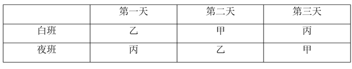

此时满足题干所有条件，可能为真，当选；

代入B项，若满足连续两天看到甲和乙均上班，则第一天和第二天只能都排给甲和乙，那么第三天只能都排给丙，与条件①不符，不可能为真，排除；

代入C项，若满足前天白天出门和今天夜晚回家时都能看到丙上班，则第一天的白班和第三天的夜班都必须排给丙，根据条件①④可知，无论第一天夜班排甲还是乙，此人第二天只能上夜班，此时就会有人全都被排夜班，与条件③不符，不可能为真，排除；

代入D项，若满足连续三天没有看到丙上夜班，则三天的夜班均只能排甲和乙，而丙在这一轮排班中只能上白班，与条件③不符，不可能为真，排除。

故正确答案为A。

---

## 资料分析

### 材料 1

 

#### 第 1 题　qid 4658498 · 增长

2011—2016年，资料中所列省份服务业增加值年均增量最大的是：

- **A**. 广东
- **B**. 江苏　✅
- **C**. 山东
- **D**. 浙江

**答案**：B

**官方解析**

根据题干“······年均增量最大的是”，可判定本题为年均增长量问题。定位统计表可知，广东省、江苏省、山东省、浙江省2011年服务业增加值分别为24464.93亿元、20842.21亿元、17370.89亿元、14449.07亿元，2016年服务业增加值分别为41816.37亿元、38458.45亿元、31669.03亿元、24091.57亿元。根据年均增长量公式：年均增长量，则2011—2016年各省份服务业增加值年均增量为。

年份差相同均为5，因此只需要比较各省份2016年服务业增加值与2011年服务业增加值的差值即可：广东=41816.37-24464.93=17351.44亿元；江苏=38458.45-20842.21=17616.24亿元；山东=31669.03-17370.89=14298.14亿元；浙江=24091.57-14449.07=9642.5亿元，差值最大的是江苏，即可知服务业增加值年均增量最大的是江苏。

故正确答案为B。

---

#### 第 2 题　qid 4658501 · 增长

2013—2016年间，山东省服务业增加值同比增速最快的年份是：

- **A**. 2013年　✅
- **B**. 2014年
- **C**. 2015年
- **D**. 2016年

**答案**：A

**官方解析**

根据题干“······同比增速最快的年份是”，可判定本题为一般增长率比较问题。定位表格可知，2012—2016年山东省服务业增加值分别为19995.81亿元、23221.51亿元、25840.12亿元、28537.35亿元、31669.03亿元。根据公式：增长率，可得2013—2016年山东省服务业增加值同比增速分别为：

2013年：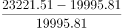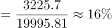；

2014年：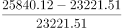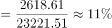；

2015年：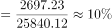；

2016年：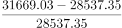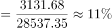。

综上可知，2013—2016年间，山东省服务业增加值同比增速最快的年份是2013年。

故正确答案为A。

---

#### 第 3 题　qid 4658503 · 比重

2016年，广东省服务业增加值占表中四省服务业增加值之和的比重：

- **A**. 不到25%
- **B**. 在25%—28%之间
- **C**. 在28%—32%之间　✅
- **D**. 高于32%

**答案**：C

**官方解析**

根据题干“2016年······占······的比重”，结合材料时间为2016年，可判定本题为现期比重问题。定位统计表可得：2016年广东、江苏、山东、浙江服务业增加值分别为41816.37亿元、38458.45亿元、31669.03亿元、24091.57亿元。根据公式：比重，则2016年广东省服务业增加值占表中四省服务业增加值之和的比重为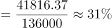，在C项范围内。

故正确答案为C。

---

#### 第 4 题　qid 4658504 · 比重

2016年，江苏、浙江两省GDP分别为76086亿元和46485亿元，江苏省当年服务业增加值占GDP的比重比浙江省：

- **A**. 高不到3个百分点
- **B**. 高3个百分点以上
- **C**. 低不到3个百分点　✅
- **D**. 低3个百分点以上

**答案**：C

**官方解析**

根据题干“2016年······占······的比重······”，结合材料时间为2016年，可判定本题为现期比重问题。定位表格材料可知，2016年江苏、浙江两省服务业增加值分别为38458.45亿元和24091.57亿元。结合题干给出“2016年，江苏、浙江两省GDP分别为76086亿元和46485亿元”，根据公式：比重，则江苏省2016年服务业增加值占GDP的比重为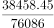，浙江省的比重为，两者差值为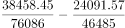，即低1个百分点，在C项范围内。

故正确答案为C。

---

#### 第 5 题　qid 4658505 · 综合

能够从上述资料中推出的是：

- **A**. 2011—2015年，江苏省服务业累计增加值超过15万亿元
- **B**. 2012—2014年，浙江省服务业增加值同比增量每年均超过1500亿元
- **C**. 2015年，表中四省服务业增加值总量较上年增加了一成以上　✅
- **D**. 2016年，山东省服务业增加值超过广东省的80%

**答案**：C

**官方解析**

A项：定位统计表可知：2011—2015年江苏省服务业增加值分别为：20842.21亿元、23517.98亿元、27197.43亿元、30599.49亿元、34085.88亿元。故2011—2015年江苏省服务业累计增加值=20842.21+23517.98+27197.43+30599.49+34085.8821000+24000+27000+31000+34000=137000亿元＜150000亿元，错误；

B项：定位统计表可知：2011—2014年浙江省服务业增加值分别为：14449.07亿元、16071.16亿元、17948.72亿元、19220.79亿元。根据公式：增长量=现期量-基期量，则2012—2014年的同比增量分别为：2012年：亿元＞1500亿元；2013年：亿元＞1500亿元；2014年：亿元＜1500亿元，错误；

C项：定位统计表可知：广东、江苏、山东、浙江四个省份2014年的服务业增加值分别为：33223.28亿元、30599.49亿元、25840.12亿元、19220.79亿元；2015年分别为：36853.47亿元、34085.88亿元、28537.35亿元、21341.91亿元。则2014年表中四省服务业增加值总量=33223.28+30599.49+25840.12+19220.7933000+31000+26000+19000=109000，2015年总量=36853.47+34085.88+28537.35+21341.9137000+34000+29000+21000=121000。根据公式：增长率，则2015年四省服务业增加值总量较上年的增长率为，即增加了一成以上，正确；

D项：定位表格可知：2016年山东省服务业增加值为31669.03亿元，广东省为41816.37亿元。广东省服务业增加值的80%=41816.37×80%＞40000×80%=32000亿元＞31669.03亿元，错误。

故正确答案为C。

---

### 材料 2

        2016年，全国棉花产量534.3万吨，比2015年减产26.0万吨。

        播种面积减少是2016年我国棉花产量减少的主要原因。继2014、2015年后，2016年棉花播种面积继续减少。2016年全国棉花播种面积为3376.1千公顷，比2015年减少420.5千公顷。分地区看，新疆棉花播种面积比2015年减少99.1千公顷，下降约5.2%；其他省棉花播种面积减少321.3千公顷，下降约17%。

        从棉区看，黄河、长江流域棉区延续2015年减产较多的趋势。其中，黄河流域棉花播种面积减少147.8千公顷，下降约14.3%；单产每公顷增加63.3公斤，提高约6.0%；产量减少10.0万吨，下降约9.2%。长江流域棉花播种面积减少160.7千公顷，下降约19.8%；单产每公顷减少68.3公斤，下降约5.9%；产量减少23.0万吨，下降约24.6%。

        尽管我国最大的产棉区新疆棉花播种面积减少，但由于每公顷单产增加151.5公斤，棉花产量仍达到359.4万吨，比上年增加9.1万吨，增长约2.6%。新疆棉花产量占全国的比重进一步扩大到约67.3%，比上年提高约4.8个百分点。

#### 第 6 题　qid 4658508 · 增长

2016年，全国棉花单位面积产量比上年约：

- **A**. 下降6.8%
- **B**. 下降3.9%
- **C**. 上升2.6%
- **D**. 上升7.2%　✅

**答案**：D

**官方解析**

根据题干“2016年······单位面积产量比上年约”，结合选项为“上升/下降+百分数”，可判定本题为平均数的增长率问题。定位文字材料第一、二段可得：2016年，全国棉花产量534.3万吨，比2015年减产26.0万吨；2016年全国棉花播种面积为3376.1千公顷，比2015年减少420.5千公顷。

方法一：根据公式：增长率，2016年全国棉花产量的同比增速，2016年全国棉花播种面积的同比增速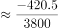。代入平均数的增长率计算公式：，2016年全国棉花单位面积产量的同比增速为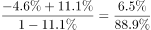，与D项最接近。

方法二：根据公式：单位面积产量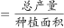，2016年全国棉花单位面积产量为吨/公顷，2015年全国棉花单位面积产量为吨/公顷。根据公式：增长率，2016年全国棉花单位面积产量同比增速为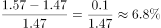，与D项最接近。

故正确答案为D。

---

#### 第 7 题　qid 4658517 · 综合

2015年，黄河流域的棉花单产为：

- **A**. 1118公斤/公顷
- **B**. 1092公斤/公顷
- **C**. 1055公斤/公顷　✅
- **D**. 1003公斤/公顷

**答案**：C

**官方解析**

根据题干“2015年······棉花单产为”，结合材料时间为2016年，可判定本题为基期计算问题。定位文字材料第三段可得：2016年黄河流域单产每公顷增加63.3公斤，提高约6.0%。根据公式：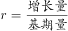，可得2015年黄河流域的棉花单产量公斤/公顷。

故正确答案为C。

---

#### 第 8 题　qid 4658520 · 增长

2016年，黄河流域、长江流域和新疆三地之外的产棉地区棉花产量比上年：

- **A**. 减少6.8万吨
- **B**. 减少2.1万吨　✅
- **C**. 增加2.1万吨
- **D**. 增加6.8万吨

**答案**：B

**官方解析**

根据题干“2016年······棉花产量比上年”，结合选项带单位，可判定本题为增长量计算问题。定位文字材料第一段可得：2016年，全国棉花产量······比2015年减产26.0万吨；定位文字材料第三段可得：黄河流域棉花······产量减少10.0万吨······长江流域棉花······产量减少23.0万吨；定位文字材料第四段可得：（新疆）棉花产量······比上年增加9.1万吨。则2016年，黄河流域、长江流域和新疆三地之外的产棉地区棉花产量比上年增加-26.0-（-10.0）-（-23.0）-9.1=-2.1万吨，即减少2.1万吨。
故正确答案为B。

---

#### 第 9 题　qid 4658521 · 增长

2016年，棉花播种面积同比降幅最大的是：

- **A**. 全国棉花播种面积
- **B**. 黄河流域棉花播种面积
- **C**. 新疆棉花播种面积
- **D**. 长江流域棉花播种面积　✅

**答案**：D

**官方解析**

根据题干“2016年······同比降幅最大的是”，可判定本题为一般增长率问题。定位文字材料第二段可得：2016年全国棉花播种面积为3376.1千公顷，比2015年减少420.5千公顷。分地区看，新疆棉花播种面积比2015年······下降约5.2%。定位文字材料第三段可得：黄河流域棉花播种面积······下降约14.3%······长江流域棉花播种面积······下降约19.8%。根据公式：增长率，可得2016年，全国棉花播种面积的同比增速。比较可知，2016年长江流域棉花播种面积同比降幅（19.8%）最大。

故正确答案为D。

---

#### 第 10 题　qid 4658523 · 综合

不能从上述材料中推出的是：

- **A**. 2014-2016年，我国棉花播种面积逐年递减
- **B**. 2015年和2016年新疆棉花产量占全国的比重都大于60%
- **C**. 2015年和2016年新疆棉花播种面积占全国的比重都大于50%
- **D**. 2016年，黄河流域、长江流域棉区棉花播种面积和单产均减少　✅

**答案**：D

**官方解析**

A项：定位文字材料第二段可得，继2014、2015年后，2016年棉花播种面积继续减少，可推出2014-2016年，我国棉花播种面积逐年递减，正确；

B项：定位文字材料第四段可得，2016年新疆棉花产量占全国的比重约为67.3%，比上年提高约4.8个百分点，可推出2015年新疆棉花产量占全国的比重约为67.3%-4.8%=62.5%，故2015年和2016年新疆棉花产量占全国的比重都大于60%，正确；

C项：定位文字材料第二段可得，2016年全国棉花播种面积为3376.1千公顷，比2015年减少420.5千公顷，新疆棉花播种面积比2015年减少99.1千公顷，下降约5.2%。根据公式：基期量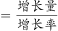，可得2015年新疆棉花播种面积千公顷；根据公式：现期量=基期量+增长量，可得2016年新疆棉花播种面积=1905.8-99.1=1806.7千公顷；根据公式：基期量=现期量-增长量，可得2015年全国棉花播种面积=3376.1+420.5=3796.6千公顷；根据公式：比重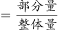，可得2015年和2016年新疆棉花播种面积占全国的比重分别为：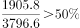、，正确；

D项：定位文字材料第三段可得，2016年黄河流域棉花单产每公顷增加63.3公斤，提高约6.0%，可推出2016年黄河流域、长江流域棉区棉花播种面积和单产并非均减少，错误。

本题为选非题，故正确答案为D。

---

### 材料 3

        2016年，我国全年社会消费品零售总额332316亿元。按经营地统计，城镇消费品零售额285814亿元，增长10.4%；乡村消费品零售额46503亿元，增长10.9%。按消费类型统计，商品零售额296518亿元，增长10.4%；餐饮收入额35799亿元，增长10.8%。

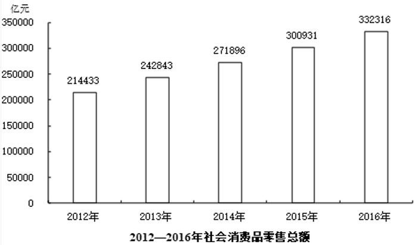

        在限额以上企业商品零售额中，粮油、食品、饮料、烟酒类零售额比上年增长10.5%，服装、鞋帽、针纺织品类增长7.0%，化妆品类增长8.3%，金银珠宝类与上年持平，日用品类增长11.4%，家用电器和音像器材类增长8.7%，中西药品类增长12.0%，文化办公用品类增长11.2%，家具类增长12.7%，通讯器材类增长11.9%，建筑及装潢材料类增长14.0%，汽车类增长10.1%，石油及制品类增长1.2%。

        全年网上零售额51556亿元，比上年增长26.2%。其中，网上商品零售额41944亿元，增长25.6%，占社会消费品零售总额的比重为12.6%。在网上商品零售额中，吃类商品增长28.5%，穿类商品增长18.1%，用类商品增长28.8%。

#### 第 11 题　qid 4658585 · 增长

2013-2016年，社会消费品零售总额同比增速最快的年份是：

- **A**. 2013年　✅
- **B**. 2014年
- **C**. 2015年
- **D**. 2016年

**答案**：A

**官方解析**

根据题干“2013-2016年······同比增速最快的年份是”，可判定本题为一般增长率问题。定位统计图可得：2012-2016年社会消费品零售总额分别为214433亿元、242843亿元、271896亿元、300931亿元、332316亿元。根据公式：增长率，可得2013-2016年社会消费品零售总额同比增速分别为：

2013年：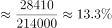；

2014年：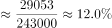；

2015年：；

2016年：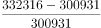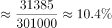。

则2013-2016年，社会消费品零售总额同比增速最快的年份是2013年。

故正确答案为A。

---

#### 第 12 题　qid 4658586 · 增长

2016年，我国限额以上企业商品零售额，按增幅排序正确的是：

- **A**. 文化办公用品类＞通讯器材类＞日用品类
- **B**. 家具类＞中西药品类＞建筑及装潢材料类
- **C**. 汽车类＞化妆品类＞粮油、食品、饮料、烟酒类
- **D**. 家用电器和音像器材类＞服装、鞋帽、针纺织品类＞石油及制品类　✅

**答案**：D

**官方解析**

定位文字材料第二段，可得2016年限额以上企业商品零售额中各类商品同比增幅。代入选项验证，A项：文化办公用品类（11.2%）＜通讯器材类（11.9%），错误；B项：中西药品类（12.0%）＜建筑及装潢材料类（14.0%），错误；C项：化妆品类（8.3%）＜粮油、食品、饮料、烟酒类（10.5%），错误；D项：家用电器和音像器材类（8.7%）＞服装、鞋帽、针纺织品类（7.0%）＞石油及制品类（1.2%），正确。
故正确答案为D。

---

#### 第 13 题　qid 4658629 · 比重

2015年，我国网上商品零售额占当年社会消费品零售总额的比重可用下列哪一图形表示？

- **A**. 

- **B**. 

　✅
- **C**. 

- **D**. 

**答案**：B

**官方解析**

根据题干“2015年······占······的比重”，结合材料时间为2016年，可判定本题为基期比重问题。定位统计图，可得2015年社会消费品零售总额为300931亿元；定位文字材料第三段，可得2016年我国网上商品零售额41944亿元，增长25.6%。根据公式：基期量，2015年我国网上商品零售额亿元，则2015年我国网上商品零售额占当年社会消费品零售总额的比重，约占饼状图面积的，与B项最接近。

故正确答案为B。

---

#### 第 14 题　qid 4658631 · 综合

如从2016年开始，社会消费品零售总额年增量保持不变，社会消费品零售总额首次超过40万亿元的年份是：

- **A**. 2017年
- **B**. 2018年
- **C**. 2019年　✅
- **D**. 2020年

**答案**：C

**官方解析**

根据题干“如从2016年开始······年增量保持不变······首次超过”，结合选项所求为2016年以后的时间，可判定本题为现期追赶问题。定位统计图可得：2015年和2016年社会消费品零售总额分别为300931亿元和332316亿元。根据公式：增长量=现期量-基期量，可得2016年社会消费品零售总额年增量=332316-300931=31385亿元；根据公式：现期量=基期量+n×增长量，可得332316+n×31385＞400000，解得n＞2.2，n为整数至少取3，即2019年首次超过40万亿元。
故正确答案为C。

---

#### 第 15 题　qid 4658632 · 综合

不能从上述资料中推出的是：

- **A**. 2012-2016年，社会消费品零售总额超过140万亿元　✅
- **B**. 2015年，城镇消费品零售总额占当年社会消费品零售总额的80%以上
- **C**. 2016年，限额以上企业商品零售额中，并非所有品类都呈增长趋势
- **D**. 2016年，餐饮收入额占社会消费品零售总额的比重同比上升了不到0.4个百分点

**答案**：A

**官方解析**

A项：定位统计图，可知2012-2016年社会消费品零售总额分别为214433亿元、242843亿元、271896亿元、300931亿元、332316亿元。则2012-2016年，社会消费品零售总额为214433＋242843＋271896＋300931＋332316＜215000+243000+272000+301000+333000=1364000亿元=136.4万亿元＜140万亿元，错误；

B项：定位文字材料第一段可得，2016年城镇消费品零售额285814亿元，增长10.4%；定位统计图可得，2015年社会消费品零售总额为300931亿元。根据公式：基期量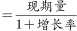，则2015年城镇消费品零售额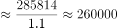亿元，则2015年城镇消费品零售总额占当年社会消费品零售总额比重，正确；

C项：定位文字材料第二段可得，2016年限额以上企业商品零售额中，金银珠宝类与上年持平。故2016年限额以上企业商品零售额中，并非所有品类都呈增长趋势，正确；

D项：定位文字材料第一段可得，2016年餐饮收入额35799亿元（A），增长10.8%（a）；定位统计图可得，2015年、2016年社会消费品零售总额分别为300931亿元、332316亿元（B）。根据公式：增长率，则2016年社会消费品零售总额同比增长率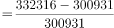（b）；根据公式：两期比重差，则2016年餐饮收入额占社会消费品零售总额的比重同比上升，即上升不到0.4个百分点，正确。

本题为选非题，故正确答案为A。

---
