# 2021年四川省公务员录用考试《行测》题（网友回忆版）

> 省考 · 2021 年 · 5 个模块 · 共 97 题

- [常识判断](#%E5%B8%B8%E8%AF%86%E5%88%A4%E6%96%AD) · 15 题
- [言语理解与表达](#%E8%A8%80%E8%AF%AD%E7%90%86%E8%A7%A3%E4%B8%8E%E8%A1%A8%E8%BE%BE) · 30 题
- [数量关系](#%E6%95%B0%E9%87%8F%E5%85%B3%E7%B3%BB) · 10 题
- [判断推理](#%E5%88%A4%E6%96%AD%E6%8E%A8%E7%90%86) · 30 题
- [资料分析](#%E8%B5%84%E6%96%99%E5%88%86%E6%9E%90) · 12 题

---

## 常识判断

### 第 1 题　qid 3523567 · 经济常识

下列选项中，与党的十九届五中全会精神相符的是：

- **A**. 坚持扩大内需这个战略基点，加快培育完整内需体系　✅
- **B**. 坚持把发展经济着力点放在金融创新上，提高经济质量效益和核心竞争力
- **C**. 坚持把推进区域协调发展和新型城镇化作为全党工作重中之重，强化以工补农、以城带乡
- **D**. 坚持创新在我国现代化建设全局中的核心地位，把科技国际交流合作作为国家发展的战略支撑

**答案**：A

**官方解析**

本题考查政治常识。
中国共产党第十九届中央委员会第五次全体会议，于2020年10月26日至29日在北京举行。
A项正确，全会提出，形成强大国内市场，构建新发展格局。坚持扩大内需这个战略基点，加快培育完整内需体系，把实施扩大内需战略同深化供给侧结构性改革有机结合起来，以创新驱动、高质量供给引领和创造新需求。
B项错误，全会提出，坚持把发展经济着力点放在实体经济上，坚定不移建设制造强国、质量强国、网络强国、数字中国，推进产业基础高级化、产业链现代化，提高经济质量效益和核心竞争力。
C项错误，全会提出，坚持把解决好“三农”问题作为全党工作重中之重，走中国特色社会主义乡村振兴道路，全面实施乡村振兴战略，强化以工补农、以城带乡，推动形成工农互促、城乡互补、协调发展、共同繁荣的新型工农城乡关系，加快农业农村现代化。
D项错误，全会提出，坚持创新在我国现代化建设全局中的核心地位，把科技自立自强作为国家发展的战略支撑，面向世界科技前沿、面向经济主战场、面向国家重大需求、面向人民生命健康，深入实施科教兴国战略、人才强国战略、创新驱动发展战略，完善国家创新体系，加快建设科技强国。
故正确答案为A。

---

### 第 2 题　qid 3523568 · 人文常识

关于“十三五”时期我国“三农”工作取得的成就，下列说法错误的是：

- **A**. 粮食年产量持续保持在1.3万亿斤以上
- **B**. 农民人均收入较2010年翻一番多
- **C**. 消除了绝对贫困和区域性整体贫困
- **D**. 农村生产生活方式实现绿色转型　✅

**答案**：D

**官方解析**

本题考查政治常识。
2021年中央一号文件《中共中央 国务院关于全面推进乡村振兴加快农业农村现代化的意见》（以下简称《意见》）于2021年2月21日发布，这是21世纪以来第18个指导“三农”工作的中央一号文件。
A、B两项正确，《意见》指出：“十三五”时期，现代农业建设取得重大进展，乡村振兴实现良好开局。粮食年产量连续保持在1.3万亿斤以上，农民人均收入较2010年翻一番多。
C项正确，《意见》指出：新时代脱贫攻坚目标任务如期完成，现行标准下农村贫困人口全部脱贫，贫困县全部摘帽，易地扶贫搬迁任务全面完成，消除了绝对贫困和区域性整体贫困，创造了人类减贫史上的奇迹。
D项错误，《意见》指出：到2025年，农业农村现代化取得重要进展，农业基础设施现代化迈上新台阶，农村生活设施便利化初步实现，城乡基本公共服务均等化水平明显提高。农村生产生活方式绿色转型取得积极进展，化肥农药使用量持续减少，农村生态环境得到明显改善。
本题为选非题，故正确答案为D。

---

### 第 3 题　qid 3522652 · 人文常识

下列对我国“十四五”时期经济社会发展主要目标表述错误的是：

- **A**. 经济发展取得新成效和改革开放迈出新步伐
- **B**. 创新驱动取得新优势和国内市场形成发展新格局　✅
- **C**. 民生福祉达到新水平和国家治理效能得到新提升
- **D**. 社会文明程度得到新提高和生态文明建设实现新进步

**答案**：B

**官方解析**

本题考查政治常识。
2020年10月29日，中国共产党第十九届中央委员会第五次全体会议通过的《国民经济和社会发展第十四个五年规划和2035年远景目标纲要》中指出：“‘十四五’时期经济社会发展主要目标。锚定二〇三五年远景目标，综合考虑国内外发展趋势和我国发展条件，坚持目标导向和问题导向相结合，坚持守正和创新相统一，今后五年经济社会发展要努力实现以下主要目标：经济发展取得新成效；改革开放迈出新步伐；社会文明程度得到新提高；生态文明建设实现新进步；民生福祉达到新水平；国家治理效能得到新提升。”
本题为选非题，故正确答案为B。

---

### 第 4 题　qid 3523573 · 法律常识

近年来，国家相关法律法规对保健食品广告的用语进行了严格规范，虚假用词、夸大用词、绝对化用词被明令禁止。下列保健食品广告用语，符合国家有关规定的是（    ）。

- **A**. 某保健品胶囊广告：祖传秘方，宫廷秘制，强身健体
- **B**. 某保健口含片广告：增强免疫力，调理肠胃，调节血脂　✅
- **C**. 某保健品袋泡茶广告：坚持冲泡，治疗三高，十天见效
- **D**. 某灵芝保健品广告：无毒副作用，无效退款，全额承保

**答案**：B

**官方解析**

本题考查法律常识。
《广告法》第十八条规定：“保健食品广告不得含有下列内容：（一）表示功效、安全性的断言或者保证；（二）涉及疾病预防、治疗功能；（三）声称或者暗示广告商品为保障健康所必需；（四）与药品、其他保健食品进行比较；（五）利用广告代言人作推荐、证明；（六）法律、行政法规规定禁止的其他内容。保健食品广告应当显著标明本品不能代替药物。”
A项错误，某保健品胶囊广告宣称产品为祖传秘方，属于表示功效的保证，违反本条第一项。不符合广告用语。
B项正确，某保健口含片广告增强免疫力，调理肠胃，调节血脂的广告符合保健品广告的用语。
C项错误，某保健品袋泡茶广告夸大产品功能，涉及疾病预防、治疗功能，误导消费违反本条第二项。不符合广告用语。
D项错误，某灵芝保健品广告无毒副作用，无效退款，全额承保属于表示功效、安全性的断言或者保证，违反本条第一项。不符合广告用语。
故正确答案为B。

---

### 第 5 题　qid 3523575 · 人文常识

国务院部署推动县域创新驱动发展工作，支持县域开展以科技创新为核心的全面创新，发挥科技创新在县域供给侧结构性改革中的支撑和引领作用。下列选项中，不符合县域创新驱动发展精神的是：

- **A**. 集聚创新创业人才，激发各类人才的创新创业活力
- **B**. 对缺乏市场竞争力的地方传统产业加大政策资金补贴力度　✅
- **C**. 培育壮大创新型企业，支持符合条件的高成长性科技企业上市
- **D**. 加快产业转型升级，促进县域特色主导产业绿色化、品牌化、高端化、集群化发展

**答案**：B

**官方解析**

本题考查政治常识。
2017年5月24日，国务院办公厅印发《关于县域创新驱动发展的若干意见》(以下简称《意见》)，部署推动县域创新驱动发展工作。
A项正确，《意见》指出：（六）集聚创新创业人才。落实《中华人民共和国促进科技成果转化法》、《实施〈中华人民共和国促进科技成果转化法〉若干规定》，通过股权期权激励等措施，让创新人才在科技成果转移转化过程中得到合理回报，激发各类人才的创新创业活力。
B项错误，《意见》指出：（五）培育壮大创新型企业。鼓励有条件的县（市）采取科技创新券等科技经费后补助措施，支持小微企业应用新技术、新工艺、新材料，发展新服务、新模式、新业态，培育一批掌握行业“专精特新”技术的科技“小巨人”企业。选项表述不符合县域创新驱动发展精神。
C项正确，《意见》指出：（五）培育壮大创新型企业。支持符合条件的高成长性科技企业上市，引导企业有效利用主板、中小板、创业板、新三板、区域性股权交易市场等多层次资本市场融资。
D项正确，《意见》指出：（四）加快产业转型升级。支持重点生态功能区以保护自然生态为前提、以资源承载能力和环境容量为基础，科学有度有序开发，促进人口、经济、资源环境均衡发展。结合地方资源禀赋和发展基础，发展知识产权密集型产业，促进县域特色主导产业绿色化、品牌化、高端化、集群化发展。
本题为选非题，故正确答案为B。

---

### 第 6 题　qid 3523577 · 法律常识

下列关于法律名言的理解，错误的是：

- **A**. 法立而不行，与无法等——重视法的执行
- **B**. 迟来的正义即非正义——司法裁判活动不应过于迟缓
- **C**. 善良的心是最好的法律——需要道德高尚的人做法官　✅
- **D**. 呆板的公平是最大的不公平——法的适用关注实质公平

**答案**：C

**官方解析**

本题考查法律常识。
A项正确，法立而不行，与无法等这句话强调了只有实实在在运行的法才是法，强调了法的执行。
B项正确，迟来的正义即非正义这句话强调的是正义的时效性，时效是正义的计时器，迟来的正义就不是正义，司法裁判活动不应过于迟缓。
C项错误，善良的心是最好的法律这句话中善良的心应当是指人们内心的良知。这句格言告诫人们拥有一颗善良的心是非常重要和有意义的，因为它好比最好的法律和规则。不是强调需要道德高尚的人做法官。
D项正确，呆板的公平是最大的不公平强调要注意实质公平。
本题为选非题，故正确答案为C。

---

### 第 7 题　qid 3523579 · 科技常识

环渤海经济圈是“实现东部新跨越”战略方针中的重要区域，下列与之相关的说法错误的是：

- **A**. 天津滨海新区是其重要组成部分
- **B**. 该地区是我国重要的小麦和棉花产区
- **C**. 该地区是我国的重工业和化学工业基地
- **D**. 人口密度是影响其可持续发展的首要因素　✅

**答案**：D

**官方解析**

本题考查政治常识。
A项正确，环渤海经济圈是指以辽东半岛、山东半岛、京津冀为主的环渤海滨海经济带，同时延伸辐射到山西、辽宁、山东以及内蒙古中东部。因此天津滨海新区是其重要组成部分。
B项正确，环渤海地区包括华北平原和辽河平原，是我国农业发达地区之一，这里是全国重要的小麦、杂粮、棉花、油料和水果生产基地；西部地区和内蒙古草原，是全国林、牧业基地之一。
C项正确，环渤海地区是中国最大的工业密集区，是中国的重工业和化学工业基地，有资源和市场的比较优势。
D项错误，影响环渤海经济圈可持续发展的首要因素是水资源短缺，主要因为环渤海经济圈为温带季风气候，年降水量少，雨季集中于夏季；春季气温回升，蒸发量大，春旱严重；工农业用水量大；人口密集，生活用水量大；水资源利用率低，浪费严重。
本题为选非题，故正确答案为D。

---

### 第 8 题　qid 3523582 · 人文常识

下列文学作品按时间先后顺序排列错误的是：

- **A**. 《过秦论》—《隆中对》—《归去来兮辞》
- **B**. 《兰亭集序》—《岳阳楼记》—《滕王阁序》　✅
- **C**. 《桃花源记》—《捕蛇者说》—《醉翁亭记》
- **D**. 《铜雀台赋》—《阿房宫赋》—《后赤壁赋》

**答案**：B

**官方解析**

本题考查人文常识。
A项正确，《过秦论》作者为西汉时期的贾谊，《隆中对》作者为西晋时期的陈寿，《归去来兮辞》作者为东晋时期的陶渊明。
B项错误，《兰亭集序》作者为东晋时期的王羲之，《岳阳楼记》作者为北宋时期的范仲淹，《滕王阁序》作者为唐代时期的王勃。正确的顺序为《兰亭集序》—《滕王阁序》—《岳阳楼记》。
C项正确，《桃花源记》作者为东晋时期的陶渊明，《捕蛇者说》作者为唐代时期的柳宗元，《醉翁亭记》作者为北宋时期的欧阳修。
D项正确，《铜雀台赋》作者为东汉末年时期的曹植，《阿房宫赋》作者为唐代时期的杜牧，《后赤壁赋》作者为北宋时期的苏轼。
本题为选非题，故正确答案为B。

---

### 第 9 题　qid 3523584 · 科技常识

关于生活常识，下列说法正确的是：

- **A**. 夏季洗温水浴可以降温　✅
- **B**. 夏季出汗越多，减肥效果越好
- **C**. 太阳镜颜色越深越能保护眼睛
- **D**. 中暑后应喝大量白开水以补充水分

**答案**：A

**官方解析**

本题考查科技常识。
A项正确，夏季洗温水浴散热更快，因为温水洗浴可以使皮肤的毛细血管扩张，汗孔张开，有利于散热，达到降温的目的。
B项错误，出汗的主要作用是调节体温，不能够起到减肥的作用。
C项错误，太阳镜镜片的颜色如果过深，就会严重影响可见度，反而使视力因为看东西吃力而受到损伤。
D项错误，中暑后大量饮用白开水会加速体内的电解质紊乱，导致肌肉痉挛、乏力等症状更加严重，建议补充糖盐水，并要采取少量、多次饮水的方法。
故正确答案为A。

---

### 第 10 题　qid 3523585 · 人文常识

下列选项中，与“子非鱼，安知鱼之乐”中“子”含义相同的是：

- **A**. 执子之手，与子偕老　✅
- **B**. 子曰诗云
- **C**. 子又生孙，孙又生子
- **D**. 我本汉家子

**答案**：A

**官方解析**

本题考查人文常识。
“子非鱼，安知鱼之乐”出自《庄子与惠子游于濠梁之上》，意思是你又不是鱼，怎么知道鱼是快乐的？其中“子”在此处的意思是“你”，文中是指“庄子”。
A项正确，“执子之手，与子偕老”出自《诗经·邶风·击鼓》，意思是让我握住你的手，同生共死上战场，表达了两名战友在艰苦漫长的远征环境中相互勉励之情。其中“子”在此处的意思是“你”。
B项错误，“子曰诗云”出自元代宫大用《死生交范张鸡黍》第一折。子是指“孔子”；诗是指《诗经》；曰、云的意思是“说”，泛指儒家言论。
C项错误，“子又生孙，孙又生子”出自《愚公移山》，意思是儿子又生孙子，孙子又生儿子。其中“子”在此处的意思是“儿子”。
D项错误，“我本汉家子”出自西晋石崇所作的《王明君》，意思是我本是汉人。其中“子”在此处的意思是“人的通称”。
故正确答案为A。

---

### 第 11 题　qid 3523586 · 法律常识

战国时期各国纷纷变法图强，对社会生产影响显著，下列事件最不可能发生的是：

- **A**. 楚国某没落贵族被取消爵禄
- **B**. 燕国某人因无地来到秦国，秦国划给他一块荒地
- **C**. 秦国某人因将自己的三亩良田卖予他人，被处以刖刑　✅
- **D**. 魏国某人粮食大丰收，官府派人来平价收购了他的余粮

**答案**：C

**官方解析**

本题考查人文常识。
A项正确，战国时期，楚国国君楚悼王任用吴起对楚国政治、法律、军事等实行改革，史称“吴起变法”。其主要内容为：废除贵族世卿世禄制，对已传三代之封君，取消爵禄，降为平民；徙贵族于边境，以实广虚之地；裁减冗官，选贤任能；削减官吏禄秩，厚赏选练之士。因此，楚国某没落贵族可能会被取消爵禄。
B项正确，商鞅在秦国进行变法，其中在经济上，主张奖励耕织、重农抑商、招徕政策。其中招徕政策是指商鞅从三晋地区招徕无地的农民到秦国垦荒，给予田宅，并免除其三世的劳役和兵役。因此，燕国某人因无地来到秦国，秦国可能会划给他一块荒地。
C项错误，战国时期，秦国国君秦孝公任用商鞅对秦国经济、政治、军事等进行变法改革，史称“商鞅变法”。其主要内容为：（1）经济上，废井田，承认土地私有，允许土地自由买卖；重农抑商、奖励耕织；统一度量衡；（2）政治上，建立严密的户籍制度，实行连坐法；废除“世卿世禄制”；（3）军事上，奖励军功。因此，秦国某人可以将自己的三亩良田卖予他人。
D项正确，战国时期魏国的魏文侯当政时，任用李悝为相，进行变法改革，史称“李悝变法”。其主要内容为：（1）政治上，主张废止世袭贵族特权，选贤任能，赏罚严明；（2）经济上，主要实行尽地力、平籴法。其中“平籴法”是指由国家控制粮食的购销和价格。政府在丰年以平价收购农民余粮，防止商人压价伤农；在灾年则平价出售储备粮，防止商人抬价伤民，防止“谷贱伤农，谷贵伤民”。因此，魏国某人粮食大丰收，官府可能会派人来平价收购了他的余粮。
本题为选非题，故正确答案为C。

---

### 第 12 题　qid 3523588 · 人文常识

下列关于纤维的说法，错误的是：

- **A**. 制成亚麻面料的纤维是从亚麻的韧皮部取得的
- **B**. 聚酯纤维俗称涤纶，其吸湿性和抗皱性较好　✅
- **C**. 棉纤维是热和电的不良导体且具有多孔性，故保暖性较强
- **D**. 蚕丝含蛋白质，可点燃闻有无烧焦羽毛的气味检验真假

**答案**：B

**官方解析**

本题考查科技常识。
A项正确，亚麻面料是用亚麻纤维织成的织物，主要优点是平滑、凉爽、散热性好。原材料亚麻是一种韧皮纤维作物和油科作物，其茎部韧皮纤维细而坚韧、耐磨，不易被水浸腐，可供纺织和制渔具。
B项错误，聚酯纤维，俗称“涤纶”，强度高，抗皱性、耐光性、化学稳定性、绝缘性均较高，透气性、吸湿性差，易洗快干。
C项正确，棉纤维是热和电的不良导体且具有多孔性，孔隙之间积存了大量的空气，而空气也是热的不良导体，因此棉纤维中热量的散失较少，保暖性较强。
D项正确，蚕丝是熟蚕结茧时由吐丝管分泌的液状丝物质凝固而成的长纤维，其主要成分是蛋白质，蛋白质的特性之一就是灼烧时，能闻到烧焦羽毛的气味，由此可鉴别蚕丝的真假。
本题为选非题，故正确答案为B。

---

### 第 13 题　qid 3523589 · 人文常识

东西方关于管理学的思想有许多共通之处。下列西方管理学原理与东方哲理相对应的是：

- **A**. 破窗理论：防微杜渐，亡羊补牢　✅
- **B**. 木桶原理：尺有所短，寸有所长
- **C**. 彼得原理：人尽其才，物尽其用
- **D**. 马太效应：木秀于林，风必摧之

**答案**：A

**官方解析**

本题考查管理常识。
A项正确，破窗理论认为环境中的不良现象如果被放任存在，会诱使人们仿效，甚至变本加厉。以一幢有少许破窗的建筑为例，如果那些窗不被修理好，可能将会有破坏者破坏更多的窗户。破窗效应告诉我们要勇于第一时间纠正自己的错误，修缮自己的损失，否则会让错误越变越大。“防微杜渐，亡羊补牢”是指在错误或坏事刚刚冒头的时候就及时制止，不让它发展，这与破窗效应的原理相同。
B项错误，木桶原理指一只木桶盛水的多少，并不取决于桶壁上最长的那块木块，而取决于桶壁上最短的那块。因此，整个社会与我们每个人都应思考一下自己的“短板”，并尽早补足它。而“尺有所短，寸有所长”比喻每个人都有自己的长处和短处，要正确评估自己，扬长避短，与木桶原理相反。
C项错误，美国管理学家彼得指出，每一个职工由于在原有职位上工作成绩表现好（胜任），就将被提升到更高一级职位；其后，如果继续胜任则将进一步被提升，直至到达他所不能胜任的职位即彼得高地，由此得出彼得原理：每一个职位最终都将被一个不能胜任其工作的职工所占据。而“人尽其才，物尽其用”是指每个人都发挥出他的才能，与彼得原理相反。
D项错误，马太效应指强者愈强、弱者愈弱的现象，广泛应用于社会心理学、教育、金融以及科学领域。其名字来自圣经《新约·马太福音》一则寓言：“凡有的，还要加倍给他叫他多余；没有的，连他所有的也要夺过来”。“木秀于林，风必摧之”原指高出森林的大树总是要被大风先吹倒，也比喻才能业绩出众的人，容易受到忌妒、诽谤，与马太效应相反。
故正确答案为A。

---

### 第 14 题　qid 3523590 · 人文常识

下列诗句中所提到的花对应错误的是：

- **A**. 雪虐风饕愈凛然，花中气节最高坚——梅花
- **B**. 菡萏香销翠叶残，西风愁起绿波间——紫薇花　✅
- **C**. 直须看尽洛城花，始共春风容易别——牡丹花
- **D**. 蒂有余香金淡泊，枝无全叶翠离披——菊花

**答案**：B

**官方解析**

本题考查人文常识。
A项正确，该句出自宋代陆游的《落梅》，意思是梅花在狂风大雪中更显得凛然不可犯， 它是花中气节最高尚最坚定的一个。冬季百花凋谢，只有梅花傲然开放，因此由“雪虐风饕”可知诗句描写的是梅花。
B项错误，该句出自五代李璟的《摊破浣溪沙·菡萏香销翠叶残》，意思是荷花落尽，香气消散，荷叶凋残，西风从绿波之间吹起，使人愁绪满怀。“菡萏”是荷花的别称，因此诗句描写的是荷花。
C项正确，该句出自宋代欧阳修的《玉楼春·尊前拟把归期说》，意思是一定要将整个洛阳城的花朵都看尽了，继而才能与春风轻松地告别。洛城即洛阳，洛阳盛产牡丹，以“洛阳牡丹甲天下”的美名流传于世，故诗句所写洛城花指牡丹花。
D项正确，该句出自清代曹雪芹的《残菊》，意思是菊花残落后仅有残留的香气，金黄的花朵颜色暗淡，枝叶破败散落。“淡泊”指花的颜色消退，“金淡泊”意思是金黄色的花颜色渐渐消退。
本题为选非题，故正确答案为B。

---

### 第 15 题　qid 3523591 · 地理国情

喜欢旅游的赵某准备在今年夏天去爬三座名山，计划从黄河或者长江发源地出发，沿黄河或长江其中一条干流流经省份由西向东走，下列肯定不是其规划路线的是：

- **A**. 华山—五台山—泰山
- **B**. 昆仑山—青城山—黄山
- **C**. 峨眉山—衡山—庐山
- **D**. 井冈山—武当山—嵩山　✅

**答案**：D

**官方解析**

本题考查地理国情。
黄河干流先后流经青海、四川、甘肃、宁夏、内蒙古、陕西、山西、河南、山东共9个省级行政区；长江干流先后流经青海、四川、西藏、云南、重庆、湖北、湖南、江西、安徽、江苏、上海共11个省级行政区。
A项正确，华山位于陕西省渭南市，五台山位于山西省忻州市，泰山位于山东省泰安市，其旅游路线途径省份为：陕西—山西—山东，因此赵某是沿着黄河干流由西向东走。
B项正确，昆仑山西起帕米尔高原东部，横贯新疆、西藏间，东延入青海境内，青城山位于四川省成都市，黄山位于安徽省黄山市，其旅游路线途径省份为：新疆/西藏/青海—四川—安徽，因此赵某是沿着长江干流由西向东走。
C项正确，峨眉山位于四川省乐山市，衡山位于湖南省衡阳市，庐山位于江西省九江市，其旅游路线途径省份为：四川—湖南—江西，因此赵某是沿着长江干流由西向东走。
D项错误，井冈山位于江西省吉安市，武当山位于湖北省十堰市，嵩山位于河南省郑州市，其旅游路线途径省份为：江西—湖北—河南，江西、湖北属于长江流域，而河南属于黄河流域，因此该路线肯定不是赵某的旅游路线。
本题为选非题，故正确答案为D。

---

## 言语理解与表达

### 第 1 题　qid 3523549 · 逻辑填空

华夏文明甚至整个人类文明发展演变到今天，其实都有一个            的过程，人们喜欢自由自在地生活，不喜欢被叠床架屋束缚，简洁的价值观与人类追求单纯明净的趣味也非常契合。
填入画横线部分最恰当的一项是：

- **A**. 删繁就简　✅
- **B**. 言简意赅
- **C**. 去伪存真
- **D**. 去粗取精

**答案**：A

**官方解析**

根据“人们喜欢自由自在地生活，不喜欢被叠床架屋束缚，简洁的价值观与人类追求单纯明净的趣味也非常契合”可知，横线处要体现的是文明发展演变是从重复累赘到简洁明了的过程，A项“删繁就简”指删除繁杂的，使之趋于简明、精练，符合文意，当选。
B项“言简意赅”形容说话、写文章简明扼要，文段并非形容说话与写文章，且简明扼要不能体现文明发展演变的过程，与文意不符，排除；
C项“去伪存真”指去除虚假的，留存真实的，文段并未体现出文明发展演变的虚假和真实，与文意不符，排除；
D项“去粗取精”指去掉粗糙的部分，取其精华的部分，文段并未体现文明发展演变的粗糙和精华，与文意不符，排除。
故正确答案为A。
【文段出处】《文明不因载体演变而消亡》

---

### 第 2 题　qid 3523569 · 逻辑填空

“一日为师，终身为父”，是传统师徒制的写照。历史上，师徒制保障了传统工艺技艺的            ，可谓手工业时代的一种职业教育模式。随着工业文明的发展，大机器生产使职业院校代替师徒制，成为培养产业工人的主阵地。
填入画横线部分最恰当的一项是：

- **A**. 生生不息
- **B**. 蒸蒸日上
- **C**. 薪火相传　✅
- **D**. 一脉相承

**答案**：C

**官方解析**

根据横线前后可知，“师徒制”是指师傅传授徒弟某种技能，故横线处要体现“师徒制”对于传统工艺的延续有作用，C项“薪火相传”指学问和技艺代代相传，符合语境，当选。
A项“生生不息”指不断地生长、繁殖，不能体现技艺相传，排除;
B项“蒸蒸日上”指一天天地向上发展，不能体现技艺相传，且“蒸蒸日上”多搭配事业等，与“技艺”搭配不当，排除；
D项“一脉相承”指从同一血统、派别世代相承流传下来。比喻某种思想、行为或学说之间有继承关系，与“技艺”搭配不当，且“一脉相承”侧重“同一血脉的继承”，而根据文段“可谓手工业时代的一种职业教育模式”可知，师徒制含有教育的过程，并非只有继承关系，排除。
故正确答案为C。
【文段出处】《现代学徒制：为中国制造搭建人才基座》

---

### 第 3 题　qid 3523574 · 逻辑填空

积极的爱国应该有意识地诉诸理性。一个        爱国的人，如果不能冷静下来，以理性的方式表达爱国诉求，而是任由自己的爱国情感        ，完全可能适得其反，不仅帮不到自己的国家，还会损害自己的国家，同时又戕害到无辜的他人。
依次填入画横线部分最恰当的一项是：

- **A**. 自夸 蔓延
- **B**. 自诩 泛滥　✅
- **C**. 自命 失控
- **D**. 自吹 放纵

**答案**：B

**官方解析**

第一空，横线处需要与“爱国”搭配，且根据横线后的反证语句可知，所填词语表示的意思是此人实际上不是真正理性的爱国，只是自以为是的爱国，A项“自夸”侧重夸张夸大，B项“自诩”指自夸，侧重说大话，夸耀，D项“自吹”侧重吹嘘，三项均可以体现出“不够理性、自以为是”之意，符合文意，保留。C项“自命”指自己认为，常见搭配为自命不凡、自命清高等，与“爱国”搭配不当，排除。
第二空，横线处需要与“情感”搭配，且根据横线后“完全可能适得其反······”的结果可知，所填词语应表示对于爱国情感的失控，感情色彩偏消极，A项“蔓延”有扩展之意，偏中性，与文段感情色彩不符，排除；D项“情感放纵”用法不当，常见用法为“放纵情感”，排除。B项“情感泛滥”为常用搭配，能体现出对于爱国情感的失控，当选。
故正确答案为B。
【文段出处】新京报《爱国情感泛滥也会误伤他人》

---

### 第 4 题　qid 3523578 · 逻辑填空

山川地理的阻隔是把“双刃剑”，在某种程度上，它可以        免受外部干扰的环境，使不同人群在漫长历史时期得以自由地各自向前发展，保护文化的多样性；但是封闭的环境同时也很可能        文化的活力，使其停滞不前，甚至消亡湮灭。
依次填入画横线部分最恰当的一项是：

- **A**. 构成 扼杀
- **B**. 孕育 释放
- **C**. 提供 消磨　✅
- **D**. 营造 禁锢

**答案**：C

**官方解析**

本题可从第二空入手，横线处搭配“活力”，由后文内容可知，横线处所填内容会对文化的活力带来停滞不前甚至消亡湮灭的消极影响，C项“消磨”意为使意志、精力等逐渐消失，填入横线处与后文所表述的消极影响形成对应且与“活力”搭配得当，保留。A项“扼杀”比喻压制、摧残使不能存在或发展，只能对应“消亡湮灭”，无法对应“停滞不前”，程度过重，排除；B项“释放”意思是脱掉、解开、解除，和“消亡湮灭”语义无关，排除；D项“禁锢”指束缚、强力限制，“禁锢文化的活力”即将文化的活力束缚住，仅能对应后文的“停滞不前”，无法带来“消亡湮灭”的后果，与文意不符，排除。
第一空，代入验证。C项“提供”与横线后的“环境”搭配得当，也体现了山川地理阻隔的作用，当选。
故正确答案为C。
【文段出处】《金沙江：由蛮荒之地到少数民族文化的摇篮》

---

### 第 5 题　qid 3523581 · 逻辑填空

教育与互联网的结合催生了大规模网络公开课程这一在线教育形式，使得获取教育资源更加        ，每门课程可以同时        的学生数量几乎没有限制，实现了优质教育资源的低成本、广覆盖。
依次填入划横线部分最恰当的一项是：

- **A**. 便利 接纳　✅
- **B**. 丰富 选择
- **C**. 快捷 汇集
- **D**. 多元 囊括

**答案**：A

**官方解析**

第一空，搭配“获取”，说明教育资源获取的情况。文段阐述了教育与互联网结合为教育带来的好处，由后文“实现了优质教育资源的低成本、广覆盖”可知，教育资源获取成本降低，即容易获得，A项“便利”、C项“快捷”均可体现容易获得，保留；B项“丰富”、D项“多元”侧重于“多”，均与文意不符，排除。
第二空，由后文“实现了优质教育资源的低成本、广覆盖”可知，覆盖广即课程覆盖范围较大，故横线处应表示每门课程能够让很大范围内的人参与的含义，A项“接纳”指接受（个人或团体参加组织、参加活动等），采纳，可以表示出每门课程的容纳程度，当选；C项“汇集”指连在一起、聚集，文中说的是覆盖范围广，而非集中，与文意不符，排除。
故正确答案为A。

---

### 第 6 题　qid 3523555 · 逻辑填空

《白鹿原》是二十世纪九十年代初发表的。那是个还有人对“文学”两个字充满        ，结结实实写长东西的时代；是还有许多青年，在信息闭塞的情况下，找好书读，伏案写，投稿给文学杂志，        着被认可的时代。
依次填入画横线部分最恰当的一项是：

- **A**. 眷恋 盼望
- **B**. 热情 等待
- **C**. 依恋 渴望
- **D**. 热忱 期盼　✅

**答案**：D

**官方解析**

第一空，根据后文“结结实实写长东西的时代”和“找好书读，伏案写”可知，横线处论述当时人们对文学的态度，是充满热情的，B项“热情”指热烈的感情，D项“热忱”指热衷，热诚，均可体现人们对文学的热情，符合文意，保留；A项“眷恋”指非常留恋，C项“依恋”指留恋，不忍离开，文段并未体现出“留恋”的意思，均与文意不符，排除。
第二空，横线处表示“投稿给文学杂志”的青年们希望被认可，依旧表达了他们对文学的热情。B项“等待”指不行动，直到所期望的人或事出现，D项“期盼”指期待盼望。与B项“等待”相比，D项“期盼”更能体现出当时人们对文学的热情，当选。
故正确答案为D。
【文段出处】《陈忠实先生，真是好》

---

### 第 7 题　qid 3523559 · 逻辑填空

中国的建筑风格从来都是            的，并不一味拒绝“洋建筑”，关键在于如何在借鉴的过程中，呈现出建筑的文化主体意识。而人们之所以        当下的一些西式建筑热，就在于其舍本逐末、生搬硬套，缺少了对历史的敬畏和对文化的理解。
依次填入画横线部分最恰当的一项是：

- **A**. 海纳百川 否定
- **B**. 千姿百态 反感
- **C**. 兼容并蓄 质疑　✅
- **D**. 独树一帜 排斥

**答案**：C

**官方解析**

第一空，横线处应与后文“并不一味拒绝‘洋建筑’，关键在于如何在借鉴的过程中，呈现出建筑的文化主体意识”形成对应，从“不一味拒绝”“借鉴”均可得出横线处强调的是包容、容纳，A项“海纳百川”比喻包容的东西广泛，数量巨大，C项“兼容并蓄”意思是把不同内容、不同性质的东西收下来，保存起来，均可体现包容、容纳的意思，符合文意，保留；B项“千姿百态”形容姿态多种多样或种类十分丰富，D项“独树一帜”比喻与众不同，自成一家，均与文意无关，排除。
第二空，形容人们对西式建筑热的态度，根据后文“舍本逐末、生搬硬套”，可知人们对其并不支持，根据前文可知中国建筑没有完全拒绝西式建筑，并借鉴西式建筑，C项“质疑”指心中怀疑而向人提出问题，程度较轻，符合文意，当选。A项“否定”指否认，程度较重，排除。
故正确答案为C。
【文段出处】《建筑要有人文之根》

---

### 第 8 题　qid 3523563 · 逻辑填空

“苟日新，日日新，又日新”是商朝的开国君主成汤刻在澡盆上的警词，其本义是指洗澡除去肌肤上的污垢，引申为精神上的弃旧图新。也就是说，如果能每天除旧更新，就要            。“苟日新，日日新，又日新”从动态角度来强调不断革新。可见，中国传统文化是比较强调创新的，要求人们以一种革新的姿态，适应并推动社会发展，而不能            ，阻挡历史前进的步伐。
依次填入画横线部分最恰当的一项是：

- **A**. 锲而不舍 夜郎自大
- **B**. 循序渐进 坐井观天
- **C**. 迎难而上 抱残守缺
- **D**. 持之以恒 因循守旧　✅

**答案**：D

**官方解析**

本题可从第二空入手，通过“是······而不能”表示反义并列，横线处与前文语义相反，体现守旧不创新之意，C项“抱残守缺”指抱着残缺陈旧的东西不放，形容思想保守，不求改进，D项“因循守旧”指死守老一套，缺乏创新的精神，均可体现守旧不创新之意，保留。A项“夜郎自大”比喻妄自尊大，即骄傲无知的肤浅自负或自大行为，B项“坐井观天”用来比喻和讽刺眼界狭窄或学识肤浅之人，均与守旧不创新无关，排除。
第一空，根据前文“每天除旧更新”及后文“不断革新”可知，横线处所填词语应体现出坚持之意。D项“持之以恒”指长久坚持下去，符合文意，当选。C项“迎难而上”形容不怕困难，不怕挫折，勇敢地挑战，文段并未体现困难之意，排除。
故正确答案为D。
【文段出处】《&lt;习近平用典&gt;创新篇》

---

### 第 9 题　qid 3523565 · 逻辑填空

人工智能技术的进一步发展，对就业会不可避免地造成冲击，许多岗位和职业将逐步消失。不过，大家不必过于        。事实证明，每次技术革命都推动了人类社会的进步，新技术的发展还会        出更多的新工作岗位。但面对未来人工智能时代的新挑战，政府、企业和个人还是应该            ，积极拥抱变革。
依次填入画横线部分最恰当的一项是：

- **A**. 紧张 产生 居安思危
- **B**. 焦虑 创造 未雨绸缪　✅
- **C**. 担忧 提供 有备无患
- **D**. 着急 设立 常备不懈

**答案**：B

**官方解析**

本题可从第二空入手，横线处词语与“出”构成搭配。A项“产生”、B项“创造”均搭配恰当，保留；C项“提供”、D项“设立”均与“出”搭配不当，排除。
第三空，根据“面对未来人工智能时代的新挑战”和“积极拥抱变革”可知，横线处表示政府、企业和个人应做好准备面对挑战，B项“未雨绸缪”比喻事先做好准备工作，预防意外的事情发生，符合文意，保留。A项“居安思危”意思是在平安稳定的时候要想到可能会出现的危险灾难，指时时要提高警觉，预防祸患。文段并未指出要提高警惕，与文意不符，排除。
第一空，代入验证，B项“焦虑”填入横线处符合文意，当选。
故正确答案为B。
【文段出处】《要理性看待人工智能对就业的影响》

---

### 第 10 题　qid 3523571 · 逻辑填空

在日常环境中，人们往往有着        的身份标签，一言一行都会影响周围人对自身的评价，所以，自然而然便保持着一种无形的        。但是，当这些社区中的“好居民”，工作中的“好职工”进入一个新的环境，其自身的身份特征        ，“反正也不认识我”人们如是想着，于是一些不文明现象随之产生。
依次填入画横线部分最恰当的一项是：

- **A**. 特有 自省 消失
- **B**. 鲜明 压力 模糊
- **C**. 明确 自律 弱化　✅
- **D**. 固有 束缚 偏移

**答案**：C

**官方解析**

第一空，横线处搭配“身份标签”，且对应后文“一言一行都会影响周围人对自身的评价”，横线处应表现出周围人会根据你的行为形成属于你的印象之意，A项“特有”意为特别具有，独有，B项“鲜明”意为分明而确定，C项“明确”意为清晰明白而确定不移，放入此处均可形容周围人对你形成的印象，符合文意，保留。D项“固有”侧重本来就有、不是外来的，但文段为“一言一行”都会对印象造成影响，印象可能会发生改变，与后文对应不当，排除。
第二空，根据前文“自然而然便保持着”可知，横线处体现的是自己为了保持形象，主动采取一些做法，且通常是积极做法。A项“自省”意为自我反省，C项“自律”指自我约束，均能够体现自己主动采取做法之意，符合文意，保留。B项“压力”指自己无法应对环境要求时产生的负面感受和消极信念，感情色彩不符，同时通常是被外界压迫时产生的情绪，与文意不符，排除。
第三空，根据前文“进入一个新的环境”以及后文“反正也不认识我”可知，横线处应表现出原先的“身份标签”在新的环境中不被众人所知，原有的“身份特征”不明显之意，A项“消失”指事物不复存在，人的身份特征不能完全没有，太过绝对，排除。C项“弱化”指变弱，可以体现出原有形象不再清晰，符合文意，当选。
故正确答案为C。
【文段出处】《治理“垃圾顽疾”需变“过客感”为“做客感”》

---

### 第 11 题　qid 3523561 · 片段阅读

在哲学家看来，语言是存在的家园，语言代表物质的存在，代表人的存在。荷尔德林既是诗人，也是哲学家，他的名句“词语破碎处，无物可存在”通过海德格尔的阐释更加得到了升华，扩大了其影响力。在海德格尔看来，“语言乃是人的所有物”“唯有语言处，才有世界”“语言足以担保——也就是说，语言保证了人——作为历史性的人而存在的可能性”，语言“是那种拥有人之存在的最高可能性的本有事件”。所以，语言是人之存在的明证。难怪那么多哲学家都对语言研究感兴趣，甚至还有专门的语言哲学分支。
这段文字意在说明：

- **A**. 语言即是存在
- **B**. 哲学思想的传承
- **C**. 语言深刻影响哲学　✅
- **D**. 哲学家对语言的看法

**答案**：C

**官方解析**

文段开篇引出话题，指出哲学家眼中语言的重要性，接着通过“荷尔德林”及“海德格尔”两位哲学家的例子进行论证。随后通过结论词“所以”进行总结，说明语言是人存在的明证，依旧强调语言的重要性。最后尾句通过“难怪”进行总结，指出很多哲学家对语言研究感兴趣，还有专门的语言哲学分支。故文段为分总结构，重点在于尾句，强调语言对哲学的深刻影响，对应C项。
A项，没有提到文段的主题词“哲学”，且文段表述为哲学家看来“语言是存在的家园”，并不是语言是存在本身，偷换概念，排除；
B项，文段并未提及“哲学思想的传承”，无中生有，排除；
D项，“哲学家对语言的看法”对应文段开篇引出话题的部分，非文段重点，排除。
故正确答案为C。
【文段出处】《于殿利谈“我的阅读半径”：读书的法与得法》

---

### 第 12 题　qid 3523564 · 片段阅读

原产于美洲西部的鲁冰花，英文名为“Lupin”，在希腊文里是悲苦的意思，通常生长在贫瘠的田野、乡间的小路，生命力强。而在我国台湾高山地区，鲁冰花常跟茶树种在一起，据说可以帮助茶树健康生长，并且可以使茶叶芳香甜美。另外，鲁冰花死后肥沃了土地，让茶树长得更加茂盛。鲁冰花这种坚忍不拔、大公无私、“化作春泥更护花”的精神，正如同世间最真挚的母爱。所以，它可以用来象征母爱，作为母亲节儿女献给母亲最好的礼物。
这段文字意在说明：

- **A**. 鲁冰花成为母爱之花的缘由　✅
- **B**. 鲁冰花的原产地及生长特性
- **C**. 鲁冰花为何常与茶树种在一起
- **D**. 鲁冰花在中西文化中的不同含义

**答案**：A

**官方解析**

文段开篇介绍了鲁冰花的产地和生命力强，接着介绍鲁冰花可以帮助茶树成长和使茶叶芳香甜美，通过并列标志词“另外”指出鲁冰花另一个特点，可以死后肥沃土地，随后用“坚忍不拔、大公无私、‘化作春泥更护花’”概括了前文提到的鲁冰花的特点，最后通过“所以”引导出全文的结论，故文段重点在最后结论，强调鲁冰花象征母爱，是给母亲的最好礼物，对应A项。
B、C两项对应结论之前的内容，均非文段重点，排除；
D项，“鲁冰花的西方含义”对应首句，非文段重点，排除。
故正确答案为A。
【文段出处】《献给母亲的鲁冰花（二）——“母爱之花”的缘由》

---

### 第 13 题　qid 3523570 · 片段阅读

与标准化的超市等市场形态不同，菜市场保留着原始的活力和熟人社会特有的人情魅力。在菜市场里，不发一语、冷冰冰的自助式购物是不存在的。为了挑选称心的食材，人们需要踩着略显脏乱的马路、挤过摩肩接踵的人群，走过众多摊位，挑选、询问、讨价还价；间或偶遇邻居熟人，还会拉拉家常、交流信息。充满生活味道的“烟火气”，拉近了人们的心理距离，催生了人与人之间亲昵的情感。
这段文字意在强调菜市场的：

- **A**. 经营理念
- **B**. 角色定位
- **C**. 竞争优势
- **D**. 存在价值　✅

**答案**：D

**官方解析**

文段开篇指出菜市场与超市有所不同，着重强调菜市场保留着原始的活力和熟人社会特有的人情魅力。接着通过“为了挑选称心的食材”和“间或偶遇邻居熟人”两个角度进行并列分述，解释说明菜市场保留着原始的活力和熟人社会特有的人情魅力。故文段首句即为文段中心，强调菜市场特有的价值，对应D项。
A项“经营理念”与B项“角色定位”在文中均未提及，无中生有，排除；
C项，“竞争优势”无中生有，文中未提及与其他主体进行竞争或比较，排除。
故正确答案为D。
【文段出处】《不舍的城市“烟火气”》

---

### 第 14 题　qid 3523576 · 片段阅读

汉字经历甲骨文、金文、小篆、隶书、楷书等字体发展变化，在每种字体的书写中，都蕴含着丰富的美学价值。龟甲兽骨上清丽瘦硬的甲骨文、青铜器里圆转古朴的金文、刻石中整齐端庄的篆书，个体字符的线条、结构，整体章法的布局、排列，都表现出鲜明的审美取向和追求。汉字在实用功能和美学价值的驱动下，形成了中国特有的文化现象——书法。书法作品中结构的疏密、行笔的缓急，更将汉字的美发挥到极致。
这段文字意在强调：

- **A**. 书法在中国传统文化中具有重要地位
- **B**. 文字是一种具有审美价值的视觉符号
- **C**. 汉字的形体演变反映了审美取向的变化
- **D**. 书法充分发挥了汉字所蕴含的美学价值　✅

**答案**：D

**官方解析**

文段开篇介绍汉字的字体发展变化，指出每种字体在书写中都蕴含着美学价值，并具体介绍了汉字不同字体的美。随后说明汉字在实用功能和美学价值的驱动下形成了书法。尾句则通过程度词“更”强调书法将汉字的美发挥到极致。故文段为分总结构，意在强调书法将汉字之美发挥到极致，对应D项。
A项，“重要地位”文段未提及，无中生有，排除；
B项，“文字”概念扩大，文段主题词为“汉字”，排除；
C项，“汉字的形体演变”对应文段开篇话题引入部分，非文段重点，排除。
故正确答案为D。
【文段出处】《天生是“美术”的汉字》

---

### 第 15 题　qid 3523580 · 片段阅读

现代化是一个世界性课题。在世界多极化、经济全球化的时代背景下，各国现代化进程色彩纷呈而又相容相通，汇聚为一曲多元与共识的交响。从历史经验与价值取向上看，现代化应体现民族性与世界性、多元与共识的统一。从这个角度理解和推进现代化，须摒弃自我中心、唯我独尊的立场和心态。遗憾的是，当今西方一些思想家在这个问题上是存在偏颇的。对于他们而言，西方理性主义是理解和诠释现代化问题的基本立场。这样一种理论定位容易导致“西方中心主义”，我们应有这种文化警醒。
这段文字的主旨是：

- **A**. 理性主义思想家排斥西方文明
- **B**. 现代化进程应由世界各国共同推进
- **C**. 不同国家对现代化的认识存在分歧
- **D**. 现代化过程中应正确看待西方理性主义　✅

**答案**：D

**官方解析**

文段开头引出现代化的话题，接下来从历史经验与价值取向分析，指出现代化应体现民族性与世界性、多元与共识的统一，我们需要摒弃以自我为中心、唯我独尊的立场和心态。接下来通过“遗憾的是”进行转折引出问题，即现在西方存在唯我独尊的立场，最后引出对策，我们应该警惕西方理性主义。对应D项。
A项，“西方文明”文段没有提及，无中生有，且没有体现出文段核心话题“现代化”，排除；
B项，“现代化进程应由世界各国共同推进”，文段不是在讨论现代化进程该如何推进，而是在价值理念上，不能唯西方论，偏离文段核心，排除；
C项，“对现代化的认识存在分歧”无中生有，文段论述的是实现现代化的做法，而不是对现代化的认识，排除。
故正确答案为D。
【文段出处】《现代化：多元与共识的交响（思想纵横）》

---

### 第 16 题　qid 3523560 · 片段阅读

戏曲之舞追求气韵生动、兴味蕴藉，独立成章的舞段虽不多，却有极为完善的审美规范，体现为众多程式技巧，有相应的评判标准，也就是人们常说的“规矩”。当我们想把某种舞蹈引入戏曲时，首先应考虑这种舞蹈于戏曲是否合适。曾有人用舞剧《丝路花雨》的舞姿造型改造京剧《天女散花》，好像很贴近主题，不想天女的轻盈飘逸之态尽失，反显笨拙。从石窟壁画复原的“敦煌舞”在身形、力量、技巧方面的要求，均与戏曲之舞不同，当后者的“拧、倾、圆、曲”被替换为“双手平托、出胯冲身成三道弯”的基本体态时，戏曲的味道也就荡然无存了。
这段文字意在说明：

- **A**. 不是所有舞蹈类型都适合戏曲
- **B**. 过多的舞蹈会破坏戏曲的韵味
- **C**. 引入戏曲的舞蹈应该符合戏曲的审美特质　✅
- **D**. “规矩”是戏曲之舞与其他舞蹈融合的鸿沟

**答案**：C

**官方解析**

文段开篇指出戏曲之舞有“规矩”，接着通过对策标志词“应”提出对策“当我们想把某种舞蹈引入戏曲时，首先应考虑这种舞蹈于戏曲是否合适”，后文为举例说明，《丝路花雨》和“敦煌舞”均为其他舞蹈引入戏曲不合适的体现，故文段的重点在对策，强调引入戏曲的舞蹈应该适合戏曲，对应C项。
A项，“不是所有舞蹈类型都适合戏曲”表述不明确，排除；
B项，“过多的舞蹈会破坏戏曲的韵味”无中生有，排除；
D项，“‘规矩’是戏曲之舞与其他舞蹈融合的鸿沟”，文段并未提及戏曲之舞与其他舞蹈融合，无中生有，排除。
故正确答案为C。
【文段出处】《戏曲：要歌舞，不要歌舞化》

---

### 第 17 题　qid 3523566 · 片段阅读

改革开放以来，我国制造业发展迅速，2010年产值超过美国，成为全球制造业第一大国。不过，随着我国经济进入新常态，制造业发展的困难增加，亟需转型升级。据统计，我国制造业31个行业大类中，非金属矿物制造业、金属制品业等传统行业占比高达，高端产品供不应求，无效和低端产品严重过剩，供需两侧错配矛盾突出。

这段文字意在强调我国制造业：

- **A**. 呈现出稳中向好的态势
- **B**. 亟需转型升级　✅
- **C**. 化解过剩产能任务繁重
- **D**. 存在大而不强的特征

**答案**：B

**官方解析**

文段开篇指出改革开放以来我国制造业发展迅速，接着通过转折关联词“不过”引出在经济进入新常态下我国制造业发展困难增加的问题，紧接着通过“亟需”提出对策，即我国制造业亟需转型升级，后文通过统计数据进一步分析我国制造业中问题的具体表现。故文段重点在对策，强调我国制造业亟需转型升级，对应B项。
A项，“稳中向好的态势”对应转折前内容，非文段重点，排除；
C项，“过剩产能”对应后文分析问题的部分，且“任务繁重”为问题表述，非文段重点，排除；
D项，“大而不强”依然是在强调“不强”的问题，文中已有对策，非文段重点，排除。
故正确答案为B。
【文段出处】《加快推进制造业转型升级发展》

---

### 第 18 题　qid 3523572 · 片段阅读

传统文化中生态伦理思想有助于人们树立节约资源、保护环境的意识，选择适度的消费方式。儒家的“取之有度，用之有节”思想和道家的“知足去奢”思想，告诫人类应当克制自身欲望，珍惜、节约资源，既考虑到当前，也应该考虑到未来；引导人们树立正确合理的消费理念，更加注重环境、资源在代际之间的公正分配，给自然留下更多的修复空间，给子孙留下地绿、天蓝、水净的生存环境。这一思想与当今社会存在的享乐主义、消费主义思潮是针锋相对的。
这段文字主要谈论的是：

- **A**. 生态伦理思想的传统文化渊源
- **B**. 生态伦理思想对消费理念的影响
- **C**. 传统文化中生态伦理思想的当代价值　✅
- **D**. 儒家与道家在生态伦理方面的相同之处

**答案**：C

**官方解析**

文段开篇提出观点，指出传统文化中生态伦理思想有助于人们树立环保意识，适度消费，接着具体举了儒家和道家思想的例子，解释说明传统文化的思想引导人们树立正确的消费理念，注重环境和资源在代际之间的公正分配。故文段重在强调开篇提出的观点，即传统文化中生态伦理思想的价值，对应C项。
A项，文段主要论述的为传统文化中生态伦理思想对现代社会所带来的积极意义，而不是论述生态伦理思想中传统文化源自何处，选项与文段论述不符，排除；
B项，“生态伦理思想”范围扩大，且文段不只论述了对“消费理念”的影响，还有“节约资源、保护环境的意识”，表述片面，排除；
D项，儒家与道家的思想为举例说明的部分，非文段重点，排除。
故正确答案为C。
【文段出处】《儒家思想中的生态伦理智慧》

---

### 第 19 题　qid 3523583 · 片段阅读

美国历史学家戴维斯在《档案中的虚构》一书中，以16世纪法国赦罪书中的案情编造为例，凸显所谓原始档案的虚构性，引发历史研究者对档案可信性的质疑。但是换一个角度，在档案的记录、归档与筛选、保存等制作环节中所掺杂的主观意识，恰好也是档案的一种真实性，更可以反映某种特定的时代风尚。因此，对档案可信性的质疑，不应导致对档案的否定与摒弃，而是更应进一步地发掘其中深藏的多元化的历史真貌。
这段文字意在说明：

- **A**. 主观意识可能会影响档案的可信性
- **B**. 档案多少都会反映特定的时代风尚
- **C**. 学者对档案的虚构性持有不同见解
- **D**. 存在虚构成分的档案也应善加利用　✅

**答案**：D

**官方解析**

文段开篇通过戴维斯的《档案中的虚构》引发历史研究者对档案可信性的质疑来引出话题。接下来通过转折关联词“但是”强调掺杂主观意识的档案更能反映特定时代风尚。最后通过结论词“因此”对前文进行总结，针对前文内容提出对策，强调应进一步挖掘虚构性档案中的多元化历史真貌，对应D项。
A项“主观意识对档案可信性的影响”、B项“档案可反映时代风尚”，C项“学者对虚构档案的不同见解”均对应文段结论之前的内容，非文段重点，排除。
故正确答案为D。
【文段出处】《疑信之间：英国史学的原始档案应用》

---

### 第 20 题　qid 3523587 · 片段阅读

乡愁作为一种情感表达方式，具有时代烙印。传统的乡愁指向的多是有限的乡村场景、人物和故事，现代意义的乡愁所指的则是一种具有人文意味、历史情怀的文化象征。农耕时代信息不畅，交通不便，人们颠沛流离，“黄鹤一去不复返”“少小离家老大回”是人生常态。现代社会进入科技超速发展时期，有人称之为“最好的时代”，但经历了改革开放以来经济高速发展后，许多社会问题显露出来，市场化、城市化让故乡变得越来越模糊，乡愁不仅是文化反嚼，更是对无法解决的社会问题的反思。
这段文字主要是剖析“乡愁”的：

- **A**. 历史渊源
- **B**. 时代内涵
- **C**. 地域特征
- **D**. 问题指向　✅

**答案**：D

**官方解析**

文段先引出乡愁这一话题，说明其具有时代烙印，并依次分析了“传统乡愁”和“现代乡愁”的具体内容。接着介绍在科技不发达的农耕时代，“传统乡愁”是常态。尾句通过转折标志词“但”强调虽然现代社会科技正在超速发展，却依然出现新的社会问题，乡愁便是对这些问题的一种显示，对应D项。
A项“历史渊源”、C项“地域特征”文段均未提及，无中生有，排除；
B项“时代内涵”，未明确体现出乡愁问题指向这一特征，排除。
故正确答案为D。
【文段出处】《乡愁是一种情愫》

---

### 第 21 题　qid 3523547 · 片段阅读

美国《科学》杂志的一项研究表明：咖啡因是让蜜蜂忠诚专一的物质。正如咖啡因会刺激人类的大脑一样，这种化学物质也可以刺激蜜蜂的大脑，特别是其中一个叫蘑菇体的脑区域，这一区域跟气味的学习和记忆有关。咖啡因的摄入使得蜜蜂深刻地记住了在柑橘和咖啡花朵上采集花蜜这件事情，所以在接下来很长的一段时间里，蜜蜂都离不开这种特殊味道的花蜜了。
最适合这段文字标题的是：

- **A**. 花蜜与咖啡因
- **B**. 难以抗拒的咖啡因
- **C**. 蜜蜂为何“单恋一枝花”　✅
- **D**. 蜜蜂学习和记忆的奥秘

**答案**：C

**官方解析**

文段通过《科学》杂志的研究引出咖啡因让蜜蜂忠诚专一这一观点，接着通过“正如”用人类大脑作类比，来解释为何咖啡因能让蜜蜂记住在柑橘和咖啡花朵上采蜜的事，最后通过“所以”引导结论，即蜜蜂离不开这种特殊味道的花蜜了，故文段先提出观点，再进行原因解释，最后给出结论首尾呼应，强调的是蜜蜂“钟爱”特殊味道花蜜的原因，对应C项。
A、B两项，均未提到文段的核心话题“蜜蜂”，排除；
D项，“学习和记忆”对应原因解释部分，并非文段重点，且无法体现出“专一性”，排除。
故正确答案为C。
【文段出处】《蜜蜂为何单恋一枝花》

---

### 第 22 题　qid 3522603 · 片段阅读

随着互联网的普及，会有越来越多的老年人掌握互联网技术，能够熟练使用智能手机。但要知道，技术的发展是在不断演进的，一个社会总会不断出现新的“落伍者”，即便是今天在数字化社会中成长起来的年轻人，未来也可能沦为“落伍者”，面临今天部分老人所面临的困境。因此，抛开技术不谈，我们的公共服务，首先还是应在理念上有更多的包容、普惠底色，真正依据不同群体的需求去设定公共服务提供方式，而不是一味追求技术上的“现代化”。
这段文字意在强调：

- **A**. 从资源和技术上能有效解决老年人面临的根本性难题
- **B**. 老年人在网络时代遭遇数字鸿沟的现象变得更加突出
- **C**. 在相关领域针对老年人等群体提供更为人性化的服务　✅
- **D**. 数字化带来便利的同时也给部分老年人群体带来不便

**答案**：C

**官方解析**

文段开篇介绍随着互联网的普及，越来越多的老年人会慢慢地熟练使用智能手机。接着通过“但”进行转折，指出技术的发展是不断演进的，社会总会不断出现“落伍者”，今天的年轻人未来也可能沦为“落伍者”。尾句通过“因此”总结前文，提出我们应该从理念层面体现包容性，依据不同群体的需求提供公共服务。文段重在强调用包容的理念依据不同群体需求提供公共服务，对应C项。
A项，“从资源上解决老年人难题”文段并未提及，无中生有，排除。

B项，“老年人在网络时代遭遇数字鸿沟的现象”文中并未提及，属于无中生有，排除。
D项，“给部分老年人群体带来不便”为问题表述，文段重点在提出对策，问题表述非重点，排除。
故正确答案为C。
【文段出处】《让老人在数字化时代少碰壁，别再把他们视为“少数群体”》

---

### 第 23 题　qid 3523551 · 语句表达

①与传统媒体“你给什么我看什么”的信息获取方式不同，网络媒体为用户提供了更大的自由度，让他们可以选择自己想看的内容
②然而，很多学者担忧过度个性化的推荐会引起“回声室效应”
③由于网络信息的过载和多样，很多社交媒体也都采用了各种各样的算法来为用户推送更加个性化的新闻，让新闻更加符合每个人的口味
④现代人已经习惯通过社交网站来获取各类新闻信息
⑤这些个性化算法使得只有和人们的意识形态一致的信息才会被呈现，人们的视野越来越窄，可以接触到多元化信息的机会也越来越少
⑥根据算法的推荐，人们逐渐接收到的都是和自己意见相似的新闻与朋友分享的信息，持不同观点的人也逐渐形成愈发封闭的小圈子
将以上6个句子重新排列，语序正确的是：

- **A**. ④②⑥⑤①③
- **B**. ⑥①②④③⑤
- **C**. ⑥⑤①②④③
- **D**. ④①③②⑥⑤　✅

**答案**：D

**官方解析**

首先对比选项，判断首句，首句为④、⑥两句，④句介绍了现代人获取信息的习惯方式，⑥句介绍了根据算法的推荐，人们接收的信息的情况，以及持不同观点的人也逐渐形成愈发封闭的小圈子，没有明显的首句特征，不好判断。进一步观察发现，②句以“然而”开头，强调过度个性化推荐带来的反作用，③句介绍了为了使新闻更符合每个人的口味，很多社交媒体会进行个性化推送，与②句可以构成转折关系，故③②两句构成关联词捆绑。①句介绍了传统媒体与网络媒体的区别，④句介绍了现代人获取信息的习惯方式，均无法与②句构成转折关系，故排除A、B、C三项。
代入验证D项，④句介绍了现代人获取信息的习惯方式，引出话题，①句介绍了传统媒体与网络媒体的区别，接着③、②两句围绕“个性化推荐”展开论述，最后通过⑥、⑤两句强调个性化算法使人们的视野变窄，接触多元化信息的机会变少的消极影响，逻辑通顺，表述合理，当选。
故正确答案为D。
【文段出处】《限制你眼界的不是算法，而是你自己》

---

### 第 24 题　qid 3523554 · 语句表达

①压力面前，一些人声称理想很丰满、现实很骨感
②在他们看来，只有为个人利益而活着才是最现实和最有意义的
③还有一些人在理想与现实反差的所谓痛苦中不能自拔，迷茫和沉沦
④一些人甚至开始奚落崇高、嘲笑理想
⑤正因如此，那些真正为理想而活着的人，才显得格外难能可贵
⑥岁月的淘洗中，坚守理想并不是一件容易的事
将以上6个句子重新排列，语序正确的是：

- **A**. ①④③②⑥⑤
- **B**. ⑥①④②③⑤　✅
- **C**. ①④②③⑤⑥
- **D**. ⑥①②③⑤④

**答案**：B

**官方解析**

对比选项，判断首句，①句指出一些人对理想、现实的看法，⑥句指出坚守理想并不容易，均可作为首句。
继续观察文段，寻找线索。④句中出现“甚至”递进词，根据关联词捆绑，对比④句前接①句还是⑤句，①句“一些人声称······”与④句“一些人甚至”主体一致，可以构成递进，⑤句指出为理想而活难能可贵，与④句“嘲笑理想”相违背，不能构成递进，故①④两句捆绑，排除D项。
②句中出现“他们”指代词，寻找指代对象，对比②句前接③句还是④句，④句指出一些人奚落崇高、嘲笑理想，②句指出他们更重视个人利益，不在乎理想，④②两句内容相呼应，④句可为②句指代对象，③句“在理想与现实······不能自拔”可知，这部分人是重视理想的，与②句态度不一致，无法作为②句指代对象，故④②两句捆绑，排除A项。
对比B、C两项，区别在于尾句。⑤句中出现“正因如此”结论词，适合作为尾句，⑥句指出坚守理想并不容易，引出问题，更适合作为话题引入，排除C项。
故正确答案为B。
【文段出处】《生命因理想而精彩》

---

### 第 25 题　qid 3523557 · 片段阅读

我们看物体时，物体反射的光线经过角膜，穿过瞳孔，再经过晶状体的折射，穿过玻璃体，最后汇聚到视网膜上。这样，我们就可以清晰地看到物体了。但对于近视的人而言，来自物体的光线在到达视网膜之前就汇聚在一起了，所以看到的物体是模糊不清的，一个主要的原因就是角膜的曲率变了。目前传统的激光治疗近视的方法，就是将角膜雕刻成“眼镜”，虽能立竿见影且效果持久，但风险较高，因此无风险治疗近视，越来越被人们所期待。
这段文字接下来最可能讲的是：

- **A**. 不同治疗近视方法的优缺点
- **B**. 无风险治疗近视取得的进展　✅
- **C**. 传统的激光治疗近视方法的弊端
- **D**. 如何实现永久矫正近视患者视力

**答案**：B

**官方解析**

根据提问方式可知，本题为接语选择题，应在通读全文的基础上，重点关注文段最后论述的核心话题。文段首先介绍了我们是怎么看到物体的，接着介绍了近视的人看物体为何模糊不清，最后介绍激光治疗近视的优缺点，之后通过结论词“因此”进行总结，指出“无风险治疗近视”被更多人期待，故文段接下来应继续围绕“无风险治疗近视”这一话题展开论述，对应B项。
A、C、D三项，均未提及文段最后讨论的核心话题“无风险治疗近视”，故衔接不当，排除。
故正确答案为B。
【文段出处】下雨天空科技：《全球首个无创近视治疗术诞生 告别近视不是梦》

---

### 第 26 题　qid 3523546 · 片段阅读

当一个人专注于一项喜欢的事业时，他自然也就沉浸在一种愉悦的情绪中，全力以赴地去做，尽心尽力地去做，心平气和地去做。他在全情投入的过程中，很自然地处在一种宁静致远、物我两忘的至高境界。这种境界可以使人乐以忘忧，可以增强人体的免疫功能。书法家仅仅是易于专注的一个群体，其他能够专注于工作的人士，同样也可获得长寿，如作家、科学家等，他们中都不乏活了八九十岁甚至年过百岁的长寿老人。
下列说法与原文相符的是：

- **A**. 书法家的平均寿命高于普通人
- **B**. 长寿者多是善于集中注意力的人
- **C**. 写作和科研对人的专注度要求更高
- **D**. 精神状态在一定程度上影响人的生理功能　✅

**答案**：D

**官方解析**

A项，文段仅表达书法家可以获得长寿，但无法得知普通人的平均寿命就一定比书法家短，排除；
B项，根据文段可知，集中注意力的人可获得长寿，但不能得出长寿的人多是集中注意力的人，故该项偷换逻辑，排除；
C项，文段未提及“写作和科研对人的专注度要求”，也未提及相关的对比，无中生有，排除；
D项，根据文段中“这种境界可以使人乐以忘忧，可以增强人体的免疫功能”可知，表述正确，当选。
故正确答案为D。
【文段出处】《专注地做一件与养生无关的事，是最好的养生》

---

### 第 27 题　qid 3523548 · 片段阅读

正如卢梭所说，“规章只不过是穹隆顶上的拱梁，唯有慢慢诞生的风尚才最后构成那个穹隆顶上的不可动摇的拱心石”。管用而有效的法律，既不是铭刻在大理石上，也不是铭刻在铜表上，而是铭刻在公民的内心里。
这段文字没有暗示的信息是：

- **A**. 没有了法治理念，法治就没了灵魂，成了无本之木、无源之水
- **B**. 法律条文的严谨性和民众对法律的深透了解是推行法治的前提　✅
- **C**. 只有努力使法治成为全民信仰，才能推动法治，推动社会进步
- **D**. 人们法治精神的缺失必将导致法律悬空、制度空转、法治不兴

**答案**：B

**官方解析**

由“管用而有效的法律，既不是······，也不是······，而是铭刻在公民的内心里”可知，此处强调公民发自内心理解、认同、敬畏法律，法律才管用，A、C、D三项均可从文段中推知，排除。B项“法律条文的严谨性”无中生有，文段未涉及法律条文是否要严谨，当选。
本题为选非题，故正确答案为B。
【文段出处】《让法治成为一种全民信仰——开创依法治国新局面之三》

---

### 第 28 题　qid 3523552 · 语句表达

“黄河百害，唯富一套”是人们耳熟能详的俗语。这“唯富一套”的局面是如何形成的呢？                    ：两千多年前的秦汉先民们在这里兴修水利，开创了自流灌溉、无坝引水等水利工程奇迹，这些创造性的水利工程与举世闻名的都江堰相比也毫不逊色。
填入画横线部分最恰当的一项是：

- **A**. 自汉代以来，利用黄河灌溉的宁夏平原就成为西北最大的灌区
- **B**. 宁夏平原得天独厚的水利灌溉条件，自古就吸引了各个朝代的屯垦军民
- **C**. 流淌在宁夏境内的这不足400公里的黄河河段，几乎被视为宁夏的生存基础
- **D**. 除了自然的恩宠外，生活在宁夏这片土地上的人们也一直孜孜不倦地努力着　✅

**答案**：D

**官方解析**

本题为语句填空题，横线在文段中间，需结合上下文内容进行分析。横线前引出黄河这一话题，并提出问题，即黄河流域“唯富一套”的局面是如何形成的。由横线后的冒号可知，后文是对该句的解释说明，后文论述秦汉先民兴修水利工程收效显著，故横线处应体现“唯富一套”局面形成的原因与秦汉先民对自然的改造，与建筑水利工程密不可分，对应D项。
A项“利用黄河灌溉”、B项“得天独厚的水利灌溉条件”、C项“这不足400公里的黄河河段”，均为强调黄河的自然资源优势，而横线后强调秦汉先民通过兴修水利工程对自然的改造，与后文话题衔接不当，排除。
故正确答案为D。
【文段出处】《这里的水利能跟都江堰媲美》

---

### 第 29 题　qid 3523556 · 片段阅读

勒索软件这类病毒通过某种方式侵入用户计算机中，获取文件系统的使用权限，然后将特定类型的文件加密。加密方式往往很复杂，相比于早期勒索病毒采用对称加密方式，非对称加密方式解密难度要大很多。非对称加密是一种加密容易但解密困难的加密技术，这类加密技术中最广为人知的是RSA加密算法，它的基本构想很简单：我们可以很容易地计算出两个大素数的乘积，但是若把一个很大的数字拆成两个大素数，就会困难得多。
下列说法与原文相符的是：

- **A**. RSA加密算法的加密原理非常复杂
- **B**. 勒索软件会导致计算机无法正常工作
- **C**. 对称加密和非对称加密方式仅用于勒索软件
- **D**. 非对称加密方式使得一些勒索软件极难被破解　✅

**答案**：D

**官方解析**

A项，根据文段中“RSA加密算法，它的基本构想很简单”可知，RSA加密算法的加密原理是很简单的，该项中“非常复杂”的表述与文意相悖，排除；
B项，根据文段中“勒索软件这类病毒通过······将特定类型的文件加密”可知，文段并未提及“会导致计算机无法正常工作”，无中生有，排除；
C项，根据文段中“加密方式往往很复杂······非对称加密方式解密难度要大很多”可知，该项中“仅用于勒索软件”的表述无中生有，排除；
D项，根据文段中“非对称加密是一种加密容易但解密困难的加密技术”和“但是若把一个······就会困难得多”可知，非对称加密的方式会使得解密非常困难，选项表述正确，当选。
故正确答案为D。
【文段出处】《谁在勒索全世界》

---

### 第 30 题　qid 3523558 · 片段阅读

艺术生的培养目前存在一个很矛盾的现象：一方面学习艺术表演的学生人数很多，就业压力大；另一方面却是人民群众对文艺演出的需求越来越强烈，对好的文艺作品期待值很高，这是一个不争的事实。其实各大艺术院校每年的艺术创作成果并不少，其中不乏精品，但是，                    。因此，在艺术生的培养过程中可以给学生创造更多的社会演出机会。
填入画线部分最恰当的一项是：

- **A**. 大部分艺术院校没有建立一个长效的舞台演出机制
- **B**. 院校的艺术作品虽然普通，却倾注了教师与学生的心血
- **C**. 艺术创作成果与人民群众生活之间缺少一个通畅的交流渠道　✅
- **D**. 每个艺术人才的培养，都需要艺术理论和舞台实践的有机结合

**答案**：C

**官方解析**

横线出现在文段中间，需结合前后文内容进行分析，做到承上启下。横线前介绍艺术生的培养目前存在两方面的矛盾：就业压力大和人民群众对好的作品期待高。接着论述各大艺术院校的创作成果很多，也有很多精品，属于比较积极的一方面，接着出现转折关联词“但是”，可知前后语义相反，横线处应该体现出存在的问题。并且根据后文总结词“因此”可知，要给学生创造更多的社会演出机会，故横线处应体现的内容为：虽然艺术院校有很多精品，但是学生缺少社会演出的机会，对应C项。
A项，“长效的舞台演出机制”文段中没有体现，无中生有，且与后文话题不一致，衔接不当，排除；
B项，“艺术作品虽然普通”与文意相悖，文段转折前说的是艺术院校的作品很多是精品，排除；
D项，“艺术理论和舞台实践的有机结合”文段并未提及，无中生有，且前文论述的话题是“艺术作品”，与前文话题不一致，衔接不当，排除。
故正确答案为C。
【文段出处】《苏自红：艺术教育须逐步改变“倒金字塔”现状（一）》

---

## 数量关系

### 第 1 题　qid 3523592 · 数学运算

李强家的钟走时正确，但显示时间被调错了，某天上班出发时，家里的钟显示时间为8：04，到达办公室恰好是北京时间8：00，下班时间李强于北京时间17：00准时离开办公室，到家时发现家里的钟显示的时间为17：30，如果李强上、下班所用时间相同，则他从家到办公室需要多少分钟？

- **A**. 13　✅
- **B**. 14
- **C**. 15
- **D**. 16

**答案**：A

**官方解析**

设李强从家到办公室的时间为分钟，根据上下班过程列表如下：

由上表可知，李强整个过程共花费时间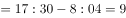小时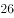分钟，他在办公室时间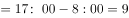小时，可知他从家往返办公室的时间为26分钟，则他从家到办公室需要分钟。  

故正确答案为A。

---

### 第 2 题　qid 3523593 · 数学运算

某公司张、王、刘、李和陈5名销售员去年共完成24个项目的销售。已知每个项目只有1人负责销售，每人都至少完成了1个项目且完成的项目数量彼此不同。张完成的项目比刘少5个，李完成的项目比陈多6个不是5人中最多的，王完成的项目最少，问张和李共完成几个项目？

- **A**. 10
- **B**. 11
- **C**. 12　✅
- **D**. 13

**答案**：C

**官方解析**

设王完成个项目，张完成个项目，陈完成个项目，则刘完成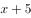个项目，李完成个项目。由题意可列式：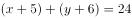，整理可得张和李共完成项目个数，因项目个数为整数，则为奇数；根据每人都至少完成了1个项目可得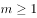，王完成的项目最少且完成项目数量彼此不同可得，即，故或。当时，，即张和陈一定有人完成项目数，与王完成项目最少矛盾，排除；故当，此时张和李共完成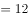个。

故正确答案为C。

---

### 第 3 题　qid 3523594 · 数学运算

在周长为300米的环形跑道的某处，甲、乙两人分别以6米/秒，3米/秒的速度同时同向出发，沿跑道奔跑，甲每次追上乙后都减速0.5米/秒，直至他们两人的速度相同，问在他们出发后的30分钟内，甲和乙以相同速度跑过的路程为多少米？

- **A**. 990　✅
- **B**. 1080
- **C**. 1530
- **D**. 1800

**答案**：A

**官方解析**

根据环形跑道上从同一点出发同向而行，每追上一次则多跑一圈。甲每次追上乙后都减速0.5米/秒，当甲从6米/秒减少到3米/秒时，根据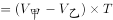，则甲每次追上所用的时间如下：

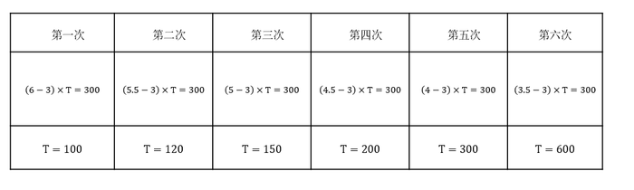

综上所述，当甲和乙速度相同时，共用了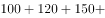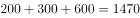秒，此后，甲和乙以3米/秒的速度共同跑秒，则共同跑过的路程为米。

故正确答案为A。

---

### 第 4 题　qid 3523595 · 数学运算

一块长方形土地ABCD中绘有3条会侧线如图所示。已知AE和CF垂直于对角线BD，AE、EF分别长8米和12米。问整块土地的面积为多少平方米？

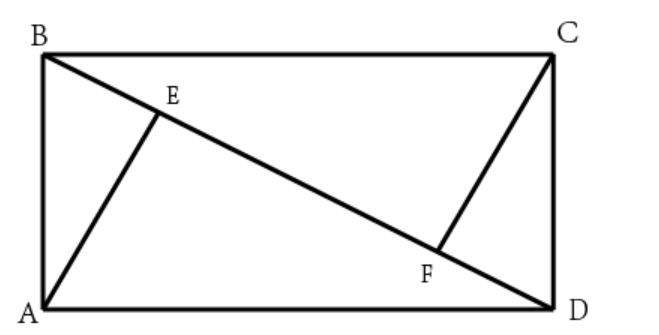

- **A**. 96
- **B**. 156
- **C**. 160　✅
- **D**. 240

**答案**：C

**官方解析**

因四边形ABCD是长方形，，则。直角与直角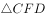全等，则。设BE、DF的长度均为米，则，解得。则米，故整块土地的面积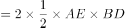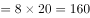平方米。

故正确答案为C。

---

### 第 5 题　qid 3523596 · 数学运算

一块实验田被划分为36小块，每小块上种植3种不同的植物，任意两小块上种植的植物种类均不完全相同，问至少种植了多少种不同的植物？

- **A**. 7
- **B**. 8　✅
- **C**. 9
- **D**. 10

**答案**：B

**官方解析**

由题意，设种植了种不同的植物，要满足“任意两小块上种植的植物种类均不完全相同”则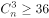。代入A项，一共有种组合，小于36，不符合要求，排除。代入B项，一共有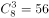种组合，大于36，符合要求，当选。

故正确答案为B。

---

### 第 6 题　qid 3523597 · 数学运算

甲、乙、丙、丁四个车间生产相同的产品，生产效率之比为4：3：2：1，产品不合格率分别为、、、。质检人员从这4个车间某小时内生产的所有产品中随机抽取1件，发现该产品不合格，该产品是乙车间生产的概率为：

- **A**. 

　✅
- **B**. 

- **C**. 

- **D**. 

**答案**：A

**官方解析**

根据四个车间生产效率之比为4：3：2：1，赋值甲、乙、丙、丁四个车间每小时分别生产400个、300个、200个、100个零件。则1小时内甲生产的不合格产品为个，乙生产的不合格产品为个，丙生产的不合格产品为个，丁生产的不合格产品为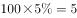个。因此不合格产品是乙车间生产的概率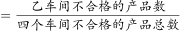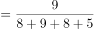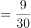。

故正确答案为A。

---

### 第 7 题　qid 3523598 · 数学运算

某工程队计划每天修路560米，恰好可按期完成任务。如每天比计划多修80米，则可以提前2天完成，且最后1天只需修320米。问如果要提前6天完成，每天要比计划多修多少米？

- **A**. 160
- **B**. 240　✅
- **C**. 320
- **D**. 400

**答案**：B

**官方解析**

设原计划完成任务需要天，根据题意可得，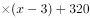，解得，则工程总量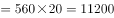米。如果要提前6天完成，则需要天，每天需修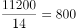米，则每天比计划多修米。

故正确答案为B。

---

### 第 8 题　qid 3523599 · 数学运算

商店采购了一种水果，第一天在进货成本基础上加价销售，从第二天开始，每天的销售价格都比前一天低。已知第三天这种水果的售价比第一天降低了13.3元/千克。问这种水果的进货成本为多少元/千克？

- **A**. 35
- **B**. 40
- **C**. 45
- **D**. 50　✅

**答案**：D

**官方解析**

设这种水果的进货成本为元/千克，则第一天的售价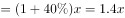，第三天的售价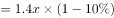。根据“第三天这种水果的售价比第一天降低了13.3元/千克”，可得，化简得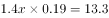，解得，即这种水果的进货成本为50元/千克。

故正确答案为D。

---

### 第 9 题　qid 3523600 · 数学运算

下图是长为厘米，宽、高均为厘米的长方体。一只蚂蚁以厘米/秒的速度沿如图所示的路径由A点爬行到B点后，又沿棱BA爬回A点。问其全程用时最短可能为多少秒？

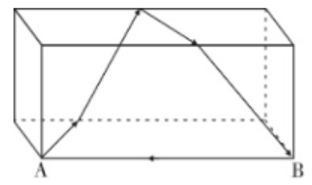

- **A**. 
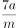

- **B**. 
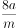
　✅
- **C**. 

- **D**. 

**答案**：B

**官方解析**

根据题意，把蚂蚁所爬路径展开到一个平面上，如下图所示（A’和B’为A、B展开后的对应点）

若用时最短，则需蚂蚁爬过的路径最短，即蚂蚁沿A’走直线到B，再从B到A，由题干可知，AA’，AB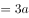，根据勾股定理：A’B。则蚂蚁爬过的全部路径SA’BBA，所求时间秒。

故正确答案为B。

---

### 第 10 题　qid 3523601 · 数学运算

从正九边形的顶点中任选3个作为顶点绘制三角形，问其中等腰三角形占全部可画出三角形的比例在以下哪个范围内?

- **A**. 
低于

- **B**. 
在到之间

- **C**. 
在到之间
　✅
- **D**. 
高于

**答案**：C

**官方解析**

观察图形发现，可将任意一点作为等腰三角形的顶点，关于其对称的两个点都能和该点组成等腰三角形。如以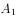为顶点，则有等腰三角形、、、共4个，同理，其他的8个顶点能组成的等腰三角形也是4个，则一共有等腰三角形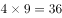个，但这其中等边三角形、、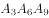，均算了3次，则去重后的等腰三角形个数为。全部可画出的三角形个数为：。代入公式：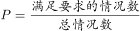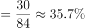，在到之间。

故正确答案为C。

---

## 判断推理

### 第 1 题　qid 3523636 · 图形推理

从所给的四个选项中，选择最合适的一个填入问号处，使之呈现一定的规律性：

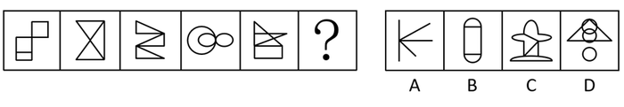

- **A**. A
- **B**. B
- **C**. C　✅
- **D**. D

**答案**：C

**官方解析**

元素组成不同，且无明显属性规律，考虑数量规律。观察发现，图三和图四为多圆相切的变形图，考虑笔画数。题干图形均为一笔画，所以？处图形也应该是一笔画图形。A项三笔，B项两笔，C项一笔，D项两笔。只有C项满足规律。
故正确答案为C。

---

### 第 2 题　qid 3523639 · 图形推理

从所给的四个选项中，选择最合适的一个填入问号处，使之呈现一定的规律性:

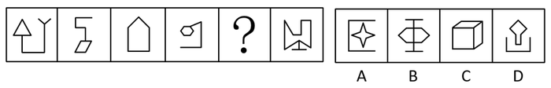

- **A**. A
- **B**. B
- **C**. C
- **D**. D　✅

**答案**：D

**官方解析**

元素组成不同，且无明显属性规律，优先考虑数量规律。图形出现明显多边形，优先考虑数直线。整体数直线无规律，考虑数多边形的边数量。题干图形多边形边数量依次为3、4、5、6、？、8，因此？处的多边形应为7条边，只有D符合。
故正确答案为D。

---

### 第 3 题　qid 3523643 · 图形推理

从所给的四个选项中，选择最合适的一个填入问号处，使之呈现一定的规律性:

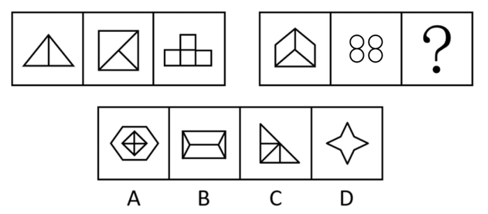

- **A**. A　✅
- **B**. B
- **C**. C
- **D**. D

**答案**：A

**官方解析**

元素组成不同，优先考虑属性规律，图形规整，考虑对称性，题干都是轴对称图形，但无唯一答案。继续观察发现，题干图形封闭面明显，考虑数面。题干第一组图形面数量依次为：2、3、4，呈现等差递增，第二组图遵循相同规律，前两幅图面数量依次为3、4，故“？”处应该选择有5个面的图形，只有A项符合。
故正确答案为A。

---

### 第 4 题　qid 3523644 · 图形推理

从所给的四个选项中，选择最合适的一个填入问号处，使之呈现一定的规律性：

- **A**. A
- **B**. B
- **C**. C
- **D**. D　✅

**答案**：D

**官方解析**

元素组成不同，且无明显属性规律，考虑数量规律。第一列图一中出现了单一直线，考虑数直线，第一列直线数分别为3、2、1；第二列封闭面明显，考虑面数量，分别为4、3、2；第三列线条交叉明显，考虑交点数，分别为？、4、3。所以问号处交点数应该为5，只有D项符合。
故正确答案为D。
注：第三列数面也可以，选4个面的图形，也只有D项符合。

---

### 第 5 题　qid 3523645 · 图形推理

从所给的四个选项中，选择最合适的一个填入问号处，使之呈现一定的规律性：

- **A**. A
- **B**. B
- **C**. C　✅
- **D**. D

**答案**：C

**官方解析**

图形元素组成相似，相同线条重复出现，优先考虑样式规律。九宫格优先按行看，第一行中，图1和图2求异得到图3，第二行验证符合此规律，第三行应用此规律，只有C选项符合。
故正确答案为C。

---

### 第 6 题　qid 3523638 · 图形推理

图①和图②分别是某立方体从不同角度的视图，下列哪项不可能是该立方体的外表面展开图?

- **A**. A　✅
- **B**. B
- **C**. C
- **D**. D

**答案**：A

**官方解析**

A项：选项中同心圆面与四角星面之间的直角边为同一条边（如图1红线所示），则箭头面与四角星面的公共边为图1绿线所示，此时箭头面内箭头指向四角星面，背向四角星面的相对面，即心形面，而题干箭头背向圆面，与题干不一致，当选。

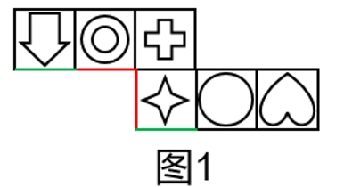

本题为选非题，故正确答案为A。

---

### 第 7 题　qid 3523626 · 图形推理

要想使右侧图形在不旋转的情况下拼合成左侧的正方体造型，还需在问号处添加的图形是：

- **A**. A
- **B**. B
- **C**. C
- **D**. D　✅

**答案**：D

**官方解析**

本题考查立体拼合。观察发现，右侧四个图形包含左侧正方体的所有外表面（可通过12个直角三角形面进行判断），因此“？”处图形无法与直角三角形面进行拼合，需与右侧四个图形中非直角三角形面（4个）进行拼合，只有D项符合。具体拼合如下图所示：

故正确答案为D。

---

### 第 8 题　qid 3523641 · 图形推理

把下面的六个图形分为两类，使每一类图形都有各自的共同特征或规律，分类正确的一项是：

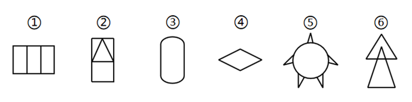

- **A**. ①②④，③⑤⑥
- **B**. ①④⑤，②③⑥
- **C**. ①④⑥，②③⑤
- **D**. ①③④，②⑤⑥　✅

**答案**：D

**官方解析**

本题为分组分类题目，元素组成不同，优先考虑属性规律。观察发现，图②④⑤⑥中均出现等腰元素，考虑对称性。图①③④为既轴对称又中心对称图形，图②⑤⑥为轴对称图形。即图①③④为一组，图②⑤⑥为一组。
故正确答案为D。

---

### 第 9 题　qid 3523642 · 定义判断

精准扶贫是针对不同贫困区域环境、不同贫困农户状况，运用科学有效程序对扶贫对象实施精确识别、精确帮扶、精确管理的治贫方式。
根据上述定义，下列属于精准扶贫的是：

- **A**. 希望村地理位置偏僻，常年属于贫困村，为响应国家脱贫号召，更快实现致富，村民集体研究决定凡成年劳动力均外出务工
- **B**. 某贫困村村干部为使村民享有更优美的生活环境，带领村民加班奋战10昼夜，用5万元扶贫款将全村房屋统一粉刷一新，使村容村貌大幅改观
- **C**. 某山区万同学从小失去双亲，但她刻苦努力，获得的奖状挂满了简陋的屋子，她的精神感动了来调研的扶贫工作组，他们自发捐给万同学2000元钱
- **D**. 精准扶贫“回头看”中，向阳村制定了排除法。通过信息比对或入户调查，对虽然没有“运营车辆”和“商品房”，但家庭收入却远高于贫困县的农户进行了清退　✅

**答案**：D

**官方解析**

第一步：找出定义关键词。
“针对不同贫困区域环境、不同贫困农户状况”、“运用科学有效程序对扶贫对象实施精确识别、精确帮扶、精确管理的治贫方式”。
第二步：逐一分析选项。
A项：让贫困村所有成年劳动力均外出务工，没有体现针对“不同贫困农户状况”进行治贫，不符合定义，排除；
B项：村干部带领村民用扶贫款将全村房屋统一粉刷一新，这种做法是为了改善村容村貌，并非针对“不同贫困农户状况”进行治贫，不符合定义，排除；
C项：扶贫工作组为万同学捐款，是因为被她的精神所感动，并非“运用科学有效程序对扶贫对象实施精确识别、精确帮扶、精确管理的治贫方式”，不符合定义，排除；
D项：向阳村对家庭收入高于贫困县的农户进行清退，是针对“不同贫困农户状况”进行的“精确识别、精确管理”，符合定义，当选。
故正确答案为D。

---

### 第 10 题　qid 3523635 · 定义判断

海参在海底用管足和肌肉伸缩行动，速度非常缓慢，遇到敌人来袭时，海参会把它的内脏喷出，趁机逃跑。而把肚肠抛掉的海参，大概再过50天，就能长出新的内脏来。其生存法则看似弱势和简单，其实充满哲理与智慧，人们将其称为海参哲学。
根据上述定义，下列哪种说法与海参哲学无关？

- **A**. 吃亏是福
- **B**. 吃一堑长一智　✅
- **C**. 小不忍则乱大谋
- **D**. 舍得舍得，不舍不得

**答案**：B

**官方解析**

第一步：找出定义关键词。
“关键时刻，要舍弃一些东西，趁机脱困”、“舍弃的东西会再回来”。
第二步：逐一分析选项。
A项：吃亏是福的意思是说能吃亏，会吃亏的人，也算是一个有福气的人，题干海参就是吃了丢内脏的亏，保住了生命，符合“关键时刻，要舍弃一些东西，趁机脱困”，符合定义，排除；
B项：吃一堑长一智的意思是经过失败取得教训，不符合“关键时刻，要舍弃一些东西，趁机脱困”，也不符合“舍弃的东西会再回来”，不符合定义，当选；
C项：小不忍则乱大谋的意思是小事不忍耐就会坏了大事，题干海参就是忍了丢内脏的苦，保住了生命，符合“关键时刻，要舍弃一些东西，趁机脱困”，符合定义，排除；
D项：舍得舍得，不舍不得的意思是有舍才有得，题干海参就是舍了内脏，保了生命，最后内脏又长了回来，符合“关键时刻，要舍弃一些东西，趁机脱困”，也符合“舍弃的东西会再回来”，符合定义，排除。
本题为选非题，故正确答案为B。

---

### 第 11 题　qid 3523622 · 定义判断

价格歧视是指商品或服务的提供者以不同的价格把同样品质的商品或者服务卖给不同的顾客。
根据上述定义，下列不构成价格歧视的是：

- **A**. 
某服装店定期把有瑕疵的服装打折销售
　✅
- **B**. 
某景点对本地居民实行门票半价优惠政策

- **C**. 
某网约车平台在相同情况下，总是多收老客户的费用

- **D**. 
某商家给消费10次以上的顾客升级为VIP，购物享九折优惠

**答案**：A

**官方解析**

第一步：找出定义关键词。

“不同的价格”、“同样品质的商品或者服务”、“不同的顾客”。

第二步：逐一分析选项。

A项：某服装店定期把有瑕疵的服装打折销售，有瑕疵的服装和普通的服装不属于“同样品质的商品或者服务”，不符合定义，当选；

B项：某景点对本地居民实行门票半价优惠政策，对本地居民和外地居民的门票采取不同的定价，符合“不同的价格”、“同样品质的商品或者服务”、“不同的顾客”，符合定义，排除；

C项：某网约车平台在相同情况下，总是多收老客户的费用，“相同情况”说明符合“同样品质的商品或者服务”，老客户和新客户的费用不同，符合“不同的价格”、“不同的顾客”，符合定义，排除；

D项：某商家给消费10次以上的顾客升级为VIP，购物享九折优惠，VIP客户和普通客户买东西的价格不同，符合“不同的价格”、“同样品质的商品或者服务”、“不同的顾客”，符合定义，排除。

本题为选非题，故正确答案为A。

---

### 第 12 题　qid 3523627 · 定义判断

退出壁垒指现有企业在市场前景不好、企业业绩不佳时意欲退出该产业（市场），但由于各种因素的阻挠，资源不能顺利转移出去。
根据上述定义，下列属于退出壁垒的是：

- **A**. 某企业委托咨询公司对餐饮市场进行调研并寻找适合项目， 耗资不少但未能如愿
- **B**. 某企业因为转型，不得不闲置一部分设备，原有设备的投资不能完全收回，损失很大　✅
- **C**. 某企业为产品升级既要更新设备，又要为工人适岗支付一大笔培训费用，陷入资金困境
- **D**. 某企业因与一老客户失和，单方终止了购买原材料合同，为此必须支付大笔违约金，该企业财务状况明显恶化

**答案**：B

**官方解析**

第一步：找出定义关键词。
“企业”、“前景不好、业绩不佳时退出该产业（市场）”、“资源不能顺利转移”。
第二步：逐一分析选项。
A项：企业是想要对餐饮市场调研寻找合适项目进入餐饮市场，而题干是退出市场，不符合“前景不好、业绩不佳时退出该产业（市场）”，不符合定义，排除；
B项：企业转型，虽然没有提到转型原因，但转型即经营其他类型产业，符合“退出该产业（市场）”，原有设备投资不能完全收回，符合“资源不能顺利转移”，符合定义，当选；
C项：企业产品升级，是在原有基础上更新设备，不符合“前景不好、业绩不佳时退出该产业（市场）”，不符合定义，排除；
D项：企业因为单方终止合同赔付违约金，不涉及退出产业，不符合“前景不好、业绩不佳时退出该产业（市场）”，不符合定义，排除。
故正确答案为B。

---

### 第 13 题　qid 3523629 · 定义判断

植物耐逆性指植物处于不利环境时，通过自身内部代谢反应，迅速阻止、降低或修复由逆境造成的损伤，使其仍保持正常的生理活动。
根据上述定义，下列体现了植物耐逆性的是：

- **A**. 离离原上草，一岁一枯荣；野火烧不尽，春风吹又生
- **B**. 墙角数枝梅，凌寒独自开；遥知不是雪，为有暗香来
- **C**. 尽管戈壁滩的气候异常恶劣，但胡杨树仍然可以很好地生存下去
- **D**. 一些植物在高盐环境下通过改善细胞膜的通透性来阻止大量失水　✅

**答案**：D

**官方解析**

第一步：找出定义关键词。
“植物处于不利环境时”、“通过自身内部代谢反应，迅速阻止、降低或修复由逆境造成的损伤，使其仍保持正常的生理活动”。
第二步：逐一分析选项。
A项：诗句含义为长长的原上草是多么茂盛，每年秋冬枯黄春来草色浓。无情的野火只能烧掉干叶，春风吹来大地又是绿茸茸。只是讲述了秋冬时野草的生存条件，不符合“通过自身内部代谢反应，迅速阻止、降低或修复由逆境造成的损伤，使其仍保持正常的生理活动”，不符合定义，排除；
B项：诗句含义为那墙角的几枝梅花，冒着严寒独自盛开。为什么远望就知道洁白的梅花不是雪呢？因为梅花隐隐传来阵阵的香气。诗句只是描写了梅花在严寒中生长，不符合“通过自身内部代谢反应，迅速阻止、降低或修复由逆境造成的损伤，使其仍保持正常的生理活动”，不符合定义，排除；
C项：胡杨树在气候恶劣的环境下能够很好地生存下去是因为胡杨树自身的生命力强大，不符合“通过自身内部代谢反应，迅速阻止、降低或修复由逆境造成的损伤，使其仍保持正常的生理活动”，不符合定义，排除；
D项：一些植物处于高盐环境下，符合“植物处于不利环境时”，通过改善细胞膜的通透性来阻止大量失水，符合“通过自身内部代谢反应，迅速阻止、降低或修复由逆境造成的损伤，使其仍保持正常的生理活动”，符合定义，当选。
故正确答案为D。

---

### 第 14 题　qid 3523630 · 定义判断

震慑是指利用各种手段造成足够强大的胁迫和强制力量，从而使对手慑于巨大的压力而丧失继续抵抗意志的一种军事战略形式。
根据上述定义，下列军事行动不属于震慑的是：

- **A**. 运用大规模毁灭性武器打击敌国重要设施，数天内即瓦解敌国的抵抗意志
- **B**. 对敌国主战派进行有选择的、迅速的斩首行动，使敌国主战派丧失主心骨　✅
- **C**. 长时间使用经济禁运、骚扰等恶化敌人生存环境的手段胁迫使敌人崩溃
- **D**. 通过欺骗、误导、散布假情报等方式，使敌人相信自己不堪一击从而放弃抵抗

**答案**：B

**官方解析**

第一步：找出定义关键词。

“利用各种手段造成足够强大的胁迫和强制力量”、“使对手慑于巨大的压力而丧失继续抵抗意志”。

第二步：逐一分析选项。

A项：运用大规模毁灭性武器打击敌国重要设施，符合“利用各种手段造成足够强大的胁迫和强制力量”，数天内即瓦解敌国的抵抗意志，也符合“使对手慑于巨大的压力而丧失继续抵抗意志”，符合定义，排除；

B项：对敌国主战派进行有选择的、迅速的斩首行动，符合“利用各种手段造成足够强大的胁迫和强制力量”，使敌国主战派丧失主心骨，不等同于丧失抵抗意志，不符合“使对手慑于巨大的压力而丧失继续抵抗意志”，不符合定义，当选； 

C项：长时间使用经济禁运、骚扰等恶化敌人生存环境，符合“利用各种手段造成足够强大的胁迫和强制力量”，胁迫使敌人崩溃，也符合“使对手慑于巨大的压力而丧失继续抵抗意志”，符合定义，排除； 

D项：欺骗、误导、散布假情报等方式，使敌人相信自己不堪一击从而放弃抵抗，符合“利用各种手段造成足够强大的胁迫和强制力量”，也符合“使对手慑于巨大的压力而丧失继续抵抗意志”，符合定义，排除。

本题为选非题，故正确答案为B。

备注：通过查询相关文献发现，其实ABCD项均在原文有所体现，但是出题人明显改动了B项的斩首行动，将原文中的目的进行了删减，从而使B项跟其他三项相比，关键词并不完全对应，本题问“不属于”，故小粉笔更倾向把答案给到B项。

---

### 第 15 题　qid 3523633 · 定义判断

补偿性工资差别是指在实际经济活动中，即使能力和受教育程度相同的劳动者，从事不同的工作也会存在工资差别。这种差别不是由于行业和区域垄断造成的，而是与工作性质和条件有关，由此引起的工资差别称为补偿性工资差别。
根据上述定义，下列没有涉及补偿性工资差别的是：

- **A**. 两项工作对工作人员的要求相同，但由于其中一项工作的条件比较艰苦，因此需要给出更高的工资才能招聘到人
- **B**. 尽管殡葬行业并不比其他行业辛苦，工作环境也不错，但大家都认为殡葬行业从业人员领取高工资理所应当
- **C**. 某学院统计显示，该学院的毕业生在北京比在上海更容易找到工作，工资水平更高　✅
- **D**. 某公司在进行薪资改革时，提出收入分配应向科技工作者和一线职工倾斜

**答案**：C

**官方解析**

第一步：找出定义关键词。
“能力和受教育程度相同的劳动者”、“从事不同的工作也会存在工资差别”、“这种差别不是由于行业和区域垄断造成的，而是与工作性质和条件有关”。
第二步：逐一分析选项。
A项：两项工作对工作人员的要求相同，符合“能力和受教育程度相同的劳动者”，其中一项工作的条件比甲艰苦，需给出更高的工资，符合“从事不同的工作也会存在工资差别”、“这种差别不是由于行业和区域垄断造成的，而是与工作性质和条件有关”，符合定义，排除； 
B项：大家都认为殡葬行业领取高工资理所应当，殡葬行业具有特殊的工作性质和条件，符合“这种差别不是由于行业和区域垄断造成的，而是与工作性质和条件有关”，符合定义，排除；
C项：在北京比在上海更容易找到工作，工资水平更高，是区域导致的工资差别，与工作本身的性质和条件无关，不符合“这种差别不是由于行业和区域垄断造成的，而是与工作性质和条件有关”，不符合定义，当选；
D项：收入分配应向科技工作者和一线职工倾斜，科技工作者与一线职工的工作均风险高责任大，符合“这种差别不是由于行业和区域垄断造成的，而是与工作性质和条件有关”，符合定义，排除。
本题为选非题，故正确答案为C。

---

### 第 16 题　qid 3523631 · 类比推理

钢笔：书写

- **A**. 水瓶：保温
- **B**. 春天：播种
- **C**. 手表：计时　✅
- **D**. 眼睛：阅读

**答案**：C

**官方解析**

第一步：判断题干词语间逻辑关系。
钢笔具有书写的功能，且钢笔是具体的一种工具，二者为工具与功能的对应关系。
第二步：判断选项词语间逻辑关系。
A项：水瓶的功能应该是盛水，一般说暖水瓶具有保温的功能，与题干逻辑关系不一致，排除；
B项：春天是播种的季节，不是功能的对应关系，与题干逻辑关系不一致，排除；
C项：手表具有计时的功能，且手表是具体的一种工具，二者为工具与功能的对应关系，与题干逻辑关系一致，当选；
D项：眼睛具有阅读的功能，但眼睛是人的身体器官，不属于工具与功能的对应关系，与题干逻辑关系不一致，排除。
故正确答案为C。

---

### 第 17 题　qid 3523634 · 类比推理

下载：网站：上传

- **A**. 购物：商家：退货　✅
- **B**. 打工：城市：返乡
- **C**. 上学：学校：放学
- **D**. 上场：比赛：下场

**答案**：A

**官方解析**

第一步：判断题干词语间逻辑关系。
从网站下载，上传至网站，三者为对应关系。
第二步：判断选项词语间逻辑关系。
A项：从商家购物，退货至商家，三者为对应关系，与题干逻辑关系一致，当选；
B项：去城市打工，从城市返乡，与题干逻辑关系不一致，排除；
C项：去学校上学，从学校放学，与题干逻辑关系不一致，排除；
D项：比赛之前需要上场，比赛之后需要下场，与题干逻辑关系不一致，排除。
故正确答案为A。

---

### 第 18 题　qid 3523637 · 类比推理

能源：核能：核武器

- **A**. 材料：木材：家具　✅
- **B**. 运动：游泳：泳衣
- **C**. 网络：网站：网友
- **D**. 手机：计时器：闹钟

**答案**：A

**官方解析**

第一步：判断题干词语间逻辑关系。
核能是一种能源，二者为种属关系，制作核武器利用了核能，二者为对应关系。 
第二步：判断选项词语间逻辑关系。
A项：木材是一种材料，二者为种属关系，制作家具利用了木材，二者为对应关系，与题干逻辑关系一致，当选；
B项：游泳是一种运动，二者为种属关系，但是游泳时需要用到泳衣，与题干逻辑关系不一致，排除；
C项：网站要借助网络才能使用，二者之间不是种属关系，与题干逻辑关系不一致，排除；
D项：手机和计时器都有相同的功能，都可以用来计时，二者是功能相同的并列关系，不是种属关系，与题干逻辑关系不一致，排除。
故正确答案为A。

---

### 第 19 题　qid 3523528 · 类比推理

二氧化碳：珊瑚骨骼：腐蚀

- **A**. 物种灭绝：动物：威胁
- **B**. 天灾人祸：物种：减少
- **C**. 土壤沙化：空气：雾霾
- **D**. 气候变暖：冰川：消融　✅

**答案**：D

**官方解析**

第一步：判断题干词语间逻辑关系。
“二氧化碳”会“腐蚀”“珊瑚骨骼”，题干为因果对应关系。
第二步：判断选项词语间逻辑关系。
A项：“物种灭绝”本身就包含“动物”被“威胁”的意思，与题干逻辑关系不一致，排除；
B项：“天灾人祸”会“减少”“物种”，为因果对应关系，与题干逻辑关系一致，保留；
C项：“土壤沙化”会导致“雾霾”，与题干逻辑关系不一致，排除；
D项：“气候变暖”会“消融”“冰川”，与题干逻辑关系一致，保留。
对于BD两项，题干的“二氧化碳”和D项的“气候变暖”只是独立的一个原因，但B项的原因可以拆分为“天灾”和“人祸”两个原因，因此D项与题干更为一致。
故正确答案为D。

---

### 第 20 题　qid 3523640 · 类比推理

因循守旧 对于 （    ） 相当于 （    ） 对于 胆量

- **A**. 创新；畏缩不前　✅
- **B**. 古板；闻风丧胆
- **C**. 保守；胆大妄为
- **D**. 落后；一往无前

**答案**：A

**官方解析**

逐一代入选项。
A项：“因循守旧”是指死守老一套，缺乏创新精神，形容缺乏“创新”，二者为对应关系；“畏缩不前”是指畏惧退缩，不敢前进，形容缺乏“胆量”，二者为对应关系，前后逻辑关系一致，当选；
B项：“因循守旧”是指死守老一套，缺乏创新精神，与“古板”为近义关系；“闻风丧胆”是指听到风声就吓得丧失了勇气，形容缺乏“胆量”，二者为对应关系，前后逻辑关系不一致，排除；
C项：“因循守旧”是指死守老一套，缺乏创新精神，与“保守”为近义关系；“胆大妄为”是指毫无顾忌地干坏事或大胆地乱做事，形容“胆量大”，前后逻辑关系不一致，排除；
D项：“因循守旧”会导致落后，二者为因果关系；“一往无前”是指勇猛无畏地前进，与胆量不是因果关系，前后逻辑关系不一致，排除。
故正确答案为A。

---

### 第 21 题　qid 3523623 · 逻辑判断

中国共产党党章是对每一位共产党员的基本要求。党员领导干部要做学习党章、遵守党章的模范。凡是党章规定党员必须做到的，领导干部要首先做到；凡是党章规定党员一定不能做的，领导干部要带头不做。
根据以上信息，可以得出以下哪项？

- **A**. 凡是党章规定领导干部首先做到的，党员必须做到
- **B**. 凡是党章规定领导干部带头不做的，党员一定不能做
- **C**. 有些党章规定领导干部要首先做到的，党员必须做到　✅
- **D**. 有些党章没有规定党员必须做的，领导干部要首先去做

**答案**：C

**官方解析**

第一步：翻译题干。

①党员必须做到的领导干部要首先做到；

②党员一定不能做的领导干部要带头不做。

第二步：逐一分析选项。

A项：翻译为“领导干部首先做到的党员必须做到”，是对条件①的肯后，肯后得不到确定性结论，无法推出，排除；

B项：翻译为“领导干部带头不做的党员一定不能做”，是对条件②的肯后，但肯后得不到确定性结论，排除；

C项：翻译为“有些党章规定领导干部首先做到的党员必须做到”，根据集合推理“换位规则”可知，“所有A都是B”可推出“有的B是A”，则条件①可以推出C项“有些党章规定领导干部要首先做到的党员必须做到”，可以推出，当选；

D项：翻译为“有的党员不必做的领导干部首先去做”，是对条件①的否前，否前得不到确定性结论，无法推出，排除。

故正确答案为C。

---

### 第 22 题　qid 3522620 · 逻辑判断

许多人在拍照时喜欢摆出“剪刀手”动作。对此，有人认为，如果手离镜头足够近，相机分辨率足够高，拍出的照片一旦上网，黑客就能通过照片放大技术和人工智能增强技术将照片中的人物指纹信息还原出来。这会让指纹认证及个人身份信息无密可保。因此，拍照时摆出“剪刀手”动作存在安全风险。
以下哪项如果为真，最能质疑上述结论?

- **A**. 目前智能手机虽在高速发展，但是分辨率还不足以拍出清晰的指纹
- **B**. 即使是高清网传照片，通过它还原指纹信息也存在一定的技术门槛
- **C**. 实验证明，网络照片受自身清晰度影响不满足识别指纹信息的条件　✅
- **D**. 从电子照片中提取到用户指纹信息的相关报道，实为愚人节新闻

**答案**：C

**官方解析**

第一步：找出论点和论据。
论点：拍照时摆出“剪刀手”动作存在安全风险。
论据：如果手离镜头足够近，相机分辨率足够高，拍出的照片一旦上网，黑客就能通过照片放大技术和人工智能增强技术将照片中的人物指纹信息还原出来。这会让指纹认证及个人身份信息无密可保。
本题论点讨论的是拍照时摆出“剪刀手”动作存在安全风险，论据讨论的是拍照时摆出“剪刀手”动作会把指纹呈现在照片中，上传到网络后黑客会通过各种技术还原指纹信息，使得指纹认证和个人身份信息无密可保，都是在说手离镜头足够近，会带来安全风险，话题一致，削弱优先考虑削弱论点。
第二步：逐一分析选项。
A项：该项说的是智能手机的分辨率还不足以拍出清晰的指纹，但不明确黑客能否通过一系列技术把指纹信息还原出来并带来安全风险，属于不明确选项，无法削弱，排除；
B项：该项讨论的是通过高清网传照片还原指纹信息存在一定的技术门槛，说明还原指纹信息困难，但是没有明确黑客最终能否通过技术还原指纹并带来安全风险，属于不明确选项，无法削弱，排除；
C项：该项指出网络照片受自身清晰度影响不满足识别指纹信息的条件，从而说明拍照时摆出“剪刀手”动作不会存在安全风险，可以削弱题干论点，当选；
D项：该项说的是这些报道实为愚人节新闻，但不明确拍照时摆出“剪刀手”动作能否带来安全风险，属于不明确选项，无法削弱，排除。
故正确答案为C。

---

### 第 23 题　qid 3523625 · 逻辑判断

近日，某语言学习与评估研究中心的一项针对英语学习的研究成果表明，AI英语老师对学习者的英语水平提升效果明显。
以下哪项如果为真，最能支持上述论述？

- **A**. 
最初被评定为低级别英语水平的测试者取得的进步更大

- **B**. 
近的测试者表示他们喜欢AI英语教学，并计划继续使用

- **C**. 
AI英语教学可以精确记录、分析、反馈测试者的学习表现，做到视觉、听觉、认知“三位一体”

- **D**. 
测试者每使用AI英语教学APP学习1小时，英语考试成绩将平均提升0.324分，在全体测试者中，约的用户获得了更高的分数
　✅

**答案**：D

**官方解析**

第一步：找出论点和论据。
论点：AI英语老师对学习者的英语水平提升效果明显。
论据：无。
本题只有论点没有论据，加强优先考虑补充论据，如解释原因加强或举例加强。
第二步：逐一分析选项。
A项：低级别英语水平的测试者取得的进步更大，说明是在和其他级别的测试者比较，但低级别的测试者所占比重、其他级别的测试者的英语水平是否有提升均不明确，不明确项，无法加强，排除；
B项：喜欢、继续使用AI英语教学不代表该方式效果好、提升效果明显，可能是因为方便快捷等其它原因，不明确项，无法加强，排除；
C项：介绍AI英语教学的特点，但没有提及这些特点是否能给学习者的英语水平带来提升效果，不明确项，无法加强，排除；
D项：通过列举事实数据说明AI英语教学对学习者的英语水平提升效果明显，补充论据，可以加强，当选。
故正确答案为D。

---

### 第 24 题　qid 3523628 · 逻辑判断

“生酮饮食”不仅可以达到减肥的效果，而且因为燃烧脂肪取代葡萄糖，身体可以得到更持续，稳定的供能。通常，在摄取食物（主要是碳水化合物）之后，人体内的血糖含量会达到一个峰值。随着能量被消耗，血糖供应不足，身体会发送饥饿信号，催促人吃东西。一般情况下，脂肪是很难被转化为能量的。“生酮饮食”是通过断绝碳水化合物的摄入，迫使身体燃烧脂肪来供能，将脂肪转化为“酮”，作为生命的养料，相比葡萄糖只能提供几小时的供能，由燃烧脂肪产生的“酮”可以提供几周、甚至几个月稳定、不间断的能量。
以下哪项如果为真，最能质疑上述研究结论?

- **A**. “生酮饮食”容易造成营养不良，它可能对女性的内分泌产生间接影响
- **B**. 不少坚持“生酮饮食”的人在半年以后会出现代谢异常、肠道菌群失衡而复胖　✅
- **C**. “生酮饮食”要求实行者依循饿就吃、不饿不吃的原则。只要是依此原则生活的健康人都不会胖
- **D**. “生酮饮食”初期，各个器官还没有适应新的变化，会有注意力无法集中、情绪烦躁易怒等状况出现

**答案**：B

**官方解析**

第一步：找出论点和论据。
论点：“生酮饮食”不仅可以达到减肥的效果，而且因为燃烧脂肪取代葡萄糖，身体可以得到更持续，稳定的供能。
论据：“生酮饮食”通过断绝碳水化合物的摄入，迫使身体燃烧脂肪来供能，将脂肪转化为“酮”，作为生命的养料，相比葡萄糖只能提供几小时的供能，由燃烧脂肪产生的“酮”可以提供几周、甚至几个月稳定、不间断的能量。
本题论点论据都在说“生酮饮食”有减肥效果，且身体能获得更持续、稳定供能，二者话题一致，削弱优先考虑削弱论点。
第二步：逐一分析选项。
A项：该项说的是生酮饮食可能会影响女性的内分泌，但论点讨论的是生酮饮食能不能减肥，话题不一致，排除；
B项：该项说的是坚持生酮饮食的人半年后反而因为代谢异常、肠道菌群失衡而复胖，直接否定论点中说的生酮饮食可以减肥的观点，削弱论点，可以削弱，当选；
C项：该项说的是只要实行者依循饿就吃、不饿不吃的原则就不会胖，为加强项，不能削弱，排除；
D项：该项说的是生酮饮食初期的负面现象，与生酮饮食能不能减肥无关，不能削弱，排除。
故正确答案为B。

---

### 第 25 题　qid 3523632 · 逻辑判断

近年来，通过多项针对科研人员参与科普情况的调查分析，发现存在重科研轻科普的现象，科研人员从事科普工作往往被某些圈内人士看作不务正业、不思进取，做科普反倒给学术形象的塑造带来了“负面”效应。科研人员一旦缺席科普，非专业的“科普人士”就会哗众取宠，谣言就有了存在的空间，最终不利于科学事业本身的发展。有学者认为，让更多有热情、有能力的科研人员投身科普，关键在于社会要形成科普与科研同等重要的共识。
以下哪项如果为真，最能支持该学者的观点?

- **A**. 在中国创造成为时代强音的今天，社会和公众需要越来越多的“网红”科学家
- **B**. 把科研成果描述得让社会和普通公众能明白、看得懂，才是科研人员的真本事
- **C**. 科研人员被认为是“科学传播的第一发球员”，他们有责任培养更多的科学公民
- **D**. 在科研和人才考评体系中把科普纳入考核范围，可以促使科研人员挺直腰杆做科普　✅

**答案**：D

**官方解析**

第一步：找出论点和论据。
论点：让更多有热情、有能力的科研人员投身科普，关键在于社会要形成科普与科研同等重要的共识。
论据：无。
本题只有论点没有论据，可以考虑补充论据进行加强，论点讨论的是科研人员投身科普的关键在于社会要形成科普科研同等重要的共识，即需要补充论据说明，目前社会重科研轻科普的认识制约了科研人员投身科普工作。
第二步：逐一分析选项。
A项：该项指出社会和公众需要更多的“网红”科学家，与论点讨论的如何让更多科研人员投身科普无关，无法加强，排除；
B项：该项指出把科研成果描述得让公众看得懂才是科研人员的真本事，即做好科普才是科研人员的真本事，只是强调了科普的重要性，没有提及制约科研人员投身科普工作的原因，也没有明确说明科普应该比科研更重要，还是科普、科研应该同等重要，无法加强，排除；
C项：该项指出科研人员被认为是“科学传播的第一发球员”，侧重在其他人对科研人员的看法，而论点更想强调的是要有科普与科研同等重要的意识，无法加强，排除；
D项：该项指出把科普纳入考核范围可以促使科研人员挺直腰杆做科普，把科普纳入考核范围，说明原来的考核制度中不包括科普，补充论据说明制度上也存在“重科研轻科普”的现象，影响了科研人员投身科普工作的热情，可以加强，而在科研和人才考评体系中将科普纳入考核范围，说明要在制度上让科研、科普都受到重视，体现了二者同等重要的地位，补充论据，可以加强，当选。
故正确答案为D。
注：本题难度较大，题干文段主要在探讨制约科研人员投身科普的原因是对科普的不重视，以及想要解决这个问题关键在于形成科研、科普同等重要的共识， D项人才评价体系中不重视科普，与题干背景中已有的科研人员做科普被看做不务正业，二者共同说明从思想、制度上都存在“重科研轻科普”的认识，这种认识制约了科研人员投身科普工作，而将科研考评体系中加入科普考核，能够促进形成科普与科研同等重要的共识，进而解决科研人员不愿投身科普工作的问题，可以加强论点；而B项只是强调对于科研人员来说，科普能够体现真本事，但没有说明目前科研、科普的是否同等重要，也没有说明到底是何原因制约了科研人员投身科普工作，不能加强，因此选择D项。

---

### 第 26 题　qid 3523602 · 逻辑判断

美国环境保护署把作物转基因中具有农药性的蛋白和遗传物质（不包括植物其他部分）列入农药范畴，称为植物农药，要求将其作为农药进行登记。但一些专家认为，因为转基因物质与宿主本身不可分离，植物具有农药性，所以应直接称含转基因农药的植物为植物农药。
以下哪项如果为真，最能反驳专家的观点？

- **A**. 不含农药性质的转基因植物不能称为植物农药
- **B**. 含转基因农药的植物应作为农药登记，这说明它是一种农药
- **C**. 将具有农药性的转基因物质转移到新宿主上，农药性可能消失　✅
- **D**. 如果将转基因物质与宿主分离，则分离后的转基因植物不是植物农药

**答案**：C

**官方解析**

第一步：找出论点和论据。

论点：应直接称含转基因农药的植物为植物农药。

论据：转基因物质与宿主本身不可分离，植物具有农药性。

本题论点说的是如何界定植物农药，即应将“含转基因农药的植物”称为植物农药，论据说的是这样界定植物农药的原因。如果要想削弱论点，就要表明论据中界定植物农药的原因是不合理的或不成立的。

由于本题的题干不易理解，因此我们可以先分析一下题干的含义和逻辑。论据的第一句话说“转基因物质与宿主本身不可分离”，由于从专业上来看，转基因物质是可以更换宿主的，因此论据中“不可分离”的含义并不是转基因物质和具体的某一个宿主是永久绑定的，而是强调转基因物质是存在于宿主中的，二者形成了一个整体，具有整体性。论据第二句话说“植物具有农药性”，这句话承接前一句话，其中的“植物”指的就是“转基因物质+宿主”这个整体，也就是论点中说的“含转基因农药的植物”。因此，从论据到论点，是根据“含转基因农药的植物是一个整体，整体具有农药性”得出“应将含转基因农药的植物这一整体称为植物农药”。

第二步：逐一分析选项。

A项：选项表明“不含农药性质的转基因植物”不能称为植物农药，而论点说的是应将“含转基因农药的植物”称为植物农药，根据“不含农药性质的转基因植物”的情况，无法判断“含转基因农药的植物”的情况，无法削弱，排除；

B项：选项表明含转基因农药的植物应作为“农药”登记，这说明它是一种“农药”，而论点说的是含转基因农药的植物是“植物农药”，根据某一植物是“农药”无法判断其是否是“植物农药”，无法削弱，排除；

C项：选项的意思是在某些情况下，含转基因农药的植物可能不具有农药性，那么就不应该把所有“含有”转基因农药的植物都命名为植物农药，可以削弱论点，当选；

最后小粉笔也去查询了相关文献，如下图所示，原文表明，应将“表达”转基因农药的植物称为植物农药，而本题论点说应将“含有”转基因农药的植物称为植物农药，即本题论点将原文中的“表达”偷换成了“含有”。简单说就是“含有”转基因农药不一定能“表达”农药性，这和C项中植物整体的农药性可能表达不出来（即“消失”），含义是相同的，因此C项举反例可以削弱。

注：C项中出现了“可能”一词，很多同学会觉得削弱的力度较弱，就直接排除了C项。这里同学们需要注意，削弱的力度是需要进行比较的，当其他选项没有削弱力度时，含有“可能”的选项也可以成为正确答案。

D项：选项表明如果将转基因物质与宿主分离，则分离后的转基因植物不是植物农药，也就是说分离后的转基因植物（即宿主）不是植物农药，但在本题的论述中，将植物整体进行命名的原因，仅在于转基因物质和宿主是一个整体，且整体具有农药性，而与宿主是否具有农药性无关，所以本项和论据、论点的逻辑均不冲突，无法削弱，排除。

故正确答案为C。

---

### 第 27 题　qid 3523603 · 类比推理

我坚信火星上有生命存在，不信你看火星上有许多长条状阴影，就是火星人在上面开凿的运河。
以下哪项与上述论证方式最为相似？

- **A**. 我坚信相对论是真理，你想爱因斯坦是天才，他能说错吗？
- **B**. 我坚信这件事就是他干的，你想如果不是他干的，还会有谁呢？
- **C**. 我坚信地球以外一定居住着其他智慧生物，你看宇宙那么大，要不然就太浪费了
- **D**. 我坚信全球气候正在变暖，你看有些耐寒的动物已经灭绝了，那就是全球变暖导致的　✅

**答案**：D

**官方解析**

第一步：分析题干推理形式。
题干首先提出观点：坚信火星上有生命存在（a），然后进行举例论证：火星上有许多长条状阴影（b），最后得出结论：就是火星人在上面开凿的运河（a导致b）。故论证方式为：坚信a，举例b，得出结论a导致b。
第二步：逐一分析选项。
A项：坚信相对论是真理（a），举例爱因斯坦是天才（b），但并未得出结论a导致b，与题干论证方式不同，排除；
B项：坚信这件事就是他干的（a），如果不是他干的，还会有谁呢？不是举例论证，也并未得出a导致b，与题干论证方式不同，排除；
C项：坚信地球以外一定居住着其他智慧生物（a），举例宇宙那么大（b），得出结论要不然就太浪费了，其结论并不是a导致b，与题干论证方式不同，排除；
D项：坚信全球气候正在变暖（a），举例有些耐寒的动物已经灭绝了（b），得出结论那就是全球变暖导致的（a导致b），与题干论证方式相同，当选。
故正确答案为D。

---

### 第 28 题　qid 3523604 · 逻辑判断

小张的所有同学（假定只有王，周，陈三人）都给小张的同一个朋友打过电话，小张的所有朋友（假定只有李、朱、余三人）都给小张的同一个同学打过电话，王和教师李从无联系，余和企业家周从无联系。接到小张所有同学电话的那个人不是教师就是工程师，接到小张所有朋友电话的那个人不是公务员就是企业家。小张的所有同学和朋友职业各不相同。
由此可以推出：

- **A**. 陈是公务员，朱是工程师　✅
- **B**. 王是公务员，余是工程师
- **C**. 余是公务员，朱是工程师
- **D**. 陈是公务员，王是工程师

**答案**：A

**官方解析**

第一步：分析题干条件。
（1）小张的所有同学（王，周，陈）都给小张的同一个朋友打过电话；
（2）小张的所有朋友（李、朱、余）都给小张的同一个同学打过电话；
（3）王和教师李从无联系；
（4）余和企业家周从无联系；
（5）接到小张所有同学（王，周，陈）电话的那个人不是教师就是工程师；
（6）接到小张所有朋友（李、朱、余）电话的那个人不是公务员就是企业家；
（7）小张的所有同学和朋友职业各不相同。
第二步：根据题干条件进行推理。
根据条件（1）与条件（2），小张的所有同学（王，周，陈）都给小张的同一个朋友打过电话，所有朋友（李、朱、余）都给小张的同一个同学打过电话，结合条件（3）和（4）可知，接到小张所有同学（王，周，陈）电话的那个人不是李、不是余，只能是朱；接到小张所有朋友（李、朱、余）电话的不是周、不是王，只能是陈。再根据条件（3）李是教师，结合条件（5）和（7）可知，朱只能是工程师。根据条件（4）周是企业家，结合条件（6）和（7）可知，陈只能是公务员。
故正确答案为A。

---

### 第 29 题　qid 3523605 · 逻辑判断

中国有句古语：“留得五湖明月在，不愁无处下金钩。”
据此，以下哪项是不可能的？

- **A**. 如果留得五湖明月，定有去处可下金钩
- **B**. 虽然五湖明月俱在，但已无处可下金钩　✅
- **C**. 没有留得五湖明月，也有去处可下金钩
- **D**. 没有留得五湖明月，可能会无处下金钩

**答案**：B

**官方解析**

第一步：翻译题干。

题干翻译为：留得五湖明月在有去处下金钩（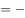无处下金钩）。

第二步：逐一分析选项。

A项：翻译为：留得五湖明月有去处下金钩，是对题干条件关系的肯前，肯前必肯后，一定为真，排除；

B项：翻译为：五湖明月俱在 且 无处可下金钩，与题干的条件关系相矛盾，不可能为真，当选；

C项：翻译为：留得五湖明月 且 有去处下金钩，“留得五湖明月”是对题干条件关系的否前，否前无必然结论，因此可能为真，排除；

D项：前半句“留得五湖明月”是对题干条件关系的否前，否前无必然结论，因此可能无处下金钩，排除。

本题为选非题，故正确答案为B。

---

### 第 30 题　qid 3523606 · 逻辑判断

档案室有五个柜子，分别放着教育学院、体育学院、人文学院、管理学院和信息学院五个学院的资料，现在由甲、乙、丙、丁、戊五位同学来猜这五个柜子和五个学院的对应关系：
甲：第二个柜子是教育学院的，第三个柜子是体育学院的。
乙：第二个柜子是人文学院的，第四个柜子是管理学院的。
丙：第一个柜子是管理学院的，第五个柜子是信息学院的。
丁：第三个柜子是人文学院的，第四个柜子是信息学院的。
戊：第二个柜子是体育学院的，第五个柜子是教育学院的。
打开柜子后发现，每个人都只猜对了一半，而且每个柜子都有一个人猜对。由此可以推出：

- **A**. 第一个柜子里放着人文学院的资料
- **B**. 第二个柜子里放着教育学院的资料
- **C**. 第三个柜子里放着管理学院的资料
- **D**. 第四个柜子里放着信息学院的资料　✅

**答案**：D

**官方解析**

第一步：找突破口。
本题突破口是“每个人都只猜对了一半，而且每个柜子都有一个人猜对”。
第二步：开始推理。
第一个柜子只有丙进行了猜测，因此肯定是正确的，即第一个柜子是管理学院的，排除A、C两项。
由此可知，乙对于第四个柜子是管理学院的猜测是错的，则第二个柜子是人文学院的，排除B项。
故正确答案为D。

---

## 资料分析

### 材料 1

        2019年，我国电信业务收入完成1.31万亿元，比上年增长。其中：固定数据及互联网业务收入完成2175亿元，比上年增长；移动数据及互联网业务收入6082亿元，比上年增长；固定增值业务收入1371亿元，比上年增长，其中，IPTV（网络电视）业务收入294亿元，比上年增长；物联网业务收入比上年增长。

#### 第 1 题　qid 3523607 · 综合

2018年我国电信业务收入约为多少万亿元？

- **A**. 1.09
- **B**. 1.15
- **C**. 1.26
- **D**. 1.30　✅

**答案**：D

**官方解析**

根据题干“2018年”“万亿元”，结合材料时间，可判定本题为基期计算问题。定位文字材料第一段“2019年，我国电信业务收入完成1.31万亿元，比上年增长”。结合公式基期量，可知2018年我国电信业务收入为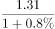，由于的绝对值，故可用化除为乘，则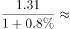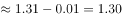万亿元。

故正确答案为D。

---

#### 第 2 题　qid 3523608 · 增长

2015-2019年间，电信业务收入同比增速最高的年份，当年移动通信业务收入占比比上年：

- **A**. 上升了不到1个百分点　✅
- **B**. 上升了1个百分点以上
- **C**. 下降了不到1个百分点
- **D**. 下降了1个百分点以上

**答案**：A

**官方解析**

根据题干“······电信业务收入同比增速最高的年份，当年移动通信业务收入占比比上年”，结合选项与材料时间，可判定本题为两期比重计算问题。定位折线图找到增速最高的年份为2017年，定位柱形图找到2017年移动收入占比为，2016年移动收入占比为，，上升了0.4个百分点，即上升了不到1个百分点。

故正确答案为A。

---

#### 第 3 题　qid 3523609 · 增长

2015-2018年间，固定通信业务收入同比增长的年份有几个？

- **A**. 1
- **B**. 2
- **C**. 3
- **D**. 4　✅

**答案**：D

**官方解析**

根据题干“固定通信业务收入同比增长的年份有几个”，结合材料中给出的固定通信业务收入占比和电信业务收入增速，可判定本题为两期比重问题。根据公式：现期量基期量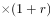和部分量整体量比重。

假设2014年电信业务收入为100，则2014年固定通信业务收入为，2015年固定通信业务收入为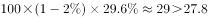，则2015年固定通信业务收入同比增长。

假设2015年电信业务收入为100，则2015年固定通信业务收入为，2016年固定通信业务收入为，则2016年固定通信业务收入同比增长。

假设2016年电信业务收入为100，则2016年固定通信业务收入为，2017年固定通信业务收入为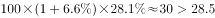，则2017年固定通信业务收入同比增长。

假设2017年电信业务收入为100，则2017年固定通信业务收入为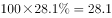，2018年固定通信业务收入为，则2018年固定通信业务收入同比增长。

因此，2015-2018年固定通信业务收入同比增长的年份有4个。

故正确答案为D。

---

#### 第 4 题　qid 3523610 · 比重

下列指标中，2019年的数值高于2018年的有几项？
①固定数据及互联网业务收入占电信业务收入比重
②移动数据及互联网业务收入占电信业务收入比重
③IPTV业务收入占固定增值业务收入比重

- **A**. 0
- **B**. 1
- **C**. 2　✅
- **D**. 3

**答案**：C

**官方解析**

根据题干“······2019年的数值高于2018年的有几项”，结合各项数值均为“······占······比重”，可判定本题为两期比重问题。定位文字材料可得：2019年，我国电信业务收入······比上年增长。其中：固定数据及互联网业务收入······比上年增长；移动数据及互联网业务收入······比上年增长；固定增值业务收入······比上年增长，其中，IPTV（网络电视）业务收入······比上年增长。根据两期比重结论：部分增长率整体增长率，则比重上升。

①固定数据及互联网业务收入的同比增长率（）电信业务收入的同比增长率（），则2019年的比重高于2018年，正确；

②移动数据及互联网业务收入的同比增长率（）电信业务收入的同比增长率（），则2019年的比重高于2018年，正确；

③IPTV（网络电视）业务收入的同比增长率（）固定增值业务收入的同比增长率（），则2019年的比重低于2018年，错误。

综上所述，2019年的数值高于2018年的有2项。

故正确答案为C。

---

#### 第 5 题　qid 3523611 · 综合

不能从上述材料中推出的是：

- **A**. 2018年固定增值业务收入
- **B**. 2014-2018年电信业务总收入
- **C**. 2018年物联网业务收入的同比增长率　✅
- **D**. 2018年IPTV业务收入在全年电信业务收入中的占比

**答案**：C

**官方解析**

A项：定位文字材料可得：（2019年）固定增值业务收入1371亿元，比上年增长。根据公式：，则2018年固定增值业务收入为亿元，可以推出，正确；

B项：定位文字材料可得：2019年，我国电信业务收入完成1.31万亿元，比上年增长。根据公式：，则2018年我国电信业务收入为万亿元。定位图形材料可得：2014-2018年电信业务收入的同比增速，同理可推出2017年、2016年、2015年、2014年的电信业务收入，进而可推出2014-2018年电信业务总收入，正确；

C项：材料中仅给出2019年物联网业务收入的同比增速，无法推出2018年物联网业务收入的同比增长率，错误；

D项：基期比重公式为，定位文字材料可得：2019年，我国电信业务收入完成1.31万亿元（），比上年增长（）；IPTV（网络电视）业务收入294亿元（），比上年增长（）。因此基期比重公式里的、、、四个量均有数据，可以推出2018年IPTV业务收入在全年电信业务收入中的占比，正确。

本题为选非题，故正确答案为C。

---

### 材料 2

        2017年全年，上海口岸货物进出口总额79211.40亿元，比上年增长。其中，进口33445.10亿元，增长；出口45766.30亿元，增长。全年上海关区货物进出口总额59690.24亿元，比上年增长。其中，进口24684.20亿元，增长；出口35006.04亿元，增长。

        全年上海市货物进出口总额32237.82亿元，比上年增长。其中，进口19117.51亿元，增长；出口13120.31亿元，增长。

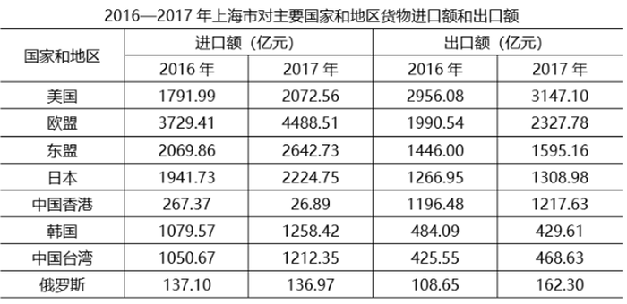

#### 第 6 题　qid 3523612 · 增长

2017年，上海口岸货物进出口总额比上年增加：

- **A**. 1万亿元以上　✅
- **B**. 0.7-1万亿元之间
- **C**. 0.4-0.7万亿元之间
- **D**. 不到0.4万亿元

**答案**：A

**官方解析**

根据题干“2017年，······比上年增加”，结合选项带单位，可判定本题为增长量计算问题。定位文字材料第一段可得：2017年全年，上海口岸货物进出口总额79211.40亿元，比上年增长。根据公式：增长量，则2017年上海口岸货物进出口总额同比增长量亿元万亿元，即增加1万亿元以上。

故正确答案为A。

---

#### 第 7 题　qid 3523613 · 增长

2017年，表中国家和地区自上海市货物进口额同比增速超过的有多少个？

- **A**. 2
- **B**. 3
- **C**. 4　✅
- **D**. 5

**答案**：C

**官方解析**

根据题干“2017年，······同比增速超过的有多少个”，可判定本题为一般增长率问题。各个国家和地区自上海市货物进口额，即上海市对其货物出口额。定位表格材料，可得2016年、2017年上海市对主要国家和地区货物出口额。根据公式：，可得2017年上海市对表中国家和地区货物出口额的同比增速分别为：

美国：，不符合；

欧盟：，符合；

东盟：，符合；

日本：，不符合；

中国香港：，不符合；

韩国：，不符合；

中国台湾：，符合；

俄罗斯：，符合。

因此同比增速超过的有欧盟、东盟、中国台湾、俄罗斯，共4个。

故正确答案为C。

---

#### 第 8 题　qid 3523614 · 综合

2017年，上海市对以下哪一个主要国家或地区实现的贸易顺差最大？

- **A**. 美国
- **B**. 欧盟
- **C**. 东盟
- **D**. 中国香港　✅

**答案**：D

**官方解析**

定位表格材料，可得2017年上海市对各个国家和地区货物进口额和出口额。根据贸易顺差额货物出口额货物进口额，则2017年上海市对各选项的贸易顺差额分别为：

A项：美国，亿元；

B项：欧盟，；

C项：东盟，；

D项：中国香港，亿元。

比较可知，2017年上海市对中国香港的贸易顺差最大。

故正确答案为D。

---

#### 第 9 题　qid 3523615 · 综合

2017年全年，上海口岸货物进出口贸易顺差比同期上海关区顺差：

- **A**. 低不到0.3万亿元
- **B**. 低0.3万亿元以上
- **C**. 高不到0.3万亿元　✅
- **D**. 高0.3万亿元以上

**答案**：C

**官方解析**

定位文字材料第一段可知，2017年全年，上海口岸货物进口33445.10亿元，出口45766.30亿元；全年上海关区货物进口24684.20亿元，出口35006.04亿元。根据公式：进出口贸易顺差可得，2017年全年，上海口岸货物进出口贸易顺差亿元，上海关区货物进出口贸易顺差亿元，故差值亿元万亿元，对应C项。

故正确答案为C。

---

#### 第 10 题　qid 3523616 · 综合

能够从上述资料中推出的是：

- **A**. 2017年，上海关区月均货物进出口贸易额超过5000亿元
- **B**. 2017年，上海市自欧盟货物进口额占其进口总额的三成以上
- **C**. 2017年，上海市货物进口总额中自东盟进口额占比高于上年水平　✅
- **D**. 2017年，上海市自日本进口额同比增速慢于对日本出口额同比增速

**答案**：C

**官方解析**

A项：定位文字材料第一段可知，全年上海关区货物进出口总额59690.24亿元。根据公式：月均货物进出口贸易额可得，2017年上海关区月均货物进出口贸易额亿元，错误；

B项：定位表格材料可知，2017年上海市自欧盟货物进口额为4488.51亿元；定位文字材料第二段可知，全年上海市货物进口19117.51亿元。则，即上海市自欧盟货物进口额占其进口总额不到三成，错误；

C项：定位表格材料可知，上海市货物进口总额中自东盟进口额2016年为2069.86亿元，2017年为2642.73亿元；定位文字材料第二段可知，2017年全年上海市货物进口19117.51亿元，增长。根据两期比重比较口诀：当时，比重上升，即高于上年水平。则，，符合，正确；

D项：定位表格材料可知，上海市自日本进口额2016年为1941.73亿元，2017年为2224.75亿元；上海市对日本出口额2016年为1266.95亿元，2017年为1308.98亿元。根据公式：增长率可得，进口额的增长率，出口额的增长率，故2017年上海市自日本进口额同比增速快于对日本出口额同比增速，错误。

故正确答案为C。

---

### 材料 3

        2015年，我国汽车整车进口同比呈明显下降，共进口110.19万辆，同比下降22.73%。2015年，中国品牌轿车销售243.03万辆，同比下降12.5%，占轿车销售总量的20.7%，比上年同期下降1.7个百分点。

        2015年，中国品牌乘用车共销售873.76万辆，同比增长15.27%，占乘用车销售总量的41.32%，占有率比上年同期提升2.86个百分点。德系、日系、美系、韩系和法系乘用车分别销售399.82万辆、336.43万辆、259.57万辆、167.88万辆和72.93万辆。

        2015年12月，基本型乘用车产销量分别为120.29万辆和128.09万辆，环比增长0.21%和8.83%，同比增长4.50%和1.30%；运动型多用途乘用车（SUV）产销量分别为78.28万辆和79.40万辆，环比增长8.22%和10.86%，同比增长60.39%和60.73%；多功能乘用车（MPV）产销量分别24.88万辆和27.27万辆，环比增长13.01%和24.85%，同比增长13.53%和27.11%；交叉型乘用车产销量分别为8.65万辆和9.46万辆，环比增长-7.46%和3.31%，同比增长1.32%和2.87%。

        2015年新能源汽车生产340471辆，销售331092辆，同比分别增长3.3倍和3.4倍。其中，纯电动汽车产销分别完成254633辆和247482辆，同比分别增长4.2倍和4.5倍；插电式混合动力汽车产销分别完成85838辆和83610辆，同比增长1.9倍和1.8倍。

        新能源乘用车中，纯电动乘用车产销分别完成152172辆和146719辆，同比分别增长2.8倍和3倍；插电式混合动力乘用车产销分别完成62608辆和60663辆，同比均增长2.5倍。

        新能源商用车中，纯电动商用车产销分别完成102461辆和100763辆，同比分别增长10.4倍和10.6倍；插电式混合动力商用车产销分别完成23230辆和22947辆，同比增长91.1%和88.8%。

#### 第 11 题　qid 3523619 · 综合

2014年，新能源汽车产量比销售量高约多少万辆?

- **A**. 0.1
- **B**. 0.2
- **C**. 0.3
- **D**. 0.4　✅

**答案**：D

**官方解析**

根据题干“2014年······比······高约多少万辆”，结合材料时间为2015年，可判定本题为基期和差问题。定位文字材料第4段可得：2015年新能源汽车生产340471辆，销售331092辆，同比分别增长3.3倍和3.4倍。根据公式:，则题干所求79200-75200=4000辆=0.4万辆。

故正确答案为D。

---

#### 第 12 题　qid 3523621 · 综合

关于2015年各类机动车产销状况，下列说法正确的是：

- **A**. 轿车销售总量超过1200万辆
- **B**. 纯电动商用车的销量大于产量
- **C**. 德系车销量占乘用车销售总量比重超过两成
- **D**. 纯电动乘用车产量占新能源乘用车产量的比重高于上年　✅

**答案**：D

**官方解析**

A项：定位文字材料第1段可得：2015年，中国品牌轿车销售243.03万辆，占轿车销售总量的20.7%。则2015年轿车销售总量万辆，未超过1200万辆，错误；

B项：定位文字材料第6段可得：2015年纯电动商用车产销分别完成102461辆和100763辆。则2015年纯电动商用车的销量（100763辆）小于产量（102461辆），错误；

C项：定位文字材料第2段可得：2015年，中国品牌乘用车共销售873.76万辆，占乘用车销售总量的41.32%。德系乘用车销售399.82万辆。则2015年乘用车销售总量万辆，2015年德系车销量占乘用车销售总量的比重，未超过两成，错误；

D项：定位文字材料第5段可得：2015年新能源乘用车中，纯电动乘用车产量同比增长2.8倍，插电式混合动力乘用车产量同比增长2.5倍。根据混合增长率结论：整体增速介于部分增速之间，即纯电动乘用车产量同比增速（2.8倍）＞新能源乘用车产量同比增速＞插电式混合动力乘用车产量同比增速（2.5倍），结合两期比重结论：部分增速大于整体增速，比重上升，故2015年纯电动乘用车产量占新能源乘用车产量的比重高于上年，正确。

故正确答案为D。

---
