# 2021年广东省公务员录用考试《行测》题（乡镇卷）（网友回忆版）

> 省考 · 2021 年 · 6 个模块 · 共 91 题

- [政治理论](#%E6%94%BF%E6%B2%BB%E7%90%86%E8%AE%BA) · 3 题
- [常识判断](#%E5%B8%B8%E8%AF%86%E5%88%A4%E6%96%AD) · 37 题
- [言语理解与表达](#%E8%A8%80%E8%AF%AD%E7%90%86%E8%A7%A3%E4%B8%8E%E8%A1%A8%E8%BE%BE) · 10 题
- [数量关系](#%E6%95%B0%E9%87%8F%E5%85%B3%E7%B3%BB) · 11 题
- [判断推理](#%E5%88%A4%E6%96%AD%E6%8E%A8%E7%90%86) · 20 题
- [资料分析](#%E8%B5%84%E6%96%99%E5%88%86%E6%9E%90) · 10 题

---

## 政治理论

### 第 1 题　qid 3018764 · 新思想

2021年是中国共产党成立一百周年，关于党的历史，下列选项有误的是：

- **A**. 中共二大第一次明确提出了彻底的反帝反封建的革命纲领
- **B**. 中国共产党在中国革命中战胜敌人的三个法宝是解放思想、实事求是、武装斗争　✅
- **C**. 确立毛泽东思想为党的指导思想并写入党章，是中共七大的历史性贡献
- **D**. 1954年一届全国人大一次会议通过并公布了中华人民共和国的第一部宪法

**答案**：B

**官方解析**

本题考查毛中特。
A项正确，中共二大上确定了最高革命纲领和最低革命纲领，分别是实现共产主义和实现反帝反封建革命任务的胜利，即民主革命纲领，这也是中国共产党第一次旗帜鲜明地提出了反帝反封建的革命纲领。
B项错误，1939年10月，毛泽东在《〈共产党人〉发刊词》一文中，总结了两次国内革命战争的经验教训，揭示了中国革命的客观规律。指出：“十八年的经验，已使我们懂得：统一战线，武装斗争，党的建设，是中国共产党在中国革命中战胜敌人的三个法宝，三个主要的法宝。”
C项正确，1945年4月23日至6月11日，中共七大在延安召开。刘少奇系统阐述了毛泽东思想的科学内涵，大会通过了刘少奇修改党章的报告及新党章。新党章明确规定：中国共产党，以马克思列宁主义的理论与中国革命的实践之统一的思想——毛泽东思想，作为自己一切工作的指针，反对任何教条主义的或经验主义的偏向。中共七大确立毛泽东思想为党的指导思想，从而使全党有了在思想上、工作上取得一致的牢固的理论基础。
D项正确，1954年9月20日，第一届全国人民代表大会第一次会议通过的《中华人民共和国宪法》，是中国历史上第一部社会主义类型的宪法。它是在对建国前夕由全国政协制定的起临时宪法作用的《共同纲领》进行修改的基础上制定的。
本题为选非题，故正确答案为B。

---

### 第 2 题　qid 3018769 · 新思想

习近平总书记指出，体育强国的基础在于（    ），要通过举办北京冬奥会、冬残奥会，把我国冰雪运动特别是雪上运动搞上去，在3亿人中更好推广冰雪运动。

- **A**. 群众体育　✅
- **B**. 竞技体育
- **C**. 体育文化
- **D**. 体育产业

**答案**：A

**官方解析**

本题考查政治常识。
2021年1月18日下午，习近平总书记来到位于北京市延庆区的国家高山滑雪中心考察调研。习近平总书记指出，体育强国的基础在于群众体育。要通过举办北京冬奥会、冬残奥会，把我国冰雪运动特别是雪上运动搞上去，在3亿人中更好推广冰雪运动，推动建设体育强国。
故正确答案为A。

---

### 第 3 题　qid 3018760 · 新思想

广东在中国共产党创建史上具有重要历史地位。关于广东的红色历史，下列选项有误的是（    ）。

- **A**. 广东是全国最早建立中共地方组织的地区之一
- **B**. 省港大罢工是反抗帝国主义屠杀中国人民的政治大罢工
- **C**. 中国共产党领导的土地革命最早在广东海陆丰根据地开展起来
- **D**. 中国共产党在广州举行的第三次全国代表大会，决定实行第二次国共合作　✅

**答案**：D

**官方解析**

本题考查毛中特。
A项正确，1921年3月，广州共产主义小组正式建立，陈独秀任书记。广州共产主义小组，是广东早期的共产党组织，中国共产党成立前国内的六个共产主义小组之一，广东也成为全国最早建立中共地方组织的地区之一。
B项正确，1925年6月19日为了支援上海人民五卅反帝爱国运动，广州和香港爆发了规模宏大的省港大罢工。省港大罢工是反抗帝国主义屠杀中国人民的政治大罢工。罢工坚持16个月之久，这在中国工人运动史上是空前的，在世界工人运动史上也属罕见。
C项正确，土地革命最早在海陆丰根据地开展起来。1927年11月，在彭湃的领导下，海陆丰人民建立起苏维埃政权。11月13日，在陆丰召开的工农兵代表大会通过《没收土地案》，决定立即开展土地革命。
D项错误，1923年6月12-20日，中国共产党在广州召开第三次全国代表大会。大会通过了《关于国民运动及国民党问题的决议案》，决定共产党员以个人资格加入国民党，实行党内合作，以建立各革命阶级的统一战线。1937年，在共产党的催促下，9月22日，国民党中央通讯社发表了《中共中央为公布国共合作宣言》。23日，蒋介石发表谈话，实际上承认了共产党的合法地位。至此，抗日民族统一战线正式形成，第二次国共合作开始。
本题为选非题，故正确答案为D。

---

## 常识判断

### 第 1 题　qid 3019129 · 人文常识

党的十九届五中全会提出，坚持（    ）在我国现代化建设全局中的核心地位，把科技自立自强作为国家发展的战略支撑。

- **A**. 创新　✅
- **B**. 改革
- **C**. 开放
- **D**. 发展

**答案**：A

**官方解析**

本题考查政治常识。
在党的十九届五中全会中通过的《中共中央关于制定国民经济和社会发展第十四个五年规划和二〇三五年远景目标的建议》中提出：“坚持创新在我国现代化建设全局中的核心地位，把科技自立自强作为国家发展的战略支撑，面向世界科技前沿、面向经济主战场、面向国家重大需求、面向人民生命健康，深入实施科教兴国战略、人才强国战略、创新驱动发展战略，完善国家创新体系，加快建设科技强国。”
故正确答案为A。

---

### 第 2 题　qid 3018777 · 人文常识

嘉兴南湖革命纪念馆的题诗“革命声传画舫中，诞生共党庆工农”纪念的历史事件是：

- **A**. 中共一大的召开　✅
- **B**. 第一次国共合作
- **C**. 中共工农红军的组建
- **D**. 第一次全国劳动大会的召开

**答案**：A

**官方解析**

本题考查毛中特。
A项正确，1964年4月5日，董必武同志来到浙江嘉兴南湖，为了纪念中共一大的召开、中国共产党的诞生，题诗：“革命声传画舫中，诞生共党庆工农。重来正值清明节，烟雨迷蒙访旧踪”。
B项错误，中国共产党和中国国民党两党的第一次合作是从1924年1月起至1927年7月止，历时三年半。1924年1月，中国国民党第一次全国代表大会在广州召开，标志着国民党改组的完成和第一次国共合作的正式建立。
C项错误，1928年5月25日，中国共产党中央委员会决定，全国各地工农革命军正式定名为红军。1930年后，又逐渐改称中国工农红军。在国共内战时期，中国工农红军不断发展壮大，先后组成了第一方面军（曾经称中央红军）、第四方面军、第二方面军和西北红军等红军部队。
D项错误，1922年5月1日至6日，根据党的决定，由中国劳动组合书记部发起的第一次全国劳动大会在广州召开，这是中国工人阶级第一次全国性的盛会。
故正确答案为A。

---

### 第 3 题　qid 3019133 · 人文常识

《中共中央关于制定国民经济和社会发展第十四个五年规划和二〇三五年远景目标的建议》对新发展阶段优先发展农业农村、全面推进乡村振兴作出总体部署。以下不属于新发展阶段全面推进乡村振兴措施的是（    ）。

- **A**. 实施农村人居环境整治
- **B**. 加快县域内城乡融合发展
- **C**. 加强党的农村基层组织建设
- **D**. 保障农村贫困人口基本医疗和住房安全　✅

**答案**：D

**官方解析**

本题考查政治常识。
党的十九届五中全会审议通过的《中共中央关于制定国民经济和社会发展第十四个五年规划和二〇三五年远景目标的建议》，对新发展阶段优先发展农业农村、全面推进乡村振兴作出总体部署，大力实施乡村建设行动要实施农村人居环境整治提升五年行动；要加快县域内城乡融合发展；要加强党的农村基层组织建设和乡村治理。
本题为选非题，故正确答案为D。

---

### 第 4 题　qid 3018770 · 人文常识

党的新闻舆论工作必须“坚持正确舆论导向，坚持正面宣传为主，唱响主旋律，弘扬正能量，做大做强主流思想舆论”。下列选项最能体现这一理念的是：

- **A**. 独阴不成，独阳不生
- **B**. 事必有法，然后可成
- **C**. 事不凝滞，理贵变通
- **D**. 先立乎其大者，则其小者不能夺也　✅

**答案**：D

**官方解析**

本题考查人文常识。
A项错误，“独阴不成，独阳不生”出自《春秋谷梁传·庄公三年》，意思是单独有阴，不能生发，单独有阳，不能生发。泛指单凭一方面的因素或条件促成不了事物的生长或出现。
B项错误，“事必有法，然后可成”出自《孟子集注》，意思是做任何事情都要有相应的方法，找到方法之后才能把事情做成。
C项错误，“事不凝滞，理贵变通”出自《宋史·赵普列传》，意思是做事灵活不拘泥，善于根据事物的发展变化采取相应的变通方式。
D项正确，“先立乎其大者，则其小者不能夺也”出自《孟子·告子上》，意思是首先把重要的部分树立起来，其它次要的部分就不会被引入迷途。与题干中坚持正确舆论导向，坚持正面宣传为主，唱响主旋律，弘扬正能量，做大做强主流思想舆论的理念相一致。
故正确答案为D。

---

### 第 5 题　qid 3018782 · 人文常识

以下机构按照成立时间的先后顺序排列，正确的是：
①国家乡村振兴局
②中华人民共和国教育部
③中华人民共和国文化和旅游部
④中央人民政府驻香港特别行政区维护国家安全公署

- **A**. ①②④③
- **B**. ②③④①　✅
- **C**. ③②①④
- **D**. ③④②①

**答案**：B

**官方解析**

本题考查政治常识。
①，2021年2月16日出版的《求是》杂志2021年第4期发表“中共国家乡村振兴局党组”的署名文章《人类减贫史上的伟大奇迹》，表明“国家乡村振兴局”已经成立。2021年2月25日，国家乡村振兴局牌子正式挂出。
②，中华人民共和国教育部成立于1949年10月，新中国成立后，成立文化教育委员会、教育部，设立普通教育、专门教育和社会教育三司。
③，中华人民共和国文化和旅游部成立于2018年3月，是根据党的十九届三中全会审议通过的《中共中央关于深化党和国家机构改革的决定》《深化党和国家机构改革方案》和第十三届全国人民代表大会第一次会议批准的《国务院机构改革方案》设立。
④，中央人民政府驻香港特别行政区维护国家安全公署，全称中华人民共和国中央人民政府驻香港特别行政区维护国家安全公署，是中央人民政府驻香港特别行政区维护国家安全机构，依法履行维护国家安全职责，行使相关权力。2020年7月8日上午，中央人民政府驻香港特别行政区维护国家安全公署在香港揭牌。
因此按照成立时间的先后顺序排序正确的是②③④①。
故正确答案为B。

---

### 第 6 题　qid 3018790 · 人文常识

青少年是祖国的未来，民族的希望。青少年教育最重要的是教给他们正确的思想。引导他们走正路。其中，（    ）是落实立德树人根本任务的关键课程。

- **A**. 思政课　✅
- **B**. 劳动课
- **C**. 通识课
- **D**. 美育课

**答案**：A

**官方解析**

本题考查政治常识。
2020年9月1日出版的第17期《求是》杂志发表中共中央总书记、国家主席、中央军委主席习近平的重要文章《思政课是落实立德树人根本任务的关键课程》。文章强调，青少年是祖国的未来、民族的希望。青少年教育最重要的是教给他们正确的思想，引导他们走正路。思政课是落实立德树人根本任务的关键课程，思政课作用不可替代，思政课教师队伍责任重大。办好思政课，最根本的是要全面贯彻党的教育方针，解决好培养什么人、怎样培养人、为谁培养人这个根本问题。
故正确答案为A。

---

### 第 7 题　qid 3019134 · 人文常识

以下人物被党中央、国务院授予“全国脱贫攻坚先进个人”荣誉称号的有：
①李保国
②张桂梅
③钟南山
④焦裕禄
⑤黄文秀

- **A**. ①②⑤　✅
- **B**. ②③④
- **C**. ①②④
- **D**. ①②③⑤

**答案**：A

**官方解析**

本题考查政治常识。
①李保国，生前是河北农业大学教授、博士生导师。他把太行山区生态治理和群众脱贫奔小康作为自己的毕生追求，坚持三十年扎进太行山，用科技力量帮助百姓脱贫致富，创建了一套完整的山区生态开发模式，探索出了经济社会与生态效益同步提升的扶贫新路，赢得山区人民的爱戴。2016年6月27日下午，国务院扶贫办、人力资源社会保障部召开追授李保国同志全国脱贫攻坚模范荣誉称号大会暨李保国同志先进事迹报告会。
②张桂梅，现任云南省丽江市华坪女子高级中学党支部书记、校长，华坪县儿童福利院（华坪儿童之家）院长。张桂梅同志扎根边疆教育一线40余年，默默耕耘、无私奉献，2008年以来已帮助1800多位女孩走出大山走进大学，用知识改变贫困山区女孩命运，用教育阻断贫困代际传递。2021年2月25日，党中央、国务院决定，授予毛相林、张桂梅、黄文秀等10名同志，河北省塞罕坝机械林场等10个集体“全国脱贫攻坚楷模”荣誉称号。
③钟南山，呼吸内科学家，广州医科大学附属第一医院国家呼吸系统疾病临床医学研究中心主任，中国工程院院士，中国医学科学院学部委员，中国抗击非典型肺炎的领军人物、国家卫健委高级别专家组组长、国家健康科普专家。2020年8月11日，习近平签署主席令，授予钟南山“共和国勋章”；9月3日，入选世卫组织新冠肺炎疫情应对评估专家组名单。9月4日，钟南山入选2020年“全国教书育人楷模”名单。
④焦裕禄，原兰考县委书记，干部楷模，中国共产党革命烈士。在兰考担任县委书记时所表现出来的“亲民爱民、艰苦奋斗、科学求实、迎难而上、无私奉献”的精神，被后人称之为“焦裕禄精神”。2009年9月10日，在中央宣传部、中央组织部等11个部门联合组织的评选活动中，焦裕禄被评为“100位新中国成立以来感动中国人物”。2019年9月25日，焦裕禄获“最美奋斗者”个人称号。
⑤黄文秀，生前是广西壮族自治区百色市委宣传部干部。2016年硕士研究生毕业后，黄文秀同志自愿回到百色革命老区工作，主动请缨到贫困村担任驻村第一书记。她自觉践行党的宗旨，始终把群众的安危冷暖装在心间，推动实施百坭村村屯亮化、道路硬化和蓄水池修建等工程项目，带领群众发展多种产业，为村民脱贫致富倾注了全部心血和汗水。2019年6月17日凌晨，黄文秀同志在突发山洪中不幸遇难，献出了年仅30岁的宝贵生命。黄文秀同志被追授“全国三八红旗手”“全国脱贫攻坚模范”等称号。
故①②⑤说法正确。
故正确答案为A。

---

### 第 8 题　qid 3018775 · 人文常识

2020年是中国人民志愿军抗美援朝出国作战70周年。以下战役发生在抗美援朝战争期间的是：

- **A**. 辽沈战役
- **B**. 百团大战
- **C**. 上甘岭战役　✅
- **D**. 仁川登陆战

**答案**：C

**官方解析**

本题考查毛中特。
抗美援朝战争开始于1950年10月，结束于1953年7月，交战双方是以美军为首的“联合国军”和中国人民志愿军。
A项错误，辽沈战役是中国近代史解放战争中的“三大战役”之一，发生于1948年9月至11月，此次战役一举摧毁了国民党在关外的全部主力部队，解放了东北全境。
B项错误，1940年下半年，彭德怀指挥八路军105个团在华北发动了一次大规模的对日作战，史称“百团大战”。百团大战是抗日战争进入相持阶段后，八路军在华北地区发动的一次规模最大、持续时间最长的战役。
C项正确，上甘岭战役是1952年10月14日至11月25日中国人民志愿军与“联合国军”在上甘岭及其附近地区展开的一场战役。该战役历时40多天，双方伤亡惨重，是抗美援朝战争中最惨烈的一次战役，最终中国人民志愿军取得胜利。
D项错误，仁川登陆战是朝鲜战争初期，以美国为首的“联合国军”在仁川发动的一次登陆作战。战役开始于1950年9月15日，至9月28日结束。仁川战役令朝鲜人民军腹背受敌，被迫后撤，“联合国军”和韩国军队开始反攻。随后，由于朝鲜人民无力抵抗，中国政府决定派出中国人民志愿军，支援朝鲜。
故正确答案为C。

---

### 第 9 题　qid 3018781 · 人文常识

《中共中央关于制定国民经济和社会发展第十四个五年规划和二〇三五年远景目标的建议》提出，增强消费对经济发展的基础性作用，顺应消费升级趋势，提升传统消费，培育新型消费，适当增加公共消费。下列措施中，有助于增强消费对经济发展的基础性作用的有：
①提高服务消费领域市场准入门槛，减少产品供给
②推动汽车等消费品由购买管理向使用管理转变
③完善节假日制度，落实带薪休假制度
④改善消费环境，强化消费者权益保护

- **A**. ①③
- **B**. ①④
- **C**. ②④
- **D**. ②③④　✅

**答案**：D

**官方解析**

本题考查政治常识。
①错误，②③④正确。《中共中央关于制定国民经济和社会发展第十四个五年规划和二〇三五年远景目标的建议》提出：“全面促进消费。增强消费对经济发展的基础性作用，顺应消费升级趋势，提升传统消费，培育新型消费，适当增加公共消费。以质量品牌为重点，促进消费向绿色、健康、安全发展，鼓励消费新模式新业态发展。推动汽车等消费品由购买管理向使用管理转变，促进住房消费健康发展。健全现代流通体系，发展无接触交易服务，降低企业流通成本，促进线上线下消费融合发展，开拓城乡消费市场。发展服务消费，放宽服务消费领域市场准入。完善节假日制度，落实带薪休假制度，扩大节假日消费。培育国际消费中心城市。改善消费环境，强化消费者权益保护。”
故正确答案为D。

---

### 第 10 题　qid 3019128 · 人文常识

构建新的发展格局，是根据我国发展阶段、环境、条件变化作出的战略决策。关于构建新发展格局，以下表述有误的是（    ）。

- **A**. 以国际大循环为主体　✅
- **B**. 关键在于经济循环的畅通无阻
- **C**. 坚持深化供给侧结构性改革这条主线
- **D**. 最本质的特征是实现高水平的自立自强

**答案**：A

**官方解析**

本题考查政治常识。
A项错误，加快形成以国内大循环为主体、国内国际双循环相互促进的新发展格局，是根据我国发展阶段、环境、条件变化作出的战略决策，是事关全局的系统性深层次变革。
B项正确，习近平总书记在省部级主要领导干部学习贯彻党的十九届五中全会精神专题研讨班开班式上指出，构建新发展格局的关键在于经济循环的畅通无阻。
C项正确，推进供给侧结构性改革，是以习近平同志为核心的党中央深刻洞察国际国内形势变化，科学把握发展规律和我国现阶段经济运行主要矛盾，作出的具有开创性、全局性、长远性的重大决策部署，构建新发展格局也要坚持深化供给侧结构性改革这条主线。
D项正确，“构建新发展格局最本质的特征是实现高水平的自立自强。”习近平总书记在省部级主要领导干部学习贯彻党的十九届五中全会精神专题研讨班开班式上深刻阐明了新发展格局的内涵特征，指出必须更强调自主创新，全面加强对科技创新的部署，集合优势资源，有力有序推进创新攻关的“揭榜挂帅”体制机制，加强创新链和产业链对接。
本题为选非题，故正确答案为A。

---

### 第 11 题　qid 3018766 · 人文常识

2021年2月25日召开的全国脱贫攻坚总结表彰大会宣告，我国脱贫攻坚战取得了全面胜利。关于脱贫攻坚，以下表述准确的有（    ）。
①完成了消除相对贫困的艰巨任务
②2018年底拉开了新时代脱贫攻坚的序幕
③我国提前10年实现《联合国2030年可持续发展议程》减贫目标
④精准扶贫是打赢脱贫攻坚战的制胜法宝
⑤开发式扶贫方针是中国特色减贫道路的鲜明特征

- **A**. ①③⑤
- **B**. ③④⑤　✅
- **C**. ①②④⑤
- **D**. ②③④⑤

**答案**：B

**官方解析**

本题考查政治常识。
①错误，完成了消除绝对贫困的艰巨任务。
②错误，2012年年底，党的十八大召开后不久，党中央就突出强调，“小康不小康，关键看老乡，关键在贫困的老乡能不能脱贫”，承诺“决不能落下一个贫困地区、一个贫困群众”，拉开了新时代脱贫攻坚的序幕。
③正确，在全球贫困状况依然严峻、一些国家贫富分化加剧的背景下，我国提前10年实现《联合国2030年可持续发展议程》减贫目标，赢得国际社会广泛赞誉。
④⑤正确，事实充分证明，精准扶贫是打赢脱贫攻坚战的制胜法宝，开发式扶贫方针是中国特色减贫道路的鲜明特征。
故正确答案为B。

---

### 第 12 题　qid 3018787 · 法律常识

中华人民共和国全国人民代表大会是最高国家权力机关。全国人民代表大会行使的职权不包括：

- **A**. 选举国家监察委员会主任以及最高人民法院院长
- **B**. 撤销全国人民代表大会常务委员会不适当的决定
- **C**. 编制和执行国民经济和社会发展计划和国家预算　✅
- **D**. 制定和修改刑事、民事、国家机构的和其他的基本法律

**答案**：C

**官方解析**

本题考查法律常识。
A项正确，根据《宪法》第六十二条第七、八项：“全国人民代表大会行使下列职权：······（七）选举国家监察委员会主任；（八）选举最高人民法院院长；······”
B项正确，根据《宪法》第六十二条第十二项：“全国人民代表大会行使下列职权：······（十二）改变或者撤销全国人民代表大会常务委员会不适当的决定；······”
C项错误，根据《宪法》第六十二条第十、十一项：“全国人民代表大会行使下列职权：······（十）审查和批准国民经济和社会发展计划和计划执行情况的报告；（十一）审查和批准国家的预算和预算执行情况的报告；······”第八十九条第五项：“国务院行使下列职权：······（五）编制和执行国民经济和社会发展计划和国家预算；······”
D项正确，根据《宪法》第六十二条第三项：“全国人民代表大会行使下列职权：······（三）制定和修改刑事、民事、国家机构的和其他的基本法律；······”
本题为选非题，故正确答案为C。

---

### 第 13 题　qid 3018793 · 法律常识

民法典与人们生活息息相关，被誉为“社会生活的百科全书”。以下内容中，民法典未涉及的是：

- **A**. 监管保险业务　✅
- **B**. 禁止高空抛物
- **C**. 见义勇为补偿
- **D**. 保护个人信息

**答案**：A

**官方解析**

本题考查法律常识。
A项，根据《保险法》第一百三十三条：“保险监督管理机构依照本法和国务院规定的职责，遵循依法、公开、公正的原则，对保险业实施监督管理，维护保险市场秩序，保护投保人、被保险人和受益人的合法权益。”故民法典未涉及监管保险业务。
B项，根据《民法典》第一千二百五十四条第一款：“禁止从建筑物中抛掷物品。从建筑物中抛掷物品或者从建筑物上坠落的物品造成他人损害的，由侵权人依法承担侵权责任；经调查难以确定具体侵权人的，除能够证明自己不是侵权人的外，由可能加害的建筑物使用人给予补偿。可能加害的建筑物使用人补偿后，有权向侵权人追偿。”故民法典涉及禁止高空抛物。
C项，根据《民法典》第一百八十三条：“因保护他人民事权益使自己受到损害的，由侵权人承担民事责任，受益人可以给予适当补偿。没有侵权人、侵权人逃逸或者无力承担民事责任，受害人请求补偿的，受益人应当给予适当补偿。”故民法典涉及见义勇为补偿。
D项，根据《民法典》第一百一十一条：“自然人的个人信息受法律保护。任何组织或者个人需要获取他人个人信息的，应当依法取得并确保信息安全，不得非法收集、使用、加工、传输他人个人信息，不得非法买卖、提供或者公开他人个人信息。”故民法典涉及保护个人信息。
本题为选非题，故正确答案为A。

---

### 第 14 题　qid 3019130 · 法律常识

《中华人民共和国环境保护法》所称环境包括：
①海洋
②森林
③草原
④湿地

- **A**. ③④
- **B**. ①②
- **C**. ①③④
- **D**. ①②③④　✅

**答案**：D

**官方解析**

本题考查法律常识。
根据《中华人民共和国环境保护法》第二条规定：“本法所称环境，是指影响人类生存和发展的各种天然的和经过人工改造的自然因素的总体，包括大气、水、海洋、土地、矿藏、森林、草原、湿地、野生生物、自然遗迹、人文遗迹、自然保护区、风景名胜区、城市和乡村等。”因此，海洋、森林、草原、湿地都属于《中华人民共和国环境保护法》所称的环境。
故正确答案为D。

---

### 第 15 题　qid 3018795 · 科技常识

下列关于生活常识的说法，正确的是：

- **A**. 发现煤气中毒病人后，施救者应立即进行人工呼吸
- **B**. 商场中绿色的消防安全标志用于指示安全和疏散通道　✅
- **C**. 暴雨黄色预警信号生效时，所在区域的中小学校应当自动停课
- **D**. 隔夜茶指放置时间超过6小时的茶，其致癌物的含量会显著增加

**答案**：B

**官方解析**

本题考查科技常识。
A项错误，发现煤气中毒病人后，应立即打开门窗，通风换气，关闭煤气气阀，并及时将病人转移至室外或空气新鲜的地方，然后再实施抢救措施。
B项正确，消防安全标志是由安全色、边框、图象为主要特征的图形符号或文字构成的标志，用以表达与消防有关的安全信息。共分为三种颜色，红色：表示禁止。黄色：表示火灾爆炸危险。绿色：表示安全和疏散途径。
C项错误，暴雨预警信号是气象部门通过气象监测在暴雨到来之前做出的预警信号，暴雨预警信号分四级，分别以蓝色、黄色、橙色、红色表示。其中暴雨黄色预警信号是第二级别，所在区域的中小学校注意天气变化，做好防御措施即可。
D项错误，隔夜茶一般是指茶叶浸泡12小时以上，或者是搁置了一晚上的茶。隔夜茶被误认为会致癌的主要原因是有可能产生致癌物质亚硝胺。但茶叶本身富含维生素C和茶多酚，反而成为了合成亚硝胺的天然抑制剂，因此隔夜茶致癌物质的含量并不会显著增加。
故正确答案为B。

---

### 第 16 题　qid 3019132 · 人文常识

春季，我国民间有许多民俗活动。下列关于这些民俗活动的表述正确的是（    ）。

- **A**. 在迎春仪式上，鞭打春牛——打春　✅
- **B**. 立春清晨，到郊外、田野踏青——插春
- **C**. 将采集到的植物枝条插在家里——采春
- **D**. 采集冬青树、松柏、竹枝、青菜等绿色植物——探春

**答案**：A

**官方解析**

本题考查人文常识。
A项正确，打春，是立春节气习俗之一。旧时人们在立春前一天用泥土做成春牛，立春日用红绿鞭抽打，因此该习俗活动称为“打春”。在民间有在立春日举行“鞭打春牛”仪式迎立春，祈福五谷丰登。
B项错误，踏青为春日郊游，也称“踏春”，一般指初春时到郊外散步游玩。清明节期间到大自然去欣赏和领略春日景象，郊外远足，这种踏青也叫春游。“插春”表述错误。
C项错误，清明节是杨柳发芽抽绿的时间，民间有“折柳、戴柳、插柳”的习俗。人们踏青时顺手折下几枝柳条，可拿在手中把玩，也可编成帽子戴在头上，也可带回家插在门楣、屋檐上。“采春”表述错误。
D项错误，冬青树、松柏、竹枝等绿色植物为四季常青，无法体现是春季民俗活动。“探春”表述错误。
故正确答案为A。

---

### 第 17 题　qid 3018800 · 地理国情

2020年是“十三五”收官之年，广东经济社会发展取得重大成果。下列有关说法正确的是：
①第一届全国职业技能大赛在广东举行
②全省地区生产总值超过11万亿元，连续32年位居全国第一
③区域创新综合能力跃居全国第一，有效发明专利量保持全国首位

- **A**. ②
- **B**. ①②
- **C**. ①③
- **D**. ①②③　✅

**答案**：D

**官方解析**

本题考查政治常识。

①项正确，中华人民共和国第一届职业技能大赛在广州开幕。首届大赛以“新时代 新技能 新梦想”为主题，设86个比赛项目，共有2500多名选手、2300多名裁判人员参赛，是新中国成立以来规格最高、项目最多、规模最大、水平最高的综合性国家职业技能赛事。

②项正确，广东省省长马兴瑞在2021年1月24日广东省十三届人大四次会议上作政府工作报告并提出，广东全省地区生产总值2015年为7.5万亿元，2020年超过11万亿元，年均增长，总量连续32年位居全国第一。其中，2020年广东全省地区生产总值增长。目标2021年全省地区生产总值增长以上。

③项正确，广东省省长马兴瑞在2021年1月24日广东省十三届人大四次会议上作政府工作报告并提出，全省研发经费支出从1800亿元增加到3200亿元，占地区生产总值比重从提高到，区域创新综合能力跃居全国第一，有效发明专利量、PCT国际专利申请量保持全国首位。

综上，说法正确的是①②③。

故正确答案为D。

---

### 第 18 题　qid 3019161 · 科技常识

下列词语所描述的场景中，涉及化学变化的是（    ）。

- **A**. 聚沙成塔
- **B**. 百炼成钢　✅
- **C**. 香气四溢
- **D**. 冰冻三尺

**答案**：B

**官方解析**

有新物质生成的是化学变化，没有新物质生成的是物理变化。
A项，聚沙成塔指把沙子堆积成宝塔，此过程没有新物质的生成，属于物理变化，错误；
B项，百炼成钢是将生铁炼成钢，过程中有新物质的生成，属于化学变化，正确；
C项，香气四溢是分子在不断的运动，向四周扩散，使人们闻到香味，此过程没有新物质的生成，属于物理变化，错误；
D项，冰冻三尺是水结成冰，此过程没有新物质的生成，属于物理变化，错误。
故正确答案为B。

---

### 第 19 题　qid 3019162 · 科技常识

小郭在甲、乙两个相同的玻璃杯中装入等量的水，甲杯的水比乙杯的温度高，将这两个玻璃杯同时放进温度更低的冰箱内，则（    ）。

- **A**. 乙玻璃杯温度下降得更快
- **B**. 甲玻璃杯温度下降得更快　✅
- **C**. 甲、乙两个玻璃杯温度变化一样快
- **D**. 不能确定两个玻璃杯的温度变化情况

**答案**：B

**官方解析**

此题考查热传递的知识点，物体的内能只能由高温物体传递给低温物体，温差越大，热传递越快，甲杯的水与冰箱的温差更大些，则甲玻璃杯温度下降得会更快，B项正确。
故正确答案为B。

---

### 第 20 题　qid 3019165 · 科技常识

右图为地球示意图，则每年夏至，白昼时间最长的是（    ）点。

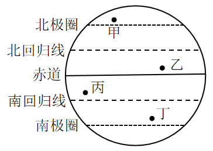

- **A**. 甲　✅
- **B**. 乙
- **C**. 丙
- **D**. 丁

**答案**：A

**官方解析**

一年中太阳的直射点在北回归线和南回归线之间移动，当夏至时，太阳的直射点在北回归线上，此时整个北极圈会出现极昼现象，一天24小时都是白昼，甲在北极圈中，故甲的白昼时间最长。
故正确答案为A。

---

### 第 21 题　qid 3018776 · 科技常识

下面3个图分别表示两种生物种群随时间（t）推移而发生的数量（n）变化情况，则甲、乙、丙三图表示的关系最有可能依次是（    ）。

- **A**. 共生、捕食、竞争　✅
- **B**. 竞争、捕食、共生
- **C**. 捕食、竞争、共生
- **D**. 竞争、共生、捕食

**答案**：A

**官方解析**

甲图，两种生物种群的数量变化是同步的，同时增多，同时减少，说明两种群是共同生活，彼此有利，为互利共生的关系；
乙图，两种生物种群的数量随时间的变化是当一方减少，另一方稍后也会开始减少，一方增多，另一方稍后也会增多，呈现“跟随”现象，因此两者间应该为捕食关系；
丙图，两种生物种群的数量变化是一方数量不断增多，另一方数量基本上是不断减小，为此消彼长，因此两者应该为竞争关系。
故正确答案为A。

---

### 第 22 题　qid 3019168 · 科技常识

如图所示，物体M在大小相同的力和作用下移动了相同的距离。下列关于、所做的功说法正确的是（    ）。

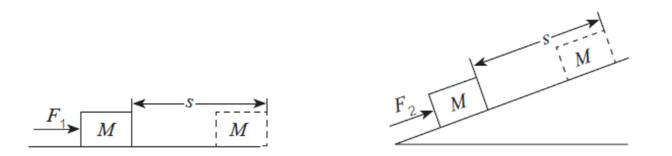

- **A**. 
做的功小于做的功

- **B**. 
做的功等于做的功
　✅
- **C**. 
做的功大于做的功

- **D**. 
无法判断

**答案**：B

**官方解析**

根据公式，力做的功等于力的大小乘以在力的方向上移动的距离。两个力做的功分别为，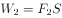，已知和大小相同，且移动的距离均为，因此，B项正确。

故正确答案为B。

---

### 第 23 题　qid 3019170 · 科技常识

下列现象主要是由于分子在不停做无规则运动导致的是（    ）。

- **A**. 将墨水滴入水中，过会儿整杯水变黑了　✅
- **B**. 用打气筒给篮球充气，感觉越打越吃力
- **C**. 下雪时，雪花漫天飞舞
- **D**. 冰块融化后，体积变小了

**答案**：A

**官方解析**

A项，因为分子做无规则运动，使得墨水中的色素分子扩散到整杯水中，导致整杯水变黑，正确；
B项，用打气筒给篮球充气，之所以感觉越打越吃力，是因为随着充入的气体越来越多，篮球内部压强也越来越大，因此将后续气体充入篮球中会有越来越大的阻力，并不是分子无规则运动导致的，错误；
C项，雪花是宏观物质，比分子大得多，其运动显然不是分子无规则运动。事实上，雪花是因为其质量较小，容易受到空气流动的影响而在空中飞舞，错误；
D项，冰块融化后，体积变小，是因为水的密度比冰大，根本原因在于冰的特殊晶体结构，与分子无规则运动无关，错误。
故正确答案为A。

---

### 第 24 题　qid 3019171 · 科技常识

将同一鸡蛋分别浸入两杯密度不同的液体中。鸡蛋在甲杯沉底，在乙杯中悬浮。则（    ）。

- **A**. 乙杯中的液体的密度更大，鸡蛋在乙杯中受到的浮力更大　✅
- **B**. 甲杯中的液体的密度更大，鸡蛋在甲杯中受到的浮力更大
- **C**. 乙杯中的液体的密度更大，鸡蛋在两个杯中受到的浮力大小相等
- **D**. 甲杯中的液体的密度更大，鸡蛋在两个杯中受到的浮力大小相等

**答案**：A

**官方解析**

由题意得，鸡蛋在甲杯沉底，在乙杯中悬浮，根据物体的沉浮条件可知密度关系：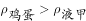，，则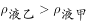，排除B、D两项。又根据浮力公式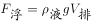，已知，且，则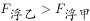，对应A项。

故正确答案为A。

---

### 第 25 题　qid 3019172 · 科技常识

某生物体细胞中含有18条染色体。则在由一个体细胞正常分裂成两个体细胞的过程中，单个细胞体内染色体数目变化情况是（    ）。

- **A**. 
36条18条18条

- **B**. 
18条18条18条

- **C**. 
18条36条18条
　✅
- **D**. 
18条36条36条

**答案**：C

**官方解析**

由题意，有丝分裂染色体变化（以二倍体为例）如下图所示：

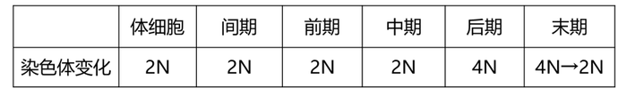

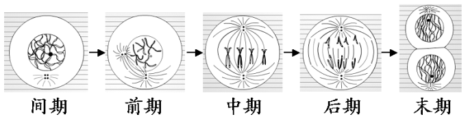

该生物体细胞中含有18条染色体，一个体细胞正常分裂成两个体细胞的过程中，单个细胞体内染色体数目变化情况应为18条36条18条。

故正确答案为C。

---

### 第 26 题　qid 3018804 · 科技常识

如图所示，高尔夫球在力的作用下从水平地面的M点飞到N点。忽略高尔夫球在飞行过程中的空气阻力，下列选项能正确表示高尔夫球从M点到达N点前的动能关系的是（    ）。

- **A**. A
- **B**. B　✅
- **C**. C
- **D**. D

**答案**：B

**官方解析**

从题目所给的运动轨迹可知，高尔夫球做斜抛运动，忽略空气阻力的情况下，整个过程只有重力做功，即重力势能和动能相互转化，因此系统机械能守恒。因此可知，从M点到轨迹最高点的过程中，随着球的高度升高，重力势能增大，相应的动能减小；而从最高点到N的过程中，球的高度降低，重力势能减小，相应的动能增大。观察四个选项图形特征可见，只有B项满足动能先减小后增大的趋势，因此B项正确。
故正确答案为B。

---

### 第 27 题　qid 3019175 · 科技常识

如图所示，3只相同的杯子中分别装入了质量相等的水、煤油和盐水，则下列判断正确的是（    ）。

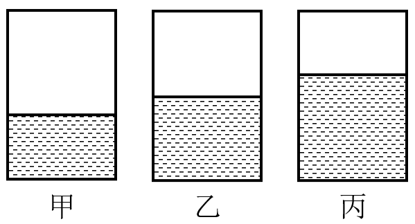

- **A**. 甲杯中是水，乙杯是盐水，丙杯是煤油
- **B**. 甲杯中是煤油，乙杯是盐水，丙杯是水
- **C**. 甲杯中是煤油，乙杯是水，丙杯是盐水
- **D**. 甲杯中是盐水，乙杯是水，丙杯是煤油　✅

**答案**：D

**官方解析**

由于物体的质量等于物体的密度乘以物体的体积，即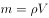，而煤油的密度小于水的密度小于盐水的密度，即，所以如果这三者的质量要相等，所需要的体积关系为，即体积最大的是煤油，最小的是盐水。根据题中给出的图片可以判断出来，甲、乙、丙3只杯子中的液体体积是逐渐增大的，所以甲杯中的液体体积最小，对应密度最大的盐水，乙杯中的液体对应密度中等的水，而丙杯中的液体体积最大，对应密度最小的煤油，D项正确。

故正确答案为D。

---

### 第 28 题　qid 3018785 · 科技常识

下列现象与科学原理搭配正确的是（    ）。
①白醋能除去水垢——水垢在白醋中溶解度较高
②用稀硫酸除铜锈——铜锈与稀硫酸发生氧化还原反应
③含氟牙膏能预防龋齿——氟化物作用于牙齿表面增强耐酸蚀能力

- **A**. ②
- **B**. ①②
- **C**. ①③　✅
- **D**. ②③

**答案**：C

**官方解析**

①白醋除水垢的原理是白醋中的醋酸与水垢主要成分碳酸钙、氢氧化镁等发生反应，使其转化为可溶性盐，从而除去水垢，反应方程式分别为：，，这个过程是化学反应，与溶解度无关，错误；

②铜锈的主要成分是碱式碳酸铜，与稀硫酸发生反应的方程式为：，反应前后无化合价变化，不是氧化还原反应，错误；

③含氟牙膏能提供氟离子，与牙齿中的、结合，生成难溶于水和弱酸的氟磷酸钙，增强牙齿抗酸腐蚀的能力，从而达到预防龋齿，保护牙齿的作用，正确。

备注：根据以上分析可知，严格来说只有③正确，但是并无对应选项。不过在化工领域中，当固体在酸中发生反应时，也常常表述为“将该固体溶于酸”，以此为依据，①勉强可以接受，故粉笔倾向于正确答案选C。

故正确答案为C。

---

### 第 29 题　qid 3018854 · 科技常识

在赛车比赛中，赛车在水平直道转入弯道时，常常在弯道上冲出跑道。下列分析正确的是（    ）。

- **A**. 赛车的速度越快，赛车的惯性越大
- **B**. 赛车的速度越快，转弯所需的向心力越大　✅
- **C**. 赛车的转角越大，发动机对抗的离心力越大
- **D**. 赛车的转角越大，轮胎与地面之间的摩擦系数越小

**答案**：B

**官方解析**

A项，惯性是物体的固有属性，只与物体的质量有关，和速度无关，速度变大，惯性也是不变的，错误；

B项，根据向心力的公式可知，当赛车进入弯道时，速度越快，则赛车所需的向心力也就越大，正确；

C项，根据向心力的公式可知，转角变大，相同时间内角速度变大，向心力变大，摩擦力对抗的离心力变大，发动机对离心力没有影响，错误；

D项，轮胎与地面之间的摩擦系数主要是与接触面的粗糙程度有关，与赛车的转角无关，错误。

故正确答案为B。

---

### 第 30 题　qid 3019177 · 科技常识

在匀速直线运动的京广高铁车厢内，竖直向上抛出一个小球。下列说法正确的是（    ）。
①小球在最高点时，垂直于地面方向的速度为零
②小球在最高点时，垂直于地面方向对地速度最大
③小球的落点位置会比时速慢的列车落点位置更近
④小球从抛出到落地的时间与列车运行速度无关

- **A**. ①③
- **B**. ③④
- **C**. ②③
- **D**. ①④　✅

**答案**：D

**官方解析**

竖直向上抛出小球后，小球只受竖直方向上的重力，水平方向上不受力，根据惯性定律（牛顿第一定律），小球在水平方向上仍然做匀速直线运动，与车速一致，因此小球会落回原来的位置，落点位置与列车运行速度大小无关，因此③错误。

在竖直方向上，向上抛出给了小球一个向上的初速度，抛出后，小球在重力作用下，向上做减速运动，直到竖直方向上的速度减小为0，小球到达最高点。也可以反过来想，如果在最高点时，小球竖直方向上的速度不为0，小球就会继续向上运动，那么达到的就不是最高点，而垂直于地面方向的速度就是竖直方向的速度，因此①正确，②错误。

由于小球抛出后只受重力，根据牛顿第二定律，即合外力等于物体的质量乘以物体的加速度，在上升过程中小球的加速度固定不变，即为重力加速度，由于加速度与初速度方向相反，所以小球在上升过程中做匀减速直线运动，根据匀减速直线运动公式可知，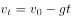，当小球运动到最高点时速度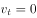，即从抛出到最高点所用时间为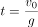，根据运动的对称性可知下落过程用时与上升过程一样（不考虑空气阻力），因此从抛出到落地的时间为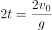，可见小球从抛出到落地的时间与向上抛出的初速度有关，而与列车运行速度无关，因此④正确。

故正确答案为D。

---

### 第 31 题　qid 3018859 · 科技常识

根据板块构造论，地球分为亚欧板块、美洲板块、非洲板块、印度洋板块、太平洋板块和南极洲板块，除太平洋板块几乎全为海洋外，其余板块既包括大陆又包括海洋。以下关于板块交界处位置关系对应正确的是（    ）。

- **A**. 亚欧板块和美洲板块一一冰岛　✅
- **B**. 非洲板块和印度洋板块一一蒙古
- **C**. 亚欧板块和太平洋板块一一英国北部
- **D**. 美洲板块和太平洋板块一一美国东海岸

**答案**：A

**官方解析**

A项，亚欧板块和美洲板块的交界处位于冰岛，冰岛位于北大西洋中部，大西洋中脊上，是板块生长边界，正确；
B项，非洲板块和印度洋板块的交界处位于红海，错误；
C项，亚欧板块和太平洋板块的交界处位于中国和日本，错误；
D项，美洲板块和太平洋板块的交界处位于美国西部，错误。
故正确答案为A。

---

### 第 32 题　qid 3018862 · 科技常识

下图是一辆汽车行驶在道路上速度（V）随时间（T）变化的关系图，则下列说法正确的是（    ）。

- **A**. 汽车在第6分钟的时候回到原出发点
- **B**. 汽车在第2分钟的时候距离出发点最远
- **C**. 汽车在第2分钟的速度与第6分钟的速度大小相等　✅
- **D**. 汽车在0-2分钟时的加速度与2-4分钟时的加速度相同

**答案**：C

**官方解析**

A项，速度-时间图像的面积表示的是汽车的位移，由图像可知在0时刻，汽车的位移为0，在第6分钟时，图像与坐标轴围成的面积不为0，错误；
B项，速度-时间图像的面积表示的是汽车的位移，在第4分钟时，图像与坐标轴围成的面积是最大值，故第4分钟时离出发点最远，错误；
C项，由图像可知，在2-6分钟时，运动图像是倾斜的直线，物体的斜率恒定，2-4分钟汽车的速度变化和4-6分钟汽车的速度变化相同，故第2分钟汽车的速度大小等于第6分钟汽车速度的大小，正确；
D项，速度-时间图像的斜率表示加速度，加速度是矢量，有大小和方向，0-2分钟时的加速度是正值，2-4分钟时汽车的加速度是负值，加速度的正负表示的是方向，故汽车在0-2分钟时的加速度与2-4分钟时的加速度不同，错误。
故正确答案为C。

---

### 第 33 题　qid 3019179 · 科技常识

如图所示，丝绸摩擦过的玻璃棒带正电，下列说法正确的是（    ）。

- **A**. 丝绸得到电子，带上负电　✅
- **B**. 整个摩擦过程中电荷量增加
- **C**. 摩擦过程中热能转化为电能
- **D**. 丝绸失去电子，带上正电

**答案**：A

**官方解析**

两个物体互相摩擦时，因为不同物体的原子核束缚核外电子的本领不同，所以其中必定有一个物体失去一些电子，另一个物体得到多余的电子。
A项，玻璃棒的原子核吸附性较弱，所以容易失去电子，玻璃棒跟丝绸摩擦，玻璃棒的一些电子转移到丝绸上，玻璃棒因失去电子而带正电，丝绸因得到电子而带等量的负电，正确；
B项，摩擦过程中玻璃棒失去电子，丝绸得到玻璃棒失去的等量的电子，整个过程发生了电子转移，电荷总量不改变，错误；
C项，摩擦生热，该过程中消耗机械能，产生内能；摩擦起电是把机械能转化为电能的过程，错误；
D项，与A项同理，错误。
故正确答案为A。

---

### 第 34 题　qid 3018849 · 科技常识

X染色体显性遗传病是由于位于X染色体上的显性致病基因引起的疾病，则以下遗传图谱中，最有可能显示X染色体显性遗传病的是（    ）。

- **A**. A　✅
- **B**. B
- **C**. C
- **D**. D

**答案**：A

**官方解析**

根据题意，该病为伴X显性遗传病，用D、d来表示显性和隐性基因。

A、C两项，两图中父亲为患病男性，即其X染色体上为显性基因，故其染色体为；母亲为正常女性，染色体上均为隐性基因，故其染色体为；他们的女儿染色体一定为，即一定是患病女性，故A项正确，C项错误；

B、D两项，两图中父亲和母亲均不患病，但生出来的孩子患病，故染色体上致病基因均为隐性基因，故B、D两项均错误。

故正确答案为A。

---

### 第 35 题　qid 3018857 · 科技常识

常见的泡沫灭火器内有两个容器，外壳内装碳酸氢钠与泡沫灭火剂的混合溶液。另有一玻璃瓶内胆，装有硫酸铝水溶液。如图所示，正常情况（图Ⅰ）下。两种溶液互不接触。当需要使用泡沫灭火器时把灭火器倒立（图Ⅱ），两种溶液发生化学反应，打开灭火器开关时，泡沫从灭火器中喷出，覆盖在燃烧物品上。则下列说法正确的是（    ）。

 

- **A**. 泡沫灭火器灭火时喷出的物质会对周围环境造成污染
- **B**. 泡沫灭火器在灭火时使燃烧物与空气隔绝，达到灭火的目的　✅
- **C**. 泡沫灭火器适宜用于扑救汽油、柴油、带电设备等引起的火灾
- **D**. 泡沫灭火器使用完静置一段时间后，内装物质将全部变为液体

**答案**：B

**官方解析**

A项，泡沫灭火器灭火时喷出的物质主要成分是、和，这三种物质对周围环境都不会造成污染，错误；

B项，泡沫灭火器灭火时能喷射出大量二氧化碳及泡沫，它们能粘附在可燃物上，使可燃物与空气隔绝，达到灭火的目的，正确；

C项，泡沫灭火器主要适用于扑救一般B类火灾，如油制品、油脂等火灾，也可适用于A类火灾，如木材、棉、毛、麻、纸张等燃烧的火灾，但不能扑救带电设备，错误；

D项，泡沫灭火器使用后内装物质已经发生反应，生成的几乎不溶于水，所以静置一段时间后会有沉淀，错误。

故正确答案为B。

---

### 第 36 题　qid 3019180 · 科技常识

如图所示的电路中，当电路中的开关闭合时，电路中的小灯泡都能正常发光的是（    ）。

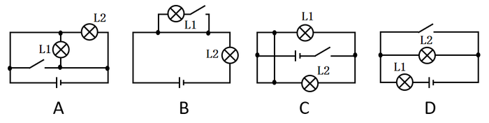

- **A**. A
- **B**. B
- **C**. C　✅
- **D**. D

**答案**：C

**官方解析**

A项，如图，开关闭合时，导线直接连接电源正负极，L1，L2均被短路，L1，L2均不发光，错误；

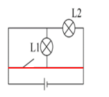

B项，如图，开关闭合时，导线直接连接L1两端，L1被短路，仅L2发光，错误；

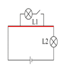

C项，如图，开关闭合时，电路形成正常的通路，L1，L2均正常发光，正确。

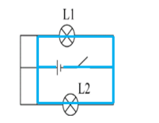

D项，如图，开关闭合时，导线直接连接L2两端，L2被短路，仅L1发光，错误。

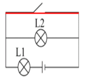

故正确答案为C。

---

### 第 37 题　qid 3018759 · 科技常识

如图所示，物体A在F的作用下静止在物体B的斜面上，物体B始终静止在水平面上，如果物体B的斜面完全光滑，则下列说法正确的是（    ）。

- **A**. 物体B总共受到3个力的作用
- **B**. 物体B受到的摩擦力的大小等于F　✅
- **C**. 物体A对物体B的作用力大小为F
- **D**. 物体A与物体B的相互作用力大小不等

**答案**：B

**官方解析**

由题目可知，物体A、B都处于静止状态，即两物体都受力平衡，受到的合外力均为0，且物体B的斜面完全光滑，即物体A、B的接触面完全光滑，所以物体A、B之间不存在摩擦力。

该题可以先通过整体法将物体A、B看作一个整体对其进行受力分析来判断地面对于这个整体是否有摩擦力：这个整体受到自身竖直向下的重力，水平向左的已知力F，水平面对其向上的支持力，且支持力的大小等于重力的大小，所以竖直方向受力平衡。水平方向也需要受力平衡，所以需要有一个水平向右的力来跟F平衡，那么只能是水平面对其产生的摩擦力f，方向水平向右，大小等于F。而这个整体与水平面的接触面就是物体B与水平面的接触面，所以这个摩擦力即为水平面对物体B的摩擦力。受力分析图示如下：

再对物体A使用隔离法进行受力分析：物体A受到自身竖直向下的重力，水平向左的已知力，以及斜面对其产生的垂直于B的斜面向上的弹力（弹力方向垂直于接触面），而物体A也是受力平衡，合外力为0，因此这个斜向右上的弹力在竖直方向上的分力的大小等于物体A受到的重力的大小，在水平方向上的分力的大小等于已知力F的大小，因此弹力的大小要大于已知力F的大小。而物体B对物体A有弹力，根据作用力与反作用力可知，物体A对物体B也有弹力，且两者大小相等，方向相反。受力分析图示如下：

A项，物体B除受到自身的重力，水平面对其向上的支持力， 根据以上分析可知还会受到物体A对它的弹力，以及水平面对它的摩擦力，因此物体B受到4个力，而不是3个力的作用，错误；

B项，根据整体法分析可知，物体B受到的水平面对它的摩擦力方向水平向右，大小等于已知力F的大小，正确；

C项，根据对物体A隔离进行受力分析可得，物体A、B间的弹力在水平方向上的分力的大小等于已知力F的大小，因此弹力的大小要大于已知力F的大小，错误；

D项，直接由相互作用力（即作用力与反作用力）的定义可得，相互作用力是一对大小相等，方向相反，同一直线，作用在两个物体上的力，因此物体A、B之间的相互作用力大小肯定是相等，错误。

故正确答案为B。

---

## 言语理解与表达

### 第 1 题　qid 3019109 · 逻辑填空

建设“红色村”，既要注重源于“红”、体现“红”，更要注重传承“红”、弘扬“红”，用红色文化烘托红色精神，以红色精神        红色基因。
填入横线处的词语最恰当的一项是：

- **A**. 发现
- **B**. 激活　✅
- **C**. 激荡
- **D**. 发掘

**答案**：B

**官方解析**

横线处所填词语搭配“红色基因”，根据前文“建设‘红色村’”“用红色文化烘托红色精神，以红色精神······红色基因”可知，横线处应体现让红色基因对红色村建设起到积极作用之意。B项“激活”指刺激机体内某种物质，使其活跃地发挥作用，符合文意，且“激活红色基因”搭配恰当，当选。A项“发现”指看到或找到前人没有看到或找到的事物或规律，根据文段内容可知，红色基因在红色村是一直存在且众所周知的，不符合文意，且“发现红色基因”体现不出让红色基因对红色村建设起到积极作用之意，排除；C项“激荡”指因受冲击而动荡，文段并未体现出动荡之意，不符合文意，排除；D项“发掘”指挖掘埋藏在地下的东西，“发掘红色基因”体现不出让红色基因对红色村建设起到积极作用之意，排除。
故正确答案为B。
【文段出处】南方杂志《红色村变形记》

---

### 第 2 题　qid 3019111 · 语句表达

产业振兴        是实现脱贫攻坚与乡村振兴的重要标志，        是实现二者有效衔接的必然要求。
填入横线处的词语最恰当的一项是：

- **A**. 或者 或者
- **B**. 因为 所以
- **C**. 尽管 还
- **D**. 不仅 也　✅

**答案**：D

**官方解析**

文段介绍了产业振兴的重要性。根据“是······重要标志”“是······必然要求”可知二者应为并列关系，D项“不仅······也······”表示并列关系，符合文段逻辑，当选。
A项“或者······或者······”表示选择关系，B项“因为······所以······”表示因果关系，C项“尽管······还······”表示转折关系，均不符合文段并列的逻辑关系，排除。
故正确答案为D。
【文段出处】《推动脱贫攻坚与乡村振兴有效衔接》

---

### 第 3 题　qid 3019112 · 逻辑填空

正是广大基层干部群众以无比巨大的热情投入改革，以只争朝夕的劲头        改革，以一往无前的勇气探路改革，才令改革开放的大潮澎湃不息，蔚为壮观，        出令世界惊叹的成就。
填入横线处的词语最恰当的一项是：

- **A**. 推动 创建
- **B**. 参与 创造　✅
- **C**. 推进 构建
- **D**. 参加 制造

**答案**：B

**官方解析**

第一空，横线处搭配“改革”且对应“以一往无前的勇气探路改革”，根据逻辑上的顺承关系，应先“加入改革”，再“探路改革”，故横线处要体现出“加入”的语义，B项“参与”、D项“参加”均符合文意，即对改革有热情、积极参与、进而探路改革，逻辑通顺，保留。A项“推动”指使事物前进，C项“推进”指向前进，填入横线处与后文矛盾，应该是先“加入”，再“探路”，从而“推进、推动”，均排除。
第二空，横线处搭配“成就”，B项“创造出令世界惊叹的成就”，符合文意，当选。D项“制造”一指用人工使原材料成为可供使用的物品，如制造机器、制造化肥；二指人为地造成某种气氛或局面等（含贬义），如制造纠纷、制造紧张气氛，与“成就”搭配不当，排除。
故正确答案为B。
【文段出处】《改革开放再出发，基层跑起来》

---

### 第 4 题　qid 3019115 · 逻辑填空

乡村振兴，必须在人才队伍建设上尽快破题，研究出台乡村振兴引才专项政策，打通农业人才服务基层的        ，        基层农业人才的发展空间等。一些地方的农校、政府已经在通过鼓励学生“下地”、农民“上学”等方式，为基层农技岗位输送人才。
填入横线处的词语最恰当的一项是：

- **A**. 禁锢 扩张
- **B**. 渠道 扩大　✅
- **C**. 脉络 扩展
- **D**. 桎梏 提升

**答案**：B

**官方解析**

第一空，横线处搭配“打通”，B项“渠道”及C项“脉络”均可与之搭配，保留。A项“禁锢”多指束缚、强力限制，一般用作动词，与“打通”搭配不当，排除；D项“桎梏”本意为古代的刑具，类似于现代的手铐、脚镣，引申为束缚、压制之意，多与“打破”搭配，与“打通”搭配不当，排除。
第二空，横线处搭配“发展空间”，B项“扩大”、C项“扩展”均可与之搭配，保留。
对比B、C两项，根据“研究出台乡村振兴引才专项政策”“通过鼓励······等方式，为基层农技岗位输送人才”可知，乡村振兴目前需要有更多的新方法来为农村吸引人才，B项“渠道”能够体现途径、方法，符合文意，当选。C项“脉络”比喻条理、头绪，多指文章的层次，如脉络分明，与文意无关，排除。
故正确答案为B。
【文段出处】《“农技人才荒”掣肘乡村振兴》

---

### 第 5 题　qid 3018762 · 逻辑填空

伟大抗疫精神，同中华民族长期形成的特质禀赋和文化基因            ，是爱国主义、集体主义、社会主义精神的传承和发展，是中国精神的生动        。
填入横线处的词语最恰当的一项是：

- **A**. 一脉相承 诠释　✅
- **B**. 一衣带水 展示
- **C**. 相辅相成 展现
- **D**. 相得益彰 解释

**答案**：A

**官方解析**

第一空，横线处形容抗疫精神和中华民族禀赋与文化基因的关系，且根据后文“是······传承和发展”可知，横线处强调二者的关系具有传承性。A项“一脉相承”指从同一血统、派别世代相承流传下来，符合文意，保留。B项“一衣带水”指像一条衣带那样窄的水面，形容一水之隔，往来方便，C项“相辅相成”指两件事物互相补充，互相配合，缺一不可，D项“相得益彰”指两者互相配合或映衬，双方的长处和作用更能显示出来，均与文意不符，排除。
第二空，代入验证，A项“······是中国精神的生动诠释”意为抗疫精神是中国精神的充分体现，符合文意，且“生动诠释”为常用搭配，当选。
故正确答案为A。
【文段出处】人民日报《致敬伟大抗疫精神》

---

### 第 6 题　qid 3019105 · 片段阅读

依托红色资源打造的旅游点，如何让游客真正“留下来”“再回来”？必须强化党组织的政治功能和服务功能，提升农村基层党组织的组织力。在党组织的领导下，让绿色产业和特色农家乐融合，增强游客体验感、参与感，走出一条“红色基因绿色产业特色旅游”的振兴之路。在此基础上，充分挖掘保护利用红色资源，推动形成基层党建、红色资源、新农村建设融合发展的新格局。

这段文字主要分析了：

- **A**. 发展红色旅游的路径　✅
- **B**. 发展红色旅游的意义
- **C**. 基层党建新格局的内涵
- **D**. 新农村建设融合发展的目标

**答案**：A

**官方解析**

文段开篇提出问题，即打造的红色旅游点如何让游客“留下来”“再回来”，之后由“必须”引导给出对策，即强化党组织的政治功能和服务功能，提升农村基层党组织的组织力。接下来通过“让绿色产业和特色农家乐融合”以及“充分挖掘保护利用红色资源”两方面详细阐述了具体做法。故文段重点围绕“红色资源旅游”来描述，强调发展红色资源旅游的具体途径与措施，对应A项。
B项，文段重点强调的是如何发展红色旅游，“发展红色旅游的意义”无中生有，排除；
C项，“基层党建新格局的内涵”无中生有，且缺少核心话题“红色旅游”，排除；
D项，根据“推动形成基层党建、红色资源、新农村建设融合发展的新格局”可知，“新农村建设”仅为其中一个方面，表述片面，且偏离文段核心话题“红色旅游”，排除。
故正确答案为A。
【文段出处】南方杂志《红色村变形记》

---

### 第 7 题　qid 3019106 · 片段阅读

通过主体再造实现人的发展，这是实现脱贫的根本途径。借助“改变环境—发展产业—教育培训—参与公共生活”模式，引导贫困人群进入新的社会行动结构之中，在参与社会行动中实现自我觉醒、自我教育，在自我改造中实现自我发展，由此形成脱贫的内生动力，这种脱贫更能引导人走上自我解放的道路，因而也具有更深刻的意义。
对这段文字理解准确的是：

- **A**. 只有改变环境，才能实现脱贫致富
- **B**. 摆脱贫困是实现人的解放的最终目标
- **C**. 教育培训在实现脱贫中具有决定性作用
- **D**. 实现脱贫意味着主体的再造和人的发展　✅

**答案**：D

**官方解析**

A项，“只有······才”引导必要条件，强调靠“改变环境”可以实现脱贫致富，但根据“通过主体再造实现人的发展，这是实现脱贫的根本途径”可知，选项表述错误，且“改变环境”只是“改变环境—发展产业—教育培训—参与公共生活” 模式中的一部分，表述片面，排除；
B项，文段通过“这种脱贫更能引导人走上自我解放的道路，因而也具有更深刻的意义”，仅论述了何种脱贫的措施可以更好的引导人走向自我解放，而文段并未提及“实现人的解放的最终目标”究竟是什么，故“最终目标”无中生有，排除；
C项，根据“借助‘改变环境—发展产业—教育培训—参与公共生活’模式”可知，“教育培训”仅为模式中的一部分，决定性作用无从可得，故表述过于绝对，排除；
D项，根据“通过主体再造实现人的发展，这是实现脱贫的根本途径。”可知，表述正确，当选。
故正确答案为D。
【文段出处】《核心论文：以主体再造实现持久脱贫》

---

### 第 8 题　qid 3019107 · 片段阅读

县域是一个相对独立的社会，不只是属于整体社会的一部分。每个县域有自己的社会结构、社会关系、社会行为规范以及独特的生活方式、文化和语言传统，因此是一个亚社会。而且县域社会是一个复杂的社会体系，由各种村落、乡镇和城镇等子体系构成，各个子体系之间以不同方式和机制形成关系，从而构筑成县域社会。
这段文字主要讲了：

- **A**. 县域的现实意义
- **B**. 县域的相对独立性
- **C**. 县域的社会学概念　✅
- **D**. 县域的子体系构成

**答案**：C

**官方解析**

文段首先指出县域是一个相对独立的社会，并从社会结构、社会关系、生活方式等方面进行解释说明。接下来又论述了县域社会是一个复杂的社会体系，由村落、乡镇等子体系构成。故文段从“相对独立性”和“复杂性”两个方面对“县域”的概念进行阐述，对应C项。
A项，“现实意义”无中生有，排除；
B项，“相对独立性”表述片面，排除；
D项，“子体系构成”对应复杂性，表述片面，排除。
故正确答案为C。
【文段出处】中国社会科学网-《县域社会学研究的学科价值和现实意义》

---

### 第 9 题　qid 3018797 · 语句表达

要深深地扎根于人民群众之中，不断从人民群众及其参与的各项实践中汲取营养和力量。正所谓，“                    ”。当前，密切联系群众最直接的要求就是推动广大党员干部走近群众，扑下身子搞好调研，真正了解群众所思所想所盼。从群众关注的烦心事、紧要事和身边事等细微之处入手，及时发现问题、精准研判问题、有效解决问题。
下列句子填入划横线处，最恰当的是：

- **A**. 天地之大，黎元为先
- **B**. 凡治国之道，必先富民
- **C**. 得众则得国，失众则失国
- **D**. 知屋漏者在宇下，知政失者在草野　✅

**答案**：D

**官方解析**

本题为语句填空题，横线在文段中间，需联系前后文把握话题的一致性。横线前强调要扎根于人民群众并从中汲取营养和力量。横线后强调如何密切联系群众，并指出要从群众关注的事中发现问题并解决。因此，横线处所填句子应围绕党员干部密切联系群众展开论述，且能体现出从群众入手发现问题并解决之意。结合选项分析，D项“知屋漏者在宇下，知政失者在草野”意为知道房屋漏雨的人在房屋下，知道政治有过失的人在民间，即为政者要来到人民群众中，去发现问题，听取意见，符合文意，当选。
A项，“天地之大，黎元为先”意为天地虽然广袤无垠，但是黎民百姓才是国家的根本，旨在强调人民群众的重要性，未能表现出“扎根于”人民群众，在人民群众中汲取力量之意，排除；
B项，“凡治国之道，必先富民”意为但凡治理国家的方法，都一定要先使人民富裕，旨在强调使人民富裕，与文意无关，排除；
C项，“得众则得国，失众则失国”意为得到民心就能得到国家，失去民心就会失去国家，旨在强调人民群众支持的重要性，未突出“扎根于”人民群众，排除。
故正确答案为D。
【文段出处】《光明网：牢牢坚守人民情怀》

---

### 第 10 题　qid 3019108 · 片段阅读

随着时代的发展，年轻人的婚恋观也在不断变化，从家长的“要少了会遭笑话”，到年轻人“多要了会被笑话”，再到最后“彩礼多少无所谓，不要都行”，看似是对彩礼的探讨，但实质上是摒弃了不健康的面子观和陈规陋习，展现的是时代的进步。这既需要相关部门引导，也需要家庭成员提升认知，更新观念，那些更广泛的陈规陋习在农村的生存空间才会越来越小。
上述文段意在说明：

- **A**. 要彩礼这一风俗最终会被人们摒弃
- **B**. 破除陈规陋习需要全社会共同努力　✅
- **C**. 新时代的年轻人要接纳新的思想观念
- **D**. 陈规陋习在农村的生存空间越来越小

**答案**：B

**官方解析**

文段首先指出年轻人对待彩礼态度的变化，进而指出年轻人的这一变化其实质是对陈规陋习态度的变化，是时代进步的表现，尾句通过指代词“这”总结前文，并通过对策标志词“需要”提出对策，即需要相关部门以及家庭成员的相互配合才能缩小陈规陋习的生存空间，对应B项。
A、D两项，对应文段尾句，是对策带来的意义效果，非重点，均排除；
C项，“接纳新的思想观念”无中生有，并且文段强调相关部门与家庭成员共同努力，“年轻人”表述片面，排除。
故正确答案为B。
【文段出处】《人民网评：改变农村陈规陋习，还需久久为功》

---

## 数量关系

### 第 1 题　qid 3018896 · 数学运算

，，，，（    ）

- **A**. 

　✅
- **B**. 

- **C**. 

- **D**. 

**答案**：A

**官方解析**

观察数列与选项均为分数，考虑分数数列。分数分母不是递增或递减趋势，考虑反约分，转化为：，，，，（    ），观察发现，分子均为12，分母是公差为6的等差数列，则下一项分母为，故所求项为。

故正确答案为A。

---

### 第 2 题　qid 3019121 · 数学运算

在某大型医院的建设过程中，施工单位调配了吊机、挖掘机和推土机共120台工程设备进场施工。其中，推土机数量是吊机的3倍，挖掘机数量是吊机的4倍，则吊机有（    ）台。

- **A**. 18
- **B**. 15　✅
- **C**. 12
- **D**. 10

**答案**：B

**官方解析**

设吊机有台，则推土机有台，挖掘机有台，根据题意可知：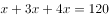，解得：。

故正确答案为B。

---

### 第 3 题　qid 3019113 · 数学运算

某茶园需要在一定时间内完成采摘。前4天安排了20名采茶工，完成了五分之一的工作量。如果再用10天完成全部采摘，至少还需要增加（    ）名采茶工。

- **A**. 12　✅
- **B**. 11
- **C**. 10
- **D**. 9

**答案**：A

**官方解析**

设每名采茶工的效率均为1，则前4天完成，工作总量为，还剩。再用10天完成全部采摘，还需要名采茶工，则至少还需要增加名采茶工。

故正确答案为A。

---

### 第 4 题　qid 3018898 · 数学运算

某帮扶项目以每公斤9元的价格从农民手中收购了一批苹果，并以每公斤12元（包邮）的价格在网上销售。售出总量的后，价格下调为每公斤10元（包邮）。运费成本为每公斤0.1元。全部售完后，扣除收购成本和运费的总收益为2.5万元，则这批苹果为（    ）吨。

- **A**. 5
- **B**. 10　✅
- **C**. 15
- **D**. 20

**答案**：B

**官方解析**

设这批苹果共有公斤，根据公式：总利润总售价总成本，可列方程：，解得，根据1000公斤1吨可知，这批苹果为10吨。

故正确答案为B。

---

### 第 5 题　qid 3019125 · 数学运算

上午7点，A、B市干部同时乘车前往省城参观学习，汽车时速均为每小时80公里。但由于突发状况，B市干部在路上停留了2个小时。最终，A市干部于当天上午9点到达省城；B市干部于当天下午3点到达。则如果从A市出发，途经省城到达B市，总路程为（    ）公里。

- **A**. 720
- **B**. 640　✅
- **C**. 320
- **D**. 280

**答案**：B

**官方解析**

由题意可知：A市干部上午7点出发，于当天上午9点到达省城，故A市距离省城公里；B市干部上午7点出发，于当天下午3点（15点）到达省城，中间停留了2小时，故实际行驶时间为小时，故B市距离省城公里。则如果从A市出发，途经省城到达B市，总路程为公里。

故正确答案为B。

---

### 第 6 题　qid 3019131 · 数学运算

一条长20厘米的纸带，先从左端开始涂上4厘米红色，之后每间隔4厘米再涂4厘米红色；再从右端开始涂上5厘米绿色，之后每间隔5厘米再涂5厘米绿色，则红绿色重叠的部分共有（    ）段。

- **A**. 4
- **B**. 3
- **C**. 2　✅
- **D**. 1

**答案**：C

**官方解析**

根据题意可知，20厘米的纸带从左端开始4厘米一段分成5段，从右端开始5厘米一段分成4段，涂色情况如下图所示，则红绿色重叠的部分即为蓝色斜线部分，共有2段。

故正确答案为C。

---

### 第 7 题　qid 3018799 · 数学运算

某货运公司承运一批工艺品，每件运费20元。如果运输途中出现破损，那么每件破损的工艺品不仅收不到运费，还要赔偿30元。运输完成后发现，工艺品的破损率为，最终货运公司收到了16800元运费，则运输途中破损的工艺品有（    ）件。

- **A**. 64　✅
- **B**. 96
- **C**. 128
- **D**. 156

**答案**：A

**官方解析**

设这批工艺品共有件，根据题意可得：运输完成后可获得运费元，因破损需赔偿元，则最终收到运费元，解得，故运输途中破损的工艺品有件。

故正确答案为A。

---

### 第 8 题　qid 3019118 · 数学运算

某学校组织学生外出学农。如果每间宿舍住6名学生，就会缺7张床位，如果每间宿舍住8名学生，就会空出3张床位，则这批学生一共有（    ）人。

- **A**. 50
- **B**. 45
- **C**. 43
- **D**. 37　✅

**答案**：D

**官方解析**

方法一：设共有间宿舍，根据题意可知，解得。所以这批学生一共有人。

方法二：本题为余数问题，优先用代入排除法。

代入A项：当这批学生有50人时，，并非6的倍数，不满足“如果每间宿舍住6名学生，就会缺7张床位”，排除；

代入B项：当这批学生有45人时，，并非6的倍数，不满足“如果每间宿舍住6名学生，就会缺7张床位”，排除；

代入C项：当这批学生有43人时，，可以被6整除；，并非8的倍数，不满足“如果每间宿舍住8名学生，就会空出3张床位”，排除。

故正确答案为D。

---

### 第 9 题　qid 3018772 · 数学运算

县公安局计划举办篮球比赛，6支报名参赛的队伍将平均分为上午组和下午组进行小组赛。其中甲队与乙队来自同部门，不能分在同一组，则分组情况共有（    ）种可能。

- **A**. 6
- **B**. 8
- **C**. 10
- **D**. 12　✅

**答案**：D

**官方解析**

方法一：除了甲、乙两队外，共剩余支队伍。从中选出2支队伍与甲队组成一组，其余2支队伍与乙队组成一组，共种情况。而有可能甲队在上午组、乙队在下午组，也有可能甲队在下午组、乙队在上午组，因此总情况数共有种。

方法二：本题也可以考虑逆向思维求解。总情况数即6支报名参赛的队伍将平均分为上午组和下午组进行小组赛，即：种，反面情况即甲队与乙队先分在同一组，再从其余支队伍中选出一队与甲、乙两队组成一组，即种情况，又有上午组和下午组2种情况，则反面情况数共有种。所求结果总情况数反面情况数种。

故正确答案为D。

---

### 第 10 题　qid 3019123 · 数学运算

某县政府组织干部职工开展党建知识竞赛，其中甲、乙两镇参赛人数之比为4：3，甲镇有8人、乙镇有24人没有参加竞赛。已知甲、乙两镇干部职工人数之比为5：6，则乙镇的干部职工比甲镇多（    ）人。

- **A**. 8　✅
- **B**. 7
- **C**. 6
- **D**. 5

**答案**：A

**官方解析**

设甲、乙两镇参赛人数分别为人、人。根据题意可得，解得。则甲、乙两镇干部职工人数分别为人、人，故乙镇的干部职工比甲镇多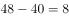人。

故正确答案为A。

---

### 第 11 题　qid 3018813 · 数学运算

如图所示，周长为24米的平行四边形绿化地被划分为三块区域，两边为三角形的花坛，中间为矩形的草地。已知a、b、c长度之比为4∶2∶，则矩形草地的面积为（    ）平方米。

- **A**. 
6

- **B**. 

- **C**. 
12

- **D**. 

　✅

**答案**：D

**官方解析**

平行四边形的周长米，则米，且根据可得，米，米，米。如下图所示，因为中间部分为矩形，所以由b、d、e构成的三角形为直角三角形，其中米，则米，故矩形草地的面积平方米。

故正确答案为D。

---

## 判断推理

### 第 1 题　qid 3018848 · 图形推理

下列选项中最符合所给图形规律的是：

- **A**. A
- **B**. B　✅
- **C**. C
- **D**. D

**答案**：B

**官方解析**

图形元素组成不同，考虑属性规律。观察发现，图1、图3存在明显的等腰元素，考虑对称性。画出图形对称轴发现，题干图形的对称轴都只有一条，且竖轴和横轴交替出现，图4是横轴对称，故？处应该选择竖轴对称的图形，只有B项符合。
故正确答案为B。

---

### 第 2 题　qid 3019151 · 图形推理

下列选项中最符合所给图形规律的是：

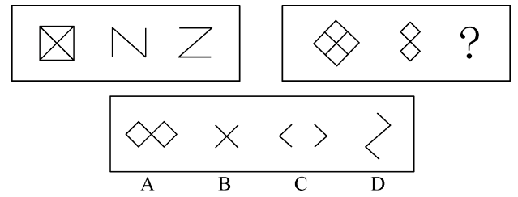

- **A**. A
- **B**. B
- **C**. C　✅
- **D**. D

**答案**：C

**官方解析**

元素组成相似，优先考虑样式规律。观察发现，在第一组图形中，第一个图形减去第二个图形可以得到第三个图形，同理，第二组图形应该满足同样的规律，符合条件的只有C项。
故正确答案为C。

---

### 第 3 题　qid 3018855 · 图形推理

下列选项中最符合所给图形规律的是：

- **A**. A
- **B**. B
- **C**. C
- **D**. D　✅

**答案**：D

**官方解析**

图形元素组成不同，且无明显属性规律，考虑数量规律。观察发现，题干图形都有直线，考虑直线数。题干图形直线数依次为1、2、3、4，故？处图形中直线数应为5。A项直线数为6，B项为7，C项为4，只有D项符合。
故正确答案为D。

---

### 第 4 题　qid 3018856 · 图形推理

下列选项中最符合所给图形规律的是：

- **A**. A
- **B**. B
- **C**. C　✅
- **D**. D

**答案**：C

**官方解析**

观察发现，题干图形均存在灰块，且灰块数量依次递增，故？处图形中灰块数量应为6，但没有唯一答案。继续观察发现，灰块位置有明显移动，考虑灰块的位置规律。16宫格内圈灰块依次顺时针移动1格，排除A项；16宫格外圈灰块依次顺时针移动1格且在最前边增加一个灰块，排除B、D两项。

如下图所示。

故正确答案为C。

---

### 第 5 题　qid 3018878 · 图形推理

下列选项中最符合所给图形规律的是：

- **A**. A
- **B**. B
- **C**. C　✅
- **D**. D

**答案**：C

**官方解析**

本题将选项填入题干图形所缺的？处，即可拼合成一幅完整图形，故将选项顺时针旋转后与题干进行拼接。观察发现，若想与题干完整拼接，则？左上角应为黑色，右上角应为白色，只有C项符合。

故正确答案为C。

---

### 第 6 题　qid 3019152 · 定义判断

如图所示是一个圆台，则下列选项不可能属于该圆台视图的是：

- **A**. A
- **B**. B　✅
- **C**. C
- **D**. D

**答案**：B

**官方解析**

本题考查立体图形的视图问题。
A项，从上往下看，可以看到，为俯视图，排除；
B项，无法得到两个椭圆形，当选；
C项，从前往后看，可以看到，为主视图，排除；
D项，从下往上看，可以看到，为仰视图，排除。
本题为选非题，故正确答案为B。

---

### 第 7 题　qid 3019154 · 类比推理

不经过旋转，下列选项能组成所给梯形的是：

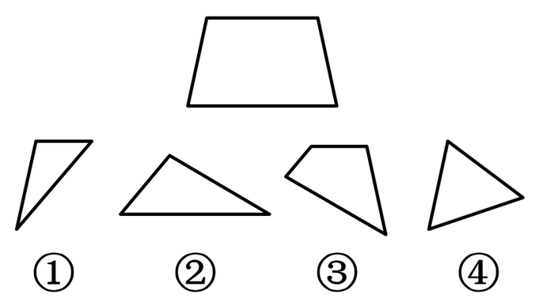

- **A**. ②③④
- **B**. ①③④
- **C**. ①②④
- **D**. ①②③　✅

**答案**：D

**官方解析**

本题考查平面拼合。观察发现梯形具有两条横线，下方长横线对应图②下方的横线，梯形上方横线对应图①与图③上方的短横线（需要拼接），故题干所给梯形可由图①②③组合得到，具体拼合方式如下图：

故正确答案为D。

---

### 第 8 题　qid 3018865 · 图形推理

下列选项中，能够折成如图所示立方体的是（    ）。

- **A**. A
- **B**. B
- **C**. C　✅
- **D**. D

**答案**：C

**官方解析**

本题考查六面体，逐一进行分析。
A项：选项中两个直角三角形的公共边为直角边，而题干中为斜边，选项与题干不一致，排除；
B项：选项中两个直角三角形无法拼合成一个完整的正方形，因此该展开图无法折叠为正方体，选项与题干不一致，排除；
C项：选项与题干一致，当选；
D项：选项中两个直角三角形的相对面不是同一个面，无法拼合成一个完整的正方形，因此该展开图无法折叠为正方体，选项与题干不一致，排除。
故正确答案为C。

---

### 第 9 题　qid 3018880 · 图形推理

下列选项中，与所给的立体图形不可能是同一图形的是：

- **A**. A　✅
- **B**. B
- **C**. C
- **D**. D

**答案**：A

**官方解析**

将题干的小长方体分别标上序号，逐一进行分析。

A项：当②号块和③号块在前面，①号块和④号块在后面时，根据题干，④号块一定偏左而非偏右，与题干图形不一致，当选；

B项：将选项沿图中轴1顺时针旋转之后，与题干图形一致，排除；

C项：将选项先沿图中轴1顺时针旋转，再水平顺时针旋转之后，与题干图形一致，排除；

D项：将选项先沿图中轴1逆时针旋转，再水平逆时针旋转之后，与题干图形一致，排除。

本题为选非题，故正确答案为A。

---

### 第 10 题　qid 3018863 · 图形推理

下方分别是一个由长方体堆积而成的立体图形和该立体图形的左视图、后视图，那么该立体图形的俯视图是（    ）。

- **A**. A
- **B**. B
- **C**. C　✅
- **D**. D

**答案**：C

**官方解析**

本题考查三视图，逐一分析选项。
A项：若选项左上角的小方块从俯视处可看见，则该立体图形从前至后第3行、从左至右第1列相交处存在一个较矮的小立体图形，因此后视图最右边的长方形应当存在一条横线，与题干中后视图不符，排除；
B项：与A项同理，排除；
C项：与题干一致，当选；
D项：若选项从上至下第2行、从左至右第1列处的小方块从俯视图处可看见，则该立体图形从前至后第2行、从左至右第1列相交处存在一个较矮的小立体图形，因此后视图最右边的长方形应当存在一条横线，与题干中后视图不符，排除。
故正确答案为C。

---

### 第 11 题　qid 3019155 · 类比推理

开：关

- **A**. 听：闻
- **B**. 念：想
- **C**. 推：拉　✅
- **D**. 聚：合

**答案**：C

**官方解析**

第一步：判断题干词语间逻辑关系。
开和关为语义关系中的反义关系。
第二步：判断选项词语间逻辑关系。
A项：闻既可以理解为听见的含义，也可以理解为用鼻子嗅气味，这两种含义都不能和听形成反义关系，与题干逻辑关系不一致，排除；
B项：念有惦记、想念的含义，和想形成语义关系中的近义关系，与题干逻辑关系不一致，排除；
C项：推和拉为语义关系中的反义关系，与题干逻辑关系一致，当选；
D项：聚和合都有会合、集合的含义，两者为语义关系中的近义关系，与题干逻辑关系不一致，排除。
故正确答案为C。

---

### 第 12 题　qid 3019156 · 类比推理

学习：进步

- **A**. 改革：发展　✅
- **B**. 开花：收获
- **C**. 心平：气和
- **D**. 跑步：健身

**答案**：A

**官方解析**

第一步：判断题干词语间逻辑关系。
因为学习，所以能取得进步，二者为因果关系。
第二步：判断选项词语间逻辑关系。
A项：因为改革，所以能有发展，二者为因果关系，与题干逻辑关系一致，当选；
B项：先开花，后收获，二者是时间先后顺序对应关系，与题干逻辑关系不一致，排除；
C项：心平指的是心情平静，气和指的是不急躁，不生气，二者都可以用来形容思想或精神平静，但二者之间不存在因果关系，与题干逻辑关系不一致，排除；
D项：跑步是一种健身的方式，二者为方式对应关系，与题干逻辑关系不一致，排除。
故正确答案为A。
注：本题在广东的考情中优先看成因果对应关系，进步是对状态的表述，也是一种结果。

---

### 第 13 题　qid 3019157 · 类比推理

恳求：要求

- **A**. 复杂：嘈杂
- **B**. 恪守：遵守　✅
- **C**. 动机：动力
- **D**. 妥协：协调

**答案**：B

**官方解析**

第一步：判断题干词语间逻辑关系。
恳求和要求都有要求别人做事情的意思，二者为近义关系。
第二步：判断选项词语间逻辑关系。
A项：复杂指事物的种类、头绪等多而杂，嘈杂指声音杂乱喧闹，二者并非近义关系，与题干逻辑关系不一致，排除；
B项：恪守和遵守都有依照规定行动而不违背的意思，二者为近义关系，与题干逻辑关系一致，保留；
C项：动机和动力都指引发人从事某种行为的力量和念头，二者为近义关系，与题干逻辑关系一致，保留；
D项：妥协指用让步的方法避免冲突或争执；协调指正确处理组织内外各种关系，二者并非近义关系，与题干逻辑关系不一致，排除。
对比B、C两项，题干中“恳求”比“要求”更郑重，程度更深；B项“恪守”也比“遵守”更郑重，程度更深，C项“动机”和“动力”程度上没有明显差别，因此择优选B项。
故正确答案为B。

---

### 第 14 题　qid 3019158 · 类比推理

东奔：西走

- **A**. 跋山：涉水
- **B**. 完整：无缺
- **C**. 顾此：失彼
- **D**. 大街：小巷　✅

**答案**：D

**官方解析**

第一步：判断题干词语间逻辑关系。
东奔和西走均指到处奔波，二者为近义关系，且“东”和“西”为反义关系，“奔”和“走”为近义关系。
第二步：判断选项词语间逻辑关系。
A项：跋山指翻山越岭，涉水指趟水过河，二者为并列关系，且“跋”和“涉”、“山”和“水”均为并列关系，与题干逻辑关系不一致，排除；
B项：完整指完全保持原有的整体，无缺指没有损坏或残缺，二者为近义关系，但“完”和“无”不是反义关系，与题干逻辑关系不一致，排除；
C项：顾此指顾了这个，失彼指丢了那个，二者为并列关系，且“顾”和“失”、“此”和“彼”均为反义关系，与题干逻辑关系不一致，排除；
D项：大街和小巷均指城镇里的街道，二者为近义关系，且“大”和“小”为反义关系，“街”和“巷”为近义关系，与题干逻辑关系一致，当选。
故正确答案为D。

---

### 第 15 题　qid 3019159 · 类比推理

老师：学生：知识

- **A**. 父母：子女：家庭
- **B**. 青蛙：害虫：庄稼
- **C**. 园丁：农田：花朵
- **D**. 医生：病人：疾病　✅

**答案**：D

**官方解析**

第一步：判断题干词语间逻辑关系。
老师给学生传授知识，学生是老师传授的对象，知识是老师传授的内容，三者为对应关系。
第二步：判断选项词语间逻辑关系。
A项：父母和子女是家庭的组成成员，前两词分别与第三词构成组成关系，与题干逻辑关系不一致，排除；
B项：青蛙捕食庄稼上的害虫，害虫是青蛙捕食的对象，但庄稼不是其捕食的内容，与题干逻辑关系不一致，排除；
C项：园丁呵护花朵，花朵是园丁呵护的对象，园丁一般在公园、花园、果园等植物园区内工作，农田与园丁无明显逻辑关系，与题干逻辑关系不一致，排除；
D项：医生给病人治疗疾病，病人是医生治疗的对象，疾病是医生治疗的内容，三者为对应关系，与题干逻辑关系一致，当选。
故正确答案为D。

---

### 第 16 题　qid 3018801 · 逻辑判断

调查研究显示，相较传统的农业生产方式，有机农业生产出的农作物产量会有一定程度的下降。但现在仍然有越来越多的农民从传统农业转向有机农业，甚至花费资金，添置用于有机农业耕作的农用设备。
以下选项如果为真，最能解释上述现象的是：

- **A**. 有机农业耕作方式更有助于保护生态环境
- **B**. 许多科技节目都在推广有机农业耕作方式
- **C**. 有机农业生产出的农作物市场售价远高于传统农业　✅
- **D**. 对于少部分农作物而言，有机农业耕作并不会降低其产量

**答案**：C

**官方解析**

第一步：找出题干矛盾。
相较传统的农业生产方式，有机农业生产出的农作物产量会下降，但仍然有越来越多的农民从传统农业转向有机农业，甚至花费资金添置设备。
第二步：逐一分析选项。
A项：该项只能说明有机农业耕作方式更有利于保护生态环境，但是没提到为什么在有机农业生产出的农作物产量下降的情况下，越来越多的农民还愿意从传统农业转向有机农业，甚至花费资金添置设备，不能解释题干矛盾，排除；
B项：该项只能说明有机农业耕作方式的宣传力度大，但是没提到为什么在有机农业生产出的农作物产量下降的情况下，越来越多的农民还愿意从传统农业转向有机农业，甚至花费资金添置设备，不能解释题干矛盾，排除；
C项：该项说明有机农业生产出的农作物市场售价远高于传统农业，因此虽然有机农业生产出的农作物产量会下降，但并不会降低农民收益，甚至有可能增加农民的收益，因此越来越多的农民从传统农业转向有机农业，可以解释题干矛盾，当选；
D项：该项仅指出有机农业耕作并不会降低少部分农作物的产量，但不能解释为什么越来越多的农民愿意从传统农业转向有机农业，不能解释题干矛盾，排除。
故正确答案为C。

---

### 第 17 题　qid 3018818 · 类比推理

今年持续暴雨，各地花椒严重减产。由此可以预见，今年的花椒价格将会显著上涨。
要使上述推理成立，需要补充的前提条件是：

- **A**. 花椒价格仅受到产量的影响　✅
- **B**. 全国花椒需求量与往年持平
- **C**. 花椒的价格不会影响群众的购买意愿
- **D**. 历年花椒价格的波动都与其产量密切相关

**答案**：A

**官方解析**

第一步：找出论点和论据。
论点：今年的花椒价格将会显著上涨。
论据：今年持续暴雨，各地花椒严重减产。
本题论点讨论了今年的花椒价格将会显著上涨，论据讨论了今年持续暴雨，各地花椒严重减产，话题不一致，加强优先考虑搭桥。
第二步：逐一分析选项。
A项：该项指出花椒价格仅受到产量的影响，在花椒价格和减产之间建立联系，搭桥项，保留；
B项：该项说的是全国花椒需求量与往年持平，但是没有提及花椒价格和减产之间的关系，无法加强，排除；
C项：该项说的是花椒的价格不会影响群众的购买意愿，但是没有提及花椒价格和减产之间的关系，无法加强，排除；
D项：该项指出历年花椒价格的波动都与其产量密切相关，在花椒价格和减产之间建立联系，搭桥项，保留。
比较A、D两项，A项指出产量是影响花椒价格的唯一因素，D项仅说二者密切相关，则可能存在其他因素影响花椒价格，且题干论点、论据说的都是今年花椒的价格和产量，而D项仅提及历年花椒价格和产量的情况，没有提及今年的情况。因此，A项加强力度大于D项，故排除D项，A项当选。
故正确答案为A。

---

### 第 18 题　qid 3018812 · 类比推理

某镇计划安排小蒋、小陈、小刘3名干部到甲、乙、丙3个村子驻点，每村只安排1人。3人中有一人是农学专业，一人是法学专业，一人是工学专业。已知：小陈没有前往甲村，农学专业的没有前往甲村，工学专业的去了丙村，小陈不是农学专业。
根据以上表述，以下推论必然正确的是（    ）。

- **A**. 小刘去了甲村
- **B**. 小蒋去了乙村
- **C**. 小刘是工学专业的
- **D**. 小陈是工学专业的　✅

**答案**：D

**官方解析**

第一步：整理题干条件。
（1）小陈没有前往甲村；
（2）农学专业的没有前往甲村；
（3）工学专业的去了丙村；
（4）小陈不是农学专业。
第二步：根据题干条件进行推理。
根据题干所说的“某镇计划安排小蒋、小陈、小刘3名干部到甲、乙、丙3个村子驻点，每村只安排1人。3人中有一人是农学专业，一人是法学专业，一人是工学专业”，结合条件（2）和条件（3）可知，农学专业和工学专业的没有前往甲村，则法学专业的去了甲村，农学专业的去了乙村。最后结合条件（1）和条件（4）可知，小陈没有前往甲村，也没有前往乙村，故小陈前往了丙村，因此，小陈是工学专业的。
故正确答案为D。

---

### 第 19 题　qid 3018833 · 逻辑判断

农科院在一档农业电视节目中介绍了一种经济价值高的养殖动物——肉兔，强调肉兔有易于养殖、繁殖速度快等优点，节目播出后受到了大家的关注。但是，某村在养殖肉兔之后，发现肉兔在当地市场销路并不理想。
以下选项如果为真，最能解释这一现象的是（    ）。

- **A**. 电视节目播出后，当地许多大型养殖企业都开始养殖肉兔　✅
- **B**. 该村的其他养殖企业同期推出了市场价格更高的黑毛乌骨鸡
- **C**. 虽然当地有食用兔肉的习俗，但在全国范围内兔肉并不被广泛接受
- **D**. 由于养殖技术成熟，肉兔养殖已成为最具经济效益的养殖产业之一

**答案**：A

**官方解析**

第一步：找出题干矛盾。
农科院在某农业节目中介绍了一种经济价值高的养殖动物——肉兔，受到大家的关注，但是某村在养殖肉兔之后，发现肉兔在当地市场销路并不理想。
第二步：逐一分析选项。
A项：电视节目播出后，当地许多大型养殖企业都开始养殖肉兔，说明肉兔养殖量增加，供货量大于购买量，且人们会倾向于购买正规、大型企业的养殖动物，因此解释了为什么肉兔经济价值高、受关注度大，但是某村养殖的肉兔在当地市场销路不理想，可以解释题干矛盾，当选；
B项：该村的其他养殖企业推出了市场价格更高的黑毛乌骨鸡，但不明确黑毛乌骨鸡价格更高是否会影响肉兔的销售量，不能解释题干矛盾，排除；
C项：该项指出当地有食用兔肉的习俗，虽然在全国范围内兔肉并不被广泛接受，但既然当地有食用兔肉的习俗，就无法解释为什么肉兔受关注大但在当地市场的销路不理想，不能解释题干矛盾，排除；
D项：该项指出肉兔养殖是最具经济效益的养殖产业之一，只能说明肉兔是具有经济价值的，但不能解释为什么肉兔经济价值高、受关注度大，但是某村养殖的肉兔在当地市场销路不理想，不能解释题干矛盾，排除。
故正确答案为A。

---

### 第 20 题　qid 3018765 · 类比推理

希望过上好日子的村民都愿意接受就业辅导。村民小王愿意接受就业辅导，因此，他希望过上好日子。
以下选项存在与题干最为相似的逻辑错误的是（    ）。

- **A**. 该店所有出售的水果都通过了农药残留检测，苹果通过了农药残留检测，因此该店正在出售苹果　✅
- **B**. 张家苗圃在使用了这批肥料后花木长势很好，李家苗圃长势不好，因此李家苗圃没有使用这批肥料
- **C**. 许多坚持运动的儿童身体都比较健康，许多成年人也会坚持运动，因此坚持运动的成年人身体都比较健康
- **D**. 只有经过Ⅲ期临床试验的新药才可能被批准上市，该新药没有经过Ⅲ期临床试验，所以它没有被批准上市

**答案**：A

**官方解析**

第一步：找出题干逻辑错误。

题干翻译为：希望过上好日子愿意接受就业辅导，

推理为：小王愿意接受就业辅导，因此，小王希望过上好日子。

所犯逻辑错误是“肯后推肯前”。

第二步：逐一分析选项。

A项：该店出售的水果通过了农药残留检测，苹果通过了农药残留检测，所以，该店正在出售苹果，肯后推肯前，与题干所犯逻辑错误相似，当选；

B项：张家苗圃使用肥料花木长势好，李家苗圃长势不好，并非“肯后”，与题干所犯逻辑错误不相似，排除；

C项：坚持运动的儿童身体健康，许多成年人也会坚持运动，并非“肯后”，与题干所犯逻辑错误不相似，排除；

D项：上市经过Ⅲ期临床试验，该新药没有经过Ⅲ期临床试验，属于“否后”，并非“肯后”，与题干所犯逻辑错误不相似，排除。

故正确答案为A。

---

## 资料分析

### 材料 1

        2019年G省共有农业科研和科技开发机构68个，职工人数4633人，其中1254人有高级职称，1148人有中级职称。全省共有农村科普示范基地554个、科普示范街道（乡镇）145个、科普示范社区（村）1341个。

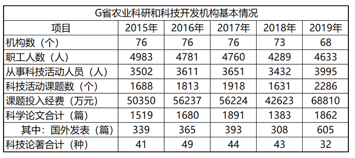

#### 第 1 题　qid 3019277 · 平均数

2019年G省平均每个农业科研和科技开发机构的高级职称人数最接近（    ）。

- **A**. 18.5　✅
- **B**. 20.5
- **C**. 22.5
- **D**. 24.5

**答案**：A

**官方解析**

根据题干“2019年G省平均每个······”，结合材料时间为2019年，可判定本题为现期平均数问题。定位文字材料可得：“2019年G省共有农业科研和科技开发机构68个······其中1254人有高级职称”。故平均每个农业科研和科技开发机构的高级职称人数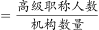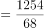，与A项最为接近。

故正确答案为A。

---

#### 第 2 题　qid 3019279 · 比重

2018年，G省农业科研和科技开发机构从事科技活动人员数占职工人数比重约为（    ）。

- **A**. 

- **B**. 

- **C**. 

　✅
- **D**. 

**答案**：C

**官方解析**

根据题干“2018年，······占······比重约为”，结合表格材料2018年数据均已给出，可判定本题为现期比重问题。定位表格材料可得：2018年从事科技活动人员3432人，职工人数4289人。故从事科技活动人员数占职工人数比重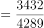。

故正确答案为C。

---

#### 第 3 题　qid 3019280 · 平均数

2015-2019年，G省农业科研和科技开发机构课题投入经费平均每年增加（    ）万元。

- **A**. 3152
- **B**. 4615　✅
- **C**. 5517
- **D**. 7890

**答案**：B

**官方解析**

根据题干“2015-2019年，G省······平均每年增加······万元”，可判定本题为年均增长量计算问题。定位表格材料可得：2015年课题投入经费50350万元，2019年课题投入经费68810万元。根据公式：年均增长量，则2015-2019年，课题投入经费平均每年增加万元，与B项最为接近。

故正确答案为B。

---

#### 第 4 题　qid 3019281 · 综合

2015-2019年，G省农业科研和科技开发机构发表科学论文篇数最多的一年是（    ）。

- **A**. 2015年
- **B**. 2016年
- **C**. 2017年　✅
- **D**. 2019年

**答案**：C

**官方解析**

定位表格材料可知，2015-2019年，G省农业科研和科技开发机构发表科学论文篇数依次为1519篇、1680篇、1891篇、1383篇、1862篇，因此发表科学论文篇数最多的一年为2017年。
故正确答案为C。

---

#### 第 5 题　qid 3019283 · 综合

根据资料，下列关于G省的说法正确的是（    ）。

- **A**. 2019年科普示范社区（村）数是科普示范街道（乡镇）的十倍以上
- **B**. 2015-2019年农业科研和科技开发机构科技活动课题数逐年增加
- **C**. 2019年农业科研和科技开发机构国外发表科学论文比2015年多266篇　✅
- **D**. 2015-2019年，农业科研和科技开发机构科技论著每年都超过40种

**答案**：C

**官方解析**

A项：定位文字材料可得：2019年G省共有科普示范街道（乡镇）145个、科普示范社区（村）1341个。则两者的倍数关系为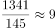，不到十倍，错误；

B项：定位表格材料可得：2015-2019年农业科研和科技开发机构科技活动课题数依次为1688个、1813个、1918个、1631个、2286个，2018年科技活动课题数少于2017年，不满足逐年增加，错误；

C项：定位表格材料可得：2015年国外发表科学论文339篇，2019年国外发表科学论文605篇。两者相差篇，正确；

D项：定位表格材料可得：2015-2019年农业科研和科技开发机构科技论著依次为41种、49种、44种、43种、32种，2019年科技论著小于40种，错误。

故正确答案为C。

---

### 材料 2

        2020年上半年，我国农产品进出口总额达1159.0亿美元。农产品进口额为807.5亿美元，同比增长。受新冠肺炎疫情影响，我国农产品出口额同比下降，为351.5亿美元。

        在我国的农产品进口中，除大洋洲农产品进口额同比下降1.9个百分点外，其余各大洲的农产品进口额均有所增加；欧洲国家或地区农产品进口额增幅最大，达。农产品出口中，对亚洲国家或地区的出口额最高，达229.7亿美元，较2019年同期下降了3.7个百分点。

随着我国居民饮食结构的调整，居民对肉类食品的需求量逐年增加。2020年上半年畜类产品进口额同比增长，对农产品进口额的增长贡献超7成。我国农产品出口最多的两大类别分别是食用蔬菜和水、海产品，合计出口额达93.6亿美元，占农产品出口总额的。 

#### 第 6 题　qid 3018837 · 增长

2020年上半年，我国农产品进出口额同比增长约：

- **A**. 

- **B**. 

- **C**. 

　✅
- **D**. 

**答案**：C

**官方解析**

根据题干“2020年上半年······同比增长约”，结合选项带百分号，且已知我国农产品进口额和出口额相关数据，可判定本题为混合增长率问题。定位文字材料第一段可得：2020年上半年，我国农产品进出口总额达1159.0亿美元。农产品进口额为807.5亿美元，同比增长。受新冠肺炎疫情影响，我国农产品出口额同比下降，为351.5亿美元。根据混合增长率口诀“混合增长率大小居中，偏向基期量大的一方（一般用现期量代替基期量）”可知，，即，排除A项。根据线段法“距离与量成反比（一般用现期量代替基期量计算）”可知：，解得，与C项最接近。

故正确答案为C。

---

#### 第 7 题　qid 3018839 · 增长

2020年上半年，我国水、海产品出口额同比减少约（    ）亿美元。

- **A**. 6
- **B**. 8
- **C**. 10
- **D**. 12　✅

**答案**：D

**官方解析**

根据题干“2020年上半年······同比减少约（    ）亿美元”，可判定本题为增长量计算问题。定位表格材料可得：2020年上半年，我国水、海产品出口额为48.7亿美元，同比增长。根据公式：增长量，则2020年上半年，我国水、海产品出口额同比增长量亿美元，即减少约12亿美元。

故正确答案为D。

---

#### 第 8 题　qid 3018841 · 综合

以下农产品类别中，2019年上半年我国进出口总额最高的是：

- **A**. 食用蔬菜　✅
- **B**. 禽类产品
- **C**. 饮料、酒及醋
- **D**. 咖啡、茶、马黛茶及调味香料

**答案**：A

**官方解析**

根据题干“2019年上半年······我国进出口总额最高的是”，结合材料已知2020年上半年相关数据，可判定本题为基期比较问题。定位表格材料可得：食用蔬菜，禽类产品，饮料、酒及醋，咖啡、茶、马黛茶及调味香料的进口额及同比增长率，出口额及同比增长率。根据进出口总额进口额出口额，基期量，可得2019年上半年我国下列农产品的进出口总额分别为：

食用蔬菜：亿美元；

禽类产品：亿美元；

饮料、酒及醋：亿美元；

咖啡、茶、马黛茶及调味香料：亿美元。

比较可知，2019年上半年我国进出口总额最高的农产品是食用蔬菜。

故正确答案为A。

---

#### 第 9 题　qid 3018845 · 综合

2019年上半年，我国农产品进口额中欧洲国家或地区约占：

- **A**. 

- **B**. 

　✅
- **C**. 

- **D**. 

**答案**：B

**官方解析**

根据题干“2019年上半年······中······约占”，结合材料时间为2020年上半年，可判定本题为基期比重问题。定位文字材料第一段可得：农产品进口额同比增长（）；定位文字材料第二段可得：欧洲国家或地区农产品进口额增幅最大，达（）；定位饼状图材料可得：2020年上半年欧洲进口额占比为。根据公式：基期比重，其中即2020年上半年欧洲进口额占比为，则2019年上半年，欧洲国家或地区进口额占比为，与B项最接近。

故正确答案为B。

---

#### 第 10 题　qid 3018847 · 综合

根据以上材料，关于我国2020年上半年农产品进出口情况，下列说法错误的是：

- **A**. 
畜类产品进口额为谷物进口额的6倍以上

- **B**. 
对亚洲国家或地区的出口额高于其农产品进口额

- **C**. 
六大洲中只有南美洲国家或地区的进口额超过160亿美元

- **D**. 
表格给出的农产品出口额合计约占我国农产品出口额的
　✅

**答案**：D

**官方解析**

A项：定位表格材料可得：2020年上半年畜类产品进口额为222.0亿美元，谷物进口额为33.9亿美元。，则畜类产品进口额为谷物进口额的6倍以上，正确；

B项：定位文字材料第一、二段可得：我国农产品进口额为807.5亿美元，农产品出口中，对亚洲国家或地区的出口额最高，达229.7亿美元；定位饼状图材料可得：2020年上半年亚洲进口额占比为。根据部分整体比重，则2020年上半年亚洲进口额约为亿美元＜出口额229.7亿美元，正确；

C项：定位文字材料第一段可得：农产品进口额为807.5亿美元；定位饼状图材料可得：2020年上半年六大洲进口额占比，其中南美洲进口额占比最大，为；亚洲进口额占比排名第二，为。根据部分整体比重，由于整体量相同，仅需确定占比第一、第二的大洲与160亿美元的关系即可。则南美洲进口额约为亿美元；根据B项解析可知，亚洲进口额约为亿美元，所以六大洲中只有南美洲国家或地区的进口额超过160亿美元，正确；

D项：定位文字材料第三段可得：我国农产品出口最多的两大类别分别是食用蔬菜和水、海产品，合计出口额达93.6亿美元，占农产品出口总额的；定位表格材料可得：2020年上半年表中各类别农产品的出口额。除食用蔬菜和水、海产品外，其余各类别农产品的出口额合计为5.5+11.7+12.4+10.1+22.9+20.46+12+12+10+23+20=83亿美元＞亿美元，则其占我国农产品出口额的比重，故表中各类别农产品的出口额合计占我国农产品出口额的比重＞26.6%+13.3%=39.9%，错误。

本题为选非题，故正确答案为D。

---
