# 2021年广东省公务员录用考试《行测》题（县级卷）（网友回忆版）

> 省考 · 2021 年 · 6 个模块 · 共 96 题

- [政治理论](#%E6%94%BF%E6%B2%BB%E7%90%86%E8%AE%BA) · 4 题
- [常识判断](#%E5%B8%B8%E8%AF%86%E5%88%A4%E6%96%AD) · 21 题
- [言语理解与表达](#%E8%A8%80%E8%AF%AD%E7%90%86%E8%A7%A3%E4%B8%8E%E8%A1%A8%E8%BE%BE) · 10 题
- [数量关系](#%E6%95%B0%E9%87%8F%E5%85%B3%E7%B3%BB) · 11 题
- [判断推理](#%E5%88%A4%E6%96%AD%E6%8E%A8%E7%90%86) · 35 题
- [资料分析](#%E8%B5%84%E6%96%99%E5%88%86%E6%9E%90) · 15 题

---

## 政治理论

### 第 1 题　qid 3018764 · 新思想

2021年是中国共产党成立一百周年，关于党的历史，下列选项有误的是：

- **A**. 中共二大第一次明确提出了彻底的反帝反封建的革命纲领
- **B**. 中国共产党在中国革命中战胜敌人的三个法宝是解放思想、实事求是、武装斗争　✅
- **C**. 确立毛泽东思想为党的指导思想并写入党章，是中共七大的历史性贡献
- **D**. 1954年一届全国人大一次会议通过并公布了中华人民共和国的第一部宪法

**答案**：B

**官方解析**

本题考查毛中特。
A项正确，中共二大上确定了最高革命纲领和最低革命纲领，分别是实现共产主义和实现反帝反封建革命任务的胜利，即民主革命纲领，这也是中国共产党第一次旗帜鲜明地提出了反帝反封建的革命纲领。
B项错误，1939年10月，毛泽东在《〈共产党人〉发刊词》一文中，总结了两次国内革命战争的经验教训，揭示了中国革命的客观规律。指出：“十八年的经验，已使我们懂得：统一战线，武装斗争，党的建设，是中国共产党在中国革命中战胜敌人的三个法宝，三个主要的法宝。”
C项正确，1945年4月23日至6月11日，中共七大在延安召开。刘少奇系统阐述了毛泽东思想的科学内涵，大会通过了刘少奇修改党章的报告及新党章。新党章明确规定：中国共产党，以马克思列宁主义的理论与中国革命的实践之统一的思想——毛泽东思想，作为自己一切工作的指针，反对任何教条主义的或经验主义的偏向。中共七大确立毛泽东思想为党的指导思想，从而使全党有了在思想上、工作上取得一致的牢固的理论基础。
D项正确，1954年9月20日，第一届全国人民代表大会第一次会议通过的《中华人民共和国宪法》，是中国历史上第一部社会主义类型的宪法。它是在对建国前夕由全国政协制定的起临时宪法作用的《共同纲领》进行修改的基础上制定的。
本题为选非题，故正确答案为B。

---

### 第 2 题　qid 3018806 · 新思想

习近平总书记在深圳经济特区建立40周年庆祝大会上的讲话中指出，广东、深圳经济发展水平较高，面临的资源要素约束更紧，受到来自国际的技术、人才等领域竞争压力更大，落实新发展理念、推动（    ）是根本出路。

- **A**. 科学发展
- **B**. 创新发展
- **C**. 高质量发展　✅
- **D**. 可持续发展

**答案**：C

**官方解析**

本题考查政治常识。
2020年10月14日，习近平总书记在深圳经济特区建立40周年庆祝大会上的讲话中指出，要坚定不移贯彻新发展理念。广东、深圳经济发展水平较高，面临的资源要素约束更紧，受到来自国际的技术、人才等领域竞争压力更大，落实新发展理念、推动高质量发展是根本出路。
故正确答案为C。

---

### 第 3 题　qid 3018760 · 新思想

广东在中国共产党创建史上具有重要历史地位。关于广东的红色历史，下列选项有误的是（    ）。

- **A**. 广东是全国最早建立中共地方组织的地区之一
- **B**. 省港大罢工是反抗帝国主义屠杀中国人民的政治大罢工
- **C**. 中国共产党领导的土地革命最早在广东海陆丰根据地开展起来
- **D**. 中国共产党在广州举行的第三次全国代表大会，决定实行第二次国共合作　✅

**答案**：D

**官方解析**

本题考查毛中特。
A项正确，1921年3月，广州共产主义小组正式建立，陈独秀任书记。广州共产主义小组，是广东早期的共产党组织，中国共产党成立前国内的六个共产主义小组之一，广东也成为全国最早建立中共地方组织的地区之一。
B项正确，1925年6月19日为了支援上海人民五卅反帝爱国运动，广州和香港爆发了规模宏大的省港大罢工。省港大罢工是反抗帝国主义屠杀中国人民的政治大罢工。罢工坚持16个月之久，这在中国工人运动史上是空前的，在世界工人运动史上也属罕见。
C项正确，土地革命最早在海陆丰根据地开展起来。1927年11月，在彭湃的领导下，海陆丰人民建立起苏维埃政权。11月13日，在陆丰召开的工农兵代表大会通过《没收土地案》，决定立即开展土地革命。
D项错误，1923年6月12-20日，中国共产党在广州召开第三次全国代表大会。大会通过了《关于国民运动及国民党问题的决议案》，决定共产党员以个人资格加入国民党，实行党内合作，以建立各革命阶级的统一战线。1937年，在共产党的催促下，9月22日，国民党中央通讯社发表了《中共中央为公布国共合作宣言》。23日，蒋介石发表谈话，实际上承认了共产党的合法地位。至此，抗日民族统一战线正式形成，第二次国共合作开始。
本题为选非题，故正确答案为D。

---

### 第 4 题　qid 3018769 · 新思想

习近平总书记指出，体育强国的基础在于（    ），要通过举办北京冬奥会、冬残奥会，把我国冰雪运动特别是雪上运动搞上去，在3亿人中更好推广冰雪运动。

- **A**. 群众体育　✅
- **B**. 竞技体育
- **C**. 体育文化
- **D**. 体育产业

**答案**：A

**官方解析**

本题考查政治常识。
2021年1月18日下午，习近平总书记来到位于北京市延庆区的国家高山滑雪中心考察调研。习近平总书记指出，体育强国的基础在于群众体育。要通过举办北京冬奥会、冬残奥会，把我国冰雪运动特别是雪上运动搞上去，在3亿人中更好推广冰雪运动，推动建设体育强国。
故正确答案为A。

---

## 常识判断

### 第 1 题　qid 3018770 · 人文常识

党的新闻舆论工作必须“坚持正确舆论导向，坚持正面宣传为主，唱响主旋律，弘扬正能量，做大做强主流思想舆论”。下列选项最能体现这一理念的是：

- **A**. 独阴不成，独阳不生
- **B**. 事必有法，然后可成
- **C**. 事不凝滞，理贵变通
- **D**. 先立乎其大者，则其小者不能夺也　✅

**答案**：D

**官方解析**

本题考查人文常识。
A项错误，“独阴不成，独阳不生”出自《春秋谷梁传·庄公三年》，意思是单独有阴，不能生发，单独有阳，不能生发。泛指单凭一方面的因素或条件促成不了事物的生长或出现。
B项错误，“事必有法，然后可成”出自《孟子集注》，意思是做任何事情都要有相应的方法，找到方法之后才能把事情做成。
C项错误，“事不凝滞，理贵变通”出自《宋史·赵普列传》，意思是做事灵活不拘泥，善于根据事物的发展变化采取相应的变通方式。
D项正确，“先立乎其大者，则其小者不能夺也”出自《孟子·告子上》，意思是首先把重要的部分树立起来，其它次要的部分就不会被引入迷途。与题干中坚持正确舆论导向，坚持正面宣传为主，唱响主旋律，弘扬正能量，做大做强主流思想舆论的理念相一致。
故正确答案为D。

---

### 第 2 题　qid 3018777 · 人文常识

嘉兴南湖革命纪念馆的题诗“革命声传画舫中，诞生共党庆工农”纪念的历史事件是：

- **A**. 中共一大的召开　✅
- **B**. 第一次国共合作
- **C**. 中共工农红军的组建
- **D**. 第一次全国劳动大会的召开

**答案**：A

**官方解析**

本题考查毛中特。
A项正确，1964年4月5日，董必武同志来到浙江嘉兴南湖，为了纪念中共一大的召开、中国共产党的诞生，题诗：“革命声传画舫中，诞生共党庆工农。重来正值清明节，烟雨迷蒙访旧踪”。
B项错误，中国共产党和中国国民党两党的第一次合作是从1924年1月起至1927年7月止，历时三年半。1924年1月，中国国民党第一次全国代表大会在广州召开，标志着国民党改组的完成和第一次国共合作的正式建立。
C项错误，1928年5月25日，中国共产党中央委员会决定，全国各地工农革命军正式定名为红军。1930年后，又逐渐改称中国工农红军。在国共内战时期，中国工农红军不断发展壮大，先后组成了第一方面军（曾经称中央红军）、第四方面军、第二方面军和西北红军等红军部队。
D项错误，1922年5月1日至6日，根据党的决定，由中国劳动组合书记部发起的第一次全国劳动大会在广州召开，这是中国工人阶级第一次全国性的盛会。
故正确答案为A。

---

### 第 3 题　qid 3018782 · 人文常识

以下机构按照成立时间的先后顺序排列，正确的是：
①国家乡村振兴局
②中华人民共和国教育部
③中华人民共和国文化和旅游部
④中央人民政府驻香港特别行政区维护国家安全公署

- **A**. ①②④③
- **B**. ②③④①　✅
- **C**. ③②①④
- **D**. ③④②①

**答案**：B

**官方解析**

本题考查政治常识。
①，2021年2月16日出版的《求是》杂志2021年第4期发表“中共国家乡村振兴局党组”的署名文章《人类减贫史上的伟大奇迹》，表明“国家乡村振兴局”已经成立。2021年2月25日，国家乡村振兴局牌子正式挂出。
②，中华人民共和国教育部成立于1949年10月，新中国成立后，成立文化教育委员会、教育部，设立普通教育、专门教育和社会教育三司。
③，中华人民共和国文化和旅游部成立于2018年3月，是根据党的十九届三中全会审议通过的《中共中央关于深化党和国家机构改革的决定》《深化党和国家机构改革方案》和第十三届全国人民代表大会第一次会议批准的《国务院机构改革方案》设立。
④，中央人民政府驻香港特别行政区维护国家安全公署，全称中华人民共和国中央人民政府驻香港特别行政区维护国家安全公署，是中央人民政府驻香港特别行政区维护国家安全机构，依法履行维护国家安全职责，行使相关权力。2020年7月8日上午，中央人民政府驻香港特别行政区维护国家安全公署在香港揭牌。
因此按照成立时间的先后顺序排序正确的是②③④①。
故正确答案为B。

---

### 第 4 题　qid 3018790 · 人文常识

青少年是祖国的未来，民族的希望。青少年教育最重要的是教给他们正确的思想。引导他们走正路。其中，（    ）是落实立德树人根本任务的关键课程。

- **A**. 思政课　✅
- **B**. 劳动课
- **C**. 通识课
- **D**. 美育课

**答案**：A

**官方解析**

本题考查政治常识。
2020年9月1日出版的第17期《求是》杂志发表中共中央总书记、国家主席、中央军委主席习近平的重要文章《思政课是落实立德树人根本任务的关键课程》。文章强调，青少年是祖国的未来、民族的希望。青少年教育最重要的是教给他们正确的思想，引导他们走正路。思政课是落实立德树人根本任务的关键课程，思政课作用不可替代，思政课教师队伍责任重大。办好思政课，最根本的是要全面贯彻党的教育方针，解决好培养什么人、怎样培养人、为谁培养人这个根本问题。
故正确答案为A。

---

### 第 5 题　qid 3018800 · 地理国情

2020年是“十三五”收官之年，广东经济社会发展取得重大成果。下列有关说法正确的是：
①第一届全国职业技能大赛在广东举行
②全省地区生产总值超过11万亿元，连续32年位居全国第一
③区域创新综合能力跃居全国第一，有效发明专利量保持全国首位

- **A**. ②
- **B**. ①②
- **C**. ①③
- **D**. ①②③　✅

**答案**：D

**官方解析**

本题考查政治常识。

①项正确，中华人民共和国第一届职业技能大赛在广州开幕。首届大赛以“新时代 新技能 新梦想”为主题，设86个比赛项目，共有2500多名选手、2300多名裁判人员参赛，是新中国成立以来规格最高、项目最多、规模最大、水平最高的综合性国家职业技能赛事。

②项正确，广东省省长马兴瑞在2021年1月24日广东省十三届人大四次会议上作政府工作报告并提出，广东全省地区生产总值2015年为7.5万亿元，2020年超过11万亿元，年均增长，总量连续32年位居全国第一。其中，2020年广东全省地区生产总值增长。目标2021年全省地区生产总值增长以上。

③项正确，广东省省长马兴瑞在2021年1月24日广东省十三届人大四次会议上作政府工作报告并提出，全省研发经费支出从1800亿元增加到3200亿元，占地区生产总值比重从提高到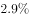，区域创新综合能力跃居全国第一，有效发明专利量、PCT国际专利申请量保持全国首位。

综上，说法正确的是①②③。

故正确答案为D。

---

### 第 6 题　qid 3018766 · 人文常识

2021年2月25日召开的全国脱贫攻坚总结表彰大会宣告，我国脱贫攻坚战取得了全面胜利。关于脱贫攻坚，以下表述准确的有（    ）。
①完成了消除相对贫困的艰巨任务
②2018年底拉开了新时代脱贫攻坚的序幕
③我国提前10年实现《联合国2030年可持续发展议程》减贫目标
④精准扶贫是打赢脱贫攻坚战的制胜法宝
⑤开发式扶贫方针是中国特色减贫道路的鲜明特征

- **A**. ①③⑤
- **B**. ③④⑤　✅
- **C**. ①②④⑤
- **D**. ②③④⑤

**答案**：B

**官方解析**

本题考查政治常识。
①错误，完成了消除绝对贫困的艰巨任务。
②错误，2012年年底，党的十八大召开后不久，党中央就突出强调，“小康不小康，关键看老乡，关键在贫困的老乡能不能脱贫”，承诺“决不能落下一个贫困地区、一个贫困群众”，拉开了新时代脱贫攻坚的序幕。
③正确，在全球贫困状况依然严峻、一些国家贫富分化加剧的背景下，我国提前10年实现《联合国2030年可持续发展议程》减贫目标，赢得国际社会广泛赞誉。
④⑤正确，事实充分证明，精准扶贫是打赢脱贫攻坚战的制胜法宝，开发式扶贫方针是中国特色减贫道路的鲜明特征。
故正确答案为B。

---

### 第 7 题　qid 3018775 · 人文常识

2020年是中国人民志愿军抗美援朝出国作战70周年。以下战役发生在抗美援朝战争期间的是：

- **A**. 辽沈战役
- **B**. 百团大战
- **C**. 上甘岭战役　✅
- **D**. 仁川登陆战

**答案**：C

**官方解析**

本题考查毛中特。
抗美援朝战争开始于1950年10月，结束于1953年7月，交战双方是以美军为首的“联合国军”和中国人民志愿军。
A项错误，辽沈战役是中国近代史解放战争中的“三大战役”之一，发生于1948年9月至11月，此次战役一举摧毁了国民党在关外的全部主力部队，解放了东北全境。
B项错误，1940年下半年，彭德怀指挥八路军105个团在华北发动了一次大规模的对日作战，史称“百团大战”。百团大战是抗日战争进入相持阶段后，八路军在华北地区发动的一次规模最大、持续时间最长的战役。
C项正确，上甘岭战役是1952年10月14日至11月25日中国人民志愿军与“联合国军”在上甘岭及其附近地区展开的一场战役。该战役历时40多天，双方伤亡惨重，是抗美援朝战争中最惨烈的一次战役，最终中国人民志愿军取得胜利。
D项错误，仁川登陆战是朝鲜战争初期，以美国为首的“联合国军”在仁川发动的一次登陆作战。战役开始于1950年9月15日，至9月28日结束。仁川战役令朝鲜人民军腹背受敌，被迫后撤，“联合国军”和韩国军队开始反攻。随后，由于朝鲜人民无力抵抗，中国政府决定派出中国人民志愿军，支援朝鲜。
故正确答案为C。

---

### 第 8 题　qid 3018781 · 人文常识

《中共中央关于制定国民经济和社会发展第十四个五年规划和二〇三五年远景目标的建议》提出，增强消费对经济发展的基础性作用，顺应消费升级趋势，提升传统消费，培育新型消费，适当增加公共消费。下列措施中，有助于增强消费对经济发展的基础性作用的有：
①提高服务消费领域市场准入门槛，减少产品供给
②推动汽车等消费品由购买管理向使用管理转变
③完善节假日制度，落实带薪休假制度
④改善消费环境，强化消费者权益保护

- **A**. ①③
- **B**. ①④
- **C**. ②④
- **D**. ②③④　✅

**答案**：D

**官方解析**

本题考查政治常识。
①错误，②③④正确。《中共中央关于制定国民经济和社会发展第十四个五年规划和二〇三五年远景目标的建议》提出：“全面促进消费。增强消费对经济发展的基础性作用，顺应消费升级趋势，提升传统消费，培育新型消费，适当增加公共消费。以质量品牌为重点，促进消费向绿色、健康、安全发展，鼓励消费新模式新业态发展。推动汽车等消费品由购买管理向使用管理转变，促进住房消费健康发展。健全现代流通体系，发展无接触交易服务，降低企业流通成本，促进线上线下消费融合发展，开拓城乡消费市场。发展服务消费，放宽服务消费领域市场准入。完善节假日制度，落实带薪休假制度，扩大节假日消费。培育国际消费中心城市。改善消费环境，强化消费者权益保护。”
故正确答案为D。

---

### 第 9 题　qid 3018787 · 法律常识

中华人民共和国全国人民代表大会是最高国家权力机关。全国人民代表大会行使的职权不包括：

- **A**. 选举国家监察委员会主任以及最高人民法院院长
- **B**. 撤销全国人民代表大会常务委员会不适当的决定
- **C**. 编制和执行国民经济和社会发展计划和国家预算　✅
- **D**. 制定和修改刑事、民事、国家机构的和其他的基本法律

**答案**：C

**官方解析**

本题考查法律常识。
A项正确，根据《宪法》第六十二条第七、八项：“全国人民代表大会行使下列职权：······（七）选举国家监察委员会主任；（八）选举最高人民法院院长；······”
B项正确，根据《宪法》第六十二条第十二项：“全国人民代表大会行使下列职权：······（十二）改变或者撤销全国人民代表大会常务委员会不适当的决定；······”
C项错误，根据《宪法》第六十二条第十、十一项：“全国人民代表大会行使下列职权：······（十）审查和批准国民经济和社会发展计划和计划执行情况的报告；（十一）审查和批准国家的预算和预算执行情况的报告；······”第八十九条第五项：“国务院行使下列职权：······（五）编制和执行国民经济和社会发展计划和国家预算；······”
D项正确，根据《宪法》第六十二条第三项：“全国人民代表大会行使下列职权：······（三）制定和修改刑事、民事、国家机构的和其他的基本法律；······”
本题为选非题，故正确答案为C。

---

### 第 10 题　qid 3018793 · 法律常识

民法典与人们生活息息相关，被誉为“社会生活的百科全书”。以下内容中，民法典未涉及的是：

- **A**. 监管保险业务　✅
- **B**. 禁止高空抛物
- **C**. 见义勇为补偿
- **D**. 保护个人信息

**答案**：A

**官方解析**

本题考查法律常识。
A项，根据《保险法》第一百三十三条：“保险监督管理机构依照本法和国务院规定的职责，遵循依法、公开、公正的原则，对保险业实施监督管理，维护保险市场秩序，保护投保人、被保险人和受益人的合法权益。”故民法典未涉及监管保险业务。
B项，根据《民法典》第一千二百五十四条第一款：“禁止从建筑物中抛掷物品。从建筑物中抛掷物品或者从建筑物上坠落的物品造成他人损害的，由侵权人依法承担侵权责任；经调查难以确定具体侵权人的，除能够证明自己不是侵权人的外，由可能加害的建筑物使用人给予补偿。可能加害的建筑物使用人补偿后，有权向侵权人追偿。”故民法典涉及禁止高空抛物。
C项，根据《民法典》第一百八十三条：“因保护他人民事权益使自己受到损害的，由侵权人承担民事责任，受益人可以给予适当补偿。没有侵权人、侵权人逃逸或者无力承担民事责任，受害人请求补偿的，受益人应当给予适当补偿。”故民法典涉及见义勇为补偿。
D项，根据《民法典》第一百一十一条：“自然人的个人信息受法律保护。任何组织或者个人需要获取他人个人信息的，应当依法取得并确保信息安全，不得非法收集、使用、加工、传输他人个人信息，不得非法买卖、提供或者公开他人个人信息。”故民法典涉及保护个人信息。
本题为选非题，故正确答案为A。

---

### 第 11 题　qid 3018795 · 科技常识

下列关于生活常识的说法，正确的是：

- **A**. 发现煤气中毒病人后，施救者应立即进行人工呼吸
- **B**. 商场中绿色的消防安全标志用于指示安全和疏散通道　✅
- **C**. 暴雨黄色预警信号生效时，所在区域的中小学校应当自动停课
- **D**. 隔夜茶指放置时间超过6小时的茶，其致癌物的含量会显著增加

**答案**：B

**官方解析**

本题考查科技常识。
A项错误，发现煤气中毒病人后，应立即打开门窗，通风换气，关闭煤气气阀，并及时将病人转移至室外或空气新鲜的地方，然后再实施抢救措施。
B项正确，消防安全标志是由安全色、边框、图象为主要特征的图形符号或文字构成的标志，用以表达与消防有关的安全信息。共分为三种颜色，红色：表示禁止。黄色：表示火灾爆炸危险。绿色：表示安全和疏散途径。
C项错误，暴雨预警信号是气象部门通过气象监测在暴雨到来之前做出的预警信号，暴雨预警信号分四级，分别以蓝色、黄色、橙色、红色表示。其中暴雨黄色预警信号是第二级别，所在区域的中小学校注意天气变化，做好防御措施即可。
D项错误，隔夜茶一般是指茶叶浸泡12小时以上，或者是搁置了一晚上的茶。隔夜茶被误认为会致癌的主要原因是有可能产生致癌物质亚硝胺。但茶叶本身富含维生素C和茶多酚，反而成为了合成亚硝胺的天然抑制剂，因此隔夜茶致癌物质的含量并不会显著增加。
故正确答案为B。

---

### 第 12 题　qid 3018759 · 科技常识

如图所示，物体A在F的作用下静止在物体B的斜面上，物体B始终静止在水平面上，如果物体B的斜面完全光滑，则下列说法正确的是（    ）。

- **A**. 物体B总共受到3个力的作用
- **B**. 物体B受到的摩擦力的大小等于F　✅
- **C**. 物体A对物体B的作用力大小为F
- **D**. 物体A与物体B的相互作用力大小不等

**答案**：B

**官方解析**

由题目可知，物体A、B都处于静止状态，即两物体都受力平衡，受到的合外力均为0，且物体B的斜面完全光滑，即物体A、B的接触面完全光滑，所以物体A、B之间不存在摩擦力。

该题可以先通过整体法将物体A、B看作一个整体对其进行受力分析来判断地面对于这个整体是否有摩擦力：这个整体受到自身竖直向下的重力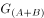，水平向左的已知力F，水平面对其向上的支持力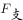，且支持力的大小等于重力的大小，所以竖直方向受力平衡。水平方向也需要受力平衡，所以需要有一个水平向右的力来跟F平衡，那么只能是水平面对其产生的摩擦力f，方向水平向右，大小等于F。而这个整体与水平面的接触面就是物体B与水平面的接触面，所以这个摩擦力即为水平面对物体B的摩擦力。受力分析图示如下：

再对物体A使用隔离法进行受力分析：物体A受到自身竖直向下的重力，水平向左的已知力，以及斜面对其产生的垂直于B的斜面向上的弹力（弹力方向垂直于接触面），而物体A也是受力平衡，合外力为0，因此这个斜向右上的弹力在竖直方向上的分力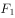的大小等于物体A受到的重力的大小，在水平方向上的分力的大小等于已知力F的大小，因此弹力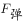的大小要大于已知力F的大小。而物体B对物体A有弹力，根据作用力与反作用力可知，物体A对物体B也有弹力，且两者大小相等，方向相反。受力分析图示如下：

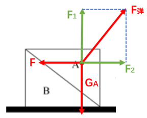

A项，物体B除受到自身的重力，水平面对其向上的支持力， 根据以上分析可知还会受到物体A对它的弹力，以及水平面对它的摩擦力，因此物体B受到4个力，而不是3个力的作用，错误；

B项，根据整体法分析可知，物体B受到的水平面对它的摩擦力方向水平向右，大小等于已知力F的大小，正确；

C项，根据对物体A隔离进行受力分析可得，物体A、B间的弹力在水平方向上的分力的大小等于已知力F的大小，因此弹力的大小要大于已知力F的大小，错误；

D项，直接由相互作用力（即作用力与反作用力）的定义可得，相互作用力是一对大小相等，方向相反，同一直线，作用在两个物体上的力，因此物体A、B之间的相互作用力大小肯定是相等，错误。

故正确答案为B。

---

### 第 13 题　qid 3018776 · 科技常识

下面3个图分别表示两种生物种群随时间（t）推移而发生的数量（n）变化情况，则甲、乙、丙三图表示的关系最有可能依次是（    ）。

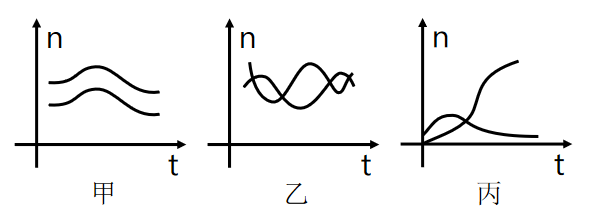

- **A**. 共生、捕食、竞争　✅
- **B**. 竞争、捕食、共生
- **C**. 捕食、竞争、共生
- **D**. 竞争、共生、捕食

**答案**：A

**官方解析**

甲图，两种生物种群的数量变化是同步的，同时增多，同时减少，说明两种群是共同生活，彼此有利，为互利共生的关系；
乙图，两种生物种群的数量随时间的变化是当一方减少，另一方稍后也会开始减少，一方增多，另一方稍后也会增多，呈现“跟随”现象，因此两者间应该为捕食关系；
丙图，两种生物种群的数量变化是一方数量不断增多，另一方数量基本上是不断减小，为此消彼长，因此两者应该为竞争关系。
故正确答案为A。

---

### 第 14 题　qid 3018785 · 科技常识

下列现象与科学原理搭配正确的是（    ）。
①白醋能除去水垢——水垢在白醋中溶解度较高
②用稀硫酸除铜锈——铜锈与稀硫酸发生氧化还原反应
③含氟牙膏能预防龋齿——氟化物作用于牙齿表面增强耐酸蚀能力

- **A**. ②
- **B**. ①②
- **C**. ①③　✅
- **D**. ②③

**答案**：C

**官方解析**

①白醋除水垢的原理是白醋中的醋酸与水垢主要成分碳酸钙、氢氧化镁等发生反应，使其转化为可溶性盐，从而除去水垢，反应方程式分别为：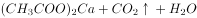，，这个过程是化学反应，与溶解度无关，错误；

②铜锈的主要成分是碱式碳酸铜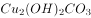，与稀硫酸发生反应的方程式为：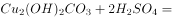，反应前后无化合价变化，不是氧化还原反应，错误；

③含氟牙膏能提供氟离子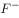，与牙齿中的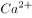、结合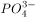，生成难溶于水和弱酸的氟磷酸钙，增强牙齿抗酸腐蚀的能力，从而达到预防龋齿，保护牙齿的作用，正确。

备注：根据以上分析可知，严格来说只有③正确，但是并无对应选项。不过在化工领域中，当固体在酸中发生反应时，也常常表述为“将该固体溶于酸”，以此为依据，①勉强可以接受，故粉笔倾向于正确答案选C。

故正确答案为C。

---

### 第 15 题　qid 3018804 · 科技常识

如图所示，高尔夫球在力的作用下从水平地面的M点飞到N点。忽略高尔夫球在飞行过程中的空气阻力，下列选项能正确表示高尔夫球从M点到达N点前的动能关系的是（    ）。

- **A**. A
- **B**. B　✅
- **C**. C
- **D**. D

**答案**：B

**官方解析**

从题目所给的运动轨迹可知，高尔夫球做斜抛运动，忽略空气阻力的情况下，整个过程只有重力做功，即重力势能和动能相互转化，因此系统机械能守恒。因此可知，从M点到轨迹最高点的过程中，随着球的高度升高，重力势能增大，相应的动能减小；而从最高点到N的过程中，球的高度降低，重力势能减小，相应的动能增大。观察四个选项图形特征可见，只有B项满足动能先减小后增大的趋势，因此B项正确。
故正确答案为B。

---

### 第 16 题　qid 3018811 · 科技常识

如图所示，利用电子坐位体前屈测试仪进行身体柔韧性测试时，测试者向前推动滑动变阻器滑片上的滑块。滑块被向右推动的距离越大，仪表的示数就越大，下列选项中，若将电流表（A）或电压表（V）作为测试仪的仪表，则下列电路不可能满足要求的是（    ）。

- **A**. A
- **B**. B　✅
- **C**. C
- **D**. D

**答案**：B

**官方解析**

根据题意，滑块被向右推动的距离越大，滑动变阻器的阻值越小。
A项，电路图中滑动变阻器直接连在电源两端，故电压不变；电流表测试的是滑动变阻器所在支路的电流，当滑动变阻器的阻值变小时，电流变大，电流表的示数变大，正确；
B项，电路图中滑动变阻器直接连在电源两端，电压一直等于电源电压，无论阻值如何变化，电压表的示数不变，错误；
C项，电路图中滑动变阻器直接连在电源两端，电流表测试的是电路的总电流，当滑动变阻器的阻值变小时，总电阻变小，总电流变大，则电流表的示数变大，正确；
D项，电路图中滑动变阻器与定值电阻串联，电压表测试的是定值电阻的电压，当滑动变阻器的阻值变小时，滑动变阻器的分压变小，定值电阻的分压变大，故电压表的示数变大，正确。
本题为选非题，故正确答案为B。

---

### 第 17 题　qid 3018849 · 科技常识

X染色体显性遗传病是由于位于X染色体上的显性致病基因引起的疾病，则以下遗传图谱中，最有可能显示X染色体显性遗传病的是（    ）。

- **A**. A　✅
- **B**. B
- **C**. C
- **D**. D

**答案**：A

**官方解析**

根据题意，该病为伴X显性遗传病，用D、d来表示显性和隐性基因。

A、C两项，两图中父亲为患病男性，即其X染色体上为显性基因，故其染色体为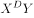；母亲为正常女性，染色体上均为隐性基因，故其染色体为；他们的女儿染色体一定为，即一定是患病女性，故A项正确，C项错误；

B、D两项，两图中父亲和母亲均不患病，但生出来的孩子患病，故染色体上致病基因均为隐性基因，故B、D两项均错误。

故正确答案为A。

---

### 第 18 题　qid 3018854 · 科技常识

在赛车比赛中，赛车在水平直道转入弯道时，常常在弯道上冲出跑道。下列分析正确的是（    ）。

- **A**. 赛车的速度越快，赛车的惯性越大
- **B**. 赛车的速度越快，转弯所需的向心力越大　✅
- **C**. 赛车的转角越大，发动机对抗的离心力越大
- **D**. 赛车的转角越大，轮胎与地面之间的摩擦系数越小

**答案**：B

**官方解析**

A项，惯性是物体的固有属性，只与物体的质量有关，和速度无关，速度变大，惯性也是不变的，错误；

B项，根据向心力的公式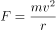可知，当赛车进入弯道时，速度越快，则赛车所需的向心力也就越大，正确；

C项，根据向心力的公式可知，转角变大，相同时间内角速度变大，向心力变大，摩擦力对抗的离心力变大，发动机对离心力没有影响，错误；

D项，轮胎与地面之间的摩擦系数主要是与接触面的粗糙程度有关，与赛车的转角无关，错误。

故正确答案为B。

---

### 第 19 题　qid 3018857 · 科技常识

常见的泡沫灭火器内有两个容器，外壳内装碳酸氢钠与泡沫灭火剂的混合溶液。另有一玻璃瓶内胆，装有硫酸铝水溶液。如图所示，正常情况（图Ⅰ）下。两种溶液互不接触。当需要使用泡沫灭火器时把灭火器倒立（图Ⅱ），两种溶液发生化学反应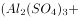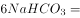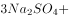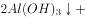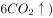，打开灭火器开关时，泡沫从灭火器中喷出，覆盖在燃烧物品上。则下列说法正确的是（    ）。

 

- **A**. 泡沫灭火器灭火时喷出的物质会对周围环境造成污染
- **B**. 泡沫灭火器在灭火时使燃烧物与空气隔绝，达到灭火的目的　✅
- **C**. 泡沫灭火器适宜用于扑救汽油、柴油、带电设备等引起的火灾
- **D**. 泡沫灭火器使用完静置一段时间后，内装物质将全部变为液体

**答案**：B

**官方解析**

A项，泡沫灭火器灭火时喷出的物质主要成分是、和，这三种物质对周围环境都不会造成污染，错误；

B项，泡沫灭火器灭火时能喷射出大量二氧化碳及泡沫，它们能粘附在可燃物上，使可燃物与空气隔绝，达到灭火的目的，正确；

C项，泡沫灭火器主要适用于扑救一般B类火灾，如油制品、油脂等火灾，也可适用于A类火灾，如木材、棉、毛、麻、纸张等燃烧的火灾，但不能扑救带电设备，错误；

D项，泡沫灭火器使用后内装物质已经发生反应，生成的几乎不溶于水，所以静置一段时间后会有沉淀，错误。

故正确答案为B。

---

### 第 20 题　qid 3018859 · 科技常识

根据板块构造论，地球分为亚欧板块、美洲板块、非洲板块、印度洋板块、太平洋板块和南极洲板块，除太平洋板块几乎全为海洋外，其余板块既包括大陆又包括海洋。以下关于板块交界处位置关系对应正确的是（    ）。

- **A**. 亚欧板块和美洲板块一一冰岛　✅
- **B**. 非洲板块和印度洋板块一一蒙古
- **C**. 亚欧板块和太平洋板块一一英国北部
- **D**. 美洲板块和太平洋板块一一美国东海岸

**答案**：A

**官方解析**

A项，亚欧板块和美洲板块的交界处位于冰岛，冰岛位于北大西洋中部，大西洋中脊上，是板块生长边界，正确；
B项，非洲板块和印度洋板块的交界处位于红海，错误；
C项，亚欧板块和太平洋板块的交界处位于中国和日本，错误；
D项，美洲板块和太平洋板块的交界处位于美国西部，错误。
故正确答案为A。

---

### 第 21 题　qid 3018862 · 科技常识

下图是一辆汽车行驶在道路上速度（V）随时间（T）变化的关系图，则下列说法正确的是（    ）。

- **A**. 汽车在第6分钟的时候回到原出发点
- **B**. 汽车在第2分钟的时候距离出发点最远
- **C**. 汽车在第2分钟的速度与第6分钟的速度大小相等　✅
- **D**. 汽车在0-2分钟时的加速度与2-4分钟时的加速度相同

**答案**：C

**官方解析**

A项，速度-时间图像的面积表示的是汽车的位移，由图像可知在0时刻，汽车的位移为0，在第6分钟时，图像与坐标轴围成的面积不为0，错误；
B项，速度-时间图像的面积表示的是汽车的位移，在第4分钟时，图像与坐标轴围成的面积是最大值，故第4分钟时离出发点最远，错误；
C项，由图像可知，在2-6分钟时，运动图像是倾斜的直线，物体的斜率恒定，2-4分钟汽车的速度变化和4-6分钟汽车的速度变化相同，故第2分钟汽车的速度大小等于第6分钟汽车速度的大小，正确；
D项，速度-时间图像的斜率表示加速度，加速度是矢量，有大小和方向，0-2分钟时的加速度是正值，2-4分钟时汽车的加速度是负值，加速度的正负表示的是方向，故汽车在0-2分钟时的加速度与2-4分钟时的加速度不同，错误。
故正确答案为C。

---

## 言语理解与表达

### 第 1 题　qid 3018753 · 逻辑填空

粤港澳大湾区建设            ，深圳前海、珠海横琴、广州南沙等一系列创新“支点”，正串起大湾区的“创新项链”，形成更广泛的合作创新热潮。
填入横线处的词语最恰当的一项是：

- **A**. 风起云涌
- **B**. 如火如荼　✅
- **C**. 声势浩大
- **D**. 如日中天

**答案**：B

**官方解析**

根据横线后“······等一系列创新‘支点’”“正串起大湾区的‘创新项链’”可知，横线处所填词语应表达大湾区的建设规模大，正在火热进行中之意，B项“如火如荼”形容旺盛、热烈或激烈，符合文意，当选。
A项“风起云涌”形容事物迅速发展，声势浩大，文段强调的是建设规模大，正在火热进行中，并未提及其发展是否迅速，故与文意不符，排除；
C项“声势浩大”指声威和气势非常壮大，通常搭配“队伍”“活动”等，与“建设”搭配不当，排除；
D项“如日中天”形容事物正发展到十分兴盛的阶段，文段并未说明大湾区建设正处于十分兴盛的阶段，故与文意不符，排除。
故正确答案为B。
【文段出处】《特区精神：敢为天下先 勇当“拓荒牛”》

---

### 第 2 题　qid 3018757 · 逻辑填空

求同，就要守住政治底线，不断        共同思想政治基础。不能因为        最大公约数，就动摇了必须固守的政治底线。
填入横线处的词语最恰当的一项是：

- **A**. 奠定 追寻
- **B**. 筑牢 思索
- **C**. 巩固 寻求　✅
- **D**. 打造 探索

**答案**：C

**官方解析**

第一空，搭配“基础”，且根据“不断”可知此处表示一种持续、不间断的行为，B项“筑牢”、C项“巩固”均可，保留。A项“奠定”指稳固地建立，侧重于初期的建立，虽也常与“基础”搭配，但与横线前的“不断”搭配不当，排除；D项“打造”比喻创造或造就，多与“形象”“品牌”等搭配，此处与“基础”搭配不当，排除。
第二空，搭配“最大公约数”，根据前文“求同”可知，文段强调的是对“最大公约数”的追求。C项“寻求”指寻找追求，符合文段语境，当选。B项“思索”指思考，侧重于思想层面，体现不出“追求”之意，排除。
故正确答案为C。
【文段出处】《大家手笔：画出最大同心圆》

---

### 第 3 题　qid 3018762 · 逻辑填空

伟大抗疫精神，同中华民族长期形成的特质禀赋和文化基因            ，是爱国主义、集体主义、社会主义精神的传承和发展，是中国精神的生动        。
填入横线处的词语最恰当的一项是：

- **A**. 一脉相承 诠释　✅
- **B**. 一衣带水 展示
- **C**. 相辅相成 展现
- **D**. 相得益彰 解释

**答案**：A

**官方解析**

第一空，横线处形容抗疫精神和中华民族禀赋与文化基因的关系，且根据后文“是······传承和发展”可知，横线处强调二者的关系具有传承性。A项“一脉相承”指从同一血统、派别世代相承流传下来，符合文意，保留。B项“一衣带水”指像一条衣带那样窄的水面，形容一水之隔，往来方便，C项“相辅相成”指两件事物互相补充，互相配合，缺一不可，D项“相得益彰”指两者互相配合或映衬，双方的长处和作用更能显示出来，均与文意不符，排除。
第二空，代入验证，A项“······是中国精神的生动诠释”意为抗疫精神是中国精神的充分体现，符合文意，且“生动诠释”为常用搭配，当选。
故正确答案为A。
【文段出处】人民日报《致敬伟大抗疫精神》

---

### 第 4 题　qid 3018768 · 逻辑填空

无论是对外交往，还是著作演讲，“讲故事”        能阐释观念、触发思考，        能感染受众、拉近距离，最终在受众头脑中、心灵中获得双重共鸣。
填入横线处的词语最恰当的一项是：

- **A**. 虽然 更
- **B**. 尽管 也
- **C**. 因为 所以
- **D**. 不仅 而且　✅

**答案**：D

**官方解析**

根据文意可知，“能阐释观念、触发思考”和“能感染受众、拉近距离”是“讲故事”带来的两个不同方面的影响，二者可为并列或递进关系。D项“不仅······而且······”表示递进关系，代入文段中，“不仅······而且······最终······”层层递推，符合文意，当选。
A项“虽然”为转折关联词，填入文段第一空，应与后文呈转折关系，但“阐释观念、触发思考”与“感染受众、拉近距离”并非转折关系，故关联词搭配不当，排除；
B项“尽管······也······”属于让步关系，就是先给予一定程度的肯定，然后再做出部分否定或者全否定，例如：尽管他强作镇定，也依旧无法掩饰其内心的畏惧。上半句说他强作镇定，这是事实，但是下半句否认他的“镇定”，即内心还是很恐惧的。文段“能感染受众、拉近距离”并非是对“能阐释观念、触发思考”的否定，排除；
C项“因为······所以······”属于因果关系，分析文意可知，两者均为“讲故事”带来的作用，不构成因果关系，排除。
故正确答案为D。
【文段出处】《习近平讲故事 后记 当好中国故事主讲人》

---

### 第 5 题　qid 3018774 · 逻辑填空

“先天下之忧而忧，后天下之乐而乐”，激励着一代又一代仁人志士为国家富强而            、为民族振兴而            。
填入横线处的词语最恰当的一项是：

- **A**. 前赴后继 殚精竭力　✅
- **B**. 运筹决胜 呕心沥血
- **C**. 奋不顾身 煞费苦心
- **D**. 勇往直前 绞尽脑汁

**答案**：A

**官方解析**

第一空，“先天下之忧而忧，后天下之乐而乐”出自《岳阳楼记》，体现了一种爱国情怀，即把国家、民族的利益摆在首位，为祖国的前途、命运担忧分愁，为天底下人民的幸福奋斗，这句话激励着一代又一代仁人志士为国家富强而奋斗，故横线处需体现很多仁人志士为之奋斗努力的意思，A项“前赴后继”指前面的人冲上去了，后面的人就迅速跟上去，形容奋勇前进，既体现出奋斗，又与“一代又一代”呼应得当，体现出人多，符合文意，保留。B项“运筹决胜”指拟订作战策略以获取战斗胜利，文中并未体现“拟订作战策略”“获取战斗胜利”之意，排除；C项“奋不顾身”指奋勇向前，不考虑个人安危，D项“勇往直前”指奋勇前进、无所畏惧，与A项“前赴后继”相比，均无法对应“一代又一代”，体现不出人多，排除。
第二空，代入验证，A项“殚精竭力”指犹殚精毕力，尽心竭力，可体现出为民族振兴而费心尽力，与“先天下之忧而忧，后天下之乐而乐”对应得当，当选。
故正确答案为A。

---

### 第 6 题　qid 3018771 · 片段阅读

中国人民自古就明白，世界上没有坐享其成的好事，要幸福就要奋斗。几千年来，中华民族能够开发和建设祖国辽阔秀丽的大好河山，开拓波涛万顷的辽阔海疆，开垦物产丰富的广袤粮田，治理桀骜不驯的千百条大江大河，战胜数不清的自然灾害，建设星罗棋布的城镇乡村，发展门类齐全的产业，靠的就是艰苦奋斗。
本段文字旨在说明：

- **A**. 中国人民靠艰苦奋斗创造幸福生活　✅
- **B**. 中国自古以来地大物博、美丽繁华
- **C**. 幸福生活是中华民族长久以来的愿望
- **D**. 中国的发展建立在人民的劳动创造之上

**答案**：A

**官方解析**

文段开篇通过对策关联词“要······”提出观点，即“中国人民要幸福就要奋斗”。随后通过阐述中华民族建设河山、开拓海疆、开垦粮田、治理江河、战胜自然灾害等例子论证了，这一切的成功都是靠艰苦奋斗得来的。因此，文段为观点解释说明的结构，重点强调中国人民的幸福生活是靠艰苦奋斗得来的，对应A项。

B项仅强调了中国的地大物博和繁华，C项仅提到中华民族的愿望，但文段强调的是这一切是靠艰苦奋斗得来的，故均偏离文段核心，排除；

D项，缺乏主题词“奋斗”，排除。

故正确答案为A。

【文段出处】《思想纵横：伟大成就来自艰苦奋斗》

---

### 第 7 题　qid 3018780 · 片段阅读

随着人们的健康理念从以疾病为中心向以健康为中心转变，中医“治未病”的思想深入人心，中医药的优势得以进一步挖掘，中医药治疗的认同感不断增强，中医药的服务方式和内容不断拓展丰富，中医药科学研究已经引起了国际社会的高度关注与认可。尤其是可持续发展与“一带一路”建设，更是为中医药的发展和传播创造了有利条件。
下列选项对文段内容理解不准确的是：

- **A**. 我国中医药产业具有广阔的发展前景
- **B**. 建设“一带一路”有利于发展和传播中医药
- **C**. 中医强调“治未病”，除了关注疾病也关注健康
- **D**. 海外国家和地区的人们广泛接受了中医的健康理念　✅

**答案**：D

**官方解析**

A项，根据“中医药治疗的认同感不断增强”“为中医药的发展和传播创造了有利条件”等内容可知，文段主要阐述了中医药有非常好的发展前景，表述正确，排除；
B项，根据“尤其是可持续发展与‘一带一路’建设，更是为中医药的发展和传播创造了有利条件”可知，建设“一带一路”对中医药发展和传播有好处，表述与文意相符，排除；
C项，根据“随着人们的健康理念从以疾病为中心向以健康为中心转变，中医‘治未病’的思想深入人心”可知，正是因为中医关注疾病的同时，也注重健康，才会在人们健康理念转变时，让中医思想深入人心，表述与文意相符，排除；
D项，文段只说到“中医药科学研究已经引起了国际社会的高度关注与认可”，并未提及“海外国家和地区的人们”对中医的接受度是否广泛，无中生有，当选。
本题为选非题，故正确答案为D。
【文段出处】经济日报《中经论坛｜如何让中医药在疫情防控中发挥更大作用》

---

### 第 8 题　qid 3018797 · 语句表达

要深深地扎根于人民群众之中，不断从人民群众及其参与的各项实践中汲取营养和力量。正所谓，“                    ”。当前，密切联系群众最直接的要求就是推动广大党员干部走近群众，扑下身子搞好调研，真正了解群众所思所想所盼。从群众关注的烦心事、紧要事和身边事等细微之处入手，及时发现问题、精准研判问题、有效解决问题。
下列句子填入划横线处，最恰当的是：

- **A**. 天地之大，黎元为先
- **B**. 凡治国之道，必先富民
- **C**. 得众则得国，失众则失国
- **D**. 知屋漏者在宇下，知政失者在草野　✅

**答案**：D

**官方解析**

本题为语句填空题，横线在文段中间，需联系前后文把握话题的一致性。横线前强调要扎根于人民群众并从中汲取营养和力量。横线后强调如何密切联系群众，并指出要从群众关注的事中发现问题并解决。因此，横线处所填句子应围绕党员干部密切联系群众展开论述，且能体现出从群众入手发现问题并解决之意。结合选项分析，D项“知屋漏者在宇下，知政失者在草野”意为知道房屋漏雨的人在房屋下，知道政治有过失的人在民间，即为政者要来到人民群众中，去发现问题，听取意见，符合文意，当选。
A项，“天地之大，黎元为先”意为天地虽然广袤无垠，但是黎民百姓才是国家的根本，旨在强调人民群众的重要性，未能表现出“扎根于”人民群众，在人民群众中汲取力量之意，排除；
B项，“凡治国之道，必先富民”意为但凡治理国家的方法，都一定要先使人民富裕，旨在强调使人民富裕，与文意无关，排除；
C项，“得众则得国，失众则失国”意为得到民心就能得到国家，失去民心就会失去国家，旨在强调人民群众支持的重要性，未突出“扎根于”人民群众，排除。
故正确答案为D。
【文段出处】《光明网：牢牢坚守人民情怀》

---

### 第 9 题　qid 3018807 · 片段阅读

今天的青年，有着同先辈们一样的“处处为国家着想”的赤子之心，一样的“把有限的生命投入到无限的为人民服务中去”的凛然担当。他们享受生活，但同时也勇于担当职责；他们关注个人权益，但同时也懂得尊重集体和他人福祉；他们主张自主选择，但也并不缺乏家国情怀、奉献精神，一样是雷锋精神的坚定拥趸和积极行动者。
本段文字旨在说明：

- **A**. 今天的青年同样具有雷锋精神　✅
- **B**. 新时代雷锋精神具有新的阐释
- **C**. 雷锋精神在本质上未发生改变
- **D**. 雷锋精神已经融入到生活之中

**答案**：A

**官方解析**

文段开篇指出“今天的青年”与先辈们具有一样的“为人民服务”的精神品质，接着通过三个并列句具体论述“今天的青年”身上如何体现雷锋精神的，故文段主题词是“今天的青年”，意在强调“今天的青年”与先辈们一样是雷锋精神的拥趸和行动者，对应A项。
B项，缺少主题词“今天的青年”，且“新的阐释”无中生有，排除；
C项，缺少主题词“今天的青年”，排除；
D项，缺少主题词“今天的青年”，且“融入到生活之中”无中生有，排除。
故正确答案为A。
【文段出处】《青春献给祖国，新时代雷锋精神的新阐释》

---

### 第 10 题　qid 3018815 · 片段阅读

国家的制度变革和治理现代化与每个人息息相关。从“管理”到“治理”，一字之变，其内涵与外延都发生了巨大变化。“管理”更多强调的是自上而下的维度，而“治理”则具有更多平等和共治的意味，是公共事务相关主体对于国家和社会事务的有序参与，是各类主体围绕国家和社会事务的协商互动。“治理”理念的提出，本身就是一种现代化的转型，有利于促进社会参与、激发社会活力，更好吸纳群众有序政治参与。
下列选项最适合作为这一文段标题的是：

- **A**. 国家治理现代化的内涵与外延
- **B**. “管理”和“治理”的一字之变
- **C**. 国家治理现代化，人人都是参与者　✅
- **D**. 国家制度完善和发展，我们都是受益人

**答案**：C

**官方解析**

文段首先提出观点，即“国家治理现代化与每个人息息相关”，紧接着从“管理”与“治理”的区别指出“治理”强调人人平等参与，尾句进一步指出“治理”理念的提出本身就是现代化转型，有利于吸纳群众政治参与。故文段重点强调国家治理现代化需要群众参与进来，与每个人都息息相关，对应C项。
A项，“内涵与外延”为解释说明部分，非重点，排除；
B项，“‘管理’和‘治理’”为解释说明部分，非重点，排除；
D项，文段主题词为“国家治理现代化”而非“国家制度”，且文段重点论述需要人人参与到国家治理现代化中，而非“人人受益”，与文意不符，排除。
故正确答案为C。
【文段出处】《人民网评：国家治理现代化，我们都是参与者》

---

## 数量关系

### 第 1 题　qid 3018896 · 数学运算

，，，，（    ）

- **A**. 

　✅
- **B**. 

- **C**. 

- **D**. 

**答案**：A

**官方解析**

观察数列与选项均为分数，考虑分数数列。分数分母不是递增或递减趋势，考虑反约分，转化为：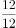，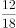，，，（    ），观察发现，分子均为12，分母是公差为6的等差数列，则下一项分母为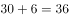，故所求项为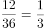。

故正确答案为A。

---

### 第 2 题　qid 3018898 · 数学运算

某帮扶项目以每公斤9元的价格从农民手中收购了一批苹果，并以每公斤12元（包邮）的价格在网上销售。售出总量的后，价格下调为每公斤10元（包邮）。运费成本为每公斤0.1元。全部售完后，扣除收购成本和运费的总收益为2.5万元，则这批苹果为（    ）吨。

- **A**. 5
- **B**. 10　✅
- **C**. 15
- **D**. 20

**答案**：B

**官方解析**

设这批苹果共有公斤，根据公式：总利润总售价总成本，可列方程：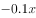，解得，根据1000公斤1吨可知，这批苹果为10吨。

故正确答案为B。

---

### 第 3 题　qid 3018899 · 数学运算

为支持“一带一路”建设，某公司派出甲、乙两队工程人员出国参与一个高铁建设项目。如果由甲队单独施工，200天可完成该项目；如果由乙队单独施工，则需要300天。甲、乙两队共同施工60天后，甲队被临时调离，由乙队单独完成剩余任务，则完成该项目共需（    ）天。

- **A**. 120
- **B**. 150
- **C**. 180
- **D**. 210　✅

**答案**：D

**官方解析**

根据题意，赋值高铁建设项目工作总量为200和300的最小公倍数600，则甲队的效率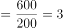，乙队的效率。甲、乙两队共同施工60天完成的工作量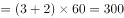，则剩余任务的工作量，则乙队单独完成剩余任务还需天，故完成该项目共需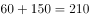天。

故正确答案为D。

---

### 第 4 题　qid 3018901 · 数学运算

某街道服务中心的80名职工通过相互投票选出6名年度优秀职工，每人都只投一票，最终A、B、C、D、E、F这6人当选。已知A票数最多，共获得20张选票；B、C两人的票数相同，并列第2；D、E两人票数也相同，并列第3；F获得10张选票，排在第4。那么B、C获得的选票最多为（    ）张。

- **A**. 11
- **B**. 12
- **C**. 13
- **D**. 14　✅

**答案**：D

**官方解析**

要想使B、C获得的选票最多，则A、D、E、F获得的选票应该尽量的少。根据题意，80名职工每人只投一票，则共投出80张选票。A获得20张选票，F获得10张选票，D、E两人票数相同且并列第3，则D、E两人获得的票数应该尽量的少，每人应比排名第4的F多1张选票，即张。则B、C两人共获得的选票最多为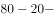张，根据“B、C两人的票数相同”可得，B、C每人获得的选票最多为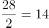张。

故正确答案为D。

---

### 第 5 题　qid 3018767 · 数学运算

小王和小李沿着绿道往返运动，绿道总长度为3公里。小王每小时走2公里；小李每小时跑4公里。如果两人同时从绿道的一端出发，则当两人第7次相遇时，距离出发点（    ）公里。

- **A**. 0
- **B**. 1
- **C**. 1.5
- **D**. 2　✅

**答案**：D

**官方解析**

根据题意，两人同时从绿道的一端出发，则第次相遇时所走路程和为。假设第7次相遇时运动时间为，代入题干数据可得：，解得小时。相遇时小王所走路程为公里，，因为商为4，是偶数，即小王在绿道上往返走了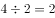次，“······2”即往返2次回到出发点后，又走了2公里，则相遇点距离出发点2公里。

故正确答案为D。

---

### 第 6 题　qid 3018772 · 数学运算

县公安局计划举办篮球比赛，6支报名参赛的队伍将平均分为上午组和下午组进行小组赛。其中甲队与乙队来自同部门，不能分在同一组，则分组情况共有（    ）种可能。

- **A**. 6
- **B**. 8
- **C**. 10
- **D**. 12　✅

**答案**：D

**官方解析**

方法一：除了甲、乙两队外，共剩余支队伍。从中选出2支队伍与甲队组成一组，其余2支队伍与乙队组成一组，共种情况。而有可能甲队在上午组、乙队在下午组，也有可能甲队在下午组、乙队在上午组，因此总情况数共有种。

方法二：本题也可以考虑逆向思维求解。总情况数即6支报名参赛的队伍将平均分为上午组和下午组进行小组赛，即：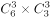种，反面情况即甲队与乙队先分在同一组，再从其余支队伍中选出一队与甲、乙两队组成一组，即种情况，又有上午组和下午组2种情况，则反面情况数共有种。所求结果总情况数反面情况数种。

故正确答案为D。

---

### 第 7 题　qid 3018779 · 数学运算

某单位本科、研究生学历的职工人数之比为7：5。上半年公开招聘本科毕业生若干人后，本科与研究生之比为3：1；下半年通过引才计划引入研究生若干人后，本科与研究生之比为15：8。已知该年度引进的本科生比研究生多10人，则该单位原有本科与研究生学历的职工共（    ）人。

- **A**. 12
- **B**. 24　✅
- **C**. 36
- **D**. 48

**答案**：B

**官方解析**

设该单位原有本科、研究生学历的职工人数分别为、。由题意可知，上半年公开招聘后研究生学历的职工人数不变，则此时本科与研究生比例为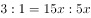，此时本科学历的职工人数为，增加了。下半年公开招聘后，本科学历的职工人数不变，则本科与研究生比例为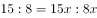，此时研究生学历的职工人数为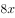，增加了。根据题意，新增本科人数新增研究生人数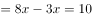，解得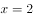，则该单位原有本科与研究生学历的职工人数为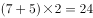人。

故正确答案为B。

---

### 第 8 题　qid 3018791 · 数学运算

7月的某一天，小张制定了一个读书计划：从今天开始，在每周的周一至周五晚上读党史系列丛书。如果小张每晚读20页，到7月28日刚好能读完第一卷，如果每天读30页，则到7月20日刚好能读完第一卷。如果7月1日是星期三，则小张是在7月（    ）日制定的读书计划。

- **A**. 2
- **B**. 3　✅
- **C**. 5
- **D**. 7

**答案**：B

**官方解析**

设小张每晚读20页书需用天读完。根据题意，每晚读30页书比每晚读20页提前了天；已知7月1日是星期三，每周7天，可推出7月22日为星期三，则7月20日为星期一、7月28日为是星期二。可知提前的8天中包括周末两天（7月25、26日）没有读书，则实际节省了6天读书时间，由此可列方程为：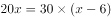，解得。故到7月28日读完第一卷书，共需18天。由于每周周末都不读书，实际读书为每周5天，则（周）······3天。从7月28日往前推三周为：，即7月7日星期二，此时共计读书16天，还需读书2天，而星期一只有1天，还需1天为上一周的星期五（7月3日），则小张是在7月3日制定的读书计划。

故正确答案为B。

---

### 第 9 题　qid 3018799 · 数学运算

某货运公司承运一批工艺品，每件运费20元。如果运输途中出现破损，那么每件破损的工艺品不仅收不到运费，还要赔偿30元。运输完成后发现，工艺品的破损率为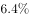，最终货运公司收到了16800元运费，则运输途中破损的工艺品有（    ）件。

- **A**. 64　✅
- **B**. 96
- **C**. 128
- **D**. 156

**答案**：A

**官方解析**

设这批工艺品共有件，根据题意可得：运输完成后可获得运费元，因破损需赔偿元，则最终收到运费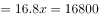元，解得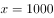，故运输途中破损的工艺品有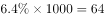件。

故正确答案为A。

---

### 第 10 题　qid 3018813 · 数学运算

如图所示，周长为24米的平行四边形绿化地被划分为三块区域，两边为三角形的花坛，中间为矩形的草地。已知a、b、c长度之比为4∶2∶，则矩形草地的面积为（    ）平方米。

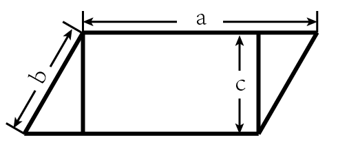

- **A**. 
6

- **B**. 
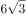

- **C**. 
12

- **D**. 

　✅

**答案**：D

**官方解析**

平行四边形的周长米，则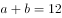米，且根据可得，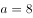米，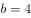米，米。如下图所示，因为中间部分为矩形，所以由b、d、e构成的三角形为直角三角形，其中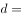米，则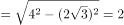米，故矩形草地的面积平方米。

故正确答案为D。

---

### 第 11 题　qid 3018819 · 数学运算

某天，自行车运动员小吴训练了3个小时，他先匀速骑行了一段上坡路程，又以2倍的速度匀速骑行了一段下坡路程，最终共骑行60千米，则（    ）。

- **A**. 如果上坡路程大于下坡路程，他上坡的时速必然小于15千米
- **B**. 如果上坡路程大于下坡路程，他上坡的时速必然大于20千米
- **C**. 如果下坡路程大于上坡路程，他下坡的时速必然小于30千米　✅
- **D**. 如果下坡路程大于上坡路程，他下坡的时速必然大于25千米

**答案**：C

**官方解析**

设上坡速度为千米/小时，下坡速度为千米/小时，上坡的路程为千米，下坡路程为千米。根据总时间为3小时，可得方程：，化简得：······①。

（1）当上坡路程大于下坡路程时：，化简得：，代入①中可得：，化简得：，即上坡的时速必然大于15千米，A、B两项均不符合，排除；

（2）当下坡路程大于上坡路程时：，化简得：，代入①中可得：，化简得：，即下坡时速必然小于30千米，对应C项。

故正确答案为C。

---

## 判断推理

### 第 1 题　qid 3018848 · 图形推理

下列选项中最符合所给图形规律的是：

- **A**. A
- **B**. B　✅
- **C**. C
- **D**. D

**答案**：B

**官方解析**

图形元素组成不同，考虑属性规律。观察发现，图1、图3存在明显的等腰元素，考虑对称性。画出图形对称轴发现，题干图形的对称轴都只有一条，且竖轴和横轴交替出现，图4是横轴对称，故？处应该选择竖轴对称的图形，只有B项符合。
故正确答案为B。

---

### 第 2 题　qid 3018853 · 图形推理

下列选项中最符合所给图形规律的是：

- **A**. A
- **B**. B　✅
- **C**. C
- **D**. D

**答案**：B

**官方解析**

图形元素组成相似，优先考虑样式规律。观察发现图形外部轮廓相同，但内部颜色不同，考虑黑白运算。第一组图：、、、；第二组图运用此规律，正上方：，排除C项；正下方：，排除A、D两项。

故正确答案为B。

---

### 第 3 题　qid 3018855 · 图形推理

下列选项中最符合所给图形规律的是：

- **A**. A
- **B**. B
- **C**. C
- **D**. D　✅

**答案**：D

**官方解析**

图形元素组成不同，且无明显属性规律，考虑数量规律。观察发现，题干图形都有直线，考虑直线数。题干图形直线数依次为1、2、3、4，故？处图形中直线数应为5。A项直线数为6，B项为7，C项为4，只有D项符合。
故正确答案为D。

---

### 第 4 题　qid 3018856 · 图形推理

下列选项中最符合所给图形规律的是：

- **A**. A
- **B**. B
- **C**. C　✅
- **D**. D

**答案**：C

**官方解析**

观察发现，题干图形均存在灰块，且灰块数量依次递增，故？处图形中灰块数量应为6，但没有唯一答案。继续观察发现，灰块位置有明显移动，考虑灰块的位置规律。16宫格内圈灰块依次顺时针移动1格，排除A项；16宫格外圈灰块依次顺时针移动1格且在最前边增加一个灰块，排除B、D两项。

如下图所示。

故正确答案为C。

---

### 第 5 题　qid 3018878 · 图形推理

下列选项中最符合所给图形规律的是：

- **A**. A
- **B**. B
- **C**. C　✅
- **D**. D

**答案**：C

**官方解析**

本题将选项填入题干图形所缺的？处，即可拼合成一幅完整图形，故将选项顺时针旋转后与题干进行拼接。观察发现，若想与题干完整拼接，则？左上角应为黑色，右上角应为白色，只有C项符合。

故正确答案为C。

---

### 第 6 题　qid 3018880 · 图形推理

下列选项中，与所给的立体图形不可能是同一图形的是：

- **A**. A　✅
- **B**. B
- **C**. C
- **D**. D

**答案**：A

**官方解析**

将题干的小长方体分别标上序号，逐一进行分析。

A项：当②号块和③号块在前面，①号块和④号块在后面时，根据题干，④号块一定偏左而非偏右，与题干图形不一致，当选；

B项：将选项沿图中轴1顺时针旋转之后，与题干图形一致，排除；

C项：将选项先沿图中轴1顺时针旋转，再水平顺时针旋转之后，与题干图形一致，排除；

D项：将选项先沿图中轴1逆时针旋转，再水平逆时针旋转之后，与题干图形一致，排除。

本题为选非题，故正确答案为A。

---

### 第 7 题　qid 3018863 · 图形推理

下方分别是一个由长方体堆积而成的立体图形和该立体图形的左视图、后视图，那么该立体图形的俯视图是（    ）。

- **A**. A
- **B**. B
- **C**. C　✅
- **D**. D

**答案**：C

**官方解析**

本题考查三视图，逐一分析选项。
A项：若选项左上角的小方块从俯视处可看见，则该立体图形从前至后第3行、从左至右第1列相交处存在一个较矮的小立体图形，因此后视图最右边的长方形应当存在一条横线，与题干中后视图不符，排除；
B项：与A项同理，排除；
C项：与题干一致，当选；
D项：若选项从上至下第2行、从左至右第1列处的小方块从俯视图处可看见，则该立体图形从前至后第2行、从左至右第1列相交处存在一个较矮的小立体图形，因此后视图最右边的长方形应当存在一条横线，与题干中后视图不符，排除。
故正确答案为C。

---

### 第 8 题　qid 3018865 · 图形推理

下列选项中，能够折成如图所示立方体的是（    ）。

- **A**. A
- **B**. B
- **C**. C　✅
- **D**. D

**答案**：C

**官方解析**

本题考查六面体，逐一进行分析。
A项：选项中两个直角三角形的公共边为直角边，而题干中为斜边，选项与题干不一致，排除；
B项：选项中两个直角三角形无法拼合成一个完整的正方形，因此该展开图无法折叠为正方体，选项与题干不一致，排除；
C项：选项与题干一致，当选；
D项：选项中两个直角三角形的相对面不是同一个面，无法拼合成一个完整的正方形，因此该展开图无法折叠为正方体，选项与题干不一致，排除。
故正确答案为C。

---

### 第 9 题　qid 3018867 · 图形推理

左侧立体图形仅有图中所示的一个面被涂黑。下列选项不可能由三个左侧立体图形构成的是（    ）。

- **A**. A
- **B**. B
- **C**. C
- **D**. D　✅

**答案**：D

**官方解析**

本题考查立体拼合。题干立体图形由3个小方块组成，分别标1、2、3，如下图所示。

A项：如下图所示，左下角和中间的立体图形（分别标记为1、2、3）可以拼成2个题干中的立体图形，右下角（标记为1、2、3）的立体图形可由题干中的立体图形通过位置变换得到（此时黑面朝内，无法看到），排除；

B项：如下图所示，左下角和右上角的立体图形（分别标记为1、2、3）可以拼成2个题干中的立体图形，在右下角标2的立体图形（此时黑面朝内，无法看到）的左侧可以有另外一个立体图形（标记应为3），组合拼成题干中的立体图形，排除；

C项：如下图所示，上方的立体图形和右侧的立体图形（分别标记为1、2、3，此时右侧图形黑面朝内，无法看到）可以拼成2个题干中的立体图形，在第三层（从上往下数）标2（此时黑面朝内，无法看到）的立体图形的内侧可以有另外一个立体图形（标记应为3），组合拼成题干中的立体图形，排除；

D项：如下图所示，左下角的立体图形（标记为1、2、3）可以拼成1个题干中的立体图形，右面的立体图形（标记为1、2、3）可以拼成1个题干中的立体图形，但根据题干图形的特征及黑面的位置，只存在图示中唯一的拼法。此时第一层（从上往下数）的2个小方块无法和内部的其他方块拼成题干中的立体图形，当选。

本题为选非题，故正确答案为D。

---

### 第 10 题　qid 3018870 · 图形推理

下图所示立体图形沿OMN面斜切，由切面所见截面最可能是（    ）。

- **A**. A
- **B**. B
- **C**. C
- **D**. D　✅

**答案**：D

**官方解析**

本题考查截面图。题干图形由上、下两个立体图形组成，且下方为圆柱体。从上方立体图形的顶面斜切，再从圆柱体的底部切出，经过上、下立体图形的顶面切出来的均为直线，经过其他部位切出来的均为曲线，即经过上方立体图形的侧面和圆柱体柱身切出来的均为半弧形截面，符合要求的只有D项。
故正确答案为D。

---

### 第 11 题　qid 3018873 · 类比推理

塑料：容器

- **A**. 石灰：水泥
- **B**. 陶瓷：餐具　✅
- **C**. 桥墩：桥梁
- **D**. 木材：木头

**答案**：B

**官方解析**

第一步：判断题干词语间逻辑关系。
塑料是制作容器的原材料，二者为原材料与成品的对应关系。
第二步：判断选项词语间逻辑关系。
A项：石灰和水泥都是无机胶凝材料，二者为并列关系，与题干逻辑关系不一致，排除；
B项：陶瓷是制作餐具的原材料，二者为原材料与成品的对应关系，与题干逻辑关系一致，当选；
C项：桥墩是桥梁的组成部分，二者为组成关系，与题干逻辑关系不一致，排除；
D项：木头是木材和木料的统称，二者为种属关系，与题干逻辑关系不一致，排除。
故正确答案为B。

---

### 第 12 题　qid 3018876 · 类比推理

钢琴：演奏

- **A**. 艺术：写生
- **B**. 书法：展览
- **C**. 画笔：绘画　✅
- **D**. 二胡：配音

**答案**：C

**官方解析**

第一步：判断题干词语间逻辑关系。
用钢琴进行演奏，钢琴是演奏的工具，二者为工具的对应关系。
第二步：判断选项词语间逻辑关系。
A项：通过写生创作的作品称为艺术，但艺术并非工具，与题干逻辑关系不一致，排除；
B项：展览的内容可以为书法作品，但书法并非工具，与题干逻辑关系不一致，排除；
C项：用画笔进行绘画，画笔是绘画的工具，二者为工具的对应关系，与题干逻辑关系一致，当选；
D项：二胡一般用来配乐，而不是配音，与题干逻辑关系不一致，排除。
故正确答案为C。

---

### 第 13 题　qid 3018763 · 类比推理

经营：纳税

- **A**. 借书：归还　✅
- **B**. 评比：投票
- **C**. 球赛：运动
- **D**. 注册：登记

**答案**：A

**官方解析**

第一步：判断题干词语间逻辑关系。
经营和纳税是两种行为，且先经营，后纳税，二者为时间先后顺序的对应关系。
第二步：判断选项词语间逻辑关系。
A项：借书和归还是两种行为，且先借书，后归还，二者为时间先后顺序的对应关系，与题干逻辑关系一致，当选；
B项：投票是一种评比的方式，二者为方式对应关系，与题干逻辑关系不一致，排除；
C项：球赛与运动相关，二者为对应关系，但球赛并不是行为，与题干逻辑关系不一致，排除；
D项：注册指把名字记入簿册获得某种资格，登记指把有关事项或东西记载在册籍上，两者意思相近，没有先后之分，与题干逻辑关系不一致，排除。
故正确答案为A。

---

### 第 14 题　qid 3018778 · 类比推理

暴雨：冰雹：天灾

- **A**. 汽车：滑梯：玩具
- **B**. 归纳：总结：逻辑
- **C**. 舞蹈：歌剧：戏剧
- **D**. 没收：罚款：处罚　✅

**答案**：D

**官方解析**

第一步：判断题干词语间逻辑关系。
暴雨和冰雹都是一种天灾，前两词分别与第三词构成种属关系。
第二步：判断选项词语间逻辑关系。
A项：汽车不是玩具，二者不是种属关系，与题干逻辑关系不一致，排除；
B项：总结指的是分析研究某一阶段的工作、学习或思想中的各种经验或情况，总结不属于逻辑，二者不是种属关系，与题干逻辑关系不一致，排除；
C项：舞蹈和戏剧属于不同的艺术类别，二者是并列关系，与题干逻辑关系不一致，排除；
D项：没收和罚款都是处罚的一种，前两词分别与第三词构成种属关系，与题干逻辑关系一致，当选。
故正确答案为D。

---

### 第 15 题　qid 3018786 · 类比推理

和风细雨：暴风骤雨

- **A**. 年富力强：风烛残年　✅
- **B**. 如沐春风：如履薄冰
- **C**. 耀武扬威：扬眉吐气
- **D**. 雪中送炭：落井下石

**答案**：A

**官方解析**

第一步：判断题干词语间逻辑关系。
和风细雨指的是温和的风，细小的雨，比喻方式和缓，不粗暴；暴风骤雨指的是又猛又急的大风雨，比喻声势浩大，发展急速而猛烈；二者是反义关系，且“和风”和“细雨”是并列关系，“暴风”和“骤雨”是并列关系。
第二步：判断选项词语间逻辑关系。
A项：年富力强形容年纪轻，精力旺盛；风烛残年比喻人到了接近死亡的晚年；二者是反义关系，且“年富”和“力强”是并列关系，“风烛”和“残年”是并列关系，与题干逻辑关系一致，当选；
B项：如沐春风指的是像坐在春风中间，比喻同品德高尚且有学识的人相处并受到熏陶；如履薄冰指的是像走在薄冰上一样，比喻行事极为谨慎，存有戒心；二者不是反义关系，与题干逻辑关系不一致，排除；
C项：耀武扬威指的是炫耀武力，显示威风；扬眉吐气指的是扬起眉头，吐出怨气，形容摆脱了长期受压状态后高兴痛快的样子；二者不是反义关系，与题干逻辑关系不一致，排除；
D项：雪中送炭指的是在下雪天给人送炭取暖，比喻在别人急需时给以物质上或精神上的帮助；落井下石指的是看见人要掉进陷阱里，不伸手救他，反而推他下去，又扔下石头，比喻乘人有危难时加以陷害；二者是反义关系，但“雪中”和“送炭”、“落井”和“下石”均不是并列关系，与题干逻辑关系不一致，排除。
故正确答案为A。

---

### 第 16 题　qid 3018801 · 逻辑判断

调查研究显示，相较传统的农业生产方式，有机农业生产出的农作物产量会有一定程度的下降。但现在仍然有越来越多的农民从传统农业转向有机农业，甚至花费资金，添置用于有机农业耕作的农用设备。
以下选项如果为真，最能解释上述现象的是：

- **A**. 有机农业耕作方式更有助于保护生态环境
- **B**. 许多科技节目都在推广有机农业耕作方式
- **C**. 有机农业生产出的农作物市场售价远高于传统农业　✅
- **D**. 对于少部分农作物而言，有机农业耕作并不会降低其产量

**答案**：C

**官方解析**

第一步：找出题干矛盾。
相较传统的农业生产方式，有机农业生产出的农作物产量会下降，但仍然有越来越多的农民从传统农业转向有机农业，甚至花费资金添置设备。
第二步：逐一分析选项。
A项：该项只能说明有机农业耕作方式更有利于保护生态环境，但是没提到为什么在有机农业生产出的农作物产量下降的情况下，越来越多的农民还愿意从传统农业转向有机农业，甚至花费资金添置设备，不能解释题干矛盾，排除；
B项：该项只能说明有机农业耕作方式的宣传力度大，但是没提到为什么在有机农业生产出的农作物产量下降的情况下，越来越多的农民还愿意从传统农业转向有机农业，甚至花费资金添置设备，不能解释题干矛盾，排除；
C项：该项说明有机农业生产出的农作物市场售价远高于传统农业，因此虽然有机农业生产出的农作物产量会下降，但并不会降低农民收益，甚至有可能增加农民的收益，因此越来越多的农民从传统农业转向有机农业，可以解释题干矛盾，当选；
D项：该项仅指出有机农业耕作并不会降低少部分农作物的产量，但不能解释为什么越来越多的农民愿意从传统农业转向有机农业，不能解释题干矛盾，排除。
故正确答案为C。

---

### 第 17 题　qid 3018812 · 类比推理

某镇计划安排小蒋、小陈、小刘3名干部到甲、乙、丙3个村子驻点，每村只安排1人。3人中有一人是农学专业，一人是法学专业，一人是工学专业。已知：小陈没有前往甲村，农学专业的没有前往甲村，工学专业的去了丙村，小陈不是农学专业。
根据以上表述，以下推论必然正确的是（    ）。

- **A**. 小刘去了甲村
- **B**. 小蒋去了乙村
- **C**. 小刘是工学专业的
- **D**. 小陈是工学专业的　✅

**答案**：D

**官方解析**

第一步：整理题干条件。
（1）小陈没有前往甲村；
（2）农学专业的没有前往甲村；
（3）工学专业的去了丙村；
（4）小陈不是农学专业。
第二步：根据题干条件进行推理。
根据题干所说的“某镇计划安排小蒋、小陈、小刘3名干部到甲、乙、丙3个村子驻点，每村只安排1人。3人中有一人是农学专业，一人是法学专业，一人是工学专业”，结合条件（2）和条件（3）可知，农学专业和工学专业的没有前往甲村，则法学专业的去了甲村，农学专业的去了乙村。最后结合条件（1）和条件（4）可知，小陈没有前往甲村，也没有前往乙村，故小陈前往了丙村，因此，小陈是工学专业的。
故正确答案为D。

---

### 第 18 题　qid 3018818 · 类比推理

今年持续暴雨，各地花椒严重减产。由此可以预见，今年的花椒价格将会显著上涨。
要使上述推理成立，需要补充的前提条件是：

- **A**. 花椒价格仅受到产量的影响　✅
- **B**. 全国花椒需求量与往年持平
- **C**. 花椒的价格不会影响群众的购买意愿
- **D**. 历年花椒价格的波动都与其产量密切相关

**答案**：A

**官方解析**

第一步：找出论点和论据。
论点：今年的花椒价格将会显著上涨。
论据：今年持续暴雨，各地花椒严重减产。
本题论点讨论了今年的花椒价格将会显著上涨，论据讨论了今年持续暴雨，各地花椒严重减产，话题不一致，加强优先考虑搭桥。
第二步：逐一分析选项。
A项：该项指出花椒价格仅受到产量的影响，在花椒价格和减产之间建立联系，搭桥项，保留；
B项：该项说的是全国花椒需求量与往年持平，但是没有提及花椒价格和减产之间的关系，无法加强，排除；
C项：该项说的是花椒的价格不会影响群众的购买意愿，但是没有提及花椒价格和减产之间的关系，无法加强，排除；
D项：该项指出历年花椒价格的波动都与其产量密切相关，在花椒价格和减产之间建立联系，搭桥项，保留。
比较A、D两项，A项指出产量是影响花椒价格的唯一因素，D项仅说二者密切相关，则可能存在其他因素影响花椒价格，且题干论点、论据说的都是今年花椒的价格和产量，而D项仅提及历年花椒价格和产量的情况，没有提及今年的情况。因此，A项加强力度大于D项，故排除D项，A项当选。
故正确答案为A。

---

### 第 19 题　qid 3018830 · 逻辑判断

由于全球碳排放量的不断增长，全球范围内气候呈现升温趋势。但与此同时，气候变暖也会让部分树木生长速率加快，从而使树木从大气中吸收二氧化碳的效率增加。因此，人类不需要过于担忧碳排放导致的气候变暖问题。
下列选项如果为真，最能有效削弱上述结论的是（    ）。

- **A**. 不同树种碳吸收效率提升的情况有差异
- **B**. 树木并非是地球上吸收储存二氧化碳的主力
- **C**. 树木死亡后其储存的碳可能会重新释放到大气中
- **D**. 目前人类产生的碳排放增量远远超过了树木的吸收能力　✅

**答案**：D

**官方解析**

第一步：找出论点和论据。
论点：人类不需要过于担忧碳排放导致的气候变暖问题。
论据：气候变暖也会让部分树木生长速率加快，从而使树木从大气中吸收二氧化碳的效率增加。
本题论点讨论了人类无需过于担忧碳排放导致的气候变暖，论据讨论了气候变暖可以促进树木生长，增加树木吸收二氧化碳的效率，即树木吸收二氧化碳的量可以抵消二氧化碳排放的量，话题一致，削弱优先考虑否定论点。
第二步：逐一分析选项。
A项：该项指出不同树种碳吸收效率的提升情况不同，而论点在讨论人类是否需要过于担忧碳排放导致的气候变暖，话题不一致，无法削弱，排除；
B项：该项指出树木不是地球上吸收储存二氧化碳的主力，而论点在讨论人类是否需要过于担忧碳排放导致的气候变暖，话题不一致，无法削弱，排除；
C项：该项指出树木死亡后储存的碳可能会重新释放到大气中，即树木有可能并不具备吸收储存二氧化碳的能力，具有削弱效果，保留；
D项：该项指出人类的碳排放增量远超于树木的吸收能力，说明了“树木吸收的二氧化碳”不能抵消“二氧化碳排放的量”，人类还需要担忧气候变暖问题，可以削弱，保留。
比较C、D两项，C项是说树木“可能”会重新释放二氧化碳，而D项则是明确说明二氧化碳排放量远远大于吸收量，故D项更为合适，当选。
故正确答案为D。

---

### 第 20 题　qid 3018833 · 逻辑判断

农科院在一档农业电视节目中介绍了一种经济价值高的养殖动物——肉兔，强调肉兔有易于养殖、繁殖速度快等优点，节目播出后受到了大家的关注。但是，某村在养殖肉兔之后，发现肉兔在当地市场销路并不理想。
以下选项如果为真，最能解释这一现象的是（    ）。

- **A**. 电视节目播出后，当地许多大型养殖企业都开始养殖肉兔　✅
- **B**. 该村的其他养殖企业同期推出了市场价格更高的黑毛乌骨鸡
- **C**. 虽然当地有食用兔肉的习俗，但在全国范围内兔肉并不被广泛接受
- **D**. 由于养殖技术成熟，肉兔养殖已成为最具经济效益的养殖产业之一

**答案**：A

**官方解析**

第一步：找出题干矛盾。
农科院在某农业节目中介绍了一种经济价值高的养殖动物——肉兔，受到大家的关注，但是某村在养殖肉兔之后，发现肉兔在当地市场销路并不理想。
第二步：逐一分析选项。
A项：电视节目播出后，当地许多大型养殖企业都开始养殖肉兔，说明肉兔养殖量增加，供货量大于购买量，且人们会倾向于购买正规、大型企业的养殖动物，因此解释了为什么肉兔经济价值高、受关注度大，但是某村养殖的肉兔在当地市场销路不理想，可以解释题干矛盾，当选；
B项：该村的其他养殖企业推出了市场价格更高的黑毛乌骨鸡，但不明确黑毛乌骨鸡价格更高是否会影响肉兔的销售量，不能解释题干矛盾，排除；
C项：该项指出当地有食用兔肉的习俗，虽然在全国范围内兔肉并不被广泛接受，但既然当地有食用兔肉的习俗，就无法解释为什么肉兔受关注大但在当地市场的销路不理想，不能解释题干矛盾，排除；
D项：该项指出肉兔养殖是最具经济效益的养殖产业之一，只能说明肉兔是具有经济价值的，但不能解释为什么肉兔经济价值高、受关注度大，但是某村养殖的肉兔在当地市场销路不理想，不能解释题干矛盾，排除。
故正确答案为A。

---

### 第 21 题　qid 3018838 · 逻辑判断

奶茶，乍一想应该既有奶又有茶，是一种营养丰富的健康饮品。事实果真如此吗？有专家指出，市面上的奶茶大多由茶粉勾兑而成，咖啡因超标。因此专家提醒：对青少年而言，为了保持身体健康，奶茶好喝可别“贪杯”。
要使上述推论成立。可以补充的前提为（    ）。

- **A**. 过量摄入咖啡因会影响人们的身体健康　✅
- **B**. 相比其他人群，奶茶对青少年的吸引力更高
- **C**. 奶茶中的咖啡因可能使人兴奋不已，甚至失眠
- **D**. 青少年正处于生长发育的关键期，对咖啡因更敏感

**答案**：A

**官方解析**

第一步：找出论点和论据。
论点：对青少年而言，为了保持身体健康，奶茶好喝可别“贪杯”。
论据：市面上的奶茶大多由茶粉勾兑而成，咖啡因超标。
本题论点论据话题不一致，论点讨论青少年为了健康要少喝奶茶，论据讨论奶茶中咖啡因超标，话题不一致，加强优先考虑搭桥。找到论据与论点中不同的关键词为“由茶粉勾兑而成，咖啡因超标”与“青少年的身体健康”，需要在二者之间进行搭桥。
第二步：逐一分析选项。
A项：过量摄入咖啡因会影响人们的身体健康，是在“咖啡因超标”与“人们的身体健康”之间建立联系，且“人们”是泛指，包括青少年群体，属于搭桥项，可以加强，当选；
B项：该项是在比较奶茶对哪个群体的吸引力更高，而题干是说青少年应不应该为了健康少喝奶茶，话题不一致，无法加强，排除；
C项：奶茶中的咖啡因使人兴奋、失眠，都是在说奶茶中咖啡因的副作用，但不确定兴奋、失眠会不会直接对健康造成威胁，且题干所指的是“咖啡因超标”而非是“咖啡因”带来的影响，无法加强，排除；
D项：处于生长发育关键期的青少年对咖啡因更敏感，但不确定会不会危及到青少年的身体健康，无法加强，排除。
故正确答案为A。

---

### 第 22 题　qid 3018842 · 类比推理

快递企业在激烈的市场竞争中会被迫大幅下调收费单价，而特色快递企业能够避免卷入激烈的市场竞争。快递员都愿意在收费单价高的快递企业工作，但某国的快递员并没有为特色快递企业工作的强烈愿望。由此可以推断（    ）。

- **A**. 该国快递市场竞争不激烈　✅
- **B**. 该国快递企业很难招到快递员
- **C**. 该国快递行业收费单价普遍不高
- **D**. 该国特色快递企业的快递员收入不高

**答案**：A

**官方解析**

日常结论题，根据题干信息逐一分析选项。
A项：根据题干第二句话可知，该国的快递员并没有为特色快递企业工作的强烈愿望，说明该国的非特色快递企业收费单价并没有大幅降低，再结合题干第一句话可知，快递企业既然没有大幅下调收费单价，说明该国快递市场竞争并不激烈，可以推出，当选；
B项：题干中没有涉及到快递企业招聘快递员的难度问题，无中生有，排除；
C项：根据题干第二句话可知，某国快递员并没有为特色快递企业工作的强烈愿望，而快递员都愿意在收费单价高的快递企业工作，可以推出该国普通快递企业和特色快递企业的收费单价没有明显高低之分，但不能得出该国快递行业收费单价一定普遍不高，也可能普遍偏高，排除；
D项：题干中没有涉及到快递企业快递员的收入问题，无中生有，排除。
故正确答案为A。

---

### 第 23 题　qid 3018843 · 类比推理

优秀的大学生既要有扎实的专业知识，也必须具备优秀的人文素养和爱国情怀。因此，只重视专业知识教育的高校无法培育出优秀的大学生。
以下选项的逻辑推理结构与题干最为相似的是（    ）。

- **A**. 教育要通过生活才能发挥作用而成为真正意义上的教育。因此，脱离实际的教育是空洞的，更是毫无现实意义的
- **B**. 制度设计和资金支持在农村社会保障体系中缺一不可。因此，即使有着合理的制度设计，要建成农村社会保障体系，资金支持仍然不可或缺　✅
- **C**. 城市空间资源的价值不仅体现在其土地价值上，还体现在内部的人群、设施和建筑上。因此，不能仅靠提高城市土地价格来推升城市空间资源价值
- **D**. 互联网既为经济发展注入了强大动能，又为社会治理带来了许多新难题。因此，片面强调互联网带来的经济效益，忽视其带来的社会问题并不可取

**答案**：B

**官方解析**

第一步：分析题干推理形式。

题干推理形式为：优秀的大学生有扎实的专业知识且优秀的人文素养和爱国情怀，因此，只注重专业知识优秀的大学生。

第二步：逐一分析选项。

A项：真正意义上的教育通过生活发挥作用，因此，脱离实际空洞、毫无现实意义的教育，与题干推理形式不同，排除；

B项：农村社会保障体系制度设计且资金支持，因此后的这句话表达的意思是如果只有合理的制度设计，也无法建成农村社会保障体系，即，只有合理的制度设计建成农村社会保障体系，与题干推理形式相同，当选；

C项：城市空间资源的价值土地价值且内部的人群、设施、建筑，因此，仅靠提高土地价格城市空间资源价值，第一句话说的是土地的价值，而因此之后说的是土地的价格，价格与价值并不完全一致，而B项前后用词完全一致，故该项没有B项对应的更好，与题干推理形式不同，排除；

D项：互联网为经济发展注入强大动能且为社会治理带来了许多新难题，因此，只强调经济效益且忽视带来的社会问题不可取，与题干推理形式不同，排除。

故正确答案为B。

---

### 第 24 题　qid 3018844 · 逻辑判断

有人认为，师范院校的拟聘教师应该先到中小学任教一段时间，通过考核后，才可以正式聘任。这是因为师范院校的教师如果连中小学生都教不好，他们又如何能培养好中小学校的教师呢？
以下选项为真，最能质疑上述结论的是（    ）。

- **A**. 师范院校的教师并非全都参与中小学教师的培养
- **B**. 优秀的中小学教师不一定能胜任师范院校的教师岗位
- **C**. 一名好的中小学教师是在中小学教育实践中成长起来的
- **D**. 对中小学生的教育要求和对中小学教师的培养要求是不同的　✅

**答案**：D

**官方解析**

第一步：找出论点和论据。
论点：师范院校的拟聘教师应该先到中小学任教一段时间，通过考核后，才可以正式聘任。
论据：师范院校的教师如果连中小学生都教不好，他们就培养不好中小学校的教师。
本题论点讨论师范院校的拟聘教师应该先到中小学任教合格后再正式到师范院校任教，论据讨论师范院校的教师如果连中小学生都教不好就培养不好中小学校的教师，论点论据都是说中小学任教和师范院校任教二者间的关系，话题一致，削弱优先考虑削弱论点。
第二步：逐一分析选项。
A项：师范院校的教师并非全都参与中小学教师培养，题干并未讨论这个比例问题，无法削弱，排除；
B项：切断了优秀的中小学教师和师范院校的教师岗之间的关系，即中小学任教合格的老师也不一定能成为师范院校教师，“不一定”为可能性削弱的表述，保留；
C项：该项讨论好的中小学教师是如何成长，与论点讨论的师范院校的拟聘教师主体不一致，无法削弱，排除；
D项：切断了中小学生的教育要求和中小学教师的培养要求之间的联系，即中小学任教合格也不能说明就可以成为师范院校教师，削弱论点，保留。
比较B、D两项，B项为可能性的削弱，D项为确定性的削弱，故D项更为合适。
故正确答案为D。

---

### 第 25 题　qid 3018765 · 类比推理

希望过上好日子的村民都愿意接受就业辅导。村民小王愿意接受就业辅导，因此，他希望过上好日子。
以下选项存在与题干最为相似的逻辑错误的是（    ）。

- **A**. 该店所有出售的水果都通过了农药残留检测，苹果通过了农药残留检测，因此该店正在出售苹果　✅
- **B**. 张家苗圃在使用了这批肥料后花木长势很好，李家苗圃长势不好，因此李家苗圃没有使用这批肥料
- **C**. 许多坚持运动的儿童身体都比较健康，许多成年人也会坚持运动，因此坚持运动的成年人身体都比较健康
- **D**. 只有经过Ⅲ期临床试验的新药才可能被批准上市，该新药没有经过Ⅲ期临床试验，所以它没有被批准上市

**答案**：A

**官方解析**

第一步：找出题干逻辑错误。

题干翻译为：希望过上好日子愿意接受就业辅导，

推理为：小王愿意接受就业辅导，因此，小王希望过上好日子。

所犯逻辑错误是“肯后推肯前”。

第二步：逐一分析选项。

A项：该店出售的水果通过了农药残留检测，苹果通过了农药残留检测，所以，该店正在出售苹果，肯后推肯前，与题干所犯逻辑错误相似，当选；

B项：张家苗圃使用肥料花木长势好，李家苗圃长势不好，并非“肯后”，与题干所犯逻辑错误不相似，排除；

C项：坚持运动的儿童身体健康，许多成年人也会坚持运动，并非“肯后”，与题干所犯逻辑错误不相似，排除；

D项：上市经过Ⅲ期临床试验，该新药没有经过Ⅲ期临床试验，属于“否后”，并非“肯后”，与题干所犯逻辑错误不相似，排除。

故正确答案为A。

---

### 第 26 题　qid 3018773 · 逻辑判断

胼胝体是人类大脑的重要部分，是连接大脑左右半球的主要通道。研究表明，专业打击乐演奏者的大脑中，胼胝体中的纤维比一般人少且更粗壮。因此，练习打击乐能够有效刺激甚至改变大脑结构。
补充以下选项作为前提，最有助于使上述结论成立的是（    ）。

- **A**. 专业打击乐演奏者的大脑左右半球与一般人相比也存在差异
- **B**. 其他类型乐手的胼胝体纤维也存在与专业打击乐演奏者相似的特征
- **C**. 专业打击乐演奏者在练习打击乐之前的胼胝体纤维与一般人并无区别　✅
- **D**. 打击乐业余爱好者胼胝体纤维粗细程度介于专业演奏者和普通人之间

**答案**：C

**官方解析**

第一步：找出论点和论据。
论点：练习打击乐能够有效刺激甚至改变大脑结构。
论据：专业打击乐演奏者的大脑中，胼胝体中的纤维比一般人少且更粗壮。
本题的论点讨论的是打击乐和大脑结构的关系，论据讨论的是打击乐和大脑胼胝体中纤维的关系，题干第一句已经说明胼胝体是人类大脑的重要部分，话题一致，且提问是“补充前提”，加强优先考虑必要条件。
第二步：逐一分析选项。
A项：论点说的是练习打击乐能刺激甚至改变大脑结构，该项说的是专业打击乐演奏者的大脑结构与一般人的大脑结构有差异，但是不知道是不是由于练习打击乐导致的，属于不明确项，无法加强，排除；
B项：论点说的是练习打击乐能刺激甚至改变大脑结构，该项说的是其他类型乐手，话题不一致，无法加强，排除；
C项：如果专业打击乐演奏者在练习打击乐之前的胼胝体纤维与一般人不一样，那么就不能通过练习打击乐后与一般人大脑胼胝体的对比得到论点练习打击乐能改变大脑的结构，该项为论点成立的必要条件，可以加强，当选；
D项：论据指出专业打击乐演奏者胼胝体纤维比普通人粗，而选项指出业余爱好者介于专业演奏者和普通人之间，即专业&gt;业余&gt;普通，补充论据证明打击乐演奏对胼胝体纤维有影响，具有一定的加强作用，但不是论点成立的必要条件，排除。
故正确答案为C。

---

### 第 27 题　qid 3018784 · 类比推理

甲、乙、丙三人对一块花田里种植的花朵品种做了两次猜测：
甲：①“它是月季”；②“它不是玫瑰”。
乙：①“它不是月季”；②“它是玫瑰”。
丙：①“它不是月季”；②“它不是牡丹”。
工作人员听到后表示：“你们三人中，只有一个人两次都猜对了，一个人猜对了一次，还有一个人完全猜错了。”
如果工作人员的说法是对的，则该花田里种植的是（    ）。

- **A**. 玫瑰
- **B**. 月季　✅
- **C**. 牡丹
- **D**. 玫瑰、月季和牡丹之外的花种

**答案**：B

**官方解析**

第一步：分析题干条件。
（1）甲：①它是月季，②它不是玫瑰；
（2）乙：①它不是月季，②它是玫瑰；
（3）丙：①它不是月季，②它不是牡丹；
（4）三人中，只有一个人两次都猜对了，一个人猜对了一次，还有一个人完全猜错了。
第二步：根据题干条件进行推理。
题干信息不明确，考虑采用代入法解题。
A项：如果是玫瑰，则甲的两句全错，乙的两句全对，丙的两句全对，不符合条件（4），排除；
B项：如果是月季，则甲的两句全对，乙的两句全错，丙的两句一对一错，符合条件（4），当选；
C项：如果是牡丹，则甲的两句一对一错，乙的两句一对一错，丙的两句一对一错，不符合条件（4），排除；
D项：如果是玫瑰、月季和牡丹之外的花种，则：甲的两句一对一错，乙的两句一对一错，丙的两句全对，不符合条件（4），排除。
故正确答案为B。

---

### 第 28 题　qid 3018792 · 逻辑判断

某在线教育机构在网上推出了一个面向中小学生的直播课，这个直播课在试播时组织了很多中小学生和家长免费观看，获得了很高的评价，但是在正式播出后，在线收看的人数并不理想。
下列选项最不能解释这一现象的是（    ）。

- **A**. 正式的直播课程需要付费观看
- **B**. 该直播课的正式播出时间不合理
- **C**. 该直播课为系列课程，共计开设10节　✅
- **D**. 其他在线教育机构推出了许多同类型的直播课

**答案**：C

**官方解析**

第一步：找出题干矛盾。
某在线教育机构面向中小学生的直播课免费试播时获得了很高的评价，但是在正式播出后，在线收看的人数并不理想。
第二步：逐一分析选项。
A项：指出正式的直播课程需要付费观看，而试播是免费的，有些人只想观看免费课，不想付费观看，可以解释题干矛盾，排除；
B项：指出直播课的正式播出时间不合理，有人会因此无法及时观看直播课程，导致正式播出后在线收看的人数并不理想，可以解释题干矛盾，排除；
C项：指出直播课的数量是10节，但课程数量不能说明为什么正式直播的在线观看人数不理想，不能解释题干矛盾，当选；
D项：指出其他机构推出同类型在线直播课，有一部分观看试播的用户可能会选择其他机构的课程，因此正式播出后，在线收看的人数并不理想，可以解释题干矛盾，排除。
本题为选非题，故正确答案为C。

---

### 第 29 题　qid 3018798 · 逻辑判断

尽管许多行业并不看重从业者的学历，但对于从事金融咨询服务的人来说，学历还是极其重要的。有研究指出，人们在进行理财咨询时，更重视金融咨询师的学历而非资历。因此，就读金融服务管理专业的学生应尽可能获得高学历。
上述论证最可能基于的潜在假设是（    ）。

- **A**. 金融咨询服务者的资历与其能力水平没有必然关联
- **B**. 总体而言，高学历的人专业水平更高、工作能力更强
- **C**. 就读金融服务管理专业的学生都会投身金融咨询服务行业　✅
- **D**. 近年来，越来越多的行业在招聘时限定其求职者必须具有高学历

**答案**：C

**官方解析**

第一步：找出论点和论据。
论点：就读金融服务管理专业的学生应尽可能获得高学历。
论据：人们在进行理财咨询时，更重视金融咨询师的学历而非资历。
本题论点讨论的是“金融服务管理专业的学生”应尽可能获得“高学历”，论据说的是人们进行“理财咨询”时看中的是“学历”不是资历，论点与论据话题不一致，加强优先考虑搭桥，即在“金融服务管理专业的学生”与“理财咨询”之间建立联系。
第二步：逐一分析选项。
A项：讨论的是资历与能力的关系，而论点讨论的是金融服务管理专业与学历之间的关系，话题不一致，无法加强，排除；
B项：讨论的是学历与能力的关系，而论点讨论的是金融服务管理专业与学历之间的关系，话题不一致，无法加强，排除；
C项：指出“金融服务管理专业的学生”都会投身“金融咨询服务”行业，建立起论点与论据之间的联系，搭桥项，可以加强，当选；
D项：指出越来越多的行业在招聘时需要求职者具有高学历，但不确定是否包括“金融服务管理专业的学生”要从事的行业，无法加强，排除。
故正确答案为C。

---

### 第 30 题　qid 3018789 · 类比推理

李女士刚搬入新家，打算一次性购买几种盆栽。她的想法如下：
①购买绿萝、罗汉松中的一种；
②文竹、绿萝和橡皮树至少买一种；
③罗汉松、橡皮树、虎尾兰至少买两种；
④只要买了罗汉松，就不买文竹。
如果上述条件都要满足，则下列推论必然正确的是（    ）。

- **A**. 李女士购买了虎尾兰
- **B**. 李女士购买了橡皮树　✅
- **C**. 李女士购买了罗汉松或文竹
- **D**. 李女士至少买了三种盆栽

**答案**：B

**官方解析**

第一步：分析题干条件。

①要么购买绿萝，要么购买罗汉松；

②文竹、绿萝和橡皮树至少买一种；

③罗汉松、橡皮树、虎尾兰至少买两种；

④买罗汉松买文竹。

第二步：根据题干条件进行推理。

题干信息不确定，优先考虑假设法，从最大信息入手，条件①、③、④分别提到了罗汉松，故从罗汉松开始假设，共有如下两种情况：

第一种情况，购买罗汉松。

根据条件①可知，不买绿萝；

根据条件④可知，不买文竹；

根据条件②可知，必须购买橡皮树；

此时必须购买的只有橡皮树和罗汉松，满足题干所有条件。

第二种情况，不购买罗汉松。

根据条件①可知，购买绿萝，同时满足条件②；

根据条件③罗汉松、橡皮树、虎尾兰至少买两种，说明橡皮树和虎尾兰必须购买；

此时必须购买的有绿萝、橡皮树、虎尾兰，满足题干所有条件。

结合上述两种情况，可以推出必须购买橡皮树，B项当选。

故正确答案为B。

---

### 第 31 题　qid 3018794 · 逻辑判断

药物生产厂商在生产某些治疗罕见疾病的药物时会面临亏损的风险，因为只把药卖给数量不多的患者不可能收回制药成本。X病是一种罕见病，因此药厂生产治疗X病的药物肯定会亏损。
以下选项如果为真，最能有效削弱上述结论的是（    ）。

- **A**. 治疗罕见病的药物销售单价往往都很高
- **B**. 随着环境的变化，人们患上X病的风险有所增加
- **C**. 药厂有必要承担一定的社会责任，而非一味追求经济效益
- **D**. 生产治疗罕见病药物的药厂可以获得较高金额的政府补贴　✅

**答案**：D

**官方解析**

第一步：找出论点和论据。
论点：药厂生产治疗X病的药物肯定会亏损。
论据：药物生产厂商在生产某些治疗罕见疾病的药物时会面临亏损的风险，因为只把药卖给数量不多的患者不可能收回制药成本。X病是一种罕见病。
本题论点讨论的是生产治疗罕见病X病的药品，药厂会亏损，论据讨论的是生产某些治疗罕见疾病的药物药厂会亏损，都在讨论生产治疗罕见病药物药厂会不会亏损，话题一致，削弱方法优先考虑否定论点。
第二步：逐一分析选项。
A项：说明治疗罕见病的药物销售单价往往都很高，虽然药品单价高，但罕见病的人数毕竟是少数，购买的人少，难以避免企业亏损，所以药品单价高，对解决亏损状态是否有效是不明确的，属于不明确项，无法削弱，排除；
B项：风险虽然增加，但是具体得X病的人有无增加以及增加多少均不明确，属于不明确项，无法削弱，排除；
C项：选项论述的是药厂需要承担社会责任，承担社会责任即生产该药，但是否生产和生产之后是否亏损无关，属于无关项，无法削弱，排除；
D项：生产治疗罕见病药物的药厂可以获得较高金额的政府补贴，说明只要生产该药就会有补贴，那么即使购买的人少，也能有效解决因为购买人少引起的亏损，药厂不一定会亏损，否定论点，可以削弱，当选。
故正确答案为D。

---

### 第 32 题　qid 3018803 · 类比推理

均衡化的国家治理价值目标结构指引下的农地制度设置能够强化农业要素供给。农业供给侧结构性改革的重点是强化农业要素供给，因此，国家治理价值目标的均衡化有利于农业供给侧结构性改革。
以下选项的逻辑推理结构与题干最为相似的是（    ）。

- **A**. 传统中国没有现代意义上的自然科学，它的认识论本身就是审美化的。因此中国美学研究不能执守西方现代科学为美学划定的边界
- **B**. 方言体系保存越完整的地方，往往宗族性就越强大，地方文化也越发相对闭合。因此，地方文化相对闭合的地方，方言体系往往能够完整保存
- **C**. 产业结构的转型给人们的职业流动创造了机会，职业流动有利于劳动者获得丰厚的劳动报酬。因此，产业结构的转型有利于人们获得丰厚的劳动报酬　✅
- **D**. 改革开放以来，我国城市化发展迅速，城市的管理水平和宜居程度也随之有了巨大提升。因此，城市宜居程度的普遍提高是我国改革开放的一大成果

**答案**：C

**官方解析**

第一步：分析题干逻辑关系。
均衡化的国家治理价值目标（a）有利于强化农业要素供给（b），强化农业要素供给（b）有利于农业供给侧结构性改革（c）。因此，均衡化的国家治理价值目标（a）有利于农业供给侧结构性改革（c）。推理形式为a有利于b，b有利于c。因此，a有利于c。
第二步：分析选项逻辑关系。
A项：因此后面的“执守西方现代科学为美学划定的边界”是前面没有提到的内容，并不能形成“因此，a有利于c”的结构，与题干推理结构不一致，排除；
B项：方言体系保存越完整（a）则宗族性越强大（b）且地方文化越发相对闭合（c）。因此，地方文化越发相对闭合（c）则方言体系保存越完整（a），推理形式为有a则有b且c。因此，有c则有a，与题干推理结构不一致，排除；
C项：产业结构的转型（a）有利于职业流动（b），职业流动（b）有利于劳动者获得丰厚的劳动报酬（c）。因此，产业结构的转型（a）有利于人们获得丰厚的劳动报酬（c），推理形式为a有利于b，b有利于c。因此，a有利于c，与题干推理结构一致，当选；
D项：改革开放（a）有利于城市化发展（b），有利于城市的管理水平提升（c）和宜居程度提升（d）。因此，改革开放（a）有利于宜居程度提升（d），推理形式为a有利于b，有利于c且d。因此，a有利于d，与题干推理结构不一致，排除。
故正确答案为C。

---

### 第 33 题　qid 3018810 · 逻辑判断

互联网公司从社会招聘成熟的计算机人才，往往需要提供相当高的薪酬福利，并且难以挖掘到核心人才。而毕业生初入社会，大部分都踏实肯干，前期成本也不高，后期还可以进行优胜劣汰的选择。因此，互联网公司更愿意培养这些新人。
以下选项如果为真，最能质疑上述判断的是（    ）。

- **A**. 在互联网行业，毕业生也存在流动的可能性
- **B**. 相较于工作经验，互联网公司更关注薪酬成本和人员的稳定性
- **C**. 成熟的计算机人才进入互联网公司后带来的收益要远远高于毕业生　✅
- **D**. 需要接受大量培训，毕业生才能具备接近成熟计算机人才的工作能力

**答案**：C

**官方解析**

第一步：找出论点和论据。
论点：互联网公司更愿意培养这些新人。
论据：互联网公司从社会招聘成熟的计算机人才，往往需要提供相当高的薪酬福利，并且难以挖掘到核心人才。而毕业生初入社会，大部分都踏实肯干，前期成本也不高，后期还可以进行优胜劣汰的选择。
本题论点和论据都在讨论互联网公司与招聘人才的内容，话题一致，优先考虑削弱论点，即相比于培养新人，互联网公司更愿意选择成熟的计算机人才。
第二步：逐一分析选项。
A项：该项说的是毕业生存在流动的可能性，但是不明确这种可能性是否会发生，而且这种可能性是否会影响互联网公司的培养也是不确定的，属于无关项，无法削弱，排除；
B项：该项说的是互联网公司更关注薪酬成本和人员的稳定性，题干论据中明确了新人更加踏实肯干，前期成本不高，这就解释了为什么互联网公司更愿意培养这些新人，属于加强项，无法削弱，排除；
C项：该项说的是成熟的计算机人才能为互联网公司带来的收益远高于毕业生，虽然这类人才需要较高薪酬，但同毕业生相比，成熟人才能够创造非常高的收益，所以互联网公司会更愿意招聘成熟的计算机人才，削弱论点，当选；
D项：该项说的是毕业生需接受大量培训后工作能力才能接近成熟的计算机人才，重点在于毕业生如何提高能力，而题干讨论的重点在于互联网公司招聘人才的原因及结果，话题不一致，属于无关项，无法削弱，排除。
故正确答案为C。

---

### 第 34 题　qid 3018820 · 逻辑判断

一项调查显示：甲品牌汽车的购买者中，有8成都是女性，是最受女性青睐的汽车品牌。但是，最近连续6个月的女性购车量排行榜却显示，乙品牌汽车的女性购买量位居第一。
以下选项如果为真，最能解释上述现象的是（    ）。

- **A**. 
甲品牌汽车的销量远低于乙品牌汽车
　✅
- **B**. 
乙品牌汽车的女性买主所占比例为

- **C**. 
排行榜设立的目的之一是引导消费者的购车意图

- **D**. 
购买意愿和购买行为并不总是一致的，不可混为一谈

**答案**：A

**官方解析**

第一步：找出题干矛盾。
甲品牌汽车的购买者中，有8成都是女性，但是最近连续6个月的女性购车量排行榜中，乙品牌位居第一。
第二步：逐一分析选项。
A 项：题干中，女性购买者占比是甲品牌高，但是女性购买量是乙品牌多，该项说明总销量上乙品牌要比甲品牌高很多，即使乙品牌的女性购买者占比低于甲品牌，但是女性购车量很可能高于甲品牌，可以解释题干矛盾，当选；
B 项：题干中，女性购买者占比是甲品牌高，但是女性购买量是乙品牌多，该项只是给出了乙品牌的女性购买者占比，并不知道甲、乙品牌的总销量分别是多少，不能解释题干矛盾，排除；
C项：该项只是说明了排行榜设立的目的，和题干中两个品牌汽车的女性购买比例或数量无关，不能解释题干矛盾，排除；
D项：该项说明购买意愿和购买行为存在差别，但是，在题干出现的矛盾中涉及的都是已经发生的购买行为，而不涉及购买意愿，不能解释题干矛盾，排除。
故正确答案为A。

---

### 第 35 题　qid 3018823 · 类比推理

有人认为，网络社交互动并不会减少人们与他人面对面交流的时间，因为性格内向的人即使停止网络社交也不会增加他们与人面对面交流的时间。
以下选项与题干的逻辑最为相近的是（    ）。

- **A**. 保护野生动物的意义不大，因为再怎么加大保护力度，自然界中也会有物种自然灭绝
- **B**. 即使不打击盗版，购买正版的人数依然众多，所以盗版产品并不会影响正版产品的销量
- **C**. 不喜欢锻炼的人即使不接触电子产品也不会成为运动员，所以，电子产品并不会妨碍人们成为运动员　✅
- **D**. 文体活动对学生的学习不会产生影响，因为喜欢学习的人即使参加了文体活动也不会减少自己的学习时间

**答案**：C

**官方解析**

第一步：分析题干逻辑关系。
题干论点为“网络社交互动并不会减少人们与他人面对面交流的时间”，原因为“性格内向的人即使停止网络社交也不会增加他们与人面对面交流的时间”，即“A（网络社交互动）不影响B（与他人面对面交流的时间），因为没有A（网络社交互动）也不影响B（与他人面对面交流的时间）”。
第二步：逐一分析选项。
A项：选项论点为“保护野生动物的意义不大”，原因为“加大保护力度对物种自然灭绝不会有影响”，即“A（保护野生动物）意义不大，因为有A（保护野生动物）也不影响B（物种自然灭绝）”，与题干中逻辑关系不一致，排除；
B项：选项论点为“盗版产品并不会影响正版产品的销量”，原因为“不打击盗版，购买正版的人数依然众多”，即“A（盗版产品）不影响B（正版产品的销量），因为有A（盗版产品）也不影响B（正版产品的销量）”，与题干中逻辑关系不一致，排除；
C项：选项论点为“电子产品并不会妨碍人们成为运动员”，原因为“不喜欢锻炼的人即使不接触电子产品也不会成为运动员”，即“A（电子产品）不影响B（人们成为运动员），因为没有A（电子产品）也不影响B（人们成为运动员）”，与题干中逻辑关系一致，当选；
D项：选项论点为“文体活动对学生的学习不会产生影响”，原因为“喜欢学习的人即使参加了文体活动也不会减少自己的学习时间”，即“A（文体活动）不影响B（学生的学习），因为有A（文体活动）也不影响B（学生的学习）”，与题干中逻辑关系不一致，排除。
故正确答案为C。

---

## 资料分析

### 材料 1

        智能机器人产业是G省战略性新兴产业之一。2020年前三季度，G省智能机器人产业纳入规模以上工业统计的法人单位共140家，完成总产值306.90亿元，占全部规模以上工业产值的，同比增长，增速高于全部规模以上工业产值32.8个百分点；前三季度平均用工人数3.12万人，同比增长。

        2020年前三季度，G省智能机器人产业实现营业收入326.62亿元，同比增长超，四大行业营业收入均实现正增长，经济效益好于全部规模以上工业企业。

#### 第 1 题　qid 3018796 · 增长

2020年前三季度，G省智能机器人产业中，四大行业总产值的同比增量排序正确的是（    ）。
①工业机器人制造业
②特殊作业工业机器人制造业
③智能无人飞行器制造业
④服务消费机器人制造业

- **A**. 
①③②④

- **B**. 
④②①③

- **C**. 
③④②①

- **D**. 
③①②④
　✅

**答案**：D

**官方解析**

根据题干“2020年前三季度······同比增量排序正确的是”，可判定本题为增长量比较问题。定位表1可得，2020年前三季度G省工业机器人制造业（①）总产值76.88亿元，同比增长；特殊作业工业机器人制造业（②）总产值2.77亿元，同比增长；智能无人飞行器制造业（③）总产值201.07亿元，同比增长；服务消费机器人制造业（④）总产值26.18亿元，同比增长。其中④的总产值同比增速为负，可知同比增长量为负值，应为四个行业中最低，排除B、C两项；观察A、D两项区别，只需比较①、③的同比增长量大小即可，①的同比增量为亿元，③的同比增量为亿元，③的同比增量①的同比增量，与D项顺序一致，排除A项。

故正确答案为D。

---

#### 第 2 题　qid 3018805 · 平均数

2020年前三季度，G省下列行业中，平均每个企业产值最高的是（    ）。

- **A**. 工业机器人制造业
- **B**. 特殊作业工业机器人制造业
- **C**. 智能无人飞行器制造业　✅
- **D**. 服务消费机器人制造业

**答案**：C

**官方解析**

根据题干“2020年前三季度······平均每个企业产值最高的是”，结合材料时间为2020年前三季度，可判断本题为现期平均数比较问题。定位表1可得，2020年前三季度G省工业机器人制造业企业95个，总产值76.88亿元，平均产值为亿元；特殊作业工业机器人制造业企业4个，总产值2.77亿元，平均产值为亿元；智能无人飞行器制造业企业17个，总产值201.07亿元，平均产值为亿元；服务消费机器人制造业企业24个，总产值26.18亿元，平均产值为亿元。比较可知，智能无人飞行器制造业企业平均产值最高。

故正确答案为C。

---

#### 第 3 题　qid 3018817 · 综合

2020年前三季度，G省智能机器人产业的总体利润率（利润率）约为（    ）。

- **A**. 

- **B**. 

- **C**. 

　✅
- **D**. 

**答案**：C

**官方解析**

根据题干“2020年前三季度······总体利润率（利润率）约为”，结合材料时间为2020年前三季度，可判定本题为现期比重计算问题。定位文字材料第二段可得，2020年前三季度，G省智能机器人产业实现营业收入326.62亿元；定位表2可得，2020年前三季度，G省智能机器人产业四大行业利润总额分别为-8.61亿元、0.22亿元、40.74亿元、-0.9亿元。则所求总体利润率为。

故正确答案为C。

---

#### 第 4 题　qid 3018821 · 增长

2020年前三季度，G省工业机器人制造业营业收入同比增长约（    ）亿元。

- **A**. 5
- **B**. 10　✅
- **C**. 15
- **D**. 20

**答案**：B

**官方解析**

根据题干“2020年前三季度······同比增长约（    ）亿元”，可判定本题为增长量计算问题。定位表2，2020年前三季度，G省工业机器人制造业营业收入为48.62亿元，同比增长。由增长量，可得2020年前三季度，G省工业机器人制造业营业收入同比增长量亿元，与B项最为接近。

故正确答案为B。

---

#### 第 5 题　qid 3018824 · 综合

根据所给资料，下列说法不正确的是（    ）。

- **A**. 
2020年前三季度，G省全部规模以上工业产值同比增长
　✅
- **B**. 
2019年前三季度，G省智能机器人产业营业收入超200亿元

- **C**. 
2019年前三季度，G省智能机器人产业平均用工人数为2.87万人

- **D**. 
2020年前三季度，G省智能机器人产业中利润率最高的行业是特殊作业工业机器人制造业

**答案**：A

**官方解析**

A项：定位文字材料第一段“2020年前三季度，G省智能机器人······完成总产值306.90亿元，占全部规模以上工业产值的，同比增长，增速高于全部规模以上工业产值32.8个百分点”。2020年前三季度，G省全部规模以上工业产值同比增长，即同比下降，错误；

B项：定位表2，由基期量可得，2019年前三季度，工业机器人制造业营业收入亿元；特殊作业工业机器人制造业营业收入亿元；智能无人飞行器制造业营业收入亿元；服务消费机器人制造业营业收入亿元。则2019年前三季度，G省智能机器人产业营业收入2019年前三季度四大行业营业收入之和亿元亿元，正确；

C项：定位文字材料第一段“2020年前三季度，G省智能机器人产业······前三季度平均用工人数3.12万人，同比增长”。由基期量可得，2019年前三季度，G省智能机器人产业平均用工人数万人，正确；

D项：定位表2可得，2020年前三季度，G省工业机器人制造业利润率；特殊作业工业机器人制造业利润率；智能无人飞行器制造业利润率；服务消费机器人制造业利润率。则利润率最高的行业是特殊作业工业机器人制造业，正确。

本题为选非题，故正确答案为A。

---

### 材料 2

        2020年上半年，我国农产品进出口总额达1159.0亿美元。农产品进口额为807.5亿美元，同比增长。受新冠肺炎疫情影响，我国农产品出口额同比下降，为351.5亿美元。

        在我国的农产品进口中，除大洋洲农产品进口额同比下降1.9个百分点外，其余各大洲的农产品进口额均有所增加；欧洲国家或地区农产品进口额增幅最大，达。农产品出口中，对亚洲国家或地区的出口额最高，达229.7亿美元，较2019年同期下降了3.7个百分点。

随着我国居民饮食结构的调整，居民对肉类食品的需求量逐年增加。2020年上半年畜类产品进口额同比增长，对农产品进口额的增长贡献超7成。我国农产品出口最多的两大类别分别是食用蔬菜和水、海产品，合计出口额达93.6亿美元，占农产品出口总额的。 

#### 第 6 题　qid 3018837 · 增长

2020年上半年，我国农产品进出口额同比增长约：

- **A**. 

- **B**. 

- **C**. 

　✅
- **D**. 

**答案**：C

**官方解析**

根据题干“2020年上半年······同比增长约”，结合选项带百分号，且已知我国农产品进口额和出口额相关数据，可判定本题为混合增长率问题。定位文字材料第一段可得：2020年上半年，我国农产品进出口总额达1159.0亿美元。农产品进口额为807.5亿美元，同比增长。受新冠肺炎疫情影响，我国农产品出口额同比下降，为351.5亿美元。根据混合增长率口诀“混合增长率大小居中，偏向基期量大的一方（一般用现期量代替基期量）”可知，，即，排除A项。根据线段法“距离与量成反比（一般用现期量代替基期量计算）”可知：，解得，与C项最接近。

故正确答案为C。

---

#### 第 7 题　qid 3018839 · 增长

2020年上半年，我国水、海产品出口额同比减少约（    ）亿美元。

- **A**. 6
- **B**. 8
- **C**. 10
- **D**. 12　✅

**答案**：D

**官方解析**

根据题干“2020年上半年······同比减少约（    ）亿美元”，可判定本题为增长量计算问题。定位表格材料可得：2020年上半年，我国水、海产品出口额为48.7亿美元，同比增长。根据公式：增长量，则2020年上半年，我国水、海产品出口额同比增长量亿美元，即减少约12亿美元。

故正确答案为D。

---

#### 第 8 题　qid 3018841 · 综合

以下农产品类别中，2019年上半年我国进出口总额最高的是：

- **A**. 食用蔬菜　✅
- **B**. 禽类产品
- **C**. 饮料、酒及醋
- **D**. 咖啡、茶、马黛茶及调味香料

**答案**：A

**官方解析**

根据题干“2019年上半年······我国进出口总额最高的是”，结合材料已知2020年上半年相关数据，可判定本题为基期比较问题。定位表格材料可得：食用蔬菜，禽类产品，饮料、酒及醋，咖啡、茶、马黛茶及调味香料的进口额及同比增长率，出口额及同比增长率。根据进出口总额进口额出口额，基期量，可得2019年上半年我国下列农产品的进出口总额分别为：

食用蔬菜：亿美元；

禽类产品：亿美元；

饮料、酒及醋：亿美元；

咖啡、茶、马黛茶及调味香料：亿美元。

比较可知，2019年上半年我国进出口总额最高的农产品是食用蔬菜。

故正确答案为A。

---

#### 第 9 题　qid 3018845 · 综合

2019年上半年，我国农产品进口额中欧洲国家或地区约占：

- **A**. 

- **B**. 

　✅
- **C**. 

- **D**. 

**答案**：B

**官方解析**

根据题干“2019年上半年······中······约占”，结合材料时间为2020年上半年，可判定本题为基期比重问题。定位文字材料第一段可得：农产品进口额同比增长（）；定位文字材料第二段可得：欧洲国家或地区农产品进口额增幅最大，达（）；定位饼状图材料可得：2020年上半年欧洲进口额占比为。根据公式：基期比重，其中即2020年上半年欧洲进口额占比为，则2019年上半年，欧洲国家或地区进口额占比为，与B项最接近。

故正确答案为B。

---

#### 第 10 题　qid 3018847 · 综合

根据以上材料，关于我国2020年上半年农产品进出口情况，下列说法错误的是：

- **A**. 
畜类产品进口额为谷物进口额的6倍以上

- **B**. 
对亚洲国家或地区的出口额高于其农产品进口额

- **C**. 
六大洲中只有南美洲国家或地区的进口额超过160亿美元

- **D**. 
表格给出的农产品出口额合计约占我国农产品出口额的
　✅

**答案**：D

**官方解析**

A项：定位表格材料可得：2020年上半年畜类产品进口额为222.0亿美元，谷物进口额为33.9亿美元。，则畜类产品进口额为谷物进口额的6倍以上，正确；

B项：定位文字材料第一、二段可得：我国农产品进口额为807.5亿美元，农产品出口中，对亚洲国家或地区的出口额最高，达229.7亿美元；定位饼状图材料可得：2020年上半年亚洲进口额占比为。根据部分整体比重，则2020年上半年亚洲进口额约为亿美元＜出口额229.7亿美元，正确；

C项：定位文字材料第一段可得：农产品进口额为807.5亿美元；定位饼状图材料可得：2020年上半年六大洲进口额占比，其中南美洲进口额占比最大，为；亚洲进口额占比排名第二，为。根据部分整体比重，由于整体量相同，仅需确定占比第一、第二的大洲与160亿美元的关系即可。则南美洲进口额约为亿美元；根据B项解析可知，亚洲进口额约为亿美元，所以六大洲中只有南美洲国家或地区的进口额超过160亿美元，正确；

D项：定位文字材料第三段可得：我国农产品出口最多的两大类别分别是食用蔬菜和水、海产品，合计出口额达93.6亿美元，占农产品出口总额的；定位表格材料可得：2020年上半年表中各类别农产品的出口额。除食用蔬菜和水、海产品外，其余各类别农产品的出口额合计为5.5+11.7+12.4+10.1+22.9+20.46+12+12+10+23+20=83亿美元＞亿美元，则其占我国农产品出口额的比重，故表中各类别农产品的出口额合计占我国农产品出口额的比重＞26.6%+13.3%=39.9%，错误。

本题为选非题，故正确答案为D。

---

### 材料 3

        受疫情影响，2020年全国社会消费品零售总额391981亿元，同比下降，居家消费需求明显增长，“宅经济”带动新型消费模式加快发展。2020年，全国网上零售额比上年增长，增速比前三季度加快1.2个百分点。其中实物商品网上零售额增长，占社会消费品零售总额的比重为。在线上消费快速增长带动下，全年快递业务量超过830亿件，比上年增长超过。

        G省消费市场受新冠肺炎疫情冲击更为明显，2020年全省社会消费品零售总额40207亿元，同比下降。一季度，消费市场受疫情明显冲击，市场销售大幅下降。随着疫情防控形势不断好转及多项政策措施持续显效。市场主体加快复商复产，居民消费需求稳步释放。二季度市场销售降幅较一季度收窄10个百分点，三季度消费品零售总额与去年同期基本持平。四季度，社会消费品零售总额同比增长，整体回升态势明显。

        其中，G省城镇消费品零售额35904亿元，同比下降；农村消费品零售额4303亿元，同比下降。2020年12月城镇消费品零售额3480亿元，同比增长；农村消费品零售额436亿元，同比增长，消费情况明显回暖。 

#### 第 11 题　qid 3018816 · 增长

2016年-2020年，G省社会消费品零售总额年均增长率约为（    ）。

- **A**. 

- **B**. 

　✅
- **C**. 

- **D**. 

**答案**：B

**官方解析**

根据题干“2016年-2020年，······年均增长率约为”，可判定本题为年均增长率问题。定位图形材料可得：2016年G省社会消费品零售总额为3.32万亿元，2020年为4.02万亿元。根据年均增长率计算公式：，可得，即，解得。

故正确答案为B。

---

#### 第 12 题　qid 3018822 · 比重

与2019年相比，2020年G省社会消费品零售总额占全国的比重（    ）。

- **A**. 增加了2.7个百分点
- **B**. 增加了0.27个百分点
- **C**. 下降了2.7个百分点
- **D**. 下降了0.27个百分点　✅

**答案**：D

**官方解析**

根据题干“与2019年相比，2020年······占全国的比重”，结合选项为“增加了/下降了······个百分点”，可判定本题为两期比重计算问题。定位文字材料第一段可得：2020年全国社会消费品零售总额391981亿元，同比下降；定位文字材料第二段可得：2020年G省社会消费品零售总额40207亿元，同比下降。根据两期比重结论：部分增长率（）总体增长率（），则2020年该比重下降，排除A、B两项；且具体数值应，即下降了不到2.5个百分点，只有D项符合，当选。

故正确答案为D。

---

#### 第 13 题　qid 3018825 · 增长

与2019年相比，2020年全国实物商品网上零售额增长约（    ）万亿元。

- **A**. 1.26　✅
- **B**. 2.26
- **C**. 3.26
- **D**. 4.26

**答案**：A

**官方解析**

根据题干“与2019年相比，2020年······增长约（    ）万亿元”，可判定本题为增长量计算问题。定位文字材料第一段可得：2020年全国社会消费品零售总额391981亿元；实物商品网上零售额增长，占社会消费品零售总额的比重为。则2020年全国实物商品网上零售额总量比重亿元，故所求增长量亿元，即约1.23万亿元，与A项最为接近。

故正确答案为A。

---

#### 第 14 题　qid 3018827 · 综合

根据以上资料，下列说法错误的是（    ）。

- **A**. 
2019年全国快递业务量少于650亿件

- **B**. 
2019年，G省城镇消费品零售额占全省社会消费品零售总额9成以上
　✅
- **C**. 
2020年12月，农村与城镇的消费品零售额均高于其他月份平均水平

- **D**. 
如果2019年全国各季度网上零售额相等，则2020年第四季度网上零售额同比增长率约为

**答案**：B

**官方解析**

A项：定位文字材料第一段可得：（2020年）全年快递业务量超过830亿件，比上年增长超过。根据公式：基期量，可知2019年全国快递业务量，不能确定最后的结果到底为多少，不能确定是否正确；

B项：定位文字材料第二段可得：2020年全省社会消费品零售总额40207亿元，同比下降。定位文字材料第三段可得：G省城镇消费品零售额35904亿元，同比下降。则2019年G省城镇消费品零售额占全省社会消费品零售总额的比重，不到9成，错误；

C项：定位文字材料第三段可得：（2020年）G省城镇消费品零售额35904亿元，农村消费品零售4303亿元；2020年12月城镇消费品零售额3480亿元，农村消费品零售额436亿元。故1-11月城镇消费品零售额平均水平亿元亿元；1-11月农村消费品零售额平均水平亿元亿元，正确；

D项：定位文字材料第一段可得：2020年，全国网上零售额比上年增长，增速比前三季度加快1.2个百分点。设2019年全国各季度网上零售额均为，则第四季度增长率，解得第四季度增长率，正确。

本题为选非题，故正确答案为B。

---

#### 第 15 题　qid 3018834 · 综合

下列选项最有可能符合G省2020年各季度社会消费品零售情况的是（    ）。

- **A**. 

- **B**. 

- **C**. 

　✅
- **D**. 

**答案**：C

**官方解析**

定位文字材料第二段可得：（2020年）一季度······市场销售大幅下降······二季度市场销售降幅较一季度收窄10个百分点，三季度消费品零售总额与去年同期基本持平，四季度社会消费品零售总额同比增长。一季度同比增长率为，A项，B项在与中间，均不符合，排除A、B两项；二季度同比增长率为，C、D两项都符合；三季度同比增长率为，D项0，排除D项。只有C项符合，当选。

故正确答案为C。

---
