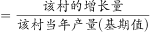
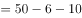
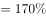

# 2021年广西区考公务员录用考试《行测》题（网友回忆版）

> 省考 · 2021 年 · 6 个模块 · 共 110 题

- [政治理论](#%E6%94%BF%E6%B2%BB%E7%90%86%E8%AE%BA) · 2 题
- [常识判断](#%E5%B8%B8%E8%AF%86%E5%88%A4%E6%96%AD) · 8 题
- [言语理解与表达](#%E8%A8%80%E8%AF%AD%E7%90%86%E8%A7%A3%E4%B8%8E%E8%A1%A8%E8%BE%BE) · 40 题
- [数量关系](#%E6%95%B0%E9%87%8F%E5%85%B3%E7%B3%BB) · 10 题
- [判断推理](#%E5%88%A4%E6%96%AD%E6%8E%A8%E7%90%86) · 40 题
- [资料分析](#%E8%B5%84%E6%96%99%E5%88%86%E6%9E%90) · 10 题

---

## 政治理论

### 第 1 题　qid 3522653 · 新思想

2020年10月14日，习近平总书记在深圳经济特区建立40周年庆祝大会上发表讲话，对经济特区建设给予了充分肯定。下列关于经济特区建设的表述不准确的是：

- **A**. 1978年12月，党的十一届三中全会作出把党和国家工作重心转移到经济建设上来、实行改革开放的历史性决策
- **B**. 1979年7月，党中央、国务院批准广东、福建两省实行“特殊政策、灵活措施、先行一步”，并试办出口特区
- **C**. 1980年8月，党和国家批准在深圳、珠海、上海、厦门设置经济特区　✅
- **D**. 1988年4月，党和国家批准建立海南经济特区

**答案**：C

**官方解析**

本题考查政治常识。
A项正确，1978年12月，党的十一届三中全会作出把党和国家工作重心转移到经济建设上来、实行改革开放的历史性决策，实现了新中国成立以来党的历史的伟大转折。
B项正确，1979年7月，党中央、国务院批准广东、福建两省实行“特殊政策、灵活措施、先行一步”，并试办出口特区。
C项错误，1980年8月，党和国家批准在深圳、珠海、汕头、厦门设置经济特区。
D项正确，1988年4月，党和国家批准建立海南经济特区，明确要求发挥经济特区对全国改革开放和社会主义现代化建设的重要窗口和示范带动作用。
本题为选非题，故正确答案为C。

---

### 第 2 题　qid 3522658 · 新思想

2020年12月8日，中国国家主席习近平同尼泊尔总统班达里互致信函，共同宣布珠穆朗玛峰最新高程为8848.86米。下列关于珠穆朗玛峰的形成原因与“8848.86米”的内涵，对应正确的是：

- **A**. 板块挤压―雪面高程　✅
- **B**. 板块挤压―岩石面高程
- **C**. 板块张裂―雪面高程
- **D**. 板块张裂―岩石面高程

**答案**：A

**官方解析**

本题考查地理国情。
珠穆朗玛峰的高度实际上每年都在发生着变化，珠峰地区甚至是整个青藏高原，其实是由印度板块和亚欧板块的挤压碰撞而形成的，同时受板块运动的影响，珠峰地区一直在不断的移动。而这次公布的8848.86米的珠峰高程是包含珠峰峰顶雪面的高度，不是岩石面高度。对此中尼珠峰测量联合技术委员会主席党亚民表示，这次测算记录的雪面高是中尼双方共同认可的结果。B、C、D三项错误，A项正确。
故正确答案为A。

---

## 常识判断

### 第 1 题　qid 3522652 · 人文常识

下列对我国“十四五”时期经济社会发展主要目标表述错误的是：

- **A**. 经济发展取得新成效和改革开放迈出新步伐
- **B**. 创新驱动取得新优势和国内市场形成发展新格局　✅
- **C**. 民生福祉达到新水平和国家治理效能得到新提升
- **D**. 社会文明程度得到新提高和生态文明建设实现新进步

**答案**：B

**官方解析**

本题考查政治常识。
2020年10月29日，中国共产党第十九届中央委员会第五次全体会议通过的《国民经济和社会发展第十四个五年规划和2035年远景目标纲要》中指出：“‘十四五’时期经济社会发展主要目标。锚定二〇三五年远景目标，综合考虑国内外发展趋势和我国发展条件，坚持目标导向和问题导向相结合，坚持守正和创新相统一，今后五年经济社会发展要努力实现以下主要目标：经济发展取得新成效；改革开放迈出新步伐；社会文明程度得到新提高；生态文明建设实现新进步；民生福祉达到新水平；国家治理效能得到新提升。”
本题为选非题，故正确答案为B。

---

### 第 2 题　qid 3523517 · 人文常识

党的十九届五中全会审议通过的《中共中央关于制定国民经济和社会发展第十四个五年规划和二〇三五年远景目标的建议》，明确提出到2035年建成社会主义文化强国的远景目标。关于社会主义文化强国建设目标任务，下列表述正确的有几项？
①提高社会文明程度
②提升公共文化服务水平
③健全现代文化产业体系
④加强对外文化交流和多层次文明对话

- **A**. 1项
- **B**. 2项
- **C**. 3项
- **D**. 4项　✅

**答案**：D

**官方解析**

本题考查政治常识。
党的十九届五中全会审议通过的《中共中央关于制定国民经济和社会发展第十四个五年规划和二〇三五年远景目标的建议》中在繁荣发展文化事业和文化产业，提高国家文化软实力方面部署了三个方面的重点任务：一是提高社会文明程度，二是提升公共文化服务水平，三是健全现代文化产业体系。以讲好中国故事为着力点，创新推进国际传播，加强对外文化交流和多层次文明对话。
故正确答案为D。

---

### 第 3 题　qid 3522655 · 人文常识

“秦王扫六合，虎视何雄哉！挥剑决浮云，诸侯尽西来。”下列历史事件不是发生在此诗所咏“秦王”在位期间的是：

- **A**. 蔺相如完璧归赵　✅
- **B**. 唐雎不辱使命
- **C**. 荆轲刺秦王
- **D**. 郑国疲秦

**答案**：A

**官方解析**

本题考查人文常识。
“秦王扫六合，虎视何雄哉！挥剑决浮云，诸侯尽西来。”出自唐代李白的《古风·秦王扫六合》，意为秦始皇嬴政以虎视龙卷之威势，扫荡、统一了战乱的中原六国。天子之剑一挥舞，漫天浮云消逝，各国的富贵诸侯尽数迁徙到咸阳。
A项错误，蔺相如完璧归赵发生于战国时期，讲述的是秦昭王许诺赵王以十五座城换取和氏璧，但当使臣蔺相如献璧之后，秦昭王却不提换城之事，蔺相如施巧计使和氏璧重归赵国。蔺相如完璧归赵并非发生在秦始皇嬴政在位期间。
B项正确，唐雎不辱使命讲述的是唐雎奉安陵君之命出使秦国，与秦王展开面对面的激烈斗争，终于折服秦王，保存国家，完成使命的经过，歌颂了唐雎不畏强暴、敢于斗争的爱国精神。其中的秦王即秦始皇嬴政，当时其还未称皇帝。
C项正确，荆轲刺秦王讲述了战国时期荆轲刺杀秦王嬴政这一悲壮的历史故事，反映了当时的社会政治情况，表现了荆轲重义轻生、为燕国勇于牺牲的精神。
D项正确，郑国疲秦中的郑国是韩国派往秦国的一个间谍，韩桓王试图通过他游说秦王嬴政修筑一条连接泾水和洛水的运河，达疲秦之效，以阻止秦国进攻韩国的步伐。岂知事与愿违，“疲秦之计”倒成了“强国之策”，运河的修筑成功，使得一向落后的关中农业迅速发展起来。
本题为选非题，故正确答案为A。

---

### 第 4 题　qid 3523538 · 法律常识

下列关于2021年3月1日起施行的《中华人民共和国长江保护法》的亮点描述准确的是：
①做好了统筹协调、系统保护的顶层设计
②坚持把保护和修复长江流域生态环境放在压倒性位置
③突出共抓大保护、不搞新开发
④坚持责任导向，加大处罚力度
⑤切实增强了长江保护和发展的系统性、整体性、协同性

- **A**. ①③④
- **B**. ②④⑤
- **C**. ①②③④
- **D**. ①②④⑤　✅

**答案**：D

**官方解析**

本题考查法律常识。
①正确，该法中规定国家建立长江流域协调机制，统一指导、统筹协调、整体推进长江保护工作；按照中央统筹、省负总责、市县抓落实的要求，建立长江保护工作机制，明确各级政府及其有关部门、各级河湖长的职责分工；建立区域协调协作机制，明确长江流域相关地方根据需要在地方性法规和政府规章制定、规划编制、监督执法等方面开展协调与协作，切实增强长江保护和发展的系统性、整体性、协同性。故该法做好了统筹协调、系统保护的顶层设计。
②正确，该法通过规定更高的保护标准、更严格的保护措施，加强山水林田湖草整体保护、系统修复。如强化水资源保护，加强饮用水水源保护和防洪减灾体系建设，完善水量分配和用水调度制度，保证河湖生态用水需求；落实党中央关于长江禁渔的决策部署，加强禁捕管理和执法工作等。故该法体现了把保护和修复长江流域生态环境放在压倒性位置。
③错误，根据《中华人民共和国长江保护法》第三条规定：“长江流域经济社会发展，应当坚持生态优先、绿色发展，共抓大保护、不搞大开发。”“不搞新开发”表述错误。
④正确，该法强化考核评价与监督，实行长江流域生态环境保护责任制和考核评价制度，建立长江保护约谈制度，规定国务院定期向全国人大常委会报告长江保护工作；坚持问题导向，针对长江禁渔、岸线保护、非法采砂等重点问题，在现有相关法律的基础上补充和细化有关规定，并大幅提高罚款额度，增加处罚方式，补齐现有法律的短板和不足，切实增强法律制度的权威性和可执行性。故该法体现了坚持责任导向，加大处罚力度。
⑤正确，该法做好了统筹协调、系统保护的顶层设计，明确了各方职责分工，切实增强长江保护和发展的系统性、整体性、协同性。
故①②④⑤正确。
故正确答案为D。

---

### 第 5 题　qid 3523535 · 人文常识

中华传统美德是中华文化精髓，蕴含着丰富的思想道德资源，凝聚着数千年来中华民族关于个人品德修养和行为规范的思考和表达。下列关于中华传统美德的表述正确的有几项？
①天行健，君子以自强不息
②天下兴亡，匹夫有责
③美德即知识
④仁者爱人

- **A**. 1项
- **B**. 2项
- **C**. 3项　✅
- **D**. 4项

**答案**：C

**官方解析**

本题考查人文常识。
①正确，“天行健，君子以自强不息”出自《易传》中的《象传》，意为宇宙不停运转，人应效法天地，永远不断地前进。体现了传统美德中的励志自强、崇尚精神境界。
②正确，“天下兴亡，匹夫有责”是清朝初年著名儒者顾炎武的社会主张，意为国家的兴盛或衰亡，每个普通人都有一份责任。体现了传统美德中爱国奉献、以天下为己任的社会责任感。
③错误，“美德即知识”是古希腊哲学家苏格拉底的道德伦理命题，出自公元前420年柏拉图的著作《美诺篇》。“美德”指人的所有优秀品质，“知识”指整个世界的理念知识和善的知识。苏格拉底认为，道德即知识，道德与知识是同一的，美德并非天生，而是得自于教育。其不属于中华传统美德的表述。
④正确，“仁者爱人”出自《孟子·离娄章句下》，意为仁者是充满慈爱之心，满怀爱意的人；仁者是具有大智慧、人格魅力的人。体现了传统美德中乐群贵和，强调人际和谐的精神。
综上所述，表述正确的有①②④三项。
故正确答案为C。

---

### 第 6 题　qid 3522672 · 人文常识

下列关于吊扇悬挂点的拉力描述正确的有：
①吊扇不转动时，悬挂点的拉力等于重力
②吊扇转动时，悬挂点的拉力小于重力
③吊扇转速越大，悬挂点的拉力越小
④吊扇转速越小，悬挂点的拉力越小

- **A**. 1项
- **B**. 2项
- **C**. 3项　✅
- **D**. 4项

**答案**：C

**官方解析**

本题考查科技常识。
①、②正确，吊扇不转动时，悬挂点对吊扇的拉力等于吊扇的重力，吊扇旋转时要向下扇风，即对空气有向下的压力，根据牛顿第三定律，空气也对吊扇有一个向上的反作用力，使得悬挂点对吊扇的拉力变小。
③正确、④错误，吊扇转动时空气对吊扇叶片有向上的反作用力，转速越大，此反作用力越大，悬挂点的拉力越小。
因此①②③正确。
故正确答案为C。

---

### 第 7 题　qid 3522702 · 地理国情

下列关于黄河流域的说法错误的是:

- **A**. 陕西境内秦岭以北的河流皆属该流域
- **B**. 以“水少沙多、水沙异源”为突出特点
- **C**. 该流域下游常因泥沙堆积形成“地上河”
- **D**. “泾渭分明”的现象发生在该流域的上游　✅

**答案**：D

**官方解析**

本题考查地理国情。

黄河发源于青海省中部，巴颜喀拉山北麓，流经青海、四川、甘肃、宁夏、内蒙古、陕西、山西、河南、山东9个省、自治区，注入渤海，全长5464千米，是中国第二大河。

A项正确，陕西境内绝大部分为外流河，分属黄河、长江两大水系。从地域分布上看，秦岭以南的长江水系，流域面积占全省的，水资源量占到全省总量的，而秦岭以北的黄河水系，流域面积占全省的，水资源量仅占。

B项正确，黄河主要流经干旱、半干旱和半湿润区，降水量较少，蒸发量大，所以水量小，中游流经黄土高原地区，水土流失严重，含沙量大。黄河的水量主要来自兰州以上的上游河段，而泥沙主要来自中游的黄土高原，具有“水沙异源”的突出特点。

C项正确，黄河流域西界巴颜喀拉山，北抵阴山，南至秦岭，东注渤海。流域内地势西高东低，高差悬殊，形成自西而东、由高及低三级阶梯。第三级阶梯地势低平，绝大部分为海拔低于100米的华北大平原，包括下游冲积平原、鲁中丘陵和河口三角洲。黄河流入冲积平原后，河道宽阔平坦，泥沙沿途沉降淤积，河床高出两岸地面3-5米，甚至10米，形成“地上河”。

D项错误，黄河上游流经青海、四川、甘肃、宁夏、内蒙古五省区的19个市州。而“泾渭分明”是指黄河的支流“泾河”和“渭河”，两河位于黄河流域的中游。渭河位于黄河腹地大“几”字形基底部位，是黄河最大支流，同时也是向黄河输送水、沙最多的支流；泾河，发源于宁夏泾源县六盘山东麓，于陕西高陵县注入渭河，是渭河的主要来沙区。两条河流的清与浊常随着季节发生交替变化，夏季丰水期两条河流含沙量都很高，界限不清晰。到了冬季枯水期，泾河的含沙量会下降，这时候就会呈现出“泾渭分明”的标志性现象。

本题为选非题，故正确答案为D。

---

### 第 8 题　qid 3522701 · 人文常识

王某向李某借款1万元，李某当场向王某交付现金1万元，王某向李某出具借条一份，张某在该借条上签字，后王某没有按时还钱，李某将王某和张某同时起诉至法院，要求王某还钱，并要求张某承担连带责任。关于张某的责任，下列说法正确的是:

- **A**. 张某只是作为见证人签字，无须承担任何责任
- **B**. 张某在别人的借条上签字，应当推定为保证人，并承担保证责任
- **C**. 张某在别人的借条上签字，视同共同借款人，应当承担共同还款责任
- **D**. 只要借条上没有任何明确表述或其他事实表明张某愿意承担保证责任的，张某即无须承担任何责任　✅

**答案**：D

**官方解析**

本题考查法律常识。
根据《最高人民法院关于审理民间借贷案件适用法律若干问题的规定》第二十条规定：“他人在借据、收据、欠条等债权凭证或者借款合同上签名或者盖章，但是未表明其保证人身份或者承担保证责任，或者通过其他事实不能推定其为保证人，出借人请求其承担保证责任的，人民法院不予支持。”故只要借条上没有任何明确表述或其他事实表明张某愿意承担保证责任的，张某即无须承担任何责任。
故正确答案为D。

---

## 言语理解与表达

### 第 1 题　qid 3522661 · 逻辑填空

大学里有一些“冷门”专业，比如古生物专业、梵语专业等。有人可能质疑这样的专业有些“浪费”教育资源，因为它们很难与产业结合转化成生产力，培养出来的学生也很难在就业市场上            。但或许这样专业的存在，本来就不能简单地用世俗的眼光来打量。
填入画横线部分最恰当的一项是：

- **A**. 如鱼得水
- **B**. 炙手可热　✅
- **C**. 学以致用
- **D**. 鹤立鸡群

**答案**：B

**官方解析**

根据前文“它们很难与产业结合转化成生产力”可知，相关专业的学生在就业市场中对口的工作较少，在就业市场中难以受欢迎，B项“炙手可热”意思是手一靠近就感觉很烫，比喻气焰盛、权势大，使人不敢靠近，现在也多用于比较火热，填入文中可以体现出学生在就业市场中“受欢迎”之意，且能够对应前文“冷门”，当选。
A项“如鱼得水”比喻得到跟自己十分投合的人或对自己很合适的环境，无法对应前文“冷门”，排除；
C项“学以致用”指为了实际应用而学习，文段指出冷门专业难以与产业结合，并未指出冷门专业的学生难以应用，排除；
D项“鹤立鸡群”比喻一个人的仪表或才能在周围一群人里显得很突出，文段并没有“突出”之意，排除。
故正确答案为B。
【文段出处】《这个专业，全校就她一个》

---

### 第 2 题　qid 3522654 · 逻辑填空

区块链的诸多特征使其成为一项备受期待的革命性技术，而目前这一技术的应用潜能还远未被完全开发。今天我们看到的区块链技术在金融、物流、医疗、保险等领域的应用，仅是             般的一瞥所见，尚有许多应用正在被尝试、推广。
填入画横线部分最恰当的一项是：

- **A**. 浮光掠影　✅
- **B**. 走马观花
- **C**. 蜻蜓点水
- **D**. 浅尝辄止

**答案**：A

**官方解析**

根据“仅是······般的一瞥所见，尚有许多应用正在被尝试、推广”可知，文段要体现的是区块链现在所涉及的应用领域仅是我们观察到的一部分，还有正在发掘的领域，且横线要与“一瞥所见”构成对应，体现出我们一眼看到这些领域后得到的印象。A项“浮光掠影”比喻观察不细致，得到的只是事物的一些表面现象，侧重观察的结果是印象不深刻，符合文意，当选。
B项“走马观花”比喻匆忙地不深入细致地观察事物，侧重于观察的过程很粗略，横线处对应看到的结果，而非看这些领域的过程，与文意不符，排除。C项“蜻蜓点水”比喻浮浅地接触，浮皮潦草，很不深入地做事，侧重做事情不深入，D项“浅尝辄止”比喻不往深处研究，不深入钻研，侧重于做事情不深入钻研，文段体现的是我们今天看到的区块链，强调的是“看”的结果，并非强调“做事”，均与文意不符，排除。
故正确答案为A。
【文段出处】《挖掘区块链商机 美国在行动》

---

### 第 3 题　qid 3522656 · 逻辑填空

教育，最终都是为了促进人的全面发展，帮助下一代提高生存能力。批评惩戒和赏识鼓励是            的两种方式，有些时候，“当头棒喝”甚至比温言软语更有效果。
填入画横线部分最恰当的一项是：

- **A**. 如影随形
- **B**. 并行不悖　✅
- **C**. 各有所长
- **D**. 不可或缺

**答案**：B

**官方解析**

根据后文“有些时候，‘当头棒喝’甚至比温言软语更有效果”可知，横线处应表示，两种方式都有效果，并不存在“当头棒喝”就效果不好之意。B项“并行不悖”指同时进行，互相不违背，可体现出两种方式虽看似完全相反，但都可以起到教育作用之意，符合文意，当选。
A项“如影随形”指好像影子总是跟着身体一样。比喻两个事物关系密切或两个人关系密切不能分离。“批评惩戒”与“赏识鼓励”并非如影随形，往往是单一出现，排除；
C项“各有所长”指各有各的长处、优点，一般多指人才而言，且该词一般用于表示大家都有自己的优势，不相上下，与后文文意不符，排除；
D项“不可或缺”表示非常重要，不能有一点缺失，文段并未体现出两种方式都不能少之意，与前后文语境不符，排除。
故正确答案为B。
【文段出处】《缺乏“棒喝”的教育有缺陷》

---

### 第 4 题　qid 3522671 · 逻辑填空

几乎所有成年人都只能使用左脑处理语句。但对儿童而言，任何一个大脑半球的损伤都不太可能影响语言学习，这说明在早期阶段人脑的两个半球都具有这种能力。美国乔治敦大学神经学家指出，这为神经损伤提供了一种        机制。例如，如果左半球受到围产期中风的        ，新生儿将使用右半球学习语言。
依次填入画横线部分最恰当的一项是：

- **A**. 赔偿 祸害
- **B**. 补偿 损害　✅
- **C**. 补充 损失
- **D**. 填充 毁坏

**答案**：B

**官方解析**

第一空，搭配“机制”，体现早期阶段人脑的两个半球对于“神经损伤”的功用，结合横线后的例子可知，当新生儿大脑左半球遭受中风时，右半球可以有效补位，以减少对语言学习的影响。B项“补偿”指补足，用以抵消损失、消耗等，C项“补充”指原来不足或有损失时，增加一部分，二者均符合语境，保留。A项“赔偿”指由于自己的行动而使他人蒙受损失从而给予补偿，新生儿的这一机制是对自身神经损伤的补偿，而非他人，不符合文意，排除；D项“填充”多指对某个空间的填补，与文段语境不符，排除。
第二空，搭配“中风”，体现中风对大脑左半球的伤害。B项“损害”指使事业、利益、健康、名誉等蒙受损失，与“中风”搭配得当，当选。C项“损失”指没有代价地消耗或失去，多与“金钱”“产品”等具象化事物搭配，与“中风”搭配不当，排除。
故正确答案为B。
【文段出处】《研究显示：儿童同时使用左右半脑进行语言学习》

---

### 第 5 题　qid 3522674 · 逻辑填空

灵感，一个很美的词汇，天生带有古灵精怪的流动感。它如同一尾滑溜溜的金鱼，极难抓，但真的抓住时，它又在手心扭动，让人            ，一不小心又让它溜走了。灵感是如此琢磨不透又难以控制。那到底如何才能在        灵感的游戏中享受到最大的快乐呢?
依次填入画横线部分最恰当的一项是：

- **A**. 一筹莫展 追寻
- **B**. 望洋兴叹 激发
- **C**. 不知所措 捕捉　✅
- **D**. 爱莫能助 点燃

**答案**：C

**官方解析**

第一空，由前文“它又在手心扭动”以及后文“灵感是如此琢磨不透又难以控制”可知，横线处形容“灵感”难以把握，人们对其无法控制。A项“一筹莫展”形容遇事拿不出一点办法，没有任何进展，C项“不知所措 ”形容不知道怎么办才好，均可表达人无法控制住“灵感”的意思，保留。B项“望洋兴叹”原指在伟大事物面前感叹自己的渺小，也比喻做事时因力不胜任或没有条件而感到无可奈何，通常形容较为宏观，复杂的事物，与“在手心扭动”对应不当，排除；D项“爱莫能助”指虽然心中关切同情，却没有力量帮助，文段并没有体现“帮助”之意，排除。
第二空，横线处搭配“灵感”，且由前文“灵感是如此琢磨不透又难以控制”可知，横线处表达“控制”住灵感之意。C项“捕捉”意为捉住某人或动物使其落入自己手中，符合文意，且“捕捉灵感”搭配得当，当选。A项“追寻”指追随，无法体现出“控制”之意，不符合文意，排除。
故正确答案为C。
【文段出处】《如何捕捉生活中的灵感》

---

### 第 6 题　qid 3522604 · 逻辑填空

节约资源、减少垃圾生产成为某种意义上的公共事务，很容易遭遇“搭便车困境”——人人都想            ，最终会导致公共事务乏人问津。节约资源的功效并没有那么            ，需要人们久久为功；付出没有得到及时、有效的反馈与回报，难免会影响公众参与。
依次填入画横线部分最恰当的一项是：

- **A**. 蜂拥而上 妙手回春
- **B**. 鸠占鹊巢 神通广大
- **C**. 据为己有 一劳永逸
- **D**. 坐享其成 立竿见影　✅

**答案**：D

**官方解析**

第一空，由破折号可知，所填词语是对“搭便车困境”的解释说明。“搭便车”本义为自己不想开车，所以乘坐他人的便车；引申义为，自己不想付出努力而去享受他人带来的便利。D项“坐享其成”指的是自己不出力，而享受别人取得的成果，符合文意，保留。A项“蜂拥而上”指的是许多人一起涌上来，未体现出自己不出力，享受他人成果之意，不符合文意，排除；B项“鸠占鹊巢”指的是强占别人的房屋、土地、产业等，C项“据为己有”指的是占据为自己所拥有，“搭便车”并非强调占据别人的东西归自己所有，均与文意不符，排除。
第二空，代入验证，根据“并没有······需要······”可知，横线处与后文“久久为功”语义相反，体现“时间短”之意。D项“立竿见影”指见效快，符合文意，当选。
故正确答案为D。
【文段出处】《“零浪费”用更深刻的环保观念拥抱美好生活》

---

### 第 7 题　qid 3523498 · 逻辑填空

从长远看，电影产业的发展必然要拥抱网络平台，但是院线依然具有            的优势，观影社交仪式感、巨幕、3D沉浸式体验以及高度还原的环绕立体声，这些都是网上观影所不具备的，影院和互联网带来的始终是两种            的观影体验。
依次填入画横线部分最恰当的一项是：

- **A**. 遥遥领先 大相径庭
- **B**. 独一无二 背道而驰
- **C**. 不可替代 截然不同　✅
- **D**. 无与伦比 各有所长

**答案**：C

**官方解析**

第一空，根据后文“观影社交仪式感······这些都是网上观影所不具备的”可知，横线处应体现院线的这些特点是网上观影所没有的，B项“独一无二”形容唯一的，没有与之相同的，C项“不可替代”指某人或某物是不能够用他人或他物来进行代替的，均符合文意，保留。A项“遥遥领先”指远远地走在最前面，强调比别人快，与文意不符，排除；D项“无与伦比”指事物非常完美，没有能跟他相比的，文段并未说明院线的这些特征是最好的，语义程度过重，排除。
第二空，形容影院和互联网所带来的观影体验，根据前文可知，影院和互联网所带来的观影体验应该是不同的，C项“截然不同”形容两种事物没有一点共同之处，符合文意，当选。B项“背道而驰”指背离正确的目标，朝相反的方向走，文段并未强调偏离正道，与文意不符，排除。
故正确答案为C。
【文段出处】《&lt;囧妈&gt;等新片临时变阵 院线电影有了发行新模式》

---

### 第 8 题　qid 3522570 · 逻辑填空

量子计算将极大促进当前人工智能及其应用的发展，深刻地        包括基础教育在内的众多领域。特别是，借助于量子计算技术，人类对于微观世界的认识以及宏观世界的探索将得到极大扩展，从而引发人类思维能力的          提升。
依次填入画横线部分最恰当的一项是：

- **A**. 融合 战略性
- **B**. 改变 根本性　✅
- **C**. 解决 突破性
- **D**. 支持 阶段性

**答案**：B

**官方解析**

第一空，搭配“领域”，“领域”指特定的范围或区域，B项“改变”指事物变得和原来不一样，与“领域”搭配恰当，保留。A项“融合”指融为一体，文中并无众多领域融为整体之意，不符合文意，排除；C项“解决”指处理使有结果，D项“支持”指支撑、赞同或鼓励，均与“领域”搭配不当，排除。
第二空，代入验证。搭配“提升”，B项“根本性”意在强调基础或本质，根据文意可知，人类对世界的认识发生了本质上的改变，搭配恰当，符合文意，当选。
故正确答案为B。
【文段出处】《量子科技为何成为多国战略布局的重点领域》

---

### 第 9 题　qid 3523504 · 逻辑填空

ADHD，也就是通常所说的“多动症”，在儿童时期常以多动、冲动、注意力缺陷等为主要表现，其中很多人的症状会        到成年期。成人多动症患者更是一个被严重        的群体，我们给这个群体贴了很多标签，如“不靠谱”“拖延症”“低情商”“冲动狂”等。
依次填入画横线部分最恰当的一项是：

- **A**. 影响 歧视
- **B**. 延迟 误解
- **C**. 保留 排斥
- **D**. 延续 忽视　✅

**答案**：D

**官方解析**

第一空，搭配“成年期”，横线处所表达的意思为儿童时期的症状会持续到“成年期”，D项“延续”表示持续，语义符合，保留。A项“影响”表示对人或事物所起的作用，并非持续之意，并且与“成年期”搭配不当，可与具体的“工作”“生活”等进行搭配，排除；B项“延迟”表示推迟，语义不符，排除；C项“保留”侧重保存，文段并非此意，排除。
第二空，代入验证。通过后面的解释，给这个群体添加了很多非正常标签，则体现出对该症状严重忽略，D项“忽视”体现了从未正视，疏忽、不在意，符合文意，当选。
故正确答案为D。
【文段出处】《“你静下来心来学习啊”，对不起，这对我来说有点难》

---

### 第 10 题　qid 3522591 · 逻辑填空

国无德不兴，人无德不立。如果一个民族、一个国家没有共同的核心价值观，            ，行无依归，那这个民族、这个国家就无法前进。这样的情形，在我国历史上，在当今世界上，都            。
依次填入画横线部分最恰当的一项是：

- **A**. 莫衷一是  屡见不鲜　✅
- **B**. 自以为是  数不胜数
- **C**. 各行其是  不一而足
- **D**. 积非成是  层出不穷

**答案**：A

**官方解析**

第一空，根据横线前“没有共同的核心价值观”和后文“行无依归”可知，填入横线处的成语强调没有统一的思想作支撑。A项“莫衷一是”指各有各的意见，不能得出一致的结论，置于此处能够体现出思想不统一，符合文意，保留。B项“自以为是”形容认为自己的看法和做法都正确，不接受别人的意见，侧重强调认为自己是正确的，与文意无关，排除；C项“各行其是”形容按照各自认为对的去做，比喻各搞一套，侧重强调做法，与文意无关，排除；D项“积非成是”指长期所形成的错误，往往被当作正确的，与文意无关，排除。
第二空，代入验证，根据前文“这样的情形，在我国历史上，在当今世界上”可知，填入横线处的成语表达这样的情形很常见。A项“屡见不鲜”意思是常常见到，并不新奇，符合文意，当选。
故正确答案为A。
【文段出处】《习近平：青年要自觉践行社会主义核心价值观——在北京大学师生座谈会上的讲话》

---

### 第 11 题　qid 3522596 · 逻辑填空

学术研究是一项严谨缜密的科学工作，            是其研究的前提基础。学术不求真便会没有标准，当真正的学术研究被        、舆论炒作成为风气之时，便意味着学术低谷的到来。
依次填入画横线部分最恰当的一项是：

- **A**. 实事求是 放弃
- **B**. 有的放矢 遗忘
- **C**. 去伪存真 冷落　✅
- **D**. 推陈出新 忽视

**答案**：C

**官方解析**

第一空，根据文段“学术研究是一项严谨缜密的科学工作”“学术不求真便会没有标准”可知，横线处体现的是学术研究要严谨缜密、要求真，A项“实事求是”指从实际情况出发，C项“去伪存真”意思是除掉虚假的，留下真实的，均符合文意，保留。B项“有的放矢”比喻说话做事有针对性，文段未体现针对性，排除；D项“推陈出新”指去掉旧事物的糟粕，取其精华，并使它向新的方向发展，与文意不符，排除。
第二空，根据后文“便意味着学术低谷的到来”可知，横线处词语程度较轻，C项“冷落”形容受到冷淡的待遇，置于此处程度较轻，符合文意，当选。A项“放弃”搭配“学术研究”，程度过重，排除。
故正确答案为C。
【文段出处】《造假与炒作的背后》

---

### 第 12 题　qid 3522582 · 逻辑填空

2020年是紫禁城建成600年，也是故宫博物院成立95周年。紫禁城作为明清两代皇宫，它是中华民族宝贵的传统文化        ，也是著名的世界文化遗产。它不仅拥有中国古代最        的宫殿建筑群，还拥有一百八十余万件珍贵文物和大量的文献档案，承载着丰富的历史信息和文化印记，是中华民族记忆传统、        文脉、增强文化自信的重要资源。
依次填入画横线部分最恰当的一项是：

- **A**. 财产 巨大 继承
- **B**. 产业 庞大 延续
- **C**. 遗产 宏伟 传承　✅
- **D**. 象征 丰富 接续

**答案**：C

**官方解析**

第一空，横线处所填词语要形容“紫禁城”，且需要搭配“传统文化”，C项“遗产”泛指历史上遗留下来的精神财富或物质财富，由“紫禁城建成600年”可知，它是历史遗留的宝贵财富，符合文意，且“遗产”与“传统文化”搭配得当，保留。A项“财产”指拥有的金钱、物资、房屋、土地等物质财富，与“传统文化”搭配不当，排除；B项“产业”可以指私有财产，如土地、房屋、工厂等，也可以指现代工业生产行业，“紫禁城”并非私有财产，也不是具体生产行业，排除；D项“象征”指能用来暗示特定的人、物或事理的具体的东西，如“白色是纯洁的象征”，而文段不存在这种暗示关系，排除。
第二空，代入验证，横线处所填词语搭配“宫殿建筑群”，C项“宏伟”表示宏大雄伟，多与“建筑”类搭配，用于此处搭配得当，保留。
第三空，代入验证，横线处所填词语搭配“文脉”，C项“传承”表示传授和继承，搭配得当，符合文意，当选。
故正确答案为C。
【文段出处】《600年的记忆：紫禁城历史上的几个关键词》

---

### 第 13 题　qid 3522601 · 逻辑填空

随着医疗设备技术的发展，医疗市场也对非侵入式检测设备提出了更高的        ——准确、及时且按需实现患者监测。因此，如果一项技术能够以非侵入的方式反复测量个体的健康状态，且成本不高，那么它将有助于预防和预测疾病，提高诊疗决策的            。
依次填入画横线部分最恰当的一项是：

- **A**. 要求 精准性　✅
- **B**. 门槛 前瞻性
- **C**. 期望 创新性
- **D**. 标准 主动性

**答案**：A

**官方解析**

第一空，横线处搭配“提出”，A、C、D三项均搭配恰当，保留。B项“门槛”搭配不当，排除。
第二空，根据前文“准确、及时且按需”可知，文段强调随着医疗设备技术的进步，对待疾病的处理也将更加科学迅速、精确高效。A项“精准性”符合文意，当选。C项“创新性”侧重打破常规，提出不一样的想法或措施，文段并非强调诊疗决策的“特别”，而是要通过技术进步来让决策更加科学化、精准化，不符合文意，排除；D项“主动性”强调按照自己的意志行动，文段并没有体现决策是主动或被动做出，与文意无关，排除。
故正确答案为A。
【文段出处】新华网《“智能马桶”可监测用户健康》

---

### 第 14 题　qid 3522605 · 逻辑填空

世界上的一万多种鸟，其实各有各的美丽，从各种华丽的羽毛，到鸟喙的形状，到鸣唱的声音，不能不让我们        生物多样性的神奇。进化论之父达尔文在加拉帕戈斯群岛上通过观察当地鸟类发现，虽然这些鸟类很明显长得很相似，有着共同的祖先，但是它们的鸟喙形状却            。
依次填入画横线部分最恰当的一项是:

- **A**. 惊叹 大相径庭　✅
- **B**. 惊奇 毫无二致
- **C**. 探索 云泥之别
- **D**. 追寻 异曲同工

**答案**：A

**官方解析**

本题可从第二空入手，横线前出现转折关联词“却”可知前后语义相反，横线前“鸟类很明显长得很相似，有着共同的祖先”体现“相似、一样”的含义，因此横线处应体现“不一样、不同”之意。A项“大相径庭”比喻相差很远，大不相同，符合文意，保留。B项“毫无二致”形容完全一样，D项“异曲同工”比喻一件事情的做法不同而都巧妙地达到目的，均与文意相悖，排除；C项“云泥之别”比喻地位的高下相差极大，文段并非论述地位的高下，仅在论述形状的不同，与文意不符，排除。
第一空，代入验证，A项“惊叹”指惊奇赞叹，表达对生物多样性的赞美，感情色彩积极，符合文段语境，当选。
故正确答案为A。
【文段出处】《热带雨林中的鸟类和深海中的蠕虫，我们该保护哪个？》

---

### 第 15 题　qid 3522577 · 逻辑填空

原创是作品的生命力之源，抄袭无异于            。影视行业想要成为常青树，优质的原创作品是根基。如果任由抄袭之风盛行，        抄袭作者活跃在屏幕上，将        从业者的生存环境，消耗整个行业的未来前景。
依次填入画横线部分最恰当的一项是：

- **A**. 自相残杀 放纵 剥蚀
- **B**. 自掘坟墓 纵容 腐蚀　✅
- **C**. 自投罗网 放任 消蚀
- **D**. 自欺欺人 容许 磨蚀

**答案**：B

**官方解析**

第一空，根据横线前的“无异于”可知，横线处所填词语是对前文的解释说明。由“原创是作品的生命力之源”可知，抄袭则会让作品失去生命。B项“自掘坟墓”是指自己的所作所为就像在替自己挖掘坟墓一样，比喻自寻死路，符合文意，保留。C项“自投罗网”指自己投到罗网里去，比喻自己送死，也可以体现让作品失去生命，保留。A项“自相残杀”指自己人互相杀害，文段未提及互相杀害，排除。D项“自欺欺人”指欺骗自己，也欺骗别人，文段未提及欺骗自己和欺骗别人，与文意无关，排除。
第二空，根据横线前的“任由抄袭之风盛行”可知，横线处表示对抄袭作者不加约束，任由其发展，B项“纵容”指对错误行为不加制止、任其发展，C项“放任”指听其自然，不加约束或干涉，两项均符合文意，保留。
第三空，搭配“生存环境”，根据横线后的“消耗整个行业的未来前景”可知，对抄袭不加约束会产生不好的结果，从业者的生存环境会遭到破坏，B项“腐蚀”比喻坏的思想或环境，使人逐渐变质堕落，与“生存环境”搭配恰当且符合文意，当选。C项“消蚀”意为消耗、消损，多指由于风或者其他气候因素所致的侵蚀而使地面降低，和题干中的“生存环境”搭配不当，排除。
故正确答案为B。
【文段出处】人民资讯《影视圈的抄袭之风，怎么破？》

---

### 第 16 题　qid 3522589 · 逻辑填空

大多数群居的哺乳动物，雌性个体怀孕生育后，随着后代迅速        ，它们也会很快        原有的社会地位。然而在人类的大部分历史中，生育和照顾幼儿几乎是女性壮年时期的全职工作。有研究认为，人类婴儿的          ，让人类与母亲的关系与一般的动物相比更加紧密。
依次填入画横线部分最恰当的一项是：

- **A**. 成熟 改变 重要性
- **B**. 分离 恢复 可塑性
- **C**. 长大 获得 依附性
- **D**. 独立 回归 脆弱性　✅

**答案**：D

**官方解析**

第一空，根据前后文可知，横线处应体现后代迅速成长之意，A项“成熟”、C项“长大”、D项“独立”均符合文意，保留。B项“分离”与“群居”矛盾，排除。
第二空，通过转折词“然而”指出人类照顾幼儿是全职工作，可知“雌性哺乳动物”不是“全职”，“会很快回到‘原有的社会地位’”，D项“回归”符合文意，保留。A项“改变”、C项“获得”均未体现“会很快回到‘原有的社会地位’”之意，排除。
第三空，代入验证，文段将动物的幼崽和人类的婴儿进行对比，其结果体现了人类婴儿的“脆弱性”，符合文意，D项当选。
故正确答案为D。
【文段出处】知识分子《站起来，双足走 | 36个月》

---

### 第 17 题　qid 3522595 · 逻辑填空

糖对健康有危害已经            ，大家也能很好地理解和接受“少糖”这一健康饮食的基本原则。但是人类对甜味的喜好是            的，“健康少糖”和“享受甜味”对于很多人来说是很        的选择。甜味剂的出现，为人们提供了二者兼得的可行选择。
依次填入画横线部分最恰当的一项是：

- **A**. 毋庸置疑 刻骨铭心 无奈
- **B**. 深入人心 与生俱来 艰难　✅
- **C**. 显而易见 积重难返 被动
- **D**. 妇孺皆知 根深蒂固 痛苦

**答案**：B

**官方解析**

本题从第二空入手。横线处搭配“喜好”，且根据文意可知，横线处表达人类对甜味的喜好一直都有且很深刻。B项“与生俱来”指一出生就拥有的特性或行为，置于此处搭配恰当且符合文意，保留。A项“刻骨铭心”形容留下的印象极其深刻，永远忘不了，侧重将某物或某事“牢记于心”，与“喜好”搭配不当，排除；C项“积重难返”指积习深重，不易改变，常搭配“恶习”“弊端”，D项“根深蒂固”比喻基础稳固，不容易动摇，常搭配“思想”“观念”“主义”，均与“喜好”搭配不当，排除。
第一空，代入验证，B项“深入人心”指理论、学说、政策等为人们深切了解和信服，填入横线处能体现出大家已理解和接受糖对健康的危害，符合文意，保留。
第三空，代入验证，根据文意可知，很多人面对“健康少糖”和“享受甜味”时难以选择，B项“艰难”置于此处能体现出人们纠结、难以抉择的心理，符合文意，当选。
故正确答案为B。
【文段出处】《一种食品为什么要多种甜味剂？你最常听到的猜测都是错的》

---

### 第 18 题　qid 3522569 · 逻辑填空

口供是案件中的主要证据、直接证据，对案件的证明往往具有不可替代的作用，特别是在贿赂犯罪、毒品犯罪等          强、客观证据相对较少的案件中，口供对认定案件十分        。对口供的审查应当        ，要进行合法性审查、客观性审查、系统性审查和补强印证审查等。
依次填入画横线部分最恰当的一项是：

- **A**. 破坏性 重要 严格
- **B**. 复杂性 珍贵 深入
- **C**. 隐蔽性 关键 全面　✅
- **D**. 关联性 有用 认真

**答案**：C

**官方解析**

第一空，根据后文“客观证据相对较少”可知，横线处要体现“贿赂犯罪、毒品犯罪”的特点，“贿赂”即用财物买通别人，其与“毒品犯罪”多为私下进行的行为。C项“隐蔽性”指遮掩、隐藏，不易被发现的特性，符合文意，保留。A项“破坏性”指使事物受到损害的特性，B项“复杂性”指事物的种类或头绪多而杂，D项“关联性”指事物之间有牵连，有联系，三项均无法对应“贿赂犯罪、毒品犯罪”的特点，排除。
第二空，代入验证，C项“关键”可体现出“口供对认定案件”的重要性，符合文意，保留。
第三空，代入验证，C项“全面”可对应后文“合法性审查、客观性审查、系统性审查和补强印证审查等”，体现出口供审查应顾及所有方面，符合文意，当选。
故正确答案为C。
【文段出处】《新时代“全能”刑事检察官六大“超”能力》

---

### 第 19 题　qid 3522575 · 逻辑填空

面对民族存亡的空前危机，中国人民的爱国热情像火山一样迸发出来，全体中华儿女            、共御外侮，为民族而战，为祖国而战，为尊严而战，汇聚起气势磅礴的力量。在这一壮阔进程中，中国人民向世界展示了天下兴亡、匹夫有责的爱国情怀，视死如归、            的民族气节，不畏强暴、血战到底的英雄气概，百折不挠、            的必胜信念，铸就了伟大的抗战精神。
依次填入划横线部分最恰当的一项是：

- **A**. 团结一心 见义勇为 勇往直前
- **B**. 众志成城 宁死不屈 坚忍不拔　✅
- **C**. 风雨同舟 英勇无畏 能屈能伸
- **D**. 同舟共济 宁折不弯 意志坚定

**答案**：B

**官方解析**

第一空，横线处与“共御外侮”构成近义并列，要体现团结一心，共同抵御外敌之意。A项“团结一心”指为了达成共同的目标而紧密地团结在一起，B项“众志成城”指万众一心，像坚固的城堡一样不可摧毁。比喻大家团结一致就能克服困难，C项“风雨同舟”比喻在艰难困苦的条件下互相帮助，齐心协力战胜困难，D项“同舟共济”指大家坐一条船过河。比喻在艰险的处境中团结互助，共同战胜困难，均符合文意，保留。
第二空，横线处与“视死如归”构成近义并列，要体现不怕牺牲之意，B项“宁死不屈”指宁愿死也不屈服，C项“英勇无畏”指十分勇敢、无所畏惧，D项“宁折不弯”指宁可死也绝不屈服妥协，均能体现不怕牺牲，保留。A项“见义勇为”指看到合乎正义的事就勇敢地去做，不能体现不怕牺牲之意，排除。
第三空，横线处与“百折不挠”构成近义并列，要体现无论受到多少挫折都不退缩、意志坚强之意，B项“坚忍不拔”指在艰苦的环境中坚定不移，不可动摇，当选。C项“能屈能伸”指人能适应各种境遇，在失意时能忍耐，在得志时能施展抱负，语意不符，排除；D项“意志坚定”本意就已经包含信念坚定之意，不能再用来形容信念，语意重复，排除。
故正确答案为B。
【文段出处】《深刻把握抗战精神的丰富内涵》

---

### 第 20 题　qid 3523514 · 逻辑填空

家人是用来爱的，而不是用来伤害的。谁的爱与付出都不是            的，安抚好自己的情绪，体谅彼此，多一点有效沟通，整个家庭才能和和睦睦。
填入画横线部分最恰当的一项是：

- **A**. 无缘无故
- **B**. 责无旁贷
- **C**. 轻而易举
- **D**. 理所当然　✅

**答案**：D

**官方解析**

根据横线前“家人是用来爱的，而不是用来伤害的”与横线后“安抚好自己的情绪，体谅彼此，多一点有效沟通”可知，横线处应体现家人之间的爱与付出是需要彼此共同努力的，并非单方面必须或理应要做的，D项“理所当然”指从道理上说应当这样，符合文意，且与前后文呼应，当选。
A项“无缘无故”指没有一点原因，文段并未体现家人之间的爱与付出和彼此之间的体谅、有效沟通之间存在因果关系，排除；
B项“责无旁贷”指自己应尽的责任，不能推卸给旁人，若置于此处，结合否定词“都不是”，体现“爱与付出”可推卸给旁人，文段无此含义，排除；
C项“轻而易举”形容事情容易做，不费力气，文段并未体现爱与付出是否容易去做，排除。
故正确答案为D。
【文段出处】《有正能量的家庭，才能培养出内心强大的孩子！》

---

### 第 21 题　qid 3522580 · 片段阅读

资本天然是逐利的，本身并没有好坏之分。有序、合规的资本扩张，对于促进中国经济高质量发展具有重要意义，也是政策面所持续支持推动的。资本扩张有利于串联起产业链上下游企业，然而也带来了严峻的垄断问题。实际上，在这些行业融合、产业链整合的背后，是数字要素与传统生产要素的结合，根本上的要素垄断规律并没有改变，占据要素优势的企业仍然会获得垄断地位。而垄断将严重影响市场经济的竞争机制，降低市场效率，侵犯消费者权益，同时还会阻碍行业整体的创新进步，挫伤其他小微企业的积极性。
接下来作者最有可能讲的是：

- **A**. 需要遏制资本的进一步扩张
- **B**. 加强对数字经济的立法管理
- **C**. 对数字经济中的资本扩张的监管　✅
- **D**. 反垄断监管对保障经济发展的重要性

**答案**：C

**官方解析**

文段首先引出“资本扩张”的话题并指出其作用，随后通过转折指出其会带来垄断的问题。接下来阐述数字要素与传统生产要素的结合，占据要素优势的企业会获得垄断地位，尾句进一步论述资本扩张导致的垄断所带来的问题与危害。所以接下来应该根据文段的问题提出对策，即应对资本扩张进行监管，防止资本扩张导致的垄断问题，对应C项。
A项，“遏制资本的进一步扩张”表述不明确，排除；
B项，未提及“资本扩张”这一话题，且文段并没有提到“立法”，排除；
D项，强调的是反垄断监管的作用，但文段中强调的是资本扩张带来的垄断问题，且该项未提及“资本扩张”这一核心话题，排除。
故正确答案为C。
【文段出处】《数字经济时代的反垄断，重点在于对资本扩张的监管》

---

### 第 22 题　qid 3522588 · 片段阅读

中国艺术中的色彩大致可分为三个子系统：官方系统，侧重于观念与象征性；民间系统，侧重于装饰与审美；文人士大夫系统，有意弱化色彩的视觉冲击力，偏向黑白素雅。南宋诗人陈与义写水墨梅花的名句“意足不求颜色似”，成为许多文人重水墨、轻彩色的理论表述，文人话语也似乎逐渐成为中国艺术史的主旋律。不过，这其实只是部分人的审美倾向造成的史实遮蔽。在中国人生活的各个方面，在中国艺术更广大的领域，包括建筑装饰、宫廷艺术、服饰、陶瓷等，色彩的探索和应用从未停止，只是缺乏相应的理论探讨而已。
这段文字意在强调：

- **A**. 中国艺术中的色彩子系统
- **B**. 中国艺术中色彩丰富的事实　✅
- **C**. 中国艺术理论富有诗意的特点
- **D**. 文人审美倾向对中国艺术的影响

**答案**：B

**官方解析**

文段开篇指出中国艺术中的色彩分为官方、民间、文人士大夫三个子系统，并论述许多文人重水墨、轻彩色，且文人话语似乎成为中国艺术史的主旋律。接着通过转折对前文进行否认，指出这一理论表述是史实遮蔽。最后通过尾句强调中国艺术的色彩探索和应用从未停止，只是理论探讨相对不足。故文段重点强调中国艺术的色彩还是很丰富的，对应B项。
A项，对应文段首句引入话题部分，非重点，排除；
C、D两项，文段讨论的核心话题为“中国艺术中的色彩”，C项的“中国艺术理论”、D项“中国艺术”，均偏离文段的核心话题，排除。
故正确答案为B。
【文段出处】《“国色”是什么颜色？》

---

### 第 23 题　qid 3522584 · 片段阅读

2020年12月，德尔黑和三位同事在《当代生物学》上发表了文章，他们认为葛洛格将温度和湿度混为一谈了。潮湿的环境使植物生长茂盛，这为动物躲避捕食者提供了荫蔽。因此，动物在潮湿的地方往往颜色更深，以伪装自己。德尔黑说，许多温暖的地方是潮湿的，但潮湿又凉爽的森林也是有的，比如塔斯马尼亚的森林，那里也有最黑的鸟类。
从这段文字可推断出：

- **A**. 德尔黑的观点，动物的颜色在温度低的地方会是浅色的
- **B**. 葛洛格的观点，温暖而潮湿的地区，鸟的羽毛颜色会是深色的
- **C**. 葛洛格的观点，阳光充足的赤道地区，鸟的羽毛颜色会是深色的　✅
- **D**. 德尔黑的观点，阳光充足的赤道地区，鸟的羽毛颜色会是浅色的

**答案**：C

**官方解析**

根据文段“2020年12月，德尔黑和三位同事在······以伪装自己”可知，德尔黑认为动物颜色深和湿度有关，德尔黑认为葛洛格将温度和湿度混为一谈，因此葛洛格认为动物颜色深和温度有关。由“德尔黑说，许多温暖的地方是潮湿的，但潮湿又凉爽的森林也是有的······最黑的鸟类”进一步确定，德尔黑认为动物颜色深和温度无关，与湿度相关。
A项，与文段最后一句话德尔黑的观点相悖，排除；
B项，文段中提到葛洛格将温度与湿度混为一谈，选项提到”温暖而潮湿“体现二者有区别，不符合葛洛格的观点，排除；
C项，“阳光充足的赤道地区”代表温度高，符合葛洛格的观点，当选；
D项，“阳光充足的赤道地区”没有提到湿度，和德尔黑的观点无关，排除。
故正确答案为C。
【文段出处】《&lt;科学&gt;：全球气候变暖会让动物颜色变深还是变浅？》

---

### 第 24 题　qid 3523491 · 片段阅读

传承弘扬传统民间艺术的深刻精神内涵，民间艺术能否带来经济效益也成为了至关重要的考量因素。越来越多的年轻人选择放弃手工技艺，离开村庄谋生。对于大多数普通艺人，传承和保护民间文化只是一个概念，维持基本生活需求和追求家庭收入最大化仍然是最先考虑的因素。传承文化和提高收入的矛盾始终贯穿于民间艺人的文化自觉过程之中。对于民间艺人，作为“理性人”去追求收入最大化无可厚非，而作为民间文艺工作者，我们需要思考的是如何在保证民间艺人基本生活和物质需要的基础上，提升民间艺人的文化自觉意识，真正让民间艺人扎得住根、沉得下心。
这段文字意在强调：

- **A**. 激发民间艺人的文化自觉意识　✅
- **B**. 经济效益影响民间艺术的传承
- **C**. 提高民间艺人的经济收入
- **D**. 民间艺术传承的断代危机

**答案**：A

**官方解析**

文段开篇论述经济效益对于传承弘扬传统民间艺术很重要，接着通过很多年轻人放弃手工技艺，外出谋生的情况说明在民间艺人的文化自觉过程中始终存在着传承文化和提高收入的矛盾。后文通过“需要”针对上述矛盾提出对策，论述民间文艺工作者要在保证民间艺人物质生活的基础上提升民间艺人的文化自觉意识，故文段重点强调提升民间艺人的文化自觉意识，对应A项。
B、C两项，分别强调“经济效益”和“经济收入”，均未提及文段主题词“文化自觉”，排除；
D项，“断代危机”文段未提及，无中生有，排除。
故正确答案为A。
【文段出处】《以人民为中心繁荣发展社会主义民间文艺》

---

### 第 25 题　qid 3522594 · 片段阅读

人体严密的免疫防御系统，会在细菌入侵时引起炎症反应，白细胞和大量“防御斗士”对病原体展开攻击。防御的一方通常会胜利，理论上讲，“刺激”消除后，炎症反应会逐渐消失，组织回到正常状态。但在某些特定情况下，炎症依然会持续，这种低度炎症不像通常的炎症那样可以明显感觉到它的存在，其更像人体内未被完全熄灭的“火苗”。机体通过炎症反应抵抗病原体的过程，保障了人类的生存，但是科学家发现，这种低度炎症会缩短生命，促进许多年龄相关性症状，如认知衰退、神经变性、动脉粥样硬化等。不过，引起和维持这些变化的机制，目前尚不能明确。
这段文字主要介绍：

- **A**. 人体免疫系统的防御机制
- **B**. 低度炎症的发生机制与影响　✅
- **C**. 细菌对人类生存的影响
- **D**. 年龄相关性症状的研究现状

**答案**：B

**官方解析**

文段开篇介绍人体的免疫系统会在细菌入侵时引起炎症反应，理论上讲，“刺激”消除后，炎症反应会逐渐消失，组织回到正常状态，接着通过转折词“但”引出特定情况下这种低度炎症会持续存在。随后解释了低度炎症的产生原理以及其好、坏两方面影响。故文段主要围绕“低度炎症”展开，从低度炎症的产生原理和对人类的影响两个方面进行阐述，对应B项。
A项，文段主要论述的核心话题为“低度炎症”，“人体免疫系统”范围扩大，排除；
C项，仅对应文段首句内容，非重点，排除；
D项，论述的是“年龄相关性症状的研究现状”，但文段论述的核心话题是“低度炎症”，排除。
故正确答案为B。
【文段出处】《增强巨噬细胞代谢能缓解认知衰退》

---

### 第 26 题　qid 3522574 · 片段阅读

原子钟在日常生活和科学研究中非常重要。它以原子内部的电子在两个能级间跳跃时辐射出来的电磁波为标准，去控制校准电子振荡器，实现精准的时间测量。与原子相比，高电荷离子的外层电子与原子核的结合更强，对外部场的波动更不敏感，狭义相对论和量子电动力学的效应也更显著。因此，高电荷离子是未来研发更精准原子钟的理想选择之一。然而，由于内部结构复杂，要在高电荷离子中识别适合于原子钟的电子跃迁非常困难，常用的光谱法测量这种跃迁也不够精准。
根据这段文字，接下来最可能讲的是：

- **A**. 高电荷离子的物理构造
- **B**. 测量电子跃迁的最新技术　✅
- **C**. 高精度原子钟的意义和价值
- **D**. 光谱法在原子钟研发中的作用

**答案**：B

**官方解析**

文段首先引出了“原子钟”的话题，并介绍了其工作原理，随后通过结论词“因此”总结前文，指出高电荷离子是未来研发更精准原子钟的理想选择之一。接着尾句通过转折词“然而”引出问题，指出在高电荷离子中识别适合原子钟的电子跃迁很困难，常用方法也不精准。结合全文及尾句内容，下文应该围绕解决“电子跃迁”这一问题提出对策，对应B项。
A项，与文段最后论述的核心话题不一致，尾句着重论述的是“电子跃迁”，排除；
C项，“高精度原子钟”与文段最后论述的核心话题不一致，排除；
D项，文段尾句已经提及“常用的光谱法测量这种跃迁也不够精准”，故文段接下来不会围绕光谱法的作用进行展开，排除。
故正确答案为B。
【文段出处】《为“大象身上的蚂蚁”称重，追求更高精度原子钟》

---

### 第 27 题　qid 3522579 · 片段阅读

田山歌，是以表现稻作生产和水乡生活风情为内容的山歌形式，曾广泛流传于长江三角洲部分水稻耕作地区。田山歌与其说是歌，不如说是一种文化现象，它记录了历史文化、婚姻爱情、民情风俗，反映人文语言心理、宗教等大量内容，有着江南稻作文化区域民歌中独特的艺术价值和欣赏价值。田山歌的历史源头，一直可以追溯到新石器时代，当太湖流域开始有原始的栽培水稻农业时，整个江南就已经产生田山歌的原始形态。作为我国典型的稻作农业区，太湖流域的自然条件十分有利。因此，这种悠久的稻作文化传统，为当地人们创作、传承田山歌奠定了重要的基础。
这段文字主要介绍的是：

- **A**. 田山歌特有的艺术价值
- **B**. 田山歌特殊的环境条件
- **C**. 田山歌独特的创作手法
- **D**. 田山歌深厚的文化底蕴　✅

**答案**：D

**官方解析**

文段开篇下定义，引出“田山歌”这一话题，接着指出田山歌是一种文化现象，有着江南稻作文化独特的艺术价值和欣赏价值，又介绍了田山歌的历史源头，太湖流域的自然条件有利于栽培水稻。最后，通过结论词“因此”对前文进行总结，论述了这种悠久的稻作文化传统为田山歌的创作和传承奠定了基础，强调了稻作文化传统对于田山歌的重要作用，对应D项。
A项“艺术价值”，B项“环境条件”，C项“创作手法”均对应尾句之前分述部分的内容，非文段重点，排除。
故正确答案为D。
【文段出处】《从松江“田山歌” 看如何保留传统音乐的生存土壤》

---

### 第 28 题　qid 3522572 · 片段阅读

临床医学教授格林斯潘认为，儿童的自我意识发展完全取决于父母与孩子的同理心关系，只有当父母能够持续、连贯、准确地读懂幼儿的情绪状态并做出有效回应时，孩子才能学会以同样的方式去回应。这种同理心的联系，拓展了孩子的心智，帮助他走进身边的情感与社交世界，给予他温暖和喜悦，而这正是培养信任所需要的。这种联系也带给孩子以自信，相信自己可以对他人产生影响，相信自己的意向也可以通过互动的方式，得到他人的积极回应。
这段文字意在强调：

- **A**. 父母的情绪回应对孩子自我意识发展至关重要
- **B**. 同理心是儿童获得智力与情感发展的坚实基础
- **C**. 儿童的自我意识发展离不开与父母的积极互动　✅
- **D**. 准确地识别儿童的情绪状态是父母的核心任务

**答案**：C

**官方解析**

文段开篇点出格林斯潘的观点，强调“父母与孩子的同理心关系”对“儿童的自我意识发展”非常重要。接着对这种“同理心关系”进行具体说明，即“父母能够持续、连贯、准确地读懂幼儿的情绪状态并做出有效回应”。然后，用两个指代词“这种同理心的联系”及“这种联系”均指代前文的“父母与孩子的同理心关系”，论述其对儿童自我意识发展的重要意义。故文段为总分结构，强调“父母与孩子的同理心关系”或“父母能够持续、连贯、准确地读懂幼儿的情绪状态并做出有效回应”对“儿童的自我意识发展”非常重要，对应C项。
A项，强调“父母的情绪回应”的重要性，但是文段强调的是“父母能够持续、连贯、准确地读懂幼儿的情绪状态并做出有效回应”，即父母对孩子的回应得是有效的回应，故不如C项“与父母的积极互动”表述明确，排除；
B项，文段强调的是“父母与孩子的同理心关系”，而非“同理心”，且“智力与情感”对应“拓展了孩子的心智，帮助他走进身边的情感与社交世界，给予他温暖和喜悦”，表述片面，排除；
D项，文段并没有论述“父母的核心任务”，无中生有，且根据“父母能够持续、连贯、准确地读懂幼儿的情绪状态并做出有效回应”可知，“准确地识别儿童的情绪状态”表述片面，排除。
故正确答案为C。

---

### 第 29 题　qid 3522600 · 片段阅读

在半个世纪前撞上地球的巨大陨石内，科学家们发现了距今70亿年的星尘。这是地球上已知存在的最古老物质。这种古老的尘埃由比我们的太阳更古老的颗粒组成，通过垂死的恒星进入宇宙。这种尘埃最终借着1969年坠落于澳大利亚的默奇森陨石来到地球。这也是研究人员第一次在地球上的岩石中发现太阳前颗粒。在这项新的研究中，研究人员分析了来自默奇森陨石的颗粒。他们把颗粒碾碎后加入酸性物质，以溶解矿物和硅酸盐，从而仅留下太阳前颗粒。
最适合做这段文字标题的是：

- **A**. 太阳前颗粒的价值
- **B**. 默奇森陨石的由来
- **C**. 地球上最古老的物质　✅
- **D**. 陨石的科学研究价值

**答案**：C

**官方解析**

文段首先指出在巨大陨石内发现了地球上已知存在的最古老物质，即星尘，接着通过指代词“这种尘埃”指代地球上已知存在的最古老物质星尘，指出其借助陨石来到地球，这也是研究人员第一次在地球上的岩石中发现太阳前颗粒，后文对这一研究进行详细论述，故文段重点围绕地球上最古老的物质来论述，对应C项。
A项“价值”、D项“科学研究价值”文段均未论述，无中生有，排除；
B项，“默奇森陨石”非重点，文段重在强调借助默奇森陨石来到地球的最古老物质，排除。
故正确答案为C。
【文段出处】《2020年十大科学新纪录》

---

### 第 30 题　qid 3522598 · 语句表达

当前，我国对互联网平台经济创新秉持“包容审慎”的监管原则，然而这并不意味着监管部门可以放任不管。“包容”意在鼓励创新，为各类企业特别是初创型中小企业在发展早期提供更加宽容的营商环境和法治环境，是尊重市场新业态发展规律的体现；“审慎”则是在法治框架和法治原则下开展监管，在触及法治底线和监管红线的问题上必须严格依法监管。因此，                    ，应合理界定有效创新与有为监管的边界，在鼓励创新与防范风险之间寻求法治框架下的动态平衡。
填入画横线部分最恰当的一项是：

- **A**. 保障平台经济在创新发展与监管内运行
- **B**. 面对平台经济创新发展中的风险和挑战　✅
- **C**. 平台风险控制和危机管理容易陷入困境
- **D**. 正确甄别平台的经济创新和发展的能力

**答案**：B

**官方解析**

横线在文段尾句，且为尾句的分句，需考虑与前后文的衔接。横线前首先引出互联网平台经济创新这一话题，阐明我国面对这一现象所秉持的原则，即“包容审慎”，接着通过“然而”进行转折，表述对“包容审慎”定义的解释。横线后通过“应”提出对策强调要在鼓励创新与防范风险之间达到平衡，横线处应既承接前文的话题，又能引出后文“寻求动态平衡”的对策。B项，既包含核心话题“互联网平台经济创新”，同时“风险和挑战”匹配对策“鼓励创新与防范风险”，当选。
A项，对应后文“界定有效创新与有为监管的边界”，但界定边界是寻求动态平衡的方法，不是对策所要体现的重点，横线后对策意在表达如何应对创新与风险之间的关系，与后文不匹配，排除；
C项，文段主题词为“平台经济创新”，选项表述为“平台”，偷换概念，且“危机管理”无中生有，排除；
D项，“正确甄别”在文段中并没有体现，无中生有，排除。
故正确答案为B。
【文段出处】《理清创新与监管边界 积极应对长租公寓平台风险挑战》

---

### 第 31 题　qid 3522592 · 片段阅读

生物大分子药物（如蛋白质或核酸药物）的分子量非常大，很难进入细胞里面发挥作用。然而令人惊奇的是，病毒尺寸远远大于蛋白质，却可以轻而易举地进入细胞内，它是利用什么“秘密武器”呢？科学家在研究HIV时，发现病毒表面有一段氨基酸序列在入侵细胞时起着关键作用，于是他们把这段有用的序列克隆出来，发现只要连接上这段多肽序列，无论是生物大分子还是几百纳米大小的颗粒，都能畅通无阻地穿过细胞膜进入细胞内，于是科学家将这种神奇的多肽称为穿膜肽。
接下来作者最有可能讲述的是：

- **A**. 穿膜肽技术的特征
- **B**. 穿膜肽技术的概念
- **C**. 穿膜肽的具体应用　✅
- **D**. 穿膜肽存在的缺陷

**答案**：C

**官方解析**

本题为接语选择题。文段开篇说明生物大分子药物很难进入细胞，随后通过转折关联词“然而”说明科学家在研究HIV时发现了病毒表面的多肽序列，最后通过结论词“于是”强调科学家把这种神奇的多肽称为穿膜肽。故文段重点强调的话题是“穿膜肽”，根据话题一致的原则，后文应围绕“穿膜肽”展开具体论述，对应C项。
A、B两项的核心话题是“穿膜肽技术”，并非“穿膜肽”，与文段最后谈论的核心话题不一致，排除；
D项，“穿膜肽存在的缺陷”即它存在的问题，文段最后并未论述“穿膜肽”有问题，而是强调它起到的关键作用，话题过于跳跃，排除。
故正确答案为C。
【文段出处】《关于病毒，有一个“特洛伊木马”的故事要讲给你听》

---

### 第 32 题　qid 3522593 · 语句表达

①人们听音时，首先是要用耳朵去听而不是用仪器去测量，如何判断，依靠的就是人们的“音准感”
②这种音准有着精确的物理意义，音是由物体的震动产生的，每个乐音震动的频率就是它的物理属性
③另一种音准指的是人们对于音高的一种听力反应，严格来讲应该叫做“音准感”
④而在音乐中使用的音并不是随意产生的，是人们在长期实践过程中挑选出来的
⑤我们通常所说的音准，一般有两种含义
⑥一种是音乐中的音高要遵循一定的规律，那就是音高的准确性，即音准
请将上述语句重新排列，语序正确的是：

- **A**. ⑤⑥④①③②
- **B**. ①③②⑤⑥④
- **C**. ①⑤⑥③②④
- **D**. ⑤⑥②④③①　✅

**答案**：D

**官方解析**

根据选项判断首句，①句介绍人们听音时依靠的就是人们的“音准感”，⑤句最先引出“音准”，强调它有两种含义。对比之下⑤句更适合作首句，排除B、C两项。
观察发现，②句出现指代词“这种”，指代对象为音准，且论述这种音准有着精确的物理意义，观察选项发现，②句之前分别为③句和⑥句，⑥句论述音准，介绍音高的准确性，⑥句和②句衔接很恰当，可以构成指代词捆绑，D项当选。③句论述音准感，介绍是人们对于音高的一种听力反应，与②中对“音准”精确性论述的话题无关，无法构成指代词捆绑，排除 A 项。
故正确答案为D。
【文段出处】《音乐有这些“神力”，你知道吗？》

---

### 第 33 题　qid 3522587 · 片段阅读

今年的寒冬，其实恰恰部分源于全球变暖，这种反常的现象，和一种极地涡旋的气候现象有关。极地涡旋是一种发生于极地、介于对流层和平流层的中上部、持续性长且规模大的气旋。最早记载极地涡旋现象的文献出现于1853年。在北半球的冬季，这种现象会导致突然性平流层暖化。1952年，无线电探空仪在海拔高度超过20公里的观测中发现了这种现象导致的平流层暖化。在2013年后的北美冬季，媒体报道中经常提到这种现象，使得该术语推广成为对极低温寒潮的解释。
下列关于极地涡旋的表述正确的是：

- **A**. 极地涡旋是全球气候变暖的“元凶”
- **B**. 极地涡旋现象最早出现于1853年
- **C**. 极地涡旋说明了极低温寒潮现象　✅
- **D**. 极地涡旋是一种反常的气候现象

**答案**：C

**官方解析**

A项，根据“今年的寒冬，其实恰恰部分源于全球变暖，这种反常的现象，和一种极地涡旋的气候现象有关”可知，文段描述仅是有关，并未提及“元凶”，无中生有，排除；
B项，根据“最早记载极地涡旋现象的文献出现于1853年”可知，文段介绍的是记载极地涡旋现象的文献最早出现的时间，并非“极地涡旋现象”最早出现的时间，偷换概念，排除；
C项，根据 “媒体报道中经常提到这种现象，使得该术语推广成为对极低温寒潮的解释”可知，极地涡旋是对极低温寒潮现象的解释，表述正确，当选；
D项，根据“今年的寒冬，其实恰恰部分源于全球变暖，这种反常的现象，和一种极地涡旋的气候现象有关”可知，反常的现象指的是寒冬，并非极地涡旋现象，偷换概念，排除。
故正确答案为C。
【文段出处】《这个冬天为什么这么冷》

---

### 第 34 题　qid 3522603 · 片段阅读

随着互联网的普及，会有越来越多的老年人掌握互联网技术，能够熟练使用智能手机。但要知道，技术的发展是在不断演进的，一个社会总会不断出现新的“落伍者”，即便是今天在数字化社会中成长起来的年轻人，未来也可能沦为“落伍者”，面临今天部分老人所面临的困境。因此，抛开技术不谈，我们的公共服务，首先还是应在理念上有更多的包容、普惠底色，真正依据不同群体的需求去设定公共服务提供方式，而不是一味追求技术上的“现代化”。
这段文字意在强调：

- **A**. 从资源和技术上能有效解决老年人面临的根本性难题
- **B**. 老年人在网络时代遭遇数字鸿沟的现象变得更加突出
- **C**. 在相关领域针对老年人等群体提供更为人性化的服务　✅
- **D**. 数字化带来便利的同时也给部分老年人群体带来不便

**答案**：C

**官方解析**

文段开篇介绍随着互联网的普及，越来越多的老年人会慢慢地熟练使用智能手机。接着通过“但”进行转折，指出技术的发展是不断演进的，社会总会不断出现“落伍者”，今天的年轻人未来也可能沦为“落伍者”。尾句通过“因此”总结前文，提出我们应该从理念层面体现包容性，依据不同群体的需求提供公共服务。文段重在强调用包容的理念依据不同群体需求提供公共服务，对应C项。
A项，“从资源上解决老年人难题”文段并未提及，无中生有，排除。

B项，“老年人在网络时代遭遇数字鸿沟的现象”文中并未提及，属于无中生有，排除。
D项，“给部分老年人群体带来不便”为问题表述，文段重点在提出对策，问题表述非重点，排除。
故正确答案为C。
【文段出处】《让老人在数字化时代少碰壁，别再把他们视为“少数群体”》

---

### 第 35 题　qid 3522607 · 语句表达

农民卖粮舒心，源于市场之“手”用得好。2020年的夏粮生产，不仅数量增加，质量也在提升。一个重要指标就是专用麦比例高，全国优质强筋弱筋小麦面积占比，比上年提高2.8个百分点。从目前收购市场情况看，每斤优质小麦要比普通品种高出0.1元左右。这背后，<u>                    </u>。如今，多元化市场主体入市收购，既让丰收粮有了更加多样化的销售渠道，也让优质粮食品种销路更好、价格更高，优粮优价成为种粮农民增收的“金钥匙”。

填入画横线部分最恰当的一项是：

- **A**. 说到底就是稳住这些农民的种粮收益，保护农民的种粮积极性
- **B**. 正是粮食收储制度改革持续推进，市场机制作用得到更好发挥　✅
- **C**. 全国农户构成了粮食安全的坚强基石，稳住粮食生产的好形势
- **D**. 通过优化供给体系，拓展粮食产加销增值空间，分享增值收益

**答案**：B

**官方解析**

本题为语句填空题，横线在文段中间，需联系前后文把握话题的一致性。横线前首先指出农民粮食卖的好得益于市场，紧接着指出全国优质强筋弱筋小麦面积占比不断提高且价格也高于普通品种，横线后论述“多元化市场主体入市收购”使得优质粮食品种销路好、价格高，故横线处所填句子应体现优质粮食销路好、价格高的原因在于“市场”发挥作用，对应B项。
A项，“稳住这些农民的种粮收益，保护农民的种粮积极性”，无法与后文“市场”衔接，排除；
C项：“全国农户构成了粮食安全的坚强基石”强调农户的重要性，而文段重点围绕“市场”展开，并未提及农户的重要性，该项与前后文衔接不当，排除。
D项：“通过优化供给体系”强调“供给”，而文段重点围绕“市场”展开，并未提及“供给”，该项与前后文衔接不当，排除。
故正确答案为B。
【文段出处】潇湘晨报《千方百计保护农民的种粮积极性（话说新农村）》

---

### 第 36 题　qid 3523493 · 片段阅读

很多人认为，艺术创作是对自然或社会的观察与模仿，但在某些艺术史家看来，艺术家的创作其实是对传统与风格的修改和调整，是不断制作与匹配“图式”的过程。无论是意大利文艺复兴对古希腊罗马精神的再现，还是中国宋元文人画对老庄哲学的追随，都是如此。艺术家在准备好想要处理的题材之前，脑海里必然存在某些已知的图式，这些图式是过去艺术家们的成果；艺术家在画布或画纸上开始描绘时，就像置身在一个“镜子厅”或“回音廊”，旧的图式被不断唤起，题材的意义在特定的视觉秩序中，以新的图式再次展现。
这段文字意在强调：

- **A**. 艺术创新是无中生有的过程
- **B**. 艺术作品间的相似缘于模仿借鉴
- **C**. 艺术创作离不开已有的传统　✅
- **D**. 古典艺术作品是艺术创作的源泉

**答案**：C

**官方解析**

文段开篇通过“很多人认为”引出他人的观点，认为艺术创作是观察和模仿，紧接着通过转折关联词“但”强调“艺术家的创作其实是对传统与风格的修改和调整”。后文通过“意大利文艺复兴和中国宋元文人画”进行举例论证，同时又从艺术家从准备到开始作画的整个过程来论证文段的观点。故文段重点强调艺术家的创作是对传统与风格的修改和调整，即“离不开已有的传统”，对应C项。
A项，文段强调的是“艺术家的创作其实是对传统与风格的修改和调整，是不断制作与匹配‘图式’的过程”，并非是无中生有的过程，与文意相悖，排除；
B项，文段重点论述的是“艺术创作”，而非“艺术作品”，主题词错误，且文段并未分析艺术作品相似的原因，排除；
D项，“古典艺术作品”仅是“已有的传统”当中的一个方面，且“艺术创作的源泉”文段未提及，无中生有，排除。
故正确答案为C。
【文段出处】《艺术青年致敬前人的三种方式：唤起、社交与实验》

---

### 第 37 题　qid 3523515 · 片段阅读

过去几十年我们主要依靠引进外国技术实现发展，短期看这不失为加快经济发展的捷径，从长期看只靠引进是不行的，它会使我们与国外的技术差距越拉越大，将我们长期锁定在产业分工格局的低端。关键核心技术是要不来、买不来、讨不来的。为此，要加快推进国家重大科技专项，深入推进知识创新和技术创新，增强原始创新、集成创新和引进消化吸收再创新能力。
这段文字意在说明：

- **A**. 我国要不断提高自主创新能力　✅
- **B**. 我国要逐步掌握关键核心技术
- **C**. 我国要依靠技术推动经济发展
- **D**. 我国要减少对国外技术的依赖

**答案**：A

**官方解析**

文段开篇提出我国与国外的技术之间差距变大的问题，随后介绍“关键核心技术”靠引进是不行的，最后通过“为此”指代前文进行总结，并通过对策引导词“要”提出对策，即我国要深入推进创新，增强创新能力。故文段是分总结构，尾句为文段重点，核心话题为“创新”，对应A项。
B项，缺乏主题词“创新”，且“核心技术”处在对策之前，非重点，排除。
C项，缺乏主题词“创新”，且“依靠技术”对应文段开篇，非重点，排除。
D项，缺乏主题词“创新”，如何“减少对国外技术的依赖”表述不明确，文段已表明要靠创新实现发展，排除。
故正确答案为A。
【文段出处】《产业链供应链自主可控 中国经济方能“气血充盈”》

---

### 第 38 题　qid 3522576 · 片段阅读

从绘画类别上看，人物画发展最早，涵盖内容也最为广阔。从人物画的演进层次来看，先是由鬼神而至人间，其目的在于“用”；然后由丹青而趋水墨，其演变则在于“艺”。汉代人物画都与灵魂鬼神有关，宗教意识浓厚，艺术追求的意义不太明显，都应归于“用”之范畴；东晋顾恺之等人的绘画开始脱离“用”的范畴，转而追求艺术的本旨。唐代张彦远在《历代名画记》中说“夫画者，成教化，助人伦，穷神变，测幽微，与六籍同功”，说的正是前一半；“近于艺”的后半段，实际是从唐宋时期才开始的。
下列说法与原文相符的是：

- **A**. 汉代人物画基本以实用为目的　✅
- **B**. 张彦远对东晋人物画评价不高
- **C**. 顾恺之带来了绘画工具的革新
- **D**. 唐代人物画比汉代更具写实性

**答案**：A

**官方解析**

A项，根据“汉代人物画都与灵魂鬼神有关······都应归于‘用’之范畴”可知，汉代人物画以实用为目的，表述正确，当选；
B项，根据“唐代张彦远在《历代名画记》中说······说的正是前一半”可知，张彦远论述的是画的作用，而非对人物画水平高低的评价，无中生有，排除；
C项，根据“东晋顾恺之等人的绘画开始脱离‘用’的范畴，转而追求艺术的本旨”可知，带来的不是“绘画工具”的革新，偷换概念，排除；
D项，文段并没有涉及到唐代人物画与汉代人物画的比较，无关比较，排除。
故正确答案为A。

---

### 第 39 题　qid 3522586 · 语句表达

互联网的发展，为文学的创作和传播提供了开放的平台，让更多人加入了创作的行列。但凡事都有两面性，                    。一方面，网络文学“洗稿”简单、“融梗”容易、“复制粘贴”难度小，与传统的“抄袭”相比，界定困难；另一方面，尽管我国在知识产权保护上不断加码，但网络文学的新形式、新变化，还是给网络抄袭的治理带来了新的挑战。在此背景下，原作者想要维权成功，无疑难度更大；而且即便维权成功，也存在难以执行的情况。
填入画横线部分最恰当的—项是：

- **A**. 原本就苦抄袭久矣的影视圈更加乱象丛生
- **B**. 随之而来的是原创知识产权维护难上加难　✅
- **C**. 影视作品抄袭的收益与风险越发不成比例
- **D**. 走红影视剧引发的抄袭之争应当引起重视

**答案**：B

**官方解析**

语句填空题，横线位于文段中间，应联系横线前后文，横线前通过转折“但”引出问题。横线后，通过并列词“一方面······另一方面······”展开分析了互联网的发展对文学的创作和传播带来的问题，即网络文学抄袭界定困难和原作者维权难度大。故横线处的句子应体现出互联网的发展，使得网络抄袭问题难以界定以及原创知识产权维护困难，对应B项。
A项，文段未提及“影视圈更加乱象丛生”，无中生有，排除；
C项，文段未提及“影视作品抄袭的收益与风险”，无中生有，排除；
D项，文段未提及“影视剧”以及“抄袭之争”，无中生有，排除。
故正确答案为B。
【文段出处】《影视圈的抄袭之风，怎么破？》

---

### 第 40 题　qid 3522581 · 片段阅读

荷兰研究人员意外地在人体中发现了一个新器官——一组位于鼻子后面、喉咙上部深处的唾液腺。这组平均长度大约4厘米的唾液腺位于一块被称为咽鼓管隆凸的软骨之上，研究人员将其称为“咽鼓管唾液腺”，它们很可能是人体用来湿润上咽喉部的。此前已知人体中有三大唾液腺，即腮腺、颌下腺和舌下腺，而这个不起眼的咽鼓管唾液腺，可能会影响癌症治疗。在头颈部位使用放射性疗法治疗癌症时，医生应该设法避免照射这一唾液腺，因为破坏这些腺体，可能会影响患者的进食、吞咽甚至说话功能。
最适合做这段文字标题的是：

- **A**. 人体唾液腺知多少
- **B**. 治疗癌症的新方法
- **C**. 人体隐秘器官新发现　✅
- **D**. 放射性治疗中的禁区

**答案**：C

**官方解析**

文段首先指出荷兰研究人员发现了新器官——“咽鼓管唾液腺”，接着分别介绍了它的长度、位置、作用，以及注意事项——医生在进行放射性疗法治疗癌症时应避免照射咽鼓管唾液腺，并进行原因分析。由此可知，文段主要围绕研究人员新发现的器官——咽鼓管唾液腺在进行论述，对应C项。
A项，“人体唾液腺”范围扩大，排除；
B项，文段只是说在放射性疗法治疗癌症时医生应避免照射咽鼓管唾液腺，即治疗癌症的禁忌事项，这并非是“治疗癌症的新方法”，排除；
D项，仅对应尾句放射性治疗的内容，表述片面，排除。
故正确答案为C。
【文段出处】《科学家发现人体新器官咽鼓管唾液腺》

---

## 数量关系

### 第 1 题　qid 3523436 · 数学运算

边长为整数且成等差数列的三个正方形，面积之和不大于5000，其中有两个正方形的面积之和等于第3个正方形的面积，这样的正方形存在多少组？

- **A**. 6
- **B**. 7
- **C**. 9
- **D**. 10　✅

**答案**：D

**官方解析**

方法一：设三个正方形的边长分别为、、，则面积分别为、、；根据题干条件，，，联立方程组可得，即，；根据，可得；代入，可得，，由于为整数且不为0，故共有10组。

方法二：根据平方和等于最大数的平方，联想到满足勾股定理的整数组，勾股数。常见的勾股数只有（3，4，5）及其倍数是满足等差关系的，即，，，，解得，故共有10组。

故正确答案为D。

---

### 第 2 题　qid 3523439 · 数学运算

一次2小时的在线会议，会议结束前半小时才有人开始退出且每分钟退出会议人数满足，（）。若会议开始后加入会议人数是退出人数的1.5倍，且会议结束时还有100人在线，问会议开始时可能有多少人在线？

- **A**. 40　✅
- **B**. 50
- **C**. 60
- **D**. 70

**答案**：A

**官方解析**

设会议开始时可能有人在线。由题意可知，会议结束前半小时每分钟退出会议人数分别为人、人、人、人······，则会议结束前的半小时共退出人，故会议开始后加入会议人数人。会议结束时还有100人在线，则，解得，即会议开始时可能有40人在线。

故正确答案为A。

---

### 第 3 题　qid 3523440 · 数学运算

张三与李四骑马观光，从东方村开始，途经幸福村到胜利村。从东方村骑行1小时后，张三：“已经走了多远？”李四：“刚好是到幸福村的一半。”两人又骑行20公里后，张三：“到胜利村还有多远？”李四：“刚巧是离幸福村的一半那样远。”则东方村到胜利村的距离是多少公里？

- **A**. 30
- **B**. 35　✅
- **C**. 40
- **D**. 45

**答案**：B

**官方解析**

此题对第二个过程的理解不同，会出现不同的答案。

【解析一】将东方村、幸福村、胜利村分别看成A、B、C三地，全程分为两个过程，第一个过程：先行驶AB（东方村到幸福村）的一半，用时1小时；第二个过程：又行驶20公里后，所处位置距胜利村（C）的距离刚好是到幸福村（B）的一半，即再行驶AB的加上BC的共20公里。根据条件可得，则全长，排除C、D两项。代入A项，若全长为30公里，则可得，，与全长为30公里矛盾。

故正确答案为B。

【解析二】将东方村、幸福村、胜利村分别看成A、B、C三地，全程分为两个过程，第一个过程：先行驶AB的一半，用时1小时；第二个过程：如果理解成到胜利村（C）的距离刚好是胜利村（C）离幸福村（B）的一半那么远，即再行驶AB的加上BC的共20公里，那么全长公里。

故正确答案为C。

本题表述有争议，粉笔给出两种解题思路，但更倾向于选B。

---

### 第 4 题　qid 3522715 · 数学运算

乙地在甲地的正东方26千米处，丙地在甲、乙两地连线的北方，且与甲、乙的距离分别为24千米和10千米。一辆车从甲、乙两地中点位置出发向正北方行驶，在经过甲丙连线时，与丙地的距离在以下哪个范围内?

- **A**. 不到8千米
- **B**. 8-9千米之间
- **C**. 9-10千米之间　✅
- **D**. 10千米以上

**答案**：C

**官方解析**

根据题意可得上图，因为甲乙两地距离千米，甲丙两地距离千米，乙丙两地距离千米，可知三角形ABC三边比例为，这三边满足勾股定理，所以三角形ABC为直角三角形，。M为甲乙两地中点，汽车从M向正北出发经过甲丙两地连线AC时交于N点，故千米。在直角三角形AMN中，。根据两直角三角形都有公共角可推出，根据相似三角形对应边成比例可列式，代入数据，解得千米，那么千米，在C项范围内，当选。

故正确答案为C。

---

### 第 5 题　qid 3522679 · 数学运算

某省在新冠疫情期间派出包括传染科医生、重症科医生和护士在内的三批援鄂医疗队。三批医疗队中三者人数之比分别为4：2：4、5：2：3和4：3：3。已知第二批医疗队中医生比护士多40人，且传染科医生数逐批增加并成等差数列，三批共派出护士113人，则三批医疗队共有多少人？

- **A**. 339
- **B**. 350　✅
- **C**. 360
- **D**. 390

**答案**：B

**官方解析**

根据第二批医疗队中三者人数之比为5：2：3且医生比护士多40人，可得第二批医疗队传染科医生、重症科医生和护士人数分别为人、人、人。根据“传染科医生数逐批增加并成等差数列”，设第一批传染科医生比第二批少人，则第一批和第三批传染科医生分别为（）人、（）人，传染科医生共有人。则根据三批次人数的比例关系可得： 

根据“三批共派出护士113人”列方程：，解得：。则重症科医生共有人。故三批医疗队共有人。

故正确答案为B。

---

### 第 6 题　qid 3522691 · 数学运算

某果蔬专业博士生一行8人，深入某贫困山区，为当地3个村的村民传授果树的种植技术，当年3个村的水果产量之比为3：2：5，第2年3个村的水果产量都有不低于的增加，且3村水果总产量增加，问3个村水果产量的最大增幅可能是多少？

- **A**. 

- **B**. 

- **C**. 

- **D**. 

　✅

**答案**：D

**官方解析**

结合条件中比例关系，赋值当年3个村的水果产量分别为30、20、50，当年水果总产量为，第2年水果总产量增长了。根据增幅，若想增幅最大，则该村基期值尽可能小，对应的增长量尽可能大。结合条件，第2个村的基期值最小，则让第2个村的增幅最大。此时，其他村的增长量应尽可能小，由于“第2年3个村的水果产量都有不低于的增加”，第1个村的增长量最小，第3个村的增长量最小，则第2个村的增长量最大，故第2个村的增幅。

故正确答案为D。

---

### 第 7 题　qid 3523545 · 数学运算

一个工程的实施有甲、乙、丙和丁四个工程队供选择。已知甲、乙、丙的效率比为5：4：3，如果由丁单独实施，比由甲单独实施用时长4天，比由乙单独实施用时短5天。问四个队共同实施，多少天可以完成（不足1天的部分算1天）？

- **A**. 10
- **B**. 11　✅
- **C**. 12
- **D**. 13

**答案**：B

**官方解析**

根据题意，赋值甲、乙、丙的效率分别为5、4、3；设工程总量为，根据“时间工程总量效率”，则甲、乙单独实施该工程的天数分别为、。单独实施该工程，丁比甲多4天，比乙少5天，则乙用时比甲多天，即，解得，则工程总量为，丁单独实施该工程的时间为天，则丁的效率为。四个队共同实施，需要天，不足1天的部分算1天，即共需11天。

故正确答案为B。

---

### 第 8 题　qid 3522714 · 数学运算

甲单位职工人数是乙单位的2倍，两个单位所有职工中正好有一半是党员。其中甲单位职工中党员占比比乙单位高15个百分点，且甲单位的职工中群众人数比乙单位多18人。问甲单位职工中，党员比群众多多少人?

- **A**. 6
- **B**. 8
- **C**. 10
- **D**. 12　✅

**答案**：D

**官方解析**

设乙单位职工人数为人，则甲单位职工人数为人。乙单位职工中群众人数为人，则甲单位职工中群众人数为（）人。由两个单位所有职工中正好有一半是党员，可得另一半一定是非党员，即群众，故······①。因甲单位职工中党员占比比乙单位高15个百分点，故甲单位职工中群众占比比乙单位低15个百分点，可列······②。联立方程①②，解得，。故甲单位职工人数为人，甲单位职工中群众人数为人，甲单位职工中党员人数为人，党员比群众多人。

故正确答案为D。

【备注】本题假设职工只有党员和群众两种政治面貌。

---

### 第 9 题　qid 3523450 · 数学运算

2020年老张的年龄是小王年龄的4倍，2021年老李的年龄是小王年龄的3倍，已知老张比老李大12岁，问哪一年三人的年龄之和第一次超过140岁？

- **A**. 2020
- **B**. 2023
- **C**. 2026
- **D**. 2029　✅

**答案**：D

**官方解析**

设2020年小王的年龄是，根据题中的年龄关系列表：

根据老张比老李大12岁可得方程，解得：。因此2020年老张，小王，老李的年龄分别为56岁，14岁，44岁。设再过年三人的年龄和超过140岁，则，解得，即9年，年。

故正确答案为D。

---

### 第 10 题　qid 3522681 · 数学运算

一车救灾物资从早上8点起开始运往1900公里外的某地，白天平均车速80公里/小时，夜间60公里/小时（假定8：00到18：00为白天，其他时段为夜间），司机每驾驶2小时必须休息20分钟，且每名司机每天驾驶时间不能超过8小时（00：00后即为新的一天）。问车上至少应配备几名司机且至少要用多长时间才能抵达该地？

- **A**. 3名；27小时15分　✅
- **B**. 3名；27小时25分
- **C**. 4名；33小时30分
- **D**. 4名；33小时40分

**答案**：A

**官方解析**

根据题意，要使总时间最短，则需让车辆一直在行驶，行驶情况如下表所示：

第二天白天所需行驶时间，则总时间最短为，只有A项符合。

故正确答案为A。

备注：本题不严谨，根据题意，在总时间最短的情况下，最少需要2名司机即可完成物资运输。第一天16小时可安排为：每名司机开车2小时，休息2小时，每人共计开车8小时；第二天是新的一天，共需行驶11小时15分钟，每名司机可以继续开车2小时，休息2小时，第一名司机共开车6小时，第二名司机共开车5小时15分钟即可。在考场上，可以根据用时最短直接锁定答案，不必纠结司机的人数。

---

## 判断推理

### 第 1 题　qid 3522626 · 图形推理

从所给四个选项中，选择最合适的一项填入问号处，使之呈现一定的规律性。

- **A**. A
- **B**. B　✅
- **C**. C
- **D**. D

**答案**：B

**官方解析**

元素组成不相同，且无明显属性规律，考虑数量规律。图形由若干白球和黑球组成，可以考虑分开看黑球和白球的数量。横行竖行单独看黑球数量和白球数量没有规律，且黑球均出现在九宫格的四角处，可以考虑“米”字型看。“米”字型的四条线上，除最中间的图形外，两端的黑球相加数量为10，两端白球数量相加为10，所以？处应为2个黑球，对应B项。

故正确答案为B。

备注：本题的框架参照我国古代文明图案“河图洛书”所命制（如下图），在河图上，排列成数阵的黑点和白点，蕴藏着无穷的奥秘；在洛书上，纵、横、斜三条线上的三个数字，其和皆等于15。本题选取的即是洛书的排列形式，因此考虑横向、纵向、斜向相加均为15也是可以的。

---

### 第 2 题　qid 3522641 · 图形推理

把下面的六个图形分为两类，使每一类图形都有各自的共同特征或规律，分类正确的一项是：

- **A**. ①②③，④⑤⑥
- **B**. ①②④，③⑤⑥
- **C**. ①③④，②⑤⑥　✅
- **D**. ①③⑥，②④⑤

**答案**：C

**官方解析**

本题为分组分类题目。元素组成不同，优先考虑属性规律。题干出现等腰元素，考虑对称性。①③④三个图形均有一条对称轴，仅为轴对称图形；②⑤⑥三个图形均有两条相互垂直的对称轴，既是轴对称图形也是中心对称图形。即①③④为一组，②⑤⑥为一组。
故正确答案为C。

---

### 第 3 题　qid 3522643 · 图形推理

把下面的六个图形分为两类，使每一类图形都有各自的共同特征或规律，分类正确的一项是：

- **A**. ①③④，②⑤⑥　✅
- **B**. ①③⑤，②④⑥
- **C**. ①②⑥，③④⑤
- **D**. ①④⑥，②③⑤

**答案**：A

**官方解析**

本题为分组分类题目。元素组成不同，无明显属性规律，考虑数量规律。图形均有一条曲线，且曲线和直线交点明显，考虑曲直交点数，但图形曲直交点均为1，无法分组。观察图四切点特征明显，考虑切点数量。图①③④的切点数量均为1，图②⑤⑥的切点数量均为0。即图①③④为一组，图②⑤⑥为一组。
故正确答案为A。

---

### 第 4 题　qid 3523443 · 图形推理

分析下图中图形的变化规律，变化后第五行的图形应该是：

- **A**. A
- **B**. B　✅
- **C**. C
- **D**. D

**答案**：B

**官方解析**

元素组成相同，优先考虑位置规律。观察发现，每一行的图形每次向右平移一格（循环走），B项当选。
故正确答案为B。

---

### 第 5 题　qid 3523447 · 图形推理

若题干最左边的图形编号为1，其余图形的编号依次递增1，编号为90、91、92的图形应该是：

- **A**. A　✅
- **B**. B
- **C**. C
- **D**. D

**答案**：A

**官方解析**

该题为三个图形依次排列且呈周期性遍历，因此图1、图2、图3为一组，图4、图5、图6为一组······以此类推，当遇到3的倍数时恰好为完整的一组结束，因此90号应为上一组的最后一个图，即六面体，91、92为下一组的前两个图形，分别是圆柱、六面体。
故正确答案为A。

---

### 第 6 题　qid 3523511 · 图形推理

右边四个小图形中，只有一个是由左边的四个图形拼合而成（只能通过上、下、左、右平移），请把它找出来。

- **A**. A
- **B**. B
- **C**. C　✅
- **D**. D

**答案**：C

**官方解析**

本题考查平面拼合，可采用平行且等长相消的方式解题。消去平行且等长的线段后进行组合即可得到轮廓图，即为C项。平行且等长相消的方式如下图所示：

故正确答案为C。

---

### 第 7 题　qid 3523454 · 图形推理

把下面的六个图形分为两类，使每一类图形都有各自的共同特征或规律，分类正确的一项是：

- **A**. ①②④，③⑤⑥
- **B**. ①③⑥，②④⑤　✅
- **C**. ①②⑤，③④⑥
- **D**. ①⑤⑥，②③④

**答案**：B

**官方解析**

本题为分组分类题目。元素组成不同，属性规律无答案，考虑数量规律。观察发现，题干出现了圆相交，多端点图形，考虑笔画数，题干笔画数依次为：1、7、1、3、4、1。根据是一笔画还是多笔画分为：①③⑥一组，②④⑤一组。
故正确答案为B。

---

### 第 8 题　qid 3523526 · 图形推理

根据①②③图形的变化规律，编号④的图形中空缺的数字应该是：

- **A**. 8
- **B**. 1
- **C**. 4　✅
- **D**. 2

**答案**：C

**官方解析**

元素组成不同，无明显属性规律，考虑数量规律。观察发现，四幅图均为数字，考虑数面。图①②③内数字中面的总数都是3，则图④内数字中面的总数也应是3，故问号处应选择有1个面的数字，只有C项符合。
故正确答案为C。

---

### 第 9 题　qid 3522623 · 定义判断

化学沉积作用是指在水介质中，以胶体溶液和真溶液形式搬运的物质到达适宜场所后，当化学条件发生变化时，产生沉淀、堆积的过程。其中，胶体溶液是指含有一定大小的固体颗粒物质或高分子化合物的溶液，真溶液是指透明度较高的水溶液。
根据上述定义，下列不属于化学沉积作用的是：

- **A**. 干旱气候区，湖水很少外泄，蒸发作用使湖水的氯化钠增加、累积，变成咸水湖
- **B**. 当海水中的绿色粘土矿物随水流动时，会和含有铝、铁的胶体物质聚合形成海绿石
- **C**. 富含磷质的海水上升至浅海区，因压力减小，温度升高，磷质析出、沉积而形成磷矿
- **D**. 湖泊里的生物骨骼，它们吸收了空气中的二氧化碳形成碳酸钙，当碳酸钙浓度达到一定程度就在海底堆积下来，形成石灰岩　✅

**答案**：D

**官方解析**

第一步：找出定义关键词。

化学沉积作用：“水介质”、“以胶体溶液和真溶液形式搬运”、“当化学条件发生变化时，产生沉淀、堆积”；

胶体溶液：“含有一定大小的固体颗粒物质或高分子化合物的溶液”；

真溶液：“透明度较高的水溶液”。

第二步：逐一分析选项。

A项：湖水是水介质，符合“透明度较高的水溶液”，蒸发使湖水的氯化钠增加累积，变成咸水湖，即湖水搬运的最终物质是氯化钠，符合“当化学条件发生变化时，产生沉淀、堆积”，符合定义，排除；

B项：海水是水介质，符合“透明度较高的水溶液”，绿色粘土矿物随海水流动和含有铝、铁的胶体物质聚合形成海绿石，符合“以胶体溶液和真溶液形式搬运”、“当化学条件发生变化时，产生沉淀、堆积”，符合定义，排除；

C项：海水是水介质，符合“透明度较高的水溶液”，压力减小、温度升高导致磷质析出沉积形成磷矿，符合“以胶体溶液和真溶液形式搬运”、“当化学条件发生变化时，产生沉淀、堆积”，符合定义，排除；

D项：湖泊是水介质，符合“透明度较高的水溶液”，但生物骨骼最终形成的石灰岩不是在真溶液形式搬运下发生的沉淀、堆积，属于生物沉积作用，不符合“当化学条件发生变化时，产生沉淀、堆积”，不符合定义，当选。

本题是选非题，故正确答案为D。

备注：本题很多学生比较纠结A项和D项，如下图所示，A项是在“化学沉积”相关文献中的典型案例，通过对比择优，本题问“不属于”，故小粉笔更倾向把答案给到D项。

---

### 第 10 题　qid 3522631 · 定义判断

农业生产周期指在连续不断的农业再生产过程中，从开始生产到获得产品的整个过程所经过的全部时间，在种植业中一般是从整地开始到产品收获所经过的全部时间，在畜牧业中一般是从饲养幼畜开始到获得畜产品的时间。由于作为农业生产对象的动植物有自身的特性，并且受自然环境影响较大，其生产周期一般比工业生产周期长。
根据上述定义，下列选项涉及农业生产周期的是：

- **A**. 小李耕地、播种、打枝、摘棉花、纺线、织布······年复一年，周而复始　✅
- **B**. 小黄办了一家乡镇企业，从原材料购进、生产管理再到产品销售，他都亲力亲为
- **C**. 小刘今年在承包的荒山种植优质苹果树苗，经科学管理，树苗全部成活且长势良好
- **D**. 小王有个养猪场，虽年复一年重复着把猪崽养大的简单枯燥劳动，但始终干劲十足

**答案**：A

**官方解析**

第一步：找出定义关键词。
“连续不断的农业再生产过程中，从开始生产到获得产品的整个过程所经过的全部时间”、“在种植业中一般是从整地开始到产品收获所经过的全部时间”、“在畜牧业中一般是从饲养幼畜开始到获得畜产品的时间”。
第二步：逐一分析选项。
A项：小李耕地、播种、打枝、摘棉花、纺线、织布……年复一年，周而复始，耕地符合“从整地开始”，“摘棉花”符合“产品收获”，整个流程符合“连续不断的农业再生产过程中，从开始生产到获得产品的整个过程所经过的全部时间”，符合定义，当选；
B项：小黄办企业，买进材料、生产产品、销售产品，属于工业生产活动，不符合“农业再生产过程中”，不符合定义，排除；
C项：小刘种苹果树苗长势良好，没有提到最终是否获得产品，也没有提到是否是连续不断种树苗，不符合“连续不断的农业再生产过程中，从开始生产到获得产品的整个过程所经过的全部时间”，不符合定义，排除；
D项：小王年复一年重复把猪崽养大，畜产品指的是畜牧业生产所获得的产品（包括乳、肉、蛋、毛、皮及其副产品），养大后的猪崽属于牲畜，不属于畜产品，因此最终并未获得畜产品，不符合定义，排除。
注：A项中的纺线、织布虽属于加工业，但前面的耕地到摘棉花涉及了完整的农业生产周期。而D项并未获得畜产品，生产周期不完整。考虑本题提问方式为“涉及”，只有A项涉及了完整的农业生产周期，因此择优选择A项。
故正确答案为A。

---

### 第 11 题　qid 3522634 · 定义判断

相反相成修辞手法是指把通常相互对立、排斥的两个概念或判断巧妙地联系在一起，这样不仅能够揭示出存在于客观事物深层的矛盾辩证关系，还可以增加语言的意蕴。
根据上述定义，下列不属于相反相成修辞手法的是：

- **A**. 横眉冷对千夫指，俯首甘为孺子牛
- **B**. 有的人活着，他已经死了；有的人死了，他还活着
- **C**. 墙上芦苇，头重脚轻根底浅；山中竹笋，嘴尖皮厚腹中空　✅
- **D**. 这一天，死去的伟人在诗的国度里永生；这一天，活着的小丑在人们心上被埋葬

**答案**：C

**官方解析**

第一步：找出定义关键词。
“把通常相互对立、排斥的两个概念或判断巧妙地联系在一起”。
第二步：逐一分析选项。
A项：选项这句话意为对待敌人决不屈服，对人民大众甘愿服务。横眉和俯首是一个人的两个相互对立的态度，符合“把通常相互对立、排斥的两个概念或判断巧妙地联系在一起”，符合定义，排除； 
B项：选项这句话意为有的人虽然活着，但是他的道德败坏，就如已经死了一样没有价值，而有的人死了，他还活着，他的高尚的品格，代代相传，永远激励后人。活着和死了是一个人的两个相互对立的状态，符合“把通常相互对立、排斥的两个概念或判断巧妙地联系在一起”，符合定义，排除； 
C项：选项这句话用芦苇和竹笋比喻那些没有学问只会自吹自擂的人，芦苇和竹笋不符合“相互对立、排斥的两个概念或判断”，不符合定义，当选；
D项：选项这句话表达了不同类型的人在“这一天”的情况，死去和永生、活着和埋葬是一个人的两个相互对立的状态，符合“把通常相互对立、排斥的两个概念或判断巧妙地联系在一起”，符合定义，排除。
本题为选非题，故正确答案为C。

---

### 第 12 题　qid 3523521 · 定义判断

生物浓缩，是指生物有机体或处于同一营养级上的许多生物种群，从周围环境中蓄积某种元素或难分解化合物，使生物有机体内该物质的浓度超过环境中该物质浓度的现象。
根据上述定义，以下涉及到生物浓缩的是：

- **A**. 农业上用于杀死昆虫的DDT通过食物链传递到白头鹰体内，导致生下的蛋皆是软壳的，无法孵化　✅
- **B**. 在湖泊、河流等地方出现的藻类及其他浮游生物迅速繁殖，水质恶化，鱼类及其他生物大量死亡的现象
- **C**. 山羊吃多玉米粒之后，一时间难以消化，再加上山羊饮入水后，玉米长时间聚集在胃内，容易引起胃胀
- **D**. 由于严重的白色污染，原本干净清洁的海滩，如今聚集了大量的塑料袋、瓶子等垃圾，以至于无人问津

**答案**：A

**官方解析**

第一步：找出定义关键词。
“生物有机体或处于同一营养级上的许多生物种群”、“从周围环境中蓄积某种元素或难分解化合物”、“使生物有机体内该物质的浓度超过环境中该物质浓度的现象”。
第二步：逐一分析选项。
A项：白头鹰体内，符合“生物有机体或处于同一营养级上的许多生物种群”，通过食物链传递导致白头鹰体内有DDT，符合“从周围环境中蓄积某种元素或难分解化合物”，白头鹰的蛋壳变软的原因在于有害化学物质DDT逐步在其体内积累的结果，符合“使生物有机体内该物质的浓度超过环境中该物质浓度的现象”，符合定义，当选；
B项：藻类和浮游生物迅速繁殖，鱼类及其他生物大量死亡，是因为鱼类生存所需的营养物质被藻类和浮游生物抢占了，不符合“使生物有机体内该物质的浓度超过环境中该物质浓度的现象”，不符合定义，排除；
C项：山羊吃多玉米粒之后，玉米聚集在胃里引起胃胀，不符合“使生物有机体内该物质的浓度超过环境中该物质浓度的现象”，不符合定义，排除；
D项：干净清洁的海滩受到白色污染，没有涉及生物有机体或者生物种群，不符合“生物有机体或处于同一营养级上的许多生物种群”，不符合定义，排除。
故正确答案为A。

---

### 第 13 题　qid 3522640 · 定义判断

涟漪效应是指在突发事件中，身处不同地区民众所呈现的不同心理状态，越靠近危机事件中心区域，人们对事件的风险认知和负性情绪越高。
根据上述定义，下列符合涟漪效应的是：

- **A**. 台风外围空气旋转剧烈，而处于中心的风力流动反而相对微弱，因此，灾民负性情绪从“暴风眼”区域向外逐渐增强
- **B**. 地震带上的重灾区民众在风险认知、心理健康水平及应对行为上都显著高于非重灾区民众　✅
- **C**. 距离垃圾焚烧厂、核反应堆越近的民众，其风险认知程度越高，因而其忧虑感越强
- **D**. 距离大规模传染疫情爆发的时间越短，民众的焦虑情绪及恐慌程度就越高

**答案**：B

**官方解析**

第一步：找出定义关键词。

“在突发事件中”、“身处不同地区民众所呈现的不同心理状态”、“越靠近危机事件中心区域，人们对事件的风险认知和负性情绪越高”。

第二步：逐一分析选项。

A项：灾民的负性情绪是从“暴风眼”区域向外逐渐增强的，不符合“越靠近危机事件中心区域，人们对事件的风险认知和负性情绪越高”，不符合定义，排除；

B项：地震符合“在突发事件中”，地震带上的重灾区民众在心理健康水平及应对行为上都显著高于非重灾区民众，符合“身处不同地区民众所呈现的不同心理状态”，虽未提及“负性情绪”，但也符合“越靠近危机事件中心区域，人们对事件的风险认知越高”，符合定义，当选；

C项：垃圾焚烧厂、核反应堆，不符合“在突发事件中”，不符合定义，排除；

D项：距离大规模传染疫情爆发的时间越短，是所有人都会面临的，没有体现身处不同地区，不符合“身处不同地区民众所呈现的不同心理状态”，不符合定义，排除。

故正确答案为B。

附原文说明：

---

### 第 14 题　qid 3522624 · 定义判断

自豪是一种产生于对自己的积极评价的情绪，其主要依赖于自我意识、自我评价以及自我反思。基于对成就的不同归因，自豪可分为真实自豪和自大自豪。真实自豪是以成就为导向的一种积极的自豪情绪，其主要来源于个体将成就归因于自身的努力；自大自豪是指一种偏向于消极的自豪情绪，其主要来源于个体将成就归因于自身的天赋。
根据上述定义，下列最符合自大自豪的是：

- **A**. 兴酣落笔摇五岳，诗成笑傲凌沧州
- **B**. 黄金白璧买歌笑，一醉累月轻王侯
- **C**. 俱怀逸兴壮思飞，欲上青天揽明月
- **D**. 天生我材必有用，千金散尽还复来　✅

**答案**：D

**官方解析**

第一步：找出定义关键词。
“偏向于消极的自豪情绪”、“主要来源于个体将成就归因于自身的天赋”。
第二步：逐一分析选项。
A项：“兴酣落笔摇五岳，诗成笑傲凌沧州”出自李白（唐）的《江上吟》，意思是我高兴起来落笔能让五岳震动，写出来的诗足以笑傲天下，表达出作者对自身诗才的自信，其态度是积极的，不符合“偏向于消极的自豪情绪”，不符合定义，排除；
B项：“黄金白璧买歌笑，一醉累月轻王侯”出自李白（唐）的《忆旧游寄谯郡元参军》，意思是花黄金白璧买来宴饮与欢歌笑语时光，一次酣醉使我数月轻蔑王侯将相，作者借喝酒买醉后的情绪轻蔑王侯将相，不符合“主要来源于个体将成就归因于自身的天赋”，不符合定义，排除；
C项：“俱怀逸兴壮思飞，欲上青天揽明月”出自李白（唐）的《宣州谢朓楼饯别校书叔云》，意思是我们都怀有豪情逸兴、雄心壮志，酒酣兴发，更是飘然欲飞，想登上青天摘取明月，不符合“偏向于消极的自豪情绪”，也不符合“主要来源于个体将成就归因于自身的天赋”，不符合定义，排除；
D项：“天生我材必有用，千金散尽还复来”出自李白（唐）的《将进酒》，意思是上天造就了我的才干就必然是有用处的，千两黄金花完了也能够再次获得，该诗句为作者政治上遭遇挫折，符合“偏向于消极的自豪情绪”，有才能就一定有用处，符合“主要来源于个体将成就归因于自身的天赋”，符合定义，当选。
故正确答案为D。

---

### 第 15 题　qid 3523520 · 定义判断

名词的体是指人们对名词指示的人或事物在空间维度所表现出来的诸如数量、大小、形状和结构等特征的一种认知方式或结果。
根据上述定义，下列表现名词的体的是：

- **A**. 激战上甘岭
- **B**. 原始人的独木舟
- **C**. 弯弯的月亮　✅
- **D**. 未来的希望

**答案**：C

**官方解析**

第一步：找出定义关键词。
“名词指示的人或事物”、“在空间维度所表现出来的诸如数量、大小、形状和结构等特征”。
第二步：逐一分析选项。
A项：激战上甘岭，其中“激战”不符合“名词指示的人或事物”，不符合定义，排除；
B项：原始人的独木舟，其中“原始人的”不符合“在空间维度所表现出来的诸如数量、大小、形状和结构等特征”的描述，不符合定义，排除；
C项：弯弯的月亮，其中“月亮”符合“名词指示的人或事物”，“弯弯的”是对月亮形状特征的描述，符合“在空间维度所表现出来的诸如数量、大小、形状和结构等特征”的描述，符合定义，当选；
D项：未来的希望，其中“未来的”不符合“在空间维度所表现出来的诸如数量、大小、形状和结构等特征”的描述，不符合定义，排除。
故正确答案为C。

---

### 第 16 题　qid 3522628 · 定义判断

软暴力是指行为人为谋取不法利益或形成非法影响，对他人或者在有关场所进行滋扰、纠缠、哄闹、聚众造势等，足以使他人产生恐惧、恐慌进而形成心理强制，或者足以影响、限制人身自由、危及人身财产安全，影响正常生活、工作、生产、经营的违法犯罪手段。
根据上述定义，下列属于软暴力的是：

- **A**. 张某威胁王法官，如不秉公判案就举报其贪污的事实
- **B**. 甲公司为了在竞标中获胜，私下散布关于竞争对手的不利信息
- **C**. 某恶势力团伙为了向王某讨要赌债将其堵在酒店房间，24小时看守并不让其睡觉
- **D**. 网贷公司催收员长期使用群呼、群发短信、揭发隐私等手段滋扰欠款人及其紧急联系人、通讯录联系人　✅

**答案**：D

**官方解析**

第一步：找出定义关键词。

“为谋取不法利益或形成非法影响”、“对他人或者在有关场所进行滋扰、纠缠、哄闹、聚众造势”、“使他人产生恐惧、恐慌或影响、限制人身自由、危及人身财产安全，影响正常生活、工作、生产、经营的违法犯罪手段”。

第二步：逐一分析选项。

A项：张某威胁王法官秉公判案，不符合“为谋取不法利益或形成非法影响”，不符合定义，排除；

B项：甲公司为了在竞标中获胜，不符合“为谋取不法利益或形成非法影响”，不符合定义，排除；

C项：某恶势力将王某堵在房间不让其睡觉长达24小时，属于严重的人身强制行为，不属于“对他人或者在有关场所进行滋扰、纠缠、哄闹、聚众造势等”，不符合定义，排除；

D项：网贷公司使用群呼、群发、揭发隐私等手段滋扰欠款人及其紧急联系人、通讯录联系人，符合“对他人进行滋扰”，长期如此，符合“使他人产生恐惧、恐慌或影响”和“影响正常生活、工作、生产、经营的违法犯罪手段”，符合定义，当选。

故正确答案为D。

备注：下图中给出的示例，引自《光明日报》，该案是北京市首例网络“软暴力”的案件，与D项对应，而C项中的“24小时不让其睡觉”，直接限制了人身自由和行为且时间较长，二者比较，D项更符合定义。

---

### 第 17 题　qid 3522638 · 定义判断

转喻是指两个认知对象在空间上或时间上的邻近共存以及其中一个对另一个的凸显可及，从而通过另一种事物来理解和体验当前的事物。
根据上述定义，下列不属于转喻的是：

- **A**. 一间阴暗的小屋里，上面坐着两位老爷，一东一西。东边的一个是马褂，西边的一个是西装
- **B**. 当一个游子想他家乡的时候我猜想它是像菜花一样金黄
- **C**. 灾害是一把尺子，可以测量一个民族蹲下后跳跃的高度　✅
- **D**. 朱门酒肉臭，路有冻死骨

**答案**：C

**官方解析**

第一步：找出定义关键词。

“两个认知对象”、“在空间上或时间上的邻近共存”、“通过另一种事物来理解和体验当前的事物”。

第二步：逐一分析选项。

A项：一间小屋东西各坐着一位老爷，马褂指代东边的老爷，西装指代西边的老爷，人物和身穿的衣服，符合“两个认知对象在空间上的邻近共存”，在特定场合穿着打扮体现着人物的身份，符合“通过另一种事物来理解和体验当前的事物”，符合定义，排除；

B项：选项取自《感情什么颜色》，用颜色来形容感情，家乡一般到处都种着菜花，菜花和家乡就有了空间上的邻近关系，符合“两个认知对象在空间上的邻近共存”，“金黄”的菜花，比喻春天的气息，生动刻画了游子对家乡的神往和思念，符合“通过另一种事物来理解和体验当前的事物”，符合定义，排除；

C项：用灾害这把“尺子”测量“民族蹲下后跳跃的高度”，灾害和尺子不存在空间上或时间上的邻近共存，不符合“两个认知对象在空间上或时间上的邻近共存”，不符合定义，当选；

D项：“朱门酒肉臭，路有冻死骨”意思是贵族人家的红漆大门里散发出酒肉的香味，路边就有冻死的骸骨。其中“朱门”指“贵族人家”，“冻死骨”指“穷苦百姓”，符合“两个认知对象”、“在空间上或时间上的邻近共存”，“朱门的酒肉臭”体现了贵族人家的骄奢淫逸，“路边的冻死骨”体现了穷苦人家的生活惨状，符合“通过另一种事物来理解和体验当前的事物”，符合定义，排除。

本题为选非题，故正确答案为C。

备注：如下图所示，从小粉笔查询到的相关文献来看，C项属于“隐喻”，而非“转喻”。

---

### 第 18 题　qid 3522646 · 定义判断

青春发动时相是指与同龄人相比，青少年自我感觉自身的青春发育水平是提前、适时或是延迟。根据上述定义，下列属于青春发动时相中“适时”的是：

- **A**. 初中生甲的身高是班级男生中最矮的，但其父母认为还算正常
- **B**. 初中生乙脸上长了几颗青春痘，而其他同学都没有，这让他很不自在
- **C**. 初中生丙在生理卫生课上和其他同学一样对异性生理结构充满了好奇
- **D**. 初中生丁在《青春期生理健康发育自我评估量表》各项内容中认真地勾选了“正常”选项　✅

**答案**：D

**官方解析**

第一步：找出定义关键词。
“与同龄人相比”、“青少年自我感觉”、“自身的青春发育水平适时”。
第二步：逐一分析选项。
A项：其父母认为还算正常，不符合“青少年自我感觉”，不符合定义，排除；
B项：其他同学都没有，不符合“自身的青春发育水平适时”，不符合定义，排除；
C项：对异性生理结构充满了好奇，不是对自身的青春发育水平的感觉，不符合定义，排除；
D项：自我评估量表，符合“青少年自我感觉”，认真选择“正常”选项，符合“青少年自我感觉”、“自身的青春发育水平适时”，符合定义，当选。
故正确答案为D。

---

### 第 19 题　qid 3522630 · 定义判断

气候保险是一种为遭受气候风险的资产、生计和生命损失提供支持的保障机制，它通过在一个比较大的空间和时间范围内，投保者定期支付确定的小额保费来应对不确定的气候风险损失，能够确保遭遇直接气候风险损失的投保者获得有效和迅速的资金支持。
根据上述定义，下列属于气候保险承保范围的是：

- **A**. 天气异常干旱造成水稻大面积减产　✅
- **B**. 地震引发山体滑坡，掩埋了山下一处工厂
- **C**. 暴雪封路，导致大批牲畜得不到及时照料而被饿死
- **D**. 上游泄洪造成下游地区发生溃堤，导致当地农作物大面积毁损

**答案**：A

**官方解析**

第一步：找出定义关键词。
“遭受气候风险”、“资产、生计和生命损失”、“投保者定期支付确定的小额保费”、“遭遇直接气候风险损失”、“获得有效和迅速的资金支持”。
第二步：逐一分析选项。
A项：天气异常干旱，属于气候因素，符合“遭受气候风险”，造成水稻大面积减产，符合“资产、生计和生命损失”，且减产是天气异常直接导致的，符合“遭遇直接气候风险损失”，符合定义，当选；
B项：地震引发山体滑坡，属于地质灾害，不符合“遭受气候风险”，不符合定义，排除；
C项：暴雪封路，符合“遭受气候风险”，但最后大批牲畜死亡是得不到及时照料导致的，并非气候因素直接导致的，不符合“遭遇直接气候风险损失”，不符合定义，排除；
D项：上游泄洪造成下游地区发生溃堤，属于人为因素，不符合“遭受气候风险”，不符合定义，排除。
故正确答案为A。

---

### 第 20 题　qid 3523527 · 定义判断

背书品牌指出现在一个产品品牌与服务品牌背后的支持性品牌。背书品牌又叫做父母品牌，被背书的叫子品牌。分两类：一是硬背书品牌，采取企业总品牌子品牌形式。企业总品牌一般是有较长历史，较高知名度及无形资产价值的大品牌，子品牌需借助总品牌吸引消费者。二是软背书品牌，即子品牌前并不直接冠以背书品牌，子品牌是流通的主角，企业总品牌只是为子品牌提供信誉担保。

根据上述定义，下列属于硬背书品牌的是：

- **A**. 别克、欧宝、雪佛莱、凯迪拉克是通用汽车旗下四大主力品牌
- **B**. 某药企的产品都包含有“999”的品牌，如三九胃泰、999感冒灵　✅
- **C**. 浏阳河、京酒、金六福等产品包装上都没标明背书品牌五粮液
- **D**. 无论是潘婷、汰渍，还是舒肤佳，它们都是宝洁公司的产品

**答案**：B

**官方解析**

第一步：找出定义关键词。

背书品牌：“在一个产品品牌与服务品牌背后的支持性品牌”。

硬背书品牌：“总品牌子品牌形式”、“总品牌一般是有较长历史，较高知名度及无形资产价值的大品牌”、“子品牌需借助总品牌吸引消费者”。

软背书品牌：“子品牌前并不直接冠以背书品牌”、“子品牌是流通的主角”、“总品牌只是为子品牌提供信誉担保”。

第二步：逐一分析选项。

A项：别克、欧宝、雪佛莱、凯迪拉克是通用汽车旗下四大主力品牌，不符合“总品牌子品牌形式”、“子品牌需借助总品牌吸引消费者”，不符合定义，排除；

B项：“999”的品牌是总品牌，三九胃泰、999感冒灵是子品牌，符合“总品牌子品牌形式”，符合定义，当选；

C项：浏阳河、京酒、金六福等产品包装上都没标明背书品牌五粮液，符合“子品牌前并不直接冠以背书品牌”，属于软背书品牌，不符合定义，排除；

D项：潘婷、汰渍、舒肤佳都是宝洁公司的产品，不符合“总品牌子品牌形式”、“子品牌需借助总品牌吸引消费者”，不符合定义，排除。

故正确答案为B。

---

### 第 21 题　qid 3522636 · 类比推理

匹马：单枪

- **A**. 万水：千山　✅
- **B**. 花红：柳绿
- **C**. 地久：天长
- **D**. 猴年：马月

**答案**：A

**官方解析**

第一步：判断题干词语间逻辑关系。
匹马是指一匹马，单枪是指一杆枪，二者属于并列关系，并且“匹”和“单”均可以用来表示数量。
第二步：判断选项词语间逻辑关系。
A项：万水和千山为并列关系，并且“万”与“千”均可以用来表示数量，与题干逻辑关系一致，当选；
B项：花红和柳绿为并列关系，但“花”与“柳”不可用来表示数量，与题干逻辑关系不一致，排除；
C项：地久和天长为并列关系，但“地”和“天”不可用来表示数量，与题干逻辑关系不一致，排除；
D项：猴年和马月为并列关系，但“猴”和“马”不可用来表示数量，与题干逻辑关系不一致，排除。
故正确答案为A。

---

### 第 22 题　qid 3522639 · 类比推理

铭心刻骨：记忆

- **A**. 冥思苦想：思想
- **B**. 繁花似锦：繁华
- **C**. 闭月羞花：容貌　✅
- **D**. 冷若冰霜：冷漠

**答案**：C

**官方解析**

第一步：判断题干词语间的逻辑关系。
造句子：铭心刻骨的记忆。二者可以构成偏正结构。
第二步：判断选项词语间逻辑关系。
A项：“冥思苦想”指绞尽脑汁，苦思苦想，与思想没有明显的逻辑关系，排除；
B项：“繁花似锦”是指许多色彩纷繁的鲜花，好像富丽多彩的锦缎，与繁华没有明显的逻辑关系，排除；
C项：“闭月羞花”指女子的容貌美丽，可以造句为闭月羞花的容貌，二者为偏正结构，与题干逻辑关系一致，当选；
D项：“冷若冰霜”比喻待人接物毫无感情，像冰霜一样冷，与冷漠构成近义关系，与题干逻辑关系不一致，排除。
故正确答案为C。

---

### 第 23 题　qid 3522644 · 类比推理

少壮不努力：老大徒伤悲

- **A**. 不入虎穴：焉得虎子
- **B**. 己所不欲：勿施于人
- **C**. 不忘初心：方得始终　✅
- **D**. 若要人不知：除非己莫为

**答案**：C

**官方解析**

第一步：判断题干词语间逻辑关系。
因为 “少壮不努力”，所以“老大徒伤悲”，前者是因，后者是果，二者为因果关系。
第二步：判断选项词语间逻辑关系。
A项：“不入虎穴”是“焉得虎子”的充分条件，与题干逻辑关系不一致，排除；
B项：因果关系必定有先后性，因在前，果在后，“己所不欲”和“勿施于人”没有必然先后性，所以不是因果关系，与题干逻辑关系不一致，排除；
C项：因为“不忘初心”，所以“才得始终”，前者是因，后者是果，二者为因果关系，与题干逻辑关系一致，当选；
D项：“人不知”是“己莫为”的充分条件，与题干逻辑关系不一致，排除。
故正确答案为C。

---

### 第 24 题　qid 3522629 · 类比推理

党员：干部：服务人民

- **A**. 青年：才俊：报效国家　✅
- **B**. 科学：精英：科技立身
- **C**. 大国：工匠：技术强国
- **D**. 学校：教师：教书育人

**答案**：A

**官方解析**

第一步：判断题干词语间逻辑关系。
有的党员是干部，有的党员不是干部，有的干部是党员，有的干部不是党员，二者为交叉关系，党员和干部都是服务人民的主体，与服务人民是对应关系。
第二步：判断选项词语间逻辑关系。
A项：有的青年是才俊，有的青年不是才俊，有的才俊是青年，有的才俊不是青年，二者为交叉关系，青年和才俊都是报效国家的主体，与报效国家是对应关系，与题干逻辑关系一致，当选；
B项：科学和精英不是交叉关系，且科学不是科技立身的主体，与题干逻辑关系不一致，排除；
C项：大国和工匠不是交叉关系，且大国不是技术强国的主体，与题干逻辑关系不一致，排除；
D项：学校是教师的工作地点，二者不是交叉关系，且学校也不是教书育人的主体，与题干逻辑关系不一致，排除。
故正确答案为A。

---

### 第 25 题　qid 3522635 · 类比推理

叔侄：关系：血亲

- **A**. 银河：恒星：宇宙
- **B**. 姑嫂：亲人：家庭
- **C**. 课堂：知识：书本
- **D**. 抑郁：疾病：心理　✅

**答案**：D

**官方解析**

第一步：判断题干词语间逻辑关系。
叔侄是一种关系，血亲是关系种类的限定，三者之间存在种属关系。
第二步：判断选项词语间逻辑关系。
A项：银河和恒星都是宇宙的一部分，银河和恒星分别与宇宙为组成关系，与题干逻辑关系不一致，排除；
B项：姑嫂是家庭的一部分，二者为组成关系，与题干逻辑关系不一致，排除；
C项：课堂和书本都是获取知识的载体，课堂和书本分别与知识为载体对应关系，与题干逻辑关系不一致，排除；
D项：抑郁是一种疾病，心理是疾病种类的限定，三者之间存在种属关系，与题干逻辑关系一致，当选。
故正确答案为D。

---

### 第 26 题　qid 3523522 · 类比推理

就地保护：易地保护

- **A**. 汽车爆胎：汽车漏油
- **B**. 防洪堤：绿化带
- **C**. 纯种繁育：杂交繁育　✅
- **D**. 销售提成：股份分红

**答案**：C

**官方解析**

第一步：判断题干词语间逻辑关系。
就地保护和易地保护是保护生物多样性的两种形式，二者为并列关系，且为并列中的矛盾关系。
第二步：判断选项词语间逻辑关系。
A项：汽车爆胎和汽车漏油均为汽车会出现的故障，二者为并列关系，但是汽车除了爆胎和漏油外还会出现其他故障，所以二者为并列中的反对关系，与题干逻辑关系不一致，排除；
B项：防洪堤是为了防止河流泛滥而建立的堤坝，而绿化带是为了起到绿化的作用，美化环境，二者构不成并列关系，与题干逻辑关系不一致，排除；
C项：纯种繁育是同一品种内进行后代繁育，杂交繁育是不同品种间进行后代繁育，二者为并列关系，且为并列中的矛盾关系，与题干逻辑关系一致，当选；
D项：销售提成与股份分红均为获得收入的两种形式，二者为并列关系，但是获得收入除了销售提成与股份分红外还有其他形式，所以二者为并列关系中的反对关系，与题干逻辑关系不一致，排除。
故正确答案为C。

---

### 第 27 题　qid 3522642 · 类比推理

（    ） 对于 汽车 相当于 （    ） 对于 相机

- **A**. 轮胎 手机
- **B**. 速度 像素
- **C**. 马达 快门　✅
- **D**. 单车 单反

**答案**：C

**官方解析**

逐一代入选项。
A项：轮胎是汽车的组成部分，二者是组成关系，手机和相机是两种电子设备，二者是并列关系，前后逻辑关系不一致，排除；
B项：速度是衡量汽车行驶快慢的指标，二者是必然对应关系，像素是相机中衡量清晰度的指标，但它只适用于数码相机，胶片相机不涉及像素这一概念，二者是或然对应关系，前后逻辑关系不一致，排除；
C项：马达是汽车的组成部分，二者是组成关系，快门是相机的组成部分，二者是组成关系，而且均是必然组成关系，前后逻辑关系一致，当选；
D项：单车和汽车是两种交通工具，二者是并列关系，单反的全称是单镜头反光相机，它是相机的一种，二者是种属关系，前后逻辑关系不一致，排除。
故正确答案为C。

---

### 第 28 题　qid 3522617 · 类比推理

绵羊 对于 （    ） 相当于 （    ） 对于 高粱

- **A**. 麻雀 水稻
- **B**. 老鹰 麦子
- **C**. 羚羊 玉米　✅
- **D**. 山羊 玫瑰

**答案**：C

**官方解析**

逐一代入选项。
A项：绵羊与麻雀都是动物，但绵羊是哺乳动物，而麻雀是鸟类，二者范畴不一致，高粱与水稻都是粮食作物，二者为并列关系，前后逻辑关系不一致，排除；
B项：绵羊与老鹰都是动物，但绵羊是哺乳动物，而老鹰是鸟类，二者范畴不一致，高粱与麦子都是粮食作物，二者为并列关系，前后逻辑关系不一致，排除；
C项：绵羊与羚羊都是反刍类哺乳动物，二者为并列关系，高粱与玉米都是粮食作物，二者为并列关系，前后逻辑关系一致，当选；
D项：绵羊与山羊都是反刍类哺乳动物，二者为并列关系，高粱与玫瑰都是植物，但高粱是粮食作物，玫瑰是观赏性植物，二者范畴不一致，前后逻辑关系不一致，排除。
故正确答案为C。

---

### 第 29 题　qid 3523528 · 类比推理

二氧化碳：珊瑚骨骼：腐蚀

- **A**. 物种灭绝：动物：威胁
- **B**. 天灾人祸：物种：减少
- **C**. 土壤沙化：空气：雾霾
- **D**. 气候变暖：冰川：消融　✅

**答案**：D

**官方解析**

第一步：判断题干词语间逻辑关系。
“二氧化碳”会“腐蚀”“珊瑚骨骼”，题干为因果对应关系。
第二步：判断选项词语间逻辑关系。
A项：“物种灭绝”本身就包含“动物”被“威胁”的意思，与题干逻辑关系不一致，排除；
B项：“天灾人祸”会“减少”“物种”，为因果对应关系，与题干逻辑关系一致，保留；
C项：“土壤沙化”会导致“雾霾”，与题干逻辑关系不一致，排除；
D项：“气候变暖”会“消融”“冰川”，与题干逻辑关系一致，保留。
对于BD两项，题干的“二氧化碳”和D项的“气候变暖”只是独立的一个原因，但B项的原因可以拆分为“天灾”和“人祸”两个原因，因此D项与题干更为一致。
故正确答案为D。

---

### 第 30 题　qid 3522637 · 类比推理

乡风：民俗：乡村文化

- **A**. 德治：法治：治理能力
- **B**. 小学：中学：基础教育　✅
- **C**. 习惯：民约：社会规则
- **D**. 通讯：网络：通信网络

**答案**：B

**官方解析**

第一步：判断题干词语间逻辑关系。
乡风是指乡里的风俗，民俗是指一个国家或民族中广大民众所创造、享用和传承的生活文化，二者是并列关系；乡风和民俗是乡村文化，前两词与第三词均是种属关系。
第二步：判断选项词语间逻辑关系。
A项：德治和法治都是治理方式，与治理能力没有必然联系，与题干逻辑关系不一致，排除；
B项：小学和中学为并列关系，小学和中学属于基础教育，前两词与第三词均是种属关系，与题干逻辑关系一致，当选；
C项：习惯是指积久养成的生活方式，民约是指人们约定共同遵守的契约，民约是一种习惯，二者是种属关系，与题干逻辑关系不一致，排除；
D项：通信网络是网络的一种，通讯和网络不是并列关系，与题干逻辑关系不一致，排除。
故正确答案为B。

---

### 第 31 题　qid 3522619 · 逻辑判断

某实验结果表明：源于植物的“天然化合物”组合可以分解新冠病毒与人细胞相连的刺突蛋白，从而能非常有效地抑制新冠病毒，该化合物组合很可能对抑制暴露在新冠病毒环境中的人群遭受感染方面具有立竿见影的效果。
要得到上述研究推论，还需基于以下哪一前提：

- **A**. 新冠病毒的刺突蛋白会随着传播过程发生突变
- **B**. 新冠病毒主要是通过呼吸道飞沫和密切接触而传播
- **C**. 刺突蛋白是病毒本身将其侵入人体细胞的组成部分　✅
- **D**. 刺突蛋白变异会使传染性更强，药物是否有效还待验证

**答案**：C

**官方解析**

第一步：找出论点和论据。
论点：源于植物的“天然化合物”组合可以分解新冠病毒与人细胞相连的刺突蛋白，从而能非常有效地抑制新冠病毒，该化合物组合很可能对抑制暴露在新冠病毒环境中的人群遭受感染方面具有立竿见影的效果。
论据：无。
本题论点讨论了“天然化合物”组合可以分解新冠病毒与人细胞相连的刺突蛋白，从而能有效地抑制新冠病毒，无明显论据，且提问方式为前提，加强优先考虑补充必要条件。
第二步：逐一分析选项。
A项：选项强调的是新冠病毒的刺突蛋白会发生突变，论点讨论的是“天然化合物”组合可以分解新冠病毒与人细胞相连的刺突蛋白，从而能有效地抑制新冠病毒，话题不一致，不是论点成立的前提条件，排除；
B项：选项讨论的是新冠病毒的传播方式，论点讨论的是“天然化合物”组合可以分解新冠病毒与人细胞相连的刺突蛋白，从而能有效地抑制新冠病毒，话题不一致，不是论点成立的前提条件，排除；
C项：选项表明刺突蛋白是病毒本身将其侵入人体细胞的组成部分，结合论点可以确认“天然化合物”组合能够用于分解新冠病毒与人细胞相连的刺突蛋白，说明该方法具有可行性，是论点成立的前提条件，当选；
D项：选项重点强调的是现有药物是否有效有待验证，但不明确现有药物是否用到了“天然化合物”组合且是否能够有效地抑制新冠病毒，不是论点成立的前提条件，排除。
故正确答案为C。

---

### 第 32 题　qid 3522620 · 逻辑判断

许多人在拍照时喜欢摆出“剪刀手”动作。对此，有人认为，如果手离镜头足够近，相机分辨率足够高，拍出的照片一旦上网，黑客就能通过照片放大技术和人工智能增强技术将照片中的人物指纹信息还原出来。这会让指纹认证及个人身份信息无密可保。因此，拍照时摆出“剪刀手”动作存在安全风险。
以下哪项如果为真，最能质疑上述结论?

- **A**. 目前智能手机虽在高速发展，但是分辨率还不足以拍出清晰的指纹
- **B**. 即使是高清网传照片，通过它还原指纹信息也存在一定的技术门槛
- **C**. 实验证明，网络照片受自身清晰度影响不满足识别指纹信息的条件　✅
- **D**. 从电子照片中提取到用户指纹信息的相关报道，实为愚人节新闻

**答案**：C

**官方解析**

第一步：找出论点和论据。
论点：拍照时摆出“剪刀手”动作存在安全风险。
论据：如果手离镜头足够近，相机分辨率足够高，拍出的照片一旦上网，黑客就能通过照片放大技术和人工智能增强技术将照片中的人物指纹信息还原出来。这会让指纹认证及个人身份信息无密可保。
本题论点讨论的是拍照时摆出“剪刀手”动作存在安全风险，论据讨论的是拍照时摆出“剪刀手”动作会把指纹呈现在照片中，上传到网络后黑客会通过各种技术还原指纹信息，使得指纹认证和个人身份信息无密可保，都是在说手离镜头足够近，会带来安全风险，话题一致，削弱优先考虑削弱论点。
第二步：逐一分析选项。
A项：该项说的是智能手机的分辨率还不足以拍出清晰的指纹，但不明确黑客能否通过一系列技术把指纹信息还原出来并带来安全风险，属于不明确选项，无法削弱，排除；
B项：该项讨论的是通过高清网传照片还原指纹信息存在一定的技术门槛，说明还原指纹信息困难，但是没有明确黑客最终能否通过技术还原指纹并带来安全风险，属于不明确选项，无法削弱，排除；
C项：该项指出网络照片受自身清晰度影响不满足识别指纹信息的条件，从而说明拍照时摆出“剪刀手”动作不会存在安全风险，可以削弱题干论点，当选；
D项：该项说的是这些报道实为愚人节新闻，但不明确拍照时摆出“剪刀手”动作能否带来安全风险，属于不明确选项，无法削弱，排除。
故正确答案为C。

---

### 第 33 题　qid 3522621 · 逻辑判断

小米熬成稀粥后，大分子淀粉会发生水解反应，产生小分子的糊精和少量脂肪，这些成分都浮在粥的表面，稍稍冷却后形成一层薄薄的米油。有人说，小米粥上的这层米油营养价值极高，滋补能力极强，还可以保护胃黏膜。
以下各项如果为真，最能质疑上述观点的组合是：
①未精制的小米富含维生素Bl、B2和钾等成分
②米油没有什么极高营养价值和极强的滋补能力
③米油可助消化，但助消化并不等于营养价值高
④研究证明，米油对胃黏膜没有明显的保护作用

- **A**. ①③
- **B**. ②④
- **C**. ①③④
- **D**. ②③④　✅

**答案**：D

**官方解析**

第一步：找出论点和论据。 

论点：小米粥上的这层米油营养价值极高，滋补能力极强，还可以保护胃黏膜。

论据：无。

本题只有论点，没有论据，削弱可以优先考虑削弱论点，即米油营养价值不高，滋补能力不强，不能保护胃黏膜。

第二步：逐一分析选项。

题干给出了4个条件，逐一分析4个条件。

①该条件指出未精制的小米含有的成分，但是不代表这些成分的营养价值高低、滋补能力强弱和是否能保护胃黏膜，与论点讨论的话题无关，不能削弱；

②该条件指出米油没有极高营养价值和极强的滋补能力，直接削弱论点；

③该条件指出米油可助消化，但助消化不等于营养价值高，说明米油可能营养价值不高，能削弱论点；

备注：因为第③句是否能削弱，有争议，故放上原文供大家参考，在原文中，作者是用“助消化并不等于营养价值高”来质疑论点“米油营养价值极高”这句，是有可以削弱的。

④该条件指出米油对胃黏膜没有明显的保护作用，直接削弱论点。

因此，最能质疑观点的组合是②③④。

故正确答案为D。

---

### 第 34 题　qid 3522622 · 逻辑判断

AI助手在医学应用上有着明显的优势：放射科医生每天要阅读并分析大量的影像，医生会因为疲劳导致效率降低，AI助手则不会，它甚至比人眼能更加迅捷地找到影像中的可疑病变，帮助医生做出初步诊断。
 以下哪项如果为真，最能支持上述结论?

- **A**. 甲医院医生借助AI技术将疑难影像分类归档
- **B**. 乙医院呼吸科借助AI助手完成了一次远程会诊
- **C**. 丙医院放射科利用AI技术半天就可完成对200多个患者的影像诊断　✅
- **D**. 丁医院借助AI助手检测出远程会诊患者胸腔部位的异常征象，并为其确定治疗方案

**答案**：C

**官方解析**

第一步：找出论点和论据。
论点：AI助手在医学应用上有着明显的优势。
论据：放射科医生每天要阅读并分析大量的影像，医生会因为疲劳导致效率降低，AI助手则不会，它甚至比人眼能更加迅捷地找到影像中的可疑病变，帮助医生做出初步诊断。
本题论据讨论的是AI助手与医生相比更不会疲劳、效率更高，可以更快帮助医生做出诊断，论点讨论的是AI助手有着明显的优势，论点和论据话题一致，加强优先考虑补充论据。
第二步：逐一分析选项。
A项：甲医院医生借助AI助手将影像分类归档，但是并未和人类医生做比较，故无法判断AI助手是否在医学应用上有着明显的优势，无法加强，排除；
B项：乙医院借助AI助手完成了一次远程会诊，但是并未和人类医生做比较，故无法判断AI助手是否在医学应用上有着明显的优势，无法加强，排除；
C项：丙医院的放射科利用AI技术半天就可完成200多个患者的诊断，体现了AI助手不会疲惫，能更快帮助医生做出初步诊断，补充论据，可以加强，当选；
D项：丁医院借助AI助手完成对患者的诊断并确定治疗方案，但是并未和人类医生做比较，故无法判断AI助手是否在医学应用上有着明显的优势，无法加强，排除。
故正确答案为C。

---

### 第 35 题　qid 3522648 · 逻辑判断

所有卫星在返回地球大气层时都会焚毁并产生氧化铝微粒，这些微粒会在大气层中飘浮很长时间，最终对环境造成影响。目前大约有6000颗人造卫星环绕地球旋转，其中的卫星已经停止运行，成为太空垃圾。专家警告称，随着人类不断发射卫星和太空飞船，太空垃圾极有可能坠向地球。据此科学家认为，应致力于研发木制人造卫星。

以下哪项如果为真，最能支持上述观点？

- **A**. 
1969年-2006年，我国发射的返回式卫星，其隔热罩由浸渍白橡木制成，时可安全燃烧

- **B**. 
木头不会阻挡电磁波或地球磁场，天线可放置在木制卫星主体内部，使卫星设计更加简单

- **C**. 
科学家已筛选出能有效承受极端温度和空间辐射轰击、可做卫星主体结构的合适木质材料

- **D**. 
木制卫星在回收时可直接燃烧，不会向地球大气层释放有害物质，也不会向地面倾泻碎片
　✅

**答案**：D

**官方解析**

第一步：找出论点和论据。
论点：应致力于研发木制人造卫星。
论据：随着人类不断发射卫星和太空飞船，太空垃圾极有可能坠向地球。
论点讨论的是应该研发木制人造卫星，论据讨论的是卫星等太空垃圾可能产生的危害，二者话题不一致，加强优先考虑搭桥。
第二步：逐一分析选项。
A项：该项说的是我国发射的返回式卫星可安全燃烧，但是并未说明是否会对环境造成影响，话题不一致，无法加强，排除；
B项：该项说的是木制卫星的设计更加简单，但是并未说明木制卫星对环境的影响程度，话题不一致，无法加强，排除；
C项：该项说的是科学家已筛选出可做卫星主体结构的合适木质材料，但是并未说明木制卫星对环境的影响程度，话题不一致，无法加强，排除；
D项：该项说木制卫星在回收时可直接燃烧，不会产生危害，在论据“卫星等太空垃圾可能产生的危害”与论点“木制卫星”之间建立联系，为搭桥项，当选。
故正确答案为D。

---

### 第 36 题　qid 3522649 · 逻辑判断

专家发现，传播疟疾的蚊子被人的气味分子吸引，抗击疟疾的设备负责消除空气中的人体气味，在人体周围制造一个范围为2平方米的电场，让气味分子掉落在地上。这样，传播疟疾的蚊子就找不到它们的猎物了，因为它们在没有气味的空间中会迷失方向。
以下哪项如果为真，最能支持上述观点？

- **A**. 科学家已成功研发出吸引疟疾蚊子的芳香物质，可直接引诱和杀死这些蚊子
- **B**. 现有实验已证实，传播疟疾的蚊子对疟疾患者散发出的人体气味特别感兴趣
- **C**. 传播疟疾的蚊子必须长时间大量吸食血液才能获得繁殖的能量
- **D**. 带疟疾病毒的蚊子无法嗅到人体气味，就会拒绝进食直至死亡　✅

**答案**：D

**官方解析**

第一步：找出论点和论据。
论点：抗击疟疾的设备负责消除空气中的人体气味（即在人体周围制造一个范围为2平方米的电场，让气味分子掉落在地上），这样传播疟疾的蚊子就找不到它们的猎物了。
论据：传播疟疾的蚊子在没有气味的空间中会迷失方向。
论点和论据在讨论消除人体气味对传播疟疾的蚊子的影响，话题一致，考虑补充论据，可以通过解释原因或举例进行加强。
第二步：逐一分析选项。
A项：该项指出芳香物质可直接引诱和杀死传播疟疾的蚊子，与论点中消除人体气味对传播疟疾的蚊子的影响无关，话题不一致，无法加强，排除；
B项：该项指出传播疟疾的蚊子对疟疾患者散发出的人体气味感兴趣，并未说明消除人体气味是否会影响到传播疟疾的蚊子找到猎物，话题不一致，无法加强，排除；
C项：该项指出传播疟疾的蚊子如何获得繁殖的能量，与论点中消除人体气味对传播疟疾的蚊子的影响无关，话题不一致，无法加强，排除；
D项：该项指出带疟疾病毒的蚊子无法嗅到人体气味，就会拒绝进食直至死亡，解释了为什么抗击疟疾的设备消除人体气味后就能使得传播疟疾的蚊子找不到它们的猎物了，属于解释原因，可以加强，当选。
故正确答案为D。

---

### 第 37 题　qid 3522650 · 逻辑判断

野生动物之间因病毒入侵会暴发传染病。最新研究发现，热带、亚热带或低海拔地区的动物，因生活环境炎热，一直面临着罹患传染病的风险。生活在高纬度或高海拔等低温环境的动物，过去因长久寒冬可免于病毒入侵，但现在冬季正变得越来越温暖，持续时间也越来越短。因此，气温升高将加剧野生动物传染病的暴发。
以下哪项如果为真，最能支持上述观点？

- **A**. 无论气候如何变化，生活在炎热地带的动物始终面临着患传染病风险
- **B**. 适应寒带和高海拔栖息地的动物物种遭遇传染病暴发的风险正在升高
- **C**. 气温高低与野生动物患传染病风险之间存在正相关性，即气温越高患病风险越高　✅
- **D**. 寒冷气候可能让野生动物免受病毒入侵，炎热气候却更易导致野生动物感染病毒

**答案**：C

**官方解析**

第一步：找出论点和论据。
论点：气温升高将加剧野生动物传染病的暴发。
论据：热带、亚热带或低海拔地区的动物，因生活环境炎热，一直面临着罹患传染病的风险。生活在高纬度或高海拔等低温环境的动物，过去因长久寒冬可免于病毒入侵，但现在冬季正变得越来越温暖，持续时间也越来越短。
论据讨论的是炎热地区与低温地区对于动物罹患传染病的风险情况，论点讨论的是气温升高将加剧野生动物传染病的暴发，论据论点均在讨论气温与野生动物传染病的关系，话题一致，可以考虑补充论据进行加强。
第二步：逐一分析选项。
A项：该项指出炎热地带的动物始终面临着患传染病风险，而论点的主体为野生动物；同时该项并未说明气温升高是否会加剧野生动物传染病的暴发，话题不一致，无法加强，排除；
B项：该项指出适应寒带和高海拔栖息地的动物物种遭遇传染病暴发的风险正在升高，但并未说明气温升高与野生动物传染病暴发之间的关系，话题不一致，无法加强，排除；
C项：该项指出气温高低与野生动物患传染病风险之间存在正相关性，说明气温升高确实会加剧野生动物传染病的暴发，属于补充论据，可以加强，当选；
D项：该项指出寒冷气候与炎热气候对野生动物感染病毒的风险存在差异，属于重复论据，无法得知气温升高是否会加剧野生动物传染病的暴发，且是一种“可能”的说法，加强力度小于C项，排除。
故正确答案为C。

---

### 第 38 题　qid 3523501 · 逻辑判断

1901年在伊朗苏萨城废墟中出土的罐子上发现了一种古老语言，被称为埃兰语，考古学家最近破译了它。考证发现：埃兰语与美索不达米亚原始楔形文字一样久远，但不是起源于美索不达米亚，而是在古波斯一带使用。与表音并表意的美索不达米亚楔形文字不同，埃兰语是表音语言。考古学家由此推测：埃兰语是古波斯一带人们独立使用的语言。
上述推测如果为真，最能质疑下列哪项观点？

- **A**. 埃兰语由表示音节、辅音和元音的符号构成，遵循由左向右的书写规则
- **B**. 埃兰语大约4000年前在现今西亚一带使用，使用时间可能超过1400年
- **C**. 埃兰语与美索不达米亚原始楔形文字、古埃及的圣书体等语言同时产生
- **D**. 埃兰语源于美索不达米亚原始楔形文字，与楔形文字是母体和子体关系　✅

**答案**：D

**官方解析**

第一步：分析题干。
注意问法为用题干推测来削弱选项观点，所以题干可视为论据。
推测：埃兰语是古波斯一带人们独立使用的语言。
考证发现：埃兰语与美索不达米亚原始楔形文字一样久远，但不是起源于美索不达米亚，而是在古波斯一带使用。与表音并表意的美索不达米亚楔形文字不同，埃兰语是表音语言。
第二步：逐一分析选项。
A项：推测说的是埃兰语是古波斯一带人们独立使用的语言，该项说的是埃兰语的构成符号，遵循的书写规则，话题不一致，无法削弱，排除；
B项：推测说的是埃兰语是古波斯一带人们独立使用的语言，该项说的是埃兰语在现今西亚一带使用过，以及使用时间范围，话题不一致，无法削弱，排除；
C项：推测说的是埃兰语是古波斯一带人们独立使用的语言，该项说的是埃兰语与美索不达米亚原始楔形文字、古埃及的圣书体等语言同时产生，语言同时产生不等同于语言在古波斯一带独立使用，话题不一致，无法削弱，排除；
D项：推测说的是埃兰语是古波斯一带人们独立使用的语言，考证发现说的是埃兰语与表音并表意的美索不达米亚原始楔形文字不同，埃兰语是表音语言，该项说的是埃兰语与美索不达米亚原始楔形文字是母体和子体关系，且埃兰语来源于美索不达米亚原始楔形文字，削弱选项观点，当选。
故正确答案为D。

---

### 第 39 题　qid 3523516 · 类比推理

三位房东甲、乙、丙将自己的房子分别租给租客小李、小张、小王。甲说他租给的是小李；小李说他租的是丙的房子；丙说他租给的是小王。
若这三人均没有说真话，则下列选项正确的是：

- **A**. 房东乙将房子租给了小张
- **B**. 房东丙将房子租给了小李
- **C**. 小王租的是房东乙的房子
- **D**. 小李租的是房东乙的房子　✅

**答案**：D

**官方解析**

第一步：分析题干条件。
（1）甲房租给小李；
（2）小李租丙房；
（3）丙房租给小王；
（4）三个人都没说真话。
第二步：根据题干信息进行推理。
三人都说假话，首先把假话变成真话为：
（1）甲房没租给小李；
（2）小李没租丙房；
（3）丙房没租给小王。
根据最大信息，条件（1）、（2）都提到小李，即小李没租甲房和丙房，则小李一定租的是乙房。
故正确答案为D。

---

### 第 40 题　qid 3522618 · 逻辑判断

最新的两项研究成果引起人们关注：一是利用某种细菌来制造人造肉的蛋白质，该细菌靠吸收温室气体二氧化碳生长，每产生1千克蛋白质约需2千克二氧化碳；二是把从大气中回收的二氧化碳和水合成乙醇，生产1千克乙醇需要1.5千克二氧化碳。专家预测，这些新技术将有助于21世纪中期实现温室气体零排放的目标。
由此可以推出：

- **A**. 利用二氧化碳生产食品和酒类将成为一项新兴产业
- **B**. 未来可以通过人造食品吃掉二氧化碳来减少其排放
- **C**. 只有二氧化碳资源化利用才能实现温室气体零排放
- **D**. 二氧化碳资源化利用可能实现温室气体零排放目标　✅

**答案**：D

**官方解析**

日常结论题，根据题干信息逐一分析选项。
A项：题干前面介绍了两项研究成果，即二氧化碳可以用来制造人造肉的蛋白质以及合成乙醇，但没有提及利用二氧化碳生产食品和酒类将成为一项新兴行业，无中生有，排除；
B项：题干第一项研究成果介绍了二氧化碳可以用来制造人造肉的蛋白质，最后说这些新技术将有助于21世纪中期实现温室气体零排放的目标，这是专家预测的未来的事情，但未来是否真的能通过人造食品吃掉二氧化碳来减少其排放，题干没有提及，无法推出，排除；
C项：根据题干最后一句话，这些新技术将有助于21世纪中期实现温室气体零排放的目标，但没有提及只有二氧化碳资源化利用才能实现温室气体零排放，表述过于绝对，无法推出，排除；
D项：题干前面介绍了两种利用二氧化碳的技术，最后说这些新技术将有助于21世纪中期实现温室气体零排放的目标，可以推出二氧化碳资源化利用可能实现温室气体零排放目标，可以推出，当选。
故正确答案为D。

---

## 资料分析

### 材料 1

        2020年全年，汽车产销降幅收窄至以内。汽车产量为2522.5万辆，销量为2531.1万辆，同比分别下降和，降幅分别比2020年上半年收窄14.8和15.0个百分点。2020年全年，新能源汽车销量为136.7万辆，同比增长。

        2020年全年，汽车进口93.0万辆，同比下降，降幅较2020年上半年收窄21.1个百分点；进口金额467.0亿美元，同比下降，降幅较2020年上半年收窄25.8个百分点。全年汽车出口108万辆，同比下降，降幅较2020年上半年收窄10.4个百分点；出口金额157.4亿美元，同比下降，降幅较2020年上半年收窄8.3个百分点。

#### 第 1 题　qid 3522666 · 综合

2020年上半年汽车销量降幅估计在：

- **A**. 10个百分点以内
- **B**. 10-12个百分点
- **C**. 12-14个百分点
- **D**. 15个百分点以上　✅

**答案**：D

**官方解析**

根据题干“2020年上半年汽车销量降幅······在”，可判定本题为一般增长率问题。定位材料第一段可得：2020年全年汽车销量下降，降幅比2020年上半年收窄15.0个百分点。故2020年上半年汽车销量降幅为，即降幅在15个百分点以上。

故正确答案为D。

---

#### 第 2 题　qid 3522669 · 综合

2019年汽车产量约为：

- **A**. 2548万辆
- **B**. 2354万辆
- **C**. 2563万辆
- **D**. 2574万辆　✅

**答案**：D

**官方解析**

根据题干“2019年······约为”，结合材料所给时间为2020年，可判定本题为基期计算问题。定位材料第一段可得：2020年全年，汽车产量为2522.5万辆，同比下降。代入基期计算公式，基期量万辆，与D项最接近。

故正确答案为D。

---

#### 第 3 题　qid 3522676 · 比重

2019年新能源汽车销量占汽车总销量的比重为：

- **A**. 
不超过

- **B**. 
左右

- **C**. 
左右
　✅
- **D**. 
大于

**答案**：C

**官方解析**

根据题干“2019年······占······的比重为”，结合材料所给时间为2020年，可判定本题为基期比重问题。定位材料第一段可得：2020年全年，汽车销量为2531.1万辆，同比下降。2020年全年，新能源汽车销量为136.7万辆，同比增长。根据基期比重公式可得，，与C项最接近。

故正确答案为C。

---

#### 第 4 题　qid 3522677 · 综合

根据上述资料可推出：

- **A**. 2019年上半年出口汽车70.9万辆
- **B**. 2020年生产的汽车在当年内全部售完
- **C**. 2020年上半年汽车产销降幅大致相同　✅
- **D**. 2020年汽车进口量与进口金额的变化幅度基本—致

**答案**：C

**官方解析**

A项：定位材料第二段“全年汽车出口108万辆，同比下降，降幅2020年上半年收窄10.4个百分点”，无2019年上半年汽车出口的相关数据，无法推出；

B项：定位材料第一段“汽车产量为2522.5万辆，销量为2531.1万辆······”虽然销量比产量高，但销售出去的汽车未必都是2020年生产的，无法推出；

C项：定位材料第一段“2020年全年，汽车产销降幅收窄至以内。汽车产量为2522.5万辆，销量为2531.1万辆，同比分别下降和，降幅分别比2020年上半年收窄14.8和15.0个百分点”可知2020年上半年汽车产量降幅为，销量降幅为，故2020年上半年汽车产销降幅大致相同，可以推出；

D项：定位材料第二段“2020年全年，汽车进口93.0万辆，同比下降，降幅较2020年上半年收窄21.1个百分点；进口金额467.0亿美元，同比下降······”可知2020年汽车进口量变化幅度为，进口金额变化幅度为，二者差距较大，无法推出。

故正确答案为C。

---

#### 第 5 题　qid 3522678 · 综合

下列选项说法错误的是：

- **A**. 2020年全年汽车产销降幅要小于2019年的降幅
- **B**. 2020年全年汽车的产量减少量要小于销量的减少量　✅
- **C**. 2020年全年新能源汽车的销售要好于其它类型汽车的销售
- **D**. 总体而言，2020年进口汽车平均价格要高于出口汽车平均价格

**答案**：B

**官方解析**

A项：定位材料第一段“2020年全年，汽车产销降幅收窄至以内”可知2020年降幅较2019年要收窄，即2020年的降幅小于2019年的降幅，正确；

B项：定位材料第一段“2020年全年······汽车产量为2522.5万辆，销量为2531.1万辆，同比分别下降和······”则2020年汽车产量的减少量万辆；2020年汽车销量的减少量万辆，因此2020年全年汽车的产量减少量要大于销量的减少量，错误；

C项：定位材料第一段“2020年全年，汽车产销降幅收窄至以内。汽车产量为2522.5万辆，销量为2531.1万辆，同比分别下降和······2020年全年，新能源汽车销量为136.7万辆，同比增长”可知2020年全年汽车销量下降，其中新能源汽车销量增长，根据混合增长率混合后要居中的原则，2020年除了新能源汽车外其它类型汽车销量为负增长，因此2020年全年新能源汽车的销售要好于其它类型汽车的销售，正确；

D项：定位材料第二段“2020年全年，汽车进口93.0万辆······进口金额467.0亿美元······全年汽车出口108万辆······出口金额157.4亿美元······”故2020年全年进口平均价格万美元/辆；出口平均价格万美元/辆，因此2020年汽车进口均价出口均价，正确。

本题为选非题，故正确答案为B。

备注：C选项中“好于”是一种口语化表述，不是十分严谨，但根据语意可推断其意为“新能源汽车销量的增速＞其它类型汽车”

---

### 材料 2

#### 第 6 题　qid 3522682 · 平均数

2009年-2019年，城镇非私营单位和私营单位平均工资差额最大的年份是：

- **A**. 2009年
- **B**. 2013年
- **C**. 2016年
- **D**. 2019年　✅

**答案**：D

**官方解析**

定位图1可知，2009年-2019年我国城镇私营和非私营单位就业人员的平均工资。选项各年份对应的城镇非私营单位和私营单位平均工资差额计算如下：

A项（2009年）：元；

B项（2013年）：元；

C项（2016年）：元；

D项（2019年）：元。

因此，平均工资差额最大的年份是2019年。

故正确答案为D。

---

#### 第 7 题　qid 3522685 · 平均数

与2009年相比，2019年城镇非私营单位就业人员平均工资增长的倍数约为：

- **A**. 1.5倍
- **B**. 1.8倍　✅
- **C**. 2.8倍
- **D**. 3.2倍

**答案**：B

**官方解析**

根据题干“与2009相比，2019年······增长的倍数约为”，可判定本题为一般增长率计算问题。定位图1可知，2009年、2019年城镇非私营单位就业人员平均工资分别为32244元、90501元。根据增长率，所求增长率倍，即增长的倍数约为1.8倍。

故正确答案为B。

---

#### 第 8 题　qid 3522687 · 平均数

2019年城镇非私营单位工资低于当年非私营单位平均工资的行业有：

- **A**. 9个　✅
- **B**. 12个
- **C**. 15个
- **D**. 16个

**答案**：A

**官方解析**

定位折线图可知，2019年城镇非私营单位就业人员平均工资为90501元；定位统计表可知，2019年我国各行业城镇非私营单位就业人员的平均工资，故2019年城镇非私营单位工资低于当年非私营单位平均工资的行业有：农、林、牧、渔业，制造业，建筑业，批发和零售业，住宿和餐饮业，房地产业，租赁和商务服务业，水利、环境和公共设施管理业以及居民服务和其他服务业，一共9个行业。
故正确答案为A。

---

#### 第 9 题　qid 3522690 · 增长

2009年-2019年，城镇私营单位平均工资年均增长率最高的是：

- **A**. 科学研究、技术服务和地质勘查业
- **B**. 信息传输、计算机服务和软件业　✅
- **C**. 金融业
- **D**. 建筑业

**答案**：B

**官方解析**

根据题干“······年均增长率最高”，可判定本题为年均增长率问题。定位统计表可知，2009年和2019年我国各行业城镇私营单位就业人员的平均工资。根据年均增长率公式：可得，n（年份差：2009年-2019年）相同，只需比较即可，即越大，年均增长率越大。则科学研究、技术服务和地质勘查业：；信息传输、计算机服务和软件业：；金融业：；建筑业：，故2009年-2019年信息传输、计算机服务和软件业的平均工资年均增长率最高。

故正确答案为B。

---

#### 第 10 题　qid 3522692 · 综合

下列选项说法正确的是：

- **A**. 2009年-2019年，城镇私营单位平均工资年均增长速度快于非私营单位平均工资年均增长速度　✅
- **B**. 2009年-2019年，城镇非私营单位的各行业平均工资均高于私营单位相应行业的平均工资
- **C**. 2019年非私营采矿业的平均工资最接近全社会平均工资，所以该行业内部分配最公平
- **D**. 2019年城镇私营单位行业之间薪资差额最大的有3.6倍

**答案**：A

**官方解析**

A项：定位折线图可知，城镇非私营单位平均工资2009年为32244元，2019年为90501元；城镇私营单位平均工资2009年为18199元，2019年为53604元。根据年均增长率公式：可得，n（年份差：2009年-2019年）相同，只需比较即可，即越大，年均增长率越大。则非私营单位：；私营单位：，故2009年-2019年，城镇私营单位平均工资年均增长速度快于非私营单位，正确；

B项：定位统计表可知，2009年农、林、牧、渔业私营单位平均工资为14585元，非私营单位为14356元，非私营平均工资并非均高于私营，且题干要求的是2009年-2019年，但材料只给了2009年和2019年的数据，中间年份的平均工资无法得知，错误；

C项：材料中没有说明全社会的平均工资，且没有提及行业内部分配问题，故无法推出，错误；

D项：材料未给出2019年公共管理和社会组织的城镇私营单位平均工资，故不能确定2019年城镇私营单位行业的最高薪资和最低薪资，故无法推出，错误。

故正确答案为A。

---
