# 2021年新疆公务员录用考试《行测》试题（网友回忆版）

> 省考 · 2021 年 · 6 个模块 · 共 106 题

- [政治理论](#%E6%94%BF%E6%B2%BB%E7%90%86%E8%AE%BA) · 4 题
- [常识判断](#%E5%B8%B8%E8%AF%86%E5%88%A4%E6%96%AD) · 21 题
- [言语理解与表达](#%E8%A8%80%E8%AF%AD%E7%90%86%E8%A7%A3%E4%B8%8E%E8%A1%A8%E8%BE%BE) · 25 题
- [数量关系](#%E6%95%B0%E9%87%8F%E5%85%B3%E7%B3%BB) · 11 题
- [判断推理](#%E5%88%A4%E6%96%AD%E6%8E%A8%E7%90%86) · 35 题
- [资料分析](#%E8%B5%84%E6%96%99%E5%88%86%E6%9E%90) · 10 题

---

## 政治理论

### 第 1 题　qid 4629878 · 新思想

习近平总书记在庆祝中国共产党成立100周年大会上发表重要讲话，指出一百年前，中国共产党的先驱们创建了中国共产党，形成了（    ）的伟大建党精神，这是中国共产党的精神之源。
①坚持真理、坚守理想
②践行初心、担当使命
③不怕牺牲、英勇斗争
④对党忠诚、不负人民

- **A**. ①②③
- **B**. ①③④
- **C**. ②③④
- **D**. ①②③④　✅

**答案**：D

**官方解析**

本题考查政治常识。
①②③④均正确，习近平总书记在庆祝中国共产党成立100周年大会上的讲话中指出：“一百年前，中国共产党的先驱们创建了中国共产党，形成了坚持真理、坚守理想，践行初心、担当使命，不怕牺牲、英勇斗争，对党忠诚、不负人民的伟大建党精神，这是中国共产党的精神之源。”
故正确答案为D。

---

### 第 2 题　qid 4629885 · 毛中特

习近平总书记在党史学习教育动员大会上强调，我们党的百年历史，就是一部践行党的初心使命的历史，就是一部党与人民（    ）的历史。历史充分证明，江山就是人民，人民就是江山，人心向背关系党的生死存亡。
①心连心
②同呼吸
③共命运
④齐奋斗

- **A**. ①②③　✅
- **B**. ①③④
- **C**. ②③④
- **D**. ①②③④

**答案**：A

**官方解析**

本题考查政治常识。
①②③正确，④错误，习近平总书记在党史学习教育动员大会上的讲话“二、开展党史学习教育要突出重点”部分的第三点指出：“我们党的百年历史，就是一部践行党的初心使命的历史，就是一部党与人民心连心、同呼吸、共命运的历史。”
故正确答案为A。

---

### 第 3 题　qid 4629893 · 新思想

习近平总书记在第三次中央新疆工作座谈会上强调，要统筹疫情防控和经济社会发展，做好“六稳”工作、落实“六保”任务，持之以恒抓好（    ）和（    ）两件大事。

- **A**. 社会稳定 经济发展
- **B**. 脱贫攻坚 促进就业　✅
- **C**. 深化改革 干部培训
- **D**. 意识形态 社会治理

**答案**：B

**官方解析**

本题考查政治常识。
B项正确，A、C、D三项错误，习近平总书记在座谈会上强调：“要统筹疫情防控和经济社会发展，做好‘六稳’工作、落实‘六保’任务，持之以恒抓好脱贫攻坚和促进就业两件大事。要健全完善防止返贫监测和帮扶制度机制，接续推进全面脱贫与乡村振兴有机衔接，着重增强内生发展动力和发展活力，确保脱贫后能发展、可持续。要加大政策支持力度，创新体制机制，坚持就近就地就业和有序转移输出就业有机结合。要大力推动南疆经济社会发展和民生改善。要多层次、全方位、立体式讲好新疆故事，理直气壮宣传新疆社会稳定的大好局势、人民安居乐业的幸福生活。”
故正确答案为B。

---

### 第 4 题　qid 4629897 · 时事政治

2021年2月1日，新疆维吾尔自治区第十三届人民代表大会第四次会议的政府工作报告指出，推动工业强基增效和转型升级，提升新型工业化发展水平，加快建设国家“三基地一通道”。此处，“一通道”是指：

- **A**. 国家能源资源陆上大通道　✅
- **B**. 大型油气能源进口通道
- **C**. 大型风电外送通道
- **D**. 中俄东线天然气管道

**答案**：A

**官方解析**

本题考查政治常识。
A项正确，B、C、D三项错误，新疆的“三基地一通道”指：大型油气生产加工和储备基地、大型煤炭煤电煤化工基地、大型风电基地，以及国家能源资源陆上大通道。
故正确答案为A。

---

## 常识判断

### 第 1 题　qid 4629890 · 人文常识

《中共中央 国务院关于全面推进乡村振兴加快农业农村现代化的意见》指出，要加强党对“三农”工作的全面领导，将脱贫攻坚工作中形成的组织推动、要素保障、政策支持、协作帮扶、考核督导等工作机制，根据实际需要运用到推进乡村振兴，建立健全（    ）的乡村振兴工作体系。

- **A**. 创新引领、协调高效、融合共治
- **B**. 顶层设计、着眼长远、协调创新
- **C**. 上下贯通、精准施策、一抓到底　✅
- **D**. 基层治理、公众参与、法治保障

**答案**：C

**官方解析**

本题考查政治常识。
C项正确，A、B、D三项错误，《中共中央 国务院关于全面推进乡村振兴加快农业农村现代化的意见》在“五、加强党对‘三农’工作的全面领导”部分指出：“强化五级书记抓乡村振兴的工作机制。全面推进乡村振兴的深度、广度、难度都不亚于脱贫攻坚，必须采取更有力的举措，汇聚更强大的力量。要深入贯彻落实《中国共产党农村工作条例》，健全中央统筹、省负总责、市县乡抓落实的农村工作领导体制，将脱贫攻坚工作中形成的组织推动、要素保障、政策支持、协作帮扶、考核督导等工作机制，根据实际需要运用到推进乡村振兴，建立健全上下贯通、精准施策、一抓到底的乡村振兴工作体系。”
故正确答案为C。

---

### 第 2 题　qid 4629901 · 地理国情

“十四五”时期，新疆将深入实施新型城镇化战略，培育乌鲁木齐都市圈，构建北疆城市带以（    ）为中心、打造南疆城市群以喀什为中心，形成规模适度、功能完备、布局合理的城镇体系。

- **A**. 克拉玛依市
- **B**. 伊宁市　✅
- **C**. 霍尔果斯市
- **D**. 吐鲁番市

**答案**：B

**官方解析**

本题考查政治常识。
B项正确，A、C、D三项错误，2020年12月8日至9日，新疆维吾尔族自治区党委九届十一次全会召开，明确“十四五”时期，新疆将深入实施新型城镇化战略，培育乌鲁木齐都市圈，构建以伊宁市为中心的北疆城市带，打造以喀什为中心的南疆城市群，形成规模适度、功能完备、布局合理的城镇体系。
故正确答案为B。

---

### 第 3 题　qid 4629903 · 地理国情

（    ）是在新疆准噶尔盆地发现的10亿吨级砾岩油区，也是世界最大的砾岩油田，其埋藏的环烷基原油属于原油中的稀缺资源。

- **A**. 白碱滩油田
- **B**. 彩南油田
- **C**. 塔里木油田
- **D**. 玛湖油田　✅

**答案**：D

**官方解析**

本题考查政治常识。
D项正确，A、B、C三项错误，2017年，中国石油新疆油田公司在准噶尔盆地玛湖凹陷中心区发现了10亿吨级玛湖砾岩大油区，这是世界上首次在凹陷中心区发现十亿吨级砾岩大油区，为目前世界上发现的最大砾岩油田。
故正确答案为D。

---

### 第 4 题　qid 4629917 · 地理国情

2021年6月，国务院公布了第五批国家级非物质文化遗产代表性项目名录，其中新疆有5项入选，包括伊宁市俄罗斯族巴扬艺术、塔城市俄罗斯族踢踏舞、（    ）、青河县姑娘追、（    ）。
①于田县维吾尔族曲棍球
②阿图什市柯尔克孜族约隆歌
③木垒县哈萨克族刺绣
④莎车县维吾尔达瓦孜杂技

- **A**. ①③　✅
- **B**. ①④
- **C**. ②④
- **D**. ③④

**答案**：A

**官方解析**

本题考查政治常识。
①③正确，②④错误，新疆入选第五批国家级非物质文化遗产代表性项目名录的有：伊宁市俄罗斯族巴扬艺术、塔城市俄罗斯族踢踏舞、于田县曲棍球（维吾尔族曲棍球）、青河县姑娘追、木垒县哈萨克族刺绣。
故正确答案为A。

---

### 第 5 题　qid 4629921 · 地理国情

下列说法正确的是：

- **A**. 艾比湖位于吐鲁番市，海拔-154.31米，是中国陆地的最低点
- **B**. 新疆且末县，面积约20.23万平方公里，是全国面积最大的县
- **C**. 慕士塔格冰川位于喀什地区塔什库尔干县，是中国最大的冰川
- **D**. 塔里木盆地面积40多万平方公里，是全国面积最大的内陆盆地　✅

**答案**：D

**官方解析**

本题考查地理国情。

A项错误，艾丁湖，位于吐鲁番市南50公里的恰特卡勒乡境内，海拔低于海平面155米，是中国陆地的最低点，也是世界上除死海外离地球中心最近的地方。艾比湖，位于准噶尔盆地，是新疆最大的咸水湖，湖区气候极端干旱，湖区景观极度荒凉。

B项错误，若羌县，地处新疆巴音郭楞蒙古自治州东南部，行政面积20.23万平方千米，是全国辖区总面积最大的县，曾是古“丝绸之路”的必经要道。且末县，位于新疆维吾尔自治区南部，总面积138680平方千米，为全国面积第二大县。

C项错误，中国最大的冰川是音苏盖提冰川，位于中国新疆自治区喀喇昆仑山脉乔戈里峰北坡，冰川总长约42公里，冰舌长约4200米，覆盖面积达380平方千米。慕士塔格冰川位于喀什地区的塔什库尔干县，但不是中国最大冰川。

D项正确，塔里木盆地，位于中国新疆南部，约40多万平方千米，是中国面积最大的内陆盆地，里面蕴藏着丰富的石油、天然气资源，分别约占全国油、气资源蕴藏量的和。

故正确答案为D。

---

### 第 6 题　qid 4629928 · 地理国情

2021年6月30日，京新高速全线建成通车，途径北京、河北、山西、内蒙古、甘肃、新疆六省份，至此北京至乌鲁木齐开通了一条高速公路通道。关于“京新高速”，下列说法正确的是：

- **A**. 连接东北、华北、西北最快捷大通道，被称为“三北大捷道”　✅
- **B**. 途经温带季风气候、温带草原气候、温带大陆性气候、高原山地气候
- **C**. 途经平原、山岭、高原、沙漠、盆地、丘陵等典型地形
- **D**. 世界上穿越沙漠最长的高速，是我国第六条进出疆高速公路

**答案**：A

**官方解析**

本题考查地理国情。
A项正确，D项错误，“京新高速”横贯东北、华北、西北，是西北新疆和河西走廊连接首都北京、华北、东北及内地东部地区的最快捷的公路通道，也称“三北大捷道”。其全长约2739公里，是我国第二条进出疆高速公路，也是世界上穿越沙漠最长的高速公路。
B项错误，“京新高速”途经北京、河北、山西、内蒙古、甘肃、新疆六省份，其中，北京、河北、山西属于温带季风气候；内蒙古、甘肃、新疆属于温带大陆性气候。
C项错误，“京新高速”途经北京、河北、山西、内蒙古、甘肃、新疆六省份，分别是平原、山岭、高原、沙漠等典型地形，但没有盆地、丘陵两种地形。中国四大盆地指新疆南部的塔里木盆地、四川盆地、青海西北部的柴达木盆地、新疆北部准噶尔盆地；中国丘陵地形主要分布在东部地区，自北向南主要有：辽东丘陵、山东丘陵、东南丘陵。
故正确答案为A。

---

### 第 7 题　qid 4629931 · 地理国情

2021年4月29日11时23分，中国空间站（    ）在海南文昌航天发射场发射升空，准确进入预定轨道，任务取得成功。建造空间站、建成国家太空实验室，是实现我国载人航天工程“三步走”战略的重要目标，是建设科技强国、航天强国的重要引领性工程。

- **A**. 天问核心舱
- **B**. 天舟核心舱
- **C**. 天和核心舱　✅
- **D**. 玉兔核心舱

**答案**：C

**官方解析**

本题考查科技常识。
我国载人航天“三步走”的发展战略为：第一步，发射载人飞船，建成初步配套的试验性载人飞船工程，开展空间应用实验；第二步，突破航天员出舱活动技术、空间飞行器交会对接技术，发射空间实验室，解决有一定规模的、短期有人照料的空间应用问题；第三步，建造空间站，解决有较大规模的、长期有人照料的空间应用问题。2021年4月29日11时23分，长征五号B遥二运载火箭搭载空间站天和核心舱，在海南文昌航天发射场发射升空，发射任务取得圆满成功。天和核心舱是中国空间站发射入轨的首个舱段，主要用于空间站统一控制和管理，具备长期自主飞行能力，可支持航天员长期驻留，开展航天医学、空间科学实验和技术试验，此次发射任务成功，标志着中国空间站在轨组装建造全面展开，为后续关键技术验证和空间站组装建造顺利实施奠定了坚实基础。
故正确答案为C。

---

### 第 8 题　qid 4629934 · 人文常识

关于“一带一路”沿线国家，下列说法错误的是：

- **A**. 科威特是石油输出国组织成员国之一
- **B**. 新加坡毗邻世界上最大的海湾　✅
- **C**. 土耳其横跨欧亚两大洲
- **D**. 希腊是共和制国家

**答案**：B

**官方解析**

本题考查地理国情。
A项正确，石油输出国组织简称“欧佩克”（OPEC），是亚、非、拉石油生产国为协调成员国石油政策、反对西方石油垄断资本的剥削和控制而建立的国际组织，于1960年9月成立，总部设在奥地利维也纳。其宗旨是：协调和统一成员国石油政策，维持国际石油市场价格稳定，确保石油生产国获得稳定收入。现有13个成员国是：阿尔及利亚、安哥拉、刚果、赤道几内亚、加蓬、伊朗、伊拉克、科威特、利比亚、尼日利亚、沙特阿拉伯、阿拉伯联合酋长国、委内瑞拉。
B项错误，新加坡是东南亚的一个岛国，北隔柔佛海峡与马来西亚为邻，南隔新加坡海峡与印度尼西亚相望，毗邻马六甲海峡南口，国土除新加坡岛（占全国面积的88.5%）之外，还包括周围63个小岛。孟加拉湾是世界上最大的海湾，属于印度洋的一个海湾。孟加拉湾沿岸有七国：斯里兰卡、印度、孟加拉国、缅甸、泰国、马来西亚和印度尼西亚。新加坡不与孟加拉湾毗邻。
C项正确，土耳其是一个横跨欧亚两洲的国家，国土包括西亚的小亚细亚半岛（安纳托利亚半岛）和南欧巴尔干半岛的东色雷斯地区。北临黑海，南临地中海，东南与叙利亚、伊拉克接壤，西临爱琴海并与希腊以及保加利亚接壤，东部与格鲁吉亚、亚美尼亚、阿塞拜疆和伊朗接壤。土耳其地理位置和地缘政治战略意义极为重要，是连接欧亚的十字路口。
D项正确，共和制作为“君主制”的对称，是指通过选举产生最高国家机关或国家元首的一种政治制度，通常与代议民主制通用。希腊是地处欧洲东南角、巴尔干半岛南端的共和制国家，全国由半岛南部的伯罗奔尼撒半岛和爱琴海中的3000余座岛屿构成。
本题为选非题，故正确答案为B。

---

### 第 9 题　qid 4629935 · 地理国情

下列我国重要地理分界线对应错误的一项是：

- **A**. 黑河——腾冲一线：人口密度分界线
- **B**. 秦岭——淮河一线：南方与北方地区分界线
- **C**. 大兴安岭——贺兰山一线：外流与内流区界线
- **D**. 鸭绿江口——天山—线：干旱与半干旱区界线　✅

**答案**：D

**官方解析**

本题考查地理国情。
A项正确，黑河——腾冲一线，即瑷珲——腾冲线，又名胡焕庸线，是一条贯穿中国版图的假想直线段，是我国著名地理学家胡焕庸（1901～1998）在1935年提出的划分我国人口密度的对比线。该线从中国东北边境的黑龙江省黑河市（原名“瑷珲”）一直延伸到中国西南边境的云南省腾冲市（县级市），大致地划分出了中国人口在区域上的分布，体现了中国人口东南和西北的分布区域之悬殊差异。
B项正确，秦岭——淮河一线是中国地理区分北方地区和南方地区的地理分界线。在此线的北面和南面，自然条件、地理风貌、农业生产或是人民生活习俗，均有明显不同。
C项正确，外流区和内流区的界线北段大体沿大兴安岭——阴山——贺兰山——祁连山（东端）一线，南段比较接近200毫米等降水量线。最终能流入海洋的河流叫外流河，外流河的流域称为外流区。最终流入内陆湖泊或在内陆断流的河流叫内流河，内流河的流域称为内流区。主要外流河：黑龙江、辽河、海河、黄河、长江、淮河、闽江、珠江、澜沧江、怒江、雅鲁藏布江、额尔齐斯河。主要内流河：塔里木河、黑河。
D项错误，鸭绿江口——长城(山西境内稍偏南)——祁连山——天山一线是暖温带与中温带的分界线”。干旱地区与半干旱地区分界线是从内蒙古自治区西部经河西走廊西部以及藏北高原一线，与200mm等降水量线重合。
本题为选非题，故正确答案为D。

---

### 第 10 题　qid 4629942 · 科技常识

新冠肺炎疫情爆发后，世界各国陆续开展新冠疫苗的研制和接种工作。截止目前，中国已研制并接种多种疫苗。关于新冠疫苗，下列说法正确的是：

- **A**. 接种后发热疼痛反应越明显则疫苗效果越好
- **B**. 接种疫苗是实现群体免疫的有效途径　✅
- **C**. 接种疫苗后接种者核酸检测呈阳性
- **D**. 新冠疫苗均属于RNA疫苗

**答案**：B

**官方解析**

本题考查科技常识。
A项错误，新冠病毒疫苗不良反应分为一般反应和异常反应，前者主要表现为接种部位红肿、硬结、疼痛等局部反应，以及发热、乏力、头痛等全身反应，是一过性的、轻微的机体反应，通常不需要治疗；后者主要指造成受种者的器官或功能损害的相关反应，常表现为急性严重过敏性反应等，极少发生，需要及时就诊治疗。接种新冠病毒疫苗后不良反应因人而异，存在个体差异。接种完疫苗后反应明显，并不意味着疫苗效果好，两者没有直接关系。
B项正确，一般而言，传染病的传染力越强，则需要越高的人群免疫力。人群免疫力跟疫苗保护效力和疫苗的接种率呈正比。因此，要达到足够的人群免疫力，需要有足够高的接种率，也就是绝大多数人都接种疫苗。反之，如果不接种的人比较多或大多数人不愿去接种，就形成不了牢固的免疫屏障，有传染源存在时，容易出现疾病的传播。因此，接种疫苗是实现群体免疫的有效途径。
C项错误，《全员新型冠状病毒核酸检测组织实施指南（第二版）》明确，被采样人员采样前48小时不能接种新冠病毒疫苗。因为接种新冠病毒疫苗后48小时内进行核酸检测可能检出假阳性结果。而超过48小时后可以进行核酸检测，核酸检测大多采集的是呼吸道标本，而新冠病毒疫苗是在上臂三角肌处进行接种，且我国目前接种的新冠病毒疫苗是把病毒灭活后制成的，并不会在体内增殖，也不会使人感染病毒，因此不会出现由于接种疫苗后接种者核酸检测呈阳性的情况。题干之说接种疫苗后核酸检测呈阳性，说法不准确。
D项错误，目前新冠疫苗的种类主要有核酸疫苗（分为RNA疫苗和DNA疫苗）、灭活病毒疫苗、基因工程亚单位疫苗、重组病毒载体疫苗等。
故正确答案为B。

---

### 第 11 题　qid 4629948 · 人文常识

下列行为构成侵犯著作权罪的是：

- **A**. 小李在某音乐节目中翻唱其他歌手的歌曲而未标明原唱
- **B**. 小王假冒著名画家的署名出售自己的美术作品获利12万元　✅
- **C**. 小张在某大型摄影展中拍摄一幅作品，后临摹出售获利10万元
- **D**. 博物馆为陈列及保存版本的需要，未经著者同意复制本馆收藏的作品

**答案**：B

**官方解析**

本题考查法律常识。
B项正确，A、C、D三项错误，根据《刑法》第二百一十七条规定，以营利为目的，有下列侵犯著作权或者与著作权有关的权利的情形之一，违法所得数额较大或者有其他严重情节的，处三年以下有期徒刑，并处或者单处罚金；违法所得数额巨大或者有其他特别严重情节的，处三年以上十年以下有期徒刑，并处罚金：（一）未经著作权人许可，复制发行、通过信息网络向公众传播其文字作品、音乐、美术、视听作品、计算机软件及法律、行政法规规定的其他作品的；（二）出版他人享有专有出版权的图书的；（三）未经录音录像制作者许可，复制发行、通过信息网络向公众传播其制作的录音录像的；（四）未经表演者许可，复制发行录有其表演的录音录像制品，或者通过信息网络向公众传播其表演的；（五）制作、出售假冒他人署名的美术作品的；（六）未经著作权人或者与著作权有关的权利人许可，故意避开或者破坏权利人为其作品、录音录像制品等采取的保护著作权或者与著作权有关的权利的技术措施的。根据《最高人民法院、最高人民检察院关于办理侵犯知识产权刑事案件具体应用法律若干问题的解释》第五条的规定，以营利为目的，实施刑法第二百一十七条所列侵犯著作权行为之一，违法所得数额在三万元以上的，属于“违法所得数额较大”······B项，小王假冒著名画家的署名出售自己的美术作品获利12万元，属于《刑法》第二百一十七条规定的“制作、出售假冒他人署名的美术作品”的行为，且数额达到犯罪标准，构成侵犯著作权罪。
故正确答案为B。

---

### 第 12 题　qid 4629952 · 经济常识

如果王先生作为一位退伍军人享受到由国家财政拨款对其及家属的优待。那么他享受到的社会保障制度是：

- **A**. 社会优抚　✅
- **B**. 社会福利
- **C**. 社会保险
- **D**. 社会救济

**答案**：A

**官方解析**

本题考查科技常识。
A项正确，社会优抚是针对军人及其家属所建立的社会保障制度，是指国家和社会对军人及其家属所提供的各种优待、抚恤、养老、就业安置。优抚优待的资金主要由国家财政支出。优抚对象主要包括中国人民解放军现役军人和武警官兵；革命伤残军人；复员退伍军人；革命烈士家属；因公牺牲军人家属；病故军人家属；现役军人家属等。
B项错误，社会福利是指国家依法为所有公民普遍提供旨在保证一定生活水平和尽可能提高生活质量的资金和服务的社会保障制度。一般社会福利主要指社会服务事业及设施。
C项错误，社会保险是指一种为丧失劳动能力、暂时失去劳动岗位或因健康原因造成损失的人口提供收入或补偿的一种社会和经济制度，主要项目包括养老保险、医疗保险、失业保险、工伤保险、生育保险。在中国，社会保险是社会保障体系的重要组成部分，其在整个社会保障体系中居于核心地位。另外，社会保险是一种缴费性的社会保障，资金主要是用人单位和劳动者本人缴纳，政府财政给予补贴并承担最终的责任。但是劳动者只有履行了法定的缴费义务，并在符合法定条件的情况下，才能享受相应的社会保险待遇。
D项错误，社会救济是指国家和社会对陷入生活困境的公民，给予物质接济和扶助，以保障其最低生活标准的制度。国家和社会为保证每个公民享有基本生活权利，而对贫困者提供物质帮助。国家和社会以多种形式对因自然灾害、意外事故和残疾等原因而无力维持基本生活的灾民、贫民提供救助。包括提供必要的生活资助、福利设施，急需的生产资料、劳务、技术、信息服务等。
故正确答案为A。

---

### 第 13 题　qid 4629954 · 人文常识

建党100周年前夕，中国正式获得无疟疾认证，被世卫组织正式宣布成为完全消灭疟疾的国家。关于疟疾，下列说法正确的是：

- **A**. 中国是全世界唯一全面消灭疟疾的国系
- **B**. 青蒿素是治疗疟疾的特效药　✅
- **C**. 疟疾是一种呼吸道传染病
- **D**. 黑死病是疟疾的一种

**答案**：B

**官方解析**

本题考查科技常识。
A项错误，无疟疾国家，是指在世界卫生组织获得无疟疾认证的国家。如果该国可以证明，在至少连续3年内，按蚊引起的本地疟疾传播链在全国范围内已被阻断，世卫组织就会予以认证。此外，该国还必须证明其有能力防止疟疾再次传播。2021年6月30日，世卫组织宣布中国获得无疟疾认证。全球范围内共有40个国家和地区获得了世卫组织的无疟疾认证。
B项正确，青蒿素来源于我国传统药用植物黄花蒿，是治疗疟疾的特效药，以青蒿素类药物为主的联合疗法，也是当下治疗疟疾的最有效最重要手段。
C项错误，呼吸道传染病是指病原体从人体的鼻腔、咽喉、气管和支气管等呼吸道感染侵入而引起的有传染性的疾病。疟疾是经按蚊叮咬或输入带疟原虫者的血液而感染疟原虫所引起的虫媒传染病，主要表现为周期性规律发作，全身发冷、发热、多汗，长期多次发作后，可引起贫血和脾肿大。疟疾不属于呼吸道传染病。
D项错误，鼠疫在十四世纪时被称为“黑死病”，曾在欧洲造成约5000万人死亡。鼠疫是鼠疫耶尔森菌借鼠蚤传播为主的烈性传染病，系广泛流行于野生啮齿类动物间的一种自然疫源性疾病，临床主要表现为高热、淋巴结肿痛、出血倾向、肺部炎症等。鼠疫传染性强，如果不治疗，病死率高达30%~60%。
故正确答案为B。

---

### 第 14 题　qid 4629957 · 人文常识

水保持液态时，水温变化吸收或者释放的热量是空气温度变化吸收或释放热量的三倍左右。以下充分利用了水的这一特性的是：

①空气干燥时，使用加湿器保持空气湿润

②病人发热时，为病人擦身以便降低体温

③汽车行驶时，通过水循环为发动机降温

④寒冷的冬季，人们经常使用暖水袋取暖

- **A**. ①②
- **B**. ②③
- **C**. ②④
- **D**. ③④　✅

**答案**：D

**官方解析**

本题考查科技常识。

“水保持液态时，水温变化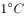吸收或者释放的热量是空气温度变化吸收或释放热量的三倍左右”阐述的是水的比热容比空气的比热容大的原理。比热容是指单位质量的某种物质升高（或下降）单位温度所吸收（或放出）的热量。

①错误，加湿器是一种增加房间湿度的家用电器。加湿器按用途主要分为家用加湿器和工业用加湿器两种类型。其主要作用就是增加空气中水蒸气的含量，使环境湿度增加，与比热容无关。

②错误，发热时为病人擦身体降低体温利用的是蒸发吸热的原理，身体表面的水蒸发时会吸收身体的热量，使病人身体温度降低，与比热容无关。

③正确，用水给汽车发动机降温时，热量从发动机传递到水，发动机温度降低，水的温度升高，因为水的比热容较大，水与空气升高温度相同时，水可以吸收更多的热量，从而使发动机的温度降得更低。

④正确，用暖水袋取暖是因为水的比热容较大，暖水袋中的水由热变冷时，在降低温度相同的情况下，水会比空气放出更多热量。

综上，③④正确。

故正确答案为D。

---

### 第 15 题　qid 4629960 · 人文常识

关于棉花，下列说法正确的是：

- **A**. 中国是世界最大的棉花生产国、第二大棉花消费国
- **B**. 棉籽表面的一层短绒是制作火药的重要原材料之一　✅
- **C**. 棉籽里富含多种有机成分，是理想的食用菌培养基
- **D**. 棉籽壳经过粉碎加工制成的纤维板可用来制造家具

**答案**：B

**官方解析**

本题考查科技常识。
A项错误，棉花是中国主要商业作物，中国34个省份中就有24个种植棉花。根据产量看，我国是世界第一大棉花生产国；根据面积看，印度是世界第一大棉花生产国。同时，我国是第一大的棉花消费国。
B项正确，棉籽表面的一层短绒即棉短绒，是经过轧花后的棉籽（毛籽）上残留着的短纤维，是棉籽上面、没有正常发育长成的棉纤维细胞。棉短绒是制作火药的重要原材料之一，如1000克二类绒制成的无烟火药可装配子弹1000多发。棉短绒是国防、纺织、化纤、造纸等轻、化工业的重要原料，是重要的战略物资。
C项错误，棉籽是棉花作物的种籽。由棉铃中采取的棉花称籽棉，由籽棉上轧下来的棉纤维称皮棉，籽棉除去皮棉后，即可取得棉籽。棉籽仁富含蛋白质和多种氨基酸，其含量是小麦的1-2倍，粉碎后用途广泛。棉籽壳含纤维素、木质素和氮、磷、钾等营养成分，且酸碱适中、保水通气，是理想的食用菌培养基。
D项错误，棉花秸秆是棉花种植业的副产物，是指除去枝叶及棉桃的棉花茎秆，棉秆是半木质化秸秆，其纤维长度和长宽比与木材相近，可造出质量优于稻草、麦秸秆的坚实牛皮纸、包装纸和纸板箱纸，而且可部分代替木质浆，生产中低档纸质用品，降低木质浆的消耗。棉秆的化学组成与木材类似，全纤维素含量为56%，含木质素22%。利用棉秆可生产刨花板、中密度纤维板、纸板箱等，可用来制造家具。
故正确答案为B。

---

### 第 16 题　qid 4629964 · 科技常识

关于能源的说法，下列不正确的是：

- **A**. 可燃冰是以甲烷为主的可燃固体
- **B**. 石油、天然气和煤都属于化石燃料
- **C**. 汽油、煤油、天然气都属于二次能源　✅
- **D**. 柴油牌号是按照柴油的凝固点划分

**答案**：C

**官方解析**

本题考查科技常识。

A项正确，天然气水合物即可燃冰，是天然气与水在高压低温条件下形成的类冰状结晶物质，外观像冰，遇火即燃，分布于深海沉积物或陆域永久冻土中，有强大的燃烧力，主要由水分子和烃类气体分子（主要是甲烷）组成。其主要成分是甲烷。

B项正确，化石燃料也称矿石燃料，是一种烃或烃的衍生物的混合物，包括煤、石油和天然气等。化石燃料是由古代生物的遗骸经过一系列复杂变化而形成的，是不可再生资源。

C项错误，能源按基本形态分类，可分为一次能源和二次能源。一次能源是指自然界中以原有形式存在的、未经加工转换的能量资源，又称天然能源，如煤炭、石油、天然气、太阳能等；二次能源是指由一次能源经过加工转换以后得到的能源，如电能、汽油、柴油、液化石油气、煤油等。

D项正确，我国柴油牌号是根据凝点分级的。柴油分为轻柴油（沸点范围约180-370）和重柴油（沸点范围约350-410）两大类。柴油按凝点分级，轻柴油有5、0、-10、-20、-35、-50六个牌号，重柴油有10、20、30三个牌号。凝点是评定柴油流动性的重要指标，它表示燃料不经加热而能输送的最低温度。柴油的凝点是指油品在规定条件下冷却至丧失流动性时的最高温度。

本题为选非题，故正确答案为C。

---

### 第 17 题　qid 4629966 · 人文常识

关于气象现象的说法，下列不正确的是：

- **A**. 彩虹俗称龙吸水，如果条件合适的话，可以看见整圈圆形的彩虹
- **B**. 气象灾害预警信号依次分为黄色、蓝色、橙色、红色四个等级　✅
- **C**. 雪花之所以多呈六角形是因为冰的分子以六角形为最多
- **D**. 处暑即“出暑”，是炎热离开的意思，该节气已是秋天

**答案**：B

**官方解析**

本题考查科技常识。

A项正确，彩虹在民间俗称“杠吃水”、“龙吸水”，是因为阳光射到空中接近圆型的小水滴，太阳光发生色散及反射形成的。我们平时看见的彩虹只是半弧形的，这是因为地平线挡住了它的下半部分。而太阳的高度可以决定彩虹弧度的多少，太阳在天空中越低，彩虹的底部就越高。因此站得越高，看到的彩虹弧度就越完整。科学证明，所有的彩虹都是全圆形的，只是我们平时无法从地面上看到，通常只有飞行员才能见到这种自然奇观。

B项错误，气象灾害预警信号总体上分为蓝色、黄色、橙色和红色四个等级（Ⅳ、Ⅲ、Ⅱ、Ⅰ级），分别代表一般、较重、严重和特别严重。

C项正确，雪花是由小冰晶增大变来的，而冰的分子以六角形的为最多，因而形成雪花多是六角形的。雪花多呈六角形与水汽凝华结晶时的晶体习性有关，水汽凝华结晶成的雪花和天然水冻结的冰都属于六方晶系。六方晶系由四个结晶轴构成，其中三个辅轴在一个基面上，互相以的角度相交，第四轴（主晶轴）与三个辅轴所形成的基面垂直。当水汽凝华结晶时，倘若主晶轴发育得比另外三个辅轴快，并且延伸很长，那么晶体就会形成柱状；而如果主晶轴发育慢，且很短，那么晶体就形成片状。雪花之所以都是六角形，是因为它沿主晶轴方向晶体生长的速度要比沿三个辅轴方向慢得多。

D项正确，处暑是二十四节气之第十四个节气，是一个反映气候变化的节气，于每年公历8月22-24日交节。处暑，即为“出暑”，是炎热离开的意思。这时三伏已过或近尾声，初秋炎热将结束。处暑的到来同时也意味着进入干支历申月的下半月。从处暑开始，气温逐步走低的趋势进一步明显。

本题为选非题，故正确答案为B。

---

### 第 18 题　qid 4629969 · 人文常识

下列关于中国远古文化的说法，不正确的是：

- **A**. 龙山文化是铜石并用时代文化
- **B**. 河姆渡文化是中国长江流域下游地区的文化
- **C**. 红山文化的社会形态初期处于母系氏族社会
- **D**. 仰韶文化制陶业发达，在考古上常将其称为黑陶文化　✅

**答案**：D

**官方解析**

本题考查人文常识。
A项正确，龙山文化，泛指中国黄河中、下游地区的约新石器时代晚期的一类文化遗存，属于铜石并用时代文化，因首次发现于山东省济南市历城县龙山镇（今属济南市章丘区）而得名。龙山文化挖掘出了许多薄、硬、光、黑的陶器，尤其是蛋壳黑陶（分布日照、济南）最具特色，所以也叫它“黑陶文化”。
B项正确，河姆渡文化，是指中国长江流域下游以南地区的新石器时代文化，因第一次发现于浙江宁波余姚的河姆渡镇而命名，以黑陶和“干栏式房屋”为特色。在这个遗址发现了大量人工栽培的稻谷遗存，这是目前世界上最古老、最丰富的稻作文化遗址，它的发现改变了中国栽培水稻从印度引进的传统传说。
C项正确，红山文化，发源于东北地区西南部，以辽河流域中的支流西拉沐沦河、老哈河、大凌河为中心，距今五六千年前左右，延续时间达两千年之久。其社会形态初期处于母系氏族社会的全盛时期，主要社会结构是以女性血缘群体为纽带的部落集团，晚期逐渐向父系氏族过渡；经济形态以农业为主，兼以牧、渔、猎并存。
D项错误，仰韶文化，是指黄河中游地区的一种新石器时代彩陶文化，距今约7000年至5000年，持续时长2000年左右，因1921年首次在河南省三门峡市渑池县仰韶村发现而命名。这一时期彩陶大范围传播，被考古学家认为是代表了史前第一次艺术浪潮，达到史前艺术的高峰。黑陶文化是指龙山文化。
本题为选非题，故正确答案为D。

---

### 第 19 题　qid 4629971 · 人文常识

下列说法中，最有可能出现的情景是：

- **A**. 华佗曾拜读了《伤寒杂病论》　✅
- **B**. 医师曾用《千金方》的药方给司马炎治病
- **C**. 关汉卿生病时安排家丁按《本草纲目》的说明上山采药
- **D**. 秦朝时期部分王公贵族通过操练“五禽戏”来加强锻炼

**答案**：A

**官方解析**

本题考查人文常识。
A项正确，《伤寒杂病论》作者是东汉末年张仲景，是一部论述外感病与内科杂病为主要内容的医学典籍，系统地分析了伤寒的原因、症状、发展阶段和处理方法，创造性地确立了对伤寒病的“六经分类”的辨证施治原则，奠定了理、法、方、药的理论基础。华佗，东汉末年著名的医学家，主要成就是发明麻沸散、五禽戏，被后人称为“外科圣手”、“外科鼻祖”，与董奉、张仲景并称为“建安三神医”。华佗和张仲景生活在同一时期，故有可能拜读了《伤寒杂病论》。
B项错误，《千金方》又称《千金要方》，作者是唐朝孙思邈，此书总结了唐代以前医学成就，被誉为中国最早的临床百科全书。司马炎，晋朝开国皇帝，在位初期，革新政治，振兴经济，使得经济社会呈现繁荣景象，史称“太康之治”。司马炎生活年代早于唐朝，故医师不可能用《千金方》的药方给他治病。
C项错误，关汉卿，元杂剧奠基人，著有《窦娥冤》《救风尘》《拜月亭》等作品，与白朴、马致远、郑光祖并称为“元曲四大家”。《本草纲目》作者是明代医药学家李时珍，集我国16世纪之前药学之大成，收载药物1892种，附药图1000余幅，阐发药物的性味、主治、用药法则、产地、形态、采集、炮制、方剂配伍等，被誉为中国古代的百科全书。关汉卿的生活年代早于明代，故不可能在生病时安排家丁按照《本草纲目》的说明上山采药。
D项错误，“五禽戏”是中国传统的一个养生功法，“五禽”分别是指虎、鹿、熊、猿、鸟，创编者是东汉末年医学家华佗。秦朝时“五禽戏”还不存在，王公贵族不可能通过操练“五禽戏”来加强锻炼。
故正确答案为A。

---

### 第 20 题　qid 4629975 · 人文常识

有关避免雷击的方法，下列错误的是：

- **A**. 在户外遇到雷雨天气，可在汽车内躲避
- **B**. 如果在雷电交加时头发突然竖起，说明马上要发生雷击，应尽快逃离现场，找寻干燥室内躲避　✅
- **C**. 户外露营应选择整体地势和植被高度较低，并且能与高大植株或建筑保持一定距离的地点扎营
- **D**. 如果在户外看到高压线遭雷击断裂，则应双脚并拢，跳离现场

**答案**：B

**官方解析**

本题考查科技常识。
A项正确，汽车外壳是金属制作的，十分接近于法拉第笼的条件。当驾驶员在雷雨天行驶时，即便很不幸地被雷电击中，由于法拉第笼效应的存在，汽车内部的电磁环境基本不受影响，车内的人就可以安全待在里面。同时，雷电流会借助雨水通过车体表面达到车轴的位置，通过潮湿的轮胎很快就会将电流传递到地面。所以，车内是在室外较为理想的避雷场所。（“法拉第笼”原理简单来说，就是当有高压电产生时，根据接地导体静电平衡的条件，笼体是一个等位体，内部电势差为零，电场为零，所以笼体的内部不会有电流通过，即使待在笼体内部也不会触电。）
B项错误，如果雷电交加时在户外遇到头发竖立时，应该下蹲，两脚并拢，两手抱头藏在两膝间，捂住耳朵。原因是，下蹲可以减少自身的高度，避免自己成为高高竖立的目标，从而把雷引过来。
C项正确，越高的导体，雷电会越先击中。所以在户外露营搭建帐篷的时候尽量选择地势稍低的地方，同时也要避免紧邻高点扎营，否则照样会被电弧击中。理想的方式是选择整体地势和植被高度较低，并且能与高大植株或建筑保持一定距离的地点扎营。
D项正确，如果在户外看到高压线遭雷击断裂，此时应提高警惕，因为高压线断点附近存在跨步电压，身处附近的人此时千万不要跑动，而应双脚并拢，跳离现场。
本题为选非题，故正确答案为B。

---

### 第 21 题　qid 4629977 · 人文常识

根据伯努利效应，当流体经过物体表面时，流速较快的一面压力越小，流速越慢的一面压力越大，当物体两面的压力差达到一定程度时，便会发生位移。以下物体没有利用伯努利效应的是：

- **A**. 赛车尾翼
- **B**. 飞机机翼
- **C**. 潜艇外壳　✅
- **D**. 帆船船帆

**答案**：C

**官方解析**

本题考查科技常识。
A项正确，赛车尾翼的上下表面曲率不同，空气流过赛车尾翼时，通过下表面的路程更长，流速更快，而通过上表面时路程短，流速慢，根据伯努利效应可知，赛车尾翼上表面的压强大于下表面的压强，从而空气对赛车产生向下的压力，即赛车产生较大的对地面的附着力。它能抵消一部分升力，有效控制汽车上浮，使风阻系数相应减小，使赛车能紧贴在路面行驶，从而提高行驶的稳定性。
B项正确，飞机机翼横截面设计成上下不对称的形状，使得飞机飞行时机翼上方的空气流速大，下方的空气流速小。根据伯努利效应可知，机翼上方的压强小，下方的压强大，产生了作用在机翼上的方向向上的升力。
C项错误，双壳潜艇艇体分内壳和外壳，内壳是钢制的耐压艇体，保证潜艇在水下活动时，能承受与深度相对应的静水压力；外壳是钢制的非耐压艇体，不承受海水压力，控制潜艇上浮下潜的流水孔、保证空气流通的通风阀和作战使用的潜望镜都通过外壳进行连接，内壳与外壳之间是主压载水舱和燃油舱等。单壳潜艇只有耐压艇体，主压载水舱布置在耐压艇体内。一个半壳潜艇，在耐压艇体两侧设有部分不耐压的外壳作为潜艇的主压载水舱。潜艇艇体多呈流线型（先进的潜艇一般设计成水滴形或者雪茄形），以减少水下运动时的阻力，保证潜艇有良好的操纵性。潜艇外壳的设计与伯努利效应无关。
D项正确，帆船船帆具有像飞机机翼一样的弧形，当气流通过船帆时，由于船帆前面（鼓起的一侧）的气流要走更长的距离来船帆后面的气流相会合，因而船帆前面的空气流速快，船帆后面的空气流速慢，根据伯努利效应可知，流速慢处的压强比流速快处的压强大，这个压强差使帆获得了向前的动力。
本题为选非题，故正确答案为C。

---

## 言语理解与表达

### 第 1 题　qid 4630385 · 逻辑填空

民间故事与个人创作最大的不同在于它们            的特质。众多无名故事家不断讲述它们，使每一个流传的故事成为集体智慧的结晶。
填入画横线部分最恰当的一项是：

- **A**. 口口相传　✅
- **B**. 锻炼逻辑
- **C**. 奔走相告
- **D**. 道听途说

**答案**：A

**官方解析**

根据“众多无名故事家不断讲述它们，使每一个流传的故事成为集体智慧的结晶”可知，民间故事具有口头相传的特质。A项“口口相传”指不著文字，口头相传，符合文意，当选。

B项“锻炼逻辑”不是成语，填入也不符合文意，排除；C项“奔走相告“指有重大的消息时，人们奔跑着相互转告，“民间故事”并非重大消息，与文意不符，排除；D项“道听途说”指没有根据的传闻，感情色彩偏消极，与文段感情色彩不符，排除。
故正确答案为A。
【文段出处】《用优秀民间故事滋润童年》

---

### 第 2 题　qid 4630401 · 逻辑填空

在实际生活中，很多人并不        血型性格说的起源和原理，只是在直观感受上觉得“有些准”。其实无论从色彩、星座、笔迹还是血型看性格，所对应的性格描述都是如此，相信的人只看见说对的部分，却        了说不准的部分。
依次填入画横线部分最恰当的一项是：

- **A**. 清楚 否定
- **B**. 关心 忽略　✅
- **C**. 重视 忽视
- **D**. 理解 屏蔽

**答案**：B

**官方解析**

本题从第二空入手。由第二空横线前“却”可知，转折前后语义相反，转折前论述“只看见说对的部分”，故转折后的横线处要表达没看见的意思。B项“忽略”指疏忽，不在意，没注意到，C项“忽视”指不在意、不重视，均可表达没看见的意思，符合文意，保留。A项“否定”指对事物作不赞成的决定，D项“屏蔽”指遮蔽、遮挡，均无法表达没看见的意思，与文意不符，排除。
第一空，由后文“直观感受上觉得‘有些准’”、“无论从色彩、星座、笔迹还是血型看性格，所对应的性格描述都是如此”可知，血型性格说实际上是一种没有科学依据、没有价值的学说，针对这种没有价值的学说，对于其起源和原理人们是不在意、不会想去了解的，B项“关心”指留意、在意，当选。C项“重视”指认为重要而认真对待，文段并非认为血型性格说的起源和原理不重要，而是完全不在意、不想去了解，排除。
故正确答案为B。
【文段出处】《血型星座与性格无关》

---

### 第 3 题　qid 4630432 · 逻辑填空

中国历史很长，地域广袤，社会发展的状况也不尽相同，经常有新的东西出现。因此，研究和学习历史，一定要有        ，靠一个人的力量要兼顾到各方面是不可能的，必致            。
依次填入画横线部分最恰当的一项是：

- **A**. 侧重 事半功倍
- **B**. 取舍 囫囵吞枣
- **C**. 重点 挂一漏万　✅
- **D**. 方向 顾此失彼

**答案**：C

**官方解析**

第一空，根据文段“靠一个人的力量要兼顾到各方面是不可能的”可知，横线处强调的是研究和学习要有选择性、不能兼顾所有，A项“侧重”、B项“取舍”、C项“重点”均符合文意，保留。D项“方向”指前进的目标，侧重于目的，不迷失，与语境不符，排除。
第二空，对应“兼顾到各方面是不可能的”，横线处要体现出“无法顾全所有”的意思，C项“挂一漏万”形容列举不周，选了一个，但遗漏很多，符合文意，当选。A项“事半功倍”形容用力小而收效大，B项“囫囵吞枣”比喻读书等不加分析地笼统接受，均与“顾全所有方面”无关，排除。
故正确答案为C。
【文段出处】郑天挺《漫谈治史》

---

### 第 4 题　qid 4630435 · 逻辑填空

文物看似没有生命、没有声音，但是它们        了历史的风云，寄托着先人的情怀，充满了生命的活力。在博物馆，我们通过对文物的瞻仰，与先人的生命接续了起来，在        中实现了与历史的对话、与先人的情感交流，这也是博物馆所追求的文化目标。
依次填入画横线部分最恰当的一项是：

- **A**. 经历 凝重
- **B**. 浸透 宁静　✅
- **C**. 蕴含 平淡
- **D**. 折射 沧桑

**答案**：B

**官方解析**

本题可从第二空入手，横线所在句子表示我们是在博物馆里通过观察文物，去达到“与历史对话”等目的，因此横线处填入的内容要与博物馆文物相关，根据“文物看似没有生命、没有声音”可知，博物馆处于十分安静的状态，“我们”也应是在安静的环境中实现对话、交流，故横线处应体现安静之意。B项“宁静”指环境安静，符合文意，保留。A项“凝重”指庄重、稳重或浓重，C项“平淡”指平常，D项“沧桑”比喻世事变化很大，均无法体现安静之意，不符合文意，排除。
第一空，代入验证，B项“浸透”有“饱含”的语义，“浸透了历史的风云”表明文物虽没有声音、生命，但本身的存在就是历史风云的体现之意，符合文意，当选。
故正确答案为B。
【文段出处】《光明日报刊文评“跑男”跑进杭博:博物馆最不需要的就是热闹》

---

### 第 5 题　qid 4630439 · 逻辑填空

教师承担着立德育人的神圣使命，对教师的要求比其他行业高            ，但高到什么程度，要有客观标准和现实考量。如果把教师的育人细节不加选择、            地置于舆论场，可能会给教师和学校制造不必要的麻烦和干扰。
依次填入画横线部分最恰当的一项是：

- **A**. 无可厚非 随心所欲　✅
- **B**. 公平合理 杂乱无章
- **C**. 不容置喙 毫无保留
- **D**. 由来已久 轻而易举

**答案**：A

**官方解析**

第一空，根据前文“教师承担着立德育人的神圣使命”以及“但高到什么程度”可知横线处应体现对教师要求高的“合理性”。A项“无可厚非”意为做的事情不能算错，不必过分地加以责备，B项“公平合理”指处理事情公正符合情理，均符合文意，保留。C项“不容置喙”指不容许插嘴，程度过重，排除；D项“由来已久”指事情从发生到现在已经过了很长时间了，文段没有体现出时间的延续性，排除。
第二空，根据顿号可知，前后构成近义并列，故横线处应体现“不加选择”的意思，A项“随心所欲”意为凭着自己的意愿，想干什么就干什么，能体现出随意不加选择的意思，当选。B项“杂乱无章”形容杂乱而没有条理，与文意不符，排除。
故正确答案为A。
【文段出处】《如何防止教育舆情“跑偏”》

---

### 第 6 题　qid 4630381 · 逻辑填空

有些景区借助热播影视剧，不仅提高了人气，而且带来了可观的经济收入，可谓            。其实，仔细分析这些成功案例，不难发现，这些景区就是影视剧的拍摄地，剧中的元素与景区高度        ，游客带着观感游览，很容易引发情感共鸣。
依次填入画横线部分最恰当的一项是：

- **A**. 一举多得 相似
- **B**. 名利双收 契合　✅
- **C**. 两全其美 匹配
- **D**. 公私兼顾 重叠

**答案**：B

**官方解析**

第一空，根据“可谓”可知，前文“不仅提高了人气，而且带来了可观的经济收入”是对横线处成语的解释说明，故横线处需表达有些景区借助热播影视剧收获两方面的好处。B项“名利双收”指既得名声、又获利益，与文意相符，保留。A项“一举多得”比喻一种举动同时兼收多利，文段只提到“人气”和“经济收入”两方面的好处，与“多”对应不恰当，排除；C项“两全其美”指做事顾全双方，使两方面都得到好处，与前文“人气”和“经济收入”的对应上，不如B项“名利双收”更恰当，排除；D项“公私兼顾”意思是既照顾到公家的利益，也照顾到私人的利益，文段未体现“公私利益”，排除。
第二空，代入验证，根据文意可知，横线处所填词语应体现剧中的元素与景区具有很高的相似度。B项“契合”指符合，可以体现剧中元素与景区实景的高度相似，当选。
故正确答案为B。
【文段出处】《新华网评：景点改名“琅琊阁”，就可以名利双收吗？》

---

### 第 7 题　qid 4630414 · 片段阅读

回顾媒介发展的历程，每一种新媒介的诞生都对社会产生了深刻的影响。印刷媒介造成社会场景之间的隔离，从而促成知识的垄断和权威的得势；电子媒介则倾向于打破隔离，融合社会场景，从而模糊角色，消解权威。在新媒体环境下，“社会精英”们的话语影响力被“草根英雄”“平民英雄”抢尽风头。作为舆论引导主体的政府，在社会化媒体众声喧哗的媒介环境中，“被引导”“被议程设置”。“微博反腐”就是很好的例证。
这段文字旨在强调新媒体：

- **A**. 对传播权力的消解　✅
- **B**. 对社会结构的改变
- **C**. 对政府管理的影响
- **D**. 对信息传播的冲击

**答案**：A

**官方解析**

文段首先指出新媒介的出现会对社会产生深刻影响，接着通过举例解释说明，随后强调在新媒体环境下，“社会精英”的话语影响力被“草根英雄”“平民英雄”抢占，作为舆论引导主体的“政府”被“大众”所引导，并通过“微博反腐”的例子来解释说明，即“新媒体环境下”的传播权力发生改变，对应A项。
B项，“社会结构”文段未提及，无中生有，排除；
C项，“政府”对应举例说明部分的内容，非重点，排除；
D项，文段重点强调的是“新媒体”对传播权力的影响，“信息传播”表述不明确，排除。
故正确答案为A。
【文段出处】《媒介环境学视域下新媒体价值的消解与统合》

---

### 第 8 题　qid 4630418 · 片段阅读

抽象的价值，存留在理论之中；具体的公正，则需体现在每一个人身上，不像喊喊口号那样简单。医疗改革既需协调利益魔方，更需面对海量刚需和分布不均的现实；收入分配改革“分好蛋糕”理论明确，具体调整却是复杂的系统工程。不存在一种简单的理论，可以立竿见影搞定所有中国式问题。
这段文字强调的是改革中需解决好以下哪项关系？

- **A**. 偏与全
- **B**. 快与慢
- **C**. 知与行　✅
- **D**. 难与易

**答案**：C

**官方解析**

文段开篇先指出理论是抽象的，公正这种理论的具体落实则不像喊口号那样简单，即理论应用到实际很难。后列举“医疗改革”和“收入分配改革”例子指出，改革落实均面临重重困难。尾句进一步重申，不存在一种简单的理论可以立刻解决所有问题。故本文强调在改革中要处理好理论与实践的关系，对应C项。
A项“偏与全”、B项“快与慢”文段均未提及，无中生有，排除；
D项，文段主要围绕理论与实践谈论，“难与易”表述模糊，排除。
故正确答案为C。
【文段出处】《有“问题意识”，也要有“过程意识”》

---

### 第 9 题　qid 4630422 · 片段阅读

之前普遍认为，曾侯乙编钟的发现打破了“中国的七声音阶源自欧洲”的结论，事实并非如此。从1984年开始，在贾湖遗址先后出土了30多支用丹顶鹤尺骨制成的骨笛，磨制精细，共7孔，已经能吹出七声音阶。贾湖骨笛是新石器时代晚期的产物，也就是说，在8000多年前，中国就已经有七音了，曾侯乙编钟的出土只是又一个重要佐证而已。
这段文字意在说明：

- **A**. 打破“中国的七声音阶源自欧洲”结论的是贾湖骨笛
- **B**. 贾湖骨笛证明中国在八千多年前就出现了七声音阶　✅
- **C**. 贾湖骨笛是世界上七声音阶产生的最早证明
- **D**. 贾湖骨笛证明七声音阶是从中国流传出去的

**答案**：B

**官方解析**

文段开篇指出曾侯乙编钟的发现打破了“中国的七声音阶源自欧洲”，随后通过“事实并非如此”指出前文并非事实。后文通过贾湖骨笛证明中国早在8000多年前已产生了七声音阶，曾侯乙编钟的出土只不过是中国有七音的佐证。故文段重点强调贾湖骨笛可证明中国八千多年前就已经产生了七声音阶，对应B项。
A项，文段强调贾湖骨笛证明中国八千多年前出现七声音阶，并非打破“中国的七声音阶源自欧洲”结论，偏离文段重点，排除；
C项“最早证明”、D项“从中国流传出去的”均无中生有，排除。
故正确答案为B。
【文段出处】《中国的“七声”从哪里来》

---

### 第 10 题　qid 4630425 · 片段阅读

从近些年中国电视节目的格局来看，综艺节目的几大模板几乎全部移植于国外，鲜有本土原创，文化传统和民族特质越来越淡，中国电视的本土化创新进入困境。实际上，早在十几年前，有识之士便开始呼吁电视媒体应在努力学习外国优秀节目经验的同时，更注重植根本土文化，在源远流长的中华文明中寻找创新的源动力。现在以《中国诗词大会》为代表的文化类节目的兴起，用特有的中国气派和较强的原创魅力，证明以传统文化助推电视节目创新的路径是可行的。
这段文字意在强调中国的电视综艺节目：

- **A**. 应避免一味照搬国外模式
- **B**. 应以传统文化为创新源泉　✅
- **C**. 应担负起发扬传统文化的责任
- **D**. 激发了观众对传统文化的兴趣

**答案**：B

**官方解析**

文段开篇提出中国电视本土化创新有困难，后通过转折关联词“实际上”以及程度词“更”引出核心对策，应注重在源远流长的中华文明中寻找创新的源动力，即以传统文化为创新源动力，尾句以《中国诗词大会》进行举例说明，故文段为分总分结构，重点强调中国的电视综艺节目应以传统文化为创新源动力，对应B项。
A项，文段强调中国的电视综艺节目应以传统文化为创新源泉，“避免一味照搬国外模式”表述不明确，排除；
C项，“发扬传统文化”文段并未提及，无中生有，排除；
D项，“激发了观众对传统文化的兴趣”文段并未提及，无中生有，排除。
故正确答案为B。
【文段出处】《光明日报：文化类节目如何做“文章”》

---

### 第 11 题　qid 4630387 · 片段阅读

我国天气预报、气候、大气化学等方面的业务主要依靠风云系列气象卫星完成，但高分系列卫星提供的高空间分辨率数据产品起到了很好的补充作用。尤其在应对特殊天气和地表灾害方面，高分卫星的作用更为关键。例如在此前发射的高分系列卫星中，高分一号、二号可以为地震、泥石流、森林火灾等提供高分辨率图像；高分三号的雷达成像模式不受云雾影响，可以实现全天候立体监测；位于地球静止轨道的高分四号，可以观测到台风内部的精细结构，并实现对台风的高精度定位。而在新增的两颗高分卫星中，高分六号可以说是高分一号的“升级版”，而高分五号的高光谱作用更是独一无二。
这段文字意在说明：

- **A**. 高分系列卫星的作用是不可替代的
- **B**. 高分系列卫星功能强大、用途广泛
- **C**. 高分系列卫星拍得更清、测得更准
- **D**. 高分系列卫星是风云系列的重要补充　✅

**答案**：D

**官方解析**

文段开篇先介绍风云系列气象卫星的作用，紧接着通过“但”转折，强调“高分系列卫星”的产品对“风云系列气象卫星”能起到很好的补充，随后通过程度词“尤其”与“更”进一步指出高分系列卫星在“应对特殊天气和地表灾害”方面的补充作用很关键，后文举例说明高分系列卫星补充作用的相关表现。故文段开头即阐明论点，强调“高分系列卫星”是对“风云系列气象卫星”的良好补充，对应D项。
A项，“作用不可替代”文段并未提及，无中生有，排除；
B项“功能强大、用途广泛”与C项“拍得更清、测得更准”均对应举例部分内容，为高分系列卫星对风云系列气象卫星重要补充的具体表现，非重点，排除。
故正确答案为D。
【文段出处】高分五号、六号卫星投入使用 这双“天眼”看得更清 (huanqiu.com)

---

### 第 12 题　qid 4630394 · 片段阅读

从历史上看，改革开放初期，全国各省（区市）的城市化大致处于共同进步的阶段，除了上海这样早就有市场经济元素的大城市外，绝大多数地区都需要经过一个农村转向城市的“原始积累阶段”。而进入新世纪之后，国内城市之间发展差距变大，不同层级的城市规模出现了不同的发展轨迹，一线城市更容易吸引年轻人的目光，而一些二三线城市也不甘落后，纷纷加入新一轮的城市竞争中。这两年兴起的二三线城市的“抢人竞争”就是基于这种背景出现的，这是中国城市化必然经历的一个阶段，在一线城市格局逐渐明确之后，对二线城市、国家中心城市地区的抢夺，则成为新一轮的竞争。
这段文字主要讲的是：

- **A**. 未来中国城市化发展的方向和趋势　✅
- **B**. 中国城市化发展的不同阶段及特点
- **C**. 中国城市化发展过程中的地域特色
- **D**. 二三线城市“抢人竞争”的大背景

**答案**：A

**官方解析**

文段首先通过改革开放初期城市化发展的情况引出城市化发展的话题，紧接着通过“而进入新世纪之后”重点介绍其后城市化发展的现状，即城市之间的发展差距变大，出现了一线城市和二三线城市的区分，并说明一线城市更容易吸引年轻人的目光，而一些二三线城市也不甘落后，纷纷加入新一轮的城市竞争中。尾句通过“这是中国城市化必然经历的一个阶段”进行总结，强调在一线城市格局逐渐明确之后，对二线城市、国家中心城市地区的抢夺，成为新一轮的竞争，即接下来城市化的发展方向是二线城市、国家中心城市地区。对应A项。
B项，文段并非并列陈述城市化发展的不同阶段，后文侧重强调现有情况下城市化的发展重点，“不同阶段”非重点，排除；
C项，“地域特色”文段并未提及，无中生有，排除；
D项，“抢人竞争”为城市竞争的表现，非重点，且偏离文段核心话题“城市化发展”，排除。
故正确答案为A。
【文段出处】中国青年报《一线城市不是年轻人唯一选择》

---

### 第 13 题　qid 4630403 · 片段阅读

德国慕尼黑工业大学研究人员模仿自然系统创建了一种分子化合物，当添加“燃料”（一种称为碳化二亚胺的高能分子）时，开始自由移动，组装成水凝胶。只要能源供应持续，化学反应能使该材料稳定。当能源耗尽，这些材料简单地分解为其基本分子。控制最初给定燃料的多少，研究者能按需设置，实现需要的有效自毁。研究人员说，这种技术近期内就能用作靶向药物的传递系统，以球状结构将药物带到身体各处，在需要的地方自动溶解，释放有效载荷。另一个设想是设计成组织工程的支架结构，植入身体来帮助愈合，并在身体自身细胞接管后降解。此外，可用这类材料制成塑料件或电子装置，它们在垃圾填埋场会自毁，避免堆积。
关于这种能自毁的材料，文中没有介绍:

- **A**. 化学成分
- **B**. 应用前景
- **C**. 自毁原理
- **D**. 研发过程　✅

**答案**：D

**官方解析**

A项，根据文段“当添加燃料（一种称为碳化二亚胺的高能分子）时，开始自由移动组装成水凝胶”及“只要能源供应持续，化学反应能使该材料稳定；当能源耗尽，这些材料简单地分解为其基本分子”可知，自毁材料是由研究人员创建的分子化合物和燃料产生化学反应而形成的，所以自毁材料中包含了添加的燃料，即碳化二亚胺。故文段已提及“化学成分”，排除；
B项，根据“这种技术近期内就能用作靶向药物的传递系统”“另一个设想是设计成组织工程的支架结构”以及“此外，可用这类材料制成塑料件或电子装置”可知，文段已提及“应用前景”，排除；
C项，根据“当能源耗尽，这些材料简单地分解为其基本分子”可知，文段已提及“自毁原理”，排除；
D项，根据文意可知，文段仅介绍了自毁材料的化学原理及可应用领域，并未提及自毁材料的研究与开发的各阶段过程，故“研发过程”无中生有，当选。
本题为选非题，故正确答案为D。
【文段出处】《光明网：能自毁的材料用处大》

---

### 第 14 题　qid 4630409 · 片段阅读

顶端优势是指植物的顶芽优先生长，对侧芽萌发、侧枝生长的抑制作用，也包括对侧枝、叶子生长角度的影响。顶端优势强的植物，几乎不生分枝，如长日照植物向日葵，棉花等。番茄等植物顶端优势弱，能长出许多分枝。灌木顶端优势极弱，几乎没有主茎与分枝的区别。多数植物属中间类型，如稻、麦、泡桐等。顶端优势的强弱随植株年龄而变化，同时受营养和环境条件的影响，幼龄植物顶端优势强，老龄时减弱。顶端对侧芽的抑制程度，随距离增加而减弱，因此对下部侧芽的抑制比对上部侧芽的轻。许多树木因此形成宝塔形树冠。
由此我们可以推出：

- **A**. 距离根系越近，则顶端对侧芽的抑制程度会越高
- **B**. 宝塔形树冠是顶端优势弱的植株的典型外部形态
- **C**. 顶端优势现象的表现形式和程度因植物种类而异　✅
- **D**. 生存在恶劣环境下的植物，其顶端优势较为明显

**答案**：C

**官方解析**

A项，根据“顶端对侧芽的抑制程度，随距离增加而减弱，因此对下部侧芽的抑制比对上部侧芽的轻”可知，越靠近根部，顶端对侧芽的抑制程度应该越低，表述错误，排除；
B项，根据“顶端对侧芽的抑制程度，随距离增加而减弱，因此对下部侧芽的抑制比对上部侧芽的轻。许多树木因此形成宝塔形树冠”可知，宝塔形树冠是顶端优势随着距离增加而减弱的表现，文段并未论述宝塔形树冠植物的顶端优势强弱，无中生有，排除；
C项，根据“顶端优势强的植物，几乎不生分枝，如······番茄等植物顶端优势弱······灌木顶端优势极弱······多数植物属中间类型，如······等”可知，表述正确，当选；
D项，文段并未论述生存在恶劣环境下的植物顶端优势如何，无中生有，排除。
故正确答案为C。

---

### 第 15 题　qid 4630411 · 片段阅读

日本东北部的宫城县有一片富饶的稻米产区。江合川、鸣濑川等河流，从这里穿行而过，大片沼泽地和湿地，为种植水稻提供了基础条件，但洪涝、干旱、冻害等自然灾害也经常光顾这里。数百年前，当地农民用智慧和汗水把这里变成适合稻作生产的地区。这里就是“大崎耕土”地区。2017年，大崎耕土的传统水资源管理系统被联合国粮农组织评选为全球重要农业文化遗产。
这段文字接下来最可能讲的是:

- **A**. 大崎耕土传统水资源管理系统的运行方式　✅
- **B**. 恶劣气候给大崎地区农业生产带来的影响
- **C**. 大崎成为日本为数不多的稻米之乡的原因
- **D**. 政府与社会团体对大崎耕土的保护与发展

**答案**：A

**官方解析**

本题为接语选择题，重点关注文段尾句。文段首先引出了日本富饶稻米产区的话题，并强调河流、沼泽、湿地为水稻种植提供了基础条件，但也经常有自然灾害，接着说明当地农民把这里改造成了适合稻作生产的地区——“大崎耕土”地区，尾句强调大崎耕土的传统水资源管理系统被评为农业文化遗产，故接下来应该围绕大崎耕土的传统水资源管理系统展开分析，对应A项。
B项，“恶劣气候”对应文段“洪涝、干旱、冻害等自然灾害也经常光顾这里”，为前文已经论述的内容，后文不再赘述，排除；
C项，对应文段“江合川、鸣濑川等河流，从这里穿行而过，大片沼泽地和湿地，为种植水稻提供了基础条件”，为前文已经论述的内容，后文不再赘述，排除；
D项，文段并未论述“政府与社会团体”，无中生有，与尾句衔接不当，排除。
故正确答案为A。
【文段出处】《日本：水资源科学利用助力可持续稻作生产》

---

### 第 16 题　qid 4630382 · 片段阅读

在电子传播的时代提倡有纸阅读，也许会被看成一种矫情，从知识传播和阅读效率角度讲，这种阅读也是高成本的，但读书本身不只是单纯的信息输入，而是一种文化生活，拥有丰富的心理探索和绵密的感情体验，这些微妙不可或缺，触屏阅读是一种更便捷更高效的阅读方式，但恰恰因为便捷与高效在某种意义上剥夺了纸质阅读的慢与精细，消化的时间与反刍的机会，冥想的诗意与活在历史中的觉悟，由此可能会遗漏那些被作者放在字里行间的更隐秘和更重要的信息。
这段文字旨在强调:

- **A**. 纸质阅读与触屏阅读存在巨大差异
- **B**. 触屏阅读难以取代纸质阅读的地位
- **C**. 电子传播时代更应提倡纸质阅读　✅
- **D**. 传统阅读能带来独特的心理体验

**答案**：C

**官方解析**

文段开篇引出“有纸阅读”的话题，并论述了从知识传播和阅读效率角度讲，有纸阅读是高成本的，紧接着通过转折词“但”强调读书的体验是不可或缺的，触屏阅读虽然便捷与高效，却剥夺了纸质阅读消化的时间，会遗漏重要信息。也就是说，有纸阅读可以带来好的读书体验，是值得提倡的。故文段旨在强调电子传播时代需要提倡有纸阅读，对应C项。
A项，“巨大差异”表述不明确，文段重点强调的是纸质阅读的好处和无可替代性，排除；
B项，“难以取代纸质阅读的地位”文段未提及，无中生有，排除；
D项，文段核心话题为“有纸阅读”，“传统阅读”偷换概念，排除。
故正确答案为C。
【文段出处】《愿你的手边还有纸质书籍相伴》

---

### 第 17 题　qid 4630389 · 片段阅读

翻译是文化交流的重要媒介，传统翻译理论认为原文与译文应该相互等同，因此，“忠实”是翻译的基本标准。20世纪70年代兴起的翻译研究理论，受到后现代主义哲学思潮的影响，反对本质主义，反对“译文的本质是原文”这一传统思想。这种翻译研究的新思潮，强调翻译过程中的“创造性叛逆”，即认为不忠实于原文是正常甚至必然的。在阅读原文的基础上，翻译者根据自己对原文的理解，进行独特的翻译创作，翻译者被认为是文本的另一个作者。
这段文字主要介绍：

- **A**. 新兴翻译理论与后现代主义哲学的关系
- **B**. 翻译者对翻译文本的创造性贡献
- **C**. 新兴翻译理论与传统理论的区别　✅
- **D**. 翻译工作应该遵循的基本标准

**答案**：C

**官方解析**

文段开篇引出“翻译”这一话题，接着介绍了传统翻译理论的本质，即原文与译文之间是相互等同的，后文介绍了新兴翻译理论与传统翻译理论的区别，即新兴翻译理论认为翻译不忠实于原文是正常甚至必然的，其本质与传统翻译理论截然不同，尾句则对新兴翻译理论的翻译机制进行了解释说明，即新兴翻译理论是翻译者进行的独特翻译创作。故文段重点强调的是新兴翻译理论与传统翻译理论的区别，对应C项。
A项，缺少文段核心话题“传统翻译理论”，排除；
B项，“创造性贡献”文段未提及，无中生有，排除；
D项，“应该遵循的基本标准”无中生有，排除。
故正确答案为C。

---

### 第 18 题　qid 4630395 · 片段阅读

书法创作不外乎两种：一是有意识创作，二是无意识创作。有意识创作，即作者在艺术构思上以明显的主观追求为目的，或设境或立意，或以原蓝本风格为尺规，或集字等，时时想着自己在创作，以及为什么在创作，如何创作。因此，这种创作出来的作品不可能具有超脱和个性鲜明的风格与境界，即使他的技能含量再高、再精湛，也属于初级创作阶段。而无意识创作，即作者的技能含量已经高度纯熟，学识修养相当丰富，获得了创作上的大自由，将自己与创作物件融为一体，进入无意识状态、无自我之境界，任性所之，自然流露。这是书法艺术创作的高级阶段，书法艺术贵求自然，自然也即是真。
这段文字意在说明：

- **A**. 书法艺术创作贵在“内心自由”　✅
- **B**. 求真才能达到创作上的大自由
- **C**. 纯熟的技能是一切书法创作的基础
- **D**. 无意识状态是书法创作的高级阶段

**答案**：A

**官方解析**

文段开篇指出书法创作有两种：有意识创作和无意识创作，接着对有意识创作进行了解释，并通过“因此”指出这种在构思规则内的有意识创作属于初级创作阶段。随后文段又指出无意识创作有着创作上的大自由，并通过尾句指出这种获得自由的无意识创作是书法艺术创作的高级阶段，故文段通过对比有意识创作与无意识创作，重点强调当人处于无意识创作，也就是获得创作自由时，才能够创作出更好的书法艺术作品，对应A项。
B项，缺乏主题词“书法创作”，排除；
C项，文段强调的并非“纯熟的技能”，选项偏离文段核心话题，排除；
D项，“无意识状态”是无意识创作中的一部分内容，表述片面，排除。
故正确答案为A。
【文段出处】《&lt;石鼓文&gt;书法二题之一》

---

### 第 19 题　qid 4630400 · 片段阅读

艾滋病病毒与其他逆转录病毒一样，在繁殖时，其遗传物质会整合到人体宿主基因组上进行复制。虽然目前的抗逆转录病毒疗法可有效抑制艾滋病病毒繁殖，但却不能根除这类整合性病毒，因此病毒可以在治疗期间潜伏休眠，一旦治疗中止，又重新开始复制。近日，德国研究人员利用名为Brec1的重组酶，可以准确定位识别90%以上临床常见的艾滋病毒株，并能安全准确地在受感染细胞的染色体组中完全“剪除”整合的原病毒。原病毒被清除后，受艾滋病病毒遗传物质干扰而失灵的免疫系统有望恢复正常。
下列说法与原文不相符的是：

- **A**. 如果在细胞染色体组中识别并清除艾滋病病毒，或许可能治疗艾滋病
- **B**. 存在于宿主染色体内的潜在病毒基因组是艾滋病爆发的根源　✅
- **C**. 艾滋病病毒一旦侵入机体细胞，病毒将会和细胞整合在一起
- **D**. 逆转录病毒可将自身基因组整合入宿主细胞基因组

**答案**：B

**官方解析**

A项，根据“利用名为Brec1的重组酶，可以准确定位识别······原病毒被清除后，受艾滋病病毒遗传物质干扰而失灵的免疫系统有望恢复正常”可知，识别并清除艾滋病病毒，可能治疗艾滋病，表述正确，排除；
B项，文段并未提及艾滋病爆发的根源，无中生有，当选；
C项，根据“其遗传物质会整合到人体宿主基因组上进行复制······这类整合性病毒”可知，艾滋病病毒和细胞整合在一起，表述正确，排除；
D项，根据“艾滋病病毒与其他逆转录病毒一样，在繁殖时，其遗传物质会整合到人体宿主基因组上进行复制”可知，逆转录病毒的自身基因组可整合入宿主细胞基因组，表述正确，排除。
本题为选非题，故正确答案为B。
【文段出处】《清除艾滋病病毒新法动物实验成功》

---

### 第 20 题　qid 4630407 · 片段阅读

自从2013年，中国台北故宫博物院“朕知道了”胶带问世以来，文化创意已经蔓延至我国整个文博领域。不少博物馆都纷纷推出文创产品，从文具套装到钥匙扣，从生活用品到旅游用品，不一而足。可以说，文创已成为弘扬传统文化的重要载体。事实上，博物馆做文创与其说是在“卖产品”，不如说是在利用文化元素“讲故事”。而我国博物馆文创总体起步较晚，经验与市场都还不够成熟，要走好中国特色的博物馆文创之路，既需要政府部门在政策上给予更多的扶持和激励，也需要博物馆发挥积极性、主动性，与社会力量深度合作，平衡好艺术和商业之间的关系，努力做到创新有道，成熟有方。
最适合做这段文字标题的是：

- **A**. 博物馆文创要创新有道
- **B**. 讲好中国博物馆的文创故事
- **C**. 走好中国特色博物馆文创之路　✅
- **D**. 文创之路需要兼顾艺术和商业

**答案**：C

**官方解析**

文段开篇引出“文创”这一话题，并介绍了我国很多博物馆均推出文创产品。接着通过“可以说”指出文创对弘扬传统文化的重要性，再通过“事实上”进行转折，之后提出问题，即我国博物馆文创起步晚，经验与市场不成熟，尾句通过“要”提出对策，介绍走好中国特色的博物馆文创之路的具体做法，故文段重点为对策，强调走好中国特色的博物馆文创之路，对应C项。
A项，“创新有道”对应尾句，为博物馆走好文创之路具体做法中的部分内容，表述片面且非重点，排除；
B项，“讲好中国博物馆的文创故事”为对策之前的内容，非重点，且偏离文段核心话题，文段重点强调走好中国特色博物馆的文创之路，并非“讲好文创故事”，排除；
D项，“兼顾艺术和商业”对应尾句，为博物馆走好文创之路具体做法中的部分内容，表述片面且非重点，排除。
故正确答案为C。
【文段出处】《破解博物馆文创“同质化”》

---

### 第 21 题　qid 4630417 · 语句表达

①学界一般认为美学是以美、美的本质为主要研究对象的学问
②尤其应该辩证综合地研究主客体之间即人与世界之间的审美关系，并以此作为美学研究的主要对象
③但对于美学研究对象问题，历来存在多种不同看法，迄今并无定论
④其实，我们关于美学研究对象的认识可以更加宽泛一些
⑤同所有学科一样，美学的研究对象在某种程度上决定着它的学科性质
⑥不仅要研究作为审美客体的美，同时要研究审美主体的美感
将以上6个句子重新排列，语序正确的是：

- **A**. ①⑤③④②⑥
- **B**. ①③④②⑤⑥
- **C**. ⑤①④②③⑥
- **D**. ⑤③①④⑥②　✅

**答案**：D

**官方解析**

首先对比选项，判断首句。首句有①⑤两句，①句指出美学的主要研究对象是什么，⑤句强调美学的研究对象和学科性质的关系。均可作为首句，不好判断。进一步观察文段发现，②句出现递进关联词“尤其”，通过“应该”提出对策，“应该辩证综合地研究主客体之间即人与世界之间的审美关系”，故前一句也应提出对策，并且话题与“主客体”相关。观察选项，②句前有④句和⑥句，⑥句通过“要”提出对策，强调要研究审美主客体的美，与②句话题一致且衔接紧密。④句强调关于美学研究对象的认识可以宽泛一些，不如⑥句与②句衔接紧密，故排除A、B、C三项，D项当选。
故正确答案为D。
【文段出处】《美学聚焦人与世界审美关系》

---

### 第 22 题　qid 4630423 · 语句表达

①尤其在一个国家经历艰难转型的过渡期，这些声音会时强时弱地凸显出来
②就像英国作家塞缪尔·约翰逊说过的，“爱国主义是无赖最后的避难所”
③他们在爱国这个话题上所表现出来的真实情感才会凝聚出强大的精神力量
④可是，任何社会，沉默的大多数才是主流和基石
⑤这时，爱国主义容易被情绪化、被断章取义、被利用，从而转化为各种抵制、冲击和谩骂
⑥任何社会都不缺偏激的叛逆者、狂热的偏执者、迷惘的盲从者、恶意的唱衰者
将以上6个句子重新排列，语序正确的是：

- **A**. ②⑥③①④⑤
- **B**. ⑥①⑤②④③　✅
- **C**. ②⑤①④⑥③
- **D**. ⑥②⑤④③①

**答案**：B

**官方解析**

对比选项，判断首句。②句出现“就像”，属于举例论证内容，不适合作首句，排除A、C两项。⑥句指出任何社会都不缺偏激、狂热、迷惘、恶意的人，适合作首句，保留B、D两项。
继续观察发现。⑤句中出现指代词“这时”，根据指代词捆绑，判断⑤句前衔接①句还是②句，①句指出在一个国家经历艰难转型的过渡时期，会有时强时弱的声音凸显出来，可以与⑤句中的“这时”构成指代关系，①⑤两句构成捆绑，锁定B项。而②句通过引用塞缪尔·约翰逊的话进行举例论证，未出现表示时间的指代对象，无法和⑤句中的“这时”构成指代关系，排除D项。
故正确答案为B。
【文段出处】《爱国是一种静水流深的感情》

---

### 第 23 题　qid 4630426 · 语句表达

①在一定程度上设置付费按摩座椅取代普通座椅有助于改善候车条件，丰富出行体验
②车站是交通出行的公共场所，候车大厅的座椅首要功能是满足旅客候车休息的需要
③但设置付费按摩座椅不应与为旅客候车提供基本的休息服务相冲突
④并且座椅数量、位置设计等都要满足车站客流量和便于旅客通行的要求
⑤因此在设置付费按摩座椅替代普通座椅的过程中，不应减少座椅的数量
⑥任何时候，商业利益都不能凌驾于公共利益之上
将以上6个句子重新排列，语序正确的是：

- **A**. ②④①③⑤⑥　✅
- **B**. ①⑥②③④⑤
- **C**. ②①③⑤④⑥
- **D**. ①③②④⑤⑥

**答案**：A

**官方解析**

对比选项，判断首句。①句介绍“付费按摩座椅”的意义，②句介绍“候车大厅的座椅”的作用，根据逻辑顺序，应先提出“候车大厅的座椅”这一话题，再介绍“按摩付费座椅”，所以②句应在①句之前，排除B、D两项。
比较A、C两项，④句通过并列关联词来进一步论述“座椅”的数量、位置设计等要满足车站和旅客的要求，仍然是在介绍“座椅”的作用，可与②句构成并列关系，①句则论述“付费按摩座椅”，故④句与②句话题衔接更为恰当，排除C项。
故正确答案为A。
【文段出处】《候车室普通座被拆换按摩椅 车站商业化不能妨害公共利益》

---

### 第 24 题　qid 4630427 · 语句表达

①这种谜一样的存在被科学家称为“暗物质”
②天文观测表明，宇宙中的暗物质比人类目前熟悉的普通物质要多5倍，其物理本质是目前国际上粒子物理和天体物理领域的重大问题之一
③正是瞄准了这一世界科学前沿，2011年底，我国暗物质粒子探测卫星正式立项
④2015年“悟空”号的成功发射实现了我国天文卫星零的突破，使中国天文学家首次拥有了属于我们自己的卫星数据，改变了此前全球约200颗天文卫星均属于国外的历史
⑤在浩瀚无垠的宇宙中，存在一个巨大的谜团：宇宙的绝大部分质量是人类不可见的
⑥《自然》杂志发表评论称其“开辟了中国空间科学新时代”
将以上6个句子重新排列，语序正确的是：

- **A**. ⑤②①⑥③④
- **B**. ②③⑤①⑥④
- **C**. ⑤①②③④⑥　✅
- **D**. ②①⑤③④⑥

**答案**：C

**官方解析**

对比选项，确定首句。②句介绍暗物质很多，且其物理本质是物流学重大问题之一，⑤句介绍宇宙中的谜团，均可作为首句。寻找其他解题线索，①句通过“称为”引出“暗物质”的话题，故应先引出话题，再具体论述，即①句应在②句之前，排除A、B、D三项，锁定C项。
验证C项，⑤①两句先引出“暗物质”的存在，接着②句论述“暗物质”研究的重要性，③④两句指出我国所做的努力，⑥句总结前文，逻辑合理流畅。
故正确答案为C。
【文段出处】光明网《在“星辰大海”中捕捉暗物质的猎手》

---

### 第 25 题　qid 4630428 · 语句表达

①有的人整天忙碌，却不清楚究竟做了什么；而有的人无论碰到多急多难的事情，总能从容不迫，轻松化解
②我们周围常有这种情况，有的人一生没有干几件出彩的事，有的人只要用心干的事，件件精彩
③提高工作水平是每一位年轻干部的迫切期盼
④分析后者，他们在进入重要领导岗位之前，通过理论学习、专业训练和经验积累，一般具有较强的基本功、鲜明的角色认知和境界、方法上的充分储备
⑤有了这些准备，无论到什么岗位，只要熟悉业务、注意方法，工作都会干得很好，工作水平一定会很快提高
⑥工作水平的提高离不开科学合理安排，离不开对事物深厚的感悟积累，这就要求持续加强理论学习
将以上6个句子重新排列，语序正确的是：

- **A**. ①⑥④③⑤②
- **B**. ③⑥②①④⑤　✅
- **C**. ②①③④⑤⑥
- **D**. ⑥③①②④⑤

**答案**：B

**官方解析**

观察选项，判断首句，①句介绍了两种人的不同情况，②句介绍了我们周围存在的情况，③句介绍了每一位年轻干部都期盼提高工作水平，⑥句介绍了如何提高工作水平，从内容上分析，难以判断首句，寻找其他线索。
⑤句出现指代词“有了这些准备”，故前文应该提到“准备”，对比选项，④句提到了“充分储备”，可以与⑤句形成指代词捆绑，B、C、D三项保留，③句并未提到“准备”，不能与④句捆绑，排除A项；
继续对比选项，④句出现“分析后者”，证明④句前应论述多个不同主体，①句、②句存在论述了两个主体，能够与④句捆绑，B、D两项保留，而③句只介绍了“每一位年轻干部”的期盼，不能与④句的“后者”构成捆绑，排除C项；
对比B、D两项，可以判断①句和②句的位置，②句通过“我们周围常有这种情况”引出话题，之后具体论述“有的人······有的人······”，①句也在通过“有的人······有的人······”进行具体阐述，故②句在①句前更为合理，排除D项。
故正确答案为B。
【文段出处】《把理论学习作为党性修养的终生之需》

---

## 数量关系

### 第 1 题　qid 4630392 · 数学运算

-7，-4，-3，-10，3，（    ），-3

- **A**. 5
- **B**. 2
- **C**. -4　✅
- **D**. -6

**答案**：C

**官方解析**

观察数列，变化较为平缓，项数较多，考虑多重数列。观察发现，除第一项以外，可两两分组，即：-7，（-4，-3），（-10，3），由此发现规律，括号内两数加和等于-7，即为第一项，故所求项应为-7-（-3）=-4。
故正确答案为C。

---

### 第 2 题　qid 4630406 · 数学运算

甲、乙、丙、丁四人捐款，甲、乙、丙共捐款240元，甲、丙、丁共捐款190元，甲捐款额是丙的两倍，甲比乙少捐款40元。问丁捐款多少元？

- **A**. 70　✅
- **B**. 80
- **C**. 90
- **D**. 120

**答案**：A

**官方解析**

根据题意，设丙捐款x元，则甲捐款2x元，乙捐款（2x+40）元，丁捐款190-2x-x=190-3x元。由甲、乙、丙共捐款240元，可得：2x+（2x+40）+x=240，解得x=40。故丁捐款=190-3×40=70元。
故正确答案为A。

---

### 第 3 题　qid 4629982 · 数学运算

王和张现在是同小区的邻居，3年之后，王比张年龄的3倍少2岁，再过5年王比张年龄的两倍多五岁，再在此基础上过10年王的年龄是多少岁？

- **A**. 31
- **B**. 34
- **C**. 39
- **D**. 49　✅

**答案**：D

**官方解析**

方法一：年龄问题，考虑代入排除法。结合选项设置，A和B、B和C、C和D分别差3、5、10，猜测答案可能是D选项，代入D选项验证。王再过10年为49岁，则10年前为39岁，“比张年龄的两倍多五岁”，则张的年龄为（39-5）÷2=17岁，往前推5年，即题目开头的“3年后”王39-5=34岁，张17-5=12岁，34=3×12-2，满足条件“王比张年龄的3倍少2岁”，因此D选项满足所有条件。
故正确答案为D。
方法二：设3年之后，张的年龄为x岁，则王的年龄为（3x-2）岁；再过5年，张的年龄为（x+5）岁，王的年龄为（3x-2+5）岁。根据题意，3x-2+5=2（x+5）+5，解得x=12，即再过5年王的年龄为3x-2+5=39岁，再在此基础上过10年王的年龄为39+10=49岁。
故正确答案为D。

---

### 第 4 题　qid 4629984 · 数学运算

某果园雇人手工采摘樱桃，已知从第二天起每天比前天多3人；从第10天起，每天减少前一天一半的人，直到第14天，剩下5人。已知每人每天采摘樱桃50千克，问该果园这14天总共采摘樱桃多少吨？

- **A**. 不到40吨
- **B**. 40-60吨之间
- **C**. 60-80吨之间　✅
- **D**. 超过80吨

**答案**：C

**官方解析**

根据题意，第9-14天的采摘人数如下表：

前9天的采摘人数呈等差数列，公差d=3，根据通项公式，，解得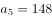。根据等差数列求和公式：，前9天采摘人数共有人。则14天共雇1332+80+40+20+10+5=1487人，共采摘樱桃1487×50=74350千克=74.35吨，在C项范围内。

故正确答案为C。

---

### 第 5 题　qid 4629989 · 数学运算

科研人员在山路测试救援机器人性能。已知救援机器人电池续航时间为60分钟，其上坡、下坡、平路速度分别为4米/秒、8米/秒、6米/秒。机器人从A点出发，沿箭头所示路线行进一定距离后折返，并在电量耗尽时正好返回A点。问机器人，在折返前最多能行进多少米？

- **A**. 6750
- **B**. 10350　✅
- **C**. 13500
- **D**. 17100

**答案**：B

**官方解析**

设机器人在折返前最多行进了x米平路，根据题意可得：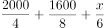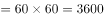，解得x=6750，故机器人在折返前最多能行进2000+1600+6750=10350米。

故正确答案为B。

---

### 第 6 题　qid 4628129 · 数学运算

甲、乙协商，在属于乙的一片荒地上由甲负责开发一块长30米宽若干米的长方形地块，开发出来后，分一块以长方形地块的宽为边长的正方形地块归乙使用，剩下部分归甲使用，若使甲可使用的地块面积最大，长方形地块的宽应为多少米？

- **A**. 25
- **B**. 20
- **C**. 15　✅
- **D**. 10

**答案**：C

**官方解析**

设长方形地块的宽为x米，则正方形地块的边长为x米。根据题意，甲可使用的地块面积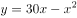。根据两点式，令面积y=0，即分别令x=0和30-x=0，解得，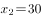。则当时，y取得最大值。即若使甲可使用的地块面积最大，长方形地块的宽应为15米。

故正确答案为C。

---

### 第 7 题　qid 4628135 · 数学运算

某知识比赛共10题，规定答对一题得2分，不答不得分，答错扣1分。小王参加比赛后共得3分，已知小王回答题目超过5题，问小王第一题答错的概率是多少？

- **A**. 

- **B**. 

　✅
- **C**. 

- **D**. 

**答案**：B

**官方解析**

设小王答对、答错、不答的题目数分别为x、y、z，根据题意可列方程：x＋y＋z＝10······①，2x-y＝3······②，①+②可得3x＋z＝13。因为小王回答题目超过5题，即x+y&gt;5，则不答的题目数z可能取值为0到4。依次代入：当z＝0时，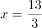，非整数解，不满足题意，排除；当z＝1时，x=4，y=10-1-4=5；当z＝2时，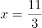，非整数解，不满足题意，排除；当z＝3时，，非整数解，不满足题意，排除；当z＝4时，x=3，y=10-4-3=3。则小王答题情况有两种：第一种是答对4题，答错5题，不答1题；第二种是答对3题，答错3题，不答4题。

根据公式：概率，若是第一种情况，总共10道题中答错了5道，则每道题答错的概率是；若是第二种情况，总共10道题中答错了3道，则每道题答错的概率是。由于两种情况发生的概率是相同的，即各，则小王第一题答错的概率为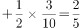。

故正确答案为B。

---

### 第 8 题　qid 4628137 · 数学运算

甲、乙两地分别为一条河流的上下游，两地相距360千米，A船往返需要35小时，其中从甲地到乙地的时间比从乙地到甲地的时间短5小时。B船在静水中的速度为12千米每小时。问其从甲地开往乙地需要多少小时？

- **A**. 12
- **B**. 20
- **C**. 24　✅
- **D**. 40

**答案**：C

**官方解析**

根据“从甲地到乙地的时间比从乙地到甲地的时间短”可知，从甲地到乙地为顺水行驶，从乙地到甲地为逆水行驶。设A船从甲地到乙地的顺水行驶时间为x小时，从乙地到甲地的逆水行驶时间为y小时。由题意可列方程：x＋y＝35······①，y-x＝5······②。联立方程①和②，解得x＝15，y＝20。结合两地相距360千米，可得A船从甲地到乙地的顺水行驶的速度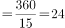千米/小时，A船从乙地到甲地的逆水行驶的速度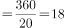千米/小时。根据公式：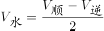，可得甲、乙两地间水流速度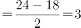千米/小时。B船从甲地开往乙地的顺水速度为12＋3＝15千米/小时，则B船从甲地开往乙地的时间为小时。

故正确答案为C。

---

### 第 9 题　qid 4630412 · 数学运算

图书馆有一批总重量为1.95吨的旧书，需要用纸箱装好运走。每个纸箱能装的重量最多是35千克（纸箱本身重量可以忽略不计），且要求所使用纸箱的数量尽可能少。如果用一辆最大载重量为0.15吨的平板车将这批书拉走，则至少需要拉多少趟？

- **A**. 13
- **B**. 14　✅
- **C**. 15
- **D**. 16

**答案**：B

**官方解析**

根据题意可知，旧书总重量为1.95吨=1950千克，平板车每趟的最大载重量为0.15吨=150千克。最少使用纸箱个，即56个，平板车每趟至多可运纸箱个，即4个，则至少需要拉趟。

故正确答案为B。

---

### 第 10 题　qid 4630419 · 数学运算

现有100升、120升和150升三种容积的油桶共16个，总容积为2030升，其中150升规格的油桶有x个。现将若干个150升规格的油桶换为同样数量的100升油桶，使得100升规格的油桶达到x个，此时所有油桶的容积为1880升，问x的值为多少？

- **A**. 2
- **B**. 4
- **C**. 5　✅
- **D**. 9

**答案**：C

**官方解析**

设原有100升的油桶y个，则120升的油桶有（16-x-y）个。

方法一：根据“将若干个150升规格的油桶换为同样数量的100升油桶”，可知交换的每桶容积相差150-100=50升，交换前后总容积相差2030-1880=150升，则共交换个油桶，即y=x-3。根据题意可列方程：100（x-3）+120[16-x-（x-3）]+150x=2030，解得x=5。

方法二：根据题意可列方程：100y+120（16-x-y）+150x=2030，化简得：3x-2y=11，根据2y是偶数，11是奇数，则3x应为奇数，即x为奇数，排除A、B两项。代入C项：当x=5时，y=2，满足题意，当选；代入D项：当x=9时，y=8，，不满足题意，排除。

故正确答案为C。

---

### 第 11 题　qid 4630438 · 数学运算

甲工艺品厂x名工人平均每人生产y件某种工艺品，正好完成生产任务。如调入1名工人，则每人只需要完成y-2件这种工艺品即可。问以下哪个坐标图能准确反映x（横轴）与y（纵轴）之间的关系?

- **A**. 
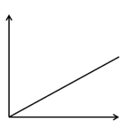

- **B**. 
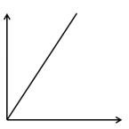

- **C**. 

- **D**. 

　✅

**答案**：D

**官方解析**

根据生产任务总量不变，可列方程：xy=（x+1）×（y-2），化简得：y=2x+2，当x=0时，y=2，只有D项符合。
故正确答案为D。

---

## 判断推理

### 第 1 题　qid 4630364 · 图形推理

从所给的四个选项中，选择最合适的一个填入问号处，使之呈现一定的规律性：

- **A**. A　✅
- **B**. B
- **C**. C
- **D**. D

**答案**：A

**官方解析**

本题考查翻折。图一从水平中间位置进行翻折可得到图二，图二从竖直中间位置进行翻折可得到图三，图三从水平中间位置进行翻折可得到图四，因此，问号处应该是图四从竖直中间位置进行翻折得到，只有A项符合。
故正确答案为A。

---

### 第 2 题　qid 4630369 · 图形推理

从所给的四个选项中，选择最合适的一个填入问号处，使之呈现一定的规律性：

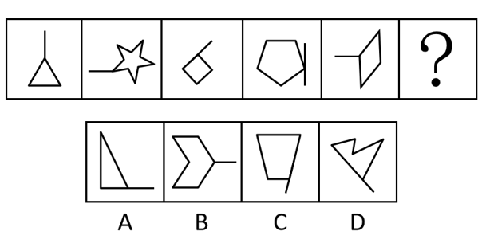

- **A**. A
- **B**. B
- **C**. C　✅
- **D**. D

**答案**：C

**官方解析**

解法一：元素组成不同，且无明显属性规律，考虑数量规律。观察发现题干图形均有一个面，但无法排除选项，考虑面的细化。发现题干图形中的面都是轴对称图形，排除A、D两项；继续观察发现，题干图形都存在一条出头线与面相连，且出头线的方向依次为竖、横、斜、竖、横，故？处应填入出头线方向为斜的图形，排除B项。
故正确答案为C。
解法二：元素组成不同，且无明显属性规律，考虑数量规律。观察发现题干图形均有一个面，但无法排除选项，考虑面的细化。发现题干图形中的面都是轴对称图形，排除A、D两项；继续观察发现，题干图形都存在一条出头线与面相交于点，通过该交点能引出图形的对称轴，排除C项。
故正确答案为B。
注：解法一和解法二均根据面的对称性和出头线的规律选出答案，但题干图形出头线方向“竖、横、斜”的遍历规律明显，因此粉笔更倾向于选C。

---

### 第 3 题　qid 4630374 · 图形推理

下图是给定纸盒的外表面，以下哪一项能由它折叠而成？

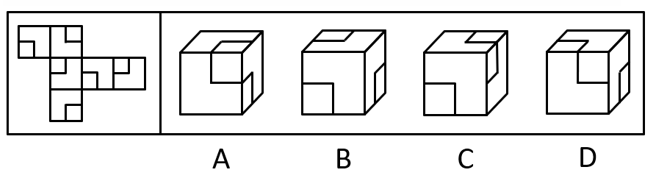

- **A**. A
- **B**. B
- **C**. C
- **D**. D　✅

**答案**：D

**官方解析**

将题干展开图标上序号，如下图所示，逐一分析选项。

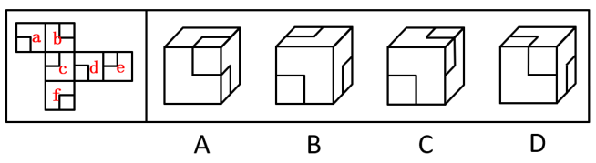

A项：选项中正前方和上方两个面的小方块边相接，只可能为面b和面e，标出两个面中小方块相接的点（点1），在展开图中，与该点相连的面为面d，故选项中三个面为面b、面d和面e。在选项中，面d与面b或面e中的一个面存在方块相接的点（点2），而在展开图中，面d中小方块与这两个面均不相交，选项与展开图不一致，排除；

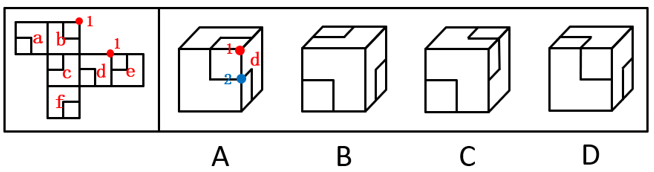

B项：选项中三个面的小方块均与公共边没有交点，而在展开图中不存在三个面的小方块与公共边没有交点，选项与展开图不一致，排除；

C项：观察题干展开图，若想出现选项中右侧和上方两个面的小方块存在一个点相接的情况，只可能为面a和面c（两个面的小方块相交于点1）或者面d和面f（两个面的小方块相交于点2），如下图所示：

当右侧和上方的两个面为面a和面c时，正前方的面可能为面b或面f，以三个面的公共点为起点，对立体图形中正前方的面和展开图中面b、面f顺时针画边，在选项中，边1与相邻面的小方块相交，而在展开图中，面b和面f中的边1均没有与相邻面的小方块相交，如图1所示，选项与展开图不一致，排除；

当右侧和上方的两个面为面d和面f时，正前方的面可能为面c和面e，以三个面的公共点为起点，对面c、面e顺时针画边，在选项中，边1与相邻面中的小方块相交，而在展开图中，面c和面e的边1均没有与相邻面的小方块相交，如图2所示，选项与展开图不一致，排除；

D项：选项由面a、面b与面c构成，选项与展开图一致，当选。

故正确答案为D。

---

### 第 4 题　qid 4630433 · 图形推理

把下面的六个图形分为两类，使每一类图形都有各自的共同特征或规律，分类正确的一项是：

- **A**. ①③④，②⑤⑥
- **B**. ①③⑤，②④⑥　✅
- **C**. ①②⑥，③④⑤
- **D**. ①④⑥，②③⑤

**答案**：B

**官方解析**

本题为分组分类题目。元素组成不同，且无明显属性规律，优先考虑数量规律。观察发现，图①为明显一笔画图形，图③中含有明显的出头端点，考虑笔画数。如下图所示，图①③⑤的奇点数都是2，为一笔画图形，图②④⑥的奇点数都是4，为两笔画图形。即图①③⑤为一组，图②④⑥为一组。

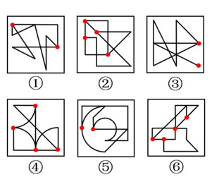

故正确答案为B。

---

### 第 5 题　qid 4630437 · 图形推理

从所给四个选项中，选择最适合的一个填入问号处，使之呈现一定的规律性：

- **A**. A　✅
- **B**. B
- **C**. C
- **D**. D

**答案**：A

**官方解析**

元素组成相似，且相同元素重复出现，优先考虑遍历。九宫格优先看横行，如下图所示，第一行图形中，图1和图2相同的小图形圆，移动到图3左上角的位置，第二行图形中，图1和图2相同的小图形三角形，移动到图3左上角的位置，验证符合此规律，第三行应用此规律，图1和图2相同的图形为十字多边形，则？处左上角的图形为十字多边形，只有A项符合。

故正确答案为A。

---

### 第 6 题　qid 4630365 · 定义判断

社会协商是指社会公众就广泛存在的基层社会矛盾或问题所展开的协商解决方式，是基层群众自治范畴内的一种民主决策方式。
根据上述定义，下列属于社会协商的是：

- **A**. 某市市长在接待日接待来访的市民
- **B**. 某市为调整煤气价格举行公开听证
- **C**. 为解决宠物粪便清理问题，社区召开居民议事会　✅
- **D**. 电视台就化解停车难问题邀请专家进行电视评论

**答案**：C

**官方解析**

第一步：找出定义关键词。
“社会公众协商解决基层社会矛盾或问题”、“基层群众自治范畴”。
第二步：逐一分析选项。
A项：该项中市长接待来访的市民，并不是基层群众的自治行为，不符合“基层群众自治范畴”，不符合定义，排除；
B项：该项中某市举行公开听证，主导是政府机关，并不是基层群众的自治行为，不符合“基层群众自治范畴”，不符合定义，排除；
C项：该项中社区召开居民议事会，属于基层群众之间协商解决问题的一种方式，符合“社会公众协商解决基层社会矛盾或问题”、“基层群众自治范畴”，符合定义，当选；
D项：该项中电视台邀请专家进行电视评论，评论只是在发表自己的观点，并非通过协商来解决问题，不符合“社会公众协商解决基层社会矛盾或问题”，不符合定义，排除。
故正确答案为C。

---

### 第 7 题　qid 4630368 · 定义判断

乡愁经营指那些凭借历史典故、自然风光发展旅游，将地方饮食推向市场，在古村落搞商业开发活动，将能够聚集“乡愁”的资源转化为商品与服务的经营行为。
根据上述定义，下列属于乡愁经营的是：

- **A**. 某皖南村落借助历史传说，在一个风景秀丽的山边建设了成片具有徽派建筑风格的房屋，开办“农家乐”餐馆，吸引了众多游人前来赏景消费　✅
- **B**. 某市进行大面积危旧房屋改造，将大量明清风格的危旧房屋全部拆除，高标准兴建高新技术开发区，吸引众多海内外投资
- **C**. 某地小吃享有盛名，地方政府近来兴建小吃城，不但引进本地小吃，而且还汇聚了全国各地的著名小吃，然而，前来品尝的食客并不见多
- **D**. 某市计划将一坐落在僻静悠远深山里的古镇打造成一座新城，为此他们请来了国际著名的设计师，投入巨资建设

**答案**：A

**官方解析**

第一步：找出定义关键词。
“凭借历史典故、自然风光发展旅游”、“将地方饮食推向市场，在古村落搞商业开发活动”、“将能够聚集‘乡愁’的资源转化为商品与服务”。
第二步：逐一分析选项。
A项：某皖南村落借助历史传说，符合“凭借历史典故、自然风光发展旅游”，建设徽派建筑风格的房屋，开办“农家乐”餐馆，吸引游人赏景消费，符合“将地方饮食推向市场，在古村落搞商业开发活动”、“将能够聚集‘乡愁’的资源转化为商品与服务”，符合定义，当选；
B项：某市将大量明清风格的危旧房屋全部拆除，不符合“凭借历史典故、自然风光发展旅游”，不符合定义，排除；
C项：某地小吃享有盛名，地方政府兴建小吃城，不符合“凭借历史典故、自然风光发展旅游”，不符合定义，排除；
D项：某市计划将坐落在深山里的古镇打造成新城，不符合“凭借历史典故、自然风光发展旅游”，不符合定义，排除。
故正确答案为A。

---

### 第 8 题　qid 4630371 · 定义判断

超限效应指刺激过多、过强或作用时间过久，从而引起被刺激者极不耐烦或逆反的心理现象。
根据上述定义，下列行为中不属于超限效应的是：

- **A**. 某药店店员遭顾客投诉，店长对该店员进行了罚款200元的处罚并进行严厉批评，后又多次在全体店员会议上提及此事，导致该店员辞职
- **B**. 小强期中考试语文、数学意外只考了80多分，爸妈很失望，常在临睡前批评他，小强渐渐感到烦躁，结果期末考试只考了70多分
- **C**. 赵老师喜欢“拖堂”，结果期中考试时有一题一半同学都做错了，而该题就是他在某一次“拖堂”时所讲的内容
- **D**. 张老师中考前召开班会，强调考试注意事项，有同学迟到了几分钟，当晚她又给所有同学及家长发了短信，再次告知班会内容　✅

**答案**：D

**官方解析**

第一步：找出定义关键词。
“刺激过多、过强或作用时间过久”、“引起被刺激者极不耐烦或逆反的心理现象”。
第二步：逐一分析选项。
A项：店长对店员进行了罚款并严厉批评，后又多次提及此事，符合“刺激过多、过强或作用时间过久”，导致该店员辞职，符合“引起被刺激者极不耐烦或逆反的心理现象”，符合定义，排除；
B项：爸妈因期中考试成绩对小强很失望，常在临睡前批评他，符合“刺激过多、过强或作用时间过久”，小强渐渐感到烦躁，结果期末考试成绩更差了，符合“引起被刺激者极不耐烦或逆反的心理现象”，符合定义，排除；
C项：赵老师喜欢“拖堂”，符合“刺激过多、过强或作用时间过久”，考试中赵老师“拖堂”时讲的题目有一半同学都做错了，符合“引起被刺激者极不耐烦或逆反的心理现象”，符合定义，排除；
D项：张老师召开班会强调中考注意事项，因部分同学迟到，当晚给所有同学及家长发了短信，再次告知班会内容，不符合“刺激过多、过强或作用时间过久”，同时未体现同学和家长对此的反应，不符合“引起被刺激者极不耐烦或逆反的心理现象”，不符合定义，当选。
本题为选非题，故正确答案为D。

---

### 第 9 题　qid 4630376 · 定义判断

《中华人民共和国产品质量法》第二条规定“在中华人民共和国境内从事产品生产、销售活动，必须遵守本法。”这里所称产品是指经过加工、制作，用于销售的产品，不包括内在质量主要取决于自然因素的产品。
根据上述说法，下列选项不属于产品质量法调整范围的是：

- **A**. 东莞的某工厂专门为英国一科技公司组装VR产品，销往英国
- **B**. 中国人张亮赴泰国采购了2吨榴莲水果回中国国内销售　✅
- **C**. 美国人杰克从中国采购了1万件服装回美国销售
- **D**. 个体户小王每天生产豆腐到农贸市场销售

**答案**：B

**官方解析**

第一步：找出定义关键词。
“在中华人民共和国境内”、“从事产品生产、销售活动”、“不包括内在质量主要取决于自然因素的产品”。
第二步：逐一分析选项。
A项：东莞某工厂组装VR产品，符合“在中华人民共和国境内”、“从事产品生产、销售活动”，同时组装产品的质量取决于人工因素，也符合“不包括内在质量主要取决于自然因素的产品”，符合定义，排除；
B项：张亮赴泰国采购榴莲水果回国内销售，但榴莲水果属于自然生长的产物，产品质量取决于自然因素，不符合“不包括内在质量主要取决于自然因素的产品”，不符合定义，当选；
C项：杰克从中国采购服装，符合“在中华人民共和国境内”、“从事产品生产、销售活动”，同时服装的质量取决于人工因素，也符合“不包括内在质量主要取决于自然因素的产品”，符合定义，排除；
D项：小王生产豆腐到农贸市场销售，符合“在中华人民共和国境内”、“从事产品生产、销售活动”，同时豆腐的质量取决于人工因素，也符合“不包括内在质量主要取决于自然因素的产品”，符合定义，排除。
本题为选非题，故正确答案为B。

---

### 第 10 题　qid 4630386 · 定义判断

底线思维指在困难面前做好最坏打算，临危不乱地做好充分准备，以实际行动从容应对困难的一种积极思维和心态。
根据上述定义，下列属于底线思维的是：

- **A**. 面临明年可能来临的“五十年一遇”降雨，J市对市政排水系统进行了彻底升级改造，将设计标准提升到“百年一遇”　✅
- **B**. 由于工作成绩突出，小王获得了年度先进个人的表彰，但他对明年的工作仍不敢大意，努力把工作计划做得更加充分
- **C**. 某公司每次面临危机，但最终都能在罗经理的带领下走出困境，这很大程度上得益于他的豁达心态
- **D**. 伴随着技术变革和媒体整合，很多媒体经营出现困难，但N报业始终坚持职业操守，守住底线

**答案**：A

**官方解析**

第一步：找出定义关键词。
“在困难面前”、“做好最坏打算，临危不乱地做好充分准备，以实际行动从容应对困难”。
第二步：逐一分析选项。
A项：面临明年可能来临的“五十年一遇”降雨，符合“在困难面前”，J市将市政排水系统升级改造的设计标准提升到“百年一遇”，符合“做好最坏打算，临危不乱地做好充分准备，以实际行动从容应对困难”，符合定义，当选；
B项：小王只是对明年工作仍不敢大意，并未体现小王遇到困难，不符合“在困难面前”，不符合定义，排除；
C项：某公司每次面临危机，符合“在困难面前”，但最终走出困境主要得益于罗经理的豁达心态，并未体现做好最坏打算、做好充分准备，不符合“做好最坏打算，临危不乱地做好充分准备，以实际行动从容应对困难”，不符合定义，排除；
D项：很多媒体经营出现困难，符合“在困难面前”，但N报业始终坚持职业操守，并未体现做好最坏打算、做好充分准备，不符合“做好最坏打算，临危不乱地做好充分准备，以实际行动从容应对困难”，不符合定义，排除。
故正确答案为A。

---

### 第 11 题　qid 4630375 · 定义判断

易感人群指基于维护自身权益的切实需要，极易对相关消息、传闻或网络信息、相关政策等产生共鸣，并采取转发、点评乃至在现实生活中积极行动的方式放大相关信号的人群。
根据上述定义，下列不属于易感人群的是：

- **A**. 买了新房的小李夫妇经常关注有关商品房质量的投诉报道，拿到房后立即请专业人员对所购房屋进行详细查验，并将查验过程群发给所有朋友
- **B**. 小江今年参加高考，在填报志愿时，无法确定自己该填报哪几所高校，于是通过QQ询问了最要好的同学，之后小江选择填报了同类高校　✅
- **C**. 吴某收到一条微信消息，说中国与某国签署免签证协议。因为他儿子在该国留学，于是立刻将这一消息转发到朋友圈
- **D**. 老王因儿子在美国工作，手头上有一些美元积蓄，平时非常关注美元的汇率及相关信息，并经常与朋友们交流分享他的看法

**答案**：B

**官方解析**

第一步：找出定义关键词。
“基于维护自身权益的切实需要”、“极易对相关消息、传闻或网络信息、相关政策等产生共鸣”、“采取转发、点评乃至在现实生活中积极行动的方式放大相关信号”。
第二步：逐一分析选项。
A项：买了新房的小李夫妇经常关注有关商品房质量的投诉报道，说明该报道与他们的自身权益有关，符合“基于维护自身权益的切实需要”，也符合“极易对相关消息、传闻或网络信息、相关政策等产生共鸣”，同时将房屋查验过程群发给所有朋友，符合“采取转发、点评乃至在现实生活中积极行动的方式放大相关信号”，符合定义，排除；
B项：小江在填报高考志愿时不确定填报哪几所高校，说明该选择与他的自身权益有关，符合“基于维护自身权益的切实需要”，但并未体现他对相关消息等产生共鸣，不符合“极易对相关消息、传闻或网络信息、相关政策等产生共鸣”，同时询问最要好的同学，也不符合“采取转发、点评乃至在现实生活中积极行动的方式放大相关信号”，不符合定义，当选；
C项：吴某收到关于中国与某国签署免签证协议的微信消息，且他儿子在该国留学，说明该协议与他的自身权益有关，符合“基于维护自身权益的切实需要”，也符合“极易对相关消息、传闻或网络信息、相关政策等产生共鸣”，同时立刻转发消息到朋友圈，符合“采取转发、点评乃至在现实生活中积极行动的方式放大相关信号”，符合定义，排除；
D项：老王因儿子在美国工作，手头上有一些美元积蓄，平时非常关注美元的汇率及相关信息，说明美元的汇率及相关信息与他的自身权益有关，符合“基于维护自身权益的切实需要”，也符合“极易对相关消息、传闻或网络信息、相关政策等产生共鸣”，同时经常与朋友们交流分享他的看法，符合“采取转发、点评乃至在现实生活中积极行动的方式放大相关信号”，符合定义，排除。
本题为选非题，故正确答案为B。

---

### 第 12 题　qid 4630378 · 定义判断

契合差异并用法是判明现象因果关系的一种归纳方法。先确定某现象出现的各个场合里其唯一共同点在于有某条件，某现象不出现的各个场合里其唯一共同点正好在于不具有该条件，再把上述结果加以比较，从而判明该条件与某现象有因果联系。
根据上述定义，下列属于契合差异并用法的是：

- **A**. 在土壤等都相同的两块土地上种同一品种作物，一块施肥一块不施肥，结果施肥的产量高，不施肥的产量低，说明施肥是产量高的原因
- **B**. 某地长寿老人在当地人口中占比极高，经调查研究发现，该地空气中的负离子非常高，因此负离子高的空气是老人长寿的原因
- **C**. 医疗队在几个甲状腺肿大流行病区的水域中检测不出碘，而在一些非流行病区能检测出碘，说明碘缺乏是造成甲状腺肿大的原因　✅
- **D**. 一定压力下的一定量气体，温度升高，体积增大；温度降低，体积缩小。这说明气体温度的改变是其体积改变的原因

**答案**：C

**官方解析**

第一步：找出定义关键词。
“某现象出现的各个场合唯一共同点在于有某条件”、“某现象不出现的各个场合里唯一共同点在于不具有该条件”、“判明该条件与某现象有因果联系”。
第二步：逐一分析选项。
A项：该项指出在土壤等都相同的两块土地上种同一品种作物，一块施肥一块不施肥，这里只是采用了控制变量的方式进行实验，没有提及某现象出现的各个场合，也没有提及某现象不出现的各个场合，不符合“某现象出现的各个场合唯一共同点在于有某条件”、“某现象不出现的各个场合里唯一共同点在于不具有该条件”，不符合定义，排除；
B项：该项只分析了某地长寿老人人口占比高，是因为该地空气中的负离子高，并没有分析其他长寿老人人口占比高的地方，是否空气中的负离子同样高，不符合“某现象出现的各个场合唯一共同点在于有某条件”，也没有分析其他长寿老人人口占比不高的地方，是否空气中的负离子也不高，不符合“某现象不出现的各个场合里唯一共同点在于不具有该条件”，不符合定义，排除；
C项：医疗队在几个甲状腺肿大流行病区的水域中检测不出碘，即存在碘缺乏（条件）是甲状腺肿大流行病区（某现象出现的各个场合）的共同点，符合“某现象出现的各个场合唯一共同点在于有某条件”，而在一些非流行病区能检测出碘，即不存在碘缺乏（不具有该条件）是甲状腺肿大非流行病区（某现象不出现的各个场合）的共同点，符合“某现象不出现的各个场合里唯一共同点在于不具有该条件”，根据以上两点最终得出碘缺乏是造成甲状腺肿大的原因，符合“判明该条件与某现象有因果联系”，符合定义，当选；
D项：该项指出一定压力下的一定量气体，温度和体积存在正比的关系，这里只是研究了两种物理量之间的变化关系，没有提及某现象出现的各个场合，也没有提及某现象不出现的各个场合，不符合“某现象出现的各个场合唯一共同点在于有某条件”、“某现象不出现的各个场合里唯一共同点在于不具有该条件”，不符合定义，排除。
故正确答案为C。

---

### 第 13 题　qid 4630384 · 定义判断

比例相对指标是将总体内某一部分数值与另一部分数值对比，反映总体内部各组成部分之间数量对比关系的综合指标；比较相对指标是将两个总体的同类指标作静态对比得出的综合指标。
根据上述定义，下列属于比较相对指标的是：

- **A**. 甲企业每百米棉布全厂生产耗电比乙企业高出57%　✅
- **B**. 某地每人平均钢产量为35.98公斤/人
- **C**. 今年粮食产量比去年约增产三成
- **D**. 某企业某年的产值是100万元，计划是90万元，计划完成程度是11%

**答案**：A

**官方解析**

第一步：找出定义关键词。
比例相对指标：“将总体内某一部分数值与另一部分数值对比”、“总体内部各组成部分之间数量对比关系”；
比较相对指标：“两个总体的同类指标作静态对比”。
第二步：逐一分析选项。
A项：甲企业与乙企业属于两个总体，两个企业对比的都是“每百米棉布全厂生产耗电”这一指标，属于同类指标，甲企业比乙企业高出57%，符合“两个总体的同类指标作静态对比”，符合比较相对指标的定义，当选；
B项：某地“每人平均钢产量”是该地总钢产量与该地人数之比，钢产量和人数不属于同类指标，不符合“两个总体的同类指标作静态对比”，不符合比较相对指标的定义，排除；
C项：今年的粮食产量和去年的作对比，属于同类指标，但针对的是同一个总体，不符合“两个总体的同类指标作静态对比”，不符合比较相对指标的定义，排除；
D项：某企业实际产值和计划产值作对比，属于同类指标，但针对的是同一个总体，不符合“两个总体的同类指标作静态对比”，不符合比较相对指标的定义，排除。
故正确答案为A。

---

### 第 14 题　qid 4630391 · 定义判断

蔡格尼克记忆效应，是指人们对已完成的工作因为有始有终办事动机已经得到满足反而容易忘记，而对于尚未完成的工作，因为有始有终办事动机没有得到满足而容易留下深刻印象的一种心理现象。
根据上述定义，下列不属于蔡格尼克记忆效应的是：

- **A**. 大学生小李回老家参加初中同学会，聊起当年中考的情况，发现自己居然不记得当年中考的成绩了
- **B**. 小李上大学时有一次毛衣织了一半时就放弃了，很多年后她还记得这件半途而废的毛衣的颜色
- **C**. 第二天一早就有个重要会议，但老丁读到一本好书，直到凌晨3点仍不肯放下，完全忘记了第二天的会议　✅
- **D**. 以前乙曾经帮助过甲，甲一直想感谢乙，多年后两人相遇，甲感谢乙当年的相助，但乙已完全不记得当年的事

**答案**：C

**官方解析**

第一步：找出定义关键词。
将题干的关键信息概括为：“对已完成的工作容易忘记”、“对于尚未完成的工作容易留下深刻印象”。
第二步：逐一分析选项。
A项：大学生小李参加同学聚会，忘记当年中考的成绩，中考属于已经完成的事，符合“对已完成的工作容易忘记”，符合定义，排除；
B项：小李曾经上大学时毛衣织了一半就放弃了，但多年后对毛衣的颜色依然有印象，织毛衣属于尚未完成的事，符合“对于尚未完成的工作容易留下深刻印象”，符合定义，排除；
C项：老丁因为读一本好书而忘记了第二天的重要会议，重要会议属于尚未完成的工作，不符合“对于尚未完成的工作容易留下深刻印象”，不符合定义，当选；
D项：甲因为乙曾经帮助过自己而想表示感谢，但多年后乙已不记得自己的帮助行为，乙对甲的帮助行为属于已经完成的事，符合“对已完成的工作容易忘记”，符合定义，排除。
本题为选非题，故正确答案为C。

---

### 第 15 题　qid 4630398 · 定义判断

伤亡事故经济损失指企业职工在劳动生产过程中发生伤亡事故所引起的一切经济损失，包括直接经济损失和间接经济损失。其中，直接经济损失指因事故造成人身伤亡及善后处理支出的费用和毁坏财产的价值；间接经济损失指因事故导致产值减少、资源破坏和受事故影响而造成其他损失的价值。
根据上述定义，下列说法错误的是：

- **A**. 某制衣厂发生火灾，现场抢救花费了10万元，这属于直接经济损失
- **B**. 某公司私自使用废弃车间导致爆炸，被罚款50万元，这属于直接经济损失
- **C**. 某供气公司的爆炸事故造成了有害物质泄漏，处理相关污染的费用属于间接经济损失
- **D**. 某化纤公司工人在生产过程中吸入有毒气体被送医，此工人歇工时的工资属于间接经济损失　✅

**答案**：D

**官方解析**

第一步：找出定义关键词。

伤亡事故经济损失：“企业职工”、“在劳动生产过程中”、“发生伤亡事故所引起的一切经济损失”；

直接经济损失：“因事故造成人身伤亡及善后处理支出的费用和毁坏财产的价值”；

间接经济损失：“因事故导致产值减少、资源破坏和受事故影响而造成其他损失的价值”。

第二步：逐一分析选项。

A项：某制衣厂发生火灾，现场抢救的花费属于对事故的善后处理而支出的费用，符合“因事故造成人身伤亡及善后处理支出的费用和毁坏财产的价值”，符合直接经济损失的定义，该项说法正确，排除；

B项：某公司因私自使用废弃车间导致爆炸而被处罚，罚款属于对事故的善后处理而支出的费用，符合“因事故造成人身伤亡及善后处理支出的费用和毁坏财产的价值”，符合直接经济损失的定义，该项说法正确，排除；

C项：某供气公司的爆炸事故造成了有害物质泄漏，处理相关污染，即处理因有害物质泄漏导致的环境污染，此费用属于受事故影响而造成其他损失的支出，符合“因事故导致产值减少、资源破坏和受事故影响而造成其他损失的价值”，符合间接经济损失的定义，该项说法正确，排除；

D项：某化纤公司工人因吸入毒气被送医后，工人歇工时的工资属于对人身伤亡而支出的费用，符合“因事故造成人身伤亡及善后处理支出的费用和毁坏财产的价值”，符合直接经济损失的定义，不符合间接经济损失的定义，该项说法错误，当选。

本题为选非题，故正确答案为D。

各选项对应如下图：

---

### 第 16 题　qid 4630380 · 逻辑判断

味精让食物鲜美，其主要成分是谷氨酸钠，水解后变为谷氨酸。谷氨酸本身不会增加食物鲜味，只有被提炼出来变成游离的氨基酸盐时才能为食物增鲜。实验显示，如果在以上的高温中使用味精，谷氨酸钠会转变为焦谷氨酸钠。有人认为，焦谷氨酸钠会致癌，所以高温烹饪时使用味精会大大增加人体罹患癌症的风险。

以下哪项如果为真，最能削弱上述观点？

- **A**. 专家建议，从健康的角度出发，孕妇、婴幼儿最好不要吃含味精的食物
- **B**. 人们用大米或玉米来生产味精，所以味精是绿色食品，不是化工合成制品
- **C**. 挑选味精时，将味精放进嘴里尝试，如果是苦涩的，那是混进了硫酸铵的假味精
- **D**. 在不同温度的实验条件下，人均每天仅食用50克左右味精，不会对人体产生危害　✅

**答案**：D

**官方解析**

第一步：找出论点和论据。

论点：焦谷氨酸钠会致癌，所以高温烹饪时使用味精会大大增加人体罹患癌症的风险。

论据：实验显示，如果在以上的高温中使用味精，谷氨酸钠会转变为焦谷氨酸钠。

本题论点讨论的是焦谷氨酸钠会致癌，所以在高温烹饪时使用味精会增加人体罹患癌症的风险，论据讨论的是在高温条件下，味精中的谷氨酸钠会转变为焦谷氨酸钠，论据可以合理推出论点，二者话题一致，削弱优先考虑削弱论点。

第二步：逐一分析选项。

A项：专家建议孕妇、婴幼儿最好不要吃含味精的食物，但没有说明为什么不要吃，无法判断是否与致癌相关，无法削弱，排除；

B项：指出味精的原材料是大米或玉米，味精是绿色食品，但是并未说明高温烹饪时味精是否致癌，话题不一致，无法削弱，排除；

C项：选项说的是如何判断真假味精，而论点说的是高温烹饪时味精是否会致癌，话题不一致，无法削弱，排除；

D项：指出如果每天仅食用50克左右味精，在不同温度（包括以上）的实验条件下都不会对人体产生危害，证明在量一定的情况下高温烹饪时使用味精也不会“大大”增加人体罹患癌症的风险，削弱论点，当选。

故正确答案为D。

---

### 第 17 题　qid 4630397 · 逻辑判断

某地交通部门在该地交通主干道上安装了新型测速探头，经过一个月的试用，由新型测速探头检测出的超速违章案件数量比上个月增加了17.3%。交通部门领导对于该新型测速探头的试用效果十分满意，认为它比过去的测速探头更加有效。
以下哪项最可能是上述领导结论所需要的假设？

- **A**. 新型测速探头测出的超速违章数据至少有一些是错误的
- **B**. 过去测速探头测出的超速违章数据至少有一些是错误的
- **C**. 新型测速探头安装前后，该地交通主干道上实际发生的超速违章案件数基本相同　✅
- **D**. 新型测速探头安装后，该地交通主干道上实际发生的超速违章案件数比过去有所增加

**答案**：C

**官方解析**

第一步：找出论点和论据。
论点：该新型测速探头比过去的测速探头更加有效。
论据：经过一个月的试用，由新型测速探头检测出的超速违章案件数量比上个月增加了17.3%。
本题论点说的是新型测速探头比过去的测速探头有效，论据说的是安装新型测速探头后超速违章案件数量增加，论据可以合理推出论点，二者话题一致，且提问方式为“前提假设”，加强优先考虑必要条件。
第二步：逐一分析选项。
A项：指出新型测速探头测出的超速违章数据存在错误，但没有提及过去测速探头是否存在同样的错误，无法进行比较，不能加强，排除；
B项：指出过去测速探头测出的超速违章数据存在错误，但没有提及新型测速探头是否存在同样的错误，无法进行比较，不能加强，排除；
C项：指出新型测速探头安装前后该地交通主干道上实际发生的超速违章案件数基本相同，如果安装前后交通主干道上实际发生的超速违章案件数不同，那么就无法根据超速违章案件数量的增加来证明新型测速探头有效，是论点成立的必要条件，当选；
D项：指出新型测速探头安装后超速违章案件数比过去有所增加，这可能是新型测速探头检测超速违章案件数量增加的原因，不代表新型测速探头更加有效，具有削弱作用，不能加强，排除。
故正确答案为C。

---

### 第 18 题　qid 4630408 · 逻辑判断

为加强对青少年的健康监测，科学家分析了4257名青少年的数据，这些孩子在12岁、14岁和16岁的时候，戴着加速计，在至少3天的时间里跟踪他们至少10个小时并随访6年。加速计客观记录佩戴者是否正在进行轻度活动，是否正在进行中度体力活动，或者是否久坐。研究发现，在12岁、14岁和16岁时，每天每增加1个小时的久坐时间，到18岁时抑郁评分分别增加11.1%、8%、10.5%。科学家据此得出结论，青少年久坐，不运动会增加抑郁症风险。
以下哪项如果为真，最能质疑上述结论？

- **A**. 这些久坐的青少年大多数沉迷恐怖类游戏，对他们精神造成严重影响　✅
- **B**. 这些孩子中，家境不好、长期奔波兼职的青少年也会患上抑郁症
- **C**. 这些孩子中，长期久坐的青少年最终学习成绩普遍好于同龄学生
- **D**. 与成年人相比，经常久坐不运动的青少年所占比例事实上很低

**答案**：A

**官方解析**

第一步：找出论点和论据。
论点：青少年久坐，不运动会增加抑郁症风险。
论据：研究发现，在12岁、14岁和16岁时，每天每增加1个小时的久坐时间，到18岁时抑郁评分分别增加11.1%、8%、10.5%。
本题论点和论据都在讨论“青少年久坐”和“抑郁症风险”的关系，话题一致，且论点为因果关系，削弱可优先考虑因果倒置或他因削弱。
第二步：逐一分析选项。
A项：“大多数”证明这些久坐的青少年大多存在“沉迷恐怖类游戏”这个因素，且该因素会对他们精神造成严重影响，而抑郁症与精神密切相关，即削弱了题干“久坐”这个原因的唯一性，他因削弱，当选；
B项：指出题干实验中家境不好、长期奔波兼职的青少年也会患上抑郁症，但并不明确家境不好、长期奔波兼职的青少年身上是否同时存在“久坐”这个因素，不明确项，没有A项直接，排除；
C项：选项说的是长期久坐的青少年最终学习成绩如何，而论点说的是抑郁症风险，二者话题不一致，无关项，排除；
D项：选项说的是经常久坐不运动的青少年所占比例低于成年人，而论点讨论的是久坐带来的危害，二者话题不一致，无关项，排除。
故正确答案为A。

---

### 第 19 题　qid 4630413 · 逻辑判断

在全球范围内，各类有声读物成为一些音频平台快速成长的业务板块，主打声音的娱乐节目不断增加。与此同时，耳机销售正在强劲增长，有估算显示：2019年全球耳机销售额接近210亿美元。据此，有人认为，一个“听时代”正在到来。
以下哪项如果为真，最能质疑上述结论？

- **A**. 不爱“看”而爱“听”的听觉型学习者群体人数众多
- **B**. “听”为越来越多喜欢利用碎片时间的现代人提供了多线程工作的可能
- **C**. 从趋势来看，从文本到广播，从视频到VR，媒介形态与时俱进、不断立体化　✅
- **D**. 世界卫生组织指出，全球12岁至35岁人群中的近半数，即11亿人因经常戴耳机收听音频信息正面临听力损伤的风险

**答案**：C

**官方解析**

第一步：找出论点和论据。
论点：一个“听时代”正在到来。
论据：在全球范围内，各类有声读物成为一些音频平台快速成长的业务板块，主打声音的娱乐节目不断增加。与此同时，耳机销售正在强劲增长，有估算显示：2019年全球耳机销售额接近210亿美元。
本题论点说的是“听时代”正在到来，论据说的是各类有声读物、主打声音的娱乐节目增加和耳机销售量上涨，论据可以合理推出论点，话题一致，削弱优先考虑削弱论点。
第二步：逐一分析选项。
A项：指出听觉型学习者群体人数众多，说明爱“听”的人多，有利于“听时代”的到来，具有加强作用，不能削弱，排除；
B项：指出“听”对现代人的好处，可以提供更多工作上的便利，有利于“听时代”的到来，具有加强作用，不能削弱，排除；
C项：指出媒介形态的趋势不断立体化，“立体化”意味着不仅包括“听”，也包括“看”等其他多种形式，证明了新时代并不是单一的“听时代”，削弱论点，当选；
D项：指出11亿人因经常戴耳机面临听力受损的危险，证明耳机可能会让听力受损，不利于“听时代”的到来，但“听力受损”不代表会“不听”，且戴耳机只是“听”的一种方式，削弱力度不如C项，排除。
故正确答案为C。

---

### 第 20 题　qid 4630421 · 逻辑判断

近日，有研究统计全球疟原虫感染率与癌症死亡率的关系，发现剔除经济、环境、医疗水平等干扰因素后，二者之间仍然存在显著的负相关性。在后续的实验中，实验者让小鼠患上刘易斯肺癌，接着对实验组小鼠注射疟原虫，结果显示，感染疟原虫的小鼠生存时间大大增加。于是研究者宣称“疟原虫感染可以治疗癌症”。
以下哪项如果为真，最能支持上述结论？

- **A**. 疟原虫感染率越高的地区，癌症死亡率越高
- **B**. 实验时间普遍较短，长期的安全性与有效性未知
- **C**. 小鼠感染疟原虫后的症状与人类不同，动物实验有效不等于人体治疗有效
- **D**. 疟原虫入侵人体之后，可以激活NK细胞，NK细胞可以同时杀死疟原虫和癌细胞　✅

**答案**：D

**官方解析**

第一步：找出论点和论据。
论点：疟原虫感染可以治疗癌症。
论据：近日，有研究统计全球疟原虫感染率与癌症死亡率的关系，发现剔除经济、环境、医疗水平等干扰因素后，二者之间仍然存在显著的负相关性。实验者让小鼠患上刘易斯肺癌，接着对实验组小鼠注射疟原虫，结果显示，感染疟原虫的小鼠生存时间大大增加。
本题论点说的是疟原虫感染可以治疗癌症，论据说的是患上刘易斯肺癌并注射疟原虫的小鼠生存时间增加，二者话题不一致，加强考虑搭桥，即在“小鼠”和“人”之间建立联系，也可以考虑补充论据，解释为什么疟原虫感染可以治疗癌症或者举例证明论点成立。
第二步：逐一分析选项。
A项：该项说明疟原虫感染率与癌症死亡率正相关，意味着疟原虫感染可能无法治疗癌症，属于削弱项，无法加强，排除；
B项：该项说明实验设计存在问题，实验结果的安全性和有效性无法保证，属于削弱项，无法加强，排除；
C项：该项说明小鼠与人类不同，动物的实验结果不能应用到人类身上，切断了“小鼠”和“人”之间的联系，属于削弱项，无法加强，排除；
D项：该项指出疟原虫入侵人体后可以激活NK细胞，NK细胞可以杀死癌细胞，解释了为什么疟原虫感染可以治疗癌症，补充论据，可以加强，当选。
故正确答案为D。

---

### 第 21 题　qid 4630396 · 逻辑判断

最近，某国医学协会发布了新版高血压防控指南，新版指南中将高血压“门槛”由以往的140/90毫米汞柱下调为130/80毫米汞柱。这意味着该国近半数人民可能血压超标，需改变生活习惯或吃药进行控制。有媒体认为，这是协会与医药公司的一场联合“阴谋”，为了售卖更多的降压药从而获取巨额利润。
以下如果哪项为真，最能反驳该媒体的观点？

- **A**. 该协会在世界范围内享誉盛名，曾多次在心血管疾病方面有重大的科学发现
- **B**. 指南中认为因为标准改变而被判断成高血压的人无需服用药物　✅
- **C**. 该国的医药公司并未有计划加大降压药的生产
- **D**. 该国人民普遍并不关注自己的血压状况

**答案**：B

**官方解析**

第一步：找出论点和论据。
论点：某国医学协会发布的新版高血压防控指南是协会与医药公司的一场联合“阴谋”，为了售卖更多的降压药从而获取巨额利润。
论据：无。
本题只有论点，没有论据，削弱优先考虑削弱论点，即证明此防控指南的发布不是一场“阴谋”，不能达到获取巨额利润的目的。
第二步：逐一分析选项。
A项：该项说的是该协会的地位和曾经的成就，而论点说的是防控指南的发布是为了获取巨额的利润，话题不一致，无法削弱，排除；
B项：该项指出因指南中标准的改变而确定为高血压的人无需服用药物，说明新版高血压防控指南的发布不会让更多的人去购买药物，也就无法因此获取巨额利润，削弱论点，当选；
C项：该项说的是医药公司没有计划加大降压药的生产，但产量不增加不代表销量不能增加，无法证明防控指南的发布不是为了获取巨额的利润，无法削弱，排除；
D项：该项说的是该国人是否关注自己的血压状况，而论点说的是该防控指南发布的目的，话题不一致，无法削弱，排除。
故正确答案为B。

---

### 第 22 题　qid 4630404 · 逻辑判断

周末回家，女儿小楠向老妈提出建议：粉蒸肉和蒸排骨至多做一样；如果不做粉蒸肉，就做梅菜扣肉或清炖肉。梅菜扣肉和清蒸鳜鱼至少做一样。结果，老妈做了蒸排骨，没有做清炖肉。
据此，可以推出：

- **A**. 老妈做了梅菜扣肉　✅
- **B**. 老妈没做梅菜扣肉
- **C**. 老妈做了清蒸鳜鱼
- **D**. 老妈没做清蒸鳜鱼

**答案**：A

**官方解析**

第一步：翻译题干。

（1）粉蒸肉 或 蒸排骨；

（2）粉蒸肉梅菜扣肉 或 清炖肉；

（3）梅菜扣肉 或 清蒸鳜鱼；

（4）已知：蒸排骨 且 清炖肉。

第二步：根据题干条件进行推理。

根据条件（4）可知做了蒸排骨，根据条件（1）或关系否一推一可知，没有做粉蒸肉，结合条件（2）可知，做了梅菜扣肉或清炖肉，再结合条件（4）没做清炖肉，可以推出做了梅菜扣肉，对应A项。

故正确答案为A。

---

### 第 23 题　qid 4630410 · 逻辑判断

（1）如果新的市政府大楼要建在交通特别便捷的地方，那么它必须选址在靠近城市中心的位置。（2）如果这个新的市政府大楼要想发挥它高效的行政功能，那么它必须建成一个足以容纳绝大部分政府机构的大厦。（3）如果该大楼既要选址在市中心又要建成一个大厦，那么它的建造成本将会超过一亿元。（4）但是根据政府预算，这个大楼的成本不能超过一亿元。
由此可以推出：

- **A**. 新的市政府大楼不会建在交通特别便捷的地方并且也不会发挥它高效的行政功能
- **B**. 如果新的市政府大楼要想发挥它高效的行政功能，就不能建在交通特别便捷的地方　✅
- **C**. 新的市政府大楼只有建在交通特别便捷的地方，才能发挥它高效的行政功能
- **D**. 如果新的市政府大楼不建在交通特别便捷的地方，那么就不能发挥它高效的行政功能

**答案**：B

**官方解析**

第一步：翻译题干。

（1）建在交通便捷的地方选址在市中心；

（2）发挥功能建成大厦；

（3）选址在市中心 且 建成大厦建造成本将会超过一亿元；

（4）建造成本将会超过一亿元。

第二步：逐一分析选项。

A项：翻译为：建在交通便捷的地方 且 发挥功能，根据条件（3）（4）的逆否可以推出“选址在市中心 或 建成大厦”，无法根据条件（1）（2）得出该项结论，无法推出，排除；

B项：翻译为：发挥功能建在交通便捷的地方，“发挥功能”是对条件（2）的肯前，肯前必肯后，可以推出将建成大厦，再根据条件（3）（4）的逆否可以推出“选址在市中心 或 建成大厦”，综合上述推理可以推出“选址在市中心”，是对条件（1）的否后，否后必否前，可以推出“建在交通便捷的地方”，可以推出，当选；

C项：翻译为：发挥功能建在交通便捷的地方，根据B项推理过程可知，“发挥功能”可以推出“建在交通便捷的地方”，无法推出，排除；

D项：翻译为：建在交通特别便捷的地方发挥功能，该项是对C项逻辑关系的逆否，C项不成立，则该项无法推出，排除。

故正确答案为B。

---

### 第 24 题　qid 4630416 · 类比推理

新学期某班级周一早上有四节课，课程名称是语文、数学、英语、体育，有甲、乙、丙、丁四名同学在讨论并猜测这四节课从第一节到第四节的排序：
（1）甲：语文、英语不相邻；
（2）乙：数学与体育相邻；
（3）丙：语文不在第一；
（4）丁：英语在最后。
甲、乙、丙、丁四人中如果仅有一人的猜测不正确，由此不可能出现的排序是：

- **A**. 数学、体育、语文、英语
- **B**. 数学、语文、体育、英语
- **C**. 语文、英语、数学、体育　✅
- **D**. 语文、数学、体育、英语

**答案**：C

**官方解析**

第一步：分析题干条件。
（1）甲：语文、英语不相邻；
（2）乙：数学与体育相邻；
（3）丙：语文不在第一；
（4）丁：英语在第四；
（5）四人中一人猜测错误，三人猜测正确。
第二步：逐一验证选项。
问题为“不可能”，题干信息不确定，选项信息充分，优先考虑代入法。
代入A项，甲的猜测错误，而乙、丙、丁的猜测均正确，符合题干条件，排除；
代入B项，乙的猜测错误，而甲、丙、丁的猜测均正确，符合题干条件，排除；
代入C项，甲、丙、丁的猜测均错误，而乙的猜测正确，不符合题干条件，当选；
代入D项，丙的猜测错误，而甲、乙、丁的猜测均正确，符合题干条件，排除。
本题为选非题，故正确答案为C。

---

### 第 25 题　qid 4630420 · 类比推理

某单位招聘1名工作人员，有甲、乙、丙、丁4人同时参加竞争。招聘规则如下：先进行笔试，根据笔试成绩，选前3名进入面试；面试后，根据成绩选前2名进入主题辩论；主题辩论后，最终胜出者将被该单位录用。已知：
（1）甲、乙是女性，丙、丁是男性；
（2）乙比丁准备充分，如果丁能通过笔试，乙肯定能通过笔试；
（3）丙的水平比甲高，如果甲能参加面试，丙肯定能参加面试；
（4）甲在面试中不是最后一名；
（5）进行主题辩论的是男女两人；
（6）最终胜出者与首轮淘汰者的性别不同。
根据以上陈述，该单位录用的人是：

- **A**. 甲　✅
- **B**. 乙
- **C**. 丙
- **D**. 丁

**答案**：A

**官方解析**

第一步：分析题干条件。

（1）甲、乙是女性，丙、丁是男性；

（2）准备充分：乙&gt;丁，丁进面乙进面；

（3）水平：丙&gt;甲，甲进面丙进面；

（4）甲在面试中是前两名（3人进面）；

（5）主题辩论的是男女两人；

（6）最终（主题辩论）胜出者与首轮淘汰者（未进面）的性别不同；

（7）4人中3人进面，2人进主题辩论，1人录用。

第二步：根据题干条件进行推理。

条件（4）为确定信息，故由此入手进行推理。根据条件（4）可知，甲已经进面且在前两名，可以推出甲进面且进入主题辩论，再结合条件（3）可以推出，丙也进面；

根据条件（7）进面有3人以及甲、丙进面可知，乙、丁只有1人进面，结合条件（2）可以推出，丁不能进面，乙能进面，即进面的3人为甲、乙、丙，首轮淘汰者为丁；

根据条件（1）和（6）可知，最终录用的是女性，根据条件（4）和（5）可知，最终进入主题辩论环节的只能是甲和丙，甲为女性，丙为男性，所以最终录用的是甲。

故正确答案为A。

---

### 第 26 题　qid 4630383 · 类比推理

夕阳：傍晚

- **A**. 宠物：警犬
- **B**. 生病：治疗
- **C**. 海滩：大海　✅
- **D**. 美貌：整容

**答案**：C

**官方解析**

第一步：判断题干词语间逻辑关系。
夕阳指傍晚的太阳，因此傍晚是夕阳存在的必要条件，二者为必要条件的对应关系。
第二步：判断选项词语间逻辑关系。
A项：宠物是指家庭豢养的受人喜爱的小动物，警犬是指受过训练，能帮助人侦查、搜捕、巡逻、警戒的狗，警犬不是一种宠物，二者为反向种属关系，与题干逻辑关系不一致，排除；
B项：先生病，后治疗，二者为时间先后顺序的对应关系，与题干逻辑关系不一致，排除；
C项：海滩是指海边的滩地，因此大海是海滩存在的必要条件，二者为必要条件的对应关系，与题干逻辑关系一致，当选；
D项：整容是为了获得美貌，二者为方式目的的对应关系，与题干逻辑关系不一致，排除。
故正确答案为C。

---

### 第 27 题　qid 4630390 · 类比推理

火药：爆竹

- **A**. 棉花：棉袄　✅
- **B**. 粉丝：明星
- **C**. 报纸：报社
- **D**. 勇敢：勇士

**答案**：A

**官方解析**

第一步：判断题干词语间逻辑关系。
“火药”是“爆竹”的原材料，二者为原材料对应关系。
第二步：判断选项词语间逻辑关系。
A项：“棉花”是“棉袄”的原材料，二者为原材料对应关系，与题干逻辑关系一致，当选；
B项：“粉丝”是指迷恋、崇拜某个名人的人，“粉丝”迷恋“明星”，二者并非原材料对应关系，与题干逻辑关系不一致，排除；
C项：“报社”是指编辑和出版“报纸”的机构，二者并非原材料对应关系，与题干逻辑关系不一致，排除；
D项：“勇敢”是“勇士”的属性，二者为属性对应关系，与题干逻辑关系不一致，排除。
故正确答案为A。

---

### 第 28 题　qid 4630393 · 类比推理

风险：社会：预防

- **A**. 食品：安全：维护
- **B**. 腐败：官员：惩治　✅
- **C**. 超车：弯道：严禁
- **D**. 命运：改变：读书

**答案**：B

**官方解析**

第一步：判断题干词语间逻辑关系。
可造句为：预防社会风险。
第二步：判断选项词语间逻辑关系。
A项：可造句为：维护食品安全，但词语顺序与题干相反，与题干逻辑关系不一致，排除；
B项：可造句为：惩治官员腐败，与题干逻辑关系一致，保留；
C项：可造句为：严禁弯道超车，与题干逻辑关系一致，保留；
D项：可造句为：读书改变命运，但“改变命运”为动宾关系，与题干逻辑关系不一致，排除。
对比B、C两项，题干中“社会风险”是社会本身的风险，B项的“官员腐败”是官员本身的腐败，而C项的“弯道超车”则指在弯道上超车，并非弯道本身的超车，因此B项当选。
故正确答案为B。

---

### 第 29 题　qid 4630399 · 类比推理

曲艺：相声：评书

- **A**. 法律：民法：刑法　✅
- **B**. 学生：男生：女生
- **C**. 教育：中学：小学
- **D**. 运动：足球：弓箭

**答案**：A

**官方解析**

第一步：判断题干词语间逻辑关系。
“相声”是指用说笑话、滑稽问答、说唱、模仿等引起观众发笑；“评书”多讲说长篇故事，用折扇、手帕、醒木等做道具，二者为反对关系，且二者均是“曲艺”的一种，与“曲艺”构成种属关系。
第二步：判断选项词语间逻辑关系。
A项：除“民法”“刑法”外还包括宪法等，因此二者为反对关系，与“法律”均构成种属关系，与题干逻辑关系一致，当选；
B项：“男生”与“女生”为矛盾关系，与题干逻辑关系不一致，排除；
C项：“中学”与“小学”为反对关系，二者均具有“教育”的功能，二者与“教育”构成对应关系，与题干逻辑关系不一致，排除；
D项：“足球”是一种“运动”，二者为种属关系，但“弓箭”是一种兵器，与其他两词无明显逻辑关系，与题干逻辑关系不一致，排除。
故正确答案为A。

---

### 第 30 题　qid 4630405 · 类比推理

电厂：电流：冰箱

- **A**. 太阳：辐射：地球
- **B**. 长城：烽火：烽火台
- **C**. 网站：网络：电脑
- **D**. 电台：电磁波：收音机　✅

**答案**：D

**官方解析**

第一步：判断题干词语间逻辑关系。
“电厂”是输出“电流”的场所，“冰箱”依靠电厂输出的电流发挥作用，三者为对应关系。
第二步：判断选项词语间逻辑关系。
A项：“太阳”是发出“辐射”的场所，但“地球”不是通过太阳的辐射运行，与题干逻辑关系不一致，排除；
B项：“长城”上设有“烽火台”，“烽火台”通过“烽火”传递消息，与题干逻辑关系不一致，排除；
C项：“网站”不是输出“网络”的场所，与题干逻辑关系不一致，排除；
D项：“电台”是输出“电磁波”的场所，“收音机”依靠电台输出的电磁波发挥作用，与题干逻辑关系一致，当选。
故正确答案为D。

---

### 第 31 题　qid 4630379 · 类比推理

图书馆：著作：收藏

- **A**. 菜市场：商贩：售卖
- **B**. 电影院：影片：拍摄
- **C**. 咖啡厅：饮品：制作　✅
- **D**. 游乐场：设施：购买

**答案**：C

**官方解析**

第一步：判断题干词语间逻辑关系。
“图书馆”是“收藏著作”的场所，为地点对应关系。
第二步：判断选项词语间逻辑关系。
A项：“菜市场”是“商贩售卖货品”的场所，而不是“售卖商贩”的场所，与题干逻辑关系不一致，排除；
B项：“电影院”是“放映影片”的场所，而不是“拍摄影片”的场所，与题干逻辑关系不一致，排除；
C项：“咖啡厅”是“制作饮品”的场所，为地点对应关系，与题干逻辑关系一致，当选；
D项：“游乐场”不是“购买设施”的场所，不是地点的对应关系，与题干逻辑关系不一致，排除。
故正确答案为C。

---

### 第 32 题　qid 4630388 · 类比推理

成绩：合格：升学

- **A**. 合作：共赢：挑战
- **B**. 疾病：痊愈：出院　✅
- **C**. 跑步：奖状：鼓励
- **D**. 体检：达标：锻炼

**答案**：B

**官方解析**

第一步：判断题干词语间逻辑关系。
先“成绩合格”，再“升学”，三者为时间先后顺序的对应关系。
第二步：判断选项词语间逻辑关系。
A项：在“合作共赢”的过程中随时可能会遇到“挑战”，三者之间没有明显的时间先后顺序，与题干逻辑关系不一致，排除；
B项：先“疾病痊愈”，再“出院”，三者为时间先后顺序的对应关系，与题干逻辑关系一致，当选；
C项：“跑步”和“奖状”之间没有必然联系，与题干逻辑关系不一致，排除；
D项：“体检达标”与“锻炼”之间没有明显的时间先后顺序，与题干逻辑关系不一致，排除。
故正确答案为B。

---

### 第 33 题　qid 4630402 · 类比推理

顿悟 对于 （    ） 相当于 研究 对于 （    ）

- **A**. 灵感；探索　✅
- **B**. 观察；实验
- **C**. 思维；实践
- **D**. 真理；信仰

**答案**：A

**官方解析**

逐一代入选项。
A项：“顿悟”是指“忽然领悟”；“灵感”是指“突然产生的富有创造性的思路”，二者都有突然领悟的意思，二者为近义关系；“研究”是指“探求事物真相、性质、规律等”；“探索”是指“多方寻求答案，解决疑问”，二者都有探求答案的意思，二者为近义关系，前后逻辑关系一致，当选；
B项：“顿悟”与“观察”之间无明显逻辑关系；“实验”是“研究”的一种方式，前后逻辑关系不一致，排除；
C项：“顿悟”是指“忽然领悟”，也是“通过领悟明了和发现目标与手段之间的联系来解决问题的思维过程”，二者为种属关系；“研究”与“实践”之间无明显逻辑关系，前后逻辑关系不一致，排除；
D项：“顿悟”是指“忽然领悟”，也是“对真理的突然觉悟”，二者为对应关系；“研究”与“信仰”之间无明显逻辑关系，前后逻辑关系不一致，排除。
故正确答案为A。

---

### 第 34 题　qid 4630415 · 类比推理

腐败 对于 （    ） 相当于 癌症 对于 （    ）

- **A**. 罪恶；风险
- **B**. 法律；疾病
- **C**. 政治；身体　✅
- **D**. 铲除；病灶

**答案**：C

**官方解析**

逐一代入选项。
A项：“腐败”是指制度、组织、机构、措施等混乱、黑暗；“罪恶”是指严重犯罪或作恶的行为，“腐败”是一种“罪恶”，二者为种属关系；“癌症”会对生命构成“风险”，二者为对应关系，前后逻辑关系不一致，排除；
B项：“法律”是判定是否“腐败”的依据，二者为对应关系；“癌症”是“疾病”的一种，二者为种属关系，前后逻辑关系不一致，排除；
C项：在“政治”中可能存在“腐败”，二者为对应关系；在“身体”中可能存在“癌症”，二者为对应关系，前后逻辑关系一致，当选；
D项：“铲除腐败”，二者为动宾结构；“病灶”是指机体上发生病变的部分，而“癌症”是指生有恶性肿瘤的病，二者不是动宾关系，前后逻辑关系不一致，排除。
故正确答案为C。

---

### 第 35 题　qid 4630424 · 类比推理

（    ） 对于 词典 相当于 台词 对于 （    ）

- **A**. 字典；舞台
- **B**. 学生；演员
- **C**. 释义；表达
- **D**. 词语；剧本　✅

**答案**：D

**官方解析**

逐一代入选项。
A项：“字典”和“词典”分别是用来对单字和词语进行释义的工具书，二者为并列关系；演员在“舞台”说“台词”，二者不是并列关系，前后逻辑关系不一致，排除；
B项：“学生”查阅“词典”，二者为主宾关系；“演员”背诵“台词”，二者为主宾关系，但词语前后顺序相反，前后逻辑关系不一致，排除；
C项：词典是收集词汇加以解释供人检查参考的工具书，“词典”有“释义”的功能，二者为功能的对应关系；台词是戏剧、影视剧中角色所说的话，“台词”有“表达”的功能，二者为功能的对应关系，但词语前后顺序相反，前后逻辑关系不一致，排除；
D项：词典是收集词汇加以解释供人检查参考的工具书，“词语”是“词典”的组成部分，二者为组成关系；剧本主要是由台词和舞台指示组成的一种文学样式，“台词”是“剧本”的组成部分，二者为组成关系，前后逻辑关系一致，当选。
故正确答案为D。

---

## 资料分析

### 材料 1

        2018年第一季度，共有9586家星级饭店通过省级旅游主管部门审核，全国星级饭店第一季度的营业收入为487.11亿元，同比增长2.43%。餐饮收入为208.24亿元，客房收入为209.12亿元。

        第一季度全国50个重点旅游城市共有3636家星级饭店通过省级旅游主管部门数据审核，第一季度全国50个重点旅游城市星级饭店营业收入为320.19亿元。

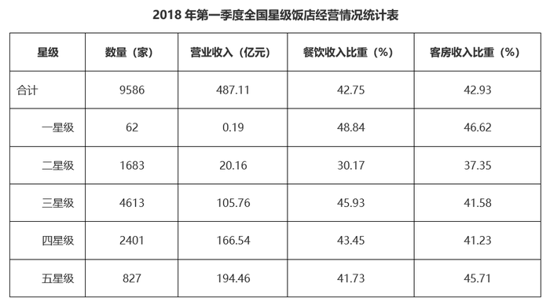

#### 第 1 题　qid 4628150 · 比重

2018年第一季度，全国哪类星级饭店的营业收入中，餐饮、客房收入占比最低？

- **A**. 五星级
- **B**. 四星级
- **C**. 三星级
- **D**. 二星级　✅

**答案**：D

**官方解析**

定位统计表可得：2018年第一季度全国二星级饭店的餐饮、客房收入比重，三星级饭店的餐饮、客房收入比重，四星级饭店的餐饮、客房收入比重，五星级饭店的餐饮、客房收入比重。因此，占比最低的是二星级饭店。

故正确答案为D。

---

#### 第 2 题　qid 4628153 · 平均数

2018年第一季度，平均每家四星级及以上饭店月均营业收入：

- **A**. 低于300万元
- **B**. 在300-500万元之间　✅
- **C**. 在500-1000万元之间
- **D**. 超过1000万元

**答案**：B

**官方解析**

根据题干“2018年第一季度······平均每家······月均营业收入”，结合材料时间是2018年第一季度，可判定本题为现期平均数问题。定位统计表可得：2018年第一季度全国四星级饭店2401家，营业收入166.54亿元；五星级饭店827家，营业收入194.46亿元。故2018年第一季度平均每家四星级及以上饭店月均营业收入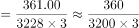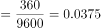亿元=375万元，在300-500万元之间。

故正确答案为B。

---

#### 第 3 题　qid 4628156 · 平均数

已知2018年一季度全国三星级酒店平均客房收入为260.26元/间夜，问该季度平均每家三星级酒店订出客房：

- **A**. 不到2000间
- **B**. 2000-5000间之间　✅
- **C**. 5000-10000间之间
- **D**. 超过10000间

**答案**：B

**官方解析**

根据题干“已知2018年一季度······平均每家三星级酒店订出客房”，结合材料时间是2018年第一季度，可判定本题为现期平均数问题。定位统计表可得：2018年第一季度全国三星级饭店4613家，营业收入105.76亿元，客房收入比重41.58%；题干给出2018年一季度全国三星级酒店平均客房收入为260.26元/间夜。故2018年一季度平均每家三星级酒店订出客房数量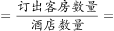间，介于2000-5000间之间。

故正确答案为B。

---

#### 第 4 题　qid 4628159 · 综合

2018年第一季度全国50个重点旅游城市星级饭店营业收入为其他城市星级饭店营业收入的：

- **A**. 不到1.1倍
- **B**. 1.1-1.5倍之间
- **C**. 1.5-2倍之间　✅
- **D**. 2倍以上

**答案**：C

**官方解析**

根据题干“2018年第一季度······为······的”，结合材料时间为2018年第一季度，选项为多少倍，可判定本题为现期倍数问题。定位文字材料第一段可得，2018年第一季度，全国星级饭店第一季度的营业收入为487.11亿元；定位文字材料第二段可得，第一季度全国50个重点旅游城市星级饭店营业收入为320.19亿元。则2018年第一季度，其他城市星级饭店营业收入为487.11-320.19=166.92亿元，故所求倍数为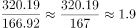倍，介于1.5-2倍之间。

故正确答案为C。

---

#### 第 5 题　qid 4628161 · 综合

下列能够从上述资料中推出的是：

- **A**. 2017年第一季度，全国星级饭店营业收入超过480亿元
- **B**. 2018年第一季度，五星级饭店数量占全国星级饭店的一成以上
- **C**. 2018年第一季度，全国二星级饭店的客房收入比餐饮收入高2亿多元
- **D**. 2018年第一季度，全国50个重点旅游城市平均每家星级饭店营业收入高于全国平均水平　✅

**答案**：D

**官方解析**

A项：定位文字材料第一段可知，2018年第一季度，全国星级饭店的营业收入为487.11亿元，同比增长2.43%。根据公式：基期量，则2017年第一季度，全国星级饭店营业收入为亿元，小于480亿元，错误；

B项：定位统计表可知，2018年第一季度五星级饭店数量为827家；全国星级饭店数量为9586家。根据公式：比重，则2018年第一季度，五星级饭店数量占全国星级饭店的比重，不足一成，错误；

C项：定位统计表可知，2018年第一季度全国二星级饭店营业收入为20.16亿元，餐饮收入所占比重为30.17%，客房收入所占比重为37.35%。则2018年第一季度，全国二星级饭店的客房收入比餐饮收入高20.16×37.35%-20.16×30.17%=20.16×（37.35%-30.17%）=20.16×7.18%亿元，不足2亿元，错误；

D项：定位文字材料第一段可知，2018年第一季度，共有9586家星级饭店，全国星级饭店第一季度的营业收入为487.11亿元；定位文字材料第二段可知，第一季度全国50个重点旅游城市共有3636家星级饭店，营业收入为320.19亿元。则2018年第一季度，全国平均每家星级饭店营业收入为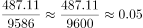亿元；全国50个重点旅游城市平均每家星级饭店营业收入为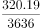亿元。故全国50个重点旅游城市平均每家星级饭店营业收入高于全国平均水平，正确。

故正确答案为D

---

### 材料 2

        2021年1-2月，全国进口天然气2080万吨，同比增长17.4%。中国天然气进口金额为7312.1百万美元，同比增长3.8%。

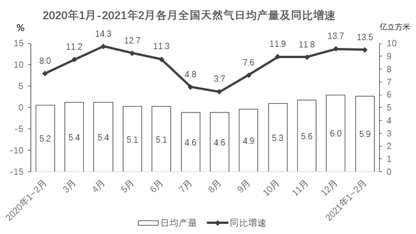

#### 第 6 题　qid 4628163 · 综合

2021年1-2月，全国总共生产天然气约多少亿立方米？

- **A**. 324
- **B**. 336
- **C**. 348　✅
- **D**. 360

**答案**：C

**官方解析**

根据题干“2021年1-2月，全国总共生产天然气约多少亿立方米”，结合材料数据给出2021年1-2月全国天然气日均产量，可判定本题为现期平均数问题。定位统计图可得，2021年1-2月全国天然气日均产量为5.9亿立方米。根据全国天然气日均产量，则2021年1-2月全国生产天然气总产量=1-2月日均产量×天数=5.9×（31+28）=5.9×59=348.1亿立方米，与C项最接近。

故正确答案为C。

---

#### 第 7 题　qid 4628164 · 综合

2020年1-2月，全国月均进口天然气约多少万吨？

- **A**. 886　✅
- **B**. 1040
- **C**. 1561
- **D**. 1771

**答案**：A

**官方解析**

根据题干“2020年1-2月······月均······”，结合材料时间为2021年1-2月，可判定本题为基期平均数问题。定位文字材料可得：2021年1-2月，全国进口天然气2080万吨，同比增长17.4%。根据公式：，可得2020年1-2月，全国月均进口天然气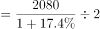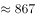万吨，与A项最接近。

故正确答案为A。

---

#### 第 8 题　qid 4628165 · 综合

将2020年二季度按天然气产量高低进行排列，以下正确的是：

- **A**. 4月>5月=6月
- **B**. 4月>5月>6月　✅
- **C**. 5月>4月>6月
- **D**. 5月>4月=6月

**答案**：B

**官方解析**

定位统计图可得：2020年4月、5月、6月全国天然气日均产量分别为5.4亿立方米、5.1亿立方米、5.1亿立方米。则2020年二季度全国天然气产量分别为：4月=5.4×30=162亿立方米；5月=5.1×31=158.1亿立方米；6月=5.1×30=153亿立方米，故2020年二季度按天然气产量高低进行排列为4月＞5月＞6月。
故正确答案为B。

---

#### 第 9 题　qid 4628167 · 增长

2020年下半年，天然气产量同比增量超过10亿立方米的月份有几个？

- **A**. 1
- **B**. 2
- **C**. 3
- **D**. 4　✅

**答案**：D

**官方解析**

根据题干“2020年下半年，······同比增量超过10亿立方米······”，可判定本题为增长量计算问题。定位统计图可得2020年7-12月全国天然气日均产量及同比增速。根据公式：增长量，可得2020年下半年，各月天然气产量同比增量情况如下：

7月：日均现期量4.6、日均增长率4.8%，增量为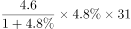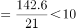亿立方米；

8月：日均现期量4.6、日均增长率3.7%，根据增量比较“大大则大”，8月份日均增量一定小于7月份日均增量，天数均为31天，所以8月份增量小于7月份增量，小于10亿立方米；

9月：日均现期量4.9、日均增长率7.6%，增量为亿立方米；

10月：日均现期量5.3、日均增长率11.9%，根据增量比较“大大则大”，10月份日均增量一定大于9月份日均增量，并且天数31大于9月30天，因此10月份增量大于9月份增量，大于10亿立方米；

11月：日均现期量5.6、日均增长率11.8%，同理，11月份增量大于9月份增量，大于10亿立方米；

12月：日均现期量6.0、日均增长率13.7%，同理，12月份增量大于9月份增量，大于10亿立方米；

则2020年下半年，天然气产量同比增量超过10亿立方米的月份有4个。

故正确答案为D。

---

#### 第 10 题　qid 4628170 · 综合

不能从上述资料中推出的是：

- **A**. 2020年四季度，全国天然气产量比三季度增长了10%以上
- **B**. 2019年1～2月，全国天然气日均产量超过5亿立方米　✅
- **C**. 2021年1～2月，全国天然气进口金额同比增长额超过200百万美元
- **D**. 2020年二、三、四季度，全国天然气日均产量同比增速低于上月的月份超过一半

**答案**：B

**官方解析**

A项：定位统计图可知：2020年7月-12月各月全国天然气日均产量，可得2020年第三季全国天然气产量=4.6×31+4.6×31+4.9×30=432.2亿立方米，2020年第四季全国天然气产量=5.3×31+5.6×30+6.0×31=518.3亿立方米。根据公式：，故题干所求，正确；

B项：定位统计图可知：2020年1-2月全国天然气日均产量为5.2亿立方米，同比增速为8.0%。根据公式：，可得2019年1-2月全国天然气日均产量亿立方米&lt;5亿立方米，错误；

C项：定位文字材料可知：2021年1-2月中国天然气进口金额为7312.1百万美元，同比增长3.8%。根据公式：，可得2021年1-2月全国天然气进口金额同比增长额百万美元&gt;200百万美元，正确；

D项：定位统计图可知：2020年4月-12月全国天然气日均产量的同比增速低于上月的月份有5月、6月、7月、8月、11月，共5个。而2020年二、三、四季度总共有9个月，，即超过一半，正确。

本题为选非题，故正确答案为B。

---
