# 2021年新疆生产建设兵团行政执法类公务员考试《行测》题（网友回忆版）

> 省考 · 2021 年 · 6 个模块 · 共 115 题

- [政治理论](#%E6%94%BF%E6%B2%BB%E7%90%86%E8%AE%BA) · 1 题
- [常识判断](#%E5%B8%B8%E8%AF%86%E5%88%A4%E6%96%AD) · 19 题
- [言语理解与表达](#%E8%A8%80%E8%AF%AD%E7%90%86%E8%A7%A3%E4%B8%8E%E8%A1%A8%E8%BE%BE) · 30 题
- [数量关系](#%E6%95%B0%E9%87%8F%E5%85%B3%E7%B3%BB) · 10 题
- [判断推理](#%E5%88%A4%E6%96%AD%E6%8E%A8%E7%90%86) · 35 题
- [资料分析](#%E8%B5%84%E6%96%99%E5%88%86%E6%9E%90) · 20 题

---

## 政治理论

### 第 1 题　qid 4004579 · 新思想

关于习近平新时代中国特色社会主义思想，表述不正确的是∶

- **A**. 中国特色社会主义最本质的特征是以人民为中心　✅
- **B**. 新时代我国社会主要矛盾是人民日益增长的美好生活需要和不平衡不充分的发展之间的矛盾
- **C**. 全面推进依法治国总目标是建设中国特色社会主义法治体系、建设社会主义法治国家
- **D**. 中国特色大国外交要推动构建新型国际关系，推动构建人类命运共同体

**答案**：A

**官方解析**

本题考查政治常识。
A项错误，十九大报告在第三部分“新时代中国特色社会主义思想和基本方略”中指出：“新时代中国特色社会主义思想······明确中国特色社会主义最本质的特征是中国共产党领导，中国特色社会主义制度的最大优势是中国共产党领导，党是最高政治领导力量，提出新时代党的建设总要求，突出政治建设在党的建设中的重要地位。”
B项正确，十九大报告在第三部分“新时代中国特色社会主义思想和基本方略”中指出：“新时代中国特色社会主义思想······明确新时代我国社会主要矛盾是人民日益增长的美好生活需要和不平衡不充分的发展之间的矛盾，必须坚持以人民为中心的发展思想，不断促进人的全面发展、全体人民共同富裕。”
C项正确，十九大报告在第三部分“新时代中国特色社会主义思想和基本方略”中指出：“新时代中国特色社会主义思想······明确全面推进依法治国总目标是建设中国特色社会主义法治体系、建设社会主义法治国家。”
D项正确，十九大报告在第三部分“新时代中国特色社会主义思想和基本方略”中指出：“新时代中国特色社会主义思想······明确中国特色大国外交要推动构建新型国际关系，推动构建人类命运共同体。”
本题为选非题，故正确答案为A。

---

## 常识判断

### 第 1 题　qid 4004593 · 法律常识

关于《中华人民共和国民法典》，以下表述正确的是∶

- **A**. 编纂民法典是坚持和完善中国特色社会主义制度的现实需要　✅
- **B**. 民法典由全国人大常委会办公室负责牵头制定
- **C**. 最高人民法院对民法典作出的法律解释不具有法律效力
- **D**. 民法典施行后，之前颁布的民事单行法律自动作废

**答案**：A

**官方解析**

本题考查法律常识。
A项正确，《关于&lt;中华人民共和国民法典（草案）&gt;的说明》在“一、编纂民法典的重大意义”部分指出：“（一）编纂民法典是坚持和完善中国特色社会主义制度的现实需要·······我国民事法律制度正是伴随着新时期改革开放和社会主义现代化建设的历史进程而形成并不断发展完善的，是中国特色社会主义法律制度的重要组成部分。在系统总结制度建设成果和实践经验的基础上，编纂一部具有中国特色、体现时代特点、反映人民意愿的民法典，不仅能充分彰显中国特色社会主义法律制度成果和制度自信，促进和保障中国特色社会主义事业不断发展，也能为人类法治文明的发展进步贡献中国智慧和中国方案。”
B项错误，《关于&lt;中华人民共和国民法典（草案）&gt;的说明》在“三、民法典编纂工作情况”部分指出：“根据党中央的工作部署，编纂民法典的起草工作由全国人大常委会法制工作委员会牵头，最高人民法院、最高人民检察院、司法部、中国社会科学院、中国法学会为参加单位。”
C项错误，法律解释是指一定的人、组织以及国家机关在法律实施或适用过程中对表达法律的语言文字的意义进行揭示、说明和选择的活动。根据法律解释主体与解释结果效力的不同，法律解释可以被区分为正式解释与非正式解释。所谓正式解释，又被称为法定解释或者有权解释，是指有法律解释权的国家机关、官员对法律作出了有法律约束力的解释。这里的“法律约束力”是指解释结果具有普遍的约束力。根据解释的国家机关的不同，正式解释被区分为：立法解释、司法解释与行政解释。最高人民法院对民法典作出的解释属于司法解释，是正式解释的一种，具有法律效力。
D项错误，根据《中华人民共和国民法典》第一千二百六十条规定：“本法自2021年1月1日起施行。《中华人民共和国婚姻法》、《中华人民共和国继承法》、《中华人民共和国民法通则》、《中华人民共和国收养法》、《中华人民共和国担保法》、《中华人民共和国合同法》、《中华人民共和国物权法》、《中华人民共和国侵权责任法》、《中华人民共和国民法总则》同时废止。”因此，之前颁布的民事单行法律并不是自动废止，而是由《中华人民共和国民法典》明确规定废止。
故正确答案为A。

---

### 第 2 题　qid 4004602 · 人文常识

下列新思想与新提法按照提出的时间先后顺序排列正确的是∶
①五大发展理念②三严三实③五位一体④四个意识⑤四个自信

- **A**. ③②①④⑤　✅
- **B**. ③④⑤①②
- **C**. ⑤④①③②
- **D**. ⑤④③②①

**答案**：A

**官方解析**

本题考查政治常识。
①2015年10月29日，中国共产党第十八届中央委员会第五次全体会议审议通过的《中共中央关于制定国民经济和社会发展第十三个五年规划的建议》中首次提出“五大发展理念”。《建议》第二部分“‘十三五’时期经济社会发展的主要目标和基本理念”中指出：“完善发展理念。实现‘十三五’时期发展目标，破解发展难题，厚植发展优势，必须牢固树立创新、协调、绿色、开放、共享的发展理念。”
②2014年3月9日，习近平总书记在中华人民共和国第十二届全国人民代表大会第二次会议安徽代表团参加审议时，关于推进作风建设的讲话中提出“既严以修身、严以用权、严以律己；又谋事要实、创业要实、做人要实”的重要论述，称为“三严三实”讲话。系“三严三实”的首次提出。
③2012年11月17日至11月23日，党的十八大站在历史和全局的战略高度，对推进新时代“五位一体”总体布局作了全面部署。从经济、政治、文化、社会、生态文明五个方面，制定了新时代统筹推进“五位一体”总体布局的战略目标。
④“四个意识”是指政治意识、大局意识、核心意识、看齐意识，是2016年1月29日中共中央政治局会议最早提出来的。
⑤2016年7月1日，习近平总书记在庆祝中国共产党成立95周年大会上发表重要讲话并指出：“坚持不忘初心、继续前进，就要坚持中国特色社会主义道路自信、理论自信、制度自信、文化自信，坚持党的基本路线不动摇，不断把中国特色社会主义伟大事业推向前进。”系“四个自信”的首次提出。
故按照提出的时间先后顺序排列为③②①④⑤。
故正确答案为A。

---

### 第 3 题　qid 4004608 · 人文常识

下列哪一项成语所关联的主要人物与其他三项不同？

- **A**. 多多益善
- **B**. 才高八斗　✅
- **C**. 一饭千金
- **D**. 暗度陈仓

**答案**：B

**官方解析**

本题考查人文常识。
A项，“多多益善”出自《史记·淮阴侯列传》，刘邦问韩信：“依你看来，像我能带多少人马？”韩信答：“陛下能带十万。”刘邦又问：“那你呢？”韩信答：“对我来说，当然越多越好！”可知，成语关联的主要人物是韩信。
B项，“才高八斗”出自《南史·谢灵运传》，谢灵运说：“天下的文学之才总共有一石，其中曹子建（曹植）独占了八斗，我的才学占一斗，天下其他人共分一斗。”可知，成语关联的主要人物是曹植。
C项，“一饭千金”出自《史记·淮阴侯列传》，韩信在未得志时境况困苦，时常往城下钓鱼，有很多漂母（清洗丝棉絮或旧衣布的老婆婆）在河边作工，其中有一个漂母很同情韩信的遭遇，不断地救济他，给他饭吃。后来，韩信替汉王立下汗马功劳，被封为楚王，他想起从前曾受过漂母的恩惠，便命从人送酒菜给她吃，更送给她黄金一千两来答谢她。可知，成语关联的主要人物是韩信。
D项，“暗度陈仓”出自《史记·淮阴侯列传》，指刘邦将从汉中出兵攻项羽时，让大将军韩信从正面迷惑对方，掩盖自己的攻击路线，暗中绕道奔袭陈仓，取得胜利。可知，成语关联的主要人物是韩信。
故A、C、D三项成语关联的主要人物均为韩信，B项关联的主要人物为曹植。
本题为选非题，故正确答案为B。

---

### 第 4 题　qid 4004622 · 人文常识

下列“三部曲”的作者与其包含的作品对应错误的是：

- **A**. 巴金—爱情三部曲—《家》《春》《秋》　✅
- **B**. 茅盾—农村三部曲—《春蚕》《秋收》《残冬》
- **C**. 郭沫若—女神三部曲—《女神之再生》《湘累》《棠棣之花》
- **D**. 曹禺—话剧三部曲—《雷雨》《日出》《原野》

**答案**：A

**官方解析**

本题考查人文常识。
A项错误，巴金，本名李尧棠，中国当代作家。代表作品有“激流三部曲”——《家》《春》《秋》；“爱情三部曲”——《雾》《雨》《电》。
B项正确，茅盾，原名沈德鸿，字雁冰，中国现代作家、文学评论家、文化活动家以及社会活动家。其短篇小说《春蚕》《秋收》《残冬》被称为“农村三部曲”，从《春蚕》写蚕丝业萧条所引起的农村破产，到《秋收》写农民在饥饿中的抢粮风潮，到《残冬》写农民在一年生计完全绝望以后，终于自发起来进行武装斗争，正好反映出了那个年代旧中国农村变化和农民觉醒的全过程。
C项正确，郭沫若，本名郭开贞，字鼎堂，中国现代作家、历史学家、考古学家。“女神三部曲”是郭沫若的系列诗作，包括《女神之再生》《湘累》《棠棣之花》，是“五四运动”狂飙突进精神的典型体现。
D项正确，曹禺，原名万家宝，中国杰出的现代话剧剧作家。《雷雨》《日出》《原野》是他的话剧三部曲，奠定了他在中国现代文学史上的地位。
本题为选非题，故正确答案为A。

---

### 第 5 题　qid 4004629 · 人文常识

下列经济名词解释错误的是：

- **A**. 寡头垄断是指整个行业中只有一个生产者的市场结构　✅
- **B**. 洛伦兹曲线是用以反映国民收入分配平均程度的一种曲线
- **C**. 基尼系数是一个衡量分配不平等程度的指标
- **D**. 边际效用是指消费者在一定时间内增加单位商品所引起的总效用的增加量

**答案**：A

**官方解析**

本题考查经济常识。
A项错误，按照产品或服务供给方状况（即市场上的竞争状况），可以把市场划分为四种类型：完全竞争市场、不完全竞争市场、寡头垄断市场和完全垄断市场。寡头垄断市场又称寡头市场，是指少数几家厂商控制整个行业市场的产品的生产和销售的一种市场组织。整个行业中只有一个生产者的市场结构是完全垄断市场。
B项正确，为了研究国民收入在国民之间的分配问题，奥地利统计学家洛伦兹提出了著名的洛伦兹曲线，即在一个总体（国家、地区）内，以“最贫穷的人口计算起一直到最富有人口”的人口百分比对应各个人口百分比的收入百分比的点组成的曲线。通过洛伦兹曲线，可以直观地看到一个国家收入分配平等或不平等的状况。
C项正确，基尼系数是指国际上通用的、用以衡量一个国家或地区居民收入差距的常用指标。基尼系数最大为“1”，最小等于“0”，越接近0表明收入分配越是趋向平等，基尼系数小于0.2时，认为收入分配过于平均。
D项正确，边际效用是指某种物品的消费量每增加一单位所增加的满足程度，即在一定时间内增加单位商品所引起的总效用的增加量。经济学通常认为，随着商品或服务的量增加，边际效用将会逐步减少，称为边际效应递减定律。
本题为选非题，故正确答案为A。

---

### 第 6 题　qid 4004637 · 地理国情

下列关于我国主要地理分界线的说法，表述正确的是：

- **A**. 长江水系和黄河水系的分水岭是南岭
- **B**. 冬小麦和春小麦种植区的分界线是黄河一线
- **C**. 汉水和渭河的分界线是武夷山
- **D**. 季风区和非季风区的分界线包含巴颜喀拉山脉　✅

**答案**：D

**官方解析**

本题考查地理国情。
A项错误，长江水系与黄河水系分水岭是巴颜喀拉山脉-秦岭。南岭位于长江以南，指湖南省江西省与南方的两广相连的群山区域，即长江水系与珠江水系的分水岭及其周围群山。
B项错误，根据不同的播种期，小麦可分为冬小麦与春小麦。冬小麦在秋季播种，次年的夏季收获，对越冬条件有较高要求。春小麦在春季播种，秋季收获。在我国一般以长城为界，在长城以北大体为春小麦，以南则为冬小麦。
C项错误，汉水和渭河的分界线是秦岭。武夷山位于江西与福建西北部两省交界处，属典型的丹霞地貌。
D项正确，我国季风区和非季风区的分界线：大兴安岭-阴山山脉-贺兰山-巴颜喀拉山脉-冈底斯山脉。此分界线以东为季风区，冬季近地面受高压系统控制，盛行偏北风，气候干冷，夏季受低压系统控制，盛行偏南风，气候湿润。此分界线以西为非季风区，气候干旱。
故正确答案为D。

---

### 第 7 题　qid 4004642 · 人文常识

下列说法错误的是：

- **A**. 洛川会议把领导农民进行秋收起义作为党的最主要的任务　✅
- **B**. 古田会议通过了关于纠正党内错误思想的决议案，是中国共产党和红军建设的纲领性文件
- **C**. 八七会议确立了农村包围城市的革命路线
- **D**. 遵义会议确立了毛泽东在红军和党中央的领导地位，成为党的历史上一个生死攸关的转折点

**答案**：A

**官方解析**

本题考查毛中特。
A项错误，洛川会议是六届中央政治局于1937年8月22日至25日在陕北洛川冯家村召开的扩大会议，会议讨论制定了动员全国军民开展民族解放战争，实行全面持久抗战的方针，进一步确定在抗日战争时期的任务及各项政策。秋收起义是1927年毛泽东在湘赣边界领导工农革命军举行的一次武装起义，“八七会议”把领导农民进行秋收起义作为当前党的最主要任务。
B项正确，古田会议是中国工农红军第四军于1929年12月28日至29日在福建省上杭县古田村召开的第九次党的代表大会，会议将马克思列宁主义与中国革命斗争的具体实践相结合，纠正了党内和军队中出现的极端民主化、非组织化等错误倾向，解决了如何从加强党的思想工作着手保持党的无产阶级先锋队性质和建设新型人民军队的根本问题。把党建设成为无产阶级先锋队，把军队建设成为无产阶级领导的新型人民军队，在古田会议决议中得以明确，古田会议决议因此成为我党我军建设的伟大纲领及重要里程碑。
C项正确，八七会议是第一次国内革命战争失败以后，中共中央政治局于1927年8月7日在汉口召开的紧急会议。会议批判和纠正了陈独秀右倾机会主义错误，撤销了他在党内的职务，选出了新的临时中央政治局，确定了土地革命和武装斗争的总方针。毛泽东出席了这次会议，并提出了著名的“枪杆子里出政权”的论断。
D项正确，遵义会议是指1935年1月中共中央政治局在贵州遵义召开的扩大会议，会议结束了王明“左”倾冒险主义在中共中央的统治，确立了以毛泽东为代表的新的中央的正确领导。这次会议是中国共产党第一次独立自主地运用马克思列宁主义基本原理解决自己的路线、方针和政策方面问题的会议。在极端危急的历史关头，挽救了党，挽救了红军，挽救了革命，是中国共产党历史上一个生死攸关的转折点，标志着中国共产党从幼年走向成熟。
本题为选非题，故正确答案为A。
注：农村包围城市是以毛泽东为代表的中国共产党人在领导中国革命实践中逐步摸索出来的一条具有中国特色的发展道路和总战略。从1927年10月到1930年1月，毛泽东在总结井冈山和其他革命根据地实践经验的基础上，先后撰写了《中国的红色政权为什么能够存在？》《井冈山的斗争》《星星之火，可以燎原》等著作，标志着农村包围城市的革命道路理论的基本形成。C选项亦存在瑕疵，八七会议确立的是土地革命和武装斗争的总方针，并决定发动秋收起义，并未直接确立农村包围城市的革命路线。但本题为单选题，A项错误更为明显，故正确答案为A。

---

### 第 8 题　qid 4004648 · 科技常识

诗句“已晚相逢半山碧，便忙也折一枝黄。花应冷笑东篱族，犹向陶翁觅宠光。”描写的植物是：

- **A**. 菊花　✅
- **B**. 桂花
- **C**. 迎春花
- **D**. 向日葵

**答案**：A

**官方解析**

本题考查人文常识。
题干中的诗句出自宋代杨万里的《野菊》，意思是已是傍晚时分，在绿色的半山腰中与野菊相逢。即使匆忙也要折一枝淡黄的野菊。野菊花也许会冷笑那些家养的菊花，因为家菊们竟然向陶渊明寻求恩宠。诗中“陶翁”“东篱”对应东晋田园诗人陶渊明及其所著“采菊东篱下，悠然见南山”。可知该诗描写的是菊花。
故正确答案为A。

---

### 第 9 题　qid 4004654 · 科技常识

以下关于我国科技成就的说法错误的是：

- **A**. 2020年6月23日，在西昌卫星发射中心成功发射第55颗北斗导航卫星
- **B**. 2020年9月21日，海洋二号C星成功发射，是我国海洋动力环境监测网的第一颗卫星　✅
- **C**. 2020年5月5日，长征五号B运载火箭在海南文昌首飞成功
- **D**. 嫦娥四号着陆器和“玉兔二号”月球车分别于2020年11月10日和11月9日结束月夜休眠，迎来第24月昼

**答案**：B

**官方解析**

本题考查科技常识。
A项正确，2020年6月23日9时43分，我国在西昌卫星发射中心用长征三号乙运载火箭，成功发射北斗系统第55颗导航卫星暨北斗三号最后一颗全球组网卫星。至此，北斗三号全球卫星导航系统星座部署全面完成。
B项错误，2020年9月21日13时40分，长征四号乙运载火箭从酒泉卫星发射中心点火升空，成功将海洋二号C星送入预定轨道。海洋二号C星是我国海洋动力环境监测网的第二颗卫星，也是我国首颗运行于倾斜轨道的大型遥感卫星。
C项正确，2020年5月5日，为我国载人空间站工程研制的长征五号B运载火箭在海南文昌首飞成功，正式拉开我国载人航天工程“第三步”任务的序幕。
D项正确，2018年12月8日，我国在西昌卫星发射中心利用长征三号乙改进型运载火箭成功将嫦娥四号着陆器和巡视器（“玉兔二号”月球车）发射升空，实现了人类首次月球背面软着陆和巡视勘察。嫦娥四号着陆器和“玉兔二号”月球车分别于2020年11月10日3时12分和2020年11月9日10时17分结束月夜休眠，受光照自主唤醒，迎来第24月昼。
本题为选非题，故正确答案为B。

---

### 第 10 题　qid 4004660 · 人文常识

下列观点属于客观唯心主义的是：

- **A**. 万物的本源是水
- **B**. 万物皆备于我
- **C**. 存在即是被感知
- **D**. 世界是绝对观念的异化　✅

**答案**：D

**官方解析**

本题考查政治常识。
客观唯心主义是唯心主义哲学的两种基本形式之一。它认为在物质世界和人类产生之前就独立存在着一种客观精神（理念、理、绝对精神、绝对观念等），这种客观精神在其发展过程中，产生了物质世界。因此，客观精神在先，是物质世界的本原，是第一性的；物质世界在后，是客观精神的表现和派生物，是第二性的。
A项错误，“万物的本源是水”是古希腊米利都学派的创始人泰勒斯的名言，他认为世界的本源是水，即具体的物质是世界的本源，属于古代朴素唯物主义的观点。
B项错误，“万物皆备于我”出于《孟子·尽心上》，意思是万物本性都与我所通。其认为世界的本源是人的精神，世界上的一切事物都存在于人的精神之中，属于主观唯心主义的观点。
C项错误，“存在即是被感知”是英国哲学家贝克莱的名言，他认为，既然所有外物经过感觉到达心灵，那么我们能够确信的是我们的感觉，我们无法确定感觉之外还有什么外物。即一切物质都存在于人的精神之中，属于主观唯心主义的观点。
D项正确，“世界是绝对观念的异化”是黑格尔哲学提出的一个重要客观唯心主义论断，出自黑格尔《逻辑学》。其认为世界是绝对观念产生的，是它的异化，所以绝对观念中产生了世界，属于客观唯心主义的观点。
故正确答案为D。

---

### 第 11 题　qid 4004667 · 经济常识

下列名词与其英文缩写对应不正确的是：

- **A**. 博鳌亚洲论坛——BFA
- **B**. 国民生产总值——GDP　✅
- **C**. 国际货币基金组织——IMF
- **D**. 世界卫生组织——WHO

**答案**：B

**官方解析**

本题考查经济常识。
A项正确，博鳌亚洲论坛（Boao Forum For Asia，缩写BFA）是一个总部设在中国的非官方、非营利性、定期、定址国际组织，由29个成员国共同发起，于2001年2月在海南省琼海市博鳌镇正式宣布成立。
B项错误，国民生产总值（Gross National Product，缩写GNP）是一定时期内本国的生产要素所有者所占有的最终产品和服务的总价值。GDP（Gross Domestic Product）指国内生产总值，是一个国家（或地区）所有常住单位在一定时期内生产活动的最终成果。
C项正确，国际货币基金组织（International Monetary Fund，缩写IMF）是根据1944年7月在布雷顿森林会议签订的《国际货币基金组织协定》，于1945年12月27日在华盛顿成立的，总部设在华盛顿特区。
D项正确，世界卫生组织（World Health Organization，缩写WHO）是联合国下属的一个专门机构，总部设置在瑞士日内瓦，只有主权国家才能参加，是国际上最大的政府间卫生组织。
本题为选非题，故正确答案为B。

---

### 第 12 题　qid 4004673 · 人文常识

关于京剧艺术，下列说法错误的是：

- **A**. 京剧腔调以西皮、二黄为主，被视为中国国粹
- **B**. 昆曲是京剧的前身，表演的艺术手段主要是唱、念、做、打　✅
- **C**. 《红灯记》《沙家浜》《智取威虎山》是现代京剧的代表作
- **D**. 2010年京剧被列入“人类非物质文化遗产代表作名录”

**答案**：B

**官方解析**

本题考查人文常识。
A项正确，京剧，曾称平剧，腔调以西皮、二黄为主，用胡琴和锣鼓等伴奏，与中国画、中国医学被世人称为“中国三大国粹”。
B项错误，京剧的前身是徽剧。昆曲是中国戏曲史上具有最完整表演体系的剧种，很多剧种都是在昆曲的基础上发展起来的，因而被称为“百戏之祖，百戏之师”。京剧虽然吸收了一部分昆曲的特点，但其前身并不是昆曲。
C项正确，京剧分为传统京剧和现代京剧。在内容上，传统京剧多表现历史题材，如《霸王别姬》《铡美案》等，多为帝王将相戏；而现代京剧多表现现实题材，如革命现代京剧《智取威虎山》《红灯记》《沙家浜》等。
D项正确，“人类非物质文化遗产代表作名录”是经联合国教科文组织评选确定的。2010年11月，京剧被列入“人类非物质文化遗产代表作名录”。
本题为选非题，故正确答案为B。

---

### 第 13 题　qid 4004683 · 人文常识

下列关于声音的常识，说法错误的是：

- **A**. 人耳可以听到的声音频率在20Hz-20000Hz之间
- **B**. 声音在不同介质中传播速度一般是固体大于液体
- **C**. 未见其人先闻其声，是因为声波波长较长，容易发生反射现象　✅
- **D**. 音调指声音的高低，响度指声音的强弱，音色主要指声音的特色

**答案**：C

**官方解析**

本题考查科技常识。
A项正确，声音的音调高低由频率决定，人耳能听见的声音的频率范围在20Hz-20000Hz之间。频率高于20000Hz的声音称为超声波，低于20Hz的声音称为次声波，人类均无法听到。
B项正确，声音的传播需要介质，可以在固体、液体和气体中传播。在固体中传播速度最快，液体次之，在气体中传播速度最慢。
C项错误，衍射现象是指波在传播时，如果被一个大小接近于或小于波长的物体阻挡，就绕过这个物体，继续进行。“未见其人先闻其声”是因为两者之间受到某种物体阻挡，因此“未见其人”，但声音可以绕过物体进行，所以“先闻其声”。
D项正确，声音的三个特性分别是音调、响度、音色。音调指的是声音的高低，由频率决定，频率越高，音调越高；响度指的是声音的强弱，由振幅决定，振幅越大，响度越大；音色指的是不同声音表现在波形方面的特性，由发声体的材料、结构决定，不同的发声体发出声音的音色一般不同，如小提琴和钢琴的音色不同。
本题为选非题，故正确答案为C。

---

### 第 14 题　qid 4004692 · 人文常识

表面张力的形成同处在液体表面薄层内的分子的特殊受力状态密切相关。下列现象，与表面张力无关的是：

- **A**. 毛笔上的墨汁不会掉下来
- **B**. 荷叶或芋叶上滚动的水珠
- **C**. 氢气球会浮在空中　✅
- **D**. 吹出的肥皂泡泡

**答案**：C

**官方解析**

本题考查科技常识。
液体表面张力，是指作用于液体表面，使液体表面积缩小的力。其产生的原因是：液体跟气体接触的表面存在一个薄层，叫做表面层，表面层里的分子比液体内部稀疏，分子间的距离比液体内部大一些，分子间的相互作用表现为引力。
A项正确，毛笔上的墨汁不会掉下来属于毛细现象，毛笔上有许多毛细管，墨汁的附着力与液体表面张力共同作用达到与重力平衡，使墨汁不会从毛笔上掉下来。
B项正确，由于荷叶或芋叶具有疏水、不吸水的表面，落在叶面上的雨水不会浸润展开，而会因表面张力的作用形成水珠。
C项错误，氢气球会浮在空中是因为氢气的密度比空气小，氢气球受到空气浮力，与液体表面张力无关。
D项正确，肥皂泡是一层极薄的肥皂水膜，这层膜是由分子组成的，分子之间有相互的作用力。内部的气泡试图聚集在一起成为与外界空气的接触最小化的形状，两种力会最终达到一个平衡状态，即为球形。在一个球形气泡中，每一个肥皂分子都在吸引同样数量的肥皂分子，且表面的张力把气泡拉在一起并使它们保持球形。
本题为选非题，故正确答案为C。

---

### 第 15 题　qid 4004700 · 人文常识

下列古诗文或俗语中所描写的现象与其蕴含的气象知识对应错误的是：

- **A**. 随风潜入夜，润物细无声——在春季，由暖锋形成的春雨，一般雨势较小
- **B**. 一场春雨一场暖，一场秋雨一场寒——暖锋和冷锋过境后的效果
- **C**. 天无三日晴，地无三尺平——江淮地区准静止锋形成的梅雨现象　✅
- **D**. 春雨贵如油，夏雨满街流——华北地区春旱，春天仍在冷气团的控制下

**答案**：C

**官方解析**

本题考查地理国情。
A项正确，“随风潜入夜，润物细无声”出自杜甫的《春夜喜雨》，意思是指春雨随着春风在夜里悄悄地落下，悄然无声地滋润着大地万物。诗句对应的季节为春天，雨水主要是由暖锋形成。暖锋是指锋面在移动过程中，暖空气推动锋面向冷气团一侧移动的锋，可能会连续性降水或出现雾。另外，从诗的含义可以看出雨势较小。
B项正确，“一场春雨一场暖”是指在春季由于暖锋过境，与冷气团交汇，带来丰沛降水，气温升高的现象。“一场秋雨一场寒”是指在秋季由于冷锋过境，与暖气团交汇，带来丰沛降水，气温降低的现象。
C项错误，“天无三日晴，地无三尺平”描述的是我国贵州省的特有景象。贵州省，年平均阴雨日数在200天以上，有“天无三日晴”之说；又因山脉绵延，河谷深切，地形崎岖，交通不便，有“地无三尺平”之说。梅雨是中国长江中下游地区在每年六、七月份都会出现持续天阴有雨的气候现象，产生于西太平洋副热带高压边缘的锋区。六月份气温回升，沿海暖气团与西北冷气团势均力敌，此处形成准静止锋，导致梅雨。
D项正确，“春雨贵如油，夏雨满街流”形容的是我国降水季节性分布不均，夏秋多、冬春少的特点。春季，暖空气势力还不强，来自海洋的暖湿气流多在我国的华南、江南一带徘徊，与冷空气交锋，为那里带来丰沛的雨水，而华北、西北则在湿度较低的冷气团的控制下，出现干冷天气。
本题为选非题，故正确答案为C。

---

### 第 16 题　qid 4004706 · 人文常识

生活在东汉时期的医者，在其所在的时期最不可能学习到的著作是：

- **A**. 《黄帝内经》
- **B**. 《伤寒杂病论》
- **C**. 《千金方》　✅
- **D**. 《神农本草经》

**答案**：C

**官方解析**

本题考查人文常识。
A项正确，《黄帝内经》一般认为成书于春秋战国时期，分《灵枢》《素问》两部分。该书在理论上建立了中医学上的阴阳五行学说、脉象学说、藏象学说等，是我国现存成书最早的一部医学典籍，与《难经》《伤寒杂病论》《神农本草经》并称为中国传统医学四大经典著作。东汉时期的医者是有可能学习到本书的。
B项正确，《伤寒杂病论》作者是东汉末年医学家张仲景。该书记载了大量有效的方剂，确立了“六经分类”的辨证施治原则，是中国第一部从理论到实践的医学专著。东汉时期的医者是有可能学习到本书的。
C项错误，《千金方》作者是唐代医药学家孙思邈。该书是对唐代以前医药学成就的系统总结，被誉为我国最早的一部临床百科全书。成书年代远远晚于东汉，故东汉时期的医者不可能学习到本书。
D项正确，《神农本草经》起源于神农氏，成书于东汉时期。该书是对中国中医药的第一次系统总结，是中医四大经典著作之一。东汉时期的医者是有可能学习到本书的。
本题为选非题，故正确答案为C。

---

### 第 17 题　qid 4004713 · 法律常识

古罗马法学家西塞罗说：“因为法律统治执政官，所以执政官统治人民，我们真正可以说，执政官是会说话的法律，而法律乃是不会说话的执政官。”对这段话的理解，下列表述正确的是：

- **A**. 只要执政官所说的话，都是法律
- **B**. 执政官是法律的产物，必须服从法律　✅
- **C**. 执政官的统治与法律的统治完全相同
- **D**. 执政官对法律的解释不具有法律效力

**答案**：B

**官方解析**

本题考查法律常识。
题干中西塞罗旨在强调法律地位的至高无上，“执政官”受法律统治，其统治人民的权利也由法律所赋予。
A项错误，法律是由国家制定或认可并由国家强制力保证实施的，反映由特定物质生活条件所决定的统治阶级意志，以权利和义务为基础，以确认、保护和发展统治阶级所期望的社会关系和社会秩序为目的的行为规范体系。而非执政官所说的话。
B项正确，广义上的执法是所有国家行政机关、司法机关及其公职人员依照法定职权和程序实施法律的活动，题干中的“执政官”即对应国家行政机关、司法机关及其公职人员。一方面，其职权由法律赋予，属于法律的产物；另一方面，其必须依照法定职权和程序实施法律，受法律的统治。
C项错误，法律是统治阶级意志的体现，法律的统治是统治阶级统治的方式之一。而执政官是法律的实施者，执政官的统治指其根据法律的授权和规定行使职权，与法律的统治含义、范围均不一致。
D项错误，根据解释法律的主体和解释结果效力的不同，法律解释分为正式解释和非正式解释。所谓正式解释，又称法定解释或有权解释，是指有法律解释权的国家机关、官员对法律作出了有法律约束力的解释。这里的“法律约束力”是指解释结果具有普遍性的约束力。根据解释的国家机关的不同，正式解释被区分为：立法解释、司法解释与行政解释。所谓非正式解释是指没有法律解释权的机关、团体、组织或个人对法律作出的不具有法律约束力的解释，依其解释的角度和理论化程度不同，分为任意解释和学理解释。执政官对法律的解释属于正式解释，具有法律效力。
故正确答案为B。

---

### 第 18 题　qid 4004719 · 法律常识

下列属于司法活动范畴的是：

- **A**. 某司法局审查并发放律师执业证
- **B**. 某区市场监督部门检查工厂制造产品
- **C**. 交警对吴某闯红灯进行口头教育
- **D**. 检察机关对犯罪嫌疑人范某以涉嫌抢劫罪予以批准逮捕　✅

**答案**：D

**官方解析**

本题考查法律常识。
司法，又称法的适用，通常是指国家司法机关及其司法人员根据法定职权和法定程序，具体应用法律处理案件的专门活动。我国的司法机关包括人民法院和人民检察院。执法，又称法的执行，狭义上的执法专指国家行政机关及其公职人员依法行使管理职权、履行职责、实施法律的活动。人们把行政机关称为执法机关，就是在狭义上使用“执法”概念。
A项错误，某司法局是行政机关而非司法机关，其发放律师执业证的行为属于执法活动。
B项错误，某区市场监督部门是行政机关而非司法机关，其检查工厂制造产品的行为属于执法活动。
C项错误，交警是公安机关交通管理部门的工作人员，其对吴某闯红灯进行口头教育的行为属于执法活动。
D项正确，检察机关属于司法机关，其根据《中华人民共和国刑事诉讼法》的授权，按照规定的程序对犯罪嫌疑人范某以涉嫌抢劫罪予以批准逮捕属于司法活动。
故正确答案为D。

---

### 第 19 题　qid 4004731 · 人文常识

下列关于我国近代史上的“第一”，表述错误的是：

- **A**. 中国第一个资产阶级革命团体——兴中会
- **B**. 中国近代史上第一个不平等条约——《南京条约》
- **C**. 中国人提出在中国发展资本主义的第一个方案——《天朝田亩制度》　✅
- **D**. 中国第一个对马克思主义作出系统完整介绍的人——李大钊

**答案**：C

**官方解析**

本题考查人文常识。
A项正确，1894年11月24日，孙中山在美国檀香山创建了中国近代史上第一个资产阶级革命团体——兴中会，第一次提出了推翻满清封建君主专制政府、建立民主共和国的革命纲领，宗旨是驱逐鞑虏，恢复中华，创立合众政府。
B项正确，1842年8月，英国与清政府签订了《南京条约》，这是中国近代史上第一个不平等条约，开创了以条约形式掠夺和奴役中国合法化的先例；使中国从封建社会开始沦为半殖民地半封建社会；使中华民族与帝国主义、人民大众与封建主义的矛盾，成为中国社会的主要矛盾。
C项错误，中国人提出在中国发展资本主义的第一个方案是《资政新篇》，其核心是要在中国发展资本主义。《天朝田亩制度》是太平天国时期颁发的一部纲领性文件，主要内容是：废除封建土地所有制；规定了农民平分土地的原则；在农村设立兵农合一的乡官制度；废除封建买卖婚姻；主张人人平等。实际上并没有实行。
D项正确，李大钊，字守常，是中国最早的马克思主义者，中国共产党的主要创始人之一。1919年5月，李大钊发表《我的马克思主义观》，对马克思主义三大组成部分—马克思主义哲学、政治经济学和科学社会主义的基本观点作了系统介绍。他是国内第一个对马克思主义作系统完整的介绍的人，对马克思主义的传播起了重要作用。
本题为选非题，故正确答案为C。

---

## 言语理解与表达

### 第 1 题　qid 4004478 · 逻辑填空

近年来在许多地方，“校闹”频发让学校疲于招架，让教师            ：学生在校园遭遇安全事故要闹，对老师安排座位不满意要闹，孩子被罚抄课文还要闹······“校闹”现象干扰了正常教学秩序，破坏了良好教育生态，治理“校闹”，目前已有相关规定，却收效不大，需要进一步细化落实。
填入画横线部分最恰当的一项是：

- **A**. 忧心如焚
- **B**. 垂头丧气
- **C**. 无所适从　✅
- **D**. 人人自危

**答案**：C

**官方解析**

根据横线前“让学校疲于招架”以及横线后“学生在校园遭遇······孩子被罚抄课文还要闹”可知，横线处应体现“校闹”频发让老师手忙脚乱、无法招架。C项“无所适从”指不知道依从谁好或不知道怎么办才好，符合文意，当选。
A项“忧心如焚”指心里愁得像火烧一样，侧重强调忧愁的情绪，与文意不符，排除；
B项“垂头丧气”形容情绪低落的神情，侧重强调神情低落，与文意不符，排除；
D项“人人自危”指每个人都觉得自己不安全、有危险，与文意不符，排除。
故正确答案为C。
【文段出处】《一个家长闹，全校鸡飞狗跳？》

---

### 第 2 题　qid 4004484 · 逻辑填空

一直以来，为偶像打榜、刷数据            ，其背后除了粉丝的狂热之外，更有“大粉”们的引导和灰色产业链的助推。此前，“星缘”APP利用粉丝给“爱豆”刷流量的需求，疯狂牟利，不到一年吸金800余万元。
填入画横线部分最恰当的一项是：

- **A**. 大张旗鼓
- **B**. 大行其道　✅
- **C**. 风靡一时
- **D**. 蔚然成风

**答案**：B

**官方解析**

由横线前“一直以来”以及横线后“······的狂热······灰色产业链的助推”“疯狂牟利”可知，所填成语应表明“为偶像打榜、刷数据”的现象盛行且持续存在，并且其感情色彩偏消极。B项“大行其道”指某种观点或某种事物盛行（多含贬义），符合文意，当选。
A项“大张旗鼓”形容声势和规模很大，C项“风靡一时”形容一个事物在一个时期非常盛行，二者均与文段“一直以来”对应不当，无法体现出现象的持续性，排除；
D项“蔚然成风”形容一种事物逐渐发展、盛行，形成风气，多用于积极的语境中，与文段感情色彩不符，排除。
故正确答案为B。
【文段出处】人民网评《幕后黑手，必须坚决斩断》

---

### 第 3 题　qid 4004495 · 逻辑填空

老龄化社会遭遇“扫码时代”，如何找到办法让两者            ，如何让老年人过上正常生活进而可以安享便利？解决这一难题，需要个人、家庭、社会通力合作。
填入画横线部分最恰当的一项是：

- **A**. 不相上下
- **B**. 并行不悖　✅
- **C**. 双管齐下
- **D**. 大同小异

**答案**：B

**官方解析**

根据横线前后“老龄化社会遭遇‘扫码时代’”和“让老年人过上正常生活进而可以安享便利”可知，横线处所填成语应表达让老龄化社会与“扫码时代”能够同时发展，互不冲突之意，B项“并行不悖”指同时实行，不相冲突，符合文意，当选。
A项“不相上下”指分不出高低，形容数量、程度差不多，文段并无比较两者高低之意，与文意不符，排除；
C项“双管齐下”比喻从两方面同时进行，一般搭配解决方法，与文段中的“两者”（“老龄化社会”和“扫码时代”）搭配不当，排除；
D项“大同小异”指大部分相同，只有小部分不同，与文意无关，排除。
故正确答案为B。
【文段出处】《“后浪”要帮 “前浪”要赶 社会要管》

---

### 第 4 题　qid 4004500 · 逻辑填空

相比踏踏实实的实干，纸上文章好做易做。但扶贫数据看上去很美，不代表贫困群众真的满意。“材料扶贫”无异于            ，非但打不赢决战脱贫攻坚这样的硬仗，长此以往反而会损害全民致富奔小康的国家大计。
填入画横线部分最恰当的一项是：

- **A**. 画饼充饥
- **B**. 夸夸其谈
- **C**. 纸上谈兵　✅
- **D**. 言之无物

**答案**：C

**官方解析**

根据“无异于”解释说明的标志可知，前文是对横线处的解释说明。由“纸上文章好做易做。但扶贫数据看上去很美，不代表贫困群众真的满意”以及“打不赢决战脱贫攻坚这样的硬仗”可知，“材料扶贫”只是表面功夫，无法解决贫困群众脱贫问题，故横线处所填成语需体现无法解决实际问题之意，C项“纸上谈兵”比喻空谈理论，不能解决实际问题，符合文意，当选。
A项“画饼充饥”比喻用空想来安慰自己，而文中“材料扶贫”并非是空想，与文意不符，排除；
B项“夸夸其谈”形容说话浮夸不切实际，文段强调的是“材料扶贫”不能解决问题，而非谈论“说话”是否浮夸，不符合文意，排除；
D项“言之无物”指文章或言论空空洞洞，没有实际内容，文段谈论的是“材料扶贫”不能解决问题，而非“文章”或者“言论”是否有实际内容，不符合文意，排除。
故正确答案为C。
【文段出处】《人民网评：决战脱贫攻坚不能靠“纸上谈兵”》

---

### 第 5 题　qid 4004530 · 逻辑填空

除了季节的变换导致夜的长短发生变化，黑夜本身并无变迁可言，昼夜交替是自然规律，            。夜的变迁发生在与人类的关系中，人类对黑夜的感情十分复杂，黑夜常常与        联系起来，令人产生长夜漫漫的感觉。
依次填入画横线部分最恰当的一项是：

- **A**. 一成不变 邪恶
- **B**. 亘古不变 恐惧　✅
- **C**. 有条不紊 孤独
- **D**. 一以贯之 寒冷

**答案**：B

**官方解析**

第一空，根据横线前“昼夜交替是自然规律”可知，横线处所填成语形容“昼夜交替”且与“自然规律”对应，B项“亘古不变”指从古至今永远也不会改变，可以形容“昼夜交替”且与“自然规律”对应，保留。A项“一成不变”指一经形成，不容变更，亦泛指墨守成规，不知变通，含贬义，与文段感情色彩不符，排除；C项“有条不紊”形容做事、说话有条有理，丝毫不乱，D项“一以贯之”指一种思想或理论贯通始终，均不符合文意，排除。
第二空，代入验证，B项“恐惧”与后文“长夜漫漫”形成对应，体现出人们因对黑夜有“恐惧”，才会觉得其特别漫长，符合文意，当选。
故正确答案为B。
【文段出处】《欧洲夜史：人类对夜晚态度之变迁》

---

### 第 6 题　qid 4004546 · 逻辑填空

对城市而言，限行的好处显而易见。治堵有很多办法，比如多修点马路、合理科学地规划线路、设置通行信号、加快公共交通建设等，但这些办法都会撞到天花板，而限行则            ，上海限行首日通畅的高架就说明了这点。有限的道路资源、停车位资源，跟不上越来越大的需求，不限的话，迟早有一天大家都会堵在路上，            。
依次填入画横线部分最恰当的一项是：

- **A**. 药到病除 一动不动
- **B**. 立竿见影 寸步难行　✅
- **C**. 行之有效 长吁短叹
- **D**. 无所顾忌 一筹莫展

**答案**：B

**官方解析**

第一空，根据“上海限行首日通畅的高架就说明了这点”可知，“这点”指代了横线处的内容，由“首日通畅”可知横线处所填成语表达见效快的意思，A项“药到病除”形容用药效果非常好，B项“立竿见影”比喻可以立刻见效，均符合文意，保留。C项“行之有效”意为实施某种措施或办法有成效，D项“无所顾忌”形容什么都不怕，均无法体现见效快的意思，排除。
第二空，根据文意可知，横线处所填成语应体现堵车时的状态，B项“寸步难行”形容走路、行动困难，可体现堵车时艰难前进的状态，符合文意，当选。A项“一动不动”意为一点也不移动，程度过重，不符合文意，排除。
故正确答案为B。
【文段出处】《外牌限行治堵取舍之间见城市管理功力》

---

### 第 7 题　qid 4004553 · 逻辑填空

不妨大胆假设，如果不是画家嫌写实的鞋子            、破坏画面，就是因为世风保守，不便画出女子的绣鞋。还有一种可能：画家无意处理鞋子的问题。既然画家并非以照相式记录为追求，观者何必较真？床上到底有没有人，            ，也恰是趣味所在。
依次填入画横线部分最恰当的一项是：

- **A**. 错综复杂 不言而喻
- **B**. 纷然杂陈 模棱两可　✅
- **C**. 扑朔迷离 不置可否
- **D**. 乱七八糟 显而易见

**答案**：B

**官方解析**

第一空，横线处搭配“鞋子”，且由“、”可知，横线处所填成语与“破坏画面”语义相近，B项“纷然杂陈”形容东西很多，杂乱摆放的样子，D项“乱七八糟”形容混乱、乱糟糟的样子，均符合文意，保留。A项“错综复杂”形容头绪多，情况复杂，C项“扑朔迷离”形容事物错综复杂，不容易看清真相，均与“鞋子”搭配不当，排除。
第二空，根据前文“床上到底有没有人”可知，横线处需体现不确定之意，B项“模棱两可”指不表示明确的态度，或没有明确的主张，可体现不确定的含义，符合文意，当选。D项“显而易见”指（事情、道理）非常明显，很容易看清楚，与文意相悖，排除。
故正确答案为B。
【文段出处】《＜韩熙载夜宴图＞的迷与谜》

---

### 第 8 题　qid 4004564 · 逻辑填空

生活在北宋末年的画家张择端绘制的《清明上河图》，生动描绘了北宋都城东京汴梁的风土人情，真实反映了汴京以及汴河两岸的自然风光和街市繁荣情景。街市内店铺            ，各类招幌林立，商贾云集，人流如织，叫卖声            ，一派繁华的都市景象被描绘得绘形绘色，呼之欲出。
依次填入画横线部分最恰当的一项是：

- **A**. 漫山遍野 活灵活现
- **B**. 浩如烟海 响彻云霄
- **C**. 鳞次栉比 余音绕梁
- **D**. 星罗棋布 此起彼伏　✅

**答案**：D

**官方解析**

第一空，横线处所填成语应与“店铺”搭配，且根据“各类招幌林立，商贾云集”可知，应体现出店铺多的语义，D项“星罗棋布”形容数量众多，散布的范围很广，符合文意，保留。A项“漫山遍野”意为布满山上和田野上，形容为数甚多，到处都是，与文段“街市内”的语境不符，排除；B项“浩如烟海”形容书籍、资料等数量繁多，十分丰富，与“店铺”搭配不当，排除；C项“鳞次栉比”形容建筑物等多而集中，排列整齐，文段并未体现排列整齐之意，与文意不符，排除。
第二空，代入验证，D项“此起彼伏”形容接连不断，与“叫卖声”搭配恰当，当选。
故正确答案为D。
【文段出处】《&lt;清明上河图&gt;里的中药铺》

---

### 第 9 题　qid 4004574 · 逻辑填空

科研需要踏踏实实，需要兢兢业业，更不要说需要夜以继日、            了。那么，一个科研工作者——即使是诺贝尔奖得主，怎么可能在走马观花中，只蜻蜓点水般地在某处站站脚、说些话，就能            了？
依次填入画横线部分最恰当的一项是：

- **A**. 专心致志 扭转乾坤
- **B**. 废寝忘食 脱胎换骨
- **C**. 殚精竭虑 点石成金　✅
- **D**. 披星戴月 画龙点睛

**答案**：C

**官方解析**

第一空，根据横线前“、”以及递进标志词“更”可知，横线处所填成语与“夜以继日”构成并列，表示日夜不停地搞研究，且程度要比“踏踏实实”“兢兢业业”更重，B项“废寝忘食”指顾不得睡觉，忘记了吃饭，形容非常勤奋专心，C项“殚精竭虑”形容使尽了精力，费尽了心思，均符合文意，保留。A项“专心致志”形容一心一意，聚精会神，无法与“踏踏实实”“兢兢业业”构成递进，排除；D项“披星戴月”形容起早贪黑，辛勤劳动或昼夜赶路，旅途辛劳，与文意无关，排除。
第二空，根据文意可知，此处想表达一个科研工作者不可能轻轻松松就取得一项成功的科研成果，故横线处需体现取得科研成果之意，C项“点石成金”多比喻把不好的或平凡的事物改变成很好的事物，可以体现出科研工作者把一些平凡的事物变成伟大的科研成果，符合文意，当选。B项“脱胎换骨”现在常用来比喻痛改前非，重新做人，与文意无关，排除。
故正确答案为C。
【文段出处】《用诺贝尔奖得主撑门面之风早该刹住》

---

### 第 10 题　qid 4004589 · 逻辑填空

人，当是城市的唯一        。城市化的逻辑必须修正，城市化的运行亟待转轨。从规模扩张到形象塑造再到品质        ，再聚焦于人性化的张扬，城市化已在书写一个        的版本。
依次填入画横线部分最恰当的一项是：

- **A**. 尺度 提升 崭新　✅
- **B**. 标准 改善 多样
- **C**. 牵挂 升级 全新
- **D**. 主宰 升高 鲜明

**答案**：A

**官方解析**

本题可从第三空入手，由“城市化的逻辑必须修正，城市化的运行亟待转轨”可知，此处强调城市化的观念要改变、要更新，即书写一个新版本。A项“崭新”、C项“全新”均能体现“新”的意思，符合文意，保留。B项“多样”侧重样式多，D项“鲜明”指（颜色）明亮，或指分明而确定，均与文意不符，排除。
第一空，对比A、C两项，由“······聚焦于人性化的张扬”可知，此处强调城市化过程中要以人为本，要将人的需求作为城市化的准则、法度。A项“尺度”指标准，符合文意，保留。C项“牵挂”指挂念，强调内心惦记着，体现不出城市化过程中应遵循以人为本的准则，且“牵挂”的主语一般是人，与“城市”搭配不当，排除。
第二空，代入验证。“品质提升”为常见搭配，且“规模扩张、形象塑造、品质提升”也能构成时间上的顺承，A项“提升”填入恰当，当选。
故正确答案为A。
【文段出处】《还城于人！人是唯一尺度 城市规划向生活细部发力》

---

### 第 11 题　qid 4004601 · 逻辑填空

电视剧人须百倍珍惜传统文化源远流长的文脉传承，自豪地对待中华民族的优秀历史文化传统和革命历史文化资源，        好民族文化瑰宝，传承好中华文史精粹，辩证把握、理性萃取深厚传统文化的时代价值，古为今用，            ，将中华民族的文化自信、道路自信通过各种方式熔铸到创作实践中，使作品中的人物形象        出沁人心脾、滋人心智、撼人心魄的民族情怀、社会责任、道德光彩与文化品性。
依次填入画横线部分最恰当的一项是：

- **A**. 维护 去粗取精 散发
- **B**. 保护 洋为中用 展示
- **C**. 保卫 继往开来 表现
- **D**. 守护 推陈出新 凸显　✅

**答案**：D

**官方解析**

第一空，搭配“文化瑰宝”，B项“保护”、D项“守护”均可与其搭配，保留。A项“维护”意为保护，使其免于遭到破坏，常搭配“关系”“秩序”等，C项“保卫”意为保护，使其不受侵犯或损害，常搭配“家乡”“领土”等，均与“文化瑰宝”搭配不当，排除。
第二空，根据横线前“传承好中华文史精粹”可知，横线处成语应体现出电视剧人对传统文化的态度，D项“推陈出新”意为去掉旧事物的糟粕，取其精华，并使它向新的方向发展，能体现电视剧人对待传统文化的态度，保留。B项“洋为中用”意为批判地吸收外国文化中一切有益的东西，为我所用，不能体现电视剧人对传统文化的态度，排除。
第三空，代入验证，D项“凸显”即凸出显露，与“民族情怀、社会责任、道德光彩与文化品性”搭配恰当，当选。
故正确答案为D。
【文段出处】《让经典形象照亮现实生活》

---

### 第 12 题　qid 4004613 · 逻辑填空

和平犹如空气和阳光，受益而不觉，失之则难存。弱肉强食不是人类共存之道，穷兵黩武不是人类和平之计。和平而非战争，合作而非对抗，这才是人类社会进步的永恒主题。        历史、        先烈、        和平、        未来——无论过去、现在还是未来，都是我们共同的心声。
依次填入画横线部分最恰当的一项是：

- **A**. 牢记 怀念 珍惜 创造
- **B**. 铭记 缅怀 珍爱 开创　✅
- **C**. 谨记 悼念 爱惜 塑造
- **D**. 铭刻 纪念 重视 刻画

**答案**：B

**官方解析**

第一空，搭配“历史”。A项“牢记”指牢牢地记住，B项“铭记”指深深地记在心里，D项“铭刻”指铭记，三者均与“历史”搭配恰当，保留。C项“谨记”含有牢记之意，一般搭配“教训”“教诲”等，与“历史”搭配不当，排除。

第二空，搭配“先烈”。A项“怀念”指思念，B项“缅怀”指怀念，追想，二者均可与“先烈”搭配，保留。D项“纪念”指用事物或行动对人或事表示怀念，结合“共同的心声”可知，文段更侧重于表达从内心抒发对“先烈”的情感，而非“用事物或行动”，不符合文意，排除。

第三空，搭配“和平”。A项“珍惜”意为珍重爱惜，B项“珍爱”指爱护、珍惜、爱惜，两者均可搭配“和平”。对比来看，“珍爱和平”更能够体现出对和平的特别重视之意，且“珍爱”“珍惜”“爱惜”，本身包含A项“珍惜”，语义更为丰富，因此B项“珍爱”更符合文意，保留。

第四空，代入验证，搭配“未来”。B项“开创”指开拓创造，“开创未来”为常见搭配，不仅体现对未来的创造，还可体现出对未来的开拓、拓展，语义丰富度更强，当选。

故正确答案为B。

【文段出处】《新华网评：绝不让历史悲剧重演》

---

### 第 13 题　qid 4004620 · 片段阅读

运动健身不仅能增强人的体格、提升身体机能，也能磨练人的意志、锤炼人的精神。健身既是对身体机能的一种唤醒提升，也是对精神意志的一种挑战磨练。这种锻炼能够帮助人们增强意志品格，从精神层面提升耐受力、抗压力，储备起强大的“心理能量”，让人在应对困难时更为自信从容、勇敢坚定。
这段文字主要讲的是：

- **A**. 运动健身不仅为身体赋能，也为精神赋能　✅
- **B**. 当今社会健身运动已成为一种风尚
- **C**. 运动健身能够增强身体和心理的承受力
- **D**. 运动健身有助于自身解决困难

**答案**：A

**官方解析**

文段开篇提出运动健身对人的身体机能和精神意志有益处，接着再次论述健身对身体和精神的积极作用。尾句具体说明运动健身对人精神层面提供的能量。故文段为总分结构，重点强调运动健身对身体和精神的正面作用，对应A项。
B项，“健身运动已成为一种风尚”文段未提及，无中生有，排除；
C项，“身体的承受力”与文段表述不一致，文段强调“增强人的体格、提升身体机能”，排除；
D项，“有助于自身解决困难”表述不准确，文段明确指出运动健身对人的身体机能和精神意志有益处，排除。
故正确答案为A。
【文段出处】《人民日报体坛观澜：让运动为精神赋能》

---

### 第 14 题　qid 4004627 · 片段阅读

现实中医护人员和患者及家属往往站在不同角度考虑问题，受时间、环境、岗位责任等多种因素影响，医患之间沟通不顺畅，容易引发医患关系紧张和矛盾。但是有了医务社工，可以参与诊疗团队，从患者心理和社会角度提出诊疗建议，同时也可以耐心帮助患者理解诊疗方案，与医生和患者双方充分沟通，提高诊疗效率，推动构建和谐医患关系。
这段文字意在说明：

- **A**. 医务社工的普及一定能够构建和谐医患关系
- **B**. 医患关系紧张的原因是医护人员和家属沟通不畅
- **C**. 医务社工能帮助患者得到更好更适合的治疗和就医体验
- **D**. 医务社工是促进医患有效沟通和医疗信息传递的桥梁　✅

**答案**：D

**官方解析**

文段首先介绍了现实中医护人员和患者及家属考虑问题的角度不同，容易引发医患关系紧张的问题。接着通过转折关联词“但是”引出“医务社工”这一话题，并通过“同时”引导并列，接着分别论述了医务社工可对患者提出诊疗建议，以及帮助患者理解诊疗方案这两方面的作用，即提高医患双方沟通效率，故文段重在强调医务社工在医患关系中发挥的连接和桥梁作用，对应D项。
A项，“一定能够”表述过于绝对，排除；
B项，“医患关系紧张的原因”对应转折前的内容，非重点，排除；
C项，“能帮助患者得到更好更适合的治疗和就医体验”仅对应医务社工的一方面作用，表述片面，排除。
故正确答案为D。
【文段出处】《北青报：加强医务社会工作 助推医患和谐》

---

### 第 15 题　qid 4004633 · 片段阅读

如果从专业发展的角度看，同届不同专业的学生“混居”，不仅会拓展学生的知识面，从更多维度构建学生的知识结构，还会给学生带来非专业的专业视角。在4年或更长学习时间里相互交流，让学习理工科专业的学生从同住的学习文科专业的学生那里感受人文气息，同时也让学习文科专业的学生从学习理工科专业的学生那里熏陶到科学精神，这样的住宿“布局”，是不是更有利于培养视野宽阔的人才？
这段文字旨在说明：

- **A**. “混居”模式帮助学生拓展知识结构
- **B**. “混居”模式的独特之处
- **C**. 学生“混居”对人才培养的好处　✅
- **D**. 学生“混居”优势大于劣势

**答案**：C

**官方解析**

文段开篇提出学生“混居”的话题，接着从知识层面、非专业视角以及被不同学科精神熏陶的角度介绍学生“混居”带来的积极意义，尾句通过指代词“这样”指代前文进行总结，强调学生“混居”的住宿“布局”有利于培养视野宽阔的人才，故文段旨在强调学生“混居”有利于人才培养，对应C项。
A项，“拓展知识结构”仅为“混居”带来的好处之一，表述片面，排除；
B项，“独特之处”偏离文段中心，未体现“混居”带来的好处，排除；
D项，“优势大于劣势”文段未提及，无中生有，排除。
故正确答案为C。
【文段出处】光明日报《不同专业学生“混居”不妨一试》

---

### 第 16 题　qid 4004640 · 片段阅读

对于外国游客而言，除了中国广袤大地上的壮美风光之外，中国的魅力还来自于传统文化。尽管目前入境游还未恢复，以入境游为业务的旅游企业却已在提前谋划布局。然而无论怎样，让外国游客发现中国文化的独特魅力，应成为这些企业的着力点和突破口。
这段文字意在强调：

- **A**. 外国游客被中国的传统文化所吸引
- **B**. 旅游企业需做好向外国游客宣传讲解中国文化的日常工作
- **C**. 旅游企业需提前计划安排好入境游业务
- **D**. 引导外国游客发现中国文化魅力是旅游企业的工作关键　✅

**答案**：D

**官方解析**

文段开篇提出对于外国游客而言，中国的魅力不仅来自于壮美的风光，还来自于传统文化，随后进一步论述现在入境游虽未恢复，但以入境游为业务的旅游企业已在提前谋划布局，最后通过转折词“然而”引出文段重点，强调旅游企业应该让外国游客发现中国文化的独特魅力，对应D项。
A项，“外国游客被中国的传统文化所吸引”对应文段首句，非重点，排除；
B项，“宣传讲解中国文化的日常工作”文段未提及，无中生有，排除；
C项，“需提前计划安排好入境游业务”与文段对策不一致，排除。
故正确答案为D。
【文段出处】人民日报海外版《旅游复苏 文化争先》

---

### 第 17 题　qid 4004644 · 片段阅读

数据只有在流动、分享、加工、处理的过程中才有价值，海量数据集合而成的大数据，在带来便利和机遇的同时，也产生了安全风险。找到保护和利用之间的平衡点，数据分级分类很有必要。一旦实现数据的分级分类，什么是可收集、使用、交易的一般信息，什么是不可使用、不可交易的个人隐私或敏感信息，就会有明确界定。相应的，根据数据级别和类别，就有了不同的安全防护措施和判断违规违法行为的依据。可见，数据分级分类既是数据安全治理过程的重要环节，也是数据精细化管控的依据。
这段文字意在说明：

- **A**. 数据分级分类可以防止数据泄露
- **B**. 数据分级分类对于数据安全保障的重要性　✅
- **C**. 如何进行数据分级分类
- **D**. 数据保护的必要性

**答案**：B

**官方解析**

文段开篇指出数据在带来好处的同时也存在风险，紧接着提出解决问题的对策，即数据分级分类可平衡数据的保护和利用。随后说明数据分级分类带来的意义。尾句通过“可见”进行总结，再次重申数据分级分类对数据治理和管控的重要性。故文段为总分总结构，强调的重点为数据分级分类可减少数据使用的风险，对应B项。
A项，“数据泄露”仅能对应“数据安全”，表述片面，排除；
C项，“如何进行数据分级分类”无中生有，排除；
D项，未提及文段主题词“数据分级分类”，偏离文段核心话题，排除。
故正确答案为B。
【文段出处】《数据分类，安全更有保障（微观）》

---

### 第 18 题　qid 4004652 · 片段阅读

一则报告显示，从数字化阅读方式的人群分布特征来看，中国成年数字化阅读方式接触者中，18-29周岁人群占31.7%，30-39周岁人群占24.8%，40-49周岁人群占23.1%，50-59周岁人群占12.8%。对倾向阅读形式的研究发现，36.7%的成年国民更倾向于“拿一本纸质图书阅读”，比2018年的38.4%下降了1.7个百分点；有43.5%的国民倾向于“手机阅读”，比2018年的40.2%上升了3.3个百分点。
以下说法与原文不相符的是：

- **A**. 中国成年数字化阅读接触者中，近八成是18-49周岁人群
- **B**. 倾向手机阅读的读者比例有所上升
- **C**. 超过半数成年国民倾向于数字化阅读方式
- **D**. 18-29周岁人群在数字化阅读人群中所占比重最大　✅

**答案**：D

**官方解析**

A项，根据“18-29周岁人群占31.7%，30-39周岁人群占24.8%，40-49周岁人群占23.1%”可知，18-49周岁的数字化阅读接触者，共占79.6%，“近八成”为接近80%，表述正确，排除；
B项，根据“有43.5%的国民倾向于‘手机阅读’，比2018年的40.2%上升了3.3个百分点”可知，倾向手机阅读的读者比例是上升的，表述正确，排除；
C项，根据“对倾向阅读形式的研究发现，36.7%的成年国民更倾向于‘拿一本纸质图书阅读’”可知，成年国民“纸质图书阅读”的比例为36.7%，“数字化阅读方式”即“非纸质图书阅读”（包括“手机阅读”“电子阅读器阅读”“网页浏览”等方式），故“数字化阅读方式”比重应为100%-36.7%=63.3%，超过了50%，表述正确，排除；
D项，根据“从数字化阅读方式的人群分布特征来看，中国成年数字化阅读方式接触者中，18-29周岁人群占31.7%，30-39周岁人群占24.8%，40-49周岁人群占23.1%，50-59周岁人群占12.8%”可知，文段论述的是“成年数字化阅读方式接触者”，而非所有人群，扩大范围，当选。
本题为选非题，故正确答案为D。
【文段出处】《人均阅读量4.65本 人们越来越不爱读纸质书了吗？》

---

### 第 19 题　qid 4004658 · 片段阅读

穿着汉服等传统服饰、一次又一次地“复习”国乐跨界视频，是不少年轻人眼里的古风时尚。近些年古风逐渐被大众了解、接受并喜爱。古风文化作为一个圈层文化，尤其在年轻人中间有较大的吸引力。谈到“李某为什么这么火”时，业界普遍认为，除了得益于李某在商业运作上的高超得当，也与古风在时下的流行风潮密不可分。这归根结底是年轻人对传统文化的认同和向往。
这段文字最后一句话中的“这”指的是：

- **A**. 穿着汉服等传统服饰
- **B**. 年轻人喜欢并追求古风文化　✅
- **C**. 李某为什么这么火
- **D**. 古风对于大众的吸引力

**答案**：B

**官方解析**

“这”出现在文段尾句，需要结合前文理解，且应指代前文的重点。文段开篇介绍了当下年轻人眼中的古风时尚，接下来通过程度词“尤其”强调古风文化受年轻人喜欢，并以李某为例进行论证。尾句通过指代词“这”指出古风文化受年轻人喜爱的根本原因。故“这”指代的内容为古风文化受年轻人喜爱，对应B项。
A项，穿汉服仅为古风时尚的一种表现，表述片面，且缺少关键词“年轻人”，排除；
C项，李某为文段举例部分的内容，并非“这”指代内容，排除；
D项，该项强调“对于大众的吸引力”，而文段强调的是对年轻人的吸引力，排除。
故正确答案为B。
【文段出处】新华网《越来越多年轻人穿着汉服走上街头 会成为你的日常吗？》

---

### 第 20 题　qid 4004664 · 片段阅读

火热的短视频，为传统文化的传播提供了新的渠道。然而，进入各大短视频平台会发现，玩模仿秀、秀萌宠、拼搞笑、竞才艺、秀美食、炫技能等各种内容比比皆是，可跟传统文化有关的内容却少之又少，在全面复兴优秀传统文化的时代背景下，传统文化缘何缺席短视频平台？
这段文字接下来最可能讲述的是：

- **A**. 传统文化与短视频渠道的衔接
- **B**. 传统文化大量通过短视频传播的原因
- **C**. 传统文化应该怎么在短视频平台发展
- **D**. 传统文化通过新媒体传播时面临的短板　✅

**答案**：D

**官方解析**

根据提问方式可知，本题为接语选择题。文段开篇引出短视频的话题，随后尾句通过转折提出问题，即在全面复兴优秀传统文化的背景下，短视频平台涉及传统文化的内容很少，短视频平台对传播传统文化起到的效果甚微。根据话题一致的原则，下文应围绕这一话题展开论述。D项，“面临的短板”是对尾句问题的具体论述，当选。
A项，对应首句，前文已有论述，排除；
B项，“传统文化大量通过短视频传播”与文意相悖，排除；
C项，“应该怎么······发展”是对策表述，根据论述逻辑，提出问题后，应先分析问题，后给出对策，故D项更优，排除C项。
故正确答案为D。
【文段出处】《传播传统文化，不妨试试短视频》

---

### 第 21 题　qid 4004671 · 片段阅读

社交工具升级、社交能力降级，是当下年轻人群体的一种生活交际尴尬。当下许多年轻人自称的“社恐”尚未达到疾病的程度，只是一种对社交回避、抗拒的负面情绪，但这种带有倾向性的社交焦虑，却需引发人们关注。年轻人热衷线上社交的热闹，非但不能消解“社恐”焦虑，反而会拉大与他人的心理距离。
这段文字接下来最可能讲述的是：

- **A**. 年轻人群体“社恐”的危害
- **B**. 年轻人群体“社恐”的发展
- **C**. 年轻人群体“社恐”的表现　✅
- **D**. 年轻人群体“社恐”的成因

**答案**：C

**官方解析**

由提问方式可知，本题为接语选择题，重点关注文段尾句。文段开篇指出社交能力降级是当下年轻人群体的生活交际尴尬，接下来通过转折词“但”指出虽然年轻人自认为的“社恐”只是一种负面情绪，但其带有的社会焦虑仍需引发人们的关注。最后文段尾句指出年轻人群体热衷线上社交非但不能消解“社恐”焦虑，还可能会带来问题，因此文段接下来应继续围绕年轻人群体“社恐”的表现进行具体展开，对应C项。
A项，“危害”为带来的不良后果，应先论述完具体表现，然后论述其可能产生的危害，排除；
B项，“‘社恐’的发展”与尾句话题不一致，排除；
D项，按照逻辑顺序，应该先论述“‘社恐’的表现”再论述“‘社恐’的成因”，排除。
故正确答案为C。
【文段出处】《纾解年轻人“社恐”关键靠“自疗”》

---

### 第 22 题　qid 4004678 · 片段阅读

现代思维方式随着时代和实践的发展不断变化，形成了与传统思维方式区别很大的新角度、新方法。从静态性思维向动态性思维转变表现出系统综合性、动态开放性和自主创新性的特点。
这段文字主要支持的观点是：

- **A**. 现代思维方式与传统思维方式的研究方法不同
- **B**. 现代思维方式注重新角度和新方法
- **C**. 现代思维方式从静态向动态转变　✅
- **D**. 思维方式随着实践的发展而发展

**答案**：C

**官方解析**

文段首先引出话题，即现代思维方式发生了变化，形成与传统思维方式不同的新角度、新方法，接着指出新角度、新方法体现在“从静态性思维向动态性思维转变”，并论述具体表现。故文段强调现代思维方式经历从静态向动态的思维转变，对应C项。
A项，“研究方法”无中生有，且“方法不同”表述不够明确，排除；
B项，“新角度和新方法”表述不明确，文段明确指出了“从静态性思维向动态性思维转变”，排除；
D项，“思维方式”概念扩大，文段强调的是“现代思维方式”，排除。
故正确答案为C。

---

### 第 23 题　qid 4004684 · 片段阅读

有人认为只有当经济发展到一定水平，才有可能有效地去治理环境。但是如果等到了严重污染后，再行治理，就需要花费数倍乃至数十倍的经济代价。因此，“先污染，后治理”的观点是不可取的。
这段文字主要支持的观点是：

- **A**. 环境治理花费较大
- **B**. 环境治理应防治结合，以防为主　✅
- **C**. 环境问题事关个人切身利益
- **D**. 经济发展要与环境相适应

**答案**：B

**官方解析**

文段首先引出他人观点：环境治理要等经济发展到一定水平才能有效实施，即“先污染，后治理”，之后转折，强调环境如果污染严重将花费巨大的经济代价，否定了前文观点，最后“因此”进行总结，指出“先污染，后治理”是不可取的，也就是说应该及时治理环境污染，提前防治，避免污染的发生，对应B项。
A项，对应“花费数倍乃至数十倍的经济代价”，为结论前内容，非文段重点，排除；
C项，“个人切身利益”无中生有，排除；
D项，文段强调如何治理环境污染，而非在探讨经济发展与环境之间的关系，且该项未提及主题词“环境治理”，偏离文段话题，排除。
故正确答案为B。
【文段出处】《中国再也不能走“先污染后治理”的发展道路》

---

### 第 24 题　qid 4004694 · 片段阅读

古往今来，诚信的力量从来都不曾被忽视。商鞅徙木立信的故事广为流传，季布一诺千金的佳话不绝于史，“信义兄弟”孙水林、孙东林兄弟20年信守承诺生死接力给农民工送薪。对个人而言，诚信是立身之本，是做人做事必须坚守的道德底线；对企业而言，诚信是无形资产，靠信誉打造品牌才能赢得百姓信赖。
下列最适合做这段文字标题的是：

- **A**. 言必信，行必果
- **B**. 人而无信，不知其可也
- **C**. 人无信不立　✅
- **D**. 巧诈不如拙诚

**答案**：C

**官方解析**

文段首句引出“诚信”这一话题，接着通过商鞅、季布、孙水林、孙东林兄弟的事例来说明诚信的重要性，最后引出作者的看法，诚信是个人的立身之本，是企业赢得信赖的基础。故文段重点在尾句，强调诚信是个人立身之本，企业立足之基。C项“人无信不立”强调不讲信誉，不能立足于社会，与文段重点描述一致，当选。
A项，“言必信，行必果”意为说话一定要算数，行动一定要坚决、果断，文段并未提及行动的坚决、果断，无中生有，排除；
B项，“人而无信，不知其可也”意为人要是失去了信用或不讲信用，不知道他还可以做什么，虽然也能体现“诚信”的重要性，但C项明确指出信用是立身之本，排除；
D项，“巧诈不如拙诚”意为巧智伪诈，不如笨拙而诚实，文中并未提及“伪诈”和“笨拙”，无中生有，排除。
故正确答案为C。
【文段出处】《让诚信成为一种习惯》

---

### 第 25 题　qid 4004697 · 片段阅读

微藻是一种古老的低等植物，广泛地分布在海洋、淡水湖泊等水域，种类繁多。微藻可直接利用阳光、二氧化碳和含氮、磷等元素的简单营养物质快速生长，并在细胞内合成大量油脂。因此，微藻为生物柴油生产提供了新的油脂资源。与大豆、油菜和麻疯树等油料植物相比，微藻的生长周期短，从初生到可以制油仅需一个星期左右，而大豆等油料植物一般需要几个月。此外，微藻的含油量高，油脂产率高，单位面积产油量是大豆的数百倍，每公顷可年产几万升生物柴油。微藻还不会占用耕地，利用滩涂、盐碱地、荒漠等，以及海水、荒溪地区的地下水等，就可以大规模地开发“微藻油田”，不会与农作物争地、争水。
对上述文段理解错误的是：

- **A**. 微藻种类很多且在海洋中可以找到它们的踪迹
- **B**. 微藻的生命周期短，存活时间大约为一周　✅
- **C**. 油脂是在微藻的细胞内合成的
- **D**. 微藻不占用耕地，不与农作物争水

**答案**：B

**官方解析**

A项，根据“微藻是一种古老的低等植物，广泛地分布在海洋、淡水湖泊等水域，种类繁多”可知，表述正确，排除；
B项，根据“与大豆、油菜和麻疯树等油料植物相比，微藻的生长周期短，从初生到可以制油仅需一个星期左右”可知，文段强调从初生到可以制油需一个星期左右，而非存活时间，表述错误，当选；
C项，根据“微藻可直接利用阳光、二氧化碳和含氮、磷等元素的简单营养物质快速生长，并在细胞内合成大量油脂”可知，表述正确，排除；
D项，根据“不会与农作物争地、争水”可知，表述正确，排除。
本题为选非题，故正确答案为B。
【文段出处】《微藻——可循环的“绿色油田”》

---

### 第 26 题　qid 4004712 · 语句表达

有人说，书香是一座城市最亲切的味道。一看到新华书店的招牌，就想起儿时无数个周末的阅读时光；离家最近的图书馆里，某排架子上还静静躺着曾在迷茫时汲取力量的那册书；越来越丰富的数字阅读资源，不经意间一翻就有意想不到的收获。在安静的书架间，无论是本地居民，还是外来务工者，都有一个共同的名字：                    。
填入画横线部分最恰当的一项是：

- **A**. 学者，在安静的图书馆里，徜徉在知识的海洋
- **B**. 学生，在一本本书中，渴求地汲取力量
- **C**. 普通人，都在努力地汲取知识，获得力量
- **D**. 读者，在书香的氤氲中，他们获得同样的滋养　✅

**答案**：D

**官方解析**

横线在文段结尾，所填语句对前文起总结的作用。文段开篇指出书香是一种亲切的味道，并通过并列的分句具体说明书店的招牌、书架上的书、数字阅读资源所带来的亲切感。文段尾句以书架间为场景，指出本地居民和外来务工者在这里都有一个共同的名字、身份，即都是读者，对应D项。
A项“学者”、B项“学生”均不能全面准确地概括“本地居民”及“外来务工者”的身份，排除；对比C、D两项，D项“读者”比C项“普通人”更加契合“在书架间阅读”的场景，且D项“书香”与文段首句呼应更准确，排除C项。
故正确答案为D。
【文段出处】《文化是城市的灵魂》

---

### 第 27 题　qid 4004723 · 语句表达

。可是，由于不能考驾照，一些超龄老年人纷纷选择老年代步车作为出行工具，反而带来新的安全隐患。首先，老年代步车的质量参差不齐，不少“三无产品”充斥其中，安全系数低。其次，老年人上路前没有经过专业驾驶技术培训，对各项交通法规更是一知半解，很容易造成交通违法行为，引发道路交通事故。
填入画横线部分最恰当的一项是：

- **A**. 开车是个技术活，能否申请驾照主要看当事人的身体情况
- **B**. 由于人们生活水平的不断提高和人均寿命的不断延长，老年人的身体素质普遍提高
- **C**. 设置申请驾照年龄上限的初衷，是确保驾驶者的身体能力，保障道路交通安全　✅
- **D**. 老年人开车有自身的优势，小心谨慎、心态平和，遇到“斗气车”也不会去较劲儿

**答案**：C

**官方解析**

横线出现在文段开头，需结合后文内容进行分析。根据横线后转折词“可是”可知，横线处所填内容与后文内容构成转折，后文指出超龄老人不能考驾照带来新的安全隐患，接着通过并列结构具体阐述。故横线处应表示超龄老人不能申请驾照的合理性，对应C项。
A项，“能否申请驾照主要看当事人的身体情况”强调申请驾照与身体状况之间的关系，而文段论述的是申请驾照与年龄的关系，与后文衔接不当，排除；
B项，“老年人的身体素质”并非文段讨论的话题，与后文衔接不当，排除；
D项，“老年人开车有自身的优势”与文段论述的超龄老人不能考驾照表意矛盾，排除。
故正确答案为C。
【文段出处】中国青年报《取消申请驾照年龄上限必要且可行》

---

### 第 28 题　qid 4004738 · 语句表达

。然而，随着我国经济快速发展，人民生活水平日益提高，婚俗悄然“变味”。“辛辛苦苦几十年，一婚回到贫困线”不是段子，而是屡见不鲜的现实。动辄十几万到几十万不等的惊人“天价彩礼”，高攀不起的“份子钱”，一摆就是几十桌甚至上百桌的豪华婚宴，尽显低俗甚至触及法律底线的“婚闹”······凡此种种，不一而足，婚俗中的一些不正之风，打着传统文化的旗号，传播的却是不健康、不文明的文化气息。
填入画横线部分最恰当的一项是：

- **A**. 最令人深恶痛绝的是无底线的低俗乃至愚俗的“婚闹”
- **B**. 文明的婚俗，是践行社会主义核心价值观的生动实现，是良好社会风尚的重要载体
- **C**. 婚俗礼仪传承千年，全国各地已形成了各具特色的婚礼习俗，也成为传统文化的重要组成部分
- **D**. 婚俗之“俗”，乃传统习俗、公序良俗之意，绝无半点庸俗、低俗的味道　✅

**答案**：D

**官方解析**

横线出现在文段开头，需结合后文内容进行分析。后文通过“然而”引导转折，指出随着经济快速发展和人民生活水平的日益提高，婚俗悄然“变味”，并举例说明。尾句“凡此种种”对前文进行总结，指出婚俗中存在不正之风，传播不健康、不文明的文化气息。故后文着重强调婚俗“变味”了，存在“不健康、不文明”的情况，横线处应体现出婚俗“变味”之前的状态，即“婚俗”是积极的、正向的，非“不健康、不文明”的。D项体现出婚俗原本传递的价值观是积极的，而非庸俗、低俗的，当选。
A项，“最令人深恶痛绝的是无底线的低俗乃至愚俗的‘婚闹’”，没有提到“婚俗”这一话题，与后文无法构成转折，排除；
B项，“社会主义核心价值观”“良好社会风尚”文段未提及，与后文衔接不当，排除；
C项，“全国各地已形成了各具特色的婚礼习俗”文段未提及，与后文衔接不当，排除。
故正确答案为D。
【文段出处】《提倡婚俗新风尚，遏制不正之风》

---

### 第 29 题　qid 4004744 · 片段阅读

迈克尔博士在酵母菌、线虫和果蝇身上试验了一种药物，能够在其他任何条件都不变的情况下延长这三种常用模型生物的寿命。其中酵母菌的寿命延长了17％，线虫和果蝇的寿命延长了10％左右，换算成人类的话大概相当于多活8年。什么药物居然能有这么神奇的功效呢？答案是布洛芬，药店里随便可以买到的止痛药。如此普通而又廉价的小药片居然还能增寿？会不会是试验误差呢？检索一下论文数据库就可以知道，这个发现不是偶然的，还有好几个实验室得出过类似的结论，只可惜类似试验尚未在人类身上做过。
下列说法和文段相符的是：

- **A**. 好几个实验室都做过和迈克尔博士一样的研究
- **B**. 事实证明布洛芬可以延长人类8年的寿命
- **C**. 布洛芬是人们普遍使用的止痛药
- **D**. 布洛芬是否能够延长人类寿命还有待研究　✅

**答案**：D

**官方解析**

A项，根据“还有好几个实验室得出过类似的结论”可知，文段仅提到得出的结论类似，并未提及其他几个实验室做的研究是否和迈克尔博士一样，无中生有，排除；

B项，根据“其中酵母菌的寿命延长了，线虫和果蝇的寿命延长了左右，换算成人类的话大概相当于多活8年”可知，文段中介绍的是布洛芬延长了酵母菌、线虫和果蝇的寿命，并非人类的寿命，偷换概念，排除；

C项，根据“布洛芬，药店里随便可以买到的止痛药。如此普通而又廉价的小药片”可知，文段仅介绍布洛芬廉价且容易获得，并未提及是否被人们“普遍使用”，无中生有，排除；

D项，根据“只可惜类似试验尚未在人类身上做过”可知，布洛芬在人类身上的效果还是未知，表述正确，当选。

故正确答案为D。

【文段出处】《世间已有长寿药？》

---

### 第 30 题　qid 4004746 · 语句表达

①一出门，一阵微风轻轻地拂过我的脸颊，拂过山上的树木，发出沙沙的声音，也带来了清新的空气和泥土的芳香
②皎洁的月光倾泻下来，如流水般洒向大地，给万物披上了一层银白色
③夏天的夜晚，不像白天那样炎热，很凉爽
④受不了家里的闷热，我决定出去看看
⑤不像中秋的月亮那样圆润美丽，却别有一番风韵
⑥深蓝色的天空犹如一块巨大的幕布，挡住了太阳，上面挂着一轮弯弯的明月
将以上6个句子重新排列，语序正确的一项是：

- **A**. ④①⑥②⑤③
- **B**. ⑥⑤②③④①
- **C**. ④①③⑥⑤②　✅
- **D**. ⑥④①②⑤③

**答案**：C

**官方解析**

对比选项，确定首句。④句中提到了作者要“出去看看”，⑥句中提到了“天空”和“明月”，根据日常逻辑，应先离开家来到外面，才能看到“天空”和“明月”，故④句适合作首句，排除B、D两项。
继续寻找其他线索，⑤句中提到了“不像中秋的月亮那样圆润美丽”，故前一句应提到不圆的月亮，对比A、C两项，⑥句中提及“弯弯的明月”，而②句围绕“月光”展开，故⑥⑤两句捆绑恰当，C项当选。
故正确答案为C。
【文段出处】《乡村夏夜散文》

---

## 数量关系

### 第 1 题　qid 4004708 · 数学运算

8个包装盒里面分别装有17、19、26、27、35、40、42、50包小蛋糕，小李先取走一盒，其余的被小王、小周、小孙拿走，已知小王和小周取走的蛋糕包数相同，并且是小孙拿走的两倍，则小王取走的盒子里面的蛋糕包数最可能是：

- **A**. 19、26、35
- **B**. 19、35、42
- **C**. 17、27、26
- **D**. 17、35、40　✅

**答案**：D

**官方解析**

方法一：8个包装盒里面共装有小蛋糕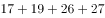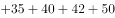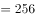包。代入选项，小王、小周、小孙、小李拿走的小蛋糕包数如下表所示：

因小李拿走一盒，A、B、C三项中小李拿走的小蛋糕包数在题干中不存在，只有D项后小李拿走的26包在题干中存在。

方法二：8个包装盒里面共装有小蛋糕包，设小李拿走包，小孙拿走包，则小王和小周分别拿走包。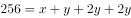，即，因的尾数为0或5，因此的尾数只能是6或1，结合题干数据，只能取值26。代入解得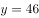，则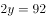，即小王共拿走92包，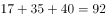包，只有D项符合要求。

故正确答案为D。

---

### 第 2 题　qid 4004725 · 数学运算

已知某宾馆共有30个房间，一名清洁工拿着30把钥匙，她只知道一把钥匙开一把锁，但是不知道哪把钥匙开哪把锁，现在她要打扫每一间房子，需要将钥匙和房间一一匹配，她最多要试多少次？

- **A**. 365
- **B**. 385
- **C**. 435　✅
- **D**. 465

**答案**：C

**官方解析**

30个房间有30把锁，第1把钥匙最多试开29次，因为如果29次都打不开锁，那么不必再试，剩余的这把钥匙肯定是第30把锁的钥匙；依次类推，第2把钥匙最多试开28次；第3把钥匙最多试开27次······第29把钥匙最多试开1次；最后剩下的1把钥匙和1把锁必匹配，即试开0次。故将钥匙和房间一一匹配最多试开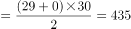次。

故正确答案为C。

---

### 第 3 题　qid 4004735 · 数学运算

某仓库有一批货物以75%的利润率出售，售出90%后，剩下的货物全部以6折出售，那么这批货物的最终利润率为：

- **A**. 68%　✅
- **B**. 62%
- **C**. 54%
- **D**. 51%

**答案**：A

**官方解析**

赋值此批货物为10件，每件成本100元，则总成本为元。出售过程列表如下：

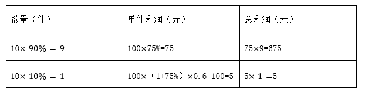

此批货物总利润为元，最终利润率为。

故正确答案为A。

---

### 第 4 题　qid 4004743 · 数学运算

甲乙两人同时沿直线跑道两端匀速相向而行，两人第一次迎面相遇时距跑道中点50米，两人到达跑道尽头时立即掉头重新出发，重新出发后两人第二次相遇，第二次两人相遇也为迎面相遇，且距跑道中点150米。则此时两人中速度较快一人比速度较慢一人多行走多少米？

- **A**. 150
- **B**. 400
- **C**. 200
- **D**. 300　✅

**答案**：D

**官方解析**

假设甲比乙快，则两人第一次相遇时距离中点50米处应在靠近乙的一侧，此时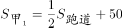米，米，故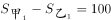米。根据多次相遇问题公式：，第一次相遇时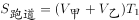，第二次相遇时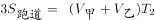，可得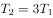。，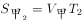，可得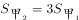，同理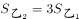，故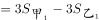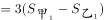米，即第二次相遇时两人中速度较快一人比速度较慢一人多行走300米。

故正确答案为D。

---

### 第 5 题　qid 4004749 · 数学运算

已知2021年7月1日星期四，那么2021年12月10日是星期几？

- **A**. 星期二
- **B**. 星期三
- **C**. 星期四
- **D**. 星期五　✅

**答案**：D

**官方解析**

由题意可知，从2021年7月1日到2021年12月10日，还需经过7月份剩下的30天、8月份31天、9月份30天、10月份31天、11月份30天、12月份10天，共计162天。一周为7天，以7天为一个周期，则，经过了23个周期余1天，故2021年12月10日是星期四的后一天，即星期五。

故正确答案为D。

---

### 第 6 题　qid 4004759 · 数学运算

某商店2020年3月每天的营业额比前一天高X元，该月10号的营业额是1号的4倍，12号的营业额为420元。问该商店2020年3月的营业额是多少元？

- **A**. 16740　✅
- **B**. 18425
- **C**. 24120
- **D**. 31620

**答案**：A

**官方解析**

由题意可知，该商店3月份每天的营业额为公差为的等差数列。根据，则10号的营业额，整理可得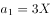，则12号的营业额元，解得，故。根据等差数列求和公式：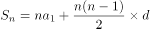，则该商店2020年3月的营业额元。

故正确答案为A。

---

### 第 7 题　qid 4004763 · 数学运算

甲、乙、丙三人都报名去摄影馆学习摄影技术，甲每隔4天去一次，乙每隔5天去一次，丙每隔6天去一次，三人在星期四第一次相遇，下次相遇的日期为：

- **A**. 星期一
- **B**. 星期三
- **C**. 星期四　✅
- **D**. 星期五

**答案**：C

**官方解析**

甲每隔4天去一次，即每5天去一次；乙每隔5天去一次，即每6天去一次；丙每隔6天去一次，即每7天去一次。三人周期的最小公倍数为210天，即每210天三人相遇一次。三人在星期四第一次相遇，在210天后再次相遇，每周有7天，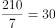，为30个完整周期，则下次相遇的日期为星期四。

故正确答案为C。

---

### 第 8 题　qid 4004773 · 数学运算

天气预报对未来五天的天气情况进行了预测，每天晴天的概率都是0.7，不晴天的概率是0.3。那么这5天中恰好3天晴天的概率是多少？

- **A**. 0.031
- **B**. 0.343
- **C**. 0.185
- **D**. 0.309　✅

**答案**：D

**官方解析**

5天中恰好3天是晴天，即3天晴天2天不晴天。则满足题意的概率为：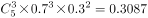，与D项最接近。

故正确答案为D。

---

### 第 9 题　qid 4004801 · 数学运算

某部门有9名员工，从中随机抽取2人参加公司代表大会，要求女员工人数不得少于1人。已知该部门女员工比男员工多1人，则共有多少种方案符合要求？

- **A**. 24
- **B**. 30　✅
- **C**. 36
- **D**. 72

**答案**：B

**官方解析**

该部门共9名员工，由于女员工比男员工多1人，故该部门女员工有5人，男员工有4人。抽取2人参加大会，女员工人数不得少于1人，可分情况如下：

①1个女员工1个男员工，有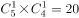种方案；

②2个女员工，有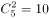种方案。

共有种方案。

故正确答案为B。

---

### 第 10 题　qid 4004806 · 数学运算

小王平时骑摩托车上班，如果他提速20%，那么他到公司的时间比平时要提早10分钟。假如他提速25%，则他到公司的时间比平时早多长时间？

- **A**. 16分钟
- **B**. 15分钟
- **C**. 13分钟
- **D**. 12分钟　✅

**答案**：D

**官方解析**

方法一：赋值小王平时的速度为20，则提速后速度为。假设小王平时到公司的时间为，由于路程不变，则，解得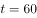分钟。提速后速度为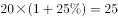，由于路程不变，则提速后的时间为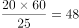分钟，则他到公司的时间比平时早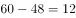分钟。

方法二：设小王平时的速度为，提速后速度为，速度比为。根据路程一定，速度与时间成反比，设小王平时到公司的时间为，可得平时与提速后的时间比为，解得分钟。若提速，设提速后到公司的时间为，则平时与提速后的速度比，平时与提速后的时间比为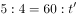，解得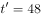分钟，则他到公司的时间比平时早分钟。

故正确答案为D。

---

## 判断推理

### 第 1 题　qid 4004555 · 图形推理

从所给的四个选项中，选择最合适的一个填入问号处，使之呈现一定的规律性：

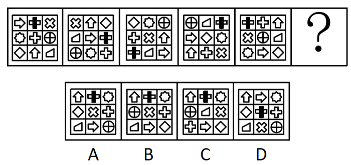

- **A**. A
- **B**. B
- **C**. C
- **D**. D　✅

**答案**：D

**官方解析**

元素组成相同，优先考虑位置规律。如下图所示，将题干图形中小图形在九宫格中的位置依次标为1-9号：

观察发现：

图一1号位置的在图一至图五中位置变化轨迹为15948；

图一5号位置的在图一至图五中位置变化轨迹为59482；

图一9号位置的在图一至图五中位置变化轨迹为94826；

图一4号位置的在图一至图五中位置变化轨迹为48267；

图一8号位置的在图一至图五中位置变化轨迹为82673；

图一2号位置的在图一至图五中位置变化轨迹为26731。

依此类推可以发现，题干图形中所有小图形在九宫格中的位置均按照1594826731的顺序在循环移动，按照此规律在“？”处图形中应在九宫格的5号位置，只有D项满足此规律，且D项其他小图形在九宫格中的位置变化同样满足此规律。

故正确答案为D。

---

### 第 2 题　qid 4004562 · 图形推理

上边给出的是纸盒的外表面展开图，下边哪一项能由其折叠而成？

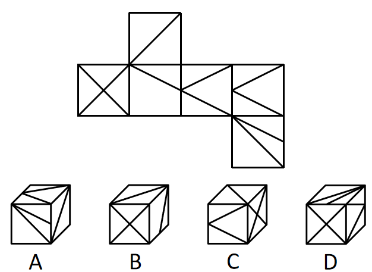

- **A**. A
- **B**. B
- **C**. C
- **D**. D　✅

**答案**：D

**官方解析**

将题干展开图标上序号，如下图所示，逐一分析选项。

A项：选项中必然存在面a与面f，题干展开图中面a和面f为相对面，不能同时出现，选项与题干展开图不一致，排除；

B项：选项由面a、面b与面c构成，题干展开图中面a、面b与面c的公共点引出3条线，而选项中三个面的公共点只引出1条线，选项与题干展开图不一致，排除；

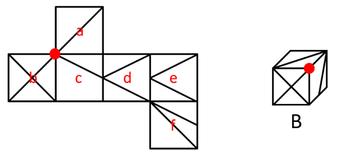

C项：选项中必然存在面b，题干展开图中面b与面d为相对面，不能同时出现，故选项由面a、面b与面e构成，题干展开图中面a、面b与面e的公共点引出2条线，而选项中三个面的公共点引出3条线，选项与题干展开图不一致，排除；

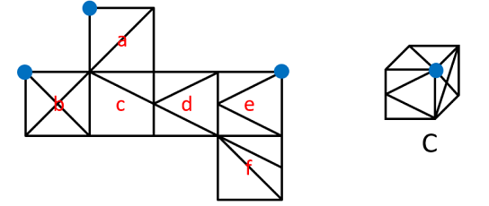

D项：选项由面b、面e与面f构成，与题干展开图一致，当选。

故正确答案为D。

---

### 第 3 题　qid 4004569 · 图形推理

从所给的四个选项中，选择最合适的一个填入问号处，使之呈现一定的规律性：

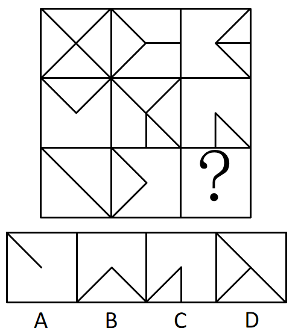

- **A**. A
- **B**. B　✅
- **C**. C
- **D**. D

**答案**：B

**官方解析**

元素组成相似，优先考虑样式规律。观察发现，第一行前两个图形去同存异得到第三个图形，经验证第二行图形满足此运算规律，第三行前两个图形去同存异得到B项。
故正确答案为B。

---

### 第 4 题　qid 4004575 · 图形推理

从所给的四个选项中，选择最合适的一个填入问号处，使之呈现一定的规律性：

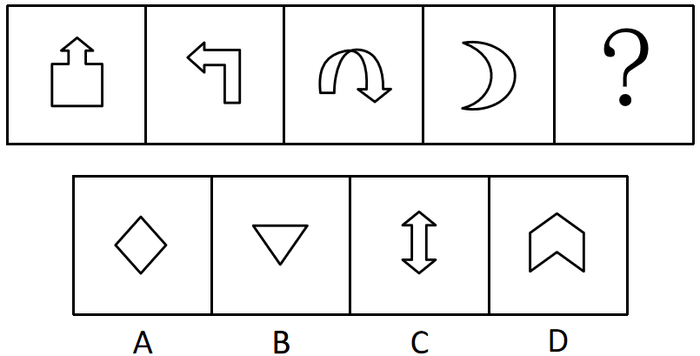

- **A**. A
- **B**. B
- **C**. C
- **D**. D　✅

**答案**：D

**官方解析**

图形元素组成不同，属性与数量没有明显规律。观察发现，题干图形出现箭头较多，且前三幅图形箭头指向明显，箭头指向依次为上、左、下，第四幅图形存在变形，可将月亮右侧突出的弧线看成指向右的箭头，即题干图形中箭头的指向依次逆时针旋转，故“？”处应选择箭头指向为上的图形，只有D项满足此规律。

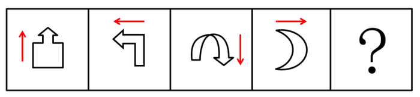

故正确答案为D。

---

### 第 5 题　qid 4004584 · 图形推理

从所给的四个选项中，选择最合适的一个填入问号处，使之呈现一定的规律性：

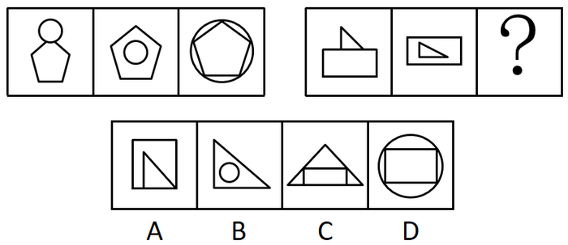

- **A**. A
- **B**. B
- **C**. C　✅
- **D**. D

**答案**：C

**官方解析**

观察发现，第一组三幅图形均由圆形和五边形构成，且两个图形间的关系依次为圆形位于五边形上方、圆形位于五边形内部（不相交）、圆形位于五边形外部（相交）。第二组前两幅图形均由三角形和矩形构成，且两个图形间的关系依次为三角形位于矩形上方、三角形位于矩形内部（不相交），故“？”处图形应由三角形和矩形构成，且三角形应位于矩形外部（相交），只有C项符合。
故正确答案为C。

---

### 第 6 题　qid 4004594 · 定义判断

我们对一个难题束手无策，不知从何入手时，思维就进入了“酝酿阶段”。直到有一天，当我们抛开面前的问题去做其他的事情时，百思不得其解的答案却突然出现在我们面前，这就叫“酝酿效应”。
根据上述定义，下列哪一诗句是这一效应的写照？

- **A**. 云外经年见双阙，马头乘兴数前山
- **B**. 不识庐山真面目，只缘身在此山中
- **C**. 山重水复疑无路，柳暗花明又一村　✅
- **D**. 风飒沉思眼忽开，尘埃污得是庸才

**答案**：C

**官方解析**

第一步：找出定义关键词。
“对一个难题束手无策，不知从何入手时”、“抛开面前的问题去做其他的事情时，百思不得其解的答案却突然出现在我们面前”。
第二步：逐一分析选项。
A项：出自韩元吉的《同叶梦锡赵德庄游牛首山》，描写的是诗人游览牛首山的情景，没有体现“对一个难题束手无策”，也没有体现“抛开面前的问题去做其他的事情”和“百思不得其解的答案却突然出现在我们面前”，不符合定义，排除；
B项：出自苏轼的《题西林壁》，意思是之所以认不清庐山真正的面目，是因为我人身处在庐山之中，只是解释了为什么会“不识庐山真面目”，没有体现“抛开面前的问题去做其他的事情时，百思不得其解的答案却突然出现在我们面前”，不符合定义，排除；
C项：出自陆游的《游山西村》，意思是山峦重叠水流曲折正担心无路可走，柳绿花艳忽然眼前又出现一个山村，现被用来形容已陷入绝境，忽然又出现转机，“疑无路”体现了“对一个难题束手无策，不知从何入手”，“又一村”体现了“百思不得其解的答案却突然出现在我们面前”，符合定义，当选；
D项：出自刘得仁的《寄友人》，描述的是突然想明白了一些事情，没有体现“对一个难题束手无策，不知从何入手”，也没有体现“抛开面前的问题去做其他的事情时，百思不得其解的答案却突然出现在我们面前”，不符合定义，排除。
故正确答案为C。

---

### 第 7 题　qid 4004610 · 定义判断

幸存者偏差指的是当取得资讯的渠道，仅来自于幸存者时，此资讯可能会与实际情况存在偏差。
根据上述定义，下列结论的得出存在幸存者偏差的是：

- **A**. 李老师通过小刚的成绩单看出小刚偏好文科
- **B**. 警察通过调查监控发现小赵并没有偷超市里的东西
- **C**. 王老师分别与小明、小亮谈话后总结出了他们俩打架的原因
- **D**. 媒体对长寿老人进行采访发现他们都喜欢喝葡萄酒，便得出喝葡萄酒可以长寿的结论　✅

**答案**：D

**官方解析**

第一步：找出定义关键词。
“当取得资讯的渠道，仅来自于幸存者时”、“资讯可能会与实际情况存在偏差”。
第二步：逐一分析选项。
A项：李老师的资讯来自于成绩单，而小刚的成绩单是可以体现小刚偏好科目的资讯，不符合“仅来自于幸存者时”，也不符合“与实际情况存在偏差”，不符合定义，排除；
B项：警察的资讯来自于监控，不符合“当取得资讯的渠道，仅来自于幸存者时”，不符合定义，排除；
C项：王老师的资讯来自于打架的双方，说明得到的资讯是全面的，不符合“当取得资讯的渠道，仅来自于幸存者时”，不符合定义，排除；
D项：媒体的资讯来自于活着的长寿老人，这些人是同样年龄中的幸存者，符合“当取得资讯的渠道，仅来自于幸存者时”，由于获得的资讯不全面，故结论不一定准确，符合“资讯可能会与实际情况存在偏差”，符合定义，当选。
故正确答案为D。

---

### 第 8 题　qid 4004617 · 定义判断

共生营销就是两个或两个以上的企业通过分享市场营销中的资源，达到降低成本、提高效率、增强市场竞争力目的的一种营销策略。
根据上述定义，下列属于共生营销的是：

- **A**. 某印刷厂和图书发行公司决定整合资源，成立新的集团公司
- **B**. 安踏公司推出的安踏和漫威联名款产品，受到漫威狂热粉的争相抢购
- **C**. 某企业售卖自己公司产品的同时，也在帮忙售卖朋友公司推出的新产品
- **D**. 五个家具企业整合各自品牌优势，联合共同举办看样订货会，吸引了更多商客　✅

**答案**：D

**官方解析**

第一步：找出定义关键词。
“两个或两个以上的企业”、“分享市场营销中的资源”、“降低成本、提高效率、增强市场竞争力”。
第二步：逐一分析选项。
A项：整合资源成立新的集团公司，意味着所有资源都进行了整合分享，不仅仅是“分享市场营销中的资源”，不符合定义，排除；
B项：热销的是安踏公司的产品，而不是漫威的产品，并未体现安踏公司分享市场营销中的资源给漫威，不符合“两个或两个以上的企业”、“分享市场营销中的资源”，不符合定义，排除；
C项：某企业帮忙售卖朋友公司推出的新产品，只有一家公司分享了市场营销中的资源，不符合“两个或两个以上的企业”、“分享市场营销中的资源”，不符合定义，排除；
D项：五个家具企业联合举办看样订货会，吸引了更多商客，符合“两个或两个以上的企业”、“分享市场营销中的资源”、“降低成本、提高效率、增强市场竞争力”，符合定义，当选。
故正确答案为D。

---

### 第 9 题　qid 4004650 · 定义判断

阳性强化法是建立、训练某种良好行为的治疗技术或矫正方法，也称“正强化法”或“积极强化法”。通过及时奖励目标行为，忽视或淡化异常行为，促进目标行为的产生。
根据上述定义，如果要纠正一名经常乱扔玩具、把饭撒桌子上等不断制造麻烦的儿童的行为，下列治疗方法不属于阳性强化法的是：

- **A**. 当他乱扔玩具时，及时制止，并让他旁观其他小朋友整理玩具的过程，然后引导他将自己的玩具放置好　✅
- **B**. 当他出现认真收拾饭桌上自己撒的饭渣行为时，家长和老师及时积极鼓励和表扬，让他感受到更多的关注，促进他不断重复目标行为
- **C**. 当他随便乱扔玩具、哭闹不停时，周围人对他的这种不良行为不予关注，没有半分反应
- **D**. 家长对于他乱扔玩具的行为，每减少一次就奖励一次他自己喜欢的东西，慢慢的他乱扔玩具的频率越来越低

**答案**：A

**官方解析**

第一步：找出定义关键词。
“及时奖励目标行为”、“忽视或淡化异常行为”、“促进目标行为的产生”。
第二步：逐一分析选项。
A项：乱扔玩具属于异常行为，制止乱扔玩具不符合“忽视或淡化异常行为”，不符合定义，当选； 
B项：家长和老师及时积极鼓励和表扬，促进他不断重复目标行为，符合“及时奖励目标行为”、“促进目标行为的产生”，符合定义，排除；
C项：周围人对他的不良行为不予关注，符合“忽视或淡化异常行为”，符合定义，排除；
D项：家长的奖励降低了乱扔玩具的频率，符合“及时奖励目标行为”、“促进目标行为的产生”，符合定义，排除。
本题为选非题，故正确答案为A。

---

### 第 10 题　qid 4004668 · 定义判断

旁观者效应也称为责任分散效应，是指对某一件事来说，如果是单个个体被要求单独完成任务，责任感就会很强，会做出积极的反应。但如果是要求一个群体共同完成任务，群体中的每个个体的责任感就会很弱，面对困难或遇到责任往往会退缩。
根据上述定义，下列属于旁观者效应的是：

- **A**. 小赵开车在公路上行驶时，车辆发生故障，小赵在车道设立警示标识，示意后面车辆绕行
- **B**. 运送水果的货车在高速路上发生侧翻，附近居民一哄而上捡拾水果带回家
- **C**. 小李看到路旁停放的自行车被风吹倒，跟着行人一起绕开走了　✅
- **D**. 小孙看到有人在路边突然晕倒，见周围无人见证，怕承担责任不敢上前帮助

**答案**：C

**官方解析**

第一步：找出定义关键词。
“单个个体被要求单独完成任务，责任感就会很强，会做出积极的反应”、“要求一个群体共同完成任务，群体中的每个个体的责任感就会很弱，面对困难或遇到责任往往会退缩”。
第二步：逐一分析选项。
A项：小赵车辆发生故障，在车道设立警示标识，没有涉及被要求单独完成任务，不符合“单个个体被要求单独完成任务，责任感就会很强，会做出积极的反应”，也没有体现出群体中每个个体的责任感很弱，不符合“要求一个群体共同完成任务，群体中的每个个体的责任感就会很弱，面对困难或遇到责任往往会退缩”，不符合定义，排除；
B项：运送水果的货车侧翻后遭到居民哄抢，没有体现出单个个体的责任感增强，也没有体现出群体遇到困难或遇到责任会退缩，不符合“单个个体被要求单独完成任务，责任感就会很强，会做出积极的反应”、“要求一个群体共同完成任务，群体中的每个个体的责任感就会很弱，面对困难或遇到责任往往会退缩”，不符合定义，排除；
C项：小李看到路旁停放的自行车被风吹倒，跟着行人一起绕开走了，说明群体中的个体责任感很弱，遇到责任会退缩，符合“要求一个群体共同完成任务，群体中的每个个体的责任感就会很弱，面对困难或遇到责任往往会退缩”，符合定义，当选；
D项：小孙看到有人晕倒，但周围并没有其他人，不敢上前帮助，不存在群体，不符合“要求一个群体共同完成任务，群体中的每个个体的责任感就会很弱，面对困难或遇到责任往往会退缩”，不符合定义，排除。
故正确答案为C。

---

### 第 11 题　qid 4004681 · 定义判断

知觉恒常性是指，当客观条件在一定范围内改变时，我们的知觉印象在相当程度上，保持着它的稳定性。即对物体某种特性的知觉，在外界条件与感觉信号输入改变时，仍保持常定的倾向。
根据上述定义，下列未体现出知觉恒常性的是：

- **A**. 在观察一本书时，不管从正上方看还是从斜上方看，看起来都是长方形的
- **B**. 一个成人从近处走向远处，眼睛看到的人像虽然相应缩小，但不会把他当成儿童
- **C**. 室内的家具，在不同色光照明下，对其颜色知觉仍保持相对不变
- **D**. 古语说：窥一斑而知全豹，就是通过豹子的一个斑点，就可以得出这个动物是豹子　✅

**答案**：D

**官方解析**

第一步：找出定义关键词。
“当客观条件在一定范围内改变时”、“知觉印象在相当程度上，保持着它的稳定性”、“对物体某种特性的知觉，在外界条件与感觉信号输入改变时，仍保持常定的倾向”。
第二步：逐一分析选项。
A项：从不同的角度观察一本书，符合“当客观条件在一定范围内改变时”，不同角度看起来都是长方形的，符合“知觉印象在相当程度上，保持着它的稳定性”，符合定义，排除；
B项：从近处和远处分别看一个成人，符合“当客观条件在一定范围内改变时”，远处看人像虽然缩小，但不会觉得是儿童，符合“知觉印象在相当程度上，保持着它的稳定性”，符合定义，排除；
C项：不同色光照明下的室内家具，符合“当客观条件在一定范围内改变时”，对其颜色知觉仍保持相对不变，符合“知觉印象在相当程度上，保持着它的稳定性”，符合定义，排除；
D项：通过观察豹子身上的一个斑点就可以得出这个动物是豹子，整个过程中客观条件并没有发生改变，也没有体现出知觉印象的稳定性，不符合“当客观条件在一定范围内改变时”、“知觉印象在相当程度上，保持着它的稳定性”，不符合定义，当选。
本题为选非题，故正确答案为D。

---

### 第 12 题　qid 4004693 · 定义判断

气候贫穷，是指由于全球气候变化带来的影响及产生的灾害所导致的贫穷或使得贫穷加剧的现象。
根据上述定义，下列不属于气候贫穷的是：

- **A**. 西北地区夏季增温幅度大而降水增加量少，影响农业生产导致农民返贫
- **B**. 突然发生的地震给人们的生命财产造成了极大的损失，使他们一夜致贫　✅
- **C**. 气候变化增加了疾病的发生和传播的机会，危害人类健康，贫困地区劳动力不断减少，贫者愈贫
- **D**. 全球气温不断升高，冰川面积缩减进一步加剧了某地的水资源矛盾，给他们的生产生活造成极大影响，使贫困加剧

**答案**：B

**官方解析**

第一步：找出定义关键词。
“由于全球气候变化带来的影响及产生的灾害”、“导致的贫穷或使得贫穷加剧”。
第二步：逐一分析选项。
A项：西北地区夏季增温幅度大而降水增加量少，符合“由于全球气候变化带来的影响及产生的灾害”，影响农业生产导致农民返贫，符合“导致的贫穷或使得贫穷加剧”，符合定义，排除；
B项：突然发生的地震给人们的生命财产造成了极大的损失，但地震属于地质灾害，不符合“由于全球气候变化带来的影响及产生的灾害”，不符合定义，当选；
C项：气候变化增加了疾病的发生和传播的机会，危害人类健康，符合“由于全球气候变化带来的影响及产生的灾害”，贫困地区劳动力不断减少，贫者愈贫，符合“导致的贫穷或使得贫穷加剧”，符合定义，排除；
D项：全球气温不断升高给某地居民的生产生活造成极大影响，符合“由于全球气候变化带来的影响及产生的灾害”，使他们的贫困加剧，符合“导致的贫穷或使得贫穷加剧”，符合定义，排除。
本题为选非题，故正确答案为B。

---

### 第 13 题　qid 4004699 · 定义判断

反馈原来是物理学中的一个概念，心理学借用这一概念，以说明学习者对自己学习结果的了解，而这种对结果的了解又起到了强化作用，促进了学习者更加努力学习，从而提高学习效率。这一心理现象被称作“反馈效应”。
根据上述定义，下列说法符合反馈效应的是：

- **A**. 小李参加公司的新员工培训成绩最差，心灰意冷，未过试用期就提出了辞职
- **B**. 老师习惯于按照学习成绩的好坏来划分学生的优劣，并据此来指导学生的学习
- **C**. 让学生自己来评改练习作业，比由老师来评改所起到的激励作用要大，学习效果更佳　✅
- **D**. 小明帮妈妈打扫卫生，妈妈却嫌弃小明打扫得不干净

**答案**：C

**官方解析**

第一步：找出定义关键词。
“学习者对自己学习结果的了解起到了强化作用”、“促进了学习者更加努力学习，从而提高学习效率”。
第二步：逐一分析选项。
A项：小李因为培训成绩最差，心灰意冷，不符合“学习者对自己学习结果的了解起到了强化作用”，未过试用期就提出了辞职，不符合“促进了学习者更加努力学习，从而提高学习效率”，不符合定义，排除；
B项：老师按照学习成绩的好坏来指导学生学习，老师不是学习者，不符合“学习者对自己学习结果的了解起到了强化作用”，不符合定义，排除；
C项：学生自己评改作业，其激励作用更大，学习效果更佳，符合“学习者对自己学习结果的了解起到了强化作用”、“促进了学习者更加努力学习，从而提高学习效率”，符合定义，当选；
D项：妈妈嫌弃小明卫生打扫得不干净，不符合“学习者对自己学习结果的了解起到了强化作用”、也不符合“促进了学习者更加努力学习，从而提高学习效率”，不符合定义，排除。
故正确答案为C。

---

### 第 14 题　qid 4004710 · 定义判断

法的适用，通常是指国家司法机关根据法定职权和法定程序，具体应用法律处理案件的专门活动。
根据上述定义，下列属于法的适用的是：

- **A**. 某科技公司根据法律相关规定和李某签订了劳动合同
- **B**. 张某依法将子女送入学校进行义务教育
- **C**. 某海关工作人员认为刘某涉嫌走私手机，因而对其进行查办
- **D**. 某地检察机关对王某的渎职案依法进行侦查　✅

**答案**：D

**官方解析**

第一步：找出定义关键词。
“国家司法机关”、“根据法定职权和法定程序，具体应用法律处理案件”。
第二步：逐一分析选项。
A项：选项的主体为某科技公司，不符合“国家司法机关”，不符合定义，排除；
B项：选项的主体为张某，不符合“国家司法机关”，不符合定义，排除；
C项：选项的主体为某海关工作人员，不符合“国家司法机关”，不符合定义，排除；
D项：选项的主体为“某地检察机关”，符合“国家司法机关”，对渎职案依法进行侦查，符合“根据法定职权和法定程序，具体应用法律处理案件”，符合定义，当选。
故正确答案为D。

---

### 第 15 题　qid 4004720 · 定义判断

蝴蝶效应，是指在一个动力系统中，初始条件下微小的变化能带动整个系统长期巨大的连锁反应。它是一种混沌现象，说明了任何事情发展均存在定数与变数，事物在发展过程中，其发展轨迹有规律可循，同时也存在不可测的变数，往往还会适得其反，一个微小的变化能影响事物的发展，证实了事物的发展具有复杂性。
根据上述定义，下列没有反映蝴蝶效应的是：

- **A**. 美国发现一宗疑假疯牛病案例，牛肉产业遭到冲击，作为养牛业主要饲料来源的美国玉米和大豆业，期货价格呈现下降趋势。美国消费者对牛肉产品出现的信心下降，给刚刚复苏的美国经济带来一场破坏性很强的飓风
- **B**. 某员工因不公平待遇离职，带走了有同样遭遇的几名员工，他们自主创业后，与原公司竞争，导致原公司破产
- **C**. 丢失一个钉子，坏了一只蹄铁；坏了一只蹄铁，折了一匹战马；折了一匹战马，伤了一位骑士；伤了一位骑士，输了一场战斗；输了一场战斗，亡了一个帝国
- **D**. 某公司因经济不景气面临破产的危机，为了节源，他们裁掉了很大一部分员工，只留下骨干员工　✅

**答案**：D

**官方解析**

第一步：找出定义关键词。
“在一个动力系统中”、“初始条件下微小的变化”、“带动整个系统长期巨大的连锁反应”。
第二步：逐一分析选项。
A项：一宗疑假疯牛病案例，符合“初始条件下微小的变化”，影响了美国玉米和大豆业的期货价格，破坏了美国经济，符合“带动整个系统长期巨大的连锁反应”，上述所有事件均“在一个动力系统中”，符合定义，排除；
B项：某员工因不公平待遇离职，符合“初始条件下微小的变化”，离职后带走了几名同样遭遇的员工，然后他们进行自主创业，与原公司竞争，最终导致原公司破产，符合“带动整个系统长期巨大的连锁反应”，上述所有事件均“在一个动力系统中”，符合定义，排除；
C项：丢失一个钉子，符合“初始条件下微小的变化”，进而影响了蹄铁质量、战马生存、骑士征战、战斗结果、帝国走向，符合“带动整个系统长期巨大的连锁反应”，上述所有事件均“在一个动力系统中”，符合定义，排除；
D项：某公司因经济不景气面临破产的危机，对于该公司这个动力系统来说是比较大的变化，不符合“初始条件下微小的变化”，同时也没有体现出“带动整个系统长期巨大的连锁反应”，不符合定义，当选。
本题为选非题，故正确答案为D。

---

### 第 16 题　qid 4004740 · 类比推理

文科：历史

- **A**. 手提包：双肩包
- **B**. 咸水湖：鄱阳湖
- **C**. 桃：水果
- **D**. 微量元素：铅　✅

**答案**：D

**官方解析**

第一步：判断题干词语间逻辑关系。
历史属于文科，二者为种属关系。
第二步：判断选项词语间逻辑关系。
A项：手提包和双肩包是两种不同类型的包，二者为并列关系，与题干逻辑关系不一致，排除；
B项：鄱阳湖是淡水湖，不是咸水湖，二者为反向种属关系，与题干逻辑关系不一致，排除；
C项：桃是一种水果，二者为种属关系，但顺序与题干相反，与题干逻辑关系不一致，排除；
D项：微量元素指生物体正常生理活动所必需但需求量很少的元素，铅是一种微量元素，二者为种属关系，与题干逻辑关系一致，当选。
故正确答案为D。

---

### 第 17 题　qid 4004748 · 类比推理

患得患失：三三两两

- **A**. 好大喜功：浑浑噩噩
- **B**. 居安思危：口口声声
- **C**. 能屈能伸：兢兢业业　✅
- **D**. 捕风捉影：茕茕孑立

**答案**：C

**官方解析**

第一步：判断题干词语间逻辑关系。
患得患失指对于个人的利害得失斤斤计较；三三两两指三个一群两个一伙（多指人），二者没有语义关系，考虑成语拆分，患得患失的第一个字和第三个字相同，且“得”和“失”为反义关系，三三两两的前两个字相同，后两个字也相同。
第二步：判断选项词语间逻辑关系。
A项：好大喜功的第一个字和第三个字不相同，且“大”和“功”不是反义关系，与题干逻辑关系不一致，排除；
B项：居安思危的第一个字和第三个字不相同，与题干逻辑关系不一致，排除；
C项：能屈能伸的第一个字和第三个字相同，且“屈”和“伸”为反义关系，兢兢业业的前两个字相同，后两个字也相同，与题干逻辑关系一致，当选；
D项：捕风捉影的第一个字和第三个字不相同，且“风”和“影”不是反义关系，与题干逻辑关系不一致，排除。
故正确答案为C。

---

### 第 18 题　qid 4004756 · 类比推理

教练：学员

- **A**. 歌唱家：唱歌
- **B**. 医生：病人　✅
- **C**. 律师：法庭
- **D**. 作家：读者

**答案**：B

**官方解析**

第一步：判断题干词语间逻辑关系。
教练教学员，二者是主宾关系，且教练给学员提供服务，为提供服务和被服务的关系。
第二步：判断选项词语间逻辑关系。
A项：歌唱家唱歌，二者是主谓宾关系，与题干逻辑关系不一致，排除；
B项：医生治疗病人，二者是主宾关系，且医生给病人提供服务，为提供服务和被服务的关系，与题干逻辑关系一致，当选；
C项：律师在法庭，二者是人物和地点的对应关系，与题干逻辑关系不一致，排除；
D项：作家和读者不是主宾关系，且作家给读者提供的是作品而不是服务，并非提供服务和被服务的关系，与题干逻辑关系不一致，排除。
故正确答案为B。

---

### 第 19 题　qid 4004765 · 类比推理

布：衣服

- **A**. 牛奶：酸奶
- **B**. 粮食：酒
- **C**. 木材：餐桌　✅
- **D**. 朱古力：巧克力

**答案**：C

**官方解析**

第一步：判断题干词语间逻辑关系。
布经过加工可以制成衣服，二者为原材料的对应关系，且制作过程是物理变化。
第二步：判断选项词语间逻辑关系。
A项：牛奶经过发酵可以制成酸奶，二者为原材料的对应关系，但发酵是化学变化，与题干逻辑关系不一致，排除；
B项：粮食经过发酵可以制成酒，二者为原材料的对应关系，但发酵是化学变化，与题干逻辑关系不一致，排除；
C项：木材经过加工可以制成餐桌，二者为原材料的对应关系，且制作过程是物理变化，与题干逻辑关系一致，当选；
D项：朱古力和巧克力是同一种事物的不同称谓，二者为全同关系，与题干逻辑关系不一致，排除。
故正确答案为C。

---

### 第 20 题　qid 4004774 · 类比推理

手：足

- **A**. 口：鼻　✅
- **B**. 钢：铁
- **C**. 心：肝
- **D**. 男：女

**答案**：A

**官方解析**

第一步：判断题干词语间逻辑关系。

手和足均是人体器官，二者为并列关系当中的反对关系，且二者均为人体外部器官。

第二步：判断选项词语间逻辑关系。

A项：口和鼻均是人体器官，二者为并列关系当中的反对关系，且二者均为人体外部器官，与题干逻辑关系一致，当选；

B项：钢是含碳量介于至之间的铁碳合金，铁是一种金属元素，可用铁与少量的碳制成钢，所以铁是制作钢的原材料之一，且二者均为金属材料，与题干逻辑关系不一致，排除；

C项：心和肝均是人体器官，二者为并列关系当中的反对关系，但二者均为人体内脏器官，而非人体外部器官，与题干逻辑关系不一致，排除；

D项：男和女均表示性别，二者为并列关系当中的矛盾关系，与题干逻辑关系不一致，排除。

故正确答案为A。

---

### 第 21 题　qid 4004781 · 类比推理

七上：八下

- **A**. 五颜：六色
- **B**. 三长：两短　✅
- **C**. 欺上：瞒下
- **D**. 万紫：千红

**答案**：B

**官方解析**

第一步：判断题干词语间逻辑关系。
七上八下形容心里慌乱不安。在词语中，七与八表示不同的数字，二者为并列关系，上与下，二者为反义关系。
第二步：判断选项词语间逻辑关系。
A项：五颜六色形容色彩复杂或花样繁多。在词语中，五与六表示不同的数字，二者为并列关系，但颜与色均表示色彩，二者为近义关系，与题干逻辑关系不一致，排除；
B项：三长两短指意外的灾祸或事故。在词语中，三与两表示不同的数字，二者为并列关系，长与短，二者为反义关系，与题干逻辑关系一致，当选；
C项：欺上瞒下指对上欺骗，博取信任，对下隐瞒，掩盖真相。在词语中，欺与瞒不是表示不同的数字，与题干逻辑关系不一致，排除；
D项：万紫千红形容百花齐放，色彩艳丽。在词语中，万与千表示不同的数量，二者为并列关系，但紫与红表示不同的颜色，二者为并列关系，与题干逻辑关系不一致，排除。
故正确答案为B。

---

### 第 22 题　qid 4004793 · 类比推理

黄果树瀑布：西江苗寨：贵州

- **A**. 洪泽湖：洞庭湖：江苏
- **B**. 黄山：太湖：浙江
- **C**. 庐山：会稽山：江西
- **D**. 泰山：大明湖：山东　✅

**答案**：D

**官方解析**

第一步：判断题干词语间逻辑关系。
“黄果树瀑布”和“西江苗寨”均在贵州省，前两个词为并列关系，与第三个词均为地点对应关系。
第二步：判断选项词语间逻辑关系。
A项：“洪泽湖”在江苏省，但是“洞庭湖”在湖南省，不在江苏省，与题干逻辑关系不一致，排除；
B项：“黄山”在安徽省，不在浙江省，“太湖”横跨江苏省和浙江省，与题干逻辑关系不一致，排除；
C项：“庐山”在江西省，但是“会稽山”在浙江省，不在江西省，与题干逻辑关系不一致，排除；
D项：“泰山”和“大明湖”均在山东省，前两个词为并列关系，与第三个词均为地点对应关系，与题干逻辑关系一致，当选。
故正确答案为D。

---

### 第 23 题　qid 4004800 · 类比推理

负荆请罪：廉颇：蔺相如

- **A**. 萧规曹随：萧何：曹奇
- **B**. 一字之师：齐己：郑谷　✅
- **C**. 图穷匕见：张良：秦王
- **D**. 手不释卷：吴蒙：孙权

**答案**：B

**官方解析**

第一步：判断题干词语间逻辑关系。
“负荆请罪”讲述的是“廉颇”跟“蔺相如”不和，后来廉颇认识到了这样对国家不利，便脱了上衣、背着荆条去向蔺相如谢罪的故事。主人公分别是“廉颇”和“蔺相如”，三者是历史典故与历史人物的对应关系。
第二步：判断选项词语间逻辑关系。
A项：“萧规曹随”讲述的是萧何和曹参在西汉初期先后任丞相，萧何创立了一套规章制度，在他死后曹参继任，完全照章行事的故事。主人公分别是“萧何”和“曹参”，而非“曹奇”，与题干逻辑关系不一致，排除；
B项：“一字之师”讲述的是齐己带着自己写好的诗前去请教“郑谷”，郑谷只提出一个字的修改意见，便使该诗变得更好的故事。主人公分别是“齐己”和“郑谷”，三者是历史典故与历史人物的对应关系，与题干逻辑关系一致，当选；
C项：“图穷匕见”讲述的是荆轲以献地图为借口，在卷起的地图中藏了把匕首，以谋刺杀秦王，当地图展开后，匕首就露出来的故事。主人公分别是“荆轲”和“秦王”，而非“张良”，与题干逻辑关系不一致，排除；
D项：“手不释卷”讲述的是孙权用自己和前人手不释卷的例子劝学，吕蒙深受感动，从此发奋学习的故事。主人公分别是“吕蒙”和“孙权”，而非“吴蒙”，与题干逻辑关系不一致，排除。
故正确答案为B。

---

### 第 24 题　qid 4004807 · 类比推理

莫愁前路无知己 对于 （    ） 相当于 （    ） 对于 感恩

- **A**. 爱情 恩疏媒劳志多乖
- **B**. 场所 千古兴亡多少事
- **C**. 离别 报答平生未展眉　✅
- **D**. 送别 西出阳关无故人

**答案**：C

**官方解析**

逐一代入选项。
A项：“莫愁前路无知己”的意思是此去不要担心遇不到知己，表达了作者与朋友的离别之情，与“爱情”无明显逻辑关系；“恩疏媒劳志多乖”的意思是皇帝疏远，举荐徒劳，壮志难酬，与“感恩”无明显逻辑关系，前后逻辑关系不一致，排除；
B项：“莫愁前路无知己”的意思是此去不要担心遇不到知己，表达了作者与朋友的离别之情，与“场所”无明显逻辑关系；“千古兴亡多少事”的意思是从古到今，有多少国家兴亡大事呢，表达了作者怀古的愁思和感慨，与“感恩”无明显逻辑关系，前后逻辑关系不一致，排除；
C项：“莫愁前路无知己”的意思是此去不要担心遇不到知己，表达了作者与朋友的“离别”之情，二者为对应关系；“报答平生未展眉”的意思是报答你一生的愁苦奔忙，表达了“感恩”之情，二者为对应关系，前后逻辑关系一致，当选；
D项：“莫愁前路无知己”的意思是此去不要担心遇不到知己，表达了作者对朋友的“送别”之情，二者为对应关系；“西出阳关无故人”的意思是当你向西出了阳关后，就难以遇到故人了，表达了作者与朋友的离别之情，与“感恩”无明显逻辑关系，前后逻辑关系不一致，排除。
故正确答案为C。

---

### 第 25 题　qid 4004812 · 类比推理

（    ） 对于 冰箱 相当于 （    ） 对于 教师

- **A**. 空调 医生　✅
- **B**. 食物 教室
- **C**. 冷冻 校长
- **D**. 防腐 家长

**答案**：A

**官方解析**

逐一代入选项。
A项：空调和冰箱是两种不同的家电，二者为并列关系中的反对关系；医生和教师是两种不同的职业，二者为并列关系中的反对关系，前后逻辑关系一致，当选；
B项：食物放在冰箱里保存，教师在教室上课，均为场所对应关系，但前后词语顺序相反，前后逻辑关系不一致，排除；
C项：冰箱具有冷冻的功能，二者为功能对应关系；校长可以管理教师，二者为对应关系，前后逻辑关系不一致，排除；
D项：冰箱具有防腐的功能，二者为功能对应关系，但不能说教师具有家长的功能，前后逻辑关系不一致，排除。
故正确答案为A。

---

### 第 26 题　qid 4004816 · 逻辑判断

某社区公共财物被损毁，公安机关锁定了四名犯罪嫌疑人，并分别对他们进行了审问：
甲：我没有做这件事，这件事是乙做的；
乙：甲、丙、丁中肯定有一人做了这件事；
丙：此事是由甲和乙中的一人做的；
丁：甲说的是事实。
经过调查，发现两个人说的真话，由此可以推出：

- **A**. 甲是罪犯　✅
- **B**. 乙是罪犯
- **C**. 丙是罪犯
- **D**. 丁是罪犯

**答案**：A

**官方解析**

第一步：找出题干矛盾命题。

（1）甲∶甲，乙；

（2）乙∶甲、丙、丁中一人做了；

（3）丙∶要么甲，要么乙；

（4）丁∶甲，乙。

第二步：根据题干条件进行推理。

题干两真两假，且甲和丁说的话一致，因此甲、丁要么都说真话，要么都说假话，可以采用假设法分别讨论。

若甲、丁均说真话，可得甲不是罪犯，乙是罪犯，此时丙说的也是真话，共有三人说真话，与题干信息矛盾；

若甲、丁均说假话，可得甲是罪犯，乙不是罪犯，此时乙、丙均说真话，与题干信息不矛盾，A项当选。

故正确答案为A。

---

### 第 27 题　qid 4004819 · 逻辑判断

某兴趣小组成员都是艺术特长生，有的艺术特长生体育很好，小明体育很好。由此可以推出：

- **A**. 小明是艺术特长生
- **B**. 小明不是艺术特长生
- **C**. 该兴趣小组成员体育都很好
- **D**. 该兴趣小组成员可能体育都不好　✅

**答案**：D

**官方解析**

第一步：翻译题干。

①兴趣小组成员艺术特长生；

②有的艺术特长生体育很好；

③小明体育很好。

第二步：逐一分析选项。

A项：根据条件②可换位为“有的体育很好的人艺术特长生”，虽然已知③“小明体育很好”，但他是否属于“有的体育很好的人”并不确定，无法推出“小明是艺术特长生”，排除；

B项：根据条件②可换位为“有的体育很好的人艺术特长生”，虽然已知③“小明体育很好”，但无论他是否属于“有的体育很好的人”里，均无法推出“小明不是艺术特长生”，排除；

C项：翻译为“兴趣小组成员体育很好”，根据条件②可知“有的艺术特长生体育很好”，虽然已知①“兴趣小组成员艺术特长生”，但兴趣小组成员是否属于“有的艺术特长生”并不确定，无法推出，排除；

D项：翻译为“兴趣小组成员可能体育不好”，根据条件②可知“有的艺术特长生体育很好”，虽然已知①“兴趣小组成员艺术特长生”，但兴趣小组成员可能均不属于“有的艺术特长生”，所以他们可能体育都不好，可以推出，当选。

故正确答案为D。

---

### 第 28 题　qid 4004823 · 逻辑判断

某研究团队最新研究显示，偏头痛患者的大脑视觉皮层会“过度兴奋”。招募60名志愿者参加了相关试验，其中有一半人患有偏头痛。试验中研究人员向志愿者展示了条纹栅格测试图，并让他们回答看后是否感到不舒服；进一步的测试中，还让他们在看图的同时接受脑电图测试。结果发现那些患偏头痛的志愿者在看到条纹栅格测试图后脑部的视觉皮层出现了较明显的反应。
以下哪项为真，最不能削弱研究者的结论?

- **A**. 在那些没有患偏头痛但对视觉刺激比较敏感的某些志愿者中，视觉皮层也会出现类似反应
- **B**. 此项研究中所研究的样本数量过少没有说服力
- **C**. 偏头痛患者看除条纹栅格测试图之外的其他测试图，大脑视觉皮层并未有明显反应
- **D**. 志愿者在做此项试验之前并未受到其他因素干扰　✅

**答案**：D

**官方解析**

第一步：找出论点和论据。
论点：偏头痛患者的大脑视觉皮层会“过度兴奋”。
论据：招募60名志愿者参加了相关试验，其中有一半人患有偏头痛。试验中研究人员向志愿者展示了条纹栅格测试图，并让他们回答看后是否感到不舒服；进一步的测试中，还让他们在看图的同时接受脑电图测试。结果发现那些患偏头痛的志愿者在看到条纹栅格测试图后脑部的视觉皮层出现了较明显的反应。
本题论点论据话题一致，削弱可以考虑削弱论点，即说明偏头痛患者的大脑视觉皮层不会“过度兴奋”，也可以考虑削弱论据，即证明试验的设置不科学，得到的结果不严谨。
第二步：逐一分析选项。
A项：没有患偏头痛的人大脑视觉皮层也会“过度兴奋”，通过举反例来否定论点，可以削弱，排除；
B项：通过说明样本数量过少质疑试验严谨性，否定了论据，可以削弱，排除；
C项：偏头痛患者看其他测试图时，大脑视觉皮层并未有明显反应，通过举反例来否定论点，可以削弱，排除；
D项：该项说明研究团队排除了其他变量，保证了试验严谨性，属于必要条件加强，无法削弱，当选。
本题为选非题，故正确答案为D。

---

### 第 29 题　qid 4004827 · 逻辑判断

发酵乳制品因为其丰富的营养和益生菌含量，给人们带来了广泛的健康益处，比如，益生菌中最突出的乳酸杆菌和双歧杆菌能够减少病理改变，刺激粘膜免疫与炎症介质相互作用和增强免疫系统。最近，有科学家通过对190多万人的研究得出，发酵乳制品能够降低肿瘤的发生风险。
以下哪项如果为真，最能支持上述结论?

- **A**. 目前国内未有此类明确的专业报道
- **B**. 发酵物产生的益生菌都是对身体有益的
- **C**. 喝酸奶能够降低19%的肿瘤发生风险，此说法受到权威专家的认可
- **D**. 发酵乳制品中的益生菌可以维持肠道稳态并发挥潜在的抗癌作用　✅

**答案**：D

**官方解析**

第一步：找出论点和论据。

论点：发酵乳制品能够降低肿瘤的发生风险。

论据：无。

本题只有论点，没有论据，加强优先考虑补充论据，可以通过解释原因或举例进行加强。

第二步：逐一分析选项。

A项：该项说的是目前未有此类明确的专业报道，没有说明发酵乳制品是否能够降低肿瘤的发生风险，属于不明确项，无法加强，排除；

B项：该项说的是发酵物产生的益生菌都是对身体有益的，而论点在说发酵乳制品能够降低肿瘤的发生风险，对身体有益是否就能降低肿瘤的发生风险并不明确，属于不明确项，无法加强，排除；

C项：该项说的是喝酸奶能够降低的肿瘤发生风险，酸奶属于发酵乳制品，举例补充论据，可以加强，保留；

D项：该项说的是发酵乳制品中的益生菌可以维持肠道稳态并发挥潜在的抗癌作用，解释了为什么发酵乳制品能够降低肿瘤的发生风险，解释原因补充论据，可以加强，保留。

对比C、D两项，C项是举例，D项是解释原因，解释原因的加强力度大于举例，D项当选。

故正确答案为D。

---

### 第 30 题　qid 4004832 · 逻辑判断

相比那些不练习瑜伽的人来说，经常练习瑜伽的人体型更好一些。可见，瑜伽能锻炼人的柔韧性，塑造完美体型。
以下哪项如果为真，最能对上述结论提出质疑？

- **A**. 大部分人喜欢瑜伽，就是因为瑜伽能够让人拥有更好的体型
- **B**. 塑造完美体型的方式不仅仅只有瑜伽
- **C**. 瑜伽不仅能够塑造人的完美体型，还能预防关节炎
- **D**. 真正体型不好的人一般不会选择练习瑜伽　✅

**答案**：D

**官方解析**

第一步：找出论点和论据。
论点：瑜伽能锻炼人的柔韧性，塑造完美体型。
论据：相比那些不练习瑜伽的人来说，经常练习瑜伽的人体型更好一些。
本题的论点和论据讨论的都是瑜伽能塑造完美体型，论点和论据话题一致，削弱优先考虑削弱论点，且论点为因果关系，也可以考虑因果倒置（体型好的人才会练瑜伽），还可以考虑他因削弱（对于完美体型的人来说，除了练瑜伽还做了其他塑造体型的方式）。
第二步：逐一分析选项。
A项：该项说的是大部分人喜欢瑜伽，就是因为瑜伽可以让人拥有更好的体型，有加强作用，无法削弱，排除；
B项：该项说的是塑造完美体型的方式不仅仅只有瑜伽，但是对于题干论据中练习瑜伽的群体是否还有其他塑造体型的方式，并不明确，无法削弱，排除；
C项：该项说的是瑜伽除了塑造完美体型外还有其他的功能，有加强作用，无法削弱，排除；
D项：该项说的是体型不好的人一般不会练瑜伽，即体型好的人才会练瑜伽，而论点在说瑜伽能塑造完美体型，该项颠倒了论点中的因果，属于因果倒置，可以削弱，当选。
故正确答案为D。

---

### 第 31 题　qid 4004840 · 逻辑判断

某公司发生失窃案，公安机关经过调查锁定了犯罪嫌疑人是该公司会计张某。办案民警小王说：“一定不是他”，办案民警小李发表了反对观点：“当其他可能性被排除了，剩下的不管看起来多么不可能，但一定是事情的真相。”
以下哪项如果为真，最能削弱小李的说法？

- **A**. 追究违法行为最重要的是用证据说话
- **B**. 办案民警无法极尽所有可能性　✅
- **C**. 办案民警小王比小李更了解案件经过
- **D**. 公司职员评价张某平时为人老实诚恳

**答案**：B

**官方解析**

第一步：找出论点和论据。
论点：小李认为犯罪嫌疑人是该公司会计张某。
论据：其他人是嫌疑人的可能性都被排除了。
小王认为犯罪嫌疑人不是张某，小李和小王的观点相反，双方在“掐架”，此时要削弱小李的说法可以考虑削弱论据，即还有其他人是嫌疑人的可能性。
第二步：逐一分析选项。
A项：该项说的是追究违法行为最重要的是用证据说话，而论点说的是小李认为犯罪嫌疑人是张某，话题不一致，无法削弱，排除；
B项：该项指出办案民警无法极尽所有可能性，与题干中小李说其他可能性被排除了相矛盾，直接削弱论据，可以削弱，当选；
C项：该项说的是办案民警小王比小李更了解案件经过，而论点说的是小李认为犯罪嫌疑人是张某，话题不一致，无法削弱，排除；
D项：该项说的是公司职员评价张某平时为人老实诚恳，而论点说的是小李认为犯罪嫌疑人是张某，张某老实诚恳不能说明其不是犯罪嫌疑人，无法削弱，排除。
故正确答案为B。

---

### 第 32 题　qid 4004847 · 类比推理

只有市值超过100亿的企业才能加入企业联盟。只要加入企业联盟的企业就会被评为优秀企业。甲市的部分企业是企业联盟会员。乙市的企业市值都没有超过100亿。
根据上述论断，不能推出的是：

- **A**. 甲市的部分企业被评为优秀企业
- **B**. 乙市有的企业被评为优秀企业　✅
- **C**. 乙市的企业都没有加入企业联盟
- **D**. 甲市的部分企业市值超过100亿

**答案**：B

**官方解析**

第一步：翻译题干。

①加入企业联盟市值超过100亿的企业；

②加入企业联盟被评为优秀企业；

③有的甲市企业加入企业联盟；

④乙市的企业市值超过100亿的企业；

由①和③可知：⑤有的甲市企业加入企业联盟市值超过100亿的企业；

由①和④可知：⑥乙市的企业市值超过100亿的企业加入企业联盟；

由②和③可知：⑦有的甲市企业加入企业联盟被评为优秀企业。

第二步：逐一分析选项。

A项：由⑦可知，甲市的部分企业被评为优秀企业，可以推出，排除；

B项：由⑥可知，乙市的企业没有加入企业联盟，这是对②的否前，否前得不到确定结论，故得不到乙市有的企业被评为优秀企业，无法推出，当选；

C项：由⑥可知，乙市的企业没有加入企业联盟，可以推出，排除；

D项：由⑤可知，甲市的部分企业市值超过100亿，可以推出，排除。

本题为选非题，故正确答案为B。

---

### 第 33 题　qid 4004854 · 逻辑判断

要保证学生的视力健康，就必须让他们与不卫生的用眼习惯作斗争；如果不对他们错误的用眼行为加以纠正，就会助长他们的不卫生用眼习惯。因此：

- **A**. 有不卫生的用眼习惯的人中没有学生
- **B**. 只有学生才会与不卫生的用眼习惯作斗争
- **C**. 如果不让学生与不卫生的用眼习惯作斗争就无法保证学生的视力健康　✅
- **D**. 所有学生都与不卫生的用眼习惯作斗争

**答案**：C

**官方解析**

第一步：翻译题干。

①保证学生的视力健康与不卫生的用眼习惯作斗争；

②错误的用眼行为加以纠正助长不卫生的用眼习惯。

第二步：逐一分析选项。

A项：翻译为“有不卫生的用眼习惯学生”，推理前后话题均和题干话题不一致，无法推出，排除；

B项：翻译为“与不卫生的用眼习惯作斗争学生”，是对条件①的肯后，肯后得不出确定结论，且条件①的前件是保证学生的视力健康，而不是学生，话题也不一致，无法推出，排除；

C项：翻译为“与不卫生的用眼习惯作斗争保证学生的视力健康”，是对条件①的否后，否后必否前，可以推出，当选；

D项：翻译为“学生与不卫生的用眼习惯作斗争”，学生与题干话题不一致，无法推出，排除。

故正确答案为C。

---

### 第 34 题　qid 4004861 · 类比推理

小明根据明天的课程制定了预习计划，数学、语文、英语、政治、历史、地理、生物七科，每一科都要预习，但是预习的顺序必须符合如下要求：
（1）预习地理之前要先预习英语，预习这两科之间还要预习另外两科（生物除外）；
（2）第一科或者最后一科预习政治；
（3）第三科预习历史；
（4）预习生物要在地理之前或者刚预习完地理之后。
如果小明首先预习英语，则可以确定他的预习顺序是：

- **A**. 第二科预习语文
- **B**. 第五科预习生物　✅
- **C**. 第五科预习地理
- **D**. 第二科预习数学

**答案**：B

**官方解析**

第一步：分析题干条件。

（1）英语XX地理（间隔不可生物）；

（2）政治：要么第一，要么第七；

（3）历史：第三；

（4）生物要在地理之前或者紧挨着地理并且在地理之后；

（5）英语：第一。

第二步：根据题干条件分析选项。

从确定性条件入手，根据条件（3）可知历史在第三，根据条件（5）可知英语在第一，再根据条件（2）可知政治在第七，又根据条件（1）（5）可知地理在第四。再根据条件（1）（4）可知英语和地理中间不可能是生物，而生物要么在地理前，要么紧挨在地理后，可知生物在第五。剩余科目数学和语文在第二和第六，不能确定具体排位。列表为下图：

故正确答案为B。

---

### 第 35 题　qid 4004867 · 逻辑判断

某次幼儿园的课堂上，老师拿出五种水果，并依次编号为①—⑤，然后要求小朋友说出其中任意两种水果的名称。
小李说：③是苹果，②是龙眼。
小赵说：④是香蕉，②是猕猴桃。
小钱说：①是香蕉，⑤是梨子。
小孙说：④是梨子，③是猕猴桃。
小王说：②是苹果，⑤是龙眼。
结果是他们每人只说对了一半，根据以上条件下列正确的是：

- **A**. ①是香蕉，②是苹果
- **B**. ②是猕猴桃，③是梨子
- **C**. ③是苹果，④是梨子　✅
- **D**. ④是龙眼，⑤是梨子

**答案**：C

**官方解析**

此题为组合排列题型，题干信息不确定，优先考虑代入法解题。
代入A项，此时小李的说法均错误，不符合题干要求，排除；
代入B项，此时小李的说法均错误，不符合题干要求，排除；
代入C项，此时小李的前半句为真，即③是苹果，那么小孙的后半句为假，其前半句就为真，即④是梨子，那么小赵的前半句为假，后半句就为真，即②是猕猴桃，那么小王的前半句为假，后半句就为真，即⑤是龙眼，那么小钱的后半句为假，前半句就为真，即①是香蕉，符合题干要求，当选；
代入D项，此时小赵和小孙的前半句都为假，那么小赵和小孙的后半句都为真，即②是猕猴桃和③是猕猴桃都为真，不符合题干要求，排除。
故正确答案为C。

---

## 资料分析

### 材料 1

        2019年前三季度，全国居民人均可支配收入22882元，比上年同期名义增长8.8%。其中，城镇居民人均可支配收入31939元，增长（以下如无特别说明，均为同比名义增长）7.9%；农村居民人均可支配收入11622元，增长9.2%。

        前三季度，全国居民人均可支配收入中位数19882元，增长9.0%，中位数是平均数的86.9%。其中，城镇居民人均可支配收入中位数29304元，增长7.6%，是平均数的91.8%；农村居民人均可支配收入中位数10172元，增长10.0%，是平均数的87.5%。

        按收入来源分，前三季度，全国居民人均工资性收入13020元，增长8.6%；人均经营净收入3757元，增长9.3%；人均财产净收入1949元，增长12.3%；人均转移净收入4157元，增长7.2%。

        2019年前三季度，全国居民人均消费支出15464元，比上年同期名义增长8.3%。其中，城镇居民人均消费支出20379元，增长7.2%；农村居民人均消费支出9353元，增长9.5%。

        前三季度，全国居民人均食品烟酒消费支出4310元，增长6.1%；人均衣着消费支出962元，增长3.8%；人均居住消费支出3607元，增长10.3%；人均生活用品及服务消费支出926元，增长3.2%；人均交通通信消费支出2078元，增长7.6%；人均教育文化娱乐消费支出1766元，增长13.5%；人均医疗保健消费支出1414元，增长10.9%；人均其他用品及服务消费支出401元，增长11.1%。

#### 第 1 题　qid 4004825 · 平均数

2018年前三季度，全国居民人均可支配收入是多少元？

- **A**. 20112.35
- **B**. 21031.25　✅
- **C**. 22314.56
- **D**. 27456.32

**答案**：B

**官方解析**

根据题干“2018年前三季度······是多少元”，结合材料时间为2019年前三季度，可判定本题为基期计算问题。定位文字材料第一段：2019年前三季度，全国居民人均可支配收入22882元，比上年同期名义增长。根据公式：基期量，可得2018年前三季度，全国居民人均可支配收入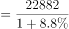元，与B项最接近。

故正确答案为B。

---

#### 第 2 题　qid 4004829 · 增长

2019年前三季度，四种收入来源中收入同比增量最高的是：

- **A**. 人均工资性收入　✅
- **B**. 人均经营净收入
- **C**. 人均财产净收入
- **D**. 人均转移净收入

**答案**：A

**官方解析**

根据题干“2019年前三季度······同比增量最高的是”，可判定本题为增长量比较问题。定位文字材料第三段：（2019年）前三季度，全国居民人均工资性收入13020元，增长；人均经营净收入3757元，增长；人均财产净收入1949元，增长；人均转移净收入4157元，增长。全国居民人均工资性收入的现期量和增长率均大于人均转移净收入，由增长量比较口诀“大大则大”可知人均工资性收入同比增量大于人均转移净收入，排除D项。根据公式：增长量，可得人均工资性收入同比增量元；人均经营净收入同比增量元；人均财产净收入同比增量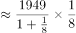元。则四种收入来源中收入同比增量最高的是人均工资性收入。

故正确答案为A。

---

#### 第 3 题　qid 4004836 · 平均数

2019年前三季度，城镇居民人均可支配收入平均数约是农村居民人均可支配收入平均数的多少倍？

- **A**. 2.43
- **B**. 2.56
- **C**. 2.75　✅
- **D**. 2.91

**答案**：C

**官方解析**

方法一：根据题干“2019年前三季度······是······的多少倍”，结合材料时间为2019年前三季度，可判定本题为现期倍数问题。定位文字材料第一段：2019年前三季度······城镇居民人均可支配收入31939元······农村居民人均可支配收入11622元。则所求倍数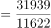，对应C项。

方法二：根据题干“2019年前三季度······是······的多少倍”，结合材料时间为2019年前三季度，可判定本题为现期倍数问题。定位文字材料第二段：（2019年前三季度）城镇居民人均可支配收入中位数29304元，增长，是平均数的；农村居民人均可支配收入中位数10172元，增长，是平均数的。则2019年前三季度城镇居民人均可支配收入平均数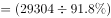元；农村居民人均可支配收入平均数元。则所求倍数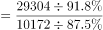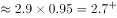，对应C项。

故正确答案为C。

---

#### 第 4 题　qid 4004843 · 平均数

2019年前三季度，排名前三的人均消费支出约占总消费支出的比重为：

- **A**. 55%
- **B**. 60%
- **C**. 65%　✅
- **D**. 71%

**答案**：C

**官方解析**

根据题干“2019年前三季度······占······的比重”，结合材料时间为2019年前三季度，可判定本题为现期比重问题。定位材料第四段可知：2019年前三季度，全国居民人均消费支出15464元；定位材料第五段可知：2019年前三季度，排名前三的人均消费支出分别为人均食品烟酒消费支出4310元、人均居住消费支出3607元、人均交通通信消费支出2078元。根据公式：比重，可得2019年前三季度，排名前三的人均消费支出约占总消费支出的比重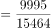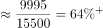，与C项最接近。

故正确答案为C。

---

#### 第 5 题　qid 4004851 · 综合

根据以上资料，可以推出的是∶

- **A**. 2018年前三季度，全国居民人均消费支出高达2万元
- **B**. 2019年前三季度，全国居民人均经营净收入占全国居民人均可支配收入的20%以上
- **C**. 2019年前三季度，全国居民人均食品烟酒消费支出的增长量约为247.79元　✅
- **D**. 2019年前三季度，全国居民人均可支配收入比全国居民人均消费支出多7500元以上

**答案**：C

**官方解析**

A项：定位材料第四段，2019年前三季度，全国居民人均消费支出15464元，比上年同期名义增长。根据公式：基期量，可得2018年前三季度，全国居民人均消费支出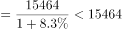元，错误；

B项：定位材料第一段，2019年前三季度，全国居民人均可支配收入22882元；定位材料第三段，按收入来源分，前三季度······人均经营净收入3757元。根据公式：比重，可得2019年前三季度，全国居民人均经营净收入占全国居民人均可支配收入的比重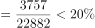，错误；

C项：定位材料第五段，（2019年）前三季度，全国居民人均食品烟酒消费支出4310元，增长。根据公式：增长量，可得2019年前三季度，全国居民人均食品烟酒消费支出的增长量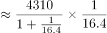元，与选项数字接近，正确；

D项：定位材料第一段，2019年前三季度，全国居民人均可支配收入22882元；定位材料第四段，2019年前三季度，全国居民人均消费支出15464元。则2019年前三季度，全国居民人均可支配收入比全国居民人均消费支出多元元，错误。

故正确答案为C。

---

### 材料 2

        2018年共进口木材11194.4万立方米（原木锯材合计，原木材积）金额210.9亿美元，同比分别增长3.2%和5.6%。数量增幅比上年同期下降了12.9个百分点，金额增幅下降了17.6个百分点。

        2018年进口木材及木制品总金额245.89亿美元（不含纸及纸制品），增长6.3%。出口总金额362.53亿美元，增长2%。2018年进口原木5974.9万立方米，金额101.08亿美元，分别增长7.9%和10.7%；进口锯材3674万立方米，金额101.08亿美元，分别下降1.7%和增长0.4%。

        2018年木家具进口金额9.24亿美元，增长3.6%，木框架坐具进口金额3.32亿美元，增长13.8%。刨花板2016年进口增幅41%，2017年增幅21%，2018年进口69.2万吨，为负增长（-2.7%）。2018年木制品出口金额仅增长2%。2018年木家具出口数量增长5.68%，金额负增长1.6%，木地板出口26.6万吨，3.85亿美元，分别下降24.8%和下降25.9%。胶合板出口1137.8万立方米，55.56亿美元，数量增长5%，金额增长9%，纤维板出口179万吨，38.35亿美元，数量下降14.9%，金额增长6.2%。木制品出口企业普遍效益下降。2018年进口针叶原木4159.7万立方米，金额57.86亿美元，同比分别增长8.8%和12.6%。

        针叶原木从新西兰进口1729.4万立方米，增长23.2%，俄罗斯795.3万立方米，下降10.1%。美国502.8万立方米，增长2.3%，澳大利亚413.4万立方米，下降3.7%。乌拉圭209万立方米，同比增长175.4%，从日本进口针叶原木92.3万立方米，同比增长23%。2018年进口针叶锯材2488万立方米，金额49.91亿美元，分别下降0.7%和增长2.3%。其中来自俄罗斯针叶锯材1567.4万立方米，增长9.7%，占进口针叶锯材63%，从加拿大进口417.4万立方米，大幅下降18.2%，占进口针叶锯材的17%。

#### 第 6 题　qid 4004873 · 综合

2017年，针叶原木进口量排第四的是哪个国家？

- **A**. 俄罗斯
- **B**. 美国
- **C**. 澳大利亚　✅
- **D**. 乌拉圭

**答案**：C

**官方解析**

根据题干“2017年······排第四的······”，结合材料时间为2018年，可判定本题为基期比较问题。定位文字材料第四段可得：2018年，针叶原木从新西兰进口1729.4万立方米，增长；俄罗斯795.3万立方米，下降；美国502.8万立方米，增长；澳大利亚413.4万立方米，下降；乌拉圭209万立方米，同比增长；从日本进口针叶原木92.3万立方米，同比增长。根据公式：基期量，可知2017年针叶原木从各国的进口量分别为：新西兰：万立方米；俄罗斯：万立方米；美国：万立方米；澳大利亚：万立方米；乌拉圭：万立方米，日本：万立方米。综上可知，2017年针叶原木从各国的进口量排前四的分别为：新西兰、俄罗斯、美国、澳大利亚，故针叶原木进口量排第四的是澳大利亚。

故正确答案为C。

---

#### 第 7 题　qid 4004877 · 综合

2017年进口原木约是进口锯材的多少倍？

- **A**. 1.48　✅
- **B**. 1.63
- **C**. 1.74
- **D**. 1.85

**答案**：A

**官方解析**

根据题干“2017年······约是······多少倍”，结合材料时间为2018年，可判定本题为基期倍数问题。定位文字材料第二段可得：2018年进口原木5974.9万立方米（），金额101.08亿美元，分别增长（）和；进口锯材3674万立方米（），金额101.08亿美元，分别下降（）和增长。根据公式：基期倍数，可知所求倍数。

故正确答案为A。

注：本题默认用进口量计算，若用进口额计算则无正确答案。

---

#### 第 8 题　qid 4004885 · 比重

2017年从加拿大进口的针叶锯材占总进口的比重约为：

- **A**. 62.70%
- **B**. 40.25%
- **C**. 34.68%
- **D**. 20.37%　✅

**答案**：D

**官方解析**

根据题干“2017年······占······比重约”，结合材料时间为2018年，可判定本题为基期比重问题。定位文字材料第四段可得：2018年进口针叶锯材2488万立方米，金额49.91亿美元，分别下降（）和增长。从加拿大进口417.4万立方米，大幅下降（），占进口针叶锯材的（）。根据公式：基期比重，可知所求比重，与D项最接近。

故正确答案为D。

---

#### 第 9 题　qid 4004893 · 增长

2018年，下列三种产品出口金额增长值从大到小的顺序排列正确的是：

- **A**. 木地板、胶合板、纤维板
- **B**. 胶合板、纤维板、木地板　✅
- **C**. 木地板、纤维板、胶合板
- **D**. 胶合板、木地板、纤维板

**答案**：B

**官方解析**

根据题干“2018年······增长值从大到小的顺序排列······”，可判定本题为增长量比较问题。定位文字材料第三段可得：（2018年）木地板出口26.6万吨，3.85亿美元，分别下降和下降。胶合板出口1137.8万立方米，55.56亿美元，数量增长，金额增长，纤维板出口179万吨，38.35亿美元，数量下降，金额增长。胶合板出口金额（55.56亿美元）纤维板出口金额（38.35亿美元），胶合板出口金额增长率（）纤维板出口金额增长率（）。根据增长量比较口诀，大大则大，胶合板出口金额增长值纤维板出口金额增长值。又由于木地板出口金额的增长率为下降，其金额增长值为负数，排在最后。只有B项符合。

故正确答案为B。

---

#### 第 10 题　qid 4004903 · 综合

可以根据上述资料推出的是：

- **A**. 2018年进口木材增长量小于340万立方米
- **B**. 2018年进口原木金额的增长值小于进口锯材金额的增长值
- **C**. 2018年木框架坐具进口金额约占木家具进口金额的35.93%　✅
- **D**. 2018年刨花板的进口数量比2017年多

**答案**：C

**官方解析**

A项：定位文字材料第一段可得：2018年共进口木材11194.4万立方米，同比增长。根据公式：增长量，可知2018年共进口木材增长量万立方米，错误；

B项：定位文字材料第二段可得：2018年进口原木金额101.08亿美元，增长；进口锯材金额101.08亿美元，增长。由于进口原木金额与进口锯材金额相同，而进口原木金额增长率（）进口锯材金额增长率（），可知进口原木金额的增长值大于进口锯材金额的增长值，并非小于，错误；

C项：定位文字材料第三段可得：2018年木家具进口金额9.24亿美元，木框架坐具进口金额3.32亿美元。根据公式：比重，可知所求比重，正确；

D项：定位文字材料第三段可得：刨花板2016年进口增幅，2017年增幅，2018年进口69.2万吨，为负增长（）。2018年刨花板进口数量增长率为负，可知2018年刨花板的进口数量比2017年少，错误。

故正确答案为C。

---

### 材料 3

        2019年农民工总量达到29077万人，比上年增加241万人，增长0.8%。其中，本地农民工11652万人，比上年增加82万人，增长0.7%；外出农民工17425万人，比上年增加159万人，增长0.9%。在外出农民工中，年末在城镇居住的进城农民工13500万人，与上年基本持平。

        在外出农民工中，在省内流动的农民工9917万人，比上年增加245万人，增长2.5%；跨省流动农民工7508万人，比上年减少86万人，下降1.1%。省内流动农民工占外出农民工的56.9%，所占比重比上年提高0.9个百分点。分地区看，除东北地区省内流动农民工占外出农民工的比重比上年下降3.4个百分点以外，东部、中部和西部地区省内流动农民工占比分别比上年提高0.1、1.4和1.2个百分点。

#### 第 11 题　qid 4004923 · 综合

2018年外出农民工中，在省内流动农民工大约是跨省流动农民工的多少倍？

- **A**. 1.34
- **B**. 1.30
- **C**. 1.27　✅
- **D**. 1.37

**答案**：C

**官方解析**

根据题干“2018年······是······的多少倍”，结合材料时间为2019年，可判定本题为基期倍数问题。定位文字材料第二段可得：在外出农民工中，在省内流动的农民工9917万人，比上年增加245万人；跨省流动农民工7508万人，比上年减少86万人。故2018年外出农民工中，在省内流动农民工大约是跨省流动农民工的倍。

故正确答案为C。

---

#### 第 12 题　qid 4004930 · 增长

2015-2019年期间，共出现几次农民工规模年增长人数高于400万人的情况？

- **A**. 0
- **B**. 1
- **C**. 2　✅
- **D**. 3

**答案**：C

**官方解析**

根据题干“······年增长人数高于400万人的情况”，可判定本题为增长量计算问题。定位图形材料可得：2015年我国农民工规模为27747万人，同比增长；2016-2019年我国农民工规模分别为28171万人、28652万人、28836万人、29077万人。根据公式：增长量，可知2015年农民工规模增长了万人。根据公式：增长量，可知2016年农民工规模增长了万人，2017年农民工规模增长了万人，2018年农民工规模增长了万人，2019年农民工规模增长了万人。故农民工规模年增长人数高于400万人的只有2016年和2017年，共2次。

故正确答案为C。

---

#### 第 13 题　qid 4004938 · 综合

2018年，中部地区外出农民工中，省内流动农民工约占∶

- **A**. 40.7%
- **B**. 39.4%　✅
- **C**. 39.6%
- **D**. 37.4%

**答案**：B

**官方解析**

根据题干“2018年······约占”，结合材料时间为2019年，且选项为百分数，可判定本题为基期比重问题。定位文字材料第二段可得：中部地区省内流动农民工占比比上年提高1.4个百分点。定位表格材料可得：2019年，中部地区省内流动农民工占比为。故2018年中部地区外出农民工中，省内流动农民工约占。

故正确答案为B。

---

#### 第 14 题　qid 4004944 · 比重

2019年，中部地区跨省流动外出农民工数量占跨省流动外出农民工总量的比重比西部地区高多少？

- **A**. 14.80%　✅
- **B**. 15.80%
- **C**. 14.59%
- **D**. 15.10%

**答案**：A

**官方解析**

根据题干“2019年······比重比······高多少”，可判定本题为现期比重问题。定位表格材料可得：2019年，中部地区跨省流动外出农民工为3802万人，西部地区跨省流动外出农民工为2691万人，跨省流动外出农民工总量为7508万人。根据公式：比重，可知2019年中部地区跨省流动外出农民工数量占跨省流动外出农民工总量的比重比西部地区高。

故正确答案为A。

备注：比重一般只讨论两者的差值，不讨论两者变化的相对比值。本题考查的就是比重差，选项严谨表示应为百分点形式。

---

#### 第 15 题　qid 4004950 · 综合

下列选项不能够从上述材料中推出的是：

- **A**. 2018年，东北地区省内流动农民工数量约占外出农民工总量的73.6%
- **B**. 2019年，本地农民工比外出农民工少5773万人
- **C**. 2019年，西部地区外出农民工工人数量比东部地区少763万人　✅
- **D**. 2018年，跨省流动农民工数量约占外出农民工总量的44%

**答案**：C

**官方解析**

A项：定位文字材料第二段可得，2019年东北地区省内流动农民工占外出农民工的比重比上年下降3.4个百分点；定位表格材料可得，2019年东北地区省内流动农民工占外出农民工的比重为。故2018年东北地区省内流动农民工数量约占外出农民工总量的，正确；

B项：定位文字材料第一段可得，2019年本地农民工11652万人，外出农民工17425万人。故2019年本地农民工比外出农民工少万人，正确；

C项：定位表格材料可得，2019年西部地区外出农民工为5555万人，东部地区外出农民工为4792万人。故2019年西部地区外出农民工工人数量比东部地区多万人，并非少763万人，错误；

D项：定位文字材料第一段可得，2019年外出农民工17425万人，比上年增加159万人；定位文字材料第二段可得，2019年跨省流动农民工7508万人，比上年减少86万人。根据公式：比重，可知2018年跨省流动农民工数量约占外出农民工总量的，正确。

本题为选非题，故正确答案为C。

---

### 材料 4

        2018年H市粮食种植面积235.7千公顷，油料种植面积3.0千公顷，棉花种植面积0.02千公顷。在粮食种植面积中，玉米种植面积199.3千公顷，小麦种植面积4.7千公顷。全年粮食产量150.2万吨。其中，夏粮2.4万吨，秋粮147.9万吨。

        2018年H市完成邮电业务总量108.2亿元。其中，邮政业务总量40.8亿元，同比增长26.5%；电信业务总量67.4亿元，同比增长56.7%。年末移动电话用户达到341万户，其中，3G移动电话用户达到25.7万户，4G移动电话用户达到241.4万户。全市互联网接入用户89.9万户，其中，新增互联网用户23.8万户。

        2018年全年全市保费收入65.4亿元，增长0.7%。其中，寿险业务保费收入39.5亿元，下降5.1%；健康和意外险业务保费收入9.1亿元，增长21.6%，增速同比增加5个百分点；财产险业务保费收入3.4亿元，增长25.2%；车险业务保费收入13.3亿元，增长1.8%。全年支付各类赔款及给付21.2亿元，增长5.3%。其中，寿险业务保费赔付11.0亿元，增长1.4%；健康和意外险业务保费赔付3.0亿元，增长68.7%；财产险业务保费赔付0.9亿元，增长5.7%；车险业务保费赔付6.4亿元，下降5.0%。

#### 第 16 题　qid 4004822 · 平均数

2018年H市平均每公顷的粮食产量约是：

- **A**. 5.34吨
- **B**. 5.87吨
- **C**. 6.12吨
- **D**. 6.37吨　✅

**答案**：D

**官方解析**

根据题干“2018年H市平均每公顷的粮食产量约是”，结合材料时间也是2018年，可判定本题为现期平均数计算问题。定位文字材料第一段可得：2018年H市粮食种植面积235.7千公顷······全年粮食产量150.2万吨。则2018年H市粮食的平均产量为吨/公顷，因此2018年H市平均每公顷的粮食产量约是6.36公顷，与D项最接近。

故正确答案为D。

---

#### 第 17 题　qid 4004826 · 增长

2018年H市邮电业务总量同比增速在下列哪一个范围内？

- **A**. 23%—41%
- **B**. 41%—57%　✅
- **C**. 57%—71%
- **D**. 高于71%

**答案**：B

**官方解析**

根据题干“2018年H市邮电业务总量同比增速”，结合材料给出邮政业务总量及增速，电信业务总量及增速，且邮政业务总量电信业务总量邮电业务总量，可判定本题为混合增长率问题。定位文字材料第二段可得：邮政业务总量40.8亿元，同比增长；电信业务总量67.4亿元，同比增长。根据混合增长率口诀“混合居中不正中，偏向基期较大的”可知，邮电业务总量同比增速在之间，且更接近于电信业务总量增速，，则邮电业务总量同比增速在之间，对应B项。

故正确答案为B。

---

#### 第 18 题　qid 4004828 · 增长

2014年—2018年中年末移动电话用户数量同比增速大于3%的年份有几个？

- **A**. 1个
- **B**. 2个　✅
- **C**. 3个
- **D**. 4个

**答案**：B

**官方解析**

根据题干“2014年—2018年中······同比增速大于的年份有几个”，可判定本题为一般增长率问题。定位柱状图可得2014年—2018年各年年末移动电话用户数量，根据增长率计算各年增长率即可。2015年为负增长，增速小于；2016年：；2017年：；2018年：。同比增速大于的年份有2017年和2018年，共2个。

故正确答案为B。

注：本题题干表述有一定歧义，要求计算2014年—2018年每年的同比增速，但材料并未给出2013年相关数据，故2014年的同比增速无法计算。

---

#### 第 19 题　qid 4004834 · 综合

2016年全年全市健康和意外险业务保费收入约为多少亿元？

- **A**. 7.5
- **B**. 6.9
- **C**. 6.4　✅
- **D**. 6.1

**答案**：C

**官方解析**

根据题干“2016年全年······约为多少亿元”，结合材料时间为2018年，与2016年间隔了2017年，可判定本题为间隔基期问题。定位文字材料第三段可得：2018年全年全市······健康和意外险业务保费收入9.1亿元，增长，增速同比增加5个百分点。代入间隔增长率计算公式：，相对于2016年，2018年健康和意外险业务保费收入增长了，则2016年全年全市健康和意外险业务保费收入亿元。

故正确答案为C。

---

#### 第 20 题　qid 4004839 · 综合

下列不能从上述资料中推出的是：

- **A**. 2018年秋粮的产量约是夏粮的62倍
- **B**. 2017年邮政业务总量约占电信业务总量的75%
- **C**. 2017年寿险业务保费赔付金额约0.85亿元　✅
- **D**. 2018年全年保费收入同比增速高于10%的业务类型有2个

**答案**：C

**官方解析**

A项：定位文字材料第一段可得：2018年······夏粮2.4万吨，秋粮147.9万吨。则所求倍数为倍，正确；

B项：定位文字材料第二段可得：2018年H市······邮政业务总量40.8亿元（），同比增长（）；电信业务总量67.4亿元（），同比增长（）。所求基期比重为，正确；

C项：定位文字材料第三段可得：2018年全年全市······寿险业务保费赔付11.0亿元，增长。则2017年寿险业务保费赔付金额为亿元，远高于0.85亿元，错误；

D项：定位文字材料第三段可得，全年保费收入同比增速高于的业务类型有健康和意外险（）、财产险（）2个，正确。

本题为选非题，故正确答案为C。

备注：B项不严谨。两者属于并列关系，不应考查比重概念。

---
