# 2021年江苏省公务员录用考试《行测》题（A类）（网友回忆版）

> 省考 · 2021 年 · 6 个模块 · 共 134 题

- [政治理论](#%E6%94%BF%E6%B2%BB%E7%90%86%E8%AE%BA) · 4 题
- [常识判断](#%E5%B8%B8%E8%AF%86%E5%88%A4%E6%96%AD) · 11 题
- [言语理解与表达](#%E8%A8%80%E8%AF%AD%E7%90%86%E8%A7%A3%E4%B8%8E%E8%A1%A8%E8%BE%BE) · 30 题
- [数量关系](#%E6%95%B0%E9%87%8F%E5%85%B3%E7%B3%BB) · 19 题
- [判断推理](#%E5%88%A4%E6%96%AD%E6%8E%A8%E7%90%86) · 50 题
- [资料分析](#%E8%B5%84%E6%96%99%E5%88%86%E6%9E%90) · 20 题

---

## 政治理论

### 第 1 题　qid 2741945 · 新思想

习近平总书记围绕什么是高质量发展，为什么要推动高质量发展，怎样推动高质量发展等问题发表了一系列重要讲话，为深刻认识高质量发展的科学内涵，核心要义和基本要求提供了根本遵循。关于高质量发展，下列理解正确的是：
①高质量发展要牢固树立底线思维，坚持安全是第一要务
②高质量发展要健全基本公共服务体系，改善人民生活品质
③高质量发展要实施更大范围更宽领域更深层次对外开放
④高质量发展要强化国家战略科技力量，完善科技创新体制机制

- **A**. ①②③
- **B**. ①②④
- **C**. ①③④
- **D**. ②③④　✅

**答案**：D

**官方解析**

本题考查政治常识。
①错误，高质量发展的第一要务是发展。
②正确，随着经济高质量发展，人民的收入水平稳步提高、就业质量不断提升，以及由此获得的包括基本公共服务在内的各类服务的数量和品质。因此，高质量发展要健全基本公共服务体系，改善人民生活品质。
③正确，我国已进入高质量发展阶段，党的十九届五中全会提出，“坚持实施更大范围、更宽领域、更深层次对外开放。”

④正确，我国已进入高质量发展阶段，要强化国家战略科技力量，完善科技创新体制机制，促进高质量发展。
综上，理解正确的是②、③、④。
故正确答案为D。

---

### 第 2 题　qid 2741948 · 新思想

习近平法治思想系统阐述了新时代全面依法治国的战略思想和工作部署，深刻回答了新时代为什么实行全面依法治国，怎样实行全面依法治国等一系列重大问题。下列表述属于习近平法治思想内容的是：
①坚持党对全面依法治国的领导；
②坚持统筹推进国内法治和涉外法治；
③坚持建设中国特色社会主义法治体系；
④坚持有法可依、有法必依、执法必严、违法必究。

- **A**. ①②③　✅
- **B**. ①②④
- **C**. ①③④
- **D**. ②③④

**答案**：A

**官方解析**

本题考查政治常识。
2020年11月16日至17日中央全面依法治国工作会议在北京召开，中共中央总书记、国家主席、中央军委主席习近平出席会议并发表重要讲话。会议强调，习近平法治思想内涵丰富、论述深刻、逻辑严密、系统完备，从历史和现实相贯通、国际和国内相关联、理论和实际相结合上深刻回答了新时代为什么实行全面依法治国、怎样实行全面依法治国等一系列重大问题。
①、②、③正确，习近平对当前和今后一个时期推进全面依法治国要重点抓好的工作提出了11个方面的要求，可精辟概括为“十一个坚持”：坚持党对全面依法治国的领导；坚持以人民为中心；坚持中国特色社会主义法治道路；坚持依宪治国、依宪执政；坚持在法治轨道上推进国家治理体系和治理能力现代化；坚持建设中国特色社会主义法治体系；坚持依法治国、依法执政、依法行政共同推进，法治国家、法治政府、法治社会一体建设；坚持全面推进科学立法、严格执法、公正司法、全民守法；坚持统筹推进国内法治和涉外法治；坚持建设德才兼备的高素质法治工作队伍；坚持抓住领导干部这个“关键少数”。
④错误，“有法可依、有法必依，执法必严，违法必究”是在党的十一届三中全会前召开的中央工作会议上提出的十六字方针。后为了适应全面推进依法治国的新战略，习近平总书记提出了法治建设统筹推进的新方针“科学立法，严格执法，公正司法，全民守法”。
故正确答案为A。

---

### 第 3 题　qid 2741953 · 马克思主义

习近平总书记指出：“要把新时代坚持和发展中国特色社会主义这场伟大社会革命进行好，我们党必须勇于进行自我革命，把党建设得更加坚强有力。”该论断蕴含的哲理是：

- **A**. 人们在改造客观世界的过程中改造主观世界，通过改造主观世界来改造客观世界　✅
- **B**. 人们在客观规律面前，并不是消极被动的，能够认识和利用规律来改造客观世界
- **C**. 人的意识活动是一个能动的创造性过程，在认识和改造世界中，具有巨大的能动作用
- **D**. 人们在实践中所获得的真理，既是相对的，也是绝对的，是相对性与绝对性统一

**答案**：A

**官方解析**

本题考查政治常识。
A项正确，马克思在《关于费尔巴哈的提纲》中谈到了“环境的改变和人的活动或自我改变的一致”的问题，在人与世界的关系中，随着社会的发展，人自身的改造或人的自我改造就更加重要。不论是个人、团体还是政党，要自觉地实现自我改造，就需要以勇于自我革命的精神打造和锤炼自己，提高自我净化、自我完善、自我革新、自我提高的能力。自我革命是对主观世界的改造，通过改造主观世界，把党建设得更坚强有力，从而更好地改造客观世界，进行好新时代坚持和发展中国特色社会主义这场伟大社会革命。
B项错误，人在客观规律面前并不是无能为力的，人可以发挥主观能动性，能够认识和利用规律来改造客观世界。但“客观规律”在题干中没有体现。
C项错误，意识活动具有巨大的能动作用，具有创造性，但“意识活动的能动作用”在题干中没有体现。
D项错误，真理是绝对性和相对性的统一，任何真理都有自己的适用条件和范围，如果超出了这个条件和范围，只要再多走一小步，真理就会变成谬误。但“人民在实践中所获得的真理”在题干中没有体现。
故正确答案为A。

---

### 第 4 题　qid 2741952 · 新思想

2020年11月，习近平总书记在江苏考察期间，专程前往南通参观张謇生平介绍展陈，称赞张謇是我国民族企业家的楷模。下列关于张謇的说法与史实不符的是：

- **A**. 张謇是我国棉纺织业的早期开拓者
- **B**. 张謇是我国民办师范教育的开放开创者
- **C**. 张謇是我国造船和海运业的奠基者　✅
- **D**. 张謇是我国首座公共博物馆的创办者

**答案**：C

**官方解析**

本题考查人文常识。
张謇，生于江苏通州海门长乐镇（今江苏省南通市海门区常乐镇）。他是光绪二十年的状元，中国近代实业家、政治家、教育家、书法家。
A项正确，张謇主张“实业救国”，是中国棉纺织领域早期的开拓者，为中国近代民族工业的兴起作出了宝贵贡献。1895年，张謇依靠南通手工棉纺织业较为发达的基础，选址唐家闸创办了大生纱厂。
B项正确，1902年，张謇创办了“通州师范学校”，这是我国第一所民办师范学校，它标志着我国师范教育专设机构的起点。1903年，通州师范学校开始招生。
C项错误，张謇主张实业救国，以棉纺业为中心，兴办了一系列辅助企业，形成了一个相当完整的经济体系，包括面粉业、玻璃厂、盐垦业、冶铁厂等，但不包括海运业。
D项正确，1905年，张謇创办了中国第一所公共博物馆——南通博物苑，博物苑隶属通州师范学校。张謇专门作了一副楹联，介绍办博物苑的初衷——“设为庠序学校以教，多识鸟兽草木之名”。这副楹联至今仍然悬挂在博物苑南馆的月台上。
本题为选非题，故正确答案为C。

---

## 常识判断

### 第 1 题　qid 2741944 · 人文常识

党的十九届五中全会审议通过了《中共中央关于制定国民经济和社会发展第十四个五年规划和2035年远景目标的建议》。根据该《建议》，下列表述正确的是：

- **A**. 我国“十四五”期末要基本实现美丽中国建设目标
- **B**. 我国“十四五”经济社会发展要以构建新发展格局为主题
- **C**. 到2035年，我国要实现国民经济总量或人均收入再翻一番
- **D**. 到2035年，全体人民共同富裕取得更为明显的实质性进展　✅

**答案**：D

**官方解析**

本题考查政治常识。
A项错误，《建议》指出，“党的十九大对实现第二个百年奋斗目标作出分两个阶段推进的战略安排，即到二〇三五年基本实现社会主义现代化，到本世纪中叶把我国建成富强民主文明和谐美丽的社会主义现代化强国。展望二〇三五年······广泛形成绿色生产生活方式，碳排放达峰后稳中有降，生态环境根本好转，美丽中国建设目标基本实现。”十四五指的是2021-2025年，故该项说法错误。
B项错误，《建议》指出，“‘十四五’时期······以推动高质量发展为主题，以深化供给侧结构性改革为主线，以改革创新为根本动力，以满足人民日益增长的美好生活需要为根本目的，统筹发展和安全。”
C项错误，《建议》指出，“展望二〇三五年，我国经济实力、科技实力、综合国力将大幅跃升，经济总量和城乡居民人均收入将再迈上新的大台阶”。
D项正确，《建议》指出，“展望二〇三五年，人民生活更加美好，人的全面发展、全体人民共同富裕取得更为明显的实质性进展。”
故正确答案为D。

---

### 第 2 题　qid 2741951 · 经济常识

2020年11月15日，第四次区域全面经济伙伴关系协定领导人会议正式签署了《区域全面经济伙伴关系协定》。关于该协定，下列说法正确的是：

- **A**. 
协定签署标志着全球参与人数最多、成员结构最多的东亚自贸区建成

- **B**. 
协定由东盟十国发起，并邀请中国、日本、韩国、澳大利亚、俄罗斯等参加谈判

- **C**. 
协定涵盖货物和服务贸易、争端解决、投资、知识产权、数字贸易、金融等议题
　✅
- **D**. 
协定规定的货物贸易，零关税产品数整体超过，与世贸组织的成员开放度持平

**答案**：C

**官方解析**

本题考查政治常识。

2020年11月15日，第四次区域全面经济伙伴关系协定（RCEP）领导人会议以视频方式举行，会后15个RCEP成员国正式签署了《区域全面经济伙伴关系协定》。

A项错误，该协定的签署标志着世界上参与人口数量最多、成员结构最多元、发展潜力最大的东亚自贸区建设成功启动，而非建成。

B项错误，RCEP是由东盟10国发起，邀请中国、日本、韩国、澳大利亚、新西兰、印度6个对话伙伴国参加，旨在通过削减关税及非关税壁垒，建立的一个16国统一市场的自由贸易协定。2020年11月15日，第四次区域全面经济伙伴关系协定（RCEP）领导人会议召开，东盟十国以及中国、韩国、日本、澳大利亚、新西兰等国家领导人与会，会议以视频形式举行。

C项正确，《区域全面经济伙伴关系协定》是一个新型的自贸协定，拥有更大的包容性。该协定不仅涵盖货物贸易、争端解决、服务贸易、投资等议题，也涉及到知识产权、数字贸易、金融、电信等新议题。

D项错误，在运行模式方面，协定中各国货物贸易的整体开放水平超过，远高于世贸组织各国的开放水平。

故正确答案为C。

---

### 第 3 题　qid 2741947 · 人文常识

从长远战略角度出发，我国要加快发展现代产业体系，推进产业基础现代化，关于产业基础高级化、产业链现代化的内容及其关系，下列说法不正确的是：

- **A**. 产业基础高级化是产业链现代化的前提，产业链现代化是产业基础高级化的最终体现
- **B**. 工业体系门类齐全，是一国实现产业基础高级化，产业链现代化的重要标志和核心要素　✅
- **C**. 产业链的自主建设能力，向上游攀升能力和领导控制能力是产业链现代化的根本保证
- **D**. 基础零部件、原材料、工艺、技术等的供给和保障能力是产业基础高级化的重要内容

**答案**：B

**官方解析**

本题考查经济常识。
A项正确，产业基础高级化是产业链现代化的前提与条件，产业链现代化是产业基础高级化的现实成果与最终体现，两者相辅相成、不可分割。
B项错误，工业体系门类齐全，并非是一国实现产业基础高级化，产业链现代化的重要标志和核心要素。产业基础高级化是产业链现代化的前提与条件，在产业基础高级化过程中，人力资本和物质资本是最为重要的两类要素。
C项正确，对一个国家来说，产业链现代化水平的提升意味着该国对产业链的自主建设能力、向上游攀升能力和领导控制能力的提升，是该国产业体系全球竞争力持续改善的实体保证和现实体现。
D项正确，以工业部门为例，基础零部件、基础材料、基础工艺、基础技术、基础软件等“五基”就构成了工业基础的基本架构。中央一再强调的产业基础高级化，就是指“五基”等基本支撑要素和底层结构部分对现代产业体系发展的供给能力和自我保障能力的提高程度。
本题为选非题，故正确答案为B。

---

### 第 4 题　qid 2741950 · 人文常识

抗美援朝战争的胜利使得新中国真正站稳了脚跟，可谓“打得一拳开，免得百拳来”。对于这一论断，下列理解最准确的是：

- **A**. 抗美援朝战争粉碎了侵略者陈兵国门，进而将新中国扼杀在摇篮之中的图谋　✅
- **B**. 抗美援朝战争深刻塑造了第二次世界大战结束以后亚洲乃至世界的格局
- **C**. 抗美援朝战争奠定了新中国在国际事务中的重要地位，彰显新中国大国地位
- **D**. 抗美援朝战争使人民军队取得了重要军事经验，极大促进了国防和军队现代化

**答案**：A

**官方解析**

本题考查毛中特。
A项正确，2020年10月23日，纪念中国人民志愿军抗美援朝出国作战70周年大会在北京人民大会堂隆重举行。中共中央总书记、国家主席、中央军委主席习近平在会上发表重要讲话强调：“经此一战，中国人民粉碎了侵略者陈兵国门、进而将新中国扼杀在摇篮之中的图谋，可谓‘打得一拳开，免得百拳来’，帝国主义再也不敢作出武力进犯新中国的尝试，新中国真正站稳了脚跟。这一战，拼来了山河无恙、家国安宁，充分展示了中国人民不畏强暴的钢铁意志！”
B项错误，2020年10月23日，纪念中国人民志愿军抗美援朝出国作战70周年大会在北京人民大会堂隆重举行。中共中央总书记、国家主席、中央军委主席习近平在会上发表重要讲话强调：“经此一战，第二次世界大战结束后亚洲乃至世界的战略格局得到深刻塑造，全世界被压迫民族和人民争取民族独立和人民解放的正义事业受到极大鼓舞，有力推动了世界和平与人类进步事业。”而“打得一拳开，免得百拳来”的侧重点应该是“我们抗美援朝，就是保家卫国”，故该说法正确，但与题干无关，排除。
C项错误，2020年10月23日，纪念中国人民志愿军抗美援朝出国作战70周年大会在北京人民大会堂隆重举行。中共中央总书记、国家主席、中央军委主席习近平在会上发表重要讲话强调：“经此一战，中国人民打败了侵略者，震动了全世界，奠定了新中国在亚洲和国际事务中的重要地位，彰显了新中国的大国地位。”该说法正确，但与题干无关，排除。
D项错误，2020年10月23日，纪念中国人民志愿军抗美援朝出国作战70周年大会在北京人民大会堂隆重举行。中共中央总书记、国家主席、中央军委主席习近平在会上发表重要讲话强调：“经此一战，人民军队在战争中学习战争，愈战愈勇，越打越强，取得了重要军事经验，实现了由单一军种向诸军兵种合成军队转变，极大促进了国防和军队现代化。”该说法正确，但与题干无关，排除。
故正确答案为A。

---

### 第 5 题　qid 2741954 · 科技常识

芯片是现代信息社会的基石之一，是引领新一轮科技革命和产业变革的关键。下列关于芯片的说法不正确的是：

- **A**. 芯片是内含众多电子元件及连线的半导体基片
- **B**. 当今主流芯片的基层大都是用锗材料制造而成　✅
- **C**. 摩尔定律预测了芯片上集成的晶体管数量增长的速度
- **D**. 芯片制造涉及学术界和产业界多学科领域的研究积累

**答案**：B

**官方解析**

本题考查科技常识。
A项正确，芯片，又称微电路、微芯片、集成电路，是指内含集成电路的硅片，体积很小，常常是计算机或其他电子设备的一部分，是半导体元件产品的统称，是集成电路的载体，时常制造在半导体晶圆表面上。
B项错误，当今芯片通常使用单晶硅晶圆作基层，然后使用光刻、掺杂、CMP等技术制成MOSFET或BJT等组件，再利用薄膜和CMP技术制成导线，从而完成制作。
锗是一种主要的元素半导体材料，呈金刚石型结构。主要用于半导体器件和重要的红外光学元件，如透镜、窗口等。1952年蒂尔用切光拉斯基法拉出第一根锗单晶。在50～60年代由于锗晶体管的需求，锗生产技术发展迅速。但自70年代后锗器件逐步为硅器件取代。然而锗在红外光学上用量增加，补偿了在电子工业上用量的下降。
C项正确，摩尔定律是英特尔创始人之一戈登·摩尔的经验之谈，其核心内容为：集成电路上可以容纳的晶体管数目在大约每经过24个月便会增加一倍。摩尔定律是内行人摩尔的经验之谈，但并非自然科学定律，它一定程度揭示了信息技术进步的速度。
D项正确，芯片制造过程包括半导体工艺的每个阶段，从原材料制备到封装、测试以及传统和现代工艺，涉及学术界和产业界多学科领域的研究积累。
本题为选非题，故正确答案为B。

---

### 第 6 题　qid 2741955 · 法律常识

刚满15周岁的杨文，冒用其兄的身份证，与某工程公司签订劳动合同，从事铲车司机工作。8个月后，杨文在工作中受伤，关于本案，下列说法不正确的是：

- **A**. 杨文与工程公司间的劳动合同无效
- **B**. 工程公司应按非法用工承担工伤赔偿
- **C**. 杨文与工程公司之间存在劳动关系　✅
- **D**. 工程公司不得在工伤期间将杨文辞退

**答案**：C

**官方解析**

本题考查法律常识。
A项正确，C项错误，《劳动合同法》第二十六条规定：“下列劳动合同无效或者部分无效：（一）以欺诈、胁迫的手段或者乘人之危，使对方在违背真实意思的情况下订立或者变更劳动合同的······”《劳动法》第十五条规定：“禁止用人单位招用未满十六周岁的未成年人。文艺、体育和特种工艺单位招用未满十六周岁的未成年人，必须遵守国家有关规定，并保障其接受义务教育的权利。”因此，如果劳动者入职时未满十六周岁，这种情形下杨文与工程公司间的劳动合同无效，故不存在劳动关系。
B项正确，《禁止使用童工规定》第十条规定：“童工患病或者受伤的，用人单位应当负责送到医疗机构治疗，并负担治疗期间的全部医疗和生活费用。童工伤残或者死亡的，用人单位由工商行政管理部门吊销营业执照或者由民政部门撤销民办非企业单位登记；用人单位是国家机关、事业单位的，由有关单位依法对直接负责的主管人员和其他直接责任人员给予降级或者撤职的行政处分或者纪律处分；用人单位还应当一次性地对伤残的童工、死亡童工的直系亲属给予赔偿，赔偿金额按照国家工伤保险的有关规定计算。”故工程公司对于杨文应按非法用工进行赔偿。
D项正确，工程公司不得在工伤期间辞退杨文，因为杨文跟工程公司不存在劳动关系，而应该劝退。
本题为选非题，故正确答案为C。

---

### 第 7 题　qid 2741943 · 人文常识

党中央明确提出，要加强数字社会、数字政府建设，提升公共服务、社会治理等数字化智能化水平。关于“数字政府”下列说法正确的是：

- **A**. 数字政府要求政府的运行实现无纸化的信息传递
- **B**. 数字政府就是要将数字化作为实施社会治理的核心手段
- **C**. 数字建设旨在充分利用信息科技提升社会治理效能
- **D**. 数字政府是运用大数据重构政府的组织架构和运行机制　✅

**答案**：D

**官方解析**

本题考查政治常识。
《中共中央关于制定国民经济和社会发展第十四个五年规划和二〇三五年远景目标的建议》中提出：“加快数字化发展。发展数字经济，推进数字产业化和产业数字化，推动数字经济和实体经济深度融合，打造具有国际竞争力的数字产业集群。加强数字社会、数字政府建设，提升公共服务、社会治理等数字化智能化水平。”
A项错误，建设数字政府是政府运用互联网、大数据、人工智能等信息技术解决公共问题、提供公共服务、实施公共治理的过程和活动。就其本质而言，数字政府就是政府的数字化、智慧化。建设数字政府与无纸化信息传递无关。
B项错误，数字政府建设是当前推动政府治理体系和治理能力现代化的着力点和突破口，是推进“放管服”改革的重要抓手，是促进政府职能转变的重要动能，但并非是实施社会治理的核心手段。在谈到加强和创新社会治理时，习近平强调，加强和创新社会治理，关键在体制创新，核心是人，只有人与人和谐相处，社会才会安定有序。
C项错误，数字政府旨在构建统筹规划、统一标准、保障安全的电子政务系统，推进政务数据共享和业务协同，实现跨层级、跨地域、跨系统、跨部门、跨业务的协同管理和公共服务，建设人民满意的服务型政府。
D项正确，数字政府不仅要以政府数据为基础，更需要政府数据与市场、社会数据的融合，真正形成“政府大数据”。通过数字政府建设，尤其是随着政府数据的开放与共享的逐步推进，使治理结构更加开放。为了适应信息社会的政府治理，一些组织机构合并了、撤销了，一些组织机构建立了，政府治理结构得以重构。最后，推动治理流程再造。建设数字政府，要求政府治理过程与行为必须与信息运行规律相适应，必须遵循信息获取、存储、分析、运用的内在逻辑与要求，这就要求再造政府治理流程。
故正确答案为D。

---

### 第 8 题　qid 2741946 · 法律常识

为整治电动自行车交通违法行为，某市交管部门向市民公开征求意见。下列建议中，交管部门不应采纳的是：

- **A**. 对电动自行车随机测速，超速严重的要依法处罚
- **B**. 禁止电动自行车在机动车禁鸣区内长时间按喇叭
- **C**. 有条件的路口，在人行横道线两侧划出电动自行车过街斑马线
- **D**. 违反交规的电动自行车骑车人要现场学法，答题合格才能离开　✅

**答案**：D

**官方解析**

本题考查法律常识。
A项正确，《道路交通安全法》第五十八条规定：“······电动自行车在非机动车道内行驶时，最高时速不得超过十五公里。”该法第八十九条规定：“······非机动车驾驶人违反道路交通安全法律、法规关于道路通行规定的，处警告或者五元以上五十元以下罚款。”因此，超速严重的可依法予以处罚，可以采纳。
B项正确，《道路交通安全法实施条例》第六十二条规定：“驾驶机动车不得有下列行为：······（八）在禁止鸣喇叭的区域或者路段鸣喇叭。”根据立法目的，禁止鸣喇叭区域不应仅限制机动车，因此，禁止电动自行车在机动车禁鸣区内长时间按喇叭，可以采纳。
C项正确，在有条件的路口，在人行横道线两侧划出电动自行车过街斑马线，有利于电动自行车规范出行，不违反相关法律禁止性规定，可以采纳。
D项错误，该项中“要现场学法，答题合格才能离开”超出交管部门职权范围，且涉嫌非法限制当事人自由，法无授权不可为，所以此做法不应采纳。
本题为选非题，故正确答案为D。

---

### 第 9 题　qid 2741949 · 人文常识

2020年11月，中共中央组织部印发的《关于改进推动高质量发展的政绩考核的通知》明确要求，增强政绩考核群众参与度，在政绩考核中充分反映群众感受、体现群众评价。某机关的下列做法符合这一要求的是：

- **A**. 以市民的意见为标准设立绩效考核指标
- **B**. 就绩效考核方案广泛听取社会公众意见　✅
- **C**. 依据市民对绩效考核结果的认可来进行奖惩
- **D**. 将部门领导对工作人员的考评意见向社会公开

**答案**：B

**官方解析**

本题考查管理常识。
A项错误，《通知》中提到“在政绩考核中充分反映群众感受、体现群众评价”而非以市民的意见为标准。以群众满意为标准衡量和检验为民服务的绩效，以群众评判为动力改进和优化为民服务的方式，是加快服务型政府建设的必然要求。而以群众满意为标准并不等同于以市民意见为标准。
B项正确，绩效考核方案听取社会公众意见能够增强政绩考核群众参与度，在政绩考核中反映群众感受、体现群众评价。
C项错误，群众对绩效考核的意见只是参考，关于公务员的处分决定中，公务员出现违纪违法行为才能进行惩处。违纪行为的认定需要依照政治纪律，工作纪律，廉政纪律，道德纪律作为准则，而市民对绩效考核的结果认可不在其中，可作为参考。
D项错误，政府进行绩效评价的时候因为主体的不同可以分为上层组织及领导以及利益相关者。二者都需要进行绩效评价，但是不需要对对方进行评价，而群众属于利益相关者的一部分，因此可以公开进行监督，但是不可以参与评价，与题干中群众参与评价不相符合。
故正确答案为B。

---

### 第 10 题　qid 2741957 · 法律常识

某市上线运行“互联网监督”系统，形成了全面联网、无缝对接、依法监管、多方联动的“监管一张网”。下列最能决定该系统运行效果的是：

- **A**. 监管信息的对接和共享　✅
- **B**. 接入系统的监管部门数量
- **C**. 法律规范的制定和执行
- **D**. 相关部门监管行动的时效

**答案**：A

**官方解析**

本题考查政治常识。

A项正确，在“互联网监督”系统的建设中，需要依托全省一体化在线政务服务平台，加快实现省市场监管信息平台、省公共资源交易服务平台、省投资项目在线审批监管平台、省公共信用信息系统等综合监管平台监管数据的归集共享，集约化、规范化推进省“互联网监督”系统建设，建立常态化监管数据归集共享机制。因此，监管信息的对接和共享能决定“互联网监督”系统的运行效果。

B、C、D三项错误，全省联网指的是接入系统的监管部门数量，依法监管就是指法律规范的制定和执行，而相关部门监管行动的时效体现了多方联动，这些都能影响“互联网监督”系统运行的效果，但只是起辅助作用，并不是最能决定该系统运行效果的因素。

故正确答案为A。

---

### 第 11 题　qid 2741960 · 人文常识

下表为某市政务服务大厅公共服务事项清单上列明的部分内容。表中①②③依次代表的内容应该是：

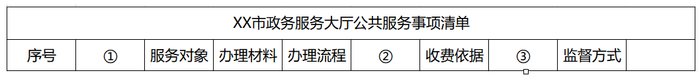

- **A**. 服务类型、设定依据、常见问题
- **B**. 承办单位、收费标准、承诺时限　✅
- **C**. 事项类别、服务标准、咨询电话
- **D**. 政策规定、收费方式、评价统计

**答案**：B

**官方解析**

本题考查政治常识。
A项错误，设定依据是政府提供公共服务所依据的法规或者政策文件，一般出现在服务对象之前或者收费情况之后。
B项正确，承办单位提示的是办理地点的相关信息，收费标准需与收费依据排列在一起，承诺时限的位置相对灵活，可出现在收费情况之前也可出现在收费情况之后。
C项错误，服务标准的内容包含服务对象，且应该出现在办理材料及流程之前，与服务相关信息排列在一起。
D项错误，除收费方式外并未涉及到具体的公共服务事项。
故正确答案为B。
注：江苏省内不同市的公共服务事项清单上的顺序也会有所不同，本题的解题应先考虑内容的准确性再考虑顺序，综合这两方面，粉笔倾向于答案为B项。

---

## 言语理解与表达

### 材料 1

        索引以及一切检索工具，本质上都是揭示人类知识内在关联的认知方式，而且完全符合人类的认识习惯。我们通过研究索引的<u>                    </u>，可以获得极大的启示。索引揭示的知识规则，是构建新媒体时代人类知识体系的基础，也是实现知识发现新方案的基础。索引具有三种功能：学术进阶的工具、知识发现的手段和学术评价的标准。传统的检索工具，其实是人类认知思维的外在表现。

        索引有两种形态，分别代表了人类的两种认知形式，即知识扩展和模式识别。知识扩展又分为两种形式，其一是单向度的知识扩展模型，就是在同一个文献内部提出某些关键词制成索引，当读者在一个段落中发现其中一个关键词，可以经由索引扩展到本书其他段落、篇章中的同一词，这是个闭合循环的知识扩展模型；其二是开放性的知识扩展，就是读者在书中发现一个关键词，通过综合索引跳转至多种文献中与之相关的关键词，从而不断向外扩展。在这个模型之上，如果把多个知识关联序列进行叠加，我们便掌握了一种新的认知形式，就是模式识别。不是说通过一个已知的关键词去找它在文献中出现的位置，而是根据某些边际条件探索某个关键词集，即获取位于一个相关知识序列中的知识集合。比如说，我们综合利用唐代的士族世系表、科举年表、职官年表，可以探索士族出身的文士通过科举途径入仕和此后的升迁途径中较之寒门子弟有何优势，甚至可以结合士族郡望表进一步细致分析不同地域士族的升降与科举之间的关系。模式识别是学术研究更高级的思维过程。

        知识扩展和模式识别都依赖于知识系统的有序性和关联性，由此形成的知识图谱，是有关联的、有序的知识集合。这个知识集合中，所有知识点都在一个相互关联的网络体系中，不是单个的珠子，而是固定在一串项链上，我们可以知道它的定位，知道它跟其他知识之间的关联。

        知识图谱正是用以实现模式识别思维功能的方案，它由多个知识本体库和多个知识模型组成，把这些知识模型进行叠加以实现模式识别功能。知识图谱的综合架构有点像生物分子模型，任何一个知识点都能够在它的分子链上找到，而每个分子链跟其他的分子链之间还有一种关联，那么我们可以通过它的颜色、大小、方向来定位它到底是哪个具体的知识。我们看单独的知识点，它是海量知识中一个不确定的点，但当我们把不同来源的知识进行拼合的时候，其实它就变成了一个某种七巧板拼成的固定形状，每一个单块都是不可移动的，是互相关联从而互相限定的。那么，以往所有的问题、错误，包括误解，其实都可以在这个体系中再认识。

        这种知识管理方案能够让我们把传统媒体中的经验、知识和智慧，平滑地移入新媒体中，实现基于规则的方案和基于统计的方案的结合，也就是基于计算机技术的和基于专业领域知识的知识管理方案的完美结合，进而辅助人类更广阔、深入地认识主观世界和客观世界。

#### 第 1 题　qid 2742038 · 语句表达

填入文中画横线处最恰当的是：

- **A**. 原理和特性　✅
- **B**. 产生与发展
- **C**. 运用与前景
- **D**. 方法和用途

**答案**：A

**官方解析**

本题为语句填空题，横线出现在第一段中间，需结合上下文。文段开篇论述索引是揭示人类知识内在关联的认知方式，指出了索引是什么，即检索工具的原理，横线后论述了索引的三个功能，指出“传统的检索工具，其实是人类认知思维的外在表现”，即索引的功能特点，故横线处指的是索引所具有的原理和特征，对应A项。
B项索引的“发展”、C项索引的“前景”、D项索引的“方法”本段均未提及，属于无中生有，排除。
故正确答案为A。
【文段出处】《史睿谈数字人文与现代文献学研究》

---

#### 第 2 题　qid 2742043 · 片段阅读

作者认为检索工具产生的根本原因在于：

- **A**. 学者需要将其作为学术研究的工具
- **B**. 学者需要将其作为学术评价的标准
- **C**. 人们需要这样一种构建庞大知识体系的基本规则
- **D**. 人们需要这样一种揭示知识内在关联的认知方式　✅

**答案**：D

**官方解析**

根据第一段“索引以及一切检索工具，本质上都是揭示人类知识内在关联的认知方式，而且完全符合人类的认识习惯”可知，检索工具产生的根本原因在于它是一种帮助人类揭示知识内在关联的认知方式，对应D项。
A项，“学术研究的工具”可对应“学术进阶的工具”，属于索引的功能，而非产生原因，排除；
B项，“学术评价的标准”为索引的功能，与其产生原因无关，排除；
C项，“构建庞大知识体系的基本规则”可对应“构建新媒体时代人类知识体系的基础”，为索引揭示的知识规则，并非其产生的根本原因，排除。
故正确答案为D。
【文段出处】《史睿谈数字人文与现代文献学研究》

---

#### 第 3 题　qid 2742046 · 片段阅读

根据文意，索引的“知识扩展”有两种形式，其区别主要在于：

- **A**. 关键词跳转方式是否可以循环
- **B**. 是闭合式扩展还是开放式扩展　✅
- **C**. 涉及的文献是有限还是无限的
- **D**. 知识扩展的模型是否受到限制

**答案**：B

**官方解析**

“索引的‘知识扩展’有两种形式”出现在第二段，根据文意可知，索引有知识扩展和模式识别两种形态。知识扩展又分为两种形式，其一是在一个文献内部进行关键词的检索，是一种闭合循环的知识扩展模型；其二是检索关键词时，可以从一本书跳转至多种文献，是一种开放式的知识扩展模型，故两种形式的主要区别就在于一个是一本书内部的闭合式扩展，另一个是开放式的向外扩展，对应B项。
A项，知识扩展的第二种形式仅指出其为开放性向外扩展的，未提及其能否进行“关键词跳转循环”，故无法判断其是否为两者的主要区别，排除；
C项，文段并未提及涉及的文献的数量，属于无中生有，排除；
D项，文段并未阐述知识模型是否受限制，属于无中生有，排除。
故正确答案为B。
【文段出处】《史睿谈数字人文与现代文献学研究》

---

#### 第 4 题　qid 2742049 · 片段阅读

下列关于“知识图谱”的描述不符合文意的是：

- **A**. 其架构被称为生物分子模型　✅
- **B**. 是相关知识有序形成的体系
- **C**. 就像是将知识点有序串联起来的项链
- **D**. 可以帮助人类更好地认识主客观世界

**答案**：A

**官方解析**

A项，根据第四段“知识图谱的综合架构有点像生物分子模型”可知，文中仅指出知识图谱的架构有点像生物分子模型，并非指出其被称为生物分子模型，故表述有误，当选。
B、C两项，根据第三段“由此形成的知识图谱，是有关联的、有序的知识集合。这个知识集合中，所有知识点都在一个相互关联的网络体系中，不是单个的珠子，而是固定在一串项链上”可知，该两项均表述正确，排除；
D项，根据第五段“这种知识管理方案······深入地认识主观世界和客观世界”可知，“这种知识管理方案”应当指代前文知识图谱管理方案，故知识图谱可以帮助人类更好地认识主客观世界，表述正确，排除。
本题为选非题，故正确答案为A。
【文段出处】《史睿谈数字人文与现代文献学研究》

---

#### 第 5 题　qid 2742053 · 片段阅读

下列最适合做文章标题的是：

- **A**. 学术检索不可或缺的工具——索引
- **B**. 索引——人类记忆能力的延续
- **C**. 索引的作用与意义　✅
- **D**. 文献处理离不开索引

**答案**：C

**官方解析**

文章开篇引出“索引”这一话题，第一段指出“索引”的本质及其存在的意义和功能。第二段，介绍“索引”的两种形态，并论述了其功能原理；第三段到第五段，指出“索引”的两种形态将形成“知识图谱”并指出其原理和作用。故本篇文章围绕“索引”，强调索引可以形成知识图谱发挥作用，对人类认识世界有积极影响，对应C项。
A项强调索引在“学术检索”中的作用，D项强调索引在“文献处理”中的作用，根据“索引······本质上都是揭示人类知识内在关联的认知方式”“辅助人类更广阔、深入地认识主观世界和客观世界”可知，“索引”并非单纯使用于“学术”“文献”领域，故均表述片面，排除；
B项，“人类记忆能力的延续”，文段并未提及，无中生有，排除。
故正确答案为C。
【文段出处】《史睿谈数字人文与现代文献学研究》

---

#### 第 6 题　qid 2742071 · 片段阅读

近年来，随着创新驱动发展战略的深入实施，我国整体创新能力不断增强，源源不断为高质量发展注入新动能，开辟经济增长的新天地。突如其来的疫情，不可避免地对经济社会发展造成了较大冲击，创新驱动的价值更加凸显。从疫苗药物研发到“大数据”群防群控，从远程办公、在线课堂到无人售卖、非接触式服务，科技带来的改变，既为我们增添了战胜疫情的底气，也以前所未有的方式影响着社会生产生活。
最适合做这段文字标题的是：

- **A**. 创新驱动蕴含无限潜力　✅
- **B**. 创新驱动带来崭新科技天地
- **C**. 创新驱动影响社会生活
- **D**. 创新驱动助力又好又快发展

**答案**：A

**官方解析**

文段首先介绍“创新驱动”的深入实施为经济发展注入“新动能”、为经济发展开辟“新天地”，由“注入”“开辟”可知，“创新驱动”具有推动经济发展的无限能量，随后用“疫情”具体论述“创新驱动”发挥的巨大推动作用。故文段为总分结构，重点强调“创新驱动”推动发展的创造活力和潜力，对应A项。
B项，“带来崭新科技天地”范围缩小，且属于举例论证内容，非重点，排除；
C项，“影响社会生活”对应举例论证内容，且表述片面，排除；
D项，“助力又好又快发展”对应文段“高质量发展”，表述片面，排除。
故正确答案为A。
【文段出处】人民网《创新驱动蕴含无限潜力》

---

#### 第 7 题　qid 2742072 · 片段阅读

国土空间的规划与开发对各个领域都会产生巨大影响，对环境治理和生态保护尤其如此，因此有必要将空间治理规则纳入现代环境治理体系。为此，需要系统梳理现行环境保护单行法，矫正单行法只规范单一环境要素的不足，为单行法创设内部协调机制，正在制定和修改的自然保护地法律法规，比如自然保护地法、国家公园法、自然保护区条例等，也需要在具体内容层面突出不同类型自然保护地中自然资源、生态系统的价值位序，及其特定的空间结构。
这段文字意在强调：

- **A**. 需要完善协调环境空间治理相关法律法规　✅
- **B**. 相关法律法规不能仅仅规范单一环境要素
- **C**. 环境空间治理法治化具有极其重要的意义
- **D**. 修订法律法规必须凸显环境空间治理要义

**答案**：A

**官方解析**

文段首先指出要将空间治理规则纳入现代环境治理体系当中，紧接着通过指代词“为此”得出结论，首先通过“需要”强调“环境保护单行法”要规避单一要素，创设内部协调机制，随后通过“也”引导并列对策，强调正在制定和修改的自然保护地法律法规，要突出不同的价值位序和特定的空间结构。故文段重点强调需要完善环境空间治理的相关法律法规，对应A项。
B项，“相关法律法规不能仅仅规范单一环境要素”表述片面，且表述不明确，排除；
C项，文段重点强调要完善环境空间治理法律法规，而非其意义，非重点，排除；
D项，“修订法律法规”范围扩大，文段论述的是环境空间治理的相关法律法规，排除。
故正确答案为A。
【文段出处】人民网《人民日报：完善环境空间治理规则》

---

#### 第 8 题　qid 2742073 · 片段阅读

我们能够在书中安静下来。当你打开一本书，就好像建起一座坚不可摧的城堡、一段永垂不朽的长城。你就是这个王国的君主，没有你的允许，旁人无法进入。你打开一本书，又仿佛种下一片桃园、铺上一片青草。你安坐青草之上、花雨之中，平静宁谧，独享清香。你打开一本书，又如同发现了一汪不老清泉、一缕春日晨光，刹那永恒，物我两忘。如此，我们便能直面本心，读出一个自己来。
下列说法与文意不符的是：

- **A**. 阅读者是逍遥自在的　✅
- **B**. 阅读者是回归自然的
- **C**. 阅读中的世界可以由自己主宰
- **D**. 阅读可使人纯净安详超然物外

**答案**：A

**官方解析**

A项，“逍遥自在”文段没有体现，无中生有，当选；
B项，根据“又仿佛种下一片桃园、铺上一片青草。你安坐青草之上、花雨之中，平静宁谧，独享清香”可知，“回归自然”表述正确，排除；
C项，根据“没有你的允许，旁人无法进入”可知，“可以由自己主宰”表述正确，排除；
D项，根据“刹那永恒，物我两忘”可知，“可使人纯净安详超然物外”表述正确，排除。
本题为选非题，故正确答案为A。
【文段出处】《阅读者的双重性格》

---

#### 第 9 题　qid 2742074 · 片段阅读

这些年随着移动互联网、大数据和人工智能等技术的发展，涌现出来的新业态不少，比如非常火爆的直播带货等。很多新产品乃至传统产品通过这些新业态推广，取得了不错的效果。类似“推送”“直播”等新技术、新业态能刺激那些潜在的消费，说明再饱和的市场也存在进一步挖掘的空间，关键在于能否找到并满足消费者简单物质需求以外的更多层次需求。比如水果，在超市也可以买，但是直播带货推送的是贫困地区的产品，在平台上买就多了一层社会意义。
这段文字重在说明：

- **A**. 直播带货创造了新的商业销售模式
- **B**. 大数据互联网时代开创了无限商机
- **C**. 善用新技术新业态可发掘更大市场空间　✅
- **D**. 推送平台凸显商品社会意义有利于销售

**答案**：C

**官方解析**

文段首先指出随着技术的发展，涌现出不少新业态，并举例介绍了新业态推广在刺激潜在消费上取得不错的效果，以此说明市场还是存在进一步挖掘空间的。接着文段通过“关键在于”强调挖掘市场要通过新业态找到并满足消费者的更多层次需求，并以售卖贫困地区的水果举例证明。故可知，文段意在强调要通过新业态满足消费者的更多需求，从而进一步挖掘市场，对应C项。
A项，“直播带货”仅为例子内容，非文段论述重点，排除；
B项，文段意在强调如何挖掘商机、开拓市场，而“数据时代开创了商机”偏离文段论述重点，排除；
D项，“凸显商品社会意义”仅为例子内容，非文段论述重点，排除。
故正确答案为C。
【文段出处】《拓市场要有新办法》

---

#### 第 10 题　qid 2742075 · 片段阅读

专家认为，近视一旦发生，不可逆转。特别是在低年龄阶段发生近视的孩子，更容易变成高度近视，导致视力损伤，充分接触阳光可以有效地保护视力。每天2小时、每周10小时以上的户外活动，可使青少年的近视发生率降低以上。这主要因为太阳的光照强度比室内光照强度高数百倍，光照越强，多巴胺释放量越多，而多巴胺能抑制近视的发生发展。高强度光照一方面可使瞳孔缩小、景深加深、模糊减少，另一方面也能起到抑制近视的作用。

这段文字重在说明：

- **A**. 低龄近视是光照弱引发的视力损伤
- **B**. 太阳光照能有效抑制近视发生发展
- **C**. 光照强度与近视发生率呈现负相关
- **D**. 户外活动可以有效预防近视的发生　✅

**答案**：D

**官方解析**

文段开篇介绍接触阳光可以有效地保护视力，然后说明进行足够的户外活动可以降低青少年的近视发生率。“这主要因为”介绍户外活动可以降低近视发生的原因。故文段主要说明户外活动可以有效地预防近视，对应D项。
A项，无中生有，文段并未论述低龄近视的诱发原因，排除；
B项，对应文段原因部分，为解释说明的内容，非重点，排除；
C项，“光照强度”非文段强调核心话题，文段重点强调户外活动的作用，且“呈现负相关”无中生有，文段未提及，排除。
故正确答案为D。
【文段出处】《户外活动是最简单的预防近视方式》

---

#### 第 11 题　qid 2742076 · 片段阅读

所谓历史，通俗地讲就是已经发生过的事实。如果从时间尺度来讲，历史是增加了时间尺度标记的现实。而所谓现实，就是正在发生的事实，因此，也可以说从时间尺度讲是标度为零的事实。实际上，如果从时间轴来看，作为时间零标度的现实一直是在持续变动的。这种变动使得时间尺度轴上的绝大多数事实，都飞快地成为历史，只是其所具有的时间刻度是不同的。
作者通过这段文字重在说明：

- **A**. 已经发生过的事件均可载入历史
- **B**. 每时每刻都在发生新的历史史实　✅
- **C**. 不同时段的历史仅是记载的时间刻度不同
- **D**. 历史与现实的区分主要依据已然或者未然

**答案**：B

**官方解析**

文段开篇介绍，历史是已经发生的事实，现实是正在发生的事实，“实际上”表转折，转折后强调作为时间零标度的现实是持续变动的，这些变动使这些事实正飞快地成为历史。总结文段，文段强调转折后的内容，即每时每刻发生的事实也都是历史，对应B项。
A项，“均可载入历史”表述绝对，与文段不符，文段中为“绝大多数事实，都飞快地成为历史”，排除；
C项，“记载”文段未提及，无中生有，且“仅是”过于绝对，排除；
D项，为转折之前的内容，且文段介绍历史是已经发生的，现实是正在发生的，“未然”与文段不符，排除。
故正确答案为B。
【文段出处】《公共治理研究：历史为什么是重要的？》

---

#### 第 12 题　qid 2742077 · 语句表达

经济法法治理论的构建，需要关注法治理论的一般问题，包括法治理念、法治价值、法治目标、法治手段、法治运行、法治实效等，并应当探讨法的稳定性与变易性、确定性与模糊性等问题。在此基础上，应结合经济法的特殊性和经济法治的特殊问题，深化经济法的立法理论特别是法律优化理论的研究，以促进经济法从“法”到“良法”的发展，                    。
填入画横线处最恰当的是：

- **A**. 从而提升立法质量和法治水平　✅
- **B**. 提升经济法基本理论研究水平
- **C**. 提高经济法的法治理论水平
- **D**. 进而构建高水平经济法理论

**答案**：A

**官方解析**

前文阐述经济法的法治理论的构建需要关注以及探讨的一些问题，后文“在此基础上······”阐述了如何深化经济法的立法理论，以促进其向“良法”发展，故横线处应阐述提升其立法质量和法治水平，A项“提升立法质量”对应“从‘法’到‘良法’的发展”，“法治水平”对应开篇“经济法法治理论的构建”，符合文意，当选。
B、D两项均未提及“法治”，表述片面，排除；
C项，只提及“法治”，前文“深化经济法的立法理论······”也阐述了立法相关的内容，表述片面，排除。
故正确答案为A。
【文段出处】《经济法的法治理论》

---

#### 第 13 题　qid 2742078 · 片段阅读

知情同意原则普遍适用于医疗领域，通过对患者进行风险告知来加强患者的自决权。医疗作为一种高风险活动，其风险来源主要包括医疗的固有风险和医方的过失。固有风险通常受制于医疗技术的客观发展水平，医方的过失风险系指医方主观过错可能导致的风险。当然，此种风险也不排除可能会受制于相应医疗科学技术的实际发展情况。医方通过告知患者相应风险，从而一定程度保证医疗风险的透明性与客观性。究其实质，更是一种风险的承担。
这段文字中，选取的关键词最恰当的是：

- **A**. 知情同意  医疗领域  风险承担　✅
- **B**. 医疗领域  患者自决权  医疗风险
- **C**. 医疗领域  风险告知  风险承担
- **D**. 知情同意  患者自决权  医疗风险

**答案**：A

**官方解析**

文段首句对“知情同意原则”进行解释，即适用于医疗领域，能够通过风险告知加强患者的自决权；接着论述医疗风险是什么，并通过“固有风险”和“医方的过失”进行具体地解释说明；最后通过“究其实质”强调知情同意原则的实质是“风险的承担”。文段先解释了“知情同意原则”的概念，再引出“风险”这一话题，并强调知情同意原则的“风险承担”实质，重点阐述知情同意、风险承担，锁定A项。
B、C两项均未提及“知情同意”，偏离文段核心，排除；
A项和D项比较，A项的“医疗领域”和D项的“患者自决权”均是首句中对“知情同意”的概念解释内容，没有明显的重点区分；再对比“风险承担”和“医疗风险”，前者与文中“究其实质”后所点明的本质契合度更高，后者表述则不够明确，排除D项。
故正确答案为A。
【文段出处】《知情同意原则抑或信赖授权原则——兼论数字时代的信用重建》

---

#### 第 14 题　qid 2742079 · 片段阅读

在高等教育规模不断扩大的同时，竞争也在加剧。高等院校之间的竞争是永恒的主题，而最集中的竞争是生源的竞争。大学开设特色专业项目是竞争的战略，目前国内高校竞相开设丰富多样的主修、辅修专业和证书课程等。在此基础上，个性化专业设置作为一种极具特色的本科人才培养方式，为高校实现独特人才培养的目标开启了新通道，有效提升了学校的吸引力和竞争力。
下列对文字的概括最恰当的一项是：

- **A**. 高等教育竞争主要表现在如何帮助学生实现既定目标
- **B**. 专业设置个性化是增强高校吸引力竞争力的有效途径　✅
- **C**. 个性化专业设置是高校之间生源竞争普遍采用的方式
- **D**. 独特人才培养计划是各个高校竞争中的有力武器

**答案**：B

**官方解析**

文段开篇论述了高等教育竞争加剧的背景，表示最集中的竞争是生源的竞争。然后论述了大学的竞争战略是开设特色专业，并举例介绍了具体项目。最后通过“在此基础上”将前文对策归纳为“个性化专业设置”，强调个性化专业设置在提升学校竞争力方面的作用，对应B项。
A项，“如何帮助学生实现既定目标”文段未提及，无中生有，排除；
C项，“普遍采用”强调使用该种方式的学校数量多，文段未提及，无中生有，排除；
D项，“独特人才培养计划”表述不明确，且非文段重点，文段重点论述了个性化专业设置这一培养方式的重要作用，排除。
故正确答案为B。

---

#### 第 15 题　qid 2742080 · 片段阅读

中国目前并没有主流的廉租住宅供给渠道，低成本租赁住房的很多功能，是由非正规的“城中村”来承担的。近些年，南方和北方的城市发展差距越来越大，在对这一现象进行解释的研究中，城中村占整个城市建成区面积的比例，应该是一个很有解释能力的变量。南方很多城市“半违章”的城中村，使得低成本可租赁住房的可获得性远远高于北方城市。正是这些低成本的住宅，使得利润微薄的制造业得以在地价昂贵的大城市生存下来。
这段文字重在说明：

- **A**. 城市管理者不应对已有的城中村违章现象加以限制
- **B**. 利润微薄的制造业很难在房价高昂的城市生存发展
- **C**. 低成本可租赁住房的可获得性决定了制造业的发展　✅
- **D**. 制造业在南方城市的发展与廉租房的供给密切相关

**答案**：C

**官方解析**

文段首先介绍了中国低成本租赁住房的很多功能由“城中村”承担的背景，随后以“城中村”占城市面积的比例，引出南北城市发展差距扩大的问题。接着论述了南方“半违章”的城中村，使得其比北方低成本可租赁住房的可获得性高很多。尾句通过程度词“正是”强调了制造业能够在大城市生存下来的原因就是这些低成本的住宅，对应C项。
A项，“不应对已有的城中村违章现象加以限制”无法从文段中得出该项对策，且该表述有违常识，违章现象显然是应该加以限制的，排除；
B项，“很难在房价高昂的城市生存发展”与文意相悖，文段尾句已经给出制造业在大城市生存的路径，排除；
D项，“廉租房”偷换概念，文段论述的为低成本可租赁性住房，且“密切相关”表述不明确，文段尾句强调了低成本住宅是制造业能够在大城市发展的原因，排除。
故正确答案为C。
【文段出处】《不解决住房问题，就不会有成功的城市化》

---

#### 第 16 题　qid 2742081 · 片段阅读

饮食行业的标准化是多年来的一个趋势，最大的好处是降低成本和保障安全，这种一致性带来的流水线产品，在中国人心中也会意味着多少缺少点儿灵魂。美食是需要惊喜和个性的，吃到不同才是美食要义，哪怕会冒险。日常生活中既要多用配方和量具获得便利，又要跳出来，根据不同食材、不同季节为不同舌尖找到味觉的最佳刻度，这是厨房的乐趣。
下列说法不符合文意的是：

- **A**. 为了行业标准而牺牲美食的趣味终究有缺憾
- **B**. 配方和量具的普遍使用造成了饮食无差别化
- **C**. 流水线的饮食制作可能无法带来味蕾的惊喜
- **D**. 品尝因地制宜因季而为的美食是食客的乐趣　✅

**答案**：D

**官方解析**

A项，根据“饮食行业的标准化是多年来的一个趋势，······在中国人心中也会意味着多少缺少点儿灵魂”可知，饮食行业的标准化，一致性的流水线产品是有缺憾的，表述正确，排除；
B项，根据“美食是需要惊喜和个性的，吃到不同才是美食要义，哪怕会冒险。日常生活中既要多用配方和量具获得便利，又要跳出来，······。”可知，配方和量具的使用让饮食无差别化，表述正确，排除；
C项，根据“美食是需要惊喜和个性的，吃到不同才是美食要义，哪怕会冒险。日常生活中既要多用配方和量具······”可知，一致性带来的流水线产品可能无法带来味蕾的惊喜，表述正确，排除；
D项，根据“根据不同食材、不同季节为不同舌尖找到味觉的最佳刻度，这是厨房的乐趣”可知，文中只介绍了厨房的乐趣，而未触及“食客的乐趣”这一层面，表述错误，当选。
本题为选非题，故正确答案为D。
【文段出处】《什么都是“少许”“适量”，中餐相比西餐不讲究精确吗？当然不是》

---

#### 第 17 题　qid 2742082 · 片段阅读

严格规范公正文明执法，提高司法公信力，是维护民法典权威的有效手段。在贯彻落实民法典的过程中，政府部门尤其要注重把民法典作为行政决策、行政管理、行政监督的重要标尺，不得违背法律法规随意作出减损公民、法人和其他组织合法权益或增加其义务的决定。要规范行政许可、行政处罚、行政强制、行政征收、行政收费、行政检查、行政裁决等活动，提高依法行政能力和水平，依法严肃处理侵犯群众合法权益的行为和人员。
这段文字着重强调：

- **A**. 实施民法典能够切实保障广大群众的合法权益
- **B**. 实施民法典可以规范执法行为提高司法公信力
- **C**. 实施民法典将为政府部门各类执法行为制定实施细则
- **D**. 实施民法典将为政府部门依法行政提供相关法律依据　✅

**答案**：D

**官方解析**

文段首句先介绍了维护民法典权威的有效手段，接着通过程度词“尤其”强调政府部门在贯彻落实民法典的过程中要将其作为重要标尺，依法行政，不得违背法律法规，紧接着具体论述政府部门应如何落实依法行政以提高依法行政能力和水平，故文段论述的重点是民法典为政府部门的依法行政提供了依据，文段论述的核心话题是“民法典”“政府部门”“依法行政”，对应D项。
A项，“保障广大群众的合法权益”对应文段尾句的内容，非重点，且未提及“政府部门”“依法行政”这两个核心话题，排除；
B项，文中强调“提高司法公信力”是维护民法典权威的有效手段，该项逻辑倒置，与文意不符，排除；
C项，“各类执法行为”范围扩大，文段仅围绕“依法行政”展开论述，且“制定实施细则”无中生有，排除。
故正确答案为D。
【文段出处】《民法典依法行政的重要标尺》

---

#### 第 18 题　qid 2742032 · 片段阅读

接种疫苗是预防和控制传染病最经济、最有效的方法之一，每个人出生后都会接种多种疫苗。接种疫苗能够增强机体的抵抗力，提高自身的免疫能力，抵御病菌侵袭。疫苗是一种毒性较低的病原体，接种后人体会产生相应的抗体与之对抗。当疫苗的免疫反应平息后，这种疫苗的对应抗体会较长时间留在人体内，而另一类具有记忆功能的免疫细胞则会将这种致病原的信息记录下来。当人体再次遭遇同一种致病原时，记忆免疫细胞便会迅速调集已经存在的相应抗体组织起有效的防御反应。
下列关于疫苗的说法不符合文意的是：

- **A**. 本质上是一种低毒的病原体
- **B**. 是应用广泛的生物医药制品
- **C**. 具有记忆功能可以复制免疫细胞　✅
- **D**. 通过提升机体抵抗力预防传染病

**答案**：C

**官方解析**

A项，根据“疫苗是一种毒性较低的病原体”可知，选项表述正确，排除；
B项，根据“接种疫苗是预防和控制传染病最经济、最有效的方法之一，每个人出生后都会接种多种疫苗”可知，疫苗的应用十分广泛，每个人都会接种疫苗，选项表述正确，排除；
C项，根据“当疫苗的免疫反应平息后······而另一类具有记忆功能的免疫细胞则会将这种致病原的信息记录下来”可知，具有记忆功能的是免疫细胞，并不是疫苗，表述错误，且“复制免疫细胞”无中生有，当选；
D项，根据“接种疫苗能够增强机体的抵抗力，提高自身的免疫能力，抵御病菌侵袭”可知，选项表述正确，排除。
本题为选非题，故正确答案为C。
【文段出处】《为什么要打防疫针-为什么要接种疫苗？》

---

#### 第 19 题　qid 2742036 · 片段阅读

人类社会不是单向度的线性发展，得失之间的利弊需要仔细衡量。在雕版印刷快速发展之际，苏东坡曾对青年学子处于日传万纸的环境中“束书不观，游谈无根”的状态浩叹不已，我们今天何尝不是如此？电子媒体确实带来了文献获取的便利和平权，但是陷入信息海洋中的人类是否比以往吸收并传承了更多的知识，且因此生发出更高的智慧呢？
这段文字主要表达的观点是：

- **A**. 信息技术发展带给人类的利弊需要仔细权衡
- **B**. 人类陷入了信息海洋但并未汲取到更多知识
- **C**. 文献获取的便利并未给所有人带来多少智慧　✅
- **D**. 尽管目前知识获取便利但其中也隐藏着弊端

**答案**：C

**官方解析**

文段开篇提到人类社会的发展中得失的利弊需要仔细衡量，然后以雕版印刷发展为例进行补充说明，尾句通过转折词“但是”引出文段重点，虽然现在文献获取便利，但是人们并未吸收传承，通过“因此”引出最终的结果即没有生发出更高的智慧。故文段重点强调现在虽然文献获取便利却并未激发人们更高的智慧，对应C项。
A项，对应文段首句，为转折之前的内容，偏离文段中心，排除；
B项，“并未汲取到更多知识”为尾句“因此”之前的内容，并非最终的结论，非重点，排除；
D项，“隐藏着弊端”表述不明确，未提及对“智慧”的影响，排除。
故正确答案为C。
【文段出处】《史睿谈数字人文与现代文献学研究》

---

#### 第 20 题　qid 2742041 · 语句表达

①依据书法史界最新研究成果，有人提出应关注书写工具及其工艺特性、书写姿态、书写目的对于书法样式的决定性意义
②只有从书写工具对于书法样式的决定性影响上加以研究，才能变观风望气式的书法断代为有理可据的科学书法断代
③就书法样式的演变而言，古人很早就有所体察
④他们将书法样式的变迁归纳为“晋人尚韵，唐人尚法，宋人尚意，元明尚态”
⑤以此建立基于书体及风格、笔画、部件、字势分析的书法断代方法论
⑥但是这种说法虚无缥缈，难以把握，更无法用作断代方法
将以上六个句子重新排列，语序正确的是：

- **A**. ②⑤⑥①③④
- **B**. ②③⑤④⑥①
- **C**. ③④⑥②①⑤　✅
- **D**. ③②④⑤①⑥

**答案**：C

**官方解析**

观察选项，对比首句。②句论述了研究书写工具对书法样式决定性影响的重要性，③句论述了古人很早就开始觉察书法样式的演变。首句不好判断，寻找其他线索。④句中出现“他们”，可寻找指代词捆绑，说明④句之前应出现人。④句前分别为②③⑤三句，③句中提到“古人”，可与④句进行捆绑，②⑤两句中均未出现人，与④句无法构成捆绑，排除B、D两项。再根据⑥句中出现“但是”“这种说法”可知，⑥句之前应提及某种说法，并且要与⑥句内容构成转折关系。⑥句前分别为④⑤两句，⑤句中建立“断代方法论”的内容无法与⑥句构成转折，排除A项。对C项进行验证，逻辑通顺，当选。
故正确答案为C。
【文段出处】《史睿谈数字人文与现代文献学研究》

---

#### 第 21 题　qid 2742045 · 逻辑填空

依法行政是依法治国的重要环节，是指行政机关依照宪法法律规定取得并行使其行政权力，并对其行政行为的后果承担相应责任。依法治国和依法行政的        ，需要各级政府及其工作人员在法治        上行使权力、在宪法法律范围内活动。
依次填入画横线处最恰当的一项是：

- **A**. 实现 轨道　✅
- **B**. 实施 基础
- **C**. 执行 框架
- **D**. 履行 道路

**答案**：A

**官方解析**

第一空，根据后文“需要各级政府······行使权力、在宪法法律范围内活动”可知，“需要”之后是具体的做法，横线处表示“依法治国和依法行政”是后文做法要达到的目标。A项“实现”意为使成为事实，符合文意，保留。B项“实施”、C项“执行”和D项“履行”均表示采取具体的行为，在文段中“依法治国和依法行政”是目标，均没有“实现”用在此处准确恰当，与文意不符，排除。
第二空，代入验证，“法治轨道”为常用搭配，A项符合语境，当选。
故正确答案为A。
【文段出处】《冯果：坚持依法治国、依法执政、依法行政共同推进 不断深化对法治的规律性认识》

---

#### 第 22 题　qid 2742050 · 逻辑填空

随着年龄增长和阅历增加，我开始思考怎样用古典音乐语言表现中国文化，怎样将中国文化        融入到我对古典音乐的诠释中。我会把中国文化的诗意美融入到演奏中。“穿衣蛱蝶深深见，点水蜻蜓款款飞”，让观众在乐符的        中仿佛听到蝴蝶翅膀的振动声，看到蜻蜓点水般的涟漪款款。
依次填入画横线处最恰当的一项是：

- **A**. 韵味 共振
- **B**. 意蕴 流淌　✅
- **C**. 精髓 飞扬
- **D**. 感受 跳跃

**答案**：B

**官方解析**

第一空，搭配“中国文化”，A项“韵味”指情趣、趣味，B项“意蕴”指内在的意义、含义，C项“精髓”比喻事物最重要、最好的部分，均与“中国文化”搭配得当，保留。D项“感受”指接触外界事物得到的影响，在此处应表述为“对中国文化的感受”，故此处用法不当，排除。
第二空，搭配“乐符”，B项“流淌”指流动，搭配得当，当选。A项“共振”指两个振动频率相同的物体，一个发生振动时，引起另一个物体振动，文中并无此含义，且和“乐符”搭配不当，排除；C项“飞扬”指向上飘起，与“乐符”搭配不当，排除。
故正确答案为B。
【文段出处】《把中国文化的诗意美融入到演奏中（创造性转化 创新性发展·纵横谈）》

---

#### 第 23 题　qid 2742052 · 逻辑填空

购物车升级的背后是新消费的崛起。新消费的外生动力在于技术创新、业态升级和服务体验。当前消费者的消费需求不断升级，        生产端提升供给水平。需求和供给间已不再是            ，而是通过互联网与制造业的深度融合，依托数字经济的发展，架起线上购物与实体生产间的桥梁，生产、流通、分配、消费各个环节的效率和服务质量都在不断提升。
依次填入画横线处最恰当的一项是：

- **A**. 促进 截然对立
- **B**. 迫使 楚河汉界
- **C**. 倒逼 泾渭分明　✅
- **D**. 激发 各自为政

**答案**：C

**官方解析**

第一空，根据文意可知，横线处所填词语用来形容消费需求的升级对供给水平的影响，一般为生产决定消费，消费对生产具有重要的反作用，故横线处所填词语应表达消费需求反向推动生产供给之意。B项“迫使”指用某种强迫的力量或行动促使，C项“倒逼”指逆向逼迫，反向推动，均符合文意，保留。A项“促进”指推动发展和进步，D项“激发”指激励、促进，均为主动、正向的推动，与文意不符，排除。
第二空，根据“不再是······而是······”可知，横线处所填成语与后文构成反义并列，需表达需求和供给完全不融合、互相没有联系之意。C项“泾渭分明”比喻界限清楚或是非分明，符合文意，当选。B项“楚河汉界”比喻敌对双方的界限，“需求和供给”并非是敌对的双方，与文意不符，排除。
故正确答案为C。
【文段出处】中国青年报《“购物车”里新意足》

---

#### 第 24 题　qid 2742023 · 逻辑填空

科学和艺术都追求普遍性和永恒性，追求“真”和“美”。关于普遍性和永恒性是            的，科学求“真”和艺术求“美”也无需赘言。科学追求的美主要是和谐之美和简洁之美。至于“艺术求真”，是艺术家通过自己的        把事物的本质揭示出来，这是“源于生活，高于生活”的艺术创作原则。
依次填入画横线处最恰当的一项是：

- **A**. 显而易见 体验
- **B**. 不言自明 把握
- **C**. 有目共睹 认知
- **D**. 不言而喻 感悟　✅

**答案**：D

**官方解析**

第一空，根据并列标志词“也”引导的“无需赘言”可知，横线处应同样表达道理很直接明显、不需过多解释的意思。A项“显而易见”形容事情或道理很明显，极容易看清楚，B项“不言自明”指不用说话就能明白，D项“不言而喻”指道理或用意不用说出来，别人就知道，三者均符合文意，保留。C项“有目共睹”指人人都可以看到，极其明显，常形容人取得的成就，与文段语境不符，排除。
第二空，根据“源于生活、高于生活”可知，“艺术求真”不仅仅是对生活的基本反映，还是艺术家在对生活感知、思考和理解的基础之上再来揭示事物的本质。D项“感悟”指有所感触而领悟，符合文意，当选。A项“体验”指亲身经历，仅靠“体验”是无法直接揭示事物的本质的，语境不符，排除；B项“把握”指抓住，其后多搭配“把握”的对象，如“把握时机”“把握方向”等，此处用法不当，排除。
故正确答案为D。
【文段出处】《严加安：科学与艺术》

---

#### 第 25 题　qid 2742030 · 逻辑填空

为了吸引平台流量，一些视频创作者打着“正能量”的旗号，杜撰故事进行摆拍，然后以新闻事件的名义上传，骗取点赞和转发。然而总有网友提出疑问，为何事件发生时正好有人在拍摄？视频中            的内容、漏洞百出的表演······诸如此类的摆拍视频，在短时间内欺骗了公众的感情，长此以往也消解了公众的信任，曲解了正能量的含义。倘若不加强管理，相关平台就可能被造假者利用，成为假新闻的“          ”。
依次填入画横线处最恰当的一项是：

- **A**. 脑洞大开 发源地
- **B**. 荒诞不经 发祥地
- **C**. 粗制滥造 集散地　✅
- **D**. 无稽之谈 策源地

**答案**：C

**官方解析**

第一空，横线后的“、”提示并列，横线处与“漏洞百出”含义相近，另外，由“杜撰”“骗取”等字眼可知，横线处所填成语感情色彩偏消极，且应体现视频内容质量低下、不真实之意。B项“荒诞不经”形容言论荒谬，不合情理；C项“粗制滥造”指制作粗劣，不讲究质量，两者语意、感情色彩均相符，保留。A项“脑洞大开”指想象天马行空，联想极其丰富、奇特，甚至到了匪夷所思的地步，感情色彩中性偏褒，与文段语境不符，排除。D项“无稽之谈”指没有根据的说法，作主语、宾语，排除。
第二空，搭配“假新闻”。C项“集散地”指货物运输集中、分散的地方，用于此处可表达，在不加强管理的情况下，平台有可能成为“假新闻”产生、传播的地方，语境相符、搭配得当，当选。B项“发祥地”意思是指帝王祖先兴起的地方，后来指民族、文化等的发源地，搭配对象多为文化、精神，与“假新闻”搭配不当，排除。
故正确答案为C。
【文段出处】《“考上清华跪谢父母”是摆拍：社会不需要虚假的“正能量”！》

---

#### 第 26 题　qid 2742034 · 逻辑填空

提质升级的公共文化服务极大提升了群众的获得感和幸福感，成为小康生活            的一部分。通过公共文化服务，更多人享受到了中国文化繁荣发展的成果，更多的普通人能徜徉于书海，        于艺术，为中华文化的            而惊叹，成为民族自信心和自豪感的重要滋养。
依次填入画横线处最恰当的一项是：

- **A**. 不可分割 忘情 鬼斧神工
- **B**. 互为表里 移情 独步天下
- **C**. 相辅而行 钟情 出神入化
- **D**. 不可或缺 纵情 博大精深　✅

**答案**：D

**官方解析**

第一空，由前文“······极大提升了群众的获得感和幸福感”可知，公共文化服务已成为小康生活重要组成部分。A项“不可分割”表示不容许割裂、拆开，D项“不可或缺”表示不可缺少。二者均可表示公共文化服务对于小康生活的重要性，保留。B项“互为表里”比喻互相依存，互相接受，C项“相辅而行”表示互相协助进行或互相配合使用，文段公共文化服务与小康生活之间并非相互依存，互相配合的关系，均与文意不符，排除。
第二空，由“徜徉于书海······于艺术”可知，两句为并列关系，横线处与“徜徉”语义相近，表达沉醉于艺术之意。A项“忘情”表示不能控制自己的感情，D项“纵情”表示尽情，二者均符合文意，保留。
第三空，搭配“中华文化”且由前文可知，横线处表示中华文化内容丰富之意。D项“博大精深”指思想、学说等广博高深，与“中华文化”搭配得当，且符合文意，当选。A项“鬼斧神工”形容建筑、雕塑等的技艺非常精细巧妙，好像不是人工所能制成，与“中华文化”搭配不当，排除。
故正确答案为D。
【文段出处】《人民日报人民时评：公共文化添彩小康生活》

---

#### 第 27 题　qid 2742039 · 逻辑填空

农产品销路问题，事关国计民生、产业转型，影响着农村发展后劲。不过，打开销路，            还是要看农产品的品质。为此，在            的销售市场中，应当积极引导农户转变经营观念、革新种植技术，培育更多优质农产品，努力在扩大销路与提升品质之间形成            。
依次填入画横线处最恰当的一项是：

- **A**. 追根溯源 硝烟四起 互利共赢
- **B**. 归根结底 优胜劣汰 良性循环　✅
- **C**. 说千道万 品质为王 动态平衡
- **D**. 千头万绪 不进则退 联动机制

**答案**：B

**官方解析**

第一空，横线处论述农产品的品质和打开销路的关系，表达农产品的品质对打开销路的重要性。A项“追根溯源”指追溯事物发生的根源，B项“归根结底”指归结到根本上，C项“说千道万”形容话说的很多，均符合文意，保留。D项“千头万绪”比喻事情的开端，头绪非常多，也形容事情复杂纷乱，与文意不符，排除。
第二空，搭配“销售市场”，B项“优胜劣汰”指在生存竞争中适应力强的保存下来，适应力差的被淘汰，C项“品质为王”论述品质的重要性，均可与“销售市场”搭配，保留；A项“硝烟四起”指战火四起，战争爆发或者爆发之前的那种紧张气氛，常用来形容战争场面，与“销售市场”搭配不当，排除。
第三空，横线处需体现“扩大销路与提升品质”之间的关系，B项“良性循环”指事物之间形成共同促进的因果关系，是有益模式，可体现出二者的相互促进关系，符合文意，当选，C项“动态平衡”指物质在不断运动和变化下的宏观平衡，允许在过程中出现不平衡，文段侧重销路与品质的良性促进关系，词语与文意不符，且该词常用于形容性质相同的两类事物，“销路与品质”并非性质相同的两类事物，排除。
故正确答案为B。
【文段出处】《人民网：把农产品销路“跑”出来》

---

#### 第 28 题　qid 2742044 · 逻辑填空

仔细观察自然是发现的开端，是认识事物奥秘的向导，我们要注意观察自然界的各种事物、各种现象，注意大自然偶然疏忽留下的破绽，通过对这些            的观察，追根寻源，让大自然        出各种深藏的秘密。我们要以大自然为师，以自然之道来认识自然、适应自然、调节自然、改造和利用自然，使得人类社会            ，不断向前发展。
依次填入画横线处最恰当的一项是：

- **A**. 蛛丝马迹 袒露 日新月异　✅
- **B**. 细枝末节 显现 顺势而行
- **C**. 精益求精 裸露 改天换地
- **D**. 细致入微 尽显 弃旧图新

**答案**：A

**官方解析**

第一空，根据指代词“这些”可知，横线处对应前文“大自然偶然疏忽留下的破绽”，故横线处应表达不容易看到的一些事物之意。A项“蛛丝马迹”指事情所留下的隐约可寻的痕迹和线索；B项“细枝末节”指事情或问题的细小而无关紧要的部分，两项均符合文意，保留。C项“精益求精”比喻已经很好了，还要求更好，表示要求极高，侧重做事的态度；D项“细致入微”指对人体贴关心无微不至，两项均与文意不符，且与“事物、现象、破绽”搭配不当，排除。
第三空，横线处对应“我们要以大自然为师，以自然之道来认识自然、适应自然、调节自然、改造和利用自然”，且由后文“不断向前发展”可知，横线处需表达不断发展之意。A项“日新月异”指发展或进步迅速，不断出现新事物、新气象，符合文意，保留；B项“顺势而行”指做事要顺应潮流，不要逆势而行，侧重强调顺应形势，只对应前文“适应自然”，与其他信息不符，排除。
第二空，代入验证，“袒露”指没有东西遮挡而暴露在外，用于此处表示通过对大自然疏忽留下的破绽的观察，让大自然暴露出深藏的秘密，符合文意，当选。
故正确答案为A。
【文段出处】《受自然的启示做出的重大科学发现》

---

#### 第 29 题　qid 2742048 · 逻辑填空

今天的汉语是历史汉语的发展。要更好地了解今天的汉语，就要了解它的            。通过现代的录音工具和记录手段，我们已经能        今天汉语及各种方言、各个要素的现状；历代典籍的数字化，又为我们深入探求汉语悠久的、            的历史，使我们的语言和语言学研究自立于世界民族之林奠定了坚实基础。
依次填入画横线处最恰当的一项是：

- **A**. 古往今来 发掘 生生不息
- **B**. 来龙去脉 理清 周而复始
- **C**. 前世今生 描摹 绵延不断　✅
- **D**. 千姿百态 探明 代代相传

**答案**：C

**官方解析**

第一空，根据前文“今天的汉语是历史汉语的发展”及后文的解释说明可知，横线处需表达既要了解今天的汉语，也要了解历史上的汉语之意。A项“古往今来”意为从古到今，泛指很长一段时间；C项“前世今生”指前一世和当下，两项均可表达了解汉语的今天和历史之意，符合文意，保留。B项“来龙去脉”比喻人、物的来历或事情的前因后果，文段并未表达了解汉语之后的发展之意，排除；D项“千姿百态”形容姿态多种多样或种类十分丰富，与文意不符，排除。
第三空，根据文段“又为我们深入探求汉语悠久的、            的历史”可知，所填成语应与“悠久”构成并列，表达出久远之意，且搭配“历史”。C项“绵延不断”形容相同的自然景观一个接一个不间断地出现，与文意相符，且搭配恰当，保留。A项“生生不息”指不断地生长、繁殖，与“历史”搭配不当，排除。
第二空，代入验证，“描摹”指照着原样描写或描画，填入此处表示通过现代化的手段，我们能够把汉语及方言的现状描写下来，符合文意，当选。
故正确答案为C。
【文段出处】《汪启明、孙泽仙：如何做好断代汉语方言史研究》

---

#### 第 30 题　qid 2742029 · 逻辑填空

科研人员是科技创新的核心力量，也是科普创作和科学传播的重要生力军。然而，由某科普研究所开展的一项调查显示，相比之下，我国的科普人力资源严重失衡，尤其是作为科普源头的科普创作人力资源更是            。推动科研人员参与科普事业，成为            。国家也在倡导科研人员参与科普，从科研人员的角度来说，这也是            的事情。
依次填入画横线处最恰当的一项是：

- **A**. 难以为继 燃眉之急 义不容辞
- **B**. 凤毛麟角 重中之重 理所当然
- **C**. 后继无人 人心所向 舍我其谁
- **D**. 捉襟见肘 当务之急 责无旁贷　✅

**答案**：D

**官方解析**

第一空，由横线前的“更”可知，横线处成语与前文“严重失衡”构成递进关系，表达含义程度更重，体现出科普创作人力资源极为紧张之意。B项“凤毛麟角”比喻珍贵而稀少的人或物，D项“捉襟见肘”比喻顾此失彼，穷于应付，两项均可体现出当前科普创作人力资源的紧张，符合文意，保留；A项“难以为继”指难于继续下去，常指事物的发展状况，比如“经济拮据导致治疗难以为继”，与“科普创作人力资源”搭配不当，排除；C项“后继无人”意思是没有后人来继承前人的事业，文段仅表示人力资源极为紧张，但不代表没有，程度过重，排除。
第二空，根据文意可知，在当前科普人力资源严重失衡、不够用的情况下，推动科研人员参与科普事业是非常紧迫的事情。对比选项，D项“当务之急”意思是当前急切应办的要事，符合文意，保留；B项“重中之重”是指重要部分中的重要内容，文段仅表达“推动科研人员参与科普事业”的重要性，并无“重中”的表述，排除。
第三空，代入验证，对于科研人员而言，参与科普应属于本职工作内且有能力做到的事情。D项“责无旁贷”意思是自己的责任不能推卸给别人，多用于指自己应当做的不可推卸的事，符合文意，当选。
故正确答案为D。
【文段出处】《科研人员参与科普：意识在提升，激励是关键》

---

## 数量关系

### 第 1 题　qid 2741962 · 数学运算

-1.6，-4，-6，-3，1.5，（    ）

- **A**. -2.25　✅
- **B**. -1.5
- **C**. 1.5
- **D**. 3.75

**答案**：A

**官方解析**

题干数列相邻两项之间存在明显的倍数关系，优先考虑作商。后项前项，得到新数列：2.5，1.5，0.5，-0.5，（    ），是公差为-1的等差数列，故新数列中下一项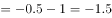。故所求项。

故正确答案为A。

---

### 第 2 题　qid 2741969 · 数学运算

2，3，4，，，（    ）

- **A**. 
8

- **B**. 

- **C**. 
9
　✅
- **D**. 
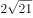

**答案**：C

**官方解析**

将数列统一转化为根号形式，则原数列转化为：、、、、，（    ），根号内数字变化幅度较小且呈递增趋势，优先考虑作差。作差后可得：5、7、11、19，（    ），二次作差得：2、4、8，（    ），是公比为2的等比数列，下一项为，故所求项为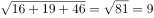。

故正确答案为C。

注：此题为旧题重考，原2016年江苏省公务员录用考试《行测》题（A类）第60题

---

### 第 3 题　qid 2741974 · 数学运算

3.2，5.5，11.9，19.21，43.37，（    ）

- **A**. 73.89
- **B**. 75.85　✅
- **C**. 85.73
- **D**. 89.75

**答案**：B

**官方解析**

题干都为小数，优先考虑机械划分，将整数部分和小数部分拆开无规律，考虑将整数部分和小数部分作和，可得新数列为：5、10、20、40、80，是公比为2的等比数列，则所求项整数与小数加和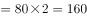，只有B项符合。

故正确答案为B。

---

### 第 4 题　qid 2742000 · 数学运算

1，，，，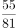，（    ）

- **A**. 
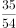

- **B**. 
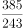
　✅
- **C**. 
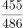

- **D**. 
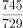

**答案**：B

**官方解析**

数列大多数为分数，可判断为分数数列，原数列可转化为：，，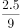，，，（    ），观察分母为幂次数列：，，，，，则下一项分母为；分子部分考虑作商，后一项前一项分别为：1，2.5，4，5.5，是公差为1.5的等差数列，则新数列下一项为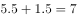，故原数列所求项分子。

故正确答案为B。

---

### 第 5 题　qid 2741990 · 数学运算

某农场有A、B、C三个粮仓，原先粮食储量之比为5：9：10，今年丰收后每个粮仓新增加的粮食储量相同，A、B两个粮仓的储量之比变为3：5，则今年丰收后三个粮仓的储存总量比原先增加：

- **A**. 

　✅
- **B**. 

- **C**. 

- **D**. 

**答案**：A

**官方解析**

根据题干，可将A、B、C三个粮仓原先粮食储量分别赋值为5、9、10。设今年丰收后每个粮仓新增加的粮食均为，则A、B、C三个粮仓今年粮食储量分别为、、，由今年A、B两个粮仓的储量之比变为3：5，可得，解得。则今年丰收后三个粮仓的储存总量比原先增加。

故正确答案为A。

---

### 第 6 题　qid 2741998 · 数学运算

某科技公司向银行申请甲、乙两种一年期的贷款总计5000万元，两种贷款的年利率分别为和。若该公司向银行支付的总贷款利息为295.6万元，则甲种贷款的金额是（    ）。

- **A**. 2250万元
- **B**. 2400万元　✅
- **C**. 2650万元
- **D**. 2800万元

**答案**：B

**官方解析**

设甲种贷款的金额为万元，则乙种贷款的金额为（）万元。根据题意，可得，解得：。则甲种贷款的金额是2400万元。

故正确答案为B。

---

### 第 7 题　qid 2742004 · 数学运算

某机关甲、乙、丙三个部门参加植树造林活动，各部门植树的数量相同。甲部门花10天完成任务后，支援乙、丙两个部门各2天，最终乙部门植树12天完成，丙部门15天完成。若丙部门每天植树的数量比乙部门少4棵，则甲部门每天植树的数量是：

- **A**. 30棵　✅
- **B**. 40棵
- **C**. 50棵
- **D**. 60棵

**答案**：A

**官方解析**

由题意可得，甲、乙、丙三个部门的效率关系为：······①；······②。整理①②可得：甲∶乙3∶2，乙∶丙5∶4，故甲效率：乙效率：丙效率15∶10∶8。结合丙部门每天植树的数量比乙部门少4棵，可得1份对应棵，故甲的效率棵。

故正确答案为A。

---

### 第 8 题　qid 2742011 · 数学运算

甲、乙两人从湖边某处同时出发，沿两条环湖路各自匀速行走。甲恰好用2小时回到出发点，比乙晚到20分钟，多走了2800米。若甲每分钟比乙多走10米，则甲行走的速度是：

- **A**. 4.2千米/小时
- **B**. 4.5千米/小时
- **C**. 4.8千米/小时
- **D**. 5.4千米/小时　✅

**答案**：D

**官方解析**

设甲的速度为米/分钟，则乙的速度为（）米/分钟，根据题意“甲恰好用2小时回到出发点，比乙晚到20分钟，多走了2800米”，可得甲用时120分钟，乙用时分钟，则，解得米/分钟，即5.4千米/小时。

故正确答案为D。

---

### 第 9 题　qid 2742017 · 数学运算

某产品的生产须经历A、B、C、D四道工序，由甲、乙、丙、丁每人负责其中一道工序，四人单独完成每道工序所需的时间（单位：分钟）如下表所示，则他们完成四道工序所需的总时间最少是（    ）。

- **A**. 18分钟
- **B**. 22分钟
- **C**. 24分钟　✅
- **D**. 26分钟

**答案**：C

**官方解析**

要想他们完成四道工序所需的总时间最少，每道工序可以选择用时最少的人。观察发现甲负责A和D都是用时最少的人，可分情况讨论：①若甲负责A、乙负责B、丁负责C，这时只能由丙负责D，共用时分钟；②若甲负责D、丁负责C、乙负责B，这时只能由丙负责A，共用时分钟。则他们完成四道工序所需的总时间最少是24分钟。

故正确答案为C。

---

### 第 10 题　qid 2742003 · 数学运算

某次圆桌会议共设8个座位，有4个部门参加，每个部门2人，排座位时，要求同一部门的两人相邻，若小李和小王代表不同部门参加会议，则他们座位相邻的概率是：

- **A**. 
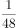

- **B**. 

- **C**. 

- **D**. 

　✅

**答案**：D

**官方解析**

首先计算总的情况数，先捆绑：当同一部门两人相邻时，其内部顺序有种情况，共4个部门，则共有种情况；再排列：当4个部门的人员坐在圆桌时，根据圆桌排列公式可得，有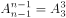种情况，则总的情况数为。

然后计算满足条件的情况数，先捆绑：当小李和小王座位相邻时，则二人的内部顺序有种情况，与其同一部门的人自动坐在二人身边，无需考虑，4个人变成一个大组。另外两个部门的人各自捆绑，内部顺序均有种情况，则共种情况；再排列：此时相当于3组人员进行圆桌排列，有种情况，则总情况数为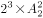。

因此所求概率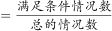。

故正确答案为D。

---

### 第 11 题　qid 2742006 · 数学运算

某企业有甲、乙两个口罩生产车间，每天工作8小时，共生产口罩3万只，若每天甲、乙两个车间分别加班两小时和三小时，则可多生产口罩一万只，若每天甲、乙两个车间分别加班三小时和两小时，则两个车间生产62万只口罩，所需的时间为：

- **A**. 14天
- **B**. 15天
- **C**. 16天　✅
- **D**. 17天

**答案**：C

**官方解析**

设甲每小时生产口罩只，乙每小时生产口罩只：根据题意列方程：······①；······②；联立①②，解得，。

若每天甲、乙两个车间分别加班三小时和两小时，则甲、乙每天的工作效率和为只。根据公式：工作时间天。

故正确答案为C。

---

### 第 12 题　qid 2742016 · 数学运算

某单位开设a、b、c、d、e、f六门培训课程，员工自愿报名参加。经统计，员工选择的课程组合共有四种，，，，，所有培训结束后，统一安排考试，为不影响工作要求，在1月4日至10日中的连续六天考完，每天只考一门，且每位员工都不会连续两天参加考试，则安排这六门课程考试日期的不同方法共有：

- **A**. 2种
- **B**. 4种　✅
- **C**. 8种
- **D**. 12种

**答案**：B

**官方解析**

根据题意可知，考试日期分为1月4日至9日和1月5日至10日两种情况；具体考试日期安排为：a可以和b、d相连，b可以和a、d、e相连，c只能和d相连，d可以和a、b、c、e相连，e可以和b、d、f相连，f只能和e相连。情况较复杂，考虑枚举法，c和f的情况固定，从其入手，则有如下两种情况：，，所以安排这六门课程考试日期的不同方法共有种。

故正确答案为B。

---

### 第 13 题　qid 2742021 · 数学运算

为促进旅游业复苏，今年8月1日起至年底，某景区门票价格在原定价的基础上，工作日执行两折票价，双休日及法定节假日执行五折票价。预计门票打折后，每天的游客人数均比原来翻一番，已知打折前该景区双休日平均每天的游客人数是工作日的5倍，则打折后，该景区一周（该周无法定节假日）的门票收入是打折前的：

- **A**. 0.5倍
- **B**. 0.6倍
- **C**. 0.7倍
- **D**. 0.8倍　✅

**答案**：D

**官方解析**

赋值打折前该景区票价为10元，工作日每天游客为1人。根据题意可得表格如下：

综上，该景区一周打折前的门票收入是元，打折后的门票收入是元，则所求倍数倍。

故正确答案为D。

---

### 第 14 题　qid 2742025 · 数学运算

师徒二人在非遗展馆现场为游客剪纸，有6名游客各自挑选了心仪的花样。已知徒弟制作这6种剪纸的时间分别为2、6、10、12、15、25 （单位：分钟）， 师傅的工作效率是徒弟的1. 5倍，则这6名游客中最后一个拿到剪纸的游客，需要等待的时间至少是：

- **A**. 25分钟
- **B**. 27分钟
- **C**. 28分钟　✅
- **D**. 30分钟

**答案**：C

**官方解析**

根据题意可知，师傅的工作时间应为徒弟工作时间的，设6种剪纸分别为A、B、C、D、E、F，具体工作时间情况如下：

要使最后拿到剪纸的游客等待的时间尽量少，那么尽量让师徒二人同时开工同时结束。观察选项均为整数，考虑从师傅的分数时间凑整入手。观察3个分数共有2种凑整方式：①分钟，此时再做其他任何种类的剪纸都无法与徒弟同时完成，且所用时间超过选项时间，不合理；②分钟，此时剩B、C、D、E四种剪纸，观察发现E种剪纸给师傅做，B、C、D三种给徒弟做，正好可以做到同时开工同时结束。即 分钟。

故正确答案为C。

---

### 第 15 题　qid 2741964 · 数学运算

某省选派若干名本科生和研究生去乡村支教，其中男生和女生的比例是7：3，研究生和本科生的比例是1：4。若男本科生的人数恰好为女研究生人数的4倍，则女本科生至少比男研究生多：

- **A**. 3人　✅
- **B**. 6人
- **C**. 9人
- **D**. 12人

**答案**：A

**官方解析**

根据“男生和女生的比例是7：3”可知，总人数是的倍数，根据“研究生和本科生的比例是1：4”可知，总人数是的倍数，故设总人数为，则男生人数为，女生人数为，研究生人数为，本科生人数为。男本科生人数为女研究生人数的4倍，由此设女研究生人数为，则男本科生人数为。具体情况如下：

由此可知：男研究生人数研究生总人数女研究生人数男生总人数男本科生人数，即，整理可得：，则至少为3，至少为5，女本科生最少为人，男研究生最少为人，前者比后者多人。

故正确答案为A。

---

### 第 16 题　qid 2741966 · 数学运算

小王去超市购买便携包和小哑铃作为知识竞赛活动的奖品。这两种商品超市正在进行促销，便携包单价18元，买2送1；小哑铃单价12元，买3送1。小王按计划购买了便携包和小哑铃合计56个，共使用活动经费606元，则他购买小哑铃的数量是：

- **A**. 24个
- **B**. 25个　✅
- **C**. 26个
- **D**. 27个

**答案**：B

**官方解析**

结合题干与选项可知，选项信息充分，故可用代入排除法解题：

代入A项：小哑铃24个，买3送1（4个一组），组，需花钱购买个；便携包个，买2送1（3个一组），组······2个，需花钱购买个。则共用经费元，不符合题意；

代入B项：小哑铃25个，买3送1（4个一组），组······1个，需花钱购买个；便携包个，买2送1（3个一组），组······1个，需花钱购买个。则共用经费元，符合题意。

B项满足题干所有条件，因此无需继续验证。

故正确答案为B。

---

### 第 17 题　qid 2741970 · 数学运算

某公司需要将A、B两地的同一产品运往甲、乙两个工厂。已知A、B两地分别有该产品500吨和700吨，甲、乙两个工厂对该产品的需求量均为600吨，若从A地出发运往甲、乙两个工厂的运价分别为150元/吨和130元/吨，从B地出发的运价分别为160元/吨和145元/吨，则完成此项运输任务的运费最少是：

- **A**. 174000元
- **B**. 174500元
- **C**. 175000元
- **D**. 175500元　✅

**答案**：D

**官方解析**

需运费最少，则优先考虑两地中运往两厂运费差较大情况。由题意可知，A地运往两工厂每吨运价差元，B地运往两工厂每吨运价差元。A地运费差较大，故A地500吨产品优先运往乙工厂最划算，乙工厂所差100吨产品由B地运送即可，则所需运费为元；B地剩余的600吨产品运往甲工厂，所需运费为元。则完成此项运输任务的运费最少为元。

故正确答案为D。

---

### 第 18 题　qid 2741972 · 数学运算

某公司举办迎新晚会，参加者每人都领取一个按入场顺序编号的号牌，晚会结束时宣布：从1号开始向后每隔6个号的号码可获得纪念品A，从最后一个号码开始向前每隔8个号的号码可获得纪念品B。最后发现没有人同时获得纪念品A和B，则参加迎新晚会的人数最多有：

- **A**. 46人
- **B**. 48人　✅
- **C**. 52人
- **D**. 54人

**答案**：B

**官方解析**

根据“从1号开始向后每隔6个号的号码可获得纪念品A”可知，从前往后，A获奖号码成公差为7的等差数列：1、8、15、22、29、36、43、50、57······；同理，从后往前，B获奖号码成公差为9的等差数列，题目求人数最多，考虑从大到小进行代入验证。
代入D项：若人数最多为54人，则可获得纪念品B的号码分别为54、45、36号······，此时36号同时获得纪念品A和B，不符合条件，排除；
代入C项：若人数最多为52人，则可获得纪念品B的号码分别为52、43号······，此时43号同时获得纪念品A和B，不符合条件，排除；
代入B项：若人数最多为48人，则可获得纪念品B的号码分别为48、39、30、21、12、3号，没有人同时获得纪念品A和B，符合条件，当选。
故正确答案为B。

---

### 第 19 题　qid 2741989 · 数学运算

如图所示，当某航天器飞过地球北极正上方S处时，恰好能够观测到北纬45度，北极圈内的区域。假定地球是半径为R的球体，则点S到地球北极点的距离是：

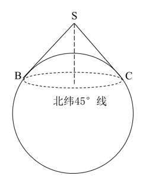

- **A**. 
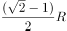

- **B**. 

- **C**. 
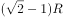
　✅
- **D**. 
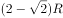

**答案**：C

**官方解析**

如下图所示，设北极点为N点，地心为O点，过O点做赤道线与圆相交于A点。北纬45度为赤道平面与赤道平面的中心和北纬45度小圆上任意一点连线所成的角，即，，则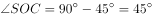，且直线SC与圆相切于C点，则，因此为等腰直角三角形，根据题意可知，OC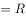，则SC，SO，ON，那么所求距离SNSOON。

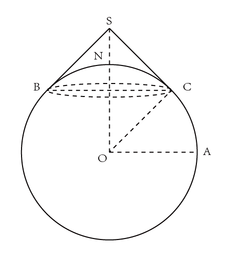

故正确答案为C。

---

## 判断推理

### 材料 1

一条新开通的南北向高速公路，中间有6条隧道：长川隧道、大美隧道、青山隧道、绿水隧道、彩石隧道、白玉隧道。已知：

（1）白玉隧道在彩石隧道的北边并与之相邻，在大美隧道的南边但与之不相邻；

（2）长川隧道与青山隧道之间隔一条隧道。

#### 第 1 题　qid 2741994 · 逻辑判断

根据上述信息，以下哪项是不可能的？

- **A**. 长川隧道在最南边　✅
- **B**. 绿水隧道在最北边
- **C**. 彩石隧道与青山隧道隔一条隧道
- **D**. 白玉隧道与大美隧道隔一条隧道

**答案**：A

**官方解析**

第一步：分析题干条件。

（1）白玉隧道在彩石隧道的北边并与之相邻，在大美隧道的南边但与之不相邻；

（2）长川隧道与青山隧道之间隔一条隧道。

第二步：根据题干条件进行推理。

提问方式为“不可能”，优先使用代入法。

代入A项：已知长川隧道在最南边（即第6位），根据条件（2）可知，青山隧道在第4位，又根据条件（1）可知，白玉隧道在彩石隧道的北边且相邻，故白玉隧道和彩石隧道只能在第1位和第2位，或在第2位和第3位，又已知白玉隧道在大美隧道的南边但不相邻，此时与前面矛盾，不满足题干条件，该项不可能成立，当选；

代入B项：已知绿水隧道在最北边，假设大美隧道在第2位，根据条件（1），白玉隧道和彩石隧道可以在第4位和第5位，或第5位和第6位，但这两种情况都不符合条件（2）。再次假设大美隧道在第3位，此时白玉隧道和彩石隧道只能在第5位和第6位，此时长川隧道和青山隧道可以分别在第2位和第4位，可进行如下安排，满足题干条件，该项可能成立，排除；

代入C项：已知彩石隧道与青山隧道隔一条隧道，假设大美隧道在第1位，根据条件（1）和（2），此时白玉隧道和彩石隧道只能在第5位和第6位，可知青山隧道在第4位，长川隧道在第2位，继续推理可知，绿水隧道在第3位，可进行如下安排，满足题干条件，该项可能成立，排除；

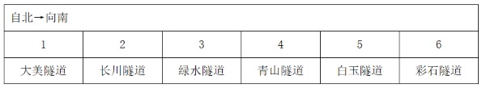

代入D项：已知白玉隧道与大美隧道隔一条隧道，假设大美隧道在第1位，可知白玉隧道在第3位，根据条件（1），彩石隧道在第4位，此时不满足条件（2）。再次假设大美隧道在第2位，可知白玉隧道和彩石隧道分别在第4位和第5位，此时长川隧道和青山隧道可以分别在第1位和第3位，继续推理可知，绿水隧道在第6位，可进行如下安排，满足题干条件，该项可能成立，排除。

本题为选非题，故正确答案为A。

---

#### 第 2 题　qid 2741999 · 逻辑判断

如果绿水隧道与白玉隧道相邻，则以下哪项一定为真？

- **A**. 彩石隧道处于由南向北的第二位
- **B**. 大美隧道处于由北向南的第二位　✅
- **C**. 长川隧道处于由北向南的第三位
- **D**. 青山隧道处于由南向北的第三位

**答案**：B

**官方解析**

第一步：分析题干条件。

（1）白玉隧道在彩石隧道的北边并与之相邻，在大美隧道的南边但与之不相邻；

（2）长川隧道与青山隧道之间隔一条隧道；

（3）绿水隧道与白玉隧道相邻。

第二步：根据题干条件进行推理。

根据条件（1）和（3）可知：白玉隧道与彩石隧道相邻，并且白玉隧道在彩石隧道的北边。同时绿水隧道也和白玉隧道相邻，所以他们三者由北向南的顺序为：绿水隧道、白玉隧道、彩石隧道；

根据条件（1）和（2）可知：由于长川隧道和青山隧道中间间隔一条隧道，故中间只能是大美隧道。又由于白玉隧道在大美隧道的南边，所以长川隧道、青山隧道、大美隧道都在白玉隧道的北边。

所以六条隧道由北向南的顺序有以下两种情况，因此可以推出大美隧道处于由北向南的第二位，对应B项。

故正确答案为B。

---

#### 第 3 题　qid 2741967 · 类比推理

调查：求真

- **A**. 晨练：健身　✅
- **B**. 施肥：收割
- **C**. 记忆：怀念
- **D**. 备份：复制

**答案**：A

**官方解析**

第一步：判断题干词语间逻辑关系。
调查是求真的一种方式，二者为方式的对应关系。
第二步：判断选项词语间逻辑关系。
A项：晨练是健身的一种方式，二者为方式的对应关系，与题干逻辑关系一致，当选；
B项：先施肥，再收割，二者是时间先后的对应关系，与题干逻辑关系不一致，排除；
C项：记忆可以用来怀念，二者是功能的对应关系，与题干逻辑关系不一致，排除；
D项：备份是指将电子计算机存储设备中的数据复制到其他存储设备的方式，复制是备份的一个步骤，二者不是方式目的的对应关系，与题干逻辑关系不一致，排除。
故正确答案为A。

---

#### 第 4 题　qid 2741968 · 类比推理

头雁：雁阵

- **A**. 蜂王：蜂巢
- **B**. 猎狗：羊群
- **C**. 蚁后：工蚁
- **D**. 狮王：狮群　✅

**答案**：D

**官方解析**

第一步：判断题干词语间逻辑关系。
头雁是雁阵的组成部分，二者是组成关系，且头雁是雁阵的领头部分。
第二步：判断选项词语间逻辑关系。
A项：蜂巢是蜂王生活的场所，二者是场所对应关系，与题干逻辑关系不一致，排除；
B项：猎狗不是羊群的组成部分，与题干逻辑关系不一致，排除；
C项：蚁后和工蚁是并列关系中的反对关系，与题干逻辑关系不一致，排除；
D项：狮王是狮群的组成部分，二者是组成关系，且狮王是狮群的领头部分，与题干逻辑关系一致，当选。
故正确答案为D。

---

#### 第 5 题　qid 2741971 · 类比推理

粮食安全：国家安全

- **A**. 传统文化：中国文化
- **B**. 家庭和谐：社会和谐　✅
- **C**. 主流媒体：纸质媒体
- **D**. 地摊经济：马路经济

**答案**：B

**官方解析**

第一步：判断题干词语间逻辑关系。
粮食安全是国家安全的组成部分，二者是包容关系中的组成关系。
第二步：判断选项词语间逻辑关系。
A项：很多国家都有自己的传统文化，中国文化有传统文化也有现代文化。故有的传统文化是中国文化，有的传统文化不是中国文化，有的中国文化是传统文化，有的中国文化不是传统文化，二者是交叉关系，与题干逻辑关系不一致，排除；
B项：家庭和谐是社会和谐的组成部分，二者是包容关系中的组成关系，与题干逻辑关系一致，当选；
C项：主流媒体就是具备一定的规模、影响力的主要媒体，是从媒体影响力进行分类，纸质媒体是以纸质材料为载体、以印刷（包括手写）为记录手段而产生的一种信息媒体，是从记录手段进行分类，二者分类标准不同。有的主流媒体是纸质媒体，有的主流媒体不是纸质媒体，有的纸质媒体是主流媒体，有的纸质媒体不是主流媒体，二者是交叉关系，与题干逻辑关系不一致，排除；
D项：地摊经济，是指通过摆地摊获得收入来源而形成的一种经济形式，马路经济其实就是指占道摆摊，二者是全同关系，与题干逻辑关系不一致，排除。
故正确答案为B。

---

#### 第 6 题　qid 2741975 · 类比推理

金：金币：货币

- **A**. 木：木床：床　✅
- **B**. 水：水稻：稻
- **C**. 火：火盆：盆
- **D**. 土：土鸡：鸡

**答案**：A

**官方解析**

第一步：判断题干词语间逻辑关系。
金是制造金币的原材料，二者为原材料对应关系，金币是一种货币，二者是种属关系。
第二步：判断选项词语间逻辑关系。
A项：木是制造木床的原材料，二者为原材料对应关系，木床是一种床，二者是种属关系，与题干逻辑关系一致，当选；
B项：水是水稻生长的必要条件，二者是必要条件的对应关系，与题干逻辑关系不一致，排除；
C项：火不是制造火盆的原材料，火盆是一种盆，与题干逻辑关系不一致，排除；
D项：土不是制造土鸡的原材料，土鸡是一种鸡，与题干逻辑关系不一致，排除。
故正确答案为A。

---

#### 第 7 题　qid 2741977 · 类比推理

花：鸟：杜鹃

- **A**. 戏：剧：昆曲
- **B**. 钟：表：秒表
- **C**. 草：木：植物
- **D**. 人：畜：黄牛　✅

**答案**：D

**官方解析**

第一步：判断题干词语间逻辑关系。
花和鸟是并列关系；且杜鹃既可以是花的一种，也可以是鸟的一种，第三词与前两词为种属关系。
第二步：判断选项词语间逻辑关系。
A项：戏和剧都可以用来指戏剧。昆曲是中国古老的戏曲声腔、剧种，现又被称为昆剧，昆曲是戏剧的一种，为种属关系，与题干逻辑关系不一致，排除；
B项：钟和表是并列关系；但秒表是表的一种，与题干逻辑关系不一致，排除；
C项：草和木是并列关系；但草和木均属于植物，与题干逻辑关系不一致，排除；
D项：人和畜是并列关系；且黄牛既可以是人的一种（票贩子），也可以是畜的一种，第三词与前两词为种属关系，与题干逻辑关系一致，当选。
故正确答案为D。

---

#### 第 8 题　qid 2741980 · 类比推理

白鸽：母鸽：鸽

- **A**. 柿饼：甜饼：饼
- **B**. 桃花：梨花：花
- **C**. 零售：网售：买
- **D**. 水桶：铁桶：桶　✅

**答案**：D

**官方解析**

第一步：判断题干词语间逻辑关系。
有的白鸽是母鸽，有的白鸽不是母鸽，有的母鸽是白鸽，有的母鸽不是白鸽，二者为交叉关系；且白鸽和母鸽都是鸽的一种，前两词与第三词为种属关系。
第二步：判断选项词语间逻辑关系。
A项：柿饼指的是用柿子制作成的饼状食品，不是饼的一种，与题干逻辑关系不一致，排除；
B项：桃花与梨花为并列关系，与题干逻辑关系不一致，排除；
C项：有的零售是网售，有的零售不是网售，有的网售是零售，有的网售不是零售，二者为交叉关系；但零售和网售均不属于买，与题干逻辑关系不一致，排除；
D项：有的水桶是铁桶，有的水桶不是铁桶，有的铁桶是水桶，有的铁桶不是水桶，二者为交叉关系；且水桶和铁桶都是桶的一种，前两词与第三词为种属关系，与题干逻辑关系一致，当选。
故正确答案为D。

---

#### 第 9 题　qid 2741987 · 类比推理

国家：治理：现代化

- **A**. 企业：规制：自动化
- **B**. 社会：建设：法治化　✅
- **C**. 社区：服务：数字化
- **D**. 政府：管理：一体化

**答案**：B

**官方解析**

第一步：判断题干词语间逻辑关系。
治理国家，前两词为动宾关系；且治理国家的目的是为了实现现代化，前两词与第三词之间为目的对应关系。
第二步：判断选项词语间逻辑关系。
A项：规制企业，前两词为动宾关系；但规制企业的目的不是为了实现自动化，而是为了在市场经济体制下，矫正和改善市场机制内在的问题，与题干逻辑关系不一致，排除；
B项：建设社会，前两词为动宾关系；且建设社会的目的是为了实现国家法治化，前两个词与第三个词之间为目的对应关系，与题干逻辑关系一致，当选；
C项：服务社区，搭配不当，应为“社区服务”，与题干逻辑关系不一致，排除；
D项：管理政府，搭配不当，应为“政府管理”，与题干逻辑关系不一致，排除。
故正确答案为B。

---

#### 第 10 题　qid 2741979 · 类比推理

河长：河道巡查：水清岸绿

- **A**. 湖长：污染治理：波平浪静
- **B**. 路长：道路维修：车水马龙
- **C**. 机长：客机驾驶：安全准点　✅
- **D**. 村长：带头致富：鸟语花香

**答案**：C

**官方解析**

第一步：判断题干词语间逻辑关系。
河长指负责督办河流管理工作的人，河道巡查是河长的工作职责，河道巡查的目的是为了实现水清岸绿，三者之间为负责人、工作职责、工作目的的对应关系。
第二步：判断选项词语间逻辑关系。
A项：湖长指负责湖泊管理保护工作的人，污染治理是湖长的工作职责，但污染治理不是为了实现波平浪静，而是为了改善中国水环境，与题干逻辑关系不一致，排除；
B项：路长指负责道路管理工作的各交通支大队民警及相关负责人，但道路维修不是路长的工作职责，与题干逻辑关系不一致，排除；
C项：机长指民用航空器运输机长，客机驾驶是机长的工作职责，客机驾驶是为了把旅客安全准点送达目的地，与题干逻辑关系一致，当选；
D项：村长指依照村委会组织法选举产生的群众自治性的村民委员会的主任，但带头致富不是村长的工作职责，与题干逻辑关系不一致，排除。
故正确答案为C。

---

#### 第 11 题　qid 2741985 · 类比推理

微信群  之于（    ） 相当于（    ）之于  教学

- **A**. 符号；黑板
- **B**. 点赞；教师
- **C**. 社交；教室　✅
- **D**. 红包；奖励

**答案**：C

**官方解析**

逐一代入选项。
A项：“微信群”里的人文字沟通时会用到“符号”，“黑板”是“教学”时用到的工具，前后逻辑关系不一致，排除；
B项：“点赞”与“微信群”没有必然的逻辑关系，“教师”是“教学”过程中的主体，前后逻辑关系不一致，排除；
C项：“微信群”是“社交”的场所，“教室”是“教学”的场所，均是场所对应关系，前后逻辑关系一致，当选；
D项：“微信群”里可以发“红包”，为场所对应关系，“奖励”是“教学”的一种方式，为方式对应关系，前后逻辑关系不一致，排除。
故正确答案为C。

---

#### 第 12 题　qid 2741993 · 类比推理

水车  之于  （    ）相当于  （    ）  之于  计算器

- **A**. 风车；口算
- **B**. 稻田；计算
- **C**. 河水；数据
- **D**. 水泵；算盘　✅

**答案**：D

**官方解析**

逐一代入选项。
A项：“水车”是一种灌溉工具，“风车”可用来发电，也可用来灌溉，二者都具有灌溉的功能，“口算”是一种计算方式，“计算器”是一种计算工具，前后逻辑关系不一致，排除；
B项：“水车”用来灌溉“稻田”，“计算器”用来“计算”，但“稻田”为名词，“计算”为动词，且前后顺序相反，前后逻辑关系不一致，排除；
C项：“水车”是将“河水”灌溉到农田中的一种工具，“计算器”可以用来计算“数据”，但前后顺序相反，前后逻辑关系不一致，排除；
D项：“水车”与“水泵”都是抽水的工具，“算盘”与“计算器”都是计算的工具，功能相同且均为并列关系，前后逻辑关系一致，当选。
故正确答案为D。

---

#### 第 13 题　qid 2742008 · 图形推理

请从所给的四个选项中，选出最恰当的一项填入问号处，使之呈现一定的规律。

- **A**. A　✅
- **B**. B
- **C**. C
- **D**. D

**答案**：A

**官方解析**

元素组成不同，无明显属性规律，考虑数量规律。选项中出现信封等生活化图形，考虑部分数。观察发现，题干图形的部分数均为2，所以？处要选一个部分数为2的图形，只有A项符合，当选。
故正确答案为A。

---

#### 第 14 题　qid 2742014 · 图形推理

请从所给的四个选项中，选出最恰当的一项填入问号处，使之呈现一定的规律。

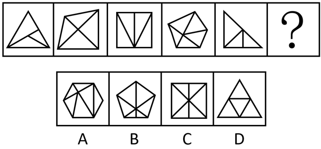

- **A**. A　✅
- **B**. B
- **C**. C
- **D**. D

**答案**：A

**官方解析**

元素组成不同，无明显属性规律，考虑数量规律。观察发现，题干中的图形封闭区域明显，优先考虑数面，题干图形的面数量依次为3、4、4、5、3、？，单看无规律。再次观察发现，题干图形的外框均为多边形，且出现较多三角形、四边形，考虑外框直线数。外框直线数量依次为3、4、4、5、3、？。可知题干的规律为面数量外框直线数量，只有A项符合规律，当选。

故正确答案为A。

---

#### 第 15 题　qid 2742022 · 图形推理

请从所给的四个选项中，选出最恰当的一项填入问号处，使之呈现一定的规律。

- **A**. A
- **B**. B　✅
- **C**. C
- **D**. D

**答案**：B

**官方解析**

元素组成不同，且无明显属性规律，优先考虑数量规律。题干图1和图5有明显的单一直角三角形，且图2是一个三角形被分割成两个明显的直角三角形，考虑直角数量。观察发现，题干图形的直角数量分别为1、2、3、4、5，故？处图形的直角数量应为6。B项直角数量为6，当选；A项直角数量为5，C项直角数量为8，D项直角数量为0，均排除。
故正确答案为B。

---

#### 第 16 题　qid 2742027 · 图形推理

请从所给的四个选项中，选出最恰当的一项填入问号处，使之呈现一定的规律。

- **A**. A
- **B**. B　✅
- **C**. C
- **D**. D

**答案**：B

**官方解析**

元素组成不同，且无明显属性规律，优先考虑数量规律。观察发现，题干图三及图五为“田”字变形，考虑笔画数。题干图形均为两笔画，所以？处也应为两笔画图形。A项是一笔画图形；B项是两笔画图形；C项是三笔画图形；D项是四笔画图形，只有B项满足规律，当选。
故正确答案为B。

---

#### 第 17 题　qid 2742057 · 图形推理

请从所给的四个选项中，选出最恰当的一项填入问号处，使之呈现一定的规律。

- **A**. A
- **B**. B
- **C**. C　✅
- **D**. D

**答案**：C

**官方解析**

元素组成相同，优先考虑位置规律。观察题干图形，未发现明显位置规律。继续观察发现，题干每幅图中小黑块的数量均为5，且题干每幅图中所有小黑块均以点连接成一个整体，只有C项符合。
故正确答案为C。

---

#### 第 18 题　qid 2742058 · 图形推理

请从所给的四个选项中，选出最恰当的一项填入问号处，使之呈现一定的规律。

- **A**. A
- **B**. B　✅
- **C**. C
- **D**. D

**答案**：B

**官方解析**

本题考查三视图，九宫格优先横行找规律。观察发现，第一行立体图形的俯视图均相同，如下图所示；验证第二行发现也满足此规律；第三行应用此规律，故“？”处应选择一个俯视图与其他图形相同的立体图形，排除A、C两项。继续观察发现，题干立体图形均为2层，D项立体图形为3层，排除，只有B项符合规律，当选。

故正确答案为B。

---

#### 第 19 题　qid 2742059 · 图形推理

请从所给的四个选项中，选出最恰当的一项填入问号处，使之呈现一定的规律。

- **A**. A
- **B**. B
- **C**. C
- **D**. D　✅

**答案**：D

**官方解析**

元素组成不同，优先考虑属性规律。观察发现，题干出现全直线、全曲线图形，优先考虑曲直性。九宫格优先横行看，第一行图1由全直线构成，图2由全曲线构成，图3由直线和曲线构成；第二行图1由全直线构成，图2由全曲线构成，图3由直线和曲线构成；第三行图1由全直线构成，图2由全曲线构成，故“？”处图形应该由直线和曲线构成，只有D项符合规律，当选。
故正确答案为D。

---

#### 第 20 题　qid 2742060 · 图形推理

下边四个图形中，只有一个是由上边的四个图形拼合（只能通过上、下、左、右平移）而成的，请把它找出来。

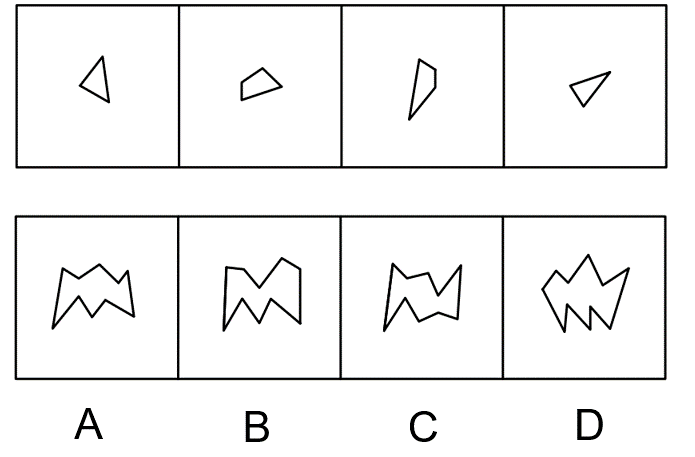

- **A**. A　✅
- **B**. B
- **C**. C
- **D**. D

**答案**：A

**官方解析**

本题考查平面拼合，可采用平行且等长相消的方式解题。消去平行且等长的线段后进行组合可得到轮廓图，即为A项。平行且等长相消的方式如下图所示：

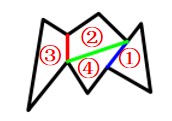

故正确答案为A。

---

#### 第 21 题　qid 2742061 · 图形推理

下边四个图形中，只有一个是由上边的四个图形拼合（只能通过上、下、左、右平移）而成的，请把它找出来。

- **A**. A
- **B**. B
- **C**. C　✅
- **D**. D

**答案**：C

**官方解析**

本题考查平面拼合，可采用平行且等长相消的方式解题。消去平行且等长的线段后进行组合可得到轮廓图，即为C项。平行且等长相消的方式如下图所示：

故正确答案为C。

---

#### 第 22 题　qid 2742062 · 图形推理

下边四个图形中，只有一个是由上边的四个图形拼合（只能通过上、下、左、右平移）而成的，请把它找出来。

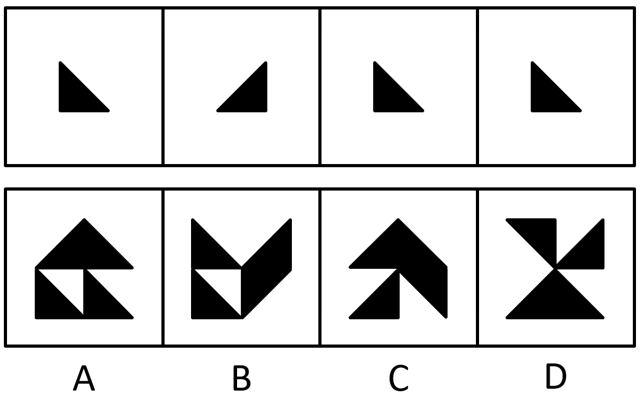

- **A**. A　✅
- **B**. B
- **C**. C
- **D**. D

**答案**：A

**官方解析**

本题考查平面拼合，题干已知图形均为等腰直角三角形，依据题干要求只能通过上、下、左、右平移实现拼合，经过拼合后只能得到A项。如下图所示：

故正确答案为A。

---

#### 第 23 题　qid 2742063 · 图形推理

下边四个图形中，只有一个是由上边的四个图形拼合（只能通过上、下、左、右平移）而成的，请把它找出来。

- **A**. A
- **B**. B
- **C**. C
- **D**. D　✅

**答案**：D

**官方解析**

本题为平面拼合，拼合方式如下图所示：

故正确答案为D。

---

#### 第 24 题　qid 2742064 · 图形推理

左边给定的是多面体的外表面，右边哪一项能由它折叠而成？请把它找出来。

- **A**. A
- **B**. B　✅
- **C**. C
- **D**. D

**答案**：B

**官方解析**

本题考查六面体。将展开图中上下两个面移动，并给每个面标号，如下图所示：

逐一分析选项。

A项：选项中必然存在面c，展开图中面c与面e为相对面，无法同时出现，故选项上侧面为面f，展开图中面c与面f的公共边——边1为面c上白色三角形的直角边，而选项中两个面的公共边为面c上竖线三角形的直角边，选项与展开图不一致，排除；

B项：选项由面a、面c与面d构成，与展开图一致，当选；

C项：选项由面a、面c与面d构成，展开图中面c与面a、面d的公共边——边2与边3均为面c上竖线三角形的直角边，而选项中有一条公共边为面c上白色三角形的直角边，选项与展开图不一致，排除；

D项：选项中必然存在面c，展开图中面c与面e为相对面，无法同时出现，故选项正面为面f，展开图中面c与面f的公共边——边1为面c上白色三角形的直角边，而选项中两个面的公共边均为面c上竖线三角形的直角边，选项与展开图不一致，排除。

故正确答案为B。

---

#### 第 25 题　qid 2742065 · 图形推理

左边给定的是多面体的外表面，右边哪一项能由它折叠而成？请把它找出来。

- **A**. A
- **B**. B　✅
- **C**. C
- **D**. D

**答案**：B

**官方解析**

本题考查四面体，将原展开图标上序号，如下图所示：

逐一分析选项。

A项：展开图中面c与面a、面d的公共边均与面a、面d上的黑色三角形的边相交，而选项中右侧面与左侧面的黑色三角形的边不相交，因此选项中右侧面不可能为面c，应为面b，展开图中面b左侧面应为面a，且面b引出线条的顶点与面a的黑色三角形的一个顶点相交，而选项中面b引出线条的顶点与左侧面上的黑色三角形顶点不相交，选项与展开图不一致，排除；

B项：选项由面c、面d构成，与展开图一致，当选；

C项：选项中左侧面与右侧面的公共边为黑色直角三角形的斜边，展开图中只有面c与面d的公共边为黑色直角三角形的斜边，故选项由面c与面d构成，展开图中面c引出线条的顶点与面d中黑色直角三角形短直角边与斜边的顶点相交，而选项中面c引出线条的顶点与面d中黑色直角三角形长直角边与斜边的顶点相交，选项与展开图不一致，排除；

D项：选项右侧面在展开图中不存在，属于无中生有面，排除。

故正确答案为B。

---

#### 第 26 题　qid 2742066 · 图形推理

左边给定的是多面体的外表面，右边哪一项不能由它折叠而成？请把它找出来。

- **A**. A
- **B**. B
- **C**. C
- **D**. D　✅

**答案**：D

**官方解析**

本题考查六面体，将展开图上下两个面移动，并为每个面标上序号，如下图所示：

逐一分析选项。

A项：选项由面a、面d与面e构成，与题干展开图一致，排除；

B项：选项由面b、面c与面f构成，与题干展开图一致，排除；

C项：选项由面a、面b与面c构成，与题干展开图一致，排除；

D项：选项中必然有面c和面f，展开图中面c与面f上的对角线不相交，而选项中两条对角线相交，选项与展开图不一致，当选。

本题为选非题，故正确答案为D。

---

#### 第 27 题　qid 2742067 · 图形推理

左边给定的是立方体，右边哪一项是它的外表面展开图？请把它找出来。

- **A**. A
- **B**. B
- **C**. C　✅
- **D**. D

**答案**：C

**官方解析**

将展开图的面均标上序号，如下图所示。

A项：立方体中两个阴影三角形面的公共边与空白三角形相接，若两个阴影三角形的面为展开图中的面b和面e，两个面的公共边与面b中阴影三角形相接，与题干不符；若两个阴影三角形的面为面b和面d，面b和面d为相对面不可能同时出现；若两个阴影三角形的面为面e和面d，两个面的公共边与面e中阴影三角形相接，与题干不符。以上三种情况均与题干不一致，排除；

B项：展开图中面a与面b为相对面不可能同时出现，所以两个阴影三角形的面只能为面d和面e。立方体中面a、面d与面e的公共点为两个阴影三角形的锐角交点，展开图中三个面的公共点为阴影三角形的锐角和空白三角形直角的交点，与题干不一致，排除；

C项：与题干一致，当选；

D项：若立体图的展开图为面a、面b和面d，面a和面b为相对面不可能同时出现，与题干不符；若立体图的展开图为面a、面b和面e，面a和面b为相对面不可能同时出现，与题干不符；若立体图的展开图为面a、面e和面d，面e和面d为相对面不可能同时出现，与题干不符。以上三种情况均与题干不一致，排除。

故正确答案为C。

---

#### 第 28 题　qid 2742068 · 逻辑判断

人无精神则不立，国无精神则不强。精神是一个民族赖以长久生存的灵魂，唯有精神上达到一定的高度，一个民族才能在历史的洪流中奋勇向前。
根据以上陈述，可以得出以下哪项？

- **A**. 人有精神则立，国有精神则强
- **B**. 一个民族如果精神上没有达到一定的高度，就没有赖以长久生存的灵魂
- **C**. 一个民族若在历史的洪流中奋勇向前，则精神上已达到一定的高度　✅
- **D**. 一个民族如果精神上达到一定的高度，就会在历史的洪流中奋勇向前

**答案**：C

**官方解析**

第一步：翻译题干。

①人无精神不立，国无精神不强；

②一个民族在历史的洪流中奋勇向前精神上达到一定的高度。

第二步：逐一分析选项。

A项：翻译为人有精神立，国有精神强，是对①的否前，否前得不到确定性结论，排除；

B项：翻译为一个民族精神上没有达到一定的高度没有赖以长久生存的灵魂，但是题干并无精神与灵魂之间的推出关系，无法推出，排除；

C项：翻译为一个民族在历史的洪流中奋勇向前精神上已达到一定的高度，是对②的肯前，肯前必肯后，可以推出，当选；

D项：翻译为一个民族精神上达到一定的高度在历史的洪流中奋勇向前，是对②的肯后，肯后得不到确定性结论，无法推出，排除。

故正确答案为C。

---

#### 第 29 题　qid 2742069 · 类比推理

古人云：立善法于天下，则天下治；立善法于一国，则一国治。
以下哪项与上述古人说法的形式结构最为相似？

- **A**. 民生在勤，勤则不匮
- **B**. 穷则独善其身，达则兼济天下　✅
- **C**. 明者因时而变，知者随事而制
- **D**. 俭则约，约则百善俱兴；侈则肆，肆则百恶俱纵

**答案**：B

**官方解析**

第一步：分析题干的形式结构。

题干的含义为：在天下设立好法制，天下就会太平；在一国制定好法制，一国就会太平。其形式结构为12，34。

第二步：逐一分析选项。

A项：该项的含义为：民众的生计、生活在于勤劳，勤劳就不会出现物资匮乏。其形式结构为12，与题干形式结构不同，排除；

B项：该项的含义为：如果自己不得志，那么就要管好自己的道德修养，如果自己得志，那么就要努力让天下人都能得到好处。其结构形式为12，34，与题干形式结构相似，当选；

C项：该项的含义为：聪明的人会根据时期的不同而改变自己的策略和方法，有大智慧的人会根据事物发展方向的不同而制定相应的管理方法。其中不包含推理关系，与题干形式结构不同，排除；

D项：该项的含义为：节俭就会有节制，有节制则百善都会兴起；奢侈就会放肆，放肆则百恶都会爆发。其结构形式为12，23，45，56，与题干形式结构不同，排除。

故正确答案为B。

---

#### 第 30 题　qid 2742070 · 逻辑判断

最近，一些海洋考古人员在地中海卡梅尔海岸附近的海底发现了一堵约100米长的巨型石墙。尽管石墙上没有留下任何文字符号，历史上也没有留下关于这堵石墙的任何记录，考古人员仍然通过对散落在石墙附近的木桩、石碗和兽骨等物品的测定，认为石墙是7000年前人类创造的遗迹。它的用途究竟是什么？由于当时敌人很难来自海上，研究人员推断，当时这里的人们筑起石墙，主要是为了避免海水上涨后淹没村庄。
以下哪项如果为真，最能支持上述研究人员的推断？

- **A**. 7000年前，地球正处于冰河期结束前期，地中海海平面每年抬升4至7毫米　✅
- **B**. 石墙之后发现有人类定居点的遗迹，现在它们都被海水淹没在三四米深的海底
- **C**. 考古发现的石墙虽然只有100米长，但算上损毁部分，其长度足够包围定居点
- **D**. 今天的人类同样面临海平面上升的风险，有的国家也采取筑墙防御的应对策略

**答案**：A

**官方解析**

第一步：找出论点和论据。
论点：当时（即7000年前）这里的人们筑起石墙，主要是为了避免海水上涨后淹没村庄。
论据：当时敌人很难来自海上。
第二步：逐一分析选项。
A项：该项指出在7000年前，海平面每年均会上涨，说明当时确实存在海平面上涨的情况，才使得沿海居民可能为了避免海水上涨后淹没村庄，而选择筑起石墙，属于补充论据，可以加强，当选；
B项：该项指出石墙之后有人类定居点的遗迹，现在都被淹了，论点讨论的是7000年前筑起石墙的原因，石墙之后的人类定居具体是何时发生的事，属于不明确选项，没有A项时间点对应准确，排除；
C项：该项指出石墙的长度足以包围定居点，但不确定包围定居点的长度与修建石墙的目的之间是否有关，包围定居点也有可能是为了阻挡猛兽袭击，可能性很多，不明确，排除；
D项：该项指出有的国家采取筑墙防御来应对海平面上升的风险，说的是现在的情况，而论点讨论的是7000年前筑起石墙的原因，无法加强，排除。
故正确答案为A。

---

#### 第 31 题　qid 2741973 · 类比推理

甲、乙、丙、丁4位中学同学毕业30年后相聚。现在，他们已成为企业家、大学教师、歌手和会计师，且每人只有一种身份，并不重复。他们在中学时代就各人的未来职业有过如下预言:
甲：乙不会成为歌手；
乙：丙会成为会计师；
丙：丁不会成为企业家；
丁：乙不会成为大学教师。
现在看来，他们当中只有会计师的预言是正确的。
根据上述信息可以推断，甲、乙、丙、丁的职业分别是：

- **A**. 企业家、大学教师、歌手、会计师
- **B**. 大学教师、歌手、企业家、会计师
- **C**. 企业家、歌手、会计师、大学教师
- **D**. 会计师、大学教师、歌手、企业家　✅

**答案**：D

**官方解析**

第一步：分析题干条件。
（1）甲：乙不会成为歌手；
（2）乙：丙会成为会计师；
（3）丙：丁不会成为企业家；
（4）丁：乙不会成为大学教师。
根据“他们当中只有会计师的预言是正确的”，可知其余人的预言是错误的，但是无法根据题干条件知道谁是会计师，所以优先采用假设法。
第二步：根据已知条件进行推理。
条件（2）乙说的话出现丙和会计师，优先考虑假设乙和丙的职业。
假设乙为会计师：若乙为会计师，说明乙的预言正确，即丙是会计师，此时会计师同时为乙和丙，不符合题干中每人只有一种身份，故乙不是会计师，所以乙说的是假话；
假设丙为会计师：若丙为会计师，说明乙的预言正确，不符合题干“只有会计师的预言是正确的”，故丙不是会计师，排除C项；由于丙不是会计师，故丙的预言不正确，结合条件（3）可知丁为企业家，结合选项，只有D项符合，当选。
故正确答案为D。

---

#### 第 32 题　qid 2741976 · 逻辑判断

2020年疫情肆虐，但电商直播逆势崛起，一季度全国电商直播超过400万场，“万物可播、全民可播”成为一个响亮的口号。一项针对消费者和商家的调查显示，在电商直播中，许多消费者能以优惠的价格购买到心仪的商品，商家也能提升其销售额。有专家据此推断，电商直播的商业模式在疫情过后仍会受到商家和消费者的追捧。
以下各项如果为真，则除哪项外均能削弱上述专家的观点？

- **A**. 低价促销已经成为当前直播带货的常态，这种价格竞争让商家无利润可赚
- **B**. 直播带货往往造成线上线下的价格不一致，不利于商家维护企业品牌形象
- **C**. 许多消费者购买直播销售的商品后遇到了以次充好、售后维权困难等情况
- **D**. 个别带货主播为了利益常常夸大自己的销售数据，而消费者对此并不知情　✅

**答案**：D

**官方解析**

第一步：找出论点和论据。
论点：电商直播的商业模式在疫情过后仍会受到商家和消费者的追捧。
论据：在电商直播中，许多消费者能以优惠的价格购买到心仪的商品，商家也能提升其销售额。
第二步：逐一分析选项。
A项：该项讨论的是商品低价促销让商家无利润可赚，说明对于消费者来说是利好的，但是商家赚不到钱，对于商家来说是不利的，所以电商直播不能受到商家的追捧，可以削弱，排除；
B项：该项讨论的是商品线上线下的价格不一致，不利于商家维护企业品牌形象，说明直播带货不会受到商家的追捧，可以削弱，排除；
C项：该项讨论的是消费者通过直播购买商品后发现商品质量有问题和售后维权困难，说明直播带货有弊端，所以不会受到消费者的追捧，可以削弱，排除；
D项：该项讨论的是主播夸大销售数据，而消费者对此并不知情，但是题干论点讨论的是电商直播这种商业模式是否会被商家和消费者追捧，与论点讨论的话题无关，为无关选项，无法削弱，当选。
本题为选非题，故正确答案为D。

---

#### 第 33 题　qid 2741978 · 逻辑判断

一般认为，7万多年前的多巴火山喷发造成了全球气候变冷及环境恶化，并最终导致热带非洲以外地区人类的灭绝。近期一项对现生人群的基因研究认为，约6万年前至5万年前之间曾有一次非洲人群替代其他地区人群的过程，关于现代人的起源，“完全替代假说”是成立的，即非洲人是其他地区人群的直接祖先。
以下哪项如果为真，最能质疑上述研究人员的论证？

- **A**. 多巴火山喷发后，热带非洲以外的地区仍有人类活动
- **B**. 多巴火山的喷发短时间内仅对附近地区造成毁灭性的影响
- **C**. 距今10万年前至4万年前，东亚地区的人类演化链条从来没有中断过　✅
- **D**. 尼安德特人在2万年前至3万年前已经灭绝，但现存智人仍保留他们的基因

**答案**：C

**官方解析**

第一步：找出论点和论据。
论点：关于现代人的起源，“完全替代假说”是成立的，即非洲人是其他地区人群的直接祖先。
论据：7万多年前的多巴火山喷发造成了全球气候变冷及环境恶化，并最终导致热带非洲以外地区人类的灭绝。约6万年前至5万年前之间曾有一次非洲人群替代其他地区人群的过程。
本题论点和论据都在讨论非洲人群和其他地区人群的关系，话题一致，因此可以预设否定论点的方式进行削弱，即说明非洲人群不是其他地区人群的直接祖先。
第二步：逐一分析选项。
A项：该项说的是多巴火山喷发后，热带非洲以外的地区仍有人类活动，但不明确活动的人群是原有人群还是非洲人群，不明确选项，无法削弱，排除；
B项：该项说的是多巴火山的喷发短时间内仅对附近地区造成毁灭性的影响，但是不明确火山喷发的长期影响是否会造成热带非洲以外地区人类的灭绝，不明确选项，无法削弱，排除；
C项：该项说的是距今10万年前至4万年前，东亚地区的人类演化链条从来没有中断，即说明了在此期间东亚地区的人类没有发生过人群替代的过程，非洲人也就不是其他地区人群的直接祖先，削弱论点，可以削弱，当选；
D项：该项说的是尼安德特人在2万年前至3万年前已经灭绝，而题干说的是6万年前至5万年前之间的人群替代问题，话题不一致，无法削弱，排除。
故正确答案为C。

---

#### 第 34 题　qid 2741981 · 逻辑判断

近日，某社区为活跃社区文化气氛，开展了一场别开生面的社区文化活动，有若干兴趣社团供居民选择。已知报名情况如下：
（1）居民在诗词社和书法社中至少参加了一个；
（2）居民如果参加了诗词社，则没有参加合唱团；
（3）李女士参加了合唱团。
社区主任知道上述情况后断定，李女士也参加了戏迷社。
以下哪项如果为真，可以成为社区主任断定所需的前提？

- **A**. 李女士没有参加诗词社
- **B**. 参加了戏迷社的也参加了书法社
- **C**. 李女士没有参加书法社
- **D**. 不参加戏迷社的都不参加书法社　✅

**答案**：D

**官方解析**

第一步：找出论点和论据。

论点：李女士也参加了戏迷社。

论据：

（1）居民在诗词社和书法社中至少参加了一个；

（2）居民如果参加了诗词社，则没有参加合唱团。出现逻辑关联词，可以翻译为：参加诗词社没有参加合唱团；

（3）李女士参加了合唱团。

论据（3）“李女士参加了合唱团”是对论据（2）“参加诗词社没有参加合唱团”的否后，根据“否后必否前”原则，可以得到李女士没有参加诗词社；结合论据（1）“居民在诗词社和书法社中至少参加了一个”可知，李女士参加了书法社。

本题需要找出论点成立的前提，可优先考虑搭桥的加强方式进行加强，即建立“李女士参加了合唱团”与“李女士参加戏迷社”、“李女士没有参加诗词社”与“李女士参加戏迷社”、“李女士参加了书法社”与“李女士参加戏迷社”的联系。

第二步：逐一分析选项。

A项：“李女士没有参加诗词社”，结合论据“居民在诗词社和书法社中至少参加了一个”可知，李女士参加了书法社，无法建立与“李女士参加戏迷社”的联系，不是论点成立的前提，排除；

B项：“参加了戏迷社的也参加了书法社”可以翻译为：参加戏迷社参加书法社，根据题干论据得到“李女士参加了书法社”是对该推出关系的肯后，肯后得不到必然结论，不是论点成立的前提，排除；

C项：“李女士没有参加书法社”，与题干论据“李女士参加了书法社”矛盾，削弱论据，不是论点成立的前提，排除；

D项：“不参加戏迷社的都不参加书法社”可以翻译为：不参加戏迷社不参加书法社，根据题干论据得到“李女士参加了书法社”是对该推出关系的否后，根据“否后必否前”原则，可以得到李女士参加了戏迷社，建立了“李女士参加书法社”与“李女士参加戏迷社”之间的联系，是论点成立的前提，当选。

故正确答案为D。

---

#### 第 35 题　qid 2741984 · 逻辑判断

当前，很多高校规定研究生毕业之前必须发表一定数量的学术文章，并将其与学位获得资格挂钩。校方认为，研究生学习期间发表论文，有利于提高其学术水平，增强其学术能力，既能实现人才培养的目标，又能扩大学校的知名度。然而，最近某高校取消了研究生论文发表与学位获得资格挂钩的规定，受到许多研究生导师的认同。他们认为，这一规定更有利于培养该校研究生的学术能力。
以下哪项如果为真，最能支持上述研究生导师们的观点？

- **A**. 该校的研究生素质高，即使学校不做规定，大部分研究生也会想方设法发表论文
- **B**. 该校曾有极少数研究生为了学位而肆意抄袭、买卖论文，严重影响学校声誉
- **C**. 该校许多导师指导多名研究生，需要花费大量时间来修改学生的投稿论文
- **D**. 该校过去用论文发表要求来代替培养过程监督，导致学生难以沉下心来研究学问　✅

**答案**：D

**官方解析**

第一步：找出论点和论据。
论点：许多研究生导师认为高校取消研究生论文发表与学位获得资格挂钩的规定更有利于培养该校研究生的学术能力。
论据：无。
题干中只有论点没有论据，因此考虑补充论据，通过解释或者举例子来加强。
第二步：逐一分析选项。
A项：该项说的是大部分研究生素质高会想方设法发表论文，论点讨论的是取消研究生论文发表与学位获得资格挂钩的规定有利于培养该校研究生的学术能力，想方设法发表论文与取消规定有利于培养学术能力无关，话题不一致，不能加强，排除；
B项：该项说的是极少数研究生为了学位而肆意抄袭、买卖论文，论点讨论的是取消研究生论文发表与学位获得资格挂钩的规定有利于培养该校研究生的学术能力，为了学位抄袭、买卖论文与取消规定培养学术能力无关，话题不一致，不能加强，排除；
C项：该项说的是导师需要花费大量时间来修改学生的投稿论文，而论点说的是取消研究生论文发表与学位获得资格挂钩的规定有利于培养该校研究生的学术能力，话题不一致，不能加强，排除；
D项：该项说明了校方的规定导致学生难以沉下心来研究学问，进而不利于学术能力的提升，补充论据进行加强，当选。
故正确答案为D。

---

#### 第 36 题　qid 2741983 · 定义判断

逆向文化冲击：指旅居他乡者回到故国或故乡后，短时间内在生活、心理等方面难以适应本土文化的现象。
下列不属于逆向文化冲击的是：

- **A**. 
大卫在中国从事英语培训工作10多年，回国后感到很不习惯。他在不久前的一段视频中抱怨说：半夜饿了，在中国拿出手机点个外卖，半个小时就送到了，而这里啥都没有，只能饿死在去超市的路上

- **B**. 
在城里生活多年的老杨，今年春节回到农村老家后，亲戚朋友请他到附近饭店吃饭。开席后，他习惯性地让服务员去拿公筷、公勺，服务员惊讶地看着他，半天没反应过来，亲戚们也觉得他怪怪的

- **C**. 
留学刚回国的小吴约朋友去青岛看海，因为没有12306账户，只得请朋友帮忙购票。上车后他惊讶地发现，高铁上不仅可以扫码点餐，还可以点外卖，自己头天准备的面包、饼干一点没用上。他感觉自己在朋友心目中简直就像个弱智

- **D**. 
欧洲姑娘玛丽来华留学，虽然早已听说过中国的无现金支付，第一周她还是惊呆了：楼下卖红薯的大爷都在用“互联网”，菜市场的每个摊位上居然都有收款二维码，更不要说超市和商场了
　✅

**答案**：D

**官方解析**

第一步：找出定义关键词。
“旅居他乡者回到故国或故乡后”、“短时间内在生活、心理等方面难以适应本土文化”。
第二步：逐一分析选项。
A项：大卫在中国从事英语培训，回国之后不习惯，符合“旅居他乡者回到故国后”，也符合“短时间内在生活、心理等方面难以适应本土文化”，符合定义，排除；
B项：老杨在城市生活多年，春节回老家，符合“旅居他乡者回到故乡后”，习惯性地让服务员去拿公筷、公勺，而服务员半天没反应过来，符合“短时间内在生活、心理等方面难以适应本土文化”，符合定义，排除；
C项：留学回国的小吴符合“旅居他乡者回到故国后”，不知道高铁上可以扫码点餐而准备了食物，符合“短时间内在生活、心理等方面难以适应本土文化”，符合定义，排除；
D项：欧洲姑娘玛丽来华留学，不适应中国的无现金支付，不符合“回到故国或故乡后”，不符合定义，当选。
本题为选非题，故正确答案为D。

---

#### 第 37 题　qid 2741988 · 定义判断

双塔效应：指两个实力雄厚的相邻经济体强强联合，利用各自的集聚辐射能力，共同带动周围区域发展的现象。
下列属于双塔效应的是：

- **A**. 某市围绕“精准定位消费人群、打造特色商业体”的要求，以市区著名商圈为轴心，推动商业布局错位竞争，建成了商务、文化、居住等不同功能区
- **B**. 某区域两个特大城市利用优越的区位条件，按照“发挥优势、取长补短、互惠互利”的原则，经过多年努力，在科技、文化、工业等方面形成了国内领先的优势　✅
- **C**. 某市为了加快经济发展，将经济基础雄厚、发展空间有限的核心区与基础薄弱但发展潜力巨大的城郊区进行了区域整合，城市综合实力很快有了显著提升
- **D**. 某市国家级创新产业园成立之初，重点培育信息和医药两大产业，吸引多家世界500强企业入驻，进一步促进了本市产业转型升级，提升了城市的整体竞争力

**答案**：B

**官方解析**

第一步：找出定义关键词。
“两个实力雄厚的相邻经济体强强联合”、“各自的集聚辐射能力”、“共同带动周围区域发展”。
第二步：逐一分析选项。
A项：某市围绕要求，以商圈为轴心推动商业竞争，不符合“两个实力雄厚的相邻经济体强强联合”，不符合定义，排除；
B项：某区域两个特大城市，符合“两个实力雄厚的相邻经济体强强联合”，发挥优势、取长补短、互惠互利，符合“各自的集聚辐射能力”，在科技、文化、工业等方面形成了国内领先的优势，符合“共同带动周围区域发展”，符合定义，当选；
C项：经济基础雄厚、发展空间有限的核心区与基础薄弱但发展潜力巨大的城郊区整合，不符合“两个实力雄厚的相邻经济体强强联合”，不符合定义，排除；
D项：在成立之初重点培育信息和医药两大产业，并非两个实力雄厚的经济体，不符合“两个实力雄厚的相邻经济体强强联合”，不符合定义，排除。
故正确答案为B。

---

#### 第 38 题　qid 2741992 · 定义判断

闭环思维：指工作学习过程中用各种方式的提示、应答使每个操作环节形成封闭的环，以利于实时把握进程、及时调整方向的一种思维方式。
下列不属于闭环思维的是：

- **A**. 赵教练每次收到学员发来的信息时，都会给予答复并习惯性地发送一个表情，他的手机里存了很多张风格各异的应答图片
- **B**. 钱先生每次给下属布置任务，都要求他们尽快回复信息，包括是否收到、能否完成、什么时候完成等，与他共事的人都感觉很有压力
- **C**. 小孙刚到单位时，领导安排的任务他总是很爽快地答应下来并想方设法去完成。半年后，工作越来越忙，他发现有些任务很难完成，再也不敢随意应承了
- **D**. 经理要求小李一周内草拟一个工作计划。经过认真调研，小李完成了计划书并用电子邮件发给了经理。十几天后经理特意问他：计划书写好了吗？小李惊讶地说：我早已发给你了　✅

**答案**：D

**官方解析**

第一步：找出定义关键词。
“工作学习过程中”、“各种方式的提示、应答”、“每个操作环节形成封闭的环”、“利于实时把握进程、及时调整方向”。
第二步：逐一分析选项。
A项：赵教练存了很多张图片来应答学员的消息，符合“工作学习过程中”、“各种方式的提示、应答”、“每个操作环节形成封闭的环”、“利于实时把握进程、及时调整方向”，符合定义，排除；
B项：钱先生要求下属尽快回复信息，符合“工作学习过程中”、“各种方式的提示、应答”、“每个操作环节形成封闭的环”、“利于实时把握进程、及时调整方向”，符合定义，排除；
C项：小孙刚到单位时，爽快地答应任务并完成，符合“工作学习过程中”、“各种方式的提示、应答”、“每个操作环节形成封闭的环”，在小孙发现任务很难完成后不再随意应承，符合“实时把握进程、及时调整方向”，符合定义，排除；
D项：小李已经将计划书发给了经理，但是经理十几天之后问他是否完成，不符合“每个操作环节形成封闭的环”，不符合定义，当选。
本题为选非题，故正确答案为D。

---

#### 第 39 题　qid 2741995 · 定义判断

隐性管理：指通过引导、支持或服务等行为，对员工施加非制度性影响以达到预期目标的管理方式。
下列属于隐性管理的是：

- **A**. 为了丰富员工的业余文化生活，某公司专门成立了羽毛球协会，定期举办相关活动，不久以后大多数员工的羽毛球水平都有了明显提高
- **B**. 迟到早退是困扰公司多年的老大难问题，今年初公司安装了门禁系统，经理每天带头准时打卡上班，一段时间后，几乎再也看不到员工迟到早退　✅
- **C**. 小李因家庭纠纷，工作时情绪低落，单位领导得知情况后多次与他沟通交谈，解开了他心中的疙瘩，现在小李的工作比以前更出色了
- **D**. 某企业办公楼装修完后，在楼外各个角落安装了十多个摄像头，既解决了安全问题，又解决了长期以来员工乱扔垃圾、乱停私家车的问题

**答案**：B

**官方解析**

第一步：找出定义关键词。
“引导、支持或服务等行为”、“对员工施加非制度性影响”、“以达到预期目标”、“管理方式”。
第二步：逐一分析选项。
A项：某公司成立羽毛球协会，定期举办活动，属于业余活动，与管理无关，不符合“管理方式”，不符合定义，排除；
B项：安装了门禁系统，符合“引导、支持或服务等行为”，经理每天带头准时打卡上班，符合“对员工施加非制度性影响”，看不到员工迟到早退，符合“以达到预期目标”、“管理方式”，符合定义，当选；
C项：领导和小李谈心解开小李心中的疙瘩，谈的是家庭纠纷问题，是小李的个人问题，不符合“管理方式”，不符合定义，排除；
D项：某企业在各个角落安装摄像头，不符合“引导、支持或服务等行为”，解决了长期以来员工乱扔垃圾、乱停私家车的问题，不符合“管理方式”，不符合定义，排除。
故正确答案为B。

---

#### 第 40 题　qid 2742001 · 定义判断

网络社交消费：指在网络社交过程中对某商品产生即兴消费欲望，借助社交平台链接完成购买行为的一种消费方式。
下列属于网络社交消费的是：

- **A**. 小夏在微博上看到一篇介绍某品牌跑步机的文章，感觉很对自己的胃口，毫不犹豫地点赞并通过博文后面的网址购买了一台　✅
- **B**. 果蔬团购微信群中可以定时秒杀群主发布的低价产品，也可以预定自己想要的品种，既便捷又实惠，小李是这些活动的常客
- **C**. 歌手小兰上传了一个翻唱经典老歌的短视频，她在视频中戴的船形帽迅速走红，“歌手小兰爆款船形帽”成为网络热搜词，在各大购物网站上卖到断货
- **D**. 某甜品店的订餐卡上印有自己的公众号，顾客关注该公众号订购甜品比外卖平台还要便宜并且可以免费送货

**答案**：A

**官方解析**

第一步：找出定义关键词。
“在网络社交过程中对某商品产生即兴消费欲望”、“借助社交平台链接完成购买”。
第二步：逐一分析选项。
A项：小夏在微博上看到一篇介绍某品牌跑步机的文章并感觉很对自己胃口，符合“在网络社交过程中对某商品产生即兴消费欲望”，并通过博文后面的网址购买了一台，符合“借助社交平台链接完成购买”，符合定义，当选；
B项：在微信群中定时秒杀低价产品，不是突然对这种产品产生消费欲望，不符合“在网络社交过程中对某商品产生即兴消费欲望”，不符合定义，排除；
C项：小兰上传短视频，视频中的船形帽迅速走红，符合“在网络社交过程中对某商品产生即兴消费欲望”，但是在各大购物网站上卖到断货没有借助社交平台链接完成购买，不符合“借助社交平台链接完成购买”，不符合定义，排除；
D项：关注公众号订购更便宜还能免费送货，不符合“在网络社交过程中对某商品产生即兴消费欲望”，不符合定义，排除。
故正确答案为A。

---

#### 第 41 题　qid 2742020 · 定义判断

逆化用：指根据表达需要，将他人的语句化解后重新组合融入自己的作品中，所表达的意思与原意相反。
下列属于逆化用的是：

- **A**. 
原句：失之东隅，收之桑榆

化用：东隅已逝，桑榆非晚

- **B**. 
原句：无边落木萧萧下，不尽长江滚滚来

化用：千古兴亡多少事，悠悠，不尽长江滚滚流

- **C**. 
原句：归师勿遏，围师必阙，穷寇勿追

化用：宜将剩勇追穷寇，不可沽名学霸王
　✅
- **D**. 
原句：国破山河在，城春草木深

化用：无限山河泪，谁言天地宽

**答案**：C

**官方解析**

第一步：找出定义关键词。
“将他人的语句化解后重新组合融入自己的作品中”、“表达的意思与原意相反”。
第二步：逐一分析选项。
A项：原句比喻开始在这一方面失败了，最后在另一方面取得胜利，其中“东隅”指日出处，指早晨；“桑”“榆”均指日落处，也指日暮。化用的意思是早年的时光消逝，如果珍惜时光，发愤图强，晚年并不晚，其中“东隅”指日出处，表示早年；桑榆：指日落处，表示晚年。两句中的“东隅”和“桑榆”表达的意思并不相反，不符合“表达的意思与原意相反”，不符合定义，排除；
B项：原句的意思是无边无际的树木萧萧地飘下落叶，长江滚滚涌来奔腾不息。化用的意思是自古以来，不知道经历过多少朝代兴亡的事变，都像无穷无尽的长江一样滚滚地流过去了。原句的“不尽长江滚滚来”和化用的“不尽长江滚滚流”表达的含义相近，不符合“表达的意思与原意相反”，不符合定义，排除；
C项：原句的意思是指对败退的敌军不要袭击，对被围困的敌人要留个缺口，对走投无路的残敌不要死追。化用的意思是应该趁现在这敌衰我盛的大好时机，痛追残敌，不可学那贪图虚名、放纵敌人而造成自己失败的楚霸王项羽。两句中原句是不要追残敌，化用是要追残敌，符合“将他人的语句化解后重新组合融入自己的作品中”，也符合“表达的意思与原意相反”，符合定义，当选；
D项：原句的意思是长安沦陷，国家破碎，只有山河依旧；春天来了，人烟稀少的长安城里草木茂密。化用的意思是无限美好河山失陷伤痛泪，谁还敢说天庭宽阔地又广。两句中的“山河”意思相近，不符合“表达的意思与原意相反”，不符合定义，排除。
故正确答案为C。

---

#### 第 42 题　qid 2742024 · 定义判断

共享用工：指企业在特殊时期，为了降低人力成本或解决人工短缺问题，通过借用或外派员工实现劳动力共享的临时用工方式。
下列属于共享用工的是：

- **A**. 为节省成本支出，某广告公司长期通过创客网站发包设计任务，并与一些水平较高的自由创客人员签订了合作协议，建立了密切的业务关系
- **B**. 某公司正在扩大生产经营规模，急需大量技术人员，通过线上线下相结合的形式，招聘一批兼职技术人员，既解决了无人可用的燃眉之急，又节约了用人成本
- **C**. 疫情期间，某生鲜电商平台订单激增，该平台与当地的餐饮、酒店等行业的数十家公司进行协商合作，利用他们派来的员工，缓解了自身的用工压力　✅
- **D**. 某高校在科研项目攻关过程中遇到研发人员不足的问题，于是借用多家单位的科研人员组成联合攻关团队，终于成功解决了一系列技术难题

**答案**：C

**官方解析**

第一步：找到定义关键词。
“企业在特殊时期”、“降低人力成本或解决人工短缺”、“借用或外派员工实现劳动力共享”、“临时用工方式”。
第二步：逐一分析选项。
A项：广告公司长期通过网站发包任务，不符合“特殊时期”、“临时用工方式”，不符合定义，排除；
B项：某公司在扩大生产经营规模期间招聘一批兼职技术人员，不符合“借用或外派员工实现劳动力共享”、“临时用工方式”，不符合定义，排除；
C项：疫情期间符合“企业在特殊时期”，平台订单激增符合“降低人力成本或解决人工短缺”，电商平台利用餐饮、酒店的员工，符合“借用或外派员工实现劳动力共享”、“临时用工方式”，符合定义，当选；
D项：某高校不符合题干主体“企业”，不符合定义，排除。
故正确答案为C。

---

#### 第 43 题　qid 2741982 · 定义判断

城市文化客厅：指城市利用商圈、地铁、机场等处的小型公共空间举办艺术、历史、民俗等方面的常态性文化休闲活动，让市民和八方来客共享的场所。
下列不属于城市文化客厅的是：

- **A**. 某市中心步行街最近举行了十周年庆典活动，亲子类节目浸入式戏剧展演以及深受学生喜爱的二次元展、电竞展，吸引了很多年轻一族前来“打卡”　✅
- **B**. 某市图书馆附近的广场上，陈列了多组以昆曲、扬剧、锡剧、淮剧为主题的形态各异的雕塑，每到周末前来观赏的市民络绎不绝
- **C**. 某市中心地下过街通道的墙壁上最近换上了记录近百年来城市发展变化的老照片，它与周边的会展中心、大剧院、科技馆等新建筑群形成强烈对比
- **D**. 某机场近年来在候机大厅举办多场小型非遗作品展，四面八方的旅客在候机之余感受、体验到了中华传统文化的魅力

**答案**：A

**官方解析**

第一步：找出定义关键词。
“城市利用商圈、地铁、机场等处的小型公共空间”、“艺术、历史、民俗等方面的常态性文化休闲活动”。
第二步：逐一分析选项。
A项：步行街的十周年庆典活动，不符合“常态性文化休闲活动”，不符合定义，当选；
B项：图书馆附近的广场，符合“城市的小型公共空间”，陈列形态各异的雕塑，符合“艺术、历史、民俗等方面的常态性文化休闲活动”，符合定义，排除；
C项：市中心地下过街通道的墙壁，符合“城市的小型公共空间”，换上记录近百年来城市发展变化的老照片，符合“艺术、历史、民俗等方面的常态性文化休闲活动”，符合定义，排除；
D项：机场候机大厅，符合“城市的小型公共空间”，近年来举办多场小型非遗作品展，符合“艺术、历史、民俗等方面的常态性文化休闲活动”，符合定义，排除。
本题为选非题，故正确答案为A。

---

#### 第 44 题　qid 2741986 · 定义判断

信息疫情：指事件传播过程中掺杂了影响判断和认知的不实信息，这些信息可能给人们带来消极影响，甚至危害身心健康。
下列不属于信息疫情的是：

- **A**. 某地发生多人腹泻、发烧现象，有人说大蒜可以预防，也有人说白醋可以治疗，短短几天时间，大蒜、白醋在当地超市脱销，后来这些传言都被证实是无稽之谈
- **B**. 一村民在微信群里说，他家院子里的老井最近水温突然升高，其他村民议论纷纷，有人说，三天以内肯定要发生大地震，许多村民连续一周都不敢在室内睡觉
- **C**. 王先生一直在向朋友抱怨，五年前购房时听很多人说自家小区附近很快就会开一家大型超市，地铁也会在那里设一个站点，可是到现在却没有一点动静
- **D**. 某山区连日暴雨，巡山员发现山上有小石头滚落，估计将发生山体塌方，立即通知村民撤离，半信半疑的村民刚刚全部搬出村子，滑落的山体就摧毁了村民房屋　✅

**答案**：D

**官方解析**

第一步：找出定义关键词。
“事件传播过程中”、“影响判断和认知的不实信息”、“可能给人们带来消极影响，甚至危害身心健康”。
第二步：逐一分析选项。
A项：某地发生多人腹泻、发烧现象，有人说大蒜可以预防，也有人说白醋可以治疗，符合“事件传播过程”，传言都被证实是无稽之谈，符合“影响判断和认知的不实信息”，大蒜、白醋脱销，符合“可能给人们带来消极影响，甚至危害身心健康”，符合定义，排除；
B项：一村民在微信群发布消息导致村民议论纷纷，符合“事件传播过程中”，有人说三天以内肯定要发生大地震，许多村民连续一周都不敢在室内睡觉，说明一周内没有发生地震，符合“影响判断和认知的不实信息”“可能给人们带来消极影响，甚至危害身心健康”，符合定义，排除；
C项：王先生五年前听说自家小区附近会开超市，符合“事件传播过程”，现在没动静，符合“影响判断和认知的不实信息”，王先生一直抱怨，符合“可能给人们带来消极影响，甚至危害身心健康”，符合定义，排除；
D项：村民全部搬出村子后，滑落的山体就摧毁了村民房屋，不符合“影响判断和认知的不实信息”，这些信息不符合“可能给人们带来消极影响，甚至危害身心健康”，不符合定义，当选。
本题为选非题，故正确答案为D。

---

#### 第 45 题　qid 2741991 · 定义判断

U盘化生存：只凭借个人技能而不依赖组织内的身份，自主决定是否参与社会协作，完全由市场评判其个人价值的生存方式。
下列不属于U盘化生存的是：

- **A**. 小韩大学毕业后，曾在多家培训机构当过数学老师，她总是感觉这样工作收入虽然高，但是太辛苦了，前不久，她没有同家人商量，就自作主张进了一所民办中学　✅
- **B**. 网络写手周女士根据自己之前的职场经历写出了多部网络畅销小说，多家著名网站慕名向她约稿，由于不愿受交稿日期的限制，她经常会拒绝一些约稿
- **C**. 木匠老周进城打工十年多了，活儿干得很好，挣了不少钱，现在他有了自己的装修队，每天从早到晚都有人找他联系装修的事
- **D**. 从单位辞职后，刘先生夫妇来到南方，将租下的一栋小楼改造成了民宿。在他们精心打理下，生意十分红火，客房一度需要提前两个月预定

**答案**：A

**官方解析**

第一步：找出定义关键词。
“凭借个人技能”、“不依赖组织内的身份”、“自主决定是否参与社会协作”、“由市场评判其个人价值”。
第二步：逐一分析选项。
A项：小韩是数学老师，符合“凭借个人技能”，但是她没有同家人商量，就自作主张进了一所民办中学，不符合“不依赖组织内的身份”，且进入之后不能自由决定自己是否参与工作，不符合“自主决定是否参与社会协作”，不符合定义，当选；
B项：网络写手周女士，符合“凭借个人技能”，她经常会拒绝一些约稿，符合“自主决定是否参与社会协作”，符合定义，排除；
C项：木匠老周，符合“凭借个人技能”，有人找他联系装修的事，符合“自主决定是否参与社会协作”，符合定义，排除；
D项：刘先生夫妇将租下的一栋小楼改造成了民宿，符合“凭借个人技能”，从单位辞职改做民宿，符合“不依赖组织内的身份”、“自主决定是否参与社会协作”，符合定义，排除。
本题为选非题，故正确答案为A。

---

#### 第 46 题　qid 2741996 · 定义判断

百姓讲师：指基层单位选用普通群众，用喜闻乐见的形式宣传党和政府的方针政策。
下列属于百姓讲师的是：

- **A**. 镇政府经常邀请熟悉乡情乡风的村民为新入职的干部介绍农村基本情况，讲解在农村落实上级政策的办法
- **B**. 村支书记老陈每天准时收看《新闻联播》，通过和村民聊天宣传党和国家的方针政策，并解答他们的疑问
- **C**. 朱老师退休后长期走街串巷，宣传移风易俗、乡村振兴的道理，被乡政府授予“乡村文化名人”称号
- **D**. 市民蒋先生受街道办委托把新医保政策编成快板，并录成视频，每天都发布在微信公众号及朋友圈中　✅

**答案**：D

**官方解析**

第一步：找出定义关键词。
“基层单位选用普通群众”、“用喜闻乐见的形式宣传党和政府的方针政策”。
第二步：逐一分析选项。
A项：镇政府是基层单位，邀请熟悉乡情乡风的村民为新入职的干部介绍农村基本情况，讲解在农村落实上级政策的办法，但是不知道具体形式是什么，不符合“用喜闻乐见的形式宣传党和政府的方针政策”，不符合定义，排除；
B项：村支书记老陈宣传党和国家的方针政策并解答疑问，村支书记不是普通群众，不符合“基层单位选用普通群众”，不符合定义，排除；
C项：朱老师退休后因为宣传移风易俗、乡村振兴的道理，而被乡政府授予“乡村文化名人”称号，朱老师并不是被乡政府选用才去做这件事，不符合“基层单位选用普通群众”，不符合定义，排除；
D项：市民蒋先生受街道办委托把新医保政策编成快板，并录成视频，每天都发布在微信公众号及朋友圈中，符合“基层单位选用普通群众”、“用喜闻乐见的形式宣传党和政府的方针政策”，符合定义，当选。
故正确答案为D。

---

#### 第 47 题　qid 2742002 · 定义判断

能力陷阱：人们总是喜欢做比较擅长的、能够带来自信心和满足感的事情，由此而造成某种单一能力强化和其他能力弱化，难以适应社会变化对能力的新要求。
下列属于能力陷阱的是：

- **A**. 小李博士毕业后在一所大学任教，不到五年就评上了副教授。近两年来，他的工作越来越忙，成果越来越多，一直没时间考虑成家的事
- **B**. 老张修了多年自行车，小日子过得有滋有味。这两年，来修自行车的人越来越少，收入大不如前，他几次尝试学习摩托车修理都没学会，现在只能给电动车补胎　✅
- **C**. 林先生整天忙着扩大经营规模，连锁店越开越多，效益越来越好，但他对日常生活琐事既不擅长也不关心，购物、做饭、打扫卫生等家务均由妻子承担
- **D**. 王师傅擅长淮扬菜，在江苏小有名气，到四川后很快就发现没有用武之地了，于是他花了半年时间，终于学会了川菜的做法，虽然不够正宗，他自己却很满意

**答案**：B

**官方解析**

第一步：找出定义关键词。
“喜欢做比较擅长的、能够带来自信心和满足感的事情”、“造成某种单一能力强化和其他能力弱化，难以适应社会变化对能力的新要求”。
第二步：逐一分析选项。
A项：小李工作越来越忙，成果越来越多，一直没时间考虑成家的事，不符合“造成某种单一能力强化和其他能力弱化，难以适应社会变化对能力的新要求”，不符合定义，排除；
B项：老张修了多年自行车，小日子过得有滋有味，符合“喜欢做比较擅长的、能够带来自信心和满足感的事情”，几次尝试学习摩托车修理都没学会，现在只能给电动车补胎，符合“造成某种单一能力强化和其他能力弱化，难以适应社会变化对能力的新要求”，符合定义，当选；
C项：林先生对日常生活琐事既不擅长也不关心，家务均由妻子承担，不符合“造成某种单一能力强化和其他能力弱化，难以适应社会变化对能力的新要求”，不符合定义，排除；
D项：王师傅擅长淮扬菜，到四川后学着做川菜，是做不擅长的事，不符合“喜欢做比较擅长的、能够带来自信心和满足感的事情”，不符合定义，排除。
故正确答案为B。

---

#### 第 48 题　qid 2742005 · 定义判断

数字困境：指老年人由于生活习惯、文化水平等因素，不熟悉数字化产品的使用方法，给日常生活带来困扰的现象。
下列不属于数字困境的是：

- **A**. 小高为父母安装了网络电视，由于操作太复杂，父母总是找不到想看的频道，只好把旧电视机重新搬了出来
- **B**. 疫情期间各种公共场所都必须出示健康码，由于老孙不会使用智能手机，每次外出都会遇到不少麻烦
- **C**. 老陈的手机开通了移动支付功能，却从没使用过，虽然偶尔也会遇到一些麻烦，但他觉得这些没什么大不了　✅
- **D**. 医院早已开通了网络预约挂号，但是患慢性病多年的老钱不会上网，每次都得到医院窗口排队挂号

**答案**：C

**官方解析**

第一步：找出定义关键词。
“老年人由于生活习惯、文化水平等因素，不熟悉数字化产品的使用方法”、“给日常生活带来困扰”。
第二步：逐一分析选项。
A项：小高父母使用网络电视总是找不到想看的频道，只好把旧电视机重新搬出，符合“老年人由于生活习惯、文化水平等因素，不熟悉数字化产品的使用方法”、“给日常生活带来困扰”，符合定义，排除；
B项：老孙不会使用智能手机，符合“老年人由于生活习惯、文化水平等因素，不熟悉数字化产品的使用方法”，每次外出都会遇到不少麻烦，符合“给日常生活带来困扰”，符合定义，排除；
C项：老陈的手机开通了移动支付功能，却从没使用过，不符合“老年人由于生活习惯、文化水平等因素，不熟悉数字化产品的使用方法”，虽然偶尔会遇到一些麻烦，但他觉得没什么大不了，说明并未给生活带来困扰，不符合定义，当选；
D项：老钱不会上网，符合“老年人由于生活习惯、文化水平等因素，不熟悉数字化产品的使用方法”，每次都得到医院窗口排队挂号，符合“给日常生活带来困扰”，符合定义，排除。
本题为选非题，故正确答案为C。

---

#### 第 49 题　qid 2742009 · 定义判断

超极化：指先列举一种比较极端的情况，然后再列出更为极端的情况，从而达到层层推进效果的表达手法。
下列不属于超极化的是：

- **A**. 扶桑已在渺茫中，家在扶桑东更东
- **B**. 洞天有路不知处，绝顶异香难更闻　✅
- **C**. 怕说万山天样远，房陵更在万山西
- **D**. 平芜尽处是春山，行人更在春山外

**答案**：B

**官方解析**

第一步：找出定义关键词。
“先列举一种比较极端的情况”、“再列出更为极端的情况”、“从而达到层层推进效果”。
第二步：逐一分析选项。
A项：出自韦庄的《送日本国僧敬龙归》，意思是扶桑在渺茫的大海那边，而您的家还在更远的地方。扶桑在渺茫的大海那边，符合“先列举一种比较极端的情况”，家还在更远的地方，符合“再列出更为极端的情况”，也符合“从而达到层层推进效果”，符合定义，排除；
B项：出自司空图的《携仙箓九首》，意思是通往仙山的路不知何处寻找，最高峰之上的异香更是难以闻到。通往仙山的路不知何处寻找，符合“先列举一种比较极端的情况”，最高峰之上的异香更是难以闻到，符合“再列出更为极端的情况”，但这两句诗分别对应两种不同的极端情况，不符合“从而达到层层推进效果”，不符合定义，当选；
C项：出自陈造的《寄张守仲思十首其一》，意思是万重山像天一样遥远，而房陵更是远在万山的西边。万重山像天一样遥远，符合“先列举一种比较极端的情况”，而房陵更是远在万山的西边，符合“再列出更为极端的情况”，也符合“从而达到层层推进效果”，符合定义，排除；
D项：出自欧阳修的《踏莎行·候馆梅残》，意思是平坦的草地尽头就是重重春山，行人还在那重重春山之外。平坦的草地尽头就是重重春山，符合“先列举一种比较极端的情况”，行人还在那重重春山之外，符合“再列出更为极端的情况”，也符合“从而达到层层推进效果”，符合定义，排除。
本题为选非题，故正确答案为B。

---

#### 第 50 题　qid 2742013 · 定义判断

凡尔赛文学：指在各种公开场合用先抑后扬、明贬暗褒的手法，故作低调，实则自我炫耀的说话方式。
下列属于凡尔赛文学的是：

- **A**. 邻居家的电脑出了故障，打来电话求助。李先生告诉他：“我对电脑真是一窍不通，平时出了问题，都是秘书帮着解决的，我自己一点办法也没有”
- **B**. 刘先生经常向别人讲述：“我一点也不擅长写作，去年随手把高中时写的一篇小说投到网络平台，没想到点击量超百万，到现在我都不明白这是怎么回事”　✅
- **C**. 朋友们很羡慕郑先生良好的生活习惯，他多次解释原因：小时候家里很穷，晚上经常一碗稀粥就权当晚餐，为了不挨饿，只好早睡早起，就养成了这样的习惯
- **D**. 小张向参加聚会的高中同学说：“我家住在小山脚下，附近没有几户人家，周围很幽静，有时会有松鼠闯进后院，只是离市中心有点远，交通不太方便”

**答案**：B

**官方解析**

第一步：找出定义关键词。
“在各种公开场合用先抑后扬、明贬暗褒的手法，故作低调”、“实则自我炫耀”。
第二步：逐一分析选项。
A项：李先生拒绝邻居的求助，是因为他对电脑一窍不通，平时都是秘书帮着解决的，是对实际情况的客观描述，不符合“在各种公开场合用先抑后扬、明贬暗褒的手法，故作低调”，也不符合“实则自我炫耀”，不符合定义，排除；
B项：刘先生经常向别人讲述自己一点也不擅长写作，符合“在各种公开场合用先抑后扬、明贬暗褒的手法，故作低调”，但又提到高中时写的小说在网络平台上点击量超百万，符合“实则自我炫耀”，符合定义，当选；
C项：郑先生是在解释自己良好生活习惯的形成原因，是对实际情况的客观描述，不符合“在各种公开场合用先抑后扬、明贬暗褒的手法，故作低调”，也不符合“实则自我炫耀”，不符合定义，排除；
D项：小张在描述自己家所处地理位置的特点，是对实际情况的客观描述，不符合“在各种公开场合用先抑后扬、明贬暗褒的手法，故作低调”，也不符合“实则自我炫耀”，不符合定义，排除。
故正确答案为B。

---

## 资料分析

### 材料 1

        党的十八大以来，我国居民收入水平持续较快增长，消费水平稳步提高，消费结构优化升级，生活质量明显提升，人民生活正阔步迈向全面小康。

        2019年，全国居民人均可支配收入30733元，比2000年增长4.4倍。全国居民人均消费支出21559元，比2012年增长，年均增长。其中，城镇居民人均消费支出28063元，比2012年增长；农村居民人均消费支出13328元，比2012年增长。

        2019年全国居民恩格尔系数（人均食品支出占人均消费支出的比重）为，比2000年下降14.0个百分点。其中，城镇居民恩格尔系数为，农村居民恩格尔系数为，分别比2000年下降11.0和18.3个百分点。

        2019年，全国居民平均每百户拥有彩色电视机120.6台、洗衣机96.0台、电冰箱100.9台、空调115.6台、汽车35.3辆。城镇居民人均住房建筑面积为39.8平方米，比2002年增长；农村居民人均住房建筑面积为48.9平方米，比2000年增长。全国居民人均交通通信支出2862元，比2000年年均增长，占人均消费支出的比重较2000年提高6.1个百分点。全国居民人均医疗保健支出1902元，比2000年年均增长，占人均消费支出的比重较2000年提高2.9个百分点。

#### 第 1 题　qid 2742010 · 增长

以2012年为基期，2019年我国农村居民人均消费支出的增幅比城镇居民：

- **A**. 高25.2个百分点
- **B**. 高35.9个百分点　✅
- **C**. 高41.3个百分点
- **D**. 高54.5个百分点

**答案**：B

**官方解析**

定位文字材料第二段可得，2019年“城镇居民人均消费支出28063元，比2012年增长；农村居民人均消费支出13328元，比2012年增长”，则以2012年为基期，2019年我国农村居民人均消费支出的增幅比城镇居民高，即高35.9个百分点。

故正确答案为B。

---

#### 第 2 题　qid 2742015 · 平均数

下列饼图表示2000年全国居民人均消费支出结构（食品消费支出、交通通信支出、医疗保健支出、其他支出）的是：

- **A**. 

　✅
- **B**. 

- **C**. 

- **D**. 

**答案**：A

**官方解析**

根据题干“2000年全国居民人均消费支出结构”，结合材料时间为2019年，选项为饼状图，可判定本题为基期比重问题。定位文字材料第三段可得：2019年全国居民恩格尔系数（人均食品支出占人均消费支出的比重）为，比2000年下降14.0个百分点，则2000年食品消费支出占人均消费支出的比重，该占比介于和之间，通过观察选项，可排除B、C、D三项。

故正确答案为A。

备注：2000年居民交通通信支出占人均消费支出的比重：；

2000年居民医疗保健支出占人均消费支出的比重：；

2000年其他支出占人均消费支出的比重：。

在考场上建议直接用排除法，无需计算各部分占比。

---

#### 第 3 题　qid 2742019 · 增长

按2001-2019年的年均增速估算，2021年全国居民人均医疗保健支出介于：

- **A**. 2320元和2370元之间
- **B**. 2370元和2420元之间
- **C**. 2420元和2470元之间　✅
- **D**. 2470元和2520元之间

**答案**：C

**官方解析**

根据题干“按2001-2019年的年均增速估算，2021年······”，可判定本题为现期计算问题。定位文字材料第四段可得：2019年，全国居民人均医疗保健支出1902元，比2000年年均增长，根据公式：现期，则2021年全国居民人均医疗保健支出元，在C项范围内。

故正确答案为C。

---

#### 第 4 题　qid 2742026 · 比重

2019年城镇居民人口占总人口的比重约为：

- **A**. 

- **B**. 

- **C**. 

- **D**. 

　✅

**答案**：D

**官方解析**

根据题干“2019年······占······的比重约为”，结合材料时间为2019年，可判定本题为现期比重问题。定位文字材料第二段可得：2019年，全国居民人均消费支出21559元，其中，城镇居民人均消费支出28063元，农村居民人均消费支出13328元。人均消费支出，故可利用混合比例解题，根据线段法，距离与量成反比，

即城镇人口：农村人口，根据公式：比重，与D项最接近。

故正确答案为D。

---

#### 第 5 题　qid 2742031 · 综合

能够从上述资料中推出的是：

- **A**. 2018年全国居民人均消费支出超过21000元
- **B**. 2018年全国城镇居民恩格尔系数降幅大于农村居民
- **C**. 2019年全国居民人均可支配收入比2000年增加24000元以上　✅
- **D**. 2019年全国农村居民人均住房建筑面积比城镇居民多10平方米以上

**答案**：C

**官方解析**

A项：定位文字材料第二段可得，2019年，全国居民人均消费支出21559元，比2012年增长，年均增长。材料并未给出2019年全国居民人均消费支出的同比增长率或增长量，无法计算出2018年全国居民人均消费支出，错误；

B项：定位文字材料第三段可得，2019年与2000年恩格尔系数的变化关系，材料并未给出2019年与2018年恩格尔系数的变化关系，故数据不足，无法推出，错误；

C项：定位文字材料第二段可得，2019年，全国居民人均可支配收入30733元，比2000年增长4.4倍。根据公式：增长量元元，正确；

D项：定位文字材料第四段可得，2019年，城镇居民人均住房建筑面积为39.8平方米，农村居民人均住房建筑面积为48.9平方米。则2019年全国农村居民人均住房建筑面积比城镇居民多平方米平方米，错误。

故正确答案为C。

---

### 材料 2

        2019年江苏省金融信贷规模扩大，保险行业发展较快。全年保费收入3750.2亿元，比上年增长。其中，财产险收入940.9亿元，增长；寿险收入2215.3亿元，增长；健康险收入508.8亿元，增长；意外伤害险收入85.2亿元，增长。全年保险赔付998.6亿元，比上年增长。其中，财产险赔付534.5亿元，增长；寿险赔付294.3亿元，下降，健康险赔付144.8亿元，增长；意外伤害险赔付25.0亿元，增长。年末金融机构人民币存贷款情况见下表。

#### 第 6 题　qid 2742047 · 增长

2019年保费收入占江苏省总保费收入比重同比增加的险种是：

- **A**. 寿险
- **B**. 财产险
- **C**. 健康险　✅
- **D**. 意外伤害

**答案**：C

**官方解析**

根据题干“······占······比重同比增加的险种是”，可判定本题为两期比重比较问题。根据两期比重比较结论：当部分增长率（）整体增长率（）时，比重上升。定位文字材料可得：（2019年江苏省）全年保费收入比上年增长；其中，财产险收入增长；寿险收入增长；健康险收入增长；意外伤害险收入增长。其中只有健康险的同比增速（）江苏省总保费收入的同比增速（），即比重同比增加。

故正确答案为C。

---

#### 第 7 题　qid 2742051 · 增长

2019年末江苏省金融机构各项存款额度比上年末增长：

- **A**. 

- **B**. 

　✅
- **C**. 

- **D**. 

**答案**：B

**官方解析**

根据题干“2019年末······比上年末增长”，结合选项为百分数，可判定本题为一般增长率问题。定位表格材料可得：2019年末江苏省金融机构各项存款额度为152837.3亿元，比上年末增加13089.6亿元。根据公式：增长率，则2019年末江苏省金融机构各项存款额度比上年末增长，与B项最接近。

故正确答案为B。

---

#### 第 8 题　qid 2742054 · 增长

下列人民币贷款种类中，2019年末江苏省金融机构贷款余额同比增速最慢的是：

- **A**. 消费贷款
- **B**. 住房贷款
- **C**. 短期贷款
- **D**. 中长期贷款　✅

**答案**：D

**官方解析**

根据题干“······同比增速最慢的是”，可判定本题为一般增长率比较问题。定位表格材料可得：2019年末江苏省金融机构消费贷款39396.2亿元，比上年末增加6117.2亿元；住房贷款33056.1亿元，比上年末增加4531.0亿元；短期贷款42377.5亿元，比上年末增加6484.1亿元；中长期贷款82185.9亿元，比上年末增加9076.1亿元。根据公式：增长率，则2019年末江苏省金融机构各种类人民币贷款的同比增速为：

A项：消费贷款；

B项：住房贷款；

C项：短期贷款；

D项：中长期贷款。

则2019年末江苏省金融机构贷款余额同比增速最慢的是中长期贷款。

故正确答案为D。

---

#### 第 9 题　qid 2742055 · 综合

2018年江苏省财产险收入与赔付之差为：

- **A**. 346.0亿元　✅
- **B**. 364.0亿元
- **C**. 396.6亿元
- **D**. 406.4亿元

**答案**：A

**官方解析**

根据题干“2018年······与······之差为”，结合材料已知2019年相关数据，可判定本题为基期和差问题。定位文字材料可知：（2019年）全年保费收入3750.2亿元，比上年增长。其中，财产险收入940.9亿元，增长；······全年保险赔付998.6亿元，比上年增长。其中，财产险赔付534.5亿元，增长。根据公式：基期量，2018年江苏省财产险收入与赔付之差为：亿元，与A项最为接近。

故正确答案为A。

---

#### 第 10 题　qid 2742056 · 综合

能够从上述资料中推出的是：

- **A**. 2018年江苏省消费贷款增速大于住房贷款
- **B**. 2019年江苏省收入同比增幅最大的险种是寿险
- **C**. 2019年江苏省保险赔付总额不到保费总收入的四分之一
- **D**. 2018年末江苏省短期贷款余额不到中长期贷款余额的一半　✅

**答案**：D

**官方解析**

A项：定位表格材料，已知2019年的绝对值和比上年末增加的数据，可推出2018年的量，但无法推出2017年的数据，因此无法推出2018年对应增速，错误。

B项：定位文字材料可知：（2019年）全年保费收入3750.2亿元，比上年增长。其中，财产险收入940.9亿元，增长；寿险收入2215.3亿元，增长；健康险收入508.8亿元，增长；意外伤害险收入85.2亿元，增长。比较可知，2019年收入同比增幅最大的险种是健康险，错误。

C项：定位文字材料可知：（2019）全年保费收入3750.2亿元，比上年增长。······全年保险赔付998.6亿元，比上年增长。亿元，998.6亿元940亿元，即保险赔付总额超过保费总收入的四分之一，错误。

D项：定位表格材料可知：2019年末江苏省短期贷款余额为42377.5亿元，比上年末增加6484.1亿元；2019年末江苏省中长期贷款余额为82185.9亿元，比上年末增加9076.1亿元。2018年末江苏省短期贷款余额为亿元，中长期贷款余额为亿元，，即2018年末江苏省短期贷款余额不到中长期贷款余额的一半，正确。

故正确答案为D。

---

### 材料 3

        国家统计局采用定基指数方法，以2014年为100，根据第四次全国经济普查数据修订结果以及部分指标最新数据，将5个分类指标的权重均设定为0.2，对2015-2019年我国经济发展新动能总指数进行测算，结果见下表。

注：分类指数对总指数增长的贡献率计算公式为

#### 第 11 题　qid 2741956 · 增长

2019年我国网络经济指数对总指数增长的贡献率为：

- **A**. 

- **B**. 

- **C**. 

- **D**. 

　✅

**答案**：D

**官方解析**

根据题干“2019年······对总指数增长的贡献率······”，可判定本题为现期比重问题。定位表格材料可知：“2019年网络经济报告期指数856.5，报告期总指数332.0；2018年网络经济报告期指数603.0，报告期总指数269.0”。结合文字材料“5个分类指数的权重均设定为0.2”可得，网络经济指数的权重为0.2。将数据代入注释中公式：贡献率。

故正确答案为D。

---

#### 第 12 题　qid 2741959 · 增长

2015-2019年我国经济发展新动能总指数值比上年增加最多的年份是：

- **A**. 2016年
- **B**. 2017年
- **C**. 2018年　✅
- **D**. 2019年

**答案**：C

**官方解析**

根据题干“2015-2019年······比上年增加最多······”，可判定本题为增长量比较问题。定位表格材料可得：“2015-2019年我国经济发展新动能总指数分别为124.8、159.1、204.1、269.0、332.0。”根据公式增长量可得：

2016年增量；

2017年增量；

2018年增量；

2019年增量；

比较可知，2018年经济发展新动能总指数增加最多。

故正确答案为C。

---

#### 第 13 题　qid 2741961 · 增长

在5个分类指数中，2019年对总指数增长的贡献率大于2018年的有：

- **A**. 1个
- **B**. 2个　✅
- **C**. 3个
- **D**. 4个

**答案**：B

**官方解析**

根据题干“······2019年对总指数增长的贡献率大于2018年的有”，结合备注分类指数对总指数增长的贡献率计算公式，可判定本题为比值比较问题。定位文字材料可得各分类指标的权重均为0.2，定位表格材料可得每年各类分类指数和总指数的具体值，根据贡献率，因为两年各分类指数的权重没变，故只需比较即可。

经济活力：2019年：，2018年：，；

创新驱动：2019年：，2018年：，；

网络经济：2019年：，2018年：，；

转型升级：2019年：，2018年：，；

知识能力：2019年：，2018年：，。

因此，2019年对总指数增长的贡献率大于2018年的共有网络经济和知识能力2个。

故正确答案为B。

---

#### 第 14 题　qid 2741963 · 综合

2016-2018年指数值累计增量最多和最少的分类指数分别是：

- **A**. 网络经济指数、知识能力指数　✅
- **B**. 经济活力指数、转型升级指数
- **C**. 网络经济指数、转型升级指数
- **D**. 经济活力指数、知识能力指数

**答案**：A

**官方解析**

根据题干“2016-2018年······累计增量最多和最少······”，可判定本题为增长量比较问题。定位表格材料，可知2015-2018年各种指数的具体值。根据增长量，则累计增长量。代入数据可得：

经济活力的累计增量；

网络经济的累计增量；

转型升级的累计增量；

知识能力的累计增量。

比较发现，网络经济指数累计增长最多；知识能力指数累计增长最少。

故正确答案为A。

---

#### 第 15 题　qid 2741965 · 综合

能够从上述资料中推出的是：

- **A**. 
2015-2019年我国创新驱动指数平均增量为40.3

- **B**. 
2016年我国知识能力指数对总指数增长的贡献率大于2015年

- **C**. 
2015-2019年我国经济发展新动能总指数年均增速超过
　✅
- **D**. 
2015-2019年我国转型升级指数每年的增速在5个分类指数中都是最慢的

**答案**：C

**官方解析**

A项：定位表格材料，可知2019年我国创新驱动指数为201.4，定位文字材料，可知2014年指数为100。根据年均增长量，则2015-2019年我国创新驱动指数平均增量为，错误；

B项：根据贡献率，因为两年的权重没变，故只需比较即可。2016年：2015年：，错误；

C项：2019年我国经济发展新动能总指数332，2014年总指数为100，根据年均增长率公式可得，。当年均增速为时，代入，故2015-2019年我国经济发展新动能总指数年均增速应超过，正确；

D项：定位表格材料，可知5类指数每年的增速，发现2018年转型升级指数的增速（）经济活力指数的增速（），所以2015-2019年我国转型升级指数每年的增速并不都是最慢的，错误。

故正确答案为C。

---

### 材料 4

        2019年全球太空经济规模增至3660亿美元，较2018年增长，其中全球卫星产业收入为2707亿美元。在全球卫星产业收入中，卫星制造业的收入为125亿美元，较上年减少70亿美元；卫星发射服务业的收入为49亿美元，较上年下降；卫星通信服务业的收入为1230亿美元，较上年减少35亿美元；地面设备制造业的收入为1303亿美元，较上年增长。

#### 第 16 题　qid 2742018 · 比重

2019年全球卫星制造业收入占卫星产业收入的比重为：

- **A**. 

- **B**. 

- **C**. 

- **D**. 

　✅

**答案**：D

**官方解析**

根据题干“2019年······占······的比重为”，结合材料时间为2019年，可判定本题为现期比重问题。定位文字材料可知，2019年，全球卫星产业收入为2707亿美元。在全球卫星产业收入中，卫星制造业的收入为125亿美元。根据公式：比重，则2019年全球卫星制造业收入占卫星产业收入的比重。

故正确答案为D。

---

#### 第 17 题　qid 2742028 · 增长

2014-2019年全球卫星产业收入增长最快的年份是：

- **A**. 2014年　✅
- **B**. 2015年
- **C**. 2017年
- **D**. 2018年

**答案**：A

**官方解析**

根据题干“增长最快的年份是”，可判定本题为一般增长率的比较问题。定位图形材料，2013-2019全球卫星产业收入均已给出。根据公式：增长率，代入数据如下所示：

A项：2014年全球卫星产业收入增长率；

B项：2015年全球卫星产业收入增长率；

C项：2017年全球卫星产业收入增长率；

D项：2018年全球卫星产业收入增长率。

因此，全球卫星产业收入增长最快的年份是2014年。

故正确答案为A。

---

#### 第 18 题　qid 2742033 · 增长

以2012年为基期，2019年全球卫星制造业、卫星发射服务业的收入增长情况分别是：

- **A**. 负增长、正增长
- **B**. 负增长、负增长　✅
- **C**. 正增长、负增长
- **D**. 正增长、正增长

**答案**：B

**官方解析**

根据题干“增长情况分别是”，结合材料数据给出了各个年份的增长率，可判定本题为一般增长率的计算问题。定位图形材料，2013-2019年全球卫星制造业及卫星发射服务业的收入增长率均已给出。根据公式：增长率，故若现期量基期量，则呈正增长，若现期量基期量，则呈负增长。根据公式：，则以2012年为基期时，2019年全球卫星制造业收入2012年全球卫星制造业收入

2012年全球卫星制造业收入2012年全球卫星制造业收入，2012年全球卫星制造业收入2019年全球卫星制造业收入，呈负增长；2019年全球卫星发射服务业收入2012年全球卫星发射服务业收入2012年全球卫星发射服务业收入2012年全球卫星发射服务业收入，2012年全球卫星发射服务业收入2019年全球卫星发射服务业收入，呈负增长。因此，两者收入增长情况均呈负增长。

故正确答案为B。

---

#### 第 19 题　qid 2742037 · 增长

2014-2019年全球卫星产业收入增速大于卫星发射服务业的年份数有：

- **A**. 2个
- **B**. 3个
- **C**. 4个　✅
- **D**. 5个

**答案**：C

**官方解析**

根据题干“2014-2019年······增速大于······的年份数有”，可判定本题为一般增长率的比较问题。定位图形材料可得：2013-2019年全球卫星产业收入以及2014-2019年卫星发射服务业收入增速。根据公式：增长率，2014-2019年的增长率比较如下：

2014年：全球卫星产业收入增速卫星发射服务业收入增速；

2015年：全球卫星产业收入增速卫星发射服务业收入增速；

2016年：全球卫星产业收入增速卫星发射服务业收入增速；

2017年：全球卫星产业收入增速卫星发射服务业收入增速；

2018年：全球卫星产业收入增速卫星发射服务业收入增速；

2019年：全球卫星产业收入增速卫星发射服务业收入增速。

满足要求的年份分别是2015年、2016年、2017年和2019年，共4个年份。

故正确答案为C。

---

#### 第 20 题　qid 2742042 · 综合

关于2019年全球卫星产业，能够从上述资料中推出的是：

- **A**. 
卫星产业收入增速为
　✅
- **B**. 
卫星发射服务业收入比2017年提高13.8个百分点

- **C**. 
卫星产业收入占全球太空经济的比重同比上升3.0个百分点

- **D**. 
卫星通信服务业收入的同比增加额与地面设备制造业相差16亿美元

**答案**：A

**官方解析**

A项：根据本篇材料第4题的计算结果，2019年全球卫星产业收入增速为，正确；

B项：定位图形材料可得：2018年卫星发射服务业收入增速为，2019年增速为。则所求间隔增长率，即2019年比2017年提高不到，错误；

C项：根据本篇材料第4题的计算结果，2019年全球卫星产业收入增速为；定位文字材料可得：2019年全球太空经济规模较2018年增长。根据两期比重比较结论，部分量增长率（）小于总量增长率（），2019年比重下降，并非同比上升，错误；

D项：定位文字材料可得：2019年，卫星通信服务业较上年减少35亿美元；地面设备制造业的收入为1303亿美元，较上年增长。则地面设备制造业收入的同比增长量亿美元，两者相差亿美元，并非16亿美元，错误。

故正确答案为A。

---
