# 2021年江苏省公务员录用考试《行测》题（B类）（网友回忆版）

> 省考 · 2021 年 · 6 个模块 · 共 134 题

- [政治理论](#%E6%94%BF%E6%B2%BB%E7%90%86%E8%AE%BA) · 2 题
- [常识判断](#%E5%B8%B8%E8%AF%86%E5%88%A4%E6%96%AD) · 13 题
- [言语理解与表达](#%E8%A8%80%E8%AF%AD%E7%90%86%E8%A7%A3%E4%B8%8E%E8%A1%A8%E8%BE%BE) · 30 题
- [数量关系](#%E6%95%B0%E9%87%8F%E5%85%B3%E7%B3%BB) · 19 题
- [判断推理](#%E5%88%A4%E6%96%AD%E6%8E%A8%E7%90%86) · 50 题
- [资料分析](#%E8%B5%84%E6%96%99%E5%88%86%E6%9E%90) · 20 题

---

## 政治理论

### 第 1 题　qid 2741953 · 马克思主义

习近平总书记指出：“要把新时代坚持和发展中国特色社会主义这场伟大社会革命进行好，我们党必须勇于进行自我革命，把党建设得更加坚强有力。”该论断蕴含的哲理是：

- **A**. 人们在改造客观世界的过程中改造主观世界，通过改造主观世界来改造客观世界　✅
- **B**. 人们在客观规律面前，并不是消极被动的，能够认识和利用规律来改造客观世界
- **C**. 人的意识活动是一个能动的创造性过程，在认识和改造世界中，具有巨大的能动作用
- **D**. 人们在实践中所获得的真理，既是相对的，也是绝对的，是相对性与绝对性统一

**答案**：A

**官方解析**

本题考查政治常识。
A项正确，马克思在《关于费尔巴哈的提纲》中谈到了“环境的改变和人的活动或自我改变的一致”的问题，在人与世界的关系中，随着社会的发展，人自身的改造或人的自我改造就更加重要。不论是个人、团体还是政党，要自觉地实现自我改造，就需要以勇于自我革命的精神打造和锤炼自己，提高自我净化、自我完善、自我革新、自我提高的能力。自我革命是对主观世界的改造，通过改造主观世界，把党建设得更坚强有力，从而更好地改造客观世界，进行好新时代坚持和发展中国特色社会主义这场伟大社会革命。
B项错误，人在客观规律面前并不是无能为力的，人可以发挥主观能动性，能够认识和利用规律来改造客观世界。但“客观规律”在题干中没有体现。
C项错误，意识活动具有巨大的能动作用，具有创造性，但“意识活动的能动作用”在题干中没有体现。
D项错误，真理是绝对性和相对性的统一，任何真理都有自己的适用条件和范围，如果超出了这个条件和范围，只要再多走一小步，真理就会变成谬误。但“人民在实践中所获得的真理”在题干中没有体现。
故正确答案为A。

---

### 第 2 题　qid 2741948 · 新思想

习近平法治思想系统阐述了新时代全面依法治国的战略思想和工作部署，深刻回答了新时代为什么实行全面依法治国，怎样实行全面依法治国等一系列重大问题。下列表述属于习近平法治思想内容的是：
①坚持党对全面依法治国的领导；
②坚持统筹推进国内法治和涉外法治；
③坚持建设中国特色社会主义法治体系；
④坚持有法可依、有法必依、执法必严、违法必究。

- **A**. ①②③　✅
- **B**. ①②④
- **C**. ①③④
- **D**. ②③④

**答案**：A

**官方解析**

本题考查政治常识。
2020年11月16日至17日中央全面依法治国工作会议在北京召开，中共中央总书记、国家主席、中央军委主席习近平出席会议并发表重要讲话。会议强调，习近平法治思想内涵丰富、论述深刻、逻辑严密、系统完备，从历史和现实相贯通、国际和国内相关联、理论和实际相结合上深刻回答了新时代为什么实行全面依法治国、怎样实行全面依法治国等一系列重大问题。
①、②、③正确，习近平对当前和今后一个时期推进全面依法治国要重点抓好的工作提出了11个方面的要求，可精辟概括为“十一个坚持”：坚持党对全面依法治国的领导；坚持以人民为中心；坚持中国特色社会主义法治道路；坚持依宪治国、依宪执政；坚持在法治轨道上推进国家治理体系和治理能力现代化；坚持建设中国特色社会主义法治体系；坚持依法治国、依法执政、依法行政共同推进，法治国家、法治政府、法治社会一体建设；坚持全面推进科学立法、严格执法、公正司法、全民守法；坚持统筹推进国内法治和涉外法治；坚持建设德才兼备的高素质法治工作队伍；坚持抓住领导干部这个“关键少数”。
④错误，“有法可依、有法必依，执法必严，违法必究”是在党的十一届三中全会前召开的中央工作会议上提出的十六字方针。后为了适应全面推进依法治国的新战略，习近平总书记提出了法治建设统筹推进的新方针“科学立法，严格执法，公正司法，全民守法”。
故正确答案为A。

---

## 常识判断

### 第 1 题　qid 2741944 · 人文常识

党的十九届五中全会审议通过了《中共中央关于制定国民经济和社会发展第十四个五年规划和2035年远景目标的建议》。根据该《建议》，下列表述正确的是：

- **A**. 我国“十四五”期末要基本实现美丽中国建设目标
- **B**. 我国“十四五”经济社会发展要以构建新发展格局为主题
- **C**. 到2035年，我国要实现国民经济总量或人均收入再翻一番
- **D**. 到2035年，全体人民共同富裕取得更为明显的实质性进展　✅

**答案**：D

**官方解析**

本题考查政治常识。
A项错误，《建议》指出，“党的十九大对实现第二个百年奋斗目标作出分两个阶段推进的战略安排，即到二〇三五年基本实现社会主义现代化，到本世纪中叶把我国建成富强民主文明和谐美丽的社会主义现代化强国。展望二〇三五年······广泛形成绿色生产生活方式，碳排放达峰后稳中有降，生态环境根本好转，美丽中国建设目标基本实现。”十四五指的是2021-2025年，故该项说法错误。
B项错误，《建议》指出，“‘十四五’时期······以推动高质量发展为主题，以深化供给侧结构性改革为主线，以改革创新为根本动力，以满足人民日益增长的美好生活需要为根本目的，统筹发展和安全。”
C项错误，《建议》指出，“展望二〇三五年，我国经济实力、科技实力、综合国力将大幅跃升，经济总量和城乡居民人均收入将再迈上新的大台阶”。
D项正确，《建议》指出，“展望二〇三五年，人民生活更加美好，人的全面发展、全体人民共同富裕取得更为明显的实质性进展。”
故正确答案为D。

---

### 第 2 题　qid 2742086 · 人文常识

党的十九届五中全会擘画了我国到2035年的法治蓝图。下列属于蓝图内容的是：
（1）基本建成法治国家、法治政府、法治社会
（2）基本建成德才兼备、高素质法制工作队伍
（3）基本实现国家治理体系和治理能力现代化
（4）人民平等参与、平等发展权利得到充分保障

- **A**. （1）（2）（3）
- **B**. （1）（2）（4）
- **C**. （1）（3）（4）　✅
- **D**. （2）（3）（4）

**答案**：C

**官方解析**

本题考查政治常识。
党的十九届五中全会中通过了《中共中央关于制定国民经济和社会发展第十四个五年规划和二〇三五年远景目标的建议》，而全会中提出了到2035年基本实现社会主义现代化远景目标，分别包括：我国经济实力、科技实力、综合国力将大幅跃升，经济总量和城乡居民人均收入将再迈上新的大台阶，关键核心技术实现重大突破，进入创新型国家前列；基本实现国家治理体系和治理能力现代化，人民平等参与、平等发展权利得到充分保障，基本建成法治国家、法治政府、法治社会；建成文化强国、教育强国、人才强国、体育强国、健康中国，国民素质和社会文明程度达到新高度，国家文化软实力显著增强。
（2）在原文未提及。
故正确答案为C。

---

### 第 3 题　qid 2741951 · 经济常识

2020年11月15日，第四次区域全面经济伙伴关系协定领导人会议正式签署了《区域全面经济伙伴关系协定》。关于该协定，下列说法正确的是：

- **A**. 
协定签署标志着全球参与人数最多、成员结构最多的东亚自贸区建成

- **B**. 
协定由东盟十国发起，并邀请中国、日本、韩国、澳大利亚、俄罗斯等参加谈判

- **C**. 
协定涵盖货物和服务贸易、争端解决、投资、知识产权、数字贸易、金融等议题
　✅
- **D**. 
协定规定的货物贸易，零关税产品数整体超过，与世贸组织的成员开放度持平

**答案**：C

**官方解析**

本题考查政治常识。

2020年11月15日，第四次区域全面经济伙伴关系协定（RCEP）领导人会议以视频方式举行，会后15个RCEP成员国正式签署了《区域全面经济伙伴关系协定》。

A项错误，该协定的签署标志着世界上参与人口数量最多、成员结构最多元、发展潜力最大的东亚自贸区建设成功启动，而非建成。

B项错误，RCEP是由东盟10国发起，邀请中国、日本、韩国、澳大利亚、新西兰、印度6个对话伙伴国参加，旨在通过削减关税及非关税壁垒，建立的一个16国统一市场的自由贸易协定。2020年11月15日，第四次区域全面经济伙伴关系协定（RCEP）领导人会议召开，东盟十国以及中国、韩国、日本、澳大利亚、新西兰等国家领导人与会，会议以视频形式举行。

C项正确，《区域全面经济伙伴关系协定》是一个新型的自贸协定，拥有更大的包容性。该协定不仅涵盖货物贸易、争端解决、服务贸易、投资等议题，也涉及到知识产权、数字贸易、金融、电信等新议题。

D项错误，在运行模式方面，协定中各国货物贸易的整体开放水平超过，远高于世贸组织各国的开放水平。

故正确答案为C。

---

### 第 4 题　qid 2742087 · 人文常识

实施更大范围、更宽领域、更深层次对外开放，必须建设更高水平开放型经济新体制。下列措施不符合这一要求的是：

- **A**. 稳慎推进人民币国际化
- **B**. 尽快取消负面清单管理制度　✅
- **C**. 有序扩大服务业对外开放
- **D**. 赋予自贸区更大改革自主权

**答案**：B

**官方解析**

本题考查政治常识。
2020年10月29日，中国共产党第十九届中央委员会第五次全体会议通过《中共中央关于制定国民经济和社会发展第十四个五年规划和二〇三五年远景目标的建议》（以下简称《建议》）。
A项正确，《建议》第十一部分“实行高水平对外开放，开拓合作共赢新局面”中部分指出，“建设更高水平开放型经济新体制······稳慎推进人民币国际化，坚持市场驱动和企业自主选择，营造以人民币自由使用为基础的新型互利合作关系。发挥好中国国际进口博览会等重要展会平台作用。”
B项错误，《建议》第十一部分“实行高水平对外开放，开拓合作共赢新局面”中部分指出，“建设更高水平开放型经济新体制······完善外商投资准入前国民待遇加负面清单管理制度。”尽快取消负面清单管理制度的说法错误。
C项正确，《建议》第十一部分“实行高水平对外开放，开拓合作共赢新局面”中部分指出，“建设更高水平开放型经济新体制······有序扩大服务业对外开放，依法保护外资企业合法权益，健全促进和保障境外投资的法律、政策和服务体系，坚定维护中国企业海外合法权益，实现高质量引进来和高水平走出去。”
D项正确，《建议》第十一部分“实行高水平对外开放，开拓合作共赢新局面”中部分指出，“建设更高水平开放型经济新体制······完善自由贸易试验区布局，赋予其更大改革自主权，稳步推进海南自由贸易港建设，建设对外开放新高地。”
本题为选非题，故正确答案为B。

---

### 第 5 题　qid 2741950 · 人文常识

抗美援朝战争的胜利使得新中国真正站稳了脚跟，可谓“打得一拳开，免得百拳来”。对于这一论断，下列理解最准确的是：

- **A**. 抗美援朝战争粉碎了侵略者陈兵国门，进而将新中国扼杀在摇篮之中的图谋　✅
- **B**. 抗美援朝战争深刻塑造了第二次世界大战结束以后亚洲乃至世界的格局
- **C**. 抗美援朝战争奠定了新中国在国际事务中的重要地位，彰显新中国大国地位
- **D**. 抗美援朝战争使人民军队取得了重要军事经验，极大促进了国防和军队现代化

**答案**：A

**官方解析**

本题考查毛中特。
A项正确，2020年10月23日，纪念中国人民志愿军抗美援朝出国作战70周年大会在北京人民大会堂隆重举行。中共中央总书记、国家主席、中央军委主席习近平在会上发表重要讲话强调：“经此一战，中国人民粉碎了侵略者陈兵国门、进而将新中国扼杀在摇篮之中的图谋，可谓‘打得一拳开，免得百拳来’，帝国主义再也不敢作出武力进犯新中国的尝试，新中国真正站稳了脚跟。这一战，拼来了山河无恙、家国安宁，充分展示了中国人民不畏强暴的钢铁意志！”
B项错误，2020年10月23日，纪念中国人民志愿军抗美援朝出国作战70周年大会在北京人民大会堂隆重举行。中共中央总书记、国家主席、中央军委主席习近平在会上发表重要讲话强调：“经此一战，第二次世界大战结束后亚洲乃至世界的战略格局得到深刻塑造，全世界被压迫民族和人民争取民族独立和人民解放的正义事业受到极大鼓舞，有力推动了世界和平与人类进步事业。”而“打得一拳开，免得百拳来”的侧重点应该是“我们抗美援朝，就是保家卫国”，故该说法正确，但与题干无关，排除。
C项错误，2020年10月23日，纪念中国人民志愿军抗美援朝出国作战70周年大会在北京人民大会堂隆重举行。中共中央总书记、国家主席、中央军委主席习近平在会上发表重要讲话强调：“经此一战，中国人民打败了侵略者，震动了全世界，奠定了新中国在亚洲和国际事务中的重要地位，彰显了新中国的大国地位。”该说法正确，但与题干无关，排除。
D项错误，2020年10月23日，纪念中国人民志愿军抗美援朝出国作战70周年大会在北京人民大会堂隆重举行。中共中央总书记、国家主席、中央军委主席习近平在会上发表重要讲话强调：“经此一战，人民军队在战争中学习战争，愈战愈勇，越打越强，取得了重要军事经验，实现了由单一军种向诸军兵种合成军队转变，极大促进了国防和军队现代化。”该说法正确，但与题干无关，排除。
故正确答案为A。

---

### 第 6 题　qid 2741954 · 科技常识

芯片是现代信息社会的基石之一，是引领新一轮科技革命和产业变革的关键。下列关于芯片的说法不正确的是：

- **A**. 芯片是内含众多电子元件及连线的半导体基片
- **B**. 当今主流芯片的基层大都是用锗材料制造而成　✅
- **C**. 摩尔定律预测了芯片上集成的晶体管数量增长的速度
- **D**. 芯片制造涉及学术界和产业界多学科领域的研究积累

**答案**：B

**官方解析**

本题考查科技常识。
A项正确，芯片，又称微电路、微芯片、集成电路，是指内含集成电路的硅片，体积很小，常常是计算机或其他电子设备的一部分，是半导体元件产品的统称，是集成电路的载体，时常制造在半导体晶圆表面上。
B项错误，当今芯片通常使用单晶硅晶圆作基层，然后使用光刻、掺杂、CMP等技术制成MOSFET或BJT等组件，再利用薄膜和CMP技术制成导线，从而完成制作。
锗是一种主要的元素半导体材料，呈金刚石型结构。主要用于半导体器件和重要的红外光学元件，如透镜、窗口等。1952年蒂尔用切光拉斯基法拉出第一根锗单晶。在50～60年代由于锗晶体管的需求，锗生产技术发展迅速。但自70年代后锗器件逐步为硅器件取代。然而锗在红外光学上用量增加，补偿了在电子工业上用量的下降。
C项正确，摩尔定律是英特尔创始人之一戈登·摩尔的经验之谈，其核心内容为：集成电路上可以容纳的晶体管数目在大约每经过24个月便会增加一倍。摩尔定律是内行人摩尔的经验之谈，但并非自然科学定律，它一定程度揭示了信息技术进步的速度。
D项正确，芯片制造过程包括半导体工艺的每个阶段，从原材料制备到封装、测试以及传统和现代工艺，涉及学术界和产业界多学科领域的研究积累。
本题为选非题，故正确答案为B。

---

### 第 7 题　qid 2742088 · 法律常识

2019年3月，甲与某村村委会签订土地承包合同，村委会将16亩土地发包给甲，承包期限10年。该村的S村民小组认为该地块为本组所有，于同年6月向县人民政府提出争议土地的确权申请。同年12月，县政府确认争议土地属于S村民小组所有，甲不服该确认，欲提起行政复议。关于本案，下列说法正确的是：

- **A**. 县政府在确权过程中可以追加甲参与
- **B**. 甲对争议土地的确认享有独立请求权
- **C**. 县政府的确权决定侵犯甲的合法权益
- **D**. 甲可对土地归属的确认提起行政复议　✅

**答案**：D

**官方解析**

本题考查法律常识。
A项错误，行政确认是指行政主体依法对行政相对人的法律地位、法律关系或有关法律事实进行甄别，给予确定、认定、证明（或证伪）并予以宣告的具体行政行为。县政府作出的土地确权决定是行政确认，是具体行政行为，县政府在确权过程中不应追加甲参与。
B项错误，独立请求权是诉讼法中的概念，甲对县政府作出的行政确认行为，不享有独立请求权。
C项错误，农村的土地属于集体所有并非甲所有，县政府作出的行政确认行为，并未侵犯甲的合法权益。
D项正确，《行政复议法》第十一条第四项规定：“有下列情形之一的，公民、法人或者其他组织可以依照本法申请行政复议：（四）对行政机关作出的确认自然资源的所有权或者使用权的决定不服；”甲对县人民政府作出的行政确认行为不服的，其作为利害关系人，可以申请行政复议。
故正确答案为D。

---

### 第 8 题　qid 2742089 · 人文常识

某小区业主郑某将一公共车位装上地锁，据为己有。业主黄某多次向物业公司反映此情况，但物业公司未作处理。某日，黄某5岁女儿在楼下玩耍时被该地锁绊倒受伤，花去5000余元医药费。关于本案的损失赔偿，下列说法正确的是：

- **A**. 郑某私装地锁，应由其承担赔偿责任
- **B**. 物业公司怠于管理，应由其承担赔偿责任
- **C**. 郑某和物业公司应共同承担赔偿责任　✅
- **D**. 黄某未尽监护责任，应与郑某，物业公司共同承担赔偿责任

**答案**：C

**官方解析**

本题考查法律常识。
本案中，郑某在小区公共车位私装地锁，该小区的物业公司明知而未作处理，应当与郑某共同承担黄某女儿受伤的赔偿责任。即使黄某未尽监护责任，可以适当减轻郑某和物业公司的赔偿责任，但不应与郑某、物业公司共同承担赔偿责任。
故正确答案为C。

---

### 第 9 题　qid 2741946 · 法律常识

为整治电动自行车交通违法行为，某市交管部门向市民公开征求意见。下列建议中，交管部门不应采纳的是：

- **A**. 对电动自行车随机测速，超速严重的要依法处罚
- **B**. 禁止电动自行车在机动车禁鸣区内长时间按喇叭
- **C**. 有条件的路口，在人行横道线两侧划出电动自行车过街斑马线
- **D**. 违反交规的电动自行车骑车人要现场学法，答题合格才能离开　✅

**答案**：D

**官方解析**

本题考查法律常识。
A项正确，《道路交通安全法》第五十八条规定：“······电动自行车在非机动车道内行驶时，最高时速不得超过十五公里。”该法第八十九条规定：“······非机动车驾驶人违反道路交通安全法律、法规关于道路通行规定的，处警告或者五元以上五十元以下罚款。”因此，超速严重的可依法予以处罚，可以采纳。
B项正确，《道路交通安全法实施条例》第六十二条规定：“驾驶机动车不得有下列行为：······（八）在禁止鸣喇叭的区域或者路段鸣喇叭。”根据立法目的，禁止鸣喇叭区域不应仅限制机动车，因此，禁止电动自行车在机动车禁鸣区内长时间按喇叭，可以采纳。
C项正确，在有条件的路口，在人行横道线两侧划出电动自行车过街斑马线，有利于电动自行车规范出行，不违反相关法律禁止性规定，可以采纳。
D项错误，该项中“要现场学法，答题合格才能离开”超出交管部门职权范围，且涉嫌非法限制当事人自由，法无授权不可为，所以此做法不应采纳。
本题为选非题，故正确答案为D。

---

### 第 10 题　qid 2742090 · 法律常识

根据我国《行政许可法》《行政强制法》等相关法律法规，下列执法行为正确的是：

- **A**. 周某向颁证机关反映领到的许可证存在严重错误，颁证机关为此撤销了该许可
- **B**. 吴某拒不领回被依法扣押的涉案物品，相关执法机关将该物品作无主物处理
- **C**. 郑某持C1驾照驾驶摩托车发生交通事故，执法交警以无证驾驶为由对其作出处罚　✅
- **D**. 王某运输未经检疫的生猪肉，检疫部门依法查扣后，对该批猪肉作无害化处理

**答案**：C

**官方解析**

本题考查法律常识。
A项错误，《行政许可法》第六十九条第一、二款规定：“有下列情形之一的，作出行政许可决定的行政机关或者其上级行政机关，根据利害关系人的请求或者依据职权，可以撤销行政许可：（一）行政机关工作人员滥用职权、玩忽职守作出准予行政许可决定的；（二）超越法定职权作出准予行政许可决定的；（三）违反法定程序作出准予行政许可决定的；（四）对不具备申请资格或者不符合法定条件的申请人准予行政许可的；（五）依法可以撤销行政许可的其他情形。被许可人以欺骗、贿赂等不正当手段取得行政许可的，应当予以撤销。”因此，“许可证存在严重错误”并不属于撤销行政许可的法定情形。
B项错误，对拒不领回被依法扣押的涉案物品的，办案人员可将其提存，而不宜将该物品作无主物处理。
C项正确，《道路交通安全法》第十九条第四款规定：“驾驶人应当按照驾驶证载明的准驾车型驾驶机动车；驾驶机动车时，应当随身携带机动车驾驶证。”
D项错误，未经检疫的生猪肉的不一定需要作无害化处理，而是经检疫不合格的猪肉，应作无害化处理。
故正确答案为C。

---

### 第 11 题　qid 2742091 · 法律常识

某市房地产主管部门以甲公司违法经营为由，吊销了该公司的房地产开发企业资质证书。甲公司不服，向法院提起行政诉讼。关于本案，下列说法不正确的是：

- **A**. 市房地产主管部门吊销甲公司资质证书的行为属于行政处罚
- **B**. 甲公司被吊销资质证书后，已不具有法人资格，应由股东向法院起诉　✅
- **C**. 在市房地产主管部门作出吊销资质证书决定前，甲公司有权要求听证
- **D**. 市房地产主管部门适用法律错误，法院应判决撤销其吊销行为

**答案**：B

**官方解析**

本题考查法律常识。
A项正确，《行政处罚法》第九条规定：“行政处罚的种类：（一）警告、通报批评；（二）罚款、没收违法所得、没收非法财物；（三）暂扣许可证件、降低资质等级、吊销许可证件；（四）限制开展生产经营活动、责令停产停业、责令关闭、限制从业；（五）行政拘留；（六）法律、行政法规规定的其他行政处罚。”市房地产主管部门吊销甲公司资质证书的行为属于行政处罚。
B项错误，《公司法》第七条第一款规定：“依法设立的公司，由公司登记机关发给公司营业执照。公司营业执照签发日期为公司成立日期。”《民法典》第七十二条第三款规定：“清算结束并完成法人注销登记时，法人终止；依法不需要办理法人登记的，清算结束时，法人终止。”题中，甲公司仅是资质证书被吊销而非营业执照被吊销，仍具有法人资格，只是不能从事房地产开发经营工作。
C项正确，《行政处罚法》第六十三条规定：“行政机关拟作出下列行政处罚决定，应当告知当事人有要求听证的权利，当事人要求听证的，行政机关应当组织听证：（一）较大数额罚款；（二）没收较大数额违法所得、没收较大价值非法财物；（三）降低资质等级、吊销许可证件；（四）责令停产停业、责令关闭、限制从业；（五）其他较重的行政处罚；（六）法律、法规、规章规定的其他情形。当事人不承担行政机关组织听证的费用。”
D项正确，根据《房地产开发企业资质管理规定》第十六条规定：“企业未取得资质证书从事房地产开发经营的，由县级以上地方人民政府房地产开发主管部门责令限期改正，处5万元以上10万元以下的罚款；逾期不改正的，由房地产开发主管部门提请工商行政管理部门吊销营业执照。”第十七条规定：“企业超越资质等级从事房地产开发经营的，由县级以上地方人民政府房地产开发主管部门责令限期改正，处5万元以上10万元以下的罚款；逾期不改正的，”由原资质审批部门提请市场监督管理部门吊销营业执照，并依法注销资质证书。第十八条规定：“企业有下列行为之一的，由原资质审批部门按照《中华人民共和国行政许可法》等法律法规规定予以处理，并可处以1万元以上3万元以下的罚款：（一）隐瞒真实情况、弄虚作假骗取资质证书的；（二）涂改、出租、出借、转让、出卖资质证书的。”根据上述规定，违法经营不在吊销资质证书处罚的范围内，故市房地产主管部门处罚违法，法院应判决撤销其吊销行为。
本题为选非题，故正确答案为B。

---

### 第 12 题　qid 2742092 · 法律常识

为鼓励农民利用荒山荒坡进行规模化畜禽养殖，某县政府出台文件，取消了畜禽养殖的审批手续。张某响应政府号召，在承包林地的荒坡上建了养猪场，但未依法办理有关审批手续。县林业主管部门依据《森林法》《行政处罚法》等法律法规，对张某予以罚款并责令其恢复原状。张某不服，向法院提起行政诉讼，要求撤销县林业主管部门的处罚决定。关于本案，下列说法正确的是：

- **A**. 张某的诉讼请求依法不能成立，法院应驳回其诉讼请求
- **B**. 法院应将县政府列为共同被告，并判决撤销县政府的文件
- **C**. 法院应判决撤销县林业主管部门的处罚决定，并向县政府提出司法建议　✅
- **D**. 张某应先向县政府申请复议，不服复议决定的，才能提起行政诉讼

**答案**：C

**官方解析**

本题考查法律常识。
A项错误、C项正确，根据《行政许可法》第十七条的规定：“除本法第十四条、第十五条规定的外，其他规范性文件一律不得设定行政许可。”县政府无权取消法律法规设定的行政许可事项，故该县政府的文件违法。本案中，县政府出台文件取消了畜禽养殖的审批手续，张某基于对行政机关的信任而开办养猪场，对于其信赖利益需要予以保护，但县林业部门依法对其进行处罚，违反了行政法的诚实守信原则，该处罚决定违法。因此，张某的诉讼请求能够成立，法院对于县林业部门的处罚应当予以撤销。《最高人民法院关于适用&lt;中华人民共和国行政诉讼法&gt;的解释》第一百四十九条第一、二款规定：“人民法院经审查认为行政行为所依据的规范性文件合法的，应当作为认定行政行为合法的依据；经审查认为规范性文件不合法的，不作为人民法院认定行政行为合法的依据，并在裁判理由中予以阐明。作出生效裁判的人民法院应当向规范性文件的制定机关提出处理建议，并可以抄送制定机关的同级人民政府、上一级行政机关、监察机关以及规范性文件的备案机关。规范性文件不合法的，人民法院可以在裁判生效之日起三个月内，向规范性文件制定机关提出修改或者废止该规范性文件的司法建议。”对于县政府这一不合法的规范性文件，法院有权提出司法建议。
B项错误，《行政诉讼法》第二十六条第一款规定：“公民、法人或者其他组织直接向人民法院提起诉讼的，作出行政行为的行政机关是被告。”第四款规定：“两个以上行政机关作出同一行政行为的，共同作出行政行为的行政机关是共同被告。”在本案中，作出具体行政行为的行政机关是县林业主管部门，故本案的被告仅为县林业主管部门。
D项错误，《行政诉讼法》第四十四条第一款规定：“对属于人民法院受案范围的行政案件，公民、法人或者其他组织可以先向行政机关申请复议，对复议决定不服的，再向人民法院提起诉讼；也可以直接向人民法院提起诉讼。”故张某无须先进行复议，也可以直接提起行政诉讼。
故正确答案为C。

---

### 第 13 题　qid 2742093 · 法律常识

某市农业农村局以甲公司经销的化肥抽检不合格为由，对该公司予以罚款并没收违法所得。甲公司在法定期限内既不申辩、提起行政复议和行政诉讼，又不缴纳罚款。在被法院强制执行后，甲公司向法院提起民事诉讼，要求化肥生产企业赔偿损失。一审、二审法院均认定该批次化肥为合格产品。甲公司败诉后，以民事判决书为证据，向该市农业农村局提起国家赔偿申请。关于本案，下列说法正确的是（    ）。

- **A**. 甲公司在法定期限内放弃行政法律救济权利，应当自行承担损失
- **B**. 实施强制执行的法院对处罚决定审查不严，应当赔偿甲公司的损失　✅
- **C**. 甲公司以民事判决确认的事实申请国家赔偿，缺乏事实根据
- **D**. 市农业农村局应当返还罚款和没收的违法所得，其余损失由甲公司自行承担

**答案**：B

**官方解析**

本题考查法律常识。
A项错误，根据《国家赔偿法》第四条第一项规定：“行政机关及其工作人员在行使行政职权时有下列侵犯财产权情形之一的，受害人有取得赔偿的权利：（一）违法实施罚款、吊销许可证和执照、责令停产停业、没收财物等行政处罚的；······”第三十九条规定：“赔偿请求人请求国家赔偿的时效为两年，自其知道或者应当知道国家机关及其工作人员行使职权时的行为侵犯其人身权、财产权之日起计算，但被羁押等限制人身自由期间不计算在内。”本案中，甲公司经销的化肥经法院审理认定为合格产品，“罚款并没收违法所得”的行政处罚侵犯其财产权，虽起诉化肥生产企业前，甲公司在法定期限内没有申辩、提起行政复议和行政诉讼，但自判决之日起其仍有请求取得国家行政赔偿的权利。
B项正确，根据《最高人民法院关于适用&lt;中华人民共和国行政诉讼法&gt;的解释》第一百六十一条第二项规定：“被申请执行的行政行为有下列情形之一的，人民法院应当裁定不准予执行：（二）明显缺乏事实根据的；”第一百六十条规定：“人民法院受理行政机关申请执行其行政行为的案件后，应当在七日内由行政审判庭对行政行为的合法性进行审查，并作出是否准予执行的裁定。”本案中，法院没有对行政机关的强制执行申请进行合法性审查，本应裁定不准予执行而执行，造成执行错误。根据《国家赔偿法》第三十八条规定：“人民法院在民事诉讼、行政诉讼过程中，违法采取对妨害诉讼的强制措施、保全措施或者对判决、裁定及其他生效法律文书执行错误，造成损害的，赔偿请求人要求赔偿的程序，适用本法刑事赔偿程序的规定。”因此，强制执行的法院应当赔偿甲公司的损失。
《国家赔偿法》第三十八条规定：“人民法院在民事诉讼、行政诉讼过程中，违法采取对妨害诉讼的强制措施、保全措施或者对判决、裁定及其他生效法律文书执行错误，造成损害的，赔偿请求人要求赔偿的程序，适用本法刑事赔偿程序的规定。”因此，强制执行的法院应当赔偿甲公司的损失。
C项错误，一审、二审法院均认定该批次化肥为合格产品，以民事判决确认的事实申请国家赔偿，具备事实根据。
D项错误，根据《国家赔偿法》第三十六条规定：“侵犯公民、法人和其他组织的财产权造成损害的，按照下列规定处理：（一）处罚款、罚金、追缴、没收财产或者违法征收、征用财产的，返还财产；······（八）对财产权造成其他损害的，按照直接损失给予赔偿。”
故正确答案为B。

---

## 言语理解与表达

### 材料 1

        索引以及一切检索工具，本质上都是揭示人类知识内在关联的认知方式，而且完全符合人类的认识习惯。我们通过研究索引的<u>                    </u>，可以获得极大的启示。索引揭示的知识规则，是构建新媒体时代人类知识体系的基础，也是实现知识发现新方案的基础。索引具有三种功能：学术进阶的工具、知识发现的手段和学术评价的标准。传统的检索工具，其实是人类认知思维的外在表现。

        索引有两种形态，分别代表了人类的两种认知形式，即知识扩展和模式识别。知识扩展又分为两种形式，其一是单向度的知识扩展模型，就是在同一个文献内部提出某些关键词制成索引，当读者在一个段落中发现其中一个关键词，可以经由索引扩展到本书其他段落、篇章中的同一词，这是个闭合循环的知识扩展模型；其二是开放性的知识扩展，就是读者在书中发现一个关键词，通过综合索引跳转至多种文献中与之相关的关键词，从而不断向外扩展。在这个模型之上，如果把多个知识关联序列进行叠加，我们便掌握了一种新的认知形式，就是模式识别。不是说通过一个已知的关键词去找它在文献中出现的位置，而是根据某些边际条件探索某个关键词集，即获取位于一个相关知识序列中的知识集合。比如说，我们综合利用唐代的士族世系表、科举年表、职官年表，可以探索士族出身的文士通过科举途径入仕和此后的升迁途径中较之寒门子弟有何优势，甚至可以结合士族郡望表进一步细致分析不同地域士族的升降与科举之间的关系。模式识别是学术研究更高级的思维过程。

        知识扩展和模式识别都依赖于知识系统的有序性和关联性，由此形成的知识图谱，是有关联的、有序的知识集合。这个知识集合中，所有知识点都在一个相互关联的网络体系中，不是单个的珠子，而是固定在一串项链上，我们可以知道它的定位，知道它跟其他知识之间的关联。

        知识图谱正是用以实现模式识别思维功能的方案，它由多个知识本体库和多个知识模型组成，把这些知识模型进行叠加以实现模式识别功能。知识图谱的综合架构有点像生物分子模型，任何一个知识点都能够在它的分子链上找到，而每个分子链跟其他的分子链之间还有一种关联，那么我们可以通过它的颜色、大小、方向来定位它到底是哪个具体的知识。我们看单独的知识点，它是海量知识中一个不确定的点，但当我们把不同来源的知识进行拼合的时候，其实它就变成了一个某种七巧板拼成的固定形状，每一个单块都是不可移动的，是互相关联从而互相限定的。那么，以往所有的问题、错误，包括误解，其实都可以在这个体系中再认识。

        这种知识管理方案能够让我们把传统媒体中的经验、知识和智慧，平滑地移入新媒体中，实现基于规则的方案和基于统计的方案的结合，也就是基于计算机技术的和基于专业领域知识的知识管理方案的完美结合，进而辅助人类更广阔、深入地认识主观世界和客观世界。

#### 第 1 题　qid 2742038 · 语句表达

填入文中画横线处最恰当的是：

- **A**. 原理和特性　✅
- **B**. 产生与发展
- **C**. 运用与前景
- **D**. 方法和用途

**答案**：A

**官方解析**

本题为语句填空题，横线出现在第一段中间，需结合上下文。文段开篇论述索引是揭示人类知识内在关联的认知方式，指出了索引是什么，即检索工具的原理，横线后论述了索引的三个功能，指出“传统的检索工具，其实是人类认知思维的外在表现”，即索引的功能特点，故横线处指的是索引所具有的原理和特征，对应A项。
B项索引的“发展”、C项索引的“前景”、D项索引的“方法”本段均未提及，属于无中生有，排除。
故正确答案为A。
【文段出处】《史睿谈数字人文与现代文献学研究》

---

#### 第 2 题　qid 2742043 · 片段阅读

作者认为检索工具产生的根本原因在于：

- **A**. 学者需要将其作为学术研究的工具
- **B**. 学者需要将其作为学术评价的标准
- **C**. 人们需要这样一种构建庞大知识体系的基本规则
- **D**. 人们需要这样一种揭示知识内在关联的认知方式　✅

**答案**：D

**官方解析**

根据第一段“索引以及一切检索工具，本质上都是揭示人类知识内在关联的认知方式，而且完全符合人类的认识习惯”可知，检索工具产生的根本原因在于它是一种帮助人类揭示知识内在关联的认知方式，对应D项。
A项，“学术研究的工具”可对应“学术进阶的工具”，属于索引的功能，而非产生原因，排除；
B项，“学术评价的标准”为索引的功能，与其产生原因无关，排除；
C项，“构建庞大知识体系的基本规则”可对应“构建新媒体时代人类知识体系的基础”，为索引揭示的知识规则，并非其产生的根本原因，排除。
故正确答案为D。
【文段出处】《史睿谈数字人文与现代文献学研究》

---

#### 第 3 题　qid 2742046 · 片段阅读

根据文意，索引的“知识扩展”有两种形式，其区别主要在于：

- **A**. 关键词跳转方式是否可以循环
- **B**. 是闭合式扩展还是开放式扩展　✅
- **C**. 涉及的文献是有限还是无限的
- **D**. 知识扩展的模型是否受到限制

**答案**：B

**官方解析**

“索引的‘知识扩展’有两种形式”出现在第二段，根据文意可知，索引有知识扩展和模式识别两种形态。知识扩展又分为两种形式，其一是在一个文献内部进行关键词的检索，是一种闭合循环的知识扩展模型；其二是检索关键词时，可以从一本书跳转至多种文献，是一种开放式的知识扩展模型，故两种形式的主要区别就在于一个是一本书内部的闭合式扩展，另一个是开放式的向外扩展，对应B项。
A项，知识扩展的第二种形式仅指出其为开放性向外扩展的，未提及其能否进行“关键词跳转循环”，故无法判断其是否为两者的主要区别，排除；
C项，文段并未提及涉及的文献的数量，属于无中生有，排除；
D项，文段并未阐述知识模型是否受限制，属于无中生有，排除。
故正确答案为B。
【文段出处】《史睿谈数字人文与现代文献学研究》

---

#### 第 4 题　qid 2742049 · 片段阅读

下列关于“知识图谱”的描述不符合文意的是：

- **A**. 其架构被称为生物分子模型　✅
- **B**. 是相关知识有序形成的体系
- **C**. 就像是将知识点有序串联起来的项链
- **D**. 可以帮助人类更好地认识主客观世界

**答案**：A

**官方解析**

A项，根据第四段“知识图谱的综合架构有点像生物分子模型”可知，文中仅指出知识图谱的架构有点像生物分子模型，并非指出其被称为生物分子模型，故表述有误，当选。
B、C两项，根据第三段“由此形成的知识图谱，是有关联的、有序的知识集合。这个知识集合中，所有知识点都在一个相互关联的网络体系中，不是单个的珠子，而是固定在一串项链上”可知，该两项均表述正确，排除；
D项，根据第五段“这种知识管理方案······深入地认识主观世界和客观世界”可知，“这种知识管理方案”应当指代前文知识图谱管理方案，故知识图谱可以帮助人类更好地认识主客观世界，表述正确，排除。
本题为选非题，故正确答案为A。
【文段出处】《史睿谈数字人文与现代文献学研究》

---

#### 第 5 题　qid 2742053 · 片段阅读

下列最适合做文章标题的是：

- **A**. 学术检索不可或缺的工具——索引
- **B**. 索引——人类记忆能力的延续
- **C**. 索引的作用与意义　✅
- **D**. 文献处理离不开索引

**答案**：C

**官方解析**

文章开篇引出“索引”这一话题，第一段指出“索引”的本质及其存在的意义和功能。第二段，介绍“索引”的两种形态，并论述了其功能原理；第三段到第五段，指出“索引”的两种形态将形成“知识图谱”并指出其原理和作用。故本篇文章围绕“索引”，强调索引可以形成知识图谱发挥作用，对人类认识世界有积极影响，对应C项。
A项强调索引在“学术检索”中的作用，D项强调索引在“文献处理”中的作用，根据“索引······本质上都是揭示人类知识内在关联的认知方式”“辅助人类更广阔、深入地认识主观世界和客观世界”可知，“索引”并非单纯使用于“学术”“文献”领域，故均表述片面，排除；
B项，“人类记忆能力的延续”，文段并未提及，无中生有，排除。
故正确答案为C。
【文段出处】《史睿谈数字人文与现代文献学研究》

---

#### 第 6 题　qid 2742082 · 片段阅读

严格规范公正文明执法，提高司法公信力，是维护民法典权威的有效手段。在贯彻落实民法典的过程中，政府部门尤其要注重把民法典作为行政决策、行政管理、行政监督的重要标尺，不得违背法律法规随意作出减损公民、法人和其他组织合法权益或增加其义务的决定。要规范行政许可、行政处罚、行政强制、行政征收、行政收费、行政检查、行政裁决等活动，提高依法行政能力和水平，依法严肃处理侵犯群众合法权益的行为和人员。
这段文字着重强调：

- **A**. 实施民法典能够切实保障广大群众的合法权益
- **B**. 实施民法典可以规范执法行为提高司法公信力
- **C**. 实施民法典将为政府部门各类执法行为制定实施细则
- **D**. 实施民法典将为政府部门依法行政提供相关法律依据　✅

**答案**：D

**官方解析**

文段首句先介绍了维护民法典权威的有效手段，接着通过程度词“尤其”强调政府部门在贯彻落实民法典的过程中要将其作为重要标尺，依法行政，不得违背法律法规，紧接着具体论述政府部门应如何落实依法行政以提高依法行政能力和水平，故文段论述的重点是民法典为政府部门的依法行政提供了依据，文段论述的核心话题是“民法典”“政府部门”“依法行政”，对应D项。
A项，“保障广大群众的合法权益”对应文段尾句的内容，非重点，且未提及“政府部门”“依法行政”这两个核心话题，排除；
B项，文中强调“提高司法公信力”是维护民法典权威的有效手段，该项逻辑倒置，与文意不符，排除；
C项，“各类执法行为”范围扩大，文段仅围绕“依法行政”展开论述，且“制定实施细则”无中生有，排除。
故正确答案为D。
【文段出处】《民法典依法行政的重要标尺》

---

#### 第 7 题　qid 2742036 · 片段阅读

人类社会不是单向度的线性发展，得失之间的利弊需要仔细衡量。在雕版印刷快速发展之际，苏东坡曾对青年学子处于日传万纸的环境中“束书不观，游谈无根”的状态浩叹不已，我们今天何尝不是如此？电子媒体确实带来了文献获取的便利和平权，但是陷入信息海洋中的人类是否比以往吸收并传承了更多的知识，且因此生发出更高的智慧呢？
这段文字主要表达的观点是：

- **A**. 信息技术发展带给人类的利弊需要仔细权衡
- **B**. 人类陷入了信息海洋但并未汲取到更多知识
- **C**. 文献获取的便利并未给所有人带来多少智慧　✅
- **D**. 尽管目前知识获取便利但其中也隐藏着弊端

**答案**：C

**官方解析**

文段开篇提到人类社会的发展中得失的利弊需要仔细衡量，然后以雕版印刷发展为例进行补充说明，尾句通过转折词“但是”引出文段重点，虽然现在文献获取便利，但是人们并未吸收传承，通过“因此”引出最终的结果即没有生发出更高的智慧。故文段重点强调现在虽然文献获取便利却并未激发人们更高的智慧，对应C项。
A项，对应文段首句，为转折之前的内容，偏离文段中心，排除；
B项，“并未汲取到更多知识”为尾句“因此”之前的内容，并非最终的结论，非重点，排除；
D项，“隐藏着弊端”表述不明确，未提及对“智慧”的影响，排除。
故正确答案为C。
【文段出处】《史睿谈数字人文与现代文献学研究》

---

#### 第 8 题　qid 2742168 · 片段阅读

为了消灭农田里的害虫，人类发明了三万种以上的农药，虽暂时控制了虫害，但同时消灭了昆虫的天敌，消灭了蜜蜂，导致一些蔬菜瓜果不能传粉，杂草会与庄稼争营养、水分和空间，于是有人发明了除草剂，除草剂虽然暂时控制了杂草，但也促进了杂草进化，使之变得更难对付，更糟糕的是，除草剂同时也消灭了土壤中的有益微生物，一些原本具有固氮能力的固氮菌，乃至将多余氮素还原为大气中氮气的反硝化细菌也遭到了伤害，没有杂草呵护，农田变成光板地，雨季非常容易造成水土流失。
这段文字重在说明：

- **A**. 农业的发展不能过度依赖现代科技
- **B**. 研制精准杀灭虫害农药的紧迫性
- **C**. 既有农业生态系统被扰乱后的危害　✅
- **D**. 现代农业技术有利有弊

**答案**：C

**官方解析**

文段开篇论述人类发明农药来消灭农田里的害虫，接着通过转折标志词“但”强调这种做法同时消灭了蜜蜂，导致一些蔬菜瓜果不能传粉。随后又介绍了人类发明除草剂清除杂草，同样通过转折标志词“但”强调这种做法促进杂草进化，并且消灭了土壤中的有益微生物，最终农田变成光板地容易造成水土流失。文段通过人类发明农药和除草剂这两件事，重点强调人类破坏农业生态系统后带来的危害，对应C项。
A项，“过度依赖现代科技”无中生有，排除；
B项，“研制精准杀灭虫害农药”表述片面，排除；
D项，“现代农业技术有利有弊”，“利”位于文段转折之前，并非文段论述的重点，排除。
故正确答案为C。
【文段出处】《人为造成农业生态系统失衡苦果知多少？》

---

#### 第 9 题　qid 2742170 · 片段阅读

在信息流动中，个体几乎居于风险的主要位置，即要承载由不确定风险所带来的所有后果。但是就信息获得、披露与结果承受等角度而言，个体基本上处于一种消极、被动的地位，而在很大程度上能够掌控相应风险或获得更为对称信息的，却是掌握个人信息的平台或企业一方。因此，往往是有风险者无法负担风险，而风险掌控者却可能在负担风险之时“缺席”。
这段文字接下来最有可能讨论的是：

- **A**. 如何规避个体在信息流动中产生的风险
- **B**. 如何让信息的获益方承担风险责任　✅
- **C**. 信息流动中的风险究竟该如何掌控
- **D**. 信息平台与个人之间究竟由谁承担风险

**答案**：B

**官方解析**

文段开篇论述信息流动中个体居于风险的主要位置，接着通过转折标志词“但是”指出个体处于消极被动地位，能够掌控相应风险的是掌握个人信息的平台或企业。最后通过结论词“因此”说明了个体无法负担风险，而风险掌控者却可能在负担风险之时“缺席”。所以文段最后论述的核心话题为“风险掌控者”，且根据逻辑顺序，下文应该围绕如何解决“风险掌控者”负担风险时“缺席”进行论述，对应B项，“获益方”为“风险掌控者”的同义替换，当选。
A、C、D三项：A项“个体”、C项“风险究竟该如何掌控”、D项“由谁承担风险”均与文段最后论述的核心话题不一致，均排除。
故正确答案为B。
【文段出处】《知情同意原则抑或信赖授权原则——兼论数字时代的信用重建》

---

#### 第 10 题　qid 2742174 · 片段阅读

纵观历史，我们会发现人们迫切地想知道未来会发生什么。从原始神话、宗教故事到民俗传说，都有许许多多关于“预测”的内容。这些预言有一个共同特点，就是“神秘”，知其然而不知其所以然。在自然发展历史上，科学家们也多次给出预测，其方法和神秘主义迥然不同。比如在古希腊文明早期，哲学家泰勒斯游历巴比伦，了解了日月食发生的周期性规律，成功地预测了一次日食。这个预测是基于巴比伦天文学家数百年的天文观测和规律总结，任何人只要努力学习研究，都可以做到。中国古代也有很多次这样成功的日月食预测。
这段文字意在说明：

- **A**. 历史上的很多预测其实就是猜测
- **B**. 人类早期预测主要是日月食预测
- **C**. 古代科学预测是基于对自然规律的认识　✅
- **D**. 古今中外科学预测都有大量的成功案例

**答案**：C

**官方解析**

文段开篇指出历史上人们通过“预测”来满足自己对未来的好奇心，但这些预言并没有什么科学依据，紧接着通过“迥然不同”指出在自然发展历史上，科学家们给出的预测与前文所述的“神秘预测”并不相同，并通过列举古希腊、中国古代的例子论证这些预测是通过观测和规律总结出来的，故文段强调的是古代科学预测是基于对自然规律的总结，对应C项。
A项，文段重点强调古代科学预测是基于对自然规律的总结，该项中“其实就是猜测”的表述与文段核心相悖，排除。
B、D两项，“日月食预测”“大量的成功案例”均对应文段举例部分的内容，非重点，排除。
故正确答案为C。
【文段出处】《中医院士预测“冬至前后瘟疫发生”：科学还是巧合？》

---

#### 第 11 题　qid 2742199 · 片段阅读

新冠肺炎疫情防控期间，部分地区公安机关利用警用无人机在“非接触式”情境中执行空中巡检、防控、侦查、运输、消毒、测温等空域警务任务。在运用警用无人机开展疫情防控工作时，应对人才供需失衡和空中执法能力不足等突出问题的基本策略是加强警航队伍建设和完善警用无人机执法流程，从而实现队伍机制和空中执法程序机制的不断健全。警用无人机的发展要注重执法打击能力和防控服务能力之间的平衡，不断促进执法手段和无人机应用的多样性和灵活性，更好地为政府处置重大疫情工作服务。
这段文字着重说明，警用无人机用于疫情防控：

- **A**. 所承担的主要任务
- **B**. 面对的挑战及应对　✅
- **C**. 执法流程需要完善
- **D**. 需要灵活快速反应

**答案**：B

**官方解析**

文段开篇指出在新冠疫情防控期间，公安机关利用警用无人机完成了很多“非接触式”的警务任务，紧接着指出运用警用无人机时存在“人才供需失衡和空中执法能力不足”等问题，随后通过“基本策略”“要注重”“不断促进”提出应对措施，故文段强调的是警用无人机用于疫情防控时面临的问题及应对措施，对应B项。
A项，“主要任务”对应文段首句背景引入的内容，非重点，排除；
C项，“执法流程”仅对应对策的一方面，表述片面，排除；
D项，“灵活快速反应”仅对应对策当中的“灵活性”，表述片面，排除。
故正确答案为B。
【文段出处】《警用无人机在新冠肺炎疫情防控中的应用研究》

---

#### 第 12 题　qid 2742041 · 语句表达

①依据书法史界最新研究成果，有人提出应关注书写工具及其工艺特性、书写姿态、书写目的对于书法样式的决定性意义
②只有从书写工具对于书法样式的决定性影响上加以研究，才能变观风望气式的书法断代为有理可据的科学书法断代
③就书法样式的演变而言，古人很早就有所体察
④他们将书法样式的变迁归纳为“晋人尚韵，唐人尚法，宋人尚意，元明尚态”
⑤以此建立基于书体及风格、笔画、部件、字势分析的书法断代方法论
⑥但是这种说法虚无缥缈，难以把握，更无法用作断代方法
将以上六个句子重新排列，语序正确的是：

- **A**. ②⑤⑥①③④
- **B**. ②③⑤④⑥①
- **C**. ③④⑥②①⑤　✅
- **D**. ③②④⑤①⑥

**答案**：C

**官方解析**

观察选项，对比首句。②句论述了研究书写工具对书法样式决定性影响的重要性，③句论述了古人很早就开始觉察书法样式的演变。首句不好判断，寻找其他线索。④句中出现“他们”，可寻找指代词捆绑，说明④句之前应出现人。④句前分别为②③⑤三句，③句中提到“古人”，可与④句进行捆绑，②⑤两句中均未出现人，与④句无法构成捆绑，排除B、D两项。再根据⑥句中出现“但是”“这种说法”可知，⑥句之前应提及某种说法，并且要与⑥句内容构成转折关系。⑥句前分别为④⑤两句，⑤句中建立“断代方法论”的内容无法与⑥句构成转折，排除A项。对C项进行验证，逻辑通顺，当选。
故正确答案为C。
【文段出处】《史睿谈数字人文与现代文献学研究》

---

#### 第 13 题　qid 2742198 · 片段阅读

为政之要，惟在得人。基层一线处在服务群众的最前沿，群众对美好生活的追求和期望丰富而多元，需要数量充足、专业对口的人才队伍去推动高效能治理。当前，我国社区类型发生了很大变化，社区承载的功能越来越多，社区情况复杂多变。便民服务、拥军优属、养老助残、疫病防控、慈善救济等，都需要社区治理相关方如社区党组织、居委会、社区服务站、物业服务企业等具备专业应对能力。
这段文字主要强调的是：

- **A**. 需要切实提高基层社区工作治理水平
- **B**. 社区功能已突破传统认知而充分拓展
- **C**. 高效能社区治理需多方协同合作发力
- **D**. 社区治理需加强专业化人才队伍建设　✅

**答案**：D

**官方解析**

文段开篇通过“为政之要，惟在得人”指出人才的重要性，然后论述了基层一线需要数量充足、专业对口的人才队伍去推动高效能治理，紧接着阐述了当前我国社区的现状，并通过对策引导词“需要”指出社区治理相关方需要具备专业应对能力，故文段论述的重点是社区治理需要注重专业人才队伍的建设，对应D项。
A项，“提高基层社区工作治理水平”通过何种方式提升，表述不明确，文段重点强调的是专业人才队伍的建设，排除；
B项，“社区功能”并非文段论述的重点，且“突破传统认知”文段并未提及，无中生有，排除；
C项，“需多方协同合作发力”非重点，文段重点强调的是专业人才队伍的建设，排除。
故正确答案为D。
【文段出处】《倡导专业社工常态化参与，提升社区治理专业化水平》

---

#### 第 14 题　qid 2742080 · 片段阅读

中国目前并没有主流的廉租住宅供给渠道，低成本租赁住房的很多功能，是由非正规的“城中村”来承担的。近些年，南方和北方的城市发展差距越来越大，在对这一现象进行解释的研究中，城中村占整个城市建成区面积的比例，应该是一个很有解释能力的变量。南方很多城市“半违章”的城中村，使得低成本可租赁住房的可获得性远远高于北方城市。正是这些低成本的住宅，使得利润微薄的制造业得以在地价昂贵的大城市生存下来。
这段文字重在说明：

- **A**. 城市管理者不应对已有的城中村违章现象加以限制
- **B**. 利润微薄的制造业很难在房价高昂的城市生存发展
- **C**. 低成本可租赁住房的可获得性决定了制造业的发展　✅
- **D**. 制造业在南方城市的发展与廉租房的供给密切相关

**答案**：C

**官方解析**

文段首先介绍了中国低成本租赁住房的很多功能由“城中村”承担的背景，随后以“城中村”占城市面积的比例，引出南北城市发展差距扩大的问题。接着论述了南方“半违章”的城中村，使得其比北方低成本可租赁住房的可获得性高很多。尾句通过程度词“正是”强调了制造业能够在大城市生存下来的原因就是这些低成本的住宅，对应C项。
A项，“不应对已有的城中村违章现象加以限制”无法从文段中得出该项对策，且该表述有违常识，违章现象显然是应该加以限制的，排除；
B项，“很难在房价高昂的城市生存发展”与文意相悖，文段尾句已经给出制造业在大城市生存的路径，排除；
D项，“廉租房”偷换概念，文段论述的为低成本可租赁性住房，且“密切相关”表述不明确，文段尾句强调了低成本住宅是制造业能够在大城市发展的原因，排除。
故正确答案为C。
【文段出处】《不解决住房问题，就不会有成功的城市化》

---

#### 第 15 题　qid 2742078 · 片段阅读

知情同意原则普遍适用于医疗领域，通过对患者进行风险告知来加强患者的自决权。医疗作为一种高风险活动，其风险来源主要包括医疗的固有风险和医方的过失。固有风险通常受制于医疗技术的客观发展水平，医方的过失风险系指医方主观过错可能导致的风险。当然，此种风险也不排除可能会受制于相应医疗科学技术的实际发展情况。医方通过告知患者相应风险，从而一定程度保证医疗风险的透明性与客观性。究其实质，更是一种风险的承担。
这段文字中，选取的关键词最恰当的是：

- **A**. 知情同意  医疗领域  风险承担　✅
- **B**. 医疗领域  患者自决权  医疗风险
- **C**. 医疗领域  风险告知  风险承担
- **D**. 知情同意  患者自决权  医疗风险

**答案**：A

**官方解析**

文段首句对“知情同意原则”进行解释，即适用于医疗领域，能够通过风险告知加强患者的自决权；接着论述医疗风险是什么，并通过“固有风险”和“医方的过失”进行具体地解释说明；最后通过“究其实质”强调知情同意原则的实质是“风险的承担”。文段先解释了“知情同意原则”的概念，再引出“风险”这一话题，并强调知情同意原则的“风险承担”实质，重点阐述知情同意、风险承担，锁定A项。
B、C两项均未提及“知情同意”，偏离文段核心，排除；
A项和D项比较，A项的“医疗领域”和D项的“患者自决权”均是首句中对“知情同意”的概念解释内容，没有明显的重点区分；再对比“风险承担”和“医疗风险”，前者与文中“究其实质”后所点明的本质契合度更高，后者表述则不够明确，排除D项。
故正确答案为A。
【文段出处】《知情同意原则抑或信赖授权原则——兼论数字时代的信用重建》

---

#### 第 16 题　qid 2742081 · 片段阅读

饮食行业的标准化是多年来的一个趋势，最大的好处是降低成本和保障安全，这种一致性带来的流水线产品，在中国人心中也会意味着多少缺少点儿灵魂。美食是需要惊喜和个性的，吃到不同才是美食要义，哪怕会冒险。日常生活中既要多用配方和量具获得便利，又要跳出来，根据不同食材、不同季节为不同舌尖找到味觉的最佳刻度，这是厨房的乐趣。
下列说法不符合文意的是：

- **A**. 为了行业标准而牺牲美食的趣味终究有缺憾
- **B**. 配方和量具的普遍使用造成了饮食无差别化
- **C**. 流水线的饮食制作可能无法带来味蕾的惊喜
- **D**. 品尝因地制宜因季而为的美食是食客的乐趣　✅

**答案**：D

**官方解析**

A项，根据“饮食行业的标准化是多年来的一个趋势，······在中国人心中也会意味着多少缺少点儿灵魂”可知，饮食行业的标准化，一致性的流水线产品是有缺憾的，表述正确，排除；
B项，根据“美食是需要惊喜和个性的，吃到不同才是美食要义，哪怕会冒险。日常生活中既要多用配方和量具获得便利，又要跳出来，······。”可知，配方和量具的使用让饮食无差别化，表述正确，排除；
C项，根据“美食是需要惊喜和个性的，吃到不同才是美食要义，哪怕会冒险。日常生活中既要多用配方和量具······”可知，一致性带来的流水线产品可能无法带来味蕾的惊喜，表述正确，排除；
D项，根据“根据不同食材、不同季节为不同舌尖找到味觉的最佳刻度，这是厨房的乐趣”可知，文中只介绍了厨房的乐趣，而未触及“食客的乐趣”这一层面，表述错误，当选。
本题为选非题，故正确答案为D。
【文段出处】《什么都是“少许”“适量”，中餐相比西餐不讲究精确吗？当然不是》

---

#### 第 17 题　qid 2742196 · 片段阅读

当前，电子产品的使用成为一种大趋势，很多儿童青少年习惯于在网上学习和娱乐，近视防控难度加大，保护儿童青少年眼健康，应改变“重治轻防”观念，做到早发现早干预，要坚持医防协同的防治策略，开展覆盖生命全周期的视觉健康服务。儿童青少年近视是公共卫生问题，必须从健康教育入手，以公共卫生服务为抓手，培养儿童青少年和家长的自主健康行为，积极宣传推广预防儿童青少年近视的视力健康科普知识。
下列关于保护儿童青少年眼健康的措施，文中未涉及的是：

- **A**. 限制校园内学生的网上学习时间　✅
- **B**. 重防重治，做到早发现早干预
- **C**. 长期坚持常态化的视觉健康服务
- **D**. 大力宣传视力健康科普知识

**答案**：A

**官方解析**

由提问方式可知，本题为细节判断题。
A项，“限制校园内学生的网上学习时间”文段并未提及，文段仅表示很多儿童青少年习惯于在网上学习和娱乐，表述无中生有，当选；
B项，根据“应改变‘重治轻防’观念，做到早发现早干预”可知，表述正确，排除；
C项，根据“开展覆盖生命全周期的视觉健康服务”可知，“坚持常态化的视觉健康服务”表述正确，排除；
D项，根据“积极宣传推广预防儿童青少年近视的视力健康科普知识”可知，“大力宣传视力健康科普知识”表述正确，排除。
本题为选非题，故正确答案为A。
【文段出处】《青少年预防近视的最佳方案！》

---

#### 第 18 题　qid 2742167 · 片段阅读

截至2019年末，我国60岁及以上人口已超过2.5亿，占总人口的，也就是说，差不多5个人中，就有一位老人。当前，即便是城镇地区，非网民占比也达到了。随着老年群体规模日益庞大，在公共服务的提供上，尽最大努力照顾老年人的诉求，已显得越来越必要，它已经不能用“照顾少数人需求”来形容了。在当前这样“快进”的互联网时代，不上网的老人远比我们想象中的多。他们的正常需求，不能因为不上网就被无视。

这段文字着重强调的是：

- **A**. 上亿不上网的老年人应该被互联网社会所接纳
- **B**. 需为庞大的老年人群体提供更便利的公共服务　✅
- **C**. 帮助老年人跟上互联网时代应该提上议事日程
- **D**. “照顾少数人需求”应成为关爱老年人的行动

**答案**：B

**官方解析**

文段开篇以我国60岁及以上人口现状和非网民占比情况引出话题，紧接着指出在提供公共服务方面照顾老年人需求的重要性，并分析其原因，即不上网的老年人数量庞大，最后尾句强调老年人在公共服务方面的正常需求应该被正视，对应B项。
A项，“被互联网社会所接纳”表述不明确，且未提及“公共服务”，偏离文段核心话题，排除；
C项，文段论述重点为应正视老年人在公共服务方面的需求，“跟上互联网”偏离文段核心话题，排除；
D项，“照顾少数人需求”对应文段“它已经不能用‘照顾少数人需求’来形容了”，为文段解释说明部分，非重点，排除。
故正确答案为B。
【文段出处】澎湃《别忘了，我们都坐在同一辆公交车上》

---

#### 第 19 题　qid 2742072 · 片段阅读

国土空间的规划与开发对各个领域都会产生巨大影响，对环境治理和生态保护尤其如此，因此有必要将空间治理规则纳入现代环境治理体系。为此，需要系统梳理现行环境保护单行法，矫正单行法只规范单一环境要素的不足，为单行法创设内部协调机制，正在制定和修改的自然保护地法律法规，比如自然保护地法、国家公园法、自然保护区条例等，也需要在具体内容层面突出不同类型自然保护地中自然资源、生态系统的价值位序，及其特定的空间结构。
这段文字意在强调：

- **A**. 需要完善协调环境空间治理相关法律法规　✅
- **B**. 相关法律法规不能仅仅规范单一环境要素
- **C**. 环境空间治理法治化具有极其重要的意义
- **D**. 修订法律法规必须凸显环境空间治理要义

**答案**：A

**官方解析**

文段首先指出要将空间治理规则纳入现代环境治理体系当中，紧接着通过指代词“为此”得出结论，首先通过“需要”强调“环境保护单行法”要规避单一要素，创设内部协调机制，随后通过“也”引导并列对策，强调正在制定和修改的自然保护地法律法规，要突出不同的价值位序和特定的空间结构。故文段重点强调需要完善环境空间治理的相关法律法规，对应A项。
B项，“相关法律法规不能仅仅规范单一环境要素”表述片面，且表述不明确，排除；
C项，文段重点强调要完善环境空间治理法律法规，而非其意义，非重点，排除；
D项，“修订法律法规”范围扩大，文段论述的是环境空间治理的相关法律法规，排除。
故正确答案为A。
【文段出处】人民网《人民日报：完善环境空间治理规则》

---

#### 第 20 题　qid 2742077 · 语句表达

经济法法治理论的构建，需要关注法治理论的一般问题，包括法治理念、法治价值、法治目标、法治手段、法治运行、法治实效等，并应当探讨法的稳定性与变易性、确定性与模糊性等问题。在此基础上，应结合经济法的特殊性和经济法治的特殊问题，深化经济法的立法理论特别是法律优化理论的研究，以促进经济法从“法”到“良法”的发展，                    。
填入画横线处最恰当的是：

- **A**. 从而提升立法质量和法治水平　✅
- **B**. 提升经济法基本理论研究水平
- **C**. 提高经济法的法治理论水平
- **D**. 进而构建高水平经济法理论

**答案**：A

**官方解析**

前文阐述经济法的法治理论的构建需要关注以及探讨的一些问题，后文“在此基础上······”阐述了如何深化经济法的立法理论，以促进其向“良法”发展，故横线处应阐述提升其立法质量和法治水平，A项“提升立法质量”对应“从‘法’到‘良法’的发展”，“法治水平”对应开篇“经济法法治理论的构建”，符合文意，当选。
B、D两项均未提及“法治”，表述片面，排除；
C项，只提及“法治”，前文“深化经济法的立法理论······”也阐述了立法相关的内容，表述片面，排除。
故正确答案为A。
【文段出处】《经济法的法治理论》

---

#### 第 21 题　qid 2742045 · 逻辑填空

依法行政是依法治国的重要环节，是指行政机关依照宪法法律规定取得并行使其行政权力，并对其行政行为的后果承担相应责任。依法治国和依法行政的        ，需要各级政府及其工作人员在法治        上行使权力、在宪法法律范围内活动。
依次填入画横线处最恰当的一项是：

- **A**. 实现 轨道　✅
- **B**. 实施 基础
- **C**. 执行 框架
- **D**. 履行 道路

**答案**：A

**官方解析**

第一空，根据后文“需要各级政府······行使权力、在宪法法律范围内活动”可知，“需要”之后是具体的做法，横线处表示“依法治国和依法行政”是后文做法要达到的目标。A项“实现”意为使成为事实，符合文意，保留。B项“实施”、C项“执行”和D项“履行”均表示采取具体的行为，在文段中“依法治国和依法行政”是目标，均没有“实现”用在此处准确恰当，与文意不符，排除。
第二空，代入验证，“法治轨道”为常用搭配，A项符合语境，当选。
故正确答案为A。
【文段出处】《冯果：坚持依法治国、依法执政、依法行政共同推进 不断深化对法治的规律性认识》

---

#### 第 22 题　qid 2742169 · 逻辑填空

数字经济其实早已不是什么新鲜事物，只是            的新冠肺炎疫情，让人们更        、更真切地领略到数字经济的“魔力”，也对我国创新能力、创新成果有了更具象、更深刻的认知。
依次填入画横线处最恰当的一项是：

- **A**. 猝不及防 具体
- **B**. 突如其来 直观　✅
- **C**. 出乎意料 精准
- **D**. 无孔不入 感性

**答案**：B

**官方解析**

第一空，横线处所填成语搭配“新冠肺炎疫情”，A项“猝不及防”指事情突然发生，来不及防备；B项“突如其来”指出乎意料地突然发生；C项“出乎意料”指出于人们的意料，在人们的意料之外，三项均可搭配疫情，表示疫情的突然。D项“无孔不入”比喻利用一切机会四处钻营，与疫情搭配不当，排除。
第二空，由“、”可知，横线处所填词语应与后文“真切”构成并列关系，且同时搭配“领略”。“真切”表示真实确切；清楚明白，A项“具体”表示不抽象，C项“精准”表示非常准确，均无法与“真切”构成并列，排除；B项“直观”指用感观直接接受的或直接观察的，与“真切”语义相近，当选。
故正确答案为B。
【文段出处】大河网《疫情之下，数字经济催生“三新”迸发》

---

#### 第 23 题　qid 2742171 · 逻辑填空

城市是人类进入文明时代的关键标志，是文明成果的        之地，城市不仅仅是非农人口与产业的空间集聚，也        了适应时代变化的经济社会文化生活，从古至今都是经济文化的“高地”。
依次填入画横线处最恰当的一项是：

- **A**. 汇聚 培育
- **B**. 积淀 滋养
- **C**. 荟萃 孕育　✅
- **D**. 展示 滋生

**答案**：C

**官方解析**

第一空，根据“城市不仅仅是非农人口与产业的空间集聚”“适应时代变化的经济社会文化生活，从古至今都是经济文化的‘高地’”可知，文明成果可对应文段“非农人口与产业的空间集聚”“经济文化的‘高地’”，即体现文明成果的多且好，C项“荟萃”指英俊的人物或精美的东西汇集、聚集，符合文意，保留。A项“汇聚”指会在一处，没有分开，未能体现文明成果好之意，排除；B项“积淀”指长期积累沉淀（多指某种思想、文化、经验等），未能体现文明成果好之意，排除；D项“展示”指清楚地摆出来，明显地表现出来，未能体现文明成果多且好之意，排除。
第二空，代入验证，C项“孕育”指怀胎生育，比喻既存的事物中酝酿着新事物，可体现出经济社会文化生活在城市中诞生之意，符合文意，当选。
故正确答案为C。
【文段出处】《城市历史不同于“城市史”》

---

#### 第 24 题　qid 2742023 · 逻辑填空

科学和艺术都追求普遍性和永恒性，追求“真”和“美”。关于普遍性和永恒性是            的，科学求“真”和艺术求“美”也无需赘言。科学追求的美主要是和谐之美和简洁之美。至于“艺术求真”，是艺术家通过自己的        把事物的本质揭示出来，这是“源于生活，高于生活”的艺术创作原则。
依次填入画横线处最恰当的一项是：

- **A**. 显而易见 体验
- **B**. 不言自明 把握
- **C**. 有目共睹 认知
- **D**. 不言而喻 感悟　✅

**答案**：D

**官方解析**

第一空，根据并列标志词“也”引导的“无需赘言”可知，横线处应同样表达道理很直接明显、不需过多解释的意思。A项“显而易见”形容事情或道理很明显，极容易看清楚，B项“不言自明”指不用说话就能明白，D项“不言而喻”指道理或用意不用说出来，别人就知道，三者均符合文意，保留。C项“有目共睹”指人人都可以看到，极其明显，常形容人取得的成就，与文段语境不符，排除。
第二空，根据“源于生活、高于生活”可知，“艺术求真”不仅仅是对生活的基本反映，还是艺术家在对生活感知、思考和理解的基础之上再来揭示事物的本质。D项“感悟”指有所感触而领悟，符合文意，当选。A项“体验”指亲身经历，仅靠“体验”是无法直接揭示事物的本质的，语境不符，排除；B项“把握”指抓住，其后多搭配“把握”的对象，如“把握时机”“把握方向”等，此处用法不当，排除。
故正确答案为D。
【文段出处】《严加安：科学与艺术》

---

#### 第 25 题　qid 2742181 · 逻辑填空

工业遗产是一道独特的风景。若能挖掘工厂、矿山的历史文化与科普价值，通过创造性规划和          开发，将它们改造成博物馆、文创园，既能让工业遗产重焕光彩，也让人们得以        历史、憧憬未来。
依次填入画横线处最恰当的一项是：

- **A**. 商业性 回馈
- **B**. 抢救性 回溯
- **C**. 保护性 回望　✅
- **D**. 艺术性 回归

**答案**：C

**官方解析**

第一空，根据“挖掘工厂、矿山的历史文化与科普价值”“将它们改造成博物馆、文创园”可知，横线处要体现出让“工业遗产”发挥“博物馆、文创园”的作用，C项“保护性”、D项“艺术性”，均符合文意，保留。A项“商业性”强调商业价值，与文段无法对应，排除；B项“抢救性”指在紧急危险的情况下迅速救护，文段并未体现紧急危险的情况，与文意不符，排除。
第二空，根据横线后“、”可知，横线处与“憧憬”构成对应，“憧憬”指对某种事物的期待与向往，故横线处表意为对历史的回顾，C项“回望”指回顾，回头看，与文意相符，当选。D项“回归”指回到，返回，体现不出回顾历史之意，与文意不符，排除。
故正确答案为C。
【文段出处】《旧址不旧 锈迹变“秀”》

---

#### 第 26 题　qid 2742187 · 逻辑填空

有学者认为，跨文化的叙述和理论能力，即将本土历史经验在        概括中理论化，使之能够触动和指导有着不同历史经验的人们的生活和        ，是近代以来中国先贤们始终追寻的目标，也是文化中国在更新自身的        中影响世界的具体方式。
依次填入画横线处最恰当的一项是：

- **A**. 提炼 思考 传统
- **B**. 归纳 思想 特质
- **C**. 总结 思索 特性
- **D**. 凝练 思辨 传承　✅

**答案**：D

**官方解析**

本题可从第三空着手，由“触动和指导有着不同历史经验的人们的生活和······，是······，也是······”可知，横线所在句是对“触动和指导有着不同历史经验的人们”的解释说明，表达文化中国在历史进程中一直在发挥作用，不断影响后人，D项“传承”指传授和继承，符合文意，保留。B项“特质”指特有的性质，C项“特性”指特殊的品性，均不符合文意，排除；A项“传统”指世代相传的具有特点的风俗、道德、思想、作风、艺术、制度等社会因素，不符合文意，排除。
第一空，代入验证，横线处搭配“概括”，D项“凝练”指（文字）紧凑简练，搭配恰当，保留。
第二空，代入验证，由文段可知，横线处应表达拥有不同历史经验的人们对不同事物的思索辨识之意，D项“思辨”符合文意，当选。
故正确答案为D。
【文段出处】《颜海平：跨文化是近代以来中国和世界始终亟需的能力》

---

#### 第 27 题　qid 2742034 · 逻辑填空

提质升级的公共文化服务极大提升了群众的获得感和幸福感，成为小康生活            的一部分。通过公共文化服务，更多人享受到了中国文化繁荣发展的成果，更多的普通人能徜徉于书海，        于艺术，为中华文化的            而惊叹，成为民族自信心和自豪感的重要滋养。
依次填入画横线处最恰当的一项是：

- **A**. 不可分割 忘情 鬼斧神工
- **B**. 互为表里 移情 独步天下
- **C**. 相辅而行 钟情 出神入化
- **D**. 不可或缺 纵情 博大精深　✅

**答案**：D

**官方解析**

第一空，由前文“······极大提升了群众的获得感和幸福感”可知，公共文化服务已成为小康生活重要组成部分。A项“不可分割”表示不容许割裂、拆开，D项“不可或缺”表示不可缺少。二者均可表示公共文化服务对于小康生活的重要性，保留。B项“互为表里”比喻互相依存，互相接受，C项“相辅而行”表示互相协助进行或互相配合使用，文段公共文化服务与小康生活之间并非相互依存，互相配合的关系，均与文意不符，排除。
第二空，由“徜徉于书海······于艺术”可知，两句为并列关系，横线处与“徜徉”语义相近，表达沉醉于艺术之意。A项“忘情”表示不能控制自己的感情，D项“纵情”表示尽情，二者均符合文意，保留。
第三空，搭配“中华文化”且由前文可知，横线处表示中华文化内容丰富之意。D项“博大精深”指思想、学说等广博高深，与“中华文化”搭配得当，且符合文意，当选。A项“鬼斧神工”形容建筑、雕塑等的技艺非常精细巧妙，好像不是人工所能制成，与“中华文化”搭配不当，排除。
故正确答案为D。
【文段出处】《人民日报人民时评：公共文化添彩小康生活》

---

#### 第 28 题　qid 2742192 · 逻辑填空

用大概率思维应对小概率事件，重在            、防患于未然。在思想深处绷紧防范        小概率事件风险这根弦，从考验中        经验，补足应急管理体系和能力的短板和漏洞，使之更加完善更具威力。
依次填入画横线处最恰当的一项是：

- **A**. 居安思危 消解 获得
- **B**. 举一反三 消除 总结
- **C**. 未雨绸缪 化解 汲取　✅
- **D**. 见微知著 规避 吸纳

**答案**：C

**官方解析**

第一空，由顿号可知，横线处与“防患于未然”语义相近，“防患于未然”指在祸患发生之前就加以预防。A项“居安思危”指处在安定的环境里，也想着可能会出现的危险，C项“未雨绸缪”指趁着天还没有下雨，先修缮好门窗，比喻事先做好准备工作，均符合文意，保留。B项“举一反三”指从一件事情类推而知道其他许多事情，D项“见微知著”指看到微小的苗头，就知道可能会发生显著的变化，均无法体现“防范”的含义，与文意不符，排除。
第二空，搭配“风险”，横线处应表达解除风险之意。A项“消解”指消释，与“风险”搭配不当，排除。C项“化解”指消除，且“化解风险”为常见搭配，保留。
第三空，代入验证，C项“汲取”指吸收、吸取，与“经验”搭配恰当，当选。
故正确答案为C。
【文段出处】《人民日报思想纵横：用大概率思维应对小概率事件》

---

#### 第 29 题　qid 2742039 · 逻辑填空

农产品销路问题，事关国计民生、产业转型，影响着农村发展后劲。不过，打开销路，            还是要看农产品的品质。为此，在            的销售市场中，应当积极引导农户转变经营观念、革新种植技术，培育更多优质农产品，努力在扩大销路与提升品质之间形成            。
依次填入画横线处最恰当的一项是：

- **A**. 追根溯源 硝烟四起 互利共赢
- **B**. 归根结底 优胜劣汰 良性循环　✅
- **C**. 说千道万 品质为王 动态平衡
- **D**. 千头万绪 不进则退 联动机制

**答案**：B

**官方解析**

第一空，横线处论述农产品的品质和打开销路的关系，表达农产品的品质对打开销路的重要性。A项“追根溯源”指追溯事物发生的根源，B项“归根结底”指归结到根本上，C项“说千道万”形容话说的很多，均符合文意，保留。D项“千头万绪”比喻事情的开端，头绪非常多，也形容事情复杂纷乱，与文意不符，排除。
第二空，搭配“销售市场”，B项“优胜劣汰”指在生存竞争中适应力强的保存下来，适应力差的被淘汰，C项“品质为王”论述品质的重要性，均可与“销售市场”搭配，保留；A项“硝烟四起”指战火四起，战争爆发或者爆发之前的那种紧张气氛，常用来形容战争场面，与“销售市场”搭配不当，排除。
第三空，横线处需体现“扩大销路与提升品质”之间的关系，B项“良性循环”指事物之间形成共同促进的因果关系，是有益模式，可体现出二者的相互促进关系，符合文意，当选，C项“动态平衡”指物质在不断运动和变化下的宏观平衡，允许在过程中出现不平衡，文段侧重销路与品质的良性促进关系，词语与文意不符，且该词常用于形容性质相同的两类事物，“销路与品质”并非性质相同的两类事物，排除。
故正确答案为B。
【文段出处】《人民网：把农产品销路“跑”出来》

---

#### 第 30 题　qid 2742029 · 逻辑填空

科研人员是科技创新的核心力量，也是科普创作和科学传播的重要生力军。然而，由某科普研究所开展的一项调查显示，相比之下，我国的科普人力资源严重失衡，尤其是作为科普源头的科普创作人力资源更是            。推动科研人员参与科普事业，成为            。国家也在倡导科研人员参与科普，从科研人员的角度来说，这也是            的事情。
依次填入画横线处最恰当的一项是：

- **A**. 难以为继 燃眉之急 义不容辞
- **B**. 凤毛麟角 重中之重 理所当然
- **C**. 后继无人 人心所向 舍我其谁
- **D**. 捉襟见肘 当务之急 责无旁贷　✅

**答案**：D

**官方解析**

第一空，由横线前的“更”可知，横线处成语与前文“严重失衡”构成递进关系，表达含义程度更重，体现出科普创作人力资源极为紧张之意。B项“凤毛麟角”比喻珍贵而稀少的人或物，D项“捉襟见肘”比喻顾此失彼，穷于应付，两项均可体现出当前科普创作人力资源的紧张，符合文意，保留；A项“难以为继”指难于继续下去，常指事物的发展状况，比如“经济拮据导致治疗难以为继”，与“科普创作人力资源”搭配不当，排除；C项“后继无人”意思是没有后人来继承前人的事业，文段仅表示人力资源极为紧张，但不代表没有，程度过重，排除。
第二空，根据文意可知，在当前科普人力资源严重失衡、不够用的情况下，推动科研人员参与科普事业是非常紧迫的事情。对比选项，D项“当务之急”意思是当前急切应办的要事，符合文意，保留；B项“重中之重”是指重要部分中的重要内容，文段仅表达“推动科研人员参与科普事业”的重要性，并无“重中”的表述，排除。
第三空，代入验证，对于科研人员而言，参与科普应属于本职工作内且有能力做到的事情。D项“责无旁贷”意思是自己的责任不能推卸给别人，多用于指自己应当做的不可推卸的事，符合文意，当选。
故正确答案为D。
【文段出处】《科研人员参与科普：意识在提升，激励是关键》

---

## 数量关系

### 第 1 题　qid 2742211 · 数学运算

-4，-6，-8，-8，-4，（    ）

- **A**. -2
- **B**. -4
- **C**. 6　✅
- **D**. 8

**答案**：C

**官方解析**

数列变化幅度较小，且无明显特征，优先考虑作差，后项前项得到数列：-2、-2、0、4，无明显特征，继续作差得到新数列：0、2、4，是公差为2的等差数列，则新数列下一项为，故原数列所求项。

故正确答案为C。

---

### 第 2 题　qid 2742222 · 数学运算

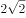，，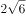，，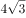，（    ）

- **A**. 
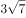

- **B**. 

　✅
- **C**. 
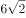

- **D**. 
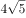

**答案**：B

**官方解析**

观察数列，无明显特征，将原数列转化为同一形式：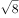，，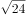，，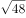，（    ）。

方法一：考虑根号下数字两两作和形成新数列①：25，41，61，85，（    ），继续作和无规律，考虑新数列两两作差得②：16，20，24，（    ），是公差为4的等差数列，下一项为，则新数列①下一项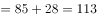，故所求项。

方法二：考虑根号下数字两两作差形成新数列①：9，7，13，11，（    ），继续作差无规律，考虑新数列两两作和得②：16，20，24，（    ），是公差为4的等差数列，下一项为，则新数列①下一项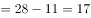，故所求项。

故正确答案为B。

---

### 第 3 题　qid 2742224 · 数学运算

2.2，3.5，9.7，13.19，37.27，（    ）

- **A**. 53.75　✅
- **B**. 59.73
- **C**. 73.53
- **D**. 75.59

**答案**：A

**官方解析**

题干为小数数列，优先考虑机械划分，分开看无规律，考虑整体看。小数部分整数部分形成新数列：4，8，16，32，64，（    ），是公比为2的等比数列，则所求项小数部分整数部分，只有A项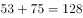满足。

故正确答案为A。

---

### 第 4 题　qid 2742208 · 数学运算

，，，，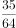，（    ）

- **A**. 

- **B**. 
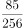

- **C**. 
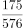

- **D**. 
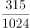
　✅

**答案**：D

**官方解析**

方法一：题干与选项均为分数，优先考虑分数数列，反约分后得到新数列为：，，，，。分子部分后项÷前项得到数列：1，3，5，7，是公差为2的等差数列，下一项为7+2=9，则分子下一项为35×9=315；分母部分后项÷前项得到数列：1，2，4，8，是公比为2的等比数列，下一项8×2=16，则分母下一项为：64×16=1024。故原数列下一项为。

方法二：题干与选项均为分数，优先考虑分数数列，若难以发现规律，则考虑作积作商。相邻两项作商，后项÷前项，得到新数列为，，，······，新数列仍为分数数列，观察分子部分，为公差是2的等差数列，则新数列下一项分子为7+2=9；观察分母部分，为公比是2的等比数列，则新数列下一项分母是8×2=16，则新数列下一项为，故原数列所求项。

故正确答案为D。

---

### 第 5 题　qid 2741990 · 数学运算

某农场有A、B、C三个粮仓，原先粮食储量之比为5：9：10，今年丰收后每个粮仓新增加的粮食储量相同，A、B两个粮仓的储量之比变为3：5，则今年丰收后三个粮仓的储存总量比原先增加：

- **A**. 

　✅
- **B**. 

- **C**. 

- **D**. 

**答案**：A

**官方解析**

根据题干，可将A、B、C三个粮仓原先粮食储量分别赋值为5、9、10。设今年丰收后每个粮仓新增加的粮食均为，则A、B、C三个粮仓今年粮食储量分别为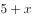、、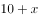，由今年A、B两个粮仓的储量之比变为3：5，可得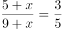，解得。则今年丰收后三个粮仓的储存总量比原先增加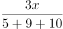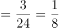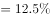。

故正确答案为A。

---

### 第 6 题　qid 2742209 · 数学运算

已知2017年、2018年和2019年全球共发射卫星1132颗，2019年发射的卫星数量是2017年的1.5倍还多2颗，2018年比2017年多31颗，则2019年全球共发射卫星：

- **A**. 314颗
- **B**. 345颗
- **C**. 452颗
- **D**. 473颗　✅

**答案**：D

**官方解析**

设2017年发射的卫星数量为颗，根据题意，2018年发射的卫星数量为（）颗，2019年发射的卫星数量为（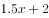）颗。已知三年共发射卫星1132颗，即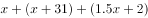，解得。故2019年全球共发射卫星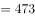颗。

故正确答案为D。

---

### 第 7 题　qid 2742219 · 数学运算

超市销售某种水果，第一天按原价售出总量的，第二天原价打8折售出剩下的一半，第三天按成本价全部售出。若销售全部该水果的利润率为，则该水果按原价销售的利润率为：

- **A**. 

- **B**. 

- **C**. 

　✅
- **D**. 

**答案**：C

**官方解析**

赋值该水果的成本为10元/千克，总量为10千克；假设该水果的原价为元/千克。根据题意可得表格如下：

该水果全部销售的总利润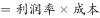元，即，解得。根据公式：利润率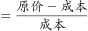，按原价销售的利润率为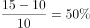。

故正确答案为C。

---

### 第 8 题　qid 2742004 · 数学运算

某机关甲、乙、丙三个部门参加植树造林活动，各部门植树的数量相同。甲部门花10天完成任务后，支援乙、丙两个部门各2天，最终乙部门植树12天完成，丙部门15天完成。若丙部门每天植树的数量比乙部门少4棵，则甲部门每天植树的数量是：

- **A**. 30棵　✅
- **B**. 40棵
- **C**. 50棵
- **D**. 60棵

**答案**：A

**官方解析**

由题意可得，甲、乙、丙三个部门的效率关系为：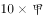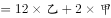······①；······②。整理①②可得：甲∶乙3∶2，乙∶丙5∶4，故甲效率：乙效率：丙效率15∶10∶8。结合丙部门每天植树的数量比乙部门少4棵，可得1份对应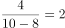棵，故甲的效率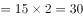棵。

故正确答案为A。

---

### 第 9 题　qid 2742017 · 数学运算

某产品的生产须经历A、B、C、D四道工序，由甲、乙、丙、丁每人负责其中一道工序，四人单独完成每道工序所需的时间（单位：分钟）如下表所示，则他们完成四道工序所需的总时间最少是（    ）。

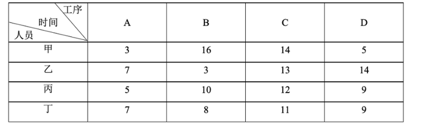

- **A**. 18分钟
- **B**. 22分钟
- **C**. 24分钟　✅
- **D**. 26分钟

**答案**：C

**官方解析**

要想他们完成四道工序所需的总时间最少，每道工序可以选择用时最少的人。观察发现甲负责A和D都是用时最少的人，可分情况讨论：①若甲负责A、乙负责B、丁负责C，这时只能由丙负责D，共用时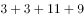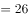分钟；②若甲负责D、丁负责C、乙负责B，这时只能由丙负责A，共用时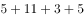分钟。则他们完成四道工序所需的总时间最少是24分钟。

故正确答案为C。

---

### 第 10 题　qid 2742220 · 数学运算

为发展乡村旅游，某地需建设一条游览线路，甲工程队施工，工期为60天，费用为144万元；若由乙工程队施工，工期为40天，费用为158万元。为在旅游旺季到来前完工，工期不能超过30天，为此需要甲、乙两工程队合作施工，则完成此项工程的费用最少是：

- **A**. 156万元
- **B**. 154万元
- **C**. 151万元　✅
- **D**. 149万元

**答案**：C

**官方解析**

赋值该工程的工作总量为120份，则甲工程队每天完成的工作量为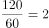份，每天的费用为万元，平均每份的费用为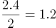万元；乙工程队每天完成的工作量为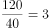份，每天的费用为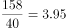万元，平均每份的费用为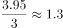万元。

由于甲工程队完成每份工作量的费用比乙工程队少，因此，要想完成此项工程的费用最少，需尽量多用甲工程队，即甲工程队施工30天，乙工程队完成剩余的工作量。乙工程队完成剩余工作量的时间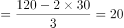天，此时总费用为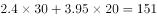万元。

故正确答案为C。

---

### 第 11 题　qid 2742016 · 数学运算

某单位开设a、b、c、d、e、f六门培训课程，员工自愿报名参加。经统计，员工选择的课程组合共有四种，，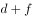，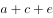，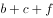，所有培训结束后，统一安排考试，为不影响工作要求，在1月4日至10日中的连续六天考完，每天只考一门，且每位员工都不会连续两天参加考试，则安排这六门课程考试日期的不同方法共有：

- **A**. 2种
- **B**. 4种　✅
- **C**. 8种
- **D**. 12种

**答案**：B

**官方解析**

根据题意可知，考试日期分为1月4日至9日和1月5日至10日两种情况；具体考试日期安排为：a可以和b、d相连，b可以和a、d、e相连，c只能和d相连，d可以和a、b、c、e相连，e可以和b、d、f相连，f只能和e相连。情况较复杂，考虑枚举法，c和f的情况固定，从其入手，则有如下两种情况：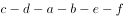，，所以安排这六门课程考试日期的不同方法共有种。

故正确答案为B。

---

### 第 12 题　qid 2741970 · 数学运算

某公司需要将A、B两地的同一产品运往甲、乙两个工厂。已知A、B两地分别有该产品500吨和700吨，甲、乙两个工厂对该产品的需求量均为600吨，若从A地出发运往甲、乙两个工厂的运价分别为150元/吨和130元/吨，从B地出发的运价分别为160元/吨和145元/吨，则完成此项运输任务的运费最少是：

- **A**. 174000元
- **B**. 174500元
- **C**. 175000元
- **D**. 175500元　✅

**答案**：D

**官方解析**

需运费最少，则优先考虑两地中运往两厂运费差较大情况。由题意可知，A地运往两工厂每吨运价差元，B地运往两工厂每吨运价差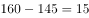元。A地运费差较大，故A地500吨产品优先运往乙工厂最划算，乙工厂所差100吨产品由B地运送即可，则所需运费为元；B地剩余的600吨产品运往甲工厂，所需运费为元。则完成此项运输任务的运费最少为元。

故正确答案为D。

---

### 第 13 题　qid 2741966 · 数学运算

小王去超市购买便携包和小哑铃作为知识竞赛活动的奖品。这两种商品超市正在进行促销，便携包单价18元，买2送1；小哑铃单价12元，买3送1。小王按计划购买了便携包和小哑铃合计56个，共使用活动经费606元，则他购买小哑铃的数量是：

- **A**. 24个
- **B**. 25个　✅
- **C**. 26个
- **D**. 27个

**答案**：B

**官方解析**

结合题干与选项可知，选项信息充分，故可用代入排除法解题：

代入A项：小哑铃24个，买3送1（4个一组），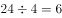组，需花钱购买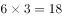个；便携包个，买2送1（3个一组），组······2个，需花钱购买个。则共用经费元，不符合题意；

代入B项：小哑铃25个，买3送1（4个一组），组······1个，需花钱购买个；便携包个，买2送1（3个一组），组······1个，需花钱购买个。则共用经费元，符合题意。

B项满足题干所有条件，因此无需继续验证。

故正确答案为B。

---

### 第 14 题　qid 2742200 · 数学运算

某三甲医院派甲、乙、丙、丁四名医生到A、B、C、D四个社区义诊，每个医生只负责一个社区。已知甲不去A社区，且如果丙去C社区，那么丁去D社区，则不同的派法共有：

- **A**. 15种　✅
- **B**. 18种
- **C**. 21种
- **D**. 24种

**答案**：A

**官方解析**

方法一：由题意可知，甲不去A社区，则甲只能去B、C、D社区中的一个，分类讨论：

若甲去B社区，剩下三人随意排列为种情况，但其中存在1种情况（丙去C社区、丁去A社区、乙去D社区）不满足题意，因此有种情况；

若甲去C社区，剩下三人随意排列，有种情况；

若甲去D社区，则丙不能去C社区，丙可去A、B社区，即种选择，剩下乙丁随意选，有种情况，种情况。

因此，不同的派法共有种。

方法二：甲不去A社区，则甲只能去B、C、D社区中的一个，有种选择。若不考虑其他特殊情况，其他三人随意安排有种情况。此时，总情况数有种。但若丙去C社区、甲去D社区、丁去A或B社区，这两种情况不符合题意；若丙去C社区、甲去B社区、丁去A社区，这一种情况也不符合题意。因此，满足题意的派法有种。

方法三：甲不去A社区，则甲只能去B、C、D社区中的一个，有种选择。若不考虑其他特殊情况，其他三人随意安排有种情况，那么考虑特殊情况后符合题意的派法种。结合选项，只有A项符合。

故正确答案为A。

---

### 第 15 题　qid 2742203 · 数学运算

某地举行募捐抽奖活动。每位捐赠者均有一次抽奖机会。活动设一二三等奖，获奖规则如下：抽奖时捐赠人在0到9这10个数字中一次随机抽取4个不同的数字，若与主办方开奖时随机抽取的4个不同数字完全相同，则获一等奖；若恰有3个相同，则获二等奖；若恰有2个相同则获三等奖。则捐赠者获奖的概率是：

- **A**. 

- **B**. 

- **C**. 

- **D**. 

　✅

**答案**：D

**官方解析**

捐赠者获奖的概率。

获一等奖的情况：取出的4个数字有4个与主办方一样，共1种；

获二等奖的情况：取出的4个数字有3个与主办方一样，共种；

获三等奖的情况：取出的4个数字有2个与主办方一样，共种；

则获奖的概率。

故正确答案为D。

---

### 第 16 题　qid 2742210 · 数学运算

已知A、B两地相距9公里，甲乙两人沿同一条路从A地匀速去往B地，甲的速度为6公里/小时，每走半小时休息15分钟；乙比甲早15分钟出发，中途不休息。若他们在途中（不包括起点和终点）至少相遇2次，则甲、乙两人到达B地的时间最多相差：

- **A**. 30分钟
- **B**. 45分钟　✅
- **C**. 60分钟
- **D**. 75分钟

**答案**：B

**官方解析**

甲的速度为6公里/小时，甲半小时走的路程公里，甲45分钟行驶3公里，行驶9公里用时分钟。要使得甲、乙两人到达B地的时间相差最多，则乙的速度应当尽可能小。从乙出发开始计时，若他们在途中（不包括起点和终点）至少相遇2次，而乙的速度又尽可能小，因此相遇的两次（如下图所示）分别为：开始到45分钟之间甲追上乙一次、45分钟到60分钟之间乙追上甲一次。

因为乙先走了15分钟，所以甲从开始到45分钟共走3公里，乙45分钟走的路程应小于等于3公里，可得乙的速度4公里/小时；甲从开始到60分钟共走3公里 ，乙60分钟走的路程应大于等于3公里，可得乙的速度3公里/小时。因此，乙的速度取最小为3公里/小时，则乙到达时间小时180分钟。

故两人到达B地的时间最多相差分钟。

故正确答案为B。

---

### 第 17 题　qid 2741972 · 数学运算

某公司举办迎新晚会，参加者每人都领取一个按入场顺序编号的号牌，晚会结束时宣布：从1号开始向后每隔6个号的号码可获得纪念品A，从最后一个号码开始向前每隔8个号的号码可获得纪念品B。最后发现没有人同时获得纪念品A和B，则参加迎新晚会的人数最多有：

- **A**. 46人
- **B**. 48人　✅
- **C**. 52人
- **D**. 54人

**答案**：B

**官方解析**

根据“从1号开始向后每隔6个号的号码可获得纪念品A”可知，从前往后，A获奖号码成公差为7的等差数列：1、8、15、22、29、36、43、50、57······；同理，从后往前，B获奖号码成公差为9的等差数列，题目求人数最多，考虑从大到小进行代入验证。
代入D项：若人数最多为54人，则可获得纪念品B的号码分别为54、45、36号······，此时36号同时获得纪念品A和B，不符合条件，排除；
代入C项：若人数最多为52人，则可获得纪念品B的号码分别为52、43号······，此时43号同时获得纪念品A和B，不符合条件，排除；
代入B项：若人数最多为48人，则可获得纪念品B的号码分别为48、39、30、21、12、3号，没有人同时获得纪念品A和B，符合条件，当选。
故正确答案为B。

---

### 第 18 题　qid 2742006 · 数学运算

某企业有甲、乙两个口罩生产车间，每天工作8小时，共生产口罩3万只，若每天甲、乙两个车间分别加班两小时和三小时，则可多生产口罩一万只，若每天甲、乙两个车间分别加班三小时和两小时，则两个车间生产62万只口罩，所需的时间为：

- **A**. 14天
- **B**. 15天
- **C**. 16天　✅
- **D**. 17天

**答案**：C

**官方解析**

设甲每小时生产口罩只，乙每小时生产口罩只：根据题意列方程：······①；······②；联立①②，解得，。

若每天甲、乙两个车间分别加班三小时和两小时，则甲、乙每天的工作效率和为只。根据公式：工作时间天。

故正确答案为C。

---

### 第 19 题　qid 2742221 · 数学运算

如图，在中，点D是AC的中点，点E是BC的三等分点，连接AE和BD交于点F，连接DE，若面积为36，则下列说法正确的是（    ）。

- **A**. 
的面积小于3
　✅
- **B**. 
的面积大于6

- **C**. 
的面积等于的面积

- **D**. 
的面积等于的面积

**答案**：A

**官方解析**

如图所示，在中，点D为AC中点，与等底同高，故。点E为BC边上三等分点，即，与同高，故，。同理，与同高，故， ，B选项错误，排除；

因为，故C、D选项只需验证一个，已知，，，即，而，故，因此，C、D选项错误。

故正确答案为A。

---

## 判断推理

### 第 1 题　qid 2742118 · 类比推理

抗疫：疫苗

- **A**. 修路：路基
- **B**. 投诉：诉状
- **C**. 反驳：数据　✅
- **D**. 医疗：患者

**答案**：C

**官方解析**

第一步：判断题干词语间逻辑关系。
疫苗可以用来抗疫，二者是功能对应关系。
第二步：判断选项词语间逻辑关系。
A项：路基是轨道或者路面的基础，路基不是用来修路的，二者不是功能对应关系，与题干逻辑关系不一致，排除；
B项：诉状是指民事案件原告人和刑事案件公诉人、自诉人向法院提起诉讼的书面材料，诉状是用来诉讼的，诉讼和投诉不同，二者没有明显逻辑关系，与题干逻辑关系不一致，排除；
C项：数据可以用来反驳，二者是功能对应关系，与题干逻辑关系一致，当选；
D项：医疗是指医治和疾病治疗，患者是医疗的对象，二者不是功能对应关系，与题干逻辑关系不一致，排除。
故正确答案为C。

---

### 第 2 题　qid 2741967 · 类比推理

调查：求真

- **A**. 晨练：健身　✅
- **B**. 施肥：收割
- **C**. 记忆：怀念
- **D**. 备份：复制

**答案**：A

**官方解析**

第一步：判断题干词语间逻辑关系。
调查是求真的一种方式，二者为方式的对应关系。
第二步：判断选项词语间逻辑关系。
A项：晨练是健身的一种方式，二者为方式的对应关系，与题干逻辑关系一致，当选；
B项：先施肥，再收割，二者是时间先后的对应关系，与题干逻辑关系不一致，排除；
C项：记忆可以用来怀念，二者是功能的对应关系，与题干逻辑关系不一致，排除；
D项：备份是指将电子计算机存储设备中的数据复制到其他存储设备的方式，复制是备份的一个步骤，二者不是方式目的的对应关系，与题干逻辑关系不一致，排除。
故正确答案为A。

---

### 第 3 题　qid 2742120 · 类比推理

石墙：土墙

- **A**. 风能：水能　✅
- **B**. 合法：非法
- **C**. 河道：水道
- **D**. 木床：婚床

**答案**：A

**官方解析**

第一步：判断题干词语间逻辑关系。
石墙和土墙是不同材质的墙，二者是并列关系中的反对关系。
第二步：判断选项词语间逻辑关系。
A项：风能和水能是两种不同的能源，二者是并列关系中的反对关系，与题干逻辑关系一致，当选；
B项：事情只有合法和非法之分，二者是并列关系中的矛盾关系，与题干逻辑关系不一致，排除；
C项：河道是一种水道，二者是种属关系，与题干逻辑关系不一致，排除；
D项：木床是按照材料进行分类，婚床是按照用途进行分类，分类标准不同。有的木床是婚床，有的木床不是婚床，有的婚床是木床，有的婚床不是木床，二者是交叉关系，与题干逻辑关系不一致，排除。
故正确答案为A。

---

### 第 4 题　qid 2742123 · 类比推理

就诊：病愈

- **A**. 跑步：娱乐
- **B**. 刷牙：美容
- **C**. 投资：盈利　✅
- **D**. 禁捕：生态

**答案**：C

**官方解析**

第一步：判断题干词语间逻辑关系。
就诊之后可能会病愈，病愈是就诊的或然结果，二者为对应关系。
第二步：判断选项词语间逻辑关系。
A项：跑步是一种娱乐，二者为种属关系，与题干逻辑关系不一致，排除；
B项：刷牙和美容没有时间先后顺序，与题干逻辑关系不一致，排除；
C项：投资之后可能会盈利，盈利是投资的或然结果，二者为对应关系，与题干逻辑关系一致，当选；
D项：禁捕可能会保护生态，但生态不是禁捕的结果，与题干逻辑关系不一致，排除。
故正确答案为C。

---

### 第 5 题　qid 2742127 · 类比推理

形象：花容月貌

- **A**. 态度：前倨后恭
- **B**. 体格：虎背熊腰　✅
- **C**. 行踪：闲云野鹤
- **D**. 环境：山清水秀

**答案**：B

**官方解析**

第一步：判断题干词语间逻辑关系。
花容月貌指女子美丽的容貌，可用来形容形象，且花和月都是一种比喻，二者为对应关系。
第二步：判断选项词语间逻辑关系。
A项：前倨后恭指待人接物态度前后不一，可用来形容态度，但前和后不是一种比喻，与题干逻辑关系不一致，排除；
B项：虎背熊腰指背宽厚如虎，腰粗壮如熊，可用来形容体格，且虎和熊都是一种比喻，与题干逻辑关系一致，当选；
C项：闲云野鹤比喻无拘无束、来去自如的人，不能用来形容行踪，与题干逻辑关系不一致，排除；
D项：山清水秀指风景优美，可用来形容环境，但山和水不是一种比喻，与题干逻辑关系不一致，排除。
故正确答案为B。

---

### 第 6 题　qid 2741977 · 类比推理

花：鸟：杜鹃

- **A**. 戏：剧：昆曲
- **B**. 钟：表：秒表
- **C**. 草：木：植物
- **D**. 人：畜：黄牛　✅

**答案**：D

**官方解析**

第一步：判断题干词语间逻辑关系。
花和鸟是并列关系；且杜鹃既可以是花的一种，也可以是鸟的一种，第三词与前两词为种属关系。
第二步：判断选项词语间逻辑关系。
A项：戏和剧都可以用来指戏剧。昆曲是中国古老的戏曲声腔、剧种，现又被称为昆剧，昆曲是戏剧的一种，为种属关系，与题干逻辑关系不一致，排除；
B项：钟和表是并列关系；但秒表是表的一种，与题干逻辑关系不一致，排除；
C项：草和木是并列关系；但草和木均属于植物，与题干逻辑关系不一致，排除；
D项：人和畜是并列关系；且黄牛既可以是人的一种（票贩子），也可以是畜的一种，第三词与前两词为种属关系，与题干逻辑关系一致，当选。
故正确答案为D。

---

### 第 7 题　qid 2741987 · 类比推理

国家：治理：现代化

- **A**. 企业：规制：自动化
- **B**. 社会：建设：法治化　✅
- **C**. 社区：服务：数字化
- **D**. 政府：管理：一体化

**答案**：B

**官方解析**

第一步：判断题干词语间逻辑关系。
治理国家，前两词为动宾关系；且治理国家的目的是为了实现现代化，前两词与第三词之间为目的对应关系。
第二步：判断选项词语间逻辑关系。
A项：规制企业，前两词为动宾关系；但规制企业的目的不是为了实现自动化，而是为了在市场经济体制下，矫正和改善市场机制内在的问题，与题干逻辑关系不一致，排除；
B项：建设社会，前两词为动宾关系；且建设社会的目的是为了实现国家法治化，前两个词与第三个词之间为目的对应关系，与题干逻辑关系一致，当选；
C项：服务社区，搭配不当，应为“社区服务”，与题干逻辑关系不一致，排除；
D项：管理政府，搭配不当，应为“政府管理”，与题干逻辑关系不一致，排除。
故正确答案为B。

---

### 第 8 题　qid 2742194 · 类比推理

小岗村：村：安徽

- **A**. 石家庄：庄：河北
- **B**. 驻马店：店：河南
- **C**. 景德镇：镇：江西
- **D**. 洪泽湖：湖：江苏　✅

**答案**：D

**官方解析**

第一步：判断题干词语间逻辑关系。
小岗村是位于安徽省的一个村，第一个词和第二个词是种属关系，第一个词和第三个词是地点对应关系。
第二步：判断选项词语间逻辑关系。
A项：石家庄位于河北省，但石家庄不是一个庄，而是一个市，与题干逻辑关系不一致，排除；
B项：驻马店位于河南省，但驻马店不是一个店，而是一个市，与题干逻辑关系不一致，排除；
C项：景德镇位于江西省，但景德镇不是一个镇，而是一个市，与题干逻辑关系不一致，排除；
D项：洪泽湖是位于江苏省的一个湖，第一个词和第二个词是种属关系，第一个词和第三个词是地点对应关系，与题干逻辑关系一致，当选。
故正确答案为D。

---

### 第 9 题　qid 2742180 · 类比推理

大豆 之于 （    ） 相当于 原木 之于 （    ）

- **A**. 豆豉；木炭　✅
- **B**. 豆芽；桐木
- **C**. 红豆；檀木
- **D**. 豆腐；木桶

**答案**：A

**官方解析**

逐一代入选项。
A项：大豆经过发酵变成豆豉，二者为原材料对应关系，且发酵是一种化学变化；原木经过不完全燃烧变成木炭，二者为原材料对应关系，且燃烧也是一种化学变化，前后逻辑关系一致，当选；
B项：大豆是豆芽的种子，二者为对应关系；“原木”指采伐后未经加工的木料，桐木是树木的一个品种，有的原木是桐木，有的原木不是桐木，有的桐木是原木，有的桐木不是原木，二者为交叉关系，前后逻辑关系不一致，排除；
C项：“大豆”通常指黄豆，与“红豆”为并列关系；“原木”指采伐后未经加工的木料，檀木是树木的一个品种，有的原木是檀木，有的原木不是檀木，有的檀木是原木，有的檀木不是原木，二者为交叉关系，前后逻辑关系不一致，排除；
D项：大豆加工成豆腐，需要煮沸，而加热时会发生蛋白质变性这一化学变化，因此制作豆腐的过程中存在物理变化和化学变化；原木加工成木桶，过程中只存在物理变化，前后逻辑关系不一致，排除。
故正确答案为A。

---

### 第 10 题　qid 2742182 · 类比推理

球员 之于 （    ） 相当于 （    ） 之于 蜂群

- **A**. 球队；工蜂　✅
- **B**. 球赛；采蜜
- **C**. 领队；蜂王
- **D**. 球场；蜜源

**答案**：A

**官方解析**

逐一代入选项。
A项：球员是球队的组成部分，二者为组成关系；工蜂是蜂群的组成部分，二者为组成关系，前后逻辑关系一致，当选；
B项：球员参加球赛，球员与球赛为主宾关系；蜂群采蜜，二者为主谓宾关系，但主语位置颠倒，前后逻辑关系不一致，排除；
C项：领队带领球员，蜂王带领蜂群，二者均为对应关系，但位置颠倒，前后逻辑关系不一致，排除；
D项：球员在球场踢球，蜂群在蜜源地采蜜，二者均为地点场所的对应关系，但位置颠倒，前后逻辑关系不一致，排除。
故正确答案为A。

---

### 第 11 题　qid 2742186 · 图形推理

从所给的四个选项中，选择最合适的一个填入问号处，使之呈现一定的规律性：

- **A**. A
- **B**. B　✅
- **C**. C
- **D**. D

**答案**：B

**官方解析**

元素组成相似，且某些元素不止一次出现在各图形中，优先考虑样式规律中的遍历。比较相邻图形发现，题干已知图形都包含正方形元素，故问号处图形也应满足此规律，只有B项符合。
故正确答案为B。

---

### 第 12 题　qid 2742183 · 图形推理

从所给的四个选项中，选择最合适的一个填入问号处，使之呈现一定的规律性：

- **A**. A
- **B**. B
- **C**. C　✅
- **D**. D

**答案**：C

**官方解析**

元素组成不同，且无明显属性规律，优先考虑数量规律。观察发现，题干图形空白区域明显，考虑数面。题干图形面数量依次为：1、2、3、4、5，？，故“？”处应该选择有6个面的图形，A项和D项均为8个面，排除。再次观察发现，题干均含有两种不一样的图形（图一为圆和直线，图二为圆和六边形，图三为三角形和四边形，图四为三角形和六边形，图五为菱形和五边形），B项有三种图形，C项有两种图形，C项符合规律，当选。
故正确答案为C。

---

### 第 13 题　qid 2742191 · 图形推理

从所给的四个选项中，选择最合适的一个填入问号处，使之呈现一定的规律性：

- **A**. A
- **B**. B　✅
- **C**. C
- **D**. D

**答案**：B

**官方解析**

元素组成不同，且无明显属性规律，考虑数量规律。观察发现，图形线条交叉明显，考虑交点数。题干图形的交点数分别为：2、3、4、5、6，所以？处图形的交点数应为7个，只有B项符合规律。
故正确答案为B。

---

### 第 14 题　qid 2742148 · 图形推理

从所给的四个选项中，选择最合适的一个填入问号处，使之呈现一定的规律性：

- **A**. A
- **B**. B
- **C**. C
- **D**. D　✅

**答案**：D

**官方解析**

观察发现，题干图形均由小三角构成，优先考虑元素的种类和个数。题干已知图形均由4个尖角朝上的正三角形（）构成，故问号处应选择一个由4个尖角朝上的正三角形构成的图形，只有D项符合。

故正确答案为D。

---

### 第 15 题　qid 2742162 · 图形推理

从所给的四个选项中，选择最合适的一个填入问号处，使之呈现一定的规律性：

- **A**. A
- **B**. B
- **C**. C
- **D**. D　✅

**答案**：D

**官方解析**

元素组成不同，且无明显属性规律，优先考虑数量规律。观察发现，图2、图3为“日”字变形图，考虑笔画数。题干图形均为一笔画图形，故？处图形也应为一笔画图形，只有D项满足规律。
故正确答案为D。

---

### 第 16 题　qid 2742142 · 图形推理

从所给的四个选项中，选择最合适的一个填入问号处，使之呈现一定的规律性：

- **A**. A
- **B**. B
- **C**. C　✅
- **D**. D

**答案**：C

**官方解析**

题干图形均为同一个六面体，展开图如下图所示：

九宫格优先横向观察，第一行图1整体沿水平方向顺时针旋转得到图2，图2整体沿水平方向顺时针旋转得到图3；经验证第二行满足此规律；第三行应用此规律，“？”处图形应由第三行图2整体沿水平方向顺时针旋转所得，即顶面为斜线面，正面为灰色三角形面，排除B、D两项；比较A、C两项发现右侧面不同，但均出现了两个斜线面，根据上图可确定两斜线面分别为面4和面5，且两个面上的斜线相交于一点（第一行图1、第二行图2也同时出现面4和面5），而A项中两个斜线面上的斜线不相交，可排除。

故正确答案为C。

---

### 第 17 题　qid 2742144 · 图形推理

从所给的四个选项中，选择最合适的一个填入问号处，使之呈现一定的规律性：

- **A**. A
- **B**. B
- **C**. C　✅
- **D**. D

**答案**：C

**官方解析**

图形元素组成相似，优先考虑样式规律，且相同线条重复出现，故考虑样式规律中的加减同异。九宫格优先按行看，第一行中，图2逆时针旋转，然后与图1求异得到图3。经验证，第二行也满足此规律。第三行，应用此规律，将图2逆时针旋转，然后与图1求异，因此“？”处应选择C项。

故正确答案为C。

---

### 第 18 题　qid 2742145 · 图形推理

下面四个图形中，只有一个是由上面的四个图形拼合（只能通过上、下、左、右平移）而成的，请把它找出来。

- **A**. A
- **B**. B　✅
- **C**. C
- **D**. D

**答案**：B

**官方解析**

本题考查平面拼合，可采用平行且等长相消的方式解题。

消去平行且等长的线段后进行组合即可得到轮廓图，即为B选项。

平行且等长相消的方式如下图所示：

故正确答案为B。

---

### 第 19 题　qid 2742146 · 图形推理

下面四个图形中，只有一个是由上面的四个图形拼合（只能通过上、下、左、右平移）而成的，请把它找出来。

- **A**. A
- **B**. B
- **C**. C
- **D**. D　✅

**答案**：D

**官方解析**

本题考查平面拼合，可采用平行且等长相消的方式解题。

消去平行且等长的线段后进行组合即可得到轮廓图，即为D选项。

平行且等长相消的方式如下图所示：

故正确答案为D。

---

### 第 20 题　qid 2742172 · 图形推理

下边四个图形中，只有一个是由上边的四个图形拼合（只能通过上、下、左、右平移）而成的，请把它找出来。

- **A**. A
- **B**. B
- **C**. C　✅
- **D**. D

**答案**：C

**官方解析**

本题考查平面拼合，可采用平行且等长相消的方式解题。消去平行且等长的线段后进行组合即可得到轮廓图，即为C项。平行且等长相消的方式如下图所示：

故正确答案为C。

---

### 第 21 题　qid 2742175 · 图形推理

下边四个图形中，只有一个是由上边的四个图形拼合（只能通过上、下、左、右平移）而成的，请把它找出来。

- **A**. A
- **B**. B
- **C**. C
- **D**. D　✅

**答案**：D

**官方解析**

本题考查平面拼合，可采用平行且等长相消的方式解题。消去平行且等长的线段后进行组合可得到轮廓图，即为D项。平行且等长相消的方式如下图所示：

故正确答案为D。

---

### 第 22 题　qid 2742179 · 图形推理

左边给定的是多面体的外表面，右边哪一项能由它折叠而成？请把它找出来。

- **A**. A
- **B**. B　✅
- **C**. C
- **D**. D

**答案**：B

**官方解析**

将原展开图标上序号如下图，逐一进行分析。

A项：该项由面b和面c构成，题干中面b和面c都以虚线顶点为起点，在面中顺时针画边，无论是哪个面第一条边都是面b和面c的公共边。而选项中以此顶点为起点顺时针画边，无论哪个面第一条边都不是面b和面c的公共边，选项与题干不一致，排除；

B项：该项由面c和面d构成，选项与题干一致，当选；

C项：该项由面a和面d构成，题干中面d以实线顶点为起点，在面中顺时针画边，第一条边挨着面c。而选项以此顶点为起点顺时针画边，第一条边挨着a面，选项与题干不一致，排除；

D项：题干中面a以虚线顶点为起点，在面中顺时针画边，第二条边先经过面b中的虚线再经过实线顶点，而选项以此顶点为起点顺时针画边，第二条边先经过面b中的实线顶点再经过虚线，选项与题干不一致，排除。

故正确答案为B。

---

### 第 23 题　qid 2742064 · 图形推理

左边给定的是多面体的外表面，右边哪一项能由它折叠而成？请把它找出来。

- **A**. A
- **B**. B　✅
- **C**. C
- **D**. D

**答案**：B

**官方解析**

本题考查六面体。将展开图中上下两个面移动，并给每个面标号，如下图所示：

逐一分析选项。

A项：选项中必然存在面c，展开图中面c与面e为相对面，无法同时出现，故选项上侧面为面f，展开图中面c与面f的公共边——边1为面c上白色三角形的直角边，而选项中两个面的公共边为面c上竖线三角形的直角边，选项与展开图不一致，排除；

B项：选项由面a、面c与面d构成，与展开图一致，当选；

C项：选项由面a、面c与面d构成，展开图中面c与面a、面d的公共边——边2与边3均为面c上竖线三角形的直角边，而选项中有一条公共边为面c上白色三角形的直角边，选项与展开图不一致，排除；

D项：选项中必然存在面c，展开图中面c与面e为相对面，无法同时出现，故选项正面为面f，展开图中面c与面f的公共边——边1为面c上白色三角形的直角边，而选项中两个面的公共边均为面c上竖线三角形的直角边，选项与展开图不一致，排除。

故正确答案为B。

---

### 第 24 题　qid 2742184 · 图形推理

左边给定的是多面体的外表面，右边哪一项能由它折叠而成？请把它找出来。

- **A**. A
- **B**. B
- **C**. C　✅
- **D**. D

**答案**：C

**官方解析**

将原展开图标上序号如下图，逐一进行分析。

A项：选项三个面为面a，面c和面d，面a和面d为相对面，相对面不能同时出现，选项与题干不一致，排除；

B项：选项三个面为面a，面b和面c，在题干展开图中，三个面的公共点在a面没有引出线条，在选项中，三个面公共点在a面引出了线条，选项与题干不一致，排除；

C项：选项与题干一致，当选；

D项：选项上面和右侧面均为面a，题干面a只出现一次，选项与题干不一致，排除。

故正确答案为C。

---

### 第 25 题　qid 2742190 · 图形推理

左边为给定的立体图，从任意角度剖开，右边哪一项可能是它的截面图？

- **A**. A
- **B**. B　✅
- **C**. C
- **D**. D

**答案**：B

**官方解析**

本题考查截面图，逐一分析选项。

A项：垂直于上下底面偏离圆锥顶点不能切出两个梯形，切出的应该是双曲线加两条平行线的图形，选项与题干不一致，排除；

B项：如下图所示，B项可截出，选项与题干一致，当选；

C项：要想切出上面的形状，刀片应该斜切，要想切出下面的形状，应该平行于上下底面切，不同角度切出来的面不能存在于同一平面，选项与题干不一致，排除；

D项：要想切出相切的两个椭圆，必然要经过两个圆锥顶点，但是经过顶点斜切不能切出椭圆，选项与题干不一致，排除。

故正确答案为B。

---

### 第 26 题　qid 2742111 · 逻辑判断

任何企业存在于社会之中，都是社会的企业。社会是企业家施展才华的舞台。只有真诚回报社会、切实履行社会责任的企业家，才能真正得到社会认可，才是符合时代要求的企业家。
根据以上陈述，可以得出以下哪项？

- **A**. 企业家如果符合时代要求，就会真正得到社会认可
- **B**. 企业家如果施展才华，企业就会长期存在于社会之中
- **C**. 企业家如果真诚回报社会，就是符合时代要求的企业家
- **D**. 企业家如果没有切实履行社会责任，就不会真正得到社会认可　✅

**答案**：D

**官方解析**

第一步：翻译题干。

①企业存在于社会之中社会的企业；

②社会认可真诚回报社会且切实履行社会责任的企业家；

③符合时代要求真诚回报社会且切实履行社会责任的企业家。

第二步：逐一分析选项。

A项：翻译为符合时代要求社会认可，符合时代要求和社会认可互相推不出，无法推出，排除；

B项：翻译为施展才华企业存在于社会之中，施展才华和存在于社会之中互相推不出，无法推出，排除；

C项：翻译为真诚回报社会符合时代要求，是对③箭头后且关系其中一项的肯定，得不到确定性的结论，无法推出，排除；

D项：翻译为履行社会责任社会认可，是对②箭头后且关系的否定，否后必否前，可以推出，当选。

故正确答案为D。

---

### 第 27 题　qid 2742069 · 类比推理

古人云：立善法于天下，则天下治；立善法于一国，则一国治。
以下哪项与上述古人说法的形式结构最为相似？

- **A**. 民生在勤，勤则不匮
- **B**. 穷则独善其身，达则兼济天下　✅
- **C**. 明者因时而变，知者随事而制
- **D**. 俭则约，约则百善俱兴；侈则肆，肆则百恶俱纵

**答案**：B

**官方解析**

第一步：分析题干的形式结构。

题干的含义为：在天下设立好法制，天下就会太平；在一国制定好法制，一国就会太平。其形式结构为12，34。

第二步：逐一分析选项。

A项：该项的含义为：民众的生计、生活在于勤劳，勤劳就不会出现物资匮乏。其形式结构为12，与题干形式结构不同，排除；

B项：该项的含义为：如果自己不得志，那么就要管好自己的道德修养，如果自己得志，那么就要努力让天下人都能得到好处。其结构形式为12，34，与题干形式结构相似，当选；

C项：该项的含义为：聪明的人会根据时期的不同而改变自己的策略和方法，有大智慧的人会根据事物发展方向的不同而制定相应的管理方法。其中不包含推理关系，与题干形式结构不同，排除；

D项：该项的含义为：节俭就会有节制，有节制则百善都会兴起；奢侈就会放肆，放肆则百恶都会爆发。其结构形式为12，23，45，56，与题干形式结构不同，排除。

故正确答案为B。

---

### 第 28 题　qid 2742112 · 逻辑判断

近日，某些城市上线了“随手拍交通违法”小程序，市民可以将自己拍摄的机动车闯红灯、违停等各类违法行为的照片或者视频，通过该小程序实名上传并进行举报。对于所举报的交通违法行为一经核实，相关部门会给予举报人奖励。有专家由此断定，“随手拍交通违法”可以有效扩大交通监督的范围，形成警民共治的局面。
以下哪项如果为真，最能支持上述专家的断定？

- **A**. 交警部门的执法力量相对有限，不足以应对现实生活中大量交通违法的行为
- **B**. 国家有关法律明令禁止闯红灯，违停等交通违法行为，并有相应的处罚规定
- **C**. 有些地方出现过举报人信息被泄露的案例，保护举报者个人隐私已刻不容缓
- **D**. “随手拍交通违法”小程序上线以来，有关部门已接到大量交通违法行为举报　✅

**答案**：D

**官方解析**

第一步：找出论点和论据。
论点：“随手拍交通违法”可以有效扩大交通监督的范围，形成警民共治的局面。
论据：对于所举报的交通违法行为一经核实，相关部门会给予举报人奖励。
本题论据和论点都在讨论“随手拍可以使警民共治”，论据和论点话题一致，可以考虑补充论据证明“随手拍交通违法”这个方式确实可以有效扩大交通监督的范围，形成警民共治的局面。
第二步：逐一分析选项。
A项：论点说的是“随手拍交通违法”这个方式是否可以达到有效扩大交通监督的范围，形成警民共治的局面这个效果，该项说的是交警部门的执法力量，话题不一致，无法加强，排除；
B项：论点说的是“随手拍交通违法”这个方式是否可以达到有效扩大交通监督的范围，形成警民共治的局面这个效果，该项说的是国家法律的规定，话题不一致，无法加强，排除；
C项：该项在说随手拍这个方式可能有一些负面影响，但是题干论点讨论的是随手拍这个方式能不能达到效果，和是否有负面影响没有关系，话题不一致，无法加强，排除；
D项：通过举例子说明“随手拍交通违法”小程序上线以来，对交通违法行为确实有举报作用，也就是说可以扩大交通监督的范围，形成警民共治的局面，补充论据，当选。
故正确答案为D。

---

### 第 29 题　qid 2742113 · 类比推理

某大学张、刘、李、赵4位互不熟悉的选手参加全校演讲比赛。他们来自数学、逻辑、文学和历史专业。赛前4人分别作出了如下猜测：
张：赵的专业是逻辑；
刘：李的专业是文学；
李：张的专业不是数学；
赵：刘的专业是历史。
事后得知，只有数学、逻辑专业选手的猜测是正确的。
根据上述信息可以推断，张、刘、李、赵4人各自的专业分别是：

- **A**. 数学、逻辑、文学、历史
- **B**. 数学、历史、文学、逻辑
- **C**. 文学、历史、逻辑、数学　✅
- **D**. 历史、文学、逻辑、数学

**答案**：C

**官方解析**

第一步：分析题干。

（1）张：赵逻辑；

（2）刘：李文学；

（3）李：张数学；

（4）赵：刘历史；

（5）数学和逻辑说的正确，文学和历史说的错误。

第二步：根据题干条件分析选项。

选项信息充分，可以考虑代入法。

代入A项：张（数学）说的是真话，即赵的专业是逻辑，与选项矛盾，排除；

代入B项：张（数学）说的是真话，赵（逻辑）说的也为真话，刘（历史）说的是假话，即李不是文学专业的，与选项矛盾，排除；

代入C项：李（逻辑）说的是真话，即张不是数学专业的，赵（数学）说的是真话，即刘是历史专业的，张（文学）说的是假话，即赵不是逻辑专业的，刘（历史）说的是假话，即李不是文学专业的，均与选项一致，符合题干条件（5），当选；

代入D项：李（逻辑）说的是真话，即张不是数学专业的，赵（数学）说的是真话，即刘是历史专业的，与选项矛盾，排除。

故正确答案为C。

---

### 第 30 题　qid 2742117 · 逻辑判断

我国有关法律规定，大中型危险化学品生产企业与居民建筑物应至少保持1000米的安全红线，然而，随着城市的快速发展，很多原先地处偏远的危化品生产企业逐渐被居民区包围，一旦发生事故，会对周边居民的生命财产造成不可估量的损失。为防范危化品生产企业带给附近居民的风险，有专家建议在城市郊区设立化工园区，集中安置原本分散在城市各地的危化品生产企业，并严格遵守1000米安全红线规定。
以下哪项如果为真，最能质疑上述专家的建议？

- **A**. 危化品在销售废弃等环节无法远离居民区，这些环节也有可能发生事故
- **B**. 新建化工园区设备先进，管理严格，入驻企业的前期运营成本将大幅提高
- **C**. 化工企业集中安置容易引发连锁事故，可能威胁到数千米之外的居民安全　✅
- **D**. 许多危化品生产企业考虑到运输和销售的便利性，并不愿意搬迁到郊区来

**答案**：C

**官方解析**

第一步：找出论点和论据。
论点：在城市郊区设立化工园区，集中安置原本分散在城市各地的危化品生产企业，并严格遵守1000米安全红线规定。
论据：防范危化品生产企业带给附近居民的风险。
论点和论据都在讨论危化品生产企业和居民安全问题，论点论据话题一致，可以考虑否定论点来削弱。
第二步：逐一分析选项。
A项：该项讨论的是危化品在销售废弃等环节的危害，论点讨论的是危化品生产企业的集中安置环节，话题不一致，无法削弱，排除；
B项：该项讨论的是前期运营成本将大幅提高，论点讨论的是危化品生产企业集中安置，话题不一致，无法削弱，排除；
C项：该项说明集中安置化工企业，反而容易引发连锁事故，进而会威胁到数千米之外的居民安全，所以不能集中安置，直接否定论点，可以削弱，当选；
D项：该项讨论的是危化品生产企业考虑到运输和销售的便利性是否愿意搬迁，与论点讨论的话题不一致，无法削弱，排除。
故正确答案为C。

---

### 第 31 题　qid 2742121 · 逻辑判断

从2019年5月1日至2019年底，某机构统计的新能源车辆事故共计113起，着火事故占有一定比例。在着火事故车辆中，乘用车占比达到，专用车次之，公交车最低。这说明，在新能源车辆中，乘用车的安全性大大低于专用车和公交车。

以下哪项如果为真，最能质疑上述结论？

- **A**. 
新能源汽车中乘用车的利润最高，企业对其安全性设施的研发投入也最高

- **B**. 
新能源专用车和公交车的司机一般驾龄较长、水平较高，出车事故率较低

- **C**. 
在新能源汽车的着火事故中，乘用车的伤亡人数远远少于专用车和公交车

- **D**. 
据该机构统计，新能源专用车和公交车保有量不到新能源汽车总量的
　✅

**答案**：D

**官方解析**

第一步：找出论点和论据。

论点：在新能源车辆中，乘用车的安全性大大低于专用车和公交车。

论据：某机构统计的新能源车辆事故共计113起，着火事故占有一定比例。在着火事故车辆中，乘用车占比达到，专用车次之，公交车最低。

本题题干论点在讨论新能源车辆的安全性，论据在说新能源车辆中着火事故的车辆占比，论点论据话题不一致，优先考虑拆桥。

第二步：逐一分析选项。

A项：该项说的是新能源汽车中乘用车的利润最高，企业对其安全性设施的研发投入也最高，但是不能证明“投入高”等于“安全性高”，与题干论点话题不一致，无法削弱，排除；

B项：该项只能说明专用车和公交车事故率低是因为司机驾驶水平高，但是不明确乘用车的司机的驾驶水平，没有提及乘用车出事故率高跟安全性之间的关系，无法削弱，排除；

C项：该项说的是在新能源汽车的着火事故中，乘用车的伤亡人数远远少于专用车和公交车，“伤亡人数的多少”并不等同于“安全性的高低”，无法根据乘用车的伤亡人数判定其与专用车和公交车的安全性高低，无法削弱，排除；

D项：据该机构统计，新能源专用车和公交车保有量不到新能源汽车总量的10%说明了乘用车占90%，证明不能用论据中69.6%推出乘用车的安全性低于专用车和公交车，切断了论据和论点的联系，当选。

故正确答案为D。

---

### 第 32 题　qid 2741981 · 逻辑判断

近日，某社区为活跃社区文化气氛，开展了一场别开生面的社区文化活动，有若干兴趣社团供居民选择。已知报名情况如下：
（1）居民在诗词社和书法社中至少参加了一个；
（2）居民如果参加了诗词社，则没有参加合唱团；
（3）李女士参加了合唱团。
社区主任知道上述情况后断定，李女士也参加了戏迷社。
以下哪项如果为真，可以成为社区主任断定所需的前提？

- **A**. 李女士没有参加诗词社
- **B**. 参加了戏迷社的也参加了书法社
- **C**. 李女士没有参加书法社
- **D**. 不参加戏迷社的都不参加书法社　✅

**答案**：D

**官方解析**

第一步：找出论点和论据。

论点：李女士也参加了戏迷社。

论据：

（1）居民在诗词社和书法社中至少参加了一个；

（2）居民如果参加了诗词社，则没有参加合唱团。出现逻辑关联词，可以翻译为：参加诗词社没有参加合唱团；

（3）李女士参加了合唱团。

论据（3）“李女士参加了合唱团”是对论据（2）“参加诗词社没有参加合唱团”的否后，根据“否后必否前”原则，可以得到李女士没有参加诗词社；结合论据（1）“居民在诗词社和书法社中至少参加了一个”可知，李女士参加了书法社。

本题需要找出论点成立的前提，可优先考虑搭桥的加强方式进行加强，即建立“李女士参加了合唱团”与“李女士参加戏迷社”、“李女士没有参加诗词社”与“李女士参加戏迷社”、“李女士参加了书法社”与“李女士参加戏迷社”的联系。

第二步：逐一分析选项。

A项：“李女士没有参加诗词社”，结合论据“居民在诗词社和书法社中至少参加了一个”可知，李女士参加了书法社，无法建立与“李女士参加戏迷社”的联系，不是论点成立的前提，排除；

B项：“参加了戏迷社的也参加了书法社”可以翻译为：参加戏迷社参加书法社，根据题干论据得到“李女士参加了书法社”是对该推出关系的肯后，肯后得不到必然结论，不是论点成立的前提，排除；

C项：“李女士没有参加书法社”，与题干论据“李女士参加了书法社”矛盾，削弱论据，不是论点成立的前提，排除；

D项：“不参加戏迷社的都不参加书法社”可以翻译为：不参加戏迷社不参加书法社，根据题干论据得到“李女士参加了书法社”是对该推出关系的否后，根据“否后必否前”原则，可以得到李女士参加了戏迷社，建立了“李女士参加书法社”与“李女士参加戏迷社”之间的联系，是论点成立的前提，当选。

故正确答案为D。

---

### 第 33 题　qid 2741976 · 逻辑判断

2020年疫情肆虐，但电商直播逆势崛起，一季度全国电商直播超过400万场，“万物可播、全民可播”成为一个响亮的口号。一项针对消费者和商家的调查显示，在电商直播中，许多消费者能以优惠的价格购买到心仪的商品，商家也能提升其销售额。有专家据此推断，电商直播的商业模式在疫情过后仍会受到商家和消费者的追捧。
以下各项如果为真，则除哪项外均能削弱上述专家的观点？

- **A**. 低价促销已经成为当前直播带货的常态，这种价格竞争让商家无利润可赚
- **B**. 直播带货往往造成线上线下的价格不一致，不利于商家维护企业品牌形象
- **C**. 许多消费者购买直播销售的商品后遇到了以次充好、售后维权困难等情况
- **D**. 个别带货主播为了利益常常夸大自己的销售数据，而消费者对此并不知情　✅

**答案**：D

**官方解析**

第一步：找出论点和论据。
论点：电商直播的商业模式在疫情过后仍会受到商家和消费者的追捧。
论据：在电商直播中，许多消费者能以优惠的价格购买到心仪的商品，商家也能提升其销售额。
第二步：逐一分析选项。
A项：该项讨论的是商品低价促销让商家无利润可赚，说明对于消费者来说是利好的，但是商家赚不到钱，对于商家来说是不利的，所以电商直播不能受到商家的追捧，可以削弱，排除；
B项：该项讨论的是商品线上线下的价格不一致，不利于商家维护企业品牌形象，说明直播带货不会受到商家的追捧，可以削弱，排除；
C项：该项讨论的是消费者通过直播购买商品后发现商品质量有问题和售后维权困难，说明直播带货有弊端，所以不会受到消费者的追捧，可以削弱，排除；
D项：该项讨论的是主播夸大销售数据，而消费者对此并不知情，但是题干论点讨论的是电商直播这种商业模式是否会被商家和消费者追捧，与论点讨论的话题无关，为无关选项，无法削弱，当选。
本题为选非题，故正确答案为D。

---

### 第 34 题　qid 2742138 · 逻辑判断

某村青年甲、乙、丙、丁、戊5人到某房屋维修公司应聘。根据各自专长，他们5人被聘为焊工、瓦工、电工、木工和水工。已知他们每人只做一个工种，每个工种均有他们5人中的1人做，另外还知道：
（1）如果甲做焊工，则丙做木工；
（2）如果乙和丁两人之一做水工，则甲做焊工；
（3）丙或做瓦工，或做电工。
如果戊做瓦工，则可以得出以下哪项？

- **A**. 甲做水工　✅
- **B**. 甲做木工
- **C**. 乙做木工
- **D**. 乙做焊工

**答案**：A

**官方解析**

分析题干信息。

（1）甲焊工丙木工；

（2）乙水工甲焊工，丁水工甲焊工；

（3）丙瓦工或丙电工。

从确定信息入手，题干给出新的条件，“如果戊做瓦工” 。结合条件（3），根据或关系的否一推一，可知丙做电工；结合条件（1），否后必否前，可知甲不做焊工；结合条件（2），否后必否前，可知甲焊工乙水工，甲焊工丁水工；即乙水工且丁水工。

结合已推出信息，乙、丁不做水工，戊做瓦工，丙做电工，则甲一定做水工。

故正确答案为A。

---

### 第 35 题　qid 2742139 · 逻辑判断

某村青年甲、乙、丙、丁、戊5人到某房屋维修公司应聘。根据各自专长，他们5人被聘为焊工、瓦工、电工、木工和水工。已知他们每人只做一个工种，每个工种均有他们5人中的1人做，另外还知道：
（1）如果甲做焊工，则丙做木工；
（2）如果乙和丁两人之一做水工，则甲做焊工；
（3）丙或做瓦工，或做电工。
如果丁做电工，则可以得出以下哪项？

- **A**. 甲或做焊工，或做水工
- **B**. 乙或做焊工，或做木工　✅
- **C**. 丙或做木工，或做焊工
- **D**. 戊或做水工，或做焊工

**答案**：B

**官方解析**

分析题干信息。

（1）甲焊工丙木工；

（2）乙水工甲焊工，丁水工甲焊工；

（3）丙瓦工或丙电工。

由确定信息入手，题干给出新的条件，“如果丁做电工”。

结合条件（3），根据或关系否一推一，可知丙电工丙瓦工，排除C项；

结合条件（1），否后必否前，可知丙木工甲焊工；

结合条件（2），否后必否前，可知甲焊工乙水工，甲焊工丁水工，即乙水工且丁水工。

结合丁做电工，丙做瓦工，乙不做水工，可得乙做焊工或木工，戊可能做焊工，木工，水工其中之一。

故正确答案为B。

---

### 第 36 题　qid 2741982 · 定义判断

城市文化客厅：指城市利用商圈、地铁、机场等处的小型公共空间举办艺术、历史、民俗等方面的常态性文化休闲活动，让市民和八方来客共享的场所。
下列不属于城市文化客厅的是：

- **A**. 某市中心步行街最近举行了十周年庆典活动，亲子类节目浸入式戏剧展演以及深受学生喜爱的二次元展、电竞展，吸引了很多年轻一族前来“打卡”　✅
- **B**. 某市图书馆附近的广场上，陈列了多组以昆曲、扬剧、锡剧、淮剧为主题的形态各异的雕塑，每到周末前来观赏的市民络绎不绝
- **C**. 某市中心地下过街通道的墙壁上最近换上了记录近百年来城市发展变化的老照片，它与周边的会展中心、大剧院、科技馆等新建筑群形成强烈对比
- **D**. 某机场近年来在候机大厅举办多场小型非遗作品展，四面八方的旅客在候机之余感受、体验到了中华传统文化的魅力

**答案**：A

**官方解析**

第一步：找出定义关键词。
“城市利用商圈、地铁、机场等处的小型公共空间”、“艺术、历史、民俗等方面的常态性文化休闲活动”。
第二步：逐一分析选项。
A项：步行街的十周年庆典活动，不符合“常态性文化休闲活动”，不符合定义，当选；
B项：图书馆附近的广场，符合“城市的小型公共空间”，陈列形态各异的雕塑，符合“艺术、历史、民俗等方面的常态性文化休闲活动”，符合定义，排除；
C项：市中心地下过街通道的墙壁，符合“城市的小型公共空间”，换上记录近百年来城市发展变化的老照片，符合“艺术、历史、民俗等方面的常态性文化休闲活动”，符合定义，排除；
D项：机场候机大厅，符合“城市的小型公共空间”，近年来举办多场小型非遗作品展，符合“艺术、历史、民俗等方面的常态性文化休闲活动”，符合定义，排除。
本题为选非题，故正确答案为A。

---

### 第 37 题　qid 2742140 · 定义判断

词义泛化：指某个词语本来专指某种特定的事物或现象，后来可以泛指相关的多个事物或现象。
下列属于词义泛化的是：

- **A**. 古代的称谓词语“父”，现在一般用“父亲”表示
- **B**. “河”在古代专指“黄河”，现在也可以指其他河流　✅
- **C**. “恨”在古代既可以表示痛恨，也可以表示遗憾，现在通常表示痛恨
- **D**. 汉代以前的“涕”，本来专指眼泪，后来一般指鼻涕，有时也可以指泪水

**答案**：B

**官方解析**

第一步：找出定义关键词。
“某个词语本来专指某种特定的事物或现象”，“后来可以泛指相关的多个事物或现象”。
第二步：逐一分析选项。
A项：古代和现在对于词语“父”的解读都是指父亲，不符合“后来可以泛指相关的多个事物或现象”，不符合定义，排除；
B项：“河”在古代专指“黄河”，符合“某个词语本来专指种特定的事物或现象”，现在“河”也可以指其他河流，符合“后来可以泛指相关的多个事物或现象”，符合定义，当选；
C项：“恨”在古代既可以表示痛恨，也可以表示遗憾，不符合“某个词语专指某种特定的事物或现象”，不符合定义，排除；
D项：“涕”后来指鼻涕，也可以指泪水，鼻涕和泪水是两类不同的事物，二者没有相关性，不符合“后来可以泛指相关的多个事物或现象”，不符合定义，排除。
故正确答案为B。

---

### 第 38 题　qid 2741983 · 定义判断

逆向文化冲击：指旅居他乡者回到故国或故乡后，短时间内在生活、心理等方面难以适应本土文化的现象。
下列不属于逆向文化冲击的是：

- **A**. 
大卫在中国从事英语培训工作10多年，回国后感到很不习惯。他在不久前的一段视频中抱怨说：半夜饿了，在中国拿出手机点个外卖，半个小时就送到了，而这里啥都没有，只能饿死在去超市的路上

- **B**. 
在城里生活多年的老杨，今年春节回到农村老家后，亲戚朋友请他到附近饭店吃饭。开席后，他习惯性地让服务员去拿公筷、公勺，服务员惊讶地看着他，半天没反应过来，亲戚们也觉得他怪怪的

- **C**. 
留学刚回国的小吴约朋友去青岛看海，因为没有12306账户，只得请朋友帮忙购票。上车后他惊讶地发现，高铁上不仅可以扫码点餐，还可以点外卖，自己头天准备的面包、饼干一点没用上。他感觉自己在朋友心目中简直就像个弱智

- **D**. 
欧洲姑娘玛丽来华留学，虽然早已听说过中国的无现金支付，第一周她还是惊呆了：楼下卖红薯的大爷都在用“互联网”，菜市场的每个摊位上居然都有收款二维码，更不要说超市和商场了
　✅

**答案**：D

**官方解析**

第一步：找出定义关键词。
“旅居他乡者回到故国或故乡后”、“短时间内在生活、心理等方面难以适应本土文化”。
第二步：逐一分析选项。
A项：大卫在中国从事英语培训，回国之后不习惯，符合“旅居他乡者回到故国后”，也符合“短时间内在生活、心理等方面难以适应本土文化”，符合定义，排除；
B项：老杨在城市生活多年，春节回老家，符合“旅居他乡者回到故乡后”，习惯性地让服务员去拿公筷、公勺，而服务员半天没反应过来，符合“短时间内在生活、心理等方面难以适应本土文化”，符合定义，排除；
C项：留学回国的小吴符合“旅居他乡者回到故国后”，不知道高铁上可以扫码点餐而准备了食物，符合“短时间内在生活、心理等方面难以适应本土文化”，符合定义，排除；
D项：欧洲姑娘玛丽来华留学，不适应中国的无现金支付，不符合“回到故国或故乡后”，不符合定义，当选。
本题为选非题，故正确答案为D。

---

### 第 39 题　qid 2742002 · 定义判断

能力陷阱：人们总是喜欢做比较擅长的、能够带来自信心和满足感的事情，由此而造成某种单一能力强化和其他能力弱化，难以适应社会变化对能力的新要求。
下列属于能力陷阱的是：

- **A**. 小李博士毕业后在一所大学任教，不到五年就评上了副教授。近两年来，他的工作越来越忙，成果越来越多，一直没时间考虑成家的事
- **B**. 老张修了多年自行车，小日子过得有滋有味。这两年，来修自行车的人越来越少，收入大不如前，他几次尝试学习摩托车修理都没学会，现在只能给电动车补胎　✅
- **C**. 林先生整天忙着扩大经营规模，连锁店越开越多，效益越来越好，但他对日常生活琐事既不擅长也不关心，购物、做饭、打扫卫生等家务均由妻子承担
- **D**. 王师傅擅长淮扬菜，在江苏小有名气，到四川后很快就发现没有用武之地了，于是他花了半年时间，终于学会了川菜的做法，虽然不够正宗，他自己却很满意

**答案**：B

**官方解析**

第一步：找出定义关键词。
“喜欢做比较擅长的、能够带来自信心和满足感的事情”、“造成某种单一能力强化和其他能力弱化，难以适应社会变化对能力的新要求”。
第二步：逐一分析选项。
A项：小李工作越来越忙，成果越来越多，一直没时间考虑成家的事，不符合“造成某种单一能力强化和其他能力弱化，难以适应社会变化对能力的新要求”，不符合定义，排除；
B项：老张修了多年自行车，小日子过得有滋有味，符合“喜欢做比较擅长的、能够带来自信心和满足感的事情”，几次尝试学习摩托车修理都没学会，现在只能给电动车补胎，符合“造成某种单一能力强化和其他能力弱化，难以适应社会变化对能力的新要求”，符合定义，当选；
C项：林先生对日常生活琐事既不擅长也不关心，家务均由妻子承担，不符合“造成某种单一能力强化和其他能力弱化，难以适应社会变化对能力的新要求”，不符合定义，排除；
D项：王师傅擅长淮扬菜，到四川后学着做川菜，是做不擅长的事，不符合“喜欢做比较擅长的、能够带来自信心和满足感的事情”，不符合定义，排除。
故正确答案为B。

---

### 第 40 题　qid 2741988 · 定义判断

双塔效应：指两个实力雄厚的相邻经济体强强联合，利用各自的集聚辐射能力，共同带动周围区域发展的现象。
下列属于双塔效应的是：

- **A**. 某市围绕“精准定位消费人群、打造特色商业体”的要求，以市区著名商圈为轴心，推动商业布局错位竞争，建成了商务、文化、居住等不同功能区
- **B**. 某区域两个特大城市利用优越的区位条件，按照“发挥优势、取长补短、互惠互利”的原则，经过多年努力，在科技、文化、工业等方面形成了国内领先的优势　✅
- **C**. 某市为了加快经济发展，将经济基础雄厚、发展空间有限的核心区与基础薄弱但发展潜力巨大的城郊区进行了区域整合，城市综合实力很快有了显著提升
- **D**. 某市国家级创新产业园成立之初，重点培育信息和医药两大产业，吸引多家世界500强企业入驻，进一步促进了本市产业转型升级，提升了城市的整体竞争力

**答案**：B

**官方解析**

第一步：找出定义关键词。
“两个实力雄厚的相邻经济体强强联合”、“各自的集聚辐射能力”、“共同带动周围区域发展”。
第二步：逐一分析选项。
A项：某市围绕要求，以商圈为轴心推动商业竞争，不符合“两个实力雄厚的相邻经济体强强联合”，不符合定义，排除；
B项：某区域两个特大城市，符合“两个实力雄厚的相邻经济体强强联合”，发挥优势、取长补短、互惠互利，符合“各自的集聚辐射能力”，在科技、文化、工业等方面形成了国内领先的优势，符合“共同带动周围区域发展”，符合定义，当选；
C项：经济基础雄厚、发展空间有限的核心区与基础薄弱但发展潜力巨大的城郊区整合，不符合“两个实力雄厚的相邻经济体强强联合”，不符合定义，排除；
D项：在成立之初重点培育信息和医药两大产业，并非两个实力雄厚的经济体，不符合“两个实力雄厚的相邻经济体强强联合”，不符合定义，排除。
故正确答案为B。

---

### 第 41 题　qid 2742024 · 定义判断

共享用工：指企业在特殊时期，为了降低人力成本或解决人工短缺问题，通过借用或外派员工实现劳动力共享的临时用工方式。
下列属于共享用工的是：

- **A**. 为节省成本支出，某广告公司长期通过创客网站发包设计任务，并与一些水平较高的自由创客人员签订了合作协议，建立了密切的业务关系
- **B**. 某公司正在扩大生产经营规模，急需大量技术人员，通过线上线下相结合的形式，招聘一批兼职技术人员，既解决了无人可用的燃眉之急，又节约了用人成本
- **C**. 疫情期间，某生鲜电商平台订单激增，该平台与当地的餐饮、酒店等行业的数十家公司进行协商合作，利用他们派来的员工，缓解了自身的用工压力　✅
- **D**. 某高校在科研项目攻关过程中遇到研发人员不足的问题，于是借用多家单位的科研人员组成联合攻关团队，终于成功解决了一系列技术难题

**答案**：C

**官方解析**

第一步：找到定义关键词。
“企业在特殊时期”、“降低人力成本或解决人工短缺”、“借用或外派员工实现劳动力共享”、“临时用工方式”。
第二步：逐一分析选项。
A项：广告公司长期通过网站发包任务，不符合“特殊时期”、“临时用工方式”，不符合定义，排除；
B项：某公司在扩大生产经营规模期间招聘一批兼职技术人员，不符合“借用或外派员工实现劳动力共享”、“临时用工方式”，不符合定义，排除；
C项：疫情期间符合“企业在特殊时期”，平台订单激增符合“降低人力成本或解决人工短缺”，电商平台利用餐饮、酒店的员工，符合“借用或外派员工实现劳动力共享”、“临时用工方式”，符合定义，当选；
D项：某高校不符合题干主体“企业”，不符合定义，排除。
故正确答案为C。

---

### 第 42 题　qid 2741996 · 定义判断

百姓讲师：指基层单位选用普通群众，用喜闻乐见的形式宣传党和政府的方针政策。
下列属于百姓讲师的是：

- **A**. 镇政府经常邀请熟悉乡情乡风的村民为新入职的干部介绍农村基本情况，讲解在农村落实上级政策的办法
- **B**. 村支书记老陈每天准时收看《新闻联播》，通过和村民聊天宣传党和国家的方针政策，并解答他们的疑问
- **C**. 朱老师退休后长期走街串巷，宣传移风易俗、乡村振兴的道理，被乡政府授予“乡村文化名人”称号
- **D**. 市民蒋先生受街道办委托把新医保政策编成快板，并录成视频，每天都发布在微信公众号及朋友圈中　✅

**答案**：D

**官方解析**

第一步：找出定义关键词。
“基层单位选用普通群众”、“用喜闻乐见的形式宣传党和政府的方针政策”。
第二步：逐一分析选项。
A项：镇政府是基层单位，邀请熟悉乡情乡风的村民为新入职的干部介绍农村基本情况，讲解在农村落实上级政策的办法，但是不知道具体形式是什么，不符合“用喜闻乐见的形式宣传党和政府的方针政策”，不符合定义，排除；
B项：村支书记老陈宣传党和国家的方针政策并解答疑问，村支书记不是普通群众，不符合“基层单位选用普通群众”，不符合定义，排除；
C项：朱老师退休后因为宣传移风易俗、乡村振兴的道理，而被乡政府授予“乡村文化名人”称号，朱老师并不是被乡政府选用才去做这件事，不符合“基层单位选用普通群众”，不符合定义，排除；
D项：市民蒋先生受街道办委托把新医保政策编成快板，并录成视频，每天都发布在微信公众号及朋友圈中，符合“基层单位选用普通群众”、“用喜闻乐见的形式宣传党和政府的方针政策”，符合定义，当选。
故正确答案为D。

---

### 第 43 题　qid 2742141 · 定义判断

内涵型消费升级：指个人在消费转型过程中物质消费趋于克制、精神消费趋于丰富的行为。
下列属于内涵型消费升级的是：

- **A**. 某高档写字楼的一些白领，午餐大都舍弃排场的桌餐，而选择性价比高的快餐，他们觉得这样就餐既安全、卫生，还节省了宝贵的时间
- **B**. 赵先生偏爱旅游，在到达目的地前，短途交通、中转过夜，绝不会选择豪华的舱位、车辆或酒店。到达之后，为了体验当地文化、感受地域特色，他很舍得花钱
- **C**. 小马以前喜欢追求时尚，看到中意的新潮服装就毫不犹豫地买下，常入不敷出。现在她几乎不买什么衣服了，用省下的钱与家人一起运动、娱乐　✅
- **D**. 某书城以前只销售图书，现在还为公众提供主题文化活动空间，顾客可以亲手设计文具，定制刻有自己姓名的水杯，选购与阅读主题有关的装饰小摆件

**答案**：C

**官方解析**

第一步：找出定义关键词。
“个人”、“在消费转型过程中”、“物质消费趋于克制”、“精神消费趋于丰富”。
第二步：逐一分析选项。
A项：一些白领符合“个人”，选择午餐时大都从排场的桌餐转变为性价比高的快餐，符合“在消费转型过程中”、“物质消费趋于克制”，但没有提及精神消费的变化，不符合定义，排除； 
B项：赵先生符合“个人”，在到达目的地前绝不会选择豪华的舱位、车辆或酒店，不舍得花钱，但到达之后很舍得花钱，体现的是旅游过程中的变化，不符合“在消费转型过程中”，也不符合“物质消费趋于克制”，不符合定义，排除；
C项：小马符合“个人”，以前常买新潮服装、入不敷出，但现在几乎不买衣服，符合“物质消费趋于克制”，省下钱与家人运动娱乐，也符合“在消费转型过程中”、“精神消费趋于丰富”，符合定义，当选；
D项：书城以前只销售图书，现在还为公众提供其他服务，不符合“个人”，不符合定义，排除。
故正确答案为C。

---

### 第 44 题　qid 2741992 · 定义判断

闭环思维：指工作学习过程中用各种方式的提示、应答使每个操作环节形成封闭的环，以利于实时把握进程、及时调整方向的一种思维方式。
下列不属于闭环思维的是：

- **A**. 赵教练每次收到学员发来的信息时，都会给予答复并习惯性地发送一个表情，他的手机里存了很多张风格各异的应答图片
- **B**. 钱先生每次给下属布置任务，都要求他们尽快回复信息，包括是否收到、能否完成、什么时候完成等，与他共事的人都感觉很有压力
- **C**. 小孙刚到单位时，领导安排的任务他总是很爽快地答应下来并想方设法去完成。半年后，工作越来越忙，他发现有些任务很难完成，再也不敢随意应承了
- **D**. 经理要求小李一周内草拟一个工作计划。经过认真调研，小李完成了计划书并用电子邮件发给了经理。十几天后经理特意问他：计划书写好了吗？小李惊讶地说：我早已发给你了　✅

**答案**：D

**官方解析**

第一步：找出定义关键词。
“工作学习过程中”、“各种方式的提示、应答”、“每个操作环节形成封闭的环”、“利于实时把握进程、及时调整方向”。
第二步：逐一分析选项。
A项：赵教练存了很多张图片来应答学员的消息，符合“工作学习过程中”、“各种方式的提示、应答”、“每个操作环节形成封闭的环”、“利于实时把握进程、及时调整方向”，符合定义，排除；
B项：钱先生要求下属尽快回复信息，符合“工作学习过程中”、“各种方式的提示、应答”、“每个操作环节形成封闭的环”、“利于实时把握进程、及时调整方向”，符合定义，排除；
C项：小孙刚到单位时，爽快地答应任务并完成，符合“工作学习过程中”、“各种方式的提示、应答”、“每个操作环节形成封闭的环”，在小孙发现任务很难完成后不再随意应承，符合“实时把握进程、及时调整方向”，符合定义，排除；
D项：小李已经将计划书发给了经理，但是经理十几天之后问他是否完成，不符合“每个操作环节形成封闭的环”，不符合定义，当选。
本题为选非题，故正确答案为D。

---

### 第 45 题　qid 2741986 · 定义判断

信息疫情：指事件传播过程中掺杂了影响判断和认知的不实信息，这些信息可能给人们带来消极影响，甚至危害身心健康。
下列不属于信息疫情的是：

- **A**. 某地发生多人腹泻、发烧现象，有人说大蒜可以预防，也有人说白醋可以治疗，短短几天时间，大蒜、白醋在当地超市脱销，后来这些传言都被证实是无稽之谈
- **B**. 一村民在微信群里说，他家院子里的老井最近水温突然升高，其他村民议论纷纷，有人说，三天以内肯定要发生大地震，许多村民连续一周都不敢在室内睡觉
- **C**. 王先生一直在向朋友抱怨，五年前购房时听很多人说自家小区附近很快就会开一家大型超市，地铁也会在那里设一个站点，可是到现在却没有一点动静
- **D**. 某山区连日暴雨，巡山员发现山上有小石头滚落，估计将发生山体塌方，立即通知村民撤离，半信半疑的村民刚刚全部搬出村子，滑落的山体就摧毁了村民房屋　✅

**答案**：D

**官方解析**

第一步：找出定义关键词。
“事件传播过程中”、“影响判断和认知的不实信息”、“可能给人们带来消极影响，甚至危害身心健康”。
第二步：逐一分析选项。
A项：某地发生多人腹泻、发烧现象，有人说大蒜可以预防，也有人说白醋可以治疗，符合“事件传播过程”，传言都被证实是无稽之谈，符合“影响判断和认知的不实信息”，大蒜、白醋脱销，符合“可能给人们带来消极影响，甚至危害身心健康”，符合定义，排除；
B项：一村民在微信群发布消息导致村民议论纷纷，符合“事件传播过程中”，有人说三天以内肯定要发生大地震，许多村民连续一周都不敢在室内睡觉，说明一周内没有发生地震，符合“影响判断和认知的不实信息”“可能给人们带来消极影响，甚至危害身心健康”，符合定义，排除；
C项：王先生五年前听说自家小区附近会开超市，符合“事件传播过程”，现在没动静，符合“影响判断和认知的不实信息”，王先生一直抱怨，符合“可能给人们带来消极影响，甚至危害身心健康”，符合定义，排除；
D项：村民全部搬出村子后，滑落的山体就摧毁了村民房屋，不符合“影响判断和认知的不实信息”，这些信息不符合“可能给人们带来消极影响，甚至危害身心健康”，不符合定义，当选。
本题为选非题，故正确答案为D。

---

### 第 46 题　qid 2741991 · 定义判断

U盘化生存：只凭借个人技能而不依赖组织内的身份，自主决定是否参与社会协作，完全由市场评判其个人价值的生存方式。
下列不属于U盘化生存的是：

- **A**. 小韩大学毕业后，曾在多家培训机构当过数学老师，她总是感觉这样工作收入虽然高，但是太辛苦了，前不久，她没有同家人商量，就自作主张进了一所民办中学　✅
- **B**. 网络写手周女士根据自己之前的职场经历写出了多部网络畅销小说，多家著名网站慕名向她约稿，由于不愿受交稿日期的限制，她经常会拒绝一些约稿
- **C**. 木匠老周进城打工十年多了，活儿干得很好，挣了不少钱，现在他有了自己的装修队，每天从早到晚都有人找他联系装修的事
- **D**. 从单位辞职后，刘先生夫妇来到南方，将租下的一栋小楼改造成了民宿。在他们精心打理下，生意十分红火，客房一度需要提前两个月预定

**答案**：A

**官方解析**

第一步：找出定义关键词。
“凭借个人技能”、“不依赖组织内的身份”、“自主决定是否参与社会协作”、“由市场评判其个人价值”。
第二步：逐一分析选项。
A项：小韩是数学老师，符合“凭借个人技能”，但是她没有同家人商量，就自作主张进了一所民办中学，不符合“不依赖组织内的身份”，且进入之后不能自由决定自己是否参与工作，不符合“自主决定是否参与社会协作”，不符合定义，当选；
B项：网络写手周女士，符合“凭借个人技能”，她经常会拒绝一些约稿，符合“自主决定是否参与社会协作”，符合定义，排除；
C项：木匠老周，符合“凭借个人技能”，有人找他联系装修的事，符合“自主决定是否参与社会协作”，符合定义，排除；
D项：刘先生夫妇将租下的一栋小楼改造成了民宿，符合“凭借个人技能”，从单位辞职改做民宿，符合“不依赖组织内的身份”、“自主决定是否参与社会协作”，符合定义，排除。
本题为选非题，故正确答案为A。

---

### 第 47 题　qid 2742013 · 定义判断

凡尔赛文学：指在各种公开场合用先抑后扬、明贬暗褒的手法，故作低调，实则自我炫耀的说话方式。
下列属于凡尔赛文学的是：

- **A**. 邻居家的电脑出了故障，打来电话求助。李先生告诉他：“我对电脑真是一窍不通，平时出了问题，都是秘书帮着解决的，我自己一点办法也没有”
- **B**. 刘先生经常向别人讲述：“我一点也不擅长写作，去年随手把高中时写的一篇小说投到网络平台，没想到点击量超百万，到现在我都不明白这是怎么回事”　✅
- **C**. 朋友们很羡慕郑先生良好的生活习惯，他多次解释原因：小时候家里很穷，晚上经常一碗稀粥就权当晚餐，为了不挨饿，只好早睡早起，就养成了这样的习惯
- **D**. 小张向参加聚会的高中同学说：“我家住在小山脚下，附近没有几户人家，周围很幽静，有时会有松鼠闯进后院，只是离市中心有点远，交通不太方便”

**答案**：B

**官方解析**

第一步：找出定义关键词。
“在各种公开场合用先抑后扬、明贬暗褒的手法，故作低调”、“实则自我炫耀”。
第二步：逐一分析选项。
A项：李先生拒绝邻居的求助，是因为他对电脑一窍不通，平时都是秘书帮着解决的，是对实际情况的客观描述，不符合“在各种公开场合用先抑后扬、明贬暗褒的手法，故作低调”，也不符合“实则自我炫耀”，不符合定义，排除；
B项：刘先生经常向别人讲述自己一点也不擅长写作，符合“在各种公开场合用先抑后扬、明贬暗褒的手法，故作低调”，但又提到高中时写的小说在网络平台上点击量超百万，符合“实则自我炫耀”，符合定义，当选；
C项：郑先生是在解释自己良好生活习惯的形成原因，是对实际情况的客观描述，不符合“在各种公开场合用先抑后扬、明贬暗褒的手法，故作低调”，也不符合“实则自我炫耀”，不符合定义，排除；
D项：小张在描述自己家所处地理位置的特点，是对实际情况的客观描述，不符合“在各种公开场合用先抑后扬、明贬暗褒的手法，故作低调”，也不符合“实则自我炫耀”，不符合定义，排除。
故正确答案为B。

---

### 第 48 题　qid 2741995 · 定义判断

隐性管理：指通过引导、支持或服务等行为，对员工施加非制度性影响以达到预期目标的管理方式。
下列属于隐性管理的是：

- **A**. 为了丰富员工的业余文化生活，某公司专门成立了羽毛球协会，定期举办相关活动，不久以后大多数员工的羽毛球水平都有了明显提高
- **B**. 迟到早退是困扰公司多年的老大难问题，今年初公司安装了门禁系统，经理每天带头准时打卡上班，一段时间后，几乎再也看不到员工迟到早退　✅
- **C**. 小李因家庭纠纷，工作时情绪低落，单位领导得知情况后多次与他沟通交谈，解开了他心中的疙瘩，现在小李的工作比以前更出色了
- **D**. 某企业办公楼装修完后，在楼外各个角落安装了十多个摄像头，既解决了安全问题，又解决了长期以来员工乱扔垃圾、乱停私家车的问题

**答案**：B

**官方解析**

第一步：找出定义关键词。
“引导、支持或服务等行为”、“对员工施加非制度性影响”、“以达到预期目标”、“管理方式”。
第二步：逐一分析选项。
A项：某公司成立羽毛球协会，定期举办活动，属于业余活动，与管理无关，不符合“管理方式”，不符合定义，排除；
B项：安装了门禁系统，符合“引导、支持或服务等行为”，经理每天带头准时打卡上班，符合“对员工施加非制度性影响”，看不到员工迟到早退，符合“以达到预期目标”、“管理方式”，符合定义，当选；
C项：领导和小李谈心解开小李心中的疙瘩，谈的是家庭纠纷问题，是小李的个人问题，不符合“管理方式”，不符合定义，排除；
D项：某企业在各个角落安装摄像头，不符合“引导、支持或服务等行为”，解决了长期以来员工乱扔垃圾、乱停私家车的问题，不符合“管理方式”，不符合定义，排除。
故正确答案为B。

---

### 第 49 题　qid 2742001 · 定义判断

网络社交消费：指在网络社交过程中对某商品产生即兴消费欲望，借助社交平台链接完成购买行为的一种消费方式。
下列属于网络社交消费的是：

- **A**. 小夏在微博上看到一篇介绍某品牌跑步机的文章，感觉很对自己的胃口，毫不犹豫地点赞并通过博文后面的网址购买了一台　✅
- **B**. 果蔬团购微信群中可以定时秒杀群主发布的低价产品，也可以预定自己想要的品种，既便捷又实惠，小李是这些活动的常客
- **C**. 歌手小兰上传了一个翻唱经典老歌的短视频，她在视频中戴的船形帽迅速走红，“歌手小兰爆款船形帽”成为网络热搜词，在各大购物网站上卖到断货
- **D**. 某甜品店的订餐卡上印有自己的公众号，顾客关注该公众号订购甜品比外卖平台还要便宜并且可以免费送货

**答案**：A

**官方解析**

第一步：找出定义关键词。
“在网络社交过程中对某商品产生即兴消费欲望”、“借助社交平台链接完成购买”。
第二步：逐一分析选项。
A项：小夏在微博上看到一篇介绍某品牌跑步机的文章并感觉很对自己胃口，符合“在网络社交过程中对某商品产生即兴消费欲望”，并通过博文后面的网址购买了一台，符合“借助社交平台链接完成购买”，符合定义，当选；
B项：在微信群中定时秒杀低价产品，不是突然对这种产品产生消费欲望，不符合“在网络社交过程中对某商品产生即兴消费欲望”，不符合定义，排除；
C项：小兰上传短视频，视频中的船形帽迅速走红，符合“在网络社交过程中对某商品产生即兴消费欲望”，但是在各大购物网站上卖到断货没有借助社交平台链接完成购买，不符合“借助社交平台链接完成购买”，不符合定义，排除；
D项：关注公众号订购更便宜还能免费送货，不符合“在网络社交过程中对某商品产生即兴消费欲望”，不符合定义，排除。
故正确答案为A。

---

### 第 50 题　qid 2742143 · 定义判断

舆论碰瓷：指用出格的言行举止故意挑起事端或争议，以引起舆论关注的逐利行为。
下列属于舆论碰瓷的是：

- **A**. 张教授发现一部新出的著作与自己的专著内容多有雷同，就向法院提起诉论，并接受了一些媒体的专访
- **B**. 蒋某经常对妻子实施家暴，妻子将遭遇向蒋某单位和社区领导作了反映，不料妻子故意将事情闹大，让他没脸做人
- **C**. 沉寂多年的某歌星，最近在娱乐网站不时爆出自己与多人的暧昧关系，引发了圈内外的轩然大波后，突然宣布已准备好重返歌坛　✅
- **D**. 某厂拖欠工人数月工资，工人多次讨要无果，到政府信访部门反映。有关部门准备约谈厂领导，厂长出面支付了拖欠的工资

**答案**：C

**官方解析**

第一步：找出定义关键词。
“用出格的言行举止故意挑起事端或争议”、“引起舆论关注”、“逐利行为”。
第二步：逐一分析选项。
A项：张教授发现其他著作与自己的作品雷同，向法院起诉并接受媒体采访均是正常的维权行为，不符合“用出格的言行举止故意挑起事端或争议”，不符合定义，排除； 
B项：妻子将被家暴的遭遇向丈夫单位和社区领导反映是正常的维护自身利益的行为，不符合“用出格的言行举止故意挑起事端或争议”，故意闹大只是因为丈夫家暴，也不符合“逐利行为”，不符合定义，排除；
C项：某歌星在娱乐网站不时爆出自己与多人的暧味关系，符合“用出格的言行举止故意挑起事端或争议”，引发了圈内外的轩然大波，符合“引起舆论关注”，突然宣布已准备好重返歌坛，符合“逐利行为”，符合定义，当选；
D项：工人多次讨要拖欠工资无果，到政府信访部门反映，是正常的维权行为，不符合“用出格的言行举止故意挑起事端或争议”，不符合定义，排除。
故正确答案为C。

---

## 资料分析

### 材料 1

        党的十八大以来，我国居民收入水平持续较快增长，消费水平稳步提高，消费结构优化升级，生活质量明显提升，人民生活正阔步迈向全面小康。

        2019年，全国居民人均可支配收入30733元，比2000年增长4.4倍。全国居民人均消费支出21559元，比2012年增长，年均增长。其中，城镇居民人均消费支出28063元，比2012年增长；农村居民人均消费支出13328元，比2012年增长。

        2019年全国居民恩格尔系数（人均食品支出占人均消费支出的比重）为，比2000年下降14.0个百分点。其中，城镇居民恩格尔系数为，农村居民恩格尔系数为，分别比2000年下降11.0和18.3个百分点。

        2019年，全国居民平均每百户拥有彩色电视机120.6台、洗衣机96.0台、电冰箱100.9台、空调115.6台、汽车35.3辆。城镇居民人均住房建筑面积为39.8平方米，比2002年增长；农村居民人均住房建筑面积为48.9平方米，比2000年增长。全国居民人均交通通信支出2862元，比2000年年均增长，占人均消费支出的比重较2000年提高6.1个百分点。全国居民人均医疗保健支出1902元，比2000年年均增长，占人均消费支出的比重较2000年提高2.9个百分点。

#### 第 1 题　qid 2742010 · 增长

以2012年为基期，2019年我国农村居民人均消费支出的增幅比城镇居民：

- **A**. 高25.2个百分点
- **B**. 高35.9个百分点　✅
- **C**. 高41.3个百分点
- **D**. 高54.5个百分点

**答案**：B

**官方解析**

定位文字材料第二段可得，2019年“城镇居民人均消费支出28063元，比2012年增长；农村居民人均消费支出13328元，比2012年增长”，则以2012年为基期，2019年我国农村居民人均消费支出的增幅比城镇居民高，即高35.9个百分点。

故正确答案为B。

---

#### 第 2 题　qid 2742015 · 平均数

下列饼图表示2000年全国居民人均消费支出结构（食品消费支出、交通通信支出、医疗保健支出、其他支出）的是：

- **A**. 

　✅
- **B**. 

- **C**. 

- **D**. 

**答案**：A

**官方解析**

根据题干“2000年全国居民人均消费支出结构”，结合材料时间为2019年，选项为饼状图，可判定本题为基期比重问题。定位文字材料第三段可得：2019年全国居民恩格尔系数（人均食品支出占人均消费支出的比重）为，比2000年下降14.0个百分点，则2000年食品消费支出占人均消费支出的比重，该占比介于和之间，通过观察选项，可排除B、C、D三项。

故正确答案为A。

备注：2000年居民交通通信支出占人均消费支出的比重：；

2000年居民医疗保健支出占人均消费支出的比重：；

2000年其他支出占人均消费支出的比重：。

在考场上建议直接用排除法，无需计算各部分占比。

---

#### 第 3 题　qid 2742019 · 增长

按2001-2019年的年均增速估算，2021年全国居民人均医疗保健支出介于：

- **A**. 2320元和2370元之间
- **B**. 2370元和2420元之间
- **C**. 2420元和2470元之间　✅
- **D**. 2470元和2520元之间

**答案**：C

**官方解析**

根据题干“按2001-2019年的年均增速估算，2021年······”，可判定本题为现期计算问题。定位文字材料第四段可得：2019年，全国居民人均医疗保健支出1902元，比2000年年均增长，根据公式：现期，则2021年全国居民人均医疗保健支出元，在C项范围内。

故正确答案为C。

---

#### 第 4 题　qid 2742026 · 比重

2019年城镇居民人口占总人口的比重约为：

- **A**. 

- **B**. 

- **C**. 

- **D**. 

　✅

**答案**：D

**官方解析**

根据题干“2019年······占······的比重约为”，结合材料时间为2019年，可判定本题为现期比重问题。定位文字材料第二段可得：2019年，全国居民人均消费支出21559元，其中，城镇居民人均消费支出28063元，农村居民人均消费支出13328元。人均消费支出，故可利用混合比例解题，根据线段法，距离与量成反比，

即城镇人口：农村人口，根据公式：比重，与D项最接近。

故正确答案为D。

---

#### 第 5 题　qid 2742031 · 综合

能够从上述资料中推出的是：

- **A**. 2018年全国居民人均消费支出超过21000元
- **B**. 2018年全国城镇居民恩格尔系数降幅大于农村居民
- **C**. 2019年全国居民人均可支配收入比2000年增加24000元以上　✅
- **D**. 2019年全国农村居民人均住房建筑面积比城镇居民多10平方米以上

**答案**：C

**官方解析**

A项：定位文字材料第二段可得，2019年，全国居民人均消费支出21559元，比2012年增长，年均增长。材料并未给出2019年全国居民人均消费支出的同比增长率或增长量，无法计算出2018年全国居民人均消费支出，错误；

B项：定位文字材料第三段可得，2019年与2000年恩格尔系数的变化关系，材料并未给出2019年与2018年恩格尔系数的变化关系，故数据不足，无法推出，错误；

C项：定位文字材料第二段可得，2019年，全国居民人均可支配收入30733元，比2000年增长4.4倍。根据公式：增长量元元，正确；

D项：定位文字材料第四段可得，2019年，城镇居民人均住房建筑面积为39.8平方米，农村居民人均住房建筑面积为48.9平方米。则2019年全国农村居民人均住房建筑面积比城镇居民多平方米平方米，错误。

故正确答案为C。

---

### 材料 2

        2019年江苏省金融信贷规模扩大，保险行业发展较快。全年保费收入3750.2亿元，比上年增长。其中，财产险收入940.9亿元，增长；寿险收入2215.3亿元，增长；健康险收入508.8亿元，增长；意外伤害险收入85.2亿元，增长。全年保险赔付998.6亿元，比上年增长。其中，财产险赔付534.5亿元，增长；寿险赔付294.3亿元，下降，健康险赔付144.8亿元，增长；意外伤害险赔付25.0亿元，增长。年末金融机构人民币存贷款情况见下表。

#### 第 6 题　qid 2742047 · 增长

2019年保费收入占江苏省总保费收入比重同比增加的险种是：

- **A**. 寿险
- **B**. 财产险
- **C**. 健康险　✅
- **D**. 意外伤害

**答案**：C

**官方解析**

根据题干“······占······比重同比增加的险种是”，可判定本题为两期比重比较问题。根据两期比重比较结论：当部分增长率（）整体增长率（）时，比重上升。定位文字材料可得：（2019年江苏省）全年保费收入比上年增长；其中，财产险收入增长；寿险收入增长；健康险收入增长；意外伤害险收入增长。其中只有健康险的同比增速（）江苏省总保费收入的同比增速（），即比重同比增加。

故正确答案为C。

---

#### 第 7 题　qid 2742051 · 增长

2019年末江苏省金融机构各项存款额度比上年末增长：

- **A**. 

- **B**. 

　✅
- **C**. 

- **D**. 

**答案**：B

**官方解析**

根据题干“2019年末······比上年末增长”，结合选项为百分数，可判定本题为一般增长率问题。定位表格材料可得：2019年末江苏省金融机构各项存款额度为152837.3亿元，比上年末增加13089.6亿元。根据公式：增长率，则2019年末江苏省金融机构各项存款额度比上年末增长，与B项最接近。

故正确答案为B。

---

#### 第 8 题　qid 2742054 · 增长

下列人民币贷款种类中，2019年末江苏省金融机构贷款余额同比增速最慢的是：

- **A**. 消费贷款
- **B**. 住房贷款
- **C**. 短期贷款
- **D**. 中长期贷款　✅

**答案**：D

**官方解析**

根据题干“······同比增速最慢的是”，可判定本题为一般增长率比较问题。定位表格材料可得：2019年末江苏省金融机构消费贷款39396.2亿元，比上年末增加6117.2亿元；住房贷款33056.1亿元，比上年末增加4531.0亿元；短期贷款42377.5亿元，比上年末增加6484.1亿元；中长期贷款82185.9亿元，比上年末增加9076.1亿元。根据公式：增长率，则2019年末江苏省金融机构各种类人民币贷款的同比增速为：

A项：消费贷款；

B项：住房贷款；

C项：短期贷款；

D项：中长期贷款。

则2019年末江苏省金融机构贷款余额同比增速最慢的是中长期贷款。

故正确答案为D。

---

#### 第 9 题　qid 2742055 · 综合

2018年江苏省财产险收入与赔付之差为：

- **A**. 346.0亿元　✅
- **B**. 364.0亿元
- **C**. 396.6亿元
- **D**. 406.4亿元

**答案**：A

**官方解析**

根据题干“2018年······与······之差为”，结合材料已知2019年相关数据，可判定本题为基期和差问题。定位文字材料可知：（2019年）全年保费收入3750.2亿元，比上年增长。其中，财产险收入940.9亿元，增长；······全年保险赔付998.6亿元，比上年增长。其中，财产险赔付534.5亿元，增长。根据公式：基期量，2018年江苏省财产险收入与赔付之差为：亿元，与A项最为接近。

故正确答案为A。

---

#### 第 10 题　qid 2742056 · 综合

能够从上述资料中推出的是：

- **A**. 2018年江苏省消费贷款增速大于住房贷款
- **B**. 2019年江苏省收入同比增幅最大的险种是寿险
- **C**. 2019年江苏省保险赔付总额不到保费总收入的四分之一
- **D**. 2018年末江苏省短期贷款余额不到中长期贷款余额的一半　✅

**答案**：D

**官方解析**

A项：定位表格材料，已知2019年的绝对值和比上年末增加的数据，可推出2018年的量，但无法推出2017年的数据，因此无法推出2018年对应增速，错误。

B项：定位文字材料可知：（2019年）全年保费收入3750.2亿元，比上年增长。其中，财产险收入940.9亿元，增长；寿险收入2215.3亿元，增长；健康险收入508.8亿元，增长；意外伤害险收入85.2亿元，增长。比较可知，2019年收入同比增幅最大的险种是健康险，错误。

C项：定位文字材料可知：（2019）全年保费收入3750.2亿元，比上年增长。······全年保险赔付998.6亿元，比上年增长。亿元，998.6亿元940亿元，即保险赔付总额超过保费总收入的四分之一，错误。

D项：定位表格材料可知：2019年末江苏省短期贷款余额为42377.5亿元，比上年末增加6484.1亿元；2019年末江苏省中长期贷款余额为82185.9亿元，比上年末增加9076.1亿元。2018年末江苏省短期贷款余额为亿元，中长期贷款余额为亿元，，即2018年末江苏省短期贷款余额不到中长期贷款余额的一半，正确。

故正确答案为D。

---

### 材料 3

#### 第 11 题　qid 2742212 · 增长

2019年我国海洋第一产业增加值为：

- **A**. 3880亿元
- **B**. 3755亿元　✅
- **C**. 3675亿元
- **D**. 3595亿元

**答案**：B

**官方解析**

根据题干“2019年我国海洋第一产业增加值为”，结合材料给出的2019年海洋生产总值以及海洋第一产业增加值占海洋生产总值的比重，可判定本题为现期比重问题。定位表格材料可得：2019年海洋生产总值89415亿元；定位图形材料可得：2019年海洋第一产业增加值占比为。则2019年我国海洋第一产业增加值亿元。

故正确答案为B。

---

#### 第 12 题　qid 2742214 · 增长

2019年我国海洋相关产业产值增速：

- **A**. 
低于

- **B**. 
介于和之间
　✅
- **C**. 
高于

- **D**. 
介于和之间

**答案**：B

**官方解析**

根据题干“2019年我国海洋相关产业产值增速”，结合材料给出2019年海洋生产总值、海洋产业的增速，可判定本题为混合增长率问题。定位表格材料可得：2019年海洋生产总值增速为；海洋产业生产总值57315亿元，增速为；海洋相关产业生产总值32100亿元。设所求增速为，根据线段法口诀“距离与量成反比（一般用现期量代替基期量估算）”，可得：，化简为：，解得，在B项范围内。

故正确答案为B。

---

#### 第 13 题　qid 2742215 · 综合

在我国主要海洋产业中，2019年产值年增量最大的是：

- **A**. 滨海旅游业　✅
- **B**. 海洋船舶工业
- **C**. 海洋油气业
- **D**. 海洋工程建筑业

**答案**：A

**官方解析**

根据题干“······2019年产值年增量最大的是”，可判定本题为增长量比较问题。定位表格，根据公式：增长量，可得选项各产业的增长量分别为：

A项：滨海旅游业：；B项：海洋船舶工业：；

C项：海洋油气业：；D项：海洋工程建筑业：。

A项与C、D两项对比，A项现期量大、增长率大，根据增长量比较“大大则大”，则A项增长量大于C、D两项，排除C、D两项。

A项：滨海旅游业：；

B项：海洋船舶工业：；

可得A项增长量大于B项，A项增长量最大。

故正确答案为A。

---

#### 第 14 题　qid 2742217 · 增长

2019年我国海洋第三产业增加值年增长率为：

- **A**. 

- **B**. 

- **C**. 

　✅
- **D**. 

**答案**：C

**官方解析**

根据题干“2019年······年增长率为”，可判定本题为一般增长率问题。定位表格材料，2019年我国海洋生产总值为89415亿元，同比增长，则2018年海洋生产总值。定位柱状图可得，2019年和2018年我国海洋第三产业增加值占海洋生产总值的比重分别为和。

方法一：根据公式“部分量”，则2019年和2018年我国海洋第三产业增加值分别为、。根据公式“增长率”，则2019年我国海洋第三产业增加值同比增长：。

方法二：根据公式“基期比重”，其中基期比重，现期比重，，代入可得：，则：，解得。

故正确答案为C。

---

#### 第 15 题　qid 2742218 · 综合

能够从上述资料中推出的是：

- **A**. 
2018年，我国海洋科研教育管理服务业产值超过20000亿元

- **B**. 
在我国主要海洋产业中，2018年产值占比最大的是海洋渔业

- **C**. 
在我国主要海洋产业中，2019年产值增速高于的产业有3个
　✅
- **D**. 
2016—2019年，我国海洋第二产业增加值占海洋生产总值的比重有升有降

**答案**：C

**官方解析**

A项：定位表格材料，根据公式“基期量”，则2018年我国海洋科研教育管理服务业产值亿元，错误；

B项：定位表格材料，根据公式“基期量”，在我国主要海洋产业中，2019年滨海旅游业产值（18086亿元）远大于其他产业，（）部分差距不大，故2018年滨海旅游业产值最大。因我国主要海洋产业总产值一定，如果部分量大，占比则大，故2018年产值占比最大的是滨海旅游业，错误；

C项：定位表格材料，在我国主要海洋产业中，产值增速高于的产业有海洋生物医药业（）、海洋船舶工业（）、滨海旅游业（），共计3个，正确；

D项：定位图形材料，2016—2019年，我国海洋第二产业增加值占海洋生产总值的比重逐年降低，并非有升有降，错误；

故正确答案为C。

---

### 材料 4

        2019年末，我国80后、90后、00后人数分别为2.21亿人、2.08亿人、1.63亿人。

#### 第 16 题　qid 2742201 · 综合

2019年末我国10后人数约为：

- **A**. 1.52亿人
- **B**. 1.63亿人　✅
- **C**. 1.88亿人
- **D**. 2.02亿人

**答案**：B

**官方解析**

根据题干“2019年末我国10后人数为······”，可判定本题为简单加减计算问题。2019年末我国10后人数即2010-2019年出生的人数，定位统计图材料可得，2010-2019年出生的人数为：万人亿人。

故正确答案为B。

---

#### 第 17 题　qid 2742202 · 综合

2010-2019年，我国人口出生率的最小值与最大值相差：

- **A**. 1.53个千分点
- **B**. 2.47个千分点　✅
- **C**. 2.96个千分点
- **D**. 3.68个千分点

**答案**：B

**官方解析**

根据题干“2010-2019年，我国人口出生率的最小值与最大值相差”，可判定本题为简单加减计算问题。定位统计图材料可得，人口出生率最大的年份为2016年，出生率为，出生率最小的年份为2019年，出生率为，其差值为，即2.47个千分点。

故正确答案为B。

---

#### 第 18 题　qid 2742204 · 增长

2011-2019年，我国人口出生率同比增加的年份数有：

- **A**. 4个　✅
- **B**. 5个
- **C**. 6个
- **D**. 7个

**答案**：A

**官方解析**

定位统计图材料可得：2010-2019年，我国人口出生率分别为、、、、、、、、、。人口出生率高于上年的有2011年、2012年、2014年和2016年，共4个。

故正确答案为A。

---

#### 第 19 题　qid 2742205 · 增长

2011-2019年，我国出生人口增长率最高的年份是：

- **A**. 2012年
- **B**. 2014年
- **C**. 2016年　✅
- **D**. 2018年

**答案**：C

**官方解析**

根据题干“2011-2019年，我国出生人口增长率最高的年份是”，可判定本题为一般增长率问题。定位统计图材料可知，2010-2019年每年出生人口的数据，根据公式：增长率，可知选项各年份的增长率如下：

2012年：；

2014年：；

2016年：；

2018年：。

则我国出生人口增长率最高的年份是2016年。

故正确答案为C。

---

#### 第 20 题　qid 2742206 · 综合

能够从上述资料中推出的是：

- **A**. 
2011至2019年，我国出生人口的年均增长率为正

- **B**. 
2011至2019年，我国出生人口和出生率变化方向一致

- **C**. 
2019年末，我国1980年以后出生人口占总人口的比重超过

- **D**. 
2011至2019年，我国出生人口有四年连续上升和三年连续下降
　✅

**答案**：D

**官方解析**

A项：定位统计图材料可得，2019年和2010年的出生人口分别为1465万人和1588万人，根据公式：增长量，故年均增长率，错误；

B项：定位统计图材料可知，2013年出生人口（1640万人）2012年（1635万人），出生人口上升，但2013年出生率（）2012年（），出生率下降，故2013年我国出生人口和出生率变化方向不一致，错误；

C项：定位文字材料和统计图材料可得，2019年末，我国80后、90后、00后人数分别为2.21亿人、2.08亿人、1.63亿人，由本篇资料第1题可知，10后出生人口为1.63亿人；2019年出生人口和出生率分别为1465万人和，根据比重公式，所求比重，错误；

D项：定位统计图材料可知，2011-2014年这四年，出生人口连续上升，2017-2019年这三年，出生人口连续下降，正确。

故正确答案为D。

---
