# 2021年江苏省公务员录用考试《行测》题（C类）（网友回忆版）

> 省考 · 2021 年 · 6 个模块 · 共 129 题

- [政治理论](#%E6%94%BF%E6%B2%BB%E7%90%86%E8%AE%BA) · 2 题
- [常识判断](#%E5%B8%B8%E8%AF%86%E5%88%A4%E6%96%AD) · 13 题
- [言语理解与表达](#%E8%A8%80%E8%AF%AD%E7%90%86%E8%A7%A3%E4%B8%8E%E8%A1%A8%E8%BE%BE) · 30 题
- [数量关系](#%E6%95%B0%E9%87%8F%E5%85%B3%E7%B3%BB) · 19 题
- [判断推理](#%E5%88%A4%E6%96%AD%E6%8E%A8%E7%90%86) · 45 题
- [资料分析](#%E8%B5%84%E6%96%99%E5%88%86%E6%9E%90) · 20 题

---

## 政治理论

### 第 1 题　qid 2742149 · 新思想

以习近平总书记为核心的党中央把粮食安全作为治国理政的头等大事，提出了新粮食安全观，确立了国家粮食安全战略。
下列属于保障国家粮食安全措施的是：

- **A**. 适度进口粮食，加强粮食储备能力建设　✅
- **B**. 有限的耕地资源优先种植收益高的农产品
- **C**. 扩大杂粮的种植面积，弥补主粮产量的不足
- **D**. 永久基本农田主要用于稻谷、小麦、大豆的种植

**答案**：A

**官方解析**

本题考查政治常识。
A项正确，根据《中国的粮食安全》白皮书：“党的十八大以来，以习近平同志为核心的党中央把粮食安全作为治国理政的头等大事，提出了‘确保谷物基本自给、口粮绝对安全’的新粮食安全观，确立了以我为主、立足国内、确保产能、适度进口、科技支撑的国家粮食安全战略，走出了一条中国特色粮食安全之路。”
B项错误，国务院办公厅日前印发《关于防止耕地“非粮化”稳定粮食生产的意见》。文件指出，要采取有力举措防止耕地“非粮化”，切实稳定粮食生产，牢牢守住国家粮食安全的生命线。防止耕地“非粮化”，必须正确处理发展粮食生产和发挥比较效益的关系，不能单纯以经济效益决定耕地用途，必须将有限的耕地资源优先用于粮食生产，不涉及到国家粮食安全战略。
C项错误，农业部在《对十二届全国人大四次会议第7564号建议的答复》提到将会同有关部门积极推进农业结构调整，通过规划引导，适度调减高耗水作物，恢复谷子等杂粮的面积，进一步促进杂粮生产健康发展，不涉及到粮食安全战略。
D项错误，国务院办公厅日前印发《关于防止耕地“非粮化”稳定粮食生产的意见》。文件指出，永久基本农田是依法划定的优质耕地，要重点用于发展粮食生产，特别是保障三大谷物的种植。耕地在优先满足粮食和食用农产品生产基础上，适度用于非食用农产品生产。其中三大谷物指的是小麦、玉米和稻谷。
故正确答案为A。

---

### 第 2 题　qid 2742153 · 新思想

习近平总书记2020年11月在江都水利枢纽展览馆参观时指出：“南水北调工程这是国之大事、世纪工程、民心工程，同三峡工程是等量齐观的”。
关于南水北调，下列说法不正确的是：

- **A**. 南水北调东线工程的源头是江苏扬州的江都水利枢纽
- **B**. 南水北调工程连接了长江、黄河、淮河、松花江四大流域　✅
- **C**. 南水北调工程把秦岭－淮河一线以南的水调入以北的干旱地区
- **D**. 南水北调工程沿线需要修建大量翻水泵站是因为南北水位落差大

**答案**：B

**官方解析**

本题考查科技常识。
A项正确，江都水利枢纽工程地处江苏省扬州市境内京杭大运河、新通扬运河和淮河入江水道交汇处，是南水北调东线工程的源头，也是目前我国规模最大的电力排灌工程、亚洲最大的泵站枢纽。
B项错误，南水北调工程是缓解中国北方水资源严重短缺、优化配置水资源的重大战略性基础设施。该工程分别在长江下游、中游、上游规划了三个调水区，形成了南水北调工程东线、中线、西线三条调水线路。通过三条调水线路，与长江、淮河、黄河、海河相互连接，构成我国水资源“四横三纵、南北调配、东西互济”的总体格局，形成中国的大水网。
C项正确，中国的南方地区指秦岭-淮河一线以南的地区，行政范围包括长江中下游六省一市，南部沿海和西南四省市大部分地区。南水北调工程是我国的战略性工程，分东、中、西三条线路将南方长江流域的水调到北方水资源缺乏区域。
D项正确，南水北调工程中的东线工程干线长1467公里，按照规划经过北京大运河、杭州大运河，其中途还有很多小的河流，要把这些水来逐级的搬运，最后流到天津，通过修建大量翻水泵站，将水位逐级提高，解决南北水位落差大的问题。
本题为选非题，故正确答案为B。

---

## 常识判断

### 第 1 题　qid 2741944 · 人文常识

党的十九届五中全会审议通过了《中共中央关于制定国民经济和社会发展第十四个五年规划和2035年远景目标的建议》。根据该《建议》，下列表述正确的是：

- **A**. 我国“十四五”期末要基本实现美丽中国建设目标
- **B**. 我国“十四五”经济社会发展要以构建新发展格局为主题
- **C**. 到2035年，我国要实现国民经济总量或人均收入再翻一番
- **D**. 到2035年，全体人民共同富裕取得更为明显的实质性进展　✅

**答案**：D

**官方解析**

本题考查政治常识。
A项错误，《建议》指出，“党的十九大对实现第二个百年奋斗目标作出分两个阶段推进的战略安排，即到二〇三五年基本实现社会主义现代化，到本世纪中叶把我国建成富强民主文明和谐美丽的社会主义现代化强国。展望二〇三五年······广泛形成绿色生产生活方式，碳排放达峰后稳中有降，生态环境根本好转，美丽中国建设目标基本实现。”十四五指的是2021-2025年，故该项说法错误。
B项错误，《建议》指出，“‘十四五’时期······以推动高质量发展为主题，以深化供给侧结构性改革为主线，以改革创新为根本动力，以满足人民日益增长的美好生活需要为根本目的，统筹发展和安全。”
C项错误，《建议》指出，“展望二〇三五年，我国经济实力、科技实力、综合国力将大幅跃升，经济总量和城乡居民人均收入将再迈上新的大台阶”。
D项正确，《建议》指出，“展望二〇三五年，人民生活更加美好，人的全面发展、全体人民共同富裕取得更为明显的实质性进展。”
故正确答案为D。

---

### 第 2 题　qid 2742151 · 人文常识

加快农业农村现代化是全面建设社会主义现代化国家的重大任务。
下列属于加快农业农村现代化措施的是：
①深化农业供给侧改革，提高农业的质量效益和竞争力
②花更大的气力实施乡村建设行动，不断改善农村面貌
③农产品主产区可适度进行工业化开发，提高农民收入
④健全防止返贫机制，建立农村低收入人口的帮扶机制

- **A**. ①②③
- **B**. ①③④
- **C**. ①②④　✅
- **D**. ②③④

**答案**：C

**官方解析**

本题考查政治常识。
①④项正确，《中共中央关于制定国民经济和社会发展第十四个五年规划和二〇三五年远景目标的建议》提出，同步推进土地产出率和农业劳动生产率的提升，以深化农业供给侧结构性改革为重点，促进农业供给更好适应市场需求变化。按照《建议》的部署和要求，要提高农业质量效益和竞争力，适应确保国计民生要求，以保障国家粮食安全为底线，健全农业支持保护制度。实现巩固拓展脱贫攻坚成果同乡村振兴有效衔接，建立农村低收入人口和欠发达地区帮扶机制，保持财政投入力度总体稳定，接续推进脱贫地区发展。
②项正确，《中共中央关于制定国民经济和社会发展第十四个五年规划和二〇三五年远景目标的建议》提出，同步推进农业现代化和农村现代化，以实施乡村建设行动为抓手，在夯实现代农业物质技术基础的同时，花更大气力改善农村面貌，提高农民生活水平，尽快实现农业强、农村美、农民富的目标。
③项错误，第四届国际城市可持续发展高层论坛上，十三届全国政协常委、经济委员会副主任杨伟民以构建面向现代化的国土空间开发保护新格局为题，发表主题演讲。其中提到“农产品主产区的主体功能是提供农产品。东北平原、黄淮海平原、长江流域、汾渭平原、河套灌区等都是我国重要的农产品主产区。农产品主产区要实行保护为主，开发为辅的方针，保护主要是保护耕地，禁止开发基本农田，开发主要是以增强农产品生产能力为目的的开发，而不是大规模高强度的工业化城市化开发。要成为中国保障农产品安全的主体空间，农村居民安居乐业的美好家园”。
故正确答案为C。

---

### 第 3 题　qid 2741950 · 人文常识

抗美援朝战争的胜利使得新中国真正站稳了脚跟，可谓“打得一拳开，免得百拳来”。对于这一论断，下列理解最准确的是：

- **A**. 抗美援朝战争粉碎了侵略者陈兵国门，进而将新中国扼杀在摇篮之中的图谋　✅
- **B**. 抗美援朝战争深刻塑造了第二次世界大战结束以后亚洲乃至世界的格局
- **C**. 抗美援朝战争奠定了新中国在国际事务中的重要地位，彰显新中国大国地位
- **D**. 抗美援朝战争使人民军队取得了重要军事经验，极大促进了国防和军队现代化

**答案**：A

**官方解析**

本题考查毛中特。
A项正确，2020年10月23日，纪念中国人民志愿军抗美援朝出国作战70周年大会在北京人民大会堂隆重举行。中共中央总书记、国家主席、中央军委主席习近平在会上发表重要讲话强调：“经此一战，中国人民粉碎了侵略者陈兵国门、进而将新中国扼杀在摇篮之中的图谋，可谓‘打得一拳开，免得百拳来’，帝国主义再也不敢作出武力进犯新中国的尝试，新中国真正站稳了脚跟。这一战，拼来了山河无恙、家国安宁，充分展示了中国人民不畏强暴的钢铁意志！”
B项错误，2020年10月23日，纪念中国人民志愿军抗美援朝出国作战70周年大会在北京人民大会堂隆重举行。中共中央总书记、国家主席、中央军委主席习近平在会上发表重要讲话强调：“经此一战，第二次世界大战结束后亚洲乃至世界的战略格局得到深刻塑造，全世界被压迫民族和人民争取民族独立和人民解放的正义事业受到极大鼓舞，有力推动了世界和平与人类进步事业。”而“打得一拳开，免得百拳来”的侧重点应该是“我们抗美援朝，就是保家卫国”，故该说法正确，但与题干无关，排除。
C项错误，2020年10月23日，纪念中国人民志愿军抗美援朝出国作战70周年大会在北京人民大会堂隆重举行。中共中央总书记、国家主席、中央军委主席习近平在会上发表重要讲话强调：“经此一战，中国人民打败了侵略者，震动了全世界，奠定了新中国在亚洲和国际事务中的重要地位，彰显了新中国的大国地位。”该说法正确，但与题干无关，排除。
D项错误，2020年10月23日，纪念中国人民志愿军抗美援朝出国作战70周年大会在北京人民大会堂隆重举行。中共中央总书记、国家主席、中央军委主席习近平在会上发表重要讲话强调：“经此一战，人民军队在战争中学习战争，愈战愈勇，越打越强，取得了重要军事经验，实现了由单一军种向诸军兵种合成军队转变，极大促进了国防和军队现代化。”该说法正确，但与题干无关，排除。
故正确答案为A。

---

### 第 4 题　qid 2742152 · 人文常识

2020年11月，“奋斗者”号研制及海试的成功，体现了我国在海洋高技术领域的综合实力。
下列关于“奋斗者”号的说法不正确的是：

- **A**. “奋斗者”号标志着我国载人深潜水器全面自主创新的突破
- **B**. “奋斗者”号外壳使用的是特殊高强度、高韧性钛合金材料
- **C**. “奋斗者”号是目前世界上最大、搭载人数最多的深潜装备
- **D**. “奋斗者”号的最大下潜深度创造了世界载人深潜的新纪录　✅

**答案**：D

**官方解析**

本题考查科技常识。
A项正确，“奋斗者”号是我国自主设计、集成的万米载人潜水器。其成功研制，显著提升了我国载人深潜技术装备能力和自主创新水平，推动了潜水器向全海深谱系化、功能化发展，为我国探索深海科学奥秘、保护和合理利用海洋资源提供了又一利器。
B项正确，“奋斗者”号采用了新型高强度钛合金作为载人舱的外壳，使其不仅能扛住万米的压力，还大大减轻了自身的重量，扩大了舱内空间。
C项正确，“奋斗者”号可搭载3人的载人舱球壳，是目前世界最大、搭载人数最多的潜水器载人舱球壳。
D项错误，2020年11月10日，“奋斗者”号在马里亚纳海沟成功坐底，创造了10909米的中国载人深潜新纪录，标志着我国在大深度载人深潜领域达到世界领先水平。
本题为选非题，故正确答案为D。

---

### 第 5 题　qid 2742154 · 地理国情

我国地域广阔，独特的自然资源和悠久的农耕历史孕育出了丰富的农产品资源，如阳澄湖大闸蟹等。关于农产品地理标志，下列说法不正确的是：

- **A**. 农产品地理标志是区域品牌，对区域内的经营者具有排他性　✅
- **B**. 农产品地理标志有利于优化农业产业结构，促进农业绿色发展
- **C**. 农产品地理标志产品中的无形资产可以为生产者带来溢价效益
- **D**. 农产品地理标志产品有严格的产地限制、生产条件及质量要求

**答案**：A

**官方解析**

本题考查地理国情。
农产品地理标志，是指标示农产品来源于特定地域，产品品质和相关特征主要取决于自然生态环境和历史人文因素，并以地域名称冠名的特有农产品标志。
A项错误，区域品牌指来自同一区域内的某类产品在市场上具有较高的知名度和美誉度，为顾客所信任，给顾客形成品质纯正、质量上乘的印象，该区域的企业在市场开拓中可以凭借区域品牌效应，节约营销费用，迅速打开市场。农产品地理标志是区域品牌，区域品牌具有非排他性，区域内的经营者都可以享受该区域品牌为其带来的好处而不会使得区域品牌的价值出现损耗。
B项正确，农产品地理标志的保护机制是实现农业区域经济发展、改善农村产业结构、推动农业绿色发展、提高农民收入、提升特色农产品知名度的重要手段。
C项正确，农产品地理标志是一种无形财产，它作为一种质优证明，本身具有保证产品质量的作用，使用地理标志能够扩大商品销售量和市场份额，给生产者带来丰厚的利润和回报。
D项正确，申请“农产品地理标志”需满足的条件有：① 名称明确包含地理区域与农产品类别；② 具有独特品质特性或特定生产方式，且源于生长地自然环境与人文历史；③ 产地环境与产品质量符合国家强制性技术规范；④ 有明确限定生产区域，强调稀缺性与不可复制性。
本题为选非题，故正确答案为A。

---

### 第 6 题　qid 2742155 · 人文常识

大数据技术有效地解决了海量数据的收集、存储、计算、分析问题，在各行各业拥有广阔的应用前景。下列场景不属于大数据应用的是：

- **A**. 根据刷卡、存取款、转账等相关信息，给客户定向推送广告
- **B**. 根据疾病特征、化验报告等，医生快速地给病人制定诊疗方案　✅
- **C**. 根据车辆通行密度、交通事故等各类信息，合理设置交通信号
- **D**. 根据浏览和消费记录、交往和行动轨迹等，了解用户的偏好和习惯

**答案**：B

**官方解析**

本题考查科技常识。
“大数据”是指无法在一定时间范围内用常规软件工具进行捕捉、管理和处理的数据集合，是需要新处理模式才能具有更强的决策力、洞察发现力和流程优化能力来适应海量、高增长率和多样化的信息资产。大数据技术是指从各种各样类型的数据中，快速获得有价值信息的能力。
A、D两项正确，通过应用大数据分析客户刷卡、存取款、转账等相关信息、用户的浏览和消费记录、交往和行动轨迹等可以了解其偏好和习惯，向其精准推送广告等信息。
B项错误，大数据的典型应用是数据分析，大数据必须借由计算机对数据进行统计、比对、解析方能得出客观的结果。医生根据疾病特征、化验报告等给病人制定诊疗方案，是根据自己的医学判断进行治疗，并非是通过计算机进行数据分析的结果，所以这并非大数据应用的体现。
C项正确，科学合理的信号控制能够提升道路的通行能力，借助大数据的力量，可以知道每一辆车几分几秒通过哪个交叉口，从而获得每一辆车全天、周度、月度和季度的出行规律，再根据不同路口车流量变化去组合相序，将交通信号配时时间协调达到最佳方案，通过交通信号灯的控制来合理分配路权。
本题为选非题，故正确答案为B。

---

### 第 7 题　qid 2742088 · 法律常识

2019年3月，甲与某村村委会签订土地承包合同，村委会将16亩土地发包给甲，承包期限10年。该村的S村民小组认为该地块为本组所有，于同年6月向县人民政府提出争议土地的确权申请。同年12月，县政府确认争议土地属于S村民小组所有，甲不服该确认，欲提起行政复议。关于本案，下列说法正确的是：

- **A**. 县政府在确权过程中可以追加甲参与
- **B**. 甲对争议土地的确认享有独立请求权
- **C**. 县政府的确权决定侵犯甲的合法权益
- **D**. 甲可对土地归属的确认提起行政复议　✅

**答案**：D

**官方解析**

本题考查法律常识。
A项错误，行政确认是指行政主体依法对行政相对人的法律地位、法律关系或有关法律事实进行甄别，给予确定、认定、证明（或证伪）并予以宣告的具体行政行为。县政府作出的土地确权决定是行政确认，是具体行政行为，县政府在确权过程中不应追加甲参与。
B项错误，独立请求权是诉讼法中的概念，甲对县政府作出的行政确认行为，不享有独立请求权。
C项错误，农村的土地属于集体所有并非甲所有，县政府作出的行政确认行为，并未侵犯甲的合法权益。
D项正确，《行政复议法》第十一条第四项规定：“有下列情形之一的，公民、法人或者其他组织可以依照本法申请行政复议：（四）对行政机关作出的确认自然资源的所有权或者使用权的决定不服；”甲对县人民政府作出的行政确认行为不服的，其作为利害关系人，可以申请行政复议。
故正确答案为D。

---

### 第 8 题　qid 2742156 · 人文常识

王力与王诚、张兴、张福系同村村民。某日，王力酒后与张兴因道路施工等问题发生争议，就挑衅张兴要去“解决解决”。张兴受到另一村民王诚的怂恿，与王力发生互殴。张福为了劝架抱住王力，在挣扎过程中，王力腰部受伤。王力花去医药费2万余元。下列关于王力损失赔偿的说法正确的是：

- **A**. 张福无须承担赔偿责任　✅
- **B**. 应由张兴承担赔偿责任
- **C**. 王诚无须承担赔偿责任
- **D**. 应由王力自己承担损失

**答案**：A

**官方解析**

本题考查法律常识。
A项正确，根据《民法典》第一千一百六十五条第一款规定：“行为人因过错侵害他人民事权益造成损害的，应当承担侵权责任。”第一百八十四条规定：“因自愿实施紧急救助行为造成受助人损害的，救助人不承担民事责任。”张福对于劝架并无法定义务，其行为是为了阻止互殴，保护的是互殴双方的人身权益，主观上不存在过错，应当被认定为民法上的“见义勇为”，好心对互殴行为进行合理劝阻，值得肯定和鼓励，故对阻止王力过程中造成的损失无须承担责任。
B项错误，根据《民法典》第一千一百七十三条规定：“被侵权人对同一损害的发生或者扩大有过错的，可以减轻侵权人的责任。”张兴与王力发生互殴，王力腰部受伤与张兴有关，但非张兴全部责任。
C项错误，根据《民法典》第一千一百六十九条规定：“教唆、帮助他人实施侵权行为的，应当与行为人承担连带责任。”王诚怂恿张兴与王力互殴，应当与张兴承担连带责任。
D项错误，根据《民法典》第一千一百七十三条规定：“被侵权人对同一损害的发生或者扩大有过错的，可以减轻侵权人的责任。”王力酒后与张兴争议、挑衅，王力也有过错，可以减轻侵权人责任，不是自己承担全部损失。
故正确答案为A。

---

### 第 9 题　qid 2742157 · 人文常识

党的农村基层组织是党在农村工作和战斗力的基础。要让每一个农村党支部都成为党领导的坚强战斗堡垒，下列举措符合这一要求的是：
①坚持支部建在村上，实现对农村各领域全覆盖
②选好配强农村党组织书记，建立选派第一书记长效机制
③村党支部每两年召开一次组织生活会，接受党员、群众的监督
④发展农村优秀青年入党，注重从本村各类人才中的党员里培养选拔村党组织书记

- **A**. ①②③
- **B**. ①②④　✅
- **C**. ①③④
- **D**. ②③④

**答案**：B

**官方解析**

本题考查政治常识。
①②正确，2018年11月26日，中共中央政治局召开会议，审议《中国共产党农村基层组织工作条例》和《中国共产党纪律检查机关监督执纪工作规则》。会议指出，要加强农村党支部建设，坚持支部建在村上，实现对农村各领域全覆盖，选好配强农村党组织书记、实行县级备案管理，建立选派第一书记长效机制，持续整顿软弱涣散村党组织。
③错误，《中国共产党农村基层组织工作条例》第三十二条规定：“乡镇党委领导班子每年至少召开1次民主生活会，村党组织领导班子每年至少召开1次组织生活会，严肃认真地开展批评和自我批评，接受党员、群众的监督。”
④正确，《中国共产党农村基层组织工作条例》第二十六条规定：“······村党组织书记应当注重从本村致富能手、外出务工经商返乡人员、本乡本土大学毕业生、退役军人中的党员培养选拔·······”第三十九条规定：“······注重从青年农民、农村外出务工人员中发展党员，注意吸收妇女入党。村级党组织发展党员必须经过乡镇党委审批······”
故正确答案为B。

---

### 第 10 题　qid 2742158 · 人文常识

实施农村建设行动，要统筹县域城镇和村庄建设。完善水、电、路等基础设施，提升农房建设质量，下列举措体现这一要求的是：

- **A**. 甲村打造种养结合的田园生态系统
- **B**. 乙村按户分摊基础设施改善工程的费用
- **C**. 丙村邀请专业部门帮助制定村庄建设规划　✅
- **D**. 丁村按照城市住宅标准改造全村村民住房

**答案**：C

**官方解析**

本题考查政治常识。
A项错误，说法正确，但是和题干农村建设行动的要求无关。
B项错误，基础设施改善工程的费用不应由村民负担。
C项正确，制定村庄建设规划符合农村建设行动的要求。
D项错误，农村住宅应当按照农村住宅标准建设即可。
故正确答案为C。

---

### 第 11 题　qid 2742159 · 人文常识

农村发展，既要让农民富裕，还要让他们享有健康丰富的精神文化生活。下列做法能够让农民直接享有健康丰富的精神文化生活的是：
①多方筹集资金修建村民文体活动中心
②通过表彰先进典型引领文明乡风建设
③筹集善款为生活困难的农民提供医疗救助
④组织文化部门和艺术团体定期送书送戏下乡

- **A**. ①②③
- **B**. ②③④
- **C**. ①②④　✅
- **D**. ①③④

**答案**：C

**官方解析**

本题考查政治常识。让人民享有健康丰富的精神文化生活，是全面建成小康社会的重要内容。
①正确，多方筹集资金修建村民文体活动中心可以为村民提供丰富的文体活动，可以满足群众日益增长的精神文化需求，营造文明和谐的村庄发展氛围，能够让农民直接享有健康丰富的精神文化生活。
②正确，通过表彰先进典型引领文明乡风建设是以典型倡树社会正气，以模范弘扬时代新风的重要体现，农民积极参与其中能够直接享有健康丰富的精神文化生活。
③错误，筹集善款为生活困难的农民提供医疗救助属于医疗方面内容，与能够让农民直接享有健康丰富的精神文化生活无关。
④正确，组织文化部门和艺术团体定期送书送戏下乡可以丰富基层群众文化活动，增强人民群众的获得感、幸福感和归宿感，能够让农民直接享有健康丰富的精神文化生活。
综上所述，①②④正确。
故正确答案为C。

---

### 第 12 题　qid 2742160 · 人文常识

生活富裕是乡村振兴的主要目的，为此应当建立促进农民增收的长效机制真正让农民的钱袋子鼓起来。下列做法属于建立农民增收长效机制的是：

- **A**. 甲乡向贫困家庭增发生活补贴
- **B**. 乙乡保持粮食种植面积的稳定
- **C**. 丙乡加快推进“合村并居”的工作
- **D**. 丁乡邀请专家指导专业户解决技术难题　✅

**答案**：D

**官方解析**

本题考查政治常识。
习近平总书记指出：“农业农村工作，说一千、道一万，增加农民收入是关键。要加快构建促进农民持续较快增收的长效政策机制，让广大农民都尽快富裕起来。”构建长效政策机制要求提高农民知识技能储备、推动农村产业融合以及促进农村金融发展。
A项错误，给贫困家庭增发生活补贴，有利于保障困难群众的基本生活。但不属于建立长效政策机制的做法。
B项错误，稳定粮食种植面积，落实脱贫攻坚和乡村振兴举措，保障重要农产品供给，有利于提高农民生活水平。不属于建立长效政策机制的做法。
C项错误，“合村并居”是为了改革落后农村结构和管理体制，改善群众的生产生活环境，更好的集约土地发展经济，进行的将几个临近自然村整合起来，建立农村社区的综合改革和探索。不属于建立长效政策机制的做法。
D项正确，建立农民增收长效机制要求提高农民知识技能储备。比如，加大农业技术推广力度，帮助农民掌握新知识、新技术，科学种植养殖；加强经济、管理等领域专业知识的传授和普及，邀请专家指导难题等。提高农民知识技能储备，有利于推进农业产业结构调整、带动农民持续增收。
故正确答案为D。

---

### 第 13 题　qid 2742161 · 人文常识

“十四五”时期，我国农业发展必须提质增效，大力推进农村一二三产业融合发展。下列做法不符合这一要求的是：

- **A**. 温泉资源丰富的甲乡组织村民大力发展休闲旅游
- **B**. 种植优质薄荷的乙乡根据市场需求确定生产规模　✅
- **C**. 盛产富硒杂粮的丙乡建厂生产八宝粥罐头进行销售
- **D**. 拥有万亩良田的丁乡拓展从深加工到销售的产业链

**答案**：B

**官方解析**

本题考查政治常识。
党的十九届五中全会提出了“十四五”时期经济社会发展指导思想和必须遵循的原则，强调以推动高质量发展为主题，要以深化农业供给侧结构性改革为主线，以推动农村一二三产业融合发展为发力点，以强化高素质主体培育为支撑，统筹利用“两个市场两种资源”，促进农业高质量发展。
A项正确，甲乡立足特色温泉资源发展旅游业，深入挖掘农业价值，拓展了农业功能，促进一二三产业融合。
B项错误，乙乡根据市场需求确定生产规模体现其按照市场需求调整供应量，强调跟随市场供需，与推进一二三产业融合无关。
C、D项正确，丙乡利用农业优势生产罐头销售、丁乡拓展产业链，大力发展产业支撑融合。以“粮头食尾”“农头工尾”为抓手发展现代农产品加工业，统筹推动初加工、精深加工、综合利用加工协调发展，延长产业链，提升价值链，打造供应链，提高农业综合效益。
本题为选非题，故正确答案为B。

---

## 言语理解与表达

### 材料 1

        植物生长所需的养分是矿物质而不是有机质，腐殖质是在地球上有了植物以后才出现的，而不是植物出现以前，因此植物的原始养分只能是矿物质。根据现有的科学实验结果，任何有机肥料施入土壤中被植物吸收都要经历有机质的矿化过程。矿化过程就是指在微生物作用下，复杂的有机物质，如植物的根茎叶，被分解（腐解）为简单化合物，然后转化成二氧化碳、水、氨（氮）和其他养分（磷、硫、钾、钙、镁等离子或简单化合物），才能够被植物根系吸收。事实上，从有机肥生产过程为什么必须堆腐就可理解<u>这个原理</u>，有机肥堆腐过程就是利用微生物将作物根系不能吸收的根茎叶等有机物分解，变为可以随水分进入作物根系被吸收的矿质养分。如果不经过堆腐，作物有机残体直接放在土壤中，有机残体分解过程中会消耗土壤中的速效养分，与作物“争肥”，造成作物营养不良。因此，人们采取堆腐的方法，在施用于农田之前将有机质先行矿化分解。

        对于作物生长所需的大量元素如氮磷钾来说，无论是施用有机肥还是化学肥料，在本质上没有区别。只是有机肥的来源物质即有机质分解后产生的矿质养分比一般的化肥，如氮肥、磷肥、钾肥，提供的养分种类丰富，现在，为了一次性给作物提供多种养分，更主要是为了降低施肥的劳动成本，许多化肥厂家生产出了多种复合肥，即含有两种及两种以上养分的化肥。如农业生产中用量最大的磷酸二铵。现在也有些复合肥含有氮、磷、钾三种养分，有的复合功效专用肥甚至还加了一些微量元素，如硒、硼、锌等。事实上，作物需求最多的是氮磷钾这三种元素，其中，氮素是各种作物需求量最大的养分，尤其是蔬菜。其实，除了某些区域缺乏某种营养元素外，其他矿质养分，其在土壤中的含量（由岩石矿物风化而来和通过生物小循环聚集）基本能够满足作物生产需要，不需要单独施用。

        值得指出的是，施用有机肥和化肥生产出来的农产品都是有机的。现在很多人抱怨说，化肥生产出来的农产品“没有味道”，而有机肥生产出来的“有机产品”“风味足”，这也许是因为某些目前土壤肥料科学还没有证实的有机肥中的有机官能团或简单的有机小分子化合物进入瓜果蔬农产品所起到的作用。但更可能的是因为施用化肥生产，土壤中速效养分含量高，特别是氮素含量高，作物生长快，产品水分大，还没有“性成熟”就被采摘的缘故。

        无论是有机肥，还是化肥都能够提供作物生长所需要的养分。而且一般来说，化肥能够提供高浓度的速效养分，可以及时快速满足作物生长旺盛时期对养分的大量需求。但毫无疑问，没有化肥，仅靠有机肥，不能使14亿中国人吃饱、吃好，如果停止施用化肥，根据生物小循环定律和地质大循环定律，土壤肥力会不断下降，作物的高产稳产会无以为继，鼓励和推广有机肥的主要目的，并非为了生产“有机食品”，而是要把作物生产过程所产生的“有机废弃物”，包括秸秆和人畜排泄物，进行资源再利用，减少化肥的使用量，减少排放，还有利于环境保护。

#### 第 1 题　qid 2742232 · 片段阅读

文中画线部分“这个原理”是指：

- **A**. 植物生长需要的养分是矿物质而非有机质
- **B**. 矿物质出现的时间早于植物分解产生的腐殖质
- **C**. 有机肥料被作物吸收必须先经过矿化过程　✅
- **D**. 有机物向矿物质转化时需要微生物的介入

**答案**：C

**官方解析**

“这个原理”指代前文，前文指出，植物生长需要矿物质，而有机肥料施入土壤都要经历矿化过程，分解为矿物质，最终被植物吸收，并详细介绍了这一过程。故“这个原理”所指的是有机肥料需要经过矿化过程才能被植物根系吸收，对应C项。
A项，是有机肥料需要经历矿化过程的大前提，并非“这个原理”所指代的过程，排除；
B项，在文中的作用是论证植物生长需要的氧分是矿物质，并非“这个原理”所指代的内容，排除；
D项，位于第一段结尾，在“这个原理”之后，不属于其所指代的内容，排除。
故正确答案为C。
【文段出处】《走出误区，正确认识有机肥与有机农业》

---

#### 第 2 题　qid 2742234 · 片段阅读

关于复合肥，下列说法与文章不符的是：

- **A**. 技术上可以实现微量元素添加
- **B**. 施用后产生的也是有机农产品
- **C**. 有助于降低施肥时的劳动成本
- **D**. 同时含有氮磷钾三种养分　✅

**答案**：D

**官方解析**

A项，对应第二段所述，“有的复合功效专用肥甚至还加了一些微量元素”，表述正确，排除；
B项，对应第三段开头，“值得指出的是，施用有机肥和化肥生产出来的农产品都是有机的”，表述正确，排除；
C项，对应第二段所述，“更主要是为了降低施肥的劳动成本，许多化肥厂家生产出了多种复合肥”，表述正确，排除；
D项，第二段指出复合肥是“含有两种及两种以上养分的化肥”，并不一定同时含有三种养分，表述错误，当选。
本题为选非题，故正确答案为D。
【文段出处】《走出误区，正确认识有机肥与有机农业》

---

#### 第 3 题　qid 2742236 · 片段阅读

根据文意，下列说法正确的是：

- **A**. 有机肥所含矿物质繁多更能满足作物快速生长需求
- **B**. 大部分土壤并不需要补充氮磷钾外的其他养分　✅
- **C**. 种植过程中施用有机肥能够有效提升农产品的口感
- **D**. 土壤肥料科学研究否认了有机小分子化合物的存在

**答案**：B

**官方解析**

A项，对应第四段“而且一般来说，化肥能够提供高浓度的速效养分，可以及时快速满足作物生长旺盛时期对养分的大量需求”，并没有指出有机肥能够满足作物快速生长需求，排除；
B项，对应第二段“其实，除了某些区域缺乏某种营养元素外，其他矿质养分，其在土壤中的含量（由岩石矿物风化而来和通过生物小循环聚集）基本能够满足作物生产需要，不需要单独施用”，表述正确，当选；
C项，对应第三段，很多人抱怨化肥生产出来的农产品“没有味道”，但随后解释说，更可能是因为施用化肥生产，导致作物还没有“性成熟”就被采摘，并非“有机肥能够有效提升农产品的口感”，排除；
D项，对应第三段“这也许是因为某些目前土壤肥料科学还没有证实的有机肥中的有机官能团或简单的有机小分子化合物进入瓜果蔬农产品所起到的作用”，文意是目前的土壤肥料科学还没有能够证实有机小分子化合物起到的作用，但并非否认有机小分子化合物的存在，排除。
故正确答案为B。
【文段出处】《走出误区，正确认识有机肥与有机农业》

---

#### 第 4 题　qid 2742238 · 片段阅读

根据文意，不属于鼓励施用有机肥目的的是：

- **A**. 减少焚烧秸秆引发的空气污染
- **B**. 通过资源循环利用降低生产成本
- **C**. 促进畜禽养殖废弃物的资源化
- **D**. 改善土壤品质以提升农产品质量　✅

**答案**：D

**官方解析**

A项，对应第四段最后“鼓励和推广有机肥的主要目的，并非为了生产‘有机食品’，而是要把作物生产过程所产生的‘有机废弃物’，包括秸秆和人畜排泄物，进行资源再利用，减少化肥的使用量，减少排放，还有利于环境保护”，属于目的，排除。
B项，对应第二段“更主要是为了降低施肥的劳动成本，许多化肥厂家生产出了多种复合肥”，且结合第四段最后所述，使用有机肥可以“进行资源再利用”，属于目的，排除。
C项，对应第四段尾句“包括秸秆和人畜排泄物，进行资源再利用”，属于目的，排除。
D项，文中没有提到“改善土壤品质”“提升农产品质量”，无中生有，当选。
本题为选非题，故正确答案为D。
【文段出处】《走出误区，正确认识有机肥与有机农业》

---

#### 第 5 题　qid 2742240 · 片段阅读

最适合做文章标题的是：

- **A**. 正确认识有机肥和化肥　✅
- **B**. 有机肥和化肥孰优孰劣
- **C**. 什么是植物真正需要的养分
- **D**. 揭秘“有机产品”背后的真相

**答案**：A

**官方解析**

文章第一段介绍了有机肥堆腐的原理，第二段比较化肥和有机肥能够提供的营养元素，并介绍了复合肥的养分，第三段介绍有机肥和化肥生产出来的农产品并无太大差别，第四段分别介绍了化肥和有机肥的优势。故文章围绕“有机肥和化肥”进行了较为全面的介绍，对应A项。
B项，文章并没有重点比较二者的优劣，且根据第二、三、四段的首句可以看出，作者更倾向于认为二者区别不大，排除；
C项，文章的核心话题是化肥和有机肥，而非植物所需的养分，排除；
D项，“有机产品”并非文段核心话题，排除。
故正确答案为A。
【文段出处】《走出误区，正确认识有机肥与有机农业》

---

#### 第 6 题　qid 2742071 · 片段阅读

近年来，随着创新驱动发展战略的深入实施，我国整体创新能力不断增强，源源不断为高质量发展注入新动能，开辟经济增长的新天地。突如其来的疫情，不可避免地对经济社会发展造成了较大冲击，创新驱动的价值更加凸显。从疫苗药物研发到“大数据”群防群控，从远程办公、在线课堂到无人售卖、非接触式服务，科技带来的改变，既为我们增添了战胜疫情的底气，也以前所未有的方式影响着社会生产生活。
最适合做这段文字标题的是：

- **A**. 创新驱动蕴含无限潜力　✅
- **B**. 创新驱动带来崭新科技天地
- **C**. 创新驱动影响社会生活
- **D**. 创新驱动助力又好又快发展

**答案**：A

**官方解析**

文段首先介绍“创新驱动”的深入实施为经济发展注入“新动能”、为经济发展开辟“新天地”，由“注入”“开辟”可知，“创新驱动”具有推动经济发展的无限能量，随后用“疫情”具体论述“创新驱动”发挥的巨大推动作用。故文段为总分结构，重点强调“创新驱动”推动发展的创造活力和潜力，对应A项。
B项，“带来崭新科技天地”范围缩小，且属于举例论证内容，非重点，排除；
C项，“影响社会生活”对应举例论证内容，且表述片面，排除；
D项，“助力又好又快发展”对应文段“高质量发展”，表述片面，排除。
故正确答案为A。
【文段出处】人民网《创新驱动蕴含无限潜力》

---

#### 第 7 题　qid 2742239 · 片段阅读

城镇建设需要大量的劳动力，伴随着我国城镇化率的提升，农村人口减少是必然趋势。充实农业生产者队伍，需要从扩增量入手。下力气让农业成为有奔头的产业，让农民成为体面的职业，吸引那些有志于农业生产的人返乡、下乡，通过培育新型职业农民确保农业发展后继有人。要把各项惠农、强农、兴农的政策措施落到实处，千方百计提升务农效益，让他们增收有盼头。与此同时，也要增加农业投入，创造良好的务农条件和环境，来稳定他们的预期，为他们大显身手增动力、提信心。
这段文字意在强调：

- **A**. 必须把控好我国新型城镇化的节奏
- **B**. 当前农业人口的扩充问题亟待解决
- **C**. 落实相关政策培育激励新型职业农民　✅
- **D**. 充实农民队伍确保农业生产代代传承

**答案**：C

**官方解析**

文段开篇提出伴随城镇化率提升，农村人口减少的问题。然后通过“需要”提出对策，即采用扩增量的方式来充实农业生产者队伍。随后通过“培育新型职业农民”“提升收益”以及“创造良好条件环境为新型农民增动力、提信心”的一系列方式具体论述如何“扩增量”。对比选项，只有C项“落实相关政策培育激励新型职业农民”通过多种手段扩充新型职业农民数量，契合文段中“扩增量”这一核心内容，当选。
A项，“把控好我国新型城镇化的节奏”文段未提及，无中生有，排除；
B项，“问题亟待解决”表述不明确，文中已经给出了明确的解决方案，排除；
D项，“充实农民队伍”表述不明确，没有明确指出扩充新型职业农民这一主体，偏离文段核心话题，且“代代传承”文段未提及，无中生有，排除。
故正确答案为C。
【文段出处】《人民日报点赞松原新农村：服务好种田“老把式” 培育好务农新农民》

---

#### 第 8 题　qid 2742077 · 语句表达

经济法法治理论的构建，需要关注法治理论的一般问题，包括法治理念、法治价值、法治目标、法治手段、法治运行、法治实效等，并应当探讨法的稳定性与变易性、确定性与模糊性等问题。在此基础上，应结合经济法的特殊性和经济法治的特殊问题，深化经济法的立法理论特别是法律优化理论的研究，以促进经济法从“法”到“良法”的发展，                    。
填入画横线处最恰当的是：

- **A**. 从而提升立法质量和法治水平　✅
- **B**. 提升经济法基本理论研究水平
- **C**. 提高经济法的法治理论水平
- **D**. 进而构建高水平经济法理论

**答案**：A

**官方解析**

前文阐述经济法的法治理论的构建需要关注以及探讨的一些问题，后文“在此基础上······”阐述了如何深化经济法的立法理论，以促进其向“良法”发展，故横线处应阐述提升其立法质量和法治水平，A项“提升立法质量”对应“从‘法’到‘良法’的发展”，“法治水平”对应开篇“经济法法治理论的构建”，符合文意，当选。
B、D两项均未提及“法治”，表述片面，排除；
C项，只提及“法治”，前文“深化经济法的立法理论······”也阐述了立法相关的内容，表述片面，排除。
故正确答案为A。
【文段出处】《经济法的法治理论》

---

#### 第 9 题　qid 2742198 · 片段阅读

为政之要，惟在得人。基层一线处在服务群众的最前沿，群众对美好生活的追求和期望丰富而多元，需要数量充足、专业对口的人才队伍去推动高效能治理。当前，我国社区类型发生了很大变化，社区承载的功能越来越多，社区情况复杂多变。便民服务、拥军优属、养老助残、疫病防控、慈善救济等，都需要社区治理相关方如社区党组织、居委会、社区服务站、物业服务企业等具备专业应对能力。
这段文字主要强调的是：

- **A**. 需要切实提高基层社区工作治理水平
- **B**. 社区功能已突破传统认知而充分拓展
- **C**. 高效能社区治理需多方协同合作发力
- **D**. 社区治理需加强专业化人才队伍建设　✅

**答案**：D

**官方解析**

文段开篇通过“为政之要，惟在得人”指出人才的重要性，然后论述了基层一线需要数量充足、专业对口的人才队伍去推动高效能治理，紧接着阐述了当前我国社区的现状，并通过对策引导词“需要”指出社区治理相关方需要具备专业应对能力，故文段论述的重点是社区治理需要注重专业人才队伍的建设，对应D项。
A项，“提高基层社区工作治理水平”通过何种方式提升，表述不明确，文段重点强调的是专业人才队伍的建设，排除；
B项，“社区功能”并非文段论述的重点，且“突破传统认知”文段并未提及，无中生有，排除；
C项，“需多方协同合作发力”非重点，文段重点强调的是专业人才队伍的建设，排除。
故正确答案为D。
【文段出处】《倡导专业社工常态化参与，提升社区治理专业化水平》

---

#### 第 10 题　qid 2742241 · 片段阅读

好的食物并不是由食物的营养决定的，它主要来自于个人的偏好或者说口味。当然，口味的形成与地方的自然资源、生计模式和家庭环境等密切相关。然而，口味一旦定型，就成为我们的身体习性和倾向，甚至成为人们精神气质的一部分，难以改变。这就解释了虽然我们现在保存食物的方法更为多样、新鲜食物的获得更为便捷，尤其是家庭冰箱在乡村基本普及的情况下，人们依然习惯腌制食物，倾向于“够味”食物的原因。
文中画线部分“这”指的是：

- **A**. 对食物好坏的判断标准具有个体差异性
- **B**. 身体习性影响人的生活习惯和精神气质
- **C**. 口味形成过程中情感因素比环境因素更重要
- **D**. 人们的饮食偏好具有一定的稳定性和延续性　✅

**答案**：D

**官方解析**

本题考查对代词的理解，需结合上下文进行判断。代词出现在尾句，指代的是人们在冰箱普及的情况下依然腌制食物的原因，应去前文找指代对象。前文通过“然而”转折强调口味一旦形成，就会成为一种习性和倾向，难以改变，对应D项。
A项，对应转折之前的表述，非重点，且与指代词“这”距离较远，无法形成内容指代，排除；
B项，文中强调的是“口味定型”形成“身体习性”“精神气质”，而非“身体习性”影响“精神气质”，无中生有，排除；
C项，文段并未论述“情感因素”的重要性，无中生有，排除。
故正确答案为D。
【文段出处】《中国农村疾病谱的变迁及其解释框架》

---

#### 第 11 题　qid 2742078 · 片段阅读

知情同意原则普遍适用于医疗领域，通过对患者进行风险告知来加强患者的自决权。医疗作为一种高风险活动，其风险来源主要包括医疗的固有风险和医方的过失。固有风险通常受制于医疗技术的客观发展水平，医方的过失风险系指医方主观过错可能导致的风险。当然，此种风险也不排除可能会受制于相应医疗科学技术的实际发展情况。医方通过告知患者相应风险，从而一定程度保证医疗风险的透明性与客观性。究其实质，更是一种风险的承担。
这段文字中，选取的关键词最恰当的是：

- **A**. 知情同意  医疗领域  风险承担　✅
- **B**. 医疗领域  患者自决权  医疗风险
- **C**. 医疗领域  风险告知  风险承担
- **D**. 知情同意  患者自决权  医疗风险

**答案**：A

**官方解析**

文段首句对“知情同意原则”进行解释，即适用于医疗领域，能够通过风险告知加强患者的自决权；接着论述医疗风险是什么，并通过“固有风险”和“医方的过失”进行具体地解释说明；最后通过“究其实质”强调知情同意原则的实质是“风险的承担”。文段先解释了“知情同意原则”的概念，再引出“风险”这一话题，并强调知情同意原则的“风险承担”实质，重点阐述知情同意、风险承担，锁定A项。
B、C两项均未提及“知情同意”，偏离文段核心，排除；
A项和D项比较，A项的“医疗领域”和D项的“患者自决权”均是首句中对“知情同意”的概念解释内容，没有明显的重点区分；再对比“风险承担”和“医疗风险”，前者与文中“究其实质”后所点明的本质契合度更高，后者表述则不够明确，排除D项。
故正确答案为A。
【文段出处】《知情同意原则抑或信赖授权原则——兼论数字时代的信用重建》

---

#### 第 12 题　qid 2742168 · 片段阅读

为了消灭农田里的害虫，人类发明了三万种以上的农药，虽暂时控制了虫害，但同时消灭了昆虫的天敌，消灭了蜜蜂，导致一些蔬菜瓜果不能传粉，杂草会与庄稼争营养、水分和空间，于是有人发明了除草剂，除草剂虽然暂时控制了杂草，但也促进了杂草进化，使之变得更难对付，更糟糕的是，除草剂同时也消灭了土壤中的有益微生物，一些原本具有固氮能力的固氮菌，乃至将多余氮素还原为大气中氮气的反硝化细菌也遭到了伤害，没有杂草呵护，农田变成光板地，雨季非常容易造成水土流失。
这段文字重在说明：

- **A**. 农业的发展不能过度依赖现代科技
- **B**. 研制精准杀灭虫害农药的紧迫性
- **C**. 既有农业生态系统被扰乱后的危害　✅
- **D**. 现代农业技术有利有弊

**答案**：C

**官方解析**

文段开篇论述人类发明农药来消灭农田里的害虫，接着通过转折标志词“但”强调这种做法同时消灭了蜜蜂，导致一些蔬菜瓜果不能传粉。随后又介绍了人类发明除草剂清除杂草，同样通过转折标志词“但”强调这种做法促进杂草进化，并且消灭了土壤中的有益微生物，最终农田变成光板地容易造成水土流失。文段通过人类发明农药和除草剂这两件事，重点强调人类破坏农业生态系统后带来的危害，对应C项。
A项，“过度依赖现代科技”无中生有，排除；
B项，“研制精准杀灭虫害农药”表述片面，排除；
D项，“现代农业技术有利有弊”，“利”位于文段转折之前，并非文段论述的重点，排除。
故正确答案为C。
【文段出处】《人为造成农业生态系统失衡苦果知多少？》

---

#### 第 13 题　qid 2742170 · 片段阅读

在信息流动中，个体几乎居于风险的主要位置，即要承载由不确定风险所带来的所有后果。但是就信息获得、披露与结果承受等角度而言，个体基本上处于一种消极、被动的地位，而在很大程度上能够掌控相应风险或获得更为对称信息的，却是掌握个人信息的平台或企业一方。因此，往往是有风险者无法负担风险，而风险掌控者却可能在负担风险之时“缺席”。
这段文字接下来最有可能讨论的是：

- **A**. 如何规避个体在信息流动中产生的风险
- **B**. 如何让信息的获益方承担风险责任　✅
- **C**. 信息流动中的风险究竟该如何掌控
- **D**. 信息平台与个人之间究竟由谁承担风险

**答案**：B

**官方解析**

文段开篇论述信息流动中个体居于风险的主要位置，接着通过转折标志词“但是”指出个体处于消极被动地位，能够掌控相应风险的是掌握个人信息的平台或企业。最后通过结论词“因此”说明了个体无法负担风险，而风险掌控者却可能在负担风险之时“缺席”。所以文段最后论述的核心话题为“风险掌控者”，且根据逻辑顺序，下文应该围绕如何解决“风险掌控者”负担风险时“缺席”进行论述，对应B项，“获益方”为“风险掌控者”的同义替换，当选。
A、C、D三项：A项“个体”、C项“风险究竟该如何掌控”、D项“由谁承担风险”均与文段最后论述的核心话题不一致，均排除。
故正确答案为B。
【文段出处】《知情同意原则抑或信赖授权原则——兼论数字时代的信用重建》

---

#### 第 14 题　qid 2742196 · 片段阅读

当前，电子产品的使用成为一种大趋势，很多儿童青少年习惯于在网上学习和娱乐，近视防控难度加大，保护儿童青少年眼健康，应改变“重治轻防”观念，做到早发现早干预，要坚持医防协同的防治策略，开展覆盖生命全周期的视觉健康服务。儿童青少年近视是公共卫生问题，必须从健康教育入手，以公共卫生服务为抓手，培养儿童青少年和家长的自主健康行为，积极宣传推广预防儿童青少年近视的视力健康科普知识。
下列关于保护儿童青少年眼健康的措施，文中未涉及的是：

- **A**. 限制校园内学生的网上学习时间　✅
- **B**. 重防重治，做到早发现早干预
- **C**. 长期坚持常态化的视觉健康服务
- **D**. 大力宣传视力健康科普知识

**答案**：A

**官方解析**

由提问方式可知，本题为细节判断题。
A项，“限制校园内学生的网上学习时间”文段并未提及，文段仅表示很多儿童青少年习惯于在网上学习和娱乐，表述无中生有，当选；
B项，根据“应改变‘重治轻防’观念，做到早发现早干预”可知，表述正确，排除；
C项，根据“开展覆盖生命全周期的视觉健康服务”可知，“坚持常态化的视觉健康服务”表述正确，排除；
D项，根据“积极宣传推广预防儿童青少年近视的视力健康科普知识”可知，“大力宣传视力健康科普知识”表述正确，排除。
本题为选非题，故正确答案为A。
【文段出处】《青少年预防近视的最佳方案！》

---

#### 第 15 题　qid 2742242 · 片段阅读

人类并不是唯一在个体之间留出空间以减少疾病传播的动物。在动物王国中，诸如龙虾、蜜蜂等，通过保持社交距离避免感染的例子很普遍。我们称之为“隔离”的最好例子来自群居昆虫，如蚂蚁和蜜蜂。在某些情况下，受感染的昆虫会主动离开集群。在上述类型的昆虫群落中，个体间的关系比人类家族中个体间的关系更为密切。因此，牺牲自己保护大家庭是最有利的行为。
这段文字意在说明：

- **A**. 主动“隔离”可有效减少疾病的传播
- **B**. 动物界也存在“保持社交距离”现象　✅
- **C**. 自觉保护种群繁衍是生物的本能
- **D**. 昆虫群落和人类的群居模式相似

**答案**：B

**官方解析**

文段开篇指出人类并非唯一通过保持个体间距减少疾病传播的动物，接着以龙虾、蜜蜂等为例，说明动物界中保持社交距离避免感染的现象普遍存在，随后又以群居昆虫为例，介绍了其“隔离”行为，故整个文段重点说明动物界存在通过保持社交距离避免感染的现象，对应B项。
A项，“主动‘隔离’”对应举例说明的内容，非重点，且没有提及“动物界”，偏离文段中心，排除；
C项，“自觉保护种群繁衍”对应文段举例说明的内容，非重点，排除；
D项，“群居模式相似”文段未提及，无中生有，排除。
故正确答案为B。
【文段出处】《动物界也讲“社交距离”》

---

#### 第 16 题　qid 2742229 · 片段阅读

央行数字货币（DC/EP）具有国家信用，与法定货币等值。它的功能属性与纸钞完全一样，只不过是数字化形态。目前电子支付在没有信号的环境中无用武之地，而“DC/EP”不需要网络就能支付，因此也被称为收支双方“双离线支付”。极端条件下如天灾、地震等情况没有网络，网银和第三方机构的使用会陷入瘫痪状态，而“DC/EP”的双离线技术可保证在极端情况下和纸币一样使用。中国版的央行数字货币已开始测试“落地应用”。
文中未涉及的是：

- **A**. 支付优势
- **B**. 属性形态
- **C**. 试用体验　✅
- **D**. 适用情境

**答案**：C

**官方解析**

A项，根据“‘DC/EP’不需要网络就能支付······‘DC/EP’的双离线技术可保证在极端情况下和纸币一样使用”可知，文段已提及，排除；
B项，根据“它的功能属性与纸钞完全一样，只不过是数字化形态”可知，文段已提及，排除；
C项，根据“中国版的央行数字货币已开始测试‘落地应用’”可知，文段仅表明开始测试，并未提及测试后的“试用体验”，无中生有，当选；
D项，根据“‘DC/EP’不需要网络就能支付”及“‘DC/EP’的双离线技术可保证在极端情况下和纸币一样使用”可知，文段已提及，排除。
本题为选非题，故正确答案为C。
【文段出处】《真正的数字货币终于要来了！》

---

#### 第 17 题　qid 2742072 · 片段阅读

国土空间的规划与开发对各个领域都会产生巨大影响，对环境治理和生态保护尤其如此，因此有必要将空间治理规则纳入现代环境治理体系。为此，需要系统梳理现行环境保护单行法，矫正单行法只规范单一环境要素的不足，为单行法创设内部协调机制，正在制定和修改的自然保护地法律法规，比如自然保护地法、国家公园法、自然保护区条例等，也需要在具体内容层面突出不同类型自然保护地中自然资源、生态系统的价值位序，及其特定的空间结构。
这段文字意在强调：

- **A**. 需要完善协调环境空间治理相关法律法规　✅
- **B**. 相关法律法规不能仅仅规范单一环境要素
- **C**. 环境空间治理法治化具有极其重要的意义
- **D**. 修订法律法规必须凸显环境空间治理要义

**答案**：A

**官方解析**

文段首先指出要将空间治理规则纳入现代环境治理体系当中，紧接着通过指代词“为此”得出结论，首先通过“需要”强调“环境保护单行法”要规避单一要素，创设内部协调机制，随后通过“也”引导并列对策，强调正在制定和修改的自然保护地法律法规，要突出不同的价值位序和特定的空间结构。故文段重点强调需要完善环境空间治理的相关法律法规，对应A项。
B项，“相关法律法规不能仅仅规范单一环境要素”表述片面，且表述不明确，排除；
C项，文段重点强调要完善环境空间治理法律法规，而非其意义，非重点，排除；
D项，“修订法律法规”范围扩大，文段论述的是环境空间治理的相关法律法规，排除。
故正确答案为A。
【文段出处】人民网《人民日报：完善环境空间治理规则》

---

#### 第 18 题　qid 2742041 · 语句表达

①依据书法史界最新研究成果，有人提出应关注书写工具及其工艺特性、书写姿态、书写目的对于书法样式的决定性意义
②只有从书写工具对于书法样式的决定性影响上加以研究，才能变观风望气式的书法断代为有理可据的科学书法断代
③就书法样式的演变而言，古人很早就有所体察
④他们将书法样式的变迁归纳为“晋人尚韵，唐人尚法，宋人尚意，元明尚态”
⑤以此建立基于书体及风格、笔画、部件、字势分析的书法断代方法论
⑥但是这种说法虚无缥缈，难以把握，更无法用作断代方法
将以上六个句子重新排列，语序正确的是：

- **A**. ②⑤⑥①③④
- **B**. ②③⑤④⑥①
- **C**. ③④⑥②①⑤　✅
- **D**. ③②④⑤①⑥

**答案**：C

**官方解析**

观察选项，对比首句。②句论述了研究书写工具对书法样式决定性影响的重要性，③句论述了古人很早就开始觉察书法样式的演变。首句不好判断，寻找其他线索。④句中出现“他们”，可寻找指代词捆绑，说明④句之前应出现人。④句前分别为②③⑤三句，③句中提到“古人”，可与④句进行捆绑，②⑤两句中均未出现人，与④句无法构成捆绑，排除B、D两项。再根据⑥句中出现“但是”“这种说法”可知，⑥句之前应提及某种说法，并且要与⑥句内容构成转折关系。⑥句前分别为④⑤两句，⑤句中建立“断代方法论”的内容无法与⑥句构成转折，排除A项。对C项进行验证，逻辑通顺，当选。
故正确答案为C。
【文段出处】《史睿谈数字人文与现代文献学研究》

---

#### 第 19 题　qid 2742073 · 片段阅读

我们能够在书中安静下来。当你打开一本书，就好像建起一座坚不可摧的城堡、一段永垂不朽的长城。你就是这个王国的君主，没有你的允许，旁人无法进入。你打开一本书，又仿佛种下一片桃园、铺上一片青草。你安坐青草之上、花雨之中，平静宁谧，独享清香。你打开一本书，又如同发现了一汪不老清泉、一缕春日晨光，刹那永恒，物我两忘。如此，我们便能直面本心，读出一个自己来。
下列说法与文意不符的是：

- **A**. 阅读者是逍遥自在的　✅
- **B**. 阅读者是回归自然的
- **C**. 阅读中的世界可以由自己主宰
- **D**. 阅读可使人纯净安详超然物外

**答案**：A

**官方解析**

A项，“逍遥自在”文段没有体现，无中生有，当选；
B项，根据“又仿佛种下一片桃园、铺上一片青草。你安坐青草之上、花雨之中，平静宁谧，独享清香”可知，“回归自然”表述正确，排除；
C项，根据“没有你的允许，旁人无法进入”可知，“可以由自己主宰”表述正确，排除；
D项，根据“刹那永恒，物我两忘”可知，“可使人纯净安详超然物外”表述正确，排除。
本题为选非题，故正确答案为A。
【文段出处】《阅读者的双重性格》

---

#### 第 20 题　qid 2742233 · 片段阅读

在全球化时代，面对过剩经济，内部市场是参与全球竞争的后盾。原来中国在全球分工大循环中，主要参与的是生产环节，微笑曲线的两端——上游的资本和下游的市场——都要依赖发达国家。从贸易战可以发现，拥有市场的一方才能拥有全球化竞争的主场，没有市场就会处处受制于人，中国要想获得全球竞争的话语权，就必须有强大的本地需求。
这段文字意在强调：

- **A**. 中国经济发展不应仅仅依赖生产环节优势
- **B**. 新的经济形势下中国应更加重视内部市场　✅
- **C**. 内部市场占有率是全球经济竞争的新热点
- **D**. 中国经济要在全球分工中取得更大主动权

**答案**：B

**官方解析**

文段首句指出“内部市场”是参与全球竞争的后盾，随后指出原来中国在全球分工中主要参与生产环节，资本和市场要依赖发达国家这个问题，接着论述拥有市场的重要性，最后通过“必须”提出对策，强调要有强大的本地需求，故文段重在说明中国要重视“强大的本地需求”即“内部市场”，对应B项。
A项，表述不明确，且未提及文段论述的核心话题“内部市场”，排除；
C项，未提及文段论述的核心话题“中国”，且“新热点”文段并未提及，无中生有，排除；
D项，“取得更大主动权”表述不明确，排除。
故正确答案为B。
【文段出处】《不解决住房问题，就不会有成功的城市化》

---

#### 第 21 题　qid 2742045 · 逻辑填空

依法行政是依法治国的重要环节，是指行政机关依照宪法法律规定取得并行使其行政权力，并对其行政行为的后果承担相应责任。依法治国和依法行政的        ，需要各级政府及其工作人员在法治        上行使权力、在宪法法律范围内活动。
依次填入画横线处最恰当的一项是：

- **A**. 实现 轨道　✅
- **B**. 实施 基础
- **C**. 执行 框架
- **D**. 履行 道路

**答案**：A

**官方解析**

第一空，根据后文“需要各级政府······行使权力、在宪法法律范围内活动”可知，“需要”之后是具体的做法，横线处表示“依法治国和依法行政”是后文做法要达到的目标。A项“实现”意为使成为事实，符合文意，保留。B项“实施”、C项“执行”和D项“履行”均表示采取具体的行为，在文段中“依法治国和依法行政”是目标，均没有“实现”用在此处准确恰当，与文意不符，排除。
第二空，代入验证，“法治轨道”为常用搭配，A项符合语境，当选。
故正确答案为A。
【文段出处】《冯果：坚持依法治国、依法执政、依法行政共同推进 不断深化对法治的规律性认识》

---

#### 第 22 题　qid 2742050 · 逻辑填空

随着年龄增长和阅历增加，我开始思考怎样用古典音乐语言表现中国文化，怎样将中国文化        融入到我对古典音乐的诠释中。我会把中国文化的诗意美融入到演奏中。“穿衣蛱蝶深深见，点水蜻蜓款款飞”，让观众在乐符的        中仿佛听到蝴蝶翅膀的振动声，看到蜻蜓点水般的涟漪款款。
依次填入画横线处最恰当的一项是：

- **A**. 韵味 共振
- **B**. 意蕴 流淌　✅
- **C**. 精髓 飞扬
- **D**. 感受 跳跃

**答案**：B

**官方解析**

第一空，搭配“中国文化”，A项“韵味”指情趣、趣味，B项“意蕴”指内在的意义、含义，C项“精髓”比喻事物最重要、最好的部分，均与“中国文化”搭配得当，保留。D项“感受”指接触外界事物得到的影响，在此处应表述为“对中国文化的感受”，故此处用法不当，排除。
第二空，搭配“乐符”，B项“流淌”指流动，搭配得当，当选。A项“共振”指两个振动频率相同的物体，一个发生振动时，引起另一个物体振动，文中并无此含义，且和“乐符”搭配不当，排除；C项“飞扬”指向上飘起，与“乐符”搭配不当，排除。
故正确答案为B。
【文段出处】《把中国文化的诗意美融入到演奏中（创造性转化 创新性发展·纵横谈）》

---

#### 第 23 题　qid 2742181 · 逻辑填空

工业遗产是一道独特的风景。若能挖掘工厂、矿山的历史文化与科普价值，通过创造性规划和          开发，将它们改造成博物馆、文创园，既能让工业遗产重焕光彩，也让人们得以        历史、憧憬未来。
依次填入画横线处最恰当的一项是：

- **A**. 商业性 回馈
- **B**. 抢救性 回溯
- **C**. 保护性 回望　✅
- **D**. 艺术性 回归

**答案**：C

**官方解析**

第一空，根据“挖掘工厂、矿山的历史文化与科普价值”“将它们改造成博物馆、文创园”可知，横线处要体现出让“工业遗产”发挥“博物馆、文创园”的作用，C项“保护性”、D项“艺术性”，均符合文意，保留。A项“商业性”强调商业价值，与文段无法对应，排除；B项“抢救性”指在紧急危险的情况下迅速救护，文段并未体现紧急危险的情况，与文意不符，排除。
第二空，根据横线后“、”可知，横线处与“憧憬”构成对应，“憧憬”指对某种事物的期待与向往，故横线处表意为对历史的回顾，C项“回望”指回顾，回头看，与文意相符，当选。D项“回归”指回到，返回，体现不出回顾历史之意，与文意不符，排除。
故正确答案为C。
【文段出处】《旧址不旧 锈迹变“秀”》

---

#### 第 24 题　qid 2742237 · 逻辑填空

《中国名菜谱》的出版在中国烹饪史上具有特殊意义，它记录了各老字号的当家菜，对各家过去            的技术进行了精确细致的记录。很多菜谱就是一篇硬核长文，比如第一辑中上来就介绍北京烤鸭，洋洋洒洒讲了15页，从养鸭子到修炉子，            ，全部囊括。
依次填入画横线处最恰当的一项是：

- **A**. 隐而不发  条分缕析
- **B**. 秘而不宣  事无巨细　✅
- **C**. 讳莫如深  深入浅出
- **D**. 秘不示人  知无不言

**答案**：B

**官方解析**

本题可从第二空入手，根据文段中“讲了15页”“从养鸭子到修炉子”“全部囊括”可知，横线处所填成语应表达菜谱中介绍得很详细、涵盖的内容丰富之意，B项“事无巨细”形容什么事都管，用在此处表达菜谱所涵盖的内容详细，符合文意，保留。A项“条分缕析”形容分析得细密而有条理，文段并未提及“分析”，C项“深入浅出”指文章或言论的内容很深刻，措辞却浅显易懂，D项“知无不言”形容发表意见毫无保留，均与文意无关，排除。
第一空，代入验证，B项“秘而不宣”指守住秘密，不肯宣布，用在此处体现出各老字号的当家菜曾经是不对外宣布菜谱的，而《中国名菜谱》对其进行了精确细致的记录，符合文意，当选。
故正确答案为B。
【文段出处】《什么都是“少许”“适量”，中餐相比西餐不求精确？当然不是》

---

#### 第 25 题　qid 2742230 · 逻辑填空

生命意识、风骨气韵、家国情怀，这三者            ，成为中国古典诗词积淀于文化中的审美基因。它们深隐于华夏灵魂深处，昂而不傲，光而不妖。它们        、融达。成就了中华文化昂扬的自信：“不要人夸颜色好，只留清气满乾坤”。
依次填入画横线处最恰当的一项是：

- **A**. 相辅相成 收敛
- **B**. 交相辉映 含蓄
- **C**. 合而为一 内敛　✅
- **D**. 浑然一体 谦和

**答案**：C

**官方解析**

第一空，由“成为中国古典诗词积淀于文化中的审美基因”可知，横线处表达“这三者”融为一体形成审美基因的含义。C项“合而为一”指两个或更多的事物合成一个，D项“浑然一体”指融合成一个整体，不可分割。二者均可表达将“这三者”融为一体之意，符合文意，保留。A项“相辅相成”指两件事物互相配合，互相补充，缺一不可。B项“交相辉映”指各种光亮、色彩等互相映照。多用于形容美好的景象。两项均与“这三者”搭配不当，排除。
第二空，由前文“它们深隐于华夏灵魂深处，昂而不傲，光而不妖。它们······”可知，两句话句式一致，形成同义并列，横线处所填词语应与前文语义相近，前文强调“它们深隐于······”表达它们深深隐藏之意。C项“内敛”指深沉，不外露，与“深隐于······”形成同义并列，表达其低调的特点，符合文意，当选。D项“谦和”指谦逊易接近。与前文无法形成同义并列，排除。
故正确答案为C。
【文段出处】《张向荣：古典诗词与文化自信》

---

#### 第 26 题　qid 2742192 · 逻辑填空

用大概率思维应对小概率事件，重在            、防患于未然。在思想深处绷紧防范        小概率事件风险这根弦，从考验中        经验，补足应急管理体系和能力的短板和漏洞，使之更加完善更具威力。
依次填入画横线处最恰当的一项是：

- **A**. 居安思危 消解 获得
- **B**. 举一反三 消除 总结
- **C**. 未雨绸缪 化解 汲取　✅
- **D**. 见微知著 规避 吸纳

**答案**：C

**官方解析**

第一空，由顿号可知，横线处与“防患于未然”语义相近，“防患于未然”指在祸患发生之前就加以预防。A项“居安思危”指处在安定的环境里，也想着可能会出现的危险，C项“未雨绸缪”指趁着天还没有下雨，先修缮好门窗，比喻事先做好准备工作，均符合文意，保留。B项“举一反三”指从一件事情类推而知道其他许多事情，D项“见微知著”指看到微小的苗头，就知道可能会发生显著的变化，均无法体现“防范”的含义，与文意不符，排除。
第二空，搭配“风险”，横线处应表达解除风险之意。A项“消解”指消释，与“风险”搭配不当，排除。C项“化解”指消除，且“化解风险”为常见搭配，保留。
第三空，代入验证，C项“汲取”指吸收、吸取，与“经验”搭配恰当，当选。
故正确答案为C。
【文段出处】《人民日报思想纵横：用大概率思维应对小概率事件》

---

#### 第 27 题　qid 2742039 · 逻辑填空

农产品销路问题，事关国计民生、产业转型，影响着农村发展后劲。不过，打开销路，            还是要看农产品的品质。为此，在            的销售市场中，应当积极引导农户转变经营观念、革新种植技术，培育更多优质农产品，努力在扩大销路与提升品质之间形成            。
依次填入画横线处最恰当的一项是：

- **A**. 追根溯源 硝烟四起 互利共赢
- **B**. 归根结底 优胜劣汰 良性循环　✅
- **C**. 说千道万 品质为王 动态平衡
- **D**. 千头万绪 不进则退 联动机制

**答案**：B

**官方解析**

第一空，横线处论述农产品的品质和打开销路的关系，表达农产品的品质对打开销路的重要性。A项“追根溯源”指追溯事物发生的根源，B项“归根结底”指归结到根本上，C项“说千道万”形容话说的很多，均符合文意，保留。D项“千头万绪”比喻事情的开端，头绪非常多，也形容事情复杂纷乱，与文意不符，排除。
第二空，搭配“销售市场”，B项“优胜劣汰”指在生存竞争中适应力强的保存下来，适应力差的被淘汰，C项“品质为王”论述品质的重要性，均可与“销售市场”搭配，保留；A项“硝烟四起”指战火四起，战争爆发或者爆发之前的那种紧张气氛，常用来形容战争场面，与“销售市场”搭配不当，排除。
第三空，横线处需体现“扩大销路与提升品质”之间的关系，B项“良性循环”指事物之间形成共同促进的因果关系，是有益模式，可体现出二者的相互促进关系，符合文意，当选，C项“动态平衡”指物质在不断运动和变化下的宏观平衡，允许在过程中出现不平衡，文段侧重销路与品质的良性促进关系，词语与文意不符，且该词常用于形容性质相同的两类事物，“销路与品质”并非性质相同的两类事物，排除。
故正确答案为B。
【文段出处】《人民网：把农产品销路“跑”出来》

---

#### 第 28 题　qid 2742044 · 逻辑填空

仔细观察自然是发现的开端，是认识事物奥秘的向导，我们要注意观察自然界的各种事物、各种现象，注意大自然偶然疏忽留下的破绽，通过对这些            的观察，追根寻源，让大自然        出各种深藏的秘密。我们要以大自然为师，以自然之道来认识自然、适应自然、调节自然、改造和利用自然，使得人类社会            ，不断向前发展。
依次填入画横线处最恰当的一项是：

- **A**. 蛛丝马迹 袒露 日新月异　✅
- **B**. 细枝末节 显现 顺势而行
- **C**. 精益求精 裸露 改天换地
- **D**. 细致入微 尽显 弃旧图新

**答案**：A

**官方解析**

第一空，根据指代词“这些”可知，横线处对应前文“大自然偶然疏忽留下的破绽”，故横线处应表达不容易看到的一些事物之意。A项“蛛丝马迹”指事情所留下的隐约可寻的痕迹和线索；B项“细枝末节”指事情或问题的细小而无关紧要的部分，两项均符合文意，保留。C项“精益求精”比喻已经很好了，还要求更好，表示要求极高，侧重做事的态度；D项“细致入微”指对人体贴关心无微不至，两项均与文意不符，且与“事物、现象、破绽”搭配不当，排除。
第三空，横线处对应“我们要以大自然为师，以自然之道来认识自然、适应自然、调节自然、改造和利用自然”，且由后文“不断向前发展”可知，横线处需表达不断发展之意。A项“日新月异”指发展或进步迅速，不断出现新事物、新气象，符合文意，保留；B项“顺势而行”指做事要顺应潮流，不要逆势而行，侧重强调顺应形势，只对应前文“适应自然”，与其他信息不符，排除。
第二空，代入验证，“袒露”指没有东西遮挡而暴露在外，用于此处表示通过对大自然疏忽留下的破绽的观察，让大自然暴露出深藏的秘密，符合文意，当选。
故正确答案为A。
【文段出处】《受自然的启示做出的重大科学发现》

---

#### 第 29 题　qid 2742034 · 逻辑填空

提质升级的公共文化服务极大提升了群众的获得感和幸福感，成为小康生活            的一部分。通过公共文化服务，更多人享受到了中国文化繁荣发展的成果，更多的普通人能徜徉于书海，        于艺术，为中华文化的            而惊叹，成为民族自信心和自豪感的重要滋养。
依次填入画横线处最恰当的一项是：

- **A**. 不可分割 忘情 鬼斧神工
- **B**. 互为表里 移情 独步天下
- **C**. 相辅而行 钟情 出神入化
- **D**. 不可或缺 纵情 博大精深　✅

**答案**：D

**官方解析**

第一空，由前文“······极大提升了群众的获得感和幸福感”可知，公共文化服务已成为小康生活重要组成部分。A项“不可分割”表示不容许割裂、拆开，D项“不可或缺”表示不可缺少。二者均可表示公共文化服务对于小康生活的重要性，保留。B项“互为表里”比喻互相依存，互相接受，C项“相辅而行”表示互相协助进行或互相配合使用，文段公共文化服务与小康生活之间并非相互依存，互相配合的关系，均与文意不符，排除。
第二空，由“徜徉于书海······于艺术”可知，两句为并列关系，横线处与“徜徉”语义相近，表达沉醉于艺术之意。A项“忘情”表示不能控制自己的感情，D项“纵情”表示尽情，二者均符合文意，保留。
第三空，搭配“中华文化”且由前文可知，横线处表示中华文化内容丰富之意。D项“博大精深”指思想、学说等广博高深，与“中华文化”搭配得当，且符合文意，当选。A项“鬼斧神工”形容建筑、雕塑等的技艺非常精细巧妙，好像不是人工所能制成，与“中华文化”搭配不当，排除。
故正确答案为D。
【文段出处】《人民日报人民时评：公共文化添彩小康生活》

---

#### 第 30 题　qid 2742029 · 逻辑填空

科研人员是科技创新的核心力量，也是科普创作和科学传播的重要生力军。然而，由某科普研究所开展的一项调查显示，相比之下，我国的科普人力资源严重失衡，尤其是作为科普源头的科普创作人力资源更是            。推动科研人员参与科普事业，成为            。国家也在倡导科研人员参与科普，从科研人员的角度来说，这也是            的事情。
依次填入画横线处最恰当的一项是：

- **A**. 难以为继 燃眉之急 义不容辞
- **B**. 凤毛麟角 重中之重 理所当然
- **C**. 后继无人 人心所向 舍我其谁
- **D**. 捉襟见肘 当务之急 责无旁贷　✅

**答案**：D

**官方解析**

第一空，由横线前的“更”可知，横线处成语与前文“严重失衡”构成递进关系，表达含义程度更重，体现出科普创作人力资源极为紧张之意。B项“凤毛麟角”比喻珍贵而稀少的人或物，D项“捉襟见肘”比喻顾此失彼，穷于应付，两项均可体现出当前科普创作人力资源的紧张，符合文意，保留；A项“难以为继”指难于继续下去，常指事物的发展状况，比如“经济拮据导致治疗难以为继”，与“科普创作人力资源”搭配不当，排除；C项“后继无人”意思是没有后人来继承前人的事业，文段仅表示人力资源极为紧张，但不代表没有，程度过重，排除。
第二空，根据文意可知，在当前科普人力资源严重失衡、不够用的情况下，推动科研人员参与科普事业是非常紧迫的事情。对比选项，D项“当务之急”意思是当前急切应办的要事，符合文意，保留；B项“重中之重”是指重要部分中的重要内容，文段仅表达“推动科研人员参与科普事业”的重要性，并无“重中”的表述，排除。
第三空，代入验证，对于科研人员而言，参与科普应属于本职工作内且有能力做到的事情。D项“责无旁贷”意思是自己的责任不能推卸给别人，多用于指自己应当做的不可推卸的事，符合文意，当选。
故正确答案为D。
【文段出处】《科研人员参与科普：意识在提升，激励是关键》

---

## 数量关系

### 第 1 题　qid 2742245 · 数学运算

-9，7，-1，3，1，（    ）

- **A**. -2
- **B**. 0
- **C**. 1
- **D**. 2　✅

**答案**：D

**官方解析**

方法一：数列无明显特征，优先考虑作差。原数列“后项减前项”得到新数列：16、-8、4、-2，新数列是公比为的等比数列，下一项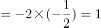，则所求项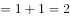。

方法二：观察数列发现，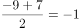，，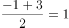，可得到规律：，则所求项。

故正确答案为D。

---

### 第 2 题　qid 2742243 · 数学运算

2，，，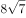，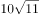，（    ）

- **A**. 
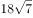

- **B**. 
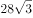

- **C**. 
48
　✅
- **D**. 
72

**答案**：C

**官方解析**

观察数列，有整数和根号，考虑机械划分。

原数列可化为：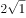，，，，。

整数部分为：2，4，6，8，10，为偶数列，下一项为12；

根号部分为：1，2，4，7，11，后项前项为1，2，3，4，为自然数列，下一个数为5，则根号部分下一项为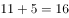；

则该数列下一项为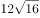。

故正确答案为C。

---

### 第 3 题　qid 2742244 · 数学运算

1，，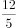，4，，（    ）

- **A**. 
9

- **B**. 

- **C**. 
12
　✅
- **D**. 

**答案**：C

**官方解析**

数列大部分为分数，判定为分数数列。分子、分母呈递增趋势，反约分，将分母转化为单调递增，则原数列可转化为：，，，，，（    ），发现分母是公差为1的等差数列，分子是公比为2的等比数列，所求项为。

故正确答案为C。

---

### 第 4 题　qid 2742249 · 数学运算

10.1，18.2，29.4，43.7，58.9，（    ）

- **A**. 67.3　✅
- **B**. 76.11
- **C**. 84.27
- **D**. 105.24

**答案**：A

**官方解析**

数列全部都是小数，优先考虑小数点前、点后分别找规律，无明显规律，考虑组内规律。小数点前小数点后新数列为9，16，25，36，49，发现新数列为幂次数列，转化成幂次数的形式为，，，，，新数列指数为2，底数为自然数列，则新数列下一项指数为2，底数为8，新数列下一项为。观察选项，只有A项小数点前小数点后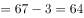，满足规律，当选。

故正确答案为A。

---

### 第 5 题　qid 2741990 · 数学运算

某农场有A、B、C三个粮仓，原先粮食储量之比为5：9：10，今年丰收后每个粮仓新增加的粮食储量相同，A、B两个粮仓的储量之比变为3：5，则今年丰收后三个粮仓的储存总量比原先增加：

- **A**. 

　✅
- **B**. 

- **C**. 

- **D**. 

**答案**：A

**官方解析**

根据题干，可将A、B、C三个粮仓原先粮食储量分别赋值为5、9、10。设今年丰收后每个粮仓新增加的粮食均为，则A、B、C三个粮仓今年粮食储量分别为、、，由今年A、B两个粮仓的储量之比变为3：5，可得，解得。则今年丰收后三个粮仓的储存总量比原先增加。

故正确答案为A。

---

### 第 6 题　qid 2741998 · 数学运算

某科技公司向银行申请甲、乙两种一年期的贷款总计5000万元，两种贷款的年利率分别为和。若该公司向银行支付的总贷款利息为295.6万元，则甲种贷款的金额是（    ）。

- **A**. 2250万元
- **B**. 2400万元　✅
- **C**. 2650万元
- **D**. 2800万元

**答案**：B

**官方解析**

设甲种贷款的金额为万元，则乙种贷款的金额为（）万元。根据题意，可得，解得：。则甲种贷款的金额是2400万元。

故正确答案为B。

---

### 第 7 题　qid 2742220 · 数学运算

为发展乡村旅游，某地需建设一条游览线路，甲工程队施工，工期为60天，费用为144万元；若由乙工程队施工，工期为40天，费用为158万元。为在旅游旺季到来前完工，工期不能超过30天，为此需要甲、乙两工程队合作施工，则完成此项工程的费用最少是：

- **A**. 156万元
- **B**. 154万元
- **C**. 151万元　✅
- **D**. 149万元

**答案**：C

**官方解析**

赋值该工程的工作总量为120份，则甲工程队每天完成的工作量为份，每天的费用为万元，平均每份的费用为万元；乙工程队每天完成的工作量为份，每天的费用为万元，平均每份的费用为万元。

由于甲工程队完成每份工作量的费用比乙工程队少，因此，要想完成此项工程的费用最少，需尽量多用甲工程队，即甲工程队施工30天，乙工程队完成剩余的工作量。乙工程队完成剩余工作量的时间天，此时总费用为万元。

故正确答案为C。

---

### 第 8 题　qid 2742021 · 数学运算

为促进旅游业复苏，今年8月1日起至年底，某景区门票价格在原定价的基础上，工作日执行两折票价，双休日及法定节假日执行五折票价。预计门票打折后，每天的游客人数均比原来翻一番，已知打折前该景区双休日平均每天的游客人数是工作日的5倍，则打折后，该景区一周（该周无法定节假日）的门票收入是打折前的：

- **A**. 0.5倍
- **B**. 0.6倍
- **C**. 0.7倍
- **D**. 0.8倍　✅

**答案**：D

**官方解析**

赋值打折前该景区票价为10元，工作日每天游客为1人。根据题意可得表格如下：

综上，该景区一周打折前的门票收入是元，打折后的门票收入是元，则所求倍数倍。

故正确答案为D。

---

### 第 9 题　qid 2742219 · 数学运算

超市销售某种水果，第一天按原价售出总量的，第二天原价打8折售出剩下的一半，第三天按成本价全部售出。若销售全部该水果的利润率为，则该水果按原价销售的利润率为：

- **A**. 

- **B**. 

- **C**. 

　✅
- **D**. 

**答案**：C

**官方解析**

赋值该水果的成本为10元/千克，总量为10千克；假设该水果的原价为元/千克。根据题意可得表格如下：

该水果全部销售的总利润元，即，解得。根据公式：利润率，按原价销售的利润率为。

故正确答案为C。

---

### 第 10 题　qid 2742011 · 数学运算

甲、乙两人从湖边某处同时出发，沿两条环湖路各自匀速行走。甲恰好用2小时回到出发点，比乙晚到20分钟，多走了2800米。若甲每分钟比乙多走10米，则甲行走的速度是：

- **A**. 4.2千米/小时
- **B**. 4.5千米/小时
- **C**. 4.8千米/小时
- **D**. 5.4千米/小时　✅

**答案**：D

**官方解析**

设甲的速度为米/分钟，则乙的速度为（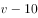）米/分钟，根据题意“甲恰好用2小时回到出发点，比乙晚到20分钟，多走了2800米”，可得甲用时120分钟，乙用时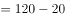分钟，则，解得米/分钟，即5.4千米/小时。

故正确答案为D。

---

### 第 11 题　qid 2741970 · 数学运算

某公司需要将A、B两地的同一产品运往甲、乙两个工厂。已知A、B两地分别有该产品500吨和700吨，甲、乙两个工厂对该产品的需求量均为600吨，若从A地出发运往甲、乙两个工厂的运价分别为150元/吨和130元/吨，从B地出发的运价分别为160元/吨和145元/吨，则完成此项运输任务的运费最少是：

- **A**. 174000元
- **B**. 174500元
- **C**. 175000元
- **D**. 175500元　✅

**答案**：D

**官方解析**

需运费最少，则优先考虑两地中运往两厂运费差较大情况。由题意可知，A地运往两工厂每吨运价差元，B地运往两工厂每吨运价差元。A地运费差较大，故A地500吨产品优先运往乙工厂最划算，乙工厂所差100吨产品由B地运送即可，则所需运费为元；B地剩余的600吨产品运往甲工厂，所需运费为元。则完成此项运输任务的运费最少为元。

故正确答案为D。

---

### 第 12 题　qid 2742004 · 数学运算

某机关甲、乙、丙三个部门参加植树造林活动，各部门植树的数量相同。甲部门花10天完成任务后，支援乙、丙两个部门各2天，最终乙部门植树12天完成，丙部门15天完成。若丙部门每天植树的数量比乙部门少4棵，则甲部门每天植树的数量是：

- **A**. 30棵　✅
- **B**. 40棵
- **C**. 50棵
- **D**. 60棵

**答案**：A

**官方解析**

由题意可得，甲、乙、丙三个部门的效率关系为：······①；······②。整理①②可得：甲∶乙3∶2，乙∶丙5∶4，故甲效率：乙效率：丙效率15∶10∶8。结合丙部门每天植树的数量比乙部门少4棵，可得1份对应棵，故甲的效率棵。

故正确答案为A。

---

### 第 13 题　qid 2742200 · 数学运算

某三甲医院派甲、乙、丙、丁四名医生到A、B、C、D四个社区义诊，每个医生只负责一个社区。已知甲不去A社区，且如果丙去C社区，那么丁去D社区，则不同的派法共有：

- **A**. 15种　✅
- **B**. 18种
- **C**. 21种
- **D**. 24种

**答案**：A

**官方解析**

方法一：由题意可知，甲不去A社区，则甲只能去B、C、D社区中的一个，分类讨论：

若甲去B社区，剩下三人随意排列为种情况，但其中存在1种情况（丙去C社区、丁去A社区、乙去D社区）不满足题意，因此有种情况；

若甲去C社区，剩下三人随意排列，有种情况；

若甲去D社区，则丙不能去C社区，丙可去A、B社区，即种选择，剩下乙丁随意选，有种情况，种情况。

因此，不同的派法共有种。

方法二：甲不去A社区，则甲只能去B、C、D社区中的一个，有种选择。若不考虑其他特殊情况，其他三人随意安排有种情况。此时，总情况数有种。但若丙去C社区、甲去D社区、丁去A或B社区，这两种情况不符合题意；若丙去C社区、甲去B社区、丁去A社区，这一种情况也不符合题意。因此，满足题意的派法有种。

方法三：甲不去A社区，则甲只能去B、C、D社区中的一个，有种选择。若不考虑其他特殊情况，其他三人随意安排有种情况，那么考虑特殊情况后符合题意的派法种。结合选项，只有A项符合。

故正确答案为A。

---

### 第 14 题　qid 2741966 · 数学运算

小王去超市购买便携包和小哑铃作为知识竞赛活动的奖品。这两种商品超市正在进行促销，便携包单价18元，买2送1；小哑铃单价12元，买3送1。小王按计划购买了便携包和小哑铃合计56个，共使用活动经费606元，则他购买小哑铃的数量是：

- **A**. 24个
- **B**. 25个　✅
- **C**. 26个
- **D**. 27个

**答案**：B

**官方解析**

结合题干与选项可知，选项信息充分，故可用代入排除法解题：

代入A项：小哑铃24个，买3送1（4个一组），组，需花钱购买个；便携包个，买2送1（3个一组），组······2个，需花钱购买个。则共用经费元，不符合题意；

代入B项：小哑铃25个，买3送1（4个一组），组······1个，需花钱购买个；便携包个，买2送1（3个一组），组······1个，需花钱购买个。则共用经费元，符合题意。

B项满足题干所有条件，因此无需继续验证。

故正确答案为B。

---

### 第 15 题　qid 2742247 · 数学运算

某市举办足球邀请赛，共有9个球队报名参加，其中包含上届比赛的前3名球队。现将这9个球队通过抽签的方式平均分成3组进行单循环比赛，则上届比赛的前3名球队被分在同一组的概率是：

- **A**. 

- **B**. 

　✅
- **C**. 

- **D**. 
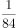

**答案**：B

**官方解析**

方法一：给情况求概率，概率。总情况数为9个球队平均分成3组，共有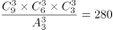种情况；满足条件的情况为上届比赛的前3名球队被分在同一组，其他6个球队平均分为2组，有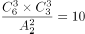种情况，则上届比赛的前3名球队被分在同一组的概率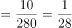。

方法二：前3名球队要被分在同一组，首先第1名球队可任意选择一个位置，概率为1；第2名球队可在剩下8个位置选1个位置，要求和第1名球队同组，概率为；第三名球队可在剩下7个位置选1个位置，要求和前2名球队同组，概率为。因此所求概率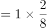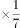。

故正确答案为B。

---

### 第 16 题　qid 2741964 · 数学运算

某省选派若干名本科生和研究生去乡村支教，其中男生和女生的比例是7：3，研究生和本科生的比例是1：4。若男本科生的人数恰好为女研究生人数的4倍，则女本科生至少比男研究生多：

- **A**. 3人　✅
- **B**. 6人
- **C**. 9人
- **D**. 12人

**答案**：A

**官方解析**

根据“男生和女生的比例是7：3”可知，总人数是的倍数，根据“研究生和本科生的比例是1：4”可知，总人数是的倍数，故设总人数为，则男生人数为，女生人数为，研究生人数为，本科生人数为。男本科生人数为女研究生人数的4倍，由此设女研究生人数为，则男本科生人数为。具体情况如下：

由此可知：男研究生人数研究生总人数女研究生人数男生总人数男本科生人数，即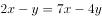，整理可得：，则至少为3，至少为5，女本科生最少为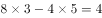人，男研究生最少为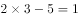人，前者比后者多人。

故正确答案为A。

---

### 第 17 题　qid 2742025 · 数学运算

师徒二人在非遗展馆现场为游客剪纸，有6名游客各自挑选了心仪的花样。已知徒弟制作这6种剪纸的时间分别为2、6、10、12、15、25 （单位：分钟）， 师傅的工作效率是徒弟的1. 5倍，则这6名游客中最后一个拿到剪纸的游客，需要等待的时间至少是：

- **A**. 25分钟
- **B**. 27分钟
- **C**. 28分钟　✅
- **D**. 30分钟

**答案**：C

**官方解析**

根据题意可知，师傅的工作时间应为徒弟工作时间的，设6种剪纸分别为A、B、C、D、E、F，具体工作时间情况如下：

要使最后拿到剪纸的游客等待的时间尽量少，那么尽量让师徒二人同时开工同时结束。观察选项均为整数，考虑从师傅的分数时间凑整入手。观察3个分数共有2种凑整方式：①分钟，此时再做其他任何种类的剪纸都无法与徒弟同时完成，且所用时间超过选项时间，不合理；②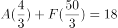分钟，此时剩B、C、D、E四种剪纸，观察发现E种剪纸给师傅做，B、C、D三种给徒弟做，正好可以做到同时开工同时结束。即 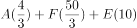分钟。

故正确答案为C。

---

### 第 18 题　qid 2741972 · 数学运算

某公司举办迎新晚会，参加者每人都领取一个按入场顺序编号的号牌，晚会结束时宣布：从1号开始向后每隔6个号的号码可获得纪念品A，从最后一个号码开始向前每隔8个号的号码可获得纪念品B。最后发现没有人同时获得纪念品A和B，则参加迎新晚会的人数最多有：

- **A**. 46人
- **B**. 48人　✅
- **C**. 52人
- **D**. 54人

**答案**：B

**官方解析**

根据“从1号开始向后每隔6个号的号码可获得纪念品A”可知，从前往后，A获奖号码成公差为7的等差数列：1、8、15、22、29、36、43、50、57······；同理，从后往前，B获奖号码成公差为9的等差数列，题目求人数最多，考虑从大到小进行代入验证。
代入D项：若人数最多为54人，则可获得纪念品B的号码分别为54、45、36号······，此时36号同时获得纪念品A和B，不符合条件，排除；
代入C项：若人数最多为52人，则可获得纪念品B的号码分别为52、43号······，此时43号同时获得纪念品A和B，不符合条件，排除；
代入B项：若人数最多为48人，则可获得纪念品B的号码分别为48、39、30、21、12、3号，没有人同时获得纪念品A和B，符合条件，当选。
故正确答案为B。

---

### 第 19 题　qid 2742248 · 数学运算

有120个棱长为30cm的正方体包装盒，按图示规律堆放在长方体库房的一角，恰好全部堆在一起，且最高的3层形状和图中一致，则该库房的高至少为：

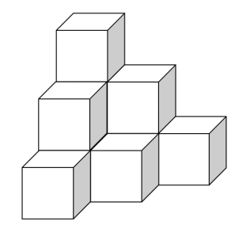

- **A**. 2.4m　✅
- **B**. 2.7m
- **C**. 3.0m
- **D**. 3.3m

**答案**：A

**官方解析**

根据题意库房高度应包装盒总高度，即库房高度的最小值应该等于包装盒总高度。已知包装盒棱长30cm，因此每层的高度是0.3米，即总的高度一定是0.3的整数倍。根据题意正方体包装盒每层数量从上到下分别为1、3、6、10、15、21、28、36、45······ ，规律为。结合选项分别为8、9、10、11层，8层共需要，因此120个包装盒恰好可以构成8层，即高度米。

故正确答案为A。

---

## 判断推理

### 第 1 题　qid 2741967 · 类比推理

调查：求真

- **A**. 晨练：健身　✅
- **B**. 施肥：收割
- **C**. 记忆：怀念
- **D**. 备份：复制

**答案**：A

**官方解析**

第一步：判断题干词语间逻辑关系。
调查是求真的一种方式，二者为方式的对应关系。
第二步：判断选项词语间逻辑关系。
A项：晨练是健身的一种方式，二者为方式的对应关系，与题干逻辑关系一致，当选；
B项：先施肥，再收割，二者是时间先后的对应关系，与题干逻辑关系不一致，排除；
C项：记忆可以用来怀念，二者是功能的对应关系，与题干逻辑关系不一致，排除；
D项：备份是指将电子计算机存储设备中的数据复制到其他存储设备的方式，复制是备份的一个步骤，二者不是方式目的的对应关系，与题干逻辑关系不一致，排除。
故正确答案为A。

---

### 第 2 题　qid 2742118 · 类比推理

抗疫：疫苗

- **A**. 修路：路基
- **B**. 投诉：诉状
- **C**. 反驳：数据　✅
- **D**. 医疗：患者

**答案**：C

**官方解析**

第一步：判断题干词语间逻辑关系。
疫苗可以用来抗疫，二者是功能对应关系。
第二步：判断选项词语间逻辑关系。
A项：路基是轨道或者路面的基础，路基不是用来修路的，二者不是功能对应关系，与题干逻辑关系不一致，排除；
B项：诉状是指民事案件原告人和刑事案件公诉人、自诉人向法院提起诉讼的书面材料，诉状是用来诉讼的，诉讼和投诉不同，二者没有明显逻辑关系，与题干逻辑关系不一致，排除；
C项：数据可以用来反驳，二者是功能对应关系，与题干逻辑关系一致，当选；
D项：医疗是指医治和疾病治疗，患者是医疗的对象，二者不是功能对应关系，与题干逻辑关系不一致，排除。
故正确答案为C。

---

### 第 3 题　qid 2741968 · 类比推理

头雁：雁阵

- **A**. 蜂王：蜂巢
- **B**. 猎狗：羊群
- **C**. 蚁后：工蚁
- **D**. 狮王：狮群　✅

**答案**：D

**官方解析**

第一步：判断题干词语间逻辑关系。
头雁是雁阵的组成部分，二者是组成关系，且头雁是雁阵的领头部分。
第二步：判断选项词语间逻辑关系。
A项：蜂巢是蜂王生活的场所，二者是场所对应关系，与题干逻辑关系不一致，排除；
B项：猎狗不是羊群的组成部分，与题干逻辑关系不一致，排除；
C项：蚁后和工蚁是并列关系中的反对关系，与题干逻辑关系不一致，排除；
D项：狮王是狮群的组成部分，二者是组成关系，且狮王是狮群的领头部分，与题干逻辑关系一致，当选。
故正确答案为D。

---

### 第 4 题　qid 2742176 · 类比推理

石墙：土墙

- **A**. 风能：水能　✅
- **B**. 合法：非法
- **C**. 河道：水道
- **D**. 新房：婚房

**答案**：A

**官方解析**

第一步：判断题干词语间逻辑关系。
石墙与土墙都是不同材质的墙，二者是并列关系中的反对关系。
第二步：判断选项词语间逻辑关系。
A项：风能与水能都是能源方式的一种，二者是并列关系中的反对关系，与题干逻辑关系一致，当选；
B项：合法与非法是并列关系中的矛盾关系，与题干逻辑关系不一致，排除；
C项：河道是指河水流经的路线，水道是指水流的路线，包括沟、渠、江、河，二者是种属关系，与题干逻辑关系不一致，排除；
D项：有的新房是婚房，有的新房不是婚房，有的婚房是新房，有的婚房不是新房，二者是交叉关系，与题干逻辑关系不一致，排除。
故正确答案为A。

---

### 第 5 题　qid 2742127 · 类比推理

形象：花容月貌

- **A**. 态度：前倨后恭
- **B**. 体格：虎背熊腰　✅
- **C**. 行踪：闲云野鹤
- **D**. 环境：山清水秀

**答案**：B

**官方解析**

第一步：判断题干词语间逻辑关系。
花容月貌指女子美丽的容貌，可用来形容形象，且花和月都是一种比喻，二者为对应关系。
第二步：判断选项词语间逻辑关系。
A项：前倨后恭指待人接物态度前后不一，可用来形容态度，但前和后不是一种比喻，与题干逻辑关系不一致，排除；
B项：虎背熊腰指背宽厚如虎，腰粗壮如熊，可用来形容体格，且虎和熊都是一种比喻，与题干逻辑关系一致，当选；
C项：闲云野鹤比喻无拘无束、来去自如的人，不能用来形容行踪，与题干逻辑关系不一致，排除；
D项：山清水秀指风景优美，可用来形容环境，但山和水不是一种比喻，与题干逻辑关系不一致，排除。
故正确答案为B。

---

### 第 6 题　qid 2741975 · 类比推理

金：金币：货币

- **A**. 木：木床：床　✅
- **B**. 水：水稻：稻
- **C**. 火：火盆：盆
- **D**. 土：土鸡：鸡

**答案**：A

**官方解析**

第一步：判断题干词语间逻辑关系。
金是制造金币的原材料，二者为原材料对应关系，金币是一种货币，二者是种属关系。
第二步：判断选项词语间逻辑关系。
A项：木是制造木床的原材料，二者为原材料对应关系，木床是一种床，二者是种属关系，与题干逻辑关系一致，当选；
B项：水是水稻生长的必要条件，二者是必要条件的对应关系，与题干逻辑关系不一致，排除；
C项：火不是制造火盆的原材料，火盆是一种盆，与题干逻辑关系不一致，排除；
D项：土不是制造土鸡的原材料，土鸡是一种鸡，与题干逻辑关系不一致，排除。
故正确答案为A。

---

### 第 7 题　qid 2741980 · 类比推理

白鸽：母鸽：鸽

- **A**. 柿饼：甜饼：饼
- **B**. 桃花：梨花：花
- **C**. 零售：网售：买
- **D**. 水桶：铁桶：桶　✅

**答案**：D

**官方解析**

第一步：判断题干词语间逻辑关系。
有的白鸽是母鸽，有的白鸽不是母鸽，有的母鸽是白鸽，有的母鸽不是白鸽，二者为交叉关系；且白鸽和母鸽都是鸽的一种，前两词与第三词为种属关系。
第二步：判断选项词语间逻辑关系。
A项：柿饼指的是用柿子制作成的饼状食品，不是饼的一种，与题干逻辑关系不一致，排除；
B项：桃花与梨花为并列关系，与题干逻辑关系不一致，排除；
C项：有的零售是网售，有的零售不是网售，有的网售是零售，有的网售不是零售，二者为交叉关系；但零售和网售均不属于买，与题干逻辑关系不一致，排除；
D项：有的水桶是铁桶，有的水桶不是铁桶，有的铁桶是水桶，有的铁桶不是水桶，二者为交叉关系；且水桶和铁桶都是桶的一种，前两词与第三词为种属关系，与题干逻辑关系一致，当选。
故正确答案为D。

---

### 第 8 题　qid 2741979 · 类比推理

河长：河道巡查：水清岸绿

- **A**. 湖长：污染治理：波平浪静
- **B**. 路长：道路维修：车水马龙
- **C**. 机长：客机驾驶：安全准点　✅
- **D**. 村长：带头致富：鸟语花香

**答案**：C

**官方解析**

第一步：判断题干词语间逻辑关系。
河长指负责督办河流管理工作的人，河道巡查是河长的工作职责，河道巡查的目的是为了实现水清岸绿，三者之间为负责人、工作职责、工作目的的对应关系。
第二步：判断选项词语间逻辑关系。
A项：湖长指负责湖泊管理保护工作的人，污染治理是湖长的工作职责，但污染治理不是为了实现波平浪静，而是为了改善中国水环境，与题干逻辑关系不一致，排除；
B项：路长指负责道路管理工作的各交通支大队民警及相关负责人，但道路维修不是路长的工作职责，与题干逻辑关系不一致，排除；
C项：机长指民用航空器运输机长，客机驾驶是机长的工作职责，客机驾驶是为了把旅客安全准点送达目的地，与题干逻辑关系一致，当选；
D项：村长指依照村委会组织法选举产生的群众自治性的村民委员会的主任，但带头致富不是村长的工作职责，与题干逻辑关系不一致，排除。
故正确答案为C。

---

### 第 9 题　qid 2742193 · 类比推理

音乐  之于（    ）相当于（    ）之于  科学

- **A**. 乐音；学科
- **B**. 舞蹈；数学
- **C**. 艺术；光学　✅
- **D**. 乐器；仪器

**答案**：C

**官方解析**

逐一代入选项。
A项：乐音可以指音乐，二者是全同，学科是指相对独立的知识体系，科学是建立在可检验的解释和对客观事物的形式、组织等进行预测的有序知识系统，二者无必然的逻辑关系，前后逻辑关系不一致，排除；
B项：音乐和舞蹈，二者是并列关系，数学是一种科学，二者为种属关系，前后逻辑关系不一致，排除；
C项：音乐是一种艺术，二者为种属关系，光学是一种科学，二者也为种属关系，前后逻辑关系一致，当选；
D项：音乐表演中会用到乐器，科学研究中会用到仪器，二者为工具使用的对应关系，但词语顺序不同，前后逻辑关系不一致，排除。
故正确答案为C。

---

### 第 10 题　qid 2742223 · 类比推理

风雨如晦 之于 （    ） 相当于 （    ） 之于 衣锦还乡

- **A**. 风雨飘摇；告老还乡
- **B**. 风和日丽；背井离乡　✅
- **C**. 云淡风轻；落叶归根
- **D**. 和风细雨；荣归故里

**答案**：B

**官方解析**

逐一代入选项。
A项：风雨如晦指天色昏暗犹如晦日的夜晚，后比喻局势动荡，社会黑暗；风雨飘摇是指在风雨中飘荡不定，比喻局势动荡不安，很不稳定，两者为近义关系；告老还乡是指年老辞职，回到家乡；衣锦还乡是指富贵以后穿着华丽的衣服回到故乡，两者不是近义关系，前后逻辑关系不一致，排除；
B项：风和日丽是指和风习习，阳光灿烂，形容晴朗暖和的天气，和风雨如晦为反义关系；背井离乡是指离开家乡到外地生活，和衣锦还乡为反义关系，前后逻辑关系一致，当选；
C项：云淡风轻是指微风轻拂，浮云淡薄，形容天气晴好，和风雨如晦为反义关系；落叶归根是指飘落的枯叶，掉在树木根部，多指客居他乡的人，终要回到故乡，和衣锦还乡不是反义关系，前后逻辑关系不一致，排除；
D项：和风细雨是指和煦的风，细细的雨，比喻耐心地和颜悦色地批评或劝说，和风雨如晦无明显逻辑关系；荣归故里是指光荣而体面地回到家乡，和衣锦还乡为近义关系，前后逻辑关系不一致，排除。
故正确答案为B。

---

### 第 11 题　qid 2742008 · 图形推理

请从所给的四个选项中，选出最恰当的一项填入问号处，使之呈现一定的规律。

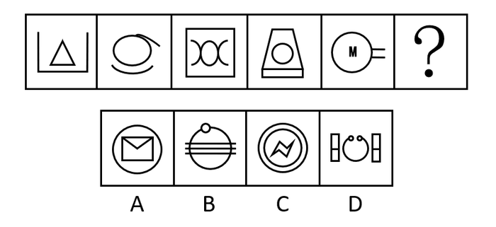

- **A**. A　✅
- **B**. B
- **C**. C
- **D**. D

**答案**：A

**官方解析**

元素组成不同，无明显属性规律，考虑数量规律。选项中出现信封等生活化图形，考虑部分数。观察发现，题干图形的部分数均为2，所以？处要选一个部分数为2的图形，只有A项符合，当选。
故正确答案为A。

---

### 第 12 题　qid 2742186 · 图形推理

从所给的四个选项中，选择最合适的一个填入问号处，使之呈现一定的规律性：

- **A**. A
- **B**. B　✅
- **C**. C
- **D**. D

**答案**：B

**官方解析**

元素组成相似，且某些元素不止一次出现在各图形中，优先考虑样式规律中的遍历。比较相邻图形发现，题干已知图形都包含正方形元素，故问号处图形也应满足此规律，只有B项符合。
故正确答案为B。

---

### 第 13 题　qid 2742191 · 图形推理

从所给的四个选项中，选择最合适的一个填入问号处，使之呈现一定的规律性：

- **A**. A
- **B**. B　✅
- **C**. C
- **D**. D

**答案**：B

**官方解析**

元素组成不同，且无明显属性规律，考虑数量规律。观察发现，图形线条交叉明显，考虑交点数。题干图形的交点数分别为：2、3、4、5、6，所以？处图形的交点数应为7个，只有B项符合规律。
故正确答案为B。

---

### 第 14 题　qid 2742148 · 图形推理

从所给的四个选项中，选择最合适的一个填入问号处，使之呈现一定的规律性：

- **A**. A
- **B**. B
- **C**. C
- **D**. D　✅

**答案**：D

**官方解析**

观察发现，题干图形均由小三角构成，优先考虑元素的种类和个数。题干已知图形均由4个尖角朝上的正三角形（）构成，故问号处应选择一个由4个尖角朝上的正三角形构成的图形，只有D项符合。

故正确答案为D。

---

### 第 15 题　qid 2742057 · 图形推理

请从所给的四个选项中，选出最恰当的一项填入问号处，使之呈现一定的规律。

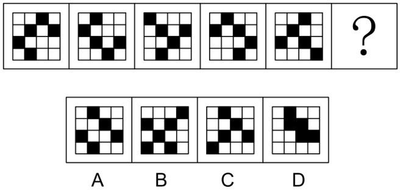

- **A**. A
- **B**. B
- **C**. C　✅
- **D**. D

**答案**：C

**官方解析**

元素组成相同，优先考虑位置规律。观察题干图形，未发现明显位置规律。继续观察发现，题干每幅图中小黑块的数量均为5，且题干每幅图中所有小黑块均以点连接成一个整体，只有C项符合。
故正确答案为C。

---

### 第 16 题　qid 2742058 · 图形推理

请从所给的四个选项中，选出最恰当的一项填入问号处，使之呈现一定的规律。

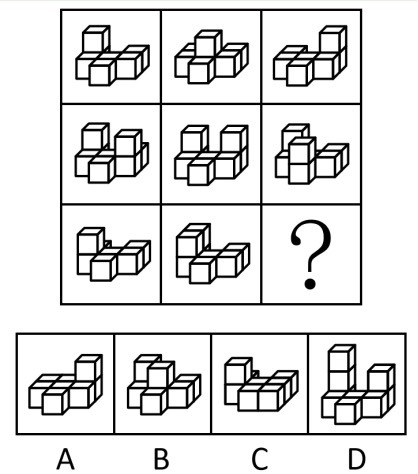

- **A**. A
- **B**. B　✅
- **C**. C
- **D**. D

**答案**：B

**官方解析**

本题考查三视图，九宫格优先横行找规律。观察发现，第一行立体图形的俯视图均相同，如下图所示；验证第二行发现也满足此规律；第三行应用此规律，故“？”处应选择一个俯视图与其他图形相同的立体图形，排除A、C两项。继续观察发现，题干立体图形均为2层，D项立体图形为3层，排除，只有B项符合规律，当选。

故正确答案为B。

---

### 第 17 题　qid 2742059 · 图形推理

请从所给的四个选项中，选出最恰当的一项填入问号处，使之呈现一定的规律。

- **A**. A
- **B**. B
- **C**. C
- **D**. D　✅

**答案**：D

**官方解析**

元素组成不同，优先考虑属性规律。观察发现，题干出现全直线、全曲线图形，优先考虑曲直性。九宫格优先横行看，第一行图1由全直线构成，图2由全曲线构成，图3由直线和曲线构成；第二行图1由全直线构成，图2由全曲线构成，图3由直线和曲线构成；第三行图1由全直线构成，图2由全曲线构成，故“？”处图形应该由直线和曲线构成，只有D项符合规律，当选。
故正确答案为D。

---

### 第 18 题　qid 2742145 · 图形推理

下面四个图形中，只有一个是由上面的四个图形拼合（只能通过上、下、左、右平移）而成的，请把它找出来。

- **A**. A
- **B**. B　✅
- **C**. C
- **D**. D

**答案**：B

**官方解析**

本题考查平面拼合，可采用平行且等长相消的方式解题。

消去平行且等长的线段后进行组合即可得到轮廓图，即为B选项。

平行且等长相消的方式如下图所示：

故正确答案为B。

---

### 第 19 题　qid 2742061 · 图形推理

下边四个图形中，只有一个是由上边的四个图形拼合（只能通过上、下、左、右平移）而成的，请把它找出来。

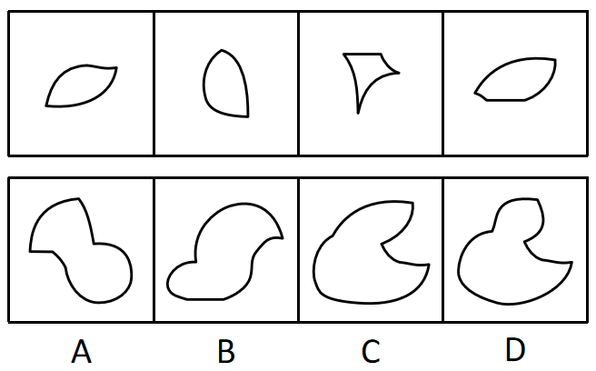

- **A**. A
- **B**. B
- **C**. C　✅
- **D**. D

**答案**：C

**官方解析**

本题考查平面拼合，可采用平行且等长相消的方式解题。消去平行且等长的线段后进行组合可得到轮廓图，即为C项。平行且等长相消的方式如下图所示：

故正确答案为C。

---

### 第 20 题　qid 2742197 · 图形推理

下边四个图形中，只有一个是由上边的四个图形拼合（只能通过上、下、左、右平移）而成的，请把它找出来。

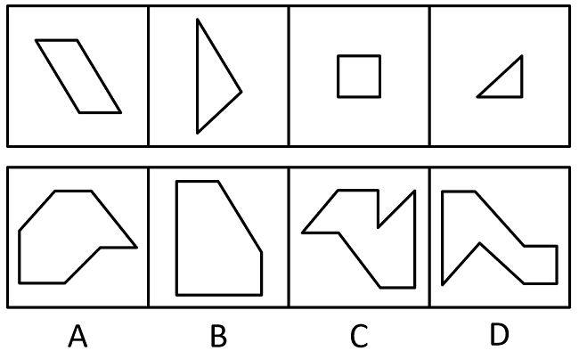

- **A**. A
- **B**. B　✅
- **C**. C
- **D**. D

**答案**：B

**官方解析**

本题考查平面拼合，可采用平行且等长相消的方式解题。消去平行且等长的线段后进行组合即可得到轮廓图，即为B选项。平行且等长相消的方式如下图所示：

故正确答案为B。

---

### 第 21 题　qid 2742063 · 图形推理

下边四个图形中，只有一个是由上边的四个图形拼合（只能通过上、下、左、右平移）而成的，请把它找出来。

- **A**. A
- **B**. B
- **C**. C
- **D**. D　✅

**答案**：D

**官方解析**

本题为平面拼合，拼合方式如下图所示：

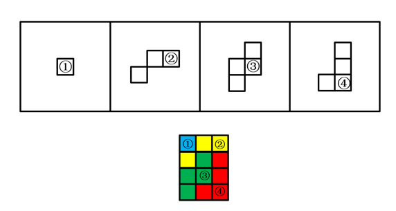

故正确答案为D。

---

### 第 22 题　qid 2742064 · 图形推理

左边给定的是多面体的外表面，右边哪一项能由它折叠而成？请把它找出来。

- **A**. A
- **B**. B　✅
- **C**. C
- **D**. D

**答案**：B

**官方解析**

本题考查六面体。将展开图中上下两个面移动，并给每个面标号，如下图所示：

逐一分析选项。

A项：选项中必然存在面c，展开图中面c与面e为相对面，无法同时出现，故选项上侧面为面f，展开图中面c与面f的公共边——边1为面c上白色三角形的直角边，而选项中两个面的公共边为面c上竖线三角形的直角边，选项与展开图不一致，排除；

B项：选项由面a、面c与面d构成，与展开图一致，当选；

C项：选项由面a、面c与面d构成，展开图中面c与面a、面d的公共边——边2与边3均为面c上竖线三角形的直角边，而选项中有一条公共边为面c上白色三角形的直角边，选项与展开图不一致，排除；

D项：选项中必然存在面c，展开图中面c与面e为相对面，无法同时出现，故选项正面为面f，展开图中面c与面f的公共边——边1为面c上白色三角形的直角边，而选项中两个面的公共边均为面c上竖线三角形的直角边，选项与展开图不一致，排除。

故正确答案为B。

---

### 第 23 题　qid 2742065 · 图形推理

左边给定的是多面体的外表面，右边哪一项能由它折叠而成？请把它找出来。

- **A**. A
- **B**. B　✅
- **C**. C
- **D**. D

**答案**：B

**官方解析**

本题考查四面体，将原展开图标上序号，如下图所示：

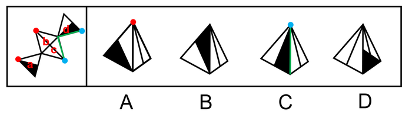

逐一分析选项。

A项：展开图中面c与面a、面d的公共边均与面a、面d上的黑色三角形的边相交，而选项中右侧面与左侧面的黑色三角形的边不相交，因此选项中右侧面不可能为面c，应为面b，展开图中面b左侧面应为面a，且面b引出线条的顶点与面a的黑色三角形的一个顶点相交，而选项中面b引出线条的顶点与左侧面上的黑色三角形顶点不相交，选项与展开图不一致，排除；

B项：选项由面c、面d构成，与展开图一致，当选；

C项：选项中左侧面与右侧面的公共边为黑色直角三角形的斜边，展开图中只有面c与面d的公共边为黑色直角三角形的斜边，故选项由面c与面d构成，展开图中面c引出线条的顶点与面d中黑色直角三角形短直角边与斜边的顶点相交，而选项中面c引出线条的顶点与面d中黑色直角三角形长直角边与斜边的顶点相交，选项与展开图不一致，排除；

D项：选项右侧面在展开图中不存在，属于无中生有面，排除。

故正确答案为B。

---

### 第 24 题　qid 2742066 · 图形推理

左边给定的是多面体的外表面，右边哪一项不能由它折叠而成？请把它找出来。

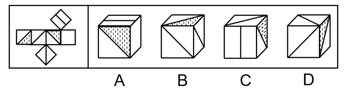

- **A**. A
- **B**. B
- **C**. C
- **D**. D　✅

**答案**：D

**官方解析**

本题考查六面体，将展开图上下两个面移动，并为每个面标上序号，如下图所示：

逐一分析选项。

A项：选项由面a、面d与面e构成，与题干展开图一致，排除；

B项：选项由面b、面c与面f构成，与题干展开图一致，排除；

C项：选项由面a、面b与面c构成，与题干展开图一致，排除；

D项：选项中必然有面c和面f，展开图中面c与面f上的对角线不相交，而选项中两条对角线相交，选项与展开图不一致，当选。

本题为选非题，故正确答案为D。

---

### 第 25 题　qid 2742067 · 图形推理

左边给定的是立方体，右边哪一项是它的外表面展开图？请把它找出来。

- **A**. A
- **B**. B
- **C**. C　✅
- **D**. D

**答案**：C

**官方解析**

将展开图的面均标上序号，如下图所示。

A项：立方体中两个阴影三角形面的公共边与空白三角形相接，若两个阴影三角形的面为展开图中的面b和面e，两个面的公共边与面b中阴影三角形相接，与题干不符；若两个阴影三角形的面为面b和面d，面b和面d为相对面不可能同时出现；若两个阴影三角形的面为面e和面d，两个面的公共边与面e中阴影三角形相接，与题干不符。以上三种情况均与题干不一致，排除；

B项：展开图中面a与面b为相对面不可能同时出现，所以两个阴影三角形的面只能为面d和面e。立方体中面a、面d与面e的公共点为两个阴影三角形的锐角交点，展开图中三个面的公共点为阴影三角形的锐角和空白三角形直角的交点，与题干不一致，排除；

C项：与题干一致，当选；

D项：若立体图的展开图为面a、面b和面d，面a和面b为相对面不可能同时出现，与题干不符；若立体图的展开图为面a、面b和面e，面a和面b为相对面不可能同时出现，与题干不符；若立体图的展开图为面a、面e和面d，面e和面d为相对面不可能同时出现，与题干不符。以上三种情况均与题干不一致，排除。

故正确答案为C。

---

### 第 26 题　qid 2742226 · 逻辑判断

脱贫致富终究要靠贫困群众用自己的辛勤劳动来实现。贫困群众既是脱贫攻坚的扶贫对象更是脱贫致富的主体力量，打赢脱贫攻坚战，必须大力激发贫困群众的内生动力。
根据以上陈述，可以得出以下哪项？

- **A**. 脱贫致富的主体力量并非都是贫困群众
- **B**. 所有脱贫攻坚的扶贫对象都是脱贫致富的主体力量
- **C**. 如果大力激发贫困群众的内生动力，就能打赢脱贫攻坚战
- **D**. 如果没有激发贫困群众的内生动力，就不能打赢脱贫攻坚战　✅

**答案**：D

**官方解析**

第一步：翻译题干。

①贫困群众脱贫攻坚的扶贫对象 且 脱贫致富的主体力量；

②打赢脱贫攻坚战大力激发贫困群众的内生动力。

第二步：逐一分析选项。

A项：脱贫致富的主体力量并非都是贫困群众，即有的脱贫致富的主体力量不是贫困群众，翻译为有的脱贫致富的主体力量贫困群众，根据①可以推出“有的脱贫致富的主体力量贫困群众”，但无法推出选项的逻辑关系，无法推出，排除；

B项：翻译为脱贫攻坚的扶贫对象脱贫致富的主体力量，脱贫攻坚的扶贫对象和脱贫致富的主体力量互相推不出，无法推出，排除；

C项：翻译为大力激发贫困群众的内生动力打赢脱贫攻坚战，是对②箭头后的肯定，得不到确定性的结论，无法推出，排除；

D项：翻译为激发贫困群众的内生动力打赢脱贫攻坚战，是对②箭头后的否定，否后必否前，可以推出，当选。

故正确答案为D。

---

### 第 27 题　qid 2742188 · 逻辑判断

在日常生活中，人们所说的“肉”往往特指来自猪、牛、羊等哺乳动物身上的肉，在营养学上这些肉被称为“红肉”，它们均含较多肌红蛋白，肉因而呈红色，显然，红肉并不包括鱼肉。吃红肉容易让人长胖，主要原因是肉中含有大量脂肪，脂肪摄入过多，不但增肥，而且还会严重影响人们的身体健康。基于这一考虑，很多家庭主妇表示，吃鱼肉要比红肉更健康。
以下哪项如果为真，最能支持家庭主妇的观点？

- **A**. 世卫组织曾将红肉当作“疑似致癌物”，而将加工过的红肉当作“一级致癌物”
- **B**. 红肉含有多种对人体有益的铁、锌等元素，红肉中“瘦肉”的脂肪含量并不高
- **C**. 鱼肉中脂肪含量较低，蛋白质丰富，还特别富含对人体有益的多不饱和脂肪酸　✅
- **D**. 有害物质甲基汞在鱼肉中总会找到一点，而在红肉中却找不到

**答案**：C

**官方解析**

第一步：找出论点和论据。
论点：吃鱼肉要比红肉更健康。
论据：吃红肉容易让人长胖，主要原因是肉中含有大量脂肪，脂肪摄入过多，不但增肥，而且还会严重影响人们的身体健康。
本题论据说的是吃红肉长胖的原因是肉中含有大量脂肪，论点说的是吃鱼肉要比红肉更健康，讨论的话题不一致，可以考虑搭桥的方式去加强，即建立脂肪和鱼肉之间的关系。
第二步：逐一分析选项。
A项：该项说的是世卫组织曾将红肉当作“疑似致癌物”，但并未提及鱼肉是否健康，无法加强，排除；
B项：该项证明红肉还是有对健康有益的元素的，而且脂肪含量并不是很高，对题干的论据有一定的削弱作用，无法加强，排除；
C项：该项在说鱼肉中脂肪含量较低，而且还富含多不饱和脂肪酸，建立了脂肪和鱼肉之间的联系，证明鱼肉确实比红肉更健康，搭桥项，当选；
D项：有害物质鱼肉中会找到，红肉中却找不到，证明吃鱼肉并不比吃红肉健康，属于削弱项，无法加强，排除。
故正确答案为C。

---

### 第 28 题　qid 2742216 · 逻辑判断

没有成家的人通常收入较低，因此要提高收入就要早点成家。
以下哪项和上述推理的谬误最为类似？

- **A**. 获得校级资助的学生成绩一般更好，因此应该增加对学生的资助以提高学生成绩
- **B**. 成功人士的朋友往往比不成功的人士的朋友多，因此要想获得成功就要多交朋友
- **C**. 北极冰山融化的时候全球气温也相应升高，因此应该保护北极环境以避免全球变暖
- **D**. 冰淇淋销量高的时候一般犯罪率也高，因此可以通过减少冰淇淋销量来降低犯罪率　✅

**答案**：D

**官方解析**

第一步：分析题干。
题干的推理谬误是“没有成家”和“收入较低”这两种情况同时存在，后面的结论是通过否定其中一种情况就可以得到否定另外一种情况。
第二步：逐一分析选项。
A项：推理谬误是“获得校级资助”和“学习成绩更好”这两种情况同时存在，后面的结论是通过加强其中一种情况可以得到另一种情况，与题干推理谬误不一致，排除；
B项：推理谬误是“成功”和“朋友多”这两种情况同时存在，后面的结论是通过加强其中一种情况可以得到另一种情况，与题干推理谬误不一致，排除；
C项：推理谬误是“北极冰山融化”和“全球气温升高”这两种情况同时发生，但“保护北极环境”是否能直接否定“北极冰山融化”，并不明确，与题干推理谬误不一致，排除；
D项：推理谬误是“冰淇淋销量高”与“犯罪率高”这两种情况同时发生，后面的结论是通过否定其中一种情况就可以得到否定另外一种情况，与题干推理谬误一致，当选。
故正确答案为D。

---

### 第 29 题　qid 2741973 · 类比推理

甲、乙、丙、丁4位中学同学毕业30年后相聚。现在，他们已成为企业家、大学教师、歌手和会计师，且每人只有一种身份，并不重复。他们在中学时代就各人的未来职业有过如下预言:
甲：乙不会成为歌手；
乙：丙会成为会计师；
丙：丁不会成为企业家；
丁：乙不会成为大学教师。
现在看来，他们当中只有会计师的预言是正确的。
根据上述信息可以推断，甲、乙、丙、丁的职业分别是：

- **A**. 企业家、大学教师、歌手、会计师
- **B**. 大学教师、歌手、企业家、会计师
- **C**. 企业家、歌手、会计师、大学教师
- **D**. 会计师、大学教师、歌手、企业家　✅

**答案**：D

**官方解析**

第一步：分析题干条件。
（1）甲：乙不会成为歌手；
（2）乙：丙会成为会计师；
（3）丙：丁不会成为企业家；
（4）丁：乙不会成为大学教师。
根据“他们当中只有会计师的预言是正确的”，可知其余人的预言是错误的，但是无法根据题干条件知道谁是会计师，所以优先采用假设法。
第二步：根据已知条件进行推理。
条件（2）乙说的话出现丙和会计师，优先考虑假设乙和丙的职业。
假设乙为会计师：若乙为会计师，说明乙的预言正确，即丙是会计师，此时会计师同时为乙和丙，不符合题干中每人只有一种身份，故乙不是会计师，所以乙说的是假话；
假设丙为会计师：若丙为会计师，说明乙的预言正确，不符合题干“只有会计师的预言是正确的”，故丙不是会计师，排除C项；由于丙不是会计师，故丙的预言不正确，结合条件（3）可知丁为企业家，结合选项，只有D项符合，当选。
故正确答案为D。

---

### 第 30 题　qid 2741976 · 逻辑判断

2020年疫情肆虐，但电商直播逆势崛起，一季度全国电商直播超过400万场，“万物可播、全民可播”成为一个响亮的口号。一项针对消费者和商家的调查显示，在电商直播中，许多消费者能以优惠的价格购买到心仪的商品，商家也能提升其销售额。有专家据此推断，电商直播的商业模式在疫情过后仍会受到商家和消费者的追捧。
以下各项如果为真，则除哪项外均能削弱上述专家的观点？

- **A**. 低价促销已经成为当前直播带货的常态，这种价格竞争让商家无利润可赚
- **B**. 直播带货往往造成线上线下的价格不一致，不利于商家维护企业品牌形象
- **C**. 许多消费者购买直播销售的商品后遇到了以次充好、售后维权困难等情况
- **D**. 个别带货主播为了利益常常夸大自己的销售数据，而消费者对此并不知情　✅

**答案**：D

**官方解析**

第一步：找出论点和论据。
论点：电商直播的商业模式在疫情过后仍会受到商家和消费者的追捧。
论据：在电商直播中，许多消费者能以优惠的价格购买到心仪的商品，商家也能提升其销售额。
第二步：逐一分析选项。
A项：该项讨论的是商品低价促销让商家无利润可赚，说明对于消费者来说是利好的，但是商家赚不到钱，对于商家来说是不利的，所以电商直播不能受到商家的追捧，可以削弱，排除；
B项：该项讨论的是商品线上线下的价格不一致，不利于商家维护企业品牌形象，说明直播带货不会受到商家的追捧，可以削弱，排除；
C项：该项讨论的是消费者通过直播购买商品后发现商品质量有问题和售后维权困难，说明直播带货有弊端，所以不会受到消费者的追捧，可以削弱，排除；
D项：该项讨论的是主播夸大销售数据，而消费者对此并不知情，但是题干论点讨论的是电商直播这种商业模式是否会被商家和消费者追捧，与论点讨论的话题无关，为无关选项，无法削弱，当选。
本题为选非题，故正确答案为D。

---

### 第 31 题　qid 2742117 · 逻辑判断

我国有关法律规定，大中型危险化学品生产企业与居民建筑物应至少保持1000米的安全红线，然而，随着城市的快速发展，很多原先地处偏远的危化品生产企业逐渐被居民区包围，一旦发生事故，会对周边居民的生命财产造成不可估量的损失。为防范危化品生产企业带给附近居民的风险，有专家建议在城市郊区设立化工园区，集中安置原本分散在城市各地的危化品生产企业，并严格遵守1000米安全红线规定。
以下哪项如果为真，最能质疑上述专家的建议？

- **A**. 危化品在销售废弃等环节无法远离居民区，这些环节也有可能发生事故
- **B**. 新建化工园区设备先进，管理严格，入驻企业的前期运营成本将大幅提高
- **C**. 化工企业集中安置容易引发连锁事故，可能威胁到数千米之外的居民安全　✅
- **D**. 许多危化品生产企业考虑到运输和销售的便利性，并不愿意搬迁到郊区来

**答案**：C

**官方解析**

第一步：找出论点和论据。
论点：在城市郊区设立化工园区，集中安置原本分散在城市各地的危化品生产企业，并严格遵守1000米安全红线规定。
论据：防范危化品生产企业带给附近居民的风险。
论点和论据都在讨论危化品生产企业和居民安全问题，论点论据话题一致，可以考虑否定论点来削弱。
第二步：逐一分析选项。
A项：该项讨论的是危化品在销售废弃等环节的危害，论点讨论的是危化品生产企业的集中安置环节，话题不一致，无法削弱，排除；
B项：该项讨论的是前期运营成本将大幅提高，论点讨论的是危化品生产企业集中安置，话题不一致，无法削弱，排除；
C项：该项说明集中安置化工企业，反而容易引发连锁事故，进而会威胁到数千米之外的居民安全，所以不能集中安置，直接否定论点，可以削弱，当选；
D项：该项讨论的是危化品生产企业考虑到运输和销售的便利性是否愿意搬迁，与论点讨论的话题不一致，无法削弱，排除。
故正确答案为C。

---

### 第 32 题　qid 2741981 · 逻辑判断

近日，某社区为活跃社区文化气氛，开展了一场别开生面的社区文化活动，有若干兴趣社团供居民选择。已知报名情况如下：
（1）居民在诗词社和书法社中至少参加了一个；
（2）居民如果参加了诗词社，则没有参加合唱团；
（3）李女士参加了合唱团。
社区主任知道上述情况后断定，李女士也参加了戏迷社。
以下哪项如果为真，可以成为社区主任断定所需的前提？

- **A**. 李女士没有参加诗词社
- **B**. 参加了戏迷社的也参加了书法社
- **C**. 李女士没有参加书法社
- **D**. 不参加戏迷社的都不参加书法社　✅

**答案**：D

**官方解析**

第一步：找出论点和论据。

论点：李女士也参加了戏迷社。

论据：

（1）居民在诗词社和书法社中至少参加了一个；

（2）居民如果参加了诗词社，则没有参加合唱团。出现逻辑关联词，可以翻译为：参加诗词社没有参加合唱团；

（3）李女士参加了合唱团。

论据（3）“李女士参加了合唱团”是对论据（2）“参加诗词社没有参加合唱团”的否后，根据“否后必否前”原则，可以得到李女士没有参加诗词社；结合论据（1）“居民在诗词社和书法社中至少参加了一个”可知，李女士参加了书法社。

本题需要找出论点成立的前提，可优先考虑搭桥的加强方式进行加强，即建立“李女士参加了合唱团”与“李女士参加戏迷社”、“李女士没有参加诗词社”与“李女士参加戏迷社”、“李女士参加了书法社”与“李女士参加戏迷社”的联系。

第二步：逐一分析选项。

A项：“李女士没有参加诗词社”，结合论据“居民在诗词社和书法社中至少参加了一个”可知，李女士参加了书法社，无法建立与“李女士参加戏迷社”的联系，不是论点成立的前提，排除；

B项：“参加了戏迷社的也参加了书法社”可以翻译为：参加戏迷社参加书法社，根据题干论据得到“李女士参加了书法社”是对该推出关系的肯后，肯后得不到必然结论，不是论点成立的前提，排除；

C项：“李女士没有参加书法社”，与题干论据“李女士参加了书法社”矛盾，削弱论据，不是论点成立的前提，排除；

D项：“不参加戏迷社的都不参加书法社”可以翻译为：不参加戏迷社不参加书法社，根据题干论据得到“李女士参加了书法社”是对该推出关系的否后，根据“否后必否前”原则，可以得到李女士参加了戏迷社，建立了“李女士参加书法社”与“李女士参加戏迷社”之间的联系，是论点成立的前提，当选。

故正确答案为D。

---

### 第 33 题　qid 2742112 · 逻辑判断

近日，某些城市上线了“随手拍交通违法”小程序，市民可以将自己拍摄的机动车闯红灯、违停等各类违法行为的照片或者视频，通过该小程序实名上传并进行举报。对于所举报的交通违法行为一经核实，相关部门会给予举报人奖励。有专家由此断定，“随手拍交通违法”可以有效扩大交通监督的范围，形成警民共治的局面。
以下哪项如果为真，最能支持上述专家的断定？

- **A**. 交警部门的执法力量相对有限，不足以应对现实生活中大量交通违法的行为
- **B**. 国家有关法律明令禁止闯红灯，违停等交通违法行为，并有相应的处罚规定
- **C**. 有些地方出现过举报人信息被泄露的案例，保护举报者个人隐私已刻不容缓
- **D**. “随手拍交通违法”小程序上线以来，有关部门已接到大量交通违法行为举报　✅

**答案**：D

**官方解析**

第一步：找出论点和论据。
论点：“随手拍交通违法”可以有效扩大交通监督的范围，形成警民共治的局面。
论据：对于所举报的交通违法行为一经核实，相关部门会给予举报人奖励。
本题论据和论点都在讨论“随手拍可以使警民共治”，论据和论点话题一致，可以考虑补充论据证明“随手拍交通违法”这个方式确实可以有效扩大交通监督的范围，形成警民共治的局面。
第二步：逐一分析选项。
A项：论点说的是“随手拍交通违法”这个方式是否可以达到有效扩大交通监督的范围，形成警民共治的局面这个效果，该项说的是交警部门的执法力量，话题不一致，无法加强，排除；
B项：论点说的是“随手拍交通违法”这个方式是否可以达到有效扩大交通监督的范围，形成警民共治的局面这个效果，该项说的是国家法律的规定，话题不一致，无法加强，排除；
C项：该项在说随手拍这个方式可能有一些负面影响，但是题干论点讨论的是随手拍这个方式能不能达到效果，和是否有负面影响没有关系，话题不一致，无法加强，排除；
D项：通过举例子说明“随手拍交通违法”小程序上线以来，对交通违法行为确实有举报作用，也就是说可以扩大交通监督的范围，形成警民共治的局面，补充论据，当选。
故正确答案为D。

---

### 第 34 题　qid 2742138 · 逻辑判断

某村青年甲、乙、丙、丁、戊5人到某房屋维修公司应聘。根据各自专长，他们5人被聘为焊工、瓦工、电工、木工和水工。已知他们每人只做一个工种，每个工种均有他们5人中的1人做，另外还知道：
（1）如果甲做焊工，则丙做木工；
（2）如果乙和丁两人之一做水工，则甲做焊工；
（3）丙或做瓦工，或做电工。
如果戊做瓦工，则可以得出以下哪项？

- **A**. 甲做水工　✅
- **B**. 甲做木工
- **C**. 乙做木工
- **D**. 乙做焊工

**答案**：A

**官方解析**

分析题干信息。

（1）甲焊工丙木工；

（2）乙水工甲焊工，丁水工甲焊工；

（3）丙瓦工或丙电工。

从确定信息入手，题干给出新的条件，“如果戊做瓦工” 。结合条件（3），根据或关系的否一推一，可知丙做电工；结合条件（1），否后必否前，可知甲不做焊工；结合条件（2），否后必否前，可知甲焊工乙水工，甲焊工丁水工；即乙水工且丁水工。

结合已推出信息，乙、丁不做水工，戊做瓦工，丙做电工，则甲一定做水工。

故正确答案为A。

---

### 第 35 题　qid 2742139 · 逻辑判断

某村青年甲、乙、丙、丁、戊5人到某房屋维修公司应聘。根据各自专长，他们5人被聘为焊工、瓦工、电工、木工和水工。已知他们每人只做一个工种，每个工种均有他们5人中的1人做，另外还知道：
（1）如果甲做焊工，则丙做木工；
（2）如果乙和丁两人之一做水工，则甲做焊工；
（3）丙或做瓦工，或做电工。
如果丁做电工，则可以得出以下哪项？

- **A**. 甲或做焊工，或做水工
- **B**. 乙或做焊工，或做木工　✅
- **C**. 丙或做木工，或做焊工
- **D**. 戊或做水工，或做焊工

**答案**：B

**官方解析**

分析题干信息。

（1）甲焊工丙木工；

（2）乙水工甲焊工，丁水工甲焊工；

（3）丙瓦工或丙电工。

由确定信息入手，题干给出新的条件，“如果丁做电工”。

结合条件（3），根据或关系否一推一，可知丙电工丙瓦工，排除C项；

结合条件（1），否后必否前，可知丙木工甲焊工；

结合条件（2），否后必否前，可知甲焊工乙水工，甲焊工丁水工，即乙水工且丁水工。

结合丁做电工，丙做瓦工，乙不做水工，可得乙做焊工或木工，戊可能做焊工，木工，水工其中之一。

故正确答案为B。

---

### 第 36 题　qid 2741996 · 定义判断

百姓讲师：指基层单位选用普通群众，用喜闻乐见的形式宣传党和政府的方针政策。
下列属于百姓讲师的是：

- **A**. 镇政府经常邀请熟悉乡情乡风的村民为新入职的干部介绍农村基本情况，讲解在农村落实上级政策的办法
- **B**. 村支书记老陈每天准时收看《新闻联播》，通过和村民聊天宣传党和国家的方针政策，并解答他们的疑问
- **C**. 朱老师退休后长期走街串巷，宣传移风易俗、乡村振兴的道理，被乡政府授予“乡村文化名人”称号
- **D**. 市民蒋先生受街道办委托把新医保政策编成快板，并录成视频，每天都发布在微信公众号及朋友圈中　✅

**答案**：D

**官方解析**

第一步：找出定义关键词。
“基层单位选用普通群众”、“用喜闻乐见的形式宣传党和政府的方针政策”。
第二步：逐一分析选项。
A项：镇政府是基层单位，邀请熟悉乡情乡风的村民为新入职的干部介绍农村基本情况，讲解在农村落实上级政策的办法，但是不知道具体形式是什么，不符合“用喜闻乐见的形式宣传党和政府的方针政策”，不符合定义，排除；
B项：村支书记老陈宣传党和国家的方针政策并解答疑问，村支书记不是普通群众，不符合“基层单位选用普通群众”，不符合定义，排除；
C项：朱老师退休后因为宣传移风易俗、乡村振兴的道理，而被乡政府授予“乡村文化名人”称号，朱老师并不是被乡政府选用才去做这件事，不符合“基层单位选用普通群众”，不符合定义，排除；
D项：市民蒋先生受街道办委托把新医保政策编成快板，并录成视频，每天都发布在微信公众号及朋友圈中，符合“基层单位选用普通群众”、“用喜闻乐见的形式宣传党和政府的方针政策”，符合定义，当选。
故正确答案为D。

---

### 第 37 题　qid 2742178 · 定义判断

探究学习：指学生通过亲身实践，相对独立地做出发现，由此获得科学活动实践体验和经验的学习方式。
下列属于探究学习的是：

- **A**. 在李老师数形结合的精彩演示后，小吴加深了对勾股定理的理解认识
- **B**. 借助高速摄影技术，小张和同学们观察到越重的物体自由下落的速度越快　✅
- **C**. 经过一周的反复观察，小朱发现办公室墙上的时钟每天比标准时间慢2分钟
- **D**. 在反复确认没有危险后，牛牛终于勇敢地推开轮椅，迈出了人生第一步

**答案**：B

**官方解析**

第一步：找出定义关键词。
“学生通过亲身实践”、“获得科学活动实践体验和经验”。
第二步：逐一分析选项。
A项：李老师精彩演示，但小吴没有通过亲身实践，不符合“学生通过亲身实践”，不符合定义，排除；
B项：小张和同学们借助高速摄影技术，符合“学生通过亲身实践”，观察到越重的物体自由下落的速度越快，符合“获得科学活动实践体验和经验”，符合定义，当选；
C项：小朱观察办公室墙上的时钟，不符合“获得科学活动实践体验和经验”，不符合定义，排除；
D项：牛牛勇敢地推开轮椅，不符合“获得科学活动实践体验和经验”，不符合定义，排除。
故正确答案为B。

---

### 第 38 题　qid 2741991 · 定义判断

U盘化生存：只凭借个人技能而不依赖组织内的身份，自主决定是否参与社会协作，完全由市场评判其个人价值的生存方式。
下列不属于U盘化生存的是：

- **A**. 小韩大学毕业后，曾在多家培训机构当过数学老师，她总是感觉这样工作收入虽然高，但是太辛苦了，前不久，她没有同家人商量，就自作主张进了一所民办中学　✅
- **B**. 网络写手周女士根据自己之前的职场经历写出了多部网络畅销小说，多家著名网站慕名向她约稿，由于不愿受交稿日期的限制，她经常会拒绝一些约稿
- **C**. 木匠老周进城打工十年多了，活儿干得很好，挣了不少钱，现在他有了自己的装修队，每天从早到晚都有人找他联系装修的事
- **D**. 从单位辞职后，刘先生夫妇来到南方，将租下的一栋小楼改造成了民宿。在他们精心打理下，生意十分红火，客房一度需要提前两个月预定

**答案**：A

**官方解析**

第一步：找出定义关键词。
“凭借个人技能”、“不依赖组织内的身份”、“自主决定是否参与社会协作”、“由市场评判其个人价值”。
第二步：逐一分析选项。
A项：小韩是数学老师，符合“凭借个人技能”，但是她没有同家人商量，就自作主张进了一所民办中学，不符合“不依赖组织内的身份”，且进入之后不能自由决定自己是否参与工作，不符合“自主决定是否参与社会协作”，不符合定义，当选；
B项：网络写手周女士，符合“凭借个人技能”，她经常会拒绝一些约稿，符合“自主决定是否参与社会协作”，符合定义，排除；
C项：木匠老周，符合“凭借个人技能”，有人找他联系装修的事，符合“自主决定是否参与社会协作”，符合定义，排除；
D项：刘先生夫妇将租下的一栋小楼改造成了民宿，符合“凭借个人技能”，从单位辞职改做民宿，符合“不依赖组织内的身份”、“自主决定是否参与社会协作”，符合定义，排除。
本题为选非题，故正确答案为A。

---

### 第 39 题　qid 2742024 · 定义判断

共享用工：指企业在特殊时期，为了降低人力成本或解决人工短缺问题，通过借用或外派员工实现劳动力共享的临时用工方式。
下列属于共享用工的是：

- **A**. 为节省成本支出，某广告公司长期通过创客网站发包设计任务，并与一些水平较高的自由创客人员签订了合作协议，建立了密切的业务关系
- **B**. 某公司正在扩大生产经营规模，急需大量技术人员，通过线上线下相结合的形式，招聘一批兼职技术人员，既解决了无人可用的燃眉之急，又节约了用人成本
- **C**. 疫情期间，某生鲜电商平台订单激增，该平台与当地的餐饮、酒店等行业的数十家公司进行协商合作，利用他们派来的员工，缓解了自身的用工压力　✅
- **D**. 某高校在科研项目攻关过程中遇到研发人员不足的问题，于是借用多家单位的科研人员组成联合攻关团队，终于成功解决了一系列技术难题

**答案**：C

**官方解析**

第一步：找到定义关键词。
“企业在特殊时期”、“降低人力成本或解决人工短缺”、“借用或外派员工实现劳动力共享”、“临时用工方式”。
第二步：逐一分析选项。
A项：广告公司长期通过网站发包任务，不符合“特殊时期”、“临时用工方式”，不符合定义，排除；
B项：某公司在扩大生产经营规模期间招聘一批兼职技术人员，不符合“借用或外派员工实现劳动力共享”、“临时用工方式”，不符合定义，排除；
C项：疫情期间符合“企业在特殊时期”，平台订单激增符合“降低人力成本或解决人工短缺”，电商平台利用餐饮、酒店的员工，符合“借用或外派员工实现劳动力共享”、“临时用工方式”，符合定义，当选；
D项：某高校不符合题干主体“企业”，不符合定义，排除。
故正确答案为C。

---

### 第 40 题　qid 2742002 · 定义判断

能力陷阱：人们总是喜欢做比较擅长的、能够带来自信心和满足感的事情，由此而造成某种单一能力强化和其他能力弱化，难以适应社会变化对能力的新要求。
下列属于能力陷阱的是：

- **A**. 小李博士毕业后在一所大学任教，不到五年就评上了副教授。近两年来，他的工作越来越忙，成果越来越多，一直没时间考虑成家的事
- **B**. 老张修了多年自行车，小日子过得有滋有味。这两年，来修自行车的人越来越少，收入大不如前，他几次尝试学习摩托车修理都没学会，现在只能给电动车补胎　✅
- **C**. 林先生整天忙着扩大经营规模，连锁店越开越多，效益越来越好，但他对日常生活琐事既不擅长也不关心，购物、做饭、打扫卫生等家务均由妻子承担
- **D**. 王师傅擅长淮扬菜，在江苏小有名气，到四川后很快就发现没有用武之地了，于是他花了半年时间，终于学会了川菜的做法，虽然不够正宗，他自己却很满意

**答案**：B

**官方解析**

第一步：找出定义关键词。
“喜欢做比较擅长的、能够带来自信心和满足感的事情”、“造成某种单一能力强化和其他能力弱化，难以适应社会变化对能力的新要求”。
第二步：逐一分析选项。
A项：小李工作越来越忙，成果越来越多，一直没时间考虑成家的事，不符合“造成某种单一能力强化和其他能力弱化，难以适应社会变化对能力的新要求”，不符合定义，排除；
B项：老张修了多年自行车，小日子过得有滋有味，符合“喜欢做比较擅长的、能够带来自信心和满足感的事情”，几次尝试学习摩托车修理都没学会，现在只能给电动车补胎，符合“造成某种单一能力强化和其他能力弱化，难以适应社会变化对能力的新要求”，符合定义，当选；
C项：林先生对日常生活琐事既不擅长也不关心，家务均由妻子承担，不符合“造成某种单一能力强化和其他能力弱化，难以适应社会变化对能力的新要求”，不符合定义，排除；
D项：王师傅擅长淮扬菜，到四川后学着做川菜，是做不擅长的事，不符合“喜欢做比较擅长的、能够带来自信心和满足感的事情”，不符合定义，排除。
故正确答案为B。

---

### 第 41 题　qid 2741992 · 定义判断

闭环思维：指工作学习过程中用各种方式的提示、应答使每个操作环节形成封闭的环，以利于实时把握进程、及时调整方向的一种思维方式。
下列不属于闭环思维的是：

- **A**. 赵教练每次收到学员发来的信息时，都会给予答复并习惯性地发送一个表情，他的手机里存了很多张风格各异的应答图片
- **B**. 钱先生每次给下属布置任务，都要求他们尽快回复信息，包括是否收到、能否完成、什么时候完成等，与他共事的人都感觉很有压力
- **C**. 小孙刚到单位时，领导安排的任务他总是很爽快地答应下来并想方设法去完成。半年后，工作越来越忙，他发现有些任务很难完成，再也不敢随意应承了
- **D**. 经理要求小李一周内草拟一个工作计划。经过认真调研，小李完成了计划书并用电子邮件发给了经理。十几天后经理特意问他：计划书写好了吗？小李惊讶地说：我早已发给你了　✅

**答案**：D

**官方解析**

第一步：找出定义关键词。
“工作学习过程中”、“各种方式的提示、应答”、“每个操作环节形成封闭的环”、“利于实时把握进程、及时调整方向”。
第二步：逐一分析选项。
A项：赵教练存了很多张图片来应答学员的消息，符合“工作学习过程中”、“各种方式的提示、应答”、“每个操作环节形成封闭的环”、“利于实时把握进程、及时调整方向”，符合定义，排除；
B项：钱先生要求下属尽快回复信息，符合“工作学习过程中”、“各种方式的提示、应答”、“每个操作环节形成封闭的环”、“利于实时把握进程、及时调整方向”，符合定义，排除；
C项：小孙刚到单位时，爽快地答应任务并完成，符合“工作学习过程中”、“各种方式的提示、应答”、“每个操作环节形成封闭的环”，在小孙发现任务很难完成后不再随意应承，符合“实时把握进程、及时调整方向”，符合定义，排除；
D项：小李已经将计划书发给了经理，但是经理十几天之后问他是否完成，不符合“每个操作环节形成封闭的环”，不符合定义，当选。
本题为选非题，故正确答案为D。

---

### 第 42 题　qid 2742005 · 定义判断

数字困境：指老年人由于生活习惯、文化水平等因素，不熟悉数字化产品的使用方法，给日常生活带来困扰的现象。
下列不属于数字困境的是：

- **A**. 小高为父母安装了网络电视，由于操作太复杂，父母总是找不到想看的频道，只好把旧电视机重新搬了出来
- **B**. 疫情期间各种公共场所都必须出示健康码，由于老孙不会使用智能手机，每次外出都会遇到不少麻烦
- **C**. 老陈的手机开通了移动支付功能，却从没使用过，虽然偶尔也会遇到一些麻烦，但他觉得这些没什么大不了　✅
- **D**. 医院早已开通了网络预约挂号，但是患慢性病多年的老钱不会上网，每次都得到医院窗口排队挂号

**答案**：C

**官方解析**

第一步：找出定义关键词。
“老年人由于生活习惯、文化水平等因素，不熟悉数字化产品的使用方法”、“给日常生活带来困扰”。
第二步：逐一分析选项。
A项：小高父母使用网络电视总是找不到想看的频道，只好把旧电视机重新搬出，符合“老年人由于生活习惯、文化水平等因素，不熟悉数字化产品的使用方法”、“给日常生活带来困扰”，符合定义，排除；
B项：老孙不会使用智能手机，符合“老年人由于生活习惯、文化水平等因素，不熟悉数字化产品的使用方法”，每次外出都会遇到不少麻烦，符合“给日常生活带来困扰”，符合定义，排除；
C项：老陈的手机开通了移动支付功能，却从没使用过，不符合“老年人由于生活习惯、文化水平等因素，不熟悉数字化产品的使用方法”，虽然偶尔会遇到一些麻烦，但他觉得没什么大不了，说明并未给生活带来困扰，不符合定义，当选；
D项：老钱不会上网，符合“老年人由于生活习惯、文化水平等因素，不熟悉数字化产品的使用方法”，每次都得到医院窗口排队挂号，符合“给日常生活带来困扰”，符合定义，排除。
本题为选非题，故正确答案为C。

---

### 第 43 题　qid 2742195 · 定义判断

科学预测：指基于已掌握的规律，通过科学分析和预测，对未来可能发生的现象，作出允许质疑及检测的推测。
下列属于科学预测的是：

- **A**. 旅行团导游提醒大巴司机：明天是周末，出城的车子太多，路上很可能出现严重的拥堵现象，要想按时到达目的地，至少得提前半小时出发
- **B**. 某地发生了一起刑事案件，警察迅速对犯罪现场进行仔细勘查，根据收集到的信息材料，很快确定并抓获了犯罪嫌疑人，仅用了3小时就破了案
- **C**. 电视台的天气预报节目中，播报员都会例行性地对未来十天的天气变化情况进行简要预报，有时还会请气象专家对天气变化原因作出分析　✅
- **D**. 老胡刚拿到体检报告，发现有几个指标不正常，极为紧张，忙去找医生，医生看过体检报告后告诉他：“超标情况不严重，注意休息，很快就会恢复正常”

**答案**：C

**官方解析**

第一步：找出定义关键词。
“基于已掌握的规律”、“通过科学分析和预测”，“对未来可能发生的现象，作出允许质疑及检测的推测”
第二步：逐一分析选项。
A项：“明天是周末，出城的车子太多，路上很可能出现严重的拥堵现象”是一种根据经验的预测，不是“通过科学分析和预测”得出的结论，不符合定义，排除；
B项：破获案件针对的是已发生的事情，不是对“未来可能发生的现象”进行推测，不符合定义，排除；
C项：对未来十天的天气变化进行预报，是“通过科学分析和预测，对未来可能发生的现象，作出允许质疑及检测的推测”，符合定义，当选；
D项：“超标情况不严重”是对老胡现在的身体状况进行分析诊断，不是对“未来可能发生的现象”进行推测，不符合定义，排除。
故正确答案为C。

---

### 第 44 题　qid 2742225 · 定义判断

词义转移：指词语原本具有的意思后来变成了相关联的另一种意思的词义变化现象。
下列属于词义转移的是：

- **A**. “兵”最早指武器，现在通常指拿武器的人，即士兵　✅
- **B**. “臭”在古代指难闻的气味，也可以指好闻的气味
- **C**. 在古代“河”专指“黄河”，现在也可以指其他河流
- **D**. 今天所称呼的“老师”，古代有时候叫做“先生”

**答案**：A

**官方解析**

第一步：找出定义关键词。
“词语原本具有的意思后来变成了相关联的另一种意思”。
第二步：逐一分析选项。
A项：“兵”原本具有的意思是武器，现在通常指拿武器的人，符合“词语原本具有的意思后来变成了相关联的另一种意思”，当选；
B项：“臭”在古代可指好闻或难闻的气味，没有提及词义变化，不符合“词语原本具有的意思后来变成了相关联的另一种意思”，不符合定义，排除；
C项：与古代相比，现在“河”可以指“黄河”，也可以指其他河流，在原本具有的意思上增加了一种理解，不符合“词语原本具有的意思后来变成了相关联的另一种意思”，不符合定义，排除；
D项：“老师”“先生”是两种不同的称呼，不涉及同一个词语词义的变化，不符合“词语原本具有的意思后来变成了相关联的另一种意思”，不符合定义，排除。
故正确答案为A。

---

### 第 45 题　qid 2741983 · 定义判断

逆向文化冲击：指旅居他乡者回到故国或故乡后，短时间内在生活、心理等方面难以适应本土文化的现象。
下列不属于逆向文化冲击的是：

- **A**. 
大卫在中国从事英语培训工作10多年，回国后感到很不习惯。他在不久前的一段视频中抱怨说：半夜饿了，在中国拿出手机点个外卖，半个小时就送到了，而这里啥都没有，只能饿死在去超市的路上

- **B**. 
在城里生活多年的老杨，今年春节回到农村老家后，亲戚朋友请他到附近饭店吃饭。开席后，他习惯性地让服务员去拿公筷、公勺，服务员惊讶地看着他，半天没反应过来，亲戚们也觉得他怪怪的

- **C**. 
留学刚回国的小吴约朋友去青岛看海，因为没有12306账户，只得请朋友帮忙购票。上车后他惊讶地发现，高铁上不仅可以扫码点餐，还可以点外卖，自己头天准备的面包、饼干一点没用上。他感觉自己在朋友心目中简直就像个弱智

- **D**. 
欧洲姑娘玛丽来华留学，虽然早已听说过中国的无现金支付，第一周她还是惊呆了：楼下卖红薯的大爷都在用“互联网”，菜市场的每个摊位上居然都有收款二维码，更不要说超市和商场了
　✅

**答案**：D

**官方解析**

第一步：找出定义关键词。
“旅居他乡者回到故国或故乡后”、“短时间内在生活、心理等方面难以适应本土文化”。
第二步：逐一分析选项。
A项：大卫在中国从事英语培训，回国之后不习惯，符合“旅居他乡者回到故国后”，也符合“短时间内在生活、心理等方面难以适应本土文化”，符合定义，排除；
B项：老杨在城市生活多年，春节回老家，符合“旅居他乡者回到故乡后”，习惯性地让服务员去拿公筷、公勺，而服务员半天没反应过来，符合“短时间内在生活、心理等方面难以适应本土文化”，符合定义，排除；
C项：留学回国的小吴符合“旅居他乡者回到故国后”，不知道高铁上可以扫码点餐而准备了食物，符合“短时间内在生活、心理等方面难以适应本土文化”，符合定义，排除；
D项：欧洲姑娘玛丽来华留学，不适应中国的无现金支付，不符合“回到故国或故乡后”，不符合定义，当选。
本题为选非题，故正确答案为D。

---

## 资料分析

### 材料 1

        2019年末，我国80后、90后、00后人数分别为2.21亿人、2.08亿人、1.63亿人。

#### 第 1 题　qid 2742201 · 综合

2019年末我国10后人数约为：

- **A**. 1.52亿人
- **B**. 1.63亿人　✅
- **C**. 1.88亿人
- **D**. 2.02亿人

**答案**：B

**官方解析**

根据题干“2019年末我国10后人数为······”，可判定本题为简单加减计算问题。2019年末我国10后人数即2010-2019年出生的人数，定位统计图材料可得，2010-2019年出生的人数为：万人亿人。

故正确答案为B。

---

#### 第 2 题　qid 2742202 · 综合

2010-2019年，我国人口出生率的最小值与最大值相差：

- **A**. 1.53个千分点
- **B**. 2.47个千分点　✅
- **C**. 2.96个千分点
- **D**. 3.68个千分点

**答案**：B

**官方解析**

根据题干“2010-2019年，我国人口出生率的最小值与最大值相差”，可判定本题为简单加减计算问题。定位统计图材料可得，人口出生率最大的年份为2016年，出生率为，出生率最小的年份为2019年，出生率为，其差值为，即2.47个千分点。

故正确答案为B。

---

#### 第 3 题　qid 2742204 · 增长

2011-2019年，我国人口出生率同比增加的年份数有：

- **A**. 4个　✅
- **B**. 5个
- **C**. 6个
- **D**. 7个

**答案**：A

**官方解析**

定位统计图材料可得：2010-2019年，我国人口出生率分别为、、、、、、、、、。人口出生率高于上年的有2011年、2012年、2014年和2016年，共4个。

故正确答案为A。

---

#### 第 4 题　qid 2742205 · 增长

2011-2019年，我国出生人口增长率最高的年份是：

- **A**. 2012年
- **B**. 2014年
- **C**. 2016年　✅
- **D**. 2018年

**答案**：C

**官方解析**

根据题干“2011-2019年，我国出生人口增长率最高的年份是”，可判定本题为一般增长率问题。定位统计图材料可知，2010-2019年每年出生人口的数据，根据公式：增长率，可知选项各年份的增长率如下：

2012年：；

2014年：；

2016年：；

2018年：。

则我国出生人口增长率最高的年份是2016年。

故正确答案为C。

---

#### 第 5 题　qid 2742206 · 综合

能够从上述资料中推出的是：

- **A**. 
2011至2019年，我国出生人口的年均增长率为正

- **B**. 
2011至2019年，我国出生人口和出生率变化方向一致

- **C**. 
2019年末，我国1980年以后出生人口占总人口的比重超过

- **D**. 
2011至2019年，我国出生人口有四年连续上升和三年连续下降
　✅

**答案**：D

**官方解析**

A项：定位统计图材料可得，2019年和2010年的出生人口分别为1465万人和1588万人，根据公式：增长量，故年均增长率，错误；

B项：定位统计图材料可知，2013年出生人口（1640万人）2012年（1635万人），出生人口上升，但2013年出生率（）2012年（），出生率下降，故2013年我国出生人口和出生率变化方向不一致，错误；

C项：定位文字材料和统计图材料可得，2019年末，我国80后、90后、00后人数分别为2.21亿人、2.08亿人、1.63亿人，由本篇资料第1题可知，10后出生人口为1.63亿人；2019年出生人口和出生率分别为1465万人和，根据比重公式，所求比重，错误；

D项：定位统计图材料可知，2011-2014年这四年，出生人口连续上升，2017-2019年这三年，出生人口连续下降，正确。

故正确答案为D。

---

### 材料 2

        国家统计局采用定基指数方法，以2014年为100，根据第四次全国经济普查数据修订结果以及部分指标最新数据，将5个分类指标的权重均设定为0.2，对2015-2019年我国经济发展新动能总指数进行测算，结果见下表。

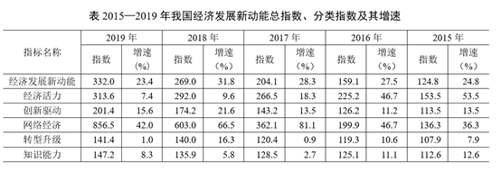

注：分类指数对总指数增长的贡献率计算公式为

#### 第 6 题　qid 2741956 · 增长

2019年我国网络经济指数对总指数增长的贡献率为：

- **A**. 

- **B**. 
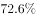

- **C**. 
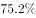

- **D**. 

　✅

**答案**：D

**官方解析**

根据题干“2019年······对总指数增长的贡献率······”，可判定本题为现期比重问题。定位表格材料可知：“2019年网络经济报告期指数856.5，报告期总指数332.0；2018年网络经济报告期指数603.0，报告期总指数269.0”。结合文字材料“5个分类指数的权重均设定为0.2”可得，网络经济指数的权重为0.2。将数据代入注释中公式：贡献率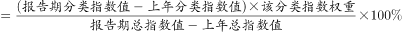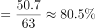。

故正确答案为D。

---

#### 第 7 题　qid 2741959 · 增长

2015-2019年我国经济发展新动能总指数值比上年增加最多的年份是：

- **A**. 2016年
- **B**. 2017年
- **C**. 2018年　✅
- **D**. 2019年

**答案**：C

**官方解析**

根据题干“2015-2019年······比上年增加最多······”，可判定本题为增长量比较问题。定位表格材料可得：“2015-2019年我国经济发展新动能总指数分别为124.8、159.1、204.1、269.0、332.0。”根据公式增长量可得：

2016年增量；

2017年增量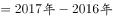；

2018年增量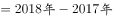；

2019年增量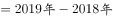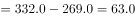；

比较可知，2018年经济发展新动能总指数增加最多。

故正确答案为C。

---

#### 第 8 题　qid 2741961 · 增长

在5个分类指数中，2019年对总指数增长的贡献率大于2018年的有：

- **A**. 1个
- **B**. 2个　✅
- **C**. 3个
- **D**. 4个

**答案**：B

**官方解析**

根据题干“······2019年对总指数增长的贡献率大于2018年的有”，结合备注分类指数对总指数增长的贡献率计算公式，可判定本题为比值比较问题。定位文字材料可得各分类指标的权重均为0.2，定位表格材料可得每年各类分类指数和总指数的具体值，根据贡献率，因为两年各分类指数的权重没变，故只需比较即可。

经济活力：2019年：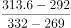，2018年：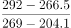，；

创新驱动：2019年：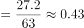，2018年：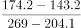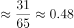，；

网络经济：2019年：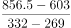，2018年：，；

转型升级：2019年：，2018年：，；

知识能力：2019年：，2018年：，。

因此，2019年对总指数增长的贡献率大于2018年的共有网络经济和知识能力2个。

故正确答案为B。

---

#### 第 9 题　qid 2741963 · 综合

2016-2018年指数值累计增量最多和最少的分类指数分别是：

- **A**. 网络经济指数、知识能力指数　✅
- **B**. 经济活力指数、转型升级指数
- **C**. 网络经济指数、转型升级指数
- **D**. 经济活力指数、知识能力指数

**答案**：A

**官方解析**

根据题干“2016-2018年······累计增量最多和最少······”，可判定本题为增长量比较问题。定位表格材料，可知2015-2018年各种指数的具体值。根据增长量，则累计增长量。代入数据可得：

经济活力的累计增量；

网络经济的累计增量；

转型升级的累计增量；

知识能力的累计增量。

比较发现，网络经济指数累计增长最多；知识能力指数累计增长最少。

故正确答案为A。

---

#### 第 10 题　qid 2741965 · 综合

能够从上述资料中推出的是：

- **A**. 
2015-2019年我国创新驱动指数平均增量为40.3

- **B**. 
2016年我国知识能力指数对总指数增长的贡献率大于2015年

- **C**. 
2015-2019年我国经济发展新动能总指数年均增速超过
　✅
- **D**. 
2015-2019年我国转型升级指数每年的增速在5个分类指数中都是最慢的

**答案**：C

**官方解析**

A项：定位表格材料，可知2019年我国创新驱动指数为201.4，定位文字材料，可知2014年指数为100。根据年均增长量，则2015-2019年我国创新驱动指数平均增量为，错误；

B项：根据贡献率，因为两年的权重没变，故只需比较即可。2016年：2015年：，错误；

C项：2019年我国经济发展新动能总指数332，2014年总指数为100，根据年均增长率公式可得，。当年均增速为时，代入，故2015-2019年我国经济发展新动能总指数年均增速应超过，正确；

D项：定位表格材料，可知5类指数每年的增速，发现2018年转型升级指数的增速（）经济活力指数的增速（），所以2015-2019年我国转型升级指数每年的增速并不都是最慢的，错误。

故正确答案为C。

---

### 材料 3

#### 第 11 题　qid 2742212 · 增长

2019年我国海洋第一产业增加值为：

- **A**. 3880亿元
- **B**. 3755亿元　✅
- **C**. 3675亿元
- **D**. 3595亿元

**答案**：B

**官方解析**

根据题干“2019年我国海洋第一产业增加值为”，结合材料给出的2019年海洋生产总值以及海洋第一产业增加值占海洋生产总值的比重，可判定本题为现期比重问题。定位表格材料可得：2019年海洋生产总值89415亿元；定位图形材料可得：2019年海洋第一产业增加值占比为。则2019年我国海洋第一产业增加值亿元。

故正确答案为B。

---

#### 第 12 题　qid 2742214 · 增长

2019年我国海洋相关产业产值增速：

- **A**. 
低于

- **B**. 
介于和之间
　✅
- **C**. 
高于

- **D**. 
介于和之间

**答案**：B

**官方解析**

根据题干“2019年我国海洋相关产业产值增速”，结合材料给出2019年海洋生产总值、海洋产业的增速，可判定本题为混合增长率问题。定位表格材料可得：2019年海洋生产总值增速为；海洋产业生产总值57315亿元，增速为；海洋相关产业生产总值32100亿元。设所求增速为，根据线段法口诀“距离与量成反比（一般用现期量代替基期量估算）”，可得：，化简为：，解得，在B项范围内。

故正确答案为B。

---

#### 第 13 题　qid 2742215 · 综合

在我国主要海洋产业中，2019年产值年增量最大的是：

- **A**. 滨海旅游业　✅
- **B**. 海洋船舶工业
- **C**. 海洋油气业
- **D**. 海洋工程建筑业

**答案**：A

**官方解析**

根据题干“······2019年产值年增量最大的是”，可判定本题为增长量比较问题。定位表格，根据公式：增长量，可得选项各产业的增长量分别为：

A项：滨海旅游业：；B项：海洋船舶工业：；

C项：海洋油气业：；D项：海洋工程建筑业：。

A项与C、D两项对比，A项现期量大、增长率大，根据增长量比较“大大则大”，则A项增长量大于C、D两项，排除C、D两项。

A项：滨海旅游业：；

B项：海洋船舶工业：；

可得A项增长量大于B项，A项增长量最大。

故正确答案为A。

---

#### 第 14 题　qid 2742217 · 增长

2019年我国海洋第三产业增加值年增长率为：

- **A**. 

- **B**. 

- **C**. 

　✅
- **D**. 

**答案**：C

**官方解析**

根据题干“2019年······年增长率为”，可判定本题为一般增长率问题。定位表格材料，2019年我国海洋生产总值为89415亿元，同比增长，则2018年海洋生产总值。定位柱状图可得，2019年和2018年我国海洋第三产业增加值占海洋生产总值的比重分别为和。

方法一：根据公式“部分量”，则2019年和2018年我国海洋第三产业增加值分别为、。根据公式“增长率”，则2019年我国海洋第三产业增加值同比增长：。

方法二：根据公式“基期比重”，其中基期比重，现期比重，，代入可得：，则：，解得。

故正确答案为C。

---

#### 第 15 题　qid 2742218 · 综合

能够从上述资料中推出的是：

- **A**. 
2018年，我国海洋科研教育管理服务业产值超过20000亿元

- **B**. 
在我国主要海洋产业中，2018年产值占比最大的是海洋渔业

- **C**. 
在我国主要海洋产业中，2019年产值增速高于的产业有3个
　✅
- **D**. 
2016—2019年，我国海洋第二产业增加值占海洋生产总值的比重有升有降

**答案**：C

**官方解析**

A项：定位表格材料，根据公式“基期量”，则2018年我国海洋科研教育管理服务业产值亿元，错误；

B项：定位表格材料，根据公式“基期量”，在我国主要海洋产业中，2019年滨海旅游业产值（18086亿元）远大于其他产业，（）部分差距不大，故2018年滨海旅游业产值最大。因我国主要海洋产业总产值一定，如果部分量大，占比则大，故2018年产值占比最大的是滨海旅游业，错误；

C项：定位表格材料，在我国主要海洋产业中，产值增速高于的产业有海洋生物医药业（）、海洋船舶工业（）、滨海旅游业（），共计3个，正确；

D项：定位图形材料，2016—2019年，我国海洋第二产业增加值占海洋生产总值的比重逐年降低，并非有升有降，错误；

故正确答案为C。

---

### 材料 4

        2019年全球太空经济规模增至3660亿美元，较2018年增长，其中全球卫星产业收入为2707亿美元。在全球卫星产业收入中，卫星制造业的收入为125亿美元，较上年减少70亿美元；卫星发射服务业的收入为49亿美元，较上年下降；卫星通信服务业的收入为1230亿美元，较上年减少35亿美元；地面设备制造业的收入为1303亿美元，较上年增长。

#### 第 16 题　qid 2742018 · 比重

2019年全球卫星制造业收入占卫星产业收入的比重为：

- **A**. 

- **B**. 

- **C**. 

- **D**. 

　✅

**答案**：D

**官方解析**

根据题干“2019年······占······的比重为”，结合材料时间为2019年，可判定本题为现期比重问题。定位文字材料可知，2019年，全球卫星产业收入为2707亿美元。在全球卫星产业收入中，卫星制造业的收入为125亿美元。根据公式：比重，则2019年全球卫星制造业收入占卫星产业收入的比重。

故正确答案为D。

---

#### 第 17 题　qid 2742028 · 增长

2014-2019年全球卫星产业收入增长最快的年份是：

- **A**. 2014年　✅
- **B**. 2015年
- **C**. 2017年
- **D**. 2018年

**答案**：A

**官方解析**

根据题干“增长最快的年份是”，可判定本题为一般增长率的比较问题。定位图形材料，2013-2019全球卫星产业收入均已给出。根据公式：增长率，代入数据如下所示：

A项：2014年全球卫星产业收入增长率；

B项：2015年全球卫星产业收入增长率；

C项：2017年全球卫星产业收入增长率；

D项：2018年全球卫星产业收入增长率。

因此，全球卫星产业收入增长最快的年份是2014年。

故正确答案为A。

---

#### 第 18 题　qid 2742033 · 增长

以2012年为基期，2019年全球卫星制造业、卫星发射服务业的收入增长情况分别是：

- **A**. 负增长、正增长
- **B**. 负增长、负增长　✅
- **C**. 正增长、负增长
- **D**. 正增长、正增长

**答案**：B

**官方解析**

根据题干“增长情况分别是”，结合材料数据给出了各个年份的增长率，可判定本题为一般增长率的计算问题。定位图形材料，2013-2019年全球卫星制造业及卫星发射服务业的收入增长率均已给出。根据公式：增长率，故若现期量基期量，则呈正增长，若现期量基期量，则呈负增长。根据公式：，则以2012年为基期时，2019年全球卫星制造业收入2012年全球卫星制造业收入

2012年全球卫星制造业收入2012年全球卫星制造业收入，2012年全球卫星制造业收入2019年全球卫星制造业收入，呈负增长；2019年全球卫星发射服务业收入2012年全球卫星发射服务业收入2012年全球卫星发射服务业收入2012年全球卫星发射服务业收入，2012年全球卫星发射服务业收入2019年全球卫星发射服务业收入，呈负增长。因此，两者收入增长情况均呈负增长。

故正确答案为B。

---

#### 第 19 题　qid 2742037 · 增长

2014-2019年全球卫星产业收入增速大于卫星发射服务业的年份数有：

- **A**. 2个
- **B**. 3个
- **C**. 4个　✅
- **D**. 5个

**答案**：C

**官方解析**

根据题干“2014-2019年······增速大于······的年份数有”，可判定本题为一般增长率的比较问题。定位图形材料可得：2013-2019年全球卫星产业收入以及2014-2019年卫星发射服务业收入增速。根据公式：增长率，2014-2019年的增长率比较如下：

2014年：全球卫星产业收入增速卫星发射服务业收入增速；

2015年：全球卫星产业收入增速卫星发射服务业收入增速；

2016年：全球卫星产业收入增速卫星发射服务业收入增速；

2017年：全球卫星产业收入增速卫星发射服务业收入增速；

2018年：全球卫星产业收入增速卫星发射服务业收入增速；

2019年：全球卫星产业收入增速卫星发射服务业收入增速。

满足要求的年份分别是2015年、2016年、2017年和2019年，共4个年份。

故正确答案为C。

---

#### 第 20 题　qid 2742042 · 综合

关于2019年全球卫星产业，能够从上述资料中推出的是：

- **A**. 
卫星产业收入增速为
　✅
- **B**. 
卫星发射服务业收入比2017年提高13.8个百分点

- **C**. 
卫星产业收入占全球太空经济的比重同比上升3.0个百分点

- **D**. 
卫星通信服务业收入的同比增加额与地面设备制造业相差16亿美元

**答案**：A

**官方解析**

A项：根据本篇材料第4题的计算结果，2019年全球卫星产业收入增速为，正确；

B项：定位图形材料可得：2018年卫星发射服务业收入增速为，2019年增速为。则所求间隔增长率，即2019年比2017年提高不到，错误；

C项：根据本篇材料第4题的计算结果，2019年全球卫星产业收入增速为；定位文字材料可得：2019年全球太空经济规模较2018年增长。根据两期比重比较结论，部分量增长率（）小于总量增长率（），2019年比重下降，并非同比上升，错误；

D项：定位文字材料可得：2019年，卫星通信服务业较上年减少35亿美元；地面设备制造业的收入为1303亿美元，较上年增长。则地面设备制造业收入的同比增长量亿美元，两者相差亿美元，并非16亿美元，错误。

故正确答案为A。

---
