# 2021年浙江省公务员录用考试《行测》题（B类）（网友回忆版）

> 省考 · 2021 年 · 6 个模块 · 共 120 题

- [政治理论](#%E6%94%BF%E6%B2%BB%E7%90%86%E8%AE%BA) · 2 题
- [常识判断](#%E5%B8%B8%E8%AF%86%E5%88%A4%E6%96%AD) · 18 题
- [言语理解与表达](#%E8%A8%80%E8%AF%AD%E7%90%86%E8%A7%A3%E4%B8%8E%E8%A1%A8%E8%BE%BE) · 30 题
- [数量关系](#%E6%95%B0%E9%87%8F%E5%85%B3%E7%B3%BB) · 19 题
- [判断推理](#%E5%88%A4%E6%96%AD%E6%8E%A8%E7%90%86) · 35 题
- [资料分析](#%E8%B5%84%E6%96%99%E5%88%86%E6%9E%90) · 16 题

---

## 政治理论

### 第 1 题　qid 2775998 · 新思想

党的十八大以来，以习近平同志为核心的党中央提出了许多党的建设新思想、新观点、新论断，极大地丰富了党的建设理论。下列关于党的建设的表述，不正确的是：

- **A**. 党的政治建设是党的根本性建设
- **B**. 制度建设是全面从严治党的重要保障
- **C**. 坚定理想信念是党的思想建设的首要任务
- **D**. 党内民主建设是党的纪律建设的核心任务　✅

**答案**：D

**官方解析**

本题考查政治常识。
A项正确，十九大报告指出：“把党的政治建设摆在首位。旗帜鲜明讲政治是我们党作为马克思主义政党的根本要求。党的政治建设是党的根本性建设，决定党的建设方向和效果。”
B项正确，习近平总书记多次强调：要加强党内法规制度建设，制度建设是全面从严治党的重要保障。健全完善制度，以党章为根本遵循，本着于法周延、于事有效的原则，制定新的法规制度，完善已有的法规制度，废止不适应的法规制度，健全党内规则体系，扎紧党纪党规的笼子。
C项正确，十九大报告指出：“要把坚定理想信念作为党的思想建设的首要任务，教育引导全党牢记党的宗旨，挺起共产党人的精神脊梁，解决好世界观、人生观、价值观这个‘总开关’问题，自觉做共产主义远大理想和中国特色社会主义共同理想的坚定信仰者和忠实实践者。”
D项错误，党内民主建设是党的组织建设的重要任务。其主要内容包括：以保障党员民主权利为基础，以完善党的代表大会制度和党的委员会制度为重点，从改革体制机制入手，建立健全充分反映党员和党组织意愿的党内民主制度。
本题为选非题，故正确答案为D。

---

### 第 2 题　qid 2775999 · 时事政治

2020年12月16日至18日中央经济工作会议在北京举行。习近平总书记在会上发表重要讲话，总结2020年经济工作，分析当前经济形势，部署2021年经济工作。下列不属于会议确定的2021年经济工作重点任务的是：

- **A**. 坚决打赢脱贫攻坚战　✅
- **B**. 解决好种子和耕地问题
- **C**. 增强产业链供应链自主可控能力
- **D**. 强化反垄断和防止资本无序扩张

**答案**：A

**官方解析**

本题考查政治常识。
A项错误，2015年11月27日至28日，中央扶贫开发工作会议在北京召开，习近平总书记强调，坚决打赢脱贫攻坚战，确保到2020年所有贫困地区和贫困人口一道迈入全面小康社会。故“坚决打赢脱贫攻坚战”不属于2021年的经济工作重点任务。
B、C、D三项正确，2020年12月16日至18日，中央经济工作会议在北京举行，习近平总书记在会上发表重要讲话，总结2020年经济工作，分析当前经济形势，部署2021年经济工作。会议确定2021年八大重点任务：一是强化国家战略科技力量；二是增强产业链供应链自主可控能力；三是坚持扩大内需这个战略基点；四是全面推进改革开放；五是解决好种子和耕地问题；六是强化反垄断和防止资本无序扩张；七是解决好大城市住房突出问题；八是做好碳达峰、碳中和工作。
本题为选非题，故正确答案为A。

---

## 常识判断

### 第 1 题　qid 2776001 · 人文常识

党的十九届五中全会审议通过了《中共中央关于制定国民经济和社会发展第十四个五年规划和二〇三五年远景目标的建议》。下列关于二〇三五年远景目标的表述，不正确的是：

- **A**. 人均国内生产总值达到中等发达国家水平
- **B**. 基本实现国家治理体系和治理能力现代化
- **C**. 建成富强民主文明和谐美丽的社会主义现代化强国　✅
- **D**. 基本实现新型工业化、信息化、城镇化、农业现代化，建成现代化经济体系

**答案**：C

**官方解析**

本题考查政治常识。
A、B、D三项正确，2020年10月29日，中国共产党第十九届中央委员会第五次全体会议审议通过了《中共中央关于制定国民经济和社会发展第十四个五年规划和二〇三五年远景目标的建议》。其中部署了到二〇三五年的9方面远景目标：1.我国经济实力、科技实力、综合国力将大幅跃升，经济总量和城乡居民人均收入将再迈上新的大台阶，关键核心技术实现重大突破，进入创新型国家前列；2.基本实现新型工业化、信息化、城镇化、农业现代化，建成现代化经济体系；3.基本实现国家治理体系和治理能力现代化，人民平等参与、平等发展权利得到充分保障，基本建成法治国家、法治政府、法治社会；4.建成文化强国、教育强国、人才强国、体育强国、健康中国，国民素质和社会文明程度达到新高度，国家文化软实力显著增强；5.广泛形成绿色生产生活方式，碳排放达峰后稳中有降，生态环境根本好转，美丽中国建设目标基本实现；6.形成对外开放新格局，参与国际经济合作和竞争新优势明显增强；7.人均国内生产总值达到中等发达国家水平，中等收入群体显著扩大，基本公共服务实现均等化，城乡区域发展差距和居民生活水平差距显著缩小；8.平安中国建设达到更高水平，基本实现国防和军队现代化；9.人民生活更加美好，人的全面发展、全体人民共同富裕取得更为明显的实质性进展。
C项错误，《中共中央关于制定国民经济和社会发展第十四个五年规划和二〇三五年远景目标的建议》中部署了到二〇三五年基本实现社会主义现代化的远景目标，并指出：“党的十九大对实现第二个百年奋斗目标作出分两个阶段推进的战略安排，即到二〇三五年基本实现社会主义现代化，到本世纪中叶把我国建成富强民主文明和谐美丽的社会主义现代化强国。”
本题为选非题，故正确答案为C。

---

### 第 2 题　qid 2776002 · 人文常识

2020年是中国人民志愿军抗美援朝出国作战70周年。关于抗美援朝战争，下列说法不正确的是：

- **A**. 《我的祖国》是反映抗美援朝历史经典影片《英雄儿女》的插曲　✅
- **B**. 抗美援朝战争第一阶段以运动战为主，连续进行了五次战略性战役
- **C**. 战斗英雄杨根思、黄继光、邱少云都是赴朝作战的中国人民志愿军战士
- **D**. “三八线”是朝鲜半岛上北纬38度附近的军事分界线，将朝鲜半岛大致分为南北两部分

**答案**：A

**官方解析**

本题考查人文常识。
A项错误，《我的祖国》由刘炽作曲，乔羽作词，是电影《上甘岭》的插曲，描写抗美援朝战争中，战士们在战斗空隙中歌唱祖国、思念家乡的感情。电影《英雄儿女》是反映抗美援朝历史的经典影片，其中最著名的插曲是《英雄赞歌》，由公木作词，刘炽作曲。
B项正确，抗美援朝战争的第一阶段，从1950年10月25日至1951年6月10日，中朝人民军队以运动战为主，连续进行了五次战略性战役，将敌军从鸭绿江边赶回到“三八线”，把战线稳定在“三八线”附近地区，迫使敌军转入战略防御，接受停战谈判。
C项正确，在抗美援朝战争中，特级英雄、特等功臣黄继光、杨根思，一级英雄、特等功臣邱少云等数十万中华优秀儿女的鲜血洒在朝鲜土地上。
D项正确，“三八线”是朝鲜半岛上北纬38度附近的一条军事分界线。1945年8月日本投降后，经苏、美两国首脑商定：在朝鲜半岛上的北纬38度线作为苏、美两国对日军事行动和接受日军投降范围的临时分界线。其北部为苏军受降区，南部为美军受降区。
本题为选非题，故正确答案为A。

---

### 第 3 题　qid 2776003 · 科技常识

2020年7月23日，“天问一号”由长征五号遥四运载火箭发射升空，成功进入预定轨道。关于“天问一号”，下列说法不正确的是：

- **A**. 是我国首次火星探测任务
- **B**. 在酒泉卫星发射中心发射　✅
- **C**. 其名字来源于屈原的长诗《天问》
- **D**. 着陆器计划在火星表面降落并完成巡视任务

**答案**：B

**官方解析**

本题考查科技常识。
A项正确，在2020年4月24日举行的2020年“中国航天日”启动仪式上，备受关注的中国首次火星探测任务名称、任务标识正式公布。中国行星探测任务被命名为“天问系列”，首次火星探测任务被命名为“天问一号”，后续行星任务依次编号。
B项错误，2020年7月23日12时41分，长征五号遥四运载火箭托举着我国首次火星探测任务“天问一号”探测器在中国文昌航天发射场点火升空。
C项正确，“天问一号”的名称源于屈原长诗《天问》，表达了中华民族追求真理的坚韧与执着，体现了对自然和宇宙空间探索的文化传承，寓意探求科学真理征途漫漫，追求科技创新永无止境。
D项正确，“天问一号”计划于2021年2月到达火星，实施火星捕获，2021年5月择机实施降轨，着陆巡视器与环绕器分离，软着陆于火星表面，火星车驶离着陆平台，开展巡视探测等工作。
本题为选非题，故正确答案为B。

---

### 第 4 题　qid 2776006 · 法律常识

下列属于民事法律行为的是：

- **A**. 甲在回家的路上捡到一只手机
- **B**. 甲在小区倒车时撞上路边的小孩
- **C**. 甲每天搭乘同事乙的车上下班
- **D**. 甲承诺为乙的贷款承担保证责任　✅

**答案**：D

**官方解析**

本题考查法律常识。
《民法典》第一百三十三条规定：“民事法律行为是民事主体通过意思表示设立、变更、终止民事法律关系的行为”。事实行为是指行为人不具有设立、变更或消灭民事法律关系的意图，但依照法律的规定能引起民事法律后果的行为。
A项错误，甲捡到手机的行为并没有成立民事法律关系的意思表示，不属于民事法律行为，而是事实行为。
B项错误，甲在小区倒车时撞上路边的小孩，是意外发生的，不属于民事法律行为，属于事实行为。
C项错误，甲每天搭乘同事乙的车上下班，不属于民事法律行为，而是同事之间的情谊行为，不产生民事法律关系。
D项正确，甲承诺为乙的贷款承担保证责任，成立担保的民事法律关系，属于民事法律行为。
故正确答案为D。

---

### 第 5 题　qid 2776009 · 人文常识

下列行为不属于电信网络诈骗的是：

- **A**. 钱某编写欠缴房租短信向不特定人群发送，非法获利5万元
- **B**. 赵某通过电话向老年人推销质次价高的工艺品，非法获利5万元
- **C**. 李某趁舍友熟睡，重置其微信转账密码并将关联银行卡内5万元转给自己　✅
- **D**. 孙某冒充公检法人员，利用网络电话，要求对方将5万元汇至指定的安全账户

**答案**：C

**官方解析**

本题考查法律常识。
电信网络诈骗是指通过电话、网络和短信方式，编造虚假信息，设置骗局，对受害人实施远程、非接触式诈骗，诱使受害人打款或转账的犯罪行为。通常以冒充他人及仿冒、伪造各种合法外衣和形式的方式达到欺骗的目的，如冒充公检法、商家、公司厂家、国家机关工作人员、银行工作人员等各类机构工作人员，伪造和冒充招工、刷单、贷款、手机定位和招嫖等形式进行诈骗。
A项正确，该项中的钱某通过“短信”形式编造虚假信息，设置骗局，进行诈骗，属于电信网络诈骗。
B项正确，该项中的赵某通过“电话”形式向老年人推销质次价高的工艺品，进行诈骗，属于电信网络诈骗。
C项错误，该项中的李某趁舍友熟睡通过微信转账的行为秘密窃取他人财物，构成盗窃罪。李某没有编造虚假信息诱使受害人转账的行为，不符合电信网络诈骗。
D项正确，该项中的孙某冒充公检法人员，利用“网络电话”进行诈骗，属于电信网络诈骗。
本题为选非题，故正确答案为C。

---

### 第 6 题　qid 2776007 · 科技常识

毒品严重损害吸毒者本人身体健康，并给经济发展和社会进步带来巨大威胁。下列关于毒品及禁毒的说法不正确的是：

- **A**. 海洛因俗称K粉，由古柯的叶子提炼而成，是一种新型毒品　✅
- **B**. 鸦片俗称大烟，源于罂粟植物的蒴果，其所含的主要生物碱是吗啡
- **C**. “金三角”位于泰国、缅甸、老挝三国交界地带，是世界上主要的毒品产地
- **D**. 教育行政部门、学校应当将禁毒知识纳入教育、教学内容，对学生进行禁毒宣传教育

**答案**：A

**官方解析**

本题考查科技常识。

A项错误，海洛因俗称几号、白粉、白面，是吗啡类毒品的总称，是以吗啡生物碱作为合成起点得到的半合成毒品，属于传统毒品。而K粉是氯胺酮的俗称，因为氯胺酮的物理形状通常为白色粉末，且其英文名称的首字母是K，故俗称K粉，在医学临床上一般作为麻醉剂使用。可卡因是用古柯的叶子提炼而成的，是一种毒性很大的兴奋剂。

B项正确，鸦片又叫阿片，俗称大烟，源于罂粟植物的蒴果，含有20多种生物碱，可分为菲类和苄基异喹啉类。前者如吗啡（含量约）和可待因，后者如罂粟碱。鸦片的药理作用大部分是由其主要成分吗啡所致。

C项正确，“金三角”是指位于东南亚泰国、缅甸和老挝三国边境地区的一个三角形地带，因这一地区长期盛产鸦片等毒品，是世界上主要的毒品产地，而使“金三角”闻名于世。

D项正确，根据《中华人民共和国禁毒法》第十三条：“教育行政部门、学校应当将禁毒知识纳入教育、教学内容，对学生进行禁毒宣传教育。公安机关、司法行政部门和卫生行政部门应当予以协助。”

本题为选非题，故正确答案为A。

---

### 第 7 题　qid 2776011 · 人文常识

下列文献最可能反映夏代历史文化的是：

- **A**. 《长沙马王堆墓葬报告》
- **B**. 《偃师二里头遗址研究》　✅
- **C**. 《安阳殷墟小屯建筑遗存》
- **D**. 《南昌海昏侯国考古成果》

**答案**：B

**官方解析**

本题考查人文常识。
A项错误，《长沙马王堆墓葬报告》记载了西汉初期长沙国丞相利苍及其家属的墓葬信息，这一西汉早期墓葬保存完整，出土了千余件文物，为研究汉代初期埋葬制度、手工业和科技的发展及长沙国的历史、文化和社会生活等方面提供了重要资料。
B项正确，《偃师二里头遗址研究》记载了偃师二里头遗址信息，该遗址的年代距今约3800～3500年，相当于古代文献中的夏、商王朝时期，是我国最重要的夏代文化遗址，是可确认的我国最早的王国都城遗址——夏都斟鄩。
C项错误，《安阳殷墟小屯建筑遗存》所发表的资料是关于1975年至1996年先后在安阳市小屯村所发掘的三处殷代建筑遗存。
D项错误，《南昌海昏侯国考古成果》记载了南昌汉代海昏侯国遗址信息，揭露出了完整的西汉海昏侯刘贺墓园、主墓及三座袝葬墓、车马坑以及祠堂、寝殿等遗迹，极大地丰富了人们对汉代江西历史文化的认识，同时也对研究西汉政治、经济、社会、文化提供了有力支撑。
故正确答案为B。

---

### 第 8 题　qid 2776013 · 人文常识

下列关于战争题材的诗文与战役对应不正确的是：

- **A**. 万骑临江貔虎噪，千艘列炬鱼龙怒——长平之战　✅
- **B**. 力拔山兮气盖世，时不利兮骓不逝——垓下之战
- **C**. 东渡黄河第一战，威扫敌倭青史流——平型关战役
- **D**. 昆阳之战，屠百万于斯须，旷千古而一快——昆阳之战

**答案**：A

**官方解析**

本题考查人文常识。
A项错误，“万骑临江貔虎噪，千艘列炬鱼龙怒”出自戴复古的《满江红·赤壁怀古》，对应的战役是三国时期的赤壁之战。
B项正确，“力拔山兮气盖世，时不利兮骓不逝”出自项羽的《垓下歌》，是西楚霸王项羽在垓下进行必死战斗的前夕所作的绝命词。
C项正确，“东渡黄河第一战，威扫敌倭青史流”出自聂荣臻元帅的《忆平型关大捷》，是其忆平型关大捷所作。
D项正确，“昆阳之战，屠百万于斯须，旷千古而一快”出自苏轼的《昆阳城赋》，主要记述汉光武帝刘秀在昆阳破王莽百万大军的事迹。
本题为选非题，故正确答案为A。

---

### 第 9 题　qid 2776017 · 人文常识

关于经济常识，下列说法不正确的是：

- **A**. 用先进的机器设备代替工人，一般会导致商品价格下降
- **B**. 某超市对临期商品进行打折销售处理，这属于差别定价　✅
- **C**. 高档的化妆品可以打折促销，是因为它需求弹性比较大
- **D**. 身体健康的人偏好买养老保险，这种行为属于逆向选择

**答案**：B

**官方解析**

本题考查经济常识。
A项正确，用先进的机器设备代替工人，会使生产效率大大提高，进而使供给增加，供过于求，会导致商品价格下降。
B项错误，差别定价又称"弹性定价"，是一种"依赖顾客支付意愿"而制定不同价格的定价法。如：一度电的成本相同，而工业用电和生活用电的价格不同。临期商品虽然打折销售，但对于所有顾客来讲，临期商品的价格是相同的，因此不属于差别定价。
C项正确，需求弹性即需求的变化幅度，其中，需求价格弹性是衡量商品需求量的变动对于商品自身价格变动反应的敏感程度。高档的化妆品价格高昂，需求富有弹性，因此可以打折促销，通过价格的变动来提高销售量。
D项正确，逆向选择是指由交易双方信息不对称和市场价格下降产生的劣质品驱逐优质品，进而出现市场交易产品平均质量下降的现象。保险市场也是这样，身体不大健康、平时总患病的人一般更愿意到保险公司购买健康保险。由于投保人的总体健康水平很低，保险公司赔给投保人的钱,就会大大高于他们按照正常人平均得病率所收取的保费，这体现了投保人的逆向选择。而那些身体比较健康、平时很少生病的人更愿意购买养老保险，由于投保人的总体健康水平很高，保险公司支付给投保人的养老金就会大大高于他们收取的保费，这也体现了投保人的逆向选择。这种逆向选择就是由信息不对称引起的。
本题为选非题，故正确答案为B。

---

### 第 10 题　qid 2776018 · 人文常识

下列诗句中提到的鸟类与其他三项不同的是：

- **A**. 杨花落尽子规啼，闻道龙标过五溪
- **B**. 宫女如花满春殿，只今惟有鹧鸪飞　✅
- **C**. 一声杜宇春归尽，寂寞帘栊空月痕
- **D**. 催归催得谁归去，唯有东郊农事忙

**答案**：B

**官方解析**

本题考查人文常识。
A项，“杨花落尽子规啼，闻道龙标过五溪”出自唐代李白的《闻王昌龄左迁龙标遥有此寄》，意为在杨花落完，子规啼鸣之时，我听说您被贬为龙标尉，要经过五溪。其中，子规是指杜鹃。
B项，“宫女如花满春殿，只今惟有鹧鸪飞”出自唐代李白的《越中览古》，意为以前宫殿上站满了如花宫女，现在人们所能看到的，只是几只鹧鸪在王城故址上飞来飞去罢了。其中提到的鸟类是鹧鸪。
C项，“一声杜宇春归尽，寂寞帘栊空月痕”出自清代曹雪芹的《桃花行》，意为杜鹃一声啼叫春色已尽，只有那寂静的窗帘上空空地照着月痕。其中提到的鸟类是杜鹃。
D项，“催归催得谁归去，唯有东郊农事忙”出自元代曹伯启的《子规》，意为声声子规啼鸣，好像在催远行的游子快回家：这里东郊的农事正忙，可是此时却难以归去，心思凄凉。其中提到的鸟类是杜鹃。
本题为选非题，故正确答案为B。

---

### 第 11 题　qid 2776020 · 人文常识

下列成语与出处对应都正确的是：

- **A**. 无人问津——《桃花源记》 青出于蓝——《离骚》
- **B**. 揭竿而起——《过秦论》 老骥伏枥——《短歌行》
- **C**. 司马青衫——《琵琶行》 不拘一格——《己亥杂诗》　✅
- **D**. 察纳雅言——《出师表》 觥筹交错——《岳阳楼记》

**答案**：C

**官方解析**

本题考查人文常识。
A项错误，“无人问津”比喻没有人来探问、尝试或购买，出自陶渊明的《桃花源记》。“青出于蓝”意为青是从蓝草里提炼出来的，但颜色比蓝更深，比喻学生超过老师或后人胜过前人，出自《荀子·劝学》。
B项错误，“揭竿而起”意为砍了树干当武器，举起竹竿当旗帜，进行反抗，指人民起义，出自《过秦论》。“老骥伏枥”比喻人虽然年老，但仍有雄心壮志，出自曹操的《龟虽寿》。
C项正确，“司马青衫”意为极度悲伤，出自于《琵琶行》。“不拘一格”是指不局限于一种规格或一个格局，出自龚自珍的《己亥杂诗》。
D项错误，“察纳雅言”是指认识、采纳正确的言论，最早见于三国时期诸葛亮的《出师表》。“觥筹交错”意为酒杯和酒筹交互错杂，形容许多人聚在一起饮酒的热闹情景，出自欧阳修的《醉翁亭记》。
故正确答案为C。

---

### 第 12 题　qid 2776021 · 人文常识

关于童话故事，下列说法正确的是：

- **A**. 《夜莺》是安徒生创作的以中国为背景的童话故事　✅
- **B**. 《一千零一夜》是北欧民间故事集，又名《天方夜谭》
- **C**. 《格林童话》由格林兄弟创作，包括《丑小鸭》等故事
- **D**. 冰心的《稻草人》是新中国第一本为儿童而写的童话集

**答案**：A

**官方解析**

本题考查人文常识。
A项正确，《夜莺》是丹麦作家安徒生唯一一篇以中国为背景的童话故事。该作讲述了一只夜莺美丽的歌声打动了皇帝，于是它成为了皇帝的宠儿。但不久之后，另一只能发出曼妙乐声且外表华丽的人造小鸟获得了更多赞美，于是夜莺飞走了。然而，当皇帝的生命面临死神的威胁时，人造小鸟却唱不出一个音符，还是真正的夜莺用婉转的歌声驱走了死亡的阴霾。
B项错误，《一千零一夜》是阿拉伯民间故事集，又名《天方夜谭》。
C项错误，《丑小鸭》是丹麦作家安徒生创作的童话，首次出版于1843年。这本书写了一只天鹅蛋在鸭群中破壳后，因相貌怪异，被鸭群鄙弃，最终历经千辛万苦、重重磨难之后长成了白天鹅。
D项错误，叶圣陶的代表作《稻草人》是新中国第一本为儿童而写的童话集，是中国现代儿童文学史上的第一块丰碑。这篇童话与当时流行的“不写王子，便写公主”的西方模式不同，也与叶圣陶自己早期的理想主义不同，它直面人生，扩大题材，把现实事件引进童话创作的领域。作品通过一个富有同情心而又无能为力的稻草人的所闻所思，真实而深刻地描写了20年代中国农村风雨飘摇的人间惨状。
故正确答案为A。

---

### 第 13 题　qid 2776000 · 人文常识

下列关于人体器官的说法正确的是：

- **A**. 肝脏是人体最大的免疫器官
- **B**. 毛发和指甲都不是人体器官　✅
- **C**. 大肠和肾脏都属于消化系统
- **D**. 心脏中的心房将离心血打入动脉

**答案**：B

**官方解析**

本题考查科技常识。
A项错误，脾脏是人体最大的免疫器官，位于左上腹部，具有滤血、储藏血液的作用。肝脏是人体内以代谢功能为主的一个器官，主要功能是分泌胆汁、储藏糖原，调节蛋白质、脂肪和碳水化合物的新陈代谢、解毒、造血和凝血等。
B项正确，指甲是人和猿猴类指（趾）端背面扁平的甲状结构，属于结缔组织。毛囊组织中包括毛发、毛孔和毛囊。因此，毛发和指甲都不是人体器官。
C项错误，消化系统包括消化道和消化腺两大部分。消化道可分为口腔、咽、食管、胃、小肠、大肠和肛门等；消化腺包括唾液腺、胃腺、肠腺、肝脏和胰腺。而肾脏属于泌尿系统。
D项错误，动脉是介于心室与毛细血管之间的管道，它接近心室的部分，管径大，管壁较厚，心脏中的心室将离心血打入动脉。
故正确答案为B。

---

### 第 14 题　qid 2776005 · 科技常识

生活于另一种生物体内或体表并从其体内获得营养的生物为寄生生物。关于寄生生物，下列说法不正确的是：

- **A**. 虱子和跳蚤都属于寄生动物
- **B**. 菟丝子和桑寄生都属于寄生植物
- **C**. 绦虫、疥虫和蛔虫常寄生于人体消化道　✅
- **D**. 无脊椎动物和脊椎动物中都有寄生动物

**答案**：C

**官方解析**

本题考查科技常识。
A项正确，虱子的成虫和幼虫寄生于寄主体上。寄主主要为：陆生哺乳类动物，少数为海栖哺乳类。跳蚤为动物或人的体外寄生虫，寄主主要为：啮齿动物。
B项正确，菟丝子别名禅真、豆寄生、豆阎王、黄丝、黄丝藤、金丝藤等，一年生寄生草本，茎缠绕，黄色，纤细，无叶。桑寄生属于全寄生种子植物，别称桃树寄生，苦楝寄生等。
C项错误，蛔虫是无脊椎动物，是人体肠道内最大的寄生线虫。绦虫是一种巨大的肠道寄生虫，全部营寄生生活。疥虫是一种永久性寄生螨类，寄生于人和哺乳动物的皮肤表皮层内。
D项正确，无脊椎动物如线虫、蛔虫是寄生动物。脊椎动物如无颌纲七鳃鳗目的所有物种，寄生于其他鱼类身上。
本题为选非题，故正确答案为C。

---

### 第 15 题　qid 2776010 · 科技常识

关于化学元素，下列说法不正确的是：

- **A**. 银质首饰在含硫的温泉中容易变色
- **B**. 常温条件下，汞是唯一保持液态的金属
- **C**. 通常情况下，火柴盒的侧面涂抹的是白磷　✅
- **D**. 沿海地区人群碘的摄入量普遍高于其他地区

**答案**：C

**官方解析**

本题考查科技常识。
A项正确，含硫的温泉中存在的硫化氢和氧气，与银发生反应，会产生黑色的硫化银，进而使银器变黑。
B项正确，汞俗称水银，是常温常压下唯一以液态存在的金属。
C项错误，火柴盒侧面涂层的主要物质是红磷、三硫化二锑以及玻璃粉的混合物。火柴头一般是由氯酸钾、硫和二氧化锰组成。划火柴时，火柴头与火柴盒外侧发生摩擦，由于摩擦生热达到红磷的着火点，产生的火星引燃三硫化二锑，使氯酸钾受热，并在二氧化锰的催化作用下放出氧气，帮助火柴梗燃烧。
D项正确，人体碘元素主要来自于饮用水和食物，沿海地区的海产品中含有丰富的碘，因此，沿海地区人群碘的摄入量普遍高于其他地区。
本题为选非题，故正确答案为C。

---

### 第 16 题　qid 2776012 · 人文常识

下列描述相关的四个拉丁美洲国家中，官方语言和其他三个不同的是：

- **A**. 首都是布宜诺斯艾利斯
- **B**. 世界上地形最狭长的国家
- **C**. 产生了《百年孤独》这部名著
- **D**. 举办了2016年夏季奥运会　✅

**答案**：D

**官方解析**

本题考查人文常识。
A项，布宜诺斯艾利斯是阿根廷的首都和最大城市，位于拉普拉塔河南岸、南美洲东南岸、对岸为乌拉圭（东方）。阿根廷的官方语言为西班牙语。
B项，智利位于南美洲西南部，安第斯山脉西麓，是世界上地形最狭长的国家。智利的官方语言为西班牙语。
C项，《百年孤独》是哥伦比亚作家加西亚·马尔克斯的代表作，也是拉丁美洲魔幻现实主义文学的代表作。哥伦比亚的官方语言为西班牙语。
D项，2016年夏季奥运会于2016年8月5日至8月21日在巴西里约热内卢举行。里约热内卢成为了奥运史上首个主办奥运会的南美洲城市，同时也是首个主办奥运会的葡萄牙语城市。巴西的官方语言为葡萄牙语，其官方语言和其他三个不同。
本题为选非题，故正确答案为D。

---

### 第 17 题　qid 2776014 · 人文常识

下列关于棋牌的说法正确的是：

- **A**. 中国的围棋专业段位最高为十段
- **B**. 麻将的历史最早可追溯到民国年间
- **C**. 国际象棋又名西洋棋，一般认为起源于欧洲
- **D**. 中国象棋共有32个棋子，红黑两色各16个　✅

**答案**：D

**官方解析**

本题考查人文常识。
A项错误，中国的围棋段位分为业余段位和国家专业段位两种。其中业余段位为一段到八段，国家专业段位从低到高依次是专业初段至专业九段。中国的围棋专业段位最高为九段。
B项错误，麻将起源于中国，原属皇家和王公贵族的游戏，其历史可追溯到三四千年以前。而民国时期指的是1912年至1949年。
C项错误，国际象棋又称西洋棋，是一种二人对弈的棋类游戏。虽然汉语称之为西洋棋或国际象棋，但是实际起源于亚洲，后由阿拉伯人传入欧洲，成为国际通行棋种。
D项正确，中国象棋起源于中国，是一种二人对弈的棋类游戏。中国象棋使用方形格状棋盘，圆形棋子共有32个，红黑两色各有16个棋子，摆放和活动在交叉点上。双方交替行棋，先把对方的将（帅）“将死”的一方获胜。
故正确答案为D。

---

### 第 18 题　qid 2776016 · 人文常识

下列关于联合国的说法正确的是：

- **A**. 梵蒂冈、卢旺达和朝鲜都是联合国会员国
- **B**. 汉语、俄语和阿拉伯语都是联合国工作语言　✅
- **C**. 世界卫生组织是联合国的6个主要机构之一
- **D**. 5个安理会常任理事国一致同意的决定都可直接通过

**答案**：B

**官方解析**

本题考查经济常识。
A项错误，截至2012年末，联合国共有193个会员国、2个观察员国（梵蒂冈和巴勒斯坦）。梵蒂冈为观察员国，朝鲜民主主义人民共和国于1991年9月17日成为联合国会员国，卢旺达于1962年9月18日成为联合国会员国。
B项正确，在联合国的所有会议、官方文件，以及有关记录、事务中可以使用的语言称为联合国工作语言。联合国的工作语言共有6种：汉语、英语、法语、俄语、阿拉伯语与西班牙语。
C项错误，根据《联合国宪章》第三章第七条规定，联合国设有联合国大会、联合国安全理事会、联合国经济及社会理事会、联合国托管理事会、国际法院和联合国秘书处6个联合国主要机构。
D项错误，安理会非常任理事国具有“集体否决权”，是指在安理会的表决程序中，某一事项要得到通过，至少要获得9票。7个或7个以上的非常任理事国反对或弃权，该事项即使得到5个常任理事国的支持也不能获得通过。
故正确答案为B。

---

## 言语理解与表达

### 第 1 题　qid 2776134 · 逻辑填空

随着米芾等一批杰出的文人艺术家参与印章设计制作，印章艺术进入全新境界。此后的篆刻，不再局限于镌刻官职、姓名来昭示身份与权力，而是通过姓名、字号、斋馆名称、成语警句乃至诗词篇章等内容来表达情趣志向。篆刻艺术使印章        实用的功能，成为表达审美追求的重要而        的方式。
依次填入画横线部分最恰当的一项是：

- **A**. 淡化 典型
- **B**. 超越 独特　✅
- **C**. 摆脱 新颖
- **D**. 偏离 卓越

**答案**：B

**官方解析**

第一空，根据横线前“此后的篆刻，不再局限于······而是······”可知，横线处所填词语应表达篆刻艺术突破了原有功能的局限，在实用的基础上能够实现表达情趣志向的功能，B项“超越”指超出，越过，符合文意，保留。A项“淡化”指使（问题、情感等）逐渐冷淡下来，变得不被重视或无关紧要，文段并未体现出印章的实用功能不被重视之意，文段强调的是在实用功能基础上多了一项表达志向的功能，故与文意不符，排除；C项“摆脱”指脱离（牵制、束缚、困难等不利的情况），D项“偏离”指因出现偏差而离开确定的轨道、方向等，二者一般用于消极的语境当中，而文段并未体现出消极的感情色彩，故与文段感情色彩不符，均排除。
第二空，代入验证，B项“独特”指独有的，特别的，用在此处表达印章以特有的方式表达审美追求之意，符合文意，当选。
故正确答案为B。
【文段出处】人民日报《中国的印章与篆刻艺术：方寸之地 气象万千》

---

### 第 2 题　qid 2776138 · 逻辑填空

竹被文人高士用来表现脱俗的情趣、正直的气节、虚心的品质，墨竹成了书、画、道的          ，成了人格、人品的写照，寓意兴寄愈益丰厚，成为中国画史            的题材。
依次填入画横线部分最恰当的一项是：

- **A**. 粘合剂 历久弥新
- **B**. 代表作 独树一帜
- **C**. 综合体 经久不衰　✅
- **D**. 标志物 引人注目

**答案**：C

**官方解析**

本题可从第二空入手。根据文段开篇可知，竹常被文人高士用作表达高尚品格的象征物，而“寓意兴寄愈益丰厚”更体现出墨竹所代表的思想情感不断丰富厚重，由此可知墨竹这一题材在中国画史之中应是备受关注和喜爱的，语义程度较重。A项“历久弥新”指经历长久的时间而更加鲜活，更加有活力，更显价值，可与“愈益丰厚”相对应，保留；C项“经久不衰”形容某事或某人经历很长时间仍旧保持旺盛状态，语境相符，保留。B项“独树一帜”比喻独闯一条路子，自成一家，多强调“独创性”，文段未体现这层意思，排除；D项“引人注目”指吸引人们注意，语义过轻，无法表达墨竹这一题材在中国画史中的重要地位，排除。
第一空，横线处体现墨竹与“书、画、道”三者的关系。C项“综合体”原指由多个功能、属性不同的个体而组成的整体，此处可引申理解为，“墨竹”是“书、画、道”三者均有涉及，可综合三者，符合语境信息，当选。A项“粘合剂”指使两个物体互相黏合的物质，用于此处表示将“书、画、道”三者合在一起，与文意不符，排除。
故正确答案为C。
常识补充：“兴寄”指寄托在作品中的思想感情。
【文段出处】《千年经典，墨竹一派》

---

### 第 3 题　qid 2776140 · 逻辑填空

这本书没有            的生涩文字，也没有            的说教辞令。全书朴实无华却字字珠玑，将家训家教中的为人处世道理细细道来，如春风化雨般启迪心智。
依次填入画横线部分最恰当的一项是：

- **A**. 佶屈聱牙 夸夸其谈　✅
- **B**. 言之无物 空洞无物
- **C**. 言过其实 一板一眼
- **D**. 咬文嚼字 盛气凌人

**答案**：A

**官方解析**

第一空，横线处搭配“生涩文字”，A项“佶屈聱牙”形容文词艰涩生僻、拗口难懂，搭配得当，保留。B项“言之无物”指文章或言论空空洞洞，没有实际内容，C项“言过其实”指言语浮夸，超过实际才能，D项“咬文嚼字”形容过分地斟酌字句，均无法体现出文字的“生涩”，与“生涩文字”搭配不当，排除。
第二空，代入验证，“夸夸其谈的说教辞令”搭配恰当，且“没有夸夸其谈”对应后文“朴实无华却字字珠玑”，A项当选。
故正确答案为A。
【文段出处】《&lt;良训传家&gt;：如春风化雨一般启迪心智》

---

### 第 4 题　qid 2776145 · 逻辑填空

从“蓝天保卫战”到“史上最严”的新环境保护法，再到对“洋垃圾”说“不”，“绿水青山就是金山银山”的理念已            。对于中国而言，这是转变发展方式、破解资源环境瓶颈制约、提升国际竞争力的内在要求，与国家乃至全球的可持续发展目标            。
依次填入画横线部分最恰当的一项是：

- **A**. 众所周知 不谋而合
- **B**. 根深蒂固 一脉相承
- **C**. 深入人心 同向而行　✅
- **D**. 牢不可破 相辅相成

**答案**：C

**官方解析**

第一空，搭配“理念”。B项“根深蒂固”比喻基础深厚，不容易动摇，C项“深入人心”指理论、学说、政策等为人们深切了解和信服，二者均与“理念”搭配得当，符合文意，保留。A项“众所周知”指大家普遍知道，侧重强调知道，根据“从······到······，再到······可知，理念不仅是被人知道，更是深切的了解和信服，并不是仅仅停留在知道层面上，因此程度较轻，排除；D项“牢不可破”指坚固、紧密不能摧毁或拆开，与“理念”搭配不当，排除。
第二空，由文意可知，横线处表明“绿水青山就是金山银山”的理念与“国家乃至全球的可持续发展目标”是一致的、相符的。C项“同向而行”指向同一个方向前进，可体现其目标的一致性，符合文意，当选；B项“一脉相承”指从同一血统、派别世代相承流传下来，强调某种思想、行为或学说之间有继承关系，“绿水青山就是金山银山”的理念与全球的可持续发展目标并非继承关系，排除。
故正确答案为C。
【文段出处】《新华国际时评：要适应中国对“洋垃圾”说不》

---

### 第 5 题　qid 2776148 · 逻辑填空

不同性质的书放在一起读，能起到对比和转换视角的作用。工作中读自己专业领域的书，休闲时看其他领域的书，            。许多老一辈科学家，闲暇时喜欢吟诗作赋，这并非            ，而是有益的精神调节。
依次填入画横线部分最恰当的一项是：

- **A**. 张弛有度 自命不凡
- **B**. 相得益彰 附庸风雅　✅
- **C**. 一举两得 三心二意
- **D**. 劳逸结合 不务正业

**答案**：B

**官方解析**

第一空，由前文“不同性质的书放在一起读，能起到对比和转换视角的作用”可知，横线处论述的是不同情况下读不同性质书的作用，A项“张弛有度”指松紧有度，收放自如，D项“劳逸结合”意思是工作和休息相结合，均强调能有效合理地安排生活和工作，收放自如，文段主要论述的是读不同性质书的作用，而不是生活和工作的安排，排除；C项“一举两得”意思是做一件事得到两方面的好处，文段中没有体现两个方面的好处，排除；B项“相得益彰”是指两个人或两件事物互相配合，双方的能力和作用更能显示出来，能体现出读不同性质的书可起到对比和转换视角的作用，保留。
第二空，代入验证，由“这并非······而是······”可知，“这”指代科学家喜欢吟诗作赋，横线处填入“附庸风雅”既可与吟诗作赋这一风雅之事对应，又能够与后文“是有益的精神调节”形成准确的语义顺承，B项当选。
故正确答案为B。
【文段出处】人民网《干部谈读书：对比读书提高思维穿透力》

---

### 第 6 题　qid 2776152 · 逻辑填空

网络空间作为家庭、学校、社会等现实世界的        ，已经成为未成年人成长中密不可分的一部分。将未成年人与互联网强制        开来，既不可取也很难实现。
依次填入画横线部分最恰当的一项是：

- **A**. 延展 隔离　✅
- **B**. 虚化 独立
- **C**. 放大 划分
- **D**. 深入 分割

**答案**：A

**官方解析**

第一空，根据“网络空间”“现实世界”及“已经成为未成年人成长中密不可分的一部分”可知，“网络空间”是未成年人日常生活的一部分，由此横线需表达“网络空间”从“现实世界”延伸出来的意思。A项“延展”指延伸，扩展，可表达“网络世界”是“现实世界”的延伸，符合文意，保留。B项“虚化”指由清晰变得模糊，或变得不起作用，“网络世界”并未将世界变得模糊或不起作用，排除；C项“放大”指由小变大，文段并未体现“网络世界”是“现实世界”的放大，排除；D项“深入”有由浅入深的意思，但文段并未体现“网络空间”和“现实世界”谁深谁浅，排除。
第二空，代入验证，A项“隔离”指断绝接触，断绝往来。填入此处表示把未成年人和互联网强制分开，是不可取也很难实现的，符合文意，当选。
故正确答案为A。
【文段出处】《加强未成年人网络素养教育》

---

### 第 7 题　qid 2776111 · 逻辑填空

水雷虽老，却依然是军舰的“        ”。一方面，水雷威力巨大，即便是一些老式水雷也会对现代海军舰船构成相当威胁；另一方面，水雷研发难度低，制造成本也不高，因此平时可以大批量地制造、储备，战时可以大面积布设。所以，直到现在水雷依然是各国海军武器库的        。
依次填入画横线部分最恰当的一项是：

- **A**. 噩梦 必备　✅
- **B**. 天敌 王牌
- **C**. 仇家 底牌
- **D**. 克星 主力

**答案**：A

**官方解析**

第一空，根据“水雷虽老”和横线处的双引号可知，横线处所填词语为形象表达，且由后文“构成相当威胁”可知，横线处的词语应体现水雷威力巨大，可对军舰造成严重打击。对比选项，A项“噩梦”、B项“天敌”、D项“克星”均可体现出水雷对于军舰的严重打击，与文意相符，保留；C项“仇家”是指仇人，并未体现水雷对军舰的威胁，与文意不符，排除。
第二空，由“所以”可知，前文是对横线处的解释，由“构成相当威胁”“水雷研发难度低，制造成本也不高”以及“可以大批量地制造、储备，战时可以大面积布设”可知水雷的性价比较高，可广泛使用，故横线处的词语应体现出水雷的常见和常用之意。对比选项，A项“必备”是指必须具备，可体现其常见及常用，与文意相符，当选；B项“王牌”是指扑克牌游戏中最强的牌，比喻最有力的人物、手段、事物等，文段并未提及水雷是海军武器库中军事威力最强的武器，与文意不符，排除；D项“主力”意思是主要力量，文段并未提及海军武器库中的主次之分，与文意不符，排除。
故正确答案为A。
【文段出处】光明网《GBU-62B型水雷如何做到“增程迅击”》

---

### 第 8 题　qid 2776114 · 逻辑填空

从全世界范围看，论文依然是学术成果主流呈现方式，仍是学术界的“          ”。问题的关键在于一个“唯”字，即论文成了学术评价的唯一依据，学术评价        成了计算论文篇数、比拼刊物级别。
依次填入画横线部分最恰当的一项是：

- **A**. 必修课 蜕变
- **B**. 硬通货 异化　✅
- **C**. 敲门砖 演绎
- **D**. 磨刀石 沦落

**答案**：B

**官方解析**

本题可从第二空入手，由“论文成了学术评价的唯一依据”以及“计算论文篇数、比拼刊物级别”可知，学术评价演变成不好的指标，感情色彩偏消极。B项“异化”指相似或相同的事物逐渐变得不相似或不相同，与文意相符，保留；D项“沦落”指被驱逐流落，陷入不良的境地，感情色彩偏消极，保留。A项“蜕变”指（人或事物）发生质变，中性词，与文段感情色彩不符，排除；C项“演绎”是一种纯粹形式的推理方法，要求前提与结论间具有必然性之可推关系，文段并未体现出这一必然推理关系，并且与文段感情色彩不符，排除。
第一空，由“论文依然是学术成果主流呈现方式”可知，横线处所填词语应表达占据重要地位之意。B项“硬通货”原是指国际信用较好、币值稳定、汇价呈坚挺状态的货币，用在此处是一种形象表达，强调“论文”依然是主流，符合文意，当选。D项“磨刀石”指用来磨利刀子的石头，比喻困难让人变得有耐力有韧性，文段体现的是论文展示学术成果的作用，而非磨砺锻炼的作用，不符合文意，排除。
故正确答案为B。
【文段出处】《构建多元评价体系，破除“唯论文”》

---

### 第 9 题　qid 2776119 · 逻辑填空

自上世纪70年代开始，悲观的        在西方学界兴起，迅速形成影响，反映到科幻电影中，就出现了《人猿星球》《后天》《终结者》之类的末世电影。当时，这些电影还有警世效果，能够催人反省，但现在这种题材的电影早已沦为套路，大部分属于            之作。
依次填入画横线部分最恰当的一项是：

- **A**. 历史观 照本宣科
- **B**. 审美观 拾人牙慧
- **C**. 世界观 狗尾续貂
- **D**. 未来观 东施效颦　✅

**答案**：D

**官方解析**

第一空，根据横线后“就出现了······之类的末世电影”，“末世”二字体现出对未来世界很悲观，说明横线处应体现出对未来世界的看法。C项“世界观”、D项“未来观”均符合文意，保留；A项“历史观”意为人们对社会历史的根本观点、总的看法，B项“审美观”意为审美主体对美的总的看法，均未能体现对未来世界的看法，排除。
第二空，根据横线前“但现在这种题材的电影早已沦为套路”，“套路”二字体现出现在的科幻电影模仿早年的科幻电影，所以横线处应体现出模仿、效仿之意。D项“东施效颦”比喻盲目模仿，效果很坏，符合文意，当选；C项“狗尾续貂”比喻拿不好的东西接在好东西的后面，显得好坏不相称（多指写文章），与“模仿”无关，排除。
故正确答案为D。
【文段出处】《被改变的，可能不仅是中国科幻电影》

---

### 第 10 题　qid 2776120 · 逻辑填空

面对高端芯片“卡脖子”问题，有紧迫感是好事，但不能            ，捡到篮里都是菜。        产业规律才能保证产业健康有序发展。
依次填入画横线部分最恰当的一项是：

- **A**. 囫囵吞枣 遵循
- **B**. 化繁为简 敬畏
- **C**. 泥沙俱下 尊重　✅
- **D**. 鱼龙混杂 遵守

**答案**：C

**官方解析**

第一空，根据文意，横线处语意与后文“捡到篮里都是菜”对应，“捡到篮里都是菜”意思是不加选择、不分好坏全都要，C项“泥沙俱下”指好坏性质不同的人或事物混杂在一起，D项“鱼龙混杂”指好人和坏人混在一起，均符合文意，保留；A项“囫囵吞枣”指读书等不加分析地笼统接受，强调读书学习，与文意不符，排除；B项“化繁为简”指越是复杂的事情越是可以用简单的方法去化解，往往会得到意想不到的效果，与文意不符，排除。
第二空，与“产业规律”搭配，C项“尊重规律”搭配恰当且为常见搭配，当选；D项“遵守”指依照规定行动而不违背，如“遵守时间”“遵守规则”，“规律”并非是人为掌控的，搭配不当，排除。
故正确答案为C。
【文段出处】澎湃新闻《「社论」搞芯片也要尊重产业规律》

---

### 第 11 题　qid 2776122 · 逻辑填空

网络并非法外之地，让肆意妄为的网络“喷子”们            ，需要全社会共同努力。政府应重点关注网络生态问题，建立健全网络综合治理体系，完善相关法律法规，细化网络监管条例。监管部门要将规范落实到位，对违法行为重拳出击，还社会一片        的网络空间。
依次填入画横线部分最恰当的一项是：

- **A**. 原形毕露 整洁
- **B**. 谈虎色变 和谐
- **C**. 惴惴不安 宁静
- **D**. 无处遁形 清朗　✅

**答案**：D

**官方解析**

第一空，横线处搭配“网络‘喷子’”，且对应前文“网络并非法外之地”体现出网络喷子在法律面前无处可躲之意。D项“无处遁形”指没有地方可以隐藏形迹、身影，赤裸裸地展现在人们面前，与文意相符，保留。A项“原形毕露”强调本来面目完全暴露，与文意不符，排除；B项“谈虎色变”泛指一提到自己害怕的事物连脸色都变了，C项“惴惴不安”形容因害怕或担心而不安，文段未体现出网络“喷子”担忧害怕的心理，均与文意不符，排除。
第二空，代入验证，搭配“网络空间”，D项“清朗”指清净明朗，搭配恰当，当选。
故正确答案为D。
【文段出处】《侮辱诽谤江歌及其母亲者被判刑：网络“喷子”当自省》

---

### 第 12 题　qid 2776123 · 逻辑填空

近几年的经典解读出版中，除了文史类的专业学者，一些作家、诗人等跨界的知识精英也加入了进来。这些跨界解读给经典出版增添了更多的        和丰富性，个人化的写作风格也将读者群从文史爱好者        到文艺爱好者。
依次填入画横线部分最恰当的一项是：

- **A**. 维度 扩展　✅
- **B**. 力度 延伸
- **C**. 深度 转移
- **D**. 角度 推广

**答案**：A

**官方解析**

第一空，对应“跨界解读”且根据“和”可知，横线处与“丰富性”并列，要体现出跨界解读给经典出版带来的多元化效果，A项“维度”意为人们观察、思考与表述某事物的思维角度，D项“角度”意为看问题的出发点，放入此处均可形容跨界解读给经典出版带来的多元化效果，符合文意，保留。B项“力度”意为力量的大小程度或者功力的深度，侧重力量大小；C项“深度”意为深浅程度或触及本质的程度，均未体现出丰富多元的语义，排除。
第二空，由从“文史爱好者”到“文艺爱好者”可知，横线处要体现跨界解读的读者群范围扩大，A项“扩展”意为向外伸展，扩大，符合文意，当选。D项“推广”指扩大事物使用的范围或起作用的范围，如“推广普通话”“推广新技术”，而文段并不是扩大读者群的使用范围，与文意不符，排除。
故正确答案为A。
【文段出处】《经典解读类图书为什么适逢盛世》

---

### 第 13 题　qid 2776098 · 逻辑填空

记者不是唯一在讲故事的人。小说家、编剧、段子手、营销号，以及每一个发帖的网友，都在以自己的方式讲述着关于时代的故事。            中，好记者不会迷失航向，而会对职业尊严有更深的        。
依次填入画横线部分最恰当的一项是：

- **A**. 百舸争流    体悟　✅
- **B**. 风雨同舟    诠释
- **C**. 千帆竞发    剖析
- **D**. 逆水行舟    理解

**答案**：A

**官方解析**

第一空，根据横线前“小说家、编剧、段子手、营销号，以及每一个发帖的网友，都在以自己的方式讲述着关于时代的故事”可知，与记者共同讲故事的主体有很多，且根据横线后“好记者不会迷失航向”，可以得知，横线处要表达的语义对应前半部分多个讲故事的主体，要表示出虽然讲述关于时代故事的主体有很多，但好记者不会在这些主体的竞争中迷失方向，A项“百舸争流”指上百条船，争着在水上疾驰，对应多个讲故事的主体，且对应“航向”的形象表达，C项“千帆竞发”指事物蓬勃发展，均符合文意，保留。B项“风雨同舟”指共同患难，文段中没有困难出现，与文意不符，排除；D项“逆水行舟”指不努力就要后退，文段中并无对应，排除。
第二空，搭配“职业尊严”且根据横线前后“不会······会······”的相反关系，可以得知，横线处的语义为好的记者会对职业尊严有着更清醒明确的感受，A项“体悟”指在实践中找感觉、感悟，在行动中感受、探索，对应前文在与其他讲故事主体的竞争中获得感悟，符合文意，当选。C项“剖析”指的是分析、辨析，与文段对应不当，排除。
故正确答案为A。
【文段出处】《【记者节献词】每个时代都需要讲故事的人》

---

### 第 14 题　qid 2776102 · 语句表达

如何定义垄断，尤其是如何界定互联网平台企业的垄断，存在不小的争议。垄断的危害人所皆知，可是也有人担心，如果反垄断的限制过大，可能会影响平台企业发展，不利于产生规模效应，从而影响市场繁荣。                   。如今，市场监管总局公布的标志性案例，证明“反垄断”已经切实成为悬在企业头上的达摩克利斯之剑，将会倒逼企业在做相关决策时，不得不三思而行。
填入画横线部分最恰当的一项是：

- **A**. 传统的反垄断法律规则已与平台经济领域竞争呈现出的新特点不相适应
- **B**. 因此，推进互联网产业在全国层面、区域层面高度集中化发展是大势所趋
- **C**. 所以要正确处理好政府与市场的关系，简政放权、优化服务，激发市场活力
- **D**. 因为这种模糊性和争议性，许多互联网企业一直抱着侥幸心理，不断试探边界　✅

**答案**：D

**官方解析**

横线在文段中间，需结合前后文进行分析。横线前介绍“垄断”的定义没有明确标准，并且对于“反垄断”存在如果限制过大，可能会造成不良影响的担忧。横线后由“达摩克利斯之剑”及“将会倒逼企业在做相关决策时，不得不三思而行”可知，通过公布标志性案例，体现出如今反垄断发挥切实作用，能够对企业决策进行约束，解决前文存在的问题。因此横线处既要承接上文存在没有明确标准及争议性现象的问题，又要引出下文对策，结合选项分析，D项“模糊性和争议性”承接上文，“抱着侥幸心理，不断试探边界”提出这种模糊性引发的问题，后文衔接对策，符合文意，当选。
A项，“平台经济领域竞争呈现出的新特点” ，整个文段均未体现，衔接不当，排除；
B项，“因此”表总结，论述互联网产业未来发展方向，与全文讨论的“反垄断”的核心话题无关，排除；
C项，“处理好政府与市场的关系，简政放权、优化服务”，后文并未体现，衔接不当，排除。
故正确答案为D。
【文段出处】《互联网行业不是反垄断法外之地》

---

### 第 15 题　qid 2776108 · 语句表达

药品购销实施“两票制”，药品出厂一个价，进医院一个价，差价一目了然，可避免倒手和中间加价。药品集中招采以纳入医保目录并确保销量为交换条件，换取药品大幅降价。既然销量有保障，药企就没必要通过给回扣等方式来促销······一系列医改政策，已让吃回扣变得困难。                    。纳入医保目录、确保基本销量固然能满足大部分药企的胃口，但由于销量和利润相关，药企仍难免会争取更大销量。尤其当多家药企的几种同类药品都进入医保目录、且都招采中标后，销量竞争仍然会很激烈，给回扣等促销手段可能会死灰复燃。
填入画横线部分最恰当的一项是：

- **A**. 吃药品回扣的大漏洞虽已堵住，小漏洞仍会存在　✅
- **B**. 可见，曾经猖獗的药品商业贿赂已得到明显遏制
- **C**. 不仅如此，医改政策还给许多药企带来了新利好
- **D**. 然而，一些无良医院和药企还是能钻制度的空子

**答案**：A

**官方解析**

本题为语句填空题，横线位于文段中间，需结合上下文内容进行分析。横线前介绍药品购销实施“两票制”会带来积极影响，通过纳入医保目录保证药品销量，让吃回扣变得困难。横线后论述同类药品集中中标医保后，药企为争抢更多销量，吃回扣乱象仍存在死灰复燃的可能，故结合上下文，横线处要表达出吃回扣整体被遏制，但无法彻底根除、仍留有隐患之意，A项当选。
B项，仅能总结前文内容，说明吃回扣现象被遏制，无法衔接后文回扣乱象或会死灰复燃的内容，与后文衔接不当，排除；
C项，“给许多药企带来了新利好”与后文所述内容无关，无法衔接，排除；
D项，“无良医院和药企还是能钻制度的空子”文段未提及，无中生有，排除。
故正确答案为A。
【文段出处】《以“招采信用评价”封堵药品回扣漏洞》

---

### 第 16 题　qid 2776112 · 语句表达

上世纪70年代以来，两栖动物正经历着全球性的种群下降和物种灭绝，下降速度之快、受胁物种之广，居各陆栖脊椎动物类群之首。但奇怪的是，很长时间以来，                    。因为很多两栖动物在远离人类干扰的偏远山区或自然保护区内突然消失，一些解释野生动物濒危的主流假说，如栖息地丧失、人类捕杀、气候变化等，都无法解释大量的两栖动物下降事件。因此，两栖动物的下降也曾一度被称作一场“神秘的下降”。
填入画横线部分最恰当的一项是：

- **A**. 非野生的两栖动物种群并未出现明显下降
- **B**. 气候、环境等自然因素并没有发生剧烈变化
- **C**. 科学家找不到导致两栖动物种群快速下降的原因　✅
- **D**. 全球两栖动物种群下降现象并未引起科学家的重视

**答案**：C

**官方解析**

横线在文段中间，需考虑与前后文的衔接。前文介绍两栖动物出现了种群下降速度快、物种灭绝范围广的现象。接着出现转折关联词“但”引导横线内容。横线后通过“因为”引导原因，介绍很多两栖动物都是突然消失的，且主流假说都无法解释它们的下降事件，又通过“因此”总结两栖动物的下降是一种“神秘的下降”，故横线处要表达的是并未发现能说明两栖动物种群快速下降的原因，C项当选。
A项，“非野生的两栖动物”范围缩小，文段讨论的核心话题是“两栖动物”，排除；
B项，“气候、环境等自然因素”偏离文段核心话题，文段讨论的是“两栖动物的下降”，排除；
D项，“并未引起科学家的重视”文段未提及，无中生有，排除。
故正确答案为C。
【文段出处】《壶菌病出没 “听取蛙声一片”或成绝唱》

---

### 第 17 题　qid 2776115 · 语句表达

21世纪初，人口、经济和环境压力形成了独特的综合条件，使新出现和重现的传染病能以前所未有的规模传播。最近几十年的经验显示，                    。而想要从根本上减少病毒国际传播可能性的最有效方法，就是世卫组织与其他组织、机构一起开展工作，加强全球疫情警报和反应网络，汇集世界各地的专家来一起应对疾病暴发。
填入画横线部分最恰当的一项是：

- **A**. 烈性传染病发展为全球大流行的风险正在显著增强
- **B**. 应对疾病防控挑战的最有效手段就是采取预防措施
- **C**. 没有一个国家能够独自防范疾病及其它公共卫生威胁　✅
- **D**. 建立一个实现各国数据共享的传染病数据库迫在眉睫

**答案**：C

**官方解析**

横线在文段中间，需考虑与前后文的衔接。文段开篇介绍21世纪初新出现和重现的传染病的传播规模是前所未有的，横线后指出要从根本上减少病毒国际传播的可能性的办法，即全世界的卫生组织、机构要一起开展工作，并要汇集世界各地的专家来一起应对疾病的暴发。可知横线处所填语句需体现疾病的严重性是单一国家解决不了的，所以才需要各国医疗机构和专家共同面对，对应C项“没有一个国家能够独自防范疾病及其它公共卫生威胁”。
A项，“烈性传染病发展为全球大流行的风险正在显著增强”仅表示传染病的风险正在增强，并未体现单一国家解决不了这一问题，与后文衔接不当，排除；
B项，“预防措施”与后文所述内容无关，后文并未具体介绍预防措施，无法衔接，排除；
D项，“传染病数据库”整个文段均未体现，无中生有，排除。
故正确答案为C。
【文段出处】《面对未来流行病，我们应该如何构建一个完美的防疫体系？》

---

### 第 18 题　qid 2776118 · 语句表达

①但是现实中数据是各机构或个人的核心资产，数据孤岛现象普遍存在
②数据作为生产要素覆盖面广且渗透性强，与各行业融合发展，如金融、保险、互联网、交通、物流、政务等
③数据直接共享面临更严峻的合法合规的考验
④目前的人工智能本质上是数据智能，也就是用大数据来训练计算模型支撑业务应用
⑤如何充分利用各方的数据，让数据对外开放，进行智能化服务，成为数据“可用”关心的重点
⑥近两年，我国陆续出台了数据安全管理的相关法律法规
将以上6个句子重新排列，语序正确的是：

- **A**. ②⑤④①③⑥
- **B**. ④②①⑥③⑤　✅
- **C**. ⑤⑥①③②④
- **D**. ⑥⑤②④①③

**答案**：B

**官方解析**

对比选项，确定首句。首句分别为②④⑤⑥句，②句指出“数据”作为生产要素的优势，可与各行业融合发展，④句主要论述了“人工智能”的本质是数据智能，⑤句指出数据“可用”关心的重点，⑥句围绕“数据”安全管理的法律法规进行介绍，均可作为首句，不好判断。
继续观察，寻找解题线索。①句中出现转折关联词“但是”，强调现实中数据是各机构或个人的核心资产，出现“数据孤岛”现象，即数据与其他领域缺少联系，②句介绍“数据”可与各行各业融合发展，与①句构成转折关系，故②①两句构成关联词捆绑。④句围绕“人工智能”的本质进行介绍，⑥句围绕“数据”的法律法规进行介绍，均无法与①句构成转折关系，故排除A、C、D三项。
验证选项，④句通过人工智能的本质引出“数据”这一话题，并指出大数据可支撑业务应用，②句进一步介绍数据的优势，即可与各行业融合发展并举例说明，①句通过转折关联词“但是”指出在现实生活中数据存在“孤岛现象”，即数据被视为个人或机构的核心资产很难得到充分的利用，接着⑥句更进一步论述这一问题，指出针对数据安全管理我国陆续出台了各项法律法规，③句则论述这一做法带来的影响，即数据的直接共享受到更多法规方面的限制，⑤句最后进行总结，针对上文论述的问题指出如何让数据对外开放，成为数据“可用”关心的重点，符合逻辑，衔接得当。
故正确答案为B。
【文段出处】《知识联邦，打造数据“可用不可见”的护城河，共筑AI 3.0的基石》

---

### 第 19 题　qid 2776133 · 语句表达

①最富有创造性的著作往往是少而精的
②无论是学术著作还是小说，动辄数十万言，有的甚至百万字以上
③例如，王国维的《人间词话》，只不过四万字
④读书贵于精，包括精选、精读和精思
⑤可是，现在图书的体量越来越大，字数也越来越多
⑥这是每一个名家读书的共同心得
将以上6个句子重新排列，语序正确的是：

- **A**. ①⑤②④⑥③
- **B**. ④⑥⑤②①③　✅
- **C**. ①③⑤④②⑥
- **D**. ④③⑤②①⑥

**答案**：B

**官方解析**

首先对比选项，判断首句。首句有①④两句，①句指出最富有创造性的著作是少而精的，④句强调读书贵于精，没有明显的首句标志，不好判断。进一步观察文段发现，③句以“例如”开头，以王国维的《人间词话》这一作品为例，指出其字数少。③句前有①④⑥三句，①句指出最富有创造性的著作是少而精的，恰呼应③句《人间词话》这一作品的字数少，所以③句是对①句的举例说明；而④句说的是读书贵于精，强调的是怎样去读书，相比之下③句更适合做①句的举例说明，排除D项；⑥句论述的是名家读书的心得，与③句内容无关，排除A项。
再看⑥句以指代词“这”开头，阐述这是每一个名家读书的共同心得，B、C两项中⑥句之前有②④两句。②句强调无论是学术著作还是小说的字数都很多，④句强调读书贵于精，分析可知，⑥句的“这”指代的是④句的“读书贵于精”，④⑥两句捆绑，排除C项。
故正确答案为B。
【文段出处】《读书的最高境界是读“通”》

---

### 第 20 题　qid 2776137 · 片段阅读

在社会发展和日常生活中，企业和家庭的决策不仅受到可见成本的影响，也受到各种不见于会计账本，但却实实在在占用相关人力物力的隐形成本的制约。隐形成本就像暗物质一样，虽然本身很难观测，但可以通过它对相关经济活动的影响推测其大小和变动趋势。从社会发展角度看，如果政策制定者希望全面降低经济活动成本，减轻企业和家庭负担，除了在税费等可见成本方面给予优惠，降低隐形成本也是很重要的一环。
最适合做这段文字标题的是：

- **A**. 成本决定决策
- **B**. 掣肘发展的“暗成本”
- **C**. 决策的关键“降低成本”
- **D**. 不可忽视的“隐形成本”　✅

**答案**：D

**官方解析**

文段首先指出企业和家庭的决策不仅受可见成本的影响，也受隐形成本的制约，接着指出隐形成本的大小和变动趋势是可以被推测的，尾句指出降低隐形成本是政策制定者实现降低经济活动成本、减轻企业和家庭负担很重要的一环。由此可知，文段为分总结构，主要围绕“隐形成本”展开论述，强调政策制定者不能忽视隐形成本，对应D项。
A、C两项，均未包含文段的核心话题，文段论述的是“隐形成本”，而非“成本”，排除；
B项，“暗成本”偷换概念，与文段的核心话题“隐形成本”不一致，排除。
故正确答案为D。
【文段出处】《不可忽视的“隐形成本”》

---

### 第 21 题　qid 2776141 · 片段阅读

目前，在全世界范围内，能够被称为“全球系统”的，只有中国的北斗、美国的GPS、俄罗斯的GLONASS以及欧盟的伽利略定位系统。可以说，完善的卫星导航系统是一个国家综合实力的展示。北斗系统在全球范围内首次实现了混合的异构星座部署。美国的GPS和欧洲的伽利略定位系统都是由地球中高轨道卫星组成的，而北斗是由静止轨道卫星、倾斜地球同步轨道卫星和中高轨道卫星混合的星座组成的。北斗系统既能实现全球覆盖，同时由于部分卫星定点在中国国土上空，因此能够为本土提供更高精度、更好性能的服务。
最适合做这段文字标题的是：

- **A**. 北斗系统“牛”在哪里　✅
- **B**. 全球卫星系统大盘点
- **C**. 北斗与GPS，谁能更胜一筹
- **D**. 北斗系统——引领未来变革

**答案**：A

**官方解析**

文段开篇交代背景，指出目前在世界范围内能够被称为“全球系统”的四大定位系统，并说明完善的卫星导航系统可以展示国家综合实力。接下来通过“首次”强调中国的北斗系统在技术上取得的突破，即“首次实现了混合的异构星座部署”，并对此展开详细的解释说明。尾句通过“既能······同时······”概括北斗系统对全球和中国本土的定位功能，并通过两个程度词“更”强调其对于本土能够提供更强大的服务，故文段旨在强调北斗系统与其他定位系统相比，其技术上的优势在于不仅可以覆盖全球，而且可以为本土提供更强大的服务，A项“‘牛’在哪里”可以体现北斗系统的功能之强大，可以概括文段中心，当选。
B项，该项缺少核心话题“北斗”，主题词错误，排除；
C项，文段并非重在对比北斗与GPS二者之间的优劣，而是通过对比包括北斗、GPS、GLONASS、伽利略定位系统在内的“全球系统”，强调北斗系统的功能强大，排除；
D项，“引领未来变革”无中生有，文段未体现对未来变革的作用，排除。
故正确答案为A。
【文段出处】《打破美国GPS一家独大，中国北斗卫星“牛”在哪里》

---

### 第 22 题　qid 2776147 · 片段阅读

部分电视从业者认为综艺节目就应该娱乐大众，如果强调价值理念的传播，就容易出现内容枯燥、形式单一、刻板说教、传播力和影响力不高等问题，很难被受众认可。其实，形式创新并不等于文化内涵的缺乏，更不是审美趣味的低俗，综艺节目不仅要追求在艺术表达上令人眼前一亮，也必须蕴含一定的价值导向，承担一定的社会责任，才能更大程度地融入现实社会和百姓生活，获得更多人的认可。
这段文字意在强调：

- **A**. 综艺节目从业者不宜过分迎合受众的需求
- **B**. 艺术创新是综艺节目获得大众认可的法宝
- **C**. 电视受众反感缺乏创意的价值理念传播方式
- **D**. 综艺节目应该兼顾娱乐效果与社会价值导向　✅

**答案**：D

**官方解析**

文段开篇指出部分电视从业者对于综艺节目的看法，即“综艺节目就应该娱乐大众”而非“传播价值理念”，紧接着通过“其实”进行转折，指出“形式创新”并不等于“缺乏内涵”，更不是“低俗审美”，最后通过“要”“必须”“······才能······”提出对策，故文段为分-总结构，旨在强调综艺节目要兼具艺术表达与价值导向，D项为文段中心的同义替换，当选。
A项，“不宜过分迎合受众的需求”表述不明确，未体现应如何创新，排除；
B项，“艺术创新”并非文段重点，未强调价值导向的重要性，排除；
C项，对应转折前的内容，非重点，排除。
故正确答案为D。
【文段出处】《综艺节目有意思也有意义了》

---

### 第 23 题　qid 2776151 · 片段阅读

一般认为，肿瘤的发生是多个肿瘤相关基因的突变共同作用的结果，即多个肿瘤相关基因的突变累积导致了细胞分裂增殖不受控制，最后变成了肿瘤细胞；而单一的基因突变并不足以引起肿瘤，因为细胞中具有DNA损伤修复及复制纠错等机制，通常能够有效地修复基因突变，阻止基因突变的细胞继续分裂。但如果包含相关基因突变的细胞逃脱了DNA损伤修复及复制纠错而继续分裂增殖，它们就有更多的机会累积更多的突变，从而“叛变”为肿瘤细胞。
这段文字意在强调：

- **A**. 肿瘤细胞的发展进程受多种因素的制约
- **B**. 正常细胞在某种条件下会转化为肿瘤细胞
- **C**. 肿瘤细胞的形成跟基因突变的数量直接相关　✅
- **D**. 细胞的DNA损伤修复及复制纠错机制存在局限

**答案**：C

**官方解析**

文段开篇提出，一般认为肿瘤的发生是多个肿瘤相关基因的突变累积导致的结果，随后指出单一的基因突变并不足以引起肿瘤并解释其原因，最后通过转折词“但”强调包含相关基因突变的细胞若逃脱了DNA损伤修复及复制纠错就会累积“更多的突变”，从而变成肿瘤细胞。故文段重点强调的是基因突变数量的积累形成了肿瘤细胞，对应C项。
A项，“受多种因素的制约”无中生有，且文段论述的是肿瘤细胞的形成和基因突变的数量之间的关系，而非“肿瘤细胞的发展进程”，排除；
B项，缺少主题词“基因突变”，偏离中心，排除；
D项，缺少主题词“肿瘤细胞”，偏离中心，排除。
故正确答案为C。
【文段出处】《心脏为何很少得癌》

---

### 第 24 题　qid 2776154 · 片段阅读

改革开放以来，中国的家庭结构从几代同堂的大家庭，逐渐变成以三口之家为主的核心家庭。很多情况下，养孩子、做家务等劳动，很难再通过家庭内部分工来解决，需要到市场上寻求帮助。同时，随着人们生活水平的提高，以往“添双筷子添个碗”式的粗放式养娃行不通了，人们对高水平家政服务的需求逐渐常态化。尤其是随着“互联网”和连锁经营为代表的新经营模式不断涌现，购买家政服务只要在手机上动动手指就能完成，更为家政服务业发展带来重大契机。

这段文字意在说明：

- **A**. 互联网助力家政服务业快速发展
- **B**. 社会变迁促使家政服务业发展壮大　✅
- **C**. 传统家政服务难以满足日益增长的社会需求
- **D**. 中国家庭结构的变化影响家政服务业经营模式

**答案**：B

**官方解析**

文段开篇指出改革开放以来，中国家庭结构的变化让养孩子、做家务等劳动需要到市场去寻求帮助。随后通过“同时”表并列，指出随着人们生活水平提高，人们对高水平家政服务的需求逐渐常态化，并通过“尤其是”强调新经营模式的涌现为家政服务业发展带来重大契机。故文段为并列结构，“家庭结构的变化”、“新经营模式”均是社会变迁带来的变化，文段旨在强调社会的不断变迁促进了家政服务业的发展，对应B项。
A项，“互联网”仅对应“同时”之后内容，表述片面，排除；
C项，“难以满足”为问题表述，文段并非强调问题，非重点，排除；
D项，“中国家庭结构的变化”仅对应“同时”之前内容，表述片面，排除。
故正确答案为B。
【文段出处】《人民日报人民时评：让家政业成为爱心工程》人民网

---

### 第 25 题　qid 2776099 · 片段阅读

我国已进入快速老龄化的发展阶段，如何养老是无可回避的大问题。“养儿防老”是我国传统养老方式的基本特征。在儒家思想影响下，家庭养老观念根深蒂固。相当长的时期内，人们都是通过生养子女来解决养老问题的。不过，未富先老、子女数量减少等各种因素正在冲击这一传统模式，致使家庭养老功能不断弱化。必须提高社会养老能力，才能适应加速到来的老龄化社会的要求。
这段文字意在强调：

- **A**. 老龄化加速到来将引发养老革命
- **B**. 家庭养老功能逐渐退居次要地位
- **C**. 满足养老需求将是巨大的社会难题
- **D**. 老龄化趋势要求提升社会养老能力　✅

**答案**：D

**官方解析**

文段首先提出在快速老龄化的我国如何养老的话题，并指出传统的养老方式是家庭养老。接着文段通过转折词“不过”指出家庭养老功能不断弱化的问题，尾句通过“必须”提出对策，即提高社会养老能力才能适应加速到来的老龄化社会的要求。故文段的重点在尾句，即“老龄化趋势要求提升社会养老能力”，对应D项。
A项，文段没有提及“养老革命”，无中生有，排除；
B项，“家庭养老功能逐渐退居次要地位”表述不明确，文段明确强调的是要提高社会养老能力，排除；
C项，“社会难题”为问题表述，非重点，排除。
故正确答案为D。
【文段出处】《老龄化加速，我们准备好了吗？》

---

### 第 26 题　qid 2776105 · 片段阅读

以玩家年龄为依据分别匹配适合的网游，丰富了未成年人网络游戏保护的方式和手段。对于孩子来说，自己适合玩什么网游“被安排得明明白白”，玩得更安全。对家长来说，可以更明晰地评估一款网游适不适合孩子，管得更放心。“心情复杂”的，当属游戏企业。适龄提示规定的使用要求和场景，都与游戏企业直接相关。标识必须足够醒目，让玩家看得着、看得懂，对游戏企业是硬性要求，对那些靠打擦边球等手段吸引玩家的网游企业、网游产品，更是一种敲打。但这种“束缚”是必须的，因为保护未成年人是包括游戏企业在内的所有市场主体都必须遵守的规范，也是必须承担的社会责任。
文中的“束缚”最可能指的是：

- **A**. 下架不适宜未成年人的网络游戏
- **B**. 控制游戏在线时段和时长，防止未成年人沉迷
- **C**. 对网络游戏按照适合年龄进行分级并加以标识　✅
- **D**. 相关部门对游戏产品采取更加严格的审核措施

**答案**：C

**官方解析**

词句理解题，“束缚”出现在文段尾句，并由“这种”引导，故应从前文找指代对象。文段首句指出以玩家年龄为依据匹配适合的网游，并且接下来指出了这样做的好处。紧接着文段引出了游戏企业需要对适龄提示规定的使用要求及场景加以标识，尾句出现“这种‘束缚’”，故“束缚”指代的对象是对适龄提示规定的使用要求及场景加以标识，对应C项。
A项“下架不适宜未成年人的网络游戏”、B项“控制游戏在线时段和时长”、D项“相关部门对游戏产品采取更加严格的审核措施”，文段均未提及，无中生有，排除。
故正确答案为C。
【文段出处】《网游适龄提示，织牢织密保护之网》

---

### 第 27 题　qid 2776107 · 片段阅读

沿着什么样的法治道路前进，直接关系社会主义法治建设的成败。世界上没有放之四海而皆准的法治模式。如果脱离本国实际照抄照搬别国的法治模式，就会对经济社会发展产生消极作用。实践中，有的国家就是因为简单照抄照搬别国的法治模式，结果不但没有实现善治，反而增加了社会不稳定因素。法治是现代国家治理的基本特征和根本保障，任何一个国家进行法治建设，都必须探索适合自己的法治道路。
这段文字意在说明：

- **A**. 法治道路直接决定法治建设成败
- **B**. 法治建设离不开本国的法治实践
- **C**. 应坚定探索适合自身的法治道路　✅
- **D**. 没有放之四海而皆准的法治模式

**答案**：C

**官方解析**

文段首句引出话题，论述了“法治道路”的重要性，并指出世界上没有放之四海而皆准的法治模式，紧接着运用反面论证，强调脱离本国实际照抄照搬别国的法治模式会带来一系列不良影响，最后尾句通过“必须”提出对策，强调任何一个国家的法治建设都必须探索适合自己的法治道路。故文段论述的重点是必须探索适合自己的法治道路，对应C项。
A项，指出了法治道路的意义，非重点，文段重点强调的是对策，排除；
B项，“法治实践”为举例内容，非重点，且“本国的法治实践”侧重强调已经做了的，而文段尾句的“探索”侧重强调未知的，与文意不符，排除；
D项，表述不明确，未明确指出文段的重点即应探索适合自身的法治道路，排除。
故正确答案为C。
【文段出处】《深刻认识习近平法治思想的重大意义》

---

### 第 28 题　qid 2776109 · 片段阅读

在“一切皆可量化”的大数据浪潮中，网络逐渐成为现实世界的“镜像”。网络社会与现实社会日益融为一体，政府管理不能再局限于线下管理，而必须全面掌握互联网对政府与公众行为的影响机制、调节规律及其与现实社会的联系，实现网上网下充分联动、协调共治。
这段文字意在说明大数据：

- **A**. 强化了政府的治理手段
- **B**. 提升了政府管理的效率
- **C**. 调整了政府管理的重心
- **D**. 拓展了政府的治理领域　✅

**答案**：D

**官方解析**

文段先介绍了在大数据浪潮中互联网社会和现实社会关系日益密切，融为一体，紧接着指出在此背景下政府管理不能再局限于“线下管理”，必须全面掌握互联网社会与现实社会的联系，实现二者的充分联动、协调共治，故文段论述的重点是在大数据浪潮中，政府管理领域应由线下拓展到线上线下，对应D项。
A项，“治理手段”文段并未提及，无中生有，排除；
B项，“管理的效率”文段并未提及，无中生有，排除；
C项，文段强调的是政府管理领域的拓展，并未体现政府管理重心的调整，且尾句指出二者应“充分联动、协调共治”，并无主次之分，故表述与文意不符，排除。
故正确答案为D。
【文段出处】《大数据价值的核心——舆情预测》

---

### 第 29 题　qid 2776113 · 片段阅读

某大学团队研究了“干细胞间竞争”在小鼠尾部皮肤老化中的作用。结果表明，“干细胞间竞争”由胶原蛋白COL17A1驱动。他们发现，COL17A1的表达在不同干细胞间存在差异，COL17A1表达水平较高的干细胞会牢固地锚定于基底膜，且对称分裂，并将附近COL17A1表达水平较低的细胞排挤出去。这样的细胞间竞争有助于维持皮肤的整体结构和完整性。研究同时显示，COL17A1的表达会随年龄增长而下降，也会因为应激（如氧化或紫外线辐射）而下降。最终，所有干细胞中的COL17A1表达水平都下降，皮肤随之老化。
根据这段文字，下列说法正确的是：

- **A**. 年龄与性别因素都会影响COL17A1的表达水平
- **B**. COL17A1表达水平较低的细胞在竞争中更具优势
- **C**. 完备的防晒措施能有效提高COL17A1的表达水平
- **D**. COL17A1的表达水平与皮肤组织的老化程度负相关　✅

**答案**：D

**官方解析**

A项，“性别因素”文段未涉及，无中生有，排除；
B项，根据“COL17A1表达水平较高的干细胞会······并将附近COL17A1表达水平较低的细胞排挤出去”可知，COL17A1表达水平较高的细胞更具优势，与文意相悖，排除；
C项，根据“COL17A1的表达会······也会因为应激（如氧化或紫外线辐射）而下降”可知，文段只是介绍了紫外线辐射可以使COL17A1表达水平下降，但并未提到防晒可以提高COL17A1的表达水平，无中生有，排除；
D项，根据“所有干细胞中的COL17A1表达水平都下降，皮肤随之老化”可知，COL17A1的表达水平越低，皮肤组织的老化程度越高，即二者呈负相关，表述正确，当选。
故正确答案为D。
【文段出处】《“干细胞间竞争”帮你维持皮肤“年轻态”》

---

### 第 30 题　qid 2776116 · 片段阅读

哥本哈根大学对来自整个欧洲和格陵兰的442例古人类的基因组进行了测序，时间跨度从青铜时代（约公元前2400年）一直到近代早期（约公元1600年）。研究发现，在“维京时代”，来自南部和东部的外源基因流入了斯堪的纳维亚。研究还发现有证据证实维京人曾在斯堪的纳维亚以外的国家移动：丹麦的维京人向英格兰移动；瑞典的维京人朝着波罗的海国家向东航行；挪威的维京人迁移至爱尔兰、冰岛和格陵兰。此外，他们的基因分析中还包含了与现代瑞典人群及现代丹麦人群具有亲缘关系的血统样本。
根据这段文字，可以推出的是：

- **A**. 波罗的海位于瑞典的东北侧
- **B**. 冰岛不属于斯堪的纳维亚国家　✅
- **C**. 维京时代开始于十五世纪之前
- **D**. 现代瑞典人与现代丹麦人基因同源

**答案**：B

**官方解析**

A项，根据“瑞典的维京人朝着波罗的海国家向东航行”仅可得出波罗的海位于瑞典的东侧，“东北侧”无中生有，排除；
B项，根据“研究还发现有证据证实维京人曾在斯堪的纳维亚以外的国家移动：······挪威的维京人迁移至爱尔兰、冰岛和格陵兰”可知，冰岛属于斯堪的纳维亚以外的国家，表述正确，当选；
C项，“维京时代”开始的时间，文段未提及，无中生有，排除；
D项，根据“他们的基因分析中还包含了与现代瑞典人群及现代丹麦人群具有亲缘关系的血统样本”可知，这些古人类样本中可能出现古代瑞典人群和古代丹麦人群通婚后的个体，进一步证明“维京时代”出现了人员流动，并不能说明现代瑞典人与现代丹麦人基因来源相同，表述错误，排除。
故正确答案为B。
【文段出处】《古人类基因组分析表明：维京人群基因“足迹”遍及欧洲》

---

## 数量关系

### 第 1 题　qid 2776104 · 数学运算

某机构计划派45名志愿者分别前往A、B、C、D四个地区参与扶贫活动，其中A地区的志愿者人数要比B地区多4人，C地区人数为全部志愿者人数的，D地区人数不超过任何其他地区，则A地区至少有多少名志愿者？

- **A**. 12
- **B**. 13
- **C**. 15
- **D**. 16　✅

**答案**：D

**官方解析**

方法一：设A地区有名志愿者，则B地区有（）名，C地区有名，D地区有名，根据题意，则，该不定方程中必为偶数。

根据问题所求，在等式中若使取值尽可能小，则取值尽可能大，且要满足、。在中，最大的偶数为8，故当时，解得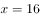，此时B地区为名，符合“D地区人数不超过任何其他地区”的要求。

方法二：根据题意可知，名，，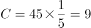名，D不超过任何其他地区人数（即人数最少）；故考虑代入排除，问至少，从小到大依次代入：

代入A项：，故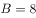，，排除；

代入B项：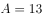，故，，排除；

代入C项：，故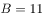，，排除；

由于A、B、C三项均不满足条件，因此正确答案只有D项。

验证D项：，故，，符合题意，当选。

故正确答案为D。

---

### 第 2 题　qid 2776110 · 数学运算

商场有大、小两种果篮销售，每个小号果篮由500克火龙果、300克葡萄和700克橙子组成，每个大号果篮由700克火龙果、1300克葡萄和1000克橙子组成。某日通过果篮方式销售水果超过300千克，其中是葡萄。问当日至少销售了多少千克火龙果？

- **A**. 不到85千克　✅
- **B**. 85-87千克
- **C**. 87-89千克
- **D**. 超过89千克

**答案**：A

**官方解析**

设小号果篮有个，大号果篮有个，根据题意可知：小号果篮总重量千克，大号果篮总重量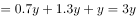千克，则可列式：①，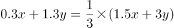②。通过②式解得，代入①式可得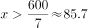，因、均为整数，则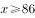，由于题干提问为“至少销售”，则取值应尽量小。代入验证：若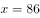，则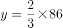为非整数，排除；若，则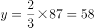为整数，满足，故当日至少销售了千克火龙果。

故正确答案为A。

---

### 第 3 题　qid 2776054 · 数学运算

小李有一张银行卡，他忘记了密码的后3位，只记得这3个数全是奇数且有2个相同。问他尝试不超过两次就输入正确密码的概率为多少？

- **A**. 
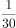
　✅
- **B**. 
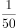

- **C**. 
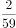

- **D**. 

**答案**：A

**官方解析**

奇数为1、3、5、7、9，共五个，总情况为先从5个奇数中选择2个不同奇数，有种，再从中选择1个奇数为重复出现两次的，有种。考虑后3位数字的顺序：在后3位中选2位为重复数字，有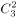种，则总情况数为种。要求尝试不超过两次就输入正确密码，则分类讨论如下：第一次尝试正确的概率为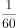；第一次错误第二次正确的概率为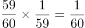，则尝试不超过两次就输入正确密码的概率为。

故正确答案为A。

---

### 第 4 题　qid 2776059 · 数学运算

A、B两地医院分别有库存呼吸设备10台和6台，现需要支援C地医院9台、D地医院7台。已知从A地调运一台设备到C地和D地的运费分别为400元和600元，从B地调运一台设备到C地和D地的运费分别为300元和700元。如果总运费不能超过7800元，共有多少种调运方案？

- **A**. 3
- **B**. 4　✅
- **C**. 5
- **D**. 6

**答案**：B

**官方解析**

设A地向C地调运x台，根据题目条件可列下表：

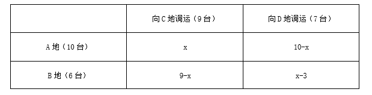

要求总运费不能超过7800元，可得400x+600（10-x）+300（9-x）+700（x-3）7800，解得x6。又因B地向D地调运台数（x-3）0，即x3，故x取值可为3、4、5、6，即符合题意的调运方案共有4种。

故正确答案为B。

---

### 第 5 题　qid 2776066 · 数学运算

某俱乐部选拔优秀选手参加游泳比赛，选手在规定时间内游完全程，就能获得参赛资格。已知有四分之一的选手获得了参赛资格，获得参赛资格选手的平均完成时间比规定时间快6秒，未获得参赛资格选手的平均完成时间比规定时间慢10秒，所有选手的平均完成时间为140秒，则本次选拔的规定时间为多少秒？

- **A**. 116
- **B**. 125
- **C**. 134　✅
- **D**. 139

**答案**：C

**官方解析**

方法一：方程法。设本次选拔的规定时间为秒，选手总人数为人，则获得参赛资格的有人，未获得参赛资格的有人，由题意可列方程：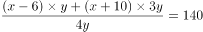，解得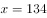。

方法二：线段法。本题涉及平均数的混合，结合题意可画出如下线段：

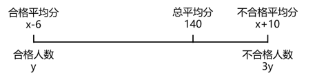

根据线段法“距离与量成反比”，可得距离之比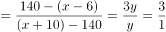，解得。

故正确答案为C。

---

### 第 6 题　qid 2776071 · 数学运算

甲队参加四场篮球比赛，前两场场均得分为第三场得分的，第四场得72分，是第三场得分的0.9倍。问甲队所有比赛平均每场得多少分？

- **A**. 64
- **B**. 66
- **C**. 68　✅
- **D**. 72

**答案**：C

**官方解析**

根据题意可得，第四场得72分，则第三场得分为分，根据“前两场场均得分为第三场得分的”可得，前两场场均得分为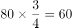分，故前两场总得分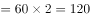分，则甲队所有比赛平均每场得分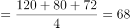分。

故正确答案为C。

---

### 第 7 题　qid 2776080 · 数学运算

AB两地间有县道连接，BC两地间有高速公路连接，且AB间路程是BC间路程的。郭某从A地开车匀速前往B地，到B地后以AB间2倍的速度开往C地，共用时2小时30分。由C地返回A地时高速公路行驶速度不变，县道行驶速度比去程降低，则返程用时为：

- **A**. 2小时45分
- **B**. 2小时50分
- **C**. 3小时10分
- **D**. 3小时15分　✅

**答案**：D

**官方解析**

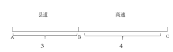

题干中只给出时间，没有具体的速度和路程，可以用赋值法。如图所示，根据题意可赋值AB间路程为3，BC间路程为4；设从A地开往C地时，AB间速度为，则BC间速度为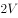，用时2小时30分，即150分钟，代入公式：时间min，解得。

从C地开往A地，BC间速度不变，为，AB间速度为，则返程用时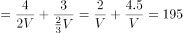min，即3小时15分。

故正确答案为D。

---

### 第 8 题　qid 2776083 · 数学运算

某工厂有甲、乙两个生产车间，每个工人的生产效率都相同。甲车间的总生产效率是乙车间的1.5倍；从甲车间调派30名工人到乙车间之后，甲车间的生产效率是乙车间的1.2倍。问需要从甲车间再调多少名工人到乙车间，两个车间的生产效率才能相同？

- **A**. 20
- **B**. 22
- **C**. 24
- **D**. 25　✅

**答案**：D

**官方解析**

根据题意“每个工人的生产效率都相同”，可知甲乙车间的工人数比等于效率比。设乙车间原有工人数为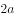，则甲车间原有工人数为。由“从甲车间调派30名工人到乙车间之后，甲车间的生产效率是乙车间的1.2倍。”可得，，解得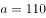，则乙车间原有工人数为名，甲车间原有工人数名。甲车间调派30名工人到乙车间后，甲车间现有工人数为名，乙车间现有工人数为名。要想两个车间的生产效率相同，则两个车间工人数应相同为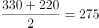名，那么需要从甲车间再调名工人到乙车间。

故正确答案为D。

---

### 第 9 题　qid 2776024 · 数学运算

超市采购一批食用油，其中玉米油每桶进价比花生油低，若花生油利润定为进价的，玉米油利润定为进价的，则花生油比玉米油每桶售价高10元。问玉米油每桶比花生油进价低多少元？

- **A**. 10　✅
- **B**. 15
- **C**. 24
- **D**. 25

**答案**：A

**官方解析**

设花生油每桶进价为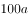元，则玉米油每桶进价为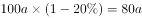元。根据题意可得表格：

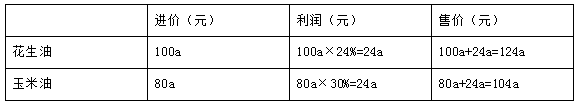

根据“花生油比玉米油每桶售价高10元”可得，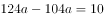，解得，则玉米油每桶比花生油进价低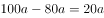元。

故正确答案为A。

---

### 第 10 题　qid 2776037 · 数学运算

某农场有180台收割机，每天可收割吨水稻。现将台收割机更换为新款收割机，生产效率比之前高；剩余的收割机进行升级，生产效率可以提高。如要求升级后的收割机每天水稻收割总量不低于吨，新款收割机每天水稻收割总量不低于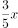吨。则的取值有多少种不同的可能性？

- **A**. 2
- **B**. 3　✅
- **C**. 4
- **D**. 5

**答案**：B

**官方解析**

假设每台收割机原来每天可收割1吨水稻，则应为。更换了台新款收割机后，生产效率变为，余下的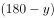台收割机升级后的效率变为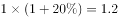。根据题目要求“升级后的收割机每天水稻收割总量不低于吨，新款收割机每天水稻收割总量不低于吨”可列式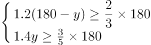，化简整理得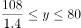，即近似为，且为整数，故可取78、79、80这三个值，3种不同的可能性。

故正确答案为B。

---

### 第 11 题　qid 2776040 · 数学运算

某通信信道可以传输的信号由1、2、3、4四个数字组成，每组信号包含4个数字（可重复），且前两个数字必须为奇数。某次传输过程中共传输了250组信号，其中传输次数最多的信号传输了次。问的最小值为：

- **A**. 2
- **B**. 3
- **C**. 4　✅
- **D**. 5

**答案**：C

**官方解析**

每组信号中的数字可重复，且前两个数字必须为奇数，则只能是1或3，故有种可能；后两个数字则可以是四个数字中的任意数，故有种可能。因此这组信号共有种情况。为保证值最小，则其它信号应尽可能多，因此假设每种信号传输次数都为，即，解得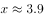，最少3.9次，则向上取整为4次。

故正确答案为C。

---

### 第 12 题　qid 2776044 · 数学运算

某课题小组由8个人组成，他们各自负责撰写书稿的一部分，完成后通过电子邮件传递书稿。问要让每个人都得到完整书稿，课题小组总共至少需要发送多少封邮件？（将同一封邮件同时抄送给个人，视作发送封邮件）

- **A**. 14　✅
- **B**. 16
- **C**. 36
- **D**. 72

**答案**：A

**官方解析**

每人撰写一部分，共8个部分，若想让发送次数尽可能少，则应由其中一人汇总，此时需要其余7人将自己的部分发送给汇总人，共计7次。汇总人汇总后再发给其余7人，此时还需要7次，共计次。

故正确答案为A。

---

### 第 13 题　qid 2776072 · 数学运算

研究人员在A、B、C、D、E五块试验田中种植甲、乙、丙、丁、戊五种作物，每块试验田只种一种作物，每年都在所有的安排中随机挑选一种进行种植。问在连续的3年中，A试验田至少2年种植同一种作物的概率为：

- **A**. 

- **B**. 

- **C**. 

　✅
- **D**. 
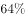

**答案**：C

**官方解析**

方法一：给情况求概率，考虑公式：概率。总情况为连续的3年中五块试验田随机种植五种作物，有种情况。满足情况为A试验田至少2年种植同一种作物，情况数相对较多，正难则反，考虑反面情况：A试验田连续3年种植的作物各不相同，有种情况。则题目所求概率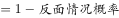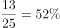。

方法二：正面情况较复杂，讨论反面情况，即A试验田连续3年种植的作物各不相同的概率。A试验田第一年可以种植任意一种作物，概率为1；第二年可以种植剩余四种作物中的任意一种作物，概率为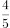；第三年可以种植剩余三种作物中的任意一种作物，概率为。则题目所求概率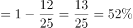。

故正确答案为C。

---

### 第 14 题　qid 2776086 · 数学运算

由于采用了新的种植技术，某种农产品的产量和品质都得到了提升。在平均每亩增产的同时，每千克售价也增加了。尽管每亩生产成本增加了，但每亩利润也增加了。问采用新种植技术后，每亩利润占每亩销售收入的比例在以下哪个范围内？

- **A**. 
不到

- **B**. 
~
　✅
- **C**. 
~

- **D**. 
超过

**答案**：B

**官方解析**

赋值该农产品在采用新的种植技术前的平均每亩产量为4，每千克售价为5，假设该农产品原来每亩的生产成本为，则根据题意并结合公式：利润售价成本，可得下表：

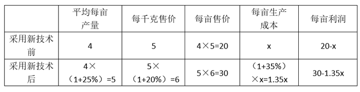

则可知，解得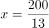。采用新种植技术后，每亩利润，每亩利润占每亩销售收入的比例，在~的范围内。

故正确答案为B。

---

### 第 15 题　qid 2776089 · 数学运算

甲、乙、丙从长360米的圆形跑道上的不同点同时出发，沿顺时针方向匀速跑步。3分钟后甲追上乙，又过1分30秒后丙也追上乙，又过3分30秒后丙追上甲，又过5分30秒后丙第二次追上乙。问出发时甲在乙身后多少米?

- **A**. 48
- **B**. 84　✅
- **C**. 108
- **D**. 144

**答案**：B

**官方解析**

根据题意可知，甲乙丙三人在环形跑道上的位置如图所示。设甲丙之间的距离为，甲乙之间的距离为。则根据题意可得

······①；

······②；

······③；

因丙第二次追乙时，两人起点相同，根据环形追及公式可得，，解得米/分，代入②式可得米；可得米，又因为米，因此可得米。

故正确答案为B。

---

### 第 16 题　qid 2776093 · 数学运算

小王开车以80千米/小时的速度向北行驶，发现一辆在直线轨道上匀速行驶的火车车头始终位于自己的正西方，且逐渐变远。已知该火车的速度为160千米/小时，问小王行驶1分钟后，火车车头与自己的距离将增加多少千米?

- **A**. 

- **B**. 

- **C**. 

　✅
- **D**. 

**答案**：C

**官方解析**

根据题意，火车车头始终在小王正西方，则运动开始后，小王和车头始终在同一水平线上，如上图所示。假设开始时小王和火车车头都在A点，此时二者距离为0千米，1分钟后小王到达B点，车头到达C点，此时火车车头与小王的距离BC即为增加的距离，因为千米，千米，根据勾股定理，则千米，故此时火车车头与小王的距离增加千米。

故正确答案为C。

---

### 第 17 题　qid 2776095 · 数学运算

一块长方形土地的周长为260米，面积为3600平方米。将该土地划分成边长10米的小正方形土地。现从中选取3块，使得任意两块既不同行也不同列。问有多少种不同的选取方式？

- **A**. 不到200种
- **B**. 200—400种
- **C**. 400—800种
- **D**. 超过800种　✅

**答案**：D

**官方解析**

设这块长方形土地的长为米，则宽为米。根据面积为3600平方米，可列式：，解得，，即长为90米，宽为40米。则在长方形内，边长为10米的小正方形每行有个，每列有个，一共有个。根据题干要求，分步选取：

①先选第1块，一共有种选取方式；

②再选第2块，与第1块既不同行也不同列的有个小正方形，则有种选取方式；

③最后选第3块，与第1、2块既不同行也不同列的有个小正方形，则有种选取方式；

根据题意可知，选取过程中不考虑顺序，因此有次重复，故一共有种不同的选取方式，超过800种。

故正确答案为D。

---

### 第 18 题　qid 2776101 · 数学运算

某次考试有名考生参加，所有考生的成绩都不同。成绩比小张好的考生和成绩比小李差的考生人数之和为，成绩比小张差的考生和成绩比小李好的考生人数之和为。问的值为：

- **A**. 

- **B**. 

　✅
- **C**. 

- **D**. 

**答案**：B

**官方解析**

由题意可知：成绩比小张好的成绩比小李差的，成绩比小张差的成绩比小李好的。因为成绩比小张好的成绩比小张差的小张成绩比小李好的成绩比小李差的小李考生总人数，即，解得。

故正确答案为B。

---

### 第 19 题　qid 2776103 · 数学运算

商店销售某款橡皮，有每盒3块、每盒5块和每盒10块三种不同的包装，且只能整盒出售而不能拆散。某日卖出这款橡皮不到50盒，且当日任意2名顾客购买的橡皮块数都不相同。问当天最多有多少名顾客购买了这款橡皮？

- **A**. 17
- **B**. 18　✅
- **C**. 19
- **D**. 20

**答案**：B

**官方解析**

根据题意，橡皮盒数不到50盒，要想顾客人数尽可能多，则每人购买的数量应该尽可能少。

①若每人购买一盒，则购买的数量组合有种，即3种情况；

②若每人购买两盒，则购买的数量组合有种，因为任意2名顾客购买的橡皮数量不相同，与购买一盒10块的数量重复，剔除，满足要求的共5种情况；

③若每人购买三盒，则购买的数量组合有种，因为与相同，与相同，与相同，剔除掉3种情况，满足要求的有种情况。

此时共购买橡皮盒数为盒，因为购买数量小于50盒，即最多可以购买49盒，因此最多还可以购买盒，若每人购买4盒，人数人，即最多3人。

因此最多有名顾客购买了这款橡皮。

故正确答案为B。

---

## 判断推理

### 第 1 题　qid 2776039 · 图形推理

从所给的四个选项中，去掉哪一个后，剩下的图形序列可以呈现一定的规律性？

- **A**. A
- **B**. B　✅
- **C**. C
- **D**. D

**答案**：B

**官方解析**

图形元素组成不同，且无属性规律，考虑数量规律。观察发现，图形被分割，封闭面明显，考虑数面，题干图形和选项都是3个面，无法排除，考虑面的细化。发现题干的两幅图都是由2个三角形的面和1个四边形的面组成，观察选项，只有B项是由3个三角形的面组成，没有四边形的面，不能和题干形成规律性，故只有B项不符合规律。
本题为选非题，故正确答案为B。

---

### 第 2 题　qid 2776045 · 图形推理

从所给的四个选项中，选择最合适的一个填入问号处，使之呈现一定的规律性：

- **A**. A　✅
- **B**. B
- **C**. C
- **D**. D

**答案**：A

**官方解析**

图形元素组成相同，优先考虑位置规律。观察发现，图中小黑球沿16宫格的内圈每次顺时针移动一格，空白1沿外圈每次顺时针移动两格，空白2沿外圈每次顺时针移动一格，因此？处图形的小黑球、空白1和空白2的位置如下图所示，对应A项。

故正确答案为A。

---

### 第 3 题　qid 2776050 · 图形推理

从所给的四个选项中，选择最合适的一个填入问号处，使之呈现一定的规律性：

- **A**. A
- **B**. B
- **C**. C
- **D**. D　✅

**答案**：D

**官方解析**

图形元素组成不同，考虑数量规律。每个图形中均存在一个黑色三角形和白色区域，并且题干所有图形中白色区域面积均为黑色区域面积的3倍，如下图所示，只有D项符合。

故正确答案为D。

---

### 第 4 题　qid 2776055 · 图形推理

从所给的四个选项中，选择最合适的一个填入问号处，使之呈现一定的规律性：

- **A**. A
- **B**. B
- **C**. C
- **D**. D　✅

**答案**：D

**官方解析**

元素组成不同，优先考虑属性规律。观察发现，题干图形均为轴对称图形，且每幅图的对称轴依次呈顺时针旋转的规律，排除A、C两项。继续观察，题干每幅图形的对称轴均有穿过原图形的交点，排除B项，只有D项符合。

故正确答案为D。

---

### 第 5 题　qid 2776062 · 图形推理

从所给的四个选项中，选择最合适的一个填入问号处，使之呈现一定的规律性：

- **A**. A
- **B**. B
- **C**. C　✅
- **D**. D

**答案**：C

**官方解析**

元素组成相似，优先考虑样式规律。九宫格优先横行看，第一行中，将第二幅图覆盖到第一幅图上得到第三幅图；第二行验证满足此规律；第三行运用此规律，只有C项符合。
故正确答案为C。

---

### 第 6 题　qid 2776136 · 图形推理

把下面的六个图形分为两类，使每一类图形都有各自的共同特征或规律，分类正确的一项是：

- **A**. ①③④，②⑤⑥
- **B**. ①③⑤，②④⑥
- **C**. ①②⑥，③④⑤　✅
- **D**. ①④⑥，②③⑤

**答案**：C

**官方解析**

本题为分组分类题目，元素组成相同，但无位置规律，优先考虑属性规律。观察发现，题干图形均由黑色部分和白色部分组成，图①②⑥中白色部分均为轴对称图形，图③④⑤中白色部分均为中心对称图形，故图①②⑥为一组，图③④⑤为一组。
故正确答案为C。

---

### 第 7 题　qid 2776139 · 图形推理

把下面的六个图形分为两类，使每一类图形都有各自的共同特征或规律，分类正确的一项是：

- **A**. ①③④，②⑤⑥
- **B**. ①③⑥，②④⑤　✅
- **C**. ①②⑤，③④⑥
- **D**. ①④⑥，②③⑤

**答案**：B

**官方解析**

元素组成不同，且无明显属性规律，考虑数量规律。观察发现，题干图形“窟窿”较多，且分割区域明显，考虑数面，但数面无法选出正确答案，考虑面的细化。继续观察发现，图①③⑥中最小的面均为正方形，图②④⑤中最大的面均为正方形，故图①③⑥为一组，图②④⑤为一组。
故正确答案为B。

---

### 第 8 题　qid 2776144 · 图形推理

把下面的六个图形分为两类，使每一类图形都有各自的共同特征或规律，分类正确的一项是：

- **A**. ①②③，④⑤⑥
- **B**. ①②⑤，③④⑥　✅
- **C**. ①②④，③⑤⑥
- **D**. ①④⑥，②③⑤

**答案**：B

**官方解析**

元素组成不同，优先考虑属性规律。观察发现，题干图形均由两个轴对称图形组成，如下图所示，将所有图形的对称轴画出来后发现，图①②⑤中两个图形的对称轴方向相同，图③④⑥中两个图形的对称轴方向垂直，故图①②⑤为一组，图③④⑥为一组。

故正确答案为B。

---

### 第 9 题　qid 2776146 · 图形推理

下面①和②分别是给定立体图形的正视图和后视图，此立体图形由三块完全相同的图形构成，则该图形是：

- **A**. A　✅
- **B**. B
- **C**. C
- **D**. D

**答案**：A

**官方解析**

本题考查立体拼合。四个选项中，A项的立体图形可以组成题干立体图形，如下图所示：

四个选项中，B项的立体图形可以组成题干立体图形，如下图所示：

注：本题有误，AB项均能拼成。

---

### 第 10 题　qid 2776149 · 类比推理

下列哪个选项可与①和②组成一个长方体？

- **A**. A
- **B**. B
- **C**. C
- **D**. D　✅

**答案**：D

**官方解析**

本题考查立体拼合。根据题干可知组成的是一个4×2×3的长方体，图①有3层，11个小方块，且最下面一层不缺方块，图②有3个小方块，可知要找一个有2层，10个小方块的图形，B项有13个小方块，C项有3层，排除B、C两项。从下向上逐层分析题干图形，第一层放了8个小方块，对比A、D两项图形，均有一层含有7个小方块，可以与图①中顶层的一个小方块拼成一整层，观察这两项剩余的三个小方块，只有D项剩余的三个小方块呈“L”形，可以与图②一起拼入图①的中间层，具体拼合方式如下图所示，排除A项。

故正确答案为D。

---

### 第 11 题　qid 2776051 · 定义判断

经验假说是根据观察或实验的种种结果及已有的科学原理对事物现象及其规律所作出的推测性解释；而理论假说则是通过直觉、想象、抽象等思维过程对事物现象及其规律所作出的推测性解释。
根据上述定义，下列属于理论假说的是：

- **A**. 伽利略通过多次斜面实验，提出了惯性概念
- **B**. 哥德巴赫通过对数字规律的考察，提出了哥德巴赫猜想　✅
- **C**. 贝塞尔发现天狼星的运动具有周期性偏差，提出了天狼星有伴星的猜测
- **D**. 哥白尼在不同的时间和地点观察行星，发现每颗行星运行情况都不相同，提出了日心说

**答案**：B

**官方解析**

第一步：找出定义关键词。
经验假说：“根据观察或实验的种种结果及已有的科学原理”；
理论假说：“通过直觉、想象、抽象等思维过程”。
第二步：逐一分析选项。
A项：伽利略根据多次斜面实验的结果及已有的与重力相关的科学原理，提出了惯性概念，符合“根据观察或实验的种种结果及已有的科学原理”，符合经验假说，不符合理论假说，排除；
B项：哥德巴赫考察数字规律提出猜想，是一种抽象的思维过程，符合“通过直觉、想象、抽象等思维过程”，符合理论假说，当选；
C项：贝塞尔根据观察到的天狼星的运动及已有的与伴星相关的科学原理，提出了天狼星有伴星的猜测，符合“根据观察或实验的种种结果及已有的科学原理”，符合经验假说，不符合理论假说，排除；
D项：哥白尼根据在不同的时间和地点观察到的行星运行情况，结合已有的天体相关科学原理提出日心说，符合“根据观察或实验的种种结果及已有的科学原理”，符合经验假说，不符合理论假说，排除。
故正确答案为B。

---

### 第 12 题　qid 2776057 · 定义判断

并提是古代汉语中常见的一种修辞方法，为了使句子紧凑，文辞简练，把本来应该用两个短语或者句子表达的内容，合并为一个短语或句子。合并时把相同的成份放在一起，使短语或句子的前后两部分有一种分别相承的关系。
根据上述定义，下列没有使用并提修辞手法的是：

- **A**. 《论衡·明雩》：“尧、汤水旱。”
- **B**. 《长恨歌》：“行宫见月伤心色，夜雨闻铃肠断声。”　✅
- **C**. 《孟子·离娄上》：“继之以规矩准绳，以为方圆平直。”
- **D**. 《颜氏家训·风操篇》：“父之遗书，母之杯圈，感其手口之泽，不忍读用。”

**答案**：B

**官方解析**

第一步：找出定义关键词。
“把两个短语或者句子表达的内容合并为一个短语或句子”、“把相同的成份放在一起”、“使短语或句子的前后两部分有一种分别相承的关系”。
第二步：逐一分析选项。
A项：“尧、汤水旱”。意思是尧君在位时遭遇洪水，汤君在位时遭遇大旱。句中尧水和汤旱是两方面的内容，符合“把两个短语或者句子表达的内容合并为一个短语或句子”，符合定义，排除；
B项：“行宫见月伤心色，夜雨闻铃肠断声。”意思是行宫里看见月亮仿佛是伤心的颜色，夜雨中听到铃响如闻断肠声，每个句子表达的是各自的内容，不符合“把两个短语或者句子表达的内容合并为一个短语或句子”、“把相同的成份放在一起”、“使短语或句子的前后两部分有一种分别相承的关系”，不符合定义，当选；
C项：“继之以规矩准绳，以为方圆平直。”意思是用圆规、曲尺来制作方的、圆的，用水准、绳墨来制作平的、直的东西。句中规矩、准绳属于相同成份，方圆、平直属于相同成份，且两句为顺承关系，符合“把相同的成份放在一起”、“使短语或句子的前后两部分有一种分别相承的关系”，符合定义，排除；
D项：“父之遗书，母之杯圈，感其手口之泽，不忍读用。”意思是父亲留下的书籍，母亲用过的杯圈，觉得上面有汗水和唾水，就不忍再阅读使用。句中的手口之泽为遗书上的汗水和杯圈上的唾水，是两方面的内容，符合“把两个短语或者句子表达的内容合并为一个短语或句子”，符合定义，排除。
本题为选非题，故正确答案为B。

---

### 第 13 题　qid 2776064 · 定义判断

防御性倾听是指在沟通过程中，当讯息接收方察觉对方话语中的指责时，所做出的自我保护性的回应，例如否认、辩解、攻击等。
根据上述定义，当甲被乙指责做事不认真时，下列甲的回应中不属于防御性倾听的是：

- **A**. “你比我做事还不认真”
- **B**. “你知道我做事一向很认真”
- **C**. “最近身体不好，没办法全力以赴”
- **D**. “很抱歉，由于我不认真，给你带来了麻烦”　✅

**答案**：D

**官方解析**

第一步：找出定义关键词。
“在沟通过程中”、“当讯息接收方察觉对方话语中的指责时”、“做出的自我保护性的回应”、“例如否认、辩解、攻击等”。
第二步：逐一分析选项。
A项：“你比我做事还不认真”属于在受到指责时攻击对方，符合关键词“做出的自我保护性的回应”、“例如否认、辩解、攻击等”，符合定义，排除；
B项：“你知道我做事一向很认真”属于否认了对方的指责，符合关键词“做出的自我保护性的回应”、“例如否认、辩解、攻击等”，符合定义，排除；
C项：“最近身体不好，没办法全力以赴”属于在受到指责时为自己辩解，符合关键词“做出的自我保护性的回应”、“例如否认、辩解、攻击等”，符合定义，排除；
D项：“很抱歉，由于我不认真，给你带来了麻烦”属于接受了指责，没有自我保护性的回应，不符合关键词“做出的自我保护性的回应”、“例如否认、辩解、攻击等”，不符合定义，当选。
本题为选非题，故正确答案为D。

---

### 第 14 题　qid 2776070 · 定义判断

当事人适格是指就特定的诉讼，有资格以自己的名义成为原告或被告的成年人或法人，因而成为受本案例判决拘束的当事人，当事人非适格是指有缺陷的诉讼当事人，这种缺陷是指当事人因与特定诉讼标的没有事实上或法律上的关系，既不是该诉讼标的的权利或法律关系主体，也没有诉讼担当人的资格（比如失去财产管理与处分权等），对该诉讼根本没有诉讼实施权。
根据上述定义，下列选项中，“甲”为当事人适格的是：

- **A**. 甲13岁，在放学路上被该校高年级学生乙殴打致伤，甲起诉乙
- **B**. 甲与乙婚后育有一女丙，离婚后丙由乙抚养，甲一直未支付抚养费，于是乙起诉甲　✅
- **C**. 甲公司进行一项公共工程，路人乙因甲公司施工不当而摔倒，造成右臂骨折，后乙起诉甲公司要求国家赔偿
- **D**. 甲公司向乙公司借款100万，后向丙公司购买300万汽车一辆，甲将100万借款作为支付丙的分期付款的头期款，后甲公司破产，乙将甲列为被告

**答案**：B

**官方解析**

第一步：找出定义关键词。
当事人适格：“就特定的诉讼”、“有资格以自己的名义成为原告或被告”、“成年人或法人”、“受本案例判决拘束的当事人”；
当事人非适格：“有缺陷的诉讼当事人”、“当事人因与特定诉讼标的没有事实上或法律上的关系”、“不是该诉讼标的的权利或法律关系主体”、“没有诉讼担当人的资格（比如失去财产管理与处分权等）”、“对该诉讼根本没有诉讼实施权”。
第二步：逐一分析选项。
A项：甲13岁被乙打伤并起诉乙，甲是未成年人，且在此案件中甲也不是法人，不符合“成年人或法人”，不符合“当事人适格”定义，排除；
B项：甲和乙离婚后，甲不支付孩子丙的抚养费，于是乙起诉甲，符合“就特定的诉讼”、“有资格以自己的名义成为原告或被告”、“成年人或法人”、“受本案例判决拘束的当事人”，符合“当事人适格”定义，当选；
C项：甲公司在公共工程的施工过程中因施工不当造成乙受伤，但乙要求的是国家赔偿，而不是甲公司赔偿，所以甲公司不符合“受本案例判决拘束的当事人”，不符合“当事人适格”定义，排除；
D项：甲公司向乙公司借款100万，后甲公司破产，乙将甲列为被告，甲公司破产后已经不具备法人资格，不符合“成年人或法人”，不符合“当事人适格”定义，排除。
故正确答案为B。

---

### 第 15 题　qid 2776075 · 定义判断

感觉营销是指企业以产品或服务为载体，利用人们的感受器（眼、耳、鼻、口、指等）对光线、色彩、声音、气味等基本刺激的直接反应为消费者创造出一种心理舒适与精神满足，从而达到营销目的的营销方式。
根据上述定义，下列不属于感觉营销的是：

- **A**. 某面包店将新出炉的面包拿给过路群众免费试吃，不少人觉得好吃进店购买
- **B**. 某影院开了一家爆米花店，爆米花飘香四溢，即使是刚用过餐的顾客也觉得十分诱人，会购买一大桶带进放映厅
- **C**. 咖啡店通常光线较暗，并播放曲调舒缓的音乐，这样会给顾客带来一种独立的空间感和自在感，让更多顾客喜欢这里
- **D**. 人们往往倾向于填补图形中缺少的部分，如被遮住的一部分文字或图形等，许多公司正是利用这一点来鼓励人们参与活动，宣传自己的产品　✅

**答案**：D

**官方解析**

第一步：找出定义关键词。
“企业以产品或服务为载体”、“利用人们的感受器（眼、耳、鼻、口、指等）对光线、色彩、声音、气味等基本刺激的直接反应”、“为消费者创造出一种心理舒适与精神满足”、“达到营销目的的营销方式”。
第二步：逐一分析选项。
A项：该项中提到的“面包”为面包店的产品，符合“企业以产品或服务为载体”，“试吃”利用了人们的味觉，符合“利用人们的感受器（眼、耳、鼻、口、指等）对光线、色彩、声音、气味等基本刺激的直接反应”，不少人觉得好吃进店“购买”，符合“达到营销目的的营销方式”，符合定义，排除；
B项：该项中提到的“爆米花”为影院的产品，符合“企业以产品或服务为载体”，飘香四溢利用了人们的嗅觉，符合“利用人们的感受器（眼、耳、鼻、口、指等）对光线、色彩、声音、气味等基本刺激的直接反应”，顾客会“购买”一大桶，符合“达到营销目的的营销方式”，符合定义，排除；
C项：该项提到的咖啡店“光线较暗”、“播放曲调舒缓的音乐”是咖啡店提供的服务，利用了人们的听觉和视觉，符合“企业以产品或服务为载体”及“利用人们的感受器（眼、耳、鼻、口、指等）对光线、色彩、声音、气味等基本刺激的直接反应”，给顾客带来独立的空间感和自在感，符合“为消费者创造出一种心理舒适与精神满足”，符合定义，排除；
D项：该项提到的人们倾向于填补图形中缺少的部分，虽然利用了人们的视觉，但吸引人们参与活动的是填补图形的活动，而非企业的产品或服务本身，因此并未利用人们的视觉对产品或服务本身产生的反应，不符合“企业以产品或服务为载体”，“利用人们的感受器（眼、耳、鼻、口、指等）对光线、色彩、声音、气味等基本刺激的直接反应”，不符合定义，当选。
本题为选非题，故正确答案为D。

---

### 第 16 题　qid 2776029 · 定义判断

虚假同感偏差又叫作虚假一致性偏差，是指人们常常高估或夸大自己的信念、判断及行为的普遍性，它是人们坚信自己信念、判断正确性的一种方式。
根据上述定义，下列不属于虚假同感偏差的是：

- **A**. 他以为别人都是善良的　✅
- **B**. 这个青椒很好吃，我特意给你点的
- **C**. 我是他的粉丝，我同学肯定也很喜欢他
- **D**. 我支持这个做法，反对的人脑子不正常

**答案**：A

**官方解析**

第一步：找出定义关键词。
“高估或夸大自己的信念、判断及行为的普遍性”、“坚信自己信念、判断正确性”。
第二步：逐一分析选项。
A项：他以为别人都是善良的，只是个人的观点，不符合“高估或夸大自己的信念、判断及行为的普遍性”、“坚信自己信念、判断正确性”，不符合定义，当选；
B项：我觉得这个青椒很好吃才特意给你点的，无意间夸大自己意见的普遍性，把自己的判断也赋予他人身上，符合“高估或夸大自己的信念、判断及行为的普遍性”、“坚信自己信念、判断正确性”，符合定义，排除；
C项：因为自己是他的粉丝就认为同学肯定也很喜欢他，无意间夸大自己意见的普遍性，把自己的判断也赋予他人身上，符合“高估或夸大自己的信念、判断及行为的普遍性”、“坚信自己信念、判断正确性”，符合定义，排除；
D项：因为自己支持这个做法就认为反对者都是错误的，无意间夸大自己意见的普遍性，把自己的判断也赋予他人身上，符合“高估或夸大自己的信念、判断及行为的普遍性”、“坚信自己信念、判断正确性”，符合定义，排除。
本题为选非题，故正确答案为A。

---

### 第 17 题　qid 2776034 · 定义判断

行政机关为了实现行政管理或者公共服务目标，与公民、法人或者其他组织协商订立的具有行政法上权利义务内容的协议，属于行政协议。
根据上述定义，下列不属于行政协议的是：

- **A**. 某县自然资源管理局与某矿业公司签订矿业权出让协议
- **B**. 某区人民政府与王某签订政府保障性住房租赁协议
- **C**. 县房屋征收部门与被征人某教育局签订国有土地上房屋征收补偿协议
- **D**. 某市公安机关和某市交通管理部门签订关于联合整治超限超载专项行动合作协议　✅

**答案**：D

**官方解析**

第一步：找出定义关键词。
“行政机关为了实现行政管理或者公共服务目标”、“与公民、法人或者其他组织协商订立”、“具有行政法上权利义务内容的协议”。
第二步：逐一分析选项。
A项：某县自然资源管理局与某矿业公司，符合“行政机关为了实现行政管理或者公共服务目标”、“与公民、法人或者其他组织协商订立”；签订矿业权出让协议，符合“具有行政法上权利义务内容的协议”，符合定义，排除；
B项：某区人民政府与王某，符合“行政机关为了实现行政管理或者公共服务目标”、“与公民、法人或者其他组织协商订立”；签订政府保障性住房租赁协议，符合“具有行政法上权利义务内容的协议”，符合定义，排除；
C项：县房屋征收部门与被征人某教育局，符合“行政机关为了实现行政管理或者公共服务目标”、“与公民、法人或者其他组织协商订立”；签订国有土地上房屋征收补偿协议，符合“具有行政法上权利义务内容的协议”，符合定义，排除；
D项：关于联合整治超限超载专项行动合作协议，不符合“具有行政法上权利义务内容的协议”，不符合定义，当选。
本题为选非题，故正确答案为D。

---

### 第 18 题　qid 2776031 · 类比推理

先礼：后兵

- **A**. 居安：思危
- **B**. 头重：脚轻　✅
- **C**. 鞍前：马后
- **D**. 生离：死别

**答案**：B

**官方解析**

第一步：判断题干词语间逻辑关系。
先礼后兵是指先以讲礼貌的方式与对方交涉，行不通时再使用强硬的手段。在词语中，先与后、礼与兵分别为反义关系。
第二步：判断选项词语间逻辑关系。
A项：居安思危指虽然处在平安的环境里，也想到有出现危险的可能。在词语中，安与危为反义关系，但居与思并非反义关系，与题干逻辑关系不一致，排除；
B项：头重脚轻指头脑发胀，脚下无力。在词语中，头与脚、重与轻分别为反义关系，与题干逻辑关系一致，当选；
C项：鞍前马后指马前马后，追随左右。在词语中，前与后为反义关系，但鞍与马并非反义关系，与题干逻辑关系不一致，排除；
D项：生离死别指分离好像和死者永别一样。在词语中，生与死为反义关系，但离与别为近义关系，与题干逻辑关系不一致，排除。
故正确答案为B。

---

### 第 19 题　qid 2776036 · 类比推理

胃口：兴趣

- **A**. 心腹：器官
- **B**. 黑马：比赛
- **C**. 桃李：学生　✅
- **D**. 亲人：骨肉

**答案**：C

**官方解析**

第一步：判断题干词语间逻辑关系。
胃口可以比喻象征兴趣，二者构成比喻象征义。
第二步：判断选项词语间逻辑关系。
A项：心属于身体器官，而心腹是象征亲信的人，心腹与器官并无明显逻辑关系，与题干逻辑关系不一致，排除；
B项：黑马可以指在比赛中一鸣惊人的获胜者，二者为对应关系，与题干逻辑关系不一致，排除；
C项：桃李可以比喻象征学生，二者构成比喻象征义，与题干逻辑关系一致，当选；
D项：骨肉可以比喻象征亲人，二者构成比喻象征义，但两词顺序与题干相反，与题干逻辑关系不一致，排除。
故正确答案为C。

---

### 第 20 题　qid 2776043 · 类比推理

大米：大米粥

- **A**. 蜘蛛：蜘蛛网
- **B**. 玻璃：玻璃水
- **C**. 马尾：马尾辫
- **D**. 图书：图书馆　✅

**答案**：D

**官方解析**

第一步，判断题干词语间逻辑关系。
“大米”是“大米粥”的组成部分，二者之间为包容关系中的组成关系。
第二步，判断选项词语间逻辑关系。
A项：“蜘蛛网”是“蜘蛛”吐丝所编成的网状物，与题干逻辑关系不一致，排除；
B项：“玻璃水”的作用是清洗“玻璃”，与题干逻辑关系不一致，排除；
C项：“马尾辫”因看起来像“马尾”而得名，与题干逻辑关系不一致，排除；
D项：“图书”是“图书馆”的组成部分，二者之间为包容关系中的组成关系，与题干逻辑关系一致，当选。
故正确答案为D。
注：本题题干也可以看成“原材料与成品”的对应关系，但如果这么理解，是没有答案的，说明本题出题人没有细究对应关系与组成关系的区别，在这种情况下，可以择优选择组成关系。

---

### 第 21 题　qid 2776042 · 类比推理

电影：话剧：演员

- **A**. 公路：人行道：机动车
- **B**. 电器：空调：修理工
- **C**. 数学课：体育课：教师　✅
- **D**. 运算：存储：硬盘

**答案**：C

**官方解析**

第一步：判断题干词语间逻辑关系。
电影和话剧是两种不同的艺术形式，二者为并列关系，演员是在电影和话剧中进行表演的人。
第二步：判断选项词语间逻辑关系。
A项：公路一般指市区以外的可以通过各种车辆的宽阔平坦的道路，与人行道为并列关系，但机动车不能在人行道上行驶，与题干逻辑关系不一致，排除；
B项：空调是一种电器，二者为种属关系，与题干逻辑关系不一致，排除；
C项：数学课和体育课是两种不同的课程，二者为并列关系，教师是在数学课和体育课中进行授课的人，与题干逻辑关系一致，当选；
D项：运算和存储是计算机的两个功能，存储是硬盘的功能，与题干逻辑关系不一致，排除。
故正确答案为C。

---

### 第 22 题　qid 2776049 · 类比推理

道教：基督教：基督新教

- **A**. 软件：程序：游戏
- **B**. 怀表：手表：电子表
- **C**. 淡水湖：咸水湖：死海　✅
- **D**. 含羞草：茉莉花：玫瑰花

**答案**：C

**官方解析**

第一步：判断题干词语间逻辑关系。
道教和基督教是两种不同的宗教，二者为并列关系，基督新教是基督教的三大流派之一，二者为种属关系。
第二步：判断选项词语间逻辑关系。
A项：软件由程序、文档和数据三部分组成，软件和程序为组成关系，与题干逻辑关系不一致，排除；
B项：怀表和手表佩戴形式不同，二者为并列关系，电子表是内部装配有电子元件的表，有的电子表是怀表，有的电子表不是怀表，有的电子表是手表，有的电子表不是手表，电子表与怀表、手表均为交叉关系，与题干逻辑关系不一致，排除；
C项：淡水湖和咸水湖是并列关系，死海是咸水湖，二者为种属关系，与题干逻辑关系一致，当选；
D项：含羞草、玫瑰花、茉莉花是三种不同的植物，三者为并列关系，与题干逻辑关系不一致，排除。
故正确答案为C。

---

### 第 23 题　qid 2776053 · 类比推理

被告人：法庭：罪犯

- **A**. 江水：水电站：交流电
- **B**. 投资者：市场：消费者
- **C**. 高中生：学习：大学生
- **D**. 种子：试验田：农作物　✅

**答案**：D

**官方解析**

第一步：判断题干词语间逻辑关系。
罪犯是指因犯罪而服刑役的人，被告人在法庭由法官进行审判，被告人经过法庭审判可以变成罪犯，且法庭是个场所。
第二步：判断选项词语间逻辑关系。
A项：江水在水电站通过一系列操作后产生交流电，与题干逻辑关系不一致，排除；
B项：投资者与消费者是市场的两个不同主体，二者为并列关系，与题干逻辑关系不一致，排除；
C项：高中生经过努力学习后可以变成大学生，但学习并不是场所，与题干逻辑关系不一致，排除；
D项：种子经过试验田培育可以变成农作物，且试验田是试验场所，与题干逻辑关系一致，当选。
故正确答案为D。

---

### 第 24 题　qid 2776067 · 类比推理

月亮 对于 （    ） 相当于 理发师 对于 （    ）

- **A**. 潮汐；剪刀
- **B**. 太阳；学徒
- **C**. 月光；造型师
- **D**. 天体；职业　✅

**答案**：D

**官方解析**

逐一代入选项。
A项：潮汐是一种自然现象，指海水在月亮等天体作用下所产生的周期性运动，因此潮汐是由月亮引起的，二者为因果关系，剪刀是理发师理发时使用的工具，二者为工具对应关系，前后逻辑关系不一致，排除；
B项：月亮和太阳是并列关系，有的学徒是理发师，有的学徒不是理发师，有的理发师是学徒，有的理发师不是学徒，二者为交叉关系，前后逻辑关系不一致，排除；
C项：月光是从月亮照射到地球的光线，但光线来源于太阳，二者为对应关系，有的造型师是理发师，有的造型师不是理发师，有的理发师是造型师，有的理发师不是造型师，二者为交叉关系，前后逻辑关系不一致，排除；
D项：月亮是一个天体，理发师是一种职业，均为种属关系，前后逻辑关系一致，当选。
故正确答案为D。

---

### 第 25 题　qid 2776074 · 类比推理

（    ） 对于 行李箱 相当于 烹饪 对于 （    ）

- **A**. 滚轮；勺子
- **B**. 旅行；砂锅　✅
- **C**. 品牌；厨师
- **D**. 保险箱；红烧

**答案**：B

**官方解析**

逐一代入选项。
A项：滚轮是行李箱的组成部分，二者为组成关系，勺子是烹饪工具，二者为对应关系，前后逻辑关系不一致，排除；
B项：行李箱是用于旅行的工具之一，砂锅是用于烹饪的工具之一，二者均为工具对应关系，前后逻辑关系一致，当选；
C项：行李箱有不同的品牌，二者为对应关系，厨师烹饪，二者为主谓关系，前后逻辑关系不一致，排除；
D项：保险箱与行李箱是用途不同的两种箱子，二者为并列关系，红烧是一种烹饪方式，二者为种属关系，前后逻辑关系不一致，排除。
故正确答案为B。

---

### 第 26 题　qid 2776046 · 逻辑判断

小张、小王、小李、小赵4人参加学习小组，每人从《习近平谈治国理政》第一卷、《习近平谈治国理政》第二卷、《习近平谈治国理政》第三卷这三本书中挑选一本，再从这本书中选择出1-3个专题进行学习，并谈心得体会。已知：
（1）小张和小赵挑选的书不同，选择学习的专题数也不同
（2）有1人选择了1个专题进行学习，有2人选择2个专题进行学习
（3）小李选择了《习近平谈治国理政》第三卷中的3个专题进行学习
（4）每本书都有人挑选，小王和小赵挑选了《习近平谈治国理政》第一卷
由此可以推出：

- **A**. 小张和小李挑选了同一本书
- **B**. 小王选择了2个专题进行学习　✅
- **C**. 有人与小李选择了相同的书或专题数
- **D**. 小赵选择了第一卷的2个专题进行学习

**答案**：B

**官方解析**

第一步：分析题干条件。
（1）小张、小赵书不同，专题数不同
（2）1人选择了1个专题，2人选择了2个专题
（3）小李：第三卷，3个专题
（4）每本书都有人挑选，小王、小赵：第一卷
第二步：根据题干条件进行推理。
先从条件（3）入手进行推理，由条件（3）可知小李是3个专题，则剩余的小张、小王、小赵应与条件（2）匹配，又根据条件（1）小张、小赵专题数不同可知，小张、小赵中1人选择1个专题，1人选择2个专题，则另外一个选择2个专题的人为小王。因此，小王选择了2个专题。
故正确答案为B。

---

### 第 27 题　qid 2776056 · 逻辑判断

2020年的冬天似乎比往年更早到来。还没进入11月份，我国部分地区就出现了第一场降雪和气温降至零度以下的情况。有专家据此表示，2020年的冬天将成为我国60年来最冷的一个冬天。
以下哪项如果为真，最能削弱上述论述？

- **A**. 我国其他一些地区的气温并未出现较往年明显下降的迹象
- **B**. 11月前出现大雪天气的地区往年几乎没有出现过类似现象
- **C**. 在全球变暖的情况下，近年来我国冬季平均气温呈上升趋势
- **D**. 据统计，第一场降雪的时间与整个冬天的平均气温无明显相关　✅

**答案**：D

**官方解析**

第一步：找出论点和论据。
论点：2020年的冬天将成为我国60年来最冷的一个冬天。
论据：2020年的冬天似乎比往年更早到来。还没进入11月份，我国部分地区就出现了第一场降雪和气温降至零度以下的情况。
本题的论点说的是2020年冬天将是我国60年以来最冷的冬天，论据说的是第一场降雪和气温降至零下的时间，论点论据话题不一致，可以优先考虑拆桥。
第二步：逐一分析选项。
A项：选项指出其他一些地区气温并未明显下降，所以2020年的冬天不一定是60年来最冷的冬天，可以削弱，保留；
B项：选项指出一些地区往年几乎没有出现过11月前出现大雪天气的情况，只能说明2020年的天气反常，但是不能得出2020年的冬天是不是60年以来最冷的冬天，无法削弱，排除；
C项：选项指出近年来我国冬季平均气温呈上升趋势，无法得知2020年的冬天是不是60年以来最冷的冬天，无法削弱，排除；
D项：选项指出第一场降雪的时间与整个冬天的平均气温无明显相关，即不能由第一场降雪的时间得出整个冬天的气温情况，切断了论点与论据的联系，可以削弱，保留。
对比A、D两项，A项说的是其他一些地区气温未明显下降，这些地区有多少，对整个中国的平均气温的影响有多少，均不明确，即削弱力度比较弱，D项是拆桥削弱，说明由当前的论据推不出论点，力度比较强，因此，排除A项，D项当选。
故正确答案为D。

---

### 第 28 题　qid 2776068 · 逻辑判断

1990年，W市70岁以上老人骨折发生率很高，同时，70岁以上老人的死亡率也很高，因此可以得知，骨折高发导致了70岁以上老人死亡率的上升。
以下哪项如果为真，最能削弱上述结论？

- **A**. 1990年，W市正在经历战乱　✅
- **B**. W市很多70多岁以上的老人都是独居老人
- **C**. 此后十年，W市70岁以上老人的骨折率和死亡率一直很高
- **D**. W市60岁到65岁老人骨折发生率是70岁以上老人的2倍

**答案**：A

**官方解析**

第一步：找出论点和论据。
论点：骨折高发导致了70岁以上老人死亡率的上升。
论据：1990年，W市70岁以上老人骨折发生率很高，同时，70岁以上老人的死亡率也很高。
本题论点论据都在讨论骨折高发和70岁以上老人死亡率之间的关系，论点论据话题一致，且论点中存在因果关系，可优先考虑因果倒置和他因削弱。
第二步:逐一分析选项。
A项：该项说的是1990年W市正在经历战乱，说明战乱也是70岁以上老人死亡率高的原因，提出了另外一个导致70岁以上老人死亡率上升的关键因素，属于他因削弱，可以削弱，当选；
B项：该项说的是W市很多70多岁以上的老人都是独居老人，而论点说的是骨折高发导致了70岁以上老人死亡率的上升，话题不一致，无法削弱，排除；
C项：该项说的是此后十年，W市70岁以上老人的骨折率和死亡率一直很高，强调数据高，而论点强调的是骨折高发导致了70岁以上老人死亡率的上升，话题不一致，无法削弱，排除；
D项：该项说的是W市60岁到65岁老人骨折发生率是70岁以上老人的2倍，只说了两个年龄段之间骨折发生率的关系，并没有涉及死亡率，而论点说的是骨折高发导致了70岁以上老人死亡率的上升，话题不一致，无法削弱，排除。
故正确答案为A。

---

### 第 29 题　qid 2776081 · 逻辑判断

近年来，公众对于糖有害健康的讨论越来越多。数据表明白糖的销售量明显下降。这说明公众对糖的危害性的警觉导致了白糖销售量的下降。
以下哪项如果为真，最能削弱上述结论？

- **A**. 
盐和醋的销售量近年来不断攀升

- **B**. 
现在人均白糖消费量是10年前的

- **C**. 
减少白糖摄入后，一些嗜甜者出现了睡眠障碍

- **D**. 
近年来，白糖价格因为甘蔗种植面积大幅缩减而飙升
　✅

**答案**：D

**官方解析**

第一步：找出论点和论据。

论点：公众对糖的危害性的警觉导致了白糖销售量的下降。

论据：近年来，公众对于糖有害健康的讨论越来越多。数据表明白糖的销售量明显下降。

本题论点论据都在讨论公众对糖的危害性的警觉和白糖销售量下降之间的关系，论点论据话题一致，且论点中存在因果关系，可优先考虑因果倒置和他因削弱。

第二步：逐一分析选项。

A项：该项说的是盐和醋的销售量近年来不断攀升，而论点话题的主体是白糖的销售量，主体不一致，无法削弱，排除；

B项：该项说的是现在人均白糖消费量是10年前的，与论点讨论的白糖销售量下降的原因无关，无法削弱，排除；

C项：该项说的是减少白糖摄入后，一些嗜甜者出现了睡眠障碍，强调的是少吃糖后造成的后果，与论点讨论的白糖销售量下降的原因无关，无法削弱，排除；

D项：该项说的是近年来，白糖价格因为甘蔗种植面积大幅缩减而飙升，说明白糖价格飙升也是白糖销售量下降的原因，提出了另外一个导致白糖销售量下降的关键因素，属于他因削弱，可以削弱，当选。

故正确答案为D。

---

### 第 30 题　qid 2776085 · 逻辑判断

与其他能够有效替代化石燃料的能源作物相比，藻类的产油能力十分突出。为提高藻类燃料的出产率，有研究人员致力于开发转基因藻类。但是，反对者认为转基因藻类的大量繁殖会产生毒素，而且会将水体中的氧气消耗殆尽，造成水中其他生物大量死亡，这会导致生态平衡被严重破坏。
以下哪项如果为真，最能削弱反对者的担心？

- **A**. 很多科学家表示，转基因藻类非常安全
- **B**. 转基因藻类经过简单加工后就可以源源不断地提供理想的燃料
- **C**. 全球每年消耗大量石油和煤炭，如果再不找到一种替代燃料，全球能源很快会消耗殆尽
- **D**. 过去20年，已发生过数起实验室培植的转基因藻类外流事件，从未给自然环境造成严重后果　✅

**答案**：D

**官方解析**

第一步：找出论点和论据。
论点：转基因藻类的大量繁殖会产生毒素，而且会将水体中的氧气消耗殆尽，造成水中其他生物大量死亡，这会导致生态平衡被严重破坏。
论据：无。
本题的论点讨论的是转基因藻类大量繁殖最终会导致生态平衡被严重破坏，且本题没有论据，只有论点，优先考虑通过削弱论点的方式进行削弱。
第二步：逐一分析选项。
A项：该项指出很多科学家表示转基因藻类非常安全，但是没有提及科学家的观点是否准确，属于不明确项，无法削弱，排除；
B项：该项讨论的是转基因藻类经过简单加工可以提供理想的燃料，与论点话题不一致，属于无关项，无法削弱，排除；
C项：该项讨论的是需要找到一种替代燃料来供给全球的能源，与论点话题不一致，属于无关项，无法削弱，排除；
D项：该项指出过去20年，发生过多起实验室培植的转基因藻类外流事件，但没有给自然环境造成严重后果，说明转基因藻类在自然环境中不会因为大量繁殖而破坏生态平衡，削弱论点，当选。
故正确答案为D。

---

### 第 31 题　qid 2776027 · 逻辑判断

以前很多科学家相信，人类来自于非洲。但是最近科学家们在非洲的撒哈拉沙漠发现了早期灵长类动物4个物种的化石，这些物种可能生活在3900万年前，但它们与同期或者更早在非洲生活的物种都不相同，这表明它们是在其他地方进化后才到达非洲的。科学家们认为，最有可能的解释是这些物种源于亚洲，然后从亚洲迁移到了非洲。
以下哪项如果为真，最能支持上述结论？

- **A**. 这4个物种来自于灵长类家族中不同的分支，它们拥有同一个祖先
- **B**. 科学家们在亚洲发现了生活在4500万年前的这些早期灵长类动物化石　✅
- **C**. 进化成这4个早期灵长类动物的物种需花费很长时间，但在非洲却找不到其进化痕迹
- **D**. 3900万年前，在非洲没有物种能与这些早期灵长类动物相抗衡，因此它们有了一段繁盛的发展时期

**答案**：B

**官方解析**

第一步：找出论点和论据。
论点：最有可能的解释是这些物种源于亚洲，然后从亚洲迁移到了非洲。
论据：最近科学家们在非洲的撒哈拉沙漠发现了早期灵长类动物4个物种的化石，这些物种可能生活在3900万年前，但它们与同期或者更早在非洲生活的物种都不相同，这表明它们是在其他地方进化后才到达非洲的。
本题论据讨论的是发现有早期灵长类动物4个物种是从其他地方进化后来到非洲的，论点讨论的是这4个物种是从亚洲迁移到非洲的，论点和论据讨论的话题一致，考虑补充论据来进行加强。
第二步：逐一分析选项。
A项：该项讨论的是被发现的这4个物种有同一个祖先，与论点讨论的话题不一致，无法加强，排除；
B项：该项指出在亚洲发现了这些早期灵长类动物化石，4500万年前这些物种生活在亚洲，说明这些物种确实是从亚洲迁移到非洲的，补充论据，可以加强，当选；
C项：该项说的是进化成这4个早期灵长类动物的物种需要很长时间，且在非洲找不到其进化的痕迹，说明确实是在其他地方进化后才到达非洲的，但是否是从亚洲迁移过去不明确，与论点讨论的话题不一致，无法加强，排除；
D项：该项讨论了3900万年前这些早期灵长类动物在非洲有一段繁盛的发展时期，与论点讨论的话题不一致，无法加强，排除。
故正确答案为B。

---

### 第 32 题　qid 2776035 · 逻辑判断

小李对小张说：“你少吃一点咸菜，平时吃得太咸，将来会得高血压。”小张反驳道：“吃得咸不咸跟高血压没有关系，你看五十年代的人，天天都吃咸菜疙瘩，也没有现在这么多人得高血压。”
以下哪项如果为真，不能帮助小李质疑小张的观点？

- **A**. 过去医疗条件落后，民众健康意识淡薄，即使得了高血压也不知道
- **B**. 吃太多盐会影响钙和锌的吸收，易患骨质疏松，还会加重肝肾代谢负担　✅
- **C**. 五十年代的人作息更规律，运动量更大，有助于排出体内的钠，降低血压
- **D**. 吸烟、饮酒、高盐饮食、精神紧张都会导致高血压和心脑血管疾病风险增加

**答案**：B

**官方解析**

第一步：找出论点和论据。
论点：吃得咸不咸跟高血压没有关系。
论据：五十年代的人，天天都吃咸菜疙瘩，也没有现在这么多人得高血压。
论点和论据话题一致，讨论的都是吃得咸不咸和高血压的关系，可以优先考虑否定论点或者否定论据。
第二步：逐一分析选项。
A项：该项表明过去的人可能得了高血压也不知道，削弱了论据中五十年代得高血压的人不多，可以削弱，排除；
B项：该项表明吃太多盐所产生的除了高血压以外的负面后果有哪些，但并没有提及吃得咸会不会得高血压，属于无关项，无法削弱，当选；
C项：该项表明五十年代的人作息规律和运动量大，有助于排出体内的钠，可以起到降低血压的作用，进而使人们得高血压的可能性减少，所以说明吃得咸不咸和高血压有一定的关系，否定论点，可以削弱，排除；
D项：该项表明吸烟、饮酒、高盐饮食、精神紧张都会导致高血压风险增加，说明高盐饮食确实和高血压有关，否定论点，可以削弱，排除。
本题为选非题，故正确答案为B。

---

### 第 33 题　qid 2776041 · 逻辑判断

老王是胰腺癌晚期患者，医生曾告知他可能只能存活几个月。他在医生建议下，尝试了一种免疫新疗法，现在已生存了5年。根据老王的情况，医生认为这种免疫新疗法对治疗胰腺癌有效果，应该进行推广。
以下哪项如果为真，不能削弱医生的观点？

- **A**. 
这种免疫新疗法在临床中尚未得到大面积推广
　✅
- **B**. 
这种免疫新疗法所起到的效果与老王的个人体质有关

- **C**. 
即使只做手术和化疗，也会有左右的胰腺癌患者存活超过5年

- **D**. 
一种新的治疗方法是否可以推广应慎重决定，不能仅根据个案作出判断

**答案**：A

**官方解析**

第一步：找出论点和论据。
论点：这种免疫新疗法对治疗胰腺癌有效果，应该进行推广。
论据：老王是胰腺癌晚期患者，医生曾告知他可能只能存活几个月。他在医生建议下，尝试了一种免疫新疗法，现在已生存了5年。
第二步：逐一分析选项。
A项：该项表明目前免疫新疗法在临床中尚未得到大面积推广，无法说明新疗法是否有效及以后是否应该推广，为无关项，无法削弱，当选；
B项：该项表明这种免疫新疗法的效果与老王的个人体质有关，不一定能适用于其他人，所以不宜推广，可以削弱，排除；
C项：该项表明手术与化疗也可能使胰腺癌患者的生命延长5年，即传统疗法能起到与免疫新疗法同样的功效，既然传统疗法同样有效，就不一定非要推广免疫新疗法，可以削弱，排除；
D项：该项表明仅根据论据中老王的情况不能推出该免疫新疗法可以推广的结论，可以削弱，排除。
本题为选非题，故正确答案为A。

---

### 第 34 题　qid 2776047 · 逻辑判断

不少车辆在交通高峰期只有一人使用，极大浪费了有限的道路资源。因此，有人提出设置“多乘员车辆专用车道”（HOV），该车道只允许乘坐2人以上车辆进入，只有驾驶员一人的“单身车”不得在工作日的某些时间段内进入该车道，以此提高道路使用效率、缓解交通拥堵。
以下哪项如果为真，最能质疑上述设想？

- **A**. 因出发地或目的地不同等原因，单身车主找人合乘不易
- **B**. 设置HOV后，增加了车辆的变道难度，容易加剧交通拥堵　✅
- **C**. 有些单身车驾驶员可能以遮蔽车窗等手段逃避监管，侵占HOV
- **D**. 通过鼓励乘坐公共交通工具出行的方法，更能提高道路使用效率

**答案**：B

**官方解析**

第一步：找出论点和论据。
论点：设置“多乘员车辆专用车道”（HOV），该车道只允许乘坐2人以上车辆进入，只有驾驶员一人的“单身车”不得在工作日的某些时间段内进入该车道，以此提高道路使用效率、缓解交通拥堵。
论据：无。
本题只有论点没有论据，预设削弱论点的方式进行削弱，即说明设置“多乘员车辆专用车道”（HOV）不能提高道路使用效率、缓解交通拥堵。
第二步：逐一分析选项。
A项：该项说的是单身车主找人合乘不易，这些人可能无法使用HOV，与设置HOV能否提高道路使用效率、缓解交通拥堵无关，无法削弱，排除；
B项：该项说的是设置HOV后，反而容易加剧交通拥堵，则设置HOV不能提高道路使用效率、缓解交通拥堵，削弱论点，可以削弱，当选；
C项：该项说的是有些单身车驾驶员可能采取手段侵占HOV，与设置HOV能否提高道路使用效率、缓解交通拥堵无关，无法削弱，排除；
D项：该项说的是通过鼓励乘坐公共交通工具更能提高道路使用效率，与设置HOV能否提高道路使用效率、缓解交通拥堵无关，无法削弱，排除。
故正确答案为B。

---

### 第 35 题　qid 2776052 · 逻辑判断

近年来，全世界的水稻田中陆续出现了杂草稻，它们直接导致稻田减产、品质下降，灾害严重的稻田甚至大面积绝收。这种杂草稻是通过基因组变异去驯化并适应环境的，有着正常水稻所不具备的强大生长优势。因此，不少人认为它们的存在将严重影响正常水稻的产量。
以下哪项如果为真，不能支持上述结论？

- **A**. 杂草稻与正常水稻外观上极难区分，无法轻易清除
- **B**. 杂草稻米粒口感坚硬粗糙，收割时混入这种“假米”，稻米的品质将降低　✅
- **C**. 杂草稻生长速度极快，能迅速入侵到稻田中争夺资源，严重影响水稻的产量与品质
- **D**. 杂草稻随水稻的生长而生长，当该土地改种其他作物后，它会立刻休眠，直到这块地再次种植水稻后复活

**答案**：B

**官方解析**

第一步：找出论点和论据。
论点：不少人认为它们的存在将严重影响正常水稻的产量。
论据：这种杂草稻是通过基因组变异去驯化并适应环境的，有着正常水稻所不具备的强大生长优势。
本题为选非题，可以使用排除法，将可以支持的选项排除，剩余的即为无法支持的选项。
第二步：逐一分析选项。
A项：该项说的是杂草稻与正常水稻外观相似，无法轻易清除，说明杂草稻对正常水稻的影响无法轻易消除，则可能会影响正常水稻的产量，可以支持，排除；
B项：该项说的是混入杂草稻米粒会降低稻米的品质，而论点说杂草稻会影响正常水稻的产量，品质和产量话题不一致，无法支持，当选；
C项：该项说的是杂草稻生长速度快，会严重影响水稻的产量与品质，说明杂草稻确实会影响正常水稻的产量，可以支持，排除；
D项：该项说的是杂草稻会一直伴随水稻生长，对正常水稻的影响一直存在，则可能会影响正常水稻的产量，可以支持，排除。
本题为选非题，故正确答案为B。

---

## 资料分析

### 材料 1

2017年，国内旅游市场高速增长，入出境市场平稳发展，供给侧结构性改革成效明显。国内旅游人数50.01亿人次，比上年同期增长；入出境旅游总人数2.7亿人次，增长；全年实现旅游总收入5.40万亿元，增长；全年全国旅游业对GDP的综合贡献为9.13万亿元，占GDP总量的；旅游直接就业2825万人，旅游直接和间接就业7990万人，占全国就业总人口的。

一、全年国内旅游收入增长

2017年，国内旅游人数50.01亿人次，比上年同期增长。其中，城镇居民36.77亿人次，增长；农村居民13.24亿人次，增长。国内旅游收入4.57万亿元，增长。其中，城镇居民花费3.77万亿元，增长；农村居民花费0.80万亿元，增长。

二、全年入境过夜旅游人数增长

2017年，入境旅游人数13948万人次，比上年同期增长。其中，外国人2917万人次，增长；香港同胞7980万人次，下降；澳门同胞2465万人次，增长；台湾同胞587万人次，增长。入境旅游人数按照入境方式分，船舶占，飞机占，火车占，汽车占，其他占。

2017年，入境过夜旅游人数6074万人次，比上年同期增长。其中，外国人2248万人次，增长；香港同胞2775万人次，增长；澳门同胞522万人次，增长；台湾同胞529万人次，增长。

三、全年国际旅游收入达1234亿美元

2017年，国际旅游收入1234亿美元，比上年同期增长。其中，外国人在华花费695亿美元，增长；香港同胞在内地花费301亿美元，下降；澳门同胞在内地花费83亿美元，增长；台湾同胞在大陆花费155亿美元，增长。

四、全年入境外国游客亚洲占，以观光休闲为目的游客占

2017年，入境外国游客人数4294万人次，亚洲占，美洲占，欧洲占，大洋洲占，非洲占。其中，按照年龄分，14岁以下人数占，15—24岁占，25—44岁占，45—64岁占，65岁以上占；按性别分，男占，女占；按目的分，会议/商务占，观光休闲占，探亲访友占，服务员工占，其他占。

2017年，按入境旅游人数排序，我国主要客源市场前17位国家如下：缅甸、越南、韩国、日本、俄罗斯、美国、蒙古、马来西亚、菲律宾、新加坡、印度、加拿大、泰国、澳大利亚、印度尼西亚、德国、英国。

五、全年中国公民出境旅游人数达13051万人次

2017年，中国公民出境旅游人数13051万人次，比上年同期增长。

#### 第 1 题　qid 2776158 · 综合

2017年，全国入境旅游人数较出境旅游人数多多少万人次？

- **A**. 892
- **B**. 895
- **C**. 897　✅
- **D**. 903

**答案**：C

**官方解析**

定位文字材料第二部分：2017年，入境旅游人数13948万人次；文字材料第五部分：2017年，中国公民出境旅游人数13051万人次。则2017年，全国入境旅游人数较出境旅游人数多万人次。

故正确答案为C。

---

#### 第 2 题　qid 2776159 · 综合

2016年，全国国内旅游人数约为入出境旅游总人数的多少倍？

- **A**. 17　✅
- **B**. 19
- **C**. 21
- **D**. 23

**答案**：A

**官方解析**

根据题干“2016年······为······的多少倍”，结合材料时间是2017年，可判定本题为基期倍数问题。定位文字材料第一段：2017年，······国内旅游人数50.01亿人次，比上年同期增长；入出境旅游总人数2.7亿人次，增长。根据公式：基期倍数，可得2016年，全国国内旅游人数约为入出境旅游总人数的倍数，满足条件的只有A项。

故正确答案为A。

---

#### 第 3 题　qid 2776160 · 平均数

2017年，城镇居民平均每人次旅游消费比农村居民约多多少元？

- **A**. 382
- **B**. 395
- **C**. 406
- **D**. 421　✅

**答案**：D

**官方解析**

根据题干“2017年······平均每人次旅游消费······”，结合材料时间是2017年，可判定本题为现期平均数问题。定位文字材料第一部分：2017年，······城镇居民36.77亿人次，······；农村居民13.24亿人次，······城镇居民花费3.77万亿元，······农村居民花费0.80万亿元。根据平均每人次旅游消费，则2017年，城镇居民平均每人次旅游消费比农村居民多元。

故正确答案为D。

---

#### 第 4 题　qid 2776161 · 综合

根据上述材料，以下分析不正确的是：

- **A**. 
2017年，入境外国游客人数：亚洲欧洲美洲大洋洲非洲

- **B**. 
2017年，入境旅游人数按入境方式分：其他方式汽车飞机船舶火车

- **C**. 
2017年，入境过夜旅游人数同比增速：澳门同胞台湾同胞外国人香港同胞

- **D**. 
2017年，主要客源市场国家按入境旅游人数：日本俄罗斯马来西亚印度尼西亚印度
　✅

**答案**：D

**官方解析**

A项：定位文字材料第四部分第一段：2017年，入境外国游客人数4294万人次，亚洲占，美洲占，欧洲占，大洋洲占，非洲占。根据公式：部分，可知入境外国游客人数占比越高，则对应的人数越多，故亚洲（）欧洲（）美洲（）＞大洋洲（）非洲（），正确；

B项：定位文字材料第二部分第一段：入境旅游人数按照入境方式分，船舶占，飞机占，火车占，汽车占，其他占。根据公式：部分，可知入境旅游方式占比越高，则对应的人数越多，故其他方式（）汽车（）飞机（）船舶（）火车（），正确；

C项：定位文字材料第二部分第二段：2017年，入境过夜旅游人数6074万人次，比上年同期增长。其中，外国人增长；香港同胞增长；澳门同胞增长；台湾同胞增长。可知：澳门同胞（）台湾同胞（）外国人（）香港同胞（），正确；

D项：定位文字材料第四部分第二段：2017年，按入境旅游人数排序，我国主要客源市场前17位国家如下：······日本、俄罗斯······马来西亚······印度······印度尼西亚······。可得入境旅游人数：印度尼西亚印度，错误。

本题为选非题，故正确答案为D。

---

#### 第 5 题　qid 2776163 · 综合

根据上述材料，以下说法正确的是：

- **A**. 
2017年，全国就业总人口超过8亿人

- **B**. 
2017年，国际旅游收入五成以上由外国人在华花费实现
　✅
- **C**. 
2017年，香港同胞在内地花费比台湾同胞在大陆花费多一倍以上

- **D**. 
2017年，入境外国游客中，44岁以下年龄段游客人数占以上

**答案**：B

**官方解析**

A项：定位文字材料第一段：2017年，······旅游直接和间接就业7990万人，占全国就业总人口的。根据公式：整体，可得全国就业总人口万人亿人8亿人，错误；

B项：定位文字材料第三部分第一段：2017年，国际旅游收入1234亿美元······其中，外国人在华花费695亿美元。根据公式：比重，可知外国人在华花费占比，超过五成，正确；

C项：定位文字材料第三部分第一段：2017年，国际旅游收入1234亿美元······其中，香港同胞在内地花费301亿美元······台湾同胞在大陆花费155亿美元。故，即多不到一倍，错误；

D项：定位文字材料第四部分第一段：2017年，······按照年龄分，14岁以下人数占，15—24岁占，25—44岁占。可得：44岁以下年龄段游客人数占比，错误。

故正确答案为B。

---

### 材料 2

8月份，规模以上工业原煤生产增速回升，煤炭进口保持较高水平；原油生产增速由负转正，进口继续增加；天然气生产保持较快增长，进口持续高速增长；电力生产加快。

一、原煤生产增速回升，煤炭进口保持较高水平，市场价格小幅波动

8月份，原煤产量3.0亿吨，同比增长，上月为下降；日均产量957万吨，环比增加49万吨。1—8月份，原煤产量22.8亿吨，同比增长。

8月份，煤炭主产区生产均开始回升。其中，内蒙古同比增长，上月为下降；山西同比下降，降幅较上月收窄2.2个百分点；陕西同比增长，增速较上月加快7.6个百分点；新疆同比增长，上月为下降。

8月份，煤炭进口2868万吨，比上月略降33万吨，但仍保持较高水平，同比增长。1—8月份，煤炭进口2.0亿吨，同比增长。

8月底，秦皇岛5500大卡煤炭综合交易价格为573元/吨，比7月底下降3元；5000大卡煤炭价格为510元/吨，比7月底下降17元；4500大卡煤炭价格为456元/吨，比7月底下降12元。

二、原油生产增速由负转正，进口持续增加

8月份，原油生产1600万吨，同比增长，上月为下降，为2015年11月以来首次正增长；日均产量51.6万吨，环比增加0.5万吨。1—8月份，原油产量12595万吨，同比下降。

原油进口持续增加，8月份进口原油3838万吨，比上月增加236万吨，同比增长。1—8月份，进口原油29919万吨，同比增长。

国际原油价格震荡上行，截至8月底，布伦特原油现货离岸价格为76.94美元/桶，比7月底上涨2.78美元/桶。

三、原油加工量增速有所放缓

8月份，原油加工量5031万吨，同比增长，增速比上月回落6.0个百分点；日均加工162.3万吨，环比减少1.4万吨。1—8月，原油加工量40041万吨，同比增长。

四、天然气生产保持较快增长，进口持续高速增长

8月份，天然气产量129亿立方米，同比增长，增速比上月回落0.8个百分点；日均生产4.2亿立方米，与上月基本持平。1—8月份，天然气产量1040亿立方米，同比增长。

天然气进口持续高速增长。8月份，进口天然气777万吨（1吨约为1380立方米），比上月增加39万吨，同比增长。1—8月份，进口天然气5718万吨，同比增长。

五、电力生产加快

8月份，发电量6404.9亿千瓦时，同比增长，增速比上月加快1.6个百分点；日均发电206.6亿千瓦时，再创新高。1—8月份，发电量同比增长，比去年同期加快1.2个百分点。

8月份，除风电外，其他品种电力生产同比增速较7月份均有所加快。其中火电同比增长，比上月加快1.7个百分点；水电增长，加快5.5个百分点；核电增长，加快2.7个百分点；太阳能发电增长，加快1.3个百分点。

因台风、降雨等气候因素影响，8月份风电大幅减少，增速比上月回落24.1个百分点，同比增长。

#### 第 6 题　qid 2776073 · 增长

本年度8月份，进口天然气环比增长约：

- **A**. 

　✅
- **B**. 

- **C**. 

- **D**. 

**答案**：A

**官方解析**

根据题干“······环比增长约”，结合选项是百分数，可判定本题为一般增长率计算问题。定位文字材料第四部分第二段可知：8月份，进口天然气777万吨（1吨约为1380立方米），比上月增加39万吨，同比增长。根据增长率，可知本年度8月份，进口天然气环比增长率为：。

故正确答案为A。

---

#### 第 7 题　qid 2776077 · 综合

本年度上半年，煤炭进口量约为多少万吨？

- **A**. 14198
- **B**. 14231　✅
- **C**. 14264
- **D**. 14297

**答案**：B

**官方解析**

定位文字材料第一部分第三段可知：8月份，煤炭进口2868万吨，比上月略降33万吨，但仍保持较高水平，同比增长。1—8月份，煤炭进口2.0亿吨，同比增长。本年度7月份，煤炭进口量为万吨。则本年度上半年，即1—6月份，煤炭进口量（1—8月份煤炭进口量）8月份煤炭进口量7月份煤炭进口量亿吨万吨万吨万吨。

（注意：选项尾数各不相同，可用尾数法快速锁定答案。）

故正确答案为B。

---

#### 第 8 题　qid 2776079 · 综合

本年度8月底，秦皇岛煤炭综合交易价格较7月底降幅最大的和最小的分别是：

- **A**. 5500大卡煤炭和5000大卡煤炭
- **B**. 5000大卡煤炭和4500大卡煤炭
- **C**. 4500大卡煤炭和5500大卡煤炭
- **D**. 5000大卡煤炭和5500大卡煤炭　✅

**答案**：D

**官方解析**

根据题干“······降幅最大的和最小的······”，可判定本题为一般增长率比较问题。定位文字材料第一部分第四段可知：8月底，秦皇岛5500大卡煤炭综合交易价格为573元/吨，比7月底下降3元；5000大卡煤炭价格为510元/吨，比7月底下降17元；4500大卡煤炭价格为456元/吨，比7月底下降12元。根据增长率，8月底，秦皇岛5500大卡煤炭综合交易价格较7月底的增长率为；5000大卡煤炭价格较7月底的增长率为；4500大卡煤炭价格较7月底的增长率为。比较可知8月底，秦皇岛煤炭综合交易价格环比降幅最大的是5000大卡煤炭，最小的是5500大卡煤炭。

故正确答案为D。

---

#### 第 9 题　qid 2776088 · 综合

以下关于煤炭主产区生产情况的说法正确的是：

- **A**. 
本年度8月份，各主产区产量同比均实现了增长

- **B**. 
本年度7月份，山西产区生产煤炭量同比增长

- **C**. 
本年度7、8月份，同时实现同比增长的只有陕西产区
　✅
- **D**. 
本年度7月份，各主产区生产煤炭量同比降幅：内蒙古山西新疆

**答案**：C

**官方解析**

A项：定位文字材料第一部分第二段，“8月份，煤炭主产区生产均开始回升。其中······山西同比下降”，并非所有产区均实现了增长，错误；

B项：定位文字材料第一部分第二段，“8月份······山西同比下降，降幅较上月收窄2.2个百分点”，则7月份，山西产区生产煤炭量同比增长率为：，错误；

C项：定位文字材料第一部分第二段，“8月份······陕西同比增长，增速较上月加快7.6个百分点”，则陕西产区8月份增长率为，7月份增长率为，即陕西产区7、8月份同时实现同比增长，所列其他煤炭主产区均不满足，正确；

D项：定位文字材料第一部分第二段，“8月份，煤炭主产区生产均开始回升。其中，内蒙古同比增长，上月为下降；山西同比下降，降幅较上月收窄2.2个百分点；陕西同比增长，增速较上月加快7.6个百分点；新疆同比增长，上月为下降”，故7月份，内蒙古产区降幅为；山西产区降幅为；新疆产区降幅为。即同比降幅的大小排序是新疆山西内蒙古，错误。

故正确答案为C。

---

#### 第 10 题　qid 2776091 · 综合

根据上述材料，下列描述不正确的是：

- **A**. 
本年度1—8月份，我国原油进口量高于原油生产量

- **B**. 
本年度8月份，原煤、天然气、电力的生产同比均增长

- **C**. 
本年度8月份，除风电外其他品种电力生产同比增长幅度：核电太阳能水电火电

- **D**. 
本年度8月份，天然气产量与天然气进口量相差悬殊，表明我国对进口天然气依赖度较低
　✅

**答案**：D

**官方解析**

A项：定位文字材料第二部分第一段和第二段，“1—8月份，原油产量12595万吨，同比下降······1—8月份，进口原油29919万吨，同比增长”，1—8月份，原油进口量为29919万吨，原油生产量为12595万吨，故1—8月份，原油进口量高于原油生产量，正确。

B项：定位文字材料第一部分第一段，“8月份，原煤产量3.0亿吨，同比增长，上月为下降”，定位文字材料第四部分第一段，“ 8月份，天然气产量129亿立方米，同比增长，增速比上月回落0.8个百分点”，定位文字材料第五部分第一段，“ 8月份，发电量6404.9亿千瓦时，同比增长，增速比上月加快1.6个百分点”，故8月份，原煤产量的同比增长率为，天然气产量的同比增长率为，发电量的同比增长率为，同比增速均为正，均增长，正确。

C项：定位文字材料第五部分第二段，“8月份，除风电外，其他品种电力生产同比增速较7月份均有所加快。其中火电同比增长，比上月加快1.7个百分点；水电增长，加快5.5个百分点；核电增长，加快2.7个百分点；太阳能发电增长，加快1.3个百分点”，故8月份，火电发电量的同比增长率为，水电发电量的同比增长率为，核电发电量的同比增长率为，太阳能发电量的同比增长率为。同比增长幅度的大小排序是核电太阳能水电火电，正确。

D项：定位文字材料第四部分第一段和第二段，“8月份，天然气产量129亿立方米······8月份，进口天然气777万吨（1吨约为1380立方米）”，则8月份，天然气进口量为亿立方米，天然气进口量与天然气产量相差不大，故我国对进口天然气依赖较大，错误。

本题为选非题，故正确答案为D。

---

### 材料 3

#### 第 11 题　qid 2776063 · 综合

2015年S省“四上”企业总计负债约多少万亿元？

- **A**. 9
- **B**. 12
- **C**. 14　✅
- **D**. 16

**答案**：C

**官方解析**

根据注释“‘四上’企业包含表中所列6个一级分类”，定位表格材料可知，2015年S省“四上”企业的负债分别为56888.8亿元、9846.8亿元、35200.6亿元、12584.6亿元、888.9亿元、26358.9亿元。故总计负债亿元，即14.2万亿元，与C项最为接近。

故正确答案为C。

---

#### 第 12 题　qid 2776069 · 倍数

2015年S省规模以上工业企业所有者权益约是限额以上批发和零售业企业的几倍？

- **A**. 2
- **B**. 4
- **C**. 7
- **D**. 10　✅

**答案**：D

**官方解析**

根据题干“2015年······是······的几倍”，结合材料时间为2015年，可判定本题为现期倍数问题。定位表格材料可得，规模以上工业企业资产总计为107061.7亿元、负债总计为56888.8亿元，限额以上批发和零售业企业资产总计为17536.8亿元、负债总计为12584.6亿元。根据注释“所有者权益”，可得所求倍数。

故正确答案为D。

---

#### 第 13 题　qid 2776076 · 综合

2015年S省规模以上服务业企业中，资产负债率高于的行业有几个？

- **A**. 3　✅
- **B**. 4
- **C**. 5
- **D**. 6

**答案**：A

**官方解析**

根据题干“2015年······资产负债率高于的行业有几个”，可判定本题为比值比较问题。根据注释“资产负债率”，定位表格材料可得，规模以上各服务业企业资产负债率分别为：交通运输、仓储和邮政业：；信息传输、软件和信息技术服务业：；租赁和商务服务业：；科学研究和技术服务业：；水利、环境和公共设施管理业：；居民服务、修理和其他服务业：；教育：；卫生和社会工作：；文化、体育和娱乐业：；房地产服务业：。故有居民服务、修理和其他服务业，卫生和社会工作，房地产服务业共3个行业资产负债率高于。

故正确答案为A。

---

#### 第 14 题　qid 2776084 · 比重

2015年S省交通运输、仓储和邮政业所有者权益占规模以上服务业企业所有者权益的比重在以下哪个范围内？

- **A**. 
以下

- **B**. 

　✅
- **C**. 

- **D**. 
以上

**答案**：B

**官方解析**

根据题干“2015年······占······的比重在以下哪个范围内”，可判定本题为现期比重计算问题。定位表格材料可得：2015年S省交通运输、仓储和邮政业资产总计9600.7亿元，负债总计5651.2亿元；规模以上服务业企业资产总计46939.4亿元，负债总计26358.9亿元。根据注释“所有者权益”，可得所求占比，在B项范围内。

故正确答案为B。

---

#### 第 15 题　qid 2776090 · 综合

关于2015年S省“四上”企业的资产及负债状况，能够从上述材料中推出的是：

- **A**. 
限额以上住宿和餐饮业企业资产负债率超过

- **B**. 
房地产开发企业负债是资质等级建筑业企业的3倍多
　✅
- **C**. 
规模以上服务业企业中，资产最少的行业其负债也最少

- **D**. 
租赁和商务服务业资产占规模以上服务业企业的七成以上

**答案**：B

**官方解析**

A项：定位表格材料可得：限额以上住宿和餐饮业企业资产总计1211.0亿元，负债总计888.9亿元。根据注释可得，所求资产负债率，并非超过，不能推出，排除；

B项：定位表格材料可得：房地产开发企业负债总计35200.6亿元；资质等级建筑业企业负债总计9846.8亿元。则前者是后者的倍数，可以推出，当选；

C项：定位表格材料可得：规模以上服务业企业中，资产最少的行业是居民服务、修理和其他服务业（132.6亿元），其负债（87.2亿元）教育负债（68.4亿元），并非最少，不能推出，排除；

D项：定位表格材料可得：租赁和商务服务业资产总计27332.3亿元；规模以上服务业企业资产总计46939.4亿元。则前者占后者的比重，不到七成，不能推出，排除。

故正确答案为B。

---

#### 第 16 题　qid 2776065 · 增长

某企业在“十二五”期间第一年的营业额比上一年增长了1.5亿元，且往后每年的营业额增量都保持1.5亿元不变。已知该企业在“十四五”期间的营业额将是“十二五”和“十三五”期间营业额之和的。问该企业在“十二五”到“十四五”期间的总营业额在以下哪个范围内？

- **A**. 不到300亿元
- **B**. 300~330亿元
- **C**. 330~360亿元　✅
- **D**. 超过360亿元

**答案**：C

**官方解析**

根据题干可知，每年增量都为1.5亿元，则营业额是公差为1.5亿的等差数列。“十二五”期间（2011-2015），第一年是2011年，即为等差数列的首项，设2011年的营业额为。根据等差数列通项公式：，则“十三五”期间（2016-2020），2020年的营业额；“十四五”期间（2021-2025），2021年的营业额，2025年的营业额。

根据等差数列求和公式：；可得，“十二五”至“十三五”期间的营业额总和为；“十四五”期间的营业额总和为，由题干可知，，解得。

则该企业在“十二五”至“十四五”期间的营业额总和为亿元。

故正确答案为C。

---
