# 2021年海南省公务员录用考试《行测》题（网友回忆版）

> 省考 · 2021 年 · 6 个模块 · 共 110 题

- [政治理论](#%E6%94%BF%E6%B2%BB%E7%90%86%E8%AE%BA) · 2 题
- [常识判断](#%E5%B8%B8%E8%AF%86%E5%88%A4%E6%96%AD) · 18 题
- [言语理解与表达](#%E8%A8%80%E8%AF%AD%E7%90%86%E8%A7%A3%E4%B8%8E%E8%A1%A8%E8%BE%BE) · 35 题
- [数量关系](#%E6%95%B0%E9%87%8F%E5%85%B3%E7%B3%BB) · 10 题
- [判断推理](#%E5%88%A4%E6%96%AD%E6%8E%A8%E7%90%86) · 30 题
- [资料分析](#%E8%B5%84%E6%96%99%E5%88%86%E6%9E%90) · 15 题

---

## 政治理论

### 第 1 题　qid 3523553 · 新思想

2020年11月28日，习近平总书记致信祝贺“奋斗者”号全海深载人潜水器成功完成万米海试并胜利返航。“奋斗者”号完成万米海试的区域为：

- **A**. 海沟　✅
- **B**. 大陆架
- **C**. 大陆坡
- **D**. 深海平原

**答案**：A

**官方解析**

本题考查科技常识。
2020年11月10日8时12分，中国“奋斗者”号载人潜水器在马里亚纳海沟成功坐底，坐底深度10909米，创造了中国载人深潜的新纪录。
故正确答案为A。

---

### 第 2 题　qid 3522658 · 新思想

2020年12月8日，中国国家主席习近平同尼泊尔总统班达里互致信函，共同宣布珠穆朗玛峰最新高程为8848.86米。下列关于珠穆朗玛峰的形成原因与“8848.86米”的内涵，对应正确的是：

- **A**. 板块挤压―雪面高程　✅
- **B**. 板块挤压―岩石面高程
- **C**. 板块张裂―雪面高程
- **D**. 板块张裂―岩石面高程

**答案**：A

**官方解析**

本题考查地理国情。
珠穆朗玛峰的高度实际上每年都在发生着变化，珠峰地区甚至是整个青藏高原，其实是由印度板块和亚欧板块的挤压碰撞而形成的，同时受板块运动的影响，珠峰地区一直在不断的移动。而这次公布的8848.86米的珠峰高程是包含珠峰峰顶雪面的高度，不是岩石面高度。对此中尼珠峰测量联合技术委员会主席党亚民表示，这次测算记录的雪面高是中尼双方共同认可的结果。B、C、D三项错误，A项正确。
故正确答案为A。

---

## 常识判断

### 第 1 题　qid 3523517 · 人文常识

党的十九届五中全会审议通过的《中共中央关于制定国民经济和社会发展第十四个五年规划和二〇三五年远景目标的建议》，明确提出到2035年建成社会主义文化强国的远景目标。关于社会主义文化强国建设目标任务，下列表述正确的有几项？
①提高社会文明程度
②提升公共文化服务水平
③健全现代文化产业体系
④加强对外文化交流和多层次文明对话

- **A**. 1项
- **B**. 2项
- **C**. 3项
- **D**. 4项　✅

**答案**：D

**官方解析**

本题考查政治常识。
党的十九届五中全会审议通过的《中共中央关于制定国民经济和社会发展第十四个五年规划和二〇三五年远景目标的建议》中在繁荣发展文化事业和文化产业，提高国家文化软实力方面部署了三个方面的重点任务：一是提高社会文明程度，二是提升公共文化服务水平，三是健全现代文化产业体系。以讲好中国故事为着力点，创新推进国际传播，加强对外文化交流和多层次文明对话。
故正确答案为D。

---

### 第 2 题　qid 3522652 · 人文常识

下列对我国“十四五”时期经济社会发展主要目标表述错误的是：

- **A**. 经济发展取得新成效和改革开放迈出新步伐
- **B**. 创新驱动取得新优势和国内市场形成发展新格局　✅
- **C**. 民生福祉达到新水平和国家治理效能得到新提升
- **D**. 社会文明程度得到新提高和生态文明建设实现新进步

**答案**：B

**官方解析**

本题考查政治常识。
2020年10月29日，中国共产党第十九届中央委员会第五次全体会议通过的《国民经济和社会发展第十四个五年规划和2035年远景目标纲要》中指出：“‘十四五’时期经济社会发展主要目标。锚定二〇三五年远景目标，综合考虑国内外发展趋势和我国发展条件，坚持目标导向和问题导向相结合，坚持守正和创新相统一，今后五年经济社会发展要努力实现以下主要目标：经济发展取得新成效；改革开放迈出新步伐；社会文明程度得到新提高；生态文明建设实现新进步；民生福祉达到新水平；国家治理效能得到新提升。”
本题为选非题，故正确答案为B。

---

### 第 3 题　qid 3523518 · 人文常识

下列关于讲政治的表述不准确的是：

- **A**. 不忘初心，牢记使命是讲政治最本质的要求
- **B**. 必须提高政治识别力、政治领悟力、政治执行力　✅
- **C**. 讲政治，概括起来说就是从政治上观察和处理问题
- **D**. 党领导人民治国理政，最重要的就是坚持正确政治方向，始终保持我们党的政治本色，始终沿着中国特色社会主义道路前进

**答案**：B

**官方解析**

本题考查政治常识。
A项正确，不忘初心，牢记使命是讲政治最本质的要求。职位越高越要忠于人民，全心全意为人民服务。只有敬畏法律、敬畏纪律，自觉管住自己，在廉洁自律上作出表率，才能担起肩上的重任。而最与初心和使命相背离的就是种种腐化堕落、特权思想。
B项错误，中共中央政治局于2020年12月24日至25日召开的民主生活会中，习近平指出，必须增强政治意识，善于从政治上看问题，善于把握政治大局，不断提高政治判断力、政治领悟力、政治执行力。
C项正确，讲政治，概括起来说就是从政治上观察和处理问题。中共中央政治局于2020年12月24日至25日召开的民主生活会中，习近平指出，旗帜鲜明讲政治，既是马克思主义政党的鲜明特征，也是我们党一以贯之的政治优势。
D项正确，中共中央政治局于2020年12月24日至25日召开的民主生活会中，习近平指出，党领导人民治国理政，最重要的就是坚持正确政治方向，始终保持我们党的政治本色，始终沿着中国特色社会主义道路前进。这就是讲政治背后的大逻辑。
本题为选非题，故正确答案为B。

---

### 第 4 题　qid 3522668 · 法律常识

关于《中华人民共和国民法典》，下列说法错误的是：

- **A**. 允许抵押耕地使用权
- **B**. 将绿色原则作为民法的基本原则
- **C**. 明确了生态环境损害的修复和赔偿规则
- **D**. 将无民事行为能力人最高年龄标准调整为10周岁　✅

**答案**：D

**官方解析**

本题考查法律常识。
A项正确，根据《中华人民共和国民法典》第三百九十九条第二项规定：“下列财产不得抵押：······（二）宅基地、自留地、自留山等集体所有土地的使用权，但是法律规定可以抵押的除外；······”民法典删除了“耕地”不得抵押的情形，故允许抵押耕地使用权。
B项正确，根据《中华人民共和国民法典》第九条规定：“民事主体从事民事活动，应当有利于节约资源、保护生态环境。”绿色原则是民法的基本原则之一。
C项正确，根据《中华人民共和国民法典》第一千二百三十二条规定：“侵权人违反法律规定故意污染环境、破坏生态造成严重后果的，被侵权人有权请求相应的惩罚性赔偿。”第一千二百三十四条规定：“违反国家规定造成生态环境损害，生态环境能够修复的，国家规定的机关或者法律规定的组织有权请求侵权人在合理期限内承担修复责任。侵权人在期限内未修复的，国家规定的机关或者法律规定的组织可以自行或者委托他人进行修复，所需费用由侵权人负担。”故《民法典》明确了生态环境损害的修复和赔偿规则。
D项错误，根据《中华人民共和国民法典》第二十条规定：“不满八周岁的未成年人为无民事行为能力人，由其法定代理人代理实施民事法律行为。”故无民事行为能力人最高年龄标准并没有调整为十周岁，而是八周岁。
本题为选非题，故正确答案为D。

---

### 第 5 题　qid 3523538 · 法律常识

下列关于2021年3月1日起施行的《中华人民共和国长江保护法》的亮点描述准确的是：
①做好了统筹协调、系统保护的顶层设计
②坚持把保护和修复长江流域生态环境放在压倒性位置
③突出共抓大保护、不搞新开发
④坚持责任导向，加大处罚力度
⑤切实增强了长江保护和发展的系统性、整体性、协同性

- **A**. ①③④
- **B**. ②④⑤
- **C**. ①②③④
- **D**. ①②④⑤　✅

**答案**：D

**官方解析**

本题考查法律常识。
①正确，该法中规定国家建立长江流域协调机制，统一指导、统筹协调、整体推进长江保护工作；按照中央统筹、省负总责、市县抓落实的要求，建立长江保护工作机制，明确各级政府及其有关部门、各级河湖长的职责分工；建立区域协调协作机制，明确长江流域相关地方根据需要在地方性法规和政府规章制定、规划编制、监督执法等方面开展协调与协作，切实增强长江保护和发展的系统性、整体性、协同性。故该法做好了统筹协调、系统保护的顶层设计。
②正确，该法通过规定更高的保护标准、更严格的保护措施，加强山水林田湖草整体保护、系统修复。如强化水资源保护，加强饮用水水源保护和防洪减灾体系建设，完善水量分配和用水调度制度，保证河湖生态用水需求；落实党中央关于长江禁渔的决策部署，加强禁捕管理和执法工作等。故该法体现了把保护和修复长江流域生态环境放在压倒性位置。
③错误，根据《中华人民共和国长江保护法》第三条规定：“长江流域经济社会发展，应当坚持生态优先、绿色发展，共抓大保护、不搞大开发。”“不搞新开发”表述错误。
④正确，该法强化考核评价与监督，实行长江流域生态环境保护责任制和考核评价制度，建立长江保护约谈制度，规定国务院定期向全国人大常委会报告长江保护工作；坚持问题导向，针对长江禁渔、岸线保护、非法采砂等重点问题，在现有相关法律的基础上补充和细化有关规定，并大幅提高罚款额度，增加处罚方式，补齐现有法律的短板和不足，切实增强法律制度的权威性和可执行性。故该法体现了坚持责任导向，加大处罚力度。
⑤正确，该法做好了统筹协调、系统保护的顶层设计，明确了各方职责分工，切实增强长江保护和发展的系统性、整体性、协同性。
故①②④⑤正确。
故正确答案为D。

---

### 第 6 题　qid 3522699 · 经济常识

下列关于数字货币和数字人民币的表述不准确的是:

- **A**. 从2020年下半年开始，数字人民币已在深圳、苏州等地展开大规模试点测试
- **B**. 数字人民币是由中国人民银行发行的具有国家信用背书的法定货币，是数字形式的人民币
- **C**. 没有银行账户，同样可以享受支付等金融服务，但持有的数字人民币在数字钱包里不计付利息
- **D**. 数字人民币装在无形的数字钱包里，可用于线下和线上交易，但没有网络就不可付款，即不能“离线”支付　✅

**答案**：D

**官方解析**

本题考查经济常识。
A项正确，2020年下半年以来，数字人民币在深圳、苏州等地面向不定向公众展开大规模试点测试。
B项正确，数字人民币是由中国人民银行发行的具有国家信用背书的法定货币，是数字形式的人民币。数字人民币的定位是替代一部分现金。
C项正确，数字人民币以广义账户体系为基础、支持银行账户松耦合，即意味着用户如果没有银行账户，同样可以利用手机号等唯一身份标识开通数字钱包，使用数字人民币进行支付，但持有的数字人民币在数字钱包里不计付利息。
D项错误，目前，现金主要以纸币和硬币等实物形态存在，而数字人民币可以理解为数字形态的现金。纸币、硬币装在有形的钱包里，携带较为不便，多用于线下交易；数字人民币装在无形的数字钱包里，可用于线下和线上交易，且数字人民币具有“离线”支付功能。所谓“离线”支付，是指在无网或弱网条件下，用户进行交易或转款时不连接后台系统，而是在数字钱包中验证用户身份、确认交易信息并进行支付的方式，即没有网络也能付款。
本题为选非题，故正确答案为D。

---

### 第 7 题　qid 3523562 · 人文常识

被誉为“史家之绝唱，无韵之离骚”的史学巨著《史记》以本纪、世家、列传来记载历代王朝与人物，对秦末农民起义领袖陈胜，《史记》作者给予了高度评价，其传记被列入:

- **A**. 本纪
- **B**. 百官公卿表
- **C**. 世家　✅
- **D**. 列传

**答案**：C

**官方解析**

本题考查人文常识。
《史记》全书包括十二本纪（记历代帝王言行政绩）、三十世家（记诸侯国和汉代诸侯、勋贵兴亡）、七十列传（记重要人物的言行事迹，主要叙人臣，其中最后一篇为自序）、十表（大事年表）、八书（记各种典章制度记礼、乐、音律、历法、天文、封禅、水利、财用）。
《陈涉世家》是汉代史学家、文学家司马迁创作的一篇文章，列于《史记》第四十八篇，是秦末农民起义领袖陈胜、吴广的传记。此文以陈胜、吴广的活动为线索，详细地记述了陈胜起义的全过程，以及相继而起的各路起义军的胜败兴替，描述了起义军的浩大声势，肯定了陈胜在反抗秦王朝统治斗争中的功绩。同时，文章也论述了陈胜起义最终失败的原因：起义领袖缺乏指挥全局的能力、自身蜕化、用人不当，导致起义军内部离心离德。全文运用语言、动作、神态描写等多种技巧来塑造人物形象，生动真实地再现了这一场斗争的历史图景。
故正确答案为C。

---

### 第 8 题　qid 3522662 · 人文常识

某小区业主拟将其住宅改变为经营性民宿，下列选项中不属于其应当具备的前提条件是：

- **A**. 应当遵守国家有关公共防疫的规定
- **B**. 应当遵守由业主共同制定的管理规约
- **C**. 应当获得该业主所在楼栋的其他全体业主同意
- **D**. 应当获得小区全体业主三分之二以上多数同意　✅

**答案**：D

**官方解析**

本题考查法律常识。
A、B、C三项正确，D项错误。根据《民法典》第二百七十九条规定：“业主不得违反法律、法规以及管理规约，将住宅改变为经营性用房。业主将住宅改变为经营性用房的，除遵守法律、法规以及管理规约外，应当经有利害关系的业主一致同意。”故业主将住宅改变为经营性用房民宿，应当遵守法律、法规（国家有关公共防疫的规定等）及小区业主共同制定的管理规约，应当经有利害关系的业主（业主所在楼栋的其他全体业主）一致同意。
本题为选非题，故正确答案为D。

---

### 第 9 题　qid 3522675 · 人文常识

关于农谚“小雪雪满天，来岁必丰年”所涉及的原理，下列说法错误的是：

- **A**. 新雪孔隙度高、空气多，对土壤有防冻保湿作用
- **B**. 雪融化时吸收土壤内部热量，越冬虫卵不易存活
- **C**. 雪中含有大量磷化物，融化后可为土壤提供肥料　✅
- **D**. 雪融化时入土壤，提高土壤含水量，缓解春旱

**答案**：C

**官方解析**

本题考查科技常识。
A项正确，新雪的密度低、孔隙度高，贮藏在新雪中的空气多，而空气是热的不良导体，因此土壤中热量的散失较少，可以起到防冻保湿的作用。
B项正确，雪融化时从土壤中吸收许多热量，这时土壤会突然变得非常寒冷，温度降低许多，越冬虫卵不易存活。
C项错误，雪是大量白色不透明冰晶和其聚合物组成的降水，由大气中的水蒸气直接凝华而成。根据测定，雪水中含有一定量的氮化物。雪水渗入土壤，就等于施了一次氮肥。用雪水喂养家畜家禽、灌溉庄稼都可收到明显的效益。
D项正确，寒潮以后，天气渐渐回暖，雪慢慢融化，雪融下去的水可以提高土壤含水量，给庄稼积蓄很多水，对春耕播种以及庄稼的生长发育都很有利。
本题为选非题，故正确答案为C。

---

### 第 10 题　qid 3522660 · 人文常识

下列诗句对应的节气中，我国大部分地区一天中白昼短于黑夜的是：

- **A**. 谷雨春光晓，山川黛色青
- **B**. 露从今夜白，月是故乡明
- **C**. 清明时节雨纷纷，路上行人欲断魂
- **D**. 辛苦孤花破小寒，花心应似客心酸　✅

**答案**：D

**官方解析**

本题考查地理国情。
每年秋分过后，太阳直射点开始由赤道进入南半球，北半球开始昼短夜长，一天中白昼短于黑夜，直至次年春分，太阳直射点由赤道进入北半球，北半球才开始昼长夜短。所以，我国大部分地区白昼短于黑夜的时间段是秋分至次年的春分。而秋分是二十四节气中的第16 个节气，于每年的公历9月22-24日交节；春分是二十四节气中的第4个节气，于每年的公历3月20日-21日交节。
A项错误，“谷雨春光晓，山川黛色青”出自唐代元稹的《咏廿四气诗·谷雨三月中》，描写了春天的最后一个节气谷雨这天的天光风物，生意葱茏。谷雨是二十四节气之第六个节气，于每年公历4月19日-21日交节，在秋分之前，不符合题意。
B项错误，“露从今夜白，月是故乡明”出自唐代杜甫的《月夜忆舍弟》，意为从今夜就进入了白露节气，月亮还是故乡的最明亮。白露是二十四节气中的第十五个节气，时间点在公历每年9月7日到9日，在秋分之前，不符合题意。
C项错误，“清明时节雨纷纷，路上行人欲断魂”出自唐代杜牧的《清明》，描写清明春雨中所见，色彩清淡。清明交节时间在公历4月5日前后，在秋分之前，不符合题意。
D项正确，“辛苦孤花破小寒，花心应似客心酸”出自南宋范成大的《窗前木芙蓉》，意为孤独凄清的木芙蓉，冒着初秋寒意而开，花的心就像作者自己的心一样，凄楚不已。小寒是二十四节气中的第二十三个节气，于每年公历1月5-7日交节。在秋分之后，此时我国大部分地区一天中白昼短于黑夜，符合题意。
故正确答案为D。

---

### 第 11 题　qid 3522694 · 人文常识

下列历史名人按生活年代先后排序正确的是：

- **A**. 周文王—管仲—孔子　✅
- **B**. 周公旦—李斯—楚庄王
- **C**. 孙膑—诸葛亮—蒙恬
- **D**. 屈原—勾践—伍子胥

**答案**：A

**官方解析**

本题考查人文常识。
A项正确，周文王姬昌（前1152年―前1056年），周朝奠基者，其在位期间勤于政事，重视发展农业生产，礼贤下士，广罗人才。管仲（约公元前723年—公元前645年），春秋前期齐国著名的政治家、思想家，被齐桓公任命为相，在齐国进行了政治、经济等方面的一系列改革。孔子（公元前551年—公元前479年），春秋时期思想家、教育家，儒家学派的创始人。选项排序无误。
B项错误，周公旦，西周初期杰出的政治家、军事家、思想家、教育家，曾两次辅佐周武王东伐纣王，并制作礼乐。李斯，战国末期楚国人，秦代著名的政治家、文学家和书法家，法家代表人物之一。楚庄王熊旅，春秋时期楚国国君，楚庄王元年（前613年）至楚庄王二十三年（前591年）在位，春秋五霸之一。选项排序有误，楚庄王生活的年代在李斯之前。
C项错误，孙膑是战国时期齐国军事家，春秋战国时期诸子百家之一的兵家代表人物，其军事思想主要集中于《孙膑兵法》。诸葛亮是三国时期蜀汉丞相，先后辅佐刘备、刘禅两朝。蒙恬，秦朝时期名将，秦统一六国后，蒙恬三十万大军北击匈奴，收复河南之地，威震匈奴，被誉为“中华第一勇士”。选项排序有误，蒙恬生活的年代在诸葛亮之前。
D项错误，屈原（约公元前340年—公元前278年），战国时期楚国诗人、政治家，被誉为“楚辞之祖”。越王勾践（约公元前520年-公元前464年），夏禹后裔，越王允常之子，春秋末年越国国君。伍子胥（约公元前559年-公元前484年），春秋末期吴国大夫、军事家。选项排序有误，屈原生活的年代在伍子胥、勾践之后。
故正确答案为A。

---

### 第 12 题　qid 3523535 · 人文常识

中华传统美德是中华文化精髓，蕴含着丰富的思想道德资源，凝聚着数千年来中华民族关于个人品德修养和行为规范的思考和表达。下列关于中华传统美德的表述正确的有几项？
①天行健，君子以自强不息
②天下兴亡，匹夫有责
③美德即知识
④仁者爱人

- **A**. 1项
- **B**. 2项
- **C**. 3项　✅
- **D**. 4项

**答案**：C

**官方解析**

本题考查人文常识。
①正确，“天行健，君子以自强不息”出自《易传》中的《象传》，意为宇宙不停运转，人应效法天地，永远不断地前进。体现了传统美德中的励志自强、崇尚精神境界。
②正确，“天下兴亡，匹夫有责”是清朝初年著名儒者顾炎武的社会主张，意为国家的兴盛或衰亡，每个普通人都有一份责任。体现了传统美德中爱国奉献、以天下为己任的社会责任感。
③错误，“美德即知识”是古希腊哲学家苏格拉底的道德伦理命题，出自公元前420年柏拉图的著作《美诺篇》。“美德”指人的所有优秀品质，“知识”指整个世界的理念知识和善的知识。苏格拉底认为，道德即知识，道德与知识是同一的，美德并非天生，而是得自于教育。其不属于中华传统美德的表述。
④正确，“仁者爱人”出自《孟子·离娄章句下》，意为仁者是充满慈爱之心，满怀爱意的人；仁者是具有大智慧、人格魅力的人。体现了传统美德中乐群贵和，强调人际和谐的精神。
综上所述，表述正确的有①②④三项。
故正确答案为C。

---

### 第 13 题　qid 3522697 · 科技常识

下列与森林水文效应有关的说法错误的是：

- **A**. 林冠和枯枝落叶层对降水的截留作用增大了下渗率
- **B**. 同自然条件下，无林地土壤直接蒸发量小于林内土壤　✅
- **C**. 森林在土壤中大量根系的发育增大了土壤的渗蓄能力
- **D**. 林地蒸散发是植被截留蒸发、植物散发和土壤蒸发的总和

**答案**：B

**官方解析**

本题考查地理国情。
森林水文效应是指森林覆盖对径流、蒸发、降水等水循环要素及河流水情、地下水、水质、泥沙等水文现象的影响。
A项正确，林冠及枯枝落叶层能够截留降水，从而延缓地表径流的速度，增大下渗率，而且枯枝落叶有很大的孔隙度，可以吸收和渗透降水，使得雨水下渗率增大。
B项错误，由于林中遮蔽、气温低、湿度大、风速小、紊动扩散受限制，加之林地土壤有枯枝落叶覆盖，阻滞了土壤水分向大气散发，故林内土壤直接蒸发小于同自然条件下无林地土壤的直接蒸发量。
C项正确，森林在土壤中大量根系的发育，对土壤有良好的改造作用，可以增加土壤的有机质、团粒结构及非毛管孔隙率，因而林地比非林地有较高的渗蓄能力。
D项正确，林地蒸散发是植被截留蒸发、植物散发和土壤蒸发的总和。
本题为选非题，故正确答案为B。

---

### 第 14 题　qid 4099258 · 人文常识

下列诗词与季节对应正确的是（    ）。

- **A**. 杨柳阴阴细雨晴，残花落尽见流莺——春季　✅
- **B**. 棠梨叶落胭脂色，荞麦花开白雪香——夏季
- **C**. 一陂野葛花如雪，蚱蜢蜻蜓历乱飞——秋季
- **D**. 远上寒山石径斜，白云生处有人家——冬季

**答案**：A

**官方解析**

本题考查人文常识。
A项正确，“杨柳阴阴细雨晴，残花落尽见流莺”出自唐代武元衡的《春兴》，意思是雨后初晴，细雨冲刷过的柳树苍翠欲滴，残花凋谢落尽，黄莺在枝头啼鸣。由“杨柳”、“残花”、“流莺”可推知该句对应的季节为春季。
B项错误，“棠梨叶落胭脂色，荞麦花开白雪香”出自北宋王禹偁的《村行》，意思是棠梨的落叶红得好似胭脂一般，香气扑鼻的荞麦花洁白如雪。由“棠梨叶落”、“荞麦花开”可推知诗句对应的季节为秋季，而非夏季。
C项错误，“一陂野葛花如雪，蚱蜢蜻蜓历乱飞”出自清代周星誉的《鹧鸪天·夏至江村正好嬉》，意思是山坡上野葛花盛开如雪，蚱蜢、蜻蜓四处乱飞，描写的是夏至之景。由“野葛花”、“蚱蜢”、“蜻蜓”也可推知诗句对应的季节为夏季，而非秋季。
D项错误，“远上寒山石径斜，白云生处有人家”出自唐代杜牧的《山行》，意思是沿着弯弯曲曲的小路上山，在那生出白云的地方居然还有几户人家。该诗后两句是“停车坐爱枫林晚，霜叶红于二月花”，由“枫林”、“霜叶”可推知诗句对应的季节为秋季，而非冬季。
故正确答案为A。

---

### 第 15 题　qid 3522672 · 人文常识

下列关于吊扇悬挂点的拉力描述正确的有：
①吊扇不转动时，悬挂点的拉力等于重力
②吊扇转动时，悬挂点的拉力小于重力
③吊扇转速越大，悬挂点的拉力越小
④吊扇转速越小，悬挂点的拉力越小

- **A**. 1项
- **B**. 2项
- **C**. 3项　✅
- **D**. 4项

**答案**：C

**官方解析**

本题考查科技常识。
①、②正确，吊扇不转动时，悬挂点对吊扇的拉力等于吊扇的重力，吊扇旋转时要向下扇风，即对空气有向下的压力，根据牛顿第三定律，空气也对吊扇有一个向上的反作用力，使得悬挂点对吊扇的拉力变小。
③正确、④错误，吊扇转动时空气对吊扇叶片有向上的反作用力，转速越大，此反作用力越大，悬挂点的拉力越小。
因此①②③正确。
故正确答案为C。

---

### 第 16 题　qid 3522665 · 科技常识

下列说法符合医学常识的是：

- **A**. 酒精浓度越高消毒效果越好
- **B**. 使用含氯的牙膏有利于防龋齿
- **C**. 缺碘可能会造成甲状腺素缺乏　✅
- **D**. 可作为麻醉剂的乙醚无色无味

**答案**：C

**官方解析**

本题考查科技常识。

A项错误，酒精浓度越高，使蛋白质凝固的作用越强。当高浓度的酒精与细菌接触时，就能使菌体表面迅速凝固，形成一层包膜，阻止了酒精继续向菌体内部渗透，细菌内部的细胞没能彻底杀死，待到适当时机，包膜内的细胞可能将包膜冲破重新复活，则达不到消毒的效果。所以，选择浓度为的医用酒精最为适宜。

B项错误，龋病是牙体硬组织脱矿与再矿化动态平衡被打破的结果。脱矿，就是牙齿中的矿物质溶解、流失；而再矿化，就是溶解的矿物盐重新在牙齿上沉积。氟化物可使再矿化作用大于脱矿作用，阻止龋病的发展。

C项正确，碘是合成甲状腺激素的重要原料，如果缺碘就会导致甲状腺激素合成障碍，引起的代偿性的甲状腺肿。

D项错误，可作为麻醉剂的乙醚，是一种带有刺激性气味、无色、易燃、极易挥发的液体。

故正确答案为C。

---

### 第 17 题　qid 3522670 · 人文常识

坐在火车里透过车窗观察远处的景物，下列说法正确的是：
①远处景物朝火车前进的方向旋转
②远处景物朝背离火车前进的方向旋转
③远处景物相对观察者移动快
④远处景物相对观察者移动慢

- **A**. ①④　✅
- **B**. ①③
- **C**. ②③
- **D**. ②④

**答案**：A

**官方解析**

本题考查科技常识。
乘客坐在火车里，以火车为参照系，无论是近处还是远处的景物，看起来都是朝火车前进的相反方向运动，且运动速度相同。近处和远处的景物移动相同距离时，由于近处的景物对人的眼睛造成的视角更大，所以看起来移动的距离更大。因此，在火车上的人看来，近处的景物向后运动得快，而远处的景物向后运动得慢。故④表述正确。
人在火车上同时看近处和远处的景物时，会不自觉地以近处的景物为参照物，这样远处的景物看起来就像在朝火车前进的方向旋转。故①表述正确。
故正确答案为A。

---

### 第 18 题　qid 3523537 · 科技常识

下列物理学家与其公认称号之间的对应关系错误的是：

- **A**. 阿基米德——“力学之父”
- **B**. 开尔文——“热力学之父”
- **C**. 安培——“电学之父”　✅
- **D**. 卢瑟福——“原子物理学之父”

**答案**：C

**官方解析**

本题考查科技常识。
A项正确，阿基米德，伟大的古希腊哲学家，确立了静力学和流体静力学的基本原理，提出了著名的杠杆原理，被称为“力学之父”。
B项正确，开尔文，热力学温标（绝对温标）的发明人，其发展热力学理论，提出热力学第二定律，被称为“热力学之父”。
C项错误，1831年10月17日，法拉第首次发现电磁感应现象，在电磁学方面做出了伟大贡献，被称为“电学之父”。
D项正确，卢瑟福，英国著名物理学家，其首先提出放射性半衰期的概念，证实放射性涉及从一种元素到另一种元素的嬗变，被称为“原子物理学之父”。
本题为选非题，故正确答案为C。

---

## 言语理解与表达

### 第 1 题　qid 3523498 · 逻辑填空

从长远看，电影产业的发展必然要拥抱网络平台，但是院线依然具有            的优势，观影社交仪式感、巨幕、3D沉浸式体验以及高度还原的环绕立体声，这些都是网上观影所不具备的，影院和互联网带来的始终是两种            的观影体验。
依次填入画横线部分最恰当的一项是：

- **A**. 遥遥领先 大相径庭
- **B**. 独一无二 背道而驰
- **C**. 不可替代 截然不同　✅
- **D**. 无与伦比 各有所长

**答案**：C

**官方解析**

第一空，根据后文“观影社交仪式感······这些都是网上观影所不具备的”可知，横线处应体现院线的这些特点是网上观影所没有的，B项“独一无二”形容唯一的，没有与之相同的，C项“不可替代”指某人或某物是不能够用他人或他物来进行代替的，均符合文意，保留。A项“遥遥领先”指远远地走在最前面，强调比别人快，与文意不符，排除；D项“无与伦比”指事物非常完美，没有能跟他相比的，文段并未说明院线的这些特征是最好的，语义程度过重，排除。
第二空，形容影院和互联网所带来的观影体验，根据前文可知，影院和互联网所带来的观影体验应该是不同的，C项“截然不同”形容两种事物没有一点共同之处，符合文意，当选。B项“背道而驰”指背离正确的目标，朝相反的方向走，文段并未强调偏离正道，与文意不符，排除。
故正确答案为C。
【文段出处】《&lt;囧妈&gt;等新片临时变阵 院线电影有了发行新模式》

---

### 第 2 题　qid 3523504 · 逻辑填空

ADHD，也就是通常所说的“多动症”，在儿童时期常以多动、冲动、注意力缺陷等为主要表现，其中很多人的症状会        到成年期。成人多动症患者更是一个被严重        的群体，我们给这个群体贴了很多标签，如“不靠谱”“拖延症”“低情商”“冲动狂”等。
依次填入画横线部分最恰当的一项是：

- **A**. 影响 歧视
- **B**. 延迟 误解
- **C**. 保留 排斥
- **D**. 延续 忽视　✅

**答案**：D

**官方解析**

第一空，搭配“成年期”，横线处所表达的意思为儿童时期的症状会持续到“成年期”，D项“延续”表示持续，语义符合，保留。A项“影响”表示对人或事物所起的作用，并非持续之意，并且与“成年期”搭配不当，可与具体的“工作”“生活”等进行搭配，排除；B项“延迟”表示推迟，语义不符，排除；C项“保留”侧重保存，文段并非此意，排除。
第二空，代入验证。通过后面的解释，给这个群体添加了很多非正常标签，则体现出对该症状严重忽略，D项“忽视”体现了从未正视，疏忽、不在意，符合文意，当选。
故正确答案为D。
【文段出处】《“你静下来心来学习啊”，对不起，这对我来说有点难》

---

### 第 3 题　qid 3522591 · 逻辑填空

国无德不兴，人无德不立。如果一个民族、一个国家没有共同的核心价值观，            ，行无依归，那这个民族、这个国家就无法前进。这样的情形，在我国历史上，在当今世界上，都            。
依次填入画横线部分最恰当的一项是：

- **A**. 莫衷一是  屡见不鲜　✅
- **B**. 自以为是  数不胜数
- **C**. 各行其是  不一而足
- **D**. 积非成是  层出不穷

**答案**：A

**官方解析**

第一空，根据横线前“没有共同的核心价值观”和后文“行无依归”可知，填入横线处的成语强调没有统一的思想作支撑。A项“莫衷一是”指各有各的意见，不能得出一致的结论，置于此处能够体现出思想不统一，符合文意，保留。B项“自以为是”形容认为自己的看法和做法都正确，不接受别人的意见，侧重强调认为自己是正确的，与文意无关，排除；C项“各行其是”形容按照各自认为对的去做，比喻各搞一套，侧重强调做法，与文意无关，排除；D项“积非成是”指长期所形成的错误，往往被当作正确的，与文意无关，排除。
第二空，代入验证，根据前文“这样的情形，在我国历史上，在当今世界上”可知，填入横线处的成语表达这样的情形很常见。A项“屡见不鲜”意思是常常见到，并不新奇，符合文意，当选。
故正确答案为A。
【文段出处】《习近平：青年要自觉践行社会主义核心价值观——在北京大学师生座谈会上的讲话》

---

### 第 4 题　qid 3522599 · 逻辑填空

电视在家庭中基本可以保证固定的开机时长，这就给电视广告提供了足够大的“曝光”空间，不仅可以提高受众的          ，同时更容易在家庭成员之间产生共鸣，无形之中增强广告的        效果。
依次填入画横线部分最恰当的一项是：

- **A**. 积极性 营销
- **B**. 多样化 吸引
- **C**. 保有量 交互
- **D**. 覆盖量 传播　✅

**答案**：D

**官方解析**

第一空，根据横线前“给电视广告提供了足够大的‘曝光’空间”以及“提高”可知，横线处应体现受众的数量有所提高之意。C项“保有量”指拥有的数量，D项“覆盖量”指在一定程度之内的数量，均符合文意，保留；A项“积极性”指进取向上的思想和表现，多搭配工作，文段未体现思想及表现，排除；B项“多样化”指种类多种多样，文段未提及种类，排除。
第二空，搭配“广告”，根据“在家庭成员之间产生共鸣”可知，广告起到了传递信息的宣传作用，横线处应体现广告的宣传作用被增强之意。D项“传播”指广泛散布、信息传递，符合文意，当选；C项“交互”指相互联系交流，多用于人机交互，与广告搭配不当，排除。
故正确答案为D。
【文段出处】《互联网的下半场，电视产业的风口在哪里》

---

### 第 5 题　qid 3522601 · 逻辑填空

随着医疗设备技术的发展，医疗市场也对非侵入式检测设备提出了更高的        ——准确、及时且按需实现患者监测。因此，如果一项技术能够以非侵入的方式反复测量个体的健康状态，且成本不高，那么它将有助于预防和预测疾病，提高诊疗决策的            。
依次填入画横线部分最恰当的一项是：

- **A**. 要求 精准性　✅
- **B**. 门槛 前瞻性
- **C**. 期望 创新性
- **D**. 标准 主动性

**答案**：A

**官方解析**

第一空，横线处搭配“提出”，A、C、D三项均搭配恰当，保留。B项“门槛”搭配不当，排除。
第二空，根据前文“准确、及时且按需”可知，文段强调随着医疗设备技术的进步，对待疾病的处理也将更加科学迅速、精确高效。A项“精准性”符合文意，当选。C项“创新性”侧重打破常规，提出不一样的想法或措施，文段并非强调诊疗决策的“特别”，而是要通过技术进步来让决策更加科学化、精准化，不符合文意，排除；D项“主动性”强调按照自己的意志行动，文段并没有体现决策是主动或被动做出，与文意无关，排除。
故正确答案为A。
【文段出处】新华网《“智能马桶”可监测用户健康》

---

### 第 6 题　qid 3523514 · 逻辑填空

家人是用来爱的，而不是用来伤害的。谁的爱与付出都不是            的，安抚好自己的情绪，体谅彼此，多一点有效沟通，整个家庭才能和和睦睦。
填入画横线部分最恰当的一项是：

- **A**. 无缘无故
- **B**. 责无旁贷
- **C**. 轻而易举
- **D**. 理所当然　✅

**答案**：D

**官方解析**

根据横线前“家人是用来爱的，而不是用来伤害的”与横线后“安抚好自己的情绪，体谅彼此，多一点有效沟通”可知，横线处应体现家人之间的爱与付出是需要彼此共同努力的，并非单方面必须或理应要做的，D项“理所当然”指从道理上说应当这样，符合文意，且与前后文呼应，当选。
A项“无缘无故”指没有一点原因，文段并未体现家人之间的爱与付出和彼此之间的体谅、有效沟通之间存在因果关系，排除；
B项“责无旁贷”指自己应尽的责任，不能推卸给旁人，若置于此处，结合否定词“都不是”，体现“爱与付出”可推卸给旁人，文段无此含义，排除；
C项“轻而易举”形容事情容易做，不费力气，文段并未体现爱与付出是否容易去做，排除。
故正确答案为D。
【文段出处】《有正能量的家庭，才能培养出内心强大的孩子！》

---

### 第 7 题　qid 3522654 · 逻辑填空

区块链的诸多特征使其成为一项备受期待的革命性技术，而目前这一技术的应用潜能还远未被完全开发。今天我们看到的区块链技术在金融、物流、医疗、保险等领域的应用，仅是             般的一瞥所见，尚有许多应用正在被尝试、推广。
填入画横线部分最恰当的一项是：

- **A**. 浮光掠影　✅
- **B**. 走马观花
- **C**. 蜻蜓点水
- **D**. 浅尝辄止

**答案**：A

**官方解析**

根据“仅是······般的一瞥所见，尚有许多应用正在被尝试、推广”可知，文段要体现的是区块链现在所涉及的应用领域仅是我们观察到的一部分，还有正在发掘的领域，且横线要与“一瞥所见”构成对应，体现出我们一眼看到这些领域后得到的印象。A项“浮光掠影”比喻观察不细致，得到的只是事物的一些表面现象，侧重观察的结果是印象不深刻，符合文意，当选。
B项“走马观花”比喻匆忙地不深入细致地观察事物，侧重于观察的过程很粗略，横线处对应看到的结果，而非看这些领域的过程，与文意不符，排除。C项“蜻蜓点水”比喻浮浅地接触，浮皮潦草，很不深入地做事，侧重做事情不深入，D项“浅尝辄止”比喻不往深处研究，不深入钻研，侧重于做事情不深入钻研，文段体现的是我们今天看到的区块链，强调的是“看”的结果，并非强调“做事”，均与文意不符，排除。
故正确答案为A。
【文段出处】《挖掘区块链商机 美国在行动》

---

### 第 8 题　qid 3522656 · 逻辑填空

教育，最终都是为了促进人的全面发展，帮助下一代提高生存能力。批评惩戒和赏识鼓励是            的两种方式，有些时候，“当头棒喝”甚至比温言软语更有效果。
填入画横线部分最恰当的一项是：

- **A**. 如影随形
- **B**. 并行不悖　✅
- **C**. 各有所长
- **D**. 不可或缺

**答案**：B

**官方解析**

根据后文“有些时候，‘当头棒喝’甚至比温言软语更有效果”可知，横线处应表示，两种方式都有效果，并不存在“当头棒喝”就效果不好之意。B项“并行不悖”指同时进行，互相不违背，可体现出两种方式虽看似完全相反，但都可以起到教育作用之意，符合文意，当选。
A项“如影随形”指好像影子总是跟着身体一样。比喻两个事物关系密切或两个人关系密切不能分离。“批评惩戒”与“赏识鼓励”并非如影随形，往往是单一出现，排除；
C项“各有所长”指各有各的长处、优点，一般多指人才而言，且该词一般用于表示大家都有自己的优势，不相上下，与后文文意不符，排除；
D项“不可或缺”表示非常重要，不能有一点缺失，文段并未体现出两种方式都不能少之意，与前后文语境不符，排除。
故正确答案为B。
【文段出处】《缺乏“棒喝”的教育有缺陷》

---

### 第 9 题　qid 3522661 · 逻辑填空

大学里有一些“冷门”专业，比如古生物专业、梵语专业等。有人可能质疑这样的专业有些“浪费”教育资源，因为它们很难与产业结合转化成生产力，培养出来的学生也很难在就业市场上            。但或许这样专业的存在，本来就不能简单地用世俗的眼光来打量。
填入画横线部分最恰当的一项是：

- **A**. 如鱼得水
- **B**. 炙手可热　✅
- **C**. 学以致用
- **D**. 鹤立鸡群

**答案**：B

**官方解析**

根据前文“它们很难与产业结合转化成生产力”可知，相关专业的学生在就业市场中对口的工作较少，在就业市场中难以受欢迎，B项“炙手可热”意思是手一靠近就感觉很烫，比喻气焰盛、权势大，使人不敢靠近，现在也多用于比较火热，填入文中可以体现出学生在就业市场中“受欢迎”之意，且能够对应前文“冷门”，当选。
A项“如鱼得水”比喻得到跟自己十分投合的人或对自己很合适的环境，无法对应前文“冷门”，排除；
C项“学以致用”指为了实际应用而学习，文段指出冷门专业难以与产业结合，并未指出冷门专业的学生难以应用，排除；
D项“鹤立鸡群”比喻一个人的仪表或才能在周围一群人里显得很突出，文段并没有“突出”之意，排除。
故正确答案为B。
【文段出处】《这个专业，全校就她一个》

---

### 第 10 题　qid 3522667 · 逻辑填空

解放战争初期，解放军的武器装备明显落后于国民党军队，但到了战争中后期，有些野战军装备并          国民党的精锐部队。解放军的武器装备主要来自于战场        ，也有一部分为解放区军工企业所生产。“小米加步枪”更重要的是指人民与军队的有力配合。
依次填入画横线部分最恰当的一项是：

- **A**. 不亚于 缴获　✅
- **B**. 不低于 俘获
- **C**. 不少于 收获
- **D**. 不优于 抓获

**答案**：A

**官方解析**

第一空，搭配“野战军装备”，根据“但”可知，横线处与前文“明显落后于”语义相反，体现不落后之意，A项“不亚于”意为“不比······差”，语义合适，保留。B项“不低于”体现高、低之间的比较，与“野战军装备”搭配不当，排除；C项“不少于”体现多与少之间的比较，与是否“落后”无关，排除；D项“不优于”与前文“落后”语义相近，无法形成语义相反，排除。
第二空，代入验证，A项“缴获”指从投降的敌人或罪犯身上收缴武器、凶器等，与“装备”搭配恰当，当选。
故正确答案为A。
【文段出处】《文摘报：&lt;文史微观&gt;》

---

### 第 11 题　qid 3522604 · 逻辑填空

节约资源、减少垃圾生产成为某种意义上的公共事务，很容易遭遇“搭便车困境”——人人都想            ，最终会导致公共事务乏人问津。节约资源的功效并没有那么            ，需要人们久久为功；付出没有得到及时、有效的反馈与回报，难免会影响公众参与。
依次填入画横线部分最恰当的一项是：

- **A**. 蜂拥而上 妙手回春
- **B**. 鸠占鹊巢 神通广大
- **C**. 据为己有 一劳永逸
- **D**. 坐享其成 立竿见影　✅

**答案**：D

**官方解析**

第一空，由破折号可知，所填词语是对“搭便车困境”的解释说明。“搭便车”本义为自己不想开车，所以乘坐他人的便车；引申义为，自己不想付出努力而去享受他人带来的便利。D项“坐享其成”指的是自己不出力，而享受别人取得的成果，符合文意，保留。A项“蜂拥而上”指的是许多人一起涌上来，未体现出自己不出力，享受他人成果之意，不符合文意，排除；B项“鸠占鹊巢”指的是强占别人的房屋、土地、产业等，C项“据为己有”指的是占据为自己所拥有，“搭便车”并非强调占据别人的东西归自己所有，均与文意不符，排除。
第二空，代入验证，根据“并没有······需要······”可知，横线处与后文“久久为功”语义相反，体现“时间短”之意。D项“立竿见影”指见效快，符合文意，当选。
故正确答案为D。
【文段出处】《“零浪费”用更深刻的环保观念拥抱美好生活》

---

### 第 12 题　qid 3522605 · 逻辑填空

世界上的一万多种鸟，其实各有各的美丽，从各种华丽的羽毛，到鸟喙的形状，到鸣唱的声音，不能不让我们        生物多样性的神奇。进化论之父达尔文在加拉帕戈斯群岛上通过观察当地鸟类发现，虽然这些鸟类很明显长得很相似，有着共同的祖先，但是它们的鸟喙形状却            。
依次填入画横线部分最恰当的一项是:

- **A**. 惊叹 大相径庭　✅
- **B**. 惊奇 毫无二致
- **C**. 探索 云泥之别
- **D**. 追寻 异曲同工

**答案**：A

**官方解析**

本题可从第二空入手，横线前出现转折关联词“却”可知前后语义相反，横线前“鸟类很明显长得很相似，有着共同的祖先”体现“相似、一样”的含义，因此横线处应体现“不一样、不同”之意。A项“大相径庭”比喻相差很远，大不相同，符合文意，保留。B项“毫无二致”形容完全一样，D项“异曲同工”比喻一件事情的做法不同而都巧妙地达到目的，均与文意相悖，排除；C项“云泥之别”比喻地位的高下相差极大，文段并非论述地位的高下，仅在论述形状的不同，与文意不符，排除。
第一空，代入验证，A项“惊叹”指惊奇赞叹，表达对生物多样性的赞美，感情色彩积极，符合文段语境，当选。
故正确答案为A。
【文段出处】《热带雨林中的鸟类和深海中的蠕虫，我们该保护哪个？》

---

### 第 13 题　qid 3522570 · 逻辑填空

量子计算将极大促进当前人工智能及其应用的发展，深刻地        包括基础教育在内的众多领域。特别是，借助于量子计算技术，人类对于微观世界的认识以及宏观世界的探索将得到极大扩展，从而引发人类思维能力的          提升。
依次填入画横线部分最恰当的一项是：

- **A**. 融合 战略性
- **B**. 改变 根本性　✅
- **C**. 解决 突破性
- **D**. 支持 阶段性

**答案**：B

**官方解析**

第一空，搭配“领域”，“领域”指特定的范围或区域，B项“改变”指事物变得和原来不一样，与“领域”搭配恰当，保留。A项“融合”指融为一体，文中并无众多领域融为整体之意，不符合文意，排除；C项“解决”指处理使有结果，D项“支持”指支撑、赞同或鼓励，均与“领域”搭配不当，排除。
第二空，代入验证。搭配“提升”，B项“根本性”意在强调基础或本质，根据文意可知，人类对世界的认识发生了本质上的改变，搭配恰当，符合文意，当选。
故正确答案为B。
【文段出处】《量子科技为何成为多国战略布局的重点领域》

---

### 第 14 题　qid 3522573 · 逻辑填空

生物膜也称为生物被膜，是指附着于有生命或无生命的物体表面，被细菌胞外大分子（一般是多糖）包裹的微生物群体。生物膜上含有大量微生物、藻类和虫卵，通过        微塑料颗粒这一“便车”，随着水流或空气，传播到世界各个角落，进行跨生物地理区域        时，就可能导致生物入侵。
依次填入画横线部分最恰当的一项是：

- **A**. 降解 摄入
- **B**. 消化 聚集
- **C**. 搭乘 迁移　✅
- **D**. 吸附 酶解

**答案**：C

**官方解析**

第一空，搭配“便车”，文中将“微塑料颗粒”类比成“便车”，C项“搭乘”指乘坐，搭配恰当，且形成形象对应，保留。A项“降解”指有机化合物分子中的碳原子数目减少，分子量降低，B项“消化”指熔化，消融或消化器官把食物变成可以被机体吸收的养料的过程，D项“吸附”指固体或液体表面对气体或溶质的吸着现象，三项均不能与“便车”搭配，排除。
第二空，代入验证，根据“随着水流或空气，传播到世界各个角落”可知，生物膜会进行跨区域的移动，从一个地方移动到世界每个角落，横线处应体现“移动”之意。C项“迁移”指离开原来的所在地而另换地点，符合文意，当选。
故正确答案为C。
【文段出处】《新研究：扔掉的垃圾会回到你的肚子里，并且影响营养吸收》

---

### 第 15 题　qid 3522582 · 逻辑填空

2020年是紫禁城建成600年，也是故宫博物院成立95周年。紫禁城作为明清两代皇宫，它是中华民族宝贵的传统文化        ，也是著名的世界文化遗产。它不仅拥有中国古代最        的宫殿建筑群，还拥有一百八十余万件珍贵文物和大量的文献档案，承载着丰富的历史信息和文化印记，是中华民族记忆传统、        文脉、增强文化自信的重要资源。
依次填入画横线部分最恰当的一项是：

- **A**. 财产 巨大 继承
- **B**. 产业 庞大 延续
- **C**. 遗产 宏伟 传承　✅
- **D**. 象征 丰富 接续

**答案**：C

**官方解析**

第一空，横线处所填词语要形容“紫禁城”，且需要搭配“传统文化”，C项“遗产”泛指历史上遗留下来的精神财富或物质财富，由“紫禁城建成600年”可知，它是历史遗留的宝贵财富，符合文意，且“遗产”与“传统文化”搭配得当，保留。A项“财产”指拥有的金钱、物资、房屋、土地等物质财富，与“传统文化”搭配不当，排除；B项“产业”可以指私有财产，如土地、房屋、工厂等，也可以指现代工业生产行业，“紫禁城”并非私有财产，也不是具体生产行业，排除；D项“象征”指能用来暗示特定的人、物或事理的具体的东西，如“白色是纯洁的象征”，而文段不存在这种暗示关系，排除。
第二空，代入验证，横线处所填词语搭配“宫殿建筑群”，C项“宏伟”表示宏大雄伟，多与“建筑”类搭配，用于此处搭配得当，保留。
第三空，代入验证，横线处所填词语搭配“文脉”，C项“传承”表示传授和继承，搭配得当，符合文意，当选。
故正确答案为C。
【文段出处】《600年的记忆：紫禁城历史上的几个关键词》

---

### 第 16 题　qid 3522671 · 逻辑填空

几乎所有成年人都只能使用左脑处理语句。但对儿童而言，任何一个大脑半球的损伤都不太可能影响语言学习，这说明在早期阶段人脑的两个半球都具有这种能力。美国乔治敦大学神经学家指出，这为神经损伤提供了一种        机制。例如，如果左半球受到围产期中风的        ，新生儿将使用右半球学习语言。
依次填入画横线部分最恰当的一项是：

- **A**. 赔偿 祸害
- **B**. 补偿 损害　✅
- **C**. 补充 损失
- **D**. 填充 毁坏

**答案**：B

**官方解析**

第一空，搭配“机制”，体现早期阶段人脑的两个半球对于“神经损伤”的功用，结合横线后的例子可知，当新生儿大脑左半球遭受中风时，右半球可以有效补位，以减少对语言学习的影响。B项“补偿”指补足，用以抵消损失、消耗等，C项“补充”指原来不足或有损失时，增加一部分，二者均符合语境，保留。A项“赔偿”指由于自己的行动而使他人蒙受损失从而给予补偿，新生儿的这一机制是对自身神经损伤的补偿，而非他人，不符合文意，排除；D项“填充”多指对某个空间的填补，与文段语境不符，排除。
第二空，搭配“中风”，体现中风对大脑左半球的伤害。B项“损害”指使事业、利益、健康、名誉等蒙受损失，与“中风”搭配得当，当选。C项“损失”指没有代价地消耗或失去，多与“金钱”“产品”等具象化事物搭配，与“中风”搭配不当，排除。
故正确答案为B。
【文段出处】《研究显示：儿童同时使用左右半脑进行语言学习》

---

### 第 17 题　qid 3522577 · 逻辑填空

原创是作品的生命力之源，抄袭无异于            。影视行业想要成为常青树，优质的原创作品是根基。如果任由抄袭之风盛行，        抄袭作者活跃在屏幕上，将        从业者的生存环境，消耗整个行业的未来前景。
依次填入画横线部分最恰当的一项是：

- **A**. 自相残杀 放纵 剥蚀
- **B**. 自掘坟墓 纵容 腐蚀　✅
- **C**. 自投罗网 放任 消蚀
- **D**. 自欺欺人 容许 磨蚀

**答案**：B

**官方解析**

第一空，根据横线前的“无异于”可知，横线处所填词语是对前文的解释说明。由“原创是作品的生命力之源”可知，抄袭则会让作品失去生命。B项“自掘坟墓”是指自己的所作所为就像在替自己挖掘坟墓一样，比喻自寻死路，符合文意，保留。C项“自投罗网”指自己投到罗网里去，比喻自己送死，也可以体现让作品失去生命，保留。A项“自相残杀”指自己人互相杀害，文段未提及互相杀害，排除。D项“自欺欺人”指欺骗自己，也欺骗别人，文段未提及欺骗自己和欺骗别人，与文意无关，排除。
第二空，根据横线前的“任由抄袭之风盛行”可知，横线处表示对抄袭作者不加约束，任由其发展，B项“纵容”指对错误行为不加制止、任其发展，C项“放任”指听其自然，不加约束或干涉，两项均符合文意，保留。
第三空，搭配“生存环境”，根据横线后的“消耗整个行业的未来前景”可知，对抄袭不加约束会产生不好的结果，从业者的生存环境会遭到破坏，B项“腐蚀”比喻坏的思想或环境，使人逐渐变质堕落，与“生存环境”搭配恰当且符合文意，当选。C项“消蚀”意为消耗、消损，多指由于风或者其他气候因素所致的侵蚀而使地面降低，和题干中的“生存环境”搭配不当，排除。
故正确答案为B。
【文段出处】人民资讯《影视圈的抄袭之风，怎么破？》

---

### 第 18 题　qid 3522575 · 逻辑填空

面对民族存亡的空前危机，中国人民的爱国热情像火山一样迸发出来，全体中华儿女            、共御外侮，为民族而战，为祖国而战，为尊严而战，汇聚起气势磅礴的力量。在这一壮阔进程中，中国人民向世界展示了天下兴亡、匹夫有责的爱国情怀，视死如归、            的民族气节，不畏强暴、血战到底的英雄气概，百折不挠、            的必胜信念，铸就了伟大的抗战精神。
依次填入划横线部分最恰当的一项是：

- **A**. 团结一心 见义勇为 勇往直前
- **B**. 众志成城 宁死不屈 坚忍不拔　✅
- **C**. 风雨同舟 英勇无畏 能屈能伸
- **D**. 同舟共济 宁折不弯 意志坚定

**答案**：B

**官方解析**

第一空，横线处与“共御外侮”构成近义并列，要体现团结一心，共同抵御外敌之意。A项“团结一心”指为了达成共同的目标而紧密地团结在一起，B项“众志成城”指万众一心，像坚固的城堡一样不可摧毁。比喻大家团结一致就能克服困难，C项“风雨同舟”比喻在艰难困苦的条件下互相帮助，齐心协力战胜困难，D项“同舟共济”指大家坐一条船过河。比喻在艰险的处境中团结互助，共同战胜困难，均符合文意，保留。
第二空，横线处与“视死如归”构成近义并列，要体现不怕牺牲之意，B项“宁死不屈”指宁愿死也不屈服，C项“英勇无畏”指十分勇敢、无所畏惧，D项“宁折不弯”指宁可死也绝不屈服妥协，均能体现不怕牺牲，保留。A项“见义勇为”指看到合乎正义的事就勇敢地去做，不能体现不怕牺牲之意，排除。
第三空，横线处与“百折不挠”构成近义并列，要体现无论受到多少挫折都不退缩、意志坚强之意，B项“坚忍不拔”指在艰苦的环境中坚定不移，不可动摇，当选。C项“能屈能伸”指人能适应各种境遇，在失意时能忍耐，在得志时能施展抱负，语意不符，排除；D项“意志坚定”本意就已经包含信念坚定之意，不能再用来形容信念，语意重复，排除。
故正确答案为B。
【文段出处】《深刻把握抗战精神的丰富内涵》

---

### 第 19 题　qid 3522578 · 片段阅读

历史上的大国争霸曾经历严重冲突，有的演变为战争。但与几十年或一二百年前相比，当今世界结构已经发生了很大变化。一方面，全球化的大幅推进已经使包括大国在内的国家间利益连接空前密切，脱钩往往是损人又害己，相互均无好处；另一方面，核武器使大国间的正面冲突不可能有赢家，实际上这也划出了大国冲突的底线。传统和非传统全球性问题清单不断加长，一个超级大国已经无力主宰或主导全球事务，更不可能公正有效地提供全球公共产品。
这段文字接下来最可能讲的是：

- **A**. 全球公共产品及其供应现状
- **B**. 历史上大国争霸的严重后果
- **C**. 当前大国冲突最理想的出路　✅
- **D**. 全球化时代国际关系的特点

**答案**：C

**官方解析**

根据提问方式可知，本题为接语选择题。文段开篇引出大国冲突的话题，紧接着从两个方面展开论述世界结构的具体变化，并通过“脱钩往往是损人又害己”“正面冲突不可能有赢家”说明如今大国冲突的复杂性，最后通过讲述超级大国存在的问题，进一步强调目前大国冲突的复杂性，整篇文段为提出问题分析问题的行文脉络，故文段接下来应继续围绕在当今世界结构下，如何解决大国冲突来展开讨论，对应C项。

A、D两项，均未提及文段讨论的核心话题“大国冲突”，故衔接不当，排除。

B项，对应文段开头已论述过的内容，故接下来不太可能再次论述，排除。

故正确答案为C。

【文段出处】《刘世锦：“十四五”时期的改革就是在压力下突围》

---

### 第 20 题　qid 3522581 · 片段阅读

荷兰研究人员意外地在人体中发现了一个新器官——一组位于鼻子后面、喉咙上部深处的唾液腺。这组平均长度大约4厘米的唾液腺位于一块被称为咽鼓管隆凸的软骨之上，研究人员将其称为“咽鼓管唾液腺”，它们很可能是人体用来湿润上咽喉部的。此前已知人体中有三大唾液腺，即腮腺、颌下腺和舌下腺，而这个不起眼的咽鼓管唾液腺，可能会影响癌症治疗。在头颈部位使用放射性疗法治疗癌症时，医生应该设法避免照射这一唾液腺，因为破坏这些腺体，可能会影响患者的进食、吞咽甚至说话功能。
最适合做这段文字标题的是：

- **A**. 人体唾液腺知多少
- **B**. 治疗癌症的新方法
- **C**. 人体隐秘器官新发现　✅
- **D**. 放射性治疗中的禁区

**答案**：C

**官方解析**

文段首先指出荷兰研究人员发现了新器官——“咽鼓管唾液腺”，接着分别介绍了它的长度、位置、作用，以及注意事项——医生在进行放射性疗法治疗癌症时应避免照射咽鼓管唾液腺，并进行原因分析。由此可知，文段主要围绕研究人员新发现的器官——咽鼓管唾液腺在进行论述，对应C项。
A项，“人体唾液腺”范围扩大，排除；
B项，文段只是说在放射性疗法治疗癌症时医生应避免照射咽鼓管唾液腺，即治疗癌症的禁忌事项，这并非是“治疗癌症的新方法”，排除；
D项，仅对应尾句放射性治疗的内容，表述片面，排除。
故正确答案为C。
【文段出处】《科学家发现人体新器官咽鼓管唾液腺》

---

### 第 21 题　qid 3522586 · 语句表达

互联网的发展，为文学的创作和传播提供了开放的平台，让更多人加入了创作的行列。但凡事都有两面性，                    。一方面，网络文学“洗稿”简单、“融梗”容易、“复制粘贴”难度小，与传统的“抄袭”相比，界定困难；另一方面，尽管我国在知识产权保护上不断加码，但网络文学的新形式、新变化，还是给网络抄袭的治理带来了新的挑战。在此背景下，原作者想要维权成功，无疑难度更大；而且即便维权成功，也存在难以执行的情况。
填入画横线部分最恰当的—项是：

- **A**. 原本就苦抄袭久矣的影视圈更加乱象丛生
- **B**. 随之而来的是原创知识产权维护难上加难　✅
- **C**. 影视作品抄袭的收益与风险越发不成比例
- **D**. 走红影视剧引发的抄袭之争应当引起重视

**答案**：B

**官方解析**

语句填空题，横线位于文段中间，应联系横线前后文，横线前通过转折“但”引出问题。横线后，通过并列词“一方面······另一方面······”展开分析了互联网的发展对文学的创作和传播带来的问题，即网络文学抄袭界定困难和原作者维权难度大。故横线处的句子应体现出互联网的发展，使得网络抄袭问题难以界定以及原创知识产权维护困难，对应B项。
A项，文段未提及“影视圈更加乱象丛生”，无中生有，排除；
C项，文段未提及“影视作品抄袭的收益与风险”，无中生有，排除；
D项，文段未提及“影视剧”以及“抄袭之争”，无中生有，排除。
故正确答案为B。
【文段出处】《影视圈的抄袭之风，怎么破？》

---

### 第 22 题　qid 3522590 · 片段阅读

当前，“云观展”成为一种热潮。虽然线上展览已普遍拥有极度高清的分辨率，但仍有不少观众希望欣赏实物。这不仅是为了欣赏展品的结构和色彩，更是为了感受每个纹路中所体现的技法与质感，而这些仅仅通过图像是很难传递给观众的。除展品本身外，展览中的墙壁、地毯的质地、颜色，展厅中的光线甚至气味，展品之间实际的大小与尺寸比例，都是构建观众对展览认知的重要框架，是线上彼此割裂的单幅展品或虚拟观展体验所无法实现的。
这段文字意在说明：

- **A**. 线下展览仍具有难以替代的优势　✅
- **B**. 观众对观展体验的要求越来越高
- **C**. “云观展”与线下观展的比较分析
- **D**. 构建观众对展览的认知框架很重要

**答案**：A

**官方解析**

文段开篇引出背景，即“云观展”成为一种热潮，紧接着通过转折关联词“但”指出，仍有不少观众希望欣赏实物，接着从展品本身以及展览环境两个方面具体阐述了线上展览无法替代线下展览的原因，故文段强调的重点为线上展览仍无法替代线下展览，对应A项。
B项，“要求越来越高”文段并未提及，无中生有，排除；
C项，“比较分析”对应后文解释说明部分的内容，非重点，排除；
D项，“构建观众对展览的认知框架”对应文段尾句，为解释说明的内容，非重点，排除。
故正确答案为A。
【文段出处】《疫情结束后，“云观展”能否取代线下展览？》

---

### 第 23 题　qid 3522579 · 片段阅读

田山歌，是以表现稻作生产和水乡生活风情为内容的山歌形式，曾广泛流传于长江三角洲部分水稻耕作地区。田山歌与其说是歌，不如说是一种文化现象，它记录了历史文化、婚姻爱情、民情风俗，反映人文语言心理、宗教等大量内容，有着江南稻作文化区域民歌中独特的艺术价值和欣赏价值。田山歌的历史源头，一直可以追溯到新石器时代，当太湖流域开始有原始的栽培水稻农业时，整个江南就已经产生田山歌的原始形态。作为我国典型的稻作农业区，太湖流域的自然条件十分有利。因此，这种悠久的稻作文化传统，为当地人们创作、传承田山歌奠定了重要的基础。
这段文字主要介绍的是：

- **A**. 田山歌特有的艺术价值
- **B**. 田山歌特殊的环境条件
- **C**. 田山歌独特的创作手法
- **D**. 田山歌深厚的文化底蕴　✅

**答案**：D

**官方解析**

文段开篇下定义，引出“田山歌”这一话题，接着指出田山歌是一种文化现象，有着江南稻作文化独特的艺术价值和欣赏价值，又介绍了田山歌的历史源头，太湖流域的自然条件有利于栽培水稻。最后，通过结论词“因此”对前文进行总结，论述了这种悠久的稻作文化传统为田山歌的创作和传承奠定了基础，强调了稻作文化传统对于田山歌的重要作用，对应D项。
A项“艺术价值”，B项“环境条件”，C项“创作手法”均对应尾句之前分述部分的内容，非文段重点，排除。
故正确答案为D。
【文段出处】《从松江“田山歌” 看如何保留传统音乐的生存土壤》

---

### 第 24 题　qid 3523505 · 片段阅读

酸奶是以牛乳为原料，经灭菌、冷却、接种和发酵而制成，除保留了鲜牛奶的全部营养成分外，在发酵过程中还可产生人体所必需的多种维生素，同时钙含量比较高，且易被人体吸收；酸奶经发酵会产生酸性物质，可以促进肠胃蠕动，调节肠道微生态，进而促进消化和吸收，提高食欲，缓解便秘，促进排便，提高免疫力。
这段文字没有谈到的是：

- **A**. 酸奶的起源　✅
- **B**. 酸奶的成分
- **C**. 酸奶的益处
- **D**. 酸奶的制作

**答案**：A

**官方解析**

A项，文段没有涉及酸奶的起源，表述错误，当选；
B项，根据“除保留了鲜牛奶的全部营养成分外，在发酵过程中还可产生人体所必需的多种维生素，同时钙含量比较高”可知，文段介绍了酸奶的成分，表述正确，排除；
C项，根据“易被人体吸收”“酸奶经发酵会产生酸性物质，可以促进肠胃蠕动，调节肠道微生态，进而促进消化和吸收，提高食欲，缓解便秘，促进排便，提高免疫力”可知，文段介绍了酸奶的益处，表述正确，排除；
D项，根据“酸奶是以牛乳为原料，经灭菌、冷却、接种和发酵而制成”可知，文段介绍了酸奶的制作，表述正确，排除。
本题为选非题，故正确答案为A。
【文段出处】《老人喝酸奶好还是牛奶好？》

---

### 第 25 题　qid 3523491 · 片段阅读

传承弘扬传统民间艺术的深刻精神内涵，民间艺术能否带来经济效益也成为了至关重要的考量因素。越来越多的年轻人选择放弃手工技艺，离开村庄谋生。对于大多数普通艺人，传承和保护民间文化只是一个概念，维持基本生活需求和追求家庭收入最大化仍然是最先考虑的因素。传承文化和提高收入的矛盾始终贯穿于民间艺人的文化自觉过程之中。对于民间艺人，作为“理性人”去追求收入最大化无可厚非，而作为民间文艺工作者，我们需要思考的是如何在保证民间艺人基本生活和物质需要的基础上，提升民间艺人的文化自觉意识，真正让民间艺人扎得住根、沉得下心。
这段文字意在强调：

- **A**. 激发民间艺人的文化自觉意识　✅
- **B**. 经济效益影响民间艺术的传承
- **C**. 提高民间艺人的经济收入
- **D**. 民间艺术传承的断代危机

**答案**：A

**官方解析**

文段开篇论述经济效益对于传承弘扬传统民间艺术很重要，接着通过很多年轻人放弃手工技艺，外出谋生的情况说明在民间艺人的文化自觉过程中始终存在着传承文化和提高收入的矛盾。后文通过“需要”针对上述矛盾提出对策，论述民间文艺工作者要在保证民间艺人物质生活的基础上提升民间艺人的文化自觉意识，故文段重点强调提升民间艺人的文化自觉意识，对应A项。
B、C两项，分别强调“经济效益”和“经济收入”，均未提及文段主题词“文化自觉”，排除；
D项，“断代危机”文段未提及，无中生有，排除。
故正确答案为A。
【文段出处】《以人民为中心繁荣发展社会主义民间文艺》

---

### 第 26 题　qid 3522588 · 片段阅读

中国艺术中的色彩大致可分为三个子系统：官方系统，侧重于观念与象征性；民间系统，侧重于装饰与审美；文人士大夫系统，有意弱化色彩的视觉冲击力，偏向黑白素雅。南宋诗人陈与义写水墨梅花的名句“意足不求颜色似”，成为许多文人重水墨、轻彩色的理论表述，文人话语也似乎逐渐成为中国艺术史的主旋律。不过，这其实只是部分人的审美倾向造成的史实遮蔽。在中国人生活的各个方面，在中国艺术更广大的领域，包括建筑装饰、宫廷艺术、服饰、陶瓷等，色彩的探索和应用从未停止，只是缺乏相应的理论探讨而已。
这段文字意在强调：

- **A**. 中国艺术中的色彩子系统
- **B**. 中国艺术中色彩丰富的事实　✅
- **C**. 中国艺术理论富有诗意的特点
- **D**. 文人审美倾向对中国艺术的影响

**答案**：B

**官方解析**

文段开篇指出中国艺术中的色彩分为官方、民间、文人士大夫三个子系统，并论述许多文人重水墨、轻彩色，且文人话语似乎成为中国艺术史的主旋律。接着通过转折对前文进行否认，指出这一理论表述是史实遮蔽。最后通过尾句强调中国艺术的色彩探索和应用从未停止，只是理论探讨相对不足。故文段重点强调中国艺术的色彩还是很丰富的，对应B项。
A项，对应文段首句引入话题部分，非重点，排除；
C、D两项，文段讨论的核心话题为“中国艺术中的色彩”，C项的“中国艺术理论”、D项“中国艺术”，均偏离文段的核心话题，排除。
故正确答案为B。
【文段出处】《“国色”是什么颜色？》

---

### 第 27 题　qid 3522594 · 片段阅读

人体严密的免疫防御系统，会在细菌入侵时引起炎症反应，白细胞和大量“防御斗士”对病原体展开攻击。防御的一方通常会胜利，理论上讲，“刺激”消除后，炎症反应会逐渐消失，组织回到正常状态。但在某些特定情况下，炎症依然会持续，这种低度炎症不像通常的炎症那样可以明显感觉到它的存在，其更像人体内未被完全熄灭的“火苗”。机体通过炎症反应抵抗病原体的过程，保障了人类的生存，但是科学家发现，这种低度炎症会缩短生命，促进许多年龄相关性症状，如认知衰退、神经变性、动脉粥样硬化等。不过，引起和维持这些变化的机制，目前尚不能明确。
这段文字主要介绍：

- **A**. 人体免疫系统的防御机制
- **B**. 低度炎症的发生机制与影响　✅
- **C**. 细菌对人类生存的影响
- **D**. 年龄相关性症状的研究现状

**答案**：B

**官方解析**

文段开篇介绍人体的免疫系统会在细菌入侵时引起炎症反应，理论上讲，“刺激”消除后，炎症反应会逐渐消失，组织回到正常状态，接着通过转折词“但”引出特定情况下这种低度炎症会持续存在。随后解释了低度炎症的产生原理以及其好、坏两方面影响。故文段主要围绕“低度炎症”展开，从低度炎症的产生原理和对人类的影响两个方面进行阐述，对应B项。
A项，文段主要论述的核心话题为“低度炎症”，“人体免疫系统”范围扩大，排除；
C项，仅对应文段首句内容，非重点，排除；
D项，论述的是“年龄相关性症状的研究现状”，但文段论述的核心话题是“低度炎症”，排除。
故正确答案为B。
【文段出处】《增强巨噬细胞代谢能缓解认知衰退》

---

### 第 28 题　qid 3522576 · 片段阅读

从绘画类别上看，人物画发展最早，涵盖内容也最为广阔。从人物画的演进层次来看，先是由鬼神而至人间，其目的在于“用”；然后由丹青而趋水墨，其演变则在于“艺”。汉代人物画都与灵魂鬼神有关，宗教意识浓厚，艺术追求的意义不太明显，都应归于“用”之范畴；东晋顾恺之等人的绘画开始脱离“用”的范畴，转而追求艺术的本旨。唐代张彦远在《历代名画记》中说“夫画者，成教化，助人伦，穷神变，测幽微，与六籍同功”，说的正是前一半；“近于艺”的后半段，实际是从唐宋时期才开始的。
下列说法与原文相符的是：

- **A**. 汉代人物画基本以实用为目的　✅
- **B**. 张彦远对东晋人物画评价不高
- **C**. 顾恺之带来了绘画工具的革新
- **D**. 唐代人物画比汉代更具写实性

**答案**：A

**官方解析**

A项，根据“汉代人物画都与灵魂鬼神有关······都应归于‘用’之范畴”可知，汉代人物画以实用为目的，表述正确，当选；
B项，根据“唐代张彦远在《历代名画记》中说······说的正是前一半”可知，张彦远论述的是画的作用，而非对人物画水平高低的评价，无中生有，排除；
C项，根据“东晋顾恺之等人的绘画开始脱离‘用’的范畴，转而追求艺术的本旨”可知，带来的不是“绘画工具”的革新，偷换概念，排除；
D项，文段并没有涉及到唐代人物画与汉代人物画的比较，无关比较，排除。
故正确答案为A。

---

### 第 29 题　qid 3522587 · 片段阅读

今年的寒冬，其实恰恰部分源于全球变暖，这种反常的现象，和一种极地涡旋的气候现象有关。极地涡旋是一种发生于极地、介于对流层和平流层的中上部、持续性长且规模大的气旋。最早记载极地涡旋现象的文献出现于1853年。在北半球的冬季，这种现象会导致突然性平流层暖化。1952年，无线电探空仪在海拔高度超过20公里的观测中发现了这种现象导致的平流层暖化。在2013年后的北美冬季，媒体报道中经常提到这种现象，使得该术语推广成为对极低温寒潮的解释。
下列关于极地涡旋的表述正确的是：

- **A**. 极地涡旋是全球气候变暖的“元凶”
- **B**. 极地涡旋现象最早出现于1853年
- **C**. 极地涡旋说明了极低温寒潮现象　✅
- **D**. 极地涡旋是一种反常的气候现象

**答案**：C

**官方解析**

A项，根据“今年的寒冬，其实恰恰部分源于全球变暖，这种反常的现象，和一种极地涡旋的气候现象有关”可知，文段描述仅是有关，并未提及“元凶”，无中生有，排除；
B项，根据“最早记载极地涡旋现象的文献出现于1853年”可知，文段介绍的是记载极地涡旋现象的文献最早出现的时间，并非“极地涡旋现象”最早出现的时间，偷换概念，排除；
C项，根据 “媒体报道中经常提到这种现象，使得该术语推广成为对极低温寒潮的解释”可知，极地涡旋是对极低温寒潮现象的解释，表述正确，当选；
D项，根据“今年的寒冬，其实恰恰部分源于全球变暖，这种反常的现象，和一种极地涡旋的气候现象有关”可知，反常的现象指的是寒冬，并非极地涡旋现象，偷换概念，排除。
故正确答案为C。
【文段出处】《这个冬天为什么这么冷》

---

### 第 30 题　qid 3522583 · 片段阅读

做好群众工作，加强和创新社会治理，既要用好“老办法”，也要掌握“新办法”，走好网上群众路线。群众需求什么、期待什么，社会治理就应该重点关注什么。要了解群众的需求和期待，最基本的方法就是调查研究。调查研究是我们党一贯坚持的优良传统和群众工作的经验总结。用好这个“老办法”，当牢记基层是最好的课堂，群众是最好的老师。随着越来越多的群众通过互联网平台获取信息、表达诉求、提出建议、参与政治生活和社会治理，各级党政机关和领导干部也要掌握运用互联网，学会收集网络社情民意，了解网民所思所愿，积极回应网民的关切。
根据这段文字，以下不属于“新办法”的是：

- **A**. 把握网络舆情动向
- **B**. 深入实地走访考察　✅
- **C**. 积极开展网络问政
- **D**. 关注网民需求期待

**答案**：B

**官方解析**

根据“也要掌握‘新办法’，走好网上群众路线”可知，“新办法”指“网上群众路线”。B项“深入实地走访考察”与“网上”无关，当选。
A、C、D三项均与“网上群众路线”契合，且可与文段尾句“各级党政机关和领导干部也要掌握运用互联网，学会收集网络社情民意，了解网民所思所愿，积极回应网民的关切” 对应，故三项均为“新办法”，排除。
本题为选非题，故正确答案为B。
【文段出处】人民网《新论：创新方法推进基层社会治理》

---

### 第 31 题　qid 3523515 · 片段阅读

过去几十年我们主要依靠引进外国技术实现发展，短期看这不失为加快经济发展的捷径，从长期看只靠引进是不行的，它会使我们与国外的技术差距越拉越大，将我们长期锁定在产业分工格局的低端。关键核心技术是要不来、买不来、讨不来的。为此，要加快推进国家重大科技专项，深入推进知识创新和技术创新，增强原始创新、集成创新和引进消化吸收再创新能力。
这段文字意在说明：

- **A**. 我国要不断提高自主创新能力　✅
- **B**. 我国要逐步掌握关键核心技术
- **C**. 我国要依靠技术推动经济发展
- **D**. 我国要减少对国外技术的依赖

**答案**：A

**官方解析**

文段开篇提出我国与国外的技术之间差距变大的问题，随后介绍“关键核心技术”靠引进是不行的，最后通过“为此”指代前文进行总结，并通过对策引导词“要”提出对策，即我国要深入推进创新，增强创新能力。故文段是分总结构，尾句为文段重点，核心话题为“创新”，对应A项。
B项，缺乏主题词“创新”，且“核心技术”处在对策之前，非重点，排除。
C项，缺乏主题词“创新”，且“依靠技术”对应文段开篇，非重点，排除。
D项，缺乏主题词“创新”，如何“减少对国外技术的依赖”表述不明确，文段已表明要靠创新实现发展，排除。
故正确答案为A。
【文段出处】《产业链供应链自主可控 中国经济方能“气血充盈”》

---

### 第 32 题　qid 3522600 · 片段阅读

在半个世纪前撞上地球的巨大陨石内，科学家们发现了距今70亿年的星尘。这是地球上已知存在的最古老物质。这种古老的尘埃由比我们的太阳更古老的颗粒组成，通过垂死的恒星进入宇宙。这种尘埃最终借着1969年坠落于澳大利亚的默奇森陨石来到地球。这也是研究人员第一次在地球上的岩石中发现太阳前颗粒。在这项新的研究中，研究人员分析了来自默奇森陨石的颗粒。他们把颗粒碾碎后加入酸性物质，以溶解矿物和硅酸盐，从而仅留下太阳前颗粒。
最适合做这段文字标题的是：

- **A**. 太阳前颗粒的价值
- **B**. 默奇森陨石的由来
- **C**. 地球上最古老的物质　✅
- **D**. 陨石的科学研究价值

**答案**：C

**官方解析**

文段首先指出在巨大陨石内发现了地球上已知存在的最古老物质，即星尘，接着通过指代词“这种尘埃”指代地球上已知存在的最古老物质星尘，指出其借助陨石来到地球，这也是研究人员第一次在地球上的岩石中发现太阳前颗粒，后文对这一研究进行详细论述，故文段重点围绕地球上最古老的物质来论述，对应C项。
A项“价值”、D项“科学研究价值”文段均未论述，无中生有，排除；
B项，“默奇森陨石”非重点，文段重在强调借助默奇森陨石来到地球的最古老物质，排除。
故正确答案为C。
【文段出处】《2020年十大科学新纪录》

---

### 第 33 题　qid 3523499 · 语句表达

2020年夏天无糖饮料火了，贴着无糖、低糖标签的饮料已经开始向饮料界传统“大咖”——可乐、酸梅汤、冰红茶等发起了挑战。据24小时连锁便利店便利蜂统计数据，7月饮料销售上涨，其中代糖水饮、高纯度果汁和中高端牛奶增速明显，毕竟在炎炎夏季，这些无糖、低糖饮料能让众多管不住嘴又怕发胖的人，在享受喝冰镇甜饮料过足嘴瘾的同时，心里又少了很多“罪恶感”，因此，<u>                    </u>。

填入画横线部分最恰当的一项是：

- **A**. 无糖饮料并不如人们心目中所想的那么完美
- **B**. 喝无糖饮料是不会对人体带来任何副作用的
- **C**. 喝无糖饮料引起人体代谢的变化不是特别大
- **D**. 在追求健康体型的人群中无糖饮料备受推崇　✅

**答案**：D

**官方解析**

横线在文段结尾，根据“因此“可知，是对前文内容进行概括总结。文段开头指出“无糖饮料火了”，即无糖饮料受到消费者的欢迎。然后通过连锁便利店便利蜂统计数据说明无糖、低糖饮料销售增加，接着通过“同时”引导的并列指出无糖、低糖饮料的两方面好处。D项“备受推崇”体现出无糖饮料因其优点受欢迎，与前文衔接恰当，当选。
A项，“并不如人们心目中所想的那么完美”，文段没有说无糖饮料的不好，感情色彩与前文不符，排除；
B项，“副作用”，前文未提及，且“任何”表述过于绝对，排除；
C项，“人体代谢”前文未提及，与文段衔接不当，排除。
故正确答案为D。
【文段出处】《无糖饮料只是“看上去很美”》

---

### 第 34 题　qid 3522603 · 片段阅读

随着互联网的普及，会有越来越多的老年人掌握互联网技术，能够熟练使用智能手机。但要知道，技术的发展是在不断演进的，一个社会总会不断出现新的“落伍者”，即便是今天在数字化社会中成长起来的年轻人，未来也可能沦为“落伍者”，面临今天部分老人所面临的困境。因此，抛开技术不谈，我们的公共服务，首先还是应在理念上有更多的包容、普惠底色，真正依据不同群体的需求去设定公共服务提供方式，而不是一味追求技术上的“现代化”。
这段文字意在强调：

- **A**. 从资源和技术上能有效解决老年人面临的根本性难题
- **B**. 老年人在网络时代遭遇数字鸿沟的现象变得更加突出
- **C**. 在相关领域针对老年人等群体提供更为人性化的服务　✅
- **D**. 数字化带来便利的同时也给部分老年人群体带来不便

**答案**：C

**官方解析**

文段开篇介绍随着互联网的普及，越来越多的老年人会慢慢地熟练使用智能手机。接着通过“但”进行转折，指出技术的发展是不断演进的，社会总会不断出现“落伍者”，今天的年轻人未来也可能沦为“落伍者”。尾句通过“因此”总结前文，提出我们应该从理念层面体现包容性，依据不同群体的需求提供公共服务。文段重在强调用包容的理念依据不同群体需求提供公共服务，对应C项。
A项，“从资源上解决老年人难题”文段并未提及，无中生有，排除。

B项，“老年人在网络时代遭遇数字鸿沟的现象”文中并未提及，属于无中生有，排除。
D项，“给部分老年人群体带来不便”为问题表述，文段重点在提出对策，问题表述非重点，排除。
故正确答案为C。
【文段出处】《让老人在数字化时代少碰壁，别再把他们视为“少数群体”》

---

### 第 35 题　qid 3522593 · 语句表达

①人们听音时，首先是要用耳朵去听而不是用仪器去测量，如何判断，依靠的就是人们的“音准感”
②这种音准有着精确的物理意义，音是由物体的震动产生的，每个乐音震动的频率就是它的物理属性
③另一种音准指的是人们对于音高的一种听力反应，严格来讲应该叫做“音准感”
④而在音乐中使用的音并不是随意产生的，是人们在长期实践过程中挑选出来的
⑤我们通常所说的音准，一般有两种含义
⑥一种是音乐中的音高要遵循一定的规律，那就是音高的准确性，即音准
请将上述语句重新排列，语序正确的是：

- **A**. ⑤⑥④①③②
- **B**. ①③②⑤⑥④
- **C**. ①⑤⑥③②④
- **D**. ⑤⑥②④③①　✅

**答案**：D

**官方解析**

根据选项判断首句，①句介绍人们听音时依靠的就是人们的“音准感”，⑤句最先引出“音准”，强调它有两种含义。对比之下⑤句更适合作首句，排除B、C两项。
观察发现，②句出现指代词“这种”，指代对象为音准，且论述这种音准有着精确的物理意义，观察选项发现，②句之前分别为③句和⑥句，⑥句论述音准，介绍音高的准确性，⑥句和②句衔接很恰当，可以构成指代词捆绑，D项当选。③句论述音准感，介绍是人们对于音高的一种听力反应，与②中对“音准”精确性论述的话题无关，无法构成指代词捆绑，排除 A 项。
故正确答案为D。
【文段出处】《音乐有这些“神力”，你知道吗？》

---

## 数量关系

### 第 1 题　qid 3523446 · 数学运算

100亩实验田中种植了A、B、C三种作物，三种作物亩产量分别为300、500和600千克，总产量为45吨。已知A作物的种植面积是B作物的3倍，问C作物的种植面积是B作物的多少倍？

- **A**. 
2

- **B**. 
2.5

- **C**. 

- **D**. 

　✅

**答案**：D

**官方解析**

设B作物的种植面积是亩，则A作物的种植面积是亩。C作物的种植面积是亩。总种植面积，整理可得：······①。

总产量，整理可得：······②

根据①②联立方程组，解得，，故C作物的种植面积是B作物的倍。

故正确答案为D。

---

### 第 2 题　qid 3523545 · 数学运算

一个工程的实施有甲、乙、丙和丁四个工程队供选择。已知甲、乙、丙的效率比为5：4：3，如果由丁单独实施，比由甲单独实施用时长4天，比由乙单独实施用时短5天。问四个队共同实施，多少天可以完成（不足1天的部分算1天）？

- **A**. 10
- **B**. 11　✅
- **C**. 12
- **D**. 13

**答案**：B

**官方解析**

根据题意，赋值甲、乙、丙的效率分别为5、4、3；设工程总量为，根据“时间工程总量效率”，则甲、乙单独实施该工程的天数分别为、。单独实施该工程，丁比甲多4天，比乙少5天，则乙用时比甲多天，即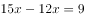，解得，则工程总量为，丁单独实施该工程的时间为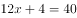天，则丁的效率为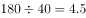。四个队共同实施，需要天，不足1天的部分算1天，即共需11天。

故正确答案为B。

---

### 第 3 题　qid 3522714 · 数学运算

甲单位职工人数是乙单位的2倍，两个单位所有职工中正好有一半是党员。其中甲单位职工中党员占比比乙单位高15个百分点，且甲单位的职工中群众人数比乙单位多18人。问甲单位职工中，党员比群众多多少人?

- **A**. 6
- **B**. 8
- **C**. 10
- **D**. 12　✅

**答案**：D

**官方解析**

设乙单位职工人数为人，则甲单位职工人数为人。乙单位职工中群众人数为人，则甲单位职工中群众人数为（）人。由两个单位所有职工中正好有一半是党员，可得另一半一定是非党员，即群众，故······①。因甲单位职工中党员占比比乙单位高15个百分点，故甲单位职工中群众占比比乙单位低15个百分点，可列······②。联立方程①②，解得，。故甲单位职工人数为人，甲单位职工中群众人数为人，甲单位职工中党员人数为人，党员比群众多人。

故正确答案为D。

【备注】本题假设职工只有党员和群众两种政治面貌。

---

### 第 4 题　qid 3523450 · 数学运算

2020年老张的年龄是小王年龄的4倍，2021年老李的年龄是小王年龄的3倍，已知老张比老李大12岁，问哪一年三人的年龄之和第一次超过140岁？

- **A**. 2020
- **B**. 2023
- **C**. 2026
- **D**. 2029　✅

**答案**：D

**官方解析**

设2020年小王的年龄是，根据题中的年龄关系列表：

根据老张比老李大12岁可得方程，解得：。因此2020年老张，小王，老李的年龄分别为56岁，14岁，44岁。设再过年三人的年龄和超过140岁，则，解得，即9年，年。

故正确答案为D。

---

### 第 5 题　qid 3522715 · 数学运算

乙地在甲地的正东方26千米处，丙地在甲、乙两地连线的北方，且与甲、乙的距离分别为24千米和10千米。一辆车从甲、乙两地中点位置出发向正北方行驶，在经过甲丙连线时，与丙地的距离在以下哪个范围内?

- **A**. 不到8千米
- **B**. 8-9千米之间
- **C**. 9-10千米之间　✅
- **D**. 10千米以上

**答案**：C

**官方解析**

根据题意可得上图，因为甲乙两地距离千米，甲丙两地距离千米，乙丙两地距离千米，可知三角形ABC三边比例为，这三边满足勾股定理，所以三角形ABC为直角三角形，。M为甲乙两地中点，汽车从M向正北出发经过甲丙两地连线AC时交于N点，故千米。在直角三角形AMN中，。根据两直角三角形都有公共角可推出，根据相似三角形对应边成比例可列式，代入数据，解得千米，那么千米，在C项范围内，当选。

故正确答案为C。

---

### 第 6 题　qid 3523439 · 数学运算

一次2小时的在线会议，会议结束前半小时才有人开始退出且每分钟退出会议人数满足，（）。若会议开始后加入会议人数是退出人数的1.5倍，且会议结束时还有100人在线，问会议开始时可能有多少人在线？

- **A**. 40　✅
- **B**. 50
- **C**. 60
- **D**. 70

**答案**：A

**官方解析**

设会议开始时可能有人在线。由题意可知，会议结束前半小时每分钟退出会议人数分别为人、人、人、人······，则会议结束前的半小时共退出人，故会议开始后加入会议人数人。会议结束时还有100人在线，则，解得，即会议开始时可能有40人在线。

故正确答案为A。

---

### 第 7 题　qid 3523442 · 数学运算

某直播平台为3种特色农产品直播带货3小时，第1小时B产品销售额比A产品多50万元，C产品只有B产品的；第2小时与第1小时相比：A翻倍，B增加幅度比A少，而C增加两倍；最后1小时共带货3090万元，且A产品带货额比第1小时大幅增加，B、C均比第2小时增加，问第2小时直播带货额是多少万元？

- **A**. 1580
- **B**. 1600
- **C**. 1860　✅
- **D**. 2000

**答案**：C

**官方解析**

题干给出A、B、C3种农产品在带货第1、2、3小时内销售额的关系，可设第1小时B产品销售额为万元，可得三类产品3小时内得销售额如下：

根据最后1小时共带货3090万元可得：；化简得，解得。

代入，第2小时带货额为万元。

故正确答案为C。

---

### 第 8 题　qid 3522679 · 数学运算

某省在新冠疫情期间派出包括传染科医生、重症科医生和护士在内的三批援鄂医疗队。三批医疗队中三者人数之比分别为4：2：4、5：2：3和4：3：3。已知第二批医疗队中医生比护士多40人，且传染科医生数逐批增加并成等差数列，三批共派出护士113人，则三批医疗队共有多少人？

- **A**. 339
- **B**. 350　✅
- **C**. 360
- **D**. 390

**答案**：B

**官方解析**

根据第二批医疗队中三者人数之比为5：2：3且医生比护士多40人，可得第二批医疗队传染科医生、重症科医生和护士人数分别为人、人、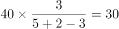人。根据“传染科医生数逐批增加并成等差数列”，设第一批传染科医生比第二批少人，则第一批和第三批传染科医生分别为（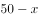）人、（）人，传染科医生共有人。则根据三批次人数的比例关系可得： 

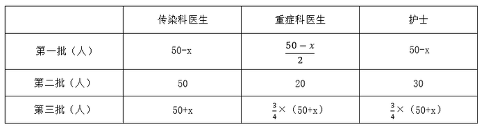

根据“三批共派出护士113人”列方程：，解得：。则重症科医生共有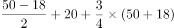人。故三批医疗队共有人。

故正确答案为B。

---

### 第 9 题　qid 3522686 · 数学运算

受新冠疫情影响，某高校某专业开展在线教育，在同一上课时间开设3门选修课A、B和C，每个学生可任选其中1门，但每门课程限选30人。已知该专业共有90人，问该专业学生小李能选中课程A的概率是：

- **A**. 

- **B**. 

- **C**. 

　✅
- **D**. 

**答案**：C

**官方解析**

方法一：根据概率公式，概率，可得所求概率。课程A限选30人，小李可为30人中的任意1人，所以小李选到A课程的情况数为；同理，“3门选修课A、B和C，每门课程限选30人”,即3门课共限选90人，小李可为90人中的任意1人，所以小李选到任意一门课的情况数为。则所求概率。 

方法二：由题目条件 “3门选修课A、B和C，每个学生可任选其中1门，但每门课程限选30人”，可知每个学生选择每门课的概率是相同的。因此小李有A、B、C共3种选择，则选择A课程的概率应为。

故正确答案为C。

---

### 第 10 题　qid 3522657 · 数学运算

饲养兔子需要场地，小林准备用一段长为28米的篱笆围成一个三角形形状的场地，已知第一条边长为米，由于条件限制第二条边长只能是第一条边长度的多4米，若第一条边是唯一最短边，则的取值可以为:

- **A**. 6
- **B**. 7　✅
- **C**. 8
- **D**. 9

**答案**：B

**官方解析**

由题意可知，三角形第一条边长为米，第二条边长为（）米，第三条边长为米。根据“第一条边是唯一最短边”可知：，即，排除C、D两项；根据三角形基本性质“两边之和大于第三边”可知：，即，排除A项。

故正确答案为B。

---

## 判断推理

### 第 1 题　qid 3523454 · 图形推理

把下面的六个图形分为两类，使每一类图形都有各自的共同特征或规律，分类正确的一项是：

- **A**. ①②④，③⑤⑥
- **B**. ①③⑥，②④⑤　✅
- **C**. ①②⑤，③④⑥
- **D**. ①⑤⑥，②③④

**答案**：B

**官方解析**

本题为分组分类题目。元素组成不同，属性规律无答案，考虑数量规律。观察发现，题干出现了圆相交，多端点图形，考虑笔画数，题干笔画数依次为：1、7、1、3、4、1。根据是一笔画还是多笔画分为：①③⑥一组，②④⑤一组。
故正确答案为B。

---

### 第 2 题　qid 3523443 · 图形推理

分析下图中图形的变化规律，变化后第五行的图形应该是：

- **A**. A
- **B**. B　✅
- **C**. C
- **D**. D

**答案**：B

**官方解析**

元素组成相同，优先考虑位置规律。观察发现，每一行的图形每次向右平移一格（循环走），B项当选。
故正确答案为B。

---

### 第 3 题　qid 2172768 · 逻辑判断

以下哪项不是由左图得到的？

- **A**. A
- **B**. B
- **C**. C　✅
- **D**. D

**答案**：C

**官方解析**

元素组成相同，优先考虑位置规律，逐一分析选项。

A项：可由左图左右翻转得到，排除；

B项：可由左图先顺时针旋转，再上下翻转得到，排除；

C项：选项图形与左图不一致，选项缺少一个牛角，不能由左图得到，当选；

D项：可由左图逆时针旋转得到，排除。

本题为选非题，故正确答案为C。

---

### 第 4 题　qid 3522626 · 图形推理

从所给四个选项中，选择最合适的一项填入问号处，使之呈现一定的规律性。

- **A**. A
- **B**. B　✅
- **C**. C
- **D**. D

**答案**：B

**官方解析**

元素组成不相同，且无明显属性规律，考虑数量规律。图形由若干白球和黑球组成，可以考虑分开看黑球和白球的数量。横行竖行单独看黑球数量和白球数量没有规律，且黑球均出现在九宫格的四角处，可以考虑“米”字型看。“米”字型的四条线上，除最中间的图形外，两端的黑球相加数量为10，两端白球数量相加为10，所以？处应为2个黑球，对应B项。

故正确答案为B。

备注：本题的框架参照我国古代文明图案“河图洛书”所命制（如下图），在河图上，排列成数阵的黑点和白点，蕴藏着无穷的奥秘；在洛书上，纵、横、斜三条线上的三个数字，其和皆等于15。本题选取的即是洛书的排列形式，因此考虑横向、纵向、斜向相加均为15也是可以的。

---

### 第 5 题　qid 3522641 · 图形推理

把下面的六个图形分为两类，使每一类图形都有各自的共同特征或规律，分类正确的一项是：

- **A**. ①②③，④⑤⑥
- **B**. ①②④，③⑤⑥
- **C**. ①③④，②⑤⑥　✅
- **D**. ①③⑥，②④⑤

**答案**：C

**官方解析**

本题为分组分类题目。元素组成不同，优先考虑属性规律。题干出现等腰元素，考虑对称性。①③④三个图形均有一条对称轴，仅为轴对称图形；②⑤⑥三个图形均有两条相互垂直的对称轴，既是轴对称图形也是中心对称图形。即①③④为一组，②⑤⑥为一组。
故正确答案为C。

---

### 第 6 题　qid 3523447 · 图形推理

若题干最左边的图形编号为1，其余图形的编号依次递增1，编号为90、91、92的图形应该是：

- **A**. A　✅
- **B**. B
- **C**. C
- **D**. D

**答案**：A

**官方解析**

该题为三个图形依次排列且呈周期性遍历，因此图1、图2、图3为一组，图4、图5、图6为一组······以此类推，当遇到3的倍数时恰好为完整的一组结束，因此90号应为上一组的最后一个图，即六面体，91、92为下一组的前两个图形，分别是圆柱、六面体。
故正确答案为A。

---

### 第 7 题　qid 3523511 · 图形推理

右边四个小图形中，只有一个是由左边的四个图形拼合而成（只能通过上、下、左、右平移），请把它找出来。

- **A**. A
- **B**. B
- **C**. C　✅
- **D**. D

**答案**：C

**官方解析**

本题考查平面拼合，可采用平行且等长相消的方式解题。消去平行且等长的线段后进行组合即可得到轮廓图，即为C项。平行且等长相消的方式如下图所示：

故正确答案为C。

---

### 第 8 题　qid 3522628 · 定义判断

软暴力是指行为人为谋取不法利益或形成非法影响，对他人或者在有关场所进行滋扰、纠缠、哄闹、聚众造势等，足以使他人产生恐惧、恐慌进而形成心理强制，或者足以影响、限制人身自由、危及人身财产安全，影响正常生活、工作、生产、经营的违法犯罪手段。
根据上述定义，下列属于软暴力的是：

- **A**. 张某威胁王法官，如不秉公判案就举报其贪污的事实
- **B**. 甲公司为了在竞标中获胜，私下散布关于竞争对手的不利信息
- **C**. 某恶势力团伙为了向王某讨要赌债将其堵在酒店房间，24小时看守并不让其睡觉
- **D**. 网贷公司催收员长期使用群呼、群发短信、揭发隐私等手段滋扰欠款人及其紧急联系人、通讯录联系人　✅

**答案**：D

**官方解析**

第一步：找出定义关键词。

“为谋取不法利益或形成非法影响”、“对他人或者在有关场所进行滋扰、纠缠、哄闹、聚众造势”、“使他人产生恐惧、恐慌或影响、限制人身自由、危及人身财产安全，影响正常生活、工作、生产、经营的违法犯罪手段”。

第二步：逐一分析选项。

A项：张某威胁王法官秉公判案，不符合“为谋取不法利益或形成非法影响”，不符合定义，排除；

B项：甲公司为了在竞标中获胜，不符合“为谋取不法利益或形成非法影响”，不符合定义，排除；

C项：某恶势力将王某堵在房间不让其睡觉长达24小时，属于严重的人身强制行为，不属于“对他人或者在有关场所进行滋扰、纠缠、哄闹、聚众造势等”，不符合定义，排除；

D项：网贷公司使用群呼、群发、揭发隐私等手段滋扰欠款人及其紧急联系人、通讯录联系人，符合“对他人进行滋扰”，长期如此，符合“使他人产生恐惧、恐慌或影响”和“影响正常生活、工作、生产、经营的违法犯罪手段”，符合定义，当选。

故正确答案为D。

备注：下图中给出的示例，引自《光明日报》，该案是北京市首例网络“软暴力”的案件，与D项对应，而C项中的“24小时不让其睡觉”，直接限制了人身自由和行为且时间较长，二者比较，D项更符合定义。

---

### 第 9 题　qid 3523520 · 定义判断

名词的体是指人们对名词指示的人或事物在空间维度所表现出来的诸如数量、大小、形状和结构等特征的一种认知方式或结果。
根据上述定义，下列表现名词的体的是：

- **A**. 激战上甘岭
- **B**. 原始人的独木舟
- **C**. 弯弯的月亮　✅
- **D**. 未来的希望

**答案**：C

**官方解析**

第一步：找出定义关键词。
“名词指示的人或事物”、“在空间维度所表现出来的诸如数量、大小、形状和结构等特征”。
第二步：逐一分析选项。
A项：激战上甘岭，其中“激战”不符合“名词指示的人或事物”，不符合定义，排除；
B项：原始人的独木舟，其中“原始人的”不符合“在空间维度所表现出来的诸如数量、大小、形状和结构等特征”的描述，不符合定义，排除；
C项：弯弯的月亮，其中“月亮”符合“名词指示的人或事物”，“弯弯的”是对月亮形状特征的描述，符合“在空间维度所表现出来的诸如数量、大小、形状和结构等特征”的描述，符合定义，当选；
D项：未来的希望，其中“未来的”不符合“在空间维度所表现出来的诸如数量、大小、形状和结构等特征”的描述，不符合定义，排除。
故正确答案为C。

---

### 第 10 题　qid 3522646 · 定义判断

青春发动时相是指与同龄人相比，青少年自我感觉自身的青春发育水平是提前、适时或是延迟。根据上述定义，下列属于青春发动时相中“适时”的是：

- **A**. 初中生甲的身高是班级男生中最矮的，但其父母认为还算正常
- **B**. 初中生乙脸上长了几颗青春痘，而其他同学都没有，这让他很不自在
- **C**. 初中生丙在生理卫生课上和其他同学一样对异性生理结构充满了好奇
- **D**. 初中生丁在《青春期生理健康发育自我评估量表》各项内容中认真地勾选了“正常”选项　✅

**答案**：D

**官方解析**

第一步：找出定义关键词。
“与同龄人相比”、“青少年自我感觉”、“自身的青春发育水平适时”。
第二步：逐一分析选项。
A项：其父母认为还算正常，不符合“青少年自我感觉”，不符合定义，排除；
B项：其他同学都没有，不符合“自身的青春发育水平适时”，不符合定义，排除；
C项：对异性生理结构充满了好奇，不是对自身的青春发育水平的感觉，不符合定义，排除；
D项：自我评估量表，符合“青少年自我感觉”，认真选择“正常”选项，符合“青少年自我感觉”、“自身的青春发育水平适时”，符合定义，当选。
故正确答案为D。

---

### 第 11 题　qid 3523437 · 定义判断

替代性创伤是指在听到或看到一些灾难性事件的信息后，损害程度超过其中部分人群的心理和情绪的耐受极限，产生与经历者等同的情绪、躯体反应的现象。
根据上述定义，下列现象属于替代性创伤的是：

- **A**. 乘客甲经历紧急故障迫降事件后从此再也不敢乘坐任何飞机
- **B**. 抗疫志愿者乙目睹新冠肺炎感染者遭受病痛折磨而严重失眠　✅
- **C**. 丙听朋友描述澳洲大火的细节之后反复梦见自己被大火吞噬
- **D**. 医生丁面对因医学技术上的局限而不能治愈的患者深感自责

**答案**：B

**官方解析**

第一步：找出定义关键词。
“在听到或看到一些灾难性事件的信息后”、“产生与经历者等同的情绪、躯体反应”。
第二步：逐一分析选项。
A项：乘客甲经历了灾难性事件，是经历者，不符合“在听到或看到一些灾难性事件的信息后”，也不符合“产生与经历者等同的情绪、躯体反应”，不符合定义，排除；
B项：抗疫志愿者乙目睹新冠肺炎感染者遭受病痛折磨，符合“在听到或看到一些灾难性事件的信息后”，严重失眠，符合“产生与经历者等同的情绪、躯体反应”，符合定义，当选；
C项：丙听朋友描述澳洲大火的细节，符合“在听到或看到一些灾难性事件的信息后”，但反复梦见自己被大火吞噬，做梦不属于情绪、躯体反应，不符合“产生与经历者等同的情绪、躯体反应”，不符合定义，排除；
D项：医生丁面对因医学技术上的局限而不能治愈的患者深感自责，不符合“在听到或看到一些灾难性事件的信息后”，也不符合“产生与经历者等同的情绪、躯体反应”，不符合定义，排除。
故正确答案为B。
经查询资料，本题C项应更符合创伤后应激障碍（PTSD），其中一个表现为患者的思维、记忆或梦中反复、不自主地涌现与创伤有关的情境或内容，也可出现严重的触景生情反应，甚至感觉创伤性事件好像再次发生一样。
由此可见C项更符合创伤后应激障碍，而不是替代性创伤。

---

### 第 12 题　qid 3522623 · 定义判断

化学沉积作用是指在水介质中，以胶体溶液和真溶液形式搬运的物质到达适宜场所后，当化学条件发生变化时，产生沉淀、堆积的过程。其中，胶体溶液是指含有一定大小的固体颗粒物质或高分子化合物的溶液，真溶液是指透明度较高的水溶液。
根据上述定义，下列不属于化学沉积作用的是：

- **A**. 干旱气候区，湖水很少外泄，蒸发作用使湖水的氯化钠增加、累积，变成咸水湖
- **B**. 当海水中的绿色粘土矿物随水流动时，会和含有铝、铁的胶体物质聚合形成海绿石
- **C**. 富含磷质的海水上升至浅海区，因压力减小，温度升高，磷质析出、沉积而形成磷矿
- **D**. 湖泊里的生物骨骼，它们吸收了空气中的二氧化碳形成碳酸钙，当碳酸钙浓度达到一定程度就在海底堆积下来，形成石灰岩　✅

**答案**：D

**官方解析**

第一步：找出定义关键词。

化学沉积作用：“水介质”、“以胶体溶液和真溶液形式搬运”、“当化学条件发生变化时，产生沉淀、堆积”；

胶体溶液：“含有一定大小的固体颗粒物质或高分子化合物的溶液”；

真溶液：“透明度较高的水溶液”。

第二步：逐一分析选项。

A项：湖水是水介质，符合“透明度较高的水溶液”，蒸发使湖水的氯化钠增加累积，变成咸水湖，即湖水搬运的最终物质是氯化钠，符合“当化学条件发生变化时，产生沉淀、堆积”，符合定义，排除；

B项：海水是水介质，符合“透明度较高的水溶液”，绿色粘土矿物随海水流动和含有铝、铁的胶体物质聚合形成海绿石，符合“以胶体溶液和真溶液形式搬运”、“当化学条件发生变化时，产生沉淀、堆积”，符合定义，排除；

C项：海水是水介质，符合“透明度较高的水溶液”，压力减小、温度升高导致磷质析出沉积形成磷矿，符合“以胶体溶液和真溶液形式搬运”、“当化学条件发生变化时，产生沉淀、堆积”，符合定义，排除；

D项：湖泊是水介质，符合“透明度较高的水溶液”，但生物骨骼最终形成的石灰岩不是在真溶液形式搬运下发生的沉淀、堆积，属于生物沉积作用，不符合“当化学条件发生变化时，产生沉淀、堆积”，不符合定义，当选。

本题是选非题，故正确答案为D。

备注：本题很多学生比较纠结A项和D项，如下图所示，A项是在“化学沉积”相关文献中的典型案例，通过对比择优，本题问“不属于”，故小粉笔更倾向把答案给到D项。

---

### 第 13 题　qid 3523521 · 定义判断

生物浓缩，是指生物有机体或处于同一营养级上的许多生物种群，从周围环境中蓄积某种元素或难分解化合物，使生物有机体内该物质的浓度超过环境中该物质浓度的现象。
根据上述定义，以下涉及到生物浓缩的是：

- **A**. 农业上用于杀死昆虫的DDT通过食物链传递到白头鹰体内，导致生下的蛋皆是软壳的，无法孵化　✅
- **B**. 在湖泊、河流等地方出现的藻类及其他浮游生物迅速繁殖，水质恶化，鱼类及其他生物大量死亡的现象
- **C**. 山羊吃多玉米粒之后，一时间难以消化，再加上山羊饮入水后，玉米长时间聚集在胃内，容易引起胃胀
- **D**. 由于严重的白色污染，原本干净清洁的海滩，如今聚集了大量的塑料袋、瓶子等垃圾，以至于无人问津

**答案**：A

**官方解析**

第一步：找出定义关键词。
“生物有机体或处于同一营养级上的许多生物种群”、“从周围环境中蓄积某种元素或难分解化合物”、“使生物有机体内该物质的浓度超过环境中该物质浓度的现象”。
第二步：逐一分析选项。
A项：白头鹰体内，符合“生物有机体或处于同一营养级上的许多生物种群”，通过食物链传递导致白头鹰体内有DDT，符合“从周围环境中蓄积某种元素或难分解化合物”，白头鹰的蛋壳变软的原因在于有害化学物质DDT逐步在其体内积累的结果，符合“使生物有机体内该物质的浓度超过环境中该物质浓度的现象”，符合定义，当选；
B项：藻类和浮游生物迅速繁殖，鱼类及其他生物大量死亡，是因为鱼类生存所需的营养物质被藻类和浮游生物抢占了，不符合“使生物有机体内该物质的浓度超过环境中该物质浓度的现象”，不符合定义，排除；
C项：山羊吃多玉米粒之后，玉米聚集在胃里引起胃胀，不符合“使生物有机体内该物质的浓度超过环境中该物质浓度的现象”，不符合定义，排除；
D项：干净清洁的海滩受到白色污染，没有涉及生物有机体或者生物种群，不符合“生物有机体或处于同一营养级上的许多生物种群”，不符合定义，排除。
故正确答案为A。

---

### 第 14 题　qid 3522634 · 定义判断

相反相成修辞手法是指把通常相互对立、排斥的两个概念或判断巧妙地联系在一起，这样不仅能够揭示出存在于客观事物深层的矛盾辩证关系，还可以增加语言的意蕴。
根据上述定义，下列不属于相反相成修辞手法的是：

- **A**. 横眉冷对千夫指，俯首甘为孺子牛
- **B**. 有的人活着，他已经死了；有的人死了，他还活着
- **C**. 墙上芦苇，头重脚轻根底浅；山中竹笋，嘴尖皮厚腹中空　✅
- **D**. 这一天，死去的伟人在诗的国度里永生；这一天，活着的小丑在人们心上被埋葬

**答案**：C

**官方解析**

第一步：找出定义关键词。
“把通常相互对立、排斥的两个概念或判断巧妙地联系在一起”。
第二步：逐一分析选项。
A项：选项这句话意为对待敌人决不屈服，对人民大众甘愿服务。横眉和俯首是一个人的两个相互对立的态度，符合“把通常相互对立、排斥的两个概念或判断巧妙地联系在一起”，符合定义，排除； 
B项：选项这句话意为有的人虽然活着，但是他的道德败坏，就如已经死了一样没有价值，而有的人死了，他还活着，他的高尚的品格，代代相传，永远激励后人。活着和死了是一个人的两个相互对立的状态，符合“把通常相互对立、排斥的两个概念或判断巧妙地联系在一起”，符合定义，排除； 
C项：选项这句话用芦苇和竹笋比喻那些没有学问只会自吹自擂的人，芦苇和竹笋不符合“相互对立、排斥的两个概念或判断”，不符合定义，当选；
D项：选项这句话表达了不同类型的人在“这一天”的情况，死去和永生、活着和埋葬是一个人的两个相互对立的状态，符合“把通常相互对立、排斥的两个概念或判断巧妙地联系在一起”，符合定义，排除。
本题为选非题，故正确答案为C。

---

### 第 15 题　qid 3522631 · 定义判断

农业生产周期指在连续不断的农业再生产过程中，从开始生产到获得产品的整个过程所经过的全部时间，在种植业中一般是从整地开始到产品收获所经过的全部时间，在畜牧业中一般是从饲养幼畜开始到获得畜产品的时间。由于作为农业生产对象的动植物有自身的特性，并且受自然环境影响较大，其生产周期一般比工业生产周期长。
根据上述定义，下列选项涉及农业生产周期的是：

- **A**. 小李耕地、播种、打枝、摘棉花、纺线、织布······年复一年，周而复始　✅
- **B**. 小黄办了一家乡镇企业，从原材料购进、生产管理再到产品销售，他都亲力亲为
- **C**. 小刘今年在承包的荒山种植优质苹果树苗，经科学管理，树苗全部成活且长势良好
- **D**. 小王有个养猪场，虽年复一年重复着把猪崽养大的简单枯燥劳动，但始终干劲十足

**答案**：A

**官方解析**

第一步：找出定义关键词。
“连续不断的农业再生产过程中，从开始生产到获得产品的整个过程所经过的全部时间”、“在种植业中一般是从整地开始到产品收获所经过的全部时间”、“在畜牧业中一般是从饲养幼畜开始到获得畜产品的时间”。
第二步：逐一分析选项。
A项：小李耕地、播种、打枝、摘棉花、纺线、织布……年复一年，周而复始，耕地符合“从整地开始”，“摘棉花”符合“产品收获”，整个流程符合“连续不断的农业再生产过程中，从开始生产到获得产品的整个过程所经过的全部时间”，符合定义，当选；
B项：小黄办企业，买进材料、生产产品、销售产品，属于工业生产活动，不符合“农业再生产过程中”，不符合定义，排除；
C项：小刘种苹果树苗长势良好，没有提到最终是否获得产品，也没有提到是否是连续不断种树苗，不符合“连续不断的农业再生产过程中，从开始生产到获得产品的整个过程所经过的全部时间”，不符合定义，排除；
D项：小王年复一年重复把猪崽养大，畜产品指的是畜牧业生产所获得的产品（包括乳、肉、蛋、毛、皮及其副产品），养大后的猪崽属于牲畜，不属于畜产品，因此最终并未获得畜产品，不符合定义，排除。
注：A项中的纺线、织布虽属于加工业，但前面的耕地到摘棉花涉及了完整的农业生产周期。而D项并未获得畜产品，生产周期不完整。考虑本题提问方式为“涉及”，只有A项涉及了完整的农业生产周期，因此择优选择A项。
故正确答案为A。

---

### 第 16 题　qid 3523522 · 类比推理

就地保护：易地保护

- **A**. 汽车爆胎：汽车漏油
- **B**. 防洪堤：绿化带
- **C**. 纯种繁育：杂交繁育　✅
- **D**. 销售提成：股份分红

**答案**：C

**官方解析**

第一步：判断题干词语间逻辑关系。
就地保护和易地保护是保护生物多样性的两种形式，二者为并列关系，且为并列中的矛盾关系。
第二步：判断选项词语间逻辑关系。
A项：汽车爆胎和汽车漏油均为汽车会出现的故障，二者为并列关系，但是汽车除了爆胎和漏油外还会出现其他故障，所以二者为并列中的反对关系，与题干逻辑关系不一致，排除；
B项：防洪堤是为了防止河流泛滥而建立的堤坝，而绿化带是为了起到绿化的作用，美化环境，二者构不成并列关系，与题干逻辑关系不一致，排除；
C项：纯种繁育是同一品种内进行后代繁育，杂交繁育是不同品种间进行后代繁育，二者为并列关系，且为并列中的矛盾关系，与题干逻辑关系一致，当选；
D项：销售提成与股份分红均为获得收入的两种形式，二者为并列关系，但是获得收入除了销售提成与股份分红外还有其他形式，所以二者为并列关系中的反对关系，与题干逻辑关系不一致，排除。
故正确答案为C。

---

### 第 17 题　qid 3522627 · 类比推理

洪涝：干旱：防洪抗旱

- **A**. 地震：海啸：抗震救灾
- **B**. 滑坡：雪崩：道路抢修
- **C**. 严寒：酷热：防冻消暑　✅
- **D**. 风沙：雾霾：防沙除霾

**答案**：C

**官方解析**

第一步：判断题干词语间逻辑关系。
洪涝与干旱，二者为反义关系，且防洪与抗旱分别是前两种现象针对性的应对方法，与前两词构成对应关系。
第二步：判断选项词语间逻辑关系。
A项：地震与海啸，二者并不是反义关系，抗震是地震的应对方法，但救灾范围太大，与海啸对应关系并不贴切，与题干逻辑关系不一致，排除；
B项：滑坡与雪崩，二者并不是反义关系，且滑坡与雪崩都可能需要进行道路抢修，与题干逻辑关系不一致，排除；
C项：严寒与酷热，二者为反义关系，防冻是严寒的应对方法，消暑是酷热的应对方法，是两种现象的应对方式，与题干逻辑关系一致，当选；
D项：风沙与雾霾，二者并不是反义关系，与题干逻辑关系不一致，排除。
故正确答案为C。
注：本题有同学通过自然灾害选了D，这也是个角度，但是从题干特征来看，本题题干前两词反义关系明显，故优先考虑反义关系，不行的情况下再考虑是否是自然灾害，做题的首要原则是题干特征。

---

### 第 18 题　qid 3522629 · 类比推理

党员：干部：服务人民

- **A**. 青年：才俊：报效国家　✅
- **B**. 科学：精英：科技立身
- **C**. 大国：工匠：技术强国
- **D**. 学校：教师：教书育人

**答案**：A

**官方解析**

第一步：判断题干词语间逻辑关系。
有的党员是干部，有的党员不是干部，有的干部是党员，有的干部不是党员，二者为交叉关系，党员和干部都是服务人民的主体，与服务人民是对应关系。
第二步：判断选项词语间逻辑关系。
A项：有的青年是才俊，有的青年不是才俊，有的才俊是青年，有的才俊不是青年，二者为交叉关系，青年和才俊都是报效国家的主体，与报效国家是对应关系，与题干逻辑关系一致，当选；
B项：科学和精英不是交叉关系，且科学不是科技立身的主体，与题干逻辑关系不一致，排除；
C项：大国和工匠不是交叉关系，且大国不是技术强国的主体，与题干逻辑关系不一致，排除；
D项：学校是教师的工作地点，二者不是交叉关系，且学校也不是教书育人的主体，与题干逻辑关系不一致，排除。
故正确答案为A。

---

### 第 19 题　qid 3522642 · 类比推理

（    ） 对于 汽车 相当于 （    ） 对于 相机

- **A**. 轮胎 手机
- **B**. 速度 像素
- **C**. 马达 快门　✅
- **D**. 单车 单反

**答案**：C

**官方解析**

逐一代入选项。
A项：轮胎是汽车的组成部分，二者是组成关系，手机和相机是两种电子设备，二者是并列关系，前后逻辑关系不一致，排除；
B项：速度是衡量汽车行驶快慢的指标，二者是必然对应关系，像素是相机中衡量清晰度的指标，但它只适用于数码相机，胶片相机不涉及像素这一概念，二者是或然对应关系，前后逻辑关系不一致，排除；
C项：马达是汽车的组成部分，二者是组成关系，快门是相机的组成部分，二者是组成关系，而且均是必然组成关系，前后逻辑关系一致，当选；
D项：单车和汽车是两种交通工具，二者是并列关系，单反的全称是单镜头反光相机，它是相机的一种，二者是种属关系，前后逻辑关系不一致，排除。
故正确答案为C。

---

### 第 20 题　qid 3522617 · 类比推理

绵羊 对于 （    ） 相当于 （    ） 对于 高粱

- **A**. 麻雀 水稻
- **B**. 老鹰 麦子
- **C**. 羚羊 玉米　✅
- **D**. 山羊 玫瑰

**答案**：C

**官方解析**

逐一代入选项。
A项：绵羊与麻雀都是动物，但绵羊是哺乳动物，而麻雀是鸟类，二者范畴不一致，高粱与水稻都是粮食作物，二者为并列关系，前后逻辑关系不一致，排除；
B项：绵羊与老鹰都是动物，但绵羊是哺乳动物，而老鹰是鸟类，二者范畴不一致，高粱与麦子都是粮食作物，二者为并列关系，前后逻辑关系不一致，排除；
C项：绵羊与羚羊都是反刍类哺乳动物，二者为并列关系，高粱与玉米都是粮食作物，二者为并列关系，前后逻辑关系一致，当选；
D项：绵羊与山羊都是反刍类哺乳动物，二者为并列关系，高粱与玫瑰都是植物，但高粱是粮食作物，玫瑰是观赏性植物，二者范畴不一致，前后逻辑关系不一致，排除。
故正确答案为C。

---

### 第 21 题　qid 3523523 · 类比推理

山有色：水发声

- **A**. 山河在：草木深
- **B**. 客舍青：柳色新
- **C**. 鸟飞绝：人踪灭
- **D**. 花作尘：鸟不惊　✅

**答案**：D

**官方解析**

第一步：判断题干词语间逻辑关系。
两个词语无明显的逻辑关系，考虑分开看。有色是对山的描述，发声是对水的描述。即后两个字是对第一个字的描述。
第二步：判断选项词语间逻辑关系。
A项：“在”是对“山河”的描述，“深”是对“草木”的描述，即第三个字是对前两个字的描述，与题干逻辑关系不一致，排除；
B项：“青”是对“客舍”的描述，“新”是对“柳色”的描述，即第三个字是对前两个字的描述，与题干逻辑关系不一致，排除；
C项：“飞绝”是对“鸟”的描述，即后两个字是对第一个字的描述，但是“灭”是对“人踪”的描述，即第三个字是对前两个字的描述，与题干逻辑关系不一致，排除；
D项：“作尘”是对“花”的描述，“不惊”是对“鸟”的描述，即后两个字是对第一个字的描述，与题干逻辑关系一致，当选。
故正确答案为D。

---

### 第 22 题　qid 3522636 · 类比推理

匹马：单枪

- **A**. 万水：千山　✅
- **B**. 花红：柳绿
- **C**. 地久：天长
- **D**. 猴年：马月

**答案**：A

**官方解析**

第一步：判断题干词语间逻辑关系。
匹马是指一匹马，单枪是指一杆枪，二者属于并列关系，并且“匹”和“单”均可以用来表示数量。
第二步：判断选项词语间逻辑关系。
A项：万水和千山为并列关系，并且“万”与“千”均可以用来表示数量，与题干逻辑关系一致，当选；
B项：花红和柳绿为并列关系，但“花”与“柳”不可用来表示数量，与题干逻辑关系不一致，排除；
C项：地久和天长为并列关系，但“地”和“天”不可用来表示数量，与题干逻辑关系不一致，排除；
D项：猴年和马月为并列关系，但“猴”和“马”不可用来表示数量，与题干逻辑关系不一致，排除。
故正确答案为A。

---

### 第 23 题　qid 3522650 · 逻辑判断

野生动物之间因病毒入侵会暴发传染病。最新研究发现，热带、亚热带或低海拔地区的动物，因生活环境炎热，一直面临着罹患传染病的风险。生活在高纬度或高海拔等低温环境的动物，过去因长久寒冬可免于病毒入侵，但现在冬季正变得越来越温暖，持续时间也越来越短。因此，气温升高将加剧野生动物传染病的暴发。
以下哪项如果为真，最能支持上述观点？

- **A**. 无论气候如何变化，生活在炎热地带的动物始终面临着患传染病风险
- **B**. 适应寒带和高海拔栖息地的动物物种遭遇传染病暴发的风险正在升高
- **C**. 气温高低与野生动物患传染病风险之间存在正相关性，即气温越高患病风险越高　✅
- **D**. 寒冷气候可能让野生动物免受病毒入侵，炎热气候却更易导致野生动物感染病毒

**答案**：C

**官方解析**

第一步：找出论点和论据。
论点：气温升高将加剧野生动物传染病的暴发。
论据：热带、亚热带或低海拔地区的动物，因生活环境炎热，一直面临着罹患传染病的风险。生活在高纬度或高海拔等低温环境的动物，过去因长久寒冬可免于病毒入侵，但现在冬季正变得越来越温暖，持续时间也越来越短。
论据讨论的是炎热地区与低温地区对于动物罹患传染病的风险情况，论点讨论的是气温升高将加剧野生动物传染病的暴发，论据论点均在讨论气温与野生动物传染病的关系，话题一致，可以考虑补充论据进行加强。
第二步：逐一分析选项。
A项：该项指出炎热地带的动物始终面临着患传染病风险，而论点的主体为野生动物；同时该项并未说明气温升高是否会加剧野生动物传染病的暴发，话题不一致，无法加强，排除；
B项：该项指出适应寒带和高海拔栖息地的动物物种遭遇传染病暴发的风险正在升高，但并未说明气温升高与野生动物传染病暴发之间的关系，话题不一致，无法加强，排除；
C项：该项指出气温高低与野生动物患传染病风险之间存在正相关性，说明气温升高确实会加剧野生动物传染病的暴发，属于补充论据，可以加强，当选；
D项：该项指出寒冷气候与炎热气候对野生动物感染病毒的风险存在差异，属于重复论据，无法得知气温升高是否会加剧野生动物传染病的暴发，且是一种“可能”的说法，加强力度小于C项，排除。
故正确答案为C。

---

### 第 24 题　qid 3523501 · 逻辑判断

1901年在伊朗苏萨城废墟中出土的罐子上发现了一种古老语言，被称为埃兰语，考古学家最近破译了它。考证发现：埃兰语与美索不达米亚原始楔形文字一样久远，但不是起源于美索不达米亚，而是在古波斯一带使用。与表音并表意的美索不达米亚楔形文字不同，埃兰语是表音语言。考古学家由此推测：埃兰语是古波斯一带人们独立使用的语言。
上述推测如果为真，最能质疑下列哪项观点？

- **A**. 埃兰语由表示音节、辅音和元音的符号构成，遵循由左向右的书写规则
- **B**. 埃兰语大约4000年前在现今西亚一带使用，使用时间可能超过1400年
- **C**. 埃兰语与美索不达米亚原始楔形文字、古埃及的圣书体等语言同时产生
- **D**. 埃兰语源于美索不达米亚原始楔形文字，与楔形文字是母体和子体关系　✅

**答案**：D

**官方解析**

第一步：分析题干。
注意问法为用题干推测来削弱选项观点，所以题干可视为论据。
推测：埃兰语是古波斯一带人们独立使用的语言。
考证发现：埃兰语与美索不达米亚原始楔形文字一样久远，但不是起源于美索不达米亚，而是在古波斯一带使用。与表音并表意的美索不达米亚楔形文字不同，埃兰语是表音语言。
第二步：逐一分析选项。
A项：推测说的是埃兰语是古波斯一带人们独立使用的语言，该项说的是埃兰语的构成符号，遵循的书写规则，话题不一致，无法削弱，排除；
B项：推测说的是埃兰语是古波斯一带人们独立使用的语言，该项说的是埃兰语在现今西亚一带使用过，以及使用时间范围，话题不一致，无法削弱，排除；
C项：推测说的是埃兰语是古波斯一带人们独立使用的语言，该项说的是埃兰语与美索不达米亚原始楔形文字、古埃及的圣书体等语言同时产生，语言同时产生不等同于语言在古波斯一带独立使用，话题不一致，无法削弱，排除；
D项：推测说的是埃兰语是古波斯一带人们独立使用的语言，考证发现说的是埃兰语与表音并表意的美索不达米亚原始楔形文字不同，埃兰语是表音语言，该项说的是埃兰语与美索不达米亚原始楔形文字是母体和子体关系，且埃兰语来源于美索不达米亚原始楔形文字，削弱选项观点，当选。
故正确答案为D。

---

### 第 25 题　qid 3522622 · 逻辑判断

AI助手在医学应用上有着明显的优势：放射科医生每天要阅读并分析大量的影像，医生会因为疲劳导致效率降低，AI助手则不会，它甚至比人眼能更加迅捷地找到影像中的可疑病变，帮助医生做出初步诊断。
 以下哪项如果为真，最能支持上述结论?

- **A**. 甲医院医生借助AI技术将疑难影像分类归档
- **B**. 乙医院呼吸科借助AI助手完成了一次远程会诊
- **C**. 丙医院放射科利用AI技术半天就可完成对200多个患者的影像诊断　✅
- **D**. 丁医院借助AI助手检测出远程会诊患者胸腔部位的异常征象，并为其确定治疗方案

**答案**：C

**官方解析**

第一步：找出论点和论据。
论点：AI助手在医学应用上有着明显的优势。
论据：放射科医生每天要阅读并分析大量的影像，医生会因为疲劳导致效率降低，AI助手则不会，它甚至比人眼能更加迅捷地找到影像中的可疑病变，帮助医生做出初步诊断。
本题论据讨论的是AI助手与医生相比更不会疲劳、效率更高，可以更快帮助医生做出诊断，论点讨论的是AI助手有着明显的优势，论点和论据话题一致，加强优先考虑补充论据。
第二步：逐一分析选项。
A项：甲医院医生借助AI助手将影像分类归档，但是并未和人类医生做比较，故无法判断AI助手是否在医学应用上有着明显的优势，无法加强，排除；
B项：乙医院借助AI助手完成了一次远程会诊，但是并未和人类医生做比较，故无法判断AI助手是否在医学应用上有着明显的优势，无法加强，排除；
C项：丙医院的放射科利用AI技术半天就可完成200多个患者的诊断，体现了AI助手不会疲惫，能更快帮助医生做出初步诊断，补充论据，可以加强，当选；
D项：丁医院借助AI助手完成对患者的诊断并确定治疗方案，但是并未和人类医生做比较，故无法判断AI助手是否在医学应用上有着明显的优势，无法加强，排除。
故正确答案为C。

---

### 第 26 题　qid 3522647 · 逻辑判断

研究表明，肉食中的化合物可能引发部分儿童气喘，进而导致哮喘或其他呼吸道疾病。这些化合物被称作“晚期糖基化终产物”，是肉类在高温烤炸烘焙时释放出的物质。所以，素食或者少吃肉可避免儿童患哮喘的风险。
以下哪项如果为真，最能质疑上述观点？

- **A**. 肉类在非高温烤炸烘焙情况下，不产生晚期糖基化终产物，与哮喘的关联性未知
- **B**. 科学家研究显示，体内的晚期糖基化终产物主要来自于但又并非仅仅来自于肉类　✅
- **C**. 晚期糖基化终产物除导致哮喘外，还能加速人体衰老，引发各种慢性退化性疾病
- **D**. 晚期糖基化终产物作为一种蛋白质，在人体中自然生成，并随着年龄的增长不断积聚

**答案**：B

**官方解析**

第一步：找出论点和论据。
论点：素食或者少吃肉可避免儿童患哮喘的风险。
论据：肉食中的化合物可能引发部分儿童气喘，进而导致哮喘或其他呼吸道疾病。这些化合物被称作“晚期糖基化终产物”，是肉类在高温烤炸烘焙时释放出的物质。
论据提出肉类烤炸烘焙时产生的晚期糖基化终产物可能引发部分儿童哮喘，论点认为素食或者少吃肉可避免儿童患哮喘的风险，二者话题一致，削弱优先考虑否定论点。
第二步：逐一分析选项。
A项：非高温烤炸烘焙肉类与哮喘关联性未知，因此素食或者少吃肉能否避免儿童患哮喘的风险并不明确，不明确选项，排除；
B项：指出晚期糖基化终产物并非仅仅来自于肉类，说明其他途径也会产生晚期糖基化终产物，只是素食或者少吃肉并不能“避免”儿童患哮喘的风险，可以削弱，保留；
C项：指出晚期糖基化终产物会带来其他不好的作用，与素食或者少吃肉可避免儿童患哮喘的风险无关，无法削弱，排除；
D项：指出晚期糖基化终产物在人体中自然生成，说明晚期糖基化终产物不是仅通过吃肉得到的，人体本身也会产生该物质，只是素食或者少吃肉并不能“避免”儿童患哮喘的风险，可以削弱，保留；
对比B、D两项，B、D两项都是从除了肉类之外还有其他途径会产生晚期糖基化终产物的角度来进行削弱；但题干论点是素食或者少吃肉可避免“儿童”患哮喘，D项的潜台词是人年龄越来越大，晚期糖基化终产物不断积聚，可能避免不了得哮喘，问题是到多大年纪，积聚了多少，才会得哮喘呢？如果是积聚到儿童阶段，就会得哮喘，那能削弱论点，说明素食或者少吃肉不可避免“儿童”患哮喘；但如果积聚到中老年阶段，才会得哮喘，那就与论点主体无关了，不确定素食或者少吃肉能不能避免“儿童”阶段患哮喘，综上所述B项比D项更明确。
故正确答案为B。

---

### 第 27 题　qid 3523530 · 逻辑判断

黄烷醇是存在于许多水果，蔬菜和可可中的小分子物质，人们在日常生活中会很容易摄入含有黄烷醇的食物。如果食用富含黄烷醇的食物，将会促进心血管功能。心血管功能改善有助于提高脑血管功能。某种物质有益于脑血管功能，则会对认知功能产生积极影响。
由此可以推出：

- **A**. 如果要改善心血管功能，就要食用富含黄烷醇的食物
- **B**. 如果要改善脑血管功能，就要食用富含黄烷醇的食物
- **C**. 如果要改善认知功能，就要食用富含黄烷醇的食物
- **D**. 如果要食用富含黄烷醇的食物，就对认知功能产生积极影响　✅

**答案**：D

**官方解析**

第一步：翻译题干。

①食用富含黄烷醇的食物促进心血管功能；

②心血管功能改善提高脑血管功能；

③有益于脑血管功能对认知功能产生积极影响。

将①②③串联起来可以递推出：④食用富含黄烷醇的食物促进心血管功能提高脑血管功能对认知功能产生积极影响。

第二步：逐一分析选项。

A项：翻译为改善心血管功能食用富含黄烷醇的食物，是对条件①的肯后，但肯后得不到确定性的结论，无法推出，排除；

B项：翻译为改善脑血管功能食用富含黄烷醇的食物，是对条件④的肯后，但肯后得不到确定性的结论，无法推出，排除；

C项：翻译为改善认知功能食用富含黄烷醇的食物，是对条件④的肯后，但肯后得不到确定性的结论，无法推出，排除；

D项：翻译为食用富含黄烷醇的食物对认知功能产生积极影响，是对条件④的肯前，肯前必肯后，可以推出，当选。

故正确答案为D。

---

### 第 28 题　qid 3522618 · 逻辑判断

最新的两项研究成果引起人们关注：一是利用某种细菌来制造人造肉的蛋白质，该细菌靠吸收温室气体二氧化碳生长，每产生1千克蛋白质约需2千克二氧化碳；二是把从大气中回收的二氧化碳和水合成乙醇，生产1千克乙醇需要1.5千克二氧化碳。专家预测，这些新技术将有助于21世纪中期实现温室气体零排放的目标。
由此可以推出：

- **A**. 利用二氧化碳生产食品和酒类将成为一项新兴产业
- **B**. 未来可以通过人造食品吃掉二氧化碳来减少其排放
- **C**. 只有二氧化碳资源化利用才能实现温室气体零排放
- **D**. 二氧化碳资源化利用可能实现温室气体零排放目标　✅

**答案**：D

**官方解析**

日常结论题，根据题干信息逐一分析选项。
A项：题干前面介绍了两项研究成果，即二氧化碳可以用来制造人造肉的蛋白质以及合成乙醇，但没有提及利用二氧化碳生产食品和酒类将成为一项新兴行业，无中生有，排除；
B项：题干第一项研究成果介绍了二氧化碳可以用来制造人造肉的蛋白质，最后说这些新技术将有助于21世纪中期实现温室气体零排放的目标，这是专家预测的未来的事情，但未来是否真的能通过人造食品吃掉二氧化碳来减少其排放，题干没有提及，无法推出，排除；
C项：根据题干最后一句话，这些新技术将有助于21世纪中期实现温室气体零排放的目标，但没有提及只有二氧化碳资源化利用才能实现温室气体零排放，表述过于绝对，无法推出，排除；
D项：题干前面介绍了两种利用二氧化碳的技术，最后说这些新技术将有助于21世纪中期实现温室气体零排放的目标，可以推出二氧化碳资源化利用可能实现温室气体零排放目标，可以推出，当选。
故正确答案为D。

---

### 第 29 题　qid 3522621 · 逻辑判断

小米熬成稀粥后，大分子淀粉会发生水解反应，产生小分子的糊精和少量脂肪，这些成分都浮在粥的表面，稍稍冷却后形成一层薄薄的米油。有人说，小米粥上的这层米油营养价值极高，滋补能力极强，还可以保护胃黏膜。
以下各项如果为真，最能质疑上述观点的组合是：
①未精制的小米富含维生素Bl、B2和钾等成分
②米油没有什么极高营养价值和极强的滋补能力
③米油可助消化，但助消化并不等于营养价值高
④研究证明，米油对胃黏膜没有明显的保护作用

- **A**. ①③
- **B**. ②④
- **C**. ①③④
- **D**. ②③④　✅

**答案**：D

**官方解析**

第一步：找出论点和论据。 

论点：小米粥上的这层米油营养价值极高，滋补能力极强，还可以保护胃黏膜。

论据：无。

本题只有论点，没有论据，削弱可以优先考虑削弱论点，即米油营养价值不高，滋补能力不强，不能保护胃黏膜。

第二步：逐一分析选项。

题干给出了4个条件，逐一分析4个条件。

①该条件指出未精制的小米含有的成分，但是不代表这些成分的营养价值高低、滋补能力强弱和是否能保护胃黏膜，与论点讨论的话题无关，不能削弱；

②该条件指出米油没有极高营养价值和极强的滋补能力，直接削弱论点；

③该条件指出米油可助消化，但助消化不等于营养价值高，说明米油可能营养价值不高，能削弱论点；

备注：因为第③句是否能削弱，有争议，故放上原文供大家参考，在原文中，作者是用“助消化并不等于营养价值高”来质疑论点“米油营养价值极高”这句，是有可以削弱的。

④该条件指出米油对胃黏膜没有明显的保护作用，直接削弱论点。

因此，最能质疑观点的组合是②③④。

故正确答案为D。

---

### 第 30 题　qid 3522651 · 类比推理

动物园中有三种动物：骆驼、大象和猴子，它们的年龄均为整数。三个伙伴小张、小王和小李去动物园参观动物，他们各选择一种动物去参观，三人选的动物各不相同。已知：
①大象住在动物园东边的动物馆；
②骆驼已经4岁，住在西边的动物馆；
③小王去看的是动物园东边和西边之间的动物；
④小张去看的动物年龄最小；
⑤三种动物年龄从西到东依次增加，且平均年龄为5岁。
以下说法正确的是：

- **A**. 猴子年龄为5岁　✅
- **B**. 大象年龄为7岁
- **C**. 小王参观的是大象
- **D**. 小李参观的是骆驼

**答案**：A

**官方解析**

第一步：分析题干条件。
（1）骆驼、大象和猴子的年龄均为整数；
（2）大象住在动物园东边；
（3）骆驼4岁，住在动物园西边；
（4）小王看的是动物园东边和西边之间的动物；
（5）小张去看的动物年龄最小；
（6）三种动物年龄从西到东依次增加，且平均年龄为5岁。
第二步：根据题干条件进行推理。
根据条件（2）（3）和（4），大象住东边，骆驼住西边，可知住动物园东边和西边之间的动物是猴子，则小王看的是猴子，排除C项；根据条件（6）可知，三种动物的年龄排序从小到大为骆驼、猴子和大象，结合条件（5）可知小张看的是骆驼，排除D项；根据条件（3）可知骆驼4岁，根据（1）和条件（6）可知，猴子的年龄为5岁，大象的年龄为6岁，排除B项。
故正确答案为A。

---

## 资料分析

### 材料 1

某公司全年销售甲、乙、丙、丁四种产品的销量，单位成本和销售单价如下：

#### 第 1 题　qid 3523453 · 综合

某公司全年销量最大的是：

- **A**. 甲产品
- **B**. 乙产品
- **C**. 丙产品　✅
- **D**. 丁产品

**答案**：C

**官方解析**

定位表格材料可得：甲产品第1—4季度销量分别为20350件、22010件、18080件、19320件；乙产品第1—4季度销量分别为12260件、13130件、13280件、13550件；丙产品第1—4季度销量分别为46350件、48980件、45610件、45820件；丁产品第1—4季度销量分别为4360件、4578件、3940件、4256件。比较发现，丙产品每个季度的销量在四种产品中都是最大的，根据全年销量第1季度第2季度第3季度第4季度，可得丙产品全年销量最大。

故正确答案为C。

---

#### 第 2 题　qid 3523455 · 综合

某公司全年销售价格波动绝对值最大的是：

- **A**. 甲产品
- **B**. 乙产品
- **C**. 丙产品
- **D**. 丁产品　✅

**答案**：D

**官方解析**

定位表格材料可得：甲产品销售单价的最大值和最小值分别为13元、12元；乙产品4个季度销售单价都是15元；丙产品销售单价的最大值和最小值分别为5.0元、4.5元；丁产品销售单价的最大值和最小值分别为138元、128元；根据波动的绝对值最大值最小值，可得甲产品销售价格波动的绝对值为，乙产品为0，丙产品为，丁产品为。故全年销售价格波动绝对值最大的是丁产品。

故正确答案为D。

备注：波动在数学理论上应该算方差，结合公考一贯的命题思路，不涉及复杂计算，可以将波动理解为变化，变化的绝对值最大，即差值最大。

---

#### 第 3 题　qid 3523456 · 比重

对于某公司丁产品，季度销售总额占全年销售总额比重最大的是：

- **A**. 第1季度
- **B**. 第2季度　✅
- **C**. 第3季度
- **D**. 第4季度

**答案**：B

**官方解析**

根据题干“······季度销售总额占全年销售总额比重最大的是”，可判定本题为现期比重问题。定位表格材料可得：丁产品第1—4季度销量分别为4360件、4578件、3940件、4256件；销售单价分别为130元、138元、128元、136元。比较发现，第2季度销量和销售单价在4个季度里都是最大的，根据销售总额销售单价销量可得，丁产品第2季度的销售总额最大。再根据比重，整体相同，部分越大，比重越大；全年销售总额相同，丁产品第2季度的销售总额最大，故第2季度销售总额占的比重最大。

故正确答案为B。

---

#### 第 4 题　qid 3523487 · 综合

以下图形中，能够表示某公司甲产品四个季度销售利润趋势的是：

- **A**. 

- **B**. 

- **C**. 

　✅
- **D**. 

**答案**：C

**官方解析**

定位表格材料，甲产品四个季度的销量分别为20350件、22010件、18080件、19320件，单位成本分别为10元、10元、11元、10元，销售单价分别为12元、12元、13元、13元。根据利润总额单件利润销量销售单价单位成本销量，可知甲产品四个季度的利润总额分别为元、元、元、元，趋势为上升、下降、上升，符合此规律的只有C项。

故正确答案为C。

---

#### 第 5 题　qid 3523488 · 综合

根据资料，下列选项说法正确的是：

- **A**. 在四种产品中，甲产品的利润率最高
- **B**. 乙产品的销量在四个季度有升有降
- **C**. 由于丙产品每季度单位产品利润没有变化，所以每个季度的利润总额也没有发生变化
- **D**. 在四种产品中，销售总额占全年全公司销售总额比重最大的是丁产品　✅

**答案**：D

**官方解析**

A项：定位表格材料，甲产品四个季度的单位成本依次为10元、10元、11元、10元，销售单价依次为12元、12元、13元、13元，丙产品四个季度的单位成本依次为2.5元、2.5元、3.0元、2.6元，销售单价依次为4.5元、4.5元、5.0元、4.6元。由利润率得，甲产品四个季度的利润率分别为、、、，甲产品全年的利润率可以看成四个季度利润率的混合，根据总体混合居中，甲产品全年的利润率应介于~之间。同理，丙产品四个季度的利润率分别为、、、，则丙产品的利润率应介于~之间，则丙产品的利润率大于甲产品的利润率，甲产品的利润率并非最高，错误；

B项：定位表格材料，乙产品四个季度的销量分比为12660件、13130件、13280件、13550件，可知乙产品的销量在四个季度中均为上升，错误；

C项：定位表格材料，丙产品第1季度、第2季度的销量分别为46350件、48980件，单位成本分别为2.5元、2.5元，销售单价分别为4.5元、4.5元，根据利润总额，虽然单位利润不变，但销量变化，所以第1季度、第2季度的利润总额是不一样的，错误；

D项：根据比重，整体（全年全公司销售总额）相同，只需比较部分（各产品销售总额）即可，再根据销售总额，定位表格材料，可知甲产品的销售总额为元，乙产品的销售总额为元，丙产品的销售总额为元，丁产品的销售总额为元，则丁产品的销售总额最大，故占比也最高，正确。

故正确答案为D。

---

### 材料 2

#### 第 6 题　qid 3523503 · 综合

2019年，通勤高峰最拥堵的城市是：

- **A**. 北京
- **B**. 上海
- **C**. 重庆　✅
- **D**. 南京

**答案**：C

**官方解析**

根据题干“2019年······最拥堵的城市是”，可判定本题为基期比较问题。在表格材料中分别给出了现期量和增长率，根据基期量，得到四个城市的交通高峰拥堵指数，分别为北京、上海 、重庆 、南京，根据分数比较中的一大一小直接看，上海、重庆和南京三个城市中重庆的数据分子最大，并且分母最小，排除B、D两项。北京的数据直除首两位为20，重庆的数据直除首两位为21，因此C项更大，当选。

故正确答案为C。

---

#### 第 7 题　qid 3523506 · 综合

如果小张从家里到公司的距离是20公里，并且都采用开车方式，2020年他在下列哪个城市居住高峰时段通勤用时最短？

- **A**. 广州
- **B**. 成都
- **C**. 苏州　✅
- **D**. 西安

**答案**：C

**官方解析**

在表格材料中分别给出了2020年广州、成都、苏州和西安的通勤高峰实际速度，四个数据分别为29.84km/h、32.72km/h、37.26km/h和26.41km/h。根据路程，距离一定的情况下，速度越大，通勤时间越短，C项速度最大，当选。

故正确答案为C。

---

#### 第 8 题　qid 3523508 · 综合

2020年，小张在下列哪个新一线城市居住会感觉公共交通最便利？

- **A**. 合肥
- **B**. 成都　✅
- **C**. 郑州
- **D**. 长沙

**答案**：B

**官方解析**

在表格材料中分别给出了合肥、成都、郑州和长沙四个城市2020年公共交通线路网密度，四组数据分别为合肥3.029、0.480；成都4.678、0.977；郑州4.106、0.753和长沙3.953、0.630。通过直接观察数据我们发现成都的地面公交线路网密度4.678和地铁线路网密度0.977都是这四个城市中最大的，所以成都公共交通最便利。
故正确答案为B。

---

#### 第 9 题　qid 3523510 · 综合

比较一线城市（北京、上海、广州、深圳），2019年通勤高峰交通拥堵程度由重到轻依次是：

- **A**. 北京、上海、广州、深圳
- **B**. 上海、北京、深圳、广州
- **C**. 深圳、北京、上海、广州
- **D**. 北京、广州、上海、深圳　✅

**答案**：D

**官方解析**

根据题干“2019年通勤高峰交通拥堵程度由重到轻······”，结合表格材料所给数据为2020年各城市通勤高峰交通拥堵指数及同比增速，可判定本题为基期比较问题。结合基期量可知，2019年北京：、上海：、广州：、深圳：。故2019年通勤高峰交通拥堵程度由重到轻依次是北京、广州、上海、深圳。

故正确答案为D。

---

#### 第 10 题　qid 3523513 · 综合

根据资料，下列选项说法错误的是：

- **A**. 
2020年，在通勤高峰交通拥堵指数排名全国前10位的城市中，新一线城市占比达到
　✅
- **B**. 
如果只考虑交通拥堵情况，新一线城市中最宜居的是郑州

- **C**. 
假设2020年佛山的拥堵排名比上年下降4位，极有可能是该市增加了地面公交投入

- **D**. 
如果重庆要在2021年缓解交通拥堵，一个有效的办法是在通勤的高峰限制私家车出行

**答案**：A

**官方解析**

A项：定位表格材料，2020年通勤高峰交通拥堵指数排名全国前10位的新一线城市分别是重庆、西安、青岛、南京4个，占比为，不是。错误；

B项：定位表格材料，新一线城市中，通勤高峰交通拥堵指数最低的是郑州。正确；

C项：定位表格材料，佛山的拥堵排名比上年下降，且观察数据可得，佛山地面公交线路网密度的数据全国表现突出，由此推断极有可能是该市增加了地面公交投入。正确；

D项：定位表格材料，重庆通勤高峰实际速度较慢，由此可以推断应是高峰期私家车辆过多导致的，故高峰期限制私家车出行可能会缓解交通拥堵。正确。

本题为选非题，故正确答案为A。

备注：

1、北京、上海、广州、深圳不属于新一线城市。

2、本道题目题干表述不明确，采取优中选优的方式选择，A项必错，在考场上其余选项不确定是否必错的情况下可做跳过处理。

---

### 材料 3

#### 第 11 题　qid 3523536 · 综合

2020年下半年，全国公路货运量高于上月水平的月份有几个？

- **A**. 2
- **B**. 3　✅
- **C**. 4
- **D**. 5

**答案**：B

**官方解析**

定位柱状图可知：2020年下半年，全国公路货运量高于上月水平的月份有8月、9月、11月3个。
故正确答案为B。

---

#### 第 12 题　qid 3523539 · 增长

2020年第二季度，全国货物周转量约比第一季度增长了：

- **A**. 

- **B**. 

- **C**. 

- **D**. 

　✅

**答案**：D

**官方解析**

根据“2020年第二季度······比第一季度增长了”，结合选项为百分数，可判定本题为一般增长率计算问题。定位折线图可知：2020年第一季度全国货物周转量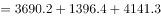亿吨公里；第二季度全国货物周转量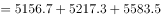亿吨公里。根据增长率，可得2020年第二季度，全国货物周转量约比第一季度增长了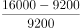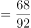，与D项最接近。

故正确答案为D。

---

#### 第 13 题　qid 3523540 · 综合

2020年，我国公路货物周转量累计达1万亿吨公里/2万亿吨公里/3万亿吨公里分别在：

- **A**. 3月  5月  7月
- **B**. 4月  6月  8月
- **C**. 4月  6月  7月　✅
- **D**. 3月  5月  8月

**答案**：C

**官方解析**

定位折线图：2020年，累计到4月我国公路货物周转量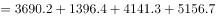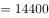亿吨公里万亿吨公里，即在4月我国公路货物周转量累计达1万亿吨公里（由上一小题可知2020年第一季度全国货物周转量约9200亿吨公里，不到1万亿吨公里），排除A、D两项；结合选项，B、C两项达到2万亿吨公里均在6月，不用计算；累计到7月，我国公路货物周转量1至4月5月6月7月亿吨公里万亿吨公里，即在7月我国公路货物周转量累计达3万亿吨公里。

故正确答案为C。

---

#### 第 14 题　qid 3523541 · 平均数

2020年各季度公路货物平均运输距离最高的季度是：

- **A**. 第一季度
- **B**. 第二季度　✅
- **C**. 第三季度
- **D**. 第四季度

**答案**：B

**官方解析**

根据题干“2020年各季度公路货物平均运输距离最高的季度是”，根据备注可知，货物平均运输距离，可判定本题为现期平均数比较问题。定位统计图可得，2020年各月份公路货物周转量与货运量，分别计算各季度货物平均运输距离进行比较即可。

第一季度：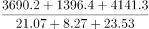公里；第二季度：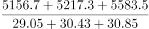公里；第三季度：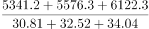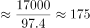公里；第四季度：公里。

比较可知，第二季度公路货物平均运输距离最高。

故正确答案为B。

---

#### 第 15 题　qid 3523544 · 综合

关于2020年全国公路货物运输情况的描述，可以推出的是：

- **A**. 
2月份货运平均运输距离在170-175公里

- **B**. 
全年日均货运量多于1亿吨的月份有6个
　✅
- **C**. 
3月份货物周转量比2月份多以上

- **D**. 
全年月均货运量超过30亿吨

**答案**：B

**官方解析**

A项：定位统计图材料可得，2020年2月份公路货物周转量1396.4亿吨公里，货运量为8.27亿吨，货物平均运输距离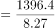公里，不在170-175公里范围内，错误；

B项：定位统计图材料可得，2020年1-12月货运量分别为21.07、8.27、23.53、29.05、30.43、30.85、30.81、32.52、34.04、33.07、35.24、33.73亿吨，2020年1-12月所对应的天数分别为31、29、31、30、31、30、31、31、30、31、30、31天，则日均货运量多于1亿吨的有6月、8月、9月、10月、11月、12月，共计6个月份，正确；

C项：定位统计图材料可得，2020年2月份公路货物周转量1396.4亿吨公里，3月份为4141.3亿吨公里，3月份货物周转量比2月份多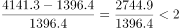，即不到，错误；

D项：定位统计图材料可得，2020年月均货运量为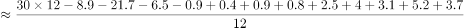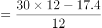亿吨，错误。

故正确答案为B。

---
