# 2021年湖北省公务员录用考试《行测》题（网友回忆版）

> 省考 · 2021 年 · 6 个模块 · 共 125 题

- [政治理论](#%E6%94%BF%E6%B2%BB%E7%90%86%E8%AE%BA) · 2 题
- [常识判断](#%E5%B8%B8%E8%AF%86%E5%88%A4%E6%96%AD) · 18 题
- [言语理解与表达](#%E8%A8%80%E8%AF%AD%E7%90%86%E8%A7%A3%E4%B8%8E%E8%A1%A8%E8%BE%BE) · 35 题
- [数量关系](#%E6%95%B0%E9%87%8F%E5%85%B3%E7%B3%BB) · 15 题
- [判断推理](#%E5%88%A4%E6%96%AD%E6%8E%A8%E7%90%86) · 35 题
- [资料分析](#%E8%B5%84%E6%96%99%E5%88%86%E6%9E%90) · 20 题

---

## 政治理论

### 第 1 题　qid 3522341 · 时事政治

碧空如洗，草木竞荣，2020年初夏召开的全国两会极不平凡。两会期间，习近平总书记多次“下团组”，对做好统筹疫情防控和经济社会发展工作、应对当前的风险和挑战、永远保持同人民群众的血肉联系等方面作出重要指示，传递出攻坚克难、化危为机的坚定信心和力量。以下选项对应关系不一致的是：

- **A**. 谈经济社会发展——“在危机中育新机、于变局中开新局”
- **B**. 谈生态文明建设——“坚定信心不动摇，咬定目标不放松”　✅
- **C**. 谈疫情防控——“慎终如始、再接再厉”
- **D**. 谈执政为民——“人民至上、生命至上”

**答案**：B

**官方解析**

本题考查政治常识。
A项正确，2020年5月23日，习近平总书记看望参加全国政协十三届三次会议的经济界委员，听取意见和建议。在讲话中，习近平用全面、辩证、长远的眼光分析当前全球经济形势，剖析我国经济的优势和潜力，强调“在危机中育新机、于变局中开新局”，要求“确保各项决策部署落地生根，确保完成决胜全面建成小康社会、决战脱贫攻坚目标任务”，推动我国经济乘风破浪、行稳致远。
B项错误，2019年3月7日，习近平总书记参加甘肃代表团审议时强调，要坚定信心不动摇，咬定目标不放松，整治问题不手软，落实责任不松劲，转变作风不懈怠，确保脱贫攻坚任务如期完成。
C项正确，2020年5月24日，习近平总书记来到十三届全国人大三次会议湖北代表团参加审议。习近平强调，要时刻绷紧疫情防控这根弦，慎终如始、再接再厉，持续抓好外防输入、内防反弹工作，决不能让来之不易的疫情防控成果前功尽弃。
D项正确，2020年5月22日，中共中央总书记、国家主席、中央军委主席习近平参加十三届全国人大三次会议内蒙古代表团的审议。他强调：“在全国范围调集最优秀的医生、最先进的设备、最急需的资源，全力以赴投入疫病救治，救治费用全部由国家承担。人民至上、生命至上，保护人民生命安全和身体健康可以不惜一切代价。”
本题为选非题，故正确答案为B。

---

### 第 2 题　qid 3522742 · 新思想

脱贫攻坚的重大胜利，为实现第一个百年奋斗目标打下了坚实基础，极大增强了人民群众获得感、幸福感、安全感，彻底改变了贫困地区的面貌，改善了生产生活条件，提高了群众生活质量，“两不愁三保障”全面实现。以下习近平总书记的“金句”与脱贫攻坚无直接相关的是：

- **A**. 脚下沾有多少泥土，心中就沉淀多少真情
- **B**. 小康不小康，关键看老乡
- **C**. 扶贫必扶智，治贫先治愚
- **D**. 只争朝夕，不负韶华　✅

**答案**：D

**官方解析**

本题考查政治常识。
A项正确，2015年6月18日，习总书记在部分省区市扶贫攻坚与“十三五”时期经济社会发展座谈会上的讲话当中指出，选派扶贫工作队是加强基层扶贫工作的有效组织措施，要做到每个贫困村都有驻村工作队、每个贫困户都有帮扶责任人。脚下沾有多少泥土，心中就沉淀多少真情。工作队和驻村干部要一心扑在扶贫开发工作上，强化责任要求，有效发挥作用。对在基层一线干出了成绩、群众拥护的驻村干部，要注意培养使用，让他们在扶贫开发工作中发挥更大作用。
B项正确，“小康不小康，关键看老乡”是2013年4月9日习近平总书记到博后村考察时提出的重要论述。这一重要论述，深深扎根于3600多名博后村村民的心底，也从这里传到大江南北老乡的心坎里，鼓舞全国亿万农民奋力奔向小康社会。
C项正确，2016年7月20日习总书记在《东西部扶贫协作座谈会上的讲话》中指出，摆脱贫困首要并不是摆脱物质的贫困，而是摆脱意识和思路的贫困。扶贫必扶智，治贫先治愚。贫穷并不可怕，怕的是智力不足、头脑空空，怕的是知识匮乏、精神委顿。脱贫致富不仅要注意富口袋，更要注意富脑袋。
D项错误，2019年12月31日，在新年贺词的最后，习近平总书记说到“让我们只争朝夕，不负韶华，共同迎接2020年的到来。”故“只争朝夕，不负韶华”与脱贫攻坚无直接关系。
本题为选非题，故正确答案为D。

---

## 常识判断

### 第 1 题　qid 3522336 · 人文常识

“十四五”时期是我国全面建成小康社会、实现第一个百年奋斗目标之后，乘势而上开启全面建设社会主义现代化国家新征程、向第二个百年奋斗目标进军的第一个五年。下列有关说法正确的是：

- **A**. 提出到本世纪中叶基本实现社会主义现代化远景目标，人均国内生产总值达到中等发达国家水平，中等收入群体显著扩大
- **B**. 坚持把发展经济着力点放在实体经济上，坚定不移建设制造强国、质量强国、网络强国、数字中国　✅
- **C**. 坚持又快又好工作总基调，以推动高质量发展为主题，以深化供给侧结构性改革为主线
- **D**. “十四五”规划是在党的十九届四中全会上审议通过的，将于2021年开始实施

**答案**：B

**官方解析**

本题考查政治常识。2020年10月29日，中国共产党第十九届中央委员会第五次全体会议通过了《中共中央关于制定国民经济和社会发展第十四个五年规划和二〇三五年远景目标的建议》（以下简称《建议》）。
A项错误：《建议》指出：“到二〇三五年基本实现社会主义现代化远景目标。党的十九大对实现第二个百年奋斗目标作出分两个阶段推进的战略安排，即到二〇三五年基本实现社会主义现代化，到本世纪中叶把我国建成富强民主文明和谐美丽的社会主义现代化强国。展望二〇三五年，······人均国内生产总值达到中等发达国家水平，中等收入群体显著扩大，基本公共服务实现均等化，城乡区域发展差距和居民生活水平差距显著缩小；平安中国建设达到更高水平，基本实现国防和军队现代化；人民生活更加美好，人的全面发展、全体人民共同富裕取得更为明显的实质性进展。”
B项正确：《建议》指出：“坚持把发展经济着力点放在实体经济上，坚定不移建设制造强国、质量强国、网络强国、数字中国，推进产业基础高级化、产业链现代化，提高经济质量效益和核心竞争力。”
C项错误：《建议》指出：“坚持稳中求进工作总基调，以推动高质量发展为主题，以深化供给侧结构性改革为主线，以改革创新为根本动力，以满足人民日益增长的美好生活需要为根本目的，统筹发展和安全，加快建设现代化经济体系，加快构建以国内大循环为主体、国内国际双循环相互促进的新发展格局，推进国家治理体系和治理能力现代化，实现经济行稳致远、社会安定和谐，为全面建设社会主义现代化国家开好局、起好步。”
D项错误，2021年3月11日，十三届全国人大四次会议表决通过了《中华人民共和国国民经济和社会发展第十四个五年规划和2035年远景目标纲要》（简称“十四五”规划）。“十四五”规划将于2021年开始实施。
故正确答案为B。

---

### 第 2 题　qid 3522744 · 人文常识

下列国家勋章和国家荣誉称号与人名对应关系不正确的是：

- **A**. 共和国勋章：申纪兰、屠呦呦、钟南山
- **B**. 人民科学家：吴文俊、南仁东、程开甲
- **C**. 人民英雄：张伯礼、张定宇、陈薇
- **D**. 人民楷模：王文教、王继才、张桂梅　✅

**答案**：D

**官方解析**

本题考查政治常识。
A项正确，2019年9月，为了庆祝中华人民共和国成立70周年，隆重表彰为新中国建设和发展作出杰出贡献的功勋模范人物，弘扬民族精神和时代精神，第十三届全国人民代表大会常务委员会第十三次会议决定，授予于敏、申纪兰、孙家栋、李延年、张富清、袁隆平、黄旭华、屠呦呦“共和国勋章”。2020年8月，第十三届全国人大常委会第二十一次会议表决通过关于授予在抗击新冠肺炎疫情斗争中作出杰出贡献的人士国家勋章和国家荣誉称号的决定，授予钟南山“共和国勋章”。
B项正确，2019年9月，为了庆祝中华人民共和国成立70周年，隆重表彰为新中国建设和发展作出杰出贡献的功勋模范人物，弘扬民族精神和时代精神，第十三届全国人民代表大会常务委员会第十三次会议决定，授予叶培建、吴文俊、南仁东、顾方舟、程开甲“人民科学家”国家荣誉称号。
C项正确，2020年8月，第十三届全国人大常委会第二十一次会议表决通过关于授予在抗击新冠肺炎疫情斗争中作出杰出贡献的人士国家勋章和国家荣誉称号的决定，授予张伯礼、张定宇、陈薇“人民英雄”国家荣誉称号。
D项错误，2019年9月，为了庆祝中华人民共和国成立70周年，隆重表彰为新中国建设和发展作出杰出贡献的功勋模范人物，弘扬民族精神和时代精神，第十三届全国人民代表大会常务委员会第十三次会议决定，授予王文教、王有德（回族）、王启民、王继才、布茹玛汗·毛勒朵（女，柯尔克孜族）、朱彦夫、李保国、都贵玛（女，蒙古族）、高德荣（独龙族）“人民楷模”国家荣誉称号。2020年12月，在如期完成新时代脱贫攻坚目标任务、决战脱贫攻坚取得重大胜利之际，中宣部向全社会宣传发布张桂梅同志的先进事迹，授予她“时代楷模”称号。
本题为选非题，故正确答案为D。

---

### 第 3 题　qid 3522345 · 科技常识

下列有关我国2020年科技成就的说法正确的是：

- **A**. 2020年12月，嫦娥五号返回器成功着陆，这是我国首次完成月球采样返回任务　✅
- **B**. 我国研制的“奋斗者”号载人潜水器于2020年11月坐底菲律宾海沟，创造了我国载人深潜新纪录
- **C**. 中国环流器二号M装置于2020年底建成并实现首次放电，为我国核裂变堆的设计建造打下了坚实基础
- **D**. 2020年7月，北斗三号全球卫星导航系统全面建成并开通服务，我国成为第四个独立拥有全球卫星导航系统的国家

**答案**：A

**官方解析**

本题考查科技常识。
A项正确，2020年12月17日，探月工程嫦娥五号返回器在内蒙古四子王旗预定区域成功着陆，标志着我国首次月球采样返回任务圆满完成。
B项错误，2020年11月10日8时12分，中国“奋斗者”号载人潜水器在马里亚纳海沟成功坐底，坐底深度10909米，创造了中国载人深潜的新纪录。
C项错误，2020年12月4日14时，新一代“人造太阳”装置——中国环流器二号M装置（HL-2M）在成都建成并实现首次放电，标志着中国自主掌握了大型先进托卡马克装置的设计、建造、运行技术，为我国核聚变堆的自主设计与建造打下坚实基础。
D项错误，北斗系统是党中央决策实施的国家重大科技工程。工程自1994年启动，2000年完成北斗一号系统建设，2012年完成北斗二号系统建设。北斗三号全球卫星导航系统全面建成并开通服务，标志着工程“三步走”发展战略取得决战决胜，我国成为世界上第三个独立拥有全球卫星导航系统的国家。目前，全球已有120余个国家和地区使用北斗系统。
故正确答案为A。

---

### 第 4 题　qid 3522743 · 人文常识

下列有关我国抗美援朝战争的说法正确的是：

- **A**. 志愿军与美军第一次交锋，是在仁川登陆战
- **B**. 抗美援朝战争中，中国人民志愿军的司令员是粟裕
- **C**. 中国人民志愿军在战争中涌现出一大批英雄官兵，杨根思、黄继光、解秀梅是其中的优秀代表　✅
- **D**. 2020年是抗美援朝出国作战70周年，我国拍摄了《金刚川》《芳华》等一系列影视作品展现志愿军英勇无畏的优秀品质

**答案**：C

**官方解析**

本题考查毛中特。
A项错误，云山之战，是抗美援朝战争第一次战役的一次重要战斗，是中国人民志愿军与美军在朝鲜战场上首次交锋。云山之战从1950年11月1开始至3日结束，志愿军取得了同美军第一次较量的胜利。
B项错误，1950年10月19日，中国人民志愿军在司令员兼政治委员彭德怀率领下，跨过鸭绿江，赶赴朝鲜战场，25日，揭开抗美援朝战争序幕。
C项正确，杨根思是中国人民解放军全国战斗英雄、中国人民志愿军第一位特等功臣和特级战斗英雄，中国人民志愿军第一位“朝鲜民主主义人民共和国英雄”。解秀梅是我军在抗美援朝战争中唯一荣立一等功的女战士。黄继光在朝鲜上甘岭战役中，用胸膛堵住疯狂扫射的敌机枪眼英勇牺牲。中国人民志愿军给他追记特等功，追授“特级英雄”称号，所在部队追认他为中国共产党党员；朝鲜民主主义人民共和国追授他“朝鲜民主主义人民共和国英雄”称号和金星奖章和一级国旗勋章。
D项错误，《芳华》是根据严歌苓同名小说改编，以1970至1980年代为背景，讲述了在充满理想和激情的军队文工团，一群正值芳华的青春少年，经历着成长中的爱情萌发与充斥着变数的人生命运故事，与抗美援朝故事无关。
故正确答案为C。

---

### 第 5 题　qid 3522754 · 人文常识

下列关于我国突发事件应对的表述错误的是：

- **A**. 突发事件应对工作实行预防为主、预防与应急相结合的原则
- **B**. 新闻媒体应当无偿开展突发事件预防与应急、自救与互救知识的公益宣传
- **C**. 突发事件分为自然灾害、事故灾难、公共卫生事件和群体性事件　✅
- **D**. 国务院有关部门、县级以上地方各级人民政府及其有关部门、有关单位应当为专业应急救援人员购买人身意外伤害保险

**答案**：C

**官方解析**

本题考查法律常识。
A项正确，根据《中华人民共和国突发事件应对法》第五条规定：“突发事件应对工作实行预防为主、预防与应急相结合的原则。”
B项正确，根据《中华人民共和国突发事件应对法》第二十九条第三款规定：“新闻媒体应当无偿开展突发事件预防与应急、自救与互救知识的公益宣传。”
C项错误，根据《中华人民共和国突发事件应对法》第三条第一款规定：“本法所称突发事件，是指突然发生，造成或者可能造成严重社会危害，需要采取应急处置措施予以应对的自然灾害、事故灾难、公共卫生事件和社会安全事件。”
D项正确，根据《中华人民共和国突发事件应对法》第二十七条规定：“国务院有关部门、县级以上地方各级人民政府及其有关部门、有关单位应当为专业应急救援人员购买人身意外伤害保险，配备必要的防护装备和器材，减少应急救援人员的人身风险。”
本题为选非题，故正确答案为C。

---

### 第 6 题　qid 3522348 · 人文常识

下列四位作家原名与其作品、笔名对应错误的是：

- **A**. 李尧棠——《寒夜》——巴金
- **B**. 万家宝——《原野》——曹禺
- **C**. 舒庆春——《月牙儿》——老舍
- **D**. 郭开贞——《太阳照在桑干河上》——丁玲　✅

**答案**：D

**官方解析**

本题考查人文常识。
A项正确，巴金，原名李尧棠，字芾甘，代表作有《爱情三部曲》《寒夜》等。
B项正确，曹禺，原名万家宝，代表作有《雷雨》《日出》《原野》《北京人》等。
C项正确，老舍，原名舒庆春，字舍予，代表作有《骆驼祥子》《四世同堂》《月牙儿》等。
D项错误，丁玲，原名蒋伟，字冰之，代表作有《太阳照在桑干河上》等；郭沫若，本名郭开贞，代表作有《抱和儿浴博多湾中》《凤凰涅槃》等。
本题为选非题，故正确答案为D。

---

### 第 7 题　qid 3522346 · 法律常识

下列有关《中华人民共和国民法典》的说法不正确的是：

- **A**. 民法典将人格权独立成编，调整的是因人格权的享有和保护产生的民事关系
- **B**. 八周岁以上的未成年人为限制民事行为能力人，不可独立实施纯获利益的民事法律行为　✅
- **C**. 民法典实施后，婚姻法、继承法、民法通则、收养法、担保法、合同法、物权法、侵权责任法、民法总则同时废止
- **D**. 民法典规定，自然人享有隐私权，隐私是自然人的私人生活安宁和不愿为他人知晓的私密空间、私密活动、私密信息

**答案**：B

**官方解析**

本题考查法律常识。
A项正确，根据《中华人民共和国民法典》第九百八十九条规定：“本编调整因人格权的享有和保护产生的民事关系。”民法典将人格权独立成编，调整的是因人格权的享有和保护产生的民事关系。
B项错误，根据《中华人民共和国民法典》第十九条规定：“八周岁以上的未成年人为限制民事行为能力人，实施民事法律行为由其法定代理人代理或者经其法定代理人同意、追认；但是，可以独立实施纯获利益的民事法律行为或者与其年龄、智力相适应的民事法律行为。”因此，八周岁以上的未成年人可以独立实施纯获利益的民事法律行为或者与其年龄、智力相适应的民事法律行为。
C项正确，根据《中华人民共和国民法典》第一千二百六十条规定：“本法自2021年1月1日起施行。《中华人民共和国婚姻法》、《中华人民共和国继承法》、《中华人民共和国民法通则》、《中华人民共和国收养法》、《中华人民共和国担保法》、《中华人民共和国合同法》、《中华人民共和国物权法》、《中华人民共和国侵权责任法》、《中华人民共和国民法总则》同时废止。”
D项正确，根据《中华人民共和国民法典》第一千零三十二条规定：“自然人享有隐私权。任何组织或者个人不得以刺探、侵扰、泄露、公开等方式侵害他人的隐私权。隐私是自然人的私人生活安宁和不愿为他人知晓的私密空间、私密活动、私密信息。”
本题为选非题，故正确答案为B。

---

### 第 8 题　qid 3522365 · 人文常识

下列表述按照所代表的年龄从小到大排序正确的是：

- **A**. 
从心之年舞勺之年知非之年期颐之年鲐背之年

- **B**. 
舞勺之年知非之年从心之年鲐背之年期颐之年
　✅
- **C**. 
舞勺之年从心之年知非之年期颐之年鲐背之年

- **D**. 
从心之年舞勺之年知非之年鲐背之年期颐之年

**答案**：B

**官方解析**

本题考查人文常识。

舞勺之年，出自《礼记·内则》，意为男孩子13至15岁期间学习舞勺。

知非之年，出自《淮南子·原道训》，意为到了五十岁，才知道以前四十九年中的错误，后人因此称五十岁为知非之年。

从心之年，出自《论语·为政》，意为随心所欲的年龄，后用为七十岁的称谓。

鲐背之年，出自《诗经·大雅·行苇》：“黄耇台背，以引以翼。”指九十岁高龄的时候，形容老人高寿。

期颐之年，出自《礼记·曲礼上》，用以指活到百岁之人。

正确顺序为：舞勺之年知非之年从心之年鲐背之年期颐之年。

故正确答案为B。

---

### 第 9 题　qid 3522746 · 人文常识

下列情形不可能发生的是：

- **A**. 唐代安史之乱导致北方农业受损，农民不得不以红薯为主食　✅
- **B**. 明末英国瓷器商人评论曾看过的《牡丹亭》《罗密欧与朱丽叶》
- **C**. 明代随郑和访问斯里兰卡的水手，听说东晋法显曾在当地游学
- **D**. 清代随隐元禅师到日本的僧人，到奈良唐招提寺瞻仰鉴真塑像

**答案**：A

**官方解析**

本题考查人文常识。
A项错误，红薯原产于美洲，明万历年间从东南亚传入我国福建等地，清代乾隆嘉庆时期在北方广泛种植，成为全国主要杂粮作物中的一种。故唐代安史之乱时农民不可能吃得到红薯。
B项正确，《牡丹亭》是明代戏曲家汤显祖（1550年—1616年）的代表作，《罗密欧与朱丽叶》是英国剧作家莎士比亚（1564年—1616年）创作的戏剧，明朝时间为1368年到1644年，故明末瓷器商人可能看过《牡丹亭》《罗密欧与朱丽叶》。
C项正确，在《大唐西域记》中，明人的注中有这样的记载：“皇帝遣中使太监郑和，奉香花往诣彼国（指锡兰，今斯里兰卡）供养······当就礼，请佛牙。”公元409年(东晋义熙五年)，法显从恒河口的多摩梨帝登船，经14日抵楞伽岛，登岸即狮子国（斯里兰卡），故明代访问斯里兰卡的水手，可能听说东晋法显曾在这里游学。
D项正确，隐元禅师为明末清初临济宗高僧，隐元晚年应日本长崎兴福寺之请赴日弘法。唐招提寺，日本佛教律宗建筑群。简称为招提寺。在日本奈良市西京五条。由中国唐朝鉴真主持，于公元759年开始建造，公元770年建成。鉴真生前，他的弟子们为他制了一尊坐像，供奉在寺中的开山堂，故清代到日本的僧人，可能到奈良唐招提寺瞻仰鉴真塑像。
本题为选非题，故正确答案为A。

---

### 第 10 题　qid 3522344 · 人文常识

下列谚语不涉及二十四节气的是：

- **A**. 花木管时令，鸟鸣报农时
- **B**. 白露身不露，寒露脚不露
- **C**. 日晕三更雨，月晕午时风　✅
- **D**. 秋分早，霜降迟，寒露种麦正当时

**答案**：C

**官方解析**

本题考查人文常识。

二十四节气，是干支历中表示自然节律变化以及确立“十二月建”的特定节令。现行的“二十四节气”是依据太阳在回归黄道上的位置制定，即把太阳周年运动轨迹划分为24等份，每为1等份，每1等份为一个节气，始于立春，终于大寒。“二十四节气”是中华民族悠久历史文化的重要组成部分。

A项正确，“花木管时令，鸟鸣报农时”，意为不管是花草也好，鸟兽也罢，它们的活动大多呈现出季节性以及规律性，因此，被当作区分时令的重要参考。该谚语涉及二十四节气。

B项正确，“白露身不露，寒露脚不露”，意为白露节气一过，穿衣服就不能再赤膊露体；寒露节气一过，应注重足部保暖。该谚语涉及二十四节气。

C项错误，“日晕三更雨，月晕午时风”，意为若出现日晕的话，夜半三更将有雨，若出现月晕，则次日中午会刮风。该谚语不涉及二十四节气。

D项正确，“秋分早，霜降迟，寒露种麦正当时”，意为把握种麦时间，秋分时种麦早了，霜降时种麦迟了，而寒露时种麦是最好的。该谚语涉及二十四节气。

本题为选非题，故正确答案为C。

---

### 第 11 题　qid 3523373 · 人文常识

下列关于历代正式行政区划的描述，正确的是：

- **A**. 秦代：郡—县　✅
- **B**. 唐代：道—州、府—县
- **C**. 汉代：道—郡—县
- **D**. 宋代：路—军、州—县

**答案**：A

**官方解析**

本题考查人文常识。
A项正确，秦朝行政区划分为郡、县两级，以郡统县。秦始皇在前221年分全国为36郡，到秦末增加到40多个郡。县共有1000多个，一个郡一般管十几到二三十个县。
B项错误，从汉朝开始逐渐成形的州郡县三级制，唐高祖建国后，将郡改称州，长官复称汉朝的刺史，成为一级行政区划，下领县，实行州县两级制。唐太宗贞观元年（627年）又将全国分为十个道，唐玄宗开元年间，改为十五道，设置采访处置使，相当于汉武帝时的刺史。另外，玄宗以后，还将一些地位特殊的州改称为府。至唐末共有十几个府。安史之乱以后，形成了以掌兵权的节度使作为地方行政长官的制度。一个节度使管几个州，其辖区也叫道，形成了道—州—县三级行政区划制度。
C项错误，汉武帝元封五年（前106年）将全国分为十三个监察区，名为州，州设刺史，由中央管辖。到东汉时，州已经成为一级行政区划，形成了州、郡、县三级制。
D项错误，宋朝行政区划，实行州、县二级制，在西南少数民族地区，继承了唐朝的羁縻制度，也可以算是一定程度上的民族自治。同时在地方设置路，路是直辖于中央并高于府、州、军、监的一级监察区。
故正确答案为A。

---

### 第 12 题　qid 3522335 · 经济常识

下列关于风险管理的做法合适的是：

- **A**. 某商业银行对不同信用等级的客户适用相同的贷款利率
- **B**. 李某担心家中古董被盗造成损失，向保险公司购买财产保险　✅
- **C**. 考虑到大人和小孩风险承受力强弱不一，购买保险时小孩应优先于大人
- **D**. 某外贸公司将要进口一批美国货物，为规避美元升值风险，向银行申请开立保函

**答案**：B

**官方解析**

本题考查经济常识。风险管理流程主要包括风险识别、风险计量、风险监测和风险控制四个步骤，其中风险控制是对经过识别和计量的风险采取分散、对冲、转移、规避和补偿等措施，进行有效管理和控制的过程。
A项错误，商业银行可以预先在金融资产定价中充分考虑到各种风险因素，通过价格调整来获得合理的风险回报，而对于那些无法通过风险分散、风险对冲、风险转移或风险规避进行有效管理的风险，商业银行可以采取在交易价格上附加更高的风险溢价，即通过提高风险回报的方式，获得承担风险的价格补偿。不同的信用的等级的客户有着不同程度的违约风险，应该适用不同的贷款利率，而不是相同的贷款利率，低信用等级的贷款利率由于信用风险更高，银行为了获得风险的价格补偿，应提供相对较高的贷款利率。
B项正确，风险转移是指通过购买某种金融产品或采取其他合法的经济措施将风险转移给其他经济主体的一种策略性选择。风险转移可分为保险转移和非保险转移，其中保险转移是指通过买保险，以缴纳保险费为代价，将风险转移给承保人。李某担心家中古董被盗造成财产损失，可以通过向保险公司购买财产保险，将财产损失的风险转移给保险公司。
C项错误，根据购买保险的原则，大人应该优先于小孩。如果优先给小孩配置保险，一旦大人生病或发生意外事故，则家庭将失去主要的经济来源，同时还要负担大笔的医疗费用支出，小孩的生活、教育开支将同样受到影响。因此，在购买保险时应该优先考虑大人，尤其是家中的经济支柱。
D项错误，保函，又称保证书，是指银行、保险公司、担保公司或担保人应申请人的请求，向受益人开立的一种书面信用担保凭证。保证在申请人未能按双方协议履行其责任或义务时，由担保人代其履行一定金额、一定时限范围内的某种支付或经济赔偿责任。银行保函以银行为担保人转移违约风险，但并不能转移美元升值的外汇风险。进口商为了避免美元升值所带来的外汇风险，可以采取远期外汇交易的套期保值，买入远期美元，而不是找银行开立保函。
故正确答案为B。

---

### 第 13 题　qid 3522349 · 法律常识

根据我国法律规定，下列表述正确的是：

- **A**. 甲应聘某基层人民法院陪审员，其就职时可以依照法律规定公开进行宪法宣誓
- **B**. 乙是某大型超市收银员，利用工作便利私自窃取货款5万元，其行为构成贪污罪
- **C**. 丙是某县负责抗洪指挥工作的领导，在救灾过程中带人打麻将，未及时检查造成垮堤，其行为构成玩忽职守罪　✅
- **D**. 丁是某市电视台总导演，利用职务便利收受他人财物数额巨大，但因其不属于国家工作人员，因此不构成贪污罪

**答案**：C

**官方解析**

本题考查法律常识。
A项错误，根据《中华人民共和国人民陪审员法》第十二条规定：“人民陪审员经人民代表大会常务委员会任命后，应当公开进行就职宣誓。宣誓仪式由基层人民法院会同司法行政机关组织。”《全国人民代表大会常务委员会关于实行宪法宣誓制度的决定》指出：“一、各级人民代表大会及县级以上各级人民代表大会常务委员会选举或者决定任命的国家工作人员，以及各级人民政府、监察委员会、人民法院、人民检察院任命的国家工作人员，在就职时应当公开进行宪法宣誓。”本项中，甲就职时应当依照法律规定公开进行宪法宣誓，而非“可以”。
B项错误，贪污罪，是指国家工作人员和受国家机关、国有公司、企业、事业单位、人民团体委托管理、经营国有财产的人员，利用职务上的便利，侵吞、窃取、骗取或者以其他手段非法占有公共财物的行为。职务侵占罪，指公司、企业或者其他单位的人员，利用职务上的便利，将本单位财物非法占为己有，数额较大的行为。乙是超市的收银员，并非国家工作人员，不构成贪污罪，构成职务侵占罪。
C项正确，玩忽职守罪，是指国家机关工作人员严重不负责任，不履行或不正确地履行自己的工作职责，致使公共财产、国家和人民利益遭受重大损失的行为。因此，玩忽职守罪的主观方面是过失。丙作为某县负责抗洪指挥工作的领导，在救灾过程中带人打麻将，未及时检查造成垮堤就属于严重不负责任，构成玩忽职守罪。
D项错误，贪污罪，是指国家工作人员和受国家机关、国有公司、企业、事业单位、人民团体委托管理、经营国有财产的人员，利用职务上的便利，侵吞、窃取、骗取或者以其他手段非法占有公共财物的行为。受贿罪，指国家工作人员利用职务上的便利，索取他人财物，或者非法收受他人财物，为他人谋取利益的行为。《刑法》第九十三条规定：“本法所称国家工作人员，是指国家机关中从事公务的人员。国有公司、企业、事业单位、人民团体中从事公务的人员和国家机关、国有公司、企业、事业单位委派到非国有公司、企业、事业单位、社会团体从事公务的人员，以及其他依照法律从事公务的人员，以国家工作人员论。”丁是事业单位电视台总导演，属于国家工作人员，利用职务便利收受他人财物，不构成贪污罪，应当构成受贿罪。
故正确答案为C。

---

### 第 14 题　qid 3522747 · 人文常识

下列关于电磁波的说法正确的是：

- **A**. 地震波是一种电磁波
- **B**. 电磁波可以在真空中传播　✅
- **C**. 在导体中传播的电磁能量不衰减
- **D**. 同一频率的电磁波在不同介质中的传播速度相同

**答案**：B

**官方解析**

本题考查科技常识。

A项错误，地震波是地下岩石受强烈冲击产生弹性振动而形成的弹性波，属于物理学中的机械波；电磁波源于电场与磁场的相互转换并向远方传播，地震波不属于电磁波。

B项正确，电磁波的传播不需要介质，可以在真空中传播，电磁波在真空中的传播速度约为m/s。

C项错误，电磁波进入导体后必将引起传导电流，电场对传导电流做功使得电磁波能量转化为焦耳热，故在导体中传播电磁波能量会衰减。

D项错误，电磁波在各种介质中的传播速度不一样。电磁波在各种介质中的传播速度可由来计算，其中是真空中的光速，是介质的折射率。在光密介质中的速度会小些，真空中的速度最大。

故正确答案为B。

---

### 第 15 题　qid 3522355 · 科技常识

下列变化过程包含化学反应的有：
①鬼火
②光合作用
③水垢形成
④高粱酿酒
⑤舞台云雾的生成

- **A**. ②③④⑤
- **B**. ①②④⑤
- **C**. ①③④⑤
- **D**. ①②③④　✅

**答案**：D

**官方解析**

本题考查科技常识。
①正确，“鬼火”也被称为“磷火”，是化学中的自燃现象，常发生在农村，一般出现在夏季的坟墓周围。发生“鬼火”的原因是人的骨头里含有磷元素，尸体腐烂后经过变化会生成磷化氢，磷化氢的燃点很低，可以自燃。
②正确，光合作用是指含有叶绿素等光合色素的绿色植物和某些细菌，在可见光的照射下，经过光反应和碳反应，利用光合色素，将二氧化碳和水转化为有机物，并释放出氧气的生化过程。同时也有将光能转变为有机物中化学能的能量转化过程。
③正确，含有钙、镁等盐类杂质的水进入水壶后，在烧水时吸收了许多热量，钙、镁盐类杂质便会发生化学反应，生成难以溶解的物质，最后析出，析出物随着沸水的不断蒸发而逐渐浓缩，当达到一定浓度时，就会成为固体，并沉淀附着在水壶内壁上，形成一层白色的“膜”。这就是我们所说的水垢，它的主要成分是碳酸钙、碳酸镁等。
④正确，酿酒是利用微生物发酵生产含一定浓度酒精饮料的过程。高粱在微生物作用下，经过复杂的生物化学反应，产生乙醇和白酒中的香味物质。
⑤错误，干冰是固态的二氧化碳，其升华时吸收大量的热，使其周围的温度迅速降低。处于低温区内的水蒸气就会液化成小水珠，许多细小的水珠聚在一起，在空中飘浮，就成为舞台上的云雾，属于物理变化。
因此①②③④包含化学反应。
故正确答案为D。

---

### 第 16 题　qid 3522443 · 科技常识

优秀的足球运动员会利用技巧使踢出的足球在空中旋转，旋转的足球在行进过程中会突然改变原来的运动方向并转弯，这被称为“香蕉球”。
下列选项的物理原理与“香蕉球”原理不同的是：

- **A**. 飞机机翼通常设计为上沿是弧形，下沿是平的
- **B**. 用吸管喝袋装牛奶，喝完后用力吸一下，袋子瘪了　✅
- **C**. 火车站台设置黄色安全线以警示乘客与列车保持距离
- **D**. 两张相距5厘米的A4纸垂直放置，往中间吹气，两张纸会互相吸引

**答案**：B

**官方解析**

本题考查科技常识。“香蕉球”之所以可以沿弧线飞行，主要是由于伯努利原理（流速越快，压强越小）。运动员踢出的“香蕉球”后，球会边旋转边前进，导致在球周围形成与球旋转方向一致的环形气流，环形气流与足球前进方向一致的一侧，流速会变快，压强减小，环形气流与足球前进方向相反的一侧，流速会变慢，压强增大。由于此时两侧受到的空气压强不相等，在压强作用下，球向压强小的一侧拐弯。
A项正确，根据伯努利原理，飞机飞行时，机翼将气流分为上下两个部分，上半部分走的路径为弧线，流速快，压强小，下半部分气流走直线，流速慢，压强大。正是由于机翼下侧压强大于机翼上侧，上下压强不相等，产生升力，使飞机能飞起来。
B项错误，当用吸管吸走袋中空气后，袋中气压瞬间减小，此时外界大气压并未减小，在内外压强差的作用下，袋子被压瘪。该过程并未涉及伯努利原理。
C项正确，根据伯努利原理，人若离列车太近时，列车高速行驶过程中，使人和列车之间的空气流动速度很快，压强很小，而人外侧的压强不变，人在内外压强差的作用下，被压向列车容易出现事故。因此火车站台设置黄色安全线以警示乘客与列车保持距离。
D项正确，根据伯努利原理，向两张相距5厘米的A4纸中间吹气时，两张纸中间空气流速快，压强小，而外侧空气基本静止，压强较大，在压力差的作用下，两张纸向中间靠拢。
本题为选非题，故正确答案为B。

---

### 第 17 题　qid 3522367 · 人文常识

下列词语与“天干地支”无关的是：

- **A**. 寅吃卯粮
- **B**. 猴年马月
- **C**. 甲乙丙丁
- **D**. 龙马精神　✅

**答案**：D

**官方解析**

本题考查人文常识。
天干地支，简称为干支，源自中国远古时代对天象的观测。在中国历法中，“甲、乙、丙、丁、戊、己、庚、辛、壬、癸”称为十天干，“子、丑、寅、卯、辰、巳、午、未、申、酉、戌、亥”称为十二地支。十二生肖是十二地支的形象化代表，即子（鼠）、丑（牛）、寅（虎）、卯（兔）、辰（龙）、巳（蛇）、午（马）、未（羊）、申（猴）、酉（鸡）、戌（狗）、亥（猪）。
A项正确，寅吃卯粮，比喻入不敷出，财物亏空。寅、卯，与天干地支有关。
B项正确，猴年马月，泛指未来的岁月，和时间有关。午（马）、申（猴），与天干地支有关。
C项正确，甲乙丙丁，与天干地支有关。
D项错误，龙马精神，就是像龙马一样精神，形容健旺非凡的精神。根据《中国成语大词典》解释：龙马是指传说中的骏马，与时间无关，与天干地支无关。
本题为选非题，故正确答案为D。

---

### 第 18 题　qid 3523372 · 科技常识

下列物理现象与地球自转无关的是：

- **A**. 日月星辰四季方位的变化　✅
- **B**. 昼夜更替
- **C**. 在北半球，物体从高空自由下落，存在落点偏东的现象
- **D**. 在北半球，水自然形成的漩涡是逆时针方向的

**答案**：A

**官方解析**

本题考查地理国情。
A项错误，日月星辰泛指宇宙的天体，日月星辰四季方位的变化也就是地球绕着太阳公转，转一圈是四个季节，每个季节的位置不同。日月星辰四季方位是由于地球公转引起的。
B项正确，由于地球是一个既不透明、也不发光的球体，所以在同一时间里，太阳只能照亮地球表面的一半。向着太阳的半球是白天，背着太阳的半球是黑夜。由于地球不停地自转，昼夜也就不断地更替。
C项正确，落体偏东是由于地球自西向东的旋转引起的。由于随地球自转而具有的线速度，一定大于地面上物体的线速度。所以该物体下落时必然相对地面有一个偏东的速度，落点自然就会偏东。
D项正确，在北半球，由于地球自转所形成的自转偏向力是向右的，因此水自然形成的漩涡是逆时针方向的。
本题为选非题，故正确答案为A。

---

## 言语理解与表达

### 第 1 题　qid 3522455 · 逻辑填空

现代体育比赛不仅是各国运动员速度与力量的竞技场，也是世界各国展示形象、尖端科技与体育融合的大舞台。随着人类对挑战自身的执着追求，各竞技项目的成绩不断        人体能力的极限，要想进一步提高比赛成绩，哪怕是提高百分之一甚至千分之一，教练与运动员都要竭尽全力采用各种方式和技术去实现，科技的赋能作用也就愈发重要。
填入划横线部分最恰当的一项是：

- **A**. 刷新
- **B**. 挑战
- **C**. 考验
- **D**. 逼近　✅

**答案**：D

**官方解析**

根据“随着人类对挑战自身的执着追求”以及后文“要想进一步提高比赛成绩······都要竭尽全力······去实现”可知，横线处要体现在人类的执着追求下，竞技项目的成绩被不断地提高，越来越接近“人体能力极限”。A项“刷新”意思是刷洗之后使之变新，“刷新”成绩不一定能接近人体能力极限，与文意不符，排除；B项“挑战”一般搭配人，“人挑战极限”或“人挑战自身”等等，一般不与“成绩”搭配，排除；C项“考验”的常见搭配为“考验能力”，与“极限”搭配不当，排除；D项“逼近”意思是向前靠近，接近，能体现出成绩不断接近人体能力极限，符合文意，当选。
故正确答案为D。
【文段出处】光明日报《体育中的“黑科技”》

---

### 第 2 题　qid 3522456 · 逻辑填空

《周书》曰：“小满之日苦菜秀。”小满时节，麦类、谷物等农作物子粒开始饱满，但尚未成熟，恰是青黄不接的时候。而田间地头的野菜正蓬勃生长，采食野菜来度过饥荒，自是            。
填入划横线部分最恰当的一项是：

- **A**. 不容置疑
- **B**. 顺理成章　✅
- **C**. 水到渠成
- **D**. 理所当然

**答案**：B

**官方解析**

由“麦类、谷物······尚未成熟······而田间地头的野菜正蓬勃生长”可知，人们在谷物青黄不接时可食用野菜充饥，故横线处应表达在没有食物可吃的情况下，人们采食田间地头的野菜是自然而然发生的事情。B项“顺理成章”既指写文章或做事情，顺着条理就能做好，也指某种情况合乎情理，自然产生某种结果，符合文意，当选。A项“不容置疑”指不允许加以怀疑，形容绝对真实可信，强调论证严密，无可怀疑，程度过重，排除；C项“水到渠成”比喻条件成熟，事情自然成功，文段并未体现“条件成熟”之意，与文意不符，排除；D项“理所当然”指从道理上讲应当这样，强调应当如此，文段并未强调理应如此，而是强调顺应某种情况自然发生的结果，与文意不符，排除。
故正确答案为B。
【文段出处】《节气｜小满初晴麦气薰》

---

### 第 3 题　qid 3523492 · 逻辑填空

早在商汤时代，浴盘上就镌刻有“苟日新，日日新，又日新”的铭词，旨在激励自己澡身而浴德，澡雪而精神，既要盥洗身体，更要涤荡心灵，保持向新求新的精神，产生            的进步。
填入划横线部分最恰当的一项是：

- **A**. 与日俱进
- **B**. 日新月异　✅
- **C**. 竿头日上
- **D**. 突飞猛进

**答案**：B

**官方解析**

根据横线前“保持向新求新的精神”可知，横线处应体现“新”的意思，且与“进步”搭配。B项“日新月异”形容每天都在更新，每月都有变化，可体现出“新”的意思，且搭配恰当，符合文意，当选。
A项“与日俱进”指随着时间一天天地进步，形容不断进步或提高。“与日俱进”侧重“提高进步”，且“与日俱进”与“进步”存在语义上的重复，搭配不当，排除；
C项“竿头日上”比喻学业进步很快，体现不出“新”的意思，排除；
D项“突飞猛进”形容进步和发展特别迅速，文段并未体现“进步和发展特别迅速”，且“突飞猛进”与“进步”重复，搭配不当，排除。
故正确答案为B。
【文段出处】《文明：文以化人 日新其德》

---

### 第 4 题　qid 3522459 · 逻辑填空

成年人总是认为孩子思维幼稚、理解力有限，这其实是一种        。得益于蓬勃发展的信息技术和日益便利的交通出行，如今的孩子比以往掌握更多知识，也更加渴望了解世界。阅读可以打开一扇扇门，让他们看见广阔的世界，了解活着的意义，也要面对死亡和失去。而友谊和爱，这些宝贵的品质犹如黑夜中的明灯，终将        他们面向世界，走向未来。
依次填入划横线部分最恰当的一项是：

- **A**. 成见 推动
- **B**. 偏见 引领　✅
- **C**. 误读 促进
- **D**. 误解 带动

**答案**：B

**官方解析**

本题可从第二空入手，横线处所填词语搭配“黑夜中的明灯”和“他们”，且对应前文“宝贵的品质犹如黑夜中的明灯”，故横线处所填词语要体现品质如明灯一般，带领指引着孩子走向未来，B项“引领”指引导带领，且与“他们”搭配得当，保留；A项“推动”指使事物启动或前进，使工作展开，常搭配社会、经济等，如推动社会进步、推动经济发展等，一般不与人搭配，排除；C项“促进”指促使进步并推动发展，常见的搭配有促进生产等，且品质如明灯是没办法促进孩子面向世界的，排除；D项“带动”指引导着前进，常见的搭配有沿海带动内地、先进带动后进等，而品质如明灯是不能带头运动的，排除。
验证第一空，根据指代词“这”对应前文成年人的观点，且根据后文“如今的孩子比以往掌握更多知识，也更加渴望了解世界”可知，成年人对孩子的认识是错误的、片面的。B项“偏见”指片面的见解、成见，符合文意，当选。
故正确答案为B。
【文段出处】《儿童文学创作的重要主题》

---

### 第 5 题　qid 3522972 · 逻辑填空

在高山相夹的谷底，有时能直观地看到地形对云的        ：气流翻山越岭被抬升形成波动气流，在气流的波峰与波谷之前，云也随之上下扭曲。在一些情况下，大气温度和高度成反比，处于波谷处的温度更高，达不到云        的温度，而波峰处的温度可以形成云，这样就形成了有云和无云条带反复交错的波状云天空。
依次填入划横线部分最恰当的一项是：

- **A**. 塑造 凝结　✅
- **B**. 制造 凝集
- **C**. 打造 凝聚
- **D**. 创造 凝固

**答案**：A

**官方解析**

第一空，横线后出现冒号提示解释说明，根据“气流翻山越岭被抬升形成波动气流，在气流的波峰与波谷之前，云也随之上下扭曲”可知，文段意在说明地形对云的形状产生影响。A项“塑造”指通过培养、改造使人或事物达到某种预定的目标，可体现“影响”之意，保留。B项“制造”、C项“打造”、D项“创造”均强调从无到有的过程，而文段中云已然存在，强调的是地形对云的形状产生影响，与文意不符，排除。
第二空，代入验证，A项“凝结”能体现水蒸气变成云的过程，搭配恰当，符合文意，当选。
故正确答案为A。

---

### 第 6 题　qid 3523497 · 逻辑填空

随着微信用户群体不断扩大，微信在流量获取、社群运营、用户规模与黏性方面的优势越发明显，越来越多的教育产品开始        微信生态探索新的服务模式，吸引用户进行            分享，以降低获得新用户的成本，提升用户黏性。
依次填入划横线部分最恰当的一项是：

- **A**. 借用 全方位
- **B**. 借助 持续性　✅
- **C**. 依托 聚变式
- **D**. 凭借 立体化

**答案**：B

**官方解析**

本题可从第二空入手，横线处搭配“用户”，根据文段“随着微信用户群体不断扩大，微信在······的优势越发明显，越来越多的······”可知，文段论述的是微信用户不断扩大的过程。B项“持续性”能够体现微信用户不断扩大的延续过程，保留。A项“全方位”指所有的方面，C项“聚变式”指轻原子核聚合为重原子核并放出巨大能量的过程，D项“立体化”指包括各方面的，均与文意不符，排除。
第一空，代入验证，横线处搭配“微信生态”，B项“借助”搭配得当，当选。
故正确答案为B。
【文段出处】《朋友圈“打卡”扰民 应该如何规范？》

---

### 第 7 题　qid 3522850 · 逻辑填空

人脸识别系统深度学习的数据越多，人脸识别的效果就会越精确。只要给予足够多的人脸攻击大数据样本，机器就能够自主地学习到伪造图像或合成视频中的        ，最终就能得到对于这些攻击的分辨能力。并且，随着学习数据的不断增多，深度学习系统也会一天比一天强大，让各种各样的“换脸”            。
依次填入划横线部分最恰当的一项是：

- **A**. 弊端 无计可施
- **B**. 瑕疵 无所遁形　✅
- **C**. 错误 插翅难逃
- **D**. 缺陷 束手无策

**答案**：B

**官方解析**

第一空，根据“人脸识别系统深度学习的数据越多，人脸识别的效果就会越精确”以及“只要给予足够多的人脸攻击大数据样本”可知，在数据足够多的前提下，人脸识别系统是非常精确的，所以即便“伪造图像”“合成视频”中存在特别小的问题，也能被发现，故横线所填词语应表达微小问题之意。B项“瑕疵”指微小的缺点，符合文意，保留。A项“弊端”指由于工作上有漏洞而发生的损害公益的事情，C项“错误”指不正确的事物、行为，D项“缺陷”指欠缺或不够完备的地方，均程度过重，排除。
第二空，代入验证，B项“无所遁形”指没有地方可以隐藏形迹、身影，赤裸裸地展现在人们面前，可以体现随着深度学习系统的强大，“伪造图像”“合成视频”等“换脸”行为会被人脸识别系统识别，暴露在人们的面前，符合文意，当选。
故正确答案为B。

---

### 第 8 题　qid 3522458 · 逻辑填空

南音是中国现存最古老的乐种之一，以其大量的曲目、古老的乐器和自成体系的记谱方法，        着汉唐以来中国音乐的血脉。南音被誉为“中国音乐历史的活化石”，在中国音乐史中具有            的特殊地位，极具历史、文化、学术研究价值。
依次填入划横线部分最恰当的一项是：

- **A**. 贯通 独一无二
- **B**. 承载 举足轻重
- **C**. 延续 不可替代　✅
- **D**. 沿袭 出类拔萃

**答案**：C

**官方解析**

本题可以从第二空入手，横线处搭配“南音”，根据“南音被誉为‘中国音乐历史的活化石’”“极具历史、文化、学术研究价值”可知，意在强调南音在中国音乐史中的重要地位。B项“举足轻重”比喻所处地位重要，一举一动对全局有重大影响、C项“不可替代”指不能被替换掉，很重要，均能体现出南音在中国音乐史的重要地位，符合文意，保留；A项“独一无二”形容唯一的，没有与之相同的或可以与之相比的，常用于对比的语境中，文段并未将南音与其他乐种相比，与文意不符，排除；D项“出类拔萃”指超出同类，多指人的品德才能，与“南音”搭配不当，排除。
第一空，横线处所填词语搭配“血脉”，且根据前文“南音是中国现存最古老的乐种之一”可知，横线处应表达南音一直体现着汉唐以来中国音乐的特点之意，C项“延续”指照着原来的样子继续下去，与“血脉”搭配恰当，符合文意，当选；B项“承载”指承受负载，不能表达出南音一直体现着汉唐以来中国音乐特点的这一含义，与文意不符，排除。
故正确答案为C。
【文段出处】人民网《从传承到发展 泉州南音走向世界》

---

### 第 9 题　qid 3522941 · 逻辑填空

实体书店不仅是一种商业业态，也是一个文化标志，更是一座城市的文化招牌。实体书店要想在图书市场上赢得竞争，关键要找准定位，        自己的比较优势和市场价值，在服务上做得更加周到精准，才能让读者            ，让逛书店成为文化时尚，让更多人浸润在浓郁书香中。
依次填入划横线部分最恰当的一项是:

- **A**. 明晰 络绎不绝
- **B**. 确定 源源不断
- **C**. 明确 纷至沓来　✅
- **D**. 确立 客似云来

**答案**：C

**官方解析**

第一空，搭配“比较优势和市场价值”，且由“关键要找准定位”可知，所填词语应体现出准确之意，A项“明晰”指清楚；不模糊，B项“确定”指明确而肯定，C项“明确”指使清晰明白而确定不移，均能体现出准确之意，符合文意，保留。D项“确立”指稳固地建立或树立，置于此处搭配不当，排除。
第二空，搭配“读者”，且由文段可知所填词语应体现出“实体书店能够吸引更多读者来”的意思，C项“纷至沓来”指连续不间断地到来，符合文意，当选。A项“络绎不绝”形容行人车马来来往往，接连不断，常用来形容街道、码头等人来人往十分热闹的场景，文段并非强调“实体书店”让“读者”来来往往，置于此处与文意不符，排除。B项“源源不断”形容连续而不间断，多用于形容事物，而少用于形容人，置于此处搭配不当，排除。
故正确答案为C。
【文段出处】《实体书店回暖 浸润浓郁书香》

---

### 第 10 题　qid 3522429 · 逻辑填空

实际上普通话和方言不是同一层次上的交际工具，普通话是全民共同语，是官方语言，而方言是区域性的，是民间语言。通过明确        ，普通话和方言可以做到并行不悖，甚至            ，相得益彰。
依次填入划横线部分最恰当的一项是：

- **A**. 规定  齐头并进
- **B**. 划分  互为表里
- **C**. 区分  珠联璧合
- **D**. 界定  相辅相成　✅

**答案**：D

**官方解析**

第一空，根据文意可知，普通话和方言通过明确划定各自的使用范围可以同时使用，并不冲突。A项“规定”意为对事物的数量、质量或方式、方法等做出具有约束力的决定，D项“界定”意为划定界限，确定所属范围，置于此处均符合文意，保留；B项“划分”指把整体分成若干部分，文段未体现普通话和方言存在整体和部分的关系，排除；C项“区分”指辨别，分辨，文段并非强调普通话和方言相似，不好分辨，与文意不符，排除。
第二空，根据“甚至”可知，表达递进关系，横线处所填词语应比“并行不悖”程度更重。D项“相辅相成”意为两件事物相互补充，互相配合，缺一不可，可与“并行不悖”构成递进关系，符合文意，当选；A项“齐头并进”意为不分先后地一齐前进或同时进行，程度与“并行不悖”一致，无法构成递进关系，排除。
故正确答案为D。
【文段出处】《普通话与方言如何相得益彰》

---

### 第 11 题　qid 3522447 · 逻辑填空

当前，构建中国特色文艺理论体系已渐成学界共识，但在推进建设的道路上，            易，具体而微难；空喊口号易，付诸实践难。中国特色文艺理论体系建设，除了宏观维度的考量，更需要大功细作，从概念、范畴、术语及具体议题设置等微观层面入手，            ，聚沙成塔，一砖一瓦搭建大厦。
依次填入划横线部分最恰当的一项是：

- **A**. 大而化之    条分缕析　✅
- **B**. 坐而论道    步步为营
- **C**. 小题大做    集腋成裘
- **D**. 通观大局    精雕细琢

**答案**：A

**官方解析**

第一空，由分号后的句子“空喊口号易，付诸实践难”可知，横线处所填词语应与“具体而微”构成反义并列，表达不具体、不细致的含义。A项“大而化之”形容做事情不小心谨慎，粗枝大叶，符合文意，保留；B项“坐而论道”指坐着空谈大道理，强调口头说说，不见行动，与文段想要表达的是否具体细致无关，排除；C项“小题大做”指拿小题目作大文章，比喻不恰当地把小事当作大事来处理，有故意夸张的意思，也与文意想表达的不具体不细致无关，排除；D项“通观大局”指通盘筹划，综合看待问题，侧重的是看待事情全面，有统筹协调的意识，文意想表达的是不够具体不够细致，与文意不符，排除。
第二空，代入验证，前文论述中国特色文艺理论体系建设需要大功细作，需要从微观层面入手，强调从细处入手，A项“条分缕析”指有条有理地细细分析，置于此处表达我们做事情需要有条有理地仔细地去分析梳理，符合文意，当选。
故正确答案为A。
【文段出处】《更好用中国文艺理论解读文艺实践》

---

### 第 12 题　qid 3523005 · 逻辑填空

“我思故我在”“我劳故我在”，这种存在方式带给我两书柜的劳绩，好比几根火柴捆绑在一起，多少有了一点        。这种存在方式也带给我        的生活习性。活得实在、活得真实，在我看来是整个人生的真谛。我喜欢像罗丹的《思想者》那样，没有        、没有装点，通过自己的文字，赤膊面对这个世界。
依次填入划横线部分最恰当的一项是：

- **A**. 硬度 简朴 遮掩　✅
- **B**. 厚度 简单 掩饰
- **C**. 亮度 简洁 遮挡
- **D**. 温度 简练 修饰

**答案**：A

**官方解析**

第一空，根据“好比几根火柴捆绑在一起”“多少有了一点”可知，横线处所填词语应体现多根火柴捆在一起后所形成的状态，A项“硬度”指固体坚硬的程度，可体现一根火柴很脆弱、易折断，而几根捆绑在一起时，便不易折断，符合文意，保留。B项“厚度”指扁的物体上下两面之间的距离，与火柴搭配不当，排除；C项“亮度”、D项“温度”，均为火柴点燃后所带来的结果，文段只是强调将火柴捆绑在一起所带来的结果，没有强调是否点燃，不符合文意，排除。
第二空，代入验证，A项“简朴”意为朴素简单，可对应后文“活得实在、活得真实”“赤膊面对这个世界”，体现生活习性十分简单，符合文意，保留。
第三空，代入验证，A项“遮掩”意为掩饰、隐瞒，可与后文“装点”构成并列关系，且“没有遮掩”对应后文“赤膊面对”，符合文意，当选。
故正确答案为A。
【文段出处】《柳鸣九：桥上的人生》

---

### 第 13 题　qid 3522410 · 逻辑填空

“回输”是细胞治疗需要        的主要手段之一。将细胞注射回人体，犹如将一艘艘小船放回航道，而人体内是一个密织交错的“航道网”，如果没有有效的、执行力强的“导航”设备，只能“            ”。无法到达指定位置的细胞治疗，功效将被大大        ，甚至不起作用。
依次填入划横线部分最恰当的一项是：

- **A**. 仰仗 随波逐流 稀释　✅
- **B**. 凭借 离弦走板 侵蚀
- **C**. 依靠 返本还原 缩小
- **D**. 依仗 随俗浮沉 减弱

**答案**：A

**官方解析**

第一空，横线处搭配“手段”，A项“仰仗”指依靠、依赖、凭仗，B项“凭借”指依靠，C项“依靠”意为指望，D“依仗”指倚仗、依赖，均搭配得当，保留。
第二空，根据横线处的引号以及横线前的“航道网”“导航”等形象表达可知，横线处应表达出在没有导航设备的情况下只能没有方向地漂浮之意。A项“随波逐流”指随着波浪起伏，跟着流水漂荡。比喻没有坚定的立场，缺乏判断是非的能力，只能随着别人走，符合文意，且可以与横线前形象表达对应，保留。B项“离弦走板”原义指箭离开弓弦，唱戏不合板眼，用来比喻言行偏离公认的准则，C项“返本还原”指返回根本，恢复原样，后多指返回原来的状况，两项均不合符文意，且无法与横线前形象表达对应，排除；D项“随俗浮沉”与A项“随波逐流”对比，“随俗”指跟随世俗大众，不如“随波”与文段“航道”对应恰当，且“浮沉”指下沉上浮，而文段强调没有“导航”，即没有方向，与文意不符，排除。
第三空，代入验证。横线搭配“功效”且根据横线后“甚至不起作用”可知，横线处应程度较轻，即体现出起到作用不明显之意，A项“稀释”意为在原有的溶液中再加入溶剂使其浓度变小，可以体现出功效作用减弱之意，且能与前文的形象表达对应，当选。
故正确答案为A。
【文段出处】科技日报《放个微型机器人 让细胞“指哪打哪”》

---

### 第 14 题　qid 3522431 · 逻辑填空

野草属于乡间大地。在城市里被水泥丛林挤得难有            的野草，即便得到了点滴瘠薄的土地，也生长得            ，茎叶上积满了灰尘，一副失魂落魄的样子。那些生长在乡间大地上的野草，则        地在风中低语，在雨中吟唱。
依次填入划横线部分最恰当的一项是：

- **A**. 一席之地  没精打采  肆意
- **B**. 弹丸之地  垂头丧气  适意
- **C**. 一隅之地  奄奄一息  恣意
- **D**. 栖身之地  萎靡不振  惬意　✅

**答案**：D

**官方解析**

本题可从第三空入手，由“野草属于乡间大地”“在城市里······那些生长在乡间大地上的野草”可知，“则”在此处表达转折关系，第三空所填词语应与前文的“失魂落魄”语义相反，体现出野草在乡间大地生长得比较舒适自在的含义。B项“适意”指自在合意，D项“惬意”形容心情感到愉快畅快，愉悦、舒畅或者是满意，均符合文意，保留；A项“肆意”指不顾一切由着自己的性子，C项“恣意”指放纵，不加限制，任意，均与后文的“低语”“吟唱”无法对应，程度过重，排除。
第二空，搭配“生长”，且由“一副失魂落魄的样子”可知，野草在城市中生长得并不好，D项“萎靡不振”形容精神不振，意志消沉，符合文意，保留；B项“垂头丧气”形容因失败或不顺利而情绪低落的样子，多与情绪搭配，置于此处与“生长”搭配不当，排除。
第一空，代入验证，根据“被水泥丛林挤得”可知，野草在城市中很难有生存之地，D项“栖身之地”指暂时居住的地方，符合文意，当选。
故正确答案为D。
【文段出处】《乡间野草》

---

### 第 15 题　qid 3522957 · 逻辑填空

解释国家兴衰是许多学科            的学术好奇心所在，经济学家更是            地发展出各种理论框架，期冀破解经济增长之谜。激励学者们把中国这个经历了由盛至衰的历史作为主要研究对象的，是以著名的中国科技史学家李约瑟命名的所谓“李约瑟之谜”。这个谜题尝试回答为什么在前现代社会，中国科技            于其他文明，而近现代中国不再具有这样的领先地位。
依次填入划横线部分最恰当的一项是：

- **A**. 绵延不绝 孜孜矻矻 迥然不同
- **B**. 旷日持久 孜孜不倦 遥遥领先　✅
- **C**. 亘古不变 皓首穷经 名列前茅
- **D**. 持之以恒 殚精竭虑 一枝独秀

**答案**：B

**官方解析**

第一空，搭配“学术好奇心”，B项“旷日持久”指耗费时日，在文中可指学科的学术好奇心长时间存在，搭配恰当，符合文意，保留；D项“持之以恒”指长久地坚持下去，搭配恰当，保留。A项“绵延不绝”形容相同的自然景观一个接一个不间断地出现，与“学术好奇心”搭配不当，排除；C项“亘古不变”指从古到今没有变化，表达过于绝对，排除。
第二空，根据“把中国这个经历了由盛至衰的历史作为主要研究对象”可知，文段意在表达经济学家进行了长时间研究。B项“孜孜不倦”指工作或学习勤奋不知疲倦，D项“殚精竭虑”形容用尽心思，均符合文意，保留。
第三空，根据“而近现代中国不再具有这样的领先地位”可知，文段意在说明前现代社会中国科技领先于其他文明。B项“遥遥领先”指远远地走在最前面，可准确对应“领先”，符合文意，当选。D项“一枝独秀”形容在同类事物中最为突出，最为优秀，不如B项对应“领先地位”准确，且一般不与“于”搭配使用，排除。
故正确答案为B。
【文段出处】《改革开放是中国经济由衰至盛的转折点》

---

### 第 16 题　qid 3522426 · 片段阅读

退行心理是一种心理防御机制，是指人们在遭受挫折、面临困难时，以比较幼稚的态度，选择早期生活阶段的某种行为方式来应对当前情况。对于二三十岁的成年人来说，经常要面临来自各个方面的多重压力，于是在比较自由的环境中，很多人都会通过退行心理来调节情绪、释放压力，自称宝宝便是一种具体表现。事实上只要无伤大雅，这种暂时性的退行心理不仅是正常的，而且在某些情况下是极其有必要的。但如果一个人在遇到困难时，总利用退行心理去逃避现实问题或博取别人的同情，就很有可能发展成为某种心理疾病。
根据这段文字，下列说法正确的是：

- **A**. 经常自称宝宝会发展为某种心理疾病
- **B**. 时常回忆年幼时光是退行心理的表现
- **C**. 人不应沉溺于用退行心理来逃避现实　✅
- **D**. 二三十岁的成年人自称宝宝极有必要

**答案**：C

**官方解析**

A项，根据尾句“总利用退行心理去逃避现实问题或博取别人的同情，就很有可能发展成为某种心理疾病”可知，经常自称宝宝不一定会发展为某种心理疾病，表述过于绝对，排除；
B项，根据首句退行心理的定义“人们在遭受挫折、面临困难时，以比较幼稚的态度，选择早期生活阶段的某种行为方式来应对当前情况”可知，“回忆年幼时光”不一定是在“遭受挫折、面临困难”时的选择，且“回忆年幼时光”也不属于“幼稚的态度”“早期生活阶段的某种行为方式”，表述错误，排除；
C项，根据尾句“总利用退行心理去逃避现实问题或博取别人的同情，就很有可能发展成为某种心理疾病”可知，人不可过分沉溺于用退行心理逃避现实，表述正确，当选；
D项，根据文段后文介绍的退行心理的利弊影响可知，过于依赖退行心理逃避现实可能引发某种心理疾病，故“极有必要”表述错误，排除。
故正确答案为C。
【文段出处】《成年人总自称宝宝竟是种病！》

---

### 第 17 题　qid 3522424 · 片段阅读

公共健身器材主要由政府采购、体育部门赠予、开发商自行购置后投放。按规定，受赠单位负责管理和日常维护并承担经费；各单位自行购置的则由各单位负责管理、维修和承担费用。规定很明确，但执行中常常出现各种盲区。首先，受赠方往往无配套资金，需要维修时也一问三不知；其次，日常使用和维护往往需要出厂厂家，然而对厂家缺少专门监管，厂家常常敷衍售后服务；最后，公共健身器材超出使用期，未明确拆除更换的责任方。公共健身器材的设置本是便民利民的好事，但好的出发点也要有完善的配套制度。健身器材建设好了，服务和管理工作也应跟上。
这段文字意在强调：

- **A**. 受赠单位疏于管理公共健身器材
- **B**. 公共健身器材不能“重建轻管”　✅
- **C**. 维护管理公共健身器材存在盲区
- **D**. 公共健身器材能让百姓切实受益

**答案**：B

**官方解析**

文段开篇引出公共健身器材这一话题，接着具体介绍不同情况下负责管理维护公共健身器材的责任主体。随后通过转折标志词“但”指出问题，即执行中出现盲区，并通过“首先”“其次”“最后”多角度分析问题。接着通过转折标志词“但”说明公共健身器材的设置缺少完善的配套制度。尾句则通过“应”提出对策，即要做好服务和管理工作，故文段意在强调对于公共健身器材要做好服务和管理工作，对应B项。
A项，“受赠单位”对应文段“首先”之后的内容，为解释说明的部分，且“疏于管理”为问题表述，非重点，排除；
C项，“存在盲区”为问题表述，非重点，排除；
D项，“让百姓切实受益”对应文段“便民利民”，为转折前内容，非重点，排除。
故正确答案为B。
【文段出处】《公共健身器材不能重建轻管》

---

### 第 18 题　qid 3522420 · 片段阅读

捆扎蔬菜的胶带实际上是涂过粘合剂的塑料膜。虽然胶带不是食品，但由于会和食品接触，也要遵守食品安全标准。不过，在塑料膜和粘合剂的生产过程中，由于聚合不完全或溶剂挥发不完全，确实可能有少量甲醛等小分子残留。但捆扎蔬菜用的胶带在自然放置状态下很稳定，降解释放大量甲醛的可能性极小。同时，市面上用来捆绑蔬菜的不只是普通胶带，有的是由动物胶和植物胶制成的胶带，自然也不会对人体造成危害。另外，体重为60公斤的成年人，只要他每日甲醛摄入量不超过12毫克，就不会对健康产生影响。
根据这段文字，以下说法正确的是：

- **A**. 食用了胶带捆扎的蔬菜影响健康的概率小　✅
- **B**. 捆扎蔬菜的胶带自然放置时并不产生甲醛
- **C**. 植物胶制成的胶带才不会对人体造成危害
- **D**. 60公斤成年人每天只应摄入12毫克甲醛

**答案**：A

**官方解析**

根据提问方式可知，本题为细节判断题。
A项，文段从自然放置状态下稳定、制作原料和摄入量三个角度论述了捆扎蔬菜的胶带的健康安全问题，即一般对人体健康不会产生影响，表述正确，当选；
B项，根据“捆扎蔬菜用的胶带在自然放置状态下很稳定，降解释放大量甲醛的可能性极小”可知，在自然状态下胶带释放甲醛的可能性极小，但并非不产生，绝对表述，排除；
C项，根据“有的是由动物胶和植物胶制成的胶带，自然也不会对人体造成危害”可知，由动物胶、植物胶制成的胶带都不会对人体造成危害，但该项表述为“只有植物胶制成的胶带才是安全的”，与原文不符，排除；
D项，根据“另外，体重为60公斤的成年人，只要他每日甲醛摄入量不超过12毫克，就不会对健康产生影响”可知，不超过12毫克是每日甲醛摄入量的安全阈值，而非每日推荐摄入量，表述错误，排除。
故正确答案为A。
【文段出处】《长期食用胶带捆扎的蔬菜可能致癌？这个真没有》

---

### 第 19 题　qid 3522900 · 片段阅读

传统的西方法律思想史研究存在“吃偏食”的现象，即研究的范围、题材的主次、对象的脉络等受制于英语学术谱系，这种单一的考察重心限制了研究者的视角。而实际上，在非英语学术谱系中存在大量有价值的材料。这要求研究者把目光投向先前不够重视的领域，比如“一带一路”建设参与国众多，对它们的法律思想史进行研究，可以发现新的史料，找到新的研究关注点。这就要求业内学者努力译介并尽快研究英语学术谱系外的相关权威学术资料，包括专题资料和通史资料，扩展我们对世界法治现代化进程的理解。
这段文字旨在强调：

- **A**. 法律思想史研究受制于英语学术谱系
- **B**. 法律思想史研究须重视非英语学术谱系　✅
- **C**. 西方法律思想史研究存在“吃偏食”现象
- **D**. 非英语学术谱系中存在大量有价值的材料

**答案**：B

**官方解析**

文段开篇指出传统的西方法律思想史研究存在“吃偏食”的问题，接着通过转折词“实际上”指出非英语学术谱系中存在大量有价值的材料，后文通过“要求”提出对策，并通过“比如”进行举例论证，尾句通过指代词“这”总结前文，并通过“要求”提出对策，故文段为提出问题-解决问题的结构，重点为对策，即业内学者应该研究英语学术谱系外的内容，对应B项。
A项“受制于”为问题表述，且为文段话题引入部分内容，非重点，排除；
C项“西方法律思想史研究存在‘吃偏食’的现象”为文段话题引入部分内容，非重点，排除；
D项，“非英语学术谱系中存在大量有价值的材料”为对策之前的表述，非重点，排除。
故正确答案为B。
【文段出处】人民网：《拓展西方法律思想史的研究视野》

---

### 第 20 题　qid 3523500 · 片段阅读

西方经典说，文学是一朵金蔷薇，由无数的金子碎屑合成。《红楼梦》无疑是中国文学的“金蔷薇”，而细节正是形成金蔷薇的那些碎金屑。它庞大丰富的内容，都是通过细节来表达的。当一个人要告诉另一个人：《红楼梦》这书好在哪里，为什么会百读不厌，书里的人物如何使人感动，作者的意图怎样含蓄、巧妙地传达······就要带着那另一个人去领略细节，回味对话，感受心灵的悸动。就像一座大观园，须要开门后一处处走来，一亭一院进去，一草一木赏过，才能知道这园子如何精美，如何曲径通幽。
最适合做这段文字标题的是：

- **A**. 细节的芳香　✅
- **B**. 心灵的悸动
- **C**. 金蔷薇的魅力
- **D**. 品味《红楼梦》

**答案**：A

**官方解析**

本题为标题填入题。文段开篇引出话题，以“金蔷薇”比喻红楼梦，以“碎金屑”比喻细节，强调红楼梦的成功之处在于其优质的细节。后文通过详细的论述进一步对红楼梦细节的优质进行解释说明。故文段重点强调细节是一部好作品的关键，主题词为“细节”。A项契合文段主题，当选。
B、C、D三项均未涉及文段主题词“细节”，排除。
故正确答案为A。
【文段出处】《细节的芳香——品味&lt;红楼梦&gt;》

---

### 第 21 题　qid 3522403 · 片段阅读

高校设立家政本科专业受到舆论的质疑，因为在传统观念中，大学生是“天之骄子”，保姆似乎“低人一等”，二者难以画上等号。正是这样的错误观念，导致家政行业从业人员良莠不齐，整体素质不高。其实，家政行业是考验从业者综合素质的行业，高校设立家政专业，符合市场需求。当然，目前来看，家政专业培养出来的学生很少从事家政实务，不少都是从事家政企业管理和家政教育。要想真正吸引更多优秀人才进入家政行业，就要破除职业偏见，让家政服务从业人员能够获得应有的尊严，让他们的工作能够体现应有的劳动价值，让他们有良好的发展前景。
从这段文字可以看出，作者认为家政行业吸引优秀人才的关键在于：

- **A**. 增强家政专业“含金量”
- **B**. 提高从业者的综合素质
- **C**. 尊重从业人员劳动价值
- **D**. 破除家政专业职业偏见　✅

**答案**：D

**官方解析**

文段开篇指出高校设立家政本科专业受到舆论的质疑，分析了其背后的错误观念，并指出家政行业从业人员整体素质不高这一问题，随后通过转折标志词“其实”说明高校设立家政专业，是符合市场需求的。接着再次说明目前家政实务方面缺少人才这一问题。文段结尾则通过对策标志词“要”提出对策，强调吸引优秀人才进入家政行业要破除职业偏见，并说明了对策带来的多重意义，故文段重在强调对策，即要破除家政专业职业偏见，对应D项。
A项，增强“含金量”即指提升家政专业的价值，文段并未提及，无中生有，排除；
B项，“从业者的综合素质”对应文段对策之前，为分析问题的部分，非重点，排除；
C项，“尊重从业人员劳动价值”对应文段对策带来的意义部分，非重点，排除。
故正确答案为D。
【文段出处】《“大学设家政专业”需破除职业偏见》

---

### 第 22 题　qid 3522549 · 片段阅读

为了进一步探索乌龙茶香气的酶促形成，团队成员系统研究了乌龙茶香气的酶促形成与胁迫的关联性。通过筛选各类胁迫因子，发现在乌龙茶加工过程中，损伤和低温胁迫是诱导茶叶香气酶促形成的关键胁迫因子。乌龙茶加工过程中做青阶段的连续损伤可诱导来自不同生物合成路径的香气物质合成关键基因的表达水平升高，进而促使这些香气物质的蓄积。此外，低温和损伤双胁迫对这些香气物质的合成具有显著协同效应。
这段文字意在说明：

- **A**. 乌龙茶香气的酶促形成主要与胁迫相关　✅
- **B**. 做青阶段连续损伤可诱导香气物质的蓄积
- **C**. 胁迫使香气物质合成关键基因表达水平升高
- **D**. 损伤和低温是香气酶促形成的关键胁迫因子

**答案**：A

**官方解析**

文段开头指出团队成员系统研究了乌龙茶香气的酶促形成与胁迫的关联性以探索乌龙茶香气的酶促形成，接着介绍了研究发现的内容，指出在“损伤和低温胁迫是诱导茶叶香气酶促形成的关键胁迫因子”，然后指出“连续损伤可促使香气物质的蓄积”以及“低温和损伤双胁迫对这些香气物质的合成具有显著协同效应”，都在说明胁迫因子中的“损伤和低温威胁”对乌龙茶的香气物质形成有一定的作用，故文段是通过后文的研究来说明乌龙茶香气的酶促形成与胁迫有关，对应A项。
B、C、D三项均为后文解释部分的内容，未包含文段主题词“乌龙茶”，排除。
故正确答案为A。
【文段出处】《研究发现中国乌龙茶香气酶促形成机制》

---

### 第 23 题　qid 3522550 · 片段阅读

每一个民族的文化复兴，都是从总结自己的遗产开始的。在几千年历史长河中，我国各族人民创造了丰富的历史文化财富，留下了大量文物遗存。历史文物是传统文化的重要物质载体，记录着我们历史的光辉过去，延续着我们国家和民族的精神血脉，承载着我们民族的认同感和自豪感。保护历史文物和文化遗产，是传承中华优秀传统文化、坚定文化自信的必然要求。不断加大文物保护力度，让我们的城市建筑更好地体现地域特征、民族特色和时代风貌，有助于我们传承优秀传统文化，凝聚伟大民族精神，为实现民族复兴提供正确的精神指引和强大的精神动力。
这段文字意在强调：

- **A**. 民族文化复兴的途径
- **B**. 传统文化的物质载体
- **C**. 城市规划要富有特色
- **D**. 文物保护的深远意义　✅

**答案**：D

**官方解析**

文段先介绍了民族复兴是从总结遗产开始，接着论述我国有大量的文物遗存，并强调“历史文物”对我国和民族的重要性。接着引出“保护文物”的话题，并通过“必然要求”强调保护文物和文化遗产的重要性。尾句进一步论证，论述了“加大文物保护力度”的好处，对应D项。
A项，“民族文化复兴的途径”，对应文段首句，起到引出话题的作用，非重点，且缺少文段主题词“文物保护”，排除；
B项，“传统文化的物质载体”对应文段中“历史文物是传统文化的重要物质载体”，非文段重点，且缺少文段主题词“文物保护”，排除；
C项，“城市规划”文段并未提及，无中生有，排除。
故正确答案为D。
【文段出处】人民网评：《&lt;《福州古厝》序&gt;回答了怎样的时代命题》

---

### 第 24 题　qid 3522413 · 片段阅读

机器学习的主旨是让计算机去模拟或实现人类的学习行为，是人工智能的核心。机器学习虽然可以在大数据训练中学到正确的工作方法，但它也很容易受到恶意干扰。通常攻击者是通过输入恶意数据来“欺骗”机器学习模型，导致其出现严重故障。近日，“Data61”机器学习小组研发出了一种机器学习的新算法。这种新算法通过类似疫苗接种的思路，帮助机器学习“修炼”出抗干扰能力。这是针对机器学习模型打造的防干扰训练，譬如，在图片识别领域，该算法能够对图片集合进行微小的修改或使其失真，激发出机器学习模型的抗干扰能力，并形成相关的自我抗干扰训练模型。
这段文字意在说明：

- **A**. 干扰机器识别图像的新方法
- **B**. 新算法助机器学习抵抗干扰　✅
- **C**. 机器学习是人工智能的核心
- **D**. 机器学习大数据训练的方法

**答案**：B

**官方解析**

文段开篇引出“机器学习”的话题，接着通过转折词“但”指出机器学习存在容易受到干扰的问题，随后通过学习小组的研究给出了对策，即“一种机器学习的新算法”，并对对策本身进行具体解释说明。故文段为提出问题解决问题解释说明的分总分文段，重点在于对策，即强调针对机器学习防干扰的新算法，对应B项。

A项，文段的重点在于“防干扰”的做法，不是“干扰”的方法，排除；

C项，“机器学习是人工智能的核心”对应文段开篇引出话题的部分，非重点，排除；

D项，“大数据训练”对应转折之前的内容，非重点，排除。

故正确答案为B。

【文段出处】《全新算法助机器学习抵抗干扰》

---

### 第 25 题　qid 3522425 · 片段阅读

与数字应用相伴而生的是“数字鸿沟”难题。老龄群体在适应数字时代上的吃力，一方面是使用技能缺乏、文化程度限制或设备不足，另一方面许多数字产品在设计中忽视了老年人需求。我们正在步入老龄化社会，在线上线下日趋融合的当下，从立法规划、政府决策到产业发展都应该着眼长远，充分保障老年人的社会需求、权利和尊严，而不能仅仅把目光停留在年轻人身上。这就需要在科技进步的同时，兼顾消除老龄群体参与社区、社会生活的种种障碍，为他们提供一个安全、便捷、多彩、温暖的社会环境。
这段文字意在强调：

- **A**. 数字化生活应该重视老龄群体的需要　✅
- **B**. 部分老龄群体适应数字时代存在困难
- **C**. 代际间的“数字鸿沟”现象如何产生
- **D**. 建设老年人友好型社会需要依靠数字技术

**答案**：A

**官方解析**

文段开篇提出在数字应用的背景下存在“数字鸿沟”这一问题，紧接着通过“一方面······另一方面······”论述老龄群体存在这一问题的具体原因，而后提出在老龄化社会的背景下，应从多个角度保障老年人的社会需求、权力和尊严，尾句通过“这”总结上文提出具体对策，应在发展科技的同时兼顾消除老龄群体的障碍，为其提供良好的社会环境。故文段重点强调在数字化生活的当下，要着重关注老龄群体的需求，对应A项。
B项，“存在困难”为问题表述，非文段重点，排除；
C项，“数字鸿沟”产生的原因对应文段开篇，非文段重点，排除；
D项，文段重在强调要关注老龄群体的需求，而非强调“数字技术"的重要性，排除。
故正确答案为A。
【文段出处】《互联网时代，助力解决老龄群体面临“数字鸿沟”难题》

---

### 第 26 题　qid 3523490 · 语句表达

虽然树种对水分的利用规律大同小异，但不同的森林类型涵养水源的作用大小不一。科学评估显示，长江上游天然林保护工程的实施为岷江上游的水生态安全做出了明显贡献，但大面积的人工植被覆盖可能加重区域生态用水，从而降低流域产水量，且大规模集中连片种植的人工纯林引发的外来物种入侵、病虫害、生态系统健康问题凸显。因此，应首先                    。
填入划横线部分最恰当的一句是：

- **A**. 保护现存的天然林植被　✅
- **B**. 发挥森林涵养水源功能
- **C**. 保障水资源和生态安全
- **D**. 加强人工造林植被建设

**答案**：A

**官方解析**

横线出现在文段末尾，根据“因此”以及“应首先”可知，所填入句子为针对上文问题的解决对策。文段首先说明了不同森林类型涵养水源的作用大小不一，接下来指出长江上游天然林保护工程为岷江上游的水生态安全做出了贡献，随后通过转折词“但”强调大面积的人工植被覆盖会带来一些问题，影响生态系统健康。故横线处所填内容需解决“大面积的人工植被覆盖”的问题，即应首先保护现有的天然林，而非大面积栽种人工植被，对应A项。
B项“发挥森林涵养水源功能”、D项“加强人工造林植被建设”均无法解决“大面积的人工植被覆盖”的问题，排除；
C项，“保障水资源和生态安全”没有提及具体的保护对策，表述不明确，排除。
故正确答案为A。
【文段出处】《森林与水是什么关系？中国林科院首次深度“揭秘”》

---

### 第 27 题　qid 3522419 · 片段阅读

孔子以“有教无类”“因材施教”“教学相长”为方针，以培养“博学通才之士”为目标，对学生进行礼、乐、御、射、书、数“六艺”教育，其中，数即数学，乐和声学有关，御和力学有关，射和机械有关。《中庸》上说，“博学之，审问之，慎思之，明辨之，笃行之”，学、问、思、辨、行，完全符合认识过程和研究科学的方法，即获取信息、提出问题、思维推理、检验结果、躬身实践。在儒家崇尚务实和“经世致用”思想影响下，中国古代科技具有强烈的实用性，形成了以农、医、天、算四大学科和以“四大发明”为代表的技术发明创造。
这段文字意在说明：

- **A**. 中华古代文明具有文理交融的包容性
- **B**. 古代科技是传统儒家思想的实现途径
- **C**. 传统文化和古代科技存在必然的联系
- **D**. 传统文化对古代科技发展有积极影响　✅

**答案**：D

**官方解析**

文段开篇指出孔子的教学方针和目标都具有一定的实用性，接着描述《中庸》中的思想也与实际实践中的认识过程和研究科学息息相关，最后“在······思想影响下”指代前文提到的思想，且引出结论，强调在传统文化的影响下中国古代科技形成“四大学科”和“四大发明”等技术的发明创造，故文段重点在尾句结论，强调传统文化对古代科技发展产生的积极影响，对应D项。
A项，文段并未提及“文理交融”，属无中生有，排除；
B项，文段强调的是在儒家思想影响下形成古代科技，而非儒家思想得以实现，排除；
C项，“必然的联系”表述不明确，文段强调产生了积极影响，排除。
故正确答案为D。
【文段出处】《国学与科学》

---

### 第 28 题　qid 3522417 · 片段阅读

地球上的地震发生在由板块运动产生的断层上，火星没有板块构造，但它持续的冷却和收缩过程会产生压力，当这种压力积累到足够大，就会引发火星地震。探测到火星地震是科学研究工作的一个里程碑。研究人员说，安放在火星表面的“内部结构地震实验仪”就像“贴着耳朵放了一部电话”，可以“听”到来自火星内部的震波。通过监测这些震波，研究人员了解到火星内部地震活动的强度和频度，从而分析出火星内部不同层级的深度和构成。科研人员通过对火星地震的研究，可以分析火星形成的历史，以增加人类对地球、月亮等星球起源的了解。
下列选项与这段文字意思相符的是：

- **A**. 内部结构地震实验仪探测到火星地震　✅
- **B**. 火星地震研究是科学研究的全新领域
- **C**. 人类的耳朵可以听到火星的真实地震
- **D**. 通过研究火星地震才能了解月亮起源

**答案**：A

**官方解析**

A项，根据“‘内部结构地震实验仪’就像‘贴着耳朵放了一部电话’，可以‘听’到来自火星内部的震波。通过监测这些震波，研究人员了解到火星内部地震活动的强度和频度”可知，说法正确，当选。
B项，文段中未提到火星地震研究是科学研究的全新领域，无中生有，排除。
C项，文段中只提到“内部结构地震实验仪”像“贴着耳朵放了一部电话”，未提到人类的耳朵可以听到火星的真实地震，无中生有，排除。
D项，根据“科研人员通过对火星地震的研究，可以分析火星形成的历史，以增加人类对地球、月亮等星球起源的了解”可知研究火星地震并非是了解月亮起源的唯一途径，“通过······才能······”表述绝对，排除。
故正确答案为A。
【文段出处】新华社《科普：人类首次探测到“火星地震”意味着什么》

---

### 第 29 题　qid 3523017 · 片段阅读

制造业智能时代在创造出大量新的产品和服务的同时，也衍生出例如机器人操作和维护、工业数据工程师等全新的职业方向，就业形式上出现了更多自由职业者和兼职岗位，工作内容上也更加体现专业协作。制造业智能化产生的新兴岗位巨大供需差，要求职业院校准确把握专业方向，根据制造业产业链的变化对专业链进行及时调整和更新，以实现智能化产品在性能、质量和生产效率方面质的飞跃。
上述文字意在强调的是：

- **A**. 岗位快速更迭要求专业动态调整　✅
- **B**. 技术技能人才培养目标发生变革
- **C**. 制造业智能化衍生出全新职业方向
- **D**. 职业教育为制造业智能化升级助力

**答案**：A

**官方解析**

文段围绕制造业智能时代的岗位更迭展开，首句介绍制造业智能时代衍生出许多全新职业，就业形式与内容也发生变化，接下来通过“要求”，就新兴岗位的巨大供需差提出应对措施，即职业院校需要对专业进行及时调整。文段重在尾句的对策，即面对岗位更迭变化，职业院校要对专业进行及时调整，对应A项。
B项，“人才培养目标”在文段中并未提及，无中生有，排除；
C项，“衍生出全新职业方向”为对策前的内容，非重点，排除；
D项，“职业教育为制造业智能化升级助力”并非对策表述，与文段重点形式不符，且文段尾句已交代了具体助力的对策即调整专业，相比A项，表述不明确，排除。
故正确答案为A。
【文段出处】《面对制造业智能化的机遇和挑战 职业教育准备好了吗》

---

### 第 30 题　qid 3523008 · 语句表达

从时间的精密测量与相对论的密切关系，我们可以感受到万物相通的奥妙。根据广义相对论，地面（或任何星球）上的两点之间，如果高度不同，时间流逝速度就会有所不同，高处略快。地面上每米的高度差，时间流逝差异大约为。这意味着，<u>                    </u>，就能推测两点的高度差。这进一步表明，原子钟在测地学、水文学里都会有巨大的应用潜力。

填入划横线部分最恰当的一句是：

- **A**. 只要用原子钟精确测量两点的时间流逝的差异　✅
- **B**. 只要明确时间的精密测量与相对论的密切关系
- **C**. 只要能掌握原子钟碰撞频移的规律和基本参数
- **D**. 只要能够运用自然界万物相通的法则举一反三

**答案**：A

**官方解析**

横线位于文段中间，需联系上下文进行分析。横线前主要介绍了在地面上，高度差与时间流逝速度差之间的关系，横线后强调“原子钟”的重要作用，再结合横线前后的“这意味着”和“就能推测两点的高度差”，横线处所填内容应能体现“时间流逝速度差”和“原子钟”，表示利用原子钟测量两点的时间流逝差就能推测出两点的高度差，对应A项。
B项，明确“时间的精密测量与相对论的密切关系”无法推测出两点的高度差，且未涉及“原子钟”，排除；
C项，“原子钟碰撞频移的规律和基本参数”与前文无关，排除；
D项，“自然界万物相通的法则”表述过于宽泛，排除。
故正确答案为A。
【文段出处】《引力波通信”将成真？物理学家说，只要未来时钟足够“准”》

---

### 第 31 题　qid 3522409 · 片段阅读

有人是“早起鸟”，有人是“夜猫子”，每个人都有自己一套独特的生物钟。生物钟是体内控制日常生物节律的系统，帮助调整人体左右的基因活动，睡眠、进食、体温、血压等的“节奏编排”均与之相关。测量人体生物钟的常用方法是监测人体内褪黑素浓度的变化，不过此法要求研究对象长时间坐在暗室，每隔大约一小时采集一次血液或唾液的样本。目前，多国科研人员正尝试开发快速检测人体生物钟的新法，以期更好地了解人体，保障健康。研究人员表示，生物钟紊乱与糖尿病、心脏病、抑郁症等多种疾病相关，如能找到检测人体生物钟的简便方法，将有助于人们更好地了解并治疗这些疾病。

上述文字重在强调：

- **A**. 每个人都有一套属于自己的生物钟
- **B**. 研究生物钟可助于人们更好了解疾病
- **C**. 科研人员正探索人体生物钟检测新法　✅
- **D**. 生物钟系统有助于调整人体基因活动

**答案**：C

**官方解析**

文段开篇引出生物钟的话题，具体介绍生物钟以及生物钟的功能，指出生物钟很重要。接着通过转折词“不过”引出问题，即常用于测量生物钟的方法比较复杂不够便利，随后给出解决的对策“多国科研人员正尝试开发快速检测人体生物钟的新法”并阐述其意义。最后引用研究人员的话通过正面论证强调前文“开发快速检测人体生物钟的新法”的必要性。故文段重点在对策，即强调要找到检测人体生物钟的新法，对应C项。
A项，对应文段引出话题部分，非文段重点，排除；
B项，对应尾句解释说明部分，且为意义表述，非文段重点；同时文段尾句为“检测人体生物钟的简便方法······”选项表述为“研究生物钟”，偏离文段核心，排除；
D项，“调整人体基因活动”对应生物钟的功能，话题引入，非文段重点，排除。
故正确答案为C。
【文段出处】《科研人员探索人体生物钟检测新法》

---

### 第 32 题　qid 3522414 · 语句表达

提到一座城市，人们往往会想到具有代表性的文化地标：600岁的紫禁城见证着北京城的过往，拓荒牛雕塑标记着深圳的开拓进取······城市文化地标                    ，成为一个城市的精神和文化象征，与人们产生紧密的情感连接、文化认同。文化地标是一个地方的文化名片，在传播城市形象方面有巨大的流量效应。近年来，文化旅游市场持续升温，各类文化地标成为热门参观地、网红打卡地。
填入划横线部分最恰当的一句是：

- **A**. 大都强调人文景观与自然环境和谐共生，以形神兼备的呈现方式
- **B**. 或深植于历史文化，或投射着时代风貌，以鲜明独特的符号形象　✅
- **C**. 不是凭借炫目奇特的视觉效果，或各类时髦文化元素的简单堆砌
- **D**. 承载着无法替代的人文价值，满足着公众的审美旨趣和美好期待

**答案**：B

**官方解析**

横线出现在文段中间，需考虑与前后文的衔接。横线前文引出城市文化地标的话题，点出城市文化地标具有代表性，见证着一个地方的过去，标记着一个地方的风格，横线后指出城市文化地标是一个能让人们产生城市内情感连接、文化认同的精神、文化象征，是一个地方的名片，并举例说明当下很多城市文化地标成为名片的例子。因此横线处要承接前后文，表达城市文化地标代表了一个城市的过去及风格，且城市文化地标是一个具有城市地方特色的名片的语义，对应B项。
A项，“自然环境”无中生有，排除；
C项，“视觉效果”“各类时髦文化元素”无中生有，排除；
D项，“满足着公众的审美旨趣和美好期待”无中生有，且没有指出城市文化地标“是一个地方的文化名片”的独特象征地位，无法和后文衔接，排除。
故正确答案为B。
【文段出处】《打造有生命力的文化地标》

---

### 第 33 题　qid 3522976 · 语句表达

近日，由中国、意大利、美国学者组成的研究团队，最新研发出一种三维石墨烯—碳纳米管复合网络支架。这种生物支架能很好地模拟大脑神经网络结构，未来，将可用于药物筛选或植入大脑帮助治疗脑部疾病，该碳神经支架由我国率先提出并完成材料制备。科学家                    。科研人员发现，相比在二维的培养皿中观察、培养神经细胞，三维支架更接近脑部实际环境。
将下列四个句子重新排列，填入划横线处，语序正确的是：
①把体内正常的神经干细胞移植到细小的碳纳米管中
②用石墨烯模拟大脑内部四通八达的三维框架
③从而构建出一个“互联互通”的人造神经网络
④增殖和定向分化神经元细胞

- **A**. ①②③④
- **B**. ②④①③
- **C**. ①③②④
- **D**. ②①④③　✅

**答案**：D

**官方解析**

本题是语句排序题与语句填空题的复合题型，需将句子排列整齐后放于文段横线处，横线出现在文段中间，所以还需要注意与前后文的衔接。
观察选项，判断首句。①句指出将正常的神经干细胞移植到碳纳米管中，②句论述用石墨烯模拟大脑的三维框架，根据前文可知，该框架就是指碳纳米管复合网络支架，按照逻辑顺序，应先有框架，再进行内容填充，先有了三维框架，才能将神经干细胞移植到其中，故②句应在①句前，排除A、C两项。
对比B、D两项，尾句均为③句，区别在于①句和④句的先后顺序，①句讲神经干细胞的移植，④句讲神经元细胞，按照逻辑顺序，应该先有神经干细胞，再分化为神经元细胞，故①句应在④句前，排除B项，锁定D项。
故正确答案为D。
【文段出处】《石墨烯——碳纳米管复合支架可模拟脑神经网络》

---

### 第 34 题　qid 3522959 · 语句表达

①当泰勒斯面对宇宙万物说“一切来自水，也复归于水”的时候，他不再被眼中的万事万物所迷惑，而是达到了和本原同一的境界，这种境界是一种超然物外、自由安宁的崇高境界
②在遥远的古希腊城邦中，哲学是一种生活方式，而不是单纯的理论或者学问
③他相信依靠数学可使灵魂获得净化和升华，从而摆脱轮回，进入永恒极乐的世界
④不论是前苏格拉底哲学家、古典哲学家还是后期希腊哲学家，都把哲学作为一种特立独行的生活方式
⑤毕达哥拉斯则认为数是万物的本原，数的特点就是可知而不可见
⑥如果我们要理解“什么是哲学，哲学何为”的问题，需要追根溯源，回到哲学诞生之初
将以上6个句子重新排列，语序正确的是：

- **A**. ②④⑥①③⑤
- **B**. ⑥②④①③⑤
- **C**. ②④①⑥⑤③
- **D**. ⑥②④①⑤③　✅

**答案**：D

**官方解析**

对比选项，确定首句，⑥句指出想要理解什么是哲学，需要回到哲学诞生之初，②句指出“在遥远的古希腊城邦中，哲学是······”，回答了⑥句的问题，故⑥句在②句之前，排除A、C两项。
继续观察，寻找线索，③中出现指代词“他”，根据指代词捆绑，对比选项，判断③句前接①句还是⑤句，③句指出“他相信依靠数学可使······”，前面应该论述某个人对于数学的看法，⑤句指出“毕达哥拉斯则认为数是······”，提到了某个人对于数学的看法，⑤③两句可以构成捆绑，对应D项。①句没有提到某个人对于数学的看法，①③两句无法构成捆绑，排除B项。
故正确答案为D。
【文段出处】《什么是哲学？哲学何为？》

---

### 第 35 题　qid 3522422 · 语句表达

①获得相对的自由，从而充分地达到自我实现的境界
②“美”是人生的最高境界
③人只有满足自己和社会的需要才能达到“善”
④“善”侧重于掌握人的需要
⑤而“美”则侧重于在“真”“善”的前提下，超越二者的局限性
⑥“真”侧重于人掌握客观规律
将以上6个句子重新排列，语序正确的是：

- **A**. ⑥④⑤③②①
- **B**. ④③⑥⑤①②
- **C**. ②④③⑤⑥①
- **D**. ②⑥④③⑤①　✅

**答案**：D

**官方解析**

根据选项判断首句，⑥句介绍了“真”的侧重，④句介绍了“善”的侧重，②句对美下定义，三者均可以作为首句，选择其他方法。⑤句强调“美”在“真”“善”的前提下能超越二者的局限性，因此⑤句在④句和⑥句之后，排除C项。②句最先引出“美”的定义，因此②句在⑤句之前，排除A项和B项。
故正确答案为D。
【文段出处】《美育需要每个家庭投入其中》

---

## 数量关系

### 第 1 题　qid 3523374 · 数学运算

A、B、C三个社区需要建设若干个5G基站，三个社区可供选择的建设基站地点分别有2个、4个、5个，现从A、B、C三个社区分别选取1、2、3个地点随机分配给甲、乙、丙三个施工队进行建设，要求每个施工队只能承接一个社区，则承建方式有：

- **A**. 720种　✅
- **B**. 480种
- **C**. 360种
- **D**. 120种

**答案**：A

**官方解析**

根据题意，从A社区选取1个地点的情况数为；从B社区选取2个地点的情况数为；从C社区选取3个地点的情况数为，组合情况数为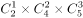。又已知每个施工队只能承接一个社区，将三个社区建设任务分配给三个施工队，承建方式有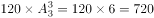种。

故正确答案为A。

---

### 第 2 题　qid 3522354 · 数学运算

小明去某楼盘售楼部咨询售房情况。置业顾问告诉他，如果再卖出50套，则已卖出的数量与未卖出的数量相等；如果再卖出150套，则已卖出的数量比未卖出的数量多一半，问该楼盘目前还剩下多少套房子未卖出？

- **A**. 350套
- **B**. 450套
- **C**. 550套　✅
- **D**. 650套

**答案**：C

**官方解析**

设目前已卖、未卖分别为、套，根据题意列方程组：

······①

······②

联立①②求解可得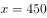，，即目前还剩下550套房子未卖出。

故正确答案为C。

---

### 第 3 题　qid 3522770 · 数学运算

某公园鸟语林共饲养180只鸟类动物，为养护方便，园方将鸟语林分为A、B、C三个区。某日，A区的一部分鸟飞至B、C两区，清点时，B、C两区鸟的数量都增加一倍。次日，一些鸟又从B区飞至A、C两区，清点时，A、C两区鸟的数量也都增加一倍。第三日，一部分鸟又从C区飞至A、B两区，清点时，A、B两区鸟的数量同样增加一倍，而此时C区剩余鸟的数量恰好是A区的，那么，最初A区有多少只鸟？

- **A**. 103　✅
- **B**. 104
- **C**. 105
- **D**. 106

**答案**：A

**官方解析**

将三次鸟的变化情况列表如下：

根据第三次后，C区剩余鸟的数量恰好是A区的，说明A区现在鸟的数量必然为26的整数倍。代入A项：最初A区有103只，则只，第一次后只，则A区剩余只，第三次后也是26的倍数，符合题意，当选。其余选项均不满足。

故正确答案为A。

---

### 第 4 题　qid 3522371 · 数学运算

不超过100名的小朋友站成一列。如果从第一人开始依次按1，2，3，···，9的顺序循环报数，最后一名小朋友报的是7；如果按1，2，3，···，11的顺序循环报数，最后一名小朋友报的是9，那么一共有多少名小朋友？

- **A**. 98
- **B**. 97　✅
- **C**. 96
- **D**. 95

**答案**：B

**官方解析**

根据题意，总人数余7、总人数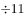余9，代入排除：

A项，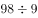余8，不满足题意，排除；B项，余7，余9，满足题意，当选；C项，余6，不满足题意，排除；D项，余5，不满足题意，排除。所以只有B项满足，则共有97名小朋友。

故正确答案为B。

---

### 第 5 题　qid 3522373 · 数学运算

随着人们生活水平的提高，汽车拥有量迅速增长，汽车牌照号码需要扩容。某地级市交通管理部门出台了一种小型汽车牌照组成办法，每个汽车牌照后五位的要求必须是：前三位为阿拉伯数字，后两位为两个不重复的英文字母（字母O、I不参与组牌），那么用这种方法可以给该地区汽车上牌照的数量为：

- **A**. 397440辆
- **B**. 402400辆
- **C**. 552000辆　✅
- **D**. 576000辆

**答案**：C

**官方解析**

先安排前三位，0-9共10个数字，所以前三位排法有种；再安排后两位，英文字母共26个，字母O、I不参与组牌，剩24个，且不重复，所以后两位排法有种。可以给该地区汽车上牌照的数量为辆。

故正确答案为C。

---

### 第 6 题　qid 3522397 · 数学运算

某果品公司急需将一批不易存放的水果从A市运到B市销售。现有四家运输公司可供选择，这四家运输公司提供的信息如下：

如果A、B两市的距离为S千米（千米），且这批水果在包装与装卸以及运输过程中的损耗为300元/小时，那么要使果品公司支付的总费用（包装与装卸费用、运输费用及损耗三项之和）最小，应选择哪家运输公司？

- **A**. 甲
- **B**. 乙
- **C**. 丙　✅
- **D**. 丁

**答案**：C

**官方解析**

根据运输时间，各公司运输费用情况如下：

甲公司与丁公司总运费相同，因此二者均不可能为最小，排除A、D两项，丙公司总费用小于乙公司，可知丙公司总费用最小。

故正确答案为C。

---

### 第 7 题　qid 3522372 · 数学运算

如下图1所示，在一个金字塔造型（底面为正方形，侧面为四个全等的等腰三角形）的铸造件内部挖空一个圆柱。现沿铸造件顶点A且垂直底面的方向切开，切开后的截面如下图2所示，已知DE、GF为圆柱的高，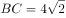分米，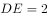分米，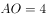分米，那么挖后铸造件的体积是：

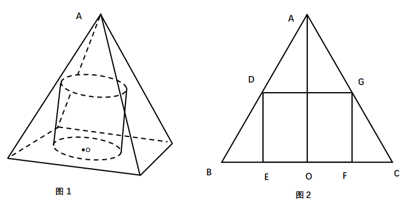

- **A**. 
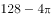立方分米

- **B**. 
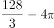立方分米
　✅
- **C**. 
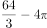立方分米

- **D**. 
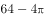立方分米

**答案**：B

**官方解析**

由题意可知，所求体积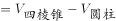。

四棱锥：由题干可知四棱锥的底面为正方形，且边长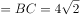分米，高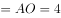分米，那么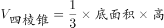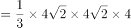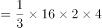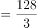立方分米。

圆柱：由题干可知四棱柱侧面均为等腰三角形，即三角形ABC为等腰三角形，又从A点垂直底面切开，所以AO既是垂线也是平分线，那么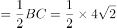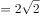分米，又因为三角形DBE与三角形ABO是相似三角形，所以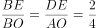，所以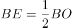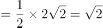，则圆柱底面半径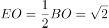，那么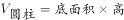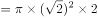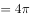立方分米。则题干所求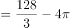立方分米。

故正确答案为B。

备注：考试过程中由于选项后半部分都是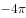，故算出四棱锥的体积后即可选择B项。

---

### 第 8 题　qid 3522375 · 数学运算

某装修公司订购了一条长为2.5m的长方体条形不锈钢管，要剪裁成60cm和43cm长的两种规格长度不锈钢管若干根，所裁钢管的横截面与原来一样，不考虑剪裁时材料的损耗，要使剩下的钢管尽量少，此时材料的利用率为：

- **A**. 0.998
- **B**. 0.996　✅
- **C**. 0.928
- **D**. 0.824

**答案**：B

**官方解析**

设剪裁成60cm的不锈钢管根，剪裁成43cm的不锈钢管根，根据题意，长方体条形不锈钢管长为2.5m，单位统一为250cm，即：；

当时，解得，cm，剩cm；

当时，解得，cm，剩cm；

当时，解得，cm，剩cm。

由此可知剩下的钢管最少为1cm，利用率。

故正确答案为B。

---

### 第 9 题　qid 3522765 · 数学运算

某草莓经销商有201箱的草莓要分配给若干个水果店，要求无论选用怎样的分配方式，都要有水果店至少分到8箱，则水果店至多有：

- **A**. 20个
- **B**. 21个
- **C**. 28个　✅
- **D**. 29个

**答案**：C

**官方解析**

问至多有多少家，从最大的选项开始代入。分配方式为平均分配可以使水果店最多。

代入D项，如果每家先分7箱，箱，则所有水果店分得水果都不超过8箱，排除；

代入C项，如果每家先分7箱，箱，剩余箱，都会有一家至少分得8箱，当选。

故正确答案为C。

---

### 第 10 题　qid 3522392 · 数学运算

某商场为了促销，进行掷飞镖游戏。每位参与人员投掷一次，假设掷出的飞镖均扎在飞镖板上且位置完全随机，扎中阴影部分区域（含边线）即为中奖。该商场预设中奖概率约为，仅考虑中奖概率的前提下，以下四幅图形（图中的正三角形和正方形均与圆外切或内接）最适合作为飞镖板的是：

- **A**. 

- **B**. 

　✅
- **C**. 

- **D**. 

**答案**：B

**官方解析**

最适合作为飞镖板即阴影部分所占面积比例约为，故需分别求出四个选项阴影所占面积比例。

A项，赋值圆半径为1，则，，阴影面积所占比例（，）；

B项，赋值圆半径为1，则，，阴影面积所占比例；

C项，赋值圆半径为1，则，，阴影面积所占比例；

D项，赋值圆半径为1，，，阴影面积所占比例。

B选项最接近。

故正确答案为B。

---

### 第 11 题　qid 3522382 · 数学运算

某公司职员小王要乘坐公司班车上班，班车到站点的时间为上午7点到8点之间，班车接人后立刻开走；小王到站点的时间为上午6点半至7点半之间。假设班车和小王到站的概率是相等（均匀分布）的，那么小王能够坐上班车的概率为：

- **A**. 

- **B**. 

- **C**. 

- **D**. 

　✅

**答案**：D

**官方解析**

设小王到的时间为，班车到的时间为，则只有当，小王能够坐上班车。即直线、、围成的区域；如下图所示，只有在阴影部分区域小王能够坐上班车，本题所求概率即求阴影部分面积占整个图形ABCD面积的比例。由图可得，假设边长为1，则面积，空白部分为一个等腰直角三角形，面积为，则阴影部分面积，占总面积的。

故正确答案为D。

---

### 第 12 题　qid 3522412 · 数学运算

大江两岸有两个正面相对的码头，可供客轮往返。如下图所示，根据河流水文情况，“幸福号”客轮星期一沿着河岸60度夹角方向前行，刚好达到对岸码头；星期二“幸福号”准备返回时，发现河流水文情况发生变化，船长调整航向，沿河岸30度夹角方向返回，顺利到达码头。假设客轮往返速度均是千米/小时，且行驶过程中河水流速是恒定的，问返程时河水流速是去程时的多少倍？

- **A**. 

　✅
- **B**. 

- **C**. 

- **D**. 
2

**答案**：A

**官方解析**

由题干可知船最终都是到达正对岸，说明船速与水速的合成速度的方向均在虚线上。假设去程的水速为千米/小时，去程时间为小时；返程的水速为 千米/小时，返程时间为小时。如图所示，由题干可推出，，。根据直角三角形EFD的三边关系则有：，化简得，；同理在直角三角形ABC中，，化简得，。则倍。

故正确答案为A。

---

### 第 13 题　qid 3523384 · 数学运算

两个大人带四个孩子去坐只有六个位置的圆型旋转木马，那么两个大人不相邻的概率为：

- **A**. 

- **B**. 

　✅
- **C**. 

- **D**. 

**答案**：B

**官方解析**

方法一：六个人坐在圆型旋转木马的情况总数为。现先让四个孩子去坐，情况数为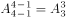，四个孩子之间可形成4个空，再让两个大人各选一个空，情况数为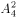，故两个大人不相邻的情况数为，题目所求概率为。

方法二：六个人坐在圆型旋转木马的情况总数为。考虑反面，两个大人相邻情况数为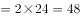，题目所求概率为。

故正确答案为B。

备注：n个人随机围绕圆桌就坐，情况数为。

---

### 第 14 题　qid 3522427 · 数学运算

太平洋上有一个圆形的平坦小岛，岛上遍布森林，闪电击中处于小岛边缘的树木引发森林火灾（如下图所示）。假设火线是以圆弧状往小岛深处推进，问当大火烧到小岛中心位置时，过火面积占全岛面积的比例大约是多少？

- **A**. 

- **B**. 

　✅
- **C**. 

- **D**. 

**答案**：B

**官方解析**

由题图可知，大火烧到岛中心时，刚好圆弧状的火线最中间点在圆心位置。如图所示：

假设圆心为O点，起火点为A点，起火点到圆弧状火线与森林边缘的交点分别为B、C两点，连接OB和OC、AB和AC，OA、OB、OC恰好都为圆形小岛的半径，则。同时由题图可知，则三角形BAO和三角形CAO均为等边三角形，即，同时高均为。由扇形面积可知，；过火面积，，圆形小岛面积。故过火面积所占比例为。

故正确答案为B。

---

### 第 15 题　qid 3522411 · 数学运算

我国一支工兵部队在某国执行维和任务，负责道路抢修工作。某天，该部队负责的道路被炮弹炸出一个球面形状的大坑。经测量，弹坑直径16m，深4m。现需用车辆运送混凝土填充弹坑，铺平道路，假设每车次可运输的混凝土，问抢修道路至少需要出动运输车多少车次？（球缺体积计算公式为，其中为球半径，为球缺高，为球缺体积）

- **A**. 65
- **B**. 66
- **C**. 67　✅
- **D**. 68

**答案**：C

**官方解析**

球缺是指球被平面截下的部分，题干中的大坑即为一个球缺。如图所示，球缺高即为BD线段长，m；在直角三角形OCD中，根据“弹坑直径16m”，可知截面半径CDm，ODm，OCm，依据勾股定理，，解得；将球的半径与球缺高代入球缺体积公式，可得球缺体积，所需车次，即66车次不够，至少需要67车次。

故正确答案为C。

【备注】本题不严谨，题干所给公式中的，理论上应为球缺底面的半径，但在考场上，按照命题人所给的公式及字母含义解题即可。

---

## 判断推理

### 第 1 题　qid 3522441 · 图形推理

从所给的四个选项中，选择最合适的一个填入问号处，使之呈现一定的规律性：

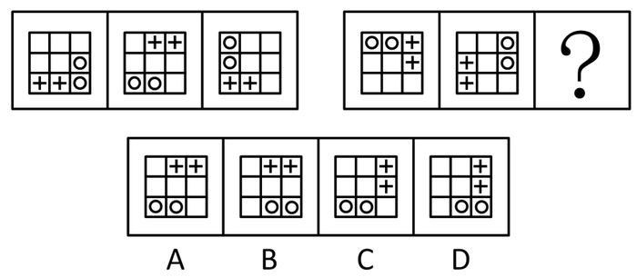

- **A**. A
- **B**. B
- **C**. C
- **D**. D　✅

**答案**：D

**官方解析**

元素组成相同，优先考虑位置规律。观察发现，题干第一组图形中的两个白球在九宫格外圈整体顺时针平移2格，而两个“十字”在九宫格外圈整体顺/逆时针平移4格。第二组图形应遵循同样规律，只有D项满足。
故正确答案为D。

---

### 第 2 题　qid 3522437 · 图形推理

从所给的四个选项中，选择最合适的一个填入问号处，使之呈现一定的规律性：

- **A**. A
- **B**. B　✅
- **C**. C
- **D**. D

**答案**：B

**官方解析**

元素组成相似，优先考虑样式规律，经过验证无规律。继续观察发现，图形均明显被分割，考虑数量规律中的面数量。第一行图形中面的数量满足：，第二行图形中面的数量满足：，则第三行图形中面的数量应满足：，A、C、D三项均不满足，B项当选。

故正确答案为B。

---

### 第 3 题　qid 3523382 · 图形推理

从所给的四个选项中，选择最合适的一个填入问号处，使之呈现一定的规律性：

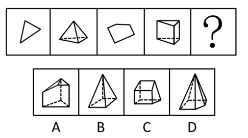

- **A**. A　✅
- **B**. B
- **C**. C
- **D**. D

**答案**：A

**官方解析**

题干图形元素组成不同，且无明显属性规律，优先考虑数量规律。题干第二、四幅图及四个选项中的图形均为立体图形，虚线为所视角度下看不见的棱，题干图形的交点（顶点）数分别为：3、4、5、6，所以问号处图形的交点数应为7个，选项图形的交点数分别为7、5、8、6，只有A项符合规律。
故正确答案为A。

---

### 第 4 题　qid 3523357 · 图形推理

把下面的图形分为两类，使每一类图形都有各自的共同特征或规律，分类正确的一项是：

- **A**. ①④⑥，②③⑤　✅
- **B**. ①③⑤，②④⑥
- **C**. ①②④，③⑤⑥
- **D**. ①⑤⑥，②③④

**答案**：A

**官方解析**

本题为分组分类题目。元素组成不同，无明显属性规律，考虑数量规律。观察发现，每幅图均有4个元素，且均存在两个相同元素，图①④⑥中相同元素都是相对的，图②③⑤中相同元素都是相邻的。即①④⑥为一组，②③⑤为一组。
故正确答案为A。

---

### 第 5 题　qid 3523381 · 类比推理

从所给四个选项中，选出能与给定的①、②、③、④零件共同构成如下图所示的方块组合的一项：

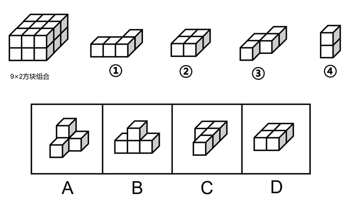

- **A**. A
- **B**. B
- **C**. C　✅
- **D**. D

**答案**：C

**官方解析**

注：本题不严谨，CD都能拼成，选哪个都算对，因粉笔题库系统只能设置一个正确答案，故暂定答案为C。

解析一：优先考虑数数，但是选项都是4个方块，无法排除选项，因此考虑拼合。优先考虑把方块数量多的图进行拼合，可将图①贴边放，图②可以与图①拼在同一层，该层只差一个小方块，图④刚好竖着放，能填补空缺的小方块，那么底下一层拼满；再看上面一层，可以把图③贴边放，而且无论图③如何贴边放，都有一个单独的小方块空缺，刚好可以和图④的另一个小方块拼凑起来，观察发现，剩余空缺的部分刚好就是C项中的图形。

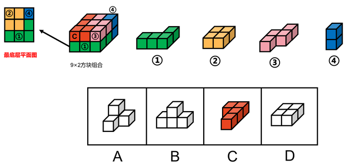

故正确答案为C。

解析二：如下图所示，将图③、图④拼在一起，那么这层还差1个方块和2个连在一起的方块可以填满，图①立起来刚好有1个方块可以填到该层空缺处，图②立起来刚好能填满另外2个方块空缺处，最底下一层可拼满；再看上面一层，刚好差4个方块的正方形，即D项中的图形可以填满上面一层。

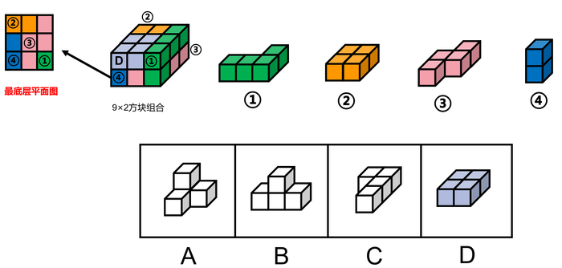

故正确答案为D。

---

### 第 6 题　qid 3522430 · 定义判断

拟剧理论指人与人在社会生活中的相互行为在某种程度上是一种表演。每一个人就像演员一样，在某种特定的场景下，按照一定的角色要求在舞台上表演给观众看。在整个表演过程中，人总是尽量使自己的行为更为接近想要呈现给观众的那个角色，观众看到的是那个表现出来的角色而不是演员本身。当表演结束，演员回到后台以后，他的真实面目才展现出来，演员才又恢复其本来的自我。
根据上述定义，下列选项不能印证拟剧理论的是：

- **A**. 小丽来找小明探讨功课，小明没有立刻开门，而是先把臭袜子藏到床下
- **B**. 在“国王的新装”故事里，新装展示游行时臣民交口称赞新装华贵美丽
- **C**. 小魏生活拮据但工作努力，老板不动声色地开豪车替其去机场接其父母　✅
- **D**. 小菲通过盗图和拼接，天天在微信朋友圈发吃美食、健身、游玩的照片

**答案**：C

**官方解析**

第一步：找出定义关键词。
“人与人的相互行为某种程度上是种表演”、“使自己的行为接近想要呈现的角色”、“观众看到的是角色而不是演员本身”、“表演结束后，恢复本来的自我”。
第二步：逐一分析选项。
A项：小明没有立刻开门，而是先把臭袜子藏到床下，说明他不想被小丽看到自己邋遢的一面，符合“使自己的行为接近想要呈现的角色”、“观众看到的是角色而不是演员本身”，符合定义，排除；
B项：在“国王的新装”故事里，国王实际没有穿衣服，但是臣民交口称赞新装华贵美丽，符合“人与人的相互行为某种程度上是种表演”，符合定义，排除；
C项：小魏生活拮据工作努力，但是开豪车接父母的人是老板不是小魏，没有体现二者的行为是表演出来的，不符合“人与人的相互行为某种程度上是种表演”，不符合定义，当选；
D项：小菲天天在微信朋友圈发照片是通过盗图和拼接，说明朋友圈呈现的并非她的真实生活，符合“使自己的行为接近想要呈现的角色”、“观众看到的是角色而不是演员本身”，符合定义，排除。
本题为选非题，故正确答案为C。

---

### 第 7 题　qid 3522406 · 定义判断

人合公司是指以股东的个人信用为公司信用基础的公司；资合公司是指由公司股东分别出资而形成的财产作为信用基础的公司；人资兼合公司则同时具备上述两种性质的信用基础。
根据上述定义，下列哪个公司属于人合公司：

- **A**. 某公司注册资本为全体股东缴纳股本的总和，股东的出资以现金及财产为限，根据出资对公司负责
- **B**. 某公司的全部股份由公司独立创立者百分百持有，公司聘请多位经验丰富的职业经理人分管不同业务
- **C**. 某公司由于经营不善导致资金链断裂，在申请破产时以全部注册资本作数，股东个人财产并不受影响
- **D**. 某公司的资产以股东个人的所有财产为抵押，股东对公司经营负无限责任，并且不能任意地转让股份　✅

**答案**：D

**官方解析**

第一步：找出定义关键词。
人合公司：“以股东的个人信用为公司信用基础”；
资合公司：“由公司股东分别出资而形成的财产作为信用基础”；
人资兼合公司：同时以“股东的个人信用”和“股东分别出资而形成的财产”作为信用基础。
第二步：逐一分析选项。
A项：某公司注册资本为全体股东缴纳股本的总和，符合“公司股东分别出资而形成的财产”，属于资合公司，不属于人合公司，排除；
B项：某公司的全部股份由公司独立创立者百分百持有，但是公司聘请多位经验丰富的职业经理人分管不同业务，不符合“以股东的个人信用为公司信用基础”，不属于人合公司，排除；
C项：股东个人财产并不受影响，说明不符合“以股东的个人信用为公司信用基础”，不属于人合公司，排除；
D项：以股东个人的所有财产为抵押，股东对公司经营负无限责任，符合“以股东的个人信用为公司信用基础”，属于人合公司，当选。
故正确答案为D。

---

### 第 8 题　qid 3522418 · 定义判断

文化挪用是指将本不属于本地的异域或其他民族的文化资源借用过来，从而对本地的文化形成影响，创造出新的文化产品的现象。
根据上述定义，下列属于文化挪用的是：

- **A**. 某苗族民间工艺组织设计制作的具有苗绣元素的彩绘玻璃、蜡染布等文创作品畅销全国
- **B**. 某法国女生在毕业舞会上穿着优雅别致的印度传统服装纱丽翩翩起舞，让大家大饱眼福
- **C**. 某荷兰社区大学为学生开设中华太极拳课程以增强他们的健身意识，受到学生普遍欢迎
- **D**. 世界之窗展示了众多全球著名景观和建筑成为深圳打卡的地标，是当地热门的旅游景点　✅

**答案**：D

**官方解析**

第一步：找出定义关键词。
“将本不属于本地的异域或其他民族的文化资源借用过来”、“对本地的文化形成影响”、“创造出新的文化产品”。
第二步：逐一分析选项。
A项：某苗族民间工艺组织设计制作的具有苗绣元素的文创作品，不符合“将本不属于本地的异域或其他民族的文化资源借用过来”，不符合定义，排除；
B项：某法国女生穿着印度传统服装纱丽翩翩起舞，符合“将本不属于本地的异域或其他民族的文化资源借用过来”，但让大家大饱眼福，不符合“创造出新的文化产品”，不符合定义，排除；
C项：某荷兰社区大学为学生开设中华太极拳课程，符合“将本不属于本地的异域或其他民族的文化资源借用过来”，但是并没有“对本地的文化形成影响”、“创造出新的文化产品”，不符合定义，排除；
D项：世界之窗展示了众多全球著名景观和建筑，符合“将本不属于本地的异域或其他民族的文化资源借用过来”，成为当地热门的旅游景点，符合“对本地的文化形成影响”、“创造出新的文化产品”，符合定义，当选。
故正确答案为D。

---

### 第 9 题　qid 3523359 · 定义判断

分粥效应是哲学家罗尔斯在《正义论》中讨论社会财富时做的一个比喻，说明只要把制度建立在对每一个人都不信任的基础上，就可以导出合理、具有监管力度的制度。这种制度不但要科学，而且其制定一定要有所依据、简单明了，具有针对性、可操作性，便于执行。
根据上述定义，假设“M”是某团队一项小福利，下列选项最能体现该定义的是：

- **A**. 通过选举，由品德高尚的小李主持分“M”，基本公平公正
- **B**. 拟定一人负责分“M”工作，并成立董事会，及时处理问题
- **C**. 选举产生分“M”委员会和监督委员会，有效落实执行和监督
- **D**. 参与者轮流值日分“M”，但主持分“M”者每次必须最后领取　✅

**答案**：D

**官方解析**

第一步：找出定义关键词。
“只要把制度建立在对每一个人都不信任的基础上，就可以导出合理、具有监管力度的制度”、“这种制度不但要科学，而且其制定一定要有所依据、简单明了，具有针对性、可操作性，便于执行”。
第二步：逐一分析选项。
A项：由品德高尚的小李主持分“M”，说明小李有了特权，其他人信任小李，不符合“只要把制度建立在对每一个人都不信任的基础上，就可以导出合理、具有监管力度的制度”，小李凭借高尚品德在主持分配，时间长了也可能导致分配不均，说明这种制度不够科学，也不符合“这种制度不但要科学，而且其制定一定要有所依据、简单明了，具有针对性、可操作性，便于执行”，不符合定义，排除； 
B项：拟定一人负责分“M”工作，说明这个人拥有了分“M”的特权，其他人信任负责分配的人，不符合“只要把制度建立在对每一个人都不信任的基础上，就可以导出合理、具有监管力度的制度”，不符合定义，排除；
C项：选举产生分“M”委员会和监督委员会，说明委员会和监督委员会有了分“M”的特权，其他人信任委员会和监督委员会，不符合“只要把制度建立在对每一个人都不信任的基础上，就可以导出合理、具有监管力度的制度”，不符合定义，排除；
D项：参与者轮流值日分“M”，说明每个人都有机会主持分配“M”，这样就不存在特权，主持分“M”者每次必须最后领取，说明作为主持者能把自己利益放到最后，这样的分配才会更合理、更公平，符合“只要把制度建立在对每一个人都不信任的基础上，就可以导出合理、具有监管力度的制度”、“这种制度不但要科学，而且其制定一定要有所依据、简单明了，具有针对性、可操作性，便于执行”，符合定义，当选。
故正确答案为D。

---

### 第 10 题　qid 3522389 · 定义判断

虚假相关指的是两个没有因果关系的事件之间，基于一些其他未见的因素（潜在变量）而推断出因果关系，引致两个事件是“有所联系”的假象，但这种联系并不能通过客观的试验来证实。
根据上述定义，下列选项不属于虚假相关的是:

- **A**. 童鞋的大小与孩子的语言能力
- **B**. 冷饮的销量与泳池溺水的人数
- **C**. 惯性的大小与汽车的核载重量　✅
- **D**. 网民的数量与房屋的折旧程度

**答案**：C

**官方解析**

第一步：找出定义关键词。
“两个没有因果关系的事件”、“基于一些其他未见的因素（潜在变量）而推断出因果关系”、“引致两个事件是‘有所联系’的假象，但这种联系并不能通过客观的试验来证实”。
第二步：逐一分析选项。
A项：童鞋的大小与孩子的语言能力不存在直接联系，二者没有因果关系，符合关键词“两个没有因果关系的事件”，但二者可能都与“年龄”相关，年龄大可能导致童鞋大，同时导致语言能力较强，基于“年龄”这一潜在变量，二者之间“有所联系”，符合关键词“基于一些其他未见的因素（潜在变量）而推断出因果关系”、“引致两个事件是‘有所联系’的假象，但这种联系并不能通过客观的试验来证实”，符合定义，排除；
B项：冷饮的销量与泳池溺水的人数不存在直接联系，二者没有因果关系，符合关键词“两个没有因果关系的事件”，但二者可能都是由于“天气炎热”引起的，基于“天气炎热”这一潜在变量，二者之间“有所联系”，符合关键词“基于一些其他未见的因素（潜在变量）而推断出因果关系”、“引致两个事件是‘有所联系’的假象，但这种联系并不能通过客观的试验来证实”，符合定义，排除；
C项：惯性与物体的质量有关，物体的质量越大则惯性越大，而汽车核载重量与汽车质量成正比，所以惯性的大小与汽车的核载重量存在因果关系，不符合关键词“两个没有因果关系的事件”，且惯性和物体重量之间的关系可通过实验来证实，不符合关键词“引致两个事件是‘有所联系’的假象，但这种联系并不能通过客观的试验来证实”，不符合定义，当选；
D项：网民的数量与房屋的折旧程度不存在直接联系，二者没有因果关系，符合关键词“两个没有因果关系的事件”，但二者可能都与“时间”相关，随着时间推移，网民数量逐渐增多，同时房屋折旧程度越高，基于“时间”这一潜在变量，二者之间“有所联系”，符合关键词“基于一些其他未见的因素（潜在变量）而推断出因果关系”、“引致两个事件是‘有所联系’的假象，但这种联系并不能通过客观的试验来证实”，符合定义，排除。
本题为选非题，故正确答案为C。

---

### 第 11 题　qid 3522394 · 定义判断

迎臂效应也被称为“请到我家后院来”。从表面意思来看，迎臂就是张开双臂欢迎的意思，是指某个地区的居民认为相关机构、设施、景观具有正的外部效应，能给本社区发展带来好处，因此，不排斥甚至欢迎这些项目在本社区落地。
根据上述定义，下列选项属于迎臂效应的是：

- **A**. 群众深度参与，点赞街道残障康复中心成立　✅
- **B**. 公司升级业态，积极在社区推广无人零售店
- **C**. 新设备耗电低，企业要求园区加快引进速度
- **D**. 加气站易漏气，附近居民担心火灾要求搬迁

**答案**：A

**官方解析**

第一步：找出定义关键词。
“某个地区的居民”、“认为相关机构、设施、景观具有正的外部效应，能给本社区发展带来好处”、“不排斥甚至欢迎这些项目在本社区落地”。
第二步：逐一分析选项。
A项：群众深度参与，符合“某个地区的居民”，点赞街道残障康复中心成立，说明群众认可、十分欢迎，符合“认为相关机构、设施、景观具有正的外部效应，能给本社区发展带来好处”，也符合“不排斥甚至欢迎这些项目在本社区落地”，符合定义，当选；
B项：公司升级业态，积极在社区推广无人零售店，没有体现出被推广社区居民的态度，是否欢迎，不符合定义，排除；
C项：新设备耗电低，企业要求园区加快引进速度，园区不是社区，企业也不是社区居民，不符合“某个地区的居民”，不符合定义，排除；
D项：加气站易漏气，附近居民担心火灾要求搬迁，是居民害怕带来危险，不符合“认为相关机构、设施、景观具有正的外部效应，能给本社区发展带来好处”、“不排斥甚至欢迎这些项目在本社区落地”，不符合定义，排除。
故正确答案为A。

---

### 第 12 题　qid 3522381 · 定义判断

单质是由同一种元素组成的纯净物。化合物是由两种或两种以上元素的原子（不同元素的原子）组成的纯净物。混合物是指由两种或两种以上不同的单质或化合物机械混合而成的物质，无固定化学式，混合物的各种成分之间没有发生化学反应，混合物可以用物理的方法将所含的物质分离。
根据上述定义，下列选项同时具有以上三类物质的是：

- **A**. 氮气、氧气、二氧化碳、空气　✅
- **B**. 食盐水、盐酸、氨水、蒸馏水
- **C**. 氢气、氖气、水蒸气、汞蒸气
- **D**. 二氧化碳、水蒸气、矿泉水、天然气

**答案**：A

**官方解析**

第一步：找出定义关键词。
单质：“由同一种元素组成的纯净物”；
化合物：“由两种或两种以上元素的原子（不同元素的原子）组成的纯净物”；
混合物：“由两种或两种以上不同的单质或化合物机械混合而成”、“无固定化学式”。
第二步：逐一分析选项。
A项：氮气是由氮元素组成的纯净物，氧气是由氧元素组成的纯净物，均符合“由同一种元素组成的纯净物”，符合单质的定义；二氧化碳是由碳元素和氧元素组成的纯净物，符合“由两种或两种以上元素的原子（不同元素的原子）组成的纯净物”，符合化合物的定义；空气由氮气、氧气、二氧化碳等物质组成，符合“由两种或两种以上不同的单质或化合物机械混合而成”、“无固定化学式”，符合混合物的定义。选项同时具有三类物质，符合题干要求，当选； 
B项：食盐水是由氯化钠和水等组成的溶液，盐酸是氯化氢和水组成的溶液，氨水是氨和水组成的溶液，均符合“由两种或两种以上不同的单质或化合物机械混合而成”、“无固定化学式”，符合混合物的定义；蒸馏水是由氢元素和氧元素组成的纯净物，符合“由两种或两种以上元素的原子（不同元素的原子）组成的纯净物”，符合化合物的定义。选项缺少单质，不符合题干要求，排除；
C项：氢气是由氢元素组成的纯净物，氖气是由氖元素组成的纯净物，汞蒸气是汞蒸发而成的纯净物，均符合“由同一种元素组成的纯净物”，符合单质的定义；水蒸气是由氢元素和氧元素组成的纯净物，符合“由两种或两种以上元素的原子（不同元素的原子）组成的纯净物组成的纯净物”，符合化合物的定义。选项缺少混合物，不符合题干要求，排除；
D项：二氧化碳是由碳元素和氧元素组成的纯净物，水蒸气是由氢元素和氧元素组成的纯净物，均符合“由两种或两种以上元素的原子（不同元素的原子）组成的纯净物”，符合化合物的定义；矿泉水由水、矿物盐、二氧化碳等物质组成，天然气由烃类和非烃类气体混合而成，均符合“由两种或两种以上不同的单质或化合物机械混合而成”、“无固定化学式”，符合混合物的定义。选项缺少单质，不符合题干要求，排除。
故正确答案为A。

---

### 第 13 题　qid 3522428 · 定义判断

价值链的数字重生指价值链的某个必要环节以数字化方式呈现，以数据实时在线为基础推动价值链的实现。价值链的数字新生是以新定义的用户价值为中心、数据实时在线为基础，融合新价值链要素，创造全新价值链结构。
根据上述定义，下列哪项属于价值链的数字重生？

- **A**. 为给用户带来全新的旅行前、旅行中和旅行后的服务体验，立体化整合旅游目的地的资源要素
- **B**. 依靠在线实时数据，使美食供应商更便利精准地了解用户的美食习惯，开拓新颖的服务渠道
- **C**. 电商平台通过发布商品信息和销售实时动态，使消费者在选购时可以查询货物即时情况　✅
- **D**. 核电设备的数字三维模型可以为设计、制造、运行以及维护等多个环节带来价值增长点

**答案**：C

**官方解析**

第一步：找出定义关键词。
价值链的数字重生：“某个必要环节以数字化方式呈现”、“数据实时在线为基础”、“推动价值链的实现”；
价值链的数字新生：“用户价值为中心”、“数据实时在线为基础”、“融合新价值链要素”、“创造全新价值链结构”。
第二步：逐一分析选项。
A项：整合资源给用户带来全新的旅行前、旅行中和旅行后的服务体验，不符合“某个必要环节以数字化方式呈现”，且没有提到“数据的实时在线”，不符合价值链的数字重生的定义，排除；
B项：依靠在线实时数据，符合“数据实时在线为基础”，开拓新颖的服务渠道，是对价值链的创新，不符合“推动价值链的实现”，不符合价值链的数字重生的定义，排除；
C项：电商平台发布商品信息和销售实时动态，符合“数据实时在线为基础”，消费者在选购时可以查询货物即时情况，符合“某个必要环节以数字化方式呈现”，符合价值链的数字重生的定义，当选；
D项：核电设备的数字三维模型可以为多个环节带来价值增长点，不符合“数据实时在线为基础”，不符合价值链的数字重生的定义，排除。
故正确答案为C。

---

### 第 14 题　qid 3522386 · 定义判断

先赋资本是指建立在血缘、遗传等先天条件下，不经过个人努力就可以拥有的资本。自致资本是指通过个人后天努力取得，为个人所支配的资本。
根据上述定义，下列选项中的内容均属于自致资本的是：

- **A**. 婚姻、职业、政治面貌　✅
- **B**. 家世、民族、文化程度
- **C**. 国籍、收入、工作单位
- **D**. 种族、户口、父辈职业

**答案**：A

**官方解析**

第一步：找出定义关键词。
先赋资本：“建立在血缘、遗传等先天条件下”、“不经过个人努力就可以拥有”；
自致资本：“通过个人后天努力取得”、“为个人所支配”。
第二步：逐一分析选项。
A项：婚姻、职业、政治面貌都是通过后天努力取得的，均符合自致资本的定义，当选； 
B项：家世、民族是建立在遗传的先天条件下，不经过个人努力就可以拥有的，符合先赋资本的定义；文化程度是通过后天努力取得的，符合自致资本的定义，排除；
C项：国籍是建立在遗传的先天条件下，不经过个人努力就可以拥有的，符合先赋资本的定义；收入和工作单位是通过后天努力取得的，均符合自致资本的定义，排除；
D项：种族、户口和父辈职业都是建立在血缘、遗传等先天条件下，不经过个人努力就可以拥有的，均符合先赋资本的定义，排除。
故正确答案为A。

---

### 第 15 题　qid 3522398 · 定义判断

音爆是飞行器在突破音障时，由于对空气的压缩无法迅速传播，会逐渐形成激波面，激波面上高度集中的声学能量引起巨大响声，让人耳感受到短暂而极其强烈的爆炸声。音爆只有在突破音速即超音速飞行时才会产生。音爆云则是以飞行器为中心轴、从机翼前段开始向四周均匀扩散的圆锥状云团。其产生主要是由于气流流速突破音速时比空气传导速度更快，无法有效向下拉气流，导致密度减小，气压降低，水气凝结成微小的水珠，肉眼看来就像是云雾般的状态。音爆云在跨音速飞行时常常出现，但不仅在跨音速飞行时才能出现。
根据上述定义，下列说法正确的是：

- **A**. 音爆产生时就会出现音爆云
- **B**. 音爆云出现标志着音爆产生
- **C**. 音爆云出现说明突破了音障
- **D**. 音爆产生时是超音速飞行　✅

**答案**：D

**官方解析**

第一步：找出定义关键词。
音爆：“飞行器在突破音障时”、“对空气的压缩无法迅速传播，会逐渐形成激波面”、“激波面上高度集中的声学能量引起巨大响声，让人耳感受到短暂而极其强烈的爆炸声”、“只有在突破音速即超音速飞行时才会产生”；
音爆云：“以飞行器为中心轴、从机翼前段开始向四周均匀扩散的圆锥状云团”、“产生主要是由于气流流速突破音速时比空气传导速度更快，无法有效向下拉气流，导致密度减小，气压降低，水气凝结成微小的水珠，肉眼看来就像是云雾般的状态”、“在跨音速飞行时常常出现，但不仅在跨音速飞行时才能出现”。
第二步：逐一分析选项。
A项：音爆云在跨音速飞行时常常出现，说明在跨音速飞行时也可能不会产生音爆云，而音爆只有在突破音速即超音速飞行时才会产生，说明音爆产生时也有可能不会产生音爆云，因此“音爆产生时就会出现音爆云”的说法不正确，排除；
B项：音爆云不仅在跨音速飞行时才能出现，意味着音爆云可能在非跨音速飞行时产生，而音爆只有在突破音速即超音速飞行时才会产生，因此可能出现有音爆云但没有音爆的情况，因此“音爆云出现标志着音爆产生”的说法不正确，排除；
C项：说的是音爆云出现说明突破了音障，音爆是飞行器在突破音障时产生的，而音爆云的出现并不能说明突破了音障，因此“音爆云出现说明突破了音障”的说法不正确，排除；
D项：说的是音爆产生时是超音速飞行，符合音爆“只有在突破音速即超音速飞行时才会产生”，符合定义，当选。
故正确答案为D。

---

### 第 16 题　qid 3522388 · 类比推理

巴蜀：燕赵

- **A**. 京津：淮海
- **B**. 闽越：荆湘
- **C**. 齐鲁：秦晋　✅
- **D**. 殷商：云贵

**答案**：C

**官方解析**

第一步：判断题干词语间逻辑关系。
“巴蜀”指的是巴国和蜀国，“燕赵”指的是燕国和赵国，四者都属于中国历史上存在的国家，为并列关系中的反对关系。
第二步：判断选项词语间逻辑关系。
A项：“京津”指的是北京和天津，“淮海”指的是以徐州为中心的淮河以北及海州（今连云港市西南）一带的地区，并不是国家，与题干逻辑关系不一致，排除；
B项：“闽越”指的是闽越国，“荆湘”指的是长江中游地区的江汉—洞庭湖平原，并不全是国家，与题干逻辑关系不一致，排除；
C项：“齐鲁”指的是齐国和鲁国，“秦晋”指的是秦国和晋国，四者都属于中国历史上存在的国家，为并列关系中的反对关系，与题干逻辑关系一致，当选；
D项：“殷商”指的商朝，“云贵”指的是云南和贵州地区，并不是国家，与题干逻辑关系不一致，排除。
故正确答案为C。

---

### 第 17 题　qid 3522379 · 类比推理

优雅：天鹅

- **A**. 风沙：塞外
- **B**. 高洁：梅花　✅
- **C**. 友好：同窗
- **D**. 幽默：笑话

**答案**：B

**官方解析**

第一步：判断题干词语间逻辑关系。
天鹅象征着优雅，二者为比喻象征关系。
第二步：判断选项词语间逻辑关系。
A项：塞外有风沙，二者为地点对应关系，与题干逻辑关系不一致，排除；
B项：梅花象征着高洁的品质，二者为比喻象征关系，与题干逻辑关系一致，当选；
C项：同窗是指同在一个学校学习的人，同窗之间的关系可以是友好的，二者为对应关系，与题干逻辑关系不一致，排除；
D项：“笑话”是“幽默”的一种表现形式，二者为属性对应关系，与题干逻辑关系不一致，排除。
故正确答案为B。

---

### 第 18 题　qid 3522390 · 类比推理

顿悟：醍醐灌顶

- **A**. 渴望：望梅止渴
- **B**. 移交：完璧归赵
- **C**. 消费：坐吃山空
- **D**. 孝顺：彩衣娱亲　✅

**答案**：D

**官方解析**

第一步：判断题干词语间逻辑关系。
醍醐灌顶意思是将牛奶中精炼出来的乳酪浇到头上，比喻灌输智慧，使人得到启发，彻底醒悟，与顿悟是近义关系。
第二步：判断选项词语间逻辑关系。
A项：望梅止渴意思是梅子酸，人想吃梅子就会流涎，因而止渴，比喻愿望无法实现，用空想安慰自己。与渴望不是近义关系，与题干逻辑关系不一致，排除；
B项：完璧归赵意思是蔺相如将完美无瑕的和氏璧，完好地从秦国带回赵国，后比喻把物品完好地归还给物品的主人。与移交不是近义关系，与题干逻辑关系不一致，排除；
C项：坐吃山空意思是只坐着吃，山也要空，指光是消费而不从事生产，即使有堆积如山的财富，也要耗尽。与消费不是近义关系，与题干逻辑关系不一致，排除；
D项：彩衣娱亲意思是传说春秋时有个老莱子，很孝顺，七十岁了还穿着彩色衣服扮成幼儿，引父母发笑，后作为孝顺父母的典故。与孝顺是近义关系，与题干逻辑关系一致，当选。
故正确答案为D。

---

### 第 19 题　qid 3522378 · 类比推理

戊：己：庚

- **A**. 钠：镁：铝　✅
- **B**. 寅：卯：巳
- **C**. 牛：虎：龙
- **D**. 秦：汉：隋

**答案**：A

**官方解析**

第一步：判断题干词语间逻辑关系。
天干是中国古代的一种文字计序符号，其包括：甲、乙、丙、丁、戊、己、庚、辛、壬、癸，被称为“十天干”。戊、己、庚是“十天干”中的三个，三者是并列关系，且三者在天干中排列紧密连续。
第二步：判断选项词语间逻辑关系。
A项：钠、镁、铝是元素周期表中的三个元素，三者是并列关系，且三者在元素周期表中排列紧密连续，与题干逻辑关系一致，当选；
B项：寅、卯、巳是古代十二地支中的三个地支，三者是并列关系，但三者在十二地支中的排列并不是紧密连续的，与题干逻辑关系不一致，排除；
C项：牛、虎、龙是十二生肖中的三个生肖，三者是并列关系，但三者在十二生肖中的排列并不是紧密连续的，与题干逻辑关系不一致，排除；
D项：秦、汉、隋是我国古代的三个朝代，三者是并列关系，但三者在古代朝代中的排列并不是紧密连续的，与题干逻辑关系不一致，排除。
故正确答案为A。

---

### 第 20 题　qid 3522387 · 类比推理

超声波：次声波：军事

- **A**. 处女作：代表作：文学
- **B**. 路由器：隔离卡：网络　✅
- **C**. 潜水艇：核潜艇：科技
- **D**. 北极星：北斗星：星辰

**答案**：B

**官方解析**

第一步：判断题干词语间逻辑关系。
超声波是指频率高于20000赫兹的声波，次声波是指频率小于20赫兹的声波，二者为并列关系；且超声波和次声波都可以运用在军事上，为对应关系。
第二步：判断选项词语间逻辑关系。
A项：有的处女作是代表作，有的处女作不是代表作，有的代表作是处女作，有的代表作不是处女作，二者为交叉关系，与题干逻辑关系不一致，排除；
B项：路由器是连接两个或多个网络的硬件设备，在网络间起网关的作用；隔离卡是一种应用在计算机上的硬件，使得计算机在完全安全状态下联结内网和外网，二者均为电脑硬件设备，为并列关系。且路由器和隔离卡都可以运用在网络连接上，为对应关系，与题干逻辑关系一致，当选；
C项：核潜艇是潜水艇的一种，二者为种属关系，与题干逻辑关系不一致，排除；
D项：北极星又称北辰、紫微星，指的是最靠近北天极的一颗恒星；北斗星又称北斗七星，是大熊座的组成部分，属于紫微垣的一个星官。二者不是并列关系，但二者都是星辰，前两词分别与第三词构成种属关系，与题干逻辑关系不一致，排除。
故正确答案为B。

---

### 第 21 题　qid 3523355 · 类比推理

防爆膜：防刮花：抗撞击

- **A**. 驱蛇粉：驱动器：驱逐舰
- **B**. 萤火虫：荧光棒：荧惑星
- **C**. 防晒伞：超轻便：抗强风
- **D**. 净水器：除杂质：去异味　✅

**答案**：D

**官方解析**

第一步，判断题干词语间逻辑关系。
防爆膜的功能是防刮花和抗撞击，后两词分别与第一词构成功能的对应关系。
第二步，判断选项词语间逻辑关系。
A项：驱动器和驱逐舰均不是驱蛇粉的功能，三词间无明显的逻辑关系，与题干逻辑关系不一致，排除；
B项：荧光棒和荧惑星均不是萤火虫的功能，荧惑星是指火星，与前两词无明显逻辑关系。与题干逻辑关系不一致，排除；
C项：超轻便是防晒伞的属性，第一词与第二词为属性对应关系，与题干逻辑关系不一致，排除；
D项：净水器的功能是除杂质和去异味，后两词分别与第一词构成功能的对应关系，与题干逻辑关系一致，当选。
故正确答案为D。

---

### 第 22 题　qid 3522391 · 类比推理

握瑜：怀瑾：美玉

- **A**. 南辕：北辙：马车
- **B**. 金戈：铁马：战争
- **C**. 敲金：击石：乐器　✅
- **D**. 锦衣：玉食：珍馐

**答案**：C

**官方解析**

第一步：判断题干词语间逻辑关系。
“瑜”和“瑾”指美玉，且握瑜和怀瑾都是动宾结构。
第二步：判断选项词语间逻辑关系。
A项：“辕”指车前驾牲畜的两根直木，“辙”指车轮压的痕迹，二者均不能用来指马车，且南辕和北辙都不是动宾结构，与题干逻辑关系不一致，排除；
B项：“戈”指古代的一种兵器，“马”指马匹，二者均不能直接指战争，且金戈和铁马都不是动宾结构，与题干逻辑关系不一致，排除；
C项：“金”和“石”指钟磬一类的乐器，且敲金和击石均为动宾结构，与题干逻辑关系一致，当选；
D项：“衣”指衣服，“食”指食物，二者均不能用来指珍馐，且锦衣和玉食都不是动宾结构，与题干逻辑关系不一致，排除。
故正确答案为C。

---

### 第 23 题　qid 3522400 · 类比推理

高屋建瓴 对于 （    ） 相当于 （    ） 对于 技艺

- **A**. 格局 左支右绌
- **B**. 形势 目无全牛　✅
- **C**. 气势 天造地设
- **D**. 地势 逆水行舟

**答案**：B

**官方解析**

逐一代入选项。
A项：高屋建瓴意思是把瓶子里的水从高层顶上倾倒，形容居高临下的形势，与格局无必然联系；左支右绌意思是力量不足，应付了这一方面，那一方面又有了问题，与技艺无必然联系，前后逻辑关系不一致，排除；
B项：高屋建瓴意思是把瓶子里的水从高层顶上倾倒，形容居高临下的形势，高屋建瓴形容形势；目无全牛意思是眼中没有完整的牛，只有牛的筋骨结构，形容人的技艺高超，得心应手，已经到达非常纯熟的地步，目无全牛形容技艺，前后逻辑关系一致，当选；
C项：高屋建瓴意思是把瓶子里的水从高层顶上倾倒，形容居高临下的形势，与气势无必然联系；天造地设意思是自然形成而合乎理想，不必再加工，与技艺无必然联系，前后逻辑关系不一致，排除；
D项：高屋建瓴意思是把瓶子里的水从高层顶上倾倒，形容居高临下的形势，与地势无必然联系；逆水行舟意思是比喻学习或做事就好像逆水行船，不努力就要退步，与技艺无必然联系，前后逻辑关系不一致，排除。
故正确答案为B。

---

### 第 24 题　qid 3522395 · 类比推理

火箭筒 对于 （    ） 相当于 （    ） 对于 三节棍

- **A**. 发射  狼牙棒
- **B**. 手榴弹 方天戟　✅
- **C**. 爆炸  软器械
- **D**. 热动力 锻造术

**答案**：B

**官方解析**

逐一代入选项。
A项：“火箭筒”具有“发射”火箭弹的功能，二者属于功能对应关系，狼牙棒和三节棍都是用于攻击的工具，二者为并列关系，前后逻辑关系不一致，排除；
B项：火箭筒和手榴弹都是武器，二者为并列关系，方天戟和三节棍都是兵器，二者为并列关系，前后逻辑关系一致，当选；
C项：火箭筒发射的火箭弹能够爆炸，二者为对应关系，三节棍是软器械的一种，二者为种属关系，前后逻辑关系不一致，排除；
D项：火箭筒的工作原理是利用了热动力，二者为原理对应关系，三节棍经过锻造术锻造而成，二者为工艺对应关系，前后逻辑关系不一致，排除。
故正确答案为B。

---

### 第 25 题　qid 3522404 · 类比推理

晕轮效应 对于 （    ） 相当于 （    ） 对于 变本加厉

- **A**. 扬长避短 墨菲定理
- **B**. 以偏概全 破窗效应　✅
- **C**. 欲扬先抑 增减效应
- **D**. 举一反三 蝴蝶效应

**答案**：B

**官方解析**

逐一代入选项。
A项：“晕轮效应”是指在人际知觉中所形成的以点概面或以偏概全的主观印象，其本质是一种用片面的观点看待整体问题的认知偏误；“扬长避短”是指发扬优点、回避缺点，二者没有明显逻辑关系。“墨菲定理”的根本内容是：如果事情有变坏的可能，不管这种可能性有多小，它总会发生；“变本加厉”指情况变得比本来更加严重，二者没有明显逻辑关系。前后逻辑关系不一致，排除；
B项：“以偏概全”是指片面地根据局部现象来推论整体，得出错误的结论，是“晕轮效应”的本质；“破窗效应”是指环境中的不良现象如果被放任存在，会诱使人们仿效，甚至变本加厉，“变本加厉”是其本质，前后逻辑关系一致，当选；
C项：“欲扬先抑”是指要发扬、放开，就要先控制、压抑，与“晕轮效应”之间没有明显逻辑关系；“增减效应”是指人们最喜欢那些对自己的喜欢显得不断增加的人，最不喜欢那些对自己的喜欢显得不断减少的人，与“变本加厉”之间没有明显逻辑关系，前后逻辑关系不一致，排除；
D项：“举一反三”是指从懂得的一点，类推而知道其他，与“晕轮效应”之间没有明显逻辑关系；“蝴蝶效应”是指初始条件下微小的变化能带动整个系统的长期的巨大的连锁反应，与“变本加厉”之间没有明显逻辑关系，前后逻辑关系不一致，排除。
故正确答案为B。

---

### 第 26 题　qid 3522402 · 逻辑判断

最近有研究团队以问卷调查的方式，调查了519名从未吸过传统香烟，年龄在18岁至25岁间的年轻人，调查内容包括这些年轻人吸电子烟的情况和吸传统香烟的意向等，研究报告称，在从未吸过传统香烟的年轻人中，那些正在吸电子烟的人更可能尝试传统香烟，有关电子烟的监管政策要注意保护年轻人。
以下各项如果为真，最能支持上述结论的是：

- **A**. 受访者中有20%的人尝试过电子烟或未来很可能会尝试电子烟
- **B**. 即使只尝了两三口电子烟，也有可能提高吸传统香烟的可能性
- **C**. 受访者中正在吸电子烟的有60%表示未来一定会尝试传统香烟　✅
- **D**. 电子烟对健康的危害比传统香烟小，但仍然含有很多有害物质

**答案**：C

**官方解析**

第一步：找出论点和论据。

论点：在从未吸过传统香烟的年轻人中，那些正在吸电子烟的人更可能尝试传统香烟，有关电子烟的监管政策要注意保护年轻人。

论据：无。

本题只有论点，没有论据，优先考虑补充论据加强，即解释或举例证明“正在吸电子烟的年轻人更可能尝试传统香烟”。

第二步：逐一分析选项。

A项：论点说的是更可能尝试传统香烟，该项说的是有多少人尝试过电子烟，以及未来可能会尝试，话题不一致，无法加强，排除；

B项：选项表明吸电子烟的人相比于不吸电子烟的人而言，更可能吸传统香烟，该项是针对论点的可能性加强，属于补充论据，保留；

C项：该项表明受访者中正在吸电子烟的有60%表示未来一定会尝试传统香烟，该项比B项加强力度更大，原因有二：

一是题干论点强调保护年轻人，而C项的受试者正是年轻人，表明的是吸电子烟的年轻人的意愿，B项没分，年纪大小都可以，那为什么不保护年纪大的，而要特别保护年轻人呢？

二是如下图原文所示，C项把原文中的“可能或肯定”，改为“一定”，应该是为了区分B的可能，综上C项更有可能是出题人想设置的正确答案；

D项：论点说的是正在吸电子烟的年轻人更可能尝试传统香烟，该项说的是电子烟的危害，话题不一致，无法加强，排除。

故正确答案为C。

---

### 第 27 题　qid 3522385 · 逻辑判断

某科学家在一个宇宙科学网站上刊载了一项成果，该成果宣称找到了地球生命来自彗星的“证据”，引发了广泛关注。他声称在一块坠落到斯里兰卡的陨石里找到了微观硅藻化石，该石头有着疏松多孔的结构，密度比在地球上找到的所有东西都低。他推断这是一颗彗星的一部分，并指出样本中找到的微观硅藻化石与恐龙时代留存下来的化石中的微观有机体类似，从而为彗星胚种论提供了强有力的证据。
以下哪项如果为真，最能反驳该科学家的观点？

- **A**. 发表该成果的网站缺乏可信性，所载论文良莠不齐，有些曾沦为笑柄
- **B**. 该科学家是彗星胚种论的狂热支持者，曾宣称SARS和流感来自彗星
- **C**. 该成果配图中被标示成“丝状硅藻”的东西实际上只是硅藻细胞断片
- **D**. 该成果根本无法证明该石头是碳质球粒陨石，甚至难以确定其是陨石　✅

**答案**：D

**官方解析**

第一步：找出论点和论据。
论点：地球生命来自彗星。
论据：一块坠落到斯里兰卡的陨石里找到了微观硅藻化石，该石头有着疏松多孔的结构，密度比在地球上找到的所有东西都低。他推断这是一颗彗星的一部分，并指出样本中找到的微观硅藻化石与恐龙时代留存下来的化石中的微观有机体类似，从而为彗星胚种论提供了强有力的证据。
本题的论据说的是陨石找到的微观硅藻化石与恐龙时代留存下来的化石中的微观有机体类似，同时该研究还推断该陨石是一颗彗星的一部分，即说明该陨石（彗星的一部分）与生命有关系，而论点说的是地球生命来自彗星，所以，二者讨论话题一致，削弱可以考虑削弱论点，也可以考虑削弱论据。
第二步：逐一分析选项。
A项：该成果的网站缺乏可信性，所载论文良莠不齐，代表不了这次实验成果的可靠性，属于无关项，排除；
B项：只是说该科学家是彗星胚种论的狂热支持者，支持者说的话无法辨别真假，同时即便SARS和流感来自彗星，也无法判断生命是否来源于彗星，不明确选项，排除；
C项：选项是说配图中的东西本质是硅藻细胞断片，一定程度上质疑了题干研究成果的可信性，可能削弱论据，保留；
D项：该成果根本无法证明该石头是陨石，直接质疑了论据的研究成果，直接削弱论据，保留。
对比C、D两项：C项为可能削弱论据，D项为直接削弱论据，D项当选。
故正确答案为D。

---

### 第 28 题　qid 3522380 · 逻辑判断

如果一片森林的树木物种多样性非常丰富，那么这时缺失一个物种对于整个森林的生产力来讲，影响还并不是太大；但在物种多样性越稀缺的时候，树的种类继续变少，对整个森林生产力产生的打击就会越来越大。
由此可以推出：

- **A**. 除非树木物种多样性锐减，整个森林的生产力不会受到影响
- **B**. 只要森林的树木物种减少，整个森林的生产力就会受到影响
- **C**. 如果森林的生产力下降，那么森林的树木物种多样性就已经受损　✅
- **D**. 要么森林的树木物种多样性非常丰富，要么森林的生产力非常可观

**答案**：C

**官方解析**

第一步：翻译题干。

①物种多样性丰富对森林生产力影响不大

注：题干第一句话可以理解为“如果一片森林的树木物种多样性非常丰富，（即使缺失一个物种），对于整个森林的生产力影响还并不是太大”

如果A，即使B，那么C。此处的“即使B”不是充要条件，可以忽略，最后翻译为AC即可。例.如果你不好好学习，即使你再聪明，也不能圆梦，翻译为好好学习圆梦。

第二步：逐一分析选项。 

A项：翻译为森林生产力受影响物种多样性锐减（即“物种多样性丰富”），仅根据“森林生产力受影响”无法判断影响的大小，无法推出，排除；

B项：翻译为树木物种减少森林生产力受影响，仅根据“树木物种减少”无法判断是减少一种还是多种，是否影响树木物种丰富性，无法推出，排除；

C项：翻译为森林的生产力下降（即“对森林生产力影响大”）树木物种多样性受损（即“树木物种多样性不丰富”），是对题干①的否后推否前，可以推出，当选；

D项：“要么···要么···”表示两者之间只能成立一个且必须成立一个，题干重点论述的是“树木物种多样性”对“森林的生产力”的影响，而不是二者只能有一种情况发生，无法推出，排除。

故正确答案为C。

---

### 第 29 题　qid 3522405 · 逻辑判断

吴老师、张老师、孙老师、苏老师都是某校教师，分别教授语文、生物、物理、化学四门课程。
已知：
①如果吴老师教语文，那么张老师不教生物
②或者孙老师教语文，或者吴老师教语文
③如果张老师不教生物，那么苏老师不教物理
④或者吴老师不教化学，或者苏老师教物理
以下哪项如果为真，可以推出孙老师教语文：

- **A**. 吴老师教语文
- **B**. 张老师不教生物
- **C**. 吴老师教化学　✅
- **D**. 苏老师不教物理

**答案**：C

**官方解析**

第一步：翻译题干。

①吴老师教语文张老师教生物；

②孙老师教语文或者吴老师教语文；

③张老师教生物苏老师教物理；

④吴老师教化学或者苏老师教物理。

第二步：逐一分析选项。

提问为“推出孙老师教语文”，本题是给出了结论，需要从结论出发倒推条件。

根据条件②可知：想要推出“孙老师教语文”，需要吴老师不教语文；

根据条件①可知：想要得到“吴老师不教语文”，需要张老师教生物；

根据条件③可知：想要得到“张老师教生物”，需要苏老师教物理；

根据条件④可知：想要得到“苏老师教物理”，需要吴老师教化学。

即：想要推出“孙老师教语文”，需要吴老师教化学。

故正确答案为C。

---

### 第 30 题　qid 3523354 · 逻辑判断

不粘锅常见的不粘涂层为特氟龙涂层。全氟辛酸铵是特氟龙生产过程中使用的含量极微的一种加工助剂。数据表明，高剂量的全氟辛酸铵有可能导致胆固醇水平升高、甲状腺疾病及不育。特氟龙在常温及常态下具有非常稳定的理化性质，使用特氟龙不粘涂层的炊具在常温至的温度范围内都不会发生任何变化，但是当温度超过时，涂层逐渐向不稳定状态转变，当温度超过时会发生分解。正常烹调时，水的沸点是，温度较高的爆炒通常也只是左右，即使采用油炸的方式，油温也不会超过。然而，如果在炒菜时喜欢把锅烧干、烧红后再加油，锅内温度就容易超过。

由此无法推出的是：

- **A**. 日常生活中，可以用不粘锅来烧开水和煮粥
- **B**. 烹饪时不粘涂层分解会导致胆固醇水平升高　✅
- **C**. 炒菜时应避免把不粘锅烧干、烧红后再加油
- **D**. 正常烹调通常无需担心不粘锅释放有害物质

**答案**：B

**官方解析**

日常结论题，根据题干信息逐一分析选项。

A项：根据题干“正常烹调时，水的沸点是，温度较高的爆炒通常也只是左右，即使采用油炸的方式，油温也不会超过”，可知烧水等正常烹调不会超过，说明特氟龙不粘涂层不会发生分解，可以推出可以用不粘锅来烧开水和煮粥，排除；

B项：题干中指出高剂量的全氟辛酸铵有可能导致胆固醇水平升高、甲状腺疾病及不育，但是题干中也指出“全氟辛酸铵是特氟龙生产过程中使用的含量极微的一种加工助剂”，因此涂层中的全氟辛酸铵剂量是否达到了能够导致胆固醇水平升高的剂量不明确，同时“高剂量的全氟辛酸铵有可能导致胆固醇水平升高”，也不是一定会导致胆固醇水平升高，无法推出，当选；

C项：根据题干“如果在炒菜时喜欢把锅烧干、烧红后再加油，锅内温度就容易超过”，可知炒菜时把不粘锅烧干、烧红后再加油会导致锅内温度超过，此时特氟龙不粘涂层会向不稳定状态转变，因此应避免此做法，可以推出炒菜时应避免把不粘锅烧干、烧红后再加油，排除；

D项：根据题干“正常烹调时，水的沸点是，温度较高的爆炒通常也只是左右，即使采用油炸的方式，油温也不会超过”，可知正常烹调不会超过，说明特氟龙不粘涂层不会发生分解，可以推出正常烹调通常无需担心不粘锅释放有害物质，排除。

本题为选非题，故正确答案为B。

---

### 第 31 题　qid 3522461 · 逻辑判断

近几年，一些大城市的社区银行频频出现关门潮。与此同时，无人银行、5G银行、智能银行等一系列新概念银行不断出现，银行网点正在告别冷冰冰的玻璃柜台和金属板凳，传统网点交易处理的功能变弱了，定制服务、产品体验、社交互动等功能越来越突出。因此，有专家预测：二十年内，传统银行网点会消失。
以下各项如果为真，最能支持上述专家观点的是：

- **A**. 客户需进门取号、等待叫号，办理一项简单的业务耗费较长时间
- **B**. 人工智能等科技手段的引进，改变了人们对银行网点的固有印象
- **C**. 复杂业务必须到银行网点面签办理，如开户、销户等需本人办理且务必人工审核
- **D**. 网上银行、手机银行等接连涌现，银行网点作为服务主渠道的地位正在不断弱化　✅

**答案**：D

**官方解析**

第一步：找出论点和论据。
论点：二十年内，传统银行网点会消失。
论据：近几年，一些大城市的社区银行频频出现关门潮。与此同时，无人银行、5G银行、智能银行等一系列新概念银行不断出现，银行网点正在告别冷冰冰的玻璃柜台和金属板凳，传统网点交易处理的功能变弱了，定制服务、产品体验、社交互动等功能越来越突出。
本题论点讨论的是传统银行网点会消失，论据陈述了传统银行的一些现状，论点和论据讨论的话题一致，加强可以考虑补充论据。
第二步：逐一分析选项。
A项：办理一项简单的业务耗费较长时间，讨论的是办理业务时间长短的问题，不能得出传统银行网点会消失的结论，无法加强，排除；
B项：人工智能等科技手段改变了人们对银行网点的固有印象，和论点讨论的传统银行网点是否会消失无关，无法加强，排除；
C项：复杂业务必须到银行网点面签办理，说明传统银行网点很重要，不会消失，削弱论点，无法加强，排除；
D项：银行网点地位弱化，补充论据解释了传统银行网点会消失的原因，可以加强，当选。
故正确答案为D。

---

### 第 32 题　qid 3522407 · 逻辑判断

慢性疲劳综合征危害极大，它使人在正常的工作后感到极度疲劳，怎么休息也无济于事。这种疾病过去不能通过验血或其他检查得出明确的生物指标，因此其病因历来被归为心理因素。最近，研究人员对诊断为慢性疲劳综合征的48名患者和39名健康志愿者的大便和血液样本进行研究后得出结论：肠道细菌和血液中的致炎因子可能与该疾病有关。
以下哪项如果为真，最不能支持上述结论？

- **A**. 该疾病患者的大便样本中肠道细菌的多样性较低且抗炎细菌较少
- **B**. 该疾病患者的血液样本中被检测出致炎因子，而健康志愿者没有
- **C**. 目前不确定肠道细菌是导致该疾病的原因还是该疾病导致的结果
- **D**. 最新研究表明饮食治疗和益生菌等无助于为该疾病患者缓解疲劳　✅

**答案**：D

**官方解析**

第一步：找出论点和论据。
论点：肠道细菌和血液中的致炎因子可能与慢性疲劳综合征有关。
论据：无。
首先注意本题问的是“······最不能支持上述结论？”，我们的做题思路是找出哪些是能支持的排除，如果不能支持的选项中出现无关选项，不明确选项和削弱选项，首选削弱项。
第二步：逐一分析选项。
A项：患者的肠道细菌多样性低且抗炎细菌较少，说明了肠道细菌可能与该疾病有关，为题干中论点补充了论据，属于加强选项。题干问的是最不能支持的，排除；
B项：患者的血液样本中有致炎因子，而健康志愿者没有，说明了血液中的致炎因子可能与该疾病有关，补充论据，属于加强选项。题干问的是最不能支持的，排除；
C项：不确定肠道细菌是病因还是该疾病导致的结果，但无论是原因还是结果，都能证明肠道细菌与该疾病确实有关，属于加强选项，题干问的是最不能支持的，排除；
D项：饮食治疗和益生菌对缓解患者疲劳无用，与题干论点无关，不能加强，当选。 
本题为选非题，故正确答案为D。

---

### 第 33 题　qid 3523364 · 逻辑判断

普通消费者囿于专业弱势群体的地位无从对错误或失真的负面信息进行有效甄别，即便企业努力澄清，但在当前“好事不出门，坏事传千里”的舆论传播环境下，强烈的记忆效应将使得追求风险规避的人们很难改变原有的错误认知，他们仍然会将之作为未来相当长一段时间内的消费决策指南，致使某些守法企业的“不白之冤”难以澄清，也给企业带来了严重损失。
以下哪项如果为真，最能削弱上述观点？

- **A**. 传媒利用其便利且易与大众认知结构相契合的特点向社会普及专业知识
- **B**. 监管部门为企业建立信用档案，为消费者提供企业情况的动态信息全景　✅
- **C**. 那些有过“前科”但力图“改过自新”的企业很难回归正常的交易轨道
- **D**. 不良声誉一旦成为社会的集体记忆，在公众的认知中就会有很强的粘性

**答案**：B

**官方解析**

第一步：找出论点和论据。
论点：某些守法企业的“不白之冤”难以澄清，给企业带来了严重损失。
论据：普通消费者囿于专业弱势群体的地位无从对错误或失真的负面信息进行有效甄别······强烈的记忆效应将使得追求风险规避的人们很难改变原有的错误认知，他们仍然会将之作为未来相当长一段时间内的消费决策指南。
本题论点论据话题一致，讨论的都是普通消费者无法对错误或失真的负面信息不能有效甄别，最终会导致企业的“不白之冤”难以澄清，给企业带来损失。削弱优先考虑削弱论点，即守法企业的“不白之冤”可以澄清，不会给企业带来严重损失。
第二步：逐一分析选项。
A项：指出传媒向社会普及专业知识，但无法判断专业知识的具体内容是什么，也无法判断专业知识是否可以改变原有的错误认知，属于不明确项，无法削弱，排除；
B项：指出监管部门为企业建立信用档案和为消费者提供企业情况的动态信息全景，说明普通消费者可以通过该档案了解真实情况，企业的“不白之冤”可以澄清，削弱论点，当选；
C项：题干论点讨论的是某些“守法企业”的不白之冤难以澄清，而C项的主体是有过“前科”的企业，讨论主体不一致，排除；
D项：指出不良声誉一旦成为社会的集体记忆，在公众的认知中就会有很强的粘性，说明强烈的记忆效应将使得人们很难改变原有的错误认知，企业的“不白之冤”难以澄清，具有加强作用，无法削弱，排除。
故正确答案为B。

---

### 第 34 题　qid 3522465 · 定义判断

气象研究团队开发出一种基于人工智能的计算模型，用以检测云的旋转运动。研究人员鉴定并标记了逗点状云系的形态和运动，并利用计算机视觉和机器学习技术，“教会”计算机自动识别和检测卫星图像中的逗点状云系，以帮助人们更高效地在海量天气数据中及时发现恶劣天气的“端倪”。该计算模型有助于更快、更准确地预测恶劣天气。
以下各项如果为真，不属于上述结论必要前提的是：

- **A**. 
该计算模型能检测出逗点状云系，准确率达，甚至在其完全形成前就能检测到

- **B**. 
从卫星图像中看，逗点状云系因其外形类似于逗号而得名，与气旋的形成密切相关

- **C**. 
该计算模型如与其他天气预报模型相结合，将能有效地预测出的恶劣天气事件
　✅
- **D**. 
气象学认为气旋的形成可导致冰雹雷暴、大风和暴风雨等各种恶劣天气事件发生

**答案**：C

**官方解析**

第一步：找出论点和论据。

论点：基于人工智能的计算模型有助于更快、更准确地预测恶劣天气。

论据：研究人员鉴定并标记了逗点状云系的形态和运动，并利用计算机视觉和机器学习技术，“教会”计算机自动识别和检测卫星图像中的逗点状云系，以帮助人们更高效地在海量天气数据中及时发现恶劣天气的“端倪”。

本题论点和论据都在讨论该计算模型有助于发现、预测恶劣天气，二者话题一致，必要前提优先考虑必要条件。本题为选非题，找出结论成立的必要条件排除即可。

第二步：逐一分析选项。

A项：选项说明该计算模型准确率达，甚至在其完全形成前就能检测到，若该计算模型准确率低或者不能检测出逗点状云系，则该计算模型就无法预测恶劣天气，是上述结论的必要前提，排除；

B项：选项说明逗点状云系与气旋形成密切相关，若逗点状云系与气旋形成无关，则不能根据逗点状云系预测恶劣天气，是上述结论的必要前提，排除；

C项：选项说明该计算模型如果与其他天气预报模型结合，能有效预测出的恶劣天气事件，但是有效地预测情况是否为该计算模型的作用，不能确定，不是上述结论的必要前提，当选；

D项：论点是通过检测气旋的形成来预测恶劣天气的，选项说气旋的形成可导致恶劣天气，是上述结论的必要前提，排除。

本题为选非题，故正确答案为C。

---

### 第 35 题　qid 3522463 · 逻辑判断

长期生活不规律会导致免疫细胞和胆固醇积聚在血管壁上，变成粥样斑块。这些斑块破碎时会形成血栓，血栓有可能脱落，沿血管流动。由于牙周病菌是一种厌氧菌，而血管中有大量氧气，因此牙周病菌单独进入血管并不能存活。但是，因为免疫细胞能够有效隔绝血管中的氧气，所以人们认为牙周病菌能把免疫细胞当作交通工具，借此移动至身体各处。
以下哪项如果为真，最能加强上述论证？

- **A**. 生活不规律会使体内产生大量胆固醇和厌氧菌
- **B**. 血栓脱落会导致血管不通顺阻碍牙周病菌移动
- **C**. 免疫细胞的整体内环境不会造成牙周病菌失活　✅
- **D**. 牙周病菌对身体血管健康的影响是公认的

**答案**：C

**官方解析**

第一步：找出论点和论据。
论点：牙周病菌能把免疫细胞当作交通工具，借此移动至身体各处。
论据：牙周病菌是一种厌氧菌，而血管中有大量氧气，免疫细胞能够有效隔绝血管中的氧气。
本题论点讨论的是免疫细胞帮助牙周病菌移动至身体各处，论据讨论的是免疫细胞帮助牙周病菌隔绝血管中的氧气，都在讨论免疫细胞帮助牙周病菌移动，话题一致，且问法为“加强论证”，加强优先考虑必要条件。
第二步：逐一分析选项。
A项：论点说的是免疫细胞帮助牙周病菌移动至身体各处，该项说的是生活不规律的危害，话题不一致，无法加强，排除；
B项：血栓脱落会导致血管不通顺阻碍牙周病菌移动，血栓阻碍了流通，那牙周病菌也无法移动，免疫细胞就无法帮助牙周病菌移动至身体各处，削弱项，无法加强，排除；
C项：免疫细胞的整体内环境不会造成牙周病菌失活，如果免疫细胞的整体内环境会造成牙周病菌失活，那免疫细胞就无法帮助牙周病菌移动至身体各处，因此该项是题干结论能够成立的必要条件，可以加强，当选；
D项：论点说的是免疫细胞帮助牙周病菌移动至身体各处，该项说的是牙周病菌对身体血管健康的影响，话题不一致，无法加强，排除。
故正确答案为C。

---

## 资料分析

### 材料 1

        截至2019年12月31日，中国共产党党员总数为9191.6万名，同比增长。在党员的性别、民族和学历上，女党员2559.9万名，少数民族党员680.3万名，大专及以上学历党员4661.5万名。在党员的入党时间上，新中国成立前入党的17.4万名，新中国成立后至党的十一届三中全会前入党的1550.9万名，党的十一届三中全会后至党的十八大前入党的6127.7万名，党的十八大以来入党的1495.6万名。在党员的职业上，工人（含工勤技能人员）644.5万名，农牧渔民2556.1万名，企事业单位、社会组织专业技术人员1440.3万名，企事业单位、社会组织管理人员1010.4万名，党政机关工作人员767.8万名，学生196.0万名，其他职业人员710.4万名，离退休人员1866.1万名。

        2019年共发展党员234.4万名，比上年增长。其中，发展女党员99.4万名，占；发展少数民族党员23.6万名，占；发展35岁及以下党员188.3万名，占；发展具有大专及以上学历的党员106.8万名，占。发展党员的职业上，工人（含工勤技能人员）14.3万名，企事业单位、社会组织专业技术人员31.6万名，企事业单位、社会组织管理人员25.3万名，农牧渔民42.4万名，党政机关工作人员13.4万名，学生84.4万名，其他职业人员22.9万名。

#### 第 1 题　qid 3522352 · 比重

若阴影部分代表大专及以上学历党员人数，那么下列哪幅图最能反映截至2019年12月31日大专及以上学历党员占党员总数的比例？

- **A**. A
- **B**. B
- **C**. C　✅
- **D**. D

**答案**：C

**官方解析**

根据题干“······2019年12月31日······占······的比例”，结合材料时间为2019年12月31日，可判定本题为现期比重问题。定位文字材料第一段可得“截至2019年12月31日，中国共产党党员总数为9191.6万名，······大专及以上学历党员4661.5万名。”故2019年12月31日大专及以上学历党员占党员总数的比例。结合饼状图，阴影部分代表大专及以上学历党员人数，所占比例约等于一半，C项满足。

故正确答案为C。

---

#### 第 2 题　qid 3522360 · 比重

截至2019年12月31日，资料所列8种党员职业类型中，党员人数占比不低于的有：

- **A**. 3类　✅
- **B**. 4类
- **C**. 5类
- **D**. 6类

**答案**：A

**官方解析**

根据题干“2019年12月31日······占比不低于······”，结合材料时间为2019年12月31日，可判定本题为现期比重问题。定位文字材料第一段可得“中国共产党党员总数为9191.6万名，…在党员的职业上，工人（含工勤技能人员）644.5万名，农牧渔民2556.1万名，企事业单位、社会组织专业技术人员1440.3万名，企事业单位、社会组织管理人员1010.4万名，党政机关工作人员767.8万名，学生196.0万名，其他职业人员710.4万名，离退休人员1866.1万名。”则2019年12月31日中国共产党党员总数的。故党员人数占比不低于的有农牧渔民2556.1万名，企事业单位、社会组织专业技术人员1440.3万名，离退休人员1866.1万名，共3类。

故正确答案为A。

---

#### 第 3 题　qid 3522363 · 比重

2018年，发展党员数占同期党员总数的比例约为：

- **A**. 

- **B**. 

　✅
- **C**. 

- **D**. 

**答案**：B

**官方解析**

根据题干“2018年······占······的比例约为”，结合材料时间为2019年，可判定本题为基期比重问题。定位文字材料第一段可得“截至2019年12月31日，中国共产党党员总数为9191.6万名（B），同比增长（b）”，定位文字材料第二段可得“2019年共发展党员234.4万名（A），比上年增长（a）”。根据基期比重公式可得：。

故正确答案为B。

---

#### 第 4 题　qid 3523368 · 综合

截至2019年12月31日，55岁以上党员人数比46岁以下党员人数：

- **A**. 
多

- **B**. 
少
　✅
- **C**. 
多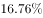

- **D**. 
少

**答案**：B

**官方解析**

根据题干“······55岁以上党员人数比46岁以下党员人数”，结合选项，可判定本题为一般增长率计算问题。定位图形材料可得：截至2019年12月31日，55岁以上党员人数为56至60岁、61岁及以上两部分人数的加和，即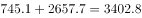万名；46岁以下党员人数为41至45岁、36至40岁、31至35岁、30岁及以下四部分人数的加和，即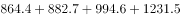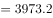万名。则55岁以上党员人数比46岁以下党员人数少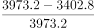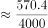，最接近B项。

故正确答案为B。

---

#### 第 5 题　qid 3522369 · 综合

不能从上述资料中推出的是：

- **A**. 
2019年发展的党员人数中，学生党员占比超过

- **B**. 
截至2019年12月31日，55岁以下党员占党员总数的比不超过

- **C**. 
截至2019年12月31日，61岁及以上的党员人数中，新中国成立前入党的不超过

- **D**. 
截至2019年12月31日，从事农牧渔民职业的党员人数与工人（含工勤技能人员）党员人数之比超过
　✅

**答案**：D

**官方解析**

A项：定位文字材料第二段：“2019年共发展党员234.4万名，……发展学生84.4万名”，则2019年发展的党员人数中，学生党员占比为，说法正确，排除；

B项：定位图1，截至2019年12月31日，55岁以上党员人数，则55岁及以下党员占党员总数的比55岁以上党员占党员总数的比，故55岁以下党员占党员总数的比不超过，说法正确，排除；

C项：定位文字材料第一段，新中国成立前入党的17.4万名；定位图1，截至2019年12月31日61岁以上党员人数为2657.7万名。而截至2019年12月31日，新中国成立前入党的人员都已满61岁。故61岁及以上的党员人数中，新中国成立前入党的人数占比为，说法正确，排除；

D项：定位文字材料第一段：“在党员的职业上，工人（含工勤技能人员）644.5万名，农牧渔民2556.1万名”，则从事农牧渔民职业的党员人数与工人（含工勤技能人员）党员人数之比为，说法错误，当选。

本题为选非题，故正确答案为D。

---

### 材料 2

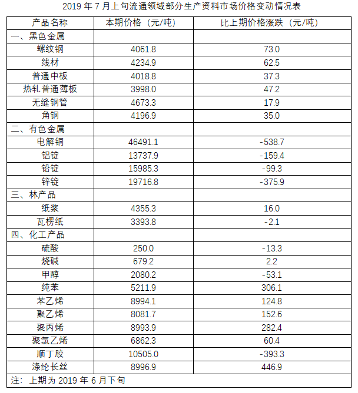

#### 第 6 题　qid 3523365 · 综合

2019年6月下旬，价格按从高到低排列居于第六位的生产资料是：

- **A**. 苯乙烯　✅
- **B**. 聚乙烯
- **C**. 聚丙烯
- **D**. 涤纶长丝

**答案**：A

**官方解析**

根据题干“2019年6月下旬，价格按从高到低排列居于第六位······”，结合材料时间为2019年7月上旬，可判定本题为基期比较问题。根据公式，基期量，定位表格材料可得：第1名是电解铜，元/吨；第2名是锌锭，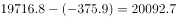元/吨；第3名是铅锭，元/吨；第4名是铝锭，元/吨；第5名是顺丁胶，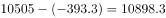元/吨；第6名是苯乙烯，元/吨。

故正确答案为A。

---

#### 第 7 题　qid 3523366 · 综合

2019年7月上旬，价格环比涨幅超过的生产资料有：

- **A**. 6种
- **B**. 7种
- **C**. 8种　✅
- **D**. 9种

**答案**：C

**官方解析**

根据题干“2019年7月上旬，价格环比涨幅超过的生产资料有”，可判定本题为一般增长率计算问题。根据公式，增长率。定位表格数据，可知2019年7月上旬：螺纹钢价格环比；线材价格环比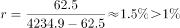；热轧普通薄板价格环比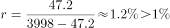；纯苯价格环比；苯乙烯价格环比；聚乙烯价格环比；聚丙烯价格环比；涤纶长丝价格环比；共8个增长率大于，其余种类增长率均小于。

故正确答案为C。

---

#### 第 8 题　qid 3523367 · 综合

2019年6月下旬，电解铜的价格约是无缝钢管的：

- **A**. 9.5倍
- **B**. 9.8倍
- **C**. 10.1倍　✅
- **D**. 10.4倍

**答案**：C

**官方解析**

根据题干“2019年6月下旬······”，材料给的时间是2019年7月上旬，并结合选项，可判定本题为基期倍数问题。根据基期倍数定义，定位表格数据，可得基期倍数倍。

故正确答案为C。

---

#### 第 9 题　qid 3523369 · 综合

按照2019年7月上旬的环比涨跌幅，2019年7月中旬聚乙烯的价格约为：

- **A**. 7929.1元/吨
- **B**. 8031.5元/吨
- **C**. 8134.3元/吨
- **D**. 8236.9元/吨　✅

**答案**：D

**官方解析**

根据题干“按照2019年7月上旬的环比涨跌幅，2019年7月中旬聚乙烯的价格约为”，结合选项单位为元/吨，可判定本题为现期计算问题。定位表格数据：2019年7月上旬聚乙烯的价格为8081.7元/吨，比上期价格上涨152.6元/吨，则2019年7月上旬环比涨幅为，因此2019年7月中旬聚乙烯的价格为元/吨，与D项最接近。

秒杀技巧：2019年7月上旬聚乙烯的价格为8081.7元/吨，比上期价格上涨152.6元/吨，按照2019年7月上旬环比涨跌幅，因基期量变大，则2019年7月中旬的增长量应大于152.6元/吨，因此2019年7月中旬聚乙烯的价格元/吨元/吨，即2019年7月中旬聚乙烯的价格元/吨，只有D项符合。

故正确答案为D。

---

#### 第 10 题　qid 3523370 · 综合

能够从上述资料中推出的是：

- **A**. 2019年6月下旬，烧碱的价格比甲醇低1401元/吨
- **B**. 2019年7月上旬，黑色金属中的线材价格环比涨幅最快
- **C**. 2019年6月下旬，铝锭、铅锭、锌锭三者的价格之和比电解铜高2948.9元/吨
- **D**. 2019年7月上旬，化工产品中按价格从高到低排名前三位的是顺丁胶，涤纶长丝，苯乙烯　✅

**答案**：D

**官方解析**

A项：定位表格材料，2019年6月下旬，烧碱的价格比甲醇低元/吨（可利用尾数法判定），并非低1401元/吨，错误；

B项：环比涨幅的比较，需要比较。结合材料中给出的数据和增长率比较技巧，直接比较的大小即可。2019年7月上旬，螺纹钢该数据线材该数据，说明螺纹钢价格环比涨幅大于线材价格环比涨幅，而非黑色金属中的线材价格环比涨幅最快，错误；

C项：定位表格材料，2019年6月下旬，铝锭、铅锭、锌锭三者的价格之和为元/吨，电解铜价格为元/吨，铝锭、铅锭、锌锭三者的价格之和比电解铜高元/吨（可利用尾数法判定），并非高2948.9元/吨，错误；

D项：定位表格材料，2019年7月上旬，化工产品中按价格从高到低排名前三位的是顺丁胶（10505.0元/吨），涤纶长丝（8996.9元/吨），苯乙烯（8994.1元/吨），正确。

故正确答案为D。

---

### 材料 3

#### 第 11 题　qid 3522350 · 增长

2019年中国创新指数比2010年约增长：

- **A**. 

- **B**. 

　✅
- **C**. 

- **D**. 

**答案**：B

**官方解析**

根据题干“······约增长”，结合选项为百分数，可判定本题为一般增长率问题。定位表格材料可得：2019年中国创新指数为228.3，2010年为133.0。故2019年中国创新指数相对于2010年的增长率。

故正确答案为B。

---

#### 第 12 题　qid 3522359 · 增长

相比于2015年，2018年创新投入指数4个评价指标中增幅在与之间的有：

- **A**. 1个　✅
- **B**. 2个
- **C**. 3个
- **D**. 4个

**答案**：A

**官方解析**

根据题干“······增幅······”，可判定本题为一般增长率问题。根据增长率，定位表格材料可得，相比于2015年，2018年创新投入指数4个评价指标的增长率分别为：

每万人人员全时当量指数：；

经费占GDP比重指数：；

基础研究人员人均经费指数：；

企业经费占主营业务收入比重指数：。

可见增幅在与之间的仅有基础研究人员人均经费指数，共1个。

故正确答案为A。

---

#### 第 13 题　qid 3522774 · 综合

下列关于2018年评价指标指数大小排序正确的是：

- **A**. 
单位GDP能耗指数人均主营业务收入指数人均GDP指数

- **B**. 
人均GDP指数每万人人员全时当量指数每万人科技论文数指数

- **C**. 
每万人科技论文数指数每百家企业商标拥有量指数单位GDP能耗指数

- **D**. 
基础研究人员人均经费指数每万人科技论文数指数单位GDP能耗指数
　✅

**答案**：D

**官方解析**

根据题干“2018年评价指标指数”，定位表格材料倒数第二列可得：单位GDP能耗指数为169.1；人均主营业务收入指数为302.3；人均GDP指数为288.2；每万人人员全时当量指数为300.8；每万人科技论文数指数为182.8；每百家企业商标拥有量指数为325.3；基础研究人员人均经费指数为313.4。可以看出，D项基础研究人员人均经费指数（313.4）每万人科技论文数指数（182.8）单位GDP能耗指数（169.1）排序正确。

故正确答案为D。

---

#### 第 14 题　qid 3522361 · 增长

若保持2019年的同比增速不变，那么，2020年每百家企业商标拥有量指数将比2018年约多：

- **A**. 72.6
- **B**. 122.2
- **C**. 133.7　✅
- **D**. 142.3

**答案**：C

**官方解析**

根据题干所求“2020年每百家企业商标拥有量指数将比2018年约多······”，可判定本题为增长量计算问题。定位表格材料，2018年每百家企业商标拥有量指数为325.3，2019年每百家企业商标拥有量指数为386.4。则2019年每百家企业商标拥有量指数的同比增长率。根据现期量，2020年每百家企业商标拥有量指数约为，比2018年约多， 与C项最接近。 

故正确答案为C。

---

#### 第 15 题　qid 3522368 · 综合

能够从上述资料中推出的是：

- **A**. 
2010年创新产出指数4个评价指标中超过150的有3个

- **B**. 
2019年创新成效指数4个评价指标中有2个同比增速高于

- **C**. 
2019年人均GDP指数同比增速高于每万人科技论文数指数同比增速
　✅
- **D**. 
2018年每万名人员专利授权数指数在表中同期全部评价指标指数中位居第二

**答案**：C

**官方解析**

A项：2010年创新产出指数中，超过150的评价指标只有每万人科技论文数指数（152.8）、每万人人员专利授权数指数（230.6）2个，错误；

B项：2019年创新成效指数的评价指标中，新产品销售收入占主营业务收入的比重指数的同比增速；高新技术产品出口额占货物出口额的比重指数中，2019年的为102.1，小于2018年的104.9，增长率为负数，同比增速；单位GDP能耗指数的同比增速；人均主营业务收入指数的同比增速，故只有1个指标同比增速高于，错误；

C项：2019年人均GDP指数的同比增速，每万人科技论文数指数的同比增速，故2019年人均GDP指数的同比增速高于每万人科技论文数指数的同比增速，正确；

D项：2018年每万名人员专利授权数指数为423.9，在2018年全部评价指标指数位列第一，并非第二，错误。

故正确答案为C。

---

### 材料 4

        截至2019年3月31日，证券业协会对证券公司2019年第一季度经营数据进行了统计，131家证券公司当期实现营业收入1018.94亿元，同比增长。

        其中，各主营业务收入分别为代理买卖证券业务净收入（含席位租赁）221.49亿元，同比增长；证券承销与保荐业务净收入66.73亿元，同比增长；财务顾问业务净收入20.95亿元，同比增长；投资咨询业务净收入7.15亿元，同比增长；资产管理业务净收入57.33亿元，同比下降；证券投资收益（含公允价值变动）514.05亿元，同比增长；利息净收入69.04亿元，同比增长；当期实现净利润440.16亿元，同比增长；119家公司实现盈利，同比增长。

        2019年第一季度，131家证券公司总资产为7.05万亿元，比上年一季度同期增加0.64万亿元；净资产为1.94万亿元，比上年一季度同期增加0.05万亿元；净资本为1.62万亿元，比上年一季度同期增加0.02万亿元。

        另外，2019年第一季度131家证券公司客户交易结算资金余额（含信用交易资金）1.50万亿元，比上年一季度同期增加0.32万亿元；受托管理资金本金总额14.11万亿元，比上年一季度同期下降2.82万亿元。

#### 第 16 题　qid 3522358 · 综合

2018年第一季度，131家证券公司代理买卖证券业务净收入（含席位租赁）约为：

- **A**. 184.6亿元
- **B**. 190.1亿元
- **C**. 194.7亿元　✅
- **D**. 204.2亿元

**答案**：C

**官方解析**

根据题干“2018年第一季度······代理买卖证券业务净收入（含席位租赁）约为”，结合材料时间为2019年第一季度，可判定本题为基期计算问题。定位文字材料第二段可得“代理买卖证券业务净收入（含席位租赁）221.49亿元，同比增长”。根据基期量，故2018年第一季度，131家证券公司代理买卖证券业务净收入（含席位租赁）亿元，与C项最接近。

故正确答案为C。

---

#### 第 17 题　qid 3522362 · 平均数

131家证券公司中，平均每家证券公司在2018年第一季度实现营业收入约为：

- **A**. 659.4亿元
- **B**. 5.0亿元　✅
- **C**. 669.5亿元
- **D**. 6.0亿元

**答案**：B

**官方解析**

根据题干“······平均每家证券公司在2018年第一季度实现营业收入约为”，结合材料时间为2019年第一季度，可判定本题为基期平均数问题。定位文字材料第一段可得，2019年第一季度，131家证券公司当期实现营业收入1018.94亿元，同比增长。根据基期量，则2018年一季度，平均每家证券公司实现营业收入亿元。

故正确答案为B。

---

#### 第 18 题　qid 3522370 · 综合

2018年第一季度，131家证券公司资产管理业务净收入与同期利息净收入相比约：

- **A**. 少了2.0亿元
- **B**. 多了2.0亿元　✅
- **C**. 少了3.1亿元
- **D**. 多了3.1亿元

**答案**：B

**官方解析**

根据题干“2018年第一季度······业务净收入与······利息净收入相比约”，结合选项为“多了/少了······亿元”，材料时间为2019年第一季度，可判定本题为基期和差问题。定位文字材料第二段可得“资产管理业务净收入57.33亿元，同比下降······利息净收入69.04亿元，同比增长”。根据基期量，则2018年第一季度，131家证券公司资产管理业务净收入与同期利息净收入的差值为亿元，与B项最接近。

故正确答案为B。

---

#### 第 19 题　qid 3522366 · 增长

2019年第一季度，131家证券公司总资产的同比增速约为：

- **A**. 

- **B**. 

　✅
- **C**. 

- **D**. 

**答案**：B

**官方解析**

根据题干“2019年第一季度······同比增速约为”，可判定本题为一般增长率问题。定位文字材料第三段可得“2019年第一季度，131家证券公司总资产为7.05万亿元，比上年一季度同期增加0.64万亿元”。根据增长率，则2019年第一季度，131家证券公司总资产的同比增速。

故正确答案为B。

---

#### 第 20 题　qid 3522377 · 综合

关于证券公司2019年第一季度经营数据，下列说法正确的是：

- **A**. 
131家证券公司总资产比净资产少了4.11亿元

- **B**. 
131家证券公司财务顾问业务净收入的同比增长率为

- **C**. 
131家证券公司净资产的同比增长金额低于净资本的同比增长金额

- **D**. 
131家证券公司资产管理业务净收入占当期实现营业收入的比重约为
　✅

**答案**：D

**官方解析**

A项：定位文字材料第三段可得，2019年第一季度，131家证券公司总资产为7.05万亿元，净资产为1.94万亿元。故131家证券公司总资产比净资产多万亿元，非少了4.11亿元，错误；

B项：定位文字材料第二段可得，财务顾问业务净收入同比增长，故增长率不是，错误；

C项：定位文字材料第三段可得，2019年第一季度，131家证券公司净资产为1.94万亿元，比上年一季度同期增加0.05万亿元；净资本为1.62万亿元，比上年一季度同期增加0.02万亿元。0.05万亿元0.02万亿元，故131家证券公司净资产的同比增长金额高于净资本的同比增长金额，错误；

D项：定位文字材料第一段和第二段可得，2019年第一季度，131家证券公司当期实现营业收入1018.94亿元，资产管理业务净收入57.33亿元。则131家证券公司资产管理业务净收入占当期实现营业收入的比重，正确。

故正确答案为D。

---
