# 2021年湖南省公务员录用考试《行测》题（网友回忆版）

> 省考 · 2021 年 · 6 个模块 · 共 120 题

- [政治理论](#%E6%94%BF%E6%B2%BB%E7%90%86%E8%AE%BA) · 1 题
- [常识判断](#%E5%B8%B8%E8%AF%86%E5%88%A4%E6%96%AD) · 14 题
- [言语理解与表达](#%E8%A8%80%E8%AF%AD%E7%90%86%E8%A7%A3%E4%B8%8E%E8%A1%A8%E8%BE%BE) · 40 题
- [数量关系](#%E6%95%B0%E9%87%8F%E5%85%B3%E7%B3%BB) · 10 题
- [判断推理](#%E5%88%A4%E6%96%AD%E6%8E%A8%E7%90%86) · 40 题
- [资料分析](#%E8%B5%84%E6%96%99%E5%88%86%E6%9E%90) · 15 题

---

## 政治理论

### 第 1 题　qid 3523553 · 新思想

2020年11月28日，习近平总书记致信祝贺“奋斗者”号全海深载人潜水器成功完成万米海试并胜利返航。“奋斗者”号完成万米海试的区域为：

- **A**. 海沟　✅
- **B**. 大陆架
- **C**. 大陆坡
- **D**. 深海平原

**答案**：A

**官方解析**

本题考查科技常识。
2020年11月10日8时12分，中国“奋斗者”号载人潜水器在马里亚纳海沟成功坐底，坐底深度10909米，创造了中国载人深潜的新纪录。
故正确答案为A。

---

## 常识判断

### 第 1 题　qid 3523517 · 人文常识

党的十九届五中全会审议通过的《中共中央关于制定国民经济和社会发展第十四个五年规划和二〇三五年远景目标的建议》，明确提出到2035年建成社会主义文化强国的远景目标。关于社会主义文化强国建设目标任务，下列表述正确的有几项？
①提高社会文明程度
②提升公共文化服务水平
③健全现代文化产业体系
④加强对外文化交流和多层次文明对话

- **A**. 1项
- **B**. 2项
- **C**. 3项
- **D**. 4项　✅

**答案**：D

**官方解析**

本题考查政治常识。
党的十九届五中全会审议通过的《中共中央关于制定国民经济和社会发展第十四个五年规划和二〇三五年远景目标的建议》中在繁荣发展文化事业和文化产业，提高国家文化软实力方面部署了三个方面的重点任务：一是提高社会文明程度，二是提升公共文化服务水平，三是健全现代文化产业体系。以讲好中国故事为着力点，创新推进国际传播，加强对外文化交流和多层次文明对话。
故正确答案为D。

---

### 第 2 题　qid 3522699 · 经济常识

下列关于数字货币和数字人民币的表述不准确的是:

- **A**. 从2020年下半年开始，数字人民币已在深圳、苏州等地展开大规模试点测试
- **B**. 数字人民币是由中国人民银行发行的具有国家信用背书的法定货币，是数字形式的人民币
- **C**. 没有银行账户，同样可以享受支付等金融服务，但持有的数字人民币在数字钱包里不计付利息
- **D**. 数字人民币装在无形的数字钱包里，可用于线下和线上交易，但没有网络就不可付款，即不能“离线”支付　✅

**答案**：D

**官方解析**

本题考查经济常识。
A项正确，2020年下半年以来，数字人民币在深圳、苏州等地面向不定向公众展开大规模试点测试。
B项正确，数字人民币是由中国人民银行发行的具有国家信用背书的法定货币，是数字形式的人民币。数字人民币的定位是替代一部分现金。
C项正确，数字人民币以广义账户体系为基础、支持银行账户松耦合，即意味着用户如果没有银行账户，同样可以利用手机号等唯一身份标识开通数字钱包，使用数字人民币进行支付，但持有的数字人民币在数字钱包里不计付利息。
D项错误，目前，现金主要以纸币和硬币等实物形态存在，而数字人民币可以理解为数字形态的现金。纸币、硬币装在有形的钱包里，携带较为不便，多用于线下交易；数字人民币装在无形的数字钱包里，可用于线下和线上交易，且数字人民币具有“离线”支付功能。所谓“离线”支付，是指在无网或弱网条件下，用户进行交易或转款时不连接后台系统，而是在数字钱包中验证用户身份、确认交易信息并进行支付的方式，即没有网络也能付款。
本题为选非题，故正确答案为D。

---

### 第 3 题　qid 3522701 · 人文常识

王某向李某借款1万元，李某当场向王某交付现金1万元，王某向李某出具借条一份，张某在该借条上签字，后王某没有按时还钱，李某将王某和张某同时起诉至法院，要求王某还钱，并要求张某承担连带责任。关于张某的责任，下列说法正确的是:

- **A**. 张某只是作为见证人签字，无须承担任何责任
- **B**. 张某在别人的借条上签字，应当推定为保证人，并承担保证责任
- **C**. 张某在别人的借条上签字，视同共同借款人，应当承担共同还款责任
- **D**. 只要借条上没有任何明确表述或其他事实表明张某愿意承担保证责任的，张某即无须承担任何责任　✅

**答案**：D

**官方解析**

本题考查法律常识。
根据《最高人民法院关于审理民间借贷案件适用法律若干问题的规定》第二十条规定：“他人在借据、收据、欠条等债权凭证或者借款合同上签名或者盖章，但是未表明其保证人身份或者承担保证责任，或者通过其他事实不能推定其为保证人，出借人请求其承担保证责任的，人民法院不予支持。”故只要借条上没有任何明确表述或其他事实表明张某愿意承担保证责任的，张某即无须承担任何责任。
故正确答案为D。

---

### 第 4 题　qid 3522662 · 人文常识

某小区业主拟将其住宅改变为经营性民宿，下列选项中不属于其应当具备的前提条件是：

- **A**. 应当遵守国家有关公共防疫的规定
- **B**. 应当遵守由业主共同制定的管理规约
- **C**. 应当获得该业主所在楼栋的其他全体业主同意
- **D**. 应当获得小区全体业主三分之二以上多数同意　✅

**答案**：D

**官方解析**

本题考查法律常识。
A、B、C三项正确，D项错误。根据《民法典》第二百七十九条规定：“业主不得违反法律、法规以及管理规约，将住宅改变为经营性用房。业主将住宅改变为经营性用房的，除遵守法律、法规以及管理规约外，应当经有利害关系的业主一致同意。”故业主将住宅改变为经营性用房民宿，应当遵守法律、法规（国家有关公共防疫的规定等）及小区业主共同制定的管理规约，应当经有利害关系的业主（业主所在楼栋的其他全体业主）一致同意。
本题为选非题，故正确答案为D。

---

### 第 5 题　qid 3523538 · 法律常识

下列关于2021年3月1日起施行的《中华人民共和国长江保护法》的亮点描述准确的是：
①做好了统筹协调、系统保护的顶层设计
②坚持把保护和修复长江流域生态环境放在压倒性位置
③突出共抓大保护、不搞新开发
④坚持责任导向，加大处罚力度
⑤切实增强了长江保护和发展的系统性、整体性、协同性

- **A**. ①③④
- **B**. ②④⑤
- **C**. ①②③④
- **D**. ①②④⑤　✅

**答案**：D

**官方解析**

本题考查法律常识。
①正确，该法中规定国家建立长江流域协调机制，统一指导、统筹协调、整体推进长江保护工作；按照中央统筹、省负总责、市县抓落实的要求，建立长江保护工作机制，明确各级政府及其有关部门、各级河湖长的职责分工；建立区域协调协作机制，明确长江流域相关地方根据需要在地方性法规和政府规章制定、规划编制、监督执法等方面开展协调与协作，切实增强长江保护和发展的系统性、整体性、协同性。故该法做好了统筹协调、系统保护的顶层设计。
②正确，该法通过规定更高的保护标准、更严格的保护措施，加强山水林田湖草整体保护、系统修复。如强化水资源保护，加强饮用水水源保护和防洪减灾体系建设，完善水量分配和用水调度制度，保证河湖生态用水需求；落实党中央关于长江禁渔的决策部署，加强禁捕管理和执法工作等。故该法体现了把保护和修复长江流域生态环境放在压倒性位置。
③错误，根据《中华人民共和国长江保护法》第三条规定：“长江流域经济社会发展，应当坚持生态优先、绿色发展，共抓大保护、不搞大开发。”“不搞新开发”表述错误。
④正确，该法强化考核评价与监督，实行长江流域生态环境保护责任制和考核评价制度，建立长江保护约谈制度，规定国务院定期向全国人大常委会报告长江保护工作；坚持问题导向，针对长江禁渔、岸线保护、非法采砂等重点问题，在现有相关法律的基础上补充和细化有关规定，并大幅提高罚款额度，增加处罚方式，补齐现有法律的短板和不足，切实增强法律制度的权威性和可执行性。故该法体现了坚持责任导向，加大处罚力度。
⑤正确，该法做好了统筹协调、系统保护的顶层设计，明确了各方职责分工，切实增强长江保护和发展的系统性、整体性、协同性。
故①②④⑤正确。
故正确答案为D。

---

### 第 6 题　qid 3522668 · 法律常识

关于《中华人民共和国民法典》，下列说法错误的是：

- **A**. 允许抵押耕地使用权
- **B**. 将绿色原则作为民法的基本原则
- **C**. 明确了生态环境损害的修复和赔偿规则
- **D**. 将无民事行为能力人最高年龄标准调整为10周岁　✅

**答案**：D

**官方解析**

本题考查法律常识。
A项正确，根据《中华人民共和国民法典》第三百九十九条第二项规定：“下列财产不得抵押：······（二）宅基地、自留地、自留山等集体所有土地的使用权，但是法律规定可以抵押的除外；······”民法典删除了“耕地”不得抵押的情形，故允许抵押耕地使用权。
B项正确，根据《中华人民共和国民法典》第九条规定：“民事主体从事民事活动，应当有利于节约资源、保护生态环境。”绿色原则是民法的基本原则之一。
C项正确，根据《中华人民共和国民法典》第一千二百三十二条规定：“侵权人违反法律规定故意污染环境、破坏生态造成严重后果的，被侵权人有权请求相应的惩罚性赔偿。”第一千二百三十四条规定：“违反国家规定造成生态环境损害，生态环境能够修复的，国家规定的机关或者法律规定的组织有权请求侵权人在合理期限内承担修复责任。侵权人在期限内未修复的，国家规定的机关或者法律规定的组织可以自行或者委托他人进行修复，所需费用由侵权人负担。”故《民法典》明确了生态环境损害的修复和赔偿规则。
D项错误，根据《中华人民共和国民法典》第二十条规定：“不满八周岁的未成年人为无民事行为能力人，由其法定代理人代理实施民事法律行为。”故无民事行为能力人最高年龄标准并没有调整为十周岁，而是八周岁。
本题为选非题，故正确答案为D。

---

### 第 7 题　qid 3522655 · 人文常识

“秦王扫六合，虎视何雄哉！挥剑决浮云，诸侯尽西来。”下列历史事件不是发生在此诗所咏“秦王”在位期间的是：

- **A**. 蔺相如完璧归赵　✅
- **B**. 唐雎不辱使命
- **C**. 荆轲刺秦王
- **D**. 郑国疲秦

**答案**：A

**官方解析**

本题考查人文常识。
“秦王扫六合，虎视何雄哉！挥剑决浮云，诸侯尽西来。”出自唐代李白的《古风·秦王扫六合》，意为秦始皇嬴政以虎视龙卷之威势，扫荡、统一了战乱的中原六国。天子之剑一挥舞，漫天浮云消逝，各国的富贵诸侯尽数迁徙到咸阳。
A项错误，蔺相如完璧归赵发生于战国时期，讲述的是秦昭王许诺赵王以十五座城换取和氏璧，但当使臣蔺相如献璧之后，秦昭王却不提换城之事，蔺相如施巧计使和氏璧重归赵国。蔺相如完璧归赵并非发生在秦始皇嬴政在位期间。
B项正确，唐雎不辱使命讲述的是唐雎奉安陵君之命出使秦国，与秦王展开面对面的激烈斗争，终于折服秦王，保存国家，完成使命的经过，歌颂了唐雎不畏强暴、敢于斗争的爱国精神。其中的秦王即秦始皇嬴政，当时其还未称皇帝。
C项正确，荆轲刺秦王讲述了战国时期荆轲刺杀秦王嬴政这一悲壮的历史故事，反映了当时的社会政治情况，表现了荆轲重义轻生、为燕国勇于牺牲的精神。
D项正确，郑国疲秦中的郑国是韩国派往秦国的一个间谍，韩桓王试图通过他游说秦王嬴政修筑一条连接泾水和洛水的运河，达疲秦之效，以阻止秦国进攻韩国的步伐。岂知事与愿违，“疲秦之计”倒成了“强国之策”，运河的修筑成功，使得一向落后的关中农业迅速发展起来。
本题为选非题，故正确答案为A。

---

### 第 8 题　qid 3522660 · 人文常识

下列诗句对应的节气中，我国大部分地区一天中白昼短于黑夜的是：

- **A**. 谷雨春光晓，山川黛色青
- **B**. 露从今夜白，月是故乡明
- **C**. 清明时节雨纷纷，路上行人欲断魂
- **D**. 辛苦孤花破小寒，花心应似客心酸　✅

**答案**：D

**官方解析**

本题考查地理国情。
每年秋分过后，太阳直射点开始由赤道进入南半球，北半球开始昼短夜长，一天中白昼短于黑夜，直至次年春分，太阳直射点由赤道进入北半球，北半球才开始昼长夜短。所以，我国大部分地区白昼短于黑夜的时间段是秋分至次年的春分。而秋分是二十四节气中的第16 个节气，于每年的公历9月22-24日交节；春分是二十四节气中的第4个节气，于每年的公历3月20日-21日交节。
A项错误，“谷雨春光晓，山川黛色青”出自唐代元稹的《咏廿四气诗·谷雨三月中》，描写了春天的最后一个节气谷雨这天的天光风物，生意葱茏。谷雨是二十四节气之第六个节气，于每年公历4月19日-21日交节，在秋分之前，不符合题意。
B项错误，“露从今夜白，月是故乡明”出自唐代杜甫的《月夜忆舍弟》，意为从今夜就进入了白露节气，月亮还是故乡的最明亮。白露是二十四节气中的第十五个节气，时间点在公历每年9月7日到9日，在秋分之前，不符合题意。
C项错误，“清明时节雨纷纷，路上行人欲断魂”出自唐代杜牧的《清明》，描写清明春雨中所见，色彩清淡。清明交节时间在公历4月5日前后，在秋分之前，不符合题意。
D项正确，“辛苦孤花破小寒，花心应似客心酸”出自南宋范成大的《窗前木芙蓉》，意为孤独凄清的木芙蓉，冒着初秋寒意而开，花的心就像作者自己的心一样，凄楚不已。小寒是二十四节气中的第二十三个节气，于每年公历1月5-7日交节。在秋分之后，此时我国大部分地区一天中白昼短于黑夜，符合题意。
故正确答案为D。

---

### 第 9 题　qid 3522694 · 人文常识

下列历史名人按生活年代先后排序正确的是：

- **A**. 周文王—管仲—孔子　✅
- **B**. 周公旦—李斯—楚庄王
- **C**. 孙膑—诸葛亮—蒙恬
- **D**. 屈原—勾践—伍子胥

**答案**：A

**官方解析**

本题考查人文常识。
A项正确，周文王姬昌（前1152年―前1056年），周朝奠基者，其在位期间勤于政事，重视发展农业生产，礼贤下士，广罗人才。管仲（约公元前723年—公元前645年），春秋前期齐国著名的政治家、思想家，被齐桓公任命为相，在齐国进行了政治、经济等方面的一系列改革。孔子（公元前551年—公元前479年），春秋时期思想家、教育家，儒家学派的创始人。选项排序无误。
B项错误，周公旦，西周初期杰出的政治家、军事家、思想家、教育家，曾两次辅佐周武王东伐纣王，并制作礼乐。李斯，战国末期楚国人，秦代著名的政治家、文学家和书法家，法家代表人物之一。楚庄王熊旅，春秋时期楚国国君，楚庄王元年（前613年）至楚庄王二十三年（前591年）在位，春秋五霸之一。选项排序有误，楚庄王生活的年代在李斯之前。
C项错误，孙膑是战国时期齐国军事家，春秋战国时期诸子百家之一的兵家代表人物，其军事思想主要集中于《孙膑兵法》。诸葛亮是三国时期蜀汉丞相，先后辅佐刘备、刘禅两朝。蒙恬，秦朝时期名将，秦统一六国后，蒙恬三十万大军北击匈奴，收复河南之地，威震匈奴，被誉为“中华第一勇士”。选项排序有误，蒙恬生活的年代在诸葛亮之前。
D项错误，屈原（约公元前340年—公元前278年），战国时期楚国诗人、政治家，被誉为“楚辞之祖”。越王勾践（约公元前520年-公元前464年），夏禹后裔，越王允常之子，春秋末年越国国君。伍子胥（约公元前559年-公元前484年），春秋末期吴国大夫、军事家。选项排序有误，屈原生活的年代在伍子胥、勾践之后。
故正确答案为A。

---

### 第 10 题　qid 3522659 · 人文常识

新文化运动是一场思想文化革新、文学革命运动。下列新文化运动代表人物与其作品对应错误的是∶

- **A**. 蔡元培—《中国伦理学史》
- **B**. 陈独秀—《文学改良刍议》　✅
- **C**. 胡适—《中国哲学史大纲》
- **D**. 李大钊—《布尔什维主义的胜利》

**答案**：B

**官方解析**

本题考查人文常识。
A项正确，《中国伦理学史》是由蔡元培所作的第一部系统整理和研究中国古代伦理思想发生、发展及其变迁的学术著作，全书分绪论、先秦创史时代、汉唐继承时代、宋明理学时代四大部分32章，系统地介绍了中国古代伦理学界重要的流派及主要代表人物，并阐述了各家学说的要点、源流及发展。
B项错误，《文学改良刍议》是由胡适所作，并于1917年1月发表。《文学改良刍议》是倡导文学革命的第一篇文章。
C项正确，《中国哲学史大纲》是胡适写定于1918年9月的书，此书一出版即因其方法和见解的创新而极受注意，3年时间再版了7次。此书被誉为：用现代学术方法系统研究中国古代哲学史的第一部著作，它的出版被视为中国哲学史学科成立的标志。
D项正确，《布尔什维主义的胜利》是由李大钊所作，于1918年11月载于《新青年》。文章热烈欢呼十月革命的胜利，认为这是民主主义的胜利，是布尔什维的胜利，是世界劳工阶级的胜利。
本题为选非题，故正确答案为B。

---

### 第 11 题　qid 3522696 · 人文常识

下列与地震有关的说法错误的是：

- **A**. 冲击地震震源浅，影响范围小
- **B**. 水库蓄水、地下抽水可诱发地震
- **C**. 火山地震与构造地震常有密切关系
- **D**. 我国的强震绝大部分是深源构造地震　✅

**答案**：D

**官方解析**

本题考查地理国情。

A项正确，冲击地震因山崩、滑坡等原因引起，或因碳酸盐岩地区岩层受地下水长期溶蚀形成许多地下溶洞，洞顶塌落引起，约占地震总数的，震源很浅，影响范围小，震级也不大。

B项正确，在一定条件下，人类的工程活动可以诱发地震，诸如水库蓄水、城市或油田的抽水或注水、矿山坑道的崩塌、以及人工爆破或地下核爆炸等都能引起当地出现异常的地震活动，这类地震活动统称为诱发地震。

C项正确，火山地震可以是直接由火山爆发引起，也可能是因火山活动引起构造变动，或是因构造变动引起火山喷发，从而导致地震。构造地震是由构造变动特别是断裂活动所产生的地震。因此，火山地震与构造地震常有密切关系。

D项错误，全球绝大多数地震是构造地震，约占地震总数的。其中大多数又属于浅源地震，影响范围小，对地面及建筑物的破坏非常强烈，常引起生命财产的重大损失。我国的强震绝大部分是浅源构造地震，其中以上均与断裂活动有关。

本题为选非题，故正确答案为D。

---

### 第 12 题　qid 3523562 · 人文常识

被誉为“史家之绝唱，无韵之离骚”的史学巨著《史记》以本纪、世家、列传来记载历代王朝与人物，对秦末农民起义领袖陈胜，《史记》作者给予了高度评价，其传记被列入:

- **A**. 本纪
- **B**. 百官公卿表
- **C**. 世家　✅
- **D**. 列传

**答案**：C

**官方解析**

本题考查人文常识。
《史记》全书包括十二本纪（记历代帝王言行政绩）、三十世家（记诸侯国和汉代诸侯、勋贵兴亡）、七十列传（记重要人物的言行事迹，主要叙人臣，其中最后一篇为自序）、十表（大事年表）、八书（记各种典章制度记礼、乐、音律、历法、天文、封禅、水利、财用）。
《陈涉世家》是汉代史学家、文学家司马迁创作的一篇文章，列于《史记》第四十八篇，是秦末农民起义领袖陈胜、吴广的传记。此文以陈胜、吴广的活动为线索，详细地记述了陈胜起义的全过程，以及相继而起的各路起义军的胜败兴替，描述了起义军的浩大声势，肯定了陈胜在反抗秦王朝统治斗争中的功绩。同时，文章也论述了陈胜起义最终失败的原因：起义领袖缺乏指挥全局的能力、自身蜕化、用人不当，导致起义军内部离心离德。全文运用语言、动作、神态描写等多种技巧来塑造人物形象，生动真实地再现了这一场斗争的历史图景。
故正确答案为C。

---

### 第 13 题　qid 3522675 · 人文常识

关于农谚“小雪雪满天，来岁必丰年”所涉及的原理，下列说法错误的是：

- **A**. 新雪孔隙度高、空气多，对土壤有防冻保湿作用
- **B**. 雪融化时吸收土壤内部热量，越冬虫卵不易存活
- **C**. 雪中含有大量磷化物，融化后可为土壤提供肥料　✅
- **D**. 雪融化时入土壤，提高土壤含水量，缓解春旱

**答案**：C

**官方解析**

本题考查科技常识。
A项正确，新雪的密度低、孔隙度高，贮藏在新雪中的空气多，而空气是热的不良导体，因此土壤中热量的散失较少，可以起到防冻保湿的作用。
B项正确，雪融化时从土壤中吸收许多热量，这时土壤会突然变得非常寒冷，温度降低许多，越冬虫卵不易存活。
C项错误，雪是大量白色不透明冰晶和其聚合物组成的降水，由大气中的水蒸气直接凝华而成。根据测定，雪水中含有一定量的氮化物。雪水渗入土壤，就等于施了一次氮肥。用雪水喂养家畜家禽、灌溉庄稼都可收到明显的效益。
D项正确，寒潮以后，天气渐渐回暖，雪慢慢融化，雪融下去的水可以提高土壤含水量，给庄稼积蓄很多水，对春耕播种以及庄稼的生长发育都很有利。
本题为选非题，故正确答案为C。

---

### 第 14 题　qid 3522672 · 人文常识

下列关于吊扇悬挂点的拉力描述正确的有：
①吊扇不转动时，悬挂点的拉力等于重力
②吊扇转动时，悬挂点的拉力小于重力
③吊扇转速越大，悬挂点的拉力越小
④吊扇转速越小，悬挂点的拉力越小

- **A**. 1项
- **B**. 2项
- **C**. 3项　✅
- **D**. 4项

**答案**：C

**官方解析**

本题考查科技常识。
①、②正确，吊扇不转动时，悬挂点对吊扇的拉力等于吊扇的重力，吊扇旋转时要向下扇风，即对空气有向下的压力，根据牛顿第三定律，空气也对吊扇有一个向上的反作用力，使得悬挂点对吊扇的拉力变小。
③正确、④错误，吊扇转动时空气对吊扇叶片有向上的反作用力，转速越大，此反作用力越大，悬挂点的拉力越小。
因此①②③正确。
故正确答案为C。

---

## 言语理解与表达

### 第 1 题　qid 3522656 · 逻辑填空

教育，最终都是为了促进人的全面发展，帮助下一代提高生存能力。批评惩戒和赏识鼓励是            的两种方式，有些时候，“当头棒喝”甚至比温言软语更有效果。
填入画横线部分最恰当的一项是：

- **A**. 如影随形
- **B**. 并行不悖　✅
- **C**. 各有所长
- **D**. 不可或缺

**答案**：B

**官方解析**

根据后文“有些时候，‘当头棒喝’甚至比温言软语更有效果”可知，横线处应表示，两种方式都有效果，并不存在“当头棒喝”就效果不好之意。B项“并行不悖”指同时进行，互相不违背，可体现出两种方式虽看似完全相反，但都可以起到教育作用之意，符合文意，当选。
A项“如影随形”指好像影子总是跟着身体一样。比喻两个事物关系密切或两个人关系密切不能分离。“批评惩戒”与“赏识鼓励”并非如影随形，往往是单一出现，排除；
C项“各有所长”指各有各的长处、优点，一般多指人才而言，且该词一般用于表示大家都有自己的优势，不相上下，与后文文意不符，排除；
D项“不可或缺”表示非常重要，不能有一点缺失，文段并未体现出两种方式都不能少之意，与前后文语境不符，排除。
故正确答案为B。
【文段出处】《缺乏“棒喝”的教育有缺陷》

---

### 第 2 题　qid 3522661 · 逻辑填空

大学里有一些“冷门”专业，比如古生物专业、梵语专业等。有人可能质疑这样的专业有些“浪费”教育资源，因为它们很难与产业结合转化成生产力，培养出来的学生也很难在就业市场上            。但或许这样专业的存在，本来就不能简单地用世俗的眼光来打量。
填入画横线部分最恰当的一项是：

- **A**. 如鱼得水
- **B**. 炙手可热　✅
- **C**. 学以致用
- **D**. 鹤立鸡群

**答案**：B

**官方解析**

根据前文“它们很难与产业结合转化成生产力”可知，相关专业的学生在就业市场中对口的工作较少，在就业市场中难以受欢迎，B项“炙手可热”意思是手一靠近就感觉很烫，比喻气焰盛、权势大，使人不敢靠近，现在也多用于比较火热，填入文中可以体现出学生在就业市场中“受欢迎”之意，且能够对应前文“冷门”，当选。
A项“如鱼得水”比喻得到跟自己十分投合的人或对自己很合适的环境，无法对应前文“冷门”，排除；
C项“学以致用”指为了实际应用而学习，文段指出冷门专业难以与产业结合，并未指出冷门专业的学生难以应用，排除；
D项“鹤立鸡群”比喻一个人的仪表或才能在周围一群人里显得很突出，文段并没有“突出”之意，排除。
故正确答案为B。
【文段出处】《这个专业，全校就她一个》

---

### 第 3 题　qid 3523507 · 逻辑填空

我国有很庞大的老年群体，但他们却因为科技的发展，在生活中有很多地方            。不是他们            ，不想接触新事物，而是一辈子的习惯，不是说改就能改的。
依次填入画横线部分最恰当的一项是：

- **A**. 寸步难行 墨守成规
- **B**. 步履艰难 画地为牢
- **C**. 艰难跋涉 抱残守缺
- **D**. 举步维艰 固步自封　✅

**答案**：D

**官方解析**

第一空，根据文意可知，老年人在科技发展的背景下，生活中会面临很多不便，因此横线处应表示老年人在很多地方不是很方便。B项“步履艰难”指行走困难、行动不方便，D项“举步维艰”指迈步艰难，比喻办事情每向前进行一步都十分不容易，均符合文意，保留。A项“寸步难行”指连一步都难以进行，形容走路、行动困难，比喻开展某项工作困难重重，用于此处程度过重，排除；C项“艰难跋涉”强调路程很艰苦，或者事业方面很艰辛，体现不出老年群体的不方便，排除。 
第二空，根据后文“不想接触新事物”可知，横线处应体现古板、不肯接受新鲜事物之意。D项“固步自封”形容保守，安于现状，不求改进，符合文意，当选。B项“画地为牢”比喻只许在指定的范围内活动，表意与是否保守、不接受新事物无关，排除。
故正确答案为D。
【文段出处】《边亚峰：交医保拒收人民币是一种违法犯罪》

---

### 第 4 题　qid 3522674 · 逻辑填空

灵感，一个很美的词汇，天生带有古灵精怪的流动感。它如同一尾滑溜溜的金鱼，极难抓，但真的抓住时，它又在手心扭动，让人            ，一不小心又让它溜走了。灵感是如此琢磨不透又难以控制。那到底如何才能在        灵感的游戏中享受到最大的快乐呢?
依次填入画横线部分最恰当的一项是：

- **A**. 一筹莫展 追寻
- **B**. 望洋兴叹 激发
- **C**. 不知所措 捕捉　✅
- **D**. 爱莫能助 点燃

**答案**：C

**官方解析**

第一空，由前文“它又在手心扭动”以及后文“灵感是如此琢磨不透又难以控制”可知，横线处形容“灵感”难以把握，人们对其无法控制。A项“一筹莫展”形容遇事拿不出一点办法，没有任何进展，C项“不知所措 ”形容不知道怎么办才好，均可表达人无法控制住“灵感”的意思，保留。B项“望洋兴叹”原指在伟大事物面前感叹自己的渺小，也比喻做事时因力不胜任或没有条件而感到无可奈何，通常形容较为宏观，复杂的事物，与“在手心扭动”对应不当，排除；D项“爱莫能助”指虽然心中关切同情，却没有力量帮助，文段并没有体现“帮助”之意，排除。
第二空，横线处搭配“灵感”，且由前文“灵感是如此琢磨不透又难以控制”可知，横线处表达“控制”住灵感之意。C项“捕捉”意为捉住某人或动物使其落入自己手中，符合文意，且“捕捉灵感”搭配得当，当选。A项“追寻”指追随，无法体现出“控制”之意，不符合文意，排除。
故正确答案为C。
【文段出处】《如何捕捉生活中的灵感》

---

### 第 5 题　qid 3522591 · 逻辑填空

国无德不兴，人无德不立。如果一个民族、一个国家没有共同的核心价值观，            ，行无依归，那这个民族、这个国家就无法前进。这样的情形，在我国历史上，在当今世界上，都            。
依次填入画横线部分最恰当的一项是：

- **A**. 莫衷一是  屡见不鲜　✅
- **B**. 自以为是  数不胜数
- **C**. 各行其是  不一而足
- **D**. 积非成是  层出不穷

**答案**：A

**官方解析**

第一空，根据横线前“没有共同的核心价值观”和后文“行无依归”可知，填入横线处的成语强调没有统一的思想作支撑。A项“莫衷一是”指各有各的意见，不能得出一致的结论，置于此处能够体现出思想不统一，符合文意，保留。B项“自以为是”形容认为自己的看法和做法都正确，不接受别人的意见，侧重强调认为自己是正确的，与文意无关，排除；C项“各行其是”形容按照各自认为对的去做，比喻各搞一套，侧重强调做法，与文意无关，排除；D项“积非成是”指长期所形成的错误，往往被当作正确的，与文意无关，排除。
第二空，代入验证，根据前文“这样的情形，在我国历史上，在当今世界上”可知，填入横线处的成语表达这样的情形很常见。A项“屡见不鲜”意思是常常见到，并不新奇，符合文意，当选。
故正确答案为A。
【文段出处】《习近平：青年要自觉践行社会主义核心价值观——在北京大学师生座谈会上的讲话》

---

### 第 6 题　qid 3522599 · 逻辑填空

电视在家庭中基本可以保证固定的开机时长，这就给电视广告提供了足够大的“曝光”空间，不仅可以提高受众的          ，同时更容易在家庭成员之间产生共鸣，无形之中增强广告的        效果。
依次填入画横线部分最恰当的一项是：

- **A**. 积极性 营销
- **B**. 多样化 吸引
- **C**. 保有量 交互
- **D**. 覆盖量 传播　✅

**答案**：D

**官方解析**

第一空，根据横线前“给电视广告提供了足够大的‘曝光’空间”以及“提高”可知，横线处应体现受众的数量有所提高之意。C项“保有量”指拥有的数量，D项“覆盖量”指在一定程度之内的数量，均符合文意，保留；A项“积极性”指进取向上的思想和表现，多搭配工作，文段未体现思想及表现，排除；B项“多样化”指种类多种多样，文段未提及种类，排除。
第二空，搭配“广告”，根据“在家庭成员之间产生共鸣”可知，广告起到了传递信息的宣传作用，横线处应体现广告的宣传作用被增强之意。D项“传播”指广泛散布、信息传递，符合文意，当选；C项“交互”指相互联系交流，多用于人机交互，与广告搭配不当，排除。
故正确答案为D。
【文段出处】《互联网的下半场，电视产业的风口在哪里》

---

### 第 7 题　qid 3522570 · 逻辑填空

量子计算将极大促进当前人工智能及其应用的发展，深刻地        包括基础教育在内的众多领域。特别是，借助于量子计算技术，人类对于微观世界的认识以及宏观世界的探索将得到极大扩展，从而引发人类思维能力的          提升。
依次填入画横线部分最恰当的一项是：

- **A**. 融合 战略性
- **B**. 改变 根本性　✅
- **C**. 解决 突破性
- **D**. 支持 阶段性

**答案**：B

**官方解析**

第一空，搭配“领域”，“领域”指特定的范围或区域，B项“改变”指事物变得和原来不一样，与“领域”搭配恰当，保留。A项“融合”指融为一体，文中并无众多领域融为整体之意，不符合文意，排除；C项“解决”指处理使有结果，D项“支持”指支撑、赞同或鼓励，均与“领域”搭配不当，排除。
第二空，代入验证。搭配“提升”，B项“根本性”意在强调基础或本质，根据文意可知，人类对世界的认识发生了本质上的改变，搭配恰当，符合文意，当选。
故正确答案为B。
【文段出处】《量子科技为何成为多国战略布局的重点领域》

---

### 第 8 题　qid 3522671 · 逻辑填空

几乎所有成年人都只能使用左脑处理语句。但对儿童而言，任何一个大脑半球的损伤都不太可能影响语言学习，这说明在早期阶段人脑的两个半球都具有这种能力。美国乔治敦大学神经学家指出，这为神经损伤提供了一种        机制。例如，如果左半球受到围产期中风的        ，新生儿将使用右半球学习语言。
依次填入画横线部分最恰当的一项是：

- **A**. 赔偿 祸害
- **B**. 补偿 损害　✅
- **C**. 补充 损失
- **D**. 填充 毁坏

**答案**：B

**官方解析**

第一空，搭配“机制”，体现早期阶段人脑的两个半球对于“神经损伤”的功用，结合横线后的例子可知，当新生儿大脑左半球遭受中风时，右半球可以有效补位，以减少对语言学习的影响。B项“补偿”指补足，用以抵消损失、消耗等，C项“补充”指原来不足或有损失时，增加一部分，二者均符合语境，保留。A项“赔偿”指由于自己的行动而使他人蒙受损失从而给予补偿，新生儿的这一机制是对自身神经损伤的补偿，而非他人，不符合文意，排除；D项“填充”多指对某个空间的填补，与文段语境不符，排除。
第二空，搭配“中风”，体现中风对大脑左半球的伤害。B项“损害”指使事业、利益、健康、名誉等蒙受损失，与“中风”搭配得当，当选。C项“损失”指没有代价地消耗或失去，多与“金钱”“产品”等具象化事物搭配，与“中风”搭配不当，排除。
故正确答案为B。
【文段出处】《研究显示：儿童同时使用左右半脑进行语言学习》

---

### 第 9 题　qid 3523514 · 逻辑填空

家人是用来爱的，而不是用来伤害的。谁的爱与付出都不是            的，安抚好自己的情绪，体谅彼此，多一点有效沟通，整个家庭才能和和睦睦。
填入画横线部分最恰当的一项是：

- **A**. 无缘无故
- **B**. 责无旁贷
- **C**. 轻而易举
- **D**. 理所当然　✅

**答案**：D

**官方解析**

根据横线前“家人是用来爱的，而不是用来伤害的”与横线后“安抚好自己的情绪，体谅彼此，多一点有效沟通”可知，横线处应体现家人之间的爱与付出是需要彼此共同努力的，并非单方面必须或理应要做的，D项“理所当然”指从道理上说应当这样，符合文意，且与前后文呼应，当选。
A项“无缘无故”指没有一点原因，文段并未体现家人之间的爱与付出和彼此之间的体谅、有效沟通之间存在因果关系，排除；
B项“责无旁贷”指自己应尽的责任，不能推卸给旁人，若置于此处，结合否定词“都不是”，体现“爱与付出”可推卸给旁人，文段无此含义，排除；
C项“轻而易举”形容事情容易做，不费力气，文段并未体现爱与付出是否容易去做，排除。
故正确答案为D。
【文段出处】《有正能量的家庭，才能培养出内心强大的孩子！》

---

### 第 10 题　qid 3524807 · 逻辑填空

手工空心挂面以张家山的最出名，自从登上了央视、湖南卫视后，手工空心挂面更红了，张家山更红了，村里几乎家家户户都开始做挂面，男女老少齐动手，房前屋顶，            ，如烟似雾，一进村口，挂面的芬芳和着黄土的清香顿时让人            。
依次填入划横线部分最恰当的一项是：

- **A**. 白眉低垂 心旷神怡
- **B**. 银丝摇曳 神清气爽　✅
- **C**. 细如丝织 气定神宁
- **D**. 白丝如雪 沁人心脾

**答案**：B

**官方解析**

第一空，根据横线前“家家户户都开始做挂面，男女老少齐动手”可知，横线处应与挂面有关，且横线后用逗号与“如烟似雾”连接表近义并列，故语义相近，横线处要体现房前屋顶挂面的状态，B项“银丝摇曳”、C项“细如丝织”、D项“白丝如雪”均符合文意，保留。A项“白眉低垂”，即老者眼眉低低的垂下，不能修饰“挂面”，搭配不当，排除。
第二空，横线处搭配“挂面的芬芳”和“黄土的清香”，体现出香气对人的作用，B项“神清气爽”形容人神志清爽，心情舒畅，符合文意，当选。C项“气定神宁”形容一种悠然自在镇定的心境与状态，不属于挂面香气能带给人的作用，不符合文意，排除；D项“沁人心脾”指芳香凉爽的空气、饮料或花香使人感到舒适，与横线前“让人”搭配，语义重复，排除。
故正确答案为B。
【文段出处】《‘实心心’事业》

---

### 第 11 题　qid 3522596 · 逻辑填空

学术研究是一项严谨缜密的科学工作，            是其研究的前提基础。学术不求真便会没有标准，当真正的学术研究被        、舆论炒作成为风气之时，便意味着学术低谷的到来。
依次填入画横线部分最恰当的一项是：

- **A**. 实事求是 放弃
- **B**. 有的放矢 遗忘
- **C**. 去伪存真 冷落　✅
- **D**. 推陈出新 忽视

**答案**：C

**官方解析**

第一空，根据文段“学术研究是一项严谨缜密的科学工作”“学术不求真便会没有标准”可知，横线处体现的是学术研究要严谨缜密、要求真，A项“实事求是”指从实际情况出发，C项“去伪存真”意思是除掉虚假的，留下真实的，均符合文意，保留。B项“有的放矢”比喻说话做事有针对性，文段未体现针对性，排除；D项“推陈出新”指去掉旧事物的糟粕，取其精华，并使它向新的方向发展，与文意不符，排除。
第二空，根据后文“便意味着学术低谷的到来”可知，横线处词语程度较轻，C项“冷落”形容受到冷淡的待遇，置于此处程度较轻，符合文意，当选。A项“放弃”搭配“学术研究”，程度过重，排除。
故正确答案为C。
【文段出处】《造假与炒作的背后》

---

### 第 12 题　qid 3522582 · 逻辑填空

2020年是紫禁城建成600年，也是故宫博物院成立95周年。紫禁城作为明清两代皇宫，它是中华民族宝贵的传统文化        ，也是著名的世界文化遗产。它不仅拥有中国古代最        的宫殿建筑群，还拥有一百八十余万件珍贵文物和大量的文献档案，承载着丰富的历史信息和文化印记，是中华民族记忆传统、        文脉、增强文化自信的重要资源。
依次填入画横线部分最恰当的一项是：

- **A**. 财产 巨大 继承
- **B**. 产业 庞大 延续
- **C**. 遗产 宏伟 传承　✅
- **D**. 象征 丰富 接续

**答案**：C

**官方解析**

第一空，横线处所填词语要形容“紫禁城”，且需要搭配“传统文化”，C项“遗产”泛指历史上遗留下来的精神财富或物质财富，由“紫禁城建成600年”可知，它是历史遗留的宝贵财富，符合文意，且“遗产”与“传统文化”搭配得当，保留。A项“财产”指拥有的金钱、物资、房屋、土地等物质财富，与“传统文化”搭配不当，排除；B项“产业”可以指私有财产，如土地、房屋、工厂等，也可以指现代工业生产行业，“紫禁城”并非私有财产，也不是具体生产行业，排除；D项“象征”指能用来暗示特定的人、物或事理的具体的东西，如“白色是纯洁的象征”，而文段不存在这种暗示关系，排除。
第二空，代入验证，横线处所填词语搭配“宫殿建筑群”，C项“宏伟”表示宏大雄伟，多与“建筑”类搭配，用于此处搭配得当，保留。
第三空，代入验证，横线处所填词语搭配“文脉”，C项“传承”表示传授和继承，搭配得当，符合文意，当选。
故正确答案为C。
【文段出处】《600年的记忆：紫禁城历史上的几个关键词》

---

### 第 13 题　qid 3522601 · 逻辑填空

随着医疗设备技术的发展，医疗市场也对非侵入式检测设备提出了更高的        ——准确、及时且按需实现患者监测。因此，如果一项技术能够以非侵入的方式反复测量个体的健康状态，且成本不高，那么它将有助于预防和预测疾病，提高诊疗决策的            。
依次填入画横线部分最恰当的一项是：

- **A**. 要求 精准性　✅
- **B**. 门槛 前瞻性
- **C**. 期望 创新性
- **D**. 标准 主动性

**答案**：A

**官方解析**

第一空，横线处搭配“提出”，A、C、D三项均搭配恰当，保留。B项“门槛”搭配不当，排除。
第二空，根据前文“准确、及时且按需”可知，文段强调随着医疗设备技术的进步，对待疾病的处理也将更加科学迅速、精确高效。A项“精准性”符合文意，当选。C项“创新性”侧重打破常规，提出不一样的想法或措施，文段并非强调诊疗决策的“特别”，而是要通过技术进步来让决策更加科学化、精准化，不符合文意，排除；D项“主动性”强调按照自己的意志行动，文段并没有体现决策是主动或被动做出，与文意无关，排除。
故正确答案为A。
【文段出处】新华网《“智能马桶”可监测用户健康》

---

### 第 14 题　qid 3522604 · 逻辑填空

节约资源、减少垃圾生产成为某种意义上的公共事务，很容易遭遇“搭便车困境”——人人都想            ，最终会导致公共事务乏人问津。节约资源的功效并没有那么            ，需要人们久久为功；付出没有得到及时、有效的反馈与回报，难免会影响公众参与。
依次填入画横线部分最恰当的一项是：

- **A**. 蜂拥而上 妙手回春
- **B**. 鸠占鹊巢 神通广大
- **C**. 据为己有 一劳永逸
- **D**. 坐享其成 立竿见影　✅

**答案**：D

**官方解析**

第一空，由破折号可知，所填词语是对“搭便车困境”的解释说明。“搭便车”本义为自己不想开车，所以乘坐他人的便车；引申义为，自己不想付出努力而去享受他人带来的便利。D项“坐享其成”指的是自己不出力，而享受别人取得的成果，符合文意，保留。A项“蜂拥而上”指的是许多人一起涌上来，未体现出自己不出力，享受他人成果之意，不符合文意，排除；B项“鸠占鹊巢”指的是强占别人的房屋、土地、产业等，C项“据为己有”指的是占据为自己所拥有，“搭便车”并非强调占据别人的东西归自己所有，均与文意不符，排除。
第二空，代入验证，根据“并没有······需要······”可知，横线处与后文“久久为功”语义相反，体现“时间短”之意。D项“立竿见影”指见效快，符合文意，当选。
故正确答案为D。
【文段出处】《“零浪费”用更深刻的环保观念拥抱美好生活》

---

### 第 15 题　qid 3522605 · 逻辑填空

世界上的一万多种鸟，其实各有各的美丽，从各种华丽的羽毛，到鸟喙的形状，到鸣唱的声音，不能不让我们        生物多样性的神奇。进化论之父达尔文在加拉帕戈斯群岛上通过观察当地鸟类发现，虽然这些鸟类很明显长得很相似，有着共同的祖先，但是它们的鸟喙形状却            。
依次填入画横线部分最恰当的一项是:

- **A**. 惊叹 大相径庭　✅
- **B**. 惊奇 毫无二致
- **C**. 探索 云泥之别
- **D**. 追寻 异曲同工

**答案**：A

**官方解析**

本题可从第二空入手，横线前出现转折关联词“却”可知前后语义相反，横线前“鸟类很明显长得很相似，有着共同的祖先”体现“相似、一样”的含义，因此横线处应体现“不一样、不同”之意。A项“大相径庭”比喻相差很远，大不相同，符合文意，保留。B项“毫无二致”形容完全一样，D项“异曲同工”比喻一件事情的做法不同而都巧妙地达到目的，均与文意相悖，排除；C项“云泥之别”比喻地位的高下相差极大，文段并非论述地位的高下，仅在论述形状的不同，与文意不符，排除。
第一空，代入验证，A项“惊叹”指惊奇赞叹，表达对生物多样性的赞美，感情色彩积极，符合文段语境，当选。
故正确答案为A。
【文段出处】《热带雨林中的鸟类和深海中的蠕虫，我们该保护哪个？》

---

### 第 16 题　qid 3522577 · 逻辑填空

原创是作品的生命力之源，抄袭无异于            。影视行业想要成为常青树，优质的原创作品是根基。如果任由抄袭之风盛行，        抄袭作者活跃在屏幕上，将        从业者的生存环境，消耗整个行业的未来前景。
依次填入画横线部分最恰当的一项是：

- **A**. 自相残杀 放纵 剥蚀
- **B**. 自掘坟墓 纵容 腐蚀　✅
- **C**. 自投罗网 放任 消蚀
- **D**. 自欺欺人 容许 磨蚀

**答案**：B

**官方解析**

第一空，根据横线前的“无异于”可知，横线处所填词语是对前文的解释说明。由“原创是作品的生命力之源”可知，抄袭则会让作品失去生命。B项“自掘坟墓”是指自己的所作所为就像在替自己挖掘坟墓一样，比喻自寻死路，符合文意，保留。C项“自投罗网”指自己投到罗网里去，比喻自己送死，也可以体现让作品失去生命，保留。A项“自相残杀”指自己人互相杀害，文段未提及互相杀害，排除。D项“自欺欺人”指欺骗自己，也欺骗别人，文段未提及欺骗自己和欺骗别人，与文意无关，排除。
第二空，根据横线前的“任由抄袭之风盛行”可知，横线处表示对抄袭作者不加约束，任由其发展，B项“纵容”指对错误行为不加制止、任其发展，C项“放任”指听其自然，不加约束或干涉，两项均符合文意，保留。
第三空，搭配“生存环境”，根据横线后的“消耗整个行业的未来前景”可知，对抄袭不加约束会产生不好的结果，从业者的生存环境会遭到破坏，B项“腐蚀”比喻坏的思想或环境，使人逐渐变质堕落，与“生存环境”搭配恰当且符合文意，当选。C项“消蚀”意为消耗、消损，多指由于风或者其他气候因素所致的侵蚀而使地面降低，和题干中的“生存环境”搭配不当，排除。
故正确答案为B。
【文段出处】人民资讯《影视圈的抄袭之风，怎么破？》

---

### 第 17 题　qid 3522589 · 逻辑填空

大多数群居的哺乳动物，雌性个体怀孕生育后，随着后代迅速        ，它们也会很快        原有的社会地位。然而在人类的大部分历史中，生育和照顾幼儿几乎是女性壮年时期的全职工作。有研究认为，人类婴儿的          ，让人类与母亲的关系与一般的动物相比更加紧密。
依次填入画横线部分最恰当的一项是：

- **A**. 成熟 改变 重要性
- **B**. 分离 恢复 可塑性
- **C**. 长大 获得 依附性
- **D**. 独立 回归 脆弱性　✅

**答案**：D

**官方解析**

第一空，根据前后文可知，横线处应体现后代迅速成长之意，A项“成熟”、C项“长大”、D项“独立”均符合文意，保留。B项“分离”与“群居”矛盾，排除。
第二空，通过转折词“然而”指出人类照顾幼儿是全职工作，可知“雌性哺乳动物”不是“全职”，“会很快回到‘原有的社会地位’”，D项“回归”符合文意，保留。A项“改变”、C项“获得”均未体现“会很快回到‘原有的社会地位’”之意，排除。
第三空，代入验证，文段将动物的幼崽和人类的婴儿进行对比，其结果体现了人类婴儿的“脆弱性”，符合文意，D项当选。
故正确答案为D。
【文段出处】知识分子《站起来，双足走 | 36个月》

---

### 第 18 题　qid 3522595 · 逻辑填空

糖对健康有危害已经            ，大家也能很好地理解和接受“少糖”这一健康饮食的基本原则。但是人类对甜味的喜好是            的，“健康少糖”和“享受甜味”对于很多人来说是很        的选择。甜味剂的出现，为人们提供了二者兼得的可行选择。
依次填入画横线部分最恰当的一项是：

- **A**. 毋庸置疑 刻骨铭心 无奈
- **B**. 深入人心 与生俱来 艰难　✅
- **C**. 显而易见 积重难返 被动
- **D**. 妇孺皆知 根深蒂固 痛苦

**答案**：B

**官方解析**

本题从第二空入手。横线处搭配“喜好”，且根据文意可知，横线处表达人类对甜味的喜好一直都有且很深刻。B项“与生俱来”指一出生就拥有的特性或行为，置于此处搭配恰当且符合文意，保留。A项“刻骨铭心”形容留下的印象极其深刻，永远忘不了，侧重将某物或某事“牢记于心”，与“喜好”搭配不当，排除；C项“积重难返”指积习深重，不易改变，常搭配“恶习”“弊端”，D项“根深蒂固”比喻基础稳固，不容易动摇，常搭配“思想”“观念”“主义”，均与“喜好”搭配不当，排除。
第一空，代入验证，B项“深入人心”指理论、学说、政策等为人们深切了解和信服，填入横线处能体现出大家已理解和接受糖对健康的危害，符合文意，保留。
第三空，代入验证，根据文意可知，很多人面对“健康少糖”和“享受甜味”时难以选择，B项“艰难”置于此处能体现出人们纠结、难以抉择的心理，符合文意，当选。
故正确答案为B。
【文段出处】《一种食品为什么要多种甜味剂？你最常听到的猜测都是错的》

---

### 第 19 题　qid 3522569 · 逻辑填空

口供是案件中的主要证据、直接证据，对案件的证明往往具有不可替代的作用，特别是在贿赂犯罪、毒品犯罪等          强、客观证据相对较少的案件中，口供对认定案件十分        。对口供的审查应当        ，要进行合法性审查、客观性审查、系统性审查和补强印证审查等。
依次填入画横线部分最恰当的一项是：

- **A**. 破坏性 重要 严格
- **B**. 复杂性 珍贵 深入
- **C**. 隐蔽性 关键 全面　✅
- **D**. 关联性 有用 认真

**答案**：C

**官方解析**

第一空，根据后文“客观证据相对较少”可知，横线处要体现“贿赂犯罪、毒品犯罪”的特点，“贿赂”即用财物买通别人，其与“毒品犯罪”多为私下进行的行为。C项“隐蔽性”指遮掩、隐藏，不易被发现的特性，符合文意，保留。A项“破坏性”指使事物受到损害的特性，B项“复杂性”指事物的种类或头绪多而杂，D项“关联性”指事物之间有牵连，有联系，三项均无法对应“贿赂犯罪、毒品犯罪”的特点，排除。
第二空，代入验证，C项“关键”可体现出“口供对认定案件”的重要性，符合文意，保留。
第三空，代入验证，C项“全面”可对应后文“合法性审查、客观性审查、系统性审查和补强印证审查等”，体现出口供审查应顾及所有方面，符合文意，当选。
故正确答案为C。
【文段出处】《新时代“全能”刑事检察官六大“超”能力》

---

### 第 20 题　qid 3522575 · 逻辑填空

面对民族存亡的空前危机，中国人民的爱国热情像火山一样迸发出来，全体中华儿女            、共御外侮，为民族而战，为祖国而战，为尊严而战，汇聚起气势磅礴的力量。在这一壮阔进程中，中国人民向世界展示了天下兴亡、匹夫有责的爱国情怀，视死如归、            的民族气节，不畏强暴、血战到底的英雄气概，百折不挠、            的必胜信念，铸就了伟大的抗战精神。
依次填入划横线部分最恰当的一项是：

- **A**. 团结一心 见义勇为 勇往直前
- **B**. 众志成城 宁死不屈 坚忍不拔　✅
- **C**. 风雨同舟 英勇无畏 能屈能伸
- **D**. 同舟共济 宁折不弯 意志坚定

**答案**：B

**官方解析**

第一空，横线处与“共御外侮”构成近义并列，要体现团结一心，共同抵御外敌之意。A项“团结一心”指为了达成共同的目标而紧密地团结在一起，B项“众志成城”指万众一心，像坚固的城堡一样不可摧毁。比喻大家团结一致就能克服困难，C项“风雨同舟”比喻在艰难困苦的条件下互相帮助，齐心协力战胜困难，D项“同舟共济”指大家坐一条船过河。比喻在艰险的处境中团结互助，共同战胜困难，均符合文意，保留。
第二空，横线处与“视死如归”构成近义并列，要体现不怕牺牲之意，B项“宁死不屈”指宁愿死也不屈服，C项“英勇无畏”指十分勇敢、无所畏惧，D项“宁折不弯”指宁可死也绝不屈服妥协，均能体现不怕牺牲，保留。A项“见义勇为”指看到合乎正义的事就勇敢地去做，不能体现不怕牺牲之意，排除。
第三空，横线处与“百折不挠”构成近义并列，要体现无论受到多少挫折都不退缩、意志坚强之意，B项“坚忍不拔”指在艰苦的环境中坚定不移，不可动摇，当选。C项“能屈能伸”指人能适应各种境遇，在失意时能忍耐，在得志时能施展抱负，语意不符，排除；D项“意志坚定”本意就已经包含信念坚定之意，不能再用来形容信念，语意重复，排除。
故正确答案为B。
【文段出处】《深刻把握抗战精神的丰富内涵》

---

### 第 21 题　qid 3522588 · 片段阅读

中国艺术中的色彩大致可分为三个子系统：官方系统，侧重于观念与象征性；民间系统，侧重于装饰与审美；文人士大夫系统，有意弱化色彩的视觉冲击力，偏向黑白素雅。南宋诗人陈与义写水墨梅花的名句“意足不求颜色似”，成为许多文人重水墨、轻彩色的理论表述，文人话语也似乎逐渐成为中国艺术史的主旋律。不过，这其实只是部分人的审美倾向造成的史实遮蔽。在中国人生活的各个方面，在中国艺术更广大的领域，包括建筑装饰、宫廷艺术、服饰、陶瓷等，色彩的探索和应用从未停止，只是缺乏相应的理论探讨而已。
这段文字意在强调：

- **A**. 中国艺术中的色彩子系统
- **B**. 中国艺术中色彩丰富的事实　✅
- **C**. 中国艺术理论富有诗意的特点
- **D**. 文人审美倾向对中国艺术的影响

**答案**：B

**官方解析**

文段开篇指出中国艺术中的色彩分为官方、民间、文人士大夫三个子系统，并论述许多文人重水墨、轻彩色，且文人话语似乎成为中国艺术史的主旋律。接着通过转折对前文进行否认，指出这一理论表述是史实遮蔽。最后通过尾句强调中国艺术的色彩探索和应用从未停止，只是理论探讨相对不足。故文段重点强调中国艺术的色彩还是很丰富的，对应B项。
A项，对应文段首句引入话题部分，非重点，排除；
C、D两项，文段讨论的核心话题为“中国艺术中的色彩”，C项的“中国艺术理论”、D项“中国艺术”，均偏离文段的核心话题，排除。
故正确答案为B。
【文段出处】《“国色”是什么颜色？》

---

### 第 22 题　qid 3522580 · 片段阅读

资本天然是逐利的，本身并没有好坏之分。有序、合规的资本扩张，对于促进中国经济高质量发展具有重要意义，也是政策面所持续支持推动的。资本扩张有利于串联起产业链上下游企业，然而也带来了严峻的垄断问题。实际上，在这些行业融合、产业链整合的背后，是数字要素与传统生产要素的结合，根本上的要素垄断规律并没有改变，占据要素优势的企业仍然会获得垄断地位。而垄断将严重影响市场经济的竞争机制，降低市场效率，侵犯消费者权益，同时还会阻碍行业整体的创新进步，挫伤其他小微企业的积极性。
接下来作者最有可能讲的是：

- **A**. 需要遏制资本的进一步扩张
- **B**. 加强对数字经济的立法管理
- **C**. 对数字经济中的资本扩张的监管　✅
- **D**. 反垄断监管对保障经济发展的重要性

**答案**：C

**官方解析**

文段首先引出“资本扩张”的话题并指出其作用，随后通过转折指出其会带来垄断的问题。接下来阐述数字要素与传统生产要素的结合，占据要素优势的企业会获得垄断地位，尾句进一步论述资本扩张导致的垄断所带来的问题与危害。所以接下来应该根据文段的问题提出对策，即应对资本扩张进行监管，防止资本扩张导致的垄断问题，对应C项。
A项，“遏制资本的进一步扩张”表述不明确，排除；
B项，未提及“资本扩张”这一话题，且文段并没有提到“立法”，排除；
D项，强调的是反垄断监管的作用，但文段中强调的是资本扩张带来的垄断问题，且该项未提及“资本扩张”这一核心话题，排除。
故正确答案为C。
【文段出处】《数字经济时代的反垄断，重点在于对资本扩张的监管》

---

### 第 23 题　qid 3523491 · 片段阅读

传承弘扬传统民间艺术的深刻精神内涵，民间艺术能否带来经济效益也成为了至关重要的考量因素。越来越多的年轻人选择放弃手工技艺，离开村庄谋生。对于大多数普通艺人，传承和保护民间文化只是一个概念，维持基本生活需求和追求家庭收入最大化仍然是最先考虑的因素。传承文化和提高收入的矛盾始终贯穿于民间艺人的文化自觉过程之中。对于民间艺人，作为“理性人”去追求收入最大化无可厚非，而作为民间文艺工作者，我们需要思考的是如何在保证民间艺人基本生活和物质需要的基础上，提升民间艺人的文化自觉意识，真正让民间艺人扎得住根、沉得下心。
这段文字意在强调：

- **A**. 激发民间艺人的文化自觉意识　✅
- **B**. 经济效益影响民间艺术的传承
- **C**. 提高民间艺人的经济收入
- **D**. 民间艺术传承的断代危机

**答案**：A

**官方解析**

文段开篇论述经济效益对于传承弘扬传统民间艺术很重要，接着通过很多年轻人放弃手工技艺，外出谋生的情况说明在民间艺人的文化自觉过程中始终存在着传承文化和提高收入的矛盾。后文通过“需要”针对上述矛盾提出对策，论述民间文艺工作者要在保证民间艺人物质生活的基础上提升民间艺人的文化自觉意识，故文段重点强调提升民间艺人的文化自觉意识，对应A项。
B、C两项，分别强调“经济效益”和“经济收入”，均未提及文段主题词“文化自觉”，排除；
D项，“断代危机”文段未提及，无中生有，排除。
故正确答案为A。
【文段出处】《以人民为中心繁荣发展社会主义民间文艺》

---

### 第 24 题　qid 3522594 · 片段阅读

人体严密的免疫防御系统，会在细菌入侵时引起炎症反应，白细胞和大量“防御斗士”对病原体展开攻击。防御的一方通常会胜利，理论上讲，“刺激”消除后，炎症反应会逐渐消失，组织回到正常状态。但在某些特定情况下，炎症依然会持续，这种低度炎症不像通常的炎症那样可以明显感觉到它的存在，其更像人体内未被完全熄灭的“火苗”。机体通过炎症反应抵抗病原体的过程，保障了人类的生存，但是科学家发现，这种低度炎症会缩短生命，促进许多年龄相关性症状，如认知衰退、神经变性、动脉粥样硬化等。不过，引起和维持这些变化的机制，目前尚不能明确。
这段文字主要介绍：

- **A**. 人体免疫系统的防御机制
- **B**. 低度炎症的发生机制与影响　✅
- **C**. 细菌对人类生存的影响
- **D**. 年龄相关性症状的研究现状

**答案**：B

**官方解析**

文段开篇介绍人体的免疫系统会在细菌入侵时引起炎症反应，理论上讲，“刺激”消除后，炎症反应会逐渐消失，组织回到正常状态，接着通过转折词“但”引出特定情况下这种低度炎症会持续存在。随后解释了低度炎症的产生原理以及其好、坏两方面影响。故文段主要围绕“低度炎症”展开，从低度炎症的产生原理和对人类的影响两个方面进行阐述，对应B项。
A项，文段主要论述的核心话题为“低度炎症”，“人体免疫系统”范围扩大，排除；
C项，仅对应文段首句内容，非重点，排除；
D项，论述的是“年龄相关性症状的研究现状”，但文段论述的核心话题是“低度炎症”，排除。
故正确答案为B。
【文段出处】《增强巨噬细胞代谢能缓解认知衰退》

---

### 第 25 题　qid 3523493 · 片段阅读

很多人认为，艺术创作是对自然或社会的观察与模仿，但在某些艺术史家看来，艺术家的创作其实是对传统与风格的修改和调整，是不断制作与匹配“图式”的过程。无论是意大利文艺复兴对古希腊罗马精神的再现，还是中国宋元文人画对老庄哲学的追随，都是如此。艺术家在准备好想要处理的题材之前，脑海里必然存在某些已知的图式，这些图式是过去艺术家们的成果；艺术家在画布或画纸上开始描绘时，就像置身在一个“镜子厅”或“回音廊”，旧的图式被不断唤起，题材的意义在特定的视觉秩序中，以新的图式再次展现。
这段文字意在强调：

- **A**. 艺术创新是无中生有的过程
- **B**. 艺术作品间的相似缘于模仿借鉴
- **C**. 艺术创作离不开已有的传统　✅
- **D**. 古典艺术作品是艺术创作的源泉

**答案**：C

**官方解析**

文段开篇通过“很多人认为”引出他人的观点，认为艺术创作是观察和模仿，紧接着通过转折关联词“但”强调“艺术家的创作其实是对传统与风格的修改和调整”。后文通过“意大利文艺复兴和中国宋元文人画”进行举例论证，同时又从艺术家从准备到开始作画的整个过程来论证文段的观点。故文段重点强调艺术家的创作是对传统与风格的修改和调整，即“离不开已有的传统”，对应C项。
A项，文段强调的是“艺术家的创作其实是对传统与风格的修改和调整，是不断制作与匹配‘图式’的过程”，并非是无中生有的过程，与文意相悖，排除；
B项，文段重点论述的是“艺术创作”，而非“艺术作品”，主题词错误，且文段并未分析艺术作品相似的原因，排除；
D项，“古典艺术作品”仅是“已有的传统”当中的一个方面，且“艺术创作的源泉”文段未提及，无中生有，排除。
故正确答案为C。
【文段出处】《艺术青年致敬前人的三种方式：唤起、社交与实验》

---

### 第 26 题　qid 3522572 · 片段阅读

临床医学教授格林斯潘认为，儿童的自我意识发展完全取决于父母与孩子的同理心关系，只有当父母能够持续、连贯、准确地读懂幼儿的情绪状态并做出有效回应时，孩子才能学会以同样的方式去回应。这种同理心的联系，拓展了孩子的心智，帮助他走进身边的情感与社交世界，给予他温暖和喜悦，而这正是培养信任所需要的。这种联系也带给孩子以自信，相信自己可以对他人产生影响，相信自己的意向也可以通过互动的方式，得到他人的积极回应。
这段文字意在强调：

- **A**. 父母的情绪回应对孩子自我意识发展至关重要
- **B**. 同理心是儿童获得智力与情感发展的坚实基础
- **C**. 儿童的自我意识发展离不开与父母的积极互动　✅
- **D**. 准确地识别儿童的情绪状态是父母的核心任务

**答案**：C

**官方解析**

文段开篇点出格林斯潘的观点，强调“父母与孩子的同理心关系”对“儿童的自我意识发展”非常重要。接着对这种“同理心关系”进行具体说明，即“父母能够持续、连贯、准确地读懂幼儿的情绪状态并做出有效回应”。然后，用两个指代词“这种同理心的联系”及“这种联系”均指代前文的“父母与孩子的同理心关系”，论述其对儿童自我意识发展的重要意义。故文段为总分结构，强调“父母与孩子的同理心关系”或“父母能够持续、连贯、准确地读懂幼儿的情绪状态并做出有效回应”对“儿童的自我意识发展”非常重要，对应C项。
A项，强调“父母的情绪回应”的重要性，但是文段强调的是“父母能够持续、连贯、准确地读懂幼儿的情绪状态并做出有效回应”，即父母对孩子的回应得是有效的回应，故不如C项“与父母的积极互动”表述明确，排除；
B项，文段强调的是“父母与孩子的同理心关系”，而非“同理心”，且“智力与情感”对应“拓展了孩子的心智，帮助他走进身边的情感与社交世界，给予他温暖和喜悦”，表述片面，排除；
D项，文段并没有论述“父母的核心任务”，无中生有，且根据“父母能够持续、连贯、准确地读懂幼儿的情绪状态并做出有效回应”可知，“准确地识别儿童的情绪状态”表述片面，排除。
故正确答案为C。

---

### 第 27 题　qid 3522576 · 片段阅读

从绘画类别上看，人物画发展最早，涵盖内容也最为广阔。从人物画的演进层次来看，先是由鬼神而至人间，其目的在于“用”；然后由丹青而趋水墨，其演变则在于“艺”。汉代人物画都与灵魂鬼神有关，宗教意识浓厚，艺术追求的意义不太明显，都应归于“用”之范畴；东晋顾恺之等人的绘画开始脱离“用”的范畴，转而追求艺术的本旨。唐代张彦远在《历代名画记》中说“夫画者，成教化，助人伦，穷神变，测幽微，与六籍同功”，说的正是前一半；“近于艺”的后半段，实际是从唐宋时期才开始的。
下列说法与原文相符的是：

- **A**. 汉代人物画基本以实用为目的　✅
- **B**. 张彦远对东晋人物画评价不高
- **C**. 顾恺之带来了绘画工具的革新
- **D**. 唐代人物画比汉代更具写实性

**答案**：A

**官方解析**

A项，根据“汉代人物画都与灵魂鬼神有关······都应归于‘用’之范畴”可知，汉代人物画以实用为目的，表述正确，当选；
B项，根据“唐代张彦远在《历代名画记》中说······说的正是前一半”可知，张彦远论述的是画的作用，而非对人物画水平高低的评价，无中生有，排除；
C项，根据“东晋顾恺之等人的绘画开始脱离‘用’的范畴，转而追求艺术的本旨”可知，带来的不是“绘画工具”的革新，偷换概念，排除；
D项，文段并没有涉及到唐代人物画与汉代人物画的比较，无关比较，排除。
故正确答案为A。

---

### 第 28 题　qid 3522581 · 片段阅读

荷兰研究人员意外地在人体中发现了一个新器官——一组位于鼻子后面、喉咙上部深处的唾液腺。这组平均长度大约4厘米的唾液腺位于一块被称为咽鼓管隆凸的软骨之上，研究人员将其称为“咽鼓管唾液腺”，它们很可能是人体用来湿润上咽喉部的。此前已知人体中有三大唾液腺，即腮腺、颌下腺和舌下腺，而这个不起眼的咽鼓管唾液腺，可能会影响癌症治疗。在头颈部位使用放射性疗法治疗癌症时，医生应该设法避免照射这一唾液腺，因为破坏这些腺体，可能会影响患者的进食、吞咽甚至说话功能。
最适合做这段文字标题的是：

- **A**. 人体唾液腺知多少
- **B**. 治疗癌症的新方法
- **C**. 人体隐秘器官新发现　✅
- **D**. 放射性治疗中的禁区

**答案**：C

**官方解析**

文段首先指出荷兰研究人员发现了新器官——“咽鼓管唾液腺”，接着分别介绍了它的长度、位置、作用，以及注意事项——医生在进行放射性疗法治疗癌症时应避免照射咽鼓管唾液腺，并进行原因分析。由此可知，文段主要围绕研究人员新发现的器官——咽鼓管唾液腺在进行论述，对应C项。
A项，“人体唾液腺”范围扩大，排除；
B项，文段只是说在放射性疗法治疗癌症时医生应避免照射咽鼓管唾液腺，即治疗癌症的禁忌事项，这并非是“治疗癌症的新方法”，排除；
D项，仅对应尾句放射性治疗的内容，表述片面，排除。
故正确答案为C。
【文段出处】《科学家发现人体新器官咽鼓管唾液腺》

---

### 第 29 题　qid 3522900 · 片段阅读

传统的西方法律思想史研究存在“吃偏食”的现象，即研究的范围、题材的主次、对象的脉络等受制于英语学术谱系，这种单一的考察重心限制了研究者的视角。而实际上，在非英语学术谱系中存在大量有价值的材料。这要求研究者把目光投向先前不够重视的领域，比如“一带一路”建设参与国众多，对它们的法律思想史进行研究，可以发现新的史料，找到新的研究关注点。这就要求业内学者努力译介并尽快研究英语学术谱系外的相关权威学术资料，包括专题资料和通史资料，扩展我们对世界法治现代化进程的理解。
这段文字旨在强调：

- **A**. 法律思想史研究受制于英语学术谱系
- **B**. 法律思想史研究须重视非英语学术谱系　✅
- **C**. 西方法律思想史研究存在“吃偏食”现象
- **D**. 非英语学术谱系中存在大量有价值的材料

**答案**：B

**官方解析**

文段开篇指出传统的西方法律思想史研究存在“吃偏食”的问题，接着通过转折词“实际上”指出非英语学术谱系中存在大量有价值的材料，后文通过“要求”提出对策，并通过“比如”进行举例论证，尾句通过指代词“这”总结前文，并通过“要求”提出对策，故文段为提出问题-解决问题的结构，重点为对策，即业内学者应该研究英语学术谱系外的内容，对应B项。
A项“受制于”为问题表述，且为文段话题引入部分内容，非重点，排除；
C项“西方法律思想史研究存在‘吃偏食’的现象”为文段话题引入部分内容，非重点，排除；
D项，“非英语学术谱系中存在大量有价值的材料”为对策之前的表述，非重点，排除。
故正确答案为B。
【文段出处】人民网：《拓展西方法律思想史的研究视野》

---

### 第 30 题　qid 3522409 · 片段阅读

有人是“早起鸟”，有人是“夜猫子”，每个人都有自己一套独特的生物钟。生物钟是体内控制日常生物节律的系统，帮助调整人体左右的基因活动，睡眠、进食、体温、血压等的“节奏编排”均与之相关。测量人体生物钟的常用方法是监测人体内褪黑素浓度的变化，不过此法要求研究对象长时间坐在暗室，每隔大约一小时采集一次血液或唾液的样本。目前，多国科研人员正尝试开发快速检测人体生物钟的新法，以期更好地了解人体，保障健康。研究人员表示，生物钟紊乱与糖尿病、心脏病、抑郁症等多种疾病相关，如能找到检测人体生物钟的简便方法，将有助于人们更好地了解并治疗这些疾病。

上述文字重在强调：

- **A**. 每个人都有一套属于自己的生物钟
- **B**. 研究生物钟可助于人们更好了解疾病
- **C**. 科研人员正探索人体生物钟检测新法　✅
- **D**. 生物钟系统有助于调整人体基因活动

**答案**：C

**官方解析**

文段开篇引出生物钟的话题，具体介绍生物钟以及生物钟的功能，指出生物钟很重要。接着通过转折词“不过”引出问题，即常用于测量生物钟的方法比较复杂不够便利，随后给出解决的对策“多国科研人员正尝试开发快速检测人体生物钟的新法”并阐述其意义。最后引用研究人员的话通过正面论证强调前文“开发快速检测人体生物钟的新法”的必要性。故文段重点在对策，即强调要找到检测人体生物钟的新法，对应C项。
A项，对应文段引出话题部分，非文段重点，排除；
B项，对应尾句解释说明部分，且为意义表述，非文段重点；同时文段尾句为“检测人体生物钟的简便方法······”选项表述为“研究生物钟”，偏离文段核心，排除；
D项，“调整人体基因活动”对应生物钟的功能，话题引入，非文段重点，排除。
故正确答案为C。
【文段出处】《科研人员探索人体生物钟检测新法》

---

### 第 31 题　qid 3522574 · 片段阅读

原子钟在日常生活和科学研究中非常重要。它以原子内部的电子在两个能级间跳跃时辐射出来的电磁波为标准，去控制校准电子振荡器，实现精准的时间测量。与原子相比，高电荷离子的外层电子与原子核的结合更强，对外部场的波动更不敏感，狭义相对论和量子电动力学的效应也更显著。因此，高电荷离子是未来研发更精准原子钟的理想选择之一。然而，由于内部结构复杂，要在高电荷离子中识别适合于原子钟的电子跃迁非常困难，常用的光谱法测量这种跃迁也不够精准。
根据这段文字，接下来最可能讲的是：

- **A**. 高电荷离子的物理构造
- **B**. 测量电子跃迁的最新技术　✅
- **C**. 高精度原子钟的意义和价值
- **D**. 光谱法在原子钟研发中的作用

**答案**：B

**官方解析**

文段首先引出了“原子钟”的话题，并介绍了其工作原理，随后通过结论词“因此”总结前文，指出高电荷离子是未来研发更精准原子钟的理想选择之一。接着尾句通过转折词“然而”引出问题，指出在高电荷离子中识别适合原子钟的电子跃迁很困难，常用方法也不精准。结合全文及尾句内容，下文应该围绕解决“电子跃迁”这一问题提出对策，对应B项。
A项，与文段最后论述的核心话题不一致，尾句着重论述的是“电子跃迁”，排除；
C项，“高精度原子钟”与文段最后论述的核心话题不一致，排除；
D项，文段尾句已经提及“常用的光谱法测量这种跃迁也不够精准”，故文段接下来不会围绕光谱法的作用进行展开，排除。
故正确答案为B。
【文段出处】《为“大象身上的蚂蚁”称重，追求更高精度原子钟》

---

### 第 32 题　qid 3522579 · 片段阅读

田山歌，是以表现稻作生产和水乡生活风情为内容的山歌形式，曾广泛流传于长江三角洲部分水稻耕作地区。田山歌与其说是歌，不如说是一种文化现象，它记录了历史文化、婚姻爱情、民情风俗，反映人文语言心理、宗教等大量内容，有着江南稻作文化区域民歌中独特的艺术价值和欣赏价值。田山歌的历史源头，一直可以追溯到新石器时代，当太湖流域开始有原始的栽培水稻农业时，整个江南就已经产生田山歌的原始形态。作为我国典型的稻作农业区，太湖流域的自然条件十分有利。因此，这种悠久的稻作文化传统，为当地人们创作、传承田山歌奠定了重要的基础。
这段文字主要介绍的是：

- **A**. 田山歌特有的艺术价值
- **B**. 田山歌特殊的环境条件
- **C**. 田山歌独特的创作手法
- **D**. 田山歌深厚的文化底蕴　✅

**答案**：D

**官方解析**

文段开篇下定义，引出“田山歌”这一话题，接着指出田山歌是一种文化现象，有着江南稻作文化独特的艺术价值和欣赏价值，又介绍了田山歌的历史源头，太湖流域的自然条件有利于栽培水稻。最后，通过结论词“因此”对前文进行总结，论述了这种悠久的稻作文化传统为田山歌的创作和传承奠定了基础，强调了稻作文化传统对于田山歌的重要作用，对应D项。
A项“艺术价值”，B项“环境条件”，C项“创作手法”均对应尾句之前分述部分的内容，非文段重点，排除。
故正确答案为D。
【文段出处】《从松江“田山歌” 看如何保留传统音乐的生存土壤》

---

### 第 33 题　qid 3522600 · 片段阅读

在半个世纪前撞上地球的巨大陨石内，科学家们发现了距今70亿年的星尘。这是地球上已知存在的最古老物质。这种古老的尘埃由比我们的太阳更古老的颗粒组成，通过垂死的恒星进入宇宙。这种尘埃最终借着1969年坠落于澳大利亚的默奇森陨石来到地球。这也是研究人员第一次在地球上的岩石中发现太阳前颗粒。在这项新的研究中，研究人员分析了来自默奇森陨石的颗粒。他们把颗粒碾碎后加入酸性物质，以溶解矿物和硅酸盐，从而仅留下太阳前颗粒。
最适合做这段文字标题的是：

- **A**. 太阳前颗粒的价值
- **B**. 默奇森陨石的由来
- **C**. 地球上最古老的物质　✅
- **D**. 陨石的科学研究价值

**答案**：C

**官方解析**

文段首先指出在巨大陨石内发现了地球上已知存在的最古老物质，即星尘，接着通过指代词“这种尘埃”指代地球上已知存在的最古老物质星尘，指出其借助陨石来到地球，这也是研究人员第一次在地球上的岩石中发现太阳前颗粒，后文对这一研究进行详细论述，故文段重点围绕地球上最古老的物质来论述，对应C项。
A项“价值”、D项“科学研究价值”文段均未论述，无中生有，排除；
B项，“默奇森陨石”非重点，文段重在强调借助默奇森陨石来到地球的最古老物质，排除。
故正确答案为C。
【文段出处】《2020年十大科学新纪录》

---

### 第 34 题　qid 3522598 · 语句表达

当前，我国对互联网平台经济创新秉持“包容审慎”的监管原则，然而这并不意味着监管部门可以放任不管。“包容”意在鼓励创新，为各类企业特别是初创型中小企业在发展早期提供更加宽容的营商环境和法治环境，是尊重市场新业态发展规律的体现；“审慎”则是在法治框架和法治原则下开展监管，在触及法治底线和监管红线的问题上必须严格依法监管。因此，                    ，应合理界定有效创新与有为监管的边界，在鼓励创新与防范风险之间寻求法治框架下的动态平衡。
填入画横线部分最恰当的一项是：

- **A**. 保障平台经济在创新发展与监管内运行
- **B**. 面对平台经济创新发展中的风险和挑战　✅
- **C**. 平台风险控制和危机管理容易陷入困境
- **D**. 正确甄别平台的经济创新和发展的能力

**答案**：B

**官方解析**

横线在文段尾句，且为尾句的分句，需考虑与前后文的衔接。横线前首先引出互联网平台经济创新这一话题，阐明我国面对这一现象所秉持的原则，即“包容审慎”，接着通过“然而”进行转折，表述对“包容审慎”定义的解释。横线后通过“应”提出对策强调要在鼓励创新与防范风险之间达到平衡，横线处应既承接前文的话题，又能引出后文“寻求动态平衡”的对策。B项，既包含核心话题“互联网平台经济创新”，同时“风险和挑战”匹配对策“鼓励创新与防范风险”，当选。
A项，对应后文“界定有效创新与有为监管的边界”，但界定边界是寻求动态平衡的方法，不是对策所要体现的重点，横线后对策意在表达如何应对创新与风险之间的关系，与后文不匹配，排除；
C项，文段主题词为“平台经济创新”，选项表述为“平台”，偷换概念，且“危机管理”无中生有，排除；
D项，“正确甄别”在文段中并没有体现，无中生有，排除。
故正确答案为B。
【文段出处】《理清创新与监管边界 积极应对长租公寓平台风险挑战》

---

### 第 35 题　qid 3522593 · 语句表达

①人们听音时，首先是要用耳朵去听而不是用仪器去测量，如何判断，依靠的就是人们的“音准感”
②这种音准有着精确的物理意义，音是由物体的震动产生的，每个乐音震动的频率就是它的物理属性
③另一种音准指的是人们对于音高的一种听力反应，严格来讲应该叫做“音准感”
④而在音乐中使用的音并不是随意产生的，是人们在长期实践过程中挑选出来的
⑤我们通常所说的音准，一般有两种含义
⑥一种是音乐中的音高要遵循一定的规律，那就是音高的准确性，即音准
请将上述语句重新排列，语序正确的是：

- **A**. ⑤⑥④①③②
- **B**. ①③②⑤⑥④
- **C**. ①⑤⑥③②④
- **D**. ⑤⑥②④③①　✅

**答案**：D

**官方解析**

根据选项判断首句，①句介绍人们听音时依靠的就是人们的“音准感”，⑤句最先引出“音准”，强调它有两种含义。对比之下⑤句更适合作首句，排除B、C两项。
观察发现，②句出现指代词“这种”，指代对象为音准，且论述这种音准有着精确的物理意义，观察选项发现，②句之前分别为③句和⑥句，⑥句论述音准，介绍音高的准确性，⑥句和②句衔接很恰当，可以构成指代词捆绑，D项当选。③句论述音准感，介绍是人们对于音高的一种听力反应，与②中对“音准”精确性论述的话题无关，无法构成指代词捆绑，排除 A 项。
故正确答案为D。
【文段出处】《音乐有这些“神力”，你知道吗？》

---

### 第 36 题　qid 3522587 · 片段阅读

今年的寒冬，其实恰恰部分源于全球变暖，这种反常的现象，和一种极地涡旋的气候现象有关。极地涡旋是一种发生于极地、介于对流层和平流层的中上部、持续性长且规模大的气旋。最早记载极地涡旋现象的文献出现于1853年。在北半球的冬季，这种现象会导致突然性平流层暖化。1952年，无线电探空仪在海拔高度超过20公里的观测中发现了这种现象导致的平流层暖化。在2013年后的北美冬季，媒体报道中经常提到这种现象，使得该术语推广成为对极低温寒潮的解释。
下列关于极地涡旋的表述正确的是：

- **A**. 极地涡旋是全球气候变暖的“元凶”
- **B**. 极地涡旋现象最早出现于1853年
- **C**. 极地涡旋说明了极低温寒潮现象　✅
- **D**. 极地涡旋是一种反常的气候现象

**答案**：C

**官方解析**

A项，根据“今年的寒冬，其实恰恰部分源于全球变暖，这种反常的现象，和一种极地涡旋的气候现象有关”可知，文段描述仅是有关，并未提及“元凶”，无中生有，排除；
B项，根据“最早记载极地涡旋现象的文献出现于1853年”可知，文段介绍的是记载极地涡旋现象的文献最早出现的时间，并非“极地涡旋现象”最早出现的时间，偷换概念，排除；
C项，根据 “媒体报道中经常提到这种现象，使得该术语推广成为对极低温寒潮的解释”可知，极地涡旋是对极低温寒潮现象的解释，表述正确，当选；
D项，根据“今年的寒冬，其实恰恰部分源于全球变暖，这种反常的现象，和一种极地涡旋的气候现象有关”可知，反常的现象指的是寒冬，并非极地涡旋现象，偷换概念，排除。
故正确答案为C。
【文段出处】《这个冬天为什么这么冷》

---

### 第 37 题　qid 3522603 · 片段阅读

随着互联网的普及，会有越来越多的老年人掌握互联网技术，能够熟练使用智能手机。但要知道，技术的发展是在不断演进的，一个社会总会不断出现新的“落伍者”，即便是今天在数字化社会中成长起来的年轻人，未来也可能沦为“落伍者”，面临今天部分老人所面临的困境。因此，抛开技术不谈，我们的公共服务，首先还是应在理念上有更多的包容、普惠底色，真正依据不同群体的需求去设定公共服务提供方式，而不是一味追求技术上的“现代化”。
这段文字意在强调：

- **A**. 从资源和技术上能有效解决老年人面临的根本性难题
- **B**. 老年人在网络时代遭遇数字鸿沟的现象变得更加突出
- **C**. 在相关领域针对老年人等群体提供更为人性化的服务　✅
- **D**. 数字化带来便利的同时也给部分老年人群体带来不便

**答案**：C

**官方解析**

文段开篇介绍随着互联网的普及，越来越多的老年人会慢慢地熟练使用智能手机。接着通过“但”进行转折，指出技术的发展是不断演进的，社会总会不断出现“落伍者”，今天的年轻人未来也可能沦为“落伍者”。尾句通过“因此”总结前文，提出我们应该从理念层面体现包容性，依据不同群体的需求提供公共服务。文段重在强调用包容的理念依据不同群体需求提供公共服务，对应C项。
A项，“从资源上解决老年人难题”文段并未提及，无中生有，排除。

B项，“老年人在网络时代遭遇数字鸿沟的现象”文中并未提及，属于无中生有，排除。
D项，“给部分老年人群体带来不便”为问题表述，文段重点在提出对策，问题表述非重点，排除。
故正确答案为C。
【文段出处】《让老人在数字化时代少碰壁，别再把他们视为“少数群体”》

---

### 第 38 题　qid 3522607 · 语句表达

农民卖粮舒心，源于市场之“手”用得好。2020年的夏粮生产，不仅数量增加，质量也在提升。一个重要指标就是专用麦比例高，全国优质强筋弱筋小麦面积占比，比上年提高2.8个百分点。从目前收购市场情况看，每斤优质小麦要比普通品种高出0.1元左右。这背后，<u>                    </u>。如今，多元化市场主体入市收购，既让丰收粮有了更加多样化的销售渠道，也让优质粮食品种销路更好、价格更高，优粮优价成为种粮农民增收的“金钥匙”。

填入画横线部分最恰当的一项是：

- **A**. 说到底就是稳住这些农民的种粮收益，保护农民的种粮积极性
- **B**. 正是粮食收储制度改革持续推进，市场机制作用得到更好发挥　✅
- **C**. 全国农户构成了粮食安全的坚强基石，稳住粮食生产的好形势
- **D**. 通过优化供给体系，拓展粮食产加销增值空间，分享增值收益

**答案**：B

**官方解析**

本题为语句填空题，横线在文段中间，需联系前后文把握话题的一致性。横线前首先指出农民粮食卖的好得益于市场，紧接着指出全国优质强筋弱筋小麦面积占比不断提高且价格也高于普通品种，横线后论述“多元化市场主体入市收购”使得优质粮食品种销路好、价格高，故横线处所填句子应体现优质粮食销路好、价格高的原因在于“市场”发挥作用，对应B项。
A项，“稳住这些农民的种粮收益，保护农民的种粮积极性”，无法与后文“市场”衔接，排除；
C项：“全国农户构成了粮食安全的坚强基石”强调农户的重要性，而文段重点围绕“市场”展开，并未提及农户的重要性，该项与前后文衔接不当，排除。
D项：“通过优化供给体系”强调“供给”，而文段重点围绕“市场”展开，并未提及“供给”，该项与前后文衔接不当，排除。
故正确答案为B。
【文段出处】潇湘晨报《千方百计保护农民的种粮积极性（话说新农村）》

---

### 第 39 题　qid 3522578 · 片段阅读

历史上的大国争霸曾经历严重冲突，有的演变为战争。但与几十年或一二百年前相比，当今世界结构已经发生了很大变化。一方面，全球化的大幅推进已经使包括大国在内的国家间利益连接空前密切，脱钩往往是损人又害己，相互均无好处；另一方面，核武器使大国间的正面冲突不可能有赢家，实际上这也划出了大国冲突的底线。传统和非传统全球性问题清单不断加长，一个超级大国已经无力主宰或主导全球事务，更不可能公正有效地提供全球公共产品。
这段文字接下来最可能讲的是：

- **A**. 全球公共产品及其供应现状
- **B**. 历史上大国争霸的严重后果
- **C**. 当前大国冲突最理想的出路　✅
- **D**. 全球化时代国际关系的特点

**答案**：C

**官方解析**

根据提问方式可知，本题为接语选择题。文段开篇引出大国冲突的话题，紧接着从两个方面展开论述世界结构的具体变化，并通过“脱钩往往是损人又害己”“正面冲突不可能有赢家”说明如今大国冲突的复杂性，最后通过讲述超级大国存在的问题，进一步强调目前大国冲突的复杂性，整篇文段为提出问题分析问题的行文脉络，故文段接下来应继续围绕在当今世界结构下，如何解决大国冲突来展开讨论，对应C项。

A、D两项，均未提及文段讨论的核心话题“大国冲突”，故衔接不当，排除。

B项，对应文段开头已论述过的内容，故接下来不太可能再次论述，排除。

故正确答案为C。

【文段出处】《刘世锦：“十四五”时期的改革就是在压力下突围》

---

### 第 40 题　qid 3522590 · 片段阅读

当前，“云观展”成为一种热潮。虽然线上展览已普遍拥有极度高清的分辨率，但仍有不少观众希望欣赏实物。这不仅是为了欣赏展品的结构和色彩，更是为了感受每个纹路中所体现的技法与质感，而这些仅仅通过图像是很难传递给观众的。除展品本身外，展览中的墙壁、地毯的质地、颜色，展厅中的光线甚至气味，展品之间实际的大小与尺寸比例，都是构建观众对展览认知的重要框架，是线上彼此割裂的单幅展品或虚拟观展体验所无法实现的。
这段文字意在说明：

- **A**. 线下展览仍具有难以替代的优势　✅
- **B**. 观众对观展体验的要求越来越高
- **C**. “云观展”与线下观展的比较分析
- **D**. 构建观众对展览的认知框架很重要

**答案**：A

**官方解析**

文段开篇引出背景，即“云观展”成为一种热潮，紧接着通过转折关联词“但”指出，仍有不少观众希望欣赏实物，接着从展品本身以及展览环境两个方面具体阐述了线上展览无法替代线下展览的原因，故文段强调的重点为线上展览仍无法替代线下展览，对应A项。
B项，“要求越来越高”文段并未提及，无中生有，排除；
C项，“比较分析”对应后文解释说明部分的内容，非重点，排除；
D项，“构建观众对展览的认知框架”对应文段尾句，为解释说明的内容，非重点，排除。
故正确答案为A。
【文段出处】《疫情结束后，“云观展”能否取代线下展览？》

---

## 数量关系

### 第 1 题　qid 3523439 · 数学运算

一次2小时的在线会议，会议结束前半小时才有人开始退出且每分钟退出会议人数满足，（）。若会议开始后加入会议人数是退出人数的1.5倍，且会议结束时还有100人在线，问会议开始时可能有多少人在线？

- **A**. 40　✅
- **B**. 50
- **C**. 60
- **D**. 70

**答案**：A

**官方解析**

设会议开始时可能有人在线。由题意可知，会议结束前半小时每分钟退出会议人数分别为人、人、人、人······，则会议结束前的半小时共退出人，故会议开始后加入会议人数人。会议结束时还有100人在线，则，解得，即会议开始时可能有40人在线。

故正确答案为A。

---

### 第 2 题　qid 3523440 · 数学运算

张三与李四骑马观光，从东方村开始，途经幸福村到胜利村。从东方村骑行1小时后，张三：“已经走了多远？”李四：“刚好是到幸福村的一半。”两人又骑行20公里后，张三：“到胜利村还有多远？”李四：“刚巧是离幸福村的一半那样远。”则东方村到胜利村的距离是多少公里？

- **A**. 30
- **B**. 35　✅
- **C**. 40
- **D**. 45

**答案**：B

**官方解析**

此题对第二个过程的理解不同，会出现不同的答案。

【解析一】将东方村、幸福村、胜利村分别看成A、B、C三地，全程分为两个过程，第一个过程：先行驶AB（东方村到幸福村）的一半，用时1小时；第二个过程：又行驶20公里后，所处位置距胜利村（C）的距离刚好是到幸福村（B）的一半，即再行驶AB的加上BC的共20公里。根据条件可得，则全长，排除C、D两项。代入A项，若全长为30公里，则可得，，与全长为30公里矛盾。

故正确答案为B。

【解析二】将东方村、幸福村、胜利村分别看成A、B、C三地，全程分为两个过程，第一个过程：先行驶AB的一半，用时1小时；第二个过程：如果理解成到胜利村（C）的距离刚好是胜利村（C）离幸福村（B）的一半那么远，即再行驶AB的加上BC的共20公里，那么全长公里。

故正确答案为C。

本题表述有争议，粉笔给出两种解题思路，但更倾向于选B。

---

### 第 3 题　qid 3523442 · 数学运算

某直播平台为3种特色农产品直播带货3小时，第1小时B产品销售额比A产品多50万元，C产品只有B产品的；第2小时与第1小时相比：A翻倍，B增加幅度比A少，而C增加两倍；最后1小时共带货3090万元，且A产品带货额比第1小时大幅增加，B、C均比第2小时增加，问第2小时直播带货额是多少万元？

- **A**. 1580
- **B**. 1600
- **C**. 1860　✅
- **D**. 2000

**答案**：C

**官方解析**

题干给出A、B、C3种农产品在带货第1、2、3小时内销售额的关系，可设第1小时B产品销售额为万元，可得三类产品3小时内得销售额如下：

根据最后1小时共带货3090万元可得：；化简得，解得。

代入，第2小时带货额为万元。

故正确答案为C。

---

### 第 4 题　qid 3523436 · 数学运算

边长为整数且成等差数列的三个正方形，面积之和不大于5000，其中有两个正方形的面积之和等于第3个正方形的面积，这样的正方形存在多少组？

- **A**. 6
- **B**. 7
- **C**. 9
- **D**. 10　✅

**答案**：D

**官方解析**

方法一：设三个正方形的边长分别为、、，则面积分别为、、；根据题干条件，，，联立方程组可得，即，；根据，可得；代入，可得，，由于为整数且不为0，故共有10组。

方法二：根据平方和等于最大数的平方，联想到满足勾股定理的整数组，勾股数。常见的勾股数只有（3，4，5）及其倍数是满足等差关系的，即，，，，解得，故共有10组。

故正确答案为D。

---

### 第 5 题　qid 3522713 · 数学运算

小张和小李负责生产1200个零件，小张每天均生产20个。小李第一天生产10个，往后除最后一天外，每一天的产量都比前一天多1个。问整个任务中小张生产的个数比小李：

- **A**. 多40个
- **B**. 多80个
- **C**. 少40个
- **D**. 少80个　✅

**答案**：D

**官方解析**

设完成整个任务共耗时天，则小张完成的工作总量为个，假定小李最后一天也比前一天多1个，则小李每天完成的工作量构成了一个首项为10，公差为1，项数为的等差数列，根据等差数列通项公式代入可得，小李完成的总工作量为。

根据两人共完成1200个零件，可列方程：，解得，向上取整，取28天。

代入，小张每天生产20个，则小张的总产量个，小李的总产量个。此时，小李前27天按照等差数列共生产个，第27天生产个，最后一天生产个，满足题目中的条件“往后除最后一天外，每一天的产量都比前一天多1个”。因此，小张生产的个数比小李少个。

方法二：根据选项可转化为一组数，可考虑代入排除法。设小张、小李生产的零件数分别为x、y。

代入A项：x-y＝40，x＋y＝1200，则x＝620个，y＝580个。工作时间为620/20＝31天，根据等差数列通项公式，则小李除最后一天外生产的零件个数为个，不符合题意；

代入C项：y-x＝40，x＋y＝1200，则x＝580个，y＝620个。工作时间为天，根据等差数列通项公式，则小李除最后一天外生产的零件个数为个，不符合题意；

代入B项：x-y＝80，x＋y＝1200，则x＝640个，y＝560个。工作时间为天，根据等差数列通项公式，则小李除最后一天外生产的零件个数为个，不符合题意；

代入D项：y-x＝80，x＋y＝1200，则x＝560个，y＝640个。工作时间为560/20＝28天，根据等差数列通项公式，则小李除最后一天外生产的零件个数为个，故小李第28天生产640-621＝19个，第27天生产10＋（27-1）×1＝36个，满足题意。

故正确答案为D。

---

### 第 6 题　qid 3522681 · 数学运算

一车救灾物资从早上8点起开始运往1900公里外的某地，白天平均车速80公里/小时，夜间60公里/小时（假定8：00到18：00为白天，其他时段为夜间），司机每驾驶2小时必须休息20分钟，且每名司机每天驾驶时间不能超过8小时（00：00后即为新的一天）。问车上至少应配备几名司机且至少要用多长时间才能抵达该地？

- **A**. 3名；27小时15分　✅
- **B**. 3名；27小时25分
- **C**. 4名；33小时30分
- **D**. 4名；33小时40分

**答案**：A

**官方解析**

根据题意，要使总时间最短，则需让车辆一直在行驶，行驶情况如下表所示：

第二天白天所需行驶时间，则总时间最短为，只有A项符合。

故正确答案为A。

备注：本题不严谨，根据题意，在总时间最短的情况下，最少需要2名司机即可完成物资运输。第一天16小时可安排为：每名司机开车2小时，休息2小时，每人共计开车8小时；第二天是新的一天，共需行驶11小时15分钟，每名司机可以继续开车2小时，休息2小时，第一名司机共开车6小时，第二名司机共开车5小时15分钟即可。在考场上，可以根据用时最短直接锁定答案，不必纠结司机的人数。

---

### 第 7 题　qid 3522684 · 数学运算

工匠师傅甲擅长制作工艺品A，师傅乙擅长制作工艺品B，当有制作A任务时甲只制作A，有制作B任务时，乙只制作B。两人8周可以制作一车工艺品A，如由乙单独完成则需40周。两人60天可制作一车工艺品B，如由甲单独完成则需30周，现需要制作A、B各占一半的一车工艺品，问两位师傅共同完成需要多少天？

- **A**. 40　✅
- **B**. 45
- **C**. 50
- **D**. 55

**答案**：A

**官方解析**

设甲、乙制作A、B两种工艺品的效率分别为、、、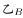。

对工艺品A：，整理可得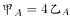。乙单独完成一车工艺品A需要40周，半车需要20周，则甲单独完成半车工艺品A需要周天。

对工艺品B：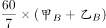，整理可得。设甲、乙每天完成工艺品B的效率分别为2、5，则半车工艺品B为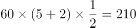，乙单独完成半车工艺品B需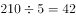天天。因此，甲用35天完成半车工艺品A后再去帮助乙完成剩余的工艺品B，此时还需要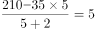天。因此总共需要天。

故正确答案为A。

---

### 第 8 题　qid 3523545 · 数学运算

一个工程的实施有甲、乙、丙和丁四个工程队供选择。已知甲、乙、丙的效率比为5：4：3，如果由丁单独实施，比由甲单独实施用时长4天，比由乙单独实施用时短5天。问四个队共同实施，多少天可以完成（不足1天的部分算1天）？

- **A**. 10
- **B**. 11　✅
- **C**. 12
- **D**. 13

**答案**：B

**官方解析**

根据题意，赋值甲、乙、丙的效率分别为5、4、3；设工程总量为，根据“时间工程总量效率”，则甲、乙单独实施该工程的天数分别为、。单独实施该工程，丁比甲多4天，比乙少5天，则乙用时比甲多天，即，解得，则工程总量为，丁单独实施该工程的时间为天，则丁的效率为。四个队共同实施，需要天，不足1天的部分算1天，即共需11天。

故正确答案为B。

---

### 第 9 题　qid 3522714 · 数学运算

甲单位职工人数是乙单位的2倍，两个单位所有职工中正好有一半是党员。其中甲单位职工中党员占比比乙单位高15个百分点，且甲单位的职工中群众人数比乙单位多18人。问甲单位职工中，党员比群众多多少人?

- **A**. 6
- **B**. 8
- **C**. 10
- **D**. 12　✅

**答案**：D

**官方解析**

设乙单位职工人数为人，则甲单位职工人数为人。乙单位职工中群众人数为人，则甲单位职工中群众人数为（）人。由两个单位所有职工中正好有一半是党员，可得另一半一定是非党员，即群众，故······①。因甲单位职工中党员占比比乙单位高15个百分点，故甲单位职工中群众占比比乙单位低15个百分点，可列······②。联立方程①②，解得，。故甲单位职工人数为人，甲单位职工中群众人数为人，甲单位职工中党员人数为人，党员比群众多人。

故正确答案为D。

【备注】本题假设职工只有党员和群众两种政治面貌。

---

### 第 10 题　qid 3523450 · 数学运算

2020年老张的年龄是小王年龄的4倍，2021年老李的年龄是小王年龄的3倍，已知老张比老李大12岁，问哪一年三人的年龄之和第一次超过140岁？

- **A**. 2020
- **B**. 2023
- **C**. 2026
- **D**. 2029　✅

**答案**：D

**官方解析**

设2020年小王的年龄是，根据题中的年龄关系列表：

根据老张比老李大12岁可得方程，解得：。因此2020年老张，小王，老李的年龄分别为56岁，14岁，44岁。设再过年三人的年龄和超过140岁，则，解得，即9年，年。

故正确答案为D。

---

## 判断推理

### 第 1 题　qid 3522626 · 图形推理

从所给四个选项中，选择最合适的一项填入问号处，使之呈现一定的规律性。

- **A**. A
- **B**. B　✅
- **C**. C
- **D**. D

**答案**：B

**官方解析**

元素组成不相同，且无明显属性规律，考虑数量规律。图形由若干白球和黑球组成，可以考虑分开看黑球和白球的数量。横行竖行单独看黑球数量和白球数量没有规律，且黑球均出现在九宫格的四角处，可以考虑“米”字型看。“米”字型的四条线上，除最中间的图形外，两端的黑球相加数量为10，两端白球数量相加为10，所以？处应为2个黑球，对应B项。

故正确答案为B。

备注：本题的框架参照我国古代文明图案“河图洛书”所命制（如下图），在河图上，排列成数阵的黑点和白点，蕴藏着无穷的奥秘；在洛书上，纵、横、斜三条线上的三个数字，其和皆等于15。本题选取的即是洛书的排列形式，因此考虑横向、纵向、斜向相加均为15也是可以的。

---

### 第 2 题　qid 3523525 · 图形推理

从所给的四个选项中，选择最合适的一个选项拼搭出题干中的图形。

- **A**. A　✅
- **B**. B
- **C**. C
- **D**. D

**答案**：A

**官方解析**

本题考查立体拼合。根据题干给出的立体图形可知该图形共由8个小立方体组成，观察选项发现，C、D两项均共有9个小正方体，与题干不符，排除；

再逐一分析剩下两个选项：

A项：将图①立起来，再将图②进行左右上下翻转，进行拼合即可得到题干立体图形，如图所示，当选；

B项：选项中包含两块凸起的小立方体，但是题干立体图形中只有一块小立方体是凸起的，所以无法得到题干立体图形，排除。

故正确答案为A。

---

### 第 3 题　qid 3523447 · 图形推理

若题干最左边的图形编号为1，其余图形的编号依次递增1，编号为90、91、92的图形应该是：

- **A**. A　✅
- **B**. B
- **C**. C
- **D**. D

**答案**：A

**官方解析**

该题为三个图形依次排列且呈周期性遍历，因此图1、图2、图3为一组，图4、图5、图6为一组······以此类推，当遇到3的倍数时恰好为完整的一组结束，因此90号应为上一组的最后一个图，即六面体，91、92为下一组的前两个图形，分别是圆柱、六面体。
故正确答案为A。

---

### 第 4 题　qid 3522641 · 图形推理

把下面的六个图形分为两类，使每一类图形都有各自的共同特征或规律，分类正确的一项是：

- **A**. ①②③，④⑤⑥
- **B**. ①②④，③⑤⑥
- **C**. ①③④，②⑤⑥　✅
- **D**. ①③⑥，②④⑤

**答案**：C

**官方解析**

本题为分组分类题目。元素组成不同，优先考虑属性规律。题干出现等腰元素，考虑对称性。①③④三个图形均有一条对称轴，仅为轴对称图形；②⑤⑥三个图形均有两条相互垂直的对称轴，既是轴对称图形也是中心对称图形。即①③④为一组，②⑤⑥为一组。
故正确答案为C。

---

### 第 5 题　qid 3523526 · 图形推理

根据①②③图形的变化规律，编号④的图形中空缺的数字应该是：

- **A**. 8
- **B**. 1
- **C**. 4　✅
- **D**. 2

**答案**：C

**官方解析**

元素组成不同，无明显属性规律，考虑数量规律。观察发现，四幅图均为数字，考虑数面。图①②③内数字中面的总数都是3，则图④内数字中面的总数也应是3，故问号处应选择有1个面的数字，只有C项符合。
故正确答案为C。

---

### 第 6 题　qid 3523454 · 图形推理

把下面的六个图形分为两类，使每一类图形都有各自的共同特征或规律，分类正确的一项是：

- **A**. ①②④，③⑤⑥
- **B**. ①③⑥，②④⑤　✅
- **C**. ①②⑤，③④⑥
- **D**. ①⑤⑥，②③④

**答案**：B

**官方解析**

本题为分组分类题目。元素组成不同，属性规律无答案，考虑数量规律。观察发现，题干出现了圆相交，多端点图形，考虑笔画数，题干笔画数依次为：1、7、1、3、4、1。根据是一笔画还是多笔画分为：①③⑥一组，②④⑤一组。
故正确答案为B。

---

### 第 7 题　qid 3523511 · 图形推理

右边四个小图形中，只有一个是由左边的四个图形拼合而成（只能通过上、下、左、右平移），请把它找出来。

- **A**. A
- **B**. B
- **C**. C　✅
- **D**. D

**答案**：C

**官方解析**

本题考查平面拼合，可采用平行且等长相消的方式解题。消去平行且等长的线段后进行组合即可得到轮廓图，即为C项。平行且等长相消的方式如下图所示：

故正确答案为C。

---

### 第 8 题　qid 3522441 · 图形推理

从所给的四个选项中，选择最合适的一个填入问号处，使之呈现一定的规律性：

- **A**. A
- **B**. B
- **C**. C
- **D**. D　✅

**答案**：D

**官方解析**

元素组成相同，优先考虑位置规律。观察发现，题干第一组图形中的两个白球在九宫格外圈整体顺时针平移2格，而两个“十字”在九宫格外圈整体顺/逆时针平移4格。第二组图形应遵循同样规律，只有D项满足。
故正确答案为D。

---

### 第 9 题　qid 3522632 · 图形推理

根据左右图形的变化规律，从所给四个选项中，选择最适合的一项填入问号处。

- **A**. A
- **B**. B　✅
- **C**. C
- **D**. D

**答案**：B

**官方解析**

元素组成相似，考虑样式规律。左右两侧宫格，每行均由和构成，且左侧到右侧图形个数、位置不同。由左侧的四列变为右侧的三列，考虑相邻两列做黑白运算。观察发现，每行相邻的两个图形做运算，左侧宫格第一列和第二列做运算等于右侧宫格第一列，左侧宫格第二列和第三列做运算等于右侧宫格第二列，左侧宫格第三列和第四列做运算等于右侧宫格第三列，即，，，。经验证，每一行均满足此运算规律；第五行按照此运算规律得到B项。

故正确答案为B。

---

### 第 10 题　qid 3523357 · 图形推理

把下面的图形分为两类，使每一类图形都有各自的共同特征或规律，分类正确的一项是：

- **A**. ①④⑥，②③⑤　✅
- **B**. ①③⑤，②④⑥
- **C**. ①②④，③⑤⑥
- **D**. ①⑤⑥，②③④

**答案**：A

**官方解析**

本题为分组分类题目。元素组成不同，无明显属性规律，考虑数量规律。观察发现，每幅图均有4个元素，且均存在两个相同元素，图①④⑥中相同元素都是相对的，图②③⑤中相同元素都是相邻的。即①④⑥为一组，②③⑤为一组。
故正确答案为A。

---

### 第 11 题　qid 3522628 · 定义判断

软暴力是指行为人为谋取不法利益或形成非法影响，对他人或者在有关场所进行滋扰、纠缠、哄闹、聚众造势等，足以使他人产生恐惧、恐慌进而形成心理强制，或者足以影响、限制人身自由、危及人身财产安全，影响正常生活、工作、生产、经营的违法犯罪手段。
根据上述定义，下列属于软暴力的是：

- **A**. 张某威胁王法官，如不秉公判案就举报其贪污的事实
- **B**. 甲公司为了在竞标中获胜，私下散布关于竞争对手的不利信息
- **C**. 某恶势力团伙为了向王某讨要赌债将其堵在酒店房间，24小时看守并不让其睡觉
- **D**. 网贷公司催收员长期使用群呼、群发短信、揭发隐私等手段滋扰欠款人及其紧急联系人、通讯录联系人　✅

**答案**：D

**官方解析**

第一步：找出定义关键词。

“为谋取不法利益或形成非法影响”、“对他人或者在有关场所进行滋扰、纠缠、哄闹、聚众造势”、“使他人产生恐惧、恐慌或影响、限制人身自由、危及人身财产安全，影响正常生活、工作、生产、经营的违法犯罪手段”。

第二步：逐一分析选项。

A项：张某威胁王法官秉公判案，不符合“为谋取不法利益或形成非法影响”，不符合定义，排除；

B项：甲公司为了在竞标中获胜，不符合“为谋取不法利益或形成非法影响”，不符合定义，排除；

C项：某恶势力将王某堵在房间不让其睡觉长达24小时，属于严重的人身强制行为，不属于“对他人或者在有关场所进行滋扰、纠缠、哄闹、聚众造势等”，不符合定义，排除；

D项：网贷公司使用群呼、群发、揭发隐私等手段滋扰欠款人及其紧急联系人、通讯录联系人，符合“对他人进行滋扰”，长期如此，符合“使他人产生恐惧、恐慌或影响”和“影响正常生活、工作、生产、经营的违法犯罪手段”，符合定义，当选。

故正确答案为D。

备注：下图中给出的示例，引自《光明日报》，该案是北京市首例网络“软暴力”的案件，与D项对应，而C项中的“24小时不让其睡觉”，直接限制了人身自由和行为且时间较长，二者比较，D项更符合定义。

---

### 第 12 题　qid 3523521 · 定义判断

生物浓缩，是指生物有机体或处于同一营养级上的许多生物种群，从周围环境中蓄积某种元素或难分解化合物，使生物有机体内该物质的浓度超过环境中该物质浓度的现象。
根据上述定义，以下涉及到生物浓缩的是：

- **A**. 农业上用于杀死昆虫的DDT通过食物链传递到白头鹰体内，导致生下的蛋皆是软壳的，无法孵化　✅
- **B**. 在湖泊、河流等地方出现的藻类及其他浮游生物迅速繁殖，水质恶化，鱼类及其他生物大量死亡的现象
- **C**. 山羊吃多玉米粒之后，一时间难以消化，再加上山羊饮入水后，玉米长时间聚集在胃内，容易引起胃胀
- **D**. 由于严重的白色污染，原本干净清洁的海滩，如今聚集了大量的塑料袋、瓶子等垃圾，以至于无人问津

**答案**：A

**官方解析**

第一步：找出定义关键词。
“生物有机体或处于同一营养级上的许多生物种群”、“从周围环境中蓄积某种元素或难分解化合物”、“使生物有机体内该物质的浓度超过环境中该物质浓度的现象”。
第二步：逐一分析选项。
A项：白头鹰体内，符合“生物有机体或处于同一营养级上的许多生物种群”，通过食物链传递导致白头鹰体内有DDT，符合“从周围环境中蓄积某种元素或难分解化合物”，白头鹰的蛋壳变软的原因在于有害化学物质DDT逐步在其体内积累的结果，符合“使生物有机体内该物质的浓度超过环境中该物质浓度的现象”，符合定义，当选；
B项：藻类和浮游生物迅速繁殖，鱼类及其他生物大量死亡，是因为鱼类生存所需的营养物质被藻类和浮游生物抢占了，不符合“使生物有机体内该物质的浓度超过环境中该物质浓度的现象”，不符合定义，排除；
C项：山羊吃多玉米粒之后，玉米聚集在胃里引起胃胀，不符合“使生物有机体内该物质的浓度超过环境中该物质浓度的现象”，不符合定义，排除；
D项：干净清洁的海滩受到白色污染，没有涉及生物有机体或者生物种群，不符合“生物有机体或处于同一营养级上的许多生物种群”，不符合定义，排除。
故正确答案为A。

---

### 第 13 题　qid 3522634 · 定义判断

相反相成修辞手法是指把通常相互对立、排斥的两个概念或判断巧妙地联系在一起，这样不仅能够揭示出存在于客观事物深层的矛盾辩证关系，还可以增加语言的意蕴。
根据上述定义，下列不属于相反相成修辞手法的是：

- **A**. 横眉冷对千夫指，俯首甘为孺子牛
- **B**. 有的人活着，他已经死了；有的人死了，他还活着
- **C**. 墙上芦苇，头重脚轻根底浅；山中竹笋，嘴尖皮厚腹中空　✅
- **D**. 这一天，死去的伟人在诗的国度里永生；这一天，活着的小丑在人们心上被埋葬

**答案**：C

**官方解析**

第一步：找出定义关键词。
“把通常相互对立、排斥的两个概念或判断巧妙地联系在一起”。
第二步：逐一分析选项。
A项：选项这句话意为对待敌人决不屈服，对人民大众甘愿服务。横眉和俯首是一个人的两个相互对立的态度，符合“把通常相互对立、排斥的两个概念或判断巧妙地联系在一起”，符合定义，排除； 
B项：选项这句话意为有的人虽然活着，但是他的道德败坏，就如已经死了一样没有价值，而有的人死了，他还活着，他的高尚的品格，代代相传，永远激励后人。活着和死了是一个人的两个相互对立的状态，符合“把通常相互对立、排斥的两个概念或判断巧妙地联系在一起”，符合定义，排除； 
C项：选项这句话用芦苇和竹笋比喻那些没有学问只会自吹自擂的人，芦苇和竹笋不符合“相互对立、排斥的两个概念或判断”，不符合定义，当选；
D项：选项这句话表达了不同类型的人在“这一天”的情况，死去和永生、活着和埋葬是一个人的两个相互对立的状态，符合“把通常相互对立、排斥的两个概念或判断巧妙地联系在一起”，符合定义，排除。
本题为选非题，故正确答案为C。

---

### 第 14 题　qid 3522624 · 定义判断

自豪是一种产生于对自己的积极评价的情绪，其主要依赖于自我意识、自我评价以及自我反思。基于对成就的不同归因，自豪可分为真实自豪和自大自豪。真实自豪是以成就为导向的一种积极的自豪情绪，其主要来源于个体将成就归因于自身的努力；自大自豪是指一种偏向于消极的自豪情绪，其主要来源于个体将成就归因于自身的天赋。
根据上述定义，下列最符合自大自豪的是：

- **A**. 兴酣落笔摇五岳，诗成笑傲凌沧州
- **B**. 黄金白璧买歌笑，一醉累月轻王侯
- **C**. 俱怀逸兴壮思飞，欲上青天揽明月
- **D**. 天生我材必有用，千金散尽还复来　✅

**答案**：D

**官方解析**

第一步：找出定义关键词。
“偏向于消极的自豪情绪”、“主要来源于个体将成就归因于自身的天赋”。
第二步：逐一分析选项。
A项：“兴酣落笔摇五岳，诗成笑傲凌沧州”出自李白（唐）的《江上吟》，意思是我高兴起来落笔能让五岳震动，写出来的诗足以笑傲天下，表达出作者对自身诗才的自信，其态度是积极的，不符合“偏向于消极的自豪情绪”，不符合定义，排除；
B项：“黄金白璧买歌笑，一醉累月轻王侯”出自李白（唐）的《忆旧游寄谯郡元参军》，意思是花黄金白璧买来宴饮与欢歌笑语时光，一次酣醉使我数月轻蔑王侯将相，作者借喝酒买醉后的情绪轻蔑王侯将相，不符合“主要来源于个体将成就归因于自身的天赋”，不符合定义，排除；
C项：“俱怀逸兴壮思飞，欲上青天揽明月”出自李白（唐）的《宣州谢朓楼饯别校书叔云》，意思是我们都怀有豪情逸兴、雄心壮志，酒酣兴发，更是飘然欲飞，想登上青天摘取明月，不符合“偏向于消极的自豪情绪”，也不符合“主要来源于个体将成就归因于自身的天赋”，不符合定义，排除；
D项：“天生我材必有用，千金散尽还复来”出自李白（唐）的《将进酒》，意思是上天造就了我的才干就必然是有用处的，千两黄金花完了也能够再次获得，该诗句为作者政治上遭遇挫折，符合“偏向于消极的自豪情绪”，有才能就一定有用处，符合“主要来源于个体将成就归因于自身的天赋”，符合定义，当选。
故正确答案为D。

---

### 第 15 题　qid 3522631 · 定义判断

农业生产周期指在连续不断的农业再生产过程中，从开始生产到获得产品的整个过程所经过的全部时间，在种植业中一般是从整地开始到产品收获所经过的全部时间，在畜牧业中一般是从饲养幼畜开始到获得畜产品的时间。由于作为农业生产对象的动植物有自身的特性，并且受自然环境影响较大，其生产周期一般比工业生产周期长。
根据上述定义，下列选项涉及农业生产周期的是：

- **A**. 小李耕地、播种、打枝、摘棉花、纺线、织布······年复一年，周而复始　✅
- **B**. 小黄办了一家乡镇企业，从原材料购进、生产管理再到产品销售，他都亲力亲为
- **C**. 小刘今年在承包的荒山种植优质苹果树苗，经科学管理，树苗全部成活且长势良好
- **D**. 小王有个养猪场，虽年复一年重复着把猪崽养大的简单枯燥劳动，但始终干劲十足

**答案**：A

**官方解析**

第一步：找出定义关键词。
“连续不断的农业再生产过程中，从开始生产到获得产品的整个过程所经过的全部时间”、“在种植业中一般是从整地开始到产品收获所经过的全部时间”、“在畜牧业中一般是从饲养幼畜开始到获得畜产品的时间”。
第二步：逐一分析选项。
A项：小李耕地、播种、打枝、摘棉花、纺线、织布……年复一年，周而复始，耕地符合“从整地开始”，“摘棉花”符合“产品收获”，整个流程符合“连续不断的农业再生产过程中，从开始生产到获得产品的整个过程所经过的全部时间”，符合定义，当选；
B项：小黄办企业，买进材料、生产产品、销售产品，属于工业生产活动，不符合“农业再生产过程中”，不符合定义，排除；
C项：小刘种苹果树苗长势良好，没有提到最终是否获得产品，也没有提到是否是连续不断种树苗，不符合“连续不断的农业再生产过程中，从开始生产到获得产品的整个过程所经过的全部时间”，不符合定义，排除；
D项：小王年复一年重复把猪崽养大，畜产品指的是畜牧业生产所获得的产品（包括乳、肉、蛋、毛、皮及其副产品），养大后的猪崽属于牲畜，不属于畜产品，因此最终并未获得畜产品，不符合定义，排除。
注：A项中的纺线、织布虽属于加工业，但前面的耕地到摘棉花涉及了完整的农业生产周期。而D项并未获得畜产品，生产周期不完整。考虑本题提问方式为“涉及”，只有A项涉及了完整的农业生产周期，因此择优选择A项。
故正确答案为A。

---

### 第 16 题　qid 3523437 · 定义判断

替代性创伤是指在听到或看到一些灾难性事件的信息后，损害程度超过其中部分人群的心理和情绪的耐受极限，产生与经历者等同的情绪、躯体反应的现象。
根据上述定义，下列现象属于替代性创伤的是：

- **A**. 乘客甲经历紧急故障迫降事件后从此再也不敢乘坐任何飞机
- **B**. 抗疫志愿者乙目睹新冠肺炎感染者遭受病痛折磨而严重失眠　✅
- **C**. 丙听朋友描述澳洲大火的细节之后反复梦见自己被大火吞噬
- **D**. 医生丁面对因医学技术上的局限而不能治愈的患者深感自责

**答案**：B

**官方解析**

第一步：找出定义关键词。
“在听到或看到一些灾难性事件的信息后”、“产生与经历者等同的情绪、躯体反应”。
第二步：逐一分析选项。
A项：乘客甲经历了灾难性事件，是经历者，不符合“在听到或看到一些灾难性事件的信息后”，也不符合“产生与经历者等同的情绪、躯体反应”，不符合定义，排除；
B项：抗疫志愿者乙目睹新冠肺炎感染者遭受病痛折磨，符合“在听到或看到一些灾难性事件的信息后”，严重失眠，符合“产生与经历者等同的情绪、躯体反应”，符合定义，当选；
C项：丙听朋友描述澳洲大火的细节，符合“在听到或看到一些灾难性事件的信息后”，但反复梦见自己被大火吞噬，做梦不属于情绪、躯体反应，不符合“产生与经历者等同的情绪、躯体反应”，不符合定义，排除；
D项：医生丁面对因医学技术上的局限而不能治愈的患者深感自责，不符合“在听到或看到一些灾难性事件的信息后”，也不符合“产生与经历者等同的情绪、躯体反应”，不符合定义，排除。
故正确答案为B。
经查询资料，本题C项应更符合创伤后应激障碍（PTSD），其中一个表现为患者的思维、记忆或梦中反复、不自主地涌现与创伤有关的情境或内容，也可出现严重的触景生情反应，甚至感觉创伤性事件好像再次发生一样。
由此可见C项更符合创伤后应激障碍，而不是替代性创伤。

---

### 第 17 题　qid 3522640 · 定义判断

涟漪效应是指在突发事件中，身处不同地区民众所呈现的不同心理状态，越靠近危机事件中心区域，人们对事件的风险认知和负性情绪越高。
根据上述定义，下列符合涟漪效应的是：

- **A**. 台风外围空气旋转剧烈，而处于中心的风力流动反而相对微弱，因此，灾民负性情绪从“暴风眼”区域向外逐渐增强
- **B**. 地震带上的重灾区民众在风险认知、心理健康水平及应对行为上都显著高于非重灾区民众　✅
- **C**. 距离垃圾焚烧厂、核反应堆越近的民众，其风险认知程度越高，因而其忧虑感越强
- **D**. 距离大规模传染疫情爆发的时间越短，民众的焦虑情绪及恐慌程度就越高

**答案**：B

**官方解析**

第一步：找出定义关键词。

“在突发事件中”、“身处不同地区民众所呈现的不同心理状态”、“越靠近危机事件中心区域，人们对事件的风险认知和负性情绪越高”。

第二步：逐一分析选项。

A项：灾民的负性情绪是从“暴风眼”区域向外逐渐增强的，不符合“越靠近危机事件中心区域，人们对事件的风险认知和负性情绪越高”，不符合定义，排除；

B项：地震符合“在突发事件中”，地震带上的重灾区民众在心理健康水平及应对行为上都显著高于非重灾区民众，符合“身处不同地区民众所呈现的不同心理状态”，虽未提及“负性情绪”，但也符合“越靠近危机事件中心区域，人们对事件的风险认知越高”，符合定义，当选；

C项：垃圾焚烧厂、核反应堆，不符合“在突发事件中”，不符合定义，排除；

D项：距离大规模传染疫情爆发的时间越短，是所有人都会面临的，没有体现身处不同地区，不符合“身处不同地区民众所呈现的不同心理状态”，不符合定义，排除。

故正确答案为B。

附原文说明：

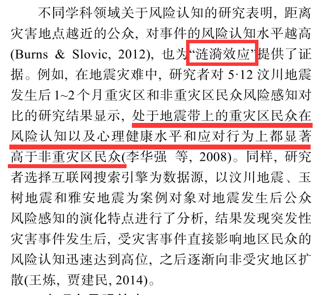

---

### 第 18 题　qid 3522623 · 定义判断

化学沉积作用是指在水介质中，以胶体溶液和真溶液形式搬运的物质到达适宜场所后，当化学条件发生变化时，产生沉淀、堆积的过程。其中，胶体溶液是指含有一定大小的固体颗粒物质或高分子化合物的溶液，真溶液是指透明度较高的水溶液。
根据上述定义，下列不属于化学沉积作用的是：

- **A**. 干旱气候区，湖水很少外泄，蒸发作用使湖水的氯化钠增加、累积，变成咸水湖
- **B**. 当海水中的绿色粘土矿物随水流动时，会和含有铝、铁的胶体物质聚合形成海绿石
- **C**. 富含磷质的海水上升至浅海区，因压力减小，温度升高，磷质析出、沉积而形成磷矿
- **D**. 湖泊里的生物骨骼，它们吸收了空气中的二氧化碳形成碳酸钙，当碳酸钙浓度达到一定程度就在海底堆积下来，形成石灰岩　✅

**答案**：D

**官方解析**

第一步：找出定义关键词。

化学沉积作用：“水介质”、“以胶体溶液和真溶液形式搬运”、“当化学条件发生变化时，产生沉淀、堆积”；

胶体溶液：“含有一定大小的固体颗粒物质或高分子化合物的溶液”；

真溶液：“透明度较高的水溶液”。

第二步：逐一分析选项。

A项：湖水是水介质，符合“透明度较高的水溶液”，蒸发使湖水的氯化钠增加累积，变成咸水湖，即湖水搬运的最终物质是氯化钠，符合“当化学条件发生变化时，产生沉淀、堆积”，符合定义，排除；

B项：海水是水介质，符合“透明度较高的水溶液”，绿色粘土矿物随海水流动和含有铝、铁的胶体物质聚合形成海绿石，符合“以胶体溶液和真溶液形式搬运”、“当化学条件发生变化时，产生沉淀、堆积”，符合定义，排除；

C项：海水是水介质，符合“透明度较高的水溶液”，压力减小、温度升高导致磷质析出沉积形成磷矿，符合“以胶体溶液和真溶液形式搬运”、“当化学条件发生变化时，产生沉淀、堆积”，符合定义，排除；

D项：湖泊是水介质，符合“透明度较高的水溶液”，但生物骨骼最终形成的石灰岩不是在真溶液形式搬运下发生的沉淀、堆积，属于生物沉积作用，不符合“当化学条件发生变化时，产生沉淀、堆积”，不符合定义，当选。

本题是选非题，故正确答案为D。

备注：本题很多学生比较纠结A项和D项，如下图所示，A项是在“化学沉积”相关文献中的典型案例，通过对比择优，本题问“不属于”，故小粉笔更倾向把答案给到D项。

---

### 第 19 题　qid 3522630 · 定义判断

气候保险是一种为遭受气候风险的资产、生计和生命损失提供支持的保障机制，它通过在一个比较大的空间和时间范围内，投保者定期支付确定的小额保费来应对不确定的气候风险损失，能够确保遭遇直接气候风险损失的投保者获得有效和迅速的资金支持。
根据上述定义，下列属于气候保险承保范围的是：

- **A**. 天气异常干旱造成水稻大面积减产　✅
- **B**. 地震引发山体滑坡，掩埋了山下一处工厂
- **C**. 暴雪封路，导致大批牲畜得不到及时照料而被饿死
- **D**. 上游泄洪造成下游地区发生溃堤，导致当地农作物大面积毁损

**答案**：A

**官方解析**

第一步：找出定义关键词。
“遭受气候风险”、“资产、生计和生命损失”、“投保者定期支付确定的小额保费”、“遭遇直接气候风险损失”、“获得有效和迅速的资金支持”。
第二步：逐一分析选项。
A项：天气异常干旱，属于气候因素，符合“遭受气候风险”，造成水稻大面积减产，符合“资产、生计和生命损失”，且减产是天气异常直接导致的，符合“遭遇直接气候风险损失”，符合定义，当选；
B项：地震引发山体滑坡，属于地质灾害，不符合“遭受气候风险”，不符合定义，排除；
C项：暴雪封路，符合“遭受气候风险”，但最后大批牲畜死亡是得不到及时照料导致的，并非气候因素直接导致的，不符合“遭遇直接气候风险损失”，不符合定义，排除；
D项：上游泄洪造成下游地区发生溃堤，属于人为因素，不符合“遭受气候风险”，不符合定义，排除。
故正确答案为A。

---

### 第 20 题　qid 3523527 · 定义判断

背书品牌指出现在一个产品品牌与服务品牌背后的支持性品牌。背书品牌又叫做父母品牌，被背书的叫子品牌。分两类：一是硬背书品牌，采取企业总品牌子品牌形式。企业总品牌一般是有较长历史，较高知名度及无形资产价值的大品牌，子品牌需借助总品牌吸引消费者。二是软背书品牌，即子品牌前并不直接冠以背书品牌，子品牌是流通的主角，企业总品牌只是为子品牌提供信誉担保。

根据上述定义，下列属于硬背书品牌的是：

- **A**. 别克、欧宝、雪佛莱、凯迪拉克是通用汽车旗下四大主力品牌
- **B**. 某药企的产品都包含有“999”的品牌，如三九胃泰、999感冒灵　✅
- **C**. 浏阳河、京酒、金六福等产品包装上都没标明背书品牌五粮液
- **D**. 无论是潘婷、汰渍，还是舒肤佳，它们都是宝洁公司的产品

**答案**：B

**官方解析**

第一步：找出定义关键词。

背书品牌：“在一个产品品牌与服务品牌背后的支持性品牌”。

硬背书品牌：“总品牌子品牌形式”、“总品牌一般是有较长历史，较高知名度及无形资产价值的大品牌”、“子品牌需借助总品牌吸引消费者”。

软背书品牌：“子品牌前并不直接冠以背书品牌”、“子品牌是流通的主角”、“总品牌只是为子品牌提供信誉担保”。

第二步：逐一分析选项。

A项：别克、欧宝、雪佛莱、凯迪拉克是通用汽车旗下四大主力品牌，不符合“总品牌子品牌形式”、“子品牌需借助总品牌吸引消费者”，不符合定义，排除；

B项：“999”的品牌是总品牌，三九胃泰、999感冒灵是子品牌，符合“总品牌子品牌形式”，符合定义，当选；

C项：浏阳河、京酒、金六福等产品包装上都没标明背书品牌五粮液，符合“子品牌前并不直接冠以背书品牌”，属于软背书品牌，不符合定义，排除；

D项：潘婷、汰渍、舒肤佳都是宝洁公司的产品，不符合“总品牌子品牌形式”、“子品牌需借助总品牌吸引消费者”，不符合定义，排除。

故正确答案为B。

---

### 第 21 题　qid 3523523 · 类比推理

山有色：水发声

- **A**. 山河在：草木深
- **B**. 客舍青：柳色新
- **C**. 鸟飞绝：人踪灭
- **D**. 花作尘：鸟不惊　✅

**答案**：D

**官方解析**

第一步：判断题干词语间逻辑关系。
两个词语无明显的逻辑关系，考虑分开看。有色是对山的描述，发声是对水的描述。即后两个字是对第一个字的描述。
第二步：判断选项词语间逻辑关系。
A项：“在”是对“山河”的描述，“深”是对“草木”的描述，即第三个字是对前两个字的描述，与题干逻辑关系不一致，排除；
B项：“青”是对“客舍”的描述，“新”是对“柳色”的描述，即第三个字是对前两个字的描述，与题干逻辑关系不一致，排除；
C项：“飞绝”是对“鸟”的描述，即后两个字是对第一个字的描述，但是“灭”是对“人踪”的描述，即第三个字是对前两个字的描述，与题干逻辑关系不一致，排除；
D项：“作尘”是对“花”的描述，“不惊”是对“鸟”的描述，即后两个字是对第一个字的描述，与题干逻辑关系一致，当选。
故正确答案为D。

---

### 第 22 题　qid 3523522 · 类比推理

就地保护：易地保护

- **A**. 汽车爆胎：汽车漏油
- **B**. 防洪堤：绿化带
- **C**. 纯种繁育：杂交繁育　✅
- **D**. 销售提成：股份分红

**答案**：C

**官方解析**

第一步：判断题干词语间逻辑关系。
就地保护和易地保护是保护生物多样性的两种形式，二者为并列关系，且为并列中的矛盾关系。
第二步：判断选项词语间逻辑关系。
A项：汽车爆胎和汽车漏油均为汽车会出现的故障，二者为并列关系，但是汽车除了爆胎和漏油外还会出现其他故障，所以二者为并列中的反对关系，与题干逻辑关系不一致，排除；
B项：防洪堤是为了防止河流泛滥而建立的堤坝，而绿化带是为了起到绿化的作用，美化环境，二者构不成并列关系，与题干逻辑关系不一致，排除；
C项：纯种繁育是同一品种内进行后代繁育，杂交繁育是不同品种间进行后代繁育，二者为并列关系，且为并列中的矛盾关系，与题干逻辑关系一致，当选；
D项：销售提成与股份分红均为获得收入的两种形式，二者为并列关系，但是获得收入除了销售提成与股份分红外还有其他形式，所以二者为并列关系中的反对关系，与题干逻辑关系不一致，排除。
故正确答案为C。

---

### 第 23 题　qid 3522644 · 类比推理

少壮不努力：老大徒伤悲

- **A**. 不入虎穴：焉得虎子
- **B**. 己所不欲：勿施于人
- **C**. 不忘初心：方得始终　✅
- **D**. 若要人不知：除非己莫为

**答案**：C

**官方解析**

第一步：判断题干词语间逻辑关系。
因为 “少壮不努力”，所以“老大徒伤悲”，前者是因，后者是果，二者为因果关系。
第二步：判断选项词语间逻辑关系。
A项：“不入虎穴”是“焉得虎子”的充分条件，与题干逻辑关系不一致，排除；
B项：因果关系必定有先后性，因在前，果在后，“己所不欲”和“勿施于人”没有必然先后性，所以不是因果关系，与题干逻辑关系不一致，排除；
C项：因为“不忘初心”，所以“才得始终”，前者是因，后者是果，二者为因果关系，与题干逻辑关系一致，当选；
D项：“人不知”是“己莫为”的充分条件，与题干逻辑关系不一致，排除。
故正确答案为C。

---

### 第 24 题　qid 3522633 · 类比推理

风能：核能：资源

- **A**. 听筒：话筒：音乐
- **B**. 保姆：保安：家政
- **C**. 木柴：木炭：燃料　✅
- **D**. 包子：粽子：节庆

**答案**：C

**官方解析**

第一步：判断题干词语间逻辑关系。
风能是一种资源，核能是一种资源，二者为并列关系，且均与资源构成种属关系。
第二步：判断选项词语间逻辑关系。
A项：听筒、话筒是两种设备，二者为并列关系，但与音乐均不构成种属关系，与题干逻辑关系不一致，排除；
B项：保姆、保安是两种职业，二者为并列关系，但保安与家政不构成种属关系，与题干逻辑关系不一致，排除；
C项：木柴是一种燃料，木炭是一种燃料，二者为并列关系，且均与燃料构成种属关系，与题干逻辑关系一致，当选；
D项：包子、粽子是两种食物，二者为并列关系，但与节庆均不构成种属关系，与题干逻辑关系不一致，排除。
故正确答案为C。

---

### 第 25 题　qid 3522627 · 类比推理

洪涝：干旱：防洪抗旱

- **A**. 地震：海啸：抗震救灾
- **B**. 滑坡：雪崩：道路抢修
- **C**. 严寒：酷热：防冻消暑　✅
- **D**. 风沙：雾霾：防沙除霾

**答案**：C

**官方解析**

第一步：判断题干词语间逻辑关系。
洪涝与干旱，二者为反义关系，且防洪与抗旱分别是前两种现象针对性的应对方法，与前两词构成对应关系。
第二步：判断选项词语间逻辑关系。
A项：地震与海啸，二者并不是反义关系，抗震是地震的应对方法，但救灾范围太大，与海啸对应关系并不贴切，与题干逻辑关系不一致，排除；
B项：滑坡与雪崩，二者并不是反义关系，且滑坡与雪崩都可能需要进行道路抢修，与题干逻辑关系不一致，排除；
C项：严寒与酷热，二者为反义关系，防冻是严寒的应对方法，消暑是酷热的应对方法，是两种现象的应对方式，与题干逻辑关系一致，当选；
D项：风沙与雾霾，二者并不是反义关系，与题干逻辑关系不一致，排除。
故正确答案为C。
注：本题有同学通过自然灾害选了D，这也是个角度，但是从题干特征来看，本题题干前两词反义关系明显，故优先考虑反义关系，不行的情况下再考虑是否是自然灾害，做题的首要原则是题干特征。

---

### 第 26 题　qid 3522635 · 类比推理

叔侄：关系：血亲

- **A**. 银河：恒星：宇宙
- **B**. 姑嫂：亲人：家庭
- **C**. 课堂：知识：书本
- **D**. 抑郁：疾病：心理　✅

**答案**：D

**官方解析**

第一步：判断题干词语间逻辑关系。
叔侄是一种关系，血亲是关系种类的限定，三者之间存在种属关系。
第二步：判断选项词语间逻辑关系。
A项：银河和恒星都是宇宙的一部分，银河和恒星分别与宇宙为组成关系，与题干逻辑关系不一致，排除；
B项：姑嫂是家庭的一部分，二者为组成关系，与题干逻辑关系不一致，排除；
C项：课堂和书本都是获取知识的载体，课堂和书本分别与知识为载体对应关系，与题干逻辑关系不一致，排除；
D项：抑郁是一种疾病，心理是疾病种类的限定，三者之间存在种属关系，与题干逻辑关系一致，当选。
故正确答案为D。

---

### 第 27 题　qid 3522629 · 类比推理

党员：干部：服务人民

- **A**. 青年：才俊：报效国家　✅
- **B**. 科学：精英：科技立身
- **C**. 大国：工匠：技术强国
- **D**. 学校：教师：教书育人

**答案**：A

**官方解析**

第一步：判断题干词语间逻辑关系。
有的党员是干部，有的党员不是干部，有的干部是党员，有的干部不是党员，二者为交叉关系，党员和干部都是服务人民的主体，与服务人民是对应关系。
第二步：判断选项词语间逻辑关系。
A项：有的青年是才俊，有的青年不是才俊，有的才俊是青年，有的才俊不是青年，二者为交叉关系，青年和才俊都是报效国家的主体，与报效国家是对应关系，与题干逻辑关系一致，当选；
B项：科学和精英不是交叉关系，且科学不是科技立身的主体，与题干逻辑关系不一致，排除；
C项：大国和工匠不是交叉关系，且大国不是技术强国的主体，与题干逻辑关系不一致，排除；
D项：学校是教师的工作地点，二者不是交叉关系，且学校也不是教书育人的主体，与题干逻辑关系不一致，排除。
故正确答案为A。

---

### 第 28 题　qid 3523528 · 类比推理

二氧化碳：珊瑚骨骼：腐蚀

- **A**. 物种灭绝：动物：威胁
- **B**. 天灾人祸：物种：减少
- **C**. 土壤沙化：空气：雾霾
- **D**. 气候变暖：冰川：消融　✅

**答案**：D

**官方解析**

第一步：判断题干词语间逻辑关系。
“二氧化碳”会“腐蚀”“珊瑚骨骼”，题干为因果对应关系。
第二步：判断选项词语间逻辑关系。
A项：“物种灭绝”本身就包含“动物”被“威胁”的意思，与题干逻辑关系不一致，排除；
B项：“天灾人祸”会“减少”“物种”，为因果对应关系，与题干逻辑关系一致，保留；
C项：“土壤沙化”会导致“雾霾”，与题干逻辑关系不一致，排除；
D项：“气候变暖”会“消融”“冰川”，与题干逻辑关系一致，保留。
对于BD两项，题干的“二氧化碳”和D项的“气候变暖”只是独立的一个原因，但B项的原因可以拆分为“天灾”和“人祸”两个原因，因此D项与题干更为一致。
故正确答案为D。

---

### 第 29 题　qid 3522617 · 类比推理

绵羊 对于 （    ） 相当于 （    ） 对于 高粱

- **A**. 麻雀 水稻
- **B**. 老鹰 麦子
- **C**. 羚羊 玉米　✅
- **D**. 山羊 玫瑰

**答案**：C

**官方解析**

逐一代入选项。
A项：绵羊与麻雀都是动物，但绵羊是哺乳动物，而麻雀是鸟类，二者范畴不一致，高粱与水稻都是粮食作物，二者为并列关系，前后逻辑关系不一致，排除；
B项：绵羊与老鹰都是动物，但绵羊是哺乳动物，而老鹰是鸟类，二者范畴不一致，高粱与麦子都是粮食作物，二者为并列关系，前后逻辑关系不一致，排除；
C项：绵羊与羚羊都是反刍类哺乳动物，二者为并列关系，高粱与玉米都是粮食作物，二者为并列关系，前后逻辑关系一致，当选；
D项：绵羊与山羊都是反刍类哺乳动物，二者为并列关系，高粱与玫瑰都是植物，但高粱是粮食作物，玫瑰是观赏性植物，二者范畴不一致，前后逻辑关系不一致，排除。
故正确答案为C。

---

### 第 30 题　qid 3522642 · 类比推理

（    ） 对于 汽车 相当于 （    ） 对于 相机

- **A**. 轮胎 手机
- **B**. 速度 像素
- **C**. 马达 快门　✅
- **D**. 单车 单反

**答案**：C

**官方解析**

逐一代入选项。
A项：轮胎是汽车的组成部分，二者是组成关系，手机和相机是两种电子设备，二者是并列关系，前后逻辑关系不一致，排除；
B项：速度是衡量汽车行驶快慢的指标，二者是必然对应关系，像素是相机中衡量清晰度的指标，但它只适用于数码相机，胶片相机不涉及像素这一概念，二者是或然对应关系，前后逻辑关系不一致，排除；
C项：马达是汽车的组成部分，二者是组成关系，快门是相机的组成部分，二者是组成关系，而且均是必然组成关系，前后逻辑关系一致，当选；
D项：单车和汽车是两种交通工具，二者是并列关系，单反的全称是单镜头反光相机，它是相机的一种，二者是种属关系，前后逻辑关系不一致，排除。
故正确答案为C。

---

### 第 31 题　qid 3522647 · 逻辑判断

研究表明，肉食中的化合物可能引发部分儿童气喘，进而导致哮喘或其他呼吸道疾病。这些化合物被称作“晚期糖基化终产物”，是肉类在高温烤炸烘焙时释放出的物质。所以，素食或者少吃肉可避免儿童患哮喘的风险。
以下哪项如果为真，最能质疑上述观点？

- **A**. 肉类在非高温烤炸烘焙情况下，不产生晚期糖基化终产物，与哮喘的关联性未知
- **B**. 科学家研究显示，体内的晚期糖基化终产物主要来自于但又并非仅仅来自于肉类　✅
- **C**. 晚期糖基化终产物除导致哮喘外，还能加速人体衰老，引发各种慢性退化性疾病
- **D**. 晚期糖基化终产物作为一种蛋白质，在人体中自然生成，并随着年龄的增长不断积聚

**答案**：B

**官方解析**

第一步：找出论点和论据。
论点：素食或者少吃肉可避免儿童患哮喘的风险。
论据：肉食中的化合物可能引发部分儿童气喘，进而导致哮喘或其他呼吸道疾病。这些化合物被称作“晚期糖基化终产物”，是肉类在高温烤炸烘焙时释放出的物质。
论据提出肉类烤炸烘焙时产生的晚期糖基化终产物可能引发部分儿童哮喘，论点认为素食或者少吃肉可避免儿童患哮喘的风险，二者话题一致，削弱优先考虑否定论点。
第二步：逐一分析选项。
A项：非高温烤炸烘焙肉类与哮喘关联性未知，因此素食或者少吃肉能否避免儿童患哮喘的风险并不明确，不明确选项，排除；
B项：指出晚期糖基化终产物并非仅仅来自于肉类，说明其他途径也会产生晚期糖基化终产物，只是素食或者少吃肉并不能“避免”儿童患哮喘的风险，可以削弱，保留；
C项：指出晚期糖基化终产物会带来其他不好的作用，与素食或者少吃肉可避免儿童患哮喘的风险无关，无法削弱，排除；
D项：指出晚期糖基化终产物在人体中自然生成，说明晚期糖基化终产物不是仅通过吃肉得到的，人体本身也会产生该物质，只是素食或者少吃肉并不能“避免”儿童患哮喘的风险，可以削弱，保留；
对比B、D两项，B、D两项都是从除了肉类之外还有其他途径会产生晚期糖基化终产物的角度来进行削弱；但题干论点是素食或者少吃肉可避免“儿童”患哮喘，D项的潜台词是人年龄越来越大，晚期糖基化终产物不断积聚，可能避免不了得哮喘，问题是到多大年纪，积聚了多少，才会得哮喘呢？如果是积聚到儿童阶段，就会得哮喘，那能削弱论点，说明素食或者少吃肉不可避免“儿童”患哮喘；但如果积聚到中老年阶段，才会得哮喘，那就与论点主体无关了，不确定素食或者少吃肉能不能避免“儿童”阶段患哮喘，综上所述B项比D项更明确。
故正确答案为B。

---

### 第 32 题　qid 3522651 · 类比推理

动物园中有三种动物：骆驼、大象和猴子，它们的年龄均为整数。三个伙伴小张、小王和小李去动物园参观动物，他们各选择一种动物去参观，三人选的动物各不相同。已知：
①大象住在动物园东边的动物馆；
②骆驼已经4岁，住在西边的动物馆；
③小王去看的是动物园东边和西边之间的动物；
④小张去看的动物年龄最小；
⑤三种动物年龄从西到东依次增加，且平均年龄为5岁。
以下说法正确的是：

- **A**. 猴子年龄为5岁　✅
- **B**. 大象年龄为7岁
- **C**. 小王参观的是大象
- **D**. 小李参观的是骆驼

**答案**：A

**官方解析**

第一步：分析题干条件。
（1）骆驼、大象和猴子的年龄均为整数；
（2）大象住在动物园东边；
（3）骆驼4岁，住在动物园西边；
（4）小王看的是动物园东边和西边之间的动物；
（5）小张去看的动物年龄最小；
（6）三种动物年龄从西到东依次增加，且平均年龄为5岁。
第二步：根据题干条件进行推理。
根据条件（2）（3）和（4），大象住东边，骆驼住西边，可知住动物园东边和西边之间的动物是猴子，则小王看的是猴子，排除C项；根据条件（6）可知，三种动物的年龄排序从小到大为骆驼、猴子和大象，结合条件（5）可知小张看的是骆驼，排除D项；根据条件（3）可知骆驼4岁，根据（1）和条件（6）可知，猴子的年龄为5岁，大象的年龄为6岁，排除B项。
故正确答案为A。

---

### 第 33 题　qid 3523362 · 逻辑判断

某大学研究人员首次用嗜黏蛋白阿克曼氏菌进行小规模人体试验。32名超重或肥胖的志愿者被分为3组，分别每天口服活的嗜黏蛋白阿克曼氏菌、经过巴氏消毒法灭活的这种细菌和安慰剂，同时不改变饮食和运动习惯。结果显示，3个月后服用灭活细菌的志愿者对胰岛素敏感性提高，血浆总胆固醇水平降低。服用安慰剂的志愿者体内上述指标继续恶化。
由此可以推出：

- **A**. 服用该灭活菌能改善人体的代谢状况　✅
- **B**. 该菌灭活后降低糖尿病的效果甚至好于活细菌
- **C**. 服用该菌能够降低罹患心血管疾病和糖尿病的风险
- **D**. 肥胖者可以将该灭活菌作为膳食补充剂达到减肥的目的

**答案**：A

**官方解析**

日常结论题，根据题干信息逐一分析选项。

A项：根据试验结果可知，服用该灭活细菌可以降低血浆总胆固醇水平，而服用安慰剂的一组这一指标持续恶化，说明服用该灭活细菌可以改善以上指标，由于血浆总胆固醇水平是人体的代谢指标之一，所以可以合理推出服用该灭活细菌能改善人体的代谢状况，当选；

B项：在题干的试验结果中，没有对比服用灭活细菌和服用活细菌的试验结果，所以无法得出将这两组进行比较的相关结论，无中生有，排除；

C项：在题干的试验结果中，只提及了服用灭活细菌和安慰剂之后的结果，并未提及服用“活细菌”之后的结果，所以无法得出服用“该菌（即活细菌）”能够降低罹患心血管疾病和糖尿病的风险，排除；

D项：在题干的试验结果中，只说明了胰岛素敏感性和血浆总胆固醇水平的相关结果，这两者与“减肥”都没有必然关系，不能合理推出，排除。

故正确答案为A。

注：本题题干用“活细菌”、“灭活细菌”、“安慰剂”三者做试验，却只给出“灭活细菌”和“安慰剂”的结果，没有给出“活细菌”的结果，而C项直接说服用“该菌”的结果，属于无中生有，这是本题的坑点所在。

A选项在相关原文中表述如下图1，通过原文不难发现，文段的主题词是“灭活菌”，而非“活细菌”；另外如下图2所示，选项的用词很讲究，如果想说灭活菌，就会直接表述成“该灭活菌”，而B、C两项的“该菌”，其实就是指“活细菌”，故小粉笔倾向把答案给到A项。

---

### 第 34 题　qid 3522415 · 逻辑判断

黑洞其实并不“黑”，它会以黑体热辐射的形式向外辐射能量，放出极其微弱的光（电磁波），这种光被称为“霍金辐射”。因为“霍金辐射”会释放出能量，所以黑洞会逐渐变小，直至最后消失（黑洞蒸发）。有科学家认为，“霍金辐射”中不含有信息，也就是说被黑洞吞噬的物体信息会消失。
以下说法如果为真，最能支持上述科学家观点的是：

- **A**. 黑洞的表面就像“全息图的底片”，保存着黑洞内部所含的一切信息
- **B**. 根据量子物理学的信息守恒定律，信息在任何条件下都不会完全消失
- **C**. 任何携带信息的物质被黑洞吞噬后，从黑洞释放出的热辐射不携带任何信息　✅
- **D**. 黑洞引力极强，任何物质被它吞噬都无法逃逸，连光也不能幸免，因此无法确认被吞噬的物体信息

**答案**：C

**官方解析**

第一步：找出论点和论据。
论点：“霍金辐射”中不含有信息，也就是说被黑洞吞噬的物体信息会消失。
论据：无。
本文只有论点，因此优先考虑补充论据的形式来加强，考虑原因解释或举例子。
第二步：逐一分析选项。
A项：黑洞表面保存着黑洞内部的所有信息，说明被黑洞吞噬的物体信息不会消失，为削弱项，无法加强，排除；
B项：选项说信息不会完全消失，否定论点中的被黑洞吞噬的物体信息会消失，削弱项，无法加强，排除；
C项：选项解释了被黑洞吞噬的物体信息会消失，补充论据进行加强，当选；
D项：选项说明无法明确物体信息，属于不明确选项，无法加强，排除。
故正确答案为C。

---

### 第 35 题　qid 3522385 · 逻辑判断

某科学家在一个宇宙科学网站上刊载了一项成果，该成果宣称找到了地球生命来自彗星的“证据”，引发了广泛关注。他声称在一块坠落到斯里兰卡的陨石里找到了微观硅藻化石，该石头有着疏松多孔的结构，密度比在地球上找到的所有东西都低。他推断这是一颗彗星的一部分，并指出样本中找到的微观硅藻化石与恐龙时代留存下来的化石中的微观有机体类似，从而为彗星胚种论提供了强有力的证据。
以下哪项如果为真，最能反驳该科学家的观点？

- **A**. 发表该成果的网站缺乏可信性，所载论文良莠不齐，有些曾沦为笑柄
- **B**. 该科学家是彗星胚种论的狂热支持者，曾宣称SARS和流感来自彗星
- **C**. 该成果配图中被标示成“丝状硅藻”的东西实际上只是硅藻细胞断片
- **D**. 该成果根本无法证明该石头是碳质球粒陨石，甚至难以确定其是陨石　✅

**答案**：D

**官方解析**

第一步：找出论点和论据。
论点：地球生命来自彗星。
论据：一块坠落到斯里兰卡的陨石里找到了微观硅藻化石，该石头有着疏松多孔的结构，密度比在地球上找到的所有东西都低。他推断这是一颗彗星的一部分，并指出样本中找到的微观硅藻化石与恐龙时代留存下来的化石中的微观有机体类似，从而为彗星胚种论提供了强有力的证据。
本题的论据说的是陨石找到的微观硅藻化石与恐龙时代留存下来的化石中的微观有机体类似，同时该研究还推断该陨石是一颗彗星的一部分，即说明该陨石（彗星的一部分）与生命有关系，而论点说的是地球生命来自彗星，所以，二者讨论话题一致，削弱可以考虑削弱论点，也可以考虑削弱论据。
第二步：逐一分析选项。
A项：该成果的网站缺乏可信性，所载论文良莠不齐，代表不了这次实验成果的可靠性，属于无关项，排除；
B项：只是说该科学家是彗星胚种论的狂热支持者，支持者说的话无法辨别真假，同时即便SARS和流感来自彗星，也无法判断生命是否来源于彗星，不明确选项，排除；
C项：选项是说配图中的东西本质是硅藻细胞断片，一定程度上质疑了题干研究成果的可信性，可能削弱论据，保留；
D项：该成果根本无法证明该石头是陨石，直接质疑了论据的研究成果，直接削弱论据，保留。
对比C、D两项：C项为可能削弱论据，D项为直接削弱论据，D项当选。
故正确答案为D。

---

### 第 36 题　qid 3523364 · 逻辑判断

普通消费者囿于专业弱势群体的地位无从对错误或失真的负面信息进行有效甄别，即便企业努力澄清，但在当前“好事不出门，坏事传千里”的舆论传播环境下，强烈的记忆效应将使得追求风险规避的人们很难改变原有的错误认知，他们仍然会将之作为未来相当长一段时间内的消费决策指南，致使某些守法企业的“不白之冤”难以澄清，也给企业带来了严重损失。
以下哪项如果为真，最能削弱上述观点？

- **A**. 传媒利用其便利且易与大众认知结构相契合的特点向社会普及专业知识
- **B**. 监管部门为企业建立信用档案，为消费者提供企业情况的动态信息全景　✅
- **C**. 那些有过“前科”但力图“改过自新”的企业很难回归正常的交易轨道
- **D**. 不良声誉一旦成为社会的集体记忆，在公众的认知中就会有很强的粘性

**答案**：B

**官方解析**

第一步：找出论点和论据。
论点：某些守法企业的“不白之冤”难以澄清，给企业带来了严重损失。
论据：普通消费者囿于专业弱势群体的地位无从对错误或失真的负面信息进行有效甄别······强烈的记忆效应将使得追求风险规避的人们很难改变原有的错误认知，他们仍然会将之作为未来相当长一段时间内的消费决策指南。
本题论点论据话题一致，讨论的都是普通消费者无法对错误或失真的负面信息不能有效甄别，最终会导致企业的“不白之冤”难以澄清，给企业带来损失。削弱优先考虑削弱论点，即守法企业的“不白之冤”可以澄清，不会给企业带来严重损失。
第二步：逐一分析选项。
A项：指出传媒向社会普及专业知识，但无法判断专业知识的具体内容是什么，也无法判断专业知识是否可以改变原有的错误认知，属于不明确项，无法削弱，排除；
B项：指出监管部门为企业建立信用档案和为消费者提供企业情况的动态信息全景，说明普通消费者可以通过该档案了解真实情况，企业的“不白之冤”可以澄清，削弱论点，当选；
C项：题干论点讨论的是某些“守法企业”的不白之冤难以澄清，而C项的主体是有过“前科”的企业，讨论主体不一致，排除；
D项：指出不良声誉一旦成为社会的集体记忆，在公众的认知中就会有很强的粘性，说明强烈的记忆效应将使得人们很难改变原有的错误认知，企业的“不白之冤”难以澄清，具有加强作用，无法削弱，排除。
故正确答案为B。

---

### 第 37 题　qid 3522407 · 逻辑判断

慢性疲劳综合征危害极大，它使人在正常的工作后感到极度疲劳，怎么休息也无济于事。这种疾病过去不能通过验血或其他检查得出明确的生物指标，因此其病因历来被归为心理因素。最近，研究人员对诊断为慢性疲劳综合征的48名患者和39名健康志愿者的大便和血液样本进行研究后得出结论：肠道细菌和血液中的致炎因子可能与该疾病有关。
以下哪项如果为真，最不能支持上述结论？

- **A**. 该疾病患者的大便样本中肠道细菌的多样性较低且抗炎细菌较少
- **B**. 该疾病患者的血液样本中被检测出致炎因子，而健康志愿者没有
- **C**. 目前不确定肠道细菌是导致该疾病的原因还是该疾病导致的结果
- **D**. 最新研究表明饮食治疗和益生菌等无助于为该疾病患者缓解疲劳　✅

**答案**：D

**官方解析**

第一步：找出论点和论据。
论点：肠道细菌和血液中的致炎因子可能与慢性疲劳综合征有关。
论据：无。
首先注意本题问的是“······最不能支持上述结论？”，我们的做题思路是找出哪些是能支持的排除，如果不能支持的选项中出现无关选项，不明确选项和削弱选项，首选削弱项。
第二步：逐一分析选项。
A项：患者的肠道细菌多样性低且抗炎细菌较少，说明了肠道细菌可能与该疾病有关，为题干中论点补充了论据，属于加强选项。题干问的是最不能支持的，排除；
B项：患者的血液样本中有致炎因子，而健康志愿者没有，说明了血液中的致炎因子可能与该疾病有关，补充论据，属于加强选项。题干问的是最不能支持的，排除；
C项：不确定肠道细菌是病因还是该疾病导致的结果，但无论是原因还是结果，都能证明肠道细菌与该疾病确实有关，属于加强选项，题干问的是最不能支持的，排除；
D项：饮食治疗和益生菌对缓解患者疲劳无用，与题干论点无关，不能加强，当选。 
本题为选非题，故正确答案为D。

---

### 第 38 题　qid 3522463 · 逻辑判断

长期生活不规律会导致免疫细胞和胆固醇积聚在血管壁上，变成粥样斑块。这些斑块破碎时会形成血栓，血栓有可能脱落，沿血管流动。由于牙周病菌是一种厌氧菌，而血管中有大量氧气，因此牙周病菌单独进入血管并不能存活。但是，因为免疫细胞能够有效隔绝血管中的氧气，所以人们认为牙周病菌能把免疫细胞当作交通工具，借此移动至身体各处。
以下哪项如果为真，最能加强上述论证？

- **A**. 生活不规律会使体内产生大量胆固醇和厌氧菌
- **B**. 血栓脱落会导致血管不通顺阻碍牙周病菌移动
- **C**. 免疫细胞的整体内环境不会造成牙周病菌失活　✅
- **D**. 牙周病菌对身体血管健康的影响是公认的

**答案**：C

**官方解析**

第一步：找出论点和论据。
论点：牙周病菌能把免疫细胞当作交通工具，借此移动至身体各处。
论据：牙周病菌是一种厌氧菌，而血管中有大量氧气，免疫细胞能够有效隔绝血管中的氧气。
本题论点讨论的是免疫细胞帮助牙周病菌移动至身体各处，论据讨论的是免疫细胞帮助牙周病菌隔绝血管中的氧气，都在讨论免疫细胞帮助牙周病菌移动，话题一致，且问法为“加强论证”，加强优先考虑必要条件。
第二步：逐一分析选项。
A项：论点说的是免疫细胞帮助牙周病菌移动至身体各处，该项说的是生活不规律的危害，话题不一致，无法加强，排除；
B项：血栓脱落会导致血管不通顺阻碍牙周病菌移动，血栓阻碍了流通，那牙周病菌也无法移动，免疫细胞就无法帮助牙周病菌移动至身体各处，削弱项，无法加强，排除；
C项：免疫细胞的整体内环境不会造成牙周病菌失活，如果免疫细胞的整体内环境会造成牙周病菌失活，那免疫细胞就无法帮助牙周病菌移动至身体各处，因此该项是题干结论能够成立的必要条件，可以加强，当选；
D项：论点说的是免疫细胞帮助牙周病菌移动至身体各处，该项说的是牙周病菌对身体血管健康的影响，话题不一致，无法加强，排除。
故正确答案为C。

---

### 第 39 题　qid 3522620 · 逻辑判断

许多人在拍照时喜欢摆出“剪刀手”动作。对此，有人认为，如果手离镜头足够近，相机分辨率足够高，拍出的照片一旦上网，黑客就能通过照片放大技术和人工智能增强技术将照片中的人物指纹信息还原出来。这会让指纹认证及个人身份信息无密可保。因此，拍照时摆出“剪刀手”动作存在安全风险。
以下哪项如果为真，最能质疑上述结论?

- **A**. 目前智能手机虽在高速发展，但是分辨率还不足以拍出清晰的指纹
- **B**. 即使是高清网传照片，通过它还原指纹信息也存在一定的技术门槛
- **C**. 实验证明，网络照片受自身清晰度影响不满足识别指纹信息的条件　✅
- **D**. 从电子照片中提取到用户指纹信息的相关报道，实为愚人节新闻

**答案**：C

**官方解析**

第一步：找出论点和论据。
论点：拍照时摆出“剪刀手”动作存在安全风险。
论据：如果手离镜头足够近，相机分辨率足够高，拍出的照片一旦上网，黑客就能通过照片放大技术和人工智能增强技术将照片中的人物指纹信息还原出来。这会让指纹认证及个人身份信息无密可保。
本题论点讨论的是拍照时摆出“剪刀手”动作存在安全风险，论据讨论的是拍照时摆出“剪刀手”动作会把指纹呈现在照片中，上传到网络后黑客会通过各种技术还原指纹信息，使得指纹认证和个人身份信息无密可保，都是在说手离镜头足够近，会带来安全风险，话题一致，削弱优先考虑削弱论点。
第二步：逐一分析选项。
A项：该项说的是智能手机的分辨率还不足以拍出清晰的指纹，但不明确黑客能否通过一系列技术把指纹信息还原出来并带来安全风险，属于不明确选项，无法削弱，排除；
B项：该项讨论的是通过高清网传照片还原指纹信息存在一定的技术门槛，说明还原指纹信息困难，但是没有明确黑客最终能否通过技术还原指纹并带来安全风险，属于不明确选项，无法削弱，排除；
C项：该项指出网络照片受自身清晰度影响不满足识别指纹信息的条件，从而说明拍照时摆出“剪刀手”动作不会存在安全风险，可以削弱题干论点，当选；
D项：该项说的是这些报道实为愚人节新闻，但不明确拍照时摆出“剪刀手”动作能否带来安全风险，属于不明确选项，无法削弱，排除。
故正确答案为C。

---

### 第 40 题　qid 3522622 · 逻辑判断

AI助手在医学应用上有着明显的优势：放射科医生每天要阅读并分析大量的影像，医生会因为疲劳导致效率降低，AI助手则不会，它甚至比人眼能更加迅捷地找到影像中的可疑病变，帮助医生做出初步诊断。
 以下哪项如果为真，最能支持上述结论?

- **A**. 甲医院医生借助AI技术将疑难影像分类归档
- **B**. 乙医院呼吸科借助AI助手完成了一次远程会诊
- **C**. 丙医院放射科利用AI技术半天就可完成对200多个患者的影像诊断　✅
- **D**. 丁医院借助AI助手检测出远程会诊患者胸腔部位的异常征象，并为其确定治疗方案

**答案**：C

**官方解析**

第一步：找出论点和论据。
论点：AI助手在医学应用上有着明显的优势。
论据：放射科医生每天要阅读并分析大量的影像，医生会因为疲劳导致效率降低，AI助手则不会，它甚至比人眼能更加迅捷地找到影像中的可疑病变，帮助医生做出初步诊断。
本题论据讨论的是AI助手与医生相比更不会疲劳、效率更高，可以更快帮助医生做出诊断，论点讨论的是AI助手有着明显的优势，论点和论据话题一致，加强优先考虑补充论据。
第二步：逐一分析选项。
A项：甲医院医生借助AI助手将影像分类归档，但是并未和人类医生做比较，故无法判断AI助手是否在医学应用上有着明显的优势，无法加强，排除；
B项：乙医院借助AI助手完成了一次远程会诊，但是并未和人类医生做比较，故无法判断AI助手是否在医学应用上有着明显的优势，无法加强，排除；
C项：丙医院的放射科利用AI技术半天就可完成200多个患者的诊断，体现了AI助手不会疲惫，能更快帮助医生做出初步诊断，补充论据，可以加强，当选；
D项：丁医院借助AI助手完成对患者的诊断并确定治疗方案，但是并未和人类医生做比较，故无法判断AI助手是否在医学应用上有着明显的优势，无法加强，排除。
故正确答案为C。

---

## 资料分析

### 材料 1

        2020年全年，汽车产销降幅收窄至以内。汽车产量为2522.5万辆，销量为2531.1万辆，同比分别下降和，降幅分别比2020年上半年收窄14.8和15.0个百分点。2020年全年，新能源汽车销量为136.7万辆，同比增长。

        2020年全年，汽车进口93.0万辆，同比下降，降幅较2020年上半年收窄21.1个百分点；进口金额467.0亿美元，同比下降，降幅较2020年上半年收窄25.8个百分点。全年汽车出口108万辆，同比下降，降幅较2020年上半年收窄10.4个百分点；出口金额157.4亿美元，同比下降，降幅较2020年上半年收窄8.3个百分点。

#### 第 1 题　qid 3522666 · 综合

2020年上半年汽车销量降幅估计在：

- **A**. 10个百分点以内
- **B**. 10-12个百分点
- **C**. 12-14个百分点
- **D**. 15个百分点以上　✅

**答案**：D

**官方解析**

根据题干“2020年上半年汽车销量降幅······在”，可判定本题为一般增长率问题。定位材料第一段可得：2020年全年汽车销量下降，降幅比2020年上半年收窄15.0个百分点。故2020年上半年汽车销量降幅为，即降幅在15个百分点以上。

故正确答案为D。

---

#### 第 2 题　qid 3522669 · 综合

2019年汽车产量约为：

- **A**. 2548万辆
- **B**. 2354万辆
- **C**. 2563万辆
- **D**. 2574万辆　✅

**答案**：D

**官方解析**

根据题干“2019年······约为”，结合材料所给时间为2020年，可判定本题为基期计算问题。定位材料第一段可得：2020年全年，汽车产量为2522.5万辆，同比下降。代入基期计算公式，基期量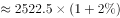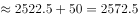万辆，与D项最接近。

故正确答案为D。

---

#### 第 3 题　qid 3522676 · 比重

2019年新能源汽车销量占汽车总销量的比重为：

- **A**. 
不超过

- **B**. 
左右

- **C**. 
左右
　✅
- **D**. 
大于

**答案**：C

**官方解析**

根据题干“2019年······占······的比重为”，结合材料所给时间为2020年，可判定本题为基期比重问题。定位材料第一段可得：2020年全年，汽车销量为2531.1万辆，同比下降。2020年全年，新能源汽车销量为136.7万辆，同比增长。根据基期比重公式可得，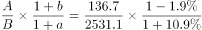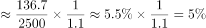，与C项最接近。

故正确答案为C。

---

#### 第 4 题　qid 3522677 · 综合

根据上述资料可推出：

- **A**. 2019年上半年出口汽车70.9万辆
- **B**. 2020年生产的汽车在当年内全部售完
- **C**. 2020年上半年汽车产销降幅大致相同　✅
- **D**. 2020年汽车进口量与进口金额的变化幅度基本—致

**答案**：C

**官方解析**

A项：定位材料第二段“全年汽车出口108万辆，同比下降，降幅2020年上半年收窄10.4个百分点”，无2019年上半年汽车出口的相关数据，无法推出；

B项：定位材料第一段“汽车产量为2522.5万辆，销量为2531.1万辆······”虽然销量比产量高，但销售出去的汽车未必都是2020年生产的，无法推出；

C项：定位材料第一段“2020年全年，汽车产销降幅收窄至以内。汽车产量为2522.5万辆，销量为2531.1万辆，同比分别下降和，降幅分别比2020年上半年收窄14.8和15.0个百分点”可知2020年上半年汽车产量降幅为，销量降幅为，故2020年上半年汽车产销降幅大致相同，可以推出；

D项：定位材料第二段“2020年全年，汽车进口93.0万辆，同比下降，降幅较2020年上半年收窄21.1个百分点；进口金额467.0亿美元，同比下降······”可知2020年汽车进口量变化幅度为，进口金额变化幅度为，二者差距较大，无法推出。

故正确答案为C。

---

#### 第 5 题　qid 3522678 · 综合

下列选项说法错误的是：

- **A**. 2020年全年汽车产销降幅要小于2019年的降幅
- **B**. 2020年全年汽车的产量减少量要小于销量的减少量　✅
- **C**. 2020年全年新能源汽车的销售要好于其它类型汽车的销售
- **D**. 总体而言，2020年进口汽车平均价格要高于出口汽车平均价格

**答案**：B

**官方解析**

A项：定位材料第一段“2020年全年，汽车产销降幅收窄至以内”可知2020年降幅较2019年要收窄，即2020年的降幅小于2019年的降幅，正确；

B项：定位材料第一段“2020年全年······汽车产量为2522.5万辆，销量为2531.1万辆，同比分别下降和······”则2020年汽车产量的减少量万辆；2020年汽车销量的减少量万辆，因此2020年全年汽车的产量减少量要大于销量的减少量，错误；

C项：定位材料第一段“2020年全年，汽车产销降幅收窄至以内。汽车产量为2522.5万辆，销量为2531.1万辆，同比分别下降和······2020年全年，新能源汽车销量为136.7万辆，同比增长”可知2020年全年汽车销量下降，其中新能源汽车销量增长，根据混合增长率混合后要居中的原则，2020年除了新能源汽车外其它类型汽车销量为负增长，因此2020年全年新能源汽车的销售要好于其它类型汽车的销售，正确；

D项：定位材料第二段“2020年全年，汽车进口93.0万辆······进口金额467.0亿美元······全年汽车出口108万辆······出口金额157.4亿美元······”故2020年全年进口平均价格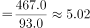万美元/辆；出口平均价格万美元/辆，因此2020年汽车进口均价出口均价，正确。

本题为选非题，故正确答案为B。

备注：C选项中“好于”是一种口语化表述，不是十分严谨，但根据语意可推断其意为“新能源汽车销量的增速＞其它类型汽车”

---

### 材料 2

#### 第 6 题　qid 3523536 · 综合

2020年下半年，全国公路货运量高于上月水平的月份有几个？

- **A**. 2
- **B**. 3　✅
- **C**. 4
- **D**. 5

**答案**：B

**官方解析**

定位柱状图可知：2020年下半年，全国公路货运量高于上月水平的月份有8月、9月、11月3个。
故正确答案为B。

---

#### 第 7 题　qid 3523539 · 增长

2020年第二季度，全国货物周转量约比第一季度增长了：

- **A**. 

- **B**. 

- **C**. 

- **D**. 

　✅

**答案**：D

**官方解析**

根据“2020年第二季度······比第一季度增长了”，结合选项为百分数，可判定本题为一般增长率计算问题。定位折线图可知：2020年第一季度全国货物周转量亿吨公里；第二季度全国货物周转量亿吨公里。根据增长率，可得2020年第二季度，全国货物周转量约比第一季度增长了，与D项最接近。

故正确答案为D。

---

#### 第 8 题　qid 3523540 · 综合

2020年，我国公路货物周转量累计达1万亿吨公里/2万亿吨公里/3万亿吨公里分别在：

- **A**. 3月  5月  7月
- **B**. 4月  6月  8月
- **C**. 4月  6月  7月　✅
- **D**. 3月  5月  8月

**答案**：C

**官方解析**

定位折线图：2020年，累计到4月我国公路货物周转量亿吨公里万亿吨公里，即在4月我国公路货物周转量累计达1万亿吨公里（由上一小题可知2020年第一季度全国货物周转量约9200亿吨公里，不到1万亿吨公里），排除A、D两项；结合选项，B、C两项达到2万亿吨公里均在6月，不用计算；累计到7月，我国公路货物周转量1至4月5月6月7月亿吨公里万亿吨公里，即在7月我国公路货物周转量累计达3万亿吨公里。

故正确答案为C。

---

#### 第 9 题　qid 3523541 · 平均数

2020年各季度公路货物平均运输距离最高的季度是：

- **A**. 第一季度
- **B**. 第二季度　✅
- **C**. 第三季度
- **D**. 第四季度

**答案**：B

**官方解析**

根据题干“2020年各季度公路货物平均运输距离最高的季度是”，根据备注可知，货物平均运输距离，可判定本题为现期平均数比较问题。定位统计图可得，2020年各月份公路货物周转量与货运量，分别计算各季度货物平均运输距离进行比较即可。

第一季度：公里；第二季度：公里；第三季度：公里；第四季度：公里。

比较可知，第二季度公路货物平均运输距离最高。

故正确答案为B。

---

#### 第 10 题　qid 3523544 · 综合

关于2020年全国公路货物运输情况的描述，可以推出的是：

- **A**. 
2月份货运平均运输距离在170-175公里

- **B**. 
全年日均货运量多于1亿吨的月份有6个
　✅
- **C**. 
3月份货物周转量比2月份多以上

- **D**. 
全年月均货运量超过30亿吨

**答案**：B

**官方解析**

A项：定位统计图材料可得，2020年2月份公路货物周转量1396.4亿吨公里，货运量为8.27亿吨，货物平均运输距离公里，不在170-175公里范围内，错误；

B项：定位统计图材料可得，2020年1-12月货运量分别为21.07、8.27、23.53、29.05、30.43、30.85、30.81、32.52、34.04、33.07、35.24、33.73亿吨，2020年1-12月所对应的天数分别为31、29、31、30、31、30、31、31、30、31、30、31天，则日均货运量多于1亿吨的有6月、8月、9月、10月、11月、12月，共计6个月份，正确；

C项：定位统计图材料可得，2020年2月份公路货物周转量1396.4亿吨公里，3月份为4141.3亿吨公里，3月份货物周转量比2月份多，即不到，错误；

D项：定位统计图材料可得，2020年月均货运量为亿吨，错误。

故正确答案为B。

---

### 材料 3

#### 第 11 题　qid 3522682 · 平均数

2009年-2019年，城镇非私营单位和私营单位平均工资差额最大的年份是：

- **A**. 2009年
- **B**. 2013年
- **C**. 2016年
- **D**. 2019年　✅

**答案**：D

**官方解析**

定位图1可知，2009年-2019年我国城镇私营和非私营单位就业人员的平均工资。选项各年份对应的城镇非私营单位和私营单位平均工资差额计算如下：

A项（2009年）：元；

B项（2013年）：元；

C项（2016年）：元；

D项（2019年）：元。

因此，平均工资差额最大的年份是2019年。

故正确答案为D。

---

#### 第 12 题　qid 3522685 · 平均数

与2009年相比，2019年城镇非私营单位就业人员平均工资增长的倍数约为：

- **A**. 1.5倍
- **B**. 1.8倍　✅
- **C**. 2.8倍
- **D**. 3.2倍

**答案**：B

**官方解析**

根据题干“与2009相比，2019年······增长的倍数约为”，可判定本题为一般增长率计算问题。定位图1可知，2009年、2019年城镇非私营单位就业人员平均工资分别为32244元、90501元。根据增长率，所求增长率倍，即增长的倍数约为1.8倍。

故正确答案为B。

---

#### 第 13 题　qid 3522687 · 平均数

2019年城镇非私营单位工资低于当年非私营单位平均工资的行业有：

- **A**. 9个　✅
- **B**. 12个
- **C**. 15个
- **D**. 16个

**答案**：A

**官方解析**

定位折线图可知，2019年城镇非私营单位就业人员平均工资为90501元；定位统计表可知，2019年我国各行业城镇非私营单位就业人员的平均工资，故2019年城镇非私营单位工资低于当年非私营单位平均工资的行业有：农、林、牧、渔业，制造业，建筑业，批发和零售业，住宿和餐饮业，房地产业，租赁和商务服务业，水利、环境和公共设施管理业以及居民服务和其他服务业，一共9个行业。
故正确答案为A。

---

#### 第 14 题　qid 3522690 · 增长

2009年-2019年，城镇私营单位平均工资年均增长率最高的是：

- **A**. 科学研究、技术服务和地质勘查业
- **B**. 信息传输、计算机服务和软件业　✅
- **C**. 金融业
- **D**. 建筑业

**答案**：B

**官方解析**

根据题干“······年均增长率最高”，可判定本题为年均增长率问题。定位统计表可知，2009年和2019年我国各行业城镇私营单位就业人员的平均工资。根据年均增长率公式：可得，n（年份差：2009年-2019年）相同，只需比较即可，即越大，年均增长率越大。则科学研究、技术服务和地质勘查业：；信息传输、计算机服务和软件业：；金融业：；建筑业：，故2009年-2019年信息传输、计算机服务和软件业的平均工资年均增长率最高。

故正确答案为B。

---

#### 第 15 题　qid 3522692 · 综合

下列选项说法正确的是：

- **A**. 2009年-2019年，城镇私营单位平均工资年均增长速度快于非私营单位平均工资年均增长速度　✅
- **B**. 2009年-2019年，城镇非私营单位的各行业平均工资均高于私营单位相应行业的平均工资
- **C**. 2019年非私营采矿业的平均工资最接近全社会平均工资，所以该行业内部分配最公平
- **D**. 2019年城镇私营单位行业之间薪资差额最大的有3.6倍

**答案**：A

**官方解析**

A项：定位折线图可知，城镇非私营单位平均工资2009年为32244元，2019年为90501元；城镇私营单位平均工资2009年为18199元，2019年为53604元。根据年均增长率公式：可得，n（年份差：2009年-2019年）相同，只需比较即可，即越大，年均增长率越大。则非私营单位：；私营单位：，故2009年-2019年，城镇私营单位平均工资年均增长速度快于非私营单位，正确；

B项：定位统计表可知，2009年农、林、牧、渔业私营单位平均工资为14585元，非私营单位为14356元，非私营平均工资并非均高于私营，且题干要求的是2009年-2019年，但材料只给了2009年和2019年的数据，中间年份的平均工资无法得知，错误；

C项：材料中没有说明全社会的平均工资，且没有提及行业内部分配问题，故无法推出，错误；

D项：材料未给出2019年公共管理和社会组织的城镇私营单位平均工资，故不能确定2019年城镇私营单位行业的最高薪资和最低薪资，故无法推出，错误。

故正确答案为A。

---
