# 2021年贵州省公务员录用考试《行测》题（网友回忆版）

> 省考 · 2021 年 · 6 个模块 · 共 115 题

- [政治理论](#%E6%94%BF%E6%B2%BB%E7%90%86%E8%AE%BA) · 1 题
- [常识判断](#%E5%B8%B8%E8%AF%86%E5%88%A4%E6%96%AD) · 14 题
- [言语理解与表达](#%E8%A8%80%E8%AF%AD%E7%90%86%E8%A7%A3%E4%B8%8E%E8%A1%A8%E8%BE%BE) · 38 题
- [数量关系](#%E6%95%B0%E9%87%8F%E5%85%B3%E7%B3%BB) · 12 题
- [判断推理](#%E5%88%A4%E6%96%AD%E6%8E%A8%E7%90%86) · 30 题
- [资料分析](#%E8%B5%84%E6%96%99%E5%88%86%E6%9E%90) · 20 题

---

## 政治理论

### 第 1 题　qid 3522658 · 新思想

2020年12月8日，中国国家主席习近平同尼泊尔总统班达里互致信函，共同宣布珠穆朗玛峰最新高程为8848.86米。下列关于珠穆朗玛峰的形成原因与“8848.86米”的内涵，对应正确的是：

- **A**. 板块挤压―雪面高程　✅
- **B**. 板块挤压―岩石面高程
- **C**. 板块张裂―雪面高程
- **D**. 板块张裂―岩石面高程

**答案**：A

**官方解析**

本题考查地理国情。
珠穆朗玛峰的高度实际上每年都在发生着变化，珠峰地区甚至是整个青藏高原，其实是由印度板块和亚欧板块的挤压碰撞而形成的，同时受板块运动的影响，珠峰地区一直在不断的移动。而这次公布的8848.86米的珠峰高程是包含珠峰峰顶雪面的高度，不是岩石面高度。对此中尼珠峰测量联合技术委员会主席党亚民表示，这次测算记录的雪面高是中尼双方共同认可的结果。B、C、D三项错误，A项正确。
故正确答案为A。

---

## 常识判断

### 第 1 题　qid 3523517 · 人文常识

党的十九届五中全会审议通过的《中共中央关于制定国民经济和社会发展第十四个五年规划和二〇三五年远景目标的建议》，明确提出到2035年建成社会主义文化强国的远景目标。关于社会主义文化强国建设目标任务，下列表述正确的有几项？
①提高社会文明程度
②提升公共文化服务水平
③健全现代文化产业体系
④加强对外文化交流和多层次文明对话

- **A**. 1项
- **B**. 2项
- **C**. 3项
- **D**. 4项　✅

**答案**：D

**官方解析**

本题考查政治常识。
党的十九届五中全会审议通过的《中共中央关于制定国民经济和社会发展第十四个五年规划和二〇三五年远景目标的建议》中在繁荣发展文化事业和文化产业，提高国家文化软实力方面部署了三个方面的重点任务：一是提高社会文明程度，二是提升公共文化服务水平，三是健全现代文化产业体系。以讲好中国故事为着力点，创新推进国际传播，加强对外文化交流和多层次文明对话。
故正确答案为D。

---

### 第 2 题　qid 3523518 · 人文常识

下列关于讲政治的表述不准确的是：

- **A**. 不忘初心，牢记使命是讲政治最本质的要求
- **B**. 必须提高政治识别力、政治领悟力、政治执行力　✅
- **C**. 讲政治，概括起来说就是从政治上观察和处理问题
- **D**. 党领导人民治国理政，最重要的就是坚持正确政治方向，始终保持我们党的政治本色，始终沿着中国特色社会主义道路前进

**答案**：B

**官方解析**

本题考查政治常识。
A项正确，不忘初心，牢记使命是讲政治最本质的要求。职位越高越要忠于人民，全心全意为人民服务。只有敬畏法律、敬畏纪律，自觉管住自己，在廉洁自律上作出表率，才能担起肩上的重任。而最与初心和使命相背离的就是种种腐化堕落、特权思想。
B项错误，中共中央政治局于2020年12月24日至25日召开的民主生活会中，习近平指出，必须增强政治意识，善于从政治上看问题，善于把握政治大局，不断提高政治判断力、政治领悟力、政治执行力。
C项正确，讲政治，概括起来说就是从政治上观察和处理问题。中共中央政治局于2020年12月24日至25日召开的民主生活会中，习近平指出，旗帜鲜明讲政治，既是马克思主义政党的鲜明特征，也是我们党一以贯之的政治优势。
D项正确，中共中央政治局于2020年12月24日至25日召开的民主生活会中，习近平指出，党领导人民治国理政，最重要的就是坚持正确政治方向，始终保持我们党的政治本色，始终沿着中国特色社会主义道路前进。这就是讲政治背后的大逻辑。
本题为选非题，故正确答案为B。

---

### 第 3 题　qid 3522663 · 人文常识

2020年12月17日凌晨1时59分，嫦娥五号返回器携带月球样品成功着陆，这标志着我国的探月工程—“嫦娥工程"取得阶段性成功。下列关于我国探月工程的表述错误的是：

- **A**. 2020年嫦娥五号成功采集月壤标志着中国探月工程“绕、落、采”三步走战略圆满收官　✅
- **B**. “嫦娥工程”分为“无人月球探测”、“载人登月”和“建立月球基地”三个阶段
- **C**. 2011年我国的嫦娥二号实现了环绕月球的目标
- **D**. 2019年我国的嫦娥四号完成了首次月背登陆

**答案**：A

**官方解析**

本题考查政治常识。
A项错误，嫦娥五号任务最重要的目标就是“采样返回”，这也是中国“探月工程”规划的“绕、落、回”中的第三步。2020年12月17日嫦娥五号返回器在内蒙古四子王旗预定区域成功着陆，标志着中国首次月球采样返回任务圆满完成。嫦娥五号任务的成功标志着我国探月工程“绕、落、回”三步走规划如期完成。该项“采”表述错误，应为“回”。
B项正确，2004年，中国正式开展月球探测工程，并命名为“嫦娥工程”。嫦娥工程分为“无人月球探测”“载人登月”和“建立月球基地”三个阶段。
C项正确，嫦娥二号，是中国探月计划中的第二颗绕月人造卫星。2010年10月1日，中国第二颗绕月探测卫星“嫦娥二号”在西昌卫星发射中心发射升空；2010年10月6日，嫦娥二号被月球捕获，进入环月轨道；2011年8月25日，嫦娥二号进入拉格朗日L2点环绕轨道；我国的嫦娥二号再次实现了环绕月球的目标。2012年12月15日，嫦娥二号工程宣布收官。嫦娥二号任务的圆满成功，标志着中国在深空探测领域突破并掌握了一大批新的具有自主知识产权的核心技术和关键技术，为后续实施探月二期工程的“落”和“回”以及下一步开展火星等深空探测奠定了坚实技术基础，中国从航天大国迈向航天强国的进程又跨出了重要的一步。
D项正确，2019年1月3日，嫦娥四号探测器成功自主着陆在月球背面南极—艾特肯盆地内的冯·卡门撞击坑内，实现人类探测器首次在月球背面软着陆。
本题为选非题，故正确答案为A。

---

### 第 4 题　qid 3522675 · 人文常识

关于农谚“小雪雪满天，来岁必丰年”所涉及的原理，下列说法错误的是：

- **A**. 新雪孔隙度高、空气多，对土壤有防冻保湿作用
- **B**. 雪融化时吸收土壤内部热量，越冬虫卵不易存活
- **C**. 雪中含有大量磷化物，融化后可为土壤提供肥料　✅
- **D**. 雪融化时入土壤，提高土壤含水量，缓解春旱

**答案**：C

**官方解析**

本题考查科技常识。
A项正确，新雪的密度低、孔隙度高，贮藏在新雪中的空气多，而空气是热的不良导体，因此土壤中热量的散失较少，可以起到防冻保湿的作用。
B项正确，雪融化时从土壤中吸收许多热量，这时土壤会突然变得非常寒冷，温度降低许多，越冬虫卵不易存活。
C项错误，雪是大量白色不透明冰晶和其聚合物组成的降水，由大气中的水蒸气直接凝华而成。根据测定，雪水中含有一定量的氮化物。雪水渗入土壤，就等于施了一次氮肥。用雪水喂养家畜家禽、灌溉庄稼都可收到明显的效益。
D项正确，寒潮以后，天气渐渐回暖，雪慢慢融化，雪融下去的水可以提高土壤含水量，给庄稼积蓄很多水，对春耕播种以及庄稼的生长发育都很有利。
本题为选非题，故正确答案为C。

---

### 第 5 题　qid 3522660 · 人文常识

下列诗句对应的节气中，我国大部分地区一天中白昼短于黑夜的是：

- **A**. 谷雨春光晓，山川黛色青
- **B**. 露从今夜白，月是故乡明
- **C**. 清明时节雨纷纷，路上行人欲断魂
- **D**. 辛苦孤花破小寒，花心应似客心酸　✅

**答案**：D

**官方解析**

本题考查地理国情。
每年秋分过后，太阳直射点开始由赤道进入南半球，北半球开始昼短夜长，一天中白昼短于黑夜，直至次年春分，太阳直射点由赤道进入北半球，北半球才开始昼长夜短。所以，我国大部分地区白昼短于黑夜的时间段是秋分至次年的春分。而秋分是二十四节气中的第16 个节气，于每年的公历9月22-24日交节；春分是二十四节气中的第4个节气，于每年的公历3月20日-21日交节。
A项错误，“谷雨春光晓，山川黛色青”出自唐代元稹的《咏廿四气诗·谷雨三月中》，描写了春天的最后一个节气谷雨这天的天光风物，生意葱茏。谷雨是二十四节气之第六个节气，于每年公历4月19日-21日交节，在秋分之前，不符合题意。
B项错误，“露从今夜白，月是故乡明”出自唐代杜甫的《月夜忆舍弟》，意为从今夜就进入了白露节气，月亮还是故乡的最明亮。白露是二十四节气中的第十五个节气，时间点在公历每年9月7日到9日，在秋分之前，不符合题意。
C项错误，“清明时节雨纷纷，路上行人欲断魂”出自唐代杜牧的《清明》，描写清明春雨中所见，色彩清淡。清明交节时间在公历4月5日前后，在秋分之前，不符合题意。
D项正确，“辛苦孤花破小寒，花心应似客心酸”出自南宋范成大的《窗前木芙蓉》，意为孤独凄清的木芙蓉，冒着初秋寒意而开，花的心就像作者自己的心一样，凄楚不已。小寒是二十四节气中的第二十三个节气，于每年公历1月5-7日交节。在秋分之后，此时我国大部分地区一天中白昼短于黑夜，符合题意。
故正确答案为D。

---

### 第 6 题　qid 3522664 · 科技常识

关于诗词中反映的生物知识，下列说法错误的是：

- **A**. “有意栽花花不发，无心插柳柳成荫”描述的是柳树进行无性繁殖
- **B**. “银烛秋光冷画屏，轻罗小扇扑流萤”中的萤火虫发光是一种物理变化　✅
- **C**. “野蚕作茧人不取，叶间扑扑秋蛾生”中的野蚕发育过程属于完全变态
- **D**. “等闲识得东风面，万紫千红总是春”中花色在红紫间变化是由于花青素

**答案**：B

**官方解析**

本题考查科技常识。
A项正确，“有意栽花花不发，无心插柳柳成荫”指的是柳树用的扦插的方式进行繁殖的，扦插是常见的营养繁殖的方法，没有经过两性生殖细胞的结合过程，所以是无性生殖。
B项错误，“银烛秋光冷画屏，轻罗小扇扑流萤”中的萤火虫发光，是因为萤火虫身体末端下方有发光器，体内的荧光素和荧光素酶反应后生成的黄绿色荧光，是一种化学变化。
C项正确，完全变态是昆虫在个体发育中，经过卵、幼虫、蛹和成虫4个时期。“野蚕作茧人不取，叶间扑扑秋蛾生”中的野蚕发育过程是由卵到幼虫，再到蛹，最后成虫，是一个完全变态发育的过程。
D项正确，花青素又称花色素，是自然界一类广泛存在于植物中的水溶性天然色素，这类色素的颜色，随细胞液的酸碱度变化而变化。花青素在碱性溶液中呈蓝色，在酸性溶液中呈红色，而在中性溶液中则呈紫色。因此凡是含有大量花青素的花瓣其颜色都在红、蓝、紫三色之间变化着。因此，“等闲识得东风面，万紫千红总是春”中花色在红紫间变化是由于花青素。
本题为选非题，故正确答案为B。

---

### 第 7 题　qid 3522655 · 人文常识

“秦王扫六合，虎视何雄哉！挥剑决浮云，诸侯尽西来。”下列历史事件不是发生在此诗所咏“秦王”在位期间的是：

- **A**. 蔺相如完璧归赵　✅
- **B**. 唐雎不辱使命
- **C**. 荆轲刺秦王
- **D**. 郑国疲秦

**答案**：A

**官方解析**

本题考查人文常识。
“秦王扫六合，虎视何雄哉！挥剑决浮云，诸侯尽西来。”出自唐代李白的《古风·秦王扫六合》，意为秦始皇嬴政以虎视龙卷之威势，扫荡、统一了战乱的中原六国。天子之剑一挥舞，漫天浮云消逝，各国的富贵诸侯尽数迁徙到咸阳。
A项错误，蔺相如完璧归赵发生于战国时期，讲述的是秦昭王许诺赵王以十五座城换取和氏璧，但当使臣蔺相如献璧之后，秦昭王却不提换城之事，蔺相如施巧计使和氏璧重归赵国。蔺相如完璧归赵并非发生在秦始皇嬴政在位期间。
B项正确，唐雎不辱使命讲述的是唐雎奉安陵君之命出使秦国，与秦王展开面对面的激烈斗争，终于折服秦王，保存国家，完成使命的经过，歌颂了唐雎不畏强暴、敢于斗争的爱国精神。其中的秦王即秦始皇嬴政，当时其还未称皇帝。
C项正确，荆轲刺秦王讲述了战国时期荆轲刺杀秦王嬴政这一悲壮的历史故事，反映了当时的社会政治情况，表现了荆轲重义轻生、为燕国勇于牺牲的精神。
D项正确，郑国疲秦中的郑国是韩国派往秦国的一个间谍，韩桓王试图通过他游说秦王嬴政修筑一条连接泾水和洛水的运河，达疲秦之效，以阻止秦国进攻韩国的步伐。岂知事与愿违，“疲秦之计”倒成了“强国之策”，运河的修筑成功，使得一向落后的关中农业迅速发展起来。
本题为选非题，故正确答案为A。

---

### 第 8 题　qid 3522659 · 人文常识

新文化运动是一场思想文化革新、文学革命运动。下列新文化运动代表人物与其作品对应错误的是∶

- **A**. 蔡元培—《中国伦理学史》
- **B**. 陈独秀—《文学改良刍议》　✅
- **C**. 胡适—《中国哲学史大纲》
- **D**. 李大钊—《布尔什维主义的胜利》

**答案**：B

**官方解析**

本题考查人文常识。
A项正确，《中国伦理学史》是由蔡元培所作的第一部系统整理和研究中国古代伦理思想发生、发展及其变迁的学术著作，全书分绪论、先秦创史时代、汉唐继承时代、宋明理学时代四大部分32章，系统地介绍了中国古代伦理学界重要的流派及主要代表人物，并阐述了各家学说的要点、源流及发展。
B项错误，《文学改良刍议》是由胡适所作，并于1917年1月发表。《文学改良刍议》是倡导文学革命的第一篇文章。
C项正确，《中国哲学史大纲》是胡适写定于1918年9月的书，此书一出版即因其方法和见解的创新而极受注意，3年时间再版了7次。此书被誉为：用现代学术方法系统研究中国古代哲学史的第一部著作，它的出版被视为中国哲学史学科成立的标志。
D项正确，《布尔什维主义的胜利》是由李大钊所作，于1918年11月载于《新青年》。文章热烈欢呼十月革命的胜利，认为这是民主主义的胜利，是布尔什维的胜利，是世界劳工阶级的胜利。
本题为选非题，故正确答案为B。

---

### 第 9 题　qid 3522668 · 法律常识

关于《中华人民共和国民法典》，下列说法错误的是：

- **A**. 允许抵押耕地使用权
- **B**. 将绿色原则作为民法的基本原则
- **C**. 明确了生态环境损害的修复和赔偿规则
- **D**. 将无民事行为能力人最高年龄标准调整为10周岁　✅

**答案**：D

**官方解析**

本题考查法律常识。
A项正确，根据《中华人民共和国民法典》第三百九十九条第二项规定：“下列财产不得抵押：······（二）宅基地、自留地、自留山等集体所有土地的使用权，但是法律规定可以抵押的除外；······”民法典删除了“耕地”不得抵押的情形，故允许抵押耕地使用权。
B项正确，根据《中华人民共和国民法典》第九条规定：“民事主体从事民事活动，应当有利于节约资源、保护生态环境。”绿色原则是民法的基本原则之一。
C项正确，根据《中华人民共和国民法典》第一千二百三十二条规定：“侵权人违反法律规定故意污染环境、破坏生态造成严重后果的，被侵权人有权请求相应的惩罚性赔偿。”第一千二百三十四条规定：“违反国家规定造成生态环境损害，生态环境能够修复的，国家规定的机关或者法律规定的组织有权请求侵权人在合理期限内承担修复责任。侵权人在期限内未修复的，国家规定的机关或者法律规定的组织可以自行或者委托他人进行修复，所需费用由侵权人负担。”故《民法典》明确了生态环境损害的修复和赔偿规则。
D项错误，根据《中华人民共和国民法典》第二十条规定：“不满八周岁的未成年人为无民事行为能力人，由其法定代理人代理实施民事法律行为。”故无民事行为能力人最高年龄标准并没有调整为十周岁，而是八周岁。
本题为选非题，故正确答案为D。

---

### 第 10 题　qid 3522701 · 人文常识

王某向李某借款1万元，李某当场向王某交付现金1万元，王某向李某出具借条一份，张某在该借条上签字，后王某没有按时还钱，李某将王某和张某同时起诉至法院，要求王某还钱，并要求张某承担连带责任。关于张某的责任，下列说法正确的是:

- **A**. 张某只是作为见证人签字，无须承担任何责任
- **B**. 张某在别人的借条上签字，应当推定为保证人，并承担保证责任
- **C**. 张某在别人的借条上签字，视同共同借款人，应当承担共同还款责任
- **D**. 只要借条上没有任何明确表述或其他事实表明张某愿意承担保证责任的，张某即无须承担任何责任　✅

**答案**：D

**官方解析**

本题考查法律常识。
根据《最高人民法院关于审理民间借贷案件适用法律若干问题的规定》第二十条规定：“他人在借据、收据、欠条等债权凭证或者借款合同上签名或者盖章，但是未表明其保证人身份或者承担保证责任，或者通过其他事实不能推定其为保证人，出借人请求其承担保证责任的，人民法院不予支持。”故只要借条上没有任何明确表述或其他事实表明张某愿意承担保证责任的，张某即无须承担任何责任。
故正确答案为D。

---

### 第 11 题　qid 3522670 · 人文常识

坐在火车里透过车窗观察远处的景物，下列说法正确的是：
①远处景物朝火车前进的方向旋转
②远处景物朝背离火车前进的方向旋转
③远处景物相对观察者移动快
④远处景物相对观察者移动慢

- **A**. ①④　✅
- **B**. ①③
- **C**. ②③
- **D**. ②④

**答案**：A

**官方解析**

本题考查科技常识。
乘客坐在火车里，以火车为参照系，无论是近处还是远处的景物，看起来都是朝火车前进的相反方向运动，且运动速度相同。近处和远处的景物移动相同距离时，由于近处的景物对人的眼睛造成的视角更大，所以看起来移动的距离更大。因此，在火车上的人看来，近处的景物向后运动得快，而远处的景物向后运动得慢。故④表述正确。
人在火车上同时看近处和远处的景物时，会不自觉地以近处的景物为参照物，这样远处的景物看起来就像在朝火车前进的方向旋转。故①表述正确。
故正确答案为A。

---

### 第 12 题　qid 3522699 · 经济常识

下列关于数字货币和数字人民币的表述不准确的是:

- **A**. 从2020年下半年开始，数字人民币已在深圳、苏州等地展开大规模试点测试
- **B**. 数字人民币是由中国人民银行发行的具有国家信用背书的法定货币，是数字形式的人民币
- **C**. 没有银行账户，同样可以享受支付等金融服务，但持有的数字人民币在数字钱包里不计付利息
- **D**. 数字人民币装在无形的数字钱包里，可用于线下和线上交易，但没有网络就不可付款，即不能“离线”支付　✅

**答案**：D

**官方解析**

本题考查经济常识。
A项正确，2020年下半年以来，数字人民币在深圳、苏州等地面向不定向公众展开大规模试点测试。
B项正确，数字人民币是由中国人民银行发行的具有国家信用背书的法定货币，是数字形式的人民币。数字人民币的定位是替代一部分现金。
C项正确，数字人民币以广义账户体系为基础、支持银行账户松耦合，即意味着用户如果没有银行账户，同样可以利用手机号等唯一身份标识开通数字钱包，使用数字人民币进行支付，但持有的数字人民币在数字钱包里不计付利息。
D项错误，目前，现金主要以纸币和硬币等实物形态存在，而数字人民币可以理解为数字形态的现金。纸币、硬币装在有形的钱包里，携带较为不便，多用于线下交易；数字人民币装在无形的数字钱包里，可用于线下和线上交易，且数字人民币具有“离线”支付功能。所谓“离线”支付，是指在无网或弱网条件下，用户进行交易或转款时不连接后台系统，而是在数字钱包中验证用户身份、确认交易信息并进行支付的方式，即没有网络也能付款。
本题为选非题，故正确答案为D。

---

### 第 13 题　qid 3522665 · 科技常识

下列说法符合医学常识的是：

- **A**. 酒精浓度越高消毒效果越好
- **B**. 使用含氯的牙膏有利于防龋齿
- **C**. 缺碘可能会造成甲状腺素缺乏　✅
- **D**. 可作为麻醉剂的乙醚无色无味

**答案**：C

**官方解析**

本题考查科技常识。

A项错误，酒精浓度越高，使蛋白质凝固的作用越强。当高浓度的酒精与细菌接触时，就能使菌体表面迅速凝固，形成一层包膜，阻止了酒精继续向菌体内部渗透，细菌内部的细胞没能彻底杀死，待到适当时机，包膜内的细胞可能将包膜冲破重新复活，则达不到消毒的效果。所以，选择浓度为的医用酒精最为适宜。

B项错误，龋病是牙体硬组织脱矿与再矿化动态平衡被打破的结果。脱矿，就是牙齿中的矿物质溶解、流失；而再矿化，就是溶解的矿物盐重新在牙齿上沉积。氟化物可使再矿化作用大于脱矿作用，阻止龋病的发展。

C项正确，碘是合成甲状腺激素的重要原料，如果缺碘就会导致甲状腺激素合成障碍，引起的代偿性的甲状腺肿。

D项错误，可作为麻醉剂的乙醚，是一种带有刺激性气味、无色、易燃、极易挥发的液体。

故正确答案为C。

---

### 第 14 题　qid 3523519 · 科技常识

下列根据特性规律组合而成的对应关系，错误的是：

- **A**. 蜘蛛——昆虫——节肢动物　✅
- **B**. 花生——双子叶植物——被子植物
- **C**. 乳腺——鸭嘴兽——哺乳动物
- **D**. 种子——松树——裸子植物

**答案**：A

**官方解析**

本题考查科技常识。
A项错误，蜘蛛不是昆虫，昆虫的基本特征是体躯分为头部、胸部、腹部三段，一对触角，一般有两对翅，三对足。昆虫属于节肢动物门昆虫纲，蜘蛛是节肢动物门、蛛形纲、蜘蛛目所有种的通称。
B项正确，花生又名落花生、双子叶植物，叶脉为网状脉，种子有花生果皮包被。花生是被子植物，被子植物的主要特点是种子外有果皮包被。花生有根、茎、叶、花、果实和种子六大器官，种子外有果皮包被着。
C项正确，鸭嘴兽是最原始的哺乳动物之一，它是未完全进化的哺乳动物，种类极少，同属之中只有鸭嘴兽一种动物，也是最低等的哺乳动物之一。鸭嘴兽的雌兽体内有乳腺，能分泌乳汁哺育幼兽。
D项正确，松树是裸子植物。裸子植物的种子是暴露在空气中的。
本题为选非题，故正确答案为A。

---

## 言语理解与表达

### 第 1 题　qid 3522654 · 逻辑填空

区块链的诸多特征使其成为一项备受期待的革命性技术，而目前这一技术的应用潜能还远未被完全开发。今天我们看到的区块链技术在金融、物流、医疗、保险等领域的应用，仅是             般的一瞥所见，尚有许多应用正在被尝试、推广。
填入画横线部分最恰当的一项是：

- **A**. 浮光掠影　✅
- **B**. 走马观花
- **C**. 蜻蜓点水
- **D**. 浅尝辄止

**答案**：A

**官方解析**

根据“仅是······般的一瞥所见，尚有许多应用正在被尝试、推广”可知，文段要体现的是区块链现在所涉及的应用领域仅是我们观察到的一部分，还有正在发掘的领域，且横线要与“一瞥所见”构成对应，体现出我们一眼看到这些领域后得到的印象。A项“浮光掠影”比喻观察不细致，得到的只是事物的一些表面现象，侧重观察的结果是印象不深刻，符合文意，当选。
B项“走马观花”比喻匆忙地不深入细致地观察事物，侧重于观察的过程很粗略，横线处对应看到的结果，而非看这些领域的过程，与文意不符，排除。C项“蜻蜓点水”比喻浮浅地接触，浮皮潦草，很不深入地做事，侧重做事情不深入，D项“浅尝辄止”比喻不往深处研究，不深入钻研，侧重于做事情不深入钻研，文段体现的是我们今天看到的区块链，强调的是“看”的结果，并非强调“做事”，均与文意不符，排除。
故正确答案为A。
【文段出处】《挖掘区块链商机 美国在行动》

---

### 第 2 题　qid 3522656 · 逻辑填空

教育，最终都是为了促进人的全面发展，帮助下一代提高生存能力。批评惩戒和赏识鼓励是            的两种方式，有些时候，“当头棒喝”甚至比温言软语更有效果。
填入画横线部分最恰当的一项是：

- **A**. 如影随形
- **B**. 并行不悖　✅
- **C**. 各有所长
- **D**. 不可或缺

**答案**：B

**官方解析**

根据后文“有些时候，‘当头棒喝’甚至比温言软语更有效果”可知，横线处应表示，两种方式都有效果，并不存在“当头棒喝”就效果不好之意。B项“并行不悖”指同时进行，互相不违背，可体现出两种方式虽看似完全相反，但都可以起到教育作用之意，符合文意，当选。
A项“如影随形”指好像影子总是跟着身体一样。比喻两个事物关系密切或两个人关系密切不能分离。“批评惩戒”与“赏识鼓励”并非如影随形，往往是单一出现，排除；
C项“各有所长”指各有各的长处、优点，一般多指人才而言，且该词一般用于表示大家都有自己的优势，不相上下，与后文文意不符，排除；
D项“不可或缺”表示非常重要，不能有一点缺失，文段并未体现出两种方式都不能少之意，与前后文语境不符，排除。
故正确答案为B。
【文段出处】《缺乏“棒喝”的教育有缺陷》

---

### 第 3 题　qid 3522671 · 逻辑填空

几乎所有成年人都只能使用左脑处理语句。但对儿童而言，任何一个大脑半球的损伤都不太可能影响语言学习，这说明在早期阶段人脑的两个半球都具有这种能力。美国乔治敦大学神经学家指出，这为神经损伤提供了一种        机制。例如，如果左半球受到围产期中风的        ，新生儿将使用右半球学习语言。
依次填入画横线部分最恰当的一项是：

- **A**. 赔偿 祸害
- **B**. 补偿 损害　✅
- **C**. 补充 损失
- **D**. 填充 毁坏

**答案**：B

**官方解析**

第一空，搭配“机制”，体现早期阶段人脑的两个半球对于“神经损伤”的功用，结合横线后的例子可知，当新生儿大脑左半球遭受中风时，右半球可以有效补位，以减少对语言学习的影响。B项“补偿”指补足，用以抵消损失、消耗等，C项“补充”指原来不足或有损失时，增加一部分，二者均符合语境，保留。A项“赔偿”指由于自己的行动而使他人蒙受损失从而给予补偿，新生儿的这一机制是对自身神经损伤的补偿，而非他人，不符合文意，排除；D项“填充”多指对某个空间的填补，与文段语境不符，排除。
第二空，搭配“中风”，体现中风对大脑左半球的伤害。B项“损害”指使事业、利益、健康、名誉等蒙受损失，与“中风”搭配得当，当选。C项“损失”指没有代价地消耗或失去，多与“金钱”“产品”等具象化事物搭配，与“中风”搭配不当，排除。
故正确答案为B。
【文段出处】《研究显示：儿童同时使用左右半脑进行语言学习》

---

### 第 4 题　qid 3523504 · 逻辑填空

ADHD，也就是通常所说的“多动症”，在儿童时期常以多动、冲动、注意力缺陷等为主要表现，其中很多人的症状会        到成年期。成人多动症患者更是一个被严重        的群体，我们给这个群体贴了很多标签，如“不靠谱”“拖延症”“低情商”“冲动狂”等。
依次填入画横线部分最恰当的一项是：

- **A**. 影响 歧视
- **B**. 延迟 误解
- **C**. 保留 排斥
- **D**. 延续 忽视　✅

**答案**：D

**官方解析**

第一空，搭配“成年期”，横线处所表达的意思为儿童时期的症状会持续到“成年期”，D项“延续”表示持续，语义符合，保留。A项“影响”表示对人或事物所起的作用，并非持续之意，并且与“成年期”搭配不当，可与具体的“工作”“生活”等进行搭配，排除；B项“延迟”表示推迟，语义不符，排除；C项“保留”侧重保存，文段并非此意，排除。
第二空，代入验证。通过后面的解释，给这个群体添加了很多非正常标签，则体现出对该症状严重忽略，D项“忽视”体现了从未正视，疏忽、不在意，符合文意，当选。
故正确答案为D。
【文段出处】《“你静下来心来学习啊”，对不起，这对我来说有点难》

---

### 第 5 题　qid 3522599 · 逻辑填空

电视在家庭中基本可以保证固定的开机时长，这就给电视广告提供了足够大的“曝光”空间，不仅可以提高受众的          ，同时更容易在家庭成员之间产生共鸣，无形之中增强广告的        效果。
依次填入画横线部分最恰当的一项是：

- **A**. 积极性 营销
- **B**. 多样化 吸引
- **C**. 保有量 交互
- **D**. 覆盖量 传播　✅

**答案**：D

**官方解析**

第一空，根据横线前“给电视广告提供了足够大的‘曝光’空间”以及“提高”可知，横线处应体现受众的数量有所提高之意。C项“保有量”指拥有的数量，D项“覆盖量”指在一定程度之内的数量，均符合文意，保留；A项“积极性”指进取向上的思想和表现，多搭配工作，文段未体现思想及表现，排除；B项“多样化”指种类多种多样，文段未提及种类，排除。
第二空，搭配“广告”，根据“在家庭成员之间产生共鸣”可知，广告起到了传递信息的宣传作用，横线处应体现广告的宣传作用被增强之意。D项“传播”指广泛散布、信息传递，符合文意，当选；C项“交互”指相互联系交流，多用于人机交互，与广告搭配不当，排除。
故正确答案为D。
【文段出处】《互联网的下半场，电视产业的风口在哪里》

---

### 第 6 题　qid 3522601 · 逻辑填空

随着医疗设备技术的发展，医疗市场也对非侵入式检测设备提出了更高的        ——准确、及时且按需实现患者监测。因此，如果一项技术能够以非侵入的方式反复测量个体的健康状态，且成本不高，那么它将有助于预防和预测疾病，提高诊疗决策的            。
依次填入画横线部分最恰当的一项是：

- **A**. 要求 精准性　✅
- **B**. 门槛 前瞻性
- **C**. 期望 创新性
- **D**. 标准 主动性

**答案**：A

**官方解析**

第一空，横线处搭配“提出”，A、C、D三项均搭配恰当，保留。B项“门槛”搭配不当，排除。
第二空，根据前文“准确、及时且按需”可知，文段强调随着医疗设备技术的进步，对待疾病的处理也将更加科学迅速、精确高效。A项“精准性”符合文意，当选。C项“创新性”侧重打破常规，提出不一样的想法或措施，文段并非强调诊疗决策的“特别”，而是要通过技术进步来让决策更加科学化、精准化，不符合文意，排除；D项“主动性”强调按照自己的意志行动，文段并没有体现决策是主动或被动做出，与文意无关，排除。
故正确答案为A。
【文段出处】新华网《“智能马桶”可监测用户健康》

---

### 第 7 题　qid 3522570 · 逻辑填空

量子计算将极大促进当前人工智能及其应用的发展，深刻地        包括基础教育在内的众多领域。特别是，借助于量子计算技术，人类对于微观世界的认识以及宏观世界的探索将得到极大扩展，从而引发人类思维能力的          提升。
依次填入画横线部分最恰当的一项是：

- **A**. 融合 战略性
- **B**. 改变 根本性　✅
- **C**. 解决 突破性
- **D**. 支持 阶段性

**答案**：B

**官方解析**

第一空，搭配“领域”，“领域”指特定的范围或区域，B项“改变”指事物变得和原来不一样，与“领域”搭配恰当，保留。A项“融合”指融为一体，文中并无众多领域融为整体之意，不符合文意，排除；C项“解决”指处理使有结果，D项“支持”指支撑、赞同或鼓励，均与“领域”搭配不当，排除。
第二空，代入验证。搭配“提升”，B项“根本性”意在强调基础或本质，根据文意可知，人类对世界的认识发生了本质上的改变，搭配恰当，符合文意，当选。
故正确答案为B。
【文段出处】《量子科技为何成为多国战略布局的重点领域》

---

### 第 8 题　qid 3522674 · 逻辑填空

灵感，一个很美的词汇，天生带有古灵精怪的流动感。它如同一尾滑溜溜的金鱼，极难抓，但真的抓住时，它又在手心扭动，让人            ，一不小心又让它溜走了。灵感是如此琢磨不透又难以控制。那到底如何才能在        灵感的游戏中享受到最大的快乐呢?
依次填入画横线部分最恰当的一项是：

- **A**. 一筹莫展 追寻
- **B**. 望洋兴叹 激发
- **C**. 不知所措 捕捉　✅
- **D**. 爱莫能助 点燃

**答案**：C

**官方解析**

第一空，由前文“它又在手心扭动”以及后文“灵感是如此琢磨不透又难以控制”可知，横线处形容“灵感”难以把握，人们对其无法控制。A项“一筹莫展”形容遇事拿不出一点办法，没有任何进展，C项“不知所措 ”形容不知道怎么办才好，均可表达人无法控制住“灵感”的意思，保留。B项“望洋兴叹”原指在伟大事物面前感叹自己的渺小，也比喻做事时因力不胜任或没有条件而感到无可奈何，通常形容较为宏观，复杂的事物，与“在手心扭动”对应不当，排除；D项“爱莫能助”指虽然心中关切同情，却没有力量帮助，文段并没有体现“帮助”之意，排除。
第二空，横线处搭配“灵感”，且由前文“灵感是如此琢磨不透又难以控制”可知，横线处表达“控制”住灵感之意。C项“捕捉”意为捉住某人或动物使其落入自己手中，符合文意，且“捕捉灵感”搭配得当，当选。A项“追寻”指追随，无法体现出“控制”之意，不符合文意，排除。
故正确答案为C。
【文段出处】《如何捕捉生活中的灵感》

---

### 第 9 题　qid 3522596 · 逻辑填空

学术研究是一项严谨缜密的科学工作，            是其研究的前提基础。学术不求真便会没有标准，当真正的学术研究被        、舆论炒作成为风气之时，便意味着学术低谷的到来。
依次填入画横线部分最恰当的一项是：

- **A**. 实事求是 放弃
- **B**. 有的放矢 遗忘
- **C**. 去伪存真 冷落　✅
- **D**. 推陈出新 忽视

**答案**：C

**官方解析**

第一空，根据文段“学术研究是一项严谨缜密的科学工作”“学术不求真便会没有标准”可知，横线处体现的是学术研究要严谨缜密、要求真，A项“实事求是”指从实际情况出发，C项“去伪存真”意思是除掉虚假的，留下真实的，均符合文意，保留。B项“有的放矢”比喻说话做事有针对性，文段未体现针对性，排除；D项“推陈出新”指去掉旧事物的糟粕，取其精华，并使它向新的方向发展，与文意不符，排除。
第二空，根据后文“便意味着学术低谷的到来”可知，横线处词语程度较轻，C项“冷落”形容受到冷淡的待遇，置于此处程度较轻，符合文意，当选。A项“放弃”搭配“学术研究”，程度过重，排除。
故正确答案为C。
【文段出处】《造假与炒作的背后》

---

### 第 10 题　qid 3522605 · 逻辑填空

世界上的一万多种鸟，其实各有各的美丽，从各种华丽的羽毛，到鸟喙的形状，到鸣唱的声音，不能不让我们        生物多样性的神奇。进化论之父达尔文在加拉帕戈斯群岛上通过观察当地鸟类发现，虽然这些鸟类很明显长得很相似，有着共同的祖先，但是它们的鸟喙形状却            。
依次填入画横线部分最恰当的一项是:

- **A**. 惊叹 大相径庭　✅
- **B**. 惊奇 毫无二致
- **C**. 探索 云泥之别
- **D**. 追寻 异曲同工

**答案**：A

**官方解析**

本题可从第二空入手，横线前出现转折关联词“却”可知前后语义相反，横线前“鸟类很明显长得很相似，有着共同的祖先”体现“相似、一样”的含义，因此横线处应体现“不一样、不同”之意。A项“大相径庭”比喻相差很远，大不相同，符合文意，保留。B项“毫无二致”形容完全一样，D项“异曲同工”比喻一件事情的做法不同而都巧妙地达到目的，均与文意相悖，排除；C项“云泥之别”比喻地位的高下相差极大，文段并非论述地位的高下，仅在论述形状的不同，与文意不符，排除。
第一空，代入验证，A项“惊叹”指惊奇赞叹，表达对生物多样性的赞美，感情色彩积极，符合文段语境，当选。
故正确答案为A。
【文段出处】《热带雨林中的鸟类和深海中的蠕虫，我们该保护哪个？》

---

### 第 11 题　qid 3523507 · 逻辑填空

我国有很庞大的老年群体，但他们却因为科技的发展，在生活中有很多地方            。不是他们            ，不想接触新事物，而是一辈子的习惯，不是说改就能改的。
依次填入画横线部分最恰当的一项是：

- **A**. 寸步难行 墨守成规
- **B**. 步履艰难 画地为牢
- **C**. 艰难跋涉 抱残守缺
- **D**. 举步维艰 固步自封　✅

**答案**：D

**官方解析**

第一空，根据文意可知，老年人在科技发展的背景下，生活中会面临很多不便，因此横线处应表示老年人在很多地方不是很方便。B项“步履艰难”指行走困难、行动不方便，D项“举步维艰”指迈步艰难，比喻办事情每向前进行一步都十分不容易，均符合文意，保留。A项“寸步难行”指连一步都难以进行，形容走路、行动困难，比喻开展某项工作困难重重，用于此处程度过重，排除；C项“艰难跋涉”强调路程很艰苦，或者事业方面很艰辛，体现不出老年群体的不方便，排除。 
第二空，根据后文“不想接触新事物”可知，横线处应体现古板、不肯接受新鲜事物之意。D项“固步自封”形容保守，安于现状，不求改进，符合文意，当选。B项“画地为牢”比喻只许在指定的范围内活动，表意与是否保守、不接受新事物无关，排除。
故正确答案为D。
【文段出处】《边亚峰：交医保拒收人民币是一种违法犯罪》

---

### 第 12 题　qid 3523498 · 逻辑填空

从长远看，电影产业的发展必然要拥抱网络平台，但是院线依然具有            的优势，观影社交仪式感、巨幕、3D沉浸式体验以及高度还原的环绕立体声，这些都是网上观影所不具备的，影院和互联网带来的始终是两种            的观影体验。
依次填入画横线部分最恰当的一项是：

- **A**. 遥遥领先 大相径庭
- **B**. 独一无二 背道而驰
- **C**. 不可替代 截然不同　✅
- **D**. 无与伦比 各有所长

**答案**：C

**官方解析**

第一空，根据后文“观影社交仪式感······这些都是网上观影所不具备的”可知，横线处应体现院线的这些特点是网上观影所没有的，B项“独一无二”形容唯一的，没有与之相同的，C项“不可替代”指某人或某物是不能够用他人或他物来进行代替的，均符合文意，保留。A项“遥遥领先”指远远地走在最前面，强调比别人快，与文意不符，排除；D项“无与伦比”指事物非常完美，没有能跟他相比的，文段并未说明院线的这些特征是最好的，语义程度过重，排除。
第二空，形容影院和互联网所带来的观影体验，根据前文可知，影院和互联网所带来的观影体验应该是不同的，C项“截然不同”形容两种事物没有一点共同之处，符合文意，当选。B项“背道而驰”指背离正确的目标，朝相反的方向走，文段并未强调偏离正道，与文意不符，排除。
故正确答案为C。
【文段出处】《&lt;囧妈&gt;等新片临时变阵 院线电影有了发行新模式》

---

### 第 13 题　qid 3522591 · 逻辑填空

国无德不兴，人无德不立。如果一个民族、一个国家没有共同的核心价值观，            ，行无依归，那这个民族、这个国家就无法前进。这样的情形，在我国历史上，在当今世界上，都            。
依次填入画横线部分最恰当的一项是：

- **A**. 莫衷一是  屡见不鲜　✅
- **B**. 自以为是  数不胜数
- **C**. 各行其是  不一而足
- **D**. 积非成是  层出不穷

**答案**：A

**官方解析**

第一空，根据横线前“没有共同的核心价值观”和后文“行无依归”可知，填入横线处的成语强调没有统一的思想作支撑。A项“莫衷一是”指各有各的意见，不能得出一致的结论，置于此处能够体现出思想不统一，符合文意，保留。B项“自以为是”形容认为自己的看法和做法都正确，不接受别人的意见，侧重强调认为自己是正确的，与文意无关，排除；C项“各行其是”形容按照各自认为对的去做，比喻各搞一套，侧重强调做法，与文意无关，排除；D项“积非成是”指长期所形成的错误，往往被当作正确的，与文意无关，排除。
第二空，代入验证，根据前文“这样的情形，在我国历史上，在当今世界上”可知，填入横线处的成语表达这样的情形很常见。A项“屡见不鲜”意思是常常见到，并不新奇，符合文意，当选。
故正确答案为A。
【文段出处】《习近平：青年要自觉践行社会主义核心价值观——在北京大学师生座谈会上的讲话》

---

### 第 14 题　qid 3522604 · 逻辑填空

节约资源、减少垃圾生产成为某种意义上的公共事务，很容易遭遇“搭便车困境”——人人都想            ，最终会导致公共事务乏人问津。节约资源的功效并没有那么            ，需要人们久久为功；付出没有得到及时、有效的反馈与回报，难免会影响公众参与。
依次填入画横线部分最恰当的一项是：

- **A**. 蜂拥而上 妙手回春
- **B**. 鸠占鹊巢 神通广大
- **C**. 据为己有 一劳永逸
- **D**. 坐享其成 立竿见影　✅

**答案**：D

**官方解析**

第一空，由破折号可知，所填词语是对“搭便车困境”的解释说明。“搭便车”本义为自己不想开车，所以乘坐他人的便车；引申义为，自己不想付出努力而去享受他人带来的便利。D项“坐享其成”指的是自己不出力，而享受别人取得的成果，符合文意，保留。A项“蜂拥而上”指的是许多人一起涌上来，未体现出自己不出力，享受他人成果之意，不符合文意，排除；B项“鸠占鹊巢”指的是强占别人的房屋、土地、产业等，C项“据为己有”指的是占据为自己所拥有，“搭便车”并非强调占据别人的东西归自己所有，均与文意不符，排除。
第二空，代入验证，根据“并没有······需要······”可知，横线处与后文“久久为功”语义相反，体现“时间短”之意。D项“立竿见影”指见效快，符合文意，当选。
故正确答案为D。
【文段出处】《“零浪费”用更深刻的环保观念拥抱美好生活》

---

### 第 15 题　qid 3522577 · 逻辑填空

原创是作品的生命力之源，抄袭无异于            。影视行业想要成为常青树，优质的原创作品是根基。如果任由抄袭之风盛行，        抄袭作者活跃在屏幕上，将        从业者的生存环境，消耗整个行业的未来前景。
依次填入画横线部分最恰当的一项是：

- **A**. 自相残杀 放纵 剥蚀
- **B**. 自掘坟墓 纵容 腐蚀　✅
- **C**. 自投罗网 放任 消蚀
- **D**. 自欺欺人 容许 磨蚀

**答案**：B

**官方解析**

第一空，根据横线前的“无异于”可知，横线处所填词语是对前文的解释说明。由“原创是作品的生命力之源”可知，抄袭则会让作品失去生命。B项“自掘坟墓”是指自己的所作所为就像在替自己挖掘坟墓一样，比喻自寻死路，符合文意，保留。C项“自投罗网”指自己投到罗网里去，比喻自己送死，也可以体现让作品失去生命，保留。A项“自相残杀”指自己人互相杀害，文段未提及互相杀害，排除。D项“自欺欺人”指欺骗自己，也欺骗别人，文段未提及欺骗自己和欺骗别人，与文意无关，排除。
第二空，根据横线前的“任由抄袭之风盛行”可知，横线处表示对抄袭作者不加约束，任由其发展，B项“纵容”指对错误行为不加制止、任其发展，C项“放任”指听其自然，不加约束或干涉，两项均符合文意，保留。
第三空，搭配“生存环境”，根据横线后的“消耗整个行业的未来前景”可知，对抄袭不加约束会产生不好的结果，从业者的生存环境会遭到破坏，B项“腐蚀”比喻坏的思想或环境，使人逐渐变质堕落，与“生存环境”搭配恰当且符合文意，当选。C项“消蚀”意为消耗、消损，多指由于风或者其他气候因素所致的侵蚀而使地面降低，和题干中的“生存环境”搭配不当，排除。
故正确答案为B。
【文段出处】人民资讯《影视圈的抄袭之风，怎么破？》

---

### 第 16 题　qid 3522589 · 逻辑填空

大多数群居的哺乳动物，雌性个体怀孕生育后，随着后代迅速        ，它们也会很快        原有的社会地位。然而在人类的大部分历史中，生育和照顾幼儿几乎是女性壮年时期的全职工作。有研究认为，人类婴儿的          ，让人类与母亲的关系与一般的动物相比更加紧密。
依次填入画横线部分最恰当的一项是：

- **A**. 成熟 改变 重要性
- **B**. 分离 恢复 可塑性
- **C**. 长大 获得 依附性
- **D**. 独立 回归 脆弱性　✅

**答案**：D

**官方解析**

第一空，根据前后文可知，横线处应体现后代迅速成长之意，A项“成熟”、C项“长大”、D项“独立”均符合文意，保留。B项“分离”与“群居”矛盾，排除。
第二空，通过转折词“然而”指出人类照顾幼儿是全职工作，可知“雌性哺乳动物”不是“全职”，“会很快回到‘原有的社会地位’”，D项“回归”符合文意，保留。A项“改变”、C项“获得”均未体现“会很快回到‘原有的社会地位’”之意，排除。
第三空，代入验证，文段将动物的幼崽和人类的婴儿进行对比，其结果体现了人类婴儿的“脆弱性”，符合文意，D项当选。
故正确答案为D。
【文段出处】知识分子《站起来，双足走 | 36个月》

---

### 第 17 题　qid 3522595 · 逻辑填空

糖对健康有危害已经            ，大家也能很好地理解和接受“少糖”这一健康饮食的基本原则。但是人类对甜味的喜好是            的，“健康少糖”和“享受甜味”对于很多人来说是很        的选择。甜味剂的出现，为人们提供了二者兼得的可行选择。
依次填入画横线部分最恰当的一项是：

- **A**. 毋庸置疑 刻骨铭心 无奈
- **B**. 深入人心 与生俱来 艰难　✅
- **C**. 显而易见 积重难返 被动
- **D**. 妇孺皆知 根深蒂固 痛苦

**答案**：B

**官方解析**

本题从第二空入手。横线处搭配“喜好”，且根据文意可知，横线处表达人类对甜味的喜好一直都有且很深刻。B项“与生俱来”指一出生就拥有的特性或行为，置于此处搭配恰当且符合文意，保留。A项“刻骨铭心”形容留下的印象极其深刻，永远忘不了，侧重将某物或某事“牢记于心”，与“喜好”搭配不当，排除；C项“积重难返”指积习深重，不易改变，常搭配“恶习”“弊端”，D项“根深蒂固”比喻基础稳固，不容易动摇，常搭配“思想”“观念”“主义”，均与“喜好”搭配不当，排除。
第一空，代入验证，B项“深入人心”指理论、学说、政策等为人们深切了解和信服，填入横线处能体现出大家已理解和接受糖对健康的危害，符合文意，保留。
第三空，代入验证，根据文意可知，很多人面对“健康少糖”和“享受甜味”时难以选择，B项“艰难”置于此处能体现出人们纠结、难以抉择的心理，符合文意，当选。
故正确答案为B。
【文段出处】《一种食品为什么要多种甜味剂？你最常听到的猜测都是错的》

---

### 第 18 题　qid 3522569 · 逻辑填空

口供是案件中的主要证据、直接证据，对案件的证明往往具有不可替代的作用，特别是在贿赂犯罪、毒品犯罪等          强、客观证据相对较少的案件中，口供对认定案件十分        。对口供的审查应当        ，要进行合法性审查、客观性审查、系统性审查和补强印证审查等。
依次填入画横线部分最恰当的一项是：

- **A**. 破坏性 重要 严格
- **B**. 复杂性 珍贵 深入
- **C**. 隐蔽性 关键 全面　✅
- **D**. 关联性 有用 认真

**答案**：C

**官方解析**

第一空，根据后文“客观证据相对较少”可知，横线处要体现“贿赂犯罪、毒品犯罪”的特点，“贿赂”即用财物买通别人，其与“毒品犯罪”多为私下进行的行为。C项“隐蔽性”指遮掩、隐藏，不易被发现的特性，符合文意，保留。A项“破坏性”指使事物受到损害的特性，B项“复杂性”指事物的种类或头绪多而杂，D项“关联性”指事物之间有牵连，有联系，三项均无法对应“贿赂犯罪、毒品犯罪”的特点，排除。
第二空，代入验证，C项“关键”可体现出“口供对认定案件”的重要性，符合文意，保留。
第三空，代入验证，C项“全面”可对应后文“合法性审查、客观性审查、系统性审查和补强印证审查等”，体现出口供审查应顾及所有方面，符合文意，当选。
故正确答案为C。
【文段出处】《新时代“全能”刑事检察官六大“超”能力》

---

### 第 19 题　qid 3523505 · 片段阅读

酸奶是以牛乳为原料，经灭菌、冷却、接种和发酵而制成，除保留了鲜牛奶的全部营养成分外，在发酵过程中还可产生人体所必需的多种维生素，同时钙含量比较高，且易被人体吸收；酸奶经发酵会产生酸性物质，可以促进肠胃蠕动，调节肠道微生态，进而促进消化和吸收，提高食欲，缓解便秘，促进排便，提高免疫力。
这段文字没有谈到的是：

- **A**. 酸奶的起源　✅
- **B**. 酸奶的成分
- **C**. 酸奶的益处
- **D**. 酸奶的制作

**答案**：A

**官方解析**

A项，文段没有涉及酸奶的起源，表述错误，当选；
B项，根据“除保留了鲜牛奶的全部营养成分外，在发酵过程中还可产生人体所必需的多种维生素，同时钙含量比较高”可知，文段介绍了酸奶的成分，表述正确，排除；
C项，根据“易被人体吸收”“酸奶经发酵会产生酸性物质，可以促进肠胃蠕动，调节肠道微生态，进而促进消化和吸收，提高食欲，缓解便秘，促进排便，提高免疫力”可知，文段介绍了酸奶的益处，表述正确，排除；
D项，根据“酸奶是以牛乳为原料，经灭菌、冷却、接种和发酵而制成”可知，文段介绍了酸奶的制作，表述正确，排除。
本题为选非题，故正确答案为A。
【文段出处】《老人喝酸奶好还是牛奶好？》

---

### 第 20 题　qid 3522580 · 片段阅读

资本天然是逐利的，本身并没有好坏之分。有序、合规的资本扩张，对于促进中国经济高质量发展具有重要意义，也是政策面所持续支持推动的。资本扩张有利于串联起产业链上下游企业，然而也带来了严峻的垄断问题。实际上，在这些行业融合、产业链整合的背后，是数字要素与传统生产要素的结合，根本上的要素垄断规律并没有改变，占据要素优势的企业仍然会获得垄断地位。而垄断将严重影响市场经济的竞争机制，降低市场效率，侵犯消费者权益，同时还会阻碍行业整体的创新进步，挫伤其他小微企业的积极性。
接下来作者最有可能讲的是：

- **A**. 需要遏制资本的进一步扩张
- **B**. 加强对数字经济的立法管理
- **C**. 对数字经济中的资本扩张的监管　✅
- **D**. 反垄断监管对保障经济发展的重要性

**答案**：C

**官方解析**

文段首先引出“资本扩张”的话题并指出其作用，随后通过转折指出其会带来垄断的问题。接下来阐述数字要素与传统生产要素的结合，占据要素优势的企业会获得垄断地位，尾句进一步论述资本扩张导致的垄断所带来的问题与危害。所以接下来应该根据文段的问题提出对策，即应对资本扩张进行监管，防止资本扩张导致的垄断问题，对应C项。
A项，“遏制资本的进一步扩张”表述不明确，排除；
B项，未提及“资本扩张”这一话题，且文段并没有提到“立法”，排除；
D项，强调的是反垄断监管的作用，但文段中强调的是资本扩张带来的垄断问题，且该项未提及“资本扩张”这一核心话题，排除。
故正确答案为C。
【文段出处】《数字经济时代的反垄断，重点在于对资本扩张的监管》

---

### 第 21 题　qid 3522584 · 片段阅读

2020年12月，德尔黑和三位同事在《当代生物学》上发表了文章，他们认为葛洛格将温度和湿度混为一谈了。潮湿的环境使植物生长茂盛，这为动物躲避捕食者提供了荫蔽。因此，动物在潮湿的地方往往颜色更深，以伪装自己。德尔黑说，许多温暖的地方是潮湿的，但潮湿又凉爽的森林也是有的，比如塔斯马尼亚的森林，那里也有最黑的鸟类。
从这段文字可推断出：

- **A**. 德尔黑的观点，动物的颜色在温度低的地方会是浅色的
- **B**. 葛洛格的观点，温暖而潮湿的地区，鸟的羽毛颜色会是深色的
- **C**. 葛洛格的观点，阳光充足的赤道地区，鸟的羽毛颜色会是深色的　✅
- **D**. 德尔黑的观点，阳光充足的赤道地区，鸟的羽毛颜色会是浅色的

**答案**：C

**官方解析**

根据文段“2020年12月，德尔黑和三位同事在······以伪装自己”可知，德尔黑认为动物颜色深和湿度有关，德尔黑认为葛洛格将温度和湿度混为一谈，因此葛洛格认为动物颜色深和温度有关。由“德尔黑说，许多温暖的地方是潮湿的，但潮湿又凉爽的森林也是有的······最黑的鸟类”进一步确定，德尔黑认为动物颜色深和温度无关，与湿度相关。
A项，与文段最后一句话德尔黑的观点相悖，排除；
B项，文段中提到葛洛格将温度与湿度混为一谈，选项提到”温暖而潮湿“体现二者有区别，不符合葛洛格的观点，排除；
C项，“阳光充足的赤道地区”代表温度高，符合葛洛格的观点，当选；
D项，“阳光充足的赤道地区”没有提到湿度，和德尔黑的观点无关，排除。
故正确答案为C。
【文段出处】《&lt;科学&gt;：全球气候变暖会让动物颜色变深还是变浅？》

---

### 第 22 题　qid 3523491 · 片段阅读

传承弘扬传统民间艺术的深刻精神内涵，民间艺术能否带来经济效益也成为了至关重要的考量因素。越来越多的年轻人选择放弃手工技艺，离开村庄谋生。对于大多数普通艺人，传承和保护民间文化只是一个概念，维持基本生活需求和追求家庭收入最大化仍然是最先考虑的因素。传承文化和提高收入的矛盾始终贯穿于民间艺人的文化自觉过程之中。对于民间艺人，作为“理性人”去追求收入最大化无可厚非，而作为民间文艺工作者，我们需要思考的是如何在保证民间艺人基本生活和物质需要的基础上，提升民间艺人的文化自觉意识，真正让民间艺人扎得住根、沉得下心。
这段文字意在强调：

- **A**. 激发民间艺人的文化自觉意识　✅
- **B**. 经济效益影响民间艺术的传承
- **C**. 提高民间艺人的经济收入
- **D**. 民间艺术传承的断代危机

**答案**：A

**官方解析**

文段开篇论述经济效益对于传承弘扬传统民间艺术很重要，接着通过很多年轻人放弃手工技艺，外出谋生的情况说明在民间艺人的文化自觉过程中始终存在着传承文化和提高收入的矛盾。后文通过“需要”针对上述矛盾提出对策，论述民间文艺工作者要在保证民间艺人物质生活的基础上提升民间艺人的文化自觉意识，故文段重点强调提升民间艺人的文化自觉意识，对应A项。
B、C两项，分别强调“经济效益”和“经济收入”，均未提及文段主题词“文化自觉”，排除；
D项，“断代危机”文段未提及，无中生有，排除。
故正确答案为A。
【文段出处】《以人民为中心繁荣发展社会主义民间文艺》

---

### 第 23 题　qid 3522594 · 片段阅读

人体严密的免疫防御系统，会在细菌入侵时引起炎症反应，白细胞和大量“防御斗士”对病原体展开攻击。防御的一方通常会胜利，理论上讲，“刺激”消除后，炎症反应会逐渐消失，组织回到正常状态。但在某些特定情况下，炎症依然会持续，这种低度炎症不像通常的炎症那样可以明显感觉到它的存在，其更像人体内未被完全熄灭的“火苗”。机体通过炎症反应抵抗病原体的过程，保障了人类的生存，但是科学家发现，这种低度炎症会缩短生命，促进许多年龄相关性症状，如认知衰退、神经变性、动脉粥样硬化等。不过，引起和维持这些变化的机制，目前尚不能明确。
这段文字主要介绍：

- **A**. 人体免疫系统的防御机制
- **B**. 低度炎症的发生机制与影响　✅
- **C**. 细菌对人类生存的影响
- **D**. 年龄相关性症状的研究现状

**答案**：B

**官方解析**

文段开篇介绍人体的免疫系统会在细菌入侵时引起炎症反应，理论上讲，“刺激”消除后，炎症反应会逐渐消失，组织回到正常状态，接着通过转折词“但”引出特定情况下这种低度炎症会持续存在。随后解释了低度炎症的产生原理以及其好、坏两方面影响。故文段主要围绕“低度炎症”展开，从低度炎症的产生原理和对人类的影响两个方面进行阐述，对应B项。
A项，文段主要论述的核心话题为“低度炎症”，“人体免疫系统”范围扩大，排除；
C项，仅对应文段首句内容，非重点，排除；
D项，论述的是“年龄相关性症状的研究现状”，但文段论述的核心话题是“低度炎症”，排除。
故正确答案为B。
【文段出处】《增强巨噬细胞代谢能缓解认知衰退》

---

### 第 24 题　qid 3523493 · 片段阅读

很多人认为，艺术创作是对自然或社会的观察与模仿，但在某些艺术史家看来，艺术家的创作其实是对传统与风格的修改和调整，是不断制作与匹配“图式”的过程。无论是意大利文艺复兴对古希腊罗马精神的再现，还是中国宋元文人画对老庄哲学的追随，都是如此。艺术家在准备好想要处理的题材之前，脑海里必然存在某些已知的图式，这些图式是过去艺术家们的成果；艺术家在画布或画纸上开始描绘时，就像置身在一个“镜子厅”或“回音廊”，旧的图式被不断唤起，题材的意义在特定的视觉秩序中，以新的图式再次展现。
这段文字意在强调：

- **A**. 艺术创新是无中生有的过程
- **B**. 艺术作品间的相似缘于模仿借鉴
- **C**. 艺术创作离不开已有的传统　✅
- **D**. 古典艺术作品是艺术创作的源泉

**答案**：C

**官方解析**

文段开篇通过“很多人认为”引出他人的观点，认为艺术创作是观察和模仿，紧接着通过转折关联词“但”强调“艺术家的创作其实是对传统与风格的修改和调整”。后文通过“意大利文艺复兴和中国宋元文人画”进行举例论证，同时又从艺术家从准备到开始作画的整个过程来论证文段的观点。故文段重点强调艺术家的创作是对传统与风格的修改和调整，即“离不开已有的传统”，对应C项。
A项，文段强调的是“艺术家的创作其实是对传统与风格的修改和调整，是不断制作与匹配‘图式’的过程”，并非是无中生有的过程，与文意相悖，排除；
B项，文段重点论述的是“艺术创作”，而非“艺术作品”，主题词错误，且文段并未分析艺术作品相似的原因，排除；
D项，“古典艺术作品”仅是“已有的传统”当中的一个方面，且“艺术创作的源泉”文段未提及，无中生有，排除。
故正确答案为C。
【文段出处】《艺术青年致敬前人的三种方式：唤起、社交与实验》

---

### 第 25 题　qid 3522572 · 片段阅读

临床医学教授格林斯潘认为，儿童的自我意识发展完全取决于父母与孩子的同理心关系，只有当父母能够持续、连贯、准确地读懂幼儿的情绪状态并做出有效回应时，孩子才能学会以同样的方式去回应。这种同理心的联系，拓展了孩子的心智，帮助他走进身边的情感与社交世界，给予他温暖和喜悦，而这正是培养信任所需要的。这种联系也带给孩子以自信，相信自己可以对他人产生影响，相信自己的意向也可以通过互动的方式，得到他人的积极回应。
这段文字意在强调：

- **A**. 父母的情绪回应对孩子自我意识发展至关重要
- **B**. 同理心是儿童获得智力与情感发展的坚实基础
- **C**. 儿童的自我意识发展离不开与父母的积极互动　✅
- **D**. 准确地识别儿童的情绪状态是父母的核心任务

**答案**：C

**官方解析**

文段开篇点出格林斯潘的观点，强调“父母与孩子的同理心关系”对“儿童的自我意识发展”非常重要。接着对这种“同理心关系”进行具体说明，即“父母能够持续、连贯、准确地读懂幼儿的情绪状态并做出有效回应”。然后，用两个指代词“这种同理心的联系”及“这种联系”均指代前文的“父母与孩子的同理心关系”，论述其对儿童自我意识发展的重要意义。故文段为总分结构，强调“父母与孩子的同理心关系”或“父母能够持续、连贯、准确地读懂幼儿的情绪状态并做出有效回应”对“儿童的自我意识发展”非常重要，对应C项。
A项，强调“父母的情绪回应”的重要性，但是文段强调的是“父母能够持续、连贯、准确地读懂幼儿的情绪状态并做出有效回应”，即父母对孩子的回应得是有效的回应，故不如C项“与父母的积极互动”表述明确，排除；
B项，文段强调的是“父母与孩子的同理心关系”，而非“同理心”，且“智力与情感”对应“拓展了孩子的心智，帮助他走进身边的情感与社交世界，给予他温暖和喜悦”，表述片面，排除；
D项，文段并没有论述“父母的核心任务”，无中生有，且根据“父母能够持续、连贯、准确地读懂幼儿的情绪状态并做出有效回应”可知，“准确地识别儿童的情绪状态”表述片面，排除。
故正确答案为C。

---

### 第 26 题　qid 3522576 · 片段阅读

从绘画类别上看，人物画发展最早，涵盖内容也最为广阔。从人物画的演进层次来看，先是由鬼神而至人间，其目的在于“用”；然后由丹青而趋水墨，其演变则在于“艺”。汉代人物画都与灵魂鬼神有关，宗教意识浓厚，艺术追求的意义不太明显，都应归于“用”之范畴；东晋顾恺之等人的绘画开始脱离“用”的范畴，转而追求艺术的本旨。唐代张彦远在《历代名画记》中说“夫画者，成教化，助人伦，穷神变，测幽微，与六籍同功”，说的正是前一半；“近于艺”的后半段，实际是从唐宋时期才开始的。
下列说法与原文相符的是：

- **A**. 汉代人物画基本以实用为目的　✅
- **B**. 张彦远对东晋人物画评价不高
- **C**. 顾恺之带来了绘画工具的革新
- **D**. 唐代人物画比汉代更具写实性

**答案**：A

**官方解析**

A项，根据“汉代人物画都与灵魂鬼神有关······都应归于‘用’之范畴”可知，汉代人物画以实用为目的，表述正确，当选；
B项，根据“唐代张彦远在《历代名画记》中说······说的正是前一半”可知，张彦远论述的是画的作用，而非对人物画水平高低的评价，无中生有，排除；
C项，根据“东晋顾恺之等人的绘画开始脱离‘用’的范畴，转而追求艺术的本旨”可知，带来的不是“绘画工具”的革新，偷换概念，排除；
D项，文段并没有涉及到唐代人物画与汉代人物画的比较，无关比较，排除。
故正确答案为A。

---

### 第 27 题　qid 3522578 · 片段阅读

历史上的大国争霸曾经历严重冲突，有的演变为战争。但与几十年或一二百年前相比，当今世界结构已经发生了很大变化。一方面，全球化的大幅推进已经使包括大国在内的国家间利益连接空前密切，脱钩往往是损人又害己，相互均无好处；另一方面，核武器使大国间的正面冲突不可能有赢家，实际上这也划出了大国冲突的底线。传统和非传统全球性问题清单不断加长，一个超级大国已经无力主宰或主导全球事务，更不可能公正有效地提供全球公共产品。
这段文字接下来最可能讲的是：

- **A**. 全球公共产品及其供应现状
- **B**. 历史上大国争霸的严重后果
- **C**. 当前大国冲突最理想的出路　✅
- **D**. 全球化时代国际关系的特点

**答案**：C

**官方解析**

根据提问方式可知，本题为接语选择题。文段开篇引出大国冲突的话题，紧接着从两个方面展开论述世界结构的具体变化，并通过“脱钩往往是损人又害己”“正面冲突不可能有赢家”说明如今大国冲突的复杂性，最后通过讲述超级大国存在的问题，进一步强调目前大国冲突的复杂性，整篇文段为提出问题分析问题的行文脉络，故文段接下来应继续围绕在当今世界结构下，如何解决大国冲突来展开讨论，对应C项。

A、D两项，均未提及文段讨论的核心话题“大国冲突”，故衔接不当，排除。

B项，对应文段开头已论述过的内容，故接下来不太可能再次论述，排除。

故正确答案为C。

【文段出处】《刘世锦：“十四五”时期的改革就是在压力下突围》

---

### 第 28 题　qid 3522581 · 片段阅读

荷兰研究人员意外地在人体中发现了一个新器官——一组位于鼻子后面、喉咙上部深处的唾液腺。这组平均长度大约4厘米的唾液腺位于一块被称为咽鼓管隆凸的软骨之上，研究人员将其称为“咽鼓管唾液腺”，它们很可能是人体用来湿润上咽喉部的。此前已知人体中有三大唾液腺，即腮腺、颌下腺和舌下腺，而这个不起眼的咽鼓管唾液腺，可能会影响癌症治疗。在头颈部位使用放射性疗法治疗癌症时，医生应该设法避免照射这一唾液腺，因为破坏这些腺体，可能会影响患者的进食、吞咽甚至说话功能。
最适合做这段文字标题的是：

- **A**. 人体唾液腺知多少
- **B**. 治疗癌症的新方法
- **C**. 人体隐秘器官新发现　✅
- **D**. 放射性治疗中的禁区

**答案**：C

**官方解析**

文段首先指出荷兰研究人员发现了新器官——“咽鼓管唾液腺”，接着分别介绍了它的长度、位置、作用，以及注意事项——医生在进行放射性疗法治疗癌症时应避免照射咽鼓管唾液腺，并进行原因分析。由此可知，文段主要围绕研究人员新发现的器官——咽鼓管唾液腺在进行论述，对应C项。
A项，“人体唾液腺”范围扩大，排除；
B项，文段只是说在放射性疗法治疗癌症时医生应避免照射咽鼓管唾液腺，即治疗癌症的禁忌事项，这并非是“治疗癌症的新方法”，排除；
D项，仅对应尾句放射性治疗的内容，表述片面，排除。
故正确答案为C。
【文段出处】《科学家发现人体新器官咽鼓管唾液腺》

---

### 第 29 题　qid 3522590 · 片段阅读

当前，“云观展”成为一种热潮。虽然线上展览已普遍拥有极度高清的分辨率，但仍有不少观众希望欣赏实物。这不仅是为了欣赏展品的结构和色彩，更是为了感受每个纹路中所体现的技法与质感，而这些仅仅通过图像是很难传递给观众的。除展品本身外，展览中的墙壁、地毯的质地、颜色，展厅中的光线甚至气味，展品之间实际的大小与尺寸比例，都是构建观众对展览认知的重要框架，是线上彼此割裂的单幅展品或虚拟观展体验所无法实现的。
这段文字意在说明：

- **A**. 线下展览仍具有难以替代的优势　✅
- **B**. 观众对观展体验的要求越来越高
- **C**. “云观展”与线下观展的比较分析
- **D**. 构建观众对展览的认知框架很重要

**答案**：A

**官方解析**

文段开篇引出背景，即“云观展”成为一种热潮，紧接着通过转折关联词“但”指出，仍有不少观众希望欣赏实物，接着从展品本身以及展览环境两个方面具体阐述了线上展览无法替代线下展览的原因，故文段强调的重点为线上展览仍无法替代线下展览，对应A项。
B项，“要求越来越高”文段并未提及，无中生有，排除；
C项，“比较分析”对应后文解释说明部分的内容，非重点，排除；
D项，“构建观众对展览的认知框架”对应文段尾句，为解释说明的内容，非重点，排除。
故正确答案为A。
【文段出处】《疫情结束后，“云观展”能否取代线下展览？》

---

### 第 30 题　qid 3522574 · 片段阅读

原子钟在日常生活和科学研究中非常重要。它以原子内部的电子在两个能级间跳跃时辐射出来的电磁波为标准，去控制校准电子振荡器，实现精准的时间测量。与原子相比，高电荷离子的外层电子与原子核的结合更强，对外部场的波动更不敏感，狭义相对论和量子电动力学的效应也更显著。因此，高电荷离子是未来研发更精准原子钟的理想选择之一。然而，由于内部结构复杂，要在高电荷离子中识别适合于原子钟的电子跃迁非常困难，常用的光谱法测量这种跃迁也不够精准。
根据这段文字，接下来最可能讲的是：

- **A**. 高电荷离子的物理构造
- **B**. 测量电子跃迁的最新技术　✅
- **C**. 高精度原子钟的意义和价值
- **D**. 光谱法在原子钟研发中的作用

**答案**：B

**官方解析**

文段首先引出了“原子钟”的话题，并介绍了其工作原理，随后通过结论词“因此”总结前文，指出高电荷离子是未来研发更精准原子钟的理想选择之一。接着尾句通过转折词“然而”引出问题，指出在高电荷离子中识别适合原子钟的电子跃迁很困难，常用方法也不精准。结合全文及尾句内容，下文应该围绕解决“电子跃迁”这一问题提出对策，对应B项。
A项，与文段最后论述的核心话题不一致，尾句着重论述的是“电子跃迁”，排除；
C项，“高精度原子钟”与文段最后论述的核心话题不一致，排除；
D项，文段尾句已经提及“常用的光谱法测量这种跃迁也不够精准”，故文段接下来不会围绕光谱法的作用进行展开，排除。
故正确答案为B。
【文段出处】《为“大象身上的蚂蚁”称重，追求更高精度原子钟》

---

### 第 31 题　qid 3522579 · 片段阅读

田山歌，是以表现稻作生产和水乡生活风情为内容的山歌形式，曾广泛流传于长江三角洲部分水稻耕作地区。田山歌与其说是歌，不如说是一种文化现象，它记录了历史文化、婚姻爱情、民情风俗，反映人文语言心理、宗教等大量内容，有着江南稻作文化区域民歌中独特的艺术价值和欣赏价值。田山歌的历史源头，一直可以追溯到新石器时代，当太湖流域开始有原始的栽培水稻农业时，整个江南就已经产生田山歌的原始形态。作为我国典型的稻作农业区，太湖流域的自然条件十分有利。因此，这种悠久的稻作文化传统，为当地人们创作、传承田山歌奠定了重要的基础。
这段文字主要介绍的是：

- **A**. 田山歌特有的艺术价值
- **B**. 田山歌特殊的环境条件
- **C**. 田山歌独特的创作手法
- **D**. 田山歌深厚的文化底蕴　✅

**答案**：D

**官方解析**

文段开篇下定义，引出“田山歌”这一话题，接着指出田山歌是一种文化现象，有着江南稻作文化独特的艺术价值和欣赏价值，又介绍了田山歌的历史源头，太湖流域的自然条件有利于栽培水稻。最后，通过结论词“因此”对前文进行总结，论述了这种悠久的稻作文化传统为田山歌的创作和传承奠定了基础，强调了稻作文化传统对于田山歌的重要作用，对应D项。
A项“艺术价值”，B项“环境条件”，C项“创作手法”均对应尾句之前分述部分的内容，非文段重点，排除。
故正确答案为D。
【文段出处】《从松江“田山歌” 看如何保留传统音乐的生存土壤》

---

### 第 32 题　qid 3522587 · 片段阅读

今年的寒冬，其实恰恰部分源于全球变暖，这种反常的现象，和一种极地涡旋的气候现象有关。极地涡旋是一种发生于极地、介于对流层和平流层的中上部、持续性长且规模大的气旋。最早记载极地涡旋现象的文献出现于1853年。在北半球的冬季，这种现象会导致突然性平流层暖化。1952年，无线电探空仪在海拔高度超过20公里的观测中发现了这种现象导致的平流层暖化。在2013年后的北美冬季，媒体报道中经常提到这种现象，使得该术语推广成为对极低温寒潮的解释。
下列关于极地涡旋的表述正确的是：

- **A**. 极地涡旋是全球气候变暖的“元凶”
- **B**. 极地涡旋现象最早出现于1853年
- **C**. 极地涡旋说明了极低温寒潮现象　✅
- **D**. 极地涡旋是一种反常的气候现象

**答案**：C

**官方解析**

A项，根据“今年的寒冬，其实恰恰部分源于全球变暖，这种反常的现象，和一种极地涡旋的气候现象有关”可知，文段描述仅是有关，并未提及“元凶”，无中生有，排除；
B项，根据“最早记载极地涡旋现象的文献出现于1853年”可知，文段介绍的是记载极地涡旋现象的文献最早出现的时间，并非“极地涡旋现象”最早出现的时间，偷换概念，排除；
C项，根据 “媒体报道中经常提到这种现象，使得该术语推广成为对极低温寒潮的解释”可知，极地涡旋是对极低温寒潮现象的解释，表述正确，当选；
D项，根据“今年的寒冬，其实恰恰部分源于全球变暖，这种反常的现象，和一种极地涡旋的气候现象有关”可知，反常的现象指的是寒冬，并非极地涡旋现象，偷换概念，排除。
故正确答案为C。
【文段出处】《这个冬天为什么这么冷》

---

### 第 33 题　qid 3522592 · 片段阅读

生物大分子药物（如蛋白质或核酸药物）的分子量非常大，很难进入细胞里面发挥作用。然而令人惊奇的是，病毒尺寸远远大于蛋白质，却可以轻而易举地进入细胞内，它是利用什么“秘密武器”呢？科学家在研究HIV时，发现病毒表面有一段氨基酸序列在入侵细胞时起着关键作用，于是他们把这段有用的序列克隆出来，发现只要连接上这段多肽序列，无论是生物大分子还是几百纳米大小的颗粒，都能畅通无阻地穿过细胞膜进入细胞内，于是科学家将这种神奇的多肽称为穿膜肽。
接下来作者最有可能讲述的是：

- **A**. 穿膜肽技术的特征
- **B**. 穿膜肽技术的概念
- **C**. 穿膜肽的具体应用　✅
- **D**. 穿膜肽存在的缺陷

**答案**：C

**官方解析**

本题为接语选择题。文段开篇说明生物大分子药物很难进入细胞，随后通过转折关联词“然而”说明科学家在研究HIV时发现了病毒表面的多肽序列，最后通过结论词“于是”强调科学家把这种神奇的多肽称为穿膜肽。故文段重点强调的话题是“穿膜肽”，根据话题一致的原则，后文应围绕“穿膜肽”展开具体论述，对应C项。
A、B两项的核心话题是“穿膜肽技术”，并非“穿膜肽”，与文段最后谈论的核心话题不一致，排除；
D项，“穿膜肽存在的缺陷”即它存在的问题，文段最后并未论述“穿膜肽”有问题，而是强调它起到的关键作用，话题过于跳跃，排除。
故正确答案为C。
【文段出处】《关于病毒，有一个“特洛伊木马”的故事要讲给你听》

---

### 第 34 题　qid 3522593 · 语句表达

①人们听音时，首先是要用耳朵去听而不是用仪器去测量，如何判断，依靠的就是人们的“音准感”
②这种音准有着精确的物理意义，音是由物体的震动产生的，每个乐音震动的频率就是它的物理属性
③另一种音准指的是人们对于音高的一种听力反应，严格来讲应该叫做“音准感”
④而在音乐中使用的音并不是随意产生的，是人们在长期实践过程中挑选出来的
⑤我们通常所说的音准，一般有两种含义
⑥一种是音乐中的音高要遵循一定的规律，那就是音高的准确性，即音准
请将上述语句重新排列，语序正确的是：

- **A**. ⑤⑥④①③②
- **B**. ①③②⑤⑥④
- **C**. ①⑤⑥③②④
- **D**. ⑤⑥②④③①　✅

**答案**：D

**官方解析**

根据选项判断首句，①句介绍人们听音时依靠的就是人们的“音准感”，⑤句最先引出“音准”，强调它有两种含义。对比之下⑤句更适合作首句，排除B、C两项。
观察发现，②句出现指代词“这种”，指代对象为音准，且论述这种音准有着精确的物理意义，观察选项发现，②句之前分别为③句和⑥句，⑥句论述音准，介绍音高的准确性，⑥句和②句衔接很恰当，可以构成指代词捆绑，D项当选。③句论述音准感，介绍是人们对于音高的一种听力反应，与②中对“音准”精确性论述的话题无关，无法构成指代词捆绑，排除 A 项。
故正确答案为D。
【文段出处】《音乐有这些“神力”，你知道吗？》

---

### 第 35 题　qid 3522598 · 语句表达

当前，我国对互联网平台经济创新秉持“包容审慎”的监管原则，然而这并不意味着监管部门可以放任不管。“包容”意在鼓励创新，为各类企业特别是初创型中小企业在发展早期提供更加宽容的营商环境和法治环境，是尊重市场新业态发展规律的体现；“审慎”则是在法治框架和法治原则下开展监管，在触及法治底线和监管红线的问题上必须严格依法监管。因此，                    ，应合理界定有效创新与有为监管的边界，在鼓励创新与防范风险之间寻求法治框架下的动态平衡。
填入画横线部分最恰当的一项是：

- **A**. 保障平台经济在创新发展与监管内运行
- **B**. 面对平台经济创新发展中的风险和挑战　✅
- **C**. 平台风险控制和危机管理容易陷入困境
- **D**. 正确甄别平台的经济创新和发展的能力

**答案**：B

**官方解析**

横线在文段尾句，且为尾句的分句，需考虑与前后文的衔接。横线前首先引出互联网平台经济创新这一话题，阐明我国面对这一现象所秉持的原则，即“包容审慎”，接着通过“然而”进行转折，表述对“包容审慎”定义的解释。横线后通过“应”提出对策强调要在鼓励创新与防范风险之间达到平衡，横线处应既承接前文的话题，又能引出后文“寻求动态平衡”的对策。B项，既包含核心话题“互联网平台经济创新”，同时“风险和挑战”匹配对策“鼓励创新与防范风险”，当选。
A项，对应后文“界定有效创新与有为监管的边界”，但界定边界是寻求动态平衡的方法，不是对策所要体现的重点，横线后对策意在表达如何应对创新与风险之间的关系，与后文不匹配，排除；
C项，文段主题词为“平台经济创新”，选项表述为“平台”，偷换概念，且“危机管理”无中生有，排除；
D项，“正确甄别”在文段中并没有体现，无中生有，排除。
故正确答案为B。
【文段出处】《理清创新与监管边界 积极应对长租公寓平台风险挑战》

---

### 第 36 题　qid 3522600 · 片段阅读

在半个世纪前撞上地球的巨大陨石内，科学家们发现了距今70亿年的星尘。这是地球上已知存在的最古老物质。这种古老的尘埃由比我们的太阳更古老的颗粒组成，通过垂死的恒星进入宇宙。这种尘埃最终借着1969年坠落于澳大利亚的默奇森陨石来到地球。这也是研究人员第一次在地球上的岩石中发现太阳前颗粒。在这项新的研究中，研究人员分析了来自默奇森陨石的颗粒。他们把颗粒碾碎后加入酸性物质，以溶解矿物和硅酸盐，从而仅留下太阳前颗粒。
最适合做这段文字标题的是：

- **A**. 太阳前颗粒的价值
- **B**. 默奇森陨石的由来
- **C**. 地球上最古老的物质　✅
- **D**. 陨石的科学研究价值

**答案**：C

**官方解析**

文段首先指出在巨大陨石内发现了地球上已知存在的最古老物质，即星尘，接着通过指代词“这种尘埃”指代地球上已知存在的最古老物质星尘，指出其借助陨石来到地球，这也是研究人员第一次在地球上的岩石中发现太阳前颗粒，后文对这一研究进行详细论述，故文段重点围绕地球上最古老的物质来论述，对应C项。
A项“价值”、D项“科学研究价值”文段均未论述，无中生有，排除；
B项，“默奇森陨石”非重点，文段重在强调借助默奇森陨石来到地球的最古老物质，排除。
故正确答案为C。
【文段出处】《2020年十大科学新纪录》

---

### 第 37 题　qid 3523499 · 语句表达

2020年夏天无糖饮料火了，贴着无糖、低糖标签的饮料已经开始向饮料界传统“大咖”——可乐、酸梅汤、冰红茶等发起了挑战。据24小时连锁便利店便利蜂统计数据，7月饮料销售上涨，其中代糖水饮、高纯度果汁和中高端牛奶增速明显，毕竟在炎炎夏季，这些无糖、低糖饮料能让众多管不住嘴又怕发胖的人，在享受喝冰镇甜饮料过足嘴瘾的同时，心里又少了很多“罪恶感”，因此，<u>                    </u>。

填入画横线部分最恰当的一项是：

- **A**. 无糖饮料并不如人们心目中所想的那么完美
- **B**. 喝无糖饮料是不会对人体带来任何副作用的
- **C**. 喝无糖饮料引起人体代谢的变化不是特别大
- **D**. 在追求健康体型的人群中无糖饮料备受推崇　✅

**答案**：D

**官方解析**

横线在文段结尾，根据“因此“可知，是对前文内容进行概括总结。文段开头指出“无糖饮料火了”，即无糖饮料受到消费者的欢迎。然后通过连锁便利店便利蜂统计数据说明无糖、低糖饮料销售增加，接着通过“同时”引导的并列指出无糖、低糖饮料的两方面好处。D项“备受推崇”体现出无糖饮料因其优点受欢迎，与前文衔接恰当，当选。
A项，“并不如人们心目中所想的那么完美”，文段没有说无糖饮料的不好，感情色彩与前文不符，排除；
B项，“副作用”，前文未提及，且“任何”表述过于绝对，排除；
C项，“人体代谢”前文未提及，与文段衔接不当，排除。
故正确答案为D。
【文段出处】《无糖饮料只是“看上去很美”》

---

### 第 38 题　qid 3522607 · 语句表达

农民卖粮舒心，源于市场之“手”用得好。2020年的夏粮生产，不仅数量增加，质量也在提升。一个重要指标就是专用麦比例高，全国优质强筋弱筋小麦面积占比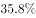，比上年提高2.8个百分点。从目前收购市场情况看，每斤优质小麦要比普通品种高出0.1元左右。这背后，<u>                    </u>。如今，多元化市场主体入市收购，既让丰收粮有了更加多样化的销售渠道，也让优质粮食品种销路更好、价格更高，优粮优价成为种粮农民增收的“金钥匙”。

填入画横线部分最恰当的一项是：

- **A**. 说到底就是稳住这些农民的种粮收益，保护农民的种粮积极性
- **B**. 正是粮食收储制度改革持续推进，市场机制作用得到更好发挥　✅
- **C**. 全国农户构成了粮食安全的坚强基石，稳住粮食生产的好形势
- **D**. 通过优化供给体系，拓展粮食产加销增值空间，分享增值收益

**答案**：B

**官方解析**

本题为语句填空题，横线在文段中间，需联系前后文把握话题的一致性。横线前首先指出农民粮食卖的好得益于市场，紧接着指出全国优质强筋弱筋小麦面积占比不断提高且价格也高于普通品种，横线后论述“多元化市场主体入市收购”使得优质粮食品种销路好、价格高，故横线处所填句子应体现优质粮食销路好、价格高的原因在于“市场”发挥作用，对应B项。
A项，“稳住这些农民的种粮收益，保护农民的种粮积极性”，无法与后文“市场”衔接，排除；
C项：“全国农户构成了粮食安全的坚强基石”强调农户的重要性，而文段重点围绕“市场”展开，并未提及农户的重要性，该项与前后文衔接不当，排除。
D项：“通过优化供给体系”强调“供给”，而文段重点围绕“市场”展开，并未提及“供给”，该项与前后文衔接不当，排除。
故正确答案为B。
【文段出处】潇湘晨报《千方百计保护农民的种粮积极性（话说新农村）》

---

## 数量关系

### 第 1 题　qid 3523436 · 数学运算

边长为整数且成等差数列的三个正方形，面积之和不大于5000，其中有两个正方形的面积之和等于第3个正方形的面积，这样的正方形存在多少组？

- **A**. 6
- **B**. 7
- **C**. 9
- **D**. 10　✅

**答案**：D

**官方解析**

方法一：设三个正方形的边长分别为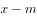、、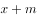，则面积分别为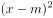、、；根据题干条件，，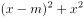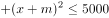，联立方程组可得，即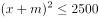，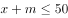；根据，可得；代入，可得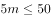，，由于为整数且不为0，故共有10组。

方法二：根据平方和等于最大数的平方，联想到满足勾股定理的整数组，勾股数。常见的勾股数只有（3，4，5）及其倍数是满足等差关系的，即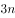，，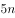，，解得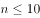，故共有10组。

故正确答案为D。

---

### 第 2 题　qid 3523439 · 数学运算

一次2小时的在线会议，会议结束前半小时才有人开始退出且每分钟退出会议人数满足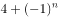，（）。若会议开始后加入会议人数是退出人数的1.5倍，且会议结束时还有100人在线，问会议开始时可能有多少人在线？

- **A**. 40　✅
- **B**. 50
- **C**. 60
- **D**. 70

**答案**：A

**官方解析**

设会议开始时可能有人在线。由题意可知，会议结束前半小时每分钟退出会议人数分别为人、人、人、人······，则会议结束前的半小时共退出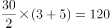人，故会议开始后加入会议人数人。会议结束时还有100人在线，则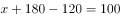，解得，即会议开始时可能有40人在线。

故正确答案为A。

---

### 第 3 题　qid 3523440 · 数学运算

张三与李四骑马观光，从东方村开始，途经幸福村到胜利村。从东方村骑行1小时后，张三：“已经走了多远？”李四：“刚好是到幸福村的一半。”两人又骑行20公里后，张三：“到胜利村还有多远？”李四：“刚巧是离幸福村的一半那样远。”则东方村到胜利村的距离是多少公里？

- **A**. 30
- **B**. 35　✅
- **C**. 40
- **D**. 45

**答案**：B

**官方解析**

此题对第二个过程的理解不同，会出现不同的答案。

【解析一】将东方村、幸福村、胜利村分别看成A、B、C三地，全程分为两个过程，第一个过程：先行驶AB（东方村到幸福村）的一半，用时1小时；第二个过程：又行驶20公里后，所处位置距胜利村（C）的距离刚好是到幸福村（B）的一半，即再行驶AB的加上BC的共20公里。根据条件可得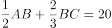，则全长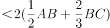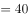，排除C、D两项。代入A项，若全长为30公里，则可得，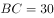，与全长为30公里矛盾。

故正确答案为B。

【解析二】将东方村、幸福村、胜利村分别看成A、B、C三地，全程分为两个过程，第一个过程：先行驶AB的一半，用时1小时；第二个过程：如果理解成到胜利村（C）的距离刚好是胜利村（C）离幸福村（B）的一半那么远，即再行驶AB的加上BC的共20公里，那么全长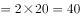公里。

故正确答案为C。

本题表述有争议，粉笔给出两种解题思路，但更倾向于选B。

---

### 第 4 题　qid 3523442 · 数学运算

某直播平台为3种特色农产品直播带货3小时，第1小时B产品销售额比A产品多50万元，C产品只有B产品的；第2小时与第1小时相比：A翻倍，B增加幅度比A少，而C增加两倍；最后1小时共带货3090万元，且A产品带货额比第1小时大幅增加，B、C均比第2小时增加，问第2小时直播带货额是多少万元？

- **A**. 1580
- **B**. 1600
- **C**. 1860　✅
- **D**. 2000

**答案**：C

**官方解析**

题干给出A、B、C3种农产品在带货第1、2、3小时内销售额的关系，可设第1小时B产品销售额为万元，可得三类产品3小时内得销售额如下：

根据最后1小时共带货3090万元可得：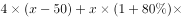；化简得，解得。

代入，第2小时带货额为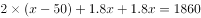万元。

故正确答案为C。

---

### 第 5 题　qid 3522681 · 数学运算

一车救灾物资从早上8点起开始运往1900公里外的某地，白天平均车速80公里/小时，夜间60公里/小时（假定8：00到18：00为白天，其他时段为夜间），司机每驾驶2小时必须休息20分钟，且每名司机每天驾驶时间不能超过8小时（00：00后即为新的一天）。问车上至少应配备几名司机且至少要用多长时间才能抵达该地？

- **A**. 3名；27小时15分　✅
- **B**. 3名；27小时25分
- **C**. 4名；33小时30分
- **D**. 4名；33小时40分

**答案**：A

**官方解析**

根据题意，要使总时间最短，则需让车辆一直在行驶，行驶情况如下表所示：

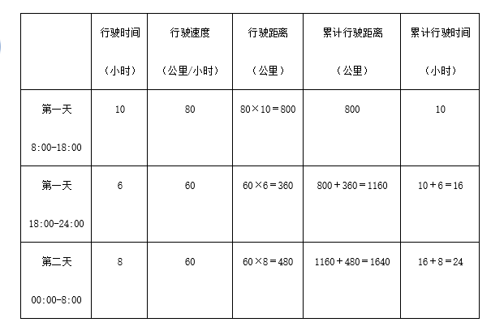

第二天白天所需行驶时间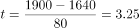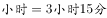，则总时间最短为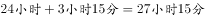，只有A项符合。

故正确答案为A。

备注：本题不严谨，根据题意，在总时间最短的情况下，最少需要2名司机即可完成物资运输。第一天16小时可安排为：每名司机开车2小时，休息2小时，每人共计开车8小时；第二天是新的一天，共需行驶11小时15分钟，每名司机可以继续开车2小时，休息2小时，第一名司机共开车6小时，第二名司机共开车5小时15分钟即可。在考场上，可以根据用时最短直接锁定答案，不必纠结司机的人数。

---

### 第 6 题　qid 3522686 · 数学运算

受新冠疫情影响，某高校某专业开展在线教育，在同一上课时间开设3门选修课A、B和C，每个学生可任选其中1门，但每门课程限选30人。已知该专业共有90人，问该专业学生小李能选中课程A的概率是：

- **A**. 

- **B**. 

- **C**. 

　✅
- **D**. 

**答案**：C

**官方解析**

方法一：根据概率公式，概率，可得所求概率。课程A限选30人，小李可为30人中的任意1人，所以小李选到A课程的情况数为；同理，“3门选修课A、B和C，每门课程限选30人”,即3门课共限选90人，小李可为90人中的任意1人，所以小李选到任意一门课的情况数为。则所求概率。 

方法二：由题目条件 “3门选修课A、B和C，每个学生可任选其中1门，但每门课程限选30人”，可知每个学生选择每门课的概率是相同的。因此小李有A、B、C共3种选择，则选择A课程的概率应为。

故正确答案为C。

---

### 第 7 题　qid 3522713 · 数学运算

小张和小李负责生产1200个零件，小张每天均生产20个。小李第一天生产10个，往后除最后一天外，每一天的产量都比前一天多1个。问整个任务中小张生产的个数比小李：

- **A**. 多40个
- **B**. 多80个
- **C**. 少40个
- **D**. 少80个　✅

**答案**：D

**官方解析**

设完成整个任务共耗时天，则小张完成的工作总量为个，假定小李最后一天也比前一天多1个，则小李每天完成的工作量构成了一个首项为10，公差为1，项数为的等差数列，根据等差数列通项公式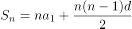代入可得，小李完成的总工作量为。

根据两人共完成1200个零件，可列方程：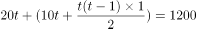，解得，向上取整，取28天。

代入，小张每天生产20个，则小张的总产量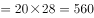个，小李的总产量个。此时，小李前27天按照等差数列共生产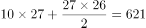个，第27天生产个，最后一天生产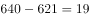个，满足题目中的条件“往后除最后一天外，每一天的产量都比前一天多1个”。因此，小张生产的个数比小李少个。

方法二：根据选项可转化为一组数，可考虑代入排除法。设小张、小李生产的零件数分别为x、y。

代入A项：x-y＝40，x＋y＝1200，则x＝620个，y＝580个。工作时间为620/20＝31天，根据等差数列通项公式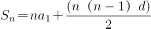，则小李除最后一天外生产的零件个数为个，不符合题意；

代入C项：y-x＝40，x＋y＝1200，则x＝580个，y＝620个。工作时间为天，根据等差数列通项公式，则小李除最后一天外生产的零件个数为个，不符合题意；

代入B项：x-y＝80，x＋y＝1200，则x＝640个，y＝560个。工作时间为天，根据等差数列通项公式，则小李除最后一天外生产的零件个数为个，不符合题意；

代入D项：y-x＝80，x＋y＝1200，则x＝560个，y＝640个。工作时间为560/20＝28天，根据等差数列通项公式，则小李除最后一天外生产的零件个数为个，故小李第28天生产640-621＝19个，第27天生产10＋（27-1）×1＝36个，满足题意。

故正确答案为D。

---

### 第 8 题　qid 3523446 · 数学运算

100亩实验田中种植了A、B、C三种作物，三种作物亩产量分别为300、500和600千克，总产量为45吨。已知A作物的种植面积是B作物的3倍，问C作物的种植面积是B作物的多少倍？

- **A**. 
2

- **B**. 
2.5

- **C**. 

- **D**. 

　✅

**答案**：D

**官方解析**

设B作物的种植面积是亩，则A作物的种植面积是亩。C作物的种植面积是亩。总种植面积，整理可得：······①。

总产量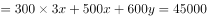，整理可得：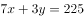······②

根据①②联立方程组，解得，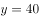，故C作物的种植面积是B作物的倍。

故正确答案为D。

---

### 第 9 题　qid 3522714 · 数学运算

甲单位职工人数是乙单位的2倍，两个单位所有职工中正好有一半是党员。其中甲单位职工中党员占比比乙单位高15个百分点，且甲单位的职工中群众人数比乙单位多18人。问甲单位职工中，党员比群众多多少人?

- **A**. 6
- **B**. 8
- **C**. 10
- **D**. 12　✅

**答案**：D

**官方解析**

设乙单位职工人数为人，则甲单位职工人数为人。乙单位职工中群众人数为人，则甲单位职工中群众人数为（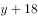）人。由两个单位所有职工中正好有一半是党员，可得另一半一定是非党员，即群众，故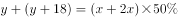······①。因甲单位职工中党员占比比乙单位高15个百分点，故甲单位职工中群众占比比乙单位低15个百分点，可列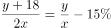······②。联立方程①②，解得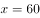，。故甲单位职工人数为人，甲单位职工中群众人数为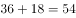人，甲单位职工中党员人数为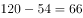人，党员比群众多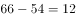人。

故正确答案为D。

【备注】本题假设职工只有党员和群众两种政治面貌。

---

### 第 10 题　qid 3523450 · 数学运算

2020年老张的年龄是小王年龄的4倍，2021年老李的年龄是小王年龄的3倍，已知老张比老李大12岁，问哪一年三人的年龄之和第一次超过140岁？

- **A**. 2020
- **B**. 2023
- **C**. 2026
- **D**. 2029　✅

**答案**：D

**官方解析**

设2020年小王的年龄是，根据题中的年龄关系列表：

根据老张比老李大12岁可得方程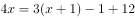，解得：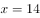。因此2020年老张，小王，老李的年龄分别为56岁，14岁，44岁。设再过年三人的年龄和超过140岁，则，解得，即9年，年。

故正确答案为D。

---

### 第 11 题　qid 3522715 · 数学运算

乙地在甲地的正东方26千米处，丙地在甲、乙两地连线的北方，且与甲、乙的距离分别为24千米和10千米。一辆车从甲、乙两地中点位置出发向正北方行驶，在经过甲丙连线时，与丙地的距离在以下哪个范围内?

- **A**. 不到8千米
- **B**. 8-9千米之间
- **C**. 9-10千米之间　✅
- **D**. 10千米以上

**答案**：C

**官方解析**

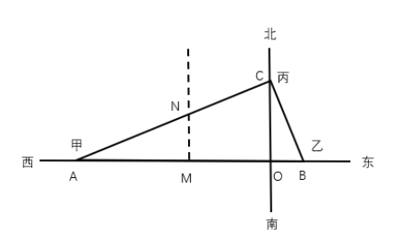

根据题意可得上图，因为甲乙两地距离千米，甲丙两地距离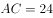千米，乙丙两地距离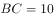千米，可知三角形ABC三边比例为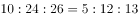，这三边满足勾股定理，所以三角形ABC为直角三角形，。M为甲乙两地中点，汽车从M向正北出发经过甲丙两地连线AC时交于N点，故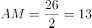千米。在直角三角形AMN中，。根据两直角三角形都有公共角可推出，根据相似三角形对应边成比例可列式，代入数据，解得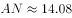千米，那么千米，在C项范围内，当选。

故正确答案为C。

---

### 第 12 题　qid 3522657 · 数学运算

饲养兔子需要场地，小林准备用一段长为28米的篱笆围成一个三角形形状的场地，已知第一条边长为米，由于条件限制第二条边长只能是第一条边长度的多4米，若第一条边是唯一最短边，则的取值可以为:

- **A**. 6
- **B**. 7　✅
- **C**. 8
- **D**. 9

**答案**：B

**官方解析**

由题意可知，三角形第一条边长为米，第二条边长为（）米，第三条边长为米。根据“第一条边是唯一最短边”可知：，即，排除C、D两项；根据三角形基本性质“两边之和大于第三边”可知：，即，排除A项。

故正确答案为B。

---

## 判断推理

### 第 1 题　qid 3522626 · 图形推理

从所给四个选项中，选择最合适的一项填入问号处，使之呈现一定的规律性。

- **A**. A
- **B**. B　✅
- **C**. C
- **D**. D

**答案**：B

**官方解析**

元素组成不相同，且无明显属性规律，考虑数量规律。图形由若干白球和黑球组成，可以考虑分开看黑球和白球的数量。横行竖行单独看黑球数量和白球数量没有规律，且黑球均出现在九宫格的四角处，可以考虑“米”字型看。“米”字型的四条线上，除最中间的图形外，两端的黑球相加数量为10，两端白球数量相加为10，所以？处应为2个黑球，对应B项。

故正确答案为B。

备注：本题的框架参照我国古代文明图案“河图洛书”所命制（如下图），在河图上，排列成数阵的黑点和白点，蕴藏着无穷的奥秘；在洛书上，纵、横、斜三条线上的三个数字，其和皆等于15。本题选取的即是洛书的排列形式，因此考虑横向、纵向、斜向相加均为15也是可以的。

---

### 第 2 题　qid 3523443 · 图形推理

分析下图中图形的变化规律，变化后第五行的图形应该是：

- **A**. A
- **B**. B　✅
- **C**. C
- **D**. D

**答案**：B

**官方解析**

元素组成相同，优先考虑位置规律。观察发现，每一行的图形每次向右平移一格（循环走），B项当选。
故正确答案为B。

---

### 第 3 题　qid 3523447 · 图形推理

若题干最左边的图形编号为1，其余图形的编号依次递增1，编号为90、91、92的图形应该是：

- **A**. A　✅
- **B**. B
- **C**. C
- **D**. D

**答案**：A

**官方解析**

该题为三个图形依次排列且呈周期性遍历，因此图1、图2、图3为一组，图4、图5、图6为一组······以此类推，当遇到3的倍数时恰好为完整的一组结束，因此90号应为上一组的最后一个图，即六面体，91、92为下一组的前两个图形，分别是圆柱、六面体。
故正确答案为A。

---

### 第 4 题　qid 3522641 · 图形推理

把下面的六个图形分为两类，使每一类图形都有各自的共同特征或规律，分类正确的一项是：

- **A**. ①②③，④⑤⑥
- **B**. ①②④，③⑤⑥
- **C**. ①③④，②⑤⑥　✅
- **D**. ①③⑥，②④⑤

**答案**：C

**官方解析**

本题为分组分类题目。元素组成不同，优先考虑属性规律。题干出现等腰元素，考虑对称性。①③④三个图形均有一条对称轴，仅为轴对称图形；②⑤⑥三个图形均有两条相互垂直的对称轴，既是轴对称图形也是中心对称图形。即①③④为一组，②⑤⑥为一组。
故正确答案为C。

---

### 第 5 题　qid 3523454 · 图形推理

把下面的六个图形分为两类，使每一类图形都有各自的共同特征或规律，分类正确的一项是：

- **A**. ①②④，③⑤⑥
- **B**. ①③⑥，②④⑤　✅
- **C**. ①②⑤，③④⑥
- **D**. ①⑤⑥，②③④

**答案**：B

**官方解析**

本题为分组分类题目。元素组成不同，属性规律无答案，考虑数量规律。观察发现，题干出现了圆相交，多端点图形，考虑笔画数，题干笔画数依次为：1、7、1、3、4、1。根据是一笔画还是多笔画分为：①③⑥一组，②④⑤一组。
故正确答案为B。

---

### 第 6 题　qid 3522643 · 图形推理

把下面的六个图形分为两类，使每一类图形都有各自的共同特征或规律，分类正确的一项是：

- **A**. ①③④，②⑤⑥　✅
- **B**. ①③⑤，②④⑥
- **C**. ①②⑥，③④⑤
- **D**. ①④⑥，②③⑤

**答案**：A

**官方解析**

本题为分组分类题目。元素组成不同，无明显属性规律，考虑数量规律。图形均有一条曲线，且曲线和直线交点明显，考虑曲直交点数，但图形曲直交点均为1，无法分组。观察图四切点特征明显，考虑切点数量。图①③④的切点数量均为1，图②⑤⑥的切点数量均为0。即图①③④为一组，图②⑤⑥为一组。
故正确答案为A。

---

### 第 7 题　qid 3523511 · 图形推理

右边四个小图形中，只有一个是由左边的四个图形拼合而成（只能通过上、下、左、右平移），请把它找出来。

- **A**. A
- **B**. B
- **C**. C　✅
- **D**. D

**答案**：C

**官方解析**

本题考查平面拼合，可采用平行且等长相消的方式解题。消去平行且等长的线段后进行组合即可得到轮廓图，即为C项。平行且等长相消的方式如下图所示：

故正确答案为C。

---

### 第 8 题　qid 3523441 · 图形推理

从所给的四个选项中选择最合适的一项，嵌入到题干图形的黑色区域使之构成一个完整的立方体：

- **A**. A
- **B**. B　✅
- **C**. C
- **D**. D

**答案**：B

**官方解析**

本题考查立体拼合，解题原则为凹凸一致。根据题干要求，可知正确选项嵌入到题干图形的黑色区域后应为一个完整的立方体。从题干可以得知，正面缺少构成“L”型的4个格子，上面第一层缺少构成“L”型的4个格子，右面缺少3个格子，排除A、D两项；对比B、C两项，C项需要进行一定的旋转才可嵌入进去，而B项不需要发生位置变化，因此B项最合适。
故正确答案为B。

---

### 第 9 题　qid 3522623 · 定义判断

化学沉积作用是指在水介质中，以胶体溶液和真溶液形式搬运的物质到达适宜场所后，当化学条件发生变化时，产生沉淀、堆积的过程。其中，胶体溶液是指含有一定大小的固体颗粒物质或高分子化合物的溶液，真溶液是指透明度较高的水溶液。
根据上述定义，下列不属于化学沉积作用的是：

- **A**. 干旱气候区，湖水很少外泄，蒸发作用使湖水的氯化钠增加、累积，变成咸水湖
- **B**. 当海水中的绿色粘土矿物随水流动时，会和含有铝、铁的胶体物质聚合形成海绿石
- **C**. 富含磷质的海水上升至浅海区，因压力减小，温度升高，磷质析出、沉积而形成磷矿
- **D**. 湖泊里的生物骨骼，它们吸收了空气中的二氧化碳形成碳酸钙，当碳酸钙浓度达到一定程度就在海底堆积下来，形成石灰岩　✅

**答案**：D

**官方解析**

第一步：找出定义关键词。

化学沉积作用：“水介质”、“以胶体溶液和真溶液形式搬运”、“当化学条件发生变化时，产生沉淀、堆积”；

胶体溶液：“含有一定大小的固体颗粒物质或高分子化合物的溶液”；

真溶液：“透明度较高的水溶液”。

第二步：逐一分析选项。

A项：湖水是水介质，符合“透明度较高的水溶液”，蒸发使湖水的氯化钠增加累积，变成咸水湖，即湖水搬运的最终物质是氯化钠，符合“当化学条件发生变化时，产生沉淀、堆积”，符合定义，排除；

B项：海水是水介质，符合“透明度较高的水溶液”，绿色粘土矿物随海水流动和含有铝、铁的胶体物质聚合形成海绿石，符合“以胶体溶液和真溶液形式搬运”、“当化学条件发生变化时，产生沉淀、堆积”，符合定义，排除；

C项：海水是水介质，符合“透明度较高的水溶液”，压力减小、温度升高导致磷质析出沉积形成磷矿，符合“以胶体溶液和真溶液形式搬运”、“当化学条件发生变化时，产生沉淀、堆积”，符合定义，排除；

D项：湖泊是水介质，符合“透明度较高的水溶液”，但生物骨骼最终形成的石灰岩不是在真溶液形式搬运下发生的沉淀、堆积，属于生物沉积作用，不符合“当化学条件发生变化时，产生沉淀、堆积”，不符合定义，当选。

本题是选非题，故正确答案为D。

备注：本题很多学生比较纠结A项和D项，如下图所示，A项是在“化学沉积”相关文献中的典型案例，通过对比择优，本题问“不属于”，故小粉笔更倾向把答案给到D项。

---

### 第 10 题　qid 3522631 · 定义判断

农业生产周期指在连续不断的农业再生产过程中，从开始生产到获得产品的整个过程所经过的全部时间，在种植业中一般是从整地开始到产品收获所经过的全部时间，在畜牧业中一般是从饲养幼畜开始到获得畜产品的时间。由于作为农业生产对象的动植物有自身的特性，并且受自然环境影响较大，其生产周期一般比工业生产周期长。
根据上述定义，下列选项涉及农业生产周期的是：

- **A**. 小李耕地、播种、打枝、摘棉花、纺线、织布······年复一年，周而复始　✅
- **B**. 小黄办了一家乡镇企业，从原材料购进、生产管理再到产品销售，他都亲力亲为
- **C**. 小刘今年在承包的荒山种植优质苹果树苗，经科学管理，树苗全部成活且长势良好
- **D**. 小王有个养猪场，虽年复一年重复着把猪崽养大的简单枯燥劳动，但始终干劲十足

**答案**：A

**官方解析**

第一步：找出定义关键词。
“连续不断的农业再生产过程中，从开始生产到获得产品的整个过程所经过的全部时间”、“在种植业中一般是从整地开始到产品收获所经过的全部时间”、“在畜牧业中一般是从饲养幼畜开始到获得畜产品的时间”。
第二步：逐一分析选项。
A项：小李耕地、播种、打枝、摘棉花、纺线、织布……年复一年，周而复始，耕地符合“从整地开始”，“摘棉花”符合“产品收获”，整个流程符合“连续不断的农业再生产过程中，从开始生产到获得产品的整个过程所经过的全部时间”，符合定义，当选；
B项：小黄办企业，买进材料、生产产品、销售产品，属于工业生产活动，不符合“农业再生产过程中”，不符合定义，排除；
C项：小刘种苹果树苗长势良好，没有提到最终是否获得产品，也没有提到是否是连续不断种树苗，不符合“连续不断的农业再生产过程中，从开始生产到获得产品的整个过程所经过的全部时间”，不符合定义，排除；
D项：小王年复一年重复把猪崽养大，畜产品指的是畜牧业生产所获得的产品（包括乳、肉、蛋、毛、皮及其副产品），养大后的猪崽属于牲畜，不属于畜产品，因此最终并未获得畜产品，不符合定义，排除。
注：A项中的纺线、织布虽属于加工业，但前面的耕地到摘棉花涉及了完整的农业生产周期。而D项并未获得畜产品，生产周期不完整。考虑本题提问方式为“涉及”，只有A项涉及了完整的农业生产周期，因此择优选择A项。
故正确答案为A。

---

### 第 11 题　qid 3522625 · 定义判断

增效作用指的是两种或两种以上药物同时或先后作用于机体所产生的防治作用大于各种药物单独对机体产生的总效应。
根据上述定义，下列最能体现增效作用的是：

- **A**. 石蒜是一种抗癌药，与大剂量维生素C配合使用，石蒜含有的石蒜碱毒性会增强
- **B**. 风湿止痛药酒和安乃近片均具有止痛作用，共用会使安乃近片代谢加快药物半衰期缩短
- **C**. 白掌施用亚硝酸铁化肥后可使发黄的叶子变绿，再施用磷酸二氢钾，会产生良好的催花效果
- **D**. 赤霉素和生长素均能促进植物茎秆伸长，共用时赤霉素可抑制生长素的氧化过程从而提高生长素的含量　✅

**答案**：D

**官方解析**

第一步：找出定义关键词。
“两种或两种以上药物”、“同时或先后作用于机体”、“防治作用大于药物单独对机体的总效应”。
第二步：逐一分析选项。
A项：石蒜含有的石蒜碱毒性会增强，不符合“防治作用大于药物单独对机体的总效应”，不符合定义，排除；
B项：共用会使安乃近片代谢加快药物半衰期缩短，不符合“防治作用大于药物单独对机体的总效应”，不符合定义，排除；
C项：施用亚硝酸铁化肥后施用磷酸二氢钾会产生良好的催花效果，不清楚是否防治作用大于单独使用的效果，不符合“防治作用大于药物单独对机体的总效应”，不符合定义，排除；
D项：共用赤霉素和生长素，符合“两种或两种以上药物”、“同时或先后作用于机体”，共用能够提高生长素的含量，符合“防治作用大于药物单独对机体的总效应”，符合定义，当选。
故正确答案为D。

---

### 第 12 题　qid 3522634 · 定义判断

相反相成修辞手法是指把通常相互对立、排斥的两个概念或判断巧妙地联系在一起，这样不仅能够揭示出存在于客观事物深层的矛盾辩证关系，还可以增加语言的意蕴。
根据上述定义，下列不属于相反相成修辞手法的是：

- **A**. 横眉冷对千夫指，俯首甘为孺子牛
- **B**. 有的人活着，他已经死了；有的人死了，他还活着
- **C**. 墙上芦苇，头重脚轻根底浅；山中竹笋，嘴尖皮厚腹中空　✅
- **D**. 这一天，死去的伟人在诗的国度里永生；这一天，活着的小丑在人们心上被埋葬

**答案**：C

**官方解析**

第一步：找出定义关键词。
“把通常相互对立、排斥的两个概念或判断巧妙地联系在一起”。
第二步：逐一分析选项。
A项：选项这句话意为对待敌人决不屈服，对人民大众甘愿服务。横眉和俯首是一个人的两个相互对立的态度，符合“把通常相互对立、排斥的两个概念或判断巧妙地联系在一起”，符合定义，排除； 
B项：选项这句话意为有的人虽然活着，但是他的道德败坏，就如已经死了一样没有价值，而有的人死了，他还活着，他的高尚的品格，代代相传，永远激励后人。活着和死了是一个人的两个相互对立的状态，符合“把通常相互对立、排斥的两个概念或判断巧妙地联系在一起”，符合定义，排除； 
C项：选项这句话用芦苇和竹笋比喻那些没有学问只会自吹自擂的人，芦苇和竹笋不符合“相互对立、排斥的两个概念或判断”，不符合定义，当选；
D项：选项这句话表达了不同类型的人在“这一天”的情况，死去和永生、活着和埋葬是一个人的两个相互对立的状态，符合“把通常相互对立、排斥的两个概念或判断巧妙地联系在一起”，符合定义，排除。
本题为选非题，故正确答案为C。

---

### 第 13 题　qid 3523437 · 定义判断

替代性创伤是指在听到或看到一些灾难性事件的信息后，损害程度超过其中部分人群的心理和情绪的耐受极限，产生与经历者等同的情绪、躯体反应的现象。
根据上述定义，下列现象属于替代性创伤的是：

- **A**. 乘客甲经历紧急故障迫降事件后从此再也不敢乘坐任何飞机
- **B**. 抗疫志愿者乙目睹新冠肺炎感染者遭受病痛折磨而严重失眠　✅
- **C**. 丙听朋友描述澳洲大火的细节之后反复梦见自己被大火吞噬
- **D**. 医生丁面对因医学技术上的局限而不能治愈的患者深感自责

**答案**：B

**官方解析**

第一步：找出定义关键词。
“在听到或看到一些灾难性事件的信息后”、“产生与经历者等同的情绪、躯体反应”。
第二步：逐一分析选项。
A项：乘客甲经历了灾难性事件，是经历者，不符合“在听到或看到一些灾难性事件的信息后”，也不符合“产生与经历者等同的情绪、躯体反应”，不符合定义，排除；
B项：抗疫志愿者乙目睹新冠肺炎感染者遭受病痛折磨，符合“在听到或看到一些灾难性事件的信息后”，严重失眠，符合“产生与经历者等同的情绪、躯体反应”，符合定义，当选；
C项：丙听朋友描述澳洲大火的细节，符合“在听到或看到一些灾难性事件的信息后”，但反复梦见自己被大火吞噬，做梦不属于情绪、躯体反应，不符合“产生与经历者等同的情绪、躯体反应”，不符合定义，排除；
D项：医生丁面对因医学技术上的局限而不能治愈的患者深感自责，不符合“在听到或看到一些灾难性事件的信息后”，也不符合“产生与经历者等同的情绪、躯体反应”，不符合定义，排除。
故正确答案为B。
经查询资料，本题C项应更符合创伤后应激障碍（PTSD），其中一个表现为患者的思维、记忆或梦中反复、不自主地涌现与创伤有关的情境或内容，也可出现严重的触景生情反应，甚至感觉创伤性事件好像再次发生一样。
由此可见C项更符合创伤后应激障碍，而不是替代性创伤。

---

### 第 14 题　qid 3522624 · 定义判断

自豪是一种产生于对自己的积极评价的情绪，其主要依赖于自我意识、自我评价以及自我反思。基于对成就的不同归因，自豪可分为真实自豪和自大自豪。真实自豪是以成就为导向的一种积极的自豪情绪，其主要来源于个体将成就归因于自身的努力；自大自豪是指一种偏向于消极的自豪情绪，其主要来源于个体将成就归因于自身的天赋。
根据上述定义，下列最符合自大自豪的是：

- **A**. 兴酣落笔摇五岳，诗成笑傲凌沧州
- **B**. 黄金白璧买歌笑，一醉累月轻王侯
- **C**. 俱怀逸兴壮思飞，欲上青天揽明月
- **D**. 天生我材必有用，千金散尽还复来　✅

**答案**：D

**官方解析**

第一步：找出定义关键词。
“偏向于消极的自豪情绪”、“主要来源于个体将成就归因于自身的天赋”。
第二步：逐一分析选项。
A项：“兴酣落笔摇五岳，诗成笑傲凌沧州”出自李白（唐）的《江上吟》，意思是我高兴起来落笔能让五岳震动，写出来的诗足以笑傲天下，表达出作者对自身诗才的自信，其态度是积极的，不符合“偏向于消极的自豪情绪”，不符合定义，排除；
B项：“黄金白璧买歌笑，一醉累月轻王侯”出自李白（唐）的《忆旧游寄谯郡元参军》，意思是花黄金白璧买来宴饮与欢歌笑语时光，一次酣醉使我数月轻蔑王侯将相，作者借喝酒买醉后的情绪轻蔑王侯将相，不符合“主要来源于个体将成就归因于自身的天赋”，不符合定义，排除；
C项：“俱怀逸兴壮思飞，欲上青天揽明月”出自李白（唐）的《宣州谢朓楼饯别校书叔云》，意思是我们都怀有豪情逸兴、雄心壮志，酒酣兴发，更是飘然欲飞，想登上青天摘取明月，不符合“偏向于消极的自豪情绪”，也不符合“主要来源于个体将成就归因于自身的天赋”，不符合定义，排除；
D项：“天生我材必有用，千金散尽还复来”出自李白（唐）的《将进酒》，意思是上天造就了我的才干就必然是有用处的，千两黄金花完了也能够再次获得，该诗句为作者政治上遭遇挫折，符合“偏向于消极的自豪情绪”，有才能就一定有用处，符合“主要来源于个体将成就归因于自身的天赋”，符合定义，当选。
故正确答案为D。

---

### 第 15 题　qid 3522638 · 定义判断

转喻是指两个认知对象在空间上或时间上的邻近共存以及其中一个对另一个的凸显可及，从而通过另一种事物来理解和体验当前的事物。
根据上述定义，下列不属于转喻的是：

- **A**. 一间阴暗的小屋里，上面坐着两位老爷，一东一西。东边的一个是马褂，西边的一个是西装
- **B**. 当一个游子想他家乡的时候我猜想它是像菜花一样金黄
- **C**. 灾害是一把尺子，可以测量一个民族蹲下后跳跃的高度　✅
- **D**. 朱门酒肉臭，路有冻死骨

**答案**：C

**官方解析**

第一步：找出定义关键词。

“两个认知对象”、“在空间上或时间上的邻近共存”、“通过另一种事物来理解和体验当前的事物”。

第二步：逐一分析选项。

A项：一间小屋东西各坐着一位老爷，马褂指代东边的老爷，西装指代西边的老爷，人物和身穿的衣服，符合“两个认知对象在空间上的邻近共存”，在特定场合穿着打扮体现着人物的身份，符合“通过另一种事物来理解和体验当前的事物”，符合定义，排除；

B项：选项取自《感情什么颜色》，用颜色来形容感情，家乡一般到处都种着菜花，菜花和家乡就有了空间上的邻近关系，符合“两个认知对象在空间上的邻近共存”，“金黄”的菜花，比喻春天的气息，生动刻画了游子对家乡的神往和思念，符合“通过另一种事物来理解和体验当前的事物”，符合定义，排除；

C项：用灾害这把“尺子”测量“民族蹲下后跳跃的高度”，灾害和尺子不存在空间上或时间上的邻近共存，不符合“两个认知对象在空间上或时间上的邻近共存”，不符合定义，当选；

D项：“朱门酒肉臭，路有冻死骨”意思是贵族人家的红漆大门里散发出酒肉的香味，路边就有冻死的骸骨。其中“朱门”指“贵族人家”，“冻死骨”指“穷苦百姓”，符合“两个认知对象”、“在空间上或时间上的邻近共存”，“朱门的酒肉臭”体现了贵族人家的骄奢淫逸，“路边的冻死骨”体现了穷苦人家的生活惨状，符合“通过另一种事物来理解和体验当前的事物”，符合定义，排除。

本题为选非题，故正确答案为C。

备注：如下图所示，从小粉笔查询到的相关文献来看，C项属于“隐喻”，而非“转喻”。

---

### 第 16 题　qid 3522628 · 定义判断

软暴力是指行为人为谋取不法利益或形成非法影响，对他人或者在有关场所进行滋扰、纠缠、哄闹、聚众造势等，足以使他人产生恐惧、恐慌进而形成心理强制，或者足以影响、限制人身自由、危及人身财产安全，影响正常生活、工作、生产、经营的违法犯罪手段。
根据上述定义，下列属于软暴力的是：

- **A**. 张某威胁王法官，如不秉公判案就举报其贪污的事实
- **B**. 甲公司为了在竞标中获胜，私下散布关于竞争对手的不利信息
- **C**. 某恶势力团伙为了向王某讨要赌债将其堵在酒店房间，24小时看守并不让其睡觉
- **D**. 网贷公司催收员长期使用群呼、群发短信、揭发隐私等手段滋扰欠款人及其紧急联系人、通讯录联系人　✅

**答案**：D

**官方解析**

第一步：找出定义关键词。

“为谋取不法利益或形成非法影响”、“对他人或者在有关场所进行滋扰、纠缠、哄闹、聚众造势”、“使他人产生恐惧、恐慌或影响、限制人身自由、危及人身财产安全，影响正常生活、工作、生产、经营的违法犯罪手段”。

第二步：逐一分析选项。

A项：张某威胁王法官秉公判案，不符合“为谋取不法利益或形成非法影响”，不符合定义，排除；

B项：甲公司为了在竞标中获胜，不符合“为谋取不法利益或形成非法影响”，不符合定义，排除；

C项：某恶势力将王某堵在房间不让其睡觉长达24小时，属于严重的人身强制行为，不属于“对他人或者在有关场所进行滋扰、纠缠、哄闹、聚众造势等”，不符合定义，排除；

D项：网贷公司使用群呼、群发、揭发隐私等手段滋扰欠款人及其紧急联系人、通讯录联系人，符合“对他人进行滋扰”，长期如此，符合“使他人产生恐惧、恐慌或影响”和“影响正常生活、工作、生产、经营的违法犯罪手段”，符合定义，当选。

故正确答案为D。

备注：下图中给出的示例，引自《光明日报》，该案是北京市首例网络“软暴力”的案件，与D项对应，而C项中的“24小时不让其睡觉”，直接限制了人身自由和行为且时间较长，二者比较，D项更符合定义。

---

### 第 17 题　qid 3522636 · 类比推理

匹马：单枪

- **A**. 万水：千山　✅
- **B**. 花红：柳绿
- **C**. 地久：天长
- **D**. 猴年：马月

**答案**：A

**官方解析**

第一步：判断题干词语间逻辑关系。
匹马是指一匹马，单枪是指一杆枪，二者属于并列关系，并且“匹”和“单”均可以用来表示数量。
第二步：判断选项词语间逻辑关系。
A项：万水和千山为并列关系，并且“万”与“千”均可以用来表示数量，与题干逻辑关系一致，当选；
B项：花红和柳绿为并列关系，但“花”与“柳”不可用来表示数量，与题干逻辑关系不一致，排除；
C项：地久和天长为并列关系，但“地”和“天”不可用来表示数量，与题干逻辑关系不一致，排除；
D项：猴年和马月为并列关系，但“猴”和“马”不可用来表示数量，与题干逻辑关系不一致，排除。
故正确答案为A。

---

### 第 18 题　qid 3522639 · 类比推理

铭心刻骨：记忆

- **A**. 冥思苦想：思想
- **B**. 繁花似锦：繁华
- **C**. 闭月羞花：容貌　✅
- **D**. 冷若冰霜：冷漠

**答案**：C

**官方解析**

第一步：判断题干词语间的逻辑关系。
造句子：铭心刻骨的记忆。二者可以构成偏正结构。
第二步：判断选项词语间逻辑关系。
A项：“冥思苦想”指绞尽脑汁，苦思苦想，与思想没有明显的逻辑关系，排除；
B项：“繁花似锦”是指许多色彩纷繁的鲜花，好像富丽多彩的锦缎，与繁华没有明显的逻辑关系，排除；
C项：“闭月羞花”指女子的容貌美丽，可以造句为闭月羞花的容貌，二者为偏正结构，与题干逻辑关系一致，当选；
D项：“冷若冰霜”比喻待人接物毫无感情，像冰霜一样冷，与冷漠构成近义关系，与题干逻辑关系不一致，排除。
故正确答案为C。

---

### 第 19 题　qid 3522627 · 类比推理

洪涝：干旱：防洪抗旱

- **A**. 地震：海啸：抗震救灾
- **B**. 滑坡：雪崩：道路抢修
- **C**. 严寒：酷热：防冻消暑　✅
- **D**. 风沙：雾霾：防沙除霾

**答案**：C

**官方解析**

第一步：判断题干词语间逻辑关系。
洪涝与干旱，二者为反义关系，且防洪与抗旱分别是前两种现象针对性的应对方法，与前两词构成对应关系。
第二步：判断选项词语间逻辑关系。
A项：地震与海啸，二者并不是反义关系，抗震是地震的应对方法，但救灾范围太大，与海啸对应关系并不贴切，与题干逻辑关系不一致，排除；
B项：滑坡与雪崩，二者并不是反义关系，且滑坡与雪崩都可能需要进行道路抢修，与题干逻辑关系不一致，排除；
C项：严寒与酷热，二者为反义关系，防冻是严寒的应对方法，消暑是酷热的应对方法，是两种现象的应对方式，与题干逻辑关系一致，当选；
D项：风沙与雾霾，二者并不是反义关系，与题干逻辑关系不一致，排除。
故正确答案为C。
注：本题有同学通过自然灾害选了D，这也是个角度，但是从题干特征来看，本题题干前两词反义关系明显，故优先考虑反义关系，不行的情况下再考虑是否是自然灾害，做题的首要原则是题干特征。

---

### 第 20 题　qid 3522635 · 类比推理

叔侄：关系：血亲

- **A**. 银河：恒星：宇宙
- **B**. 姑嫂：亲人：家庭
- **C**. 课堂：知识：书本
- **D**. 抑郁：疾病：心理　✅

**答案**：D

**官方解析**

第一步：判断题干词语间逻辑关系。
叔侄是一种关系，血亲是关系种类的限定，三者之间存在种属关系。
第二步：判断选项词语间逻辑关系。
A项：银河和恒星都是宇宙的一部分，银河和恒星分别与宇宙为组成关系，与题干逻辑关系不一致，排除；
B项：姑嫂是家庭的一部分，二者为组成关系，与题干逻辑关系不一致，排除；
C项：课堂和书本都是获取知识的载体，课堂和书本分别与知识为载体对应关系，与题干逻辑关系不一致，排除；
D项：抑郁是一种疾病，心理是疾病种类的限定，三者之间存在种属关系，与题干逻辑关系一致，当选。
故正确答案为D。

---

### 第 21 题　qid 3522637 · 类比推理

乡风：民俗：乡村文化

- **A**. 德治：法治：治理能力
- **B**. 小学：中学：基础教育　✅
- **C**. 习惯：民约：社会规则
- **D**. 通讯：网络：通信网络

**答案**：B

**官方解析**

第一步：判断题干词语间逻辑关系。
乡风是指乡里的风俗，民俗是指一个国家或民族中广大民众所创造、享用和传承的生活文化，二者是并列关系；乡风和民俗是乡村文化，前两词与第三词均是种属关系。
第二步：判断选项词语间逻辑关系。
A项：德治和法治都是治理方式，与治理能力没有必然联系，与题干逻辑关系不一致，排除；
B项：小学和中学为并列关系，小学和中学属于基础教育，前两词与第三词均是种属关系，与题干逻辑关系一致，当选；
C项：习惯是指积久养成的生活方式，民约是指人们约定共同遵守的契约，民约是一种习惯，二者是种属关系，与题干逻辑关系不一致，排除；
D项：通信网络是网络的一种，通讯和网络不是并列关系，与题干逻辑关系不一致，排除。
故正确答案为B。

---

### 第 22 题　qid 3522642 · 类比推理

（    ） 对于 汽车 相当于 （    ） 对于 相机

- **A**. 轮胎 手机
- **B**. 速度 像素
- **C**. 马达 快门　✅
- **D**. 单车 单反

**答案**：C

**官方解析**

逐一代入选项。
A项：轮胎是汽车的组成部分，二者是组成关系，手机和相机是两种电子设备，二者是并列关系，前后逻辑关系不一致，排除；
B项：速度是衡量汽车行驶快慢的指标，二者是必然对应关系，像素是相机中衡量清晰度的指标，但它只适用于数码相机，胶片相机不涉及像素这一概念，二者是或然对应关系，前后逻辑关系不一致，排除；
C项：马达是汽车的组成部分，二者是组成关系，快门是相机的组成部分，二者是组成关系，而且均是必然组成关系，前后逻辑关系一致，当选；
D项：单车和汽车是两种交通工具，二者是并列关系，单反的全称是单镜头反光相机，它是相机的一种，二者是种属关系，前后逻辑关系不一致，排除。
故正确答案为C。

---

### 第 23 题　qid 3522650 · 逻辑判断

野生动物之间因病毒入侵会暴发传染病。最新研究发现，热带、亚热带或低海拔地区的动物，因生活环境炎热，一直面临着罹患传染病的风险。生活在高纬度或高海拔等低温环境的动物，过去因长久寒冬可免于病毒入侵，但现在冬季正变得越来越温暖，持续时间也越来越短。因此，气温升高将加剧野生动物传染病的暴发。
以下哪项如果为真，最能支持上述观点？

- **A**. 无论气候如何变化，生活在炎热地带的动物始终面临着患传染病风险
- **B**. 适应寒带和高海拔栖息地的动物物种遭遇传染病暴发的风险正在升高
- **C**. 气温高低与野生动物患传染病风险之间存在正相关性，即气温越高患病风险越高　✅
- **D**. 寒冷气候可能让野生动物免受病毒入侵，炎热气候却更易导致野生动物感染病毒

**答案**：C

**官方解析**

第一步：找出论点和论据。
论点：气温升高将加剧野生动物传染病的暴发。
论据：热带、亚热带或低海拔地区的动物，因生活环境炎热，一直面临着罹患传染病的风险。生活在高纬度或高海拔等低温环境的动物，过去因长久寒冬可免于病毒入侵，但现在冬季正变得越来越温暖，持续时间也越来越短。
论据讨论的是炎热地区与低温地区对于动物罹患传染病的风险情况，论点讨论的是气温升高将加剧野生动物传染病的暴发，论据论点均在讨论气温与野生动物传染病的关系，话题一致，可以考虑补充论据进行加强。
第二步：逐一分析选项。
A项：该项指出炎热地带的动物始终面临着患传染病风险，而论点的主体为野生动物；同时该项并未说明气温升高是否会加剧野生动物传染病的暴发，话题不一致，无法加强，排除；
B项：该项指出适应寒带和高海拔栖息地的动物物种遭遇传染病暴发的风险正在升高，但并未说明气温升高与野生动物传染病暴发之间的关系，话题不一致，无法加强，排除；
C项：该项指出气温高低与野生动物患传染病风险之间存在正相关性，说明气温升高确实会加剧野生动物传染病的暴发，属于补充论据，可以加强，当选；
D项：该项指出寒冷气候与炎热气候对野生动物感染病毒的风险存在差异，属于重复论据，无法得知气温升高是否会加剧野生动物传染病的暴发，且是一种“可能”的说法，加强力度小于C项，排除。
故正确答案为C。

---

### 第 24 题　qid 3522620 · 逻辑判断

许多人在拍照时喜欢摆出“剪刀手”动作。对此，有人认为，如果手离镜头足够近，相机分辨率足够高，拍出的照片一旦上网，黑客就能通过照片放大技术和人工智能增强技术将照片中的人物指纹信息还原出来。这会让指纹认证及个人身份信息无密可保。因此，拍照时摆出“剪刀手”动作存在安全风险。
以下哪项如果为真，最能质疑上述结论?

- **A**. 目前智能手机虽在高速发展，但是分辨率还不足以拍出清晰的指纹
- **B**. 即使是高清网传照片，通过它还原指纹信息也存在一定的技术门槛
- **C**. 实验证明，网络照片受自身清晰度影响不满足识别指纹信息的条件　✅
- **D**. 从电子照片中提取到用户指纹信息的相关报道，实为愚人节新闻

**答案**：C

**官方解析**

第一步：找出论点和论据。
论点：拍照时摆出“剪刀手”动作存在安全风险。
论据：如果手离镜头足够近，相机分辨率足够高，拍出的照片一旦上网，黑客就能通过照片放大技术和人工智能增强技术将照片中的人物指纹信息还原出来。这会让指纹认证及个人身份信息无密可保。
本题论点讨论的是拍照时摆出“剪刀手”动作存在安全风险，论据讨论的是拍照时摆出“剪刀手”动作会把指纹呈现在照片中，上传到网络后黑客会通过各种技术还原指纹信息，使得指纹认证和个人身份信息无密可保，都是在说手离镜头足够近，会带来安全风险，话题一致，削弱优先考虑削弱论点。
第二步：逐一分析选项。
A项：该项说的是智能手机的分辨率还不足以拍出清晰的指纹，但不明确黑客能否通过一系列技术把指纹信息还原出来并带来安全风险，属于不明确选项，无法削弱，排除；
B项：该项讨论的是通过高清网传照片还原指纹信息存在一定的技术门槛，说明还原指纹信息困难，但是没有明确黑客最终能否通过技术还原指纹并带来安全风险，属于不明确选项，无法削弱，排除；
C项：该项指出网络照片受自身清晰度影响不满足识别指纹信息的条件，从而说明拍照时摆出“剪刀手”动作不会存在安全风险，可以削弱题干论点，当选；
D项：该项说的是这些报道实为愚人节新闻，但不明确拍照时摆出“剪刀手”动作能否带来安全风险，属于不明确选项，无法削弱，排除。
故正确答案为C。

---

### 第 25 题　qid 3522647 · 逻辑判断

研究表明，肉食中的化合物可能引发部分儿童气喘，进而导致哮喘或其他呼吸道疾病。这些化合物被称作“晚期糖基化终产物”，是肉类在高温烤炸烘焙时释放出的物质。所以，素食或者少吃肉可避免儿童患哮喘的风险。
以下哪项如果为真，最能质疑上述观点？

- **A**. 肉类在非高温烤炸烘焙情况下，不产生晚期糖基化终产物，与哮喘的关联性未知
- **B**. 科学家研究显示，体内的晚期糖基化终产物主要来自于但又并非仅仅来自于肉类　✅
- **C**. 晚期糖基化终产物除导致哮喘外，还能加速人体衰老，引发各种慢性退化性疾病
- **D**. 晚期糖基化终产物作为一种蛋白质，在人体中自然生成，并随着年龄的增长不断积聚

**答案**：B

**官方解析**

第一步：找出论点和论据。
论点：素食或者少吃肉可避免儿童患哮喘的风险。
论据：肉食中的化合物可能引发部分儿童气喘，进而导致哮喘或其他呼吸道疾病。这些化合物被称作“晚期糖基化终产物”，是肉类在高温烤炸烘焙时释放出的物质。
论据提出肉类烤炸烘焙时产生的晚期糖基化终产物可能引发部分儿童哮喘，论点认为素食或者少吃肉可避免儿童患哮喘的风险，二者话题一致，削弱优先考虑否定论点。
第二步：逐一分析选项。
A项：非高温烤炸烘焙肉类与哮喘关联性未知，因此素食或者少吃肉能否避免儿童患哮喘的风险并不明确，不明确选项，排除；
B项：指出晚期糖基化终产物并非仅仅来自于肉类，说明其他途径也会产生晚期糖基化终产物，只是素食或者少吃肉并不能“避免”儿童患哮喘的风险，可以削弱，保留；
C项：指出晚期糖基化终产物会带来其他不好的作用，与素食或者少吃肉可避免儿童患哮喘的风险无关，无法削弱，排除；
D项：指出晚期糖基化终产物在人体中自然生成，说明晚期糖基化终产物不是仅通过吃肉得到的，人体本身也会产生该物质，只是素食或者少吃肉并不能“避免”儿童患哮喘的风险，可以削弱，保留；
对比B、D两项，B、D两项都是从除了肉类之外还有其他途径会产生晚期糖基化终产物的角度来进行削弱；但题干论点是素食或者少吃肉可避免“儿童”患哮喘，D项的潜台词是人年龄越来越大，晚期糖基化终产物不断积聚，可能避免不了得哮喘，问题是到多大年纪，积聚了多少，才会得哮喘呢？如果是积聚到儿童阶段，就会得哮喘，那能削弱论点，说明素食或者少吃肉不可避免“儿童”患哮喘；但如果积聚到中老年阶段，才会得哮喘，那就与论点主体无关了，不确定素食或者少吃肉能不能避免“儿童”阶段患哮喘，综上所述B项比D项更明确。
故正确答案为B。

---

### 第 26 题　qid 3522648 · 逻辑判断

所有卫星在返回地球大气层时都会焚毁并产生氧化铝微粒，这些微粒会在大气层中飘浮很长时间，最终对环境造成影响。目前大约有6000颗人造卫星环绕地球旋转，其中的卫星已经停止运行，成为太空垃圾。专家警告称，随着人类不断发射卫星和太空飞船，太空垃圾极有可能坠向地球。据此科学家认为，应致力于研发木制人造卫星。

以下哪项如果为真，最能支持上述观点？

- **A**. 
1969年-2006年，我国发射的返回式卫星，其隔热罩由浸渍白橡木制成，时可安全燃烧

- **B**. 
木头不会阻挡电磁波或地球磁场，天线可放置在木制卫星主体内部，使卫星设计更加简单

- **C**. 
科学家已筛选出能有效承受极端温度和空间辐射轰击、可做卫星主体结构的合适木质材料

- **D**. 
木制卫星在回收时可直接燃烧，不会向地球大气层释放有害物质，也不会向地面倾泻碎片
　✅

**答案**：D

**官方解析**

第一步：找出论点和论据。
论点：应致力于研发木制人造卫星。
论据：随着人类不断发射卫星和太空飞船，太空垃圾极有可能坠向地球。
论点讨论的是应该研发木制人造卫星，论据讨论的是卫星等太空垃圾可能产生的危害，二者话题不一致，加强优先考虑搭桥。
第二步：逐一分析选项。
A项：该项说的是我国发射的返回式卫星可安全燃烧，但是并未说明是否会对环境造成影响，话题不一致，无法加强，排除；
B项：该项说的是木制卫星的设计更加简单，但是并未说明木制卫星对环境的影响程度，话题不一致，无法加强，排除；
C项：该项说的是科学家已筛选出可做卫星主体结构的合适木质材料，但是并未说明木制卫星对环境的影响程度，话题不一致，无法加强，排除；
D项：该项说木制卫星在回收时可直接燃烧，不会产生危害，在论据“卫星等太空垃圾可能产生的危害”与论点“木制卫星”之间建立联系，为搭桥项，当选。
故正确答案为D。

---

### 第 27 题　qid 3523501 · 逻辑判断

1901年在伊朗苏萨城废墟中出土的罐子上发现了一种古老语言，被称为埃兰语，考古学家最近破译了它。考证发现：埃兰语与美索不达米亚原始楔形文字一样久远，但不是起源于美索不达米亚，而是在古波斯一带使用。与表音并表意的美索不达米亚楔形文字不同，埃兰语是表音语言。考古学家由此推测：埃兰语是古波斯一带人们独立使用的语言。
上述推测如果为真，最能质疑下列哪项观点？

- **A**. 埃兰语由表示音节、辅音和元音的符号构成，遵循由左向右的书写规则
- **B**. 埃兰语大约4000年前在现今西亚一带使用，使用时间可能超过1400年
- **C**. 埃兰语与美索不达米亚原始楔形文字、古埃及的圣书体等语言同时产生
- **D**. 埃兰语源于美索不达米亚原始楔形文字，与楔形文字是母体和子体关系　✅

**答案**：D

**官方解析**

第一步：分析题干。
注意问法为用题干推测来削弱选项观点，所以题干可视为论据。
推测：埃兰语是古波斯一带人们独立使用的语言。
考证发现：埃兰语与美索不达米亚原始楔形文字一样久远，但不是起源于美索不达米亚，而是在古波斯一带使用。与表音并表意的美索不达米亚楔形文字不同，埃兰语是表音语言。
第二步：逐一分析选项。
A项：推测说的是埃兰语是古波斯一带人们独立使用的语言，该项说的是埃兰语的构成符号，遵循的书写规则，话题不一致，无法削弱，排除；
B项：推测说的是埃兰语是古波斯一带人们独立使用的语言，该项说的是埃兰语在现今西亚一带使用过，以及使用时间范围，话题不一致，无法削弱，排除；
C项：推测说的是埃兰语是古波斯一带人们独立使用的语言，该项说的是埃兰语与美索不达米亚原始楔形文字、古埃及的圣书体等语言同时产生，语言同时产生不等同于语言在古波斯一带独立使用，话题不一致，无法削弱，排除；
D项：推测说的是埃兰语是古波斯一带人们独立使用的语言，考证发现说的是埃兰语与表音并表意的美索不达米亚原始楔形文字不同，埃兰语是表音语言，该项说的是埃兰语与美索不达米亚原始楔形文字是母体和子体关系，且埃兰语来源于美索不达米亚原始楔形文字，削弱选项观点，当选。
故正确答案为D。

---

### 第 28 题　qid 3522619 · 逻辑判断

某实验结果表明：源于植物的“天然化合物”组合可以分解新冠病毒与人细胞相连的刺突蛋白，从而能非常有效地抑制新冠病毒，该化合物组合很可能对抑制暴露在新冠病毒环境中的人群遭受感染方面具有立竿见影的效果。
要得到上述研究推论，还需基于以下哪一前提：

- **A**. 新冠病毒的刺突蛋白会随着传播过程发生突变
- **B**. 新冠病毒主要是通过呼吸道飞沫和密切接触而传播
- **C**. 刺突蛋白是病毒本身将其侵入人体细胞的组成部分　✅
- **D**. 刺突蛋白变异会使传染性更强，药物是否有效还待验证

**答案**：C

**官方解析**

第一步：找出论点和论据。
论点：源于植物的“天然化合物”组合可以分解新冠病毒与人细胞相连的刺突蛋白，从而能非常有效地抑制新冠病毒，该化合物组合很可能对抑制暴露在新冠病毒环境中的人群遭受感染方面具有立竿见影的效果。
论据：无。
本题论点讨论了“天然化合物”组合可以分解新冠病毒与人细胞相连的刺突蛋白，从而能有效地抑制新冠病毒，无明显论据，且提问方式为前提，加强优先考虑补充必要条件。
第二步：逐一分析选项。
A项：选项强调的是新冠病毒的刺突蛋白会发生突变，论点讨论的是“天然化合物”组合可以分解新冠病毒与人细胞相连的刺突蛋白，从而能有效地抑制新冠病毒，话题不一致，不是论点成立的前提条件，排除；
B项：选项讨论的是新冠病毒的传播方式，论点讨论的是“天然化合物”组合可以分解新冠病毒与人细胞相连的刺突蛋白，从而能有效地抑制新冠病毒，话题不一致，不是论点成立的前提条件，排除；
C项：选项表明刺突蛋白是病毒本身将其侵入人体细胞的组成部分，结合论点可以确认“天然化合物”组合能够用于分解新冠病毒与人细胞相连的刺突蛋白，说明该方法具有可行性，是论点成立的前提条件，当选；
D项：选项重点强调的是现有药物是否有效有待验证，但不明确现有药物是否用到了“天然化合物”组合且是否能够有效地抑制新冠病毒，不是论点成立的前提条件，排除。
故正确答案为C。

---

### 第 29 题　qid 3522651 · 类比推理

动物园中有三种动物：骆驼、大象和猴子，它们的年龄均为整数。三个伙伴小张、小王和小李去动物园参观动物，他们各选择一种动物去参观，三人选的动物各不相同。已知：
①大象住在动物园东边的动物馆；
②骆驼已经4岁，住在西边的动物馆；
③小王去看的是动物园东边和西边之间的动物；
④小张去看的动物年龄最小；
⑤三种动物年龄从西到东依次增加，且平均年龄为5岁。
以下说法正确的是：

- **A**. 猴子年龄为5岁　✅
- **B**. 大象年龄为7岁
- **C**. 小王参观的是大象
- **D**. 小李参观的是骆驼

**答案**：A

**官方解析**

第一步：分析题干条件。
（1）骆驼、大象和猴子的年龄均为整数；
（2）大象住在动物园东边；
（3）骆驼4岁，住在动物园西边；
（4）小王看的是动物园东边和西边之间的动物；
（5）小张去看的动物年龄最小；
（6）三种动物年龄从西到东依次增加，且平均年龄为5岁。
第二步：根据题干条件进行推理。
根据条件（2）（3）和（4），大象住东边，骆驼住西边，可知住动物园东边和西边之间的动物是猴子，则小王看的是猴子，排除C项；根据条件（6）可知，三种动物的年龄排序从小到大为骆驼、猴子和大象，结合条件（5）可知小张看的是骆驼，排除D项；根据条件（3）可知骆驼4岁，根据（1）和条件（6）可知，猴子的年龄为5岁，大象的年龄为6岁，排除B项。
故正确答案为A。

---

### 第 30 题　qid 3523516 · 类比推理

三位房东甲、乙、丙将自己的房子分别租给租客小李、小张、小王。甲说他租给的是小李；小李说他租的是丙的房子；丙说他租给的是小王。
若这三人均没有说真话，则下列选项正确的是：

- **A**. 房东乙将房子租给了小张
- **B**. 房东丙将房子租给了小李
- **C**. 小王租的是房东乙的房子
- **D**. 小李租的是房东乙的房子　✅

**答案**：D

**官方解析**

第一步：分析题干条件。
（1）甲房租给小李；
（2）小李租丙房；
（3）丙房租给小王；
（4）三个人都没说真话。
第二步：根据题干信息进行推理。
三人都说假话，首先把假话变成真话为：
（1）甲房没租给小李；
（2）小李没租丙房；
（3）丙房没租给小王。
根据最大信息，条件（1）、（2）都提到小李，即小李没租甲房和丙房，则小李一定租的是乙房。
故正确答案为D。

---

## 资料分析

### 材料 1

        2020年，我国规模以上互联网和相关服务企业（以下简称互联网企业）业务收入12838亿元，同比增长，增速低于上年同期8.9个百分点。

        2020年，互联网企业实现营业利润1187亿元，同比增长，增速低于上年同期3.7个百分点；得益于成本控制较好，营业成本仅增长，行业营业利润高出同期收入增速0.7个百分点。

        2020年，互联网企业信息服务收入共7068亿元，同比增长，增速低于上年同期11.2个百分点。互联网接入及相关服务收入447.5亿元，同比增长，增速低于上年同期20.8个百分点；互联网数据服务（包括云服务、大数据服务等）收入199.8亿元，同比增长，增速较上年同期提高3.9个百分点。

        2020年，东部地区互联网业务收入11227亿元，同比增长，增速较上年同期回落9个百分点，中部地区互联网业务收入448.1亿元，同比增长，增速较上年同期回落53.1个百分点。西部地区互联网业务收入497.2亿元，同比增长，增速较上年同期回落15.2个百分点。东北地区互联网业务收入47.1亿元，同比增长。

        2020年，互联网业务累计收入居前5名的广东（增长）、北京（增长）、上海（增长）、浙江（增长）和江苏（增长）共完成互联网业务收入10706亿元，同比增长，增速超过全国平均水平2.6个百分点，占全国（扣除跨地区企业）比重达，占比较上年同期提高0.8个百分点。

#### 第 1 题　qid 3522673 · 增长

2020年，互联网企业收入同比约增长了：

- **A**. 1187亿元
- **B**. 1309亿元
- **C**. 1426亿元　✅
- **D**. 1605亿元

**答案**：C

**官方解析**

根据题干“2020年，······同比约增长了”，结合选项有具体单位，可判定本题为增长量计算问题。定位文字材料第一段，“2020年，我国规模以上互联网和相关服务企业（以下简称互联网企业）业务收入12838亿元，同比增长”。代入公式：增长量，可得2020年，互联网企业收入同比增长量亿元。

故正确答案为C。

---

#### 第 2 题　qid 3522680 · 增长

2019年，互联网企业互联网接入及相关服务收入同比增速比同年信息服务收入同比增速：

- **A**. 高不到10个百分点　✅
- **B**. 高10个百分点以上
- **C**. 低不到10个百分点
- **D**. 低10个百分点以上

**答案**：A

**官方解析**

定位文字材料第三段，“2020年，互联网企业信息服务收入······同比增长，增速低于上年同期11.2个百分点。互联网接入及相关服务收入······同比增长，增速低于上年同期20.8个百分点”。因此，2019年，互联网接入及相关服务收入同比增速为；互联网企业信息服务收入同比增速为。，则2019年，互联网企业互联网接入及相关服务收入同比增速比同年信息服务收入同比增速高不到10个百分点。

故正确答案为A。

---

#### 第 3 题　qid 3522683 · 比重

在东部、中部、西部和东北四个地区中，2019年和2020年互联网业务收入占全国比重均高于上年水平的地区有几个？

- **A**. 0
- **B**. 1　✅
- **C**. 2
- **D**. 3

**答案**：B

**官方解析**

根据题干“2019年和2020年······占全国比重均高于去年水平······”，可判定本题为两期比重比较问题。定位文字材料第一段，“2020年，我国······互联网企业收入······同比增长，增速低于上年同期8.9个百分点”，定位文字材料第四段，“2020年，东部地区互联网业务收入······同比增长，增速较上年同期回落9个百分点，中部地区······同比增长······。西部地区······同比增长······。东北地区······同比增长”。根据两期比重比较结论“部分增速快于整体增速，则比重上升”，比较可知：2020年互联网业务收入同比增速只有东部地区（）快于全国（），比重上升；2019年，东部地区互联网业务收入同比增速为，快于全国（），则2019年东部地区的比重也上升。因此，2019年和2020年互联网业务收入占全国比重均高于上年水平的地区有1个。

故正确答案为B。

---

#### 第 4 题　qid 3522688 · 综合

2020年，东部地区除广东、北京、上海、浙江和江苏之外的省市互联网业务收入约比2019年：

- **A**. 
增长
　✅
- **B**. 
增长

- **C**. 
减少

- **D**. 
减少

**答案**：A

**官方解析**

根据题干“2020年······比2019年······”，结合选项为增长/减少，且东部地区广东、北京、上海、浙江、江苏其他东部地区，可判定本题为混合增长率问题。定位文字材料第四段可知：2020年，东部地区完成互联网业务收入11227亿元，同比增长；定位文字材料第五段可知：2020年，互联网业务累计收入居前5名的广东、北京、上海、浙江和江苏共完成互联网业务收入10706亿元，同比增长。则2020年，东部地区除广东、北京、上海、浙江、江苏的其他地区完成互联网业务收入亿元。令东部地区除广东、北京、上海、浙江、江苏的其他地区完成互联网业务收入同比增速为，根据线段法：距离与量成反比（一般用现期量近似代替基期量），可得：，即，解得，最接近A项。

故正确答案为A。

---

#### 第 5 题　qid 3522689 · 增长

关于我国互联网企业业务状况，能够从上述资料中推出的有几条？

①2019年实现利润超过1000亿元

②2020年，互联网数据服务收入比2018年增长了不到

③2018年及2019年，中部地区互联网业务收入均低于西部地区

- **A**. 0
- **B**. 1
- **C**. 2
- **D**. 3　✅

**答案**：D

**官方解析**

①：定位文字材料第二段“2020年，互联网企业实现营业利润1187亿元，同比增长”。根据基期计算公式：基期量，可知2019年实现利润为亿元，正确；

②：定位文字材料第三段可知，2020年，互联网数据服务（包括云服务、大数据服务等）收入199.8亿元，同比增长，增速较上年同期提高3.9个百分点。则2019年增长率为，根据间隔增长率公式：，可知2020年互联网数据服务收入比2018年增长，正确；

③：定位文字材料第四段可知，（2020年）中部地区互联网业务收入448.1亿元，同比增长3.4%，增速较上年同期回落53.1个百分点。西部地区互联网业务收入497.2亿元，同比增长6.9%，增速较上年同期回落15.2个百分点。则2019年中、西部地区互联网业务收入同比增速分别为3.4%+53.1%=56.5%、6.9%+15.2%=22.1%。根据公式：基期量=，可得2019年中、西部地区互联网业务收入分别为亿元、亿元，435亿元（中部）&lt;465亿元（西部），即2019年中部地区互联网业务收入低于西部地区；同理，2018年中、西部地区互联网业务收入分别为亿元、亿元，亿元（中部）&lt;亿元（西部），即2018年中部地区互联网业务收入低于西部地区，正确。

故正确答案为D。

---

### 材料 2

某公司全年销售甲、乙、丙、丁四种产品的销量，单位成本和销售单价如下：

#### 第 6 题　qid 3523453 · 综合

某公司全年销量最大的是：

- **A**. 甲产品
- **B**. 乙产品
- **C**. 丙产品　✅
- **D**. 丁产品

**答案**：C

**官方解析**

定位表格材料可得：甲产品第1—4季度销量分别为20350件、22010件、18080件、19320件；乙产品第1—4季度销量分别为12260件、13130件、13280件、13550件；丙产品第1—4季度销量分别为46350件、48980件、45610件、45820件；丁产品第1—4季度销量分别为4360件、4578件、3940件、4256件。比较发现，丙产品每个季度的销量在四种产品中都是最大的，根据全年销量第1季度第2季度第3季度第4季度，可得丙产品全年销量最大。

故正确答案为C。

---

#### 第 7 题　qid 3523455 · 综合

某公司全年销售价格波动绝对值最大的是：

- **A**. 甲产品
- **B**. 乙产品
- **C**. 丙产品
- **D**. 丁产品　✅

**答案**：D

**官方解析**

定位表格材料可得：甲产品销售单价的最大值和最小值分别为13元、12元；乙产品4个季度销售单价都是15元；丙产品销售单价的最大值和最小值分别为5.0元、4.5元；丁产品销售单价的最大值和最小值分别为138元、128元；根据波动的绝对值最大值最小值，可得甲产品销售价格波动的绝对值为，乙产品为0，丙产品为，丁产品为。故全年销售价格波动绝对值最大的是丁产品。

故正确答案为D。

备注：波动在数学理论上应该算方差，结合公考一贯的命题思路，不涉及复杂计算，可以将波动理解为变化，变化的绝对值最大，即差值最大。

---

#### 第 8 题　qid 3523456 · 比重

对于某公司丁产品，季度销售总额占全年销售总额比重最大的是：

- **A**. 第1季度
- **B**. 第2季度　✅
- **C**. 第3季度
- **D**. 第4季度

**答案**：B

**官方解析**

根据题干“······季度销售总额占全年销售总额比重最大的是”，可判定本题为现期比重问题。定位表格材料可得：丁产品第1—4季度销量分别为4360件、4578件、3940件、4256件；销售单价分别为130元、138元、128元、136元。比较发现，第2季度销量和销售单价在4个季度里都是最大的，根据销售总额销售单价销量可得，丁产品第2季度的销售总额最大。再根据比重，整体相同，部分越大，比重越大；全年销售总额相同，丁产品第2季度的销售总额最大，故第2季度销售总额占的比重最大。

故正确答案为B。

---

#### 第 9 题　qid 3523487 · 综合

以下图形中，能够表示某公司甲产品四个季度销售利润趋势的是：

- **A**. 

- **B**. 

- **C**. 

　✅
- **D**. 

**答案**：C

**官方解析**

定位表格材料，甲产品四个季度的销量分别为20350件、22010件、18080件、19320件，单位成本分别为10元、10元、11元、10元，销售单价分别为12元、12元、13元、13元。根据利润总额单件利润销量销售单价单位成本销量，可知甲产品四个季度的利润总额分别为元、元、元、元，趋势为上升、下降、上升，符合此规律的只有C项。

故正确答案为C。

---

#### 第 10 题　qid 3523488 · 综合

根据资料，下列选项说法正确的是：

- **A**. 在四种产品中，甲产品的利润率最高
- **B**. 乙产品的销量在四个季度有升有降
- **C**. 由于丙产品每季度单位产品利润没有变化，所以每个季度的利润总额也没有发生变化
- **D**. 在四种产品中，销售总额占全年全公司销售总额比重最大的是丁产品　✅

**答案**：D

**官方解析**

A项：定位表格材料，甲产品四个季度的单位成本依次为10元、10元、11元、10元，销售单价依次为12元、12元、13元、13元，丙产品四个季度的单位成本依次为2.5元、2.5元、3.0元、2.6元，销售单价依次为4.5元、4.5元、5.0元、4.6元。由利润率得，甲产品四个季度的利润率分别为、、、，甲产品全年的利润率可以看成四个季度利润率的混合，根据总体混合居中，甲产品全年的利润率应介于~之间。同理，丙产品四个季度的利润率分别为、、、，则丙产品的利润率应介于~之间，则丙产品的利润率大于甲产品的利润率，甲产品的利润率并非最高，错误；

B项：定位表格材料，乙产品四个季度的销量分比为12660件、13130件、13280件、13550件，可知乙产品的销量在四个季度中均为上升，错误；

C项：定位表格材料，丙产品第1季度、第2季度的销量分别为46350件、48980件，单位成本分别为2.5元、2.5元，销售单价分别为4.5元、4.5元，根据利润总额，虽然单位利润不变，但销量变化，所以第1季度、第2季度的利润总额是不一样的，错误；

D项：根据比重，整体（全年全公司销售总额）相同，只需比较部分（各产品销售总额）即可，再根据销售总额，定位表格材料，可知甲产品的销售总额为元，乙产品的销售总额为元，丙产品的销售总额为元，丁产品的销售总额为元，则丁产品的销售总额最大，故占比也最高，正确。

故正确答案为D。

---

### 材料 3

#### 第 11 题　qid 3522682 · 平均数

2009年-2019年，城镇非私营单位和私营单位平均工资差额最大的年份是：

- **A**. 2009年
- **B**. 2013年
- **C**. 2016年
- **D**. 2019年　✅

**答案**：D

**官方解析**

定位图1可知，2009年-2019年我国城镇私营和非私营单位就业人员的平均工资。选项各年份对应的城镇非私营单位和私营单位平均工资差额计算如下：

A项（2009年）：元；

B项（2013年）：元；

C项（2016年）：元；

D项（2019年）：元。

因此，平均工资差额最大的年份是2019年。

故正确答案为D。

---

#### 第 12 题　qid 3522685 · 平均数

与2009年相比，2019年城镇非私营单位就业人员平均工资增长的倍数约为：

- **A**. 1.5倍
- **B**. 1.8倍　✅
- **C**. 2.8倍
- **D**. 3.2倍

**答案**：B

**官方解析**

根据题干“与2009相比，2019年······增长的倍数约为”，可判定本题为一般增长率计算问题。定位图1可知，2009年、2019年城镇非私营单位就业人员平均工资分别为32244元、90501元。根据增长率，所求增长率倍，即增长的倍数约为1.8倍。

故正确答案为B。

---

#### 第 13 题　qid 3522687 · 平均数

2019年城镇非私营单位工资低于当年非私营单位平均工资的行业有：

- **A**. 9个　✅
- **B**. 12个
- **C**. 15个
- **D**. 16个

**答案**：A

**官方解析**

定位折线图可知，2019年城镇非私营单位就业人员平均工资为90501元；定位统计表可知，2019年我国各行业城镇非私营单位就业人员的平均工资，故2019年城镇非私营单位工资低于当年非私营单位平均工资的行业有：农、林、牧、渔业，制造业，建筑业，批发和零售业，住宿和餐饮业，房地产业，租赁和商务服务业，水利、环境和公共设施管理业以及居民服务和其他服务业，一共9个行业。
故正确答案为A。

---

#### 第 14 题　qid 3522690 · 增长

2009年-2019年，城镇私营单位平均工资年均增长率最高的是：

- **A**. 科学研究、技术服务和地质勘查业
- **B**. 信息传输、计算机服务和软件业　✅
- **C**. 金融业
- **D**. 建筑业

**答案**：B

**官方解析**

根据题干“······年均增长率最高”，可判定本题为年均增长率问题。定位统计表可知，2009年和2019年我国各行业城镇私营单位就业人员的平均工资。根据年均增长率公式：可得，n（年份差：2009年-2019年）相同，只需比较即可，即越大，年均增长率越大。则科学研究、技术服务和地质勘查业：；信息传输、计算机服务和软件业：；金融业：；建筑业：，故2009年-2019年信息传输、计算机服务和软件业的平均工资年均增长率最高。

故正确答案为B。

---

#### 第 15 题　qid 3522692 · 综合

下列选项说法正确的是：

- **A**. 2009年-2019年，城镇私营单位平均工资年均增长速度快于非私营单位平均工资年均增长速度　✅
- **B**. 2009年-2019年，城镇非私营单位的各行业平均工资均高于私营单位相应行业的平均工资
- **C**. 2019年非私营采矿业的平均工资最接近全社会平均工资，所以该行业内部分配最公平
- **D**. 2019年城镇私营单位行业之间薪资差额最大的有3.6倍

**答案**：A

**官方解析**

A项：定位折线图可知，城镇非私营单位平均工资2009年为32244元，2019年为90501元；城镇私营单位平均工资2009年为18199元，2019年为53604元。根据年均增长率公式：可得，n（年份差：2009年-2019年）相同，只需比较即可，即越大，年均增长率越大。则非私营单位：；私营单位：，故2009年-2019年，城镇私营单位平均工资年均增长速度快于非私营单位，正确；

B项：定位统计表可知，2009年农、林、牧、渔业私营单位平均工资为14585元，非私营单位为14356元，非私营平均工资并非均高于私营，且题干要求的是2009年-2019年，但材料只给了2009年和2019年的数据，中间年份的平均工资无法得知，错误；

C项：材料中没有说明全社会的平均工资，且没有提及行业内部分配问题，故无法推出，错误；

D项：材料未给出2019年公共管理和社会组织的城镇私营单位平均工资，故不能确定2019年城镇私营单位行业的最高薪资和最低薪资，故无法推出，错误。

故正确答案为A。

---

### 材料 4

#### 第 16 题　qid 3523503 · 综合

2019年，通勤高峰最拥堵的城市是：

- **A**. 北京
- **B**. 上海
- **C**. 重庆　✅
- **D**. 南京

**答案**：C

**官方解析**

根据题干“2019年······最拥堵的城市是”，可判定本题为基期比较问题。在表格材料中分别给出了现期量和增长率，根据基期量，得到四个城市的交通高峰拥堵指数，分别为北京、上海 、重庆 、南京，根据分数比较中的一大一小直接看，上海、重庆和南京三个城市中重庆的数据分子最大，并且分母最小，排除B、D两项。北京的数据直除首两位为20，重庆的数据直除首两位为21，因此C项更大，当选。

故正确答案为C。

---

#### 第 17 题　qid 3523506 · 综合

如果小张从家里到公司的距离是20公里，并且都采用开车方式，2020年他在下列哪个城市居住高峰时段通勤用时最短？

- **A**. 广州
- **B**. 成都
- **C**. 苏州　✅
- **D**. 西安

**答案**：C

**官方解析**

在表格材料中分别给出了2020年广州、成都、苏州和西安的通勤高峰实际速度，四个数据分别为29.84km/h、32.72km/h、37.26km/h和26.41km/h。根据路程，距离一定的情况下，速度越大，通勤时间越短，C项速度最大，当选。

故正确答案为C。

---

#### 第 18 题　qid 3523508 · 综合

2020年，小张在下列哪个新一线城市居住会感觉公共交通最便利？

- **A**. 合肥
- **B**. 成都　✅
- **C**. 郑州
- **D**. 长沙

**答案**：B

**官方解析**

在表格材料中分别给出了合肥、成都、郑州和长沙四个城市2020年公共交通线路网密度，四组数据分别为合肥3.029、0.480；成都4.678、0.977；郑州4.106、0.753和长沙3.953、0.630。通过直接观察数据我们发现成都的地面公交线路网密度4.678和地铁线路网密度0.977都是这四个城市中最大的，所以成都公共交通最便利。
故正确答案为B。

---

#### 第 19 题　qid 3523510 · 综合

比较一线城市（北京、上海、广州、深圳），2019年通勤高峰交通拥堵程度由重到轻依次是：

- **A**. 北京、上海、广州、深圳
- **B**. 上海、北京、深圳、广州
- **C**. 深圳、北京、上海、广州
- **D**. 北京、广州、上海、深圳　✅

**答案**：D

**官方解析**

根据题干“2019年通勤高峰交通拥堵程度由重到轻······”，结合表格材料所给数据为2020年各城市通勤高峰交通拥堵指数及同比增速，可判定本题为基期比较问题。结合基期量可知，2019年北京：、上海：、广州：、深圳：。故2019年通勤高峰交通拥堵程度由重到轻依次是北京、广州、上海、深圳。

故正确答案为D。

---

#### 第 20 题　qid 3523513 · 综合

根据资料，下列选项说法错误的是：

- **A**. 
2020年，在通勤高峰交通拥堵指数排名全国前10位的城市中，新一线城市占比达到
　✅
- **B**. 
如果只考虑交通拥堵情况，新一线城市中最宜居的是郑州

- **C**. 
假设2020年佛山的拥堵排名比上年下降4位，极有可能是该市增加了地面公交投入

- **D**. 
如果重庆要在2021年缓解交通拥堵，一个有效的办法是在通勤的高峰限制私家车出行

**答案**：A

**官方解析**

A项：定位表格材料，2020年通勤高峰交通拥堵指数排名全国前10位的新一线城市分别是重庆、西安、青岛、南京4个，占比为，不是。错误；

B项：定位表格材料，新一线城市中，通勤高峰交通拥堵指数最低的是郑州。正确；

C项：定位表格材料，佛山的拥堵排名比上年下降，且观察数据可得，佛山地面公交线路网密度的数据全国表现突出，由此推断极有可能是该市增加了地面公交投入。正确；

D项：定位表格材料，重庆通勤高峰实际速度较慢，由此可以推断应是高峰期私家车辆过多导致的，故高峰期限制私家车出行可能会缓解交通拥堵。正确。

本题为选非题，故正确答案为A。

备注：

1、北京、上海、广州、深圳不属于新一线城市。

2、本道题目题干表述不明确，采取优中选优的方式选择，A项必错，在考场上其余选项不确定是否必错的情况下可做跳过处理。

---
