# 2022年北京市公务员录用考试《行测》题（网友回忆版）

> 省考 · 2022 年 · 6 个模块 · 共 135 题

- [政治理论](#%E6%94%BF%E6%B2%BB%E7%90%86%E8%AE%BA) · 3 题
- [常识判断](#%E5%B8%B8%E8%AF%86%E5%88%A4%E6%96%AD) · 32 题
- [言语理解与表达](#%E8%A8%80%E8%AF%AD%E7%90%86%E8%A7%A3%E4%B8%8E%E8%A1%A8%E8%BE%BE) · 35 题
- [数量关系](#%E6%95%B0%E9%87%8F%E5%85%B3%E7%B3%BB) · 15 题
- [判断推理](#%E5%88%A4%E6%96%AD%E6%8E%A8%E7%90%86) · 30 题
- [资料分析](#%E8%B5%84%E6%96%99%E5%88%86%E6%9E%90) · 20 题

---

## 政治理论

### 第 1 题　qid 4652154 · 时事政治

党的十九届六中全会是在中国共产党百年华诞的重要时刻，在“两个一百年”奋斗目标历史交汇关键节点上召开的一次重要会议。关于本次全会审议通过的《中共中央关于党的百年奋斗重大成就和历史经验的决议》，下列表述中正确的有：
①是党在历史上形成的第三个历史决议
②指出了中国共产党百年奋斗的历史意义
③深刻揭示了“过去我们为什么能够成功、未来我们怎样才能继续成功”
④从13个方面分领域总结了党和国家在各个时期取得的历史性成就、发生的历史性变革

- **A**. ①②③　✅
- **B**. ①②④
- **C**. ①③④
- **D**. ②③④

**答案**：A

**官方解析**

本题考查政治常识。
2021年11月，党中央在北京召开了党的十九届六中全会，全面总结党的百年奋斗重大成就和历史经验。全会审议通过了《中共中央关于党的百年奋斗重大成就和历史经验的决议》（以下简称《决议》）。
①正确，《决议》是中国共产党历史上的第三个历史决议，是21世纪的马克思主义纲领性文件，是第一个百年征程的里程碑、第二个百年征程的宣言书。
②正确，《决议》从人民、道路、主义、世界、政党五个方面概括了中国共产党百年奋斗的历史意义，全面、深刻、系统地阐述了中国共产党对中国人民、对中华民族、对马克思主义、对人类进步事业、对马克思主义政党建设所作的历史性贡献。
③正确，《决议》融汇了百年来中国共产党践行为中国人民谋幸福、为中华民族谋复兴的初心使命所进行的奋斗、牺牲和创造，深刻揭示了“过去我们为什么能够成功、未来我们怎样才能继续成功”。
④错误，《决议》从13个方面分领域总结了新时代党和国家事业取得的历史性成就、发生的历史性变革。应该是“新时代”的成就与变革，而非“各个时期”。
综上所述，①②③表述正确。
故正确答案为A。

---

### 第 2 题　qid 4652188 · 毛中特

习近平总书记《在党史学习教育动员大会上的讲话》指出，我们党历来重视党史学习教育，注重用党的奋斗历程和伟大成就鼓舞斗志、明确方向，用党的光荣传统和优良作风坚定信念、凝聚力量，用党的实践创造和历史经验启迪智慧、砥砺品格。这体现的哲学原理有：
①社会存在决定社会意识
②实践到认识到再实践再认识，是一个循环往复的辩证发展过程
③实践是检验真理的唯一标准
④先进的社会意识对社会发展起推动作用

- **A**. ①④
- **B**. ②③
- **C**. ①③
- **D**. ②④　✅

**答案**：D

**官方解析**

本题考查政治常识。
①错误，④正确，社会存在是指构成社会的一切存在，包括个体、社会组织、社会活动、各种财产等。社会意识是指大群体特有的人类对世界和自身的态度和信念的总和。包括哲学、政治、经济、法律、宗教、道德、艺术、科学、生态、宇航及日常生活等观点。社会存在决定社会意识，社会意识对社会存在具有反作用，先进的社会意识对社会发展起推动作用。党的奋斗历程、实践经验都属于社会存在；传统、斗志、信念、智慧都属于社会意识。“用党的光荣传统和优良作风坚定信念、凝聚力量”体现了先进的社会意识对社会发展起推动作用。但并未体现社会存在对社会意识的决定作用。
②正确，实践与认识的辩证运动，是一个由实践到认识、再实践、再认识，循环往复以至无穷的辩证发展过程。题干“我们党历来重视党史学习教育，注重用党的奋斗历程和伟大成就鼓舞斗志、明确方向，用党的光荣传统和优良作风坚定信念、凝聚力量”体现了这一哲理。
③错误，实践决定认识，实践是检验真理的唯一标准。表述正确但与本题无关。
故②④说法正确，①③说法错误。
故正确答案为D。

---

### 第 3 题　qid 4652183 · 时事政治

因为不会使用智能手机，许多老年人遭遇了就医难、购票难、购物难等问题。2021年3月第十三届全国人民代表大会第四次会议在北京举行，会议通过的《政府工作报告》指出，推进智能化服务要适应老年人需求，并做到不让智能工具给他们日常生活造成障碍。为此，必须：

- **A**. 强化政府信息公开，打造阳光政府
- **B**. 坚持传统服务与智能创新相结合，实施惠民政策　✅
- **C**. 优化政府公共服务职能，保障社会公平正义　✅
- **D**. 坚持依法行政，改善营商环境

**答案**：BC

**官方解析**

本题考查政治常识。
A项错误，政府信息公开有助于克服在行政管理过程中的暗箱操作、权力失衡、决策失误等问题，进而有助于防止行政腐败，与题干中“智能化服务要适应老年人需求”无关。
B项正确，坚持传统服务与智能创新相结合，推进线上线下深度融合，增强全国一体化政务服务平台服务能力，优化整合提升各级政务大厅“一站式”功能，全面实现政务服务事项全城通办、就近能办、异地可办，充分保障老年人基本服务需要。
C项正确，优化政府公共服务职能，推行公共服务便捷化，为老年人提供优质高效便捷的公共服务，进一步提高公共服务质量和效率，保障社会公平正义。
D项错误，坚持依法行政，改善营商环境，可以提高企业运行效率，提升国际竞争力，但与题干中“智能化服务要适应老年人需求”无关。
故正确答案为BC。

---

## 常识判断

### 材料 1

阅读以下材料，完成18—21题

        2014年党中央站在国家发展全局的高度，作出了实施京津冀协同发展战略这一重大决策。七年来，三省市和有关部门狠抓落实，《京津冀协同发展规划纲要》确定的到2020年的目标任务已全面顺利完成。有序推进北京非首都功能疏解，空间布局和经济结构得到优化提升；高标准高质量推进雄安新区建设，新区呈现塔吊林立、热火朝天的新面貌；加快推进重点地区发展，引领带动周边地区协同发展；大力推进重点领域协同发展，交通、生态、产业等不断取得新突破；谋划推进一批重大改革创新举措落地，协同发展体制机制日趋完善；积极推进民生领域补短板强弱项，基本公共服务均等化水平持续提高。

        “京津冀如同一朵花上的花瓣，瓣瓣不同，却瓣瓣同心”。七年来的实践充分证明：实现京津冀协同发展，是面向未来打造新的首都经济圈、推进区域发展体制机制创新的需要，是探索完善城市群布局和形态、为优化开发区域发展提供示范和样板的需要，是探索生态文明建设有效路径、促进人口经济资源环境相协调的需要，是实现京津冀优势互补、促进环渤海经济区发展、带动北方腹地发展的需要。京津冀协同发展重大战略给京畿大地带来广阔的发展前景。

#### 第 1 题　qid 4652193 · 人文常识

根据《中共中央 国务院关于对&lt;北京城市副中心控制性详细规划（街区层面）（2016年-2035年）&gt;的批复》，下列地区与北京市通州区统一规划、统一政策、统一标准、统一管控的有：
①三河  ②宝坻  ③香河  ④固安  ⑤大厂  ⑥武清

- **A**. ①④⑤
- **B**. ②④⑥
- **C**. ①③⑤　✅
- **D**. ②③⑥

**答案**：C

**官方解析**

本题考查政治常识。
①③⑤正确，②④错误，《中共中央 国务院关于对&lt;北京城市副中心控制性详细规划（街区层面）（2016年-2035年）&gt;的批复》在“九、推动城市副中心与河北省廊坊北三县地区协同发展”部分指出：“发挥城市副中心对周边的辐射带动作用，实现通州区与河北省廊坊北三县地区统一规划、统一政策、统一标准、统一管控，促进协同发展。”其中，廊坊北三县指廊坊市的三河县、大厂回族自治县以及香河县。
故正确答案为C。

---

#### 第 2 题　qid 4652194 · 人文常识

北京2022年冬奥会是我国重要历史节点的重大标志性活动，京津冀三地在公共安全、公共卫生、道路交通等方面出台临时性行政措施，共同保障冬奥会筹办工作。下列冬奥会比赛场馆与所承接比赛项目对应正确的是：

- **A**. 首都体育馆——花样滑冰　✅
- **B**. 国家高山滑雪中心——钢架雪车
- **C**. 五棵松体育中心——速度滑冰
- **D**. 云顶滑雪公园——冬季两项

**答案**：A

**官方解析**

本题考查政治常识。

北京冬奥会是第24届冬奥会，将于2022年2月4日至20日举行，共设7个大项、15个分项、109个小项。2022冬奥会和冬残奥会竞赛场馆及项目分布如下图所示。

A项正确，首都体育馆将举办的项目是短道速滑与花样滑冰。

B项错误，国家高山滑雪中心将举办项目的是高山滑雪；钢架雪车项目将在国家雪车雪橇中心举办。

C项错误，五棵松体育中心将举办的项目是女子冰球。速度滑冰项目将在国家速滑馆举办。

D项错误，云顶滑雪公园将举办的是单板滑雪、自由式滑雪等项目。冬季两项将在古杨树场馆群的国家冬季两项中心举办。

故正确答案为A。

---

#### 第 3 题　qid 4652195 · 人文常识

为充分整合京津冀三地文化和旅游等资源，有关部门发行了“京津冀旅游一卡通”。下列不可能列入其中的旅游景点是:

- **A**. 盘山风景名胜区
- **B**. 赵州桥展览馆
- **C**. 古北口古镇
- **D**. 沙家浜旅游区　✅

**答案**：D

**官方解析**

本题考查地理国情。
A项正确，盘山位于天津市蓟州区西北，为国家5A级景区。该景区始记于汉，兴于唐，极盛于清，是自然山水与名胜古迹并著，佛家文化与皇家文化共融的旅游休闲胜地。
B项正确，赵州桥，是一座位于河北省石家庄市赵县城南洨河之上的石拱桥，因赵县古称赵州而得名。赵州桥始建于隋代，由匠师李春设计建造。赵州桥展览馆位于河北省石家庄市赵县赵州镇赵州桥景区。
C项正确，古北口镇，隶属于北京市密云区。主要景点有司马台长城、古北口瓮城、杨令公庙等。
D项错误，沙家浜旅游区一般指沙家浜芦苇荡风景区。沙家浜芦苇荡风景区位于江苏省常熟市阳澄湖畔，不属于京津冀三地的范围。
本题为选非题，故正确答案为D。

---

#### 第 4 题　qid 4652196 · 人文常识

2021年8月北京市政府印发的《北京市“十四五”时期高精尖产业发展规划》指出，2035年京津冀产业协同发展新格局将全面形成。下列哪项不可能是该文件提出的相关措施？

- **A**. 完善以智能网联汽车为核心的京津冀汽车产业生态圈，加快有条件自动驾驶的智能网联汽车研发生产和示范应用
- **B**. 支持北京工业互联网和智能制造头部企业对接津冀生产制造资源，加速赋能津冀传统产业
- **C**. 抓紧抓好协同发展重点任务落实，促进养老、教育、医疗等公共服务的跨区域协同　✅
- **D**. 推动京津冀规模化、协同化布局氢能产业，重点布局制备、运输、存储、加注和氢燃料电池产业链环节

**答案**：C

**官方解析**

本题考查政治常识。
A、B、D三项正确，《北京市“十四五”时期高精尖产业发展规划》在“四、优化区域协同发展新格局”中的“（四）构建京津冀产业协同发展新格局”部分第1点指出：“（1）氢能产业协同发展示范。推动京津冀规模化、协同化布局氢能产业，重点布局制备、运输、存储、加注和氢燃料电池产业链环节······（2）智能网联汽车产业协同发展示范。完善以智能网联汽车为核心的京津冀汽车产业生态圈，加快有条件自动驾驶的智能网联汽车研发生产和示范应用，提高自动驾驶功能装备率······（3）工业互联网产业协同发展示范。加快推进京津冀联网协同智造，支持北京工业互联网和智能制造头部企业对接津冀生产制造资源，加速赋能津冀传统产业。”
C项错误，“抓紧抓好协同发展重点任务落实，促进养老、教育、医疗等公共服务的跨区域协同”不是该文件提出的相关措施。
本题为选非题，故正确答案为C。

---

### 材料 2

阅读以下材料，完成22—25题

        北京朝阳原国营798厂等电子工业的老厂区所在地，已华丽转身，成为赫赫有名的北京798艺术区，即北京的文化新地标。数以百计的设计、文化艺术机构云集此地，形成了别具一格的“SOHO式艺术聚落”和“LOFT生活方式”。798艺术区的形成，主要基于对原有空间和建筑的开发、改造和利用，这是北京市开展城市更新行动的方式之一。

        城市更新主要是指对城市空间形态和城市功能的持续完善和优化调整，是小规模、渐进式、可持续的更新。2021年，北京市相继发布了《北京市人民政府关于实施城市更新行动的指导意见》和《北京市城市更新行动计划（2021-2025年）》。北京市人大常委会还启动了《北京市城市更新条例》立项论证工作。

        近年来，北京市提出了减量发展，要从集聚资源求增长转向疏解功能谋发展。北京实施的城市更新行动，不是点状或线状式的更新，而是创新性地以街区为单元，加强统筹片区单元更新与分项更新，统筹城市更新与疏解整治促提升，统筹地上和地下更新，统筹重大项目建设与周边地区更新，统筹政府支持与社会资本参与，推进城市更新行动高效有序开展。

#### 第 5 题　qid 4652168 · 人文常识

北京市的城市更新行动主要在（    ）开展。

- **A**. 城市建成区　✅
- **B**. 城市核心区
- **C**. 城市规划区
- **D**. 城乡结合部

**答案**：A

**官方解析**

本题考查政治常识。
2021年6月10日，北京市人民政府发布了《北京市人民政府关于实施城市更新行动的指导意见》，文件在“一、总体要求“中的“（二）基本原则”部分指出：“城市更新主要是指对城市建成区（规划基本实现地区）城市空间形态和城市功能的持续完善和优化调整，是小规模、渐进式、可持续的更新。”
故正确答案为A。

---

#### 第 6 题　qid 4652170 · 人文常识

按照北京市的政策，下述选项中，不符合城市更新行动精神的是：

- **A**. 规划引领，试点推行
- **B**. 大拆大建，更新城市面貌　✅
- **C**. 提质增效，盘活存量空间资源
- **D**. 政府引导，多种方式吸引社会资本参与

**答案**：B

**官方解析**

本题考查政治常识。
2021年08月31日，北京市人民政府办公厅发布了《北京市城市更新行动计划（2021-2025年）》。
A项正确，《北京市城市更新行动计划（2021-2025年）》在“一、总体要求”中的“（三）基本原则”部分指出：“1.规划引领，试点先行。贯彻落实北京城市总体规划、控制性详细规划和分区规划，做到严控总量、分区统筹、增减平衡。按照城市空间布局和不同圈层功能定位、资源禀赋，注重分区引导、分类制定政策。坚持自下而上的更新需求与自上而下的规划引导要求相结合，加大政策机制改革力度，试点先行、以点带面、项目化推进，探索城市更新的新模式、新路径、新机制，有序开展城市更新行动。”
B项错误，《北京市城市更新行动计划（2021-2025年）》在“二、项目类型”部分指出：“实施城市更新行动，聚焦城市建成区存量空间资源提质增效，不搞大拆大建，除城镇棚户区改造外，原则上不包括房屋征收、土地征收、土地储备、房地产一级开发等项目。城市更新行动与疏解整治促提升专项行动进行有效衔接，规划利用好疏解腾退的空间资源。”
C项正确，《北京市城市更新行动计划（2021-2025年）》在“一、总体要求”中的“（二）总体目标”部分指出：“通过实施城市更新行动，进一步完善城市空间结构和功能布局，促进产业转型升级，建设国际科技创新中心；建立良性的城市自我更新机制，实现存量空间资源提质增效，为‘两区’建设提供更加有效的空间载体；大力发展数字经济，以盘活存量空间资源支持建设全球数字经济标杆城市······”
D项正确，《北京市城市更新行动计划（2021-2025年）》在“一、总体要求”中的“（三）基本原则”部分指出：“3.政府引导，市场运作。充分发挥政府统筹引导作用，建立以区为主、市区联动的城市更新行动工作机制，研究制定支持政策，强化统筹推进力度。充分激发市场活力，调动不动产产权人、市场主体和社会力量等各方积极性，多种方式引入社会资本。更新改造空间以持有经营为主，探索形成多渠道投资模式。”
本题为选非题，故正确答案为B。

---

#### 第 7 题　qid 4652173 · 人文常识

城市更新行动中，应当注重加强“微空间”更新改造。下列措施中，最能体现这一点的是：

- **A**. 将798老厂区改为798艺术区
- **B**. 将老旧小区楼房外立面涂新
- **C**. 将批发市场拆迁后改为城市送风通道
- **D**. 将街道“边角地”改为口袋公园　✅

**答案**：D

**官方解析**

本题考查政治常识。
D项正确，A、B、C三项错误，在我国快速城市化发展背景下，城市空间格局发生巨大变化，伴随人口数量的急剧增长，城市用地日趋紧张。尤其在城市旧城区，公共开放空间不足、环境品质不佳等“城市病”问题日益显现。相对于城市街道空间、广场空间等城市主体空间，微空间往往规模较小，依附于城市主体空间存在。四个选项中，街道“边角地”更符合“微空间”的定义。
故正确答案为D。

---

#### 第 8 题　qid 4652177 · 法律常识

北京市推进城市更新立法工作的意义在于：
①为城市更新工作提供制度保障
②进一步明确有关部门各自职责范围，协同开展相关工作
③依法保障公众在城市更新行动中的知情权、参与权、表达权和监督权
④为国家出台法律规范全国的城市更新工作起到示范作用

- **A**. ①②③
- **B**. ①②④　✅
- **C**. ①③④
- **D**. ②③④

**答案**：B

**官方解析**

本题考查管理常识。
①正确，2021年8月19日上午，北京市人大常委会城建环保办公室组织召开《北京市城市更新条例》立项论证工作启动会。会上郝志兰主任表示，城市更新工作十分重要，有利于进一步完善城市功能、改善人居环境、激发城市活力，通过立法为城市更新工作提供制度保障非常必要。
②正确，北京市推进城市更新立法，如《北京市城市更新条例》讨论涉及城市更新范围、责任主体、政策保障、审批流程优化、社会资本与公众参与机制等重点问题。将通过法律明确有关部门在城市更新工作中的职责范围，有利于各部门依照程序协同开展相关工作。
③错误，北京市政府、人大常委会通过发布文件、启动立项论证工作推进城市更新立法，无法体现公众的参与权、表达权和监督权。
④正确，早在党的十九届五中全会、中央城市工作会议等就已经提出全国城市更新工作的相关要求，北京推进城市更新立法是对这些会议精神的贯彻，为国家出台法律规范全国的城市更新工作起到了示范作用。
综上①②④说法正确。
故正确答案为B。

---

#### 第 9 题　qid 4652158 · 法律常识

北京市S区本着“小事不出社区，大事不出街道”的原则，推出线上矛盾纠纷多元化解平台，通过大数据等技术汇聚多方调节力量，让百姓遇到纠纷可在线答疑，足不出户调解纠纷，降低矛盾化解成本，为百姓维权提供新途径。这有利于：
①为矛盾纠纷化解提供跨时空、跨地域的一站式解决方案
②形成“社会调节替代法律诉讼”的新型调解纠纷模式
③提升诉讼服务水平，从根本上消除社区居民矛盾
④形成基层社会治理新格局，打造城市版的“枫桥经验”

- **A**. ①②
- **B**. ①③
- **C**. ①④　✅
- **D**. ②④

**答案**：C

**官方解析**

本题考查管理常识。
①正确，题干提到“北京市S区本着‘小事不出社区，大事不出街道’的原则，推出线上矛盾纠纷多元化解平台”，矛盾化解平台是一个集咨询、评估、调解、诉讼于一体的“社会化解纷服务共享平台”，通过大数据、云计算、人工智能技术汇聚多方调解力量，连接多元解纷资源，合理配置共享，为矛盾纠纷化解提供跨时空、跨地域的一站式解决方案。
②错误，法律诉讼和社会调节之间的关系是相互作用相互补充的，二者都是调节老百姓之间矛盾的方式。社会调节如果不能解决问题，最终还是要用法律调节解决。故社会调节不可以代替法律调节。
③错误，题干中“从根本上消除社区居民矛盾”的说法错误，违背了马克思主义哲学中对立统一规律强调的矛盾的普遍性，即矛盾存在于一切事物中，存在于一切事物发展过程的始终，旧的矛盾解决了，新的矛盾又产生，事物始终在矛盾中运动。人不能从根本上消除矛盾。
④正确，“枫桥经验”是20世纪60年代初，在浙江省绍兴市诸暨县枫桥镇干部群众创造的“发动和依靠群众，坚持矛盾不上交，就地解决，实现捕人少，治安好”的基层管理方式。题干中“小事不出社区，大事不出街道”的原则可称之为城市版的“枫桥经验”。
故①④说法正确。
故正确答案为C。

---

#### 第 10 题　qid 4652163 · 人文常识

《中共中央 国务院关于深入打好污染防治攻坚战的意见》中提出，“十四五”时期，推进100个左右地级及以上城市开展“无废城市”建设，鼓励有条件的省份全域推进“无废城市”建设。下列关于“无废城市”的理解正确的是：

- **A**. “无废城市”意味着城市没有固体废物产生
- **B**. “无废城市”旨在将固体废物环境影响降至最低　✅
- **C**. “无废城市”将不再采用填埋的方式进行固体废物处理
- **D**. “无废城市”意味着固体废物能完全资源化利用

**答案**：B

**官方解析**

本题考查政治常识。
B项正确，A、C、D三项错误，《国务院办公厅关于印发“无废城市”建设试点工作方案的通知》在首段指出：“‘无废城市’是以创新、协调、绿色、开放、共享的新发展理念为引领，通过推动形成绿色发展方式和生活方式，持续推进固体废物源头减量和资源化利用，最大限度减少填埋量，将固体废物环境影响降至最低的城市发展模式。‘无废城市’并不是没有固体废物产生，也不意味着固体废物能完全资源化利用，而是一种先进的城市管理理念，旨在最终实现整个城市固体废物产生量最小、资源化利用充分、处置安全的目标，需要长期探索与实践。”
故正确答案为B。

---

#### 第 11 题　qid 4652164 · 法律常识

近年来，各地开始全面推行证明事项和涉企经营许可事项告知承诺制。下列说法中，正确的是：

- **A**. 直接涉及国家安全、国家秘密和公共安全等事项的证明，首先适用告知承诺制
- **B**. 实行告知承诺制后，所有申请人不再提交证明，只提交承诺
- **C**. 告知承诺中的“承诺”，指的是申请人以口头形式承诺已经符合告知的相关要求，并愿意承担不实承诺的法律责任
- **D**. 告知承诺中的“告知”指的是审批部门以书面形式将证明义务、证明内容以及不实承诺的法律责任一次性告知申请人　✅

**答案**：D

**官方解析**

本题考查政治常识。
A项错误，2020年11月9日，国务院办公厅印发《关于全面推行证明事项和涉企经营许可事项告知承诺制的指导意见》(以下简称《意见》)。《意见》在“二、主要任务”中的“（四）明确实行告知承诺制的证明事项”部分指出：“直接涉及国家安全、国家秘密、公共安全、金融业审慎监管、生态环境保护，直接关系人身健康、生命财产安全，以及重要涉外等风险较大、纠错成本较高、损害难以挽回的证明事项不适用告知承诺制。”
B项错误，实行告知承诺制后，申请人可自主选择采用告知承诺制方式办理或提交法定证明，申请人有较严重的不良信用记录或者存在曾作出虚假承诺等情形的，在信用修复前不适用告知承诺制。
C项错误，告知承诺中的“承诺”，指的是申请人以书面形式承诺已经符合告知的相关要求，并愿意承担不实承诺的法律责任。
D项正确，告知承诺中的“告知”指的是审批部门以书面形式（含电子文本）将证明义务、证明内容以及不实承诺的法律责任一次性告知申请人。
故正确答案为D。

---

#### 第 12 题　qid 4652172 · 科技常识

碳中和的实现离不开我们在生活中时刻践行“低碳生活”。以下哪项不属于日常生活中倡导的低碳生活方式?

- **A**. 选择使用电动牙刷　✅
- **B**. 节能灯代替普通灯泡
- **C**. 晾晒衣服代替干衣机
- **D**. 外出自备购物布袋

**答案**：A

**官方解析**

本题考查科技常识。
低碳生活就是指减少二氧化碳的排放，低能量、低消耗、低开支的生活方式。主要是从节电、节气和回收三个环节来改变生活细节。
A项错误，选择使用电动牙刷，相比于普通牙刷，更加费电，因此不符合低碳的生活方式。 
B项正确，节能灯代替普通灯泡，可以更加节约电能，因此符合低碳的生活方式。 
C项正确，晾晒衣服代替干衣机，可以节约干衣机在使用过程中消耗的电能，因此符合低碳的生活方式。
D项正确，外出自备购物布袋，可以使购物布袋循环使用，因此符合低碳的生活方式。
本题为选非题，故正确答案为A。

---

#### 第 13 题　qid 4652215 · 法律常识

下列说法中，不符合《中华人民共和国宪法》规定的是：

- **A**. 中华人民共和国国务院实行领导集体负责制　✅
- **B**. 中华人民共和国国务院是最高国家权力机关的执行机关
- **C**. 中华人民共和国国务院是最高国家行政机关
- **D**. 中华人民共和国国务院即中央人民政府

**答案**：A

**官方解析**

本题考查法律常识。
A项错误，根据《中华人民共和国宪法》第八十六条规定：“······国务院实行总理负责制。各部、各委员会实行部长、主任负责制。国务院的组织由法律规定。”
B、C、D项正确，根据《中华人民共和国宪法》第八十五条规定：“中华人民共和国国务院，即中央人民政府，是最高国家权力机关的执行机关，是最高国家行政机关。”
本题为选非题，故正确答案为A。

---

#### 第 14 题　qid 4652216 · 法律常识

李某因盗窃罪被判处有期徒刑2年，缓刑3年。缓刑期间李某再次盗窃邻居财产，数额巨大，对李某应当：

- **A**. 维持缓刑，从重对新罪处罚
- **B**. 维持缓刑，对原罪和新罪合并处罚
- **C**. 撤销缓刑，从重对新罪处罚
- **D**. 撤销缓刑，对原罪和新罪合并处罚　✅

**答案**：D

**官方解析**

本题考查法律常识。
D项正确，A项、B项、C项错误，根据《中华人民共和国刑法》第七十七条第一款规定：“被宣告缓刑的犯罪分子，在缓刑考验期限内犯新罪或者发现判决宣告以前还有其他罪没有判决的，应当撤销缓刑，对新犯的罪或者新发现的罪作出判决，把前罪和后罪所判处的刑罚，依照本法第六十九条的规定，决定执行的刑罚。”第二百六十四条规定：“盗窃公私财物，数额较大的，或者多次盗窃、入户盗窃、携带凶器盗窃、扒窃的，处三年以下有期徒刑、拘役或者管制，并处或者单处罚金；数额巨大或者有其他严重情节的，处三年以上十年以下有期徒刑，并处罚金；数额特别巨大或者有其他特别严重情节的，处十年以上有期徒刑或者无期徒刑，并处罚金或者没收财产。”《刑法》第六十九条是关于数罪并罚的规定。缓刑期间李某再次盗窃邻居财产，数额巨大，构成盗窃罪，应当撤销缓刑，将李某的原罪和新罪数罪并罚。
故正确答案为D。

---

#### 第 15 题　qid 4652217 · 法律常识

王某带3岁的小孙子到某餐厅用餐时，小孙子将一餐盘打碎，结账时餐厅拿出损失赔偿单，要求按上面规定的价格赔偿500元。事实上，此餐盘的市场价格为50元左右，王某和餐厅发生争执。下列说法正确的是：

- **A**. 由于餐厅赔偿单价格明显高于市场价格，故王某应以市场价格予以赔偿　✅
- **B**. 王某的小孙子为无行为能力人，打碎餐盘不需要承担赔偿责任，王某也不需要承担赔偿责任
- **C**. 由于餐厅赔偿单价格明显高于市场价格，餐厅涉嫌欺诈犯罪，故王某不应予以赔偿
- **D**. 餐厅制定的赔偿单具有法律效力，王某到餐厅就餐说明对赔偿的认可，应当按赔偿单规定的价格赔偿

**答案**：A

**官方解析**

本题考查法律常识。
A项正确，B、D两项错误，根据《中华人民共和国民法典》第一千一百八十四条规定：“侵害他人财产的，财产损失按照损失发生时的市场价格或者其他合理方式计算。”第一千一百八十八条规定：“无民事行为能力人、限制民事行为能力人造成他人损害的，由监护人承担侵权责任。监护人尽到监护职责的，可以减轻其侵权责任。”小孙子是无民事行为能力人，造成的损害应由王某承担侵权责任，赔偿的数额应以市场价格为准。
C项错误，诈骗罪是指以非法占有为目的，使用欺骗方法，骗取数额较大的公私财物的行为。餐厅并没有虚构事实或隐瞒真相的欺诈行为，不构成犯罪。
故正确答案为A。

---

#### 第 16 题　qid 4652219 · 人文常识

小李为某行政机关正式工作人员，因工作失误受到行政处分。小李不可能受到的行政处分是：

- **A**. 警告
- **B**. 记过
- **C**. 诫勉　✅
- **D**. 撤职

**答案**：C

**官方解析**

本题考查法律常识。
A、B、D三项正确，C项错误，根据《公务员法》第六十二条规定：“处分分为：警告、记过、记大过、降级、撤职、开除。”因此，小李不可能受到的行政处分是“诫勉”。
本题为选非题，故正确答案为C。

---

#### 第 17 题　qid 4652220 · 科技常识

下列哪种仪器，不以图中所示原理为基础：

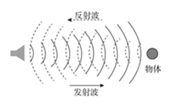

- **A**. 电子导盲仪
- **B**. 甲醛检测仪　✅
- **C**. 海底地貌探测仪
- **D**. B型超声诊断仪

**答案**：B

**官方解析**

本题考查科技常识。
A项正确，电子导盲器定向发射某种形式的能量波并以接收障碍物反射回波的方式来定位，与雷达控测飞机，声呐探测潜艇的原理相同，电子导盲器最终将环境障碍信息以某种视觉方式提供给盲人，常用的能量波有超声、激光、红外和微波，目前比较成熟的导盲器采用超声或激光原理。
B项错误，电子式甲醛检测仪的检测方法通常分为光电光度法和半导体式检测法。光电光度法利用甲醛跟浸有显色剂的试纸反应产生变色，变色程度不同导致反射光强度不一，把光强度转变为电信号即可提示甲醛浓度。半导体式检测法是利用半导体材料在一定温度下，电导率随着环境中气体成份的变化而变化的原理。
C项正确，海底地貌探测仪又称侧扫声纳，可以获得海底地貌声纳图像。侧扫声纳发射的脉冲回波，按返回时间的先后顺序记录，再经过成像处理便可得到图像。通过对声纳图像的判读和量测可以确定海底目标的概略位置和高度。
D项正确，B型超声诊断仪是根据脉冲回声原理制成的，由于动物机体的肌肉、脂肪、骨骼等不同组织间声阻值具有较大差异，当脉冲超声进入动物机体时，在体内遇到组织界面产生反射脉冲回声电信号，回声信号强，光点就亮，回声信号弱，光点就暗，从而形成灰度不同的生物体结构图像。
本题为选非题，故正确答案为B。

---

#### 第 18 题　qid 4652221 · 科技常识

下列物质中，最不可能用于防疫消毒的是：

- **A**. 过氧化氢
- **B**. 二氧化氯
- **C**. 高锰酸钾
- **D**. 丙烯酰胺　✅

**答案**：D

**官方解析**

本题考查科技常识。

A项正确，过氧化氢，化学式为，是一种无机化合物。纯过氧化氢是淡蓝色的黏稠液体，可任意比例与水混溶，是一种强氧化剂。其水溶液俗称双氧水，为无色透明液体，适用于医用伤口消毒、环境消毒和食品消毒。医疗上常用3％的双氧水进行伤口或中耳炎消毒。

B项正确，二氧化氯，化学式为，是一种无机化合物，常温常压下是一种黄绿色到橙黄色气体，具有杀菌、漂白、除臭、消毒、保鲜的功能，是一种广谱、高效的灭菌剂。常用于饮用水的消毒杀菌处理、对环境进行消毒（可以杀灭环境中的病原微生物等）、厨房用具和食品机械设备的消毒，在医疗领域二氧化氯可用于口腔含漱以控制牙龈炎、牙斑菌和口臭，对防治红眼病、皮肤病及除臭有良好效果。二氧化氯还可用于水产养殖领域，治疗鱼、虾、蟹、甲鱼、蛙类等细菌性、病毒性疾病。

C项正确，高锰酸钾（别称PP粉），化学式为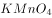，为黑紫色结晶，带蓝色的金属光泽，无臭。高锰酸钾是一种强氧化剂，杀菌力极强，其水溶液常用于物体表面、织物、水果等的消毒，医疗上常用0.1%溶液清洗溃疡及脓肿。

D项错误，丙烯酰胺，化学式为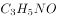，为无色透明片状晶体，无臭，有毒。溶于水、乙醇，微溶于苯、甲苯。其聚合物或共聚物用作化学灌浆物料；在印刷工业上制光敏树脂板；石油工业可用作增粘剂；玻璃纤维工业上可用作浸润剂；另外还用作土壤改良剂、絮凝剂、纤维改性剂和涂料等。不能用作消毒剂。

本题为选非题，故正确答案为D。

---

#### 第 19 题　qid 4652222 · 人文常识

孙某生活在明朝中叶，在他的一生中，最有可能发生的事情是：

- **A**. 追随郑成功收复台湾
- **B**. 与戚继光抵抗倭寇的侵掠骚扰　✅
- **C**. 欣赏孔尚任的新戏《桃花扇》
- **D**. 与关汉卿讨论《西厢记》的创作

**答案**：B

**官方解析**

本题考查人文常识。
明朝（1368年―1644年）是中国历史上最后一个由汉族建立的大一统中原王朝。明朝中叶是从正统元年（1436）到嘉靖四十五年（1566）。
A项错误，1624年，荷兰殖民者侵占台湾。1661年（清朝顺治十八年，南明永历十五年），郑成功率领2.5万名将士，乘着数百艘战舰，进军台湾；1662年2月，经过8个月的围攻，郑成功发动总攻，荷兰殖民长官被迫投降。至此，被荷兰侵略者占据了38年的台湾，重新回到祖国的怀抱。故此事件不可能发生在孙某的一生中。
B项正确，戚继光抗倭发生在明嘉靖年间，约在1555年－1561年，故此事件可能发生在孙某的一生中。
C项错误，《桃花扇》的作者是清代剧作家孔尚任，于1699年左右写成的。《桃花扇》讲述了明末清初长江以南，南明小朝廷官员侯方域和秦淮名妓李香君的爱情故事。故此事件不可能发生在孙某的一生中。
D项错误，《西厢记》是元代王实甫创作的杂剧，主要描写了张君瑞与崔莺莺在丫鬟红娘相助下，冲破重重障碍，历尽悲欢离合，最终结为夫妻的故事。《西厢记》作者并非是关汉卿，且关汉卿同为元代的戏曲作家，故此事件不可能发生在孙某的一生中。
故正确答案为B。

---

#### 第 20 题　qid 4652223 · 人文常识

下列节气与物候对应错误的是：

- **A**. 立春——东风解冻
- **B**. 大暑——大雨时行
- **C**. 处暑——腐草为萤　✅
- **D**. 寒露——菊有黄华

**答案**：C

**官方解析**

本题考查人文常识。
A项正确，立春，二十四节气之首，意味着春夏秋冬新的一个轮回正式开始。立春节气分为三候：一候东风解冻；二候蛰虫始振；三候鱼陟负冰。
B项正确，大暑，二十四节气中第十二个节气，夏季的最后一个节气，大暑节气处于三伏天中的中伏阶段，是一年之中日照最多、气温最高的时期。大暑有“三候”：一候腐草为萤；二候土润溽暑；三候大雨时行，大暑时常有大的雷雨出现，大雨使得暑热减弱，天气开始向立秋过渡。
C项错误，处暑，二十四节气中第十四个节气，秋季的第二个节气。处暑，标志着炎热天气到了尾声，暑气渐渐消退，天气由炎热向凉爽过渡。古人将处暑节气分为三候：一候鹰乃祭鸟；二候天地始肃；三候禾乃登。
D项正确，寒露，二十四节气中第十七个节气，秋季的第五个节气，出现在每年的10月8日或9日。寒露分为三候：一候鸿雁来宾；二候雀入大水为蛤；三候菊有黄华。黄华，即黄花，指此时菊花已普遍开放。
本题为选非题，故正确答案为C。

---

#### 第 21 题　qid 4652167 · 科技常识

在超市中广泛使用的消费明细单是由下列哪种打印技术实现的？

- **A**. 3D打印
- **B**. 喷墨打印
- **C**. 热敏打印　✅
- **D**. 激光打印

**答案**：C

**官方解析**

本题考查科技常识。
A项错误，3D打印是采用材料逐渐累加堆积的方法制造实体零件的技术。不同于传统的“材料去除-切削加工”技术，3D打印是一种“自下而上”的制造方法，既适用于金属材料，也适用于非金属材料。
B项错误，喷墨打印是根据计算机输出的信息，在纸等介质上喷墨形成图文的印刷技术。无须印版，由一个喷嘴喷墨，也可由多个喷嘴排列成行同时喷墨。广泛用于办公室文件印刷、美术设计和广告喷绘。
C项正确，热敏打印技术的原理是当传真机接受输入信号后，与热敏纸纸面接触的“热头”升温，使热敏变色层中无色染料的分子结构发生变化，显现发色基团，从而显示相应的文字和图像。热敏打印主要用于传真机，医疗、计测系统（如心电图机、热工仪表），计算机联网终端打印，小票打印，签码（POS）等。超市中使用的消费明细单通常利用热敏打印技术生成。
D项错误，激光打印是利用电子照相技术和激光技术，根据要打印的字符、图形，控制激光打印机内激光束的通、断，使感光鼓表面氧化锌薄膜上的电荷极性发生改变，未受激光束照射的区域能吸附碳粉或其他色粉，再将图案转移到纸上。具有分辨率高、打印速度快与色彩丰富等特点。
故正确答案为C。

---

#### 第 22 题　qid 4652184 · 人文常识

血压是重要的生命体征，在测量中我们获得高压、低压两个数值，并以此评估血压水平。下列与血压有关的说法错误的是：

- **A**. 高血压是指高压和低压同时高于正常值的现象　✅
- **B**. 测量得到的低压是指心室舒张时产生的压力
- **C**. 高钠低钾膳食是我国人群重要的高血压发病危险因素
- **D**. 高血压患者在血压过高时常常伴随头晕等症状

**答案**：A

**官方解析**

本题考查科技常识。

A项错误，在未使用抗高血压药物且安静休息坐位的情况下，非同日三次测量，收缩压均140mmHg和（或）舒张压均90mmHg可诊断为高血压；既往有高血压史，现使用抗高血压药物，虽现血压未达到上述水平，亦应诊断为高血压。所以一项指标高于正常值即可诊断为高血压。

B项正确，当心室收缩时，主动脉压快速升高，在收缩期中期达到了最大值，此时动脉血压被称作“高压”，也被称作收缩压，其正常值在90-140mmHg之间；当心室舒张时，主动脉压下降，在心舒末期动脉血压的最低值称为“低压”，也被称作舒张压，其正常值在60-90mmHg之间。

C项正确，我国人群高血压发病重要危险因素包括遗传因素、年龄以及多种不良生活方式等多方面。《中国高血压防治指南》指出，高钠、低钾膳食是我国人群重要的高血压发病危险因素。

D项正确，高血压是现在的一种常见疾病，它可以分为原发性高血压和继发性高血压，它的特点是全身性与发病慢。高血压患者常常伴随着头痛、头晕、乏力等一系列症状。

本题为选非题，故正确答案为A。

---

#### 第 23 题　qid 4652189 · 人文常识

某小学生给北京市行政区划图上色。按照老师要求，将全区或该区部分区域属于生态涵养区的行政区涂为绿色，其他区涂为黄色。下列行政区中，与其相邻的区被涂为绿色最多的是:

- **A**. 密云区
- **B**. 顺义区　✅
- **C**. 石景山区
- **D**. 海淀区

**答案**：B

**官方解析**

本题考查政治常识。

生态涵养发展区是首都生态屏障和重要资源保证地，是构建全市城乡一体化发展的重点地区，也是产业结构优化调整的重要区域。北京市生态涵养发展区包括门头沟、平谷、怀柔、密云、延庆五个区，是北京的生态屏障和水源保护地，是环境友好型产业基地，是保证北京可持续发展的支撑区域，也是北京市民休闲游憩的理想空间。根据图片，顺义区相邻了3个生态涵养区，数量最多。

故正确答案为B。

---

#### 第 24 题　qid 4652185 · 人文常识

下列各项体现出矛盾双方相互依存或相互转化的辩证思想的有：

- **A**. 有无相生，难易相成，长短相形　✅
- **B**. 祸兮福所倚，福兮祸所伏　✅
- **C**. 物必先腐，而后虫生
- **D**. 贵上极则反贱，贱下极则反贵　✅

**答案**：ABD

**官方解析**

本题考查政治常识。
A项正确，“有无相生，难易相成，长短相形”的意思是有和无因相互对立而存在，难和易因相互对立而形成，长和短因相互对立而出现。这句话体现了矛盾双方相互依存，互为存在的前提。
B项正确，“祸兮福所倚，福兮祸所伏”的意思是福与祸相互依存、互相转化，比喻坏事可以引发出好结果，好事也可以引发出坏结果。这句话句体现了矛盾双方的相互贯通，在一定条件下可以相互转化。
C项错误，“物必先腐，而后虫生”的意思是东西总是自身先腐烂，然后虫子才可以寄生，比喻自己先有弱点而后为外物所侵害。这句话体现了内因是事物发展的根据。
D项正确，“贵上极则反贱，贱下极则反贵”的意思是物价贵到极点，就一定会下跌；物价贱到极点，就一定会上涨。这句话句体现了矛盾双方的相互贯通，在一定条件下可以相互转化。
故正确答案为ABD。

---

#### 第 25 题　qid 4652187 · 人文常识

“十四五规划”提出要“坚持系统观念”，加强前瞻性思考、全局性谋划、战略性布局、整体性推进，实现发展质量、结构、规模、速度、效益、安全相统一。“系统观念”所蕴含的哲学原理有：

- **A**. 世界是一个普遍联系的有机整体　✅
- **B**. 掌握系统优化的方法，要着眼于事物的整体性　✅
- **C**. 部分的功能及其变化决定整体的功能及其变化
- **D**. 事物内部不同部分之间和不同事物之间存在着固有的联系　✅

**答案**：ABD

**官方解析**

本题考查政治常识。
A、D两项正确，唯物辩证法认为事物是普遍联系的，世界上没有孤立存在的事物，每一种事物都是在与其他事物的联系之中存在的。任何事物内部的不同部分和要素之间都是相互联系的，任何事物都具有内在的结构性；任何事物都不能孤立存在，都同其他事物处于一定的联系之中；整个世界是相互联系的统一整体。题中“坚持系统观念”强调了要加强全局性谋划、战略性布局、整体性推进，体现了世界是一个普遍联系的有机整体和事物内部不同部分之间和不同事物之间存在着固有的联系。
B项正确，掌握系统优化的方法，要着眼于事物的整体性，要注意遵循系统内部结构的有序性，要注意系统内部结构的优化趋向。“坚持系统观念”，加强前瞻性思考、全局性谋划、战略性布局、整体性推进体现了这一哲学原理。
C项错误，整体是由部分构成的，部分的功能及其变化会影响整体的功能，关键部分的功能及其变化甚至对整体的功能起决定作用。选项本身表述有误。
故正确答案为ABD。

---

#### 第 26 题　qid 4652191 · 人文常识

甲、乙、丙和丁四人计划合作出资成立一股份公司，注册时可以被认可的出资形式有：

- **A**. 甲以现金出资　✅
- **B**. 乙以自己的发明出资　✅
- **C**. 丙以自己的产权房出资　✅
- **D**. 丁以自己的机械设备出资　✅

**答案**：ABCD

**官方解析**

本题考查法律常识。
根据《公司法》第八十二条的规定，股份公司发起人的出资方式，适用该法第二十七条的规定。第二十七条第一款规定：“股东可以用货币出资，也可以用实物、知识产权、土地使用权等可以用货币估价并可以依法转让的非货币财产作价出资；但是，法律、行政法规规定不得作为出资的财产除外。”
A项正确，甲以现金出资属于用货币出资的形式。
B项正确，乙以自己的发明出资属于用知识产权出资的形式。
C、D两项正确，丙以自己的产权房出资，丁以自己的机械设备出资均属于用实物出资的形式。
故正确答案为ABCD。

---

#### 第 27 题　qid 4652265 · 人文常识

党的七大把党在长期奋斗中形成的优良作风概括为三大作风，即：

- **A**. 理论和实践相结合的作风　✅
- **B**. 和人民群众紧密联系在一起的作风　✅
- **C**. 艰苦奋斗的作风
- **D**. 自我批评的作风　✅

**答案**：ABD

**官方解析**

本题考查毛中特。
三大优良作风是指理论联系实际、密切联系群众以及批评与自我批评的作风。它是毛泽东在中共七大上作的《论联合政府》的政治报告中总结概括出来的，是中国共产党在长期的革命斗争中形成的全党统一的优良作风，是我们党同其他政党相区别的显著标志。
A项，理论和实践相结合的作风，就是把马克思列宁主义的基本原理同中国革命的具体实践相结合，从实际出发，实事求是的作风，符合题意。
B项，密切联系群众的作风，是指党的各级组织和党员干部要和党内外的群众结合在一起，密切党和人民群众的关系，一切为了群众，一刻也不脱离群众，符合题意。
C项，“两个务必”即“务必使同志们继续地保持谦虚、谨慎、不骄、不躁的作风，务必使同志们继续地保持艰苦奋斗的作风”，是毛泽东同志在党的七届二中全会上提出的，不符合题意。
D项，批评与自我批评是正确处理和有效地解决党内矛盾，克服缺点，纠正错误的科学方法，符合题意。
故正确答案为ABD。

---

#### 第 28 题　qid 4652141 · 经济常识

货币的职能包括：

- **A**. 价值尺度　✅
- **B**. 流通手段　✅
- **C**. 贮藏手段　✅
- **D**. 支付手段　✅

**答案**：ABCD

**官方解析**

本题考查经济常识。
货币是固定充当一般等价物的特殊商品，是商品交换和价值形态发展的必然产物。
货币的职能包括：①价值尺度，货币以自身价值作为尺度来衡量其他一切商品的价值；②流通手段，货币充当商品交换的媒介；③支付手段，在发生赊购赊销的情况下，货币用于清偿债务所执行的职能；④贮藏手段，货币退出流通领域，被人们当作社会财富的一般代表加以贮藏；⑤世界货币，货币在世界市场上作为一种购买手段、支付手段和社会财富的代表所发挥的作用。其中，价值尺度和流通手段是货币的两个最基本职能，其他三种职能是在这两种基本职能的基础上派生和发展出来的。
故正确答案为ABCD。

---

#### 第 29 题　qid 4652144 · 人文常识

下列选项中，前后表述内涵对应一致的有：

- **A**. 政之所兴，在顺民心。政之所废，在逆民心——江山就是人民，人民就是江山　✅
- **B**. 当官避事平生耻，视死如归社稷心——科学决策，精准施策
- **C**. 廉者，民之表也；贪者，民之贼也——清正廉洁，严格自律　✅
- **D**. 成功不必在我，而功力必不唐捐——依法行政，处事公正

**答案**：AC

**官方解析**

本题考查人文常识。
A项正确，“政之所兴，在顺民心。政之所废，在逆民心”出自《管子·牧民》，意思是政权之所以能兴盛，在于顺应民心；政权之所以废弛，则因为违逆民心。“江山就是人民，人民就是江山”出自习近平2021年2月20日在党史学习教育动员大会上的讲话。前后两句都表明了人民对于国家政权的重要性，要顺应民心，为民服务。
B项错误，“当官避事平生耻，视死如归社稷心”出自元好问的《四哀诗·李钦叔》，意思是做官避事是平生最大的耻辱，为了国家民族牺牲生命也在所不惜。“科学决策，精准施策”是疫情当前，形势严峻，各地各部门越应当因时因地制宜把各项工作抓实、抓细、抓落地，避免形式主义，打赢疫情防控的准则。前后两句表述内涵不一致。
C项正确，“廉者，民之表也；贪者，民之贼也”出自包拯《孝肃奏议集·乞不用赃吏》，意思是廉洁的官吏是民众的表率，贪官是侵害民众的盗贼，强调为官者要清廉为民。“清正廉洁，严格自律”是党员和国家干部必备的政治品德，是保持共产党员先进性和纯洁性的基本要求，强调清廉为民。前后两句表述内涵一致。
D项错误，“成功不必在我，而功力必不唐捐”出自胡适的《致毕业生》，意思是成功不一定非要看自己，社会的进步也是成功。你做出的所有努力都不会白费，至少会得到经验教训。“依法行政，处事公正”是我国政府工作的基本原则，是政府公信力的来源和树立的方法。前后两句表述内涵不一致。
故正确答案为AC。

---

#### 第 30 题　qid 4652146 · 人文常识

中国古代许多诗人喜欢写“山”，以下诗句与作者对应正确的有：

- **A**. 不识庐山真面目，只缘身在此山中——苏轼　✅
- **B**. 五岳寻仙不辞远，一生好入名山游——谢灵运
- **C**. 会当凌绝顶，一览众山小——杜甫　✅
- **D**. 采菊东篱下，悠然见南山——陶渊明　✅

**答案**：ACD

**官方解析**

本题考查人文常识。
A项正确，“不识庐山真面目，只缘身在此山中”出自北宋诗人苏轼的《题西林壁》，意思是之所以认不清庐山真正的面目，是因为人身处在庐山之中。
B项错误，“五岳寻仙不辞远，一生好入名山游”出自唐代李白的《庐山谣寄卢侍御虚舟》，意思是攀登五岳寻仙道不畏路远，这一生就喜欢踏上名山游。
C项正确，“会当凌绝顶，一览众山小”出自唐代杜甫的《望岳》，意思是一定要登上那最高峰，俯瞰在泰山面前显得渺小的群山。
D项正确，“采菊东篱下，悠然见南山”出自魏晋陶渊明的《饮酒·其五》，意思是在东篱之下采摘菊花，悠然间，那远处的南山映入眼帘。
故正确答案为ACD。

---

#### 第 31 题　qid 4652148 · 地理国情

根据板块学说，喜马拉雅山脉是由下列哪些板块碰撞造成的？

- **A**. 欧亚板块　✅
- **B**. 非洲板块
- **C**. 太平洋板块
- **D**. 印度洋板块　✅

**答案**：AD

**官方解析**

本题考查地理国情。
喜马拉雅山脉是由印度洋板块和欧亚板块的挤压碰撞而形成的，位于青藏高原南巅边缘，是世界海拔最高的山脉，主峰是世界最高峰珠穆朗玛峰。喜马拉雅山脉是东亚大陆与南亚次大陆的天然界山，也是中国与印度、尼泊尔、不丹、巴基斯坦等国的天然国界，西起克什米尔的南迦-帕尔巴特峰，东至雅鲁藏布江大拐弯处的南迦巴瓦峰。
故正确答案为AD。

---

#### 第 32 题　qid 4652152 · 人文常识

在以下绘画技法中，属于中国画的技法有：

- **A**. 白描　✅
- **B**. 素描
- **C**. 写意　✅
- **D**. 水墨

**答案**：AC

**官方解析**

本题考查人文常识。
A项正确，白描，中国画技法名。指用墨线勾勒描摹物象的轮廓，不设颜色。白描多用于画人物、花卉，着墨不多，气韵生动。白描源于古代的“白画”。一般运用同一墨色，通过线条的长短、粗细、轻重、转折等表现物象的质感和动势。
B项错误，素描，是一种用单色或少量色彩绘画材料描绘生活所见真实事物或所感的绘画形式，习惯上素描是以单色画为主，但在美术辞典中，水彩画也属于素描；素描的起源，普遍都是以文艺复兴开始，希腊的瓶绘、雕塑都有良好的素描基础。初期的素描是视为绘画的底稿。
C项正确，写意，中国画技法名。指以简练恣纵的笔墨勾勒描绘物象的意态神韵，重在抒发创作主体的意兴情趣。用笔灵活，不拘工细，不求形似（与“工笔”相对）。写意有小写意、大写意之分，后者多采用泼墨技法。
D项错误，水墨，即“水墨画”，指中国画中纯用水墨、不用色彩的一种绘画形式，也称国画、中国画。以水、墨、毛笔和宣纸作为主要材料，通过调配清水的多少，引为浓墨、淡墨、干墨、湿墨、焦墨等，画出浓淡层次不同的作品。水墨是中国画的表现形式而非中国画技法。
故正确答案为AC。

---

## 言语理解与表达

### 材料 1

以下是略有删节的公文部分内容，阅读之后回答下列问题。

（六）整体布局、协同联动，强化领域应用

①深化体系交通领域整合。推动智能信号灯“绿波调节”，推广公交信号优先系统，开展试点区域内执行任务救护车、消防车等特种车辆的“一键护航”。<u>        </u>出行体验，探索公共交通“一码通乘”，推动定制公交、预约出行、共享单车、汽车分时租赁、停车位错时共享等多样化交通出行服务模式。持续提升全市交通综合治理水平，推动重点站区“一屏统管”，保障冬奥交通管理指挥调度。<u>        </u>车联网先导区建设范围与规模，探索重点区域“全息路网”，开展创新应用，促进创新发展。

②推动生态环保领域协同。加强感知统筹，建立生态环保“测管治”一体化协同体系，提升生态环保综合执法效率。提高重污染天气、地质灾害、地震灾害、森林火灾等场景一体化应急管理服务能力，加强水环境管理、水旱灾防御、农业农村管理、公园管理等智慧化应用。鼓励社会企业创新生态环保应用，激活企业绿色技术创新动能。

③加强规划管理应急联动。摸清城市运行、安全生产、自然灾害等监测基础设施家底，强化城市风险管理，加强应急状态下一体化指挥调度与应急救援处置的能力。推广具有“一杆多用”功能的城市智慧灯杆。基于“时空一张图”推进“多规合一”。探索试点区域基于城市信息模型（CIM）实现规建管运一体联动。构建安居北京住房保障民生服务平台，提升建筑工程监管服务水平，深化住建行业信用体系建设。健全公众参与社会监督机制，利用随手拍、政务维基、社区曝光台等方式快速发现城市管理问题。

④丰富人文环境智慧应用。推动数字图书馆、数字文化馆、数字博物馆建设，延伸公共文化服务能力进基层，推进公共文化设施运营管理平台建设，推进文化惠民。基于特殊人员画像开展社会帮扶救助，打造温暖宜居社区环境。通过“北京通”等政务移动端实现失业保险申领、住房公积金提取、职业资格认定等事项线上线下一体化办理。拓展扶农助农手段，利用电商平台促进农产品直播带货、直销社区。

#### 第 1 题　qid 4652254 · 片段阅读

选文最可能出自下列哪篇公文？

- **A**. 《北京市关于“十四五”时期深化推进“疏解整治促提升”专项行动的实施意见》
- **B**. 《北京市关于“十四五”时期构建现代环境治理体系的实施方案》
- **C**. 《北京市“十四五”时期智慧城市发展行动纲要》　✅
- **D**. 《北京市“十四五”时期交通综合治理行动计划》

**答案**：C

**官方解析**

本文为删减版公文，由小标题“整体布局、协同联动，强化领域应用”可知本文与城市整体协同规划相关，四个自然段分别从交通领域、生态环保、应急联动、人文环境等角度具体展开论述，且均涉及城市的智能化治理。故本文从多方面介绍推动城市治理智能化的举措，对应C项。
A项，“‘疏解整治促提升’专项行动”，偏离本文核心话题，排除；
B、D两项，“环境治理”和“交通综合治理”分别对应本文第②段和第①段，均表述片面，排除。
故正确答案为C。
【文段出处】《北京市“十四五”时期智慧城市发展行动纲要》

---

#### 第 2 题　qid 4652275 · 逻辑填空

依次填入文中画横线处最恰当的是：

- **A**. 强化 探索
- **B**. 优化 扩大　✅
- **C**. 更新 拓展
- **D**. 创新 深化

**答案**：B

**官方解析**

本题可从第二空入手，搭配“范围与规模”，B项“扩大”、C项“拓展”均搭配恰当，保留。A项“探索”指多方寻求答案，解决疑问，多搭配“奥秘”“模式”等，D项“深化”强调使向更深的阶段发展，常搭配“改革”等，均与“范围与规模”搭配不当，排除。
第一空，搭配“出行体验”，且由前后文可知，“深化体系交通领域整合”的种种举措可以提升人们的出行体验，即让人们拥有更好的出行体验。B项“优化”指采取一定措施使变得优秀，符合文意，当选。C项“更新”强调除去旧的，换成新的，与“更好”的文意不符，排除。
故正确答案为B。
【文段出处】《北京市“十四五”时期智慧城市发展行动纲要》

---

#### 第 3 题　qid 4652276 · 片段阅读

“推动开展线上文旅展出、线上体育健康活动和线上演出活动，加强云转播、沉浸式观赛、多场景一脸通行等智能技术应用体验”这一措施最可能出自文中的哪一段？

- **A**. ①
- **B**. ②
- **C**. ③
- **D**. ④　✅

**答案**：D

**官方解析**

题干中“推动开展线上文旅展出、线上体育健康活动和线上演出活动”均属于人文类的智慧应用，“云转播、沉浸式观赛、多场景一脸通行”也是为了优化人文环境，故该措施主要是针对人文环境提出，文章只有第④段涉及丰富人文环境智慧应用，故这一措施最可能出自第④段，对应D项。
A、B、C三项分别涉及交通领域、生态环保领域及应急联动领域，均未提及人文环境，与题干话题不一致，排除。
故正确答案为D。
【文段出处】《北京市“十四五”时期智慧城市发展行动纲要》

---

#### 第 4 题　qid 4652277 · 片段阅读

下列哪一情景不涉及选文部署的工作事项？

- **A**. 在景区网站上预约门票后进行参观　✅
- **B**. 利用“北京通”政务移动端提取住房公积金
- **C**. 使用一个乘车码乘坐公交、地铁等
- **D**. 通过“随手拍”方式举报城市管理中的问题

**答案**：A

**官方解析**

A项，“在景区网站上预约门票后进行参观”无中生有，文章并未提及，故不属于选文部署的工作事项，当选；
B项，根据第④段“通过‘北京通’等政务移动端实现失业保险申领、住房公积金提取、职业资格认定等事项线上线下一体化办理”可知，“利用‘北京通’政务移动端提取住房公积金”属于选文部署的工作事项，排除；
C项，根据第①段“探索公共交通‘一码通乘’，推动定制公交、预约出行、共享单车、汽车分时租赁、停车位错时共享等多样化交通出行服务模式”可知，“使用一个乘车码乘坐公交、地铁等”属于选文部署的工作事项，排除；
D项，根据第③段“健全公众参与社会监督机制，利用随手拍、政务维基、社区曝光台等方式快速发现城市管理问题”可知，“通过‘随手拍’方式举报城市管理中的问题”属于选文部署的工作事项，排除。
本题为选非题，故正确答案为A。
【文段出处】《北京市“十四五”时期智慧城市发展行动纲要》

---

#### 第 5 题　qid 4652278 · 片段阅读

落实选文中提及的各项措施，有助于政府部门实现下列哪些目标？
①提升政务管理效能
②惠民服务便捷高效
③增强政民互动效能
④精准分析海量数据

- **A**. ①②③　✅
- **B**. ①②④
- **C**. ①③④
- **D**. ②③④

**答案**：A

**官方解析**

根据第②段“建立生态环保‘测管治’一体化协同体系，提升生态环保综合执法效率”可知，推动生态环保领域协同能够提升政务管理效率，且根据第③段“加强规划管理应急联动”“加强应急状态下一体化指挥调度与应急救援处置的能力”可知，该措施可提升政务管理效能，故有助于实现目标①；
根据第④段“推进公共文化设施运营管理平台建设，推进文化惠民”可知，丰富人文环境智慧应用，可使惠民服务便捷高效，故有助于实现目标②；
根据第③段“健全公众参与社会监督机制，利用随手拍、政务维基、社区曝光台等方式快速发现城市管理问题”可知，该措施可增强政民互动，故有助于实现目标③。
目标④中“精准分析海量数据”无中生有，选文中未涉及“数据”话题，故不能实现该目标。
综上所述，①②③正确，对应A项。
故正确答案为A。
【文段出处】《北京市“十四五”时期智慧城市发展行动纲要》

---

### 材料 2

材料一：

        终于，在离“家”17个月后，云南北移亚洲象群的14只大象跨越元江，平安回归栖息地。这段时间，“断鼻家族”一路向北，吸引了全世界的目光。我们为象群集体倒地睡觉的照片而惊叹，也为竭力保证象群一路生活所需默默努力的人们而感动。象群为何不再害怕人类？从受采访者的话语中，我们能窥见端倪。“大象也饿了，它也不是故意的。”“没吃多少玉米，这些玉米都无所谓。”“可能它走掉，我还会关切，还会想它。”<u>                    </u>。人们自觉承担起保护亚洲象的责任，让涓涓细流汇聚出了磅礴的力量，为亚洲象一路北上提供了重要保障。

        青山绿水之间，亚洲象一路“逛吃”，人类紧随其后实时保护，人与自然和谐共存的画面，展现出我们从工业文明向生态文明的转变。高质量的发展，绝不以损害大自然为前提。人生于天地之中，应当善待草木山川、珍惜鸟兽虫鱼，因为人不可能脱离自然而独立存在。此次，大象成功归家，让世界看到了中国对待野生动物的态度，也传递出了“保护自然环境，中国始终在路上”的决心。

材料二：

        生产力是文明的基础和动力。人类文明新形态是建立在先进生产力基础上的文明。但是，没有自然界提供的劳动要素，生产力便会成为“无米之炊”。劳动和自然界的馈赠是一切财富的基础和来源。先进生产力不仅是在持续的自然生产力基础上实现经济生产力永续发展的生产力，而且是按照人与自然和谐共生原则和方向发展的生产力。只有以此为经济基础，才能保证人类文明新形态的永续性。

        现代化代表着当下的先进生产力。按照资本逻辑推进现代化，西方现代化走过了一条先污染后治理的道路。以此为鉴，在坚持社会主义现代化道路的基础上，我们的现代化必须是人与自然和谐共生的现代化。实现人与自然和谐共生的现代化，就要将生态化作为现代化的前提、内容、方向。

        现代化是一个生生不息的过程。西方现代化经历了工业化、城市化、农业产业化、信息化的发展顺序，并将生态化纳入到了现代化当中，形成了生态现代化范式。现在，我国农业产业化的任务尚未完全完成，工业化进入到了中后期发展阶段，信息化已有所发展。相比之下，只有坚持“绿水青山就是金山银山”的理念，协调推进工业化、城镇化、农业现代化、信息化和绿色化，才能赶超西方现代化。协调推进工业化、城镇化、农业现代化、信息化和绿色化，就是要系统集成农业文明、工业文明、智能文明和生态文明的先进成果，推动人类文明不断升级换代。这样就开辟出了人类文明新形态的发展方向。

材料三：

        生态环境保护和经济发展是辩证统一、相辅相成的，建设生态文明、推动绿色低碳循环发展，不仅可以满足人民日益增长的优美生态环境需要，而且可以推动实现更高质量、更有效率、更加公平、更可持续、更为安全的发展，走出一条生产发展、生活富裕、生态良好的文明发展道路。“十四五”时期，我国生态文明建设进入了以降碳为重点战略方向、推动减污降碳协同增效、促进经济社会发展全面绿色转型、实现生态环境质量改善由量变到质变的关键时期。要完整、准确、全面贯彻新发展理念，保持战略定力，站在人与自然和谐共生的高度来谋划经济社会发展，坚持节约资源和保护环境的基本国策，坚持节约优先、保护优先、自然恢复为主的方针，形成节约资源和保护环境的空间格局、产业结构、生产方式、生活方式，统筹污染治理、生态保护、应对气候变化，促进生态环境持续改善，努力建设人与自然和谐共生的现代化。

#### 第 6 题　qid 4652239 · 语句表达

填入材料一画横线处最恰当的是：

- **A**. 大象归家，生态保护还需一以贯之
- **B**. 我们有理由相信，经济发展与环境保护并不矛盾，人与自然可以和谐共生
- **C**. 保护野生动物，不再只是国家层面的政策措施，更得到每一个人发自内心的认可　✅
- **D**. 当全世界都在围观中国大象的时候，不妨以此为契机，让世界看到我们在生态文明建设上取得的成就

**答案**：C

**官方解析**

本题为语句填空题，横线出现在文段中间，需注意与前后文的衔接，横线前分析象群为何不再害怕人类，并指出从受访者的话语中可以找到原因，而受访者的话语中透露着人们对大象的关心。横线后指出人们自觉主动地承担起了保护亚洲象的责任。故横线前后都在阐述普通群众对大象的关心与保护是发自内心的，对应C项。
A项，横线前后均未提及“生态保护”，且“需一以贯之”无法对应后文内容，与前后文衔接不当，排除；
B项，横线前后均未提及“经济发展”，与前后文衔接不当，排除；
D项，横线前后均强调普通人对大象的保护意识有所提升，“我们在生态文明建设上取得的成就”范围过大，排除。
故正确答案为C。
【文段出处】《东湖评论：大象归家，生态保护还需一以贯之》《夯实人类文明新形态的生态基石》《习近平在中共中央政治局第二十九次集体学习时强调 保持生态文明建设战略定力 努力建设人与自然和谐共生的现代化》

---

#### 第 7 题　qid 4652241 · 片段阅读

材料一反映出了我国生态文明建设在哪方面取得的成就？

- **A**. 绿色低碳循环发展
- **B**. 生物多样性保护　✅
- **C**. 建立保护环境的生产方式
- **D**. 应对外来物种入侵

**答案**：B

**官方解析**

材料一第一段通过介绍亚洲象群迁徙事件，表达了群众已经具有生物保护的意识，第二段围绕该事件展开论述，指出人类紧随其后的实时保护，展现出了“我们从工业文明向生态文明的转变”，随后进一步论述，强调人类应当善待生态环境，尾句通过“此次”进行总结，重点强调该事件反映出我国对待野生动物的态度和保护生态环境的决心。故材料一反映出了人们对野生动物及生态环境的保护，是“生物多样性保护”方面的成就，对应B项。
A项，“绿色低碳循环发展”无中生有，排除；
C项，文段没有涉及关于“生产方式”的论述，无中生有，排除；
D项，“外来物种入侵”无中生有，排除。
故正确答案为B。
【文段出处】《东湖评论：大象归家，生态保护还需一以贯之》《夯实人类文明新形态的生态基石》《习近平在中共中央政治局第二十九次集体学习时强调 保持生态文明建设战略定力 努力建设人与自然和谐共生的现代化》

---

#### 第 8 题　qid 4652245 · 片段阅读

以下与材料二对应现代化的理解分析不一致的一项是：

- **A**. 我国的现代化将按照工业化、城市化、农业产业化、信息化的顺序发展　✅
- **B**. 将绿色化与工业化、农业现代化、信息化等相结合发展才是社会主义的现代化道路
- **C**. 西方的现代化经历了先污染后治理的道路，是不符合当下先进生产力的发展方向的
- **D**. 我们不能走西方国家的现代化道路，应开辟代表人类文明新形态的发展方向

**答案**：A

**官方解析**

A项，根据第三段“西方现代化经历了工业化、城市化、农业产业化、信息化的发展顺序”“只有坚持‘绿水青山就是金山银山’的理念，协调推进工业化、城镇化、农业现代化、信息化和绿色化，才能赶超西方现代化”可知，我国现代化各阶段是协同发展的，不是按照西方现代化的顺序发展，偷换概念，当选；
B项，根据第三段“只有坚持‘绿水青山就是金山银山’的理念，协调推进工业化、城镇化、农业现代化、信息化和绿色化，才能赶超西方现代化”可知，表述正确，排除；
C项，根据第二段“按照资本逻辑推进现代化，西方现代化走过了一条先污染后治理的道路。以此为鉴，在坚持社会主义现代化道路的基础上，我们的现代化必须是人与自然和谐共生的现代化”可知，先污染后治理不符合当下的发展方向，表述正确，排除；
D项，根据第二段“西方现代化走过了一条先污染后治理的道路”，我们要“以此为鉴”，可知“我们不能走西方国家的现代化道路”表述正确，“应开辟代表人类文明新形态的发展方向”对应第三段尾句“这样就开辟出了人类文明新形态的发展方向”，表述正确，排除。
本题为选非题，故正确答案为A。
【文段出处】《东湖评论：大象归家，生态保护还需一以贯之》《夯实人类文明新形态的生态基石》《习近平在中共中央政治局第二十九次集体学习时强调 保持生态文明建设战略定力 努力建设人与自然和谐共生的现代化》

---

#### 第 9 题　qid 4652246 · 片段阅读

2021年6月5日世界环境日主题是“人与自然和谐共生”，下列哪项最能体现该主题：

- **A**. 取之有度，用之有节
- **B**. 子钓而不纲，弋不射宿
- **C**. 天行健，君子以自强不息
- **D**. 天地与我并生，而万物与我为一　✅

**答案**：D

**官方解析**

A项，“取之有度，用之有节”意思是取用资源等要有限度，使用它们要有节制，并未体现出“人与自然和谐共生”的主题，排除；
B项，“子钓而不纲，弋不射宿”意思是孔子只用鱼竿钓鱼，而不用大网来捕鱼；用带的箭射鸟，但不射归巢栖息的鸟，也就是不可滥捕滥杀，影响到鱼类、鸟类的正常繁衍，重点强调的是要对自然资源取用有限度，有节制，进而体现出孔子的仁爱之心，并未体现出“人与自然和谐共生”的主题，排除；
C项，“天行健，君子以自强不息”意思是宇宙不停运转，人应效法天地，永远不断地前进，强调人应自强，并未体现出“人与自然和谐共生”的主题，排除；
D项，“天地与我并生，而万物与我为一”意思是天地与我同生，万物与我是一体的，强调的是要顺应自然，人与自然是生命共同体，人与自然是平等的关系，应和谐相处，与文意相符，当选。
故正确答案为D。
【文段出处】《东湖评论：大象归家，生态保护还需一以贯之》《夯实人类文明新形态的生态基石》《习近平在中共中央政治局第二十九次集体学习时强调 保持生态文明建设战略定力 努力建设人与自然和谐共生的现代化》

---

#### 第 10 题　qid 4652251 · 片段阅读

根据材料三，下列选项中不属于为了节约资源和保护环境所采取的措施的是：

- **A**. 2020年北京市共完成148条道路、382公里自行车道整治任务，核心区主干路自行车道整治实现全覆盖，王府井、CBD等一批慢行示范区建成，市民“伴着街景骑回家”的美好愿景成为现实
- **B**. “十三五”时期，北京市累计疏解退出一般制造业企业2154家，退出企业主要集中在建材、机械制造与加工、家具和木制品加工等行业
- **C**. 城市副中心因地制宜，用背街小巷周边腾出的可利用空间，在居民停车需求强烈的街区开辟了便民停车场；在“溜娃”需求强烈的街区增设滑梯等儿童游乐设施；在养老需求强烈的街区建起了养老驿站　✅
- **D**. 北京市等级旅游景区针对不同重点突出区域，采取不同的生活垃圾分类精细化落实方案。如餐饮区设置“可回收物、厨余垃圾、其他垃圾”桶；办公区张贴（展示）生活垃圾分类投放指引宣传画等

**答案**：C

**官方解析**

根据材料三中节约资源和保护环境的措施可知：
A项，“自行车道整治”既能满足市民“伴着街景骑回家”的美好愿景，又能绿色出行，降碳减排，属于节约资源的措施，排除；
B项，建材、机械制造与加工等行业在生产过程中会对环境产生很大的危害，同时家具、木制品加工等行业破坏自然资源，疏解退出这些行业有利于节约资源，保护环境，属于节约资源和保护环境的措施，排除；
C项，“便民停车场”“儿童游乐设施”“养老驿站”均为城市基础设施建设，是为了提升人们的生活质量，满足人们的精神需求，与节约资源和保护环境无关，当选；
D项，“生活垃圾分类”属于保护环境的措施，排除。
本题为选非题，故正确答案为C。
【文段出处】《东湖评论：大象归家，生态保护还需一以贯之》《夯实人类文明新形态的生态基石》《习近平在中共中央政治局第二十九次集体学习时强调 保持生态文明建设战略定力 努力建设人与自然和谐共生的现代化》

---

### 材料 3

阅读以下文字，回答下列问题。

        2021年，在北京市不断创新探索并取得积极成效基础上，我国服务业扩大开放综合试点再度扩容。天津、上海、海南、重庆4省市近日成为新晋试点地区。4省市合计明确203项试点任务，与北京市形成“1+N”的试点格局。

        试点扩容对于建设更高水平开放型经济新体制，对于构建新发展格局具有重要意义。可以预计，此举必将带动更多国际先进服务业进入中国市场，产生鲇鱼效应，为推动我国实施更大范围、更宽领域、更深层次对外开放带来更多利好。

        首先，这有利于我国进一步塑造国际竞争和合作新优势。当前，我国的服务业开放既面临重要的机遇，也存在现实的差距。一方面，我国人均GDP突破1万美元大关，消费形态正在由以实物消费为主加快向以服务消费为主转变，服务业吸收外资已占吸收外资总量的70%以上。另一方面，目前我国服务业增加值约占GDP的55%，比发达国家低20个百分点左右，存在与制造业融合发展不够、现代服务业发展不足等问题。为此，需要进一步扩大服务业开放，持续培育新的发展动能，塑造国际竞争和合作新优势。

        其次，这有利于更好发挥地方首创精神。服务业开放点多面广、门类众多，既涉及生产性服务业、生活性服务业的统筹，又涉及各类新模式新业态的发展，需要多维度开展创新探索。比如，天津将试点工作放在京津冀协同发展国家战略大局中加以谋划考虑；<u>        </u>将强化国家战略承载区域的示范效应；<u>        </u>统筹先进制造业和现代服务业融合发展；<u>        </u>推动制度集成创新，着力建设成为国内国际双循环的重要交汇点。

        总的来看，这次开展试点的4省市服务业发展基础较好，区域和产业代表性较强。因此，通过改革创新，发挥地方首创精神，能够在工作中积累更多可复制可推广经验，对全国服务业开放发挥示范带动作用。

        最后，这还有利于加强协同开放。新增4个试点省市，有助于与北京的示范区建设形成梯次安排与协调配合，更加有序安排试点政策实施和经验复制推广工作，多点开展试验论证，形成综合效应。可在统筹好共性领域开放探索的前提下，充分体现地区特色、特点，鼓励差异化探索。将北京市24项创新性较强的试点任务纳入4省市方案，接近52项共性试点任务的半数，共同开展开放探索；明确有各地特色的措施151项，约占总体203项试点任务的四分之三。

#### 第 11 题　qid 4652244 · 片段阅读

根据文中第2段，为了产生“鲇鱼效应”应该：

- **A**. 建设更高水平开放型经济新体制
- **B**. 构建全新的国际服务业发展格局
- **C**. 吸引国际先进服务业进入中国市场　✅
- **D**. 推动我国实施全面高水平对外开放

**答案**：C

**官方解析**

A、B两项，对应第2段“试点扩容对于建设更高水平开放型经济新体制，对于构建新发展格局具有重要意义”，均属于试点扩容的重要意义，并非产生“鲇鱼效应”的原因，排除；
C项，对应第2段“此举必将带动更多国际先进服务业进入中国市场，产生鲇鱼效应”，属于产生“鲇鱼效应”的原因，当选；
D项，对应第2段“为推动我国实施更大范围、更宽领域、更深层次对外开放带来更多利好”，属于产生“鲇鱼效应”后带来的积极意义，并非产生“鲇鱼效应”的原因，排除。
故正确答案为C。
【文段出处】《以扩大开放培育服务业增长动能》

---

#### 第 12 题　qid 4652249 · 片段阅读

关于我国目前的服务业，下列说法正确的是：

- **A**. 服务业已成为吸收外资的主力　✅
- **B**. 服务消费成为消费形态的主要形式
- **C**. 服务业与制造业融合发展日臻完善
- **D**. 服务业增加值占GDP的比值与发达国家持平

**答案**：A

**官方解析**

A项，根据第3段“服务业吸收外资已占吸收外资总量的70%以上”可知，表述正确，当选；
B项，根据第3段“消费形态正在由以实物消费为主加快向以服务消费为主转变”可知，消费形态只是正在向服务消费转变，“成为消费形态的主要形式”时态错误，排除；
C项，根据第3段“目前我国服务业增加值约占GDP的55%，比发达国家低20个百分点左右，存在与制造业融合发展不够、现代服务业发展不足等问题”可知，“融合发展日臻完善”与文意相悖，排除；
D项，根据第3段“目前我国服务业增加值约占GDP的55%，比发达国家低20个百分点左右”可知，“与发达国家持平”表述错误，排除。
故正确答案为A。
【文段出处】《以扩大开放培育服务业增长动能》

---

#### 第 13 题　qid 4652252 · 片段阅读

根据本文，下列说法中错误的是：

- **A**. 我国服务业已形成强大的国际市场，在国际竞争中占有领先地位　✅
- **B**. 发挥地方首创精神有利于对全国服务业开放发挥示范带动作用
- **C**. 北京市24项创新性较强的试点任务约占总体试点任务的一成多
- **D**. 4省市开展好共性领域开放探索的同时，还可进行差异化探索

**答案**：A

**官方解析**

A项，根据第3段“首先，这有利于我国进一步塑造国际竞争和合作新优势。当前，我国的服务业开放既面临重要的机遇，也存在现实的差距”“另一方面，目前我国服务业增加值约占GDP的55%，比发达国家低20个百分点左右”可知，目前我国服务业在国际竞争中并非处于“领先地位”，表述错误，当选；
B项，根据第5段“因此，通过改革创新，发挥地方首创精神，能够在工作中积累更多可复制可推广经验，对全国服务业开放发挥示范带动作用”可知，表述正确，排除；
C项，根据第1段“4省市合计明确203项试点任务”可知，总体试点任务为203项，“一成”即为十分之一，“北京市24项创新性较强的试点任务”所占比例为“一成多”，表述正确，排除；
D项，根据第6段“可在统筹好共性领域开放探索的前提下，充分体现地区特色、特点，鼓励差异化探索”可知，表述正确，排除。
本题为选非题，故正确答案为A。
【文段出处】《以扩大开放培育服务业增长动能》

---

#### 第 14 题　qid 4652253 · 逻辑填空

填入横线处的词语最恰当的一项是：

- **A**. 重庆 上海 海南
- **B**. 上海 重庆 海南　✅
- **C**. 海南 重庆 上海
- **D**. 重庆 海南 上海

**答案**：B

**官方解析**

横线出现在第4段，本题是对于常识的考查。
根据2021年4月23日商务部召开新增服务业扩大开放综合试点专题发布会上公布的关于天津、上海、海南、重庆4省市的试点方案可知，“上海”将强化国家战略承载区域的示范效应，“重庆”统筹先进制造业和现代服务业融合发展，“海南”推动制度集成创新，把海南建设成为国内国际双循环的重要交汇点，对应B项。
故正确答案为B。
【文段出处】《以扩大开放培育服务业增长动能》

---

#### 第 15 题　qid 4652255 · 片段阅读

最适合做本文标题的是：

- **A**. 服务业支撑经济发展再破新纪录
- **B**. 现代服务业推动经济高质量发展
- **C**. 服务业创新塑造城市竞争新优势
- **D**. 以扩大开放培育服务业发展动能　✅

**答案**：D

**官方解析**

通读全文可知，文章第1段首先提出我国服务业扩大开放综合试点再度扩容这一话题，第2段具体分析了试点扩容的意义，第3-6段通过“首先······其次······最后”详细说明服务业“扩大开放综合试点”对于带动服务业增长的积极作用。故整篇文章围绕服务业“扩大开放综合试点”这一核心话题展开论述，详细论述了其对于服务业发展的积极作用，对应D项。
A项，文章并未提及“再破新纪录”，无中生有，排除；
B、C两项，均缺少本文的核心话题“扩大开放综合试点”，偏离文章中心，排除。
故正确答案为D。
【文段出处】《以扩大开放培育服务业增长动能》

---

### 材料 4

        据美国鱼类和野生生物管理局估计，玻璃建筑每年“杀死”超过3.6亿只鸟。英国鸟类学信托基金会估计，英国每年发生的鸟类撞击玻璃幕墙事件数量高达1亿起，其中三分之一死亡。我国目前尚没有相关统计数据，但关于鸟类撞击玻璃幕墙伤亡的新闻报道的确不少。北京猛禽救助中心近几年收治的猛禽当中，明确因撞击玻璃幕墙等建筑受伤的多达50只，均为国家一级、二级重点保护野生动物。

        城市建设中采用玻璃幕墙之风是如何兴起的？其实，玻璃幕墙发明和使用的历史已走过半个多世纪。钢骨架和玻璃的组合给人以简约明快的感觉，加之玻璃比天然石材便宜、轻盈且透光性好，<u>其</u>一经采用便大受欢迎。但人们很快发现，高层幕墙在热胀冷缩作用下易发生高空爆裂事故。20世纪70年代全球能源危机后，人们对于节能建筑的呼声高涨。受此驱动，玻璃幕墙材料技术不断改进，安全性和保温性能得到提升。尽管材料成本水涨船高，但城市高层建筑具有地标意义，能够为投资者带来广告效应，对个人而言，自建房安玻璃幕墙能够满足某种炫耀心理，因此玻璃幕墙再次受到追捧。

        美观前卫的人类建筑缘何成为“鸟类杀手”？①鸟类有自己强大的“定位导航系统”，不同鸟类在飞行中判断方位的机理也不尽相同。有的鸟会凭借地磁场、偏振光判断方向，有的鸟在夜晚会以星辰作为“导航卫星”，还有的鸟凭借强大的记忆往返万里而不迷航。②但是，再强大的定位系统也会有“信号盲区”。③玻璃幕墙倒映天空和附近树林的影像，会使鸟类产生错觉；玻璃反射阳光会暂时造成鸟儿视觉障碍，来不及躲避；透明玻璃还会使飞鸟误以为没有障碍，义无反顾地冲向玻璃；夜晚城市中的灯光霓虹，也会对鸟儿造成误导。④鸟儿一旦产生错觉，朝玻璃幕墙飞去，结果很可能是非死即伤。

        有网友要求在城市建设中禁用玻璃幕墙。对此，有专家坦言，从世界范围来看，还没有哪个国家明令禁止使用玻璃幕墙；从建筑创作和市场发展来看，一时也很难做出根本性改变。目前的共识是，有关各方都要积极应对因使用玻璃幕墙而产生的生态问题和其他环境问题。也有专家认为，可尝试对玻璃幕墙做出一些调整，尽可能地对鸟类起到提示或警示作用。比如，选择有醒目花纹的玻璃，或在玻璃上粘贴一些猛禽图案贴纸，都可以起到减少鸟类撞击玻璃幕墙的作用。许多鸟类具备一定的紫外线视觉功能，楼宇建造者可采用添加紫外线反射材质的新型玻璃，以使幕墙在鸟类眼中不再透明，而在人类眼中仍是一片通透。还有法律顾问谈到，环境公益诉讼是社会组织参与生态保护和社会治理的法律途径，但仍面临诉讼成本高、举证难等挑战。

#### 第 16 题　qid 4652232 · 片段阅读

文中第1段意在：

- **A**. 强调应完善鸟类撞击玻璃幕墙致死的统计数据
- **B**. 凸显野生动物中鸟类的生态环境非常恶劣
- **C**. 揭示鸟类撞击玻璃幕墙致死的主要原因
- **D**. 说明鸟类撞击玻璃幕墙致死已成为普遍现象　✅

**答案**：D

**官方解析**

第1段为并列结构，分别列举了美国、英国、我国每年鸟类因撞击玻璃幕墙致死的庞大数量，重在强调鸟类因撞击玻璃幕墙致死的现象非常普遍，对应D项。
A项，文段列举鸟类撞击玻璃幕墙致死的数据是为了说明这一现象十分普遍，“完善统计数据”偏离文段重点，排除；
B项，未涉及文段主题词“玻璃幕墙”，排除；
C项，文段并未涉及“主要原因”，无中生有，排除。
故正确答案为D。
【文段出处】《玻璃幕墙为何成“鸟类杀手”？》

---

#### 第 17 题　qid 4652256 · 逻辑填空

文中第2段中画横线的“其”字是指：

- **A**. 钢骨架
- **B**. 玻璃幕墙　✅
- **C**. 天然石材
- **D**. 节能材料

**答案**：B

**官方解析**

首先定位“其”的位置，结合前文“城市建设中采用玻璃幕墙之风是如何兴起的······钢骨架和玻璃的组合给人以简约明快的感觉，加之玻璃比天然石材便宜、轻盈且透光性好”可知，大受欢迎的是用钢骨架和玻璃组合而成的玻璃幕墙，即“其”所指代的内容，对应B项。
A项，“钢骨架”仅是玻璃幕墙的组成部分，并非“其”指代的内容，排除；
C项，根据“加之玻璃比天然石材便宜、轻盈且透光性好”可知，“天然石材”不如玻璃，并非“其”指代的内容，排除；
D项，“节能材料”文段并未提及，无中生有，排除。
故正确答案为B。
【文段出处】《玻璃幕墙为何成“鸟类杀手”？》

---

#### 第 18 题　qid 4652257 · 片段阅读

“玻璃幕墙给飞鸟造成了不小的困扰。”一句最适合填入文中第3段哪处？

- **A**. ①
- **B**. ②
- **C**. ③　✅
- **D**. ④

**答案**：C

**官方解析**

根据题干“玻璃幕墙给飞鸟造成了不小的困扰”可知，后文应继续围绕玻璃幕墙给飞鸟带来的困扰展开论述，第3段中，位置③后论述玻璃幕墙会使鸟类产生错觉等，属于对题干的详细说明，故题干句子放在位置③处与后文衔接恰当，对应C项。
位置①后论述鸟类的定位系统，位置②后论述鸟类的定位系统存在“信号盲区”，位置④后论述鸟儿产生错觉的严重后果，均未体现玻璃幕墙给飞鸟带来的困扰，故排除A、B、D三项。
故正确答案为C。
【文段出处】《玻璃幕墙为何成“鸟类杀手”？》

---

#### 第 19 题　qid 4652258 · 片段阅读

文中提到的解决鸟类撞击玻璃幕墙现象的有关建议包括：
①改变玻璃安装的角度
②在玻璃上粘贴猛禽图案贴纸
③使用有醒目花纹的玻璃
④利用环境公益诉讼手段
⑤组建鸟类保护志愿者组织

- **A**. ①②③
- **B**. ②③④　✅
- **C**. ①④⑤
- **D**. ②④⑤

**答案**：B

**官方解析**

根据题干“建议”定位文章第4段，由“也有专家认为，可尝试对玻璃幕墙做出一些调整，尽可能地对鸟类起到提示或警示作用。比如，选择有醒目花纹的玻璃，或在玻璃上粘贴一些猛禽图案贴纸，都可以起到减少鸟类撞击玻璃幕墙的作用······还有法律顾问谈到，环境公益诉讼是社会组织参与生态保护和社会治理的法律途径”可知，②③④均有提及，对应B项。
①改变玻璃安装的角度、⑤组建鸟类保护志愿者组织，文章均未提及，无中生有，排除A、C、D三项。
故正确答案为B。
【文段出处】《玻璃幕墙为何成“鸟类杀手”？》

---

#### 第 20 题　qid 4652259 · 片段阅读

最适合做本文标题的是：

- **A**. 城市中炫目的玻璃幕墙
- **B**. 鸟儿为什么会迷路
- **C**. 鸟撞玻璃幕墙难题如何破解　✅
- **D**. 由鸟类死亡谈生态环境建设

**答案**：C

**官方解析**

文章第1段，通过一系列数据引出鸟类撞击玻璃幕墙伤亡的话题，表明其严重性，第2段论述城市建设中玻璃幕墙受到追捧的原因，第3段说明玻璃幕墙如何造成鸟类伤亡，第4段从网友、专家及法律顾问三个不同的角度，提出解决鸟类撞击玻璃幕墙现象的有关建议，故文章为分总结构，即“引出话题—指出问题—分析原因—提出对策”，重点强调如何解决鸟类撞击玻璃幕墙的问题，对应C项。
A项，“炫目的玻璃幕墙”对应文章第2段，偏离文章重点，排除；
B项，“鸟儿为什么会迷路”对应文章第3段，偏离文章重点，且无主题词“玻璃幕墙”，排除；
D项，“生态环境建设”文章未提及，无中生有，且无主题词“玻璃幕墙”，排除。
故正确答案为C。
【文段出处】《玻璃幕墙为何成“鸟类杀手”？》

---

### 材料 5

        在人们的印象中，科学向来都是和正确画等号的，科学家的结论向来都是可信度极高的。但其实，作为科技“无人区”的拓荒者，面对茫茫的未知世界和各种高度复杂的软硬件工具，<u>                    </u>。

        关于“祝融星”的风波是近代天文学历史上最为知名的事件之一。1859年，当时的法国巴黎天文台台长勒维耶，试图解决一个大难题——水星轨道的近日点进动问题。当时的人们发现，在考虑了金星、地球等其他行星的引力摄动后，水星的近日点进动仍然和天体力学的计算结果有所偏差。勒维耶经过大量计算，提出了新行星假设。他认为在水星轨道之内还存在一颗未知行星或一群小行星，扰动了水星的轨道，造成了偏差。很快就有一名天文爱好者来信说，自己在几个月前曾发现一个黑点从日面穿过，很可能就是这颗行星的凌日现象。勒维耶在查阅了他的设备和笔记后，于1860年宣布了这一发现，并将这颗“行星”命名为“祝融星”。

        随后，尽管有不少天文爱好者宣称自己观测到了“祝融星”，但专业天文学家却总是一无所获。虽然从理论上说，一颗如此靠近太阳的行星几乎总是淹没在阳光之中，难以看到也在情理之中。但还是有人开始怀疑这颗行星是否真的存在。

        到了19世纪70年代，天文爱好者发现“祝融星”的报告不断涌现，也曾有专业天文学家称在中国的一处基地看到了它的凌日现象。甚至在1878年，两位颇有名望的天文学家分别宣告发现了“祝融星”，这在当时引起了很大的轰动，争议之声随之逐渐转弱。

        但事与愿违，随后的研究证实，1878年看到的“祝融星”其实都是亮恒星，并非新行星。1915年，爱因斯坦发表广义相对论，对水星近日点进动给出了完全符合观测的解释，水星轨道的偏离其实只是因为太阳巨大的质量使时空产生了凹陷，作为太阳系内离太阳最近的行星，水星深埋于太阳的引力凹坑中，所以其轨道自然也就背离了牛顿的理论。这颗并不存在的“祝融星”彻底成为了历史。

        无质疑，不科学，可证伪性正是科学最鲜明的特征。经受住了质疑的科学知识，无疑更加接近于真理。而那些被证伪了的理论和发现，就像绿叶一样，化作了春泥养护着科学之花，并帮助人类在探索之路上走得更加坚实。

#### 第 21 题　qid 4652242 · 语句表达

填入文中画横线部分最恰当的一项是：

- **A**. 科学家反而是一群特别容易“犯错”的人　✅
- **B**. 有无数科学家脚踏实地勇攀科学的“高峰”
- **C**. 推测尽管看似科学，却往往会颠覆我们的认知
- **D**. 在这些领域的科学突破，才能给人类带来希望

**答案**：A

**官方解析**

横线位于第一段末尾，是对前文内容的总结。文段先介绍科学家结论的正确性，随后通过转折关联词“但”进行转折，强调科学家在面对未知世界和高度复杂的软硬件工具时也会出现失误，故横线处意在表达科学家们也会出现错误，对应A项。
B项，“勇攀科学的‘高峰’”无法与前文构成转折关系，排除；
C项，文段意在强调科学家也会犯错，“颠覆我们的认知”表述不明确，排除；
D项，“给人类带来希望”强调科学家结论的正确性，与文意相悖，排除。
故正确答案为A。
【文段出处】《金星生命“时有时无”？质疑让科学更接近真理》

---

#### 第 22 题　qid 4652248 · 片段阅读

勒维耶之所以提出了新行星假设，是因为：

- **A**. 有位天文爱好者观测到与之相关的行星凌日现象
- **B**. 当时天体力学的计算均未考虑其他行星的引力摄动
- **C**. 水星的近日点进动与天体力学的计算结果存在偏差　✅
- **D**. 他运用当时最先进的设备积累了多年的观测数据

**答案**：C

**官方解析**

定位第二段，根据“当时的人们发现，在考虑了金星、地球等其他行星的引力摄动后，水星的近日点进动仍然和天体力学的计算结果有所偏差。勒维耶经过大量计算，提出了新行星假设”可知，“水星的近日点进动与天体力学的计算结果存在偏差”是勒维耶提出新行星假设的原因，对应C项。
A项，“有位天文爱好者观测到与之相关的行星凌日现象”仅起到验证假设的作用，并非勒维耶提出新行星假设的原因，排除；
B项，根据“在考虑了金星、地球等其他行星的引力摄动后”可知，与文意相悖，排除；
D项，“运用当时最先进的设备积累了多年的观测数据”文段未提及，无中生有，排除。
故正确答案为C。
【文段出处】《金星生命“时有时无”？质疑让科学更接近真理》

---

#### 第 23 题　qid 4652250 · 片段阅读

人们一开始质疑“祝融星”的存在，是因为它：

- **A**. 被太阳的光芒遮挡
- **B**. 不符合经典力学理论
- **C**. 亮度不够而难以被观测到
- **D**. 未被专业天文学家观测到　✅

**答案**：D

**官方解析**

定位第三段，根据“尽管有不少天文爱好者宣称自己观测到了‘祝融星’，但专业天文学家却总是一无所获······但还是有人开始怀疑这颗行星是否真的存在”可知，没有专业的天文学家观测到“祝融星”的存在是人们一开始提出质疑的原因，对应D项。
A、C两项，根据第三段“一颗如此靠近太阳的行星几乎总是淹没在阳光之中，难以看到也在情理之中”可知，“被太阳的光芒遮挡”“亮度不够”均属于解释无法看到“祝融星”的原因，与质疑其存在的原因无关，排除；
B项，根据第五段“水星轨道的偏离其实只是因为太阳巨大的质量使时空产生了凹陷，作为太阳系内离太阳最近的行星，水星深埋于太阳的引力凹坑中，所以其轨道自然也就背离了牛顿的理论”可知，与经典力学理论不符是科学家后期证实“祝融星”并不存在的原因，并非一开始人们产生质疑的原因，排除。
故正确答案为D。
【文段出处】《金星生命“时有时无”？质疑让科学更接近真理》

---

#### 第 24 题　qid 4652262 · 片段阅读

本文意在说明：

- **A**. 科学观察的重要性
- **B**. 科学的可证伪性　✅
- **C**. 科学发展的复杂性
- **D**. 科学与科技的差异性

**答案**：B

**官方解析**

文章开篇引出话题，说明科学家在研究过程中会出错，随后举出“祝融星”的例子，描述了“祝融星”由被提出到被质疑，最终被推翻的过程，尾段则通过程度词“正是”“最”提出观点，即可证伪性正是科学最鲜明的特征。故文章重在强调科学的可证伪性，对应B项。
A项“重要性”、C项“复杂性”、D项“差异性”，均非本文重点，排除。
故正确答案为B。
【文段出处】《金星生命“时有时无”？质疑让科学更接近真理》

---

#### 第 25 题　qid 4652263 · 片段阅读

“祝融星”的例子最适合作为下列哪项科学家精神的例证？

- **A**. 追求真理、严谨治学的求实精神　✅
- **B**. 淡泊名利、潜心研究的奉献精神
- **C**. 集智攻关、团结协作的协同精神
- **D**. 不断尝试、敢为人先的创新精神

**答案**：A

**官方解析**

本文通过“祝融星”的例子论证文章观点，对应尾段“无质疑，不科学，可证伪性正是科学最鲜明的特征”，根据主题词“可证伪性”“科学”，并结合尾段“经受住了质疑的科学知识，无疑更加接近真理”可知，“祝融星”的例子意在论证科学需要追求真理、严谨治学的求实精神，对应A项。
B项“奉献精神”、C项“协同精神”、D项“创新精神”，均与文章强调的科学家的求实精神无关，排除。
故正确答案为A。
【文段出处】《金星生命“时有时无”？质疑让科学更接近真理》

---

### 材料 6

阅读以下文字，完成66—70题。

        20世纪80年代，加拿大研究人员曾经做过一个很有趣的试验：他们建立了一个工厂，试着用污泥来生产燃料。他们先是通过机械方法去除污泥里的大部分水分和泥沙，然后将干污泥放进高温蒸馏器中，结果发现：蒸馏之后得到的气态组分转化成了燃油，而固态组分转化成了炭。于是，这家工厂开始利用这种方法生产燃料，每吨污泥可以生产2桶燃油和0.5吨烧结炭。从那以后，随着对城市污泥组成的进一步了解，人们渐渐意识到，污泥中富含碳、氮、磷等资源性物质，这些物质让污泥拥有了变废为宝的可能性。如今，世界多国的科学家都在城市污泥的资源化利用方面做出了大量研究成果，开发了许多城市污泥的利用途径。

        虽然污泥具有很高的利用价值，但是要想把污泥变成资源，可不是一件容易的事情。污泥的处理处置要一步步来：首先要经过减量化和稳定化处理，也就是减少污泥的质量和体积，并且降解污泥中的易腐有机物质；然后进行无害化处理，使其不会对环境造成二次污染，不会危害人体健康；最后才是资源化处理，也就是回收具有使用价值的物质和资源。每一个过程都有与之相适应的污泥处理处置技术。例如：浓缩、脱水适用于减量化处理，厌氧消化、好氧堆肥、焚烧适用于稳定化处理，厌氧沼气回收、焚烧热能回收、土地有机质利用、建材无机质利用等技术可用于资源化处理，等等。当然，其中有一些技术可以同时满足多个处理目标。

        乍一看，污泥的处理处置有这么多技术路线，似乎“条条大路通罗马”，但是综合考虑技术的成熟程度、经济成本、可持续发展的可行性等因素，厌氧消化技术仍然是最值得关注的技术之一。这种技术利用厌氧微生物，将污泥中的大分子有机物分解为甲烷、二氧化碳、水等简单化合物，产生的沼气可以用作绿色燃料。厌氧消化技术在解决了污泥污染问题的同时，还顺便实现了生物质能的回收，可谓一举两得。但是很可惜，这种技术在我国的应用和运行遇到了很多困难，国外厌氧消化技术装备在我国的运行稳定性很低，效率也不尽如人意。

        造成这一局面的主要原因是我国污泥泥质特点与国外存在巨大差异。我国污水厂污泥普遍存在微细砂含量高、有机质含量低的特点，而且污泥组成非常复杂，既含有碳、氮、磷等资源性物质，也含有重金属、难降解有机物、微塑料等污染性物质。另外，我国人口密度高，城市污泥的处理量很大。因此，开发适合我国污泥泥质特点的高级厌氧消化技术迫在眉睫。

#### 第 26 题　qid 4652231 · 片段阅读

加拿大研究人员的试验说明：

- **A**. 利用污泥生产燃料可以实现机械化操作
- **B**. 高温蒸馏法是污泥资源化处置的最佳手段
- **C**. 加拿大是最早实现城市污泥资源化的国家
- **D**. 污泥中含有可以进行资源化利用的成分　✅

**答案**：D

**官方解析**

“加拿大研究人员的试验”出现在文章第一段，根据“他们建立了一个工厂，试着用污泥来生产燃料”“蒸馏之后得到的气态组分转化成了燃油，而固态组分转化成了炭”可知，研究人员把污泥进行了处理，并提取出了一些资源性物质，对应D项。
A项，文段论述的是用机械方法可以去除污泥中的水分和泥沙，“机械化操作”属于试验过程中的一部分，非重点，排除；
B项“最佳手段”、C项“最早实现”文段均未提及，无中生有，排除。
故正确答案为D。
【文段出处】《既要治水，也要治泥》

---

#### 第 27 题　qid 4652235 · 片段阅读

根据本文，污泥处置顺序最可能是：

- **A**. 减量化 稳定化 无害化 资源化　✅
- **B**. 无害化 稳定化 减量化 资源化
- **C**. 资源化 无害化 减量化 稳定化
- **D**. 稳定化 减量化 资源化 无害化

**答案**：A

**官方解析**

“污泥处置顺序”出现在文章第二段，根据“首先要经过减量化和稳定化处理······然后进行无害化处理······最后才是资源化处理”可知，污泥处置要经过减量化、稳定化、无害化、资源化处理。A项符合文段论述的污泥处置顺序，当选。
B、C、D三项均不符合文段论述的污泥处置顺序，排除。
故正确答案为A。
【文段出处】《既要治水，也要治泥》

---

#### 第 28 题　qid 4652236 · 片段阅读

关于厌氧消化技术，以下说法与本文不相符的是：

- **A**. 可同时实现稳定化和资源化的目标
- **B**. 是国际上成熟的污泥处理处置技术
- **C**. 目前在我国面临着水土不服的问题
- **D**. 利用微生物把有机物氧化成无机物　✅

**答案**：D

**官方解析**

A项，根据第三段“厌氧消化技术在解决了污泥污染问题的同时，还顺便实现了生物质能的回收，可谓一举两得”可知，表述正确，排除；
B项，根据第三段“但是综合考虑技术的成熟程度······厌氧消化技术仍然是最值得关注的技术之一”可知，厌氧消化技术在国际上较为成熟，表述正确，排除；
C项，根据第三段“这种技术在我国的应用和运行遇到了很多困难······”以及第四段“造成这一局面的主要原因是我国污泥泥质特点与国外存在巨大差异”可知，表述正确，排除；
D项，根据第三段“这种技术利用厌氧微生物，将污泥中的大分子有机物分解为甲烷、二氧化碳、水等简单化合物”可知，厌氧消化技术的作用是“分解”而不是“氧化”，偷换概念，且甲烷是有机物，表述错误，当选。
本题为选非题，故正确答案为D。
【文段出处】《既要治水，也要治泥》

---

#### 第 29 题　qid 4652238 · 片段阅读

根据本文，可以推断出哪项结论？

- **A**. 焚烧是污泥减量化处置的主要手段
- **B**. 金属含量对污泥厌氧消化性能造成影响　✅
- **C**. 超低有机质污泥可适用厌氧消化技术
- **D**. 浓缩是指降低污泥中有害物质的含量

**答案**：B

**官方解析**

A项，根据第二段“例如：浓缩、脱水适用于减量化处理······焚烧适用于稳定化处理······”可知，“焚烧”偷换概念，排除；
B项，根据第三段“但是很可惜，这种技术在我国的应用和运行遇到了很多困难，国外厌氧消化技术装备在我国的运行稳定性很低，效率也不尽如人意”以及第四段“造成这一局面的主要原因是······也含有重金属、难降解有机物、微塑料等污染性物质”可知，表述正确，当选；
C项，根据第三段“但是很可惜，这种技术在我国的应用和运行遇到了很多困难，国外厌氧消化技术装备在我国的运行稳定性很低，效率也不尽如人意”以及第四段“造成这一局面的主要原因是我国污泥泥质特点与国外存在巨大差异······有机质含量低的特点”可知，超低有机质污泥并不适用厌氧消化技术，表述错误，排除；
D项，根据第二段“首先要经过减量化和稳定化处理，也就是减少污泥的质量和体积，并且降解污泥中的易腐有机物质”“例如：浓缩、脱水适用于减量化处理······”可知，文段并未提及浓缩可以降低污泥中有害物质的含量，表述错误，排除。
故正确答案为B。
【文段出处】《既要治水，也要治泥》

---

#### 第 30 题　qid 4652243 · 片段阅读

本文是某篇文章的节选，该文接下来最可能写的是：

- **A**. 微细砂导致厌氧消化技术效率低的发生机制
- **B**. 我国当前污泥处理处置市场发育缓慢的原因
- **C**. 污泥厌氧消化技术“中国方案”的研究成果　✅
- **D**. 借鉴国外经验推动厌氧消化技术应用的案例

**答案**：C

**官方解析**

根据提问方式可知，本题为接语选择题，可重点关注文章最后一段，文章结尾通过结论词“因此”得出结论“开发适合我国污泥泥质特点的高级厌氧消化技术迫在眉睫”，故文章接下来应该围绕我国在厌氧消化技术方面的方案展开论述，对应C项。
A项，“微细砂”与文章结尾话题不一致，排除；
B项，“市场发育缓慢的原因”与文章结尾话题不一致，排除；
D项，文章第三段结尾已经强调“国外厌氧消化技术装备在我国的运行稳定性很低”，故“借鉴国外经验”的描述与文章不符，且与文章结尾话题不一致，排除。
故正确答案为C。
【文段出处】《既要治水，也要治泥》

---

#### 第 31 题　qid 4652286 · 片段阅读

在现代信息社会，信息以海量的形式存在，而且十分复杂，瞬息万变，这不但使信息收集和处理的难度加大，而且使信息对决策来说变得更加重要。在决策过程中，如果信息一旦失真，或以片面的甚至过时的信息作为决策的依据，就必然会导致决策失误。而现代信息技术的创新和发展为科学收集和处理信息提供了有力支撑，从而为科学决策提供了技术保障。
这段文字意在说明：

- **A**. 全面、真实和及时的信息，是科学决策的重要保证
- **B**. 现代信息技术能够帮助提高决策的准确性和科学性　✅
- **C**. 信息的复杂性、海量性和多变性使决策时难度增加
- **D**. 信息在国家治理能力现代化中的重要作用与日俱增

**答案**：B

**官方解析**

文段首先介绍背景，阐述现代社会的信息海量且复杂多变，使信息收集和处理难度加大，也使信息对决策来说变得更重要。接着通过假设引出可能出现的问题，即如果信息失真、片面甚至过时会导致决策失误。尾句通过“提供了有力支撑、提供了技术保障”引出对策，强调“现代信息技术的创新和发展”有助于科学收集和处理信息，从而保障决策的科学性。故文段重在强调“现代信息技术的创新和发展”对科学决策的重要作用，对应B项。
A项，对应问题部分的内容，为对策前的内容，非重点，排除；
C项，对应首句背景引入的内容，非重点，排除；
D项，强调的是信息的重要作用，非重点，且“国家治理能力现代化”文段并未提及，无中生有，排除。
故正确答案为B。
【文段出处】《以信息化建设助推国家治理现代化》

---

#### 第 32 题　qid 4652287 · 片段阅读

除了捕食者的捕杀之外，巨鸟们的身体状况也是其灭绝的原因之一。巨鸟身材高大，体重也惊人，无法再在天空翱翔，久而久之，翅膀退化，它们只能在地上行走。当捕食者的威胁并不严峻时，巨鸟不需要快速奔跑以躲避追捕，因此它们的活动能力也随着身体日渐庞大而衰退。当捕食者突然出现时，它们跑也跑不快，体型太大想躲没地方可躲，因此只能被吃掉。
最适合做这段文字标题的是：

- **A**. 巨鸟的末路　✅
- **B**. 鸟的天敌
- **C**. 盘点史前致命捕食者
- **D**. 从飞翔到行走

**答案**：A

**官方解析**

文段开篇引出“巨鸟”的话题，并指出巨鸟灭绝的原因之一是其身体状况。随后进行具体的解释说明，即巨鸟的身材、体重原因使其只能在地上行走，由于不受捕食威胁时，其活动能力衰退，当捕食者突然出现时，巨鸟只能被吃掉。故文段为总分结构，重点强调巨鸟灭绝的原因，结合文段主题词“巨鸟”，对应A项。
B、C、D三项，均未提及文段核心话题“巨鸟”，且非文段讨论重点，排除。
故正确答案为A。
【文段出处】《为什么小小的新西兰会有如此多的巨鸟呢？》

---

#### 第 33 题　qid 4652291 · 片段阅读

痛风是由单钠尿酸盐结晶沉积引起的开始于滑膜的剧烈炎症反应，发作时，局部关节可红、肿、热、痛，这就是炎症最典型的表现。炎症持续时间越长，痛风反复发作次数越多，越容易出现局部关节的破坏，导致慢性痛风性关节炎。因此，在急性期足量、足疗程地应用抗炎药物如糖皮质激素等，是非常必要的，可以止痛。等关节不疼不肿了，开始降尿酸治疗，才是杜绝痛风复发的最根本做法。
关于痛风，这段文字没有提及：

- **A**. 发病原因
- **B**. 急性期的典型症状
- **C**. 治疗方法和步骤
- **D**. 患者日常生活管理　✅

**答案**：D

**官方解析**

A项，根据“痛风是由单钠尿酸盐结晶沉积引起的开始于滑膜的剧烈炎症反应”可知，“发病原因”文段有所提及，排除；
B项，根据“发作时，局部关节可红、肿、热、痛，这就是炎症最典型的表现”可知，“急性期的典型症状”文段有所提及，排除；
C项，根据“在急性期足量、足疗程地应用抗炎药物如糖皮质激素等，是非常必要的，可以止痛。等关节不疼不肿了，开始降尿酸治疗”可知，“治疗方法和步骤”文段有所提及，排除；
D项，文段并未提及“患者日常生活管理”，无中生有，当选。
本题为选非题，故正确答案为D。
【文段出处】《说说痛风》

---

#### 第 34 题　qid 4652292 · 片段阅读

相较于《汉魏六朝碑刻数据库》《唐代墓志铭数据库》等聚焦于断代，《三晋石刻大全数据库》集中于一隅，《历代石刻拓片汇编》具有较强的通代性，并且不设地域范围限制，同时在尽量避免收录与上述数据库重复篇目的前提下，利用已经搜集的石刻拓片、传世古籍以及出版整理的古籍等，全面收录、整合了各种刻有文字内容的石刻资源。
这段文字意在强调：

- **A**. 已有石刻数据库内容丰富
- **B**. 我国古籍数据库分类齐全
- **C**. 《历代石刻拓片汇编》独具特色　✅
- **D**. 几种重要石刻资源存在巨大差异

**答案**：C

**官方解析**

文段开篇通过“相较于”进行对比，强调了《历代石刻拓片汇编》不同于《汉魏六朝碑刻数据库》《唐代墓志铭数据库》以及《三晋石刻大全数据库》，具有通代性，不设地域范围限制，同时全面收录、整合了各种有文字内容的石刻资源。故文段通过对比，强调了《历代石刻拓片汇编》不同于其他石刻数据库的特点，结合文段主题词《历代石刻拓片汇编》，对应C项。
A项，“石刻数据库”范围扩大，文段强调的是《历代石刻拓片汇编》，排除；
B项，未提及文段核心话题“石刻”，排除；
D项，文段论述的是与石刻相关的数据库，并非石刻资源，排除。
故正确答案为C。
【文段出处】《中华石刻数据库上新 · &lt;历代石刻拓片汇编&gt;正式发布》

---

#### 第 35 题　qid 4652234 · 片段阅读

下面6个句子的最佳顺序是：
①一方面，消费者可能不再只是消费食物本身，而是理念上的消费；另一方面，消费者可能持低价、重量不重质的消费观念
②在这个过程中，消费者对食物的控制权、认知权会很少，这是现在一些大公司希望推动的食品体系
③由于我国农耕方式的多样性，部分人会回归这种传统农业种植方式，或者寻求新型健康的有机农业发展方向
④未来，我们将面临两种食物生产方式。一种朝向更工业化的生态体系，从生产加工到食品供应这一系列过程都由大公司操控
⑤与此同时，消费者在食物上的消费水平以及消费理念也会出现两极分化现象
⑥另一种是采用小规模、精致化的耕作方式

- **A**. ④②⑥③⑤①　✅
- **B**. ③②⑤①④⑥
- **C**. ④⑥⑤①③②
- **D**. ③⑤④⑥②①

**答案**：A

**官方解析**

对比选项，确定首句。首句分别为③④两句，③句中出现指代词“这种传统农业种植方式”，指代不明确，不适合作为首句，排除B、D两项；④句中指出未来我们将面临两种食物生产方式，并对其中一种进行了介绍，可以作为首句，保留A、C两项。
继续观察，寻找解题线索。③句中出现了指代词“这种传统农业种植方式”，说明前文应提及“传统农业种植方式”，观察A、C两项，③句前分别为①⑥两句，①句从两方面论述了消费者的“消费观念”，与“传统的农业种植方式”无关，不能与③句构成捆绑，排除C项；⑥句中论述了“采用小规模、精致化的耕作方式”，即“传统的农业种植方式”，可以与③句构成指代词捆绑，A项当选。
故正确答案为A。

---

## 数量关系

### 第 1 题　qid 4652155 · 数学运算

一辆车每天都比前一天多开15千米，第三天开的距离正好是第一天的2倍。则前三天一共开了多少千米？

- **A**. 225
- **B**. 190
- **C**. 135　✅
- **D**. 130

**答案**：C

**官方解析**

设第一天开x千米，则第二天开x+15千米，第三天开x+30千米，根据题干“第三天开的距离正好是第一天的2倍”可列方程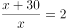，解得x=30，则三天共开3x+45=3×30+45=135千米。

故正确答案为C。

---

### 第 2 题　qid 4652157 · 数学运算

某种商品如果每件降价30元，单价比打八折销售时贵10元，则这种商品的定价是多少元/件？

- **A**. 200　✅
- **B**. 250
- **C**. 300
- **D**. 350

**答案**：A

**官方解析**

设商品定价为x，根据题意，在定价x基础上降价30元为x-30，比打八折售价为0.8x时贵10元，可列式：x-30-0.8x=10，解得x=200。
故正确答案为A。

---

### 第 3 题　qid 4652161 · 数学运算

某测试共有100道题，答对一道题得3分，不答或答错一道题扣2分，小张测试成绩为285分，则他一共答对了多少道题？

- **A**. 85
- **B**. 90
- **C**. 95
- **D**. 97　✅

**答案**：D

**官方解析**

设答对题目x道，则不答或答错题目（100-x）道，根据题意得：3x-2（100-x）=285，解得x=97。
故正确答案为D。

---

### 第 4 题　qid 4652140 · 数学运算

农户张某今年年初将一块长方形农田扩建为正方形农田，使得正方形边长与长方形的长相同，今年的农作物产量是去年的1.5倍。已知今年农作物亩产量比去年高20%，则原来长方形农田的长是宽的多少倍？

- **A**. 1.2
- **B**. 1.25　✅
- **C**. 1.5
- **D**. 1.6

**答案**：B

**官方解析**

设长方形农田的长为a，宽为b，正方形边长为a，去年农作物亩产量为n，今年农作物亩产量为1.2n。根据总产量=亩产量×面积，结合题意可列方程：，化简得：。

故正确答案为B。

---

### 第 5 题　qid 4652142 · 数学运算

商店销售某种商品，先按定价卖了300件，打七五折卖了200件，后在此基础上再打八折卖完了剩下的100件，总利润为总成本的。单件成本相当于单件定价的：

- **A**. 57%
- **B**. 54%
- **C**. 51%　✅
- **D**. 48%

**答案**：C

**官方解析**

经济利润问题，求比例关系用赋值法。赋值单件定价为100，则打七五折单件售价为0.75×100=75元，则在打七五折的基础上再打八折单件售价为0.75×100×80%=60元，设单件成本为x元。根据题意，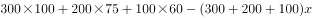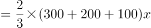，解得x=51。则，故单件成本相当于单件定价的51%。

故正确答案为C。

---

### 第 6 题　qid 4652147 · 数学运算

甲和乙同时出发，在长360米的环形道路上沿同一方向各自匀速散步。甲出发2圈后第一次追上乙，又走了4圈半第二次追上乙。则甲出发后走了多少米第一次到达乙的出发点？

- **A**. 160　✅
- **B**. 200
- **C**. 240
- **D**. 280

**答案**：A

**官方解析**

结合题干条件，只给出了距离，未给出速度和时间的具体值，考虑赋值。由第一次追上到第二次追上这个过程，是同点同时出发的环形追及问题，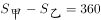米，结合题干条件“甲出发2圈后第一次追上乙，又走了4圈半第二次追上乙”，所以乙的路程为360×4.5-360=360×3.5米，又因时间相同，可得速度之比=路程之比，即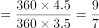，赋值甲的速度为9米/分钟，乙的速度为7米/分钟，再分析出发到第一次追上过程，追及时间为：分钟，甲比乙多走的距离即为甲出发点到乙出发点的距离：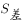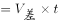米。

故正确答案为A。

---

### 第 7 题　qid 4652143 · 数学运算

商店做促销活动，购买店内商品第一件原价，第二件（价格不高于第一件）4折，第三件（价格不高于第二件）1折。小刘买了1件A和2件B商品，优惠后的总价格相当于定价的56.25%。已知A商品比B商品贵，则按原价买10件A商品的钱最多可以按原价买多少件B商品？

- **A**. 20
- **B**. 16
- **C**. 14　✅
- **D**. 12

**答案**：C

**官方解析**

根据题意，第二件商品价格不高于第一件，第三件商品价格不高于第二件，可判断小刘购买的第一件商品是A，第二件和第三件商品是B。设A和B商品原价分别为x元/件和y元/件，可列方程：x+40%y+10%y=56.25%（x+2y），解得x：y=10：7。赋值x=10，y=7，则按原价买10件A商品的钱=10×10=100元，可购买B件······2，故最多可以按原价买B商品14件。

故正确答案为C。

---

### 第 8 题　qid 4652151 · 数学运算

一个圆形水库的半径为1千米。一艘船从水库边的A点出发，直线行驶1千米后到达水库边的B点，又从B点出发直线行驶2千米后到达水库边的C点。则C点与A点的直线距离最短可能为多少千米？

- **A**. 不到1千米
- **B**. 1—1.3千米之间
- **C**. 1.3—1.6千米之间
- **D**. 超过1.6千米　✅

**答案**：D

**官方解析**

根据题意可知，A、B、C三个点都位于圆上。因为两点之间线段最短，所以C点与A点的距离最短为线段AC。如图所示，两两连接A、B、C构成三角形，BC=2km，圆形水库的半径为1km，即直径为2km，则BC为圆形水库的直径，根据几何结论：由圆上一点和圆的直径连接所构成的三角形一定是直角三角形，可知为直角三角形。根据勾股定理，直角边AC的长度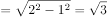km＞1.6km，在D项范围内。

故正确答案为D。

---

### 第 9 题　qid 4652162 · 数学运算

某单位组织文艺表演需要统一购买15套服装，下表为甲、乙、丙和丁四个网店同款上衣和裤子的价格，上衣和裤子可以分开购买，每个网店发货均收取40元快递费，则本次购买服装的最低成本为：

- **A**. 2125元
- **B**. 2155元　✅
- **C**. 2165元
- **D**. 2185元

**答案**：B

**官方解析**

想要让最终购买的总成本最低，可以分两种情况考虑：
情况一：在一家店同时买上衣和裤子，只需要40元快递费。根据表格可计算，甲、乙、丙、丁四家店买一套上衣裤子的价格分别为：77+65=142、79+64=143、78+63=141、80+62=142。故在丙店购买最便宜，总成本=141×15+40=2155元；
情况二：分别在两家店买最便宜的上衣和最便宜的裤子，需要两家各40元快递费。根据表格可知，甲店上衣最便宜，丁店裤子最便宜。故在甲店购买上衣，在丁店购买裤子，总成本=（77×15+40）+（62×15+40）=2165元。
比较情况一和情况二，最低成本为情况一。
故正确答案为B。

---

### 第 10 题　qid 4652149 · 数学运算

甲、乙两条生产线每小时分别可以生产15000件和9000件某种零件，产品合格率分别为99%和99.8%。现接到36万件这种零件的生产任务，要求合格率不得低于99.5%，则两条生产线合作，至少需要多少小时完成?

- **A**. 15
- **B**. 18
- **C**. 24
- **D**. 25　✅

**答案**：D

**官方解析**

方法一：由题干可知，需要生产的合格产品至少为36万×99.5%=35.82万件。设甲、乙工作量分别为x万件、（36-x）万件，则有，解得x=13.5，36-x=22.5。甲完成任务时间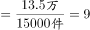小时，乙完成任务时间小时，综上所述，至少需要25小时完成。

方法二：设要满足题目要求的合格率，甲、乙工作量分别为x万件、（36-x）万件。如下图所示，根据线段法原理：距离和量成反比，可得（99.5%-99%）：（99.8%-99.5%）=5：3=（36-x）：x，解得x=13.5，36-x=22.5。甲完成任务时间小时，乙完成任务时间小时，综上所述，至少需要25小时完成。

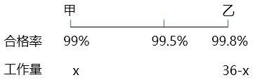

故正确答案为D。

注：由于甲、乙生产零件合格率分别为99%、99.8%，本题整体合格率限制99.5%，且甲合格率较低，故甲完成后，不能继续帮助乙工作。 

---

### 第 11 题　qid 4652156 · 数学运算

下方九宫格中为从1到9不重复的9个整数，虚线上角的数字为虚线所经过区域的数字之和，则灰色格子中的数字最大可能是：

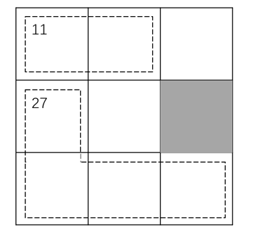

- **A**. 7
- **B**. 6
- **C**. 5
- **D**. 4　✅

**答案**：D

**官方解析**

由题意可知，九宫格数字总和=1+2+3+···+9=45，则虚线区域以外3个格子中的数字和为45-11-27=7。因3个数字为1-9中的3个不同数字，故只有一种情况：1+2+4=7。因此灰色格子中的数字最大为4。
故正确答案为D。

---

### 第 12 题　qid 4652160 · 数学运算

A、B两个运动队分别有x人和y人，两队所有人员刚好组成一个不到100人的正方形实心方队。在为两个运动队分配运动服时，错给A队分了y套，给B队分了x套。发现后A队将领到的运动服拿出20%给B队，B队又拿出1套给A队，此时两队的队员刚好一人分到一套运动服。则x的值为：

- **A**. 17
- **B**. 25
- **C**. 29　✅
- **D**. 35

**答案**：C

**官方解析**

根据“两队所有人员刚好组成一个不到100人的正方形实心方队”可知，（x+y）为小于100的平方数。由题意可知，x=（1-20%）y+1，即x=0.8y+1，把选项数据代入验证：
A项，若x=17，y=20，17+20=37人，不满足两队人员组成正方形实心方队，排除；
B项，若x=25，y=30，25+30=55人，不满足两队人员组成正方形实心方队，排除；
C项，若x=29，y=35，29+35=64人，满足题目所有条件，当选；
D项，若x=35，y=42.5，不满足人数必须为正整数，排除。
故正确答案为C。

---

### 第 13 题　qid 4652145 · 数学运算

将张、王、李、陈、赵五名应届毕业生分配到甲、乙、丙3个不同的科室，要求每个科室至少分配1人，甲科室分配的人数多于乙科室，且张和王不能去丙科室。则有多少种不同的分法？

- **A**. 12
- **B**. 21　✅
- **C**. 35
- **D**. 72

**答案**：B

**官方解析**

由题意，甲科室分配的人数多于乙科室，可分为：

①甲3人、乙1人、丙1人，因张和王不能去丙科室，从李、陈、赵3人中选1人去丙科室，即有3种情况；剩下4人中选3人去甲科室，即有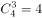种情况；最后1人去乙科室。情况数为3×4×1=12种；

②甲2人、乙1人、丙2人，因张和王不能去丙科室，从李、陈、赵3人中选2人去丙科室，即有种情况；剩下3人中选2人去甲科室，即有种情况；最后1人去乙科室。情况数为3×3×1=9种。

满足题意总情况数=12+9=21种。

故正确答案为B。

---

### 第 14 题　qid 4652150 · 数学运算

早上8：00，甲、乙两车开始在A、B两地之间往返运货，两车先在A地装货后驶往B地卸货，然后返回A地再装货，如是重复。13：35甲完成了第四次卸货，又过了2小时5分，乙完成了第五次装货。已知两车均匀速行驶，每次装货或卸货需要20分钟，则甲的行驶速度是乙的多少倍？

- **A**. 1.25
- **B**. 1.4　✅
- **C**. 1.5
- **D**. 1.6

**答案**：B

**官方解析**

设AB之间路程为S，当甲完成第四次卸货时，所走路程为7S，装、卸货共计8次，总用时为13：35-8：00=5小时35分钟=335分钟，装货与卸货用时为20×8=160分钟，路上行驶用时为335-160=175分钟，可知甲走S用时为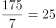分钟。

乙完成第五次装货时，所走路程为8S，装、卸货共计9次，总用时为335+125=460分钟，装货与卸货用时为20×9=180分钟，路上行驶用时为460-180=280分钟，可知乙走S用时为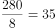分钟。

路程相同时，速度与时间成反比，则甲乙速度之比为35：25=7：5，即甲的行驶速度是乙的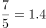倍。

故正确答案为B。

---

### 第 15 题　qid 4652153 · 数学运算

单位组织职工前往甲、乙、丙三个爱国主义教育基地学习，要求每名职工至少去1个基地。已知有48人去了甲基地，有42人未去乙基地，去丙基地的人中，去1个、2个、3个基地的人数比为3：2：1。如仅去2个基地和去3个基地的职工分别有x人和y人，则x和y的关系为：

- **A**. x=4y+6　✅
- **B**. x=4y-6
- **C**. x=3y+6
- **D**. x=3y-6

**答案**：A

**官方解析**

设总人数为a。由“有42人未去乙基地”，可得去了乙基地的人数=a-42，由“去丙基地的人中，去1个、2个、3个基地的人数比为3∶2∶1”，且去了3个基地的人数为y，可知去丙基地的人数=3y+2y+y=6y。根据三集合容斥原理非标准型公式：总数-都不=A+B+C-只满足两项-2×满足三项，可得a-0=48+（a-42）+6y-x-2y，化简得x=4y+6。
故正确答案为A。

---

## 判断推理

### 第 1 题　qid 4652224 · 图形推理

每道题包含两套图形和可供选择的4个图形。这两套图形具有某种相似性，也存在某种差异。要求你从四个选项中选择最适合取代问号的一个。正确的答案应不仅使两套图形表现出最大的相似性，而且使第二套图形也表现出自己的特征。

- **A**. A　✅
- **B**. B
- **C**. C
- **D**. D

**答案**：A

**官方解析**

元素组成不同，优先考虑属性规律。观察发现，第一套三个图形分别是中心对称图形、轴对称图形、轴对称+中心对称图形。第二套图形应遵循此规律，分别是中心对称图形、轴对称图形，故？处应选择轴对称+中心对称图形，只有A项符合。
故正确答案为A。

---

### 第 2 题　qid 4652226 · 图形推理

每道题包含两套图形和可供选择的4个图形。这两套图形具有某种相似性，也存在某种差异。要求你从四个选项中选择最适合取代问号的一个。正确的答案应不仅使两套图形表现出最大的相似性，而且使第二套图形也表现出自己的特征。

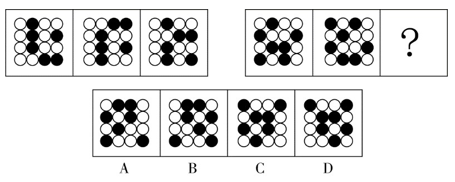

- **A**. A　✅
- **B**. B
- **C**. C
- **D**. D

**答案**：A

**官方解析**

第一组图形两两相邻比较可以发现，第一幅图中每一行黑球整体往下平移一行得到第二幅图（循环走），第二幅图中每一行黑球整体往下平移一行得到第三幅图（循环走）。第二组图形运用此规律，只有A项符合。
故正确答案为A。

---

### 第 3 题　qid 4652301 · 图形推理

每道题包含两套图形和可供选择的4个图形。这两套图形具有某种相似性，也存在某种差异。要求你从四个选项中选择最适合取代问号的一个。正确的答案应不仅使两套图形表现出最大的相似性，而且使第二套图形也表现出自己的特征。

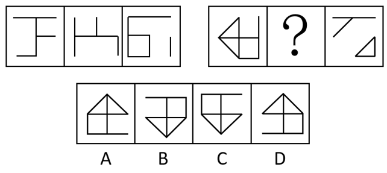

- **A**. A
- **B**. B　✅
- **C**. C
- **D**. D

**答案**：B

**官方解析**

元素组成相似，且相同线条重复出现，优先考虑样式规律中的加减同异。问号在第二组图中间，则优先考虑图1和图3得到第二幅图的规律。观察发现，第一组图中，图1和图3求异得到图2。第二组图遵循同样的规律，图1和图3求异得到？处图形，只有B项符合。
故正确答案为B。

---

### 第 4 题　qid 4652267 · 图形推理

请从四个选项中选出最恰当的一项填在问号处，使图形呈现一定的规律性。

- **A**. A
- **B**. B　✅
- **C**. C
- **D**. D

**答案**：B

**官方解析**

元素组成不同，且无明显属性规律，优先考虑数量规律。观察发现，题干图形明显被分割，优先考虑面数量。整体数面发现，题干和选项都为4个面，继续考虑面的细化，发现题干每幅图都包含两个相同面，观察选项，只有B项符合。
故正确答案为B。

---

### 第 5 题　qid 4652269 · 图形推理

从所给的四个选项中，选择最合适的一个填入问号处，使之呈现一定的规律性：

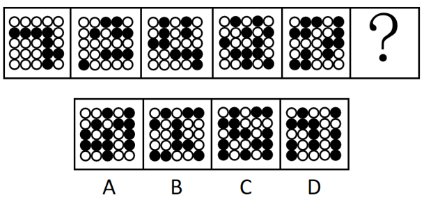

- **A**. A　✅
- **B**. B
- **C**. C
- **D**. D

**答案**：A

**官方解析**

图形元素组成不同，且无属性规律，优先考虑数量规律。观察发现，题干图形均由黑球和白球构成，其中黑球的数量分别是8、9、10、11、12，故？处图形应有13个黑球，只有A项符合。
故正确答案为A。

---

### 第 6 题　qid 4652212 · 类比推理

小明说：“只有高级工程师才能成为公司新组建的技术专家组成员。”小红说：“不对呀，老黄是高级工程师，但是他没有被任命为技术专家组成员。”
小红的回答说明她把小明的话理解为了：

- **A**. 有的高级工程师是技术专家组成员
- **B**. 有的高级工程师不是技术专家组成员
- **C**. 所有的技术专家组成员都应该是高级工程师
- **D**. 所有的高级工程师都应该是技术专家组成员　✅

**答案**：D

**官方解析**

第一步：翻译题干。

①小明：技术专家组成员高级工程师；

②小红：老黄是高级工程师 且 技术专家组成员。

第二步：逐一分析选项。

由题干可知，小红认为小明说的不对，并进行了反驳，因此她对小明的理解就是“老黄是高级工程师 且 技术专家组成员”的矛盾命题，即“高级工程师技术专家组成员”。

A项：翻译为有的高级工程师技术专家组成员，与小红的理解不符，排除； 

B项：翻译为有的高级工程师技术专家组成员，与小红的理解不符，排除；

C项：翻译为技术专家组成员高级工程师，与小红的理解不符，排除；

D项：翻译为高级工程师技术专家组成员，与小红的理解相符，当选。

故正确答案为D。

---

### 第 7 题　qid 4652225 · 逻辑判断

某研究团队用没有生命的细菌纤维素（由细菌制造并排泄出的有机化合物，拥有许多独特的力学性能，比如柔韧性、强度和保持形状的能力）充当打印纸，用活微藻充当“墨水”，通过3D打印将活微藻沉积在细菌纤维素上，进而可以产生一种独特材料。研究人员称该项技术有望广泛应用于医疗和轻工业领域。
以下陈述如果为真，哪项无法支持上述结论？

- **A**. 该材料可以制造用于皮肤移植的光合皮肤，产生的氧气将有助于伤口修复
- **B**. 该材料能利用阳光将水和二氧化碳转化为氧气和能量，可以制造可持续能源　✅
- **C**. 该材料制成的服装不需要像传统服装那样经常清洗，能大大减少水的使用
- **D**. 该材料是可完全生物降解的高质量织物，将解决纺织业目前面临的环保问题

**答案**：B

**官方解析**

第一步：找出论点和论据。
论点：该项技术有望广泛应用于医疗和轻工业领域。
论据：某研究团队用没有生命的细菌纤维素（由细菌制造并排泄出的有机化合物，拥有许多独特的力学性能，比如柔韧性、强度和保持形状的能力）充当打印纸，用活微藻充当“墨水”，通过3D打印将活微藻沉积在细菌纤维素上，进而可以产生一种独特材料。
本题提问方式为“哪项无法支持上述结论”，故排除可以加强的选项，选择不能加强的选项即可。
第二步：逐一分析选项。
A项：指出该材料可以用于皮肤移植，有助于伤口恢复，举例说明这种材料可以用于医疗领域，可以加强，排除；
B项：指出该材料可以制造可持续能源，无法确定是否能应用于医疗和轻工业领域，无法加强，当选；
C项：指出该材料制成的服装能减少水的使用，说明这种材料可以用于服装制造业，服装制造业属于轻工业，可以加强，排除； 
D项：指出该材料将解决纺织业目前面临的环保问题，纺织业属于轻工业，可以加强，排除。
本题为选非题，故正确答案为B。

---

### 第 8 题　qid 4652281 · 逻辑判断

今年的一次大学生招聘会上，某宿舍所有6名同学均向甲公司和乙公司投递了简历。甲、乙两公司通知了他们各自所收上百份简历中一半的人员参加面试。因此，这6名同学每人获得了来自甲公司或乙公司的仅一次面试机会。
要使上述论证成立，以下哪项假设是必须的？

- **A**. 除向甲、乙公司投递简历外，该宿舍同学未向其他单位投递简历
- **B**. 该宿舍所有同学既符合甲公司的招聘条件，也符合乙公司的招聘条件
- **C**. 甲、乙两公司没有同时通知该宿舍的同一个人去参加他们的面试　✅
- **D**. 该宿舍的这6名同学都愿意参加甲公司或乙公司所通知的面试

**答案**：C

**官方解析**

第一步：找出论点和论据。
论点：这6名同学每人获得了来自甲公司或乙公司的仅一次面试机会。
论据：某宿舍所有6名同学均向甲公司和乙公司投递了简历。甲、乙两公司通知了他们各自所收上百份简历中一半的人员参加面试。
本题论点和论据均在讨论这6名同学去甲公司或乙公司面试，论点论据话题一致，且问法为“以下哪项假设是必须的”，加强优先考虑必要条件。
第二步：逐一分析选项。
A项：该项讨论的是该宿舍6名同学是否还向其他单位投递简历的情况，与论点讨论的这6名同学获得甲公司或乙公司的仅一次面试机会无关，不是论证成立的假设，排除；
B项：该项讨论的是该宿舍6名同学均符合甲公司和乙公司的招聘条件，论点讨论的是甲公司或乙公司的仅一次面试机会，符合两个公司招聘条件不能说明为什么只有一次面试机会，不是论证成立的假设，排除；
C项：该项指出甲、乙两公司没有同时通知同一个人去参加面试，所以这6名同学收到的关于甲、乙公司的面试机会只能来自于其中一家，该项是论点成立的必要条件，是论证成立的假设，当选；
D项：该项讨论的是这6位同学参加面试的意愿，与论点讨论的这6名同学获得甲公司或乙公司的仅一次面试机会无关，不是论证成立的假设，排除。
故正确答案为C。

---

### 第 9 题　qid 4652285 · 逻辑判断

某研究调查了数千名被试者的睡眠情况与健康状况，结果发现，从中年至老年（50岁至70岁间）一直处于较短睡眠模式（即每晚睡眠时长少于6小时）的人，失智风险会增加30%。研究者呼吁，中老年人适当增加睡眠时长，可以预防失智的发生。
以下陈述如果为真，哪项最能质疑研究者的观点？

- **A**. 老年人每日睡眠时间过长不仅会有疲劳感，还会记忆力降低，精力不集中
- **B**. 随着年龄的增加，身体的细胞也慢慢衰老，这就导致睡眠时间开始变短
- **C**. 心血管代谢问题和精神疾患等都是失智的重要风险因素
- **D**. 失智是一种因脑部疾病所导致的渐进性认知功能退化，跟睡眠时长无关　✅

**答案**：D

**官方解析**

第一步：找出论点和论据。
论点：中老年人适当增加睡眠时长，可以预防失智的发生。
论据：从中年至老年（50岁至70岁间）一直处于较短睡眠模式（即每晚睡眠时长少于6小时）的人，失智风险会增加30%。
本题论点和论据都在讨论睡眠时长与失智的关系，话题一致，削弱优先考虑削弱论点。
第二步：逐一分析选项。
A项：该项指出睡眠时间过长的不良表现，与论点讨论的适当增加睡眠时长可以预防失智无关，为无关项，无法削弱，排除；
B项：该项指出睡眠时间变短的原因，与论点讨论的适当增加睡眠时长可以预防失智无关，为无关项，无法削弱，排除；
C项：该项指出心血管代谢问题和精神疾患等都会引起失智，与论点讨论的适当增加睡眠时长可以预防失智无关，为无关项，无法削弱，排除；
D项：该项指出失智和睡眠时长无关，那么中老年人适当增加睡眠无法预防失智，削弱论点，当选。
故正确答案为D。

---

### 第 10 题　qid 4652264 · 逻辑判断

研究人员以某大型科技公司办公区为观察对象，探索工作场所各方面因素对员工工作效率的影响。研究者发现，与坐在墙旁的人相比，位置靠窗的员工工作效率更高，精力更集中，座位面对整个房间，且视线范围内的办公桌相对较少的员工更加专注和高效。研究人员认为，办公室布局会影响员工的工作专注力和工作效率。
以下各项如果为真，哪项不能支持研究者的结论？

- **A**. 自然光可调节人的生物节律，位置靠窗的员工更多接受自然光照射，上班时精力更加充沛
- **B**. 优秀的员工对于工位有更多的选择权，而新入职的员工往往被安排在靠墙或门口位置　✅
- **C**. 如果员工视线范围内可以看到很多同事，会很容易分心，而且容易被别的同事之间的沟通所打扰
- **D**. 办公室空气污染比户外严重，远离窗户的员工更容易因空气污染而头疼疲倦，影响办公效率

**答案**：B

**官方解析**

第一步：找出论点和论据。
论点：办公室布局会影响员工的工作专注力和工作效率。
论据：与坐在墙旁的人相比，位置靠窗的员工工作效率更高，精力更集中，座位面对整个房间，且视线范围内的办公桌相对较少的员工更加专注和高效。
本题论点论据讨论的均是办公室布局与员工的工作专注力和工作效率之间的关系，二者话题一致，加强优先考虑补充论据，且本题为选非题，排除三个能够加强的选项即可。
第二步：逐一分析选项。
A项：该项说明自然光照射可以让位置靠窗的员工精力更加充沛，证明办公室布局确实会影响员工的工作效率，补充论据，可以加强，排除；
B项：该项说明不是办公室布局影响了员工的工作效率，而是工作能力强的员工拥有更多的工位选择权，将论点的原因和结果相颠倒，属于因果倒置，可以削弱，当选；
C项：该项说明如果员工视线范围内有较多同事，容易被打扰，证明办公室布局确实会影响员工的工作专注力，补充论据，可以加强，排除；
D项：该项说明空气质量不好会影响工作效率，证明办公室布局确实会影响员工的工作效率，补充论据，可以加强，排除。
本题为选非题，故正确答案为B。

---

### 第 11 题　qid 4652218 · 逻辑判断

咖啡因是一种中枢神经系统兴奋剂，通过与腺苷受体竞争性结合等机制，刺激神经元活性，间接影响多巴胺等的释放，从而增强注意力和认知控制，有助于我们完成常规的没有挑战性的任务。不过在需要创造性地解决问题时，增强的认知控制和自发想法缺一不可，而后者有时是可遇不可求的。
根据上述材料，以下推论正确的是：

- **A**. 发明家的脑子里经常自发冒出很多新奇的点子
- **B**. 咖啡因直接作用于大脑，能提神醒脑促进记忆
- **C**. 面对枯燥无趣的常规工作时，咖啡或许能提高效率　✅
- **D**. 作为神经系统兴奋剂的咖啡，也会导致失眠和心跳过速

**答案**：C

**官方解析**

日常结论题，根据题干信息逐一分析选项。
A项：题干中并未涉及发明家是否有新奇点子的表述，无中生有，排除；
B项：根据题干第一句可知，咖啡因直接与腺苷受体竞争性结合，增强了注意力和认知控制，但并未提及记忆，无中生有，排除；
C项：题干第一句指出咖啡因可以增强注意力和认知控制，有助于完成常规的没有挑战性的任务，可以推出咖啡因有助于完成枯燥无趣的常规工作，即咖啡或许能提高枯燥无趣工作的效率，当选；
D项：题干中并未涉及咖啡是否会导致失眠和心跳过速的表述，无中生有，排除。
故正确答案为C。

---

### 第 12 题　qid 4652295 · 类比推理

中华世纪坛举办“岁月夏宫展”期间，某志愿服务分队有15名队员担任讲解员。关于这15名讲解员是否去过俄罗斯夏宫，有如下断定：
（1）所有队员都去过俄罗斯夏宫；
（2）队员清仪去过俄罗斯夏宫；
（3）有的队员去过俄罗斯夏宫；
（4）有的队员没去过俄罗斯夏宫。
后来，经详细核查，得知上述断定中只有两个为真。据此，可必然推出：

- **A**. 队员清仪去过俄罗斯夏宫
- **B**. 有队员没去过俄罗斯夏宫　✅
- **C**. 队员们都去过俄罗斯夏宫
- **D**. 队员们都没去过俄罗斯夏宫

**答案**：B

**官方解析**

本题属于真假推理题。
第一步：找出题干矛盾关系。
题干条件（1）中“所有队员都去过俄罗斯夏宫”和条件（4）“有的队员没去过俄罗斯夏宫”是一组矛盾关系，必有一真必有一假。
第二步：看其余。
已知条件中两句真话、两句假话，除去条件（1）、（4）这一组矛盾关系中的一真一假，题干条件中（2）“队员清仪去过俄罗斯夏宫”和条件（3）“有的队员去过俄罗斯夏宫”中也应该必有一真必有一假。
可以通过假设法来确定：如果假设条件（2）“队员清仪去过俄罗斯夏宫”为真，则可以推出有队员去过俄罗斯夏宫，此时条件（3）“有的队员去过俄罗斯夏宫”也是真的，与上文推理的条件（2）和条件（3）中一真一假不符。因此，题干条件（2）“队员清仪去过俄罗斯夏宫”为假，即队员清仪没去过俄罗斯夏宫，排除A项；也可以推出有的队员没去过俄罗斯夏宫，B项为真，当选；根据条件（2）为假，可得条件（3）为真，即“有的队员去过俄罗斯夏宫”，排除D项；另外根据条件（2）为假，可得条件（1）“所有队员都去过俄罗斯夏宫”就是假话，排除C项。
故正确答案为B。

---

### 第 13 题　qid 4652293 · 逻辑判断

要稳定地提高在逻辑考试上的成绩，关键是要在基本概念上有真正的理解，如果没有真正的理解，即使投入再多的精力，做再多的练习，也不可能取得真正稳定的好成绩。
以下各选项中，除了哪项外，都表达了与上述言论相同的意思？

- **A**. 只有在基本概念上有真正的理解，才能取得真正稳定的好成绩
- **B**. 除非在基本概念上有真正的理解，否则不能取得真正稳定的好成绩
- **C**. 只要在基本概念上有真正的理解，即使没有花很多精力，也能取得真正稳定的好成绩　✅
- **D**. 如果取得了真正稳定的好成绩，说明一定在基本概念上有了真正的理解

**答案**：C

**官方解析**

第一步：翻译题干。

①稳定提高成绩基本概念有真正理解；

②基本概念有真正理解取得真正稳定的好成绩。

第二步：逐一分析选项。

A项：翻译为取得真正稳定的好成绩基本概念有真正理解，是对②的否后，否后推否前，是逆否命题，排除；

B项：翻译为取得真正稳定的好成绩基本概念有真正理解，是对②的否后，否后推否前，是逆否命题，排除；

C项：翻译为基本概念有真正理解取得真正稳定的好成绩，是对②的否前，否前无法得出确定结论，当选；

D项：翻译为取得真正稳定的好成绩基本概念有真正理解，是对②的否后，否后推否前，是逆否命题，排除。

本题为选非题，故正确答案为C。

---

### 第 14 题　qid 4652229 · 逻辑判断

某研究将行走模式分为两类：一类是零星地短时间行走，另一类是不间断地行走10分钟以上。该研究追踪了某国16732名66岁至78岁女性，4年随访期间有804名女性去世。结果发现，不管是零星散步还是较长时间的不间断行走，步数更多的人寿命更长；在约4500步之后，这种效应趋于稳定。研究者提出，只要开始走路，就能降低老年女性死亡风险。
以下各项如果为真，哪项不能质疑研究者的结论？

- **A**. 中青年女性的生活方式和老年女性有很大不同，每天行走步数与死亡率没有显著关联　✅
- **B**. 正确的走路方式，才能使身体变得健壮，不当的走路方式和姿势，会危害身体健康
- **C**. 在这个年龄段，每天能够自主行走达到一定步数，通常意味着有更好的整体健康状况
- **D**. 能够坚持走路的人，或者有更多的生活内容，或者有更好的健康意识，这两者均有益健康

**答案**：A

**官方解析**

第一步：找出论点和论据。
论点：只要开始走路，就能降低老年女性死亡风险。
论据：该研究追踪了某国16732名66岁至78岁女性，4年随访期间有804名女性去世。结果发现，不管是零星散步还是较长时间的不间断行走，步数更多的人寿命更长；在约4500步之后，这种效应趋于稳定。
本题为选非题，找出三个削弱项排除，剩下的选项即为正确答案。
第二步：逐一分析选项。
A项：指出中青年女性和老年女性相比，每天行走步数和死亡率无显著关联，该项讨论的是中青年女性，而论点讨论的是老年女性，主体不一致，无法削弱，当选；
B项：指出不当的走路方式反而会危害健康，说明并不是只要开始走路就会降低死亡风险，否定论点，可以削弱，排除；
C项：指出老年女性是因为本来身体就健康才能够走路达到一定步数，而不是因为走路达到一定步数才身体健康，因果倒置，可以削弱，排除；
D项：指出能坚持走路的人，同时有更多的生活内容或更好的健康意识，这对健康有益，说明这些死亡风险低的女性除了走路之外，还有其他因素也对他们的健康有益，他因削弱，可以削弱，排除。
本题为选非题，故正确答案为A。

---

### 第 15 题　qid 4652289 · 逻辑判断

某校辩论队的小赵、小钱、小孙和小李分别是哲学、中文、历史和英语专业的，他们也都爱好下围棋。还知道如下情况：
（1）小孙和历史专业的下过围棋，并且各有输赢；
（2）哲学专业的只和中文专业的下过围棋，而且从没赢过；
（3）小钱和小孙二人曾和哲学专业的同学一起爬过山；
（4）某日小李、小赵下围棋，且小赵取胜。
据此，可以推出：

- **A**. 小赵是学英语的，小钱是学历史的
- **B**. 小钱是学历史的，小孙是学中文的
- **C**. 小赵是学历史的，小孙是学英语的
- **D**. 小李是学哲学的，小钱是学历史的　✅

**答案**：D

**官方解析**

第一步，分析题干条件。

（1）小孙和历史专业的下过围棋，并且各有输赢；

（2）哲学专业的只和中文专业的下过围棋，而且从没赢过；

（3）小钱和小孙二人曾和哲学专业的同学一起爬过山；

（4）某日小李、小赵下围棋，且小赵取胜。

第二步，根据题干条件进行推理，题干无确定信息，可以考虑最大信息法。由于对象和信息较多，为了使推理更加清晰，可以借助列表推理：

题干条件中小孙提到两次，根据条件（1）可知小孙不是历史专业，根据条件（3）可知小孙不是哲学专业；

题干条件中哲学提到两次，根据条件（3）可知小钱不是哲学专业，根据条件（2）和条件（4）可知小赵取胜，但哲学专业从没赢过，因此小赵不是哲学专业。

根据以上信息可知，小李为哲学专业，得到表格如下：

根据条件，已知小李为哲学专业，结合条件（2）和条件（4）可知，哲学专业的只和中文专业的下过围棋，而小李和小赵下过围棋，因此小赵是中文专业，进一步可知小孙是英语专业，最后推出小钱是历史专业，得到表格如下：

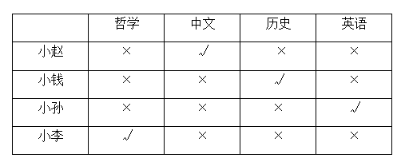

故正确答案为D。

---

### 第 16 题　qid 4652227 · 逻辑判断

人的平均智商每十年有一定幅度增长，这个现象被称为弗林效应，它可能是儿童时期营养、医疗和教育品质不断提升的结果。而且数据显示，平均智商最大幅的增长发生在发展中国家和地区。在这些地方，儿童时期营养、标准化教育和医疗条件的提升是影响智商的最重要因素。
由此可以推出：

- **A**. 人的平均智商并非一成不变，而是会受到社会发展变化的影响　✅
- **B**. 人的平均智商水平反映了该国家和地区的经济发展水平
- **C**. 发展中国家人的平均智商要远低于发达国家人的平均智商
- **D**. 发达国家人的平均智商增幅缓慢是因为在营养、医疗和教育方面已无太多提升空间

**答案**：A

**官方解析**

日常结论题，根据题干信息逐一分析选项。
A项：根据题干第一句话“人的平均智商每十年有一定幅度增长”可知，人的平均智商不是一成不变，根据题干最后一句话“在这些地方，儿童时期营养、标准化教育和医疗条件的提升是影响智商的最重要因素”可知，儿童时期营养、标准化教育和医疗条件的提升属于社会发展变化，因此可以推出人的平均智商是变化的且受到社会发展变化的影响，当选；
B项：题干中仅提及“发展中国家和地区”平均智商增幅最大，未提及平均智商是否会反映经济发展水平，无法推出，排除；
C项：题干中没有提及发展中国家和发达国家人的平均智商的比较，无中生有，无法推出，排除；
D项：题干中没有提及发达国家人的平均智商增幅缓慢的原因，无中生有，无法推出，排除。
故正确答案为A。

---

### 第 17 题　qid 4652261 · 逻辑判断

科学家们在给老鼠准备的“饮料”里分别加入了糖或甜味剂——安赛蜜。起初，小鼠们两种饮料都喝。可到了第二天，它们就几乎完全放弃了甜味剂，只爱喝真正的糖饮料。更“夸张”的是，被去除了味蕾上的甜味受体的小鼠，舌头尝不出任何甜味，也会偏爱选择真正的糖。后来科学家发现，小鼠和人的脑中都有一个区域只对葡萄糖而不是甜味剂有反应。这个区域在孤束核尾部（简称cNST），隐藏于大脑最原始的区域——脑干，并不在小鼠处理味觉的脑区。
根据上述材料，以下判断正确的是：

- **A**. 甜味剂的“甜”和糖的“甜”，作用在味蕾不同的受体上
- **B**. 无糖可乐受人欢迎，并不是因为它更好喝，而是因为它更健康
- **C**. 小鼠能区别出甜味剂和糖的不同是因为大脑的处理区域存在差异　✅
- **D**. 小鼠大脑处理味觉的区域仅对安赛蜜敏感，而cNST则对葡萄糖敏感

**答案**：C

**官方解析**

日常结论题，根据题干信息逐一分析选项。
A项：根据题干最后两句可知，甜味剂的“甜”和糖的“甜”作用在不同的大脑区域，但无法推出是否作用在味蕾不同的受体上，无法推出，排除；
B项：题干没有涉及无糖可乐受人欢迎的原因，无中生有，排除；
C项：根据题干最后两句可知，大脑中对于葡萄糖有反应的区域隐藏在脑干，不在处理味觉的脑区，而且该区域对于甜味剂无反应，说明小鼠能区别出甜味剂和糖是因为大脑处理区域存在差异，可以推出，当选；
D项：根据题干最后一句可知，cNST对葡萄糖敏感，且处理味觉的脑区对安赛蜜敏感，但是无法推出处理味觉的脑区是否只对安赛蜜敏感，过于绝对，无法推出，排除。
故正确答案为C。

---

### 第 18 题　qid 4652299 · 逻辑判断

人类的视觉功能包括察觉物体存在、分辨物体细节、觉察物体色彩、从视觉背景中分辨视觉对象的能力等。一项研究测查了133名年龄25-45岁的志愿者，其中63人每天吸烟超过20支，另外70人是非吸烟者。研究者测试了志愿者辨别对比度（阴影的细微差别）和颜色的能力，发现与非吸烟者相比，过量吸烟者辨别对比度和颜色的能力明显降低，或多或少有色盲或色弱的表现，红绿色和蓝黄色视觉存在缺陷。研究者提出，吸烟会损害视觉功能。
以下各项如果为真，哪一项最能支持研究者的观点？

- **A**. 调取的体检资料显示，这些志愿者小学毕业时视力指标均正常
- **B**. 测量显示，所有志愿者的视力或矫正视力，即人眼辨认细节的能力正常　✅
- **C**. 调查发现，长期吸烟会导致与年龄相关的视网膜黄斑变性的风险成倍增加
- **D**. 该研究被试志愿者中，长期吸烟的群体的年龄明显大于不吸烟的群体

**答案**：B

**官方解析**

第一步：找出论点和论据。
论点：吸烟会损害视觉功能。
论据：一项研究测查了133名年龄25-45岁的志愿者，其中63人每天吸烟超过20支，另外70人是非吸烟者。研究者测试了志愿者辨别对比度（阴影的细微差别）和颜色的能力，发现与非吸烟者相比，过量吸烟者辨别对比度和颜色的能力明显降低，或多或少有盲或色弱的表现，红绿色和蓝黄色视觉存在缺陷。
论点说的是吸烟会损害视觉功能，论据说的是过量吸烟者辨别对比度和颜色的能力明显降低，二者均讨论的是吸烟会损害视觉功能，论点和论据话题一致，加强考虑必要条件、补充论据等。
第二步：逐一分析选项。
A项：说的是志愿者小学毕业时视力指标均正常，但他们参加研究时年龄处于25-45岁，小学毕业时的视力情况与实验中志愿者视力情况无关，无法加强，排除；
B项：说的是志愿者的视力或矫正视力正常，即所有志愿者的视力基础是一致的，这是实验结论成立的必要条件。如果该条件不成立，那么辨别对比度和颜色的能力降低可能是因为视力不正常而非吸烟，该项保证了实验前提一致，是论点成立的必要条件，可以加强，保留；
C项：说的是长期吸烟会导致与年龄相关的视网膜黄斑变性的风险成倍增加，解释了为什么吸烟会损害视觉功能，补充论据，可以加强，保留；
D项：说的是长期吸烟的群体的年龄明显大于不吸烟的群体，那么辨别对比度和颜色的能力降低的原因也可能是年龄，他因削弱，排除。
对比B、C两项，B项必要条件的加强力度大于C项的补充论据，B项当选。
故正确答案为B。

---

### 第 19 题　qid 4652298 · 逻辑判断

研究人员对1971年到2008年间的36400名某国公民的膳食数据和1984年到2006年间的该国14419人的运动数据进行分析和整合。他们发现，生活在2000年代和1980年代的同龄人，摄入同样的热量、同样质量的蛋白和脂肪，做同样多的运动，2000年代的人还是会比1980年代的人在体重指数上高2.3%。换句话说，即使我们遵循同样的饮食和锻炼计划，今天的人也要比上世纪80年代的人重10%。研究者认为，这种情况可能和科技的发展有关。
以下哪项如果为真，不能支持以上观点？

- **A**. 近年来，越来越多的新型化工产品应用于日常生活，这些物质可能改变人体的荷尔蒙进程，让人体调整和维持体重的机制发生变化
- **B**. 90年代后，新型的抗抑郁药被研发出来，成为了很多国家最常用的处方药之一，而这些药物都有让人变得虚胖的副作用
- **C**. 近年来，科技发展使得人类的工作和生活方式发生了很大转变，体力劳动的比例显著下降，即使维持日常运动，总的体能支出也明显降低
- **D**. 现代人吃的肉比几十年前的人多得多，需要新的肠道菌群来消化，肠道菌群的变化可能让人的食欲大增从而体重增长　✅

**答案**：D

**官方解析**

第一步：找出论点和论据。
论点：同样的饮食和锻炼条件下，如今的人比上世纪80年代的人体重更重的情况可能和科技的发展有关。
论据：无。
本题只有论点，没有论据，可以考虑补充论据来加强，解释或者举例说明为什么如今的人们体重更重和科技发展有关，选非题排除加强项即可。
第二步：逐一分析选项。
A项：近年来，新型化工产品的应用会让人体调整和维持体重的机制发生变化，新型化工产品越来越多证明了科技的发展，科技产品影响人们的体重调节机制，解释了为什么如今的人们体重更重与科技发展有关，补充论据，可以加强，排除；
B项：90年代后，最常用的抗抑郁药被研发出来，而这些药会让人变得虚胖，新型药品的研发证明了科技的发展，药物让人变得虚胖解释了为什么如今的人们体重更重与科技发展有关，补充论据，可以加强，排除；
C项：近年来，科技发展让人们总的体能支出明显降低，而总的体能支出降低意味着人体能量消耗变少，会导致如今的人们体重更重，解释了为什么如今的人们体重更重与科技发展有关，补充论据，可以加强，排除；
D项：现代人吃的肉更多，造成肠道菌群的变化，进而体重增长，这在说明如今的人们体重更重与肠道菌群有关，与论点讨论的科技发展无关，无法加强，当选。
本题为选非题，故正确答案为D。

---

### 第 20 题　qid 4652303 · 类比推理

三位小学老师虞老师、高老师和冯老师，他们每人分别担任音乐、科学、英语、体育、思想品德和数学6科中两门课的教学。已知：
（1）科学老师和体育老师住在同一幢公寓楼；
（2）虞老师在三人中年龄最小；
（3）冯老师、音乐老师和体育老师三个人经常一起去打球；
（4）音乐老师比数学老师年龄要大些；
（5）假日里，英语老师、数学老师和虞老师喜欢结伴去旅行。
根据以上条件，可知，冯老师教：

- **A**. 音乐
- **B**. 思想品德
- **C**. 英语
- **D**. 科学　✅

**答案**：D

**官方解析**

第一步：分析题干条件。
（1）科学老师和体育老师不是同一人；
（2）虞老师年龄最小；
（3）冯老师不教音乐和体育，且音乐老师和体育老师不是同一人；
（4）音乐老师年龄大于数学老师，且音乐老师和数学老师不是同一人；
（5）虞老师不教英语和数学，且英语老师和数学老师不是同一人；
（6）每位老师担任6科中两门课的教学。
第二步：根据题干条件进行推理。
本题最大信息为虞老师，从虞老师入手解题。
由条件（2）（4）（5）可知，虞老师不教音乐、英语、数学，再根据条件（6）可以推出虞老师教科学、体育、思想品德中的两门；由条件（1）可知科学老师和体育老师不能是同一人，所以虞老师一定教思想品德，冯老师不教思想品德。
由条件（3）可知，冯老师不教音乐和体育，再根据条件（6）可以推出冯老师教数学、英语、科学中的两门；由条件（5）可知英语老师和数学老师不能是同一人，所以冯老师一定教科学。
故正确答案为D。

---

### 第 21 题　qid 4652271 · 定义判断

消费决策是指人们根据自己的消费需要，在一定的收入和其他消费环境的约束下，为了实现一定的消费目标而作出关于消费层次、消费方式、消费途径、消费范围等方面的决定或方案。
根据上述定义，以下哪种行为不属于消费决策？

- **A**. 大学生小李没有时间逛街，因此喜欢在网上买东西
- **B**. 某公司采购员计划与供应商签订乙烯采购合同　✅
- **C**. 在朋友的推荐下，小王选择购买某款高性价比的入门级单反相机
- **D**. 某老师决定在学生毕业前自费为他们每人买一本书

**答案**：B

**官方解析**

第一步：找出定义关键词。
“根据自己的消费需要”、“在一定的收入和其他消费环境的约束下”、“为了实现一定的消费目标而作出关于消费层次、消费方式、消费途径、消费范围等方面的决定或方案”。
第二步：逐一分析选项。
A项：大学生小李没有时间逛街，因此喜欢在网上买东西，没有时间逛街说明他被消费环境所约束，符合“在一定的收入和其他消费环境的约束下”，在网上买东西是他为了实现消费目标作出的关于消费途径的决定，符合“根据自己的消费需要”、“为了实现一定的消费目标而作出关于消费层次、消费方式、消费途径、消费范围等方面的决定或方案”，符合定义，排除；
B项：某公司采购员计划与供应商签订乙烯采购合同，不符合“根据自己的消费需要”，不符合定义，当选；
C项：在朋友的推荐下，小王选择购买某款高性价比的入门级单反相机，考虑性价比高的产品说明他受到价格的约束，符合 “在一定的收入和其他消费环境的约束下”，选择某款高性价比的入门级单反相机是他作出的关于消费层次的决定，符合“根据自己的消费需要”、“为了实现一定的消费目标而作出关于消费层次、消费方式、消费途径、消费范围等方面的决定或方案”，符合定义，排除；
D项：某老师决定在学生毕业前自费为他们每人买一本书，在学生毕业前是消费环境，符合“在一定的收入和其他消费环境的约束下”，决定自费为他们买书是老师作出的关于消费方式的决定，符合“根据自己的消费需要”、“为了实现一定的消费目标而作出关于消费层次、消费方式、消费途径、消费范围等方面的决定或方案”，符合定义，排除。
本题为选非题，故正确答案为B。

---

### 第 22 题　qid 4652270 · 定义判断

劳动者的受教育水平、工作经验或知识、技能、能力高于岗位需求的现象被称为资质过剩。客观资质过剩指劳动者实际拥有的任职资格超出岗位平均需求的情况，主观资质过剩指劳动者对这种情况的主观评估或感受，也被称为资质过剩感。
根据上述定义，以下符合资质过剩感的是：

- **A**. 小张想要离职，他觉得自己的技能和目前岗位不够匹配，一些工作技能用不上
- **B**. 小梁去公司应聘，招聘者认为小梁的条件已超出该岗位要求，小梁顺利入职
- **C**. 小方未能升职为市场总监，很不高兴，她觉得以自己的能力早就该升职了　✅
- **D**. 小江一直做公司会计，他的朋友都觉得，以小江的资质一直做普通会计太屈才了

**答案**：C

**官方解析**

第一步：找出定义关键词。
资质过剩：“劳动者的受教育水平、工作经验或知识、技能、能力高于岗位需求”；
客观资质过剩：“劳动者实际拥有的任职资格超出岗位平均需求的情况”；
主观资质过剩（资质过剩感）：“劳动者对这种情况（指资质过剩）的主观评估或感受”。
第二步：逐一分析选项。
A项：小张认为自己的技能和岗位不够匹配，一些工作技能用不上，但是技能和岗位不够匹配并不代表小张的技能高于岗位需求，不符合“劳动者的受教育水平、工作经验或知识、技能、能力高于岗位需求”，不符合资质过剩感，排除；
B项：招聘者认为小梁的条件超出岗位要求，并不是劳动者小梁的主观感受，不符合“劳动者对这种情况（指资质过剩）的主观评估或感受”，不符合资质过剩感，排除；
C项：小方认为按照自己的能力早就该升职，说明小方认为自己的能力超过目前其所在的岗位需求，符合“劳动者的受教育水平、工作经验或知识、技能、能力高于岗位需求”，也符合“劳动者对这种情况（指资质过剩）的主观评估或感受”，符合资质过剩感，当选；
D项：小江的朋友认为小江的资质一直做普通会计屈才，并不是劳动者小江的主观感受，不符合“劳动者对这种情况（指资质过剩）的主观评估或感受”，不符合资质过剩感，排除。
故正确答案为C。

---

### 第 23 题　qid 4652247 · 定义判断

连环马策略是指在谈判中坚持你要我让一步，我也要你让一步，确保条件互换的做法。
根据上述定义，以下属于连环马策略的是：

- **A**. 甲厂家答应购买乙公司的精密设备，乙公司需要同意免去设备使用培训费　✅
- **B**. 果农与经销商谈判，希望将三千斤芒果全部收购，部分次果也一并收购
- **C**. 吴某去买车，发现经销商没有现车还需要加价排队买，吴某要求正价买现车
- **D**. 食客对菜品不满意，不打算付钱，餐馆经理过来理论，食客只能照价结账

**答案**：A

**官方解析**

第一步：找出定义关键词。
“在谈判中”、“你要我让一步，我也要你让一步”、“确保条件互换”。
第二步：逐一分析选项。
A项：甲厂家答应购买设备的条件是乙公司免去培训费，符合“在谈判中”、“你要我让一步，我也要你让一步”、“确保条件互换”，符合定义，当选；
B项：果农希望经销商将芒果全部收购，部分次果也一并收购，果农提出了需经销商让步的条件，而经销商没有提出需果农让步的条件，不符合“你要我让一步，我也要你让一步”、“确保条件互换”，不符合定义，排除；
C项：吴某发现经销商不仅没有现车，还需要加价排队买，要求正价买现车，吴某提出了需经销商让步的条件，而经销商没有提出需吴某让步的条件，不符合“你要我让一步，我也要你让一步”、“确保条件互换”，不符合定义，排除；
D项：餐馆经理与食客理论，食客对菜品不满意，却只能照价结账，体现了食客的让步，但没有体现餐馆经理的让步，不符合“你要我让一步，我也要你让一步”、“确保条件互换”，不符合定义，排除。
故正确答案为A。

---

### 第 24 题　qid 4652214 · 定义判断

“自然后果”是一种常被运用于育儿的概念，意指行为本身会导致一个自然的后果，此结果是孩子事先未知的，但孩子可以从此自然后果的经验中，学会预期结果，控制他们之后的行为。譬如小朋友玩火烫到了之后就不会乱玩火。
根据上述定义，以下不属于自然后果的是：

- **A**. 孩子吃饭时告诉他如果不好好吃饭就会饿肚子，结果孩子担心挨饿便吃完了饭　✅
- **B**. 孩子因迟到被批评后，每晚都整理好第二天要用的物品以免临时寻找耽误时间
- **C**. 孩子因为跑太快而摔倒，家长没有马上去扶，孩子自己爬起来后不再快跑
- **D**. 孩子饭后不爱刷牙，结果有了龋齿，看完医生后坚持每天好好刷牙

**答案**：A

**官方解析**

第一步：找出定义关键词。
“行为本身会导致一个孩子事先未知的自然的后果”、“孩子可以从此自然后果的经验中学会预期结果，控制之后的行为”。
第二步：逐一分析选项。
A项：家长告诉孩子不吃饭就会饿肚子，是家长事先告知的，孩子事先就知道该行为发生的后果，不符合“行为本身会导致一个孩子事先未知的自然的后果”，不符合定义，当选；
B项：孩子迟到之后被批评，之后每晚都整理好第二天要用的物品避免迟到，迟到导致被批评是孩子事先不知道的，从中孩子学到了经验，并且去控制自己的行为，符合“行为本身会导致一个孩子事先未知的自然的后果”、“孩子可以从此自然后果的经验中学会预期结果，控制之后的行为”，符合定义，排除；
C项：孩子跑太快摔倒，自己爬起来之后不再快跑，跑太快导致摔倒是孩子事先不知道的，他从中学习经验不再快跑，符合“行为本身会导致一个孩子事先未知的自然的后果”、“孩子可以从此自然后果的经验中学会预期结果，控制之后的行为”，符合定义，排除；
D项：孩子不爱饭后刷牙引发了龋齿，之后坚持每天好好刷牙，不饭后刷牙带来龋齿这个后果是孩子事先不知道的，他从中学到了经验，每天好好刷牙控制自己的行为，符合“行为本身会导致一个孩子事先未知的自然的后果”、“孩子可以从此自然后果的经验中学会预期结果，控制之后的行为”，符合定义，排除。
本题为选非题，故正确答案为A。

---

### 第 25 题　qid 4652211 · 定义判断

虚拟货币是指没有实际形态的货币，一般是指网络运营商发行的一种类法币，只能在网络空间使用。其作用主要是企业为了在特定的范围内进行流通，吸引更多的用户参与进来。它也是一种营销手段，其本质上也是一种商品。虚拟货币只能进行单向的流通，不能作为现实世界的现金使用。
根据上述定义，以下不属于虚拟货币的是：

- **A**. 网络游戏充值后用于购买战斗装备的游戏币
- **B**. 在某电商平台购物后被赠送的可用来在该平台购物的购物豆
- **C**. 在某网络店家充值500元后得到的只能在该店家用的550元购物金
- **D**. 游戏厅里面塞进并启动夹娃娃机的游戏币　✅

**答案**：D

**官方解析**

第一步：找出定义关键词。
“网络运营商发行的一种类法币”、“只能在网络空间使用”。
第二步：逐一分析选项。
A项：网络游戏充值后获得的游戏币，是专门在网络游戏里使用的，符合“网络运营商发行的一种类法币”、“只能在网络空间使用”，符合定义，排除；
B项：某电商平台购物后赠送的购物豆，且该购物豆是在该平台购物使用的，符合“网络运营商发行的一种类法币”、“只能在网络空间使用”，符合定义，排除；
C项：在某网络店家充值500元后得到的550元购物金，且该购物金是只能在该店家使用的，符合“网络运营商发行的一种类法币”、“只能在网络空间使用”，符合定义，排除；
D项：游戏厅里面使用在夹娃娃机上的游戏币，是具体的实物游戏币，而不是在网络空间中使用的，不符合 “只能在网络空间使用”，不符合定义，当选。
本题为选非题，故正确答案为D。

---

### 第 26 题　qid 4652237 · 定义判断

负需求是指部分或大部分潜在购买者对某种产品或劳务不但没有需求，可能还有厌恶情绪。因此，营销管理的任务是分析人们为什么不喜欢这些产品，并针对目标顾客的需求调整定价，做更积极的促销，或改变顾客对某些产品或服务的信念，把负需求变为正需求。
根据上述定义，以下不属于针对负需求进行的营销管理的是：

- **A**. 某地人不爱吃动物内脏，商场播放视频介绍动物内脏富含哪些矿物质，对人体有哪些好处，并赠送了相应的菜谱，显著提升了销量
- **B**. A国民众不喜欢酱油，B国一家酱油企业通过在A国开办铁板烧餐厅，让该国民众了解“什么是酱油及其烹饪方法”，从而打开了A国市场
- **C**. 很多男性不喜欢皮肤护理美容保养服务，某美容院改造一块区域出租给理发师，上门的男顾客日渐增多　✅
- **D**. 大部分小朋友都害怕看牙医，对牙医诊所很抗拒，诊所将诊室打造成动漫风格，在等待区放满毛绒玩具，受到小朋友的欢迎

**答案**：C

**官方解析**

第一步：找出定义关键词。
“部分或大部分潜在购买者对某种产品或劳务不但没有需求，可能还有厌恶情绪”、“营销管理的任务是分析人们为什么不喜欢这些产品”、“针对目标顾客的需求调整定价，做更积极的促销”、“改变顾客对某些产品或服务的信念”、“把负需求变为正需求”。
第二步：逐一分析选项。
A项：某地人不爱吃动物内脏，符合“部分或大部分潜在购买者对某种产品或劳务不但没有需求，可能还有厌恶情绪”，商场通过介绍动物内脏的益处和赠送菜谱等措施提升了销量，符合“改变顾客对某些产品或服务的信念”、“把负需求变为正需求”，符合定义，排除；
B项：A国民众不喜欢酱油，符合“部分或大部分潜在购买者对某种产品或劳务不但没有需求，可能还有厌恶情绪”，B国的酱油企业通过开办餐厅让A国民众了解酱油及其烹饪方法，打开了市场，符合“改变顾客对某些产品或服务的信念”、“把负需求变为正需求”，符合定义，排除；
C项：很多男性不喜欢皮肤护理美容保养服务，符合“部分或大部分潜在购买者对某种产品或劳务不但没有需求，可能还有厌恶情绪”，但美容院通过改造一块区域出租给理发师来增加男顾客，并没有改变男性顾客对皮肤护理美容保养服务的认知，不符合“营销管理的任务是分析人们为什么不喜欢这些产品”、“针对目标顾客的需求调整定价，做更积极的促销”、“改变顾客对某些产品或服务的信念”、“把负需求变为正需求”，不符合定义，当选；
D项：大部分小朋友都害怕看牙医，符合“部分或大部分潜在购买者对某种产品或劳务不但没有需求，可能还有厌恶情绪”，诊所通过转变诊室的风格受到小朋友的欢迎，符合“改变顾客对某些产品或服务的信念”、“把负需求变为正需求”，符合定义，排除。
本题为选非题，故正确答案为C。

---

### 第 27 题　qid 4652300 · 定义判断

麦格克效应是一种认知现象，表现为语音感知过程中听觉和视觉之间的相互作用。人类的听觉有时会过多地受到视觉的影响，产生误听的现象；当视觉看到的一种“声音”与耳朵听到的另一种声音不匹配时，会让人们察觉到第三种声音。
根据上述定义，以下符合麦格克效应的是：

- **A**. 小梅看美剧时，总是选择有中文字幕的原音版本。妈妈说：“不是有中文配音的吗？”小梅说：“中文配音的，口型对不上，看着别扭。”
- **B**. 流感爆发时期，小王说：“最近跟大家沟通好像有些困难，现在大家都戴着口罩，看不见嘴，我更听不清别人说话了。”
- **C**. 研究者给成年志愿者观看一段视频，视频中人的嘴唇发出“ga”的音，但放出的配音却是“ba”，结果98%的志愿者表示他们听到的是“da”音　✅
- **D**. 表演者用腹语为手中的木偶配音，坐在他面前的观众会明知不可能，还是感到声音是从木偶口中发出的

**答案**：C

**官方解析**

第一步：找出定义关键词。
“语音感知过程中听觉和视觉之间的相互作用”、“人类的听觉有时会过多地受到视觉的影响，产生误听的现象”、“当视觉看到的一种‘声音’与耳朵听到的另一种声音不匹配时，会让人们察觉到第三种声音”。
第二步：逐一分析选项。
A项：中文配音与口型对不上，只是看着别扭，但并没有察觉到第三种声音，不符合“当视觉看到的一种‘声音’与耳朵听到的另一种声音不匹配时，会让人们察觉到第三种声音”，不符合定义，排除；
B项：因为戴口罩看不见嘴，导致更听不清人说话，只是听不清，并不是因为受到视觉的影响而产生误听，不符合“人类的听觉有时会过多地受到视觉的影响，产生误听的现象”，不符合定义，排除；
C项：看到嘴唇发出“ga”的音，但听到的配音是“ba”，符合“视觉看到的一种‘声音’与耳朵听到的另一种声音不匹配”，98%的志愿者表示他们听到的是“da”音，说明察觉到第三种声音，符合“语音感知过程中听觉和视觉之间的相互作用”、“会让人们察觉到第三种声音”，符合定义，当选；
D项：观众将表演者用腹语为木偶的配音当成是木偶自己的发音，是对声音发出的位置出现错误认知，但并不会察觉到第三种声音，不符合“当视觉看到的一种‘声音’与耳朵听到的另一种声音不匹配时，会让人们察觉到第三种声音”，不符合定义，排除。 
故正确答案为C。

---

### 第 28 题　qid 4652260 · 定义判断

隐形冠军企业是指那些不为公众所熟知，却在某个细分行业或市场占据领先地位，拥有核心竞争力和明确战略，其产品、服务难以被超越和模仿的中小型企业。
根据上述定义，以下属于隐形冠军企业的是：

- **A**. 某食品公司的主要产品是陈醋。该公司的陈醋味道醇厚，深受老百姓的欢迎，占据了全国陈醋市场份额的70%以上，其他品牌的陈醋始终无法超越
- **B**. 某公司只有80余名员工，给自己的定位是“给餐厅和宾馆做最好的洗洁精”，使用这种洗洁精洗出来的餐具格外晶莹闪亮，虽然大众很少听说过这家企业，它却是国内餐饮企业购买洗洁精时的不二选择　✅
- **C**. 呼吸道传染病全球爆发时，口罩最核心的材料——熔喷布的全球需求井喷。某熔喷布生产厂商提出“做全球最大的熔喷布生产商”，积极扩大生产规模，很快将自己的产品卖到了全世界
- **D**. 某公司有多个子公司，分布在不同领域，每个子公司都有各自的知名品牌，并在所属领域内拥有强大的竞争力。但这些品牌表面上并没有什么联系，这家总公司实力雄厚，公众却很少听说过这家企业

**答案**：B

**官方解析**

第一步：找出定义关键词。
“不为公众所熟知”、“在某个细分行业或市场占据领先地位，拥有核心竞争力和明确战略”、“其产品、服务难以被超越和模仿的中小型企业”。 
第二步：逐一分析选项。
A项：该品牌的陈醋占据了全国70%以上的市场份额，深受老百姓喜欢，说明该品牌在公众中已经颇有知名度，不符合“不为公众所熟知”，不符合定义，排除； 
B项：该公司仅有80余名员工，符合“中小型企业”，大众很少听说过这家企业，符合“不为公众所熟知”，同时该公司有自己的明确定位，且其产品是国内餐饮企业的不二选择，说明其有实力，也占据了市场的领先位置，符合“在某个细分行业或市场占据领先地位，拥有核心竞争力和明确战略”，符合定义，当选；
C项：该熔喷布生产厂商扩大了生产规模并将产品卖往全世界，但扩大生产规模后，其具体规模并不明确，不符合“中小型企业”，同时该厂产品虽然卖往了全世界，但其是否占据市场领先地位不明确，不符合“在某个细分行业或市场占据领先地位，拥有核心竞争力和明确战略”，不符合定义，排除；
D项：虽然总公司知名度不高，但该总公司拥有多个子公司，且这家总公司实力雄厚，因此该总公司不是中小型企业，不符合“中小型企业”，不符合定义，排除。
故正确答案为B。

---

### 第 29 题　qid 4652213 · 定义判断

城市景观分为活动景观和实质景观两个方面，活动景观主要包含的是市民的日常生活、公共活动、节日集会等反映地方民族特色、文化艺术传统、风俗习惯等浓厚生活气氛的内容，它表现为动态的“物”；实质景观指的是社区和自然环境、文化古迹、建筑群以及道路等社区各项功能设施的总体，它表现为静态的“物”。
根据上述定义，以下活动属于活动景观的是：

- **A**. 某村被确定为历史文化古村后，村民全部迁出，村里打造了一条售卖各地特产的商业街
- **B**. 某镇每年元宵节办社火，精心打扮的孩子被大人用特定方式扛在肩上表演“背棍”　✅
- **C**. 曲阜孔庙是祭祀中国古代著名思想家和教育家孔子的祠庙，每天都游人如织
- **D**. 今年清明节，某校组织学生到新落成的烈士公墓进行公祭，缅怀先烈

**答案**：B

**官方解析**

第一步：找出定义关键词。
活动景观：“市民的日常生活、公共活动、节日集会等反映地方民族特色、文化艺术传统、风俗习惯等浓厚生活气氛的内容”、“动态的‘物’”；
实质景观：“社区和自然环境、文化古迹、建筑群以及道路等社区各项功能设施的总体”、“静态的‘物’”。
第二步：逐一分析选项。
A项：该村成为历史文化古村后打造出的商业街属于道路，是静态的，符合“社区和自然环境、文化古迹、建筑群以及道路等社区各项功能设施的总体”、“静态的‘物’”，符合“实质景观”定义，不符合“活动景观”定义，排除；
B项：元宵节办社火是一种节日集会，精心打扮的孩子被大人用特定方式扛在肩上表演“背棍”体现了地方民族特色，符合“市民的日常生活、公共活动、节日集会等反映地方民族特色、文化艺术传统、风俗习惯等浓厚生活气氛的内容”、“动态的‘物’”，符合“活动景观”定义，当选；
C项：曲阜孔庙是世界文化遗产，是静态的建筑群，符合“社区和自然环境、文化古迹、建筑群以及道路等社区各项功能设施的总体”、“静态的‘物’”，符合“实质景观”定义，不符合“活动景观”定义，排除；
D项：在清明节组织学生进行公祭的活动，不是市民的日常生活，也不具有浓厚的生活气氛，不符合“市民的日常生活、公共活动、节日集会等反映地方民族特色、文化艺术传统、风俗习惯等浓厚生活气氛的内容”，不符合“活动景观”定义，排除。
故正确答案为B。

---

### 第 30 题　qid 4652272 · 定义判断

政府购买服务是指通过发挥市场机制作用，把政府直接向社会公众提供的一部分公共服务事项，按照一定的方式和程序，交由具备条件的社会力量承担，并由政府根据服务数量和质量向其支付费用。
根据上述定义，下列属于政府购买服务的是：

- **A**. 某地为了应对幼儿园数量不足的困境，鼓励民办幼儿园发展。申请人需提交申请，满足当地政府要求的资质条件。获得办园许可后，政府根据规模给予补助
- **B**. 某区为了提高本区居民的生活便利程度，由政府出资，在各个居民小区建设“便民菜站”，并通过招标投标流程，确定数家农副产品企业入驻经营
- **C**. 随着城市发展，某地政府需要建设新的供热厂，经过招标投标流程，甲公司中标，负责建设，市政府按期支付工程款
- **D**. 某市推行“免费孕前优生健康检查项目”，根据项目要求和各家医疗机构提交的申报材料等信息，选定16家民营医疗机构，并按照年终工作量支付费用　✅

**答案**：D

**官方解析**

第一步：找出定义关键词。
“把政府直接向社会公众提供的一部分公共服务事项”、“交由具备条件的社会力量承担”、“由政府根据服务数量和质量向其支付费用”。
第二步：逐一分析选项。
A项：民办幼儿园满足条件获得的是政府补助，并不是政府直接支付的费用，不符合“由政府根据服务数量和质量向其支付费用”，不符合定义，排除；
B项：“便民菜站”是政府出资建设的，不符合“交由具备条件的社会力量承担”，政府也没有给农副产品企业支付费用，不符合“由政府根据服务数量和质量向其支付费用”，不符合定义，排除；
C项：甲公司负责的是建设供热厂，供热是公共服务，但“建设供热厂”并不是公共服务，不符合“政府直接向社会公众提供的一部分公共服务事项”，不符合定义，排除；
D项：免费孕前优生健康检查是“政府直接向社会公众提供的一部分公共服务事项”，16家民营医疗机构是“具备条件的社会力量”，该市按照年终工作量支付费用，符合“由政府根据服务数量和质量向其支付费用”，符合定义，当选。
故正确答案为D。

---

## 资料分析

### 材料 1

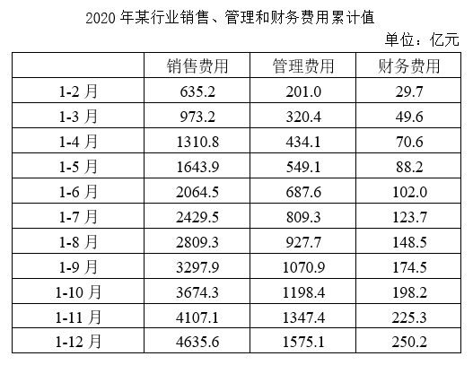

#### 第 1 题　qid 4652159 · 综合

2020年该行业销售费用约是管理、财务费用之和的多少倍？

- **A**. 2.5　✅
- **B**. 2.9
- **C**. 3.4
- **D**. 4.0

**答案**：A

**官方解析**

根据题干“2020年······约是······的多少倍”，结合材料时间为2020年，可判定本题为现期倍数问题。定位表格材料可得：2020年1-12月该行业销售费用为4635.6亿元，管理费用为1575.1亿元，财务费用为250.2亿元。则所求倍数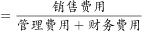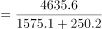倍，最接近A项。

故正确答案为A。

---

#### 第 2 题　qid 4652166 · 比重

以下饼图中，最能准确反映2020年7月该行业销售（用白色表示）、管理（用灰色表示）和财务（用黑色表示）费用占比关系的是：

- **A**. 

　✅
- **B**. 

- **C**. 

- **D**. 

**答案**：A

**官方解析**

根据题干“······2020年7月······占比关系······”，结合材料时间为2020年，可判定本题为现期比重问题。定位表格材料可知，2020年1-6月与1-7月销售、管理和财务费用累计值。2020年7月值＝2020年1-7月累计值2020年1-6月累计值，则2020年7月销售费用为2429.5-2064.5=365亿元，管理费用为809.3-687.6=121.7亿元，财务费用为123.7-102.0=21.7亿元。管理费用远大于财务费用，排除C、D两项；销售费用占比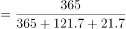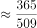，排除B项。

故正确答案为A。

---

#### 第 3 题　qid 4652169 · 综合

在该行业销售费用、管理费用和财务费用三项费用中，2020年前7个月费用额不到全年总额一半的有几项？

- **A**. 0
- **B**. 1　✅
- **C**. 2
- **D**. 3

**答案**：B

**官方解析**

根据题干“······2020年前7个月······不到全年总额一半的有几项”，结合材料时间为2020年，可判定本题为现期比重问题。根据公式：比重，定位表格材料可得，2020年前7个月该行业销售费用、管理费用和财务费用占全年总额的比重分别为：、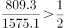、，符合题意的共有1项。

故正确答案为B。

---

#### 第 4 题　qid 4652171 · 综合

2020年下半年该行业财务费用最高的月份是：

- **A**. 9月
- **B**. 10月
- **C**. 11月　✅
- **D**. 12月

**答案**：C

**官方解析**

定位表格材料可得：2020年1-8月、1-9月、1-10月、1-11月、1-12月该行业财务费用分别为148.5亿元、174.5亿元、198.2亿元、225.3亿元、250.2亿元。则9月、10月、11月、12月该行业财务费用分别如下：

9月财务费用=1-9月财务费用1-8月财务费用=174.5-148.5=26.0亿元；

10月财务费用=1-10月财务费用1-9月财务费用=198.2-174.5=23.7亿元；

11月财务费用=1-11月财务费用1-10月财务费用=225.3-198.2=27.1亿元；

12月财务费用=1-12月财务费用1-11月财务费用=250.2-225.3=24.9亿元。

则2020年下半年该行业财务费用最高的月份是11月。

故正确答案为C。

---

#### 第 5 题　qid 4652176 · 综合

关于2020年该行业销售、管理和财务费用，能够用上述资料中推出的是：

- **A**. 二季度销售费用低于一季度水平
- **B**. 四季度每个月的销售费用都超过400亿元
- **C**. 管理费用累计超过1000亿元是在第四季度
- **D**. 二季度各月，财务费用逐月递减　✅

**答案**：D

**官方解析**

A项：定位表格材料可得，1-3月累计销售费用为973.2亿元；1-6月累计销售费用为2064.5亿元。则二季度销售费用=1-6月累计销售费用1-3月累计销售费用=2064.5-973.2=1091.3亿元＞973.2亿元，故二季度销售费用高于一季度水平，错误；

B项：定位表格材料可得，1-9月累计至1-12月累计销售费用分别为：3297.9亿元、3674.3亿元、4107.1亿元、4635.6亿元。则10月销售费用=1-10月累计销售费用1-9月累计销售费用=3674.3-3297.9=376.4亿元＜400亿元，四季度每个月的销售费用并非都超过400亿元，错误；

C项：定位表格材料可得，1-9月累计管理费用为1070.9亿元＞1000亿元，故管理费用累计超过1000亿元在第三季度，并非第四季度，错误；

D项：定位表格材料可得，1-3月累计至1-6月累计财务费用分别为：49.6亿元、70.6亿元、88.2亿元、102.0亿元，故4月财务费用=1-4月累计财务费用1-3月累计财务费用=70.6-49.6=21亿元，同理，5月财务费用=88.2-70.6=17.6亿元，6月财务费用=102.0-88.2=13.8亿元。观察发现：二季度各月财务费用逐月递减，正确。

故正确答案为D。

---

### 材料 2

        2020年末S省就业人口4750.9万人，占常住人口总数的59.01%，与2019年末相比，就业人口占常住人口总数的比重下降0.24个百分点。

        2020年末S省第一产业、第二产业和第三产业的就业人口数量分别为764.89万人、2033.39万人、1952.62万人，与2019年末相比，第一、第二产业就业人口比重分别下降0.7个、0.1个百分点，第三产业就业人口比重上升0.8个百分点。

#### 第 6 题　qid 4652179 · 综合

2019年末S省常住人口总数约为多少万人？

- **A**. 7910
- **B**. 8030　✅
- **C**. 8096
- **D**. 8199

**答案**：B

**官方解析**

根据题干“2019年末······约为多少万人”，结合材料给出2019年末S省就业人口与比重的相关数据，可判定本题为现期比重问题。定位文字材料第一段可知：2020年末S省就业人口占常住人口总数的59.01%，与2019年末相比，就业人口占常住人口总数的比重下降0.24个百分点；定位图形材料可知：2019年末S省就业人口数量为4757.8万人。根据公式：整体，可得2019年末S省常住人口总数为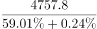万人，与B项最接近。

故正确答案为B。

---

#### 第 7 题　qid 4652182 · 比重

2020年末S省第二产业就业人口在就业人口中的占比比第三产业约高：

- **A**. 0.5个百分点
- **B**. 1.7个百分点　✅
- **C**. 3.5个百分点
- **D**. 5.1个百分点

**答案**：B

**官方解析**

根据题干“2020年末······占比······”，结合材料时间为2020年末，可判定本题为现期比重问题。定位文字材料第一段可知：2020年末S省就业人口4750.9万人；定位文字材料第二段可知：2020年末S省第二产业和第三产业的就业人口数量分别为2033.39万人和1952.62万人。根据公式：比重，可得2020年末S省第二产业就业人口在就业人口中的占比与第三产业占比的差值为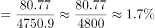，即高1.7个百分点。

故正确答案为B。

---

#### 第 8 题　qid 4652186 · 增长

2020年末S省第一产业就业人口同比：

- **A**. 减少了不到50万人　✅
- **B**. 减少了50万人以上
- **C**. 增加了不到50万人
- **D**. 增加了50万人以上

**答案**：A

**官方解析**

根据题干“2020年末······同比”，结合选项为增加/减少+单位，可判定本题为增长量计算问题。定位文字材料第二段可知：2020年末S省第一产业的就业人口数量为764.89万人，与2019年末相比，就业人口比重下降0.7个百分点；定位图形材料可知：2019年末、2020年末S省就业人口数量分别为4757.8万人、4750.9万人。根据公式：比重，可得2020年末S省第一产业的就业人口数量占就业人口的比重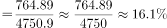，则2019年末S省第一产业的就业人口数量占就业人口的比重＝16.1%+0.7%=16.8%。根据公式：部分＝整体×比重，可得2019年末S省第一产业的就业人口数量为万人。则2020年末S省第一产业就业人口同比减少万人，即减少了不到50万人。

故正确答案为A。

---

#### 第 9 题　qid 4652190 · 综合

2020年末S省未就业常住人口数量约为第三产业就业人口的多少倍？

- **A**. 1.4
- **B**. 1.5
- **C**. 1.7　✅
- **D**. 1.9

**答案**：C

**官方解析**

根据题干“2020年末S省······为······的多少倍”，可判定本题为现期倍数问题。定位文字材料第一段可知：2020年末S省就业人口4750.9万人，占常住人口总数的59.01%；定位文字材料第二段可知：2020年末S省第三产业的就业人口数量为1952.62万人。根据：整体，可得2020年末S省常住人口总数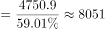万人，则2020年末S省未就业常住人口数量=常住人口总数-就业人口数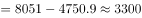万人。因此所求倍数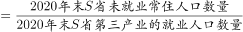，与C项最接近。

故正确答案为C。

---

#### 第 10 题　qid 4652192 · 综合

能够从上述资料中推出的是：

- **A**. 2020年末S省第一产业就业人口占就业人口的15%以下
- **B**. 2018年末S省就业人口同比增量低于上年同期数值
- **C**. 2019年末S省就业人口数量较上年增长0.1%以上
- **D**. 2020年末S省第二产业就业人口比上年减少0.1%以上　✅

**答案**：D

**官方解析**

A项：定位文字材料可知：2020年末S省就业人口4750.9万人，第一产业的就业人口数量为764.89万人。根据公式：比重，可得2020年末S省第一产业就业人口占就业人口的比重为，错误；

B项：定位图形材料可知：2016—2018年末S省就业人口数量分别为4760.83万人、4758.5万人、4756.22万人。根据公式：增长量=现期量-基期量，可得2018年末S省就业人口同比增量=4756.22-4758.5=-2.28万人，2017年末S省就业人口同比增量=4758.5-4760.83=-2.33万人。-2.28&gt;-2.33，即2018年末S省就业人口同比增量高于上年同期数值，错误；

C项：定位图形材料可知：2018、2019年末S省就业人口数量分别为4756.22万人、4757.8万人，则所求增长率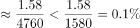，错误；

D项：定位图形材料可知：2019、2020年末S省就业人口数量分别为4757.8万人、4750.9万人，则2020年末S省就业人口同比增长率为。定位文字材料可知：第二产业就业人口所占比重下降，根据两期比重比较结论“当部分增长率＜整体增长率时，比重下降”，则2020年末S省第二产业就业人口同比增长率＜S省就业人口同比增长率（-0.14%），即2020年末S省第二产业就业人口比上年减少0.1%以上，正确。

故正确答案为D。

---

### 材料 3

        2019年A市专利密集型产业实现增加值6918.8亿元，比上年增长9.6%，分别高于战略性新兴产业、高技术产业增加值增速2.3个和1.7个百分点；专利密集型产业增加值占GDP的比重为19.5%，比上年提高0.4个百分点。

        2019年专利密集型产业发明专利申请量占专利申请总量的比重为66%，比规模以上重点企业高5.1个百分点。专利密集型产业每亿元R&amp;D经费产生的发明专利申请量为73.1件，比规模以上重点企业高3.6件；企业户均拥有有效发明专利15.6件，是规模以上重点企业的2.2倍。从成果转化看，已被成功实施的发明专利数为5.2万件，占有效发明专利数的58.4%。

        在专利密集型产业中，2019年信息通信技术服务业实现营业收入10198.5亿元，增速达41.3%；实现利润197.6亿元，比上年增长1倍；单位企业实现营业收入12亿元，是专利密集型产业平均水平的3.3倍。

        在专利密集型产业中，2019年医药医疗产业营业收入、利润分别增长13.7%和5%；收入利润率达到17%，高于专利密集型产业平均水平4.1个百分点；单位企业营业收入、利润分别为4.5亿元和0.76亿元。

#### 第 11 题　qid 4652174 · 增长

2019年A市专利密集型产业实现增加值比上年约增长多少亿元？

- **A**. 413
- **B**. 502
- **C**. 606　✅
- **D**. 698

**答案**：C

**官方解析**

根据题干“······比上年约增长多少亿元”，可判定本题为增长量计算问题。定位文字材料第一段可知：2019年A市专利密集型产业实现增加值6918.8亿元，比上年增长9.6%。代入公式：增长量，可得2019年A市专利密集型产业实现增加值比上年增长了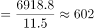亿元，与C项最接近。

故正确答案为C。

---

#### 第 12 题　qid 4652175 · 比重

现已知2019年A市①专利密集型产业专利申请总量、②专利密集型产业R&D经费占专利密集型产业实现增加值的比重。如果想得到当年A市专利密集型产业发明专利申请量的数值，下列说法正确的是：

- **A**. 补充①可以得到，补充②不可以得到
- **B**. 补充①不可以得到，补充②可以得到
- **C**. 补充①和②中任一条可以得到　✅
- **D**. ①和②两条相加才可以得到

**答案**：C

**官方解析**

根据题干“2019年······占······的比重······得到当年A市专利密集型产业发明专利申请量”，结合材料给出“专利密集型产业发明专利申请量占······的比重”，可判定本题为现期比重计算问题。定位文字材料第一段可得：2019年A市专利密集型产业实现增加值6918.8亿元；定位文字材料第二段可得：2019年专利密集型产业发明专利申请量占专利申请总量的比重为66%，专利密集型产业每亿元R&amp;D经费产生的发明专利申请量为73.1件。

令条件①所述量为A件，根据部分=总体×比重，可得A市专利密集型产业发明专利申请量=A×66%件。

令条件②所述比重为m，根据部分=总体×比重，可得A市专利密集型产业R&amp;D经费为6918.8m亿元；由于专利密集型产业每亿元R&amp;D经费产生的发明专利申请量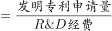，故发明专利申请量为73.1×6918.8m件。

补充①和②中任意一条都可以得到。

故正确答案为C。

---

#### 第 13 题　qid 4652178 · 平均数

2019年A市专利密集型产业企业户均拥有已被成功实施的发明专利约多少件？

- **A**. 9　✅
- **B**. 10
- **C**. 11
- **D**. 12

**答案**：A

**官方解析**

根据题干“2019年······户均······”，可判定本题为现期平均数问题。定位文字材料第二段可得：2019年A市专利密集型产业企业户均拥有有效发明专利15.6件，已被成功实施的发明专利数为5.2万件，占有效发明专利数的58.4%。根据公式：平均数，可得户均拥有已被成功实施的发明专利数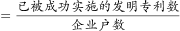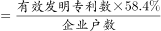件，只有A项符合。

故正确答案为A。

---

#### 第 14 题　qid 4652180 · 综合

在专利密集型产业中，2019年A市信息通信技术服务业单位企业实现利润额约为多少亿元？

- **A**. 0.18
- **B**. 0.23　✅
- **C**. 0.35
- **D**. 0.59

**答案**：B

**官方解析**

根据题干“······2019年······单位企业实现利润额约为多少亿元”，结合材料时间为2019年，可判定本题为现期平均数问题。定位文字材料第三段可知，（A市）2019年信息通信技术服务业实现营业收入10198.5亿元，实现利润197.6亿元；单位企业实现营业收入12亿元。根据个数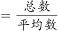，则2019年A市有信息通信技术服务业企业数家；根据平均数，则2019年A市信息通信技术服务业单位企业实现利润额为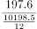亿元，与B项最接近。

故正确答案为B。

---

#### 第 15 题　qid 4652181 · 综合

关于A市专利密集型产业发展状况，能够从上述资料中推出的是：

- **A**. 2018年增加值占全市GDP比重为19.9%
- **B**. 2019年发明专利申请量比非发明专利申请量高一倍以上
- **C**. 2018年信息通信技术服务业实现利润超过100亿元
- **D**. 2019年医药医疗产业利润占营业收入的比重低于上年水平　✅

**答案**：D

**官方解析**

A项：定位文字材料第一段可得：2019年A市专利密集型产业增加值占GDP的比重为19.5%，比上年提高0.4个百分点。故2018年A市专利密集型产业增加值占GDP的比重为19.5%-0.4%=19.1%，错误；

B项：定位文字材料第二段可得：2019年专利密集型产业发明专利申请量占专利申请总量的比重为66%。则2019年非发明专利申请量占专利申请总量的比重为1-66%=34%；故所求为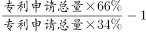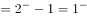倍，即2019年发明专利申请量比非发明专利申请量高不到一倍，错误；

C项：定位文字材料第三段可得：2019年信息通信技术服务业实现利润197.6亿元，比上年增长1倍。故2018年信息通信技术服务业实现利润为亿元，错误；

D项：定位文字材料第四段可得：2019年医药医疗产业营业收入、利润分别增长13.7%（b）和5%（a）。5%&lt;13.7%，结合两期比重比较结论“部分增长率（a）＜总体增长率（b），比重下降”，可得2019年医药医疗产业利润占营业收入的比重低于上年水平，正确。

故正确答案为D。

---

### 材料 4

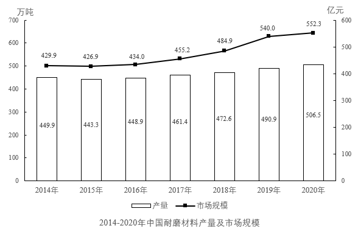

        耐磨材料可分为金属耐磨材料、陶瓷耐磨材料和树脂耐磨材料，2014—2020年各类耐磨材料的消费量如下表所示：

#### 第 16 题　qid 4652165 · 综合

2020年中国耐磨材料的产量比消费量：

- **A**. 高不到20万吨　✅
- **B**. 高20万吨以上
- **C**. 低不到20万吨
- **D**. 低20万吨以上

**答案**：A

**官方解析**

定位统计图可得：2020年中国耐磨材料的产量为506.5万吨。定位统计表可得：2020年中国各类耐磨材料的消费量：金属耐磨材料416万吨、陶瓷耐磨材料24万吨、树脂耐磨材料48万吨。由于耐磨材料分为金属耐磨材料、陶瓷耐磨材料和树脂耐磨材料三类，则2020年中国耐磨材料的消费量=416+24+48=488万吨。故题干所求量=506.5-488=18.5万吨。
故正确答案为A。

---

#### 第 17 题　qid 4652201 · 综合

2018—2020年中国耐磨材料市场规模总计比2014—2016年高约多少亿元？

- **A**. 256
- **B**. 286　✅
- **C**. 316
- **D**. 346

**答案**：B

**官方解析**

定位统计图可得：2018—2020年中国耐磨材料市场规模分别为484.9亿元、540.0亿元、552.3亿元；2014—2016年分别为429.9亿元、426.9亿元、434.0亿元。则2018—2020年市场规模总计为484.9+540.0+552.3=1577.2亿元；2014—2016年市场规模总计为429.9+426.9+434.0=1290.8亿元。所求差值为1577.2-1290.8=286.4亿元，与B项最接近。
故正确答案为B。

---

#### 第 18 题　qid 4652202 · 综合

2015—2020年中国金属、陶瓷、树脂耐磨材料消费量均高于上年水平的年份有几个？

- **A**. 1　✅
- **B**. 2
- **C**. 3
- **D**. 4

**答案**：A

**官方解析**

定位统计表，查找2015—2020年数据通过比较可知：中国金属耐磨材料消费量逐年递增；中国陶瓷耐磨材料消费量高于上年水平的年份有2017年、2018年；2017年、2018年中国树脂耐磨材料消费量高于上年水平的年份有2017年，故满足条件的年份有：2017年，共1个。
故正确答案为A。

---

#### 第 19 题　qid 4652203 · 增长

将①金属耐磨材料、②陶瓷耐磨材料和③树脂耐磨材料按2014—2020年消费量年均增速（以2014年为基础）从高到低排列，以下正确的是：

- **A**. ①②③
- **B**. ③②①
- **C**. ②③①
- **D**. ①③②　✅

**答案**：D

**官方解析**

根据题干“······年均增速（以2014年为基础）从高到低排列······”，可判定本题为年均增长率问题。根据年均增长率公式：（n为年份差），当年份差相同时，直接比较即可。定位表格材料可知：金属耐磨材料、陶瓷耐磨材料、树脂耐磨材料2014年消费量分别为359万吨、30万吨、50万吨；2020年消费量分别为416万吨、24万吨、48万吨。金属耐磨材料的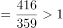，陶瓷耐磨材料的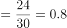，树脂耐磨材料的。则年均增速由高到低排序为：①金属耐磨材料、③树脂耐磨材料、②陶瓷耐磨材料，对应D项。

故正确答案为D。

---

#### 第 20 题　qid 4652204 · 综合

能够从上述材料中推出的是：

- **A**. 2014—2020年中国耐磨材料产量逐年递增
- **B**. 2020年中国耐磨材料市场规模同比增速快于产量同比增速
- **C**. 2019年中国金属耐磨材料消费量占耐磨材料总消费量的比重同比上升　✅
- **D**. 2015年中国耐磨材料总消费量高于上年水平

**答案**：C

**官方解析**

A项：定位图形材料可知，2015年、2014年中国耐磨材料产量分别为443.3万吨、449.9万吨，443.3＜449.9，不满足逐年递增，错误；

B项：定位图形材料可知，2020年、2019年中国耐磨材料市场规模分别为552.3亿元、540.0亿元；产量分别为506.5万吨、490.9万吨。根据公式：增长率，可得：2020年中国耐磨材料市场规模同比增长率为：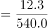，2020年中国耐磨材料产量同比增长率为：，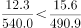，即2020年中国耐磨材料市场规模同比增速慢于产量同比增速，错误；

C项：定位表格材料可知，2019年、2018年中国金属耐磨材料消费量分别为401万吨、386万吨；耐磨材料总消费量分别为401+25+47=473万吨、386+26+49=461万吨。根据公式：增长率，可得2019年中国金属耐磨材料消费量同比增长率为：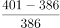（a），2019年中国耐磨材料总消费量同比增长率为：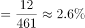（b），a＞b，根据两期比重结论，判断比重上升，即2019年中国金属耐磨材料消费量占耐磨材料总消费量的比重同比上升，正确；

D项：定位表格材料可知，2015年中国耐磨材料总消费量为：363+25+46=434万吨，2014年中国耐磨材料总消费量为：359+30+50=439万吨，434＜439，即2015年中国耐磨材料总消费量低于上年水平，错误。

故正确答案为C。

---
