# 2023年四川省公务员录用考试《行测》试题（网友回忆版）

> 省考 · 2023 年 · 6 个模块 · 共 100 题

- [政治理论](#%E6%94%BF%E6%B2%BB%E7%90%86%E8%AE%BA) · 4 题
- [常识判断](#%E5%B8%B8%E8%AF%86%E5%88%A4%E6%96%AD) · 11 题
- [言语理解与表达](#%E8%A8%80%E8%AF%AD%E7%90%86%E8%A7%A3%E4%B8%8E%E8%A1%A8%E8%BE%BE) · 30 题
- [数量关系](#%E6%95%B0%E9%87%8F%E5%85%B3%E7%B3%BB) · 10 题
- [判断推理](#%E5%88%A4%E6%96%AD%E6%8E%A8%E7%90%86) · 30 题
- [资料分析](#%E8%B5%84%E6%96%99%E5%88%86%E6%9E%90) · 15 题

---

## 政治理论

### 第 1 题　qid 5509469 · 新思想

党的十八大以来，以习近平同志为核心的党中央不断推进人民代表大会制度理论创新和实践创新，主要体现在“六个方面”。下列不属于这“六个方面”内容的是：

- **A**. 必须坚持全面依法治国，必须坚持民主集中制
- **B**. 必须坚持全面从严治党，必须坚持进一步推进政治体制改革　✅
- **C**. 必须坚持中国共产党领导，必须坚持用制度体系保障人民当家作主
- **D**. 必须坚持中国特色社会主义政治发展道路，必须坚持推进国家治理体系和治理能力现代化

**答案**：B

**官方解析**

本题考查政治常识。
A、C、D三项正确，B项错误，2021年10月，中央人大工作会议在北京召开，习近平同志发表重要讲话时强调，党的十八大以来，党中央统筹中华民族伟大复兴战略全局和世界百年未有之大变局，从坚持和完善党的领导、巩固中国特色社会主义制度的战略全局出发，继续推进人民代表大会制度理论和实践创新，提出一系列新理念新思想新要求，强调必须坚持中国共产党领导，必须坚持用制度体系保障人民当家作主，必须坚持全面依法治国，必须坚持民主集中制，必须坚持中国特色社会主义政治发展道路，必须坚持推进国家治理体系和治理能力现代化。
本题为选非题，故正确答案为B。

---

### 第 2 题　qid 5509775 · 时事政治

党的二十大报告指出，实现碳达峰碳中和是一场广泛而深刻的经济社会系统性变革，下列关于实现碳达峰碳中和的说法错误的是：

- **A**. 完善碳排放统计核算制度，健全碳排放权市场交易制度
- **B**. 立足我国能源资源禀赋，坚持先破后立，有计划分步骤实施碳达峰行动　✅
- **C**. 推动能源清洁低碳高效利用，推进工业、建筑、交通等领域清洁低碳转型
- **D**. 完善能源消耗总量和强度调控，重点控制化石能源消费，逐步转向碳排放总量和强度“双控”制度

**答案**：B

**官方解析**

本题考查政治常识。
A、C、D三项正确，B项错误，二十大报告指出：“积极稳妥推进碳达峰碳中和。实现碳达峰碳中和是一场广泛而深刻的经济社会系统性变革。立足我国能源资源禀赋，坚持先立后破，有计划分步骤实施碳达峰行动。完善能源消耗总量和强度调控，重点控制化石能源消费，逐步转向碳排放总量和强度‘双控’制度。推动能源清洁低碳高效利用，推进工业、建筑、交通等领域清洁低碳转型。深入推进能源革命，加强煤炭清洁高效利用，加大油气资源勘探开发和增储上产力度，加快规划建设新型能源体系，统筹水电开发和生态保护，积极安全有序发展核电，加强能源产供储销体系建设，确保能源安全。完善碳排放统计核算制度，健全碳排放权市场交易制度。提升生态系统碳汇能力。积极参与应对气候变化全球治理。”
本题为选非题，故正确答案为B。

---

### 第 3 题　qid 5509464 · 时事政治

党的二十大报告指出，全面建设社会主义现代化国家，必须有一支政治过硬、适应新时代要求、具备领导现代化建设能力的干部队伍。下列与之相关的说法正确的有几项？
①加强实践锻炼、专业训练，注重在重大斗争中磨砺干部，增强干部推动高质量发展本领、服务群众本领、防范化解风险本领
②坚持党管干部原则，坚持德才兼备、以德为先、五湖四海、任人唯贤，把新时代好干部标准落到实处
③树立选人用人正确导向，选拔忠诚干净担当的高素质专业化干部，选优配强各级领导班子
④坚持把政治标准放在首位，做深做实干部政治素质考察，突出把好政治关、廉洁关

- **A**. 1
- **B**. 2
- **C**. 3
- **D**. 4　✅

**答案**：D

**官方解析**

本题考查政治常识。
党的二十大报告中“十五、坚定不移全面从严治党，深入推进新时代党的建设新的伟大工程”部分的“（四）建设堪当民族复兴重任的高素质干部队伍”指出：“······坚持党管干部原则，坚持德才兼备、以德为先、五湖四海、任人唯贤，把新时代好干部标准落到实处。树立选人用人正确导向，选拔忠诚干净担当的高素质专业化干部，选优配强各级领导班子。坚持把政治标准放在首位，做深做实干部政治素质考察，突出把好政治关、廉洁关。加强实践锻炼、专业训练，注重在重大斗争中磨砺干部，增强干部推动高质量发展本领、服务群众本领、防范化解风险本领······”
综上所述，与之相关的说法正确的有①②③④，共4项。
故正确答案为D。

---

### 第 4 题　qid 5509473 · 时事政治

为在新发展阶段持续深入推进依法行政，全面建设法治政府，中共中央、国务院印发了《法治政府建设实施纲要（2021—2025年）》。下列属于《法治政府建设实施纲要（2021—2025年）》内容的有几项？
①深入学习贯彻习近平法治思想，努力实现法治政府建设全面突破
②健全依法行政制度体系，加快推进政府治理规范化程序化法治化
③健全社会矛盾纠纷行政预防调处化解体系，不断促进社会公平正义
④推进公正司法，各级党政机关支持法院、检察院独立公正行使职权
⑤将“实行依法治国，建设社会主义法治国家”写入宪法，法治建设揭开新篇章

- **A**. 2
- **B**. 3　✅
- **C**. 4
- **D**. 5

**答案**：B

**官方解析**

本题考查政治常识。
2021年8月，中共中央、国务院印发了《法治政府建设实施纲要（2021—2025年）》（下文简称《纲要》），并发出通知，要求各地区各部门结合实际认真贯彻落实。
①项正确，《纲要》指出：“一、深入学习贯彻习近平法治思想，努力实现法治政府建设全面突破。党的十八大以来，特别是《法治政府建设实施纲要（2015－2020年）》贯彻落实5年来，各地区各部门多措并举、改革创新，法治政府建设取得重大进展。”
②项正确，《纲要》指出：“三、健全依法行政制度体系，加快推进政府治理规范化程序化法治化。坚持科学立法、民主立法、依法立法，着力实现政府立法质量和效率并重并进，增强针对性、及时性、系统性、可操作性，努力使政府治理各方面制度更加健全、更加完善。”
③项正确，《纲要》指出：“七、健全社会矛盾纠纷行政预防调处化解体系，不断促进社会公平正义。坚持将矛盾纠纷化解在萌芽状态、化解在基层，着力实现人民群众权益受到公平对待、尊严获得应有尊重，推动完善信访、调解、仲裁、行政裁决、行政复议、诉讼等社会矛盾纠纷多元预防调处化解综合机制。”
④项错误，《纲要》指出：“七、健全社会矛盾纠纷行政预防调处化解体系，不断促进社会公平正义······支持法院依法受理和审理行政案件，切实履行生效裁判。支持检察院开展行政诉讼监督工作和行政公益诉讼，积极主动履行职责或者纠正违法行为。”《纲要》原文中没有提及“推进公正司法，各级党政机关支持法院、检察院独立公正行使职权”。
⑤项错误，1999年3月，九届全国人大二次会议将“依法治国，建设社会主义法治国家”载入宪法。这是社会主义民主政治发展的重要成果，标志着我国社会主义民主法制建设进入一个新阶段。《纲要》原文中没有提及。
综上所述，属于《纲要》内容的有①②③，共3项。
故正确答案为B。

---

## 常识判断

### 第 1 题　qid 5509783 · 人文常识

下列关于我国社会保障制度的说法错误的是：

- **A**. 优抚安置、社会互助都属于我国社会保障体系的组成部分
- **B**. 通常所说的“五险一金”中的“一金”指的是住房公积金
- **C**. 我国已经发布了将生育保险和职工工伤保险合并实施的意见　✅
- **D**. 新型农村合作医疗制度是以大病统筹为主的农民医疗互助制度

**答案**：C

**官方解析**

本题考查政治常识。
A项正确，我国社会保障体系包括社会保险、社会福利、社会救助、社会优抚四个方面。1、社会保险制度。指由国家依法建立的，使劳动者在年老、患病、伤残、生育和失业时，能够从社会获得物质帮助的制度。2、社会福利制度。广义上与社会保障同义，狭义上指由国家或社会在法律和政策范围内向全体公民普遍地提供资金帮助和优化服务的社会性制度。3、社会救济制度。指国家通过国民收入的再分配对因自然灾害或其他经济、社会原因而无法维持最低生活水平的社会成员给予救助，以保障其最低生活水平的制度。4、社会优抚制度。指国家依法定的形式和政府行为，对有特殊贡献的军人及其眷属实行的具有褒扬和有待赈恤性质的社会保障制度。
B项正确，五险一金，即养老保险、医疗保险、失业保险、工伤保险、生育保险和住房公积金，是指用人单位给予劳动者的几种保障性待遇的合称。故“一金”指住房公积金。
C项错误，为适应经济社会发展的需要，更好地保障职工生育保障的待遇、增强基金共济能力、提升经办服务水平，也包括面临应对全面放开二孩政策以后女职工的生育保障需要，党的十八届五中全会和“十三五”规划提出了生育保险和职工医疗保险合并实施的任务部署。与生育保险合并的是“职工医疗保险”并非是“职工工伤保险”。
D项正确，新型农村合作医疗是指由政府组织、引导、支持，农民自愿参加，个人、集体和政府多方筹资，以大病统筹为主的农民医疗互助共济制度。通过中央财政补助、地方财政补助、集体扶持和农民个人缴费等渠道筹集资金，主要对农民住院及大病医疗费用给予补偿。
本题为选非题，故正确答案为C。

---

### 第 2 题　qid 5509778 · 法律常识

下列人员有资格担任公司法定代表人的是：

- **A**. 张某，14周岁，已是3家公司的股东
- **B**. 薛某，因创业失败对外负债1000万，到期未清偿
- **C**. 周某，曾因犯贿赂罪被判处刑罚，执行期满刚过3年
- **D**. 李某，曾任投资咨询公司董事，该公司已经被责令关闭2年　✅

**答案**：D

**官方解析**

本题考查法律常识。
根据《中华人民共和国市场主体登记管理条例》第十二条规定：“有下列情形之一的，不得担任公司、非公司企业法人的法定代表人：（一）无民事行为能力或者限制民事行为能力；（二）因贪污、贿赂、侵占财产、挪用财产或者破坏社会主义市场经济秩序被判处刑罚，执行期满未逾5年，或者因犯罪被剥夺政治权利，执行期满未逾5年；（三）担任破产清算的公司、非公司企业法人的法定代表人、董事或者厂长、经理，对破产负有个人责任的，自破产清算完结之日起未逾3年；（四）担任因违法被吊销营业执照、责令关闭的公司、非公司企业法人的法定代表人，并负有个人责任的，自被吊销营业执照之日起未逾3年；（五）个人所负数额较大的债务到期未清偿；（六）法律、行政法规规定的其他情形。”
A项错误，张某属于限制民事行为能力人，不得担任公司法定代表人。
B项错误，薛某个人所负债务数额巨大且到期未清偿，不得担任公司法定代表人。
C项错误，周某因犯贿赂罪被判处刑罚，执行期满未逾5年，不得担任公司法定代表人。
D项正确，李某曾任被责令关闭公司的董事，并非是法定代表人，且不负有个人责任，因此李某可以担任公司法定代表人。
故正确答案为D。

---

### 第 3 题　qid 5509766 · 人文常识

下列关于我国传统乐器的说法错误的是：

- **A**. 笛是汉族乐器中最具代表性最有民族特色的吹奏乐器
- **B**. 唢呐在传统的定调方法里，是以使用的乐器为依据的
- **C**. 埙是我国西北少数民族特有的吹奏乐器，形似笙而较大　✅
- **D**. 葫芦丝是云南少数民族乐器，其起源可追溯到先秦时期

**答案**：C

**官方解析**

本题考查人文常识。
A项正确，笛子属于管乐类，是汉族乐器中最具代表性最有民族特色的吹奏乐器，也是迄今为止发现的最古老的汉族乐器。
B项正确，唢呐在传统的定调方法里，是以使用的乐器为依据的。不论尺寸长短或木管粗细，一律以全按（把所有的音孔都按上，也就是筒音）称为“本调”。
C项错误，埙是汉族特有的闭口吹奏乐器，音色朴拙，其起源与汉族先民的劳动生产活动有关，最初可能是先民们模仿鸟兽叫声而制作，用以诱捕猎物，后随社会进步而演化为单纯的乐器，在古代是用陶土烧制的一种吹奏乐器，圆形或椭圆形。
D项正确，葫芦丝，又称“葫芦箫”，是云南少数民族乐器，其历史较为悠久，其渊源可追溯到先秦时代。
本题为选非题，故正确答案为C。

---

### 第 4 题　qid 5509767 · 人文常识

成语作为中国传统文化的一大特色，很多都来源于历史生活，下列成语、主要人物及时期对应正确的是：

- **A**. 窃符救赵——魏无忌——春秋
- **B**. 封狼居胥——卫青——汉朝
- **C**. 东床坦腹——王羲之——东晋　✅
- **D**. 目不窥园——范仲淹——宋朝

**答案**：C

**官方解析**

本题考查人文常识。
A项错误，战国时期，秦国围困赵国都城邯郸，赵国求救于魏国，魏国惧怕秦国，不敢出兵救赵。情急之下，信陵君魏无忌听取侯赢之计，以国家利益为重，置生死度外，借魏王姬妾如姬之手窃得兵符，夺取了魏国兵权，不仅成功击败秦军、救援了赵国，也巩固了魏国在当时的地位。窃符救赵的主人公为战国时期的魏无忌，而非春秋时期。
B项错误，封狼居胥，指西汉大将霍去病登狼居胥山筑坛祭天以告成功之事，出自于《汉书·霍去病传》，后来封狼居胥成为中华民族武将的最高荣誉之一。封狼居胥的主人公为霍去病，而非卫青。
C项正确，东床坦腹，指东晋王羲之，面临高官选女婿时，在东边的床上露出肚皮看书，被高官看中，高官将女儿许配给了王羲之。
D项错误，目不窥园，指西汉董仲舒读书非常刻苦认真，他的书房紧靠着姹紫嫣红的花园，他三年没有进过花园，无暇观赏花园中的景致。目不窥园的主人公为西汉董仲舒，而非宋朝范仲淹。
故正确答案为C。

---

### 第 5 题　qid 5509768 · 人文常识

某一古代建筑工程具有以下特征：①是人工修建的；②始建于春秋末期，经隋朝、元朝基本上形成了今日的规模；③《马可·波罗游记》中对它有所记载；④沿线是我国的主要农业经济区。根据上述描述，这一工程是：

- **A**. 莫高窟
- **B**. 灵渠
- **C**. 都江堰
- **D**. 京杭大运河　✅

**答案**：D

**官方解析**

本题考查人文常识。
A项错误，莫高窟开凿于东晋十六国时期，持续至元代，前后延续约1000年。坐落于河西走廊西部的敦煌。
B项错误，灵渠是秦朝修建的。灵渠的凿通，连接了湘江和漓江，打通了南北水道，为秦朝统一岭南提供了重要保障。灵渠连接长江和珠江，形成了贯穿华东和华南的水运网络。
C项错误，都江堰，位于四川省成都市都江堰市城西，修建于战国时期，是当今世界年代久远、唯一留存、以无坝引水为特征的宏大水利工程。
D项正确，京杭大运河始建于春秋时期，是世界上里程最长、工程最大的古代运河，也是最古老的运河之一。春秋吴国为伐齐国而开凿邗沟，隋朝大幅度扩修并贯通至都城洛阳且连涿郡，元朝翻修时弃洛阳而取直至北京。开凿到现在已有2500多年的历史。《马可·波罗游记》中对它有所记载。京杭大运河起点为杭州、终点为北京，其沿线是我国的主要农业经济区。
故正确答案为D。

---

### 第 6 题　qid 5509480 · 人文常识

下列关于革命遗址及革命纪念建筑物的说法错误的是：

- **A**. 广州农民运动讲习所旧址——毛泽东曾在此担任农民运动讲习所所长
- **B**. 秋收起义文家市会师旧址——红军在此确立了“十六字诀”游击战术　✅
- **C**. 北京大学红楼——李大钊曾在此传播马克思主义和民主科学进步思想
- **D**. 八路军总司令部旧址——彭德怀等人在此直接布置和指挥了百团大战

**答案**：B

**官方解析**

本题考查毛中特。
A项正确，广州农民运动讲习所是第一次国共合作时期培养农民运动干部的学校，1924年7月至1926年9月举办过六届，培养了800多名学员，为中国革命输送了大批干部。第六届农民运动讲习所由毛泽东担任所长。
B项错误，1929年4月5日，毛泽东在《红军第四军前委给中共中央的信》中，将红军游击战争的作战原则，正式概括为“敌进我退，敌驻我扰，敌疲我打，敌退我追”。而秋收起义是1927年9月9日，由毛泽东在湖南东部和江西西部领导的工农革命军（即红军）举行的一次武装起义。
C项正确，1918年初，李大钊在北京大学红楼创建了马克思主义研究小组，蔡元培时任北京大学校长。
D项正确，武乡八路军总司令部旧址，是抗日战争期间八路军总部所在地，位于山西省长治市武乡县，由武乡县王家峪旧址和砖壁旧址组成。1961年，国务院将王家峪八路军总部旧址和砖壁八路军总部旧址列为全国第一批重点文物保护单位。彭德怀等人在此直接布置和指挥了百团大战。
本题为选非题，故正确答案为B。

---

### 第 7 题　qid 5509463 · 人文常识

“二十四节气”鲜明地体现了中国人尊重自然、顺应自然规律和可持续发展的理念。下列关于“二十四节气”的说法正确的是：

- **A**. 起源于长江流域，是我国农历的重要组成部分
- **B**. 立夏时北半球的白昼时间最长，且越往北越长
- **C**. 是通过观察地球周年运动形成的时间知识体系
- **D**. 春分日太阳直射地球赤道，南北半球昼夜平分　✅

**答案**：D

**官方解析**

本题考查地理国情。
A项错误，二十四节气起源于黄河流域，为古代汉族劳动人民长期经验的积累和智慧的结晶，是我国农历特有的重要组成部分。
B项错误，夏至，是二十四节气的第10个节气，于公历6月21-22日交节。夏至这天，太阳直射地面的位置到达一年的最北端，此时，北半球各地的白昼时间达到全年最长，且越往北越长。夏至过后，太阳直射点开始从北回归线向南移动，北半球白昼开始逐渐变短。
C项错误，二十四节气是中华民族的特有文化，是中国古人通过观察太阳周年运动而形成的时间知识体系，是一项已经被二千多年的实践证明了的科学成就。
D项正确，春分，是二十四节气的第四个节气，于公历3月19-22日交节。春分时太阳直射赤道，这天南北半球昼夜平分，自这天以后太阳直射位置继续由赤道向北半球推移，北半球各地白昼开始长于黑夜，南半球与之相反。
故正确答案为D。

---

### 第 8 题　qid 5509788 · 地理国情

下列国家公园与其典型气候类型对应错误的是：

- **A**. 美国黄石国家公园——温带季风气候　✅
- **B**. 马来西亚槟城国家公园——热带雨林气候
- **C**. 坦桑尼亚塞伦盖蒂国家公园——热带草原气候
- **D**. 中国库车大峡谷国家地质公园——温带大陆性气候

**答案**：A

**官方解析**

本题考查地理国情。
A项错误，美国黄石国家公园地处素有号称“美洲脊梁”的落基山脉，位于美国中西部怀俄明州的西北角，并向西北方向延伸到爱达荷州和蒙大拿州，整体海拔较高。高原山地气候，指在中纬度地区的高原地区，如青藏高原，安第斯山脉，珠穆朗玛峰等地区，由于海拔较高，终年低温，形成了高原山地气候。故美国黄石国家公园属于高原山地气候。
B项正确，马来西亚槟城国家公园，位于马来西亚西北部的槟城州。热带雨林气候，主要分布在赤道两侧南北纬10°之间的南美洲亚马逊平原，非洲刚果盆地和几内亚湾沿岸，亚洲的马来群岛大部和马来半岛南部。其显著特征有：全年高温、多雨、气温差异小。故马来西亚槟城国家公园属于热带雨林气候。
C项正确，坦桑尼亚塞伦盖蒂国家公园位于坦桑尼亚的西北部，植被以开阔草原型植物为主，园内为热带草原气候。热带草原气候的特点有：全年气温高，年平均气温约25°C，全年高温，且分明显干季和湿季。故坦桑尼亚塞伦盖蒂国家公园属于热带草原气候。
D项正确，中国库车大峡谷国家地质公园位于天山南麓，新疆阿克苏地区库车县北部，地处欧亚大陆深处，远离海洋，具有典型的温带大陆性气候特征。冬季严寒，夏季炎热，气温年较差很大，日较差也很大。降水稀少，蒸发量大，气候干燥，无霜期较长。故中国库车大峡谷国家地质公园属于温带大陆性气候。
本题为选非题，故正确答案为A。

---

### 第 9 题　qid 5509474 · 科技常识

关于微生物，下列说法错误的是：

- **A**. 双歧杆菌是一种对人体有益的细菌
- **B**. 感染幽门螺杆菌会导致急性肠胃炎　✅
- **C**. 食用未煮熟的鸡蛋可能感染沙门氏菌
- **D**. 豆科植物根部的根瘤菌具有固氮作用

**答案**：B

**官方解析**

本题考查科技常识。
A项正确，双歧杆菌是一种革兰氏阳性、不运动、细胞呈杆状、一端有时呈分叉状、严格厌氧的细菌属，是一种重要的肠道有益微生物。双歧杆菌作为一种生理性有益菌，对人体健康具有生物屏障、营养作用、抗肿瘤作用、免疫增强作用、改善胃肠道功能、抗衰老等多种重要的生理功能。
B项错误，幽门螺杆菌是定植于胃内的一种细菌，幽门螺杆菌感染是慢性胃病的主要病因，与慢性胃炎、消化性溃疡、胃癌，以及胃黏膜相关组织淋巴瘤有着密切的关系。幽门螺杆菌喜欢胃内的酸性环境，不会定植于肠道。急性肠胃炎是指各种原因引起的胃肠黏膜的急性炎症，通常因进食不洁、生冷或刺激性食物而诱发，病因包括细菌、病毒、寄生虫感染等。
C项正确，沙门氏菌是一种常见的食源性致病菌，在各种肉类、禽蛋、蔬菜、水果中都存在一定量的沙门氏菌；如果鸡蛋中携带沙门氏菌，未经加热而直接食用，或加热不完全，就有可能被沙门氏菌感染。
D项正确，根瘤菌是能与豆科植物共生形成根瘤，并将空气中的氮还原成氨供植物营养的一类革兰氏阴性菌。在豆科植物的根瘤中，有能够固氮的根瘤菌与豆科植物共生，根瘤菌有固氮作用，能将空气中的氮转化为植物能吸收的含氮物质，而植物则为根瘤菌提供有机物。
本题为选非题，故正确答案为B。

---

### 第 10 题　qid 5509518 · 科技常识

关于生产生活中所蕴含的物理原理，下列说法正确的是：

- **A**. 冬天使用空调取暖是利用了热辐射使室内空气变热
- **B**. 汽车上坡时，往往会挂低速挡，目的是减小牵引力
- **C**. 油罐车车尾挂的一根长铁链是为了避免因静电放电而引发爆炸　✅
- **D**. 自行车高速下坡时，紧急刹车会导致翻车，主要是因为刹车力太大

**答案**：C

**官方解析**

本题考查科技常识。
A项错误，热对流又称对流传热，指流体中质点发生相对位移而引起的热量传递过程。空调的制热原理是通过热对流的方式，强制室内空气流动从而达到采暖的目的。热辐射是物体由于具有温度而辐射电磁波的现象。由于电磁波的传播无需任何媒质，所以热辐射是在真空中唯一的热传递方式。
B项错误，汽车发动机功率是恒定的，根据公式：P（功率）=F（牵引力）×V（速度）可知，速度越低，牵引力越大。因此使用低速挡时汽车爬坡可以获得更大的牵引力，因此，汽车在爬山时必须使用低速档。
C项正确，油罐在运输过程中，内部转载的油在长期的晃动之下，极易产生大量的静电电荷。当油罐中的静电电荷集聚形成的电场超过蒸气空间的极限场强，这时就会造成静电爆炸事故。铁链是为了防止静电而设置，它的学名叫静电导线或者避电杆。
D项错误，自行车高速下坡时紧急刹车会导致翻车是因为前轮受到阻力而突然停止运动，但车上的人和后轮没有受到阻力，由于惯性，人和后轮要保持继续向前的运动状态，所以会发生翻车现象。
故正确答案为C。

---

### 第 11 题　qid 5509525 · 人文常识

截止2022年底，中国位居全球风力发电装机总量第一位。下列与风力发电有关的说法错误的是：

- **A**. 目前新式风力发电机发出的电通常为交流电
- **B**. 风力发电的功率大小只取决于发电机的功率　✅
- **C**. 风力发电机组主要由风轮、发电机和塔筒组成
- **D**. 全球风能总量远远超过可开发利用的水能总量

**答案**：B

**官方解析**

本题考查科技常识。
A项正确，由于风量不稳定，风力发电机输出的是13-25V交流电，经过充电器整流后给蓄电池充电，这样风力发电机产生的电能就变成化学能。然后利用带保护电路的逆变电源将电池中的化学能转换成标准市电，保证稳定使用。
B项错误，风力发电的实际功率大小主要由输入到风轮的风能（取决于风速、风轮扫掠面积和空气密度）以及整机的能量转换效率决定。发电机的额定功率仅为机组在额定工况下可达到的功率上限，而非决定因素。蓄电池是储能装置，其容量大小不影响实时发电功率，只决定电能的储存时长。
C项正确，风力发电机组大体上可分风轮（包括尾舵）、发电机和塔筒三部分。风轮由若干只叶片组成，尾舵是用来保持风轮始终对准风向以获得最大的功率的机器，一般只有小型（包括家用型）才会拥有尾舵。发电机是将动能转换成电能的机器。塔筒是支承风轮、尾舵和发电机的构架。
D项正确，风能是地球表面大量空气流动所产生的动能。据估算，全世界风能总量约1300亿千瓦，其中可利用的风能为200亿千瓦，比地球上可开发利用的水能总量还要多10倍，高达每年53万亿千瓦时。
本题为选非题，故正确答案为B。

---

## 言语理解与表达

### 第 1 题　qid 5509436 · 逻辑填空

在海洋最深和最寒冷的地方，海洋生物——主要是无脊椎动物——可以达到极大的尺寸。鱿鱼、海蜘蛛、蠕虫和其他种类的动物会长到使世界各地的相关物种            的大小。这种现象被称为“巨型化”。
填入画横线部分最恰当的一项是：

- **A**. 黯然失色
- **B**. 相形见绌　✅
- **C**. 自惭形秽
- **D**. 比上不足

**答案**：B

**官方解析**

根据“可以达到极大的尺寸”可知，横线处成语应表达这些海洋生物大的程度是其他相关物种比不了的，B项“相形见绌”意为和同类的事物相比较显得不足，符合文意，当选。
A项“黯然失色”比喻相比之下有很大差距，远远不如，往往不用于大小方面的对比，排除；C项“自惭形秽”意思是因为自己不如别人而感到惭愧，文中并无“惭愧”之意，排除；D项“比上不足”往往和“比下有余”连用，意思是赶不上前面的，却超过了后面的，体现居中，文中并无此意，排除。
故正确答案为B。
【文段出处】《美媒：为什么深海有这么多巨型动物？》

---

### 第 2 题　qid 5509435 · 逻辑填空

城市文化是一座城市的气质所在，也是城市发展的内在动力。近年来，一些城市的景观规划动辄“大开大合”，形成            的整体风格，或者移栽网红花木，打造网红街景，将城市文化灌入流量。这些功利的城市治理行为也许会带动一段时间的消费热涨，却让城市失去了原本的生活底色。
填入画横线部分最恰当的一项是：

- **A**. 照猫画虎
- **B**. 老生常谈
- **C**. 因循守旧
- **D**. 千篇一律　✅

**答案**：D

**官方解析**

横线处所填成语搭配“整体风格”，且前文强调“一些城市的景观规划动辄‘大开大合’”，“大开大合”本意为文思跌荡，放得开，收得拢，双引号在文段中表达特殊语义，结合文段主题可知，横线处应体现城市景观规划动作很大，声势很大的意思。在这种情况下，结合尾句中这些做法导致“城市失去了原本的生活底色”可知，城市景观规划虽然看上去搞得很大，但是最终呈现出的风格却失去了城市的特色及其本来的样子。D项“千篇一律”指的是事物只有一种形式，没有变化，符合文意且与“整体风格”搭配恰当，当选。
A项“照猫画虎”指的是只从形式上模仿，实际上并不理解，文段未体现出“模仿”之意，排除；
B项“老生常谈”指的是人们听惯了的没有新意的话，常搭配观点、话题等，一般不与“整体风格”搭配，排除；
C项“因循守旧”指的是守着老样子不改，不求革新，文段未体现出“守旧”之意，排除。
故正确答案为D。
【文段出处】社会科学报《城市改造背后撼不动的是文化认同》

---

### 第 3 题　qid 5509438 · 逻辑填空

制止网络暴力，加强、完善相关制度性建设刻不容缓。            ，每一个口出恶言之人都是推动网暴潮水前进的一部分。反过来讲，在评判热点人物和事件时保持善意和理智，哪怕只是做到少说不说，这样的人每多一个，抵御网暴的堤坝就能高一分。
填入画横线部分最恰当的一项是：

- **A**. 人言籍籍
- **B**. 众口铄金　✅
- **C**. 三人成虎
- **D**. 流言蜚语

**答案**：B

**官方解析**

依据后文“每一个口出恶言之人都是推动网暴潮水前进的一部分”可知，文段强调对于网络暴力而言，每一个人说的话都会产生巨大的影响。B项“众口铄金”形容众人的言论能够熔化金属，比喻舆论影响的强大，符合文意，当选。
A项“人言籍籍”指人们议论纷纷，与文段“推动网暴潮水前进”无法对应，未能体现出参与网络暴力的每一个个体作用大的语义，排除；
C项“三人成虎”比喻谣言或讹传一再重复，就会使人把谣言当成事实，文段并未讨论谣言和事实的关系，排除；
D项“流言蜚语”指毫无根据的话，与文段“推动网暴潮水前进”无法对应，未能体现出参与网络暴力的每一个个体作用大的语义，排除。
故正确答案为B。
【文段出处】光明日报《每个人都是抵御“网暴潮水”的一份子》

---

### 第 4 题　qid 5509441 · 逻辑填空

面对错综复杂的形势，最根本的是要把我们自己的事情做好。改革开放以来，我们遭遇过很多外部风险冲击，最终都能            ，靠的就是办好自己的事、把发展立足点放在国内。要            走中国特色社会主义道路，坚持推进中国式现代化，把中国发展进步的命运牢牢掌握在自己手中。
依次填入画横线部分最恰当的一项是：

- **A**. 起死回生 一成不变
- **B**. 化险为夷 毫不动摇　✅
- **C**. 绝处逢生 矢志不渝
- **D**. 转败为胜 按部就班

**答案**：B

**官方解析**

第一空，根据前文“遭遇过很多外部风险冲击······”和后文“靠的就是······”可知，横线处表达遭遇风险冲击而没有被打败的意思。B项“化险为夷”指使危险转变为平安，符合文意，保留。A项“起死回生”指把快要死的人救活，形容医术高明，也指将没有多少希望的事情挽救回来，C项“绝处逢生”指在陷入绝望的困境中遇到了生路，D项“转败为胜”指变失败为胜利，文中只是遇到风险冲击，并没有到达死亡、绝望或者失败的境地，程度过重，均排除。
第二空，代入验证。根据后文“坚持推进中国式现代化······”可知，横线处表达坚持走中国特色社会主义道路的意思。B项“毫不动摇”意为丝毫不改变意志，符合文意，当选。
故正确答案为B。
【文段出处】人民日报《科学把握战略机遇和风险挑战（思想纵横）》

---

### 第 5 题　qid 5509439 · 逻辑填空

电影音乐作为电影艺术的组成部分，早已和画面构图、色彩、语言一样，成了表达主题、塑造人物、        意境的一个重要手段。它在渲染气氛、揭示人物心灵、影响观众心理方面所能达到的神奇效果，是前人始料所不及的。一部精彩的电影如果缺少了            的音乐，就好比一道大餐少了盐。
依次填入画横线部分最恰当的一项是：

- **A**. 设立 相辅相成
- **B**. 创造 相得益彰　✅
- **C**. 生成 引人入胜
- **D**. 展现 此呼彼应

**答案**：B

**官方解析**

本题可以从第二空入手，根据后文“就好比一道大餐少了盐”可知，此处进行了形象表达，将电影比作大餐，将音乐比作盐，故横线处应形容盐对大餐的作用，A项“相辅相成”指两个事物互相配合，互相辅助，缺一不可，B项“相得益彰”指两者互相配合，双方的能力和作用更能显示出来，均符合文意，保留。C项“引人入胜”指吸引人进入美妙的境地，形容优美的风景或文艺作品十分吸引人，D项“此呼彼应”指这里呼唤，那里响应，形容联系紧密，互相配合行动，均无法与文段形象表达形成对应，排除。
第一空，搭配“意境”，B项“创造”指制造新的事物，与“意境”搭配恰当，当选。A项“设立”指开始创建，成立，常搭配“目标”“机构”等，与“意境”搭配不当，排除。
故正确答案为B。
【文段出处】北京日报《电影音乐的神奇功力》

---

### 第 6 题　qid 5509758 · 逻辑填空

包括儒家在内的中国传统思想对文艺的功利性            ，“文以载道”可谓天经地义，时时处处以人心与教化的标准来审视和介入文艺的生产与传播，未必都具有积极的社会意义。这需要具体问题具体分析，关键在于人心与教化的标准不能走偏或错谬，否则这种审视和介入就会        或戕害文艺的发展。
填入画横线部分最恰当的一项是：

- **A**. 情有独钟 妨碍　✅
- **B**. 不屑一顾 阻止
- **C**. 背道而驰 助长
- **D**. 一厢情愿 推动

**答案**：A

**官方解析**

第一空，根据“‘文以载道’可谓天经地义，时时处处以人心与教化的标准来审视和介入文艺的生产与传播”可知，横线处所填成语应体现出中国传统思想始终都存在着文艺的功利性。A项“情有独钟”指因对某人或某事物十分喜爱而感情专一，D项“一厢情愿”指办事完全从主观愿望出发，不考虑客观条件是否允许，均能体现出中国传统思想对于文艺功利性的重视和偏爱，保留。B项“不屑一顾”形容对某事物看不起，认为不值得一看，文段并未提及中国传统思想看不起文艺的功利性，排除；C项“背道而驰”比喻彼此方向与目标完全相反，也比喻背离正确的目标，朝相反的方向走，与文意不符，排除。
第二空，横线处所填词语与“戕害”构成并列，应体现出人心与教化的标准走偏会对文艺的发展产生不好的影响，感情色彩偏消极。A项“妨碍”指使事情不能顺利进行，符合文意，当选。D项“推动”指使事物前进或发展，与文意相悖且与文段感情色彩不符，排除。
故正确答案为A。
【文段出处】光明网《科学审视文艺与政治的关系》

---

### 第 7 题　qid 5509440 · 逻辑填空

我们常常讨论创造性的培养，好像创造性就一定意味着            ，一个问题有一百个解，不受约束。实际上，        地看待世界，明白局部与整体之间的联系和运作；做事情讲方法，有步骤，有恒心，能统合各方力量，这些才是创造性的基石。
依次填入画横线部分最恰当的一项是：

- **A**. 龙飞凤舞 壮观
- **B**. 天马行空 宏观　✅
- **C**. 不拘一格 微观
- **D**. 挥洒自如 乐观

**答案**：B

**官方解析**

第一空，需要体现“创造性”的特点，根据横线后“一个问题有一百个解，不受约束”可知，横线处应表达创造不受约束、自由自在之意。B项“天马行空”比喻思想行为无拘无束，亦形容文笔超逸流畅，C项“不拘一格”指不局限于一种规格或一个格局，均符合文意，保留。A项“龙飞凤舞”原形容山势的蜿蜒雄壮，后也形容书法笔势有力，灵活舒展，多用来修饰书法笔势，D项“挥洒自如”形容画画、写字、作文，运笔能随心所欲，均无法用来形容创造性，排除。
第二空，根据横线后“明白局部与整体之间的联系和运作”可知，横线处应体现能够看清局部和整体之意。B项“宏观”指大范围的或涉及整体的，可以体现能够看清局部和整体之意，当选。C项“微观”指小范围的或部分的，无法体现看清整体之意，排除。
故正确答案为B。
【文段出处】微信公众号《见识了德国小学生的“长期作业”，我觉得这些年学白上了》

---

### 第 8 题　qid 5509442 · 逻辑填空

关于文明形成的        ，世界上公认的“三要素”是文字、冶金术和城市的出现。但是我们发现，这“三要素”是从古埃及文明和两河文明中概括出来的，世界上有很多其他的文明并不符合“三要素”。比如，中美洲的玛雅文明令人            ，但他们没有冶金术，辉煌的印加文明也没有发现文字。
依次填入画横线部分最恰当的一项是：

- **A**. 符号 拍案叫绝
- **B**. 象征 击节叹赏
- **C**. 标志 叹为观止　✅
- **D**. 起点 高山仰止

**答案**：C

**官方解析**

本题可从第二空入手，横线处所填成语搭配“玛雅文明”，由后文“辉煌的印加文明也······”可知，横线处所填成语应体现出“玛雅文明”同样优秀，让人们称赞之意，C项“叹为观止”用来赞叹所见的事物尽善尽美，好到了极点，且“令人叹为观止”为惯用搭配，与“玛雅文明”搭配恰当，保留。A项“拍案叫绝”意思是拍桌子叫好，形容非常赞赏，强调对某人的作品或者话语意见的赞赏，B项“击节叹赏”形容对诗文、音乐等的赞赏，D项“高山仰止”比喻对高尚的品德的仰慕，均与“玛雅文明”搭配不当，排除。
第一空，代入验证，C项“标志”意思是表明特征的记号或事物，表明某种特征，置于此处可体现出“文字、冶金术和城市的出现”这“三要素”表明了文明的形成，符合文意，当选。
故正确答案为C。
【文段出处】文摘报《判断文明形成的标志是什么》

---

### 第 9 题　qid 5509444 · 逻辑填空

一本合格的教材，应该有城市也有乡村，有科学家、艺术家，也有在田间忙碌的农民、在工地流汗的工人，他们是乡村孩子的父辈，是值得被看见、被认可的            。乡村振兴不应该是        和口号，也不应该是每个孩子手中的教材里轻飘飘的一行字，而是应该融入血脉中、留在心田里。
依次填入画横线部分最恰当的一项是：

- **A**. 擎天巨擘 大话
- **B**. 中流砥柱 空话　✅
- **C**. 南天一柱 假话
- **D**. 栋梁之才 套话

**答案**：B

**官方解析**

第一空，根据横线前内容可知，横线处成语搭配对象是乡村孩子的父辈，即“农民”“工人”，B项“中流砥柱”比喻坚强的能起支柱作用的人或集体，与“农民”“工人”搭配恰当，置于此处表示在对应的行业中农民、工人是不可或缺的，保留。A项“擎天巨擘”意为一只手就能撑起天 , 形容一个人能够把天下掌握在自己手里，C项“南天一柱”、D项“栋梁之才”均比喻能担当大事的人才，均与“农民”“工人”搭配不当，排除。
第二空，代入验证，由横线后“和”“也”可知，横线处词语与“口号”“轻飘飘的一行字”构成并列，应体现出“只喊口号，不干实事”之意。B项“空话”意为内容空洞或不能实现的话，符合文意，当选。
故正确答案为B。

---

### 第 10 题　qid 5509760 · 逻辑填空

宋词应该怎么读？传统的阅读，往往按词人生平和时代背景介绍、字词训诂、文意串讲、艺术赏析这样的程式进行，            ，但读者跟文本、词人之间总有一层隔膜。如今也有不少创新性解读，加入各种大胆的演绎、戏说，能抓住读者的眼球，但往往偏离历史事实，消费古人，            。
依次填入画横线部分最恰当的一项是：

- **A**. 按部就班 追名逐利
- **B**. 分门别类 不伦不类
- **C**. 一板一眼 夸大其词
- **D**. 中规中矩 哗众取宠　✅

**答案**：D

**官方解析**

第一空，根据“传统的阅读，往往按词人生平和时代背景介绍、字词训诂、文意串讲、艺术赏析这样的程式进行”可知，文段意在说明传统阅读有固定的程式，故横线处应体现按步骤、规矩之意。A项“按部就班”指按照一定的步骤、顺序进行，也指按老规矩办事，C项“一板一眼”比喻言语、行动有条理或合规矩，D项“中规中矩”形容合乎规矩，没有偏差，均符合文意，保留。B项“分门别类”指分成各种门类，与文意不符，排除。
第二空，根据“但”可知，文段前后形成转折关系，“大胆的演绎”对应“偏离历史事实”，“戏说”对应“消费古人”，故横线处需对应“能抓住读者的眼球”。D项“哗众取宠”指故意卖弄新奇的言论，以取悦大众，符合文意，当选。A项“追名逐利”指追求名和利，与“能抓住读者的眼球”对应不当，排除；C项“夸大其词”指说话或写文章不切实际，扩大了事实，对应的是“大胆的演绎”而非“能抓住读者的眼球”，对应不如D项准确，排除。
故正确答案为D。
【文段出处】《回到历史现场读宋词》

---

### 第 11 题　qid 5509759 · 逻辑填空

游戏属于文化创意行业，不存在绝对的垄断，玩法创新总能引领风潮。然而另一方面，精品游戏的制作和渠道推广成本            ，工业化水平越来越高，游戏巨头即便不能每次都在玩法上取胜，但是依靠精良的人力和充足的资源，依然具备            的实力。
依次填入画横线部分最恰当的一项是：

- **A**. 与日俱增 先声夺人
- **B**. 节节攀升 一举夺魁
- **C**. 居高不下 遥遥领先
- **D**. 水涨船高 后来居上　✅

**答案**：D

**官方解析**

第一空，根据“工业化水平越来越高”可知，横线处应体现精品游戏的制作和渠道推广成本也是在逐渐增加的。A项“与日俱增”指随着时间的推移而不断增长，B项“节节攀升”指地位、职位、业绩等不断向上提高，D项“水涨船高”比喻事物随着它所凭借的基础的提高而增长提高，均可体现逐渐增加之意，保留。C项“居高不下”意思是没有下降的趋势，侧重一直很高，不符合文意，排除。
第二空，搭配“游戏巨头”，根据“即便不能每次都在玩法上取胜”可知，游戏巨头虽然不能每次都取胜，但是有人力和资源的支撑依然具备很强的实力。D项“后来居上”是指后来的超过先前的，符合文意，当选。A项“先声夺人”比喻做事抢先一步，B项“一举夺魁”指一下子夺得了冠军或者某项荣耀，均与“不能每次都在玩法上取胜”的文意不符，排除。
故正确答案为D。
【文段出处】《2019展望 | 游戏与电竞：政策松绑，巨头缝隙，无人可以裸泳》

---

### 第 12 题　qid 5509451 · 逻辑填空

应急科普能够及时解疑释惑，提升公众认知力，还可以        伪科学和谣言，        社会和网络环境。建立健全国家应急科普协调联动机制，完善各级政府应急管理预案中的应急科普措施，极为必要，更是            。
依次填入画横线部分最恰当的一项是：

- **A**. 批驳 净化 未雨绸缪　✅
- **B**. 抵制 维护 重中之重
- **C**. 对抗 清理 居安思危
- **D**. 拆穿 建设 防微杜渐

**答案**：A

**官方解析**

本题可从第二空入手，搭配“社会和网络环境”，且根据文意可知，应急科普可以打击伪科学和谣言，营造良好的社会网络环境，A项“净化”指清除杂质使物体纯净，B项“维护”指维持保护使免于遭受破坏，两项均搭配得当且符合文意，保留。C项“清理”指彻底整理或处理，与“社会和网络环境”搭配不当，排除；D项“建设”指创立新事业、增加新设施，如果要使用D项，原文应表述为“建设良好的社会和网络环境”，直接搭配“社会和网络环境”与文意不符，排除。
再看第三空，根据“建立健全国家应急科普协调联动机制，完善各级政府应急管理预案中的应急科普措施”可知，横线处应与“机制、应急管理预案”对应，体现对未来风险的防范，A项“未雨绸缪”比喻事先做好准备工作，符合文意，保留。B项“重中之重”指重点中的重点，强调非常重要的意思，与“应急预案”无关，且和前文“极为必要”语义、程度相近，与文意不符，排除。
第一空，代入验证，搭配“伪科学和谣言”，A项“批驳”指对错误的言论或行为加以批判和驳斥，符合文意，当选。
故正确答案为A。
【文段出处】人民网《人民网评：厚植公民科普之种，培育自立自强根基》

---

### 第 13 题　qid 5509453 · 逻辑填空

大脑对于外界单调、规律的声音会产生谐振，同时会掩盖住其余声音，起到一种掩蔽效应，因为没有任何变化从而并不引起生理上的        与注意，会不自觉地        噪声对自己的影响，更容易        于当下的活动。
依次填入画横线部分最恰当的一项是：

- **A**. 不适 忽略 习惯
- **B**. 反感 抵消 专注
- **C**. 体验 消解 聚焦
- **D**. 认知 弱化 沉浸　✅

**答案**：D

**官方解析**

本题可从第二空入手，根据前文“会掩盖住其余声音，起到一种掩蔽效应”可知，横线处应体现对于噪声起到的也是一种“掩蔽”作用，A项“忽略”指不在意，没注意到，C项“消解”指消释、解除，D项“弱化”指使削弱，均可以起到掩蔽噪声的作用，符合文意，保留。B项“抵消”指因作用相反而互相消除，文段并没有其他事物与噪声相互消除，排除。
再看第三空，根据文意可知，横线处应表达减少噪声后不被外界干扰，更有利于当下的活动之意，D项“沉浸”比喻处于某种境界或思想活动中，可以体现出在活动中不被外界干扰的状态，符合文意，保留。A项“习惯”指由熟悉而适应，不能体现不被外界干扰的状态，排除；C项“聚焦”比喻视线、注意力等集中于一点，文段并未体现都集中于一点，排除。
第一空，代入验证，根据横线前内容可知，因为没有任何变化，所以也就没有引起生理上对事物的注意，D项“认知”指通过思维活动认识、了解，符合文意，当选。
故正确答案为D。
【文段出处】今日头条《“白噪音”助眠，是科学还是忽悠》

---

### 第 14 题　qid 5509454 · 逻辑填空

AI（人工智能）的技术内核虽然        ，但“模拟人类智慧”这一理念本身却并不        。因此，该理念就很容易被一些        的思想先驱者转化为一些艺术形象，由此形成对于技术形态本身的“抢跑”态势。
依次填入画横线部分最恰当的一项是：

- **A**. 深奥 超前 敏感
- **B**. 先进 抽象 前卫
- **C**. 艰深 晦涩 敏锐　✅
- **D**. 高端 艰涩 睿智

**答案**：C

**官方解析**

第一空、第二空，根据转折词“但”可知，横线前后呈转折关系，语义相反，且由第二空前“不”可知，第一空和第二空所填词语语义相近，C项“艰深”指高深而难以理解，“晦涩”指文辞等隐晦，不流畅，不易懂，二者语义相近，符合文意，保留。A项“深奥”指不易理解，高深不通俗，“超前”指超越当前正常条件的，B项“先进”指超前的、高级的，“抽象”指不具体、笼统的，D项“高端”指的是等级、档次、价位等在同类中较高的，“艰涩”指隐晦难懂，三项若置于文段中，前后文均不能构成转折关系，排除。
第三空，代入验证，搭配“思想先驱者”，C项“敏锐”指反应灵敏，头脑灵活，目光尖锐，与“思想先驱者”搭配恰当，当选。
故正确答案为C。
【文段出处】《长期以来，我们是否误解了真正的人工智能？——科幻影视对人工智能的误读》

---

### 第 15 题　qid 5509761 · 逻辑填空

年度热词        大事小情，不仅反映国家大事、        时代主旋律，还有对老百姓日常生活的深切        ，展现了过去一年的社会变迁和生活万象。而透过“内卷”“躺平”“鸡娃”“双减”“干饭人”等热词，我们还可        当下独特的社会景观。
依次填入画横线部分最恰当的一项是：

- **A**. 描绘 切合 感触 了解
- **B**. 体现 把握 体验 感受
- **C**. 勾勒 蕴含 体察 窥见　✅
- **D**. 叙写 贴近 关怀 透视

**答案**：C

**官方解析**

本题可从第二空入手，横线处词语搭配“年度热词”“时代主旋律”，形容“年度热词”对“时代主旋律”的作用，且根据顿号可知，横线处词语与前文“反映”构成并列，语义相近，故横线处词语应表达“年度热词”体现了“时代主旋律”之意，A项“切合”指十分符合，C项“蕴含”指包含在内，D项“贴近”指靠拢、紧紧靠近，均与“时代主旋律”搭配恰当，保留。B项“把握”指掌握，理解，与文意不符，排除。
第三空，形容“年度热词”对“百姓生活”的作用，根据后文“展现了过去一年的社会变迁和生活万象”可知，横线处词语应表达在年度热词中可以观察到、了解到百姓的生活，C项“体察”指体验观察，符合文意，保留。A项“感触”指接触外界事物而引起的思想情绪，文段并未体现引起思想情绪之意，与文意不符，排除；D项“关怀”指关心，含有帮助、爱护、照顾之意，与文意不符，排除。
第四空，代入验证，搭配“社会景观”，C项“窥见”指暗中看出或觉察到，与“社会景观”搭配恰当，保留。
第一空，代入验证，C项“勾勒”指用简练的文笔叙述大概情况，可以体现年度热词的作用，当选。
故正确答案为C。
【文段出处】《从年度流行语中感受时代与社会脉动》

---

### 第 16 题　qid 5509504 · 片段阅读

截至2021年，化石燃料的燃烧正式改变了北半球空气中碳同位素的组成，甚至足以抵消核武器试验发出的信号。而这可能会给有价值的碳年代测定技术带来问题。专家发现，从放射性碳年代测定法来看，现代物品看起来就像是20世纪早期的物品。专家表示，这种趋势“可能很快就会让人很难分辨一件东西是1000年前的还是现代的”。
最适合做这段文字标题的是：

- **A**. 化石燃料燃烧带来的影响
- **B**. 放射性碳年代测定的原理
- **C**. 如何分辨物品的年代属性
- **D**. 碳年代测定技术可能不再准确　✅

**答案**：D

**官方解析**

文段开篇引出话题，即“化石燃料的燃烧”，接着通过指代词“这”，指出“化石燃料的燃烧”可能会给有价值的碳年代测定技术带来问题。后文通过“专家发现”“专家表示”进行具体解释说明，从专家的角度说明碳年代测定技术有可能出现不确定的结果，故文段重在强调碳年代测定技术可能出现的问题，对应D项。
A项，“带来的影响”相较于D项表述不够明确，排除；
B项“碳年代测定的原理”、C项“如何分辨物品的年代属性”文段均未论述，无中生有，排除。
故正确答案为D。
【文段出处】科学网《“碳定年”测不准了》

---

### 第 17 题　qid 5509494 · 片段阅读

现代社会是陌生人社会，以市场经济为基础，更广范围更大规模的交易如跨国贸易，更长距离的往来如海运空运，甚至是跨期买卖如期货交易，不再是在几个熟人之间进行，而是大规模的陌生人社会交往，因此，迫切需要一套交易规则来保障交易的正常进行。这个时候，规则与法律的作用就远远超过熟人社会的习俗礼节与乡规民约。
根据这段文字，下列说法正确的是：

- **A**. 现代社会通常会依照差序格局决定办事的难易程度
- **B**. 市场经济需要习俗礼节与乡规民约保障交易的进行
- **C**. 熟人社会是以家族亲属关系为主轴的社会网络关系
- **D**. 现代社会人际关系的维系更依赖规约和法律的作用　✅

**答案**：D

**官方解析**

文段首句提出背景“现代社会是陌生人社会”，并指出现代社会的交易是大规模的陌生人社会交往，随后通过“因此”总结，提出需要交易规则保障交易正常进行，尾句“这个时候”指代前文再次进行总结，强调规则与法律对现代社会的重要性，即现代社会的陌生人交往交易需要规则与法律保障，对应D项。
A项，“差序格局”文段并未提及，无中生有，排除；
B项，“市场经济”对应文段首句“以市场经济为基础”，“习俗礼节与乡规民约”对应文段尾句，文段并未提及两者的关系，概念混搭，排除；
C项，“家族亲属关系”文段并未提及，无中生有，排除。
故正确答案为D。
【文段出处】《观澜｜不找熟人也能办好事，陌生人社会的新型人际关系》

---

### 第 18 题　qid 5509756 · 片段阅读

老子论“道”，强调人性的本然状态；孔子论“仁”，强调社会的应然状态。在理论逻辑上，老子从道德人心的角度，企图救赎异化的人性；孔子从伦理教化的角度，企图重构崩溃的秩序。在价值取向上，老子之“道”以具体的社会之“德”为理论归趣，其抽象哲学观与社会价值观并无判然界限；孔子之“仁”以社会之“道”为理论指向，其社会价值观与抽象哲学观也无判然界限。
根据这段文字，下列说法不符合作者观点的是：

- **A**. 老子之“道”与孔子之“仁”构成理论上的互补关系
- **B**. 老子之“道”与孔子之“仁”构成价值观的辩证关系
- **C**. 老子之“道”与孔子之“仁”彰显的价值观相互对立　✅
- **D**. 老子之“道”与孔子之“仁”虽表面相反但深层相济

**答案**：C

**官方解析**

A项，根据“在理论逻辑上，老子从道德人心的角度······孔子从伦理教化的角度······”可知，老子和孔子分别从道德和伦理角度来谈论，构成了理论上的互补关系，表述正确，排除；
B项，根据“在价值取向上，老子之‘道’以具体的社会之‘德’为理论归趣······孔子之‘仁’以社会之‘道’为理论指向······”可知，老子之“道”与孔子之“仁”构成价值观的辩证关系，表述正确，排除；
C项，根据“在价值取向上，老子之‘道’以具体的社会之‘德’为理论归趣······孔子之‘仁’以社会之‘道’为理论指向······”可知，老子之“道”与孔子之“仁”的社会价值观没有巨大差异，“价值观相互对立”表述错误，当选；
D项，根据文意可知，老子之“道”与孔子之“仁”在理论逻辑上有不同的角度，但在价值取向上没有大的差异，“虽表面相反但深层相济”表述正确，排除。
本题为选非题，故正确答案为C。
【文段出处】光明日报《老子之“道”和孔子之“仁”》

---

### 第 19 题　qid 5509501 · 语句表达

近年来，以南海一号沉船博物馆、秦始皇帝陵博物院、安阳殷墟博物馆、海昏侯国遗址博物馆等为代表的考古遗址博物馆，在旅游网站推荐榜单中排名渐次上升。                    。人们已不再单纯满足于简单的、传统的博物馆参观，而是产生了深入历史场景、触及历史语境的体验需求。
填入画横线部分最恰当的一项是：

- **A**. 这些变化反映了文化产品的不断更新换代
- **B**. 新技术带来了文化消费场景的转换与创新
- **C**. 这一新动态折射了文化消费的深化与转型　✅
- **D**. 这意味着新型博物馆成为旅游打卡的网红地

**答案**：C

**官方解析**

本题为语句填空题，横线在中间，故需结合前后文进行分析。横线前介绍了近年来考古遗址博物馆在旅游网站推荐榜单中排名上升。横线后介绍了人们的文化旅游消费需求由简单的、传统的参观转变为深入的体验。故横线处应揭示考古遗址博物馆榜单排名上升现象背后的本质，即人们的文化旅游消费需求发生转变，对应C项。
A项，文段侧重强调“文化旅游消费需求发生转变”，“文化产品不断更新换代”表述错误，排除；
B项，文段并未涉及“新技术”，无中生有，排除；
D项，仅能承接上文，无法衔接后文“人们文化旅游消费需求的转变”，排除。
故正确答案为C。
【文段出处】光明网-文化评析-《珍视“博物馆热”背后的文化寻根需求》

---

### 第 20 题　qid 5509757 · 语句表达

目前对于“中等收入陷阱”的观察，主要局限在二战后到21世纪初的时间段。在这个时间段，许多发展中国家刚刚实现独立，处于现代国家成长的初级阶段与发展探索期，难免会有不少国家走弯路。因此，不能过早地对这些国家盖棺定论，认定其会长期陷入“中等收入陷阱”。其实，能否尽快跨过“中等收入”这道坎，关键在于能否保持持续发展的势头。而且，成为高收入国家也并不代表着未来就会高枕无忧。目前，有的高收入国家已经陷入低增长困境，人民生活水平长期徘徊不前。因此，                    。
填入画横线部分最恰当的一项是：

- **A**. “中等收入”的统计不能全面反映经济发展水平
- **B**. 需用动态的、发展的眼光来观察“中等收入陷阱”　✅
- **C**. 所谓“中等收入陷阱”缺乏经济学方法论的支撑
- **D**. 用单一指标衡量国民经济发展只能得出片面结论

**答案**：B

**官方解析**

横线在文段结尾，由“因此”可知，横线处内容应总结前文。文段开篇引出“中等收入陷阱”这一话题，指出二战后到21世纪初，许多发展中国家处于现代国家成长的初级阶段与发展探索期，一些国家不免会走弯路，接着通过“因此”得出结论，指出我们不能过早地认定这些国家会长期陷入“中等收入陷阱”，然后对这一观点展开详细论述，介绍只有保持持续发展势头才能跨过“中等收入”这道坎，而且一些高收入国家也会遇到经济增长缓慢、人民生活水平长期徘徊不前的问题，故文段重点强调不能简单地认定发展中国家会长期陷入“中等收入陷阱”，即要动态、发展地看待“中等收入陷阱”，对应B项。
A项，“‘中等收入’的统计”文段并未提及，无中生有，且文段围绕“中等收入陷阱”展开论述，“中等收入”偷换概念，排除；
C项，“经济学方法论”文段并未提及，无中生有，排除；
D项，偏离文段核心话题“中等收入陷阱”，排除。
故正确答案为B。
【文段出处】《中国有能力跨越“中等收入陷阱”》

---

### 第 21 题　qid 5509505 · 片段阅读

国家实施文化数字化战略，出发点和落脚点之一都是为了满足人民日益增长的精神文化需要，这也决定了，尽管文化数字资源可以在市场上“开展数据交易”，但也要依法依规向民众开放，公共文化资源数据开发后的交易也要把社会效益放在首位。文化是实现共同富裕的重要变量，数字化无疑为这个变量增加了权重，文化数字化战略秉持以人为本、全民共享，坚持以文化公平促共同富裕。
这段文字意在强调：

- **A**. 文化数字化是人们精神文化需求的结果
- **B**. 文化资源数据的开发与交易要以人为本
- **C**. 文化数字化所带来的利益应由民众共享　✅
- **D**. 数字化是促进民众共同富裕的新动力

**答案**：C

**官方解析**

文段开篇引出文化数字化战略的话题，并阐明了满足人民精神文化需要对于国家实施文化数字化战略的重要性，接着通过转折关联词“但”强调了文化数字资源要向民众开放，重视社会效益，并秉持以人为本、全民共享的原则，同时要坚持以文化公平促共同富裕。故文段重点在转折之后，意在强调文化数字化应以人民为主体，并且文化数字化的成果应惠及全体人民，对应C项。
A项，对应文段开头部分，为转折前内容，非重点，排除；
B项，“开发与交易”仅对应转折之后的部分内容，表述片面，排除；
D项，文段的核心话题是“文化数字化”而不是“数字化”，偷换概念，排除。
故正确答案为C。
【文段出处】新华网《数字科技赋能文化自信》

---

### 第 22 题　qid 5509795 · 片段阅读

莲子心发育过程中，多数叶绿素生物合成结构基因的表达是显著上调的，与叶绿素的积累模式一致。原叶绿素酸酯氧化还原酶参与催化的原叶绿素酸酯转化为叶绿素酸酯是一个关键步骤，生成的叶绿素酸酯进一步转化形成叶绿素。光依赖的原叶绿素酸酯氧化还原酶（LPOR）是被子植物中参与这一反应的关键酶，并且此过程是被子植物中叶绿素合成唯一需要光的反应。而一些裸子植物和微生物可以采用不依赖光的原叶绿素酸酯氧化还原酶（DPOR）完成这一反应；莲子心中并不存在DPOR编码基因，但鉴定到两个LPOR编码基因，且其表达模式与叶绿素的积累模式一致。
这段文字意在说明：

- **A**. 叶绿素的形成有两种不同的模式
- **B**. 裸子植物依赖光反应形成叶绿素
- **C**. 莲子心的叶绿素合成需要光参与　✅
- **D**. 莲子有裸子植物的两个编码基因

**答案**：C

**官方解析**

文段开篇指出莲子心发育过程中多数叶绿素生物合成结构基因的表达与叶绿素的积累模式一致，接着具体分析叶绿素的形成过程，并指出被子植物中叶绿素合成过程中需要光，然后说明一些裸子植物和微生物可以不依赖光形成叶绿素，最后通过转折词“但”强调在莲子心中的LPOR编码基因的表达模式与叶绿素的积累模式一致，故整个文段讨论的核心话题是“莲子心”和“叶绿素”，重点强调莲子心的发育过程中叶绿素的形成需要光，对应C项。
A、B两项，均未提及核心话题“莲子心”，排除；
D项，未提及核心话题“叶绿素”，缺少文段主题词，排除。
故正确答案为C。
【文段出处】《你知道莲心是如何发育的吗？》

---

### 第 23 题　qid 5509796 · 片段阅读

司法实践中，类型化审判是一种防止自由裁量权恣意行使的机制。这种审判方式是一种对先前案例或者判决的参考，这不是一种个案之间个别化、点到点之类的参考，而是对此前相类似的一组或者一批案件的参考，是和已经总结出来的相应特征的对照、参考和调试。因此，类型化审判的裁判结论是以较多的案件结论为基础，以概括性更强、视野更广的先例特征为参考作出的，更为准确，也更易被社会认同。同时，这种审判方式对法官自由裁量权具有更强的约束力，没有充分的理由和依据，办案法官很难抛开类型化先例特征和结论的限制而给出截然不同的结论。
这段文字意在说明类型化审判：

- **A**. 有利于社会认同与司法公平　✅
- **B**. 应广泛应用于司法实践领域
- **C**. 是对法官自由裁量权的有力监督机制
- **D**. 对判决的理论和依据提出了更高要求

**答案**：A

**官方解析**

文段开篇通过下定义的方式指出什么是类型化审判，随后详细介绍了类型化审判这一审判方式的特点。接着通过“因此”引导结论，指出类型化审判更准确、更易被社会认同，同时对法官的自由裁量权有更强的约束力。故文段结论为重点，意在强调类型化审判方式“更为准确，也更易被社会认同”以及“对法官自由裁量权具有更强的约束力”。A项，“有利于社会认同”对应“更易被社会认同”，“更为准确”“对法官自由裁量权具有更强的约束力”体现出类型化审判有利于“司法公平”，符合文意，当选。
B项，文段重在论述类型化审判的优势，并未讨论其应当应用于司法实践，无中生有，排除；
C项，“对法官自由裁量权”仅对应结论的一个方面，表述片面，排除；
D项，对应尾句“没有充分的理由和依据······”，属于结论的一个方面，表述片面，且“同时”之后重在强调类型化审判“对法官自由裁量权具有更强的约束力”，而非分析其对判决理论和依据的要求，排除。
故正确答案为A。
【文段出处】《类型化思维，一种基本的刑法方法论》

---

### 第 24 题　qid 5509515 · 片段阅读

喝酒有害健康早已成为共识，酒精对大脑的影响也逐渐受到更多关注。《自然·通讯》的一项研究发现，每周喝几瓶啤酒，就会造成大脑灰质和白质体积减小；发表于《英国医学杂志》的一项研究指出，每周饮酒会导致海马体萎缩风险急剧上升。由此造成的后果是，长期饮酒的人更易患上痴呆症。不过，这些研究往往关注长期饮酒的影响，如果只是偶尔喝一次酒，也会对大脑造成危害吗？发表于《美国科学院院刊》的最新研究给出了肯定答案：你人生中的第一次醉酒，不仅会改变大脑神经元的形态，这种影响甚至会伴随终生。
这段文字意在：

- **A**. 强调长期饮酒对健康的严重危害
- **B**. 纠正人们对饮酒危害的错误认识
- **C**. 探讨痴呆症与饮食习惯之间的关联
- **D**. 介绍关于饮酒危害健康的研究结论　✅

**答案**：D

**官方解析**

文段首先引出“喝酒有害健康”这一话题，并通过列举两项研究对前面观点进行支撑论证，接着通过转折标志词“不过”引出问题，即偶尔喝酒会不会对大脑造成危害，随后由最新研究得出肯定答案，表示第一次醉酒便会对大脑带来危害。故文段通过转折重在强调目前研究的最新结论，即只要饮酒就会影响自己的身体健康，对应D项。
A项“长期饮酒”、C项“痴呆症”均对应转折前的内容，非重点，排除；
B项，文段重点强调饮酒会对人体带来伤害，并未对之前的观点进行反驳纠正，“纠正······错误认识”无中生有，排除。
故正确答案为D。
【文段出处】《一次醉酒后，你的大脑被永远改变了······》

---

### 第 25 题　qid 5509509 · 片段阅读

现代人的祖先智人，曾在很长时间内与丹尼索瓦人、尼安德特人生活在同一片大陆上。只有智人进化成现在的人类。越来越多的证据表明，现代人的基因组中仍然留存着许多尼安德特人和丹尼索瓦人的基因。这一切都要归功于近年来考古学和现代分子生物学测序的发展。从基因组的比对信息中，我们可以看到已经灭绝的尼安德特人、丹尼索瓦人与现代人之间密切的联系。
从这段文字可以推出：

- **A**. 丹尼索瓦人和尼安德特人之间的基因关系更为密切
- **B**. 丹尼索瓦人、尼安德特人与智人共同进化成现代人
- **C**. 尼安德特人与丹尼索瓦人出现在人类祖先智人之前
- **D**. 现代人身上有丹尼索瓦人、尼安德特人和智人的基因　✅

**答案**：D

**官方解析**

A项，“更为密切”，文段并没有比较基因关系，无中生有，排除；
B项，根据“只有智人进化成现在的人类”可知，丹尼索瓦人和尼安德特人并未进化成现代人，表述错误，排除；
C项，“出现在人类祖先智人之前”文段未提及，无中生有，排除；
D项，根据“只有智人进化成现在的人类”以及“现代人的基因组中仍然留存着许多尼安德特人和丹尼索瓦人的基因”可知，表述正确，当选。
故正确答案为D。
【文段出处】科普中国《我们身上流淌着哪些远古人类的基因？》

---

### 第 26 题　qid 5509511 · 语句表达

我们经常需要控制自己的欲望，晚一些再满足它，称之为“延迟满足”。与今晚享受大餐相比，推迟享受的大餐，其吸引力（价值）被打了折扣，心理学家称之为时间折扣。时间折扣越大，我们越无法接受延迟满足。但在面临诸多决策时，人们趋于采用单一策略：当现在和未来的时间距离不那么遥远，便直接“齐同”两者在时间维度的差别，不再给未来选择打一个时间折扣，让不同时间点之间的选择变得更加简单。
下列与画横线部分意思相符的是：

- **A**. 做决策时，不考虑时间因素　✅
- **B**. 不考虑延迟满足，选择享受当下
- **C**. 做决策时，随机选择现在或者未来事项
- **D**. 在不同的时间点上选一个平均“时间折扣”

**答案**：A

**官方解析**

文段开篇引出“延迟满足”和“时间折扣”的概念，并说明二者之间的关系。接下来通过“但”进行转折，指出面临诸多决策的时候人们趋于采用单一策略，随即后文进行解释说明。画横线部分即为该策略的具体表现，且横线前后分句的内容即对横线处所在句子进行提示和解释。根据“当现在和未来的时间距离不那么遥远”“不再给未来选择打一个时间折扣”可知，“‘齐同’两者在时间维度的差别”强调的是在时间距离不是很遥远的前提下抹去时间的差别，将时间的维度保持“齐平”，即做决策的时候不考虑时间因素，对应A项。
B项，文段只是强调不考虑时间因素，但没有指出一定是选择享受当下，排除；
C项，“随机选择”表述错误，文段强调不考虑时间因素，从事项本身出发，并非随机做出决策，排除；
D项，“平均‘时间折扣’”表述错误，文段强调的是在时间维度不打折扣，忽略时间因素，排除。
故正确答案为A。
【文段出处】科学辟谣《“选择困难症”又犯了？要不，这次就让音乐帮忙做决定》

---

### 第 27 题　qid 5509513 · 片段阅读

大量的人口流入给城市的发展带来了强大动力，也快速形成了超特大城市的发展红利。然而大城市社会福利分配的限制、发展带来的高生活成本以及区域间文化的巨大差异，让大量农村人口面临进得来、留不下的困境，而且远距离的流动也导致一系列社会问题。县域城镇化连接着农村人口生活的家乡以及工作的城市，具有距离、文化等优势，县域城镇化发展不仅能为农村人口提供更多发展机会，还能为农业转移人口提供城镇化水平的社会服务，让农村人口在参与城镇化建设过程中真正享受其成果。
这段文字接下来最可能讲的是：

- **A**. 人口的自由流动是城镇化的基础
- **B**. 发展区域城市建设吸引人口回流
- **C**. 城市的发展红利应为建设者们共享
- **D**. 县域城镇化需要实事求是精准施策　✅

**答案**：D

**官方解析**

文段开篇介绍了人口流入能为城市的发展带来好处，接着通过转折词“然而”指出大城市社会福利分配限制、高生活成本、区域文化差异等让农村人出现留不下来的社会问题，然后提出解决问题的对策，即县域城镇化，并介绍了其所具备的优势，能让农村人口真正享受到参与城镇化建设过程中的成果。故文段最后围绕的核心话题为“县域城镇化”，接下来应继续围绕此话题展开论述，介绍如何实现县域城镇化，对应D项。
A、B、C三项均与文段最后论述的“县域城镇化”话题无关，排除。
故正确答案为D。
【文段出处】《人民财评：发挥县域为载体的城镇化发展优势》

---

### 第 28 题　qid 5509763 · 片段阅读

黄色与红色一样，是中华民族偏爱的颜色。在与“五行说”相对应的“五色论”里，黄色代表土，居于四方的中央。东汉的儒家为了抬高君权，突出了“五行”和“五方”中“土居中央”的观点，把土说成是一切元素的根本，因此中央是至高无上的，这也极大地提高了黄色的地位。三国时期的魏文帝曹丕也接受了这一说法，把黄色定为正色之首，随后的隋、唐王朝都加以效仿。从唐代起，正黄色成为皇室的专用色，滥用即会获罪。时隔千年，虽然黄色早已进入寻常百姓家，但金黄色那高贵庄严的气质依然存在。
对这段文字概括最恰当的一项是：

- **A**. 分析中华民族偏爱黄色的原因　✅
- **B**. 追溯土居中央观念的形成历史
- **C**. 探讨颜色与五行观念的内在渊源
- **D**. 强调皇权观念对色彩文化的影响

**答案**：A

**官方解析**

文段开篇指出黄色是中华民族偏爱的颜色，随后通过“东汉”“三国时期”“唐代”等多个时间维度展开论述，具体解释了中华民族历来偏爱黄色的原因，故文段首句为中心句，重点强调中华民族历来偏爱黄色的原因，对应A项。
B项，“土居中央”对应文段“东汉”“三国”等时期，非重点，且表述片面，排除；
C项“颜色”、D项“色彩”主题词范围扩大，文段重点论述“黄色”，均排除。
故正确答案为A。
【文段出处】《浅谈纺织品中的色彩》

---

### 第 29 题　qid 5509489 · 语句表达

①由于亮度与光的强度成正比，因此行星看起来比恒星更亮
②当我们仰望星空时，或许能分辨出哪一颗是恒星，哪一颗是行星——闪烁的是恒星，不闪烁的是行星
③有趣的是，行星并不发光，而是反射恒星的光，但是从地球上看时，行星显得比恒星更亮
④而我们看得到的行星距离地球相对较近，折射较少
⑤这主要与行星和恒星到达地球的视距离有关，因为行星离地球较近，所以我们的眼睛感知行星的光的强度比离地球较远的恒星要高得多
⑥这是因为绝大多数恒星离地球非常远，来自恒星的光经历多次折射，光速不断变化，因此产生了这种效果
将以上6个句子重新排列，语序正确的是：

- **A**. ②⑥④③⑤①　✅
- **B**. ②④⑥③①⑤
- **C**. ③⑤①②⑥④
- **D**. ③①⑤②④⑥

**答案**：A

**官方解析**

对比选项，确定首句。首句分别为②句和③句，②句介绍仰望星空时，可分辨出恒星和行星，引出“恒星和行星”的话题，③句具体介绍有关恒星和行星的有趣现象，按照行文逻辑，应先引出话题再具体展开论述，故②句应在③句之前，②句更适合作首句，排除C、D两项。
继续观察文段，⑥句出现指代词“这是因为”，对比A、B两项，⑥句前分别是②句和④句，②句介绍仰望星空时，可分辨出恒星和行星，⑥句分析恒星的光经过多次折射，光速不断变化，产生了闪烁效果，是对②句的原因分析，故②⑥两句可以构成捆绑，对应A项。④句指出行星离地球相对较近，折射较少，与⑥句无法构成捆绑，排除B项。
故正确答案为A。
【文段出处】《为什么行星看起来比恒星亮？》

---

### 第 30 题　qid 5509779 · 语句表达

①这种观念意识即“中和”。所谓“致中和，天地位焉，万物育焉”，展开了中华民族一幅内含阔大想象的宇宙图景
②“尽善尽美”，要求美的原则与善的原则相伴而行，美感经验与价值理念一体交融
③就礼乐关系而言，礼强调道德仪式对日常行为的规范，然而这种规范如果不是仅流于形式，就必须从内心获得情感的力量，实现内化的完成
④就中华美育传统而言，美与善的关联性要远远大于差异性
⑤总之，中华美育精神，讲求审美与道德的统一，二者统一于人格教育之中
⑥乐呈现为愉悦的感性经验品格，然而这种愉悦本身，却为一种观念意识的直观呈现
将以上6个句子重新排列，语序正确的是：

- **A**. ④②⑥③⑤①
- **B**. ②④③⑥①⑤　✅
- **C**. ④③②⑥①⑤
- **D**. ②①③⑥⑤④

**答案**：B

**官方解析**

对比选项，确定首句。②句介绍“尽善尽美”的要求，④句指出美与善的关联性远大于差异性，不好判断首句。观察其它句子，①句出现指代词“这种观念意识”，观察选项，①句之前有②、⑤、⑥三句，⑥句指出愉悦是一种观念意识的直观呈现，对应“这种观念意识”，故⑥①两句捆绑，保留B、C两项。而②句介绍“尽善尽美”的要求，⑤句通过“总之”引出结论，强调审美与道德统一于人格教育之中，两者均与“这种观念意识”无关，排除A、D两项。
对比B、C两项，判断②句、③句与⑥句的关系。②句介绍“尽善尽美”的要求，③句引出“礼”和“乐”，并围绕“礼”的角度展开具体论述，而⑥句是围绕“乐”的角度展开具体论述的，根据行文逻辑，③⑥两句衔接紧密，B项当选。而②句与⑥句连接不紧密，排除C项。
故正确答案为B。
【文段出处】中国社会科学报《立足中华文化传统 感悟中华美育精神》

---

## 数量关系

### 第 1 题　qid 5509774 · 数学运算

在某应急救援作业中，假设每台机器工作效率相同，如果两台机器配合作业，效率分别提高25%，而三台机器同时合作，每台效率各自提高50%。甲、乙、丙三台机器依次投入救援，直到救援完成。已知甲救援时间为60分钟，乙救援时间为甲的，而丙救援时间为乙的，问仅有一台机器完成该救援作业需要多少分钟？

- **A**. 120
- **B**. 125　✅
- **C**. 130
- **D**. 150

**答案**：B

**官方解析**

赋值甲、乙、丙三台机器单独作业时每分钟的工作效率均为4，则两台机器配合作业时每分钟的工作效率之和为，三台机器同时合作时每分钟的工作效率之和为。根据题意，甲救援时间为60分钟，乙救援时间为分钟，丙救援时间为分钟，则甲单独作业的时间为60-30=30分钟，甲、乙两台机器配合作业的时间为30-10=20分钟，甲、乙、丙三台机器同时合作作业的时间为10分钟，则该救援作业的工作总量为4×30+10×20+18×10=500，故仅有一台机器完成该救援作业需要的时间为500÷4=125分钟。

故正确答案为B。

---

### 第 2 题　qid 5509508 · 数学运算

边长为10厘米的正方形ABCD如下图所示，E为正方形中的某一点，已知AE长8厘米，BE长6厘米，问三角形ADE的面积为多少平方厘米？

- **A**. 24
- **B**. 32　✅
- **C**. 44
- **D**. 48

**答案**：B

**官方解析**

作E点关于AD和AB的垂线，分别交于F点和G点，易得AG=FE，如下图所示：

方法1：根据BE=6cm、AE=8cm、AB=10cm，可得为以E为直角顶点的直角三角形。由于且有公共顶角，故，即，代入数据可得，解得AG=FE=6.4cm，。

方法2：观察图像可得，、AG＜AE=8cm，故5cm＜FE＜8cm，代入中可得，仅B项满足。

故正确答案为B。

---

### 第 3 题　qid 5509806 · 数学运算

某次投篮训练中，小王一共投篮45次，前25次命中率为64%，前20次和后20次的命中率相同，中间5次全部投中，则他最终命中的次数是：

- **A**. 23
- **B**. 25
- **C**. 27　✅
- **D**. 29

**答案**：C

**官方解析**

小王前25次投篮共命中25×64%=16次，根据题干“中间5次（即第21次至第25次）全部投中”，可得前20次投篮命中16-5=11次，由于前20次和后20次的命中率相同，且投篮次数均为20次，则后20次投篮同样命中11次，则他最终命中的次数为11+5+11=27次。
故正确答案为C。

---

### 第 4 题　qid 5509807 · 数学运算

某种商品有小、中、大三种包装规格，每箱分别装有10件、20件和30件这种商品。如果订货量为10的整数倍，则商家在所有总件数等同于订货件数的整箱组合中随机选择一种发货。已知某笔订单订购了70件这种商品，则该商家发出的货物中包含至少1箱大包装的概率为：

- **A**. 62.5%
- **B**. 50%　✅
- **C**. 37.5%
- **D**. 25%

**答案**：B

**官方解析**

该笔订单数量为70件，是10的整数倍，将按整箱组合进行发货，符合要求的情况枚举如下：

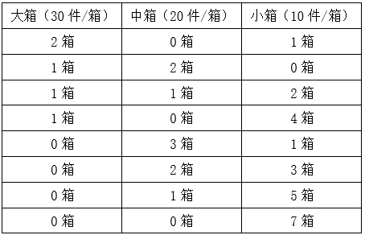

总情况数共8种，包含至少1箱大包装的发货情况为前4种，故该商家发出的货物中包含至少1箱大包装的概率为。

故正确答案为B。

---

### 第 5 题　qid 5509542 · 数学运算

某商场一楼到二楼有一部自动扶梯匀速上行，甲、乙二人共同乘梯上楼。甲在乘扶梯同时匀速登梯，乙在恰好半程后，也开始匀速登梯，但登梯速度是甲的。甲乙二人分别登了36级、12级到达二楼，问这部扶梯静止时一楼到二楼的级数是多少？

- **A**. 48
- **B**. 60
- **C**. 66
- **D**. 72　✅

**答案**：D

**官方解析**

根据题意，甲乙二人均是从一楼沿扶梯上二楼，故路程相等，即总级数相等，扶梯的总级数=人行走的级数+扶梯运行的级数。设甲的速度为2v，乙的速度为v，扶梯的速度为，即，整理可得：，解得，故扶梯的总级数。

故正确答案为D。

---

### 第 6 题　qid 5509776 · 数学运算

某地交警大队原有甲、乙两个中队，随着城区的扩张，现在需要改编为3个新的交警中队。改编的方案是将原来甲中队的队员与乙中队的队员组成新的一中队，原甲中队的队员和原乙中队的队员组成新的二中队，余下的30人组成新的三中队。如果新组建的一中队人数比二中队人数多10%，那么新组建的三中队有多少名队员来自原甲中队？

- **A**. 12
- **B**. 15
- **C**. 18
- **D**. 20　✅

**答案**：D

**官方解析**

根据题意可知，甲、乙两个中队的总人数应为12（3和4的最小公倍数）的倍数，设原甲中队人数为12x人，原乙中队人数为12y人。根据条件可得：新组建的一中队人数；新组建的二中队人数；新组建的三中队人数=（12x-4x-3x）+（12y-3y-4y）=5x+5y=30，即x+y=6······①。根据“新组建的一中队人数比二中队人数多10%”，可得：，化简得x=2y······②。联立方程①②，解得x=4，y=2。则新组建的三中队有5x=20名队员来自原甲中队。

故正确答案为D。

---

### 第 7 题　qid 5509482 · 数学运算

为了保护生态环境，某单位需要购买一批污水处理设备，总的预算不超过120万元。现有甲、乙两种类型设备可供选择，如果购买2台甲型设备和3台乙型设备，将超出预算10万元；若购买3台甲型设备和2台乙型设备，将结余10万元。若该单位最终购买5台污水处理设备，问共有几种购买方案？

- **A**. 1
- **B**. 2
- **C**. 3　✅
- **D**. 4

**答案**：C

**官方解析**

设甲型设备单价为x万元，乙型设备单价为y万元。

根据题意可得方程：2x+3y=120+10①，3x+2y=120-10②；联立①②解得x=14，y=34。

最终购买5台设备，总费用不超过总预算120万元，

第一种购买方案：5台甲设备，14×5=70&lt;120，符合题意；

第二种购买方案：4台甲设备，1台乙设备，14×4+34=90&lt;120，符合题意；

第三种购买方案：3台甲设备，2台乙设备，14×3+34×2=110&lt;120，符合题意；

第四种购买方案：2台甲设备，3台乙设备，14×2+34×3=130&gt;120，不符合题意；

第五种购买方案：1台甲设备，4台乙设备，14+34×4=150&gt;120，不符合题意；

第六种购买方案：5台乙设备，34×5=170&gt;120，不符合题意。

因此，共有3种购买方案。

故正确答案为C。

---

### 第 8 题　qid 5509544 · 数学运算

如下图所示，某地计划修建一个长50米，宽40米的长方形观光园。现在需要在观光园中修建几条鹅卵石小道供游客行走，其中一条是长为50米，宽为2米的水平直线型小路，另外两条修成斜线型，并且要求这两条斜线型小路任何地方的水平方向宽度都是1米，问修完小路后观光园剩下部分的面积是多少平方米？

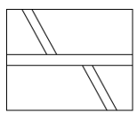

- **A**. 1862　✅
- **B**. 1880
- **C**. 1950
- **D**. 1960

**答案**：A

**官方解析**

根据题干，观光园如图所示：

题目所求剩余面积等于。平方米。平方米。由于两个平行四边形底边相同，则平方米。则题目所求剩余面积=2000-100-38=1862平方米。

故正确答案为A。

---

### 第 9 题　qid 5509543 · 数学运算

一辆出租车的计价器出现故障，显示屏上保留了一个两位数，无法清除，但还能按行驶路程准确地将应付的车费累加上去。小王乘坐该车匀速行驶了2小时，当行驶1小时的时候，计价器上的两个数字刚好交换了位置，在2小时的时候，计价器上的两个数字又交换了位置，但他们中间多了一个0。如车费按里程计，问小王应付多少元车费？

- **A**. 82
- **B**. 86
- **C**. 90　✅
- **D**. 95

**答案**：C

**官方解析**

根据题意，设显示屏最开始保留的两位数为xy，其数值大小为10x+y；
方法一：由于车辆匀速行驶，相同时间内行驶的路程一致且车费金额相等。那么1小时后计价器显示yx，其数值为10y+x；再过1小时后计价器显示x0y，其数值为100x+y。根据金额相等可得10y+x-（10x+y）=100x+y-（10y+x），解得y=6x，由于x、y取值为1~9，则x=1，y=6。所以车费金额为106-16=90元。
方法二：由于最终显示器上显示的数值为100x+y，则需要支付的车费为100x+y-（10x+y）=90x，即车费金额为90的整数倍，只有C项符合。
故正确答案为C。

---

### 第 10 题　qid 5509784 · 数学运算

如图所示，一面墙被分成A、B、C、D四块，现有4种不同的颜色，要求在每一块里涂上一种颜色且相邻的两块颜色不相同（可以使用少于4种颜色），问有几种不同的涂法？

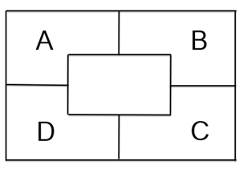

- **A**. 84　✅
- **B**. 64
- **C**. 36
- **D**. 24

**答案**：A

**官方解析**

先涂A，从4种不同颜色中选1种，有种情况，再涂B，B与A不同颜色，故从剩下的3种不同颜色中选1种，有种情况。由于D与A、C同时相邻，则A与C是否同色，决定D的涂色情况，分类讨论：

若C与A涂同种颜色，D与A、C不同色，则D从剩下的3种不同颜色中选1种，有种情况，故满足要求的有4×3×3=36种情况；

若C与A涂不同颜色，可得C与A、B不同色，故C从剩下的2种不同颜色中选1种，有种情况，D与A、C不同色，故从剩下的2种不同颜色中选1种，有种情况，故满足要求的有4×3×2×2=48种情况。

根据分类加法的原则，总的情况数有36+48=84种。

方法二：根据题意分情况讨论如下：

①若使用4种颜色，即A、B、C、D涂的颜色均不相同，有种涂法；

②若使用3种颜色，即A、C同色或B、D同色。若A、C同色，从4种颜色中选出3种进行涂色，则有种涂法；同理若B、D同色，也有种涂法，共24+24=48种涂法；

③若使用2种颜色，即A、C同色且B、D同色，从4种颜色中选出2种进行涂色，有种涂法。

故共有24+48+12=84种不同的涂法。

故正确答案为A。

---

## 判断推理

### 第 1 题　qid 5509799 · 图形推理

从所给四个选项中，选择最合适的一个填入问号处，使之呈现一定的规律性：

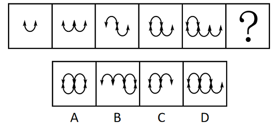

- **A**. A　✅
- **B**. B
- **C**. C
- **D**. D

**答案**：A

**官方解析**

解法一：元素组成不同，且无明显属性规律，优先考虑数量规律。观察发现，题干图形均由和2种小元素构成，但整体小元素的种类和数量无规律，考虑元素换算。根据换算公式“图1+图3=2×图2”得出：1个=2个，换算后题干图形的数量分别为1、2、3、4、5，故“？”处图形应有6个，换算后只有A项符合。

解法二：元素组成不同，且无明显属性规律，优先考虑数量规律。观察发现，题干出现多个箭头，考虑箭头数量，题干图形箭头数量依次为2、3、4、5、6，故“？”处图形应有7个箭头，只有D项符合。

注：解法一的元素换算针对的是图形整体，解法二的箭头数量针对的是部分图形，在图形规律中整体规律优于部分规律，且解法二的部分箭头可看作箭头重合，故粉笔更倾向于解法一。

故正确答案为A。

---

### 第 2 题　qid 5509593 · 图形推理

从所给的四个选项中，选择最合适的一个填入问号处，使之呈现一定规律性：

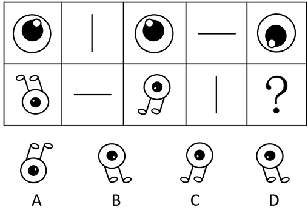

- **A**. A
- **B**. B　✅
- **C**. C
- **D**. D

**答案**：B

**官方解析**

元素组成相同，优先考虑位置规律。观察上方第一组图形发现，图1以图2为轴经过左右翻转得到图3，图3再以图4为轴经过上下翻转得到图5。下方第二组图形应用此规律，图1以图2为轴经过上下翻转得到图3，图3再以图4为轴经过左右翻转得到？处图形。只有B项符合。
故正确答案为B。

---

### 第 3 题　qid 5509800 · 图形推理

从所给四个选项中，选择最合适的一个填入问号处，使之呈现一定的规律性：

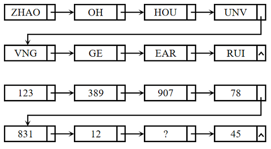

- **A**. 254　✅
- **B**. 235
- **C**. 432
- **D**. 215

**答案**：A

**官方解析**

题干图形分为上下两组，观察发现，第一组图形均为字母，且沿箭头方向前一个图形中最右边的字母都在相邻的后一个图形的最左边。第二组图形均为数字，且沿箭头方向前一个图形中最右边的数字都在相邻的后一个图形的最左边，依此规律，？处所填数字最左边应为2，最右边应为4，只有A项符合。
故正确答案为A。

---

### 第 4 题　qid 5509552 · 图形推理

把下面的六个图形分为两类，使每一类图形都有各自的共同特征或规律，分类正确的一项是：

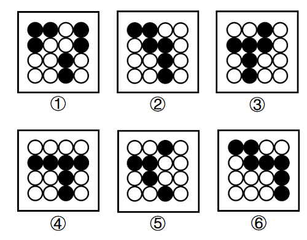

- **A**. ①②③，④⑤⑥
- **B**. ①②⑥，③④⑤　✅
- **C**. ①②④，③⑤⑥
- **D**. ①④⑥，②③⑤

**答案**：B

**官方解析**

本题为分组分类题目。元素组成不同，无明显属性规律，考虑数量规律。每个图形均由黑圆和白圆构成，且有部分黑圆和白圆被分隔开，因此考虑数部分数。发现图①②⑥白圆部分均为两部分，图③④⑤白圆部分均为三部分，故图①②⑥为一组，图③④⑤为一组。
故正确答案为B。

---

### 第 5 题　qid 5509801 · 图形推理

把下面的六个图形分为两类，使每一类图形都有各自的共同特征或规律，分类正确的一项是：

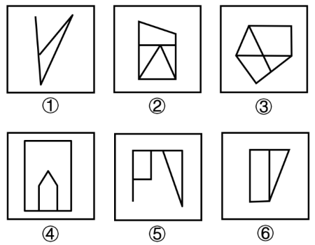

- **A**. ①②③，④⑤⑥
- **B**. ①②⑤，③④⑥
- **C**. ①②⑥，③④⑤
- **D**. ①④⑥，②③⑤　✅

**答案**：D

**官方解析**

本题为分组分类题目。元素组成不同，无明显属性规律，考虑数量规律。观察发现，题干图①、图⑤存在端点，图③为“田”字变形图，图⑥为“日”字变形图，考虑笔画数，图①④⑥均为一笔画图形，图②③⑤均为两笔画图形。即图①④⑥为一组，图②③⑤为一组。
故正确答案为D。

---

### 第 6 题　qid 5509671 · 图形推理

下面四个正方体纸盒的外表面展开图中，与其他三个折叠成的纸盒不相同的是：

- **A**. A
- **B**. B　✅
- **C**. C
- **D**. D

**答案**：B

**官方解析**

将选项展开图中的面标上序号，如下图所示（各选项包含的面都相同，故相同的面用相同字母表示），选项存在相同面，可以通过相同面公共边解题，逐一分析选项。

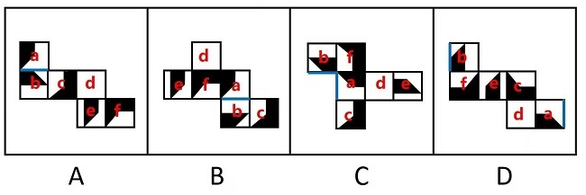

A项：面a、面b是相邻面，存在公共边（如上图所示），公共边紧邻面a白色多边形长边、面b黑色直角梯形上底边；

B项：面a、面b是相邻面，存在公共边（如上图所示），公共边紧邻面a白色多边形长边、面b白色矩形长边；

C项：面a、面b存在公共边（如上图所示），公共边紧邻面a白色多边形长边、面b黑色直角梯形上底边；

D项：面a、面b存在公共边（如上图所示），公共边紧邻面a白色多边形长边、面b黑色直角梯形上底边。

综上，只有B项与其他三项不同。

本题为选非题，故正确答案为B。

---

### 第 7 题　qid 5509789 · 定义判断

草地土壤是草原、草甸和草坪等草地植被下发育成的土壤。林地土壤是天然林、次生林和人工林等林地植被下发育成的土壤。农田土壤是人类开垦利用，通过耕种、施肥、灌排等措施长期种植农作物的土壤。
根据上述定义，下列属于农田土壤的是：

- **A**. 牧民甲今年把自家承包草场的部分土地深翻了一遍以期牧草丰收
- **B**. 农户乙在自家屋后的荒坡上挖土开凿了一个水池，用于积蓄雨水
- **C**. 果农丙利用自家承包的苹果山林土地播种枸杞，产量较为可观
- **D**. 牧民丁在其草场一处湖边垦荒近千亩土地，年年种植小麦和玉米　✅

**答案**：D

**官方解析**

第一步：找出定义关键词。
草地土壤：“草原、草甸和草坪等”、“草地植被下发育成的土壤”；
林地土壤：“天然林、次生林和人工林等”、“林地植被下发育成的土壤”；
农田土壤：“人类开垦利用”、“通过耕种、施肥、灌排等措施”、“长期种植农作物的土壤”。
第二步：逐一分析选项。
A项：牧民将承包的草场深翻后以期牧草丰收，符合“草原、草甸和草坪等”、“草地植被下发育成的土壤”，符合“草地土壤”定义，不符合“农田土壤”定义，排除；
B项：农户在自家屋后的荒坡挖水池用来蓄水，荒坡不符合“通过耕种、施肥、灌排等措施”、“长期种植农作物的土壤”，不符合“农田土壤”定义，排除；
C项：果农利用自家承包的苹果山林土地播种枸杞，苹果山林土地符合“天然林、次生林和人工林等”、“林地植被下发育成的土壤”，符合“林地土壤”定义，不符合“农田土壤”定义，排除；
D项：牧民在草场一处湖边垦荒土地，年年种植小麦和玉米，垦荒土地符合“人类开垦利用”，年年种植小麦和玉米符合“通过耕种、施肥、灌排等措施”、“长期种植农作物的土壤”，符合“农田土壤”定义，当选。
故正确答案为D。

---

### 第 8 题　qid 5509661 · 定义判断

环境知觉是人们在环境外观感觉的基础上对地理环境的整体认识和综合解释的过程，是环境刺激与个体已有知识经验相互作用的结果。环境认知是人们对环境信息再现大脑后的认识，它是人们对地理环境识记再现的一种形态，当人们对以前识记的地理环境再度感知的时候，觉得熟悉，仍能认识，经过进一步分析思考后能够做出知觉判断。
根据上述定义，下列涉及环境认知的是：

- **A**. 老杨是生活在一座超大城市的老居民，经常在没有地图导航的情况下从城市北边开车到南边去爬山　✅
- **B**. 小周是建筑设计师，认为红砖建筑直接暴露建筑材料是“纯粹”的表现，但小李却认为建筑物不加装修，外观蹩脚
- **C**. 小朱平时喜欢观看介绍风景名胜的纪录片，特别是关于九寨沟的反复看了好多遍。当她第一次去九寨沟看到那些美景时，一种强烈的熟悉感涌上心头
- **D**. 小王是专业的地图测绘员，工作时开着装有摄像头和激光雷达的测绘车，对所到之处的街景进行测绘后获得测绘数据，最终形成一份高精度的数字化地图

**答案**：A

**官方解析**

第一步：找出定义关键词。
环境知觉：“在环境外观感觉的基础上”、“对地理环境的整体认识和综合解释”、“环境刺激与个体已有知识经验相互作用”；
环境认知：“人们对环境信息再现大脑后的认识”、“对以前识记的地理环境再度感知”、“觉得熟悉，仍能认识，经过进一步分析思考后能够做出知觉判断”。
第二步：逐一进行分析。
A项：老杨是一座超大城市的老居民，经常在没有地图导航的情况下从北边开车到南边去爬山，符合“对以前识记的地理环境再度感知”、“觉得熟悉，仍能认识，经过进一步分析能做出知觉判断”，符合“环境认知”定义，当选；
B项：小周是建筑设计师，认为红砖建筑应该暴露建筑材料，但小李却认为建筑物不加装修，外观蹩脚，小周和小李对于建筑物是否加装修都有自己的看法，符合“在环境外观感觉的基础上”、“对地理环境的整体认识和综合解释”、“环境刺激与个体已有知识经验相互作用”，符合“环境知觉”定义，不符合“环境认知”定义，排除；
C项：小朱看了很多遍九寨沟的纪录片，当她第一次去九寨沟看到那些美景时，觉得很熟悉，只能说明因为之前总是看九寨沟的纪录片，这一次身临其境了觉得很熟悉，但并没有提到熟悉了之后进一步分析做出知觉判断，不符合“经过进一步分析能做出知觉判断”，不符合“环境认知”定义，排除；
D项：小王对所到之处的街景进行测绘后获得测绘数据，最终形成数字化地图，不符合“人们对环境信息再现大脑后的认识”、“对以前识记的地理环境再度感知”、“觉得熟悉，仍能认识，经过进一步分析能做出知觉判断”，不符合“环境认知”定义，排除。
故正确答案为A。

---

### 第 9 题　qid 5509558 · 定义判断

无效运输指的是没有任何经济社会效益的运输，具体是指物资中所包含的无使用价值的那部分杂质的运输，这种运输不仅浪费交通运力，而且消费该物资的单位或企业也得不到保质保量的产品。
根据上述定义，下列属于无效运输的是：

- **A**. 某国矿产资源分布不均，由此形成北矿南运、西矿东调的长距离运输
- **B**. 原油中掺杂有超量水分并投入使用时，会增加机器设备被磨损腐蚀风险
- **C**. 运输的原煤中有25%是不能用于燃烧的矸石和灰分，造成铁路运力的耗费　✅
- **D**. 向海外运送瓷器时，选择了成本较高的航空运输，没有发挥出水路运输的优势

**答案**：C

**官方解析**

第一步：找出定义关键词。
“没有任何经济社会效益的运输”、“物资中所包含的无使用价值的那部分杂质”、“浪费交通运力”。
第二步：逐一分析选项。
A项：北矿南运、西矿东调的长距离运输，体现了矿产资源的空间调配，有利于社会经济发展，不符合“没有任何经济社会效益的运输”，不符合定义，排除；
B项：原油中掺杂有超量水分会增加机器设备被磨损腐蚀风险，但没有体现对原油中掺杂的超量水分的运输，不符合“没有任何经济社会效益的运输”，不符合定义，排除；
C项：运输的原煤中有25%是不能用于燃烧的矸石和灰分，符合“物资中所包含的无使用价值的那部分杂质”，造成铁路运力的耗费，符合“浪费交通运力”，也符合“没有任何经济社会效益的运输”，符合定义，当选；
D项：向海外运送瓷器时，选择了成本较高的航空运输，没有发挥出水路运输的优势，但不管选择哪种运输方式，运送的瓷器会带来经济或社会效益，不符合“没有任何经济社会效益的运输”，不符合定义，排除。
故正确答案为C。

---

### 第 10 题　qid 5509588 · 定义判断

结构性进入壁垒是指企业自身无法支配的、外生的，由产品技术特点、资源供给条件、社会法律制度、政府行为以及消费者偏好等因素所形成的壁垒。策略性进入壁垒是指产业内的企业为保持在市场上的主导地位，获取垄断利润，利用自身的优势通过一系列的有意识的策略性行为构筑起的防止潜在进入者进入的壁垒。
根据上述定义，下列属于策略性进入壁垒的是：

- **A**. 我国拍摄一部动画片动辄需上百万、数千万人民币资金，且产业链尚未完善，使得规模较小的甲动画投资公司只能望而却步
- **B**. 乙国汽车厂商在推出一款新车型之前，必须先由政府指定机构对车辆性能进行严格检验，未经检验或未通过检验的车型不得生产
- **C**. 丙公司在疫情期间看到线上卖菜的商机，在某市设置了多个卖点。但因许多行业巨头已在该城市运营多年，导致丙公司迟迟打不开市场
- **D**. 丁乳制品公司在某地方市场占有量极大，随着该地乳制品消费量增加，小公司纷纷试水。在此情况下，丁公司经常靠低价促销来巩固市场地位　✅

**答案**：D

**官方解析**

第一步：找出定义关键词。
结构性进入壁垒：“企业自身无法支配的、外生的”、“由产品技术特点、资源供给条件、社会法律制度、政府行为以及消费者偏好等因素所形成的壁垒”；
策略性进入壁垒：“产业内的企业为保持在市场上的主导地位，获取垄断利润”、“利用自身的优势”、“通过有意识的策略性行为”、“构筑防止潜在进入者进入的壁垒”。
第二步：逐一分析选项。
A项：动画片成本高、产业链尚未完善等问题是“产品技术特点、资源供给条件等形成的壁垒”，符合“结构性进入壁垒”定义，不符合“策略性进入壁垒”定义，排除；
B项：推出新车型前需先由政府指定机构对车辆性能进行严格检验，属于由“政府行为形成的壁垒”，符合“结构性进入壁垒”定义，不符合“策略性进入壁垒”定义，排除；
C项：丙公司难以打开市场是因为许多行业巨头已在该城市运营多年，这说明丙公司不是行业巨头，不具备在市场上的主导地位，不符合“产业内的企业为保持在市场上的主导地位，获取垄断利润”，不符合“策略性进入壁垒”定义，排除；
D项：丁公司市场占有量极大，符合“产业内的企业为保持在市场上的主导地位，获取垄断利润”，经常靠低价促销来巩固市场地位，符合“利用自身的优势”、“通过有意识的策略性行为”、“构筑防止潜在进入者进入的壁垒”，符合“策略性进入壁垒”定义，当选。
故正确答案为D。

---

### 第 11 题　qid 5509592 · 定义判断

情绪智力是指个体察觉、处理自我及他人情绪，并利用情绪信息指导行动的能力。
根据上述定义，下列属于情绪智力的是：

- **A**. 考试时由于过度紧张，小张脑子一片空白，经过一番调整，终于可以平静地答题了
- **B**. 小赵在路上遇到一条恶狗，吓得她浑身冒冷汗，还好她强装镇定，恶狗终于走开了
- **C**. 小钱与室友发生了矛盾并心生不满，但当她了解到事情原委后，立即主动向室友诚恳道歉
- **D**. 列车乘务员小李被旅客无端指责后，仍然克制地向旅客耐心解释，最终帮旅客解决了问题　✅

**答案**：D

**官方解析**

第一步：找出定义关键词。
“个体察觉、处理自我及他人情绪”、“利用情绪信息指导行动”。
第二步：逐一分析选项。
A项：小张平复自己紧张的情绪后答题，只是小张对自己情绪的处理，没有体现如何处理他人的情绪，不符合“个体察觉、处理自我及他人情绪”，不符合定义，排除；
B项：小赵遇到恶狗后强装镇定，只是小赵对自己情绪的处理，没有体现如何处理他人的情绪，不符合“个体察觉、处理自我及他人情绪”，不符合定义，排除；
C项：小钱是在得知事情原委后，才向室友道歉，并没有体现出小钱如何处理自己和他人的情绪，不符合“个体察觉、处理自我及他人情绪”，不符合定义，排除；
D项：小李被旅客无端指责后，仍能克制地向其耐心解释，“克制”是对自己情绪的处理，利用克制住的情绪耐心地向旅客解释，符合“利用情绪信息指导行动”，最终问题得以解决，是对旅客情绪的处理，符合“个体察觉、处理自我及他人情绪”，符合定义，当选。
故正确答案为D。

---

### 第 12 题　qid 5509578 · 定义判断

生物多样性评估是指以生物多样性保护和可持续利用为目的而开展的基因、物种和生态系统多样性调查和评价活动。由于生物多样性评估依赖于数据的可获取性，许多情况下受直接测定的限制，人们不得不采取代理指标评估方法，即运用一类与生物多样性及其时空分布具有统计相关性的特殊生物类群或环境因子进行评估的方法。
根据上述定义，下列体现了生物多样性代理指标评估方法的是：

- **A**. 利用遥感数据绘制景观图像，评估某地区物种组成的丰富度
- **B**. 采用野生鸟类（或蝴蝶）指数判断某区域生态系统的保护状态　✅
- **C**. 建立物种-面积关系模型，评估某栖息地丧失对特定生物种群的影响
- **D**. 选择地理因子将某区域划分为5个生物大区、7个生物亚区和18个生物群区

**答案**：B

**官方解析**

第一步：找出定义关键词。
生物多样性评估：“以生物多样性保护和可持续利用为目的”、“基因、物种和生态系统多样性调查和评价活动”；
代理指标评估方法：“与生物多样性及其时空分布具有统计相关性”、“特殊生物类群或环境因子”、“进行评估的方法”。
第二步：逐一分析选项。
A项：利用遥感数据绘制景观图，不符合“与生物多样性及其时空分布具有统计相关性”、“特殊生物类群或环境因子”，不符合“生物多样性代理指标评估方法”定义，排除；
B项：采用野生鸟类（或蝴蝶）指数判断某区域生态系统的保护状态，符合“与生物多样性及其时空分布具有统计相关性”、“特殊生物类群或环境因子”，符合“生物多样性代理指标评估方法”定义，当选；
C项：评估某栖息地丧失对特定生物种群的影响，不符合“与生物多样性及其时空分布具有统计相关性”、“特殊生物类群或环境因子”，不符合“生物多样性代理指标评估方法”定义，排除；
D项：选择地理因子将某区域划分，不符合“与生物多样性及其时空分布具有统计相关性”、“特殊生物类群或环境因子”，不符合“生物多样性代理指标评估方法”定义，排除。
故正确答案为B。

---

### 第 13 题　qid 5509792 · 定义判断

再造性想象是指根据言语的描述或图解的示意在头脑中形成相应的形象的过程，主体的知识经验越丰富、理解力越强，再造性想象的形成就越完善；创造性想象是指根据一定的目的，在头脑中独立地创造出某种新形象的过程。与再造性想象不同，创造性想象不是依据任何现成的描述形成的，而是以有关的记忆表象为基础按照自己的创见来创造新形象。
据上述定义，下列对应关系错误的是：
①苹果砸在牛顿头上，由此牛顿发现了万有引力
②建筑师根据图纸，想象出建筑物的具体形象
③鲁班因为受到茅草划破手背的启发，发明了锯子

- **A**. ①属于创造性想象
- **B**. ①②属于再造性想象　✅
- **C**. ②属于再造性想象
- **D**. ①③属于创造性想象

**答案**：B

**官方解析**

第一步：找出定义关键词。
再造性想象：“根据言语的描述或图解的示意”、“在头脑中形成相应的形象”；
创造性想象：“在头脑中独立地创造出某种新形象”、“不是依据任何现成的描述形成的”。
第二步：逐一进行分析。
①：牛顿因为苹果砸在头上，发现了万有引力，万有引力属于某种新形象，符合“在头脑中独立地创造出某种新形象”、“不是依据任何现成的描述形成的”，符合“创造性想象”的定义；
②：建筑师根据图纸，符合“根据言语的描述或图解的示意”，想象出建筑物的具体形象，符合“在头脑中形成相应的形象”，符合“再造性想象”定义；
③：鲁班根据茅草划破手背，想象出锯子，锯子属于某种新形象，符合“不是依据任何现成的描述形成的”，符合“在头脑中独立地创造出某种新形象”，符合“创造性想象”定义。
综上，对应关系错误的是B项。
本题为选非题，故正确答案为B。

---

### 第 14 题　qid 5509557 · 类比推理

霜降：秋季

- **A**. 雨水：春季
- **B**. 大暑：夏季　✅
- **C**. 清明：雨季
- **D**. 冬至：冬季

**答案**：B

**官方解析**

第一步：判断题干词语间逻辑关系。
霜降是二十四节气中的秋季节气，且是秋季的最后一个节气，二者是对应关系。
第二步：判断选项词语间逻辑关系。
A项：雨水是二十四节气中的春季节气，但春季的最后一个节气是谷雨，而雨水是春季的第二个节气，与题干逻辑关系不一致，排除；
B项：大暑是二十四节气中的夏季节气，且大暑是夏季的最后一个节气，与题干逻辑关系一致，当选；
C项：清明是二十四节气中的春季节气，与雨季无关，与题干逻辑关系不一致，排除；
D项：冬至是二十四节气中的冬季节气，但冬季最后一个节气是大寒，而冬至是冬季的第四个节气，与题干逻辑关系不一致，排除。
故正确答案为B。

---

### 第 15 题　qid 5509803 · 类比推理

中医：望闻问切

- **A**. 诗人：推敲琢磨
- **B**. 厨师：麻辣鲜香
- **C**. 京剧：唱念做打　✅
- **D**. 小品：说学逗唱

**答案**：C

**官方解析**

第一步：判断题干词语间逻辑关系。
望闻问切是中医用来诊断疾病的四种基本方法。望：指观气色，闻：指听声息，问：指询问症状，切：指摸脉象。中医与望闻问切之间为对应关系。
第二步：判断选项词语间逻辑关系。
A项：推敲琢磨是指对某件事认真思考，论证的过程，主体可以是任何人，诗人写诗时可能会进行推敲琢磨，但其并不是诗人写诗的四种基本方法，与题干逻辑关系不一致，排除；
B项：麻辣鲜香是指食物的四种味道，并不是厨师做菜时的四种基本方法，与题干逻辑关系不一致，排除；
C项：唱念做打是京剧表演的四种基本功。唱：指唱功，念：指音乐性念白，做：指做功，也就是表演，打：指武功。京剧与唱念做打之间为对应关系，与题干逻辑关系一致，当选；
D项：说学逗唱是相声的四个基本功，与小品没有明显的逻辑关系，与题干逻辑关系不一致，排除。
故正确答案为C。

---

### 第 16 题　qid 5509798 · 类比推理

书籍：书桌：读书

- **A**. 月圆：中秋：赏月
- **B**. 纸张：纸篓：废纸
- **C**. 蔬菜：菜篮：买菜　✅
- **D**. 净水：水杯：饮水

**答案**：C

**官方解析**

第一步：判断题干词语间逻辑关系。
“书籍”可以放在“书桌”上，二者构成物体与其空间的对应关系，“书桌”可以用来“读书”，二者为工具对应关系。
第二步：判断选项词语间逻辑关系。
A项：“月圆”是“中秋”的一种现象，二者为节日与其现象的对应关系，“赏月”是“中秋”的一种习俗，二者为节日与其习俗的对应关系，与题干逻辑关系不一致，排除；
B项：“废纸”可以放在“纸篓”里，二者构成物体与其空间的对应关系，但“废纸”是“纸张”的一种，二者为种属关系，与题干逻辑关系不一致，排除；
C项：“蔬菜”可以放在“菜篮”里，二者构成物体与其空间的对应关系，“菜篮”可以用来“买菜”，二者为工具对应关系，与题干逻辑关系一致，保留；
D项：“净水”可以放在“水杯”里，二者构成物体与其空间的对应关系，“水杯”可以用来“饮水”，二者为工具对应关系，与题干逻辑关系一致，保留。
对比C、D两项，题干中的“书籍”与C项中的“蔬菜”均为统称，而“净水”是“水”的一种，不是统称，因此C项与题干的逻辑关系更一致，当选。
故正确答案为C。

---

### 第 17 题　qid 5509804 · 类比推理

旱田作物：粮食作物：玉米

- **A**. 新闻媒体：广播电视：电台
- **B**. 陆地动物：软体动物：蚯蚓　✅
- **C**. 女性法官：外国法官：法官
- **D**. 国有企业：大型企业：集团

**答案**：B

**官方解析**

第一步：判断题干词语间逻辑关系。
旱田作物是从生长环境的角度对作物分类，粮食作物是从用途的角度对作物分类，二者为交叉关系，玉米既是旱田作物，也是粮食作物，与前两者构成种属关系。
第二步：判断选项词语间逻辑关系。
A项：新闻媒体包括纸质媒体（报刊）和电子媒体（广播、电视）两种，与广播电视构成种属关系，电台应用于广播电视，与广播电视构成对应关系，与题干逻辑关系不一致，排除；
B项：陆地动物是从生长环境的角度对动物分类，软体动物是从动物类群的角度对动物分类，二者为交叉关系，蚯蚓是陆地动物，但不是软体动物，而是环节动物，蚯蚓与第二词不构成种属关系，与题干逻辑关系不一致，排除；
C项：女性法官是从性别的角度对法官分类，外国法官是从国籍的角度对法官分类，二者为交叉关系，女性法官是法官，外国法官是法官，法官与前两者构成种属关系，但词语顺序与题干相反，与题干逻辑关系不一致，排除；
D项：国有企业是从所有制性质的角度对企业分类，大型企业是从规模的角度对企业分类，二者是交叉关系，有的集团是国有企业，有的集团不是国有企业，有的国有企业是集团，有的国有企业不是集团，集团与国有企业构成交叉关系，与题干逻辑关系不一致，排除。
备注：选项中没有与题干关系完全一致的，故本题可能为错题，无需纠结题目答案，重点了解词语间的关系。
故正确答案为B。

---

### 第 18 题　qid 5509802 · 类比推理

锅碗瓢盆 对于 （    ） 相当于 （    ） 对于 琴棋书画

- **A**. 亭台楼阁；花鸟鱼虫
- **B**. 油盐酱醋；梅兰竹菊
- **C**. 王侯将相；山川河岳
- **D**. 衣食住行；笔墨纸砚　✅

**答案**：D

**官方解析**

逐一代入选项。
A项：锅碗瓢盆是四种厨房日常生活用品，四字为并列关系，亭台楼阁是四种不同的建筑，四字为并列关系，二者无明显逻辑关系；花鸟鱼虫是观赏用的花草、鸟儿、鱼儿、爬虫，四字为并列关系，琴棋书画指古琴、围棋、书法、国画，四字为并列关系，但二者无明显逻辑关系，前后逻辑关系不一致，排除；
B项：锅碗瓢盆是四种厨房日常生活用品，四字为并列关系，油盐酱醋是四种烹调佐料，四字为并列关系，且二者均属于生活范畴；梅兰竹菊指梅花、兰花、竹、菊花，四字为并列关系，琴棋书画指古琴、围棋、书法、国画，四字为并列关系，但二者无明显逻辑关系，前后逻辑关系不一致，排除；
C项：锅碗瓢盆是四种厨房日常生活用品，四字为并列关系，王侯将相为贵族的四种称谓，四字为并列关系，二者无明显逻辑关系；山川河岳四字不是并列关系，琴棋书画指古琴、围棋、书法、国画，四字为并列关系，但二者无明显逻辑关系，前后逻辑关系不一致，排除；
D项：锅碗瓢盆是四种厨房日常生活用品，四字为并列关系，衣食住行泛指穿衣、吃饭、住房、行路四种日常生活中的基本需要，四字为并列关系，且二者均属于生活范畴；笔墨纸砚是四种书画用具，四字为并列关系，琴棋书画原指古琴、围棋、书法、国画，后泛指弹琴、弈棋、写字、绘画，用来表示个人的文化素养，四字为并列关系，且二者均属于文化范畴，前后逻辑关系一致，当选。
故正确答案为D。

---

### 第 19 题　qid 5509791 · 类比推理

（    ） 对于 空调 相当于 秒针 对于 （    ）

- **A**. 外挂机；钟表　✅
- **B**. 通风口；表链
- **C**. 净化器；时间
- **D**. 小家电；时针

**答案**：A

**官方解析**

逐一代入选项。
A项：外挂机是空调的组成部分，二者是组成关系；秒针是钟表的组成部分，二者是组成关系，前后逻辑关系一致，当选；
B项：通风口是空调的组成部分，二者是组成关系；秒针和表链是并列关系，前后逻辑关系不一致，排除；
C项：净化器和空调是两种不同的家电，二者是并列关系；秒针转动可以体现时间的流动，二者是对应关系，前后逻辑关系不一致，排除；
D项：小家电指除了大功率输出的电器以外的家电，空调不是小家电，二者为反向种属关系；秒针和时针是并列关系，前后逻辑关系不一致，排除。
故正确答案为A。

---

### 第 20 题　qid 5509581 · 逻辑判断

“饿怒”是“饥饿”和“愤怒”两个词的合成词。最近，研究人员在欧洲招募了64位自愿受试者，在21天里，对他们在日常工作和生活环境中，处于饥饿状态时的情绪变化数据进行了收集整理分析。得出的结论是，愤怒和易恼等情绪与饥饿之间存在被诱导的关系，也就是说，饥饿会使人们“饿怒”。
以下哪项如果为真，最能支持上述结论?

- **A**. 受试者在饥饿状态下，能保持情绪愉悦的只有不到10%
- **B**. 饥饿与更强烈的愤怒和易恼情绪以及更低的愉悦感有关
- **C**. 饥饿状态下的受试者，47%出现易恼情绪，44%出现愤怒情绪　✅
- **D**. 科学家早已知道饥饿会影响人的情绪，但才发现会导致“饿怒”

**答案**：C

**官方解析**

论点：愤怒和易恼等情绪与饥饿之间存在被诱导的关系，也就是说，饥饿会使人们“饿怒”。
论据：无。
本题只有论点，没有论据，加强优先考虑补充论据，即解释原因或举例子。
A项：该项说的是饥饿很难使人保持情绪愉悦，而论点说的是饥饿会使人们“饿怒”，话题不一致，无法加强，排除；
B项：该项说的是饥饿与愤怒和易恼情绪以及更低的愉悦感有关，与论点表述一致，可以加强，保留；
C项：该项说的是饥饿状态下的受试者出现易恼、愤怒情绪的概率，说明饥饿会导致愤怒和易恼，补充了题干的实验数据，可以加强，保留；
D项：该项说的是科学家才发现饥饿会导致“饿怒”，科学家发现的时间早晚与论点讨论的饥饿会使人们“饿怒”无关，无法加强，排除。
对比B、C两项，B项只说了饥饿和愤怒的情绪相关，属于重复论点，而C项在原有论证的基础上补充了明确的实验数据来支持论点，故C项的力度更强。
故正确答案为C。

---

### 第 21 题　qid 5509794 · 逻辑判断

当前，智能客服广泛应用于各类场景，给人们带来了诸多便利的同时，也常出现读不懂关键词、回答呆板、答非所问等不够智能的现象，成为很多人消费维权要闯的“第一道关”。其痛点多影响消费体验，也在一定程度上成为阻碍消费需求释放的“拦路虎”。因此，人工客服不能缺位。
以下哪项如果为真，最能支持上述结论？

- **A**. 智能客服的痛点问题除技术因素外，还在于一些企业过于重视智能化、低成本，忽视了便利化和消费者满意度
- **B**. 智能客服的发展受限于底层技术，智能客服的“语义解析”工作属于自然语言处理，是目前人工智能领域最具挑战性的问题
- **C**. 一项调查显示，有52.9%的消费者遇到过客服沟通障碍问题，其中71.2%是由于智能客服不够智能、“答非所问”引起的
- **D**. 智能客服与人工客服并非互相取代的关系，智能客服需要通过学习人工客服逐步完善，人机协同也能更好地回应消费者诉求　✅

**答案**：D

**官方解析**

第一步：找出论点和论据。
论点：人工客服不能缺位。
论据：智能客服广泛应用于各类场景，给人们带来了诸多便利的同时，也常出现读不懂关键词、回答呆板、答非所问等不够智能的现象，成为很多人消费维权要闯的“第一道关”。其痛点多影响消费体验，也在一定程度上成为阻碍消费需求释放的“拦路虎”。
本题论点说的是人工客服不能缺位，论据说的是智能客服的缺点，论点论据话题不一致，加强优先考虑搭桥，其次考虑补充论据。
第二步：逐一分析选项。
A项：该项说的是智能客服的痛点，补充论据，说明智能客服的其他缺点，可以加强，保留；
B项：该项说的是智能客服的发展还存在技术限制，说明智能客服还存在不足，补充论据，说明智能客服的其他缺点，可以加强，保留；
C项：该项用数据说明智能客服与消费者之间确实存在一些沟通障碍，补充论据，说明智能客服的其他缺点，可以加强，保留；
D项：该项说的是智能客服与人工客服之间的关系是相辅相成的，人机协同能更好地回应消费者诉求，由此可以得出人工客服不能缺位，补充论据，可以加强，保留。
对比A、B、C、D四项，A、B、C三项均从“智能客服的缺点”的角度补充论据，并没有直接提到“人工客服”，而D项提到了人工客服，且由该项内容和论据可以推出人工客服不能缺位，因此，D项的加强力度更强，当选。
故正确答案为D。

---

### 第 22 题　qid 5509805 · 逻辑判断

快速暴汗、狂甩赘肉、不胖勿点······近期暴汗服可谓火爆网络。商家直播时声称，穿暴汗服运动半小时，所流的汗水超过不穿暴汗服状态下运动2小时所流的汗水。因此能帮助运动者加快新陈代谢，降低体重，迅速减肥。以下哪几项如果为真，最能质疑商家宣传？
①暴汗后的即时体重下降，减少的是身体里的水分，没有减少脂肪
②暴汗服是利用衣服材质不透气性和隔热性，让人运动时出更多汗
③大量出汗使人体水分大量流失，易造成脱水，严重时会危及生命
④脂肪分解主要产生二氧化碳，通过肺呼出，出汗多不等于减脂肪

- **A**. ①④　✅
- **B**. ②③
- **C**. ①③④
- **D**. ①②③④

**答案**：A

**官方解析**

第一步：找出论点和论据。
论点：穿暴汗服能帮助运动者加快新陈代谢，降低体重，迅速减肥。
论据：穿暴汗服运动半小时，所流的汗水超过不穿暴汗服状态下运动2小时所流的汗水。
本题论点讨论的是穿暴汗服可以减肥，论据讨论的是穿暴汗服运动流汗多。要求从选项中选择有削弱力度的多项，可以先不预设。
第二步：逐一进行分析。
①暴汗服只是减少了水分，不能减少脂肪，也就不能达到减肥的结果，拆断了出汗和减肥之间的关系，可以削弱；
②暴汗服是由于衣服的材质可以让人更多的出汗，解释了穿暴汗服出汗多的原理，有加强的力度，无法削弱，排除；
③大量出汗会有不利的结果，但与穿暴汗服运动之后能不能迅速减肥无关，话题不一致，排除；
④脂肪分解产生的二氧化碳是通过肺呼出，出汗多不等于减脂肪，拆断了穿暴汗服出汗与减肥之间的必然联系，可以削弱。
综上，能削弱的为①④。
故正确答案为A。

---

### 第 23 题　qid 5509797 · 逻辑判断

在人类进化过程中，到底是什么因素引起了人脑生长增大呢？一项研究指出，人类祖先最初主要捕食非洲大陆上最大、行动速度最慢的猎物。但在约460万年前，大型动物开始消失或减少，人类转而捕食体型较小的动物。研究结论是，这种转变让人脑承受进化压力，使其生长变大，因为较小的猎物更难跟踪和捕捉，捕猎小型动物的过程也更复杂。
以下哪项如果为真，最能质疑上述结论？

- **A**. 研究证明，人脑的生长增大是由诸多因素引起的，而非由单一因素造成的　✅
- **B**. 在距今约百万年前的人类遗址中还遍布大象骨头，表明大象仍是捕食对象
- **C**. 脑组织完善，脑细胞数量增多，这是人类长期改造自然界和人自身的结果
- **D**. 哲学家认为，生产劳动促进了人脑生长增大及大脑形成和组织结构的完善

**答案**：A

**官方解析**

第一步：找出论点和论据。
论点：人类转而捕食体型较小的动物让人脑承受进化压力，使其生长变大。
论据：较小的猎物更难跟踪和捕捉，捕猎小型动物的过程也更复杂。
本题论点讨论的是“人类捕食体型较小的动物使人脑生长变大”，论据讨论的是“捕捉较小的猎物更难也更复杂”，二者讨论的话题一致，削弱优先考虑削弱论点，即说明捕食体型较小的动物不能使人脑生长变大。
第二步：逐一分析选项。
A项：说明单一因素无法促使人脑的生长增大，因此，仅靠捕食动物体型大小的改变这一因素无法得出可以促使人脑生长变大的结论，否定论点，可以削弱，当选；
B项：只能说明百万年前大象仍是人类的捕食对象，但无法说明此时人类不捕食体型较小的动物，以及脑部进化与人类捕食体型较小动物的关系，无法削弱，排除；
C项：说明脑部进化是长期改造自然界和人自身的结果，但论点讨论的是脑部进化与人类捕食体型较小动物的关系，二者话题不一致，无法削弱，排除；
D项：生产劳动促进了人脑生长增大及大脑形成和组织结构的完善，这只是哲学家的想法，但是否符合实际不明确，为不明确项，无法削弱，排除。
故正确答案为A。

---

### 第 24 题　qid 5509560 · 逻辑判断

有研究小组通过分析145名12岁儿童的核磁共振成像扫描结果，并基于儿童的住址信息评估他们近期接触的大气污染情况，其中包括细颗粒物质等。研究人员还将人口统计信息纳入分析，从而分析社会经济地位和种族因素是否会对研究结果造成影响。研究小组对比分析儿童近期与交通相关的空气污染暴露指数、报告的焦虑症和脑成像数据之后，发现生活在空气污染暴露指数较高区域的儿童出现广泛性焦虑症。
以下哪项如果为真，最能加强上述论证？

- **A**. 出生前接触多环芳烃等污染颗粒较多的儿童，其左脑白质体积较少，白质是一种白色脂肪物质，它能使神经元绝缘
- **B**. 焦虑症是一种复杂的疾病，肌醇异常引起的大脑功能紊乱与交通污染和焦虑症之间关联性不高
- **C**. 多环芳烃暴露水平较高的儿童，常缺乏营养食物，相应的住房条件和享用的公共设施也较差
- **D**. 有充分理由表明空气污染会直接影响大脑，这些细微污染颗粒会对人类精神健康产生影响　✅

**答案**：D

**官方解析**

第一步：找出论点和论据。
论点：生活在空气污染暴露指数较高区域的儿童出现广泛性焦虑症。
论据：无。
本题讨论的是空气污染和焦虑症之间的关系，且只有论点，因此可预设到补充论据的方式加强，要么解释空气污染和焦虑症之间的关系，要么通过举例子说明空气污染和焦虑症之间有关。
第二步：逐一分析选项。
A项：出生前接触污染的儿童，左脑白质体积较少，白质会使神经元绝缘，但白质体积减少与题干所说的广泛性焦虑症有什么关系是不明确的，因此属于不明确项，无法加强，排除；
B项：肌醇异常引起的大脑功能紊乱与交通污染和焦虑症之间关联性不高，但题干讨论的是空气污染和焦虑症之间的关系，话题不一致，无法加强，排除；
C项：多环芳烃暴露水平较高的儿童也会存在其他一些不利的情况，但多环芳烃与空气污染之间的关系无从得知，所存在的这些不利情况与焦虑症的关系也不明确，因此属于不明确项，无法加强，排除；
D项：空气污染会影响大脑，污染颗粒会对精神健康产生影响，而焦虑症也是与大脑精神健康相关，补充论据，解释了为什么生活在空气污染较高的区域会出现焦虑症，解释原因，可以加强，当选。
故正确答案为D。

---

### 第 25 题　qid 5509790 · 逻辑判断

哈佛大学最近的一项研究选取了权威数据库中的五十多万名年龄介于40-69岁之间的参与者，并且所有参与者均完成了食物加盐频率的问题，研究人员还考虑了年龄、性别、吸烟、饮酒、饮食和医疗状况等综合因素。该研究显示在50岁时与很少摄入盐的参与者相比，吃的咸的男性预期寿命减少1.5岁，吃的咸的女性预期寿命减少2.28岁。吃的咸的参与者过早死亡的风险增加了28%，因此食物中添加盐的频率越高，过早死亡风险越高，预期寿命也越低。
以下哪项如果为真，最能加强上述论证？

- **A**. 孙先生患有胃癌，医生发现他有吃咸泡菜的习惯，延续了30多年，医生建议孙先生妻子前来检查，其妻子也被检查出胃癌
- **B**. 高盐食物容易破坏胃粘膜，腌制类食物中含有的亚硝酸盐，还会在胃部产生亚硝胺等高致癌之物，增加了患癌的风险
- **C**. 日常生活中保持低盐饮食，减少钠摄入量，可以降低生物生病住院风险或者降低死亡风险，提高人们的整体生活质量　✅
- **D**. 钠是人体重要的阳离子，长期低盐体内钠元素不足，易造成潜在的低血钠，会引起恶心，内分泌紊乱

**答案**：C

**官方解析**

第一步：找出论点和论据。

论点：食物中添加盐的频率越高，过早死亡风险越高，预期寿命也越低。

论据：在50岁时与很少摄入盐的参与者相比，吃的咸的男性预期寿命减少1.5岁，吃的咸的女性预期寿命减少2.28岁。吃的咸的参与者过早死亡的风险增加了28%。

论点和论据都在讨论“高盐”与“死亡风险高、预期寿命低”之间的关系，论点论据话题一致，加强优先考虑补充论据。

第二步：逐一分析选项。

本题AB项都是在讨论 “高盐”与“患癌”之间的关系，题干论点是在讨论“高盐”与“死亡风险高、预期寿命低”之间的关系，AB项的话题与论点不算完全一致；

另外本题问的是“加强论证”，题干论据是通过研究“高盐人群的预期寿命会减少、过早死亡的风险会增加”，但并没有给到“低盐人群预期寿命和死亡风险的情况”，现在C项补充对比论据“低盐人群的死亡风险低”，比AB项更能证明“高盐”与“死亡风险高”之间的关系；

最后小粉笔也去查询了相关文献，如下图所示，在原文中，作者也是用“低盐人群的死亡风险低”这样的结论来佐证的，即本题的C项。

D项：长期低盐会引起内分泌紊乱，说明一直低盐不好，但并不知道高盐是否死亡风险高，也不是题干实验需要的对比论据，无法加强，排除。

故正确答案为C。

---

### 第 26 题　qid 5509591 · 逻辑判断

有研究表明，睡眠不足会导致人在社交上消极，从而变得更加孤立，导致孤独感倍增。而且睡眠不足的影响不仅局限于个体，还会影响到周围的人——损害了人的基本社会良知，放弃了帮助他人的意愿，因此，鉴于目前睡眠不足的普遍性，以及人类互帮互助维持合作对于社会的重要性，睡眠对现实世界的影响不可小觑。
以下哪项如果为真，最能加强上述论证？

- **A**. 有证据表明，为确保人类具有亲社会、有同情心、善良和慷慨的行为，睡眠是一个不可或缺的润滑剂
- **B**. 睡眠不足会让人更缺乏同情心，更不慷慨，在社交上更孤独与孤僻，而孤独感是会传染的　✅
- **C**. 被试者在睡眠不足条件下，其大脑中的社会认知网络变得不活跃，且助人意愿也显著下降
- **D**. 在与他人进行互助时，那些睡眠不足的人几乎像病毒一样将自己的孤独感传染给了其他人

**答案**：B

**官方解析**

第一步：找出论点和论据。
论点：鉴于目前睡眠不足的普遍性，以及人类互帮互助维持合作对于社会的重要性，睡眠对现实世界的影响不可小觑。
论据：睡眠不足会导致人在社交上消极，从而变得更加孤立，导致孤独感倍增。还会影响到周围的人——损害了人的基本社会良知，放弃了帮助他人的意愿。
本题论点和论据话题一致，都在讨论“睡眠不足的影响”，加强优先考虑补充论据。
第二步：逐一分析选项。
A项：该项说的是睡眠在确保人类具有亲社会、有同情心、善良和慷慨的行为方面是一个“不可或缺”的润滑剂，通过证据表明睡眠对现实世界的影响确实“不可小觑”，补充论据，能够加强，保留；
B项：该项说的是睡眠不足会让人更缺乏同情心，更不慷慨，在社交上更孤独与孤僻，而孤独感是会传染的，说的是睡眠不足的不利影响，说明睡眠确实很重要，补充论据，能够加强，保留；
C项：该项说的是睡眠不足的人，其大脑中的社会认知网络变得不活跃，且助人意愿也显著下降，说的是睡眠不足在助人方面的不利影响，说明睡眠确实很重要，补充论据，能够加强，保留；
D项：该项说的是在与他人进行互助时，睡眠不足的人将自己的孤独感传染给了其他人，说的是睡眠不足在与人互助方面的不利影响，说明睡眠确实很重要，补充论据，能够加强，保留。
对比四个选项，论点虽然说的是“睡眠”对现实世界的影响不可小觑，但是这里的“睡眠”联系上下文，其实应该是“睡眠不足”对现实世界的影响不可小觑，论点和论据都是在强调睡眠不足不仅对自己有影响，也会影响别人。
只有B项同时提到了“睡眠不足”、“让人更缺乏同情心，更不慷慨（即对自己的影响）”、“孤独感是会传染的（即对别人的影响）”；
A项说睡眠是润滑剂，就是强调一定要睡觉，但是“睡多睡少”的具体影响并不清楚；
C项只说自己不想帮别人（即对自己的影响），没有涉及对别人的影响；
D项更侧重“孤独感是会传染的（即对别人的影响）”，没有B项全面；
综上，从与题干关键词对应更全面的角度，B项优于其他选项。
故正确答案为B。

---

### 第 27 题　qid 5509793 · 逻辑判断

某消费导向杂志在读者中做了一项调查，以预测明年的消费趋势。在被调查者中，有57%的人在明年有奢侈品项目消费的计划。该杂志由此推测：明年消费者的消费能力会很强。
以下哪项如果为真，最能削弱该杂志的推测？

- **A**. 该刊物的读者要比一般消费者富有　✅
- **B**. 并非所有该刊物的读者都对调查作了回答
- **C**. 大多没有奢侈品项目消费计划的人都打算存钱买房
- **D**. 计划购买的奢侈品大多是进口的，并不能刺激国内市场

**答案**：A

**官方解析**

第一步：找出论点和论据。
论点：明年消费者的消费能力会很强。
论据：杂志读者的被调查者中有57%的人在明年有奢侈品项目消费的计划。
本题的论点讨论的是明年消费者的消费能力，论据强调的是某消费导向杂志的读者中，参与调查的人中有57%的人在明年有奢侈品项目消费的计划，论点和论据讨论的话题不一致，削弱优先考虑拆桥。
第二步：逐一分析选项。
A项：选项表述的是该刊物的读者要比一般消费者富有，说明该刊物的读者样本不具有代表性，切断了论据与论点的必然联系，为拆桥项，可以削弱，当选;
B项：选项表述的是并非所有该刊物的读者都对调查作了回答，说明有的读者没有给出明确的回答，但这部分读者的人数并不明确，无法削弱，排除;
C项：选项表述的是没有打算购买奢侈品的人打算存钱买房，但不明确这部分人明年到底是否会买房，明年的消费能力无法确定，为不明确项，无法削弱，排除;
D项：选项表述的是计划购买的奢侈品大多是进口的，并不能刺激国内市场，与论点讨论的消费者消费能力的变化无关，为无关项，无法削弱，排除。
故正确答案为A。

---

### 第 28 题　qid 5509584 · 逻辑判断

地球上水来自哪里？有研究认为彗星或小行星是主要来源。研究数据表明，彗星上的水分与地球水分并不匹配，而去年坠落在英国温奇科姆镇上的陨石中的水分与地球水分更匹配，这意味着小行星可能是太阳系内部和地球的主要水源。
以下哪项如果为真，最能削弱上述论证？

- **A**. 温奇科姆镇的陨石被发现的时候，当地正是雨季并且当天刚下过雨　✅
- **B**. 温奇科姆镇的陨石较少部分由水组成，这些水的组成与地球海洋中水的组成较为相似
- **C**. 温奇科姆镇发现的陨石是英国已知的第一颗碳质球粒陨石，碳质球粒陨石含水可能性较小
- **D**. 温奇科姆镇这块陨石来自木星附近的一颗小行星，它形成于大约50亿年前，比地球的形成要早

**答案**：A

**官方解析**

第一步：找出论点和论据。
论点：小行星可能是太阳系内部和地球的主要水源。
论据：有研究认为地球上水主要来自于彗星或小行星，但是彗星上的水分与地球水分并不匹配，而去年坠落在英国温奇科姆镇上的陨石中的水分与地球水分更匹配。
本题论据和论点都是在讨论地球上水主要来自于哪儿，论据通过排除法，彗星上的水分与地球水分并不匹配，所以得出论点“小行星可能是主要水源”，论据和论点话题一致，削弱优先考虑削弱论点，即“小行星可能不是主要水源”。
第二步：逐一分析选项。
A项：该项说陨石被发现的时候当天刚下过雨，说明陨石身上有地球自身水分存在，那么小行星可能不是主要水源，可以削弱，当选；
B项：该项说陨石上水的组成与地球海洋中水的组成较为相似，可以进一步说明陨石中的水分与地球水分更匹配，补充论据加强，无法削弱，排除；
C项：该项说该陨石属于碳质球粒陨石，而碳质球粒陨石含水可能性较小，但不明确该陨石是否一定不存在水，即使能削弱，也是针对的论据，没有A项削弱力度强，排除；
D项：该项说该陨石的来源及形成时间，与论点讨论的太阳系内部和地球的主要水源的话题无关，无法削弱，排除。
故正确答案为A。

---

### 第 29 题　qid 5509583 · 逻辑判断

小张想利用三天假期自驾川西小环线，去过的同事给出了如下建议：
①如果去四姑娘山，就不去墨石公园
②塔公草原和墨石公园去一个就好
③塔公草原和墨石公园都不去
小张犹豫了一下，对于同事的建议都没采纳，那么小张游玩了哪些景点?

- **A**. 去了四姑娘山、塔公草原、墨石公园　✅
- **B**. 去了塔公草原、墨石公园，没去四姑娘山
- **C**. 去了四姑娘山，没去塔公草原、墨石公园
- **D**. 没去四姑娘山、塔公草原，去了墨石公园

**答案**：A

**官方解析**

第一步：分析题干条件。

①去四姑娘山去墨石公园；

②要么去塔公草原，要么去墨石公园；

③去塔公草原 且 去墨石公园。

第二步：根据题干条件进行推理。

根据题干可知，三个建议都没采纳，则三个命题均为假，其矛盾命题均为真，由此可以推出：

④去四姑娘山 且 去墨石公园；

⑤去塔公草原和墨石公园，或不去塔公草原和墨石公园；

⑥去塔公草原 或 去墨石公园。

根据确定信息，即条件④和条件⑥可以直接确定去四姑娘山和墨石公园，要想符合条件⑤，只能同时也去塔公草原，即去了四姑娘山、塔公草原和墨石公园。

故正确答案为A。

---

### 第 30 题　qid 5509579 · 逻辑判断

周末，甲、乙、丙、丁在商场偶遇，一阵寒暄过后得知，他们几人在商场要么只看了电影，要么只购了物：
①丁有购物
②如果甲有购物，那么乙去看了电影
③如果丁没有购物，那么丙去看了电影
④甲和乙都有购物
如果以上陈述只有一项为真，可以推出：

- **A**. 乙有购物，甲看了电影
- **B**. 丙有购物，乙看了电影
- **C**. 丙有购物，丁看了电影　✅
- **D**. 甲和乙都看了电影

**答案**：C

**官方解析**

第一步：找出题干矛盾命题。

①丁购物；

②甲购物乙电影；

③丁购物丙电影；

④甲购物 且 乙购物。

根据题干条件甲、乙、丙、丁四人要么只看电影，要么只购物可知，条件④等价于“甲购物 且 乙电影”，与条件②为矛盾关系，必有一真一假。

第二步：根据题干条件进行推理。

根据题干条件可知，四个条件中只有一项为真，故条件①和条件③为假；根据条件①和条件③为假可知，其矛盾命题“丁购物”和“丁购物 且 丙电影”为真，因此丁看了电影，丙有购物，对应C项。

故正确答案为C。

---

## 资料分析

### 材料 1

        2020年，全国软件和信息技术服务业累计完成业务收入81658亿元，同比增长13.3%。实现利润总额10676亿元，同比增长7.8%；人均实现业务收入115.8万元，同比增长8.6%。

        分领域看，2020年，软件产品实现收入22758亿元，同比增长10.1%；其中，工业软件产品实现收入1974亿元，增长11.2%。信息技术服务实现收入49868亿元，比上年同期增加6579亿元；其中，电子商务平台技术服务收入9095亿元，同比增长10.5%；云服务、大数据服务共实现收入4116亿元，同比增长11.1%。信息安全产品和服务实现收入1540亿元，同比增长10.0%，增速较上年回落2.4个百分点。嵌入式系统软件实现收入7492亿元，比上年同期增加803亿元，增速较上年提高4.2个百分点。

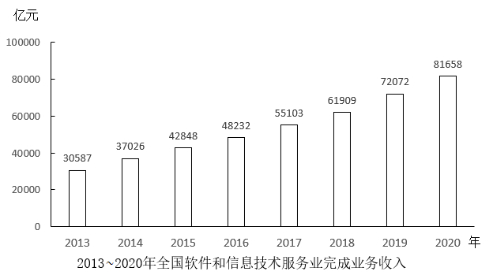

#### 第 1 题　qid 5509780 · 增长

2020年，我国软件和信息技术服务业营业利润率（利润总额/业务收入）比上年：

- **A**. 上升了2个百分点以上
- **B**. 下降了2个百分点以上
- **C**. 上升了不到2个百分点
- **D**. 下降了不到2个百分点　✅

**答案**：D

**官方解析**

根据题干“2020年，······营业利润率（利润总额/业务收入）比上年”，结合选项为上升/下降+百分点，可判定本题为两期比重问题。定位文字材料第一段可得：2020年，全国软件和信息技术服务业累计完成业务收入81658亿元（B），同比增长13.3%（b）。实现利润总额10676亿元（A），同比增长7.8%（a）。根据两期比重结论可得，当a&lt;b时，比重下降，排除A、C两项。根据两期比重公式：，则所求为，即下降了不到2个百分点。

故正确答案为D。

---

#### 第 2 题　qid 5509781 · 增长

2014~2020年，我国软件和信息技术服务业完成业务收入同比增速超过15%的年份有几个？

- **A**. 2
- **B**. 3　✅
- **C**. 4
- **D**. 5

**答案**：B

**官方解析**

根据题干“2014~2020年······同比增速······”，可判定本题为一般增长率问题。定位统计图可知2013~2020年我国软件和信息技术服务业完成业务收入额。根据公式：一般增长率，则2014~2020年我国软件和信息技术服务业完成业务收入同比增速分别为：

2014年，；

2015年，；

2016年，；

2017年，；

2018年，；

2019年，；

2020年，。

因此，同比增速超过15%的年份有2014年、2015年、2019年，共3个。

故正确答案为B。

---

#### 第 3 题　qid 5509782 · 增长

在软件和信息技术服务业4大领域中，2020年收入同比增速最快的是：

- **A**. 软件产品
- **B**. 信息技术服务　✅
- **C**. 信息安全产品和服务
- **D**. 嵌入式系统软件

**答案**：B

**官方解析**

根据题干“······2020年收入同比增速最快的是”，可判定本题为一般增长率问题。定位文字材料第二段可得：2020年，软件产品实现收入同比增长10.1%；信息技术服务实现收入49868亿元，比上年同期增加6579亿元；信息安全产品和服务实现收入同比增长10.0%；嵌入式系统软件实现收入7492亿元，比上年同期增加803亿元。根据公式：增长率，可得2020年信息技术服务实现收入同比增速；嵌入式系统软件实现收入同比增速。比较可知，2020年信息技术服务实现收入同比增速最快。

故正确答案为B。

---

#### 第 4 题　qid 5509785 · 比重

以下饼图中，最能准确反映2020年信息技术服务实现收入中，电子商务平台技术服务收入（黑色）、云服务、大数据服务收入（竖线）和其他收入（白色）占比关系的是：

- **A**. 

- **B**. 

- **C**. 

- **D**. 

　✅

**答案**：D

**官方解析**

根据题干“······最能准确反映2020年信息技术服务实现收入中······占比关系的是”，可判定本题为现期比重问题。定位文字材料第二段可得：（2020年）信息技术服务实现收入49868亿元。其中，电子商务平台技术服务收入9095亿元；云服务、大数据服务共实现收入4116亿元。则电子商务平台技术服务收入是云服务、大数据服务共实现收入的倍，即图中黑色部分所占面积应为竖线部分所占面积的2倍多，排除A、B两项；又因为电子商务平台技术服务收入和云服务、大数据服务共实现收入占信息技术服务实现收入的比重为，即图中黑色部分和竖线部分所占面积应大于全圆的，只有D项符合。

故正确答案为D。

---

#### 第 5 题　qid 5509786 · 增长

以下折线图反映了哪一时间段内，全国软件和信息技术服务业完成业务收入同比增量的变化趋势？

- **A**. 2014-2017年
- **B**. 2015-2018年
- **C**. 2016-2019年　✅
- **D**. 2017-2020年

**答案**：C

**官方解析**

根据题干“以下折线图反映了哪一时间段内······同比增量的变化趋势”，可判定本题为增长量比较问题。定位统计图可得：2013~2020年全国软件和信息技术服务业完成业务收入分别为30587亿元、37026亿元、42848亿元、48232亿元、55103亿元、61909亿元、72072亿元、81658亿元。根据公式：增长量=现期量-基期量，则2014~2020年全国软件和信息技术服务业完成业务收入的同比增量分别为：

2014年，37026-30587=亿元；

2015年，42848-37026=亿元；

2016年，48232-42848=亿元；

2017年，55103-48232=6871亿元；

2018年，61909-55103=6806亿元；

2019年，72072-61909=亿元；

2020年，81658-72072=亿元。

综上可知，满足题干折线图变化趋势的为2016-2019年。

故正确答案为C。

---

### 材料 2

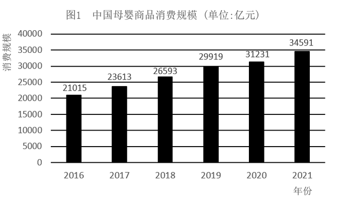

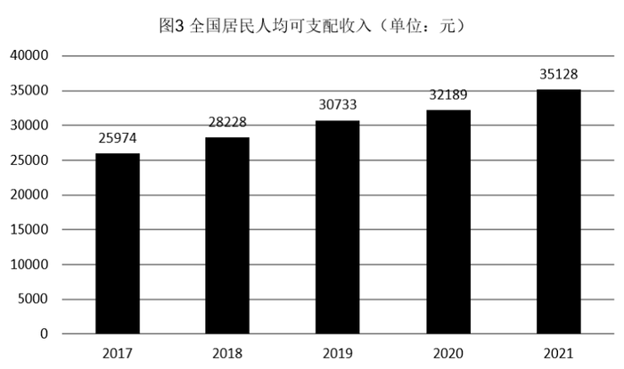

#### 第 6 题　qid 5509527 · 综合

2018-2021年，我国母婴商品消费规模最大的年份是：

- **A**. 2018年
- **B**. 2019年
- **C**. 2020年
- **D**. 2021年　✅

**答案**：D

**官方解析**

定位图1可知：2018-2021年，我国母婴商品消费规模分别为26593亿元、29919亿元、31231亿元、34591亿元，故消费规模最大的年份是2021年。
故正确答案为D。

---

#### 第 7 题　qid 5509531 · 增长

2018-2021年，我国母婴商品消费规模增长率的变动趋势是：

- **A**. 

- **B**. 

- **C**. 
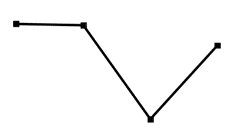
　✅
- **D**. 

**答案**：C

**官方解析**

根据题干“2018-2021年······增长率的变动趋势”，可判定本题为一般增长率的比较问题。定位图1可知：2017-2021年我国母婴商品消费规模分别为23613亿元、26593亿元、29919亿元、31231亿元、34591亿元，根据公式：增长率，则各年增长率分别为：

2018年：；

2019年：；

2020年：；

2021年：。

图像对应到第三个点应为最低点，只有C项符合。

故正确答案为C。

---

#### 第 8 题　qid 5509533 · 增长

根据上述资料，在母婴商品消费规模增速最小的年份，其增速最小的原因最可能是：

- **A**. 当年0-14岁人口数较之其他年份最少
- **B**. 当年0-14岁人口数占总人口比重最小
- **C**. 当年人均可支配收入水平下降
- **D**. 当年人均可支配收入增速下降　✅

**答案**：D

**官方解析**

根据题干“······增速最小的年份”，可判定本题为一般增长率问题。需先通过增长率比较，找出我国母婴商品消费规模增速最小的年份，再验证选项。

定位图1可知：2016-2021年各年我国母婴商品消费规模分别为21015亿元、23613亿元、26593亿元、29919亿元、31231亿元、34591亿元。根据公式：增长率，可得2017-2021年各年我国母婴商品消费规模的同比增速，如下：

2017年：增速为；

2018年：增速为；

2019年：增速为；

2020年：增速为；

2021年：增速为。

则2017-2021年，我国母婴商品消费规模增速最小的年份为2020年。

再验证选项，如下：

A项：定位图2可知：2020年0-14岁人口数为25277万人，不符合“较之其他年份最少”，错误；

B项：定位图2可知：2020年0-14岁人口数占总人口比重为17.9%，不符合“比重最小”，错误；

C项：定位图3可知：2020年人均可支配收入为32189元，不符合“水平下降”。错误；

D项：定位图3可知：2019年人均可支配收入增速为，2020年增速为，2020年人均可支配收入增速符合“下降”，正确。

故正确答案为D。

---

#### 第 9 题　qid 5509536 · 综合

2021年，我国消费最多的母婴商品金额约为：

- **A**. 9638亿元
- **B**. 8994亿元　✅
- **C**. 7852亿元
- **D**. 4186亿元

**答案**：B

**官方解析**

根据题干“2021年，我国消费最多的母婴商品金额······”，结合表1中各类母婴商品消费所占比重，可判定本题为现期比重问题。定位图1、表1可得：2021年，中国母婴商品消费规模为34591亿元，其中“服装鞋帽”类商品消费占比最大，为26.0%，因此，2021年我国消费最多的母婴商品金额约为亿元。

故正确答案为B。

---

#### 第 10 题　qid 5509538 · 增长

比较2018年-2021年我国母婴商品消费额与居民人均可支配收入的年增长率，下列说法错误的有几项？
①母婴商品消费额的年增长率均超过居民人均可支配收入的年增长率
②母婴商品消费额的年增长率均低于居民人均可支配收入的年增长率
③母婴商品消费额的年增长率与居民人均可支配收入的年增长率大体一致
④母婴商品消费额的年增长率与居民人均可支配收入的年增长率趋势相反

- **A**. 1
- **B**. 2
- **C**. 3
- **D**. 4　✅

**答案**：D

**官方解析**

根据图1可知，2018年母婴商品消费额的年增长率，2019年母婴商品消费额的年增长率，2020年母婴商品消费额的年增长率，2021年母婴商品消费额的年增长率；根据图3可知，2018年居民人均可支配收入的年增长率，2019年居民人均可支配收入的年增长率，2020年居民人均可支配收入的年增长率，2021年居民人均可支配收入的年增长率。

①2020年母婴商品消费额的年增长率低于居民人均可支配收入的年增长率，错误；

②2018年、2019年、2021年母婴商品消费额的年增长率均高于居民人均可支配收入的年增长率，错误；

③2018年母婴商品消费额的年增长率和居民人均可支配收入的年增长率分别为12.6%和8.7%，不符合大体一致，错误；

④2018-2021年母婴商品消费额的年增长率分别为12.6%、12.5%、4.4%、10.8%，居民人均可支配收入的年增长率分别为8.7%、8.9%、4.7%、9.1%，其中2019-2021年趋势均为先降后升，并非题干所说趋势相反，错误。

因此①②③④说法均错误，

故正确答案为D。

---

### 材料 3

        国家能源局发布2022年1～7月，全国规模以上工业发电4.77万亿千瓦时，同比增长1.4%，增速比上半年加快0.7个百分点。7月份，全国发电量8059亿千瓦时，同比增长4.5%，增速比上月加快3.0个百分点。分品种看，7月份火电由降转增，同比增长5.3%；由于来水偏枯，水电同比增长2.4%，增速比上月放缓26.6个百分点；风电同比增长5.7%，增速比上月放缓11.0个百分点；核电同比下降3.3%，降幅比上月收窄5.7个百分点；太阳能发电同比增长13.0%，增速比上月加快3.1个百分点。

        国家能源局发布2022年1～7月，全社会用电量累计49303亿千瓦时，同比增长3.4%。分产业看，第一产业用电量634亿千瓦时，同比增长11.1%；第二产业用电量32552亿千瓦时，同比增长1.1%；第三产业用电量8531亿千瓦时，同比增长4.6%；城乡居民生活用电量7586亿千瓦时，同比增长12.5%。7月份，全社会用电量8324亿千瓦时，同比增长6.3%。分产业看，第一产业用电量121亿千瓦时，同比增长14.3%；第二产业用电量5132亿千瓦时，同比下降0.1%；第三产业用电量1591亿千瓦时，同比增长11.5%；城乡居民生活用电量1480亿千瓦时，同比增长26.8%。

#### 第 11 题　qid 5509769 · 综合

2021年7月份，全国发电量大约是多少亿千瓦时？

- **A**. 6570
- **B**. 6920
- **C**. 7712　✅
- **D**. 7800

**答案**：C

**官方解析**

根据题干“2021年7月份，全国发电量大约是多少亿千瓦时”，结合材料时间为2022年7月份，可判定本题为基期计算问题。定位文字材料第一段可得：（2022年）7月份，全国发电量8059亿千瓦时，同比增长4.5%。根据公式：基期量，则所求为亿千瓦时，与C项最接近。

故正确答案为C。

---

#### 第 12 题　qid 5509770 · 综合

2022年1-7月份，全国城乡居民生活用电量比2021年1-7月份约多：

- **A**. 672亿千瓦时
- **B**. 843亿千瓦时　✅
- **C**. 925亿千瓦时
- **D**. 1020亿千瓦时

**答案**：B

**官方解析**

根据题干“2022年1-7月份······比2021年1-7月份约多”，结合选项有具体单位，可判定本题为增长量计算问题。定位文字材料第二段可得：国家能源局发布2022年1～7月······城乡居民生活用电量7586亿千瓦时，同比增长12.5%。根据公式：增长量，则题干所求亿千瓦时。

故正确答案为B。

---

#### 第 13 题　qid 5509772 · 比重

2021年7月份，全社会用电量中第三产业用电量的占比与城乡居民生活用电量的占比相较约：

- **A**. 高3.3%　✅
- **B**. 低3.8%
- **C**. 高9.8%
- **D**. 低10.3%

**答案**：A

**官方解析**

根据题干“2021年7月份······占比与······占比相较约”，结合材料时间为2022年7月份，可判定本题为基期比重问题。定位文字材料第二段可得：2022年7月份，全社会用电量8324亿千瓦时，同比增长6.3%；第三产业用电量1591亿千瓦时，同比增长11.5%；城乡居民生活用电量1480亿千瓦时，同比增长26.8%。根据公式：基期比重，则2021年7月份，全社会用电量中第三产业用电量的占比与城乡居民生活用电量的占比相差，即约高3.3%。

故正确答案为A。

---

#### 第 14 题　qid 5509773 · 综合

2021年1-6月全社会用电量累计约多少亿千瓦时？

- **A**. 38258
- **B**. 39851　✅
- **C**. 40472
- **D**. 41279

**答案**：B

**官方解析**

根据题干“2021年1-6月全社会用电量累计约多少亿千瓦时”，结合材料时间为2022年1-7月和2022年7月，可判定本题为基期和差问题。定位文字材料第二段可得：2022年1～7月，全社会用电量累计49303亿千瓦时，同比增长3.4%；7月份，全社会用电量8324亿千瓦时，同比增长6.3%。根据公式：基期量，可得所求亿千瓦时，最接近B项。

故正确答案为B。

---

#### 第 15 题　qid 5509777 · 综合

能够从上述资料中推出的是：

- **A**. 2022年7月全国太阳能发电增长量最大
- **B**. 2022年6月全国核电发电量比5月份高
- **C**. 2022年7月第二产业用电量高于上半年第二产业平均用电量　✅
- **D**. 2021年7月第一产业用电量低于2021年上半年第一产业平均用电量

**答案**：C

**官方解析**

A项：定位文字材料第一段可得：材料只给出各品种发电量同比增速，无法求出增长量，故无法得出太阳能发电增长量最大，错误；

B项：定位文字材料第一段可得：2022年7月，核电同比下降3.3%，降幅比上月收窄5.7个百分点。即只能求出2022年6月全国核电发电量同比增速，无法求出2022年6月和5月的全国核电发电量，错误；

C项：定位文字材料第二段可得：2022年1～7月，第二产业用电量32552亿千瓦时；7月份，第二产业用电量5132亿千瓦时。要求，即要求7×2022年7月＞2022年1～7月，代入数据，则有5132×7＞32552，正确；

D项：定位文字材料第二段可得：2022年1～7月，第一产业用电量634亿千瓦时，同比增长11.1%；7月份，第一产业用电量121亿千瓦时，同比增长14.3%。要求，即要求7×2021年7月＜2021年1～7月。根据公式：基期量，则2021年7月第一产业用电量亿千瓦时；2021年1～7月第一产业用电量亿千瓦时，则，即2021年7月第一产业用电量高于2021年上半年第一产业平均用电量，错误。

故正确答案为C。

---
