# 2023年广东省公务员录用考试《行测》题（县级卷）（网友回忆版）

> 省考 · 2023 年 · 6 个模块 · 共 99 题

- [政治理论](#%E6%94%BF%E6%B2%BB%E7%90%86%E8%AE%BA) · 6 题
- [常识判断](#%E5%B8%B8%E8%AF%86%E5%88%A4%E6%96%AD) · 19 题
- [言语理解与表达](#%E8%A8%80%E8%AF%AD%E7%90%86%E8%A7%A3%E4%B8%8E%E8%A1%A8%E8%BE%BE) · 10 题
- [数量关系](#%E6%95%B0%E9%87%8F%E5%85%B3%E7%B3%BB) · 14 题
- [判断推理](#%E5%88%A4%E6%96%AD%E6%8E%A8%E7%90%86) · 35 题
- [资料分析](#%E8%B5%84%E6%96%99%E5%88%86%E6%9E%90) · 15 题

---

## 政治理论

### 第 1 题　qid 5510265 · 时事政治

党的二十大报告指出，改革开放和社会主义现代化建设深入推进，书写了（    ）两大奇迹新篇章，我国发展具备了更为坚实的物质基础、更为完善的制度保证，实现中华民族伟大复兴进入了不可逆转的历史进程。

- **A**. 经济快速发展和社会长期稳定　✅
- **B**. 经济高速发展和全面建成小康社会
- **C**. 经济高质量发展和打赢脱贫攻坚战
- **D**. 经济发展新格局和中国式现代化

**答案**：A

**官方解析**

本题考查政治常识。
A项正确，B、C、D三项错误，党的二十大报告的“一、过去五年的工作和新时代十年的伟大变革”部分指出：“新时代十年的伟大变革，在党史、新中国史、改革开放史、社会主义发展史、中华民族发展史上具有里程碑意义······改革开放和社会主义现代化建设深入推进，书写了经济快速发展和社会长期稳定两大奇迹新篇章，我国发展具备了更为坚实的物质基础、更为完善的制度保证，实现中华民族伟大复兴进入了不可逆转的历史进程······”
故正确答案为A。

---

### 第 2 题　qid 5510266 · 时事政治

党的二十大报告指出，分配制度是促进共同富裕的基础性制度。坚持按劳分配为主体、多种分配方式并存，坚持多劳多得，鼓励勤劳致富，促进机会公平，（    ）。
①增加低收入者收入
②扩大中等收入群体
③减少高收入者收入
④规范收入分配秩序
⑤收紧财富积累渠道

- **A**. ①②③
- **B**. ①②④　✅
- **C**. ①③④
- **D**. ②④⑤

**答案**：B

**官方解析**

本题考查政治常识。
①②④正确，③⑤错误，党的二十大报告的“九、增进民生福祉，提高人民生活品质”部分指出：“（一）完善分配制度······坚持多劳多得，鼓励勤劳致富，促进机会公平，增加低收入者收入，扩大中等收入群体。完善按要素分配政策制度，探索多种渠道增加中低收入群众要素收入，多渠道增加城乡居民财产性收入。加大税收、社会保障、转移支付等的调节力度。完善个人所得税制度，规范收入分配秩序，规范财富积累机制，保护合法收入，调节过高收入，取缔非法收入。引导、支持有意愿有能力的企业、社会组织和个人积极参与公益慈善事业。”
故正确答案为B。

---

### 第 3 题　qid 5510212 · 时事政治

党的二十大报告指出，高质量发展是全面建设社会主义现代化国家的首要任务。发展是党执政兴国的第一要务。下列属于建设现代化产业体系的是（    ）。
①支持专精特新企业发展
②完善农业支持保护制度
③加快建设西部陆海新通道
④加快发展数字经济
⑤构建优质高效的服务业新体系

- **A**. ①④⑤　✅
- **B**. ②③⑤
- **C**. ①②③④
- **D**. ②③④⑤

**答案**：A

**官方解析**

本题考查政治常识。
①④⑤正确，党的二十大报告中“四、加快构建新发展格局，着力推动高质量发展”部分指出：“（二）建设现代化产业体系······实施产业基础再造工程和重大技术装备攻关工程，支持专精特新企业发展，推动制造业高端化、智能化、绿色化发展······构建优质高效的服务业新体系，推动现代服务业同先进制造业、现代农业深度融合。加快发展物联网，建设高效顺畅的流通体系，降低物流成本。加快发展数字经济，促进数字经济和实体经济深度融合，打造具有国际竞争力的数字产业集群······”
②错误，“完善农业支持保护制度，健全农村金融服务体系”属于“（三）全面推进乡村振兴”部分。
③错误，“加快建设西部陆海新通道”属于“（五）推进高水平对外开放”部分。
故正确答案为A。

---

### 第 4 题　qid 5510230 · 马克思主义

习近平主席指出我们要善于通过历史看现实、透过现象看本质，把握好全局和局部、当前和长远、宏观和微观、主要矛盾和次要矛盾、特殊和一般的关系，不断提高战略思维、历史思维、辩证思维、系统思维、创新思维、法治思维、底线思维能力，为前瞻性思考、全局性谋划、整体性推进党和国家各项事业提供科学思想方法，体现了以下哪个观念？（    ）

- **A**. 必须坚持守正创新
- **B**. 必须坚持系统观念　✅
- **C**. 必须坚持问题导向
- **D**. 必须坚持胸怀天下

**答案**：B

**官方解析**

本题考查政治常识。 
B项正确，A、C、D三项错误，二十大报告“二、开辟马克思主义中国化时代化新境界”部分指出：“必须坚持系统观念。万事万物是相互联系、相互依存的。只有用普遍联系的、全面系统的、发展变化的观点观察事物，才能把握事物发展规律。我国是一个发展中大国，仍处于社会主义初级阶段，正在经历广泛而深刻的社会变革，推进改革发展、调整利益关系往往牵一发而动全身。我们要善于通过历史看现实、透过现象看本质，把握好全局和局部、当前和长远、宏观和微观、主要矛盾和次要矛盾、特殊和一般的关系，不断提高战略思维、历史思维、辩证思维、系统思维、创新思维、法治思维、底线思维能力，为前瞻性思考、全局性谋划、整体性推进党和国家各项事业提供科学思想方法。”
故正确答案为B。

---

### 第 5 题　qid 5510227 · 新思想

习近平主席在二〇二三年新年贺词中提到了“太空之家”、白鹤滩水电站、“福建号”、愚公移山，下列与之相关的说法正确的是（    ）。

- **A**. 航天员刘洋参加了神舟十四号、神舟十五号的载人飞行任务
- **B**. 白鹤滩水电站是世界第一大电站，开启了我国南水北调新篇章
- **C**. “福建号”是我国第三艘航母　✅
- **D**. 愚公移山的故事出自《山海经》

**答案**：C

**官方解析**

本题考查科技常识。
A项错误，刘洋于2012年6月，执行神舟九号载人飞行任务，是中国第一位进入太空的女航天员。2022年6月至12月，执行神舟十四号载人飞行任务。神舟十五号飞行乘组由航天员费俊龙、邓清明和张陆组成，没有刘洋。
B项错误，白鹤滩水电站是金沙江下游干流河段梯级开发的第二个梯级电站，以发电为主，兼有防洪、拦沙、改善下游航运条件等综合效益。白鹤滩水电站仅次于三峡水电站，是中国第二大水电站和世界第二大水电站。
C项正确，中国人民解放军海军福建舰，是中国完全自主设计建造的首艘弹射型航空母舰，采用平直通长飞行甲板，配置电磁弹射和阻拦装置，满载排水量8万余吨。2022年6月17日，经中央军委批准，中国第三艘航空母舰命名为“中国人民解放军海军福建舰”，舷号为“18”。
D项错误，愚公移山的故事出自《列子·汤问》，是战国时期思想家列子创作的一篇寓言小品文。文章叙述了愚公不畏艰难，坚持不懈，挖山不止，最终感动天帝而将山挪走的故事。
故正确答案为C。

---

### 第 6 题　qid 5510221 · 毛中特

毛泽东同志说：“我们共产党人从来不隐瞒自己的政治主张。我们的将来纲领或最高纲领，是要将中国推进到社会主义社会和共产主义社会去的，这是确定的和毫无疑义的。”这段话出自（    ）。

- **A**. 《井冈山的斗争》
- **B**. 《中国共产党在抗日时期的任务》
- **C**. 《论联合政府》　✅
- **D**. 《论十大关系》

**答案**：C

**官方解析**

本题考查毛中特。
A项错误，《井冈山的斗争》是毛泽东同志写给中共中央的报告，作于1928年11月25日。文章分为湘赣边界的割据和八月失败、割据地区的现势两个部分，割据地区的现势从军事问题、土地问题、政权问题、党的组织问题、革命性质问题、割据地区问题等六个方面进行了论述。
B项错误，《中国共产党在抗日时期的任务》是毛泽东同志于1937年5月3日在中国共产党全国代表会议（即1937年5月2日至14日在延安召开的苏区党代表会议）上作的报告。
C项正确，《论联合政府》是毛泽东于1945年4月24日在中国共产党第七次全国代表大会上所作的政治报告。文中提到“我们共产党人从来不隐瞒自己的政治主张。我们的将来纲领或最高纲领，是要将中国推进到社会主义社会和共产主义社会去的，这是确定的和毫无疑义的。我们的党的名称和我们的马克思主义的宇宙观，明确地指明了这个将来的、无限光明的、无限美妙的最高理想”。
D项错误，《论十大关系》是毛泽东同志于1956年4月25日在中央政治局扩大会议上的讲话，于1976年12月26日发表于《人民日报》。
故正确答案为C。

---

## 常识判断

### 第 1 题　qid 5510262 · 人文常识

中国式现代化是我们党领导全国各族人民在长期探索和实践中历经千辛万苦、付出巨大代价取得的重大成果，党的领导与中国式现代化关系正确的是（    ）。
①党的领导决定中国式现代化的根本性质
②党的领导确保中国式现代化锚定奋斗目标行稳致远
③党的领导激发建设中国式现代化的强劲动力
④党的领导凝聚建设中国式现代化的磅礴力量

- **A**. ①②③
- **B**. ①②④
- **C**. ①③④
- **D**. ①②③④　✅

**答案**：D

**官方解析**

本题考查政治常识。
①正确。党的领导决定中国式现代化的根本性质。中国共产党是时代的先锋、民族的脊梁、人民的主心骨。没有中国共产党，就没有新中国，就没有中华民族伟大复兴。
②正确。党的领导确保中国式现代化锚定奋斗目标行稳致远。在新中国成立特别是改革开放以来长期探索实践基础上，经过党的十八大以来在理论和实践上的创新突破，我们成功推进和拓展了中国式现代化。
③正确。党的领导激发建设中国式现代化的强劲动力。优势提供原动力，动力创造新优势。中国共产党的领导是中国式现代化最鲜明的特征和最突出的优势。
④正确。党的领导凝聚建设中国式现代化的磅礴力量。力量生于团结，幸福源自奋斗。团结奋斗是党和人民锤炼铸就的最宝贵精神品质。
综上所述，关系正确的是①②③④。
故正确答案为D。

---

### 第 2 题　qid 5510226 · 经济常识

新时代十年，我国实行更加积极主动的开放战略，形成更大范围、更宽领域、更深层次的对外开放格局。以下不属于新时代十年对外开放领域成就的是（    ）。

- **A**. 加快推进海南自由贸易港建设
- **B**. 推动共建“一带一路”
- **C**. 货物贸易总额居世界第一
- **D**. 共建共治共享的制度进一步健全　✅

**答案**：D

**官方解析**

本题考查政治常识。
A、B、C三项正确，二十大报告“一、过去五年的工作和新时代十年的伟大变革”部分指出，“我们实行更加积极主动的开放战略，构建面向全球的高标准自由贸易区网络，加快推进自由贸易试验区、海南自由贸易港建设，共建‘一带一路’成为深受欢迎的国际公共产品和国际合作平台。我国成为一百四十多个国家和地区的主要贸易伙伴，货物贸易总额居世界第一，吸引外资和对外投资居世界前列，形成更大范围、更宽领域、更深层次对外开放格局。”
D项错误，二十大报告“十一、推进国家安全体系和能力现代化，坚决维护国家安全和社会稳定”部分指出，“完善社会治理体系，健全共建共治共享的社会治理制度，提升社会治理效能，畅通和规范群众诉求表达、利益协调、权益保障通道，建设人人有责、人人尽责、人人享有的社会治理共同体。”因此共建共治共享的制度进一步健全属于推进国家安全体系和能力现代化的成就。
本题为选非题，故正确答案为D。

---

### 第 3 题　qid 5510225 · 人文常识

党纪国法不能成为“橡皮泥”、“稻草人”，无论是因为“法盲”导致违纪违法，还是故意违规违法，都要受到追究，否则就会形成“破窗效应”。以下哪句与上述理论意思最为一致？（    ）

- **A**. 靡不有初，鲜克有终
- **B**. 不矜细行，终累大德
- **C**. 浇风易渐，淳化难归
- **D**. 纪纲一废，何事不生　✅

**答案**：D

**官方解析**

本题考查人文常识。
所谓“橡皮泥”，是软的、没有约束力的东西；所谓“稻草人”，则是纯用作摆设的、形式主义的东西。党纪国法不是摆设、不能没有约束力，它必须是有实效性的，习近平总书记用这两个比喻是要向领导干部强调有法必依，有法必行。
A项错误，“靡不有初，鲜克有终”最早出自于《诗经·大雅·荡》，指事情都有个开头，但很少能到终了，多用以告诫人们为人做事要善始善终。与题意不符。
B项错误，“不矜细行，终累大德”出自《尚书·周书·旅獒》，意思是不顾惜小节方面的修养，到头来会伤害大节，酿成终生的遗憾。体现量的积累促成质变的原理，与题意不符。
C项错误，“浇风易渐，淳化难归”出自唐代王勃的《上刘右相书》，意思是浮薄的风气容易蔓延，淳厚的风尚难以回归，与题意不符。
D项正确，“纪纲一废，何事不生”出自宋代苏轼的《上神宗皇帝书》，意思是国家纲纪一经败坏，什么祸国殃民的坏事都会生出来。题干强调党员领导干部要严守党纪国法，与题意相符。
故正确答案为D。

---

### 第 4 题　qid 5510229 · 地理国情

高质量发展是全面建设社会主义现代化国家的首要任务。2023年1月28日，广东召开全省高质量发展大会。关于广东的高质量发展，下列表述不正确的是（    ）。

- **A**. 坚持把发展经济的着力点放在数字经济上　✅
- **B**. 打造更多享誉世界的广东产品、广东企业、广东产业
- **C**. 扎实抓好“双区”和横琴、前海、南沙三大平台建设
- **D**. 实施“百县千镇万村高质量发展工程”，推动产业有序转移

**答案**：A

**官方解析**

本题考查政治常识。
A项错误，广东深入贯彻落实党中央关于坚持把发展经济的着力点放在实体经济上的决策部署，出台《“数字政府2.0”建设落实“实体经济为本，制造业当家”工作若干措施》，发挥数字政府建设牵引驱动作用，依托数字政府大平台持续创新涉企服务应用，赋能实体经济特别是制造业高质量发展。
B项正确，2023年2月2日，在广东省工商联召开广东省民营企业家共同推动高质量发展誓师大会上指出：“用好两种资源、两个市场，加快培育国际合作和竞争新优势，打造更多享誉世界的广东产品、广东企业、广东产业，力争上游、赶超一流。”
C、D两项正确，2023年1月28日，广东省委、省政府召开“新春第一会”——全省高质量发展大会。会议指出，要勃发开局之气象、展示开局之作为，扎实抓好“双区”和横琴、前海、南沙三大平台建设、坚持制造业当家、“百县千镇万村高质量发展工程”、绿美广东生态建设、构建全过程创新生态链、推动产业有序转移等重大部署落实。
本题为选非题，故正确答案为A。

---

### 第 5 题　qid 5510231 · 人文常识

“风雨浸衣骨更硬，野菜充饥志越坚；官兵一致同甘苦，革命理想高于天。”该文句最有可能描述的事件是（    ）。

- **A**. 三湾改编
- **B**. 红军长征　✅
- **C**. 百团大战
- **D**. 淮海战役

**答案**：B

**官方解析**

本题考查毛中特。
B项正确，A、C、D三项错误，“风雨浸衣骨更硬，野菜充饥志越坚。”出自开国上将萧华作词的《长征组歌》中的第六章《过雪山草地》。描写了红军长征战天斗地、以野菜充饥的顽强斗志，突出了红军在恶劣环境中的革命乐观主义精神和“不怕难”的钢铁意志。
故正确答案为B。

---

### 第 6 题　qid 5510223 · 科技常识

碳中和是指某个地区在一定时间内，人类活动直接和间接排放的二氧化碳总量，与通过植树造林、工业固碳等吸收的碳总量相互抵消，实现碳“净零排放”，以下不属于实现碳中和的科学手段的是（    ）。

- **A**. 用清洁能源来替代传统的化石能源
- **B**. 利用化学或生物手段将二氧化碳转化为有用的化学品或燃料
- **C**. 提倡极简生活，限制社会总需求，降低工业生产总量　✅
- **D**. 利用技术手段使碳以其他的形式与大气隔绝并封存

**答案**：C

**官方解析**

本题考查科技常识。
A项正确，清洁能源是不排放污染物、能够直接用于生产生活的能源，它包括核能和“可再生能源”。用清洁能源来替代传统的化石能源，属于碳中和策略中的“碳替代”。
B项正确，利用化学或生物手段将二氧化碳转化为有用的化学品或燃料，让这部分二氧化碳产生作用，叫做人工碳转化，属于碳中和策略中的“碳循环”。
C项错误，提倡极简生活，限制社会总需求，降低工业生产总量，可以从源头上减少碳排放，与碳中和科学手段无关。
D项正确，二氧化碳分子间有间隔，可将其压缩液化后封存。大型火力发电厂、炼钢厂、化工厂可以在二氧化碳集中收集后，利用技术手段将其液化进行地质封存，隔绝在大气碳循环之外。这种方式属于碳中和策略中的“碳封存”。
本题为选非题，故正确答案为C。

---

### 第 7 题　qid 5510228 · 法律常识

下列选项不符合《中华人民共和国立法法》表述的是（    ）。

- **A**. 立法应当遵循宪法的基本原则
- **B**. 立法应当符合社会舆论的观点　✅
- **C**. 立法应当从国家整体利益出发
- **D**. 立法应当适应经济社会发展和全面深化改革的要求

**答案**：B

**官方解析**

本题考查法律常识。
A、C两项正确，根据《中华人民共和国立法法》第五条规定：“立法应当符合宪法的规定、原则和精神，依照法定的权限和程序，从国家整体利益出发，维护社会主义法制的统一、尊严、权威。”（注：本题考查后，《立法法》被修改，将原条文“立法应当遵循宪法的基本原则”改为“立法应当符合宪法的规定、原则和精神”。）
B项错误，根据《中华人民共和国立法法》第六条规定：“立法应当坚持和发展全过程人民民主，尊重和保障人权，保障和促进社会公平正义。立法应当体现人民的意志，发扬社会主义民主，坚持立法公开，保障人民通过多种途径参与立法活动。”因此，立法应当体现人民的意志，而不是符合社会舆论的观点。
D项正确，根据《中华人民共和国立法法》第七条规定：“立法应当从实际出发，适应经济社会发展和全面深化改革的要求，科学合理地规定公民、法人和其他组织的权利与义务、国家机关的权力与责任。”
本题为选非题，故正确答案为B。

---

### 第 8 题　qid 5510233 · 法律常识

根据我国法律，敏感个人信息是一旦泄露或者非法使用，容易导致自然人的人格尊严受到侵害或者人身、财产安全受到危害的个人信息。以下不属于敏感个人信息的是（    ）。

- **A**. 人脸特征
- **B**. 从业经历　✅
- **C**. 医疗健康
- **D**. 行踪轨迹

**答案**：B

**官方解析**

本题考查法律常识。
A、C、D三项正确，B项错误，根据《中华人民共和国个人信息保护法》第二十八条第一款规定：“敏感个人信息是一旦泄露或者非法使用，容易导致自然人的人格尊严受到侵害或者人身、财产安全受到危害的个人信息，包括生物识别、宗教信仰、特定身份、医疗健康、金融账户、行踪轨迹等信息，以及不满十四周岁未成年人的个人信息。”
本题为选非题，故正确答案为B。

---

### 第 9 题　qid 5510245 · 人文常识

以下诗句描写的节气或节日，发生在秋季的是（    ）。

- **A**. 玉律传佳节，青阳应此辰
- **B**. 岁阴穷暮纪，献节启新芳
- **C**. 西北望乡何处是，东南见月几回圆　✅
- **D**. 节分端午自谁言，万古传闻为屈原

**答案**：C

**官方解析**

本题考查人文常识。
A项错误，诗句出自唐代冷朝阳的《立春》，意指季节转换，春天到了。诗句发生在春季。
B项错误，诗句出自唐代李世民（另一说是董思恭）的《守岁二首/除夜》，意指除夕守岁，迎接新春。诗句发生在冬季。
C项正确，诗句出自唐代白居易的《八月十五日夜湓亭望月》，意指中秋佳节，思念故乡。诗句发生在秋季。
D项错误，诗句出自唐代文秀的《端午》，意指前人传说端午节是为纪念屈原而设。诗句发生在夏季。
故正确答案为C。

---

### 第 10 题　qid 5515034 · 科技常识

夏日，小王调制了一杯的蔗糖水，尝了一口后感觉不够甜，又加入了一些蔗糖，搅拌后蔗糖完全溶解。之后他把蔗糖水放入冰箱，一段时间后取出时发现杯子底部有少许晶体析出，则下列说法正确的有（    ）。

①刚放入冰箱的蔗糖溶液一定不是饱和溶液

②从冰箱中取出的蔗糖溶液一定是饱和溶液

③放入冰箱前后，蔗糖溶液中溶质的质量相等

④用加热蒸发溶剂的方法能够得到与析出晶体相同的物质

- **A**. ①②
- **B**. ①④
- **C**. ②③
- **D**. ②④　✅

**答案**：D

**官方解析**

在一定温度下，向一定量溶剂里加入某种溶质，当溶质不能继续溶解时，所得到的溶液叫做这种溶质的饱和溶液。由题干可知，小王感觉蔗糖水不够甜，又加入蔗糖后，此时蔗糖在杯中完全溶解，但是仅凭这一信息无法判定蔗糖溶液是否饱和，如果再加入更多蔗糖后不能继续溶解，则说明此时溶液恰好为饱和溶液，如果再加入更多蔗糖后还能继续溶解，则说明此时溶液为不饱和溶液，因此无法判断刚放入冰箱的溶液是否饱和，①错误；蔗糖溶液放入冰箱一段时间后取出，发现杯子底部有少许晶体析出，说明此时溶液中有部分溶质不能继续溶解，此时溶液一定为饱和溶液，这部分晶体即为蔗糖，②正确；放入冰箱前，杯子中加入的蔗糖完全溶解，溶质的质量等于杯子中加入蔗糖的质量，放入冰箱后，杯子底部有蔗糖析出，溶液中溶质的质量减少，所以放入冰箱前蔗糖溶液中溶质的质量比放入冰箱后蔗糖溶液中溶质的质量大，③错误；放入冰箱后，杯子底部析出的晶体为蔗糖晶体，加热蒸发溶剂时，溶剂的量减少，溶剂中能够溶解的溶质的量也随之减少，多余的蔗糖就会以晶体的形式析出，也可以得到蔗糖晶体，④正确。
综上，正确的为②④。
故正确答案为D。

---

### 第 11 题　qid 5510278 · 科技常识

甲酸（HCOOH）具有清洁制氢的巨大潜力，其反应前后分子种类变化的微观示意图如下图所示。则下列说法正确的是（    ）。

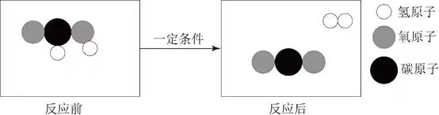

- **A**. 反应后分子个数增多　✅
- **B**. 该反应类型为化合反应
- **C**. 反应物和生成物都是有机物
- **D**. 该反应不遵守能量守恒定律

**答案**：A

**官方解析**

由题干图示可知，反应物甲酸是由1个碳原子、2个氢原子和2个氧原子组成的，其化学式为，反应后的生成物为2种物质，其中由2个氢原子组成的是，由1个碳原子和2个氧原子组成的是，故甲酸制取氢气的化学反应方程式为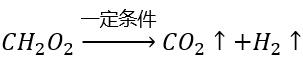。

A项：由上述分析可知，在该反应过程中，1个甲酸分子分解成1个氢气分子和1个二氧化碳分子，即1个分子分解为2个分子，故反应后分子个数增多，正确；

B项：由上述分析可知，甲酸反应后生成氢气和二氧化碳，是由一种物质生成两种物质的反应，属于分解反应，并非化合反应，错误；

C项：有机物主要由碳元素和氢元素组成（也可能有氧、氮等其他元素），一定是含碳的化合物，但是不包括碳的氧化物、碳酸、碳酸盐等，甲酸由碳、氢、氧三种元素组成，属于有机化合物，而生成物中的氢气和二氧化碳则均不属于有机物，错误；

D项：所有的化学反应均遵守能量守恒定律，错误。

故正确答案为A。

---

### 第 12 题　qid 5510319 · 科技常识

某电热水器设计了两个开关。当水温低于指定温度时，两个开关自动闭合，电热丝将水加热，指示灯亮起；当水温升高到指定温度时，一个开关断开，电热丝停止加热，指示灯仍亮。该电热水器的电路图最有可能是（    ）。

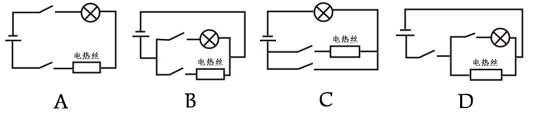

- **A**. A
- **B**. B　✅
- **C**. C
- **D**. D

**答案**：B

**官方解析**

A项：该电路中，电热丝与指示灯串联接入电路，当两个开关闭合时，电热丝加热，指示灯亮起；当一个开关断开时，电热丝停止加热，指示灯也熄灭，不满足题干要求，错误；
B项：该电路图中，电热丝与指示灯并联接入电路，两个开关分别与两个用电器串联，当两个开关闭合时，电热丝加热，指示灯亮起；当与电热丝串联的开关断开时，电热丝停止加热，指示灯仍亮，满足题干要求，正确；
C项：该电路图中，电热丝与指示灯串联接入电路，当两个开关闭合时，电热丝被短路，停止加热，指示灯亮起，不满足题干要求，错误；
D项：该电路图中，电热丝与指示灯并联接入电路，两个开关中，其中一个开关与指示灯串联，另一个开关在干路上，当两个开关闭合时，电热丝加热，指示灯亮起；当断开干路上的开关时，电热丝停止加热，指示灯灭，不满足题干要求；当断开与指示灯串联的开关时，电热丝加热，指示灯灭，也不满足题干要求，错误。
故正确答案为B。

---

### 第 13 题　qid 5510259 · 科技常识

下图是动物养殖场自动喂水装置的简要示意图。当动物通过饮水口饮水后，水箱内的水位下降，水瓶中的水将自动流入水箱，使水位回到一定的高度。关于这一装置，下列说法正确的是（    ）。

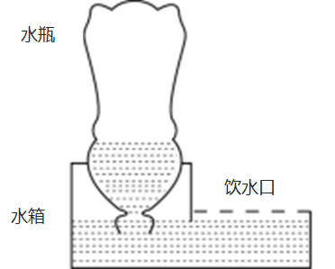

- **A**. 水瓶最终会处于真空状态
- **B**. 水瓶内的气压始终等于水箱内的气压
- **C**. 装置达到平衡时，水瓶内的气压高于大气压
- **D**. 该装置是利用水瓶、水箱之间的气压差实现的　✅

**答案**：D

**官方解析**

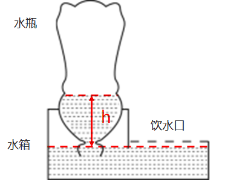

设水瓶中的液面高度与水箱中的液面高度差为h、水的密度为、水瓶中的气体压强为，由于水箱中液面处的压强等于大气压强，当整个装置平衡时，大气压等于水瓶内的气体压强与液体压强的总和，即，因此水瓶中的气体压强小于水箱中的气体压强（即大气压），B、C两项错误；

水箱的补水过程如下：当动物在饮水口饮水时，水箱中的水减少，水箱中的液面高度也会下降，当水箱中的液面高度低于瓶口的高度时，水瓶的瓶口会与空气接触，导致空气进入到水瓶中，此时水瓶中的气压增大，瓶中的水就会流出，实现自动喂水，直到水箱中的液面高于瓶口的高度时，水将瓶口封住，空气不能再进入水瓶中，则水不会再流出，此时就自动停止对水箱补水。最终水瓶中的水会全部进入到水箱当中，水瓶中最终会充满空气，而不是真空，A项错误；由以上分析也可见，正是水瓶和水箱之间的气压差支持着水瓶内的水柱，从而让瓶中的液面高于水箱中的液面，实现自动喂水，D项正确。

故正确答案为D。

---

### 第 14 题　qid 5510322 · 科技常识

下图是某物体做直线运动时，其速度v与时间t关系的折线图，则以下说法准确的有（    ）。

①在~，物体匀速运动

②在0~和~，物体做同方向运动

③在时，物体离出发点距离最远

④在~和~，物体的加速度方向相反

⑤在时，物体改变运动方向

- **A**. ①⑤
- **B**. ③④
- **C**. ④⑤　✅
- **D**. ①②④

**答案**：C

**官方解析**

在速度-时间（v-t）图像中：纵坐标表示速度，纵坐标的大小表示速度的大小、纵坐标的正负表示速度的方向；斜率表示加速度，斜率的大小表示加速度的大小、斜率的正负表示加速度的方向；图像与横轴围成的面积表示位移，面积的大小表示位移的大小，若围成的面积在横轴的上方则位移方向为正、若围成的面积在横轴的下方则位移为负。

①由图像可知，在~，物体的速度均匀减小，即物体做匀减速直线运动。在~，物体的速度变为负但均匀增大，即朝反方向做匀加速直线运动。因此，在~，物体先减速后朝反方向加速，并非匀速运动，错误；

②由图像可知，在0~，物体的速度为正，即朝正方向做直线运动，在~，物体的速度为负，即朝反向做直线运动，错误；

③由图像可知，在0~，物体的速度为正，始终朝正方向做直线运动，距离出发点越来越远，即位移越来越大。从~，物体的速度变为负，即从时开始朝反向做直线运动，距离出发点越来越近，即位移越来越小，因此在时，物体离出发点距离最远，错误；

④由图像可知，在~，从左往右看，直线呈现下降的趋势，即加速度方向为负。在~，从左往右看，直线呈现上升的趋势，即加速度方向为正，两个时间段的加速度方向相反，正确；

⑤由③的分析可知，在时，物体的速度由正变负，意味着速度方向发生改变，即物体运动方向发生改变，正确。

综上所述，①②③错误，④⑤正确。

故正确答案为C。

---

### 第 15 题　qid 5510277 · 科技常识

下图是一束光在空气和玻璃两种不同的介质中传播的路径示意图，则下列说法正确的是（    ）。

- **A**. 
是界面

- **B**. 
AO是入射光线

- **C**. 
OC是反射光线

- **D**. 
下方是玻璃介质
　✅

**答案**：D

**官方解析**

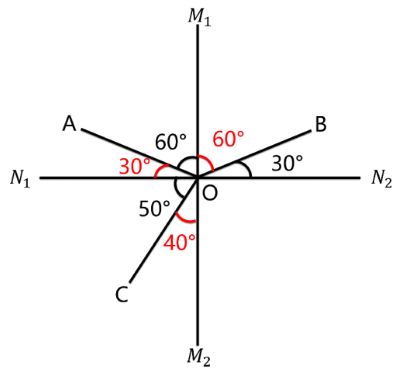

光斜射在介质不均匀的界面上，会同时发生折射和反射。

光的反射定律：入射光线、反射光线、法线三者在同一平面内，入射光线和反射光线分居法线两侧，且入射角等于反射角。

光的折射定律：入射光线、折射光线、法线三者在同一平面内，入射光线和折射光线分居法线两侧，且入射角不等于折射角。并且，当光在空气-玻璃的界面上发生折射时，总是空气侧角更大。

若是界面，则为法线，此时由于AO与CO两条光线在界面同侧，因此是入射光线与反射光线的关系，但是入射角和反射角不相等，不能满足反射定律，故不成立。所以可以确定为界面，为法线，A项错误；

由于AO与BO两条光线在界面同侧，因此是入射光线与反射光线的关系，OC在界面另一侧，是折射光线，而AO和OC在法线同侧，不可能是入射光线与折射光线的关系，因此可确定BO是入射光线，OA为反射光线、OC为折射光线，B、C两项均错误；

由图可知，入射角和反射角均为，折射角为，根据折射时空气侧角更大，可知界面的上方为空气，下方为玻璃，D项正确。

故正确答案为D。

---

### 第 16 题　qid 5510271 · 科技常识

生物能对外界刺激做出反应。反射是指生物通过神经系统，对外界或内部的各种刺激所发生的有规律的反应。下列生命现象，不属于反射的是（    ）。

- **A**. 小陈刚坐上过山车心跳就开始加速
- **B**. 小狗闻到肉的味道后开始流口水
- **C**. 猎豹发现猎物后停下脚步开始观察环境
- **D**. 乳酸菌向培养皿中果糖浓度高的区域聚集　✅

**答案**：D

**官方解析**

在中枢神经系统的参与下，机体对刺激产生的规律性应答反应叫做反射。高等动物和人类具有中枢神经系统，而植物或单细胞生物（如细菌）无中枢神经系统。
A项：小陈（人）具有中枢神经系统，能够对“坐过山车”的环境刺激产生反射活动（心跳加速），正确；
B项：狗具有中枢神经系统，能够对“肉（食物）”的嗅觉刺激产生反射活动（流口水），正确；
C项：猎豹具有中枢神经系统，能够对猎物所在的环境刺激产生反射活动（观察判断是否存在危险，进而做出下一步行动），正确；
D项：乳酸菌是单细胞生物，不存在中枢神经系统，故不可能产生反射活动，其向培养皿中果糖浓度高的区域聚集的行为，属于应激性（生物体能接受外界刺激并产生合目的的反应，使生物体能趋利避害），错误。
本题为选非题，故正确答案为D。

---

### 第 17 题　qid 5510258 · 科技常识

无性繁殖是一种不涉及生殖细胞，不需要经过受精过程，由母体的一部分直接形成新个体的繁殖方式。以下繁殖过程不属于无性繁殖的是（    ）。

- **A**. 西瓜的花被授粉后结出了果实　✅
- **B**. 一个草履虫经过细胞分裂变成两个
- **C**. 水螅母体的体壁上形成与母体相似的芽体
- **D**. 马铃薯的块茎发芽生长后，形成新的个体

**答案**：A

**官方解析**

生物的繁殖方式可分为有性繁殖和无性繁殖：有性繁殖是指两性生殖细胞结合（受精过程）成为受精卵后，再由受精卵发育成新的个体的生殖方式；无性繁殖是指不产生生殖细胞，无需经过受精过程，直接由母体的一部分形成新个体的繁殖方式。
A项：西瓜的花朵中有雄蕊和雌蕊，雄蕊和雌蕊可产生生殖细胞，雄蕊产生花粉，花粉中含有西瓜的精子，雌蕊中含有西瓜的卵细胞，授粉是雄蕊中的精子与雌蕊中的卵细胞结合并形成受精卵的过程，属于有性繁殖，错误；
B项：草履虫为单细胞生物，在其细胞分裂过程中，没有产生生殖细胞，也没有经历受精过程，而是直接由母体分裂形成新的个体，属于无性繁殖，正确；
C项：水螅体壁上的芽体即为一个新的小水螅，母体形成芽体的过程中，没有产生生殖细胞，也没有经历受精过程，而是直接从母体的一部分形成新的芽体，属于无性繁殖，正确；
D项：马铃薯块茎中的细胞为马铃薯的体细胞，而非生殖细胞，在马铃薯块茎发芽的过程中，没有产生生殖细胞，也没有经历受精过程，而是从母体的一部分直接形成新的个体，属于无性繁殖，正确。
本题为选非题，故正确答案为A。

---

### 第 18 题　qid 5510274 · 科技常识

下面是某森林生态系统食物网的示意图，下列表述正确的是（    ）。

- **A**. 该食物网中有3条食物链
- **B**. 该食物网中，己的个体总数最多
- **C**. 该森林生态系统的最终能量来自于甲
- **D**. 该食物网中，丁与戊既是捕食关系，又是竞争关系　✅

**答案**：D

**官方解析**

A项：该食物网中的食物链有“甲乙丙己”、“甲乙己”、“甲戊己”、“甲丁戊己”，共计4条，错误；

B项：在食物网和食物链中，能量和物质都是逐渐递减的，因此到了后面的营养级，能量和物质通常已经很少，不足以养活太多的捕食者，因此食物链顶端的生物（如大型猛兽和猛禽）一般数量都是最少的，而不是最多的，错误；

C项：生态系统中能量的最终来源是太阳能，而非生产者甲，错误；

D项：在食物链“甲丁戊己”中，戊捕食丁，所以丁与戊是捕食关系，而丁与戊都以甲为食，所以丁与戊也是竞争关系，正确。

故正确答案为D。

---

### 第 19 题　qid 5510272 · 科技常识

从北极上空俯视，地球围绕地轴呈逆时针方向自转。如果在北极的地轴正上方有一颗肉眼可见的星星，有一人站在赤道上整晚观察这颗星星。他有可能观察到（    ）。
①这颗星星东升西落
②这颗星星没有东升西落
③周围的星星以这颗星星为中心呈逆时针方向转动
④周围的星星以这颗星星为中心呈顺时针方向转动

- **A**. ②③　✅
- **B**. ①④
- **C**. ①③
- **D**. ②④

**答案**：A

**官方解析**

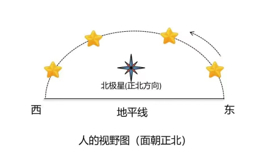

由题意可知，这颗星星位于北极的地轴的正上方，其实就是北极星，虽然地球绕着地轴不停的自转，但由于北极星位于北极地轴的正上方，因此夜晚看天空，北极星在地面的观察者看来是静止不动的，所以无论地球怎么自转，北极星都不会升起落下，因此没有东升西落，①错误，②正确。

除北极星外，由于地球自西向东的自转，太阳、月亮、星星都有东升西落的现象。如上图所示，人站在赤道上面朝正北方向观察，北极星在正北方位不动，除北极星外的其他星星（图中的黄星）均是东升西落，在人的视野中就是绕着北极星逆时针转动，因此在赤道上会看到其他星星绕着北极星沿逆时针方向旋转，③正确，④错误。

故正确答案为A。

---

## 言语理解与表达

### 第 1 题　qid 5510235 · 逻辑填空

只要坚持生态优先、绿色发展，锲而不舍，            ，就一定能把绿水青山变成金山银山。
填入画横线部分最恰当的一项是（    ）。

- **A**. 点石成金
- **B**. 水滴石穿
- **C**. 风雨无阻
- **D**. 久久为功　✅

**答案**：D

**官方解析**

横线处与“锲而不舍”构成近义并列，应体现出要坚持之意。D项“久久为功”意为要持之以恒，锲而不舍，驰而不息，符合文意，当选。A项“点石成金”比喻修改文章时稍稍改动原来的文字，就使它变得很出色，C项“风雨无阻”比喻无论发生什么情况，都按照原计划行事，二者均无法体现坚持之意，排除；B项“水滴石穿”比喻力量虽小，只要坚持不懈，事情就能成功，词语本身既包含了坚持的行为，也包含了坚持带来的结果，而横线处与“锲而不舍”并列，仅需体现坚持之意，未包含坚持之后带来的结果，与文意不符，排除。
故正确答案为D。
【文段出处】党建网《学习语｜推动经济社会发展全面绿色转型》

---

### 第 2 题　qid 5510238 · 逻辑填空

风清则气正，气正则心齐，心齐则事成。在以习近平同志为核心的党中央坚强领导下，贵州各地各部门靠着不懈的干劲、韧劲，持之以恒加强党风廉政建设，驰而不息开展反腐败工作。如今，党风政风焕然一新，社风民风持续向好，干群关系更加        、党心民心更加        。
依次填入画横线部分最恰当的一项是（    ）。

- **A**. 融洽  凝聚　✅
- **B**. 和谐  包容
- **C**. 密切  一致
- **D**. 稳定  团结

**答案**：A

**官方解析**

第一空，搭配“干群关系”，且根据“党风政风焕然一新，社风民风持续向好”可知，横线处应体现出如今的干群关系更好之意，A项“融洽”指彼此关系好，没有抵触，B项“和谐”指和睦协调，均符合文意，保留。C项“密切”指关系近，体现不出关系更好之意，排除；D项“稳定”指稳固安定，没有变动，常搭配“情绪”“社会”等，与“干群关系”搭配不当，且体现不出关系更好之意，排除。
第二空，搭配“党心民心”，且根据“气正则心齐”与“党风政风焕然一新，社风民风持续向好”可知，横线处应体现出党心民心紧密结合在一起之意，A项“凝聚”指聚集，积聚，搭配恰当且符合文意，当选。B项“包容”指宽容，与文意无关，排除。
故正确答案为A。
【文段出处】《党风廉政建设促社区综合服务提升》

---

### 第 3 题　qid 5510243 · 逻辑填空

政府部门要制定政策、营造环境，发挥宣传发动、组织协调、引导扶持作用，但绝不能            。要坚持有为政府和有效市场相促进，充分发挥市场机制作用，调动市场主体积极性，以重点产业项目为        ，促进资源要素更多向乡村流动，以产业“活水”变输血为造血。
依次填入画横线部分最恰当的一项是（    ）。

- **A**. 置身事外  核心
- **B**. 越俎代庖  根本
- **C**. 大包大揽  载体　✅
- **D**. 袖手旁观  导向

**答案**：C

**官方解析**

第一空，结合横线后“坚持有为政府和有效市场相促进，充分发挥市场机制作用”可知，横线处意在强调虽然要求政府积极发挥作用，但是不能完全主导。B项“越俎代庖”比喻超出自己业务范围去处理别人所管的事，C项“大包大揽”意思是把事情全部包揽过来，均符合文意，保留。A项“置身事外”意思是把自己放在事情之外，毫不关心，D项“袖手旁观”比喻置身事外、不帮助别人，多指看到别人有困难，不帮助别人，均无法体现“不能完全主导”之意，排除。
第二空，发展“重点产业项目”是促进资源要素向乡村流动、推动产业发展的手段、方法。C项“载体”泛指能够承载其他事物的事物，即通过发展“重点产业项目”可以达到推动产业发展的目的，符合文意，当选。B项“根本”指事物的根源或最重要的部分，填入文段无法体现政府通过发展“重点产业项目”推动产业发展之意，排除。
故正确答案为C。
【文段出处】《&lt;关于推动文化产业赋能乡村振兴的意见&gt;政策解读》

---

### 第 4 题　qid 5510246 · 逻辑填空

广东，正在加速打开高质量发展新局面。从上到下，从内到外，从你到我，每个人、每家企业都在全力奔跑，展现出            的热烈氛围和            的崭新气象。
依次填入画横线部分最恰当的一项是（    ）。

- **A**. 龙腾虎跃  意气风发
- **B**. 一马平川  奋勇当先
- **C**. 争先恐后  欣欣向荣
- **D**. 万马奔腾  时不我待　✅

**答案**：D

**官方解析**

第一空，根据“从上到下，从内到外，从你到我，每个人、每家企业都在全力奔跑”可知，横线处所填成语应体现全员都在全力奔跑的场景，D项“万马奔腾”指声势浩大、场面热烈，置于此处可体现全力奔跑的场景，且“奔腾”与“奔跑”对应恰当，具有形象性，符合文意，保留。A项“龙腾虎跃”指威武雄壮，非常活跃，题干强调全力奔跑，而非活跃，与文意不符，排除；B项“一马平川”指能够纵马疾驰的平地，强调地势平坦，与文意不符，排除；C项“争先恐后”指争着向前，唯恐落后，符合文意，但与D项相比，没有“万马奔腾”形象，排除。
第二空，代入验证，D项“时不我待”指时间不等待人，要抓紧时间，与“全力奔跑”对应恰当，当选。
故正确答案为D。
【文段出处】《再造一个新广东》

---

### 第 5 题　qid 5510256 · 逻辑填空

质量        是产出来的，        是管出来的，        是市场竞争出来的。这就要推动有效市场与有为政府更好结合，共助质量强国建设取得新成效。
依次填入画横线部分最恰当的一项是（    ）。

- **A**. 不 不 而
- **B**. 既 也 更　✅
- **C**. 首先 其次 再次
- **D**. 要么 要么 要么

**答案**：B

**官方解析**

根据“是产出来的”“是管出来的”以及“是市场竞争出来的”可知，这三方面内容均是质量发展的重要组成部分，故这三方面内容应为并列或递进关系。B项“既······也······更······”中，“既······也······”表示并列关系，“更”表示递进关系，可体现文段这三方面内容均是质量发展的重要组成部分，符合文段逻辑关系，当选。
A项“不······不······而······”为反义并列关联词，文段并未体现这三方面内容具有反义并列关系，不符合文段逻辑关系，排除；
C项“首先······其次······再次······”为承接关系关联词，文段并未体现这三方面内容的先后顺序，不符合文段逻辑关系，排除；
D项“要么······要么······要么······”为选择关系关联词，文段并未体现这三方面内容间的选择关系，不符合文段逻辑关系，排除。
故正确答案为B。
【文段出处】《质量强则国家强》

---

### 第 6 题　qid 5510234 · 语句表达

“                    。”理论学习贵在独立思考、学用结合，重在学有所悟、用有所得，在学习和实践中“众里寻他千百度”，最终“蓦然回首”，在“灯火阑珊处”领悟真谛。只有坚持学习与思考相统一，带着问题学习，养成边学习边思考的习惯，在学习中联系实际，对现实中的问题进行深入思考，才能真正将理论学深悟透。
以下句子最适合填入划横线处的是（    ）。

- **A**. 学而不思则罔，思而不学则殆　✅
- **B**. 吾尝终日而思矣，不如须臾之所学也
- **C**. 业精于勤，荒于嬉；行成于思，毁于随
- **D**. 知之者不如好之者，好之者不如乐之者

**答案**：A

**官方解析**

横线出现在开头，需要通读后文。后文首先提出理论学习贵在独立思考、学有所悟，接着通过“只有······才”句式再次强调学习要和思考相统一，边学习边思考，通过实际对学习的内容进一步思考。故横线后围绕的核心话题为学习和思考，强调了学习和思考相结合的重要性。A项“学而不思则罔，思而不学则殆”指只是学习却不思考就会迷惑而无所得，只是思考却不学习就会精神疲倦而无所得，告诫我们只有把学习和思考结合起来，才能学到切实有用的知识，符合文意，当选。
B项，“吾尝终日而思矣，不如须臾之所学也”指我曾经一天到晚地冥思苦想，却比不上片刻学到的知识，仅强调学习的重要性，无法体现出学习和思考相结合的重要性，排除；
C项，“业精于勤，荒于嬉；行成于思，毁于随”指学业由于勤奋而精通，但它却能荒废在游戏玩耍中；事情由于反复思考而成功，但它却能毁灭于不经大脑的随性中，强调学习不能沉浸于游戏，思考事情不能过于随性，无法体现出学习和思考相结合的重要性，排除；
D项，“知之者不如好之者，好之者不如乐之者”指对于任何学问、知识、技艺等，知道它的人，不如爱好它的人；爱好它的人，又不如以它为乐的人，强调爱好和兴趣在人们学习中至关重要的作用，无法体现出学习和思考相结合的重要性，排除。
故正确答案为A。
【文段出处】《人民日报：学习理论要有三种境界》

---

### 第 7 题　qid 5510239 · 片段阅读

队伍建设和人才工作事关高校领导权归属，事关高校发展水平和一流大学建设成效，是一项必须牢牢抓在手里、丝毫不能松懈的基础性、战略性工作。高校加强党的全面领导，必须坚持党管干部和党管人才原则，着力培养忠诚干净担当的高素质干部，着力集聚爱国奉献的各方面优秀人才，团结全校师生员工抓改革、谋发展、开新局、创一流。
下列选项最适合作为这段文字标题的是（    ）。

- **A**. 以改革发展促进一流大学建设
- **B**. 以爱国奉献凝聚高校优秀人才
- **C**. 以加强党的领导促进高校人才工作　✅
- **D**. 以人才强国战略作为高校发展目标

**答案**：C

**官方解析**

文段开篇介绍队伍建设和人才工作对于高校的重要意义，随后针对高校队伍建设和人才工作提出对策，即高校应加强党的全面领导，接着从多个方面进行具体的解释说明，故文段重在强调加强党的全面领导对于高校人才工作的重要性，对应C项。
A项，缺少主题词“党的领导”和“高校人才”，且“改革发展”对应解释说明的内容，非重点，排除；
B项，缺少主题词“党的领导”，且“爱国奉献”对应解释说明的内容，非重点，排除；
D项，缺少主题词“党的领导”，且“人才强国战略”无中生有，排除。
故正确答案为C。
【文段出处】求是网《坚持党的全面领导 推进一流大学建设》

---

### 第 8 题　qid 5510244 · 片段阅读

城乡历史文化保护传承，要在精准上下功夫。城乡历史文化范围广、类型多、数量大，情况尤为复杂。不同的传统建筑、旧城街巷等物质遗存，相异的地域风情、民俗习惯等非物质传承，构成了各城市与众不同的文化气质。这也决定了历史文化保护传承方法不能完全相同，必须坚持分类科学。在历史文化名城建设中，历史古都型如何保护、传承，传统风貌型如何延续、更新，地域特色型如何保持、创新；在文化特质赓续中，江南水乡如何留住恬静雅致，北方大院如何维持古朴雄浑，湘西古城如何散发神秘通幽······不同地域、不同类型的历史文化，只有精准施策，才能保护好、传承好。
这段文字意在强调（    ）。

- **A**. 城乡历史文化保护传承要因地制宜　✅
- **B**. 城乡历史文化保护传承面临着复杂局面
- **C**. 城乡历史文化保护传承应保留城市的物质遗存
- **D**. 城乡历史文化保护传承需要关注城市的文化气质

**答案**：A

**官方解析**

文段开篇通过对策标志词“要”强调城乡历史文化保护传承要做到精准到位，随后介绍城乡历史文化的复杂情况构成了各城市不同的文化气质，通过“必须”强调历史文化保护传承方法要采取分类科学，接着从历史文化名城建设和文化特质赓续两个方面具体阐述，强调针对不同地域、不同类型的历史文化要做到精准施策。故文段重在强调城乡历史文化保护传承要做到精准施策，坚持分类科学，对应A项。
B项，“面临着复杂局面”为问题表述，文段重点为对策，非重点，排除；
C项，文段重在强调城乡历史文化保护传承要做到精准施策，坚持分类科学，“保留城市的物质遗存”偏离文段重点，且表述片面，排除；
D项，“关注城市的文化气质”并非文段给出的对策，偏离文段重点，排除。
故正确答案为A。
【文段出处】新华社《城市更新要建好历史文化传承体系》

---

### 第 9 题　qid 5510318 · 片段阅读

企业数字化转型并不是为了数字化而数字化，其核心在于价值创造。对企业而言，价值创造直接体现在业务端，数字化转型实质上是业务的转型，是在以技术为支点、业务为内核的新一代数字技术驱动下，进行业务、管理和商业模式的深度变革重构。因此，数字化转型不是系统和应用简单从“非数字化”到“数字化”的过程，而是着眼于解决业务问题，从业务切入，将数字化技术和工具赋能于业务，更有效地解决业务问题。
对这段文字，理解不准确的是（    ）。

- **A**. 企业数字化转型离不开数字化技术和工具的支持
- **B**. 系统和应用数字化不属于企业数字化转型的要求　✅
- **C**. 企业数字化转型本质是革新业务、管理和商业模式
- **D**. 只有落脚到业务上，企业才能真正实现数字化转型

**答案**：B

**官方解析**

A项，根据“数字化转型不是······而是着眼于解决业务问题，从业务切入，将数字化技术和工具赋能于业务，更有效地解决业务问题”可知，表述正确，排除；
B项，根据“数字化转型不是系统和应用简单从‘非数字化’到‘数字化’的过程，而是着眼于解决业务问题，从业务切入，将数字化技术和工具赋能于业务”可知，数字化转型不仅包含系统和应用的数字化，还包含业务层面的转型，故“不属于”表述错误，当选；
C项，根据“数字化转型实质上是业务的转型······进行业务、管理和商业模式的深度变革重构”可知，表述正确，排除；
D项，根据“对企业而言，价值创造直接体现在业务端，数字化转型实质上是业务的转型”可知，表述正确，排除。
本题为选非题，故正确答案为B。
【文段出处】光明网《【思享家】培育数字经济时代新能力，加速企业数字化转型》

---

### 第 10 题　qid 5510250 · 片段阅读

近年来，消费成为拉动我国经济增长的主要动力。但是不可忽视的是，我国消费率偏低仍是一个基本事实。从消费需求看，我国在结束“模仿型排浪式”消费阶段后，尽管个性化、多样化消费逐渐成为主流，但总体消费水平还不高，提升和优化的空间还很大。如何让老百姓敢消费、能消费、愿消费，进而消费得起、消费得好，如何精准满足人民群众多样化、差异化、个性化需求，如何优化收入结构、提升消费能力，等等，这些都是我们扩大内需、释放经济活力需要解决的现实问题。
上述文段主要讲了（    ）。

- **A**. 加快经济增长面临的主要问题
- **B**. 当前我国消费需求的特点和趋势
- **C**. 我国消费的现状和需要解决的问题　✅
- **D**. 消费的重要性与扩大内需的可能性

**答案**：C

**官方解析**

文段开篇介绍近年来消费成为拉动我国经济增长的主要动力的背景，接着通过转折关联词“但是”指出我国消费率仍然偏低的现状，并从消费需求的角度具体解释说明，然后指出我国促进消费需要解决的一系列现实问题。故文段为并列结构，主要介绍了我国消费的现状及需要解决的问题，对应C项。
A项，缺少主题词“消费”，偏离文段重点，排除；
B项，“我国消费需求的······趋势”文段并未提及，无中生有，排除；
D项，“扩大内需的可能性”文段并未提及，无中生有，排除。
故正确答案为C。
【文段出处】《构建新发展格局要处理好辩证关系》《经济日报》（2021年12月29日 10版）

---

## 数量关系

### 第 1 题　qid 5510254 · 数学运算

92.46，84.42，76.38，68.34，（    ）

- **A**. 50.25　✅
- **B**. 53.26
- **C**. 55.17
- **D**. 56.30

**答案**：A

**官方解析**

题干各项均为小数，优先考虑机械划分数列。观察发现，92=46×2，84=42×2，76=38×2，68=34×2，即整数部分=小数部分×2。只有A项（50=25×2）满足要求。
故正确答案为A。
注：整数部分与小数部分分开看时，整数部分是公差为-8的等差数列，小数部分是公差为-4的等差数列，所求项应为60.30，但本题没有该选项，故另找规律。

---

### 第 2 题　qid 5510263 · 数学运算

，，，，，，（    ）

- **A**. 

- **B**. 

- **C**. 

- **D**. 

　✅

**答案**：D

**官方解析**

题干中数字均为分数，无分数数列常见规律。观察发现：，，，，即规律为：第一项÷第二项＝第三项，则所求项。

故正确答案为D。

---

### 第 3 题　qid 5510210 · 数学运算

0，（    ），2，6，12，20

- **A**. -1
- **B**. 0　✅
- **C**. 1
- **D**. 2

**答案**：B

**官方解析**

方法一：数列无明显特征，优先考虑多级数列。后项减前项得到新数列：（    ），（    ），4，6，8，新数列已知项是公差为2的等差数列，推测新数列第二项为4-2=2，第一项为2-2=0。故原数列所求项为0+0=0，验证：0+2=2，满足规律。
方法二：观察数列，多数项数为合数，考虑因数分解。原数列可转化为：（-1）×0=0，（    ），1×2=2，2×3=6，3×4=12，4×5=20，乘号前的乘数是公差为1的等差数列，且乘号前后两个乘数也是公差为1的等差数列，则所求项应为0×1=0。
故正确答案为B。

---

### 第 4 题　qid 5510211 · 数学运算

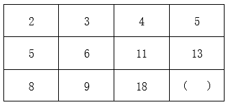

- **A**. 14
- **B**. 17
- **C**. 19
- **D**. 21　✅

**答案**：D

**官方解析**

方法一：观察表格数字，按列查找规律可得：5-2=3=8-5；6-3=3=9-6；11-4=7=18-11。即每列相邻两个数字之间差值相等，则13-5=8=（    ）-13，则所求项=13+8=21。
方法二：观察表格数字，按列查找规律可得：5×2=10=2+8；6×2=12=3+9；11×2=22=4+18。即在每列中存在：第二行数字×2=第一行数字+第三行数字。则13×2=26=5+（    ），则所求项=26-5=21。
故正确答案为D。

---

### 第 5 题　qid 5510213 · 数学运算

某辆货车载有20吨货物，上午卸了货物总重的20%，下午卸了剩余货物的30%,则下午卸货后,货车上的货物还剩（    ）吨。

- **A**. 10
- **B**. 10.4
- **C**. 11.2　✅
- **D**. 12.6

**答案**：C

**官方解析**

根据题意，上午卸货后，剩余货物为20×（1-20%）=16吨，下午卸货后剩余16×（1-30%）=11.2吨。
故正确答案为C。

---

### 第 6 题　qid 5510215 · 数学运算

某社区计划组建多支社工团队，为此招募了一批社工。如果每支团队由3名社工组成，则剩余2名社工；如果每支团队由4名社工组成，同样剩余2名社工，则该社区可能招募了（    ）名社工。

- **A**. 32
- **B**. 34
- **C**. 36
- **D**. 38　✅

**答案**：D

**官方解析**

方法一：根据题意，当3个人一组还剩2人时，即总人数减2是3的倍数，可排除B、C两项；当4个人一组也是还剩2人时，即总人数减2是4的倍数，排除A项，只有D项满足条件。
方法二：根据同余定理：余同取余，最小公倍数做周期。3、4的最小公倍数为12，则社工团队总人数可表示为：（12n+2）人。即总人数减2是12的倍数，只有D项满足条件。
故正确答案为D。

---

### 第 7 题　qid 5510217 · 数学运算

某单位去年报名参加志愿活动的党员与非党员之比为1∶3。今年的报名总人数提高了20%，党员与非党员之比为1∶2，党员人数比去年多了6人。则今年该单位报名参加志愿活动的党员共有（    ）人。

- **A**. 16　✅
- **B**. 24
- **C**. 32
- **D**. 48

**答案**：A

**官方解析**

设原来党员人数为x人，则原来总人数为（x+3x）=4x人，现在总人数为人。根据题意可知，现在党员人数为人，则有1.6x-x=6人，解得x=10，即现在党员人数为1.6×10=16人。

故正确答案为A。

---

### 第 8 题　qid 5510218 · 数学运算

某工厂加工出一批正方体奶酪,抽检时质检员从奶酪中切下了一个厚度为2厘米的长方体（如图所示）。如果剩余奶酪的体积为144立方厘米，则奶酪原本的边长为（    ）厘米。

- **A**. 4
- **B**. 6　✅
- **C**. 8
- **D**. 10

**答案**：B

**官方解析**

设原正方体边长为x厘米，根据题意可知，切下一块厚度为2厘米的长方体奶酪后，剩余部分的高为（x-2）厘米，长和宽均为x厘米。已知剩下体积为144立方厘米，由此可列式：。代入A项：当x=4时，，排除；代入B项：当x=6时，，符合题意，当选。

故正确答案为B。

---

### 第 9 题　qid 5510219 · 数学运算

某单位共有员工200人，其中订阅杂志的人数比只订阅报纸的人数多88%。则报纸和杂志均未订阅的员工有（    ）人。

- **A**. 36
- **B**. 56　✅
- **C**. 76
- **D**. 96

**答案**：B

**官方解析**

根据题意可知，，设订阅杂志人数为47x人，则仅订阅报纸人数为25x人，因订阅杂志人数+仅订阅报纸人数=总人数-不订阅报纸和杂志的人数，故47x+25x=200-不订阅报纸和杂志的人数，当x=1时，所求=128，无对应选项；当x=2时，所求=56，对应B项；当x＞2时，47x+25x＞200，不符合题意。

故正确答案为B。

---

### 第 10 题　qid 5510224 · 数学运算

某牧场的草，匀速生长。如果20头牛来吃，20天可将草吃光；如果10头牛和10只羊来吃，30天可以恰好吃光。已知一头牛每天的吃草量是一只羊的2倍，则30只羊吃该牧场的草，多少天可以吃光？

- **A**. 10
- **B**. 20
- **C**. 30　✅
- **D**. 40

**答案**：C

**官方解析**

方法一：设牧场原有草量为Y，每天生长草量为X，一只羊每天吃草量为1，则根据“一头牛每天的吃草量是一只羊的2倍”，可知一头牛每天吃草量为1×2=2。由牛吃草公式：Y=（N-X）×T，可得：Y=（2×20-X）×20······①，Y=（2×10+1×10-X）×30······②，解得X=10，Y=600。设30只羊吃牧场的草，t天可以吃光，则有600=（30-10）×t，解得t=30，即30只羊吃该牧场的草，30天可以吃光。
方法二：由于一头牛每天吃草的量是一只羊的2倍，则10头牛和10只羊吃草的量=10×2+10=30头羊吃草的量，故30只羊吃该牧场的草，30天可以吃完。
故正确答案为C。

---

### 第 11 题　qid 5510214 · 数学运算

某印刷厂原计划用全自动装订机花费4小时装订一批文件，但在还剩300份文件时装订机出现故障，无法装订。印刷厂立即安排了部分员工进行人工装订，由于人工装订的总效率仅为机器的20%，最终比原计划推迟1小时完成装订。则这批文件共有（    ）份。

- **A**. 2400
- **B**. 3600
- **C**. 4800　✅
- **D**. 6000

**答案**：C

**官方解析**

已知人工装订的效率是自动装订机效率的，则相同数量材料人工装订所需时间是全自动装订机的5倍。设装订300份材料全自动装订机所需时间为x，人工装订所需时间为5x，人工完成后多出一个小时做完，故多用时间为5x-x=1小时，x=0.25小时。因全自动装订机完成所有材料装订需要四个小时，则题目所求为份。

故正确答案为C。

---

### 第 12 题　qid 5510216 · 数学运算

某地举办了“铁人三项”体育活动，先进行蛙跳，后游泳，最后竞走到达终点。一位选手在上午7点出发，9点到达了终点，全程未休息，其蛙跳、游泳和竞走的速度分别为每小时2千米、3千米和6千米。如果蛙跳和竞走的路程相同，则所有项目的总路程是（    ）。

- **A**. 无法计算
- **B**. 6千米　✅
- **C**. 8千米
- **D**. 12千米

**答案**：B

**官方解析**

方法一：根据题意，可知“铁人三项”体育活动共用时2小时。根据“第一项和第三项路程一样”，由等距离平均速度公式,可知蛙跳与竞走的平均速度为km/h。因游泳速度也为3km/h，相当于全程平均速度为3km/h，故总路程=3×2=6千米。

方法二：根据题意，可知“铁人三项”体育活动共用时2小时。根据“第一项和第三项路程一样”，路程一定时，时间与速度成反比，可知，设小时，则小时，小时，故总路程千米。

故正确答案为B。

---

### 第 13 题　qid 5510220 · 数学运算

某公司向餐馆订购盒饭，要求每份盒饭包含2种荤菜、2种素菜。如果餐馆共准备了6种荤菜和4种素菜,则最多有（    ）种盒饭。

- **A**. 42
- **B**. 60
- **C**. 72
- **D**. 90　✅

**答案**：D

**官方解析**

盒饭是两荤两素，先从6种荤菜中任意选择2种，有种搭配；再从4种素菜中任意选择2种，有种搭配。分步用乘法，故盒饭有15×6=90种搭配种类。

故正确答案为D。

---

### 第 14 题　qid 5510222 · 数学运算

某单位每天都会安排2人在大楼入口负责安检，安排3人负责楼层巡查。为此，单位组织了一支12人的队伍，并根据序号安排工作:第一天由队员1,2负责安检，队员3、4、5负责巡查;第二天由队员6、7负责安检，8、9、10负责巡查；第三天由队员11、12负责安检，队员1、2、3负责巡查······以此类推,如果队员1今天负责了安检，则最晚在（    ）天后他将再次负责安检。

- **A**. 5
- **B**. 6
- **C**. 7　✅
- **D**. 8

**答案**：C

**官方解析**

根据题意可知，每天有2个人负责安检，3个人负责巡查，则12个人负责的工作列表如下：

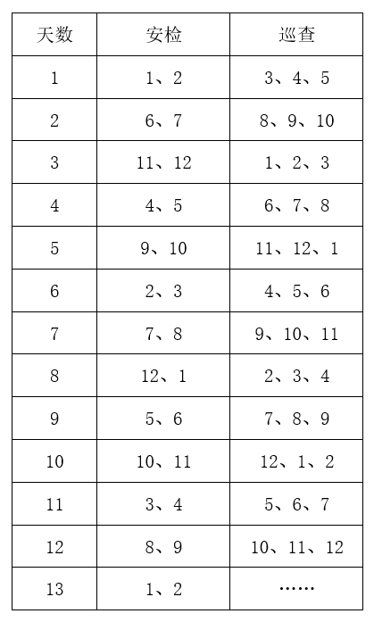

由上表可知，若1号队员第1天负责安检，则第8天，即7天后再次负责安检工作；若1号队员第8天负责安检，则第13天，即5天后再次负责安检工作。因此如果队员1某天负责了安检，则最晚在7天后他将再次负责安检。

故正确答案为C。

---

## 判断推理

### 第 1 题　qid 5510240 · 图形推理

以下平面图形最可能折叠成左图所示长方体的是：

- **A**. A
- **B**. B　✅
- **C**. C
- **D**. D

**答案**：B

**官方解析**

本题为空间重构题，可以通过公共边长短进行判断，由成直角的两条边是公共边可知，要想折叠成与题干一致的封闭立体图形，需要公共边相互垂直且等长。

A项：线1、线2是平面中相互垂直的两条线，为公共边，垂直但不等长，排除；

B项：线1、线2是平面中相互垂直的两条线，为公共边，垂直且等长，当选；

C项：线1、线2是平面中相互垂直的两条线，为公共边，垂直但不等长，排除；

D项：线1、线2是平面中相互垂直的两条线，为公共边，垂直但不等长，排除；

故正确答案为B。

---

### 第 2 题　qid 5510232 · 图形推理

下列选项中，能与所给图形组合成立方体的是（    ）。

- **A**. A
- **B**. B
- **C**. C　✅
- **D**. D

**答案**：C

**官方解析**

本题考查立体拼合。根据题干及选项图形的小方块数量可知，题干与选项图形应该共同组成一个3×3×3的完整立方体。观察发现，题干图形中标“1”处（如下图所示）没有小方块，因此选项中对应位置应该有一块小方块，排除A、D两项。继续观察发现，题干图形中标“2”处（如下图所示）存在小方块，因此选项中对应位置应该没有小方块，只有C项符合。

故正确答案为C。

---

### 第 3 题　qid 5510242 · 图形推理

下列选项最可能与左侧立体图形是同一物体的是：

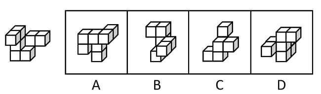

- **A**. A
- **B**. B　✅
- **C**. C
- **D**. D

**答案**：B

**官方解析**

本题要找与左侧立体图形一致的选项，将左侧立体图形旋转，旋转方式如下图所示，可得到B项。

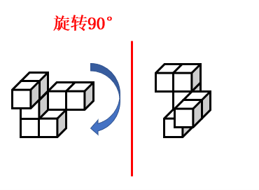

故正确答案为B。

---

### 第 4 题　qid 5510320 · 图形推理

左侧立体图形仅有图中所示的一个正方形面为黑色，则下列选项最不可能由三个左侧图形构成的是（    ）。

- **A**. A
- **B**. B
- **C**. C
- **D**. D　✅

**答案**：D

**官方解析**

本题考查立体拼合。题干立体图形由3个小方块组成，分别标1、2、3，如下图所示。

A项：如下图所示，左下角和中间的立体图形（分别标记为红色、绿色）可以拼成2个题干中的立体图形，右下角的立体图形（标记为蓝色）可通过位置变换得到题干中的立体图形，排除；

B项：如下图所示，右侧的立体图形（分别标记为蓝色、绿色）可以通过位置变换拼成2个题干中的立体图形，在第一层（从下往上数）标2（标记为红色，此时黑面朝内，无法看到）的小方块的内侧可以有另外一个小方块（标记应为3），组合拼成题干中的立体图形，排除；

C项：如下图所示，上方的立体图形（标记为绿色）可以拼成1个题干中的立体图形，右侧的立体图形（标记为蓝色）可通过位置变换得到题干中的立体图形，在第一层（从下往上数）标2（标记为红色，此时黑面朝内，无法看到）的小方块的内侧可以有另外一个小方块（标记应为3），组合拼成题干中的立体图形，排除；

D项：如下图所示，左下角的立体图形（标记为绿色）可以拼成1个题干中的立体图形，右面的立体图形（标记为蓝色）可通过位置变换得到题干中的立体图形，但根据题干图形的特征及黑面的位置，只存在图示中唯一的拼法。此时第三层（从下往上数）的2个小方块无法和内部的其他方块拼成题干中的立体图形，当选。

本题为选非题，故正确答案为D。

---

### 第 5 题　qid 5510236 · 图形推理

将两个左侧立体图形放置在桌面上，则某人从桌子正前方看到的图形轮廓最不可能是（    ）。

- **A**. A　✅
- **B**. B
- **C**. C
- **D**. D

**答案**：A

**官方解析**

本题考查三视图。B、C、D三项按下图所示摆放，从桌子正前方均可看到图形轮廓，排除。

而A项按下图所示摆放，有一个小方块会悬空，无法立住，所以无法从桌子正前方看到的图形轮廓，当选。

本题为选非题，故正确答案为A。

---

### 第 6 题　qid 5510261 · 图形推理

下列选项最符合所给图形规律的是：

- **A**. A
- **B**. B
- **C**. C
- **D**. D　✅

**答案**：D

**官方解析**

元素组成不同，优先考虑属性规律。题干图形较规整，且出现明显的等腰元素，优先考虑对称性。观察发现，图一、图三、图五均仅为轴对称图形；图二、图四既是轴对称又是中心对称图形，故“？”处应该填入一个既是轴对称又是中心对称的图形，只有D项符合。
故正确答案为D。

---

### 第 7 题　qid 5510241 · 图形推理

下列选项最符合所给图形规律的是：

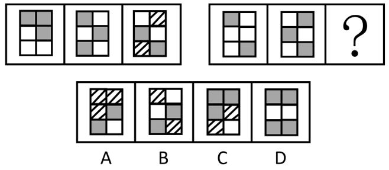

- **A**. A　✅
- **B**. B
- **C**. C
- **D**. D

**答案**：A

**官方解析**

图形元素组成相似，所有图形轮廓相同、分割区域一致，且出现灰块、白块以及阴影区域，优先考虑黑白运算。第一组图形的运算规律为：灰+灰=白，白+白＝灰，白+灰=阴影，灰+白＝阴影，第二组图形运用此规律，只有A项符合。
故正确答案为A。

---

### 第 8 题　qid 5510269 · 图形推理

下列选项最符合所给图形规律的是：

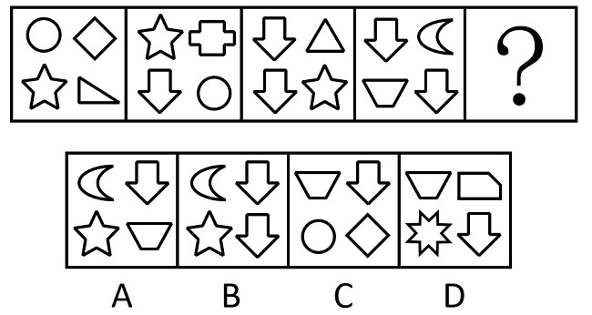

- **A**. A
- **B**. B
- **C**. C
- **D**. D　✅

**答案**：D

**官方解析**

元素组成不同，且无明显属性规律，考虑数量规律。观察发现，题干每幅图形均包含4个小元素，且相邻两幅图形存在相同的元素，考虑相邻比较。如下图所示，图一左侧一列的两个元素到图二变成了斜列，且上下位置发生互换，同理相邻图形都满足此规律。因此？处图形斜列的元素应该是前一个图形的左侧的两个元素，只有D项符合。

故正确答案为D。

---

### 第 9 题　qid 5510255 · 图形推理

下列选项最符合所给图形规律的是：

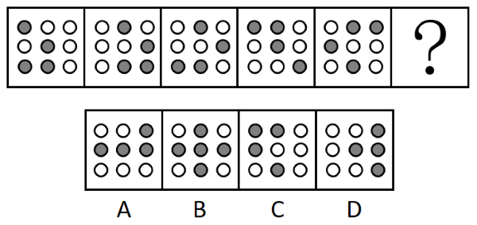

- **A**. A
- **B**. B
- **C**. C　✅
- **D**. D

**答案**：C

**官方解析**

元素组成相同，且无位置规律。观察发现，题干图形中灰色的小球的数量均为4个，排除B项。图形都是由横向相邻的两个黑球和对角线相邻的两个黑球组成，即两球连线一个是横线，一个是对角线，只有C项符合规律。

故正确答案为C。

---

### 第 10 题　qid 5510251 · 类比推理

下列选项与框内字符串规律最接近的是：

- **A**. A　✅
- **B**. B
- **C**. C
- **D**. D

**答案**：A

**官方解析**

观察发现，题干图形均由小元素组成，优先考虑元素的种类和个数。题干图形的元素个数为8，元素种类为5，且位置1、6的小元素相同；位置2、8的小元素相同；位置4、7的小元素相同；位置3、5的小元素与其他位置均不相同，只有A项符合规律。
故正确答案为A。

---

### 第 11 题　qid 5510248 · 类比推理

问：答

- **A**. 求：应　✅
- **B**. 教：学
- **C**. 来：去
- **D**. 买：卖

**答案**：A

**官方解析**

第一步：判断题干词语间逻辑关系。
“问”和“答”是问答时当事双方先后发生的行为，一方先“问”，另一方再“答”，二者是并列关系。
第二步：判断选项词语间逻辑关系。
A项：“求”和“应”是提出请求和答应要求时当事双方先后发生的行为，一方先“求”，另一方再“应”，二者是并列关系，与题干逻辑关系一致，当选；
B项：“教”和“学”是教学时当事双方同时发生的行为，一方“教”的同时另一方“学”，与题干逻辑关系不一致，排除；
C项：“来”和“去”不是同一事件中当事双方先后发生的行为，可以是单方先后发生的行为，与题干逻辑关系不一致，排除；
D项：“买”和“卖”是交易时当事双方同时发生的行为，一方“买”的同时另一方“卖”，与题干逻辑关系不一致，排除。
故正确答案为A。

---

### 第 12 题　qid 5510252 · 类比推理

章：节

- **A**. 年：月　✅
- **B**. 桌：椅
- **C**. 中考：高考
- **D**. 班主任：班长

**答案**：A

**官方解析**

第一步：判断题干词语间逻辑关系。
一章由多节组成，二者是包容关系中的组成关系。
第二步：判断选项词语间逻辑关系。
A项：一年由12个月组成，二者是组成关系，与题干逻辑关系一致，当选；
B项：桌、椅常搭配在一起使用，二者是配套使用的关系，与题干逻辑关系不一致，排除；
C项：中考和高考是不同的考试，二者是并列关系，与题干逻辑关系不一致，排除；
D项：班长在班主任的指导下管理班级，二者是对应关系，与题干逻辑关系不一致，排除。
故正确答案为A。

---

### 第 13 题　qid 5510253 · 类比推理

舍身：取义

- **A**. 摩拳：擦掌
- **B**. 含苞：欲放
- **C**. 得陇：望蜀
- **D**. 格物：致知　✅

**答案**：D

**官方解析**

第一步：判断题干词语间逻辑关系。
舍身取义是指为了正义事业不怕牺牲，“舍身”是为了“取义”，二者为方式目的对应关系。
第二步：判断选项词语间逻辑关系。
A项：摩拳擦掌形容战斗或劳动之前，人们精神振奋，跃跃欲试的样子，“摩拳”不是为了“擦掌”，二者不是方式目的对应关系，与题干逻辑关系不一致，排除；
B项：含苞欲放是形容花将开而未开时的样子，“含苞”不是为了“欲放”，二者不是方式目的对应关系，与题干逻辑关系不一致，排除；
C项：得陇望蜀原意是指已经取得陇右，还想攻取西蜀，后成为讥讽人不知道满足、总想得到更多的意思，“得陇”不是为了“望蜀”，二者不是方式目的对应关系，与题干逻辑关系不一致，排除；
D项：格物致知是指研究事物原理，从而获得知识，“格物”是为了“致知”，二者为方式目的对应关系，与题干逻辑关系一致，当选。
故正确答案为D。

---

### 第 14 题　qid 5510275 · 类比推理

海底捞月：缘木求鱼

- **A**. 抱薪救火：釜底抽薪
- **B**. 七嘴八舌：鹦鹉学舌
- **C**. 趁火打劫：浑水摸鱼　✅
- **D**. 锦上添花：画蛇添足

**答案**：C

**官方解析**

第一步：判断题干词语间逻辑关系。
海底捞月比喻根本做不到，白费力气；缘木求鱼比喻方向、方法不对，一定达不到目的，二者为近义关系。
第二步：判断选项词语间逻辑关系。
A项：抱薪救火比喻因为方法不对，虽然有心消灭祸患，结果反而使祸患扩大；釜底抽薪指抽去锅底下的柴火，比喻从根本上解决问题，二者为反义关系，与题干逻辑关系不一致，排除；
B项：七嘴八舌形容人多口杂；鹦鹉学舌比喻别人怎样说，他也跟着怎样说（含贬义），二者不是近义关系，与题干逻辑关系不一致，排除；
C项：趁火打劫指趁紧张危急的时候侵犯别人的权益；浑水摸鱼比喻趁混乱的时机捞取利益，二者为近义关系，与题干逻辑关系一致，当选；
D项：锦上添花比喻使美好的事物更加美好；画蛇添足比喻做多余的事，反而不恰当，二者不是近义关系，与题干逻辑关系不一致，排除。
故正确答案为C。

---

### 第 15 题　qid 5510279 · 类比推理

园丁：灌木：剪刀

- **A**. 医生：手术：处方
- **B**. 裁缝：衣服：针线　✅
- **C**. 渔民：捕鱼：渔网
- **D**. 司机：乘客：驾照

**答案**：B

**官方解析**

第一步：判断题干词语间逻辑关系。
园丁用剪刀修剪灌木，园丁是职业，剪刀是工具，灌木为剪刀修剪的对象，三者为职业、工具、工具作用对象的对应关系。
第二步：判断选项词语间逻辑关系。
A项：医生根据病人的病情开具处方，处方并不是工具，与题干逻辑关系不一致，排除；
B项：裁缝用针线缝补衣服，裁缝是职业，针线是工具，衣服是针线作用的对象，三者为职业、工具、工具作用对象的对应关系，与题干逻辑关系一致，当选；
C项：渔民用渔网捕鱼，渔民是职业，渔网是工具，捕鱼并不是渔网作用的对象，而是用渔网所做的行为，与题干逻辑关系不一致，排除；
D项：司机为职业，但是驾照是由主管部门颁发的驾驶资格凭证，证明持有人具备驾驶相应交通工具的资格，并不是工具，与题干逻辑关系不一致，排除。
故正确答案为B。

---

### 第 16 题　qid 5510260 · 类比推理

某街道计划将3名男性干部甲、乙、丙和3名女性干部张、李、王下沉至各个社区开展工作，可供选择的社区有A、B、C、D四个。已知：
①每人只能去一个社区。
②凡是有男性去的社区就必须有女性去。
③张去A社区或者B社区，乙去D社区。
如果最终李去了C社区，则下列推论必然正确的是（    ）。

- **A**. 丙去了A社区
- **B**. 张去了B社区
- **C**. 甲去了C社区
- **D**. 王去了D社区　✅

**答案**：D

**官方解析**

第一步：分析题干条件。

（1）每人只能去一个社区；

（2）有男性去的社区有女性去；

（3）张去A社区 或 B社区、乙去D社区；

（4）李去C社区。

第二步：根据题干条件进行推理。

根据条件（3）男性乙去D社区，再结合条件（2）可知，D社区必须有女性去。女性涉及张、李、王3名干部，又根据条件（1）、条件（3）可知，张去A社区或B社区，以及条件（4）李去C社区可知，女性张和李均不能去D社区，故推出仅剩的女性王一定去D社区，只有D项正确。

故正确答案为D。

---

### 第 17 题　qid 5510276 · 逻辑判断

分散的农户经营不成规模，已经远远不能适应各个城市群规模化、批量化的农产品需求，也限制了农民收入的提高。如果不解决农户的组织化这个问题，就无法推广农业机械化、规模化，也无法降低农业的经营成本。因此，可以通过推进农户的组织化，让现有的农民实现增产增收。
以下选项如果为真，最能支持上述论断的是（    ）。

- **A**. 当前分散的农户是农村的农业经营主体
- **B**. 机械化、规模化种植能有效实现农业增产　✅
- **C**. 推广农业机械化、规模化不需要花费较长时间
- **D**. 实现农业机械化生产后，劳动力投入将有所减少

**答案**：B

**官方解析**

第一步：找出论点和论据。
论点：可以通过推进农户的组织化，让现有的农民实现增产增收。
论据：如果不解决农户的组织化这个问题，就无法推广农业机械化、规模化，也无法降低农业的经营成本。
论据讨论的是实现农户的组织化有利于推广农业机械化，规模化，降低农业的经营成本，论点说的是推进农户的组织化，让现有的农民实现增产增收，论据和论点话题不一致，加强优先考虑搭桥，即在“推广农业机械化、规模化，降低农业的经营成本”和“让农民实现增产增收”之间建立联系。
第二步：逐一分析选项。
A项：论点讨论的是农户的组织化与农民增产增收的关系，而该项说的是分散的农户是农村的农业经营主体，不明确推进农户的组织化后是否可以让农民增产增收，无法加强，排除；
B项：该项说的是机械化、规模化种植能有效实现农业增产，即在推广农业机械化、规模化和让农民实现增产之间建立联系，为搭桥项，可以加强，当选；
C项：论点讨论的是农户的组织化与农民增产增收的关系，该项说的是推广农业机械化、规模化不需要花费较长时间，话题不一致，无法加强，排除；
D项：论点讨论的是农户的组织化与农民增产增收的关系，该项说的是实现农业机械化生产后对于劳动力投入的影响，话题不一致，无法加强，排除。
故正确答案为B。

---

### 第 18 题　qid 5510267 · 定义判断

某中学计划抽调一批骨干教师前往西部地区支教，学校计划抽调2位高一老师、1位高二老师和1位高三老师，并且这4位老师所教科目应各不相同。已知各年级候选人如下：
①高一：历史老师甲、地理老师乙、政治老师丙。
②高二：地理老师丁、语文老师戊。
③高三：政治老师己、数学老师庚。
则以下人选符合要求的是（    ）。

- **A**. 甲、乙、丁、庚
- **B**. 甲、乙、戊、己　✅
- **C**. 乙、丙、戊、己
- **D**. 乙、戊、己、庚

**答案**：B

**官方解析**

第一步：分析题干条件。
（1）2位高一老师、1位高二老师、1位高三老师；
（2）4位老师所教科目应各不相同；
（3）高一：甲历史、乙地理、丙政治；
（4）高二：丁地理、戊语文；
（5）高三：己政治、庚数学。
第二步：根据题干条件进行推理。
题干信息确定，选项信息充分，优先考虑排除法。
根据条件（1）可知只需要1位高三的老师，结合条件（5）可知己和庚均为高三的老师，排除D项；
根据条件（2）可知4位老师所教科目应各不相同，结合条件（3）（4）可知乙和丁均为地理老师，结合条件（3）（5）可知丙和己均为政治老师，排除A、C两项。
经验证，B项符合题干所有条件。
故正确答案为B。

---

### 第 19 题　qid 5510249 · 逻辑判断

甲市城区过去一直实行车辆限号通行。从去年开始，该市取消了车辆限号通行，一年后全市交通拥堵指数明显下降，平均车速提高了20%，实现了“车辆不限号，交通不拥堵”的双重效益。
下列选项如果为真，最能解释这一现象的是（    ）。

- **A**. 甲市城区打造了多个15分钟便民生活圈，居民购物出行更加便利
- **B**. 甲市加强了新能源汽车的配套设施建设，新能源汽车销量大幅提高
- **C**. 甲市交通线网优化，城区主干道和重点路段交通状况得到明显改善　✅
- **D**. 当油价上涨时，为降低出行成本，部分市民会优先选择公共交通出行

**答案**：C

**官方解析**

第一步：找出题干矛盾。
甲市城区过去一直实行车辆限号通行。从去年开始，该市取消了车辆限号通行，一年后全市交通拥堵指数明显下降。
第二步：逐一分析选项。
A项：甲市城区的15分钟便民生活圈使居民购物出行更加便利，但不意味着购物出行不需要开车，同时购物出行更加便利不能代表甲市城区整体交通顺畅，不能解释一年后全市交通拥堵指数明显下降的原因，不能解释题干矛盾，排除；
B项：甲市加强了新能源汽车的配套设施建设，新能源汽车销量大幅提高，与题干话题不一致，不能解释题干矛盾，排除；
C项：城区主干道和重点路段交通状况得到明显改善，意味着即使取消限号，主干道和重点路段等车流量较大的地段也交通顺畅，也代表着甲市城区整体交通可能顺畅，可以解释一年后全市交通拥堵指数明显下降的原因，可以解释题干矛盾，当选；
D项：当油价上涨时，为降低出行成本部分市民会优先选择公共交通出行，但是取消限号后油价是否上涨不明确，部分市民的数量能否影响整个甲市城区整体交通情况同样不明确，不能解释题干矛盾，排除。
故正确答案为C。

---

### 第 20 题　qid 5510321 · 逻辑判断

人均GDP可以基于常住人口计算，但算出的结果可能并不准确，因为流动人口同样会为城市创造GDP。当一个城市的流动人口占比较高时，只用常住人口来计算人均GDP，可能会导致对城市经济发展水平的高估。有专家因此建议，对经济发展水平相近的城市而言，用“吨均GDP”（每吨生活垃圾所对应的GDP）替代“人均GDP”，更能准确比较各个城市的发展水平。
要使该建议成立，必须补充的前提是（    ）。

- **A**. 所有城市都能准确统计本地区居民产生的生活垃圾数量
- **B**. 气候条件、城市布局等因素不会影响居民的生活垃圾产生量
- **C**. 经济发展水平相近的城市，居民的生活垃圾人均产生量相近　✅
- **D**. 各个城市中，流动人口和常住人口每人每天产生的垃圾数量相近

**答案**：C

**官方解析**

第一步：找出论点和论据。
论点：对经济发展水平相近的城市而言，用“吨均GDP”（每吨生活垃圾所对应的GDP）替代“人均GDP”，更能准确比较各个城市的发展水平。
论据：当一个城市的流动人口占比较高时，只用常住人口来计算人均GDP，可能会导致对城市经济发展水平的高估。
本题的论点和论据均在讨论准确比较各个城市发展水平的方法，二者话题一致，且问题为“前提”，优先考虑必要条件。
第二步：逐一分析选项。
A项：该项说的是所有城市都能准确统计本地区居民产生的生活垃圾数量，说明生活垃圾数量可以进行准确统计，该方法具有可行性，是论点成立的必要条件，保留；
B项：该项说的是气候条件、城市布局等因素不会影响居民的生活垃圾产生量，而论点说的是“吨均GDP”更能准确比较各个城市的发展水平，话题不一致，无法加强，排除；
C项：该项说的是经济发展水平相近的城市，居民的生活垃圾人均产生量相近，实际人口总数=垃圾总量/人均垃圾产生量，如果经济发展水平相近的城市中人均垃圾产生量不相近，也就无法根据垃圾总量来确定实际人口总数，那么就无法用垃圾来确定城市发展水平，即用“吨均GDP”就无法比较各个城市的发展水平，即选项不成立则论点不成立，因此选项可以证明该方法有效，是论点成立的必要条件，保留；
D项：该项说的是各个城市，论点针对的是“经济发展水平相近”的城市，“各个城市”范围过大，超出了论点论述的范围，且即使流动人口和常住人口每人每天产生的垃圾数量不相近，但能保证经济发展水平相近的城市人均产生量相近也可以满足论点成立的条件，选项不是论点成立的必要条件，排除。
A、C两项比较，A项证明方法具有可行性，C项证明方法具有有效性，二者都是论点成立的必要条件，需要注意的是，论点讨论的就是该方法能否用来比较城市发展水平，但A项只能证明生活垃圾可以准确统计，无法证明能否用生活垃圾来比较相近城市的发展水平，而C项能证明生活垃圾确实可以用来比较城市发展水平，因此，C项比A项更贴近论点，择优选择C项。
故正确答案为C。

---

### 第 21 题　qid 5510323 · 逻辑判断

现在，有些人开始质疑“全球变暖”理论。他们认为，人类活动并不是全球变暖的主要原因，放在地球气候漫长的演变背景中看，气候变化是正常现象，因此，近期的全球变暖远没有到需要“拯救地球”的地步。
以下选项如果为真，最能反驳上述论断的是（    ）。

- **A**. 过去20年里，全球变暖和海平面上升的速度迅速增加
- **B**. 工业革命以后人类排放的二氧化碳增多，全球气温也在上升
- **C**. 按照目前的趋势，20年后将有超三分之一的生态系统濒临崩溃　✅
- **D**. 在地球的历史中，气候变暖多次导致了人类生活环境的巨大变化

**答案**：C

**官方解析**

第一步：找出论点和论据。
论点：近期的全球变暖远没有到需要“拯救地球”的地步。
论据：人类活动并不是全球变暖的主要原因，放在地球气候漫长的演变背景中看，气候变化是正常现象。
由论据讨论的全球变暖是气候变化的正常现象，推出论点全球变暖对地球的影响不需要采取措施，题干论点论据话题一致，削弱优先考虑削弱论点。
第二步：逐一分析选项。
A项：过去20年里全球变暖和海平面上升的速度迅速增加，但并不明确这些变化对地球而言是否需要采取措施来拯救，属于不明确项，无法削弱，排除；
B项：讨论的是全球气温上升可能和工业革命后人类排放的二氧化碳增多有关，但并不明确全球气温上升对地球而言是否需要采取措施来拯救，属于不明确项，无法削弱，排除；
C项：按照目前的趋势，20年后将有超三分之一的生态系统濒临崩溃，说明全球气温持续变暖会严重危及人类的生存环境，需要人类采取措施来“拯救地球”，直接反驳了论点，可以削弱，当选；
D项：气候变暖会导致人类生活环境的巨大变化，但不明确这种巨大变化是否达到需要“拯救地球”的地步，属于不明确项，无法削弱，排除。
故正确答案为C。

---

### 第 22 题　qid 5510325 · 逻辑判断

为推动社区养老服务建设，某社区开设了长者食堂，向社区内符合条件的老年人提供一日三餐。该食堂饭菜价格远低于市场价，且品种多样、味道极佳、分量充足，然而每天到该食堂就餐的老年人数量并不多。
以下各项如果为真，最能解释这一现象的是（    ）。

- **A**. 社区内多数老年人选择送餐上门而非到食堂用餐　✅
- **B**. 该社区内和周边有许多深受当地居民喜爱的餐馆
- **C**. 该长者食堂占地面积较大，食堂内就餐座位充足
- **D**. 符合就餐条件的老年人在社区居民中的占比不高

**答案**：A

**官方解析**

第一步：找出题干矛盾。
长者食堂饭菜价格远低于市场价，且品种多样、味道极佳、分量充足，然而每天到该食堂就餐的老年人数量并不多。
第二步：逐一分析选项。
A项：社区内多数老年人选择送餐上门而非到食堂用餐，解释了为什么长者食堂有优势但每天到该食堂就餐的老年人数量不多，可以解释题干矛盾，当选；
B项：该社区内和周边有许多深受当地居民喜爱的餐馆，但长者食堂饭菜价格远低于市场价，且品种多样、味道极佳、分量充足，明显比其他餐馆更有优势，不能解释为什么每天到该食堂就餐的老年人数量不多，不能解释题干矛盾，排除；
C项：该长者食堂占地面积较大，食堂内就餐座位充足，补充说明了该食堂的优点，不能解释为什么每天到该食堂就餐的老年人数量不多，不能解释题干矛盾，排除；
D项：符合就餐条件的老年人在社区居民中的占比不高，由于不明确社区居民的总数，所以根据占比无法判断符合就餐条件的老年人的数量，如果社区居民总数很多，那么尽管占比不高，符合就餐条件的老年人也会很多，不能解释为什么每天到该食堂就餐的老年人数量不多，不能解释题干矛盾，排除。
故正确答案为A。

---

### 第 23 题　qid 5510270 · 类比推理

甲、乙、丙3人同时申请某个课题项目。评审专家组进行评审后，最终通过了其中1人的申请。专家们最初的预测如下：
①专家一：甲的申请没有通过。
②专家二：乙的申请通过了。
③专家三：丙的申请没有通过。
如果只有1名专家预测正确，则下列推论必然错误的是（    ）。

- **A**. 专家一预测正确
- **B**. 专家三预测正确
- **C**. 甲的申请通过了
- **D**. 乙的申请通过了　✅

**答案**：D

**官方解析**

第一步：分析题干找关系。

专家一：甲通过；

专家二：乙通过；

专家三：丙通过。

第二步：根据题干推理。

题干没有明显的矛盾关系和反对关系，故用假设法进行推理，专家二的预测是肯定形式，可以通过专家二的预测开始假设，假设专家二的预测为真，则乙的申请通过，结合题干条件，只有1人申请通过，可以得出专家一和专家三的预测都是正确的，此时有3名专家预测正确，与题干条件矛盾，因此，乙一定没有通过，此时，可得D项一定错误，D项当选。继续推理，当甲的申请通过时，专家一和专家二预测均错误，专家三预测正确，此时满足题干要求；当丙的申请通过时，专家一预测正确，专家二和专家三预测均错误，此时也满足题干要求，综上所述，甲、丙都有可能通过申请，A、B、C三项均为可能正确。

本题为选非题，故正确答案为D。

---

### 第 24 题　qid 5510268 · 类比推理

自其变者而观之，则天地没有一瞬间不会发生变化。历史已经不属于这片天地，所以历史是永恒不变的。
以下选项的逻辑结构与题干最为相似的是（    ）。

- **A**. 玫瑰是红色的，这朵花是白色的，所以这朵花不是玫瑰
- **B**. 羊都是有角的，被锯掉角的羊没有角，所以被锯掉角的羊不再是羊
- **C**. 地球是行星，有自己的卫星，火星是行星，所以火星也有自己的卫星
- **D**. 有明确奋斗目标的人都是幸福的，他没有明确的奋斗目标，所以他不幸福　✅

**答案**：D

**官方解析**

第一步：翻译题干。

A（天地）B（一直发生变化），C（历史）A（不属于这片天地），结论：C（历史）B（不变）。

第二步：逐一分析选项。

A项：A（玫瑰）B（红色），C（这朵花）B（不是红色），结论：C（这朵花）A（玫瑰），与题干推理形式不一致，排除；

B项：A（羊）B（有角），C（被锯掉角的羊）B（没有角），结论：C（被锯掉角的羊）A（羊），与题干推理形式不一致，排除；

C项：A（地球是行星）B（有卫星），C（火星是行星），结论：B（有卫星），与题干推理形式不一致，排除；

D项：A（有明确奋斗目标）B（幸福），C（他）A（没有明确奋斗目标），结论：C（他）B（不幸福），与题干推理形式一致，当选。

故正确答案为D。

---

### 第 25 题　qid 5510257 · 逻辑判断

某制片公司历经数年制作了一部电影，该电影上映后得到了业内专家一致好评，在各影评网站上也得到了很高的评分，然而该电影的放映厅内观众寥寥无几，其实际票房收益也很不理想。
以下各项如果为真，最不能解释这一现象的是（    ）。

- **A**. 各电影院对该电影安排的放映场次普遍较少　✅
- **B**. 该电影制作成本高，上映时设定了过高的票价
- **C**. 该电影上映期间有多部更加热门优质的电影同时上映
- **D**. 该电影题材过于小众，大部分普通观众对其缺乏兴趣

**答案**：A

**官方解析**

第一步：找出题干矛盾。
某电影受到业内专家和影评网站上大家的好评，但该电影放映厅内观众少且票房不高。
第二步：逐一分析选项。
A项：电影院安排的放映场次少，无法解释为什么已经安排的场次放映厅内观众寥寥无几，不能解释题干矛盾，当选；
B项：过高的票价会影响观看的人数，导致观看人数少，可以解释为什么该电影受到专家和影评网站上大家的好评，但放映厅内观众少且票房不高，可以解释题干矛盾，排除；
C项：该电影上映期间有多部更加热门优质的电影同时上映，导致观众更加倾向于观看更加热门的优质电影，使得该电影观众数量减少，可以解释为什么该电影受到专家和影评网站上大家的好评，但放映厅内观众少且票房不高，可以解释题干矛盾，排除；
D项：说明喜欢该电影题材的人数本来就很少，那么去电影院观看的人数也会少，可以解释为什么该电影受到专家和影评网站上大家的好评，但放映厅内观众少且票房不高，可以解释题干矛盾，排除。
本题为选非题，故正确答案为A。

---

### 第 26 题　qid 5510264 · 逻辑判断

科学家曾研究过旁观者对运动员跑步的影响。结果发现，在同一条跑道上，没有旁观者或旁观者背对跑道时，运动员的跑步速度相近；当旁观者面对跑道时，运动员的跑步速度明显提高。因此，体育竞赛的现场一定得有观众，这有助于运动员取得更好的成绩。
以下选项如果为真，最能削弱上述论断的是（    ）。

- **A**. 许多体育竞赛中运动员需要保持高度专注力，避免外界干扰　✅
- **B**. 其他参赛选手的关注也能让运动员在竞赛项目中发挥得更好
- **C**. 运动员短时间内突破自己、超常发挥可能会对其身体造成伤害
- **D**. 在没有观众的情况下，仍然有运动员在体育竞赛中打破了纪录

**答案**：A

**官方解析**

第一步：找出论点和论据。
论点：体育竞赛的现场一定得有观众，这有助于运动员取得更好的成绩。
论据：在同一条跑道上，没有旁观者或旁观者背对跑道时，运动员的跑步速度相近；当旁观者面对跑道时，运动员的跑步速度明显提高。
本题论点和论据话题一致，都在讨论“观众”与“成绩”之间的关系，削弱优先考虑削弱论点。
第二步：逐一分析选项。
A项：该项说的是许多体育竞赛中运动员需要保持高度专注力，避免外界干扰，说明观众可能会对运动员造成干扰，不利于运动员取得好成绩，直接削弱论点，当选；
B项：该项说的是其他参赛选手的关注也能让运动员在竞赛项目中发挥得更好，但其他参赛选手的关注与现场有观众是否有助于运动员取得更好的成绩无关，无法削弱，排除；
C项：该项说的是运动员短时间内突破自己、超常发挥可能会对其身体造成伤害，对身体造成伤害，与论点讨论的现场有观众是否有助于运动员取得更好的成绩无关，无法削弱，排除；
D项：该项说的是没有观众也有运动员能取得好成绩，但不能证明有观众时就不能帮助运动员取得更好的成绩，没有直接说明观众到底有没有帮助，削弱力度不如A项，排除。
故正确答案为A。

---

### 第 27 题　qid 5510273 · 逻辑判断

小王经营着一家打印店，他发现，店内员工都很忙，大部分精力都花在了文件排版上。为了节省人力，他给店里的电脑安装了能自动完成常规排版操作的新款软件。然而，软件安装几个月后，店内员工反而更忙了。
以下选项如果为真，最能解释这一现象的是（    ）。

- **A**. 部分文档有特殊的排版要求，依然需要人工操作完成
- **B**. 能自动排版文档后，该店的文印装订等业务量也因此大涨　✅
- **C**. 新软件操作有一定难度，员工需要接受培训才能熟练掌握
- **D**. 安装软件后，该店并没有相应地调整排版和打印的收费标准

**答案**：B

**官方解析**

第一步：找出题干矛盾。
小王为了节省人力，给店里的电脑安装了能自动完成常规排版操作的新款软件，但软件安装几个月后，员工反而更忙了。
第二步：逐一分析选项。
A项：该项只能说明有些工作离不开人工操作，不能解释在安装了能自动完成常规排版操作的新款软件后，员工为什么变得更忙了，不能解释题干矛盾，排除；
B项：该项说明能自动排版文档后，自动排版的工作效率虽然得到了提高，但该店文印装订等业务量大涨，增加了员工的工作量，进而能够解释员工更忙了的现象，可以解释题干矛盾，当选；
C项：该项只能说明使用自动排版软件前需要对员工进行一定的培训，才能更好地使用，不能解释在安装了能自动完成常规排版操作的新款软件后，员工为什么变得更忙了，不能解释题干矛盾，排除；
D项：该项说明安装了能自动完成常规排版操作的新款软件后，该店价格没有进行调整，与题干中的矛盾无关，不能解释题干矛盾，排除。
故正确答案为B。

---

### 第 28 题　qid 5510237 · 逻辑判断

目前，风能技术员是某国受伤率最高的职业之一，从业人员较少。但随着国家能源需求向可再生能源转变，该国将越来越需要从事这样高风险性职业的人才，以保证国家能源的正常供应。由于风能技术人才紧缺，该国此类岗位的薪酬不断提高。对此有专家建议，在加大风能技术人才培养的同时，该国还应积极引进国际风能技术人才。
要使该建议成立，必须补充的前提是（    ）。

- **A**. 风能技术员在工作中面临的风险在短期内不会下降
- **B**. 该国风能技术人才培养无法完全满足能源发展需求　✅
- **C**. 风能技术员岗位薪酬的不断提高将制约能源产业的发展
- **D**. 国际风能技术人才的技术水平不低于该国培养的风能技术人才

**答案**：B

**官方解析**

第一步：找出论点和论据。
论点：在加大风能技术人才培养的同时，该国还应积极引进国际风能技术人才。
论据：随着国家能源需求向可再生能源转变，该国将越来越需要从事这样高风险性职业的人才，以保证国家能源的正常供应。由于风能技术人才紧缺，该国此类岗位的薪酬不断提高。
本题论点和论据都在讨论风能技术人才紧缺的问题，论点和论据话题一致，且提问方式为“前提”，加强优先考虑补充必要条件。
第二步：逐一分析选项。
A项：该项讨论的是风能技术员的工作风险不会下降，而论点讨论的是加大风能技术人才培养和引进国际风能技术人才，话题不一致，无法加强，排除；
B项：该项讨论的是该国风能技术人才培养无法满足能源发展需求，所以才需要引进国际风能技术人才，是题干论点成立的必要条件，可以加强，当选；
C项：该项讨论的是风能技术员的岗位薪酬与能源产业发展的关系，而论点讨论的是引进国际风能技术人才，话题不一致，无法加强，排除；
D项：该项讨论的国际风能技术人才的技术水平不低于该国培养的风能技术人才，如果国际风能技术人才的技术水平略低于该国培养的风能技术人才，在该国对风能技术人才有需求的情况下，照样可以从海外引进风能技术人才，不是论点成立的必要条件，无法加强，排除。
故正确答案为B。

---

### 第 29 题　qid 5510280 · 类比推理

只有不间断地练习曲目，才能在音乐比赛中获奖。小李没有在音乐比赛中获奖，那么他一定没有不间断地练习曲目。
以下选项的逻辑结构与题干最为相似的是（    ）。

- **A**. 降低生产成本是实现利润上涨的必要条件。某企业今年的利润没有上涨，因此一定没有降低生产成本　✅
- **B**. 除非自身业务能力过硬，否则无法成为优秀的销售员。小张是优秀的销售员，因此他一定有过硬的业务能力
- **C**. 如果要最大程度减少碳排放，那么就要践行低碳出行的绿色理念。某国并不认可低碳出行，所以无法减少碳排放
- **D**. 如果汽车价格大幅度下降，汽车的销量就会迅速上升，当前汽车的销量没有迅速上升，因此汽车价格一定没有下降

**答案**：A

**官方解析**

第一步：分析题干推理形式。

翻译为：获奖不间断练习，小李没有获奖没有不间断练习，（即ab，ab），逻辑结构为“否前推否后”。

第二步：逐一分析选项。

A项：翻译为：利润上涨降低成本，某企业利润没有上涨没有降低成本，（即ab，ab），逻辑结构为“否前推否后”，与题干推理形式一致，当选；

B项：翻译为：优秀销售员业务能力过硬，小张是优秀销售员业务能力过硬，（即ab，ab），逻辑结构为“肯前推肯后”，与题干推理形式不一致，排除；

C项：翻译为：最大程度减少碳排放践行低碳出行理念，某国不低碳出行无法减少碳排放，（即ab，ba），逻辑结构为“否后推否前”，与题干推理形式不一致，排除；

D项：翻译为：价格下降销量上升，汽车销量没有上升价格没有下降，（即ab，ba），逻辑结构为“否后推否前”，与题干推理形式不一致，排除。

故正确答案为A。

---

### 第 30 题　qid 5510324 · 逻辑判断

为探索每周4天工作制的可行性，某集团进行了一次大规模的试验。结果表明，尽管减少了工作天数，数千名员工仍然完成了原定的工作任务，且员工的工作压力水平下降了7%，企业的办公成本如耗材、水电的消耗量也有所下降。有人因此认为，4天工作制不仅能降低企业的运营成本，还大大提高了企业员工的工作效率。
以下选项如果为真，最能质疑上述观点的是（    ）。

- **A**. 实行4天工作制后，该集团一些分公司的营业收入有所降低
- **B**. 实行4天工作制后，员工每天的工作时长从8小时变为10小时　✅
- **C**. 劳动法规制定的前提是保护劳动者权益，而非降低企业运营成本
- **D**. 由于运营维护的需要，部分岗位的工作人员并不能实行4天工作制

**答案**：B

**官方解析**

第一步：找出论点和论据。
论点：4天工作制不仅能降低企业的运营成本，还大大提高了企业员工的工作效率。
论据：尽管减少了工作天数，数千名员工仍然完成了原定的工作任务，且员工的工作压力水平下降了7%，企业的办公成本如耗材、水电的消耗量也有所下降。
本题论点论据均在讨论4天工作制能够降低企业运营成本、提高员工工作效率，论点论据话题一致，削弱优先考虑削弱论点。
第二步：逐一分析选项。
A项：该项指出实行4天工作制后营业收入有所降低，与论点讨论的企业运营成本及员工工作效率无关，为无关项，无法削弱，排除；
B项：该项指出员工的工作时长由每周工作5天每天8小时，变为每周工作4天每天10小时，说明员工每周的总工作时长依然是40小时，且论据指出员工完成了原定的工作任务，说明总工作时长和总工作量不变，即工作效率也不变，即4天工作制并没有提高员工工作效率，削弱论点，可以削弱，当选；
C项：该项指出劳动法规制定的前提不是降低企业运营成本，与论点讨论的实行4天工作制后能否降低企业运营成本无关，为无关项，无法削弱，排除；
D项：该项指出部分岗位员工不能实行4天工作制，但没有提及能够实行4天工作制的岗位实行该制度后对企业运营成本和员工工作效率的影响，为无关项，无法削弱，排除。
故正确答案为B。

---

### 第 31 题　qid 5510326 · 逻辑判断

为促进员工交流，营造积极参加体育锻炼的良好氛围，某单位组织了跑步、羽毛球、排球、篮球等多支运动队。已知：
（1）所有员工至少参加了跑步队或羽毛球队中的一个；
（2）参加了跑步队的员工都没有加入篮球队；
（3）财务部小丽加入了篮球队。
工会委员了解上述情况后推断，小丽也加入了排球队。
要使这一推断成立，可以补充的前提是（    ）。

- **A**. 小丽没有参加跑步队
- **B**. 小丽没有加入羽毛球队
- **C**. 加入了排球队的人都参加了羽毛球队
- **D**. 未加入排球队的人都没有参加羽毛球队　✅

**答案**：D

**官方解析**

第一步：找出论点和论据。

论点：小丽加入了排球队。

论据：（1）跑步队 或 羽毛球队；

（2）跑步队篮球队；

（3）小丽加入了篮球队。

论据（3）“小丽加入了篮球队”是对论据（2）“跑步队篮球队”的否后，根据“否后必否前”可知，小丽没有参加跑步队，结合论据（1）“跑步队 或 羽毛球队”，根据“或关系否一推一”可知，小丽加入了羽毛球队。

本题需要找出论点成立的前提，可优先考虑搭桥，即建立“小丽加入羽毛球队”和“小丽加入排球队”之间的联系。

第二步：逐一分析选项。

A项：“小丽没有参加跑步队”，根据论据（1）可知，小丽加入了羽毛球队，但不能推出小丽加入了排球队，不是论点成立的前提，排除；

B项：“小丽没有加入羽毛球队”，与题干论据不符，排除；

C项：该项翻译为：排球队羽毛球队，论据已经推出“小丽加入了羽毛球队”，而小丽加入了羽毛球队是对该项的肯后，无法推出小丽加入了排球队，不是论点成立的前提，排除；

D项：该项翻译为：羽毛球队排球队，论据已经推出“小丽加入了羽毛球队”，根据该项可知小丽也加入了排球队，为搭桥项，是论点成立的前提，当选。

故正确答案为D。

---

### 第 32 题　qid 5510327 · 类比推理

优秀的企业家既要有杰出的领导能力，也必须积极承担相应的社会责任。因此，能运用出色的领导力引领企业发展却不愿承担任何社会责任的人，一定不是优秀的企业家。
以下选项的逻辑结构与题干最为相似的是（    ）。

- **A**. 真正的“美丽”不仅体现在外表上，还体现在心灵上。因此，心灵美丽的人外表也一定出众
- **B**. 设计要源于现实生活才能发挥意义而成为真正伟大的设计。因此，脱离生活的设计是不切实际的，更是毫无现实意义的
- **C**. 优秀的学习成绩和良好的道德品质在评奖评优中缺一不可。因此，即使有优秀的学习成绩，要想评奖评优，良好的道德品质仍然不可或缺　✅
- **D**. 流量明星一定程度带动了经济发展，也带来了一些新的社会问题。因此，片面强调流量明星带来的经济效益，忽视其后来的社会问题并不可取

**答案**：C

**官方解析**

第一步：分析题干推理形式。

题干翻译为：优秀的企业家杰出的领导能力 且 积极承担相应的社会责任，因此，有出色的领导力 且 承担相应的社会责任优秀的企业家。

题干逻辑结构为：12 且 3，因此，2 且 31。

第二步：逐一分析选项。

A项：翻译为：真正的“美丽”外表美丽 且 心灵美丽，因此，心灵美丽外表出众，逻辑结构为：12 且 3，因此，32，与题干推理形式不一致，排除；

B项：翻译为：发挥意义成为真正伟大的设计源于现实生活，因此，源于生活的设计不切实际的设计 且 现实意义的设计，逻辑结构为：12，因此，23 且 1，与题干推理形式不一致，排除；

C项：翻译为：评奖评优优秀的学习成绩 且 良好的道德品质，因此，优秀的学习成绩 且 良好的道德品质评奖评优（“因此”之后的语句可以理解为：如果只有优秀的学习成绩，而没有良好的道德品质，是不能评奖评优的），逻辑结构为：12 且 3，因此，2 且 31，与题干推理形式一致，当选；

D项：翻译为：流量明星带动经济发展 且 带来社会问题，因此，片面强调经济效益 且 忽视带来社会问题不可取，逻辑结构为：12 且 3，因此，2 且 34，与题干推理形式不一致，排除。

故正确答案为C。

---

### 第 33 题　qid 5510328 · 类比推理

某部门有若干名干部和工勤人员。其中有多名干部是博士；并非所有的博士都是统计学专业毕业的；所有的男性都是统计学专业毕业的；由此可以推断该部门中（    ）。

- **A**. 有些男性不是博士
- **B**. 有些博士不是男性　✅
- **C**. 有些男性是工勤人员
- **D**. 有些干部不是统计学专业毕业的

**答案**：B

**官方解析**

第一步：翻译题干。

①有的干部博士；

②有的博士统计学专业毕业；

③男性统计学专业毕业。

将②③串联可得④有的博士统计学专业毕业男性。

第二步：逐一分析选项。

A项：翻译为有的男性博士，根据④可得，有的博士男性，“有的不是”无法直接换位，无法得到有的男性不是博士，无法推出，排除；

B项：翻译为有的博士男性，根据④可得，有的博士男性，可以推出，当选；

C项：翻译为有的男性工勤人员，题干中男性和工勤人员没有明显的逻辑关系，无法推出，排除；

D项：翻译为有的干部统计学专业毕业，涉及推理的式子为①和②，但是①和②无法串联，无法推出，排除。

故正确答案为B。

---

### 第 34 题　qid 5510282 · 定义判断

酿酒时，蒸馏的酒液流入酒桶，会在表面荡起泡沫状的酒花，这就是古代“看花摘酒”传统的由来。此外，还可以通过用耳朵倾听酒花爆裂的声音指导酿酒工艺，也即“听花断酒”。由于从古至今手工酿酒的工艺流程并没有大的变化，有人因此推断，如果“听花断酒”的技艺仍然存在，现在仍然可以用这一方法来判断一壶酒是否为佳酿。
以下属于上述推论暗含前提的是（    ）。

- **A**. 佳酿的酒花爆裂声音与其他酒不同　✅
- **B**. “听花断酒”这一古老的方法早已失传多年
- **C**. 通过“听花断酒”可以筛选出品质一般的酒
- **D**. 通过酒花的外形和爆裂发出的声音都能判断酒的品质

**答案**：A

**官方解析**

第一步：找出论点和论据。
论点：如果“听花断酒”的技艺仍然存在，现在仍然可以用这一方法来判断一壶酒是否为佳酿。
论据：古代可以通过用耳朵倾听酒花爆裂的声音指导酿酒工艺，也即“听花断酒”，从古至今手工酿酒的工艺流程并没有大的变化。
论点论据讨论的都是通过听酒花爆裂的声音可以判断酒的品质，二者话题一致，且问法为“前提”，加强优先考虑必要条件。
第二步：逐一分析选项。
A项：佳酿的酒花爆裂声音与其他酒不同，如果该项不成立，那么就无法通过听酒花爆裂的声音判断是否为佳酿，是论点成立的必要条件，可以加强，当选；
B项：“听花断酒”已失传多年，而论点讨论的是通过听酒花爆裂的声音可判断酒的品质，即“听花断酒”的有效性，话题不一致，为无关项，无法加强，排除；
C项：通过“听花断酒”可以筛选出品质一般的酒，但论点说的是判断酒是否为佳酿，话题不一致，无法加强，排除；
D项：通过酒花的外形和爆裂发出的声音都能判断酒的品质，补充论据，但不是论点成立的必要条件，排除。
故正确答案为A。

---

### 第 35 题　qid 5510331 · 类比推理

有人认为，短视频时代的到来并不会减少好友相互交流的时间，因为不喜欢社交的人即使在没有短视频可以“刷”的时候也不会增加与人交流的时间。
下列选项所犯的逻辑错误与题干最相似的是（    ）。

- **A**. 即便不打击犯罪，遵纪守法的人依旧很多，所以犯罪行为并不会影响人们遵纪守法
- **B**. 某个地方节约水资源意义不大，因为无论怎样加大节约力度，世界上也会有严重缺水的地区
- **C**. 不喜欢赚钱的人即使不买奢侈品也不会成为富翁，因此，购买奢侈品并不会妨碍人们成为富翁　✅
- **D**. 课外活动不会影响好学生的成绩，因为喜欢学习的人即使参加了课外活动也不会减少自己学习文化课的时间

**答案**：C

**官方解析**

第一步：分析题干逻辑关系。
题干翻译为“短视频时代的到来并不会减少好友相互交流的时间”，因为“不喜欢社交的人即使在没有短视频可以‘刷’的时候也不会增加与人交流的时间”，即“A（短视频）不影响B（相互交流的时间），因为没有A（短视频）也不影响B（相互交流的时间）”。
第二步：逐一分析选项。
A项：选项翻译为“犯罪行为并不会影响人们遵纪守法”，因为“不打击犯罪，遵纪守法的人依旧很多”，即“A（犯罪行为）不影响B（遵纪守法），因为有A（犯罪行为）也不影响B（遵纪守法）”，与题干所犯逻辑错误不一致，排除；
B项：选项翻译为“某个地方节约水资源意义不大”，因为“无论怎样加大节约力度，世界上也会有严重缺水的地区”，即“A（节约水资源）意义不大，因为有A（节约水资源）也不影响B（严重缺水）”，与题干所犯逻辑错误不一致，排除；
C项：选项翻译为“购买奢侈品并不会妨碍人们成为富翁”，因为“不喜欢赚钱的人即使不买奢侈品也不会成为富翁”，即“A（购买奢侈品）不影响B（成为富翁），因为没有A（购买奢侈品）也不影响B（成为富翁）”，与题干所犯逻辑错误一致，当选；
D项：选项翻译为“课外活动不会影响好学生的成绩”，因为“喜欢学习的人即使参加了课外活动也不会减少自己学习文化课的时间”，即“A（课外活动）不影响B（学生成绩），因为有A（课外活动）也不影响B（学生成绩）”，与题干所犯逻辑错误不一致，排除。
故正确答案为C。

---

## 资料分析

### 材料 1

        2021年，广东省财政科学技术支出为982.76亿元，占当年全省财政一般公共预算支出的比重为5.4%。其中，省本级财政科学技术支出为102.05亿元，占省本级财政一般公共预算支出的比重为6.6%，同比增加0.84个百分点。珠江三角洲核心区财政科学技术支出845.09亿元，同比增长2.6%。

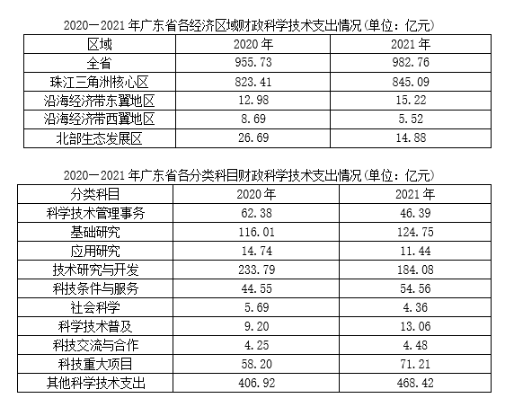

#### 第 1 题　qid 5510303 · 综合

2020年，广东省省本级财政科学技术支出为（    ）亿元。

- **A**. 83.96　✅
- **B**. 102.64
- **C**. 122.32
- **D**. 132.67

**答案**：A

**官方解析**

定位表1，可知2020年广东省各经济区域财政科学技术支出情况。根据省本级=全省-珠江三角洲核心区-沿海经济带东翼地区-沿海经济带西翼地区-北部生态发展区，可得：2020年广东省省本级财政科学技术支出=955.73-823.41-12.98-8.69-26.69=83.96亿元。
故正确答案为A。
注：根据文字和表1材料中2021年的财政科学技术支出数据，可推算出省本级（102.05）=全省（982.76）-珠江三角洲核心区（845.09）-沿海经济带东翼地区（15.22）-沿海经济带西翼地区（5.52）-北部生态发展区（14.88）。

---

#### 第 2 题　qid 5510304 · 增长

2021年，以下经济区域财政科学技术支出同比增长率最高的是（    ）。

- **A**. 珠江三角洲核心区
- **B**. 沿海经济带东翼地区　✅
- **C**. 沿海经济带西翼地区
- **D**. 北部生态发展区

**答案**：B

**官方解析**

根据题干“2021年······同比增长率最高的是”，可判定本题为一般增长率问题。定位文字材料，可知2021年广东省珠江三角洲核心区财政科学技术支出同比增长2.6%；定位表1，可知2020年、2021年广东省沿海经济带东翼地区、沿海经济带西翼地区和北部生态发展区的财政科学技术支出情况。则2021年广东省各经济区域财政科学技术支出：珠江三角洲核心区同比增长率=2.6%；根据公式：增长率，沿海经济带东翼地区同比增长率，沿海经济带西翼地区同比增长率，北部生态发展区同比增长率。比较可知，同比增长率最高的是沿海经济带东翼地区。

故正确答案为B。

---

#### 第 3 题　qid 5510305 · 比重

2021年，广东省省本级财政一般公共预算支出在全省财政一般公共预算支出中的比重（    ）。

- **A**. 小于5%
- **B**. 在5%~10%之间　✅
- **C**. 在10%~15%之间
- **D**. 大于15%

**答案**：B

**官方解析**

根据题干“2021年······在······中的比重······”，可判定本题为现期比重问题。定位文字材料，可知2021年广东省财政科学技术支出为982.76亿元，占当年全省财政一般公共预算支出的比重为5.4%；省本级财政科学技术支出为102.05亿元，占省本级财政一般公共预算支出的比重为6.6%。根据公式：整体，则2021年广东省全省财政一般公共预算支出，2021年广东省省本级财政一般公共预算支出。根据公式：比重，则所求比重，在B项范围内。

故正确答案为B。

---

#### 第 4 题　qid 5510306 · 增长

2021年，以下分类科目财政科学技术支出同比增加值最多的是（    ）。

- **A**. 基础研究
- **B**. 技术研究与开发
- **C**. 科技条件与服务
- **D**. 科技重大项目　✅

**答案**：D

**官方解析**

根据题干“2021年······同比增加值最多的是”，可判定本题为增长量比较问题。定位统计表2可得2021年和2020年各分类科目财政科学技术支出情况。根据公式：增长量=现期量-基期量，则2021年以下四类科目财政科学技术支出的同比增加值分别为：基础研究：124.75-116.01=8.74亿元；技术研究与开发：184.08-233.79=-49.71亿元；科技条件与服务：54.56-44.55=10.01亿元；科技重大项目：71.21-58.20=13.01亿元。比较可知，同比增加值最多的是科技重大项目。
故正确答案为D。

---

#### 第 5 题　qid 5510307 · 综合

根据资料，以下关于广东省财政支出的说法正确的是（    ）。

- **A**. 2020年和2021年，全省财政一般公共预算支出均小于2万亿元
- **B**. 2020年，全省省本级财政科学技术支出占省本级财政一般公共预算支出的比重为7.44%
- **C**. 与2020年相比，2021年珠江三角洲核心区财政科学技术支出在全省财政科学技术支出中的比重略有下降　✅
- **D**. 与2020年相比，2021年在全省财政科学技术支出中比重有所增加的分类科目有7个

**答案**：C

**官方解析**

A项：材料中未给出2020年全省财政一般公共预算支出的相关数据，无法推出2020年全省财政一般公共预算支出是否小于2万亿元，错误；

B项：定位文字材料可得，（2021年）省本级财政科学技术支出为102.05亿元，占省本级财政一般公共预算支出的比重为6.6%，同比增加0.84个百分点。则2020年省本级财政科学技术支出占省本级财政一般公共预算支出的比重为6.6%-0.84%=5.76%，非7.44%，错误；

C项：定位文字材料可得，（2021年）珠江三角洲核心区财政科学技术支出同比增长2.6%（a）。定位统计表1可得，2020年、2021年全省财政科学技术支出分别为955.73亿元、982.76亿元。根据公式：增长率，则2021年全省财政科学技术支出同比增速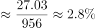（b）。结合两期比重比较结论，当部分增长率（a）＜整体增长率（b）时，则比重下降，2.6%（a）＜2.8%（b），正确；

D项：定位统计表1、表2可得2020年、2021年全省财政科学技术支出和各分类科目财政科学技术支出。根据本题C项可确定全省财政科学技术支出同比增速（b）=2.8%。观察表2可知，2021年财政科学技术支出同比实现正增长的科目有：基础研究（124.75亿元＞116.01亿元）、科技条件与服务（54.56亿元＞44.55亿元）、科学技术普及（13.06亿元＞9.20亿元）、科技交流与合作（4.48亿元＞4.25亿元）、科技重大项目（71.21亿元＞58.20亿元）、其他科学技术支出（468.42＞406.92），即各分类科目同比增速（a）＞0的科目只有6个，由此可知同比增速超过全省财政科学技术支出增速（2.8%）的科目不超过6个。根据“两期比重比较结论”可知，当部分增长率（a）＞整体增长率（b）时，则比重上升，即在全省财政科学技术支出中比重有所增加的分类科目不超过6个，错误。

故正确答案为C。

---

### 材料 2

        2022年，全国居民人均可支配收入36883元，比上年增长（以下如无特别说明，均为同比名义增长）5.0%。分城乡看，城镇居民人均可支配收入49283元，增长3.9%；农村居民人均可支配收入20133元，增长6.3%。

        按收入来源分，2022年，全国居民人均工资性收入20590元，增长4.9%；人均经营性收入6175元，增长4.8%；人均财产净收入3227元，增长4.9%；人均转移净收入6892元，增长5.5%。

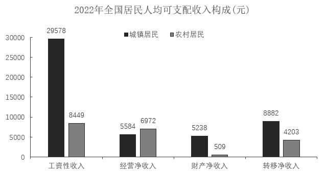

        2022年，全国居民人均消费支出24538元，比上年增长1.8%。分城乡看，城镇居民人均消费支出30391元，增长0.3%；农村居民人均消费支出16632元，增长4.5%。

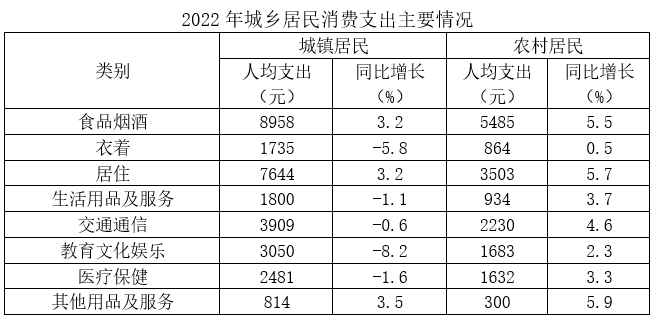

#### 第 6 题　qid 5510308 · 平均数

2022年，农村居民人均可支配收入中，所占比例明显高于城镇居民的是（    ）。

- **A**. 工资性收入
- **B**. 经营净收入　✅
- **C**. 财产净收入
- **D**. 转移净收入

**答案**：B

**官方解析**

根据题干“2022年······所占比例明显高于······”，可判定本题为现期比重问题。定位文字材料第一段可得：2022年，城镇居民人均可支配收入49283元；农村居民人均可支配收入20133元。定位统计图可得：2022年城镇居民与农村居民的工资性收入、经营净收入、财产净收入及转移净收入情况。

方法一：根据公式：比重。

A项：城镇居民工资性收入比重、农村居民工资性收入比重，城镇＞农村，不符合；

B项：城镇居民经营净收入比重、农村居民经营净收入比重，34.6%-11.3%=23.3%，即农村居民经营净收入比重高于城镇23.3个百分点；

C项：城镇居民财产净收入比重、农村居民财产净收入比重，城镇＞农村，不符合；

D项：城镇居民转移净收入比重、农村居民转移净收入比重，20.9%-18.0%=2.9%，即农村居民转移净收入比重高于城镇2.9个百分点。

比较可知，农村居民人均可支配收入中，所占比例明显高于城镇居民的是经营净收入。

方法二：根据公式：比重。

人均可支配收入：农村居民20133元＜城镇居民49283元；部分收入中只有居民经营净收入：农村居民6972元＞城镇居民5584元。结合分数比较技巧：分子大分母小，则分数必然大。因此农村居民人均可支配收入中，所占比例明显高于城镇居民的是经营净收入。

故正确答案为B。

---

#### 第 7 题　qid 5510309 · 平均数

2022年，除其他用品及服务外，我国城乡居民人均消费支出最少的类别是（    ）。

- **A**. 衣着　✅
- **B**. 生活用品及服务
- **C**. 教育文化娱乐
- **D**. 医疗保健

**答案**：A

**官方解析**

根据题干“2022年······城乡居民人均消费支出”，可判定本题为现期平均数问题。定位统计表可得2022年各类城乡居民人均消费支出情况。根据城乡居民人均消费支出，由于城镇居民人数和农村居民人数均为定值，且在2022年各类城乡居民消费支出中，除其他用品及服务外，衣着的城镇居民人均消费支出（1735元）和农村居民人均消费支出（864元），都是人均消费支出中最少的类别。分析可得：除其他用品及服务外，我国城乡居民人均消费支出最少的类别是衣着。

故正确答案为A。

---

#### 第 8 题　qid 5510310 · 平均数

2022年，全国居民人均收支盈余比上一年（    ）。（注：收支盈余=收入-消费支出）

- **A**. 增加了约5%
- **B**. 减少了约5%
- **C**. 增加了约12%　✅
- **D**. 减少了约12%

**答案**：C

**官方解析**

方法一：根据题干“2022年······比上一年”，结合选项为“增加了/减少了+百分数”，可判定本题为一般增长率问题。定位文字材料第一、三段可得：2022年，全国居民人均可支配收入36883元，比上年增长5.0%；2022年，全国居民人均消费支出24538元，比上年增长1.8%。根据 “收支盈余=收入-消费支出”，可得2022年全国居民人均收支盈余=36883-24538=12345元。根据公式：基期量，可得2021年全国居民人均收支盈余元。根据公式：增长率，则题干所求。

方法二：根据题干“2022年······比上一年”，结合选项为“增加了/减少了+百分数”，且收入=收支盈余+消费支出，即收支盈余与消费支出是收入的两个部分，可判定本题为混合增长率问题。根据混合增长率口诀“混合后居中”，可知，即，只有C项满足。

故正确答案为C。

---

#### 第 9 题　qid 5510311 · 综合

2022年，我国城镇居民与农村居民人数之比最接近（    ）。

- **A**. 2：3
- **B**. 3：2
- **C**. 3：4
- **D**. 4：3　✅

**答案**：D

**官方解析**

根据题干“2022年，我国城镇居民与农村居民人数之比最接近”，可判定本题为比值计算问题。定位文字材料第一段可得：2022年，全国居民人均可支配收入36883元······城镇居民人均可支配收入49283元······农村居民人均可支配收入20133元。根据人均可支配收入，可利用混合平均数解题。根据线段法：“距离与量成反比”，可得2022年，我国城镇居民人数：农村居民人数=（36883-20133）：（49283-36883）=16750：12400。

故正确答案为D。

---

#### 第 10 题　qid 5510312 · 综合

根据资料，下列说法正确的是（    ）。

- **A**. 2022年，全国居民人均工资性收入增长主要由农村居民贡献
- **B**. 2021年，与城镇居民相比，农村居民的人均可支配收入中用于消费支出的比例更大　✅
- **C**. 与2021年相比，2022年城镇居民在居住上的消费支出增加值最大
- **D**. 2021年，无论在城镇还是农村，居民消费支出的重点都是食品烟酒和交通通信支出

**答案**：B

**官方解析**

A项：材料没有给出2022年全国城镇居民、农村居民人均工资性收入同比增长的相关数据，故无法判断2022年全国居民人均工资性收入增长是否主要由农村居民贡献，错误；

B项：定位文字材料第一段，2022年城镇居民人均可支配收入49283元（），增长3.9%（）；农村居民人均可支配收入20133元（），增长6.3%（）。定位文字材料第三段，城镇居民人均消费支出30391元（），增长0.3%（）；农村居民人均消费支出16632元（），增长4.5%（）。根据公式：基期比重，则2021年城镇居民人均消费支出占人均可支配收入的比重，农村居民人均消费支出占人均可支配收入的比重，后者更大，即2021年农村居民的人均可支配收入中用于消费支出的比例更大，正确；

C项：定位统计表，2022年城镇居民人均居住支出7644元，同比增长3.2%；食品烟酒人均支出8958元，同比增长3.2%。二者增长率相同，而食品烟酒人均支出大于居住，根据增长量比较口诀“大大则大”可知，食品烟酒人均支出同比增量大于居住，则城镇居民在居住上的消费支出增加值非最大，错误；

D项：定位统计表，2022年城镇居民人均居住支出7644元，同比增长3.2%，城镇居民交通通信人均支出3909元，同比下降0.6%。根据公式：基期量，则2021年城镇居民人均居住支出（元）大于交通通信人均支出（元），则城镇居民的消费支出的重点不是交通通信支出，错误。

故正确答案为B。

---

### 材料 3

        五年来，我国积极推进网络强国和数字中国建设，着力深化数字经济与实体经济融合，为打造数字经济新优势、增强经济发展新动能提供有力支撑。2022年，我国电信业务收入累计完成1.58万亿元，比上年增长8%，较2018年增长超2800亿元。

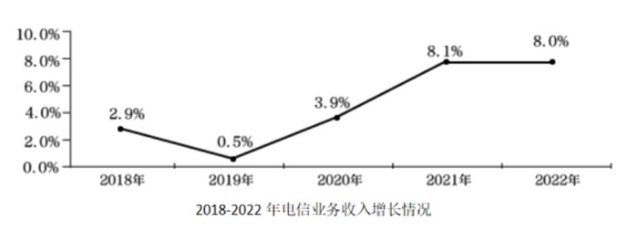

        2022年移动数据流量业务收入6397亿元，比上年增长0.3%，在电信业务收入中占比约为40.5%。数据中心、云计算、大数据、物联网等新兴业务快速发展，对我国电信业务拉动作用持续增强。2022年新兴业务收入达3072亿元，在电信业务收入中占比由上年的16.1%提升至19.4%。其中，数据中心、云计算、大数据、物联网业务比上年分别增长11.5%、118.2%、58%和24.7%。

#### 第 11 题　qid 5510313 · 综合

2022年我国电信业务收入约为2018年的（    ）倍。

- **A**. 1.1
- **B**. 1.2　✅
- **C**. 1.3
- **D**. 1.4

**答案**：B

**官方解析**

根据题干“2022年······为2018年的（    ）倍”，可判定本题为现期倍数问题。定位文字材料第一段可得：2022年，我国电信业务收入累计完成1.58万亿元，较2018年增长超2800亿元。可知，2022年电信业务收入较2018年的增长量在2800~2900亿元之间。根据公式：基期量=现期量-增长量，则题干所求在倍与倍之间，保留小数点后一位，约为1.2倍。

故正确答案为B。

考场思维：由于分母1.3和1.29很接近，1.58除以这两个数的商应差别很小，考场上可直接近似用1.58÷1.3得出答案。

---

#### 第 12 题　qid 5510314 · 比重

与2021年相比，2022年我国移动数据流量业务收入在电信业务收入中的占比（    ）。

- **A**. 增加了约3个百分点
- **B**. 减少了约3个百分点　✅
- **C**. 增加了约13个百分点
- **D**. 减少了约13个百分点

**答案**：B

**官方解析**

根据题干“与2021年相比，2022年······占比”，结合选项为“增加/减少了约+百分点”，可判定本题为两期比重问题。定位文字材料第一、二段可得：2022年，我国电信业务收入累计完成1.58万亿元，比上年增长8%（b）；移动数据流量业务收入6397亿元，比上年增长0.3%（a），在电信业务收入中占比约为40.5%。根据两期比重结论：部分增长率（0.3%）＜总体增长率（8%），则比重下降，排除A、C两项；根据公式：两期比重差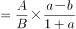，故所求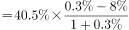，即减少了约3个百分点。

故正确答案为B。

---

#### 第 13 题　qid 5510315 · 增长

2021-2022年间，我国新兴业务收入增加值约占我国电信业务收入增加值的（    ）。

- **A**. 30%
- **B**. 40%
- **C**. 50%
- **D**. 60%　✅

**答案**：D

**官方解析**

根据题干“2021-2022年间······占······”，可判定本题为现期比重问题。定位文字材料第一段可知：2022年，我国电信业务收入累计完成1.58万亿元，比上年增长8%。定位图形材料2可知：2021年、2022年我国新兴业务收入分别为2372亿元、3072亿元。根据公式：增长量=现期量-基期量，可得2021-2022年间我国电信业务收入增加值亿元，我国新兴业务收入增加值=3072-2372=700亿元。根据公式：比重，故所求，与D项最接近。

故正确答案为D。

---

#### 第 14 题　qid 5510316 · 综合

根据资料，下列说法正确的是（    ）。

- **A**. 2018-2022年间，我国新兴业务收入年均增长超20%　✅
- **B**. 2018-2022年间，我国电信业务收入同比增长率始终高于1%
- **C**. 2018-2022年间，我国移动数据流量业务收入年均增加约1000亿元
- **D**. 与2021年相比，2022年我国云计算和大数据业务收入同比增长88.1%

**答案**：A

**官方解析**

A项：定位图形材料2，2018年、2022年我国新兴业务收入分别为1084亿元、3072亿元。根据年均增长率公式： （n为年份差），年份差n=4，故，若r=20%，则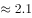&lt;2.8，故2018-2022年间，我国新兴业务收入年均增长超20%，正确；

B项：定位图形材料1可知2018-2022年我国电信业务收入同比增长率。其中2019年我国电信业务收入同比增长率为0.5%，小于1%，错误；

C项：定位图形材料2，2018年、2022年我国移动数据流量业务收入分别为5984亿元、6397亿元。根据公式：年均增长量，故所求=亿元，错误；

D项：定位文字材料第二段，数据中心、云计算、大数据、物联网业务比上年分别增长11.5%、118.2%、58%和24.7%。只给出各自的增长率，并未给出具体的业务收入，故无法推出，错误。

故正确答案为A。

---

#### 第 15 题　qid 5510317 · 比重

以下最有可能准确反映该年度各类业务在电信业务收入中占比的是（    ）。

- **A**. 
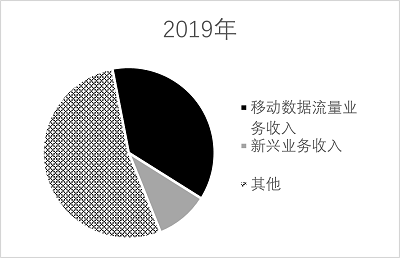

- **B**. 

- **C**. 

　✅
- **D**. 
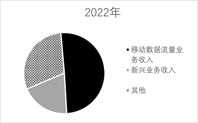

**答案**：C

**官方解析**

根据题干“······占比······”，结合材料给出各年份相应数据，可判定本题为现期比重问题。

D项：定位文字材料第二段可得，2022年移动数据流量业务收入6397亿元，比上年增长0.3%，在电信业务收入中占比约为40.5%。观察选项发现，该占比略大于50%，排除；

B项：定位图形材料2可得，2020年我国移动数据流量业务收入为6204亿元，新兴业务收入1737亿元。倍，观察选项发现，该倍数不足3倍，排除；

A项：定位文字材料第一段可得，2022年我国电信业务收入累计完成1.58万亿元，较2018年增长超2800亿元。定位图形材料1可得，2019年我国电信业务收入同比增长0.5%。定位图形材料2可得，2019年我国移动数据流量业务收入为6096亿元，新兴业务收入1374亿元。根据公式：现期量=基期量×（1+增长率），可得2019年我国电信业务收入亿元，2019年移动数据流量业务收入和新兴业务收入占电信业务收入的比重，观察选项发现，该占比小于50%，排除。

故正确答案为C。

---
