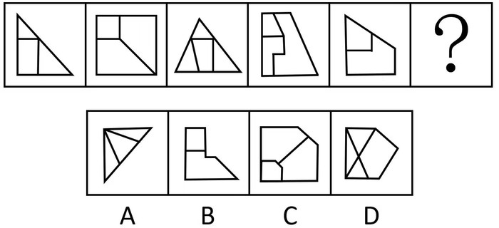
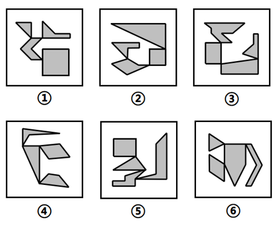
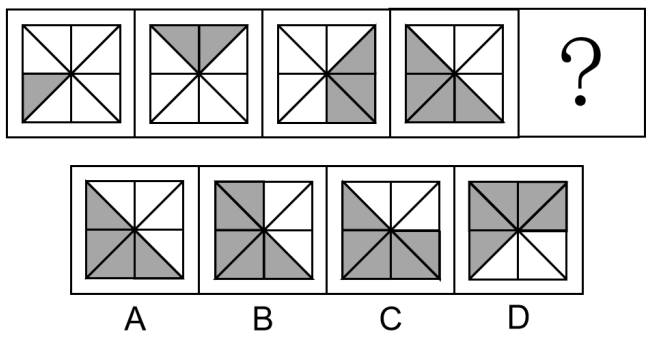
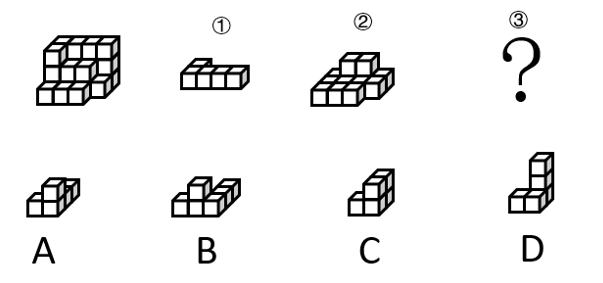
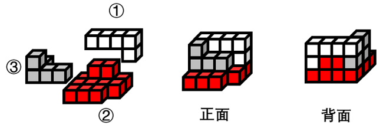

# 2023年广西区考公务员录用考试《行测》题（网友回忆版）

> 省考 · 2023 年 · 6 个模块 · 共 110 题

- [政治理论](#%E6%94%BF%E6%B2%BB%E7%90%86%E8%AE%BA) · 4 题
- [常识判断](#%E5%B8%B8%E8%AF%86%E5%88%A4%E6%96%AD) · 6 题
- [言语理解与表达](#%E8%A8%80%E8%AF%AD%E7%90%86%E8%A7%A3%E4%B8%8E%E8%A1%A8%E8%BE%BE) · 35 题
- [数量关系](#%E6%95%B0%E9%87%8F%E5%85%B3%E7%B3%BB) · 10 题
- [判断推理](#%E5%88%A4%E6%96%AD%E6%8E%A8%E7%90%86) · 40 题
- [资料分析](#%E8%B5%84%E6%96%99%E5%88%86%E6%9E%90) · 15 题

---

## 政治理论

### 第 1 题　qid 5509458 · 时事政治

党的二十大报告指出，全过程人民民主是社会主义民主政治的本质属性，是最广泛、最真实、最管用的民主。下列事例体现了全过程人民民主的有几项？
①某地人代会开会前，群众代表通过初审政府预算草案，提出修改意见，监督管好政府“钱袋子”，使公共资金使用更好反映人民意愿
②某地居委会和社区一同组织居民讨论社区公共服务资金的分配使用规划，居民通过各种创新的基层协商民主方式，让财政决策更接地气
③某直播平台开展了“最美建筑摄影”网络投票活动，众多摄影爱好者纷纷拍摄并投稿，网友们通过公平公正公开的方式评选出“最高人气奖”
④某政府网络平台开辟了“领导留言板”栏目，群众可直接给政府主要负责同志留言，提出意见和诉求

- **A**. 1
- **B**. 2
- **C**. 3　✅
- **D**. 4

**答案**：C

**官方解析**

本题考查政治常识。
①正确，党的二十大报告指出：“协商民主是实践全过程人民民主的重要形式。完善协商民主体系，统筹推进政党协商、人大协商、政府协商、政协协商、人民团体协商、基层协商以及社会组织协商，健全各种制度化协商平台，推进协商民主广泛多层制度化发展。”群众代表通过初审政府预算草案是协商民主的一种，体现了全过程人民民主。
②正确，党的二十大报告指出：“基层民主是全过程人民民主的重要体现。健全基层党组织领导的基层群众自治机制，加强基层组织建设，完善基层直接民主制度体系和工作体系，增强城乡社区群众自我管理、自我服务、自我教育、自我监督的实效。”某地居委会和社区一同组织居民讨论社区公共服务资金的分配使用规划，属于基层民主，体现了全过程人民民主。
③错误，某直播平台开展的网络投票活动属于平台自行开展的民间活动，与全过程人民民主无关。
④正确，党的二十大报告指出：“发展全过程人民民主，保障人民当家作主。我们要健全人民当家作主制度体系，扩大人民有序政治参与，保证人民依法实行民主选举、民主协商、民主决策、民主管理、民主监督，发挥人民群众积极性、主动性、创造性，巩固和发展生动活泼、安定团结的政治局面。”某政府网络平台开辟了“领导留言板”栏目，属于民主监督，体现了全过程人民民主。
综上所述，体现了全过程人民民主的有①②④，共3项。
故正确答案为C。

---

### 第 2 题　qid 5509775 · 时事政治

党的二十大报告指出，实现碳达峰碳中和是一场广泛而深刻的经济社会系统性变革，下列关于实现碳达峰碳中和的说法错误的是：

- **A**. 完善碳排放统计核算制度，健全碳排放权市场交易制度
- **B**. 立足我国能源资源禀赋，坚持先破后立，有计划分步骤实施碳达峰行动　✅
- **C**. 推动能源清洁低碳高效利用，推进工业、建筑、交通等领域清洁低碳转型
- **D**. 完善能源消耗总量和强度调控，重点控制化石能源消费，逐步转向碳排放总量和强度“双控”制度

**答案**：B

**官方解析**

本题考查政治常识。
A、C、D三项正确，B项错误，二十大报告指出：“积极稳妥推进碳达峰碳中和。实现碳达峰碳中和是一场广泛而深刻的经济社会系统性变革。立足我国能源资源禀赋，坚持先立后破，有计划分步骤实施碳达峰行动。完善能源消耗总量和强度调控，重点控制化石能源消费，逐步转向碳排放总量和强度‘双控’制度。推动能源清洁低碳高效利用，推进工业、建筑、交通等领域清洁低碳转型。深入推进能源革命，加强煤炭清洁高效利用，加大油气资源勘探开发和增储上产力度，加快规划建设新型能源体系，统筹水电开发和生态保护，积极安全有序发展核电，加强能源产供储销体系建设，确保能源安全。完善碳排放统计核算制度，健全碳排放权市场交易制度。提升生态系统碳汇能力。积极参与应对气候变化全球治理。”
本题为选非题，故正确答案为B。

---

### 第 3 题　qid 5509848 · 新思想

下列习近平总书记讲话内容与所涉及的省区对应正确的有几项：
①盐湖资源是全国的战略性资源——青海
②让黄花成为乡亲们的“致富花”——山西
③奋力谱写雪域高原长治久安和高质量发展新篇章——西藏
④从黄浦江畔搬到渭水之滨，你们打起背包就出发，舍小家顾大家——陕西

- **A**. 1
- **B**. 2
- **C**. 3
- **D**. 4　✅

**答案**：D

**官方解析**

本题考查政治常识。
①正确，2016年8月，习近平总书记在青海考察时指出：“盐湖资源是青海的第一大资源，也是全国的战略性资源，务必处理好资源开发利用和生态环境保护的关系。发展循环经济是提高资源利用效率的必由之路，要牢固树立绿色发展理念，积极推动区内相关产业流程、技术、工艺创新，努力做到低消耗、低排放、高效益，让盐湖这一宝贵资源永续造福人民。”
②正确，2020年5月11日，习近平总书记视察山西省大同市云州区有机黄花标准化种植基地时，嘱托当地百姓：“希望把黄花产业保护好、发展好，做成大产业，做成全国知名品牌，让黄花成为乡亲们的‘致富花’。”
③正确，2021年7月，西藏和平解放70周年之际，习近平总书记来到雪域高原。在西藏考察期间，习近平总书记强调，要全面贯彻新时代党的治藏方略，坚持稳中求进工作总基调，立足新发展阶段，完整、准确、全面贯彻新发展理念，服务和融入新发展格局，推动高质量发展，加强边境地区建设，抓好稳定、发展、生态、强边四件大事，在推动青藏高原生态保护和可持续发展上不断取得新成就，奋力谱写雪域高原长治久安和高质量发展新篇章。
④正确，2020年4月22日，在陕西考察的习近平总书记走进交大西迁博物馆，亲切会见14位西迁老教授。习近平总书记谈起老教授们两年前给他写的一封来信，“看了你们的信我非常感动，产生了强烈共鸣”。习近平总书记说：“从黄浦江畔搬到渭水之滨，你们打起背包就出发，舍小家顾大家。交大西迁对整个国家和民族来讲、对西部发展战略布局来讲，意义都十分重大。”
综上所述，对应正确的有①②③④，共4项。
故正确答案为D。

---

### 第 4 题　qid 5509479 · 时事政治

下列属于我国2022年《政府工作报告》民生保障清单的有几项？
①深化网络生态治理，促进基层文化设施布局优化和资源共享
②坚持房子是用来住的、不是用来炒的定位，加快发展长租房市场
③完善跨省异地就医直接结算办法，使群众就近得到更好医疗服务
④将2岁以下婴幼儿照护费用纳入个人所得税专项附加扣除，减轻家庭养育负担

- **A**. 1
- **B**. 2
- **C**. 3　✅
- **D**. 4

**答案**：C

**官方解析**

本题考查政治常识。
①正确，2022年政府工作报告中“三、2022年政府工作任务”中的“（九）切实保障和改善民生，加强和创新社会治理”部分指出：“丰富人民群众精神文化生活······加强和创新互联网内容建设，深化网络生态治理。推进公共文化数字化建设，促进基层文化设施布局优化和资源共享，扩大优质文化产品和服务供给，支持文化产业发展。”
②正确，2022年政府工作报告中“三、2022年政府工作任务”中的“（九）切实保障和改善民生，加强和创新社会治理”部分指出：“继续保障好群众住房需求。坚持房子是用来住的、不是用来炒的定位，探索新的发展模式，坚持租购并举，加快发展长租房市场，推进保障性住房建设，支持商品房市场更好满足购房者的合理住房需求，稳地价、稳房价、稳预期，因城施策促进房地产业良性循环和健康发展。”
③正确，2022年政府工作报告中“三、2022年政府工作任务”中的“（九）切实保障和改善民生，加强和创新社会治理”部分指出：“完善跨省异地就医直接结算办法，实现全国医保用药范围基本统一······持续推进分级诊疗和优化就医秩序，加快建设国家、省级区域医疗中心，推动优质医疗资源向市县延伸，提升基层防病治病能力，使群众就近得到更好医疗卫生服务。”
④错误，2022年政府工作报告中“三、2022年政府工作任务”中的“（九）切实保障和改善民生，加强和创新社会治理”部分指出：“完善三孩生育政策配套措施，将3岁以下婴幼儿照护费用纳入个人所得税专项附加扣除，多渠道发展普惠托育服务，减轻家庭生育、养育、教育负担。”故纳入个人所得税专项附加扣除的是“3岁以下婴幼儿照护费用”。
综上所述，属于我国2022年《政府工作报告》民生保障清单的有①②③，共3项。
故正确答案为C。

---

## 常识判断

### 第 1 题　qid 5509767 · 人文常识

成语作为中国传统文化的一大特色，很多都来源于历史生活，下列成语、主要人物及时期对应正确的是：

- **A**. 窃符救赵——魏无忌——春秋
- **B**. 封狼居胥——卫青——汉朝
- **C**. 东床坦腹——王羲之——东晋　✅
- **D**. 目不窥园——范仲淹——宋朝

**答案**：C

**官方解析**

本题考查人文常识。
A项错误，战国时期，秦国围困赵国都城邯郸，赵国求救于魏国，魏国惧怕秦国，不敢出兵救赵。情急之下，信陵君魏无忌听取侯赢之计，以国家利益为重，置生死度外，借魏王姬妾如姬之手窃得兵符，夺取了魏国兵权，不仅成功击败秦军、救援了赵国，也巩固了魏国在当时的地位。窃符救赵的主人公为战国时期的魏无忌，而非春秋时期。
B项错误，封狼居胥，指西汉大将霍去病登狼居胥山筑坛祭天以告成功之事，出自于《汉书·霍去病传》，后来封狼居胥成为中华民族武将的最高荣誉之一。封狼居胥的主人公为霍去病，而非卫青。
C项正确，东床坦腹，指东晋王羲之，面临高官选女婿时，在东边的床上露出肚皮看书，被高官看中，高官将女儿许配给了王羲之。
D项错误，目不窥园，指西汉董仲舒读书非常刻苦认真，他的书房紧靠着姹紫嫣红的花园，他三年没有进过花园，无暇观赏花园中的景致。目不窥园的主人公为西汉董仲舒，而非宋朝范仲淹。
故正确答案为C。

---

### 第 2 题　qid 5509474 · 科技常识

关于微生物，下列说法错误的是：

- **A**. 双歧杆菌是一种对人体有益的细菌
- **B**. 感染幽门螺杆菌会导致急性肠胃炎　✅
- **C**. 食用未煮熟的鸡蛋可能感染沙门氏菌
- **D**. 豆科植物根部的根瘤菌具有固氮作用

**答案**：B

**官方解析**

本题考查科技常识。
A项正确，双歧杆菌是一种革兰氏阳性、不运动、细胞呈杆状、一端有时呈分叉状、严格厌氧的细菌属，是一种重要的肠道有益微生物。双歧杆菌作为一种生理性有益菌，对人体健康具有生物屏障、营养作用、抗肿瘤作用、免疫增强作用、改善胃肠道功能、抗衰老等多种重要的生理功能。
B项错误，幽门螺杆菌是定植于胃内的一种细菌，幽门螺杆菌感染是慢性胃病的主要病因，与慢性胃炎、消化性溃疡、胃癌，以及胃黏膜相关组织淋巴瘤有着密切的关系。幽门螺杆菌喜欢胃内的酸性环境，不会定植于肠道。急性肠胃炎是指各种原因引起的胃肠黏膜的急性炎症，通常因进食不洁、生冷或刺激性食物而诱发，病因包括细菌、病毒、寄生虫感染等。
C项正确，沙门氏菌是一种常见的食源性致病菌，在各种肉类、禽蛋、蔬菜、水果中都存在一定量的沙门氏菌；如果鸡蛋中携带沙门氏菌，未经加热而直接食用，或加热不完全，就有可能被沙门氏菌感染。
D项正确，根瘤菌是能与豆科植物共生形成根瘤，并将空气中的氮还原成氨供植物营养的一类革兰氏阴性菌。在豆科植物的根瘤中，有能够固氮的根瘤菌与豆科植物共生，根瘤菌有固氮作用，能将空气中的氮转化为植物能吸收的含氮物质，而植物则为根瘤菌提供有机物。
本题为选非题，故正确答案为B。

---

### 第 3 题　qid 5509457 · 法律常识

下列属于《中华人民共和国劳动法》所调整的劳动关系的是：

- **A**. 大学生小张利用假期到餐馆打工　✅
- **B**. 王某雇请保姆为其提供家务劳动
- **C**. 村民老马在农忙时雇请他人为其收割庄稼
- **D**. 大学英语教师小李在某国领事馆兼职从事翻译工作

**答案**：A

**官方解析**

本题考查法律常识。
A项正确，根据《中华人民共和国劳动法》第二条第一款规定：“在中华人民共和国境内的企业、个体经济组织（以下统称用人单位）和与之形成劳动关系的劳动者，适用本法。”
B、C两项错误，根据《最高人民法院关于审理劳动争议案件适用法律问题的解释（一）》第二条第四项、第六项规定：“下列纠纷不属于劳动争议：（四）家庭或者个人与家政服务人员之间的纠纷；（六）农村承包经营户与受雇人之间的纠纷。”
D项错误，外国驻我国的大使馆属于外交代表机构，其性质属于国外的机关单位，不属于《中华人民共和国劳动法》规定的用人单位，小李与其不构成劳动关系。
故正确答案为A。

---

### 第 4 题　qid 5509831 · 科技常识

北京2022年冬残奥会闭幕式融入了天干地支元素，下列关于天干地支的说法正确的是：

- **A**. 天干和地支的数目相同
- **B**. 生肖与地支可以一一对应　✅
- **C**. 黄道十二宫以天干命名
- **D**. 干支纪年周期为12周年

**答案**：B

**官方解析**

本题考查人文常识。
A项错误，天干地支，简称为干支，源自中国远古时代对天象的观测，有十天干和十二地支。
B项正确，十二生肖和十二地支能够一一对应，为子鼠、丑牛、寅虎、卯兔、辰龙、巳蛇、午马、未羊、申猴、酉鸡、戌狗、亥猪。
C项错误，黄道十二宫的宫名是借用附近的星座名字，即白羊宫、金牛宫、双子宫、巨蟹宫、狮子宫、室女宫、天秤宫、天蝎宫、人马宫、摩羯宫、宝瓶宫和双鱼宫。
D项错误，干支是天干和地支的总称，十天干和十二地支依次相配，组成六十个基本单位，干支纪年周期为60周年。
故正确答案为B。

---

### 第 5 题　qid 5509521 · 人文常识

在“工业的血液——石油文化展”上，最不可能出现的事物是：

- **A**. 《梦溪笔谈》原文摘录
- **B**. “磕头机”的三维模型
- **C**. 沥青的生产流程示意图
- **D**. 湖南省油田增产的喜报　✅

**答案**：D

**官方解析**

本题考查科技常识。
A项正确，石油一词最早出现在北宋沈括的《梦溪笔谈》，书中记载“鄜延境内有石油，旧说‘高奴县出脂水’，即此也。”
B项正确，“磕头机”专业名称叫抽油机，是开采石油的一种机器设备。目前油田中最常见的是游梁式抽油机，主要由驴头—游梁—连杆—曲柄机构、减速箱、动力设备和辅助装备四大部分组成。工作时，电动机的转动经变速箱、曲柄连杆机构变成驴头的上下运动，驴头经光杆、抽油杆带动井下抽油泵的柱塞作上下运动，从而不断地把井中的原油抽出井筒。这一过程好像在重复人类磕头的动作，因而俗称“磕头机”。
C项正确，沥青主要可以分为天然沥青、焦油沥青和石油沥青三种。天然沥青是石油渗出地表经长期暴露和蒸发后的残留物；焦油沥青是煤、木材等有机物干馏加工所得的焦油经再加工后的产品；石油沥青是将精制加工石油所残余的渣油，经适当的工艺处理后得到的产品。
D项错误，中国现在的油田主要分布在西北、甘肃、青海、陕西、新疆等地。湖南省到目前为止还没有发现可供大规模开采的油田。
本题为选非题，故正确答案为D。

---

### 第 6 题　qid 5509525 · 人文常识

截止2022年底，中国位居全球风力发电装机总量第一位。下列与风力发电有关的说法错误的是：

- **A**. 目前新式风力发电机发出的电通常为交流电
- **B**. 风力发电的功率大小只取决于发电机的功率　✅
- **C**. 风力发电机组主要由风轮、发电机和塔筒组成
- **D**. 全球风能总量远远超过可开发利用的水能总量

**答案**：B

**官方解析**

本题考查科技常识。
A项正确，由于风量不稳定，风力发电机输出的是13-25V交流电，经过充电器整流后给蓄电池充电，这样风力发电机产生的电能就变成化学能。然后利用带保护电路的逆变电源将电池中的化学能转换成标准市电，保证稳定使用。
B项错误，风力发电的实际功率大小主要由输入到风轮的风能（取决于风速、风轮扫掠面积和空气密度）以及整机的能量转换效率决定。发电机的额定功率仅为机组在额定工况下可达到的功率上限，而非决定因素。蓄电池是储能装置，其容量大小不影响实时发电功率，只决定电能的储存时长。
C项正确，风力发电机组大体上可分风轮（包括尾舵）、发电机和塔筒三部分。风轮由若干只叶片组成，尾舵是用来保持风轮始终对准风向以获得最大的功率的机器，一般只有小型（包括家用型）才会拥有尾舵。发电机是将动能转换成电能的机器。塔筒是支承风轮、尾舵和发电机的构架。
D项正确，风能是地球表面大量空气流动所产生的动能。据估算，全世界风能总量约1300亿千瓦，其中可利用的风能为200亿千瓦，比地球上可开发利用的水能总量还要多10倍，高达每年53万亿千瓦时。
本题为选非题，故正确答案为B。

---

## 言语理解与表达

### 第 1 题　qid 5509437 · 逻辑填空

莽莽苍苍的大兴安岭过来了，巍峨的阴山也从遥远的草原腹地过来了。两座北方草原最著名的山脉，在这里            ，将大山的茂密与大山的险峻都给了克什克腾，给了这片茫茫的野草。
填入画横线部分最恰当的一项是：

- **A**. 不期而遇　✅
- **B**. 不约而同
- **C**. 萍水相逢
- **D**. 旧雨重逢

**答案**：A

**官方解析**

根据文段“莽莽苍苍的大兴安岭过来了，巍峨的阴山也从遥远的草原腹地过来了”可知，横线处应体现两座山脉在这里“交会”之意，A项“不期而遇”指没有约定而遇见，符合文意，当选。
B项“不约而同”指事先没有商量而彼此行动相同，侧重“意见一致”，与文意不符，且不能与“在这里”连用，排除；C项“萍水相逢”比喻素不相识之人偶然相遇，侧重“双方此前并无深交”，与文意不符，排除；D项“旧雨重逢”指老朋友又相遇了，文段并无“再次相遇”之意，排除。
故正确答案为A。
【文段出处】中国作家网《克什克腾，草原或天堂》

---

### 第 2 题　qid 5509438 · 逻辑填空

制止网络暴力，加强、完善相关制度性建设刻不容缓。            ，每一个口出恶言之人都是推动网暴潮水前进的一部分。反过来讲，在评判热点人物和事件时保持善意和理智，哪怕只是做到少说不说，这样的人每多一个，抵御网暴的堤坝就能高一分。
填入画横线部分最恰当的一项是：

- **A**. 人言籍籍
- **B**. 众口铄金　✅
- **C**. 三人成虎
- **D**. 流言蜚语

**答案**：B

**官方解析**

依据后文“每一个口出恶言之人都是推动网暴潮水前进的一部分”可知，文段强调对于网络暴力而言，每一个人说的话都会产生巨大的影响。B项“众口铄金”形容众人的言论能够熔化金属，比喻舆论影响的强大，符合文意，当选。
A项“人言籍籍”指人们议论纷纷，与文段“推动网暴潮水前进”无法对应，未能体现出参与网络暴力的每一个个体作用大的语义，排除；
C项“三人成虎”比喻谣言或讹传一再重复，就会使人把谣言当成事实，文段并未讨论谣言和事实的关系，排除；
D项“流言蜚语”指毫无根据的话，与文段“推动网暴潮水前进”无法对应，未能体现出参与网络暴力的每一个个体作用大的语义，排除。
故正确答案为B。
【文段出处】光明日报《每个人都是抵御“网暴潮水”的一份子》

---

### 第 3 题　qid 5509449 · 逻辑填空

立于传统之上的创新，远比借        招徕粉丝难得多。因为对传统越是懂，越知道它的        之处在于“增之一分则太长，减之一分则太短”，越不敢越雷池一步。
依次填入画横线部分最恰当的一项是：

- **A**. 时兴 微妙
- **B**. 流量 精细
- **C**. 套路 巧妙
- **D**. 流俗 精妙　✅

**答案**：D

**官方解析**

第一空，根据“远比”可知，文段意在比较两种不同方式之间的关系，故横线处对应“立于传统之上”，应体现当下流行之意。A项“时兴”指当时风行或时髦，B项“流量”指在规定期间内通过一指定点的车辆或行人数量，如今也可指人气值，D项“流俗”指社会上流行的风气、习惯，均符合文意，保留。C项“套路”指成套的技巧、程式、方法等，与文意不符，排除。
第二空，根据“增之一分则太长，减之一分则太短”可知，横线处应体现对“传统”的分寸把握恰到好处，十分精湛。D项“精妙”指精致巧妙，符合文意，当选。A项“微妙”指精深复杂，难以捉摸，与文意不符，排除；B项“精细”指精致细密，侧重于“细”，与文意不符，排除。
故正确答案为D。
【文段出处】中国经济网《创新不是割蕉加梅，而是与虎添翼》

---

### 第 4 题　qid 5509439 · 逻辑填空

电影音乐作为电影艺术的组成部分，早已和画面构图、色彩、语言一样，成了表达主题、塑造人物、        意境的一个重要手段。它在渲染气氛、揭示人物心灵、影响观众心理方面所能达到的神奇效果，是前人始料所不及的。一部精彩的电影如果缺少了            的音乐，就好比一道大餐少了盐。
依次填入画横线部分最恰当的一项是：

- **A**. 设立 相辅相成
- **B**. 创造 相得益彰　✅
- **C**. 生成 引人入胜
- **D**. 展现 此呼彼应

**答案**：B

**官方解析**

本题可以从第二空入手，根据后文“就好比一道大餐少了盐”可知，此处进行了形象表达，将电影比作大餐，将音乐比作盐，故横线处应形容盐对大餐的作用，A项“相辅相成”指两个事物互相配合，互相辅助，缺一不可，B项“相得益彰”指两者互相配合，双方的能力和作用更能显示出来，均符合文意，保留。C项“引人入胜”指吸引人进入美妙的境地，形容优美的风景或文艺作品十分吸引人，D项“此呼彼应”指这里呼唤，那里响应，形容联系紧密，互相配合行动，均无法与文段形象表达形成对应，排除。
第一空，搭配“意境”，B项“创造”指制造新的事物，与“意境”搭配恰当，当选。A项“设立”指开始创建，成立，常搭配“目标”“机构”等，与“意境”搭配不当，排除。
故正确答案为B。
【文段出处】北京日报《电影音乐的神奇功力》

---

### 第 5 题　qid 5509442 · 逻辑填空

关于文明形成的        ，世界上公认的“三要素”是文字、冶金术和城市的出现。但是我们发现，这“三要素”是从古埃及文明和两河文明中概括出来的，世界上有很多其他的文明并不符合“三要素”。比如，中美洲的玛雅文明令人            ，但他们没有冶金术，辉煌的印加文明也没有发现文字。
依次填入画横线部分最恰当的一项是：

- **A**. 符号 拍案叫绝
- **B**. 象征 击节叹赏
- **C**. 标志 叹为观止　✅
- **D**. 起点 高山仰止

**答案**：C

**官方解析**

本题可从第二空入手，横线处所填成语搭配“玛雅文明”，由后文“辉煌的印加文明也······”可知，横线处所填成语应体现出“玛雅文明”同样优秀，让人们称赞之意，C项“叹为观止”用来赞叹所见的事物尽善尽美，好到了极点，且“令人叹为观止”为惯用搭配，与“玛雅文明”搭配恰当，保留。A项“拍案叫绝”意思是拍桌子叫好，形容非常赞赏，强调对某人的作品或者话语意见的赞赏，B项“击节叹赏”形容对诗文、音乐等的赞赏，D项“高山仰止”比喻对高尚的品德的仰慕，均与“玛雅文明”搭配不当，排除。
第一空，代入验证，C项“标志”意思是表明特征的记号或事物，表明某种特征，置于此处可体现出“文字、冶金术和城市的出现”这“三要素”表明了文明的形成，符合文意，当选。
故正确答案为C。
【文段出处】文摘报《判断文明形成的标志是什么》

---

### 第 6 题　qid 5509445 · 逻辑填空

追星            ，但频频越界的“饭圈”乱象，不仅有违社会公序良俗、触碰社会道德底线，有的还已触碰法律红线。        “饭圈”乱象，关涉青少年成长，关乎社会和谐稳定。
依次填入画横线部分最恰当的一项是：

- **A**. 无可厚非 整治　✅
- **B**. 无可非议 疏导
- **C**. 天经地义 治理
- **D**. 情有可原 梳理

**答案**：A

**官方解析**

第一空，搭配“追星”，且根据后文“但频频越界的‘饭圈’乱象，不仅有违社会公序良俗、触碰社会道德底线，有的还已触碰法律红线”可知，横线处应体现追星本身并无太大过错，是可以理解的行为。A项“无可厚非”指不可过分指摘，表示虽有缺点，但是可以理解或者原谅，与文意相符，保留。B项“无可非议”指没有什么可以指摘的，表示做得妥当，强调事情做得妥当、正确，C项“天经地义”指非常正确、不容置疑的道理，由后文可知追星行为中存在一些乱象，并非完全的妥当和正确，均程度过重，排除；D项“情有可原”指按照情理，对出现的某种情况有可以原谅的地方，常搭配错误行为，而通过分析可知，追星行为本身是可以理解的，并非是错误行为，搭配不当，排除。
第二空，代入验证。搭配“乱象”，A项“整治”指整顿治理，“整治乱象”为常见搭配，当选。
故正确答案为A。
【文段出处】光明网《从完善法律入手规制“饭圈”乱象》

---

### 第 7 题　qid 5510154 · 逻辑填空

不同文化背景下的人们，在思维方式、语言表达等方面有着巨大不同，导致了彼此间行为方式的差异。拥有不同文化背景的咨询者有些愿意敞开心扉，直面问题。而有些人“纵有千种风情”也不吐露心声，会用比喻描述自己的情绪，与中国古诗词中用具体地点象征心灵归宿的辞藻有            之妙。家庭问题            ，不同文化背景的人们可以从心理学角度彼此借鉴在婚姻、育儿问题上好的处理方式。
依次填入画横线部分最恰当的一项是：

- **A**. 水到渠成 大相径庭
- **B**. 异曲同工 大同小异　✅
- **C**. 殊途同归 求同存异
- **D**. 不约而同 并行不悖

**答案**：B

**官方解析**

第一空，根据“会用比喻描述自己的情绪，与中国古诗词中用具体地点象征心灵归宿的辞藻有······之妙”可知，横线处要表达出人们运用比喻手法与中国古诗词用象征手法有相同的巧妙之处，B项“异曲同工”比喻不同的人的辞章或言论同样精彩，或者不同的做法收到同样好的效果，C项“殊途同归”比喻采取不同的方法而得到相同的结果，均符合文意，保留，但“异曲同工之妙”为常见的固定搭配，B项相较于C项更合适。A项“水到渠成”比喻条件成熟，事情自然成功，与文意不符，排除；D项“不约而同”指没有事先商量而彼此见解或行动一致，“不约而同”之后往往要表达做了某事，搭配不当，排除。
第二空，根据“不同文化背景的人们可以从心理学角度彼此借鉴在婚姻、育儿问题上好的处理方式”可知，横线处要表达出家庭问题的差异性较小之意，B项“大同小异”指大部分相同，只有小部分不同，符合文意，当选。C项“求同存异”指找出共同点，保留不同点，与文意不符，排除。
故正确答案为B。
【文段出处】半岛晨报《唐诗宋词还能治疗心理疾病？》

---

### 第 8 题　qid 5509441 · 逻辑填空

面对错综复杂的形势，最根本的是要把我们自己的事情做好。改革开放以来，我们遭遇过很多外部风险冲击，最终都能            ，靠的就是办好自己的事、把发展立足点放在国内。要            走中国特色社会主义道路，坚持推进中国式现代化，把中国发展进步的命运牢牢掌握在自己手中。
依次填入画横线部分最恰当的一项是：

- **A**. 起死回生 一成不变
- **B**. 化险为夷 毫不动摇　✅
- **C**. 绝处逢生 矢志不渝
- **D**. 转败为胜 按部就班

**答案**：B

**官方解析**

第一空，根据前文“遭遇过很多外部风险冲击······”和后文“靠的就是······”可知，横线处表达遭遇风险冲击而没有被打败的意思。B项“化险为夷”指使危险转变为平安，符合文意，保留。A项“起死回生”指把快要死的人救活，形容医术高明，也指将没有多少希望的事情挽救回来，C项“绝处逢生”指在陷入绝望的困境中遇到了生路，D项“转败为胜”指变失败为胜利，文中只是遇到风险冲击，并没有到达死亡、绝望或者失败的境地，程度过重，均排除。
第二空，代入验证。根据后文“坚持推进中国式现代化······”可知，横线处表达坚持走中国特色社会主义道路的意思。B项“毫不动摇”意为丝毫不改变意志，符合文意，当选。
故正确答案为B。
【文段出处】人民日报《科学把握战略机遇和风险挑战（思想纵横）》

---

### 第 9 题　qid 5509450 · 逻辑填空

青色文化            ，繁复至极，但沿着牛顿的光谱学说看过去，青光的波长在425至445纳米之间，仅仅20纳米而已，又显得            了。两相对比，有一种摄人心魄的震撼。想来，这就是科学与文化的魅力吧。
依次填入画横线部分最恰当的一项是：

- **A**. 浩若烟海 不值一提
- **B**. 源远流长 无足轻重
- **C**. 绚丽多彩 平淡无奇
- **D**. 洋洋大观 微乎其微　✅

**答案**：D

**官方解析**

第一空，横线处所填成语搭配“青色文化”，且由后文的“繁复至极”可知，此处应体现“青色文化”多而复杂的特征。C项“绚丽多彩”指各种各样的色彩灿烂美丽，D项“洋洋大观”形容美好的事物繁多，丰富多彩，均符合文意，保留。A项“浩若烟海”指广大繁多如茫茫大海，多指书籍、文献等数量多，与“青色文化”搭配不当，排除；B项“源远流长”比喻历史悠久，根底深厚，并未体现多而复杂之意，排除。
第二空，由“仅仅20纳米而已”可知，横线处所填成语应体现“小”的意思。D项“微乎其微”形容非常小或非常少，符合文意，当选。C项“平淡无奇”形容事物没有什么突出的、出色的地方，与文意不符，排除。
故正确答案为D。
【文段出处】北京晚报《&lt;青色极简史&gt;：青色里的传统文化》

---

### 第 10 题　qid 5509452 · 逻辑填空

平衡好情怀与创新改编之间的关系，能使经典乐曲焕发            的魅力；我们也希望记忆中的歌声除了那些            的经典，还有不断诞生的新曲目。
依次填入画横线部分最恰当的一项是：

- **A**. 经久不衰 百听不厌
- **B**. 生生不息 脍炙人口
- **C**. 历久弥新 耳熟能详　✅
- **D**. 耳目一新 喜闻乐见

**答案**：C

**官方解析**

第一空，搭配“魅力”并且要体现“经典乐曲”的特点，A项“经久不衰”形容某事或某人经历很长时间仍旧保持较高的旺盛状态，B项“生生不息”指不断地生长、繁殖，C项“历久弥新”指经历长久的时间而更加鲜活，更加有活力，更显价值，均既能搭配“魅力”又能够体现经典乐曲焕发长久的魅力，保留。D项“耳目一新”意思是听到的、看到的跟以前完全不同，常见用法为“令人/让人耳目一新”，不能直接搭配“魅力”，排除。
第二空，搭配“经典”， A项“百听不厌”、B项“脍炙人口”、C项“耳熟能详”均可搭配“经典”，又根据前文“记忆中的歌声”说明歌声存在记忆中，C项“耳熟能详”指听得多了，能够很清楚、很详细地复述出来，能够说明存在“记忆中”，符合文意，当选。A项“百听不厌”是形容乐曲或歌曲好听，使人听多少遍也不厌烦，B项“脍炙人口”比喻好的事物受到人们的称赞和传颂，均不能体现存在“记忆中”，排除。
故正确答案为C。
【文段出处】人民网《人民艺起评：老歌新唱，声生不息既要怀旧也要创新》

---

### 第 11 题　qid 5509443 · 逻辑填空

与人类繁衍发展的漫长历史相比，科学的历史并不        。但就在科学有了一席之地的有限历史维度中，人类社会从关系架构、行为方式到思维模式都被科学深刻影响甚至颠覆性        。科学已经成为现代社会不可        的重要部分，是延续和推动现代社会发展的核心力量。
依次填入画横线部分最恰当的一项是：

- **A**. 久远 重构 分割　✅
- **B**. 深远 解构 分离
- **C**. 永久 重建 分隔
- **D**. 长久 创新 分裂

**答案**：A

**官方解析**

第一空，搭配“历史”，且根据“与人类繁衍发展的漫长历史相比”可知，横线处所填词语应体现漫长之意。A项“久远”指长久、长远，多搭配“年代”“历史”等，搭配得当且符合文意，保留。B项“深远”指深刻而长远，多搭配“影响”“意义”等，与“历史”搭配不当，排除；C项“永久”指永远、长久，多搭配“禁止”“损伤”等，与“历史”搭配不当，排除；D项“长久”指时间很长，长远，多搭配“打算”“规划”等，与“历史”搭配不当，排除。
第二空，代入验证。根据“被科学深刻影响甚至颠覆性······”可知，横线处所填词语应体现巨大变化之意。A项“重构”指重新构建，可体现巨大变化之意，保留。
第三空，代入验证。根据“不可······的重要部分”“是延续和推动现代社会发展的核心力量”可知，横线处所填词语应体现分开、分离之意。A项“分割”指把整体或有联系的东西分开，符合文意，当选。
故正确答案为A。
【文段出处】《让科学文化 成为社会文化的底色》科技日报2022年8月19日刊

---

### 第 12 题　qid 5509446 · 逻辑填空

读书可以提高我们的眼光、境界、格局、胸怀。读书的好处，是可以让我们跳出此时此地的        ，穿透一时一地的迷雾，从更大的格局和更长远的眼光来把握眼前的各种        ，从而把不解和不安化成豁然开朗和淡定从容，最后养成战略上的        。
依次填入画横线部分最恰当的一项是：

- **A**. 奴役 骚乱 毅力
- **B**. 束缚 骚动 耐力
- **C**. 局限 扰乱 致力
- **D**. 限制 扰动 定力　✅

**答案**：D

**官方解析**

第一空，根据后文“穿透一时一地的迷雾”可知，横线处应体现被此时此地所迷惑，B项“束缚”指拘束、限制，C项“局限”指限制在一定范围，D项“限制”指约束，均符合文意，保留。A项“奴役”指没有自由，由得别人使唤的人，程度过重，排除。
第二空，对应后文“把不解和不安化成豁然开朗和淡定从容”，横线处应体现眼前的状态是“不解和不安”，D项“扰动”指困扰和骚动，符合文意，保留。B项“骚动”指秩序紊乱，动荡不安，仅能对应“不安”的状态，排除；C项“扰乱”使混乱、慌乱，并未体现“不解”的状态，排除。
第三空，代入验证，对应前文“豁然开朗和淡定从容”，D项“定力”指处变和把握自己的意志力，符合文意，当选。
故正确答案为D。
【文段出处】《宫玉振：士兵爱打仗，领导好读书》

---

### 第 13 题　qid 5510099 · 逻辑填空

在漫长的发展历史中，二十四节气已经成为中华民族共有的认知文化系统，______着中国各族人民的伦理情感、生命意识、审美情趣和信仰，是增强中华民族共同体意识的______和粘合剂。二十四节气中______的尊重自然、效法自然、爱护自然、利用自然、扶助自然的天人合一思想，更是中国文化的精髓。
填入画横线部分最恰当的一组是：

- **A**. 凝结 连接 蕴藏
- **B**. 聚集 桥梁 隐藏
- **C**. 凝聚 纽带 蕴含　✅
- **D**. 粘合 枢纽 暗藏

**答案**：C

**官方解析**

第一空，搭配“伦理情感、生命意识、审美情趣和信仰”。A项“凝结”指纠结，集聚，C项“凝聚”指聚集，积聚，均可与“伦理情感、生命意识、审美情趣和信仰”搭配，保留。B项“聚集”指集合，凑在一起，多用作“人员聚集”“产业聚集”，强调空间上集中于某一点，文段并非强调空间上的集中，排除；D项“粘合”指用粘性物质使物体粘在一起，与“伦理情感、生命意识、审美情趣和信仰”搭配不当，排除。
第二空，搭配“二十四节气”，且要与“粘合剂”构成并列，体现其起到的“增强中华民族共同体意识”的作用。C项“纽带”指起联系作用的人或事物，符合文意，保留。A项“连接”指（事物）互相衔接，置于此处用法错误，应为“是连接中华民族共同体意识的······”，排除。
第三空，代入验证。搭配“思想”，C项“蕴含”意思是包含在内，与“思想”搭配恰当，当选。
故正确答案为C。
【文段出处】澎湃新闻《毕旭玲：二十四节气已成为中华民族共有的认知文化系统》

---

### 第 14 题　qid 5509453 · 逻辑填空

大脑对于外界单调、规律的声音会产生谐振，同时会掩盖住其余声音，起到一种掩蔽效应，因为没有任何变化从而并不引起生理上的        与注意，会不自觉地        噪声对自己的影响，更容易        于当下的活动。
依次填入画横线部分最恰当的一项是：

- **A**. 不适 忽略 习惯
- **B**. 反感 抵消 专注
- **C**. 体验 消解 聚焦
- **D**. 认知 弱化 沉浸　✅

**答案**：D

**官方解析**

本题可从第二空入手，根据前文“会掩盖住其余声音，起到一种掩蔽效应”可知，横线处应体现对于噪声起到的也是一种“掩蔽”作用，A项“忽略”指不在意，没注意到，C项“消解”指消释、解除，D项“弱化”指使削弱，均可以起到掩蔽噪声的作用，符合文意，保留。B项“抵消”指因作用相反而互相消除，文段并没有其他事物与噪声相互消除，排除。
再看第三空，根据文意可知，横线处应表达减少噪声后不被外界干扰，更有利于当下的活动之意，D项“沉浸”比喻处于某种境界或思想活动中，可以体现出在活动中不被外界干扰的状态，符合文意，保留。A项“习惯”指由熟悉而适应，不能体现不被外界干扰的状态，排除；C项“聚焦”比喻视线、注意力等集中于一点，文段并未体现都集中于一点，排除。
第一空，代入验证，根据横线前内容可知，因为没有任何变化，所以也就没有引起生理上对事物的注意，D项“认知”指通过思维活动认识、了解，符合文意，当选。
故正确答案为D。
【文段出处】今日头条《“白噪音”助眠，是科学还是忽悠》

---

### 第 15 题　qid 5509454 · 逻辑填空

AI（人工智能）的技术内核虽然        ，但“模拟人类智慧”这一理念本身却并不        。因此，该理念就很容易被一些        的思想先驱者转化为一些艺术形象，由此形成对于技术形态本身的“抢跑”态势。
依次填入画横线部分最恰当的一项是：

- **A**. 深奥 超前 敏感
- **B**. 先进 抽象 前卫
- **C**. 艰深 晦涩 敏锐　✅
- **D**. 高端 艰涩 睿智

**答案**：C

**官方解析**

第一空、第二空，根据转折词“但”可知，横线前后呈转折关系，语义相反，且由第二空前“不”可知，第一空和第二空所填词语语义相近，C项“艰深”指高深而难以理解，“晦涩”指文辞等隐晦，不流畅，不易懂，二者语义相近，符合文意，保留。A项“深奥”指不易理解，高深不通俗，“超前”指超越当前正常条件的，B项“先进”指超前的、高级的，“抽象”指不具体、笼统的，D项“高端”指的是等级、档次、价位等在同类中较高的，“艰涩”指隐晦难懂，三项若置于文段中，前后文均不能构成转折关系，排除。
第三空，代入验证，搭配“思想先驱者”，C项“敏锐”指反应灵敏，头脑灵活，目光尖锐，与“思想先驱者”搭配恰当，当选。
故正确答案为C。
【文段出处】《长期以来，我们是否误解了真正的人工智能？——科幻影视对人工智能的误读》

---

### 第 16 题　qid 5509448 · 逻辑填空

人类成就和文明进步的史诗，是通过历史上最有天赋和才能的个体对艺术、科学和所有其他领域所做的贡献        的。天资卓越、创造力出众的拔尖人才可以利用他们的天赋和才能来        人类社会的现状，也可以对其侵蚀破坏。而他们最终如何选择自己的道路，能否肩负起社会责任，创造更广泛的社会福祉，对于人类命运共同体的未来发展方向有            的影响。
依次填入画横线部分最恰当的一项是：

- **A**. 写就 改善 举足轻重　✅
- **B**. 造就 改变 举重若轻
- **C**. 成就 提升 才轻任重
- **D**. 铺就 提高 无关紧要

**答案**：A

**官方解析**

第一空，搭配“人类成就和文明进步的史诗”，且根据文意可知，横线处应表达人类成就和文明进步是由历史上最有天赋和才能的个体创造实现的。A项“写就”中的“写”指“写作、描写”，“就”在用作动词的时候有“成功、完成”的意思，“写就”可以理解为描写成功、写成了，对应“史诗”符合形象表达的要求，B项“造就”指培养使有成就，均符合文意，保留。C项“成就”与前文“人类成就”语义重复，排除；D项“铺就”指铺好了、铺成了，与“史诗”搭配不当，排除。
第二空，搭配“现状”，且根据“天资卓越、创造力出众的拔尖人才可以利用他们的天赋和才能······也可以对其侵蚀破坏”可知，横线处应表达拔尖人才对人类社会的积极作用。A项“改善”指使原来的状况变得好些，符合文意，保留。B项“改变”指事物发生显著的差别，为中性词，体现不出积极的感情色彩，排除。
第三空，代入验证。A项“举足轻重”比喻所处地位重要，一举一动都会影响全局，置于此处可以表达天资卓越、创造力出众的拔尖人才对于人类命运共同体的未来发展方向有着至关重要的作用，符合文意，当选。
故正确答案为A。
【文段出处】光明网《社会责任感：拔尖人才的核心素养》

---

### 第 17 题　qid 5509451 · 逻辑填空

应急科普能够及时解疑释惑，提升公众认知力，还可以        伪科学和谣言，        社会和网络环境。建立健全国家应急科普协调联动机制，完善各级政府应急管理预案中的应急科普措施，极为必要，更是            。
依次填入画横线部分最恰当的一项是：

- **A**. 批驳 净化 未雨绸缪　✅
- **B**. 抵制 维护 重中之重
- **C**. 对抗 清理 居安思危
- **D**. 拆穿 建设 防微杜渐

**答案**：A

**官方解析**

本题可从第二空入手，搭配“社会和网络环境”，且根据文意可知，应急科普可以打击伪科学和谣言，营造良好的社会网络环境，A项“净化”指清除杂质使物体纯净，B项“维护”指维持保护使免于遭受破坏，两项均搭配得当且符合文意，保留。C项“清理”指彻底整理或处理，与“社会和网络环境”搭配不当，排除；D项“建设”指创立新事业、增加新设施，如果要使用D项，原文应表述为“建设良好的社会和网络环境”，直接搭配“社会和网络环境”与文意不符，排除。
再看第三空，根据“建立健全国家应急科普协调联动机制，完善各级政府应急管理预案中的应急科普措施”可知，横线处应与“机制、应急管理预案”对应，体现对未来风险的防范，A项“未雨绸缪”比喻事先做好准备工作，符合文意，保留。B项“重中之重”指重点中的重点，强调非常重要的意思，与“应急预案”无关，且和前文“极为必要”语义、程度相近，与文意不符，排除。
第一空，代入验证，搭配“伪科学和谣言”，A项“批驳”指对错误的言论或行为加以批判和驳斥，符合文意，当选。
故正确答案为A。
【文段出处】人民网《人民网评：厚植公民科普之种，培育自立自强根基》

---

### 第 18 题　qid 5509761 · 逻辑填空

年度热词        大事小情，不仅反映国家大事、        时代主旋律，还有对老百姓日常生活的深切        ，展现了过去一年的社会变迁和生活万象。而透过“内卷”“躺平”“鸡娃”“双减”“干饭人”等热词，我们还可        当下独特的社会景观。
依次填入画横线部分最恰当的一项是：

- **A**. 描绘 切合 感触 了解
- **B**. 体现 把握 体验 感受
- **C**. 勾勒 蕴含 体察 窥见　✅
- **D**. 叙写 贴近 关怀 透视

**答案**：C

**官方解析**

本题可从第二空入手，横线处词语搭配“年度热词”“时代主旋律”，形容“年度热词”对“时代主旋律”的作用，且根据顿号可知，横线处词语与前文“反映”构成并列，语义相近，故横线处词语应表达“年度热词”体现了“时代主旋律”之意，A项“切合”指十分符合，C项“蕴含”指包含在内，D项“贴近”指靠拢、紧紧靠近，均与“时代主旋律”搭配恰当，保留。B项“把握”指掌握，理解，与文意不符，排除。
第三空，形容“年度热词”对“百姓生活”的作用，根据后文“展现了过去一年的社会变迁和生活万象”可知，横线处词语应表达在年度热词中可以观察到、了解到百姓的生活，C项“体察”指体验观察，符合文意，保留。A项“感触”指接触外界事物而引起的思想情绪，文段并未体现引起思想情绪之意，与文意不符，排除；D项“关怀”指关心，含有帮助、爱护、照顾之意，与文意不符，排除。
第四空，代入验证，搭配“社会景观”，C项“窥见”指暗中看出或觉察到，与“社会景观”搭配恰当，保留。
第一空，代入验证，C项“勾勒”指用简练的文笔叙述大概情况，可以体现年度热词的作用，当选。
故正确答案为C。
【文段出处】《从年度流行语中感受时代与社会脉动》

---

### 第 19 题　qid 5509512 · 片段阅读

亿万年前的超新星爆发产生的星云会孕育下一颗恒星，就像盘古开天地的传说一样。星云中重的元素汇聚在一起形成一个个核心，有的核心越聚越大，最终形成新的恒星；小的核心围着恒星旋转就形成了行星，星星们就这样组合在一起形成了星系，就像我们熟知的太阳系一样。同时，超新星爆发喷射出的高能粒子，还会为它所到达的平静的星云带来波澜和扰动，加速星云汇聚的速度。
这段文字意在说明：

- **A**. 太阳系源于一颗超新星的爆发
- **B**. 重元素的汇聚形成了恒星和行星
- **C**. 宇宙源于亿万年前的超新星爆发
- **D**. 超新星爆发产生孕育恒星的星云　✅

**答案**：D

**官方解析**

文段开篇提出超新星爆发产生的星云会孕育下一颗恒星，接下来具体介绍了星云中重的元素如何形成恒星以及星系，尾句通过“同时”表示并列，进一步说明超新星爆发喷射出的高能粒子加速星云的汇聚，故文段首句提出观点，后文具体解释说明，重在强调超新星爆发产生孕育恒星的星云，对应D项。
A项，“太阳系”对应解释说明部分，非重点，排除；
B项，“重元素”对应解释说明部分，非重点，且表述片面，排除；
C项，文段并未提及“宇宙”的起源，无中生有，排除。
故正确答案为D。
【文段出处】《壮丽的宇宙奇观，一部创造万物的史诗》

---

### 第 20 题　qid 5509499 · 语句表达

为什么                    ？一个重要原因是，在中国经济发展中，地方分权尤其是财政包干对地区经济发展产生了正向激励，由此也引发了一些地方的“一亩三分地”思维，政策取向更多考虑一地一域，而非站在全国角度通盘考虑。尤其是受唯GDP思维惯性影响，地方对能带动当地经济、增加财政收入的项目多有青睐，通过或明或暗的方式予以保护，造成了市场分割。
填入画横线部分最恰当的一项是：

- **A**. 地方保护主义难以根除　✅
- **B**. 国内大循环仍存在堵点
- **C**. 有些地方产业的产能严重过剩
- **D**. 地方保护范围主要在商品领域

**答案**：A

**官方解析**

本题为语句填空题，横线出现在文段开头，需结合后文分析。横线后指出地方分权对地区经济发展有激励作用，并通过“由此”引导结论，即形成地方思维，并未考虑全国性。随后通过“尤其”强调，地方对能带动当地经济、增加财政收入的项目常采取保护措施，造成市场分割。故后文主要强调地方思维导致的政策取向仅限于保护地方的经济、财政项目，即“存在地方保护主义”，对应A项。
B项，文段并未提及“国内大循环”，无中生有，排除；
C项，文段并未提及“产能严重过剩”，无中生有，排除；
D项，根据“地方对能带动当地经济、增加财政收入的项目多有青睐······予以保护”可知，“主要在商品领域”表述片面，无法概括后文内容，排除。
故正确答案为A。
【文段出处】经济日报《每到一地就要设分公司？经济日报：隐性地方保护主义必须打破！》

---

### 第 21 题　qid 5509511 · 语句表达

我们经常需要控制自己的欲望，晚一些再满足它，称之为“延迟满足”。与今晚享受大餐相比，推迟享受的大餐，其吸引力（价值）被打了折扣，心理学家称之为时间折扣。时间折扣越大，我们越无法接受延迟满足。但在面临诸多决策时，人们趋于采用单一策略：当现在和未来的时间距离不那么遥远，便直接“齐同”两者在时间维度的差别，不再给未来选择打一个时间折扣，让不同时间点之间的选择变得更加简单。
下列与画横线部分意思相符的是：

- **A**. 做决策时，不考虑时间因素　✅
- **B**. 不考虑延迟满足，选择享受当下
- **C**. 做决策时，随机选择现在或者未来事项
- **D**. 在不同的时间点上选一个平均“时间折扣”

**答案**：A

**官方解析**

文段开篇引出“延迟满足”和“时间折扣”的概念，并说明二者之间的关系。接下来通过“但”进行转折，指出面临诸多决策的时候人们趋于采用单一策略，随即后文进行解释说明。画横线部分即为该策略的具体表现，且横线前后分句的内容即对横线处所在句子进行提示和解释。根据“当现在和未来的时间距离不那么遥远”“不再给未来选择打一个时间折扣”可知，“‘齐同’两者在时间维度的差别”强调的是在时间距离不是很遥远的前提下抹去时间的差别，将时间的维度保持“齐平”，即做决策的时候不考虑时间因素，对应A项。
B项，文段只是强调不考虑时间因素，但没有指出一定是选择享受当下，排除；
C项，“随机选择”表述错误，文段强调不考虑时间因素，从事项本身出发，并非随机做出决策，排除；
D项，“平均‘时间折扣’”表述错误，文段强调的是在时间维度不打折扣，忽略时间因素，排除。
故正确答案为A。
【文段出处】科学辟谣《“选择困难症”又犯了？要不，这次就让音乐帮忙做决定》

---

### 第 22 题　qid 5509504 · 片段阅读

截至2021年，化石燃料的燃烧正式改变了北半球空气中碳同位素的组成，甚至足以抵消核武器试验发出的信号。而这可能会给有价值的碳年代测定技术带来问题。专家发现，从放射性碳年代测定法来看，现代物品看起来就像是20世纪早期的物品。专家表示，这种趋势“可能很快就会让人很难分辨一件东西是1000年前的还是现代的”。
最适合做这段文字标题的是：

- **A**. 化石燃料燃烧带来的影响
- **B**. 放射性碳年代测定的原理
- **C**. 如何分辨物品的年代属性
- **D**. 碳年代测定技术可能不再准确　✅

**答案**：D

**官方解析**

文段开篇引出话题，即“化石燃料的燃烧”，接着通过指代词“这”，指出“化石燃料的燃烧”可能会给有价值的碳年代测定技术带来问题。后文通过“专家发现”“专家表示”进行具体解释说明，从专家的角度说明碳年代测定技术有可能出现不确定的结果，故文段重在强调碳年代测定技术可能出现的问题，对应D项。
A项，“带来的影响”相较于D项表述不够明确，排除；
B项“碳年代测定的原理”、C项“如何分辨物品的年代属性”文段均未论述，无中生有，排除。
故正确答案为D。
【文段出处】科学网《“碳定年”测不准了》

---

### 第 23 题　qid 5509494 · 片段阅读

现代社会是陌生人社会，以市场经济为基础，更广范围更大规模的交易如跨国贸易，更长距离的往来如海运空运，甚至是跨期买卖如期货交易，不再是在几个熟人之间进行，而是大规模的陌生人社会交往，因此，迫切需要一套交易规则来保障交易的正常进行。这个时候，规则与法律的作用就远远超过熟人社会的习俗礼节与乡规民约。
根据这段文字，下列说法正确的是：

- **A**. 现代社会通常会依照差序格局决定办事的难易程度
- **B**. 市场经济需要习俗礼节与乡规民约保障交易的进行
- **C**. 熟人社会是以家族亲属关系为主轴的社会网络关系
- **D**. 现代社会人际关系的维系更依赖规约和法律的作用　✅

**答案**：D

**官方解析**

文段首句提出背景“现代社会是陌生人社会”，并指出现代社会的交易是大规模的陌生人社会交往，随后通过“因此”总结，提出需要交易规则保障交易正常进行，尾句“这个时候”指代前文再次进行总结，强调规则与法律对现代社会的重要性，即现代社会的陌生人交往交易需要规则与法律保障，对应D项。
A项，“差序格局”文段并未提及，无中生有，排除；
B项，“市场经济”对应文段首句“以市场经济为基础”，“习俗礼节与乡规民约”对应文段尾句，文段并未提及两者的关系，概念混搭，排除；
C项，“家族亲属关系”文段并未提及，无中生有，排除。
故正确答案为D。
【文段出处】《观澜｜不找熟人也能办好事，陌生人社会的新型人际关系》

---

### 第 24 题　qid 5509514 · 片段阅读

汉代扬雄讲“言，心声也；书，心画也；声画形，君子小人见矣”，是将书法看作是人品与人格精神的象征，中国书法艺术美学中实际上蕴含着中华传统美学的道德精神，而作为“文房四宝”的笔墨纸砚，是中国书法与中国绘画艺术之间的直接纽带，中国书画艺术实现了两者之间的审美融通和形式共生，即所谓“书画同源”。中国书法和中国绘画艺术同属中华优秀文化典范，且共同植根中华美学思想、蕴含中华道德精神。
根据这段文字，对“书画同源”的正确理解为：

- **A**. 形成于同一时期的艺术样式
- **B**. 相通的笔墨丹青与审美意境
- **C**. 共同的精神内涵与艺术形式　✅
- **D**. 同属于中国的独特文化范式

**答案**：C

**官方解析**

“书画同源”位于文段中间，需结合前后文内容分析。根据“书画同源”前“即所谓”可知，前句内容可以对其进行解释，中国书法、绘画艺术实现审美融通、形式共生，即二者具有共同的审美、形式，“书画同源”后介绍了中国书法、绘画艺术同属中华优秀文化典范，根植于共同的思想，蕴含相同的道德精神，故“书画同源”指的是中国书法、绘画艺术具有共同的精神内涵与艺术形式，对应C项。
A项，“形成于同一时期”文段并未提及，无中生有，排除；
B项，仅对应“审美融通和形式共生”，表述片面，文段还强调二者根植于共同的思想，蕴含相同的道德精神，排除；
D项，仅对应“同属中华优秀文化典范”，表述片面，文段还强调二者具有共同的形式，排除。
故正确答案为C。
【文段出处】光明日报《【文化评析】荣宝斋350年：珍重传统，不忘创新》

---

### 第 25 题　qid 5509498 · 语句表达

音乐绝不是仅仅用好听、悦耳、舒服等感官刺激所能概括得了的，简单地以好听与否作为音乐审美判断，                    ，难免有迎合大众，弱化、矮化音乐艺术价值和意义之嫌。
填入画横线部分最恰当的一项是：

- **A**. 一概拒绝理性的参与或诠释　✅
- **B**. 彻底否认情感的激荡与共鸣
- **C**. 无视社会时代的影响及反映
- **D**. 不去了解作曲者的心路历程

**答案**：A

**官方解析**

横线在文段中间，应注意与前后文的衔接。横线前指出音乐不是仅仅用感官刺激所能概括的，用好听与否去判断音乐审美，横线后指出横线前论述的做法可能会弱化、矮化音乐艺术价值和意义，故横线处应体现不深入理解音乐、仅以好听与否判断音乐之意，对应A项。
B项，横线处意在体现“不深入理解音乐”这一做法，而非“彻底否认情感的激荡与共鸣”，表述过于绝对，与前文衔接不当，排除；
C、D两项，“社会时代的影响及反映”“作曲者的心路历程”文段均未提及，与前后文衔接不当，排除。
故正确答案为A。
【文段出处】《「经观讲堂第20期」周世斌：音乐需要懂，音乐可以懂，如何懂音乐》

---

### 第 26 题　qid 5509771 · 片段阅读

小镇是一种介于城乡之间的社会实体，在城市和农村之间，小镇扮演着一种沟通和过渡的角色。城市发展繁荣，人口密集，物质和精神消费品丰富，聚集了更多的资源和财富。而农村地区仍是以农业为主，教育、创新、产业发展处于落后水平。在城乡之间，喧嚣的小镇出现了，城乡居民在此处会集、落脚、定居，在乡愁和发展中找到欲望的栖息之地和财富生机。
这段文字意在说明：

- **A**. 消除城乡差距依靠小镇发展
- **B**. 乡村与城市存在巨大的差距
- **C**. 小镇使乡村获得了财富生机
- **D**. 小镇于城市乡村之间的意义　✅

**答案**：D

**官方解析**

文段首先提出小镇在城市和农村之间扮演着一种沟通和过渡的角色，接下来介绍了城市和农村地区的巨大差距，同时指出小镇能使在此会集、落脚、定居的城乡居民在乡愁和发展中找到欲望的栖息之地和财富生机，具体解释说明了小镇在城乡之间的作用。故文段重点强调小镇在城市和农村之间所扮演的角色，即小镇于城市乡村之间的意义，对应D项。
A项，文段强调的是小镇在城乡之间扮演“沟通和过渡”的角色，“消除城乡差距”表述过于绝对，且偏离文段重点，排除；
B项，未包含文段主题词“小镇”，且“城乡差距”属于解释说明部分，非重点，排除；
C项，文段强调的是小镇于城乡之间的意义，而非对乡村的意义，偷换概念，排除。
故正确答案为D。
【文段出处】新周刊《中国的故事，在小镇》

---

### 第 27 题　qid 5509501 · 语句表达

近年来，以南海一号沉船博物馆、秦始皇帝陵博物院、安阳殷墟博物馆、海昏侯国遗址博物馆等为代表的考古遗址博物馆，在旅游网站推荐榜单中排名渐次上升。                    。人们已不再单纯满足于简单的、传统的博物馆参观，而是产生了深入历史场景、触及历史语境的体验需求。
填入画横线部分最恰当的一项是：

- **A**. 这些变化反映了文化产品的不断更新换代
- **B**. 新技术带来了文化消费场景的转换与创新
- **C**. 这一新动态折射了文化消费的深化与转型　✅
- **D**. 这意味着新型博物馆成为旅游打卡的网红地

**答案**：C

**官方解析**

本题为语句填空题，横线在中间，故需结合前后文进行分析。横线前介绍了近年来考古遗址博物馆在旅游网站推荐榜单中排名上升。横线后介绍了人们的文化旅游消费需求由简单的、传统的参观转变为深入的体验。故横线处应揭示考古遗址博物馆榜单排名上升现象背后的本质，即人们的文化旅游消费需求发生转变，对应C项。
A项，文段侧重强调“文化旅游消费需求发生转变”，“文化产品不断更新换代”表述错误，排除；
B项，文段并未涉及“新技术”，无中生有，排除；
D项，仅能承接上文，无法衔接后文“人们文化旅游消费需求的转变”，排除。
故正确答案为C。
【文段出处】光明网-文化评析-《珍视“博物馆热”背后的文化寻根需求》

---

### 第 28 题　qid 5509505 · 片段阅读

国家实施文化数字化战略，出发点和落脚点之一都是为了满足人民日益增长的精神文化需要，这也决定了，尽管文化数字资源可以在市场上“开展数据交易”，但也要依法依规向民众开放，公共文化资源数据开发后的交易也要把社会效益放在首位。文化是实现共同富裕的重要变量，数字化无疑为这个变量增加了权重，文化数字化战略秉持以人为本、全民共享，坚持以文化公平促共同富裕。
这段文字意在强调：

- **A**. 文化数字化是人们精神文化需求的结果
- **B**. 文化资源数据的开发与交易要以人为本
- **C**. 文化数字化所带来的利益应由民众共享　✅
- **D**. 数字化是促进民众共同富裕的新动力

**答案**：C

**官方解析**

文段开篇引出文化数字化战略的话题，并阐明了满足人民精神文化需要对于国家实施文化数字化战略的重要性，接着通过转折关联词“但”强调了文化数字资源要向民众开放，重视社会效益，并秉持以人为本、全民共享的原则，同时要坚持以文化公平促共同富裕。故文段重点在转折之后，意在强调文化数字化应以人民为主体，并且文化数字化的成果应惠及全体人民，对应C项。
A项，对应文段开头部分，为转折前内容，非重点，排除；
B项，“开发与交易”仅对应转折之后的部分内容，表述片面，排除；
D项，文段的核心话题是“文化数字化”而不是“数字化”，偷换概念，排除。
故正确答案为C。
【文段出处】新华网《数字科技赋能文化自信》

---

### 第 29 题　qid 5509509 · 片段阅读

现代人的祖先智人，曾在很长时间内与丹尼索瓦人、尼安德特人生活在同一片大陆上。只有智人进化成现在的人类。越来越多的证据表明，现代人的基因组中仍然留存着许多尼安德特人和丹尼索瓦人的基因。这一切都要归功于近年来考古学和现代分子生物学测序的发展。从基因组的比对信息中，我们可以看到已经灭绝的尼安德特人、丹尼索瓦人与现代人之间密切的联系。
从这段文字可以推出：

- **A**. 丹尼索瓦人和尼安德特人之间的基因关系更为密切
- **B**. 丹尼索瓦人、尼安德特人与智人共同进化成现代人
- **C**. 尼安德特人与丹尼索瓦人出现在人类祖先智人之前
- **D**. 现代人身上有丹尼索瓦人、尼安德特人和智人的基因　✅

**答案**：D

**官方解析**

A项，“更为密切”，文段并没有比较基因关系，无中生有，排除；
B项，根据“只有智人进化成现在的人类”可知，丹尼索瓦人和尼安德特人并未进化成现代人，表述错误，排除；
C项，“出现在人类祖先智人之前”文段未提及，无中生有，排除；
D项，根据“只有智人进化成现在的人类”以及“现代人的基因组中仍然留存着许多尼安德特人和丹尼索瓦人的基因”可知，表述正确，当选。
故正确答案为D。
【文段出处】科普中国《我们身上流淌着哪些远古人类的基因？》

---

### 第 30 题　qid 5509795 · 片段阅读

莲子心发育过程中，多数叶绿素生物合成结构基因的表达是显著上调的，与叶绿素的积累模式一致。原叶绿素酸酯氧化还原酶参与催化的原叶绿素酸酯转化为叶绿素酸酯是一个关键步骤，生成的叶绿素酸酯进一步转化形成叶绿素。光依赖的原叶绿素酸酯氧化还原酶（LPOR）是被子植物中参与这一反应的关键酶，并且此过程是被子植物中叶绿素合成唯一需要光的反应。而一些裸子植物和微生物可以采用不依赖光的原叶绿素酸酯氧化还原酶（DPOR）完成这一反应；莲子心中并不存在DPOR编码基因，但鉴定到两个LPOR编码基因，且其表达模式与叶绿素的积累模式一致。
这段文字意在说明：

- **A**. 叶绿素的形成有两种不同的模式
- **B**. 裸子植物依赖光反应形成叶绿素
- **C**. 莲子心的叶绿素合成需要光参与　✅
- **D**. 莲子有裸子植物的两个编码基因

**答案**：C

**官方解析**

文段开篇指出莲子心发育过程中多数叶绿素生物合成结构基因的表达与叶绿素的积累模式一致，接着具体分析叶绿素的形成过程，并指出被子植物中叶绿素合成过程中需要光，然后说明一些裸子植物和微生物可以不依赖光形成叶绿素，最后通过转折词“但”强调在莲子心中的LPOR编码基因的表达模式与叶绿素的积累模式一致，故整个文段讨论的核心话题是“莲子心”和“叶绿素”，重点强调莲子心的发育过程中叶绿素的形成需要光，对应C项。
A、B两项，均未提及核心话题“莲子心”，排除；
D项，未提及核心话题“叶绿素”，缺少文段主题词，排除。
故正确答案为C。
【文段出处】《你知道莲心是如何发育的吗？》

---

### 第 31 题　qid 5509510 · 语句表达

传统村落传承着中华民族的历史记忆、生产生活智慧、文化艺术结晶和民族地域特色。传统村落的建筑设计工艺和技术值得现代建筑研究和挖掘，传统村落的空间格局、邻里关系、乡风民约等对于城市打造和谐的邻里关系，提高社区治理能力有很好的借鉴意义。对于长期生活在喧嚣城市中的居民来说，传统村落和乡村风貌有较强的吸引力。保护传统村落，发展乡村旅游，可为巩固拓展脱贫攻坚成果同乡村振兴有效衔接提供有力产业支撑。
这段文字意在说明：

- **A**. 传统村落和乡村风貌的价值是多元丰富的　✅
- **B**. 传统村落治理模式对城市建设有借鉴意义
- **C**. 保护传统村落是推进乡村振兴的重要举措
- **D**. 乡村振兴促进经济发展并承载传统的延续

**答案**：A

**官方解析**

文段以“传统村落”为核心，从多个方面阐述了其重要价值，分别为传统村落对中华民族历史文化等多方面的传承作用；传统村落的建筑设计工艺和技术的研究价值；其空间格局、邻里关系、乡风民约等对城市社区治理的借鉴意义；其乡村风貌对城市居民的吸引力，以及基于此发展乡村旅游，可为巩固拓展脱贫攻坚成果同乡村振兴有效衔接提供有力产业支撑。因此，整个文段通篇均在论述传统村落和乡村风貌的多元价值，对应A项。
B项，“传统村落治理模式”仅为多元价值中的一个方面，表述片面，排除；
C项，“推进乡村振兴”仅对应尾句，未能对前文中传统村落的多元价值进行全面概括，排除；
D项，未包含主题词“传统村落”，排除。
故正确答案为A。
【文段出处】经济日报《保护好传统村落和乡村风貌》

---

### 第 32 题　qid 5509513 · 片段阅读

大量的人口流入给城市的发展带来了强大动力，也快速形成了超特大城市的发展红利。然而大城市社会福利分配的限制、发展带来的高生活成本以及区域间文化的巨大差异，让大量农村人口面临进得来、留不下的困境，而且远距离的流动也导致一系列社会问题。县域城镇化连接着农村人口生活的家乡以及工作的城市，具有距离、文化等优势，县域城镇化发展不仅能为农村人口提供更多发展机会，还能为农业转移人口提供城镇化水平的社会服务，让农村人口在参与城镇化建设过程中真正享受其成果。
这段文字接下来最可能讲的是：

- **A**. 人口的自由流动是城镇化的基础
- **B**. 发展区域城市建设吸引人口回流
- **C**. 城市的发展红利应为建设者们共享
- **D**. 县域城镇化需要实事求是精准施策　✅

**答案**：D

**官方解析**

文段开篇介绍了人口流入能为城市的发展带来好处，接着通过转折词“然而”指出大城市社会福利分配限制、高生活成本、区域文化差异等让农村人出现留不下来的社会问题，然后提出解决问题的对策，即县域城镇化，并介绍了其所具备的优势，能让农村人口真正享受到参与城镇化建设过程中的成果。故文段最后围绕的核心话题为“县域城镇化”，接下来应继续围绕此话题展开论述，介绍如何实现县域城镇化，对应D项。
A、B、C三项均与文段最后论述的“县域城镇化”话题无关，排除。
故正确答案为D。
【文段出处】《人民财评：发挥县域为载体的城镇化发展优势》

---

### 第 33 题　qid 5509763 · 片段阅读

黄色与红色一样，是中华民族偏爱的颜色。在与“五行说”相对应的“五色论”里，黄色代表土，居于四方的中央。东汉的儒家为了抬高君权，突出了“五行”和“五方”中“土居中央”的观点，把土说成是一切元素的根本，因此中央是至高无上的，这也极大地提高了黄色的地位。三国时期的魏文帝曹丕也接受了这一说法，把黄色定为正色之首，随后的隋、唐王朝都加以效仿。从唐代起，正黄色成为皇室的专用色，滥用即会获罪。时隔千年，虽然黄色早已进入寻常百姓家，但金黄色那高贵庄严的气质依然存在。
对这段文字概括最恰当的一项是：

- **A**. 分析中华民族偏爱黄色的原因　✅
- **B**. 追溯土居中央观念的形成历史
- **C**. 探讨颜色与五行观念的内在渊源
- **D**. 强调皇权观念对色彩文化的影响

**答案**：A

**官方解析**

文段开篇指出黄色是中华民族偏爱的颜色，随后通过“东汉”“三国时期”“唐代”等多个时间维度展开论述，具体解释了中华民族历来偏爱黄色的原因，故文段首句为中心句，重点强调中华民族历来偏爱黄色的原因，对应A项。
B项，“土居中央”对应文段“东汉”“三国”等时期，非重点，且表述片面，排除；
C项“颜色”、D项“色彩”主题词范围扩大，文段重点论述“黄色”，均排除。
故正确答案为A。
【文段出处】《浅谈纺织品中的色彩》

---

### 第 34 题　qid 5509489 · 语句表达

①由于亮度与光的强度成正比，因此行星看起来比恒星更亮
②当我们仰望星空时，或许能分辨出哪一颗是恒星，哪一颗是行星——闪烁的是恒星，不闪烁的是行星
③有趣的是，行星并不发光，而是反射恒星的光，但是从地球上看时，行星显得比恒星更亮
④而我们看得到的行星距离地球相对较近，折射较少
⑤这主要与行星和恒星到达地球的视距离有关，因为行星离地球较近，所以我们的眼睛感知行星的光的强度比离地球较远的恒星要高得多
⑥这是因为绝大多数恒星离地球非常远，来自恒星的光经历多次折射，光速不断变化，因此产生了这种效果
将以上6个句子重新排列，语序正确的是：

- **A**. ②⑥④③⑤①　✅
- **B**. ②④⑥③①⑤
- **C**. ③⑤①②⑥④
- **D**. ③①⑤②④⑥

**答案**：A

**官方解析**

对比选项，确定首句。首句分别为②句和③句，②句介绍仰望星空时，可分辨出恒星和行星，引出“恒星和行星”的话题，③句具体介绍有关恒星和行星的有趣现象，按照行文逻辑，应先引出话题再具体展开论述，故②句应在③句之前，②句更适合作首句，排除C、D两项。
继续观察文段，⑥句出现指代词“这是因为”，对比A、B两项，⑥句前分别是②句和④句，②句介绍仰望星空时，可分辨出恒星和行星，⑥句分析恒星的光经过多次折射，光速不断变化，产生了闪烁效果，是对②句的原因分析，故②⑥两句可以构成捆绑，对应A项。④句指出行星离地球相对较近，折射较少，与⑥句无法构成捆绑，排除B项。
故正确答案为A。
【文段出处】《为什么行星看起来比恒星亮？》

---

### 第 35 题　qid 5509779 · 语句表达

①这种观念意识即“中和”。所谓“致中和，天地位焉，万物育焉”，展开了中华民族一幅内含阔大想象的宇宙图景
②“尽善尽美”，要求美的原则与善的原则相伴而行，美感经验与价值理念一体交融
③就礼乐关系而言，礼强调道德仪式对日常行为的规范，然而这种规范如果不是仅流于形式，就必须从内心获得情感的力量，实现内化的完成
④就中华美育传统而言，美与善的关联性要远远大于差异性
⑤总之，中华美育精神，讲求审美与道德的统一，二者统一于人格教育之中
⑥乐呈现为愉悦的感性经验品格，然而这种愉悦本身，却为一种观念意识的直观呈现
将以上6个句子重新排列，语序正确的是：

- **A**. ④②⑥③⑤①
- **B**. ②④③⑥①⑤　✅
- **C**. ④③②⑥①⑤
- **D**. ②①③⑥⑤④

**答案**：B

**官方解析**

对比选项，确定首句。②句介绍“尽善尽美”的要求，④句指出美与善的关联性远大于差异性，不好判断首句。观察其它句子，①句出现指代词“这种观念意识”，观察选项，①句之前有②、⑤、⑥三句，⑥句指出愉悦是一种观念意识的直观呈现，对应“这种观念意识”，故⑥①两句捆绑，保留B、C两项。而②句介绍“尽善尽美”的要求，⑤句通过“总之”引出结论，强调审美与道德统一于人格教育之中，两者均与“这种观念意识”无关，排除A、D两项。
对比B、C两项，判断②句、③句与⑥句的关系。②句介绍“尽善尽美”的要求，③句引出“礼”和“乐”，并围绕“礼”的角度展开具体论述，而⑥句是围绕“乐”的角度展开具体论述的，根据行文逻辑，③⑥两句衔接紧密，B项当选。而②句与⑥句连接不紧密，排除C项。
故正确答案为B。
【文段出处】中国社会科学报《立足中华文化传统 感悟中华美育精神》

---

## 数量关系

### 第 1 题　qid 5509774 · 数学运算

在某应急救援作业中，假设每台机器工作效率相同，如果两台机器配合作业，效率分别提高25%，而三台机器同时合作，每台效率各自提高50%。甲、乙、丙三台机器依次投入救援，直到救援完成。已知甲救援时间为60分钟，乙救援时间为甲的，而丙救援时间为乙的，问仅有一台机器完成该救援作业需要多少分钟？

- **A**. 120
- **B**. 125　✅
- **C**. 130
- **D**. 150

**答案**：B

**官方解析**

赋值甲、乙、丙三台机器单独作业时每分钟的工作效率均为4，则两台机器配合作业时每分钟的工作效率之和为，三台机器同时合作时每分钟的工作效率之和为。根据题意，甲救援时间为60分钟，乙救援时间为分钟，丙救援时间为分钟，则甲单独作业的时间为60-30=30分钟，甲、乙两台机器配合作业的时间为30-10=20分钟，甲、乙、丙三台机器同时合作作业的时间为10分钟，则该救援作业的工作总量为4×30+10×20+18×10=500，故仅有一台机器完成该救援作业需要的时间为500÷4=125分钟。

故正确答案为B。

---

### 第 2 题　qid 5509541 · 数学运算

一家三口年龄各不相同，今年爸爸与妈妈年龄之和是孩子年龄的8倍，而10年后，爸爸与妈妈年龄之和为孩子年龄的5倍。今年爸爸、妈妈的年龄在各种可能组合中乘积最大，问今年妈妈的年龄可能是多少岁？

- **A**. 39　✅
- **B**. 40
- **C**. 50
- **D**. 51

**答案**：A

**官方解析**

设今年爸爸与妈妈年龄之和为x岁，孩子年龄为y岁，则，解得y=10，所以今年爸爸与妈妈年龄之和为80岁。

方法一：根据结论“当两数和为定值时，两数越接近其乘积越大”，又已知“一家三口年龄各不相同”，故爸爸为41岁，妈妈为39岁时，其年龄在各种组合中乘积最大。

方法二：今年爸爸与妈妈年龄之和为80岁。

代入A项，妈妈今年39岁，爸爸今年41岁，其年龄乘积为1599；

代入B项，妈妈今年40岁，爸爸今年也为40岁，与题干条件矛盾，排除；

代入C项，妈妈今年50岁，爸爸今年30岁，其年龄乘积为1500＜1599，排除；

代入D项，妈妈今年51岁，爸爸今年29岁，其年龄乘积为1479＜1599，排除。

故正确答案为A。

---

### 第 3 题　qid 5509776 · 数学运算

某地交警大队原有甲、乙两个中队，随着城区的扩张，现在需要改编为3个新的交警中队。改编的方案是将原来甲中队的队员与乙中队的队员组成新的一中队，原甲中队的队员和原乙中队的队员组成新的二中队，余下的30人组成新的三中队。如果新组建的一中队人数比二中队人数多10%，那么新组建的三中队有多少名队员来自原甲中队？

- **A**. 12
- **B**. 15
- **C**. 18
- **D**. 20　✅

**答案**：D

**官方解析**

根据题意可知，甲、乙两个中队的总人数应为12（3和4的最小公倍数）的倍数，设原甲中队人数为12x人，原乙中队人数为12y人。根据条件可得：新组建的一中队人数；新组建的二中队人数；新组建的三中队人数=（12x-4x-3x）+（12y-3y-4y）=5x+5y=30，即x+y=6······①。根据“新组建的一中队人数比二中队人数多10%”，可得：，化简得x=2y······②。联立方程①②，解得x=4，y=2。则新组建的三中队有5x=20名队员来自原甲中队。

故正确答案为D。

---

### 第 4 题　qid 5509836 · 数学运算

某地计划在连接甲镇和乙镇的长度为60公里的公路上安装限速标志和测速仪器。具体方案是：从距离甲镇3公里处开始安装限速标志，然后每隔4公里再设置一个限速标志；从8公里处开始安装测速仪器，然后每隔9公里再设置一个测速仪器。假设单独安装一个限速标志费用为500元，单独安装一个测速仪器费用为800元，如果限速标志和测速仪刚好在同一个地点安装，则可以节约安装费用，此时安装两种设备总共只需要1000元。问最终安装总费用是多少元？

- **A**. 10600
- **B**. 11200
- **C**. 12000　✅
- **D**. 12300

**答案**：C

**官方解析**

根据题意可知，第a个（）限速标志安装的位置可表示为距离甲镇3+4（a-1）=（4a-1）公里处，第b个（）测速仪器安装的位置可表示为距离甲镇8+9（b-1）=（9b-1）公里处。根据同余定理，第n个（）同一地点安装限速标志和测速仪器的位置距离甲镇（36n-1）公里处（36为4、9的最小公倍数）。根据“连接甲镇和乙镇的长度为60公里的公路”，可列式，解得，则限速标志可安装15个；，解得，则测速仪器可安装6个；，解得，则只有1个地点可同时安装限速标志和测速仪器（距离甲镇35公里处）。故最终安装总费用为（15-1）×500+（6-1）×800+1×1000=12000元。

故正确答案为C。

---

### 第 5 题　qid 5509855 · 数学运算

某地突发森林火灾，现有甲、乙两支消防队离火灾发生地距离相同，但路况不同，假设两支队伍接到命令后同时出发，并且按照一定速度匀速赶往火灾现场参与救援。已知当甲消防队走了路程时，乙消防队走了9公里，当乙消防队走了路程时，甲消防队走了16公里，问甲消防队到达目的地时，乙消防队距离目的地还有多少公里？

- **A**. 9　✅
- **B**. 12
- **C**. 27
- **D**. 36

**答案**：A

**官方解析**

设甲、乙两队离火灾发生地的距离均为S公里，当时间一定时，路程和速度成正比，根据题意可得，解得S=36。根据“当甲消防队走了路程时，乙消防队走了9公里”可得，甲消防队到达目的地时，乙消防队走了3×9=27公里，距离目的地还有36-27=9公里。

故正确答案为A。

---

### 第 6 题　qid 5509544 · 数学运算

如下图所示，某地计划修建一个长50米，宽40米的长方形观光园。现在需要在观光园中修建几条鹅卵石小道供游客行走，其中一条是长为50米，宽为2米的水平直线型小路，另外两条修成斜线型，并且要求这两条斜线型小路任何地方的水平方向宽度都是1米，问修完小路后观光园剩下部分的面积是多少平方米？

- **A**. 1862　✅
- **B**. 1880
- **C**. 1950
- **D**. 1960

**答案**：A

**官方解析**

根据题干，观光园如图所示：

题目所求剩余面积等于。平方米。平方米。由于两个平行四边形底边相同，则平方米。则题目所求剩余面积=2000-100-38=1862平方米。

故正确答案为A。

---

### 第 7 题　qid 5509829 · 数学运算

某围棋队的两位选手小李与小张决定进行1次围棋比赛，两人轮流先手开局，第一局小李先手开局。甲、乙两人分别记录了全程比赛，均显示共比赛18局，结果为10∶8。甲的记录显示为：小李胜10局，小张胜8局，且先手者共胜8局，但乙的记录显示为：先手者共胜6局。问甲、乙两人的记录结果是：

- **A**. 甲错乙对
- **B**. 甲错乙错　✅
- **C**. 甲对乙错
- **D**. 甲对乙对

**答案**：B

**官方解析**

根据题意可知，小李与小张共比赛18局，两人均先手9局，且小张共胜8局。设小李先手时共胜x局，小张先手时共胜y局，则小李先手时小张共胜8-y局。根据题意可列方程：x+8-y=9，整理得：x-y=1。根据奇偶特性，x与y的差值为奇数，则x与y的和也为奇数，即先手者胜的比赛局数（x+y）为奇数，故甲、乙两人的记录结果均错误。
故正确答案为B。
注：本题并未明确指出10：8为小李比小张，但两人不论是谁获胜10局均不影响做题结果。

---

### 第 8 题　qid 5509543 · 数学运算

一辆出租车的计价器出现故障，显示屏上保留了一个两位数，无法清除，但还能按行驶路程准确地将应付的车费累加上去。小王乘坐该车匀速行驶了2小时，当行驶1小时的时候，计价器上的两个数字刚好交换了位置，在2小时的时候，计价器上的两个数字又交换了位置，但他们中间多了一个0。如车费按里程计，问小王应付多少元车费？

- **A**. 82
- **B**. 86
- **C**. 90　✅
- **D**. 95

**答案**：C

**官方解析**

根据题意，设显示屏最开始保留的两位数为xy，其数值大小为10x+y；
方法一：由于车辆匀速行驶，相同时间内行驶的路程一致且车费金额相等。那么1小时后计价器显示yx，其数值为10y+x；再过1小时后计价器显示x0y，其数值为100x+y。根据金额相等可得10y+x-（10x+y）=100x+y-（10y+x），解得y=6x，由于x、y取值为1~9，则x=1，y=6。所以车费金额为106-16=90元。
方法二：由于最终显示器上显示的数值为100x+y，则需要支付的车费为100x+y-（10x+y）=90x，即车费金额为90的整数倍，只有C项符合。
故正确答案为C。

---

### 第 9 题　qid 5509486 · 数学运算

某学院有新生两百多人，将学生从1开始依次编号，选取编号为3的倍数的学生，正好构成新生运动会开幕式方队，选取编号为m（3＜m＜10，且m为整数）的倍数的学生，恰好构成闭幕式方队，问该学院新生人数有多少人？

- **A**. 242
- **B**. 243
- **C**. 245　✅
- **D**. 246

**答案**：C

**官方解析**

根据题意，选取编号为3的倍数的新生正好构成开幕式方队，方队的人数应为平方数。代入选项，B、C两项除以3的商均为81，即编号为3的倍数的新生有81人，81是平方数，符合题意；A、D两项除以3的商分别为80、82，均不是平方数，排除。
选取编号为m的倍数的新生，恰好构成闭幕式方队，即新生人数除以m的商仍为平方数。3&lt;m&lt;10，且m为整数，则当m=4时，代入B、C两项，除以4的商分别为60、61，均不为平方数，不符合题意；当m=5时，代入B、C两项，除以5的商分别是48、49，48不是平方数，49为平方数，故C项符合题意。
故正确答案为C。

---

### 第 10 题　qid 5509496 · 数学运算

甲、乙两个商场营业日每天是否打折的概率均为。某周，甲商场营业7天，而乙商场营业6天，休业1天。问在这一周，甲商场打折天数比乙商场多的概率为：

- **A**. 

- **B**. 

- **C**. 

　✅
- **D**. 

**答案**：C

**官方解析**

乙商场休业1天，这一天甲商场是营业的，其打折概率为，不打折概率也为。甲、乙共同营业的6天可能会出现的情况共三种：打折天数甲&gt;乙、打折天数甲=乙、打折天数甲&lt;乙，三种情况的概率之和为1。

在共同营业的6天中，甲、乙打折天数可能为0、1、2、3、4、5、6中的任一个，甲大于乙的情况数可能是甲为6乙为0-5中任一个、甲为5乙为0-4中任一个，以此类推；乙大于甲的情况数对等，可能是乙为6甲为0-5中任一个、乙为5甲为0-4中任一个，以此类推。由此可知，在共同营业的6天中，打折天数甲&gt;乙与乙&gt;甲的情况数相同，其对应概率也相同，均设为x；打折天数甲=乙的概率设为y。

符合题意的情况有两种：

①甲单独营业的1天打折，共同营业的6天中打折天数甲&gt;乙或甲=乙，则甲商场打折天数比乙商场多的概率为；

②甲单独营业的1天不打折，共同营业的6天中打折天数甲&gt;乙，则甲商场打折天数比乙商场多的概率为。

因此，所求概率为。

故正确答案为C。

---

## 判断推理

### 第 1 题　qid 5509938 · 图形推理

从所给四个选项中，选择最合适的一个填入问号处，使之呈现一定的规律性：

- **A**. A
- **B**. B　✅
- **C**. C
- **D**. D

**答案**：B

**官方解析**

题干图形无明显位置规律和属性规律，考虑数量规律。观察发现，题干图形均由灰色小方块和白色小方块构成，优先观察灰色小方块数量，数量依次为2、1、2、1、2，故？处图形应有1个灰色小方块，只有B项符合。
故正确答案为B。

---

### 第 2 题　qid 5510129 · 图形推理

从所给四个选项中，选择最合适的一个填入问号处，使之呈现一定的规律性：

- **A**. A
- **B**. B
- **C**. C　✅
- **D**. D

**答案**：C

**官方解析**

题干图形封闭面明显，考虑面数量，整体数面无规律，但面数量特征图形明显，考虑面的细化，观察发现，题干图形均有最小面，且最小面形状和外框形状一致，只有C项符合。
故正确答案为C。

---

### 第 3 题　qid 5510145 · 图形推理

把下面的六个图形分为两类，使每一类图形都有各自的共同特征或规律，分类正确的一项是：

- **A**. ①③④，②⑤⑥
- **B**. ①③⑤，②④⑥
- **C**. ①②⑥，③④⑤
- **D**. ①④⑥，②③⑤　✅

**答案**：D

**官方解析**

本题为分组分类题目。观察发现，题干每幅图中的几个小图形均为点相连，考虑图形间关系。其中图①④⑥中均有一个小图形分别与另外三个小图形相交于点，图②③⑤中均为四个小图形两两依次相交于点，故图①④⑥为一组，图②③⑤为一组。
故正确答案为D。

---

### 第 4 题　qid 5509552 · 图形推理

把下面的六个图形分为两类，使每一类图形都有各自的共同特征或规律，分类正确的一项是：

- **A**. ①②③，④⑤⑥
- **B**. ①②⑥，③④⑤　✅
- **C**. ①②④，③⑤⑥
- **D**. ①④⑥，②③⑤

**答案**：B

**官方解析**

本题为分组分类题目。元素组成不同，无明显属性规律，考虑数量规律。每个图形均由黑圆和白圆构成，且有部分黑圆和白圆被分隔开，因此考虑数部分数。发现图①②⑥白圆部分均为两部分，图③④⑤白圆部分均为三部分，故图①②⑥为一组，图③④⑤为一组。
故正确答案为B。

---

### 第 5 题　qid 5509801 · 图形推理

把下面的六个图形分为两类，使每一类图形都有各自的共同特征或规律，分类正确的一项是：

- **A**. ①②③，④⑤⑥
- **B**. ①②⑤，③④⑥
- **C**. ①②⑥，③④⑤
- **D**. ①④⑥，②③⑤　✅

**答案**：D

**官方解析**

本题为分组分类题目。元素组成不同，无明显属性规律，考虑数量规律。观察发现，题干图①、图⑤存在端点，图③为“田”字变形图，图⑥为“日”字变形图，考虑笔画数，图①④⑥均为一笔画图形，图②③⑤均为两笔画图形。即图①④⑥为一组，图②③⑤为一组。
故正确答案为D。

---

### 第 6 题　qid 5509593 · 图形推理

从所给的四个选项中，选择最合适的一个填入问号处，使之呈现一定规律性：

- **A**. A
- **B**. B　✅
- **C**. C
- **D**. D

**答案**：B

**官方解析**

元素组成相同，优先考虑位置规律。观察上方第一组图形发现，图1以图2为轴经过左右翻转得到图3，图3再以图4为轴经过上下翻转得到图5。下方第二组图形应用此规律，图1以图2为轴经过上下翻转得到图3，图3再以图4为轴经过左右翻转得到？处图形。只有B项符合。
故正确答案为B。

---

### 第 7 题　qid 5509800 · 图形推理

从所给四个选项中，选择最合适的一个填入问号处，使之呈现一定的规律性：

- **A**. 254　✅
- **B**. 235
- **C**. 432
- **D**. 215

**答案**：A

**官方解析**

题干图形分为上下两组，观察发现，第一组图形均为字母，且沿箭头方向前一个图形中最右边的字母都在相邻的后一个图形的最左边。第二组图形均为数字，且沿箭头方向前一个图形中最右边的数字都在相邻的后一个图形的最左边，依此规律，？处所填数字最左边应为2，最右边应为4，只有A项符合。
故正确答案为A。

---

### 第 8 题　qid 5509671 · 图形推理

下面四个正方体纸盒的外表面展开图中，与其他三个折叠成的纸盒不相同的是：

- **A**. A
- **B**. B　✅
- **C**. C
- **D**. D

**答案**：B

**官方解析**

将选项展开图中的面标上序号，如下图所示（各选项包含的面都相同，故相同的面用相同字母表示），选项存在相同面，可以通过相同面公共边解题，逐一分析选项。

A项：面a、面b是相邻面，存在公共边（如上图所示），公共边紧邻面a白色多边形长边、面b黑色直角梯形上底边；

B项：面a、面b是相邻面，存在公共边（如上图所示），公共边紧邻面a白色多边形长边、面b白色矩形长边；

C项：面a、面b存在公共边（如上图所示），公共边紧邻面a白色多边形长边、面b黑色直角梯形上底边；

D项：面a、面b存在公共边（如上图所示），公共边紧邻面a白色多边形长边、面b黑色直角梯形上底边。

综上，只有B项与其他三项不同。

本题为选非题，故正确答案为B。

---

### 第 9 题　qid 5509554 · 图形推理

从所给的四个选项中，选择最合适的一个填入问号处，使之呈现一定的规律性：

- **A**. A
- **B**. B
- **C**. C
- **D**. D　✅

**答案**：D

**官方解析**

观察发现，题干图形均存在灰色三角形，且灰色三角形数量依次递增，数量分别为1、2、3、4，故？处图形灰色三角形数量应为5，排除A项。继续观察发现，灰色三角形有明显的位置移动，故考虑灰色三角形的位置规律。题干图形灰色三角形每次顺时针移动2格且在最前面增加一个灰色三角形，只有D项符合。

故正确答案为D。

---

### 第 10 题　qid 5510151 · 图形推理

左边的立体图形是由①、②和③组成的，下列哪项可以填入问号处？

- **A**. A　✅
- **B**. B
- **C**. C
- **D**. D

**答案**：A

**官方解析**

本题考查立体拼合。如下图所示，立体图可以由①、②以及A项拼合而成。

故正确答案为A。

---

### 第 11 题　qid 5509936 · 定义判断

新市民主要是指因本人创业就业、子女上学、投靠子女等原因来到城镇常住，未获得当地户籍或获得当地户籍不满三年的各类群体，包括但不限于进城务工人员、新就业大中专毕业生等，目前约有三亿人。
根据上述定义，下列画横线部分不属于新市民的是:

- **A**. 
<u>小张</u>2017年从乡下来到省会城市做快递员，理想是在本市安家立业

- **B**. 
<u>老李夫妇</u>在其女儿读书的大学附近租门面做生意，不打算回农村老家了

- **C**. 
<u>小王</u>2015年到市里工作，户口随即解决，今年想把乡下父母接来同住
　✅
- **D**. 
<u>黄婆婆</u>体弱多病，她女儿是大学副教授，把黄婆婆从农村接到自己家里治病养老

**答案**：C

**官方解析**

第一步：找出定义关键词。
“因本人创业就业、子女上学、投靠子女等原因来到城镇常住”、“未获得当地户籍或获得当地户籍不满三年”。
第二步：逐一分析选项。
A项：小张从乡下来到省会城市做快递员，说明是因本人就业来到城镇常住，符合“因本人创业就业、子女上学、投靠子女等原因来到城镇常住”，理想是在本市安家立业，说明目前未获得当地户籍，符合“未获得当地户籍或获得当地户籍不满三年”，符合定义，排除；
B项：老李夫妇在女儿读书的大学附近做生意，不打算回农村老家，说明是因子女上学来到城镇常住，符合“因本人创业就业、子女上学、投靠子女等原因来到城镇常住”，符合定义，排除；
C项：小王到市里工作，说明是因本人就业来到城镇常住，符合“因本人创业就业、子女上学、投靠子女等原因来到城镇常住”，但2015年工作后户口随即解决，说明获得当地户籍已满三年，不符合“未获得当地户籍或获得当地户籍不满三年”，不符合定义，当选；
D项：黄婆婆从农村到女儿家里治病养老，说明是因投靠子女来到城镇常住，符合“因本人创业就业、子女上学、投靠子女等原因来到城镇常住”，符合定义，排除。
本题为选非题，故正确答案为C。

---

### 第 12 题　qid 5509550 · 定义判断

档案管理是指档案馆（室）以维护档案的真实、完整、准确、安全，便于社会和其他各方面利用为原则，对档案进行收集、整理、保管、鉴定、统计并提供利用的各种业务工作。按管理门类分为文书档案管理和专业档案管理；按档案载体形式分为传统档案管理和电子档案管理。
根据上述定义，下列属于档案管理的是：

- **A**. 甲档案馆近期向社会开放经济、教育、科技、文化类档案查询　✅
- **B**. 乙知识网站从1999年开始向用户提供有偿资料查阅和下载服务
- **C**. 丙资料库收录了从1995年至今的100多个社科专题全文复印资料
- **D**. 丁单位的档案室决定建立档案工作责任制，依法健全档案管理制度

**答案**：A

**官方解析**

第一步：找出定义关键词。
“档案馆（室）”、“对档案进行收集、整理、保管、鉴定、统计并提供利用的各种业务工作”。
第二步：逐一分析选项。
A项：甲档案馆向社会开放各类档案查询，是对档案提供利用，符合“档案馆（室）”、“对档案进行收集、整理、保管、鉴定、统计并提供利用的各种业务工作”，符合定义，当选；
B项：知识网站不是档案馆（室），不符合“档案馆（室）”，不符合定义，排除；
C项：资料库不是档案馆（室），不符合“档案馆（室）”，不符合定义，排除；
D项：建立档案工作责任制和依法健全档案管理制度，是对工作方法和制度的改进，不符合“对档案进行收集、整理、保管、鉴定、统计并提供利用的各种业务工作”，不符合定义，排除。
故正确答案为A。

---

### 第 13 题　qid 5509661 · 定义判断

环境知觉是人们在环境外观感觉的基础上对地理环境的整体认识和综合解释的过程，是环境刺激与个体已有知识经验相互作用的结果。环境认知是人们对环境信息再现大脑后的认识，它是人们对地理环境识记再现的一种形态，当人们对以前识记的地理环境再度感知的时候，觉得熟悉，仍能认识，经过进一步分析思考后能够做出知觉判断。
根据上述定义，下列涉及环境认知的是：

- **A**. 老杨是生活在一座超大城市的老居民，经常在没有地图导航的情况下从城市北边开车到南边去爬山　✅
- **B**. 小周是建筑设计师，认为红砖建筑直接暴露建筑材料是“纯粹”的表现，但小李却认为建筑物不加装修，外观蹩脚
- **C**. 小朱平时喜欢观看介绍风景名胜的纪录片，特别是关于九寨沟的反复看了好多遍。当她第一次去九寨沟看到那些美景时，一种强烈的熟悉感涌上心头
- **D**. 小王是专业的地图测绘员，工作时开着装有摄像头和激光雷达的测绘车，对所到之处的街景进行测绘后获得测绘数据，最终形成一份高精度的数字化地图

**答案**：A

**官方解析**

第一步：找出定义关键词。
环境知觉：“在环境外观感觉的基础上”、“对地理环境的整体认识和综合解释”、“环境刺激与个体已有知识经验相互作用”；
环境认知：“人们对环境信息再现大脑后的认识”、“对以前识记的地理环境再度感知”、“觉得熟悉，仍能认识，经过进一步分析思考后能够做出知觉判断”。
第二步：逐一进行分析。
A项：老杨是一座超大城市的老居民，经常在没有地图导航的情况下从北边开车到南边去爬山，符合“对以前识记的地理环境再度感知”、“觉得熟悉，仍能认识，经过进一步分析能做出知觉判断”，符合“环境认知”定义，当选；
B项：小周是建筑设计师，认为红砖建筑应该暴露建筑材料，但小李却认为建筑物不加装修，外观蹩脚，小周和小李对于建筑物是否加装修都有自己的看法，符合“在环境外观感觉的基础上”、“对地理环境的整体认识和综合解释”、“环境刺激与个体已有知识经验相互作用”，符合“环境知觉”定义，不符合“环境认知”定义，排除；
C项：小朱看了很多遍九寨沟的纪录片，当她第一次去九寨沟看到那些美景时，觉得很熟悉，只能说明因为之前总是看九寨沟的纪录片，这一次身临其境了觉得很熟悉，但并没有提到熟悉了之后进一步分析做出知觉判断，不符合“经过进一步分析能做出知觉判断”，不符合“环境认知”定义，排除；
D项：小王对所到之处的街景进行测绘后获得测绘数据，最终形成数字化地图，不符合“人们对环境信息再现大脑后的认识”、“对以前识记的地理环境再度感知”、“觉得熟悉，仍能认识，经过进一步分析能做出知觉判断”，不符合“环境认知”定义，排除。
故正确答案为A。

---

### 第 14 题　qid 5509551 · 定义判断

采集经济指人类以采摘自然界现存植物为生的经济。原始社会初期，人类生产能力低下，只能用双手和石块、树枝等简陋工具采集植物果实或根茎等作为食物。随着人类对植物效用和生长规律认识逐步提高和对生产工具的改进，出现了大规模人工或机器栽种采集的现代采集经济。
根据上述定义，下列不属于采集经济的是：

- **A**. 主干道两旁的树木被修剪整理维护一新，修剪垃圾由园林部门清理利用　✅
- **B**. 大棚种西瓜，每棚收入1.2万元左右，小李今年种了9棚能收入10万多元
- **C**. 山林里生长着许多可食用菌，一些周边农户上山采摘供自身食用及售卖
- **D**. 茶园的茶树已抽出鲜嫩的芽尖，采茶姑娘们穿梭其中，忙着采摘春茶

**答案**：A

**官方解析**

第一步：找出定义关键词。
“人类以采摘自然界现存植物为生的经济”。
第二步：逐一分析选项。
A项：园林部门修剪整理维护主干道两旁的树木，而非采摘，树木垃圾只是修剪的产物，不符合“人类以采摘自然界现存植物为生的经济”，不符合定义，当选；
B项：小李采摘、销售西瓜来获利，符合“人类以采摘自然界现存植物为生的经济”，符合定义，排除；
C项：农户采摘山林里的可食用菌来食用或销售获利，符合“人类以采摘自然界现存植物为生的经济”，符合定义，排除；
D项：采茶姑娘们采摘茶园里的春茶来销售获利，符合“人类以采摘自然界现存植物为生的经济”，符合定义，排除。
本题为选非题，故正确答案为A。
注：本题C项中的可食用菌，严格来讲应该属于菌类，不是植物。但A项没有关键词符合定义，C项除了客体其他都符合，因此对比择优，选到A项。

---

### 第 15 题　qid 5509789 · 定义判断

草地土壤是草原、草甸和草坪等草地植被下发育成的土壤。林地土壤是天然林、次生林和人工林等林地植被下发育成的土壤。农田土壤是人类开垦利用，通过耕种、施肥、灌排等措施长期种植农作物的土壤。
根据上述定义，下列属于农田土壤的是：

- **A**. 牧民甲今年把自家承包草场的部分土地深翻了一遍以期牧草丰收
- **B**. 农户乙在自家屋后的荒坡上挖土开凿了一个水池，用于积蓄雨水
- **C**. 果农丙利用自家承包的苹果山林土地播种枸杞，产量较为可观
- **D**. 牧民丁在其草场一处湖边垦荒近千亩土地，年年种植小麦和玉米　✅

**答案**：D

**官方解析**

第一步：找出定义关键词。
草地土壤：“草原、草甸和草坪等”、“草地植被下发育成的土壤”；
林地土壤：“天然林、次生林和人工林等”、“林地植被下发育成的土壤”；
农田土壤：“人类开垦利用”、“通过耕种、施肥、灌排等措施”、“长期种植农作物的土壤”。
第二步：逐一分析选项。
A项：牧民将承包的草场深翻后以期牧草丰收，符合“草原、草甸和草坪等”、“草地植被下发育成的土壤”，符合“草地土壤”定义，不符合“农田土壤”定义，排除；
B项：农户在自家屋后的荒坡挖水池用来蓄水，荒坡不符合“通过耕种、施肥、灌排等措施”、“长期种植农作物的土壤”，不符合“农田土壤”定义，排除；
C项：果农利用自家承包的苹果山林土地播种枸杞，苹果山林土地符合“天然林、次生林和人工林等”、“林地植被下发育成的土壤”，符合“林地土壤”定义，不符合“农田土壤”定义，排除；
D项：牧民在草场一处湖边垦荒土地，年年种植小麦和玉米，垦荒土地符合“人类开垦利用”，年年种植小麦和玉米符合“通过耕种、施肥、灌排等措施”、“长期种植农作物的土壤”，符合“农田土壤”定义，当选。
故正确答案为D。

---

### 第 16 题　qid 5509588 · 定义判断

结构性进入壁垒是指企业自身无法支配的、外生的，由产品技术特点、资源供给条件、社会法律制度、政府行为以及消费者偏好等因素所形成的壁垒。策略性进入壁垒是指产业内的企业为保持在市场上的主导地位，获取垄断利润，利用自身的优势通过一系列的有意识的策略性行为构筑起的防止潜在进入者进入的壁垒。
根据上述定义，下列属于策略性进入壁垒的是：

- **A**. 我国拍摄一部动画片动辄需上百万、数千万人民币资金，且产业链尚未完善，使得规模较小的甲动画投资公司只能望而却步
- **B**. 乙国汽车厂商在推出一款新车型之前，必须先由政府指定机构对车辆性能进行严格检验，未经检验或未通过检验的车型不得生产
- **C**. 丙公司在疫情期间看到线上卖菜的商机，在某市设置了多个卖点。但因许多行业巨头已在该城市运营多年，导致丙公司迟迟打不开市场
- **D**. 丁乳制品公司在某地方市场占有量极大，随着该地乳制品消费量增加，小公司纷纷试水。在此情况下，丁公司经常靠低价促销来巩固市场地位　✅

**答案**：D

**官方解析**

第一步：找出定义关键词。
结构性进入壁垒：“企业自身无法支配的、外生的”、“由产品技术特点、资源供给条件、社会法律制度、政府行为以及消费者偏好等因素所形成的壁垒”；
策略性进入壁垒：“产业内的企业为保持在市场上的主导地位，获取垄断利润”、“利用自身的优势”、“通过有意识的策略性行为”、“构筑防止潜在进入者进入的壁垒”。
第二步：逐一分析选项。
A项：动画片成本高、产业链尚未完善等问题是“产品技术特点、资源供给条件等形成的壁垒”，符合“结构性进入壁垒”定义，不符合“策略性进入壁垒”定义，排除；
B项：推出新车型前需先由政府指定机构对车辆性能进行严格检验，属于由“政府行为形成的壁垒”，符合“结构性进入壁垒”定义，不符合“策略性进入壁垒”定义，排除；
C项：丙公司难以打开市场是因为许多行业巨头已在该城市运营多年，这说明丙公司不是行业巨头，不具备在市场上的主导地位，不符合“产业内的企业为保持在市场上的主导地位，获取垄断利润”，不符合“策略性进入壁垒”定义，排除；
D项：丁公司市场占有量极大，符合“产业内的企业为保持在市场上的主导地位，获取垄断利润”，经常靠低价促销来巩固市场地位，符合“利用自身的优势”、“通过有意识的策略性行为”、“构筑防止潜在进入者进入的壁垒”，符合“策略性进入壁垒”定义，当选。
故正确答案为D。

---

### 第 17 题　qid 5509555 · 定义判断

数字产业化，就是通过现代信息技术的市场化应用，将数字化的知识和信息转化为生产要素，通过信息技术创新、管理创新和商业模式创新融合，不断催生新产业、新业态、新模式，最终形成数字产业链和产业集群。
根据上述定义，下列属于数字产业化的是：

- **A**. 当下各类打车软件的推出，极大方便了人们的出行　✅
- **B**. 人工智能在汽车生产线中得到广泛应用，极大提升了生产效率
- **C**. 物流公司运用仓储机器人分拣包裹，既减少了人力成本又提升了效率
- **D**. 故宫博物院推出的“数字故宫”，让世界各地观众身临其境体验到参观故宫的乐趣

**答案**：A

**官方解析**

第一步：找出定义关键词。

“现代信息技术的市场化应用”、“将数字化的知识和信息转化为生产要素”、“信息技术创新、管理创新和商业模式创新融合”、“形成数字产业链和产业集群”。

第二步：逐一分析选项。

A项：各类打车软件的推出方便人们出行，打车软件符合“现代信息技术的市场化应用”、“将数字化的知识和信息转化为生产要素”，符合定义，当选；

B项：人工智能在汽车生产线中得到广泛使用，说明在现代产业中运用到了人工智能，并非是运用人工智能而创新产业链，不符合“将数字化的知识和信息转化为生产要素”、“形成数字产业链和产业集群”，不符合定义，排除；

C项：物流公司运用仓储机器人分拣包裹，说明在物流产业中运用到了智能机器，并非是运用人工智能而创新产业链，不符合“将数字化的知识和信息转化为生产要素”、“形成数字产业链和产业集群”，不符合定义，排除；

D项：故宫博物院推出“数字故宫”，“数字故宫”是传统旅游业融入信息技术而做的创新，是对传统行业的创新和升级，不符合“将数字化的知识和信息转化为生产要素”、“形成数字产业链和产业集群”，不符合定义，排除。

故正确答案为A。

---

### 第 18 题　qid 5509592 · 定义判断

情绪智力是指个体察觉、处理自我及他人情绪，并利用情绪信息指导行动的能力。
根据上述定义，下列属于情绪智力的是：

- **A**. 考试时由于过度紧张，小张脑子一片空白，经过一番调整，终于可以平静地答题了
- **B**. 小赵在路上遇到一条恶狗，吓得她浑身冒冷汗，还好她强装镇定，恶狗终于走开了
- **C**. 小钱与室友发生了矛盾并心生不满，但当她了解到事情原委后，立即主动向室友诚恳道歉
- **D**. 列车乘务员小李被旅客无端指责后，仍然克制地向旅客耐心解释，最终帮旅客解决了问题　✅

**答案**：D

**官方解析**

第一步：找出定义关键词。
“个体察觉、处理自我及他人情绪”、“利用情绪信息指导行动”。
第二步：逐一分析选项。
A项：小张平复自己紧张的情绪后答题，只是小张对自己情绪的处理，没有体现如何处理他人的情绪，不符合“个体察觉、处理自我及他人情绪”，不符合定义，排除；
B项：小赵遇到恶狗后强装镇定，只是小赵对自己情绪的处理，没有体现如何处理他人的情绪，不符合“个体察觉、处理自我及他人情绪”，不符合定义，排除；
C项：小钱是在得知事情原委后，才向室友道歉，并没有体现出小钱如何处理自己和他人的情绪，不符合“个体察觉、处理自我及他人情绪”，不符合定义，排除；
D项：小李被旅客无端指责后，仍能克制地向其耐心解释，“克制”是对自己情绪的处理，利用克制住的情绪耐心地向旅客解释，符合“利用情绪信息指导行动”，最终问题得以解决，是对旅客情绪的处理，符合“个体察觉、处理自我及他人情绪”，符合定义，当选。
故正确答案为D。

---

### 第 19 题　qid 5509609 · 定义判断

认识性好奇心是由新颖的知识、复杂的概念、晦涩难懂的理论或尚未解决的难题引起的个体想要探究知识的渴望，进而引起探索的行为。
根据上述定义，下列属于认识性好奇心的是：

- **A**. 小朋友被空中飞舞的雪花所吸引，试着伸手去抓
- **B**. 孩子看到父亲在房间打游戏，不由自主凑了上去
- **C**. 二年级的小学生遇到不认识的字会主动去查字典　✅
- **D**. 老师通过课堂提问的方式督促学生进行自主思考

**答案**：C

**官方解析**

第一步：找出定义关键词。
“由新颖的知识、复杂的概念、晦涩难懂的理论或尚未解决的难题”、“引起个体想要探究知识的渴望，进而引起探索的行为”。
第二步：逐一分析选项。
A项：小朋友被飞舞的雪花吸引，试着伸手去抓雪花，“飞舞的雪花”不符合“由新颖的知识、复杂的概念、晦涩难懂的理论或尚未解决的难题”，不符合定义，排除；
B项：孩子看到父亲打游戏不由自主凑上去，这里只是孩子对父亲玩的游戏感兴趣，“游戏”不符合“由新颖的知识、复杂的概念、晦涩难懂的理论或尚未解决的难题”，且不由自主说明孩子是无意识的行为，不符合“引起个体想要探究知识的渴望，进而引起探索的行为”，不符合定义，排除；
C项：小学生遇到自己不认识的字主动去查字典，“不认识的字”属于新颖的知识，符合“由新颖的知识、复杂的概念、晦涩难懂的理论或尚未解决的难题”，“主动查字典”符合“引起个体想要探究知识的渴望，进而引起探索的行为”，符合定义，当选；
D项：老师通过课堂提问的方式督促学生自主思考，说明是老师引起学生思考，而学生是否想要探究，不得而知，不符合“引起个体想要探究知识的渴望，进而引起探索的行为”，不符合定义，排除。
故正确答案为C。

---

### 第 20 题　qid 5509578 · 定义判断

生物多样性评估是指以生物多样性保护和可持续利用为目的而开展的基因、物种和生态系统多样性调查和评价活动。由于生物多样性评估依赖于数据的可获取性，许多情况下受直接测定的限制，人们不得不采取代理指标评估方法，即运用一类与生物多样性及其时空分布具有统计相关性的特殊生物类群或环境因子进行评估的方法。
根据上述定义，下列体现了生物多样性代理指标评估方法的是：

- **A**. 利用遥感数据绘制景观图像，评估某地区物种组成的丰富度
- **B**. 采用野生鸟类（或蝴蝶）指数判断某区域生态系统的保护状态　✅
- **C**. 建立物种-面积关系模型，评估某栖息地丧失对特定生物种群的影响
- **D**. 选择地理因子将某区域划分为5个生物大区、7个生物亚区和18个生物群区

**答案**：B

**官方解析**

第一步：找出定义关键词。
生物多样性评估：“以生物多样性保护和可持续利用为目的”、“基因、物种和生态系统多样性调查和评价活动”；
代理指标评估方法：“与生物多样性及其时空分布具有统计相关性”、“特殊生物类群或环境因子”、“进行评估的方法”。
第二步：逐一分析选项。
A项：利用遥感数据绘制景观图，不符合“与生物多样性及其时空分布具有统计相关性”、“特殊生物类群或环境因子”，不符合“生物多样性代理指标评估方法”定义，排除；
B项：采用野生鸟类（或蝴蝶）指数判断某区域生态系统的保护状态，符合“与生物多样性及其时空分布具有统计相关性”、“特殊生物类群或环境因子”，符合“生物多样性代理指标评估方法”定义，当选；
C项：评估某栖息地丧失对特定生物种群的影响，不符合“与生物多样性及其时空分布具有统计相关性”、“特殊生物类群或环境因子”，不符合“生物多样性代理指标评估方法”定义，排除；
D项：选择地理因子将某区域划分，不符合“与生物多样性及其时空分布具有统计相关性”、“特殊生物类群或环境因子”，不符合“生物多样性代理指标评估方法”定义，排除。
故正确答案为B。

---

### 第 21 题　qid 5509557 · 类比推理

霜降：秋季

- **A**. 雨水：春季
- **B**. 大暑：夏季　✅
- **C**. 清明：雨季
- **D**. 冬至：冬季

**答案**：B

**官方解析**

第一步：判断题干词语间逻辑关系。
霜降是二十四节气中的秋季节气，且是秋季的最后一个节气，二者是对应关系。
第二步：判断选项词语间逻辑关系。
A项：雨水是二十四节气中的春季节气，但春季的最后一个节气是谷雨，而雨水是春季的第二个节气，与题干逻辑关系不一致，排除；
B项：大暑是二十四节气中的夏季节气，且大暑是夏季的最后一个节气，与题干逻辑关系一致，当选；
C项：清明是二十四节气中的春季节气，与雨季无关，与题干逻辑关系不一致，排除；
D项：冬至是二十四节气中的冬季节气，但冬季最后一个节气是大寒，而冬至是冬季的第四个节气，与题干逻辑关系不一致，排除。
故正确答案为B。

---

### 第 22 题　qid 5509594 · 类比推理

道路：桥梁：市政设施

- **A**. 教育：医疗：社会服务　✅
- **B**. 养老：托育：社区工作
- **C**. 足球：球场：体育设施
- **D**. 防汛：抗震：应急管理

**答案**：A

**官方解析**

第一步：判断题干词语间逻辑关系。
道路和桥梁是两种不同的设施，二者为并列关系，且均与市政设施构成包容关系中的种属关系。
第二步：判断选项词语间逻辑关系。
A项：教育和医疗是两种不同的社会服务，二者为并列关系，且均与社会服务构成种属关系，与题干逻辑关系一致，保留；
B项：养老和托育是两种不同的社会保障，二者为并列关系，但与社区工作不构成种属关系，与题干逻辑关系不一致，排除；
C项：在球场踢足球，前两个词为运动与地点的对应关系，足球不是体育设施，足球与体育设施不构成种属关系，与题干逻辑关系不一致，排除；
D项：防汛和抗震是两种不同的应急管理，二者为并列关系，且均与应急管理构成种属关系，与题干逻辑关系一致，保留。
比较A、D两项，题干道路和桥梁、A项教育和医疗均为名词，而D项防汛和抗震均为动宾关系，A项与题干逻辑关系更为一致，当选。
故正确答案为A。

---

### 第 23 题　qid 5509798 · 类比推理

书籍：书桌：读书

- **A**. 月圆：中秋：赏月
- **B**. 纸张：纸篓：废纸
- **C**. 蔬菜：菜篮：买菜　✅
- **D**. 净水：水杯：饮水

**答案**：C

**官方解析**

第一步：判断题干词语间逻辑关系。
“书籍”可以放在“书桌”上，二者构成物体与其空间的对应关系，“书桌”可以用来“读书”，二者为工具对应关系。
第二步：判断选项词语间逻辑关系。
A项：“月圆”是“中秋”的一种现象，二者为节日与其现象的对应关系，“赏月”是“中秋”的一种习俗，二者为节日与其习俗的对应关系，与题干逻辑关系不一致，排除；
B项：“废纸”可以放在“纸篓”里，二者构成物体与其空间的对应关系，但“废纸”是“纸张”的一种，二者为种属关系，与题干逻辑关系不一致，排除；
C项：“蔬菜”可以放在“菜篮”里，二者构成物体与其空间的对应关系，“菜篮”可以用来“买菜”，二者为工具对应关系，与题干逻辑关系一致，保留；
D项：“净水”可以放在“水杯”里，二者构成物体与其空间的对应关系，“水杯”可以用来“饮水”，二者为工具对应关系，与题干逻辑关系一致，保留。
对比C、D两项，题干中的“书籍”与C项中的“蔬菜”均为统称，而“净水”是“水”的一种，不是统称，因此C项与题干的逻辑关系更一致，当选。
故正确答案为C。

---

### 第 24 题　qid 5509577 · 类比推理

国家发展：民族进步：社会和谐

- **A**. 农村美丽：民风淳朴：农家幸福
- **B**. 榜样力量：鼓舞人心：引导征程
- **C**. 智慧增长：信心增强：干劲增大　✅
- **D**. 传统习惯：文化底蕴：历史传承

**答案**：C

**官方解析**

第一步：判断题干词语间逻辑关系。
国家发展、民族进步、社会和谐，三者构成并列关系。
第二步：判断选项词语间逻辑关系。
A项：民风淳朴是指民间的风尚，风气朴素贴近自然，与农村美丽不构成并列关系，与题干逻辑关系不一致，排除；
B项：榜样力量能够鼓舞人心，二者不构成并列关系，与题干逻辑关系不一致，排除；
C项：智慧增长、信心增强、干劲增大，三者构成并列关系，与题干逻辑关系一致，当选；
D项：传统习惯承载了文化底蕴，二者不构成并列关系，与题干逻辑关系不一致，排除。
故正确答案为C。

---

### 第 25 题　qid 5509549 · 类比推理

报纸编辑：期刊编辑：编辑

- **A**. 小学教师：民办教师：教师
- **B**. 青年律师：民事律师：律师
- **C**. 影视导演：网剧导演：导演
- **D**. 城市规划：乡村规划：规划　✅

**答案**：D

**官方解析**

第一步：判断题干词语间逻辑关系。
报纸编辑和期刊编辑是两种不同的编辑，二者为并列关系，与编辑为包容关系中的种属关系。
第二步：判断选项词语间逻辑关系。
A项：有的小学教师是民办教师，有的小学教师不是民办教师，有的民办教师是小学教师，有的民办教师不是小学教师，二者为交叉关系，与教师为种属关系，与题干逻辑关系不一致，排除；
B项：有的青年律师是民事律师，有的青年律师不是民事律师，有的民事律师是青年律师，有的民事律师不是青年律师，二者为交叉关系，与律师为种属关系，与题干逻辑关系不一致，排除；
C项：网剧导演是影视导演的一种，二者是种属关系，与题干逻辑关系不一致，排除；
D项：城市规划和乡村规划是两种不同的规划，二者为并列关系，与规划为种属关系，与题干逻辑关系一致，当选。
故正确答案为D。

---

### 第 26 题　qid 5509553 · 类比推理

斤：两：钱

- **A**. 眼：口：手
- **B**. 年：月：日　✅
- **C**. 天：时：秒
- **D**. 孟：仲：季

**答案**：B

**官方解析**

第一步：判断题干词语间逻辑关系。
重量单位包括：斤、两、钱、分。斤、两、钱是重量单位中的三个，三者是并列关系，且三者在重量单位中排列紧密连续。
第二步：判断选项词语间逻辑关系。
A项：眼、口、手是身体中的一部分，三者是并列关系，但是三者不存在紧密连续的关系，与题干逻辑关系不一致，排除；
B项：年、月、日是计时单位中的三个，三者是并列关系，且三者在计时单位中排列紧密连续，与题干逻辑关系一致，当选；
C项：天、时、秒是计时单位中的三个，三者是并列关系，但是三者在计时单位中的排列并不是紧密连续的（一般连续的顺序是天、时、分、秒），与题干逻辑关系不一致，排除；
D项：孟、仲、季为兄弟间的长幼排名顺序，三者是并列关系，但是三者在长幼排名顺序上并不是紧密连续的（一般连续的顺序是孟、仲、叔、季），与题干逻辑关系不一致，排除。
故正确答案为B。

---

### 第 27 题　qid 5509556 · 类比推理

奋斗：锤炼：本领

- **A**. 磨砺：增长：才干　✅
- **B**. 实践：奉献：社会
- **C**. 知识：获取：阅读
- **D**. 思考：智慧：启迪

**答案**：A

**官方解析**

第一步：判断题干词语间逻辑关系。
通过奋斗来锤炼本领，第一个词与后两个词构成方式目的的对应关系。
第二步：判断选项词语间逻辑关系。
A项：通过磨砺来增长才干，第一个词与后两个词构成方式目的的对应关系，与题干逻辑关系一致，保留；
B项：通过实践来奉献社会，第一个词与后两个词构成方式目的的对应关系，与题干逻辑关系一致，保留；
C项：通过阅读来获取知识，词语顺序与题干不同，与题干逻辑关系不一致，排除；
D项：通过思考来启迪智慧，词语顺序与题干不同，与题干逻辑关系不一致，排除。
对比A、B两项，题干的锤炼本领属于个人能力的提升，A项的增长才干也属于个人能力的提升，而B项的奉献社会不属于个人能力的提升，故A项与题干逻辑关系更一致，当选。
故正确答案为A。

---

### 第 28 题　qid 5509621 · 类比推理

春兰：墨兰：兰花

- **A**. 凤蝶：粉蝶：蝴蝶　✅
- **B**. 春茶：秋茶：茶馆
- **C**. 蔬菜：水果：果蔬
- **D**. 菊花：梅花：花卉

**答案**：A

**官方解析**

第一步：判断题干词语间逻辑关系。
春兰和墨兰都是兰花的一种，二者为并列关系，与兰花均为种属关系。
第二步：判断选项词语间逻辑关系。
A项：凤蝶和粉蝶都是蝴蝶的一种，二者为并列关系，与蝴蝶均为种属关系，与题干逻辑关系一致，保留；
B项：春茶一般指由越冬后茶树在春天里萌发的芽叶采制而成的茶叶，秋茶一般指由秋天采集的芽叶制成的茶叶，二者为并列关系，但二者与茶馆均不构成种属关系，与题干逻辑关系不一致，排除；
C项：蔬菜和水果都是食物，二者为并列关系，果蔬包括水果和蔬菜，水果、蔬菜与果蔬均为组成关系，与题干逻辑关系不一致，排除；
D项：菊花和梅花都是花卉，二者为并列关系，与花卉均为种属关系，与题干逻辑关系一致，保留。
比较A、D两项，题干中春兰和墨兰均是兰花的细分，A项中凤蝶和粉蝶均是蝴蝶的细分，兰花和蝴蝶范围更小，D项中的花卉范围较大，故A项与题干逻辑关系更一致，当选。
故正确答案为A。

---

### 第 29 题　qid 5509580 · 类比推理

提纲挈领 对于 （    ） 相当于 德才兼备 对于 （    ）

- **A**. 网之一孔；德高望重
- **B**. 中流砥柱；达士通人
- **C**. 以一持万；才高行洁　✅
- **D**. 毛举细故；以德报怨

**答案**：C

**官方解析**

逐一代入选项。
A项：“提纲挈领”指提起渔网的总绳，拎起衣服的领子，比喻抓住事物的关键和要领，“网之一孔”比喻局部在整体中才能起作用，二者无明显逻辑关系；“德才兼备”指既有好的品德，又具有才能，“德高望重”指品德高尚，很有声望，二者是近义关系，前后逻辑关系不一致，排除；
B项：“提纲挈领”指提起渔网的总绳，拎起衣服的领子，比喻抓住事物的关键和要领，“中流砥柱”比喻能担当重任，在艰难环境中起支柱作用的集体或个人，二者无明显逻辑关系；“德才兼备”指既有好的品德，又具有才能，“达士通人”指学识渊博，心胸豁达的人，二者无明显逻辑关系，前后逻辑关系不一致，排除；
C项：“提纲挈领”指提起渔网的总绳，拎起衣服的领子，比喻抓住事物的关键和要领，“以一持万”形容抓住关键，可以控制全局，二者是近义关系；“德才兼备”指既有好的品德，又具有才能，“才高行洁”指才智高超，操行纯洁，二者是近义关系，前后逻辑关系一致，当选；
D项：“提纲挈领”指提起渔网的总绳，拎起衣服的领子，比喻抓住事物的关键和要领，“毛举细故”意思是烦琐地列举像毫毛一样细小轻微的事情，多指用小事情攻击或责难别人，二者无明显逻辑关系；“德才兼备”指既有好的品德，又具有才能，“以德报怨”指用恩惠回报与别人之间的仇恨，二者无明显逻辑关系，前后逻辑关系不一致，排除。
故正确答案为C。

---

### 第 30 题　qid 5509598 · 类比推理

衣食住行 对于 （    ） 相当于 （    ） 对于 琴棋书画

- **A**. 亭台楼阁；花鸟鱼虫
- **B**. 油盐酱醋；望闻问切
- **C**. 王侯将相；山川河岳
- **D**. 锅碗瓢盆；笔墨纸砚　✅

**答案**：D

**官方解析**

逐一代入选项。
A项：衣食住行泛指穿衣、吃饭、住房、行路四种日常生活中的基本需要，四字为并列关系，亭台楼阁是四种不同的建筑，四字为并列关系；花鸟鱼虫是观赏用的花草、鸟儿、鱼儿、爬虫，四字为并列关系，琴棋书画指古琴、围棋、书法、国画，四字为并列关系，前后逻辑关系一致，保留；
B项：衣食住行泛指穿衣、吃饭、住房、行路四种日常生活中的基本需要，四字为并列关系，油盐酱醋是四种烹调佐料，四字为并列关系；望闻问切是中医诊断学四种诊察疾病的基本方法，四字为并列关系，琴棋书画指古琴、围棋、书法、国画，四字为并列关系，前后逻辑关系一致，保留；
C项：衣食住行泛指穿衣、吃饭、住房、行路四种日常生活中的基本需要，四字为并列关系，王侯将相为古代社会的高级官职，四字为并列关系；山川河岳四字不是并列关系，琴棋书画指古琴、围棋、书法、国画，四字为并列关系，前后逻辑关系不一致，排除；
D项：衣食住行泛指穿衣、吃饭、住房、行路四种日常生活中的基本需要，四字为并列关系，锅碗瓢盆是四种厨房日常生活用品，四字为并列关系；笔墨纸砚是四种书画用具，四字为并列关系，琴棋书画指古琴、围棋、书法、国画，四字为并列关系，前后逻辑关系一致，保留；
对比ABD项，拆成单字后，内部均为并列关系，但D项的“衣食住行”与“锅碗瓢盆” 均属于生活范畴，“笔墨纸砚”与“琴棋书画” 均属于文化范畴，关系更为紧密，故择优选择D项。
故正确答案为D。

---

### 第 31 题　qid 5509585 · 逻辑判断

研究表明，喝红茶与较低的死亡风险之间存在关联。近10年来，研究人员对50万名年龄在40至69岁之间的男性和女性进行了跟踪研究。这些人中85%的人经常喝茶，经常喝茶的人群中89%喝红茶。研究发现，喝红茶的人比不喝茶的人更健康长寿。研究结论是：喝红茶能够降低死亡风险。
以下哪项如果为真，最能支持上述研究结论？

- **A**. 只喝红茶而不在喝茶时加牛奶和糖的人患病风险更低
- **B**. 既喝红茶又喝咖啡可乐等饮料的人死亡风险也会降低
- **C**. 即使红茶摄入量较高也属于健康饮食，有益身体健康
- **D**. 每天喝两杯或更多红茶的人死亡风险降低了9%~13%　✅

**答案**：D

**官方解析**

第一步：找出论点和论据。
论点：喝红茶能够降低死亡风险。
论据：近10年来，研究人员对50万名年龄在40至69岁之间的男性和女性进行了跟踪研究。这些人中85%的人经常喝茶，经常喝茶的人群中89%喝红茶。研究发现，喝红茶的人比不喝茶的人更健康长寿。
论据讨论的是“喝红茶的人更健康长寿”，论点说的是“喝红茶能够降低死亡风险”，论点论据话题一致，加强优先考虑补充论据。
第二步：逐一分析选项。
A项：该项说明只喝红茶而不加牛奶和糖的人患病风险更低，比较的是“只喝红茶而不加牛奶和糖的人”与“喝红茶加牛奶和糖的人”的患病风险，但无法说明“喝红茶的人”与“不喝红茶的人”的患病风险，不能证明喝红茶能够降低死亡风险，话题不一致，无法加强，排除；
B项：该项说明既喝红茶又喝咖啡可乐可以降低死亡风险，但不明确降低死亡风险是因为喝红茶还是喝咖啡可乐，为不明确项，无法加强，排除；
C项：该项说明红茶摄入量较高有益“身体健康”，举了较高红茶摄入量的例子证明喝红茶有利于“身体健康”，补充论据，可以加强，保留；
D项：该项说明每天喝两杯或更多红茶的人“死亡风险”降低了9%~13%，举例子证明喝红茶能够降低“死亡风险”，补充论据，可以加强，保留。
比较C、D两项，C项只是说有利于身体健康，D项通过具体的数据说明降低死亡风险，D项更加直接明确，故D项加强力度更强，当选。
故正确答案为D。

---

### 第 32 题　qid 5509797 · 逻辑判断

在人类进化过程中，到底是什么因素引起了人脑生长增大呢？一项研究指出，人类祖先最初主要捕食非洲大陆上最大、行动速度最慢的猎物。但在约460万年前，大型动物开始消失或减少，人类转而捕食体型较小的动物。研究结论是，这种转变让人脑承受进化压力，使其生长变大，因为较小的猎物更难跟踪和捕捉，捕猎小型动物的过程也更复杂。
以下哪项如果为真，最能质疑上述结论？

- **A**. 研究证明，人脑的生长增大是由诸多因素引起的，而非由单一因素造成的　✅
- **B**. 在距今约百万年前的人类遗址中还遍布大象骨头，表明大象仍是捕食对象
- **C**. 脑组织完善，脑细胞数量增多，这是人类长期改造自然界和人自身的结果
- **D**. 哲学家认为，生产劳动促进了人脑生长增大及大脑形成和组织结构的完善

**答案**：A

**官方解析**

第一步：找出论点和论据。
论点：人类转而捕食体型较小的动物让人脑承受进化压力，使其生长变大。
论据：较小的猎物更难跟踪和捕捉，捕猎小型动物的过程也更复杂。
本题论点讨论的是“人类捕食体型较小的动物使人脑生长变大”，论据讨论的是“捕捉较小的猎物更难也更复杂”，二者讨论的话题一致，削弱优先考虑削弱论点，即说明捕食体型较小的动物不能使人脑生长变大。
第二步：逐一分析选项。
A项：说明单一因素无法促使人脑的生长增大，因此，仅靠捕食动物体型大小的改变这一因素无法得出可以促使人脑生长变大的结论，否定论点，可以削弱，当选；
B项：只能说明百万年前大象仍是人类的捕食对象，但无法说明此时人类不捕食体型较小的动物，以及脑部进化与人类捕食体型较小动物的关系，无法削弱，排除；
C项：说明脑部进化是长期改造自然界和人自身的结果，但论点讨论的是脑部进化与人类捕食体型较小动物的关系，二者话题不一致，无法削弱，排除；
D项：生产劳动促进了人脑生长增大及大脑形成和组织结构的完善，这只是哲学家的想法，但是否符合实际不明确，为不明确项，无法削弱，排除。
故正确答案为A。

---

### 第 33 题　qid 5509805 · 逻辑判断

快速暴汗、狂甩赘肉、不胖勿点······近期暴汗服可谓火爆网络。商家直播时声称，穿暴汗服运动半小时，所流的汗水超过不穿暴汗服状态下运动2小时所流的汗水。因此能帮助运动者加快新陈代谢，降低体重，迅速减肥。以下哪几项如果为真，最能质疑商家宣传？
①暴汗后的即时体重下降，减少的是身体里的水分，没有减少脂肪
②暴汗服是利用衣服材质不透气性和隔热性，让人运动时出更多汗
③大量出汗使人体水分大量流失，易造成脱水，严重时会危及生命
④脂肪分解主要产生二氧化碳，通过肺呼出，出汗多不等于减脂肪

- **A**. ①④　✅
- **B**. ②③
- **C**. ①③④
- **D**. ①②③④

**答案**：A

**官方解析**

第一步：找出论点和论据。
论点：穿暴汗服能帮助运动者加快新陈代谢，降低体重，迅速减肥。
论据：穿暴汗服运动半小时，所流的汗水超过不穿暴汗服状态下运动2小时所流的汗水。
本题论点讨论的是穿暴汗服可以减肥，论据讨论的是穿暴汗服运动流汗多。要求从选项中选择有削弱力度的多项，可以先不预设。
第二步：逐一进行分析。
①暴汗服只是减少了水分，不能减少脂肪，也就不能达到减肥的结果，拆断了出汗和减肥之间的关系，可以削弱；
②暴汗服是由于衣服的材质可以让人更多的出汗，解释了穿暴汗服出汗多的原理，有加强的力度，无法削弱，排除；
③大量出汗会有不利的结果，但与穿暴汗服运动之后能不能迅速减肥无关，话题不一致，排除；
④脂肪分解产生的二氧化碳是通过肺呼出，出汗多不等于减脂肪，拆断了穿暴汗服出汗与减肥之间的必然联系，可以削弱。
综上，能削弱的为①④。
故正确答案为A。

---

### 第 34 题　qid 5509582 · 逻辑判断

为减少不断增长的人口规模对气候的影响，全球人类饮食要在更具营养价值的同时降低温室气体排放。有研究指出，海产品可以为人类提供比牛肉、猪肉和鸡肉更多的营养。这项研究表明，促进海产品替代其他动物蛋白，可改善未来食品安全，帮助应对气候变化。
以下哪项如果为真，最能加强上述论证？

- **A**. 基于植物的“绿色”饮食是能够有效降低温室气体排放的未来饮食策略
- **B**. 渔业应采用节能高效的捕捞技术，同时找出更多对气候友好的鱼饲料来源
- **C**. 有一半海产品的营养价值高于牛肉、猪肉和鸡肉，而温室气体排放较之更低　✅
- **D**. 野外捕捞的鲑鱼、鲱鱼和鲭鱼等海产品，在相同营养价值下对气候影响更低

**答案**：C

**官方解析**

第一步：找出论点和论据。
论点：促进海产品替代其他动物蛋白，可改善未来食品安全，帮助应对气候变化。
论据：海产品可以为人类提供比牛肉、猪肉和鸡肉更多的营养。
本题论点和论据都在对海产品和牛肉、猪肉和鸡肉这些其他动物蛋白进行比较，二者话题一致，加强优先考虑补充论据，即说明海产品比牛肉、猪肉和鸡肉这些其他动物蛋白更营养、对气候更友好。
第二步：逐一分析选项。
A项：该项说明基于植物的“绿色”饮食能够有效降低温室气体排放，但不明确海产品里面有多少属于基于植物的“绿色”饮食，不明确海产品能否帮助应对气候变化，属于不明确项，不能加强，排除；
B项：该项说的是渔业具体如何做才能对气候友好，是具体的措施，未提到目前的海产品是否对气候友好，属于无关项，不能加强，排除；
C项：该项说明有一半的海产品相比牛肉、猪肉和鸡肉这些饮食更营养且少排放温室气体，说明海产品从营养上可以替代其他动物蛋白，并且能帮助应对气候变化，补充论据，可以加强，当选；
D项：该项说的是野外捕捞的鲑鱼、鲱鱼和鲭鱼在相同营养价值下对气候影响更低，但不明确这些野外捕捞的海产品具体与哪些食品对比，不明确这些野外捕捞的海产品是否比牛肉、猪肉和鸡肉这些其他动物蛋白对气候更友好，属于不明确项，不能加强，排除。
故正确答案为C。

---

### 第 35 题　qid 5509560 · 逻辑判断

有研究小组通过分析145名12岁儿童的核磁共振成像扫描结果，并基于儿童的住址信息评估他们近期接触的大气污染情况，其中包括细颗粒物质等。研究人员还将人口统计信息纳入分析，从而分析社会经济地位和种族因素是否会对研究结果造成影响。研究小组对比分析儿童近期与交通相关的空气污染暴露指数、报告的焦虑症和脑成像数据之后，发现生活在空气污染暴露指数较高区域的儿童出现广泛性焦虑症。
以下哪项如果为真，最能加强上述论证？

- **A**. 出生前接触多环芳烃等污染颗粒较多的儿童，其左脑白质体积较少，白质是一种白色脂肪物质，它能使神经元绝缘
- **B**. 焦虑症是一种复杂的疾病，肌醇异常引起的大脑功能紊乱与交通污染和焦虑症之间关联性不高
- **C**. 多环芳烃暴露水平较高的儿童，常缺乏营养食物，相应的住房条件和享用的公共设施也较差
- **D**. 有充分理由表明空气污染会直接影响大脑，这些细微污染颗粒会对人类精神健康产生影响　✅

**答案**：D

**官方解析**

第一步：找出论点和论据。
论点：生活在空气污染暴露指数较高区域的儿童出现广泛性焦虑症。
论据：无。
本题讨论的是空气污染和焦虑症之间的关系，且只有论点，因此可预设到补充论据的方式加强，要么解释空气污染和焦虑症之间的关系，要么通过举例子说明空气污染和焦虑症之间有关。
第二步：逐一分析选项。
A项：出生前接触污染的儿童，左脑白质体积较少，白质会使神经元绝缘，但白质体积减少与题干所说的广泛性焦虑症有什么关系是不明确的，因此属于不明确项，无法加强，排除；
B项：肌醇异常引起的大脑功能紊乱与交通污染和焦虑症之间关联性不高，但题干讨论的是空气污染和焦虑症之间的关系，话题不一致，无法加强，排除；
C项：多环芳烃暴露水平较高的儿童也会存在其他一些不利的情况，但多环芳烃与空气污染之间的关系无从得知，所存在的这些不利情况与焦虑症的关系也不明确，因此属于不明确项，无法加强，排除；
D项：空气污染会影响大脑，污染颗粒会对精神健康产生影响，而焦虑症也是与大脑精神健康相关，补充论据，解释了为什么生活在空气污染较高的区域会出现焦虑症，解释原因，可以加强，当选。
故正确答案为D。

---

### 第 36 题　qid 5509591 · 逻辑判断

有研究表明，睡眠不足会导致人在社交上消极，从而变得更加孤立，导致孤独感倍增。而且睡眠不足的影响不仅局限于个体，还会影响到周围的人——损害了人的基本社会良知，放弃了帮助他人的意愿，因此，鉴于目前睡眠不足的普遍性，以及人类互帮互助维持合作对于社会的重要性，睡眠对现实世界的影响不可小觑。
以下哪项如果为真，最能加强上述论证？

- **A**. 有证据表明，为确保人类具有亲社会、有同情心、善良和慷慨的行为，睡眠是一个不可或缺的润滑剂
- **B**. 睡眠不足会让人更缺乏同情心，更不慷慨，在社交上更孤独与孤僻，而孤独感是会传染的　✅
- **C**. 被试者在睡眠不足条件下，其大脑中的社会认知网络变得不活跃，且助人意愿也显著下降
- **D**. 在与他人进行互助时，那些睡眠不足的人几乎像病毒一样将自己的孤独感传染给了其他人

**答案**：B

**官方解析**

第一步：找出论点和论据。
论点：鉴于目前睡眠不足的普遍性，以及人类互帮互助维持合作对于社会的重要性，睡眠对现实世界的影响不可小觑。
论据：睡眠不足会导致人在社交上消极，从而变得更加孤立，导致孤独感倍增。还会影响到周围的人——损害了人的基本社会良知，放弃了帮助他人的意愿。
本题论点和论据话题一致，都在讨论“睡眠不足的影响”，加强优先考虑补充论据。
第二步：逐一分析选项。
A项：该项说的是睡眠在确保人类具有亲社会、有同情心、善良和慷慨的行为方面是一个“不可或缺”的润滑剂，通过证据表明睡眠对现实世界的影响确实“不可小觑”，补充论据，能够加强，保留；
B项：该项说的是睡眠不足会让人更缺乏同情心，更不慷慨，在社交上更孤独与孤僻，而孤独感是会传染的，说的是睡眠不足的不利影响，说明睡眠确实很重要，补充论据，能够加强，保留；
C项：该项说的是睡眠不足的人，其大脑中的社会认知网络变得不活跃，且助人意愿也显著下降，说的是睡眠不足在助人方面的不利影响，说明睡眠确实很重要，补充论据，能够加强，保留；
D项：该项说的是在与他人进行互助时，睡眠不足的人将自己的孤独感传染给了其他人，说的是睡眠不足在与人互助方面的不利影响，说明睡眠确实很重要，补充论据，能够加强，保留。
对比四个选项，论点虽然说的是“睡眠”对现实世界的影响不可小觑，但是这里的“睡眠”联系上下文，其实应该是“睡眠不足”对现实世界的影响不可小觑，论点和论据都是在强调睡眠不足不仅对自己有影响，也会影响别人。
只有B项同时提到了“睡眠不足”、“让人更缺乏同情心，更不慷慨（即对自己的影响）”、“孤独感是会传染的（即对别人的影响）”；
A项说睡眠是润滑剂，就是强调一定要睡觉，但是“睡多睡少”的具体影响并不清楚；
C项只说自己不想帮别人（即对自己的影响），没有涉及对别人的影响；
D项更侧重“孤独感是会传染的（即对别人的影响）”，没有B项全面；
综上，从与题干关键词对应更全面的角度，B项优于其他选项。
故正确答案为B。

---

### 第 37 题　qid 5509576 · 逻辑判断

国外有纳米工程师已开发出抗肺炎微型机器人，其由藻类细胞制成，表面点缀着抗生素填充的纳米颗粒，由藻类提供运动能力，使微型机器人能够四处游动，并将抗生素直接输送到肺部的更多细菌中，通过提供的药物清除危及生命的细菌性肺炎感染。研究结果表明，靶向药物递送与微型机器人的主动运动相结合可提高治疗效果。
以下哪项如果为真，最能加强上述论证？

- **A**. 在小鼠试验中，微型机器人安全地消除了引起肺炎的细菌，小鼠存活率达100%
- **B**. 微型机器人会将药物运输到需要的地方，而不是扩散到身体其他部位　✅
- **C**. 微型机器人能够减少有害炎症，从而更有效地对抗肺部感染
- **D**. 使用微型机器人进行治疗比静脉注射抗生素更快产生药效

**答案**：B

**官方解析**

第一步：找出论点和论据。
论点：靶向药物递送与微型机器人的主动运动相结合可提高治疗效果。
论据：抗肺炎微型机器人由藻类细胞制成，表面点缀着抗生素填充的纳米颗粒，由藻类提供运动能力，使微型机器人能够四处游动，并将抗生素直接输送到肺部的更多细菌中，通过提供的药物清除危及生命的细菌性肺炎感染。
本题论点和论据均在讨论“微型机器人输送药物”与“肺炎感染治疗效果”之间的关系，论点论据话题一致，加强优先考虑补充论据。
第二步：逐一分析选项。
A项：该项通过举小鼠试验的例子，指出微型机器人安全地消除了引起肺炎的细菌，小鼠存活率达100%，说明微型机器人确实能通过提供的药物清除危及生命的细菌性肺炎感染，举例支持，可以加强，保留；
B项：该项指出微型机器人会将药物运输到需要的地方，而不是扩散到身体其他部位，如果微型机器人无法将药物运输到需要的地方，那么就无法起到相应的治疗效果，该项是论点成立的必要条件，可以加强，保留；
C项：该项指出微型机器人能够减少有害炎症，从而更有效地对抗肺部感染，与论点讨论的靶向药物递送与微型机器人的主动运动相结合无关，话题不一致，无法加强，排除；
D项：该项指出使用微型机器人进行治疗比静脉注射抗生素更快产生药效，强调的是产生药效的时间，与论点讨论的微型机器人对肺炎的治疗效果无关，话题不一致，无法加强，排除。
对比A、B两项，A项为举例子，B项为必要条件，必要条件的力度大于举例子，故B项当选。
故正确答案为B。

---

### 第 38 题　qid 5509584 · 逻辑判断

地球上水来自哪里？有研究认为彗星或小行星是主要来源。研究数据表明，彗星上的水分与地球水分并不匹配，而去年坠落在英国温奇科姆镇上的陨石中的水分与地球水分更匹配，这意味着小行星可能是太阳系内部和地球的主要水源。
以下哪项如果为真，最能削弱上述论证？

- **A**. 温奇科姆镇的陨石被发现的时候，当地正是雨季并且当天刚下过雨　✅
- **B**. 温奇科姆镇的陨石较少部分由水组成，这些水的组成与地球海洋中水的组成较为相似
- **C**. 温奇科姆镇发现的陨石是英国已知的第一颗碳质球粒陨石，碳质球粒陨石含水可能性较小
- **D**. 温奇科姆镇这块陨石来自木星附近的一颗小行星，它形成于大约50亿年前，比地球的形成要早

**答案**：A

**官方解析**

第一步：找出论点和论据。
论点：小行星可能是太阳系内部和地球的主要水源。
论据：有研究认为地球上水主要来自于彗星或小行星，但是彗星上的水分与地球水分并不匹配，而去年坠落在英国温奇科姆镇上的陨石中的水分与地球水分更匹配。
本题论据和论点都是在讨论地球上水主要来自于哪儿，论据通过排除法，彗星上的水分与地球水分并不匹配，所以得出论点“小行星可能是主要水源”，论据和论点话题一致，削弱优先考虑削弱论点，即“小行星可能不是主要水源”。
第二步：逐一分析选项。
A项：该项说陨石被发现的时候当天刚下过雨，说明陨石身上有地球自身水分存在，那么小行星可能不是主要水源，可以削弱，当选；
B项：该项说陨石上水的组成与地球海洋中水的组成较为相似，可以进一步说明陨石中的水分与地球水分更匹配，补充论据加强，无法削弱，排除；
C项：该项说该陨石属于碳质球粒陨石，而碳质球粒陨石含水可能性较小，但不明确该陨石是否一定不存在水，即使能削弱，也是针对的论据，没有A项削弱力度强，排除；
D项：该项说该陨石的来源及形成时间，与论点讨论的太阳系内部和地球的主要水源的话题无关，无法削弱，排除。
故正确答案为A。

---

### 第 39 题　qid 5509583 · 逻辑判断

小张想利用三天假期自驾川西小环线，去过的同事给出了如下建议：
①如果去四姑娘山，就不去墨石公园
②塔公草原和墨石公园去一个就好
③塔公草原和墨石公园都不去
小张犹豫了一下，对于同事的建议都没采纳，那么小张游玩了哪些景点?

- **A**. 去了四姑娘山、塔公草原、墨石公园　✅
- **B**. 去了塔公草原、墨石公园，没去四姑娘山
- **C**. 去了四姑娘山，没去塔公草原、墨石公园
- **D**. 没去四姑娘山、塔公草原，去了墨石公园

**答案**：A

**官方解析**

第一步：分析题干条件。

①去四姑娘山去墨石公园；

②要么去塔公草原，要么去墨石公园；

③去塔公草原 且 去墨石公园。

第二步：根据题干条件进行推理。

根据题干可知，三个建议都没采纳，则三个命题均为假，其矛盾命题均为真，由此可以推出：

④去四姑娘山 且 去墨石公园；

⑤去塔公草原和墨石公园，或不去塔公草原和墨石公园；

⑥去塔公草原 或 去墨石公园。

根据确定信息，即条件④和条件⑥可以直接确定去四姑娘山和墨石公园，要想符合条件⑤，只能同时也去塔公草原，即去了四姑娘山、塔公草原和墨石公园。

故正确答案为A。

---

### 第 40 题　qid 5509579 · 逻辑判断

周末，甲、乙、丙、丁在商场偶遇，一阵寒暄过后得知，他们几人在商场要么只看了电影，要么只购了物：
①丁有购物
②如果甲有购物，那么乙去看了电影
③如果丁没有购物，那么丙去看了电影
④甲和乙都有购物
如果以上陈述只有一项为真，可以推出：

- **A**. 乙有购物，甲看了电影
- **B**. 丙有购物，乙看了电影
- **C**. 丙有购物，丁看了电影　✅
- **D**. 甲和乙都看了电影

**答案**：C

**官方解析**

第一步：找出题干矛盾命题。

①丁购物；

②甲购物乙电影；

③丁购物丙电影；

④甲购物 且 乙购物。

根据题干条件甲、乙、丙、丁四人要么只看电影，要么只购物可知，条件④等价于“甲购物 且 乙电影”，与条件②为矛盾关系，必有一真一假。

第二步：根据题干条件进行推理。

根据题干条件可知，四个条件中只有一项为真，故条件①和条件③为假；根据条件①和条件③为假可知，其矛盾命题“丁购物”和“丁购物 且 丙电影”为真，因此丁看了电影，丙有购物，对应C项。

故正确答案为C。

---

## 资料分析

### 材料 1

        2022年1~7月，全国规模以上工业发电4.77万亿千瓦时，同比增长1.4%，增速比上半年加快0.7个百分点。7月份，全国发电量8059亿千瓦时，同比增长4.5%，增速比上月加快3.0个百分点。分品种看，7月份火电由降转增，同比增长5.3%；由于来水偏枯，水电同比增长2.4%，增速比上月放缓26.6个百分点；风电同比增长5.7%，增速比上月放缓11.0个百分点；核电同比下降3.3%，降幅比上月收窄5.7个百分点；太阳能发电同比增长13.0%，增速比上月加快3.1个百分点。

        2022年1~7月，全社会用电量累计49303亿千瓦时，同比增长3.4%。分产业看，第一产业用电量634亿千瓦时，同比增长11.1%；第二产业用电量32552亿千瓦时，同比增长1.1%；第三产业用电量8531亿千瓦时，同比增长4.6%；城乡居民生活用电量7586亿千瓦时，同比增长12.5%。7月份，全社会用电量8324亿千瓦时，同比增长6.3%。分产业看，第一产业用电量121亿千瓦时，同比增长14.3%；第二产业用电量5132亿千瓦时，同比下降0.1%；第三产业用电量1591亿千瓦时，同比增长11.5%；城乡居民生活用电量1480亿千瓦时，同比增长26.8%。

#### 第 1 题　qid 5509475 · 综合

2021年7月份，全国发电量大约是多少亿千瓦时？

- **A**. 6570
- **B**. 6920
- **C**. 7712　✅
- **D**. 7800

**答案**：C

**官方解析**

根据题干“2021年7月份，全国发电量大约是多少亿千瓦时”，结合材料时间为2022年，可判定本题为基期计算问题。定位文字材料第一段可知：2022年7月份，全国发电量8059亿千瓦时，同比增长4.5%。根据公式：基期量，则2021年7月份，全国发电量亿千瓦时。

故正确答案为C。

---

#### 第 2 题　qid 5509485 · 综合

2022年1~7月份，全国城乡居民生活用电量比2021年1~7月份约多：

- **A**. 672亿千瓦时
- **B**. 843亿千瓦时　✅
- **C**. 925亿千瓦时
- **D**. 1020亿千瓦时

**答案**：B

**官方解析**

根据题干“2022年1~7月份，······比2021年1~7月份约多”，结合选项有具体单位，可判定本题为增长量计算问题。定位文字材料第二段可知：2022年1~7月，城乡居民生活用电量7586亿千瓦时，同比增长12.5%。根据公式：增长量，则2022年1~7月份，全国城乡居民生活用电量同比增长亿千瓦时，与B项最接近。

故正确答案为B。

---

#### 第 3 题　qid 5509487 · 比重

2021年7月份，全社会用电量中第三产业用电量的占比与城乡居民生活用电量的占比相较约：

- **A**. 高3.3%　✅
- **B**. 低3.8%
- **C**. 高9.8%
- **D**. 低10.3%

**答案**：A

**官方解析**

根据题干“2021年7月份······占比······”，结合材料时间为2022年，可判定本题为基期比重问题。定位文字材料第二段可知：“（2022年）7月份，全社会用电量8324亿千瓦时，同比增长6.3%。分产业看，······第三产业用电量1591亿千瓦时，同比增长11.5%；城乡居民生活用电量1480亿千瓦时，同比增长26.8%”。根据公式：基期比重，故所求，即约高3.3%。 

故正确答案为A。

---

#### 第 4 题　qid 5509491 · 综合

2021年1~6月全社会用电量累计约多少亿千瓦时？

- **A**. 38258
- **B**. 39851　✅
- **C**. 40472
- **D**. 41279

**答案**：B

**官方解析**

根据题干“2021年1~6月······”，结合材料时间为2022年1~7月和2022年7月，可判定本题为基期和差问题。定位文字材料第二段可得：2022年1~7月，全社会用电量累计49303亿千瓦时（A），同比增长3.4%（a）；7月份，全社会用电量8324亿千瓦时（B），同比增长6.3%（b）。根据公式：基期和差，则2021年1~6月全社会用电量累计为亿千瓦时。

故正确答案为B。

---

#### 第 5 题　qid 5509495 · 综合

能够从上述资料中推出的是：

- **A**. 2022年7月全国太阳能发电增长量最大
- **B**. 2022年6月全国核电发电量比5月份高
- **C**. 2022年7月第二产业用电量高于上半年第二产业月均用电量　✅
- **D**. 2021年7月第一产业用电量低于2021年上半年第一产业月均用电量

**答案**：C

**官方解析**

A项：定位文字材料第一段可得，2022年7月份，太阳能发电同比增长13.0%，增速比上月加快3.1个百分点。并未给全国太阳能发电的其他数据，无法计算增长量，不能进行比较，错误；

B项：定位文字材料第一段可得，2022年7月份，核电同比下降3.3%，降幅比上月收窄5.7个百分点，根据百分点运算技巧，只能求得2022年6月的同比增长率而非环比增长率，无法判别2022年6月和5月全国核电发电量的大小关系，错误；

C项：根据题意，，推导可得7×7月&gt;1~7月。定位文字材料第二段可得，2022年1~7月，第二产业用电量32552亿千瓦时；7月份，第二产业用电量5132亿千瓦时。代入数据验证，2022年7月第二产业用电量×7=5132×7&gt;5100×7=35700亿千瓦时&gt;32552亿千瓦时（2022年1~7月第二产业用电量），满足“7×7月&gt;1~7月”，正确；

D项：根据题意，，推导可得7×7月&lt;1~7月。定位文字材料第二段可得，2022年1~7月，第一产业用电量634亿千瓦时，同比增长11.1%；7月份，第一产业用电量121亿千瓦时，同比增长14.3%。根据公式：基期量，则2021年7月第一产业用电量亿千瓦时，2021年1~7月第一产业用电量亿千瓦时。代入数据验证，2021年7月第一产业用电量×7=106×7=742亿千瓦时&gt;571亿千瓦时（2021年1~7月第一产业用电量），不满足“7×7月&lt;1~7月”，错误。

故正确答案为C。

---

### 材料 2

#### 第 6 题　qid 5509527 · 综合

2018-2021年，我国母婴商品消费规模最大的年份是：

- **A**. 2018年
- **B**. 2019年
- **C**. 2020年
- **D**. 2021年　✅

**答案**：D

**官方解析**

定位图1可知：2018-2021年，我国母婴商品消费规模分别为26593亿元、29919亿元、31231亿元、34591亿元，故消费规模最大的年份是2021年。
故正确答案为D。

---

#### 第 7 题　qid 5509531 · 增长

2018-2021年，我国母婴商品消费规模增长率的变动趋势是：

- **A**. 

- **B**. 

- **C**. 

　✅
- **D**. 

**答案**：C

**官方解析**

根据题干“2018-2021年······增长率的变动趋势”，可判定本题为一般增长率的比较问题。定位图1可知：2017-2021年我国母婴商品消费规模分别为23613亿元、26593亿元、29919亿元、31231亿元、34591亿元，根据公式：增长率，则各年增长率分别为：

2018年：；

2019年：；

2020年：；

2021年：。

图像对应到第三个点应为最低点，只有C项符合。

故正确答案为C。

---

#### 第 8 题　qid 5509533 · 增长

根据上述资料，在母婴商品消费规模增速最小的年份，其增速最小的原因最可能是：

- **A**. 当年0-14岁人口数较之其他年份最少
- **B**. 当年0-14岁人口数占总人口比重最小
- **C**. 当年人均可支配收入水平下降
- **D**. 当年人均可支配收入增速下降　✅

**答案**：D

**官方解析**

根据题干“······增速最小的年份”，可判定本题为一般增长率问题。需先通过增长率比较，找出我国母婴商品消费规模增速最小的年份，再验证选项。

定位图1可知：2016-2021年各年我国母婴商品消费规模分别为21015亿元、23613亿元、26593亿元、29919亿元、31231亿元、34591亿元。根据公式：增长率，可得2017-2021年各年我国母婴商品消费规模的同比增速，如下：

2017年：增速为；

2018年：增速为；

2019年：增速为；

2020年：增速为；

2021年：增速为。

则2017-2021年，我国母婴商品消费规模增速最小的年份为2020年。

再验证选项，如下：

A项：定位图2可知：2020年0-14岁人口数为25277万人，不符合“较之其他年份最少”，错误；

B项：定位图2可知：2020年0-14岁人口数占总人口比重为17.9%，不符合“比重最小”，错误；

C项：定位图3可知：2020年人均可支配收入为32189元，不符合“水平下降”。错误；

D项：定位图3可知：2019年人均可支配收入增速为，2020年增速为，2020年人均可支配收入增速符合“下降”，正确。

故正确答案为D。

---

#### 第 9 题　qid 5509536 · 综合

2021年，我国消费最多的母婴商品金额约为：

- **A**. 9638亿元
- **B**. 8994亿元　✅
- **C**. 7852亿元
- **D**. 4186亿元

**答案**：B

**官方解析**

根据题干“2021年，我国消费最多的母婴商品金额······”，结合表1中各类母婴商品消费所占比重，可判定本题为现期比重问题。定位图1、表1可得：2021年，中国母婴商品消费规模为34591亿元，其中“服装鞋帽”类商品消费占比最大，为26.0%，因此，2021年我国消费最多的母婴商品金额约为亿元。

故正确答案为B。

---

#### 第 10 题　qid 5509538 · 增长

比较2018年-2021年我国母婴商品消费额与居民人均可支配收入的年增长率，下列说法错误的有几项？
①母婴商品消费额的年增长率均超过居民人均可支配收入的年增长率
②母婴商品消费额的年增长率均低于居民人均可支配收入的年增长率
③母婴商品消费额的年增长率与居民人均可支配收入的年增长率大体一致
④母婴商品消费额的年增长率与居民人均可支配收入的年增长率趋势相反

- **A**. 1
- **B**. 2
- **C**. 3
- **D**. 4　✅

**答案**：D

**官方解析**

根据图1可知，2018年母婴商品消费额的年增长率，2019年母婴商品消费额的年增长率，2020年母婴商品消费额的年增长率，2021年母婴商品消费额的年增长率；根据图3可知，2018年居民人均可支配收入的年增长率，2019年居民人均可支配收入的年增长率，2020年居民人均可支配收入的年增长率，2021年居民人均可支配收入的年增长率。

①2020年母婴商品消费额的年增长率低于居民人均可支配收入的年增长率，错误；

②2018年、2019年、2021年母婴商品消费额的年增长率均高于居民人均可支配收入的年增长率，错误；

③2018年母婴商品消费额的年增长率和居民人均可支配收入的年增长率分别为12.6%和8.7%，不符合大体一致，错误；

④2018-2021年母婴商品消费额的年增长率分别为12.6%、12.5%、4.4%、10.8%，居民人均可支配收入的年增长率分别为8.7%、8.9%、4.7%、9.1%，其中2019-2021年趋势均为先降后升，并非题干所说趋势相反，错误。

因此①②③④说法均错误，

故正确答案为D。

---

### 材料 3

        制造业采购经理人指数PMI由5个分类指数加权计算而成，5个分类指数及其权数是依据其对经济的先行影响程度确定的。具体包括：新订单指数，权数为30%；生产指数，权数为25%；从业人员指数，权数为20%；供应商配送时间指数，权数为15%；原材料库存指数，权数为10%。其中，供应商配送时间指数为逆指数，在合成制造业PMI指数时进行反向运算，即100%减供应商配送时间指数。

        2022年8月份，制造业PMI指数为49.4%，低于PMI指数临界点（50%），比上月上升0.4个百分点，制造业景气水平有所回升。下面给出2021年8月至2022年8月制造业PMI指数走势图及相关分类指数数据。

#### 第 11 题　qid 5509468 · 综合

2022年1~8月，PMI指数和新订单指数均在临界点之上的月份有几个？

- **A**. 1
- **B**. 2　✅
- **C**. 3
- **D**. 4

**答案**：B

**官方解析**

定位文字材料第二段可得：指数临界点为50%。定位表格材料第二列和第四列可知，2022年1~8月，PMI指数在临界点（50%）之上的月份有1月、2月、6月，新订单指数在临界点（50%）之上的月份有2月、6月，则PMI指数和新订单指数均在临界点（50%）之上的月份有2个（2月和6月）。
故正确答案为B。

---

#### 第 12 题　qid 5509471 · 综合

2022年8月，哪个分类指数对PMI指数较上月上升的贡献最大？

- **A**. 生产
- **B**. 新订单　✅
- **C**. 从业人员
- **D**. 供应商配送时间

**答案**：B

**官方解析**

根据题干“······对······上升的贡献最大”，可知本题比较增长贡献率的大小，可判定本题为现期比重问题。根据公式：增长贡献率，因为整体的增长量相同，所以只需要比较部分增长量的大小即可。

定位文字材料第一段可得“生产指数，权数为25%”，定位表格材料可得：2022年7月生产指数为49.8%，2022年8月生产指数为49.8%，故生产指数的增长量为25%×（49.8%-49.8%）=0；

定位文字材料第一段可得“新订单指数，权数为30%”，定位表格材料可得：2022年7月新订单指数为48.5%，2022年8月新订单指数为49.2%，故新订单指数的增长量为30%×（49.2%-48.5%）=0.3×0.7%=0.21%；

定位文字材料第一段可得“从业人员指数，权数为20%”，定位表格材料可得：2022年7月从业人员指数为48.6%，2022年8月从业人员指数为48.9%，故从业人员指数增长量为20%×（48.9%-48.6%）=0.2×0.3%=0.06%；

定位文字材料第一段可得“供应商配送时间指数，权数为15%；供应商配送时间指数为逆指数，在合成制造业PMI指数时进行反向运算，即100%减供应商配送时间指数”，定位表格材料可得：2022年7月供应商配送时间指数为50.1%，2022年8月供应商配送时间指数为49.5%，故供应商配送时间指数增长量为15%×[（100%-49.5%）-（100%-50.1%）]=0.15×0.6%=0.09%。

故正确答案为B。

---

#### 第 13 题　qid 5509472 · 增长

2022年1~8月，供应商配送时间指数最小的那个月，与去年同期相比下降了23.4%，则去年同期供应商配送时间指数大约是：

- **A**. 37%
- **B**. 48.6%　✅
- **C**. 49.6%
- **D**. 51%

**答案**：B

**官方解析**

根据题干“······去年同期供应商配送时间指数大约是”，可判定本题为基期计算问题。定位表格材料可得：2022年1～8月，供应商配送时间指数最小的月份为4月，指数为37.2%。根据公式：，可得所求量为。

故正确答案为B。

---

#### 第 14 题　qid 5509476 · 增长

如果某月PMI指数为49%，而下个月新订单指数增加了1个百分点，供应商配送时间指数增加了3个百分点，其他分类指数不变，则下个月PMI指数：

- **A**. 增加0.15个百分点
- **B**. 增加0.75个百分点
- **C**. 减少0.15个百分点　✅
- **D**. 减少0.75个百分点

**答案**：C

**官方解析**

根据选项“增长/减少······个百分点”，可判定本题为增长量计算问题。（指数的单位为百分数，百分数的差用百分点来表示，故指数的增长量的单位为百分点）。定位文字材料第一段可得：新订单指数，权数为30%；供应商配送时间指数，权数为15%；供应商配送时间指数为逆指数，在合成制造业PMI指数时进行反向运算，即100%减供应商配送时间指数。因此，新订单指数增加1个百分点，使PMI指数增加1%×30%=0.3%；供应商配送时间指数增加了3个百分点，使PMI指数增加-3%×15%=-0.45%。所以，PMI指数变化为0.3%+（-0.45%）=-0.15%，即下个月PMI指数减少0.15个百分点。
故正确答案为C。

---

#### 第 15 题　qid 5509478 · 综合

不能从上述资料中推出的是：

- **A**. 构成PMI指数的5个分类指数低于临界点，则PMI指数低于临界点　✅
- **B**. 2022年8月原材料库存指数为48.0%，比上个月上升0.1个百分点
- **C**. 2022年8月从业人员指数为48.9%，比上个月上升0.3个百分点，说明用工景气度略有回升
- **D**. 2022年8月供应商配送时间指数为49.5%，比上个月下降0.6个百分点，说明供应商配送时间较上月略有缩短

**答案**：A

**官方解析**

A项：根据文字材料第一段可知PMI计算中5个分类指数的权数，假设新订单、生产、从业人员、原材料库存指数均为49.9%，供应商配送时间指数为1%，根据“供应商配送时间指数为逆指数，在合成制造业PMI指数时进行反向运算，即100%减供应商配送时间指数”可得这种假设情况下PMI=49.9%×30%+49.9%×25%+49.9%×20%+（100%-1%）×15%+49.9%×10%=57.265%，大于PMI指数临界点（50%），存在反例，错误。
B项：定位表格材料可知，2022年8月原材料库存指数为48.0%，7月指数为47.9%，8月比上个月上升48.0%-47.9%=0.1个百分点，正确。
C项：定位表格材料可知，2022年8月从业人员指数为48.9%，7月指数为48.6%，8月比上个月上升48.9%-48.6%=0.3个百分点；结合文字材料第二段可知，指数上升代表景气水平回升，因此用工景气度略有回升，正确。
D项：定位表格材料可知，2022年8月供应商配送时间指数为49.5%，7月指数为50.1%，8月比上个月下降50.1%-49.5%=0.6个百分点，但根据材料无法得知指数升降与供应商配送时间长短的关系，因此无法推出，错误。
（注释：根据材料数据，只知道供应商配送时间指数的变化，以及如何运用供应商配送时间指数计算PMI。所以仅仅结合材料，无法得出供应商配送时间指数与配送时间的直接关系。）
本题为选非题，故正确答案为AD。

---
