# 2023年新疆公务员录用考试《行测》试题（网友回忆版）

> 省考 · 2023 年 · 6 个模块 · 共 96 题

- [政治理论](#%E6%94%BF%E6%B2%BB%E7%90%86%E8%AE%BA) · 4 题
- [常识判断](#%E5%B8%B8%E8%AF%86%E5%88%A4%E6%96%AD) · 9 题
- [言语理解与表达](#%E8%A8%80%E8%AF%AD%E7%90%86%E8%A7%A3%E4%B8%8E%E8%A1%A8%E8%BE%BE) · 24 题
- [数量关系](#%E6%95%B0%E9%87%8F%E5%85%B3%E7%B3%BB) · 9 题
- [判断推理](#%E5%88%A4%E6%96%AD%E6%8E%A8%E7%90%86) · 35 题
- [资料分析](#%E8%B5%84%E6%96%99%E5%88%86%E6%9E%90) · 15 题

---

## 政治理论

### 第 1 题　qid 5509627 · 新思想

习近平总书记强调：“中国人的饭碗任何时候都要牢牢端在自己手中，饭碗主要装中国粮。”关于中国粮食生产取得的重大成就，下列说法不正确的是：

- **A**. 我国粮食总产量已经连续8年稳定在1.3万亿斤台阶上
- **B**. 我国人均粮食占有量高于人均400公斤的国际粮食安全标准线
- **C**. 我国已建成高标准农田19亿亩，农业科技进步贡献率超过80%　✅
- **D**. 我国以占世界9%的耕地、6%的淡水资源，养育了世界近20%的人口

**答案**：C

**官方解析**

本题考查政治常识。
A项正确，据新华网2023年1月23日消息：“我国粮食产量8年稳定在1.3万亿斤以上，为经济社会发展提供了强有力支撑。”
B项正确，农业农村部发展规划司司长称：“这些年我们国家粮食连年丰收······2010年以来，我国人均粮食占有量持续高于世界平均水平，2019年超过470公斤，远远高于人均400公斤的国际粮食安全的标准线。”
C项错误，2021年国务院批复实施《全国高标准农田建设规划（2021-2030年）》，明确到2025年建成10.75亿亩、到2030年建成12亿亩高标准农田。截止到2022年底，全国建成10亿亩高标准农田，占我国19.18亿亩耕地的一半以上，稳定保障1万亿斤以上粮食产能。农业农村部数据显示，2022年我国农业科技进步贡献率达到62.4%，我国农业科技创新整体水平已经迈入世界第一方阵。
D项正确，2022年6月求是网发表文章《严守耕地红线 抓紧抓牢粮食生产》，指出粮食安全是治国理政的头等大事。目前，我国以占世界9%的耕地、6%的淡水资源，养育了世界近五分之一的人口。
本题为选非题，故正确答案为C。

---

### 第 2 题　qid 5509981 · 新思想

习近平总书记指出，粮食安全是“国之大者”。保障粮食等重要农产品供给安全，是“三农”工作头等大事。下列有关我国粮食生产安全的表述不准确的是：

- **A**. 我国粮食总产量连续八年稳定在1.3万亿斤以上
- **B**. 2021年我国启动了国家大豆和油料产能提升工程　✅
- **C**. 2021年我国人均粮食产量超过480公斤，高于国际公认的粮食安全线
- **D**. 我国农业机械化、智能化发展迅速，截至2022年9月，农作物耕种收综合机械化率超过70%

**答案**：B

**官方解析**

本题考查政治常识。
A项正确，2022年12月12日，国家统计局发布数据显示，2022年全年粮食实现增产丰收。全国粮食总产量达13731亿斤，比上年增加74亿斤，增长0.5%，粮食产量连续8年稳定在1.3万亿斤以上。
B项错误，光明网2022年消息：2022年是国家实施大豆和油料产能提升工程的第一年，按照中央有关部署，各地多油并举、多措并施，稳步提升大豆和油料产能和自给率。2023年，《中共中央 国务院关于做好2023年全面推进乡村振兴重点工作的意见》中明确指出：“深入推进大豆和油料产能提升工程。扎实推进大豆玉米带状复合种植，支持东北、黄淮海地区开展粮豆轮作，稳步开发利用盐碱地种植大豆。”
C项正确，2022年10月17日上午，中国共产党第二十次全国代表大会新闻中心举行记者招待会。会上指出：“2021年我国人均粮食产量达到483.5公斤，就是说，即使不考虑进口的补充和充裕的库存，仅人均粮食产量就已超过国际上公认的400公斤粮食安全线。”
D项正确，2022年6月27日，中共中央宣传部举行“中国这十年”系列主题新闻发布会。农业农村部副部长邓小刚在发布会上表示，党的十八大以来，我国物质技术装备条件明显改善，农业现代化建设迈上新台阶。我国已成为世界农机生产大国，农机装备总量接近2亿台（套），总动力达到10.78亿千瓦，全国农作物耕种收综合机械化率超过72%。
本题为选非题，故正确答案为B。

---

### 第 3 题　qid 5510079 · 时事政治

国家主席习近平于2022年11月在印尼巴厘岛出席了二十国集团领导人第十七次峰会。下列有关表述正确的有：
①金砖五国均为二十国集团成员国
②2013年以来，习近平主席出席了二十国集团领导人历次峰会
③这是党的二十大胜利召开后，中国最高领导人首次出席多边峰会
④2022年此次峰会主题为“加强政策协调、创新增长方式”

- **A**. 1项
- **B**. 2项
- **C**. 3项　✅
- **D**. 4项

**答案**：C

**官方解析**

本题考查政治常识。
①正确，金砖五国分别为：俄罗斯、中国、巴西、印度、南非。二十国集团，是由八国集团财长会议于1999年倡议成立，由中国、韩国、印度、美国、英国、加拿大、德国、意大利、法国、俄罗斯、日本、欧洲联盟、印度尼西亚、墨西哥、南非共和国、沙特阿拉伯、土耳其、澳大利亚、阿根廷、巴西20个国家和国际组织组成。
②正确，2013年以来，国家主席习近平出席二十国集团领导人历次峰会，倡导平等、开放、合作、共享的全球经济治理观，倡导走出一条公平、开放、全面、创新的发展之路，为解决全球发展面临的重大现实问题、完善全球经济治理提供重要理念指引。
③正确，在2022年11月15日举行的二十国集团领导人第十七次峰会第一阶段会议上，国家主席习近平出席并发表重要讲话。这是党的二十大胜利召开后，中国最高领导人首次出席多边峰会。
④错误，二十国集团领导人第十七次峰会，于2022年11月15日至16日在印度尼西亚巴厘岛举行，峰会主题为“共同复苏、强劲复苏”，峰会通过了《二十国集团领导人巴厘岛峰会宣言》。
故①②③说法正确，④说法错误。
故正确答案为C。

---

### 第 4 题　qid 5510029 · 新思想

习近平总书记常以回信的形式问候、勉励广大干部群众和专家学者。下列习近平总书记回信原文和出处的对应关系正确的是：

- **A**. “你们长年在山崖间清洁环境，日复一日呵护着千年迎客松，用心用情守护美丽的黄山，充分体现了敬业奉献精神”——给“中国好人”李培生、胡晓春的回信　✅
- **B**. “希望同志们大力弘扬爱国奉献、开拓创新、艰苦奋斗的优良传统，积极践行绿色发展理念”——给外文出版社的外国专家的回信
- **C**. “你们通过课堂学习和支教实践，增长了学识，开阔了眼界”——给陆军步兵学院2022届全体学员的回信
- **D**. “建设航天强国要靠一代代人接续奋斗”——给中国航空工业集团沈飞“罗阳青年突击队”队员们的回信

**答案**：A

**官方解析**

本题考查政治常识。
A项正确，2022年8月13日，习主席给安徽黄山风景区工作人员李培生、胡晓春回信，对他们继续发挥“中国好人”榜样作用提出殷切期望。习主席在回信中说，你们长年在山崖间清洁环境，日复一日呵护着千年迎客松，用心用情守护美丽的黄山，充分体现了敬业奉献精神。
B项错误，2022年10月4日，习近平给山东省地矿局第六地质大队全体地质工作者的回信中指出，矿产资源是经济社会发展的重要物质基础，矿产资源勘查开发事关国计民生和国家安全。希望同志们大力弘扬爱国奉献、开拓创新、艰苦奋斗的优良传统，积极践行绿色发展理念，加大勘查力度，加强科技攻关，在新一轮找矿突破战略行动中发挥更大作用，为保障国家能源资源安全、为全面建设社会主义现代化国家作出新贡献，奋力书写“英雄地质队”新篇章。
C项错误，2022年9月9日，习近平给北京师范大学“优师计划”师范生的回信中指出，入学一年来，你们通过课堂学习和支教实践，增长了学识，开阔了眼界，坚定了到基层教书育人的信念，我感到很欣慰。值此北京师范大学建校120周年之际，谨向全校师生员工、广大校友致以热烈的祝贺和诚挚的问候！
D项错误，2022年5月3日，五四青年节到来之际，中共中央总书记、国家主席、中央军委主席习近平5月2日给中国航天科技集团空间站建造青年团队回信，向航天战线全体青年致以节日的祝贺，并向他们提出殷切期望。习近平强调，建设航天强国要靠一代代人接续奋斗。希望广大航天青年弘扬“两弹一星”精神、载人航天精神，勇于创新突破，在逐梦太空的征途上发出青春的夺目光彩，为我国航天科技实现高水平自立自强再立新功。
故正确答案为A。

---

## 常识判断

### 第 1 题　qid 5510083 · 人文常识

在其他条件相同的情况下，下列不能提高温室栽培西瓜甜度的措施是：

- **A**. 加装LED灯补充光照
- **B**. 对温室玻璃表面定期清洁
- **C**. 在温室中圈养一定数量的家禽
- **D**. 维持温室内适合西瓜生长的温度不变　✅

**答案**：D

**官方解析**

本题考查科技常识。
西瓜的甜度取决于西瓜光合作用所产生的糖分的积累。
A项正确，加装LED灯补充光照，可以延长光合作用时间，进而增加糖分积累，提高西瓜甜度。
B项正确，对温室玻璃表面定期清洁，有利于增加温室透光性，增强温室光照强度，提高光合作用强度，进而增加糖分积累，提高西瓜甜度。
C项正确，在温室中圈养一定数量的家禽，一方面家禽呼吸过程产生二氧化碳，增加温室内二氧化碳浓度，提高光合作用效率，另一方面家禽粪便腐熟后可以增加土壤肥力，有利于西瓜生长，进而增加糖分积累，提高西瓜甜度。
D项错误，西瓜生长环境温差越大越有利于减少呼吸作用对于糖分的消耗，便于糖分的积累，有利于提高西瓜甜度。所以维持温室内适合西瓜生长的温度不变，不利于提高西瓜甜度。
本题为选非题，故正确答案为D。

---

### 第 2 题　qid 5510111 · 科技常识

中国航天事业与中国传统文化交相辉映，也映衬中国航天不断迈向深空的探索道路，“玉兔号”“夸父一号”“祝融号”所探测的天体，按距离地球由近及远排列正确的是：

- **A**. “玉兔号”“祝融号”“夸父一号”　✅
- **B**. “祝融号”“玉兔号”“夸父一号”
- **C**. “玉兔号”“夸父一号”“祝融号”
- **D**. “夸父一号”“祝融号”“玉兔号”

**答案**：A

**官方解析**

本题考查科技常识。
“玉兔号”是中国首辆月球车，和着陆器共同组成嫦娥三号探测器。2013年12月15日，“玉兔号”巡视器顺利驶抵月球表面。
“夸父一号”是由中国太阳物理学家自主提出的综合性太阳探测专用卫星。北京时间2022年10月9日，中国在酒泉卫星发射中心使用长征二号丁运载火箭，成功将“夸父一号”发射升空。
“祝融号”是天问一号任务火星车。 2020年7月23日，在中国文昌航天发射场由长征五号遥四运载火箭发射升空。
A项正确， B、C、D三项错误，“玉兔号”所探测的天体是月球，月球与地球近地点的距离是36.3万千米；“夸父一号”所探测的天体是太阳，地球距太阳约有1.5亿公里；“祝融号”所探测的天体是火星，地球与火星最近的距离约为5500万公里。所探测天体距离地球由近及远的顺序为月球、火星、太阳，故正确顺序为“玉兔号”“祝融号”“夸父一号”。
故正确答案为A。

---

### 第 3 题　qid 5510042 · 人文常识

探索建立长期护理保险制度，是党和政府为应对人口老龄化、健全社会保障体系作出的一项重要部署。下列关于我国长期护理保险制度的说法正确的是：

- **A**. 长期护理保险属于养老保险范畴
- **B**. 长期护理保险的参保对象是已退休的老年人
- **C**. 根据护理等级、服务提供方式等不同实行差别化待遇保障政策　✅
- **D**. 因突发疾病住院产生的护理费用属于长期护理保险的支付范围

**答案**：C

**官方解析**

本题考查政治常识。
A项错误，根据国家医保局、财政部《关于扩大长期护理保险制度试点的指导意见》（以下简称《意见》）长期护理保险被称为“第六险”，重点解决重度失能人员长期护理保障问题，不属于传统五险（养老保险、医疗保险、工伤保险，失业保险，生育保险）的范畴。
B项错误，《意见》指出试点阶段的长期护理保险的参保对象，从职工基本医疗保险参保人群起步，重点解决重度失能人员基本护理保障需求，优先保障符合条件的失能老年人、重度残疾人。有条件的地方可随试点探索深入，综合考虑经济发展水平、资金筹集能力和保障需要等因素，逐步扩大参保对象范围，调整保障范围。
C项正确，《意见》指出长期护理保险基金主要用于支付符合规定的机构和人员提供基本护理服务所发生的费用。根据护理等级、服务提供方式等不同实行差别化待遇保障政策，鼓励使用居家和社区护理服务。
D项错误，《意见》指出长期护理险针对年老、疾病或伤残导致生活不能自理，需要在家中或疗养院治病医疗由专人陪护所产生的费用进行支付的保险。不包括疾病住院产生的护理费，参保人员住院治疗期间发生的费用，按照其本人所参加的本市职工医保或城乡居民医保的相关规定执行，长期护理保险基金不予支付。
故正确答案为C。

---

### 第 4 题　qid 5510033 · 人文常识

下列所描述的现象不会出现的是：

- **A**. 到大柱子后面可以躲避寒风，柱子越大背后风速越小　✅
- **B**. 慢慢倒酒水时，酒水会在酒瓶口的边缘附壁流下来
- **C**. 让小汤匙的凸面轻轻接触水龙头流出的小水流，水流会被吸引，沿着汤匙的凸面往下流
- **D**. 拿一个鸡蛋放在水龙头的细小水流下，鸡蛋上半部的水流并没有沿着切向垂直向下流，而是继续沿鸡蛋表面汇聚到蛋壳的最低点才往下流

**答案**：A

**官方解析**

本题考查科技常识。
康达效应亦称附壁作用或柯恩达效应。流体（水流或气流）由偏离原本流动方向，改为随着凸出的物体表面流动的倾向。当流体与它流过的物体表面之间存在表面摩擦时（也可以说是流体粘性），只要曲率不大，流体就会顺着该物体表面流动。
A项错误，到大柱子后面不可以躲避寒风，因为柱子越大背后风速越大。
B项正确，倒酒会沿着杯壁流下是受到液体表面张力和康达效应共同作用的结果。当慢慢倒酒水的时候，酒水会在容器表面停留更长时间，水分子与杯壁的粘附力比与水分子的内聚力更大，压力差也将出现在一侧，酒水将沿着容器的一侧流下。
C项正确，康达效应也称边界吸附效应。当流体经过具有一定弯度的凸面的时候，有向凸面吸附的趋向。将汤匙的背面接触水流，水流会被吸引，沿着汤匙的凸面往下流，这是附壁作用的结果。附壁作用令水流一直在汤匙上的凸面流动。
D项正确，康达效应讲的是流体（水流或气流）有离开本来的流动方向，随着凸出的物体表面流动的倾向。鸡蛋放在水龙头下水沿着鸡蛋表面流动体现的是康达效应。
本题为选非题，故正确答案为A。

---

### 第 5 题　qid 5510037 · 人文常识

人体的血糖水平通常会维持在一个比较窄的范围内。下列关于血糖和血糖调节的说法错误的是：

- **A**. 情绪激动容易引起血糖升高
- **B**. 一日只进食两餐会造成低血糖　✅
- **C**. 只有血液中的葡萄糖才称为血糖
- **D**. 胰岛素是唯一一种降低人体血糖的激素

**答案**：B

**官方解析**

本题考查科技常识。
A项正确，情绪激动时交感神经会兴奋。交感神经兴奋一方面会直接抑制胰岛素分泌，血糖升高。另一方面还可以促使肾上腺素的分泌增加，而肾上腺素有间接抑制胰岛素分泌的作用。
B项错误，低血糖的病因多种多样，糖的摄入不足、生成不足、消耗过多、转化过多等原因均可导致血糖不足。一日只进食两餐与低血糖并没有直接关系。
C项正确，血中的葡萄糖称为血糖，葡萄糖是人体重要的组成部分，主要作用是为机体组织细胞的代谢活动提供能量。
D项正确，胰岛素是机体内唯一降低血糖的激素，同时促进糖原、脂肪、蛋白质合成。外源性胰岛素主要用来治疗糖尿病。
本题为选非题，故正确答案为B。

---

### 第 6 题　qid 5510038 · 科技常识

微生物发酵是指在适宜的条件下将原料经过特定的代谢途径转化为人类所需产物的过程。下列不涉及微生物发酵的是：

- **A**. 豆腐　✅
- **B**. 食醋
- **C**. 乳酪
- **D**. 白酒

**答案**：A

**官方解析**

本题考查科技常识。
A项错误，豆腐是黄豆加工后形成富含蛋白质胶体类似于豆浆，然后加入盐卤或者石膏，使蛋白质凝集变成类似固体的形态，不涉及微生物发酵。 
B项正确，食醋是以粮食等淀粉质为原料，经微生物制曲、糖化、酒精发酵、醋酸发酵等阶段酿制而成，其主要成分除醋酸外，还含有各种氨基酸、有机酸、糖类、维生素、醇和酯等营养成分，涉及微生物发酵。
C项正确，奶酪，又名干酪，是一种发酵的牛奶制品，其性质与常见的酸牛奶有相似之处，都是通过发酵过程来制作的，也都含有可以保健的乳酸菌，但是奶酪的浓度比酸奶更高，近似固体食物，营养价值也因此更加丰富，涉及微生物发酵。 
D项正确，酒是世界上微生物发酵产量最大的产品，中国传统白酒发酵的实质是，以谷物为主要原料，利用酵母菌等微生物，使之在生成主要代谢产物乙醇的同时，还形成丰富的香味物质，涉及微生物发酵。 
本题为选非题，故正确答案为A。

---

### 第 7 题　qid 5509967 · 人文常识

用同样大小的力击打表面布满凹坑的小球a和同样大小、轻重但表面光滑的小球b，使球在空中高速飞行，则：

- **A**. b球在空中飞行的距离更远，因为光滑的球体提供更多的空气动力
- **B**. a球在空中飞行的距离更远，因为凹坑可以减少阻力并提供更多的升力　✅
- **C**. b球在空中飞行的距离更远，因为光滑的球体可以减少阻力并提供更多的升力
- **D**. a球在空中飞行的距离更远，因为凹坑虽然稍微增加空气阻力但提供更多的升力

**答案**：B

**官方解析**

本题考查科技常识。
A、C、D三项错误，B项正确，球的飞行轨迹不仅受到自身重力的影响，还会受到来自空气的阻力的影响。我们通常会以为粗糙的球会受到更大的阻力，但这只考虑到了摩擦阻力，球在飞行中还受到一个压差阻力，也就是作用在球的前后的阻力，这个阻力比摩擦力的影响更大。球在飞行时，会产生“边界层效应”，如果表面粗糙，会在球的边界产生各种湍流，这些湍流都会影响球的飞行速度和线路。在球体飞行时，表面越是粗糙的球，受到的压差阻力反而越小，也因此粗糙的球会飞得更远。这一效应在球类运动上应用最明显的就是高尔夫球，在高尔夫球的表面，有很多规则的凹凸面，这些凹凸面是故意设计的，就是为了让球飞得更远。 
故正确答案为B。

---

### 第 8 题　qid 5510050 · 人文常识

下列关于先秦诸子百家叙述不正确的是：

- **A**. 孙武是兵家思想代表人物
- **B**. 老子提出了“内圣外王”的治国思想　✅
- **C**. 韩非子是法家的代表人物，是荀子的学生
- **D**. 墨家学派有严密的组织、严格的纪律，其创始人为墨翟

**答案**：B

**官方解析**

本题考查人文常识。
A项正确，孙武是中国春秋时期著名的军事家、政治家，尊称兵圣或孙子，又称“兵家至圣”，被誉为“百世兵家之师”、“东方兵学的鼻祖”。兵家，诸子百家之一，是指中国先秦、汉初研究军事理论，代表人物有孙武、孙膑、白起等。
B项错误，“内圣外王”出自先秦·庄周《庄子·天下》：“是故内圣外王之道，暗而不明，郁而不发，天下之人，各为其所欲焉，以自为方。”“内圣外王”是指内具有圣人的才德，对外施行王道。
C项正确，韩非，又称韩非子，中国古代思想家、哲学家和散文家，法家学派代表人物。韩非子作为荀子的学生，对荀子的性恶论进行了继承，并且做了进一步的极端发挥。
D项正确，墨家约产生于战国时期。创始人为墨翟（墨子）。墨家是一个纪律严密的学术团体，其首领称“钜子”，其成员到各国为官必须推行墨家主张，所得俸禄亦须向团体奉献。墨家学派有前后期之分：前期思想主要涉及社会政治、伦理及认识论问题，关注现世战乱；后期墨家在逻辑学方面有重要贡献，开始向科学研究领域靠拢。
本题为选非题，故正确答案为B。

---

### 第 9 题　qid 5510048 · 人文常识

甲的牛不慎走失，乙在路边发现，遂牵回家去饲养，并请邻居帮忙寻找失主，一周后，甲听说乙曾捡到一头牛，登门辨认后，确认是自家走失的牛并要求其归还，乙同意返还，但是要求甲支付报酬2000元和饲养牛所用的青草、杂粮等费用200元，共计2200元。甲拒绝支付，两人发生争议。下列说法正确的是：

- **A**. 甲无需支付任何费用
- **B**. 甲应当支付2200元
- **C**. 甲应当支付2000元
- **D**. 甲应当支付200元　✅

**答案**：D

**官方解析**

本题考查法律常识。
A、B、C三项错误，D项正确，根据《中华人民共和国民法典》第九百七十九条第一款规定：“管理人没有法定的或者约定的义务，为避免他人利益受损失而管理他人事务的，可以请求受益人偿还因管理事务而支出的必要费用；管理人因管理事务受到损失的，可以请求受益人给予适当补偿。”题中，乙在路边发现牛并请邻居帮忙寻找失主，其饲养牛的行为构成无因管理。饲养牛所用的青草、杂粮等费用200元属于必要费用，甲作为受益人应当支付。2000元报酬无法律依据，甲无需支付。
故正确答案为D。

---

## 言语理解与表达

### 第 1 题　qid 5509957 · 逻辑填空

注重观测记录和规律总结，是中国古代科技的一大特点，沈括的《梦溪笔谈》、宋应星的《天工开物》中，至今都有着            的闪光点。在天文、地理、气象、农学等领域，古人        的记录可谓汗牛充栋。
依次填入画横线处最恰当的一项是：

- **A**. 可圈可点  勤奋
- **B**. 令人赞叹  勤勉　✅
- **C**. 叹为观止  辛勤
- **D**. 感人肺腑  勤劳

**答案**：B

**官方解析**

第一空，搭配“闪光点”，且需体现《梦溪笔谈》《天工开物》直到今天仍然具有一定的价值。B项“令人赞叹”指让人称赞、赞美，符合文段语境，保留。A项“可圈可点”形容表现好，值得肯定或赞扬，一般搭配“表现”“举措”等，与“闪光点”搭配不当，排除；C项“叹为观止”指赞美看到的事物好到极点，通常表述为“有着让人/令人叹为观止的闪光点”，置于此处用法错误，排除；D项“感人肺腑”指使人内心深受感动，文段说的是沈括的《梦溪笔谈》和宋应星的《天工开物》注重观测记录和规律总结，令人称赞，并无令人感动的语境，排除。
第二空，代入验证。B项“勤勉”指勤奋，能够体现古人的相关记录有很多，符合文意，当选。
故正确答案为B。
【文段出处】光明日报《古代科技的现代映照》

---

### 第 2 题　qid 5510043 · 逻辑填空

由中国歌剧舞剧院推出的舞蹈剧《英雄儿女》以宏伟壮阔的叙事风格、史诗般的影像        、沉浸式的体验，带领观众走进抗美援朝那段激情燃烧的岁月。该剧汇集多种舞蹈形态，舞美运用高科技手段，为观众营造身临其境之感，并以油画的美术风格力图        那个时代的真实色彩。
依次填入划横线部分最恰当的一项是：

- **A**. 艺术 描摹
- **B**. 质感 还原　✅
- **C**. 效果 表现
- **D**. 元素 展示

**答案**：B

**官方解析**

本题可从第二空入手，搭配“那个时代的真实色彩”，且根据“为观众营造身临其境之感”可知，该剧为观众带来的感受是仿佛回到了当时的场景，故横线处所填词语应体现彷佛回到那个时代之意，B项“还原”指事物恢复原状，符合文意且与“那个时代的真实色彩”搭配恰当，保留。A项“描摹”指用语言文字表现人或事物的形象、情状、特性等，或指照着底样写和画，C项“表现”指表示出来、显现出来，D项“展示”指清楚地摆出来、明显地表现，两项侧重于显示出来，均无法与前文中“为观众营造身临其境之感”对应，排除。
第一空，代入验证，搭配“史诗般的影像”，B项“质感”指艺术品所表现的物体特质的真实感，符合文意且搭配恰当，当选。
故正确答案为B。
【文段出处】《一批抗美援朝战争题材文艺作品涌现：重现、致敬、缅怀，为了“最可爱的人”》

---

### 第 3 题　qid 5509954 · 逻辑填空

无论题材如何变化，这位词作者的作品里都流淌着浓厚的传统文化神韵。《国旗之下》也不例外：“北上漠河，早见一番冰雪。南下三沙，海鸥追逐，浪花飞泻。东抵抚远，遥望日出东海。西陲乌恰，背倚天山，大漠横绝。”四六言错落有致，几句话就把祖国的东西南北“四至”的特点        出来，读起来荡气回肠。
填入划横线部分最恰当的一项是：

- **A**. 勾勒　✅
- **B**. 擘画
- **C**. 叙述
- **D**. 描绘

**答案**：A

**官方解析**

横线处搭配“特点”，且要与前文“几句话”对应，体现出简单描述之意。A项“勾勒”指用线条勾画出轮廓，与文意相符，当选。B项“擘画”指计划，布置，C项“叙述”指写出或说出事情的前后经过，一般比较详细，D项“描绘”指用线条、颜色或语言文字表现事物的情景，均与文意不符，排除。
故正确答案为A。
【文段出处】兵团日报《将传统文化神韵融入作品》

---

### 第 4 题　qid 5509952 · 逻辑填空

编译工作是寂寞的。一盏灯、一杯茶、一支笔、一沓纸、一摞书、一个悠长的夜晚，这是编译人员在岗位上            的写照。他们不在意外界的喧哗，只坚守内心的宁静。
填入划横线部分最恰当的一项是：

- **A**. 兢兢业业　✅
- **B**. 克勤克俭
- **C**. 勤学苦练
- **D**. 夜以继日

**答案**：A

**官方解析**

根据“编译工作是寂寞的”“他们不在意外界的喧哗，只坚守内心的宁静”可知，横线处所填成语要体现出编译人员在岗位上耐得住寂寞、踏踏实实坚守在工作岗位上之意。A项“兢兢业业”形容做事谨慎、勤恳、踏实，符合文意，当选。
B项“克勤克俭”指的是既能勤劳，又能节俭，文段未体现出“节俭”之意，排除；
C项“勤学苦练”指的是认真学习，刻苦训练，文段描述的是工作状态，而非学习、训练的状态，不符合文段语境，排除；
D项“夜以继日”指的是用晚上的时间接上白天，形容昼夜不停，置于文段中形容编译人员在岗位上的工作状态程度过重，排除。
故正确答案为A。
【文段出处】人民日报《老中青三代编译人，坚守马列经典编译阵地——他们让真理穿越时空》

---

### 第 5 题　qid 5509966 · 逻辑填空

语言是社会生活的一面镜子，流行语则给这面镜子打上了时代的        ，让这面镜子        出与时代俱进的镜像。“强国有我”“双减”“YYDS”“破防”“内卷”······让我们看到了语言的            ，也让我们对流行语发布和研究涉及的具体问题有了许多思考。
依次填入划横线部分最恰当的一项是：

- **A**. 标记 映照 包罗万象
- **B**. 标识 投映 五彩缤纷
- **C**. 标签 折射 丰富多彩　✅
- **D**. 标注 投射 形形色色

**答案**：C

**官方解析**

第一空，横线处所填词语要表达流行语使得语言体现出时代的特点，如同给语言这面镜子打上了时代的记号这一含义，A项“标记”指标志、记号，B项“标识”指用来识别的记号，C项“标签”指贴在或系在物品上，标明品名、用途、价格等的纸片，均符合文意，保留。D项“标注”指标示并注明，为动词词性，置于此处用法不当，排除。
第二空，横线处所填词语要表达镜子可以体现出与时代俱进的内容，且对应形象表达，则应符合“镜子”的特点，B项“投映”指（影像）呈现在物体上，C项“折射”指光线、声波在传播过程中遇到物体阻挡而改变方向的现象，均符合文意，保留。A项“映照”指照射、呼应，与“投映 ”“折射”对比而言，和“镜子”的对应不够贴切，排除。
第三空，根据“‘强国有我’‘双减’‘YYDS’‘破防’‘内卷’”可知，横线处所填成语要表达流行语涉及的范围广，包含的内容多之意，C项“丰富多彩”指内容丰富，种类多样，符合文意，当选。B项“五彩缤纷”形容色彩繁多而艳丽，侧重强调色彩，与文意不符，排除。
故正确答案为C。
【文段出处】《流行语的发布，离不开语言事实的标准和整全性的社会观照》

---

### 第 6 题　qid 5509955 · 逻辑填空

中国元素与现代奥运的激情碰撞、科技赋能下的            、独具东方美学色彩的审美意象······2022年北京冬奥会、冬残奥会虽然已落下帷幕，但“两个奥运”中形象鲜活的中国元素与创意无限的艺术        将永远镌刻在奥林匹克的历史中。
依次填入划横线部分最恰当的一项是：

- **A**. 别出心裁 反响
- **B**. 匠心独运 呈现　✅
- **C**. 推陈出新 构思
- **D**. 标新立异 表达

**答案**：B

**官方解析**

第一空，根据顿号可知，横线所填成语与“独具······审美意象”构成并列，体现出中国奥运会不同于其他奥运会之意，A项“别出心裁”指独出巧思，不同流俗，B项“匠心独运”形容独特精巧的艺术构思，D项“标新立异”原指为表明自己新颖的义理，提出与众不同的见解，后来也指故意提出新奇的见解，表示自己与众不同，均符合文意，保留。C项“推陈出新”指去掉旧事物的糟粕，取其精华，并使它向新的方向发展（多指继承文化遗产），文段并未体现“去掉旧事物的糟粕”之意，排除。
第二空，横线处搭配“艺术”，B项“呈现”指显现，展示出，侧重能明显看见，D项“表达”指把思想感情表示出来，均与“艺术”搭配恰当，根据前文“独具东方美学色彩的审美意象······已落下帷幕”可知，文段强调艺术元素在奥运会中被人们看到，故“呈现”更加符合文意，B项当选，D项排除。且文段围绕“艺术、审美”的话题展开，B项“匠心独运”形容独特精巧的艺术构思，比D项“标新立异”更加契合文段艺术语境。A项“反响”指事物所引起的意见、态度或行动，一般搭配“引起”“强烈”等，与“艺术”搭配不当，排除。
故正确答案为B。
【文段出处】《款款奥运情 浓浓中国味》

---

### 第 7 题　qid 5509942 · 语句表达

雪域高原，复兴号疾驰在拉林铁路上，藏东南腹地的人们交通出行更加便利；伶仃洋上，港珠澳大桥如飞虹凌波，联通香港、广东珠海、澳门三地，粤港澳大湾区发展跑出加速度；在洋山港，无人驾驶的搬运车来回穿梭，自动化码头大大提高了作业效率，海运效能显著提升······                    ，成为我国交通运输事业取得历史性成就、发生历史性变革的一个生动写照。
填入划横线部分最恰当的一项是：

- **A**. 放眼神州大地，交通网络内畅外联，涌动着发展的活力　✅
- **B**. 交通运输业也在全球抗疫、贸易复苏等方面发挥了积极作用
- **C**. 我国坚持交通先行，迎来由交通大国向交通强国的历史性跨越
- **D**. 建成立体交通网，连通城乡，连接四面八方，便利人民群众出行

**答案**：A

**官方解析**

横线出现在文段尾句，且为尾句的分句，故需依据横线前内容以及横线所在尾句内容进行分析。文段开篇通过并列分句列举了雪域高原、伶仃洋、洋山港的例子，其中雪域高原的例子强调交通的畅达使得人们出行更加便利，伶仃洋和洋山港的例子则强调交通的发展，联通了大陆与域外，且“跑出加速度”“提高了作业效率，海运效能显著提升”进一步突出了交通对于各项发展的带动作用，横线后尾句内容论述这些案例成为我国交通运输事业取得历史性成就、发生历史性变革的生动写照，故横线处所填语句，重在对上文进行概括，强调我国交通事业的发展，不仅使得国内与国外畅通联动，更为发展提供了助力，对应A项。
B项，文段并未提及“全球抗疫”“贸易复苏”，无中生有，排除；
C项，文段中并未提及“交通先行”，无中生有，且未能突出我国交通的便利以及对发展的积极影响，偏离前文中心，排除；
D项，“便利人民群众出行”仅能对应文段中“雪域高原”这一部分内容，表述片面，排除。
故正确答案为A。
【文段出处】人民日报《建设交通强国，发挥现代化开路先锋作用——强国之路正扬帆⑦》

---

### 第 8 题　qid 5509964 · 片段阅读

化石能源制氢和工业副产制氢工艺成熟、成本较低，短期仍将是主要氢源。但化石能源储量有限，且制氢过程仍存在碳排放问题，工业副产制氢的产量有限且供应辐射路程短。从清洁低碳角度看，大规模电气化是我国多个领域实现降碳的有力抓手，如电动汽车替代燃油汽车、电采暖取代传统锅炉采暖等。然而，仍有部分行业难以通过直接电气化实现降碳，最为困难的行业包括钢铁、化工、航运航空等。氢能具有能源燃料和工业原料双重属性，可在这些难以深度脱碳的领域发挥重要作用。
这段文字重在强调：

- **A**. 化石能源制氢和工业副产制氢是主要氢源
- **B**. 电动汽车、电采暖等通过直接电气化实现降碳
- **C**. 氢能在部分难以深度脱碳的领域有重要的运用前景　✅
- **D**. 大规模电气化是我国多个领域实现降碳的有力抓手

**答案**：C

**官方解析**

文段开篇引出制氢的两种主要方式，即化石能源制氢和工业副产制氢，并且介绍了二者的优、劣势。接着通过转折词“然而”提出问题，即电气化是实现降碳的抓手，但在部分困难行业降碳乏力。最后指出“氢能”因具有能源燃料和工业原料双重属性，可在这些深度脱碳的领域发挥重要作用。故文段意在强调“氢能”在难以深度脱碳的领域的重要作用，对应C项。
A项，为开篇引出话题部分内容，非重点，排除；
B、D两项，谈论的核心是“电气化降碳”，文段的主题词为“氢能”，主题词错误，且出现在转折词“然而”前，非重点，排除。
故正确答案为C。
【文段出处】光明日报《氢能，现代能源体系新密码》

---

### 第 9 题　qid 5509962 · 片段阅读

在20世纪90年代，地面蜂窝移动通信（GSM和CMDA）和低轨道卫星通信（铱星系统）在全球是竞争关系。虽然地面移动通信从2G到3G、4G和5G得到了快速发展及广泛应用，但只覆盖约20%的陆地面积和6%的地球表面积。由于人类活动空间日益拓展，行业及军事应用愈发广泛，人们对具有覆盖范围广、受地理条件限制小等特性的卫星通信的需求越来越强烈。因此，卫星通信与地面移动通信在5G/6G走向互补关系，共同构建覆盖全球的星地融合通信网络是大势所趋。
这段文字旨在说明：

- **A**. 低轨道卫星通信与地面蜂窝移动通信由竞争转为互补　✅
- **B**. 地面蜂窝移动通信与低轨道卫星通信相比覆盖范围小
- **C**. 低轨道卫星通信与地面蜂窝移动通信是全球竞争关系
- **D**. 卫星通信与地面移动通信共同构建全球星地融合网络

**答案**：A

**官方解析**

文段开头引出“地面蜂窝移动通信”和“低轨道卫星通信”的话题，并指出两者在全球是竞争关系。随后通过转折标志词“但”强调“地面移动通信”的覆盖范围小，由于人类活动空间日益拓展，人们对于卫星通信的需求越来越强烈。尾句通过“因此”得出结论，强调卫星通信与地面移动通信在5G/6G走向互补关系，并共同构建星地融合通信网络。故文段综合论述了低轨道卫星通信与地面蜂窝移动通信从以前的竞争到走向互补的过程，对应A项。
B项，“地面蜂窝移动通信覆盖范围小”对应结论之前的内容，非重点，排除；
C项，对应文段开篇引入话题部分，非重点，排除。
D项，根据“卫星通信与地面移动通信在5G/6G走向互补关系”可知，两者是从以前的竞争关系转向互补，故话题应为“低轨道卫星通信与地面蜂窝移动通信”，“卫星通信与地面移动通信”概念扩大。且“大势所趋”为将来时，而“共同构建全球星地融合网络”时态不明确，排除。
故正确答案为A。
【文段出处】新浪财经《星地融合是6G移动通信关键技术方向》

---

### 第 10 题　qid 5509963 · 片段阅读

“教资考试热”的出现体现了教师这个职业的地位逐渐提升，近年来我国出台了一系列提高教师地位、改善教师待遇的文件，教师的收入和社会地位不断提升。教师职业具有延续性、内生性发展的特点，年龄大的教师具有更丰富的教学经验，可以不断地进行自我提升、延续发展。专家提醒广大报考者，选择教师职业也要理性，教师对个人的付出和努力要求很高，选择教师职业意味着要有奉献精神。因此，每个人在选择从事教师这个职业之前，要对自己人生的定位和未来发展有一个整体判断，而不是盲目地追逐。
对这段文字理解不正确的一项是：

- **A**. 教师职业前景光明
- **B**. 并不是所有人都适合教师这个行业
- **C**. 教资考试需要降温　✅
- **D**. 选择教师职业需要做好奉献的准备

**答案**：C

**官方解析**

A项，根据“近年来我国出台了一系列提高教师地位、改善教师待遇的文件，教师的收入和社会地位不断提升”可知，教师的收入和地位不断提升，故“前景光明”表述正确，符合文意，排除；
B项，根据“每个人在选择从事教师这个职业之前，要对自己人生的定位和未来发展有一个整体判断，而不是盲目地追逐”可知，选择教师职业需要对自己的人生定位和未来发展有整体判断，不是所有人都适合教师行业，表述正确，符合文意，排除；
C项，文段并未提及“教资考试需要降温”，无中生有，与文意不符，当选；
D项，根据“选择教师职业意味着要有奉献精神”可知，选择教师职业要有奉献精神，表述正确，符合文意，排除。
本题为选非题，故正确答案为C。
【文段出处】新华网《教资考试为何持续升温？》

---

### 第 11 题　qid 5510059 · 片段阅读

黄河文化源远流长、博大精深，具有根源性、灵魂性、包容性、忠诚性、原创性、可持续性特征。全面认识和把握这些特征，有利于我们坚定文化自信，保护生态环境。在保护、传承、弘扬和创新黄河文化方面要谋划开展丰富多彩的活动，系统打造代表黄河文化六大特征的典型地标，以传统艺术和现代艺术相结合的形式讲好“黄河故事”，延续历史文脉，以具体行动激励全社会坚定文化自信，为实现中华民族伟大复兴的中国梦凝聚精神力量，谱写新时代建设社会主义现代化国家更加出彩的绚丽篇章。
这段文字主要强调的是：

- **A**. 黄河文化源远流长、博大精深
- **B**. 黄河文化具有可持续性的特征
- **C**. 讲好“黄河故事”延续历史文脉
- **D**. 黄河文化的保护、传承、弘扬和创新　✅

**答案**：D

**官方解析**

文段开篇指出黄河文化具有的多种特征，紧接着论述全面认识和把握黄河文化特征对坚定文化自信，保护生态环境的好处，之后通过对策标志词“要”具体论述保护、传承、弘扬和创新黄河文化方面的做法，并指出这些对策实施后可带来的意义，故文段重点强调在保护、传承、弘扬和创新黄河文化方面的对策，对应D项。
A项，“源远流长、博大精深”对应文段首句话题引入部分的内容，非重点，排除；
B项，“具有可持续性的特征”对应文段首句话题引入部分的内容，非重点，且为黄河文化众多特征中的一部分，表述片面，排除；
C项，“讲好‘黄河故事’”仅能对应文段多个对策中的一部分，表述片面，排除。
故正确答案为D。
【文段出处】《张占仓：黄河文化的主要特征与时代价值》

---

### 第 12 题　qid 5509943 · 片段阅读

基础教育是受政治、经济、文化、舆论乃至学界深度影响的领域。学业负担有其自身发生的逻辑链条，义务教育阶段的学业负担问题，既是一个客观存在，在某种程度上也是一个被社会舆论“建构”出来的主观存在。不同家庭、学校和学生所感受的学业负担与政策意图治理的学业负担可能大相径庭。学业负担问题的治理也受到教育内外部多重因素的掣肘，具有极高的挑战性。推动基础教育领域的公私合作而非对立，发挥双方的优势，对包括缓解学业负担问题在内的诸多问题均有意义。
对这段文字理解不准确的一项是：

- **A**. 学业负担问题涉及到主客观综合因素
- **B**. 学业负担有其自身发生的历史与现实逻辑
- **C**. 学业负担问题受到社会各个层面的深度影响
- **D**. 缓解学业负担问题有助于推动基础教育发展　✅

**答案**：D

**官方解析**

A项，根据“学业负担有其自身发生的逻辑链条，义务教育阶段的学业负担问题，既是一个客观存在，在某种程度上也是一个被社会舆论‘建构’出来的主观存在”可知，学业负担问题涉及主客观综合因素，表述正确，排除；
B项，根据“学业负担有其自身发生的逻辑链条，义务教育阶段的学业负担问题，既是一个客观存在，在某种程度上也是一个被社会舆论‘建构’出来的主观存在”可知，表述正确，排除；
C项，根据“学业负担问题的治理也受到教育内外部多重因素的掣肘，具有极高的挑战性”可知，学业负担问题受到社会各个层面的深度影响，表述正确，排除；
D项，根据“推动基础教育领域的公私合作而非对立，发挥双方的优势，对包括缓解学业负担问题在内的诸多问题均有意义”可知，推动基础教育对于缓解学业负担问题有意义，因果倒置，当选。
本题为选非题，故正确答案为D。
【文段出处】《观点争鸣 | 限制资本能解决“减负难”问题吗?——兼评&lt;教育中的资本扩张：危害与治理&gt;》

---

### 第 13 题　qid 5510090 · 片段阅读

近年来，AI（人工智能）开始应用于香水制作行业。与需要几十年时间训练嗅觉的调香师不同，AI调香不依靠嗅觉制作香水，而是利用先进的机器学习算法，分析和学习现有香水的原料与配方，将其成分对比分析，输出一个新配方。它还能结合历史销售数据和行业趋势等信息，获取香水在不同性别、年龄和销售地区的受欢迎程度，预测人类的喜好，进而创造出针对目标人群的新香水配方。
这段文字重在说明：

- **A**. AI调香可大大缩短香水的研发周期
- **B**. AI调香研发的新型产品优于调香师
- **C**. AI调香可以获得受用户欢迎的最佳解
- **D**. AI调香在香水制作行业中应用前景广阔　✅

**答案**：D

**官方解析**

文段开篇介绍背景，引出AI开始用于香水制作的话题。随后通过与传统调香师对比，指出AI可以通过算法分析对比现有的香水成分，输出新配方；同时，AI还能结合各类信息，预测人类对香水的喜好，进而创造出针对目标人群的新配方。故文段为并列文段，需要全面概括，文段重在强调AI调香用于香水制作行业的多种好处，对应D项。
A项，“缩短香水的研发周期”文段并未提及，无中生有，排除；
B项，“研发的新型产品优于调香师”文段并未提及，无中生有，排除；
C项，“受用户欢迎的最佳解”仅对应文段第二方面，表述片面，排除。
故正确答案为D。
【文段出处】科技日报《从AI香水到AI美妆 算法能否求出“审美最优解”？》

---

### 第 14 题　qid 5509944 · 片段阅读

在信息化时代和学习化社会进程里，学习权客观上要求国家能真正提供满足个体差异性发展的平等教育机会。但这并不意味着教育自由是一种没有限度的自由，当教育自由超越了教育目的的要求以及社会允许的范围时，就需要国家公权力予以保障。结合我国实际，除了对学习权进行立法保障外，最为主要的也最为可行的办法就是调整现有相关的法律法规，完善公民学习权利的法律法规保障细则，从共同利益视角保障学习权，为终身学习社会下的公民学习权利法律保障提出治理思路。
这段文字意在说明：

- **A**. 学习权利的法律保障
- **B**. 国家公权力的重要性
- **C**. 学习权的产生及权利性质
- **D**. 学习权利需要公权力的保障　✅

**答案**：D

**官方解析**

文段开篇介绍了学习权在客观上的要求，转折词“但”后说明当教育自由超越了教育目的的要求以及社会允许的范围时，通过“需要”提出对策，即用国家公权力来保障，接着通过我国的实际情况来进行论述，具体论述了学习权需要通过公权力来对相关的法律法规进行保障，故文段重点在转折之后，围绕“学习权”与“公权力”的话题展开，强调学习权需要公权力的保障，对应D项。
A项，“学习权利的法律保障”对应尾句解释说明部分，非重点，且缺少“公权力”的话题，排除；
B项，缺少“学习权”的话题，排除；
C项，文段并未介绍学习权是如何产生的，无中生有，排除。
故正确答案为D。
【文段出处】《从受教育权到学习权：终身学习社会的权利转型》

---

### 第 15 题　qid 5510069 · 语句表达

①他们的研究和尝试有望引领化学走入自动化时代，加速药物研发进程，使药品的生产更加安全可靠。
②有科学家向这一任务发起了挑战，不少科学家都在想方设法让化学合成变得更自动化。
③目前还没有可涵盖所有合成有机化学的数字自动化标准和通用的化学操作编程语言。
④自动化在化学领域并非新鲜事，但这些自动化合成仅囿于单一类型的化学反应或流程。
⑤化学家的工作长期以来都通过人工方式完成，是一个非常手工的、由人力驱动的过程。
⑥比如，克罗宁团队利用研制出的“化学计算机”，自动制备出3种高品质药用化合物。
将以上6个句子重新排列，语序正确的是：

- **A**. ③⑤②④⑥①
- **B**. ⑤④③②⑥①　✅
- **C**. ①⑤③④②⑥
- **D**. ⑤③④②①⑥

**答案**：B

**官方解析**

对比选项，确定首句。①句出现指代词“他们”，指代不明，不适合作首句，排除C项。③句指出化学自动化当前存在的问题，⑤句指出化学家的工作长期以来都通过人工方式完成，均适合作首句，保留A、B、D三项。
继续观察发现，②句出现指代词“这一任务”，并指出科学家向其发起挑战，可知前文应论述某一任务当前无法完成，③句指出化学自动化当前存在的问题，④句指出自动化合成仅囿于单一类型的化学反应或流程，均可放在②句之前进行捆绑，⑤句论述化学家的工作是人工方式完成的，并未体现某一任务当前无法完成需要挑战，故⑤②两句无法构成捆绑，排除A项。
对比B、D两项，①句和⑥句顺序不同，①句以指代词“他们”开头，指出他们的研究和尝试有望引领化学进入自动化时代，即论述研究的意义，⑥句指出克罗宁团队利用研制出的“化学计算机”，根据逻辑顺序可知，应先介绍研究，再论述研究的意义，故⑥句应在①句之前，排除D项，对应B项。
故正确答案为B。
【文段出处】科技日报《摆脱瓶瓶罐罐？古老化学走进自动化时代》

---

### 第 16 题　qid 5510068 · 语句表达

“反对过度消费，倡导理性消费”不是一句空喊的口号。作为消费活动的主体，消费者在面对各种促销信息不断撞击大脑的时候，应当始终把那句老话“买的没有卖的精”记在心头。同时明确自己的消费目标，坚持按需购买，摒弃那种“不凑齐满减就吃亏”“过了这村就没这店”的消费思维，才能避免买了一大堆不需要的东西。正如《断舍离》一书中所说：“不管东西有多贵，有多稀有，                    ，才够强大。”
填入划横线部分最恰当的一句是：

- **A**. 能够按照内心是否想要来判断的人
- **B**. 能够按照价格是否划算来判断的人
- **C**. 能够按照东西是否适合来判断的人
- **D**. 能够按照自己是否需要来判断的人　✅

**答案**：D

**官方解析**

横线位于文段结尾，横线处内容应总结前文。文段开篇通过一句口号引入“消费”这一话题，指出倡导理性消费，反对过度消费。接着通过“应当”提出对策，强调消费者应按需购买，避免买了不需要的东西。故横线处应强调“按需购买”，对应D项。
A项“按照内心是否想要来判断”，B项“按照价格是否划算”、C项“按照东西是否适合”，均未提及“按需购买”这一核心话题，排除。
故正确答案为D。
【文段出处】人民网《让消费者真正“买了，不吃亏”》

---

### 第 17 题　qid 5510173 · 片段阅读

三江源地区人们居住分散，垃圾收集和运输成本高昂，目前除极少数市镇外，绝大多数地区严重缺乏垃圾回收、处理体系。近年来，瓶装饮料、塑料包装的各种零食成为三江源地区生活的新时尚。大量无法降解的垃圾被随意丢弃在居住地周边和草地上，又被大风和降雨带入河流体系。这些垃圾随着洪水涌入水系，源头污染上游，上游污染下游，下游污染海洋，形成了中国母亲河垃圾污染的巨大链条。
最适合做这段文字标题的是：

- **A**. 垃圾的反击：被随手丢弃，却在水源地汇集　✅
- **B**. 垃圾的告急：包装被丢弃，母亲河正在哭泣
- **C**. 垃圾的侵袭：生活新时尚，困境与便利同在
- **D**. 垃圾的自白：生态新危机，小细节有大影响

**答案**：A

**官方解析**

文段开篇指出三江源绝大多数地区严重缺乏垃圾回收、处理体系，接着指出近年来瓶装饮料、塑料包装的零食成为三江源地区生活的新时尚，大量无法降解的垃圾被随意丢弃在居住地周边和草地上，然后被带入河流体系，最后通过指代词“这”总结前文，指出垃圾随着洪水涌入水系，并对其源头、上游、下游及海洋带来污染，故文段意在强调随意丢弃垃圾会对源头造成污染，A项“垃圾的反击”将垃圾拟人化，生动形象地体现了在三江源地区垃圾被随意丢弃后产生的负面作用，当选。
B项，“包装”对应垃圾的其中一种，表述片面，排除；
C项，“与”表示并列关系，运用反推思维，文段应为并列结构，而本文段是分总结构，重点论述垃圾的危害，排除；
D项，文段并未提及垃圾是新的生态危机，故“新危机”无中生有，排除。
故正确答案为A。
【文段出处】《垃圾侵袭纯净告急 三江源面临的新危机》

---

### 第 18 题　qid 5510105 · 语句表达

①然而，苦口婆心的劝告收效甚微
②健康专家一再提示，睡前刷手机会使大脑持续兴奋、打破睡眠氛围
③调查显示，84.8%的受访青年都有睡前刷手机的习惯
④“睡前刷手机”依然是大部分年轻人难以改变的生活习惯
⑤容易带来入睡难、入睡延迟等睡眠问题，造成更广泛的健康损害
⑥即便感到困意，84.1%的受访青年还是会继续刷手机
将以上6个句子重新排列，语序正确的是：

- **A**. ③⑥②⑤①④　✅
- **B**. ②⑤①④⑥③
- **C**. ④③⑥②⑤①
- **D**. ①⑥④③②⑤

**答案**：A

**官方解析**

首先对比选项，判断首句。②句介绍专家一再提示睡前刷手机的弊端，③句通过数据表示大多数的受访青年都有睡前刷手机的习惯，均起到话题引入的作用，可作首句，保留A、B两项。①句“然而”为转折关系标志词，属于关联词的后半部分，不适合作首句，排除D项。④句介绍“睡前刷手机”依然是大部分年轻人难以改变的生活习惯，由“依然”可知，“睡前刷手机”这一现象没有发生改变，对比①句，发现④句为①句劝说没有效果的具体表现，故根据逻辑顺序，④句应在①句之后，不适合作首句，排除C项。
继续观察选项，对比A、B两项，②⑤①④四句顺序固定，需判断③句和⑥句的先后顺序，③句通过数据表示大多数的受访青年都有睡前刷手机的习惯，⑥句介绍即便感到困意，84.1%的受访青年还是会继续刷手机，出现关联词后半部分“还”，且根据日常逻辑，应该先介绍目前刷手机人的数量，然后再说在具体情况下的数据，故⑥句应在③句之后，排除B项。
故正确答案为A。
【文段出处】《只有睡眠才能让我们和手机分开吗》

---

### 第 19 题　qid 5509947 · 片段阅读

原始体育的萌芽与日复一日地生产劳动分不开，跳绳运动也不例外。古时，跳绳所用的绳被称为“绳索”，它是由古人编结而成的，人们在编绳索的过程中，通常会有一些跨越的动作，这些下意识的行为吸引了活泼好动的孩子，他们就用短的绳子在旁边反复模仿，并逐渐摸索出一些简单的跨越绳子的方法，当成一种游戏来玩，于是跳绳这一活动就产生了。对于跳绳的明确起源众说纷纭。最早出现的史料是汉代画像石上的跳绳图，证明当时已有了跳绳活动。南朝《荆楚岁时记》中有“飞百索”的记载，正是后来的跳绳游戏。
这段文字重在说明：

- **A**. 跳绳运动文化的内涵
- **B**. 跳绳运动的悠久历史　✅
- **C**. 原始体育起源于“模仿”
- **D**. 原始体育起源于生产劳动

**答案**：B

**官方解析**

文段开篇引出“跳绳”这一话题，接着介绍了跳绳所用的绳是如何制作的，以及孩子们模仿并逐步发展从而产生跳绳这一活动的过程，然后具体介绍了跳绳的起源，尾句指出《荆楚岁时记》中记载的“飞百索”正是后来的跳绳游戏。故文段主题词为“跳绳”，通过介绍跳绳活动的产生过程以及起源来说明跳绳运动具有悠久的历史，对应B项。
A项，“文化的内涵”文段未提及，无中生有，排除；
C、D两项，均缺少文段主题词“跳绳”，偏离文段核心话题，排除。
故正确答案为B。
【文段出处】《跳绳真的是“最完美的健康运动”吗？》

---

### 第 20 题　qid 5509961 · 片段阅读

淮扬菜被称为“士大夫菜”，同时也是国宴的标准菜系，但这与淮扬菜深受国民喜爱，成为国民菜并不矛盾，淮扬菜历经2000多年，绵延不绝的基础就在民间。淮扬菜有许多大众耳熟能详的菜品，可能很多人吃过，但却不知道吃的就是淮扬菜。淮扬地区，至今仍有斗菜的习俗，春节期间，主妇都要做出拿手好菜来宴请宾客，亲朋好友间还会进行厨艺比拼，这让淮扬菜不断涌现出新菜品。淮扬菜就是在这样的氛围中，一代代传承创新。
这段文字重在强调：

- **A**. 淮扬地区斗菜习俗历史悠久
- **B**. 淮扬菜符合当代人的养生理念
- **C**. 淮扬菜是国宴菜，更是国民菜
- **D**. 民间传承为淮扬菜绵延不绝提供基础　✅

**答案**：D

**官方解析**

文段开篇提出淮扬菜的话题，接着通过转折词“但”强调淮扬菜历经2000多年，绵延不绝的基础就在民间，后文介绍淮扬菜有许多大众耳熟能详的菜品，很多人都吃过，然后论述淮扬地区的斗菜习俗让淮扬菜不断涌现出新菜品，在这样的氛围中淮扬菜代代传承创新。故文段转折之后是重点，强调民间传承是淮扬菜绵延不绝的基础，对应D项。
A项，“斗菜习俗”对应文段解释说明部分，非重点，排除；
B项，“养生理念”文段并未提及，无中生有，排除；
C项，未体现淮扬菜绵延不绝之意，偏离文段重点，排除。
故正确答案为D。
【文段出处】《淮扬菜 是国宴菜，更是国民菜》

---

### 第 21 题　qid 5509959 · 片段阅读

氨氧化古菌是一种广泛分布的海洋微生物，它们通过将氨氧化成亚硝酸盐来获得能量。这一过程需要氧气的参与，但它们却常分布在无氧环境中。最新研究发现，氨氧化古菌能在黑暗的缺氧环境中自行生成氧气。研究人员将其移至缺氧海水中，随着氨氧化反应的进行，氧气逐渐被耗尽，但几分钟后氧气浓度又升高。在排除其他可能后，研究人员判定是氨氧化古菌自行产生了氧气，虽然不多，但足以维持自身运行。不过，研究人员尚不完全清楚其产氧机制。
与这段文字的意思相符的一项是：

- **A**. 缺氧状态下亚硝酸盐会分解氧气，促进氨氧化古菌的氧循环
- **B**. 氨氧化古菌虽分布广泛，但无法在氧气稀薄区域获取能量
- **C**. 生活在暗黑地带的海洋微生物，无需光也可进行光合作用
- **D**. 海洋世界里还存在着研究人员没弄明白的微生物产氧方式　✅

**答案**：D

**官方解析**

A项，文段仅提及“氨氧化古菌能在黑暗的缺氧环境中自行生成氧气”，“缺氧状态下亚硝酸盐会分解氧气”文段未提及，无中生有，排除；
B项，根据“它们通过将氨氧化成亚硝酸盐来获得能量。这一过程需要氧气的参与”“研究人员将其移至缺氧海水中······研究人员判定是氨氧化古菌自行产生了氧气”可知，在氧气稀薄区域，氨氧化古菌可以自行产生氧气，将氨氧化成亚硝酸盐来获得能量，“无法在氧气稀薄区域获取能量”与文意相悖，排除；
C项，“光合作用”文段未提及，无中生有，排除；
D项，根据“氨氧化古菌是一种广泛分布的海洋微生物”及“研究人员尚不完全清楚其产氧机制”可知，“海洋世界里还存在着研究人员没弄明白的微生物产氧方式”表述正确，当选。
故正确答案为D。

---

### 第 22 题　qid 5509950 · 片段阅读

“抵触”和“不一致”是“法律冲突”的两种情形。从语义上说，“抵触”或“不一致”，都是指两个规范在内容上的“非同一性”；而且它们有程度上的差别，可以说“抵触”是极端的“不一致”，“不一致”是轻微的“抵触”。但是，《立法法》将“纵向”法与法之间的法律冲突称为“抵触”，把“横向”法与法之间的冲突称为“不一致”。这样，在《立法法》的意义上，“抵触”与“不一致”不是一种法律冲突程度上的区别，而是一种法律冲突情景上和性质上的区别：下位法与上位法冲突称“抵触”，同位法之间的冲突称为“不一致”。
下列与这段文字的意思相符的一项是：

- **A**. 下位法与上位法相互矛盾而且冲突程度严重的，才属于“抵触”
- **B**. “抵触”和“不一致”是“法律冲突”的不同情形，纵横交错
- **C**. 同位法之间，其规定的内容上出现“不同一”，属于“不一致”　✅
- **D**. “抵触”与“不一致”在法律冲突程度、情景和性质上有区别

**答案**：C

**官方解析**

A项，根据“下位法与上位法冲突称‘抵触’”可知，文段并未提及冲突程度严重，无中生有，排除；
B项，根据“‘抵触’与‘不一致’不是一种法律冲突程度上的区别，而是一种法律冲突情景上和性质上的区别”可知，文段明确指出二者性质上存在不同，并未存在“交错”，表述错误，排除；
C项，根据“从语义上说，‘抵触’或‘不一致’，都是指两个规范在内容上的‘非同一性’”“同位法之间的冲突称为‘不一致’”可知，表述正确，当选；
D项，根据“‘抵触’与‘不一致’不是一种法律冲突程度上的区别，而是一种法律冲突情景上和性质上的区别”可知，“抵触”与“不一致”并非是法律冲突程度上的区别，表述错误，排除。
故正确答案为C。
【文段出处】《政法学苑 | 如何认识“法律冲突”》

---

### 第 23 题　qid 5509945 · 语句表达

①我们通常看到的悬索桥的基本特征是：加劲梁悬吊在钢缆上，钢缆两端用锚碇固定
②地锚因地制宜放置在不同的空间里，有的直接安置在地面或者深藏在地下，有的固结于沉井的基础之内或利用桥头地形锚固定在山崖岩层中
③悬索桥通常还会建造两个高塔，目的是为钢缆提供中间支承，使塔、墩固结，融为一体
④悬索桥上部结构包括钢缆、塔、加劲梁及吊杆，下部结构包括支承塔的桥墩、锚固钢缆的锚碇及锚台
⑤锚碇用大体积混凝土做成，有地锚和自锚两种
⑥自锚通常是将钢缆锚固定在加劲梁表面
将以上6个句子重新排列，语序正确的是：

- **A**. ①⑤②④⑥③
- **B**. ③①④⑤②⑥
- **C**. ④①⑤②⑥③　✅
- **D**. ①⑤⑥④②③

**答案**：C

**官方解析**

对比选项，确定首句，首句分别为①、③、④三句，①句介绍悬索桥的基本特征，④句介绍悬索桥的上、下部结构，均可作为首句，保留A、C、D三项。③句出现“还”，为关联词后半部分，不适合作为首句，排除B项。
对比选项，A、C、D三项中④、⑤两句的位置不同，④句通过介绍悬索桥的结构引出“锚碇”的话题，⑤句具体介绍“锚碇”的分类，按照行文逻辑，应先引出“锚碇”，再进行解释说明，故④句应在⑤句之前，排除A、D两项。
故正确答案为C。
【文段出处】科普中国《悬索桥的设计奥妙》

---

### 第 24 题　qid 5510058 · 片段阅读

小麦原本是旱地作物，生长周期长，不适合在英国潮湿的环境种植，即使在罗马人统治时期，这里也只能种植生长周期短、耐湿耐寒的大麦和燕麦。因此，在英国引种小麦首先需要排水，最常见的方式是垄沟排水。9、10世纪，英国首次用重犁，重犁由犁刀、犁铧和推土板组成。犁刀切割地皮，犁铧深耕松土，推土板则起垄开沟。垄背上的水渗流到垄沟，再从垄沟排走。种子撒播在垄背上，地面离水，这种垄作技术有利于农作物生长。
这段文字意在强调：

- **A**. 重犁耕作是英国发明的耕作技术
- **B**. 大麦和燕麦是英国的主要农作物
- **C**. 在英国垄作技术有利于小麦生长　✅
- **D**. 英国农业发展的主要问题是排水

**答案**：C

**官方解析**

文段开篇介绍英国环境潮湿，不适合种植旱地作物小麦，接着得出结论，英国引种小麦首先需要排水，最常见的方法是垄沟排水，然后介绍了垄沟排水的工具重犁及其使用方法，尾句由指代词“这”引导，总结上文。故文段为分总结构，强调英国的垄作技术有利于种植小麦，对应C项。
A项，根据“9、10世纪，英国首次用重犁”可知，重犁首次在英国使用是在9、10世纪，无法推出“重犁耕作是英国发明的”，排除；
B项，“大麦和燕麦是英国的主要农作物”对应结论之前内容，非重点，且缺少主题词“垄作技术”和“小麦”，排除；
D项，缺少主题词“垄作技术”和“小麦”，排除。
故正确答案为C。
【文段出处】《水利与英国社会》

---

## 数量关系

### 第 1 题　qid 5510179 · 数学运算

下图所示是一种帐篷屋顶的示意图，底面是一个长4米宽3米的长方形，屋顶高1米，上棱长2米且平行于底面，那么该帐篷屋顶的体积是：

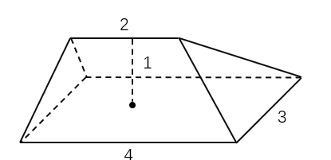

- **A**. 5立方米　✅
- **B**. 11立方米
- **C**. 12立方米
- **D**. 24立方米

**答案**：A

**官方解析**

如图所示，过上棱两个端点M、N分别向底面做垂直截面，交底面ABCD于点E、F、G、H，则该帐篷屋顶可拆分为左、右两个四棱锥（M-AEFD和N-BCHG）和中间一个三棱柱（EFM-GHN）。根据公式：；，则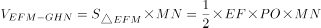

立方米；立方米。则该帐篷屋顶的体积立方米。

故正确答案为A。

---

### 第 2 题　qid 5509974 · 数学运算

小林因病入院需挂瓶输液，上午9点开始输液，输液袋上标有“容量300毫升，每毫升15滴”等药液信息。输液开始时，药液滴速为75滴/分钟。输液5分钟后小林感觉身体不适，护士帮忙调整了药液滴速（调整时间不计），又继续输液10分钟，药液还剩235毫升，那么输液结束的时间是：

- **A**. 10点26分
- **B**. 10点18分
- **C**. 10点14分　✅
- **D**. 10点10分

**答案**：C

**官方解析**

根据题意，输液5分钟后剩余的药液为毫升，则调整后药液的滴速为滴/分钟，剩余的235毫升药液还需输液的时间为分钟，则输液的总时间为分钟分钟，即1小时14分钟，上午9点开始输液，则输液结束的时间是10点14分。

故正确答案为C。

---

### 第 3 题　qid 5509973 · 数学运算

浮雕银杯是我国古代常见的一种盛酒容器，有大银杯和小银杯之分。已知5个大银杯加1个小银杯，可以盛酒3斛（斛，是古代的一种容量单位），5个小银杯加1个大银杯，可以盛酒2斛，则1斛酒至多可以倒满小银杯的数量为：

- **A**. 2个
- **B**. 3个　✅
- **C**. 4个
- **D**. 5个

**答案**：B

**官方解析**

设大银杯容量为x，小银杯容量为y，赋值1斛酒的量为1；根据题意可列方程：5x+y=3······①，5y+x=2······②，联立①②解得，。则1斛酒可倒满的小银杯数量，故至多可以倒满小银杯的数量为3个。

故正确答案为B。

---

### 第 4 题　qid 5510113 · 数学运算

甲乙两地间的纵横道路网如下图所示，若从甲地到乙地沿道路铺设电缆，要使铺设的电缆长度最短，则电缆经过丙地的概率为：

- **A**. 

- **B**. 

- **C**. 

- **D**. 

　✅

**答案**：D

**官方解析**

如图所示，从甲地到乙地沿道路铺设电缆，要使铺设的电缆长度最短，电缆走向只能向下和向左铺设。从甲开始，在每个交点处标出甲到此点的情况数，该点情况数为上方和右方的两个点情况数之和。

如图1所示，从甲到乙铺设电缆共22+31=53种情况。

若要使铺设的电缆经过丙地，则需电缆如图2所示先从甲到丙，共4种情况，再如图3所示从丙到乙，共4种情况，故经过丙地的情况数为4×4=16种。所求概率。

故正确答案为D。

---

### 第 5 题　qid 5510002 · 数学运算

某小区物业准备了230盒口罩免费派发给10栋楼，要求任意两栋楼派发的口罩数量都不相同，但最多相差不超过1倍。假设口罩不拆盒发放，那么派发口罩数量最少的那栋楼最少可派发口罩：

- **A**. 18盒
- **B**. 15盒
- **C**. 14盒　✅
- **D**. 12盒

**答案**：C

**官方解析**

设派发口罩数量最少的那栋楼最少派发口罩x盒。要让派发口罩数量最少的楼栋派发口罩最少，则其他楼栋口罩派发尽量多，且派发口罩最多的楼栋不超过最少的1倍，即派发口罩最多的楼栋最多派发口罩2x盒。由于任意两栋楼派发口罩数量都不相同，则可列表如下：

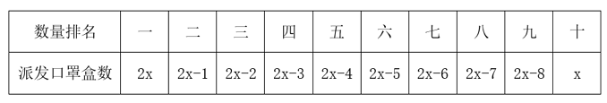

根据口罩一共有230盒可列式：2x+2x-1+2x-2+2x-3+2x-4+2x-5+2x-6+2x-7+2x-8+x=230，化简可得：19x-36=230，解得x=14。那么派发口罩数量最少的那栋楼最少可派发口罩14盒。

故正确答案为C。

---

### 第 6 题　qid 5510000 · 数学运算

某公司自主研发生产的A、B、C三种型号氢燃料电池，解决了该公司今年生产轿车所需电池数量的10%（按一辆车配一块电池计算）。其中A型号氢燃料电池的产量是B型号的2倍，C型号的产量比A、B两种型号的产量之和还多400块。预计该公司今年的轿车总产量是42.4万辆，那么B型号氢燃料电池的产量是：

- **A**. 3500块
- **B**. 7000块　✅
- **C**. 14000块
- **D**. 21400块

**答案**：B

**官方解析**

根据题意，该公司今年自主研发生产的A、B、C三种型号氢燃料电池的产量和为42.4×10000×10%=42400块。已知C型号的产量比A、B两种型号的产量之和还多400块，则A、B两种型号的产量之和为块，A型号氢燃料电池的产量是B型号的2倍，则B型号氢燃料电池的产量为块。

故正确答案为B。

---

### 第 7 题　qid 5509979 · 数学运算

某智慧公共停车场的收费标准如下：停车不超过15分钟，不收费；超过15分钟但不超过60分钟，按1小时计，收费5元；超过1小时后，超过的部分按每30分钟4元收费（不足30分钟，按30分钟计）。若李先生支付停车费17元，则他停车的时长可能为：

- **A**. 2小时
- **B**. 2小时15分钟　✅
- **C**. 2小时45分钟
- **D**. 3小时

**答案**：B

**官方解析**

根据题干“停车不超过15分钟，不收费；超过15分钟但不超过60分钟，按1小时计，收费5元”，李先生支付停车费17元，则停车时长一定超过1小时。扣除前1小时的收费5元，超出1小时部分付款为17-5=12元。根据题干“超过1小时后，超过的部分按每30分钟4元收费（不足30分钟，按30分钟计）”，12元最多可支付12÷4=3个30分钟=1.5小时，则2小时＜李先生的停车时长小时。

故正确答案为B。

---

### 第 8 题　qid 5510073 · 数学运算

某村拟建造一个容积为144立方米，深度为4米的长方体无盖蓄水池。经测算，蓄水池底部造价为260元/平方米，侧面造价为180元/平方米。那么该水池的最低总造价为：

- **A**. 11440元
- **B**. 25920元
- **C**. 26640元　✅
- **D**. 31680元

**答案**：C

**官方解析**

根据长方体体积=底面积×高，结合水池“容积为144立方米，深度为4米”，可得水池底面长方形面积平方米。底面积一定，要使造价最低，则侧面积要尽量少，假设底面长方形的长和宽分别为a和b，则水池侧面积=2×4a+2×4b=4（2a+2b），若要侧面积最小，则2a+2b最短，即底面周长最短。因为“长方形面积一定，长宽相等也就是正方形时周长最短”，因a×b=36，所以当a=b=6时，a+b最小，此时侧面积=4×（2a+2b）=4×24=96平方米。总造价=底部造价+侧面造价=36×260+96×180=26640元。 

故正确答案为C。

---

### 第 9 题　qid 5510178 · 数学运算

A、B两村在一条笔直公路的同侧，到公路的垂直距离分别是3公里和7公里，两村相距8.5公里，现需在公路边建一个物资集散中心，为节约物资配送成本，集散中心到两个村的直线路程之和应尽可能小，若货车的速度约为60公里/小时，那么货车从集散中心出发，到两村送货后返回中心，路途所花费的最少时间为：

- **A**. 18分钟
- **B**. 21分钟　✅
- **C**. 24分钟
- **D**. 27分钟

**答案**：B

**官方解析**

如图所示：过公路作A点的对称点为，交公路于点M；过B点作公路的垂线，垂点为N；过的垂线，垂点为；过A点作BN的垂线，垂点为D，则四边形ADNM和 为矩形。连接，交MN于点O，根据两点之间线段最短，可知将物资集散中心修建在O点时，到两村的直线路程之和最小。

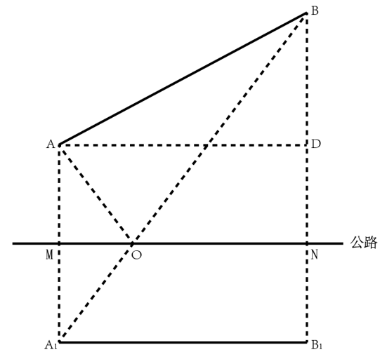

已知AM=3公里，BN=7公里，则BD=BN-DN=BN-AM=7-3=4公里。在直角中，已知AB=8.5公里，根据勾股定理可得公里，则公里。在直角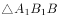中，公里，根据勾股定理可得公里。

货车从集散中心出发，到两村送货后返回中心所走最短路程公里，则所需时间约为。

故正确答案为B。

---

## 判断推理

### 第 1 题　qid 5510027 · 图形推理

从所给四个选项中，选择最合适的一个填入问号处，使之呈现一定的规律性：

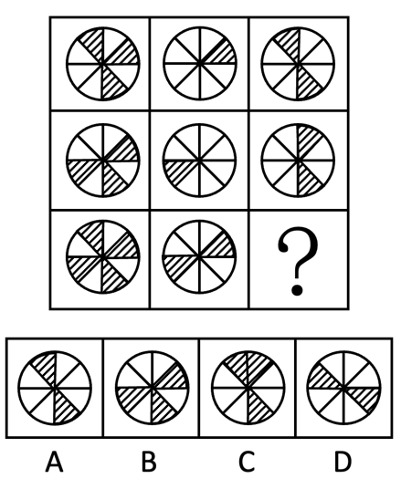

- **A**. A
- **B**. B
- **C**. C　✅
- **D**. D

**答案**：C

**官方解析**

解法一：
图形元素组成相似，优先考虑样式规律。观察发现，题干图形出现阴影、白色两种图案，考虑黑白运算。九宫格优先横向看，但是发现第一行阴影+白=阴影，第二行阴影+白=白，相同运算方式，但结果不同，考虑竖向看。观察发现，第一列：白+白=白、阴影+阴影=阴影、阴影+白=阴影、白+阴影=阴影；第二列验证此规律成立；第三列应用此规律，只有C项符合。
解法二：
图形元素组成相似，优先考虑样式规律。观察发现，九宫格横向看无规律，考虑竖向看，第一个图形与第二个图形进行叠加运算可得第三个图形，只有C项符合。
故正确答案为C。

---

### 第 2 题　qid 5510126 · 图形推理

把下面的六个图形分为两类，使每一类图形都有各自的共同特征或规律，分类正确的一项是：

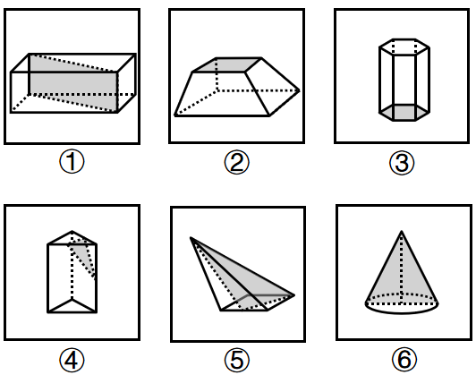

- **A**. ①②③，④⑤⑥　✅
- **B**. ①④⑤，②③⑥
- **C**. ①③④，②⑤⑥
- **D**. ①③⑥，②④⑤

**答案**：A

**官方解析**

本题为分组分类题目。观察发现，题干6幅图中均含有阴影部分，且形状上存在差异，故考虑阴影部分的形状。图①②③中的阴影部分均不是三角形，图④⑤⑥中的阴影部分均是三角形，即图①②③为一组，图④⑤⑥为一组。
故正确答案为A。

---

### 第 3 题　qid 5510011 · 逻辑判断

由于剖宫产分娩是无菌分娩，分娩时胎儿不会接触到妈妈产道中的有益菌群，使得剖宫产宝宝的肠道菌群定植迟缓，影响免疫系统的发育，过敏风险也随之升高。要降低剖宫产宝宝的过敏风险，家长们需要把好饮食关。专家指出，母乳喂养可降低剖宫产宝宝过敏风险。母乳中含有双歧杆菌等益生菌，可帮助宝宝建立健康肠道菌群，训练免疫系统，降低过敏风险。
以下哪项如果为真，最能支持上述观点？

- **A**. 剖宫产宝宝肠道健康菌群的建立，比自然分娩宝宝晚约6个月
- **B**. 研究显示，母乳喂养期间母亲进食易过敏食物，会增加宝宝过敏风险
- **C**. 母乳致敏性低，是因为宝宝的免疫系统能将其中的蛋白质识别为“自己的”　✅
- **D**. 把高致敏性的普通牛奶蛋白变成低致敏性的小分子蛋白质，可以降低宝宝过敏的风险

**答案**：C

**官方解析**

第一步：找出论点和论据。
论点：母乳喂养可降低剖宫产宝宝过敏风险。
论据：母乳中含有双歧杆菌等益生菌，可帮助宝宝建立健康肠道菌群，训练免疫系统，降低过敏风险。
论据讨论的是“母乳中含有的双歧杆菌等益生菌可帮助宝宝降低过敏风险”，论点说的是“母乳喂养可降低剖宫产宝宝过敏风险”，论据和论点话题一致，加强优先考虑补充论据。
第二步：逐一分析选项。
A项：该项是在说剖宫产宝宝肠道健康菌群的建立，比自然分娩宝宝晚约6个月，并未提及母乳喂养，话题不一致，无法加强，排除；
B项：该项是在说母乳喂养期间母亲进食易过敏食物会增加宝宝过敏风险，但并不清楚母亲如果正常饮食期间母乳喂养会不会降低宝宝过敏风险，为无关项，无法加强，排除；
C项：母乳致敏性低，是因为宝宝的免疫系统能将其中的蛋白质识别为“自己的”，解释了为什么母乳喂养可以降低宝宝的过敏反应，补充论据，当选；
D项：把高致敏性的普通牛奶蛋白变成低致敏性的小分子蛋白质，可以降低宝宝过敏的风险，是在指出其他可以降低宝宝过敏风险的办法，但并没提及母乳喂养会不会降低宝宝过敏风险，为无关项，无法加强，排除。
故正确答案为C。

---

### 第 4 题　qid 5510005 · 类比推理

某次体操比赛之前，有甲、乙、丙、丁四人预测红队、黄队、绿队、蓝队的出场顺序，四人的预测如下：
甲说：只有黄队第二个出场，红队才第一个出场。
乙说：如果红队第三个出场，那么蓝队第四个出场。
丙说：蓝队不是第四个出场。
丁说：黄队第二个出场。
比赛结束后，发现四人中只有一人预测为真，那么绿队是第几个出场？

- **A**. 第一个
- **B**. 第二个　✅
- **C**. 第三个
- **D**. 第四个

**答案**：B

**官方解析**

第一步：分析题干条件。

（1）红队第一黄队第二；

（2）红队第三蓝队第四；

（3）蓝队不是第四；

（4）黄队第二。

因为四人中只有一人预测为真，若（2）为假，可得“红队第三”“蓝队不是第四”，若（3）为假，可得“蓝队第四”，互相矛盾，故（2）（3）中必有一真，（1）（4）为假。

第二步：根据题干条件进行推理。

根据（1）（4）为假可知，“红队第一”“黄队不是第二”。若（2）为假，可得“红队第三”“蓝队不是第四”，与“红队第一”矛盾，因此（2）为真（3）为假，进而可得“蓝队第四”，又因为“黄队不是第二”，则“黄队第三”，进而推出“绿队第二”。

故正确答案为B。

---

### 第 5 题　qid 5510007 · 逻辑判断

心脏是被神经系统控制的，调控心脏的神经是交感神经和迷走神经。安静状态下，迷走神经对心脏的调控比较强，心跳每分钟75次左右；运动或情绪激动的时候，交感神经对心脏的调控比较强，心跳会加快，收缩力也会加强。在血管壁、胃肠道、生殖系统等处都分布着各种内脏平滑肌，平滑肌运动同样受到神经支配。比如，胃肠道平滑肌接受交感神经和迷走神经的双重支配。交感神经兴奋使胃肠道运动减弱，而迷走神经兴奋则使胃肠道运动加强。
由此可以推出：

- **A**. 交感神经或迷走神经对心脏和胃肠的调控不同则产生不同的效应　✅
- **B**. 调控内脏器官的神经是交感神经和迷走神经，它们不受意识支配
- **C**. 要保护我们的内脏器官，必须合理地使用大脑，维持良好的情绪
- **D**. 冠心病、胃溃疡之类的疾病也与神经系统的“功能失常”有关系

**答案**：A

**官方解析**

日常结论题，根据题干信息逐一分析选项。
A项：题干第二句话指出在安静和运动或情绪激动状态下，迷走神经和交感神经对心脏的调控力度不同，且产生了不同的效应，第四句话和第五句话指出交感神经和迷走神经对胃肠道不同的调控力度及产生的不同效应，可以推出，当选；
B项：题干第一句话指出交感神经和迷走神经是调控心脏的神经，而选项说的是调控内脏器官的神经，且题干未提及神经是否受意识的支配，无中生有，无法推出，排除；
C项：题干未提及“保护内脏器官”与“合理使用大脑”的关系，无中生有，无法推出，排除；
D项：题干未提及“冠心病、胃溃疡”与“神经系统功能失常”的关系，无中生有，无法推出，排除。
故正确答案为A。

---

### 第 6 题　qid 5510009 · 逻辑判断

北极放大效应是指冰雪和气温之间容易形成正反馈，即气温升高则冰雪消融增多，没有冰雪覆盖的裸地能吸收更多的太阳辐射，加热大气，进一步加剧冰雪消融。观测显示，位于北极格陵兰岛的大多数冰川都呈现出消退趋势，这是世界上流失速度最快的冰川之一。因此，格陵兰岛的冰川消融受到放大效应影响。
要得到上述结论，需要补充的前提是：

- **A**. 近30年，格陵兰岛冰川融化已导致全球海平面上升了11毫米，如果全部融化，全球海平面预计会上升7米
- **B**. 格陵兰岛冰川消退会导致大大小小冰川入海，形成冰山，进而导致海啸，摧毁近岸上因纽特人的家园
- **C**. 格陵兰岛的冰川融化后显现出大量陆地，陆地比海洋吸收热量更快　✅
- **D**. 同样是极地，南极地区的冰川消退并不明显

**答案**：C

**官方解析**

第一步：找出论点和论据。
论点：格陵兰岛的冰川消融受到放大效应影响。
论据：北极放大效应是指冰雪和气温之间容易形成正反馈，即气温升高则冰雪消融增多，没有冰雪覆盖的裸地能吸收更多的太阳辐射，加热大气，进一步加剧冰雪消融。观测显示，位于北极格陵兰岛的大多数冰川都呈现出消退趋势，这是世界上流失速度最快的冰川之一。
本题论据讨论的放大效应是指“一方面气温升高则冰雪消融增多；另一方面没有冰雪覆盖的裸地能吸收更多的太阳辐射，进一步加剧冰雪消融”，论据现已知北极格陵兰岛的冰川呈现出消退趋势，只涉及了“放大效应”中第一方面的内容，要想推出论点“格陵兰岛的冰川消融受到放大效应影响”，需补上另一方面，即“格陵兰岛出现了裸地，且吸收了更多的太阳辐射”。
第二步：逐一分析选项。
A项：该项指出格陵兰岛冰川消融导致了全球海平面上升，但是不明确格陵兰岛的冰川消融是否是受到了放大效应影响，为不明确项，无法加强，排除；
B项：该项指出格陵兰岛冰川消退会导致海啸，而论点讨论的是格陵兰岛的冰川消融是否是受到了放大效应的影响，话题不一致，无法加强，排除；
C项：该项指出格陵兰岛的冰川融化后显现出大量陆地，陆地比海洋吸收热量更快，补上了“格陵兰岛确实受到放大效应影响”中另一方面的内容，可以加强，当选；
D项：该项讨论的是南极地区的冰川消退不明显，而论点讨论的格陵兰岛属于北极地区，话题不一致，无法加强，排除。
故正确答案为C。

---

### 第 7 题　qid 5510041 · 逻辑判断

油脂是由甘油和脂肪酸结合在一起形成的链状分子，可可脂和黄油都是由无数油脂分子聚集在一起形成的，但是它们熔化方式不一样。黄油是随温度上升一点点从固体变为液体，可可脂却是达到熔点时瞬间熔化。科学分析发现，黄油是由100种以上各种各样的油脂混合在一起形成的，而可可脂则只由3种油脂构成。
由此可以推出：

- **A**. 黄油和可可脂熔化所需的温度不一样，可可脂所需温度更高
- **B**. 黄油和可可脂熔化所需要的温度不固定，依环境变化而变化
- **C**. 黄油经常用于烹饪，因为其油脂熔化方式对人体健康更有好处
- **D**. 黄油中的各种油脂性质差异较大，而可可脂中的不同油脂熔点相近　✅

**答案**：D

**官方解析**

日常结论题，根据题干信息逐一分析选项。
A项：选项指出可可脂熔化所需的温度比黄油更高，而题干中只是表述了“黄油是随温度上升一点点从固体变为液体，可可脂却是达到熔点时瞬间熔化”，并未涉及二者熔化所需温度之间的比较，无中生有，无法推出，排除；
B项：选项指出黄油和可可脂熔化所需要的温度依环境变化而变化，而题干中只是表述了“黄油是随温度上升一点点从固体变为液体，可可脂却是达到熔点时瞬间熔化”，并未提及二者熔化所需的温度会依环境变化而变化，无中生有，无法推出，排除；
C项：选项指出黄油因为其油脂熔化方式对人体健康更有好处，所以经常用于烹饪，而题干中并未提及相关内容，无中生有，无法推出，排除；
D项：根据题干中“黄油是随温度上升一点点从固体变为液体，可可脂却是达到熔点时瞬间熔化”且“黄油是由100种以上各种各样的油脂混合在一起形成的，而可可脂则只由3种油脂构成”可推知，可可脂中的各种油脂少且熔点相近，而黄油中的各种油脂多且熔点不相近，因此黄油中的各种油脂性质差异较大，可以推出，当选。
故正确答案为D。

---

### 第 8 题　qid 5510006 · 逻辑判断

牛蛙这一水产品种在过去无人问津，现今却成为人们餐桌上的美食。打工族在夜晚加班后，吃上一盘“泡椒牛蛙”或“干锅牛蛙”，顿时神清气爽，干劲十足。但随着牛蛙美食的普及，食品安全问题引发了社会关注。有报道称：牛蛙体内含有幼虫裂头蚴、广州管圆线虫等能够在人体寄生的寄生虫，食入带有这些寄生虫的牛蛙，会严重影响人体健康。
以下哪项如果为真，最能削弱上述结论？

- **A**. 经过高温烹饪，牛蛙身上的寄生虫会被全部杀死　✅
- **B**. 淡水虾蟹中含有肺吸虫，人感染肺吸虫会咳血、呼吸困难
- **C**. 实验室对生态养殖的牛蛙进行解剖，未发现任何裂头蚴寄生虫
- **D**. 牛蛙身上还存在只能在牛蛙本体内寄生而不会传染给人类的寄生虫

**答案**：A

**官方解析**

第一步：找出论点和论据。
论点：牛蛙体内含有幼虫裂头蚴、广州管圆线虫等能够在人体寄生的寄生虫，食入带有这些寄生虫的牛蛙，会严重影响人体健康。
论据：无。
本题只有论点没有论据，削弱优先考虑削弱论点。
第二步：逐一分析选项。
A项：该项指出经过高温烹饪，牛蛙身上的寄生虫会被全部杀死，说明带有寄生虫的牛蛙经过高温烹饪后食用并不会影响人体健康，削弱论点，可以削弱，保留；
B项：该项指出淡水虾蟹中的肺吸虫会对人体造成影响，与论点讨论的牛蛙体内的寄生虫是否会对人体造成影响无关，话题不一致，无法削弱，排除；
C项：该项指出生态养殖的牛蛙体内没有发现裂头蚴寄生虫，说明生态养殖的牛蛙不会影响身体健康，削弱论点，可以削弱，保留；
D项：该项指出牛蛙体内存在不会传染给人类的寄生虫，与论点讨论的牛蛙体内能在人体寄生的寄生虫是否会影响人体健康无关，无法削弱，排除。
对比A、C两项，A项说的是牛蛙身上所有的寄生虫会被高温杀死，而C项只提到了裂头蚴寄生虫这一种寄生虫，综合对比，A项是整体性削弱，C项是部分削弱，A项的削弱力度大于C项，因此优选A项。
故正确答案为A。

---

### 第 9 题　qid 5510051 · 逻辑判断

某研究机构提取了1200多名女性研究对象最靠近头皮的3厘米头发，这代表过去3个月新长出的头发。研究人员随后对这些女性进行了一项包含10个问题的调查，以了解她们的压力程度。结果表明，压力水平排在前五名的女性头发中含有的皮质醇水平比排在后五名的女性高出24.3%。研究发现，压力水平会反映在头发中储存的皮质醇的含量上。
以下哪项如果为真，最能削弱上述论证？

- **A**. 长期的压力会对身体产生负面影响，头发则可以显示出人们的压力水平
- **B**. 皮质醇被称为“压力荷尔蒙”，在身体处于“战斗或逃避”模式时释放
- **C**. 压力通过释放荷尔蒙改变头发色素沉着，使其变灰或变白，甚至导致脱落
- **D**. 皮质醇是大自然在人体的内置警报系统，但压力不是它产生的唯一原因　✅

**答案**：D

**官方解析**

第一步：找出论点和论据。
论点：压力水平会反映在头发中储存的皮质醇的含量上。
论据：压力水平排在前五名的女性头发中含有的皮质醇水平比排在后五名的女性高出24.3%。
本题的论点论据都是在说皮质醇和压力之间的关系，话题是一致的，故削弱优先考虑削弱论点。
第二步：逐一分析选项。
A项：头发可以显示出人们的压力水平，表明头发与压力之间有联系，但不明确是否是头发中的“皮质醇”，无法削弱，排除；
B项：皮质醇被称为“压力荷尔蒙”，在身体处于“战斗或逃避”模式时释放，表明皮质醇的产生与压力确实有关，可以加强，无法削弱，排除；
C项：表明压力对头发的危害，但没提到“皮质醇”，无法削弱，排除；
D项：表明压力不是皮质醇产生的唯一原因，否定了压力和皮质醇之间的必然关系，削弱论点，当选。
故正确答案为D。

---

### 第 10 题　qid 5510034 · 逻辑判断

长距离的地下运输管道在遭遇重大地质断层事件或较大地面运动时可能遭到灾难性的破坏。研究人员开发出一种经济有效的方法，用膨胀聚苯乙烯（EPS）土工泡沫块对管道进行保护，并基于先进的三维计算机模型，评估了在水平断层破裂情况下，由这种土工泡沫块所保护的管道的机械性能。结果发现，它们可以在断层破裂时自压缩，从而减少周围土壤对管道施加的压力，保证了管道即使遭遇水平断层破裂的情况时仍可正常运行。
以下哪项如果为真，最能支持上述结论？

- **A**. 土工泡沫块是一种廉价轻质材料的聚合物，抗压性较低
- **B**. 土工泡沫块保护下的管道可以承受极高强度的构造变形　✅
- **C**. 三维计算机模型评估了土工泡沫块所保护的管道的机械性能
- **D**. 土工泡沫块这种材料可变形，因而具有出色的保护管道的性能

**答案**：B

**官方解析**

第一步：找出论点和论据。
论点：它们（膨胀聚苯乙烯（EPS）土工泡沫块）可以在断层破裂时自压缩，从而减少周围土壤对管道施加的压力，保证了管道即使遭遇水平断层破裂的情况时仍可正常运行。
本题只有论点，加强考虑补充论据。
第二步：逐一分析选项。
A项：该项说明土工泡沫块廉价轻质，抗压性较低，无法说明其是否能保护管道，无法加强，排除；
B项：该项说明在土工泡沫块保护下的管道可以承受极高强度的构造变形，故能够保证管道在遭遇水平断层破裂时的正常运行，补充论据，可以加强，保留；
C项：该项说明三维计算机模型评估了土工泡沫块所保护的管道的机械性能，但评估结果未知，因此无法得知管道在遭遇水平断层破裂时能否正常运行，无法加强，排除;
D项：该项说明土工泡沫块有出色的保护管道的性能，补充论据，可以加强，保留。
对比B、D两项，B项强调了土工泡沫块保护管道的结果是管道可以承受极高强度的构造变形，因此，当管道遭遇水平断层破裂时仍能正常运行，而D项仅强调了土工泡沫块可以保护管道，但未说明保护后管道的强度如何，因此无法得知保护后管道是否能在水平断层破裂的情况下正常运行。B项与论点话题更接近，当选。
故正确答案为B。

---

### 第 11 题　qid 5510147 · 类比推理

某医院刘佳、郑毅、郭斌、丁晓、吴芳、施文6位医生拟报名参加“一心向党，健康为民”进社区义诊活动，已知下列情况为真：
（1）要么刘佳参加，要么郑毅参加；
（2）只有吴芳参加，刘佳才参加；
（3）如果郭斌和吴芳都参加，那么施文也会参加；
（4）或者丁晓不参加，或者郭斌参加；
（5）施文、丁晓至少有1人参加。
现施文确定无法参加，那么6位医生中最后参加义诊活动的是：

- **A**. 刘佳、郭斌、丁晓
- **B**. 郑毅、郭斌、丁晓　✅
- **C**. 郑毅、丁晓、吴芳
- **D**. 刘佳、丁晓、吴芳

**答案**：B

**官方解析**

第一步：翻译题干。

（1）要么刘佳，要么郑毅；

（2）刘佳吴芳；

（3）郭斌 且 吴芳施文；

（4）丁晓 或 郭斌；

（5）施文 或 丁晓；

（6）施文。

第二步：根据题干条件进行推理。

从确定信息进行推理，施文无法参加，结合条件（5）和“或关系否一推一”可知丁晓参加，结合条件（4）和“或关系否一推一”可知郭斌参加；已知施文无法参加，结合条件（3）和“否后必否前”可知郭斌 或 吴芳，结合郭斌参加和“或关系否一推一”可知吴芳不参加，排除C、D两项；结合条件（2）和“否后必否前”可知刘佳不参加，排除A项；再结合条件（1）可知，郑毅参加，此时确定参加的医生为丁晓、郭斌和郑毅，对应B项。

故正确答案为B。

---

### 第 12 题　qid 5510025 · 图形推理

下图右框内所给几何体的展开表面中，能折叠成左框内所示几何体的是：

（注：右框内所给几何体展开表面正反面图形完全一致）

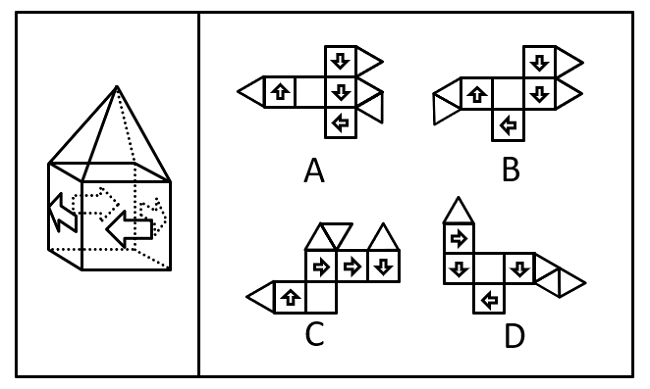

- **A**. A
- **B**. B　✅
- **C**. C
- **D**. D

**答案**：B

**官方解析**

本题考查空间重构。根据题干左框几何体可知，几何体的四个正方形侧面中四个箭头首尾对应，根据题干逐一进行分析。
A项：选项中第二行第三个正方形面的箭头指向第三行正方形面的箭头侧面，而题干几何体的四个正方形侧面中四个箭头首尾对应，选项与题干几何体不一致，排除；
B项：选项四个含有箭头的正方形面中的箭头首尾对应，选项与题干几何体一致，当选；
C项：选项中第二行第二个正方形面的箭头指向该行第三个正方形面的箭头侧面，而题干几何体的四个正方形侧面中四个箭头首尾对应，选项与题干几何体不一致，排除；
D项：选项中第二行第一个正方形面的箭头没有指向第三行中相邻面的箭头的尾部，而题干几何体的四个正方形侧面中四个箭头首尾对应，选项与题干几何体不一致，排除。
故正确答案为B。

---

### 第 13 题　qid 5510023 · 图形推理

把下面的六个图形分为两类，使每一类图形都有各自的共同特征或规律，分类正确的一项是：

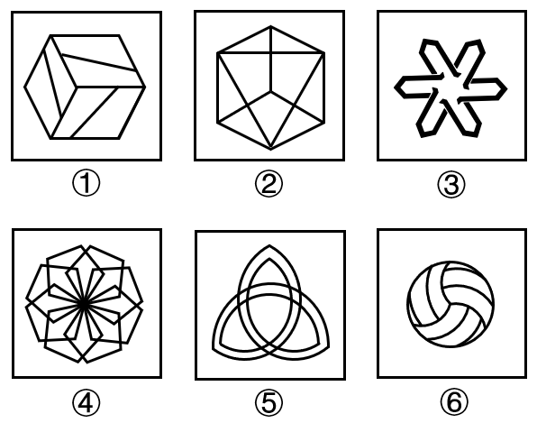

- **A**. ①②③，④⑤⑥
- **B**. ①③⑥，②④⑤　✅
- **C**. ①③④，②⑤⑥
- **D**. ①④⑤，②③⑥

**答案**：B

**官方解析**

本题为分组分类题目。元素组成不同，优先考虑属性规律。观察发现，图①③⑥均不是轴对称图形，图②④⑤均是轴对称图形，即图①③⑥为一组，图②④⑤为一组。
故正确答案为B。
注：分组分类题目优先考虑两组图形分别具有各自的规律，无法分成具有各自规律的两组时，才考虑将图形分成一组具有该规律，一组不具有该规律。

---

### 第 14 题　qid 5510021 · 图形推理

把下面的六个图形分为两类，使每一类图形都有各自的共同特征或规律，分类正确的一项是：

- **A**. ①②④，③⑤⑥
- **B**. ①③⑥，②④⑤
- **C**. ①④⑤，②③⑥　✅
- **D**. ①⑤⑥，②③④

**答案**：C

**官方解析**

本题为分组分类题目。元素组成不同，且无明显属性规律，考虑数量规律。题干每幅图形都有多个相同小元素，优先考虑相同元素的个数。图①④⑤中相同元素的个数均为3，图②③⑥中相同元素的个数均为2，即图①④⑤为一组，图②③⑥为一组。
故正确答案为C。

---

### 第 15 题　qid 5510010 · 定义判断

商业效用原则是商事实践中发展出来的一项交易惯例，市场主体提供的商品、服务以及其他标的物应当能够发挥基本的功能作用，如果欠缺必要的使用条件或者辅助设施导致其交易目的落空的，应当予以补足。最佳效用原则是指通过配置组合，使得资源能够最大程度地发挥效能，提高利用效率。
根据上述定义，下列选项最能体现商业效用原则的是：

- **A**. 开发商销售商品房赠送车位
- **B**. 商家促销“买桌子送椅子”
- **C**. 出售的地下酒窖附带出入通道　✅
- **D**. 购买家电享受“三包服务”

**答案**：C

**官方解析**

第一步：找出定义关键词。
商业效用原则：“发挥基本的功能作用”、“欠缺必要的使用条件或者辅助设施导致其交易目的落空的，应当予以补足”；
最佳效用原则：“通过配置组合”、“使资源能够最大程度地发挥效能，提高利用效率”。
第二步：逐一分析选项。
A项：商品房的基本功能作用是居住，赠送的车位并不是发挥居住功能的必要使用条件或辅助设施，不符合“必要的使用条件或者辅助设施”，不符合定义，排除；
B项：买的桌子可以发挥它的基本功能作用，椅子不是桌子发挥功能作用的必要使用条件，不符合“必要的使用条件或者辅助设施”，不符合定义，排除；
C项：地下酒窖想要发挥作用就要去到地下，如果缺失出入通道就会导致交易落空，符合“必要的使用条件或者辅助设施”，符合定义，当选；
D项：购买的家电可以发挥基本的功能作用，“三包服务”不是家电发挥功能作用的必要使用条件，不符合“必要的使用条件或者辅助设施”，不符合定义，排除。
故正确答案为C。

---

### 第 16 题　qid 5510020 · 定义判断

法律规范包含多种类型。授权性规范，是规定法律主体可以为一定行为或不为一定行为的法律规范。义务性规范，是规定法律主体必须为一定行为的法律规范。禁止性规范，是规定禁止法律主体为一定行为的法律规范。
根据上述定义，下列属于禁止性规范的是：

- **A**. 自然人决定、变更姓名，或者法人、非法人组织决定、变更、转让名称的，应当依法向有关机关办理登记手续，但是法律另有规定的除外
- **B**. 对亲子关系有异议且有正当理由的，父或者母可以向人民法院提起诉讼，请求确认或者否认亲子关系
- **C**. 任何组织或者个人不得以丑化、污损或者利用信息技术手段伪造等方式侵害他人肖像权　✅
- **D**. 因正当防卫造成损害的，不承担民事责任

**答案**：C

**官方解析**

第一步：找出定义关键词。
授权性规范：“法律主体可以为一定行为或不为一定行为”；
义务性规范：“法律主体必须为一定行为”；
禁止性规范：“禁止法律主体为一定行为”。
第二步：逐一分析选项。
A项：自然人决定、变更姓名，或者法人、非法人组织决定、变更、转让名称的，应当依法向有关机关办理登记手续，“应当”不符合“禁止法律主体为一定行为”，符合“义务性规范”定义，不符合“禁止性规范”定义，排除；
B项：对亲子关系有异议且有正当理由的，父或者母可以向人民法院提起诉讼，“可以诉讼”不符合“禁止法律主体为一定行为”，符合“授权性规范”定义，不符合“禁止性规范”定义，排除；
C项：任何组织或者个人不得以丑化、污损或者利用信息技术手段伪造等方式侵害他人肖像权，“不得”说明是“禁止法律主体为一定行为”，符合“禁止性规范”定义，当选；
D项：因正当防卫造成损害的，不承担民事责任，“不承担”说明是可以不用承担，不符合“禁止法律主体为一定行为”，符合“授权性规范”定义，不符合“禁止性规范”定义，排除。
故正确答案为C。

---

### 第 17 题　qid 5510062 · 定义判断

被害人盲点症是指被害人出于某种迫切的需要和急切的欲望，以致注意力狭窄、判断力减弱甚至轻度丧失理智，对自己所处的危险或面临的风险视而不见的一种状态。
根据上述定义，下列不属于被害人盲点症的是：

- **A**. 王某为强身健体高价购买大量伪劣保健品
- **B**. 林某在公交车上因争抢座位不慎滑倒受伤　✅
- **C**. 为谋高额回报黄某兼职网络刷单导致经济受损
- **D**. 幻想通过理财一夜暴富的刘某给了骗子可乘之机

**答案**：B

**官方解析**

第一步：找出定义关键词。
“被害人出于某种迫切的需要和急切的欲望”、“注意力狭窄、判断力减弱甚至轻度丧失理智”、“对自己所处的危险或面临的风险视而不见”。
第二步：逐一分析选项。
A项：王某为强身健体，符合“被害人出于某种迫切的需要和急切的欲望”，高价购买大量伪劣保健品，符合“注意力狭窄、判断力减弱甚至轻度丧失理智”、“对自己所处的危险或面临的风险视而不见”，符合定义，排除； 
B项：林某不慎滑倒是林某自己不小心所致，没有人要害他，不符合“被害人”，不符合定义，当选；
C项：黄某为谋高额回报，符合“被害人出于某种迫切的需要和急切的欲望”，黄某网络刷单导致经济受损，符合“注意力狭窄、判断力减弱甚至轻度丧失理智”、“对自己所处的危险或面临的风险视而不见”，符合定义，排除；
D项：刘某幻想通过理财一夜暴富，符合“被害人出于某种迫切的需要和急切的欲望”，刘某给了骗子可乘之机，符合“注意力狭窄、判断力减弱甚至轻度丧失理智”、“对自己所处的危险或面临的风险视而不见”，符合定义，排除；
本题为选非题，故正确答案为B。

---

### 第 18 题　qid 5510047 · 定义判断

环境吸收能力是指自然环境对人类在生产生活过程中产生的废弃物具有自动容纳、吸收和消化的能力。理论上，由于环境吸收能力的存在，地球自身的力量是可以将环境恢复到原有或相近的活力水平，资源环境退化并不是不可逆的。
根据上述定义，下列属于环境吸收能力的是：

- **A**. 某地开展农村人居环境整治行动，加强固体废弃物和垃圾处置
- **B**. 某县通过环境治理，提升了当地环境资源所能容纳的人口和经济规模
- **C**. 某市为高载能产业寻求发展空间，测算出该城市大气允许承载污染物的最大数量
- **D**. PM2.5能够被大自然转化为对生态系统造成危害较小的物质，甚至能进一步被分解达到无害的状态　✅

**答案**：D

**官方解析**

第一步：找出定义关键词。
“自然环境对人类产生的废弃物具有自动容纳、吸收和消化的能力”。
第二步：逐一分析选项。
A项：某地开展整治行动加强固体废物和垃圾处置，没有体现出自然环境自动容纳、吸收和消化人类产生的废弃物，不符合“自然环境对人类产生的废弃物具有自动容纳、吸收和消化的能力”，不符合定义，排除；
B项：某县通过环境治理提升资源环境能容纳的人口和经济规模，没有体现出自然环境自动容纳、吸收和消化人类产生的废弃物，不符合“自然环境对人类产生的废弃物具有自动容纳、吸收和消化的能力”，不符合定义，排除；
C项：某市测算出城市大气承载污染物的最大数量，没有体现出自然环境自动容纳、吸收和消化人类产生的废弃物，不符合“自然环境对人类产生的废弃物具有自动容纳、吸收和消化的能力”，不符合定义，排除；
D项：PM2.5被大自然转化成对生态危害小的物质，甚至达到无害的状态，是自然环境消化了人类产生的废弃物，符合“自然环境对人类产生的废弃物具有自动容纳、吸收和消化的能力”，符合定义，当选。
故正确答案为D。

---

### 第 19 题　qid 5510031 · 定义判断

生态恢复岸线是指通过人工直接或间接实施保护修复工程或在常年潮汐、冲淤等自然力作用下，将原来的人工岸线最大限度地恢复海岸自然形态、地貌单元，恢复和改善海岸生态功能的岸线。生态恢复岸线具有独特的地理、形态和动态特征，是海陆分界的地理要素，具有重要的生态功能和资源价值。
根据上述定义，下列属于生态恢复岸线的是：

- **A**. 将自然海岸形态改变成人工海岸形态的堤坝
- **B**. 某港口城市全力打造的生态美、人气旺的黄金旅游岸线
- **C**. 某海滨城市修复建设的具有自然岸滩形态特征和生态功能的海堤　✅
- **D**. 保持自然生态属性特征，没有因人类活动而改变形态和属性的海岸线

**答案**：C

**官方解析**

第一步：找出定义关键词。
“通过人工直接或间接实施保护修复工程或在常年潮汐、冲淤等自然力作用下”、“将原来的人工岸线最大限度地恢复海岸自然形态、地貌单元”、“恢复和改善海岸生态功能的岸线”。
第二步：逐一分析选项。
A项：该项是将自然海岸形态改变成人工海岸形态的堤坝，而不是恢复和改善海岸的生态功能，不符合“将原来的人工岸线最大限度地恢复海岸自然形态、地貌单元”、“恢复和改善海岸生态功能的岸线”，不符合定义，排除；
B项：某港口城市打造的生态美、人气旺的黄金旅游岸线，不明确是否恢复和改善了海岸的生态功能，不符合“将原来的人工岸线最大限度地恢复海岸自然形态、地貌单元”、“恢复和改善海岸生态功能的岸线”，不符合定义，排除；
C项：某海滨城市修复建设，符合“通过人工直接或间接实施保护修复工程或在常年潮汐、冲淤等自然力作用下”，修复建设具有自然岸滩形态特征和生态功能的海堤，符合“将原来的人工岸线最大限度地恢复海岸自然形态、地貌单元”、“恢复和改善海岸生态功能的岸线”，符合定义，当选；
D项：保持自然生态属性特征，没有因人类活动而改变形态和属性的海岸线，本身就是自然形态，不存在恢复和改善的过程，不符合“将原来的人工岸线最大限度地恢复海岸自然形态、地貌单元”、“恢复和改善海岸生态功能的岸线”，不符合定义，排除。
故正确答案为C。

---

### 第 20 题　qid 5510016 · 定义判断

不真正连带责任，是指各债务人之间基于不同的发生原因，对同一债权人负有以同一给付为标的的数个债务责任。如果一个债务人履行了全部债务，那么全体债务归于消灭。
根据上述定义，下列说法正确的是：

- **A**. 小张在医院治疗期间进行了输血，但由于血液质量不合格，导致小张病情加重，后小张起诉至法院。医院和血液提供机构属于不真正连带责任　✅
- **B**. 小赵委托小孙作为自己的代理人采购钢材10吨，小孙为获私利与销售方小李串通，故意抬高钢材销售价格。小孙与小李属于不真正连带责任
- **C**. 某有限公司股东小刘和小宋各持有50%的股份，后因经营不善欠债100万元，债权人现向小刘主张全部债权。小刘和小宋属于不真正连带责任
- **D**. 小王在路上行走突遇对面来车，小王急忙躲闪，撞伤了同在行走的周大爷，周大爷因此起诉。小王和司机属于不真正连带责任

**答案**：A

**官方解析**

第一步：找出定义关键词。

“各债务人之间基于不同的发生原因”、“对同一债权人负有以同一给付为标的的数个债务责任”、“如果一个债务人履行了全部债务，那么全体债务归于消灭”。

第二步：逐一分析选项。

A项：该项中小张在医院治疗期间由于血液质量不高病情加重起诉至法院，小张是债权人，医院和血液提供机构是债务人，其中血液提供机构没有履行好检验或安全保存的义务，医院也没有履行好再核实的义务，符合“各债务人之间基于不同的发生原因”，医院和血液提供机构在该起医疗事故中都负有责任，符合“对同一债权人负有以同一给付为标的的数个债务责任”，若医院或血液提供机构中的一方承担了责任，则另一方无需再承担，符合“如果一个债务人履行了全部债务，那么全体债务归于消灭”，符合定义，当选；

B项：该项中代理人小孙为获私利与销售方小李串通，故意抬高钢材销售价格后卖给小赵，小孙和小李是基于相同的发生原因，都是想要获得私利，不符合“各债务人之间基于不同的发生原因”，不符合定义，排除；

C项：该项中小刘和小宋各持有公司50%的股份，后因经营不善欠债，小刘和小宋作为债务人，是基于相同的发生原因，都是因为经营不善，不符合“各债务人之间基于不同的发生原因”，不符合定义，排除；

D项：该项中的交通事故里，对面来车的司机因为没有正确驾驶负有责任，但小王是否需要担责是不明确的（如果小王是正常行走，那么小王的行为属于紧急避险，则无需担责；如果小王存在违反交通法规的情况，则需要担责），故小王不一定是该起交通事故的债务人，不符合“各债务人之间基于不同的发生原因”、“对同一债权人负有以同一给付为标的的数个债务责任”，不符合定义，排除。

故正确答案为A。

注：下图是关于本定义的适用情形，其中（三）对应本题A项。

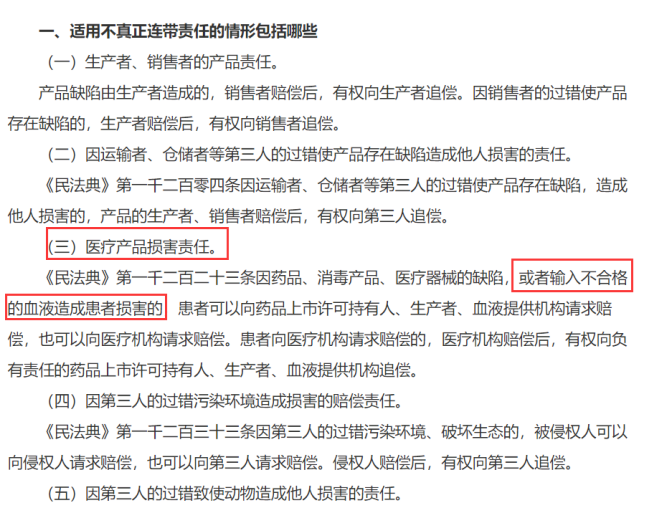

---

### 第 21 题　qid 5510024 · 定义判断

在新一代信息技术形成的网络生命空间中，数字平台生态系统提供的社会化工具减少了组织创建的成本，极大地激发了社会个体创建组织的积极性，形成了虚拟世界中组织进化的新现象。大型数字平台生态系统所提供的社会化工具帮助现实社会中的个体打造了众多的数字组织，这些数字组织可以称之为社会化数字组织。
根据上述定义，下列属于社会化数字组织的是：

- **A**. 某地利用微博建立了网络红色文化学习社区宣传红军长征精神
- **B**. 志愿者小李在短视频APP中组建助农协会帮助农户直播销售农产品　✅
- **C**. 某外卖平台响应国家号召积极吸纳来自偏远地区进城务工人员，帮助他们实现再就业
- **D**. 登山爱好者老刘发现某社交媒体在信息交流方面十分便捷，便邀请同城登山爱好者到该社交媒体上交流登山体验

**答案**：B

**官方解析**

第一步：找出定义关键词。
“大型数字平台生态系统所提供的社会化工具”、“现实社会中的个体”、“打造了众多的数字组织”。
第二步：逐一分析选项。
A项：某地利用微博建立了网络红色文化学习社区，属于地方组织性行为，不符合“现实社会中的个体”，不符合定义，排除；
B项：该项中短视频APP，符合“大型数字平台生态系统所提供的社会化工具”，志愿者小李，符合“现实社会中的个体”，组建助农协会，符合“打造了众多的数字组织”，符合定义，当选；
C项：某外卖平台响应国家号召积极吸纳来自偏远地区进城务工人员，网络平台属于企业行为，不符合“现实社会中的个体”，帮助他们实现再就业，不符合“打造了众多的数字组织”，不符合定义，排除；
D项：登山爱好者老刘是利用社交媒体进行交流，没有体现“打造了众多的数字组织”，不符合定义，排除。
故正确答案为B。

---

### 第 22 题　qid 5510017 · 定义判断

代表性启发，是指在使用启发法时，首先会考虑借鉴要判断的事件本身或同类事件以往的经验，即以往出现的结果；可得性启发，是指在使用启发法进行判断时，人们往往会依赖最先想到的经验和信息，并认定这些容易知觉到或回想起的事件更常出现，以此作为判断的依据。
根据上述定义，下列属于可得性启发的是：

- **A**. 人们偏向于高估连续事件发生的概率，这往往会导致对某一计划的成功过分乐观
- **B**. 我们知道高质量产品一般价格不菲，因此，如果某个产品很贵，我们会认为它的质量很好
- **C**. 很多人会根据服装来判断他人社会地位的高低，看到身着高档服装的人，就认为他们更成功、社会地位更高
- **D**. 人们在判断交通工具的安全性时，都认为乘坐飞机更危险，因为首先想到的是关于飞机失事的报道，而通常想不起火车意外事故的报道　✅

**答案**：D

**官方解析**

第一步：找出定义关键词。
代表性启发：“首先借鉴要判断的事件本身或同类事件以往的出现的结果”；
可得性启发：“把最先想到的经验和信息作为判断的依据”。
第二步：逐一分析选项。
A项：高估连续事件发生的概率，即以往连续发生的预测还会发生，借鉴的是同类事件以往出现的结果，不符合“把最先想到的经验和信息作为判断的依据”，不符合“可得性启发”定义，符合“代表性启发”定义，排除；
B项：高质量产品一般贵，因此，如果某个产品很贵，我们会认为它的质量很好，借鉴的是同类事件以往出现的结果，不符合“把最先想到的经验和信息作为判断的依据”，不符合“可得性启发”定义，符合“代表性启发”定义，排除；
C项：会根据服装来判断他人社会地位的高低，看到身着高档服装的人，就认为他们更成功、社会地位更高，借鉴的是同类事件以往出现的结果，不符合“把最先想到的经验和信息作为判断的依据”，不符合“可得性启发”定义，符合“代表性启发”定义，排除；
D项：认为乘坐飞机更危险，因为首先想到的是关于飞机失事的报道，“首先想到”说明是根据最先想到的信息去判断的，符合“把最先想到的经验和信息作为判断的依据”，符合“可得性启发”定义，当选。
故正确答案为D。

---

### 第 23 题　qid 5510013 · 定义判断

生物修复就是利用生物的生命代谢活动减少被污染的环境中的有毒有害物的浓度或使其无害化，从而使被污染了的环境能够部分地或完全地恢复到原初状态的过程。
根据上述定义，下列不属于生物修复的是：

- **A**. 在被重金属污染的土壤中种植能吸附重金属的蜈蚣草，通过收割蜈蚣草带走土壤里的部分重金属
- **B**. 用玉米等粮食作物做成的降解塑料袋替代传统塑料袋，解决丢弃传统塑料对环境造成的污染问题　✅
- **C**. 利用硝化细菌、芽孢杆菌等微生物菌降解河道有机污染物，治理被污水和垃圾污染的城市河流
- **D**. 在人工水产养殖场中投放一些藻类，利用菌藻共生关系，对池塘里的污物进行处理和净化

**答案**：B

**官方解析**

第一步：找出定义关键词。
“利用生物的生命代谢活动”、“减少被污染的环境中的有毒有害物的浓度”、“使被污染了的环境能够部分地或完全地恢复到原初状态”。
第二步：逐一分析选项。
A项：利用蜈蚣草吸收土壤中的重金属，符合“利用生物的生命代谢活动”、“减少被污染的环境中的有毒有害物的浓度”，符合定义，排除；
B项：使用玉米等粮食作物做成的降解塑料袋来减少环境污染，玉米等粮食是降解塑料袋的原材料，不涉及生物的生命代谢活动，不符合“利用生物的生命代谢活动”、“减少被污染的环境中的有毒有害物的浓度”，不符合定义，当选；
C项：利用微生物菌降解河道有机污染物，符合“利用生物的生命代谢活动”、“减少被污染的环境中的有毒有害物的浓度”，符合定义，排除；
D项：利用菌藻共生关系，处理和净化池塘里的污物，符合“利用生物的生命代谢活动”、“减少被污染的环境中的有毒有害物的浓度”，符合定义，排除。
本题为选非题，故正确答案为B。

---

### 第 24 题　qid 5510132 · 定义判断

数据隐私，是指个人或组织不宜公开的，需要在数据收集、数据存储、数据查询和分析、数据发布等过程中加以保护的信息。
根据上述定义，下列哪项不属于数据隐私？

- **A**. 小李在医院就医时，被查出患有霍乱的疾病信息
- **B**. 小东在银行办理个人业务时登记的个人身份证号
- **C**. 小梅在某购物网站上购买的女性物品的购物记录
- **D**. 小雷在某股票交易软件上的交易密码　✅

**答案**：D

**官方解析**

第一步：找出定义关键词。

“个人或组织不宜公开的”、“需要在数据收集、数据存储、数据查询和分析、数据发布等过程中加以保护的信息”。

第二步：逐一分析选项。

A项：霍乱是一种消化道急性传染病，其病人医疗信息属个人隐私，未经允许不得公开，医疗取用病人病情数据信息也是匿名化，符合“不宜公开的”、“需在数据收集、存储、查询和分析、发布等过程中加以保护的信息”，符合定义，排除；

B项：小东符合“个人或组织”，其个人身份证号属于个人隐私信息，符合“个人或组织不宜公开的”、“需要在数据收集、数据存储、数据查询和分析、数据发布等过程中加以保护的信息”，符合定义，排除；

C项：小梅在某购物网站上购买的女性物品的购物记录，其中女性物品为较为隐私的物品，不宜公开，符合“个人或组织不宜公开的”、“需要在数据收集、数据存储、数据查询和分析、数据发布等过程中加以保护的信息”，符合定义，排除；

D项：密码是保护个人账户和数据隐私的一种方式，但密码本身并不等同于数据隐私，不符合“需要在数据收集、数据存储、数据查询和分析、数据发布等过程中加以保护的信息”，不符合定义，当选。

注：如下图，通过查询相关文献可知，密码是获取我们数据隐私的“钥匙”，但密码本身并不等同于数据隐私。

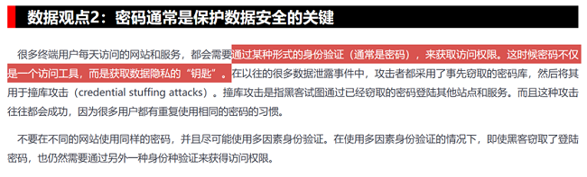

经过查询，A、B、C项对应为数据隐私中不同的几个方面，如下：

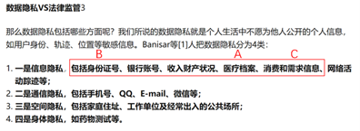

本题为选非题，故正确答案为D。

---

### 第 25 题　qid 5510144 · 类比推理

佶屈聱牙 对于 （    ） 相当于 （    ） 对于 教诲

- **A**. 文句；春风化雨　✅
- **B**. 书写；和光同尘
- **C**. 表达；无微不至
- **D**. 描述；刚柔相济

**答案**：A

**官方解析**

逐一代入选项。
A项：“佶屈聱牙”形容“文句”艰涩，读起来不顺口，二者为对应关系；“春风化雨”比喻师长潜移默化的谆谆“教诲”，二者为对应关系，前后逻辑关系一致，当选；
B项：“佶屈聱牙”与“书写”无明显逻辑关系；“和光同尘”比喻随俗而处，不露锋芒，多指随波逐流，与“教诲”无明显逻辑关系，前后逻辑关系不一致，排除；
C项：“佶屈聱牙”与“表达”无明显逻辑关系；“无微不至”形容关心、照顾得非常细致、周到，与“教诲”无明显逻辑关系，前后逻辑关系不一致，排除；
D项：“佶屈聱牙”与“描述”无明显逻辑关系；“刚柔相济”是指既有刚强的一面，也有柔和的一面，二者互相补充、配合，与“教诲”无明显逻辑关系，前后逻辑关系不一致，排除。
故正确答案为A。

---

### 第 26 题　qid 5510141 · 类比推理

细胞核：细胞质：细胞

- **A**. 绝缘体：半导体：导电
- **B**. 碳中和：碳达峰：环保
- **C**. 真皮：表皮：皮肤　✅
- **D**. 牙冠：牙齿：牙龈

**答案**：C

**官方解析**

第一步：判断题干词语间逻辑关系。
细胞核和细胞质都是细胞的组成部分，第一词与第二词为并列关系，均与第三词为组成关系。
第二步：判断选项词语间逻辑关系。
A项：绝缘体与半导体为并列关系，绝缘体不容易导电，半导体可以导电，二者与导电不是组成关系，与题干逻辑关系不一致，排除；
B项：碳中和与碳达峰都是我国针对碳排放提出的目标，二者为并列关系，实现碳中和、碳达峰目标有利于环保，二者与环保不是组成关系，与题干逻辑关系不一致，排除；
C项：真皮和表皮都是皮肤的组成部分，第一词与第二词为并列关系，均与第三词为组成关系，与题干逻辑关系一致，当选；
D项：牙冠是牙齿的组成部分，二者为组成关系，与题干逻辑关系不一致，排除。
故正确答案为C。

---

### 第 27 题　qid 5510057 · 类比推理

游艇：钢材：船舶

- **A**. 古玺：玉石：隶书
- **B**. 旗袍：丝绸：服饰　✅
- **C**. 版画：油画：绘画
- **D**. 砧板：厨具：木材

**答案**：B

**官方解析**

第一步：判断题干词语间逻辑关系。
游艇是船舶的一种，二者为种属关系，钢材是游艇的原材料，二者为原材料对应关系。
第二步：判断选项词语间逻辑关系。
A项：玉石是古玺的原材料，二者为原材料对应关系，隶书为雕刻古玺时所用的一种文字，二者并非种属关系，与题干逻辑关系不一致，排除；
B项：旗袍是服饰的一种，二者为种属关系，丝绸是旗袍的原材料，二者为对应关系，与题干逻辑关系一致，当选；
C项：版画和油画是两种不同的绘画形式，二者为并列关系，均与绘画构成种属关系，与题干逻辑关系不一致，排除；
D项：砧板为厨具的一种，二者为种属关系，木材是砧板的原材料，二者为对应关系，但词语顺序与题干不同，与题干逻辑关系不一致，排除。
故正确答案为B。

---

### 第 28 题　qid 5510028 · 类比推理

书柜：书籍：书页

- **A**. 花坛：花卉：花蕊　✅
- **B**. 舞池：舞蹈：舞伴
- **C**. 面粉：面条：面片
- **D**. 鞋盒：鞋子：鞋油

**答案**：A

**官方解析**

第一步：判断题干词语间逻辑关系。
书籍在书柜内，二者为位置的对应关系，书页是书籍的组成部分，二者为组成关系。
第二步：判断选项词语间逻辑关系。
A项：花卉在花坛内，二者为位置的对应关系，花蕊是花卉的组成部分，二者为组成关系，与题干逻辑关系一致，当选；
B项：在舞池内舞蹈，二者为位置的对应关系，舞伴表演舞蹈，二者为主宾关系，与题干逻辑关系不一致，排除；
C项：面粉是制作面条的原材料，二者为原材料的对应关系，面条和面片是不同的面食，二者为并列关系，与题干逻辑关系不一致，排除；
D项：鞋子在鞋盒内，二者为位置的对应关系，鞋油是擦拭鞋子的工具，二者为工具的对应关系，与题干逻辑关系不一致，排除。
故正确答案为A。

---

### 第 29 题　qid 5510019 · 类比推理

龋齿：嗜食甜品

- **A**. 海鲜：食物过敏
- **B**. 缺钙：骨质疏松
- **C**. 运动：增强体质
- **D**. 塌方：地下渗水　✅

**答案**：D

**官方解析**

第一步：判断题干词语间逻辑关系。
嗜食甜品导致龋齿，二者为因果对应关系。
第二步：判断选项词语间逻辑关系。
A项：海鲜导致食物过敏，二者为因果对应关系，但顺序与题干相反，与题干逻辑关系不一致，排除；
B项：缺钙导致骨质疏松，二者为因果对应关系，但顺序与题干相反，与题干逻辑关系不一致，排除；
C项：运动可以增强体质，二者为功能对应关系，与题干逻辑关系不一致，排除；
D项：地下渗水导致塌方，二者为因果对应关系，与题干逻辑关系一致，当选。
故正确答案为D。

---

### 第 30 题　qid 5510015 · 类比推理

葡萄：葡萄酒

- **A**. 黄金：黄金档
- **B**. 香蕉：香蕉水
- **C**. 杜鹃：杜鹃花
- **D**. 枇杷：枇杷膏　✅

**答案**：D

**官方解析**

第一步：判断题干词语间逻辑关系。
葡萄是制作葡萄酒的原材料，二者构成原材料的对应关系。
第二步：判断选项词语间逻辑关系。
A项：黄金档是指电视开机观众数最广泛的时段的通称，后者是根据前者的内在特性进行类比而命名的，二者不构成原材料的对应关系，与题干逻辑关系不一致，排除；
B项：香蕉水，又名天那水、梨油，因有乙酸戊酯或乙酸异戊酯的香蕉味，故得名香蕉水，后者是根据其味道类似前者而命名的，二者不构成原材料的对应关系，与题干逻辑关系不一致，排除；
C项：杜鹃既可以指杜鹃花，也可以指杜鹃鸟，杜鹃与杜鹃花不是原材料的对应关系，与题干逻辑关系不一致，排除；
D项：枇杷是制作枇杷膏的原材料，二者构成原材料的对应关系，与题干逻辑关系一致，当选。
故正确答案为D。

---

### 第 31 题　qid 5510012 · 类比推理

针灸：疏通经脉

- **A**. 慢跑：增强体质　✅
- **B**. 涅槃：化茧成蝶
- **C**. 缺铁：供血不足
- **D**. 促销：商品展示

**答案**：A

**官方解析**

第一步：判断题干词语间逻辑关系。
针灸可以疏通经脉，二者是功能对应关系。
第二步：判断选项词语间逻辑关系。
A项：慢跑可以增强体质，二者是功能对应关系，与题干逻辑关系一致，当选；
B项：涅槃原指超脱生死的境界，现用作死（多指佛或僧人）的代称，化茧成蝶原意指蝴蝶幼虫变化为成虫的过程，寓意人经历成长，蜕去丑陋的无用的，变得智慧、美丽，二者之间没有明显的逻辑关系，与题干逻辑关系不一致，排除；
C项：缺铁会导致供血不足，二者是因果对应关系，与题干逻辑关系不一致，排除；
D项：通过商品展示的方式进行促销，二者是方式目的对应关系，与题干逻辑关系不一致，排除。
故正确答案为A。

---

### 第 32 题　qid 5510008 · 类比推理

全真阅读：沉浸式

- **A**. 企业销售：盈利性
- **B**. 乡村教育：均衡化
- **C**. 人工智能：数字化　✅
- **D**. 线上课程：直播性

**答案**：C

**官方解析**

第一步：判断题干词语间逻辑关系。
全真阅读具有沉浸式的属性，二者为必然属性对应关系。
第二步：判断选项词语间逻辑关系。
A项：企业销售可能具有盈利性的属性，但不是必然属性，与题干逻辑关系不一致，排除；
B项：乡村教育可能具有均衡化的属性，但不是必然属性，与题干逻辑关系不一致，排除；
C项：人工智能具有数字化的属性，二者为必然属性对应关系，与题干逻辑关系一致，当选；
D项：线上课程可能具有直播性的属性，但不是必然属性，与题干逻辑关系不一致，排除。
故正确答案为C。

---

### 第 33 题　qid 5510035 · 类比推理

桃红：橘绿：橙黄

- **A**. 蚕食：牛饮：鲸吞　✅
- **B**. 中医：西医：名医
- **C**. 软卧：硬卧：卧铺
- **D**. 被告：原告：控告

**答案**：A

**官方解析**

第一步：判断题干词语间逻辑关系。
桃红、橘绿、橙黄是三种不同的颜色，三者为并列关系中的反对关系。
第二步：判断选项词语间逻辑关系。
A项：蚕食是指蚕吃桑叶时一点一点地吃，牛饮是形容大口喝水，鲸吞是指像鲸一样吞食，三者是不同的饮食方式，为并列关系中的反对关系，与题干逻辑关系一致，当选；
B项：中医和西医是并列关系，名医是指医术高明或者有名气的医生，与前两词均为交叉关系，与题干逻辑关系不一致，排除；
C项：软卧和硬卧是两种不同的卧铺等级，二者为并列关系，与卧铺均为种属关系，与题干逻辑关系不一致，排除；
D项：被告和原告为诉讼过程中的两个主体，二者为并列关系，但控告是指向国家机关、司法机关告发（违法失职或犯罪的个人或集体），与被告和原告不存在并列关系，与题干逻辑关系不一致，排除。
故正确答案为A。

---

### 第 34 题　qid 5510060 · 类比推理

历史朝代：东汉：北宋

- **A**. 热带气旋：台风：飓风
- **B**. 敬辞称谓：家父：令尊
- **C**. 十二时辰：丑时：午时　✅
- **D**. 交通工具：火车：马车

**答案**：C

**官方解析**

第一步：判断题干词语间逻辑关系。
东汉和北宋都是中国历史朝代之一，二者是并列关系，都与历史朝代构成组成关系，且东汉在前，北宋在后。
第二步：判断选项词语间逻辑关系。
A项：台风发生在太平洋西部和南海，飓风发生大西洋西部，台风和飓风都是“一种”热带气旋，与热带气旋构成种属关系，台风与飓风也没有时间的先后，与题干逻辑关系不一致，排除；
B项：家父是对人谦称自己的父亲的称呼，不是敬辞称谓，令尊是称对方父亲的敬词，是“一种”敬辞称谓，与敬辞称谓构成种属关系，家父与令尊也没有时间的先后，与题干逻辑关系不一致，排除；
C项：十二时辰即：子、丑、寅、卯、辰、巳、午、未、申、酉、戌、亥，丑时和午时是并列关系，都与十二时辰构成组成关系，且丑时在前，午时在后，与题干逻辑关系一致，当选；
D项：火车和马车都是“一种”交通工具，与交通工具构成种属关系，通常马车更早产生，火车是工业时代产物，与题干逻辑关系不一致，排除。
故正确答案为C。

---

### 第 35 题　qid 5510168 · 逻辑判断

肱骨是位于动物上臂的长骨。通过对比40块3D肱骨化石，研究人员发现，在从水生鱼类过渡到陆地四足动物的过程中，肱骨形状发生了改变。刚上岸的过渡四足动物具有“L”形的肱骨，能帮助动物在陆地上移动，而后，这块骨头逐渐变得更长更扭曲，这一变化使动物能够在陆地上采取更加有效的步态，从而完成了由鳍到肢的过渡过程。
以下哪项如果为真，最能支持上述结论？

- **A**. 肱骨在鱼类和四足动物的化石中通常保存较好，因此研究人员才可以用它来重建前者过渡到后者的运动进化过程
- **B**. 鱼类“L”形肱骨所在的部位有一块坚实的肌肉支撑鱼体的前半部，让它迈出上岸的第一步
- **C**. 鱼类肱骨形状从“L”形到更长更扭曲的这一改变是鱼类的鳍转变为四足动物的肢的关键　✅
- **D**. 肱骨在四足运动中很关键，其上的肌肉会吸收运动中产生的大部分压力

**答案**：C

**官方解析**

第一步：找出论点和论据。
论点：这一变化（肱骨形状发生改变）使动物能够在陆地上采取更加有效的步态，从而完成了由鳍到肢的过渡过程。
论据：刚上岸的过渡四足动物具有“L”形的肱骨，能帮助动物在陆地上移动，而后，这块骨头逐渐变得更长更扭曲。
本题论点和论据均在讨论“肱骨形状发生改变”，论点论据话题一致，加强优先考虑补充论据。
第二步：逐一分析选项。
A项：该项指出肱骨在鱼类和四足动物的化石中通常保存较好，研究人员可以用它来重建前者过渡到后者的运动进化过程，未提及肱骨形状改变在从水生鱼类过渡到陆地四足动物的过程中的作用，而论点说的是肱骨形状发生改变使动物能够在陆地上采取更加有效的步态，从而完成了由鳍到肢的过渡过程，话题不一致，无法加强，排除；
B项：该项指出鱼类“L”形肱骨所在的部位有一块坚实的肌肉支撑鱼体的前半部，让它迈出上岸的第一步，而论点说的是肱骨形状发生改变使动物能够在陆地上采取更加有效的步态，从而完成了由鳍到肢的过渡过程，话题不一致，无法加强，排除；
C项：该项指出鱼类肱骨形状从“L”形到更长更扭曲的这一改变是鱼类的鳍转变为四足动物的肢的关键，解释了为什么肱骨形状发生改变使动物能够在陆地上采取更加有效的步态，从而完成了由鳍到肢的过渡过程，补充论据，可以加强，当选；
D项：该项指出肱骨在四足运动中很关键，其上的肌肉会吸收运动中产生的大部分压力，而论点说的是肱骨形状发生改变使动物能够在陆地上采取更加有效的步态，从而完成了由鳍到肢的过渡过程，话题不一致，无法加强，排除。
故正确答案为C。

---

## 资料分析

### 材料 1

        2021年中国雨季特征为华南前汛期于4月26日开始，7月2日结束，雨季长度为67天，总雨量494.6毫米。与正常年份相比，开始偏晚20天，结束偏早4天，雨季长度偏短24天，雨量偏少31%。

        西南雨季于6月4日开始，10月4日结束，雨季长度为122天，总雨量634.5毫米。与正常年份相比，开始偏晚9天，结束偏早10天，雨季长度偏短19天，雨量偏少15%。

        华北雨季于7月12日开始，9月9日结束，雨季长度为59天，总雨量276.4毫米。与正常年份相比，开始偏早6天，结束偏晚22天，雨季长度偏长28天，为1961年以来第二长；雨量偏多103%，为1961年以来第三多。

        东北雨季于6月5日开始，8月29日结束，雨季长度为85天，总雨量364.3毫米。与正常年份相比，开始偏早17天，结束偏晚4天，雨季长度偏长21天，雨量偏多23%。

        华西秋雨于8月23日开始，雨季长度为77天，总雨量379.9毫米。与正常年份相比，开始偏早8天，结束偏晚7天，雨季长度偏长15天，雨量偏多87%，为1961年以来最多。

        梅雨于6月9日开始，7月11日出梅，梅雨期32天，梅雨量267.2毫米；与正常年份相比，入梅时间偏晚1天，出梅时间偏早7天，梅雨期偏短8天，梅雨量偏少22%，与2020年梅雨量780.9毫米相比差距明显。江南入梅时间偏晚1天，出梅偏晚3天，雨量偏少15%；长江中下游入梅偏早4天，出梅偏早2天，雨量偏少8%；江淮区入梅时间偏早8天，出梅时间偏早4天，梅雨量偏少14%。

#### 第 1 题　qid 5509986 · 增长

华西2021年雨季降水量与正常年份雨季降水量相比增加了约：

- **A**. 153.4毫米
- **B**. 176.7毫米　✅
- **C**. 203.2毫米
- **D**. 232.5毫米

**答案**：B

**官方解析**

根据题干“华西2021年······与······相比增加了约”，结合选项带单位，可判定本题为增长量计算问题。定位文字材料第五段可知：2021年，华西秋雨于8月23日开始，总雨量379.9毫米。与正常年份相比，雨量偏多87%。根据公式：增长量，则所求为毫米，与B项最接近。

故正确答案为B。

---

#### 第 2 题　qid 5509985 · 平均数

下列地区中2021年雨季期平均每天降雨量最大的地区是：

- **A**. 西南　✅
- **B**. 华北
- **C**. 东北
- **D**. 华西

**答案**：A

**官方解析**

根据题干“下列地区中2021年雨季期平均每天降雨量最大的地区是”，可判定本题为现期平均数问题。定位文字材料第二段至第五段可得：2021年西南雨季长度为122天，总雨量634.5毫米；华北雨季长度为59天，总雨量276.4毫米；东北雨季长度为85天，总雨量364.3毫米；华西雨季长度为77天，总雨量379.9毫米。根据公式：雨季期平均每天降雨量，则各地区平均每天降雨量分别为：

西南毫米/天；

华北毫米/天；

东北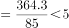毫米/天；

华西毫米/天。

比较可知，2021年雨季期平均每天降雨量最大的是西南地区。

故正确答案为A。

---

#### 第 3 题　qid 5509984 · 综合

2021年雨季开始时间最迟的两个地区在雨季开始时间上相差了：

- **A**. 34天
- **B**. 35天
- **C**. 41天
- **D**. 42天　✅

**答案**：D

**官方解析**

定位文字材料可知：2021年雨季开始时间最迟的两个地区分别为华北（7月12日）、华西（8月23日），故时间上相差了31-12+23=42天（7月共有31天）。
故正确答案为D。

---

#### 第 4 题　qid 5509983 · 综合

正常年份雨季长度最长的地区是：

- **A**. 华南
- **B**. 西南　✅
- **C**. 东北
- **D**. 华西

**答案**：B

**官方解析**

定位文字材料第一段可得：2021年华南雨季长度为67天，与正常年份相比，雨季长度偏短24天。定位文字材料第二段可得：（2021年）西南雨季长度为122天，与正常年份相比，雨季长度偏短19天。定位文字材料第四段可得：（2021年）东北雨季长度为85天，与正常年份相比，雨季长度偏长21天。定位文字材料第五段可得：（2021年）华西雨季长度为77天，与正常年份相比，雨季长度偏长15天。则正常年份各地区雨季长度分别为：华南，67+24=91天；西南，122+19=141天；东北，85-21=64天；华西，77-15=62天。综上，正常年份雨季长度最长的地区是西南。
故正确答案为B。

---

#### 第 5 题　qid 5509987 · 综合

能够从上述资料推出的是：

- **A**. 2021年10月7日属于西南雨季期内
- **B**. 2020年梅雨量高出正常年份的227.9%
- **C**. 2020年华西雨季总雨量超过379.9毫米
- **D**. 东北正常年份雨季长度为华北正常年份雨季长度的2倍多　✅

**答案**：D

**官方解析**

A项：定位文字材料第二段，（2021年）西南雨季于6月4日开始，10月4日结束。则2021年10月7日不属于西南雨季期内，错误；

B项：定位文字材料第六段，（2021年）梅雨量267.2毫米；与正常年份相比······梅雨量偏少22%，与2020年梅雨量780.9毫米相比差距明显。根据公式：基期量，可得正常年份梅雨量毫米，2020年梅雨量高出正常年份，错误；

C项：材料中没有给出2021年华西雨季总雨量与2020年相比的相关数据，故无法推出，错误；

D项：定位文字材料第三段、第四段，（2021年）华北雨季长度为59天······与正常年份相比······雨季长度偏长28天；（2021年）东北雨季长度为85天······与正常年份相比······雨季长度偏长21天。则题干所求倍，正确。

故正确答案为D。

---

### 材料 2

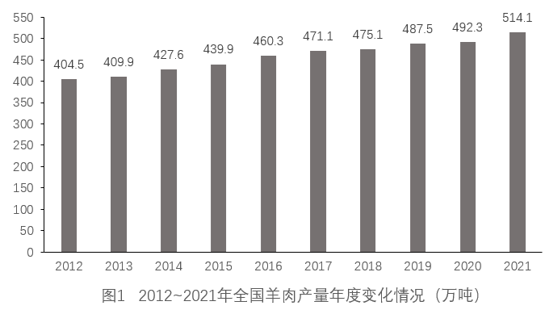

#### 第 6 题　qid 5509993 · 增长

2021年，全国羊肉产量同比增长率约为：

- **A**. 2.4%
- **B**. 3.4%
- **C**. 4.4%　✅
- **D**. 5.4%

**答案**：C

**官方解析**

根据题干“2021年，全国羊肉产量同比增长率约为”，可判定本题为一般增长率问题。定位图1可知2020年、2021年全国羊肉产量分别为492.3万吨、514.1万吨。根据公式：增长率，则2021年全国羊肉产量同比增长率为。

故正确答案为C。

---

#### 第 7 题　qid 5509994 · 平均数

2012～2021年，最接近全国羊肉年平均产量的是：

- **A**. 2015年
- **B**. 2016年　✅
- **C**. 2017年
- **D**. 2018年

**答案**：B

**官方解析**

根据题干“2012-2021年······年平均产量······”，可判定本题为现期平均数问题。定位统计图可知2012-2021年全国羊肉产量。利用“削峰填谷”，以450为基准，分别作差为：-45.5、-40.1、-22.4、-10.1、10.3、21.1、25.1、37.5、42.3、64.1，，则羊肉年平均产量为450+8.23=458.23万吨，2016年羊肉产量460.3万吨最接近该数据。

故正确答案为B。

---

#### 第 8 题　qid 5510138 · 增长

表1所列的主要畜禽产品中，相较于2012年，2021年零售价格增长幅度超过50%的是：

- **A**. 猪肉、牛肉、羊肉　✅
- **B**. 猪肉、羊肉、鸡肉
- **C**. 牛肉、羊肉、鸡肉
- **D**. 羊肉、鸡肉、鸡蛋

**答案**：A

**官方解析**

根据题干“······增长幅度超过50%······”，可判定本题为一般增长率问题。定位表1可得2012年和2021年全国主要畜禽产品零售价格。根据公式：增长率，可得猪肉零售价格增长率，牛肉零售价格增长率，羊肉零售价格增长率，鸡肉零售价格增长率，鸡蛋零售价格增长率，故相较于2012年，2021年零售价格增长幅度超过50%的有猪肉、牛肉、羊肉。

故正确答案为A。

---

#### 第 9 题　qid 5509998 · 增长

假设羊肉每年以零售价格全部售罄，那么，2021年羊肉销售收入同比增长约：

- **A**. 5.2%
- **B**. 10.4%　✅
- **C**. 17.6%
- **D**. 22.7%

**答案**：B

**官方解析**

方法一：根据题干“2021年······同比增长约”，结合选项为百分数，可判定本题为一般增长率问题。定位图表可得：2021年、2020年羊肉产量分别为514.1万吨、492.3万吨，2021年、2020年羊肉零售价格分别为81.40元/公斤、77.01元/公斤。因题目假设羊肉每年以零售价格全部售罄，故羊肉销售收入=产量×零售价格，则2021年羊肉销售收入=514.1万吨×81.40元/公斤51亿公斤×81元/公斤=4131亿元；2020年羊肉销售收入=492.3万吨×77.01元/公斤49亿公斤×77元/公斤=3773亿元。根据公式：增长率，则2021年羊肉销售收入同比增长，与B项最接近。

方法二：根据题干“2021年······同比增长约”，结合选项为百分数，且题目假设羊肉每年以零售价格全部售罄，故羊肉零售价格，可判定本题为平均数的增长率问题。定位图表可得：2021年、2020年羊肉产量分别为514.1万吨、492.3万吨，2021年、2020年羊肉零售价格分别为81.40元/公斤、77.01元/公斤。根据公式：增长率，则2021年羊肉产量同比增长率为（b）（也可根据第一小题答案直接使用），2021年羊肉零售价格同比增长率为（r）。根据平均数的增长率公式：r，设2021年羊肉销售收入同比增长率为a，代入公式得：，则a。

故正确答案为B。

---

#### 第 10 题　qid 5509999 · 综合

不能从上述资料推出的是：

- **A**. 2012～2021年，全国羊肉产量逐年增长
- **B**. 2020年，牛肉批发价格不足零售价格的90%
- **C**. 2020年，鸡肉零售价格与批发价格之比大于牛肉
- **D**. 2012～2021年，鸡蛋批发价格同比增速最快的年份是2018年　✅

**答案**：D

**官方解析**

A项：定位统计图可知，2012～2021年，全国羊肉产量一年比一年变大，即逐年增长，正确；

B项：定位统计表可知，2020年牛肉批发价格为73.03元/公斤，零售价格为86.81元/公斤，元/公斤，2020年牛肉批发价格73.03元/公斤＜78.1元/公斤，即2020年，牛肉批发价格不足零售价格的90%，正确；

C项：定位统计表可知，2020年鸡肉零售价格为26.66元/公斤，批发价格为16.82元/公斤；牛肉零售价格为86.81元/公斤，批发价格为73.03元/公斤；2020年，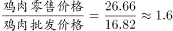，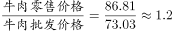，，正确；

D项：定位统计表可知，可得2012～2021年鸡蛋批发价格。根据公式：增长率，2018年鸡蛋批发价格同比增速为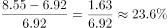；而2021年鸡蛋批发价格同比增速为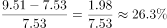，即2012～2021年，鸡蛋批发价格同比增速最快的年份并不是2018年，错误。

本题为选非题，故正确答案为D。

---

### 材料 3

        2012~2021的10年间，辽宁、天津、河北、山东、江苏、上海、浙江、福建、广东、广西、海南11个沿海省市的核电、火电、钢铁、石化等行业的海水冷却用水量稳步增长（图1），其中浙江、福建、广东3省海水冷却用水量相对较高（表1）。截至2021年底，11个沿海省市共建有海水冷却工程22个，2021年全国11个沿海省市海水冷却工程年总循环量为169.5亿吨。

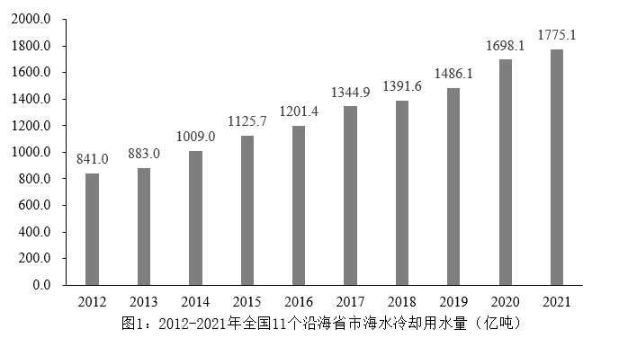

#### 第 11 题　qid 5510164 · 综合

2021年海水冷却用水量低于海水冷却工程年总循环量的沿海省市共有几个：

- **A**. 5个
- **B**. 6个
- **C**. 7个
- **D**. 8个　✅

**答案**：D

**官方解析**

定位文字材料可得，2021年全国11个沿海省市海水冷却工程年总循环量为169.5亿吨。结合表格比较可得，8个沿海省中，海水冷却用水量低于海水冷却工程年总循环量的省份共有5个，分别为辽宁（49.0亿吨）、河北（54.6亿吨）、山东（145.1亿吨）、江苏（117.5亿吨）、广西（70.6亿吨）。

除表中8省外，剩余3个沿海省市海水冷却用水量之和亿吨。因3个省市的海水冷却用水量之和（163.1亿吨）低于海水冷却工程年总循环量（169.5亿吨），则每个省市的海水冷却用水量均应低于海水冷却工程年总循环量。

故满足要求的沿海省市共5+3=8个。

故正确答案为D。

---

#### 第 12 题　qid 5510163 · 综合

表1中，2021年除浙江、福建、广东外的5个沿海省市海水冷却用水量占全国11个沿海省市的：

- **A**. 24.6%　✅
- **B**. 33.8%
- **C**. 47.6%
- **D**. 66.2%

**答案**：A

**官方解析**

根据题干“表1中，2021年······占······的”，结合选项为百分数，可判定本题为现期比重问题。定位图1可得：2021年全国11个沿海省市的海水冷却用水量为1775.1亿吨；定位表1可得：2021年除浙江、福建、广东外的5个沿海省市海水冷却用水量分别为49.0亿吨、54.6亿吨、145.1亿吨、117.5亿吨、70.6亿吨。根据公式：比重，题目所求，与A项最接近。

故正确答案为A。

---

#### 第 13 题　qid 5510160 · 综合

2012~2021年关于各省同年份海水冷却用水量的大小关系正确的是：

- **A**. 辽宁>河北
- **B**. 山东>江苏　✅
- **C**. 广东>浙江
- **D**. 江苏>广西

**答案**：B

**官方解析**

定位表1可知2012~2021年每年各省海水冷却用水量。代入数据验证选项，A项：2021年，辽宁海水冷却用水量（49.0亿吨）&lt;河北海水冷却用水量（54.6亿吨），不符合，排除；B项：2012~2021年山东同年份海水冷却用水量均大于江苏，当选；C项：2015年，广东海水冷却用水量（332.2亿吨）&lt;浙江海水冷却用水量（336.0亿吨），不符合，排除；D项：2017年，江苏海水冷却用水量（42.4亿吨）&lt;广西海水冷却用水量（54.2亿吨），不符合，排除。
故正确答案为B。

---

#### 第 14 题　qid 5510116 · 增长

图1中2012～2021年期间海水冷却用水量年增量高于2012～2021年期间全国海水冷却用水量年平均增长量的年份共有几个？

- **A**. 2
- **B**. 3
- **C**. 4　✅
- **D**. 5

**答案**：C

**官方解析**

根据题干“······2012～2021年期间全国海水冷却用水量年平均增长量······”，可判定本题为年均增长量问题。定位图形材料可得2012～2021年全国11个沿海省市海水冷却用水量。根据公式：年均增长量，可得2012～2021年期间全国海水冷却用水量年平均增长量亿吨；根据公式：增长量=现期量-基期量，可得2013～2021年海水冷却用水量年增量分别为：

2013年=883.0-841.0&lt;100亿吨&lt;103.8亿吨；

2014年=1009.0-883.0&gt;120亿吨&gt;103.8亿吨；

2015年=1125.7-1009.0&gt;110亿吨&gt;103.8亿吨；

2016年=1201.4-1125.7&lt;100亿吨&lt;103.8亿吨；

2017年=1344.9-1201.4&gt;140亿吨&gt;103.8亿吨；

2018年=1391.6-1344.9&lt;100亿吨&lt;103.8亿吨；

2019年=1486.1-1391.6&lt;100亿吨&lt;103.8亿吨；

2020年=1698.1-1486.1&gt;200亿吨&gt;103.8亿吨；

2021年=1775.1-1698.1&lt;100亿吨&lt;103.8亿吨。

综上，年增量高于2012～2021年期间全国海水冷却用水量年平均增长量的年份有2014年、2015年、2017年、2020年，共4个年份。

故正确答案为C。

---

#### 第 15 题　qid 5510165 · 综合

可以从上述资料推出的是：

- **A**. 2021年全国11个沿海省份海水冷却用水量前4名依次为：广东、浙江、福建、江苏
- **B**. 2012~2021年浙江、广东年海水冷却用水量之和均超过全国同期的60%
- **C**. 2012~2021年表1的8个省市中福建的海水冷却用水量年平均增速最快　✅
- **D**. 2012~2021年间，广东的海水冷却用水量均为辽宁同期的3倍以上

**答案**：C

**官方解析**

A项：定位表1，2021年辽宁、河北等8省海水冷却用水量前4名依次为：广东（571.3亿吨）、浙江（338.7亿吨）、福建（264.3亿吨）、山东（145.1亿吨），江苏省在此表中排名为第5，故一定无法排到全国11个沿海省份海水冷却用水量的前4名，错误；

B项：定位图1可知2012～2021年全国11个沿海省市的海水冷却用水量，定位表1可知2012～2021年浙江、广东年海水冷却用水量。2012年浙江、广东年海水冷却用水量之和占全国11个沿海省市的海水冷却用水量的比重为，并非均超过全国同期的60%，错误；

C项：定位表1可知2012年、2021年辽宁、河北等8省海水冷却用水量。根据年均增长率公式：（n为年份差），当年份差相同时，直接比较即可。表1的8个省份分别为：辽宁，；河北，；山东，；江苏，；浙江，；福建，；广东，；广西，，比较可知8个省份中福建的海水冷却用水量年平均增速最快，正确；

D项：定位表1可知2012～2021年间，广东、辽宁的海水冷却用水量。2014年广东的海水冷却用水量为辽宁同期的倍倍，并非均为3倍以上，错误。

故正确答案为C。

---
