# 2023年江苏省公务员录用考试《行测》题（B类）（网友回忆版）

> 省考 · 2023 年 · 6 个模块 · 共 134 题

- [政治理论](#%E6%94%BF%E6%B2%BB%E7%90%86%E8%AE%BA) · 2 题
- [常识判断](#%E5%B8%B8%E8%AF%86%E5%88%A4%E6%96%AD) · 18 题
- [言语理解与表达](#%E8%A8%80%E8%AF%AD%E7%90%86%E8%A7%A3%E4%B8%8E%E8%A1%A8%E8%BE%BE) · 25 题
- [数量关系](#%E6%95%B0%E9%87%8F%E5%85%B3%E7%B3%BB) · 19 题
- [判断推理](#%E5%88%A4%E6%96%AD%E6%8E%A8%E7%90%86) · 50 题
- [资料分析](#%E8%B5%84%E6%96%99%E5%88%86%E6%9E%90) · 20 题

---

## 政治理论

### 第 1 题　qid 5699361 · 时事政治

习近平总书记在党的二十大报告中，就推进国家安全体系和能力现代化，坚决维护国家安全和社会稳定，提出了新观点。下列属于党的二十大报告中提出的维护国家安全新观点的是（    ）。

- **A**. 要完善国家安全战略和国家安全政策，加强国家安全体系建设
- **B**. 人民安全是国家安全的宗旨，要始终把人民生命安全放在首位
- **C**. 国家安全是民族复兴的根基，要以新安全格局保障新发展格局　✅
- **D**. 坚持总体国家安全观既要重视传统安全，又要重视非传统安全

**答案**：C

**官方解析**

本题考查政治常识。
A项错误，党的十九大报告中“八、提高保障和改善民生水平，加强和创新社会治理”部分指出：“（七）有效维护国家安全。国家安全是安邦定国的重要基石，维护国家安全是全国各族人民根本利益所在。要完善国家安全战略和国家安全政策，坚决维护国家政治安全，统筹推进各项安全工作。健全国家安全体系，加强国家安全法治保障，提高防范和抵御安全风险能力。······”
B项错误，2018年4月17日，习近平主席在十九届中央国家安全委员会第一次会议上发表重要讲话，强调“坚持人民安全、政治安全、国家利益至上的有机统一，人民安全是国家安全的宗旨，政治安全是国家安全的根本，国家利益至上是国家安全的准则，实现人民安居乐业、党的长期执政、国家长治久安；······”；2013年6月6日，习近平主席就安全生产工作作出重要指示，强调要始终把人民生命安全放在首位，以对党和人民高度负责的精神······把安全生产责任制落到实处，切实防范重特大安全生产事故的发生。
C项正确，党的二十大报告中“十一、推进国家安全体系和能力现代化，坚决维护国家安全和社会稳定”部分指出：“国家安全是民族复兴的根基，社会稳定是国家强盛的前提······我们要坚持以人民安全为宗旨、以政治安全为根本、以经济安全为基础、以军事科技文化社会安全为保障、以促进国际安全为依托，统筹外部安全和内部安全、国土安全和国民安全、传统安全和非传统安全、自身安全和共同安全，统筹维护和塑造国家安全，夯实国家安全和社会稳定基层基础，完善参与全球安全治理机制，建设更高水平的平安中国，以新安全格局保障新发展格局。”
D项错误，2014年4月15日，习近平总书记主持召开中央国家安全委员会第一次会议并发表重要讲话。习近平总书记指出，当前我国国家安全内涵和外延比历史上任何时候都要丰富，时空领域比历史上任何时候都要宽广······既重视传统安全，又重视非传统安全，构建集政治安全、国土安全、军事安全、经济安全、文化安全、社会安全、科技安全、信息安全、生态安全、资源安全、核安全等于一体的国家安全体系······
故正确答案为C。

---

### 第 2 题　qid 5699356 · 毛中特

以毛泽东同志为主要代表的中国共产党人，创造性地提出实行人民代表大会制度的构想。下列毛泽东著作中提出我国实行人民代表大会制度构想的是（    ）。
①《论联合政府》
②《论人民民主专政》
③《新民主主义论》
④《〈共产党人〉发刊词》

- **A**. ①②
- **B**. ①③　✅
- **C**. ②③
- **D**. ②④

**答案**：B

**官方解析**

本题考查政治常识。
①正确，1945年4月，毛泽东同志在《论联合政府》中进一步指出：“新民主主义的政权组织，应该采取民主集中制，由各级人民代表大会决定大政方针，选举政府。它是民主的，又是集中的，就是说，在民主基础上的集中，在集中指导下的民主。”
②错误，1949年6月，毛泽东同志发表了《论人民民主专政》，全面阐述了建立人民民主专政的历史必然性、中国社会各阶级在人民民主专政政权中的地位、民主和专政的关系、人民民主专政的基本任务等问题，完整地阐述了人民民主专政理论。
③正确，1940年1月，毛泽东同志在《新民主主义论》中明确提出“人民代表大会”的构想。他指出：“没有适当形式的政权机关，就不能代表国家。中国现在可以采取全国人民代表大会、省人民代表大会、县人民代表大会、区人民代表大会直到乡人民代表大会的系统，并由各级代表大会选举政府。”
④错误，中共中央机关刊物《共产党人》创刊，毛泽东同志为其写了发刊词。在《〈共产党人〉发刊词》中，毛泽东同志指出统一战线、武装斗争、党的建设是中国共产党在中国革命中战胜敌人的三个法宝。毛泽东同志强调，要“建设一个全国范围的、广大群众性的、思想上政治上组织上完全巩固的布尔什维克化的中国共产党”，并将这一任务称为“伟大的工程”。
综上所述，提出我国实行人民代表大会制度构想的是①③。
故正确答案为B。

---

## 常识判断

### 第 1 题　qid 5699362 · 科技常识

新时代十年，党和国家事业取得历史性成就、发生历史性变革，推动我国迈上全面建设社会主义现代化国家新征程。关于新时代十年的历史性成就，下列表述正确的是（    ）。
①成为世界上森林资源增长最多和人工造林面积最大的国家
②水电、风电、太阳能发电、生物质发电装机均居世界第一
③全社会研发经费、研发投入强度、全球创新指数居世界首位
④建成了全球规模最大的教育体系、社保体系和医疗卫生体系

- **A**. ①②③
- **B**. ①②④　✅
- **C**. ①③④
- **D**. ②③④

**答案**：B

**官方解析**

本题考查政治常识。
①正确，2022年10月21日，生态环境部有关工作人员在党的二十大记者招待会上介绍，我国是全球森林资源增长最多和人工造林面积最大的国家，是全球增绿的主力军。
②正确，2023年1月16日，国家能源局发布的2022年全国电力工业统计数据显示，2022年，全国可再生能源总装机超过12亿千瓦，水电、风电、太阳能发电、生物质发电装机均居世界首位。其中，风电装机容量约3.7亿千瓦，同比增长11.2%；太阳能发电装机容量约3.9亿千瓦，同比增长28.1%。
③错误，党的二十大报告中“一、过去五年的工作和新时代十年的伟大变革”部分指出：“十年来······我们加快推进科技自立自强，全社会研发经费支出从一万亿元增加到二万八千亿元，居世界第二位，研发人员总量居世界首位······”；2023年2月20日召开的国家创新调查制度实施10周年工作座谈会指出，2022年我国全社会研发（R&D）经费投入达到3.09万亿元，是2012年的3倍，稳居世界第二大研发投入国；我国在世界知识产权组织发布的《2022年全球创新指数报告》中排名为全球第11位。
④正确，党的二十大报告在“一、过去五年的工作和新时代十年的伟大变革”部分指出：“十年来，我们坚持马克思列宁主义、毛泽东思想、邓小平理论、‘三个代表’重要思想、科学发展观，全面贯彻新时代中国特色社会主义思想······建成世界上规模最大的教育体系、社会保障体系、医疗卫生体系，教育普及水平实现历史性跨越，基本养老保险覆盖十亿四千万人，基本医疗保险参保率稳定在百分之九十五······”
综上，①②④表述正确。
故正确答案为B。

---

### 第 2 题　qid 5699352 · 人文常识

经过我国几代学者接续努力，中华文明探源工程取得了初步的阶段性成果。关于中华文明探源工程已有研究成果，下列说法正确的是（    ）。
①实证了我国百万年的人类史
②实证了我国五千多年的文明史
③实证了我国一万年的文化史
④实证了我国三千多年的城市史

- **A**. ①②③　✅
- **B**. ①②④
- **C**. ①③④
- **D**. ②③④

**答案**：A

**官方解析**

本题考查政治常识。
①②③正确，④错误，2022年7月16日出版的第14期《求是》杂志发表了习近平总书记的重要文章《把中国文明历史研究引向深入，增强历史自觉坚定文化自信》。文章指出，经过几代学者接续努力，中华文明探源工程等重大工程的研究成果，实证了我国百万年的人类史、一万年的文化史、五千多年的文明史。
故正确答案为A。

---

### 第 3 题　qid 5699370 · 科技常识

2022年11月30日，神舟十五号航天员乘组在“天宫”与神舟十四号航天员乘组胜利会师，接过中国空间站建造期的最后一棒。下列属于神舟十五号航天员乘组要完成的任务是（    ）。

- **A**. 在轨转移、组装和测试舱外服
- **B**. 安装梦天舱扩展泵组和载荷暴露平台设备　✅
- **C**. 安装机械臂悬挂装置与转接件
- **D**. 在轨组装完成“T”字基本构型的空间站

**答案**：B

**官方解析**

本题考查科技常识。
A项错误，神舟十二号是空间站关键技术验证阶段第四次飞行任务，也是空间站阶段首次载人飞行任务。舱外服在轨转移、组装、测试是神舟十二号任务之一。
B项正确，神舟十五号是中国空间站建造阶段最后一次飞行任务。神十五乘组将重点开展6个方面工作：一是开展空间站三舱状态长期驻留验证工作；二是完成15个科学实验机柜解锁、安装与测试，开展涵盖空间科学研究与应用、航天医学、航天技术等领域的40余项空间科学实验和技术试验；三是实施3至4次出舱活动，完成梦天舱扩展泵组和载荷暴露平台设备安装等工作；四是验证货物气闸舱出舱工作模式，与地面协同完成6次货物出舱任务；五是开展常态化的平台测试、维护及站务管理工作；六是开展在轨健康防护锻炼、在轨训练与演练等工作。
C项错误，神舟十三号是中国空间站关键技术验证阶段第六次飞行，也是该阶段最后一次飞行任务。机械臂悬挂装置与转接件安装是神舟十三号任务之一。
D项错误，神舟十四号是中国空间站建造阶段第二次飞行任务，也是该阶段首次载人飞行任务。配合问天实验舱、梦天实验舱与核心舱的交会对接和转位，在轨组装完成“T”字基本构型的空间站是神舟十四号的任务之一。
故正确答案为B。

---

### 第 4 题　qid 5699350 · 科技常识

我国是全球农业文化遗产类型最多、分布最广、传承最好的国家，也是世界农业文化遗产的倡导者、推动者、实践者和受益者。下列关于农业文化遗产说法不正确的是（    ）。

- **A**. 是融经济、生物、技术、文化、景观为一体的复合系统
- **B**. 具有自然遗产、物质文化遗产和非物质文化遗产多重属性
- **C**. 是能普遍地直接推广应用的具体生产体系和知识技术体系　✅
- **D**. 虽生产在过去但至今仍是当地居民的生产方式和经济来源

**答案**：C

**官方解析**

本题考查科技常识。
A项正确，农业文化遗产是融经济、生物、技术、文化、景观为一体的复合系统。受自然条件的限制，保留了更多农耕文明的原始特质。
B项正确，综合性是农业文化遗产的特征，体现在农业文化遗产兼具农业经济、生态保护和文化传承多重功能，具有自然遗产、物质文化遗产和非物质文化遗产等多重属性。
C项错误，对于农业文化遗产，不能追求“一成不变”的“冷冻式保存”，而要根据自然条件和社会经济条件的变化适当调整。但是，遗产系统的基本结构、功能及重要的物种资源、农业景观、水土资源管理技术等不能变，与之相关的民族文化与传统知识也不应有大的改变。也就是说，具体生产体系是要根据自然条件和社会经济条件的变化适当调整的，而不能普遍地直接推广应用。
D项正确，与人们熟知的其他遗产相比，农业文化遗产最显著的特征在于，它是“活着的”。即，它虽然诞生在过去，但至今仍在使用，并且仍是当地居民的生产方式和主要经济来源。
本题为选非题，故正确答案为C。

---

### 第 5 题　qid 5699353 · 科技常识

光电子信息产业是我国有条件率先实现突破的战略高技术产业，而光电子信息产业与光电子技术有着紧密的联系。下列关于光电子技术的说法不正确的是（    ）。

- **A**. 是未来信息产业的核心技术
- **B**. 具有精密、准确、快速、高效特点
- **C**. 是替代电子技术的的尖端技术　✅
- **D**. 涉及光显示、光存储、激光等领域

**答案**：C

**官方解析**

本题考查科技常识。
A、D两项正确，光电子技术是由光子技术和电子技术结合而成的新技术，涉及光显示、光存储、激光等领域，是未来信息产业的核心技术。
B项正确，光电子技术具有精密、准确、快速、高效等特点，有助于全面地提高工业产品的高、精、坚加工水平，大幅度提高产品的附加值和竞争能力。
C项错误，光电子技术科学是光电信息产业的支柱与基础，涉及光电子学、光学、电子学、计算机技术等前沿学科理论，是多学科相互渗透、相互交叉而形成的高新技术学科。光电子技术和电子技术应是相互补充，而非相互竞争替代。
本题为选非题，故正确答案为C。

---

### 第 6 题　qid 5699351 · 人文常识

我国要深入推进环境污染防治，加强土壤污染源头防控，开展新污染物治理。关于新污染物及其治理，下列说法正确的是（    ）。

- **A**. 新污染物是指尚未纳入管理或现有管理措施不足以有效防控其风险的污染物　✅
- **B**. 新污染物包括被排放到环境中的有机污染物、内分泌干扰物、抗生素和塑料
- **C**. 多数新污染物已经通过各种途径进入环境介质中，其短期和长期的危害明显
- **D**. 新污染物的全过程环境风险管控的实现，应当主要采用达标排放的治理手段

**答案**：A

**官方解析**

本题考查科技常识。
A项正确，新污染物是指新近发现或被关注，对生态环境或人体健康存在风险，尚未纳入管理或者现有管理措施不足以有效防控其风险的污染物。新污染物具有生物毒性、环境持久性、生物累积性等特征，且现阶段尚未被有效监管，相对传统已经被监管的污染物而言较“新”。
B项错误，国际上广泛关注的新污染物有四大类：一是持久性有机污染物，二是内分泌干扰物，三是抗生素，四是微塑料。这四类在被排放到环境中后，被界定为新污染物。微塑料，是一种直径小于5毫米的塑料颗粒，其对环境的污染程度比塑料更大。
C项错误，新污染物有五个方面的特征：一是危害比较严重；二是风险比较隐蔽，多数新污染物的短期危害不明显，可是一旦发现其危害性时，污染物可能通过各种途径已经进入环境中；三是环境持久性；四是来源广泛性；五是治理复杂性。
D项错误，新污染物种类繁多、来源广泛、治理复杂，用过去以达标排放为主要手段的常规污染物治理方法，无法实现对新污染物的评估和风险管控。国务院办公厅于2022年5月印发的《新污染物治理行动方案》更加关注物质的评估和风险，要求制定化学物质环境风险筛查和评估方案，以高关注、高产（用）量、高环境检出率、分散式用途的化学物质为重点，开展环境与健康危害测试和风险筛查。
故正确答案为A。

---

### 第 7 题　qid 5699359 · 人文常识

2017-2021年，我国数字经济规模总量稳居世界前列，成为推动经济增长的主要引擎之一。下列关于我国数字经济的说法不正确的是（    ）。

- **A**. 推动经济组织结构扁平化
- **B**. 利用数据来引导资源发挥作用
- **C**. 促进实体经济虚拟化发展　✅
- **D**. 引起社会经济活动的全局变化

**答案**：C

**官方解析**

本题考查经济常识。
A项正确，扁平化组织结构，就是一种通过减少管理层次、压缩职能机构、裁减人员而建立起来的一种紧凑而富有弹性的新型团体组织，它具有敏捷、灵活、快速、高效的优点。与传统层级式组织不同，数字化组织以扁平化、动态化为主要特征，通过不断打破部门边界，不断向服务型组织、平台型组织发展，成为企业数字化转型的重要支柱。
B项正确，数字经济是直接或间接利用数据来引导资源发挥作用进而推动生产力发展的经济形态。当今世界，数字经济发展速度之快、辐射范围之广、影响程度之深前所未有，正在成为重组全球要素资源、重塑全球经济结构、改变全球竞争格局的关键力量。
C项错误，党的二十大要求把发展经济的着力点放在实体经济上。从数字经济发展的角度，需要认识着力实体经济的重要，把数字经济作为着力实体经济的重要抓手，按照加快发展、深度融合、产业集群的策略，找准着力点，使数字经济更好地赋能实体经济，推动经济高质量发展。
D项正确，作为继农业经济和工业经济之后创新的经济发展范式，数字经济引起了生产要素、生产力和生产关系的全面变革。第一，在生产要素方面，数据成为关键的生产要素；第二，在生产力方面，数字技术使生产力极大程度地得到解放；第三，在生产关系方面，以新出现的依托数字技术的平台型企业为代表，表明数字经济时代生产力的变革正在推动生产关系的重大变化。作为新的经济发展范式，数字经济正在引发人类社会系统性、全局性的变化。
本题为选非题，故正确答案为C。

---

### 第 8 题　qid 5699369 · 法律常识

张某向电力部门申请在其专有的地下停车位安装充电桩。电力部门勘查后认为可以安装，但告知他需提供物业公司同意施工的证明材料。张某多次与物业公司沟通，物业公司均以各种理由拒绝。对此，下列说法正确的是（    ）。

- **A**. 张某安装充电桩属于改建建筑物，应由业主共同决定
- **B**. 张某对其专有的地下停车位享有处分权，有权改变其用途
- **C**. 张某安装充电桩将增加物业管理成本，物业公司有权不同意安装
- **D**. 物业公司应全面履行物业服务合同的义务，为张某提供必要协助　✅

**答案**：D

**官方解析**

本题考查法律常识。
A项错误，改建指不增加建筑物或建设项目体量，改善建筑物使用功能，改变使用目的，对原有工程进行改造。改建建筑物是对建筑物进行重大改变，此改变不仅仅是外观上的改变，往往也会对建筑物的使用功能甚至安全系数产生重大影响。题中，张某安装充电桩并未对小区建筑实施重大改变，不属于改建建筑物。
B项错误，根据《中华人民共和国民法典》第二百七十二条规定：“业主对其建筑物专有部分享有占有、使用、收益和处分的权利。业主行使权利不得危及建筑物的安全，不得损害其他业主的合法权益。”第三百五十条规定：“建设用地使用权人应当合理利用土地，不得改变土地用途；需要改变土地用途的，应当依法经有关行政主管部门批准。”题中，一方面，虽然张某对其专有的地下停车位享有处分权，但其车位与小区其他业主或公共车位联系紧密，同时车位常与建筑主体整体规划建设，张某改变车位用途会损害其他业主权益；另一方面，张某作为该车位对应的建设用地使用权人，改变该建设用地用途需要依法经有关行政主管部门批准，无权自行决定改变车位用途。
C项错误，D项正确，根据《物业管理条例》第三十五条第一款规定：“物业服务企业应当按照物业服务合同的约定，提供相应的服务。”《中华人民共和国民法典》第九百三十七条第一款规定：“物业服务合同是物业服务人在物业服务区域内，为业主提供建筑物及其附属设施的维修养护、环境卫生和相关秩序的管理维护等物业服务，业主支付物业费的合同。”第二百七十二条规定：“业主对其建筑物专有部分享有占有、使用、收益和处分的权利。业主行使权利不得危及建筑物的安全，不得损害其他业主的合法权益。”题中，张某作为专有车位的权利人，经有关行政主管部门批准后，有权安装充电桩来合理使用该专有车位，物业公司无权拒绝。配合张某安装充电桩属于物业公司服务的内容，物业公司应全面履行物业服务合同的义务，为张某提供必要协助。
故正确答案为D。

---

### 第 9 题　qid 5699372 · 法律常识

下列行政机关的行为属于行政处罚的是（    ）。

- **A**. 某税务机关因某网络公司未按时缴纳税款向其征收滞纳金
- **B**. 某生态环境部门向超标排放污水的某造纸公司征收超标排污费
- **C**. 某行政执法部门撤销某公司通过虚假投标取得的垃圾处置特许经营权
- **D**. 某市场监管部门查处并没收某主播在网络直播间推销劣质面膜的违法所得　✅

**答案**：D

**官方解析**

本题考查法律常识。
A项错误，根据《中华人民共和国行政强制法》第十二条规定：“行政强制执行的方式：（一）加处罚款或者滞纳金；（二）划拨存款、汇款；（三）拍卖或者依法处理查封、扣押的场所、设施或者财物；（四）排除妨碍、恢复原状；（五）代履行；（六）其他强制执行方式。”选项中，征收滞纳金属于行政强制执行。
B项错误，根据《中华人民共和国环境保护法》第四十三条第一款规定：“排放污染物的企业事业单位和其他生产经营者，应当按照国家有关规定缴纳排污费。排污费应当全部专项用于环境污染防治，任何单位和个人不得截留、挤占或者挪作他用。”选项中，征收超标排污费属于行政征收。
C项错误，根据《中华人民共和国行政许可法》第六十九条第二款规定：“被许可人以欺骗、贿赂等不正当手段取得行政许可的，应当予以撤销。”选项中，撤销特许经营权属于撤销行政许可。
D项正确，根据《中华人民共和国行政处罚法》第九条规定：“行政处罚的种类：（一）警告、通报批评；（二）罚款、没收违法所得、没收非法财物；（三）暂扣许可证件、降低资质等级、吊销许可证件；（四）限制开展生产经营活动、责令停产停业、责令关闭、限制从业；（五）行政拘留；（六）法律、行政法规规定的其他行政处罚。”选项中，没收违法所得属于行政处罚。
故正确答案为D。

---

### 第 10 题　qid 5699374 · 法律常识

王某连续两个年度考核为末位，公司根据绩效管理办法，认定其不能胜任现有岗位。由于王某不接受工作岗位的调整，公司便通知他解除劳动合同。对此，下列说法正确的是（    ）。

- **A**. 公司制定的绩效管理办法无效，但有权解除劳动合同
- **B**. 公司解除劳动合同违法，王某有权请求支付经济补偿金　✅
- **C**. 公司有权根据考核结果调整王某工作岗位，但无权解除劳动合同
- **D**. 王某连续两个年度考核为末位，公司可依法认定其不能胜任工作

**答案**：B

**官方解析**

本题考查法律常识。
A、C两项错误，根据《中华人民共和国劳动合同法》第四条第二、四款规定：“用人单位在制定、修改或者决定有关劳动报酬、工作时间、休息休假、劳动安全卫生、保险福利、职工培训、劳动纪律以及劳动定额管理等直接涉及劳动者切身利益的规章制度或者重大事项时，应当经职工代表大会或者全体职工讨论，提出方案和意见，与工会或者职工代表平等协商确定。用人单位应当将直接涉及劳动者切身利益的规章制度和重大事项决定公示，或者告知劳动者。”题干中，一方面，并未表明“绩效管理办法”和“考核标准”经过了职工代表大会或者全体职工讨论决定，也未表明公示或告知王某，故无法认定该公司制定的绩效管理办法的效力，根据题目已知信息无法判定该公司是否可以依据“考核标准”来调整王某工作岗位。另一方面，王某不接受调换工作岗位不属于《中华人民共和国劳动合同法》规定的用人单位解除劳动合同的情形，公司也不得据此解除与王某的劳动合同。
B项正确，根据《中华人民共和国劳动合同法》第四十八条规定：“用人单位违反本法规定解除或者终止劳动合同，劳动者要求继续履行劳动合同的，用人单位应当继续履行；劳动者不要求继续履行劳动合同或者劳动合同已经不能继续履行的，用人单位应当依照本法第八十七条规定支付赔偿金。”题干中，公司不得解除与王某的劳动合同，公司通知王某解除劳动合同属于违法解除，应支付赔偿金。（注：本题不严谨，公司应该支付赔偿金而非经济补偿金，但A、C、D三项错误过于明显，故粉笔认为B项正确。）
D项错误，《中华人民共和国劳动合同法》和《中华人民共和国劳动法》并未明确定义何为“不能胜任工作”。根据劳动部办公厅（现已撤销）1994年印发的《关于＜劳动法＞若干条文的说明》的规定，“‘不能胜任工作’，是指不能按要求完成劳动合同中约定的任务或者同工种、同岗位人员的工作量。用人单位不得故意提高定额标准，使劳动者无法完成。”因此，王某是否“不能胜任工作”需要结合其工作实情、劳动合同中约定的任务、同岗位员工的工作情况等因素综合判断，不得仅根据考核结果来认定。
故正确答案为B。

---

### 第 11 题　qid 5699371 · 法律常识

张某与他人发生纠纷报警，民警王某到现场处置，张某借故提前离开，王某电话通知他返回现场接受调查遭拒。张某因对王某电话中的言语不满，先后6次打电话和短信辱骂。王某遂报案，区公安分局受理、调查后对张某作出行政拘留5日的处罚。对此，下列说法正确的是（    ）。

- **A**. 王某被张某辱骂不应报案，应依职权处理
- **B**. 张某不配合调查并辱骂王某，应对其从重处罚　✅
- **C**. 张某对处罚决定不服，不能直接提起行政诉讼
- **D**. 张某对处罚决定不服，可向区公安分局申请行政复议

**答案**：B

**官方解析**

本题考查法律常识。
A项错误，根据《中华人民共和国行政处罚法》第五十四条规定：“除本法第五十一条规定的可以当场作出的行政处罚外，行政机关发现公民、法人或者其他组织有依法应当给予行政处罚的行为的，必须全面、客观、公正地调查，收集有关证据；必要时，依照法律、法规的规定，可以进行检查。符合立案标准的，行政机关应当及时立案。”《中华人民共和国治安管理处罚法》第七十七条规定：“公安机关对报案、控告、举报或者违反治安管理行为人主动投案，以及其他行政主管部门、司法机关移送的违反治安管理案件，应当及时受理，并进行登记。”题中，对于张某在电话和短信中辱骂警察这种违反社会管理秩序的行为，王某可以向公安机关报案。
B项正确，根据《中华人民共和国治安管理处罚法》第五十条第二款规定：“阻碍人民警察依法执行职务的，从重处罚。”张某不配合调查并辱骂王某，属于阻碍人民警察依法执行职务，应从重处罚。
C项错误，根据《中华人民共和国行政诉讼法》第十二条第一款第一项规定：“人民法院受理公民、法人或者其他组织提起的下列诉讼：（一）对行政拘留、暂扣或者吊销许可证和执照、责令停产停业、没收违法所得、没收非法财物、罚款、警告等行政处罚不服的。”题中，张某不服处罚决定，可以直接提起行政诉讼。
D项错误，根据《中华人民共和国行政复议法》第二十四条第一款第一项规定：“县级以上地方各级人民政府管辖下列行政复议案件：（一）对本级人民政府工作部门作出的行政行为不服的；”题中，处罚由区公安分局作出，张某应向区人民政府申请行政复议。
故正确答案为B。

---

### 第 12 题　qid 5699387 · 经济常识

刘某盗用五保户谢某的身份信息，将其列为受雇的工人虚构工资账目，获得了税收减免，当地民政部门核查低保人员的信息时发现谢某收入超标，于是停发其特困经济补助。对此，下列说法正确的是（    ）。

- **A**. 谢某被民政部门停发的特困经济补助，应由刘某给予赔偿　✅
- **B**. 刘某应将盗用谢某身份信息获得减免的税款，支付给谢某
- **C**. 民政部门工作失误，应向谢某补发被停发的特困经济补助
- **D**. 刘某应按照工资账目所记载的数额，向谢某支付影响工资

**答案**：A

**官方解析**

本题考查法律常识。
A项正确，根据《中华人民共和国民法典》第一千一百八十二条规定：“侵害他人人身权益造成财产损失的，按照被侵权人因此受到的损失或者侵权人因此获得的利益赔偿；被侵权人因此受到的损失以及侵权人因此获得的利益难以确定，被侵权人和侵权人就赔偿数额协商不一致，向人民法院提起诉讼的，由人民法院根据实际情况确定赔偿数额。”题中，刘某盗用五保户谢某的身份信息侵害了谢某的人身权益，应赔偿谢某被停发的特困经济补助。
B项错误，根据《中华人民共和国税收征收管理法》第六十三条第一款规定：“纳税人伪造、变造、隐匿、擅自销毁帐簿、记帐凭证，或者在帐簿上多列支出或者不列、少列收入，或者经税务机关通知申报而拒不申报或者进行虚假的纳税申报，不缴或者少缴应纳税款的，是偷税。对纳税人偷税的，由税务机关追缴其不缴或者少缴的税款、滞纳金，并处不缴或者少缴的税款百分之五十以上五倍以下的罚款；构成犯罪的，依法追究刑事责任。”题中，减免的税款应由税务机关追缴。
C项错误，题干中的信息并不能认定民政部门存在工作失误。
D项错误，刘某及其公司与谢某之间既无劳动关系也无劳务关系，无需向谢某支付工资。
故正确答案为A。

---

### 第 13 题　qid 5699396 · 法律常识

某公司生产和销售的智能电视机，开机时会自动播放15秒广告，但未在销售时以显著的方式提示或告知消费者，且未提供开机广告一键关闭功能。对此，消费者周某提起诉讼，请求该公司提供一键关闭广告功能。J省消费者保护委员会也准备提起消费民事公益诉讼。下列关于本案的说法不正确的是（    ）。

- **A**. 该公司不当限缩了消费者的选择权
- **B**. 该公司侵犯了消费者的公平交易权
- **C**. 周某的诉讼请求缺乏法律依据不能获得法院支持　✅
- **D**. J省消费者保护委员会可提起消费民事公益诉讼

**答案**：C

**官方解析**

本题考查法律常识。
A项正确，根据《中华人民共和国消费者权益保护法》第九条规定：“消费者享有自主选择商品或者服务的权利。消费者有权自主选择提供商品或者服务的经营者，自主选择商品品种或者服务方式，自主决定购买或者不购买任何一种商品、接受或者不接受任何一项服务。消费者在自主选择商品或者服务时，有权进行比较、鉴别和挑选。”题中，某公司生产和销售的智能电视机，开机时会自动播放15秒广告，但未提供一键关闭功能，使消费者不得不接受广告，在一定程度上限缩了消费者自主选择服务的权利。
B项正确，根据《中华人民共和国消费者权益保护法》第十条规定：“消费者享有公平交易的权利。消费者在购买商品或者接受服务时，有权获得质量保障、价格合理、计量正确等公平交易条件，有权拒绝经营者的强制交易行为。”在消费法律关系中，消费者与经营者的法律地位平等，他们之间所产生的行为属市场交易行为，因而应当遵循市场交易的基本原则，即本法确立的自愿、平等、公平、诚信的原则，从而保证公平交易的实现。题中，该公司未在销售时以显著的方式提示或告知消费者，其销售的电视机存在15秒的开机广告，违背了诚信原则，进而侵犯了消费者的公平交易权。
C项错误，根据《互联网广告管理办法》第十条规定：“以弹出等形式发布互联网广告，广告主、广告发布者应当显著标明关闭标志，确保一键关闭，不得有下列情形：（一）没有关闭标志或者计时结束才能关闭广告；（二）关闭标志虚假、不可清晰辨识或者难以定位等，为关闭广告设置障碍；（三）关闭广告须经两次以上点击；（四）在浏览同一页面、同一文档过程中，关闭后继续弹出广告，影响用户正常使用网络；（五）其他影响一键关闭的行为。启动互联网应用程序时展示、发布的开屏广告适用前款规定。”因此，启动互联网应用程序时展示、发布的开屏广告，应当显著标明关闭标志，确保一键关闭。周某的诉讼请求缺乏法律依据的说法错误。
D项正确，根据《中华人民共和国消费者权益保护法》第三十七条第一款第七项规定：“消费者协会履行下列公益性职责：（七）就损害消费者合法权益的行为，支持受损害的消费者提起诉讼或者依照本法提起诉讼；”因此，J省消费者保护委员会可提起消费民事公益诉讼。
本题为选非题，故正确答案为C。

---

### 第 14 题　qid 5699404 · 人文常识

某日，M公司收发员方某因家有急事，没有请假就提前半小时下班，在乘坐公交车回家途中，发生交通事故受伤，但公司没有为他办理工伤保险。下列关于本案的说法正确的是（    ）。

- **A**. 方某在下班途中受伤，不构成工伤
- **B**. 方某没有工伤保险，不能被认定为工伤
- **C**. 方某未请假提前下班，不影响其工伤认定　✅
- **D**. 方某能否被认定为工伤，取决于公司的认定

**答案**：C

**官方解析**

本题考查法律常识。
A项错误，C项正确，根据《工伤保险条例》第十四条第六项规定：“职工有下列情形之一的，应当认定为工伤：（六）在上下班途中，受到非本人主要责任的交通事故或者城市轨道交通、客运轮渡、火车事故伤害的。”根据《最高人民法院关于审理工伤保险行政案件若干问题的规定》第六条第一项规定：“对社会保险行政部门认定下列情形为‘上下班途中’的，人民法院应予支持：（一）在合理时间内往返于工作地与住所地、经常居住地、单位宿舍的合理路线的上下班途中。”又根据《工伤保险条例》第十六条规定：“职工符合本条例第十四条、第十五条的规定，但是有下列情形之一的，不得认定为工伤或者视同工伤：（一）故意犯罪的；（二）醉酒或者吸毒的；（三）自残或者自杀的。”我国工伤认定一般不追究伤害事件的原因、程度和性质。除非工伤职工有《工伤保险条例》第十六条规定的，不得认定为工伤或者视同工伤情形，否则一般都不影响工伤的认定。题中，方某虽未请假提前下班，但仍然不影响其工伤认定。
B项错误，根据《中华人民共和国社会保险法》第四十一条第一款规定：“职工所在用人单位未依法缴纳工伤保险费，发生工伤事故的，由用人单位支付工伤保险待遇。用人单位不支付的，从工伤保险基金中先行支付。”题中，即使用人单位未缴纳工伤保险费，也不影响后期向职工支付工伤保险待遇。
D项错误，根据《工伤保险条例》第十七条第一款规定：“职工发生事故伤害或者按照职业病防治法规定被诊断、鉴定为职业病，所在单位应当自事故伤害发生之日或者被诊断、鉴定为职业病之日起30日内，向统筹地区社会保险行政部门提出工伤认定申请。······”因此，工伤认定由统筹地区社会保险行政部门负责，而非取决于公司。
故正确答案为C。

---

### 第 15 题　qid 5699407 · 法律常识

H市行政审批局出具《医疗广告审查证明》，准许某整形公司发布电视广告。2019年3月8日，该市S区市场监管局发现该公司发布的广告与准许内容不一致，遂立案调查。5月21日，区市场监管局对该公司的违法行为进行集体讨论，决定罚款30万元并举行听证。5月30日，区市场监管局组织听证，范某因参与本案调查熟悉案情而被确定为主持人。6月18日，区市场监管局作出对该公司罚款30万元的决定。下列关于本案的说法正确的是（    ）。

- **A**. 区市场监管局在整形公司未申请的情况下可以主动组织听证
- **B**. 区市场监管局在听证程序前集体讨论处罚决定符合法律规定　✅
- **C**. 市行政审批局出具《医疗广告审查证明》属于行政确认
- **D**. 范某因为熟悉案情被确定为听证会的主持人符合法律规定

**答案**：B

**官方解析**

本题考查法律常识。
A项错误，根据《中华人民共和国行政处罚法》第六十三条规定：“行政机关拟作出下列行政处罚决定，应当告知当事人有要求听证的权利，当事人要求听证的，行政机关应当组织听证：（一）较大数额罚款······”题干中，区市场监管局应当在整形公司申请的情况下组织听证，而非主动组织。
B项正确，根据《中华人民共和国行政处罚法》第五十七条第二款规定：“对情节复杂或者重大违法行为给予行政处罚，行政机关负责人应当集体讨论决定。”题干中，区市场监管局依法应当对该公司的违法行为进行集体讨论，因此，区市场监管局在听证程序前集体讨论处罚决定符合法律规定。
C项错误，行政确认是指行政机关对特定的法律事实、法律关系、法律状态作出具有法律效力的认可并且予以证明的行政行为。根据《中华人民共和国行政许可法》第二条规定：“本法所称行政许可，是指行政机关根据公民、法人或者其他组织的申请，经依法审查，准予其从事特定活动的行为。”《医疗广告管理办法》第三条规定：“医疗机构发布医疗广告，应当在发布前申请医疗广告审查。未取得《医疗广告审查证明》，不得发布医疗广告。”题干中，市行政审批局出具《医疗广告审查证明》准许某整形公司发布电视广告属于行政许可，而非行政确认。
D项错误，根据《中华人民共和国行政处罚法》第六十四条第四项规定：“听证应当依照以下程序组织：（四）听证由行政机关指定的非本案调查人员主持；当事人认为主持人与本案有直接利害关系的，有权申请回避。”题干中，范某参与本案调查，不得做本案的主持人。
故正确答案为B。

---

### 第 16 题　qid 5699422 · 法律常识

2019年3月，孙某因无证照加工废旧塑料，被有关部门依法查处。2020年4月，沈某将违建厂房出租给孙某，双方签订厂房租赁协议，其中约定：如有人举报，退房退租。在未取得证照的情况下，孙某雇佣张某继续加工废旧塑料。5月15日，张某操作机器时被电击，经抢救无效死亡。经鉴定，机器用电环境不符合安全生产的国家标准，与事故存在关联性。下列关于本案的说法正确的是（    ）。

- **A**. 沈某与孙某签订的厂房租赁协议合法有效
- **B**. 沈某不属于《安全生产法》上的“生产经营单位”
- **C**. 孙某再次违法的情形不适用从重处罚　✅
- **D**. 沈某应对张某的死亡与孙某承担连带赔偿责任

**答案**：C

**官方解析**

本题考查法律常识。
A项错误，根据《最高人民法院关于审理城镇房屋租赁合同纠纷案件具体应用法律若干问题的解释》第二条规定：“出租人就未取得建设工程规划许可证或者未按照建设工程规划许可证的规定建设的房屋，与承租人订立的租赁合同无效。但在一审法庭辩论终结前取得建设工程规划许可证或者经主管部门批准建设的，人民法院应当认定有效。”题中，厂房是违建，该租赁协议无效。
B项错误，根据《中华人民共和国安全生产法》第二条规定：“在中华人民共和国领域内从事生产经营活动的单位（以下统称生产经营单位）的安全生产，适用本法······”2015年我国应急管理部对该法中的“生产经营单位”具体包含哪些，在行政规章《安全生产违法行为行政处罚办法》中作出明确解释，第六十八条规定：“本办法所称的生产经营单位，是指合法和非法从事生产或者经营活动的基本单元，包括企业法人、不具备企业法人资格的合伙组织、个体工商户和自然人等生产经营主体。”题中， 沈某是自然人，属于《中华人民共和国安全生产法》上的“生产经营单位”。
C项正确，根据《中华人民共和国行政处罚法》第四十九条规定：“发生重大传染病疫情等突发事件，为了控制、减轻和消除突发事件引起的社会危害，行政机关对违反突发事件应对措施的行为，依法快速、从重处罚。”题中，孙某在未取得证照的情况下，雇佣张某继续加工废旧塑料的行为不属于本条规定应从重处罚的情节，所以不适用从重处罚。
D项错误，根据《中华人民共和国民法典》第一千一百九十二条第一款规定：“个人之间形成劳务关系，提供劳务一方因劳务造成他人损害的，由接受劳务一方承担侵权责任。接受劳务一方承担侵权责任后，可以向有故意或者重大过失的提供劳务一方追偿。提供劳务一方因劳务受到损害的，根据双方各自的过错承担相应的责任。”题中，张某是提供劳务一方，因劳务死亡的，应根据其与孙某各自的过错，由孙承担相应的责任。
故正确答案为C。

---

### 第 17 题　qid 5699409 · 法律常识

江东区石马街道小区居民陈某，多次向有关部门反映邻居乱搭建。区自然资源和规划局发布公告，认定该小区相关房屋属于违法建筑。经自然资源和规划局请示，区政府作出批复，同意对上述违法建筑实施强制拆除，由石马街道办牵头实施。街道办迟迟未予执行。陈某认为，街道办未执行区政府的批复，遂提起诉讼。下列关于本案的说法不正确的是（    ）。

- **A**. 陈某不是本案的适格原告
- **B**. 区自然资源和规划局无权作出限期拆除的决定　✅
- **C**. 区政府有权作出强制拆除的决定
- **D**. 街道办怠于履行属于不执行行政命令

**答案**：B

**官方解析**

本题考查法律常识。
A项正确，根据《中华人民共和国行政诉讼法》第二十五条第一款规定：“行政行为的相对人以及其他与行政行为有利害关系的公民、法人或者其他组织，有权提起诉讼。”题中，陈某既不是行政行为的相对人，也不是其他与行政行为有利害关系的公民，因此陈某不是本案的适格原告。
B项错误，根据《中华人民共和国城乡规划法》第六十六条：“建设单位或者个人有下列行为之一的，由所在地城市、县人民政府城乡规划主管部门责令限期拆除，可以并处临时建设工程造价一倍以下的罚款：（一）未经批准进行临时建设的；（二）未按照批准内容进行临时建设的；（三）临时建筑物、构筑物超过批准期限不拆除的。”因此，区自然资源和规划局有权作出限期拆除的决定。
C项正确，根据《中华人民共和国城乡规划法》第六十八条：“城乡规划主管部门作出责令停止建设或者限期拆除的决定后，当事人不停止建设或者逾期不拆除的，建设工程所在地县级以上地方人民政府可以责成有关部门采取查封施工现场、强制拆除等措施。”因此，区政府有权作出强制拆除的决定。
D项正确，行政命令是指行政主体依法要求行政相对人为或不为一定行为（作为或不作为）的意思表示。因此街道办怠于履行属于不执行行政命令。
本题为选非题，故正确答案为B。

---

### 第 18 题　qid 5699434 · 法律常识

梁某用拾得的陈某身份证与林某在M县民政局办理了结婚登记，后梁某不知去向，林某遂起诉要求离婚。M县人民法院判决林某与“陈某”离婚。不久，陈某在N县民政局登记结婚时，被告知其与林某已登记结婚，无法再办理登记。陈某遂向M县民政局申请撤销“陈某”与林某的婚姻登记，M县民政局以婚姻关系已经被法院判决解除为由予以拒绝。陈某不服，遂向法院提起诉讼。下列关于本案的说法正确的是（    ）。

- **A**. M县民政局在“陈某”与林某的婚姻登记过程中不存在过错
- **B**. 法院判决“陈某”与林某离婚，已产生撤销婚姻登记的效力
- **C**. 法院应判决确认“陈某”与林某系虚假结婚，婚姻关系无效
- **D**. 法院应判决确认M县民政局的登记无效并删除错误登记信息　✅

**答案**：D

**官方解析**

本题考查法律常识。
A项错误，根据《婚姻登记条例》第七条规定“婚姻登记机关应当对结婚登记当事人出具的证件、证明材料进行审查并询问相关情况。对当事人符合结婚条件的，应当当场予以登记，发给结婚证；对当事人不符合结婚条件不予登记的，应当向当事人说明理由。”题干中，梁某用拾得的陈某身份证与林某在M县民政局办理了结婚登记，M县民政局在办理“陈某”与林某的婚姻登记过程中，存在对婚姻登记人和相关材料审核把关不严、违法登记的情况，因此，M县民政局在“陈某”与林某的婚姻登记过程中存在过错。
B项错误，根据《中华人民共和国民法典》第一千零五十二条第一款规定：“因胁迫结婚的，受胁迫的一方可以向人民法院请求撤销婚姻。”题干中，只有撤销婚姻登记才会产生撤销婚姻的效力，该婚姻登记不属于可撤销的情形，且法院判决“陈某”与林某离婚，并不会产生撤销婚姻登记的效力。
C项错误，根据《最高人民法院关于适用〈中华人民共和国民法典〉婚姻家庭编的解释（一）》第十七条第一款规定：“当事人以民法典第一千零五十一条规定的三种无效婚姻以外的情形请求确认婚姻无效的，人民法院应当判决驳回当事人的诉讼请求。”根据《中华人民共和国民法典》第一千零五十一条规定：“有下列情形之一的，婚姻无效：（一）重婚；（二）有禁止结婚的亲属关系；（三）未到法定婚龄。”题干中不存在婚姻无效的情形，因此，法院不能判决确认“陈某”与林某的婚姻关系无效。
D项正确，根据《中华人民共和国行政诉讼法》第七十五条规定：“行政行为有实施主体不具有行政主体资格或者没有依据等重大且明显违法情形，原告申请确认行政行为无效的，人民法院判决确认无效。”《最高人民法院关于适用〈中华人民共和国行政诉讼法〉的解释》第九十九条规定：“有下列情形之一的，属于行政诉讼法第七十五条规定的‘重大且明显违法’：（一）行政行为实施主体不具有行政主体资格；（二）减损权利或者增加义务的行政行为没有法律规范依据；（三）行政行为的内容客观上不可能实施；（四）其他重大且明显违法的情形。”题干中，结婚的实际主体并非陈某，故该行政行为的内容上客观上不可能实施，婚姻登记的内容存在明显违法，应属于无效的婚姻登记行政行为，无效的行政行为自始无效。因此，法院应判决确认M县民政局的登记无效并删除错误登记信息。
故正确答案为D。

---

## 言语理解与表达

### 材料 1

        人类的信息需求有80%与地理空间位置有关，而在全球普遍面临日益严重的资源环境问题的形势下，遥感宏观、动态、精确等特点，在国民经济、社会发展和国防安全中起着越来越重要的作用。地球观测组织（GEO）确定的遥感9大应用领域，<u>        </u>了灾害、卫生、能源、气候、水、天气、生态系统、农业、生物多样性等，更是涉及了人类生活的方方面面。

        人们对事物的认知，总是先看到表面，然后涉及实质，尤其是对自然科学研究而言，观察-总结-归纳-演绎推理-实证是通用的研究逻辑。研究者更注重用数学建立起自然世界的研究对象之间的映射关系，以便用数学方法解释自然规律并进一步预测规律。因此相较于定性的描述，定量的刻画和应用更是自然科学的关键所在。自然科学的分析、对规律现象的确定性描述，这都离不开“数据”或者“量化”这一研究基础。

        20世纪70年代以来，卫星遥感主要采取垂直观测方式，以获得地表二维信息，对获取的数据则基于地面目标漫反射的假定，作一些简单校正后利用地面目标的光谱特性作地表分类或经验判读。早期遥感的应用，更多的是基于定性描述，也就是通过可视的地物颜色、纹理、形状、大小等要素来对地物的各种属性进行推断并进行运用。但是，随着需求的发展，定性遥感越来越难以满足科研和应用的需求。

        例如，卫星遥感通过云图可以很直观地显示各种气团的运动趋势，但中、长期天气预报的准确性仍不令人满意。其主要原因之一就是在大气动力学模型中，需要知道影响地面和大气温度的大气下垫面反照率和影响气流运动的粗糙度这些量化的信息，而定性的分析显然不能满足这个需求。

        很自然地，人们开始着眼于通过遥感的方式来获取地物更多量化信息的研究，并期望定量遥感能承载更多的应用需求。

        对应于定性遥感而言，定量遥感是从地物反射或发射的电磁辐射里，来推演得到地物某些特征定量化描述的手段。通俗地说，就是在遥感获取的各项电磁辐射信号的基础上，通过数字的或者物理的模型，将遥感信息与观测地表目标联系起来，定量地反演或推算目标的各种自然属性信息。

        我们以全球气候变化研究为例。在全球气候变化研究中，定量的遥感数据产品起着至关重要的作用。它们不仅能够作为输入参数集来驱动数值过程模型运行、评价和验证其模拟结果，还可以通过适时地输入更新结合数据同化的方法确定过程模型的某些状态变量或者参数，以提高不同时空尺度的碳、水、氮通量等模拟精度并进行预测。在行业部门的各种业务应用中，各种评估对量化指标的旺盛需求，也对遥感的定量化提出了更高要求。

#### 第 1 题　qid 5692082 · 逻辑填空

填入文章第一段画横线处最恰当的一项是：（    ）

- **A**. 覆盖
- **B**. 涵盖　✅
- **C**. 囊括
- **D**. 包含

**答案**：B

**官方解析**

根据后文程度词“更”可知，横线处与“涉及”语义相近，但程度更轻，需体现遥感技术可应用于灾害、卫生、能源等多个领域之意。B项“涵盖”指包容、覆盖，可体现可应用于多个领域之意，符合文意，当选。A项“覆盖”指遮盖，表示把物体或相关部分全部盖住，C项“囊括”指把全部包罗在内，均侧重强调遮盖或包含一切，程度比“涉及”更重，排除；D项“包含”指里边含有，灾害、卫生、能源等领域并不属于遥感技术，与文意不符，排除。
故正确答案为B。
【文段出处】光明日报《从定性到定量，遥感技术“进阶式”》

---

#### 第 2 题　qid 5692084 · 片段阅读

根据文意，“定量的刻画和应用”的关键作用在于：

- **A**. 用数学建立各研究对象之间的映射关系
- **B**. 对事物的认识从表面进入到确定性描述
- **C**. 是自然科学研究进入实证阶段的必要途径
- **D**. 可以解释自然规律并进一步预测相关规律　✅

**答案**：D

**官方解析**

根据“定量的刻画和应用”可定位文章第二段，由“研究者更注重用数学建立起自然世界的研究对象之间的映射关系，以便用数学方法解释自然规律并进一步预测规律。因此相较于定性的描述，定量的刻画和应用更是自然科学的关键所在”可知，“定量的刻画和应用”的关键作用在于解释自然规律并进一步预测规律，D项当选。
A项“用数学建立各研究对象之间的映射关系”、B项“对事物的认识从表面进入到确定性描述”、C项“是自然科学研究进入实证阶段的必要途径”均不是“定量的刻画和应用”的关键作用，排除。
故正确答案为D。
【文段出处】光明网《从定性到定量，遥感技术“进阶式”》

---

#### 第 3 题　qid 5692085 · 片段阅读

关于早期遥感，下列说法不符合文意的是：

- **A**. 早期遥感获取信息后依靠人类知识做有关推断
- **B**. 遥感通过云图可以直观显示大气气团运动趋势
- **C**. 卫星遥感主要是测定可视地物目标的各种属性
- **D**. 对云图的观测不能给出中、长期的天气趋势预测　✅

**答案**：D

**官方解析**

A、C两项，根据“早期遥感的应用，更多的是基于定性描述，也就是通过可视的地物颜色、纹理、形状、大小等要素来对地物的各种属性进行推断并进行运用”可知，均表述正确，排除；
B项，根据“例如，卫星遥感通过云图可以很直观地显示各种气团的运动趋势”可知，表述正确，排除；
D项，根据“例如，卫星遥感通过云图可以很直观地显示各种气团的运动趋势，但中、长期天气预报的准确性仍不令人满意”可知，“不能给出中、长期的天气趋势预测”表述错误，当选。
本题为选非题，故正确答案为D。
【文段出处】光明日报《从定性到定量，遥感技术“进阶式”》

---

#### 第 4 题　qid 5692086 · 片段阅读

根据文意，下列有关定量遥感的说法不准确的是：

- **A**. 定量遥感数据产品能够验证其模拟结果并进行评价
- **B**. 通过定量遥感可以对地物某些特征进行定量化描述
- **C**. 各行业均有使用遥感定量化指标的业务应用需求　✅
- **D**. 定量遥感切合了科研需要“量化”这一基础条件

**答案**：C

**官方解析**

A项，根据第七段“在全球气候变化研究中，定量的遥感数据产品起着至关重要的作用。它们不仅能够作为输入参数集来驱动数值过程模型运行、评价和验证其模拟结果”可知，表述正确，排除；
B项，根据第六段“对应于定性遥感而言，定量遥感是从地物反射或发射的电磁辐射里，来推演得到地物某些特征定量化描述的手段”可知，表述正确，排除；
C项，文章仅介绍了全球气候研究方面的定量遥感应用需求，“各行业均有”表述过于绝对，当选；
D项，根据第二段“自然科学的分析、对规律现象的确定性描述，这都离不开‘数据’或者‘量化’这一研究基础”以及第五段“人们开始着眼于通过遥感的方式来获取地物更多量化信息的研究”可知，表述正确，排除。
本题为选非题，故正确答案为C。
【文段出处】光明网《从定性到定量，遥感技术“进阶式”》

---

#### 第 5 题　qid 5692089 · 片段阅读

这篇文章主要讨论的是：

- **A**. 为什么需要定量遥感　✅
- **B**. 定量遥感的运用领域
- **C**. 卫星遥感技术的发展趋势
- **D**. 定量遥感与定性遥感的不同

**答案**：A

**官方解析**

文章第一段引出“遥感”的话题，并介绍其具有的特点以及涉及的领域，第二段指出定量的刻画和应用是自然科学的关键所在，第三四段指出定性遥感越来越难以满足科研和应用的需求，并进行举例说明，第五六七段引出“定量遥感”的话题，同时对其概念进行具体介绍，并以全球气候变化研究为例介绍定量遥感的作用，故文章重点讨论的是需要定量遥感的原因，对应A项。
B项，“定量遥感的运用领域”文段并未提及，无中生有，排除；
C项，缺少文段主题词“定量遥感”，排除；
D项，“定性遥感”非重点，且文段并非强调“定量遥感”与“定性遥感”的不同，排除。
故正确答案为A。
【文段出处】光明网《从定性到定量，遥感技术“进阶式”》

---

#### 第 6 题　qid 5691982 · 片段阅读

园林模糊了现实和再现之间的界限。现实是外部世界的自然，经由园林化改造，叠加了人文内容，在现实的材料元素上，创造了一个至高的、审美化的现实，从而实现了人类精神活动的空间再现。再现的过程就是对园林的不断创造和丰富，体现了人们心中对自然山水和理想家园的创造力，这是一个艺术化的过程。园林山水是实践活动中挪用和活用的自然，时常让它在主观判断里浮现，是人对这种空间实践的哲学和美学认知。
对这段文字的主旨，下列概括最恰当的是：

- **A**. 园林反映了人类对精神家园的追求
- **B**. 园林是自然山水的整体位移和再现
- **C**. 园林体现了人类对哲学美学的认知　✅
- **D**. 园林是人对自然山水的艺术化表现

**答案**：C

**官方解析**

文段首先指出园林模糊了现实和再现之间的界限，随后具体解释什么是“现实”和“再现”，即“现实”是外部世界的自然，“再现”是对园林的不断创造和丰富，最后指出园林山水是人对空间实践的哲学和美学认知，故文段意在强调园林山水体现了人类对哲学和美学认知，对应C项。
A项，“人类对精神家园的追求”仅对应文中对“现实”进行解释说明的部分，表述片面，且非重点，排除；
B项，“整体位移和再现”文段未提及，无中生有，排除；
D项，“艺术化表现”仅对应文中对“再现”进行解释说明的部分，表述片面，且非重点，排除。
故正确答案为C。
【文段出处】澎湃新闻客户端《认知与再实践：苏州的园林社会与地理现实》

---

#### 第 7 题　qid 5691985 · 片段阅读

我国具有“多元一体”的语言文字体系。在此体系中，国家通用语言文字发挥基础和导向作用，其优先地位受到宪法和法律的保障；其他类型的语言文字起到辅助作用，仅处于从属地位，旨在为部分公民提供更为便捷的诉讼、仲裁和文化等公共服务，但其适用范围却受到限制。因而，“全国通用”不仅是个描述性概念，也具有规范性效力，即国家要采取各种措施保障国家通用语言文字在全国范围内（包括民族自治地方和少数民族聚居地方）通行适用。
这段文字重在说明：

- **A**. 国家通用语言文字的应用范围
- **B**. 国家通用语言文字的法律地位
- **C**. 国家通用语言文字的学术概念
- **D**. 国家通用语言文字的适用保障　✅

**答案**：D

**官方解析**

文段开篇先引出我国具有“多元一体”的语言文字体系的话题，紧接着分别阐述了该体系中国家通用语言文字和其他类型语言文字的作用及受保障情况，尾句通过“因而”总结前文，得出结论，强调国家要采取措施以保障国家通用语言文字在全国范围内通行适用。故文段重在说明要采取措施保障国家通用语言文字的全国适用性，对应D项。
A、C两项，“应用范围”“学术概念”文段均未提及，无中生有，排除；
B项，“法律地位”对应结论之前的内容，非重点，排除。
故正确答案为D。
【文段出处】《国家通用语言文字制度的宪法逻辑——以铸牢中华民族共同体意识为视角》

---

#### 第 8 题　qid 5691987 · 片段阅读

近年来，中国科技创新快速发展，面临的科技伦理挑战也日益增多。由于我国科技伦理问题治理工作起步较晚，体制机制还不健全，制度体系尚不完善，领域发展仍不均衡，无法适应我国科技创新快速发展的需要。特别是目前，中国一些领域的科技发展已经走在了国际前沿，部分科技工作已经到了“无人区”探索发展的阶段，存在很多未知领域。
这段文字接下来最有可能讨论的是：

- **A**. 如何进一步认识科技伦理问题治理的重要意义
- **B**. 如何步出“无人区”，引领国际科技发展
- **C**. 如何更好地引导科技向善，规范科技创新行为　✅
- **D**. 如何群策群力，深度回应科技发展的现实需求

**答案**：C

**官方解析**

根据提问方式可知，本题为接语选择题。应当在通读全文的基础上，重点关注文段最后谈论的核心话题。文段开篇指出我国科技创新快速发展的同时，带来诸多科技伦理问题，紧接着展开介绍了我国科技伦理治理工作方面存在的问题，尾句指出我国科技发展还存在很多未知领域，结合前文可知其想要表达科技未知领域中的科技伦理更为一片空白。故接下来应该对文段中提出的问题给出相应对策，即围绕如何规范科技创新中的科技伦理问题展开讨论，C项虽未明确提及“科技伦理”，但根据内容可知“引导科技向善”中的“向善”、“规范科技创新行为”中的“规范”，均为伦理层面的表述，也是针对科技创新中科技伦理问题给出的对策，与前文衔接恰当，当选。
A项，接下来如果阐述“如何进一步认识······意义”，那么文段本身应该已经在围绕“认识······的意义”进行阐述，但显然文段重在阐述我国科技创新发展的同时应注意科技伦理问题，而非意义，与前文衔接不当，排除；
B项“引领国际科技发展”及D项“回应科技发展的现实需求”均与文段核心话题“科技伦理”不一致，与前文衔接不当，排除。
故正确答案为C。
【文段出处】《守好伦理底线 科技向善而行（科技自立自强）》

---

#### 第 9 题　qid 5691991 · 片段阅读

法律或司法裁判的确应具备可预测性，但可预测性指的只是司法裁判应建立在事先已经被公布的一般法律规则的基础之上。它不是指法院或法官作出的判决实际上被某个公民或社会公众所预测到，无论是被他们自己偶然地预测到，还是借助于人工智能或算法系统被有规律地预测到。因此，基于技术对司法裁判的预测不等同于司法裁判的可预测性，前者涉及事实上的预测能力，而后者涉及法律上的可预测性。
根据这段文字，下列说法不正确的是：

- **A**. 法院法官作出的司法裁判是不可被预测的　✅
- **B**. 基于人工智能预测的司法裁判不一定可靠
- **C**. 司法裁判的可预测性建立在法律规则之上
- **D**. 基于技术对裁判的预测不能等同法院裁判

**答案**：A

**官方解析**

A项，根据“法律或司法裁判的确应具备可预测性，但可预测性指的只是司法裁判应建立在事先已经被公布的一般法律规则的基础之上”可知，司法裁判是可被预测的，表述错误，当选；
B项，根据“它不是指法院或法官作出的判决实际上被某个公民或社会公众所预测到，无论是被他们自己偶然地预测到，还是借助于人工智能或算法系统被有规律地预测到”可知，表述正确，排除；
C项，根据“可预测性指的只是司法裁判应建立在事先已经被公布的一般法律规则的基础之上”可知，表述正确，排除；
D项，根据“基于技术对司法裁判的预测不等同于司法裁判的可预测性，前者涉及事实上的预测能力，而后者涉及法律上的可预测性”可知，表述正确，排除。
本题为选非题，故正确答案为A。
【文段出处】《司法人工智能能否实现司法公正？》

---

#### 第 10 题　qid 5691992 · 片段阅读

人们常用一天中的最高气温与最低气温的差值代表昼夜温差。根据近10年的气象资料分析，霜降节气全国各地的昼夜温差均值为11.6摄氏度，与秋分、寒露节气的昼夜温差相近。人们之所以感觉霜降节气昼夜温差大，是因为在霜降来临前，我们经历了漫长的暑热，而随着霜降节气的来临，冷空气活动开始频繁，白天光照较强烈，夜间降温明显，放大了昼夜温差。
下列说法与文意相符的是：

- **A**. 暑热的持续加大了霜降节气的昼夜温差
- **B**. 全国各地霜降昼夜温差不超过12摄氏度
- **C**. 霜降节气之前全国几乎没有冷空气的活动
- **D**. 霜降的昼夜温差并不是所有节气中最大的　✅

**答案**：D

**官方解析**

A项，根据文段“人们之所以感觉霜降节气昼夜温差大，······放大了昼夜温差”可知，暑热的持续只是让人们感觉霜降节气昼夜温差大，并非真的加大了霜降节气的昼夜温差，表述错误，排除；
B项，根据文段“霜降节气全国各地的昼夜温差均值为11.6摄氏度”可知，文段论述的是全国各地的均值，而非全国各地霜降昼夜温差不超过12摄氏度，表述错误，排除；
C项，根据文段“而随着霜降节气的来临，冷空气活动开始频繁”可知，文段论述霜降节气以后，冷空气活动开始频繁，无法得知霜降节气之前全国是否有冷空气的活动，表述错误，排除；
D项，根据文段“霜降节气全国各地的昼夜温差均值为11.6摄氏度，与秋分、寒露节气的昼夜温差相近”可知，“并不是所有节气中最大的”表述正确，当选。
故正确答案为D。
【文段出处】《“霜降”的“霜”从何而来？》

---

#### 第 11 题　qid 5691994 · 片段阅读

人工智能应该以与人类智能相同的方式工作，在逻辑上是没有道理的，这也是用形容词“人工”的一个原因。然而，这些由电子电路体现的数学结构，和神经科学家开发的大脑认知模型有一些相似之处。因此，在人工智能和认知科学之间出现了一个创造性的反馈回路，它们彼此借鉴对方的思路。有时候在某种程度上，我们的大脑和人造大脑似乎是利用相似的结构原理来工作的。然而，从构成的材料和信号处理过程的方式来看，它们的差别当然是非常大的。
下列说法与文意不符的是：

- **A**. 人工智能和人类大脑认知模式有类似之处
- **B**. 人工智能与人类大脑利用相近的原理工作　✅
- **C**. 人工智能借鉴了认知科学的有关研究成果
- **D**. 人工智能信号处理方式与人脑有很大差别

**答案**：B

**官方解析**

A项，根据“这些由电子电路体现的数学结构，和神经科学家开发的大脑认知模型有一些相似之处”可知，表述正确，排除；
B项，根据“有时候在某种程度上······它们的差别当然是非常大的”可知，人脑和人造大脑从构成材料和信号处理过程的方式来看差别是非常大的，故该项表述与文意相悖，当选；
C项，根据“在人工智能和认知科学之间出现了一个创造性的反馈回路，它们彼此借鉴对方的思路”可知，表述正确，排除；
D项，根据“从构成的材料和信号处理过程的方式来看，它们的差别当然是非常大的”可知，表述正确，排除。
本题为选非题，故正确答案为B。
【文段出处】《躲不开信息操纵，是人类的大脑过时了吗？》

---

#### 第 12 题　qid 5691997 · 语句表达

①而纪录片恰恰可以充当人们走近非遗的“桥梁”
②以期给观众带来人文精神和审美体验的双重享受
③非物质文化遗产古老而传统，有些还有着较高的门槛，大众要深入了解并不容易
④最初，田野考察中拍摄影像的目的，主要是做好非遗的记录和留存工作，侧重真实性、准确性
⑤也因此被寄予了更多传播、普及非遗的期待
⑥而面向大众的影视纪录作品，在真实记录非遗技艺的同时，还努力追求镜头美、语言美、叙事美
将以上6个句子重新排列，语序正确的是：

- **A**. ④⑤③⑥②①
- **B**. ③⑤⑥④①②
- **C**. ③①④⑥②⑤　✅
- **D**. ④③⑤⑥②①

**答案**：C

**官方解析**

对比选项，确定首句。③句指出非物质文化遗产门槛较高的问题，④句指出田野考察中拍摄影像的目的，均可以作首句，不易判断。
继续观察，⑤句出现并列关联词“也”，指出被寄予了更多期待，体现出一种期望，应该与前文句子表意相同，呈现并列关系，对比选项中的④⑤、③⑤、②⑤以确定捆绑，④句指出田野考察中拍摄影像的目的，③句指出非物质文化遗产门槛较高的问题，强调大众不易深入了解，均与期望无关，②句指出“以期”给观众带来双重享受，可与⑤句更多“期待”形成并列捆绑，锁定C项，排除A、B、D三项。
验证C项，③句指出非物质文化遗产门槛较高的问题，随即①句指出纪录片可帮助人们走近非遗，④⑥两句指出拍摄影像最初是为了做好非遗的记录和留存工作，现在也开始追求美，②⑤两句指出出现这样的变化是为了给观众带来双重享受，因此被寄予更多期待，语义完整流畅，逻辑恰当，验证无误。
故正确答案为C。
【文段出处】人民日报《在光影中感受非遗魅力》

---

#### 第 13 题　qid 5692001 · 逻辑填空

法治与法制是既有区别又有联系的两个概念。法制是法律制度的简称，属于制度的        ；法治是法律统治的简称，是一种治国原则和方法，是相对于“人治”而言的。二者的联系在于：法制是法治的基础和前提条件，要实行法治，必须具有        的法制；法治是法制的立足点和归宿，法制的发展前途必然是最终        法治。
依次填入画横线处最恰当的一项是：

- **A**. 层面 完善 体现
- **B**. 范畴 完备 实现　✅
- **C**. 范围 完整 抵达
- **D**. 领域 完全 达至

**答案**：B

**官方解析**

第一空，搭配“制度”，A项“层面”指范围、方面，B项“范畴”指类型、范围，C项“范围”指界限、限制，D项“领域”指一个国家行使主权的区域、学术思想或社会活动的范围，均搭配恰当，保留。
第二空，搭配“法制”，A项“完善”指完备良好，B项“完备”指健全、齐全，均搭配恰当，保留。C项“完整”指具有或保持着应有的各部分、没有损坏或残缺，侧重不缺少，常搭配主权、领土等，D项“完全”指全部，均与“法制”搭配不当，排除。
第三空，根据“法制是法治的基础和前提条件······的法制”可知，法制的发展前途应是实行法治。B项“实现”指使成为现实，符合文意，当选。A项“体现”指某种性质或现象通过某一事物具体表现出来，侧重于表现显出，而非实行，排除。
故正确答案为B。
【文段出处】《“四个全面”擘宏图（习近平新时代中国特色社会主义思想学习问答（19））》

---

#### 第 14 题　qid 5692006 · 逻辑填空

时至今日，人工智能已经在音乐、绘画、棋艺等方面取得了            的进步，之所以在文学创作领域比较        ，也从另一方面        了文学是人类最高智慧的结晶之一。人类读者对有意义的书面语中大量的句法和语义有更强的感知能力。
依次填入画横线处最恰当的一项是：

- **A**. 叹为观止 滞缓 证实
- **B**. 令人惊叹 滞后 验证　✅
- **C**. 令人瞩目 落伍 明确
- **D**. 有目共睹 迟缓 证明

**答案**：B

**官方解析**

第一空，根据文意可知，横线处应体现人工智能取得的进步非常大，B项“令人惊叹”意为令人感到惊讶感叹，C项“令人瞩目”意为使人注视，均符合文意，保留。A项“叹为观止”常用用法为“令人叹为观止”或“使人叹为观止”，D项“有目共睹”常用用法为“······有目共睹”，后不接宾语，置于此处均用法错误，排除。
第二空，根据“人类读者对有意义的书面语中大量的句法和语义有更强的感知能力”可知，横线处应体现人工智能在文学创作领域取得的成就不如人类，B项“滞后”意为事物落在形势发展的后面，符合文意，保留。C项“落伍”侧重落在队伍、集体或时代之后，与文意不符，排除。
第三空，代入验证，横线处应体现从人工智能在文学上的滞后可以看出，文学是人类最高智慧的结晶之一，B项“验证”意为经过检验得到证实，符合文意，当选。
故正确答案为B。
【文段出处】《算法时代的情感与文学——由AI诗歌的AI分析谈起》

---

#### 第 15 题　qid 5692011 · 逻辑填空

新一轮科技和产业革命风起云涌，席卷全球。各大科技强国的中心城市            ，力图摘取全球“科创策源地”这一        ，这是一个能够激起世界级城市管理者内心澎湃的宏伟目标。作为策源地，不仅意味着科学上的领先，还意味着最先进的高科技产业和最具创新能力的企业家的集聚，能够在城市中水乳交融，            ，向外源源不断地释放出能量。
依次填入画横线处最恰当的一项是：

- **A**. 争先恐后 盛誉 交相辉映
- **B**. 各显神通 美称 互通有无
- **C**. 各尽所能 桂冠 相得益彰　✅
- **D**. 尽心尽力 殊荣 取长补短

**答案**：C

**官方解析**

本题可从第三空入手，横线处成语与“水乳交融”并列，且根据“意味着最先进的高科技产业和最具创新能力的企业家的集聚”及“向外源源不断地释放出能量”可知，横线处成语体现最先进的高科技产业和最具创新能力的企业家集聚，带来好的结果之意。C项“相得益彰”指相互帮助，相互补充，更能显出各自的好处，符合文意，保留。A项“交相辉映”指（各种光亮、色彩等）相互映照，无法修饰“高科技产业”和“企业家”，排除；B项“互通有无”指拿出自己多余的东西给对方，与之进行交换，以得到自己所缺少的东西，与文意不符，排除；D项“取长补短”指吸取别人的长处，来弥补自己的不足之处，文段只论述产业和企业家优秀的一面，并未指出其短处，与文意不符，排除。
第一空，代入验证。根据文意可知，横线处成语体现各大科技强国的中心城市努力摘取全球“科创策源地”的称号。C项“各尽所能”指各人把自身的能力毫无保留地施展或贡献出来，指每个人都尽了自己全力，可体现各大科技强国的中心城市努力摘取之意，保留。
第二空，代入验证。根据“这是一个能够激起世界级城市管理者内心澎湃的宏伟目标”可知，横线处词语体现全球“科创策源地”是一项荣誉。C项“桂冠”指某种光荣称号，符合文意，当选。
故正确答案为C。
【文段出处】《赵付春：求解全球科创策源地》

---

#### 第 16 题　qid 5692020 · 语句表达

在人文领域，人文学者担负的任务首先而且主要是“传承”人类文化，是理解、解释从而传播人文经典。评价一个人文学者学术水平的基本标准是，他熟悉多少经典著作，能在多大程度上        经典著作，本着当代人面临的问题开展与伟大经典的对话。至于创造性思想，那是一种            的事情，有些才能杰出者或许可以提出富有创造性的思想，甚至提出自己独特的理论体系，但那是人文学者“修炼”过程中            的事情，不应该是预先设立的目标。
依次填入画横线处最恰当的一项是：

- **A**. 阐释 可遇不可求 水到渠成　✅
- **B**. 精通 难能可贵 功到自然成
- **C**. 诠释 可望不可即 自然而然
- **D**. 通晓 不可多得 铁杵磨成针

**答案**：A

**官方解析**

第一空，搭配“经典著作”，且根据“评价一个人文学者学术水平的基本标准是，他熟悉多少经典著作······本着当代人面临的问题开展与伟大经典的对话”可知，横线处应体现对经典著作足够熟悉并可以解读之意，A项“阐释”指阐述并解释，C项“诠释”指说明，解释，D项“通晓”指透彻地了解，均与“经典著作”搭配恰当，且符合文意，保留。B项“精通”指对学问、技术或业务有透彻的了解并熟练地掌握，与“经典著作”搭配不当，排除。
第二空，根据“有些才能杰出者或许可以提出富有创造性的思想······不应该是预先设立的目标”可知，横线处应体现创造性思想是一件不能强求的事情之意，A项“可遇不可求”指无意遇到的人或事不是有心而求得，D项“不可多得”形容人或事物很稀少、很难得到，均符合文意，保留。C项“可望不可即”比喻目前还不能实现的事物，文段并未强调创造性思想不能实现，与文意不符，排除。
第三空，根据“不应该是预先设立的目标”可知，横线处应体现人文学者提出自己的理论体系不是预先设立的目标，而是自然形成的之意，A项“水到渠成”指水流到的地方自然形成一条水道，比喻条件成熟，事情自然会成功，符合文意，当选。D项“铁杵磨成针”比喻有恒心肯努力，任何事情都能办成，文段并未体现有恒心肯努力，与文意不符，排除。
故正确答案为A。
【文段出处】《学术写作的三大意识》

---

#### 第 17 题　qid 5692022 · 片段阅读

云招聘有利于打破蓝领招聘行业固有的信息壁垒。长期以来，农民工群体找工作往往依靠熟人介绍、中间派遣等形式，不仅效率低也容易滋生招聘乱象。直播带岗依托短视频平台广泛的用户基础，让企业能够直接触达广大劳动者，供需双方直接对接。同时，直播、短视频等方式，让企业可以更为直观地展现厂区、食堂、娱乐场地等设施，进一步提高企业的吸引力。
这段文字重在说明：

- **A**. 云招聘基本解决了企业招工难留人难的问题
- **B**. 云招聘可以解决供需双方信息不对称的问题　✅
- **C**. 云招聘能够提高招聘效率减少招聘工作乱象
- **D**. 云招聘依托新媒体全面推进数字化招聘服务

**答案**：B

**官方解析**

文段开篇指出云招聘有利于打破蓝领招聘行业的信息壁垒，随后具体解释依靠短视频平台可以让企业绕开第三方直接对接广大劳动者，接着通过并列标志词“同时”进一步指出利用直播、短视频等方式可以让企业更直观的展示企业设施，提高企业吸引力。故文段重在强调云招聘有利于打破蓝领招聘行业的信息壁垒，对应B项。

A项，“基本解决”程度过重，并且文段强调的是“云招聘有利于打破信息壁垒”，而非“招工难留人难”问题，与文意不符，排除；
C项，“提高招聘效率减少招聘工作乱象”对应解释说明的一部分，非重点且表述片面，排除；
D项，“全面推进数字化招聘服务”文段未提及，无中生有，排除。
故正确答案为B。
【文段出处】《用好云招聘 助力稳就业（多棱镜）》

---

#### 第 18 题　qid 5692027 · 片段阅读

新兴科技的科技风险往往难以有效预测与准确评估，而相应的法律规则是特定时期人类认知能力的体现，实践中难免会出现一定的治理偏差，或者由于治理因素的客观变迁出现治理失灵现象。因此，法律规范必须随着科技的快速发展而与时俱进，敏捷治理是一种适应性治理，要求在维护既有法律规则稳定性的同时，不断强化对规制对象的预测、评估与回应，并适时调整规制策略与具体规则。
下列说法与文意不符的是：

- **A**. 新兴科技发展迅速难免会出现科技风险
- **B**. 法律规则有时无法跟科技进步完全同步
- **C**. 法律规范应随着科技的发展而适时调整
- **D**. 敏捷治理就是通过规制策略来修订法律　✅

**答案**：D

**官方解析**

A项，根据“新兴科技的科技风险往往难以有效预测与准确评估”可知，新兴科技的迅速发展难免会出现科技风险，与文意相符，排除；
B项，根据“相应的法律规则是特定时期人类认知能力的体现，实践中难免会出现一定的治理偏差，或者由于治理因素的客观变迁出现治理失灵现象”可知，相应的法律规则只是特定时期人类认知能力的体现，有时无法跟科技进步完全同步，与文意相符，排除；
C项，根据“法律规范必须随着科技的快速发展而与时俱进”可知， 法律规范应随着科技的发展而适时调整，与文意相符，排除；
D项，根据“敏捷治理是一种适应性治理，要求在维护既有法律规则稳定性的同时，不断强化对规制对象的预测、评估与回应，并适时调整规制策略与具体规则”可知，敏捷治理并不是通过规制策略来修订法律的，二者并无直接关系，与文意不符，当选。
本题为选非题，故正确答案为D。
【文段出处】《石佳友、刘忠炫：科技伦理治理的法治化路径》

---

#### 第 19 题　qid 5692037 · 片段阅读

数字社会以个人信息为基本要素，以算法等为技术支撑，此两大特征确定了个人诚信的可计算性（诚信指数），从而在更大程度上破解了线下社会个人信用较难判定的实践难题。正是在此意义上，我们才说数据（含个人信息）不仅是数字经济中的物质性生产要素，更为重要的是，它还体现了社会伦理价值。个人信息彰显人的人格尊严和自由，是个人主观诚信的客观化呈现，利于实现人之诚信的可计量化。在数字社会中，个人信息计算至少使人们看到了实现人类诚信价值的一缕曙光，这或许是数字社会的真正价值所在。
这段文字中提取的关键词最恰当的是：

- **A**. 数字经济 个人信息
- **B**. 数字经济 个人诚信
- **C**. 数字社会 个人诚信　✅
- **D**. 数字社会 个人信息

**答案**：C

**官方解析**

文段首先指出数字社会的两大特征使得个人诚信可计算，并进一步阐述其意义，尾句进一步指出，个人信息计算使人们看到了实现人类诚信价值的曙光，而这或许是数字社会的真正价值所在。故文段重在强调数字社会有利于实现个人诚信的计算，发挥个人诚信的价值，故关键词为数字社会、个人诚信，对应C项。
A、B两项，文段指出数据是“数字经济”中的物质性生产要素，意在引出数据可以体现社会伦理价值，实现个人诚信的可计量化，“数字经济”本身非重点，均排除；
D项，缺乏主题词“个人诚信”，排除。
故正确答案为C。
【文段出处】《彭诚信：数字社会的思维转型与法治根基——以个人信息保护为中心》

---

#### 第 20 题　qid 5692042 · 逻辑填空

在中国经济这片浩瀚的大海中，广阔的市场空间        着巨大的需求，技术的不断进步也积蓄着升级的动力。企业        需求，升级供给，就能源源不断地创造新机会、开拓新空间。
依次填入画横线处最恰当的一项是：

- **A**. 蕴含 聚焦
- **B**. 孕育 瞄准　✅
- **C**. 聚集 依托
- **D**. 贮藏 对标

**答案**：B

**官方解析**

第一空，搭配“巨大的需求”且根据横线后“也”可知，横线处所填词语与“积蓄”语义相近，体现由少到多，由小变大，即需求在广阔的市场空间中由少到多，由小变大，B项“孕育”指怀胎生育，也比喻既存的事物中酝酿着新事物，可体现由小变大之意，符合文意且与“巨大的需求”搭配得当，保留。A项“蕴含”指包含在内，没有由小变大之意，无法与后文的“积蓄”构成并列，排除；C项“聚集”指集合，凑在一起，D项“贮藏”指储藏，均与“巨大的需求”搭配不当，排除。
第二空，代入验证，B项“瞄准”泛指对准，符合文意且与“需求”搭配得当，当选。
故正确答案为B。
【文段出处】《响应新需求 开拓新空间（观象台）》

---

#### 第 21 题　qid 5692045 · 逻辑填空

通过拓展农业多种功能、挖掘乡村多元价值，重点发展农产品加工、乡村休闲旅游、农村电商等乡村产业，推进农村一、二、三产业        发展。科学布局生产、加工、销售、消费等环节，形成县城、乡镇、中心村分工合理的产业空间结构，打造城乡        的优势特色产业集群。
依次填入画横线处最恰当的一项是：

- **A**. 融合 联动　✅
- **B**. 错位 联结
- **C**. 协同 联合
- **D**. 集聚 联手

**答案**：A

**官方解析**

第一空，根据“通过拓展农业多种功能、挖掘乡村多元价值，重点发展农产品加工、乡村休闲旅游、农村电商等乡村产业”可知，横线处所填词语应体现推进农村一、二、三产业相互促进、共同发展之意。A项“融合”指几种不同的事物合成一体，置于此处可体现一、二、三产业相互促进、共同发展之意，C项“协同”指各方互相配合或甲方协助乙方做某件事，均符合文意，保留。B项“错位”指离开原来的或应有的位置，失去正常的或应有的状态，置于此处意为“三产”各自发挥自身独特优势之意，与“相互促进、共同发展”相悖，排除；D项“集聚”指集合、聚合，侧重聚集到某地，文段意在体现相互促进、共同发展之意，而非仅是聚集到一起，与文意不符，排除。
第二空，搭配“城乡”，且根据“科学布局生产、加工、销售、消费等环节，形成县城、乡镇、中心村分工合理的产业空间结构”可知，横线处所填词语应体现从县城到乡镇再到中心村的各个环节相互关联之意。A项“联动”指若干个相关联的事物，一个运动或变化时，其他的也跟着运动或变化，符合文意，当选。C项“联合”指结合，文段仅体现城乡间各个环节相互关联，而非结合在一起的意思，与文意不符，排除。
故正确答案为A。
【文段出处】经济日报《统筹协同推进产业振兴》

---

#### 第 22 题　qid 5692048 · 逻辑填空

在城市基层治理工作中，我们应意识到，以往的设想和经验已经不能完全        眼前的现实。因此，在城市基层治理中，除了给予物质资源的充分支持外，更应为其提供智力支撑，使其因地制宜，            ，久久为功，在探索中不断反思和发展。
依次填入画横线处最恰当的一项是：

- **A**. 应对 因事施策　✅
- **B**. 处置 出谋划策
- **C**. 适用 未雨绸缪
- **D**. 管控 谋定后动

**答案**：A

**官方解析**

第一空，搭配“现实”，且横线处应表达以往的设想和经验不能完全处理现实情况之意，A项“应对”指采取措施、对策以应付出现的情况，C项“适用”指适合应用，均与“现实”搭配恰当，且能表达出以往的设想和经验不能完全处理现实情况之意，保留。B项“处置”指处理，发落，惩治，常表达为“处置得当”“依法处置”，D项“管控”指管理控制，管制，常表达为“临时管控”“严加管控”，均与“现实”搭配不当，排除。
第二空，横线前“其”指代“城市基层治理”，且横线处与“因地制宜”“久久为功”构成三并列，结合前文“以往的设想和经验已经不能······”，故横线处应体现治理的手段，表达出对于城市基层治理工作我们要在探索中不断思考发展之意，A项“因事施策”指根据具体事情，制定或采取适当的措施，能体现探索发展之意，当选。C项“未雨绸缪”比喻事先做好准备，与“因地制宜”“久久为功”无法构成三并列，且不符合治理的特点，治理应为已发生的事情，排除。
故正确答案为A。
【文段出处】《社区治理｜城市基层治理如何高质量发展？》

---

#### 第 23 题　qid 5692052 · 逻辑填空

自然山水常为青绿颜色，所以“随类赋彩”自当首选青绿。中国画所用的由矿物质提炼的青绿颜料经过适当        之后，比植物提炼的颜料色彩更为艳丽夺目，且性能稳定，能长久保持明艳，不易褪色。由于这两个优点，石青、石绿在色彩使用上            ，成为中国山水画设色常用的颜色。
依次填入画横线处最恰当的一项是：

- **A**. 混合 一枝独秀
- **B**. 调制 历久弥新
- **C**. 调配 脱颖而出　✅
- **D**. 溶合 崭露头角

**答案**：C

**官方解析**

本题可从第二空入手，根据“成为中国山水画设色常用的颜色”可知，横线处成语意在表达“石青、石绿”具有明显的优势，因而从一众颜色中显露出来，成为经常被中国山水画使用的颜色。C项“脱颖而出”比喻才能全部显示出来，此处可形容“石青、石绿”在色彩使用上的优势全部显露，符合文意，保留。A项“一枝独秀”形容在同类事物中最为突出、最为优秀，强调“最”，文段仅表示“常用”，未提及是否“最常用”，与文意不符，排除；B项“历久弥新”指时间经历得越久越有新的感觉或新的感受，强调时间久而感觉新，文段中并未强调“久”和“新”，与文意不符，排除；D项“崭露头角”比喻突出地显露出才能和本领，多用于形容“青少年”或“处于发展初期的事物”“刚进入某个领域的人”等，常用于形容一种积极向好的趋势，与文段语境不符，排除。
第一空，代入验证，搭配“颜料”，且根据文意可知，横线处意在表达对矿物质提炼的青绿颜料进行了某种加工，使其比植物提炼的颜料色彩更好。C项“调配”指调和、配合，通常搭配“颜料”“药物”等，搭配恰当且符合文意，当选。
故正确答案为C。
【文段出处】《中国人为什么喜爱青色？“青绿山水画”演变背后的文化变迁》

---

#### 第 24 题　qid 5692063 · 逻辑填空

网络语言作为社会意识的一种表现形式，能够反映社会现实，生动表达民众当下心情，社会认可度高。新闻报道可以通过        网络语言中的优质部分，巧妙融入新闻报道用语，从而提升新闻报道            的能力。
依次填入画横线处最恰当的一项是：

- **A**. 摄取 博采众长
- **B**. 提取 推陈出新
- **C**. 汲取 与时俱进　✅
- **D**. 萃取 因时制宜

**答案**：C

**官方解析**

本题可从第二空入手。横线前出现“从而”，重点考查因果关系，根据“能够反映社会现实，生动表达民众当下心情，社会认可度高”可知，横线处所填成语应体现新闻报道利用网络语言中的优质部分后更能反映当下现实，满足人们当前需求，C项“与时俱进”指不断进取，永不停滞，符合文意，保留。A项“博采众长”指广泛采取各方面的优点、长处，文段未体现多方面优点、长处，只是借鉴网络语言中的优质部分，排除；B项“推陈出新”指去掉旧事物的糟粕，取其精华，并使它向新的方向发展，与文意无关，排除；D项“因时制宜”指根据不同时期的具体情况，采取适当的措施，侧重强调针对某事物不同时期的情况采取相应解决措施，文段并非强调解决问题的措施，而是强调反映当下现实，满足人们当前需求，排除。
第一空，代入验证，搭配“网络语言中的优质部分”，根据“巧妙融入新闻报道用语”可知，横线处所填词语应体现新闻报道吸收、吸纳网络语言中的优质部分之意，C项“汲取”指吸收、吸取，符合文意且搭配得当，当选。
故正确答案为C。

---

#### 第 25 题　qid 5692074 · 逻辑填空

文物承载着人类文明历史，其保护和利用受到世界各国广泛重视。借助先进的科技手段，对文物进行数字化保护，可以        文物永久的信息档案，形成可供          利用的数据库，也让人们            就能获得丰富的文化体验。
依次填入画横线处最恰当的一项是：

- **A**. 给予 创新性 轻而易举
- **B**. 创立 综合性 随时随地
- **C**. 赋予 创造性 足不出户　✅
- **D**. 创建 整合性 触手可得

**答案**：C

**官方解析**

第一空，搭配“档案”，A项“给予”指使别人得到，C项“赋予”指给予、交给，D项“创建”指创立并建造一个新生的事物，均与“档案”搭配恰当，保留。B项“创立”指首次建立，侧重“立”，常与“组织”“学说”“制度”“理论”等搭配，与“档案”搭配不当，排除。
第二空，结合文段可知，横线处所填词语表示对文物进行数字化保护后所形成的数据库的特点，A项“创新性”、C项“创造性”、D项“整合性”均符合文意，保留。
第三空，根据前文“借助先进的科技手段，对文物进行数字化保护”可知，横线处所填成语应表达对文物进行数字化保护后，给人们获得文化体验带来的改变，C项“足不出户”意思是脚不跨出家门，填入文段，意为脚不跨出家门就能获得文化体验，体现出数字化保护的特点，符合文意，当选。A项“轻而易举”形容事情很容易做，D项“触手可得”比喻很容易就得到了，均表达轻松容易之意，文段并未提及之前获得文化体验是否困难，而是侧重体现数字化保护所带来的便利，均与文意不符，排除。
故正确答案为C。
【文段出处】人民日报《数字技术赋能多国文物保护》

---

## 数量关系

### 第 1 题　qid 5697217 · 数学运算

-1，1，-1，-3，-9，（    ）

- **A**. -39　✅
- **B**. -27
- **C**. 6
- **D**. 21

**答案**：A

**官方解析**

数列无明显特征，考虑多级数列。后项-前项得到新数列：2，-2，-2，-6，（    ），新数列之间有明显的倍数关系，考虑作商，后项除以前项得到数列，-1，1，3，（    ），是公差为2的等差数列，下一项为5，新数列下一项为-30，故所求项=-9-30=-39。
故正确答案为A。

---

### 第 2 题　qid 5697233 · 数学运算

，，，，，（    ）

- **A**. 

- **B**. 

　✅
- **C**. 

- **D**. 

**答案**：B

**官方解析**

题干数列均为分数，考虑分数数列。观察发现，分子分母增减规律不统一，考虑反约分。原数列可转化为：，，，，，（    ），则所求项分母部分为12；分子部分为：3，4，6，10，18，（    ），无明显规律，考虑作差，后项减前项得：1，2，4，8，是公比为2的等比数列，下一项应为8×2=16，则所求项分子部分为18+16=34，故所求项。

故正确答案为B。

---

### 第 3 题　qid 5697242 · 数学运算

，4，，16，，（    ）

- **A**. 
42

- **B**. 

- **C**. 
49

- **D**. 

　✅

**答案**：D

**官方解析**

观察数列特征，有整数和根号，优先考虑机械划分。将原数列统一形式，可转化为：，，，，，（    ）。整数部分为：1，2，3，4，5，（    ），是连续自然数列，则所求项的整数部分应为6；根号内部分为：3，4，7，16，43，（    ），无明显规律，考虑作差，后项减前项得：1，3，9，27，是公比为3的等比数列，则下一项应为27×3=81，所求项的根号内部分应为43+81=124，故所求项。

故正确答案为D。

---

### 第 4 题　qid 5697244 · 数学运算

2.4，1.3，3.12，7.35，9.54，（    ）

- **A**. 5.25
- **B**. 6.42　✅
- **C**. 12.24
- **D**. 15.45

**答案**：B

**官方解析**

数列各项均为小数，考虑机械划分。整数部分与小数部分分开看无规律，考虑整体看，观察发现：，，，，，即各项的小数部分除以整数部分得到的商是公差为1的等差数列，则所求项小数部分除以整数部分的商应为7，结合选项，，只有B项符合。

故正确答案为B。

---

### 第 5 题　qid 5697247 · 数学运算

已知食用西红柿、猪大排、油炸土豆片、牛奶各100克吸收的热量分别为20大卡、388大卡、612大卡、54大卡，快走每30分钟可以消耗热量132大卡。若小红午餐享用了西红柿84克、猪大排120克、油炸土豆片40克和牛奶120克，则她通过快走消耗掉午餐吸收的热量所需的时间是（    ）。

- **A**. 1.5小时
- **B**. 3小时　✅
- **C**. 4.5小时
- **D**. 6小时

**答案**：B

**官方解析**

根据题意可知，每食用1克西红柿吸收的热量为大卡，1克猪大排吸收的热量为大卡，1克油炸土豆片吸收的热量为大卡，1克牛奶吸收的热量为大卡。故小红午餐吸收的热量=84×0.2＋120×3.88＋40×6.12＋120×0.54=792大卡。则通过快走消耗掉午餐吸收的热量所需的时间分钟＝3小时。

故正确答案为B。

---

### 第 6 题　qid 5697248 · 数学运算

甲、乙、丙三个家庭去年的年收入比五年前分别增长了50%、60%、150%。这三个家庭去年的年收入总和为84万元，比五年前多35万元。若去年丙家庭的年收入为20万元，则五年前乙家庭的年收入为（    ）。

- **A**. 16万元
- **B**. 20万元
- **C**. 25万元　✅
- **D**. 36万元

**答案**：C

**官方解析**

根据题意可知，五年前丙家庭的年收入为万元，设五年前甲家庭的年收入为x万元，乙家庭的年收入为y万元，根据题意，可列下表：

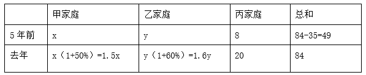

可列方程组：，解得x=16，y=25，即五年前乙家庭的年收入为25万元。

故正确答案为C。

---

### 第 7 题　qid 5697253 · 数学运算

一个A型4G基站的地面覆盖半径为1~3千米，一个B型5G基站的地面覆盖半径为100~200米。按此计算，一个A型4G基站的地面覆盖面积为B型5G基站的（    ）。

- **A**. 100~225倍
- **B**. 100~900倍
- **C**. 25~225倍
- **D**. 25~900倍　✅

**答案**：D

**官方解析**

根据圆的面积公式：，可得：一个A型4G基站的地面覆盖面积范围为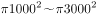平方米，一个B型5G基站的地面覆盖面积范围为平方米。则一个A型4G基站的地面覆盖面积最小是B型5G基站的倍，最大是倍 ，因此，一个A型4G基站的地面覆盖面积为B型5G基站的25~900倍。

故正确答案为D。

---

### 第 8 题　qid 5697254 · 数学运算

某网店销售一款衬衫，进价为100元，售价为150元。为回馈顾客，该网店开展一天的促销活动：每购买两件优惠20元，每购买三件优惠50元。已知促销当天的销售量是前一天的2倍，利润是前一天的1.5倍，每位顾客购买衬衫的数量均为两件或三件。促销当天，购买两件与购买三件衬衫的顾客人数比是（    ）。

- **A**. 5：2　✅
- **B**. 5：3
- **C**. 3：2
- **D**. 3：1

**答案**：A

**官方解析**

设促销当天购买两件衬衫的顾客有x人，购买三件衬衫的顾客有y人。则促销当天的销售量为（2x+3y）件，前一天的销售量为（2x+3y）÷2=（x+1.5y）件。根据公式：利润=售价-进价，可得每件衬衫的利润为150-100=50元，则促销当天的利润为元，前一天的利润为元。根据题意可列方程：，解得x：y=5：2。

故正确答案为A。

---

### 第 9 题　qid 5697257 · 数学运算

某学校的运动场是椭圆形。边界椭圆上一点到中心距离的最小值是20米，两点间距离的最大值为80米。若学生在该运动场上排成方阵，则所排成方阵面积的最大值为（    ）。

- **A**. 1280平方米
- **B**. 1360平方米
- **C**. 1440平方米
- **D**. 1600平方米　✅

**答案**：D

**官方解析**

如下图所示，20米为椭圆的短半轴OB（b），米为椭圆的长半轴OA（a），则椭圆方程应为：。要想让方阵面积最大，则方阵应内接椭圆，根据结论：椭圆内接矩形的面积最大为2ab，则所排成方阵面积的最大值为2×20×40=1600平方米。

故正确答案为D。

---

### 第 10 题　qid 5699113 · 数学运算

某高新技术企业为扩大业务，招收了两批新员工，原计划每批招收的人数相同，实际第二批多招了4人，结果第一批和第二批招收后员工人数新增的百分比相同。若第二批再多招6人，则员工总人数是两次招收前员工人数的1.5倍。该企业招收两批新员工前的员工人数是（    ）。

- **A**. 96
- **B**. 100　✅
- **C**. 104
- **D**. 108

**答案**：B

**官方解析**

设实际第一批招收了x人，第二批招收了（x+4）人。

方法一：设两次招收前员工人数为y人。根据题意可列方程组：，联立解得x=20，y=100，则该企业招收两批新员工前的员工人数是100人。

方法二：考虑代入排除法，从好算的开始代入。

代入B项：该企业招收两批新员工前的员工人数是100人，则可列式：x+（x+4+6）+100=100×1.5，解得x=20，则实际第一批招收了20人，第二批招收了20+4=24人。第一批招收后员工人数新增的百分比为，第二批招收后员工人数新增的百分比为，两次新增的百分比相同，满足题意，当选。

故正确答案为B。

---

### 第 11 题　qid 5699117 · 数学运算

某食品企业为丰富产品造型，将一款甜点的外形由圆柱形改为半球形。若圆柱形甜点的底面半径是高的2倍，半球形甜点的体积缩小到圆柱形甜点的，则半球形甜点的底面半径是圆柱形甜点底面半径的（    ）。

- **A**. 

- **B**. 

- **C**. 

- **D**. 

　✅

**答案**：D

**官方解析**

赋值圆柱形甜点的底面半径为4，则高为2，根据公式：，可得。根据公式：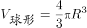，可得，解得R=3，即半球形甜点的底面半径是圆柱形甜点底面半径的。

故正确答案为D。

---

### 第 12 题　qid 5699120 · 数学运算

甲骑自行车，乙步行，同时从A地前往B地。已知A、B两地相距4000米，甲的速度是乙的3倍。途中自行车发生故障，甲修车耽误了一段时间。当乙到达B地时，甲离B地还有400米。在甲修车的时间段内，乙走过的路程为（    ）。

- **A**. 3000米
- **B**. 2800米　✅
- **C**. 2400米
- **D**. 2000米

**答案**：B

**官方解析**

赋值乙的速度为1米/秒，则甲的速度为1×3=3米/秒，设甲修车的时间为t秒，当乙到达B地时，甲离B地还有400米，可知甲骑行的路程为4000-400=3600米。根据题意可知，乙从A地到B地的时间等于甲骑行与修车的时间之和，可列式，解得t=2800，故在甲修车的时间段内，乙走过的路程为2800×1=2800米。

故正确答案为B。

---

### 第 13 题　qid 5699123 · 数学运算

某企业篮球队16名队员进行投篮测试，每人投篮两次，这两次都命中得加投一次，每命中一次得1分，不命中不得分。若16人的总得分为26分，则得分大于1分的队员至少有（    ）。

- **A**. 5人　✅
- **B**. 6人
- **C**. 7人
- **D**. 8人

**答案**：A

**官方解析**

因为每人投篮两次且这两次都命中得加投一次，所以每名队员投篮测试的分数可以是3分、2分、1分、0分。16人的总得分为26分，则平均分为分。要使得分大于1分的队员人数尽量少，则得分小于等于1分的队员人数应尽量多。根据线段法“距离与量成反比”，得分大于1分的队员人数尽量少，则这部分队员的平均分与1.625分的距离应尽量大，取每人3分；得分小于等于1分的队员人数尽量多，则这部分队员的平均分与1.625分的距离应尽量小，取每人1分。设得分大于1分的队员有x人，则得分小于等于1分的队员有（16-x）人，可列式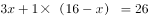，解得x=5。

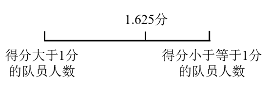

故正确答案为A。

---

### 第 14 题　qid 5699124 · 数学运算

某博物馆拟举办一次为期4天的文物展览活动，展出的文物共有5类：青铜器、瓷器、玉器、书法、国画。若要求每天仅展出2类文物，每类文物都要展出但不能连续2天展出，且玉器和国画这2类文物不在第1天展出，则不同的展出方式共有（    ）。

- **A**. 72种　✅
- **B**. 120种
- **C**. 216种
- **D**. 360种

**答案**：A

**官方解析**

正向求解较复杂，考虑反向求解。玉器和国画不在第1天展出，不考虑每类文物都要展出的条件，不同的展出方式总情况共有种。不满足条件的情况可分为：①玉器和国画中有1类未展出，有种展出方式；②青铜器、瓷器、书法中有1类未展出，有种展出方式。故满足条件的情况数=总情况数-不满足条件的情况数=81-6-3=72种。

故正确答案为A。

备注：反向求解的总情况数为81种，则满足条件的情况数一定不超过81种，只有A项满足。

---

### 第 15 题　qid 5699127 · 数学运算

甲、乙两个工程队合作完成一项工程，甲每工作3天休息1天，乙每工作5天休息2天。若甲先工作，2天后乙加入，则再用21天完工；若乙先工作，12天后甲加入，则再用15天完工。甲单独完成该项工程需要的天数是（    ）。

- **A**. 43
- **B**. 44
- **C**. 47　✅
- **D**. 48

**答案**：C

**官方解析**

第一种情况：甲工程队从开始到完工共经过2+21=23天，23÷（3+1）=5⋯⋯3，即5个周期还余3天，共工作了5×3+3=18天；乙工程队共经过21天，21÷（5+2）=3，即3个周期，共工作了3×5=15天。

第二种情况：乙工程队从开始到完工共经过12+15=27天，27÷（5+2）=3⋯⋯6，即3个周期还余6天，共工作了3×5+5=20天；甲工程队共经过15天，15÷（3+1）=3⋯⋯3，即3个周期还余3天，共工作了3×3+3=12天。

则根据题意可列式：18甲+15乙=12甲+20乙，整理可得：，赋值甲的效率为5，则乙的效率为6。则工作总量为18×5+15×6=180，甲单独完成该项工程需要工作的天数为180÷5=36天，36÷3=12，即需要11个周期再工作3天，所以共需11×（3+1）+3=47天。

故正确答案为C。

---

### 第 16 题　qid 5699134 · 数学运算

如图所示，纸片ABC的形状为直角三角形，AB=10厘米，BC=8厘米。若将纸片沿AD折叠，直角边AC恰好与斜边AB重叠，则的面积为（    ）。

- **A**. 15平方厘米　✅
- **B**. 16平方厘米
- **C**. 18平方厘米
- **D**. 21平方厘米

**答案**：A

**官方解析**

根据题意可知，为直角三角形，则厘米。设CD为x厘米，由于纸片沿AD折叠且AC恰好与AB重叠，则厘米，。，可列方程：，解得x=3。因此平方厘米。

故正确答案为A。

---

### 第 17 题　qid 5699136 · 数学运算

某公司实行弹性工作制，允许居家办公，但要求员工每周的周一到周五至少有两天在公司工作。小王、小李和小陈都是该公司的员工，若他们分别从下周的周一到周五中随机选2天、3天、4天去公司工作，则他们下周三都去公司工作的概率是（    ）。

- **A**. 

- **B**. 

- **C**. 

　✅
- **D**. 

**答案**：C

**官方解析**

小王、小李和小陈分别从下周的周一到周五中随机选2天、3天、4天去公司，分别有、、种情况；满足要求的情况为小王、小李和小陈再从周一、周二、周四、周五中分别选1天、2天、3天去公司，分别有、、种情况，根据分步用乘法，则所求概率。

故正确答案为C。

---

### 第 18 题　qid 5699138 · 数学运算

浓度分别为68%、72%、78%的三种酒精溶液的总质量为240克。若将它们全部混合，则可得浓度为74%的酒精溶液；若只将浓度为72%和78%的酒精溶液混合，则可得浓度为76%的酒精溶液。这三种酒精溶液中，浓度为72%的酒精溶液质量为（    ）。

- **A**. 30克
- **B**. 40克
- **C**. 48克
- **D**. 60克　✅

**答案**：D

**官方解析**

由于浓度为72%和78%的酒精溶液混合后的浓度为76%，则三种酒精溶液全部混合可以看成浓度为68%和76%的酒精溶液混合。根据线段法，浓度之差与酒精溶液质量成反比，则

，则浓度为76%的酒精溶液质量克。根据“若只将浓度为72%和78%的酒精溶液混合，则可得浓度为76%的酒精溶液”，可画如下线段：

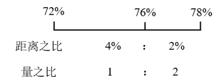

，则浓度为72%的酒精溶液质量克。

故正确答案为D。

---

### 第 19 题　qid 5699142 · 数学运算

把2022到1的所有整数按下图所示规律依次排列，2022排在第一行，从第二行开始，每一行比前一行多两个数，则第30行中间的数是（    ）。

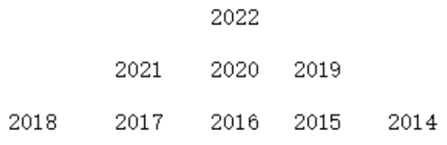

- **A**. 1092
- **B**. 1152　✅
- **C**. 1210
- **D**. 1320

**答案**：B

**官方解析**

根据题意，每行的个数是首项为1、公差为2的等差数列，根据等差数列求和公式：，可得前29行共有个数。第30行中间的数为本行的第30个数，为该数列中的第841+30=871个数，因此这个数字为2022-（871-1）=1152。

故正确答案为B。

---

## 判断推理

### 材料 1

赵、钱、孙、李、周、吴和郑获得某职业技能大赛的前七名，7名选手有男有女，没有并列名次。已知：

（1）赵是第六名，郑的名次在孙之前；

（2）男选手的排名不相邻；

（3）吴的名次在钱和李之前，排名在吴之前的选手中有两名男性。

#### 第 1 题　qid 5697990 · 类比推理

根据以上陈述，下列选手名次不可能相邻的是（    ）。

- **A**. 孙和吴
- **B**. 吴和郑　✅
- **C**. 吴和李
- **D**. 周和吴

**答案**：B

**官方解析**

第一步：分析题干条件。

（1）赵是第六名，郑的名次在孙之前；

（2）男选手的排名不相邻；

（3）吴的名次在钱和李之前，排名在吴之前的选手中有两名男性。

第二步：根据题干条件分析选项。

根据条件（1）和（3）可知，赵是第六名，吴是第三名或第四名，再根据条件（2）可知，吴前面要至少有三个人才能保证男选手不相邻，那么吴只能是第四名，此时钱和李是第五名或第七名（如下图所示），此时第一到三名为郑、周、孙，但无法判断具体名次。

代入A项，如果孙和吴相邻，根据已知信息可知，孙是第三名，郑和周在前两名，具体名次无法确定，所有排名情况均符合题干条件（如下图所示），即孙和吴可以相邻，排除；

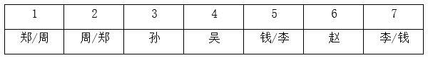

代入B项，如果吴和郑相邻，根据已知信息可知，郑只能是第三名，孙在前两名，即郑的名次在孙之后，与条件（1）矛盾，即吴和郑不能相邻，当选；

代入C项，如果吴和李相邻，根据已知信息可知，李是第五名，钱是第七名，郑、周、孙在前三名，具体名次无法确定，所有排名情况均符合题干条件（如下图所示），即吴和李可以相邻，排除；

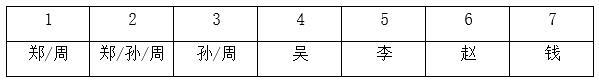

代入D项，如果周和吴相邻，根据已知信息可知，周是第三名，再根据条件（1）和（3）可知，郑是第一名，孙是第二名，钱和李是第五名或第七名，具体名次无法确定，两种排名情况均符合题干条件（如下图所示），即周和吴可以相邻，排除。

本题为选非题，故正确答案为B。

---

#### 第 2 题　qid 5697995 · 类比推理

如果周是第三名，以下哪位选手一定是女性？

- **A**. 赵
- **B**. 钱
- **C**. 孙　✅
- **D**. 李

**答案**：C

**官方解析**

第一步：分析题干条件。

（1）赵是第六名，郑的名次在孙之前；

（2）男选手的排名不相邻；

（3）吴的名次在钱和李之前，排名在吴之前的选手中有两名男性；

（4）周是第三名。

第二步：根据题干条件分析选项。

根据条件（1）和（4）可知，周是第三名，赵是第六名。根据条件（3）可知，吴只能是第四名，钱和李是第五名或第七名，具体名次无法确定。根据条件（1）可知，郑是第一名，孙是第二名。再根据条件（2）和（3）可知，郑和周为男选手，孙和吴为女选手，其他人的性别无法确定（如下图所示）。

故正确答案为C。

---

### 材料 2

某餐馆菜单上有芹菜肉丝、清蒸鲈鱼、毛豆仔鸡、糖醋排骨4道菜。甲、乙、丙、丁各点了其中的2道，没有一道菜四人都点，也没有一道菜四人都不点。已知：

（1）只有甲点清蒸鲈鱼，丁才点芹菜肉丝；

（2）如果丙点清蒸鲈鱼，则乙和丁也点清蒸鲈鱼；

（3）如果乙在芹菜肉丝和清蒸鲈鱼中至少点一道，则乙也点毛豆仔鸡；

（4）如果丙在芹菜肉丝和毛豆仔鸡中至少点一道，则丙也点清蒸鲈鱼。

#### 第 3 题　qid 5699263 · 逻辑判断

根据以上陈述，可以推出以下哪项？

- **A**. 甲在芹菜肉丝和毛豆仔鸡中至少点一道　✅
- **B**. 乙在芹菜肉丝和糖醋排骨中至少点一道
- **C**. 丙在毛豆仔鸡和糖醋排骨中至少点一道
- **D**. 丁在芹菜肉丝和毛豆仔鸡中至少点一道

**答案**：A

**官方解析**

第一步：分析题干条件。

（1）丁（芹菜肉丝）甲（清蒸鲈鱼）；

（2）丙（清蒸鲈鱼）乙和丁（清蒸鲈鱼）；

（3）乙（芹菜肉丝 或 清蒸鲈鱼）乙（毛豆仔鸡）；

（4）丙（芹菜肉丝 或 毛豆仔鸡）丙（清蒸鲈鱼）；

（5）甲、乙、丙、丁各点了其中的2道菜；

（6）没有一道菜四人都点，也没有一道菜四人都不点。

第二步：根据题干条件进行推理。

根据条件（4）可知，丙点芹菜肉丝或毛豆仔鸡，可以推出丙点清蒸鲈鱼，但如果丙不点芹菜肉丝也不点毛豆仔鸡，那么根据条件（5），可以推出丙点清蒸鲈鱼和糖醋排骨；

综合上述两种情况，可以推出丙一定要点清蒸鲈鱼。

根据丙点清蒸鲈鱼以及条件（2），可以推出乙和丁点清蒸鲈鱼；

此时已经有3人点清蒸鲈鱼了，根据条件（6），可以推出甲不点清蒸鲈鱼，那么甲只能在芹菜肉丝、毛豆仔鸡、糖醋排骨三道菜里面点两道菜，可以推出A项一定成立，当选。

故正确答案为A。

---

#### 第 4 题　qid 5699266 · 逻辑判断

如果任意两人点的菜都不完全相同，则可以推出以下哪项？

- **A**. 甲点芹菜肉丝和毛豆仔鸡
- **B**. 乙点毛豆仔鸡和糖醋排骨
- **C**. 丙点清蒸鲈鱼和芹菜肉丝　✅
- **D**. 丁点糖醋排骨和毛豆仔鸡

**答案**：C

**官方解析**

第一步：分析题干条件。

（1）丁（芹菜肉丝）甲（清蒸鲈鱼）；

（2）丙（清蒸鲈鱼）乙和丁（清蒸鲈鱼）；

（3）乙（芹菜肉丝 或 清蒸鲈鱼）乙（毛豆仔鸡）；

（4）丙（芹菜肉丝 或 毛豆仔鸡）丙（清蒸鲈鱼）；

（5）甲、乙、丙、丁各点了其中的2道；

（6）没有一道菜四人都点，也没有一道菜四人都不点；

（7）任意两人点的菜都不完全相同。

第二步：根据题干条件进行推理。

根据上题的结论可知，丙点清蒸鲈鱼，乙和丁点清蒸鲈鱼，甲不点清蒸鲈鱼。

根据乙点清蒸鲈鱼以及条件（3），可以推出乙点毛豆仔鸡；

根据甲不点清蒸鲈鱼以及条件（1），可以推出丁不点芹菜肉丝；

根据上述推理可知乙点清蒸鲈鱼和毛豆仔鸡，为了满足条件（7），要想和乙点的菜不同，丁不能点毛豆仔鸡，只能点糖醋排骨，即丁点清蒸鲈鱼和糖醋排骨；

为了满足条件（7），要想和乙、丁点的菜不同，丙不能点毛豆仔鸡和糖醋排骨，只能点芹菜肉丝，即丙点清蒸鲈鱼和芹菜肉丝，对应C项。

根据上述推理（如下图所示），甲在芹菜肉丝、毛豆仔鸡、糖醋排骨三道菜里面点两道菜均可满足条件（7）。

故正确答案为C。

---

#### 第 5 题　qid 5697829 · 类比推理

5G：5G城市

- **A**. 匝道：匝道护栏
- **B**. 青年：青年干部
- **C**. 电子：电子邮件　✅
- **D**. 红漆：红漆大门

**答案**：C

**官方解析**

第一步：判断题干词语间逻辑关系。
5G城市利用了5G技术，二者是技术的对应关系。
第二步：判断选项词语间逻辑关系。
A项：匝道护栏位于匝道两边，主要起到保护匝道的作用，二者是地点的对应关系，与题干逻辑关系不一致，排除；
B项：青年干部是青年，二者是种属关系，与题干逻辑关系不一致，排除；
C项：电子邮件是一种利用电子手段提供信息交换的通信方式，电子邮件利用了电子技术，二者是技术的对应关系，与题干逻辑关系一致，当选；
D项：红漆大门是由红漆粉刷而成，二者是原材料的对应关系，与题干逻辑关系不一致，排除。
故正确答案为C。

---

#### 第 6 题　qid 5697849 · 类比推理

一呼：百应

- **A**. 一箭：双雕　✅
- **B**. 一波：三折
- **C**. 一曝：十寒
- **D**. 一诺：千金

**答案**：A

**官方解析**

第一步：判断题干词语间逻辑关系。
先有“一呼”的动作，再有“百应”的结果，二者为时间先后顺序的对应关系。
第二步：判断选项词语间逻辑关系。
A项：先有“一箭”的动作，再有“双雕”的结果，二者为时间先后顺序的对应关系，与题干逻辑关系一致，当选；
B项：一波三折指写字的笔法曲折多变，其中“波”是指书法中的捺，“折”是指写字时转笔锋，“一波”和“三折”不是时间先后顺序的对应关系，与题干逻辑关系不一致，排除；
C项：一曝十寒指虽然是最容易生长的植物，晒一天，冻十天，也不可能生长，“一曝”不是动作，“十寒”也不是结果，与题干逻辑关系不一致，排除；
D项：一诺千金指许下的一个诺言有千金的价值，“一诺”和“千金”不是时间先后顺序的对应关系，与题干逻辑关系不一致，排除。
故正确答案为A。

---

#### 第 7 题　qid 5697804 · 类比推理

吴语：汉语：藏语

- **A**. 电器：石器：木器
- **B**. 建材：耗材：钢材
- **C**. 数学：理学：农学　✅
- **D**. 壮族：民族：苗族

**答案**：C

**官方解析**

第一步：判断题干词语间逻辑关系。
吴语是汉语方言之一，分布于上海、江苏东南部和浙江大部分地区，前两词是种属关系，汉语和藏语是两种不同民族的语言，后两词是并列关系。
第二步：判断选项词语间逻辑关系。
A项：电器泛指用电的器具，石器是指以岩石为原材料制作而成的器具，木器是指由硬质草本植物制作而成的器具，三者是并列关系，与题干逻辑关系不一致，排除；
B项：有的建材是耗材，有的建材不是耗材，有的耗材是建材，有的耗材不是建材，前两词是交叉关系，钢材是建材，也是耗材，第三词与前两词均是种属关系，与题干逻辑关系不一致，排除；
C项：数学属于理学，前两词是种属关系，理学和农学是两个不同的现代教育分支学科，后两词是并列关系，与题干逻辑关系一致，当选；
D项：壮族是民族的一种，前两词是种属关系，但苗族也是民族的一种，后两词也是种属关系，与题干逻辑关系不一致，排除。
故正确答案为C。

---

#### 第 8 题　qid 5697831 · 类比推理

南极洲：企鹅：北极熊

- **A**. 空间站：种子：宇航员
- **B**. 水浒传：李逵：沙和尚　✅
- **C**. 大数据：算法：字符串
- **D**. 地雷战：工事：指战员

**答案**：B

**官方解析**

第一步：判断题干词语间逻辑关系。
企鹅和北极熊是两种不同的动物，二者为并列关系，企鹅生活在南极洲，但北极熊不是生活在南极洲的动物。
第二步：判断选项词语间逻辑关系。
A项：宇航员将种子带进空间站，种子和宇航员不是并列关系，与题干逻辑关系不一致，排除；
B项：李逵和沙和尚均是书籍中的人物，二者为并列关系，李逵是《水浒传》中的人物，但沙和尚不是《水浒传》中的人物，与题干逻辑关系一致，当选；
C项：算法指解决问题的有限运算序列，而字符串指编程语言中表示文本的数据类型，算法与字符串不是并列关系，与题干逻辑关系不一致，排除；
D项：工事指保障军队发扬火力和隐蔽安全的建筑物，工事和指战员是地雷战中涉及到的建筑物和人物，二者不是并列关系，与题干逻辑关系不一致，排除。
故正确答案为B。

---

#### 第 9 题　qid 5697996 · 类比推理

通例：惯例：国际惯例

- **A**. 异议：动议：紧急动议
- **B**. 预备：准备：精心准备　✅
- **C**. 笔试：面试：远程面试
- **D**. 修炼：锻炼：刻苦锻炼

**答案**：B

**官方解析**

第一步：判断题干词语间逻辑关系。
通例指一般的情况、常规、惯例，与惯例是近义关系；国际惯例是惯例，二者为种属关系。
第二步：判断选项词语间逻辑关系。
A项：异议指不同的意见，动议指会议中的建议（一般指临时的），二者没有明显的逻辑关系，与题干逻辑关系不一致，排除；
B项：预备指预先准备，与准备是近义关系；精心准备是准备，二者为种属关系，与题干逻辑关系一致，当选；
C项：笔试和面试是不同选拔的方式，二者为并列关系，与题干逻辑关系不一致，排除；
D项：修炼指道教的修道炼气、炼丹等活动，一般指修心炼身，与锻炼没有明显的逻辑关系，与题干逻辑关系不一致，排除。
故正确答案为B。

---

#### 第 10 题　qid 5698004 · 类比推理

越野汽车：国产汽车：汽油

- **A**. 野生麋鹿：雄性麋鹿：野草　✅
- **B**. 口岸城市：沿海城市：浴场
- **C**. 节约行为：浪费行为：粮食
- **D**. 冰雪运动：户外运动：雪橇

**答案**：A

**官方解析**

第一步：判断题干词语间逻辑关系。
有的越野汽车是国产汽车，有的越野汽车不是国产汽车，有的国产汽车是越野汽车，有的国产汽车不是越野汽车，二者为交叉关系；汽油可以维持汽车的行驶，第三个词分别与前两个词构成动力来源的对应关系。
第二步：判断选项词语间逻辑关系。
A项：有的野生麋鹿是雄性麋鹿，有的野生麋鹿不是雄性麋鹿，有的雄性麋鹿是野生麋鹿，有的雄性麋鹿不是野生麋鹿，二者为交叉关系；野草可以维持麋鹿的行动，第三个词分别与前两个词构成动力来源的对应关系，与题干逻辑关系一致，当选；
B项：口岸城市指具有供人员、货物和交通工具出入国境的港口、机场、车站、通道的城市。有的口岸城市是沿海城市，有的口岸城市不是沿海城市，有的沿海城市是口岸城市，有的沿海城市不是口岸城市，二者为交叉关系；浴场指露天游泳场所，与前两个词不构成动力来源的对应关系，与题干逻辑关系不一致，排除；
C项：节约行为和浪费行为为并列关系，与题干逻辑关系不一致，排除；
D项：有的冰雪运动是户外运动，有的冰雪运动不是户外运动，有的户外运动是冰雪运动，有的户外运动不是冰雪运动，二者为交叉关系；雪橇是一种装在滑行装置上的交通工具，分别与前两个词构成工具的对应关系，与题干逻辑关系不一致，排除。
故正确答案为A。

---

#### 第 11 题　qid 5697819 · 类比推理

人口普查：国情普查：经济普查

- **A**. 太空行走：冰上行走：自由行走
- **B**. 银行机构：支付机构：政府机构
- **C**. 数字课程：网络课程：精品课程
- **D**. 团雾天气：恶劣天气：暴雪天气　✅

**答案**：D

**官方解析**

第一步：判断题干词语间逻辑关系。
人口普查、经济普查和农业普查是我国的三项重大国情国力周期性普查，人口普查和经济普查为并列关系，二者均为国情普查的一种，均与国情普查构成种属关系。
第二步：判断选项词语间逻辑关系。
A项：太空行走和冰上行走是两种不同情景下的行走，二者为并列关系，与题干逻辑关系不一致，排除；
B项：有的银行机构是政府机构，有的银行机构不是政府机构，有的政府机构是银行机构，有的政府机构不是银行机构，二者为交叉关系，与题干逻辑关系不一致，排除；
C项：有的数字课程是精品课程，有的数字课程不是精品课程，有的精品课程是数字课程，有的精品课程不是数字课程，二者为交叉关系，与题干逻辑关系不一致，排除；
D项：团雾天气和暴雪天气是两种不同的天气状况，二者为并列关系，团雾天气和暴雪天气都是恶劣天气，均与恶劣天气构成种属关系，与题干逻辑关系一致，当选。
故正确答案为D。

---

#### 第 12 题　qid 5697862 · 类比推理

蜘蛛 之于 （    ） 相当于 （    ） 之于 能力

- **A**. 螃蟹；才干
- **B**. 蛛网；成功
- **C**. 动物；仁义
- **D**. 蛛丝；人才　✅

**答案**：D

**官方解析**

逐一代入选项。
A项：蜘蛛和螃蟹是两种不同的动物，二者为并列关系；才干指才能、办事的能力，能力指能胜任某项工作或事务的主观条件，二者为近义关系，前后逻辑关系不一致，排除；
B项：蛛网是蜘蛛所织成的丝网，二者为动物和产物的对应关系；拥有能力是成功的条件之一，二者为条件的对应关系，前后逻辑关系不一致，排除；
C项：蜘蛛是动物，二者为种属关系；仁义指仁爱和正义，与能力无明显逻辑关系，前后逻辑关系不一致，排除；
D项：蜘蛛有蛛丝，二者为对应关系；人才有能力，二者为对应关系，前后逻辑关系一致，当选。
故正确答案为D。

---

#### 第 13 题　qid 5697867 · 类比推理

（    ） 之于 激光水平仪 相当于 抛石机 之于 （    ）

- **A**. 水平仪 机器
- **B**. 水平尺 火炮　✅
- **C**. 建大楼 石头
- **D**. 技术员 士兵

**答案**：B

**官方解析**

逐一代入选项。
A项：激光水平仪是水平仪的一种，二者为种属关系，抛石机是利用配重物进行重力发射的机器，二者为种属关系，但词语前后顺序相反，前后逻辑关系不一致，排除；
B项：水平尺和激光水平仪都是一种测量工具，二者都可以用来测量，为并列关系，火炮是一种利用能源来抛射弹丸的武器，抛石机是利用配重物进行重力发射的机器，二者都可以用来投射，为并列关系，前后逻辑关系一致，当选；
C项：激光水平仪是建大楼的过程中需要使用的工具，二者为工具的对应关系，抛石机需要以石头作为重物来进行重力发射，二者为配套使用的对应关系，前后逻辑关系不一致，排除；
D项：激光水平仪需要技术员进行操作，抛石机需要士兵进行操作，二者均为工具与使用人员的对应关系，但词语前后顺序相反，前后逻辑关系不一致，排除。
故正确答案为B。

---

#### 第 14 题　qid 5697898 · 类比推理

无理数 整数 之于 （    ） 相当于 哲学 历史 之于 （    ）

- **A**. 数据 大学
- **B**. 理科 文科
- **C**. 数学 典籍
- **D**. 实数 学科　✅

**答案**：D

**官方解析**

逐一代入选项。
A项：数据是事实或观察的结果，是对客观事物的逻辑归纳，是用于表示客观事物的未经加工的原始素材，无理数、整数与数据无必然联系，哲学、历史是两个不同的学科门类，大学是实施高等教育的学校，大学可能会开设哲学、历史学科专业，前后逻辑关系不一致，排除；
B项：理科是指形式科学与自然科学的统称，无理数、整数与理科无必然联系，哲学和历史都是文科，哲学、历史与文科均构成种属关系，前后逻辑关系不一致，排除；
C项：数学是研究数量、结构、变化、空间以及信息等概念的一门学科，无理数、整数是数学的研究对象，典籍是记载古今法令制度的重要文献，泛指古代的图书，典籍不是研究哲学、历史，而是记载哲学、历史的相关内容，前后逻辑关系不一致，排除；
D项：无理数和整数都是实数，因此无理数、整数与实数均构成种属关系，哲学、历史都是学科门类，因此哲学、历史与学科均构成种属关系，前后逻辑关系一致，当选。
故正确答案为D。

---

#### 第 15 题　qid 5697836 · 图形推理

请从四个选项中选出最恰当的一项填入问号处，使题干图形呈现一定的规律性。

- **A**. A
- **B**. B
- **C**. C
- **D**. D　✅

**答案**：D

**官方解析**

元素组成不同，且无明显属性规律，考虑数量规律。观察发现，图形线条交叉明显，考虑交点数。题干图形的交点数分别为2、3、4、5、6、？，因此？处图形的交点数应为7，只有D项符合规律。
故正确答案为D。

---

#### 第 16 题　qid 5697853 · 图形推理

请从四个选项中选出最恰当的一项填入问号处，使题干图形呈现一定的规律性。

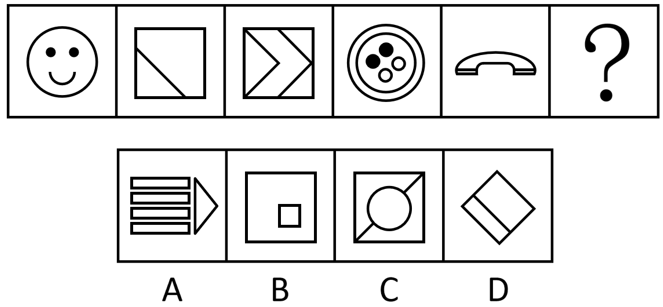

- **A**. A
- **B**. B
- **C**. C
- **D**. D　✅

**答案**：D

**官方解析**

元素组成不同，优先考虑属性规律。观察发现，题干图形出现明显的等腰元素，优先考虑对称性。题干图形均只有1条对称轴，且对称轴方向依次顺时针旋转，？处应用规律，只有D项符合规律。

故正确答案为D。

---

#### 第 17 题　qid 5697852 · 图形推理

请从四个选项中选出最恰当的一项填入问号处，使题干图形呈现一定的规律性。

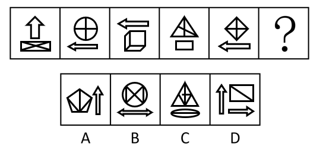

- **A**. A
- **B**. B
- **C**. C　✅
- **D**. D

**答案**：C

**官方解析**

元素组成不同，且无明显属性规律，考虑数量规律。观察发现，题干图形均分为上下两部分，排除A、D两项；继续观察发现，题干多幅图中存在“田”字变形图，优先考虑笔画数。题干图形均一部分为一笔画，另一部分为两笔画，所以？处图形也应该是一部分为一笔画，另一部分为两笔画，只有C项符合规律。
故正确答案为C。

---

#### 第 18 题　qid 5697866 · 图形推理

请从四个选项中选出最恰当的一项填入问号处，使题干图形呈现一定的规律性。

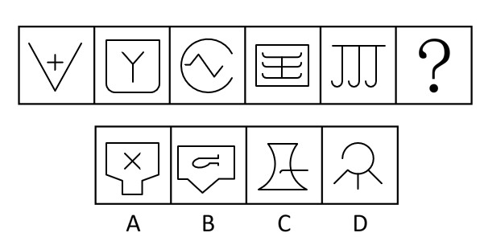

- **A**. A　✅
- **B**. B
- **C**. C
- **D**. D

**答案**：A

**官方解析**

解法一：元素组成不同，优先考虑属性规律。观察发现，图一、图三、图五均为全开放图形；图二、图四均为全封闭图形，故？处应该填入一个全封闭图形，排除C、D两项；继续观察发现，图二、图四均是关于竖轴对称的图形，只有A项符合规律。
故正确答案为A。
解法二：元素组成不同，优先考虑属性规律。观察发现，图一、图三、图五均为全开放图形；图二、图四均为全封闭图形，故？处应该填入一个全封闭图形，排除C、D两项；继续观察发现，图二、图四均是由直线和曲线构成的图形，只有B项符合规律。
故正确答案为B。
注：该题不是很严谨，两种解法都有合理和不合理之处，故不必太过纠结正确答案。

---

#### 第 19 题　qid 5697901 · 图形推理

请从四个选项中选出最恰当的一项填入问号处，使题干图形呈现一定的规律性。

- **A**. A　✅
- **B**. B
- **C**. C
- **D**. D

**答案**：A

**官方解析**

元素组成不同，优先考虑属性规律。观察发现，题干出现全直线图形、全曲线图形，优先考虑曲直性。九宫格优先横行看，第一行依次为全曲线图形、全直线图形、既有曲线又有直线图形；经验证，第二行满足此规律；第三行应用此规律，？处图形应该为既有曲线又有直线图形，只有A项符合规律。
故正确答案为A。

---

#### 第 20 题　qid 5697904 · 图形推理

请从四个选项中选出最恰当的一项填入问号处，使题干图形呈现一定的规律性。

- **A**. A
- **B**. B　✅
- **C**. C
- **D**. D

**答案**：B

**官方解析**

元素组成不同，优先考虑属性规律。观察发现，题干图形较为规整，考虑对称性。九宫格优先横行看，第一行的对称轴方向依次为横向、左上-右下斜、仅有两条斜着并相互垂直；经验证，第二行满足此规律；第三行应用此规律，？处图形对称轴的方向应为仅有两条斜着并相互垂直，只有B项符合规律。
故正确答案为B。

---

#### 第 21 题　qid 5697920 · 图形推理

下边四个图形中，只有一个是由上边的四个图形拼合（只能通过上、下、左、右平移）而成的，请把它找出来。

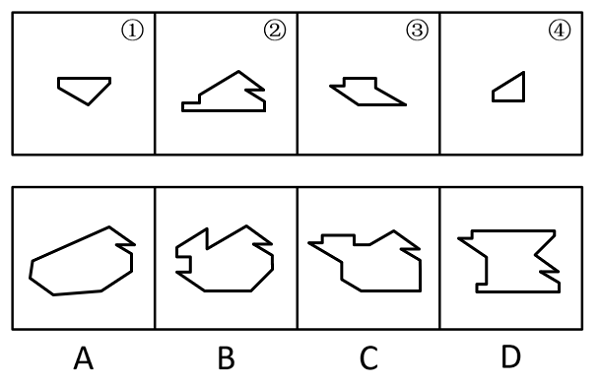

- **A**. A
- **B**. B　✅
- **C**. C
- **D**. D

**答案**：B

**官方解析**

本题考查平面拼合，可采用平行且等长相消的方式解题。消去平行且等长的线段后进行组合即可得到轮廓图，即为B项。平行且等长相消的方式如下图所示：

故正确答案为B。

---

#### 第 22 题　qid 5697926 · 图形推理

下边四个图形中，只有一个是由上边的四个图形拼合（只能通过上、下、左、右平移）而成的，请把它找出来。

- **A**. A　✅
- **B**. B
- **C**. C
- **D**. D

**答案**：A

**官方解析**

本题考查平面拼合，可采用平行且等长相消的方式解题。消去平行且等长的线段后进行组合即可得到轮廓图，即为A项。平行且等长相消的方式如下图所示：

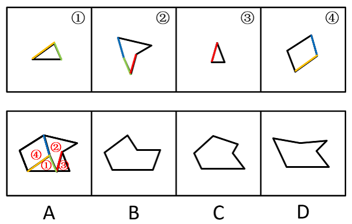

故正确答案为A。

---

#### 第 23 题　qid 5697897 · 图形推理

下边四个图形中，只有一个是由上边的四个图形拼合（只能通过上、下、左、右平移）而成的，请把它找出来。

- **A**. A
- **B**. B　✅
- **C**. C
- **D**. D

**答案**：B

**官方解析**

本题考查平面拼合，消去弯曲程度一致且等长的线条后进行拼合，即可得到轮廓图，即为B项。具体拼合方式如下图所示：

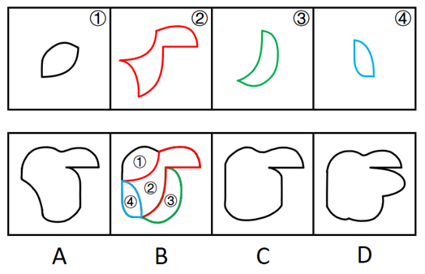

故正确答案为B。

---

#### 第 24 题　qid 5697916 · 图形推理

上边四张纸片，都是一面为白色，一面为黑色，在允许平移、旋转和翻转的条件下可以拼合成多种图形。下边哪项不能由其拼合而成？

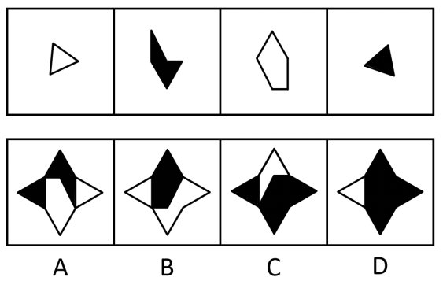

- **A**. A
- **B**. B
- **C**. C
- **D**. D　✅

**答案**：D

**官方解析**

本题考查平面拼合，可以平移、旋转、翻转，且每张纸片一面为白色，另一面为黑色，需要考虑翻转后的颜色变化。将题干图形标上序号，如下图所示，逐一进行分析。

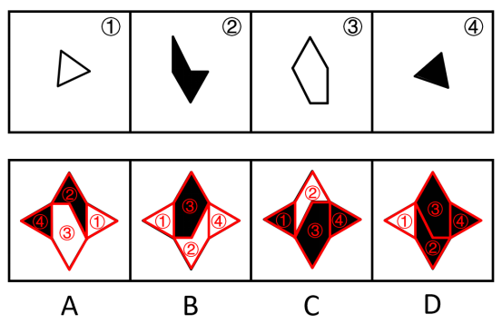

A项：可以由题干图形拼合而成，拼合方式如图所示，排除；

B项：可以由题干图形拼合而成，拼合方式如图所示，排除；

C项：可以由题干图形拼合而成，拼合方式如图所示，排除；

D项：中间上边的五边形是由图③直接平移得到，颜色应该为白色，而选项为黑色，当选。

本题为选非题，故正确答案为D。

---

#### 第 25 题　qid 5697940 · 图形推理

从四个选项中选出一项填入问号处，使左边四个图形可以拼合（只能通过上、下、左、右平移）成右边的图形。 

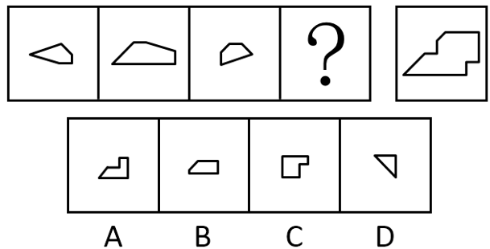

- **A**. A
- **B**. B
- **C**. C
- **D**. D　✅

**答案**：D

**官方解析**

本题考查平面拼合，可采用平行且等长相消的方式解题。消去平行且等长的线段后进行组合即可得到轮廓图，即为D项。平行且等长相消的方式如下图所示：

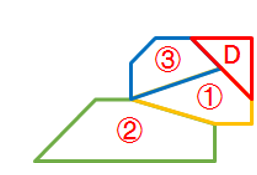

故正确答案为D。

---

#### 第 26 题　qid 5697963 · 图形推理

左边给定的是一个四面体，右边哪一项可能是它的外表面展开图？ 

- **A**. A
- **B**. B
- **C**. C　✅
- **D**. D

**答案**：C

**官方解析**

将题干四面体的左侧面标为面e，题干面e中白色直角三角形的斜边挨着右侧面的黑色直角三角形，如下图所示，逐一分析选项。

A项：选项展开图面e中白色直角三角形的斜边挨着白色直角三角形，选项展开图与题干不一致，排除；

B项：选项展开图面e中白色直角三角形的斜边挨着白色直角三角形，选项展开图与题干不一致，排除；

C项：选项展开图面e中白色直角三角形的斜边也挨着右侧面的黑色直角三角形，选项展开图与题干一致，当选；

D项：选项展开图面e中白色直角三角形的斜边挨着黑色锐角三角形，选项展开图与题干不一致，排除。

注：本题A项中间的灰白三角形面和B项右下角的灰白三角形面，实际上均与题干中的灰白三角形面不同，这是因为灰色三角形和白色三角形的相对位置反了，那也就不是同一个面了，也可以通过这点来快速排除选项。

故正确答案为C。

---

#### 第 27 题　qid 5697878 · 图形推理

左边给定的是一个六面体的外表面展开图，右边哪一项能由它折叠而成？

- **A**. A
- **B**. B　✅
- **C**. C
- **D**. D

**答案**：B

**官方解析**

将展开图标上序号（如下图所示），逐一进行分析。

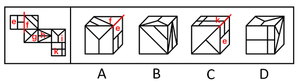

A项：选项由面e、面f与面i构成，在题干展开图中面f与面e的公共边挨着面e中的两个小正方形（如图所示），而在选项中两个面的公共边挨着面e中的一个长方形，选项与题干展开图不一致，排除；

B项：选项由面f、面h与面i构成，选项与题干展开图一致，当选；

C项：选项由面e、面g与面k构成，在题干展开图中面e中的两个小正方形挨着面f（如图所示），而在选项中面e中的两个小正方形挨着面k，选项与题干展开图不一致，排除；

D项：选项由面g、面i与面k构成，面g和面i是相对面，相对面不能同时在立体图中出现，选项与题干展开图不一致，排除。

故正确答案为B。

---

#### 第 28 题　qid 5697913 · 图形推理

某立方体每个面上各有一种不同的图案，下列四个选项中有且仅有一个不是该立方体，请把它找出来。

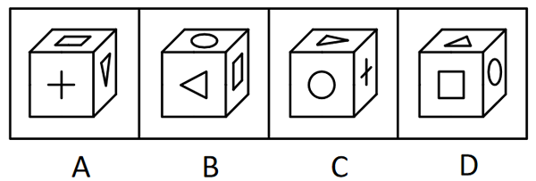

- **A**. A　✅
- **B**. B
- **C**. C
- **D**. D

**答案**：A

**官方解析**

本题为空间重构题。将四个选项均以三角形面内三角形尖指向的边为起点，进行顺时针画边（如下图所示），逐一进行分析。

A项：此时边2对应十字面；

B项：此时边2对应圆形面；

C项：此时边2对应圆形面；

D项：此时边2对应圆形面。

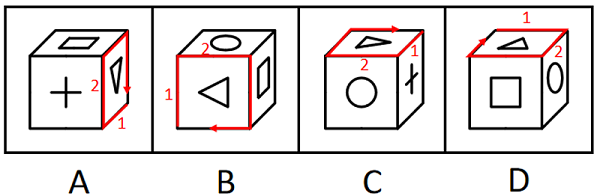

综上，只有A项与其他三项不同。

本题为选非题，故正确答案为A。

---

#### 第 29 题　qid 5697923 · 图形推理

下列四个立方体的外表面展开图，其中一个展开图还原成立方体后，从能同时看到3个面的任一角度看（如），都可以至少看到一个圆，请把它找出来。

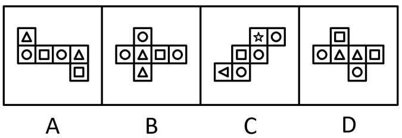

- **A**. A　✅
- **B**. B
- **C**. C
- **D**. D

**答案**：A

**官方解析**

立方体共有6个面，两两一组构成3组相对面。当能同时看到3个面时，相对面能且只能出现一个，因此，要保证从能同时看到3个面的任一角度看，都可以至少看到一个圆，需要保证展开图中至少存在一组相对面中均为圆，只有A项符合。
故正确答案为A。

---

#### 第 30 题　qid 5697932 · 逻辑判断

欲事立，须是心立。理想信念是中国共产党员精神上的“钙”，一个人理想信念坚定，“骨头”就硬；理想信念缺失或者不坚定，精神上就会“缺钙”，就会得“软骨病”，就容易在考验面前迷失方向。
以下哪项不能由以上陈述推出？

- **A**. 一个人若不想事立，他就无须心立　✅
- **B**. 如果一个人“骨头”不硬，就说明他的理想信念不坚定
- **C**. 一个人理想信念缺失，他就会得“软骨病”
- **D**. 若一个人不容易在考验面前迷失方向，就说明他有坚定的理想信念

**答案**：A

**官方解析**

第一步：翻译题干。

①事立心立；

②理想信念坚定“骨头”硬；

③理想信念缺失 或 理想信念不坚定精神上“缺钙”；

④理想信念缺失 或 理想信念不坚定得“软骨病”；

⑤理想信念缺失 或 理想信念不坚定容易在考验面前迷失方向。

第二步：逐一分析选项。

A项：该项翻译为“事立心立”，是对①的否前，否前得不到确定性结论，无法推出，当选；

B项：该项翻译为“‘骨头’硬理想信念坚定”，是对②的否后，否后必否前，可以推出，排除；

C项：该项翻译为“理想信念缺失得‘软骨病’”，肯定了“或关系”其中一项，是对④的肯前，肯前必肯后，可以推出，排除；

D项：该项翻译为“容易在考验面前迷失方向理想信念坚定”，是对⑤的否后，否后必否前，可以得到“理想信念缺失” 且 “理想信念不坚定”，可以推出，排除。

本题为选非题，故正确答案为A。

---

#### 第 31 题　qid 5697869 · 逻辑判断

目前，智能通信工具实现了远程面对面交流，其传输的画面和声音也能准确地传达人们的表情和情绪，然而，在通过网络进行沟通和交流时，人们更习惯用各种表情包来传达日常生活中的喜怒哀乐，表情包已从情绪符号变成了网络社交利器。
以下哪项如果为真，最能解释上述现象？

- **A**. 大多数时候，人们并不愿意在交流中表露自己的真实表情和情绪
- **B**. 使用表情包比控制自己的面部表情和声音要方便容易得多　✅
- **C**. 人们需要为远程面对面交流所消耗的流量支付更多费用
- **D**. 表情包能以一种夸张的方式传达出人们的表情和情绪

**答案**：B

**官方解析**

第一步：找出题干矛盾。
远程面对面交流传输的画面和声音也能准确地传达人们的表情和情绪，然而人们更习惯用各种表情包来传达日常生活中的喜怒哀乐。
第二步：逐一分析选项。
A项：该项仅说明大多数时候人们并不愿意在交流中表露自己的真实表情和情绪，并未提及相比远程面对面交流传输的画面和声音人们更习惯用表情包的原因，不能解释题干矛盾，排除；
B项：该项在表情包和面对面交流中传输的画面、声音之间进行对比，说明表情包相比画面、声音在传达情绪过程中所具备的优势，能够解释为什么远程面对面交流传输的画面和声音也能准确地传达人们的表情和情绪，但人们更习惯使用各种表情包来传达情绪，可以解释题干矛盾，保留；
C项：该项指出远程面对面交流需要支付更多的流量费用，侧面反映出使用表情包所需的流量费用可能较少，能够解释为什么远程面对面交流传输的画面和声音也能准确地传达人们的表情和情绪，但人们更习惯使用各种表情包来传达情绪，可以解释题干矛盾，保留；
D项：该项仅说明表情包能以一种夸张的方式传达出人们的表情和情绪，并未提及相比远程面对面交流传输的画面和声音人们更习惯用表情包的原因，不能解释题干矛盾，排除。
对比B、C两项，B项指出表情包在情绪传达过程中的优势，而C项是价格方面的优势，B项与题干的话题更接近，且B项更明确地将表情包与远程面对面交流进行了比较，因此B项解释力度更强。
故正确答案为B。

---

#### 第 32 题　qid 5697886 · 逻辑判断

目前市场上有很多类型的饮用水，除了我们日常喝的矿泉水、纯净水之外，还有厂家推出了“婴儿水”，厂家宣传说，这种水针对婴幼儿免疫系统和代谢系统不成熟的特征，由无菌生产线生产，能够保证婴幼儿的饮水安全，值得每个有婴幼儿的家庭购买。
以下哪项如果为真，最能质疑上述厂家的说法？

- **A**. 在行业发布的关于包装饮用水的分类规定中不包含“婴儿水”
- **B**. “婴儿水”价格高昂，是普通饮用水的数倍，许多普通家庭望而却步
- **C**. 普通的饮用水经过严格净化处理，烧开就可以达到杀菌的效果　✅
- **D**. 婴幼儿成长所需的营养需要全面健康的饮食，仅“婴儿水”远远不够

**答案**：C

**官方解析**

第一步：找出论点和论据。
论点：“婴儿水”针对婴幼儿免疫系统和代谢系统不成熟的特征，由无菌生产线生产，能够保证婴幼儿的饮水安全，值得每个有婴幼儿的家庭购买。
论据：无。
本题只有论点，没有论据，削弱优先考虑削弱论点。
第二步：逐一分析选项。
A项：该项说的是行业发布的关于包装饮用水的分类规定中不包含“婴儿水”，而论点讨论的是“婴儿水”由无菌生产线生产，能够保证婴幼儿的饮水安全，值得每个有婴幼儿的家庭购买，话题不一致，无法削弱，排除；
B项：该项说的是“婴儿水”价格高昂，使许多普通家庭望而却步，并未说明其是否安全，是否值得每个有婴幼儿的家庭购买，为无关项，无法削弱，排除；
C项：该项说的是普通的饮用水经过处理也同样可以达到杀菌的效果，说明给水杀菌并不需要厂家的无菌生产线，即“婴儿水”并不值得每个有婴幼儿的家庭购买，直接削弱论点，当选；
D项：该项说的是“婴儿水”的营养不够，并未说明其是否安全，是否值得每个有婴幼儿的家庭购买，为无关项，无法削弱，排除。
故正确答案为C。

---

#### 第 33 题　qid 5697915 · 逻辑判断

有身高为1.65米、1.68米、1.70米和1.72米的四人，其中有两人体型偏瘦，两人体型偏胖。关于身高体型，这四个人有如下陈述：
甲：我身高不到1.70米；
乙：丙身高1.72米，偏瘦；
丙：丁身高1.68米，偏胖；
丁：乙身高1.65米，偏瘦。
如果体型偏瘦的说真话，体型偏胖的说假话，那么可以推出以下哪项？

- **A**. 甲身高1.65米，偏胖
- **B**. 乙身高1.70米，偏瘦
- **C**. 丙身高1.72米，偏瘦
- **D**. 丁身高1.68米，偏胖　✅

**答案**：D

**官方解析**

第一步：分析题干条件。

（1）有两人体型偏瘦，两人体型偏胖；

（2）甲：我身高不到1.70米；

（3）乙：丙身高1.72米 且 偏瘦；

（4）丙：丁身高1.68米 且 偏胖；

（5）丁：乙身高1.65米 且 偏瘦；

（6）体型偏瘦的说真话，体型偏胖的说假话。

第二步：找关系。

根据条件（1）和（6）可知，四人中两人说真话，两人说假话。

题干条件不存在矛盾和反对关系，可考虑假设法。

解法一：乙、丙、丁的话均涉及到体型胖瘦，根据（6）可知，体型偏瘦的说真话，体型偏胖的说假话，故可以优先判定乙、丙、丁是否说真话。其中乙和丁都指出其他人说了真话，且丁指出乙说了真话，故优先假设丁说真话。

如果丁说真话，根据（5）可知，乙说了真话，再根据（3）可知，丙也说了真话，可以得出“丁真乙真丙真”，此时有三个人说真话与条件（1）矛盾，所以丁一定说假话。而丁说假话只可知”乙身高1.65米 且 偏瘦“为假，得不到身高和体型具体谁为假，得不到更确切信息。

所以再将“丁真乙真丙真”逆否得到更多信息，可得“丙假乙假丁假”。如果丙说假话，那么乙和丁也说假话，此时有三个人说假话与条件（1）矛盾，所以丙一定说真话，即“丁身高1.68米 且 偏胖”为真，对应D项。

解法二：

假设乙说的话为真，根据（2）可知，丙身高1.72米 且 偏瘦，根据（6）可知，体型偏瘦的说真话，所以丙也说真话，再根据条件（1）可知，有两人体型偏瘦，两人体型偏胖，故甲和丁体型偏胖（说假话），乙和丙体型偏瘦（说真话），分析条件（2）（3）（4）（5）中提到的身高可得，那么甲身高为1.70米或1.72米、丙身高1.72米、丁身高1.68米、乙身高不是1.65米，但这四个身高要求无法同时成立，因此乙说的话为假。

由乙说的话为假可知，乙体型偏胖，根据条件（5），丁说的话也为假。再根据条件（1）可知，甲和丙说的话为真，即“丁身高1.68米 且 偏胖”为真，对应D项。

故正确答案为D。

---

#### 第 34 题　qid 5697929 · 逻辑判断

我国胆囊结石的发病率为10%左右。有研究表明，胆结石是胆囊癌的重要诱因，而保胆囊取结石手术的复发率较高，许多胆囊结石患者深受其苦，不得不多次接受手术。据此，有医生主张，在发现患有胆结石之后，应整个切除胆囊以减少罹患胆囊癌的风险。
以下哪项如果为真，最能支持上述医生的主张？

- **A**. 多次保胆囊取结石手术既给患者带来沉重的经济负担，也危害患者的身心健康
- **B**. 在一些发达国家，医生建议胆囊结石患者一律采取整体切除的治疗措施
- **C**. 保胆囊取结石手术既不能根治胆囊结石，也不能规避罹患胆囊癌的风险　✅
- **D**. 胆囊癌患者的存活率较低，仅有不到5%的胆囊癌患者能再活五年

**答案**：C

**官方解析**

第一步：找出论点和论据。
论点：在发现患有胆结石之后，应整个切除胆囊以减少罹患胆囊癌的风险。
论据：胆结石是胆囊癌的重要诱因，而保胆囊取结石手术的复发率较高，许多胆囊结石患者深受其苦，不得不多次接受手术。
本题论点说的是“为解决弊端，建议切除胆囊来减少罹患胆囊癌风险”，论据说的是“保胆囊取结石的弊端”，论点论据话题一致，加强优先考虑补充论据。
第二步：逐一分析选项。
A项：该项说的是多次保胆囊取结石手术给患者带来经济和身心的影响，而论点说的是为解决弊端，建议切除胆囊来减少罹患胆囊癌风险，话题不一致，无法加强，排除；
B项：该项说的是一些发达国家医生对胆囊结石患者的建议是采取整体切除的治疗措施，而论点说的是为解决弊端，建议切除胆囊来减少罹患胆囊癌风险，即该项未提及能否减少罹患胆囊癌风险，话题不一致，无法加强，排除；
C项：该项说的是保胆囊取结石手术不能根治胆囊结石且不能规避罹患胆囊癌风险，证明了保胆囊取结石手术的治疗方式对规避罹患胆囊癌是无效的，支持了应该用整个切除胆囊的方式来治疗，补充论据，可以加强，当选；
D项：该项说的是胆囊癌患者存活率较低，而论点说的是为解决弊端，建议切除胆囊来减少罹患胆囊癌风险，话题不一致，无法加强，排除。
故正确答案为C。

---

#### 第 35 题　qid 5697876 · 逻辑判断

某市教育局派出由甲、乙、丙、丁、戊5名优秀教师组成的支教团支援西部。已知：
（1）有3人为青年教师，2人为中年教师；
（2）语文教师有2人，数学教师有3人；
（3）甲与丙同龄，丁与戊年龄相差最大；
（4）乙与戊所教课程相同，丙与丁所教课程不同；
（5）担任组长的是一名中年语文教师。
根据以上陈述，可以推出以下哪项？

- **A**. 甲是组长
- **B**. 乙是组长
- **C**. 丙是组长
- **D**. 丁是组长　✅

**答案**：D

**官方解析**

第一步：分析题干条件。
（1）有3人为青年教师，2人为中年教师；
（2）语文教师有2人，数学教师有3人；
（3）甲与丙同龄，丁与戊年龄相差最大；
（4）乙与戊所教课程相同，丙与丁所教课程不同；
（5）担任组长的是一名中年语文教师。
第二步：根据题干条件进行推理。
根据条件（1）（3）可知，丁和戊中有1人与甲、丙同龄，因此甲和丙一定是青年教师，再根据条件（5）可知，甲和丙不能担任组长，排除A、C两项；再根据条件（2）（4）可知，丙和丁中有1人与乙、戊所教课程相同，因此乙和戊所教课程一定是数学，再根据条件（5）可知，乙和戊不能担任组长，因此，丁是组长，排除B项，D项当选。
故正确答案为D。

---

#### 第 36 题　qid 5697900 · 逻辑判断

近年来，露营成为最受欢迎的休闲活动之一。人们带上帐篷及食物，在城市中寻一山清水秀之处“安营扎寨”体验一段独特的露营时光。然而，露营活动既有安全隐患，还会产生破坏环境的垃圾。据此，有专家指出，应当出台政策遏制这类露营活动。
以下哪项如果为真，最能质疑上述专家的观点？

- **A**. 今年与露营有关的产业预计产值将突破350亿元，为旅游业注入新能量
- **B**. 许多地方开发出“自驾游+露营”新模式，以满足游客的个性化体验需求
- **C**. 大多数露营者都会邀请三五好友或者以家庭为单位出游，可以互相照应
- **D**. 绝大多数露营爱好者为了安全会选择在城市中管理严格的地方“安营扎寨”　✅

**答案**：D

**官方解析**

第一步：找出论点和论据。
论点：应当出台政策遏制这类露营活动。
论据：露营活动既有安全隐患，还会产生破坏环境的垃圾。
本题论点说的是应当出台政策遏制露营活动，论据说的是露营活动的负面影响，论点和论据均是围绕露营活动展开的，二者话题一致，削弱优先考虑削弱论点，也可以考虑削弱论据。
第二步：逐一分析选项。
A项：该项说的是露营相关产业的产值以及对旅游业的影响，并未提及露营活动是否存在安全和破坏环境的隐患，话题不一致，无法削弱，排除；
B项：该项说的是许多地方为了满足游客的需求开发了新的旅游模式，并未提及露营活动是否存在安全和破坏环境的隐患，话题不一致，无法削弱，排除；
C项：该项说的是大多数露营者喜欢组团出游，并未提及露营活动是否存在安全和破坏环境的隐患，话题不一致，无法削弱，排除；
D项：该项说的是绝大多数露营爱好者为了安全会选择在城市中管理严格的地方露营，削弱了论据中所提及的露营活动具有安全隐患，削弱论据，可以削弱，当选。
故正确答案为D。

---

#### 第 37 题　qid 5697874 · 逻辑判断

在一些网络平台的讨论区，许多人常用“幼齿化”的语言（如“爱了”“醉了”等）来讨论严肃的问题，这种表达方式常能够引起人们的好感。然而，有专家认为，在面对严肃问题时，人们更应该使用冷静、审慎的话语来讨论。
以下哪项如果为真，最能支持上述专家的观点？

- **A**. 人在现实生活中需要舒展情绪，许多人际关系也需要情感润滑，而“幼齿化”的语言恰能表达这些情绪和情感
- **B**. 只靠情绪或情感无助于提出具体有效的解决方案，只有依靠理性的论证，才能把握问题的本质　✅
- **C**. “幼齿化”的语言表面上能引起人们的共鸣，但实际上正好是使用者不理性思考的证明
- **D**. 有些人刚开始会受到“幼齿化”语言的吸引，一旦发现问题的严肃性，这些“幼齿化”语言便远远不够了

**答案**：B

**官方解析**

第一步：找出论点和论据。
论点：在面对严肃问题时，人们更应该使用冷静、审慎的话语来讨论。
论据：无。
本题只有论点，没有论据，加强优先考虑补充论据。
第二步：逐一分析选项。
A项：该项说的是“幼齿化”的语言能够帮助人们舒展情绪和表达情感，而论点说的是在面对严肃问题时应该使用冷静、审慎的话语，二者话题不一致，无法加强，排除；
B项：该项说的是只有依靠理性的论证，才能把握问题的本质，解释了为什么要在面对严肃的问题时使用冷静、审慎的话语，补充论据，可以加强，当选；
C项：该项说的是“幼齿化”的语言只是表面能引起共鸣，实际上可以证明使用者没有理性思考，但并未提及在面对严肃问题时是否应该使用冷静、审慎的话语，为不明确项，无法加强，排除；
D项：该项说的是面对严肃的问题时，“幼齿化”语言远远不够，但并未提及在面对严肃问题时是否应该使用冷静、审慎的话语，为不明确项，无法加强，排除。
故正确答案为B。

---

#### 第 38 题　qid 5697895 · 类比推理

小朱：外星人一定存在
小李：没有任何有关外星人存在的证据，所以外星人一定不存在
以下哪项中乙的论证方式与小李最为相似？

- **A**. 甲：明天可能下雨 乙：现在的天气状况特别好，所以明天很可能不下雨
- **B**. 甲：老王一家今天应该都外出散步了 乙：我一直没看到他们出去，所以老王一家应该都没有外出散步　✅
- **C**. 甲：老赵有时聪明 乙：我只见过老赵不聪明的时候，所以老赵有时不聪明
- **D**. 甲：小徐一定能晋级 乙：目前小徐在积分榜上排名靠后，所以小徐可能不会晋级

**答案**：B

**官方解析**

第一步：分析题干论证方式。
题干中小李的论证方式为：因为没有证据证明外星人存在，所以外星人一定不存在，即断定一件事物是错误的，只因为没有证据证明它是正确的，这种论证方式属于诉诸无知。
第二步：逐一分析选项。
A项：乙的论证方式为：因为现在的天气好，所以明天很可能不下雨，不是通过有无证据来证明事物正确与否，与题干论证方式不一致，排除；
B项：乙的论证方式为：因为我没看到他们，所以他们没有外出散步，即通过没有证据证明他们外出散步，来断定他们没有外出散步，属于诉诸无知的论证方式，与题干论证方式一致，当选；
C项：乙的论证方式为：因为只见过老赵不聪明的时候，所以老赵有时不聪明，即通过有证据证明老赵不聪明，来断定老赵有时不聪明，与题干论证方式不一致，排除；
D项：乙的论证方式为：因为小徐在积分榜上排名靠后，所以小徐可能不会晋级，即以小徐在积分榜上排名靠后为证据，来断定小徐可能不会晋级，与题干论证方式不一致，排除。
故正确答案为B。

---

#### 第 39 题　qid 5697890 · 逻辑判断

北方某市有甲、乙两条十字交叉的马路，每年冬季都有成群的乌鸦聚集于甲路边的树上，但乙路边的树上基本没有乌鸦。有鸟类爱好者发现，甲路两旁的杨树要比乙路多数倍。据此，该鸟类爱好者断言，乌鸦更喜欢停留在杨树多的地方过冬。
以下哪项如果为真，最能削弱上述鸟类爱好者的断言？

- **A**. 在夏秋之交，甲、乙两条路旁的树上都会聚集大量的乌鸦
- **B**. 近二十年来该市特别重视道路绿化，为鸟类提供了良好的栖息环境
- **C**. 乙路是南北方向，凛冽的北风长驱直入，而甲路旁边的建筑能有效阻挡北风　✅
- **D**. 该市有一条与甲路平行的路，杨树的数量与乙路差不多，但冬季几乎没有乌鸦

**答案**：C

**官方解析**

第一步：找出论点和论据。
论点：乌鸦更喜欢停留在杨树多的地方过冬。
论据：北方某市有甲、乙两条十字交叉的马路，每年冬季都有成群的乌鸦聚集于甲路边的树上，但乙路边的树上基本没有乌鸦。有鸟类爱好者发现，甲路两旁的杨树要比乙路多数倍。
本题论点和论据都在讨论乌鸦更喜欢在杨树多的地方过冬，二者话题一致，削弱优先考虑削弱论点。且本题的论证过程可理解为：依据每年冬季乌鸦都成群聚集于杨树更多的甲路边的树上，得出乌鸦更喜欢停留在杨树多的地方过冬的论点，隐含因果关系，还可以考虑他因削弱。
第二步：逐一分析选项。
A项：选项说的是夏秋之交，甲、乙两条路旁树上的乌鸦聚集情况，而题干讨论的是乌鸦在冬季的聚集情况，话题不一致，为无关项，无法削弱，排除；
B项：选项说的是近二十年来该市特别重视道路绿化，与乌鸦是否更喜欢停留在杨树多的地方过冬无关，无法削弱，排除；
C项：选项说的是凛冽的北风能长驱直入乙路，而甲路旁边的建筑能有效阻挡北风，说明冬季乌鸦聚集于甲路旁边的树上不一定是因为甲路边杨树更多，也可能是因为甲路旁边的建筑更能避风，他因削弱，当选；
D项：选项说的是另一条与甲路平行的路，杨树的数量与乙路差不多，但冬季几乎没有乌鸦，说明在道路朝向相同的情况下，乌鸦依旧更喜欢停留在杨树多的地方过冬，排除了道路朝向对乌鸦的影响，为加强项，无法削弱，排除。
故正确答案为C。

---

#### 第 40 题　qid 5697910 · 逻辑判断

①死海是淹不死人的。因为②死海海水含盐量很大。据统计，③死海海水中有135亿吨氯化钠，有64亿吨氯化钙，有20亿吨氯化钾······各种盐的质量加在一起占死海全部海水的23%~25%。由于④死海海水的比重超过了人体的比重，以致⑤人到死海里会自然漂起来，沉不下去。

若用“AB”表示陈述B是陈述A的论据，则题干的论证关系应表示为（    ）。

- **A**. 
⑤①②③④

- **B**. 
①⑤③④②

- **C**. 
①⑤④②③
　✅
- **D**. 
⑤①④③②

**答案**：C

**官方解析**

本题提问方式特殊，需要由论据逐步推出论点，需梳理出论证过程。

第一步：先确定论证关系最为明显的陈述。

题干的五个陈述主要围绕死海为什么淹不死人展开。论证关系比较明显的是陈述④和陈述⑤，根据“由于④死海海水的比重超过了人体的比重，以致⑤人到死海里会自然漂起来，沉不下去”，可知陈述④是陈述⑤的直接论据，二者的论证关系应为：⑤④，只有C项符合。

第二步：逐一对照选项并判断正确答案。

根据第一步的结果可以判断只有C项符合，故对C项进行验证。因为③死海海水中有135亿吨氯化钠，有64亿吨氯化钙，有20亿吨氯化钾······各种盐的质量加在一起占死海全部海水的23%~25%，得出②死海海水含盐量很大，再得出④死海海水的比重超过了人体的比重，进而得出⑤人到死海里会自然漂起来，沉不下去，最后得到①死海是淹不死人的，即论证关系表示为：①⑤④②③，C项论证关系成立。

故正确答案为C。

---

#### 第 41 题　qid 5697947 · 定义判断

红色研学：指以中国革命或社会主义建设时期的历史、事迹和精神为主题，以相关纪念地、标志物等为载体组织开展的旅游活动。
下列属于红色研学的是（    ）。

- **A**. 每到节假日都有很多学生来到渡江胜利纪念馆，了解新中国诞生的历史，学习革命先辈的英勇献身精神，观赏长江美景
- **B**. 某实验中学的近百名团员在老师带领下来到北大荒开发建设纪念馆，从讲解员的介绍中感受了北大荒建设的艰辛及辉煌成就　✅
- **C**. 寒假期间，市文化中心推出“培根铸魂颂中华”活动，组织青少年吟诵爱国主义诗词作品，增强对中华文化的自豪感
- **D**. 清明节前夕，某大学组织学生党员到市郊革命烈士陵园开展义务宣讲活动，为外地游客讲述烈士事迹，受到游客的广泛赞誉

**答案**：B

**官方解析**

第一步：找出定义关键词。
“以中国革命或社会主义建设时期的历史、事迹和精神为主题”、“以相关纪念地、标志物等为载体”、“组织开展的旅游活动”。
第二步：逐一分析选项。
A项：每到节假日都有很多学生来到渡江胜利纪念馆，不明确是学生自发的行为还是组织开展的旅游活动，不符合“组织开展的旅游活动”，不符合定义，排除；
B项：团员们在老师带领下来到北大荒开发建设纪念馆，符合“以相关纪念地、标志物等为载体”、“组织开展的旅游活动”，团员们从讲解员的介绍中感受了北大荒建设的艰辛及辉煌成就，符合“以中国革命或社会主义建设时期的历史、事迹和精神为主题”，符合定义，当选；
C项：青少年吟诵爱国主义诗词作品的活动场所为市文化中心，且该活动不属于旅游活动，不符合“以相关纪念地、标志物等为载体”、“组织开展的旅游活动”，不符合定义，排除；
D项：大学组织学生党员到市郊革命烈士陵园开展义务宣讲活动，为外地游客讲述烈士事迹，说明学生党员来到烈士陵园的目的不是旅游，不符合“组织开展的旅游活动”，不符合定义，排除。
故正确答案为B。

---

#### 第 42 题　qid 5697965 · 定义判断

情感预判：指文学创作中不是一味表现自我，而是以客观事实为依据，换位思考，设想对方的情感反应并作出判断的手法。
下列不属于情感预判的是（    ）。

- **A**. 欲把西湖比西子，淡妆浓抹总相宜　✅
- **B**. 遥知兄弟登高处，遍插茱萸少一人
- **C**. 洛阳亲友如相问，一片冰心在玉壶
- **D**. 何当共剪西窗烛，却话巴山夜雨时

**答案**：A

**官方解析**

第一步：找出定义关键词。
“设想对方的情感反应并作出判断”。
第二步：逐一分析选项。
A项：“欲把西湖比西子，淡妆浓抹总相宜”的意思是：如果把西湖比作美女西施，那么无论淡妆浓抹，她总是显得那么美丽。诗人苏轼把西湖之美与西施之美相比，描绘了湖山的晴光雨色，写出了西湖的神韵与灵动的生命力，并不涉及设想对方的情感反应，不符合“设想对方的情感反应并作出判断”，不符合定义，当选；
B项：“遥知兄弟登高处，遍插茱萸少一人”的意思是：远远想到兄弟们身佩茱萸登上高处，也会因为少我一人而生遗憾之情。诗人王维设想了兄弟们对自己未到的遗憾之情，符合“设想对方的情感反应并作出判断”，符合定义，排除；
C项：“洛阳亲友如相问，一片冰心在玉壶”的意思是：洛阳的亲友若是问起我来，就说我的心依然像玉壶里的冰一样纯洁，未受功名利禄等世情的玷污。诗人王昌龄设想了洛阳的亲友对自己的关心，符合“设想对方的情感反应并作出判断”，符合定义，排除；
D项：“何当共剪西窗烛，却话巴山夜雨时”的意思是：什么时候才能回到家乡，在西窗下同你共剪烛花，相互倾诉今宵巴山夜雨中的思念之情。诗人李商隐设想了亲友对自己的思念，符合“设想对方的情感反应并作出判断”，符合定义，排除。
本题为选非题，故正确答案为A。

---

#### 第 43 题　qid 5698011 · 定义判断

智慧城乡建设：指在城乡建设过程中，以大数据、物联网等数字化技术为基础，通过多领域数据的互联互通，提高政府治理效能及宜居度的举措。 
下列属于智慧城乡建设的是（    ）。

- **A**. 某县小商品市场利用物联网技术，强化产品质量溯源体系建设，所有商品实现了“带证上网、带码上线、带标上市”，交易额大幅提高
- **B**. 某现代农业园采用多项“5G+农业”技术，通过上百个监测点实时监测作物生长情况，把各区域的温度、湿度等数据传输到控制中心，根据数据进行种苗选育、水肥管控
- **C**. 某公司针对城区道路上下班高峰期的拥堵问题，研发出了一套新的智能信控系统，有望实现从“车看灯”到“灯看车”的转变
- **D**. 某地依托城市洪涝数值模拟模型发布了市区积水地图，能直观展示低洼路段、下穿立交等区域的风险点位分布以及相应的避险提示。从此以后，市民雨天出行再也没有出现过安全问题　✅

**答案**：D

**官方解析**

第一步：找出定义关键词。
“以大数据、物联网等数字化技术为基础”、“提高政府治理效能及宜居度”。
第二步：逐一分析选项。
A项：某县小商品市场利用物联网技术，强化产品质量溯源体系建设，是该小商品市场的行为，不涉及政府治理、城乡宜居，不符合“提高政府治理效能及宜居度”，不符合定义，排除；
B项：某现代农业园采用“5G+农业”技术是为了方便监测作物生长情况，不涉及政府治理、城乡宜居，不符合“提高政府治理效能及宜居度”，不符合定义，排除；
C项：某公司针对城区道路上下班高峰期的拥堵问题，研发出了新的智能信控系统，是该公司的行为，不涉及政府治理、城乡宜居，不符合“提高政府治理效能及宜居度”，不符合定义，排除；
D项：某地依托城市洪涝数值模拟模型发布了市区积水地图，符合“以大数据、物联网等数字化技术为基础”，方便市民雨天出行，可以提高政府的治理效能，也让城市更宜居，符合“提高政府治理效能及宜居度”，符合定义，当选。
故正确答案为D。

---

#### 第 44 题　qid 5698015 · 定义判断

消费暗区：指由于商家未充分提供与商品或服务相关联的信息，导致不具备专门知识或辨别能力的消费者未能得到预期的商品或服务却为之买单的现象。 
下列属于消费暗区的是（    ）。

- **A**. 高先生刚买了一组特价衣柜，按照说明书在家里折腾了半天也没有组装好，只得电话求助客服表示愿意付费请师傅上门安装
- **B**. 林先生参与有奖竞答活动，组织方宣传特等奖是名牌扫地机器人。林先生获奖后却收到一台名为“名牌”的扫地机器人
- **C**. 黎先生在导购的极力推荐下，高价购买了一款支持8K高清显示的电视机，回家后发现几乎没有8K高清的电视节目资源，只能当普通电视机使用　✅
- **D**. 赵先生到银行存钱，在大堂经理推荐下填好合同办了信用卡。一年后收到欠费通知，才发现合同上有每年消费12次才能免年费的条款

**答案**：C

**官方解析**

第一步：找出定义关键词。
“商家未充分提供与商品或服务相关联的信息”、“消费者未能得到预期的商品或服务却为之买单”。
第二步：逐一分析选项。
A项：高先生虽然没有组装好衣柜，但特价衣柜的商家已经通过说明书提供了与衣柜组装相关的信息，不符合“商家未充分提供与商品或服务相关联的信息”，不符合定义，排除；
B项：林先生获得的扫地机器人是参与有奖竞答活动的奖品，并非林先生购买的商品，他并没有为扫地机器人买单，不符合“消费者未能得到预期的商品或服务却为之买单”，不符合定义，排除；
C项：黎先生回家后发现几乎没有8K高清的电视节目资源，说明他在购买电视机时商家并没有充分提供与8K高清的电视节目资源相关的信息，符合“商家未充分提供与商品或服务相关联的信息”，黎先生花高价买的支持8K高清显示的电视机现在只能当普通电视机用，说明黎先生没有得到预期的服务却为之买单了，符合“消费者未能得到预期的商品或服务却为之买单”，符合定义，当选；
D项：赵先生一年后收到欠费通知才知道有每年消费12次才能免年费的条款，说明赵先生心里本来对于该信用卡服务的预期是信用卡是免年费的，而现在需要补交年费，符合“消费者未能得到预期的商品或服务却为之买单”，赵先生与银行大堂经理签订了信用卡合同，合同上有明确的关于信用卡年费的相应条款，说明银行提供了与商品或服务相关的信息，不符合“商家未充分提供与商品或服务相关联的信息”，不符合定义，排除。
故正确答案为C。

---

#### 第 45 题　qid 5698006 · 定义判断

熵增效应：本指在一个封闭的孤立系统中，如果没有外界输入新的能量，事物就会不可逆地走向混乱无序的状态；泛指日常生活中，如果不存在外部干预，事物就必然产生消极后果的现象。
下列属于熵增效应的是（    ）。

- **A**. “五一”长假后，肖先生回到办公室发现，窗台上原本快要枯死的吊兰居然生机盎然，开出了几朵花
- **B**. 钱先生到外地出差前，把房间打扫得干干净净。半年后回来，虽然房间从来没进过人，却到处都是灰　✅
- **C**. 暑假期间学校封闭了足球场，由于养护不周，到了开学的时候已变得杂草丛生，无法正常使用
- **D**. 60岁的丁先生多年来一直保持着良好的运动习惯，外表看起来就像一个小伙子，心里却很清楚自己一天天地在变老

**答案**：B

**官方解析**

第一步：找出定义关键词。
“不存在外部干预”、“产生消极后果”。
第二步：逐一分析选项。
A项：窗台上原本快要枯死的吊兰居然生机盎然，生机盎然是积极的结果，不符合“产生消极后果”，不符合定义，排除；
B项：打扫干净的房间没有进过人，符合“不存在外部干预”，房间到处都是灰，符合“产生消极后果”，符合定义，当选；
C项：足球场因为养护不周变得杂草丛生，养护不周说明有养护，只是养护得不周到，不符合“不存在外部干预”，不符合定义，排除；
D项：60岁的丁先生多年来一直保持着良好的运动习惯，说明丁先生一直在通过运动干预自己的身体状况，不符合“不存在外部干预”，不符合定义，排除。
故正确答案为B。

---

#### 第 46 题　qid 5698010 · 定义判断

限定摹状词：指通过对某一特定对象某方面特有属性的描述而指称该唯一对象的词组或短语。
下列不属于限定摹状词的是（    ）。

- **A**. 小说《阿Q正传》的作者
- **B**. 香港特别行政区第六任行政长官
- **C**. 2022年北京冬奥会首枚金牌获得者
- **D**. 电视剧《西游记》中唐僧的扮演者　✅

**答案**：D

**官方解析**

第一步：找出定义关键词。
“对某一特定对象某方面特有属性的描述”、“唯一对象”。
第二步：逐一分析选项。
A项：“小说《阿Q正传》的作者”是对鲁迅的描述，符合“对某一特定对象某方面特有属性的描述”、“唯一对象”，符合定义，排除；
B项：“香港特别行政区第六任行政长官”是对李家超的描述，符合“对某一特定对象某方面特有属性的描述”、“唯一对象”，符合定义，排除；
C项：“2022年北京冬奥会首枚金牌获得者”是对挪威选手特蕾丝·约海于格的描述，符合“对某一特定对象某方面特有属性的描述”、“唯一对象”，符合定义，排除；
D项：汪粤、徐少华、迟重瑞等演员先后在《西游记》中扮演过唐僧，因此“电视剧《西游记》中唐僧的扮演者”是对几位演员的描述，故描述的对象不是唯一的，不符合“对某一特定对象某方面特有属性的描述”、“唯一对象”，不符合定义，当选。
本题为选非题，故正确答案为D。

---

#### 第 47 题　qid 5697964 · 定义判断

消费增值：指消费者在不改变原有购物需求的前提下，通过消费次数积累、积分兑换等形式，得到商家用于提高用户黏性的反馈性奖励。
下列属于消费增值的是（    ）。

- **A**. 王女士几年来经常使用某品牌护肤品，积攒了不少积分。最近她在购买该产品时用积分兑换了一张8折优惠券，省了不少钱　✅
- **B**. 小何去商城买某品牌冰箱时，另一知名品牌正在搞买新款冰箱赠送空气炸锅的活动。小何考虑了一会，就买下了这一新款冰箱
- **C**. 某电商平台最近推出一项服务：帮助消费者优选可提供更好消费权益的商家和服务机构，争取更多的“折扣优惠”
- **D**. 赵女士逛服装城时，冬装专柜正在搞促销，买同一款式的羽绒服，第二件一律半价，她毫不犹豫地买了两件

**答案**：A

**官方解析**

第一步：找出定义关键词。
“消费者在不改变原有购物需求的前提下”、“通过消费次数积累、积分兑换等形式”、“得到商家用于提高用户黏性的反馈性奖励”。
第二步：逐一分析选项。
A项：王女士经常使用某品牌护肤品，积攒了不少积分，符合“通过消费次数积累、积分兑换等形式”，最近她在购买该产品时用积分兑换了优惠券，属于商家对消费者的反馈性奖励，符合“消费者在不改变原有购物需求的前提下”、“得到商家用于提高用户黏性的反馈性奖励”，符合定义，当选；
B项：小何因买新款冰箱赠送空气炸锅的活动而购买了该新款冰箱，没有体现多次消费，不符合“通过消费次数积累、积分兑换等形式”，赠送空气炸锅是为了提高冰箱销量、增加新用户，而不是对老用户的反馈性奖励，也不符合“得到商家用于提高用户黏性的反馈性奖励”，不符合定义，排除；
C项：某电商平台帮助消费者争取更多的“折扣优惠”，没有体现消费次数积累、积分兑换等形式，不符合“通过消费次数积累、积分兑换等形式”，不符合定义，排除；
D项：赵女士因冬装专柜搞促销便买了两件羽绒服，没有体现消费次数积累、积分兑换等形式，不符合“通过消费次数积累、积分兑换等形式”，第二件半价是商家的促销手段，目的是提高商品销量，而不是提高用户黏性，不符合“得到商家用于提高用户黏性的反馈性奖励”，不符合定义，排除。
故正确答案为A。

---

#### 第 48 题　qid 5697969 · 定义判断

口袋公园：指城市中供市民游憩的小绿地，具有选址灵活、离散性分布等特点，能够缓解城市中心地带人口密集、绿地不足、活动受限的矛盾。
下列属于口袋公园的是（    ）。

- **A**. 某市的步行街周围有三四块绿地，草坪上栽有玉兰、海棠、桂花等树种，前来散步的市民十分钟就能走个来回　✅
- **B**. 某大型企业的新厂区，绿树掩映，四季花香，亭台楼榭，曲径通幽，附近的居民每天早晨都可以进去晨练
- **C**. 某市把护城河两岸打造成了开放式风景带，红色的健身步道和旁边的绿色林道相互映衬，吸引了很多市民和游客
- **D**. 市政府旁边某小区的物管中心采纳业主建议，在小区多个角落增设了小片绿地，还添置了造型奇特的太湖石

**答案**：A

**官方解析**

第一步：找出定义关键词。
“城市中供市民游憩的小绿地”、“选址灵活、离散性分布”、“能够缓解城市中心地带人口密集、绿地不足、活动受限的矛盾”。
第二步：逐一分析选项。
A项：步行街周围有三四块绿地，散步的市民十分钟就能走个来回，符合“城市中供市民游憩的小绿地”、“选址灵活、离散性分布”、“能够缓解城市中心地带人口密集、绿地不足、活动受限的矛盾”，符合定义，当选；
B项：该绿地为大型企业的新厂区，不符合“城市中供市民游憩的小绿地”、“选址灵活、离散性分布”，不符合定义，排除；
C项：开放式风景带紧靠护城河两岸分布，不符合“城市中供市民游憩的小绿地”、“选址灵活、离散性分布”，不符合定义，排除；
D项：某小区多个角落增设小片绿地，只能供该小区居民使用，且该小区内的绿地无法缓解城市内人口和绿地之间的供需矛盾，不符合“能够缓解城市中心地带人口密集、绿地不足、活动受限的矛盾”，不符合定义，排除。
故正确答案为A。

---

#### 第 49 题　qid 5698007 · 定义判断

反向旅游：指节假日期间主动避开热点城市、景区，到消费低、游客少的冷门景点，追求个性化、高品质体验的小众旅游活动。
下列属于反向旅游的是（    ）。

- **A**. 退休工程师老周打算在五一期间重游奉献三十年青春的林区，与阔别多年的老同事、老朋友相聚
- **B**. 小陈夫妇新婚旅行没有去人挤人的热点景点，而是选择了一处幽静的民宿住了下来，结识了不少新朋友
- **C**. 春节期间，赵先生全家来到东北一个无名小镇，滑冰、滑雪、看冰灯，没有花多少钱就度过了一个难忘的假期　✅
- **D**. 张先生周末约了几个摄影爱好者一起来到湿地公园，既拍摄到了很多珍稀鸟类，也拍下了各色各样游客的身影

**答案**：C

**官方解析**

第一步：找出定义关键词。
“节假日期间”、“主动避开热点城市、景区”、“到消费低、游客少的冷门景点”、“追求个性化、高品质体验”。
第二步：逐一分析选项。
A项：退休工程师五一期间重游奉献三十年青春的林区，不明确林区是否为景点或景区，不符合“到消费低、游客少的冷门景点”，不符合定义，排除；
B项：新婚旅行的时间不明确是否在节假日期间，不符合“节假日期间”，小陈夫妇只是住在幽静的民宿，并不明确是否去冷门景点，也不符合“到消费低、游客少的冷门景点”，不符合定义，排除；
C项：春节期间，符合“节假日期间”，赵先生全家来到东北一个无名小镇，符合“主动避开热点城市、景区”，没花多少钱就度过了一个难忘的假期，说明消费低、体验好，符合“到消费低、游客少的冷门景点”、“追求个性化、高品质体验”，符合定义，当选；
D项：张先生周末到湿地公园拍摄鸟类和游客的身影，周末不是法定节假日，不符合“节假日期间”，拍下各色各样游客的身影，说明到此地游玩的游客人数不少，不符合“到消费低、游客少的冷门景点”，不符合定义，排除。
故正确答案为C。

---

#### 第 50 题　qid 5698013 · 定义判断

社交称谓缺位：指面对面交往过程中，由于汉语本身对交际对象没有确切、得体的称呼词语而造成尴尬的现象。
下列属于社交称谓缺位的是（    ）。

- **A**. 董先生在超市偶遇多年不见的高中同学，聊了半天也没想起他的名字，最后只好用“老同学”这个称呼混了过去
- **B**. 小赵性格内向，又不擅长推测别人的年龄，每次在电梯间碰到邻居时都不知道怎样打招呼，生怕自己得罪了人
- **C**. 刚读大学的小孙昨天在街上遇到小朋友喊她“阿姨”，听到这个称呼她当场就愣住了，因为她觉得自己也还是个孩子
- **D**. 小丁第一次到汪老师家中做客，见到她丈夫时竟然找不到合适的称呼，情急之下憋出了“师爸”这个词，窘得真想找个地缝钻进去　✅

**答案**：D

**官方解析**

第一步：找出定义关键词。
“面对面交往过程中”、“由于汉语本身对交际对象没有确切、得体的称呼词语”、“造成尴尬”。
第二步：逐一分析选项。
A项：偶遇多年不见的高中同学，没想起他的名字，只好称呼其为“老同学”，是因为时间久远忘记了如何称呼对方，不符合“由于汉语本身对交际对象没有确切、得体的称呼词语”，不符合定义，排除；
B项：小赵性格内向，又不擅长推测别人的年龄，碰到邻居时不知道怎么打招呼，是因为他个人的性格不知道如何称呼对方，不符合“由于汉语本身对交际对象没有确切、得体的称呼词语”，不符合定义，排除；
C项：小朋友喊刚读大学的小孙“阿姨”，该称呼对于二人的年龄来说是确切的，小孙听到称呼后愣住，觉得自己还是个孩子，是因为她个人心理上不适应、不习惯，不符合“由于汉语本身对交际对象没有确切、得体的称呼词语”，不符合定义，排除；
D项：小丁见到老师的丈夫时找不到合适的称呼，符合“面对面交往过程中”，情急之下称呼其为“师爸”，是因为汉语中没有专属女性老师配偶的称谓，符合“由于汉语本身对交际对象没有确切、得体的称呼词语”，窘得想找个地缝钻进去，符合“造成尴尬”，符合定义，当选。
故正确答案为D。

---

## 资料分析

### 材料 1

        2021年，我国国内生产总值114.4万亿元，占世界经济总值的比重达18.5%，比2012年提高了7.2个百分点。2013-2021年，我国国内生产总值年均增长6.6%；一般公共预算收入年均增长5.8%；制造业增加值年均增长6.4%，其中规模以上高技术制造业、装备制造业增加值年均分别增长11.6%、9.2%，分别快于规模以上工业增加值4.8个百分点、2.4个百分点，服务业增加值年均增长7.4%。

        2021年，我国移动互联网接入流量2216亿GB，是2012年的252倍；互联网上网人数10.3亿人，比2012年增长83.0%。2021年末，累计建成并开通5G基站142.5万个，5G基站总量占全球的60.0%以上。

        2021年，全国地级及以上城市平均空气质量优良天数占比为87.5%，比2015年提高6.3个百分点，PM2.5年均浓度为30毫克/立方米，比2015年下降34.8%；地表水考核断面中，水质优良（Ⅰ~Ⅲ类）断面占比为84.9%，比2012年提高23.2个百分点。2021年末，城市污水、生活垃圾无害化处理率分别为97.5%、99.9%，比2012年末分别提高10.2个百分点、15.1个百分点。

#### 第 1 题　qid 5699147 · 综合

2012年末，全国城市污水处理率为（    ）。

- **A**. 82.4%
- **B**. 84.8%
- **C**. 87.3%　✅
- **D**. 89.7%

**答案**：C

**官方解析**

定位文字材料第三段可得：2021年末全国城市污水处理率为97.5%，比2012年末提高10.2个百分点。则2012年末全国城市污水处理率=97.5%-10.2%=87.3%。
故正确答案为C。

---

#### 第 2 题　qid 5699148 · 比重

下列各项中，2021年其增加值占我国国内生产总值的比重比2012年下降的是（    ）。

- **A**. 制造业　✅
- **B**. 规模以上装备制造业
- **C**. 服务业
- **D**. 规模以上高技术制造业

**答案**：A

**官方解析**

根据题干“······2021年······占······的比重比2012年下降的是”，可判定本题为两期比重问题。定位文字材料第一段可得：2013-2021年，我国国内生产总值年均增长6.6%，制造业增加值年均增长6.4%，其中规模以上高技术制造业、装备制造业增加值年均分别增长11.6%、9.2%，服务业增加值年均增长7.4%。根据两期比重比较结论“当部分增长率&lt;整体增长率时，比重下降”，结合年均增长率公式“”及一般增长率公式“”可知，当n一定，越大，r越大，则，可用代替r进行两期比重比较，因制造业增加值年均增长率（6.4%）&lt;国内生产总值年均增长率（6.6%），则2021年增加值占我国国内生产总值的比重比2012年下降的是制造业。

故正确答案为A。

---

#### 第 3 题　qid 5699149 · 综合

2015年全国地级及以上城市PM2.5年均浓度为（    ）。

- **A**. 38毫克/立方米
- **B**. 42毫克/立方米
- **C**. 46毫克/立方米　✅
- **D**. 49毫克/立方米

**答案**：C

**官方解析**

根据题干“2015年······年均浓度为”，结合材料时间为2021年，可判定本题为基期计算问题。定位文字材料第三段可得：2021年，全国地级及以上城市PM2.5年均浓度为30毫克/立方米，比2015年下降34.8%。根据公式：基期量，则题干所求毫克/立方米。

故正确答案为C。

---

#### 第 4 题　qid 5699152 · 平均数

2021年我国互联网上网者人均移动互联网接入流量是2012年的（    ）。

- **A**. 105倍
- **B**. 114倍
- **C**. 126倍
- **D**. 138倍　✅

**答案**：D

**官方解析**

根据题干“2021年······是2012年的”，结合选项为倍数及材料时间为2021年，可判定本题为基期倍数问题。定位文字材料第二段可得：2021年，我国移动互联网接入流量2216亿GB，是2012年的252倍；互联网上网人数10.3亿人，比2012年增长83.0%。根据公式：基期量，上网者人均移动接入流量，则题干所求倍数倍。

故正确答案为D。

---

#### 第 5 题　qid 5699153 · 综合

能够从上述资料中推出的是（    ）。

- **A**. 2021年全国一般公共预算收入同比增长5.8%
- **B**. 2021年末全球5G基站总量超过250万个
- **C**. 2012年我国国内生产总值占世界经济总量的比重为11.3%　✅
- **D**. 2015年全国地表水考核断面中，水质优良（Ⅰ~Ⅲ类）断面占比为61.6%

**答案**：C

**官方解析**

A项：定位文字材料第一段可得，2013-2021年我国一般公共预算收入年均增长5.8%。仅给出了2013-2021年我国一般公共预算收入年均增速，无法推出2021年全国一般公共预算收入同比增速，错误；

B项：定位文字材料第二段可得，2021年末我国累计建成并开通5G基站142.5万个，5G基站总量占全球的60.0%以上。根据公式：比重，则2021年末全球5G基站总量万个，即不到250万个，错误；

C项：定位文字材料第一段可得，2021年我国国内生产总值占世界经济总值的比重达18.5%，比2012年提高了7.2个百分点。则2012年我国国内生产总值占世界经济总量的比重=18.5%-7.2%=11.3%，正确；

D项：定位文字材料第三段可得，2021年全国地表水考核断面中，水质优良（Ⅰ~Ⅲ类）断面占比为84.9%，比2012年提高23.2个百分点。因所求比重时间为2015年，故无法推出，错误。

故正确答案为C。

---

### 材料 2

        2021年我国机器人销售额839.0亿元，比上年增长18.0%。其中，工业机器人销售额445.7亿元，增长5.5%，产量36.6万套、增长67.9%；服务机器人销售额302.6亿元、增长36.2%，产量921.4万套、增长48.9%；特种机器人销售额90.7亿元、增长36.4%，产量2.5万套、增长22.4%。

        2021年三季度我国工业机器人、服务机器人产量分别为9.3万套、197.8万套，四季度分别为9.6万套、251.5万套。2022年一季度我国工业机器人、服务机器人产量分别为12.1万套、177.4万套，二季度分别为11.5万套、148.9万套，三季度分别为12.3万套、157.4万套。

#### 第 6 题　qid 5699161 · 增长

2022年三季度，我国工业机器人产量同比增加了（    ）。

- **A**. 3.0万套　✅
- **B**. 2.3万套
- **C**. 1.8万套
- **D**. 0.8万套

**答案**：A

**官方解析**

根据题干“2022年三季度······同比增加了”，结合选项带单位，可判定本题为增长量计算问题。定位文字材料第二段可得：2021年三季度我国工业机器人产量为9.3万套，2022年三季度我国工业机器人产量为12.3万套。根据公式：增长量=现期量-基期量，则所求=12.3-9.3=3万套。
故正确答案为A。

---

#### 第 7 题　qid 5699162 · 综合

“十三五”时期，我国服务机器人与工业机器人销售额相差最大的年份是（    ）。

- **A**. 2017年
- **B**. 2018年　✅
- **C**. 2019年
- **D**. 2020年

**答案**：B

**官方解析**

定位表格材料可得，2017-2020年，我国服务机器人与工业机器人销售额相差分别为：2017年=353.1-87.6亿元；2018年=389.6-117.8亿元；2019年=355.5-150.8亿元；2020年=422.5-222.2亿元。比较可知，2018年相差最大。

故正确答案为B。

---

#### 第 8 题　qid 5699174 · 比重

2021年我国特种机器人销售额占机器人销售额的比重比上年提高（    ）。

- **A**. 0.4个百分点
- **B**. 0.8个百分点
- **C**. 1.5个百分点　✅
- **D**. 2.6个百分点

**答案**：C

**官方解析**

根据题干“2021年······占······的比重比上年提高”，结合选项为百分点，可判定本题为两期比重问题。

方法一：定位文字材料第一段可得：2021年我国机器人销售额839.0亿元（B），比上年增长18.0%（b）。其中，特种机器人销售额90.7亿元（A），增长36.4%（a）。根据公式：两期比重差，则所求，即提高1.4个百分点，与C项最接近。

方法二：定位文字材料第一段可得：2021年我国机器人销售额839.0亿元，其中，特种机器人销售额90.7亿元。定位表格材料可得：2020年我国工业机器人销售额422.5亿元，服务机器人销售额222.2亿元，特种机器人销售额66.5亿元。根据公式：比重，则所求，即提高1.4个百分点，与C项最接近。

故正确答案为C。

---

#### 第 9 题　qid 5699190 · 增长

关于2021年我国机器人产量的增长率，下列算式正确的是（    ）。

- **A**. 

- **B**. 

- **C**. 

- **D**. 

　✅

**答案**：D

**官方解析**

根据题干“关于2021年我国机器人产量的增长率······”，可判定本题为一般增长率问题。定位文字材料第一段可得：2021年我国工业机器人产量36.6万套，增长67.9%；服务机器人产量921.4万套，增长48.9%；特种机器人产量2.5万套，增长22.4%。则2021年我国机器人产量为（36.6+921.4+2.5）万套；根据公式：基期量，可得2020年我国机器人产量为（）万套；根据公式：增长率，可得2021年我国机器人产量的增长率，对应D项。

故正确答案为D。

---

#### 第 10 题　qid 5699192 · 综合

能够从上述资料中推出的是（    ）。

- **A**. 2020年我国服务机器人销售额占机器人销售额的比重超过30.0%　✅
- **B**. 2022年三季度，我国工业机器人产量环比增速慢于服务机器人
- **C**. “十三五”时期，我国服务机器人销售额年平均增加31.5亿元
- **D**. 2015-2021年我国机器人销售额逐年增加

**答案**：A

**官方解析**

A项：方法一：定位文字材料第一段可得，2021年我国机器人销售额839.0亿元（B），比上年增长18.0%（b）。其中，服务机器人销售额302.6亿元（A），增长36.2%（a）。根据公式：基期比重，则所求，正确；

方法二：定位表格材料可得，2020年我国工业机器人销售额422.5亿元，服务机器人销售额222.2亿元，特种机器人销售额66.5亿元。根据公式：比重，则所求，正确；

B项：定位文字材料第二段可得，2022年二季度我国工业机器人、服务机器人产量分别为11.5万套、148.9万套，三季度分别为12.3万套、157.4万套。根据公式：增长率，可得2022年三季度，我国工业机器人产量环比增速；服务机器人产量环比增速，前者快于后者，错误；

C项：定位表格材料可得，2015年我国服务机器人销售额39.9亿元，2020年我国服务机器人销售额222.2亿元。根据公式：年均增长量，则所求亿元，错误；

D项：定位文字材料第一段可得，2021年我国机器人销售额839.0亿元，比上年增长18.0%。定位表格材料可得2015-2020年我国各类机器人销售额。材料并未给出2014年我国机器人销售额，无法推出2015年是否增加，错误。

故正确答案为A。

---

### 材料 3

        2021年和2022年某市统计局通过两次调查，分别获取了该市1181位和1107位60岁以上老年人使用智能手机的有关情况。其中，2022年受访者中，年龄在61~70岁的占71.2%，71~80岁的占24.2%，81岁及以上的占4.6%。

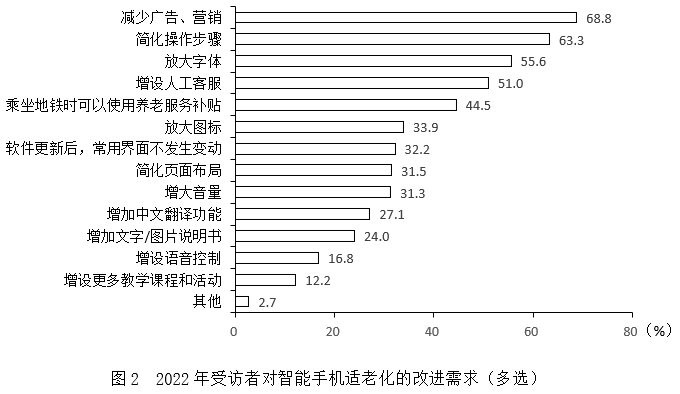

#### 第 11 题　qid 5699205 · 综合

2021年受访者中，使用智能手机没有困难的有（    ）。

- **A**. 393人
- **B**. 401人
- **C**. 419人
- **D**. 428人　✅

**答案**：D

**官方解析**

根据题干“2021年受访者中，使用智能手机没有困难的有”，结合材料给出2021年使用智能手机没有困难受访者的占比，可判定本题为现期比重问题。定位文字材料可得：2021年，该市统计局获取了该市1181位60岁以上老年人使用智能手机的有关情况。定位图1可得：2021年受访者中，使用智能手机没有困难的占36.2%。根据公式：部分=整体×比重，则所求人，与D项最接近。

故正确答案为D。

---

#### 第 12 题　qid 5699208 · 综合

2022年71~80岁的受访者使用“线上支付”功能的人数有可能介于（    ）。

- **A**. 11~15
- **B**. 17~21
- **C**. 23~28
- **D**. 30~39　✅

**答案**：D

**官方解析**

根据题干“2022年71~80岁的受访者使用‘线上支付’功能的人数······”，结合材料给出2022年受访者中年龄在71~80岁以及使用“线上支付”功能人数的占比，可判定本题为现期比重问题。定位文字材料可得：2022年，该市统计局获取了1107位60岁以上老年人使用智能手机的有关情况，年龄在71~80岁的占24.2%。定位表格材料可得：2022年，受访者使用“线上支付”功能的占78.5%。因为24.2%+78.5%=102.7%＞100%，故71~80岁的受访者和使用“线上支付”功能的受访者一定有交集，则2022年71~80岁的受访者使用“线上支付”功能的人数至少有人，仅D项满足。

故正确答案为D。

---

#### 第 13 题　qid 5699210 · 比重

表中所列智能手机的12个功能项中，2022年受访者中使用人数多于2021年的功能项数占比为（    ）。

- **A**. 41.7%
- **B**. 50.0%　✅
- **C**. 58.3%
- **D**. 75.0%

**答案**：B

**官方解析**

根据题干“······，2022年······占比为”，可判定本题为现期比重问题。定位文字材料可得：2021年、2022年分别获取了1181位和1107位60岁以上老年人使用智能手机的有关情况。定位表格材料可知，2021年、2022年受访者智能手机功能使用的占比情况。根据公式：部分=整体×比重，可得各项功能的使用人数=受访人数×各项功能使用人数占比，即所求需满足：1107×2022年各项功能使用人数占比&gt;1181×2021年各项功能使用人数占比，整理可得，则表中所列智能手机12个功能项2022年与2021年占比的比值分别为：

电话短信，，不满足；

社交聊天，，不满足；

线上支付，，满足；

新闻资讯，，满足；

网购，，不满足；

出行，，不满足；

挂号就医，，满足；

照相修图，，满足；

视听娱乐，，不满足；

投资理财，，不满足；

游戏，，满足；

其他，，满足。

比较可知，表中所列智能手机的12个功能项中，有6项功能满足2022年受访者中使用人数多于2021年，占比。

故正确答案为B。

---

#### 第 14 题　qid 5699211 · 平均数

图2所列的14个改进需求项目中，2022年受访者的人均需求（    ）。

- **A**. 不足2项
- **B**. 不少于2项但不足3项
- **C**. 不少于4项　✅
- **D**. 不少于3项但不足4项

**答案**：C

**官方解析**

根据题干“······2022年······人均需求”，结合材料时间为2022年，可判定本题为现期平均数问题。定位图2可知2022年受访者对智能手机各项适老化改进需求的占比情况。根据公式：人均需求项数、部分=整体×比重，则所求项，在C项范围内。

故正确答案为C。

---

#### 第 15 题　qid 5699213 · 综合

能够从上述资料中推出的是（    ）。

- **A**. 2022年受访者中，有“简化页面布局”需求的也有“增大音量”需求
- **B**. 2022年受访者中，有“放大字体”但没有“放大图标”需求的不少于230人　✅
- **C**. 2022年受访者中，使用智能手机没有困难的比重下降是因为广告弹窗多
- **D**. 除“线上支付”外，2022年调查中比上年提升百分点最多的智能手机使用功能是“挂号就医”

**答案**：B

**官方解析**

A项，定位图2可得：2022年，有简化页面布局、增大音量需求的受访者的占比分别为31.5%、31.3%。因为31.5%+31.3%=62.8%&lt;100%，即有简化页面布局需求的受访者不一定有增大音量需求，错误；

B项，定位文字材料可得：2022年，该市统计局获取了1107位60岁以上老年人使用智能手机的有关情况。定位图2可得：2022年，有放大字体、放大图标需求的受访者的占比分别为55.6%、33.9%。假设有放大图标需求的受访者均有放大字体需求，此时有“放大字体”但没有“放大图标”需求的人最少，即同时有两类需求的占比为33.9%，有放大字体需求但没有放大图标需求的占比为55.6%-33.9%=21.7%。根据公式：部分=整体×比重，可得2022年受访者中，有“放大字体”但没有“放大图标”需求的人数至少为人人，正确；

C项，整篇材料中均未给出2022年受访者中，使用智能手机没有困难比重下降的原因，故无法判断，错误；

D项，定位表格材料可得：2021、2022年受访者使用智能手机挂号就医功能的占比分别为55.4%、63.4%；照相修图功能的占比分别为41.9%、50.7%。故2022年调查中挂号就医功能比上年提升63.4%-55.4%=8%，即8个百分点；照相修图功能比上年提升50.7%-41.9%=8.8%，即8.8个百分点。则除“线上支付”外，2022年调查中比上年提升百分点最多的智能手机使用功能并非是“挂号就医”，错误。

故正确答案为B。

---

### 材料 4

        2021年，我国制作综艺益智类电视节目时长30.0万小时，比上年下降12.2%；播出综艺益智类电视节目时长109.5万小时，下降5.5%。制作广播剧类节目时长22.4万小时，比上年增长2.4%，播出广播剧类节目时长97.8万小时，增长0.4%。

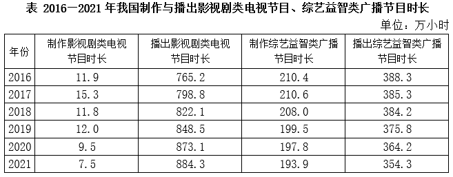

#### 第 16 题　qid 5699218 · 增长

2017-2021年我国播出影视剧类电视节目时长增加最多的年份是（    ）。

- **A**. 2017年　✅
- **B**. 2018年
- **C**. 2019年
- **D**. 2021年

**答案**：A

**官方解析**

根据题干“2017-2021年······增加最多······”，可以判定本题为增长量比较问题。定位统计表可得：2016-2021年，我国播出影视剧类电视节目时长分别为：765.2万小时、798.8万小时、822.1万小时、848.5万小时、873.1万小时、884.3万小时。根据公式：增长量=现期量-基期量，可得选项中各年份我国播出影视剧类电视节目时长的增长量分别为：

2017年：万小时；

2018年：万小时；

2019年：万小时；

2021年：万小时；

则增长最多的年份是2017年。

故正确答案为A。

---

#### 第 17 题　qid 5699220 · 平均数

2017-2021年我国播出综艺益智类广播节目时长年平均减少（    ）。

- **A**. 5.7万小时
- **B**. 6.2万小时
- **C**. 6.8万小时　✅
- **D**. 7.8万小时

**答案**：C

**官方解析**

根据题干“2017-2021年······年平均减少”，结合选项带单位，可判定本题为年均增长量问题。定位统计表可得：2016年我国播出综艺益智类广播节目时长为388.3万小时，2021年为354.3万小时。根据公式：年均增长量，可得所求万小时，即减少6.8万小时。

故正确答案为C。

---

#### 第 18 题　qid 5699222 · 增长

下列各项中，2021年同比增速最小的是（    ）。

- **A**. 制作综艺益智类电视节目时长
- **B**. 制作影视剧类电视节目时长　✅
- **C**. 播出综艺益智类电视节目时长
- **D**. 播出综艺益智类广播节目时长

**答案**：B

**官方解析**

根据题干“······2021年同比增速最小的是······”，可以判定本题为一般增长率问题。定位统计表可得：2020年，制作影视剧类电视节目时长为9.5万小时，播出综艺益智类广播节目时长为364.2万小时；2021年，制作影视剧类电视节目时长为7.5万小时，播出综艺益智类广播节目时长为354.3万小时；定位文字材料可得：2021年，我国制作综艺益智类电视节目时长比上年下降12.2%；播出综艺益智类电视节目时长下降5.5%。即制作综艺益智类电视节目时长的同比增速为-12.2%，播出综艺益智类电视节目时长的同比增速为-5.5%。根据公式：增长率，可知2021年，制作影视剧类电视节目时长的同比增速；播出综艺益智类广播节目时长的同比增速。比较可得，制作影视剧类电视节目时长的同比增速（-21.1%）最小，对应B项。

故正确答案为B。

---

#### 第 19 题　qid 5699224 · 综合

2021年我国综艺益智类广播节目制作时长比“十三五”时期年均制作时长少（    ）。

- **A**. 5.5%　✅
- **B**. 6.9%
- **C**. 7.3%
- **D**. 8.0%

**答案**：A

**官方解析**

根据题干“2021年······比······少”，结合选项为百分数，可以判定本题为一般增长率问题。定位统计表可得：2016-2021年，我国综艺益智类广播节目制作时长分别为210.4万小时、210.6万小时、208.0万小时、199.5万小时、197.8万小时、193.9万小时。则“十三五”时期，我国综艺益智类广播节目年均制作时长万小时。根据公式：增长率，可得所求，即少5.4%，与A项最接近。

故正确答案为A。

---

#### 第 20 题　qid 5699226 · 综合

能够从上述资料中推出的是（    ）。

- **A**. 2016-2021年我国播出影视剧类电视节目时长逐年增加
- **B**. 2021年我国播出当年制作综艺益智类电视节目时长为30.0万小时
- **C**. 2021年我国制作综艺益智类广播节目时长是制作影视剧类电视节目时长的25.9倍　✅
- **D**. “十三五”时期，我国制作综艺益智类广播节目时长与制作影视剧类节目时长之差逐年增大

**答案**：C

**官方解析**

A项：定位统计表可知，2016-2021年我国播出影视剧类电视节目的时长，但材料当中没有给出2015年的数据，因此无法确定2016年的时长是否增加，故无法推出，错误；

B项：定位文字材料可知，2021年，我国制作综艺益智类电视节目时长为30.0万小时，但当年制作的电视节目并非一定在当年播放，故无法推出，错误；

C项：定位统计表可知，2021年我国制作综艺益智类广播节目时长为193.9万小时，制作影视剧类电视节目时长为7.5万小时。则所求倍数倍，正确；

D项：定位统计表可知，“十三五”时期，我国制作综艺益智类广播节目时长与制作影视剧类节目时长。可知2016年二者之差为210.4-11.9=198.5万小时；2017年为210.6-15.3=195.3万小时，则2017年二者之差低于2016年，并非逐年增大，错误。

故正确答案为C。

---
