# 2023年浙江省公务员录用考试《行测》题（A类）（网友回忆版）

> 省考 · 2023 年 · 6 个模块 · 共 124 题

- [政治理论](#%E6%94%BF%E6%B2%BB%E7%90%86%E8%AE%BA) · 2 题
- [常识判断](#%E5%B8%B8%E8%AF%86%E5%88%A4%E6%96%AD) · 18 题
- [言语理解与表达](#%E8%A8%80%E8%AF%AD%E7%90%86%E8%A7%A3%E4%B8%8E%E8%A1%A8%E8%BE%BE) · 30 题
- [数量关系](#%E6%95%B0%E9%87%8F%E5%85%B3%E7%B3%BB) · 19 题
- [判断推理](#%E5%88%A4%E6%96%AD%E6%8E%A8%E7%90%86) · 40 题
- [资料分析](#%E8%B5%84%E6%96%99%E5%88%86%E6%9E%90) · 15 题

---

## 政治理论

### 第 1 题　qid 5430247 · 新思想

2022年10月22日，中国共产党第二十次全国代表大会审议并一致通过十九届中央委员会提出的《中国共产党章程（修正案）》。下列关于这一修正案的表述，正确的有：
①把充分发挥人才作为第一资源的作用写入党章
②把党是最高政治领导力量，坚持和加强党的全面领导写入党章
③把党的十九大以来习近平新时代中国特色社会主义思想新发展写入党章
④把坚持政治建军、改革强军、科技强军、人才强军、依法治军，把人民军队建设成为世界一流军队写入党章

- **A**. 1项
- **B**. 2项
- **C**. 3项
- **D**. 4项　✅

**答案**：D

**官方解析**

本题考查政治常识。
①正确，大会认为，党的二十大提出以中国式现代化全面推进中华民族伟大复兴，并将此确定为新时代新征程中国共产党的中心任务······大会同意把上述内容写入党章，同意把逐步实现全体人民共同富裕，把握新发展阶段，贯彻创新、协调、绿色、开放、共享的新发展理念，加快构建以国内大循环为主体、国内国际双循环相互促进的新发展格局，推动高质量发展，充分发挥人才作为第一资源的作用，促进国民经济更高质量、更有效率、更加公平、更可持续、更为安全发展等内容写入党章。
②正确，大会认为，中国共产党是领导我们事业的核心力量，党的领导是实现中华民族伟大复兴的根本保证。大会同意把党是最高政治领导力量，坚持和加强党的全面领导等内容写入党章。这有利于充分发挥党总揽全局、协调各方的领导核心作用，把党的领导落实到党和国家事业各领域各方面各环节。
③正确，大会一致同意，把党的十九大以来习近平新时代中国特色社会主义思想新发展写入党章，以更好反映以习近平同志为核心的党中央推进党的理论创新、实践创新、制度创新成果。大会要求全党深刻领悟“两个确立”的决定性意义，全面贯彻习近平新时代中国特色社会主义思想，把这一思想贯彻落实到党和国家工作各方面全过程。
④正确，大会认为，党的十九大以来，习近平同志就加强国防和军队建设、统战工作、外交工作提出一系列新理念新思想新战略。大会同意，把坚持政治建军、改革强军、科技强军、人才强军、依法治军，把人民军队建设成为世界一流军队；全面准确、坚定不移贯彻“一个国家、两种制度”的方针，坚决反对和遏制“台独”；弘扬和平、发展、公平、正义、民主、自由的全人类共同价值，推动建设持久和平、普遍安全、共同繁荣、开放包容、清洁美丽的世界等内容写入党章。
综上所述，正确的有①②③④，共4项。
故正确答案为D。

---

### 第 2 题　qid 5430248 · 时事政治

习近平总书记在党的二十大报告中指出，十年来，我们经历了对党和人民事业具有重大现实意义和深远历史意义的三件大事。下列不属于“三件大事”的是：

- **A**. 迎来中国共产党成立一百周年
- **B**. 中国特色社会主义进入新时代
- **C**. 谱写马克思主义中国化时代化新篇章　✅
- **D**. 完成脱贫攻坚、全面建成小康社会的历史任务，实现第一个百年奋斗目标

**答案**：C

**官方解析**

本题考查政治常识。
A、B、D三项正确，C项错误，党的二十大报告中指出：“同志们！十八大召开至今已经十年了。十年来，我们经历了对党和人民事业具有重大现实意义和深远历史意义的三件大事：一是迎来中国共产党成立一百周年，二是中国特色社会主义进入新时代，三是完成脱贫攻坚、全面建成小康社会的历史任务，实现第一个百年奋斗目标。这是中国共产党和中国人民团结奋斗赢得的历史性胜利，是彪炳中华民族发展史册的历史性胜利，也是对世界具有深远影响的历史性胜利。”
本题为选非题，故正确答案为C。

---

## 常识判断

### 第 1 题　qid 5430249 · 法律常识

根据《中华人民共和国公务员法》，下列说法不正确的是：

- **A**. 公务员就职时应当依照法律规定公开进行宪法宣誓
- **B**. 被依法列为失信联合惩戒对象的人员，不得录用为公务员
- **C**. 对公务员涉嫌职务违法和职务犯罪的，应当依法移送检察机关处理　✅
- **D**. 国家实行公务员职务与职级并行制度，公务员职级在厅局级以下设置

**答案**：C

**官方解析**

本题考查法律常识。
A项正确，根据《中华人民共和国公务员法》第九条规定：“公务员就职时应当依照法律规定公开进行宪法宣誓。”
B项正确，根据《中华人民共和国公务员法》第二十六条规定：“下列人员不得录用为公务员：（一）因犯罪受过刑事处罚的；（二）被开除中国共产党党籍的；（三）被开除公职的；（四）被依法列为失信联合惩戒对象的；（五）有法律规定不得录用为公务员的其他情形的。”
C项错误，根据《中华人民共和国公务员法》第五十七条第三款规定：“对公务员涉嫌职务违法和职务犯罪的，应当依法移送监察机关处理。”
D项正确，根据《中华人民共和国公务员法》第十七条规定：“国家实行公务员职务与职级并行制度，根据公务员职位类别和职责设置公务员领导职务、职级序列。”第十九条第一款规定：“公务员职级在厅局级以下设置。”
本题为选非题，故正确答案为C。

---

### 第 2 题　qid 5430250 · 法律常识

根据《中华人民共和国个人信息保护法》，下列说法不正确的是：

- **A**. 个人发现其个人信息不准确或者不完整的，有权请求个人信息处理者更正、补充
- **B**. 处理个人信息应当具有明确、合理的目的，并应当与处理目的直接相关，采取对个人权益影响最小的方式
- **C**. 个人信息是以电子或者其他方式记录的与已识别或者可识别的自然人有关的各种信息，不包括匿名化处理后的信息
- **D**. 基于个人同意处理个人信息的，个人有权撤回其同意。个人撤回同意，撤回前基于个人同意已进行的个人信息处理活动无效　✅

**答案**：D

**官方解析**

本题考查法律常识。
A项正确，根据《中华人民共和国个人信息保护法》第四十六条第一款规定：“个人发现其个人信息不准确或者不完整的，有权请求个人信息处理者更正、补充。”
B项正确，根据《中华人民共和国个人信息保护法》第六条第一款规定：“处理个人信息应当具有明确、合理的目的，并应当与处理目的直接相关，采取对个人权益影响最小的方式。”
C项正确，根据《中华人民共和国个人信息保护法》第四条第一款规定：“个人信息是以电子或者其他方式记录的与已识别或者可识别的自然人有关的各种信息，不包括匿名化处理后的信息。”
D项错误，根据《中华人民共和国个人信息保护法》第十五条规定：“基于个人同意处理个人信息的，个人有权撤回其同意。个人信息处理者应当提供便捷的撤回同意的方式。个人撤回同意，不影响撤回前基于个人同意已进行的个人信息处理活动的效力。”由此可见，撤回前基于个人同意已进行的个人信息处理活动依然有效。
本题为选非题，故正确答案为D。

---

### 第 3 题　qid 5430286 · 法律常识

根据《中华人民共和国社会保险法》，下列说法不正确的是：

- **A**. 治疗工伤期间的工资福利由用人单位支付
- **B**. 生育保险费由用人单位和职工个人按比例共同缴纳　✅
- **C**. 城镇居民基本医疗保险实行个人缴费和政府补贴相结合
- **D**. 失业人员领取失业保险金的期限与失业保险费的累计缴费时间有关

**答案**：B

**官方解析**

本题考查法律常识。
A项正确，根据《中华人民共和国社会保险法》第三十九条第一项规定：“因工伤发生的下列费用，按照国家规定由用人单位支付：（一）治疗工伤期间的工资福利。”
B项错误，根据《中华人民共和国社会保险法》第五十三条规定：“职工应当参加生育保险，由用人单位按照国家规定缴纳生育保险费，职工不缴纳生育保险费。”
C项正确，根据《中华人民共和国社会保险法》第二十五条第一、二款规定：“国家建立和完善城镇居民基本医疗保险制度。城镇居民基本医疗保险实行个人缴费和政府补贴相结合。”
D项正确，根据《中华人民共和国社会保险法》第四十六条规定：“失业人员失业前用人单位和本人累计缴费满一年不足五年的，领取失业保险金的期限最长为十二个月；累计缴费满五年不足十年的，领取失业保险金的期限最长为十八个月；累计缴费十年以上的，领取失业保险金的期限最长为二十四个月。重新就业后，再次失业的，缴费时间重新计算，领取失业保险金的期限与前次失业应当领取而尚未领取的失业保险金的期限合并计算，最长不超过二十四个月。”
本题为选非题，故正确答案为B。

---

### 第 4 题　qid 5430289 · 法律常识

根据《中华人民共和国行政许可法》，下列说法不正确的是：

- **A**. 行政机关实施行政许可，不得收取任何费用　✅
- **B**. 行政许可申请可以通过电子数据交换和电子邮件等方式提出
- **C**. 被许可人出借行政许可证件的，行政机关应当依法给予行政处罚；构成犯罪的，依法追究刑事责任
- **D**. 当申请人的申请事项不属于本行政机关职权范围的，应当即时作出不予受理的决定，并告知申请人向有关行政机关申请

**答案**：A

**官方解析**

本题考查法律常识。
A项错误，根据《行政许可法》第五十九条规定：“行政机关实施行政许可，依照法律、行政法规收取费用的，应当按照公布的法定项目和标准收费；所收取的费用必须全部上缴国库，任何机关或者个人不得以任何形式截留、挪用、私分或者变相私分。财政部门不得以任何形式向行政机关返还或者变相返还实施行政许可所收取的费用。”
B项正确，根据《行政许可法》第二十九条第三款规定：“行政许可申请可以通过信函、电报、电传、传真、电子数据交换和电子邮件等方式提出。”
C项正确，根据《行政许可法》第八十条第一项规定：“被许可人有下列行为之一的，行政机关应当依法给予行政处罚；构成犯罪的，依法追究刑事责任：（一）涂改、倒卖、出租、出借行政许可证件，或者以其他形式非法转让行政许可的。”
D项正确，根据《行政许可法》第三十二条第一款第二项规定：“行政机关对申请人提出的行政许可申请，应当根据下列情况分别作出处理：（二）申请事项依法不属于本行政机关职权范围的，应当即时作出不予受理的决定，并告知申请人向有关行政机关申请。”
本题为选非题，故正确答案为A。

---

### 第 5 题　qid 5430297 · 人文常识

下列4幅图是红军长征宣传图，按照发生时间先后排序正确的是：

①

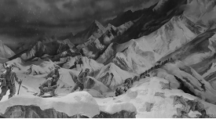

②

③

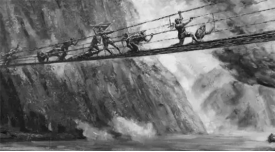

④

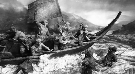

- **A**. ①②④③
- **B**. ④③①②　✅
- **C**. ②④③①
- **D**. ④①③②

**答案**：B

**官方解析**

本题考查毛中特。
图①为爬雪山的情景，1935年6月，中央红军在川康边地区翻越了终年积雪、气候变化无常的大雪山——夹金山，也是红军翻越的第一座大雪山。
图②为过草地的情景，1935年8月21日，红军开始过草地。行军队左右两路，平行前进。右路军由毛泽东、周恩来、徐向前等率领，自四川毛儿盖出发，进入松潘草地。经过7天的艰苦努力，右路军到达草地尽头的班佑地区。左翼为林彪的红一方面军，先行；继后是中央领导机关、红军大学学生等。右翼为徐向前、陈昌浩率领的红三十军和红四军。彭德怀率红三军团垫后，走左翼行军路线。
图③为飞夺泸定桥的情景，飞夺泸定桥发生于1935年5月29日。中央红军部队在四川省中西部强渡大渡河成功，沿大渡河东岸北上，主力由安顺场沿大渡河西岸北上，红四团战士在天下大雨的情况下，在崎岖陡峭的山路上跑步前进，一昼夜奔袭竟达240里，终于在5月29日凌晨6时按时到达泸定桥西岸。第2连连长和22名突击队员沿着枪林弹雨和火墙密布的铁索踩着铁链夺下桥头，并与东岸部队合围占领了泸定桥。
图④为强渡大渡河的情景，强渡大渡河是指1935年5月24日-25日，中国工农红军在四川省越西县（今属四川省石棉县）安顺场渡过大渡河的战斗，也是长征途中的一次著名战斗。
综上所述，按照时间先后排序为④③①②。
故正确答案为B。

---

### 第 6 题　qid 5430300 · 人文常识

下列最能体现古人可持续发展思想的是：

- **A**. 天何言哉？四时行焉，百物生焉，天何言哉？
- **B**. 虾蟆得其志，快乐无以加。地既蕃其生，使之族类多
- **C**. 不违农时，谷不可胜食也；数罟不入洿池，鱼鳖不可胜食也　✅
- **D**. 毋坏屋，毋填井，毋伐树木，毋动六畜。有不如令者，死无赦

**答案**：C

**官方解析**

本题考查人文常识。
A项错误，该句出自《论语·阳货》，意思是天何尝说过话呢？四季照常运行，百物照样生长，天说了什么话呢？这是孔子向学生阐释一切规律、法则皆无言而自化，端赖自己观察发现的道理。
B项错误，该句出自唐代白居易的《虾蟆（和张十六）》，意思是虾蟆得到雨水润泽无比快乐。大地不仅使它们繁衍生息，还让它们族类众多。
C项正确，该句出自先秦孟子弟子录的《寡人之于国也》，意思是不耽误农业生产的季节，粮食就会吃不完。密网不下到池塘里，鱼鳖之类的水产就会吃不完。体现了古人可持续发展的思想。
D项错误，该句出自西周的《伐崇令》，意思是不得毁坏房屋，不得填埋水井，不得砍伐树木，不得伤害家畜。如果有人敢不遵从禁令，一律处死，且不得说情赦免。体现了古人的法律。
故正确答案为C。

---

### 第 7 题　qid 5430335 · 人文常识

下列关于中国古典园林的说法，不正确的是：

- **A**. 中国古典园林在明末开始出现　✅
- **B**. 凿池引水在古典园林中较为常见
- **C**. 榭在古典园林建筑中多为临水建筑
- **D**. 漏景的构景手法主要是通过透漏空隙来呈现景物

**答案**：A

**官方解析**

本题考查人文常识。
A项错误，中国古典园林艺术是指以江南私家园林和北方皇家园林为代表的中国山水园林形式。根据历史文献和现存古代园林遗址的考察，中国古典园林的发展大致可以分成三个时期：先秦秦汉，此时期或可称为“自然时期”，是从“囿”到“苑”的发展时期；唐宋时期是中国古典园林的形成时期；明清时期是中国古典园林的全盛时期。
B项正确，不论哪一种类型的园林，水是最富有生气的因素，无水不活。因此，园林一定要凿池引水。古代园林的理水方法，一般有掩、隔、破三种。掩就是以建筑和绿化，将曲折的池岸加以掩映。隔是或筑堤横断于水面，或有隔水浮廊可渡，或架曲折的石板小桥，或涉水点以步石。破是在水面很小时，可用乱石为岸，配以细竹野藤，朱鱼翠藻。
C项正确，榭，其本意指土台上的木构建筑。明清园林中的榭则是指水边或花边的小建筑。建筑在水池边的可称水榭，建筑在花坛边的可称花榭。常见的榭多为临水而建，面水而设美人靠，可让人凭栏观景。建筑的基部大多一半挑出水面，下面用柱墩架起，与干栏式建筑相似。这种建筑型制与阁的含义相近，故又称为水阁。
D项正确，漏景是中国园林传统造景手法之一，是从框景发展而来的成景类型。漏景是透过虚隔物看到的景象，虚隔物可以是花窗、隔扇、漏窗、漏明墙、栅栏或疏朗的树干。景物的透漏易于勾起游人寻幽探景的兴致与愿望，而透漏的景致本身又有一种似实而虚、似虚而实的模糊美。
本题为选非题，故正确答案为A。

---

### 第 8 题　qid 5430336 · 法律常识

下列与我国税务有关的说法，不正确的是：

- **A**. 个人所得税一般使用全额累进税率计算　✅
- **B**. 一般纳税人的增值税应纳税额=销项税额-进项税额
- **C**. 按消费地征税，不会影响进口商品和本国商品的比价，因而对自由贸易不产生扭曲效应
- **D**. 出口退税是指在国际贸易业务中，对我国报关出口的货物退还在国内各生产环节和流转环节按税法规定缴纳的增值税和消费税

**答案**：A

**官方解析**

本题考查经济常识。
A项错误，个人所得税的税率采用的是超额累进税率，是将纳税对象按数额的大小分为若干等级，对每一个等级规定相应的税率，税率依次提高，分别计算税额，将计算结果相加后得出应纳税额。而全额累进税率是累进税率的一种，即征税对象的全部数额都按其相应等级的累进税率计算征收。
B项正确，一般纳税人增值税应纳税额等于当期销项税额减去当期进项税额。其中销项税额是指纳税人提供应税服务按照销售额和增值税税率计算的增值税额。进项税额是指纳税人购进货物或者接受加工修理修配劳务和应税服务，支付或者负担的增值税税额。
C项正确，按照征税的不同环节，对商品流转过程征收的间接税，可以分为产地税和消费地税。产地税是在生产地对商品销售所征收的间接税。消费地税是在消费地对商品销售所征收的间接税。按消费地征税，不会影响进口商品和本国商品的比价，因而对自由贸易不产生扭曲效应。
D项正确，出口退税是指在国际贸易业务中，对我国报关出口的货物退还在国内各生产环节和流转环节按税法规定缴纳的增值税和消费税，即出口环节免税且退还以前纳税环节的已纳税款。
本题为选非题，故正确答案为A。

---

### 第 9 题　qid 5430338 · 科技常识

中国航天是浪漫的科技事业，相关的命名体现了中国航天人的浪漫情怀。下列命名与中国航天器或工程的对应关系，不正确的是：

- **A**. 鹊桥——中继通信卫星
- **B**. 鸿雁——全球定位卫星系统　✅
- **C**. 萤火一号——火星探测器
- **D**. 悟空——暗物质粒子探测卫星

**答案**：B

**官方解析**

本题考查科技常识。
A项正确，“鹊桥”是嫦娥四号月球探测器的中继卫星，是中国首颗、也是世界首颗地球轨道外专用中继通信卫星，于2018年5月21日在西昌卫星发射中心由长征四号丙运载火箭发射升空。
B项错误，2018年12月29日，“鸿雁”星座首发星在我国酒泉卫星发射中心由长征二号丁运载火箭发射成功并进入预定轨道，卫星的成功发射标志着“鸿雁”星座的建设全面启动。“鸿雁”星座由数百颗低轨卫星和全球数据业务处理中心组成，建成后将开展面向全球的智能终端通信、物联网、移动广播、导航增强、航空航海监视、宽带互联网接入等服务。全球定位卫星系统又称全球卫星导航系统，包括中国的北斗卫星导航系统（BDS）、美国的全球定位系统（GPS）、俄罗斯的格洛纳斯卫星导航系统（GLONASS）和欧盟的伽利略卫星导航系统（GALILEO）。
C项正确，“萤火一号”是中国火星探测计划中的第一颗火星探测器，主要是对火星的空间磁场、电离层和粒子分布变化规律以及火星大气离子逃逸率进行科学探测。此外，还将探测火星地形地貌、沙尘暴以及火星赤道附近的重力场。2011年11月8日与俄罗斯的采样返回探测器一起发射升空，由于俄方探测器变轨失败，导致“萤火一号”发射失败。
D项正确，“悟空”暗物质粒子探测卫星是中国科学院空间科学战略性先导科技专项中首批立项研制的4颗科学实验卫星之一，是世界上观测能段范围最宽、能量分辨率最优的暗物质粒子探测卫星。2015年12月17日，我国在酒泉卫星发射中心用长征二号丁运载火箭成功将暗物质粒子探测卫星“悟空”发射升空。
本题为选非题，故正确答案为B。

---

### 第 10 题　qid 5430340 · 人文常识

下列与古代典籍有关的说法，正确的是：

- **A**. 传统的“四书五经”中包括《尔雅》
- **B**. “二十四史”中包括《史记》和《清史稿》
- **C**. 《战国策》和《资治通鉴》都是编年体史书
- **D**. 古人所说的“笺”和“疏”都有注释的意思　✅

**答案**：D

**官方解析**

本题考查人文常识。
A项错误，“四书五经”是中国传统文学作品“四书”与“五经”的合称。“四书”指《大学》《中庸》《论语》《孟子》。“五经”指《诗经》《尚书》《礼记》《周易》《春秋》。
B项错误，“二十四史”是中国古代各朝撰写的二十四部史书的总称。即《史记》《汉书》《后汉书》《三国志》《晋书》《宋书》《南齐书》《梁书》《陈书》《魏书》《北齐书》《周书》《隋书》《南史》《北史》《旧唐书》《新唐书》《旧五代史》《新五代史》《宋史》《辽史》《金史》《元史》《明史》。
C项错误，《战国策》为国别体史书，内容以战国时期，策士的游说活动为中心，同时反映了战国时期的一些历史特点和社会风貌，是研究战国历史的重要典籍。《资治通鉴》是由北宋史学家司马光主编的一部多卷本编年体史书，共294卷。
D项正确，“笺”本指狭条形小竹片，也可以指中国古代写给帝王的书信，后指注释古书，以显明作者之意。“疏”本意指清除阻塞，使畅通。引申为分散，又引申指稀，再引申指关系远。还指对古书的旧注作进一步解释。
故正确答案为D。

---

### 第 11 题　qid 5430251 · 人文常识

下列关于中国古代文化的说法，不正确的是：

- **A**. 红山文化是我国北方新石器时代文化之一
- **B**. 良渚文化的陶器以泥质红陶和夹砂黑陶为主　✅
- **C**. 仰韶文化早期和中期处于母系氏族社会的繁荣阶段
- **D**. 龙山文化晚期进入军事民主制时期，出现了阶级分化

**答案**：B

**官方解析**

本题考查人文常识。
A项正确，红山文化，新石器时代的一种文化，距今五千年左右，因1935年发现于内蒙古自治区赤峰市红山而得名。红山文化分布范围在东北西部的热河地区，北起内蒙古中南部地区，南至河北北部，东达辽宁西部，辽河流域的西拉木伦河和老哈河、大凌河上游。
B项错误，良渚文化是我国长江下游太湖流域一支重要的古文化，因1936年首先发现于余杭市良渚镇而得名，距今约5300-4000年。良渚文化大体可分为早、晚两期。早期以钱山漾、张陵山等遗址为代表。陶器以灰陶为主，也有少量的黑皮陶；晚期以良渚、雀幕桥等遗址为代表。陶器以泥质黑皮陶较为常见，并有薄胎黑陶。
C项正确，仰韶文化，是指黄河中游地区一种重要的新石器时代彩陶文化，其持续时间大约在公元前5000年至前3000年。仰韶文化展示了中国母系氏族制度繁荣至衰落时期的社会结构和文化成就，早期和中期处于母系氏族社会的繁荣阶段，晚期进入父系氏族公社时期。
D项正确，龙山文化是新石器时代晚期的文化，因1928年首次发现于山东章丘龙山镇的城子崖遗址而得名，年代约为公元前2600年-前1900年。龙山文化早期处于父系氏族公社时期。晚期进入军事民主制时期，出现了阶级分化、贫富悬殊等现象。
本题为选非题，故正确答案为B。

---

### 第 12 题　qid 5430252 · 人文常识

下列诗句与端午节有关的是：

- **A**. 竞渡深悲千载冤，忠魂一去讵能还　✅
- **B**. 但将酩酊酬佳节，不用登临恨落晖
- **C**. 千门万户曈曈日，总把新桃换旧符
- **D**. 烟霄微月澹长空，银汉秋期万古同

**答案**：A

**官方解析**

本题考查人文常识。
A项正确，“竞渡深悲千载冤，忠魂一去讵能还”出自北宋张耒的《和端午》，意思是“龙舟争渡为的是深切悲念屈原的千载冤魂，忠烈的魂魄一去岂能回还？”端午节为农历五月初五日，相传古代爱国诗人屈原在这天投江自杀，后人为了纪念他，把这天当做节日，有吃粽子、划龙舟等风俗。从“竞渡”“忠魂”可以看出诗句对应的是端午节。
B项错误，“但将酩酊酬佳节，不用登临恨落晖”出自唐代杜牧的《九日齐山登高》，意思是“只应纵情痛饮酬答重阳佳节，不必怀忧登临叹恨落日余晖”。重阳节有登高的习俗，而诗句中有“登临”一词，可知其对应的节日为重阳节。
C项错误，“千门万户曈曈日，总把新桃换旧符”出自宋代王安石的《元日》，意思是“初升的太阳照耀着千家万户，他们都忙着把旧的桃符取下，换上新的桃符”。诗句中的“新桃”“旧符”均为桃符，是古代一种风俗，农历正月初一时人们用桃木板写上神荼、郁垒两位神灵的名字，悬挂在门旁，用来压邪，可知其对应的节日是春节。
D项错误，“烟霄微月澹长空，银汉秋期万古同”出自唐代白居易的《七夕》，意思是“抬头仰望明月长空，感慨漫漫历史长河中七夕与秋天都是一样的”，对应的节日是七夕节。
故正确答案为A。

---

### 第 13 题　qid 5430267 · 人文常识

下列邮票图案与少数民族的对应关系，不正确的是：

- **A**. 
朝鲜族

- **B**. 
傣族

- **C**. 
回族

- **D**. 
苗族

　✅

**答案**：D

**官方解析**

本题考查人文常识。
A项正确，从服饰来看，传统的朝鲜族女装，其特点是袄短裙长，袄袖呈圆弧形肥大，左右衣襟以两根长长的结带在右胸前打一个蝴蝶结，与图片吻合。且图片中女子所奏乐器为长鼓，又称杖鼓、两杖鼓，是朝鲜族混合击膜鸣乐器；演奏时将鼓横挂胸前，或放在木架上，左手拍鼓，右手执竹片敲击。
B项正确，从服饰来看，傣族男子多用白布或青布包头，着无领对襟或大襟小袖短衫，下着长管裤，女子传统着窄袖短衣和筒裙，与图片吻合。且图片中的乐器形似一只精美的高脚酒杯，为傣族象脚鼓。
C项正确，从服饰来看，回族的特色主要体现在头饰上，回族男子多戴白色或黑色、棕色的无沿小圆帽，妇女多戴盖头，与图片吻合。
D项错误，图片所对应的民族应为彝族。从服饰来看，彝族女子一般上身穿镶边或绣花的大襟右衽上衣，戴黑色包头、耳环，领口别有银排花，男子多穿黑色窄袖且镶有花边的右开襟上衣，下着多褶宽脚长裤，与图片吻合。且图片中男子所持乐器音箱呈满圆形，琴脖短小，为彝族月琴。
本题为选非题，故正确答案为D。

---

### 第 14 题　qid 5430270 · 科技常识

下列与光有关的说法，不正确的是：

- **A**. 光波可以像绳索样，沿着一定的方向振动
- **B**. 可见光中波长最长的红光波长大于红外线的波长　✅
- **C**. 白光是一种自然光，由红橙黄绿蓝靛紫即七色光组成
- **D**. 利用荧光、激光等发光原理的现代节能灯不能被称为白炽灯

**答案**：B

**官方解析**

本题考查科技常识。
A项正确，光波是横波，和绳波、水波类似，振动方向就是在和光传播的方向垂直的平面上。
B项错误，可见光是电磁波谱中人眼可以感知的部分，波长在780-400纳米之间。在可见光中，红光的波长最长，紫光的波长最短。红外线又称红外辐射，波长介于可见光和微波之间，波长范围为0.76-1000微米。因此红外线波长大于红光波长。
C项正确，1666年，牛顿用三棱镜研究日光，得出结论：白光是由不同颜色（即不同波长）的光混合而成的，可以通过三棱镜折射出红橙黄绿蓝靛紫7种颜色的光。
D项正确，白炽灯是将灯丝通电加热到白炽状态，利用热辐射发出可见光的电光源。节能灯是灯管内部的气体通电后发出荧光，热量不大，并且光是有频率的。
本题为选非题，故正确答案为B。

---

### 第 15 题　qid 5430290 · 科技常识

下列与农业有关的说法不正确的是：

- **A**. 石灰、硫磺是常见的无机农药的有效成分
- **B**. 矿物油农药的作用主要是物理性阻塞害虫气门，影响其呼吸
- **C**. 无公害农业允许使用少量化学农药，强调以预防为主，以生物防治为主
- **D**. 现代农业绿色防控中杀虫灯是利用了害虫成虫对黄色或蓝色敏感，具有强烈趋性的特征　✅

**答案**：D

**官方解析**

本题考查科技常识。
A项正确，无机农药指由天然矿物原料加工、配制而成的农药，又称为矿物性农药。有效成分一般是无机的化学物质或各种盐类，常见的有石灰、硫磺、砷酸钙、磷化铝、硫酸铜等。
B项正确，矿物油农药主要指由矿物油类加入乳化剂或肥皂加热调制而成的杀虫剂，如石油乳剂、柴油乳剂等，其作用主要是物理性阻塞害虫气门，影响其呼吸。
C项正确，无公害农产品的农业生产过程控制主要是农用化学物质使用限量的控制及替代过程。重点生产环节是病虫害防治和肥料施用。病虫害防治要以不用或少用化学农药为原则，强调以预防为主，以生物防治为主。
D项错误，杀虫灯是根据昆虫具有趋光性的特点，利用昆虫敏感的特定光谱范围的诱虫光源，诱集昆虫并能有效杀灭昆虫，降低病虫指数，防治虫害和虫媒病害的专用装置。色板（黄、蓝板）诱杀技术是利用某些害虫成虫对黄、蓝色具有强烈趋性的特性，对害虫进行物理诱杀的技术。
本题为选非题，故正确答案为D。

---

### 第 16 题　qid 5430292 · 人文常识

下列实验与其贡献的对应关系，不正确的是：

- **A**. 马德堡半球实验——证明了大气压的存在
- **B**. 孟德尔的豌豆杂交实验——发现了遗传规律
- **C**. 傅科钟摆实验——验证了万有引力定律的正确性　✅
- **D**. 牛顿的棱镜分解太阳光实验——发现太阳光是一种复色光

**答案**：C

**官方解析**

本题考查科技常识。
A项正确，马德堡半球，亦作马格德堡半球，是1654年时，当时的马德堡市长奥托·冯·格里克于神圣罗马帝国的雷根斯堡（今德国雷根斯堡）进行的一项科学实验。马德堡半球实验证明了大气压强是存在的，并且十分强大。实验中，将两个半球内的空气抽掉，使球内的空气粒子的数量减少、下降。球外的大气便把两个半球紧压在一起，因此就不容易分开了。抽掉的空气越多，半球所受大气压力越大，两个半球越不容易分开。
B项正确，孟德尔豌豆杂交实验，是把一种开紫花的豌豆种和一种开白花的豌豆种结合在一起，第一次结出来的豌豆开紫花，第二次紫白相间，第三次全白。1865年孟德尔通过此实验发现了遗传规律。
C项错误，1851年，法国科学家傅科在公众面前展示了一个科学发现。他用一根长220英尺（约67米）的钢丝将一个62磅（约28千克）重的铁球，悬挂在大教堂的屋顶棚下面。铁球下端装有一只铁笔，铁笔记录铁球摆动时所画出的轨迹。观众发现钟摆在摆动中画出的轨迹会逐渐偏移，并发现轨迹在发生着旋转，因此惊讶不已。傅科的演示说明房屋的缓慢移动，是因为地球围绕着地轴在自转，并推断在南极时，轨迹是逆时针旋转，转动一周的周期是24小时。此实验简单明确地证明了地球在自转。英国科学家卡文迪许于1789年用他发明的扭秤，验证了牛顿的万有引力定律的正确性，并测出了引力常量。
D项正确，1666年，牛顿在棱镜分解太阳光实验中，把一面三棱镜放在阳光下，透过三棱镜，光在墙上被分解为不同颜色，后来我们称作为光谱。通过实验，其证实了太阳光是一种复色光。
本题为选非题，故正确答案为C。

---

### 第 17 题　qid 5430294 · 人文常识

下列关于大气现象的说法，不正确的是：

- **A**. 寒潮、雷电等天气现象发生在平流层　✅
- **B**. 雨后大气一般灰尘较小，不易形成霾
- **C**. 在相同高度上，气旋中心的气压比四周低
- **D**. 霾因其散射波长较长的光较多，故常呈现黄色或橙灰色

**答案**：A

**官方解析**

本题考查科技常识。
A项错误，对流层最主要的特征是存在着强烈的空气对流运动现象，风、雨、雪、雷电和寒潮等天气现象都发生在这里。平流层是地球大气层里上热下冷的一层，大气不对流，以平流运动为主，目前大型客机大多飞行于此层。
B项正确，霾，也称灰霾（烟霞），是指原因不明的因大量烟、尘等微粒悬浮而形成的浑浊现象。其形成有三方面因素：一是水平方向静风现象的增多；二是垂直方向的逆温现象；三是悬浮颗粒物的增加。雨后大气灰尘较小，悬浮颗粒物较小，因此不容易形成霾。
C项正确，气旋是指北（南）半球，大气中水平气流呈逆（顺）时针旋转的大型涡旋。在相同高度上，气旋中心的气压比四周低，又称低压。
D项正确，霾的核心物质是空气中悬浮的灰尘颗粒，气象学上称为气溶胶颗粒。由于灰尘、硫酸、硝酸等粒子组成的霾，其散射波长较长的光比较多，因而霾看起来呈黄色或橙灰色。
本题为选非题，故正确答案为A。

---

### 第 18 题　qid 5430295 · 科技常识

下列关于生活常识的说法，不正确的是：

- **A**. 涂抹润肤乳增加身体湿度可减少静电产生
- **B**. 用过的砧板上常有肉眼看不到的黄曲霉菌
- **C**. 正在发育期的青少年适当补锌可减少腿部抽筋　✅
- **D**. 手剥完桔子后摸膨胀气球，很有可能导致气球爆炸

**答案**：C

**官方解析**

本题考查科技常识。
A项正确，由于不同原子的原子核对电子的束缚能力不同，物体相互靠近时，电子就会在物体之间发生转移，从而导致电荷在物质系统之间的不均匀分布，打破原本的平衡状态。所谓静电，其实就是这些发生转移、在某一物体上积累下来的电荷，而由这些电荷引发的诸多现象，如头发炸毛、电脑屏幕粘上灰尘等，就是静电现象。静电现象在气候干燥时比较常见，因为空气相对湿度降低，摩擦带来的电荷很容易积累起来。而涂抹润肤乳增加身体湿度可减少静电产生。
B项正确，黄曲霉毒素属于真菌毒素，由某些黄曲霉菌和寄生曲霉菌所产生，是霉菌毒素中毒性最大、对人类健康危害最为突出的一类致癌物。砧板本身也并不会长黄曲霉菌，但如果砧板没有及时清洗干净，上面残留的食物残渣和水分就会成为微生物良好的培养基。
C项错误，正在身体发育时期的青少年，如果机体摄入的钙质不足，容易导致腿部的肌肉发生痉挛，引起抽筋，适当补充钙质，多吃含钙量高的食物可以改善，而非补锌。
D项正确，柑橘类水果的果皮中含有芳香烃类化合物，这种物质对橡胶的溶解性很强，能瞬间溶解橡胶。而当气球被吹满，内部充满大量气体时，它本身承受着很大的压强，如果有一处被腐蚀变薄或破裂，会让内部压强不均，从而发生爆炸。因此，手剥完桔子后摸膨胀气球，很有可能导致气球爆炸。
本题为选非题，故正确答案为C。

---

## 言语理解与表达

### 第 1 题　qid 5430310 · 逻辑填空

城市形象不是            的，它会随着一座城市的发展需要而产生相应的变化，因此，对于城市形象的研究也应当            。
依次填入画横线部分最恰当的一项是：

- **A**. 千篇一律 兼收并蓄
- **B**. 墨守陈规 求同存异
- **C**. 因循守旧 革故鼎新
- **D**. 一成不变 与时俱进　✅

**答案**：D

**官方解析**

本题可从第二空入手，根据“因此”可知，横线处应与“随着一座城市的发展需要而产生相应的变化”对应，体现随着事物的发展而变化之意。D项“与时俱进”指随着时代的发展而不断发展、前进，与文意相符，保留。A项“兼收并蓄”指把内容不同、性质不同的东西都吸收进来，B项“求同存异”指找出共同点，保留不同点，C项“革故鼎新”指去掉旧的，建立新的，均无法体现随着事物的发展而变化之意，排除。
第一空，代入验证，根据“随着一座城市的发展需要而产生相应的变化”，结合横线前的否定词可知，横线处应体现不随事物发展而变化之意。D项“一成不变”指一经形成，不再改变，与文意相符，当选。
故正确答案为D。
【文段出处】《基于扎根理论的澳门城市形象定位研究》

---

### 第 2 题　qid 5430312 · 逻辑填空

《走出非洲》是二十世纪最伟大的英语文学作品之一。这部在散文、小说、自传间自由        的作品，以1914至1931年间，作者在肯尼亚恩贡山麓经营咖啡农场的经历为背景，            地将众多的人、景、物熔于一炉，既有忠实而富文学性的观察与描摹，也始终贯穿着对自身、对人性的思考。
依次填入画横线部分最恰当的一项是：

- **A**. 切换 匠心独运　✅
- **B**. 穿插 深入浅出
- **C**. 变幻 举重若轻
- **D**. 出入 不动声色

**答案**：A

**官方解析**

第一空，搭配“作品”，且根据前文“这部在散文、小说、自传间自由······”可知，横线处应表达这部作品具备散文、小说、自传三种文体的风格特点。A项“切换”指影视片等从某一镜头或画面迅速转换到另一镜头或画面，也泛指转换，符合文意，保留。B项“穿插”指小说或戏曲中，插入一些次要情节，以衬托主题，C项“变幻”指不规则的改变，常用于“风云变幻”“变幻莫测”等，D项“出入”指出去和进来，均无法体现出这部作品具有三种文体的风格，与文意不符，排除。
第二空，代入验证，对应横线前后语境，根据作者结合自身经历，将众多的人、景、物相融合，既有观察与描摹，也贯穿着对自身、对人性的思考可知，作者在写作时运用了一些创造性的手法，倾注了一些心思，A项“匠心独运”指在文学、艺术等方面独创性地运用巧妙的心思，符合文意，当选。
故正确答案为A。
【文段出处】《海明威读过的“最优秀的关于非洲的书”，出自这位传奇女性之手》

---

### 第 3 题　qid 5430473 · 逻辑填空

有的地方搞森林城市创建不计成本，选树种不考虑当地环境气候，一味            ，大搞南方草原风光、中部沿海风情的反气候移植。这种贪图表面光鲜、        生态效益、忽视经济效益和社会效益的做法，无疑背离了森林城市创建的初心。
依次填入画横线部分最恰当的一项是：

- **A**. 生搬硬套 无视
- **B**. 标新立异 罔顾　✅
- **C**. 好大喜功 弱化
- **D**. 贪大求全 漠视

**答案**：B

**官方解析**

第一空，根据后文“反气候移植”以及“这种贪图表面光鲜”可知，横线处需体现一种外表美丽、新鲜特别的做法，B项“标新立异”指提出新奇的见解、主张，表示与一般不同，也指故意提出新奇的见解，表示自己与众不同，符合文意，保留。A项“生搬硬套”指不顾实际情况，机械地运用别人的经验，照抄别人的办法，文段中没有出现其他森林城市创建的经验用以借鉴，而是要进行不符合当地的新的气候移植，与文意不符，排除；C项“好大喜功”指不管条件是否许可，一心想做大事立大功，文段侧重强调不考虑当地环境气候进行反气候移植，并非“立大功”，排除；D项“贪大求全”指过分地贪图规模大而全面，文段并未体现“求全”的意思，排除。
第二空，代入验证，搭配“生态效益”，且与后文“忽视经济效益和社会效益”构成并列，B项“罔顾”指不顾及、没有顾及，符合文意，当选。
故正确答案为B。
【文段出处】经济日报《防止森林城市建设走样》

---

### 第 4 题　qid 5430315 · 逻辑填空

有些教育者讲授思政课之所以效果不佳，一个重要的原因在于讲授的内容流于表面，            ，往往是从书本到书本，从理论到理论，致使授课看似在说理，实则缺乏理论深度与厚度，难以让人真正        。
依次填入画横线部分最恰当的一项是：

- **A**. 舍本逐末 接受
- **B**. 走马观花 理解
- **C**. 浅尝辄止 信服　✅
- **D**. 缘木求鱼 认可

**答案**：C

**官方解析**

第一空，由逗号引导近义并列，横线处应与“流于表面”表意接近。“流于表面”指停留在表面上，只在表面上做文章，而没有实际的内容。C项“浅尝辄止”指稍稍尝试一下就停止，比喻做事不肯下功夫深入钻研，能够体现停留在表面上之意，保留。A项“舍本逐末”指舍弃事物的根本的、主要的部分，而去追求细枝末节，文段并未体现本末之分，排除；B项“走马观花”指粗略地观察事物，侧重体现观察得不仔细，而文段要表达对于讲授的内容研究和理解过于肤浅，排除；D项“缘木求鱼”比喻方向、办法不对，一定达不到目的，不能体现停留在表面上之意，排除。
第二空，代入验证，根据“看似在说理，实则缺乏理论深度与厚度”可知，横线处应表达缺乏深度、厚度的理论难以让人接受、相信之意。C项“信服”指相信并佩服，与文意相符，当选。
故正确答案为C。
【文段出处】南方网《新时代思政课讲道理重在“深”“透”“活”》

---

### 第 5 题　qid 5430319 · 逻辑填空

骈文的特点是追求形式美：对偶、声律、用典、藻饰。魏晋时期，这种刻意追求文学形式美的        ，一方面促进了文学独立品格的建立，另一方面又造成了形式上的僵化和内容上的        。
依次填入画横线部分最恰当的一项是：

- **A**. 导向 苍白
- **B**. 手法 单一
- **C**. 潮流 呆板
- **D**. 风尚 空洞　✅

**答案**：D

**官方解析**

本题可从第二空入手，横线处形容“刻意追求形式美”可能会对内容产生的消极影响，即过分注重形式美而忽略了内容，故横线处表达文学作品缺乏实质性内容之意，A项“苍白”形容没有旺盛的生命力，D项“空洞”指空虚而无内涵，缺乏实际内容，均符合文意，保留。B项“单一”指只有一种类型的，无法体现出对内容不看重导致的结果，排除；C项“呆板”意思是死板、不灵活，侧重不够灵活，而非缺乏实质内容，与文意不符，排除。
第一空，“刻意追求文学形式美”是一种文学创作的倾向、习惯，D项“风尚”指流行的风气和习惯，语义恰当，且刻意追求文学形式美形成一种风尚之后，衔接后文对文学产生的重大影响更为准确，当选。A项“导向”指引导的方向，文段并无引导之意，与文意不符，排除。
故正确答案为D。
【文段出处】《“五四”时期散文的发展及其特点》

---

### 第 6 题　qid 5430325 · 逻辑填空

电影技术的运用，逐渐由“炫目”向为视听表现和角色叙事服务转变。大量高质量特效的运用，使不少国产电影的视觉        达到世界顶尖水平。而动作捕捉技术和人工智能深度学习技术的应用，直接        了电影的叙事能力，使电影的艺术表达更为生动和丰富。
依次填入画横线部分最恰当的一项是：

- **A**. 体验 强化
- **B**. 呈现 提升　✅
- **C**. 冲击 拓展
- **D**. 享受 升华

**答案**：B

**官方解析**

第一空，搭配“国产电影”，横线处要体现高质量特效的运用给国产电影带来的视觉作用。B项“呈现”指显现、展示出，C项“冲击”指冲撞、碰击，均可体现给国产电影带来的视觉作用，符合文意，保留。A项“体验”指在实践中认识事物、亲身经历，D项“享受”指物质上或精神上得到满足，均常与“人”搭配，与“国产电影”搭配不当，排除。
第二空，搭配“叙事能力”，且根据后文“使电影的艺术表达更为生动和丰富”可知，横线处要体现“动作捕捉技术和人工智能深度学习技术的应用”对“电影的叙事能力”的促进作用。B项“提升”指提高，“提升能力”为惯用搭配，符合文意，当选。C项“拓展”指开拓、扩展，与“叙事能力”搭配不当，排除。
故正确答案为B。
【文段出处】《技术为电影艺术拓展新空间（科技赋能艺术）》

---

### 第 7 题　qid 5430332 · 逻辑填空

探索浩瀚宇宙，是中华民族数千年来            的追求。中国航天承载了一个大国的斑斓梦想，也        了新时代中国人的骄傲与情怀。
依次填入画横线部分最恰当的一项是：

- **A**. 矢志不渝 寄寓　✅
- **B**. 志在必得 铭刻
- **C**. 亘古不变 映射
- **D**. 孜孜不倦 彰显

**答案**：A

**官方解析**

第一空，根据“中华民族数千年来”可知，横线处所填成语应体现坚持了很长时间之意。A项“矢志不渝”指立志不会改变，表示永远不变心，C项“亘古不变”指从古到今，没有变化，D项“孜孜不倦”指工作或学习勤奋刻苦不知疲倦，形容勤勉不懈怠的一种状态，均符合文意，保留。B项“志在必得”指立志要得到或完成某种愿望，未能体现坚持了很长时间之意，排除。
第二空，由“也”和前后句的相同句式可知，横线处所填词语与“承载”构成并列，应体现背负、寄托之意。A项“寄寓”指依附，寄托，符合文意，当选。C项“映射”指反射反映，不能体现背负、寄托之意，排除；D项“彰显”指鲜明地显示，侧重于“将······显示出来”，不能体现背负、寄托之意，且横线前搭配“中国航天”，而“彰显”的主语多为成果、事迹等，横线后搭配“骄傲与情怀”，“骄傲”是一种内在的情绪状态，无需鲜明地显示出来，“彰显”与前后搭配均不恰当，排除。
故正确答案为A。
【文段出处】《中国航天，新任务新征程》

---

### 第 8 题　qid 5430334 · 逻辑填空

不让“同款”为山寨货遮羞，平台            。大数据时代，任何人均能通过“同款”“仿品”等关键词，轻易找到造假售假的商家，平台坐拥先进的后台系统、人力技术优势，自能对平台内经营者侵犯知识产权行为            。
依次填入画横线部分最恰当的一项是：

- **A**. 责无旁贷 洞若观火　✅
- **B**. 当仁不让 义不容辞
- **C**. 烂熟于心 如数家珍
- **D**. 难辞其咎 了如指掌

**答案**：A

**官方解析**

第一空，根据后文“平台坐拥先进的后台系统、人力技术优势，自能对平台内经营者侵犯知识产权行为”可知，横线处应体现平台要承担起责任之意。A项“责无旁贷”指自己应尽的责任，不能推卸给旁人，B项“当仁不让”原指以仁为任，无所谦让，后指遇到应该做的事就积极主动去做，不推让，均符合文意，保留。C项“烂熟于心”形容对某件事情或者事物的发展情况在心里记得很清楚，没有体现出应当承担起责任之意，排除；D项“难辞其咎”指难以推脱其过失，文段并非要找到有过失的主体，排除。
第二空，根据前文内容可知，横线处应体现平台对经营者侵犯知识产权行为掌握得很清楚之意，A项“洞若观火”形容观察事物非常清楚，好像看火一样，符合文意，当选。B项“义不容辞”指道义上不允许推辞，无法体现出掌握得清楚之意，排除。
故正确答案为A。
【文段出处】《人民财评：莫让“同款”成山寨货的遮羞布》

---

### 第 9 题　qid 5430261 · 逻辑填空

治理直播行业乱象不是为了束缚主播发展，而是鼓励其        内容；加强规范不是行业的终点，而是        发生的新起点。贯彻《网络主播行为规范》相关要求，让政策自上而下落实落地，让行业自下而上加强规范，定能形成高效的治理体系，为直播行业健康发展            。
依次填入画横线部分最恰当的一项是：

- **A**. 挖掘 变革 雪中送炭
- **B**. 丰富 复苏 披荆斩棘
- **C**. 深耕 蝶变 保驾护航　✅
- **D**. 聚焦 转机 添砖加瓦

**答案**：C

**官方解析**

本题可从第三空入手，根据前文“让政策自上而下落实落地，让行业自下而上加强规范，定能形成高效的治理体系”可知，横线处应体现出政策落实为直播行业健康发展发挥了很大作用，C项“保驾护航”指保护某事物让其能正常发展，常用来搭配“政府”“政策”，符合文意，保留。A项“雪中送炭”比喻在别人急需的时候给以帮助，B项“披荆斩棘”比喻扫除前进中的困难和障碍，文段并未论述直播行业遭遇困难或需要帮助，均与文意不符，排除；D项“添砖加瓦”原来指建房屋时不断地添砖块加瓦片，后比喻做一些工作，尽一点力量，强调微小力量对整体的作用，文段体现的是政策的作用，且根据“定能形成高效的治理体系”可知，文段并非强调微小力量，与文意不符，排除。
第一空，代入验证，C项“深耕”原指将土地深层的土壤翻上来，浅层的土壤覆下去，现多用来形容对内容的深入打磨，置于文段表达主播对内容的“精耕细作”，符合文意，保留。
第二空，代入验证，C项“蝶变”指向更好或更完美的方面极大蜕变，对应文段“新起点”，符合文意，当选。
故正确答案为C。
【文段出处】《人民艺起评：疏堵结合 让网络主播更好逐梦前行》

---

### 第 10 题　qid 5430264 · 逻辑填空

中华文化是一座浩瀚的思想库，里面有很多珍宝，但也不乏糟粕，不是所有的内容都可以复活于当代、贡献于世界。时代的变迁决定了我们不可能            保留传统文化的一切方面。中华文明有的内容可以超越时空，有的内容则已尘封；有的可以古为今用，有的则应            。
依次填入画横线部分最恰当的一项是：

- **A**. 循规蹈矩 去粗取精
- **B**. 如法炮制 弃若敝屣
- **C**. 固步自封 漠然置之
- **D**. 原封不动 束之高阁　✅

**答案**：D

**官方解析**

第一空，根据“中华文化······但也不乏糟粕，不是所有的内容都可以复活于当代、贡献于世界”“有的可以古为今用，有的则应······”可知，横线处强调传统文化中有珍宝，也有糟粕，不能完全按照原样去保留传统文化的一切方面。D项“原封不动”比喻保持原来的样子，一点不加变动，符合文意，保留。A项“循规蹈矩”原指遵守规矩，现多指拘泥于旧的准则，不敢稍做变通，侧重强调遵守规则、准则，B项“如法炮制”指依照成法炮制药剂，泛指照现成的方法办事，文段并无按照规则准则或现成方法保留传统文化的意思，与文段语境无关，排除；C项“固步自封”比喻安于现状，不求进步，与否定词连用则侧重强调要创新、要进步，而文段强调的是传统文化中好的方面要古为今用，糟粕的方面要舍弃，而非强调要创新、要进步，不符合文意，排除。
第二空，代入验证。“有的内容可以超越时空，有的内容则已尘封；有的可以古为今用，有的则应······”构成一一对应，“古为今用”对应“超越时空”，故横线处对应“已尘封”，强调对于传统文化中的糟粕，要尘封起来。D项“束之高阁”指扔在一边，不去用它或管它，符合文意，当选。
故正确答案为D。
【文段出处】光明日报《以更有活力的文明成就贡献世界》

---

### 第 11 题　qid 5430266 · 逻辑填空

并非所有的阅读都是一场对抗，一次            的对话。有谁未曾被一篇扣人心弦、            的论述所折服，未曾        在他人的思维里，而又被一声电话铃声或其他干扰拽回现实？
依次填入画横线部分最恰当的一项是：

- **A**. 唇枪舌剑 字字珠玑 沉醉　✅
- **B**. 雄辩高谈 丝丝入扣 迷醉
- **C**. 舌战群儒 笔底生花 沉浸
- **D**. 剑拔弩张 巧舌如簧 陶醉

**答案**：A

**官方解析**

第一空，根据“一场······一次······”可知，横线处与“对抗”构成并列关系，应体现阅读中读者与作者对抗的状态。A项“唇枪舌剑”形容争辩激烈，言辞锋利，D项“剑拔弩张”形容形势紧张，一触即发，均与文意相符，保留。B项“雄辩高谈”形容一个人能言善辩，无法体现文段中双方“对抗”之意，排除；C项“舌战群儒”指同很多人辩论，并驳倒对方，文段中表达的是阅读中“读者与作者”之间的对抗，并无“同很多人辩论”之意，排除。
第二空，根据“、”可知，横线处与“扣人心弦”意思相近，且根据“折服”可知，横线处应体现论述很精彩之意。A项“字字珠玑”意为文章中遣词用字非常优美，与文意相符，保留。D项“巧舌如簧”意为舌头灵巧得就像乐器里的簧片一样，形容能说会道，善于狡辩，感情色彩偏消极，与文段感情色彩不符，排除。
第三空，代入验证，根据“而又被一声电话铃声或其他干扰拽回现实”可知，横线处应体被他人的思维所深深吸引之意。A项“沉醉”比喻为美好的事物所陶醉，与文意相符，当选。
故正确答案为A。
【文段出处】《静默》约翰·毕谷纳特

---

### 第 12 题　qid 5430268 · 语句表达

①建议从事童书出版的机构聘请心理学、教育学、出版学等相关领域专家共同把关，为儿童读物筑牢安全防线
②童书出版有必要设立严格门槛
③童书出版需要认定资质、配备专业编辑，目前在这方面尚有欠缺
④我国现有专业少儿出版社30多家，随着市场需求增长，少儿出版的队伍不断壮大
⑤童书正在从原来的专业出版变为大众出版
⑥目前全国583家出版社，参与少儿出版的已经超过550家
将以上6个句子重新排序，语序正确的一项是：

- **A**. ③②①④⑥⑤
- **B**. ④⑥⑤②③①　✅
- **C**. ⑤④③⑥①②
- **D**. ⑥②①④⑤③

**答案**：B

**官方解析**

对比选项，确定首句，③句论述目前童书出版存在的问题，④句论述我国少儿出版的队伍不断壮大，⑤句论述童书从专业出版变为大众出版这一变化，⑥句论述目前全国参与少儿出版的出版社的具体数据，按照逻辑顺序，应先论述少儿出版的队伍不断壮大，再具体列数据说明，故④句应在⑥句之前，排除D项。
观察选项发现，与A、B两项的④⑥捆绑不同，C项为④③⑥，③句论述目前童书出版存在的问题，④⑥共同论述少儿出版的队伍不断壮大的话题，故③句不适合在④⑥中间，排除C项。
继续寻找线索，对比尾句，①句为对策表述，论述建议聘请各领域专家共同把关，为儿童读物筑牢安全防线，⑤句论述童书从专业出版变为大众出版的这一变化，不及①句的对策适合作为尾句，排除A项，B项当选。
故正确答案为B。
【文段出处】北青网《筑牢童书安全防线》

---

### 第 13 题　qid 5430271 · 语句表达

①城镇化意味着对人口自由发展需求的满足，本质上要服务于人民
②据统计，2010年到2020年十年间，全国农村总流出人口中跨省进城人口增加2657万人，省内进城人口增长近1.12亿人
③事实上，近年来“人口回流促进区域内城市发展，城市发展进一步吸引人口回流”的循环互动在各地不断上演
④人口往哪里流动，城镇化的方向就应当往哪里延伸，随着人口省内流动日益频繁，作为城乡融合的重要载体，县域的城镇化是大势所趋
⑤这表明，省内城市务工成为近年来人口流动的趋势
⑥近年来，人口流动呈现出“跨省区人口流动趋缓、近域化流动趋势加强”的新趋势
将以上6个句子重新排序，语序正确的一项是：

- **A**. ①②③④⑥⑤
- **B**. ②⑥⑤③①④
- **C**. ④③⑥①②⑤
- **D**. ⑥②⑤③①④　✅

**答案**：D

**官方解析**

对比选项，判断首句。①句引出“城镇化”的话题，论述了城镇化的本质；②句详细论述了跨省进城与省内进城的增长人数；④句论述了随着人口省内流动日益频繁，县域的城镇化是大势所趋；⑥句通过“近年来”引出背景，论述了人口流动呈现“跨省区人口流动趋缓、近域化流动趋势加强”的新趋势。对比②句和⑥句，⑥句为当前背景，②句为对于背景的详细的数据论证，因此⑥句应在②句之前，排除A、B两项。再对比④句和⑥句，⑥句指出省内人口流动加强的新趋势，④句指出“随着人口省内流动日益频繁”，按照日常逻辑顺序，应该先说明人口流动加强的新趋势，再说人口省内流动日益频繁，因此⑥句应在④句之前，排除C项，D项当选。
故正确答案为D。
【文段出处】《人民财评：发挥县域为载体的城镇化发展优势》

---

### 第 14 题　qid 5430274 · 语句表达

①根本还在于建立能够保障教师待遇及权利、明晰教师职责的教师管理新体系
②禁止教师有偿兼职补课是重要的“师德红线”
③然而在现实中，却一直难以切实落地，每年各地仍会出现教师有偿兼职补课的师德问题
④如何破解这一难题
⑤不少教育管理者和学校管理者强调“发现一起，严惩一起”，但治标不治本
⑥如果不依法保障教师待遇，却要求教师履行更高的职责，师德建设就会沦为空泛的说教
将以上6个句子重新排序，语序正确的一项是：

- **A**. ②③④⑤①⑥　✅
- **B**. ②③⑤④⑥①
- **C**. ④②③⑤①⑥
- **D**. ④②⑤③⑥①

**答案**：A

**官方解析**

对比选项，确定首句。②句引出“教师有偿兼职补课”这一话题，适合作为首句，保留A、B两项。④句出现指代词“这一难题”，指代不清，不适合作为首句，排除C、D两项。
继续观察发现，A、B两项的尾句不同。①句提出对策，即建立能够保障教师待遇及权利、明晰教师职责的教师管理新体系，⑥句通过反面论证的形式，进一步论证①句提出的对策，按照日常逻辑顺序，①句应在⑥句之前，故⑥句相较于①句更适合作为尾句，排除B项，A项当选。
故正确答案为A。
【文段出处】《光明时评：以专业化师德师风建设回应社会期待》

---

### 第 15 题　qid 5430276 · 片段阅读

在社会文化的变革中，如果要创新，就必须要有新的思维，必须突破原有的观念体系和知识框架，必须要对社会已经蔓延的“常识”进行反思和批判。这里的“常识”，指既定的思想框架和方法路径。尽管这种思想框架和方法路径可能是人类智慧和实践的一种积累，但是随着历史的发展，它很可能又变成了一种枷锁，限制和捆绑着人们的创造力。我们的反思、修正、突破和创新，都需要不断地去做各种各样的尝试。
这段文字意在强调：

- **A**. “常识”容易让人墨守成规
- **B**. 要创新就必须突破“常识”　✅
- **C**. 突破和创新需要大胆尝试
- **D**. 要警惕“常识”的负面影响

**答案**：B

**官方解析**

文段开篇指出在社会文化变革中，要创新就必须要有新的思维，要突破原有的观念体系和知识框架，要对已经在社会蔓延的“常识”进行反思和批判，也就是要不局限于原有的“常识”。接着对已经在社会中蔓延的“常识”进行了解释，并通过转折词“但是”指出这种“常识”是有问题的，即限制和捆绑了人们的创造力，尾句指出我们需要不断地做各种尝试，故文段围绕“创新”和“常识”的话题，重点强调的是我们要如何进行创新，也就是要打破“常识”的限制，去做多种尝试，对应B项。
A项，文段重点强调的是如何进行创新，为对策，而该项为问题表述，非重点，排除；
C项，文段尾句还提到了“反思、修正”，该项表述片面，且“大胆尝试”表述不明确，排除；
D项，“‘常识’的负面影响”并非文段重点，且表述不明确，排除。
故正确答案为B。
【文段出处】《艺术的先锋力量和创新实践》

---

### 第 16 题　qid 5430279 · 片段阅读

军事指挥员在未来战场上的谋优制胜能力取决于其军事思维发展水平，而要形成良好的军事思维能力，必须把战争制胜机理搞透。不同的战争形态，遵循不同的制胜机理，需要不同的思维方式。凡是罔顾军事实践发展、囿于陈旧观念的军队，必然会在战争中受到惩罚。事实证明，按照机械化条件下作战方式培养出来的指挥员，如果固守传统思维，是不能打赢信息化战争的。不清楚未来作战的制胜机理，就不能在实战化训练中及时增添反映未来作战的新要素、新内容、新手段，导调就只能在“老一套”上转圈圈，就无法引领参训官兵确立符合未来作战需要的思维。
这段文字意在强调：

- **A**. 信息化战争对参战人员提出的新要求
- **B**. 提升指挥员军事思维发展水平的途径
- **C**. 培养方式对提升军事指挥员素质的影响
- **D**. 研究战争制胜机理对军事指挥员的意义　✅

**答案**：D

**官方解析**

文段开篇介绍军事思维发展水平对军事指挥员谋优制胜的重要性，接下来通过对策标志词“必须”强调“战争制胜机理”对形成良好军事思维能力的必要性，之后正面指出不同战争形态对应不同制胜机理，随后通过反面论证说明了罔顾军事实践、囿于陈旧观念、固守传统思维等“不清楚未来作战的制胜机理”的情况会带来不良后果，故文段开篇给出对策，之后通过正反论证进行解释说明，意在强调搞透战争制胜机理对军事指挥员的重要性，对应D项。
A项，“信息化战争”对应反面论证部分，非文段重点，且“提出的新要求”表述不明确，并未提及主题词“战争制胜机理”，排除；
B、C两项，均缺少主题词“战争制胜机理”，偏离文段核心话题，排除。
故正确答案为D。
【文段出处】《锻造军事思维力》

---

### 第 17 题　qid 5430263 · 片段阅读

研究发现，光的照射可对人体组织修复产生积极影响。据此，使用激光或发光二极管来提高人体组织修复能力，能够减少疼痛和炎症。利用这一光生物调节技术，研究人员开发出一种巴掌大小、既薄又轻、能均匀发出柔和治疗光的贴片。该贴片只需贴在伤口处，就能祛除伤痛，并通过不断刺激伤口愈合过程中起关键作用的真皮细胞增殖和迁移，帮助伤口愈合。研究人员表示，通过控制发射光的数量，还可扩大贴片的应用范围，治疗皮肤癌、阿尔茨海默症和抑郁症等病症。
关于文中的“贴片”，下列说法不正确的是：

- **A**. 能够促进伤口愈合
- **B**. 可自动调节发射光的数量　✅
- **C**. 可用于治疗阿尔茨海默症
- **D**. 利用了光可促进人体组织修复的原理

**答案**：B

**官方解析**

A项，根据“该贴片······帮助伤口愈合”可知，表述正确，排除；
B项，根据“研究人员表示，通过控制发射光的数量”可知，文段论述的是人为控制发射光的数量，故“自动调节发射光的数量”表述错误，当选；
C项，根据“还可扩大贴片的应用范围，治疗皮肤癌、阿尔茨海默症和抑郁症等病症”可知，表述正确，排除；
D项，根据“光的照射可对人体组织修复产生积极影响。据此，使用激光或发光二极管来提高人体组织修复能力，能够减少疼痛和炎症”可知，表述正确，排除。
本题为选非题，故正确答案为B。
【文段出处】中国军网《科技云|科技连着你我他》

---

### 第 18 题　qid 5430269 · 语句表达

在互联网社交化、移动化背景下，算法应用使广告的个性化、强互动和精准性特征变得非常突出，                    。一方面，广告效果归因变得更加复杂。用户在多个社交平台中积极互动，消费者跨设备、跨媒体、线上线下行为交叉的情况也越来越多，如何精确测量单一平台的广告效果成为现实问题。另一方面，目前互联网广告常用的方法都无法追踪用户在其他渠道中的转化。以视频信息流广告为代表的一类广告存在着极强的推荐、分享等性质，用户与之相关的消费行为可能是在其他渠道中完成的。
填入画横线部分最恰当的一项是：

- **A**. 广告效果转化呈现跨界的特性
- **B**. 传统的广告测量方法面临挑战　✅
- **C**. 广告从投放到获得收益存在诸多环节
- **D**. 算法应用在广告效果归因上具有局限性

**答案**：B

**官方解析**

横线出现在文段开头，需结合后文内容进行分析。后文从两方面进行了具体论述，一方面指出了广告效果归因变得复杂，即精确测量单一平台的广告效果成为了现实问题，另一方面论述了目前互联网广告常用的方法均无法精准追踪用户的转化，两方面内容均强调目前的方法无法精准测量广告效果，故横线处总领后文，也应该体现出目前的广告测量方法面临挑战，对应B项。
A项，“跨界的特性”仅对应“一方面”的内容，表述片面，排除；
C项，“从投放到获得收益”文段并未提及，衔接不当，排除；
D项，“算法应用的局限性”文段并未提及，衔接不当，排除。
故正确答案为B。
【文段出处】《增效度量：一种在线实验的广告效果测量新方法》

---

### 第 19 题　qid 5430284 · 片段阅读

牡丹和玉兰都不会在正月里开花，但是《岁朝图》里却出现这两种花卉，并且都代表“玉堂富贵”的意思。古人为了让这些花不按时令盛开，想到了一个办法，叫唐花，有时也写成火字旁的“煻”，煻就是烧火的意思，类似我们今天的温室技术。冬天在温室里加温，催花早放。这样的技术其实在汉代就已经有了，不过在汉代的时候更多是为了满足皇帝冬天吃蔬菜的需求。
这段文字意在说明：

- **A**. 《岁朝图》里牡丹和玉兰花的象征意义
- **B**. “唐花”这一专门术语的由来以及含义
- **C**. 我国古代已经出现了实用的温室技术　✅
- **D**. 温室技术源于皇帝冬天吃蔬菜的需求

**答案**：C

**官方解析**

文段开篇指出原本在正月里不会开花的“牡丹”和“玉兰”在《岁朝图》里均有出现，且具有一定的寓意，接着指出古人是利用“唐花”的技术来改变花朵盛开时令的，“唐花”的技术类似于今天的温室技术，尾句通过指代词“这样的技术”指代前文得出结论，强调温室技术在古代早已出现并得到应用，对应C项。
A项，对应文段开篇引出话题部分，非重点，排除；
B项，文段并未论述“唐花”的含义，无中生有，且文段论述了这一技术在古代的具体应用，并非单纯介绍这一术语的由来，排除；
D项，文段仅提到温室技术在古代可以满足皇帝冬天吃蔬菜的需求，并未说明温室技术来源于此，无中生有，排除。
故正确答案为C。
【文段出处】光明网《岁朝清供之插花》

---

### 第 20 题　qid 5430301 · 片段阅读

科学家观察了超过2500次拥抱后发现，在分别、团聚等情绪激动的拥抱中，人们身体容易向左倾斜；在街头陌生人间未投入情感的拥抱中，身体则更多地向右倾斜。科学家解释说，大脑右半球控制着左侧身体，并负责处理正面和负面的激烈情绪，当人们拥抱对方时，大脑中情感和运动领域系统会相互影响，在迸发强烈情绪的瞬间引起身体左倾。如果拥抱只是走个过场，那么很可能就会表现出身体右倾。
最适合做这段文字标题的是：

- **A**. 拥抱不能“走过场”
- **B**. 拥抱向左倾才是真情　✅
- **C**. 情感疏离“有迹可循”
- **D**. 大脑控制下的身体表达

**答案**：B

**官方解析**

文段开篇阐述一项实验结论，指出人们在情绪激动的拥抱中身体容易向左倾斜，而在未投入情感的拥抱中身体容易向右倾斜。接下来论述科学家的一系列解释，即拥抱时身体左倾是因受到强烈情绪的影响。故文段主要围绕“拥抱”这一核心话题展开论述，强调迸发激烈情绪时拥抱身体会向左倾斜，对应B项。
A项，文段只是客观阐述了拥抱方式与情绪之间的相互关系，“不能‘走过场’”无中生有，排除；
C、D两项，均偏离文段核心话题“拥抱”，排除。
故正确答案为B。
【文段出处】《拥抱，向左倾才是真情》

---

### 第 21 题　qid 5430304 · 片段阅读

舰船类部队装备型号多，使得不同岗位的船员都有不同的学习训练需求，客观上加大了军事院校集中组织培训的难度。与此同时，船用装备结构复杂、构件精密，操作维修的技术含量高，人才培养周期较长。以机电岗位为例，从刚接触设备到能够单独操作设备、处理机械故障，一般要3~5年的培养期。如仅仅依靠军队系统培养人才，既会造成资源浪费，也会影响发展质量。因此只有把舰船类人才培养的眼光投向社会，充分借助地方平台载体，拓宽培养渠道，才能不断提升人才培养质量。
这段文字意在强调舰船类部队人才培养要：

- **A**. 提高培训质量
- **B**. 缩短培养周期
- **C**. 创新培养模式　✅
- **D**. 加大培训力度

**答案**：C

**官方解析**

文段开篇通过“与此同时”并列阐述两方面的问题，即军事培训难度大以及人才培养周期长，随后指出仅依靠军队系统培养人才存在弊端，尾句“因此”总结前文，并提出对策，指出舰船类人才培养要将目光投向社会，发挥地方平台的作用，拓宽培养渠道。故文段重点强调舰船类人才培养不要局限在军队系统，要将目光投向社会，发挥地方平台作用，拓宽培养渠道，即寻找新的方式，对应C项。
A、D两项，“提高培训质量”“加大培训力度”文段均未提及，无中生有，排除；
B项，“缩短培养周期”对应“一般要3~5年的培养期”，非重点且表述片面，排除。
故正确答案为C。
【文段出处】《浅析军民融合式工程装备人才培养》

---

### 第 22 题　qid 5430285 · 片段阅读

斑马鱼和蝾螈等少数脊椎动物具有肢体和内脏器官再生的能力，比如成年斑马鱼的心室被切除20%后，其心脏组织在2个月内可完全再生。对于小鼠而言，在胚胎时期的第10~12天以及出生后的第4~14天左右，其心肌细胞可以分裂增殖，而成年小鼠的心肌细胞几乎已经不能分裂增殖，心脏组织一般不再具有再生能力。人类亦是如此，尽管有研究显示成年人的心肌细胞有极低程度的更新，然而，绝大部分心肌细胞已不再分裂增殖。而细胞不分裂增殖，相关基因突变就不会累积在细胞的基因组中，心肌细胞就不会变成肿瘤细胞。相反，肝脏、肠道上皮、皮肤等组织器官再生能力强、细胞分裂增殖旺盛，导致肿瘤相关基因突变累积在细胞基因组中的概率大幅增加，因而更加容易出现肿瘤。
根据这段文字，下列说法正确的是：

- **A**. 肿瘤细胞会导致相关基因突变
- **B**. 成年人的心肌细胞不能分裂增殖
- **C**. 细胞分裂增殖旺盛的器官更易得肿瘤　✅
- **D**. 成年斑马鱼的心室被切除后可完全再生

**答案**：C

**官方解析**

A项，根据“肝脏、肠道上皮、皮肤等组织器官再生能力强、细胞分裂增殖旺盛，导致肿瘤相关基因突变累积在细胞基因组中的概率大幅增加，因而更加容易出现肿瘤”可知，是“相关基因突变”导致出现“肿瘤细胞”，因果倒置，排除；
B项，根据“尽管有研究显示成年人的心肌细胞有极低程度的更新”可知，表述过于绝对，排除；
C项，根据“肝脏、肠道上皮、皮肤等组织器官再生能力强、细胞分裂增殖旺盛，导致肿瘤相关基因突变累积在细胞基因组中的概率大幅增加，因而更加容易出现肿瘤”可知，表述正确，当选；
D项，根据“比如成年斑马鱼的心室被切除20%后，其心脏组织在2个月内可完全再生”可知，文段仅介绍心室20%被切除的情况，“心室被切除”表述错误，排除。
故正确答案为C。
【文段出处】《心脏为何很少得癌》

---

### 第 23 题　qid 5430287 · 片段阅读

在我国的传统花卉中，紫薇花算得上是名花之一。紫薇树姿优美，花色艳丽，花期可长达数月，素有“百日红”之美誉。南宋《全芳备祖》的作者陈景沂，甚至将紫薇花赞为“花之圣”。按常理来说，这种艳丽如霞的奇葩，应深受历代文人墨客的青睐。但奇怪的是，古人虽留下许多歌咏紫薇的佳作，却在“绘事”方面甚少留下墨迹。
这段文字接下来最可能说的是：

- **A**. 紫薇花这个美丽名称的由来
- **B**. 紫薇花为何被称为“花之圣”
- **C**. 历代诗人歌咏紫薇花的名篇
- **D**. 古代画家为何很少画紫薇花　✅

**答案**：D

**官方解析**

本题为接语选择题，通读全文，重点关注文段最后论述的核心话题。文段开篇指出紫薇花为名花，随后指出紫薇树的特点，接下来用南宋陈景沂的例子说明紫薇花为“花之圣”，应受文人墨客的青睐，歌咏紫薇的佳作很多，文段最后通过“却”转折引出重点，即古人在“绘事”方面的作品很少，结合文意可知，“绘事”即画紫薇花，故接下来论述的核心话题应继续围绕“画紫薇花的作品很少”展开，D项“古代画家为何很少画紫薇花”符合文意，当选。
A项，“美丽名称的由来”与文段最后讨论的核心话题不一致，排除；
B项，“花之圣”为前文例子的内容，与文段最后讨论的核心话题不一致，排除；
C项，“歌咏紫薇花的名篇”为文段最后转折前的内容，与文段最后讨论的核心话题不一致，排除。
故正确答案为D。
【文段出处】羊城晚报《浅谈历代画家为何都很少画紫薇花？》

---

### 第 24 题　qid 5430318 · 片段阅读

在电商业、快递业高速发展的背景下，多家企业纷纷进军无人机物流领域，将其视为降低成本、提高效率之举。无人机送快递看上去有很多优势，比如可到达传统物流难以到达的偏远地区，可让快递在交通拥堵的城市快起来等。但从现实情况看，无人机送快递不会那么快实现。目前拿到“证”的企业，只能在批准的空域内试点飞行，而且无人机不直接面对普通用户，只是将物品送到某个配送点。此外，限制无人机物流广泛应用的另一个原因是安全问题，这既指无人机自身安全，也是指快件安全，更是指公众人身及财产安全。
这段文字主要介绍：

- **A**. 当前无人机配送难以普及的原因　✅
- **B**. 企业重视发展无人机物流的动机
- **C**. 安全问题对无人机物流的重要意义
- **D**. 无人机配送在现代物流领域的地位

**答案**：A

**官方解析**

文段开篇引出“无人机物流”这个话题，并指出无人机送快递的诸多优势，接下来通过转折词“但”强调无人机送快递不会那么快实现，之后通过并列关联词“此外”分别从拿证企业角度和安全角度对前文观点进行原因解释，故文段主要强调无人机送快递不会那么快实现，对应A项。
B项，“重视发展无人机物流的动机”对应首句，为转折之前的内容，非重点，排除；
C项，“安全问题”对应“此外”之后的内容，属于解释说明，非重点且表述片面，排除；
D项，“在现代物流领域的地位”文段并未提及，无中生有，排除。
故正确答案为A。
【文段出处】法制日报《无人机快递，要以安全为先》

---

### 第 25 题　qid 5430427 · 语句表达

。新中国成立以来，很多画家借用西方的一些画法创作山水画，大多不太成功，也很难得到国人的认可。在这方面较为成功的是李可染和赖少其。他们都有深厚的传统文化功底，年轻时向传统大家学习，精研书法，长期写生。在打牢传统的各种基础后，李可染将光引入艺术表现，尤善用积墨画逆光；赖少其学习西方印象派等画法，借鉴西洋画的着色方式，和传统融合得很好。所以，他们笔下的祖国河山仍然体现出雄浑厚重、大气磅礴的中国精神。
填入画横线部分最恰当的一项是：

- **A**. 中西融合是二十世纪中国画面对的世纪课题　✅
- **B**. 中国画具有独特的文化特质和内在发展逻辑
- **C**. 中国画家借鉴外来艺术时需有良好的传统功底
- **D**. 借鉴西洋画艺术手法取得成功的中国画家很少

**答案**：A

**官方解析**

横线在文段开头，需结合后文综合分析。文段首先介绍自新中国成立以来，很少有中国画家通过借用西方画法创作山水画获得成功，随后用李可染和赖少其这两位创作较为成功的画家的经验进行举例，并通过“所以”进行总结，说明将中国传统画法与西方画法结合后会创作出优秀的山水画。故文段重在强调新中国成立以后，中国传统画法与西方画法的结合是我国画家所要面临的问题，对应A项。
B项，重在强调中国画的文化内涵，缺少文段主题词“中西融合”，排除；
C项，文段重点论述“中西融合”，即将中国传统画法与西方画法融合，而“中国画家借鉴外来艺术时需有良好的传统功底”强调良好的功底是借鉴外来艺术的必要条件，逻辑表述错误，排除；
D项，重在强调“中西融合”后取得成功的中国画家很少，而文段重在通过成功画家的经验指出将中国传统画法与西方画法结合会取得成功，偏离了文段中心，排除。
故正确答案为A。
【文段出处】《美在河山 大气磅礴（逐梦70年）》

---

### 第 26 题　qid 5430321 · 片段阅读

研究人员介绍，来源于化脓链球菌的Cas9核酸酶现已广泛应用于水稻基因组编辑，有效促进了水稻功能基因组学研究和分子育种进程。Cas9在进行基因组编辑的过程中需要识别、结合一段位于编辑位点靶DNA序列末端的保守NGG序列（该保守序列被称为PAM识别序列，N为碱基A/T/G/C中任意一种）。PAM识别序列的存在极大限制了Cas9在基因组范围内的打靶序列选择，尤其在进行单碱基编辑替换时，由于待编辑靶碱基位置是固定的，周边若无NGG序列的话，基本无法进行靶碱基的编辑替换。
这段文字意在说明：

- **A**. PAM识别序列的特点和作用
- **B**. Cas9基因编辑方法的特殊性
- **C**. Cas9对水稻基因组编辑的重要性
- **D**. PAM识别序列对Cas9基因组编辑时的影响　✅

**答案**：D

**官方解析**

文段开篇指出Cas9核酸酶已广泛应用于水稻基因组编辑，接着指出Cas9在基因组编辑时需要识别PAM序列，随后指出PAM识别序列极大限制Cas9在基因组范围内的打靶序列选择，并强调在进行单碱基编辑替换时，如果没有PAM识别序列将无法进行靶碱基的编辑替换，故文段重在强调PAM识别序列对Cas9基因组编辑时产生的影响，对应D项。
A项，未提及文段的主题词“Cas9”，偏离文段核心话题，排除；
B、C两项，均未提及文段另一主题词“PAM 识别序列”，偏离文段核心话题，排除。
故正确答案为D。
【文段出处】《水稻基因组编辑工具盒再添新成员》

---

### 第 27 题　qid 5430324 · 片段阅读

市场交易是市场机制有效配置资源的主要形式，而价格信号则是市场交易的指挥棒。国际资源配置最有效率的方式无疑是自由贸易。贸易保护主义旨在通过提高关税、设置贸易壁垒、采用反倾销反补贴等手段提高进口商品价格，阻止国外生产效率高且物美价廉的商品或服务进入本国市场。从表面上看，贸易保护主义保护了国内产业与就业安全，但实际上保护的是低效率生产，会造成商品或服务价格信号失真，使资源配置到没有比较优势的产业，而真正具有比较优势的产业却因得不到足够资源而难以持续发展。贸易保护主义还会对被保护产业的上下游关联产业产生影响，引起系统性的价格信号失真与资源配置扭曲。
这段文字主要介绍：

- **A**. 实施贸易保护主义的消极影响　✅
- **B**. 贸易保护主义得以实现的基本手段
- **C**. 自由贸易与贸易保护主义的主要区别
- **D**. 国际市场中资源有效配置的最佳方式

**答案**：A

**官方解析**

文章开篇介绍了市场机制资源配置与国际资源配置的有效方式，随后引出贸易保护主义的话题，介绍了贸易保护主义的手段及目的。接着用转折词“但实际上”重点强调实行贸易保护主义会让一些产业难以持续发展，尾句通过“还”继续介绍实行贸易保护主义会带来的后果。故文段重在强调实行贸易保护主义带来的消极影响，对应A项。
B项“得以实现的基本手段”、D项“资源有效配置的最佳方式”均对应转折之前的内容，非重点，排除；
C项，“主要区别”文段未提及，无中生有，且“与”强调自由贸易和贸易保护主义之间为并列关系，但文段核心话题应为“贸易保护主义”，与文意不符，排除。
故正确答案为A。
【文段出处】人民日报《贸易保护主义贻害世界》

---

### 第 28 题　qid 5430326 · 片段阅读

人体需要的碳水化合物主要靠谷类提供。碳水化合物进入体内后转化为糖分，再进一步转化为维持人体机能的热量。糖分与热量之间的转化需要胰岛素的参与，胰岛素对葡萄糖有降解的作用。如果长期不吃或者少吃米饭，转化的葡萄糖量减少，胰岛素分泌就会减少，胰岛素的工作节奏被打乱，久而久之会给糖尿病提供可乘之机。
这段文字意在说明：

- **A**. 碳水化合物是人体所必需的
- **B**. 不吃谷类食物可能会得糖尿病　✅
- **C**. 改善饮食结构可有效治疗糖尿病
- **D**. 糖尿病的病因是胰岛素分泌紊乱

**答案**：B

**官方解析**

文章开篇引出话题，说明谷类是人体所需碳水化合物的主要来源，接着具体讲述了碳水化合物转化为热量的过程，并指出其中需要胰岛素的参与；尾句引出重点，即长期不吃或少吃米饭，会导致胰岛素分泌减少、工作节奏被打乱，进而可能会给糖尿病可乘之机。故文章重点论述了长期不吃或少吃米饭（谷物）可能会得糖尿病，对应B项。
A项，“碳水化合物是人体所必需的”对应文中首句引出话题的内容，非重点，排除；
C项，“有效治疗糖尿病”文中并未提及，且改善饮食结构充其量只能“预防”糖尿病，排除；
D项，“胰岛素分泌紊乱”非重点，其根本原因还是因为“谷物”摄取不足，排除。
故正确答案为B。
【文段出处】《不吃米饭更容易得糖尿病》

---

### 第 29 题　qid 5430329 · 片段阅读

阿宝十岁，邻居蓓蒂六岁。两个人从假三层爬上屋顶，瓦片温热，眼里是半个卢湾区，前面香山路，东面复兴公园，东面偏北，看见祖父独幢洋房一角，西面后方，皋兰路尼古拉斯东正教堂，三十年代俄侨建立，据说是纪念苏维埃处决的沙皇，尼古拉二世，打雷闪电阶段，阴森可惧，太阳底下，比较养眼。
根据这段文字，能够确定的历史事实是哪一项？

- **A**. 尼古拉斯东正教堂坐落在西面后方一角
- **B**. 尼古拉斯东正教堂在太阳底下比较养眼
- **C**. 尼古拉斯东正教堂三十年代由俄侨建立　✅
- **D**. 尼古拉斯东正教堂是为纪念尼古拉二世

**答案**：C

**官方解析**

A项，根据“两个人从假三层爬上屋顶······西面后方，皋兰路尼古拉斯东正教堂”可知，尼古拉斯东正教堂坐落于“屋顶”所在房屋的西面后方，而选项并未以“屋顶”所在的房屋为参照物，“西面后方”范围扩大，排除；
B项，根据“皋兰路尼古拉斯东正教堂，三十年代俄侨建立，据说是纪念苏维埃处决的沙皇······太阳底下，比较养眼”可知，“据说”意为根据别人说，无法确定尼古拉斯东正教堂在太阳底下比较养眼为事实，排除；
C项，根据“皋兰路尼古拉斯东正教堂，三十年代俄侨建立”可知，表述正确，当选；
D项，根据“皋兰路尼古拉斯东正教堂，三十年代俄侨建立，据说是纪念苏维埃处决的沙皇，尼古拉二世”可知，“据说”意为根据别人说，无法确定尼古拉斯东正教堂的建立是为纪念尼古拉二世为事实，排除。
故正确答案为C。
【文段出处】小说《繁花》

---

### 第 30 题　qid 5430331 · 片段阅读

用不了几十年，人工智能就会超越多种人类自认独有的能力。对我们这一代人来说，这是个巨大的挑战，也许我们需要“非理性”地应对。计算机占领了曾专属于人类的工作——那些需要知识、策略甚至创造力的工作。在这种“劳动分工”之下，我们应把人类的工作定位在与机器互补，而非与之相抗衡上。重视机器带来的挑战，意味着我们需要作出改变，刻不容缓。同时，相信创造力是人类特有的价值，即使机器超越人类，我们仍拥有地球上最具创造力的脑袋，里面装着天马行空的想法和深沉复杂的情感。
下列哪一说法与作者的观点不相符？

- **A**. 人类应该及时应对人工智能带来的挑战
- **B**. 人类的创造力不会被人工智能完全取代
- **C**. 人类的知识是与人工智能相抗衡的基础　✅
- **D**. 人类与人工智能可在不同领域实现互补

**答案**：C

**官方解析**

A项，根据“重视机器带来的挑战，意味着我们需要作出改变，刻不容缓”可知，“及时应对人工智能带来的挑战”表述正确，排除；
B项，根据“相信创造力是人类特有的价值，即使机器超越人类，我们仍拥有地球上最具创造力的脑袋”可知，“人类的创造力不会被人工智能完全取代”表述正确，排除；
C项，根据“我们应把人类的工作定位在与机器互补，而非与之相抗衡上”可知，“与人工智能相抗衡”与文意相悖，且“人类的知识是抗衡的基础”无中生有，当选；
D项，根据“我们应把人类的工作定位在与机器互补，而非与之相抗衡上”可知，“在不同领域实现互补”表述正确，排除。
本题为选非题，故正确答案为C。
【文段出处】观点《人类最后的价值》

---

## 数量关系

### 第 1 题　qid 5430257 · 数学运算

-2，5，0，7，4，（    ）

- **A**. 8
- **B**. 9　✅
- **C**. 12
- **D**. 17

**答案**：B

**官方解析**

观察数列，发现数列变化平缓且无明显规律，优先考虑作差，作差无规律，考虑作和。前项+后项得到新数列：3，5，7，11，（    ），为质数数列，下一项应为13，故所求项为13-4=9。
故正确答案为B。

---

### 第 2 题　qid 5430254 · 数学运算

163，47，22，-19，79，（    ）

- **A**. -256　✅
- **B**. -115
- **C**. 181
- **D**. 223

**答案**：A

**官方解析**

数列无明显特征，且起伏明显，考虑递推数列。圈三数，找规律，计算发现：47-22×3=-19，即第一项-第二项×3=第三项，经验证，163-47×3=22，22-（-19）×3=79，均满足此规律，则所求项为-19-79×3=-256。
故正确答案为A。

---

### 第 3 题　qid 5430262 · 数学运算

2，2，2，，，（    ）

- **A**. 

- **B**. 

- **C**. 

- **D**. 

　✅

**答案**：D

**官方解析**

数列部分为分数且选项均为分数，考虑分数数列。对数列进行反约分可得：，，，，，（    ），分子部分为：4，6，8，9，10，（    ），是连续合数数列，则下一项应为12；分母部分为：2，3，4，5，6，（    ），是公差为1的等差数列，则下一项应为7，故所求项为。

故正确答案为D。

---

### 第 4 题　qid 5430309 · 数学运算

-2，1，0，5，26，17，124，37，（    ）

- **A**. 196
- **B**. 216
- **C**. 278
- **D**. 342　✅

**答案**：D

**官方解析**

观察数列，发现项数较多，考虑多重数列。优先交叉看，奇数项数列：-2，0，26，124，（    ），观察发现各项+1后均是立方数，分别为：，，，，（    ），底数为奇数数列，则下一项应为，故所求项为：343-1=342；偶数项数列：1，5，17，37，各项-1后均是平方数，分别为：，，，，底数为偶数数列。

故正确答案为D。

---

### 第 5 题　qid 5430253 · 数学运算

某部门举行年会抽奖活动。抽奖箱里有80个抽奖券，共20个不同的数字，每个数字均出现4次，且分别对应一份礼品，不同的数字对应的礼品不同。每人当天限抽1次。那么最少多少人当天参加抽奖活动，才能保证至少有3人领取的礼品相同?

- **A**. 41　✅
- **B**. 42
- **C**. 61
- **D**. 62

**答案**：A

**官方解析**

根据问法“最少······才能保证······”，可判定本题为最不利构造型最值问题。20个不同的数字，每个数字对应一种礼品，即共有20种礼品。要求至少有3人领取的礼品相同，则最不利的情况为先让每种礼品都被2人领取，需要20×2=40人。在此基础上再增加1人，就可以保证至少有3人领取的礼品相同，故最少有40+1=41人参加抽奖活动。
故正确答案为A。

---

### 第 6 题　qid 5430255 · 数学运算

将一叠文件分为若干组，每组正好有10份文件。已知其中2组文件中有18份通知，其余每组文件中最多有5份通知，且所有文件中通知占比正好为60%。那么这叠文件最多可能有多少份?

- **A**. 50
- **B**. 60
- **C**. 70
- **D**. 80　✅

**答案**：D

**官方解析**

方法一：假设这叠文件有n组，则总共有10n份文件，其中通知文件有10n×60%=6n份。要想文件总数最多，则n应尽量大，因此6n也应尽量大，即通知文件应尽量多。故除去有18份通知的2组外，让其余每组都有5份通知，可得6n=18+5×（n-2），解得n=8，则这叠文件最多可能有10n=80份。

方法二：根据题意可知，要想文件总数尽量多，则通知文件应尽量多，因此有2组文件中有18份通知，其余x组文件中都应包含5份通知，此时前两组文件中通知的占比为，其余x组文件中通知的占比为，混合之后通知的占比为60%。根据线段法口诀“距离与量成反比”可得，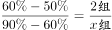，解得x=6，则共有2+6=8组文件。故这叠文件最多可能有10×8=80份。

故正确答案为D。

---

### 第 7 题　qid 5430258 · 数学运算

某商品上月售价为进价的1.4倍，销售m件。本月该商品进价下降20%，售价不变，销售利润为上月的1.8倍。那么本月的销量为多少件?

- **A**. 1.3m
- **B**. 1.25m
- **C**. 1.2m　✅
- **D**. 1.15m

**答案**：C

**官方解析**

赋值该商品上月进价为10元。根据题意，则上月售价为10×1.4=14元，单件利润为14-10=4元，已知上月销量为m件，则上月总利润为4m元。分析本月销售情况，进价下降为10×（1-20%）=8元，售价不变，则本月单件利润为14-8=6元，因为本月总利润为上月的1.8倍，即4m×1.8=7.2m元，故本月销量=总利润÷单件利润=7.2m÷6=1.2m件。
故正确答案为C。

---

### 第 8 题　qid 5430305 · 数学运算

水文工作人员小张和小刘同时乘坐相同的船，分别从下游的A码头和上游的B码头出发前往对方所在码头，并沿途采集水样。两人出发时各采集第一份水样，往后每行驶1.31千米采集一份水样。两船相遇时，小张正好采集第16份水样。已知船在静水中的速度是水流速度的5倍，那么两人全程一共采集了多少份水样？

- **A**. 38
- **B**. 39
- **C**. 76　✅
- **D**. 78

**答案**：C

**官方解析**

方法一：设水速为1，则船速为5，小张逆水行船的速度为5-1=4，小刘顺水行船的速度为5+1=6，相遇时小张一共行驶了16-1=15个1.31千米，行驶时间。相遇时小刘的路程为，即小刘一共走了22.5个1.31千米，故两个码头之间的总路程为（15+22.5）×1.31=37.5×1.31千米。根据出发时采集一次后每1.31千米采样一次，则每人全程需采样37+1=38次，故两人全程一共采集了38×2=76份水样。

方法二：根据题干条件，小张的逆水速度，小刘的顺水速度；根据行驶时间相同，则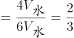，可知全程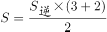千米。解得采集水样次数=38.5次，即每人采集水样次数为38次，第39次采样还未进行。故两人全程一共采集了38×2=76份水样。

故正确答案为C。

---

### 第 9 题　qid 5430307 · 数学运算

某停车场有7个连成一排的空车位。现有3辆车随机停在这排车位中，则任意两辆车之间至少间隔一个车位的概率为：

- **A**. 

- **B**. 

　✅
- **C**. 

- **D**. 

**答案**：B

**官方解析**

根据题意，7个车位随机停3辆车，总情况数为种。满足条件的情况为任意两辆车之间至少间隔一个车位，即车辆之间不能相邻，可用插空法。剩下的7-3=4个车位共形成5个空，停放3辆车，情况数为种。因此所求概率。

故正确答案为B。

---

### 第 10 题　qid 5430308 · 数学运算

甲、乙、丙、丁、戊5门课安排在先后4个学期开课，每个学期至少1门。已知甲不与其他任何一门课安排在同一学期，乙和丙均不能在第一个学期或最后一个学期开课，丁必须在戊和甲之后的学期开课，那么这5门课有多少种不同的安排方式？

- **A**. 5
- **B**. 6
- **C**. 7
- **D**. 8　✅

**答案**：D

**官方解析**

根据题意，5门课安排在先后4个学期开课，每个学期至少1门，则有且只有1个学期开2门课。根据乙、丙这2门课进行分析，可分情况讨论如下：

（1）乙和丙在同一学期：此时乙、丙都在第二或第三学期，有种情况；余下3个学期分别安排甲、丁、戊，因为丁必须在戊和甲之后的学期开课，则丁在第四学期，此时甲、戊有种情况，共有种情况。

（2）乙和丙在不同学期：此时乙、丙分别在第二或第三学期，有种情况；丁必须在戊和甲之后的学期开课，且甲不与其他任何一门课安排在同一学期，则甲在第一学期，丁在第四学期，此时戊可以在第二或第三学期，有种情况，共有种情况。

综上所述，这5门课有4+4=8种不同的安排方式。

故正确答案为D。

---

### 第 11 题　qid 5430347 · 数学运算

某地打算在绿地上建两个圆形花坛，如下图所示，大圆的直径为6米，小圆的直径为2米，修建期间暂时在外围设置围栏。已知围栏呈矩形，大圆与围栏的三条边相切，小圆与围栏的两条边相切，且两圆相切，那么矩形围栏的面积是多少平方米？

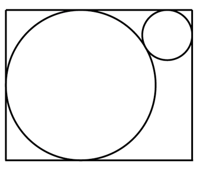

- **A**. 

　✅
- **B**. 

- **C**. 

- **D**. 

**答案**：A

**官方解析**

如图所示，过大圆的圆心O作平行于矩形长的AB，过小圆的圆心Q作平行于矩形宽的CD，AB与CD相交于G点，为直角三角形。大圆的半径为米，小圆的半径为米。由题干圆与矩形围栏的相切关系可知，CQ=1米，GB=1米，GD=3米，AO=3米，CD=6米，OQ=3+1=4米，QG=CD-CQ-GD=6-1-3=2米。在直角三角形OQG中，米。则矩形围栏的长=AB=AO+OG+GB米，矩形围栏的面积=CD×AB平方米。

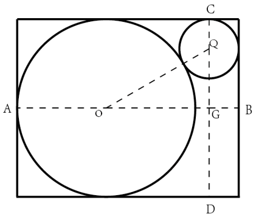

故正确答案为A。

---

### 第 12 题　qid 5430348 · 数学运算

某班级对70多名学生进行数学和英语科目摸底测验，有12%的学生两个科目均不及格。已知有的学生英语及格，数学及格的学生比英语多10人，那两科均及格的学生有多少人？

- **A**. 31
- **B**. 37
- **C**. 41
- **D**. 44　✅

**答案**：D

**官方解析**

设班级总共有x名学生，则两个科目均不及格的学生数为12%x，英语及格的学生数为，数学及格的学生数为。根据两集合容斥原理公式：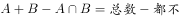，可得：，即，故x一定为75的倍数，且根据题干可知，x是70多，所以x一定是75。则两科均及格的学生有人。

故正确答案为D。

---

### 第 13 题　qid 5430350 · 数学运算

收割一片稻田，可选择甲、乙、丙3台农机。用丙收割的用时比用甲短4小时，比用乙长2小时。已知甲、乙的收割速度分别为5亩/小时和9亩/小时，那么丙的收割速度在以下哪个范围内？

- **A**. 小于6亩/小时
- **B**. 6~7亩/小时
- **C**. 7~8亩/小时　✅
- **D**. 大于8亩/小时

**答案**：C

**官方解析**

设丙农机收割用时为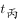小时，则甲农机收割用时为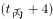小时，乙农机收割用时为小时。因为三台农机收割同一片稻田，根据工作总量相同可列方程：，解得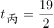。则稻田总量亩。故丙的收割速度亩/小时，在C项范围内。

故正确答案为C。

---

### 第 14 题　qid 5430277 · 数学运算

公司研发部门共5名员工，年龄各不相同，其中年龄最大的比最小的大10岁。某年，年龄最大的2人年龄之和是最小的2人年龄之和的1.25倍；2年后，除年龄排名居中的1人外其余4人年龄之和为125岁。那么再过2年，年龄排名第三的员工最大可能为多少岁？

- **A**. 33
- **B**. 34
- **C**. 35　✅
- **D**. 36

**答案**：C

**官方解析**

设在某年时，5名员工的年龄从大到小分别为a、b、c、d、e，由题意可知a+b=1.25（d+e）······①，a+b+d+e=125-4×2······②；联立①②解得a+b=65，d+e=52。因年龄各不相同且b&lt;a，可知，即b最大为32，则年龄排名第三的员工最大为b-1=31，此时a=33，e=33-10=23，d=52-23=29，大小顺序符合题意，故4年后年龄排名第三的员工最大为31+4=35岁。

故正确答案为C。

---

### 第 15 题　qid 5430281 · 数学运算

一只闹钟的秒针顶点距离表盘圆心4厘米，分针顶点距离表盘圆心3厘米。小王烧开一壶水的时间内，秒针顶点累计移动了厘米。那么这一时间段内，分针顶点与表盘圆心的连线扫过的扇形面积为多少平方厘米？

- **A**. 

- **B**. 

　✅
- **C**. 

- **D**. 

**答案**：B

**官方解析**

由题意可知，秒针长度为4厘米，秒针转动一圈即1分钟，其顶点移动路程为厘米，现秒针顶点累计移动了厘米，即经过时间分钟。分针每60分钟转一圈，5分钟转圈，半径为3厘米，其扫过的面积为平方厘米。

故正确答案为B。

---

### 第 16 题　qid 5430283 · 数学运算

A、B两地直线距离为320千米，甲车从A地、乙车从B地同时出发相向而行。已知甲车的速度是乙车的3倍，乙车与甲车相遇后，立即右转弯90度并保持原速度继续行驶。那么甲车到达B地时，其与乙车之间的距离：

- **A**. 小于80千米
- **B**. 80~90千米　✅
- **C**. 90~100千米
- **D**. 大于100千米

**答案**：B

**官方解析**

如图所示，乙车与甲车在C地相遇后，乙车沿CD段行驶，甲车继续沿AC方向，即沿CB段行驶，甲车到达B地时与乙车之间的距离，即为BD的距离。

根据“甲车的速度是乙车的3倍”及“时间一定，路程与速度成正比”，可知甲、乙两车相遇时，甲车所走的路程是乙车的3倍，全程为320千米，即千米，BC=320-240=80千米。同理，BC=3CD，即千米，根据勾股定理可得：千米，在B项范围内。

故正确答案为B。

---

### 第 17 题　qid 5430298 · 数学运算

甲以技术入股加入某互联网初创企业，占企业总股份的10%。随后企业先后两次引入外来投资，其中第二次投资的金额是第一次的10倍。在两次投资完成之后，甲持有的股份占企业总股份的比例先后下降到8%和5%。那么第一次投资前公司的估算价值是第二次投资前的百分之几?

- **A**. 24%　✅
- **B**. 28%
- **C**. 32%
- **D**. 36%

**答案**：A

**官方解析**

赋值该互联网企业初始总股份为100股，其中甲持有100×10%=10股。因为两次投资完成之后，甲持有的股份占企业总股份的比例先后下降到8%和5%，所以第一次投资后企业总股数为股、第二次投资后企业总股数为股。设第一次投资前每股估算价值为x元、第二次投资前每股估算价值为y元，可列式：10×(125-100)∙x=(200-125)∙y，整理得：，则第一次投资前公司的估算价值是第二次投资前的。

故正确答案为A。

---

### 第 18 题　qid 5430299 · 数学运算

有30个2克的砝码和8个5克的砝码，如果砝码只能放一边，那么从2克到100克间的整数克质量，有多少个不能用这些砝码称量出来?

- **A**. 0
- **B**. 1
- **C**. 2
- **D**. 3　✅

**答案**：D

**官方解析**

由题意可知，这些砝码质量一共30×2+8×5=100克。1克到100克之间共有100个整数克质量，可拆成（1，99）、（2，98）、（3，97）、（4，96）······（48，52）、（49，51）、（50，50），可知1克、3克不能称量出来，因此99克、97克也不能称量出来，其他每一对质量都可以由2克和5克称量出来。从2克到100克之间共有99个整数克质量，不能称量出来的有3克、97克、99克共3个。
故正确答案为D。
备注：本题在得出3克、97克、99克三个质量不能称量出来时，根据选项最大数据为3便可锁定答案为D项，无需再去验证其他质量能否称量出来。

---

### 第 19 题　qid 5430302 · 数学运算

12个人排成1列纵队，从前到后编为1~12号。现要将他们排成另一个与原来不同的纵队并从前到后重新编号，要求每个人的新号码与原始号码相差不超过1。那么有多少种重新编队的方法?

- **A**. 155
- **B**. 227
- **C**. 232　✅
- **D**. 239

**答案**：C

**官方解析**

根据题意，12个人重新排1列纵队，要求新号码与原来不完全相同且每个人的新号码与原始号码相差，则每个人要么为原号码，要么只能与相邻的人交换号码。故讨论除与原纵队号码一致的情况外，不同人数交换情况，因12人情况较复杂，从1人至多人情况枚举如下：

由上表可知，纵队每增加1人，总情况数构成一个简单的递推和数列，即1、2、3、5、8、13、21、34、55、89、144、233，故12人的纵队加上初始编号情况共有233种。已知重新编队后不能与原纵队的顺序完全一致，则符合题意的情况有233-1=232种。

故正确答案为C。

---

## 判断推理

### 第 1 题　qid 5430510 · 图形推理

从所给的四个选项中选择最合适的一个填入问号处，使之呈现一定的规律性：

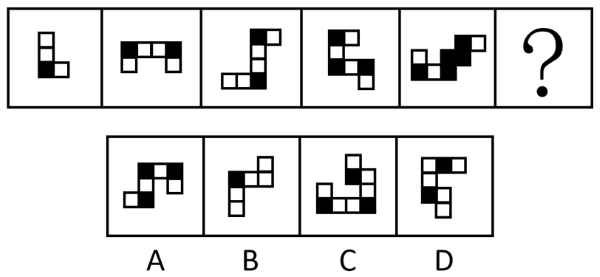

- **A**. A　✅
- **B**. B
- **C**. C
- **D**. D

**答案**：A

**官方解析**

观察发现，题干图形均出现黑块与白块，但数量、位置等均无规律，将两幅图相邻比较发现，黑块的位置存在规律，即题干图形的每个拐角处均为黑块，故“？”处图形的每个拐角处应均为黑块，B、C、D三项均有拐角处不是黑块（如下图所示），只有A项满足规律。

故正确答案为A。

---

### 第 2 题　qid 5430899 · 图形推理

从所给的四个选项中选择最合适的一个填入问号处，使之呈现一定的规律性：

- **A**. A
- **B**. B　✅
- **C**. C
- **D**. D

**答案**：B

**官方解析**

图形元素组成不同，且无明显属性规律，考虑数量规律。观察发现，题干每幅图都是由直线构成，存在直线相交且出现明显的直角，优先考虑数直角数。图形大多分为内、外两部分，考虑分开数直角数。外框图形直角数依次为0、1、2、3、4、“？”，所以“？”处应该选择一个外框直角数为5的图形，只有B项符合。
故正确答案为B。

---

### 第 3 题　qid 5430358 · 图形推理

从所给的四个选项中选择最合适的一个填入问号处，使之呈现一定的规律性：

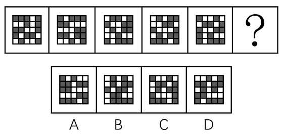

- **A**. A　✅
- **B**. B
- **C**. C
- **D**. D

**答案**：A

**官方解析**

元素组成相同，优先考虑位置规律。题干图形均出现了二十五宫格，考虑内外分开看平移。观察发现，内圈的黑块每次逆时针平移1格，外圈的黑块每次顺时针平移2格，只有A项符合。

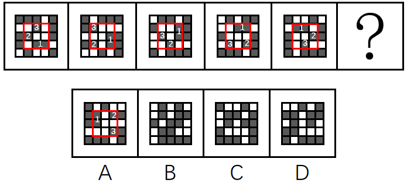

故正确答案为A。

---

### 第 4 题　qid 5430354 · 图形推理

从所给的四个选项中选择最合适的一个填入问号处，使之呈现一定的规律性：

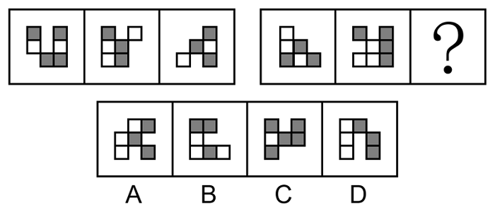

- **A**. A
- **B**. B
- **C**. C　✅
- **D**. D

**答案**：C

**官方解析**

元素组成相似，优先考虑样式规律。观察发现，题干图形均存在黑块、白块以及空白区域，且黑块数量不成规律，优先考虑黑白运算。第一组图形的运算规律为：黑+黑=空，空+空=空，黑+白＝黑，白+白＝空，空+黑=黑，白+空=白，空+白=白，黑+空=黑，第二组图形运用此规律，只有C项符合。
故正确答案为C。

---

### 第 5 题　qid 5430505 · 图形推理

从所给的四个选项中选择最合适的一个填入问号处，使之呈现一定的规律性：

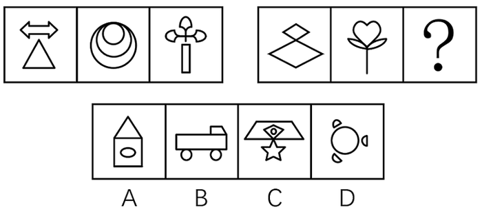

- **A**. A
- **B**. B
- **C**. C　✅
- **D**. D

**答案**：C

**官方解析**

元素组成不同，优先考虑属性规律。观察发现，题干图形出现等腰元素，优先考虑对称性。第一组图中，每个图形均只有一条纵向的对称轴，第二组图中，前两幅图形也均只有一条纵向的对称轴，所以？处应填入只有一条纵向对称轴的图形，排除B、D两项。继续观察发现，题干图形出现明显的空白面，考虑面数量。第一组图中，图形的面数量依次为2、3、4，第二组图中，图形的面数量依次为2、3、？，故？处应选择一个面数量为4的图形，只有C项符合。
故正确答案为C。

---

### 第 6 题　qid 5430439 · 图形推理

把下面的六个图形分为两类，使每一类图形都有各自的共同特征或规律，分类正确的一项是：

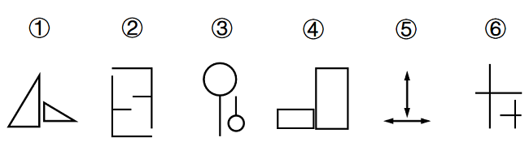

- **A**. ①③⑤，②④⑥
- **B**. ①③⑥，②④⑤
- **C**. ①②③，④⑤⑥
- **D**. ①④⑤，②③⑥　✅

**答案**：D

**官方解析**

本题为分组分类题目。观察发现，题干每幅图形均由两幅形状相同但位置不同的元素组成，考虑位置规律。图①④⑤中的一个元素图形旋转后可得到另一个元素图形的形状，图②③⑥中的一个元素图形旋转后可得到另一个元素图形的形状，即图①④⑤为一组，图②③⑥为一组。

故正确答案为D。

---

### 第 7 题　qid 5430356 · 图形推理

把下面的六个图形分为两类，使每一类图形都有各自的共同特征或规律，分类正确的一项是：

- **A**. ①②⑤，③④⑥　✅
- **B**. ①③④，②⑤⑥
- **C**. ①④⑤，②③⑥
- **D**. ①⑤⑥，②③④

**答案**：A

**官方解析**

本题为分组分类题目。观察发现，题干图形中明显出现相切，其中图①②⑤中直线均与1个圆相切，图③④⑥中直线均与2个圆相切，故图①②⑤一组，图③④⑥一组。
故正确答案为A。

---

### 第 8 题　qid 5430365 · 图形推理

从所给的四个选项中选择最合适的一个填入问号处，使之呈现一定的规律性：

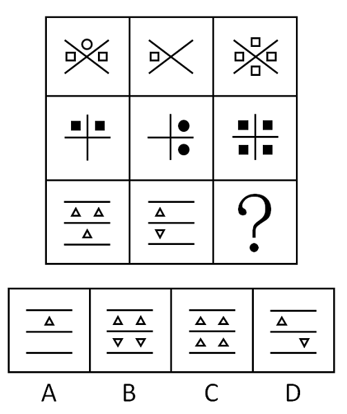

- **A**. A
- **B**. B　✅
- **C**. C
- **D**. D

**答案**：B

**官方解析**

题干图形元素组成不同，优先考虑属性规律。观察发现，题干图形较为规整，考虑对称性。九宫格第一列均为竖轴对称图形，第二列均为横轴对称图形，第三列前两个图形均为既横轴对称又竖轴对称的图形，故“？”处应为既横轴对称又竖轴对称的图形，只有B项满足。
故正确答案为B。

---

### 第 9 题　qid 5430410 · 图形推理

左图给定的是纸盒的外表面，右边哪项能由它折叠而成？

- **A**. A
- **B**. B
- **C**. C　✅
- **D**. D

**答案**：C

**官方解析**

将原展开图标上序号如下图，逐一进行分析。

A项：选项右侧为面b，左侧为面a或面c，选项中左侧面上的实线与其和面b的公共边中点不相交，而展开图中面a与面c上的实线均和该面与面b的公共边中点相交，选项与展开图不一致，排除；

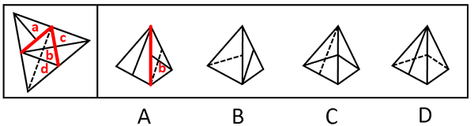

B项：选项左侧为面d，右侧为面a或面c，选项中面d上的虚线与其和右侧面（面a或面c）的公共边中点相交，而展开图中面d上虚线与其和面b的公共边中点相交，选项与展开图不一致，排除； 

C项：选项由面b和面c构成，与展开图一致，当选；

D项：选项由面b和面d构成，以面b中引出实线的顶点为起点，沿面b顺时针画边（如下图所示），展开图中边3对应面d，而选项中边1对应面d，选项与展开图不一致，排除。

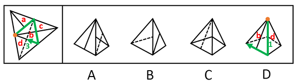

故正确答案为C。

---

### 第 10 题　qid 5430887 · 图形推理

左图为给定的多面体，将其从任一面剖开，哪项不可能是该多面体的截面？

- **A**. A
- **B**. B
- **C**. C
- **D**. D　✅

**答案**：D

**官方解析**

本题考查截面图，逐一分析选项。

A项：如下图所示，可以截出，排除；

B项：如下图所示，可以截出，排除；

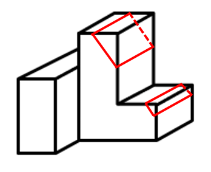

C项：如下图所示，可以截出，排除；

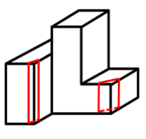

D项：无法截出，当选。

本题为选非题，故正确答案为D。

---

### 第 11 题　qid 5430362 · 定义判断

发现不均衡套利是指通过发现和利用市场上的资源供给和需求不一致进行调配导致的盈利机会获利。
根据上述定义，下列不属于发现不均衡套利的是：

- **A**. 孔子的门生子贡在曹国与鲁国之间通过贱买贵卖来获利
- **B**. 小王预见来年橄榄必然大获丰收，便买断了当地所有的榨油机，第二年高价出租获得巨额财富
- **C**. F汽车公司针对当时汽车价格昂贵、普通居民消费不起的状况，推出了价廉物美的T型车，迅速进入普通家庭　✅
- **D**. 20世纪80年代，中国农村出现大量富余劳动力，而工业产品又极为缺乏。因此将富余的农村劳动力组织起来生产工业产品，可以获利

**答案**：C

**官方解析**

第一步：找出定义关键词。
“通过发现和利用市场上的资源供给和需求不一致进行调配”、“导致的盈利机会获利”。
第二步：逐一分析选项。
A项：曹国与鲁国之间贱买贵卖，说明商品在两个空间上存在“市场上的资源供给和需求不一致”，通过这种商品的买卖，实现了对“供需不一致资源”的调配，从而创造“盈利机会”而获利，符合定义，排除；
B项：来年橄榄的大丰收会造成未来榨油机的供不应求，说明现在和未来两个时间上对于榨油机的供需是不一致的，符合“市场上的资源供给和需求不一致”，通过现在买断榨油机，第二年高价出租，实现了对“供需不一致资源”的调配，从而创造“盈利机会”而获利，符合定义，排除；
C项：仅提到目前汽车市场普通居民消费不起，F公司推出价廉物美的T型车，只是推出新产品，并不是对“供给和需求不一致进行调配”，不符合定义，当选；
D项：农村出现大量富余劳动力，体现出在农业方面劳动力供过于求，而工业产品极度缺乏，体现出工业方面劳动力供不应求，说明农业和工业两个领域产品市场和要素市场存在“供给和需求不一致”，通过将富余的农村劳动力组织起来生产工业产品，符合实现了对“供需不一致资源”的调配，从而创造“盈利机会”而获利，符合定义，排除。
本题为选非题，故正确答案为C。

---

### 第 12 题　qid 5430366 · 定义判断

经济学中的“公用品”并不是指大家都在使用的物品，同时“私用品”也不是一个人使用的物品。公用品指一个人使用的过程中不排斥和影响他人使用的物品；而私用品指一个人在使用过程中会排斥或者影响其他人使用的物品。
根据上述定义，下列属于公用品的是：

- **A**. 会议室
- **B**. 停车场
- **C**. 小区草坪
- **D**. 有线电视的信号　✅

**答案**：D

**官方解析**

第一步：找出定义关键词。
公用品：“使用过程中不排斥和影响他人使用”；
私用品：“使用过程中会排斥或影响他人使用”。
第二步：逐一分析选项。
A项：一个人在使用会议室时会影响其他人的使用，不符合“使用过程中不排斥和影响他人使用”，不符合“公用品”定义，排除；
B项：一个人在停车场停车时会影响其他人的使用，不符合“使用过程中不排斥和影响他人使用”，不符合“公用品”定义，排除；
C项：一个人在使用小区草坪时会影响其他人的使用，不符合“使用过程中不排斥和影响他人使用”，不符合“公用品”定义，排除；
D项：有线电视的信号可同时供多人使用，一个人使用时不会影响到其他人的使用，符合“使用过程中不排斥和影响他人使用”，符合“公用品”定义，当选。
故正确答案为D。

---

### 第 13 题　qid 5430368 · 定义判断

机器学习专门研究计算机如何模拟人类的学习行为，以获取新的知识或技能，提高学习效率。通常使用数据或以往的经验，以此优化计算机程序的性能。
根据上述定义，下列不属于机器学习的是：

- **A**. 某公司通过海量数据，不断升级门禁考勤等场景的人脸识别技术的版本，将准确率从85%提高至99%
- **B**. 科研小组分析人类学习行为，决定让计算机先选用简单的数据再选用复杂的数据依次训练，提升了计算机算法的准确率
- **C**. 某高校统计学生核酸完成情况，利用算法识别核酸报告截图特定字符，自动生成结果，统计汇总时间由一小时缩短至两分钟　✅
- **D**. 某AI算法在数据量较少的情况下，通过模拟双方对抗情况获取训练数据，不断提升技巧，最终在网络游戏中达到职业选手水平

**答案**：C

**官方解析**

第一步，找出定义关键词。
“使用数据或以往的经验”、“优化计算机程序的性能”。
第二步，逐一分析选项。
A项：某公司通过海量数据，不断升级人脸识别技术的版本，提高了准确率，符合“使用数据或以往的经验”、“优化计算机程序的性能”，符合定义，排除；
B项：科研小组让计算机选用不同难度的数据依次训练，提升了计算机算法的准确率，符合“使用数据或以往的经验”、“优化计算机程序的性能”，符合定义，排除；
C项：某高校利用算法识别核酸报告截图特定字符，缩短了统计汇总时间，并没有提升算法的性能，不符合“优化计算机程序的性能”，不符合定义，当选；
D项：某AI算法通过模拟双方对抗情况获取训练数据，不断提升技巧，符合“使用数据或以往的经验”、“优化计算机程序的性能”，符合定义，排除。
本题为选非题，故正确答案为C。

---

### 第 14 题　qid 5430370 · 定义判断

弱关系社交，指以网络平台为载体，在陌生人之间展开的、不以加强彼此关系为目的的人际交往活动。
根据上述定义，下列不属于弱关系社交的是：

- **A**. 参与中国象棋小程序自动匹配对手的游戏
- **B**. 为刚刚添加的微信好友的朋友圈动态点赞　✅
- **C**. 在网络直播平台对小视频评论进行再评论
- **D**. 网络游戏过程中为提高游戏技术相互切磋

**答案**：B

**官方解析**

第一步，找出定义关键词。
“以网络平台为载体”、“在陌生人之间展开的”、“不以加强彼此关系为目的”。
第二步，逐一分析选项。
A项：游戏对手是通过计算机程序自动匹配的，相互之间并不认识，符合“以网络平台为载体”、“在陌生人之间展开的”、“不以加强彼此关系为目的”，符合定义，排除；
B项：为刚刚添加的微信好友的朋友圈动态点赞，说明在成为微信好友前就有可能认识，不一定是陌生人，并且添加微信好友的目的就是加强相互之间的联系，不符合“在陌生人之间展开的”、“不以加强彼此关系为目的”，不符合定义，当选；
C项：在网络直播平台对小视频评论进行再评论，符合“以网络平台为载体”、“在陌生人之间展开的”、“不以加强彼此关系为目的”，符合定义，排除；
D项：网络游戏过程中为提高游戏技术相互切磋，符合“以网络平台为载体”、“在陌生人之间展开的”、“不以加强彼此关系为目的”，符合定义，排除。
本题为选非题，故正确答案为B。

---

### 第 15 题　qid 5430372 · 定义判断

审美意象是用来表达某种抽象的观念或者哲理的艺术形象，它是艺术家在构思过程中，将自己的审美情感、审美认识与客观的事物相融合，并以一定的艺术表达方式呈现出来的内心视像。
根据上述定义，下列不属于审美意象的是：

- **A**. 鲁迅作品《祝福》中的人物“祥林嫂”
- **B**. “采菊东篱下，悠然见南山”中的“南山”
- **C**. 漫画作品《三毛流浪记》中的人物“三毛”
- **D**. 日常语句“太阳出来了，该起床了”中的“太阳”　✅

**答案**：D

**官方解析**

第一步：找出定义关键词。
“艺术家在构思过程中”、“将自己的审美情感、审美认识与客观的事物相融合”、“以一定的艺术表达方式呈现出来的内心视像”。
第二步：逐一分析选项。
A项：“祥林嫂”是鲁迅作品《祝福》中的悲剧性人物，是旧中国农村劳动妇女的典型，符合“艺术家在构思过程中”、“将自己的审美情感、审美认识与客观的事物相融合”、“以一定的艺术表达方式呈现出来的内心视像”，符合定义，排除；
B项：“南山”是陶渊明诗句中的艺术形象，该句诗表现了诗人悠然闲适的生活态度，诗人将自己的情感和客观事物相融合，符合“艺术家在构思过程中”、“将自己的审美情感、审美认识与客观的事物相融合”、“以一定的艺术表达方式呈现出来的内心视像”，符合定义，排除；
C项：“三毛”是漫画作品《三毛流浪记》中一个身世凄凉、饥寒交迫、受尽欺辱、贫穷得只剩下三根头发的中国儿童形象，符合“艺术家在构思过程中”、“将自己的审美情感、审美认识与客观的事物相融合”、“以一定的艺术表达方式呈现出来的内心视像”，符合定义，排除；
D项：“太阳出来了，该起床了”中的“太阳”是用在日常语句中，没有体现艺术家创作作品的构思过程和艺术的表达方式，不符合“艺术家在构思过程中”、“将自己的审美情感、审美认识与客观的事物相融合”、“以一定的艺术表达方式呈现出来的内心视像”，不符合定义，当选。
本题为选非题，故正确答案为D。

---

### 第 16 题　qid 5430380 · 定义判断

脱敏作用是指对人重复呈现一个激发情绪的刺激，则该个体情绪化反应会逐渐消失。
根据上述定义，下列涉及脱敏作用的是：

- **A**. 小华幼年时曾被狗追咬过，成年后看到狗仍然会感到非常恐惧
- **B**. 小孙爱玩含有暴力元素的游戏，生活中偶尔会模仿游戏中人物的行为
- **C**. 小王近期经常观看犯罪题材的影片，认为外面的世界很危险，走夜路时常会担心有意外发生
- **D**. 老师发现小明与女同学交谈时总会面红耳赤，就要求他每天主动和邻座女同学进行学习讨论　✅

**答案**：D

**官方解析**

第一步：找出定义关键词。
“对人重复呈现一个激发情绪的刺激”、“该个体情绪化反应会逐渐消失”。
第二步：逐一分析选项。
A项：小华成年后看到狗仍然会感到非常恐惧，说明小华被狗追咬的恐惧没有消失，不符合“该个体情绪化反应会逐渐消失”，不符合定义，排除；
B项：小孙生活中模仿游戏中人物的暴力行为，说明含有暴力元素的游戏对他的影响并没有逐渐消失，不符合“该个体情绪化反应会逐渐消失”，不符合定义，排除；
C项：小王走夜路时常会担心有意外发生，说明看犯罪题材的影片对他的影响并没有逐渐消失，不符合“该个体情绪化反应会逐渐消失”，不符合定义，排除；
D项：小明与女同学交谈时总会面红耳赤，老师要求他每天主动和邻座女同学进行学习讨论，符合“对人重复呈现一个激发情绪的刺激”，符合定义，当选。
故正确答案为D。

---

### 第 17 题　qid 5430382 · 定义判断

群体归属感是指个人体验到自己属于或应属于某一群体成员的意识，是个人隶属于或依赖于群体的需要，是一种人类社会性的表现。有了这种意识，个体在进行自己的活动、认知和评价时，就会自觉地维护这个群体的利益，并与群体内的其他成员在情感上发生共鸣。
根据上述定义，下列没有体现群体归属感的是：

- **A**. 中秋节时小韦与几个要好的朋友一起分享月饼　✅
- **B**. 王晓峰听到别人说他所在班级的坏话时很生气
- **C**. 退役士兵小王常向他人说自己曾是某英雄连的
- **D**. 小强外出时总自豪地在外衣上佩戴学校的校徽

**答案**：A

**官方解析**

第一步：找出定义关键词。
“个人体验到自己属于或应属于某一群体成员的意识”、“个体在进行自己的活动、认知和评价时，会自觉地维护群体的利益”、“与群体内的其他成员在情感上发生共鸣”。
第二步：逐一分析选项。
A项：中秋节小韦与要好的朋友分享月饼，没有体现小韦感觉自己是某一群体的成员，也没有体现小韦自觉地维护群体的利益，不符合“个人体验到自己属于或应属于某一群体成员的意识”、“个体在进行自己的活动、认知和评价时，会自觉地维护群体的利益”，不符合定义，当选；
B项：王晓峰听到别人说他所在班级的坏话时很生气，体现了他感觉自己是班级这一群体的成员，符合“个人体验到自己属于或应属于某一群体成员的意识”、“个体在进行自己的活动、认知和评价时，会自觉地维护群体的利益”、“与群体内的其他成员在情感上发生共鸣”，符合定义，排除；
C项：退役士兵小王常向他人说自己曾是某英雄连的，体现了他感觉自己是连队这一群体的成员，符合“个人体验到自己属于或应属于某一群体成员的意识”、“个体在进行自己的活动、认知和评价时，会自觉地维护群体的利益”、“与群体内的其他成员在情感上发生共鸣”，符合定义，排除；
D项：小强外出时总自豪地在外衣上佩戴学校的校徽，体现了他感觉自己是学校这一群体的成员，符合“个人体验到自己属于或应属于某一群体成员的意识”、“个体在进行自己的活动、认知和评价时，会自觉地维护群体的利益”、“与群体内的其他成员在情感上发生共鸣”，符合定义，排除。
本题为选非题，故正确答案为A。

---

### 第 18 题　qid 5430383 · 定义判断

多重趋避式冲突是指人们面对着两个或两个以上的目标，而目标又各自分别具有吸引和排斥两方面的作用，人们无法简单地选择一个目标而回避或拒绝另一个目标时的矛盾心态。
根据上述定义，下列体现多重趋避式冲突的是：

- **A**. 张女士在二胎问题上犹豫不决，既想儿女双全，又怕无力抚养
- **B**. 周女士有一次难得的外省培训机会，可又放心不下家中年幼的孩子
- **C**. 王先生有一笔闲置资金，用于炒股担心风险大，用于储蓄又嫌收益低　✅
- **D**. 李同学在收到研究生录取通知书的同时，又得到了心仪公司的入职邀请

**答案**：C

**官方解析**

第一步：找出定义关键词。
“人们面对着两个或两个以上的目标”、“目标各自分别具有吸引和排斥两方面的作用”、“人们无法简单地选择一个目标而回避或拒绝另一个目标时的矛盾心态”。
第二步：逐一分析选项。
A项：张女士面临的只有“生二胎”一个目标，儿女双全和无力抚养分别是目标的吸引方面和排斥方面，不符合“人们面对着两个或两个以上的目标”，不符合定义，排除；
B项：周女士面临的只有“省外培训”一个目标，放心不下家中年幼的孩子是目标的排斥方面，不符合“人们面对着两个或两个以上的目标”，不符合定义，排除；
C项：王先生面临“闲置资金炒股”和“闲置资金储蓄”两个目标，收益高和风险大是“闲置资金炒股”的吸引方面和排斥方面，风险低和收益低是“闲置资金储蓄”的吸引方面和排斥方面，王先生在两个目标中感到纠结矛盾，符合“人们面对着两个或两个以上的目标”、“目标各自分别具有吸引和排斥两方面的作用”、“人们无法简单地选择一个目标而回避或拒绝另一个目标时的矛盾心态”，符合定义，当选；
D项：李同学面临“研究生录取”和“心仪公司入职”两个目标，但并没有体现他在两个目标中感到纠结矛盾，不符合“人们无法简单地选择一个目标而回避或拒绝另一个目标时的矛盾心态”，不符合定义，排除。
故正确答案为C。

---

### 第 19 题　qid 5430384 · 定义判断

功能文化区是按照人类社会的某项功能组织建立起来的，在空间结构上具有较固定的、确切的边界，其内部彼此之间因功能有一种互相联系从而确定其分布区范围的文化区。形式文化区是指不同性质的文化现象分布的范围，是某些具有相互联系的文化现象在空间分布上具有集中的核心区与模糊边界的文化地域单元。
根据上述定义，下列属于功能文化区的是：

- **A**. 城市中的外籍人员聚居区
- **B**. 城市中的行为艺术聚集区
- **C**. 城市郊区的垃圾集中处理区
- **D**. 城市中的博物馆图书馆集中区　✅

**答案**：D

**官方解析**

第一步：找出定义关键词。
功能文化区：“按照人类社会的某项功能组织建立起来的”、“在空间结构上具有较固定的、确切的边界”、“内部彼此之间因功能的互相联系而确定其分布区范围的文化区”；
形式文化区：“某些具有相互联系的文化现象”、“在空间分布上具有集中的核心区与模糊边界的文化地域单元”。
第二步：逐一分析选项。
A项：城市中的外籍人员聚居区，不符合“按照人类社会的某项功能组织建立起来的”、“内部彼此之间因功能的互相联系而确定其分布区范围的文化区”，不符合“功能文化区”定义，排除；
B项：城市中的行为艺术聚集区，不符合“按照人类社会的某项功能组织建立起来的”、“内部彼此之间因功能的互相联系而确定其分布区范围的文化区”，不符合“功能文化区”定义，排除；
C项：城市郊区的垃圾集中处理区，不是文化区，不符合“内部彼此之间因功能的互相联系而确定其分布区范围的文化区”，不符合“功能文化区”定义，排除；
D项：城市中的博物馆图书馆集中区，符合“按照人类社会的某项功能组织建立起来的”，博物馆和图书馆在空间上具有明确的边界，且功能之间有联系，又属于文化区，符合“在空间结构上具有较固定的、确切的边界”、“内部彼此之间因功能的互相联系而确定其分布区范围的文化区”，符合“功能文化区”定义，当选。
故正确答案为D。

---

### 第 20 题　qid 5430386 · 定义判断

表演型人格又称寻求注意型人格，是一种以过分情感化和夸张的言行吸引他人注意的人格。具有表演型人格的人易感情用事，自我中心，情绪多变，以致难以与周围人保持正常的社会关系。
根据上述定义，下列与表演型人格无关的是：

- **A**. 小邓喜欢穿奇装异服，希望吸引别人的注意
- **B**. 小王具有表演才能，讲话时手舞足蹈、表情丰富
- **C**. 小刘在人际交往受挫折时，表现出歇斯底里行为
- **D**. 小顾没有几个知心朋友，但他经常说自己有很多知心朋友　✅

**答案**：D

**官方解析**

第一步：找出定义关键词。
“过分情感化和夸张的言行”、“吸引他人注意”。
第二步：逐一分析选项。
A项：小邓喜欢穿奇装异服，属于夸张的行为，符合“过分情感化和夸张的言行”，希望吸引别人的注意，符合“吸引他人注意”，符合定义，排除；
B项：小王具有表演才能，讲话时手舞足蹈、表情丰富，属于夸张的行为，符合“过分情感化和夸张的言行”，符合定义，排除；
C项：小刘在人际交往受挫折时，表现出歇斯底里行为，属于过分情感化的行为，符合“过分情感化和夸张的言行”，符合定义，排除；
D项：小顾没有几个知心朋友，却说自己有很多知心朋友，这是属于夸大事实，而不是过分夸张，且其他选项均为行为上明显的夸张，D只是语言上的吹嘘，对比择优，该项最不明显，不符合“过分情感化和夸张的言行”，不符合定义，当选。
本题为选非题，故正确答案为D。

---

### 第 21 题　qid 5430378 · 类比推理

声东：击西

- **A**. 围魏：救赵　✅
- **B**. 张冠：李戴
- **C**. 安居：乐业
- **D**. 说东：道西

**答案**：A

**官方解析**

第一步：判断题干词语间逻辑关系。
“声东击西”指为了迷惑敌人，表面上宣扬要攻打这一边，其实是攻打另一边，“声东”是为了“击西”，二者为方式目的对应关系。
第二步：判断选项词语间逻辑关系。
A项：“围魏救赵”指袭击敌人后方的据点以迫使进攻之敌撤退的战术，“围魏”是为了“救赵”，二者为方式目的对应关系，与题干逻辑关系一致，当选；
B项：“张冠李戴”指姓张的人的帽子戴到姓李的人头上，比喻认错了对象或弄错了事实，二者不是方式目的对应关系，与题干逻辑关系不一致，排除；
C项：“安居乐业”指安定地生活，愉快地工作，二者为并列关系，与题干逻辑关系不一致，排除；
D项：“说东道西”指说东家，讲西家，形容信口议论，话语极多，二者为并列关系，与题干逻辑关系不一致，排除。
故正确答案为A。

---

### 第 22 题　qid 5430381 · 类比推理

心宽：体胖

- **A**. 唇亡：齿寒　✅
- **B**. 鼻青：脸肿
- **C**. 手忙：脚乱
- **D**. 半斤：八两

**答案**：A

**官方解析**

第一步：判断题干词语间逻辑关系。
“心宽体胖”指心情愉快，无所牵挂，因而人感到舒坦，因为“心宽”，所以“体胖”，二者为因果对应关系。
第二步：判断选项词语间逻辑关系。
A项：“唇亡齿寒”指嘴唇没有了，牙齿就会觉得冷，形容关系密切，利害相关，因为“唇亡”，所以“齿寒”，二者为因果对应关系，与题干逻辑关系一致，当选；
B项：“鼻青脸肿”指鼻子青了，脸也肿了，形容面部被碰伤或打伤的样子，也形容遭到严重打击或挫折的狼狈相，二者不是因果对应关系，与题干逻辑关系不一致，排除；
C项：“手忙脚乱”形容做事慌张而没有条理，也形容惊慌失措，二者不是因果对应关系，与题干逻辑关系不一致，排除；
D项：“半斤八两”比喻彼此一样，不相上下（多含贬义），二者不是因果对应关系，与题干逻辑关系不一致，排除。
故正确答案为A。

---

### 第 23 题　qid 5430385 · 类比推理

长白山：火山

- **A**. 皇陵：古建筑
- **B**. 巢湖：淡水湖　✅
- **C**. 连衣裙：丝绸
- **D**. 火箭军：军人

**答案**：B

**官方解析**

第一步：判断题干词语间逻辑关系。
通常所说的“长白山”指长白山脉主峰，“长白山”是“火山”，且“长白山”是“火山”中的一个，二者为包容关系中的特指。
第二步：判断选项词语间逻辑关系。
A项：“皇陵”是皇帝或皇室成员的陵墓，“皇陵”是“古建筑”，但“皇陵”是“古建筑”中的一种，二者为包容关系中的种属关系，与题干逻辑关系不一致，排除。
B项：“巢湖”是“淡水湖”，且“巢湖”是“淡水湖”中的一个，二者为包容关系中的特指，与题干逻辑关系一致，当选。
C项：“丝绸”是制作“连衣裙”的原材料，二者为原材料与成品的对应关系，与题干逻辑关系不一致，排除。
D项：“火箭军”是我国解放军的一种，“军人”是“火箭军”的组成部分，二者为组成关系，与题干逻辑关系不一致，排除。
故正确答案为B。

---

### 第 24 题　qid 5430387 · 类比推理

上市公司：跨国企业

- **A**. 大专院校：高等教育
- **B**. 商业银行：金融机构
- **C**. 快捷酒店：连锁酒店　✅
- **D**. 进口产品：出口产品

**答案**：C

**官方解析**

第一步：判断题干词语间逻辑关系。
上市公司指经有关部门核准，公开发行股票并在证券交易所上市交易的股份有限公司。跨国企业指在两个或两个以上国家从事国际化经营活动的企业。有的上市公司是跨国企业，有的上市公司不是跨国企业，有的跨国企业是上市公司，有的跨国企业不是上市公司，二者为交叉关系。
第二步：判断选项词语间逻辑关系。
A项：高等教育指在完成中等教育的基础上进行的专业教育和职业教育，学历层次包括专科、本科等，因此，大专院校属于高等教育，二者为种属关系，与题干逻辑关系不一致，排除；
B项：商业银行是金融机构，二者为种属关系，与题干逻辑关系不一致，排除；
C项：快捷酒店是功能简化的经济型酒店的一种，连锁酒店是指连锁经营的酒店，有的快捷酒店是连锁酒店，有的快捷酒店不是连锁酒店，有的连锁酒店是快捷酒店，有的连锁酒店不是快捷酒店，二者为交叉关系，与题干逻辑关系一致，当选；
D项：进口产品和出口产品为并列关系，与题干逻辑关系不一致，排除。
故正确答案为C。

---

### 第 25 题　qid 5430389 · 类比推理

蚕茧：丝绸：衣服

- **A**. 矿山：矿石：螺丝
- **B**. 树木：纸张：书本　✅
- **C**. 小麦：面条：馒头
- **D**. 沙粒：珍珠：项链

**答案**：B

**官方解析**

第一步：判断题干词语间逻辑关系。
蚕茧是制作丝绸的原材料，丝绸是制作衣服的原材料，二者均为原材料的对应关系。
第二步：判断选项词语间逻辑关系。
A项：矿山是产出矿石的地点，二者为地点的对应关系，矿石是制作螺丝的原材料，二者为原材料的对应关系，与题干逻辑关系不一致，排除；
B项：树木是制作纸张的原材料，纸张是制作书本的原材料，二者均为原材料的对应关系，与题干逻辑关系一致，当选；
C项：小麦是制作面条和馒头的原材料，第一词与后两词分别为原材料的对应关系，且面条和馒头为不同的主食，二者为并列关系，与题干逻辑关系不一致，排除；
D项：蚌受到沙粒侵入的刺激会分泌珍珠质将沙粒一层层包裹起来形成珍珠，二者不是原材料的对应关系，与题干逻辑关系不一致，排除。
故正确答案为B。

---

### 第 26 题　qid 5430390 · 类比推理

白天：夜晚：夏夜

- **A**. 红色：黑色：漆黑
- **B**. 中国：外国：欧洲国家　✅
- **C**. 高山：大海：南海
- **D**. 草原：森林：原始森林

**答案**：B

**官方解析**

第一步：判断题干词语间逻辑关系。
除了白天就只有夜晚，二者为并列关系中的矛盾关系，夏夜属于夜晚，二者为种属关系。
第二步：判断选项词语间逻辑关系。
A项：红色和黑色是两种不同的颜色，除此之外还有其他颜色，二者为并列关系中的反对关系，漆黑属于黑色，二者为种属关系，与题干逻辑关系不一致，排除；
B项：除了中国就只有外国，二者为并列关系中的矛盾关系，欧洲国家属于外国，二者为种属关系，与题干逻辑关系一致，当选；
C项：高山和大海是两种不同的自然景观，除此之外还有其他自然景观，二者为并列关系中的反对关系，南海属于大海，二者为种属关系，与题干逻辑关系不一致，排除；
D项：草原和森林是两种不同的生态系统，除此之外还有其他生态系统，二者为并列关系中的反对关系，原始森林属于森林，二者为种属关系，与题干逻辑关系不一致，排除。
故正确答案为B。

---

### 第 27 题　qid 5430391 · 类比推理

红包：红旗渠：红光满面

- **A**. 青草：青少年：青红皂白
- **B**. 黑夜：黑心肠：黑灯瞎火
- **C**. 白雪：白话文：白费心思
- **D**. 黄豆：黄包车：黄粱一梦　✅

**答案**：D

**官方解析**

第一步：判断题干词语间逻辑关系。
“红包”一词中的“红”指的是红颜色；“红旗渠”得名主要是取“红旗精神”的象征意义，其中“红”指的是红颜色；“红光满面”形容人的气色好，脸色红润，其中“红”指的是红颜色，故三个词中的相同单字“红”的含义相同。
第二步：判断选项词语间逻辑关系。
A项：“青草”一词中的“青”指的是绿颜色，“青少年”一词中的“青”指的是年轻，两个词中相同单字“青”含义不同，与题干逻辑关系不一致，排除；
B项：“黑夜”一词中的“黑”指的是黑颜色，“黑心肠”意思是阴险恶毒的心肠，其中“黑”指的是阴险恶毒，两个词中相同单字“黑”含义不同，与题干逻辑关系不一致，排除；
C项：“白雪”一词中的“白”指的是白颜色，“白话文”一词中的“白”指的是直白、通俗易懂，两个词中相同单字“白”含义不同，与题干逻辑关系不一致，排除；
D项：“黄豆”一词中的“黄”指的是黄颜色；“黄包车”是人力车，车身涂黄漆，其中“黄”指的是黄颜色；“黄粱一梦”中的黄粱是黄粱米，即小米，其中“黄”指的是黄颜色，故三个词中的相同单字“黄”的含义相同，与题干逻辑关系一致，当选。
故正确答案为D。

---

### 第 28 题　qid 5430392 · 类比推理

售卖假货：举报维权：上门调查

- **A**. 点菜下单：烹饪菜肴：传送菜品　✅
- **B**. 发表文章：勘误声明：印刷错误
- **C**. 投递简历：考试通过：正式录取
- **D**. 赛前动员：拟定阵容：布置战术

**答案**：A

**官方解析**

第一步：判断题干词语间逻辑关系。
首先“售卖假货”，其次“举报维权”，最后“上门调查”，三者为时间先后顺序的对应关系，且“售卖假货”的主体为商家，“举报维权”的主体为消费者，“上门调查”的主体为工商局、质监局，三者主体不一致。
第二步：判断选项词语间逻辑关系。
A项：首先“点菜下单”，其次“烹饪菜肴”，最后“传送菜品”，三者为时间先后顺序的对应关系，且“点菜下单”的主体为食客，“烹饪菜肴”的主体为厨师，“传送菜品”的主体为服务员，三者主体不一致，与题干逻辑关系一致，当选；
B项：首先“发表文章”，其次“印刷错误”，最后“勘误声明”， 三者为时间先后顺序的对应关系，但顺序不一致，与题干逻辑关系不一致，排除；
C项：首先“投递简历”，其次“考试通过”，最后“正式录取”，三者为时间先后顺序的对应关系，但“投递简历”与“考试通过”的主体均为应聘者，与题干逻辑关系不一致，排除；
D项：首先“赛前动员”，其次“拟定阵容”，最后“布置战术”，三者为时间先后顺序的对应关系，但“赛前动员”“拟定阵容”“布置战术”的主体均为教练，三者主体一致，与题干逻辑关系不一致，排除。
故正确答案为A。

---

### 第 29 题　qid 5430393 · 类比推理

按揭 对于 （    ） 相当于 （    ） 对于 促销

- **A**. 银行 商场
- **B**. 抵押 打折
- **C**. 贷款 降价　✅
- **D**. 购房 商品

**答案**：C

**官方解析**

A项：在银行办理按揭手续，二者为地点对应关系；在商场进行促销活动，二者为地点对应关系，但逻辑顺序相反，前后逻辑关系不一致，排除；
B项：按揭指一种购房或购物的贷款方式，以所购房屋或物品为抵押向银行贷款，然后分期偿还，按揭需要抵押，二者为必要条件对应关系；打折是一种促销方式，二者为种属关系，前后逻辑关系不一致，排除；
C项：按揭指一种购房或购物的贷款方式，以所购房屋或物品为抵押向银行贷款，然后分期偿还，按揭是一种贷款方式，二者为种属关系；降价是一种促销方式，二者为种属关系，前后逻辑关系一致，当选；
D项：按揭指一种购房或购物的贷款方式，以所购房屋或物品为抵押向银行贷款，然后分期偿还，按揭是购房的一种方式，二者为方式目的对应关系；对商品进行促销，商品是进行促销的对象，前后逻辑关系不一致，排除。
故正确答案为C。

---

### 第 30 题　qid 5430394 · 类比推理

（    ） 对于 音乐 相当于 真相 对于 （    ）

- **A**. 演奏 揭露
- **B**. 感动 激愤
- **C**. 浪漫 报纸
- **D**. 旋律 新闻　✅

**答案**：D

**官方解析**

A项：演奏音乐，二者为动宾结构；揭露真相，二者为动宾结构，但词语先后顺序相反，前后逻辑关系不一致，排除；
B项：令人感动的音乐，感动可以用来修饰音乐，二者为偏正关系；令人激愤的真相，激愤可以用来修饰真相，二者为偏正关系，但词语先后顺序相反，前后逻辑关系不一致，排除；
C项：浪漫的音乐，浪漫可以用来修饰音乐，二者为偏正关系；在报纸上揭露真相，报纸是真相的载体，前后逻辑关系不一致，排除；
D项：旋律是音乐的一部分，二者为组成关系；新闻包含了真相，二者为组成关系，前后逻辑关系一致，当选。
故正确答案为D。

---

### 第 31 题　qid 5430352 · 类比推理

小明、小军、小花、小飞和小雅在学校的联欢会上表演节目，表演时他们每人手上各拿了一个不同的气球，气球分别是红色圆形、蓝色五角星形、黄色心形、蓝色圆形、红色心形。
小明说：小花和小雅的气球都不是圆形的，也不是蓝色的。
小军说：我的气球与小雅的颜色和形状都不一样。
小飞说：小雅的气球是黄色的，小明的气球是蓝色的。
小花说：小军的气球与我的是一样的颜色，小飞的气球不是五角星形的。
根据以上信息，下列说法正确的是：

- **A**. 小军的气球是红色心形的
- **B**. 小花的气球是黄色心形的
- **C**. 小飞的气球是红色圆形的
- **D**. 小明的气球是蓝色五角星形的　✅

**答案**：D

**官方解析**

第一步：整理题干条件。
①气球分别是红色圆形、蓝色五角星形、黄色心形、蓝色圆形、红色心形；
②小花和小雅的气球不是圆形的，也不是蓝色的；
③小军与小雅的气球颜色和形状都不一样；
④小雅的气球是黄色的，小明的气球是蓝色的；
⑤小军与小花的气球颜色一样，小飞的气球不是五角星形的。
第二步：根据题干条件进行推理。
由于对象和信息较多，可以考虑从提到次数最多的“小雅”开始推理。根据条件①②④可知，小雅的气球是黄色心形的，小花的气球是红色心形的。再根据条件⑤可知，小军与小花的气球颜色一样，那么小军的气球是红色圆形的，且小飞的气球不是五角星形的，那么小飞的气球是蓝色圆形的，故小明的气球是蓝色五角星形的。
故正确答案为D。

---

### 第 32 题　qid 5430353 · 逻辑判断

关于小张、小李书法学习的情况，有如下判断：（1）如果小张学习魏碑，那么小李学习汉隶；（2）小张既没有学习秦篆，也没有学习魏碑；（3）小张或者学习秦篆，或者学习魏碑。结果发现，上述判断有两项是错误的。
根据以上信息，可以得出以下哪项结论？

- **A**. 小张学习魏碑，小李学习汉隶
- **B**. 小张没有学习魏碑，小李学习汉隶
- **C**. 小张学习魏碑，小李没有学习汉隶　✅
- **D**. 小张没有学习魏碑，小李没有学习汉隶

**答案**：C

**官方解析**

第一步：找出题干矛盾命题。

（1）小张学习魏碑小李学习汉隶；

（2）小张学习秦篆 且 小张学习魏碑；

（3）小张学习秦篆 或 小张学习魏碑。

分析题干条件，（2）与（3）为矛盾关系，必有一真一假。

第二步：根据题干条件进行推理。

根据题干条件可知，3个条件中有2个是错误的，故（1）一定错误，因此其矛盾命题“小张学习魏碑 且 小李学习汉隶”一定为真，即小张学习魏碑，小李没有学习汉隶，对应C项。

故正确答案为C。

---

### 第 33 题　qid 5430355 · 逻辑判断

某地区中小学教师中，毕业于师范类院校的女教师多于毕业于非师范类院校的男教师，        ，所以，该地区中小学女教师比男教师多。
要使上述推理成立，最适合填入画横线位置的是：

- **A**. 毕业于师范类院校的教师少于毕业于非师范类院校的教师　✅
- **B**. 毕业于师范类院校的教师多于毕业于非师范类院校的教师
- **C**. 毕业于师范类院校的女教师比毕业于非师范类院校的男教师多
- **D**. 毕业于非师范类院校的女教师比毕业于非师范类院校的男教师多

**答案**：A

**官方解析**

第一步：分析题干条件。
（1）师范类（女）＞非师范类（男）。
第二步：根据题干条件进行推理。
本题提问方式类似于“补充以下哪项条件”，可以考虑代入法。
代入A项：师范类（男+女）＜非师范类（男+女），即（2）师范类（男）+师范类（女）＜非师范类（男）+非师范类（女），结合条件（1）可以得到：（3）师范类（男）＜非师范类（女），此时（1）+（3）可以得到：女（师范类+非师范类）＞男（师范类+非师范类），可以得到“该地区中小学女教师比男教师多”的结论，当选；
代入B项：师范类（男+女）＞非师范类（男+女），即（2）师范类（男）+师范类（女）＞非师范类（男）+非师范类（女），结合条件（1）无法得到“该地区中小学女教师比男教师多”的结论，排除；
代入C项：师范类（女）＞非师范类（男），与条件（1）相同，无法得到“该地区中小学女教师比男教师多”的结论，排除；
代入D项：非师范类（女）＞非师范类（男），结合条件（1）无法得到“该地区中小学女教师比男教师多”的结论，排除。
故正确答案为A。

---

### 第 34 题　qid 5430357 · 逻辑判断

一项研究通过比较某市在参与创建全国卫生城市前后的环境空气质量发现，该市在参与创建全国卫生城市之后环境空气质量明显优于之前，因此该研究得出结论，创建全国卫生城市有助于提升该市的环境空气质量。
以下哪项如果为真，最能支持上述结论？

- **A**. 参与全国卫生城市创建能够获得更多的政府专项财政补助
- **B**. 众多城市考察团常常来该市学习创建全国卫生城市的经验
- **C**. 参与全国卫生城市创建之前，该市环境空气质量长期处于较差的状况　✅
- **D**. 周边未参与全国卫生城市创建的城市在同时期环境空气质量有所下降

**答案**：C

**官方解析**

第一步：找出论点和论据。
论点：创建全国卫生城市有助于提升该市的环境空气质量。
论据：一项研究通过比较某市在参与创建全国卫生城市前后的环境空气质量发现，该市在参与创建全国卫生城市之后环境空气质量明显优于之前。
本题论点论据均在讨论创建全国卫生城市与该市环境空气质量提升之间的关系，论点论据话题一致，加强优先考虑补充论据。
第二步：逐一分析选项。
A项：该项讨论的是参与全国卫生城市创建能获得更多的财政补助，而论点讨论的是参加全国卫生城市创建可以提升环境空气质量，话题不一致，无法加强，排除；
B项：该项讨论的是其他城市常常学习该市创建全国卫生城市的经验，只能说明该市的环境空气质量优于其他城市，而论点比较的是该市创建全国卫生城市前后的环境空气质量，是自己与自己进行比较，话题不一致，无法加强，排除；
C项：该项指出参与全国卫生城市创建之前，该市的环境空气质量较差，说明该市在参与创建全国卫生城市之后环境空气质量确实更优，补充了论据，可以加强，当选；
D项：该项说的是未参与全国卫生城市创建的城市的情况，而题干讨论的是该市的情况，主体不一致，无法加强，排除。
本题出得不是特别好，如果论点不是有助于提升“该市”的空气质量，而是有助于提升空气质量，那么D项补充对比论据是可以加强的，但是论点现在强调的是“该市”，D项说“其他城市”的情况，此类选项就没那么好了，故择优给到还是在说“该市”的C项。
故正确答案为C。

---

### 第 35 题　qid 5430359 · 逻辑判断

一直以来，高楼大厦被视为城市的象征，甚至很多地方以建筑高度作为城市现代化的象征。越来越多的摩天大楼拔地而起，竞相突破城市天际线的纪录。根据我国《民用建筑设计统一标准》，建筑高度大于100米的即为超高层建筑。这些摩天大楼虽然看起来“挺拔壮观”，但背后的隐患不容忽视。因此，“限高”势在必行。
以下哪项如果为真，最能支持上述观点？

- **A**. 超高层建筑工程造价和运维成本更高，建造施工难度更大
- **B**. 中国150米、200米、300米以上建筑的数量均保持全球第一
- **C**. 超高层建筑安全风险更大，逃生疏散时间长，消防设施、抗震技术复杂，管理运维要求更高　✅
- **D**. 城市建筑风貌是城市外在形象和内质精神的有机统一，限高有利于打造更多符合城市风貌的建筑

**答案**：C

**官方解析**

第一步：找出论点和论据。
论点：“限高”势在必行。
论据：根据我国《民用建筑设计统一标准》，建筑高度大于100米的即为超高层建筑。这些摩天大楼虽然看起来“挺拔壮观”，但背后的隐患不容忽视。
本题的论点讨论的是“限高”势在必行，论据讨论的是摩天大楼背后的隐患不容忽视，可以合理推出需要“限高”，可以看作论点论据话题一致，加强优先考虑补充论据。
第二步：逐一分析选项。
A项：该项讨论的是超高层建筑工程造价和运维成本更高，施工难度更大，并没有提及它有什么隐患，进而也无法证明这些摩天大楼是否需要“限高”，话题不一致，无法加强，排除；
B项：该项讨论的是中国的超高层建筑的数量在全球保持第一，而论点讨论的是这些高层建筑背后的隐患，话题不一致，无法加强，排除；
C项：该项指出超高层建筑安全风险更大，并解释说明了这些超高层建筑确实具有安全隐患，应该“限高”，补充论据，可以加强，当选；
D项：该项指出限高有利于打造更多符合城市风貌的建筑，而论点讨论的是超高建筑因为有安全隐患所以需要限高，话题不一致，无法加强，排除。
故正确答案为C。

---

### 第 36 题　qid 5430364 · 图形推理

在戏剧史上，从三棱景柱的出现到立体布景的使用，从煤气灯照明到电脑灯的布控，都曾使戏剧演出的总体面貌产生巨大变化。剧场科技、智能舞台、多媒体、声学、光学、电学技术的广泛运用，丰富了当代舞台的表现手段和艺术面貌，并且为人们带来全新的审美体验。有文化学者据此推断，戏剧艺术对现代科技手段会越来越倚重，演员不主动适应被各种科技元素构筑起来的表演空间，就会被时代所淘汰。
以下哪项如果为真，最能削弱该学者的推断？

- **A**. 借助现代拍摄技术和传播手段，国家大剧院的演出可以实时传播到世界各地
- **B**. 中国传统戏曲“一桌二椅”的高度象征性和程式化表演方式，更有独特的艺术魅力
- **C**. 剧场科技、智能舞台等现代科技手段的广泛运用，没有实质性改变戏剧的艺术面貌　✅
- **D**. 一些演员依赖现代科技手段替代有可能损伤身体的传统危险表演动作，降低了艺术魅力

**答案**：C

**官方解析**

第一步：找出论点和论据。
论点：戏剧艺术对现代科技手段会越来越倚重，演员不主动适应被各种科技元素构筑起来的表演空间，就会被时代所淘汰。
论据：剧场科技、智能舞台、多媒体、声学、光学、电学技术的广泛运用，丰富了当代舞台的表现手段和艺术面貌，并且为人们带来全新的审美体验。
本题论点讨论的是演员不主动适应被各种科技元素构筑起来的表演空间，就会被时代所淘汰，论据讨论的是各种科技元素丰富了舞台，且为人们带来全新的审美体验。论点论据都在讨论加入科技元素的戏剧艺术，论点和论据话题一致，削弱优先考虑削弱论点。
第二步：逐一分析选项。
A项：该项讨论的是现代拍摄技术和传播手段有利于演出的传播，但是论点讨论的是如果演员不主动适应被各种科技元素构筑起来的表演空间，是否会被时代所淘汰，话题不一致，无法削弱，排除；
B项：该项讨论的是中国传统戏曲“一桌二椅”更有独特的艺术魅力，通过举例子表明传统的戏剧艺术具有独特魅力，那么就有可能不会被现代科技手段所取代，不会被时代所淘汰，具有一定的削弱力度，保留；
C项：该项指出现代科技手段的广泛运用没有实质性改变戏剧的艺术面貌，指出艺术的表现形式不是最重要的，艺术本身更为关键，而科技不会改变艺术本身，那么即使演员不主动适应各种科技元素，也不会被时代淘汰，直接否定论点，保留；
D项：该项指出加入现代科技手段后，降低了艺术魅力，讨论的是艺术魅力的高低，但是论点讨论的是如果演员不主动适应被各种科技元素构筑起来的表演空间，是否会被时代所淘汰，话题不一致，无法削弱，排除。
对比BC两项，第一，B项举出“一桌二椅”的个例，而C项从整体进行论证，整体大于部分，C项更优；第二，对比关键词，B项的例子题干并未涉及，而C项的“剧场科技、智能舞台等现代科技手段”正是题干讨论的内容，C项的关键词更贴近题干。综上，对比择优，本题答案择优为C项。
故正确答案为C。

---

### 第 37 题　qid 5430367 · 逻辑判断

研究人员开发了一种可以从指尖上的汗水中获取能量的新设备。在10小时的睡眠期间内，无需任何机械能量输入的情况下，该设备每平方厘米可产生300毫焦耳的能量；只需按一下手指，就能额外产生30毫焦耳的能量。这意味着可自我维持的可穿戴电子产品向更实用、更方便、更大众化的方向迈出了重要一步。
以下哪项如果为真，最能支持上述论述？

- **A**. 新设备产生的电能可被储存在小电容器中，并在需要时释放到其他设备
- **B**. 此前基于汗水收集能量的设备需要佩戴者大量运动出足够的汗来激活发电　✅
- **C**. 手指是身体24小时的“汗水工厂”，产生的汗量是其他部位的100到1000倍
- **D**. 一名受试者在10小时睡眠中收集了近400毫焦耳的能量，这足以为一块电子表提供24小时电力

**答案**：B

**官方解析**

第一步：找出论点和论据。

论点：可自我维持的可穿戴电子产品向更实用、更方便、更大众化的方向迈出了重要一步。

论据：在10小时的睡眠期间内，无需任何机械能量输入的情况下，该设备每平方厘米可产生300毫焦耳的能量；只需按一下手指，就能额外产生30毫焦耳的能量。

论据讨论的是睡眠期间可通过手指让新设备产生能量，论点说的是新设备的出现意味着可自我维持的可穿戴电子产品变得更实用、更方便、更大众化了，论据和论点的话题一致，加强优先考虑补充论据。

第二步：逐一分析选项。

A项：选项指出新设备产生的电能可以被储存并能释放到其他设备，但论点说的是新设备的出现意味着可自我维持的可穿戴电子产品变得更实用、更方便、更大众化了，话题不一致，为无关项，无法加强，排除；

B项：选项指出此前的设备需要大量出汗激活发电，而现有论据表明现在的设备只需要指尖上的少量汗水即可激活，说明可穿戴电子产品确实向更实用、更方便、更大众化的方向发展了，补充论据，可以加强，保留；

C项：选项指出手指产生的汗量比其他部位高，但是没有提及手指产生的汗是否能转化成能量，进而让这个设备更便携，为不明确项，无法加强，排除；

D项：选项举了一名受试者的例子证明该新设备确实可以在人们睡眠期间产生能量，补充论据，可以加强，保留。

对比B、D两项，本题论点中存在现在和以前设备之间的比较关系，B项补充了此前设备的情况，D项虽然举了一个例子但仍然在表述当前设备的情况，因此择优选择B项。注：B选项属于原文中的论述原话，用于说明可穿戴电子产品确实向更实用、更方便、更大众化的方向发展了，如下图所示。

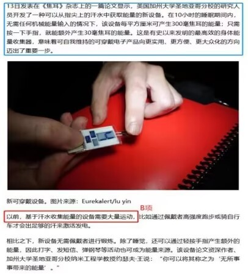

 故正确答案为B。

---

### 第 38 题　qid 5430369 · 逻辑判断

某考古小组对发生于两千多年前维苏威火山爆发的300多名成年罗马人遗体骨骼中的氨基酸的碳和氨进行同位素分析后发现，其中的男性从海鲜中获得的蛋白质要比女性多50%。与之相对应，其中的女性的蛋白质来源主要依赖肉、蛋、奶等动物产品和当地出产的豆类与坚果。
以下哪项如果为真，最能解释这一发现？

- **A**. 相比于动物产品、豆类和坚果，海鲜中的蛋白质含量更高
- **B**. 当时罗马男性更多从事渔业和海洋活动，摄入食物以海鲜为主　✅
- **C**. 两千多年前的罗马人饮食习惯与现在的饮食习惯没有很大差异
- **D**. 男性对海鲜中蛋白质的吸收能力比对其他动物、豆类、坚果更高

**答案**：B

**官方解析**

第一步：找出题干矛盾。
男性从海鲜中获得的蛋白质要比女性多50%。与之相对应，其中的女性的蛋白质来源主要依赖肉、蛋、奶等动物产品和当地出产的豆类与坚果。
第二步：逐一分析选项。
A项：只说了海鲜的蛋白质含量比动物产品、豆类和坚果高，但是没有提及为何男性与女性之间获得蛋白质的主要食物来源不同，不能解释题干矛盾，排除；
B项：说明当时罗马男性的主要食物为海鲜，解释了为何当时罗马男性与女性相比，从海鲜中获得的蛋白质较高，可以解释题干矛盾，当选；
C项：当时的罗马人饮食习惯与现在相似，但是没有提及为何当时罗马男性与女性获得蛋白质的主要食物来源不同，不能解释题干矛盾，排除；
D项：男性对海鲜中蛋白质的吸收能力较高，但是没有提及女性对海鲜中蛋白质的吸收能力和当时罗马男性的主要食物来源是否为海鲜，不能解释题干矛盾，排除。
故正确答案为B。

---

### 第 39 题　qid 5430371 · 逻辑判断

三叠纪末期中央大西洋超级火成岩省喷发造成的火山冬天导致大量陆地生物灭绝，恐龙却避过了这一灾难，并于三叠纪末生物灭绝事件后迅速占据生态主位。恐龙为什么能在生物灭绝的天灾中得以生存，并于灾后蓬勃发展？晚三叠世至早侏罗世早期是地球历史上典型的温室时期，地球两极不存在冰川，森林覆盖到达潘吉亚大陆的南北两极。研究人员在潘吉亚大陆的北极地区准噶尔盆地晚三叠世至早侏罗世湖沼相泥岩中发现了保存精美的恐龙脚印化石，据此认为早已适应极地寒冷的气候是恐龙崛起的主要原因。
下列哪项最可能是研究人员得出结论的条件？

- **A**. 晚三叠世至早侏罗世早期恐龙生活于极地地区
- **B**. 大灭绝事件后恐龙体积迅速增加，地理分布范围迅速扩张
- **C**. 即使两极无冰川的温室地球时期，极地也存在季节性的结冰　✅
- **D**. 在大灭绝中幸存下来的大多是分布于中、高纬度地区的恐龙

**答案**：C

**官方解析**

第一步：找出论点和论据。

论点：早已适应极地寒冷的气候是恐龙崛起的主要原因。

论据：研究人员在潘吉亚大陆的北极地区准噶尔盆地晚三叠世至早侏罗世湖沼相泥岩中发现了保存精美的恐龙脚印化石。

本题论据说的是研究人员在晚三叠世至早侏罗世的北极地区发现了恐龙脚印化石，说明在该时期确实有恐龙生活在北极地区，而论点讨论的是恐龙崛起与寒冷气候之间的关系，二者话题不一致，加强优先考虑搭桥，即建立“北极地区”和“寒冷气候”之间的联系。

第二步：逐一分析选项。

A项：该项指出晚三叠世至早侏罗世早期确实有恐龙生活在极地地区，补充论据，可以加强，保留；

B项：该项指出大灭绝事件后恐龙的体积及其分布地区的变化情况，而论点讨论的是恐龙崛起与寒冷气候之间的关系，话题不一致，无法加强，排除；

C项：该项指出即使在两极无冰川的温室地球时期，极地也存在季节性的结冰，说明该时期北极地区的气候也会出现季节性的寒冷，建立了“北极地区”和“寒冷气候”之间的联系，为搭桥项，可以加强，保留；

D项：该项讨论的是在大灭绝中幸存下来的恐龙的具体分布位置，而论点讨论的是恐龙崛起与寒冷气候之间的关系，这些幸存的恐龙当时所处的位置是否寒冷并不确定，为不明确项，无法加强，排除。

对比A、C两项，A项为补充论据，C项为搭桥，搭桥的力度大于补充论据，C项当选。

故正确答案为C。

https://baijiahao.baidu.com/s?id=1737217080173007095&amp;wfr=spider&amp;for=pc（涉及题干、A项和C项，A项恐龙确实生活在北极地区是可以通过论据中的脚印直接推测出的，A项并没有讨论恐龙是否已经适应严寒，而C项讨论了恐龙是否已适应严寒，与论点话题更为一致。）

---

### 第 40 题　qid 5430373 · 逻辑判断

许多心理学家将工作记忆描述为“当你遇到其他信息或任务干扰时，继续记住一定信息的能力”。工作记忆是大脑中负责储存和处理信息，进行决策跟计划的部分。它决定了短时记忆和长时记忆中能储存、处理多少信息，还决定了这些信息的注意控制、质量和数量。工作记忆较差的人很难将注意力分给不同的信息片段，导致他们难以高效处理多重任务——尤其是当他们遇到完全陌生的话题时。因此，工作记忆在多任务处理中扮演着重要的角色。
以下哪项如果为真，最能支持上述结论？

- **A**. 噪音等外界干扰会降低人们处理多任务的能力
- **B**. 老年人或出现认知障碍的人的工作记忆会有所衰退
- **C**. 工作记忆并非一成不变，可以通过练习和训练得以加强
- **D**. 工作记忆强的人能轻松地在不同内容的网页间切换并成功找到所要的结果　✅

**答案**：D

**官方解析**

第一步：找出论点和论据。
论点：工作记忆在多任务处理中扮演着重要的角色。
论据：工作记忆较差的人很难将注意力分给不同的信息片段，导致他们难以高效处理多重任务——尤其是当他们遇到完全陌生的话题时。
论点和论据讨论的都是工作记忆与多任务处理之间的关系，二者话题一致，加强优先考虑补充论据。
第二步：逐一分析选项。
A项：该项指出噪音等外界干扰会降低人们处理多任务的能力，讨论的是外界干扰与多任务处理之间的关系，而论点讨论的是工作记忆对多任务处理是否有影响，二者讨论的话题不一致，为无关项，无法加强，排除；
B项：该项指出老年人或出现认知障碍的人的工作记忆会有所衰退，讨论的是哪些因素会影响工作记忆，而论点讨论的是工作记忆对多任务处理是否有影响，二者讨论的话题不一致，为无关项，无法加强，排除；
C项：该项指出通过练习和训练可以加强工作记忆，讨论的是哪些因素会影响工作记忆，而论点讨论的是工作记忆对多任务处理是否有影响，二者讨论的话题不一致，为无关项，无法加强，排除；
D项：该项指出工作记忆强的人面对繁多的网页内容也能成功找到结果，通过举例的方式证明了工作记忆确实可以在多任务处理中发挥重要作用，补充论据，可以加强，当选。
故正确答案为D。

---

## 资料分析

### 材料 1

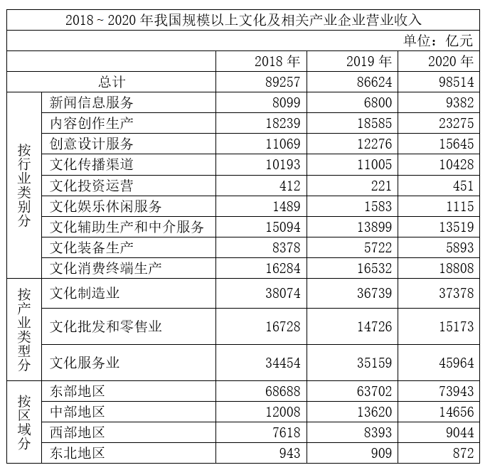

#### 第 1 题　qid 5430259 · 增长

我国规模以上文化及相关产业企业中，2019年、2020年营业收入均同比增长的行业类别有几个？

- **A**. 3　✅
- **B**. 4
- **C**. 5
- **D**. 6

**答案**：A

**官方解析**

定位表格材料可得2018~2020年我国规模以上文化及相关产业企业中各行业类别的营业收入。2019年、2020年营业收入均同比增长，即2020年营业收入大于2019年，且2019年营业收入大于2018年。观察可知，只有内容创作生产、创意设计服务、文化消费终端生产这3个行业类别满足条件。
故正确答案为A。

---

#### 第 2 题　qid 5430288 · 比重

2020年，我国规模以上文化服务业企业营业收入占我国规模以上文化及相关产业企业营业收入的比重比2018年：

- **A**. 下降了不到5个百分点
- **B**. 下降了5个百分点以上
- **C**. 上升了不到5个百分点
- **D**. 上升了5个百分点以上　✅

**答案**：D

**官方解析**

根据题干“2020年······占······比重比2018年”，结合选项为 “上升/下降+百分点”，可判定本题为两期比重问题。定位表格材料可得：2020年、2018年我国规模以上文化服务业企业营业收入分别为45964亿元、34454亿元，2020年、2018年我国规模以上文化及相关产业企业营业收入分别为98514亿元、89257亿元。根据公式：比重，则所求两期比重差，即约上升了7.7个百分点，在D项范围内。

故正确答案为D。

---

#### 第 3 题　qid 5430291 · 综合

2018~2020年，我国中部地区规模以上文化及相关产业企业累计营业收入约比西部地区高多少万亿元？

- **A**. 1.0
- **B**. 1.5　✅
- **C**. 2.0
- **D**. 2.5

**答案**：B

**官方解析**

定位表格材料可得2018~2020年我国中部地区和西部地区规模以上文化及相关产业企业营业收入。则2018~2020年，我国中部地区规模以上文化及相关产业企业累计营业收入比西部地区高亿元万亿元，与B项最接近。

故正确答案为B。

---

#### 第 4 题　qid 5430293 · 比重

如不同区域规模以上文化及相关产业企业营业收入中，各产业类型占比均与全国总体水平相同，则2020年东部地区规模以上文化制造业企业营业收入约为多少万亿元？

- **A**. 2.0
- **B**. 2.4
- **C**. 2.8　✅
- **D**. 3.2

**答案**：C

**官方解析**

根据题干“······各产业类型占比均与全国总体水平相同，则2020年······”，可判定本题为现期比重问题。由于不同区域规模以上文化及相关产业企业营业收入中，各产业类型占比均与全国总体水平相同，定位表格材料可得：2020年我国规模以上文化制造业企业营业收入为37378亿元，我国企业营业收入为98514亿元，东部地区企业营业收入为73943亿元，故2020年东部地区规模以上文化制造业企业营业收入亿元，与C项最接近。

故正确答案为C。

---

#### 第 5 题　qid 5430296 · 综合

能够从上述资料中推出的是：

- **A**. 2018~2020年，西部地区营业收入占全国比重逐年递增
- **B**. 2018~2020年，文化制造业累计营业收入高于文化服务业
- **C**. 2020年，营业收入同比增速最快和收入金额最低的行业是同一个　✅
- **D**. 2018~2020年，新闻信息服务业营业收入都超过文化服务业的20%

**答案**：C

**官方解析**

A项：定位表格材料可得2018~2020年西部地区和全国的营业收入。根据公式：比重，可得：西部地区营业收入占全国比重，2018年，2019年，2020年。由于2020年西部地区营业收入占全国比重低于2019年，故2018~2020年，西部地区营业收入占全国比重并非逐年递增，错误；

B项：定位表格材料可得2018~2020年文化制造业和文化服务业每年的营业收入。则2018~2020年，文化制造业累计收入亿元，文化服务业累计收入亿元，由于112000亿元＜115500亿元，故2018~2020年，文化制造业累计营业收入低于文化服务业，错误；

C项：定位表格材料可得2019年和2020年各行业类别的营业收入。比较发现，2020年，营业收入金额最低的行业是文化投资运营业。根据公式：增长率，可得：2020年文化投资运营业营业收入的增长率。观察表中其他行业，2020年的数据都明显低于2019年的2倍，即2020年其他行业的增长率都不到100%，故2020年文化投资运营业营业收入同比增速最快，即2020年，营业收入同比增速最快和收入金额最低的行业是同一个，正确；

D项：定位表格材料可得2018~2020年新闻信息服务业和文化服务业每年的营业收入。由于2019年，即2019年新闻信息服务业营业收入低于文化服务业的20%，故2018~2020年，新闻信息服务业营业收入并非都超过文化服务业的20%，错误。

故正确答案为C。

---

### 材料 2

        2021年上半年，S市工业战略性新兴产业总产值7164.68亿元，比去年同期增长19.6%，两年平均增长12.3%。其中，新能源汽车、新能源和高端装备产值同比分别增长2.5倍、32.1%和24.5%。

        2021年上半年，全市第三产业增加值15080.35亿元，比去年同期增长11.3%。其中，信息传输、软件和信息技术服务业增加值1770.06亿元，比去年同期增加245.5亿元；批发和零售业增加值2428.92亿元，同比增长15.2%；金融业增加值3842.65亿元，比去年同期增加274.7亿元；房地产业增加值1812.18亿元，同比增长13.6%。

        2021年上半年，全市社会消费品零售总额9048.44亿元，比去年同期增加了2104.14亿元。分行业看，批发和零售业零售额8287.13亿元，同比增长28.4%；住宿和餐饮业零售额761.31亿元，同比增长54.0%。2021年上半年，全市网上商店零售额1485.72亿元，比去年同期增加259.92亿元。

        2021年上半年，全市新建商品房销售面积832.83万平方米，比去年同期增长29.2%。其中，新建商品住宅销售面积667.94万平方米，同比增长23.0%。

#### 第 6 题　qid 5430273 · 增长

2020年上半年，S市工业战略性新兴产业总产值同比增长在以下哪个范围内？

- **A**. 不到7%　✅
- **B**. 7~10%
- **C**. 10~13%
- **D**. 超过13%

**答案**：A

**官方解析**

根据题干“2020年上半年······总产值同比增长······”，结合选项带百分号，且材料给出2021年S市工业战略性新兴产业总产值的上半年增速和两年平均增速，可判定本题为间隔增长率问题。定位文字材料第一段可得：2021年上半年，S市工业战略性新兴产业总产值比去年同期增长19.6%，两年平均增长12.3%。根据年均增长率公式：，且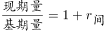，可得，故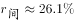。根据间隔增长率公式：，代入数据可得：，解得，故2020年上半年，S市工业战略性新兴产业总产值同比约增长5.4%，在A项范围内。

故正确答案为A。

---

#### 第 7 题　qid 5430275 · 增长

将S市2021年上半年①信息传输、软件和信息技术服务业、②批发和零售业、③金融业、④房地产业按增加值同比增速从高到低排列，正确的是：

- **A**. ②④①③
- **B**. ②④③①
- **C**. ①③②④
- **D**. ①②④③　✅

**答案**：D

**官方解析**

根据题干“······同比增速以高到低······”，可判定本题为一般增长率比较问题。定位文字材料第二段可得：2021年上半年，S市信息传输、软件和信息技术服务业增加值1770.06亿元，比去年同期增加245.5亿元；批发和零售业增加值2428.92亿元，同比增长15.2%；金融业增加值3842.65亿元，比去年同期增加274.7亿元；房地产业增加值1812.18亿元，同比增长13.6%。根据公式：增长率，则2021年上半年，信息传输、软件和信息技术服务业增加值同比增速为；金融业增加值同比增速为。16.1%＞15.2%＞13.6%＞7.7%，即同比增速以高到低排列为：①②④③。

故正确答案为D。

---

#### 第 8 题　qid 5430278 · 增长

2021年上半年，S市批发和零售业零售额同比增量约是住宿和餐饮业的多少倍？

- **A**. 3
- **B**. 5
- **C**. 7　✅
- **D**. 9

**答案**：C

**官方解析**

根据题干“2021年上半年······约是······的多少倍”，可判定本题为现期倍数问题。定位文字材料第三段可得：2021年上半年，批发和零售业零售额8287.13亿元，同比增长28.4%；住宿和餐饮业零售额761.31亿元，同比增长54.0%。根据公式：增长量，可得2021年上半年，批发和零售业零售额的同比增长量为亿元，住宿和餐饮业零售额的同比增长量为亿元，则所求倍数为倍。

故正确答案为C。

---

#### 第 9 题　qid 5430280 · 综合

2020年上半年，S市新建非住宅类商品房销售面积约占新建商品房销售面积的：

- **A**. 16%　✅
- **B**. 20%
- **C**. 24%
- **D**. 28%

**答案**：A

**官方解析**

根据题干“2020年上半年······占······”，结合材料时间为2021年上半年，可判定本题为基期比重问题。定位文字材料第四段可得：2021年上半年，全市新建商品房销售面积832.83万平方米（B），比去年同期增长29.2%（b）。其中，新建商品住宅销售面积667.94万平方米（A），同比增长23.0%（a）。根据公式：基期比重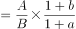，则2020年上半年，S市新建住宅类商品房销售面积占新建商品房销售面积的比重，根据“新建商品房销售面积=新建住宅类商品房销售面积+新建非住宅类商品房销售面积”，故所求比重为1-84%=16%。

故正确答案为A。

---

#### 第 10 题　qid 5430282 · 综合

能够从上述资料中推出的是：

- **A**. 2021年上半年，S市网上商店零售额同比增速低于20%
- **B**. 2020年上半年，S市批发和零售业增加值超过2000亿元　✅
- **C**. 2021年上半年，S市月均新建商品房销售面积不到80万平方米
- **D**. 2021年上半年，S市高端装备产值占工业战略性新兴产业总产值的比重低于上年同期水平

**答案**：B

**官方解析**

A项：定位文字材料第三段可得：2021年上半年，全市网上商店零售额1485.72亿元，比去年同期增加259.92亿元。根据公式：增长率，则2021年上半年，S市网上商店零售额同比增速，错误；

B项：定位文字材料第二段可得：2021年上半年，全市批发和零售业增加值2428.92亿元，同比增长15.2%。根据公式：基期量，则2020年上半年，S市批发和零售业增加值亿元，正确；

C项：定位文字材料第四段可得：2021年上半年，全市新建商品房销售面积832.83万平方米，则2021年上半年，S市月均新建商品房销售面积万平方米，错误；

D项：定位文字材料第一段可得：2021年上半年，S市工业战略性新兴产业总产值比去年同期增长19.6%，其中，高端装备产值同比增长24.5%。根据两期比重比较结论：当部分增长率（a）＞整体增长率（b）时，比重上升；当部分增长率（a）＜整体增长率（b）时，比重下降。高端装备产值同比增速24.5%（a）＞工业战略性新兴产业总产值同比增速19.6%（b），故所求比重上升，错误。

故正确答案为B。

---

### 材料 3

        零售药店终端包含实体药店和网上药店两大市场。2021年，全国零售药店终端药品销售额4774亿元，同比增长10.3%。其中，实体药店市场药品销售额4405亿元，同比增长7.8%；网上药店市场药品销售额368亿元，同比增长51.5%。

#### 第 11 题　qid 5430314 · 综合

2016～2020年，全国零售药店终端药品销售总额在以下哪个范围内？

- **A**. 小于1.9万亿元
- **B**. 1.9～2万亿元　✅
- **C**. 2～2.1万亿元
- **D**. 大于2.1万亿元

**答案**：B

**官方解析**

定位统计图1可得2016～2020年各年份的全国零售药店终端药品销售额，则2016～2020年全国零售药店终端药品销售总额=3375+3647+3919+4196+4330=19467亿元=1.9467万亿元，在B项范围内。
故正确答案为B。

---

#### 第 12 题　qid 5430316 · 增长

2014～2021年间，全国实体药店市场药品年均销售额增长约为多少亿元？

- **A**. 228　✅
- **B**. 233
- **C**. 238
- **D**. 244

**答案**：A

**官方解析**

根据题干“2014～2021年间······年均销售额增长······亿元”，可判定本题为年均增长量问题。定位统计图2可得：2014年、2021年全国实体药店市场药品销售额分别为2807亿元、4405亿元。根据公式：年均增长量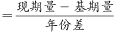，则2014～2021年间，全国实体药店市场药品年均销售额增长亿元。

故正确答案为A。

---

#### 第 13 题　qid 5430323 · 综合

2021年，全国零售药店终端药品销售额约为2013年的多少倍？

- **A**. 1.3
- **B**. 1.5
- **C**. 1.7
- **D**. 1.9　✅

**答案**：D

**官方解析**

根据题干“2021年······约为2013年的多少倍”，可判定本题为基期倍数问题。定位统计图1可得：2021年，全国零售药店终端药品销售额为4774亿元；2014年，全国零售药店终端药品销售额为2828亿元，同比增长10.6%。根据公式：基期量，可得2013年，全国零售药店终端药品销售额为亿元。故2021年，全国零售药店终端药品销售额为2013年的倍。

故正确答案为D。

---

#### 第 14 题　qid 5430327 · 增长

2017～2021年，全国网上药店市场药品销售额同比增速最快的年份是：

- **A**. 2018年
- **B**. 2019年
- **C**. 2020年　✅
- **D**. 2021年

**答案**：C

**官方解析**

根据题干“2017～2021年，全国网上药店市场药品销售额同比增速······”，可判定本题为一般增长率比较问题。定位文字材料可得：2021年，全国网上药店市场药品销售额同比增长51.5%。定位统计图1可得2017～2020年全国零售药店终端药品销售额。定位统计图2可得2017～2020年全国实体药店市场药品销售额。则2017～2020年全国网上药店市场药品销售额分别为3647-3577=70亿元、3919-3820=99亿元、4196-4057=139亿元、4330-4087=243亿元。根据公式：增长率，可得2018-2020年全国网上药店市场药品销售额同比增速分别为：

2018年，；

2019年，；

2020年，。

综上，2020年全国网上药店市场药品销售额同比增速最快。

故正确答案为C。

---

#### 第 15 题　qid 5430330 · 综合

能够从上述资料中推出的是：

- **A**. 2021年全国网上药店市场药品销售额是2019年的3倍多
- **B**. 2014～2021年有4年全国网上药店市场药品销售额超过100亿元
- **C**. 2015年，全国实体药店市场药品销售额是网上药店市场药品销售额的100倍以上
- **D**. 2014～2021年，全国零售药店终端药品销售额同比增量最高的年份，实体药店市场药品同比增量也最高　✅

**答案**：D

**官方解析**

A项：定位图1可知：2019年和2021年全国零售药店终端药品销售额分别为4196亿元和4774亿元；定位图2可知：2019年和2021年全国实体药店市场药品销售额分别为4057亿元和4405亿元。因为全国零售药店终端药品销售额=全国实体药店市场药品销售额+全国网上药店市场药品销售额，则2019年和2021年全国网上药店市场药品销售额分别为4196-4057=139亿元和4774-4405=369亿元。故所求倍数为倍，错误；

B项：定位图1和图2可知：2014～2021年每一年的全国零售药店终端药品销售额和全国实体药店市场药品销售额。因为全国零售药店终端药品销售额=全国实体药店市场药品销售额+全国网上药店市场药品销售额，则2014～2021年每一年的全国网上药店市场药品销售额分别为：

2014年：2828-2807=21亿元；

2015年：3111-3079=32亿元；

2016年：3375-3327=48亿元；

2017年：3647-3577=70亿元；

2018年：3919-3820=99亿元；

2019年：4196-4057=139亿元；

2020年：4330-4087=243亿元；

2021年：4774-4405=369亿元。

故2014～2021年全国网上药店市场药品销售额超过100亿元的有2019年、2020年、2021年，共3年，错误；

C项：定位图1可知：2015年全国零售药店终端药品销售额3111亿元；定位图2可知：2015年全国实体药店市场药品销售额3079亿元。因为全国零售药店终端药品销售额=全国实体药店市场药品销售额+全国网上药店市场药品销售额，则2015年全国网上药店市场药品销售额为3111-3079=32亿元。故所求倍数为倍，错误；

D项：定位图1可知2014～2021年，每一年的全国零售药店终端药品销售额以及2014年同比增速10.6%。根据公式：增长量，则2014年全国零售药店终端药品销售额同比增量为亿元；根据公式：增长量=现期量-基期量，则2015～2021年同比增量分别为3111-2828=283亿元、3375-3111=264亿元、3647-3375=272亿元、3919-3647=272亿元、4196-3919=277亿元、4330-4196=134亿元、4774-4330=444亿元，故2014～2021年，全国零售药店终端药品销售额同比增量最高的年份为2021年；

定位图2可知2014～2021年，每一年的全国实体药店市场药品销售额以及2014年同比增速10.3%。根据公式：增长量，则2014年全国实体药店市场药品销售额同比增量为亿元；根据公式：增长量=现期量-基期量，则2015～2021年同比增量分别为3079-2807=272亿元、3327-3079=248亿元、3577-3327=250亿元、3820-3577=243亿元、4057-3820=237亿元、4087-4057=30亿元、4405-4087=318亿元，故2014～2021年，全国实体药店市场药品销售额同比增量最高的年份也为2021年，正确。

故正确答案为D。

备注：A、B两项，如果看文字材料，网上药店市场药品销售额368亿元，与统计图数据4774-4405=369亿元不符，但不影响判定本题正误。

---
