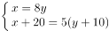
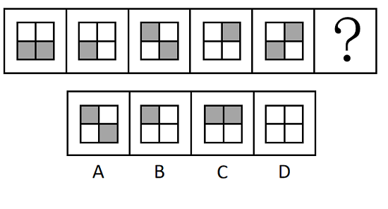
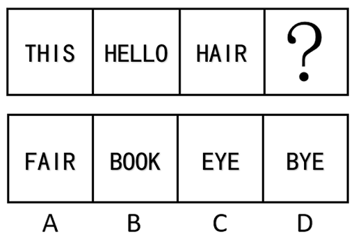
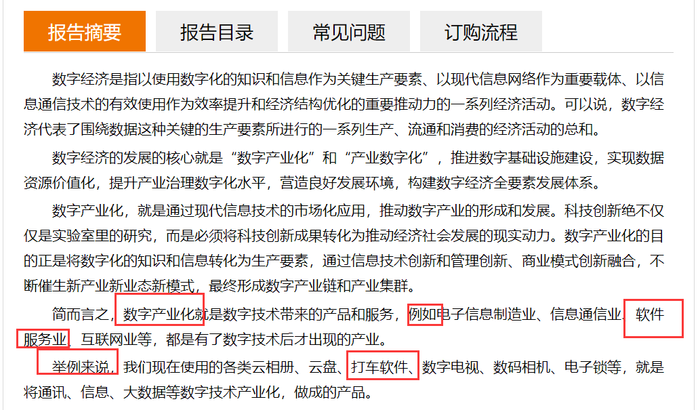
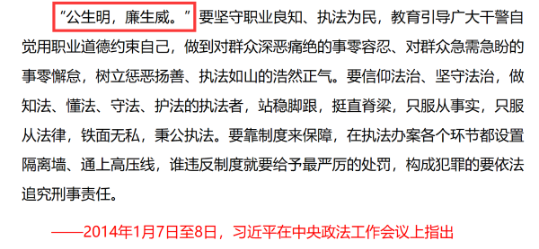
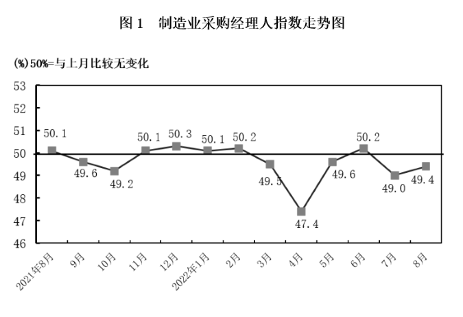
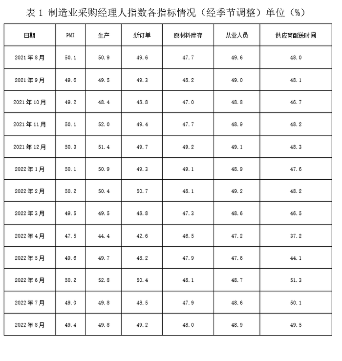

# 2023年海南省公务员录用考试《行测》题（网友回忆版）

> 省考 · 2023 年 · 6 个模块 · 共 110 题

- [政治理论](#%E6%94%BF%E6%B2%BB%E7%90%86%E8%AE%BA) · 5 题
- [常识判断](#%E5%B8%B8%E8%AF%86%E5%88%A4%E6%96%AD) · 20 题
- [言语理解与表达](#%E8%A8%80%E8%AF%AD%E7%90%86%E8%A7%A3%E4%B8%8E%E8%A1%A8%E8%BE%BE) · 30 题
- [数量关系](#%E6%95%B0%E9%87%8F%E5%85%B3%E7%B3%BB) · 10 题
- [判断推理](#%E5%88%A4%E6%96%AD%E6%8E%A8%E7%90%86) · 30 题
- [资料分析](#%E8%B5%84%E6%96%99%E5%88%86%E6%9E%90) · 15 题

---

## 政治理论

### 第 1 题　qid 5509458 · 时事政治

党的二十大报告指出，全过程人民民主是社会主义民主政治的本质属性，是最广泛、最真实、最管用的民主。下列事例体现了全过程人民民主的有几项？
①某地人代会开会前，群众代表通过初审政府预算草案，提出修改意见，监督管好政府“钱袋子”，使公共资金使用更好反映人民意愿
②某地居委会和社区一同组织居民讨论社区公共服务资金的分配使用规划，居民通过各种创新的基层协商民主方式，让财政决策更接地气
③某直播平台开展了“最美建筑摄影”网络投票活动，众多摄影爱好者纷纷拍摄并投稿，网友们通过公平公正公开的方式评选出“最高人气奖”
④某政府网络平台开辟了“领导留言板”栏目，群众可直接给政府主要负责同志留言，提出意见和诉求

- **A**. 1
- **B**. 2
- **C**. 3　✅
- **D**. 4

**答案**：C

**官方解析**

本题考查政治常识。
①正确，党的二十大报告指出：“协商民主是实践全过程人民民主的重要形式。完善协商民主体系，统筹推进政党协商、人大协商、政府协商、政协协商、人民团体协商、基层协商以及社会组织协商，健全各种制度化协商平台，推进协商民主广泛多层制度化发展。”群众代表通过初审政府预算草案是协商民主的一种，体现了全过程人民民主。
②正确，党的二十大报告指出：“基层民主是全过程人民民主的重要体现。健全基层党组织领导的基层群众自治机制，加强基层组织建设，完善基层直接民主制度体系和工作体系，增强城乡社区群众自我管理、自我服务、自我教育、自我监督的实效。”某地居委会和社区一同组织居民讨论社区公共服务资金的分配使用规划，属于基层民主，体现了全过程人民民主。
③错误，某直播平台开展的网络投票活动属于平台自行开展的民间活动，与全过程人民民主无关。
④正确，党的二十大报告指出：“发展全过程人民民主，保障人民当家作主。我们要健全人民当家作主制度体系，扩大人民有序政治参与，保证人民依法实行民主选举、民主协商、民主决策、民主管理、民主监督，发挥人民群众积极性、主动性、创造性，巩固和发展生动活泼、安定团结的政治局面。”某政府网络平台开辟了“领导留言板”栏目，属于民主监督，体现了全过程人民民主。
综上所述，体现了全过程人民民主的有①②④，共3项。
故正确答案为C。

---

### 第 2 题　qid 5509469 · 新思想

党的十八大以来，以习近平同志为核心的党中央不断推进人民代表大会制度理论创新和实践创新，主要体现在“六个方面”。下列不属于这“六个方面”内容的是：

- **A**. 必须坚持全面依法治国，必须坚持民主集中制
- **B**. 必须坚持全面从严治党，必须坚持进一步推进政治体制改革　✅
- **C**. 必须坚持中国共产党领导，必须坚持用制度体系保障人民当家作主
- **D**. 必须坚持中国特色社会主义政治发展道路，必须坚持推进国家治理体系和治理能力现代化

**答案**：B

**官方解析**

本题考查政治常识。
A、C、D三项正确，B项错误，2021年10月，中央人大工作会议在北京召开，习近平同志发表重要讲话时强调，党的十八大以来，党中央统筹中华民族伟大复兴战略全局和世界百年未有之大变局，从坚持和完善党的领导、巩固中国特色社会主义制度的战略全局出发，继续推进人民代表大会制度理论和实践创新，提出一系列新理念新思想新要求，强调必须坚持中国共产党领导，必须坚持用制度体系保障人民当家作主，必须坚持全面依法治国，必须坚持民主集中制，必须坚持中国特色社会主义政治发展道路，必须坚持推进国家治理体系和治理能力现代化。
本题为选非题，故正确答案为B。

---

### 第 3 题　qid 5509473 · 时事政治

为在新发展阶段持续深入推进依法行政，全面建设法治政府，中共中央、国务院印发了《法治政府建设实施纲要（2021—2025年）》。下列属于《法治政府建设实施纲要（2021—2025年）》内容的有几项？
①深入学习贯彻习近平法治思想，努力实现法治政府建设全面突破
②健全依法行政制度体系，加快推进政府治理规范化程序化法治化
③健全社会矛盾纠纷行政预防调处化解体系，不断促进社会公平正义
④推进公正司法，各级党政机关支持法院、检察院独立公正行使职权
⑤将“实行依法治国，建设社会主义法治国家”写入宪法，法治建设揭开新篇章

- **A**. 2
- **B**. 3　✅
- **C**. 4
- **D**. 5

**答案**：B

**官方解析**

本题考查政治常识。
2021年8月，中共中央、国务院印发了《法治政府建设实施纲要（2021—2025年）》（下文简称《纲要》），并发出通知，要求各地区各部门结合实际认真贯彻落实。
①项正确，《纲要》指出：“一、深入学习贯彻习近平法治思想，努力实现法治政府建设全面突破。党的十八大以来，特别是《法治政府建设实施纲要（2015－2020年）》贯彻落实5年来，各地区各部门多措并举、改革创新，法治政府建设取得重大进展。”
②项正确，《纲要》指出：“三、健全依法行政制度体系，加快推进政府治理规范化程序化法治化。坚持科学立法、民主立法、依法立法，着力实现政府立法质量和效率并重并进，增强针对性、及时性、系统性、可操作性，努力使政府治理各方面制度更加健全、更加完善。”
③项正确，《纲要》指出：“七、健全社会矛盾纠纷行政预防调处化解体系，不断促进社会公平正义。坚持将矛盾纠纷化解在萌芽状态、化解在基层，着力实现人民群众权益受到公平对待、尊严获得应有尊重，推动完善信访、调解、仲裁、行政裁决、行政复议、诉讼等社会矛盾纠纷多元预防调处化解综合机制。”
④项错误，《纲要》指出：“七、健全社会矛盾纠纷行政预防调处化解体系，不断促进社会公平正义······支持法院依法受理和审理行政案件，切实履行生效裁判。支持检察院开展行政诉讼监督工作和行政公益诉讼，积极主动履行职责或者纠正违法行为。”《纲要》原文中没有提及“推进公正司法，各级党政机关支持法院、检察院独立公正行使职权”。
⑤项错误，1999年3月，九届全国人大二次会议将“依法治国，建设社会主义法治国家”载入宪法。这是社会主义民主政治发展的重要成果，标志着我国社会主义民主法制建设进入一个新阶段。《纲要》原文中没有提及。
综上所述，属于《纲要》内容的有①②③，共3项。
故正确答案为B。

---

### 第 4 题　qid 5509464 · 时事政治

党的二十大报告指出，全面建设社会主义现代化国家，必须有一支政治过硬、适应新时代要求、具备领导现代化建设能力的干部队伍。下列与之相关的说法正确的有几项？
①加强实践锻炼、专业训练，注重在重大斗争中磨砺干部，增强干部推动高质量发展本领、服务群众本领、防范化解风险本领
②坚持党管干部原则，坚持德才兼备、以德为先、五湖四海、任人唯贤，把新时代好干部标准落到实处
③树立选人用人正确导向，选拔忠诚干净担当的高素质专业化干部，选优配强各级领导班子
④坚持把政治标准放在首位，做深做实干部政治素质考察，突出把好政治关、廉洁关

- **A**. 1
- **B**. 2
- **C**. 3
- **D**. 4　✅

**答案**：D

**官方解析**

本题考查政治常识。
党的二十大报告中“十五、坚定不移全面从严治党，深入推进新时代党的建设新的伟大工程”部分的“（四）建设堪当民族复兴重任的高素质干部队伍”指出：“······坚持党管干部原则，坚持德才兼备、以德为先、五湖四海、任人唯贤，把新时代好干部标准落到实处。树立选人用人正确导向，选拔忠诚干净担当的高素质专业化干部，选优配强各级领导班子。坚持把政治标准放在首位，做深做实干部政治素质考察，突出把好政治关、廉洁关。加强实践锻炼、专业训练，注重在重大斗争中磨砺干部，增强干部推动高质量发展本领、服务群众本领、防范化解风险本领······”
综上所述，与之相关的说法正确的有①②③④，共4项。
故正确答案为D。

---

### 第 5 题　qid 5509848 · 新思想

下列习近平总书记讲话内容与所涉及的省区对应正确的有几项：
①盐湖资源是全国的战略性资源——青海
②让黄花成为乡亲们的“致富花”——山西
③奋力谱写雪域高原长治久安和高质量发展新篇章——西藏
④从黄浦江畔搬到渭水之滨，你们打起背包就出发，舍小家顾大家——陕西

- **A**. 1
- **B**. 2
- **C**. 3
- **D**. 4　✅

**答案**：D

**官方解析**

本题考查政治常识。
①正确，2016年8月，习近平总书记在青海考察时指出：“盐湖资源是青海的第一大资源，也是全国的战略性资源，务必处理好资源开发利用和生态环境保护的关系。发展循环经济是提高资源利用效率的必由之路，要牢固树立绿色发展理念，积极推动区内相关产业流程、技术、工艺创新，努力做到低消耗、低排放、高效益，让盐湖这一宝贵资源永续造福人民。”
②正确，2020年5月11日，习近平总书记视察山西省大同市云州区有机黄花标准化种植基地时，嘱托当地百姓：“希望把黄花产业保护好、发展好，做成大产业，做成全国知名品牌，让黄花成为乡亲们的‘致富花’。”
③正确，2021年7月，西藏和平解放70周年之际，习近平总书记来到雪域高原。在西藏考察期间，习近平总书记强调，要全面贯彻新时代党的治藏方略，坚持稳中求进工作总基调，立足新发展阶段，完整、准确、全面贯彻新发展理念，服务和融入新发展格局，推动高质量发展，加强边境地区建设，抓好稳定、发展、生态、强边四件大事，在推动青藏高原生态保护和可持续发展上不断取得新成就，奋力谱写雪域高原长治久安和高质量发展新篇章。
④正确，2020年4月22日，在陕西考察的习近平总书记走进交大西迁博物馆，亲切会见14位西迁老教授。习近平总书记谈起老教授们两年前给他写的一封来信，“看了你们的信我非常感动，产生了强烈共鸣”。习近平总书记说：“从黄浦江畔搬到渭水之滨，你们打起背包就出发，舍小家顾大家。交大西迁对整个国家和民族来讲、对西部发展战略布局来讲，意义都十分重大。”
综上所述，对应正确的有①②③④，共4项。
故正确答案为D。

---

## 常识判断

### 第 1 题　qid 5509480 · 人文常识

下列关于革命遗址及革命纪念建筑物的说法错误的是：

- **A**. 广州农民运动讲习所旧址——毛泽东曾在此担任农民运动讲习所所长
- **B**. 秋收起义文家市会师旧址——红军在此确立了“十六字诀”游击战术　✅
- **C**. 北京大学红楼——李大钊曾在此传播马克思主义和民主科学进步思想
- **D**. 八路军总司令部旧址——彭德怀等人在此直接布置和指挥了百团大战

**答案**：B

**官方解析**

本题考查毛中特。
A项正确，广州农民运动讲习所是第一次国共合作时期培养农民运动干部的学校，1924年7月至1926年9月举办过六届，培养了800多名学员，为中国革命输送了大批干部。第六届农民运动讲习所由毛泽东担任所长。
B项错误，1929年4月5日，毛泽东在《红军第四军前委给中共中央的信》中，将红军游击战争的作战原则，正式概括为“敌进我退，敌驻我扰，敌疲我打，敌退我追”。而秋收起义是1927年9月9日，由毛泽东在湖南东部和江西西部领导的工农革命军（即红军）举行的一次武装起义。
C项正确，1918年初，李大钊在北京大学红楼创建了马克思主义研究小组，蔡元培时任北京大学校长。
D项正确，武乡八路军总司令部旧址，是抗日战争期间八路军总部所在地，位于山西省长治市武乡县，由武乡县王家峪旧址和砖壁旧址组成。1961年，国务院将王家峪八路军总部旧址和砖壁八路军总部旧址列为全国第一批重点文物保护单位。彭德怀等人在此直接布置和指挥了百团大战。
本题为选非题，故正确答案为B。

---

### 第 2 题　qid 5509833 · 经济常识

2022年8月31日至9月5日，中国国际服务贸易交易会（简称“服贸会”）在国家会议中心和首钢园区举办。下列与服贸会相关的说法正确的有几项？
①服贸会已成为我国对外开放三大展会平台之一
②2022年服贸会的主题为“服务合作促发展，绿色创新迎未来”
③服贸会是全球唯一一个国家级、国际性、综合型的服务贸易平台
④2022年服贸会吉祥物“福燕”预示服务贸易发展造福世界，寓意邀请境内外客商共赴服务贸易盛宴

- **A**. 1
- **B**. 2
- **C**. 3
- **D**. 4　✅

**答案**：D

**官方解析**

本题考查政治常识。
①正确，自成立以来，服贸会不断发展壮大，与广交会、进博会一起，构成我国对外开放的三大展会平台。在货物贸易领域，上海的进博会侧重于进口，广州的广交会侧重于出口，北京的服贸会则聚焦服务贸易，三者相辅相成，共同构成新时期“中国制造”和“中国服务”全面发展的展会促进平台，推动形成以“北、上、广”为龙头的全国会展新格局。
②正确，2022年中国国际服务贸易交易会于8月31日至9月5日在北京举行，主题为“服务合作促发展，绿色创新迎未来”，由商务部和北京市人民政府共同主办。
③正确，服贸会是全球唯一一个国家级、国际性、综合型的服务贸易平台。由商务部和北京市人民政府共同举办，世贸组织、联合国贸发会议、经合组织等国际组织共同支持，是全球唯一涵盖服务贸易12大领域的综合型服务贸易交易会。
④正确，2022年服贸会吉祥物命名为“福燕（FuYan）”，预示服务贸易发展造福世界，体现“全球服务 互惠共享”，谐音“赴宴”“服宴”，寓意邀请境内外客商共赴服务贸易盛宴。
综上，说法正确的有①②③④，共4项。
故正确答案为D。

---

### 第 3 题　qid 5509767 · 人文常识

成语作为中国传统文化的一大特色，很多都来源于历史生活，下列成语、主要人物及时期对应正确的是：

- **A**. 窃符救赵——魏无忌——春秋
- **B**. 封狼居胥——卫青——汉朝
- **C**. 东床坦腹——王羲之——东晋　✅
- **D**. 目不窥园——范仲淹——宋朝

**答案**：C

**官方解析**

本题考查人文常识。
A项错误，战国时期，秦国围困赵国都城邯郸，赵国求救于魏国，魏国惧怕秦国，不敢出兵救赵。情急之下，信陵君魏无忌听取侯赢之计，以国家利益为重，置生死度外，借魏王姬妾如姬之手窃得兵符，夺取了魏国兵权，不仅成功击败秦军、救援了赵国，也巩固了魏国在当时的地位。窃符救赵的主人公为战国时期的魏无忌，而非春秋时期。
B项错误，封狼居胥，指西汉大将霍去病登狼居胥山筑坛祭天以告成功之事，出自于《汉书·霍去病传》，后来封狼居胥成为中华民族武将的最高荣誉之一。封狼居胥的主人公为霍去病，而非卫青。
C项正确，东床坦腹，指东晋王羲之，面临高官选女婿时，在东边的床上露出肚皮看书，被高官看中，高官将女儿许配给了王羲之。
D项错误，目不窥园，指西汉董仲舒读书非常刻苦认真，他的书房紧靠着姹紫嫣红的花园，他三年没有进过花园，无暇观赏花园中的景致。目不窥园的主人公为西汉董仲舒，而非宋朝范仲淹。
故正确答案为C。

---

### 第 4 题　qid 5509457 · 法律常识

下列属于《中华人民共和国劳动法》所调整的劳动关系的是：

- **A**. 大学生小张利用假期到餐馆打工　✅
- **B**. 王某雇请保姆为其提供家务劳动
- **C**. 村民老马在农忙时雇请他人为其收割庄稼
- **D**. 大学英语教师小李在某国领事馆兼职从事翻译工作

**答案**：A

**官方解析**

本题考查法律常识。
A项正确，根据《中华人民共和国劳动法》第二条第一款规定：“在中华人民共和国境内的企业、个体经济组织（以下统称用人单位）和与之形成劳动关系的劳动者，适用本法。”
B、C两项错误，根据《最高人民法院关于审理劳动争议案件适用法律问题的解释（一）》第二条第四项、第六项规定：“下列纠纷不属于劳动争议：（四）家庭或者个人与家政服务人员之间的纠纷；（六）农村承包经营户与受雇人之间的纠纷。”
D项错误，外国驻我国的大使馆属于外交代表机构，其性质属于国外的机关单位，不属于《中华人民共和国劳动法》规定的用人单位，小李与其不构成劳动关系。
故正确答案为A。

---

### 第 5 题　qid 5509459 · 人文常识

某小区业主王某拟将其自住用房改为民宿用房，物业公司和业主委员会不同意，为此发生争执。下列与之相关的说法正确的是：

- **A**. 小区业主未经国家有关机关审批，不得将自住用房改为民宿用房
- **B**. 小区业主未经小区物业公司和业主委员会同意，不得将自住用房改为民宿用房
- **C**. 小区业主未经有利害关系的其他业主一致同意，不得将自住用房改为民宿用房　✅
- **D**. 小区业主未经三分之二以上有利害关系的其他业主同意，不得将自住用房改为民宿用房

**答案**：C

**官方解析**

本题考查法律常识。
A、B、D三项错误，C项正确，根据《中华人民共和国民法典》 第二百七十九条规定：“业主不得违反法律、法规以及管理规约，将住宅改变为经营性用房。业主将住宅改变为经营性用房的，除遵守法律、法规以及管理规约外，应当经有利害关系的业主一致同意。”
故正确答案为C。

---

### 第 6 题　qid 5509461 · 科技常识

激光技术指采用激光手段对特定目标进行加工或者检测的技术。下列与激光技术有关的说法错误的是：

- **A**. 激光的理论基础由爱因斯坦在1917年提出
- **B**. 激光技术可以实现材料加工、物态转变、尺度测量
- **C**. 目前我国是世界上唯一能制造实用化深紫外全固态激光的国家
- **D**. 我国于1960年成功制造出第一台激光器，促进了激光技术发展　✅

**答案**：D

**官方解析**

本题考查科技常识。
A项正确，激光的理论基础由物理学家爱因斯坦提出，1917年爱因斯坦提出了一套全新的技术理论“光与物质相互作用”。这一理论是说在组成物质的原子中，有不同数量的粒子（电子）分布在不同的能级上，在高能级上的粒子受到某种光子的激发，会从高能级跳到（跃迁）到低能级上。这时将会辐射出与激发它的光相同性质的光，即激光。
B项正确，激光技术是采用激光的手段，对特定目标进行加工或者检测的技术。它可以实现材料加工、物态转变、尺度测量等。
C项正确，2013年9月6日，由中科院承担的国家重大科研装备“深紫外固态激光源前沿装备研制项目”通过验收，使我国成为目前世界上唯一一个能够制造实用化、精密化深紫外全固态激光的国家。
D项错误，世界上第一台激光器诞生于1960年。中国第一台激光器于1961年诞生于长春光机所，由“中国激光之父”、物理学家王之江等人研制。
本题为选非题，故正确答案为D。

---

### 第 7 题　qid 5509766 · 人文常识

下列关于我国传统乐器的说法错误的是：

- **A**. 笛是汉族乐器中最具代表性最有民族特色的吹奏乐器
- **B**. 唢呐在传统的定调方法里，是以使用的乐器为依据的
- **C**. 埙是我国西北少数民族特有的吹奏乐器，形似笙而较大　✅
- **D**. 葫芦丝是云南少数民族乐器，其起源可追溯到先秦时期

**答案**：C

**官方解析**

本题考查人文常识。
A项正确，笛子属于管乐类，是汉族乐器中最具代表性最有民族特色的吹奏乐器，也是迄今为止发现的最古老的汉族乐器。
B项正确，唢呐在传统的定调方法里，是以使用的乐器为依据的。不论尺寸长短或木管粗细，一律以全按（把所有的音孔都按上，也就是筒音）称为“本调”。
C项错误，埙是汉族特有的闭口吹奏乐器，音色朴拙，其起源与汉族先民的劳动生产活动有关，最初可能是先民们模仿鸟兽叫声而制作，用以诱捕猎物，后随社会进步而演化为单纯的乐器，在古代是用陶土烧制的一种吹奏乐器，圆形或椭圆形。
D项正确，葫芦丝，又称“葫芦箫”，是云南少数民族乐器，其历史较为悠久，其渊源可追溯到先秦时代。
本题为选非题，故正确答案为C。

---

### 第 8 题　qid 5510081 · 科技常识

地球系统是指由大气圈、水圈、陆圈和生物圈组成的有机整体。下列相关的说法正确的是：

- **A**. 地球系统的主要能量来源是太阳　✅
- **B**. 地球系统具有绝对的独立性和封闭性
- **C**. 生态系统发生改变时不会影响地球系统的平衡
- **D**. 与海水和大气相比，板块发生改变的时间比较短

**答案**：A

**官方解析**

本题考查地理国情。
A项正确，地球系统的主要能量来源是太阳，人类所需能量的绝大部分都直接或间接地来自太阳，各种植物通过光合作用把太阳能转变成化学能在体内贮存下来。
B项错误，地球系统本身具有独特的发生、发展、演化特征，即具有相对的独立性和封闭性；同时也具有很强的开放性，其发生、发展与演化与所处的宇宙环境是分不开的。从某种意义上说，地球系统的封闭性只是相对的，而开放性则是绝对的和更重要的。
C项错误，生态系统指在自然界的一定的空间内，生物与环境构成的统一整体，在这个统一整体中，生物与环境之间相互影响、相互制约，并在一定时期内处于相对稳定的动态平衡状态。地球系统的平衡主要就是生态系统的平衡，因此生态系统发生改变时，会影响地球系统的平衡。
D项错误，板块构造运动始于约32亿年前，虽然这些板块以每年几厘米的速度缓慢移动着，但却能使地球的海陆面貌发生巨大的变化。而盛行风、地转偏向力等因素影响着海水运动；太阳辐射等因素影响着大气运动。相比之下，板块发生改变的时间很漫长。
故正确答案为A。

---

### 第 9 题　qid 5509831 · 科技常识

北京2022年冬残奥会闭幕式融入了天干地支元素，下列关于天干地支的说法正确的是：

- **A**. 天干和地支的数目相同
- **B**. 生肖与地支可以一一对应　✅
- **C**. 黄道十二宫以天干命名
- **D**. 干支纪年周期为12周年

**答案**：B

**官方解析**

本题考查人文常识。
A项错误，天干地支，简称为干支，源自中国远古时代对天象的观测，有十天干和十二地支。
B项正确，十二生肖和十二地支能够一一对应，为子鼠、丑牛、寅虎、卯兔、辰龙、巳蛇、午马、未羊、申猴、酉鸡、戌狗、亥猪。
C项错误，黄道十二宫的宫名是借用附近的星座名字，即白羊宫、金牛宫、双子宫、巨蟹宫、狮子宫、室女宫、天秤宫、天蝎宫、人马宫、摩羯宫、宝瓶宫和双鱼宫。
D项错误，干支是天干和地支的总称，十天干和十二地支依次相配，组成六十个基本单位，干支纪年周期为60周年。
故正确答案为B。

---

### 第 10 题　qid 5509470 · 经济常识

宋朝是我国历史上商品经济、文化教育、科学创新高度繁荣的时代。下列选项中描述的景象，可能出现在宋朝的有几项？
①社会出现严重通货膨胀
②百姓用煤炭作燃料取暖做饭
③农民使用水力翻车进行田间灌溉
④士兵用火药制成的“震天雷”击退敌人

- **A**. 1
- **B**. 2
- **C**. 3
- **D**. 4　✅

**答案**：D

**官方解析**

本题考查人文常识。
①正确，在宋朝初期，是以铜钱作为流通货币，而作为金属货币的铜钱带来的最大问题就是货币数量不足。在宋朝官府设立官方纸币发行机构以及制定相应的货币政策之后，开始大肆发行纸币，使货币的数量超出了正常的市场需求量，纸币由此贬值，物价持续普遍上涨，就出现了通货膨胀。“社会出现严重通货膨胀”在宋朝有可能出现。
②正确，早在距今3500年前后，中国人就发现了煤炭，并且已经开采和利用。煤炭被大量用于生产和生活的记载是在汉代。当时还不叫煤炭，而是称作湮石、石涅、黑丹等。汉书有记载，“豫章出石，可燃为薪”。除了炼铁、烧饭，南北朝时期，还有记载表明，当时的人用煤炭来取暖。“百姓用煤炭作燃料取暖做饭”在宋朝有可能出现。
③正确，宋朝，人们对人力翻车加以改进，创造出畜力翻车和水转翻车。水转翻车与牛转翻车结构相似，只是在由牛来带动的卧齿轮轮轴的下端，安装一个水轮，置于水流湍急处，以水力转动翻车车水上岸。如果水势适当，则卧轮和水轮都可能省掉，把原来的立齿轮改制成可以受力的水轮，带动翻车轮轴转动提水。
④正确，据史料记载，“震天雷”是出现在北宋末年的一种火药武器，在南宋和蒙元时期的战事中得到了广泛的应用。根据实际使用需要的不同，“震天雷”可以被制造成各种形状，也可以选择人力投掷，或者是用投石机来发射。“士兵用火药制成的‘震天雷’击退敌人”在宋朝有可能出现。
综上所述，可能出现在宋朝的有①②③④，共4项。
故正确答案为D。

---

### 第 11 题　qid 5509474 · 科技常识

关于微生物，下列说法错误的是：

- **A**. 双歧杆菌是一种对人体有益的细菌
- **B**. 感染幽门螺杆菌会导致急性肠胃炎　✅
- **C**. 食用未煮熟的鸡蛋可能感染沙门氏菌
- **D**. 豆科植物根部的根瘤菌具有固氮作用

**答案**：B

**官方解析**

本题考查科技常识。
A项正确，双歧杆菌是一种革兰氏阳性、不运动、细胞呈杆状、一端有时呈分叉状、严格厌氧的细菌属，是一种重要的肠道有益微生物。双歧杆菌作为一种生理性有益菌，对人体健康具有生物屏障、营养作用、抗肿瘤作用、免疫增强作用、改善胃肠道功能、抗衰老等多种重要的生理功能。
B项错误，幽门螺杆菌是定植于胃内的一种细菌，幽门螺杆菌感染是慢性胃病的主要病因，与慢性胃炎、消化性溃疡、胃癌，以及胃黏膜相关组织淋巴瘤有着密切的关系。幽门螺杆菌喜欢胃内的酸性环境，不会定植于肠道。急性肠胃炎是指各种原因引起的胃肠黏膜的急性炎症，通常因进食不洁、生冷或刺激性食物而诱发，病因包括细菌、病毒、寄生虫感染等。
C项正确，沙门氏菌是一种常见的食源性致病菌，在各种肉类、禽蛋、蔬菜、水果中都存在一定量的沙门氏菌；如果鸡蛋中携带沙门氏菌，未经加热而直接食用，或加热不完全，就有可能被沙门氏菌感染。
D项正确，根瘤菌是能与豆科植物共生形成根瘤，并将空气中的氮还原成氨供植物营养的一类革兰氏阴性菌。在豆科植物的根瘤中，有能够固氮的根瘤菌与豆科植物共生，根瘤菌有固氮作用，能将空气中的氮转化为植物能吸收的含氮物质，而植物则为根瘤菌提供有机物。
本题为选非题，故正确答案为B。

---

### 第 12 题　qid 5509525 · 人文常识

截止2022年底，中国位居全球风力发电装机总量第一位。下列与风力发电有关的说法错误的是：

- **A**. 目前新式风力发电机发出的电通常为交流电
- **B**. 风力发电的功率大小只取决于发电机的功率　✅
- **C**. 风力发电机组主要由风轮、发电机和塔筒组成
- **D**. 全球风能总量远远超过可开发利用的水能总量

**答案**：B

**官方解析**

本题考查科技常识。
A项正确，由于风量不稳定，风力发电机输出的是13-25V交流电，经过充电器整流后给蓄电池充电，这样风力发电机产生的电能就变成化学能。然后利用带保护电路的逆变电源将电池中的化学能转换成标准市电，保证稳定使用。
B项错误，风力发电的实际功率大小主要由输入到风轮的风能（取决于风速、风轮扫掠面积和空气密度）以及整机的能量转换效率决定。发电机的额定功率仅为机组在额定工况下可达到的功率上限，而非决定因素。蓄电池是储能装置，其容量大小不影响实时发电功率，只决定电能的储存时长。
C项正确，风力发电机组大体上可分风轮（包括尾舵）、发电机和塔筒三部分。风轮由若干只叶片组成，尾舵是用来保持风轮始终对准风向以获得最大的功率的机器，一般只有小型（包括家用型）才会拥有尾舵。发电机是将动能转换成电能的机器。塔筒是支承风轮、尾舵和发电机的构架。
D项正确，风能是地球表面大量空气流动所产生的动能。据估算，全世界风能总量约1300亿千瓦，其中可利用的风能为200亿千瓦，比地球上可开发利用的水能总量还要多10倍，高达每年53万亿千瓦时。
本题为选非题，故正确答案为B。

---

### 第 13 题　qid 5509477 · 人文常识

下列中国历史上的“父子书法家”中生活年代最早的是：

- **A**. 钟繇、钟会　✅
- **B**. 米芾、米友仁
- **C**. 欧阳询、欧阳通
- **D**. 王羲之、王献之

**答案**：A

**官方解析**

本题考查人文常识。
A项正确，钟繇，汉末至三国曹魏时著名书法家、政治家，擅篆、隶、真、行、草多种书体，在书法方面颇有造诣，推动了楷书（小楷）的发展，被后世尊为“楷书鼻祖”。钟会，三国时期魏国军事家、书法家，太傅钟繇幼子、青州刺史钟毓之弟。
B项错误，米芾，北宋书法家、画家、书画理论家，与蔡襄、苏轼、黄庭坚合称“宋四家”，他在书法上颇有造诣，擅篆、隶、楷、行、草等书体，长于临摹古人书法，达到乱真程度。米友仁，晚号懒拙老人，米芾长子，书法绘画皆承家学，故与父米芾并称“大小米”。
C项错误，欧阳询，唐朝著名书法家，他的书法成就以楷书为最，笔力险峻，结构独异，后人称为“欧体”，与颜真卿、柳公权、赵孟頫合称为“楷书四大家”。欧阳通，唐代宰相、书法家，欧阳询之子，工于楷书，继承父法，笔锋险峻，父子合称“大小欧阳”。
D项错误，王羲之，东晋书法家，有“书圣”之称，后官拜右军将军，人称“王右军”，代表作《兰亭序》被誉为“天下第一行书”。王献之，东晋书法家、诗人、画家，王羲之第七子，以行书及草书闻名，但是在楷书和隶书上亦有深厚功底，与其父王羲之并称为“二王”。
故正确答案为A。

---

### 第 14 题　qid 5509483 · 人文常识

《论语》中提到，“行夏之时，乘殷之辂，服周之冕”。下列与之相关的说法错误的是：

- **A**. “夏之时”指的是著名历法《大衍历》　✅
- **B**. “辂”指的是车子，“冕”指的是礼帽
- **C**. “乘殷之辂”与“殷鉴不远”涉及同一朝代
- **D**. 《论语》是记录孔子及其弟子言行的语录文集

**答案**：A

**官方解析**

本题考查人文常识。
A项错误，“夏之时”指夏朝的历法，即《夏小正》，是中国现存最早的一部记录农事的历书。该历书记载先秦中原农业发展水平，保存了古代中国的天文历法知识。《夏小正》撰者无考，一般认为成书时间为战国时期、两汉之间。而《大衍历》是唐开元十七年（公元729年）起施行二十九年的历法，是僧一行参考《九执历》而撰的。
B项正确，“辂”是古代车辕上用来挽车的横木或古代的一种大车；“冕”是中国古代帝王及地位在大夫以上的官员们戴的礼帽。
C项正确，“乘殷之辂”出自《论语·卫灵公篇》，翻译为乘坐殷商的车子，是指主张质朴，治国要重视民生、节俭；“殷鉴不远”出自于先秦《诗经·大雅·荡》，指殷人灭夏，殷的子孙应以夏的灭亡作为鉴戒，后泛指前人的教训就在眼前。两者都涉及到了商朝。
D项正确，《论语》由孔子弟子及再传弟子编写而成，主要记录孔子及其弟子的言行，是儒家学派的经典著作之一。
本题为选非题，故正确答案为A。

---

### 第 15 题　qid 5509463 · 人文常识

“二十四节气”鲜明地体现了中国人尊重自然、顺应自然规律和可持续发展的理念。下列关于“二十四节气”的说法正确的是：

- **A**. 起源于长江流域，是我国农历的重要组成部分
- **B**. 立夏时北半球的白昼时间最长，且越往北越长
- **C**. 是通过观察地球周年运动形成的时间知识体系
- **D**. 春分日太阳直射地球赤道，南北半球昼夜平分　✅

**答案**：D

**官方解析**

本题考查地理国情。
A项错误，二十四节气起源于黄河流域，为古代汉族劳动人民长期经验的积累和智慧的结晶，是我国农历特有的重要组成部分。
B项错误，夏至，是二十四节气的第10个节气，于公历6月21-22日交节。夏至这天，太阳直射地面的位置到达一年的最北端，此时，北半球各地的白昼时间达到全年最长，且越往北越长。夏至过后，太阳直射点开始从北回归线向南移动，北半球白昼开始逐渐变短。
C项错误，二十四节气是中华民族的特有文化，是中国古人通过观察太阳周年运动而形成的时间知识体系，是一项已经被二千多年的实践证明了的科学成就。
D项正确，春分，是二十四节气的第四个节气，于公历3月19-22日交节。春分时太阳直射赤道，这天南北半球昼夜平分，自这天以后太阳直射位置继续由赤道向北半球推移，北半球各地白昼开始长于黑夜，南半球与之相反。
故正确答案为D。

---

### 第 16 题　qid 5510084 · 人文常识

下列海洋科技成果与用途对应错误的是：

- **A**. “海牛Ⅱ号”——深海海底钻探器
- **B**. “海基一号”——海洋油气导管架
- **C**. “海斗一号”——自升式海上平台　✅
- **D**. “深海勇士”——深海载人潜水器

**答案**：C

**官方解析**

本题考查科技常识。
A项正确，“海牛Ⅱ号”是指湖南科技大学领衔研发的我国首台“海牛Ⅱ号”海底大孔深保压取芯钻机系统。2021年4月7日，湖南科技大学领衔研发的我国首台“海牛Ⅱ号”海底大孔深保压取芯钻机系统，在南海超2000米深水成功下钻231米，刷新世界深海海底钻机钻探深度。
B项正确，“海基一号”是中国自主设计建造的亚洲第一深水导管架，标志着我国在超大型海洋油气平台导管架设计建造技术上取得新突破，开创了我国中深海油气资源开发的新模式。
C项错误，“海斗一号”是由中华人民共和国科技部“十三五”国家重点研发计划“深海关键技术与装备”重点专项支持，沈阳自动化所联合国内十余家科研单位共同研制的中国首台作业型全海深自主遥控潜水器。
D项正确，“深海勇士”是中国第二台深海载人潜水器，它的作业能力达到水下4500米。潜水器取名“深海勇士”，寓意是希望凭借它的出色发挥，像勇士一样探索深海的奥秘。
本题为选非题，故正确答案为C。

---

### 第 17 题　qid 5509456 · 科技常识

下列与茶相关的说法错误的是：

- **A**. 杀青是制作白茶的必要工艺　✅
- **B**. 祁门红茶的原产地是安徽祁门
- **C**. 茶叶含有茶多酚等有机化学成分
- **D**. 茶树适宜种植的地形以丘陵为主

**答案**：A

**官方解析**

本题考查地理国情。
A项错误，白茶，属微发酵茶，指一种采摘后，不经杀青或揉捻，只经过晒或文火干燥后加工的茶。故杀青是制作白茶的必要工艺说法错误。
B项正确，祁门红茶简称祁红，是我国传统名茶，原产于安徽省黄山市祁门县，由安徽茶农创制于光绪年间，但史籍记载最早可追溯至唐朝陆羽的茶经。
C项正确，茶叶中含有茶多酚、黄酮类物质、矿物质、维生素等成分，其中茶多酚是多酚类物质的总称，占茶叶干重的20%-30%，是决定茶叶色、香、味及功效的重要成分，是茶叶中有保健功能的主要成分之一。
D项正确，种植茶树必须选择适合其生长的有利地形，一般在一定高度的山区，且坡度不宜太大，通常海拔在800米以下、坡度在30度以内的茶园为宜。故适宜种植的地形以丘陵为主，丘陵雨量充沛，云雾多，空气湿度大，漫射光较强，日夜温差大，有利于茶树的生长发育和有机物的合成和积累。
本题为选非题，故正确答案为A。

---

### 第 18 题　qid 5509778 · 法律常识

下列人员有资格担任公司法定代表人的是：

- **A**. 张某，14周岁，已是3家公司的股东
- **B**. 薛某，因创业失败对外负债1000万，到期未清偿
- **C**. 周某，曾因犯贿赂罪被判处刑罚，执行期满刚过3年
- **D**. 李某，曾任投资咨询公司董事，该公司已经被责令关闭2年　✅

**答案**：D

**官方解析**

本题考查法律常识。
根据《中华人民共和国市场主体登记管理条例》第十二条规定：“有下列情形之一的，不得担任公司、非公司企业法人的法定代表人：（一）无民事行为能力或者限制民事行为能力；（二）因贪污、贿赂、侵占财产、挪用财产或者破坏社会主义市场经济秩序被判处刑罚，执行期满未逾5年，或者因犯罪被剥夺政治权利，执行期满未逾5年；（三）担任破产清算的公司、非公司企业法人的法定代表人、董事或者厂长、经理，对破产负有个人责任的，自破产清算完结之日起未逾3年；（四）担任因违法被吊销营业执照、责令关闭的公司、非公司企业法人的法定代表人，并负有个人责任的，自被吊销营业执照之日起未逾3年；（五）个人所负数额较大的债务到期未清偿；（六）法律、行政法规规定的其他情形。”
A项错误，张某属于限制民事行为能力人，不得担任公司法定代表人。
B项错误，薛某个人所负债务数额巨大且到期未清偿，不得担任公司法定代表人。
C项错误，周某因犯贿赂罪被判处刑罚，执行期满未逾5年，不得担任公司法定代表人。
D项正确，李某曾任被责令关闭公司的董事，并非是法定代表人，且不负有个人责任，因此李某可以担任公司法定代表人。
故正确答案为D。

---

### 第 19 题　qid 5509522 · 科技常识

关于体育项目中所蕴含的物理原理，下列说法错误的是：

- **A**. 百米赛跑时运动员起跑快是指起跑加速度大
- **B**. 拔河比赛时获胜一方对绳子的拉力更大一些　✅
- **C**. 举重比赛时运动员手上擦些“镁粉”目的是吸湿，增大摩擦力
- **D**. 跳高比赛时会垫厚厚的垫子，是为了减小运动员落地时所受的冲击力

**答案**：B

**官方解析**

本题考查科技常识。
A项正确，加速度是描述物体速度变化快慢的物理量，加速度的大小等于单位时间内速度的改变量，运动员起跑快说明其速度增大得快，即产生的加速度大。 
B项错误，物体间力的作用是相互的，拔河比赛中获胜方和失败方对于绳子的拉力是相等的。获胜方获胜的主要原因是在拔河比赛中，获胜方与地面的静摩擦力大于失败方。
C项正确，“镁粉”，化学名称叫碳酸镁，是一种镁的化合物，具有很好的吸湿功效。运动员在抓握器材的时候，手心很容易出汗，涂“镁粉”后，汗液被吸收，可以增大运动员抓举器械时的摩擦力。
D项正确，跳高比赛时所用垫子具有缓冲作用，可以延长运动员与地面的接触时间，减小运动员落地时受到的冲击力，避免运动员受伤。
本题为选非题，故正确答案为B。

---

### 第 20 题　qid 5509524 · 人文常识

商品宣传时应科学准确，避免误导消费者。下列商品宣传较为科学的是：

- **A**. 某品牌无糖月饼，没有甜味，属于无糖食品
- **B**. 某品牌鱼肝油含有丰富的维生素D，有助于宝宝骨骼健康　✅
- **C**. 某品牌运动饮料含有多种无机盐，可以补充人体运动时所消耗的能量
- **D**. 某品牌八宝粥由丰富的莲子、桂圆等制作而成，适合糖尿病患者食用

**答案**：B

**官方解析**

本题考查科技常识。
A项错误，无糖食品国际通用的概念是，无糖食品不能加入蔗糖和来自淀粉水解物的糖，包括葡萄糖、麦芽糖、果糖、淀粉糖浆、葡萄糖浆、果葡糖浆等。但是，它必须含有相应于糖的替代物，一般采用糖醇或低聚糖等不升高血糖的能替代蔗糖的甜味剂品种。因此，无糖未必无甜味，无甜味也未必无糖。
B项正确，鱼肝油含有丰富的维生素D，维生素D的主要功用是促进小肠粘膜细胞对钙和磷的吸收，进而促进宝宝钙盐的更新及新骨生成，此外维生素D还有促进皮肤细胞生长、分化及调节免疫功能作用。
C项错误，无机盐俗称矿物质，可以维持身体内的电解质平衡、维持心脏的规律搏动等。但是无机盐无法补充人体运动时所消耗的能量，能补充人体消耗能量的三大营养物质是糖类、脂肪和蛋白质。
D项错误，莲子含糖偏低，属于升糖指数偏低的食物，但是桂圆中含有葡萄糖、蔗糖等物质，不适合糖尿病人食用。此外，八宝粥中通常会加入较多糯米、粳米和红枣，也含有大量糖分，因此不适合糖尿病患者食用。
故正确答案为B。

---

## 言语理解与表达

### 第 1 题　qid 5510166 · 逻辑填空

针对人民教育出版社小学数学教材插图问题，教育部高度重视，            ，对全国中小学教材教辅和进入校园课外读物的插图及内容进行了全面排查整改，确保体现正确的政治方向和价值导向，弘扬中华优秀文化，符合大众审美习惯。
填入画横线部分最恰当的一项是:

- **A**. 举一反三　✅
- **B**. 一蹴而就
- **C**. 融会贯通
- **D**. 见微知著

**答案**：A

**官方解析**

根据“针对人民教育出版社小学数学教材插图问题”以及“对全国中小学教材教辅和进入校园课外读物的插图及内容进行了全面排查整改”可知，横线处应体现从一个问题出发，去排查整改可能会存在的其他问题之意，A项“举一反三”指从一件事情类推而知道许多事情，符合文意，当选。B项“一蹴而就”形容事情轻而易举，一下子就能完成，文段与速度无关，排除；C项“融会贯通”指把多方面的知识和道理融合而得到全面的透彻的理解，与文意不符，排除；D项“见微知著”指见到一点苗头就能知道其本质和发展的趋向，侧重以小见大，与文意无关，排除。
故正确答案为A。
【文段出处】《教育部全力做好中小学教材教辅排查整改工作》

---

### 第 2 题　qid 5509435 · 逻辑填空

城市文化是一座城市的气质所在，也是城市发展的内在动力。近年来，一些城市的景观规划动辄“大开大合”，形成            的整体风格，或者移栽网红花木，打造网红街景，将城市文化灌入流量。这些功利的城市治理行为也许会带动一段时间的消费热涨，却让城市失去了原本的生活底色。
填入画横线部分最恰当的一项是：

- **A**. 照猫画虎
- **B**. 老生常谈
- **C**. 因循守旧
- **D**. 千篇一律　✅

**答案**：D

**官方解析**

横线处所填成语搭配“整体风格”，且前文强调“一些城市的景观规划动辄‘大开大合’”，“大开大合”本意为文思跌荡，放得开，收得拢，双引号在文段中表达特殊语义，结合文段主题可知，横线处应体现城市景观规划动作很大，声势很大的意思。在这种情况下，结合尾句中这些做法导致“城市失去了原本的生活底色”可知，城市景观规划虽然看上去搞得很大，但是最终呈现出的风格却失去了城市的特色及其本来的样子。D项“千篇一律”指的是事物只有一种形式，没有变化，符合文意且与“整体风格”搭配恰当，当选。
A项“照猫画虎”指的是只从形式上模仿，实际上并不理解，文段未体现出“模仿”之意，排除；
B项“老生常谈”指的是人们听惯了的没有新意的话，常搭配观点、话题等，一般不与“整体风格”搭配，排除；
C项“因循守旧”指的是守着老样子不改，不求革新，文段未体现出“守旧”之意，排除。
故正确答案为D。
【文段出处】社会科学报《城市改造背后撼不动的是文化认同》

---

### 第 3 题　qid 5509439 · 逻辑填空

电影音乐作为电影艺术的组成部分，早已和画面构图、色彩、语言一样，成了表达主题、塑造人物、        意境的一个重要手段。它在渲染气氛、揭示人物心灵、影响观众心理方面所能达到的神奇效果，是前人始料所不及的。一部精彩的电影如果缺少了            的音乐，就好比一道大餐少了盐。
依次填入画横线部分最恰当的一项是：

- **A**. 设立 相辅相成
- **B**. 创造 相得益彰　✅
- **C**. 生成 引人入胜
- **D**. 展现 此呼彼应

**答案**：B

**官方解析**

本题可以从第二空入手，根据后文“就好比一道大餐少了盐”可知，此处进行了形象表达，将电影比作大餐，将音乐比作盐，故横线处应形容盐对大餐的作用，A项“相辅相成”指两个事物互相配合，互相辅助，缺一不可，B项“相得益彰”指两者互相配合，双方的能力和作用更能显示出来，均符合文意，保留。C项“引人入胜”指吸引人进入美妙的境地，形容优美的风景或文艺作品十分吸引人，D项“此呼彼应”指这里呼唤，那里响应，形容联系紧密，互相配合行动，均无法与文段形象表达形成对应，排除。
第一空，搭配“意境”，B项“创造”指制造新的事物，与“意境”搭配恰当，当选。A项“设立”指开始创建，成立，常搭配“目标”“机构”等，与“意境”搭配不当，排除。
故正确答案为B。
【文段出处】北京日报《电影音乐的神奇功力》

---

### 第 4 题　qid 5509436 · 逻辑填空

在海洋最深和最寒冷的地方，海洋生物——主要是无脊椎动物——可以达到极大的尺寸。鱿鱼、海蜘蛛、蠕虫和其他种类的动物会长到使世界各地的相关物种            的大小。这种现象被称为“巨型化”。
填入画横线部分最恰当的一项是：

- **A**. 黯然失色
- **B**. 相形见绌　✅
- **C**. 自惭形秽
- **D**. 比上不足

**答案**：B

**官方解析**

根据“可以达到极大的尺寸”可知，横线处成语应表达这些海洋生物大的程度是其他相关物种比不了的，B项“相形见绌”意为和同类的事物相比较显得不足，符合文意，当选。
A项“黯然失色”比喻相比之下有很大差距，远远不如，往往不用于大小方面的对比，排除；C项“自惭形秽”意思是因为自己不如别人而感到惭愧，文中并无“惭愧”之意，排除；D项“比上不足”往往和“比下有余”连用，意思是赶不上前面的，却超过了后面的，体现居中，文中并无此意，排除。
故正确答案为B。
【文段出处】《美媒：为什么深海有这么多巨型动物？》

---

### 第 5 题　qid 5509437 · 逻辑填空

莽莽苍苍的大兴安岭过来了，巍峨的阴山也从遥远的草原腹地过来了。两座北方草原最著名的山脉，在这里            ，将大山的茂密与大山的险峻都给了克什克腾，给了这片茫茫的野草。
填入画横线部分最恰当的一项是：

- **A**. 不期而遇　✅
- **B**. 不约而同
- **C**. 萍水相逢
- **D**. 旧雨重逢

**答案**：A

**官方解析**

根据文段“莽莽苍苍的大兴安岭过来了，巍峨的阴山也从遥远的草原腹地过来了”可知，横线处应体现两座山脉在这里“交会”之意，A项“不期而遇”指没有约定而遇见，符合文意，当选。
B项“不约而同”指事先没有商量而彼此行动相同，侧重“意见一致”，与文意不符，且不能与“在这里”连用，排除；C项“萍水相逢”比喻素不相识之人偶然相遇，侧重“双方此前并无深交”，与文意不符，排除；D项“旧雨重逢”指老朋友又相遇了，文段并无“再次相遇”之意，排除。
故正确答案为A。
【文段出处】中国作家网《克什克腾，草原或天堂》

---

### 第 6 题　qid 5509441 · 逻辑填空

面对错综复杂的形势，最根本的是要把我们自己的事情做好。改革开放以来，我们遭遇过很多外部风险冲击，最终都能            ，靠的就是办好自己的事、把发展立足点放在国内。要            走中国特色社会主义道路，坚持推进中国式现代化，把中国发展进步的命运牢牢掌握在自己手中。
依次填入画横线部分最恰当的一项是：

- **A**. 起死回生 一成不变
- **B**. 化险为夷 毫不动摇　✅
- **C**. 绝处逢生 矢志不渝
- **D**. 转败为胜 按部就班

**答案**：B

**官方解析**

第一空，根据前文“遭遇过很多外部风险冲击······”和后文“靠的就是······”可知，横线处表达遭遇风险冲击而没有被打败的意思。B项“化险为夷”指使危险转变为平安，符合文意，保留。A项“起死回生”指把快要死的人救活，形容医术高明，也指将没有多少希望的事情挽救回来，C项“绝处逢生”指在陷入绝望的困境中遇到了生路，D项“转败为胜”指变失败为胜利，文中只是遇到风险冲击，并没有到达死亡、绝望或者失败的境地，程度过重，均排除。
第二空，代入验证。根据后文“坚持推进中国式现代化······”可知，横线处表达坚持走中国特色社会主义道路的意思。B项“毫不动摇”意为丝毫不改变意志，符合文意，当选。
故正确答案为B。
【文段出处】人民日报《科学把握战略机遇和风险挑战（思想纵横）》

---

### 第 7 题　qid 5509447 · 逻辑填空

在延安中央大礼堂外，伫立着两棵柳树和一排松树。当年，毛泽东曾作“松柳之喻”：共产党员要像柳树一样，插到哪里就在那里活起来。但是柳树也有弱点，就是随风倒，软得很，所以还要学松树，松树的劲大得很，到冬天也不落叶子。松树有原则性，柳树有灵活性。像柳树那样        ，人人喜欢；像松树那样        ，稳当可靠。
依次填入画横线部分最恰当的一项是：

- **A**. 可亲 坚定　✅
- **B**. 可爱 坚固
- **C**. 可敬 坚挺
- **D**. 可贵 坚持

**答案**：A

**官方解析**

第一空，根据横线后“，”可知，横线处所填词语应与“人人喜欢”语义相近，A项“可亲”指使人愿意亲近，B项“可爱”指令人喜爱，均符合文意，保留。C项“可敬”指值得尊敬，D项“可贵”指值得珍视或重视，文段并未提及柳树是否值得人们尊敬或珍视，均与文意不符，排除。
第二空，根据横线后“，”可知，横线处所填词语应与“稳当可靠”语义相近，又根据横线前“松树的劲大得很”“松树有原则性”可知，横线处所填词语应体现出共产党员要像松树一样可靠、不动摇之意，A项“坚定”形容稳定坚强，不动摇，符合文意，当选。B项“坚固”指牢固、结实，侧重物理结构，与文意不符，排除。
故正确答案为A。
【文段出处】《松柳之喻悟党性》

---

### 第 8 题　qid 5509758 · 逻辑填空

包括儒家在内的中国传统思想对文艺的功利性            ，“文以载道”可谓天经地义，时时处处以人心与教化的标准来审视和介入文艺的生产与传播，未必都具有积极的社会意义。这需要具体问题具体分析，关键在于人心与教化的标准不能走偏或错谬，否则这种审视和介入就会        或戕害文艺的发展。
填入画横线部分最恰当的一项是：

- **A**. 情有独钟 妨碍　✅
- **B**. 不屑一顾 阻止
- **C**. 背道而驰 助长
- **D**. 一厢情愿 推动

**答案**：A

**官方解析**

第一空，根据“‘文以载道’可谓天经地义，时时处处以人心与教化的标准来审视和介入文艺的生产与传播”可知，横线处所填成语应体现出中国传统思想始终都存在着文艺的功利性。A项“情有独钟”指因对某人或某事物十分喜爱而感情专一，D项“一厢情愿”指办事完全从主观愿望出发，不考虑客观条件是否允许，均能体现出中国传统思想对于文艺功利性的重视和偏爱，保留。B项“不屑一顾”形容对某事物看不起，认为不值得一看，文段并未提及中国传统思想看不起文艺的功利性，排除；C项“背道而驰”比喻彼此方向与目标完全相反，也比喻背离正确的目标，朝相反的方向走，与文意不符，排除。
第二空，横线处所填词语与“戕害”构成并列，应体现出人心与教化的标准走偏会对文艺的发展产生不好的影响，感情色彩偏消极。A项“妨碍”指使事情不能顺利进行，符合文意，当选。D项“推动”指使事物前进或发展，与文意相悖且与文段感情色彩不符，排除。
故正确答案为A。
【文段出处】光明网《科学审视文艺与政治的关系》

---

### 第 9 题　qid 5509440 · 逻辑填空

我们常常讨论创造性的培养，好像创造性就一定意味着            ，一个问题有一百个解，不受约束。实际上，        地看待世界，明白局部与整体之间的联系和运作；做事情讲方法，有步骤，有恒心，能统合各方力量，这些才是创造性的基石。
依次填入画横线部分最恰当的一项是：

- **A**. 龙飞凤舞 壮观
- **B**. 天马行空 宏观　✅
- **C**. 不拘一格 微观
- **D**. 挥洒自如 乐观

**答案**：B

**官方解析**

第一空，需要体现“创造性”的特点，根据横线后“一个问题有一百个解，不受约束”可知，横线处应表达创造不受约束、自由自在之意。B项“天马行空”比喻思想行为无拘无束，亦形容文笔超逸流畅，C项“不拘一格”指不局限于一种规格或一个格局，均符合文意，保留。A项“龙飞凤舞”原形容山势的蜿蜒雄壮，后也形容书法笔势有力，灵活舒展，多用来修饰书法笔势，D项“挥洒自如”形容画画、写字、作文，运笔能随心所欲，均无法用来形容创造性，排除。
第二空，根据横线后“明白局部与整体之间的联系和运作”可知，横线处应体现能够看清局部和整体之意。B项“宏观”指大范围的或涉及整体的，可以体现能够看清局部和整体之意，当选。C项“微观”指小范围的或部分的，无法体现看清整体之意，排除。
故正确答案为B。
【文段出处】微信公众号《见识了德国小学生的“长期作业”，我觉得这些年学白上了》

---

### 第 10 题　qid 5510167 · 逻辑填空

海南切实        主体责任，坚持蹄疾步稳的工作节奏，以强有力的风险防控确保自贸港建设始终沿着正确方向前进，实现从“顺利开局”到“蓬勃展开”到“进展明显”再到“蓬勃兴起”，“一本三基四梁八柱”战略框架深入人心，自贸港建设进入            的发展轨道。
依次填入画横线部分最恰当的一组是：

- **A**. 践行 不可扭转
- **B**. 实行 不可阻挡
- **C**. 履行 不可逆转　✅
- **D**. 执行 不可颠覆

**答案**：C

**官方解析**

第一空，搭配“责任”。A项“践行”指实践、实行，C项“履行”指实际地做自己答应做的或应该做的事，均与“责任”搭配得当，且符合文意，保留。B项“实行”指用行动来实现（纲领、政策、计划等），D项“执行”指贯彻施行，均与“责任”搭配不当，排除。
第二空，根据“以强有力的风险防控确保自贸港建设始终沿着正确方向前进”可知，横线处应体现始终正确之意。C项“不可逆转”形容不能倒转过来，可体现方向始终正确之意，当选。A项“不可扭转”指不能纠正事物的发展方向或目前的状况，文段并未提及“自贸港建设”存在弊端需纠正的状况，与文意不符，排除。
故正确答案为C。
【文段出处】《海南省2023年政府工作报告》

---

### 第 11 题　qid 5509443 · 逻辑填空

与人类繁衍发展的漫长历史相比，科学的历史并不        。但就在科学有了一席之地的有限历史维度中，人类社会从关系架构、行为方式到思维模式都被科学深刻影响甚至颠覆性        。科学已经成为现代社会不可        的重要部分，是延续和推动现代社会发展的核心力量。
依次填入画横线部分最恰当的一项是：

- **A**. 久远 重构 分割　✅
- **B**. 深远 解构 分离
- **C**. 永久 重建 分隔
- **D**. 长久 创新 分裂

**答案**：A

**官方解析**

第一空，搭配“历史”，且根据“与人类繁衍发展的漫长历史相比”可知，横线处所填词语应体现漫长之意。A项“久远”指长久、长远，多搭配“年代”“历史”等，搭配得当且符合文意，保留。B项“深远”指深刻而长远，多搭配“影响”“意义”等，与“历史”搭配不当，排除；C项“永久”指永远、长久，多搭配“禁止”“损伤”等，与“历史”搭配不当，排除；D项“长久”指时间很长，长远，多搭配“打算”“规划”等，与“历史”搭配不当，排除。
第二空，代入验证。根据“被科学深刻影响甚至颠覆性······”可知，横线处所填词语应体现巨大变化之意。A项“重构”指重新构建，可体现巨大变化之意，保留。
第三空，代入验证。根据“不可······的重要部分”“是延续和推动现代社会发展的核心力量”可知，横线处所填词语应体现分开、分离之意。A项“分割”指把整体或有联系的东西分开，符合文意，当选。
故正确答案为A。
【文段出处】《让科学文化 成为社会文化的底色》科技日报2022年8月19日刊

---

### 第 12 题　qid 5509454 · 逻辑填空

AI（人工智能）的技术内核虽然        ，但“模拟人类智慧”这一理念本身却并不        。因此，该理念就很容易被一些        的思想先驱者转化为一些艺术形象，由此形成对于技术形态本身的“抢跑”态势。
依次填入画横线部分最恰当的一项是：

- **A**. 深奥 超前 敏感
- **B**. 先进 抽象 前卫
- **C**. 艰深 晦涩 敏锐　✅
- **D**. 高端 艰涩 睿智

**答案**：C

**官方解析**

第一空、第二空，根据转折词“但”可知，横线前后呈转折关系，语义相反，且由第二空前“不”可知，第一空和第二空所填词语语义相近，C项“艰深”指高深而难以理解，“晦涩”指文辞等隐晦，不流畅，不易懂，二者语义相近，符合文意，保留。A项“深奥”指不易理解，高深不通俗，“超前”指超越当前正常条件的，B项“先进”指超前的、高级的，“抽象”指不具体、笼统的，D项“高端”指的是等级、档次、价位等在同类中较高的，“艰涩”指隐晦难懂，三项若置于文段中，前后文均不能构成转折关系，排除。
第三空，代入验证，搭配“思想先驱者”，C项“敏锐”指反应灵敏，头脑灵活，目光尖锐，与“思想先驱者”搭配恰当，当选。
故正确答案为C。
【文段出处】《长期以来，我们是否误解了真正的人工智能？——科幻影视对人工智能的误读》

---

### 第 13 题　qid 5509761 · 逻辑填空

年度热词        大事小情，不仅反映国家大事、        时代主旋律，还有对老百姓日常生活的深切        ，展现了过去一年的社会变迁和生活万象。而透过“内卷”“躺平”“鸡娃”“双减”“干饭人”等热词，我们还可        当下独特的社会景观。
依次填入画横线部分最恰当的一项是：

- **A**. 描绘 切合 感触 了解
- **B**. 体现 把握 体验 感受
- **C**. 勾勒 蕴含 体察 窥见　✅
- **D**. 叙写 贴近 关怀 透视

**答案**：C

**官方解析**

本题可从第二空入手，横线处词语搭配“年度热词”“时代主旋律”，形容“年度热词”对“时代主旋律”的作用，且根据顿号可知，横线处词语与前文“反映”构成并列，语义相近，故横线处词语应表达“年度热词”体现了“时代主旋律”之意，A项“切合”指十分符合，C项“蕴含”指包含在内，D项“贴近”指靠拢、紧紧靠近，均与“时代主旋律”搭配恰当，保留。B项“把握”指掌握，理解，与文意不符，排除。
第三空，形容“年度热词”对“百姓生活”的作用，根据后文“展现了过去一年的社会变迁和生活万象”可知，横线处词语应表达在年度热词中可以观察到、了解到百姓的生活，C项“体察”指体验观察，符合文意，保留。A项“感触”指接触外界事物而引起的思想情绪，文段并未体现引起思想情绪之意，与文意不符，排除；D项“关怀”指关心，含有帮助、爱护、照顾之意，与文意不符，排除。
第四空，代入验证，搭配“社会景观”，C项“窥见”指暗中看出或觉察到，与“社会景观”搭配恰当，保留。
第一空，代入验证，C项“勾勒”指用简练的文笔叙述大概情况，可以体现年度热词的作用，当选。
故正确答案为C。
【文段出处】《从年度流行语中感受时代与社会脉动》

---

### 第 14 题　qid 5509446 · 逻辑填空

读书可以提高我们的眼光、境界、格局、胸怀。读书的好处，是可以让我们跳出此时此地的        ，穿透一时一地的迷雾，从更大的格局和更长远的眼光来把握眼前的各种        ，从而把不解和不安化成豁然开朗和淡定从容，最后养成战略上的        。
依次填入画横线部分最恰当的一项是：

- **A**. 奴役 骚乱 毅力
- **B**. 束缚 骚动 耐力
- **C**. 局限 扰乱 致力
- **D**. 限制 扰动 定力　✅

**答案**：D

**官方解析**

第一空，根据后文“穿透一时一地的迷雾”可知，横线处应体现被此时此地所迷惑，B项“束缚”指拘束、限制，C项“局限”指限制在一定范围，D项“限制”指约束，均符合文意，保留。A项“奴役”指没有自由，由得别人使唤的人，程度过重，排除。
第二空，对应后文“把不解和不安化成豁然开朗和淡定从容”，横线处应体现眼前的状态是“不解和不安”，D项“扰动”指困扰和骚动，符合文意，保留。B项“骚动”指秩序紊乱，动荡不安，仅能对应“不安”的状态，排除；C项“扰乱”使混乱、慌乱，并未体现“不解”的状态，排除。
第三空，代入验证，对应前文“豁然开朗和淡定从容”，D项“定力”指处变和把握自己的意志力，符合文意，当选。
故正确答案为D。
【文段出处】《宫玉振：士兵爱打仗，领导好读书》

---

### 第 15 题　qid 5509451 · 逻辑填空

应急科普能够及时解疑释惑，提升公众认知力，还可以        伪科学和谣言，        社会和网络环境。建立健全国家应急科普协调联动机制，完善各级政府应急管理预案中的应急科普措施，极为必要，更是            。
依次填入画横线部分最恰当的一项是：

- **A**. 批驳 净化 未雨绸缪　✅
- **B**. 抵制 维护 重中之重
- **C**. 对抗 清理 居安思危
- **D**. 拆穿 建设 防微杜渐

**答案**：A

**官方解析**

本题可从第二空入手，搭配“社会和网络环境”，且根据文意可知，应急科普可以打击伪科学和谣言，营造良好的社会网络环境，A项“净化”指清除杂质使物体纯净，B项“维护”指维持保护使免于遭受破坏，两项均搭配得当且符合文意，保留。C项“清理”指彻底整理或处理，与“社会和网络环境”搭配不当，排除；D项“建设”指创立新事业、增加新设施，如果要使用D项，原文应表述为“建设良好的社会和网络环境”，直接搭配“社会和网络环境”与文意不符，排除。
再看第三空，根据“建立健全国家应急科普协调联动机制，完善各级政府应急管理预案中的应急科普措施”可知，横线处应与“机制、应急管理预案”对应，体现对未来风险的防范，A项“未雨绸缪”比喻事先做好准备工作，符合文意，保留。B项“重中之重”指重点中的重点，强调非常重要的意思，与“应急预案”无关，且和前文“极为必要”语义、程度相近，与文意不符，排除。
第一空，代入验证，搭配“伪科学和谣言”，A项“批驳”指对错误的言论或行为加以批判和驳斥，符合文意，当选。
故正确答案为A。
【文段出处】人民网《人民网评：厚植公民科普之种，培育自立自强根基》

---

### 第 16 题　qid 5509507 · 片段阅读

研究表明，许多动物能够探测到人类无法感知的最微小的振动、细微的大气变化甚至磁场电流。从这个意义上说，啮齿动物和狗可以听到比人类能听到的高得多的频率。大象能感知到的频率则比我们能感知的更低，而许多昆虫的腿部对振动非常敏感。许多动物通过不同的感知获得的这种特殊敏感性的集合，可能是对它们能预感灾难来临的合理解释。
最适合做这段文字标题的是：

- **A**. 许多昆虫对振动非常敏感
- **B**. 为什么动物能够预知灾难　✅
- **C**. 许多动物拥有敏锐的感官
- **D**. 动物感知的频率远超人类

**答案**：B

**官方解析**

文段开篇指出许多动物的感知能力强于人类，随后列举了啮齿动物、狗、大象以及昆虫的例子进行论证，尾句指出通过不同的感知获得的特殊敏感性的集合可能使动物能预感灾难来临，故文段重点分析了动物能预知灾难的原因，对应B项。
A项“许多昆虫对振动非常敏感”、C项“许多动物拥有敏锐的感官”、D项“动物感知的频率远超人类”均属于结论前的内容，非重点，且均未提及核心话题“灾难”，排除。
故正确答案为B。
【文段出处】《为什么动物能够预知灾难》

---

### 第 17 题　qid 5509504 · 片段阅读

截至2021年，化石燃料的燃烧正式改变了北半球空气中碳同位素的组成，甚至足以抵消核武器试验发出的信号。而这可能会给有价值的碳年代测定技术带来问题。专家发现，从放射性碳年代测定法来看，现代物品看起来就像是20世纪早期的物品。专家表示，这种趋势“可能很快就会让人很难分辨一件东西是1000年前的还是现代的”。
最适合做这段文字标题的是：

- **A**. 化石燃料燃烧带来的影响
- **B**. 放射性碳年代测定的原理
- **C**. 如何分辨物品的年代属性
- **D**. 碳年代测定技术可能不再准确　✅

**答案**：D

**官方解析**

文段开篇引出话题，即“化石燃料的燃烧”，接着通过指代词“这”，指出“化石燃料的燃烧”可能会给有价值的碳年代测定技术带来问题。后文通过“专家发现”“专家表示”进行具体解释说明，从专家的角度说明碳年代测定技术有可能出现不确定的结果，故文段重在强调碳年代测定技术可能出现的问题，对应D项。
A项，“带来的影响”相较于D项表述不够明确，排除；
B项“碳年代测定的原理”、C项“如何分辨物品的年代属性”文段均未论述，无中生有，排除。
故正确答案为D。
【文段出处】科学网《“碳定年”测不准了》

---

### 第 18 题　qid 5509506 · 片段阅读

互联网时代是人机交互的时代，视觉、听觉、触觉在接入互联网的过程中尤为重要，而老年人多感官的衰老都为“触网困难”埋下了伏笔。同时，任何一款新功能、任何一次灵活的界面转换都可能会造成他们在互联网中的“迷失”，成为阻拦他们“入网”的道道关卡。此外，软件更新频繁、无意中跳转到新页面、关不掉各类弹出式信息这三类情况均给不少老年人带来了“触网”难题。
这段文字意在说明：

- **A**. 数字时代如何助力老年人“老有所安”
- **B**. 入网障碍引发了老年人抵触入网心理
- **C**. 互联网时代老年人上网面临多重困难　✅
- **D**. 互联网的适老化改造仍存在探索空间

**答案**：C

**官方解析**

文段开篇引入互联网的时代背景并介绍了视觉、听觉、触觉对于接入互联网的重要性，提出老年人面临感官衰老带来的“触网困难”；接着通过“同时”表并列，提出新功能、界面转换也阻拦了老年人“入网”的问题；随后通过“此外”表并列，列举了三类情况给老年人带来了“触网”难题。故文段为并列结构，应全面概括，文段意在说明互联网时代老年人面临上网困难，对应C项。
A项，“老年人‘老有所安’”范围扩大，文段仅讨论老年人上网困难的问题，排除；
B项，“引发了老年人抵触入网心理”文段未提及，无中生有，排除；
D项，“互联网的适老化改造”文段未提及，且“仍存在”意思是以前有过探索，文段未提及，均无中生有，排除。
故正确答案为C。
【文段出处】济源网《数字时代如何助力老年人“老有所安”》

---

### 第 19 题　qid 5509499 · 语句表达

为什么                    ？一个重要原因是，在中国经济发展中，地方分权尤其是财政包干对地区经济发展产生了正向激励，由此也引发了一些地方的“一亩三分地”思维，政策取向更多考虑一地一域，而非站在全国角度通盘考虑。尤其是受唯GDP思维惯性影响，地方对能带动当地经济、增加财政收入的项目多有青睐，通过或明或暗的方式予以保护，造成了市场分割。
填入画横线部分最恰当的一项是：

- **A**. 地方保护主义难以根除　✅
- **B**. 国内大循环仍存在堵点
- **C**. 有些地方产业的产能严重过剩
- **D**. 地方保护范围主要在商品领域

**答案**：A

**官方解析**

本题为语句填空题，横线出现在文段开头，需结合后文分析。横线后指出地方分权对地区经济发展有激励作用，并通过“由此”引导结论，即形成地方思维，并未考虑全国性。随后通过“尤其”强调，地方对能带动当地经济、增加财政收入的项目常采取保护措施，造成市场分割。故后文主要强调地方思维导致的政策取向仅限于保护地方的经济、财政项目，即“存在地方保护主义”，对应A项。
B项，文段并未提及“国内大循环”，无中生有，排除；
C项，文段并未提及“产能严重过剩”，无中生有，排除；
D项，根据“地方对能带动当地经济、增加财政收入的项目多有青睐······予以保护”可知，“主要在商品领域”表述片面，无法概括后文内容，排除。
故正确答案为A。
【文段出处】经济日报《每到一地就要设分公司？经济日报：隐性地方保护主义必须打破！》

---

### 第 20 题　qid 5509828 · 片段阅读

南极洲是陆地，北极是海洋——北冰洋。由于陆地比热小，升温和降温都快，因此冬季的南极比冬季的北极更冷。南极在冬季时地球处于离太阳最远的地方，而北极在冬季时地球处于离太阳最近的地方。南极洲中心为极地高气压区，气流由中心流向四周，阻挡来自低纬度的暖空气进入南极大陆。南极洲外围还有南极环流，该环流属于寒流，给南极大陆带来的是冷空气。此外，北极近三分之二的面积都是海洋，平均海拔与海平面相当，而南极洲是高原大陆，平均海拔为2350米，是世界上平均海拔最高的大洲，正所谓“高处不胜寒”。
这段文字意在说明：

- **A**. 南极洲独特的地理环境
- **B**. 影响南极洲温度的因素
- **C**. 南极比北极更冷的原因　✅
- **D**. 南极和北极的地理差别

**答案**：C

**官方解析**

文段首先指出南极洲是陆地，北极是海洋，接着通过“因此”指出冬季的南极比冬季的北极更冷。接着文段又从距太阳的距离、气流、环流等因素论述了为何南极更冷。最后文段通过“此外”表并列，论述了海拔因素使得南极比北极更冷。因此文段为并列结构，论述了因陆地与海洋、距太阳距离、气流、环流、海拔因素，南极比北极更冷，对应C项。
A项“南极洲独特的地理环境”、B项“南极洲温度”均未提到“北极”，缺少文段核心话题，排除；
D项，文段讨论的核心话题是南北极温度，“南极和北极的地理差别”偏离文段核心话题，排除。
故正确答案为C。
【文段出处】智慧百科《为什么南极比北极冷 南极比北极冷的原因》

---

### 第 21 题　qid 5509756 · 片段阅读

老子论“道”，强调人性的本然状态；孔子论“仁”，强调社会的应然状态。在理论逻辑上，老子从道德人心的角度，企图救赎异化的人性；孔子从伦理教化的角度，企图重构崩溃的秩序。在价值取向上，老子之“道”以具体的社会之“德”为理论归趣，其抽象哲学观与社会价值观并无判然界限；孔子之“仁”以社会之“道”为理论指向，其社会价值观与抽象哲学观也无判然界限。
根据这段文字，下列说法不符合作者观点的是：

- **A**. 老子之“道”与孔子之“仁”构成理论上的互补关系
- **B**. 老子之“道”与孔子之“仁”构成价值观的辩证关系
- **C**. 老子之“道”与孔子之“仁”彰显的价值观相互对立　✅
- **D**. 老子之“道”与孔子之“仁”虽表面相反但深层相济

**答案**：C

**官方解析**

A项，根据“在理论逻辑上，老子从道德人心的角度······孔子从伦理教化的角度······”可知，老子和孔子分别从道德和伦理角度来谈论，构成了理论上的互补关系，表述正确，排除；
B项，根据“在价值取向上，老子之‘道’以具体的社会之‘德’为理论归趣······孔子之‘仁’以社会之‘道’为理论指向······”可知，老子之“道”与孔子之“仁”构成价值观的辩证关系，表述正确，排除；
C项，根据“在价值取向上，老子之‘道’以具体的社会之‘德’为理论归趣······孔子之‘仁’以社会之‘道’为理论指向······”可知，老子之“道”与孔子之“仁”的社会价值观没有巨大差异，“价值观相互对立”表述错误，当选；
D项，根据文意可知，老子之“道”与孔子之“仁”在理论逻辑上有不同的角度，但在价值取向上没有大的差异，“虽表面相反但深层相济”表述正确，排除。
本题为选非题，故正确答案为C。
【文段出处】光明日报《老子之“道”和孔子之“仁”》

---

### 第 22 题　qid 5509771 · 片段阅读

小镇是一种介于城乡之间的社会实体，在城市和农村之间，小镇扮演着一种沟通和过渡的角色。城市发展繁荣，人口密集，物质和精神消费品丰富，聚集了更多的资源和财富。而农村地区仍是以农业为主，教育、创新、产业发展处于落后水平。在城乡之间，喧嚣的小镇出现了，城乡居民在此处会集、落脚、定居，在乡愁和发展中找到欲望的栖息之地和财富生机。
这段文字意在说明：

- **A**. 消除城乡差距依靠小镇发展
- **B**. 乡村与城市存在巨大的差距
- **C**. 小镇使乡村获得了财富生机
- **D**. 小镇于城市乡村之间的意义　✅

**答案**：D

**官方解析**

文段首先提出小镇在城市和农村之间扮演着一种沟通和过渡的角色，接下来介绍了城市和农村地区的巨大差距，同时指出小镇能使在此会集、落脚、定居的城乡居民在乡愁和发展中找到欲望的栖息之地和财富生机，具体解释说明了小镇在城乡之间的作用。故文段重点强调小镇在城市和农村之间所扮演的角色，即小镇于城市乡村之间的意义，对应D项。
A项，文段强调的是小镇在城乡之间扮演“沟通和过渡”的角色，“消除城乡差距”表述过于绝对，且偏离文段重点，排除；
B项，未包含文段主题词“小镇”，且“城乡差距”属于解释说明部分，非重点，排除；
C项，文段强调的是小镇于城乡之间的意义，而非对乡村的意义，偷换概念，排除。
故正确答案为D。
【文段出处】新周刊《中国的故事，在小镇》

---

### 第 23 题　qid 5509813 · 片段阅读

很多人都有过“睡眠惊跳”的体验。睡着睡着，肢体一侧或双侧突然发生短促抽动，有的还会累及上肢、颈部和躯干，同时我们的意识还在朦胧状态。这种情况叫作睡眠惊跳，也称睡初抽动。睡眠惊跳是一个正常而又普遍的现象，各年龄层均可发生，尤以小孩为多见。小朋友白天兴奋性的活动比较多，入睡时指挥运动的神经细胞不容易完全抑制，剩余的兴奋信息反射至大脑皮质，干扰睡眠抑制，因此产生睡眠惊跳。成年人的睡眠惊跳，大多与白天过分疲劳、兴奋、紧张、焦虑、惊恐，或临睡前饮用刺激性饮料等因素有关。
这段文字没有介绍的是：

- **A**. 睡眠惊跳的多发人群
- **B**. 睡眠惊跳的最大诱因　✅
- **C**. 睡眠惊跳的临床表现
- **D**. 睡眠惊跳的发生机制

**答案**：B

**官方解析**

A项，根据“睡眠惊跳是一个正常而又普遍的现象，各年龄层均可发生，尤以小孩为多见”可知，“多发人群”文段有提及，排除；
B项，文段分别介绍了小朋友和成年人发生睡眠惊跳的诱因，但未区分主次，“最大诱因”文段未提及，当选；
C项，根据“睡着睡着，肢体一侧或双侧突然发生短促抽动，有的还会累及上肢、颈部和躯干，同时我们的意识还在朦胧状态”可知，“临床表现”文段有提及，排除；
D项，根据“小朋友白天兴奋性的活动比较多，入睡时指挥运动的神经细胞不容易完全抑制，剩余的兴奋信息反射至大脑皮质，干扰睡眠抑制，因此产生睡眠惊跳。成年人的睡眠惊跳，大多与白天过分疲劳、兴奋、紧张、焦虑、惊恐，或临睡前饮用刺激性饮料等因素有关”可知，“发生机制”文段有提及，排除。
本题为选非题，故正确答案为B。
【文段出处】科普中国网《你是否体会过“睡眠惊跳”？》

---

### 第 24 题　qid 5509494 · 片段阅读

现代社会是陌生人社会，以市场经济为基础，更广范围更大规模的交易如跨国贸易，更长距离的往来如海运空运，甚至是跨期买卖如期货交易，不再是在几个熟人之间进行，而是大规模的陌生人社会交往，因此，迫切需要一套交易规则来保障交易的正常进行。这个时候，规则与法律的作用就远远超过熟人社会的习俗礼节与乡规民约。
根据这段文字，下列说法正确的是：

- **A**. 现代社会通常会依照差序格局决定办事的难易程度
- **B**. 市场经济需要习俗礼节与乡规民约保障交易的进行
- **C**. 熟人社会是以家族亲属关系为主轴的社会网络关系
- **D**. 现代社会人际关系的维系更依赖规约和法律的作用　✅

**答案**：D

**官方解析**

文段首句提出背景“现代社会是陌生人社会”，并指出现代社会的交易是大规模的陌生人社会交往，随后通过“因此”总结，提出需要交易规则保障交易正常进行，尾句“这个时候”指代前文再次进行总结，强调规则与法律对现代社会的重要性，即现代社会的陌生人交往交易需要规则与法律保障，对应D项。
A项，“差序格局”文段并未提及，无中生有，排除；
B项，“市场经济”对应文段首句“以市场经济为基础”，“习俗礼节与乡规民约”对应文段尾句，文段并未提及两者的关系，概念混搭，排除；
C项，“家族亲属关系”文段并未提及，无中生有，排除。
故正确答案为D。
【文段出处】《观澜｜不找熟人也能办好事，陌生人社会的新型人际关系》

---

### 第 25 题　qid 5509501 · 语句表达

近年来，以南海一号沉船博物馆、秦始皇帝陵博物院、安阳殷墟博物馆、海昏侯国遗址博物馆等为代表的考古遗址博物馆，在旅游网站推荐榜单中排名渐次上升。                    。人们已不再单纯满足于简单的、传统的博物馆参观，而是产生了深入历史场景、触及历史语境的体验需求。
填入画横线部分最恰当的一项是：

- **A**. 这些变化反映了文化产品的不断更新换代
- **B**. 新技术带来了文化消费场景的转换与创新
- **C**. 这一新动态折射了文化消费的深化与转型　✅
- **D**. 这意味着新型博物馆成为旅游打卡的网红地

**答案**：C

**官方解析**

本题为语句填空题，横线在中间，故需结合前后文进行分析。横线前介绍了近年来考古遗址博物馆在旅游网站推荐榜单中排名上升。横线后介绍了人们的文化旅游消费需求由简单的、传统的参观转变为深入的体验。故横线处应揭示考古遗址博物馆榜单排名上升现象背后的本质，即人们的文化旅游消费需求发生转变，对应C项。
A项，文段侧重强调“文化旅游消费需求发生转变”，“文化产品不断更新换代”表述错误，排除；
B项，文段并未涉及“新技术”，无中生有，排除；
D项，仅能承接上文，无法衔接后文“人们文化旅游消费需求的转变”，排除。
故正确答案为C。
【文段出处】光明网-文化评析-《珍视“博物馆热”背后的文化寻根需求》

---

### 第 26 题　qid 5509505 · 片段阅读

国家实施文化数字化战略，出发点和落脚点之一都是为了满足人民日益增长的精神文化需要，这也决定了，尽管文化数字资源可以在市场上“开展数据交易”，但也要依法依规向民众开放，公共文化资源数据开发后的交易也要把社会效益放在首位。文化是实现共同富裕的重要变量，数字化无疑为这个变量增加了权重，文化数字化战略秉持以人为本、全民共享，坚持以文化公平促共同富裕。
这段文字意在强调：

- **A**. 文化数字化是人们精神文化需求的结果
- **B**. 文化资源数据的开发与交易要以人为本
- **C**. 文化数字化所带来的利益应由民众共享　✅
- **D**. 数字化是促进民众共同富裕的新动力

**答案**：C

**官方解析**

文段开篇引出文化数字化战略的话题，并阐明了满足人民精神文化需要对于国家实施文化数字化战略的重要性，接着通过转折关联词“但”强调了文化数字资源要向民众开放，重视社会效益，并秉持以人为本、全民共享的原则，同时要坚持以文化公平促共同富裕。故文段重点在转折之后，意在强调文化数字化应以人民为主体，并且文化数字化的成果应惠及全体人民，对应C项。
A项，对应文段开头部分，为转折前内容，非重点，排除；
B项，“开发与交易”仅对应转折之后的部分内容，表述片面，排除；
D项，文段的核心话题是“文化数字化”而不是“数字化”，偷换概念，排除。
故正确答案为C。
【文段出处】新华网《数字科技赋能文化自信》

---

### 第 27 题　qid 5509820 · 片段阅读

配音在当下是有市场的。有些人不喜欢看书，却喜欢“听书”；有些时候没办法解放双手双眼，却可以通过“听书”提高时间利用效率。有的人夜跑时听书，半年里也能听完十来本文学名著。一些地方设立“声音图书馆”，即使不识字也能“看书”；越来越多的阅读平台推出听书功能，实现“可听化”；一些有声小说不满足于“一人读”的传统配音，为每个角色和旁白招募配音者。移动互联时代，多元的阅读场景增加了人们对配音人员的需求，雨后春笋般涌现的配音兼职招聘信息自然也就不足为奇了。
根据这段文字，听书配音市场需求增加的原因不包括：

- **A**. 有听书功能的平台与日俱增
- **B**. 有些人对“听书”有特别的偏好
- **C**. “听书”可以降低时间成本
- **D**. 一人配多角时很难自如切换　✅

**答案**：D

**官方解析**

本题为选非细节判断题，主要讲述配音在当下的发展。根据文段内容讲述配音市场需求增加的原因论述，未提及一个人配多个角色时很难自如切换，文段讲述的是有声小说不满足于“一人读”，二者意思不一致，D项当选。
A项，根据“越来越多的阅读平台推出听书功能，实现‘可听化’”可知，文段已提及，排除；
B项，根据“有些人不喜欢看书，却喜欢‘听书’”可知，文段已提及，排除；
C项，根据“有些时候没办法解放双手双眼，却可以通过‘听书’提高时间利用效率”可知，文段已提及，排除。
本题为选非题，故正确答案为D。
【文段出处】人民日报《理性对待配音兼职（金台随笔）》

---

### 第 28 题　qid 5509514 · 片段阅读

汉代扬雄讲“言，心声也；书，心画也；声画形，君子小人见矣”，是将书法看作是人品与人格精神的象征，中国书法艺术美学中实际上蕴含着中华传统美学的道德精神，而作为“文房四宝”的笔墨纸砚，是中国书法与中国绘画艺术之间的直接纽带，中国书画艺术实现了两者之间的审美融通和形式共生，即所谓“书画同源”。中国书法和中国绘画艺术同属中华优秀文化典范，且共同植根中华美学思想、蕴含中华道德精神。
根据这段文字，对“书画同源”的正确理解为：

- **A**. 形成于同一时期的艺术样式
- **B**. 相通的笔墨丹青与审美意境
- **C**. 共同的精神内涵与艺术形式　✅
- **D**. 同属于中国的独特文化范式

**答案**：C

**官方解析**

“书画同源”位于文段中间，需结合前后文内容分析。根据“书画同源”前“即所谓”可知，前句内容可以对其进行解释，中国书法、绘画艺术实现审美融通、形式共生，即二者具有共同的审美、形式，“书画同源”后介绍了中国书法、绘画艺术同属中华优秀文化典范，根植于共同的思想，蕴含相同的道德精神，故“书画同源”指的是中国书法、绘画艺术具有共同的精神内涵与艺术形式，对应C项。
A项，“形成于同一时期”文段并未提及，无中生有，排除；
B项，仅对应“审美融通和形式共生”，表述片面，文段还强调二者根植于共同的思想，蕴含相同的道德精神，排除；
D项，仅对应“同属中华优秀文化典范”，表述片面，文段还强调二者具有共同的形式，排除。
故正确答案为C。
【文段出处】光明日报《【文化评析】荣宝斋350年：珍重传统，不忘创新》

---

### 第 29 题　qid 5509795 · 片段阅读

莲子心发育过程中，多数叶绿素生物合成结构基因的表达是显著上调的，与叶绿素的积累模式一致。原叶绿素酸酯氧化还原酶参与催化的原叶绿素酸酯转化为叶绿素酸酯是一个关键步骤，生成的叶绿素酸酯进一步转化形成叶绿素。光依赖的原叶绿素酸酯氧化还原酶（LPOR）是被子植物中参与这一反应的关键酶，并且此过程是被子植物中叶绿素合成唯一需要光的反应。而一些裸子植物和微生物可以采用不依赖光的原叶绿素酸酯氧化还原酶（DPOR）完成这一反应；莲子心中并不存在DPOR编码基因，但鉴定到两个LPOR编码基因，且其表达模式与叶绿素的积累模式一致。
这段文字意在说明：

- **A**. 叶绿素的形成有两种不同的模式
- **B**. 裸子植物依赖光反应形成叶绿素
- **C**. 莲子心的叶绿素合成需要光参与　✅
- **D**. 莲子有裸子植物的两个编码基因

**答案**：C

**官方解析**

文段开篇指出莲子心发育过程中多数叶绿素生物合成结构基因的表达与叶绿素的积累模式一致，接着具体分析叶绿素的形成过程，并指出被子植物中叶绿素合成过程中需要光，然后说明一些裸子植物和微生物可以不依赖光形成叶绿素，最后通过转折词“但”强调在莲子心中的LPOR编码基因的表达模式与叶绿素的积累模式一致，故整个文段讨论的核心话题是“莲子心”和“叶绿素”，重点强调莲子心的发育过程中叶绿素的形成需要光，对应C项。
A、B两项，均未提及核心话题“莲子心”，排除；
D项，未提及核心话题“叶绿素”，缺少文段主题词，排除。
故正确答案为C。
【文段出处】《你知道莲心是如何发育的吗？》

---

### 第 30 题　qid 5509511 · 语句表达

我们经常需要控制自己的欲望，晚一些再满足它，称之为“延迟满足”。与今晚享受大餐相比，推迟享受的大餐，其吸引力（价值）被打了折扣，心理学家称之为时间折扣。时间折扣越大，我们越无法接受延迟满足。但在面临诸多决策时，人们趋于采用单一策略：当现在和未来的时间距离不那么遥远，便直接“齐同”两者在时间维度的差别，不再给未来选择打一个时间折扣，让不同时间点之间的选择变得更加简单。
下列与画横线部分意思相符的是：

- **A**. 做决策时，不考虑时间因素　✅
- **B**. 不考虑延迟满足，选择享受当下
- **C**. 做决策时，随机选择现在或者未来事项
- **D**. 在不同的时间点上选一个平均“时间折扣”

**答案**：A

**官方解析**

文段开篇引出“延迟满足”和“时间折扣”的概念，并说明二者之间的关系。接下来通过“但”进行转折，指出面临诸多决策的时候人们趋于采用单一策略，随即后文进行解释说明。画横线部分即为该策略的具体表现，且横线前后分句的内容即对横线处所在句子进行提示和解释。根据“当现在和未来的时间距离不那么遥远”“不再给未来选择打一个时间折扣”可知，“‘齐同’两者在时间维度的差别”强调的是在时间距离不是很遥远的前提下抹去时间的差别，将时间的维度保持“齐平”，即做决策的时候不考虑时间因素，对应A项。
B项，文段只是强调不考虑时间因素，但没有指出一定是选择享受当下，排除；
C项，“随机选择”表述错误，文段强调不考虑时间因素，从事项本身出发，并非随机做出决策，排除；
D项，“平均‘时间折扣’”表述错误，文段强调的是在时间维度不打折扣，忽略时间因素，排除。
故正确答案为A。
【文段出处】科学辟谣《“选择困难症”又犯了？要不，这次就让音乐帮忙做决定》

---

## 数量关系

### 第 1 题　qid 5509774 · 数学运算

在某应急救援作业中，假设每台机器工作效率相同，如果两台机器配合作业，效率分别提高25%，而三台机器同时合作，每台效率各自提高50%。甲、乙、丙三台机器依次投入救援，直到救援完成。已知甲救援时间为60分钟，乙救援时间为甲的，而丙救援时间为乙的，问仅有一台机器完成该救援作业需要多少分钟？

- **A**. 120
- **B**. 125　✅
- **C**. 130
- **D**. 150

**答案**：B

**官方解析**

赋值甲、乙、丙三台机器单独作业时每分钟的工作效率均为4，则两台机器配合作业时每分钟的工作效率之和为，三台机器同时合作时每分钟的工作效率之和为。根据题意，甲救援时间为60分钟，乙救援时间为分钟，丙救援时间为分钟，则甲单独作业的时间为60-30=30分钟，甲、乙两台机器配合作业的时间为30-10=20分钟，甲、乙、丙三台机器同时合作作业的时间为10分钟，则该救援作业的工作总量为4×30+10×20+18×10=500，故仅有一台机器完成该救援作业需要的时间为500÷4=125分钟。

故正确答案为B。

---

### 第 2 题　qid 5509776 · 数学运算

某地交警大队原有甲、乙两个中队，随着城区的扩张，现在需要改编为3个新的交警中队。改编的方案是将原来甲中队的队员与乙中队的队员组成新的一中队，原甲中队的队员和原乙中队的队员组成新的二中队，余下的30人组成新的三中队。如果新组建的一中队人数比二中队人数多10%，那么新组建的三中队有多少名队员来自原甲中队？

- **A**. 12
- **B**. 15
- **C**. 18
- **D**. 20　✅

**答案**：D

**官方解析**

根据题意可知，甲、乙两个中队的总人数应为12（3和4的最小公倍数）的倍数，设原甲中队人数为12x人，原乙中队人数为12y人。根据条件可得：新组建的一中队人数；新组建的二中队人数；新组建的三中队人数=（12x-4x-3x）+（12y-3y-4y）=5x+5y=30，即x+y=6······①。根据“新组建的一中队人数比二中队人数多10%”，可得：，化简得x=2y······②。联立方程①②，解得x=4，y=2。则新组建的三中队有5x=20名队员来自原甲中队。

故正确答案为D。

---

### 第 3 题　qid 5509482 · 数学运算

为了保护生态环境，某单位需要购买一批污水处理设备，总的预算不超过120万元。现有甲、乙两种类型设备可供选择，如果购买2台甲型设备和3台乙型设备，将超出预算10万元；若购买3台甲型设备和2台乙型设备，将结余10万元。若该单位最终购买5台污水处理设备，问共有几种购买方案？

- **A**. 1
- **B**. 2
- **C**. 3　✅
- **D**. 4

**答案**：C

**官方解析**

设甲型设备单价为x万元，乙型设备单价为y万元。

根据题意可得方程：2x+3y=120+10①，3x+2y=120-10②；联立①②解得x=14，y=34。

最终购买5台设备，总费用不超过总预算120万元，

第一种购买方案：5台甲设备，14×5=70&lt;120，符合题意；

第二种购买方案：4台甲设备，1台乙设备，14×4+34=90&lt;120，符合题意；

第三种购买方案：3台甲设备，2台乙设备，14×3+34×2=110&lt;120，符合题意；

第四种购买方案：2台甲设备，3台乙设备，14×2+34×3=130&gt;120，不符合题意；

第五种购买方案：1台甲设备，4台乙设备，14+34×4=150&gt;120，不符合题意；

第六种购买方案：5台乙设备，34×5=170&gt;120，不符合题意。

因此，共有3种购买方案。

故正确答案为C。

---

### 第 4 题　qid 5509500 · 数学运算

某高校学生会选拔乡村支教志愿者，初试合格者中，语文类5名，数学类6名，文体类4名，从中选取9名志愿者，但每类至少要选2名。问就9名志愿者的科目类别构成而言，共有几种选拔方式？

- **A**. 6
- **B**. 7
- **C**. 8
- **D**. 9　✅

**答案**：D

**官方解析**

根据题干“就9名志愿者的科目类别构成而言”，可知本题需按照科目选人，即只考虑每个科目的志愿者人数。结合条件“每类至少要选2名”，则每类先选2名志愿者，共6名；还需要再选3名志愿者，采用枚举法：

因此，共有9种选拔方式。

方法二：将9名志愿者的构成情况分类讨论如下：

①按照(2、2、5)的构成方式：从三类里随机选择一类，选5名志愿者, 另外两类各2名。由于文体类只有4名，故只能从语文类和数学类选择，则情况数有种；

②按照(2、3、4)的构成方式：从三类里分别选2名、3名和4名志愿者，全排列即可，则情况数有种；

③按照(3、3、3)的构成方式：每类均选3名，情况数只有1种。

综上，符合题意的选拔方式共有2+6+1=9种。

故正确答案为D。

---

### 第 5 题　qid 5509508 · 数学运算

边长为10厘米的正方形ABCD如下图所示，E为正方形中的某一点，已知AE长8厘米，BE长6厘米，问三角形ADE的面积为多少平方厘米？

- **A**. 24
- **B**. 32　✅
- **C**. 44
- **D**. 48

**答案**：B

**官方解析**

作E点关于AD和AB的垂线，分别交于F点和G点，易得AG=FE，如下图所示：

方法1：根据BE=6cm、AE=8cm、AB=10cm，可得为以E为直角顶点的直角三角形。由于且有公共顶角，故，即，代入数据可得，解得AG=FE=6.4cm，。

方法2：观察图像可得，、AG＜AE=8cm，故5cm＜FE＜8cm，代入中可得，仅B项满足。

故正确答案为B。

---

### 第 6 题　qid 5509545 · 数学运算

桌上整齐摆放着若干只相同玻璃杯，除一只空杯外，其余杯中都放有彩色珠子，共有45颗。如果在有彩色珠子的每个杯中取1颗放入空杯，则只需调整玻璃杯的位置，即可与最初完全一样。问桌上共有几只玻璃杯？

- **A**. 7
- **B**. 8
- **C**. 9
- **D**. 10　✅

**答案**：D

**官方解析**

根据题意，如果在有彩色珠子的每个杯中均取出一颗珠子，则原来各杯中珠子数量均少1。并且此时各杯中珠子数量仍与原先一致，故杯中珠子成等差数列排布且公差为1，每项减1后，数量都与前一项对应。由于有空杯，则，末项，根据等差数列前n项和公式，可得，解得n=10。

故正确答案为D。

---

### 第 7 题　qid 5509541 · 数学运算

一家三口年龄各不相同，今年爸爸与妈妈年龄之和是孩子年龄的8倍，而10年后，爸爸与妈妈年龄之和为孩子年龄的5倍。今年爸爸、妈妈的年龄在各种可能组合中乘积最大，问今年妈妈的年龄可能是多少岁？

- **A**. 39　✅
- **B**. 40
- **C**. 50
- **D**. 51

**答案**：A

**官方解析**

设今年爸爸与妈妈年龄之和为x岁，孩子年龄为y岁，则，解得y=10，所以今年爸爸与妈妈年龄之和为80岁。

方法一：根据结论“当两数和为定值时，两数越接近其乘积越大”，又已知“一家三口年龄各不相同”，故爸爸为41岁，妈妈为39岁时，其年龄在各种组合中乘积最大。

方法二：今年爸爸与妈妈年龄之和为80岁。

代入A项，妈妈今年39岁，爸爸今年41岁，其年龄乘积为1599；

代入B项，妈妈今年40岁，爸爸今年也为40岁，与题干条件矛盾，排除；

代入C项，妈妈今年50岁，爸爸今年30岁，其年龄乘积为1500＜1599，排除；

代入D项，妈妈今年51岁，爸爸今年29岁，其年龄乘积为1479＜1599，排除。

故正确答案为A。

---

### 第 8 题　qid 5509542 · 数学运算

某商场一楼到二楼有一部自动扶梯匀速上行，甲、乙二人共同乘梯上楼。甲在乘扶梯同时匀速登梯，乙在恰好半程后，也开始匀速登梯，但登梯速度是甲的。甲乙二人分别登了36级、12级到达二楼，问这部扶梯静止时一楼到二楼的级数是多少？

- **A**. 48
- **B**. 60
- **C**. 66
- **D**. 72　✅

**答案**：D

**官方解析**

根据题意，甲乙二人均是从一楼沿扶梯上二楼，故路程相等，即总级数相等，扶梯的总级数=人行走的级数+扶梯运行的级数。设甲的速度为2v，乙的速度为v，扶梯的速度为，即，整理可得：，解得，故扶梯的总级数。

故正确答案为D。

---

### 第 9 题　qid 5509544 · 数学运算

如下图所示，某地计划修建一个长50米，宽40米的长方形观光园。现在需要在观光园中修建几条鹅卵石小道供游客行走，其中一条是长为50米，宽为2米的水平直线型小路，另外两条修成斜线型，并且要求这两条斜线型小路任何地方的水平方向宽度都是1米，问修完小路后观光园剩下部分的面积是多少平方米？

- **A**. 1862　✅
- **B**. 1880
- **C**. 1950
- **D**. 1960

**答案**：A

**官方解析**

根据题干，观光园如图所示：

题目所求剩余面积等于。平方米。平方米。由于两个平行四边形底边相同，则平方米。则题目所求剩余面积=2000-100-38=1862平方米。

故正确答案为A。

---

### 第 10 题　qid 5509823 · 数学运算

10名志愿者准备将村民们刚采摘的一堆西瓜平均装上甲、乙两辆运输车，西瓜总数正巧满足每个村民采摘的西瓜个数都等于该村村民数。志愿者们先每人抱一个西瓜放到甲车上，然后每人抱一个西瓜放到乙车上，依次轮流进行，直到所剩西瓜少到容易清点时再平分。当最后1次把10个西瓜放到甲车后，发现所剩西瓜不足10个，于是，不得不从甲车抱出几个与所剩西瓜一起放到乙车上，此时刚好两车所装西瓜一样多。问最后从甲车拿出几个西瓜？

- **A**. 1
- **B**. 2　✅
- **C**. 3
- **D**. 4

**答案**：B

**官方解析**

根据题干信息：西瓜总数正巧满足每个村民采摘的西瓜个数都等于该村村民数，可知西瓜总数为平方数；根据题干信息：最后甲、乙两车所装西瓜一样多，可知西瓜总数为偶数；且由题意可知西瓜总数大于10。所以可从符合条件的数据由小到大依次代入：

当西瓜总数为16时，最后甲、乙两车各装西瓜的数量个，则需从甲车拿出2个西瓜放到乙车。

故正确答案为B。

---

## 判断推理

### 第 1 题　qid 5509938 · 图形推理

从所给四个选项中，选择最合适的一个填入问号处，使之呈现一定的规律性：

- **A**. A
- **B**. B　✅
- **C**. C
- **D**. D

**答案**：B

**官方解析**

题干图形无明显位置规律和属性规律，考虑数量规律。观察发现，题干图形均由灰色小方块和白色小方块构成，优先观察灰色小方块数量，数量依次为2、1、2、1、2，故？处图形应有1个灰色小方块，只有B项符合。
故正确答案为B。

---

### 第 2 题　qid 5509547 · 图形推理

从所给的四个选项中，选择最合适的一个填入问号处，使之呈现一定的规律性：

- **A**. A　✅
- **B**. B
- **C**. C
- **D**. D

**答案**：A

**官方解析**

思路一：图形组成不同，优先考虑数量规律。题干图形中第一、二幅图存在单一曲线，考虑曲线数。观察发现，题干每幅图形均只有1条曲线，故？处图形也应只有1条曲线，只有A项符合。
思路二：图形组成不同，优先考虑数量规律。题干图形均由多个字母元素组成，考虑元素的种类或个数。观察发现，题干每幅图形均由4种元素组成，故？处图形也应由4种元素组成，只有A项符合。
思路三：图形组成不同，优先考虑数量规律。题干图形均出现封闭面，考虑面数量。观察发现，题干每幅图中含有封闭面的字母数依次为0、1、2，故“？”处应选择含有封闭面的字母数为3的图形，只有B项符合。
注：本题考点有争议，在思路三中，题干图2中含有封闭面的字母为全封闭图形，题干图3中含有封闭面的字母为半开半闭图形，图形规律并不严格统一。争议题主要学习解题思维即可，考场上根据图形特征优先想到哪个规律选哪个，无需纠结。
故正确答案为A。

---

### 第 3 题　qid 5509799 · 图形推理

从所给四个选项中，选择最合适的一个填入问号处，使之呈现一定的规律性：

- **A**. A　✅
- **B**. B
- **C**. C
- **D**. D

**答案**：A

**官方解析**

解法一：元素组成不同，且无明显属性规律，优先考虑数量规律。观察发现，题干图形均由和2种小元素构成，但整体小元素的种类和数量无规律，考虑元素换算。根据换算公式“图1+图3=2×图2”得出：1个=2个，换算后题干图形的数量分别为1、2、3、4、5，故“？”处图形应有6个，换算后只有A项符合。

解法二：元素组成不同，且无明显属性规律，优先考虑数量规律。观察发现，题干出现多个箭头，考虑箭头数量，题干图形箭头数量依次为2、3、4、5、6，故“？”处图形应有7个箭头，只有D项符合。

注：解法一的元素换算针对的是图形整体，解法二的箭头数量针对的是部分图形，在图形规律中整体规律优于部分规律，且解法二的部分箭头可看作箭头重合，故粉笔更倾向于解法一。

故正确答案为A。

---

### 第 4 题　qid 5509937 · 图形推理

从所给四个选项中，选择最合适的一个填入问号处，使之呈现一定的规律性：

- **A**. A
- **B**. B
- **C**. C
- **D**. D　✅

**答案**：D

**官方解析**

元素组成不同，无明显属性规律，考虑数量规律。题干图形均为多面体，优先考虑数面数量，图1至图3的面数量分别为6、8、4，均为偶数，故？处图形面数量也应为偶数，A项面数量为5，B项面数量为9，C项面数量为5，D项面数量为6，只有D项满足。
故正确答案为D。

---

### 第 5 题　qid 5509800 · 图形推理

从所给四个选项中，选择最合适的一个填入问号处，使之呈现一定的规律性：

- **A**. 254　✅
- **B**. 235
- **C**. 432
- **D**. 215

**答案**：A

**官方解析**

题干图形分为上下两组，观察发现，第一组图形均为字母，且沿箭头方向前一个图形中最右边的字母都在相邻的后一个图形的最左边。第二组图形均为数字，且沿箭头方向前一个图形中最右边的数字都在相邻的后一个图形的最左边，依此规律，？处所填数字最左边应为2，最右边应为4，只有A项符合。
故正确答案为A。

---

### 第 6 题　qid 5509552 · 图形推理

把下面的六个图形分为两类，使每一类图形都有各自的共同特征或规律，分类正确的一项是：

- **A**. ①②③，④⑤⑥
- **B**. ①②⑥，③④⑤　✅
- **C**. ①②④，③⑤⑥
- **D**. ①④⑥，②③⑤

**答案**：B

**官方解析**

本题为分组分类题目。元素组成不同，无明显属性规律，考虑数量规律。每个图形均由黑圆和白圆构成，且有部分黑圆和白圆被分隔开，因此考虑数部分数。发现图①②⑥白圆部分均为两部分，图③④⑤白圆部分均为三部分，故图①②⑥为一组，图③④⑤为一组。
故正确答案为B。

---

### 第 7 题　qid 5509801 · 图形推理

把下面的六个图形分为两类，使每一类图形都有各自的共同特征或规律，分类正确的一项是：

- **A**. ①②③，④⑤⑥
- **B**. ①②⑤，③④⑥
- **C**. ①②⑥，③④⑤
- **D**. ①④⑥，②③⑤　✅

**答案**：D

**官方解析**

本题为分组分类题目。元素组成不同，无明显属性规律，考虑数量规律。观察发现，题干图①、图⑤存在端点，图③为“田”字变形图，图⑥为“日”字变形图，考虑笔画数，图①④⑥均为一笔画图形，图②③⑤均为两笔画图形。即图①④⑥为一组，图②③⑤为一组。
故正确答案为D。

---

### 第 8 题　qid 5509558 · 定义判断

无效运输指的是没有任何经济社会效益的运输，具体是指物资中所包含的无使用价值的那部分杂质的运输，这种运输不仅浪费交通运力，而且消费该物资的单位或企业也得不到保质保量的产品。
根据上述定义，下列属于无效运输的是：

- **A**. 某国矿产资源分布不均，由此形成北矿南运、西矿东调的长距离运输
- **B**. 原油中掺杂有超量水分并投入使用时，会增加机器设备被磨损腐蚀风险
- **C**. 运输的原煤中有25%是不能用于燃烧的矸石和灰分，造成铁路运力的耗费　✅
- **D**. 向海外运送瓷器时，选择了成本较高的航空运输，没有发挥出水路运输的优势

**答案**：C

**官方解析**

第一步：找出定义关键词。
“没有任何经济社会效益的运输”、“物资中所包含的无使用价值的那部分杂质”、“浪费交通运力”。
第二步：逐一分析选项。
A项：北矿南运、西矿东调的长距离运输，体现了矿产资源的空间调配，有利于社会经济发展，不符合“没有任何经济社会效益的运输”，不符合定义，排除；
B项：原油中掺杂有超量水分会增加机器设备被磨损腐蚀风险，但没有体现对原油中掺杂的超量水分的运输，不符合“没有任何经济社会效益的运输”，不符合定义，排除；
C项：运输的原煤中有25%是不能用于燃烧的矸石和灰分，符合“物资中所包含的无使用价值的那部分杂质”，造成铁路运力的耗费，符合“浪费交通运力”，也符合“没有任何经济社会效益的运输”，符合定义，当选；
D项：向海外运送瓷器时，选择了成本较高的航空运输，没有发挥出水路运输的优势，但不管选择哪种运输方式，运送的瓷器会带来经济或社会效益，不符合“没有任何经济社会效益的运输”，不符合定义，排除。
故正确答案为C。

---

### 第 9 题　qid 5509555 · 定义判断

数字产业化，就是通过现代信息技术的市场化应用，将数字化的知识和信息转化为生产要素，通过信息技术创新、管理创新和商业模式创新融合，不断催生新产业、新业态、新模式，最终形成数字产业链和产业集群。
根据上述定义，下列属于数字产业化的是：

- **A**. 当下各类打车软件的推出，极大方便了人们的出行　✅
- **B**. 人工智能在汽车生产线中得到广泛应用，极大提升了生产效率
- **C**. 物流公司运用仓储机器人分拣包裹，既减少了人力成本又提升了效率
- **D**. 故宫博物院推出的“数字故宫”，让世界各地观众身临其境体验到参观故宫的乐趣

**答案**：A

**官方解析**

第一步：找出定义关键词。

“现代信息技术的市场化应用”、“将数字化的知识和信息转化为生产要素”、“信息技术创新、管理创新和商业模式创新融合”、“形成数字产业链和产业集群”。

第二步：逐一分析选项。

A项：各类打车软件的推出方便人们出行，打车软件符合“现代信息技术的市场化应用”、“将数字化的知识和信息转化为生产要素”，符合定义，当选；

B项：人工智能在汽车生产线中得到广泛使用，说明在现代产业中运用到了人工智能，并非是运用人工智能而创新产业链，不符合“将数字化的知识和信息转化为生产要素”、“形成数字产业链和产业集群”，不符合定义，排除；

C项：物流公司运用仓储机器人分拣包裹，说明在物流产业中运用到了智能机器，并非是运用人工智能而创新产业链，不符合“将数字化的知识和信息转化为生产要素”、“形成数字产业链和产业集群”，不符合定义，排除；

D项：故宫博物院推出“数字故宫”，“数字故宫”是传统旅游业融入信息技术而做的创新，是对传统行业的创新和升级，不符合“将数字化的知识和信息转化为生产要素”、“形成数字产业链和产业集群”，不符合定义，排除。

故正确答案为A。

---

### 第 10 题　qid 5509936 · 定义判断

新市民主要是指因本人创业就业、子女上学、投靠子女等原因来到城镇常住，未获得当地户籍或获得当地户籍不满三年的各类群体，包括但不限于进城务工人员、新就业大中专毕业生等，目前约有三亿人。
根据上述定义，下列画横线部分不属于新市民的是:

- **A**. 
<u>小张</u>2017年从乡下来到省会城市做快递员，理想是在本市安家立业

- **B**. 
<u>老李夫妇</u>在其女儿读书的大学附近租门面做生意，不打算回农村老家了

- **C**. 
<u>小王</u>2015年到市里工作，户口随即解决，今年想把乡下父母接来同住
　✅
- **D**. 
<u>黄婆婆</u>体弱多病，她女儿是大学副教授，把黄婆婆从农村接到自己家里治病养老

**答案**：C

**官方解析**

第一步：找出定义关键词。
“因本人创业就业、子女上学、投靠子女等原因来到城镇常住”、“未获得当地户籍或获得当地户籍不满三年”。
第二步：逐一分析选项。
A项：小张从乡下来到省会城市做快递员，说明是因本人就业来到城镇常住，符合“因本人创业就业、子女上学、投靠子女等原因来到城镇常住”，理想是在本市安家立业，说明目前未获得当地户籍，符合“未获得当地户籍或获得当地户籍不满三年”，符合定义，排除；
B项：老李夫妇在女儿读书的大学附近做生意，不打算回农村老家，说明是因子女上学来到城镇常住，符合“因本人创业就业、子女上学、投靠子女等原因来到城镇常住”，符合定义，排除；
C项：小王到市里工作，说明是因本人就业来到城镇常住，符合“因本人创业就业、子女上学、投靠子女等原因来到城镇常住”，但2015年工作后户口随即解决，说明获得当地户籍已满三年，不符合“未获得当地户籍或获得当地户籍不满三年”，不符合定义，当选；
D项：黄婆婆从农村到女儿家里治病养老，说明是因投靠子女来到城镇常住，符合“因本人创业就业、子女上学、投靠子女等原因来到城镇常住”，符合定义，排除。
本题为选非题，故正确答案为C。

---

### 第 11 题　qid 5509550 · 定义判断

档案管理是指档案馆（室）以维护档案的真实、完整、准确、安全，便于社会和其他各方面利用为原则，对档案进行收集、整理、保管、鉴定、统计并提供利用的各种业务工作。按管理门类分为文书档案管理和专业档案管理；按档案载体形式分为传统档案管理和电子档案管理。
根据上述定义，下列属于档案管理的是：

- **A**. 甲档案馆近期向社会开放经济、教育、科技、文化类档案查询　✅
- **B**. 乙知识网站从1999年开始向用户提供有偿资料查阅和下载服务
- **C**. 丙资料库收录了从1995年至今的100多个社科专题全文复印资料
- **D**. 丁单位的档案室决定建立档案工作责任制，依法健全档案管理制度

**答案**：A

**官方解析**

第一步：找出定义关键词。
“档案馆（室）”、“对档案进行收集、整理、保管、鉴定、统计并提供利用的各种业务工作”。
第二步：逐一分析选项。
A项：甲档案馆向社会开放各类档案查询，是对档案提供利用，符合“档案馆（室）”、“对档案进行收集、整理、保管、鉴定、统计并提供利用的各种业务工作”，符合定义，当选；
B项：知识网站不是档案馆（室），不符合“档案馆（室）”，不符合定义，排除；
C项：资料库不是档案馆（室），不符合“档案馆（室）”，不符合定义，排除；
D项：建立档案工作责任制和依法健全档案管理制度，是对工作方法和制度的改进，不符合“对档案进行收集、整理、保管、鉴定、统计并提供利用的各种业务工作”，不符合定义，排除。
故正确答案为A。

---

### 第 12 题　qid 5509592 · 定义判断

情绪智力是指个体察觉、处理自我及他人情绪，并利用情绪信息指导行动的能力。
根据上述定义，下列属于情绪智力的是：

- **A**. 考试时由于过度紧张，小张脑子一片空白，经过一番调整，终于可以平静地答题了
- **B**. 小赵在路上遇到一条恶狗，吓得她浑身冒冷汗，还好她强装镇定，恶狗终于走开了
- **C**. 小钱与室友发生了矛盾并心生不满，但当她了解到事情原委后，立即主动向室友诚恳道歉
- **D**. 列车乘务员小李被旅客无端指责后，仍然克制地向旅客耐心解释，最终帮旅客解决了问题　✅

**答案**：D

**官方解析**

第一步：找出定义关键词。
“个体察觉、处理自我及他人情绪”、“利用情绪信息指导行动”。
第二步：逐一分析选项。
A项：小张平复自己紧张的情绪后答题，只是小张对自己情绪的处理，没有体现如何处理他人的情绪，不符合“个体察觉、处理自我及他人情绪”，不符合定义，排除；
B项：小赵遇到恶狗后强装镇定，只是小赵对自己情绪的处理，没有体现如何处理他人的情绪，不符合“个体察觉、处理自我及他人情绪”，不符合定义，排除；
C项：小钱是在得知事情原委后，才向室友道歉，并没有体现出小钱如何处理自己和他人的情绪，不符合“个体察觉、处理自我及他人情绪”，不符合定义，排除；
D项：小李被旅客无端指责后，仍能克制地向其耐心解释，“克制”是对自己情绪的处理，利用克制住的情绪耐心地向旅客解释，符合“利用情绪信息指导行动”，最终问题得以解决，是对旅客情绪的处理，符合“个体察觉、处理自我及他人情绪”，符合定义，当选。
故正确答案为D。

---

### 第 13 题　qid 5509559 · 定义判断

社交敏感指社交场合中个体关注他人对自己行为和社会地位的看法和评价程度。
根据上述定义，下列属于社交敏感的是：

- **A**. 为了更好地服务客户，房产中介小亮24小时不关手机，随叫随到
- **B**. 为了吸引粉丝的持续关注，某平台主播小红每天都会变着花样搞怪
- **C**. 为了班集体的荣誉，五年二班的同学力争在本月的卫生评比中赢得流动小红旗
- **D**. 为了让朋友们觉得自己合群，小刘总是和大家一起去西餐厅用餐，尽管她并不喜欢西餐　✅

**答案**：D

**官方解析**

第一步：找出定义关键词。
“社交场合中”、“个体关注他人对自己行为和社会地位的看法和评价程度”。
第二步：逐一分析选项。
A项：该项指出房产中介24小时不关机，随叫随到，这是为了更好地服务客户，不是在关注其客户对他行为和地位的看法与评价，不符合“个体关注他人对自己行为和社会地位的看法和评价程度”，不符合定义，排除；
B项：该项指出某主播变着花样搞怪，这是为了吸引粉丝的关注，获得更多流量支持，不是在关注其粉丝对他行为和地位的看法与评价，不符合“个体关注他人对自己行为和社会地位的看法和评价程度”，不符合定义，排除；
C项：该项指出五年二班的同学在卫生评比中获得流动红旗，这是校园内的评比活动，不算是社交场合，而且目的是为了集体荣誉，不是在关注他人对自己的看法与评价，不符合“社交场合中”、“个体关注他人对自己行为和社会地位的看法和评价程度”，不符合定义，排除；
D项：该项指出小刘和朋友们相处的过程中总是迁就大家一起去吃她不喜欢的西餐，说明小刘在关注朋友们对她行为的看法，符合“社交场合中”、“个体关注他人对自己行为和社会地位的看法和评价程度”，符合定义，当选。
故正确答案为D。

---

### 第 14 题　qid 5509551 · 定义判断

采集经济指人类以采摘自然界现存植物为生的经济。原始社会初期，人类生产能力低下，只能用双手和石块、树枝等简陋工具采集植物果实或根茎等作为食物。随着人类对植物效用和生长规律认识逐步提高和对生产工具的改进，出现了大规模人工或机器栽种采集的现代采集经济。
根据上述定义，下列不属于采集经济的是：

- **A**. 主干道两旁的树木被修剪整理维护一新，修剪垃圾由园林部门清理利用　✅
- **B**. 大棚种西瓜，每棚收入1.2万元左右，小李今年种了9棚能收入10万多元
- **C**. 山林里生长着许多可食用菌，一些周边农户上山采摘供自身食用及售卖
- **D**. 茶园的茶树已抽出鲜嫩的芽尖，采茶姑娘们穿梭其中，忙着采摘春茶

**答案**：A

**官方解析**

第一步：找出定义关键词。
“人类以采摘自然界现存植物为生的经济”。
第二步：逐一分析选项。
A项：园林部门修剪整理维护主干道两旁的树木，而非采摘，树木垃圾只是修剪的产物，不符合“人类以采摘自然界现存植物为生的经济”，不符合定义，当选；
B项：小李采摘、销售西瓜来获利，符合“人类以采摘自然界现存植物为生的经济”，符合定义，排除；
C项：农户采摘山林里的可食用菌来食用或销售获利，符合“人类以采摘自然界现存植物为生的经济”，符合定义，排除；
D项：采茶姑娘们采摘茶园里的春茶来销售获利，符合“人类以采摘自然界现存植物为生的经济”，符合定义，排除。
本题为选非题，故正确答案为A。
注：本题C项中的可食用菌，严格来讲应该属于菌类，不是植物。但A项没有关键词符合定义，C项除了客体其他都符合，因此对比择优，选到A项。

---

### 第 15 题　qid 5509578 · 定义判断

生物多样性评估是指以生物多样性保护和可持续利用为目的而开展的基因、物种和生态系统多样性调查和评价活动。由于生物多样性评估依赖于数据的可获取性，许多情况下受直接测定的限制，人们不得不采取代理指标评估方法，即运用一类与生物多样性及其时空分布具有统计相关性的特殊生物类群或环境因子进行评估的方法。
根据上述定义，下列体现了生物多样性代理指标评估方法的是：

- **A**. 利用遥感数据绘制景观图像，评估某地区物种组成的丰富度
- **B**. 采用野生鸟类（或蝴蝶）指数判断某区域生态系统的保护状态　✅
- **C**. 建立物种-面积关系模型，评估某栖息地丧失对特定生物种群的影响
- **D**. 选择地理因子将某区域划分为5个生物大区、7个生物亚区和18个生物群区

**答案**：B

**官方解析**

第一步：找出定义关键词。
生物多样性评估：“以生物多样性保护和可持续利用为目的”、“基因、物种和生态系统多样性调查和评价活动”；
代理指标评估方法：“与生物多样性及其时空分布具有统计相关性”、“特殊生物类群或环境因子”、“进行评估的方法”。
第二步：逐一分析选项。
A项：利用遥感数据绘制景观图，不符合“与生物多样性及其时空分布具有统计相关性”、“特殊生物类群或环境因子”，不符合“生物多样性代理指标评估方法”定义，排除；
B项：采用野生鸟类（或蝴蝶）指数判断某区域生态系统的保护状态，符合“与生物多样性及其时空分布具有统计相关性”、“特殊生物类群或环境因子”，符合“生物多样性代理指标评估方法”定义，当选；
C项：评估某栖息地丧失对特定生物种群的影响，不符合“与生物多样性及其时空分布具有统计相关性”、“特殊生物类群或环境因子”，不符合“生物多样性代理指标评估方法”定义，排除；
D项：选择地理因子将某区域划分，不符合“与生物多样性及其时空分布具有统计相关性”、“特殊生物类群或环境因子”，不符合“生物多样性代理指标评估方法”定义，排除。
故正确答案为B。

---

### 第 16 题　qid 5509556 · 类比推理

奋斗：锤炼：本领

- **A**. 磨砺：增长：才干　✅
- **B**. 实践：奉献：社会
- **C**. 知识：获取：阅读
- **D**. 思考：智慧：启迪

**答案**：A

**官方解析**

第一步：判断题干词语间逻辑关系。
通过奋斗来锤炼本领，第一个词与后两个词构成方式目的的对应关系。
第二步：判断选项词语间逻辑关系。
A项：通过磨砺来增长才干，第一个词与后两个词构成方式目的的对应关系，与题干逻辑关系一致，保留；
B项：通过实践来奉献社会，第一个词与后两个词构成方式目的的对应关系，与题干逻辑关系一致，保留；
C项：通过阅读来获取知识，词语顺序与题干不同，与题干逻辑关系不一致，排除；
D项：通过思考来启迪智慧，词语顺序与题干不同，与题干逻辑关系不一致，排除。
对比A、B两项，题干的锤炼本领属于个人能力的提升，A项的增长才干也属于个人能力的提升，而B项的奉献社会不属于个人能力的提升，故A项与题干逻辑关系更一致，当选。
故正确答案为A。

---

### 第 17 题　qid 5509621 · 类比推理

春兰：墨兰：兰花

- **A**. 凤蝶：粉蝶：蝴蝶　✅
- **B**. 春茶：秋茶：茶馆
- **C**. 蔬菜：水果：果蔬
- **D**. 菊花：梅花：花卉

**答案**：A

**官方解析**

第一步：判断题干词语间逻辑关系。
春兰和墨兰都是兰花的一种，二者为并列关系，与兰花均为种属关系。
第二步：判断选项词语间逻辑关系。
A项：凤蝶和粉蝶都是蝴蝶的一种，二者为并列关系，与蝴蝶均为种属关系，与题干逻辑关系一致，保留；
B项：春茶一般指由越冬后茶树在春天里萌发的芽叶采制而成的茶叶，秋茶一般指由秋天采集的芽叶制成的茶叶，二者为并列关系，但二者与茶馆均不构成种属关系，与题干逻辑关系不一致，排除；
C项：蔬菜和水果都是食物，二者为并列关系，果蔬包括水果和蔬菜，水果、蔬菜与果蔬均为组成关系，与题干逻辑关系不一致，排除；
D项：菊花和梅花都是花卉，二者为并列关系，与花卉均为种属关系，与题干逻辑关系一致，保留。
比较A、D两项，题干中春兰和墨兰均是兰花的细分，A项中凤蝶和粉蝶均是蝴蝶的细分，兰花和蝴蝶范围更小，D项中的花卉范围较大，故A项与题干逻辑关系更一致，当选。
故正确答案为A。

---

### 第 18 题　qid 5509594 · 类比推理

道路：桥梁：市政设施

- **A**. 教育：医疗：社会服务　✅
- **B**. 养老：托育：社区工作
- **C**. 足球：球场：体育设施
- **D**. 防汛：抗震：应急管理

**答案**：A

**官方解析**

第一步：判断题干词语间逻辑关系。
道路和桥梁是两种不同的设施，二者为并列关系，且均与市政设施构成包容关系中的种属关系。
第二步：判断选项词语间逻辑关系。
A项：教育和医疗是两种不同的社会服务，二者为并列关系，且均与社会服务构成种属关系，与题干逻辑关系一致，保留；
B项：养老和托育是两种不同的社会保障，二者为并列关系，但与社区工作不构成种属关系，与题干逻辑关系不一致，排除；
C项：在球场踢足球，前两个词为运动与地点的对应关系，足球不是体育设施，足球与体育设施不构成种属关系，与题干逻辑关系不一致，排除；
D项：防汛和抗震是两种不同的应急管理，二者为并列关系，且均与应急管理构成种属关系，与题干逻辑关系一致，保留。
比较A、D两项，题干道路和桥梁、A项教育和医疗均为名词，而D项防汛和抗震均为动宾关系，A项与题干逻辑关系更为一致，当选。
故正确答案为A。

---

### 第 19 题　qid 5509798 · 类比推理

书籍：书桌：读书

- **A**. 月圆：中秋：赏月
- **B**. 纸张：纸篓：废纸
- **C**. 蔬菜：菜篮：买菜　✅
- **D**. 净水：水杯：饮水

**答案**：C

**官方解析**

第一步：判断题干词语间逻辑关系。
“书籍”可以放在“书桌”上，二者构成物体与其空间的对应关系，“书桌”可以用来“读书”，二者为工具对应关系。
第二步：判断选项词语间逻辑关系。
A项：“月圆”是“中秋”的一种现象，二者为节日与其现象的对应关系，“赏月”是“中秋”的一种习俗，二者为节日与其习俗的对应关系，与题干逻辑关系不一致，排除；
B项：“废纸”可以放在“纸篓”里，二者构成物体与其空间的对应关系，但“废纸”是“纸张”的一种，二者为种属关系，与题干逻辑关系不一致，排除；
C项：“蔬菜”可以放在“菜篮”里，二者构成物体与其空间的对应关系，“菜篮”可以用来“买菜”，二者为工具对应关系，与题干逻辑关系一致，保留；
D项：“净水”可以放在“水杯”里，二者构成物体与其空间的对应关系，“水杯”可以用来“饮水”，二者为工具对应关系，与题干逻辑关系一致，保留。
对比C、D两项，题干中的“书籍”与C项中的“蔬菜”均为统称，而“净水”是“水”的一种，不是统称，因此C项与题干的逻辑关系更一致，当选。
故正确答案为C。

---

### 第 20 题　qid 5509939 · 类比推理

（    ） 对于 有所作为 相当于 知行合一 对于 （    ）

- **A**. 拼搏向上；学而不思
- **B**. 勤奋进取；空谈误国
- **C**. 自强不息；成就事业　✅
- **D**. 勇于开拓；温故知新

**答案**：C

**官方解析**

逐一代入选项。
A项：拼搏向上是形容一个人努力向上，有所作为是指可以做事情，并能取得较大的成绩，拼搏向上可能会有所作为，二者为因果对应关系；知行合一是指认识事物的道理与实行其事，是密不可分的一回事，学而不思是指只知道学习不知道思考，二者无明显逻辑关系，前后逻辑关系不一致，排除； 
B项：勤奋进取是指努力前进，有所作为是指可以做事情，并能取得较大的成绩，勤奋进取可能会有所作为，二者为因果对应关系；知行合一是指认识事物的道理与实行其事，是密不可分的一回事，空谈误国是指只泛泛而谈地讨论国家大事、不联系实际解决问题，会耽误国家的发展，二者无明显逻辑关系，前后逻辑关系不一致，排除；
C项：自强不息指自己努力上进，永不懈怠，有所作为是指可以做事情，并能取得较大的成绩，自强不息可能会有所作为。二者为因果对应关系；知行合一是指认识事物的道理与实行其事，是密不可分的一回事，成就事业是指取得事业上的成功，做到知行合一可能会让人事业成功，二者为因果对应关系，前后逻辑关系一致，当选；
D项：勇于开拓是指有勇气进入新的领域，有所作为是指可以做事情，并能取得较大的成绩，勇于开拓可能会有所作为，二者为因果对应关系；知行合一是指认识事物的道理与实行其事，是密不可分的一回事，温故知新指复习已学过的知识，会有新的体会和理解或者指通过回忆过去，吸取历史经验，给认识现在提供参考，二者无明显逻辑关系，前后逻辑关系不一致，排除。
故正确答案为C。

---

### 第 21 题　qid 5510156 · 类比推理

（    ） 对于 明辨是非 相当于 清正廉洁 对于 （    ）

- **A**. 公正公平；树立威信　✅
- **B**. 独立思考；风清气正
- **C**. 热爱真理；口碑声望
- **D**. 修身养性；政治生态

**答案**：A

**官方解析**

逐一代入选项。

A项：古语有云“公生明，廉生威”，意思是为官公正公平，才能明辨是非；为官清正廉洁，才能在百姓中树立威信，前者是后者的必要条件，前后逻辑关系一致，保留；

B项：要想能明辨是非，需要独立思考；要想保持风清气正的政治环境，需要清正廉洁，前者是后者的条件，前后逻辑关系一致，保留；

C项：热爱真理与明辨是非无明显逻辑关系；因为做官清正廉洁所以获得了口碑声望，二者为因果关系，前后逻辑关系不一致，排除；

D项：修身养性是指通过自我反省体察，使身心达到完美的境界，与明辨是非无明显逻辑关系；清正廉洁是指为官正直廉洁，政治生态是指各类政治主体生存发展的环境和状态，二者无明显逻辑关系，前后逻辑关系不一致，排除。

对比A、B两项，A项有明显的历史出处，且如下图所示，“公生明，廉生威”是习近平总书记在中央政法工作会议上指出的原话，故粉笔教研团队一致认为，本题择优选择A项。

故正确答案为A。

---

### 第 22 题　qid 5509580 · 类比推理

提纲挈领 对于 （    ） 相当于 德才兼备 对于 （    ）

- **A**. 网之一孔；德高望重
- **B**. 中流砥柱；达士通人
- **C**. 以一持万；才高行洁　✅
- **D**. 毛举细故；以德报怨

**答案**：C

**官方解析**

逐一代入选项。
A项：“提纲挈领”指提起渔网的总绳，拎起衣服的领子，比喻抓住事物的关键和要领，“网之一孔”比喻局部在整体中才能起作用，二者无明显逻辑关系；“德才兼备”指既有好的品德，又具有才能，“德高望重”指品德高尚，很有声望，二者是近义关系，前后逻辑关系不一致，排除；
B项：“提纲挈领”指提起渔网的总绳，拎起衣服的领子，比喻抓住事物的关键和要领，“中流砥柱”比喻能担当重任，在艰难环境中起支柱作用的集体或个人，二者无明显逻辑关系；“德才兼备”指既有好的品德，又具有才能，“达士通人”指学识渊博，心胸豁达的人，二者无明显逻辑关系，前后逻辑关系不一致，排除；
C项：“提纲挈领”指提起渔网的总绳，拎起衣服的领子，比喻抓住事物的关键和要领，“以一持万”形容抓住关键，可以控制全局，二者是近义关系；“德才兼备”指既有好的品德，又具有才能，“才高行洁”指才智高超，操行纯洁，二者是近义关系，前后逻辑关系一致，当选；
D项：“提纲挈领”指提起渔网的总绳，拎起衣服的领子，比喻抓住事物的关键和要领，“毛举细故”意思是烦琐地列举像毫毛一样细小轻微的事情，多指用小事情攻击或责难别人，二者无明显逻辑关系；“德才兼备”指既有好的品德，又具有才能，“以德报怨”指用恩惠回报与别人之间的仇恨，二者无明显逻辑关系，前后逻辑关系不一致，排除。
故正确答案为C。

---

### 第 23 题　qid 5509582 · 逻辑判断

为减少不断增长的人口规模对气候的影响，全球人类饮食要在更具营养价值的同时降低温室气体排放。有研究指出，海产品可以为人类提供比牛肉、猪肉和鸡肉更多的营养。这项研究表明，促进海产品替代其他动物蛋白，可改善未来食品安全，帮助应对气候变化。
以下哪项如果为真，最能加强上述论证？

- **A**. 基于植物的“绿色”饮食是能够有效降低温室气体排放的未来饮食策略
- **B**. 渔业应采用节能高效的捕捞技术，同时找出更多对气候友好的鱼饲料来源
- **C**. 有一半海产品的营养价值高于牛肉、猪肉和鸡肉，而温室气体排放较之更低　✅
- **D**. 野外捕捞的鲑鱼、鲱鱼和鲭鱼等海产品，在相同营养价值下对气候影响更低

**答案**：C

**官方解析**

第一步：找出论点和论据。
论点：促进海产品替代其他动物蛋白，可改善未来食品安全，帮助应对气候变化。
论据：海产品可以为人类提供比牛肉、猪肉和鸡肉更多的营养。
本题论点和论据都在对海产品和牛肉、猪肉和鸡肉这些其他动物蛋白进行比较，二者话题一致，加强优先考虑补充论据，即说明海产品比牛肉、猪肉和鸡肉这些其他动物蛋白更营养、对气候更友好。
第二步：逐一分析选项。
A项：该项说明基于植物的“绿色”饮食能够有效降低温室气体排放，但不明确海产品里面有多少属于基于植物的“绿色”饮食，不明确海产品能否帮助应对气候变化，属于不明确项，不能加强，排除；
B项：该项说的是渔业具体如何做才能对气候友好，是具体的措施，未提到目前的海产品是否对气候友好，属于无关项，不能加强，排除；
C项：该项说明有一半的海产品相比牛肉、猪肉和鸡肉这些饮食更营养且少排放温室气体，说明海产品从营养上可以替代其他动物蛋白，并且能帮助应对气候变化，补充论据，可以加强，当选；
D项：该项说的是野外捕捞的鲑鱼、鲱鱼和鲭鱼在相同营养价值下对气候影响更低，但不明确这些野外捕捞的海产品具体与哪些食品对比，不明确这些野外捕捞的海产品是否比牛肉、猪肉和鸡肉这些其他动物蛋白对气候更友好，属于不明确项，不能加强，排除。
故正确答案为C。

---

### 第 24 题　qid 5510159 · 逻辑判断

小王想利用三天假期带父母海南环岛自驾游，去过的同事给出了如下建议：
①如果去五指山，就不去东坡书院
②博鳌亚洲论坛会址和东坡书院去一个就好
③博鳌亚洲论坛会址和东坡书院都不去
小王考虑后对同事的建议都没采纳。问小王带父母游玩了哪些景点？

- **A**. 去了五指山、博鳌亚洲论坛会址、东坡书院　✅
- **B**. 去了博鳌亚洲论坛会址、东坡书院，没去五指山
- **C**. 去了五指山，没去博鳌亚洲论坛会址、东坡书院
- **D**. 没去五指山、博鳌亚洲论坛会址，去了东坡书院

**答案**：A

**官方解析**

第一步：翻译题干

①去五指山东坡书院；

②要么博鳌亚洲论坛会址，要么东坡书院；

③博鳌亚洲论坛会址 且 东坡书院。

第二步：根据题干条件进行推理。

已知同事的观点均未采纳，可知以上条件全部为假，即他们的矛盾命题均为真。条件①的矛盾命题：去五指山 且 去东坡书院；条件②的矛盾命题：（去博鳌亚洲论坛会址 且 去东坡书院）或（博鳌亚洲论坛会址 且 东坡书院）；条件③的矛盾命题：去博鳌亚洲论坛会址 或 去东坡书院。

结合条件①的矛盾命题可知，小王带父母游玩了五指山和东坡书院，据此可排除B、C和D三项；另结合条件②或条件③的矛盾命题可知，去东坡书院的同时要去博鳌亚洲论坛会址，只有A项符合条件。

故小王带父母游玩了五指山、博鳌亚洲论坛会址、东坡书院。

故正确答案为A。

---

### 第 25 题　qid 5509797 · 逻辑判断

在人类进化过程中，到底是什么因素引起了人脑生长增大呢？一项研究指出，人类祖先最初主要捕食非洲大陆上最大、行动速度最慢的猎物。但在约460万年前，大型动物开始消失或减少，人类转而捕食体型较小的动物。研究结论是，这种转变让人脑承受进化压力，使其生长变大，因为较小的猎物更难跟踪和捕捉，捕猎小型动物的过程也更复杂。
以下哪项如果为真，最能质疑上述结论？

- **A**. 研究证明，人脑的生长增大是由诸多因素引起的，而非由单一因素造成的　✅
- **B**. 在距今约百万年前的人类遗址中还遍布大象骨头，表明大象仍是捕食对象
- **C**. 脑组织完善，脑细胞数量增多，这是人类长期改造自然界和人自身的结果
- **D**. 哲学家认为，生产劳动促进了人脑生长增大及大脑形成和组织结构的完善

**答案**：A

**官方解析**

第一步：找出论点和论据。
论点：人类转而捕食体型较小的动物让人脑承受进化压力，使其生长变大。
论据：较小的猎物更难跟踪和捕捉，捕猎小型动物的过程也更复杂。
本题论点讨论的是“人类捕食体型较小的动物使人脑生长变大”，论据讨论的是“捕捉较小的猎物更难也更复杂”，二者讨论的话题一致，削弱优先考虑削弱论点，即说明捕食体型较小的动物不能使人脑生长变大。
第二步：逐一分析选项。
A项：说明单一因素无法促使人脑的生长增大，因此，仅靠捕食动物体型大小的改变这一因素无法得出可以促使人脑生长变大的结论，否定论点，可以削弱，当选；
B项：只能说明百万年前大象仍是人类的捕食对象，但无法说明此时人类不捕食体型较小的动物，以及脑部进化与人类捕食体型较小动物的关系，无法削弱，排除；
C项：说明脑部进化是长期改造自然界和人自身的结果，但论点讨论的是脑部进化与人类捕食体型较小动物的关系，二者话题不一致，无法削弱，排除；
D项：生产劳动促进了人脑生长增大及大脑形成和组织结构的完善，这只是哲学家的想法，但是否符合实际不明确，为不明确项，无法削弱，排除。
故正确答案为A。

---

### 第 26 题　qid 5509560 · 逻辑判断

有研究小组通过分析145名12岁儿童的核磁共振成像扫描结果，并基于儿童的住址信息评估他们近期接触的大气污染情况，其中包括细颗粒物质等。研究人员还将人口统计信息纳入分析，从而分析社会经济地位和种族因素是否会对研究结果造成影响。研究小组对比分析儿童近期与交通相关的空气污染暴露指数、报告的焦虑症和脑成像数据之后，发现生活在空气污染暴露指数较高区域的儿童出现广泛性焦虑症。
以下哪项如果为真，最能加强上述论证？

- **A**. 出生前接触多环芳烃等污染颗粒较多的儿童，其左脑白质体积较少，白质是一种白色脂肪物质，它能使神经元绝缘
- **B**. 焦虑症是一种复杂的疾病，肌醇异常引起的大脑功能紊乱与交通污染和焦虑症之间关联性不高
- **C**. 多环芳烃暴露水平较高的儿童，常缺乏营养食物，相应的住房条件和享用的公共设施也较差
- **D**. 有充分理由表明空气污染会直接影响大脑，这些细微污染颗粒会对人类精神健康产生影响　✅

**答案**：D

**官方解析**

第一步：找出论点和论据。
论点：生活在空气污染暴露指数较高区域的儿童出现广泛性焦虑症。
论据：无。
本题讨论的是空气污染和焦虑症之间的关系，且只有论点，因此可预设到补充论据的方式加强，要么解释空气污染和焦虑症之间的关系，要么通过举例子说明空气污染和焦虑症之间有关。
第二步：逐一分析选项。
A项：出生前接触污染的儿童，左脑白质体积较少，白质会使神经元绝缘，但白质体积减少与题干所说的广泛性焦虑症有什么关系是不明确的，因此属于不明确项，无法加强，排除；
B项：肌醇异常引起的大脑功能紊乱与交通污染和焦虑症之间关联性不高，但题干讨论的是空气污染和焦虑症之间的关系，话题不一致，无法加强，排除；
C项：多环芳烃暴露水平较高的儿童也会存在其他一些不利的情况，但多环芳烃与空气污染之间的关系无从得知，所存在的这些不利情况与焦虑症的关系也不明确，因此属于不明确项，无法加强，排除；
D项：空气污染会影响大脑，污染颗粒会对精神健康产生影响，而焦虑症也是与大脑精神健康相关，补充论据，解释了为什么生活在空气污染较高的区域会出现焦虑症，解释原因，可以加强，当选。
故正确答案为D。

---

### 第 27 题　qid 5509584 · 逻辑判断

地球上水来自哪里？有研究认为彗星或小行星是主要来源。研究数据表明，彗星上的水分与地球水分并不匹配，而去年坠落在英国温奇科姆镇上的陨石中的水分与地球水分更匹配，这意味着小行星可能是太阳系内部和地球的主要水源。
以下哪项如果为真，最能削弱上述论证？

- **A**. 温奇科姆镇的陨石被发现的时候，当地正是雨季并且当天刚下过雨　✅
- **B**. 温奇科姆镇的陨石较少部分由水组成，这些水的组成与地球海洋中水的组成较为相似
- **C**. 温奇科姆镇发现的陨石是英国已知的第一颗碳质球粒陨石，碳质球粒陨石含水可能性较小
- **D**. 温奇科姆镇这块陨石来自木星附近的一颗小行星，它形成于大约50亿年前，比地球的形成要早

**答案**：A

**官方解析**

第一步：找出论点和论据。
论点：小行星可能是太阳系内部和地球的主要水源。
论据：有研究认为地球上水主要来自于彗星或小行星，但是彗星上的水分与地球水分并不匹配，而去年坠落在英国温奇科姆镇上的陨石中的水分与地球水分更匹配。
本题论据和论点都是在讨论地球上水主要来自于哪儿，论据通过排除法，彗星上的水分与地球水分并不匹配，所以得出论点“小行星可能是主要水源”，论据和论点话题一致，削弱优先考虑削弱论点，即“小行星可能不是主要水源”。
第二步：逐一分析选项。
A项：该项说陨石被发现的时候当天刚下过雨，说明陨石身上有地球自身水分存在，那么小行星可能不是主要水源，可以削弱，当选；
B项：该项说陨石上水的组成与地球海洋中水的组成较为相似，可以进一步说明陨石中的水分与地球水分更匹配，补充论据加强，无法削弱，排除；
C项：该项说该陨石属于碳质球粒陨石，而碳质球粒陨石含水可能性较小，但不明确该陨石是否一定不存在水，即使能削弱，也是针对的论据，没有A项削弱力度强，排除；
D项：该项说该陨石的来源及形成时间，与论点讨论的太阳系内部和地球的主要水源的话题无关，无法削弱，排除。
故正确答案为A。

---

### 第 28 题　qid 5509576 · 逻辑判断

国外有纳米工程师已开发出抗肺炎微型机器人，其由藻类细胞制成，表面点缀着抗生素填充的纳米颗粒，由藻类提供运动能力，使微型机器人能够四处游动，并将抗生素直接输送到肺部的更多细菌中，通过提供的药物清除危及生命的细菌性肺炎感染。研究结果表明，靶向药物递送与微型机器人的主动运动相结合可提高治疗效果。
以下哪项如果为真，最能加强上述论证？

- **A**. 在小鼠试验中，微型机器人安全地消除了引起肺炎的细菌，小鼠存活率达100%
- **B**. 微型机器人会将药物运输到需要的地方，而不是扩散到身体其他部位　✅
- **C**. 微型机器人能够减少有害炎症，从而更有效地对抗肺部感染
- **D**. 使用微型机器人进行治疗比静脉注射抗生素更快产生药效

**答案**：B

**官方解析**

第一步：找出论点和论据。
论点：靶向药物递送与微型机器人的主动运动相结合可提高治疗效果。
论据：抗肺炎微型机器人由藻类细胞制成，表面点缀着抗生素填充的纳米颗粒，由藻类提供运动能力，使微型机器人能够四处游动，并将抗生素直接输送到肺部的更多细菌中，通过提供的药物清除危及生命的细菌性肺炎感染。
本题论点和论据均在讨论“微型机器人输送药物”与“肺炎感染治疗效果”之间的关系，论点论据话题一致，加强优先考虑补充论据。
第二步：逐一分析选项。
A项：该项通过举小鼠试验的例子，指出微型机器人安全地消除了引起肺炎的细菌，小鼠存活率达100%，说明微型机器人确实能通过提供的药物清除危及生命的细菌性肺炎感染，举例支持，可以加强，保留；
B项：该项指出微型机器人会将药物运输到需要的地方，而不是扩散到身体其他部位，如果微型机器人无法将药物运输到需要的地方，那么就无法起到相应的治疗效果，该项是论点成立的必要条件，可以加强，保留；
C项：该项指出微型机器人能够减少有害炎症，从而更有效地对抗肺部感染，与论点讨论的靶向药物递送与微型机器人的主动运动相结合无关，话题不一致，无法加强，排除；
D项：该项指出使用微型机器人进行治疗比静脉注射抗生素更快产生药效，强调的是产生药效的时间，与论点讨论的微型机器人对肺炎的治疗效果无关，话题不一致，无法加强，排除。
对比A、B两项，A项为举例子，B项为必要条件，必要条件的力度大于举例子，故B项当选。
故正确答案为B。

---

### 第 29 题　qid 5509591 · 逻辑判断

有研究表明，睡眠不足会导致人在社交上消极，从而变得更加孤立，导致孤独感倍增。而且睡眠不足的影响不仅局限于个体，还会影响到周围的人——损害了人的基本社会良知，放弃了帮助他人的意愿，因此，鉴于目前睡眠不足的普遍性，以及人类互帮互助维持合作对于社会的重要性，睡眠对现实世界的影响不可小觑。
以下哪项如果为真，最能加强上述论证？

- **A**. 有证据表明，为确保人类具有亲社会、有同情心、善良和慷慨的行为，睡眠是一个不可或缺的润滑剂
- **B**. 睡眠不足会让人更缺乏同情心，更不慷慨，在社交上更孤独与孤僻，而孤独感是会传染的　✅
- **C**. 被试者在睡眠不足条件下，其大脑中的社会认知网络变得不活跃，且助人意愿也显著下降
- **D**. 在与他人进行互助时，那些睡眠不足的人几乎像病毒一样将自己的孤独感传染给了其他人

**答案**：B

**官方解析**

第一步：找出论点和论据。
论点：鉴于目前睡眠不足的普遍性，以及人类互帮互助维持合作对于社会的重要性，睡眠对现实世界的影响不可小觑。
论据：睡眠不足会导致人在社交上消极，从而变得更加孤立，导致孤独感倍增。还会影响到周围的人——损害了人的基本社会良知，放弃了帮助他人的意愿。
本题论点和论据话题一致，都在讨论“睡眠不足的影响”，加强优先考虑补充论据。
第二步：逐一分析选项。
A项：该项说的是睡眠在确保人类具有亲社会、有同情心、善良和慷慨的行为方面是一个“不可或缺”的润滑剂，通过证据表明睡眠对现实世界的影响确实“不可小觑”，补充论据，能够加强，保留；
B项：该项说的是睡眠不足会让人更缺乏同情心，更不慷慨，在社交上更孤独与孤僻，而孤独感是会传染的，说的是睡眠不足的不利影响，说明睡眠确实很重要，补充论据，能够加强，保留；
C项：该项说的是睡眠不足的人，其大脑中的社会认知网络变得不活跃，且助人意愿也显著下降，说的是睡眠不足在助人方面的不利影响，说明睡眠确实很重要，补充论据，能够加强，保留；
D项：该项说的是在与他人进行互助时，睡眠不足的人将自己的孤独感传染给了其他人，说的是睡眠不足在与人互助方面的不利影响，说明睡眠确实很重要，补充论据，能够加强，保留。
对比四个选项，论点虽然说的是“睡眠”对现实世界的影响不可小觑，但是这里的“睡眠”联系上下文，其实应该是“睡眠不足”对现实世界的影响不可小觑，论点和论据都是在强调睡眠不足不仅对自己有影响，也会影响别人。
只有B项同时提到了“睡眠不足”、“让人更缺乏同情心，更不慷慨（即对自己的影响）”、“孤独感是会传染的（即对别人的影响）”；
A项说睡眠是润滑剂，就是强调一定要睡觉，但是“睡多睡少”的具体影响并不清楚；
C项只说自己不想帮别人（即对自己的影响），没有涉及对别人的影响；
D项更侧重“孤独感是会传染的（即对别人的影响）”，没有B项全面；
综上，从与题干关键词对应更全面的角度，B项优于其他选项。
故正确答案为B。

---

### 第 30 题　qid 5509581 · 逻辑判断

“饿怒”是“饥饿”和“愤怒”两个词的合成词。最近，研究人员在欧洲招募了64位自愿受试者，在21天里，对他们在日常工作和生活环境中，处于饥饿状态时的情绪变化数据进行了收集整理分析。得出的结论是，愤怒和易恼等情绪与饥饿之间存在被诱导的关系，也就是说，饥饿会使人们“饿怒”。
以下哪项如果为真，最能支持上述结论?

- **A**. 受试者在饥饿状态下，能保持情绪愉悦的只有不到10%
- **B**. 饥饿与更强烈的愤怒和易恼情绪以及更低的愉悦感有关
- **C**. 饥饿状态下的受试者，47%出现易恼情绪，44%出现愤怒情绪　✅
- **D**. 科学家早已知道饥饿会影响人的情绪，但才发现会导致“饿怒”

**答案**：C

**官方解析**

论点：愤怒和易恼等情绪与饥饿之间存在被诱导的关系，也就是说，饥饿会使人们“饿怒”。
论据：无。
本题只有论点，没有论据，加强优先考虑补充论据，即解释原因或举例子。
A项：该项说的是饥饿很难使人保持情绪愉悦，而论点说的是饥饿会使人们“饿怒”，话题不一致，无法加强，排除；
B项：该项说的是饥饿与愤怒和易恼情绪以及更低的愉悦感有关，与论点表述一致，可以加强，保留；
C项：该项说的是饥饿状态下的受试者出现易恼、愤怒情绪的概率，说明饥饿会导致愤怒和易恼，补充了题干的实验数据，可以加强，保留；
D项：该项说的是科学家才发现饥饿会导致“饿怒”，科学家发现的时间早晚与论点讨论的饥饿会使人们“饿怒”无关，无法加强，排除。
对比B、C两项，B项只说了饥饿和愤怒的情绪相关，属于重复论点，而C项在原有论证的基础上补充了明确的实验数据来支持论点，故C项的力度更强。
故正确答案为C。

---

## 资料分析

### 材料 1

#### 第 1 题　qid 5509527 · 综合

2018-2021年，我国母婴商品消费规模最大的年份是：

- **A**. 2018年
- **B**. 2019年
- **C**. 2020年
- **D**. 2021年　✅

**答案**：D

**官方解析**

定位图1可知：2018-2021年，我国母婴商品消费规模分别为26593亿元、29919亿元、31231亿元、34591亿元，故消费规模最大的年份是2021年。
故正确答案为D。

---

#### 第 2 题　qid 5509531 · 增长

2018-2021年，我国母婴商品消费规模增长率的变动趋势是：

- **A**. 

- **B**. 

- **C**. 

　✅
- **D**. 

**答案**：C

**官方解析**

根据题干“2018-2021年······增长率的变动趋势”，可判定本题为一般增长率的比较问题。定位图1可知：2017-2021年我国母婴商品消费规模分别为23613亿元、26593亿元、29919亿元、31231亿元、34591亿元，根据公式：增长率，则各年增长率分别为：

2018年：；

2019年：；

2020年：；

2021年：。

图像对应到第三个点应为最低点，只有C项符合。

故正确答案为C。

---

#### 第 3 题　qid 5509533 · 增长

根据上述资料，在母婴商品消费规模增速最小的年份，其增速最小的原因最可能是：

- **A**. 当年0-14岁人口数较之其他年份最少
- **B**. 当年0-14岁人口数占总人口比重最小
- **C**. 当年人均可支配收入水平下降
- **D**. 当年人均可支配收入增速下降　✅

**答案**：D

**官方解析**

根据题干“······增速最小的年份”，可判定本题为一般增长率问题。需先通过增长率比较，找出我国母婴商品消费规模增速最小的年份，再验证选项。

定位图1可知：2016-2021年各年我国母婴商品消费规模分别为21015亿元、23613亿元、26593亿元、29919亿元、31231亿元、34591亿元。根据公式：增长率，可得2017-2021年各年我国母婴商品消费规模的同比增速，如下：

2017年：增速为；

2018年：增速为；

2019年：增速为；

2020年：增速为；

2021年：增速为。

则2017-2021年，我国母婴商品消费规模增速最小的年份为2020年。

再验证选项，如下：

A项：定位图2可知：2020年0-14岁人口数为25277万人，不符合“较之其他年份最少”，错误；

B项：定位图2可知：2020年0-14岁人口数占总人口比重为17.9%，不符合“比重最小”，错误；

C项：定位图3可知：2020年人均可支配收入为32189元，不符合“水平下降”。错误；

D项：定位图3可知：2019年人均可支配收入增速为，2020年增速为，2020年人均可支配收入增速符合“下降”，正确。

故正确答案为D。

---

#### 第 4 题　qid 5509536 · 综合

2021年，我国消费最多的母婴商品金额约为：

- **A**. 9638亿元
- **B**. 8994亿元　✅
- **C**. 7852亿元
- **D**. 4186亿元

**答案**：B

**官方解析**

根据题干“2021年，我国消费最多的母婴商品金额······”，结合表1中各类母婴商品消费所占比重，可判定本题为现期比重问题。定位图1、表1可得：2021年，中国母婴商品消费规模为34591亿元，其中“服装鞋帽”类商品消费占比最大，为26.0%，因此，2021年我国消费最多的母婴商品金额约为亿元。

故正确答案为B。

---

#### 第 5 题　qid 5509538 · 增长

比较2018年-2021年我国母婴商品消费额与居民人均可支配收入的年增长率，下列说法错误的有几项？
①母婴商品消费额的年增长率均超过居民人均可支配收入的年增长率
②母婴商品消费额的年增长率均低于居民人均可支配收入的年增长率
③母婴商品消费额的年增长率与居民人均可支配收入的年增长率大体一致
④母婴商品消费额的年增长率与居民人均可支配收入的年增长率趋势相反

- **A**. 1
- **B**. 2
- **C**. 3
- **D**. 4　✅

**答案**：D

**官方解析**

根据图1可知，2018年母婴商品消费额的年增长率，2019年母婴商品消费额的年增长率，2020年母婴商品消费额的年增长率，2021年母婴商品消费额的年增长率；根据图3可知，2018年居民人均可支配收入的年增长率，2019年居民人均可支配收入的年增长率，2020年居民人均可支配收入的年增长率，2021年居民人均可支配收入的年增长率。

①2020年母婴商品消费额的年增长率低于居民人均可支配收入的年增长率，错误；

②2018年、2019年、2021年母婴商品消费额的年增长率均高于居民人均可支配收入的年增长率，错误；

③2018年母婴商品消费额的年增长率和居民人均可支配收入的年增长率分别为12.6%和8.7%，不符合大体一致，错误；

④2018-2021年母婴商品消费额的年增长率分别为12.6%、12.5%、4.4%、10.8%，居民人均可支配收入的年增长率分别为8.7%、8.9%、4.7%、9.1%，其中2019-2021年趋势均为先降后升，并非题干所说趋势相反，错误。

因此①②③④说法均错误，

故正确答案为D。

---

### 材料 2

        2022年1~7月，全国规模以上工业发电4.77万亿千瓦时，同比增长1.4%，增速比上半年加快0.7个百分点。7月份，全国发电量8059亿千瓦时，同比增长4.5%，增速比上月加快3.0个百分点。分品种看，7月份火电由降转增，同比增长5.3%；由于来水偏枯，水电同比增长2.4%，增速比上月放缓26.6个百分点；风电同比增长5.7%，增速比上月放缓11.0个百分点；核电同比下降3.3%，降幅比上月收窄5.7个百分点；太阳能发电同比增长13.0%，增速比上月加快3.1个百分点。

        2022年1~7月，全社会用电量累计49303亿千瓦时，同比增长3.4%。分产业看，第一产业用电量634亿千瓦时，同比增长11.1%；第二产业用电量32552亿千瓦时，同比增长1.1%；第三产业用电量8531亿千瓦时，同比增长4.6%；城乡居民生活用电量7586亿千瓦时，同比增长12.5%。7月份，全社会用电量8324亿千瓦时，同比增长6.3%。分产业看，第一产业用电量121亿千瓦时，同比增长14.3%；第二产业用电量5132亿千瓦时，同比下降0.1%；第三产业用电量1591亿千瓦时，同比增长11.5%；城乡居民生活用电量1480亿千瓦时，同比增长26.8%。

#### 第 6 题　qid 5509475 · 综合

2021年7月份，全国发电量大约是多少亿千瓦时？

- **A**. 6570
- **B**. 6920
- **C**. 7712　✅
- **D**. 7800

**答案**：C

**官方解析**

根据题干“2021年7月份，全国发电量大约是多少亿千瓦时”，结合材料时间为2022年，可判定本题为基期计算问题。定位文字材料第一段可知：2022年7月份，全国发电量8059亿千瓦时，同比增长4.5%。根据公式：基期量，则2021年7月份，全国发电量亿千瓦时。

故正确答案为C。

---

#### 第 7 题　qid 5509485 · 综合

2022年1~7月份，全国城乡居民生活用电量比2021年1~7月份约多：

- **A**. 672亿千瓦时
- **B**. 843亿千瓦时　✅
- **C**. 925亿千瓦时
- **D**. 1020亿千瓦时

**答案**：B

**官方解析**

根据题干“2022年1~7月份，······比2021年1~7月份约多”，结合选项有具体单位，可判定本题为增长量计算问题。定位文字材料第二段可知：2022年1~7月，城乡居民生活用电量7586亿千瓦时，同比增长12.5%。根据公式：增长量，则2022年1~7月份，全国城乡居民生活用电量同比增长亿千瓦时，与B项最接近。

故正确答案为B。

---

#### 第 8 题　qid 5509487 · 比重

2021年7月份，全社会用电量中第三产业用电量的占比与城乡居民生活用电量的占比相较约：

- **A**. 高3.3%　✅
- **B**. 低3.8%
- **C**. 高9.8%
- **D**. 低10.3%

**答案**：A

**官方解析**

根据题干“2021年7月份······占比······”，结合材料时间为2022年，可判定本题为基期比重问题。定位文字材料第二段可知：“（2022年）7月份，全社会用电量8324亿千瓦时，同比增长6.3%。分产业看，······第三产业用电量1591亿千瓦时，同比增长11.5%；城乡居民生活用电量1480亿千瓦时，同比增长26.8%”。根据公式：基期比重，故所求，即约高3.3%。 

故正确答案为A。

---

#### 第 9 题　qid 5509491 · 综合

2021年1~6月全社会用电量累计约多少亿千瓦时？

- **A**. 38258
- **B**. 39851　✅
- **C**. 40472
- **D**. 41279

**答案**：B

**官方解析**

根据题干“2021年1~6月······”，结合材料时间为2022年1~7月和2022年7月，可判定本题为基期和差问题。定位文字材料第二段可得：2022年1~7月，全社会用电量累计49303亿千瓦时（A），同比增长3.4%（a）；7月份，全社会用电量8324亿千瓦时（B），同比增长6.3%（b）。根据公式：基期和差，则2021年1~6月全社会用电量累计为亿千瓦时。

故正确答案为B。

---

#### 第 10 题　qid 5509495 · 综合

能够从上述资料中推出的是：

- **A**. 2022年7月全国太阳能发电增长量最大
- **B**. 2022年6月全国核电发电量比5月份高
- **C**. 2022年7月第二产业用电量高于上半年第二产业月均用电量　✅
- **D**. 2021年7月第一产业用电量低于2021年上半年第一产业月均用电量

**答案**：C

**官方解析**

A项：定位文字材料第一段可得，2022年7月份，太阳能发电同比增长13.0%，增速比上月加快3.1个百分点。并未给全国太阳能发电的其他数据，无法计算增长量，不能进行比较，错误；

B项：定位文字材料第一段可得，2022年7月份，核电同比下降3.3%，降幅比上月收窄5.7个百分点，根据百分点运算技巧，只能求得2022年6月的同比增长率而非环比增长率，无法判别2022年6月和5月全国核电发电量的大小关系，错误；

C项：根据题意，，推导可得7×7月&gt;1~7月。定位文字材料第二段可得，2022年1~7月，第二产业用电量32552亿千瓦时；7月份，第二产业用电量5132亿千瓦时。代入数据验证，2022年7月第二产业用电量×7=5132×7&gt;5100×7=35700亿千瓦时&gt;32552亿千瓦时（2022年1~7月第二产业用电量），满足“7×7月&gt;1~7月”，正确；

D项：根据题意，，推导可得7×7月&lt;1~7月。定位文字材料第二段可得，2022年1~7月，第一产业用电量634亿千瓦时，同比增长11.1%；7月份，第一产业用电量121亿千瓦时，同比增长14.3%。根据公式：基期量，则2021年7月第一产业用电量亿千瓦时，2021年1~7月第一产业用电量亿千瓦时。代入数据验证，2021年7月第一产业用电量×7=106×7=742亿千瓦时&gt;571亿千瓦时（2021年1~7月第一产业用电量），不满足“7×7月&lt;1~7月”，错误。

故正确答案为C。

---

### 材料 3

        制造业采购经理人指数PMI由5个分类指数加权计算而成，5个分类指数及其权数是依据其对经济的先行影响程度确定的。具体包括：新订单指数，权数为30%；生产指数，权数为25%；从业人员指数，权数为20%；供应商配送时间指数，权数为15%；原材料库存指数，权数为10%。其中，供应商配送时间指数为逆指数，在合成制造业PMI指数时进行反向运算，即100%减供应商配送时间指数。

        2022年8月份，制造业PMI指数为49.4%，低于PMI指数临界点（50%），比上月上升0.4个百分点，制造业景气水平有所回升。下面给出2021年8月至2022年8月制造业PMI指数走势图及相关分类指数数据。

#### 第 11 题　qid 5509468 · 综合

2022年1~8月，PMI指数和新订单指数均在临界点之上的月份有几个？

- **A**. 1
- **B**. 2　✅
- **C**. 3
- **D**. 4

**答案**：B

**官方解析**

定位文字材料第二段可得：指数临界点为50%。定位表格材料第二列和第四列可知，2022年1~8月，PMI指数在临界点（50%）之上的月份有1月、2月、6月，新订单指数在临界点（50%）之上的月份有2月、6月，则PMI指数和新订单指数均在临界点（50%）之上的月份有2个（2月和6月）。
故正确答案为B。

---

#### 第 12 题　qid 5509471 · 综合

2022年8月，哪个分类指数对PMI指数较上月上升的贡献最大？

- **A**. 生产
- **B**. 新订单　✅
- **C**. 从业人员
- **D**. 供应商配送时间

**答案**：B

**官方解析**

根据题干“······对······上升的贡献最大”，可知本题比较增长贡献率的大小，可判定本题为现期比重问题。根据公式：增长贡献率，因为整体的增长量相同，所以只需要比较部分增长量的大小即可。

定位文字材料第一段可得“生产指数，权数为25%”，定位表格材料可得：2022年7月生产指数为49.8%，2022年8月生产指数为49.8%，故生产指数的增长量为25%×（49.8%-49.8%）=0；

定位文字材料第一段可得“新订单指数，权数为30%”，定位表格材料可得：2022年7月新订单指数为48.5%，2022年8月新订单指数为49.2%，故新订单指数的增长量为30%×（49.2%-48.5%）=0.3×0.7%=0.21%；

定位文字材料第一段可得“从业人员指数，权数为20%”，定位表格材料可得：2022年7月从业人员指数为48.6%，2022年8月从业人员指数为48.9%，故从业人员指数增长量为20%×（48.9%-48.6%）=0.2×0.3%=0.06%；

定位文字材料第一段可得“供应商配送时间指数，权数为15%；供应商配送时间指数为逆指数，在合成制造业PMI指数时进行反向运算，即100%减供应商配送时间指数”，定位表格材料可得：2022年7月供应商配送时间指数为50.1%，2022年8月供应商配送时间指数为49.5%，故供应商配送时间指数增长量为15%×[（100%-49.5%）-（100%-50.1%）]=0.15×0.6%=0.09%。

故正确答案为B。

---

#### 第 13 题　qid 5509472 · 增长

2022年1~8月，供应商配送时间指数最小的那个月，与去年同期相比下降了23.4%，则去年同期供应商配送时间指数大约是：

- **A**. 37%
- **B**. 48.6%　✅
- **C**. 49.6%
- **D**. 51%

**答案**：B

**官方解析**

根据题干“······去年同期供应商配送时间指数大约是”，可判定本题为基期计算问题。定位表格材料可得：2022年1～8月，供应商配送时间指数最小的月份为4月，指数为37.2%。根据公式：，可得所求量为。

故正确答案为B。

---

#### 第 14 题　qid 5509476 · 增长

如果某月PMI指数为49%，而下个月新订单指数增加了1个百分点，供应商配送时间指数增加了3个百分点，其他分类指数不变，则下个月PMI指数：

- **A**. 增加0.15个百分点
- **B**. 增加0.75个百分点
- **C**. 减少0.15个百分点　✅
- **D**. 减少0.75个百分点

**答案**：C

**官方解析**

根据选项“增长/减少······个百分点”，可判定本题为增长量计算问题。（指数的单位为百分数，百分数的差用百分点来表示，故指数的增长量的单位为百分点）。定位文字材料第一段可得：新订单指数，权数为30%；供应商配送时间指数，权数为15%；供应商配送时间指数为逆指数，在合成制造业PMI指数时进行反向运算，即100%减供应商配送时间指数。因此，新订单指数增加1个百分点，使PMI指数增加1%×30%=0.3%；供应商配送时间指数增加了3个百分点，使PMI指数增加-3%×15%=-0.45%。所以，PMI指数变化为0.3%+（-0.45%）=-0.15%，即下个月PMI指数减少0.15个百分点。
故正确答案为C。

---

#### 第 15 题　qid 5509478 · 综合

不能从上述资料中推出的是：

- **A**. 构成PMI指数的5个分类指数低于临界点，则PMI指数低于临界点　✅
- **B**. 2022年8月原材料库存指数为48.0%，比上个月上升0.1个百分点
- **C**. 2022年8月从业人员指数为48.9%，比上个月上升0.3个百分点，说明用工景气度略有回升
- **D**. 2022年8月供应商配送时间指数为49.5%，比上个月下降0.6个百分点，说明供应商配送时间较上月略有缩短

**答案**：A

**官方解析**

A项：根据文字材料第一段可知PMI计算中5个分类指数的权数，假设新订单、生产、从业人员、原材料库存指数均为49.9%，供应商配送时间指数为1%，根据“供应商配送时间指数为逆指数，在合成制造业PMI指数时进行反向运算，即100%减供应商配送时间指数”可得这种假设情况下PMI=49.9%×30%+49.9%×25%+49.9%×20%+（100%-1%）×15%+49.9%×10%=57.265%，大于PMI指数临界点（50%），存在反例，错误。
B项：定位表格材料可知，2022年8月原材料库存指数为48.0%，7月指数为47.9%，8月比上个月上升48.0%-47.9%=0.1个百分点，正确。
C项：定位表格材料可知，2022年8月从业人员指数为48.9%，7月指数为48.6%，8月比上个月上升48.9%-48.6%=0.3个百分点；结合文字材料第二段可知，指数上升代表景气水平回升，因此用工景气度略有回升，正确。
D项：定位表格材料可知，2022年8月供应商配送时间指数为49.5%，7月指数为50.1%，8月比上个月下降50.1%-49.5%=0.6个百分点，但根据材料无法得知指数升降与供应商配送时间长短的关系，因此无法推出，错误。
（注释：根据材料数据，只知道供应商配送时间指数的变化，以及如何运用供应商配送时间指数计算PMI。所以仅仅结合材料，无法得出供应商配送时间指数与配送时间的直接关系。）
本题为选非题，故正确答案为AD。

---
