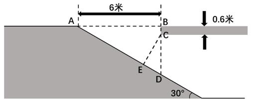
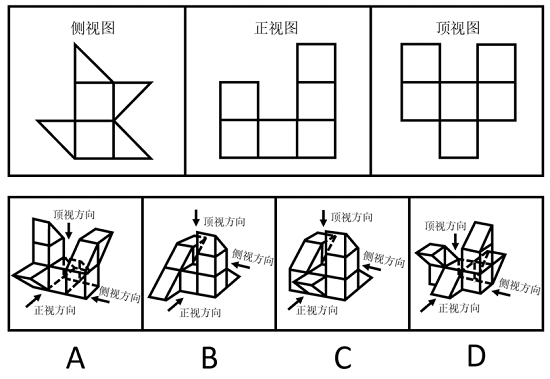
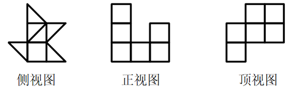
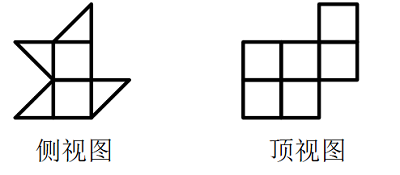
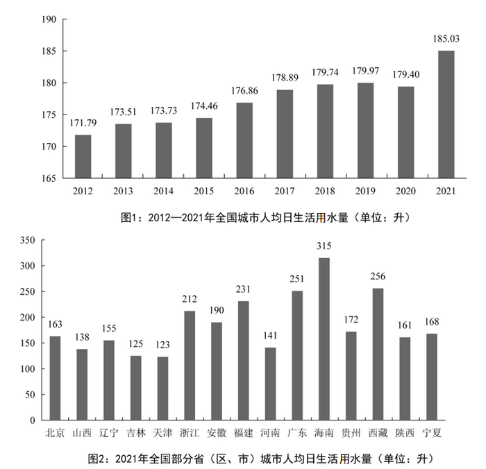

# 2023年陕西省公务员录用考试《行测》题（网友回忆版）

> 省考 · 2023 年 · 6 个模块 · 共 120 题

- [政治理论](#%E6%94%BF%E6%B2%BB%E7%90%86%E8%AE%BA) · 7 题
- [常识判断](#%E5%B8%B8%E8%AF%86%E5%88%A4%E6%96%AD) · 13 题
- [言语理解与表达](#%E8%A8%80%E8%AF%AD%E7%90%86%E8%A7%A3%E4%B8%8E%E8%A1%A8%E8%BE%BE) · 40 题
- [数量关系](#%E6%95%B0%E9%87%8F%E5%85%B3%E7%B3%BB) · 10 题
- [判断推理](#%E5%88%A4%E6%96%AD%E6%8E%A8%E7%90%86) · 30 题
- [资料分析](#%E8%B5%84%E6%96%99%E5%88%86%E6%9E%90) · 20 题

---

## 政治理论

### 第 1 题　qid 5509970 · 时事政治

中国共产党第二十次全国代表大会于2022年10月16日至22日在北京举行，习近平总书记代表第十九届中央委员会向大会作报告。下列有关报告内容表述正确的有：
①务必不忘初心、牢记使命，务必谦虚谨慎、艰苦奋斗，务必敢于斗争、善于斗争
②坚持和发展马克思主义，必须同中国具体实际相结合；坚持和发展马克思主义，必须同中华优秀传统文化相结合
③必须坚持人民至上、必须坚持自信自立、必须坚持守正创新、必须坚持问题导向、必须坚持系统观念、必须坚持胸怀天下
④坚持和加强党的全面领导、坚持中国特色社会主义道路、坚持以人民为中心的发展思想、坚持深化改革开放、坚持发扬斗争精神
⑤高质量发展是全面建设社会主义现代化国家的首要任务

- **A**. 2项
- **B**. 3项
- **C**. 4项
- **D**. 5项　✅

**答案**：D

**官方解析**

本题考查政治常识。
①项正确，党的二十大报告指出：“中国共产党已走过百年奋斗历程。我们党立志于中华民族千秋伟业，致力于人类和平与发展崇高事业，责任无比重大，使命无上光荣。全党同志务必不忘初心、牢记使命，务必谦虚谨慎、艰苦奋斗，务必敢于斗争、善于斗争，坚定历史自信，增强历史主动，谱写新时代中国特色社会主义更加绚丽的华章。”
②项正确，党的二十大报告指出：“坚持和发展马克思主义，必须同中国具体实际相结合。我们坚持以马克思主义为指导，是要运用其科学的世界观和方法论解决中国的问题，而不是要背诵和重复其具体结论和词句，更不能把马克思主义当成一成不变的教条······坚持和发展马克思主义，必须同中华优秀传统文化相结合。只有植根本国、本民族历史文化沃土，马克思主义真理之树才能根深叶茂。”
③项正确，党的二十大报告指出：“必须坚持人民至上、必须坚持自信自立、必须坚持守正创新、必须坚持问题导向、必须坚持系统观念、必须坚持胸怀天下。”
④项正确，党的二十大报告指出：“坚持和加强党的全面领导、坚持中国特色社会主义道路、坚持以人民为中心的发展思想、坚持深化改革开放、坚持发扬斗争精神。”
⑤项正确，党的二十大报告指出：“高质量发展是全面建设社会主义现代化国家的首要任务。发展是党执政兴国的第一要务。没有坚实的物质技术基础，就不可能全面建成社会主义现代化强国。”
综上所述，表述正确的有①②③④⑤，共5项。
故正确答案为D。

---

### 第 2 题　qid 5510100 · 时事政治

党的二十大报告指出：要采取更多惠民生、暖民心举措，着力解决好人民群众急难愁盼问题，健全基本公共服务体系，提高公共服务水平，增强均衡性和可及性，扎实推进共同富裕。下列有关内容表述正确的是：
①实施渐进式延迟法定退休年龄
②健全社保基金保值增值和安全监管体系
③加大税收、社会保障、转移支付等的调节力度
④健全终身职业技能培训制度，推动解决周期性就业矛盾
⑤深化以市场化为导向的公立医院改革，规范民营医院发展
⑥坚持房子是用来住的、不是用来炒的定位，加快建立多主体供给、多渠道保障、租购并举的住房制度

- **A**. ①②③④
- **B**. ①②③⑥　✅
- **C**. ②③⑤⑥
- **D**. ①④⑤⑥

**答案**：B

**官方解析**

本题考查政治常识。
①正确，党的二十大报告指出：“健全社会保障体系。社会保障体系是人民生活的安全网和社会运行的稳定器。健全覆盖全民、统筹城乡、公平统一、安全规范、可持续的多层次社会保障体系。完善基本养老保险全国统筹制度，发展多层次、多支柱养老保险体系。实施渐进式延迟法定退休年龄。”
②正确，党的二十大报告指出：“扩大社会保险覆盖面，健全基本养老、基本医疗保险筹资和待遇调整机制，推动基本医疗保险、失业保险、工伤保险省级统筹。促进多层次医疗保障有序衔接，完善大病保险和医疗救助制度，落实异地就医结算，建立长期护理保险制度，积极发展商业医疗保险。加快完善全国统一的社会保险公共服务平台。健全社保基金保值增值和安全监管体系。”
③正确，党的二十大报告指出：“完善分配制度。坚持多劳多得，鼓励勤劳致富，促进机会公平，增加低收入者收入，扩大中等收入群体。完善按要素分配政策制度，探索多种渠道增加中低收入群众要素收入，多渠道增加城乡居民财产性收入。加大税收、社会保障、转移支付等的调节力度。”
④错误，党的二十大报告指出：“健全终身职业技能培训制度，推动解决结构性就业矛盾。完善促进创业带动就业的保障制度，支持和规范发展新就业形态。健全劳动法律法规，完善劳动关系协商协调机制，完善劳动者权益保障制度，加强灵活就业和新就业形态劳动者权益保障。”
⑤错误，党的二十大报告指出：“深化以公益性为导向的公立医院改革，规范民营医院发展。发展壮大医疗卫生队伍，把工作重点放在农村和社区。重视心理健康和精神卫生。促进中医药传承创新发展。”
⑥正确，党的二十大报告指出：“健全社会保障体系。坚持房子是用来住的、不是用来炒的定位，加快建立多主体供给、多渠道保障、租购并举的住房制度。”
综上，①②③⑥正确。
故正确答案为B。

---

### 第 3 题　qid 5509975 · 时事政治

党的二十大报告提到，十八大以来“我们深入贯彻以人民为中心的发展思想，在幼有所育、学有所教、劳有所得、病有所医、老有所养、住有所居、弱有所扶上持续用力，人民生活全方位改善”。下列有关内容表述正确的是：
①及时调整生育政策
②人均预期寿命增长到八十八点二岁
③城镇新增就业年均一千三百万人以上
④互联网上网人数达十三亿三千万人
⑤居民人均可支配收入从一万六千五百元增加到三万五千一百元
⑥基本养老保险覆盖十亿四千万人，基本医疗保险参保率稳定在百分之九十五

- **A**. ①②③④
- **B**. ①③④⑤
- **C**. ②④⑤⑥
- **D**. ①③⑤⑥　✅

**答案**：D

**官方解析**

本题考查政治常识。
①③⑤⑥正确，②④错误，党的二十大报告中“一、过去五年的工作和新时代十年的伟大变革”部分指出：“人均预期寿命增长到七十八点二岁。居民人均可支配收入从一万六千五百元增加到三万五千一百元。城镇新增就业年均一千三百万人以上。建成世界上规模最大的教育体系、社会保障体系、医疗卫生体系，教育普及水平实现历史性跨越，基本养老保险覆盖十亿四千万人，基本医疗保险参保率稳定在百分之九十五。及时调整生育政策。改造棚户区住房四千二百多万套，改造农村危房二千四百多万户，城乡居民住房条件明显改善。互联网上网人数达十亿三千万人。人民群众获得感、幸福感、安全感更加充实、更有保障、更可持续，共同富裕取得新成效。”“人均预期寿命增长到七十八点二岁”而不是八十八点二岁；“互联网上网人数达十亿三千万人”而不是十三亿三千万人。
故正确答案为D。

---

### 第 4 题　qid 5510029 · 新思想

习近平总书记常以回信的形式问候、勉励广大干部群众和专家学者。下列习近平总书记回信原文和出处的对应关系正确的是：

- **A**. “你们长年在山崖间清洁环境，日复一日呵护着千年迎客松，用心用情守护美丽的黄山，充分体现了敬业奉献精神”——给“中国好人”李培生、胡晓春的回信　✅
- **B**. “希望同志们大力弘扬爱国奉献、开拓创新、艰苦奋斗的优良传统，积极践行绿色发展理念”——给外文出版社的外国专家的回信
- **C**. “你们通过课堂学习和支教实践，增长了学识，开阔了眼界”——给陆军步兵学院2022届全体学员的回信
- **D**. “建设航天强国要靠一代代人接续奋斗”——给中国航空工业集团沈飞“罗阳青年突击队”队员们的回信

**答案**：A

**官方解析**

本题考查政治常识。
A项正确，2022年8月13日，习主席给安徽黄山风景区工作人员李培生、胡晓春回信，对他们继续发挥“中国好人”榜样作用提出殷切期望。习主席在回信中说，你们长年在山崖间清洁环境，日复一日呵护着千年迎客松，用心用情守护美丽的黄山，充分体现了敬业奉献精神。
B项错误，2022年10月4日，习近平给山东省地矿局第六地质大队全体地质工作者的回信中指出，矿产资源是经济社会发展的重要物质基础，矿产资源勘查开发事关国计民生和国家安全。希望同志们大力弘扬爱国奉献、开拓创新、艰苦奋斗的优良传统，积极践行绿色发展理念，加大勘查力度，加强科技攻关，在新一轮找矿突破战略行动中发挥更大作用，为保障国家能源资源安全、为全面建设社会主义现代化国家作出新贡献，奋力书写“英雄地质队”新篇章。
C项错误，2022年9月9日，习近平给北京师范大学“优师计划”师范生的回信中指出，入学一年来，你们通过课堂学习和支教实践，增长了学识，开阔了眼界，坚定了到基层教书育人的信念，我感到很欣慰。值此北京师范大学建校120周年之际，谨向全校师生员工、广大校友致以热烈的祝贺和诚挚的问候！
D项错误，2022年5月3日，五四青年节到来之际，中共中央总书记、国家主席、中央军委主席习近平5月2日给中国航天科技集团空间站建造青年团队回信，向航天战线全体青年致以节日的祝贺，并向他们提出殷切期望。习近平强调，建设航天强国要靠一代代人接续奋斗。希望广大航天青年弘扬“两弹一星”精神、载人航天精神，勇于创新突破，在逐梦太空的征途上发出青春的夺目光彩，为我国航天科技实现高水平自立自强再立新功。
故正确答案为A。

---

### 第 5 题　qid 5510104 · 时事政治

党的二十大报告指出，未来五年是全面建设社会主义现代化国家开局起步的关键时期。下列不属于报告中提及的未来五年主要目标任务的是：

- **A**. 国家安全体系和能力全面加强，基本实现国防和军队现代化　✅
- **B**. 居民收入增长和经济增长基本同步，劳动报酬提高与劳动生产率提高基本同步
- **C**. 全过程人民民主制度化、规范化、程序化水平进一步提高，中国特色社会主义法治体系更加完善
- **D**. 经济高质量发展取得新突破，科技自立自强能力显著提升，构建新发展格局和建设现代化经济体系取得重大进展

**答案**：A

**官方解析**

本题考查政治常识。
A项错误，B、C、D三项正确，党的二十大报告指出，“未来五年是全面建设社会主义现代化国家开局起步的关键时期，主要目标任务是：经济高质量发展取得新突破，科技自立自强能力显著提升，构建新发展格局和建设现代化经济体系取得重大进展；改革开放迈出新步伐，国家治理体系和治理能力现代化深入推进，社会主义市场经济体制更加完善，更高水平开放型经济新体制基本形成；全过程人民民主制度化、规范化、程序化水平进一步提高，中国特色社会主义法治体系更加完善；人民精神文化生活更加丰富，中华民族凝聚力和中华文化影响力不断增强；居民收入增长和经济增长基本同步，劳动报酬提高与劳动生产率提高基本同步，基本公共服务均等化水平明显提升，多层次社会保障体系更加健全；城乡人居环境明显改善，美丽中国建设成效显著；国家安全更为巩固，建军一百年奋斗目标如期实现，平安中国建设扎实推进；中国国际地位和影响进一步提高，在全球治理中发挥更大作用。”
本题为选非题，故正确答案为A

---

### 第 6 题　qid 5509978 · 时事政治

2022年10月25日，习近平总书记主持召开了二十届中央政治局第一次会议，审议《中共中央政治局贯彻落实中央八项规定实施细则》。下列有关说法正确的有：
①党的十九大以来，中央政治局每年都召开民主生活会对照检查贯彻执行中央八项规定情况
②党的十九大、二十大后的首次中央政治局会议都把审议中央八项规定实施细则作为重要议题
③必须始终把中央八项规定作为长期有效的铁规矩、硬杠杠
④抓作风建设只有进行时，没有完成时

- **A**. 1项
- **B**. 2项
- **C**. 3项
- **D**. 4项　✅

**答案**：D

**官方解析**

本题考查政治常识。
①项正确，党的十九大后，中央政治局第一次会议根据中央八项规定实施过程中遇到的新情况新问题，审议通过《中共中央政治局贯彻落实中央八项规定的实施细则》，进一步向全党释放出中央政治局带头、坚持从严治党的鲜明态度和坚定决心。为督促检查中央政治局落实情况，每年年底召开一次中央政治局专题民主生活会，就落实中央八项规定精神情况对照检查。
②项正确，党的十九大、二十大后的首次中央政治局会议都把审议八项规定实施细则作为重要议题，绝不向不良作风让步的态度，让全党全社会都看到了一以贯之的决心和勇气。
③④项正确，2022年10月25日，二十届中共中央政治局召开会议，会议强调，抓作风建设只有进行时，没有完成时。党的二十大对锲而不舍落实中央八项规定精神作出新部署，必须始终把中央八项规定作为长期有效的铁规矩、硬杠杠，抓住“关键少数”以上率下，持续深化纠治“四风”，重点纠治形式主义、官僚主义，坚决破除特权思想和特权行为，推动全党坚决落实中央八项规定精神，全面推进党的自我净化、自我完善、自我革新、自我提高，始终保持同人民群众的血肉联系，始终同人民同呼吸、共命运、心连心。
综上所述，说法正确的有①②③④，共4项。
故正确答案为D。

---

### 第 7 题　qid 5509981 · 新思想

习近平总书记指出，粮食安全是“国之大者”。保障粮食等重要农产品供给安全，是“三农”工作头等大事。下列有关我国粮食生产安全的表述不准确的是：

- **A**. 我国粮食总产量连续八年稳定在1.3万亿斤以上
- **B**. 2021年我国启动了国家大豆和油料产能提升工程　✅
- **C**. 2021年我国人均粮食产量超过480公斤，高于国际公认的粮食安全线
- **D**. 我国农业机械化、智能化发展迅速，截至2022年9月，农作物耕种收综合机械化率超过70%

**答案**：B

**官方解析**

本题考查政治常识。
A项正确，2022年12月12日，国家统计局发布数据显示，2022年全年粮食实现增产丰收。全国粮食总产量达13731亿斤，比上年增加74亿斤，增长0.5%，粮食产量连续8年稳定在1.3万亿斤以上。
B项错误，光明网2022年消息：2022年是国家实施大豆和油料产能提升工程的第一年，按照中央有关部署，各地多油并举、多措并施，稳步提升大豆和油料产能和自给率。2023年，《中共中央 国务院关于做好2023年全面推进乡村振兴重点工作的意见》中明确指出：“深入推进大豆和油料产能提升工程。扎实推进大豆玉米带状复合种植，支持东北、黄淮海地区开展粮豆轮作，稳步开发利用盐碱地种植大豆。”
C项正确，2022年10月17日上午，中国共产党第二十次全国代表大会新闻中心举行记者招待会。会上指出：“2021年我国人均粮食产量达到483.5公斤，就是说，即使不考虑进口的补充和充裕的库存，仅人均粮食产量就已超过国际上公认的400公斤粮食安全线。”
D项正确，2022年6月27日，中共中央宣传部举行“中国这十年”系列主题新闻发布会。农业农村部副部长邓小刚在发布会上表示，党的十八大以来，我国物质技术装备条件明显改善，农业现代化建设迈上新台阶。我国已成为世界农机生产大国，农机装备总量接近2亿台（套），总动力达到10.78亿千瓦，全国农作物耕种收综合机械化率超过72%。
本题为选非题，故正确答案为B。

---

## 常识判断

### 第 1 题　qid 5510088 · 地理国情

2023年1月28日，陕西省委、省政府召开全省“三个年”活动动员会暨2023年一季度重点项目集中开工。下列有关内容表述正确的有：
①深入抓好高质量项目推进年活动，把大抓项目、大抓投资的势头扬起来
②聚力推进营商环境突破年活动，把服务群众、服务企业的导向树起来
③扎实组织开展干部作风能力提升年活动，把奋发进取、奋勇争先的状态提起来
④统筹推动“三个年”活动落细落实，把知责担责、团结奋斗的合力聚起来
⑤准确把握开展“三个年”活动的重要意义，把起步冲刺、决胜全年的干劲鼓起来

- **A**. 2项
- **B**. 3项
- **C**. 4项
- **D**. 5项　✅

**答案**：D

**官方解析**

本题考查政治常识。
①②③④⑤正确，2023年1月28日，省委书记赵一德讲话并宣布开工令。他强调，要深入学习贯彻党的二十大精神和习近平总书记来陕考察重要讲话重要指示，把起步冲刺、决胜全年的干劲鼓起来，把大抓项目、大抓投资的势头扬起来，把服务群众、服务企业的导向树起来，把奋发进取、奋勇争先的状态提起来，把知责担责、团结奋斗的合力聚起来，全力推动奋进中国式现代化新征程、谱写陕西高质量发展新篇章开好局起好步。赵一德强调，要深入抓好高质量项目推进年活动······要聚力推进营商环境突破年活动······要扎实组织开展干部作风能力提升年活动······赵刚强调，要坚决落实“三个年”活动部署安排，坚持把高质量项目建设牢牢抓在手上，严格按照“四个一批”要求，健全各级重点项目专班推进机制，持续营造大抓项目、抓大项目的浓厚氛围。
故正确答案为D。

---

### 第 2 题　qid 5510093 · 地理国情

2022年，陕西省文化事业文化产业繁荣发展。下列与之相关的表述不准确的是：

- **A**. 西汉霸陵入选年度“全国十大考古新发现”
- **B**. 《伟大历程——中共中央在延安十三年历史陈列》《青铜之冠——秦陵彩绘铜车马》获得全国博物馆十大陈列展览精品奖
- **C**. 汉中绿茶制作技艺入选联合国非物质文化遗产代表作名录　✅
- **D**. “长安十二时辰+大唐不夜城”唐文化全景展示创新实践项目入选年度文化和旅游最佳创新成果

**答案**：C

**官方解析**

本题考查政治常识。
A、B、D三项正确，C项错误，2023年陕西省政府工作报告在“2022年工作回顾”的“（五）守正创新推动文化事业文化产业繁荣发展”部分指出：加大文物和文化遗产保护力度，延安革命文物国家文物保护利用示范区建设进展顺利，西汉霸陵入选年度“全国十大考古新发现”，《伟大历程——中共中央在延安十三年历史陈列》《青铜之冠——秦陵彩绘铜车马》获得全国博物馆十大陈列展览精品奖，咸阳茯茶制作技艺、西凤酒酿酒技艺分别入选联合国和国家非物质文化遗产代表作名录······“长安十二时辰+大唐不夜城”唐文化全景展示创新实践项目入选年度文化和旅游最佳创新成果。
本题为选非题，故正确答案为C。

---

### 第 3 题　qid 5510087 · 人文常识

为了避讳，古代君王的名字在说话或行文中不能直接说出或写出，而以改字、缺字等办法处理。下列说法不符合这一避讳原则的是：

- **A**. 秦代将金陵这一地名改为秣陵　✅
- **B**. 汉代将彻侯这一爵位更名为通侯
- **C**. 唐代佛经中将“观世音菩萨”译为“观音菩萨”
- **D**. 清代将《千字文》首句“天地玄黄”改为“天地元黄”

**答案**：A

**官方解析**

本题考查人文常识。
A项错误，公元前210年，秦始皇东巡，曾在秣陵关西南丹阳（今江宁区丹阳）经过，回途又从江乘渡江北返。随行术士认为金陵山势险峻，有天子之气，秦始皇便把王气泄散，将金陵改为秣陵。“秣”是草料的意思，意即这里不该称金陵，只能贬为牧马场。故将金陵这一地名改为秣陵与避讳无关。
B项正确，汉代将彻侯这一爵位更名为通侯。通侯是爵位名。又称彻侯、列侯。秦制爵分二十级，彻侯为第二十级。汉代为避汉武帝刘彻之讳，改称通侯。
C项正确，唐代佛经中将“观世音菩萨”译为“观音菩萨”，是为了避唐太宗李世民的讳。
D项正确，清代将《千字文》首句“天地玄黄”改为“天地元黄”，是为了避清代康熙帝玄烨之讳。
本题为选非题，故正确答案为A。

---

### 第 4 题　qid 5510044 · 法律常识

老张和老伴李某育有两儿一女，小儿子早逝。老张不幸去世后，没有留下遗嘱，下列关于遗产继承的说法错误的是：

- **A**. 遗产分割时，应当先将老张和李某共有的财产分出一半，归李某所有，其余的属于老张的遗产
- **B**. 大儿子在外地工作，长期对老张不闻不问，应当不分或少分遗产
- **C**. 女儿因工伤丧失了劳动能力，她的配偶患病长期服药，两个孩子都还在读中学，女儿与其他继承人均等继承遗产份额　✅
- **D**. 小儿子的妻子陈某念及公婆二人无人照顾、行动不便，平日里悉心照料二老的生活，陈某作为第一顺序继承人

**答案**：C

**官方解析**

本题考查法律常识。
A项正确，根据《中华人民共和国民法典》第一千一百五十三条规定：“夫妻共同所有的财产，除有约定的外，遗产分割时，应当先将共同所有的财产的一半分出为配偶所有，其余的为被继承人的遗产。”故老张死后在遗产分割时，应当先将他和李某共有的财产分出一半，归李某所有，其余的属于老张的遗产。
B项正确，根据《中华人民共和国民法典》第一千一百三十条第四款规定：“有扶养能力和有扶养条件的继承人，不尽扶养义务的，分配遗产时，应当不分或者少分。”故大儿子长期对老张不闻不问，应当不分或少分遗产。
C项错误，根据《中华人民共和国民法典》第一千一百三十条第二款规定：“对生活有特殊困难又缺乏劳动能力的继承人，分配遗产时，应当予以照顾。”故女儿丧失了劳动能力，其配偶和两个孩子都需要大量的医疗费和学费，在分割遗产时，应当予以照顾，多得遗产。
D项正确，根据《中华人民共和国民法典》第一千一百二十九条规定：“丧偶儿媳对公婆，丧偶女婿对岳父母，尽了主要赡养义务的，作为第一顺序继承人。”故小儿子早逝，其妻子平日里悉心照料二老的生活，尽了主要赡养义务的，能作为第一顺序继承人继承遗产。
本题为选非题，故正确答案为C。

---

### 第 5 题　qid 5510053 · 人文常识

下列诗句内容与传统节日对应错误的是：

- **A**. “金吾不禁夜，玉漏莫相催”——寒食节　✅
- **B**. “彩缕碧筠粽，香粳白玉团”——端午节
- **C**. “此生此夜不长好，明月明年何处看”——中秋节
- **D**. “桂花香馅裹胡桃，江米如珠井水淘”——元宵节

**答案**：A

**官方解析**

本题考查人文常识。
A项错误，出自唐代苏味道的《正月十五夜》，唐朝时期，京城每天晚上都要戒严，对私自夜行者处以重罚，而正月十五这天是例外的，因此诗句描写的是正月十五元宵节。
B项正确，出自唐代元稹的《表夏十首》，“彩缕碧筠粽，香粳白玉团”是描写粽子的佳句，端午节有吃粽子的习俗，因此诗句描写的是五月初五端午节。
C项正确，出自北宋苏轼的《阳关曲》，写的是苏轼与其胞弟苏辙久别重逢，共赏中秋月的赏心乐事，中秋节有赏月的习俗，因此诗句描写的是八月十五中秋节。
D项正确，出自清代符曾的《上元竹枝词》，诗中后两句为“见说马家滴粉好，试灯风里卖元宵。”本诗描绘的是元宵节当天，卖元宵的商贩在一片灯光溢彩中叫卖汤圆的热闹场景，元宵节有吃元宵的习俗，因此诗句描写的是正月十五元宵节。
本题为选非题，故正确答案为A。

---

### 第 6 题　qid 5510082 · 人文常识

中国书法艺术是中华民族的文化瑰宝，下列说法正确的是：

- **A**. 王献之书写的《兰亭集序》被誉为“天下第一行书”
- **B**. 《九成宫醴泉铭》是由魏征撰文、柳宗元书丹而成
- **C**. 黄庭坚是南宋著名书法家，擅长行书和草书
- **D**. 《颜氏家庙碑》由颜真卿为其父颜惟贞所立　✅

**答案**：D

**官方解析**

本题考查人文常识。
A项错误，东晋书法家王羲之书写的《兰亭集序》被誉为“天下第一行书”。王献之是王羲之第七子，与其父王羲之并称为“二王”，代表作为《中秋帖》。
B项错误，《九成宫醴泉铭》是唐贞观六年由魏征撰文、书法家欧阳询书丹而成的楷书书法作品。作品叙述了“九成宫”的来历和其建筑的雄伟壮观，歌颂了唐太宗的武功文治和节俭精神，介绍了宫城内发现醴泉的经过，并刊引典籍说明醴泉的出现是由于“天子令德”所致，最后提出“居高思坠，持满戒盈”的谏诤之言。
C项错误，黄庭坚，北宋著名文学家、书法家，擅长行书、草书，楷书也自成一家，和北宋书法家苏轼、米芾和蔡襄齐名，世称为“宋四家”。
D项正确，《颜氏家庙碑》由颜真卿为其父颜惟贞刻立，碑文记述了颜氏家族及其仕宦经历、后裔仕途、治学经世的情况。
故正确答案为D。

---

### 第 7 题　qid 5510038 · 科技常识

微生物发酵是指在适宜的条件下将原料经过特定的代谢途径转化为人类所需产物的过程。下列不涉及微生物发酵的是：

- **A**. 豆腐　✅
- **B**. 食醋
- **C**. 乳酪
- **D**. 白酒

**答案**：A

**官方解析**

本题考查科技常识。
A项错误，豆腐是黄豆加工后形成富含蛋白质胶体类似于豆浆，然后加入盐卤或者石膏，使蛋白质凝集变成类似固体的形态，不涉及微生物发酵。 
B项正确，食醋是以粮食等淀粉质为原料，经微生物制曲、糖化、酒精发酵、醋酸发酵等阶段酿制而成，其主要成分除醋酸外，还含有各种氨基酸、有机酸、糖类、维生素、醇和酯等营养成分，涉及微生物发酵。
C项正确，奶酪，又名干酪，是一种发酵的牛奶制品，其性质与常见的酸牛奶有相似之处，都是通过发酵过程来制作的，也都含有可以保健的乳酸菌，但是奶酪的浓度比酸奶更高，近似固体食物，营养价值也因此更加丰富，涉及微生物发酵。 
D项正确，酒是世界上微生物发酵产量最大的产品，中国传统白酒发酵的实质是，以谷物为主要原料，利用酵母菌等微生物，使之在生成主要代谢产物乙醇的同时，还形成丰富的香味物质，涉及微生物发酵。 
本题为选非题，故正确答案为A。

---

### 第 8 题　qid 5510097 · 地理国情

书院在中国传统社会文化生活方面的影响巨大。陕西在历史上拥有诸多书院，下列有关内容表述正确的是：

- **A**. 位于陕西三原的宏道书院培养出了秋瑾、蔡和森等一批革命志士
- **B**. 关学大家冯从吾创办的关中书院是明清时期全国著名书院之一　✅
- **C**. 由范仲淹创办的横渠书院是陕西有确切开办记录的第一个书院
- **D**. 眉县的味经书院是近代陕西最早讲授西方科学知识的学校

**答案**：B

**官方解析**

本题考查人文常识。
A项错误，宏道书院位于陕西省三原县城北，是陕西省明、清四大书院之一。光绪26年（公元1900），书院改名宏道高等学堂，倡导新学，注重经世致用，造就了于右任、李仪祉、吴宓、张奚若、范紫东、张季鸾等一批海内外知名的民主革命先驱及专家学者。但蔡和森和秋瑾等未在宏道书院学习。
B项正确，“关中书院”是明、清两代陕西的最高学府，西北书院之冠，位于现陕西省西安市。冯从吾是明代关学把程朱理学和陆王心学融合的集大成者，创办关中书院，人称“关西夫子”。
C项错误，横渠书院位于陕西眉县城东26公里处的横渠镇，元代以后改为张载祠，又称张子祠。它是我国北宋著名的思想家、哲学家、教育家、关学领袖张载的讲学之地。前身为崇寿院，张载年少时曾在此读书，晚年隐居后，一直在此兴馆设教。他死后，人们为了纪念他，将崇寿院改名为横渠书院。范仲淹创办的是嘉岭书院。
D项错误，崇实学院是近代陕西以至西北地区最早讲授西方先进科学知识的学校。陕甘味经书院，清同治十二年（1873年），由陕甘学政许振祎奏请设立，光绪二十九年（1903年），改制为泾阳县立小学堂。
故正确答案为B。

---

### 第 9 题　qid 5510030 · 地理国情

成语“沧海桑田”“斗转星移”“日月如梭”所反映的地理现象分别是：

- **A**. 地壳运动、地球自转运动、地球公转运动
- **B**. 地壳运动、地球公转运动、地球自转运动　✅
- **C**. 地球自转运动、地壳运动、地球公转运动
- **D**. 地球自转运动、地球公转运动、地壳运动

**答案**：B

**官方解析**

本题考查地理国情。
“沧海桑田”意思是大海变成农田，农田变成大海。反映了地壳运动 、海陆变迁的地理现象。地壳运动是由于地球内部原因引起的组成地球物质的机械运动。它可以引起岩石圈的演变，促使大陆、洋底的增生和消亡，并形成海沟和山脉，同时还导致发生地震、火山爆发等。
“斗转星移”意思是星斗变动位置，指季节或时间的变化。北斗七星围绕北极星自东向西转的规律，我国古代的星象学家把它形象地叫做“斗转星移”，而通过“斗转星移”的规律，人们能够判断季节和节气时间。季节的变化跟地球公转运动有关。
“日月如梭”意思是太阳和月亮像穿梭一样地来去，形容时间过得很快，反映了日月交替的现象，而地球的自转运动产生的现象有昼夜交替、太阳的东升西落。
因此，B项正确，A、C、D三项错误。
故正确答案为B。

---

### 第 10 题　qid 5510037 · 人文常识

人体的血糖水平通常会维持在一个比较窄的范围内。下列关于血糖和血糖调节的说法错误的是：

- **A**. 情绪激动容易引起血糖升高
- **B**. 一日只进食两餐会造成低血糖　✅
- **C**. 只有血液中的葡萄糖才称为血糖
- **D**. 胰岛素是唯一一种降低人体血糖的激素

**答案**：B

**官方解析**

本题考查科技常识。
A项正确，情绪激动时交感神经会兴奋。交感神经兴奋一方面会直接抑制胰岛素分泌，血糖升高。另一方面还可以促使肾上腺素的分泌增加，而肾上腺素有间接抑制胰岛素分泌的作用。
B项错误，低血糖的病因多种多样，糖的摄入不足、生成不足、消耗过多、转化过多等原因均可导致血糖不足。一日只进食两餐与低血糖并没有直接关系。
C项正确，血中的葡萄糖称为血糖，葡萄糖是人体重要的组成部分，主要作用是为机体组织细胞的代谢活动提供能量。
D项正确，胰岛素是机体内唯一降低血糖的激素，同时促进糖原、脂肪、蛋白质合成。外源性胰岛素主要用来治疗糖尿病。
本题为选非题，故正确答案为B。

---

### 第 11 题　qid 5510086 · 人文常识

下列所描述的现象不会出现的是：

- **A**. 喝可乐或其他碳酸饮料时，表面的泡沫或是聚成一团，或是贴着杯壁，很少有零星的小泡泡独自游荡
- **B**. 不小心洒落到桌子上的茶或者咖啡，干燥后会留下一个污渍，其边缘部分颜色比中间深
- **C**. 让小汤匙的凸面轻轻触碰水龙头流出的小水流，水流会被吸引，沿着汤匙的凸面往下流
- **D**. 让两枚图钉漂在水面上，它们靠近时会相互排斥无法碰在一起　✅

**答案**：D

**官方解析**

本题考查科技常识。
A项正确，D项错误，“谷物圈效应”是指当能够产生液面变形的两个物体靠近时，由于系统的重力势能和表面能倾向于最低，物体之间就会互相吸引或排斥。当两枚图钉放到水面上时，表面张力使它们不会沉入水底，只会在水面形成两个凹坑；当图钉靠近，凹坑会合并，两枚图钉会碰到一起。对密度比水小的物体来说，情况正好相反。当泡沫漂浮在水面上，浮力会使它们趋于液面最高点。由于毛细力让泡沫周围和杯壁附近的液面凸起，凸起靠近时也会合并，泡沫就会聚在一起或是贴近杯壁。
B项正确，洒落到桌子上的茶或者咖啡，在桌面与液滴之间的交界处，水的蒸发速率要比在液滴与空气之间的交界处的蒸发速率快。液滴中间的水分子就会携带溶质和颗粒来到液滴与桌面的边缘进行补充。最终，在水蒸发掉之后，溶质小颗粒们不断在边缘积累，其边缘部分颜色比中间深。这种现象也被称为“咖啡环效应”。
C项正确，康达效应是指流体有偏离原本流动方向，改为随着凸出的物体表面流动的倾向。当流体与它流过的物体表面之间存在表面摩擦时，只要曲率不大，流体就会顺着该物体表面流动。小水流会被汤匙凸面吸引，正是康达效应的典型表现。
本题为选非题，故正确答案为D。

---

### 第 12 题　qid 5510111 · 科技常识

中国航天事业与中国传统文化交相辉映，也映衬中国航天不断迈向深空的探索道路，“玉兔号”“夸父一号”“祝融号”所探测的天体，按距离地球由近及远排列正确的是：

- **A**. “玉兔号”“祝融号”“夸父一号”　✅
- **B**. “祝融号”“玉兔号”“夸父一号”
- **C**. “玉兔号”“夸父一号”“祝融号”
- **D**. “夸父一号”“祝融号”“玉兔号”

**答案**：A

**官方解析**

本题考查科技常识。
“玉兔号”是中国首辆月球车，和着陆器共同组成嫦娥三号探测器。2013年12月15日，“玉兔号”巡视器顺利驶抵月球表面。
“夸父一号”是由中国太阳物理学家自主提出的综合性太阳探测专用卫星。北京时间2022年10月9日，中国在酒泉卫星发射中心使用长征二号丁运载火箭，成功将“夸父一号”发射升空。
“祝融号”是天问一号任务火星车。 2020年7月23日，在中国文昌航天发射场由长征五号遥四运载火箭发射升空。
A项正确， B、C、D三项错误，“玉兔号”所探测的天体是月球，月球与地球近地点的距离是36.3万千米；“夸父一号”所探测的天体是太阳，地球距太阳约有1.5亿公里；“祝融号”所探测的天体是火星，地球与火星最近的距离约为5500万公里。所探测天体距离地球由近及远的顺序为月球、火星、太阳，故正确顺序为“玉兔号”“祝融号”“夸父一号”。
故正确答案为A。

---

### 第 13 题　qid 5510083 · 人文常识

在其他条件相同的情况下，下列不能提高温室栽培西瓜甜度的措施是：

- **A**. 加装LED灯补充光照
- **B**. 对温室玻璃表面定期清洁
- **C**. 在温室中圈养一定数量的家禽
- **D**. 维持温室内适合西瓜生长的温度不变　✅

**答案**：D

**官方解析**

本题考查科技常识。
西瓜的甜度取决于西瓜光合作用所产生的糖分的积累。
A项正确，加装LED灯补充光照，可以延长光合作用时间，进而增加糖分积累，提高西瓜甜度。
B项正确，对温室玻璃表面定期清洁，有利于增加温室透光性，增强温室光照强度，提高光合作用强度，进而增加糖分积累，提高西瓜甜度。
C项正确，在温室中圈养一定数量的家禽，一方面家禽呼吸过程产生二氧化碳，增加温室内二氧化碳浓度，提高光合作用效率，另一方面家禽粪便腐熟后可以增加土壤肥力，有利于西瓜生长，进而增加糖分积累，提高西瓜甜度。
D项错误，西瓜生长环境温差越大越有利于减少呼吸作用对于糖分的消耗，便于糖分的积累，有利于提高西瓜甜度。所以维持温室内适合西瓜生长的温度不变，不利于提高西瓜甜度。
本题为选非题，故正确答案为D。

---

## 言语理解与表达

### 第 1 题　qid 5509952 · 逻辑填空

编译工作是寂寞的。一盏灯、一杯茶、一支笔、一沓纸、一摞书、一个悠长的夜晚，这是编译人员在岗位上            的写照。他们不在意外界的喧哗，只坚守内心的宁静。
填入划横线部分最恰当的一项是：

- **A**. 兢兢业业　✅
- **B**. 克勤克俭
- **C**. 勤学苦练
- **D**. 夜以继日

**答案**：A

**官方解析**

根据“编译工作是寂寞的”“他们不在意外界的喧哗，只坚守内心的宁静”可知，横线处所填成语要体现出编译人员在岗位上耐得住寂寞、踏踏实实坚守在工作岗位上之意。A项“兢兢业业”形容做事谨慎、勤恳、踏实，符合文意，当选。
B项“克勤克俭”指的是既能勤劳，又能节俭，文段未体现出“节俭”之意，排除；
C项“勤学苦练”指的是认真学习，刻苦训练，文段描述的是工作状态，而非学习、训练的状态，不符合文段语境，排除；
D项“夜以继日”指的是用晚上的时间接上白天，形容昼夜不停，置于文段中形容编译人员在岗位上的工作状态程度过重，排除。
故正确答案为A。
【文段出处】人民日报《老中青三代编译人，坚守马列经典编译阵地——他们让真理穿越时空》

---

### 第 2 题　qid 5510114 · 逻辑填空

翻转课堂是互联网技术迅速发展后兴起的一场全球教育        。翻转课堂并不等同于教师录制线下的课堂教学课程、然后把课程从线下搬到线上进行学习，而是通过转变教学方式，以学生为中心设计线上与线下相融合的混合式学习。
填入画横线部分最恰当的一项是：

- **A**. 革命
- **B**. 改革
- **C**. 变革　✅
- **D**. 革新

**答案**：C

**官方解析**

横线处搭配“一场”，且根据后文“翻转课堂并不等同于······而是通过转变教学方式······”可知，横线处应体现出翻转课堂正在转变全球教育。A项“革命”指根本改革，程度过重，排除；D项“革新”指革除旧的，创造新的，一般搭配“聚焦”“优化”等，与“一场”搭配不当，排除。
对比B、C两项，两词语义接近，但根据后文翻转课堂“而是通过转变教学方式，以学生为中心设计线上与线下相融合的混合式学习”可知，翻转课堂转变了教学方式，C项“变革”比B项“改革”与文段对应更加恰当，C项当选。
故正确答案为C。
【文段出处】光明网《今天的学习方式，将给未来教育带来哪些启发》

---

### 第 3 题　qid 5509954 · 逻辑填空

无论题材如何变化，这位词作者的作品里都流淌着浓厚的传统文化神韵。《国旗之下》也不例外：“北上漠河，早见一番冰雪。南下三沙，海鸥追逐，浪花飞泻。东抵抚远，遥望日出东海。西陲乌恰，背倚天山，大漠横绝。”四六言错落有致，几句话就把祖国的东西南北“四至”的特点        出来，读起来荡气回肠。
填入划横线部分最恰当的一项是：

- **A**. 勾勒　✅
- **B**. 擘画
- **C**. 叙述
- **D**. 描绘

**答案**：A

**官方解析**

横线处搭配“特点”，且要与前文“几句话”对应，体现出简单描述之意。A项“勾勒”指用线条勾画出轮廓，与文意相符，当选。B项“擘画”指计划，布置，C项“叙述”指写出或说出事情的前后经过，一般比较详细，D项“描绘”指用线条、颜色或语言文字表现事物的情景，均与文意不符，排除。
故正确答案为A。
【文段出处】兵团日报《将传统文化神韵融入作品》

---

### 第 4 题　qid 5510170 · 逻辑填空

当时的英国皇室建筑师钱伯斯也非常        中国园林艺术。钱伯斯曾经在东印度公司的船上工作过好几年，到过中国三次，1757年他在《中国园林的布局艺术》中说：“中国人的花园布局是杰出的，他们在那上面表现出来的趣味，是英国长期追求而没有达到的。”
填入画横线部分最恰当的一项是：

- **A**. 崇敬
- **B**. 崇信
- **C**. 崇奉
- **D**. 推崇　✅

**答案**：D

**官方解析**

横线处搭配“中国园林艺术”，根据“中国人的花园布局是杰出的，他们在那上面表现出来的趣味，是英国长期追求而没有达到的”可知，横线处应体现英国皇室建筑师钱伯斯对中国园林艺术给予很高评价之意。D项“推崇”指十分推重，侧重给予很高的评价，符合文意，当选。A项“崇敬”指推崇尊敬，常与“英雄”“老师”等搭配，与“中国园林艺术”搭配不当，排除；B项“崇信”指崇尚信义，C项“崇奉”指尊敬祀奉，均侧重“信奉”之意，无法体现给予高评价和赞美之意，且与“中国园林艺术”搭配不当，排除。
故正确答案为D。
【文段出处】光明网《对圆明园古建筑的再认识》

---

### 第 5 题　qid 5510032 · 逻辑填空

在进行植树任务时，无人机植树系统首先会对地势展开        ，利用地形数据，画出需要再造树林的高分辨率3D地图，同时画出播种路线图，        播种的最优路线。接着，无人机会在播种范围内飞行并进行“精密的植树活动”，利用空气压力把顶部发芽的种子射进土壤里。
依次填入划横线部分最恰当的一项是：

- **A**. 勘验 确定
- **B**. 勘探 拟定
- **C**. 勘测 设计
- **D**. 勘察 设定　✅

**答案**：D

**官方解析**

第一空，搭配“无人机植树系统”，且根据“利用地形数据，画出需要再造树林的高分辨率3D地图”可知，横线处所填词语应体现无人机植树系统在进行植树任务时会对地势进行考察，D项“勘察”指实地考察或调查，勘查，置于此处可体现无人机植树系统对地形的考察，符合文意，保留。A项“勘验”指司法人员对案件或民事纠纷的现场、物证等进行实地勘查和检验，多指司法人员对现场、物证的勘查，与“无人机植树系统”搭配不当，排除；B项“勘探”指查明矿藏分布情况，测定矿体的位置、形状、大小、成矿规律、岩石性质、地质构造等情况，文段指对地形的考察，而非查明矿藏，与文意不符，排除；C项“勘测”指勘察和测量，多指施工前工人到实地进行调查测量，与“无人机植树系统”搭配不当，排除。
第二空，代入验证，D项“设定”指设置确定，拟定，与“接着，无人机会在播种范围内飞行”对应恰当，符合文意，当选。
故正确答案为D。
【文段出处】《厉害了无人机植树系统！一天能种几万颗树》

---

### 第 6 题　qid 5509958 · 逻辑填空

如果我们放宽视野，不难发现以同一性为基础的韵律原则在汉语文学之中是            的。宽泛意义上的“偶语”几乎是充盈整个汉语文章体式的“韵律结构”，不仅让语言具有内在的对称感与        感，而且也是文章气势的来源。
依次填入画横线处最恰当的一项是：

- **A**. 蔚为大观 融洽
- **B**. 信手拈来 愉悦
- **C**. 更仆难尽 和谐
- **D**. 无所不在 平衡　✅

**答案**：D

**官方解析**

第一空，根据“几乎是充盈整个汉语文章体式”可知，以同一性为基础的韵律原则在汉语文学中的应用是非常多、非常普遍的，因此横线处所填成语应体现普遍、数量多之意。A项“蔚为大观”意为丰富多彩，成为盛大的景象，C项“更仆难尽”形容人或事物很多，D项“无所不在”意为到处都存在，到处都有，均与文意相符，保留。B项“信手拈来”多形容写文章时词汇或材料丰富，不费思索，就能写出来，强调很容易写出来，并未体现普遍之意，排除。
第二空，根据“与”可知，横线处所填词语与“对称感”构成并列关系，体现“偶语”这种“韵律结构”给人带来的与“对称感”相近的直观感受。D项“平衡”意为对立的各方面在数量或质量上相等或相抵，置于此处能够与“对称感”构成并列关系，且与文意相符，当选。A项“融洽”意为彼此感情好，没有抵触，C项“和谐”意为和睦协调，均无法与“对称感”构成并列关系，且无法直接体现“偶语”给人带来的感受，排除。
故正确答案为D。
【文段出处】书籍《“韵”之离散：关于当代中国诗歌韵律的一种观察》

---

### 第 7 题　qid 5510040 · 逻辑填空

在应《洛杉矶书评》邀请所撰写的回应文章里，狄波拉强调了艺术赋予文学翻译“二度创作的许可”：从中文翻译到英文不仅是语言的        ，更是在两个迥异的文学传统之间        ，汉语更包容、含蓄和灵动，但是英语强调精准、凝练和优美。
依次填入划横线部分最恰当的一项是：

- **A**. 转换 迁徙　✅
- **B**. 转移 迁就
- **C**. 转达 迁移
- **D**. 转运 迁居

**答案**：A

**官方解析**

第一空，搭配“语言”，根据“从中文翻译到英文”可知，语言发生了变化，A项“转换”指改变、改换，符合文意，保留。B项“转移”指改换位置，从一方移到另一方，一般搭配方向、位置等，与“语言”搭配不当，排除；C项“转达”指把一方的话转告给另一方，文段仅体现语言的变化，并无转告之意，与“语言”搭配不当，排除；D项“转运”指把运来的东西再运到另外的地方去，文段并无运送之意，与“语言”搭配不当，排除。
第二空，代入验证，A项“迁徙”指迁移，有变易、更改之意，填入文段体现出在两个不同的文学传统之间变化之意，符合文意，当选。
故正确答案为A。
【文段出处】澎湃新闻《翻译的政治与美学陷阱：从&lt;素食主义者&gt;英译谈起》

---

### 第 8 题　qid 5510043 · 逻辑填空

由中国歌剧舞剧院推出的舞蹈剧《英雄儿女》以宏伟壮阔的叙事风格、史诗般的影像        、沉浸式的体验，带领观众走进抗美援朝那段激情燃烧的岁月。该剧汇集多种舞蹈形态，舞美运用高科技手段，为观众营造身临其境之感，并以油画的美术风格力图        那个时代的真实色彩。
依次填入划横线部分最恰当的一项是：

- **A**. 艺术 描摹
- **B**. 质感 还原　✅
- **C**. 效果 表现
- **D**. 元素 展示

**答案**：B

**官方解析**

本题可从第二空入手，搭配“那个时代的真实色彩”，且根据“为观众营造身临其境之感”可知，该剧为观众带来的感受是仿佛回到了当时的场景，故横线处所填词语应体现彷佛回到那个时代之意，B项“还原”指事物恢复原状，符合文意且与“那个时代的真实色彩”搭配恰当，保留。A项“描摹”指用语言文字表现人或事物的形象、情状、特性等，或指照着底样写和画，C项“表现”指表示出来、显现出来，D项“展示”指清楚地摆出来、明显地表现，两项侧重于显示出来，均无法与前文中“为观众营造身临其境之感”对应，排除。
第一空，代入验证，搭配“史诗般的影像”，B项“质感”指艺术品所表现的物体特质的真实感，符合文意且搭配恰当，当选。
故正确答案为B。
【文段出处】《一批抗美援朝战争题材文艺作品涌现：重现、致敬、缅怀，为了“最可爱的人”》

---

### 第 9 题　qid 5510070 · 逻辑填空

从众效应扼杀了个人的独立意见和判断力，        了人们的思维，使人变得墨守成规，没有主见。如果你想出类拔萃、事业有成，那就要        从众心理，不人云亦云，遇事冷静，有自己的独立判断。
依次填入画横线处最恰当的一项是：

- **A**. 限制 放弃
- **B**. 束缚 摒弃　✅
- **C**. 制约 丢弃
- **D**. 约束 抛弃

**答案**：B

**官方解析**

第一空，根据“从众效应扼杀了个人的独立意见和判断力”与“人变得墨守成规，没有主见”可知，横线处应体现出从众效应管束了人们的思维之意，A项“限制”指规定范围，不许超过，B项“束缚”指使受到约束限制；使停留在狭窄的范围里，C项“制约”指甲事物本身的存在和变化以乙事物的存在和变化为条件，则甲事物为乙事物所制约，D项“约束”指限制使不越出范围，均符合文意，保留。
第二空，搭配“从众心理”，且根据“从众效应扼杀了个人的独立意见和判断力”与“不人云亦云，遇事冷静，有自己的独立判断”可知，横线处应体现出要从思想上舍弃从众心理之意。B项“摒弃”指舍弃，搭配恰当且符合文意，当选。A项“放弃”指丢掉原有的权力、主张、意见等，通常不与“从众心理”搭配使用，排除；C项“丢弃”指扔掉；抛弃，多搭配具体事物，“从众心理”为抽象事物，搭配不当，排除；D项“抛弃”指扔掉不要，与B项相比，“摒弃”常搭配消极感情色彩的词语，且“摒弃”更加书面化，更符合文段的语体风格，故排除D项。
故正确答案为B。
【文段出处】《看看你是否丢失了自己——从众效应》

---

### 第 10 题　qid 5510049 · 逻辑填空

国家文化公园的建设将展示最具有独特性、生命力、影响力和传播力的文化        ，人们在游览体验中感受文化、领悟文化，进而增强文化自信心和提升文化认同感，在心意相通里让文脉        流淌。在这一过程中国家文化公园实现了文化资源保护、利用和传承的统一。
依次填入划横线部分最恰当的一项是：

- **A**. 风景 永远
- **B**. 地标 持续
- **C**. 景物 长远
- **D**. 景观 永续　✅

**答案**：D

**官方解析**

第一空，根据横线前内容可知，横线处所填词语搭配“文化”且形容“国家文化公园的建设”，D项“景观”意为自然界的景色，也泛指可供观赏的景物，与“文化”搭配恰当，且“文化景观”为常用搭配，保留。A项“风景”意为一定区域内由山水、花草、树木、建筑物等形成的可供人观赏的景象，C项“景物”意为可供观赏的事物，均与“文化”搭配不当，排除；B项“地标”意为用来标示界线位置的目标物或地面上的显著标志，无法与文中“国家文化公园的建设”构成对应，排除。
第二空，代入验证，由横线后“国家文化公园实现了文化资源保护、利用和传承的统一”可知，横线处所填词语体现文脉一直传承之意，D项“永续”意为长久持续，永远继续，符合文意，当选。
故正确答案为D。
【文段出处】道客巴巴《国家文化公园建设中的现实误区及改进途径》

---

### 第 11 题　qid 5509957 · 逻辑填空

注重观测记录和规律总结，是中国古代科技的一大特点，沈括的《梦溪笔谈》、宋应星的《天工开物》中，至今都有着            的闪光点。在天文、地理、气象、农学等领域，古人        的记录可谓汗牛充栋。
依次填入画横线处最恰当的一项是：

- **A**. 可圈可点  勤奋
- **B**. 令人赞叹  勤勉　✅
- **C**. 叹为观止  辛勤
- **D**. 感人肺腑  勤劳

**答案**：B

**官方解析**

第一空，搭配“闪光点”，且需体现《梦溪笔谈》《天工开物》直到今天仍然具有一定的价值。B项“令人赞叹”指让人称赞、赞美，符合文段语境，保留。A项“可圈可点”形容表现好，值得肯定或赞扬，一般搭配“表现”“举措”等，与“闪光点”搭配不当，排除；C项“叹为观止”指赞美看到的事物好到极点，通常表述为“有着让人/令人叹为观止的闪光点”，置于此处用法错误，排除；D项“感人肺腑”指使人内心深受感动，文段说的是沈括的《梦溪笔谈》和宋应星的《天工开物》注重观测记录和规律总结，令人称赞，并无令人感动的语境，排除。
第二空，代入验证。B项“勤勉”指勤奋，能够体现古人的相关记录有很多，符合文意，当选。
故正确答案为B。
【文段出处】光明日报《古代科技的现代映照》

---

### 第 12 题　qid 5510054 · 逻辑填空

一份《2022国民专注力洞察报告》显示，当代人的连续专注时长，已经从2000年的12秒，下降到了8秒。在网络时代，专注力越来越像一种“        品”。人们的时间与注意力被不断地切割，保持长久的专注已经成为一种非常难得的        。
依次填入画横线处最恰当的一项是：

- **A**. 稀有 风格
- **B**. 稀缺 品质　✅
- **C**. 珍藏 品行
- **D**. 稀罕 品格

**答案**：B

**官方解析**

第一空，横线处所填词语与“品”搭配使用，且根据“当代人的连续专注时长，已经从2000年的12秒，下降到了8秒”可知，在网络时代连续专注的时长在降低，专注力是缺少的、不足的。A项“稀有”指很少见，B项“稀缺”指稀少短缺，且“稀缺品”为固定搭配，均符合文意，保留。C项“珍藏”指有价值而妥善收藏，文段并未体现“专注力有价值被收藏”的意思，排除；D项“稀罕”指稀奇，通常用于口语表述，且一般不与“品”搭配使用，排除。
第二空，根据文意“人们的时间与注意力被不断地切割”可知，人们很难保持长久的专注力，故保持长久的专注是人们难得的品德、优点。B项“品质”指行为、作风上表现出来的思想、认识、品性等的本质，符合文意，当选。A项“风格”指作风、品格，通常区别于其他人，如别具风格、独特风格等，文段并未体现与他人的比较，不符合文意，排除。
故正确答案为B。
【文段出处】光明网《网络时代，专注力为何成了“稀缺品”》

---

### 第 13 题　qid 5510055 · 逻辑填空

彩礼在古代称为聘礼或聘财，古代法律对聘财的认定标准相当        ，对聘财的形式及数量并无严格的限定。如唐律中“聘财不拘重轻，但同媒约言明纳送礼仪者方是。”立法者的意图非常明确，聘礼不以钱物多少为限，只要双方具有以此作为聘礼的共同认识，即为法律所        。
依次填入画横线处最恰当的一项是：

- **A**. 宽松 认可　✅
- **B**. 明确 认同
- **C**. 模糊 承认
- **D**. 宽泛 许可

**答案**：A

**官方解析**

第一空，根据“对聘财的形式及数量并无严格的限定”可知，横线处要体现认定标准不严格、不具体之意，A项“宽松”指宽绰、不拥挤、宽畅、宽裕，符合文意，保留。B项“明确”指清晰明白，C项“模糊”指不清楚、不分明，其相反面为清晰，D项“宽泛”指（内容意义等）涉及的面宽，侧重于广泛，均未体现不严格之意，与文意不符，排除。
第二空，代入验证，搭配“法律”，A项“认可”指承认、许可，搭配恰当，当选。
故正确答案为A。
【文段出处】《中国古代彩礼漫谈》

---

### 第 14 题　qid 5509956 · 逻辑填空

沙珠玉，曾是黄河上游风沙危害最严重的地区之一。20世纪50年代，沙珠玉九成草场已沙漠化。最严重的半年，沙丘向居民点推进了47米。            ，沙珠玉人开始            。对他们来说，造林治沙，是一场用性命与风沙所做的生死搏斗。60多年来，沙珠玉人营造起18道防风林，层层叠叠的树木，硬生生将狂风顶住、逼沙丘后退。
依次填入划横线部分最恰当的一项是：

- **A**. 山穷水尽 孤注一掷
- **B**. 不进则退 迎难而上
- **C**. 退无可退 绝地反击　✅
- **D**. 寸步难行 背水一战

**答案**：C

**官方解析**

第一空，根据前文“20世纪50年代，······沙丘向居民点推进了47米”可知，横线处体现出沙丘向居民点推进，风沙情况非常严重之意，C项“退无可退”指没有地步可退，形象体现出沙丘向居民点推进，居民没办法后退之意，符合文意，保留。A项“山穷水尽”指山和水都到了尽头，前面再没有路可以走了，比喻陷入绝境，侧重强调前面没有路可走，与文段中“沙丘向居民点推进”的对应不如C项恰当，排除。B项“不进则退”指不前进就要后退，强调进步的重要性，无法体现沙珠玉地区风沙危害的严重性，排除。D项“寸步难行”比喻开展某项工作困难重重，置于此处缺少主语，用法不当，正确用法应为“沙珠玉人寸步难行”，排除。
第二空，代入验证，根据后文“对他们来说，造林治沙，······逼沙丘后退”可知，横线处表达沙珠玉人在面对风沙危害十分严重的情况下积极采取措施进行治理，C项“绝地反击”指在绝境孤注一掷的进行反抗，符合文意，当选。
故正确答案为C。
【文段出处】《青海：遍野“青绿”最动人》

---

### 第 15 题　qid 5510065 · 逻辑填空

早在远古时代，人们就对晴朗夜空中那条神秘的白色亮带——银河充满好奇，并为其        了多个富有诗意的名字以及各种美丽的传说。如今，生活在不夜城里的人们已很难亲眼目睹银河的美景。尽管如此，人们        银河全貌的努力却从未停止。幸运的是，天文学家正借助不断升级的观测技术和设备，将银河系的全貌愈加清晰地展现在我们面前。
依次填入划横线部分最恰当的一项是：

- **A**. 授予 观察
- **B**. 赋予 窥探　✅
- **C**. 设计 窥伺
- **D**. 遐想 考察

**答案**：B

**官方解析**

本题可从第二空入手。横线处搭配“银河全貌”。A项“观察”指仔细观看（事物或现象），B项“窥探”指暗中察看，也指观察探索，二者均与“银河全貌”搭配恰当，保留。C项“窥伺”指暗中观望动静，等待时机（多含贬义），与“银河全貌”搭配不当，且与文段感情色彩不符，排除。D项“考察”指实地观察调查，与“银河全貌”搭配不当，排除。
第一空，根据“多个富有诗意的名字以及各种美丽的传说”可知，横线处所填词语需同时搭配“名字”和“传说”。B项“赋予”指交给（重大任务、使命、意义等），与“名字”“传说”搭配恰当，且符合文意，当选。A项“授予”指给予（勋章、奖状、学位、荣誉等），多用于正式的场合，强调正式给予，与“传说”搭配不当，排除。
故正确答案为B。
【文段出处】中国知网《绘制银河》

---

### 第 16 题　qid 5509966 · 逻辑填空

语言是社会生活的一面镜子，流行语则给这面镜子打上了时代的        ，让这面镜子        出与时代俱进的镜像。“强国有我”“双减”“YYDS”“破防”“内卷”······让我们看到了语言的            ，也让我们对流行语发布和研究涉及的具体问题有了许多思考。
依次填入划横线部分最恰当的一项是：

- **A**. 标记 映照 包罗万象
- **B**. 标识 投映 五彩缤纷
- **C**. 标签 折射 丰富多彩　✅
- **D**. 标注 投射 形形色色

**答案**：C

**官方解析**

第一空，横线处所填词语要表达流行语使得语言体现出时代的特点，如同给语言这面镜子打上了时代的记号这一含义，A项“标记”指标志、记号，B项“标识”指用来识别的记号，C项“标签”指贴在或系在物品上，标明品名、用途、价格等的纸片，均符合文意，保留。D项“标注”指标示并注明，为动词词性，置于此处用法不当，排除。
第二空，横线处所填词语要表达镜子可以体现出与时代俱进的内容，且对应形象表达，则应符合“镜子”的特点，B项“投映”指（影像）呈现在物体上，C项“折射”指光线、声波在传播过程中遇到物体阻挡而改变方向的现象，均符合文意，保留。A项“映照”指照射、呼应，与“投映 ”“折射”对比而言，和“镜子”的对应不够贴切，排除。
第三空，根据“‘强国有我’‘双减’‘YYDS’‘破防’‘内卷’”可知，横线处所填成语要表达流行语涉及的范围广，包含的内容多之意，C项“丰富多彩”指内容丰富，种类多样，符合文意，当选。B项“五彩缤纷”形容色彩繁多而艳丽，侧重强调色彩，与文意不符，排除。
故正确答案为C。
【文段出处】《流行语的发布，离不开语言事实的标准和整全性的社会观照》

---

### 第 17 题　qid 5509965 · 逻辑填空

老字号拥有品牌优势，在做精做强、发展壮大方面具有独特优势。老字号所        的独特产品、精湛技艺和经营理念，具有            的品牌价值、经济价值和文化价值，它们         着优秀的中华民族文化，是新时期弘扬商业文明的核心内涵和宝贵财富。
依次填入划横线部分最恰当的一项是：

- **A**. 秉持  名利双收  凝聚
- **B**. 传承  不可估量  承载　✅
- **C**. 恪守  管中窥豹  发扬
- **D**. 弘扬  守正创新  锤炼

**答案**：B

**官方解析**

第一空，搭配“产品”“技艺”“理念”，B项“传承”指传递和继承，与“产品”“技艺”“理念”均搭配恰当，保留。A项“秉持”指执持、持有、具有，常与“理念”“原则”“精神”搭配，与“产品”“技艺”均搭配不当，排除；C项“恪守”指谨慎而恭顺地遵守，常与“规则”“政策”搭配，与“产品”“技艺”搭配不当，排除；D项“弘扬”指大力宣传，常与“精神”“文化”搭配，与“产品”均搭配不当，排除。
第二空，代入验证，搭配“品牌价值、经济价值和文化价值”，且根据“具有独特优势”可知，横线处表示老字号的各种价值巨大，B项“不可估量”指难以估计，体现了价值的巨大，符合文意，保留。
第三空，代入验证，根据“是新时期弘扬商业文明的核心内涵和宝贵财富”可知，横线处表示老字号包含着丰富的中华文化内涵之意，B项“承载”指承受负载，符合文意，当选。
故正确答案为B。
【文段出处】海外网《老字号“名利双收”不是没可能》

---

### 第 18 题　qid 5510066 · 逻辑填空

统一市场是发达市场经济的重要标志，是大国经济实现高质量发展的制度基础。进入新发展阶段，作为世界最大的发展中国家，中国加快建设全国统一大市场，是构建高水平社会主义市场经济体制的        选择，也是构建新发展格局、实现高质量发展的基础        和内在        。
依次填入横线处最恰当的一组是：

- **A**. 必定 支持 需求
- **B**. 必然 支撑 要求　✅
- **C**. 必须 支架 需要
- **D**. 必由 支柱 请求

**答案**：B

**官方解析**

第一空，根据“统一市场是发达市场经济的重要标志，是大国经济实现高质量发展的制度基础”可知，横线处应体现中国加快建设全国统一大市场对市场经济体制的重要性，B项“必然”指一定会这样，表示事理上确定不移，符合文意且“必然选择”为常用词搭配，保留。A项“必定”表示肯定的推断，文段为客观陈述，不涉及推断，与文意无关，排除；C项“必须”表示事理上和情理上必要，与“选择”搭配不当，排除；D项“必由”表示必须要经由的，如必由之路，与“选择”搭配不当，排除。
第二空，代入验证，B项“基础支撑”搭配恰当，且符合文意，保留；
第三空，代入验证，B项“内在要求”搭配恰当，且符合文意，当选。
故正确答案为B。
【文段出处】中国证券网《王微：加快建设全国统一大市场 推动高水平市场经济体制建设迈出新步伐》

---

### 第 19 题　qid 5510056 · 逻辑填空

越来越多的年轻人，不再扎堆前往热门旅游城市，而是选择“反向旅游”：通过选择冷门目的地、打卡非旅游城市、“宅”式度假的方式，让自己的假期更加舒适。“反向旅游”对一些热门旅游目的地的        ，能够        其提升景区的服务水平和运营能力，而不是躺在自然资源上坐地收钱。
依次填入画横线处最恰当的一项是：

- **A**. 引流 迫使
- **B**. 疏导 推动
- **C**. 分流 倒逼　✅
- **D**. 引导 反推

**答案**：C

**官方解析**

第一空，根据前文“不再扎堆前往热门旅游城市”和“选择冷门目的地、打卡非旅游城市”可知，横线处所填词语应体现不去热门旅游目的地之意。B项“疏导”指使淤塞的水流或阻塞的道路畅通，C项“分流”指分开流动，分散流动，均符合文意，保留。A项“引流”指传送的行为（如通过管子引水），D项“引导”指带领，使跟随，填入文段体现人变多了，均与文意相悖，排除。
第二空，根据前后文可知，“反向旅游”反向推动热门旅游目的地提升服务水平和运营能力。C项“倒逼”指逆向逼迫，反向推动，符合文意，当选。B项“推动”指使劲地推向前或摇动，为正向推动，与文意不符，排除。
故正确答案为C。
【文段出处】新华网《“反向旅游”兴起 年轻人的口味为啥变了》

---

### 第 20 题　qid 5510281 · 逻辑填空

兔年的“西安年”异常火爆，数以千万的游客从四面八方而来。从秦岭脚下到白鹿原上，拥挤的人潮再次见证“顶流西安”的厚重与        、传统与        、开放与        。看不尽的长安景，品不完的长安韵，一幕幕暖心的“市民景观”也正在被更多人赞赏。
依次填入划横线部分最恰当的一项是：

- **A**. 前卫 现代 有序
- **B**. 时尚 现代 包容　✅
- **C**. 风韵 时尚 活力
- **D**. 底蕴 传承 活力

**答案**：B

**官方解析**

本题可通过第三空入手，横线处形容“西安”，搭配“开放”，B项“开放与包容”为热词搭配，且“开放”指解除封锁、禁令、限制等，允许进入或利用，侧重对外的开放，“包容”指宽容、容纳，侧重对外的容纳吸收，可以构成语义相反，保留。A项“有序”指有秩序，往往搭配“文明有序”“平稳有序”，无法与“开放”构成语义相反，排除；C、D两项，“活力”指旺盛的生命力，往往搭配“生机活力”，无法与“开放”构成语义相反，排除。
第一空，代入验证，“厚重”指西安历史底蕴丰厚，B项“时尚”指具有现代气息，两者构成语义相反，搭配恰当，保留。
第二空，代入验证，B项“传统与现代”也可构成语义相反，搭配恰当，符合文意，当选。
故正确答案为B。
【文段出处】《致广大市民朋友的一封信》

---

### 第 21 题　qid 5509946 · 片段阅读

目前，新型消费也并非一种已经发展成熟或已定型的消费形态，随着数字技术的加快发展，将来可能还会出现更多新的消费业态和消费模式。“数字化”是新型消费最基本的属性。新型消费对人们的消费理念、消费模式和消费场景等多方面产生了新的影响。可以说，新型消费绝不是一次普通的消费升级，而是新时代的一场消费革命。
这段话主要讲述了：

- **A**. 新型消费的影响
- **B**. 新型消费的内涵　✅
- **C**. 新型消费的体系
- **D**. 新型消费的视角

**答案**：B

**官方解析**

文段首先引出“新型消费”这一话题，指出新型消费并非发展成熟或已定型，接着介绍了新型消费的基本属性，随后指出新型消费对人民的消费产生了新的影响，尾句通过“可以说”得出结论，即新型消费是新时代的一场消费革命。故文段重点介绍新型消费是什么，对应B项。
A项“影响”对应结论前，非重点，排除；
C项“体系”、D项“视角”，文段均未提及，无中生有，排除。
故正确答案为B。
【文段出处】《新型消费与数字化生活：消费革命的视角》

---

### 第 22 题　qid 5510067 · 片段阅读

我们往往喜欢弄清楚某件事“到底是黑还是白”，这种思维方式称为“非黑即白的思维方式”。但是，“非A即B”的思维方式从逻辑学来看是错误的。当陷入非黑即白的思维方式时，我们所看到的只有极端的选择，所以容易做出错误判断，甚至上当受骗。例如，“不买这个壶会招来不幸哦”，卖壶的骗子巧妙利用语言，让人陷入“买这个壶会招来好运，不买这个壶会招来不幸”的非黑即白的思维方式中。实际上，还有“不买壶会招来好运”“买了壶会招来不幸”的情况。因此，当你被迫做出“A或B”的选择时，不妨停下来思考一下所有的4个选择。
这段文字意在强调：

- **A**. 世界充满了非黑即白的思维方式
- **B**. 要避免陷入非黑即白的思维误区　✅
- **C**. “非A即B”从逻辑上讲是错误的
- **D**. “非A即B”易让人做出错误判断

**答案**：B

**官方解析**

文段首先论述人们往往有一种“非黑即白的思维方式”，接着通过转折词提出这种思维方式从逻辑学来看是错误的，容易让我们做出错误判断，甚至上当受骗，然后列举了卖壶的例子论证，并用“实际上”引出跳出“非A即B”的思维方式还有另外两种情况。最后通过“因此”提出文段重点，建议我们要被迫做出“A或B”的选择时应停下来思考一下所有的4个选择，即应避免陷入非黑即白的思维误区，对应B项。
A项，“世界充满了非黑即白的思维方式”对应首句，非重点，排除；
C项, “从逻辑上讲是错误的”对应结论前的内容，非重点，排除；
D项，“易让人做出错误判断”对应结论前的内容，非重点，排除。
故正确答案为B。
【文段出处】科学世界2021年第3期《非黑即白的误区“非A即B”在逻辑上是错误的》

---

### 第 23 题　qid 5509951 · 片段阅读

人工智能在从事重复性、规则性、可编程的工作内容时更加快速、高效、精确，不仅可以替代体力劳动，而且可以替代大部分脑力劳动。随着人工智能的发展，翻译、导购、司机、会计等大量职业将可能被替代。同时，许多新职业被创造出来，促进了更高质量的就业发展。这些新职业主要集中在高新技术领域、新兴产业和现代服务业，如人工智能工程技术人员、数字化管理师等，大量劳动力从第一、第二产业转向第三产业，从传统职业转向新兴职业，从重复性、低价值的岗位转向创造性、高价值的岗位。
这段文字主要说明：

- **A**. 人工智能促使就业结构深度调整　✅
- **B**. 人工智能重构社会再生产各环节
- **C**. 人工智能推动了产业智能化升级
- **D**. 人工智能要求大幅提升就业能力

**答案**：A

**官方解析**

文段开篇介绍人工智能在处理一些工作时更有效率，可以替代体力劳动和大部分脑力劳动，接下来介绍可能会被替代的职业，随后通过“同时”引导并列结构，表示人工智能的发展使许多新职业被创造出来，促进了更高质量的就业发展，并对这些新职业进行具体解释说明。故文段为并列结构，重点介绍人工智能的发展代替了大部分职业，也创造出了新职业，即人工智能促使就业结构发生变化，对应A项。
B项，“重构社会再生产各环节”文段未提及，无中生有，排除；
C项，“推动了产业智能化升级”仅对应文段后半部分，表述片面，排除；
D项，“要求大幅提升就业能力”文段未提及，无中生有，排除。
故正确答案为A。
【文段出处】《以人工智能促进就业发展》

---

### 第 24 题　qid 5510058 · 片段阅读

小麦原本是旱地作物，生长周期长，不适合在英国潮湿的环境种植，即使在罗马人统治时期，这里也只能种植生长周期短、耐湿耐寒的大麦和燕麦。因此，在英国引种小麦首先需要排水，最常见的方式是垄沟排水。9、10世纪，英国首次用重犁，重犁由犁刀、犁铧和推土板组成。犁刀切割地皮，犁铧深耕松土，推土板则起垄开沟。垄背上的水渗流到垄沟，再从垄沟排走。种子撒播在垄背上，地面离水，这种垄作技术有利于农作物生长。
这段文字意在强调：

- **A**. 重犁耕作是英国发明的耕作技术
- **B**. 大麦和燕麦是英国的主要农作物
- **C**. 在英国垄作技术有利于小麦生长　✅
- **D**. 英国农业发展的主要问题是排水

**答案**：C

**官方解析**

文段开篇介绍英国环境潮湿，不适合种植旱地作物小麦，接着得出结论，英国引种小麦首先需要排水，最常见的方法是垄沟排水，然后介绍了垄沟排水的工具重犁及其使用方法，尾句由指代词“这”引导，总结上文。故文段为分总结构，强调英国的垄作技术有利于种植小麦，对应C项。
A项，根据“9、10世纪，英国首次用重犁”可知，重犁首次在英国使用是在9、10世纪，无法推出“重犁耕作是英国发明的”，排除；
B项，“大麦和燕麦是英国的主要农作物”对应结论之前内容，非重点，且缺少主题词“垄作技术”和“小麦”，排除；
D项，缺少主题词“垄作技术”和“小麦”，排除。
故正确答案为C。
【文段出处】《水利与英国社会》

---

### 第 25 题　qid 5510090 · 片段阅读

近年来，AI（人工智能）开始应用于香水制作行业。与需要几十年时间训练嗅觉的调香师不同，AI调香不依靠嗅觉制作香水，而是利用先进的机器学习算法，分析和学习现有香水的原料与配方，将其成分对比分析，输出一个新配方。它还能结合历史销售数据和行业趋势等信息，获取香水在不同性别、年龄和销售地区的受欢迎程度，预测人类的喜好，进而创造出针对目标人群的新香水配方。
这段文字重在说明：

- **A**. AI调香可大大缩短香水的研发周期
- **B**. AI调香研发的新型产品优于调香师
- **C**. AI调香可以获得受用户欢迎的最佳解
- **D**. AI调香在香水制作行业中应用前景广阔　✅

**答案**：D

**官方解析**

文段开篇介绍背景，引出AI开始用于香水制作的话题。随后通过与传统调香师对比，指出AI可以通过算法分析对比现有的香水成分，输出新配方；同时，AI还能结合各类信息，预测人类对香水的喜好，进而创造出针对目标人群的新配方。故文段为并列文段，需要全面概括，文段重在强调AI调香用于香水制作行业的多种好处，对应D项。
A项，“缩短香水的研发周期”文段并未提及，无中生有，排除；
B项，“研发的新型产品优于调香师”文段并未提及，无中生有，排除；
C项，“受用户欢迎的最佳解”仅对应文段第二方面，表述片面，排除。
故正确答案为D。
【文段出处】科技日报《从AI香水到AI美妆 算法能否求出“审美最优解”？》

---

### 第 26 题　qid 5509948 · 片段阅读

当前，在发展格局的重要影响下，要实现我国零售业的高质量发展，就要发展线上和线下共同融合的多元立体零售模式，同时要重视新零售供应链生态圈的建设。电商平台企业除了整合上下游供应链合作伙伴、金融、服务及行业资源，朝着“有边界又无边界”的商业生态圈发展，还需要通过线上线下双渠道的协同联动实现持续发展的商业生态布局；商业企业要打破地域的空间限制，改变单一的店铺销售模式，积极借助数字化改造及建设的工具为“新零售”赋能，最终构建“多元要素协同”的“新零售”供应链生态圈。
这段文字重在说明：

- **A**. “新零售”供应链的特征及潜能
- **B**. “新零售”供应链生态圈多维服务
- **C**. “新零售”供应链生态圈的协同逻辑　✅
- **D**. “新零售”供应链生态圈的创新与竞争

**答案**：C

**官方解析**

文段开篇指出要实现零售业的高质量发展就要发展多元立体零售模式，同时要建设好新零售供应链生态圈，随后提出电商平台企业要整合各类资源，还要通过线上线下的协同联动实现持续发展的商业生态布局，然后通过分号表并列，指出商业企业应打破空间限制、改变销售模式，为“新零售”赋能，构建“多元要素协同”的“新零售”供应链生态圈。故文段重在介绍“新零售”供应链生态圈要“多元要素协同”，主题词为“‘新零售’供应链生态圈”和“协同”，对应C项。
A项“特征及潜能”、B项“多维服务”和D项“创新与竞争”均偏离文段核心话题，排除。
故正确答案为C。

---

### 第 27 题　qid 5509950 · 片段阅读

“抵触”和“不一致”是“法律冲突”的两种情形。从语义上说，“抵触”或“不一致”，都是指两个规范在内容上的“非同一性”；而且它们有程度上的差别，可以说“抵触”是极端的“不一致”，“不一致”是轻微的“抵触”。但是，《立法法》将“纵向”法与法之间的法律冲突称为“抵触”，把“横向”法与法之间的冲突称为“不一致”。这样，在《立法法》的意义上，“抵触”与“不一致”不是一种法律冲突程度上的区别，而是一种法律冲突情景上和性质上的区别：下位法与上位法冲突称“抵触”，同位法之间的冲突称为“不一致”。
下列与这段文字的意思相符的一项是：

- **A**. 下位法与上位法相互矛盾而且冲突程度严重的，才属于“抵触”
- **B**. “抵触”和“不一致”是“法律冲突”的不同情形，纵横交错
- **C**. 同位法之间，其规定的内容上出现“不同一”，属于“不一致”　✅
- **D**. “抵触”与“不一致”在法律冲突程度、情景和性质上有区别

**答案**：C

**官方解析**

A项，根据“下位法与上位法冲突称‘抵触’”可知，文段并未提及冲突程度严重，无中生有，排除；
B项，根据“‘抵触’与‘不一致’不是一种法律冲突程度上的区别，而是一种法律冲突情景上和性质上的区别”可知，文段明确指出二者性质上存在不同，并未存在“交错”，表述错误，排除；
C项，根据“从语义上说，‘抵触’或‘不一致’，都是指两个规范在内容上的‘非同一性’”“同位法之间的冲突称为‘不一致’”可知，表述正确，当选；
D项，根据“‘抵触’与‘不一致’不是一种法律冲突程度上的区别，而是一种法律冲突情景上和性质上的区别”可知，“抵触”与“不一致”并非是法律冲突程度上的区别，表述错误，排除。
故正确答案为C。
【文段出处】《政法学苑 | 如何认识“法律冲突”》

---

### 第 28 题　qid 5509959 · 片段阅读

氨氧化古菌是一种广泛分布的海洋微生物，它们通过将氨氧化成亚硝酸盐来获得能量。这一过程需要氧气的参与，但它们却常分布在无氧环境中。最新研究发现，氨氧化古菌能在黑暗的缺氧环境中自行生成氧气。研究人员将其移至缺氧海水中，随着氨氧化反应的进行，氧气逐渐被耗尽，但几分钟后氧气浓度又升高。在排除其他可能后，研究人员判定是氨氧化古菌自行产生了氧气，虽然不多，但足以维持自身运行。不过，研究人员尚不完全清楚其产氧机制。
与这段文字的意思相符的一项是：

- **A**. 缺氧状态下亚硝酸盐会分解氧气，促进氨氧化古菌的氧循环
- **B**. 氨氧化古菌虽分布广泛，但无法在氧气稀薄区域获取能量
- **C**. 生活在暗黑地带的海洋微生物，无需光也可进行光合作用
- **D**. 海洋世界里还存在着研究人员没弄明白的微生物产氧方式　✅

**答案**：D

**官方解析**

A项，文段仅提及“氨氧化古菌能在黑暗的缺氧环境中自行生成氧气”，“缺氧状态下亚硝酸盐会分解氧气”文段未提及，无中生有，排除；
B项，根据“它们通过将氨氧化成亚硝酸盐来获得能量。这一过程需要氧气的参与”“研究人员将其移至缺氧海水中······研究人员判定是氨氧化古菌自行产生了氧气”可知，在氧气稀薄区域，氨氧化古菌可以自行产生氧气，将氨氧化成亚硝酸盐来获得能量，“无法在氧气稀薄区域获取能量”与文意相悖，排除；
C项，“光合作用”文段未提及，无中生有，排除；
D项，根据“氨氧化古菌是一种广泛分布的海洋微生物”及“研究人员尚不完全清楚其产氧机制”可知，“海洋世界里还存在着研究人员没弄明白的微生物产氧方式”表述正确，当选。
故正确答案为D。

---

### 第 29 题　qid 5509961 · 片段阅读

淮扬菜被称为“士大夫菜”，同时也是国宴的标准菜系，但这与淮扬菜深受国民喜爱，成为国民菜并不矛盾，淮扬菜历经2000多年，绵延不绝的基础就在民间。淮扬菜有许多大众耳熟能详的菜品，可能很多人吃过，但却不知道吃的就是淮扬菜。淮扬地区，至今仍有斗菜的习俗，春节期间，主妇都要做出拿手好菜来宴请宾客，亲朋好友间还会进行厨艺比拼，这让淮扬菜不断涌现出新菜品。淮扬菜就是在这样的氛围中，一代代传承创新。
这段文字重在强调：

- **A**. 淮扬地区斗菜习俗历史悠久
- **B**. 淮扬菜符合当代人的养生理念
- **C**. 淮扬菜是国宴菜，更是国民菜
- **D**. 民间传承为淮扬菜绵延不绝提供基础　✅

**答案**：D

**官方解析**

文段开篇提出淮扬菜的话题，接着通过转折词“但”强调淮扬菜历经2000多年，绵延不绝的基础就在民间，后文介绍淮扬菜有许多大众耳熟能详的菜品，很多人都吃过，然后论述淮扬地区的斗菜习俗让淮扬菜不断涌现出新菜品，在这样的氛围中淮扬菜代代传承创新。故文段转折之后是重点，强调民间传承是淮扬菜绵延不绝的基础，对应D项。
A项，“斗菜习俗”对应文段解释说明部分，非重点，排除；
B项，“养生理念”文段并未提及，无中生有，排除；
C项，未体现淮扬菜绵延不绝之意，偏离文段重点，排除。
故正确答案为D。
【文段出处】《淮扬菜 是国宴菜，更是国民菜》

---

### 第 30 题　qid 5509947 · 片段阅读

原始体育的萌芽与日复一日地生产劳动分不开，跳绳运动也不例外。古时，跳绳所用的绳被称为“绳索”，它是由古人编结而成的，人们在编绳索的过程中，通常会有一些跨越的动作，这些下意识的行为吸引了活泼好动的孩子，他们就用短的绳子在旁边反复模仿，并逐渐摸索出一些简单的跨越绳子的方法，当成一种游戏来玩，于是跳绳这一活动就产生了。对于跳绳的明确起源众说纷纭。最早出现的史料是汉代画像石上的跳绳图，证明当时已有了跳绳活动。南朝《荆楚岁时记》中有“飞百索”的记载，正是后来的跳绳游戏。
这段文字重在说明：

- **A**. 跳绳运动文化的内涵
- **B**. 跳绳运动的悠久历史　✅
- **C**. 原始体育起源于“模仿”
- **D**. 原始体育起源于生产劳动

**答案**：B

**官方解析**

文段开篇引出“跳绳”这一话题，接着介绍了跳绳所用的绳是如何制作的，以及孩子们模仿并逐步发展从而产生跳绳这一活动的过程，然后具体介绍了跳绳的起源，尾句指出《荆楚岁时记》中记载的“飞百索”正是后来的跳绳游戏。故文段主题词为“跳绳”，通过介绍跳绳活动的产生过程以及起源来说明跳绳运动具有悠久的历史，对应B项。
A项，“文化的内涵”文段未提及，无中生有，排除；
C、D两项，均缺少文段主题词“跳绳”，偏离文段核心话题，排除。
故正确答案为B。
【文段出处】《跳绳真的是“最完美的健康运动”吗？》

---

### 第 31 题　qid 5509943 · 片段阅读

基础教育是受政治、经济、文化、舆论乃至学界深度影响的领域。学业负担有其自身发生的逻辑链条，义务教育阶段的学业负担问题，既是一个客观存在，在某种程度上也是一个被社会舆论“建构”出来的主观存在。不同家庭、学校和学生所感受的学业负担与政策意图治理的学业负担可能大相径庭。学业负担问题的治理也受到教育内外部多重因素的掣肘，具有极高的挑战性。推动基础教育领域的公私合作而非对立，发挥双方的优势，对包括缓解学业负担问题在内的诸多问题均有意义。
对这段文字理解不准确的一项是：

- **A**. 学业负担问题涉及到主客观综合因素
- **B**. 学业负担有其自身发生的历史与现实逻辑
- **C**. 学业负担问题受到社会各个层面的深度影响
- **D**. 缓解学业负担问题有助于推动基础教育发展　✅

**答案**：D

**官方解析**

A项，根据“学业负担有其自身发生的逻辑链条，义务教育阶段的学业负担问题，既是一个客观存在，在某种程度上也是一个被社会舆论‘建构’出来的主观存在”可知，学业负担问题涉及主客观综合因素，表述正确，排除；
B项，根据“学业负担有其自身发生的逻辑链条，义务教育阶段的学业负担问题，既是一个客观存在，在某种程度上也是一个被社会舆论‘建构’出来的主观存在”可知，表述正确，排除；
C项，根据“学业负担问题的治理也受到教育内外部多重因素的掣肘，具有极高的挑战性”可知，学业负担问题受到社会各个层面的深度影响，表述正确，排除；
D项，根据“推动基础教育领域的公私合作而非对立，发挥双方的优势，对包括缓解学业负担问题在内的诸多问题均有意义”可知，推动基础教育对于缓解学业负担问题有意义，因果倒置，当选。
本题为选非题，故正确答案为D。
【文段出处】《观点争鸣 | 限制资本能解决“减负难”问题吗?——兼评&lt;教育中的资本扩张：危害与治理&gt;》

---

### 第 32 题　qid 5510059 · 片段阅读

黄河文化源远流长、博大精深，具有根源性、灵魂性、包容性、忠诚性、原创性、可持续性特征。全面认识和把握这些特征，有利于我们坚定文化自信，保护生态环境。在保护、传承、弘扬和创新黄河文化方面要谋划开展丰富多彩的活动，系统打造代表黄河文化六大特征的典型地标，以传统艺术和现代艺术相结合的形式讲好“黄河故事”，延续历史文脉，以具体行动激励全社会坚定文化自信，为实现中华民族伟大复兴的中国梦凝聚精神力量，谱写新时代建设社会主义现代化国家更加出彩的绚丽篇章。
这段文字主要强调的是：

- **A**. 黄河文化源远流长、博大精深
- **B**. 黄河文化具有可持续性的特征
- **C**. 讲好“黄河故事”延续历史文脉
- **D**. 黄河文化的保护、传承、弘扬和创新　✅

**答案**：D

**官方解析**

文段开篇指出黄河文化具有的多种特征，紧接着论述全面认识和把握黄河文化特征对坚定文化自信，保护生态环境的好处，之后通过对策标志词“要”具体论述保护、传承、弘扬和创新黄河文化方面的做法，并指出这些对策实施后可带来的意义，故文段重点强调在保护、传承、弘扬和创新黄河文化方面的对策，对应D项。
A项，“源远流长、博大精深”对应文段首句话题引入部分的内容，非重点，排除；
B项，“具有可持续性的特征”对应文段首句话题引入部分的内容，非重点，且为黄河文化众多特征中的一部分，表述片面，排除；
C项，“讲好‘黄河故事’”仅能对应文段多个对策中的一部分，表述片面，排除。
故正确答案为D。
【文段出处】《张占仓：黄河文化的主要特征与时代价值》

---

### 第 33 题　qid 5509962 · 片段阅读

在20世纪90年代，地面蜂窝移动通信（GSM和CMDA）和低轨道卫星通信（铱星系统）在全球是竞争关系。虽然地面移动通信从2G到3G、4G和5G得到了快速发展及广泛应用，但只覆盖约20%的陆地面积和6%的地球表面积。由于人类活动空间日益拓展，行业及军事应用愈发广泛，人们对具有覆盖范围广、受地理条件限制小等特性的卫星通信的需求越来越强烈。因此，卫星通信与地面移动通信在5G/6G走向互补关系，共同构建覆盖全球的星地融合通信网络是大势所趋。
这段文字旨在说明：

- **A**. 低轨道卫星通信与地面蜂窝移动通信由竞争转为互补　✅
- **B**. 地面蜂窝移动通信与低轨道卫星通信相比覆盖范围小
- **C**. 低轨道卫星通信与地面蜂窝移动通信是全球竞争关系
- **D**. 卫星通信与地面移动通信共同构建全球星地融合网络

**答案**：A

**官方解析**

文段开头引出“地面蜂窝移动通信”和“低轨道卫星通信”的话题，并指出两者在全球是竞争关系。随后通过转折标志词“但”强调“地面移动通信”的覆盖范围小，由于人类活动空间日益拓展，人们对于卫星通信的需求越来越强烈。尾句通过“因此”得出结论，强调卫星通信与地面移动通信在5G/6G走向互补关系，并共同构建星地融合通信网络。故文段综合论述了低轨道卫星通信与地面蜂窝移动通信从以前的竞争到走向互补的过程，对应A项。
B项，“地面蜂窝移动通信覆盖范围小”对应结论之前的内容，非重点，排除；
C项，对应文段开篇引入话题部分，非重点，排除。
D项，根据“卫星通信与地面移动通信在5G/6G走向互补关系”可知，两者是从以前的竞争关系转向互补，故话题应为“低轨道卫星通信与地面蜂窝移动通信”，“卫星通信与地面移动通信”概念扩大。且“大势所趋”为将来时，而“共同构建全球星地融合网络”时态不明确，排除。
故正确答案为A。
【文段出处】新浪财经《星地融合是6G移动通信关键技术方向》

---

### 第 34 题　qid 5509949 · 片段阅读

“手撕钢”是一种超薄不锈精密带钢，不仅有精美的表面、平整的板型，而且有良好的微观组织和性能。生产“手撕钢”，是把一卷原始钢带放进轧机里，轧辊像擀面杖一样把钢带从厚擀薄。其生产有一个重要环节是光亮退火，这是“手撕钢”变软的关键。研发团队历经711次试验，攻克452个工艺难题，终于研制出宽600毫米、厚0.015毫米的国产不锈精密带钢，创造了新的世界纪录。国产“手撕钢”的横空出世，打破了国外技术封锁和产品垄断，从航空航天、高端电子、新能源等重点领域，到当下流行的折叠屏手机，都有它的身影。
最适合做这段文字标题的一项是：

- **A**. 以无厚者入于有间
- **B**. 精诚所至金石为开
- **C**. 百炼钢化为绕指柔　✅
- **D**. 以尽精微而致广大

**答案**：C

**官方解析**

文段开篇引出“手撕钢”的话题，接着介绍“手撕钢”的生产方式，并指出光亮退火环节是“手撕钢”变软的关键，然后详细介绍了我国研发团队研制出国产“手撕钢”，创造了新纪录，打破了国外技术封锁和产品垄断，在各个领域都有广泛的应用前景。故文段围绕“手撕钢”的炼制展开且提到了其“软”的特点，对应C项。
A项，“以无厚者入于有间”指用没有厚度的刀刃切入有缝隙的骨节，文段未提及，无中生有，排除；
B项，“精诚所至金石为开”比喻只要专心诚意去做，什么疑难问题都能解决，未提及文段核心话题“手撕钢”变软，偏离文段核心话题，排除；
D项，“以尽精微而致广大”指君子要达到宽广博大的境界，同时还要达到细致入微、鞭辟入里的境界，与文意无关，排除。
故正确答案为C。
【文段出处】《可以“撕”的钢铁！从百炼钢到绕指柔》

---

### 第 35 题　qid 5510063 · 片段阅读

中国古代诗学从唐代“野”字意象的逐渐增多，到宋代“野水”意象的异军突起，不仅意味着唐宋诗学从“大物山水”到“小景山水”的转向，而且从杜甫所开创的“野水”美学至中唐诗人“野水”写作传统的逐渐形成，幽远寻仙的峻险之趣的传统有所消歇，宋人萧散简淡、静观自我的“野水”美学成为时代意趣。“野水”的审美价值不仅在于可游，更在于可居。“可游可居”作为野水山水美学的具体展开，与“可行可望”的彼岸山水美学成为中国诗学的两大传统。
最适合做这段文字标题的一项是：

- **A**. 中国诗歌“野水”意象的发展
- **B**. “野水”意象与唐宋诗学的转向　✅
- **C**. 中国山水诗学的两大话语传统
- **D**. 作为时代意趣的“野水”美学

**答案**：B

**官方解析**

文段先指出中国古代诗学从唐到宋，“野水”意象兴起，这意味着唐宋诗学的“转向”以及“野水”写作传统逐渐形成，之后又指出“野水”美学逐渐盛行，成为时代意趣，最后论述了“野水”审美价值的丰富内涵，并指出了其在中国诗学中的地位。故文段重点介绍了“野水”意象的兴起过程，以及其所带来的唐宋诗学意向的转变，对应B项。
A项，文段重点介绍了“野水”意象兴起给唐宋诗学带来的“转向”，而非仅仅介绍“野水”意象的发展，排除；
C项，没有提到文段核心话题“野水”，排除；
D项，没有提到唐宋诗学的转向，偏离文段重点，且文段所述“时代意趣”是以宋朝为时代背景的，选项中的“时代意趣”表述不明确，排除。
故正确答案为B。
【文段出处】《唐宋诗学观照下的“野水”意象》

---

### 第 36 题　qid 5510064 · 片段阅读

运动不足已经成为21世纪最大的公共卫生问题。“运动医学之父”赫罗迪科斯（Herodicus）认为健康受损主要是因为饮食和身体活动之间的不平衡，因此建议严格控制饮食、持续参加身体活动和进行有规律的训练，通过这样的方式维持良好的健康。2007年，美国运动医学学会对赫罗迪科斯运动和医学相结合的理念进行了回顾总结，并和美国医学会一起将“运动是良医”这一思想作为一种学术理念和健康促进项目正式提出。2012年，中国在“运动是良医”理念的基础上进一步提出了“体医融合”概念，强调预防第一，预防和治疗同等重要。
最适合做这段文字标题的是：

- **A**. 体医融合　✅
- **B**. 运动是良医
- **C**. “运动医学之父”赫罗迪科斯
- **D**. 运动不足已成为最大公共卫生问题

**答案**：A

**官方解析**

文段开篇提出问题，运动不足成为21世纪最大的公共卫生问题。随后引用“运动医学之父”的观点，即要严格控制饮食、持续参加身体活动和进行有规律的训练来维持良好健康。随后指出美国运动医学学会总结了这一理念，提出“运动是良医”。尾句强调中国在此基础上进一步提出了“体医融合”概念，强调预防和治疗同等重要。故文段重在论述中国提出的“体医融合”概念，对应A项。
B项，“运动是良医”对应结论前的内容，非重点，文段重在强调中国在此基础上更进一步提出的“体医融合”概念，偏离核心话题，排除。
C项，“赫罗迪科斯”对应结论前的内容，非重点，排除。
D项，对应开篇问题表述，非重点，排除。
故正确答案为A。

---

### 第 37 题　qid 5509942 · 语句表达

雪域高原，复兴号疾驰在拉林铁路上，藏东南腹地的人们交通出行更加便利；伶仃洋上，港珠澳大桥如飞虹凌波，联通香港、广东珠海、澳门三地，粤港澳大湾区发展跑出加速度；在洋山港，无人驾驶的搬运车来回穿梭，自动化码头大大提高了作业效率，海运效能显著提升······                    ，成为我国交通运输事业取得历史性成就、发生历史性变革的一个生动写照。
填入划横线部分最恰当的一项是：

- **A**. 放眼神州大地，交通网络内畅外联，涌动着发展的活力　✅
- **B**. 交通运输业也在全球抗疫、贸易复苏等方面发挥了积极作用
- **C**. 我国坚持交通先行，迎来由交通大国向交通强国的历史性跨越
- **D**. 建成立体交通网，连通城乡，连接四面八方，便利人民群众出行

**答案**：A

**官方解析**

横线出现在文段尾句，且为尾句的分句，故需依据横线前内容以及横线所在尾句内容进行分析。文段开篇通过并列分句列举了雪域高原、伶仃洋、洋山港的例子，其中雪域高原的例子强调交通的畅达使得人们出行更加便利，伶仃洋和洋山港的例子则强调交通的发展，联通了大陆与域外，且“跑出加速度”“提高了作业效率，海运效能显著提升”进一步突出了交通对于各项发展的带动作用，横线后尾句内容论述这些案例成为我国交通运输事业取得历史性成就、发生历史性变革的生动写照，故横线处所填语句，重在对上文进行概括，强调我国交通事业的发展，不仅使得国内与国外畅通联动，更为发展提供了助力，对应A项。
B项，文段并未提及“全球抗疫”“贸易复苏”，无中生有，排除；
C项，文段中并未提及“交通先行”，无中生有，且未能突出我国交通的便利以及对发展的积极影响，偏离前文中心，排除；
D项，“便利人民群众出行”仅能对应文段中“雪域高原”这一部分内容，表述片面，排除。
故正确答案为A。
【文段出处】人民日报《建设交通强国，发挥现代化开路先锋作用——强国之路正扬帆⑦》

---

### 第 38 题　qid 5510068 · 语句表达

“反对过度消费，倡导理性消费”不是一句空喊的口号。作为消费活动的主体，消费者在面对各种促销信息不断撞击大脑的时候，应当始终把那句老话“买的没有卖的精”记在心头。同时明确自己的消费目标，坚持按需购买，摒弃那种“不凑齐满减就吃亏”“过了这村就没这店”的消费思维，才能避免买了一大堆不需要的东西。正如《断舍离》一书中所说：“不管东西有多贵，有多稀有，                    ，才够强大。”
填入划横线部分最恰当的一句是：

- **A**. 能够按照内心是否想要来判断的人
- **B**. 能够按照价格是否划算来判断的人
- **C**. 能够按照东西是否适合来判断的人
- **D**. 能够按照自己是否需要来判断的人　✅

**答案**：D

**官方解析**

横线位于文段结尾，横线处内容应总结前文。文段开篇通过一句口号引入“消费”这一话题，指出倡导理性消费，反对过度消费。接着通过“应当”提出对策，强调消费者应按需购买，避免买了不需要的东西。故横线处应强调“按需购买”，对应D项。
A项“按照内心是否想要来判断”，B项“按照价格是否划算”、C项“按照东西是否适合”，均未提及“按需购买”这一核心话题，排除。
故正确答案为D。
【文段出处】人民网《让消费者真正“买了，不吃亏”》

---

### 第 39 题　qid 5509964 · 片段阅读

化石能源制氢和工业副产制氢工艺成熟、成本较低，短期仍将是主要氢源。但化石能源储量有限，且制氢过程仍存在碳排放问题，工业副产制氢的产量有限且供应辐射路程短。从清洁低碳角度看，大规模电气化是我国多个领域实现降碳的有力抓手，如电动汽车替代燃油汽车、电采暖取代传统锅炉采暖等。然而，仍有部分行业难以通过直接电气化实现降碳，最为困难的行业包括钢铁、化工、航运航空等。氢能具有能源燃料和工业原料双重属性，可在这些难以深度脱碳的领域发挥重要作用。
这段文字重在强调：

- **A**. 化石能源制氢和工业副产制氢是主要氢源
- **B**. 电动汽车、电采暖等通过直接电气化实现降碳
- **C**. 氢能在部分难以深度脱碳的领域有重要的运用前景　✅
- **D**. 大规模电气化是我国多个领域实现降碳的有力抓手

**答案**：C

**官方解析**

文段开篇引出制氢的两种主要方式，即化石能源制氢和工业副产制氢，并且介绍了二者的优、劣势。接着通过转折词“然而”提出问题，即电气化是实现降碳的抓手，但在部分困难行业降碳乏力。最后指出“氢能”因具有能源燃料和工业原料双重属性，可在这些深度脱碳的领域发挥重要作用。故文段意在强调“氢能”在难以深度脱碳的领域的重要作用，对应C项。
A项，为开篇引出话题部分内容，非重点，排除；
B、D两项，谈论的核心是“电气化降碳”，文段的主题词为“氢能”，主题词错误，且出现在转折词“然而”前，非重点，排除。
故正确答案为C。
【文段出处】光明日报《氢能，现代能源体系新密码》

---

### 第 40 题　qid 5510069 · 语句表达

①他们的研究和尝试有望引领化学走入自动化时代，加速药物研发进程，使药品的生产更加安全可靠。
②有科学家向这一任务发起了挑战，不少科学家都在想方设法让化学合成变得更自动化。
③目前还没有可涵盖所有合成有机化学的数字自动化标准和通用的化学操作编程语言。
④自动化在化学领域并非新鲜事，但这些自动化合成仅囿于单一类型的化学反应或流程。
⑤化学家的工作长期以来都通过人工方式完成，是一个非常手工的、由人力驱动的过程。
⑥比如，克罗宁团队利用研制出的“化学计算机”，自动制备出3种高品质药用化合物。
将以上6个句子重新排列，语序正确的是：

- **A**. ③⑤②④⑥①
- **B**. ⑤④③②⑥①　✅
- **C**. ①⑤③④②⑥
- **D**. ⑤③④②①⑥

**答案**：B

**官方解析**

对比选项，确定首句。①句出现指代词“他们”，指代不明，不适合作首句，排除C项。③句指出化学自动化当前存在的问题，⑤句指出化学家的工作长期以来都通过人工方式完成，均适合作首句，保留A、B、D三项。
继续观察发现，②句出现指代词“这一任务”，并指出科学家向其发起挑战，可知前文应论述某一任务当前无法完成，③句指出化学自动化当前存在的问题，④句指出自动化合成仅囿于单一类型的化学反应或流程，均可放在②句之前进行捆绑，⑤句论述化学家的工作是人工方式完成的，并未体现某一任务当前无法完成需要挑战，故⑤②两句无法构成捆绑，排除A项。
对比B、D两项，①句和⑥句顺序不同，①句以指代词“他们”开头，指出他们的研究和尝试有望引领化学进入自动化时代，即论述研究的意义，⑥句指出克罗宁团队利用研制出的“化学计算机”，根据逻辑顺序可知，应先介绍研究，再论述研究的意义，故⑥句应在①句之前，排除D项，对应B项。
故正确答案为B。
【文段出处】科技日报《摆脱瓶瓶罐罐？古老化学走进自动化时代》

---

## 数量关系

### 第 1 题　qid 5510002 · 数学运算

某小区物业准备了230盒口罩免费派发给10栋楼，要求任意两栋楼派发的口罩数量都不相同，但最多相差不超过1倍。假设口罩不拆盒发放，那么派发口罩数量最少的那栋楼最少可派发口罩：

- **A**. 18盒
- **B**. 15盒
- **C**. 14盒　✅
- **D**. 12盒

**答案**：C

**官方解析**

设派发口罩数量最少的那栋楼最少派发口罩x盒。要让派发口罩数量最少的楼栋派发口罩最少，则其他楼栋口罩派发尽量多，且派发口罩最多的楼栋不超过最少的1倍，即派发口罩最多的楼栋最多派发口罩2x盒。由于任意两栋楼派发口罩数量都不相同，则可列表如下：

根据口罩一共有230盒可列式：2x+2x-1+2x-2+2x-3+2x-4+2x-5+2x-6+2x-7+2x-8+x=230，化简可得：19x-36=230，解得x=14。那么派发口罩数量最少的那栋楼最少可派发口罩14盒。

故正确答案为C。

---

### 第 2 题　qid 5510004 · 数学运算

某空军基地举行飞行训练，有8架歼击机、3架预警直升机、2架反潜直升机参与训练，每架飞机编号不同。训练时，需派出3架歼击机、2架预警直升机、1架反潜直升机进行起降飞行。若每次只能起飞1架飞机，其中3架歼击机必须相邻起飞，2架预警直升机不能相邻起飞，那么不同的起飞方式有多少种？

- **A**. 504
- **B**. 4032
- **C**. 8064
- **D**. 24192　✅

**答案**：D

**官方解析**

先从8架歼击机中选出3架、3架预警直升机中选出2架、2架反潜直升机中选出1架，共有种方法；再根据要求安排起飞顺序，3架歼击机必须相邻起飞可用捆绑法、2架预警直升机不能相邻起飞可用插空法，即先将3架歼击机捆绑后与1架反潜直升机进行排列有种方法，再将2架预警直升机插空有种方法。故满足要求的不同的起飞方式有种。

故正确答案为D。

---

### 第 3 题　qid 5509973 · 数学运算

浮雕银杯是我国古代常见的一种盛酒容器，有大银杯和小银杯之分。已知5个大银杯加1个小银杯，可以盛酒3斛（斛，是古代的一种容量单位），5个小银杯加1个大银杯，可以盛酒2斛，则1斛酒至多可以倒满小银杯的数量为：

- **A**. 2个
- **B**. 3个　✅
- **C**. 4个
- **D**. 5个

**答案**：B

**官方解析**

设大银杯容量为x，小银杯容量为y，赋值1斛酒的量为1；根据题意可列方程：5x+y=3······①，5y+x=2······②，联立①②解得，。则1斛酒可倒满的小银杯数量，故至多可以倒满小银杯的数量为3个。

故正确答案为B。

---

### 第 4 题　qid 5509974 · 数学运算

小林因病入院需挂瓶输液，上午9点开始输液，输液袋上标有“容量300毫升，每毫升15滴”等药液信息。输液开始时，药液滴速为75滴/分钟。输液5分钟后小林感觉身体不适，护士帮忙调整了药液滴速（调整时间不计），又继续输液10分钟，药液还剩235毫升，那么输液结束的时间是：

- **A**. 10点26分
- **B**. 10点18分
- **C**. 10点14分　✅
- **D**. 10点10分

**答案**：C

**官方解析**

根据题意，输液5分钟后剩余的药液为毫升，则调整后药液的滴速为滴/分钟，剩余的235毫升药液还需输液的时间为分钟，则输液的总时间为分钟分钟，即1小时14分钟，上午9点开始输液，则输液结束的时间是10点14分。

故正确答案为C。

---

### 第 5 题　qid 5509977 · 数学运算

某产业展洽会主办方融合“七巧板”元素设计了七大展示区域（如下图所示），甲、乙、丙三家参展公司从7块展区中分别选择面积各不相同的一个区域进行布展，则共有多少种选择方案？

- **A**. 48
- **B**. 72　✅
- **C**. 96
- **D**. 192

**答案**：B

**官方解析**

根据七巧板特性，结合所给图形可知，三角形①与三角形②等底同高，两个区域面积相等；三角形③与三角形⑤等底等高，两个区域面积相等；区域⑥为正方形，三角形④与三角形⑦等底等高，两个区域面积相等，且面积是正方形⑥的一半，也是三角形⑤的一半。故面积相等的区域可分为三组：①②、③⑤⑥、④⑦。

从三组中分别选出一个区域，再分配给三家不同的公司，共有种选择方案。

故正确答案为B。

---

### 第 6 题　qid 5510178 · 数学运算

A、B两村在一条笔直公路的同侧，到公路的垂直距离分别是3公里和7公里，两村相距8.5公里，现需在公路边建一个物资集散中心，为节约物资配送成本，集散中心到两个村的直线路程之和应尽可能小，若货车的速度约为60公里/小时，那么货车从集散中心出发，到两村送货后返回中心，路途所花费的最少时间为：

- **A**. 18分钟
- **B**. 21分钟　✅
- **C**. 24分钟
- **D**. 27分钟

**答案**：B

**官方解析**

如图所示：过公路作A点的对称点为，交公路于点M；过B点作公路的垂线，垂点为N；过的垂线，垂点为；过A点作BN的垂线，垂点为D，则四边形ADNM和 为矩形。连接，交MN于点O，根据两点之间线段最短，可知将物资集散中心修建在O点时，到两村的直线路程之和最小。

已知AM=3公里，BN=7公里，则BD=BN-DN=BN-AM=7-3=4公里。在直角中，已知AB=8.5公里，根据勾股定理可得公里，则公里。在直角中，公里，根据勾股定理可得公里。

货车从集散中心出发，到两村送货后返回中心所走最短路程公里，则所需时间约为。

故正确答案为B。

---

### 第 7 题　qid 5509995 · 数学运算

某大型商场的地下停车场入口处横截面如下图所示，入口处斜坡的坡角为30度，下坡起点至入口顶部水平距离为6米，楼板厚为0.6米。商场管理处需在入口处张贴限高标志，以便告知车辆能否安全驶入。若停车场内部的高度均高于入口处汽车可通过的最低高度，则下列限高最为合理的是：

- **A**. 1.8米
- **B**. 2.3米　✅
- **C**. 2.6米
- **D**. 3.2米

**答案**：B

**官方解析**

如图所示，CE为可通过入口的汽车的最大高度。在直角中，AB=6米，，则米，则米。在直角中，，则米。因此停车场入口处汽车可通过的最低高度是2.48米，汽车限高设置米即可，在这个范围内越接近2.48米越合理，结合选项可知B项最为合理。

故正确答案为B。

---

### 第 8 题　qid 5509990 · 数学运算

某品牌圆形扫地机器人升级设计方案，是在原有扫地机器人的前端伸出8cm可转动的边刷进行清扫（如下图所示），目的是将无法触及的边边角角都彻底清扫干净，那么，为保证这一效果，该型号扫地机器人圆形机身的最大直径是：（答案取整数位）

- **A**. 30cm
- **B**. 36cm
- **C**. 38cm　✅
- **D**. 40cm

**答案**：C

**官方解析**

根据题意，扫地机器人的前端边刷需要清扫到地面边角，如下图所示，设该型号扫地机器人圆形机身的最大半径为rcm，根据三角形勾股定理可得：，解得，向下取整，即最大半径为19cm，则该型号扫地机器人圆形机身的最大直径为19×2=38cm。

故正确答案为C。

---

### 第 9 题　qid 5509982 · 数学运算

某餐馆承诺25分钟内上齐一桌菜，若超时则未上的菜品免单。每张餐桌上都有一个装满后正好25分钟漏完的圆锥形沙漏（如下图所示）。某位顾客在等待的过程中发现沙漏内上方沙子的高度为原先的一半，此时还差一道菜未上，则再过多久还未上菜，这位顾客将享受免单服务？

- **A**. 不到3分钟
- **B**. 3-4分钟之间　✅
- **C**. 4-5分钟之间
- **D**. 超过6分钟

**答案**：B

**官方解析**

根据几何等比放缩性质，在立体几何中，体积比等于相似比的立方。该顾客在发现“沙漏内上方沙子的高度为原先的一半”时，，即相似比为1：2，则。因所有沙子（8份）漏完需要25分钟，则现在剩余沙子（1份）漏完还需要分钟。即若再过3.125分钟还未上菜，这位顾客将享受免单服务，在B项范围内。

故正确答案为B。

---

### 第 10 题　qid 5510179 · 数学运算

下图所示是一种帐篷屋顶的示意图，底面是一个长4米宽3米的长方形，屋顶高1米，上棱长2米且平行于底面，那么该帐篷屋顶的体积是：

- **A**. 5立方米　✅
- **B**. 11立方米
- **C**. 12立方米
- **D**. 24立方米

**答案**：A

**官方解析**

如图所示，过上棱两个端点M、N分别向底面做垂直截面，交底面ABCD于点E、F、G、H，则该帐篷屋顶可拆分为左、右两个四棱锥（M-AEFD和N-BCHG）和中间一个三棱柱（EFM-GHN）。根据公式：；，则

立方米；立方米。则该帐篷屋顶的体积立方米。

故正确答案为A。

---

## 判断推理

### 第 1 题　qid 5510023 · 图形推理

把下面的六个图形分为两类，使每一类图形都有各自的共同特征或规律，分类正确的一项是：

- **A**. ①②③，④⑤⑥
- **B**. ①③⑥，②④⑤　✅
- **C**. ①③④，②⑤⑥
- **D**. ①④⑤，②③⑥

**答案**：B

**官方解析**

本题为分组分类题目。元素组成不同，优先考虑属性规律。观察发现，图①③⑥均不是轴对称图形，图②④⑤均是轴对称图形，即图①③⑥为一组，图②④⑤为一组。
故正确答案为B。
注：分组分类题目优先考虑两组图形分别具有各自的规律，无法分成具有各自规律的两组时，才考虑将图形分成一组具有该规律，一组不具有该规律。

---

### 第 2 题　qid 5510021 · 图形推理

把下面的六个图形分为两类，使每一类图形都有各自的共同特征或规律，分类正确的一项是：

- **A**. ①②④，③⑤⑥
- **B**. ①③⑥，②④⑤
- **C**. ①④⑤，②③⑥　✅
- **D**. ①⑤⑥，②③④

**答案**：C

**官方解析**

本题为分组分类题目。元素组成不同，且无明显属性规律，考虑数量规律。题干每幅图形都有多个相同小元素，优先考虑相同元素的个数。图①④⑤中相同元素的个数均为3，图②③⑥中相同元素的个数均为2，即图①④⑤为一组，图②③⑥为一组。
故正确答案为C。

---

### 第 3 题　qid 5510025 · 图形推理

下图右框内所给几何体的展开表面中，能折叠成左框内所示几何体的是：

（注：右框内所给几何体展开表面正反面图形完全一致）

- **A**. A
- **B**. B　✅
- **C**. C
- **D**. D

**答案**：B

**官方解析**

本题考查空间重构。根据题干左框几何体可知，几何体的四个正方形侧面中四个箭头首尾对应，根据题干逐一进行分析。
A项：选项中第二行第三个正方形面的箭头指向第三行正方形面的箭头侧面，而题干几何体的四个正方形侧面中四个箭头首尾对应，选项与题干几何体不一致，排除；
B项：选项四个含有箭头的正方形面中的箭头首尾对应，选项与题干几何体一致，当选；
C项：选项中第二行第二个正方形面的箭头指向该行第三个正方形面的箭头侧面，而题干几何体的四个正方形侧面中四个箭头首尾对应，选项与题干几何体不一致，排除；
D项：选项中第二行第一个正方形面的箭头没有指向第三行中相邻面的箭头的尾部，而题干几何体的四个正方形侧面中四个箭头首尾对应，选项与题干几何体不一致，排除。
故正确答案为B。

---

### 第 4 题　qid 5510027 · 图形推理

从所给四个选项中，选择最合适的一个填入问号处，使之呈现一定的规律性：

- **A**. A
- **B**. B
- **C**. C　✅
- **D**. D

**答案**：C

**官方解析**

解法一：
图形元素组成相似，优先考虑样式规律。观察发现，题干图形出现阴影、白色两种图案，考虑黑白运算。九宫格优先横向看，但是发现第一行阴影+白=阴影，第二行阴影+白=白，相同运算方式，但结果不同，考虑竖向看。观察发现，第一列：白+白=白、阴影+阴影=阴影、阴影+白=阴影、白+阴影=阴影；第二列验证此规律成立；第三列应用此规律，只有C项符合。
解法二：
图形元素组成相似，优先考虑样式规律。观察发现，九宫格横向看无规律，考虑竖向看，第一个图形与第二个图形进行叠加运算可得第三个图形，只有C项符合。
故正确答案为C。

---

### 第 5 题　qid 5510018 · 图形推理

下方为某一立体图形的侧视图、正视图和顶视图，请从下列选项中选出与之符合的一项：

- **A**. A
- **B**. B
- **C**. C　✅
- **D**. D

**答案**：C

**官方解析**

A项：选项的侧视图、正视图、顶视图如下图所示，与题干不符，排除；

B项：选项的侧视图、顶视图如下图所示，与题干不符，排除；

C项：选项的侧视图、正视图和顶视图，均与题干相符，当选；

D项：选项的侧视图、顶视图如下图所示，与题干不符，排除。

故正确答案为C。

---

### 第 6 题　qid 5510017 · 定义判断

代表性启发，是指在使用启发法时，首先会考虑借鉴要判断的事件本身或同类事件以往的经验，即以往出现的结果；可得性启发，是指在使用启发法进行判断时，人们往往会依赖最先想到的经验和信息，并认定这些容易知觉到或回想起的事件更常出现，以此作为判断的依据。
根据上述定义，下列属于可得性启发的是：

- **A**. 人们偏向于高估连续事件发生的概率，这往往会导致对某一计划的成功过分乐观
- **B**. 我们知道高质量产品一般价格不菲，因此，如果某个产品很贵，我们会认为它的质量很好
- **C**. 很多人会根据服装来判断他人社会地位的高低，看到身着高档服装的人，就认为他们更成功、社会地位更高
- **D**. 人们在判断交通工具的安全性时，都认为乘坐飞机更危险，因为首先想到的是关于飞机失事的报道，而通常想不起火车意外事故的报道　✅

**答案**：D

**官方解析**

第一步：找出定义关键词。
代表性启发：“首先借鉴要判断的事件本身或同类事件以往的出现的结果”；
可得性启发：“把最先想到的经验和信息作为判断的依据”。
第二步：逐一分析选项。
A项：高估连续事件发生的概率，即以往连续发生的预测还会发生，借鉴的是同类事件以往出现的结果，不符合“把最先想到的经验和信息作为判断的依据”，不符合“可得性启发”定义，符合“代表性启发”定义，排除；
B项：高质量产品一般贵，因此，如果某个产品很贵，我们会认为它的质量很好，借鉴的是同类事件以往出现的结果，不符合“把最先想到的经验和信息作为判断的依据”，不符合“可得性启发”定义，符合“代表性启发”定义，排除；
C项：会根据服装来判断他人社会地位的高低，看到身着高档服装的人，就认为他们更成功、社会地位更高，借鉴的是同类事件以往出现的结果，不符合“把最先想到的经验和信息作为判断的依据”，不符合“可得性启发”定义，符合“代表性启发”定义，排除；
D项：认为乘坐飞机更危险，因为首先想到的是关于飞机失事的报道，“首先想到”说明是根据最先想到的信息去判断的，符合“把最先想到的经验和信息作为判断的依据”，符合“可得性启发”定义，当选。
故正确答案为D。

---

### 第 7 题　qid 5510132 · 定义判断

数据隐私，是指个人或组织不宜公开的，需要在数据收集、数据存储、数据查询和分析、数据发布等过程中加以保护的信息。
根据上述定义，下列哪项不属于数据隐私？

- **A**. 小李在医院就医时，被查出患有霍乱的疾病信息
- **B**. 小东在银行办理个人业务时登记的个人身份证号
- **C**. 小梅在某购物网站上购买的女性物品的购物记录
- **D**. 小雷在某股票交易软件上的交易密码　✅

**答案**：D

**官方解析**

第一步：找出定义关键词。

“个人或组织不宜公开的”、“需要在数据收集、数据存储、数据查询和分析、数据发布等过程中加以保护的信息”。

第二步：逐一分析选项。

A项：霍乱是一种消化道急性传染病，其病人医疗信息属个人隐私，未经允许不得公开，医疗取用病人病情数据信息也是匿名化，符合“不宜公开的”、“需在数据收集、存储、查询和分析、发布等过程中加以保护的信息”，符合定义，排除；

B项：小东符合“个人或组织”，其个人身份证号属于个人隐私信息，符合“个人或组织不宜公开的”、“需要在数据收集、数据存储、数据查询和分析、数据发布等过程中加以保护的信息”，符合定义，排除；

C项：小梅在某购物网站上购买的女性物品的购物记录，其中女性物品为较为隐私的物品，不宜公开，符合“个人或组织不宜公开的”、“需要在数据收集、数据存储、数据查询和分析、数据发布等过程中加以保护的信息”，符合定义，排除；

D项：密码是保护个人账户和数据隐私的一种方式，但密码本身并不等同于数据隐私，不符合“需要在数据收集、数据存储、数据查询和分析、数据发布等过程中加以保护的信息”，不符合定义，当选。

注：如下图，通过查询相关文献可知，密码是获取我们数据隐私的“钥匙”，但密码本身并不等同于数据隐私。

经过查询，A、B、C项对应为数据隐私中不同的几个方面，如下：

本题为选非题，故正确答案为D。

---

### 第 8 题　qid 5510031 · 定义判断

生态恢复岸线是指通过人工直接或间接实施保护修复工程或在常年潮汐、冲淤等自然力作用下，将原来的人工岸线最大限度地恢复海岸自然形态、地貌单元，恢复和改善海岸生态功能的岸线。生态恢复岸线具有独特的地理、形态和动态特征，是海陆分界的地理要素，具有重要的生态功能和资源价值。
根据上述定义，下列属于生态恢复岸线的是：

- **A**. 将自然海岸形态改变成人工海岸形态的堤坝
- **B**. 某港口城市全力打造的生态美、人气旺的黄金旅游岸线
- **C**. 某海滨城市修复建设的具有自然岸滩形态特征和生态功能的海堤　✅
- **D**. 保持自然生态属性特征，没有因人类活动而改变形态和属性的海岸线

**答案**：C

**官方解析**

第一步：找出定义关键词。
“通过人工直接或间接实施保护修复工程或在常年潮汐、冲淤等自然力作用下”、“将原来的人工岸线最大限度地恢复海岸自然形态、地貌单元”、“恢复和改善海岸生态功能的岸线”。
第二步：逐一分析选项。
A项：该项是将自然海岸形态改变成人工海岸形态的堤坝，而不是恢复和改善海岸的生态功能，不符合“将原来的人工岸线最大限度地恢复海岸自然形态、地貌单元”、“恢复和改善海岸生态功能的岸线”，不符合定义，排除；
B项：某港口城市打造的生态美、人气旺的黄金旅游岸线，不明确是否恢复和改善了海岸的生态功能，不符合“将原来的人工岸线最大限度地恢复海岸自然形态、地貌单元”、“恢复和改善海岸生态功能的岸线”，不符合定义，排除；
C项：某海滨城市修复建设，符合“通过人工直接或间接实施保护修复工程或在常年潮汐、冲淤等自然力作用下”，修复建设具有自然岸滩形态特征和生态功能的海堤，符合“将原来的人工岸线最大限度地恢复海岸自然形态、地貌单元”、“恢复和改善海岸生态功能的岸线”，符合定义，当选；
D项：保持自然生态属性特征，没有因人类活动而改变形态和属性的海岸线，本身就是自然形态，不存在恢复和改善的过程，不符合“将原来的人工岸线最大限度地恢复海岸自然形态、地貌单元”、“恢复和改善海岸生态功能的岸线”，不符合定义，排除。
故正确答案为C。

---

### 第 9 题　qid 5510052 · 定义判断

环境吸收能力是指自然环境对人类在生产生活过程中产生的废弃物具有自动容纳、吸收和消化的能力。理论上，由于环境吸收能力的存在，地球自身的力量是可以将环境恢复到原有或相近的活力水平，资源环境退化并不是不可逆的。
根据上述定义，下列属于环境吸收能力的是：

- **A**. 某地开展农村人居环境整治行动，加强固体废弃物和垃圾处置
- **B**. 某县通过环境治理，提升了当地环境资源所能容纳的人口和经济规模
- **C**. 某市为高载能产业寻求发展空间，测算出该城市大气允许承载污染物的最大数量
- **D**. PM2.5能够被大自然转化为对生态系统造成危害较小的物质，甚至能进一步被分解达到无害的状态　✅

**答案**：D

**官方解析**

第一步：找出定义关键词。
“自然环境对人类产生的废弃物具有自动容纳、吸收和消化的能力”。
第二步：逐一分析选项。
A项：某地开展整治行动加强固体废弃物和垃圾处置，没有体现出自然环境自动容纳、吸收和消化人类产生的废弃物，不符合“自然环境对人类产生的废弃物具有自动容纳、吸收和消化的能力”，不符合定义，排除；
B项：某县通过环境治理提升环境资源能容纳的人口和经济规模，没有体现出自然环境自动容纳、吸收和消化人类产生的废弃物，不符合“自然环境对人类产生的废弃物具有自动容纳、吸收和消化的能力”，不符合定义，排除；
C项：某市测算出该城市大气承载污染物的最大数量，没有体现出自然环境自动容纳、吸收和消化人类产生的废弃物，不符合“自然环境对人类产生的废弃物具有自动容纳、吸收和消化的能力”，不符合定义，排除；
D项：PM2.5被大自然转化成对生态系统造成危害较小的物质，甚至达到无害的状态，是自然环境消化了人类产生的废弃物，符合“自然环境对人类产生的废弃物具有自动容纳、吸收和消化的能力”，符合定义，当选。
故正确答案为D。

---

### 第 10 题　qid 5510061 · 定义判断

借词就是音义都借自外语的词，它不仅引入了新的外来概念，而且还引入了外语的音义结合关系。意译词指只引入新的外来概念，但用本族语的构词材料和构词规则构成新词来表达它。仿译词是意译词的一类，它的特点是构词所用的本族语的构词材料和构词规则分别与所源出的外语词具有一一对应的关系。
根据上述定义，下列属于仿译词的一组词是：

- **A**. 蜜月、足球　✅
- **B**. 激光、天使
- **C**. 雷达、可口可乐
- **D**. 黑板、高尔夫球

**答案**：A

**官方解析**

第一步：找出定义关键词。
借词：“音义都借自外语的词”、“引入新的外来概念”、“引入外语的音义结合关系”；
意译词：“引入新的外来概念”、“用本族语的构词材料和构词规则构成新词来表达”；
仿译词：“构词所用的本族语的构词材料和构词规则分别与所源出的外语词具有一一对应的关系”。
第二步：逐一分析选项。
A项：蜜月源自英文单词honeymoon，其中honey本意为蜂蜜，moon为月，足球的英文单词是football，其中foot本意为脚、足，ball为球，均符合“构词所用的本族语的构词材料和构词规则分别与所源出的外语词具有一一对应的关系”，符合仿译词定义，当选；
B项：激光的英文单词是laser，天使的英文单词是angel，均不符合“构词所用的本族语的构词材料和构词规则分别与所源出的外语词具有一一对应的关系”，不符合仿译词定义，排除；
C项：雷达的英文单词是radar，可口可乐的英文单词是coca-cola，均不符合“构词所用的本族语的构词材料和构词规则分别与所源出的外语词具有一一对应的关系”，不符合仿译词定义，排除；
D项：黑板的英文单词是blackboard，其中black本意是黑色，board为板、木板，符合“构词所用的本族语的构词材料和构词规则分别与所源出的外语词具有一一对应的关系”，符合仿译词定义，但高尔夫球的英文单词是golf，不符合“构词所用的本族语的构词材料和构词规则分别与所源出的外语词具有一一对应的关系”，不符合仿译词定义，排除。
故正确答案为A。

---

### 第 11 题　qid 5510062 · 定义判断

被害人盲点症是指被害人出于某种迫切的需要和急切的欲望，以致注意力狭窄、判断力减弱甚至轻度丧失理智，对自己所处的危险或面临的风险视而不见的一种状态。
根据上述定义，下列不属于被害人盲点症的是：

- **A**. 王某为强身健体高价购买大量伪劣保健品
- **B**. 林某在公交车上因争抢座位不慎滑倒受伤　✅
- **C**. 为谋高额回报黄某兼职网络刷单导致经济受损
- **D**. 幻想通过理财一夜暴富的刘某给了骗子可乘之机

**答案**：B

**官方解析**

第一步：找出定义关键词。
“被害人出于某种迫切的需要和急切的欲望”、“注意力狭窄、判断力减弱甚至轻度丧失理智”、“对自己所处的危险或面临的风险视而不见”。
第二步：逐一分析选项。
A项：王某为强身健体，符合“被害人出于某种迫切的需要和急切的欲望”，高价购买大量伪劣保健品，符合“注意力狭窄、判断力减弱甚至轻度丧失理智”、“对自己所处的危险或面临的风险视而不见”，符合定义，排除； 
B项：林某不慎滑倒是林某自己不小心所致，没有人要害他，不符合“被害人”，不符合定义，当选；
C项：黄某为谋高额回报，符合“被害人出于某种迫切的需要和急切的欲望”，黄某网络刷单导致经济受损，符合“注意力狭窄、判断力减弱甚至轻度丧失理智”、“对自己所处的危险或面临的风险视而不见”，符合定义，排除；
D项：刘某幻想通过理财一夜暴富，符合“被害人出于某种迫切的需要和急切的欲望”，刘某给了骗子可乘之机，符合“注意力狭窄、判断力减弱甚至轻度丧失理智”、“对自己所处的危险或面临的风险视而不见”，符合定义，排除；
本题为选非题，故正确答案为B。

---

### 第 12 题　qid 5510135 · 定义判断

大气中水汽直接在地面或地物表面及低空的凝结物，称为隐匿性降水。由空中降落到地面上的水汽凝结物，称为直接性降水。
根据上述定义，下列属于隐匿性降水的是：

- **A**. 夜深烟火灭，霰雪落纷纷——白居易《秦中吟》
- **B**. 广寒宫中珠径雨，狂风倾下九天来——邓肃《雹》
- **C**. 神农架景区温度大幅下降至零下3度，迎来了入秋后的雾凇奇观　✅
- **D**. 雨凇边降边冻，粘附在裸露物的外表而不流失，形成越来越厚的冰层

**答案**：C

**官方解析**

第一步：找出定义关键词。
隐匿性降水：“大气中水汽”、“直接在地面或地物表面及低空的凝结物”；
直接性降水：“由空中降落到地面上的水汽凝结物”。
第二步：逐一分析选项。
A项：夜深烟火灭，霰雪落纷纷，意思是夜深人静，烟火无痕，雨雪夹杂，纷纷飘零，雨雪属于空气中的凝结物，不符合“直接在地面或地物表面及低空的凝结物”，不符合“隐匿性降水”定义，符合“直接性降水”定义，排除；
B项：广寒宫中珠径雨，狂风倾下九天来，意思是广寒宫下的雨雹好似珍珠那么大，狂风从九天倾巢而出，描写的是雨，属于空气中的凝结物，不符合“直接在地面或地物表面及低空的凝结物”，不符合“隐匿性降水”定义，符合“直接性降水”定义，排除；
C项：雾凇是由冰晶在温度低于冰点以下的物体上形成的白色不透明粒状结构沉积物，是低温时空气中水汽直接冻结在物体上形成的，符合“直接在地面或地物表面及低空的凝结物”，符合“隐匿性降水”定义，当选；
D项：雨凇是由于降雨附着于物体表面不断聚集形成的白色沉积物，与降雨有关，不符合“直接在地面或地物表面及低空的凝结物”，不符合“隐匿性降水”定义，排除。
故正确答案为C。

---

### 第 13 题　qid 5510020 · 定义判断

法律规范包含多种类型。授权性规范，是规定法律主体可以为一定行为或不为一定行为的法律规范。义务性规范，是规定法律主体必须为一定行为的法律规范。禁止性规范，是规定禁止法律主体为一定行为的法律规范。
根据上述定义，下列属于禁止性规范的是：

- **A**. 自然人决定、变更姓名，或者法人、非法人组织决定、变更、转让名称的，应当依法向有关机关办理登记手续，但是法律另有规定的除外
- **B**. 对亲子关系有异议且有正当理由的，父或者母可以向人民法院提起诉讼，请求确认或者否认亲子关系
- **C**. 任何组织或者个人不得以丑化、污损或者利用信息技术手段伪造等方式侵害他人肖像权　✅
- **D**. 因正当防卫造成损害的，不承担民事责任

**答案**：C

**官方解析**

第一步：找出定义关键词。
授权性规范：“法律主体可以为一定行为或不为一定行为”；
义务性规范：“法律主体必须为一定行为”；
禁止性规范：“禁止法律主体为一定行为”。
第二步：逐一分析选项。
A项：自然人决定、变更姓名，或者法人、非法人组织决定、变更、转让名称的，应当依法向有关机关办理登记手续，“应当”不符合“禁止法律主体为一定行为”，符合“义务性规范”定义，不符合“禁止性规范”定义，排除；
B项：对亲子关系有异议且有正当理由的，父或者母可以向人民法院提起诉讼，“可以诉讼”不符合“禁止法律主体为一定行为”，符合“授权性规范”定义，不符合“禁止性规范”定义，排除；
C项：任何组织或者个人不得以丑化、污损或者利用信息技术手段伪造等方式侵害他人肖像权，“不得”说明是“禁止法律主体为一定行为”，符合“禁止性规范”定义，当选；
D项：因正当防卫造成损害的，不承担民事责任，“不承担”说明是可以不用承担，不符合“禁止法律主体为一定行为”，符合“授权性规范”定义，不符合“禁止性规范”定义，排除。
故正确答案为C。

---

### 第 14 题　qid 5510013 · 定义判断

生物修复就是利用生物的生命代谢活动减少被污染的环境中的有毒有害物的浓度或使其无害化，从而使被污染了的环境能够部分地或完全地恢复到原初状态的过程。
根据上述定义，下列不属于生物修复的是：

- **A**. 在被重金属污染的土壤中种植能吸附重金属的蜈蚣草，通过收割蜈蚣草带走土壤里的部分重金属
- **B**. 用玉米等粮食作物做成的降解塑料袋替代传统塑料袋，解决丢弃传统塑料对环境造成的污染问题　✅
- **C**. 利用硝化细菌、芽孢杆菌等微生物菌降解河道有机污染物，治理被污水和垃圾污染的城市河流
- **D**. 在人工水产养殖场中投放一些藻类，利用菌藻共生关系，对池塘里的污物进行处理和净化

**答案**：B

**官方解析**

第一步：找出定义关键词。
“利用生物的生命代谢活动”、“减少被污染的环境中的有毒有害物的浓度”、“使被污染了的环境能够部分地或完全地恢复到原初状态”。
第二步：逐一分析选项。
A项：利用蜈蚣草吸收土壤中的重金属，符合“利用生物的生命代谢活动”、“减少被污染的环境中的有毒有害物的浓度”，符合定义，排除；
B项：使用玉米等粮食作物做成的降解塑料袋来减少环境污染，玉米等粮食是降解塑料袋的原材料，不涉及生物的生命代谢活动，不符合“利用生物的生命代谢活动”、“减少被污染的环境中的有毒有害物的浓度”，不符合定义，当选；
C项：利用微生物菌降解河道有机污染物，符合“利用生物的生命代谢活动”、“减少被污染的环境中的有毒有害物的浓度”，符合定义，排除；
D项：利用菌藻共生关系，处理和净化池塘里的污物，符合“利用生物的生命代谢活动”、“减少被污染的环境中的有毒有害物的浓度”，符合定义，排除。
本题为选非题，故正确答案为B。

---

### 第 15 题　qid 5510010 · 定义判断

商业效用原则是商事实践中发展出来的一项交易惯例，市场主体提供的商品、服务以及其他标的物应当能够发挥基本的功能作用，如果欠缺必要的使用条件或者辅助设施导致其交易目的落空的，应当予以补足。最佳效用原则是指通过配置组合，使得资源能够最大程度地发挥效能，提高利用效率。
根据上述定义，下列选项最能体现商业效用原则的是：

- **A**. 开发商销售商品房赠送车位
- **B**. 商家促销“买桌子送椅子”
- **C**. 出售的地下酒窖附带出入通道　✅
- **D**. 购买家电享受“三包服务”

**答案**：C

**官方解析**

第一步：找出定义关键词。
商业效用原则：“发挥基本的功能作用”、“欠缺必要的使用条件或者辅助设施导致其交易目的落空的，应当予以补足”；
最佳效用原则：“通过配置组合”、“使资源能够最大程度地发挥效能，提高利用效率”。
第二步：逐一分析选项。
A项：商品房的基本功能作用是居住，赠送的车位并不是发挥居住功能的必要使用条件或辅助设施，不符合“必要的使用条件或者辅助设施”，不符合定义，排除；
B项：买的桌子可以发挥它的基本功能作用，椅子不是桌子发挥功能作用的必要使用条件，不符合“必要的使用条件或者辅助设施”，不符合定义，排除；
C项：地下酒窖想要发挥作用就要去到地下，如果缺失出入通道就会导致交易落空，符合“必要的使用条件或者辅助设施”，符合定义，当选；
D项：购买的家电可以发挥基本的功能作用，“三包服务”不是家电发挥功能作用的必要使用条件，不符合“必要的使用条件或者辅助设施”，不符合定义，排除。
故正确答案为C。

---

### 第 16 题　qid 5510022 · 类比推理

天荒地老：海枯石烂

- **A**. 同心同德：反目成仇
- **B**. 披荆斩棘：斩钉截铁
- **C**. 孜孜矻矻：夙夜不懈　✅
- **D**. 望而却步：望风披靡

**答案**：C

**官方解析**

第一步：判断题干词语间逻辑关系。
“天荒地老”意思是天荒秽，地衰老，指经历的时间极久远。“海枯石烂”意思是海水干涸、石头腐烂，形容历时久远。二者均形容历时久远，二者为近义关系。
第二步：判断选项词语间逻辑关系。
A项：“同心同德”指思想行动一致。“反目成仇”指翻脸而变成仇敌。二者无明显逻辑关系，与题干逻辑关系不一致，排除；
B项：“披荆斩棘”指拨开荆丛，砍掉荆棘，比喻开创事业或在前进道路上清除障碍，艰苦奋斗。“斩钉截铁”指砍断钉子切断铁，形容说话或行动坚决果断，毫不犹豫。二者无明显逻辑关系，与题干逻辑关系不一致，排除；
C项：“孜孜矻矻”形容勤勉不懈怠的样子。“夙夜不懈”指日夜谨慎工作，勤奋不懈。二者均指勤勉不懈怠，二者为近义关系，与题干逻辑关系一致，当选；
D项：“望而却步”指看到了危险或力不能及的事而往后退缩。“望风披靡”比喻军队毫无斗志，老远看到对方的气势很盛，没有交锋就溃散了。二者无明显逻辑关系，与题干逻辑关系不一致，排除。
故正确答案为C。

---

### 第 17 题　qid 5510012 · 类比推理

针灸：疏通经脉

- **A**. 慢跑：增强体质　✅
- **B**. 涅槃：化茧成蝶
- **C**. 缺铁：供血不足
- **D**. 促销：商品展示

**答案**：A

**官方解析**

第一步：判断题干词语间逻辑关系。
针灸可以疏通经脉，二者是功能对应关系。
第二步：判断选项词语间逻辑关系。
A项：慢跑可以增强体质，二者是功能对应关系，与题干逻辑关系一致，当选；
B项：涅槃原指超脱生死的境界，现用作死（多指佛或僧人）的代称，化茧成蝶原意指蝴蝶幼虫变化为成虫的过程，寓意人经历成长，蜕去丑陋的无用的，变得智慧、美丽，二者之间没有明显的逻辑关系，与题干逻辑关系不一致，排除；
C项：缺铁会导致供血不足，二者是因果对应关系，与题干逻辑关系不一致，排除；
D项：通过商品展示的方式进行促销，二者是方式目的对应关系，与题干逻辑关系不一致，排除。
故正确答案为A。

---

### 第 18 题　qid 5510019 · 类比推理

龋齿：嗜食甜品

- **A**. 海鲜：食物过敏
- **B**. 缺钙：骨质疏松
- **C**. 运动：增强体质
- **D**. 塌方：地下渗水　✅

**答案**：D

**官方解析**

第一步：判断题干词语间逻辑关系。
嗜食甜品导致龋齿，二者为因果对应关系。
第二步：判断选项词语间逻辑关系。
A项：海鲜导致食物过敏，二者为因果对应关系，但顺序与题干相反，与题干逻辑关系不一致，排除；
B项：缺钙导致骨质疏松，二者为因果对应关系，但顺序与题干相反，与题干逻辑关系不一致，排除；
C项：运动可以增强体质，二者为功能对应关系，与题干逻辑关系不一致，排除；
D项：地下渗水导致塌方，二者为因果对应关系，与题干逻辑关系一致，当选。
故正确答案为D。

---

### 第 19 题　qid 5510060 · 类比推理

历史朝代：东汉：北宋

- **A**. 热带气旋：台风：飓风
- **B**. 敬辞称谓：家父：令尊
- **C**. 十二时辰：丑时：午时　✅
- **D**. 交通工具：火车：马车

**答案**：C

**官方解析**

第一步：判断题干词语间逻辑关系。
东汉和北宋都是中国历史朝代之一，二者是并列关系，都与历史朝代构成组成关系，且东汉在前，北宋在后。
第二步：判断选项词语间逻辑关系。
A项：台风发生在太平洋西部和南海，飓风发生大西洋西部，台风和飓风都是“一种”热带气旋，与热带气旋构成种属关系，台风与飓风也没有时间的先后，与题干逻辑关系不一致，排除；
B项：家父是对人谦称自己的父亲的称呼，不是敬辞称谓，令尊是称对方父亲的敬词，是“一种”敬辞称谓，与敬辞称谓构成种属关系，家父与令尊也没有时间的先后，与题干逻辑关系不一致，排除；
C项：十二时辰即：子、丑、寅、卯、辰、巳、午、未、申、酉、戌、亥，丑时和午时是并列关系，都与十二时辰构成组成关系，且丑时在前，午时在后，与题干逻辑关系一致，当选；
D项：火车和马车都是“一种”交通工具，与交通工具构成种属关系，通常马车更早产生，火车是工业时代产物，与题干逻辑关系不一致，排除。
故正确答案为C。

---

### 第 20 题　qid 5510144 · 类比推理

佶屈聱牙 对于 （    ） 相当于 （    ） 对于 教诲

- **A**. 文句；春风化雨　✅
- **B**. 书写；和光同尘
- **C**. 表达；无微不至
- **D**. 描述；刚柔相济

**答案**：A

**官方解析**

逐一代入选项。
A项：“佶屈聱牙”形容“文句”艰涩，读起来不顺口，二者为对应关系；“春风化雨”比喻师长潜移默化的谆谆“教诲”，二者为对应关系，前后逻辑关系一致，当选；
B项：“佶屈聱牙”与“书写”无明显逻辑关系；“和光同尘”比喻随俗而处，不露锋芒，多指随波逐流，与“教诲”无明显逻辑关系，前后逻辑关系不一致，排除；
C项：“佶屈聱牙”与“表达”无明显逻辑关系；“无微不至”形容关心、照顾得非常细致、周到，与“教诲”无明显逻辑关系，前后逻辑关系不一致，排除；
D项：“佶屈聱牙”与“描述”无明显逻辑关系；“刚柔相济”是指既有刚强的一面，也有柔和的一面，二者互相补充、配合，与“教诲”无明显逻辑关系，前后逻辑关系不一致，排除。
故正确答案为A。

---

### 第 21 题　qid 5510006 · 逻辑判断

牛蛙这一水产品种在过去无人问津，现今却成为人们餐桌上的美食。打工族在夜晚加班后，吃上一盘“泡椒牛蛙”或“干锅牛蛙”，顿时神清气爽，干劲十足。但随着牛蛙美食的普及，食品安全问题引发了社会关注。有报道称：牛蛙体内含有幼虫裂头蚴、广州管圆线虫等能够在人体寄生的寄生虫，食入带有这些寄生虫的牛蛙，会严重影响人体健康。
以下哪项如果为真，最能削弱上述结论？

- **A**. 经过高温烹饪，牛蛙身上的寄生虫会被全部杀死　✅
- **B**. 淡水虾蟹中含有肺吸虫，人感染肺吸虫会咳血、呼吸困难
- **C**. 实验室对生态养殖的牛蛙进行解剖，未发现任何裂头蚴寄生虫
- **D**. 牛蛙身上还存在只能在牛蛙本体内寄生而不会传染给人类的寄生虫

**答案**：A

**官方解析**

第一步：找出论点和论据。
论点：牛蛙体内含有幼虫裂头蚴、广州管圆线虫等能够在人体寄生的寄生虫，食入带有这些寄生虫的牛蛙，会严重影响人体健康。
论据：无。
本题只有论点没有论据，削弱优先考虑削弱论点。
第二步：逐一分析选项。
A项：该项指出经过高温烹饪，牛蛙身上的寄生虫会被全部杀死，说明带有寄生虫的牛蛙经过高温烹饪后食用并不会影响人体健康，削弱论点，可以削弱，保留；
B项：该项指出淡水虾蟹中的肺吸虫会对人体造成影响，与论点讨论的牛蛙体内的寄生虫是否会对人体造成影响无关，话题不一致，无法削弱，排除；
C项：该项指出生态养殖的牛蛙体内没有发现裂头蚴寄生虫，说明生态养殖的牛蛙不会影响身体健康，削弱论点，可以削弱，保留；
D项：该项指出牛蛙体内存在不会传染给人类的寄生虫，与论点讨论的牛蛙体内能在人体寄生的寄生虫是否会影响人体健康无关，无法削弱，排除。
对比A、C两项，A项说的是牛蛙身上所有的寄生虫会被高温杀死，而C项只提到了裂头蚴寄生虫这一种寄生虫，综合对比，A项是整体性削弱，C项是部分削弱，A项的削弱力度大于C项，因此优选A项。
故正确答案为A。

---

### 第 22 题　qid 5510026 · 逻辑判断

一项新研究正在给金星云层中存在生命的可能性泼冷水。科学家研究报告显示，这颗灼热行星的云层中没有足够的水蒸气来维持众所周知的生命形式。因此，国际天文学界认为金星不可能有生命。
以下哪项如果为真，最能支持上述观点？

- **A**. 研究人员认定，金星的云层中有足够的水，其大气温度也适合维持生命
- **B**. 研究发现金星云层的水含量仅相当于维持类地生命所需水含量的百分之一　✅
- **C**. 在地球上，磷化氢是一种与生命有关的气体，而金星大气中含有大量的磷化氢
- **D**. 最新的金星生态系统仿真模拟显示，金星的液态水可能维持大约30亿年，只是在7亿5千万年前金星才变得不适合居住

**答案**：B

**官方解析**

第一步：找出论点和论据。
论点：国际天文学界认为金星不可能有生命。
论据：科学家研究报告显示，这颗灼热行星的云层中没有足够的水蒸气来维持众所周知的生命形式。
论点讨论的是金星不可能有生命，论据讨论的是金星没有足够的水蒸气来维持生命，二者都在讨论金星是否存在生命，话题一致，加强优先考虑补充论据。
第二步：逐一分析选项。
A项：该项讨论的是金星的云层中有足够的水，其大气温度也适合维持生命，说明金星可能有生命，削弱项，无法加强，排除；
B项：该项讨论的是金星云层的水含量仅相当于维持类地生命所需水含量的百分之一，说明没有足够的水分来维持生命，补充论据，可以加强，当选；
C项：该项讨论的是金星大气中含有大量的磷化氢，而磷化氢是与生命有关的气体，说明金星可能有生命，削弱项，无法加强，排除；
D项：该项讨论的是金星适合不适合居住的问题，而题干讨论的是金星存不存在生命，话题不一致，无法加强，排除。
故正确答案为B。

---

### 第 23 题　qid 5510034 · 逻辑判断

长距离的地下运输管道在遭遇重大地质断层事件或较大地面运动时可能遭到灾难性的破坏。研究人员开发出一种经济有效的方法，用膨胀聚苯乙烯（EPS）土工泡沫块对管道进行保护，并基于先进的三维计算机模型，评估了在水平断层破裂情况下，由这种土工泡沫块所保护的管道的机械性能。结果发现，它们可以在断层破裂时自压缩，从而减少周围土壤对管道施加的压力，保证了管道即使遭遇水平断层破裂的情况时仍可正常运行。
以下哪项如果为真，最能支持上述结论？

- **A**. 土工泡沫块是一种廉价轻质材料的聚合物，抗压性较低
- **B**. 土工泡沫块保护下的管道可以承受极高强度的构造变形　✅
- **C**. 三维计算机模型评估了土工泡沫块所保护的管道的机械性能
- **D**. 土工泡沫块这种材料可变形，因而具有出色的保护管道的性能

**答案**：B

**官方解析**

第一步：找出论点和论据。
论点：它们（膨胀聚苯乙烯（EPS）土工泡沫块）可以在断层破裂时自压缩，从而减少周围土壤对管道施加的压力，保证了管道即使遭遇水平断层破裂的情况时仍可正常运行。
本题只有论点，加强考虑补充论据。
第二步：逐一分析选项。
A项：该项说明土工泡沫块廉价轻质，抗压性较低，无法说明其是否能保护管道，无法加强，排除；
B项：该项说明在土工泡沫块保护下的管道可以承受极高强度的构造变形，故能够保证管道在遭遇水平断层破裂时的正常运行，补充论据，可以加强，保留；
C项：该项说明三维计算机模型评估了土工泡沫块所保护的管道的机械性能，但评估结果未知，因此无法得知管道在遭遇水平断层破裂时能否正常运行，无法加强，排除;
D项：该项说明土工泡沫块有出色的保护管道的性能，补充论据，可以加强，保留。
对比B、D两项，B项强调了土工泡沫块保护管道的结果是管道可以承受极高强度的构造变形，因此，当管道遭遇水平断层破裂时仍能正常运行，而D项仅强调了土工泡沫块可以保护管道，但未说明保护后管道的强度如何，因此无法得知保护后管道是否能在水平断层破裂的情况下正常运行。B项与论点话题更接近，当选。
故正确答案为B。

---

### 第 24 题　qid 5510051 · 逻辑判断

某研究机构提取了1200多名女性研究对象最靠近头皮的3厘米头发，这代表过去3个月新长出的头发。研究人员随后对这些女性进行了一项包含10个问题的调查，以了解她们的压力程度。结果表明，压力水平排在前五名的女性头发中含有的皮质醇水平比排在后五名的女性高出24.3%。研究发现，压力水平会反映在头发中储存的皮质醇的含量上。
以下哪项如果为真，最能削弱上述论证？

- **A**. 长期的压力会对身体产生负面影响，头发则可以显示出人们的压力水平
- **B**. 皮质醇被称为“压力荷尔蒙”，在身体处于“战斗或逃避”模式时释放
- **C**. 压力通过释放荷尔蒙改变头发色素沉着，使其变灰或变白，甚至导致脱落
- **D**. 皮质醇是大自然在人体的内置警报系统，但压力不是它产生的唯一原因　✅

**答案**：D

**官方解析**

第一步：找出论点和论据。
论点：压力水平会反映在头发中储存的皮质醇的含量上。
论据：压力水平排在前五名的女性头发中含有的皮质醇水平比排在后五名的女性高出24.3%。
本题的论点论据都是在说皮质醇和压力之间的关系，话题是一致的，故削弱优先考虑削弱论点。
第二步：逐一分析选项。
A项：头发可以显示出人们的压力水平，表明头发与压力之间有联系，但不明确是否是头发中的“皮质醇”，无法削弱，排除；
B项：皮质醇被称为“压力荷尔蒙”，在身体处于“战斗或逃避”模式时释放，表明皮质醇的产生与压力确实有关，可以加强，无法削弱，排除；
C项：表明压力对头发的危害，但没提到“皮质醇”，无法削弱，排除；
D项：表明压力不是皮质醇产生的唯一原因，否定了压力和皮质醇之间的必然关系，削弱论点，当选。
故正确答案为D。

---

### 第 25 题　qid 5510045 · 逻辑判断

人参的生长与地理环境关系密切。一种观点认为，人参在针叶林里分布很少，而在阔叶林里分布更多、长得更好，这是因为针叶林的土壤成分相对单一，且能够透下更多光线，这对于属于半阴性植物的人参生长不利，而阔叶林的遮阳效果更好。并且，阔叶林地表的厚厚落叶，可以在冬季给人参提供保暖，有利于其存活。
以下哪项如果为真，最能削弱上述观点？

- **A**. 人参在蒙古栎下长不好，是因为蒙古栎的落叶太厚，参苗长不出来　✅
- **B**. 茫茫山区，不同类型的林地，多多少少存在不利于人参生长的因素
- **C**. 山坡的坡度太平，容易积水，导致人参烂根；坡度太陡，则人参吸收不到足够水分
- **D**. 人参在糠椴、紫椴树下生长较好，这两种树的叶子密，遮阴挡雨，风一吹动，又洒光

**答案**：A

**官方解析**

第一步：找出论点和论据。
论点：人参在针叶林里分布很少，而在阔叶林里分布更多、长得更好。
论据：针叶林的土壤成分相对单一，且能够透下更多光线，这对于属于半阴性植物的人参生长不利，而阔叶林的遮阳效果更好。并且，阔叶林地表的厚厚落叶，可以在冬季给人参提供保暖，有利于其存活。
本题论点论据讨论的都是人参在阔叶林里比在针叶林里分布更多、长得更好，论点与论据话题一致，削弱优先考虑削弱论点，其次考虑削弱论据。
第二步：逐一分析选项。
A项：该项说的是人参在蒙古栎下长不好，是因为蒙古栎的落叶太厚导致参苗长不出来，说明阔叶林地表的厚厚落叶不利于人参存活，举反例削弱论据，可以削弱，当选；
B项：该项说的是不同类型的林地都存在不利于人参生长的因素，而题干讨论的是林地的树种对于人参生长的影响，话题不一致，无法削弱，排除；
C项：该项说的是山坡的坡度对于人参生长的影响，而题干讨论的是林地的树种对于人参生长的影响，话题不一致，无法削弱，排除；
D项：该项说的是人参在糠椴、紫椴树下生长较好，而这两种树的叶子密，遮阴挡雨，说明糠椴、紫椴树应为阔叶树（二者确实是阔叶树），即人参在阔叶林里长得更好，为加强项，无法削弱，排除。
故正确答案为A。

---

### 第 26 题　qid 5510041 · 逻辑判断

油脂是由甘油和脂肪酸结合在一起形成的链状分子，可可脂和黄油都是由无数油脂分子聚集在一起形成的，但是它们熔化方式不一样。黄油是随温度上升一点点从固体变为液体，可可脂却是达到熔点时瞬间熔化。科学分析发现，黄油是由100种以上各种各样的油脂混合在一起形成的，而可可脂则只由3种油脂构成。
由此可以推出：

- **A**. 黄油和可可脂熔化所需的温度不一样，可可脂所需温度更高
- **B**. 黄油和可可脂熔化所需要的温度不固定，依环境变化而变化
- **C**. 黄油经常用于烹饪，因为其油脂熔化方式对人体健康更有好处
- **D**. 黄油中的各种油脂性质差异较大，而可可脂中的不同油脂熔点相近　✅

**答案**：D

**官方解析**

日常结论题，根据题干信息逐一分析选项。
A项：选项指出可可脂熔化所需的温度比黄油更高，而题干中只是表述了“黄油是随温度上升一点点从固体变为液体，可可脂却是达到熔点时瞬间熔化”，并未涉及二者熔化所需温度之间的比较，无中生有，无法推出，排除；
B项：选项指出黄油和可可脂熔化所需要的温度依环境变化而变化，而题干中只是表述了“黄油是随温度上升一点点从固体变为液体，可可脂却是达到熔点时瞬间熔化”，并未提及二者熔化所需的温度会依环境变化而变化，无中生有，无法推出，排除；
C项：选项指出黄油因为其油脂熔化方式对人体健康更有好处，所以经常用于烹饪，而题干中并未提及相关内容，无中生有，无法推出，排除；
D项：根据题干中“黄油是随温度上升一点点从固体变为液体，可可脂却是达到熔点时瞬间熔化”且“黄油是由100种以上各种各样的油脂混合在一起形成的，而可可脂则只由3种油脂构成”可推知，可可脂中的各种油脂少且熔点相近，而黄油中的各种油脂多且熔点不相近，因此黄油中的各种油脂性质差异较大，可以推出，当选。
故正确答案为D。

---

### 第 27 题　qid 5510009 · 逻辑判断

北极放大效应是指冰雪和气温之间容易形成正反馈，即气温升高则冰雪消融增多，没有冰雪覆盖的裸地能吸收更多的太阳辐射，加热大气，进一步加剧冰雪消融。观测显示，位于北极格陵兰岛的大多数冰川都呈现出消退趋势，这是世界上流失速度最快的冰川之一。因此，格陵兰岛的冰川消融受到放大效应影响。
要得到上述结论，需要补充的前提是：

- **A**. 近30年，格陵兰岛冰川融化已导致全球海平面上升了11毫米，如果全部融化，全球海平面预计会上升7米
- **B**. 格陵兰岛冰川消退会导致大大小小冰川入海，形成冰山，进而导致海啸，摧毁近岸上因纽特人的家园
- **C**. 格陵兰岛的冰川融化后显现出大量陆地，陆地比海洋吸收热量更快　✅
- **D**. 同样是极地，南极地区的冰川消退并不明显

**答案**：C

**官方解析**

第一步：找出论点和论据。
论点：格陵兰岛的冰川消融受到放大效应影响。
论据：北极放大效应是指冰雪和气温之间容易形成正反馈，即气温升高则冰雪消融增多，没有冰雪覆盖的裸地能吸收更多的太阳辐射，加热大气，进一步加剧冰雪消融。观测显示，位于北极格陵兰岛的大多数冰川都呈现出消退趋势，这是世界上流失速度最快的冰川之一。
本题论据讨论的放大效应是指“一方面气温升高则冰雪消融增多；另一方面没有冰雪覆盖的裸地能吸收更多的太阳辐射，进一步加剧冰雪消融”，论据现已知北极格陵兰岛的冰川呈现出消退趋势，只涉及了“放大效应”中第一方面的内容，要想推出论点“格陵兰岛的冰川消融受到放大效应影响”，需补上另一方面，即“格陵兰岛出现了裸地，且吸收了更多的太阳辐射”。
第二步：逐一分析选项。
A项：该项指出格陵兰岛冰川消融导致了全球海平面上升，但是不明确格陵兰岛的冰川消融是否是受到了放大效应影响，为不明确项，无法加强，排除；
B项：该项指出格陵兰岛冰川消退会导致海啸，而论点讨论的是格陵兰岛的冰川消融是否是受到了放大效应的影响，话题不一致，无法加强，排除；
C项：该项指出格陵兰岛的冰川融化后显现出大量陆地，陆地比海洋吸收热量更快，补上了“格陵兰岛确实受到放大效应影响”中另一方面的内容，可以加强，当选；
D项：该项讨论的是南极地区的冰川消退不明显，而论点讨论的格陵兰岛属于北极地区，话题不一致，无法加强，排除。
故正确答案为C。

---

### 第 28 题　qid 5510177 · 类比推理

某班级拟更换班主任，甲、乙、丙、丁、戊五位同学分别从不同渠道打听到这位新班主任的情况。五人打听到的情况如下：
甲：姓王，女老师，33岁，来自于铁一中
乙：姓张，男老师，31岁，来自于高新一中
丙：姓李，女老师，33岁，来自于铁一中
丁：姓刘，男老师，31岁，来自于交大附中
戊：姓张，男老师，32岁，来自于铁一中
事实上，这位新班主任的情况已经涵盖在以上五位同学的陈述中，而且这五位同学的消息都仅有一项是正确的。那么，这位新班主任的姓是：

- **A**. 王
- **B**. 张
- **C**. 李
- **D**. 刘　✅

**答案**：D

**官方解析**

第一步：分析题干条件。
（1）甲：姓王，女老师，33岁，来自于铁一中；
（2）乙：姓张，男老师，31岁，来自于高新一中；
（3）丙：姓李，女老师，33岁，来自于铁一中；
（4）丁：姓刘，男老师，31岁，来自于交大附中；
（5）戊：姓张，男老师，32岁，来自于铁一中；
（6）这位新班主任的情况已经涵盖在以上五位同学的陈述中，而且这五位同学的消息都仅有一项是正确的。
第二步：根据题干条件进行推理。
题干信息不确定，优先考虑代入法解题。
代入A项：这位新班主任的姓是王，结合条件（6）且五位同学的消息都仅有一项正确，可知（1）甲的其他信息为假，即“女老师、33岁、来自于铁一中”为假消息，由此可知（3）丙得到的全部都是假消息，不满足题干条件，排除；
代入B项：这位新班主任的姓是张，根据条件（6）可知乙、戊得到的其余消息均为假消息，即“男老师，31岁，来自于高新一中”为假消息、“男老师，32岁，来自于铁一中”为假消息，结合条件（6）班主任的情况已经涵盖在陈述中，可知“女老师、33岁、来自于交大附中”为真消息，则（1）甲有2条真消息，不满足题干条件，排除；
代入C项：这位新班主任的姓是李，结合条件（6）可知丙的其他消息为假，即“女老师，33岁，来自于铁一中”为假消息，由此可知（1）甲得到的全部都是假消息，不满足题干条件，排除；
代入D项：这位新班主任的姓是刘，结合条件（6）可知丁的其他消息为假，即“男老师，31岁，来自于交大附中”为假消息，从中只能得出“女老师”为真消息，结合（1）（3）可知，甲、丙除了“女老师”之外的消息均为假消息，即“33岁、来自于铁一中”为假消息，则“32岁、来自于高新一中”为真消息，至此，已知信息为“姓刘、女老师、32岁、来自于高新一中”，满足题干所有条件，当选。
故正确答案为D。

---

### 第 29 题　qid 5510147 · 类比推理

某医院刘佳、郑毅、郭斌、丁晓、吴芳、施文6位医生拟报名参加“一心向党，健康为民”进社区义诊活动，已知下列情况为真：
（1）要么刘佳参加，要么郑毅参加；
（2）只有吴芳参加，刘佳才参加；
（3）如果郭斌和吴芳都参加，那么施文也会参加；
（4）或者丁晓不参加，或者郭斌参加；
（5）施文、丁晓至少有1人参加。
现施文确定无法参加，那么6位医生中最后参加义诊活动的是：

- **A**. 刘佳、郭斌、丁晓
- **B**. 郑毅、郭斌、丁晓　✅
- **C**. 郑毅、丁晓、吴芳
- **D**. 刘佳、丁晓、吴芳

**答案**：B

**官方解析**

第一步：翻译题干。

（1）要么刘佳，要么郑毅；

（2）刘佳吴芳；

（3）郭斌 且 吴芳施文；

（4）丁晓 或 郭斌；

（5）施文 或 丁晓；

（6）施文。

第二步：根据题干条件进行推理。

从确定信息进行推理，施文无法参加，结合条件（5）和“或关系否一推一”可知丁晓参加，结合条件（4）和“或关系否一推一”可知郭斌参加；已知施文无法参加，结合条件（3）和“否后必否前”可知郭斌 或 吴芳，结合郭斌参加和“或关系否一推一”可知吴芳不参加，排除C、D两项；结合条件（2）和“否后必否前”可知刘佳不参加，排除A项；再结合条件（1）可知，郑毅参加，此时确定参加的医生为丁晓、郭斌和郑毅，对应B项。

故正确答案为B。

---

### 第 30 题　qid 5510005 · 类比推理

某次体操比赛之前，有甲、乙、丙、丁四人预测红队、黄队、绿队、蓝队的出场顺序，四人的预测如下：
甲说：只有黄队第二个出场，红队才第一个出场。
乙说：如果红队第三个出场，那么蓝队第四个出场。
丙说：蓝队不是第四个出场。
丁说：黄队第二个出场。
比赛结束后，发现四人中只有一人预测为真，那么绿队是第几个出场？

- **A**. 第一个
- **B**. 第二个　✅
- **C**. 第三个
- **D**. 第四个

**答案**：B

**官方解析**

第一步：分析题干条件。

（1）红队第一黄队第二；

（2）红队第三蓝队第四；

（3）蓝队不是第四；

（4）黄队第二。

因为四人中只有一人预测为真，若（2）为假，可得“红队第三”“蓝队不是第四”，若（3）为假，可得“蓝队第四”，互相矛盾，故（2）（3）中必有一真，（1）（4）为假。

第二步：根据题干条件进行推理。

根据（1）（4）为假可知，“红队第一”“黄队不是第二”。若（2）为假，可得“红队第三”“蓝队不是第四”，与“红队第一”矛盾，因此（2）为真（3）为假，进而可得“蓝队第四”，又因为“黄队不是第二”，则“黄队第三”，进而推出“绿队第二”。

故正确答案为B。

---

## 资料分析

### 材料 1

        2021年，全国城市供水总量673.34亿立方米，同比增长6.96%；城市供水管道长度105.99万公里，同比增长5.26%；人均日生活用水量185.03升；供水普及率99.38%，比上年增加0.39个百分点。天津、河北、上海、江苏、浙江和广东6个省（市）城市供水普及率达到100%；福建、山东、湖北、广西、安徽、辽宁、宁夏、新疆、内蒙古、山西、甘肃、河南、黑龙江、江西、云南和湖南16个省（区）超过99%（含）；西藏、青海、北京、四川、贵州和陕西6个省（区、市）超过98%；重庆、吉林、海南3个省（市）和新疆建设兵团超过95%。

#### 第 1 题　qid 5510181 · 综合

2020年，全国城市供水总量约为：

- **A**. 600亿立方米
- **B**. 620亿立方米
- **C**. 630亿立方米　✅
- **D**. 724亿立方米

**答案**：C

**官方解析**

根据题干“2020年，全国城市供水总量约为”，结合材料时间为2021年，可判定本题为基期计算问题。定位文字材料第一段可得：2021年，全国城市供水总量673.34亿立方米，同比增长6.96%。根据公式：基期量，则所求亿立方米，与C项最接近。

故正确答案为C。

---

#### 第 2 题　qid 5509972 · 增长

2021年全国城市供水管道长度比2020年增长约：

- **A**. 5万公里
- **B**. 5.3万公里　✅
- **C**. 5.6万公里
- **D**. 6万公里

**答案**：B

**官方解析**

根据题干“2021年······比2020年增长约”，结合选项带单位，可判定本题为增长量计算问题。定位文字材料可得：2021年，城市供水管道长度105.99万公里，同比增长5.26%。根据公式：增长量，则2021年全国城市供水管道长度比2020年增长万公里。

故正确答案为B。

---

#### 第 3 题　qid 5509989 · 增长

下列折线图中，最能准确反映2013~2021年全国城市人均日生活用水量同比增长率变化情况的是：

- **A**. 

　✅
- **B**. 

- **C**. 

- **D**. 

**答案**：A

**官方解析**

根据题干“······同比增长率变化情况的是”，可判定本题为一般增长率问题。定位图1可得2013-2021年全国城市人均日生活用水量的数据。根据公式：增长率，可得2013年全国城市人均日生活用水量同比增长率；2014年同比增长率，通过分子大、分母小可知，2013年的同比增长率＞2014年的同比年增长率，排除C项。2020年人均日生活用水量＜2019年人均日生活用水量，则2020年的同比增长率＜0，其余年份同比增长率均大于0，故2020年同比增长率应为最小，排除B项。2016年的同比增长率，2021年的同比增长率，故2021年的同比增长率＞2016年的同比增长率，排除D项。

故正确答案为A。

注：排除C项后，2016-2020年的同比增长量变化不大，2021年的增长量5.63（185.03-179.40）最大，是其他年份的数倍，且基期量差别不大，所以2016-2021年这几年里2021年对应的增长率也最大，故正确答案为A。

---

#### 第 4 题　qid 5509992 · 平均数

图2中，城市人均日生活用水量最高的省份是用水量中位数省份的约：

- **A**. 1.78倍
- **B**. 1.88倍　✅
- **C**. 1.95倍
- **D**. 2.03倍

**答案**：B

**官方解析**

根据题干“图2中······是······”，结合选项求倍数，可判定本题为现期倍数问题。定位图2可知，城市人均日生活用水量最高的省份是海南，用水量为315升；城市人均日生活用水量中位数省份，即排名第8的省份为宁夏，用水量为168升。故城市人均日生活用水量最高的省份是用水量中位数省份的倍数为倍，与B项最接近。

故正确答案为B。

---

#### 第 5 题　qid 5509996 · 综合

能够从上述资料推出的是：

- **A**. 2012～2021年，全国城市供水普及率逐年增长
- **B**. 2021年，浙江和广东的供水普及率低于新疆建设兵团
- **C**. 2012～2021年，全国城市人均日生活用水量平均值不超过176升
- **D**. 图2中，用水量排名前三名的省（区、市）城市人均日生活用水量之和是排名后三位的约2.13倍　✅

**答案**：D

**官方解析**

A项：定位文字材料可得2020年、2021年全国城市供水普及率，但未给出其余年份的全国城市供水普及率，无法推出，错误；

B项：定位文字材料可得，2021年浙江和广东城市供水普及率达到100%，新疆建设兵团超过95%。比较可知2021年浙江和广东的供水普及率高于新疆建设兵团，错误；

C项：定位图1可得2012-2021年全国城市人均日生活用水量。则所求平均值升＞176升，错误；

D项：定位图2可得用水量排名前三名的省（区、市）城市人均日生活用水量分别为海南315升、西藏256升、广东251升；用水量排名后三位分别为天津123升、吉林125升、山西138升。则所求倍数倍，正确。

故正确答案为D。

---

### 材料 2

        2012~2021的10年间，辽宁、天津、河北、山东、江苏、上海、浙江、福建、广东、广西、海南11个沿海省市的核电、火电、钢铁、石化等行业的海水冷却用水量稳步增长（图1），其中浙江、福建、广东3省海水冷却用水量相对较高（表1）。截至2021年底，11个沿海省市共建有海水冷却工程22个，2021年全国11个沿海省市海水冷却工程年总循环量为169.5亿吨。

#### 第 6 题　qid 5510158 · 综合

图1中相较于2012年，11个沿海省市海水冷却用水量实现翻一番的年份首次出现在：

- **A**. 2018年
- **B**. 2019年
- **C**. 2020年　✅
- **D**. 2021年

**答案**：C

**官方解析**

根据题干“图1中相较于2012年······实现翻一番的年份首次出现在”，根据“翻一番即变为原来的2倍”，可判定本题为现期倍数问题。定位图1可得，2012年全国11个沿海省市海水冷却用水量为841.0亿吨。在2012年基础上翻一番后用水量为841.0×2=1682亿吨，结合图1可知，相较于2012年，2020年海水冷却用水量首次实现翻一番（1698.1亿吨&gt;1682亿吨）。
故正确答案为C。

---

#### 第 7 题　qid 5510116 · 增长

图1中2012～2021年期间海水冷却用水量年增量高于2012～2021年期间全国海水冷却用水量年平均增长量的年份共有几个？

- **A**. 2
- **B**. 3
- **C**. 4　✅
- **D**. 5

**答案**：C

**官方解析**

根据题干“······2012～2021年期间全国海水冷却用水量年平均增长量······”，可判定本题为年均增长量问题。定位图形材料可得2012～2021年全国11个沿海省市海水冷却用水量。根据公式：年均增长量，可得2012～2021年期间全国海水冷却用水量年平均增长量亿吨；根据公式：增长量=现期量-基期量，可得2013～2021年海水冷却用水量年增量分别为：

2013年=883.0-841.0&lt;100亿吨&lt;103.8亿吨；

2014年=1009.0-883.0&gt;120亿吨&gt;103.8亿吨；

2015年=1125.7-1009.0&gt;110亿吨&gt;103.8亿吨；

2016年=1201.4-1125.7&lt;100亿吨&lt;103.8亿吨；

2017年=1344.9-1201.4&gt;140亿吨&gt;103.8亿吨；

2018年=1391.6-1344.9&lt;100亿吨&lt;103.8亿吨；

2019年=1486.1-1391.6&lt;100亿吨&lt;103.8亿吨；

2020年=1698.1-1486.1&gt;200亿吨&gt;103.8亿吨；

2021年=1775.1-1698.1&lt;100亿吨&lt;103.8亿吨。

综上，年增量高于2012～2021年期间全国海水冷却用水量年平均增长量的年份有2014年、2015年、2017年、2020年，共4个年份。

故正确答案为C。

---

#### 第 8 题　qid 5510163 · 综合

表1中，2021年除浙江、福建、广东外的5个沿海省市海水冷却用水量占全国11个沿海省市的：

- **A**. 24.6%　✅
- **B**. 33.8%
- **C**. 47.6%
- **D**. 66.2%

**答案**：A

**官方解析**

根据题干“表1中，2021年······占······的”，结合选项为百分数，可判定本题为现期比重问题。定位图1可得：2021年全国11个沿海省市的海水冷却用水量为1775.1亿吨；定位表1可得：2021年除浙江、福建、广东外的5个沿海省市海水冷却用水量分别为49.0亿吨、54.6亿吨、145.1亿吨、117.5亿吨、70.6亿吨。根据公式：比重，题目所求，与A项最接近。

故正确答案为A。

---

#### 第 9 题　qid 5510164 · 综合

2021年海水冷却用水量低于海水冷却工程年总循环量的沿海省市共有几个：

- **A**. 5个
- **B**. 6个
- **C**. 7个
- **D**. 8个　✅

**答案**：D

**官方解析**

定位文字材料可得，2021年全国11个沿海省市海水冷却工程年总循环量为169.5亿吨。结合表格比较可得，8个沿海省中，海水冷却用水量低于海水冷却工程年总循环量的省份共有5个，分别为辽宁（49.0亿吨）、河北（54.6亿吨）、山东（145.1亿吨）、江苏（117.5亿吨）、广西（70.6亿吨）。

除表中8省外，剩余3个沿海省市海水冷却用水量之和亿吨。因3个省市的海水冷却用水量之和（163.1亿吨）低于海水冷却工程年总循环量（169.5亿吨），则每个省市的海水冷却用水量均应低于海水冷却工程年总循环量。

故满足要求的沿海省市共5+3=8个。

故正确答案为D。

---

#### 第 10 题　qid 5510165 · 综合

可以从上述资料推出的是：

- **A**. 2021年全国11个沿海省份海水冷却用水量前4名依次为：广东、浙江、福建、江苏
- **B**. 2012~2021年浙江、广东年海水冷却用水量之和均超过全国同期的60%
- **C**. 2012~2021年表1的8个省市中福建的海水冷却用水量年平均增速最快　✅
- **D**. 2012~2021年间，广东的海水冷却用水量均为辽宁同期的3倍以上

**答案**：C

**官方解析**

A项：定位表1，2021年辽宁、河北等8省海水冷却用水量前4名依次为：广东（571.3亿吨）、浙江（338.7亿吨）、福建（264.3亿吨）、山东（145.1亿吨），江苏省在此表中排名为第5，故一定无法排到全国11个沿海省份海水冷却用水量的前4名，错误；

B项：定位图1可知2012～2021年全国11个沿海省市的海水冷却用水量，定位表1可知2012～2021年浙江、广东年海水冷却用水量。2012年浙江、广东年海水冷却用水量之和占全国11个沿海省市的海水冷却用水量的比重为，并非均超过全国同期的60%，错误；

C项：定位表1可知2012年、2021年辽宁、河北等8省海水冷却用水量。根据年均增长率公式：（n为年份差），当年份差相同时，直接比较即可。表1的8个省份分别为：辽宁，；河北，；山东，；江苏，；浙江，；福建，；广东，；广西，，比较可知8个省份中福建的海水冷却用水量年平均增速最快，正确；

D项：定位表1可知2012～2021年间，广东、辽宁的海水冷却用水量。2014年广东的海水冷却用水量为辽宁同期的倍倍，并非均为3倍以上，错误。

故正确答案为C。

---

### 材料 3

        2021年中国雨季特征为华南前汛期于4月26日开始，7月2日结束，雨季长度为67天，总雨量494.6毫米。与正常年份相比，开始偏晚20天，结束偏早4天，雨季长度偏短24天，雨量偏少31%。

        西南雨季于6月4日开始，10月4日结束，雨季长度为122天，总雨量634.5毫米。与正常年份相比，开始偏晚9天，结束偏早10天，雨季长度偏短19天，雨量偏少15%。

        华北雨季于7月12日开始，9月9日结束，雨季长度为59天，总雨量276.4毫米。与正常年份相比，开始偏早6天，结束偏晚22天，雨季长度偏长28天，为1961年以来第二长；雨量偏多103%，为1961年以来第三多。

        东北雨季于6月5日开始，8月29日结束，雨季长度为85天，总雨量364.3毫米。与正常年份相比，开始偏早17天，结束偏晚4天，雨季长度偏长21天，雨量偏多23%。

        华西秋雨于8月23日开始，雨季长度为77天，总雨量379.9毫米。与正常年份相比，开始偏早8天，结束偏晚7天，雨季长度偏长15天，雨量偏多87%，为1961年以来最多。

        梅雨于6月9日开始，7月11日出梅，梅雨期32天，梅雨量267.2毫米；与正常年份相比，入梅时间偏晚1天，出梅时间偏早7天，梅雨期偏短8天，梅雨量偏少22%，与2020年梅雨量780.9毫米相比差距明显。江南入梅时间偏晚1天，出梅偏晚3天，雨量偏少15%；长江中下游入梅偏早4天，出梅偏早2天，雨量偏少8%；江淮区入梅时间偏早8天，出梅时间偏早4天，梅雨量偏少14%。

#### 第 11 题　qid 5509984 · 综合

2021年雨季开始时间最迟的两个地区在雨季开始时间上相差了：

- **A**. 34天
- **B**. 35天
- **C**. 41天
- **D**. 42天　✅

**答案**：D

**官方解析**

定位文字材料可知：2021年雨季开始时间最迟的两个地区分别为华北（7月12日）、华西（8月23日），故时间上相差了31-12+23=42天（7月共有31天）。
故正确答案为D。

---

#### 第 12 题　qid 5510133 · 综合

华西秋雨正常年份结束的时间是：

- **A**. 11月8日
- **B**. 11月6日
- **C**. 11月1日　✅
- **D**. 10月30日

**答案**：C

**官方解析**

定位文字材料第五段可得，（2021年）华西秋雨于8月23日开始，雨季长度为77天。与正常年份相比，开始偏早8天，结束偏晚7天。则2021年华西秋雨持续了8月9天、9月30天、10月31天、11月7天，共计77天，于11月8日结束。比正常年份结束偏晚7天，则正常年份结束时间应为11月1日。
故正确答案为C。

---

#### 第 13 题　qid 5509985 · 平均数

下列地区中2021年雨季期平均每天降雨量最大的地区是：

- **A**. 西南　✅
- **B**. 华北
- **C**. 东北
- **D**. 华西

**答案**：A

**官方解析**

根据题干“下列地区中2021年雨季期平均每天降雨量最大的地区是”，可判定本题为现期平均数问题。定位文字材料第二段至第五段可得：2021年西南雨季长度为122天，总雨量634.5毫米；华北雨季长度为59天，总雨量276.4毫米；东北雨季长度为85天，总雨量364.3毫米；华西雨季长度为77天，总雨量379.9毫米。根据公式：雨季期平均每天降雨量，则各地区平均每天降雨量分别为：

西南毫米/天；

华北毫米/天；

东北毫米/天；

华西毫米/天。

比较可知，2021年雨季期平均每天降雨量最大的是西南地区。

故正确答案为A。

---

#### 第 14 题　qid 5509986 · 增长

华西2021年雨季降水量与正常年份雨季降水量相比增加了约：

- **A**. 153.4毫米
- **B**. 176.7毫米　✅
- **C**. 203.2毫米
- **D**. 232.5毫米

**答案**：B

**官方解析**

根据题干“华西2021年······与······相比增加了约”，结合选项带单位，可判定本题为增长量计算问题。定位文字材料第五段可知：2021年，华西秋雨于8月23日开始，总雨量379.9毫米。与正常年份相比，雨量偏多87%。根据公式：增长量，则所求为毫米，与B项最接近。

故正确答案为B。

---

#### 第 15 题　qid 5509987 · 综合

能够从上述资料推出的是：

- **A**. 2021年10月7日属于西南雨季期内
- **B**. 2020年梅雨量高出正常年份的227.9%
- **C**. 2020年华西雨季总雨量超过379.9毫米
- **D**. 东北正常年份雨季长度为华北正常年份雨季长度的2倍多　✅

**答案**：D

**官方解析**

A项：定位文字材料第二段，（2021年）西南雨季于6月4日开始，10月4日结束。则2021年10月7日不属于西南雨季期内，错误；

B项：定位文字材料第六段，（2021年）梅雨量267.2毫米；与正常年份相比······梅雨量偏少22%，与2020年梅雨量780.9毫米相比差距明显。根据公式：基期量，可得正常年份梅雨量毫米，2020年梅雨量高出正常年份，错误；

C项：材料中没有给出2021年华西雨季总雨量与2020年相比的相关数据，故无法推出，错误；

D项：定位文字材料第三段、第四段，（2021年）华北雨季长度为59天······与正常年份相比······雨季长度偏长28天；（2021年）东北雨季长度为85天······与正常年份相比······雨季长度偏长21天。则题干所求倍，正确。

故正确答案为D。

---

### 材料 4

#### 第 16 题　qid 5509993 · 增长

2021年，全国羊肉产量同比增长率约为：

- **A**. 2.4%
- **B**. 3.4%
- **C**. 4.4%　✅
- **D**. 5.4%

**答案**：C

**官方解析**

根据题干“2021年，全国羊肉产量同比增长率约为”，可判定本题为一般增长率问题。定位图1可知2020年、2021年全国羊肉产量分别为492.3万吨、514.1万吨。根据公式：增长率，则2021年全国羊肉产量同比增长率为。

故正确答案为C。

---

#### 第 17 题　qid 5509997 · 综合

2020年，表1所列的主要畜禽产品中，零售价格与批发价格差距最大的是：

- **A**. 猪肉　✅
- **B**. 牛肉
- **C**. 羊肉
- **D**. 鸡肉

**答案**：A

**官方解析**

定位表1可得，2020年，零售价格与批发价格差距分别为：猪肉元/公斤；牛肉元/公斤；羊肉元/公斤；鸡肉元/公斤。故2020年，表1所列的主要畜禽产品中，零售价格与批发价格差距最大的是猪肉。

故正确答案为A。

---

#### 第 18 题　qid 5510138 · 增长

表1所列的主要畜禽产品中，相较于2012年，2021年零售价格增长幅度超过50%的是：

- **A**. 猪肉、牛肉、羊肉　✅
- **B**. 猪肉、羊肉、鸡肉
- **C**. 牛肉、羊肉、鸡肉
- **D**. 羊肉、鸡肉、鸡蛋

**答案**：A

**官方解析**

根据题干“······增长幅度超过50%······”，可判定本题为一般增长率问题。定位表1可得2012年和2021年全国主要畜禽产品零售价格。根据公式：增长率，可得猪肉零售价格增长率，牛肉零售价格增长率，羊肉零售价格增长率，鸡肉零售价格增长率，鸡蛋零售价格增长率，故相较于2012年，2021年零售价格增长幅度超过50%的有猪肉、牛肉、羊肉。

故正确答案为A。

---

#### 第 19 题　qid 5509998 · 增长

假设羊肉每年以零售价格全部售罄，那么，2021年羊肉销售收入同比增长约：

- **A**. 5.2%
- **B**. 10.4%　✅
- **C**. 17.6%
- **D**. 22.7%

**答案**：B

**官方解析**

方法一：根据题干“2021年······同比增长约”，结合选项为百分数，可判定本题为一般增长率问题。定位图表可得：2021年、2020年羊肉产量分别为514.1万吨、492.3万吨，2021年、2020年羊肉零售价格分别为81.40元/公斤、77.01元/公斤。因题目假设羊肉每年以零售价格全部售罄，故羊肉销售收入=产量×零售价格，则2021年羊肉销售收入=514.1万吨×81.40元/公斤51亿公斤×81元/公斤=4131亿元；2020年羊肉销售收入=492.3万吨×77.01元/公斤49亿公斤×77元/公斤=3773亿元。根据公式：增长率，则2021年羊肉销售收入同比增长，与B项最接近。

方法二：根据题干“2021年······同比增长约”，结合选项为百分数，且题目假设羊肉每年以零售价格全部售罄，故羊肉零售价格，可判定本题为平均数的增长率问题。定位图表可得：2021年、2020年羊肉产量分别为514.1万吨、492.3万吨，2021年、2020年羊肉零售价格分别为81.40元/公斤、77.01元/公斤。根据公式：增长率，则2021年羊肉产量同比增长率为（b）（也可根据第一小题答案直接使用），2021年羊肉零售价格同比增长率为（r）。根据平均数的增长率公式：r，设2021年羊肉销售收入同比增长率为a，代入公式得：，则a。

故正确答案为B。

---

#### 第 20 题　qid 5509999 · 综合

不能从上述资料推出的是：

- **A**. 2012～2021年，全国羊肉产量逐年增长
- **B**. 2020年，牛肉批发价格不足零售价格的90%
- **C**. 2020年，鸡肉零售价格与批发价格之比大于牛肉
- **D**. 2012～2021年，鸡蛋批发价格同比增速最快的年份是2018年　✅

**答案**：D

**官方解析**

A项：定位统计图可知，2012～2021年，全国羊肉产量一年比一年变大，即逐年增长，正确；

B项：定位统计表可知，2020年牛肉批发价格为73.03元/公斤，零售价格为86.81元/公斤，元/公斤，2020年牛肉批发价格73.03元/公斤＜78.1元/公斤，即2020年，牛肉批发价格不足零售价格的90%，正确；

C项：定位统计表可知，2020年鸡肉零售价格为26.66元/公斤，批发价格为16.82元/公斤；牛肉零售价格为86.81元/公斤，批发价格为73.03元/公斤；2020年，，，，正确；

D项：定位统计表可知，可得2012～2021年鸡蛋批发价格。根据公式：增长率，2018年鸡蛋批发价格同比增速为；而2021年鸡蛋批发价格同比增速为，即2012～2021年，鸡蛋批发价格同比增速最快的年份并不是2018年，错误。

本题为选非题，故正确答案为D。

---
