# 2024年四川省公务员录用考试《行测》试题（网友回忆版）

> 省考 · 2024 年 · 6 个模块 · 共 100 题

- [政治理论](#%E6%94%BF%E6%B2%BB%E7%90%86%E8%AE%BA) · 7 题
- [常识判断](#%E5%B8%B8%E8%AF%86%E5%88%A4%E6%96%AD) · 8 题
- [言语理解与表达](#%E8%A8%80%E8%AF%AD%E7%90%86%E8%A7%A3%E4%B8%8E%E8%A1%A8%E8%BE%BE) · 30 题
- [数量关系](#%E6%95%B0%E9%87%8F%E5%85%B3%E7%B3%BB) · 10 题
- [判断推理](#%E5%88%A4%E6%96%AD%E6%8E%A8%E7%90%86) · 30 题
- [资料分析](#%E8%B5%84%E6%96%99%E5%88%86%E6%9E%90) · 15 题

---

## 政治理论

### 第 1 题　qid 12536431 · 新思想

习近平总书记指出：“中国特色社会主义制度是一个严密完整的科学制度体系，起四梁八柱作用的是根本制度、基本制度、重要制度，其中具有统领地位的是党的领导制度。”党的领导制度是一个系统完备、内涵丰富的制度体系，主要涵盖以下几项?
①不忘初心、牢记使命的制度
②维护党中央权威和集中统一领导的各项制度
③党的全面领导的制度和全面从严治党的制度
④为人民执政、靠人民执政的各项制度
⑤提高党的执政能力和领导水平的制度

- **A**. 2项
- **B**. 3项
- **C**. 4项
- **D**. 5项　✅

**答案**：D

**官方解析**

本题考查政治常识。
中国共产党第十九届中央委员会第四次全体会议公报中指出：“全会提出，坚持和完善党的领导制度体系······要建立不忘初心、牢记使命的制度，完善坚定维护党中央权威和集中统一领导的各项制度，健全党的全面领导制度，健全为人民执政、靠人民执政各项制度，健全提高党的执政能力和领导水平制度，完善全面从严治党制度。”
故主要涵盖①②③④⑤，共5项。
故正确答案为D。

---

### 第 2 题　qid 12536433 · 时事政治

深化党和国家机构改革，是贯彻落实党的二十大精神的重要举措，是推进国家治理体系和治理能力现代化的集中部署。搞好机构改革组织实施工作至关重要。要继续运用好一系列宝贵经验，把住要害和关键，把工作做深做细，有组织、有步骤、有纪律推进机构改革组织实施工作。这些宝贵经验包括：
①坚持党对机构改革的全面领导
②坚持不破不立、先破后立
③坚持推动机构职能优化协同高效
④坚持中央和地方一盘棋
⑤坚持改革和法治相统一
⑥坚持把理论创新贯穿改革全过程

- **A**. ①②③④
- **B**. ①②③⑥
- **C**. ①③④⑤　✅
- **D**. ①④⑤⑥

**答案**：C

**官方解析**

本题考查政治常识。
①③④⑤正确，②⑥错误， 2023年7月习近平总书记在《求是》杂志发表题为《深化党和国家机构改革 推进国家治理体系和治理能力现代化》的重要文章，其中指出：“搞好机构改革组织实施工作至关重要。要继续运用好坚持党对机构改革的全面领导、坚持不立不破先立后破、坚持推动机构职能优化协同高效、坚持中央和地方一盘棋、坚持改革和法治相统一、坚持把思想政治工作贯穿改革全过程等宝贵经验，把住要害和关键，把工作做深做细，有组织、有步骤、有纪律推进机构改革组织实施工作。”
故①③④⑤表述正确。
故正确答案为C。

---

### 第 3 题　qid 12536435 · 新思想

习近平总书记强调，不断做强做优做大我国数字经济。下列关于我国数字经济的说法，正确的是：
①全国网络零售市场规模连续多年位居世界第二
②数字经济具有高创新性、强渗透性、广覆盖性的特点
③以数据资源为关键要素，以现代信息网络为重要载体
④深入实施“宽带中国”计划，建成全球最大的光纤和移动宽带网络

- **A**. ①②③
- **B**. ①②④
- **C**. ①③④
- **D**. ②③④　✅

**答案**：D

**官方解析**

本题考查政治常识。
①错误，2022年10月28日，十三届全国人大常委会第三十七次会议上，《国务院关于数字经济发展情况的报告》指出，全国网络零售市场规模连续9年居于世界首位，从2012年的1.31万亿元增长到2021年的13.1万亿元，年均增速达29.15%。
②正确，数字经济具有高创新性、强渗透性、广覆盖性的特点，是稳增长的重要推动力，也是转型发展的关键增量，把握住数字经济发展先机，就能抢占未来发展制高点。
③正确，根据中国国家统计局的《数字经济及其核心产业统计分类（2021）》中的定义，数字经济是指以数据资源作为关键生产要素、以现代信息网络作为重要载体、以信息通信技术的有效使用作为效率提升和经济结构优化的重要推动力的一系列经济活动。
④正确，2022年11月16日，国家发改委发布了《关于数字经济发展情况的报告》。报告指出，我国数字基础设施实现跨越式发展······深入实施“宽带中国”战略，建成了全球最大的光纤和移动宽带网络，光缆线路长度从2012年的1479万公里增加到2021年的5481万公里，增长2.7倍。
故正确的是②③④。
故正确答案为D。

---

### 第 4 题　qid 12536437 · 时事政治

习近平总书记在2023年中央经济工作会议上强调，继续实施积极的财政政策和稳健的货币政策，加强政策工具创新和协调配合。下列说法错误的是：

- **A**. 适当缩减地方政府专项债券用作资本金范围　✅
- **B**. 优化财政支出结构，强化国家重大战略任务财力保障
- **C**. 落实好结构性减税降费政策，重点支持科技创新和制造业发展
- **D**. 引导金融机构加大对科技创新、绿色转型、普惠小微、数字经济等方面的支持力度

**答案**：A

**官方解析**

本题考查政治常识。
中央经济工作会议于2023年12月11日至12日在北京举行。习近平总书记出席会议并发表重要讲话，全面总结2023年经济工作，深刻分析当前经济形势，系统部署2024年经济工作。
A项错误，B项正确，明年经济社会发展主要预期目标中指出，积极的财政政策要适度加力、提质增效······优化财政支出结构，强化国家重大战略任务财力保障，严控一般性支出，真正把资金用在刀刃上。要优化地方政府专项债券投向和额度分配，合理扩大用作资本金范围······
C项正确，中央经济工作会议在部署2024年工作时要求，落实好结构性减税降费政策，重点支持科技创新和制造业发展。“2024年，减税降费应进一步多措并举，打好组合拳，在提高政策的组合性、协同性和精准性等方面持续发力······”
D项正确，明年经济社会发展主要预期目标中指出，稳健的货币政策要灵活适度、精准有效······要发挥好货币政策工具总量和结构双重功能，盘活存量、提升效能，引导金融机构加大对科技创新、绿色转型、普惠小微、数字经济等方面的支持力度······
本题为选非题，故正确答案为A。

---

### 第 5 题　qid 12536439 · 新思想

习近平总书记指出，要“以识才的慧眼、爱才的诚意、用才的胆识、容才的雅量、聚才的良方，着力把党内和党外、国内和国外各方面优秀人才聚集到党和人民的伟大奋斗中来”。把各方面优秀人才聚集到党和人民事业中来，要坚持做到：
①坚持把引进人才作为战略基点，充实高科技人才队伍
②发挥我国人才体系的鲜明政治优势，坚持党对人才工作的全面领导
③破除人才培养、使用、评价、服务、支持、激励等方面的体制机制障碍，深化人才发展体制机制改革
④积极营造识才爱才敬才用才的环境，坚持为做好人才工作创造良好社会条件

- **A**. ①②③
- **B**. ②③④　✅
- **C**. ①②④
- **D**. ①②③④

**答案**：B

**官方解析**

本题考查政治常识。
①错误，习近平总书记在2023年全国组织工作会议强调：“着眼实现高水平科技自立自强，强化现代化建设人才支撑。我国是人才大国，但还不是人才强国，实现建成人才强国目标，既有机遇也有挑战，必须坚持把培养造就大批德才兼备的高素质人才作为国家和民族长远发展的大计来抓，深入实施新时代人才强国战略，以更高站位、更宽视野、更大力度推进人才工作，全方位培养引进用好人才，为全面建成社会主义现代化强国提供有力人才支撑。”所以人才工作的战略基点是培养人才而不是引进人才。
②正确，十九届六中全会通过的《中共中央关于党的百年奋斗重大成就和历史经验的决议》指出：“坚持党的领导是我国人才事业取得成功的根本保证，也是加快建设世界重要人才中心和创新高地的根本保证。突出政治优势，实现增人数和得人心的有机统一。”
③正确，2021年9月，中央人才工作会议指出：“破除人才培养、使用、评价、服务、支持、激励等方面的体制机制障碍，把我国制度优势转化为人才优势、科技竞争优势，成为新时代深化人才发展体制机制改革的鲜明指向。”
④正确，在2022年中央人才工作会议上，习近平总书记深刻指出：“做好人才工作必须积极营造尊重人才、求贤若渴的社会环境。坚持营造识才爱才敬才用才的环境，应人才之所需，想人才之所想，急人才之所急，必能让广大人才多出成果、出好成果，必能为党和人民的事业提供强有力的人才保障和智力支持。”
故②③④表述正确。
故正确答案为B。

---

### 第 6 题　qid 12536423 · 新思想

下列说法与《中国共产党基层组织选举工作条例》相符的是：

- **A**. 预备党员只有选举权，没有被选举权和表决权
- **B**. 党的基层组织应当按期进行换届选举，也可自行决定延长或提前选举
- **C**. 党的基层组织设立的委员会一般由党员大会选举产生，每届任期一般为5年
- **D**. 进行选举时，有选举权的到会人数不少于应到会人数的五分之四，会议有效　✅

**答案**：D

**官方解析**

本题考查政治常识。
2020年7月13日，中共中央发布《中国共产党基层组织选举工作条例》（以下简称《条例》）。
A项错误，《条例》第一章第五条：“正式党员有表决权、选举权、被选举权。受留党察看处分的党员在留党察看期间没有表决权、选举权和被选举权；预备党员没有表决权、选举权和被选举权。党员被依法留置、逮捕的，党组织应当按照管理权限中止其表决权、选举权和被选举权等党员权利。”
B项错误，《条例》第一章第三条：“党的基层组织设立的委员会任期届满应当按期进行换届选举。如需延期或者提前进行换届选举，应当报上级党组织批准。延长或者提前期限一般不超过1年。”
C项错误，《条例》第一章第四条：“党的基层组织设立的委员会一般由党员大会选举产生。党员人数在500名以上或者所辖党组织驻地分散的，经上级党组织批准，可以召开党员代表大会进行选举。”根据《中国共产党章程》第三十一条规定：“党的基层委员会、总支部委员会、支部委员会每届任期三年至五年。”
D项正确，《条例》第四章第十九条：“进行选举时，有选举权的到会人数不少于应到会人数的五分之四，会议有效。”
故正确答案为D。

---

### 第 7 题　qid 12536425 · 新思想

抗日战争时期，中国共产党相继在华北、华中、华南地区创建了许多抗日根据地，牵制和抗击了大量侵华日军，在全民族抗战中发挥了重大作用。下列根据地创建于抗日战争时期的是：

- **A**. 晋察冀根据地　✅
- **B**. 鄂豫皖根据地
- **C**. 湘鄂赣根据地
- **D**. 左右江根据地

**答案**：A

**官方解析**

本题考查毛中特。
中国抗日战争时间从1931年9月18日九·一八事变开始至1945年9月2日结束，共经历了14年。
A项正确，晋察冀抗日根据地，是中国共产党在抗日战争时期于敌后开创的第一个抗日根据地，是华北抗日根据地的重要组成部分。1937年9月平型关大捷后，八路军一一五师主力南下，聂荣臻率一部分部队和军政人员留驻五台山，开展游击战争，创立了晋东北、察南、冀西三个游击区。11月7日成立了晋察冀军区，初步形成了以五台山为中心的晋察冀抗日根据地。
B项错误，1930年3至6月，中共鄂豫皖边特委、红一军和鄂豫皖边区苏维埃政府的相继建立，标志着鄂豫皖革命根据地的正式形成。鄂豫皖革命根据地是中国共产党创建的规模较大的革命根据地之一，是仅次于中央苏区的全国第二大革命根据地。
C项错误，湘鄂赣革命根据地，又称“湘鄂赣苏区”，是土地革命战争时期中国共产党在湖南、湖北、江西三省边界地区实行工农武装割据，建立苏维埃政权的区域。1928年7月，彭德怀、滕代远和黄公略成功领导平江起义之后始建。
D项错误，土地革命战争时期，中国共产党在广西创建了左右江革命根据地。其以壮族人口为主体，还有汉、瑶、苗、毛南、仡佬等族。左右江革命根据地是中国共产党在土地革命战争时期较早创建的根据地之一，也是中国共产党在少数民族地区建立的面积规模较大、人口数量较多的一块根据地，在西南边疆树起了一面“工农武装割据”的光辉旗帜，对广西和中国革命作出了重要贡献。
故正确答案为A。

---

## 常识判断

### 第 1 题　qid 12536424 · 人文常识

下列劳动合同属于无效劳动合同的有几项？
①王某伪造电工资格证，与某物业公司签订劳动合同，从事电工作业
②未经9岁的童星李某同意，其经纪人与某文娱公司签订了广告代言的劳动合同
③某企业与大学应届毕业生张某签订劳动合同，注明“用人单位有权根据生产经营变化及员工的工作情况调整其工作岗位，员工必须服从单位的安排”
④赵某与某企业签订了推销某款产品的劳动合同，一周后该产品被相关部门认定为假冒伪劣商品，而赵某事前并不知晓

- **A**. 1项
- **B**. 2项
- **C**. 3项　✅
- **D**. 4项

**答案**：C

**官方解析**

本题考查法律常识。
①②③三项正确，④错误，根据《中华人民共和国劳动合同法》第二十六条规定：“下列劳动合同无效或者部分无效：（一）以欺诈、胁迫的手段或者乘人之危，使对方在违背真实意思的情况下订立或者变更劳动合同的；（二）用人单位免除自己的法定责任、排除劳动者权利的；（三）违反法律、行政法规强制性规定的。对劳动合同的无效或者部分无效有争议的，由劳动争议仲裁机构或者人民法院确认。”《中华人民共和国广告法》第三十八条第二款规定：“不得利用不满十周岁的未成年人作为广告代言人。”①项中，王某伪造电工资格证构成欺诈，该劳动合同无效。②项中，童星李某仅9岁，文娱公司与童星李某的劳动合同违法了法律规定而无效。③项中，职位变动应当经用人单位和劳动者协商一致，公司排除张某该权利，该劳动合同无效。④项中，推销的产品与赵某和公司之间的劳动合同无关且赵某事先对该产品不知情，该劳动合同有效。
故正确答案为C。

---

### 第 2 题　qid 12536426 · 经济常识

下列关于存款准备金率的说法，正确的是：

- **A**. 降低存款准备金率，商业银行的贷款能力也会随之降低
- **B**. 一般对法定存款准备金率的调整应根据商品市场供求来确定
- **C**. 法定存款准备金率是一种宏观调控手段，属于一般性政策工具　✅
- **D**. 通缩环境下，政府通常会采取提高存款准备金率来刺激经济发展

**答案**：C

**官方解析**

本题考查经济常识。
存款准备金是指金融机构为保证客户提取存款和资金清算需要而准备的资金，金融机构按规定向中央银行缴纳的存款准备金占其存款总额的比例就是存款准备金率。
A、D两项错误，降低存款准备金率，会造成准备金释放，商业银行的贷款能力会上升。通缩环境下，政府通常会降低存款准备金率来刺激经济发展。
B项错误，中国的存款准备金率由央行根据银行的经营状况、资金供给情况及世界银行等各种因素确定。
C项正确，法定存款准备金率属于宏观调控的经济手段中的货币政策。其中一般性货币政策工具是指中央银行所采用的、对整个金融系统的货币信用扩张与紧缩产生全面性或一般性影响的手段，是最主要的货币政策工具，主要包括法定存款准备金率、再贴现政策和公开市场业务。
故正确答案为C。

---

### 第 3 题　qid 12536427 · 科技常识

下列关于军事知识的说法，错误的是：

- **A**. 高超音速导弹飞行速度可达10马赫以上
- **B**. 强激光武器具有不受外界电磁波干扰的特点
- **C**. 中国自行设计制造的第一艘核潜艇隶属于北海舰队
- **D**. 制导武器都按照发射前预先设定的飞行轨道打击目标　✅

**答案**：D

**官方解析**

本题考查科技常识。
A项正确，高超音速导弹，广义上指最大速度超过5马赫的导弹。美国AGM-183A高超声速导弹弹长5.8928米，弹径0.65786米，弹重约2.3吨，采用“火箭助推—滑翔”原理，配备有固体燃料火箭助推器，最大射程超过了926公里，飞行速度可达10马赫，因此可以达到10马赫以上。
B项正确，激光武器主要指高功率强激光武器，激光武器是用高能的激光对远距离的目标进行精确射击或用于防御导弹等的武器，具有快速、灵活、精确和抗电磁干扰等优异性能，在光电对抗、防空和战略防御中可发挥独特作用。激光武器的缺点是不能全天候作战，受限于大雾、大雪、大雨，且激光发射系统属精密光学系统，也受大气影响严重，如大气对能量的吸收、大气扰动引起的能量衰减、热晕效应、湍流以及光束抖动引起的衰减等。
C项正确，长征1号核潜艇是中国自行研制建造的091型核潜艇首艇，该艇于1970年12月26日下水。1974年8月1日，中国中央军委发布命令，将这艘核潜艇命名为”长征1号”，正式编入海军战斗序列，隶属中国海军北海舰队。
D项错误，按照控制信号的来源和产生方式的不同，可以把精确制导武器分为自主式制导、寻的制导、遥控制导和复合制导四大类。不同类型的精确制导武器仅仅是获得目标与制导武器间的位置、速度信息的方法不同。其中，除了自主式制导武器是按照发射前预先设定的飞行轨道打击目标以外，其余三种类型都能根据目标与制导武器的相对位置、速度的变化来改变飞行轨道。
本题为选非题，故正确答案为D。

---

### 第 4 题　qid 12536400 · 人文常识

中国有着悠久的烹饪历史。下列关于烹饪的说法与历史事实不符的是：

- **A**. “豆”在商周之时更多是指一种盛食物的器具
- **B**. “蒸”这种烹饪方法直到北宋时期才得以普及　✅
- **C**. 春秋时期的中国人在烹饪时已经会使用醋来调味
- **D**. 被后世称作“庖厨祖师”的厨师是春秋时的易牙

**答案**：B

**官方解析**

本题考查人文常识。
A项正确，“豆”是中国先秦时期的食器和礼器，流行于春秋战国时期，用于盛放谷物和调味品，《国语·周语》曾记载“觞酒豆肉箪食。”
B项错误，“蒸”这种烹饪方法，出现于新石器时代，仰韶文化半坡遗址中出土了陶甑，其作用就是用于蒸制食物；西周时期的《大雅·泂酌》有“可以饙饎”之句，其中“饙饎”就是今天的蒸糕类的食物；汉朝时期发明了以竹木为主要原料的蒸笼。由此可见，在宋代之前，“蒸”这种烹饪方法就已经普及。
C项正确，我国是谷物酿醋最早的国家，《论语》中就有醋的记载，春秋战国时期已存在专门酿醋的作坊，人们可以在烹饪时使用醋来调味。
D项正确，易牙是春秋时期一名著名的厨师。王充在《论衡·谴告》记载了易牙高超的烹饪技艺，又因易牙是第一个开私人饭馆的人，因此被后世称作“庖厨祖师”。
本题为选非题，故正确答案为B。

---

### 第 5 题　qid 12536402 · 地理国情

下列诗句中划横线的地名，纬度最高的是：

- **A**. 
晴川历历<u>汉阳</u>树，芳草萋萋鹦鹉洲

- **B**. 
故人西辞黄鹤楼，烟花三月下<u>扬州</u>

- **C**. 
<u>营州</u>少年厌原野，狐裘蒙茸猎城下
　✅
- **D**. 
摇曳<u>巴陵</u>洲渚分，清江传语便风闻

**答案**：C

**官方解析**

本题考查人文常识。

纬度是指地球表面任意一点与球心的连线与赤道平面的夹角度数，即为该点的纬度。纬度的起点为赤道，由赤道向北和向南各分九十度称为北纬和南纬。在北半球，越往北纬度越高；在南半球，越往南纬度越高。

A项错误，“晴川历历汉阳树，芳草萋萋鹦鹉洲”出自唐代崔颢的《黄鹤楼》，意思为阳光照耀下的汉阳树木清晰可见，鹦鹉洲上有一片碧绿的芳草覆盖。其中汉阳位于今天的湖北省武汉市汉阳区，纬度约为至。

B项错误，“故人西辞黄鹤楼，烟花三月下扬州”出自唐代李白的《黄鹤楼送孟浩然之广陵》，意思为友人在黄鹤楼向我挥手告别，阳光明媚的三月他要去扬州。其中扬州位于今天的江苏省扬州市，纬度约为至。

C项正确，“营州少年厌原野，狐裘蒙茸猎城下”出自唐代高适的《营州歌》，意思为营州一带的少年喜欢在旷野草原上生活，穿着狐皮袍子在野外狩猎。其中营州位于今天的辽宁省朝阳市，纬度约为至。

D项错误，“摇曳巴陵洲渚分，清江传语便风闻”出自唐代王昌龄的《巴陵送十二》，意思为巴陵飘荡于大洲小渚之间，成为分水岭；你有行动，清风便传来消息。其中巴陵位于今天的湖南省岳阳市，纬度约为至。

综上所述，营州所处的纬度最高。

故正确答案为C。

---

### 第 6 题　qid 12536404 · 人文常识

下列生活中遇到的现象，说法错误的是：

- **A**. 冷饮中悬浮的冰块融化后，水面会上升　✅
- **B**. 冰雹是由于水蒸气先液化后再凝固形成的
- **C**. 夏天常常看到铸铁自来水管管壁大量“出汗”，往往是下雨前的征兆
- **D**. 在30度的水中游泳感觉比在30度的岸上凉快，是因为水的导热系数比空气高

**答案**：A

**官方解析**

本题考查科技常识。

A错误，冰块在冷饮中处于悬浮状态，由此可知。由于冰块和冷饮的密度相同，因此只需考虑冰块变成水后其体积变化即可。融化前;融化后。由于冰块融化前后质量（m）不变，又因，故。综上所述，冰块融化变为水后，其体积会减小，冷饮的水面会下降。

B项正确，由于阳光照射使得地表水吸热蒸发成为水蒸气上升到空中；当水蒸气上升到高空以后，与冷空气接触，水蒸气便液化成为小水滴，大量的小水滴悬浮在高空中，就形成了云；如果在高空遇到更加寒冷的气流，小水滴就会凝固成小冰珠，最后有可能形成冰雹降落到地面。

C项正确，空中的水气遇到比自身温度低的情况时，就会液化成小水珠。夏天自来水管中的水温比外界空气温度要低得多，导致管壁比周围的空气温度低。要下雨前，空气中的湿度明显增加，即水蒸气增加，所以夏天要下雨时自来水管外壁会出现大量的水珠，这是液化现象。

D项正确，水和空气的导热能力不同：在水中的导热系数为（导热系数单位，瓦/平方米·度），在空气中的导热系数为。数值越大，代表导热性能越好。这也就代表着，我们在和水接触的时候，会被水流吸走更多的热量，而在空气中，由于导热性能差，身体的热量不容易散出，所以虽然同样是30度，水中要更凉快些。

本题为选非题，故正确答案为A。

---

### 第 7 题　qid 12536414 · 人文常识

“词云”指对网络文本中出现频率较高的“关键词”予以视觉上的突出。下图是某国学网站为一部先秦古籍创立的“词云”，这部古籍应该是：

- **A**. 《孟子》
- **B**. 《论语》
- **C**. 《公孙龙子》　✅
- **D**. 《春秋左传》

**答案**：C

**官方解析**

本题考查人文常识。
A项错误，《孟子》是儒家的经典著作，由战国中期孟子及其弟子万章、公孙丑等著，被南宋朱熹列为“四书”之一（另外三本为《大学》《中庸》《论语》）。
B项错误，《论语》是春秋时期思想家、教育家孔子的弟子及再传弟子记录孔子及其弟子言行而编成的语录文集，成书于战国前期。全书以语录体为主，叙事体为辅，较为集中地体现了孔子及儒家学派的政治主张、伦理思想、道德观念、教育原则等。
C项正确，《公孙龙子》是中国先秦时期名家的主要代表公孙龙的重要著作。从图片中“白”“非”“马”三个字可以联想到“白马非马”这一逻辑问题，它出自《公孙龙子·白马论》，命题核心思想为“白马是马，但不是马的特征，以及它的历史背景和逻辑思想”。
D项错误，《春秋左传》是中国古代的一部编年体史书，起自鲁隐公元年（公元前722年），迄于鲁哀公二十七年（公元前468年），以《春秋》为本，通过记述春秋时期的具体史实来说明《春秋》的纲目，与《公羊传》《谷梁传》合称“春秋三传”。
故正确答案为C。

---

### 第 8 题　qid 12536416 · 地理国情

四川位于中国西南部，素有“天府之国”的美誉。下列关于四川的说法，正确的是：

- **A**. 地跨青藏高原、横断山脉、云贵高原、秦巴山地、四川盆地等地貌单元　✅
- **B**. 全国最大的水电开发和西电东送基地，水能资源理论蕴藏量居全国第一
- **C**. 自南宋末年，辣椒开始出现在四川百姓的餐桌上并逐渐流行
- **D**. 省会成都市境内的三星堆、金沙遗址是古蜀文明的重要代表

**答案**：A

**官方解析**

本题考查地理国情。
A项正确，四川省位于我国西部，地跨青藏高原、横断山脉、云贵高原、秦巴山地、四川盆地等几大地貌单元，地势西高东低，由西北向东南倾斜。最高点是西部的大雪山主峰贡嘎山，海拔高达7556米。地形复杂多样。以龙门山-大凉山一线为界，东部为四川盆地及盆缘山地，西部为川西高山高原及川西南山地。
B项错误，四川省水能资源理论蕴藏量1.43亿千瓦，占全国的21.2%，仅次于西藏；其中技术可开发量1.03亿千瓦，占全国的27.2%，经济可开发量7611.2万千瓦，占全国的31.9%，均居全国首位，是中国最大的水电开发和西电东送基地。
C项错误，辣椒原生长在中南美洲热带地区，明代时期传入中国。据史料记载，贵州、湖南一带最早开始吃辣椒的时间在清乾隆年间，而普遍开始吃辣椒更迟至道光以后。后中国各地普遍栽培，是中国境内最晚传入却用量最大且最广泛的香辛料。明《草花谱》记载了“番椒”，最初吃辣椒的中国人都在长江下游，即所谓“下江人”。下江人尝试辣椒之时，四川人尚不知辣椒为何物。因此，“自南宋末年，辣椒开始出现在四川百姓的餐桌上并逐渐流行”并不符合史实。
D项错误，三星堆遗址位于四川省广汉市，距今已有3000至5000年历史，是迄今在西南地区发现的范围最大、延续时间最长、文化内涵最丰富的古城、古国、古蜀文化遗址。广汉市是四川省辖县级市，由德阳市代管，并不在成都市境内。金沙遗址位于成都市城西苏坡乡金沙村，是公元前12世纪至公元前7世纪长江上游古代文明中心——古蜀王国的都邑。
故正确答案为A。

---

## 言语理解与表达

### 第 1 题　qid 12536438 · 逻辑填空

民族的就是世界的，讲好中国故事需要不断在我国历史文化长河中        宝藏，以创新的姿态        拥抱媒体融合，借助新媒体、新技术让传统文化活起来、潮起来、火起来，让饱含文化创新元素的优质内容成为传播链条上具有强大传播力的“爆点”。
依次填入画横线部分最恰当的一项是：

- **A**. 挖掘 主动　✅
- **B**. 提炼 积极
- **C**. 寻觅 热情
- **D**. 开发 深情

**答案**：A

**官方解析**

第一空，搭配“宝藏”。A项“挖掘”指挖，发掘，C项“寻觅”指寻找，均与“宝藏”搭配恰当，保留。B项“提炼”指用化学方法或物理方法从化合物或混合物中提取（所要的东西），常搭配“精华”“经验”“主题”等，与“宝藏”搭配不当，排除；D项“开发”指以荒山、矿山、森林、水力等自然资源为对象进行劳动，以达到利用的目的，也可指发现或发掘人才、技术等以供利用，常搭配“资源”“经济”“技术”等，与“宝藏”搭配不当，排除。
第二空，根据“拥抱媒体融合”“借助新媒体、新技术让传统文化活起来······‘爆点’”可知，横线处词语需体现出要积极利用媒体融合之意。A项“主动”指不待外力推动而行动，也可以指能够造成有利局面，使事情按照自己的意图进行，置于此处可以体现拥抱媒体融合的主观能动性，符合文意，当选。C项“热情”指一个人在生活、工作或人际交往中表现出充满活力和激动的态度或情感状态，侧重强调态度上不冷漠，而文段强调行为上积极，故不如A项“主动”跟文段对应更好，排除。
故正确答案为A。
【文段出处】光明网《讲好中国故事 提升文化传播力》

---

### 第 2 题　qid 12536441 · 逻辑填空

中国经济行稳致远的秘籍是什么？很多人站在很多角度，会给出很多答案。但无论如何，离不开一个        ：促进发展经济的措施必须符合基本经济逻辑，尤其要符合系统逻辑。历史证明，什么时候系统化地推进经济发展，什么时候就会大幅提高国家经济潜力；什么时候        发展某个领域，什么时候就可能留下大量后遗症。
依次填入画横线部分最恰当的一项是：

- **A**. 规律 持续
- **B**. 根本 单一　✅
- **C**. 事实 集中
- **D**. 原则 片面

**答案**：B

**官方解析**

本题可从第二空入手，分号表并列，且前后句式相同，根据横线前“什么时候系统化地推进经济发展，什么时候就会大幅提高国家经济潜力”可知，系统性发展将会带来积极的成效，结合横线后“留下大量后遗症”可知，横线处所填词语应与“系统性”构成反义并列，语义相反。B项“单一”指只有一种，D项“片面”指偏于一面的，均符合文意，保留。A项“持续”意思是延续不断，C项“集中”指把分散的人、事物、力量等聚集起来，把意见、经验等归纳起来，均无法与“系统化”构成反义并列，排除。
第一空，根据冒号可知，横线后内容是对横线处所填词语的解释说明，结合“离不开一个······”“促进发展经济的措施必须符合基本经济逻辑，尤其要符合系统逻辑”可知，横线处应体现出角度和答案虽然众说纷纭，但归根结底，是有一个核心前提的。B项“根本”指事物的根源或最重要的部分，符合文意，当选。D项“原则”指说话或行事所依据的法则或标准，相对于“根本”程度较轻，无法体现“离不开”“一个”的基础核心地位，排除。
故正确答案为B。
【文段出处】中国经济周刊《钮文新：消费需要合乎逻辑——中国经济行稳致远的秘籍》

---

### 第 3 题　qid 12536446 · 逻辑填空

中国制度、中国道路的真正价值并不局限于某些个案和做法，而在于基本理念。这种理念就是坚持以人民为中心，以需求和问题为导向，不断推动政策完善和制度发展；这种理念就是        开放、包容、进取、创新的心态，集百家之长于一体。它是中国道路、中国制度、中国特色的        所在。
依次填入画横线部分最恰当的一项是：

- **A**. 坚定 关键
- **B**. 秉持 精髓　✅
- **C**. 追求 本质
- **D**. 培养 奥妙

**答案**：B

**官方解析**

第一空，搭配“心态”，B项“秉持”指持有具有，与“心态”搭配得当，且与前文“坚持以人民为中心，以需求和问题为导向”对应恰当，保留。A项“坚定”指使坚定，常搭配“立场”“信念”，当与“心态”搭配时，可表述为“开放、包容的坚定心态”，不能表述为“坚定开放、包容的心态”，故“坚定”置于此处，用法错误，排除；C项“追求”指用积极的行动来争取达到某种目的，与“心态”搭配不当，排除；D项“培养”指以适宜的条件促使其发生、成长和繁殖，与文意不符，排除。
第二空，代入验证，B项“精髓”比喻事物最重要、最好的部分，与“中国制度、中国道路的真正价值······在于基本理念”对应恰当，当选。
故正确答案为B。
【文段出处】解放日报《当代中国怎样锻造“合金型文明”》

---

### 第 4 题　qid 12536451 · 逻辑填空

从某种意义上说，技术进步史与职业迭代史是一枚硬币的两面。技术进步带来分工细化，        了更多职业，这是历史发展的必然。一系列新职业            ，这正是新技术、新业态、新模式的发展日新月异的最好注脚，本身就表明了中国经济社会发展的巨大活力。
依次填入画横线部分最恰当的一项是：

- **A**. 造就 层出不穷
- **B**. 创造 方兴未艾
- **C**. 催生 从无到有　✅
- **D**. 产生 风起云涌

**答案**：C

**官方解析**

第一空，搭配“技术进步”“职业”，且根据“技术进步带来分工细化”可知，横线处应体现技术进步使得更多新职业出现了的意思，B项“创造”指发明、制造前所未有的事物，C项“催生”指催促问世，D项“产生”指由已有的事物中生出新的事物，出现，均能体现新职业从无到有的意思，保留。A项“造就”指培养使有成就，多搭配“人才”“辉煌”等，与“职业”搭配不当，排除。
第二空，依据横线后“这正是······注脚”可知，文段强调一系列新职业的出现是新技术、新业态、新模式的发展日新月异的最佳诠释，故横线处所填成语需体现“出现”的语义，C项“从无到有”指某种事物从没有到有，符合“新职业”的特点，当选。B项“方兴未艾”指事物正在发展，尚未达到止境，D项“风起云涌”比喻新事物相继兴起，声势很盛，均强调发展势头好，文段更多强调新职业的“产生”“出现”，两项与文段语义不相符，排除。
故正确答案为C。
【文段出处】人民网《新职业，让更多人梦想成真》

---

### 第 5 题　qid 12536458 · 逻辑填空

从历史上看，世界文化交流互鉴的本质是在尊重差异、            的基础上，寻求不同文明之间的共同价值，一方面是        自我，不失去原有的文化根基与血脉；另一方面则是平等相待，吐故纳新。
依次填入画横线部分最恰当的一项是：

- **A**. 求同存异 保有　✅
- **B**. 兼容并蓄 提高
- **C**. 和衷共济 坚持
- **D**. 一视同仁 突破

**答案**：A

**官方解析**

第一空，根据“、”可知，横线处应与“尊重差异”语义相近，A项“求同存异”指找出彼此间的共同点，各自保留不同的意见，B项“兼容并蓄”意为把不同内容、不同性质的东西收下来，均能体现尊重差异之意，保留。C项“和衷共济”比喻同心协力，共同克服困难，侧重共同努力，D项“一视同仁”比喻不加区别，相同对待，侧重平等，均无法体现尊重差异之意，排除。
第二空，根据横线后“不失去原有的文化根基与血脉”可知，横线处应体现文化应该要保持自我之意，A项“保有”意为具有、拥有、留存，符合文意，当选。B项“提高”指使位置、程度、水平、数量、质量等方面比原来高，文段并无使自我的水平变高之意，排除。
故正确答案为A。
【文段出处】《叙事主题：大运河聚焦国家形象的三种维度》

---

### 第 6 题　qid 12536454 · 逻辑填空

当小程序等一些新技术或产品上线时，互联网公司对其存在的风险或隐患             ，先上线后治理的情况十分普遍。所以如果仅仅只靠互联网平台自身监管，即便平台有相关规定，但作为利益既得者，也较难避免问题的出现。
填入画横线部分最恰当的一项是：

- **A**. 束手无策
- **B**. 视而不见　✅
- **C**. 一无所知
- **D**. 含糊其辞

**答案**：B

**官方解析**

根据“先上线后治理的情况十分普遍”可知，横线处应表达互联网公司上线新技术或产品前明知存在风险或隐患却不管不顾的态度，B项“视而不见”表示不关心，不重视，不注意或假装没看见，符合文意，当选。
A项“束手无策”形容处于一筹莫展的困境，遇到问题没有解决的办法，C项“一无所知”指什么都不知道，后文指出“先上线后治理”说明互联网公司了解情况并有解决办法，均与文意相悖，排除；D项“含糊其辞”指故意把话说得含含糊糊、不清楚，与文意无关，排除。
故正确答案为B。
【文段出处】中国青年报《套路贷“中转站” 售假者“新天地”——小程序乱象待整治》

---

### 第 7 题　qid 12536466 · 逻辑填空

秦国的强大在一定程度上得益于都江堰水利工程。秦国蜀守李冰为解决岷江的泛滥问题，考其地势，采用中流作堰的方法，因势利导，成功制服            的岷江，将其分为内江和外江。如此            的工程布局，堪称人类水利史上的奇迹。 
依次填入画横线部分最恰当的一项是：

- **A**. 波澜壮阔 出神入化
- **B**. 势不可当 鬼斧神工
- **C**. 一泻千里 匠心独具
- **D**. 桀骜不驯 巧夺天工　✅

**答案**：D

**官方解析**

第一空，搭配“制服”及“岷江”，“制服”指用强力压制使驯服，搭配对象应体现出难以驯服之意，且根据“为解决岷江的泛滥问题”可知，岷江水患严重，横线处所填成语感情色彩应偏消极。D项“桀骜不驯”指性情暴烈，不服管教，与“制服”搭配恰当且感情色彩偏消极，保留；A项“波澜壮阔”形容声势雄壮浩大（多用于诗文、群众运动等），与“制服”搭配不当，且感情色彩偏积极，排除；B项“势不可当”形容来势迅猛，不可抵挡，C项“一泻千里”形容江河水流迅速，也形容文笔奔放、流畅，两项与“桀骜不驯”对比，均体现不出难以驯服之意，且感情色彩均为中性，排除。
第二空，代入验证，搭配“工程布局”，根据“堪称人类水利史上的奇迹”可知，横线处所填成语意在强调工程布局的绝妙，D项“巧夺天工”指精巧的人工胜过天然，形容技艺极其精巧，与文意相符且搭配恰当，当选。
故正确答案为D。
【文段出处】半月谈《洪水改变中国》

---

### 第 8 题　qid 12536467 · 逻辑填空

通常深度大于6000米的深海被称为深渊，科学家认为其有着            的科考和科研价值。下潜到1万米深度，相当于在1个手指甲大小的面积上承受约1吨的重量。气压、光照、盐度的逐级变化，造就了地球这个最深处的特殊性。在此开展科学研究，能够获取地球物理、地质构造等            的科学资料。
依次填入画横线部分最恰当的一项是：

- **A**. 不可替代 独一无二　✅
- **B**. 无与伦比 不胜枚举
- **C**. 难以估量 丰富多彩
- **D**. 前所未有 错综复杂

**答案**：A

**官方解析**

本题可从第二空入手，搭配“科学资料”，且根据前文“气压、光照、盐度的逐级变化，造就了地球这个最深处的特殊性”可知，横线处需体现在深渊获取的科学资料具有“特殊性”之意。A项“独一无二”指没有相同的，没有可以相比的，与文意相符，保留。B项“不胜枚举”指无法一一全举出来，形容数量很多，C项“丰富多彩”形容内容丰富，花色繁多，D项“错综复杂”形容头绪多，情况复杂，均体现不出“特殊性”，与文意无关，排除。
第一空，代入验证，搭配“科考和科研价值”，A项“不可替代”指某人或某物是不能够用他人或他物来进行代替的，与“科考和科研价值”搭配得当，且与后文形容深渊特点的“特殊性”对应恰当，当选。
故正确答案为A。
【文段出处】人民日报《着力发掘深海科研富矿》

---

### 第 9 题　qid 12536470 · 逻辑填空

影视作品理应通过精湛新颖的艺术表现手法潜移默化地走进广大观众的情感深处，浸润他们的心灵。然而在文化消费日趋多样、媒介环境            的情况下，部分创作者的观念未能            ，对作品的定位仍停留在“观念的传声筒”层面，主题先行、题材陈旧、剧情高悬等问题层出不穷。即便某些作品拥有一定的艺术质量和思想内涵，也往往因表现手法、选材内容无法契合新时代观众的观赏需求，而难以被市场所接纳。
依次填入画横线部分最恰当的一项是：

- **A**. 瞬息万变 推陈出新
- **B**. 变幻莫测 更新换代
- **C**. 日新月异 与时俱进　✅
- **D**. 纷繁复杂 乘势而上

**答案**：C

**官方解析**

第一空，根据“、”可知，横线处与“日趋多样”语义相近，体现媒介环境多样之意，B项“变幻莫测”指事物变化多端、难以预测，C项“日新月异”指发展或进步迅速，不断出现新事物、新气象，D项“纷繁复杂”形容头绪多，情况复杂，均可体现媒介环境变化多之意，保留。A项“瞬息万变”指在极短的时间内变化快而多，侧重时间短变化快，文段并未强调时间短，排除。
第二空，搭配“观念”，且根据“对作品的定位仍停留在‘观念的传声筒’层面······也往往因表现手法、选材内容无法契合新时代观众的观赏需求”可知，横线处所填成语应体现部分创作者的观念不能契合时代之意，C项“与时俱进”意思是行动和时代一起进步，与文意相符且搭配得当，当选。B项“更新换代”意思是用新的来代替旧的，文段并无新旧交替之意，且不如C项能体现与时代相契合之意，排除；D项“乘势而上”指利用有利的形势而加紧完成某事，常用来形容事情做到一定阶段时，抓住有利时机攻坚克难，获取最后的胜利，搭配不当，排除。
故正确答案为C。
【文段出处】光明网《影视创作应积极为社会发展赋能》

---

### 第 10 题　qid 12536471 · 逻辑填空

我们在网上经常看见一些误导性消息，这些信息可能            ，但其背后的操纵策略往往            。因此，对心理学家而言，它们都            ，研究表明，让观众了解误导信息的操纵策略，就能帮助人们提升分辨误导信息的能力。
依次填入画横线部分最恰当的一项是：

- **A**. 五花八门 如出一辙 不过尔尔
- **B**. 千奇百怪 千篇一律 有迹可循　✅
- **C**. 故弄玄虚 机关算尽 不足为奇
- **D**. 煞有介事 平平无奇 别有用心

**答案**：B

**官方解析**

第一空，搭配“信息”，A项“五花八门”比喻事物繁多，变化莫测，B项“千奇百怪”形容事物奇异而多样，置于此处均可强调误导性信息花样多，保留；C项“故弄玄虚”指故意玩弄花招，使人迷惑，无法捉摸，符合“误导性信息”的特点，保留。D项“煞有介事”形容装模作样，故作正经，让人相信真有其事，搭配对象一般是人，与“信息”搭配不当，排除。
第二空，“但”引导转折，故第一空与第二空语义相反。A项“如出一辙”比喻两件事情非常相似，B项“千篇一律”指事物只有一种形式，呆板无新意，分别可与第一空“五花八门”“千奇百怪”构成语义上的相反，均保留。C项“机关算尽”比喻用尽心思，无法与第一空的“故弄玄虚”构成转折关系，排除。
第三空，根据后文“让观众了解误导信息的操纵策略，就能帮助人们提升分辨误导信息的能力”可知，横线处意在指出心理学家能够看清“操纵策略”，并依靠“操纵策略”分辨误导信息。B项“有迹可循”指有痕迹可以追寻，能够体现出心理学家掌握了“操纵策略”，当选。A项“不过尔尔”意思是不过这样罢了，有轻视的意思，无法体现出心理学家掌握了“操纵策略”，排除。
故正确答案为B。
【文段出处】《“预先辟谣”比辟谣更有效》

---

### 第 11 题　qid 12536442 · 片段阅读

共同富裕不能简单停留在收入平等上，而是要为社会全体成员提供一个相对平等的发展机遇，让他们在教育、就业、医疗等方面享有相对公平的条件。这样才能激发他们的劳动积极性，鼓励他们参与社会活动，使他们在社会活动中提升获得感和满意度，最终要通过全体人民的辛勤劳动，实现生活富裕富足、精神自信自强，实现人的全面发展。
这段文字所强调的实现共同富裕的路径应该是：

- **A**. 超越“唯收入论”　✅
- **B**. 强化基础建设
- **C**. 提升文化自信
- **D**. 构建公平正义

**答案**：A

**官方解析**

文段首先提出共同富裕不能简单停留在收入平等上，而是要为社会全体成员提供一个相对平等的发展机遇，让其在各方面享有相对公平的条件的观点。接下来通过意义阐述进行具体分析，指出通过这样的方式才能最终实现人的全面发展。A项中，“唯收入论”指将共同富裕狭义理解为解决收入差距，而“超越‘唯收入论’”则强调不能只考虑解决收入差距，实现收入平等，不仅要实现生活富裕富足，也要做到精神自信自强，契合文段重点，当选。
B、C两项，“基础建设”“文化自信”文段均未提及，无中生有，排除；
D项，“公平正义”表述不明确，文段具体指出不能简单停留在收入平等上，还需要相对平等的发展机遇，侧重强调不能只考虑收入平等，还需要考虑其他方面，并非强调构建公平正义，且根据“共同富裕不能简单停留在收入平等上”可知，收入角度的公平已经存在，因此“构建公平正义”表述错误，排除。
故正确答案为A。
【文段出处】光明日报《探索中国特色的共同富裕道路》

---

### 第 12 题　qid 12536445 · 片段阅读

文学翻译是个复杂的工程，不能单纯追求信达雅，有时候需要译者主动求变，需要译者根据不同的文化语境，根据具体的语汇与词义及其背后的文化背景，对原文做出必要的调整。而这种必要的调整，对于译者来说，既是其主体性的体现，也是翻译的责任所在，在某种程度上，它是与原作者所进行的一种精神对话。遗憾的是，目前的情况是，一旦有翻译家被发现在其翻译作品中出现了“错误”，就会被批得一塌糊涂。这样的批评生态，实在不利于翻译家的工作以及新的翻译家的出现。
作者通过这段文字意在强调：

- **A**. 译者和译著需要读者们和评论家的宽容　✅
- **B**. 文学翻译有不同于一般著作的评价标准
- **C**. 不同的文化背景给文学翻译带来障碍
- **D**. 文学翻译需根据文化语境做必要调整

**答案**：A

**官方解析**

文段开篇引出文学翻译的话题，介绍文学翻译需要译者根据不同的文化语境、文化背景，对原文做出必要的调整，接着指出对原文进行调整是译者在与原文作者进行精神对话，是一种必要的行为与做法。然后通过转折词“遗憾的是”指出问题，目前一旦翻译家被发现翻译的作品中出现“错误”，即对原文进行了调整，就会被批得一塌糊涂。尾句通过指代词“这样”总结前文，强调这种批评生态，不利于翻译家的工作以及新的翻译家的出现。故文段的重点在于提出问题，选项应该给出解决问题的对策，即呼吁读者和评论家对译者要宽容，对译品要宽容，对应A项。
B项，文段并未提及文学翻译的“评价标准”，无中生有，排除；
C项，“不同的文化背景给文学翻译带来障碍”对应文段首句，属于引出话题部分，非重点，排除；
D项，“根据文化语境做必要调整”对应转折之前，非重点，文段重点强调的是批评生态中的问题，排除。
故正确答案为A。
【文段出处】中国作家网《文学翻译是译者与原作者的对话》

---

### 第 13 题　qid 12536450 · 片段阅读

光速是一个极限速度，任何物体的运动速度都无法超过光速。这个狭义相对论中的观念已经深入人心。相对论虽然对物体的运动速度给出了限制，但是对空间自身的膨胀速度没有任何限制。当前宇宙在加速膨胀，两个星系相互远离的速率随着距离的增加而增加，对于距离足够远的星系，退行速率将大于光速。这种“超光速”移动并非因为星系（团）本身的运动，而是因为空间本身在膨胀。
这段文字意在说明：

- **A**. 物体运动速度与星系运动有关
- **B**. 宇宙膨胀速度有可能超过光速
- **C**. “超光速”移动的理论有待完善
- **D**. “超光速”移动并不违背相对论　✅

**答案**：D

**官方解析**

文段开篇引出光速这一话题，并指出狭义相对论已经深入人心，接着通过转折词“但”指出相对论并没有限制空间自身的膨胀速度，然后指出当前的宇宙正在加速膨胀，对于距离足够远的两个星系，当退行速率大于光速的时候，这种“超光速”的运动是由于空间本身的膨胀，即是空间本身的膨胀带来了“超光速”移动，与物体的运动速度无关，也就是与相对论的限制不冲突，对应D项。
A项，未提及文段主题词“超光速”，且物体运动速度和星系运动的关联文段并未提及，无中生有，排除；
B项，未提及文段主题词“超光速”，文段虽提到了星系的退行速率将大于光速，但并没提到宇宙膨胀速度是否有可能超过光速，无中生有，排除；
C项，“超光速”移动的理论有漏洞需要完善，文段并未提及，无中生有，排除。
故正确答案为D。
【文段出处】科技日报《真实世界中发现曲速泡？别急，超光速旅行为时尚早》

---

### 第 14 题　qid 12536453 · 片段阅读

对文字信息被对方立即回复的期待，移植于面对面交谈里彼此及时回应的规则。但将现实规则转换到线上双方并不容易。交流不仅需要信息，还需要双方的面部表情、肢体语言、用词停顿、语音语调等等，这些现实里的“语境”是文字信息难以传达的。这时候，作为为数不多的语境——每条信息的间隔——就显得意味深长，特别是当我们认为对方有能力支配回复时机时。
这段文字意在说明：

- **A**. 面对面交流中的“语境”难以移植到文字交流中
- **B**. 文字交流中每条信息的间隔对信息交流影响较大　✅
- **C**. 交流时的肢体语言表达比文字的信息更重要
- **D**. 文字信息交流的“语境”是每条信息的间隔

**答案**：B

**官方解析**

文段开篇指出文字信息被对方立即回复的期待移植于现实交流的规则，接着通过“但”表转折，指出现实交流的规则不容易转换到线上文字交流，线上的文字信息难以传达现实交流中的“语境”，最后尾句通过“这时候”指代前文，并通过程度词“特别是”强调“每条信息的间隔”作为为数不多的语境显得意味深长，即会影响文字信息交流。故文段强调文字交流中“间隔”这一语境会对信息交流产生影响，对应B项。
A项，“难以移植到文字交流”对应尾句之前的内容，非重点，排除；
C项，“肢体语言表达比文字的信息更重要”无中生有，且“肢体语言”对应尾句之前的内容，非重点，并且表述片面，排除；
D项，文段重点强调“间隔”作为“语境”产生的影响，并非只指出“间隔”是“语境”，偏离文段中心，排除。
故正确答案为B。
【文段出处】果壳网《信息发出，没有回复，为什么那么难受？》

---

### 第 15 题　qid 12536440 · 片段阅读

日常生活中，我们每天早上都会“照镜子”，这是我们形成躯体自我认知的重要方式，我们也最习惯看到镜子中的自己。殊不知，基于平面镜成像原理，镜子中的影像是左右颠倒的，我们在镜子中看到的永远是左右脸对调后的自己。而拍摄的照片以及他人眼中的你，则是没有经过左右脸对调的。进一步说，我们在照片中看到的自我形象，与大脑内储存的、最习惯看到的自我形象是左右颠倒的，所以当我们最初看到自己的照片时，会不由自主地对比脑中的自己与照片中的自己，这种差异会让我们产生一种失调感；而这种感觉身边人则不会有，因为照片中我们的影像与平时他们眼中的是一致的。
这段文字主要介绍的是：

- **A**. 人最陌生的反而是自己的脸
- **B**. 心理因素也易促使照片失真
- **C**. 为何照片里的自己与镜子里的不同　✅
- **D**. 自我认知方式决定了个人的审美观

**答案**：C

**官方解析**

文段开篇引出“照镜子”这一话题，介绍我们最习惯看到镜子中的自己，接着通过转折词“殊不知”介绍镜子中的自己左右脸是对调的，而照片中的自己是没有经过左右脸对调的，后文详细介绍了照片里的自己与镜子里的不同的原因，故文段重点论述为何照片里的自己与镜子里的不同，对应C项。
A项，“最陌生”表述过于绝对，排除；
B项“照片失真”和D项“个人的审美观”文段均未提及，无中生有，排除。
故正确答案为C。
【文段出处】科技日报《为何总觉得镜头下的自己没有镜子里的美》

---

### 第 16 题　qid 12536443 · 片段阅读

公元前4世纪早期迦太基曾禁学希腊语，却未见长效，希腊语在北非成了仅次于布匿语的第二语言。被罗马征服后，拉丁语的重要性超过希腊语，成为迦太基人从小习得的语言，城市中受教育者两种语言都会。但整个阿非利加行省仍通行布匿语，也有人说柏柏尔语。在大莱普提斯遗址可见拉丁、布匿语铭文。剧场和新市场的铭文中记载了出资建造者拥有罗马式三名Annobal Tapapius Rufus，不过仅第三个是纯拉丁名字。
这段文字主要介绍的是：

- **A**. 迦太基地区的语言发展历史　✅
- **B**. 罗马扩张与语言传播的关系
- **C**. 布匿语发展消亡的影响因素
- **D**. 考古发现对语言研究的价值

**答案**：A

**官方解析**

文段开篇指出公元前4世纪早期迦太基曾禁学希腊语，但是希腊语在北非依然成为仅次于布匿语的第二语言。紧接着又介绍迦太基在被罗马征服后，拉丁语的重要性超过希腊语，随后通过转折标志词“但”强调阿非利加行省仍在使用布匿语以及柏柏尔语，最后通过列举“大莱普提斯遗址”的例子进行解释说明。故文段为并列结构，分别介绍了公元前4世纪早期和被罗马征服后迦太基地区的语言发展情况，全面概括，对应A项。
B项，“罗马扩张”“语言传播”偏离文段中心，文段侧重强调迦太基地区的语言发展过程，排除；
C项，布匿语“消亡”文段未提及，无中生有，排除；
D项，“考古发现”仅对应文段最后举例子解释说明的内容，非重点，排除。
故正确答案为A。
【文段出处】光明网《“罗马和平”下不同文化的相遇》

---

### 第 17 题　qid 12536447 · 片段阅读

《史记·夏本纪》载“海岱潍青州”，“海”指海滨，“岱”指泰山，“海岱”即先秦时期的海岱文化区。这一带由于具有特殊而优裕的自然地理环境，成为我国古代文明的重要发祥地之一。在考古学上，无论是夷夏“东西说”，还是华夏、东夷、苗蛮“三集团”说，都是把海岱作为一个独立的文化区域看待的。“东方曰夷”，我国古代东方海岱地域的东夷文化，是中国古代民族文化的主要构成之一。海岱地区出土的古陶文符号，诸如文字萌芽阶段的大汶口文化陶文、邹平丁公的龙山文化陶文等，都是石破天惊的重大发现；不仅如此，桓台史家岳石文化阶段出土的甲骨文，甚至比安阳殷墟甲骨文要早300多年。
根据这段文字，海岱文化区受到史学界重视的原因不包括：

- **A**. 具有悠久的历史
- **B**. 中外文化交流的见证　✅
- **C**. 有重大的考古发现
- **D**. 具有独特的文化研究价值

**答案**：B

**官方解析**

A项，根据“这一带由于具有特殊而优裕的自然地理环境，成为我国古代文明的重要发祥地之一”可知，“具有悠久的历史”属于海岱文化区受到史学界重视的原因，排除；
B项，“中外文化交流的见证”文段并未提及，故不属于海岱文化区受到史学界重视的原因，当选；
C项，根据“海岱地区出土的古陶文符号，诸如文字萌芽阶段······比安阳殷墟甲骨文要早300多年”可知，“有重大的考古发现”属于海岱文化区受到史学界重视的原因，排除；
D项，根据“在考古学上，无论是夷夏‘东西说’，还是华夏、东夷、苗蛮‘三集团’说，都是把海岱作为一个独立的文化区域看待的”可知，“具有独特的文化研究价值”属于海岱文化区受到史学界重视的原因，排除。
本题为选非题，故正确答案为B。
【文段出处】光明日报《以古文字为媒——写在&lt;海岱古文字概览&gt;出版之际》

---

### 第 18 题　qid 12536448 · 片段阅读

在农业起源研究中，耕种是一个特定概念，指人类为了有利于植物的生长而采取的一系列行为。但是，人类最初开始实施某些耕种行为的目的，仅是为了提高采集获取量，而非有意识地改变植物的生物特性，那些最初被耕种的植物在生物特性、形态特征上应该属于野生植物。根据进化论观点，栽培作物的驯化是在人类耕种行为影响下的植物进化过程，既然是进化过程，表现在植物生物特性和形态特征上的变化应该是非常缓慢的渐变过程。因此，在农业起源过程中，人类耕种行为的出现早于栽培作物的出现；耕种行为是栽培作物驯化的前提，也是形成农业生产的先决条件。
最适合做这段文字标题的是：

- **A**. 从野生植物到驯化植物
- **B**. 从进化论角度看农业
- **C**. 栽培作物是如何出现的
- **D**. 耕种与农业生产之源　✅

**答案**：D

**官方解析**

文段开篇从农业起源研究角度出发，解释了“耕种”的概念，引出“农业起源”与“耕种”的话题，建立两者联系。接下来通过“但是”进行转折，介绍了耕种的最初目的仅是提高采集获取量，而栽培作物驯化则是在人类耕种行为影响下的植物进化过程。最后通过“因此”针对前文论述内容进行总结，得出结论，即耕种行为先于栽培作物出现，且是栽培作物驯化的前提，也是形成农业生产的先决条件。故文段重点论述“耕种行为”与“农业起源”的关系，意在强调耕种行为是农业生产的前提、先决条件，对应D项。
A项，缺少文段主题词“耕种”“农业生产”，且“野生植物到驯化植物”对应结论之前的内容，非重点，排除；
B项，缺少文段主题词“耕种”，且“进化论”对应结论之前的内容，非重点，排除；
C项，文段仅介绍栽培作物的驯化是植物进化过程，并未介绍栽培作物具体是如何出现的，无中生有，排除。
故正确答案为D。
【文段出处】光明日报《中国农业起源研究的新思考和新发现》

---

### 第 19 题　qid 12536444 · 片段阅读

1859年，达尔文完成旷世巨作《物种起源》，随后着迷于对兰花的研究，他在一本关于兰花的著作中写到：“兰花结构的多样性都是基于同一个目的：一朵花接受另一朵花的授粉。在对兰花的研究中，几乎再没有别的事实让我如此震惊。”达尔文为何对兰花如此痴迷？因为研究形态多样的兰花，可以帮助他进一步完善自然选择和进化方面的理论，但是达尔文并没有找到他想要的答案，由此，兰花的起源、进化和多样性的形成，被达尔文称为“令人讨厌之谜”。一百多年来，全世界无数科学家不断致力于解开这一谜团，均未取得突破性进展。
最适合做这段文字标题的是:

- **A**. 《物种起源》的续篇
- **B**. “自然选择论”的挑战
- **C**. 兰花进化的百年谜团　✅
- **D**. 达尔文与兰花的传奇故事

**答案**：C

**官方解析**

文段开篇通过论述达尔文对于兰花的研究，引出“兰花”的话题，接着通过设问的方式论述达尔文对兰花痴迷的原因，之后通过转折词“但是”指出达尔文没有找到有关进化方面的答案，接着通过“由此”总结前文，强调兰花的起源、进化和多样性的形成是一个谜团，尾句继续围绕这个谜团进行论述，指出一百多年来无数科学家依旧未解开兰花相关的谜团。故文段主要论述的核心话题为“兰花”以及“谜团”，对应C项。
A、B两项，均偏离文段核心话题“兰花”“谜团”，排除；
D项，“传奇故事”与C项相比，表述不够明确，且缺少文段核心话题“谜团”，排除。
故正确答案为C。
【文段出处】财新周刊《中国学者破解兰花进化的百年谜团》

---

### 第 20 题　qid 12536449 · 片段阅读

近代帆船有两大源流：一是地中海。古埃及、迦太基、希腊、罗马，先后执造船业之牛耳。公元1000年以后，威尼斯的划桨大帆船，又快又结实，在地中海所向披靡。同时，阿拉伯人开始引入三角帆，比传统的四方帆更灵活，甚至可以逆风行进。桅杆也从一根增加到三四根。二是北海。一两千年前的北欧海盗引入龙骨+肋骨+叠层木板结构，特别结实，后来又发展出了速度慢的大容量货船。为了海上打仗射箭和扔石头压制敌人，他们在甲板上垒起了高楼，一层层往上盖，搞出了三四层甲板。
根据这段文字，下列说法正确的是：

- **A**. 古埃及的帆船首次使用三角帆
- **B**. 威尼斯的划桨大帆船有四根桅杆
- **C**. 北欧海盗的帆船使用的是叠层甲板　✅
- **D**. 北海地区的大容量货船是希腊帆船的升级版

**答案**：C

**官方解析**

A项，根据“同时，阿拉伯人开始引入三角帆，比传统的四方帆更灵活，甚至可以逆风行进”可知，“古埃及的帆船首次使用三角帆”文段并未提及，无中生有，排除；
B项，根据“同时，阿拉伯人开始引入三角帆，比传统的四方帆更灵活，甚至可以逆风行进。桅杆也从一根增加到三四根”可知，并非仅仅是四根，也有可能是三根，故“威尼斯的划桨大帆船有四根桅杆”表述绝对，排除；
C项，根据“二是北海。一两千年前的北欧海盗······为了海上打仗射箭和扔石头压制敌人，他们在甲板上垒起了高楼，一层层往上盖，搞出了三四层甲板”可知，“北欧海盗的帆船使用的是叠层甲板”表述正确，当选；
D项，根据“二是北海。一两千年前的北欧海盗引入龙骨+肋骨+叠层木板结构，特别结实，后来又发展出了速度慢的大容量货船”可知，“希腊帆船的升级版”文段并未提及，无中生有，排除。
故正确答案为C。
【文段出处】《欧洲大帆船：500年前的核动力航母》

---

### 第 21 题　qid 12536455 · 片段阅读

人类造成的污染导致了全球塑料形成类似碳循环一样的自然循环过程。其中微塑料无处不在，其污染水平继续快速上升，人类甚至已经在呼吸着微塑料，这可能会刺激肺组织，导致疾病。研究显示，空气中的微塑料并非直接来自城市的废弃塑料，而是环境中已经存在的塑料颗粒被道路交通和穿过海洋、农田的风吹起来的结果。全球范围的建模研究表明，在欧洲、南美和澳大利亚，道路交通可能是空气中微塑料的主要驱动因素；而在非洲和亚洲，田间的风是导致空气中微塑料的主要原因。较小的微塑料可以在大气中停留一周，这导致其被风吹遍整个大陆，甚至影响到了南极洲。
根据这段文字，下列说法错误的是：

- **A**. 塑料在全球范围的移动将导致地球“塑料化”
- **B**. 大气中的塑料堆积已引发人们对健康的忧虑
- **C**. 通过空气传播的微塑料现在已经“遍布全球”
- **D**. 在空气中发现的微塑料主要与道路交通有关　✅

**答案**：D

**官方解析**

A项，根据“人类造成的污染导致了全球塑料形成类似碳循环一样的自然循环过程。其中微塑料无处不在”可知，“全球塑料形成类似碳循环一样的自然循环过程”即为“塑料在全球范围的移动”，“其中微塑料无处不在”“这导致其被风吹遍整个大陆，甚至影响到了南极洲”可体现“地球‘塑料化’”，表述正确，排除；
B项，根据“其中微塑料无处不在······这可能会刺激肺组织，导致疾病”可知，表述正确，排除；
C项，文段中提到了“欧洲、南美和澳大利亚”“非洲和亚洲”，以及根据“这导致其被风吹遍整个大陆，甚至影响到了南极洲”可知，微塑料在全球范围的遍布极其广泛，表述正确，排除；
D项，根据“在欧洲、南美和澳大利亚，道路交通可能是空气中微塑料的主要驱动因素；而在非洲和亚洲，田间的风是导致空气中微塑料的主要原因”可知，道路交通只是在欧洲、南美和澳大利亚地区的可能的主要驱动因素；而在非洲和亚洲，道路交通并非主要驱动因素，表述错误，当选。
本题为选非题，故正确答案为D。
【文段出处】科技日报《空气传播的微塑料污染遍布全球 约85%与道路交通有关》

---

### 第 22 题　qid 12536461 · 片段阅读

在不同时代的文学作品中，“丝绸之路文学”蔚为大观，其间多姿多彩的异域文化意象正是“丝路精神”的折射。如唐朝与域外的交往和交流，就为唐诗创作提供了大量鲜活的素材，其中对使节、商贾、艺人、僧侣和各种奔波在丝绸之路上的人们的活动的描写，蕴含着唐代中外文化交流的丰富信息。再如13至14世纪，中国首次形成有着沙漠与海洋两大出口的全球性开放格局，这一时期的丝路纪行文学，上至国家政事外交、军事行动、宗教民俗，下至交通路线、饮食生活、货物钱币等无所不包，不仅文学价值值得重视，而且具有极高的学术与文化价值。
关于“丝绸之路文学”，这段文字没有提及：

- **A**. 在古代文学发展中的地位
- **B**. 不同时期创作主体的身份　✅
- **C**. 作品中体现出的异域风情
- **D**. 当代对其进行研究的意义

**答案**：B

**官方解析**

A项，根据“在不同时代的文学作品中，‘丝绸之路文学’蔚为大观，其间多姿多彩的异域文化意象正是‘丝路精神’的折射”及“不仅文学价值值得重视而且具有极高的学术与文化价值”可知，“丝绸之路文学”在古代文学发展中的地位很高，“在古代文学发展中的地位”有提及，排除；
B项，“创作主体”即作者，故“创作主体的身份”文段并未提及，无中生有，当选；
C项，根据“其间多姿多彩的异域文化意象”“如唐朝与域外的交往和交流，就为唐诗创作提供了大量鲜活的素材······蕴含着唐代中外文化交流的丰富信息”可知，“作品中体现出的异域风情”有提及，排除；
D项，根据“上至国家政事外交、军事行动、宗教民俗，下至交通路线、饮食生活、货物钱币等无所不包，不仅文学价值值得重视而且具有极高的学术与文化价值”可知，“当代对其进行研究的意义”有提及，排除。
本题为选非题，故正确答案为B。
【文段出处】中国社会科学网《学术前沿|一带一路人文研究渐兴起 丝绸之路文学景观成焦点》

---

### 第 23 题　qid 12536452 · 片段阅读

ABO血型是最常见的红细胞血型系统。A型血的人红细胞表面有A抗原，血浆中有天然的抗B抗体；B型血的人红细胞表面有B抗原，血浆中有天然的抗A抗体；O型血的人红细胞表面没有抗原，血浆中有天然的抗A抗体和抗B抗体；AB型血的人红细胞表面有A抗原和B抗原，血浆中没有抗体。同一种抗原和抗体之间会“相互吸引”，发生凝集反应，例如，红细胞上有A抗原，血清中有抗A抗体，便会发生凝集，如果红细胞缺乏某一种抗原或血清中缺乏与之对应的抗体，就不发生凝集。因此，为了避免凝集反应，应该同型输血。由于O型血的红细胞表面没有抗原，被称为“万能供血者”，AB型血的血浆中没有抗体，被称为“万能受血者”。
关于血型，这段文字没有涉及：

- **A**. 同型输血的基本原理
- **B**. 血型的分类标准
- **C**. 发生血液凝集反应的原因
- **D**. 红细胞的主要功能发生　✅

**答案**：D

**官方解析**

A项，根据“同一种抗原和抗体之间会‘相互吸引’······为了避免凝集反应，应该同型输血”可知，同型输血的基本原理是避免发生凝集反应，文段已论述，排除；
B项，根据“ABO血型是最常见的红细胞血型系统······AB型血的人红细胞表面有A抗原和B抗原，血浆中没有抗体”可知，血型按照红细胞表面抗体情况进行分类，文段已论述，排除；
C项，根据“同一种抗原和抗体之间会‘相互吸引’，发生凝集反应”可知，发生血液凝集反应的原因文段已论述，排除；
D项，文段并未论述“红细胞的主要功能发生”，无中生有，当选。
本题为选非题，故正确答案为D。
【文段出处】个人图书馆网站《血型决定性格，这种说法靠谱吗？》

---

### 第 24 题　qid 12536457 · 片段阅读

心脏病发展的最危险形式之一是所谓的心脏猝死现象，它可以在几分钟内发生。传统心电图只能记录心脏明显的变化，无法预测潜在的威胁。科研人员开发的早期诊断仪，可以更准确地测量心脏的电活动，监测心肌细胞的早期病理变化，以预防心脏猝死，而无需通过复杂的手术干预。这是研究人员首次找到早期心脏活动变化的无创诊断方法，无需心脏手术，也无需通过静脉插入电极。因为这种新设备不仅能实时提供超高分辨率心电图，而且还能记录0.3微伏以上的微电势，持续时间0.1微秒以上，而心电图仪无法做到这一点。
根据这段文字，下列哪项不是早期诊断仪的优势?

- **A**. 预测可能发生的心脏猝死
- **B**. 辅助心肌梗塞患者的治疗　✅
- **C**. 实时提供超高分辨率的心电图
- **D**. 诊断过程中不会给患者造成创伤

**答案**：B

**官方解析**

A项，根据“科研人员开发的早期诊断仪，可以更准确地测量心脏的电活动······以预防心脏猝死”可知，该项属于早期诊断仪的优势，排除；
B项，文段中未提及“心肌梗塞”，无中生有，当选；
C项，根据“这种新设备不仅能实时提供超高分辨率心电图”可知，该项属于早期诊断仪的优势，排除；
D项，根据“这是研究人员首次找到早期心脏活动变化的无创诊断方法”可知，该项属于早期诊断仪的优势，排除。
本题为选非题，故正确答案为B。
【文段出处】科技日报《新设备可检测心脏猝死早期征兆》

---

### 第 25 题　qid 12536460 · 片段阅读

作为新型生产要素，数据已成为数字化、网络化、智能化的基础性资源，并快速融入生产、分配、流通、消费和社会服务管理等各环节。通过数据，可以更好地理解自然和社会的运行规律，推动生产力发展，优化生产关系，促进国家和社会治理。但数据并非自在之物，而是人类协作与互动的结果。数据不仅承载着个人、市场主体与国家的大量信息，关系到公民个体人格权益、市场主体财产权益以及国家安全和社会公共利益，还呈现出不同于传统知识产权的全新特点。如何既鼓励数据的充分流通利用，又通过制度设计进行科学合理的权益配置和风险防控，就成为信息时代制度创新的重大课题。
关于数据，接下来最不可能谈的是：

- **A**. 与传统生产要素的区别　✅
- **B**. 流通中涉及的权益主体
- **C**. 流通中风险产生的原因
- **D**. 对相关制度创新的要求

**答案**：A

**官方解析**

本题为接语选择题，需通读全文，重点把握文段最后论述的核心话题。文段开篇引出数据的话题，阐述数据在人类生活和国家治理等方面的重要性，随后通过“但”进行转折，指出数据是人类协作与互动的结果，承载着大量信息，关系到主体权益、国家安全和社会利益以及具有的全新特点。最后通过“重大课题”强调信息时代制度创新时既需要关注数据流通，还需要通过制度设计进行合理的权益配置和风险防控，故接下来应围绕信息时代制度创新的相关内容展开详细分析。B项“流通中涉及的权益主体”与尾句“权益配置”相关、C项“流通中风险产生的原因”与尾句“风险防控”相关、D项“ 对相关制度创新的要求”与尾句“信息时代制度创新”相关，均是后文可能论述的内容，排除。
A项“与传统生产要素的区别”对应前文“呈现出不同于传统知识产权的全新特点”，属于对数据重要性分析的内容，与文段最后的核心话题不符，接下来不可能论述，当选。
本题为选非题，故正确答案为A。
【文段出处】光明论坛《激活数据潜能 建设数字中国》

---

### 第 26 题　qid 12536464 · 语句表达

经济高速发展和物质繁荣，刺激了人们的物质欲望与追求，更多更快的消费一度成为人们炫耀的资本。但在高度的消费社会中，物欲的不断扩大与被填满的循环过程，并没有给人们带来预期的意义感和满足感，大量过剩的物质以及各种现代性问题的出现让人们重新反思消费的意义。从这个意义上说，                    。共享也好，简约也罢，都标志着消费心理的变化。
填入画横线部分最恰当的一项是：

- **A**. 以网购为代表的消费新时代已经到来
- **B**. 消费新动态大有返璞归真的意味　✅
- **C**. 人们越来越注重消费的体验
- **D**. 要反对奢侈浪费和过度消费

**答案**：B

**官方解析**

横线出现在文段中间，需结合前后文进行分析。文段开篇指出经济高速发展和物质繁荣刺激人们物欲增长，使消费成为炫耀的资本，接着通过“但”引导转折，指出物欲的扩大与被填满并没有带来意义感与满足感，人们开始反思消费的意义，随后通过“从这个意义上说”对前文进行总结，且横线后以“共享”和“简约”为例，指出人们的消费心理发生了变化。故横线处应体现人们反思消费的意义后产生了简约朴素的消费心理，对应B项。
A项，“以网购为代表”文段并未提及，无中生有，排除；
C项，“消费的体验”文段并未提及，无中生有，文段讨论的是对消费意义的反思，排除；
D项，横线前后讨论的话题围绕“消费”展开，“奢侈浪费”无中生有，排除。
故正确答案为B。
【文段出处】光明日报《闲置经济升温折射消费时代变迁》

---

### 第 27 题　qid 12536459 · 语句表达

信息化深入发展，使社会交往范围扩大，                    。传统的社会交往主要局限于相对狭小的熟人范围，人们之所以遵守伦理道德很大程度上是因为相对狭小的熟人圈子中无所不在的外在监督。现代社会交往基于强大信息技术的互联网，进一步打破传统交往的时空限制，成为普遍性的社会交往。这就要求人们具备更高程度的道德自律、更高程度的宽容与尊重，从而促进形成以普遍的诚实、守信为价值基础的现代社会公德。
填入画横线部分最恰当的一项是：

- **A**. 与传统社会交往相对单一的熟人社会有较大区别
- **B**. 只有守信的人才能在社会交往中赢得他人的尊重
- **C**. 这对社会交往中的人提出了更高的伦理道德要求　✅
- **D**. 形成了以普遍的诚实守信为价值基础的社会公德

**答案**：C

**官方解析**

横线位于文段开头，且为首句中的一部分，需结合首句及后文内容综合分析。横线前指出信息化深入发展扩大了社交范围。横线后首先介绍传统社交范围小，人们因熟人圈子的外在监督而遵守伦理道德，紧接着介绍现代社交范围基于强大信息技术的互联网，范围变大，需要人们具备更高程度的道德自律、宽容、尊重。后文通过传统社会交往与现代社会交往的对比强调在信息化的影响下，人在社交中需要具备更高程度的道德自律。横线前的内容对应现代社会交往，因此横线处应表达社交范围变大后，人在社交中需要具备更高程度的道德自律，对应C项。
A项，“较大区别”表述不明确，后文重在强调社交范围扩大后对人们的道德要求更高，对比C项表述不明确，排除；
B项，“守信”仅为现代社会公德的一部分，内容片面，排除；
D项，后文重在强调社交范围扩大后对人们的要求更高，而非强调“形成了······社会公德”，非重点，填入此处衔接不当，排除。
故正确答案为C。
【文段出处】人民日报《信息化带来伦理挑战》

---

### 第 28 题　qid 12536462 · 语句表达

人工智能的发展使基于大数据的学习过程评价得以实现。智能化学习评价能够生成个性化的评价目标，保证评价过程的持续性、评价效果的精确性和评价内容的整体性。但智能学习评价存在评价主体较为单一、教师职能逐渐弱化、素质测评难以开展、学生隐私面临威胁、评价系统开发建设成本高昂等问题。因此                    ，开发具有正确价值导向的评价模型、建立学生隐私保护制度、加强顶层决策力度，是智能学习评价的有效实现途径。
填入画横线部分最恰当的一项是：

- **A**. 应让智能学习评价与人工评价形成互补　✅
- **B**. 智能技术的应用要遵循教育的基本规律
- **C**. 人工智能无法真正解决学习评价难题
- **D**. 要提高人工智能教育评价的技术水平

**答案**：A

**官方解析**

横线出现在结尾，且为尾句的分句，故需依据横线前内容以及横线所在尾句内容进行分析。根据横线前“因此”可知，横线处是对前文内容的总结。文段首先通过论述人工智能使学习过程评价得以实现，引出“智能化学习评价”这一话题，接着具体分析了智能学习评价的一系列优点，然后通过转折关联词“但”提出了智能学习评价也存在一系列问题，即评价主体较为单一、教师职能逐渐弱化、素质测评难以开展、学生隐私面临威胁、评价系统开发建设成本高昂等。故横线处应针对前文“智能学习评价”所存在的问题提出针对性的对策，且由横线后分句内容可知，后文提出的“开发……评价模型”“建立学生隐私保护制度”“加强顶层决策力度”，分别针对上述问题中“素质测评难以开展”“学生隐私面临威胁”“评价系统开发建设成本高昂”的相关内容进行解决，因而，横线处需针对剩余的“评价主体较为单一、教师职能逐渐弱化”问题进行解决。对比选项，A项“应让智能学习评价与人工评价形成互补”既可丰富评价主体，又能避免教师职能被弱化，填入文段符合要求，对应恰当，当选。
B项，“遵循教育的基本规律”文段未提及，无中生有，且无法针对文中“评价主体较为单一、教师职能逐渐弱化”的问题进行解决，排除；
C项，“无法真正解决学习评价难题”为问题表述，与横线处的需求不符，且横线后已经提出了一系列具体的对策，并论述其是实现智能化学习评价的有效途径，选项表述与文意相悖，排除；
D项，文段讨论的核心话题为“智能学习评价”，选项中“人工智能教育评价”与文段论述话题不符，且对“人工智能教育评价”的技术水平进行提升，并不能避免教师职能的弱化，也无法丰富评价主体，因而不能作为针对前文的具体措施，与文意不符，排除。
故正确答案为A。
【文段出处】山东理工大学学报：社会科学版《智能学习评价研究：理念，挑战与前景》

---

### 第 29 题　qid 12536463 · 语句表达

①原先的小说写作，都是照着惯例在摹写，人们对文学作品有一种心照不宣的固定理解模式
②总之，一批“稀奇古怪”的小说作品出现在读者的视野中，改变了原有的小说书写法则
③当然，这种所谓的文学图式，综合、吸收了多元的文学资源，包括外国文学以及以往流行的中国现当代作家作品和作者自己的生活体验
④1984年或是1985年，常常被视为新小说和新批评的历史元年，因为这时小说和评论似乎都有些新面孔出现
⑤1985年前后情况有了改观，一批小说家试图换一种方式来写，照着自己理解的文学图式写作
⑥作家照着这一模式写作，读者照着这一模式阅读，写作与阅读有一种默契
将以上6个句子重新排列，语序正确的是：

- **A**. ①⑤③④②⑥
- **B**. ④①②③⑤⑥
- **C**. ①③④⑥⑤②
- **D**. ④①⑥⑤③②　✅

**答案**：D

**官方解析**

对比选项，确定首句。①句指出原先小说写作都是照惯例摹写，④句指出1984年或是1985年常被视为新小说和新批评的历史元年，均可作首句。
继续观察文段，⑥句出现指代词“这一模式”，故⑥句之前应该围绕“模式”展开论述，结合选项分析，⑥句前分别是①②④⑤四句，①句指出人们对文学作品有一种固定理解模式，提及“模式”这一话题，①⑥两句构成指代词捆绑，而②句论述出现一批“稀奇古怪”的小说作品，④句围绕“1984年或是1985年”展开论述，⑤句论述一批小说家试图照着自己理解的文学图式写作，均无法和⑥句构成捆绑，排除A、B、C项，锁定D项。
故正确答案为D。
【文段出处】光明日报《四十年来中国文学的变与不变》

---

### 第 30 题　qid 12536465 · 语句表达

①最近一项研究发现，在相似的容貌背后，这些人也共享着相似的基因特征
②多年以来，加拿大艺术家布吕内勒致力于寻找世界各地长相酷似的人，并为他们拍摄照片
③世间存在一些毫不相关却长得很像的人，他们没有血缘关系，看起来却像失散多年的双胞胎
④研究者通过艺术家联系到其中32对容貌酷似的受试者，利用面部识别算法对其相似度进行量化，并对唾液样本进行基因分析
⑤这有助于理解基因如何造就人的容貌，或许也能让用DNA重建面部特征的技术变得更加准确
⑥结果显示，容貌相似度最高的受试者基因中的共同点也最多，其中最相似的9对受试者共享了19277处单核苷酸多态性特征，涉及3730个基因
将以上6个句子重新排列，语序正确的是：

- **A**. ①⑥②④⑤③
- **B**. ②③①⑥⑤④
- **C**. ③①②④⑥⑤　✅
- **D**. ④⑥①⑤③②

**答案**：C

**官方解析**

对比选项，确定首句。①句出现指代词“这些人”，指代不明，不适合作首句，排除A项；②句介绍加拿大艺术家致力于寻找长相酷似的人并为其拍摄照片，③句指出世间存在没有血缘关系却长得很像的人，二者均适合作首句，保留B、C两项；④句介绍研究者通过艺术家联系受试者并进行研究，按照逻辑顺序应先引出艺术家，再介绍研究者通过艺术家联系受试者，故④句应在②句之后，排除D项。
继续观察发现，B、C两项④句位置有明显不同。⑥⑤两句介绍相似容貌基因研究的结果及意义，④句介绍相似容貌基因研究的过程，按照正常逻辑，研究过程应该在研究结果及意义之前，故④句应在⑥⑤两句之前，排除B项，C项当选。
故正确答案为C。
【文段出处】《长得像 可能基因也差不多》

---

## 数量关系

### 第 1 题　qid 12536405 · 数学运算

某单位每名党员每周六都被随机安排到甲、乙、丙三个社区中的一个开展志愿服务（同一个社区可以连续前往）。已知任意连续的3个周六中，都能保证至少3名党员的志愿服务行程完全相同。问该单位至少有多少名党员？

- **A**. 55　✅
- **B**. 52
- **C**. 24
- **D**. 21

**答案**：A

**官方解析**

已知每名党员每周六都被随机安排到甲、乙、丙三个社区，则每名党员每周六有种行程安排。连续的3个周六，共有种行程安排。

要想保证在任意连续的3个周六中，至少有3名党员的志愿服务行程完全相同，考虑最不利情况：任意连续的3个周六中所有的志愿服务行程均各有2名党员选择，在此基础上再加1名党员，即可保证至少3名党员的志愿服务行程完全相同。故该单位至少有27×2+1=55人。

故正确答案为A。

---

### 第 2 题　qid 12536409 · 数学运算

某店开展打折促销活动：满488元打8折，满688元打7折，满988元打6折。小张两次购物分别实际支付400元和630元。问他如果一次性购买所有商品最多可能比分两次购买节省多少元?

- **A**. 100
- **B**. 190
- **C**. 250　✅
- **D**. 412

**答案**：C

**官方解析**

根据题意可知，小张实际支付400元有两种情况，按原价购买或打8折，要想节省更多的钱，则分开支付时优惠力度小，即按原价购买，原价为400元。实际支付630元也有两种情况，打7折或打6折，同理，分开支付时打7折，则原价为元。所有商品的原价为400+900=1300元＞988元，一次性购买可以打6折，需要支付1300×0.6=780元，比分两次购买最多可节省400+630-780=250元。

故正确答案为C。

---

### 第 3 题　qid 12536413 · 数学运算

乙生产线每天比甲生产线多生产5件产品，两条生产线同时开工，乙生产450件产品所用的时间比甲少1天。乙生产450件产品后设备需检修，每天产量比之前减少10件，又生产若干天后结束生产任务，此时两条生产线产量相同。问开始检修后，乙生产线共生产了多少件产品？

- **A**. 240
- **B**. 280
- **C**. 320
- **D**. 360　✅

**答案**：D

**官方解析**

设检修前甲每天生产x件产品，则乙每天生产（x+5）件产品。根据题意，则可列式：，解得x=45。乙生产450件产品需用时天，此时甲生产45×9=405件产品。检修后乙每天生产45+5-10=40件产品，设开始检修后又生产y天结束生产任务，根据题干“此时两条生产线产量相同”，可列式：405+45y=450+40y，解得y=9。故开始检修后，乙生产线共生产了40×9=360件产品。

故正确答案为D。

---

### 第 4 题　qid 12536417 · 数学运算

在一块玉米地中使用甲、乙两台自动播种机进行播种。如只使用甲播种机需要12小时，只使用乙播种机需要20小时，计划同时使用两台播种机完成播种任务。两台播种机共同播种3小时后，乙播种机出现故障用时2小时维修，修好后的效率降低了20%，之后两台播种机共同工作直到任务完成。问实际播种时间比原计划多多长时间？

- **A**. 不到1小时
- **B**. 1小时-1小时20分之间　✅
- **C**. 1小时20分-1小时40分之间
- **D**. 1小时40分以上

**答案**：B

**官方解析**

赋值工作总量为60（12和20的最小公倍数），则甲播种机工作效率为，乙播种机工作效率为，根据题干“计划同时使用两台播种机完成播种任务”，则原计划完成播种任务共需小时。两台播种机3小时共播种（5+3）×3=24，乙播种机维修的2小时中甲播种机播种了5×2=10，剩余60-24-10=26个工作量由甲播种机和修好后的乙播种机共同完成，根据题干“修好后的效率降低了20%”，则此时乙播种机的效率为3×（1-20%）=2.4，剩余工作量还需要小时，则实际完成播种任务所用时间为小时，故所求为小时小时，在B项范围内。

故正确答案为B。

---

### 第 5 题　qid 12536421 · 数学运算

小李开车去某单位办事，计划全程匀速行驶2小时到达目的地。出发后头30分钟按计划速度行驶，此后50分钟交通拥堵，行驶的路程和前面30分钟相同。最后40分钟小李匀加速行驶，最终全程用时2小时到达。问他最后10分钟的平均车速是计划行驶速度的多少倍？

- **A**. 不到1.8倍
- **B**. 不低于1.8倍但低于2.0倍
- **C**. 不低于2.0倍亦不高于2.2倍　✅
- **D**. 高于2.2倍

**答案**：C

**官方解析**

赋值计划行驶速度为100米/分钟，则全程为2×60×100=12000米。根据题意可得，出发后头30分钟的行驶路程为30×100=3000米，此后50分钟的行驶路程也为3000米，则剩余路程为12000-3000-3000=6000米。中间50分钟路程的行驶速度为3000÷50=60米/分钟，即后40分钟匀加速行驶的初始速度为60米/分钟。后40分钟路程的平均速度为6000÷40=150米/分钟，根据公式：平均速度，可得米/分钟。根据匀加速运动公式：，可得加速度，则1小时50分钟时的行驶速度为60+4.5×30=195米/分钟，最后10分钟的平均速度为米/分钟，题干所求倍数为，在C项范围内。

故正确答案为C。

备注：中间50分钟路程默认为匀速运动，否则此题无解。

---

### 第 6 题　qid 12536410 · 数学运算

现有浓度为70%的盐水100克。从中倒出40克，再加入40克浓度为20%的盐水，如此操作共5次后，问盐水的浓度在以下哪个范围内？

- **A**. 低于23%
- **B**. 在23%到25%之间　✅
- **C**. 在25%到27%之间
- **D**. 高于27%

**答案**：B

**官方解析**

根据题意，每次混合过程均为原溶液倒出40克后，将剩余100-40=60克盐水和40克浓度为20%的盐水混合，由于每次混合后的溶液质量均为100克，根据公式：浓度，因此混合后溶质的量即为浓度的数值，故本题只讨论溶质质量的变化即可，第1次至第5次溶质质量分别为：

第1次：60×70%+40×20%=42+8=50克；

第2次：60×50%+40×20%=30+8=38克；

第3次：60×38%+40×20%=22.8+8=30.8克；

第4次：60×30.8%+40×20%=18.48+8=26.48克；

第5次：克。

综上可知，第5次混合后浓度约为，在23%到25%之间。

故正确答案为B。

---

### 第 7 题　qid 12536412 · 数学运算

小周早上8点多开始处理公文，此时发现时钟的时针和分针夹角不超过30度。处理完公文时，发现已经上午10点多，时钟的时针和分针正好重合。那么小周处理公文的时长可能为以下哪个结果？

- **A**. 2小时5分钟
- **B**. 2小时15分钟　✅
- **C**. 2小时25分钟
- **D**. 2小时35分钟

**答案**：B

**官方解析**

分针每分钟转，时针每分钟转，则分针每分钟比时针多转。

方法一：早上8点分针与时针的夹角为，设8点x分开始处理公文，根据此时的时针和分针夹角不超过30度，可知有2种情况：若分针未追上时针，则有，解得；若分针已追上时针，则有，解得，即开始处理公文的时间在8点38.2分~8点49.1分之间。上午10点时针和分针的夹角为，设10点y分时针与分针重合，根据此时的分针比时针多转，可列式：5.5y=300，解得，即处理完公文的时间在10点54.5分。因此，处理公文的时长在10点54.5分-8点49.1分=2小时5.4分钟，到10点54.5分-8点38.2分=2小时16.3分钟之间，结合选项，只有B项满足。

方法二：假设开始处理公文时，时针和分针也重合，则从开始处理公文到处理完，分针比时针恰好多走了2圈（上午8点多到10点多），即。但实际开始处理公文时，时针和分针夹角不超过30度，可知实际分针比时针多走的度数在（）到（）之间。则处理公文的时长在（）分钟到（）分钟之间，即2小时5.5分钟到2小时16.4分钟之间，结合选项，只有B项满足。

故正确答案为B。

---

### 第 8 题　qid 12536420 · 数学运算

一块长13厘米、宽5厘米的长方形纸片如下图所示。将其沿直线折叠后使得点A与BC边上某一点E重合，且折痕分别与纸片的AB边、AD边相交。问BE可能的最大和最小长度相差多少厘米？

- **A**. 3
- **B**. 4　✅
- **C**. 5
- **D**. 6

**答案**：B

**官方解析**

由题意可知，BE最大的长度为BA完全与BC边重合时（如图1所示），即时，此时BE=BA=5厘米；BE最小的长度为AD边完全折起且A与BC边相交于点E（如图2所示），根据勾股定理，厘米，此时BE=13-12=1厘米。故BE可能的最大和最小长度相差5-1=4厘米。

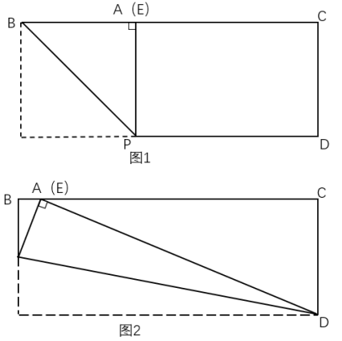

故正确答案为B。

---

### 第 9 题　qid 12536422 · 数学运算

甲和乙进行乒乓球比赛。第一局甲胜乙的概率为70%。往后每局如甲上局取胜，则当局甲的胜率为50%；如乙上局取胜，则当局甲的胜率为70%。问第三局甲取胜的概率在以下哪个范围内？

- **A**. 不到55%
- **B**. 在55%-57%之间
- **C**. 在57%-59%之间　✅
- **D**. 高于59%

**答案**：C

**官方解析**

根据“第一局甲胜乙的概率为70%”可知，第一局甲负乙的概率为1-70%=30%。同理，当甲的胜率分别为50%、70%时，甲负乙的概率分别为1-50%=50%、1-70%=30%，则第三局甲取胜的胜负情况可分为以下四种：

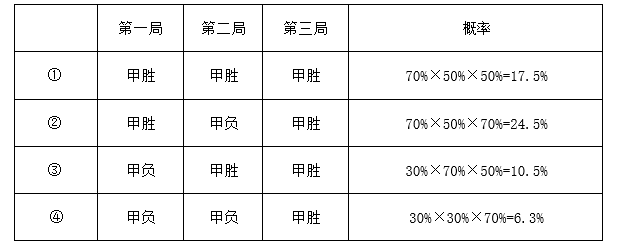

综上可知，甲第三局取胜的概率为17.5%+24.5%+10.5%+6.3%=58.8%，在C项范围内。

故正确答案为C。

---

### 第 10 题　qid 12536428 · 数学运算

正方形水池ABCD的边长为80米。E点在AB边正中的正北30米处，F点在C点东偏南方向，F点到C点距离为米。甲从E点出发前往F点，问他的最短行进距离比途经D点的最短行进距离短多少米？

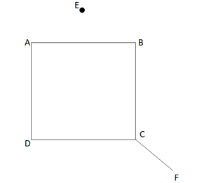

- **A**. 
30

- **B**. 
50

- **C**. 

- **D**. 
80
　✅

**答案**：D

**官方解析**

方法一：如图，E点出发前往F点的最短距离为E-B-F，即EB+BF。连接EB、BF，过E点作，因“E点在AB边正中的正北30米处”，所以EG=30米，且G点为AB的中点，故GB=40米，根据勾股定理，则米；延长BC至H点，过F点作，因“F点在C点东偏南方向，F点到C点距离为米”，则为等腰直角三角形，米，则BH=80+40=120米，根据勾股定理，则米，则E点到F点的最短行进距离米。

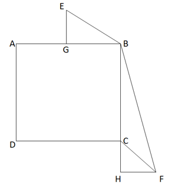

如图，若是途经D点，则最短距离为EA+AD+DF。连接EA、DF，过E点作，延长DC至点，作。同理根据勾股定理可得EA=50米，米，则米，所以E点途经D点到达F点的最短距离=EA+AD+DF米。

故所求米。

方法二：如图，从E点出发到达F点的最短路径为EB+BF；若经过D点，则最短路径为EA+AD+DF。根据“E点在AB边正中的正北30米处”，可知以EG为对称轴，EA和EB对称，则EA=EB；又因BC=DC，，CF为公共边，则，DF=BF，故所求=（EA+AD+DF）-（EB+BF）=AD=80米。

故正确答案为D。

---

## 判断推理

### 第 1 题　qid 12536393 · 图形推理

从所给的四个选项中，选择最合适的一个填入问号处，使之呈现一定的规律性：

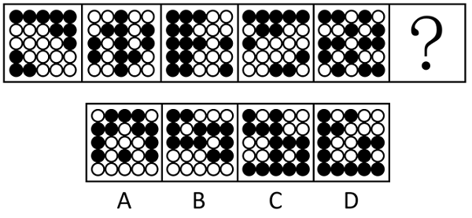

- **A**. A
- **B**. B
- **C**. C　✅
- **D**. D

**答案**：C

**官方解析**

元素组成不同，优先考虑属性规律。观察发现，题干图形整体无规律，所有图形均由黑球和白球构成，考虑黑白分开看。整体观察黑球没有明显规律，继续观察白球发现，题干图形中白球部分均为中心对称图形，只有C项符合。
故正确答案为C。

---

### 第 2 题　qid 12536394 · 图形推理

从所给的四个选项中，选择最合适的一个填入问号处，使之呈现一定的规律性：

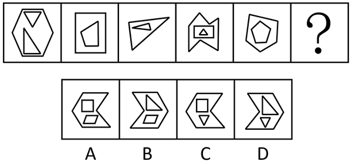

- **A**. A
- **B**. B
- **C**. C
- **D**. D　✅

**答案**：D

**官方解析**

元素组成不同，且无明显属性规律，考虑数量规律。题干图形内外均由多边形构成，可考虑内外分开看。观察发现，每幅图中内部直线数=外部直线数，故？处应用此规律，只有D项符合。
故正确答案为D。

---

### 第 3 题　qid 12536397 · 图形推理

从所给的四个选项中，选择最合适的一个填入问号处，使之呈现一定的规律性：

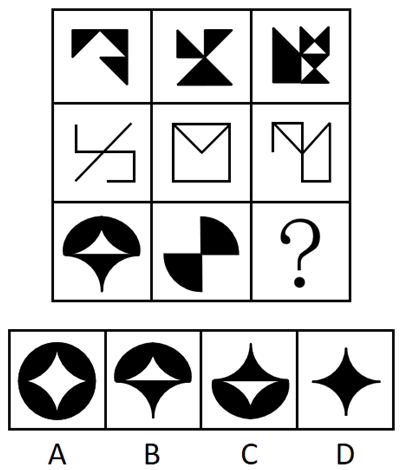

- **A**. A
- **B**. B　✅
- **C**. C
- **D**. D

**答案**：B

**官方解析**

元素组成相似，优先考虑样式规律。题干第二行图形中有相同线条重复出现，考虑加减同异。九宫格优先看横行，第一行中，图1和图2求异后再顺时针旋转得到图3；经验证，第二行满足此规律；第三行应用此规律，故“？”处应选择一个图1和图2先求异再顺时针旋转得到的图形，只有B项符合。

故正确答案为B。

---

### 第 4 题　qid 12536406 · 图形推理

以下哪项是由下列左侧的图形不经旋转、翻转拼合起来得到的？

- **A**. A
- **B**. B
- **C**. C
- **D**. D　✅

**答案**：D

**官方解析**

本题考查平面拼合，可采用平行且等长相消的方式解题。消去平行且等长的线段后进行组合可得到轮廓图，即为D项。平行且等长相消的方式如下图所示：

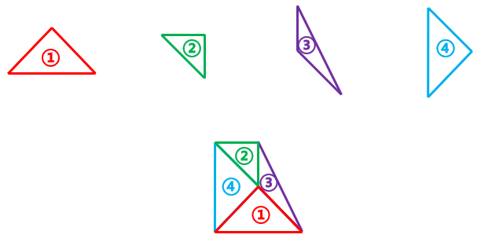

故正确答案为D。

---

### 第 5 题　qid 12536419 · 图形推理

下图是给定纸盒的外表面，以下哪项能由它折叠而成？

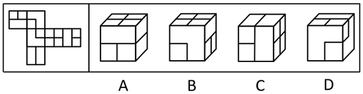

- **A**. A
- **B**. B
- **C**. C　✅
- **D**. D

**答案**：C

**官方解析**

将题干展开图标上序号，如下图所示，逐一进行分析。

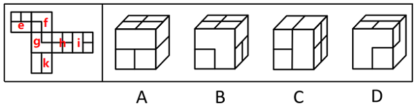

A项：选项由面h、面k和面e或面i构成，题干展开图中面h与面e为相对面，不能同时出现，故选项由面h、面k和面i构成，以面i内短线垂直的边为唯一边进行顺时针画边（如下图所示），题干展开图中边2对应面k，而选项中边4对应面k，选项与题干展开图不一致，排除；

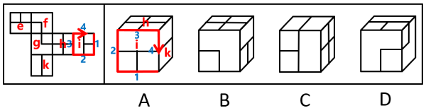

B项：选项由面h、面g或面f和面e或面i构成，题干展开图中面h与面e为相对面，不能同时出现，面i与面g为相对面，不能同时出现，故选项由面h、面i和面f构成，以面i内短线垂直的边为唯一边进行顺时针画边（如下图所示），题干展开图中边4对应面f，而选项中边2对应面f，选项与题干展开图不一致，排除；

C项：选项由面h、面i和面k构成，选项与题干展开图一致，当选；

D项：选项由面f、面g和面e或面i构成，题干展开图中面g与面i为相对面，不能同时出现，故选项由面f、面g和面e构成，题干展开图中面f、面g和面e三个面的公共点挨着面e中的长方形，而选项中这三个面的公共点挨着面e中的小正方形，选项与题干展开图不一致，排除。

故正确答案为C。

---

### 第 6 题　qid 12536475 · 图形推理

左图给定的是由相同正方体堆叠而成多面体的视图。该多面体可以由①、②和③三个多面体组合而成，以下哪项能填入问号处？

- **A**. A　✅
- **B**. B
- **C**. C
- **D**. D

**答案**：A

**官方解析**

本题考查立体拼合。观察题干给出的多面体可知，该多面体由上至下可分为3层。观察发现，图①也有3层，可以直接拼合在多面体的左侧，如下图所示，但此时图②无论如何放置，都无法与其拼合成题干多面体。

所以只能旋转图①，使其为上下两层的形态。将图①按照下图方向旋转，此时可以将图①放在该多面体的右侧，如下图所示：

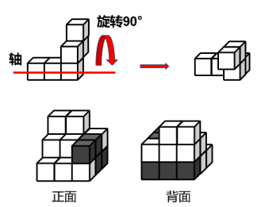

再将图②旋转后，放在该多面体的左侧，如下图所示：

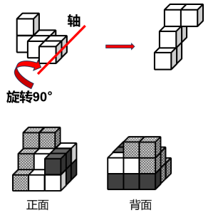

综上，图③应选择一个上下两层都有3个小正方体的图形，只有A项符合。

故正确答案为A。

---

### 第 7 题　qid 12536392 · 图形推理

把下面六个图形分为两类，使每一类图形都有各自的共同特征或规律，分类正确的一项是：

- **A**. ①②⑥，③④⑤
- **B**. ①③④，②⑤⑥
- **C**. ①③⑤，②④⑥
- **D**. ①④⑤，②③⑥　✅

**答案**：D

**官方解析**

本题为分组分类题目。元素组成不同，且无属性规律，考虑数量规律。观察发现，题干每幅图形均为16宫格，且存在黑色区域。继续观察发现，图①④⑤中黑色区域的面积相同，均占7.5个格子，图②③⑥中黑色区域的面积相同，均占8.5个格子。即图①④⑤为一组，图②③⑥为一组。
故正确答案为D。

---

### 第 8 题　qid 12536388 · 定义判断

行政性社会工作是指在政府部门和群众团体中专门从事职工福利、困难人群救助、思想工作等类型的助人活动；专业性社会工作是由受过社会工作专业训练的人开展的助人活动。
根据上述定义，下列属于行政性社会工作的是：

- **A**. 小曲是社工专业的研究生，专门从事与养老等社会福利相关的政策研究
- **B**. 某企业工会根据上级文件精神，在元旦期间为每位职工发放节日慰问品　✅
- **C**. 企业家王某长期资助贫困山区的孩子，帮助很多贫困孩子实现了大学梦
- **D**. 老李退休后热心为小区内闹矛盾的家庭做思想工作，赢得邻里一致称赞

**答案**：B

**官方解析**

第一步：找出定义关键词。
行政性社会工作：“在政府部门和群众团体中”、“专门从事职工福利、困难人群救助、思想工作等类型的助人活动”；
专业性社会工作：“由受过社会工作专业训练的人开展的助人活动”。
第二步：逐一分析选项。
A项：该项中小曲为社工专业的研究生，且其从事相关研究，没有提及是否从事助人活动，不符合“专门从事职工福利、困难人群救助、思想工作等类型的助人活动”，不符合“行政性社会工作”定义，排除；
B项：该项中某企业工会为职工发放慰问品，其中工会属于群众团体，且该行为是一种职工福利，符合“在政府部门和群众团体中”、“专门从事职工福利、困难人群救助、思想工作等类型的助人活动”，符合“行政性社会工作”定义，当选；
C项：该项中企业家王某资助贫困孩子上学，但王某是企业家，不是在政府部门和群众团体中专门从事助人活动，不符合“在政府部门和群众团体中”、“专门从事职工福利、困难人群救助、思想工作等类型的助人活动”，不符合“行政性社会工作”定义，排除；
D项：该项中老李退休后热心为小区调解矛盾，说明老李已经退休，不是在政府部门和群众团体中专门从事助人活动，不符合“在政府部门和群众团体中”、“专门从事职工福利、困难人群救助、思想工作等类型的助人活动”，不符合“行政性社会工作”定义，排除。
故正确答案为B。

---

### 第 9 题　qid 12536396 · 定义判断

除法报价策略是一种价格分解术，以商品的数量或使用时间等概念为除数，以商品价格为被除数，得出一种数字很小的价格，使买主对本来不低的价格产生一种便宜、低廉的感觉。
根据上述定义，下列不属于除法报价策略的是：

- **A**. 某款笔记本电脑原价5268元，若分12期付款，每月只需439元即可入手
- **B**. 成人游泳班每节课仅需100元，10节课程结束后就可以学会蛙泳和仰泳
- **C**. 某款电动汽车售价40万元，高于同类产品，但车主每月可抵扣200元充电费用　✅
- **D**. 一份液化气保险每年保费为365元，相当于每天只交1元，如遇事故最高获得1万元理赔

**答案**：C

**官方解析**

第一步：找出定义关键词。
“以商品的数量或使用时间等概念为除数，以商品价格为被除数，得出一种数字很小的价格”、“使买主对本来不低的价格产生一种便宜、低廉的感觉”。
第二步：逐一分析选项。
A项：原价5268元的某款笔记本电脑，若分12期付款，每月只需439元即可入手，原价5268元本来价格不低，但是分期之后，每月只需要439元，这样就感觉没有那么贵了，价格可接受，符合“以商品的数量或使用时间等概念为除数，以商品价格为被除数，得出一种数字很小的价格”、“使买主对本来不低的价格产生一种便宜、低廉的感觉”，符合定义，排除；
B项：成人游泳班每节课仅需100元，10节课程结束后就可以学会蛙泳和仰泳，将总价1000元的游泳课程分解成10节课程，得到每节100元的价格，让人觉得便宜，可以接受，符合“以商品的数量或使用时间等概念为除数，以商品价格为被除数，得出一种数字很小的价格”、“使买主对本来不低的价格产生一种便宜、低廉的感觉”，符合定义，排除；
C项：某款电动汽车售价40万元，高于同类产品，但车主每月可抵扣200元充电费用，通过抵扣充电费用的方式降低买主对价格的敏感度，但并没有明确指出该款电动汽车的使用时间是多久，是否可以得到数字很小的价格，不符合“以商品的数量或使用时间等概念为除数，以商品价格为被除数，得出一种数字很小的价格”、“使买主对本来不低的价格产生一种便宜、低廉的感觉”，不符合定义，当选；
D项：每年保费为365元的液化气保险，按天计算相当于每天只交1元，符合“以商品的数量或使用时间等概念为除数，以商品价格为被除数，得出一种数字很小的价格”、“使买主对本来不低的价格产生一种便宜、低廉的感觉”，符合定义，排除。
本题为选非题，故正确答案为C。

---

### 第 10 题　qid 12536383 · 定义判断

中间指标通常表示患者在完成特定的治疗周期之后呈现的治疗效果，可揭示患者对于干预方案的反应。终点指标通常反映医疗卫生服务干预措施的长期效果，大多反映的是已经发生或者患者可以感知的疾病时间。
根据上述定义，下列属于中间指标的是：

- **A**. 肝癌手术后五年生存率大概可达30%~80%
- **B**. 烧伤患者的伤情鉴定为头面部、躯干烧伤面积达50%以上
- **C**. 改良饮水工程后居民胃液内致癌性亚硝胺的暴露水平明显下降
- **D**. 高血压患者服用一抗高血压药物后发生心脑血管事件的概率为10%　✅

**答案**：D

**官方解析**

第一步：找出定义关键词。
中间指标：“患者在完成特定的治疗周期之后”、“呈现的治疗效果”、“可揭示患者对于干预方案的反应”；
终点指标：“反映医疗卫生服务干预措施的长期效果”、“大多反映的是已经发生或者患者可以感知的疾病时间”。
第二步：逐一分析选项。
A项：肝癌手术后五年生存率反映的是治疗后的长期效果，符合“反映医疗卫生服务干预措施的长期效果”，不符合“中间指标”定义，排除；
B项：对烧伤患者的伤情进行鉴定，而不是对患者进行治疗或采取其他干预措施，不符合“患者在完成特定的治疗周期之后”、“呈现的治疗效果”，也不符合“可揭示患者对于干预方案的反应”，不符合“中间指标”定义，排除；
C项：改良饮水工程不属于治疗，且不确定居民是否为患者，不符合“患者在完成特定的治疗周期之后”，不符合“中间指标”定义，排除；
D项：高血压患者服用抗高血压药物属于完成了特定的治疗周期，符合“患者在完成特定的治疗周期之后”，发生心脑血管事件的概率反映了治疗的效果，符合“呈现的治疗效果”、“可揭示患者对于干预方案的反应”，符合“中间指标”定义，当选。
故正确答案为D。

---

### 第 11 题　qid 12536382 · 定义判断

间接融资是指资金盈余单位或个人与资金短缺单位或个人之间不发生直接关系，而是分别与金融机构发生一笔独立的交易，即资金盈余单位通过存款，或者购买银行、信托、保险等金融机构发行的有价证券，将其暂时闲置的资金先行提供给这些金融机构，然后再由这些金融机构以贷款、贴现等形式，或通过购买需要资金的单位发行的有价证券，把资金提供给需要资金的单位使用，从而实现资金融通的过程。
根据上述定义，下列不属于间接融资的是：

- **A**. 众多网民把自己的闲置资金投放到某公司理财项目中，由该理财项目借贷给需要贷款或者借款的个人
- **B**. 小李前段时间把一部分资金借给了小王，由于小王的朋友小杨的公司资金周转困难，小王便把这部分资金借给了小杨　✅
- **C**. 甲公司最近结余一笔资金，并将这部分资金存到乙银行，由于丙公司恰巧申请借贷，乙银行便把这部分资金贷款给丙公司
- **D**. 小张有一笔闲置资金，看到某借贷机构正在募集资金，便把这笔钱投入该机构，该机构将众多“小张”的资金借贷给其他人或者企业

**答案**：B

**官方解析**

第一步：找出定义关键词。
“资金盈余单位或个人与资金短缺单位或个人之间不发生直接关系，而是分别与金融机构发生一笔独立的交易”。
第二步：逐一分析选项。
A项：该项中网民把闲置资金投放到某公司理财项目中，由该理财项目借贷给需要贷款或借款的个人，符合“资金盈余单位或个人与资金短缺单位或个人之间不发生直接关系，而是分别与金融机构发生一笔独立的交易”，符合定义，排除；
B项：该项中小王将借来的资金转借给小杨，小王是个人，不是金融机构，不符合“资金盈余单位或个人与资金短缺单位或个人之间不发生直接关系，而是分别与金融机构发生一笔独立的交易”，不符合定义，当选；
C项：该项中甲公司将资金存到乙银行，乙银行把资金贷款给丙公司，符合“资金盈余单位或个人与资金短缺单位或个人之间不发生直接关系，而是分别与金融机构发生一笔独立的交易”，符合定义，排除；
D项：该项中小张将资金投入某借贷机构，该借贷机构将资金借贷给其他人或者企业，符合“资金盈余单位或个人与资金短缺单位或个人之间不发生直接关系，而是分别与金融机构发生一笔独立的交易”，符合定义，排除。
本题为选非题，故正确答案为B。

---

### 第 12 题　qid 12536384 · 定义判断

僵尸网络是指采用一种或多种传播手段，将大量主机感染病毒，从而在控制者和被感染主机之间形成一个能够“一对多”控制的网络。
根据上述定义，下列属于僵尸网络的是：

- **A**. 某单位内网感染病毒，致使大量电脑无法开机，工作陷入瘫痪
- **B**. 黑客使用病毒侵入某经理人的电脑，操纵其账号卖出大笔股票
- **C**. 某公司职员通过植入木马，远程删除多位同事电脑中的关键数据
- **D**. 某人点击病毒链接后，其邮箱自动向所有通讯录好友发送该链接　✅

**答案**：D

**官方解析**

第一步：找出定义关键词。

“将大量主机感染病毒”、“在控制者和被感染主机之间形成一个能够‘一对多’控制的网络”。

第二步：逐一分析选项。

A项：某单位内网感染病毒，致使大量电脑无法开机，无法开机并不是对于网络进行控制，不符合“在控制者和被感染主机之间形成一个能够‘一对多’控制的网络”，不符合定义，排除； 

B项：黑客使用病毒侵入某经理人的电脑，操纵其账号卖出大笔股票，代表着黑客只操控了一个人的网络，不符合“在控制者和被感染主机之间形成一个能够‘一对多’控制的网络”，不符合定义，排除；

C项：某公司职员通过植入木马，远程删除多位同事电脑中的关键数据，某公司职员一人控制多名同事的网络进行操作，符合“在控制者和被感染主机之间形成一个能够‘一对多’控制的网络”，符合定义，保留；

D项：某人点击病毒链接后，其邮箱自动向所有通讯录好友发送该链接，自动发送该链接意味着主机本身已感染病毒被操控，且一传多的这种模式意味着最初发送病毒邮件的人作为控制者，所有接收邮件并点开的主机作为感染主机，符合“将大量主机感染病毒”、“在控制者和被感染主机之间形成一个能够‘一对多’控制的网络”，符合定义，保留。

对比C、D两项，题干要求“将大量主机感染病毒”以及“在控制者和被感染主机之间形成一个能够‘一对多’控制的网络”，“大量”和“网络”，要求数量要多，而C项中是多个同事，D项是向所有通讯录好友发送该链接，D更符合大量主机的含义，再结合定义原文，其中典型案例就为利用邮件构建僵尸网络，故D项更为合适。

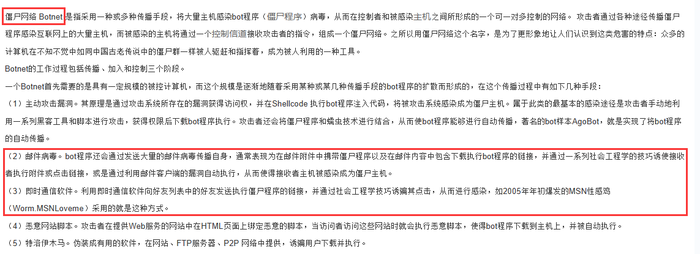

故正确答案为D。

---

### 第 13 题　qid 12536386 · 定义判断

肌肉记忆是指同一种动作重复多次后，身体形成的一种稳定的条件反射，即使很长时间没有重复这一动作，再次进行时也能很快熟悉。
根据上述定义，下列属于肌肉记忆的是：

- **A**. 孙先生天生左利手，虽然他平时写字、吃饭、打球都用右手，但若突然扔一个东西给他，他还是会用左手来接
- **B**. 周女士在某小区住了二十多年，每天都要在小区散步，现在就算闭上眼睛也能在每条路上准确无误地走一遍
- **C**. 钱先生小时候家里很穷，父母会摘树上的榆钱做饭，现在钱先生每次看到榆钱都会想起榆钱饭的味道
- **D**. 老赵年轻时是体操运动员，退休后经常到公园慢跑，兴致一来就到单杠上玩几个动作，大家都夸他英雄不减当年　✅

**答案**：D

**官方解析**

第一步：找出定义关键词。
“同一种动作重复多次后，身体形成的一种稳定的条件反射”、“即使很长时间没有重复这一动作，再次进行时也能很快熟悉”。
第二步：逐一分析选项。
A项：孙先生“天生”左利手，说明孙先生用左手接东西是天生的，并不是通过多次重复形成的条件反射，不符合“同一种动作重复多次后”，不符合定义，排除；
B项：周女士二十多年来每天都要在小区散步，现在就算闭上眼睛也能在每条路上准确无误地走一遍，重点体现的是周女士熟悉散步路线，而不是重复“走”的动作，也没有涉及“即使很长时间没有重复这一动作，再次进行时也能很快熟悉”，不符合定义，排除；
C项：钱先生因小时候经常吃榆钱饭，现在每次看到榆钱都会“想起”榆钱饭的味道，“想起”榆钱饭的味道并不是再次吃榆钱饭，重点体现的是榆钱饭的味道，而不是重复“吃”这个动作，不符合“同一种动作重复多次后，身体形成的一种稳定的条件反射”，也没有涉及“即使很长时间没有重复这一动作，再次进行时也能很快熟悉”，不符合定义，排除；
D项：老赵年轻时是体操运动员，说明老赵在年轻时重复了多次体操动作，符合“同一种动作重复多次后，身体形成的一种稳定的条件反射”，老赵退休后还会到单杠上玩几个动作，符合“即使很长时间没有重复这一动作，再次进行时也能很快熟悉”，符合定义，当选。
故正确答案为D。

---

### 第 14 题　qid 12536390 · 定义判断

流行病学现状研究是流行病学描述性研究的一个主要内容，主要是对特定时点（或期间）和特定范围内人群中的有关变量（因素）与疾病或健康状况的关系进行描述与分析的一项研究，因此也称横断面研究。
根据上述定义，下列不属于横断面研究的是：

- **A**. 某团队在某地集中爆发禽流感之后，分析了该病的起因、发病率、死亡率等指标
- **B**. 某团队调查了200例60岁以上的冠心病患者，研究这些患者血液中胆固醇含量与冠心病之间的关系
- **C**. 某团队研究了从1975年至1995年从事油漆镭盘与从事一般工作的工人骨肿瘤的发病率情况
- **D**. 某团队通过分析不同的埃博拉病毒毒株研究了该病毒的分型、传播途径、生物学特性和致病原理　✅

**答案**：D

**官方解析**

第一步：找出定义关键词。
“对特定时点（或期间）和特定范围内人群中的有关变量（因素）与疾病或健康状况的关系进行描述与分析”。
第二步，逐一分析选项。
A项：“某地”符合“特定范围内”，“集中爆发禽流感之后”符合“特定时点（或期间）”，对该病起因、发病率、死亡率的分析，符合“对特定时点（或期间）和特定范围内人群中的有关变量（因素）与疾病或健康状况的关系进行描述与分析”，符合定义，排除；
B项：“200例60岁以上的冠心病患者”符合“特定范围内人群”，研究该病与血液中胆固醇含量的关系，符合“对特定时点（或期间）和特定范围内人群中的有关变量（因素）与疾病或健康状况的关系进行描述与分析”，符合定义，排除；
C项：“1975年至1995年”符合“特定时点（或期间）”，“从事油漆镭盘的工人”是特定人群，研究该工作内容与骨肿瘤发病率的关系，符合“对特定时点（或期间）和特定范围内人群中的有关变量（因素）与疾病或健康状况的关系进行描述与分析”，符合定义，排除；
D项：研究对象是不同的埃博拉病毒毒株，不涉及特定时间、特定范围内人群，不符合“对特定时点（或期间）和特定范围内人群中的有关变量（因素）与疾病或健康状况的关系进行描述与分析”，不符合定义，当选。
本题为选非题，故正确答案为D。

---

### 第 15 题　qid 12536476 · 定义判断

逻辑等值是指两个命题可以互推，即A可以推出B，B也可以推出A，那么命题A和B在逻辑上就是相等的。
根据上述定义，下列选项中前后两个命题逻辑等值的是：

- **A**. “并不是只有考上大学才有出息”和“即使考上了大学也没啥出息”
- **B**. “如果你不去出差，则老王去出差”和“你或老王至少一人去出差”　✅
- **C**. “只要天上有乌云，就会下雨”和“天上没有乌云，也没有下雨”
- **D**. “我班有的同学不是党员，这话不对”和“我班有的同学是党员”

**答案**：B

**官方解析**

第一步：找出定义关键词。

“两个命题可以互推”、“A可以推出B，B也可以推出A”。

第二步：逐一分析选项。

A项：“并不是只有考上大学才有出息”意思是考不考上大学和有没有出息没有必然联系，“即使考上了大学也没啥出息”翻译为“考上大学没啥出息”，两个命题不能互推，不符合“两个命题可以互推”、“A可以推出B，B也可以推出A”，不符合定义，排除；

B项：“如果你不去出差，则老王去出差”翻译为“你出差老王出差”，“你或老王至少一人去出差”翻译为“你或老王出差”，“你或老王出差”等价于“你出差老王出差”，即两个命题可以互推，符合“两个命题可以互推”、“A可以推出B，B也可以推出A”，符合定义，当选；

C项：“只要天上有乌云，就会下雨”翻译为“天上有乌云下雨”，“天上没有乌云，也没有下雨”翻译为“天上没有乌云 且 没有下雨”，两个命题不能互推，不符合“两个命题可以互推”、“A可以推出B，B也可以推出A”，不符合定义，排除；

D项：“我班有的同学不是党员，这话不对”意味着“我班有的同学不是党员”的矛盾命题“我班所有同学都是党员”为真，即“我班有的同学不是党员，这话不对”等价于“我班所有同学都是党员”，该命题与“我班有的同学是党员”不能互推，不符合“两个命题可以互推”、“A可以推出B，B也可以推出A”，不符合定义，排除。

故正确答案为B。

---

### 第 16 题　qid 12536381 · 类比推理

开源：节流

- **A**. 反腐：倡廉　✅
- **B**. 道听：途说
- **C**. 左思：右想
- **D**. 博古：通今

**答案**：A

**官方解析**

第一步：判断题干词语间逻辑关系。
“开源”指开辟水源，比喻增加收入；“节流”指节制水流，比喻节省支出，二者为并列关系，且“开源”和“节流”是两种相反的方式。
第二步：判断选项词语间逻辑关系。
A项：“反腐”指反对腐败，“倡廉”指倡导廉政，二者为并列关系，且“反腐”和“倡廉”是两种相反的方式，与题干逻辑关系一致，当选；
B项：“道听”指路上听来的话，“途说”指路上传播的话，二者为并列关系，但“道听”和“途说”不是两种相反的方式，与题干逻辑关系不一致，排除；
C项：“左思”和“右想”指反复考虑，二者为并列关系，但“左思”和“右想”不是两种相反的方式，与题干逻辑关系不一致，排除；
D项：“博古”指对古代的事知道得很多，“通今”指通晓现代的事情，二者为并列关系，但“博古”和“通今”不是两种相反的方式，与题干逻辑关系不一致，排除。
故正确答案为A。

---

### 第 17 题　qid 12536387 · 类比推理

柴门闻犬吠：风雪夜归人

- **A**. 意欲捕鸣蝉：忽然闭口立
- **B**. 向晚意不适：驱车登古原
- **C**. 不敢高声语：恐惊天上人　✅
- **D**. 举头望明月：低头思故乡

**答案**：C

**官方解析**

第一步：判断题干词语间逻辑关系。
“柴门闻犬吠，风雪夜归人”的意思是柴门外忽传来犬吠声声，原来是有人冒着风雪归家门。因为“风雪夜归人”，所以“柴门闻犬吠”，二者为因果对应关系。
第二步：判断选项词语间逻辑关系。
A项：“意欲捕鸣蝉，忽然闭口立”的意思是牧童忽然想要捕捉树上鸣叫的知了，就马上停止唱歌，一声不响地站立在树旁。因为“意欲捕鸣蝉”，所以“忽然闭口立”，二者为因果对应关系，但与题干词语顺序相反，与题干逻辑关系不一致，排除；
B项：“向晚意不适，驱车登古原”的意思是傍晚时心情不快，驾着车登上古原。因为“向晚意不适”，所以“驱车登古原”，二者为因果对应关系，但与题干词语顺序相反，与题干逻辑关系不一致，排除；
C项：“不敢高声语，恐惊天上人”的意思是不敢高声说话，怕惊动了天上的仙人。因为“恐惊天上人”，所以“不敢高声语”，二者为因果对应关系，与题干逻辑关系一致，当选；
D项：“举头望明月，低头思故乡”的意思是我抬起头来，看那天窗外空中的明月，不由得低头沉思，想起远方的家乡。“低头思故乡”不是“举头望明月”的原因，与题干逻辑关系不一致，排除。
故正确答案为C。

---

### 第 18 题　qid 12536391 · 类比推理

塑料：盘子：陶瓷

- **A**. 面粉：馅饼：肉馅
- **B**. 皮革：鞋子：布料　✅
- **C**. 纸张：证书：印章
- **D**. 简答：试题：论述

**答案**：B

**官方解析**

第一步：判断题干词语间逻辑关系。
塑料和陶瓷是制作盘子的两种原材料，第一词与第三词为并列关系，并且均与第二词构成原材料与成品的对应关系。
第二步：判断选项词语间逻辑关系。
A项：面粉和肉馅是制作馅饼的两种原材料，第一词与第三词为并列关系，并且均与第二词构成原材料与成品的对应关系，保留；
B项：皮革和布料是制作鞋子的两种原材料，第一词与第三词为并列关系，并且均与第二词构成原材料与成品的对应关系，保留；
C项：纸张是制作证书的原材料，前两词为原材料与成品的对应关系，可以用印章在证书上盖章，二者为工具对应关系，与题干逻辑关系不一致，排除；
D项：试题可以分为“简答题”和“论述题”，“简答”和“论述”是试题的不同要求，第一词和第三词均与第二词构成对应关系，与题干逻辑关系不一致，排除。
对比A、B两项，题干中塑料和陶瓷均可以单独制作盘子，B项中皮革和布料均可以单独制作鞋子，而A项中面粉和肉馅需搭配在一起制作馅饼，故B项与题干逻辑关系更为一致，当选。
故正确答案为B。

---

### 第 19 题　qid 12536380 · 类比推理

政治家：军事家：曹操

- **A**. 固体：食品：苹果
- **B**. 直辖市：港口城市：北京
- **C**. 企业家：科学家：爱因斯坦
- **D**. 发展中国家：亚洲国家：菲律宾　✅

**答案**：D

**官方解析**

第一步：判断题干词语间逻辑关系。
有的政治家是军事家，有的政治家不是军事家，有的军事家是政治家，有的军事家不是政治家，二者为交叉关系；曹操是一个政治家，曹操是一个军事家，第三个词与前两个词均构成特指关系。
第二步：判断选项词语间逻辑关系。
A项：有的固体是食品，有的固体不是食品，有的食品是固体，有的食品不是固体，二者为交叉关系；苹果是一种固体，苹果是一种食品，第三个词与前两个词均构成种属关系，但并非特指关系，与题干逻辑关系不一致，排除；
B项：有的直辖市是港口城市，有的直辖市不是港口城市，有的港口城市是直辖市，有的港口城市不是直辖市，二者为交叉关系；北京是一个直辖市，二者为特指关系，但北京不是一个港口城市，二者并非特指关系，与题干逻辑关系不一致，排除；
C项：有的企业家是科学家，有的企业家不是科学家，有的科学家是企业家，有的科学家不是企业家，二者为交叉关系；爱因斯坦是一个科学家，二者为特指关系，但爱因斯坦不是一个企业家，二者并非特指关系，与题干逻辑关系不一致，排除；
D项：有的发展中国家是亚洲国家，有的发展中国家不是亚洲国家，有的亚洲国家是发展中国家，有的亚洲国家不是发展中国家，二者为交叉关系；菲律宾是一个发展中国家，菲律宾是一个亚洲国家，第三个词与前两个词均构成特指关系，与题干逻辑关系一致，当选。
故正确答案为D。

---

### 第 20 题　qid 12536385 · 类比推理

编剧：导演：电影

- **A**. 推广：运营：广告
- **B**. 内容：校对：文章
- **C**. 经理：编程：产品
- **D**. 编辑：设计：图书　✅

**答案**：D

**官方解析**

第一步：判断题干词语间逻辑关系。
编剧和导演均为制作电影的不同身份，且编剧对电影的内容负责，导演对电影的呈现负责，二者分别与电影构成对应关系。
第二步：判断选项词语间逻辑关系。
A项：广告是推广的一种方式，推广不是制作广告的身份，与题干逻辑关系不一致，排除；
B项：内容是文章的组成部分，不是制作文章的身份，与题干逻辑关系不一致，排除；
C项：产品和编程没有必然联系，编程不一定是制作产品的身份，与题干逻辑关系不一致，排除；
D项：编辑和设计均为制作图书的不同身份，且编辑对图书的内容负责，设计对图书的呈现负责，二者分别与图书构成对应关系，与题干逻辑关系一致，当选。
故正确答案为D。

---

### 第 21 题　qid 12536468 · 类比推理

标准 对于 （    ） 相当于 （    ） 对于 决策

- **A**. 准则；落实
- **B**. 提纲；机会
- **C**. 测量；信息　✅
- **D**. 制定；正确

**答案**：C

**官方解析**

逐一代入选项。
A项：标准是衡量事物的准则，二者是近义关系；落实决策，二者是动宾关系，前后逻辑关系不一致，排除；
B项：标准是衡量事物的准则，提纲是指（写作、发言、学习、研究、讨论等）内容的要点，二者无明显的逻辑关系；机会指恰好的时候，时机，与决策无明显的逻辑关系，前后逻辑关系不一致，排除；
C项：依据标准测量，二者为依据对应关系；依据信息决策，二者为依据对应关系，前后逻辑关系一致，当选；
D项：制定标准，二者为动宾关系；正确的决策，二者为偏正关系，前后逻辑关系不一致，排除。
故正确答案为C。

---

### 第 22 题　qid 12536469 · 类比推理

“功成不必在我”的境界必须有坚定的理想信念作为支撑。所以，年轻干部如果有“功成不必在我”的境界，一定树立了坚定的理想信念。
下列与上述论证结构最为相似的是：

- **A**. 坚强的领导，来源于正确的领导。正确的领导，来源于正确的决策。因此，只有充分掌握信息，才能做出正确的决策
- **B**. 国家发展靠人才，民族振兴靠人才。因此，如何把人才的创造热情和聪明才智充分调动起来、发挥出来，是做好新时代人才工作的应有之义
- **C**. 勇于自我革命是中国共产党最鲜明的品格。所以，深化全面从严治党必须发扬勇于自我革命的精神
- **D**. 只有在斗争中不断锤炼，才能经得起各种考验。所以，党员干部经受住了各种考验，就说明在斗争实践中得到了不断锤炼　✅

**答案**：D

**官方解析**

题干翻译为：“功成不必在我”的境界有坚定的理想信念作为支撑，

推理为：年轻干部有“功成不必在我”的境界推出树立了坚定的理想信念，

论证结构为：肯前推肯后。

A项：翻译为，坚强的领导正确的领导，正确的领导正确的决策，推理为，正确的决策推出充分掌握信息，推理中提及的“充分掌握信息”在该项的翻译中未提及，与题干论证结构不一致，排除；

B项：翻译为，国家发展人才，民族振兴人才，推理为，做好新时代人才工作推出把人才的创造热情和聪明才智充分调动起来、发挥出来，推理中提及的“把人才的创造热情和聪明才智充分调动起来、发挥出来”在该项的翻译中未提及，与题干论证结构不一致，排除；

C项：选项后段中提及的“深化全面从严治党”在选项前段未提及，与题干论证结构不一致，排除；

D项：翻译为，经得起各种考验在斗争中不断锤炼，推理为，党员干部经受住了各种考验推出在斗争实践中得到了不断锤炼，论证结构为肯前推肯后，与题干论证结构一致，当选。

故正确答案为D。

---

### 第 23 题　qid 12536472 · 逻辑判断

研究发现，吸烟、糖尿病、中风病史等都意味着患痴呆症的风险更高，男性和女性患痴呆症概率接近。但涉及血压时出现了性别差异——不论血压高低，男性患痴呆症风险都较高，而女性患痴呆症风险会随着血压升高而增加。血压高的女性用药明显多于血压低的女性。据此有研究者认为，用药越多，个体患痴呆症的风险更高。
以下哪项如果为真，最能质疑研究者的推测？

- **A**. 年龄大的女性比年龄小的女性用药更多
- **B**. 不论血压高低，男性平均用药量比女性要少　✅
- **C**. 男性和女性之间的生理差异也能造成患痴呆症风险的不同
- **D**. 用药和血压相同时，老年女性比年轻女性患痴呆症风险更高

**答案**：B

**官方解析**

第一步：找出论点和论据。
论点：用药越多，个体患痴呆症的风险更高。
论据：不论血压高低，男性患痴呆症风险都较高，而女性患痴呆症风险会随着血压升高而增加。血压高的女性用药明显多于血压低的女性。
本题论点和论据都是在讨论用药量和患痴呆症的风险之间的关系，论点论据话题一致，削弱优先考虑削弱论点。
第二步：逐一分析选项。
A项：年龄大的女性比年龄小的女性用药更多，但未指出患痴呆症的风险是否与用药量有关，为无关项，无法削弱，排除；
B项：不论血压高低，男性平均用药量比女性要少，同时论据中也指出“不论血压高低，男性患痴呆症风险都较高”，这两句结合在一起可以说明用药量和患痴呆症风险无关，削弱论点，当选；
C项：男性和女性之间的生理差异也能造成患痴呆症风险的不同，因为性别不同的生理差异造成患痴呆症的风险的不同，具体是患痴呆症的风险高还是患痴呆症的风险低并不明确，为不明确项，无法削弱，排除；
D项：用药和血压相同时，老年女性比年轻女性患痴呆症风险更高，老年女性和年轻女性的年龄不同，年龄也会影响患痴呆症的风险，无法说明用药量和患痴呆症的风险是否有关，无法削弱，排除。
故正确答案为B。

---

### 第 24 题　qid 12536473 · 逻辑判断

有科学家开发出一种低成本的“风力收割机”，可捕捉微风般柔和的风能，将其储存为电能。它不仅可以发电为设备持续供电，还可以将多余电量储存起来，以便在无风的情况下为设备长时间供电。它将有望取代当前为LED灯供电的电池。
以下哪项如果为真，最不能支持上述预期？

- **A**. 该设备的主体由纤维环氧树脂制成，主要附件由铜、铝箔和特氟龙等材料制成　✅
- **B**. 实验发现，该设备可在风速4米/秒的情况下，持续为40个LED灯供电
- **C**. 该设备尺寸仅为15厘米×20厘米，可以很容易地安装在建筑物的侧面
- **D**. 该设备只需要偶尔维护，在运行过程中不会受到天气状况的影响

**答案**：A

**官方解析**

第一步：找出论点和论据。
论点：“风力收割机”将有望取代当前为LED灯供电的电池。
论据：有科学家开发出一种低成本的“风力收割机”，可捕捉微风般柔和的风能，将其储存为电能。它不仅可以发电为设备持续供电，还可以将多余电量储存起来，以便在无风的情况下为设备长时间供电。
本题论据讨论的是“风力收割机”的工作性能，论点是根据论据而得出的预期，二者具有较强的逻辑关联性，故二者话题一致，加强优先考虑补充论据，本题为选非题，所以将可以加强的选项排除即可。
第二步：逐一分析选项。
A项：该项说的是该设备的主体和主要附件的制造材料，但没有说明这些材料相对于当前为LED灯供电的电池有何优势，无法说明该设备有望取代当前为LED灯供电的电池，无法加强，当选；
B项：该项说该设备可在微风（3.4-5.4米/秒）的情况下持续为40个LED灯供电，补充论据说明该设备能捕捉微风并且能持续供电，补充论据，可以加强，排除；
C项：该项说明了该设备的尺寸和安装方面的优势，这些优势使得该设备有望取代当前为LED灯供电的电池，补充论据，可以加强，排除；
D项：该项说明了该设备维护轻松，并且在运行过程中不会受到天气状况的影响，这些优势使得该设备有望取代当前为LED灯供电的电池，补充论据，可以加强，排除。
本题为选非题，故正确答案为A。

---

### 第 25 题　qid 12536511 · 逻辑判断

一项针对马拉松运动员的研究显示：随着运动员在数周或数月内的跑步量越来越大，虽然运动消耗的能量增加了，但运动员每天消耗的总能量反而逐步从6200卡路里降低到了4900卡路里，每日总能量消耗达到了一种平衡。据此，有人认为，既然体重的增减取决于摄入食物中的能量与身体消耗能量的差值，而每日总能量消耗又基本恒定，那么不仅运动能减肥，少吃也能减肥。
以下哪项如果为真，最能驳斥上述观点？

- **A**. 在控制饮食的同时进行体育锻炼能够更有效地减肥
- **B**. 与运动相比，节食才是肥胖者控制体重的最直接方法
- **C**. 运动消耗了摄入的能量却减少了肥胖者在休息时燃烧的热量
- **D**. 肥胖者往往有代谢困难，即使少吃也不能完全消耗每日摄入的热量　✅

**答案**：D

**官方解析**

第一步：找出论点和论据。
论点：既然体重的增减取决于摄入食物中的能量与身体消耗能量的差值，而每日总能量消耗又基本恒定，那么不仅运动能减肥，少吃也能减肥。
论据：随着运动员在数周或数月内的跑步量越来越大，虽然运动消耗的能量增加了，但运动员每天消耗的总能量反而逐步从6200卡路里降低到了4900卡路里，每日总能量消耗达到了一种平衡。
本题论点讨论的是体重的增减与能量摄入、消耗的关系，同时根据每日总能量消耗基本恒定，得出少吃也能减肥；论据讨论的是运动员跑步量变化与运动消耗的能量的关系，同时每日总能量消耗达到了一种平衡，二者话题一致，削弱可以考虑削弱论点。
第二步：逐一分析选项。
A项：该项指出“少吃”和“运动”同时进行能更有效地减肥，有一定的加强作用，无法削弱，排除；
B项：该项指出“节食”才是肥胖者控制体重的最直接的方法，说明“少吃”确实能减肥，有加强作用，无法削弱，排除；
C项：该项指出了“运动”如何影响肥胖者体内的能量，与论点讨论的“少吃”是否能减肥无关，话题不一致，无法削弱，排除；
D项：该项指出肥胖者即使“少吃”也不能完全消耗每日摄入的热量，说明“少吃”并不能减肥，削弱论点，可以削弱，当选。
故正确答案为D。

---

### 第 26 题　qid 12536512 · 逻辑判断

二溴乙烷过去常被用来去除谷物储藏过程产生的害虫，由于这种化学物品可能导致处理谷物的工人神经损害，因而被禁止使用。然而，在二溴乙烷被禁止使用两年之后，处理谷物的工人还是出现了神经损害。有专家据此断言有新的化学物质导致人们神经损害。
以下哪项如果为真，最有可能是上述专家推断的假设？

- **A**. 杀灭谷物中害虫的药品总会存在对人体有害的化学物质
- **B**. 如果是二溴乙烷导致的神经损伤，这种损伤在两年之内就会出现　✅
- **C**. 处理谷物的工人若仍使用二溴乙烷，那么他们神经受损是大概率事件
- **D**. 若有新的化学物质造成神经损伤，那么这种神经损伤与二溴乙烷所造成的损伤相似

**答案**：B

**官方解析**

第一步：找出论点和论据。
论点：有新的化学物质导致人们神经损害。
论据：在二溴乙烷被禁止使用两年之后，处理谷物的工人还是出现了神经损害。
本题论点和论据都在讨论化学物质和人们神经损害的关系，二者话题一致，且提问方式为假设，加强优先考虑必要条件。
第二步：逐一分析选项。
A项：该项指出药品总会存在对人体有害的化学物质，但是不明确这种损害是不是神经损害，也没有提到在二溴乙烷被禁止使用两年之后，工人的神经损害是否是新的化学物质导致，表述不明确，无法加强，排除；
B项：该项指出二溴乙烷导致的神经损伤，两年之内就会出现，如果二溴乙烷导致的神经损伤会在两年后出现，说明在二溴乙烷被禁止使用两年之后出现的神经损害依然有可能是二溴乙烷导致的，进而无法得出有新的化学物质导致人们神经损害，即该项不成立时论点不成立，属于必要条件，可以加强，当选；
C项：该项指出处理谷物的工人若仍使用二溴乙烷，那么他们神经受损是大概率事件，但论点讨论的是二溴乙烷被禁止使用两年之后的事情，与论点话题不一致，无法加强，排除；
D项：该项指出若有新的化学物质造成神经损伤，那么这种神经损伤与二溴乙烷所造成的损伤相似，有新的化学物质造成神经损伤是一种假设，没有指出工人的神经损害是否真的是新的化学物质导致，表述不明确，无法加强，排除。
故正确答案为B。

---

### 第 27 题　qid 12536480 · 逻辑判断

近两年，我国一些部属师范院校的专业组投档线飙升，非部属师范院校也水涨船高。专家认为，近两年高考录取中，职业稳定、社会需求大、就业前景明朗的专业更受欢迎，其中师范类和公安、司法等专项的招录情况都比较好。
以下哪项如果为真，最能支持上述论证？

- **A**. 家长是教师的考生更愿意选择师范类专业
- **B**. 近年来国家加大了对定向师范生的支持和培养力度
- **C**. 就业竞争日趋激烈，考生专业选择心态更加趋向求稳　✅
- **D**. 新兴专业如大数据、人工智能、生物医药等受到许多考生青睐

**答案**：C

**官方解析**

第一步：找出论点和论据。
论点：近两年高考录取中，职业稳定、社会需求大、就业前景明朗的专业更受欢迎，其中师范类和公安、司法等专项的招录情况都比较好。
论据：无。
本题只有论点没有论据，加强优先考虑补充论据，即解释原因或举例子。
第二步：逐一分析选项。
A项：该项讨论的是哪些考生更愿意选择师范类专业，而论点讨论的是职业稳定、社会需求大、就业前景明朗的师范类等专业更受欢迎，话题不一致，无法加强，排除；
B项：该项指出国家加大了对定向师范生的支持和培养力度，而论点讨论的是师范类等专业因职业稳定、社会需求大、就业前景明朗更受欢迎，话题不一致，无法加强，排除；
C项：该项指出就业竞争日趋激烈，考生专业选择心态更加趋向求稳，说明考生更愿意选择职业稳定的专业，补充论据，可以加强，当选；
D项：该项指出新兴专业受到许多考生青睐，而论点讨论的是职业稳定、社会需求大、就业前景明朗的师范类等专业更受欢迎，话题不一致，无法加强，排除。
故正确答案为C。

---

### 第 28 题　qid 12536483 · 逻辑判断

火星的奥林帕斯山是太阳系中已知的最高火山，高度为25000米，几乎是地球上最高峰——珠穆朗玛峰的3倍。研究人员认为奥林帕斯山具有如此令人称奇的高度，主要是因为相比地球而言，火星的重力较低且火山喷发的频率较高，造山熔岩流在火星上持续的时间比在地球上要长得多，故而形成了巨大火山。
以下哪项如果为真，最能削弱上述结论？

- **A**. 土星、木星属于气体星球，由于没有地幔运动，所以也就没有火山爆发
- **B**. 地球上的河流常会侵蚀山脉的边缘物质，引发山体滑坡，这就限制了山峰生长　✅
- **C**. 金星与地球重力相近，其火山喷发的频率极高，可谓火山密布，但火山大多不高
- **D**. 一些与火星相似的星体，虽火山喷发活跃，熔岩持续出现，但因为星体表面结构的变化，熔岩无法堆积，故不能形成大型火山

**答案**：B

**官方解析**

第一步：找出论点和论据。
论点：奥林帕斯山具有如此令人称奇的高度，主要是因为相比地球而言，火星的重力较低且火山喷发的频率较高，造山熔岩流在火星上持续的时间比在地球上要长得多，故而形成了巨大火山。
论据：无。
本题的论点讨论的是因为火星比地球重力低，火山喷发得更频繁，造山熔岩流持续时间比地球更长，因此才会有这座巨大火山，而地球则没有如此高的山峰。本题无明显论据，削弱优先考虑削弱论点，此外，论点中出现因果关系，还可以考虑因果倒置或他因削弱。
第二步：逐一分析选项。
A项：该项讨论的主体是土星、木星，而本题论点中讨论的主体是火星与地球，主体不一致，为无关项，无法削弱，排除；
B项：该项讨论的是地球上还常会发生山体滑坡这种地质灾害，限制了地球上山峰的生长，故没有像火星上奥林帕斯山这种极高的山峰，说明了除了重力等因素，还有其他因素影响地球上山峰的生长，他因削弱，可以削弱，当选；
C项：该项讨论的是金星与地球的重力相近，金星上的火山喷发频率高但火山大多不高，而论点讨论的是火星相比于地球，重力更低，火山喷发频率更高，故而火星形成这座大型火山，而地球没有这么高的火山，话题不一致，为无关项，无法削弱，排除；
D项：该项讨论的是一些与火星相似的星体虽然火山喷发频率较高，但无法形成大型火山，而论点讨论的是火星形成奥林帕斯山这种大型火山的原因，话题不一致，为无关项，无法削弱，排除。
故正确答案为B。

---

### 第 29 题　qid 12536389 · 逻辑判断

某旅游团去瓷都景德镇旅游，游客们游玩之后，纷纷购买纪念品。关于游客们是否购买了瓷器，有以下一些说法：
①游客们都买了瓷器
②该团的王女士买了白瓷
③有的游客没买瓷器
④如果该团的郑先生没买青瓷，那么该团的王女士就买了白瓷
如果上述说法两真两假，那么以下哪项一定为真？

- **A**. 该团的王女士没买瓷器
- **B**. 该团的郑先生买了青瓷　✅
- **C**. 该团的王女士买了白瓷
- **D**. 该团至少一人没买青瓷

**答案**：B

**官方解析**

第一步：分析题干找关系。

①所有游客都买了瓷器；

②王女士买了白瓷；

③有的游客没买瓷器；

④郑先生买青瓷王女士买白瓷。

分析题干条件，①、③为矛盾关系，必有一真一假。

第二步：看其余。

游客们的说法为两真两假，故②、④也必有一真一假。由“AB”=“A 或 B”可知，④“郑先生买青瓷王女士买白瓷”=“郑先生买青瓷 或 王女士买白瓷”，此时若②“王女士买了白瓷”为真，则④“郑先生买青瓷 或 王女士买白瓷”为真，与②、④必有一真一假矛盾，故②“王女士买了白瓷”为假，即王女士没有买白瓷，此时④“郑先生买青瓷 或 王女士买白瓷”为真，根据或关系的否一推一可知，郑先生买了青瓷。

故正确答案为B。

---

### 第 30 题　qid 12536474 · 逻辑判断

图书馆举行职工知识竞赛，比赛结束后，甲、乙、丙、丁、戊五个人对一等奖获得者的个人信息进行了如下判断：

实际上，这五个人关于一等奖获得者个人信息的判断都仅有一项是正确的。由此可以推出，一等奖获得者的姓氏是：

- **A**. 李　✅
- **B**. 赵
- **C**. 孙
- **D**. 钱

**答案**：A

**官方解析**

题干信息不确定，优先采用代入法。

代入A项，若一等奖获得者是李，根据每个人的判断仅有一项是正确的，可知一等奖获得者为姓氏李、性别男、副研究馆员、咨询部，符合题干要求，当选；

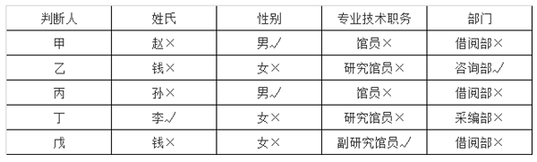

代入B项，若一等奖获得者是赵，那么丙判断的每一项都是错误的，不符合题干要求，排除；

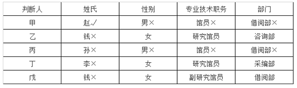

代入C项，若一等奖获得者是孙，那么甲判断的每一项都是错误的，不符合题干要求，排除；

代入D项，若一等奖获得者是钱，那么专业技术职务这项信息没有任何人判断正确，不符合题干要求，排除。

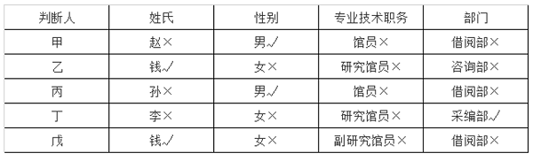

故正确答案为A。

---

## 资料分析

### 材料 1

        2022年，全国软件和信息技术服务业规模以上企业超3.5万家，累计完成软件业务收入108126亿元，同比增长11.2%，增速较上年同期回落6.5个百分点。

        2022年，全国软件业利润总额12648亿元，同比增长5.7%，增速较上年同期回落1.9个百分点。软件业务出口额524.1亿美元，同比增长3.0%，增速较上年同期回落5.8个百分点。其中，软件外包服务出口额同比增长9.2%。

        2022年，东部、中部、西部和东北地区分别完成软件业务收入88663亿元、5390亿元、11574亿元和2499亿元，分别同比增长10.6%、16.9%、14.3%和8.7%。软件业务收入居前5名的北京、广东、江苏、山东、浙江共完成收入74537亿元，占比较上年同期提高2.9个百分点。

        2022年，全国15个副省级中心城市实现软件业务收入53419亿元，同比增长10.0%，增速较上年同期回落6.3个百分点；实现利润总额6924亿元，同比增长2.4%，增速较上年同期回落2.1个百分点。

#### 第 1 题　qid 12536395 · 增长

2022年，全国软件和信息技术服务业规模以上企业累计完成软件业务收入约比2020年增长了：

- **A**. 16%
- **B**. 23%
- **C**. 29%
- **D**. 31%　✅

**答案**：D

**官方解析**

根据题干“2022年······约比2020年增长了”，结合选项为百分数，可判定本题为间隔增长率问题。定位文字材料第一段可得：2022年，全国软件和信息技术服务业规模以上企业累计完成软件业务收入同比增长11.2%（），增速较上年同期回落6.5个百分点。则2021年，全国软件和信息技术服务业规模以上企业累计完成软件业务收入同比增长11.2%+6.5%=17.7%（）。根据间隔增长率公式：，则所求，与D项最接近。

故正确答案为D。

---

#### 第 2 题　qid 12536398 · 增长

2021年，全国软件业利润总额同比增速比软件业务出口额同比增速：

- **A**. 低1.2个百分点　✅
- **B**. 低2.7个百分点
- **C**. 高1.2个百分点
- **D**. 高2.7个百分点

**答案**：A

**官方解析**

定位文字材料第二段可得：2022年，全国软件业利润总额同比增长5.7%，增速较上年同期回落1.9个百分点；软件业务出口额同比增长3.0%，增速较上年同期回落5.8个百分点。则2021年全国软件业利润总额同比增速为5.7%+1.9%=7.6%，2021年全国软件业务出口额同比增速为3.0%+5.8%=8.8%，故所求=7.6%-8.8%=-1.2%，即2021年全国软件业利润总额同比增速比软件业务出口额同比增速低1.2个百分点。
故正确答案为A。

---

#### 第 3 题　qid 12536399 · 增长

2022年，东部地区软件业务收入同比增量约是西部地区的多少倍？

- **A**. 3
- **B**. 4
- **C**. 5
- **D**. 6　✅

**答案**：D

**官方解析**

根据题干“2022年······约是······的多少倍”，可判定本题为现期倍数问题。定位文字材料第三段可得：2022年，东部、中部、西部和东北地区分别完成软件业务收入88663亿元、5390亿元、11574亿元和2499亿元，分别同比增长10.6%、16.9%、14.3%和8.7%。根据公式：增长量，则所求倍，与D项最接近。

故正确答案为D。

---

#### 第 4 题　qid 12536401 · 比重

2020-2022年，全国15个副省级中心城市软件业利润总额占全国软件业利润总额的比重呈现何种变化趋势？

- **A**. 持续上升
- **B**. 持续下降　✅
- **C**. 先升后降
- **D**. 先降后升

**答案**：B

**官方解析**

根据题干“2020-2022年······占······的比重呈现何种变化趋势”，可判定本题为两期比重问题。定位文字材料第二、四段可得：2022年，全国软件业利润总额12648亿元，同比增长5.7%（），增速较上年同期回落1.9个百分点；全国15个副省级中心城市实现软件业务利润总额6924亿元，同比增长2.4%（），增速较上年同期回落2.1个百分点。则2021年，全国软件业利润总额同比增长5.7%+1.9%=7.6%（），全国15个副省级中心城市实现软件业务利润总额同比增长2.4%+2.1%=4.5%（）。根据两期比重比较结论“若部分增长率大于整体增长率，则比重上升，反之则下降”，比较可知：2022年比2021年，（2.4%）&lt;（5.7%），比重下降；2021年比2020年，（4.5%）&lt;（7.6%），比重下降。则2022年比重&lt;2021年比重&lt;2020年比重，比重持续下降。

故正确答案为B。

---

#### 第 5 题　qid 12536407 · 平均数

以下信息中，能够从上述资料中推出的有几项？
①2020年平均每个副省级中心城市软件业务收入
②2021年北京、广东、江苏、山东、浙江软件业务收入之和
③2022年软件外包服务出口额占软件业务出口额比重

- **A**. 0
- **B**. 1
- **C**. 2　✅
- **D**. 3

**答案**：C

**官方解析**

①定位文字材料第四段可得：2022年，全国15个副省级中心城市实现软件业务收入53419 亿元，同比增长10.0%（），增速较上年同期回落6.3个百分点。则2021年全国15个副省级中心城市实现软件业务收入同比增速为10%+6.3%=16.3%（），2022年全国15个副省级中心城市实现软件业务收入相较于2020年的增速。故所求，可以推出；

②定位文字材料第一段可得：2022年，全国软件和信息技术服务业······累计完成软件业务收入108126亿元，同比增长11.2%。定位文字材料第三段可得：2022年······软件业务收入居前5名的北京、广东、江苏、山东、浙江共完成收入74537亿元，占比较上年同期提高2.9个百分点。则2021年全国软件业务收入，北京、广东、江苏、山东、浙江软件业务收入之和占比为，故所求，可以推出；

③定位文字材料第二段可得：2022年······软件业务出口额524.1亿美元······其中，软件外包服务出口额同比增长9.2%。材料只给出2022年软件业务出口额和软件外包服务出口额同比增长率，无法求出软件外包服务出口额及其所占比重，无法推出。

综上可知，只有①②可以推出，共2项。

故正确答案为C。

---

### 材料 2

        2021年1~2月，全国网上零售额17587亿元，同比增长32.5%，两年平均增长13.3%。其中，实物商品网上零售额14412亿元，同比增长30.6%，两年平均增长16.0%，占社会消费品零售总额的比重为20.7%；在实物商品网上零售额中，吃类、穿类和用类商品分别增长41.6%、44.3%和25.1%，两年平均分别增长33.8%、8.7%和16.0%。

#### 第 6 题　qid 12536403 · 综合

在2020年1~2月①全国网上零售额和②实物商品网上零售额中：

- **A**. 仅①同比正增长
- **B**. 仅②同比正增长　✅
- **C**. ①和②均同比正增长
- **D**. ①和②均未同比正增长

**答案**：B

**官方解析**

根据题干“在2020年1~2月①全国网上零售额和②实物商品网上零售额中”，结合选项为“······正增长”，且材料给出二者的两年平均增长率，可判定本题为间隔增长率问题。定位文字材料可得：2021年1~2月，全国网上零售额17587亿元，同比增长32.5%，两年平均增长13.3%。其中，实物商品网上零售额14412亿元，同比增长30.6%，两年平均增长16.0%。根据n=2时的年均增长率公式：，和间隔增长率公式：，且，可得。设2020年1~2月全国网上零售额同比增长率为a，可列式，可化简得，即2020年1~2月全国网上零售额同比负增长；设2020年1~2月实物商品网上零售额同比增长率为b，同理可列式，可化简得，即2020年1~2月实物商品网上零售额同比正增长。 故正确答案为B。

---

#### 第 7 题　qid 12536408 · 增长

2021年1~2月，以下各类社会消费品零售总额中同比增量最大的是：

- **A**. 烟酒类
- **B**. 化妆品类
- **C**. 金银珠宝类　✅
- **D**. 文化办公用品类

**答案**：C

**官方解析**

根据题干“2021年1~2月······同比增量最大的是”，可判定本题为增长量比较问题。定位表格材料可得：2021年1~2月，烟酒类社会消费品零售总额为861亿元，同比增长43.6%；化妆品类为558亿元，同比增长40.7%；金银珠宝类为545亿元，同比增长98.7%；文化办公用品类为515亿元，同比增长38.3%。根据增长量比较口诀“大大则大”可知，烟酒类社会消费品零售总额和同比增速均大于化妆品类和文化办公用品类，因此烟酒类的同比增长量大于化妆品类和文化办公用品类；根据公式：增长量，则烟酒类社会消费品零售总额同比增量为亿元；金银珠宝类为亿元。故同比增量最大的是金银珠宝类。 故正确答案为C。

---

#### 第 8 题　qid 12536411 · 增长

2021年1~2月，限额以下单位餐饮收入同比约增长了：

- **A**. 67%
- **B**. 71%　✅
- **C**. 76%
- **D**. 83%

**答案**：B

**官方解析**

根据题干“2021年1~2月······同比约增长了”，结合材料给出了2021年1~2月餐饮收入和限额以上单位餐饮收入及其同比增速，可判定本题为混合增长率问题。定位表格材料可得：2021年1~2月，我国餐饮收入为7085亿元，同比增长68.9%；其中限额以上单位餐饮收入为1459亿元，同比增长61.8%。则我国限额以下单位餐饮收入为7085-1459=5626亿元。 根据混合增长率口诀“混合居中不正中，偏向基期量大的一方（一般用现期量代替基期量）”可知，，且，即，排除A、C、D三项，只有B项符合。 故正确答案为B。

---

#### 第 9 题　qid 12536415 · 增长

2020年1~2月，将吃类、穿类和用类商品的实物商品网上零售额同比增速从高到低排列，下列排序正确的是：

- **A**. 吃类、用类、穿类　✅
- **B**. 吃类、穿类、用类
- **C**. 穿类、吃类、用类
- **D**. 穿类、用类、吃类

**答案**：A

**官方解析**

根据题干“2020年1~2月，······同比增速从高到低排列······”，且材料给出2021年1~2月，吃类、穿类和用类商品的实物商品网上零售额同比增速和两年平均增速，可判定本题为间隔增长率问题。根据文字材料可得：2021年1~2月，在实物商品网上零售额中，吃类、穿类和用类商品分别增长41.6%、44.3%和25.1%，两年平均分别增长33.8%、8.7%和16.0%。设2020年1~2月，吃类、穿类和用类商品的实物商品网上零售额同比增速分别为、、。根据n=2时的年均增长率公式：，和间隔增长率公式：，且，可得。代入吃类、穿类和用类商品的实物商品网上零售额同比增速的数据：，解得；同理，，解得；，解得。比较可得，2020年1~2月，所求同比增速从高到低排列正确的是吃类、用类、穿类。

故正确答案为A。

---

#### 第 10 题　qid 12536418 · 综合

能够从上述资料中推出的是：

- **A**. 2020年1~2月，实物商品网上零售额不到1万亿元
- **B**. 2021年1~2月，日用品类商品零售额同比增长了400亿元以上
- **C**. 2021年1~2月，城乡社会消费品零售额之差大于上年同期水平　✅
- **D**. 2021年1~2月，商品零售额占社会消费品零售总额比重高于上年水平

**答案**：C

**官方解析**

A项：定位文字材料可得，2021年1~2月，实物商品网上零售额14412亿元，同比增长30.6%。根据公式：基期量，则2020年1~2月，实物商品网上零售额亿元，即超过1万亿元，错误； B项：定位表格材料可得，2021年1~2月，日用品类商品零售额1093亿元，同比增长34.6%。根据公式：增长量，则2021年1~2月，日用品类商品零售额同比增长量亿元，错误； C项：定位表格材料可得，2021年1~2月，城镇社会消费品零售额60552亿元，同比增长34.9%；乡村社会消费品零售额9185亿元，同比增长26.7%。可知2021年1~2月，城乡社会消费品零售额之差为60552-9185=51367亿元。根据公式：基期量，则2020年1~2月，城乡社会消费品零售额之差为亿元，即2021年1~2月，城乡社会消费品零售额之差大于上年同期水平，正确； 

D项：定位表格材料可得，2021年1~2月，社会消费品零售总额同比增长33.8%（b），商品零售额同比增长30.7%（a）。根据两期比重比较结论：部分增长率（a）&gt;整体增长率（b），比重上升；部分增长率（a）&lt;整体增长率（b），比重下降。由于30.7%（a）&lt;33.8%（b），则2021年1~2月，商品零售额占社会消费品零售总额比重低于上年水平，错误。

故正确答案为C。

---

### 材料 3

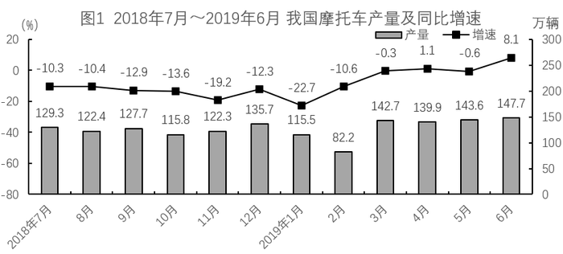

#### 第 11 题　qid 12536429 · 综合

2018年7月~2019年6月，我国摩托车产量与销量相差不超过0.5万辆的月份有多少个?

- **A**. 4
- **B**. 5　✅
- **C**. 6
- **D**. 7

**答案**：B

**官方解析**

定位统计图1、图2，可知2018年7月~2019年6月我国摩托车产量及销量，则2018年7月~2019年6月我国摩托车产量与销量分别相差：

2018月7月：130.3-129.3=1万辆；

2018年8月：122.7-122.4=0.3万辆；

2018年9月：128.1-127.7=0.4万辆；

2018年10月：115.9-115.8=0.1万辆；

2018年11月：122.3-120.9=1.4万辆；

2018年12月：135.7-134.0=1.7万辆；

2019年1月：117.2-115.5=1.7万辆；

2019年2月：83.1-82.2=0.9万辆；

2019年3月：142.8-142.7=0.1万辆；

2019年4月：139.9-135.2=4.7万辆；

2019年5月：143.6-141.1=2.5万辆；

2019年6月：147.7-147.2=0.5万辆。

相差不超过0.5万辆（万辆）的月份为2018年8月（0.3万辆）、2018年9月（0.4万辆）、2018年10月（0.1万辆）、2019年3月（0.1万辆）、2019年6月（0.5万辆），共5个。

故正确答案为B。

---

#### 第 12 题　qid 12536430 · 综合

2018年1月，我国摩托车产量比销量：

- **A**. 少10万辆以内
- **B**. 少10万辆以上
- **C**. 多10万辆以内
- **D**. 多10万辆以上　✅

**答案**：D

**官方解析**

根据题干“2018年1月······比······”，结合材料时间为2019年1月，且选项为“多/少+单位”，可判定本题为基期和差问题。定位统计图1、图2可得： 2019年1月，我国摩托车产量为115.5万辆，同比下降22.7%；销量为117.2万辆，同比下降12.0%。根据公式：基期量，则所求为万辆，即多10万辆以上。

故正确答案为D。

---

#### 第 13 题　qid 12536432 · 增长

2018年7月，我国摩托车销量约比上月下降了：

- **A**. 18%
- **B**. 12%
- **C**. 6%　✅
- **D**. 1%

**答案**：C

**官方解析**

根据题干“2018年7月······约比上月下降了”，结合选项为百分数，可判定本题为一般增长率问题。定位统计图2可得：2018年7月，我国摩托车销量为130.3万辆 ；2019年6月，我国摩托车销量为147.2万辆，同比增长6.7%。根据公式：基期量，可得2018年6月我国摩托车销量为万辆；根据公式：增长率，可得所求增长率为，即约比上月下降了5.5%，与C项最接近。

故正确答案为C。

---

#### 第 14 题　qid 12536434 · 综合

将①2018年第三季度②2018年第四季度③2019年第一季度④2019年第二季度，我国摩托车产量从低到高排列，下列排序正确的是：

- **A**. ③<②<①<④　✅
- **B**. ③<①<②<④
- **C**. ③<④<②<①
- **D**. ③<①<④<②

**答案**：A

**官方解析**

根据题干“······产量从低到高排列，下列排序正确的是”，可判定本题为排序类问题。定位统计图1可知2018年7月-2019年6月我国摩托车产量。则①2018年第三季度我国摩托车产量=129.3+122.4+127.7=379.4万辆；②2018年第四季度我国摩托车产量=115.8+122.3+135.7=373.8万辆；③2019年第一季度我国摩托车产量=115.5+82.2+142.7=340.4万辆；④2019年第二季度我国摩托车产量=139.9+143.6+147.7=431.2辆。比较可知，我国摩托车产量从低到高排序为③&lt;②&lt;①&lt;④。
故正确答案为A。

---

#### 第 15 题　qid 12536436 · 综合

能够从上述资料中推出的是：

- **A**. 2018年7月~2019年6月，我国摩托车产销量都同比下降的月份有10个
- **B**. 2018年7月~2019年6月，我国摩托车销量高于上月水平的月份有6个　✅
- **C**. 2018年9月，我国摩托车销量同比增量少于2019年6月
- **D**. 2018年下半年，我国摩托车产量比2019年上半年多

**答案**：B

**官方解析**

A项：定位统计图1可得2018年7月~2019年6月，我国摩托车产量同比增速分别为：-10.3%、-10.4%、-12.9%、-13.6%、-19.2%、-12.3%、-22.7%、-10.6%、-0.3%、1.1%、-0.6%、8.1%；定位统计图2可得2018年7月~2019年6月，我国摩托车销量同比增速分别为：-8.6%、-11.1%、14.1%、-14.8%、-17.2%、-11.4%、-12.0%、-13.6%、-0.9%、-0.3%、-1.3%、6.7%。产销量都同比下降（即同比增速&lt;0）的月份有：2018年7月、8月、10月、11月、12月，2019年1月、2月、3月、5月，共9个，错误；

B项：定位统计图2可得2018年7月~2019年6月，我国摩托车销量分别为：130.3万辆、122.7万辆、128.1万辆、115.9万辆、120.9万辆、134.0万辆、117.2万辆、83.1万辆、142.8万辆、135.2万辆、141.1万辆、147.2万辆；2019年6月，我国摩托车销量同比增速为6.7%。根据公式：基期量，可知2018年6月，我国摩托车销量为万辆。则2018年7月~2019年6月，我国摩托车销量高于上月水平的月份有2018年9月（128.1万辆&gt;122.7万辆）、2018年11月（120.9万辆&gt;115.9万辆）、2018年12月（134.0万辆&gt;120.9万辆）、2019年3月（142.8万辆&gt;83.1万辆）、2019年5月（141.1万辆&gt;135.2万辆）、2019年6月（147.2万辆&gt;141.1万辆），共6个，正确；

C项：定位统计图2可得2018年9月，我国摩托车销量为128.1万辆，同比增速为14.1%；2019年6月，我国摩托车销量为147.2万辆，同比增速为6.7%。根据公式：增长量，可知2018年9月，我国摩托车销量同比增量为万辆；2019年6月，我国摩托车销量同比增量为万辆。则2018年9月，我国摩托车销量同比增量多于2019年6月，错误；

D项：定位统计图1可得2018年7月~2019年6月我国摩托车产量。可知2018年下半年，我国摩托车产量为万辆；2019年上半年，我国摩托车产量为万辆。则2018年下半年，我国摩托车产量比2019年上半年少，错误。

故正确答案为B。

---
