# 2024年山西省县级纪委监委公务员录用考试《行测》题（网友回忆版）

> 省考 · 2024 年 · 6 个模块 · 共 120 题

- [政治理论](#%E6%94%BF%E6%B2%BB%E7%90%86%E8%AE%BA) · 8 题
- [常识判断](#%E5%B8%B8%E8%AF%86%E5%88%A4%E6%96%AD) · 12 题
- [言语理解与表达](#%E8%A8%80%E8%AF%AD%E7%90%86%E8%A7%A3%E4%B8%8E%E8%A1%A8%E8%BE%BE) · 35 题
- [数量关系](#%E6%95%B0%E9%87%8F%E5%85%B3%E7%B3%BB) · 10 题
- [判断推理](#%E5%88%A4%E6%96%AD%E6%8E%A8%E7%90%86) · 40 题
- [资料分析](#%E8%B5%84%E6%96%99%E5%88%86%E6%9E%90) · 15 题

---

## 政治理论

### 第 1 题　qid 19797087 · 新思想

习近平总书记指出，建设现代化经济体系，需要扎实管用的政策举措和行动。下列做法有利于我国现代化经济体系建设的是：
①某市城区古建筑较多且分散，为做好古城保护，市政府决定本市不再开发地产项目
②某市为提高本市企业竞争力，加快推进市内“一带一路”货运基础设施项目建设
③某区为鼓励地方企业科技创新和金融创新发展，加大对辖区内中小型科技企业融资支持力度
④某市为简化行政审批流程，推行工商营业执照、组织机构代码证、税务登记证三证合一登记制度

- **A**. ①②③
- **B**. ①②④
- **C**. ①③④
- **D**. ②③④　✅

**答案**：D

**官方解析**

本题考查政治常识。
①错误，某市为保护古城决定不再开发地产项目，这种做法过于绝对。虽然古城保护很重要，但不开发地产项目不利于城市的合理建设和经济发展的多元化，不能简单地因保护古建筑而完全放弃地产开发这一重要的经济领域，应在保护与开发之间寻求平衡。因此，不利于现代化经济体系建设。
②正确，加快推进市内“一带一路”货运基础设施项目建设，有利于加强与沿线国家和地区的贸易往来和经济合作，有利于吸引外资、技术和人才，推动产业升级和经济结构调整。因此，有利于我国现代化经济体系建设。
③正确，加大对辖区内中小型科技企业融资支持力度，有利于鼓励企业进行科技创新和金融创新。科技创新是建设现代化经济体系的战略支撑，中小型科技企业是推动创新的重要力量，为其提供融资支持有助于激发企业活力，推动产业向高端化、智能化、绿色化发展，从而推动现代化经济体系建设。因此，有利于我国现代化经济体系建设。
④正确，推行工商营业执照、组织机构代码证、税务登记证三证合一登记制度，能简化行政审批流程，提高市场主体的办事效率，激发市场活力和社会创造力，促进各类市场主体的发展。因此，有利于我国现代化经济体系建设。
故②③④表述正确。
故正确答案为D。

---

### 第 2 题　qid 19797088 · 时事政治

2024年7月15日至18日在北京举行了中共二十届三中全会，全会指出，进一步全面深化改革的总目标是：
①继续完善和发展中国特色社会主义制度
②推进国家治理体系和治理能力现代化
③全面建成高水平社会主义市场经济体制
④基本实现社会主义现代化

- **A**. ①②　✅
- **B**. ①③
- **C**. ②④
- **D**. ③④

**答案**：A

**官方解析**

本题考查政治常识。
①②正确，③④错误，党的二十届三中全会指出，进一步全面深化改革的总目标是继续完善和发展中国特色社会主义制度，推进国家治理体系和治理能力现代化。到二〇三五年，全面建成高水平社会主义市场经济体制，中国特色社会主义制度更加完善，基本实现国家治理体系和治理能力现代化，基本实现社会主义现代化，为到本世纪中叶全面建成社会主义现代化强国奠定坚实基础。要聚焦构建高水平社会主义市场经济体制，聚焦发展全过程人民民主，聚焦建设社会主义文化强国，聚焦提高人民生活品质，聚焦建设美丽中国，聚焦建设更高水平平安中国，聚焦提高党的领导水平和长期执政能力，继续把改革推向前进。到二〇二九年中华人民共和国成立八十周年时，完成本决定提出的改革任务。
故正确答案为A。

---

### 第 3 题　qid 19797095 · 时事政治

2024年4月，中共中央办公厅印发通知，围绕新修订的《中国共产党纪律处分条例》在全党开展：

- **A**. 党纪学习教育　✅
- **B**. 违纪案例警示教育
- **C**. 党风廉政专项整顿
- **D**. 党内法规学习教育

**答案**：A

**官方解析**

本题考查政治常识。
A项正确，B、C、D三项错误，2024年4月，中共中央办公厅印发的《关于在全党开展党纪学习教育的通知》指出，为深入学习贯彻修订后的《中国共产党纪律处分条例》，经党中央同意，自2024年4月至7月，在全党开展党纪学习教育。
故正确答案为A。

---

### 第 4 题　qid 19797109 · 时事政治

2024年1月8日召开的中国共产党第二十届中央纪律检查委员会第三次全体会议上，习近平总书记强调，新征程反腐败斗争，必须在铲除腐败问题产生的土壤和条件上持续发力、纵深推进。总的要求是：
①坚持一体推进不敢腐、不能腐、不想腐，深化标本兼治、系统施治
②不断拓展反腐败斗争深度广度，对症下药、精准施治、多措并举
③让反复发作的老问题逐渐减少，让新出现的问题难以蔓延，推动防范和治理腐败问题常态化、长效化
④要建立腐败预警惩治联动机制，加强廉洁风险隐患动态监测，强化对新型腐败和隐性腐败的快速处置

- **A**. ①②③　✅
- **B**. ①②④
- **C**. ①③④
- **D**. ②③④

**答案**：A

**官方解析**

本题考查政治常识。
①②③正确，④错误，习近平总书记在中国共产党第二十届中央纪律检查委员会第三次全体会议上的讲话中强调：“新征程反腐败斗争，必须在铲除腐败问题产生的土壤和条件上持续发力、纵深推进。总的要求是，坚持一体推进不敢腐、不能腐、不想腐，深化标本兼治、系统施治，不断拓展反腐败斗争深度广度，对症下药、精准施治、多措并举，让反复发作的老问题逐渐减少，让新出现的问题难以蔓延，推动防范和治理腐败问题常态化、长效化。”
故正确答案为A。

---

### 第 5 题　qid 19797089 · 时事政治

2024年6月24日，全国科技大会、国家科学技术奖励大会和中国科学院第二十一次院士大会、中国工程院第十七次院士大会在人民大会堂召开，习近平发表重要讲话并强调，在新时代科技事业发展实践中，我们不断深化规律性认识，积累了许多重要经验，主要是：
①坚持党的全面领导
②坚持科技引领发展
③坚持“四个面向”的战略导向
④坚持以深化改革激发创新活力

- **A**. ①②③
- **B**. ①②④
- **C**. ①③④　✅
- **D**. ②③④

**答案**：C

**官方解析**

本题考查政治常识。
①③④正确，②错误，习近平总书记在2024年全国科技大会、国家科学技术奖励大会和中国科学院第二十一次院士大会、中国工程院第十七次院士大会上的讲话中强调：“在新时代科技事业发展实践中，我们不断深化规律性认识，积累了许多重要经验。主要是：坚持党的全面领导，坚持走中国特色自主创新道路，坚持创新引领发展，坚持‘四个面向’的战略导向，坚持以深化改革激发创新活力，坚持推动教育科技人才良性循环，坚持培育创新文化，坚持科技开放合作造福人类。这些经验弥足珍贵，必须长期坚持并在实践中不断丰富发展。”
故正确答案为C。

---

### 第 6 题　qid 19797090 · 时事政治

2024年6月28日，和平共处五项原则发表70周年纪念大会在北京人民大会堂隆重举行，习近平出席并发表题为《弘扬和平共处五项原则，携手构建人类命运共同体》重要讲话，下列对和平共处五项原则理解不正确的是：

- **A**. 为国际关系和国际法治树立了历史标杆
- **B**. 为国际秩序改革和完善贡献了历史智慧
- **C**. 为世界各国团结合作、联合自强汇聚了强大合力　✅
- **D**. 为不同社会制度国家建立和发展关系提供了正确指导

**答案**：C

**官方解析**

本题考查政治常识。
C项错误，A、B、D三项正确，习近平总书记在和平共处五项原则发表70周年纪念大会上的讲话中指出：70年来，和平共处五项原则跨越时空、超越隔阂，经久愈韧、历久弥新，成为开放包容、普遍适用的国际关系基本准则和国际法基本原则，为国际关系和国际法治树立了历史标杆，为不同社会制度国家建立和发展关系提供了正确指导，为发展中国家团结合作、联合自强汇聚了强大合力，为国际秩序改革和完善贡献了历史智慧，为人类进步事业作出了不可磨灭的历史贡献。
本题为选非题，故正确答案为C。

---

### 第 7 题　qid 19797091 · 新思想

党的十八大以来，习近平总书记站在中华民族永续发展、人类文明发展的高度，强调了生态文明的重要意义。下列做法符合我国生态文明建设要求的是：

- **A**. 某地政府准许在当地饮用水水源准保护区内的采石场扩建
- **B**. 某省发布企业生态环境监管正面清单，对符合要求的企业免予或减少现场执法检查　✅
- **C**. 某地为发展经济大幅增加矿区面积，进行露天开采，并计划开采完成后立即进行生态修复
- **D**. 某国家级自然保护区在环保整改时将6座小水电站所在的区域由原国家级自然保护区核心区调整为一般控制区，以调代改，保留了小水电站

**答案**：B

**官方解析**

本题考查政治常识。
A项错误，在饮用水水源准保护区内扩建采石场会对水质、生态环境、周边居民生活等方面造成严重的负面影响，同时也违反了法律法规，不符合生态文明建设中保护生态环境、保障人民群众饮水安全的要求。
B项正确，某省发布企业生态环境监管正面清单，对符合要求的企业免予或减少现场执法检查有多方面好处。首先有利于激励企业自觉遵守环保法律法规，积极履行生态环境保护主体责任，推动企业绿色转型，同时也有利于优化执法资源配置，提高执法效率。该做法有利于促进经济与环境协调发展，符合生态文明建设要求。
C项错误，虽然计划在开采完成后进行生态修复，但大幅增加矿区面积并进行露天开采，在开采过程中会对生态环境造成严重的破坏，如破坏地表植被、导致土地沙化、引发地质灾害等，且生态修复往往难以完全恢复到原有生态状态，这种先破坏后治理的方式不符合生态文明建设中“生态优先、绿色发展”的理念。
D项错误，国家级自然保护区的核心区是生态系统最敏感、最重要的区域，应严格保护，减少人类活动的干扰。将小水电站所在区域由核心区调整为一般控制区，并以调代改保留小水电站，这在一定程度上削弱了对核心区生态环境的保护力度，不利于保护生物多样性和生态系统的完整性，不符合生态文明建设对自然保护区严格保护的要求。
故正确答案为B。

---

### 第 8 题　qid 19797093 · 时事政治

党的二十大报告指出，我们党坚定信仰信念，把握历史主动的根本在于：

- **A**. 坚定共产主义远大理想
- **B**. 坚持中国共产党的全面领导
- **C**. 拥有马克思主义科学理论指导　✅
- **D**. 坚持辩证唯物主义和历史唯物主义

**答案**：C

**官方解析**

本题考查政治常识。
C项正确，A、B、D三项错误，党的二十大报告在“二、开辟马克思主义中国化时代化新境界”部分指出：“马克思主义是我们立党立国、兴党兴国的根本指导思想。实践告诉我们，中国共产党为什么能，中国特色社会主义为什么好，归根到底是马克思主义行，是中国化时代化的马克思主义行。拥有马克思主义科学理论指导是我们党坚定信仰信念、把握历史主动的根本所在。”
故正确答案为C。

---

## 常识判断

### 第 1 题　qid 19797098 · 人文常识

下列关于二〇三五年，我国发展总体目标的表述正确的是：

- **A**. 实现新型工业化、信息化、城镇化、农业现代化
- **B**. 实现高水平科技自立自强，进入创新型国家行列
- **C**. 人均国内生产总值迈上新的大台阶，达到中等发达国家水平　✅
- **D**. 居民人均可支配收入再上新台阶，高收入群体比重明显提高

**答案**：C

**官方解析**

本题考查政治常识。
C项正确，A、B、D三项错误，党的二十大报告在“三、新时代新征程中国共产党的使命任务”部分指出：“到二〇三五年，我国发展的总体目标是：经济实力、科技实力、综合国力大幅跃升，人均国内生产总值迈上新的大台阶，达到中等发达国家水平；实现高水平科技自立自强，进入创新型国家前列；建成现代化经济体系，形成新发展格局，基本实现新型工业化、信息化、城镇化、农业现代化······人民生活更加幸福美好，居民人均可支配收入再上新台阶，中等收入群体比重明显提高，基本公共服务实现均等化，农村基本具备现代生活条件，社会保持长期稳定，人的全面发展、全体人民共同富裕取得更为明显的实质性进展······”
故正确答案为C。

---

### 第 2 题　qid 19797099 · 人文常识

关于打造共建共治共享的社会治理格局，下列说法错误的是：

- **A**. 社会治理应加强多元主体合作
- **B**. 社会治理需要提高智能化水平
- **C**. 社会治理需要有序扩大公众参与
- **D**. 社会治理应将重心转移到地方政府层面　✅

**答案**：D

**官方解析**

本题考查政治常识。
A、B、C三项正确，D项错误，党的十九大报告在“八、提高保障和改善民生水平，加强和创新社会治理”部分指出：“（六）打造共建共治共享的社会治理格局。加强社会治理制度建设，完善党委领导、政府负责、社会协同、公众参与、法治保障的社会治理体制，提高社会治理社会化、法治化、智能化、专业化水平······加强社区治理体系建设，推动社会治理重心向基层下移，发挥社会组织作用，实现政府治理和社会调节、居民自治良性互动。”其中“完善党委领导、政府负责、社会协同、公众参与、法治保障的社会治理体制”可以体现社会治理应加强多元主体合作，并且需要公众参与。
本题为选非题，故正确答案为D。

---

### 第 3 题　qid 19797096 · 法律常识

根据《行政复议法》，下列说法正确的是：

- **A**. 乙对市教育局和市场监管局分别作出的处罚决定不服，向市人民政府申请行政复议，要求对这两起处罚决定合并进行复议
- **B**. 甲对县城管局处罚决定不服遂提起行政诉讼，在人民法院受理期间可以同时向县人民政府申请行政复议
- **C**. 丙对工伤认定结论不服，可以申请行政复议　✅
- **D**. 丁申请行政复议时，必须提交书面申请资料

**答案**：C

**官方解析**

本题考查法律常识。
A项错误，根据《行政复议法》第二十二条第四款规定：“申请人对两个以上行政行为不服的，应当分别申请行政复议。”选项中，市教育局和市场监管局分别作出的处罚决定属于两个行政行为，乙应当分别申请行政复议。
B项错误，根据《行政复议法》第二十九条第二款规定：“公民、法人或者其他组织向人民法院提起行政诉讼，人民法院已经依法受理的，不得申请行政复议。”选项中，人民法院已经受理该案，甲不得申请行政复议。
C项正确，根据《行政复议法》第十一条第七项规定：“有下列情形之一的，公民、法人或者其他组织可以依照本法申请行政复议：（七）对行政机关作出的不予受理工伤认定申请的决定或者工伤认定结论不服。”选项中，丙对工伤认定结论不服，可以申请行政复议。
D项错误，根据《行政复议法》第二十二条第一款规定：“申请人申请行政复议，可以书面申请；书面申请有困难的，也可以口头申请。”选项中，丁若书面申请有困难，也可以口头申请复议。
故正确答案为C。

---

### 第 4 题　qid 19797094 · 法律常识

下列合同条款不符合劳动合同法相关规定的是：

- **A**. 试用期的工资为本单位相同岗位最低档工资的80%
- **B**. 试用期满，可再约定一个不超过2个月的试用期　✅
- **C**. 试用期包含在劳动合同期限内
- **D**. 劳动合同的期限为5年

**答案**：B

**官方解析**

本题考查法律常识。
A项正确，根据《中华人民共和国劳动合同法实施条例》第十五条规定：“劳动者在试用期的工资不得低于本单位相同岗位最低档工资的80%或者不得低于劳动合同约定工资的80%，并不得低于用人单位所在地的最低工资标准。”
B项错误，根据《中华人民共和国劳动合同法》第十九条第二款规定：“同一用人单位与同一劳动者只能约定一次试用期。”试用期满不得再约定一个试用期。
C项正确，根据《中华人民共和国劳动合同法》第十九条第四款规定：“试用期包含在劳动合同期限内。劳动合同仅约定试用期的，试用期不成立，该期限为劳动合同期限。”
D项正确，根据《中华人民共和国劳动合同法》第十三条：“固定期限劳动合同，是指用人单位与劳动者约定合同终止时间的劳动合同。用人单位与劳动者协商一致，可以订立固定期限劳动合同。”
本题为选非题，故正确答案为B。

---

### 第 5 题　qid 19797106 · 地理国情

关于河西走廊，下列说法错误的是：

- **A**. 河西走廊与青藏高原中间隔着天山山脉　✅
- **B**. 酒泉郡、敦煌郡是著名的汉代河西四郡之一
- **C**. 佛经翻译家鸠摩罗什是沿河西走廊到达长安的
- **D**. 当地气候干旱，但冰雪融水丰富，灌溉农业发达

**答案**：A

**官方解析**

本题考查地理国情。
A项错误，河西走廊位于中国西北部，因地处黄河以西，形似走廊而得名，专指祁连山脉（走廊南山）与走廊北山（马鬃山、合黎山、龙首山）之间的呈东南—西北走向的狭长通道。河西走廊与青藏高原中间隔着祁连山脉。
B项正确，河西四郡，指西汉政府在河西走廊设置的四个郡，即武威郡、张掖郡、酒泉郡、敦煌郡。是汉唐时期通往西域的重要通道。
C项正确，鸠摩罗什，东晋十六国时期后秦高僧，中国汉传佛教四大佛经翻译家之一。曾在地处河西走廊的凉州城潜心讲经说法长达十七年之久，极大地促进了佛教在河西走廊的传播与发展，后由此前往长安。
D项正确，河西走廊地处欧亚大陆腹地的干旱地区，属于温带大陆性气候，降水稀少、气候干燥。但得益于祁连山冰雪融水的灌溉滋润，河西走廊内部形成了武威、张掖—酒泉、玉门—敦煌—瓜州三大绿洲区，成为宜农宜牧的丰饶之地和名副其实的孔道。
本题为选非题，故正确答案为A。

---

### 第 6 题　qid 19797110 · 人文常识

①镶金兽首玛瑙杯 ②铜奔马（马踏飞燕） ③四羊方尊 ④曾侯乙编钟 ⑤贾湖骨笛 ⑥妇好鼎
上述文物属于同一历史时期的是：

- **A**. ①②
- **B**. ②⑤
- **C**. ③⑥　✅
- **D**. ④⑥

**答案**：C

**官方解析**

本题考查人文常识。
①镶金兽首玛瑙杯，是唐代玉器中的珍品，1970年10月在陕西省西安市南郊何家村出土，是至今所见的唐代唯一一件俏色玉雕。
②铜奔马（马踏飞燕），为东汉青铜器，1969年10月出土于甘肃省武威市雷台汉墓。奔马全身的着力点集注于超越飞鸟的一足之上，准确地掌握了力学的平衡原理，具有卓越的工艺技术水平。
③四羊方尊，是商代晚期青铜礼器，1938年出土于湖南省宁乡县黄材镇月山铺转耳仑的山腰上（炭河里遗址），是中国现存商代青铜方尊中最大的一件。
④曾侯乙编钟，是战国早期曾国国君的一套大型礼乐重器，1978年在湖北随县（今随州）擂鼓墩曾侯乙墓出土，是中国迄今发现数量最多、保存最好、音律最全、气势最宏伟的一套编钟。
⑤贾湖骨笛，距今7800~9000年，出土于中国河南省漯河市舞阳县贾湖遗址，是中国考古发现的最早的乐器。
⑥妇好鼎，为商代晚期文物，1976年出土于安阳市小屯村殷墟妇好墓。
综上③⑥均属于商代晚期。
故正确答案为C。

---

### 第 7 题　qid 19797104 · 科技常识

空气中二氧化碳的含量增长会导致地球表面温度升高，主要是因为：

- **A**. 在工业生产中排放的二氧化碳含有大量生产过程中产生的热量
- **B**. 二氧化碳能够吸收地表释放的长波辐射并部分反射回地表　✅
- **C**. 二氧化碳直接吸收了太阳射向地球的可见光中的热量
- **D**. 二氧化碳增多导致光合作用增强，使植物释放更多热量

**答案**：B

**官方解析**

本题考查科技常识。
A项错误，工业生产中排放的废气有二氧化碳、二硫化碳和硫化氢等，这些废气中含有大量的热能，直接排放到大气中会造成能源浪费和环境污染。但工业废气中携带的热量并不是造成温室效应的主要原因。
B项正确，C项错误，二氧化碳对太阳的短波辐射，即可见光和紫外线，具有高度的透过性；但对地表释放的长波辐射，即红外线，具有高度的吸收性，这些长波辐射一部分被二氧化碳吸收并重新辐射回地球表面，导致地球表面温度升高，这就是造成温室效应的主要原因。
D项错误，二氧化碳是光合作用的底物之一，提高二氧化碳浓度可以增加其在光合作用中的利用率，进而使光合作用增强。但是光合作用是一个吸热反应，它需要吸收大量的热量才能进行。
故正确答案为B。

---

### 第 8 题　qid 19797107 · 科技常识

关于食物链，下列说法错误的是：

- **A**. 食草动物是食物链的起点　✅
- **B**. 分解者主要包括细菌和真菌
- **C**. 能量由低营养级向高营养级逐级递减
- **D**. 通常有害物质在高营养级的生物中更易富集

**答案**：A

**官方解析**

本题考查科技常识。
A项错误，食物链是指生态系统中各种动植物和微生物之间由于摄食关系而形成的一种联系。食物链的起点通常是自养生物，即能通过光合作用或其他方式自我制造营养的植物。这些植物被食草动物食用，食草动物又成为食肉动物的食物，如此往复。
B项正确，根据生物在生态系统中的作用，可以把生物划分为生产者、消费者和分解者，其中分解者是指以动植物等生物的遗体、残骸、粪便等为食的生物，包括细菌和真菌。
C项正确，能量在生态系统中只能沿着食物链从低营养级流向高营养级。在能量流动的过程中，每一营养级都会通过呼吸作用消耗大量的能量，并且只有一小部分能量能够传递给下一营养级。这种能量的逐级递减是生态系统能量流动的一个基本规律。
D项正确，食物链富集效应是指在生态系统中，某些物质或能量在食物链中的各级生物体内逐渐积累和传递的过程。这些物质通常包括有毒物质、重金属、持久性有机污染物等，它们通过食物链的传递而逐渐富集在较高营养级的生物体内。
本题为选非题，故正确答案为A。

---

### 第 9 题　qid 19797105 · 人文常识

某剧组正在拍摄一部20世纪40年代的谍战剧，下列情节违背史实的是：

- **A**. 男女主角伪装成情侣去电影院看电影
- **B**. 报纸刊登出盟军在诺曼底登陆的消息
- **C**. 某军官因做出壮举而被授予大校军衔　✅
- **D**. 地下工作者向上级发送电报传递信息

**答案**：C

**官方解析**

本题考查人文常识。
A项正确，电影诞生于1895年12月的法国巴黎。1896年电影现身于上海，中国本土的电影业便从商业放映起步了。20世纪40年代去电影院看电影是可能的。
B项正确，诺曼底登陆是第二次世界大战中，美英盟军于1944年6~7月在法国北部诺曼底地区对德军实施的战略性登陆作战。20世纪40年代报纸刊登出盟军在诺曼底登陆的消息是可能的。
C项错误，大校是一些国家军队校级军官中的军衔称号。第二次世界大战后，1952年朝鲜正式实行军衔制时，首次在人民军中设置了大校军衔。1955年2月8日，中华人民共和国第一届全国人民代表大会常务委员会第6次会议通过的《中国人民解放军军官服役条例》规定，设大校军衔。因此该军衔在20世纪40年代不可能出现。
D项正确，电报是一种最早用电的方式来传送信息的、可靠的即时远距离通信方式，它是19世纪30年代在英国和美国发展起来的。中国首条电报线路出现在1871年。20世纪40年代地下工作者向上级发送电报传递信息是可能的。
本题为选非题，故正确答案为C。

---

### 第 10 题　qid 19797108 · 人文常识

下列古语与《诗经》不直接相关的是：

- **A**. 不学诗，无以言
- **B**. 诗言志，歌永言，声依永，律和声　✅
- **C**. 诗，可以兴，可以观，可以群，可以怨
- **D**. 《诗》三百，一言以蔽之，曰“思无邪”

**答案**：B

**官方解析**

本题考查人文常识。
A项正确，“不学诗，无以言”出自《论语·季氏篇第十六》，意思是不学习《诗经》，就无法使语言典雅有力。反之，学习《诗经》可以增强语言表达能力。这里的“诗”就是《诗经》。
B项错误，“诗言志，歌永言，声依永，律和声”出自《尚书·虞书·舜典》，意思是诗是用来表达人的思想志向，歌是用来舒缓咏唱的语言，五声是根据所唱而制定的，六律要与五声相和谐。这句古语与《诗经》不直接相关。
C项正确，“诗，可以兴，可以观，可以群，可以怨”出自《论语·阳货篇》，意思是《诗》可以使人受到感染，得到启发和鼓舞；可以观察人情风俗的盛衰，认识社会现实；可以通过情感交流，彼此感染，和谐相处；可以抒发心中不平，讽刺不良政治。这里的“诗”就是《诗经》。
D项正确，“《诗》三百，一言以蔽之，曰‘思无邪’”出自《论语·为政篇》，意思是《诗》三百篇，用一句话来概括，就是没有邪念，思想纯正。这里的《诗》就是《诗经》。
本题为选非题，故正确答案为B。

---

### 第 11 题　qid 19797112 · 人文常识

关于电影艺术中的术语，下列说法错误的是：

- **A**. 蒙太奇：电影剧本创作中一种突出人物性格的理论　✅
- **B**. 景深镜头：有前中后景并且全部清晰，都有意义的镜头
- **C**. 长镜头：用一个镜头不间断拍摄完整戏段或场景的拍摄手法
- **D**. 绿幕：用于处理特技镜头的背景幕布，演员幕前表演，背景由电脑处理完成

**答案**：A

**官方解析**

本题考查人文常识。
A项错误，蒙太奇并不是电影剧本创作中突出人物性格的理论。蒙太奇是电影创作的主要叙述手段和表现手段之一，它是指将一系列在不同地点、从不同距离和角度、以不同方法拍摄的镜头排列组合起来，通过镜头的组接，产生连贯、对比、衬托、悬念、暗示等效果，从而创造出独特的电影时空，讲述故事、传达情感和表达思想等，而不是仅仅突出人物性格。并且蒙太奇主要运用在电影的剪辑、镜头组接等拍摄制作环节，而非剧本创作环节。
B项正确，景深镜头是一种具有特定特点的镜头表现形式。在景深镜头中，有前中后景，并且这些景别都能够清晰地呈现在画面中，而且每一个景别所包含的元素、场景等都具有一定的意义，它们共同参与到画面的表意和叙事当中，比如可以通过不同景别的元素对比、呼应等方式来传达信息、营造氛围等。
C项正确，长镜头就是指用一个镜头不间断地拍摄完整的戏段或场景的拍摄手法。它能够保持时间和空间的连续性，使观众可以在一个相对较长的时间内观察场景中的人物、动作、环境等元素的变化和发展，增强了画面的真实感和现场感。
D项正确，绿幕是影视制作中常用的工具。因为绿色在人的肤色中不常见，所以演员在绿幕前进行表演，后期制作时可以利用抠像技术将绿色背景去除，然后通过电脑处理将其他合适的背景添加进去，从而实现各种特技镜头的效果，比如奇幻场景、科幻场景等。
本题为选非题，故正确答案为A。

---

### 第 12 题　qid 19797113 · 人文常识

下列与糖尿病有关的说法错误的是：

- **A**. 典型症状是多饮、多食、多尿和体重减少
- **B**. 膳食管理和治疗是患者血糖控制的核心
- **C**. 肥胖患者减重后可以改善血糖控制
- **D**. 血糖是依靠肝脏进行代谢和调控的　✅

**答案**：D

**官方解析**

本题考查科技常识。
A项正确，糖尿病的典型症状为“三多一少”，即多饮、多食、多尿和体重减少。由于胰岛素分泌不足或胰岛素作用障碍，导致身体无法有效利用葡萄糖，血糖升高，过多的葡萄糖从尿液排出，形成渗透性利尿，出现多尿症状；多尿导致身体失水，刺激口渴中枢，引起多饮；身体不能充分利用葡萄糖供能，能量缺乏，就会使患者容易饥饿，出现多食；尽管患者食量增加，但因为葡萄糖不能被正常利用，身体会分解脂肪和蛋白质来提供能量，从而导致体重下降。
B项正确，膳食管理在糖尿病患者血糖控制中起着核心作用。合理的饮食控制可以帮助调节血糖水平，例如控制碳水化合物的摄入量，选择高膳食纤维的食物，均衡营养等。同时，配合适当的治疗（如药物治疗、运动治疗等），能够更好地控制血糖，预防和延缓糖尿病并发症的发生发展。
C项正确，肥胖是2型糖尿病的重要危险因素之一。肥胖患者体内往往存在胰岛素抵抗，即身体细胞对胰岛素的敏感性降低。减重后，尤其是减少内脏脂肪含量，可以改善胰岛素抵抗的状态，使身体细胞对胰岛素更加敏感，从而有助于更好地控制血糖水平，改善糖尿病病情。
D项错误，血糖的代谢和调控是一个复杂的过程，并非仅仅依靠肝脏进行。肝脏在血糖调控中确实起着重要作用，如通过肝糖原的合成与分解来调节血糖浓度，当血糖升高时，肝脏将葡萄糖合成肝糖原储存起来；当血糖降低时，肝糖原分解为葡萄糖进入血液，维持血糖稳定。但除此之外，胰岛分泌的胰岛素和胰高血糖素等激素对血糖的调节也起着关键作用，胰岛素可以促进组织细胞摄取、利用和储存葡萄糖，降低血糖；胰高血糖素则可以促进肝糖原分解和非糖物质转化为葡萄糖，升高血糖。此外，肌肉、脂肪等组织也参与了血糖的代谢和调控。
本题为选非题，故正确答案为D。

---

## 言语理解与表达

### 第 1 题　qid 19034541 · 逻辑填空

党的二十届三中全会提出，要毫不动摇巩固和发展公有制经济，毫不动摇鼓励、支持、引导非公有制经济发展，保证各种所有制经济依法平等使用生产要素、公平参与市场竞争、同等受到法律保护，促进各种所有制经济            、共同发展。
填入画横线部分最恰当的一项是：

- **A**. 合作共赢
- **B**. 互惠互利
- **C**. 优势互补　✅
- **D**. 相得益彰

**答案**：C

**官方解析**

根据文意可知，党的二十届三中全会提出的政策目标是要让公有制经济和非公有制经济在平等和公平的竞争环境下都能够获得保护和发展，因此横线所填成语应表达各种所有制经济在发展中能够发挥各自的优势和特点，相互促进、相互补充，以实现共同发展。
A项“合作共赢”指交易双方或共事双方或多方在完成一项交易活动或共担一项任务的过程中互惠互利、相得益彰，能够实现双方或多方的共同收益，侧重合作，B项“互惠互利”指互相给予好处，使双方都能得到利益，侧重互相给予好处，均与文意无关，排除。
C项“优势互补”指双方都有有自己的优势，各自取长补短，实现共赢，D项“相得益彰”指互相配合和补充更能显出长处、发挥作用，均含有互相补充、相互促进的意思，可以体现各种所有制经济间的互补性，但通过对比可以发现，C项“优势互补”强调的是各种所有制经济之间借助对方优势来弥补自身不足，填入文段可以与“共同发展”构成前后的顺承关系，当选。D项“相得益彰”更加强调是配合之后带来的整体效果，按照逻辑关系，应该放在“共同发展”的后面，排除。
故正确答案为C。
【文段出处】中华人民共和国中央人民政府网《中国共产党第二十届中央委员会第三次全体会议公报》

---

### 第 2 题　qid 19034547 · 逻辑填空

在漫长的天文研究过程中，中国古代科学家建立了一套有别于欧洲的知识体系。如赤道圈依据太阳的视运动分为365.25度，对应的每日太阳的平均视运动为1度，这与欧洲采用360度的六十进制的西方传统相斥。显然，这种对赤道的划分方式让那些接受过古希腊天文学传统训练，习惯了黄道坐标系的传教士            。
填入画横线部分最恰当的一项是：

- **A**. 始料不及
- **B**. 迷惑不解　✅
- **C**. 目瞪口呆
- **D**. 不屑一顾

**答案**：B

**官方解析**

根据前文“中国古代科学家建立了一套有别于欧洲的知识体系”可知，中国古代科学家建立的对赤道的划分方式让习惯于黄道坐标系的传教士难以理解或接受，B项“迷惑不解”指对某事非常疑惑，很不理解，符合文意，当选。
A项“始料不及”指开始时没有估计到，侧重没有想到、没有料到，无法体现难以理解或接受之意，排除；C项“目瞪口呆”形容因吃惊或害怕而发愣的样子，文段并未体现吃惊或害怕之意，排除；D项“不屑一顾”形容对某事物异常鄙视，侧重看不起、看不上，文段并非强调看不起，而是不理解、不接受，排除。
故正确答案为B。
【文段出处】文汇报《中国人对“宇宙”的理解，比欧洲早了两千多年》

---

### 第 3 题　qid 19034548 · 逻辑填空

钓鱼邮件是指黑客        成同事、合作伙伴、朋友、家人等用户信任的人，诱使用户回复邮件、点击嵌入邮件的恶意链接或者打开邮件附件以植入木马或恶意程序，进而窃取用户        数据等的一种网络攻击活动。
依次填入画横线部分最恰当的一项是：

- **A**. 伪装 敏感　✅
- **B**. 假扮 机密
- **C**. 装扮 核心
- **D**. 乔装 绝密

**答案**：A

**官方解析**

第一空，根据文意可知，横线处表达黑客假装成用户信任的人，A项“伪装”指假装，符合文意，保留。B项“假扮”指为了使人错认而装扮成跟本人不同的另一种人或另一个人，D项“乔装”指改换服装以隐瞒自己的身份，二者均多用于具体的、可见的情形，文中场景更为抽象，与语境不符，排除；C项“装扮”指打扮或化妆，没有体现出装成另一个人进行欺骗的含义，与文意不符，排除。
第二空，代入验证，搭配“数据”，A项“敏感”指易于引起反应的，“敏感数据”为常见搭配，当选。
故正确答案为A。
【文段出处】《CNCERT钓鱼邮件攻击防范指南》

---

### 第 4 题　qid 19034560 · 逻辑填空

热带的海底往往就像热带雨林一样热闹，这里的生存空间有限，各种生物        着生态位，试图获取更多的营养。在热带雨林中，盘根错节的是各种植物，而在热带海底，不管是海鞘、珊瑚虫还是圣诞树管虫，它们都是            的动物。
依次填入画横线部分最恰当的一项是：

- **A**. 挤占 不折不扣　✅
- **B**. 争抢 栩栩如生
- **C**. 夺取 活灵活现
- **D**. 占领 如假包换

**答案**：A

**官方解析**

第一空，根据前文“这里的生存空间有限”可知，横线处需体现各种生物对于生态位存在竞争关系之意，A项“挤占”指强行挤入并占用，B项“争抢”指争着抢夺，争夺，C项“夺取”指用武力强取，也指努力争取，三者均与文意相符，保留。D项“占领”指用武装力量取得（阵地或领土），也指占有，无法体现出存在竞争关系，排除。
第二空，搭配“动物”，A项“不折不扣”表示完全、十足、彻底，与“动物”搭配恰当，当选。B项“栩栩如生”形容非常逼真，像活的一样，C项“活灵活现”形容言谈或文章等表现事物极其逼真，生动传神，二者均侧重强调逼真、像真的，“海鞘、珊瑚虫和圣诞树管虫”是真实存在的生物，若两项填入文段，则含义为真实生物像真的动物，表述错误，排除。
故正确答案为A。
【文段出处】中国国家地理《尾索动物家族 海洋中的“神奇移动城堡”》

---

### 第 5 题　qid 19034546 · 逻辑填空

社交媒体作为信息的          ，已经是我们这个时代最不可缺失的一个部分。数据科学家锡南·阿拉尔在《炒作机器》中，将社交媒体具象化为了一台“炒作机器”。这台机器以数据作为原料，        生产观点和决策，反映在现实生活中，使人们的行为和思想越来越同质化。
依次填入画横线部分最恰当的一项是：

- **A**. 加油站 自动
- **B**. 编辑部 快速
- **C**. 集散地 批量　✅
- **D**. 流水线 连续

**答案**：C

**官方解析**

本题可从第二空入手，根据“使”可知，横线处与后文构成因果关系，结合后文“人们的行为和思想越来越同质化”可知，横线处应填入产生“同质化”的原因，C项“批量”即成批地，指在生产、制造、处理等领域中，对大量相同或相似的物品进行一次性处理或操作的过程，填入文段可导致“同质化”，符合文意，保留。A项“自动”指不用人力而用机械等装置直接操作，B项“快速”指速度快、迅速，D项“连续”指不间断，均无法与“同质化”构成因果对应，排除。
第一空，代入验证，C项“集散地”指货物运输集中、分散的地方，可体现社交媒体对信息汇聚、分发的作用，符合文意，当选。
故正确答案为C。
【文段出处】澎湃网《最可怕的，是被热搜绑架的明天》

---

### 第 6 题　qid 19034551 · 逻辑填空

“围炉煮茶”火热兴起在意料之外又在情理之中。很长一段时间内，喝茶似乎是中老年人的专利，而“围炉煮茶”的主力却是年轻人，这形成了某种          。人们不禁联想到前一段时间，在年轻人群体中流行的露营、骑行、飞盘等运动，正是因为这些运动        了城市人亲近大自然的诉求，而在冬季，“围炉煮茶”似乎能满足他们宅在家里暖洋洋过冬的心境。
依次填入画横线部分最恰当的一项是：

- **A**. 差异性 迎合
- **B**. 冲突性 符合
- **C**. 违和感 契合　✅
- **D**. 疏离感 贴合

**答案**：C

**官方解析**

第一空，根据“喝茶似乎是中老年人的专利，而‘围炉煮茶’的主力却是年轻人”可知，中老年人常喝茶，年轻人却成为“围炉煮茶”的主力，这种情况让人觉得不太协调、不太正常。C项“违和感”指不相协调的感觉，能够很好地表达这种看似不应该出现、不相协调的感觉，符合文意，保留。A项“差异性”只是强调不同，没有突出这种年龄与喝茶习惯的不匹配带来的不协调，B项“冲突性”程度过重，文段没有体现出强烈的矛盾和对立，D项“疏离感”强调的是疏远隔离，与文段想要表达的不协调的意思不符，均排除。
第二空，代入验证，C项“契合”强调符合、吻合，能体现这些运动与城市人亲近大自然的诉求高度一致，符合文意，当选。
故正确答案为C。
【文段出处】中国旅游新闻网《“围炉煮茶”让传统文化回归生活》

---

### 第 7 题　qid 19034550 · 逻辑填空

人类文明不是从            的仙界降下来的，而是从泥泞不堪的地里长出来的。我们的经典有时会带有一些泥，那些我们不会喜欢的东西。如果我们为了追求一种道德洁癖就去清除经典，很可能是在        文明的脉络。
依次填入画横线部分最恰当的一项是：

- **A**. 虚无缥缈 割裂
- **B**. 完美无瑕 斩断　✅
- **C**. 超凡脱俗 抹去
- **D**. 高高在上 重塑

**答案**：B

**官方解析**

第一空，根据“不是······而是”可知，考查反义并列，横线处所填词语与“泥泞不堪”语义相反且要符合“仙界”特点，B项“完美无瑕”意思是达到最好的标准，没有任何缺陷‌，C项“超凡脱俗”形容与众不同，非常特别，均符合文意，保留。A项“虚无缥缈”形容空虚渺茫，不可捉摸，虽能体现“仙界”的特点，但无法与“泥泞不堪”语义相反，排除；D项“高高在上”原指地位高，现多用以形容领导者不深入实际，脱离群众，与文意不符，排除。
第二空，搭配“脉络”，且根据“我们为了追求一种道德洁癖就去清除经典，很可能······脉络”可知，横线处表达文明的连续性被破坏之意，B项“斩断”指切断，砍断，与“脉络”构成形象对应，符合文意，当选。C项“抹去”指涂掉、擦掉，与文意不符，排除。
故正确答案为B。
【文段出处】中国青年报《再说一遍也是：&lt;水浒传&gt;毒害不了孩子》

---

### 第 8 题　qid 19034549 · 逻辑填空

随着欧洲航天局织女星运载火箭在2019年和2020年相继失利，欧洲航天持续十几年的连续成功记录被打破。VV17因为四级火箭线缆插反导致发射失利更是令人            。再加上2018年的“阿里安5”发射程序装订错误导致未能将卫星送入预定轨道，这不由让人对欧洲航天局的可靠性产生        。
依次填入画横线部分最恰当的一项是：

- **A**. 扼腕叹息 担忧
- **B**. 不可思议 犹豫
- **C**. 痛心疾首 忧虑
- **D**. 匪夷所思 质疑　✅

**答案**：D

**官方解析**

第一空，根据“VV17因为四级火箭线缆插反导致发射失利”可知，横线处应体现人们对因线缆插反这种低级失误导致火箭发射失利的态度，即感到震惊和意想不到。B项“不可思议”指不可想象，不能理解，D项“匪夷所思”指事物怪异或人的言行离奇，不是一般人按照常理所能想象的，均能表达出人们面对这种情况时的震惊与意外，符合文意，保留。A项“扼腕叹息”指握着手腕发出叹息的声音，多用来表达因惋惜、遗憾等情绪而产生的动作和反应，横线处意在表示人们对因低级失误导致火箭发射失利的震惊和意外，并非单纯的惋惜之情，排除；C项“痛心疾首”形容痛恨到极点或极为悲愤、伤心，与文意无关，排除。
第二空，根据前文可知，一系列的失误使得人们不再信任欧洲航天局，对其可靠性产生怀疑。D项“质疑”指提出疑问，与文意相符，当选。B项“犹豫”指拿不定主意，通常用于描述在面对选择或决策时的一种状态，横线处强调的是人们对欧洲航天局可靠性的怀疑态度，并非在面对选择时的犹豫状态，与文意无关，排除。
故正确答案为D。
【文段出处】科普中国《失败+推迟，欧洲运载火箭何去何从？》

---

### 第 9 题　qid 19034568 · 逻辑填空

提起中国古诗，很多人都会自然而然地把大部分宠爱给予唐诗。在世人眼里，宋诗似乎永远            ，难以与唐诗相提并论。其实在一些宋代文学研究者的心中，这是出于“千年门户偏见”，宋诗一直未能得到        的评价。
依次填入画横线部分最恰当的一项是：

- **A**. 略逊一筹 公允　✅
- **B**. 亦步亦趋 客观
- **C**. 拾人牙慧 理性
- **D**. 名过其实 高度

**答案**：A

**官方解析**

第一空，根据“提起中国古诗，很多人都会自然而然地把大部分宠爱给予唐诗”与“难以与唐诗相提并论”可知，横线处应体现出在世人眼中，宋诗比不过唐诗之意，A项“略逊一筹”指比较起来，稍微差一点，符合文意，保留。B项“亦步亦趋”指自己没有主张，或为了讨好，每件事都效仿或依从别人，跟着人家行事，文段并无“讨好”、“效仿”之意，排除；C项“拾人牙慧”比喻拾取人家的只言片语当作自己的话，D项“名过其实”指名声超过实际才能，均与文意无关，排除。
第二空，代入验证。根据“提起中国古诗，很多人都会自然而然地把大部分宠爱给予唐诗”与“千年门户偏见”可知，横线处应体现出人们对宋诗有偏见，宋诗没有得到公平、公正的评价之意，A项“公允”指公平恰当，符合文意，当选。
故正确答案为A。
【文段出处】中国青年报《与唐诗PK总是很受伤？宋诗“句句出深思”追求向内思考很难得》

---

### 第 10 题　qid 19034554 · 逻辑填空

文化是一个国家、一个民族的灵魂。从琳琅满目的服饰，到            的建筑，从            的民乐，到精妙绝伦的技艺，中华优秀传统文化是我们的宝贵财富，也是文明交流互鉴的重要“名片”。
依次填入画横线部分最恰当的一项是：

- **A**. 鳞次栉比 阳春白雪
- **B**. 耸入云霄 袅袅不绝
- **C**. 富丽堂皇 雅俗共赏
- **D**. 古色古香 余音绕梁　✅

**答案**：D

**官方解析**

第一空，搭配“建筑”，且结合“中国优秀传统文化”可知，横线处应符合传统建筑的特点。A项“鳞次栉比”多形容房屋等密集，D项“古色古香”形容富于古雅的色彩或情调，均符合文意，保留。B项“耸入云霄”形容山或建筑物很高，都进了云端，文段并未强调建筑高，排除；C项“富丽堂皇”形容建筑物宏伟豪华，不符合中国传统建筑的特点，排除。
第二空，搭配“民乐”，D项“余音绕梁”形容歌声或音乐优美，余音回旋不绝，搭配得当，且符合语境，当选。A项“阳春白雪”多用来比喻高雅的或不通俗的文学艺术作品，不符合“民乐”的特点，排除。
故正确答案为D。
【文段出处】人民日报《从服章之美感悟文化之韵》

---

### 第 11 题　qid 19034575 · 逻辑填空

有人认为网络短视频的火爆将逐渐挤占长视频的发展空间，但实际上网络短视频和长视频可以            。要在鼓励广大媒体工作者持续产出优质长视频的同时，积极反思、引导和治理短视频的发展，善用短视频这柄数字时代的双刃剑，            、趋利避害。
依次填入画横线部分最恰当的一项是：

- **A**. 各行其是 就实论虚
- **B**. 并行不悖 扬长避短　✅
- **C**. 相辅相成 取长补短
- **D**. 并驾齐驱 避实击虚

**答案**：B

**官方解析**

第一空，“但实际上”表示转折关系，故横线处所填成语与前文语义相反，应体现网络短视频的火爆不会挤占长视频的发展空间，两者可以同时存在，B项“并行不悖”指同时实行、互不冲突，D项“并驾齐驱”比喻齐头并进、不分前后，也比喻地位或程度相等、不分高下，均符合文意，保留。A项“各行其是”指各自按照自己以为对的去做，无法体现“同时存在”的含义，与文意不符，排除；C项“相辅相成”指互相补充、互相配合，文段仅强调两者可以同时存在，并未体现两者要互相补充的含义，与文意不符，排除。
第二空，“、”表示并列关系，且根据“善用短视频这柄数字时代的双刃剑”可知，横线处所填成语与“趋利避害”语义相近，且应体现发挥短视频这把双刃剑的积极作用规避其消极作用，B项“扬长避短”指发扬长处，避开短处，符合文意，当选。D项“避实击虚”指躲开对方的实力，寻找其薄弱的方面予以打击，与文意无关，排除。
故正确答案为B。
【文段出处】光明日报《光明时评：短视频如何形塑数字时代的生活》

---

### 第 12 题　qid 19034558 · 逻辑填空

党的二十届三中全会是在关键时期召开的一次十分重要的会议，进一步        了强大力量、        了宏伟蓝图、        了改革强音。
依次填入画横线部分最恰当的一项是：

- **A**. 凝聚 描摹 发出
- **B**. 汇聚 擘画 奏出
- **C**. 凝聚 擘画 发出　✅
- **D**. 汇聚 描摹 奏出

**答案**：C

**官方解析**

本题可从第二空入手，搭配“蓝图”，B、C两项“擘画”指筹划、布置，常搭配“蓝图”“愿景”等，与“蓝图”搭配恰当，均保留。A、D两项“描摹”指照着底样写和画，也指用语言文字表现人或事物的形象、情状、特性等，通常用于较为具体的描绘，与“蓝图”搭配不当，均排除。
第三空，搭配“改革强音”，根据文意可知，此处的“强音”是指通过党的二十届三中全会这次会议表达出的坚定改革信号，C项“发出”指发布命令、指示等，符合文意，且与“改革强音”搭配恰当，保留。B项“奏出”指弹奏出，用手指或器具演奏，更侧重于通过演奏、弹奏等方式产生音乐或旋律等，而“改革强音”并非真正意义上的音乐旋律，与“改革强音”搭配不当，排除。
第一空，代入验证。搭配“力量”，C项“凝聚”指聚集、积聚，与“力量”搭配恰当，当选。
故正确答案为C。
【文段出处】人民日报《把进一步全面深化改革的战略部署转化为推进中国式现代化的强大力量（学习贯彻党的二十届三中全会精神）——与会同志谈贯彻落实党的二十届三中全会精神》

---

### 第 13 题　qid 19034564 · 逻辑填空

智能化内容生产的目标是要借助机器力量来进行信息的深度        以增强人的分析力、预测力、提炼力等。其中，分析力增强是指智能化技术可以通过背景信息、事物关系、知识图谱等的分析，解读新闻的深层含义，解释其            。智能化技术还可以帮助人在        、表面的现象或信息中，寻找深层规律，提炼知识，促进新闻内容向知识产品转化。
依次填入画横线部分最恰当的一项是：

- **A**. 处理 应有之意 单一
- **B**. 解析 前因后果 粗浅
- **C**. 挖掘 来龙去脉 零散　✅
- **D**. 融合 言外之意 杂乱

**答案**：C

**官方解析**

第一空，根据横线后“以增强人的分析力、预测力、提炼力”以及后文“解读新闻的深层含义”“寻找深层规律，提炼知识”可知，横线处应体现出对信息的深度探索之意，A项“处理”指用特定的方法对工件或产品进行加工，使工件或产品获得所需要的性能，C项“挖掘”指深入开发、探求，均符合文意，保留。B项“解析”指剖析，深入分析，拆解分析，仅能够对应后文的“增强人的分析力”，无法对应“预测力、提炼力等”，排除；D项“融合”指几种不同的事物合成一体，与文意不符，排除。

第二空，根据“分析力增强······解读新闻的深层含义”可知，横线处应体现深层次分析新闻含义之意，A项“应有之意”强调对事物深层意义或价值的挖掘和阐述，C项“来龙去脉”比喻人、物的来历或事情的前因后果，均符合文意，保留。

第三空，根据“寻找深层规律，提炼知识”可知，横线处应该体现从表面的现象或信息中寻找深层规律，C项“零散”形容零落分散、不集中，符合文意，当选。A项“单一”侧重只有一种类型，与文意无关，排除。

故正确答案为C。

【文段出处】《彭兰：智媒时代的增强与克制，更新的生产力更好的传媒业|德外荐读》

---

### 第 14 题　qid 19034569 · 逻辑填空

《态度》是继《见识》之后，作者又一部            的书，对渴望自我精进、加速成长的读者有着极高参考和借鉴价值。作者将那些看似        而平常的小事，以极为负责而专注的态度，通过书信的方式，针对女儿们遇到的问题，提出自己的看法和建议，            地影响她们。
依次填入画横线部分最恰当的一项是：

- **A**. 力透纸背 平凡 耳濡目染
- **B**. 发人深省 琐碎 潜移默化　✅
- **C**. 无与伦比 简易 全心全意
- **D**. 拍案叫绝 复杂 不遗余力

**答案**：B

**官方解析**

第一空，搭配“书”，根据“对渴望自我精进、加速成长的读者有着极高参考和借鉴价值”可知，横线处所填成语应体现《态度》一书写作水平较高之意，A项“力透纸背”形容书法刚劲有力，笔锋简直要透到纸张背面，也形容诗文立意深刻，词语精练，B项“发人深省”指启发人深刻思考，有所醒悟，均符合文意，保留。C项“无与伦比”指没有相类似的，没有能比得上的，置于此处程度过重，排除；D项“拍案叫绝”指拍着桌子叫好，形容非常赞赏，使用时需搭配“让读者”“令人”等词语，与“书”搭配不当，排除。
第二空，搭配“小事”，B项“琐碎”意为多而细碎的，符合文意，保留。A项“平凡”指很平常普通，没有稀奇之处，与后文“平常”语义重复，排除。
第三空，代入验证，根据“通过书信的方式，针对女儿们遇到的问题，提出自己的看法和建议”可知，横线处所填成语应体现通过书信中的看法和建议来影响女儿们之意，B项“潜移默化”指人的思想或性格不知不觉受到感染、影响而发生了变化，符合文意，当选。
故正确答案为B。
【文段出处】响水日报《态度决定命运》

---

### 第 15 题　qid 19034553 · 语句表达

移动互联网时代，植入广告、流量变现成为许多应用程序盈利的手段。在利益驱使下，有的商家不免心存侥幸、铤而走险。这也是长期以来，为何一些手机APP广告关不掉、退不出的一个重要原因。同时，手机APP种类繁多，其广告发布的主体和方式不尽相同，也给治理增加了难度。可见，                    。一方面，应加大制度供给，严格规范手机APP广告，提升违法成本。另一方面，也应善用技术，破解难题，强化监管的针对性。
填入画横线部分最恰当的一项是：

- **A**. 让手机APP清爽起来，需要监管机构把好“内容关”
- **B**. 加大手机APP广告监管力度，是赢得用户的关键所在
- **C**. 手机APP广告治理成效值得肯定，治理仍需持之以恒
- **D**. 治理手机APP广告是一项长期工作，还需要久久为功　✅

**答案**：D

**官方解析**

横线在中间，应联系上下文。文段首先指出移动互联网时代，植入广告、流量变现是应用程序盈利的手段，在利益驱使下，商家便心存侥幸、铤而走险，接着指出这也是一些手机APP广告关不掉，退不出的原因，后文通过“同时”引导并列，指出这种广告的发布主体和方式也不同，给治理增加了难度，故横线前是在提出手机APP广告存在的问题。横线后通过“一方面······另一方面······”引导的并列结构，从制度供给和监管两个角度具体阐述了治理手机APP广告的对策。故横线处是对治理手机APP广告两方面对策的概括，对应D项。
A、B两项，“监管”只对应对策的一部分，表述片面，排除；
C项，“治理成效值得肯定”与前文无法衔接，前文在阐述问题，并未提及治理已经取得了成效，排除。
故正确答案为D。
【文段出处】人民日报《让手机应用程序清爽起来（人民时评）》

---

### 第 16 题　qid 19034552 · 语句表达

从促进文化产业繁荣的角度看，在加强国内优秀影视作品创作和传播的同时，适当加强国外优秀影视作品的版权引进以满足民众娱乐需求，亦有必要。不过，                    。盗版走私不但不利于国内影视剧的创作和消费，也不能从根本上解决民众文化影视娱乐消费的需求，还会对文化管理秩序造成破坏。
填入画横线部分最恰当的一项是：

- **A**. 打击盗版走私仍是文化市场管理的必要举措
- **B**. 引进国外优秀影视剧必须走规范的版权渠道　✅
- **C**. 要警惕打着知识传播旗号侵犯知识产权的行为
- **D**. 影视作品的盗版走私和版权引进经常同时存在

**答案**：B

**官方解析**

横线出现在文段中间，需结合上下文分析。横线前指出在加强国内优秀影视作品创作和传播的同时，适当引进国外优秀影视作品版权很有必要，横线后论述盗版走私的诸多危害。故横线处所填内容应围绕国外影视作品版权引进相关话题展开论述，且能引出后文盗版走私的相关话题，对应B项。
A、C、D三项，均缺少核心话题“国外影视作品”，排除。
故正确答案为B。
【文段出处】中国经济网《保护知识产权就是保护创新》

---

### 第 17 题　qid 19034576 · 片段阅读

人类并非天生完美，更谈不上是一种始终向善的生物。资源的有限、利益的排他、人情的纠缠，往往会影响我们，使我们即便懂得了道德的知识和原则，也依然不能按照这些知识和原则所提出的道德要求来行动。所以，我们不是“天生地”或“必然地”就生活在一个道德的世界中。我们赖以存在的道德世界，以及我们具体实施的道德活动，实质上，全是我们在“讲道德”与“不讲道德”的两可之间经过权衡、思考而选择了前者的结果。
这段文字意在说明：

- **A**. 人对道德的选择受多重因素的干扰
- **B**. 我们关于道德的认识存在严重误区
- **C**. 道德帮助我们建立起较为稳定的人际关系
- **D**. 道德是人在社会生活中反复思考后选择的产物　✅

**答案**：D

**官方解析**

文段开篇指出人类不是一种始终向善的生物，接下来论述有多种因素会影响人类，使人类不能按照道德要求来行动。随后通过“所以”得出结论，强调人类所存在的道德世界、实施的道德活动，都是经过权衡之后的选择，对应D项。
A项，“受多重因素的干扰”对应结论之前的内容，非重点，排除；
B项，“严重误区”文段并未提及，无中生有，排除；
C项，“道德帮助我们建立起较为稳定的人际关系”文段并未提及，无中生有，排除。
故正确答案为D。
【文段出处】光明日报《人为什么要讲道德》

---

### 第 18 题　qid 19034559 · 片段阅读

文化生生不息，得益于绵延不绝的代际相传，正如庄子所云“指穷于为薪，火传也，不知其尽也”。教师的工作之所以重要，便因为他们肩负着“传道、授业”的文化使命。传道、授业的基本渠道有两种：一是著述，二是讲学，从孔子开始，我们的先人便对二者一视同仁，孔子既有“笔则笔，削则削”的著述活动，也有耳提面命的授徒讲学，而且孔子的著述是到晚年才进行的，他在年富力强时始终都在授徒讲学。孟子把当面听讲受教称作“亲炙”，朱熹释为“亲近而熏炙之也”，正是对后者的重视。
这段文字针对的问题是：

- **A**. 教育的价值未得到足够重视
- **B**. 教师存在重著述轻教学的倾向　✅
- **C**. 知识分子缺乏文化传承的使命感
- **D**. 先贤的教育理念未能得到良好传承

**答案**：B

**官方解析**

文段开篇指出文化生生不息依靠代际相传，并通过庄子的话进行论证。随后论述教师肩负传道授业的文化使命，接着进一步指出传道授业的基本渠道为著述和讲学，并论述从孔子开始，先人对二者就是一视同仁的，随后列举了孔子、孟子、朱熹的例子，强调对教师而言，著述和讲学是同等重要的，故文段阐述先人传道授业的做法，意在指出当前教师存在着重著述轻教学的倾向，对应B项。
A项，文段并非强调要重视教育的价值，而是在论述著述和讲学同等重要，偏离文段中心，排除；
C项，文段主题词为“教师”而非“知识分子”，偷换概念，排除；
D项，“先贤的教育理念未能得到良好传承”表述不够明确，未明确指出“著述与讲学并重”的教育理念，排除。
故正确答案为B。
【文段出处】中华读书报《沉默寡言的我其实说过不少话》

---

### 第 19 题　qid 19034570 · 片段阅读

物候是指受环境影响出现的以年为周期的自然现象。时间与节气虽然能比较准确地反映天气、气候等的变化规律，但它们既固定下来，就难免会与实际状况发生偏差。在此情况下，物候往往能够更准确地反映天气、气候的实际变化。所以农书在指出某种作物应在某时节播种时，也会附上物候指标。
下列说法符合这段文字的是：

- **A**. 时间周期难以准确反映气候变化规律
- **B**. 物候指标是指导农业实践的唯一标准
- **C**. 节气和物候指标均反映天气变化规律
- **D**. 节气是固定的，物候指标不是固定的　✅

**答案**：D

**官方解析**

A项，根据“时间与节气虽然能比较准确地反映天气、气候等的变化规律”可知，“难以准确反映气候变化规律”表述错误，排除；
B项，根据“所以农书在指出某种作物应在某时节播种时，也会附上物候指标”可知，“唯一标准”表述过于绝对，排除；
C项，根据“时间与节气虽然能比较准确地反映天气、气候等的变化规律······物候往往能够更准确地反映天气、气候的实际变化”可知，节气能反映天气、气候等的变化规律，而物候是以年为周期的自然现象，物候指标一般反映的是天气、气候的实际变化而非变化规律，表述错误，排除；
D项，根据“时间与节气虽然能比较准确地反映天气、气候等的变化规律，但它们既固定下来，就难免会与实际状况发生偏差。在此情况下，物候往往能够更准确地反映天气、气候的实际变化”可知，节气是固定的，而物候指标能够根据实际环境变化，更灵活地反映天气和气候的变化，因此物候指标不是固定的，表述正确，当选。
故正确答案为D。

---

### 第 20 题　qid 19034580 · 片段阅读

目前很多高校针对留学生开设的书法课多被定位为汉字课的辅助课程，属于对外汉语教学背景下的语言技能课的附属课程。书法教学成为汉字教学中识字、写字的一个环节，未能充分发挥其在文化传播中应有的作用。书法作为一种独立的艺术形式，不仅有助于留学生对汉字的记忆，更应承担起展示中国人特有的艺术修养和审美观念的角色。汉语国际推广视域下的书法课，应该定位为独立于语言技能课之外的中国文化艺术核心课程。
最适合做这段文字标题的是：

- **A**. “走出去”的书法国际传播
- **B**. 留学生书法课与中国文化传播
- **C**. 对外汉语教学中书法的尴尬地位
- **D**. 汉语国际推广视域下书法课的定位　✅

**答案**：D

**官方解析**

文段开篇介绍了当下高校针对留学生开设书法课的定位，引出书法课这一话题，随后指出当前这种定位存在弊端，即无法充分发挥书法课在文化传播方面的作用。接着阐述书法作为独立的艺术形式，在促进留学生汉字记忆以及展示中国艺术修养和审美观念方面所发挥的双重积极作用。最后通过“应该”给出对策，强调从汉语国际推广视域出发，书法课要定位为独立的中国文化艺术核心课程。故文段主要围绕汉语国际推广视域下书法课的定位问题展开论述，重点强调书法课应有的正确定位，对应D项，当选。
A项，文段重点强调的是书法课的定位，而非书法的国际传播，与文意不符，排除；
B项，文段重点强调的是书法课的定位，“中国文化传播”非重点，排除；
C项，“尴尬地位”为问题表述，对应文段开篇指出的现状，非重点，排除。
故正确答案为D。
【文段出处】光明网《汉语国际推广视域下的书法教育》

---

### 第 21 题　qid 19034579 · 片段阅读

天空中多数恒星都不是孤孤单单存在的，而是位于双星系统亦或多星系统中，白矮星也不例外。历史上第一颗被发现的白矮星就是位于三星系统中。第二颗被发现的白矮星（天狼星B）是位于双星系统中，它的主星是夜空中最亮的恒星——鼎鼎有名的天狼星A。一直到1917年发现的第三颗白矮星（范马南星）才是一颗真正孤独的白矮星，即第一颗不是从多星系统中发现的白矮星。
根据这段文字，下列说法正确的是：

- **A**. 白矮星可以单独存在　✅
- **B**. 恒星都处在多星系统中
- **C**. 范马南星位于双星系统中
- **D**. 迄今为止，只发现了三颗白矮星

**答案**：A

**官方解析**

A项，根据“一直到1917年发现的第三颗白矮星（范马南星）才是一颗真正孤独的白矮星，即第一颗不是从多星系统中发现的白矮星”可知，表述正确，当选；
B项，根据“天空中多数恒星都不是孤孤单单存在的，而是位于双星系统亦或多星系统中”可知，文段介绍的是“多数”，“都处在”表述过于绝对，排除；
C项，根据“一直到1917年发现的第三颗白矮星（范马南星）才是一颗真正孤独的白矮星，即第一颗不是从多星系统中发现的白矮星”可知，“位于双星系统中”表述错误，排除；
D项，文段仅列举三颗白矮星的例子，并未说明迄今为止只发现这三颗，无中生有，排除。
故正确答案为A。
【文段出处】光明网《“与精灵共舞”之白矮星双星》

---

### 第 22 题　qid 19034581 · 片段阅读

客家围龙屋是客家文化传承的重要载体，具有重要的历史文化价值。近年来，由于城镇化进程推进和缺乏日常规划修缮等原因，客家围龙屋正日渐老化消亡。虽然《国家文物保护法》等法律法规有涉及对客家围龙屋的保护，但这些法律法规仅限于保护已评为文物、历史建筑的客家围龙屋。目前，我国尚缺乏对其他具有较高历史、艺术、科学价值和地域特色的客家围龙屋进行保护的法律措施，地方立法保护客家围龙屋极具紧迫性和必要性。
这段文字意在强调：

- **A**. 客家围龙屋具有重要的历史文化价值
- **B**. 不宜对不同状况的客家围龙屋区别对待
- **C**. 我国保护客家围龙屋的制度体系不够完善
- **D**. 客家围龙屋的地方立法保护措施亟待加强　✅

**答案**：D

**官方解析**

文段开篇指出客家围龙屋具有重要的历史文化价值，引出“客家围龙屋”这一话题，随后论述其因城镇化进程推进、缺乏修缮等原因面临消亡的问题，后文通过转折词“但”强调《国家文物保护法》等法律法规对客家围龙屋的保护范围有限，并指出我国目前缺乏对除评为文物、历史建筑的客家围龙屋外的其他具有较高历史、艺术等价值的客家围龙屋的法律保护，最后通过程度词“极”强调地方立法保护客家围龙屋具有紧迫性和必要性，故文段重点强调要通过地方立法来保护客家围龙屋，对应D项。
A项，“客家围龙屋具有重要的历史文化价值”属于文段开头引出话题的部分内容，非重点，排除；
B项，“不宜”表述不明确，排除；
C项，“制度体系不够完善”属于问题表述，且偏离文段核心话题“地方立法”，文段主要强调要通过地方立法保护客家围龙屋，排除。
故正确答案为D。
【文段出处】梅州市人民代表大会常务委员会《我市拟出台客家围龙屋保护条例》

---

### 第 23 题　qid 19034583 · 语句表达

①这与欧洲航海家于1492年到1522年间成功开辟新航路有关
②从这个角度讲，以新航路开辟为界
③中国瓷器大量输往欧洲大约始于明代中期
④可以将中国瓷器输出史划分为前后两个时期
⑤此后，中国瓷器输往欧洲、美洲呈现日益旺盛之势
⑥新航路的开辟，大大扩展和延伸了“海上丝绸之路”
将以上6个句子重新排列、语序正确的是：

- **A**. ①⑤⑥③④②
- **B**. ②④①③⑤⑥
- **C**. ③①⑥⑤②④　✅
- **D**. ⑥①③④②⑤

**答案**：C

**官方解析**

对比选项，确定首句。①句与②句中出现指代词“这”“从这个角度讲”，均指代不明确，不适合作首句，排除A、B两项。③句指出中国瓷器大量输往欧洲的时间大约始于明代中期，⑥句介绍了新航路的开辟对“海上丝绸之路”的意义，均可作首句，保留C、D两项。
继续观察给定语句，寻找线索，①句出现指代词“这”，根据句意可知，“这”指代的内容应为“开辟新航路”后的结果，③句指出明代中期中国瓷器大量输往欧洲这一结果，可以与①句构成捆绑，锁定C项。⑥句介绍了新航路的开辟对“海上丝绸之路”的意义，无法与“这”构成指代关系，且按照逻辑顺序，⑥句应位于①句之后，排除D项。
故正确答案为C。
【文段出处】人民日报《瓷，中国审美文化走向世界的代表》

---

### 第 24 题　qid 19034582 · 语句表达

①这一有利因素使得临近空间有着无法比拟的军事战略价值，也一直吸引着各国科研机构的目光
②其下是传统航空器的主要活动空间，而它的上面就是我们平常说的“太空”，是航天器的运行空间
③临近空间安全且广阔的工作环境是其他空域难以比拟的
④临近空间是对海拔20千米到100千米空间范围的一个通用性称谓
⑤直到今天，这仍是一片尚未被科学家完全认知的空间，也一直被视为是传统航空器的“禁区”
⑥临近空间雷暴闪电较少，也没有云、雨和大气湍流现象，在这里运行的飞行器自由且安全
将以上6个句子重新排列，语序正确的是：

- **A**. ③④⑤②①⑥
- **B**. ④②⑤③⑥①　✅
- **C**. ③⑤①④⑥②
- **D**. ④③②①⑥⑤

**答案**：B

**官方解析**

对比选项，确定首句。③句指出其他空域的工作环境无法与临近空间进行比较，④句通过“是”对“临近空间”下定义，介绍其是海拔在一定范围内的通用性称谓，更适合作为首句，排除A、C两项。
继续观察选项，①句出现指代词“这”，并论述某种有利因素可使得临近空间具有无法比拟的军事战略价值，①句前有⑥句和②句，⑥句指出临近空间雷暴闪电较少，也没有云、雨和大气湍流现象，在此处运行的飞行器自由且安全，均为有利因素，可与①句构成捆绑，B项当选。②句介绍临近空间的上下分别为航空器的运行空间和主要活动空间，并无有利因素相关话题，无法与①句构成捆绑，排除D项。
故正确答案为B。
【文段出处】科技日报《临近空间飞行器：漂浮“禁区”身兼数职》

---

### 第 25 题　qid 19034584 · 片段阅读

土地作为一种核心的生产资料和空间场所，是产生人类文明的基础性物质载体。伴随着社会的发展与进步，人类日益增长的财富积累需求和强烈的发展需要，给有限的土地资源造成巨大压力，人地关系趋向紧张，人地矛盾不断加剧。这种矛盾冲突，自工业革命以来迅速由局部地区扩展至全球范围，气候变化、能源危机、粮食短缺等人地系统失衡问题屡见不鲜，不同利益相关者之间基于自身利益需求产生的土地利用冲突，更是人地矛盾的集中体现。不加限制的土地利用冲突，会严重制约区域可持续发展以及人地关系协调、威胁国家粮食、生态乃至国土安全，诱发社会动荡和地区争端。
这段文字没有提及：

- **A**. 土地与人类文明的关系
- **B**. 人地关系失衡的各种表现
- **C**. 协调人地关系的主要途径　✅
- **D**. 土地利用冲突加剧的原因

**答案**：C

**官方解析**

A项，根据“土地作为一种核心的生产资料和空间场所，是产生人类文明的基础性物质载体”可知，“土地与人类文明的关系”文段有提及，排除；
B项，根据“气候变化、能源危机、粮食短缺等人地系统失衡问题屡见不鲜”可知，“人地关系失衡的各种表现”文段有提及，排除；
C项，“协调人地关系的主要途径”文段并未提及，当选；
D项，根据“不同利益相关者之间基于自身利益需求产生的土地利用冲突，更是人地矛盾的集中体现”可知，“土地利用冲突加剧的原因”文段有提及，排除。
本题为选非题，故正确答案为C。
【文段出处】《土地利用冲突的时空格局刻画与多情景模拟研究——以长江三角洲城市群为例》

---

### 第 26 题　qid 19034585 · 片段阅读

孙悟空的每一次现身，几乎都能召唤出一种共同的情感，投射出时代的经验和现实。在古典小说《西游记》的封建时代，他传递的是儒释道三教合一及其内在的张力；在晚清及近代中国，他表露的是遭遇现代性时的焦虑；“金猴奋起千钧棒，玉宇澄清万里埃”，这是革命时代的豪情壮志；“敢问路在何方，路在脚下”，这是新时期的探索与坚持。对于受《大话西游》《悟空传》等影响的年轻人来说，他们要在孙悟空与至尊宝之间艰难选择，徘徊在追求自由理想与现实妥协之间。
最适合做这段文字标题的是：

- **A**. 努力争当新时代的“孙悟空”
- **B**. 孙悟空：每一代人的镜与灯　✅
- **C**. 《西游记》：永远的经典与传奇
- **D**. 影视作品中的孙悟空形象变迁

**答案**：B

**官方解析**

文段开篇指出孙悟空能召唤出共同的情感并投射出时代的经验和现实，接着分别阐述了在封建时代、晚清及近代中国、革命时代、新时期孙悟空所传递的不同内涵，并说明不同的孙悟空形象在当代年轻人心中的投射。故文段重在强调孙悟空在不同时代所反映的内涵和意义，对应B项。
A项，“新时代的‘孙悟空’”仅为后文解释说明的一个方面，表述片面且非重点，且“努力争当”无中生有，排除；
C项，“《西游记》”偏离文段核心话题“孙悟空”，排除；
D项，“影视作品”表述片面，文段不仅涉及影视作品，还包括诗歌、小说中孙悟空所反映的时代内涵，排除。
故正确答案为B。
【文段出处】搜狐网《孙悟空变形记：从齐天大圣到至尊宝的文化表达》

---

### 第 27 题　qid 19034586 · 片段阅读

开展无痛分娩的技术难度不大，但在国内普及率较低。一些人认为无痛分娩的麻醉技术会影响胎儿身体及智力发育，这造成一些产妇特别是家属的心理抗拒。另一方面，麻醉师短缺、定价政策滞后等现实原因，造成许多医院没有无痛分娩的医疗服务可供选择。近年来，人们对无痛分娩技术安全性的信任度已大大提高，但在包括东部一线城市在内的许多三级医院甚至都无法提供无痛分娩医疗服务，中西部医疗资源匮乏的地区情况可想而知。
这段文字接下来最可能介绍：

- **A**. 无痛分娩技术在我国推广的过程
- **B**. 西方国家推广无痛分娩的成功经验
- **C**. 无痛分娩在我国难以普及的具体困难　✅
- **D**. 公众对无痛分娩态度发生转变的原因

**答案**：C

**官方解析**

本题为接语选择题，需通读全文，重点关注文段最后谈论的核心话题。文段首先指出无痛分娩在国内普及率较低，接着指出这主要有两方面原因，分别为产妇及家属在心理上抗拒和麻醉师短缺、定价政策滞后等现实原因，后文指出近年来人们对无痛分娩技术安全性的信任度已大大提高，最后通过“但”进行转折，指出无痛分娩医疗服务仍然没有普及。故后文应继续围绕无痛分娩仍然没有普及这一话题进行论述，对应C项。
A项，根据尾句可知，无痛分娩在我国尚未得到推广，“在我国推广的过程”与文意相悖，排除；
B项，“西方国家”与文段最后谈论的核心话题不一致，无法衔接，排除；
D项，“公众对无痛分娩态度发生转变”对应尾句中转折前的内容，并非文段最后谈论的核心话题，排除。
故正确答案为C。
【文段出处】光明日报《国内分娩镇痛普及率低的原因何在》

---

### 第 28 题　qid 19034596 · 片段阅读

血清钠即血钠，当人体内水分充足时，血钠含量会下降，反之则会上升。为防止结果出现偏差，研究对象的血清钠在研究之初均处于正常范围内，即135~146mmol/L之间。分析结果显示，血清钠处于正常范围内高位的人与处于同范围中位的人相比，生物学上的衰老迹象更加明显。也就是说，他们的心血管系统更容易出现问题，肺功能更容易下降，更容易出现体内炎症。另外，在正常范围内，血清钠水平越高，出现心衰、中风、房颤、外周动脉疾病、慢性肺病、糖尿病以及痴呆症的风险越高。
这段文字意在说明：

- **A**. 血清钠水平与健康有密切关系
- **B**. 足量饮水有助于降低疾病风险　✅
- **C**. 心肺功能出现问题会加速衰老
- **D**. 控制饮水量有助调节血钠水平

**答案**：B

**官方解析**

文段开篇引出血清钠的话题，说明人体内水分充足时血钠含量会下降，反之则上升，接着描述实验结果，血清钠处于正常范围内高位的人衰老迹象更明显，心血管系统更容易出问题、肺功能更容易下降，之后通过“另外”表并列，指出血清钠水平越高，出现各种疾病的风险越高。故文段意在针对上述问题提出对策，即通过多饮水降低血清钠水平从而降低疾病风险，对应B项。
A项，未提及文段对策“足量饮水”，且表述不明确，排除；
C项，“心肺功能”表述片面，排除；
D项，“控制饮水量”表述不明确，文段强调应当多饮水、足量饮水，排除。
故正确答案为B。
【文段出处】《足量饮水有助延缓衰老、促进健康》

---

### 第 29 题　qid 19034590 · 片段阅读

学堂乐歌产生于新式学堂，当时最大目的是激发民众的爱国热情，因此，最主要的创作题材就是“爱国”“强兵”，如石更作词的《中国男儿》等；学堂乐歌的形成时期正是民国建立的初期，因此产生了较多推翻中国传统帝制、呼吁妇女解放、倡导男女平等、鼓励人们学习新文化、教育青少年热爱学习和生活等题材的乐歌，如秋瑾作词的《勉女权》等。由于处于我国近代音乐文化的起步阶段，学堂乐歌大多数是由现成的西洋曲调填中国本土的新词改编而成，如《送别》等；也有中国音乐人自己创作的曲调，如《黄河》等；还有一些中国本土民间音乐曲调，如《采莲曲》等。
这段文字没有介绍学堂乐歌的：

- **A**. 题材来源
- **B**. 变迁过程　✅
- **C**. 曲调种类
- **D**. 产生背景

**答案**：B

**官方解析**

A项，根据“学堂乐歌······当时最大目的是激发民众的爱国热情”“最主要的创作题材就是‘爱国’‘强兵’”“学堂乐歌的形成时期正是民国建立的初期，因此产生了较多推翻中国传统帝制······的乐歌”可知，文段介绍了学堂乐歌的题材来源，排除；
B项，文段未介绍学堂乐歌的变迁过程，无中生有，当选；
C项，根据“学堂乐歌大多数是由现成的西洋曲调填中国本土的新词改编而成”“也有中国音乐人自己创作的曲调”“还有一些中国本土民间音乐曲调”可知，文段介绍了学堂乐歌的曲调种类，排除；
D项，根据“学堂乐歌产生于新式学堂，当时最大目的是激发民众的爱国热情”可知，文段介绍了学堂乐歌的产生背景，排除。
本题为选非题，故正确答案为B。
【文段出处】中国知网-期刊：参花（下）2019年06期《论学堂乐歌的音乐特点及历史意义》

---

### 第 30 题　qid 19034594 · 片段阅读

任何政策的出台，都应建立在决策者扎实调研的基础之上。只有充分调查研究，决策者才能更好地了解群众的急难愁盼，才能更好地感知百姓冷暖，才能解决好群众的操心事、烦心事、揪心事。缺乏深入调研，判断、决策就容易脱离实际，甚至闹出荒诞的笑话和惨痛的悲剧。但扎实调研、科学决策，并非易事。至今，脱离实际、脱离群众的拍脑袋决策仍未断绝。
这段文字意在强调：

- **A**. 脱离实际的决策后患无穷
- **B**. 扎实调研是正确决策的基础　✅
- **C**. 决策者应把群众利益放在首位
- **D**. 科学决策是解决群众急难愁盼的保障

**答案**：B

**官方解析**

文段开篇提出观点，即政策的出台都应以扎实调研为基础，接着通过必要条件关系“只有······才······”论述扎实调研的重要性和意义，然后进一步从反面论证，指出缺乏深入调研的危害，最后通过转折关系补充论证，指出至今还存在不经过调研的拍脑袋决策情况。故整个文段重点强调政策出台须经过扎实调研，对应B项。
A项，“脱离实际的决策后患无穷”对应文段反面论证部分的内容，非文段重点，排除；
C项，未包含文段的主题词“调研”，偏离文段中心，排除；
D项，未包含文段的主题词“调研”，“科学决策”仅能对应文段非重点部分的内容，排除。
故正确答案为B。
【文段出处】民生周刊《处长送外卖，只看到“作秀”就浅了》

---

### 第 31 题　qid 19034595 · 片段阅读

鲁国孔子属子姓，系出自孔父嘉之后。而春秋时卫国也有孔氏，属姞姓；陈国有孔氏，属妫姓；郑国的孔氏属姬姓，出于大夫子孔之后，以字为氏。这四支“孔氏”后来都转为姓孔。清代全国的孔、颜、曾、孟四姓联合修谱，凡姓孔者都被认为是孔子的后代。
这段文字意在说明：

- **A**. 清代完善了孔子的家谱
- **B**. 孔氏分散在不同诸侯国
- **C**. 追本溯源孔子原不姓孔
- **D**. 姓孔的不都是同一血统　✅

**答案**：D

**官方解析**

文段首先介绍了鲁国孔子及其后代的姓氏来源，接着提到春秋时期卫国、陈国、郑国等诸侯国也有孔氏，且这些孔氏的姓氏来源各不相同，最后指出清代全国孔、颜、曾、孟四姓联合修谱时，凡姓孔者都被认为是孔子的后代。故文段通过指出不同诸侯国的孔氏来源，意在说明姓孔的人并不都是同一血统，对应D项。
A项，“清代完善了孔子的家谱”偏离文段核心话题，文段重点在于说明姓孔的人并非都是同一血统，而非强调孔子家谱的完善，排除；
B项，“孔氏分散在不同诸侯国”仅对应文段部分内容，未能体现孔氏来源的多样性，偏离文段核心话题，排除；
C项，“孔子”仅对应文段首句，非重点，排除。
故正确答案为D。
【文段出处】搜狐网《姓氏与血统》

---

### 第 32 题　qid 19034601 · 片段阅读

最早的身份证是在隋代开始出现的，不过真正意义上的身份证，是唐代贞观年间给官员们发放的“鱼符”。鱼符由木头或金属精制而成，形状像鱼，分左右两片，上凿小孔，以便系佩，里面刻有官员的姓名、任职衙门、官阶、俸禄以及出行待遇等。鱼符的主要用途是证明官员的身份，便于应召出入宫门验证时所用。鱼符的制作材料与官员的官阶有直接联系。当时，凡亲王和三品以上官员所用的鱼符均用黄金铸制，五品以上官员的鱼符为银质，六品以下为铜质。五品以上官员还备有存放鱼符的专用袋子，称为“鱼袋”。
关于鱼符，这段文字没有提及的是：

- **A**. 形状材质
- **B**. 产生背景　✅
- **C**. 主要功能
- **D**. 佩戴方法

**答案**：B

**官方解析**

A项，根据“鱼符由木头或金属精制而成，形状像鱼”可知，文段提到了鱼符的形状材质，排除；
B项，根据“最早的身份证······是唐代贞观年间给官员们发放的‘鱼符’”可知，文段仅简单说明了鱼符出现的具体时间，并未深入介绍其产生的社会原因、制度背景或具体动因，故“产生背景”文段并未提及，当选；
C项，根据“鱼符的主要用途是证明官员的身份，便于应召出入宫门验证时所用”可知，文段提到了鱼符的主要功能，排除；
D项，根据“上凿小孔，以便系佩”可知，“系佩”一般指借助绳子或者链条，将玉佩之类的饰品系在身上，便于佩戴与展示，而在鱼符上凿出小孔，正是为了穿绳系佩，由此可见，文段提到了鱼符的佩戴方法，排除。
本题为选非题，故正确答案为B。
【文段出处】中国新闻网《贞观年间身份证：形状像鱼 用来证明官员身份》

---

### 第 33 题　qid 19034597 · 片段阅读

海洋学家发现，世界上80%的火山爆发都发生在幽深的海底。虽然海底频繁发生火山爆发，由于其隐藏在海底深处，能亲眼目睹海底火山爆发奇观的人很少。科学家利用深潜器进入火山喷发现场，看到无比壮观的海底火山喷发的景象：从火山口喷涌而出鲜红色的滚烫岩浆，并释放出像烟一样的硫酸云。炙热的岩浆与冰冷的海水接触后立刻冷却，瞬间形成枕头状的石头沉入海底，被称为“枕状熔岩”。火山爆发的强度受海底水压的抑制，炽热的岩浆难以从地球内部喷薄而出。但处于大洋边缘的火山爆炸性极强，可以从海底喷发出来、如环太平洋区域火环上的火山。海面上出现的众多的火山岛，就是喷发出来的岩浆形成的。
下列说法与原文相符的是：

- **A**. “枕状熔岩”形成了火山岛
- **B**. 海岛是火山喷发出的岩浆冷却后形成的
- **C**. 科学家们利用深潜器可以看到海底火山喷发的景象　✅
- **D**. 火山爆发岩浆受海底水压的抑制而被汽化为硫酸云

**答案**：C

**官方解析**

A项，根据“炙热的岩浆与冰冷的海水······被称为‘枕状熔岩’”“海面上出现的众多的火山岛，就是喷发出来的岩浆形成的”可知，文段并未提及“枕状熔岩”和火山岛的形成有关，无中生有，排除；
B项，根据“海面上出现的众多的火山岛，就是喷发出来的岩浆形成的”可知，火山喷发的岩浆可以形成火山岛，“海岛”范围扩大，排除；
C项，根据“科学家利用深潜器进入火山喷发现场，看到无比壮观的海底火山喷发的景象”可知，表述正确，当选；
D项，根据“从火山口喷涌而出鲜红色的滚烫岩浆，并释放出像烟一样的硫酸云”可知，表述错误，排除。
故正确答案为C。
【文段出处】科普中国《海底火山爆发：海底另一个面目》

---

### 第 34 题　qid 19034599 · 片段阅读

国外的出版机构给学术书取名，喜欢用主标题加副标题的形式。主标题往往“故弄玄虚”：一个有趣的比喻，一句优美的诗行，一个传说中的意象······总之，让人眼前一亮，却又不知到底在讲啥；而副标题又极为朴实，用最精确的表述阐明书的核心内容。如今，这已经成了国际通行的“固定格式”。概因学术书阅读难度大，更需要靠别致的书名吸引读者，但又不能失其严谨：《饥饿的盛世：乾隆时代的得与失》，以一对相互矛盾的意象制造出悬念；《上帝掷骰子吗？——量子物理史话》中，爱因斯坦的名言成了一个生动的隐喻；《所罗门王的指环：与鸟兽虫鱼的亲密对话》，书名更直接源于一个有趣的传说。
这段文字主要讨论的是：

- **A**. 出版机构对书名的重视
- **B**. 给学术书籍命名的技巧　✅
- **C**. 主、副标题搭配的妙用
- **D**. 学术书吸引读者的原因

**答案**：B

**官方解析**

文段开篇指出国外出版机构给学术书取名喜欢用主标题加副标题的形式，接着分别介绍了主标题和副标题的特点，即主标题“故弄玄虚”吸引读者眼球，副标题极为朴实以阐明核心内容，并强调这种主标题加副标题的命名形式已经成为学术书的“固定格式”。后文通过“概因”进行原因解释并列举了《饥饿的盛世：乾隆时代的得与失》等例子进一步说明学术书的这种取名方式，所以文段主要讨论的是给学术书籍命名的技巧，对应B项。
A项，文段重点不是“出版机构对书名的重视”，而是取名的方式，且缺少主题词“学术书”，排除；
C项，“主、副标题搭配的妙用”是为了说明给学术书命名的技巧，缺少主题词“学术书”，排除；
D项，“学术书吸引读者的原因”表述不准确，文段主要说的是通过学术书籍命名方式来吸引读者，排除。
故正确答案为B。
【文段出处】中国作家网《读书管见 | 无名不成书》

---

### 第 35 题　qid 19034605 · 片段阅读

古代养猪，不仅为了食肉，也为积肥。汉代人们对肥料与土壤的关系已有相当的认识。经对汉墓出土的陶猪圈的考证，证明某些地区已出现舍饲与放牧相结合的养殖方式。为了积肥，设计了各种形式的猪圈：独立式猪圈、与厕所相连的连茅圈以及与作坊相连的猪圈等。
这段文字主要介绍的是：

- **A**. 古代人们养猪的目的　✅
- **B**. 饲养业与农业的关系
- **C**. 汉代人的农业生产知识
- **D**. 汉代畜牧业的发展状况

**答案**：A

**官方解析**

文段首句提出话题，即古代养猪的目的是食肉和积肥，后文通过论述汉墓出土的陶猪圈以及为了积肥而设计的各种形式的猪圈来具体解释说明，故文段主要介绍了古代人们养猪的目的，对应A项。
B项“饲养业与农业”、C项“农业生产知识”、D项“畜牧业”均范围扩大，文段核心话题为“养猪”，排除。
故正确答案为A。
【文段出处】中国科学院：《史海寻踪——古代养猪趣谈》

---

## 数量关系

### 第 1 题　qid 17097787 · 数学运算

小张骑车从A地前往1千米外的B地，出发后从静止状态开始均匀加速，到5米/秒后保持匀速骑行，全程用时3分35秒。则他在出发后的前10秒骑行了多少米？

- **A**. 不到9米　✅
- **B**. 9~11米之间
- **C**. 11~13米之间
- **D**. 13米以上

**答案**：A

**官方解析**

设均匀加速行驶的时间为秒，根据公式：匀加速运动平均速度，可得均匀加速行驶路段的平均速度为米/秒，根据全程为1千米（1000米），用时3分35秒（215秒），可列式：，解得。根据匀加速运动公式：，可得加速度米/秒，则出发10秒后速度达到米/秒，出发后前10秒的平均速度为米/秒，故小张在出发后的前10秒骑行了米米，在A项范围内。

故正确答案为A。

---

### 第 2 题　qid 17097791 · 数学运算

某手工艺人制作4件工艺品和12件底座共需24天，制作4件工艺品和6件展示柜需要24天。则他制作工艺品、底座和展示柜各10件共需多少天？

- **A**. 45
- **B**. 50
- **C**. 55
- **D**. 60　✅

**答案**：D

**官方解析**

设工艺品、底座、展示柜的单件制作时间分别为x、y、z天，根据题意可列式：4x+12y=24······①，4x+6z=24······②。
方法一：①+②×2可得：12x+12y+12z=72，化简可得：x+y+z=6。则所求=10x+10y+10z=10（x+y+z）=10×6=60天。
方法二：因为x、y、z是时间，不一定是整数，所以本题属于非限定性不定方程组，可以采用赋零法，赋值x=0，原方程组转化为：12y=24······③，6z=24······④，解得y=2，z=4。则所求=10x+10y+10z=10×0+10×2+10×4=60天。
故正确答案为D。

---

### 第 3 题　qid 17097786 · 数学运算

某装有酒精溶液的容器中，若再倒入浓度为5%的酒精溶液800克后，浓度会变为20%。实际操作时先倒入800克水，之后又倒入第三种酒精溶液400克，浓度也变为20%。则第三种酒精溶液的浓度是多少？

- **A**. 24%
- **B**. 30%　✅
- **C**. 36%
- **D**. 42%

**答案**：B

**官方解析**

方法一：设容器中原有酒精溶液x克，其中纯酒精为y克，第三种酒精溶液的浓度为z。根据公式：浓度，可列式：······①，······②，由①式可得：x=5y-600······③，将③式代入到②式中，解得：z=30%。

方法二：实际操作可看成倒入800+400=1200克的酒精溶液；若在原计划“倒入浓度为5%的酒精溶液800克”的基础上，继续倒入400克浓度为20%的酒精溶液，得到的酒精溶液浓度仍然保持在20%，此时倒入的酒精溶液总质量与实际操作倒入的酒精溶液总质量相同，均为1200克，其中纯酒精为800×5%+400×20%=120克。说明在实际操作中，也需要倒入120克纯酒精，则第三种酒精溶液的浓度是。

故正确答案为B。

---

### 第 4 题　qid 17097793 · 数学运算

某公司3个部门共有180名员工，现从中选出若干人参加运动会。如选派生产部的、销售部的和后勤部的参加，则没有参加运动会的有130人；如选派生产部的、销售部的和后勤部的参加，则没有参加运动会的有129人。则销售部有多少人？

- **A**. 36
- **B**. 48　✅
- **C**. 60
- **D**. 72

**答案**：B

**官方解析**

设生产部有12x名员工，销售部有12y名员工，后勤部有12z名员工，根据“3个部门共有180名员工”，可列方程：12x+12y+12z=180，化简得x+y+z=15······①；根据“选派生产部的、销售部的和后勤部的参加，则没有参加运动会的有130人”，可列方程：，化简得3x+3y+4z=50······②；根据“选派生产部的、销售部的和后勤部的参加，则没有参加运动会的有129人”，可列方程：，化简得4x+3y+3z=51······③。②-①×3，解得z=5；③-①×3，解得x=6；将z=5、x=6代入①，解得y=4，则销售部有12y=48人。

故正确答案为B。

---

### 第 5 题　qid 17097789 · 数学运算

今年爷爷、爸爸和小明的年龄之和为108岁，且三者年龄成等差数列；而今年爸爸、小明和弟弟的年龄之和为54岁，且4年前爸爸、小明和弟弟的年龄成等比数列。则爷爷今年多少岁？

- **A**. 60　✅
- **B**. 62
- **C**. 66
- **D**. 68

**答案**：A

**官方解析**

方法一：根据等差数列求和公式：，则108=今年爸爸的年龄×3，故今年爸爸的年龄岁。设今年爷爷、爸爸和小明的年龄所成等差数列的公差为d，可列表如下：

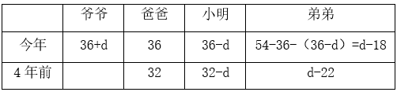

根据“4年前爸爸、小明和弟弟的年龄成等比数列”，可列方程：，解得，（不满足条件，排除），故爷爷今年36+24=60岁。

方法二：根据等差数列求和公式：，则108=今年爸爸的年龄×3，故今年爸爸的年龄岁。年龄问题，考虑用代入排除法解题。代入选项可列表如下：

A项：

由于，则满足条件“4年前爸爸、小明和弟弟的年龄成等比数列”，故满足题干所有条件，当选。

故正确答案为A。

---

### 第 6 题　qid 17097808 · 数学运算

某电商平台包邮销售整箱装的苹果，一次购买不少于3箱可在定价基础上打九折、一次购买不少于5箱可在九折基础上再打九折。张某分3次购买这种苹果2箱、3箱和5箱，共花费770元。若他一次性购买可比分3次购买节省多少元？

- **A**. 57.2　✅
- **B**. 67.5
- **C**. 72.9
- **D**. 81.0

**答案**：A

**官方解析**

设每箱苹果的定价为x元，根据题干“分3次购买这种苹果2箱、3箱和5箱，共花费770元”，可列式：，解得x=88。若是一次性购买2+3+5=10箱苹果，，则需花费10×88×0.9×0.9=712.8元，可比分3次购买节省770-712.8=57.2元。

故正确答案为A。

---

### 第 7 题　qid 17097795 · 数学运算

一条由东向西且宽为1.5米的水渠如下图中灰色部分所示，其中B、C为水渠北岸边相距50米的2个点。AB和AC连线的延长线分别与水渠南岸相交于D、E两点，且DE的距离为50.4米。则A点到水渠南岸的最短距离为多少米？

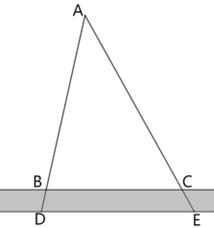

- **A**. 186
- **B**. 187
- **C**. 188
- **D**. 189　✅

**答案**：D

**官方解析**

如图所示，过A点向水渠南岸作垂线，交南岸于N点，线段AN即为A点到水渠南岸的最短距离。根据题意可知，，根据三角形相似性质可得，，即，解得AM=187.5米，则所求AN=187.5+1.5=189米。

故正确答案为D。

---

### 第 8 题　qid 17097799 · 数学运算

在一块边长为20米的正方形土地中随机选择1个点，则选中的点与这块土地4个顶点的距离均大于10米的概率在以下哪个范围内？

- **A**. 不到0.2
- **B**. 0.2~0.25之间　✅
- **C**. 0.25~0.3之间
- **D**. 超过0.3

**答案**：B

**官方解析**

如图所示，在正方形ABCD中，分别以4个顶点为圆心，以10米为半径画圆，与正方形相交的阴影部分即为距离4个顶点不都大于10米的区域，空白部分为距离4个顶点均大于10米的区域。根据正方形面积公式：（a为正方形的边长），可得正方形土地的面积为平方米。根据题意，阴影部分可组成1个半径为10米的圆，根据圆的面积公式：，可得阴影部分的面积为平方米，则空白部分的面积为（）平方米。所求概率，在B项范围内。

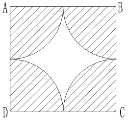

故正确答案为B。

---

### 第 9 题　qid 17097796 · 数学运算

B地在A地正北方向3千米处，C地在A地正西方向4千米处。直线甲连接B、C两地，从A地出发的直线乙正好经过直线甲的中点。张某从C地出发，直线行走了2.6千米后正好到直线乙上的某一点。则他到达的位置与直线甲、乙交点的最短距离为多少千米？

- **A**. 0.3　✅
- **B**. 0.4
- **C**. 0.5
- **D**. 0.6

**答案**：A

**官方解析**

如图所示，AB=3千米，AC=4千米，根据勾股定理可得，千米。根据题意，直线乙上E、F两点距离C地2.6千米，显然DE＜DF（D、E两点位于EF中点的同一侧），则DE为题目所求的最短距离。由D、E两点分别向AC作垂线交于G、H两点，因D点为BC的中点，则DG为的中位线，千米，千米，AD为直角三角形ABC斜边上的中线，长度为斜边的一半，即2.5千米。设DE为x千米，则AE=2.5-x千米，在和中，，，，则与相似，可得，即，则千米，千米，CH=AC-AH=4-（2-0.8x）=2+0.8x千米。在中，根据勾股定理可得，，即，正向求解较复杂，依次代入选项进行验证，代入A项，x=0.3，则千米，符合题意。

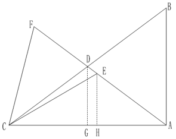

故正确答案为A。

---

### 第 10 题　qid 17097801 · 数学运算

将两个同样大小的正四面体零件焊接为一个六面体，再将两个这种六面体零件焊接为十面体。则最多可以得到几种不同的十面体？

- **A**. 2
- **B**. 3　✅
- **C**. 4
- **D**. 5

**答案**：B

**官方解析**

正四面体（如图1所示）每个面均相同，将两个同样大小的正四面体任选一个面作为焊接面，焊接为六面体只有一种情况。此六面体的每个面均相同，将六面体任选一个面，顶点依次标记为A、B、C。同理，另一个六面体任选一个面，顶点依次标记为、、（如图2所示）。将这两面作为焊接面进行焊接，可考虑A点与点对应，如图3所示；也可考虑A点与点对应，如图4所示；也可考虑A点与点对应，如图5所示。所以最多可以得到3种不同的十面体。

故正确答案为B。

---

## 判断推理

### 第 1 题　qid 17097244 · 图形推理

从所给的四个选项中，选择最合适的一个填入问号处，使之呈现一定的规律性：

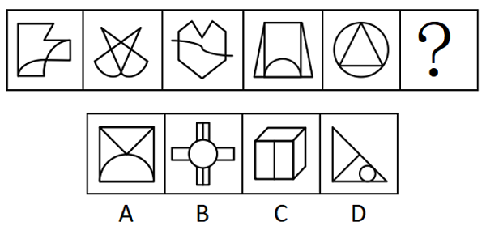

- **A**. A
- **B**. B
- **C**. C
- **D**. D　✅

**答案**：D

**官方解析**

元素组成不同，且无明显属性规律，考虑数量规律。观察发现，题干图1和图3为“日”字变形图，且图3出现了出头端点，考虑笔画数。题干图形均为一笔画图形，故？处图形也应为一笔画图形，只有D项符合。
故正确答案为D。

---

### 第 2 题　qid 17097246 · 图形推理

从所给的四个选项中，选择最合适的一个填入问号处，使之呈现一定的规律性：

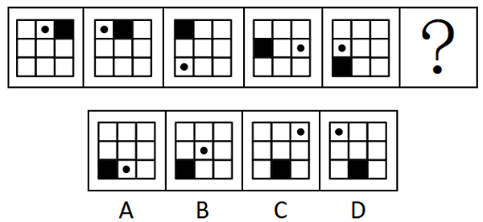

- **A**. A
- **B**. B
- **C**. C　✅
- **D**. D

**答案**：C

**官方解析**

元素组成相同，优先考虑位置规律。观察发现，黑色方块沿外框每次逆时针移动1格，排除A、B两项；小黑点沿外框每次逆时针移动1格、2格、3格、4格，故从图5到？处小黑点应沿外框逆时针移动5格，只有C项符合。
故正确答案为C。

---

### 第 3 题　qid 17097264 · 图形推理

从所给的四个选项中，选择最合适的一个填入问号处，使之呈现一定的规律性：

- **A**. A
- **B**. B
- **C**. C　✅
- **D**. D

**答案**：C

**官方解析**

题干图形均为多边形，观察发现，题干中凹多边形和凸多边形交替出现，因此？处应为凸多边形，只有C项符合。
故正确答案为C。

---

### 第 4 题　qid 17097275 · 图形推理

从所给的四个选项中，选择最合适的一个填入问号处，使之呈现一定的规律性：

- **A**. A　✅
- **B**. B
- **C**. C
- **D**. D

**答案**：A

**官方解析**

元素组成不同，且每幅图均由多个封闭图形组成，优先考虑图形间关系。观察发现，题干所有封闭图形均相交于点，只有A项符合。
故正确答案为A。

---

### 第 5 题　qid 17097243 · 图形推理

从所给的四个选项中，选择最合适的一个填入问号处，使之呈现一定的规律性：

- **A**. A　✅
- **B**. B
- **C**. C
- **D**. D

**答案**：A

**官方解析**

元素组成不同，且无明显属性规律，考虑数量规律。每幅图由若干小元素组成，且均被虚线圆分为内外两部分，观察发现，每幅图中虚线圆的内外小元素均相同，只有A项符合。
故正确答案为A。

---

### 第 6 题　qid 17097750 · 图形推理

以下为4个正方体的外表面展开图。其中哪个折成的正方体和其他3个不一样？

- **A**. A
- **B**. B　✅
- **C**. C
- **D**. D

**答案**：B

**官方解析**

本题为空间重构题。A、C、D三项中，构成相对面的两个面图案均相同，但B项中，“”面与“”面构成相对面，图案不同，只有B项与其他三项不同。

本题为选非题，故正确答案为B。

---

### 第 7 题　qid 17097263 · 图形推理

将一个正方体从中间挖去一个圆柱，得到如左图所示的新立体图形，从任意面剖开，右边哪一项不可能是该立体图形的截面？

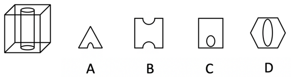

- **A**. A
- **B**. B　✅
- **C**. C
- **D**. D

**答案**：B

**官方解析**

本题考查截面图，如下图所示，A、C、D三项均可截出，只有B项无法截出。

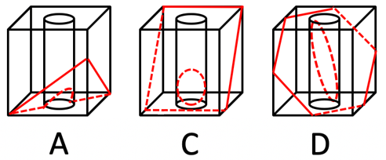

本题为选非题，故正确答案为B。

---

### 第 8 题　qid 17097245 · 图形推理

把下面六个图形分为两类，使每一类图形都有各自的共同特征或规律，分类正确的一项是：

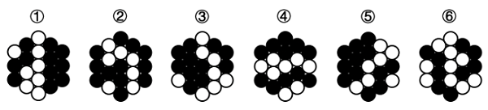

- **A**. ①②③，④⑤⑥
- **B**. ①②④，③⑤⑥
- **C**. ①③⑥，②④⑤
- **D**. ①④⑤，②③⑥　✅

**答案**：D

**官方解析**

本题为分组分类题目。元素组成不同，且黑白球的个数没有规律。观察发现，题干图形的黑球都被分成两个部分，且图②、图④和图⑤中都出现了明显的箭头图形，考虑分开看对称性。图①④⑤中黑球个数多的部分是轴对称图形，黑球个数少的部分是中心对称图形，图②③⑥中黑球个数少的部分是轴对称图形，黑球个数多的部分是中心对称图形，如下图所示，即图①④⑤为一组，图②③⑥为一组。

故正确答案为D。

---

### 第 9 题　qid 17097266 · 图形推理

把下面六个图形分为两类，使每一类图形都有各自的共同特征或规律，分类正确的一项是：

- **A**. ①②③，④⑤⑥
- **B**. ①②⑤，③④⑥　✅
- **C**. ①③⑤，②④⑥
- **D**. ①④⑥，②③⑤

**答案**：B

**官方解析**

本题为分组分类题目。元素组成不同，且无明显属性规律，考虑数量规律。观察发现，题干图形均由两个面组成，且图①②⑤中，两个面相似（形状相同、大小不同），图③④⑥中，两个面全同（形状、大小均相同）。即图①②⑤为一组，图③④⑥为一组。
故正确答案为B。

---

### 第 10 题　qid 17097256 · 图形推理

把下面六个图形分为两类，使每一类图形都有各自的共同特征或规律，分类正确的一项是：

- **A**. ①②④，③⑤⑥　✅
- **B**. ①②⑤，③④⑥
- **C**. ①③⑤，②④⑥
- **D**. ①③⑥，②④⑤

**答案**：A

**官方解析**

本题为分组分类题目。元素组成不同，且无明显属性规律，考虑数量规律。观察发现，每幅图线条交叉明显，考虑交点数。每幅图的交点数均为6，无法分组，继续观察发现，图①②④中6个交点的分布位置相同，图③⑤⑥中6个交点的分布位置也相同，故图①②④为一组，图③⑤⑥为一组。

故正确答案为A。

---

### 第 11 题　qid 17097272 · 定义判断

实有判断又称“质的判断”，是断定某个或某类事物具有某种普遍性质的判断；反思判断是从此事物和别的事物的关系中断定该事物具有某种性质的判断。
根据上述定义，下列说法正确的是：

- **A**. “人固有一死”属于反思判断
- **B**. “地球是围绕太阳旋转的”属于实有判断
- **C**. “铅是一种有害微量元素”属于反思判断　✅
- **D**. “南美肺鱼不是某种鱼就是某种两栖动物”属于实有判断

**答案**：C

**官方解析**

第一步：找出定义关键词。
实有判断：“断定某个或某类事物具有某种普遍性质的判断”；
反思判断：“从此事物和别的事物的关系中断定该事物具有某种性质的判断”。
第二步：逐一分析选项。
A项：人固有一死，是对人具有生死这一普遍性质的判断，符合“断定某个或某类事物具有某种普遍性质的判断”，符合“实有判断”定义，不符合“反思判断”定义，说法错误，排除；
B项：地球是围绕太阳旋转的，说的是地球与太阳的关系，符合“从此事物和别的事物的关系中断定该事物具有某种性质的判断”，符合“反思判断”定义，不符合“实有判断”定义，说法错误，排除；
C项：铅是一种有害微量元素，“有害”是针对其他事物的，符合“从此事物和别的事物的关系中断定该事物具有某种性质的判断”，符合“反思判断”定义，说法正确，当选；
D项：南美肺鱼不是某种鱼就是某种两栖动物，没有判断出“南美肺鱼”具有哪种性质，不符合“断定某个或某类事物具有某种普遍性质的判断”，不符合“实有判断”定义，说法错误，排除。
故正确答案为C。

---

### 第 12 题　qid 17097255 · 定义判断

物业“分红”，指物业公司利用小区共用部分、共用设施设备等合法经营，其收益除用于补充专项维修资金外，还服务于业主。
根据上述定义，下列不属于物业“分红”的是：

- **A**. 物业公司将小区内宣传栏租给企业做广告，收益用于救济困难业主
- **B**. 物业公司将沿街附设房改成小超市，补充了节日“送温暖”慰问金
- **C**. 物业公司将社会人士捐资用于购置公共健身设施，满足了业主需求　✅
- **D**. 物业公司将空置停车位出租，租金用于业主志愿者夜巡队购买夜餐

**答案**：C

**官方解析**

第一步：找出定义关键词。
“利用小区共用部分、共用设施设备等合法经营”、“收益除用于补充专项维修资金外，还服务于业主”。
第二步：逐一分析选项。
A项：物业公司将小区内宣传栏租给企业做广告，符合“利用小区共用部分、共用设施设备等合法经营”，收益用于救济困难业主，符合“收益除用于补充专项维修资金外，还服务于业主”，符合定义，排除；
B项：物业公司将沿街附设房改成小超市，“沿街附设房”属于小区公共财产，符合“利用小区共用部分、共用设施设备等合法经营”，补充了节日“送温暖”慰问金，符合“收益除用于补充专项维修资金外，还服务于业主”，符合定义，排除；
C项：物业公司将社会人士捐资用于购置公共健身设施，资金来源于社会人士的捐赠，不符合“利用小区共用部分、共用设施设备等合法经营”，不符合定义，当选；
D项：物业公司将空置停车位出租，符合“利用小区共用部分、共用设施设备等合法经营”，租金用于业主志愿者夜巡队购买夜餐，符合“收益除用于补充专项维修资金外，还服务于业主”，符合定义，排除。
本题为选非题，故正确答案为C。

---

### 第 13 题　qid 17097260 · 定义判断

当液体接触到比其沸点高得多的材料表面时，会立即蒸发形成隔热的蒸汽层，让液体悬浮在蒸汽层上，此时的摩擦力极小，所以液体能四处滑动，这一现象被称作莱顿弗罗斯特效应。
根据上述定义，下列不属于莱顿弗罗斯特效应应用的是：

- **A**. 快速把手放进液氮后抽离，手却不会冻伤
- **B**. 鸡蛋放进烧红的锅里快速翻炒，不会粘锅
- **C**. 用蘸水的手指快速捏灭蜡烛的火焰，手指不会烫伤
- **D**. 将加热后的金属工件放入水中淬火，以提高其硬度　✅

**答案**：D

**官方解析**

第一步：找出定义关键词。
“当液体接触到比其沸点高得多的材料表面时”、“立即蒸发形成隔热的蒸汽层，让液体悬浮在蒸汽层上”。
第二步：逐一分析选项。
A项：人手的温度远高于液氮的沸点，把手放进液氮，符合“当液体接触到比其沸点高得多的材料表面时”，人的手不会冻伤，是因为手的温度太高使液氮快速蒸发，形成一层蒸汽层阻隔手向液氮传热，符合“立即蒸发形成隔热的蒸汽层，让液体悬浮在蒸汽层上”，符合定义，排除；
B项：烧红的锅的温度远高于鸡蛋内液体的沸点，将鸡蛋放入烧红的锅里，符合“当液体接触到比其沸点高得多的材料表面时”，鸡蛋不会粘锅，是因为液体接触高温锅面会迅速形成蒸汽层，使鸡蛋悬浮，不与锅面直接接触，符合“立即蒸发形成隔热的蒸汽层，让液体悬浮在蒸汽层上”，符合定义，排除；
C项：蜡烛火焰的温度远高于水的沸点，用蘸水的手指捏灭蜡烛的火焰，符合“当液体接触到比其沸点高得多的材料表面时”，手指不会烫伤，是因为蜡烛的火焰会使手指表面的水迅速汽化，形成蒸汽层阻隔火焰向手指传热，符合“立即蒸发形成隔热的蒸汽层，让液体悬浮在蒸汽层上”，符合定义，排除；
D项：将加热后的金属工件放入水中淬火，是利用水的冷却作用使金属工件快速降温，并未利用蒸汽层的隔热作用，不符合“立即蒸发形成隔热的蒸汽层，让液体悬浮在蒸汽层上”，不符合定义，当选。
本题为选非题，故正确答案为D。

---

### 第 14 题　qid 17097251 · 定义判断

掠夺性定价是指企业为了把对手挤出市场或吓退试图进入市场的潜在对手，而采取大幅度降低价格的策略。
根据上述定义，下列属于掠夺性定价的是：

- **A**. 某超市为尽快清理库存，以超低价出售商品，几天之内店内商品被附近居民一抢而空
- **B**. 某服装店开展反季节大甩卖活动，价格低廉的服装吸引了众多顾客，其他商家纷纷效仿
- **C**. 某大型软件公司以低于成本价10%的价格销售产品，导致一些小企业因产品滞销而纷纷倒闭　✅
- **D**. 某商场举办家居装饰展览会，各大厂商纷纷打出“大减价”“全市最低价”“跳楼价”等广告吸引顾客

**答案**：C

**官方解析**

第一步：找出定义关键词。
“为了把对手挤出市场或吓退试图进入市场的潜在对手”、“采取大幅度降低价格的策略”。
第二步：逐一分析选项。
A项：超市为尽快清理库存而超低价出售商品，其目的是清理库存，而不是为了排挤竞争对手，不符合“为了把对手挤出市场或吓退试图进入市场的潜在对手”，不符合定义，排除；
B项：服装店开展反季节大甩卖活动，是为了处理反季商品，并不是为了排挤竞争对手，不符合“为了把对手挤出市场或吓退试图进入市场的潜在对手”，不符合定义，排除；
C项：大型软件公司以低于成本价10%的价格销售产品，符合“采取大幅度降低价格的策略”，导致一些小企业因产品滞销而纷纷倒闭，符合“为了把对手挤出市场或吓退试图进入市场的潜在对手”，符合定义，当选；
D项：各大厂商打出“大减价”等广告吸引顾客，并不是为了排挤竞争对手，不符合“为了把对手挤出市场或吓退试图进入市场的潜在对手”，不符合定义，排除。
故正确答案为C。

---

### 第 15 题　qid 17097254 · 定义判断

意定监护制度是指具有完全民事行为能力的成年人，可以与其近亲属、其他愿意担任监护人的个人或者组织事先协商，以书面形式确定自己的监护人，在自己丧失或者部分丧失民事行为能力时，由该监护人履行监护职责的制度。
根据上述定义，下列做法符合意定监护制度的是：

- **A**. 杨奶奶80多岁了，处于植物人状态多年，其儿子近来深感自己身体不好，欲将杨奶奶的侄子作为其监护人
- **B**. 小明今年七岁，其父母离婚时，小明坚决拒绝父母的任何一方做他的监护人，要求由其爷爷作为其监护人
- **C**. 龙先生将自己的外甥作为自己的监护人，其外甥由于遭遇交通事故，便将自己的监护职责托付给邻居
- **D**. 崔女士患上了渐冻症，在律师的陪同下，她在公证处办理了由其妹妹作为自己监护人的公证　✅

**答案**：D

**官方解析**

第一步：找出定义关键词。
“具有完全民事行为能力的成年人”、“与其近亲属、其他愿意担任监护人的个人或者组织事先协商，以书面形式确定自己的监护人”。
第二步：逐一分析选项。
A项：儿子想让杨奶奶的侄子当杨奶奶的监护人，不是杨奶奶确定自己的监护人，且植物人状态下的杨奶奶，不是“具有完全民事行为能力的成年人”，也不涉及“书面形式”，不符合定义，排除；
B项：只有七岁的小明，不符合“具有完全民事行为能力的成年人”，也不涉及“书面形式”，不符合定义，排除；
C项：龙先生的外甥将“龙先生”的监护职责托给邻居，不是龙先生确定自己的监护人，也没体现书面形式，不符合“与其近亲属、其他愿意担任监护人的个人或者组织事先协商，以书面形式确定自己的监护人”，不符合定义，排除；
D项：崔女士虽然是渐冻症患者，但是能在律师的陪同下办理公证，说明其病情还未影响民事行为能力，符合“具有完全民事行为能力的成年人”，公证处办理公证，体现了“书面形式”，妹妹作为自己的监护人，符合“与其近亲属、其他愿意担任监护人的个人或者组织事先协商，以书面形式确定自己的监护人”，符合定义，当选。
故正确答案为D。

---

### 第 16 题　qid 17097261 · 定义判断

兼语词组是汉语中一种特殊形式的词组，它由三个成分组成，第一个成分表示动作行为，第二个成分是前面动作行为的宾语，同时又是后面成分的主语，被称为兼语，第三个成分是第二个成分的谓语。
根据上述定义，下列不属于兼语词组的是：

- **A**. 希望他来　✅
- **B**. 无人入眠
- **C**. 派小王去
- **D**. 夸他厉害

**答案**：A

**官方解析**

第一步：找出定义关键词。
“第一个成分表示动作行为”、“第二个成分是前面动作行为的宾语，同时又是后面成分的主语”、“第三个成分是第二个成分的谓语”。
第二步：逐一分析选项。
A项：“希望”表示动作行为，“希望他”不是一个完整的词语结构，“希望他来”是动宾，“他来”是“希望”的宾语，不符合“第二个成分是前面动作行为的宾语，同时又是后面成分的主语”，不符合定义，当选；
B项：“无”表示动作行为，“无人”是动宾，“人入眠”是主谓，符合“第一个成分表示动作行为”、“第二个成分是前面动作行为的宾语，同时又是后面成分的主语”、“第三个成分是第二个成分的谓语”，符合定义，排除；
C项：“派”表示动作行为，“派小王”是动宾，“小王去”是主谓，符合“第一个成分表示动作行为”、“第二个成分是前面动作行为的宾语，同时又是后面成分的主语”、“第三个成分是第二个成分的谓语”，符合定义，排除；
D项：“夸”表示动作行为，“夸他”是动宾，“他厉害”是主谓，符合“第一个成分表示动作行为”、“第二个成分是前面动作行为的宾语，同时又是后面成分的主语”、“第三个成分是第二个成分的谓语”，符合定义，排除。
本题为选非题，故正确答案为A。

---

### 第 17 题　qid 17097248 · 定义判断

电梯法则，一般指用极具吸引力的方式，快速、简明、有效地阐述自己的观点。
根据上述定义，下列最符合“电梯法则”的是：

- **A**. 在限时演讲的开始就直奔主题，抓住关键　✅
- **B**. 写作时把观点概括为三条，分层次陈述
- **C**. 向客户推销产品时聊家常，拉近距离
- **D**. 提供心理咨询服务时营造轻松氛围

**答案**：A

**官方解析**

第一步：找出定义关键词。
“用极具吸引力的方式”、“快速、简明、有效地阐述自己的观点”。
第二步：逐一分析选项。
A项：该项中在限时演讲时，开门见山、快速、简明地阐述自己的观点，符合“用极具吸引力的方式”、“快速、简明、有效地阐述自己的观点”，符合定义，当选；
B项：该项中分层次陈述三条观点，没有体现快速和简明，不符合“快速、简明、有效地阐述自己的观点”，不符合定义，排除；
C项：该项中推销产品时聊家常，拉近距离，不符合“使用极具吸引力的方式”、“快速、简明、有效地阐述自己的观点”，不符合定义，排除；
D项：该项中营造的是轻松氛围，没有涉及阐述观点，不符合“快速、简明、有效地阐述自己的观点”，不符合定义，排除。
故正确答案为A。

---

### 第 18 题　qid 17097253 · 定义判断

头衔效应是指一个人一旦有了某种头衔，不管这种头衔是虚的还是实的，他往往都会努力去适应这一头衔的有关要求。
根据上述定义，下列反映了头衔效应的是：

- **A**. 在团队中设置一个管理岗位由团队成员轮流担当管理者
- **B**. 学校授予有突出导学育人才华的教师为星级教师、特级教师
- **C**. 因为被公司同事称为“开心果”，所以小王即使不开心也会假笑　✅
- **D**. 一些家长总是认为自己的孩子是“笨孩子”，导致孩子失去自信心

**答案**：C

**官方解析**

第一步：找出定义关键词。
“一旦有了某种头衔，不管这种头衔是虚的还是实的”、“往往都会努力去适应这一头衔的有关要求”。
第二步：逐一分析选项。
A项：该项中团队成员轮流当“管理者”，没有体现团队成员努力适应“管理者”这一头衔，不符合“往往都会努力去适应这一头衔的有关要求”，不符合定义，排除；
B项：该项中有突出导学育人才华的教师被授予了“星级教师、特级教师”，不是这些教师去适应“头衔”，不符合“往往都会努力去适应这一头衔的有关要求”，不符合定义，排除；
C项：该项中小王因为“开心果”的头衔，即使不开心也会假笑，符合“一旦有了某种头衔，不管这种头衔是虚的还是实的”、“往往都会努力去适应这一头衔的有关要求”，符合定义，当选；
D项：该项中孩子因为家长总是认为自己是“笨孩子”而失去了信心，不符合“往往都会努力去适应这一头衔的有关要求”，不符合定义，排除。
故正确答案为C。

---

### 第 19 题　qid 17591000 · 定义判断

社会认同原理是指人们乐于参照其他人的行为，经常依靠其他人的行为来决定自己应该怎么做，这种反应方式是无意识的、条件反射式的，为人们判断如何行事提供了一条捷径。
根据上述定义，下列不适合用社会认同原理解释的是：

- **A**. 情景喜剧中毫无笑点的情节配上笑声录音后观众会跟着笑
- **B**. 路人见到卖艺者身边的盒子装着不少钱，会更愿意捐钱
- **C**. 两个人童年时期的生活环境相似，很容易做出相同的选择　✅
- **D**. 出版商宣传时经常使用与“无数人都在看”类似的广告语

**答案**：C

**官方解析**

第一步：找出定义关键词。
“人们乐于参照其他人的行为，经常依靠其他人的行为来决定自己应该怎么做”、“是无意识的、条件反射式的，为人们判断如何行事提供了一条捷径”。
第二步：逐一分析选项。
A项：选项说明别人笑的话即使不好笑观众也会跟着笑，符合“人们乐于参照其他人的行为，经常依靠其他人的行为来决定自己应该怎么做”，符合定义，排除；
B项：卖艺者身边的盒子装着不少钱，说明别人愿意捐钱，路人因此更愿意捐钱，符合“人们乐于参照其他人的行为，经常依靠其他人的行为来决定自己应该怎么做”，符合定义，排除；
C项：相似的生活环境使人容易做出相同的选择，不符合“人们乐于参照其他人的行为，经常依靠其他人的行为来决定自己应该怎么做”，不符合定义，当选；
D项：“无数人都在看”体现了别人对图书的选择，出版商这样做就是利用了“人们乐于参照其他人的行为，经常依靠其他人的行为来决定自己应该怎么做”，符合定义，排除。
本题为选非题，故正确答案为C。

---

### 第 20 题　qid 17097247 · 定义判断

动作改善法是指改善人体动作的方式，减少疲劳，提高工作效率和舒适度的方法。主要包括三个方面的改善：有关于人体运用方面的；有关于工作场所的布置和环境方面的；有关于工具和设备的设计方面的。
根据上述定义，下列不属于动作改善法的是：

- **A**. 某垃圾站将其回收装置改为脚踏式
- **B**. 某公司要求办公室的台椅须高度可调
- **C**. 某装盒流水线作业中，工人直接将装好的盒子回拨下落，无需再次放回操作台上
- **D**. 某工厂在投料处的设置程序是：投料员甲喊出所投物料，投料员乙进行高声复述　✅

**答案**：D

**官方解析**

第一步：找出定义关键词。
“改善人体动作，减少疲劳，提高工作效率和舒适度”、“人体运用方面”、“工作场所的布置和环境方面”、“工具和设备的设计方面”。
第二步：逐一分析选项。
A项：某垃圾站将其回收装置改为“脚踏式”，符合“工具和设备的设计方面”，通过改变工具的操作方式来“改善人体动作，减少疲劳，提高工作效率和舒适度”，符合定义，排除；
B项：某公司通过可调节的台椅高度来提高员工的舒适度和工作效率，符合“工作场所的布置和环境方面”、“改善人体动作，减少疲劳，提高工作效率和舒适度”，符合定义，排除；
C项：工人“直接”将装好的盒子回拨下落，“无需”再次放回操作台上，通过优化工人的动作流程，减少了不必要的动作，提高了工作效率，符合“人体运用方面”、“改善人体动作，减少疲劳，提高工作效率和舒适度”，符合定义，排除；
D项：甲、乙两人是通过语言传递物料信息，不符合“改善人体动作，减少疲劳，提高工作效率和舒适度”，不符合定义，当选。
本题为选非题，故正确答案为D。

---

### 第 21 题　qid 17097257 · 类比推理

资源：配置

- **A**. 持续：工作
- **B**. 绿色：发展
- **C**. 环境：保护　✅
- **D**. 合理：分配

**答案**：C

**官方解析**

第一步：判断题干词语间逻辑关系。
配置资源，二者为动宾结构。
第二步：判断选项词语间逻辑关系。
A项：持续工作，二者为偏正结构，与题干逻辑关系不一致，排除；
B项：绿色发展，二者为偏正结构，与题干逻辑关系不一致，排除；
C项：保护环境，二者为动宾结构，与题干逻辑关系一致，当选；
D项：合理分配，二者为偏正结构，与题干逻辑关系不一致，排除。
故正确答案为C。

---

### 第 22 题　qid 17097252 · 类比推理

眼窗：防毒面具

- **A**. 齿轮：机械表　✅
- **B**. 公路：道路
- **C**. 自然数：实数
- **D**. 青霉素：抗菌素

**答案**：A

**官方解析**

第一步：判断题干词语间逻辑关系。
眼窗是防毒面具的组成部分，二者为组成关系。
第二步：判断选项词语间逻辑关系。
A项：齿轮是机械表的组成部分，二者为组成关系，与题干逻辑关系一致，当选；
B项：公路是道路的一种，二者为种属关系，与题干逻辑关系不一致，排除；
C项：自然数是实数的一种，二者为种属关系，与题干逻辑关系不一致，排除；
D项：青霉素是抗菌素的一种，二者为种属关系，与题干逻辑关系不一致，排除。
故正确答案为A。

---

### 第 23 题　qid 17097267 · 类比推理

杀鸡取卵：饮鸩止渴

- **A**. 呼风唤雨：雷厉风行
- **B**. 扬汤止沸：抱薪救火　✅
- **C**. 如出一辙：独具一格
- **D**. 峰回路转：否极泰来

**答案**：B

**官方解析**

第一步：判断题干词语间逻辑关系。
杀鸡取卵是指为了要得到鸡蛋，不惜把鸡杀了，比喻贪图眼前利益而不顾长远利益；饮鸩止渴是指喝毒酒解渴，比喻用错误的办法来解决眼前的困难而不顾严重后果，二者是近义关系。
第二步：判断选项词语间逻辑关系。
A项：呼风唤雨原指神仙道士神通广大，施展法术可以刮风下雨，后比喻运用自然或社会的力量，有时也比喻反动派进行煽动性的活动；雷厉风行形容执行政策法令等严格而迅速，也形容办事声势猛烈，行动迅速，二者不是近义关系，与题干逻辑关系不一致，排除；
B项：扬汤止沸指把锅里开着的水舀起来再倒回去，以阻止锅中水的沸腾，比喻办法不正确，不能从根本上解决问题；抱薪救火指抱着柴草去救火，比喻用错误的方法去消除灾祸，结果使灾祸反而扩大，二者是近义关系，与题干逻辑关系一致，保留；
C项：如出一辙形容两种言论或行动一模一样；独具一格指单独有一种特别的风格、格调，二者是反义关系，与题干逻辑关系不一致，排除；
D项：峰回路转形容山峰、道路曲折迂回，比喻事情经历挫折、失败后，出现新的转机；否极泰来指坏运到了头好运就来了，二者是近义关系，与题干逻辑关系一致，保留。
对比B、D两项，题干中的杀鸡和取卵，饮鸩和止渴都是动宾结构，B项中的扬汤和止沸，抱薪和救火都是动宾结构，而D项中的峰回和路转是主谓结构，故B项和题干逻辑关系更为一致，当选。
故正确答案为B。

---

### 第 24 题　qid 17097258 · 类比推理

高清摄影：人像摄影

- **A**. 手机银行：网上银行
- **B**. 电信诈骗：街头诈骗
- **C**. 商业代言：品牌代言
- **D**. 三甲医院：市级医院　✅

**答案**：D

**官方解析**

第一步：判断题干词语间逻辑关系。
有的高清摄影是人像摄影，有的高清摄影不是人像摄影，有的人像摄影是高清摄影，有的人像摄影不是高清摄影，二者为交叉关系。
第二步：判断选项词语间逻辑关系。
A项：手机银行以智能手机为载体，通过银行的官方手机应用（App）提供服务；网上银行通常通过电脑端的网页登录银行官网提供服务，手机银行和网上银行是不同的银行服务渠道，二者为并列关系，与题干逻辑关系不一致，排除；
B项：电信诈骗是通过电话、网络和短信等电信手段进行的诈骗，街头诈骗是在街头等现实场景进行的诈骗，二者诈骗的手段和场景不同，为并列关系，与题干逻辑关系不一致，排除；
C项：商业代言是指基于商业目的的代言活动，品牌代言是商业代言的一种形式，二者不是交叉关系，与题干逻辑关系不一致，排除；
D项：有的三甲医院是市级医院，有的三甲医院不是市级医院，有的市级医院是三甲医院，有的市级医院不是三甲医院，二者为交叉关系，与题干逻辑关系一致，当选。
故正确答案为D。

---

### 第 25 题　qid 17097265 · 类比推理

晴：雨：天气

- **A**. 红：绿：颜色　✅
- **B**. 多：少：质量
- **C**. 男：女：性别
- **D**. 长：短：量尺

**答案**：A

**官方解析**

第一步：判断题干词语间逻辑关系。
晴和雨是两种不同的天气，且除二者外，还存在其他天气，故前两词为并列关系中的反对关系，均与第三词构成种属关系。
第二步：判断选项词语间逻辑关系。
A项：红和绿是两种不同的颜色，且除二者外，还存在其他颜色，故前两词为并列关系中的反对关系，均与第三词构成种属关系，与题干逻辑关系一致，当选；
B项：多和少都可以用来描述数量，与质量无明显逻辑关系，与题干逻辑关系不一致，排除；
C项：男和女是两种不同的性别，但除二者外，不存在其他性别，故前两词为并列关系中的矛盾关系，与题干逻辑关系不一致，排除；
D项：长和短都可以用量尺来测量，前两词均与第三词为对应关系，与题干逻辑关系不一致，排除。
故正确答案为A。

---

### 第 26 题　qid 17097274 · 类比推理

思考：解决：问题

- **A**. 打雷：刮风：下雨
- **B**. 播种：收割：小麦　✅
- **C**. 实施：论证：方案
- **D**. 建议：意见：方法

**答案**：B

**官方解析**

第一步：判断题干词语间逻辑关系。
先思考问题，再解决问题，前两词与第三词分别构成动宾结构，且存在时间先后顺序。
第二步：判断选项词语间逻辑关系。
A项：打雷、刮风和下雨是三种不同的天气现象，三者为并列关系，与题干逻辑关系不一致，排除；
B项：先播种小麦，再收割小麦，前两词与第三词分别构成动宾结构，且存在时间先后顺序，与题干逻辑关系一致，当选；
C项：先论证方案，再实施方案，前两词与第三词分别构成动宾结构，且存在时间先后顺序，但词语顺序与题干相反，与题干逻辑关系不一致，排除；
D项：意见与方法不构成动宾结构，与题干逻辑关系不一致，排除。
故正确答案为B。

---

### 第 27 题　qid 17097276 · 类比推理

堵车：迟到：受罚

- **A**. 干活：口渴：补水
- **B**. 饥饿：进食：健康
- **C**. 懒惰：失业：贫穷　✅
- **D**. 锻炼：强身：报国

**答案**：C

**官方解析**

第一步：判断题干词语间逻辑关系。
堵车导致迟到，迟到导致受罚，前两词和后两词均是因果对应关系。
第二步：判断选项词语间逻辑关系。
A项：补水是应对口渴的一种方式，而不是口渴导致的结果，二者不是因果对应关系，与题干逻辑关系不一致，排除；
B项：进食是应对饥饿的一种方式，而不是饥饿导致的结果，二者不是因果对应关系，与题干逻辑关系不一致，排除；
C项：懒惰导致失业，失业导致贫穷，前两个词和后两个词均是因果对应关系，与题干逻辑关系一致，当选；
D项：锻炼是为了强身，二者是方式目的对应关系，与题干逻辑关系不一致，排除。
故正确答案为C。

---

### 第 28 题　qid 17097259 · 类比推理

卧室：书房：客厅

- **A**. 牙齿：牙龈：牙根
- **B**. 川剧：蒲剧：锡剧　✅
- **C**. 桌面：桌布：桌腿
- **D**. 教室：讲台：课桌

**答案**：B

**官方解析**

第一步：判断题干词语间逻辑关系。
卧室、书房和客厅是家庭场所中不同的空间，三者是并列关系。
第二步：判断选项词语间逻辑关系。
A项：牙根是牙齿的组成部分，第一个词和第三个词是组成关系，与题干逻辑关系不一致，排除；
B项：川剧、蒲剧、锡剧分别是四川、山西、江苏的地方戏曲剧种，三者是并列关系，与题干逻辑关系一致，当选；
C项：桌面和桌腿都是桌子的组成部分，二者是并列关系，但桌布不是桌子的组成部分，第二个词与其余两个词不是并列关系，与题干逻辑关系不一致，排除；
D项：教室中有讲台和课桌，第一个词和后两个词是地点对应关系，与题干逻辑关系不一致，排除。
故正确答案为B。

---

### 第 29 题　qid 17097268 · 类比推理

字母：单词：语句

- **A**. 树叶：树根：树木
- **B**. 正数：整数：实数
- **C**. 国体：政体：国家
- **D**. 细胞：组织：器官　✅

**答案**：D

**官方解析**

第一步：判断题干词语间逻辑关系。
字母是单词的组成部分，单词是语句的组成部分，前两词之间和后两词之间均构成组成关系。
第二步：判断选项词语间逻辑关系。
A项：树叶和树根均为树木的组成部分，前两词为并列关系，与题干逻辑关系不一致，排除；
B项：有的正数是整数，有的正数不是整数，有的整数是正数，有的整数不是正数，前两词为交叉关系，与题干逻辑关系不一致，排除；
C项：国体是表明国家根本性质的国家体制，政体是指国家政权的构成形式，前两词与第三词均构成对应关系，与题干逻辑关系不一致，排除；
D项：细胞是组织的组成部分，组织是器官的组成部分，前两词之间和后两词之间均构成组成关系，与题干逻辑关系一致，当选。
故正确答案为D。

---

### 第 30 题　qid 17097262 · 类比推理

言听计从 对于 （    ） 相当于 （    ） 对于 截然不同

- **A**. 闭目塞听；毫无二致
- **B**. 唯命是从；浑然一体
- **C**. 刚愎自用；泾渭分明
- **D**. 百依百顺；大相径庭　✅

**答案**：D

**官方解析**

逐一代入选项。
A项：言听计从指说的话，出的主意，都听从照办，形容对某人非常信任，闭目塞听指闭着眼睛，堵住耳朵，形容对外界事物不闻不问或不了解，二者无明显逻辑关系；毫无二致指丝毫没有什么两样，完全一样，截然不同形容两件事物毫无共同之处，二者为反义关系，前后逻辑关系不一致，排除；
B项：言听计从指说的话，出的主意，都听从照办，形容对某人非常信任，唯命是从指绝对服从命令，让怎么做，就怎么做，形容十分顺从听话，二者为近义关系；浑然一体指融合而成一个不可分割的整体，截然不同形容两件事物毫无共同之处，二者无明显逻辑关系，前后逻辑关系不一致，排除；
C项：言听计从指说的话，出的主意，都听从照办，形容对某人非常信任，刚愎自用指倔强固执，自以为是，二者为反义关系；泾渭分明比喻界限清楚或两者明显不同，截然不同形容两件事物毫无共同之处，二者为近义关系，前后逻辑关系不一致，排除；
D项：言听计从指说的话，出的主意，都听从照办，形容对某人非常信任，百依百顺形容在一切事情上都很顺从别人，二者为近义关系；大相径庭指彼此有很大差距或完全相反，截然不同形容两件事物毫无共同之处，二者为近义关系，前后逻辑关系一致，当选。
故正确答案为D。

---

### 第 31 题　qid 17097273 · 逻辑判断

中秋节是中华民族重要的传统节日，月饼也是过中秋节必不可少的节日“官配”。有人说，选购月饼的时候一定要看保质期，保质期越短，防腐剂含量就越少、月饼的质量也就越好。
以下哪项如果为真，最能削弱这一观点？

- **A**. 若想延长月饼保质期，一方面要做好抑菌，另一方面要防止脂肪的氧化
- **B**. 正规生产厂家生产的月饼使用的防腐剂均符合国家相关标准，消费者无需担心
- **C**. 食品的保质期就是安全有效期，它与原料、加工、储存以及防腐剂等多重因素有关　✅
- **D**. 月饼的保质期一般在60天左右，而消费者买到手后的食用期可能仅剩半个月左右

**答案**：C

**官方解析**

第一步：找出论点和论据。
论点：选购月饼的时候一定要看保质期，保质期越短，防腐剂含量就越少、月饼的质量也就越好。
论据：无。
本题只有论点，没有论据，削弱优先考虑削弱论点。
第二步：逐一分析选项。
A项：该项讨论的是“延长月饼保质期的方法”，与论点讨论的“月饼保质期长短与防腐剂含量、月饼质量”无关，话题不一致，为无关项，无法削弱，排除；
B项：该项讨论的是正规生产厂家生产的月饼使用的防腐剂“符合国家标准”，但并未提及“防腐剂含量与月饼保质期长短和月饼质量”之间的关系，话题不一致，无法削弱，排除；
C项：该项讨论的是“食品的保质期与多重因素有关”，说明食品的保质期长短并非仅仅由防腐剂含量决定，因此不能根据月饼的保质期越短就得出月饼的质量就越好，削弱论点，可以削弱，当选；
D项：该项讨论的是消费者买到手的“月饼食用期可能仅剩半个月左右”，与论点讨论的“月饼保质期长短与防腐剂含量、月饼质量”无关，话题不一致，为无关项，无法削弱，排除。
故正确答案为C。

---

### 第 32 题　qid 17097277 · 逻辑判断

电池及充电速度对于电动汽车至关重要。据报道，研究人员开发出一种突破性技术，将电动汽车电池的充电时间缩短为仅10分钟。有专家认为，这将大大加速电动汽车取代内燃汽车的进程。
以下哪项如果为真，最能支持上述结论？

- **A**. 现阶段电动汽车的续航里程问题，是其进一步普及的重大障碍
- **B**. 限制或禁止销售内燃汽车，使得对电动汽车的需求比以往任何时候都要大
- **C**. 新技术可以让电池变得更小、充电更快、成本更低，还可大大减少驾驶员的里程焦虑　✅
- **D**. 新技术使用一种新的电池结构，添加的超薄镍箔可自我调节电池的温度和反应性

**答案**：C

**官方解析**

第一步：找出论点和论据。
论点：这将大大加速电动汽车取代内燃汽车的进程。
论据：研究人员开发出一种突破性技术，将电动汽车电池的充电时间缩短为仅10分钟。 
本题论点讨论的是一种突破性技术可以加速电动汽车取代内燃汽车的进程，论据讨论的是该技术将电动汽车电池的充电时间缩短为仅10分钟，二者讨论的均是电动汽车及其充电技术在汽车行业的发展，话题一致，加强优先考虑补充论据。
第二步：逐一分析选项。
A项：该项指出现阶段电动汽车进一步普及的重大障碍是续航里程问题，但无法说明解决这一问题就可以加速电动汽车取代内燃汽车的进程，话题不一致，无法加强，排除；
B项：该项指出通过限制或禁止销售内燃汽车，可以大大提高电动汽车的需求，而论点讨论的是新技术能否加速电动汽车取代内燃汽车的进程，话题不一致，无法加强，排除；
C项：该项指出新技术可以让电池变得更小、充电更快、成本更低，还可减少驾驶员的里程焦虑，以上优势会让电动汽车更具竞争力，可以解释为什么该技术可以加速电动汽车取代内燃汽车的进程，解释原因，可以加强，当选；
D项：该项指出新技术的优点，但并未提及这些优点能否加快电动汽车取代内燃汽车的进程，话题不一致，无法加强，排除。
故正确答案为C。

---

### 第 33 题　qid 17097280 · 逻辑判断

某教育局要选派1~3名教师去支教，老师们争相报名。局领导拟从甲、乙、丙、丁四名老师中选取，综合考虑如下：
（1）如果选中甲，乙也会被选中；
（2）只有选中丁，甲才不会被选中；
（3）如果选中乙，丙也会被选中；
（4）甲和丙不可能都被选中。
由此可以推出：

- **A**. 甲会被选中，而丙不会
- **B**. 乙会被选中，而甲不会
- **C**. 丙会被选中，而丁不会
- **D**. 丁会被选中，而甲不会　✅

**答案**：D

**官方解析**

第一步：翻译题干。

①甲乙；

②甲丁；

③乙丙；

④甲 或 丙。

将条件②逆否可得到：丁甲，再与条件①和条件③串联，可得出条件⑤：丁甲乙丙。

第二步：根据题干条件进行推理。

根据条件⑤可知，如果甲被选中，则丙也会被选中，与条件④矛盾，故甲没有被选中，再结合条件⑤，否后必否前，可得丁被选中，根据否前无必然可知，乙和丙的情况无法确定。

故正确答案为D。

---

### 第 34 题　qid 17097269 · 逻辑判断

某国际组织通常审议的话题是国家间冲突、国际安全局势等，近年来也曾经就海平面上升问题在该组织的会议上举行过公开辩论。可见，海平面上升理应成为该组织的重要议题。
以下哪项如果为真，最能支持上述论证？

- **A**. 近年来，该国际组织所讨论的议题范围有扩大的趋势
- **B**. 自1900年以来，全球平均海平面的上升速度比过去3000年当中任何一个世纪都要快
- **C**. 近年来，与气候变化相关的议题相比，国家间冲突、国际安全局势等议题的重要性降低
- **D**. 海平面上升不仅本身是一种威胁，还会让各种威胁成倍增加，应对海平面上升对全球安全构成的毁灭性挑战，该组织应发挥关键作用　✅

**答案**：D

**官方解析**

第一步：找出论点和论据。
论点：海平面上升理应成为该组织的重要议题。
论据：某国际组织近年来也曾经就海平面上升问题在该组织的会议上举行过公开辩论。
论点讨论的是海平面上升应该成为该组织的重要议题，论据讨论的是该组织公开辩论过海平面上升这一议题，话题不一致，加强可以考虑搭桥，也可以考虑补充论据。
第二步：逐一分析选项。
A项：该项指出该国际组织所讨论的议题范围有扩大的趋势，但这并不意味着“海平面上升”就会成为该组织的“重要议题”，为不明确项，无法加强，排除；
B项：该项说的是全球平均海平面上升速度的情况，与“海平面上升”是否应该成为该组织的“重要议题”无关，话题不一致，为无关项，无法加强，排除；
C项：该项指出国家间冲突、国际安全局势等议题的重要性降低，但这并不意味着“海平面上升”就会成为该组织的“重要议题”，为不明确项，无法加强，排除；
D项：该项指出海平面上升不仅本身是一种威胁，还会让各种威胁成倍增加，且该组织在应对海平面上升对全球安全构成的毁灭性挑战中应发挥关键作用，解释了为什么“海平面上升”应该成为该组织的“重要议题”，补充论据，可以加强，当选。
故正确答案为D。

---

### 第 35 题　qid 17097270 · 逻辑判断

咖啡会影响铁的吸收，从而导致贫血。但咖啡只影响非血红素铁，即谷物和蔬菜中的那种，但是对肉类（牛羊肉、鱼类和家禽）中的血红素铁并没有影响。因此，咖啡的摄入并不会导致健康人群缺铁和贫血。
要使上述论证成立，还需要基于以下哪一前提？

- **A**. 咖啡有利于提神及解除疲劳
- **B**. 缺铁性贫血可能会让人感觉疲倦和气短
- **C**. 平时饮食中多吃瘦肉，将果蔬和咖啡分开吃
- **D**. 食物中的铁分为血红素铁和非血红素铁两种，血红素铁的生物利用率高，有效吸收率接近40%，而非血红素铁的有效吸收率仅为5%~10%　✅

**答案**：D

**官方解析**

第一步：找出论点和论据。
论点：咖啡的摄入并不会导致健康人群缺铁和贫血。
论据：咖啡只影响非血红素铁，即谷物和蔬菜中的那种，但是对肉类（牛羊肉、鱼类和家禽）中的血红素铁并没有影响。
本题论据讨论咖啡只影响非血红素铁，不影响血红素铁，论点讨论咖啡的摄入不会导致健康人群缺铁和贫血，话题不一致，且问法为“前提”，优先考虑搭桥，建立起“非血红素铁或血红素铁”与“缺铁和贫血”之间的关系。
第二步：逐一分析选项。
A项：该项指出咖啡有利于提神及解除疲劳，而论点讨论咖啡的摄入不会导致健康人群缺铁和贫血，话题不一致，为无关项，无法加强，排除；
B项：该项指出缺铁性贫血可能会让人感觉疲倦和气短，而论点讨论咖啡的摄入不会导致健康人群缺铁和贫血，话题不一致，为无关项，无法加强，排除；
C项：该项指出平时饮食中多吃瘦肉，将果蔬和咖啡分开吃，讨论的是怎么做，而论点讨论咖啡的摄入不会导致健康人群缺铁和贫血，话题不一致，为无关项，无法加强，排除；
D项：该项指出血红素铁的有效吸收率接近40%，而非血红素铁的有效吸收率仅为5%~10%，说明依靠血红素铁就能保证足够的铁的吸收，在“不影响血红素铁”和“不会导致健康人群缺铁和贫血”之间建立了联系，为搭桥项，可以加强，当选。
故正确答案为D。

---

### 第 36 题　qid 17097278 · 类比推理

大学毕业后，小曾、小刘、小李、小张四人被甲、乙、丙和丁四家单位录取（顺序未必对应）。同班级其他4位同学就他们的录取情况作了如下猜测：
同学A：小曾被丙单位录用；小李被丁单位录用。
同学B：小刘被乙单位录用；小张被甲单位录用。
同学C：小曾被丁单位录用；小李被乙单位录用。
同学D：小刘被乙单位录用；小张被丙单位录用。
如果其中3位同学的猜测都只对了一半，还有1位同学的猜测完全错了。则小曾、小刘、小李、小张4人被录取的单位可能分别是：

- **A**. 甲、乙、丁、丙
- **B**. 乙、甲、丙、丁
- **C**. 丙、乙、丁、甲
- **D**. 丙、丁、乙、甲　✅

**答案**：D

**官方解析**

第一步：分析题干条件。
（1）同学A：小曾被丙单位录用；小李被丁单位录用；
（2）同学B：小刘被乙单位录用；小张被甲单位录用；
（3）同学C：小曾被丁单位录用；小李被乙单位录用；
（4）同学D：小刘被乙单位录用；小张被丙单位录用；
（5）3位同学的猜测都只对了一半，还有1位同学的猜测完全错了。
第二步：根据题干条件进行推理。
题干信息不确定，优先考虑代入法。
代入A项：同学A、同学B均猜对了一半，同学C全错，同学D全对，与条件（5）矛盾，该情况不可能为真，排除；
代入B项：同学A、同学B、同学C、同学D均全错，与条件（5）矛盾，该情况不可能为真，排除；
代入C项：同学A、同学B均全对，同学C全错，同学D猜对了一半，与条件（5）矛盾，该情况不可能为真，排除；
代入D项：同学A、同学B、同学C均猜对了一半，同学D全错，符合条件（5），该情况可能为真，当选。
故正确答案为D。

---

### 第 37 题　qid 17097279 · 逻辑判断

人类偏肺病毒（HMPV）是一种通过人传染人传播的呼吸道病原体。2009年，研究人员在L国野生动物园的一群山地大猩猩身上发现HMPV感染症状，并最终在一只死亡山地大猩猩组织样本中检测到HMPV病毒。研究人员推测，这些山地大猩猩很可能是被人传染的。
以下哪项如果为真，不能质疑上述观点？

- **A**. 山地大猩猩之间也可以相互传染HMPV病毒
- **B**. 在接触过山地大猩猩的人身上并没有发现HMPV病毒
- **C**. 此前从未有过其他非人动物被人传染HMPV病毒的情况　✅
- **D**. 山地大猩猩感染的HMPV毒株与人体内的HMPV毒株不匹配

**答案**：C

**官方解析**

第一步：找出论点和论据。
论点：这些山地大猩猩很可能是被人传染的。
论据：人类偏肺病毒（HMPV）是一种通过人传染人传播的呼吸道病原体。2009年，研究人员在L国野生动物园的一群山地大猩猩身上发现HMPV感染症状，并最终在一只死亡山地大猩猩组织样本中检测到HMPV病毒。
本题论据说的是HMPV是人传染人的病毒，某地一群山地大猩猩身上发现HMPV感染症状及病毒，论点基于此推测山地大猩猩可能被人传染，二者话题一致，且本题为选非题，排除能削弱的选项即可。
第二步：逐一分析选项。
A项：该项指出山地大猩猩之间也可以相互传染HMPV病毒，说明这些有症状的山地大猩猩可能是被体内有HMPV病毒的山地大猩猩所传染，而不是被人传染，削弱论点，可以削弱，排除；
B项：该项指出在接触过山地大猩猩的人身上并没有发现HMPV病毒，说明这些山地大猩猩不是被人传染的，削弱论点，可以削弱，排除；
C项：该项指出此前从未有过其他非人动物被人传染HMPV病毒的情况，此前没有不能说明现在的情况，而且其他非人动物的情况也不能说明山地大猩猩的致病原因，不明确山地大猩猩是否为被人传染，为不明确项，无法削弱，当选；
D项：该项指出山地大猩猩感染的HMPV毒株与人体内的HMPV毒株不匹配，说明这些山地大猩猩不是被人传染的，削弱论点，可以削弱，排除。
本题为选非题，故正确答案为C。

---

### 第 38 题　qid 17097281 · 类比推理

某青少年活动中心制定了近五年的发展计划：
（1）如果设立天文兴趣小组或建设科技探索馆，则要开展星空观测实践活动；
（2）如果开设人工智能课堂或开展星空观测实践活动，则要建设科技探索馆；
（3）如果不设立天文兴趣小组，就开设人工智能课堂；
（4）如果开展星空观测实践活动，则要引进天文设备。
如果该青少年活动中心的规划得以实施，则可以得出：

- **A**. 该中心会设立天文兴趣小组
- **B**. 该中心会引进天文设备　✅
- **C**. 该中心不会建设科技探索馆
- **D**. 该中心不会开设人工智能课堂

**答案**：B

**官方解析**

第一步：翻译题干。

（1）设立天文兴趣小组 或 建设科技探索馆开展星空观测实践活动；

（2）开设人工智能课堂 或 开展星空观测实践活动建设科技探索馆；

（3）设立天文兴趣小组开设人工智能课堂；

（4）开展星空观测实践活动引进天文设备。

第二步：根据题干条件进行推理。

题干没有确定信息，但条件中分别出现了“设立天文兴趣小组”和“不设立天文兴趣小组”，可以考虑优先从此入手进行假设。

假设“设立天文兴趣小组”，是对条件（1）的肯前，肯前必肯后可得开展星空观测实践活动，这是对条件（2）（4）的肯前，可得建设科技探索馆、引进天文设备；

假设“不设立天文兴趣小组”，是对条件（3）的肯前，可得开设人工智能课堂，这是对条件（2）的肯前，可得建设科技探索馆，这是对（1）的肯前，可得开展星空观测实践活动，结合条件（4）可得引进天文设备。

综上可知，如果AB，AB，那么B一定为真，即可以推出“建设科技探索馆”“开展星空观测实践活动”“引进天文设备”。

故正确答案为B。

---

### 第 39 题　qid 17097250 · 逻辑判断

人类学家发现，在旧石器时代晚期，人类在文化上出现了革命性变化，前所未见的壁画艺术与符号文化开始蓬勃发展。与此同时，由于开始用火，人类平均寿命显著增加，老年人口的数量也大幅增加了。有人因此认为，壁画艺术的发展正是源于老年人口数量的激增——不适合外出打猎的老年人只能从事壁画创作等非体力活动。
以下哪项如果为真，最能削弱上述论证？

- **A**. 在某旧石器时代的洞穴遗址中发现了壁画，但遗址范围内的遗骸均为年轻人　✅
- **B**. 旧石器时代的壁画有描绘狩猎的场景，而参与狩猎活动的人寿命普遍较短
- **C**. 年轻人在绘画方面往往有更丰富的想象力，作品更有艺术价值
- **D**. 由于生存条件限制，旧石器时代老年人患病死亡的概率高

**答案**：A

**官方解析**

第一步：找出论点和论据。
论点：壁画艺术的发展正是源于老年人口数量的激增——不适合外出打猎的老年人只能从事壁画创作等非体力活动。
论据：在旧石器时代晚期，人类在文化上出现了革命性变化，前所未见的壁画艺术与符号文化开始蓬勃发展。与此同时，由于开始用火，人类平均寿命显著增加，老年人口的数量也大幅增加了。
本题论点和论据都是在讨论“老年人口”与“壁画创作”之间的关系，二者话题一致，削弱优先考虑削弱论点。
第二步：逐一判断选项。
A项：该项指出在某旧石器时代的洞穴遗址中发现了壁画，但遗址范围内的遗骸均为年轻人，说明该洞穴遗址中的壁画艺术可能并非由老年人创作，而是由年轻人创作，举反例削弱论点，可以削弱，当选；
B项：该项指出壁画的内容涉及狩猎，而狩猎者的寿命普遍较短，讨论的是壁画中“狩猎者”寿命的长短，而论点讨论的是“壁画创作者”是老年人还是年轻人，话题不一致，无法削弱，排除；
C项：该项指出年轻人在绘画方面往往有更丰富的想象力，作品更有艺术价值，讨论的是“年轻人在绘画方面的优势”，而论点讨论的是“壁画艺术的发展源于老年人口数量激增”，话题不一致，无法削弱，排除；
D项：该项指出由于生存条件限制，旧石器时代老年人患病死亡的概率高，说明旧石器时代老年人的死亡原因可能是患病，但并未提及“壁画创作者是否为老年人”，与论点讨论的话题不一致，无法削弱，排除。
故正确答案为A。

---

### 第 40 题　qid 17097271 · 逻辑判断

某市拟举办一场环湖长跑比赛，安排运动员围绕景观湖顺时针方向长跑。为了更好服务运动员，举办方在湖边设置了甲、乙、丙、丁四个服务点。服务人员张、王、李、赵四人随机安排至甲、乙、丙、丁四个服务点，每个服务点均有一人。各服务点之间的距离并不相等，其距离分别为4千米、5千米、6千米、7千米。已知：
（1）湖东、西、南、北边各有一个服务点；
（2）北边的乙服务点与相邻服务点之间的距离不是7千米；
（3）甲服务点与下一服务点之间的距离为6千米；
（4）过了赵所在的服务点之后，运动员朝西南方向前进5千米后到达下一服务点。
根据上述信息，可以得出以下哪项?

- **A**. 甲与上一服务点相隔5千米
- **B**. 乙与上一服务点相隔6千米　✅
- **C**. 丙与上一服务点相隔7千米
- **D**. 丁与上一服务点相隔4千米

**答案**：B

**官方解析**

第一步：分析题干条件。

（1）湖东、西、南、北边各有一个服务点；

（2）北边的乙服务点与相邻服务点之间的距离不是7千米；

（3）甲服务点与下一服务点之间的距离为6千米；

（4）过了赵所在的服务点之后，运动员朝西南方向前进5千米后到达下一服务点；

（5）顺时针方向长跑，各服务点之间的距离分别为4千米、5千米、6千米、7千米。

第二步：根据题干条件进行推理。

根据条件（5）可知，运动员沿顺时针方向长跑，其运动轨迹应为“北东南西北”的循环路径，如下图所示：

根据条件（2）可知，北边的服务点为乙，且“西北”、“北东”两条路径的距离均不是7千米，说明距离为7千米的路径要么是“东南”要么是“南西”。根据条件（4）可知，过了赵所在的服务点后，运动员的后续运动方向为西南方向，说明赵此刻位于东边，其下一站应为南边，而“东南”两个服务点之间的距离为5千米，说明距离为7千米的路径为“南西”，具体情况如下图所示：

根据条件（3）可知，甲服务点与下一服务点之间的距离为6千米，说明甲服务点只能位于西边，而剩余的丙、丁两个服务点只能位于东边和南边，但具体二者如何分配无法得知。具体情况如下图所示：

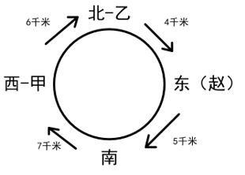

逐一验证选项。

A项：甲与上一服务点相隔5千米。如图所示，甲的上一个服务点位于南边，二者相隔7千米，无法得出该结论，排除；

B项：乙与上一服务点相隔6千米。如图所示，乙的上一个服务点是位于西边的甲服务点，二者相隔6千米，可以得出该结论，当选；

C项：丙与上一服务点相隔7千米。如图所示，丙服务点要么位于东边要么位于南边，当位于东边时，丙的上一个服务点是位于北边的乙，二者相隔4千米，而当位于南边时，丙的上一个服务点位于东边，二者相隔5千米，无法得出该结论，排除；

D项：丁与上一服务点相隔4千米。如图所示，丁服务点要么位于东边要么位于南边，当位于东边时，丁的上一个服务点是位于北边的乙，二者相隔4千米，而当位于南边时，丁的上一个服务点位于东边，二者相隔5千米，具体无法确定，无法得出该结论，排除。

故正确答案为B。

---

## 资料分析

### 材料 1

        2024年1-4月份，A省全省规模以上工业原煤产量4.25亿吨，位居全国首位，同比增长3.5%，增速较一季度加快0.6个百分点，其中，4月份产量1.01亿吨，同比增长5.6%。

        1-4月份，A省东陵市原煤产量2.9亿吨，同比增长3.6%，拉动全省原煤产量增长2.4个百分点；西陵市原煤产量4703.9万吨，同比增长7.4%，较一季度加快1.7个百分点，拉动全省原煤产量增长0.8个百分点。

        1-4月份，全省规模以上工业发电量2582.0亿千瓦时，位居全国首位，同比增长12.2%。其中，4月份发电量605.0亿千瓦时，同比增长7.1%。

        1-4月份，规模以上工业新能源发电量609.0亿千瓦时，同比增长16.1%，占全省全部发电量比重较上年末提高3.5个百分点。其中，风力发电量524.1亿千瓦时，同比增长14.5%；太阳能发电量79.1亿千瓦时，增长29.6%。

#### 第 1 题　qid 17097803 · 综合

2023年一季度，A省规模以上工业原煤产量约为（    ）亿吨。

- **A**. 4.05
- **B**. 3.46
- **C**. 3.24
- **D**. 3.15　✅

**答案**：D

**官方解析**

根据题干“2023年一季度······约为（    ）亿吨”，结合材料时间为2024年1-4月和4月，可判定本题为基期和差问题。定位文字材料第一段可得：2024年1-4月份，A省全省规模以上工业原煤产量4.25亿吨，同比增长3.5%，其中，4月份产量1.01亿吨，同比增长5.6%。根据公式：基期量，则所求亿吨，与D项最接近。

故正确答案为D。

---

#### 第 2 题　qid 17097806 · 综合

2024年1-4月，东陵市月均原煤产量约为（    ）亿吨。

- **A**. 0.705
- **B**. 0.725　✅
- **C**. 7.05
- **D**. 7.25

**答案**：B

**官方解析**

根据题干“2024年1-4月······月均······约为（    ）亿吨”，结合材料时间为2024年1-4月，可判定本题为现期平均数问题。定位文字材料第二段可得：2024年1-4月份，A省东陵市原煤产量2.9亿吨。根据公式：月均产量，则所求亿吨。

故正确答案为B。

---

#### 第 3 题　qid 17097809 · 比重

2023年1-4月，规模以上工业新能源发电量占全省规模以上工业发电量的比重约为：

- **A**. 24.5%
- **B**. 23.9%
- **C**. 23.6%
- **D**. 22.8%　✅

**答案**：D

**官方解析**

根据题干“2023年1-4月······占······的比重约为”，结合材料时间为2024年1-4月，可判定本题为基期比重问题。定位文字材料第三、第四段可得：2024年1-4月份，全省规模以上工业发电量2582.0亿千瓦时（B），同比增长12.2%（b）；1-4月份，规模以上工业新能源发电量609.0亿千瓦时（A），同比增长16.1%（a）。根据公式：基期比重，则所求，只有D项符合。

故正确答案为D。

---

#### 第 4 题　qid 17097812 · 综合

2023年1-4月，风力发电量和太阳能发电量相差约为（    ）亿千瓦时。

- **A**. 445
- **B**. 397　✅
- **C**. 355
- **D**. 317

**答案**：B

**官方解析**

根据题干“2023年1-4月······和······相差约为（    ）亿千瓦时”，结合材料时间为2024年1-4月，可判定本题为基期和差问题。定位文字材料第四段可得：2024年1-4月份，风力发电量524.1亿千瓦时，同比增长14.5%；太阳能发电量79.1亿千瓦时，增长29.6%。根据公式：基期量，则所求亿千瓦时，与B项最接近。

故正确答案为B。

---

#### 第 5 题　qid 17097816 · 综合

根据A省2024年前4个月的资料，无法推出：

- **A**. 原煤产量增速加快
- **B**. 东陵市原煤产量同比增幅超过3%
- **C**. 规模以上工业主要能源产品生产保持稳定增长
- **D**. 规模以上工业太阳能发电量同比增加了29.6亿千瓦时　✅

**答案**：D

**官方解析**

A项：定位文字材料第一段可得：2024年1-4月份，A省全省规模以上工业原煤产量4.25亿吨，位居全国首位，同比增长3.5%，增速较一季度加快0.6个百分点。可推断原煤产量增速加快，正确；

B项：定位文字材料第二段可得：2024年1-4月份，A省东陵市原煤产量2.9亿吨，同比增长3.6%。即2024年1-4月东陵市原煤产量同比增幅超过3%，正确；

C项：定位文字材料第一、三段可得：2024年1-4月份，A省全省规模以上工业原煤产量4.25亿吨，位居全国首位，同比增长3.5%；1-4月份，全省规模以上工业发电量2582.0亿千瓦时，位居全国首位，同比增长12.2%。可推断2024年1-4月规模以上工业主要能源产品生产保持稳定增长，正确；

D项：定位文字材料第四段可得：2024年1-4月份，规模以上工业太阳能发电量79.1亿千瓦时，增长29.6%。根据公式：增长量，则2024年1-4月规模以上工业太阳能发电量同比增加亿千瓦时，错误。

本题为选非题，故正确答案为D。

备注：1.本道题目题干表述不明确，采取优中选优的方式选择，D项必错，在考场上其余选项不确定是否必错的情况下可做跳过处理。

2.对于本题A项“原煤产量增速加快”，虽然没有说是和去年相比还是一季度相比较，但结合D项表述为明显错误，判定A项表述正确。同理对于本题C项，规模以上工业主要能源产品包括原煤、原油、天然气、电力等，虽然材料中仅给出了原煤及发电量的数据及增速，而未给出其他规模以上主要能源产品的情况，但结合D项表述为明显错误，判定C项表述正确。

---

### 材料 2

#### 第 6 题　qid 17097811 · 增长

2020-2022年，全国每年粮食产量的同比增速：

- **A**. 持续上升
- **B**. 持续下降
- **C**. 先升后降　✅
- **D**. 先降后升

**答案**：C

**官方解析**

根据题干“2020-2022年······同比增速”，可判定本题为一般增长率问题。定位统计表可得：2019-2022年全国粮食产量分别为66384万吨、66949万吨、68285万吨、68658万吨。根据公式：增长率，则2020-2022年全国粮食产量的同比增速分别为：

2020年，；

2021年，；

2022年，。

综上所述，2020-2022年，全国每年粮食产量的同比增速先升后降。

故正确答案为C。

---

#### 第 7 题　qid 17097813 · 比重

2022年全国秋粮产量占全国粮食产量的比重较2019年：

- **A**. 上升了2个百分点以上
- **B**. 下降了2个百分点以上
- **C**. 上升了不到2个百分点
- **D**. 下降了不到2个百分点　✅

**答案**：D

**官方解析**

根据题干“2022年······占······比重较2019年”，结合选项为上升了/下降了+百分点，可判定本题为两期比重问题。定位统计表可得：2019年全国粮食产量及秋粮产量分别为66384万吨、49597万吨；2022年全国粮食产量及秋粮产量分别为68658万吨、51100万吨。根据公式：比重，则所求比重差，即约下降了0.3个百分点，在D项范围内。

故正确答案为D。

---

#### 第 8 题　qid 17097815 · 增长

以下年份中，全国早稻产量同比增速最快的年份是：

- **A**. 2018年
- **B**. 2019年
- **C**. 2021年　✅
- **D**. 2022年

**答案**：C

**官方解析**

根据题干“······同比增速最快的年份是”，可判定本题为一般增长率问题。定位统计表可得：2017-2022年全国早稻产量分别为2987万吨、2859万吨、2627万吨、2729万吨、2802万吨、2812万吨。根据公式：增长率，则下列年份的全国早稻产量同比增速分别为：

2018年，；

2019年，；

2021年，；

2022年，。

综上所述，以上年份中，全国早稻产量同比增速最快的年份是2021年。

故正确答案为C。

---

#### 第 9 题　qid 17097818 · 比重

2018年，全国夏粮产量占全国粮食产量的比重较早稻高：

- **A**. 不到15个百分点
- **B**. 15-20个百分点之间　✅
- **C**. 20-25个百分点之间
- **D**. 超过25个百分点

**答案**：B

**官方解析**

根据题干“2018年······占······比重较早稻高”，结合材料时间给出2018年，可判定本题为现期比重问题。定位统计表可知：2018年，全国粮食产量为65789万吨，夏粮产量为13881万吨，早稻产量为2859万吨。根据公式：比重，可得2018年全国夏粮产量占全国粮食产量的比重较早稻高，在B项范围内。

故正确答案为B。

---

#### 第 10 题　qid 17097822 · 增长

以下柱状图中，最能准确反映2018-2021年全国夏粮产量同比增量变化趋势的是（横轴位置代表增量为0）：

- **A**. 

- **B**. 
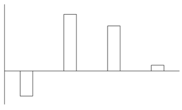

- **C**. 
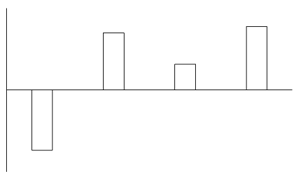
　✅
- **D**. 

**答案**：C

**官方解析**

根据题干“······反映2018-2021年······同比增量变化趋势的是······”，可判定本题为增长量比较问题。定位统计表可知：2017-2021年，全国夏粮产量分别为14175万吨、13881万吨、14160万吨、14286万吨、14596万吨。根据公式：增长量=现期量-基期量，可得2018年同比增长量=13881-14175=-294万吨，2019年同比增长量=14160-13881=279万吨，2020年同比增长量=14286-14160=126万吨，2021年同比增长量=14596-14286=310万吨。可知2018年同比增长量为负数，且2020年同比增长量小于2019年和2021年，只有C项符合。
故正确答案为C。

---

### 材料 3

        2023年S省全省生产总值为82553亿元，比上年约增长6.0%。分产业看，第一、二、三产业增加值分别为2332亿元、33953亿元和46268亿元，分别增长4.2%、5.0%和6.7%，三次产业增加值比约为2.8：41.1：56.1。

        2023年年末全省常住人口6627万人，比上年末增加50万人。其中，男性人口3459万人，女性人口3168万人。全年出生人口38.3万人，出生率为；死亡人口44.0万人，死亡率为；自然增长率为。城镇化率为74.2%。

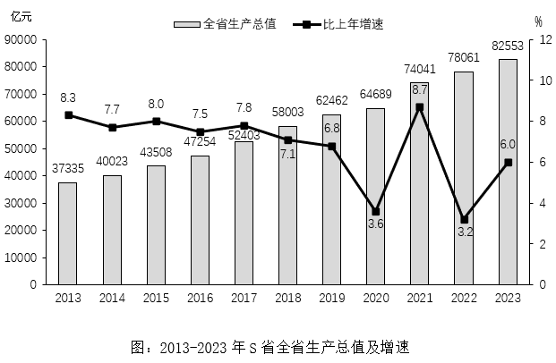

#### 第 11 题　qid 19797282 · 综合

2019-2023年，S省年均生产总值约为（    ）亿元。

- **A**. 73361.2
- **B**. 73367.2
- **C**. 72367.2
- **D**. 72361.2　✅

**答案**：D

**官方解析**

根据题干“2019-2023年······年均生产总值······亿元”，结合材料时间为2013-2023年，可判定本题为现期平均数问题。定位统计图可得：2019-2023年，S省全省生产总值分别为：62462亿元、64689亿元、74041亿元、78061亿元、82553亿元。则所求平均数为亿元。

故正确答案为D。

---

#### 第 12 题　qid 19797283 · 综合

2013-2023年，S省生产总值：

- **A**. 增加了45218亿元　✅
- **B**. 最大年增速为8.3%
- **C**. 增长了6.0%
- **D**. 在2022年呈现出较大下降

**答案**：A

**官方解析**

A项：定位统计图可得，2013年、2023年，S省生产总值分别为37335亿元、82553亿元。根据公式：增长量=现期量-基期量，则2023年S省生产总值较2013年增长82553-37335=45218亿元，正确；

B项：定位统计图可得，2013-2023年，S省生产总值同比增速最大的年份为2021年（8.7%），错误；

C项：定位统计图可得，2013年、2023年，S省生产总值分别为37335亿元、82553亿元。根据公式：增长率，则2023年S省生产总值较2013年增长，错误；

D项：定位统计图可得，2022年，S省生产总值同比增速为3.2%，较上年增长，错误。

故正确答案为A。

---

#### 第 13 题　qid 19797284 · 平均数

按年末常住人口计算，2022年S省人均地区生产总值最接近：

- **A**. 125123元
- **B**. 125043元
- **C**. 124571元
- **D**. 118687元　✅

**答案**：D

**官方解析**

根据题干“······2022年S省人均······”，结合材料时间为2023年，可判定本题为基期平均数问题。定位文字材料第二段可得：2023年年末全省常住人口6627万人，比上年末增加50万人；定位统计图可得：2022年S省全省生产总值为78061亿元。根据“人均地区生产总值”，可得所求元，与D项最接近。

故正确答案为D。

---

#### 第 14 题　qid 19797285 · 比重

2023年第二产业增加值占S省全省生产总值比重约为：

- **A**. 35%
- **B**. 37%
- **C**. 41%　✅
- **D**. 48%

**答案**：C

**官方解析**

定位文字材料第一段可得：2023年······第一、二、三产业增加值比约为2.8：41.1：56.1。则2023年第二产业增加值占S省全省生产总值比重，与C项最接近。

故正确答案为C。

---

#### 第 15 题　qid 19797286 · 综合

根据S省的资料，不能推出：

- **A**. 2023年，男女两性常住人口占比相差超过6个百分点　✅
- **B**. 2023年，全年出生人口占新增常住人口的比重超过70%
- **C**. 2013-2023年，S省生产总值最大年增速差值约为5.5个百分点
- **D**. 2013-2023年，S省生产总值比上年增加值最多的年份是2021年

**答案**：A

**官方解析**

A项：定位文字材料第二段可得，2023年年末全省常住人口6627万人。其中，男性人口3459万人，女性人口3168万人。根据公式：比重，则所求，未超过6个百分点，错误；

B项：定位文字材料第二段可得，2023年年末全省常住人口······比上年末增加50万人。全年出生人口38.3万人。根据公式：比重，则所求比重，正确；

C项：定位统计图可得，2013-2023年，S省生产总值年增速最大为8.7%（2021年），最小为3.2%（2022年）。则所求=8.7%-3.2%=5.5%，即最大年增速差值约为5.5个百分点，正确；

D项：定位统计图可得，2013-2023年，S省生产总值以及2013年S省生产总值比上年增速。根据公式：增长量。则2013-2023年，S省生产总值比上年增加值分别为：

2013年，亿元；

2014年，亿元；

2015年，亿元；

2016年，亿元；

2017年，亿元；

2018年，亿元；

2019年，亿元；

2020年，亿元；

2021年，亿元；

2022年，亿元；

2023年，亿元。

比较可知，比上年增加值最多的年份是2021年，正确。

本题为选非题，故正确答案为A。

---
