# 2024年广西区考公务员录用考试《行测》题（网友回忆版）

> 省考 · 2024 年 · 6 个模块 · 共 110 题

- [政治理论](#%E6%94%BF%E6%B2%BB%E7%90%86%E8%AE%BA) · 4 题
- [常识判断](#%E5%B8%B8%E8%AF%86%E5%88%A4%E6%96%AD) · 6 题
- [言语理解与表达](#%E8%A8%80%E8%AF%AD%E7%90%86%E8%A7%A3%E4%B8%8E%E8%A1%A8%E8%BE%BE) · 35 题
- [数量关系](#%E6%95%B0%E9%87%8F%E5%85%B3%E7%B3%BB) · 10 题
- [判断推理](#%E5%88%A4%E6%96%AD%E6%8E%A8%E7%90%86) · 40 题
- [资料分析](#%E8%B5%84%E6%96%99%E5%88%86%E6%9E%90) · 15 题

---

## 政治理论

### 第 1 题　qid 16593217 · 马克思主义

“周虽旧邦，其命维新”。习近平总书记指出，中国式现代化是中华民族的旧邦新命，必将推动中华文明重焕荣光。下列关于中国式现代化说法正确的有几项？
①中国式现代化深深植根于中华优秀传统文化，体现科学社会主义的先进本质
②中国式现代化借鉴吸收一切人类优秀文明成果，是一种全新的人类文明形态
③中国式现代化是中国共产党领导的社会主义现代化，是文明更新的结果
④中国式现代化蕴含的独特世界观、价值观、历史观、文明观、民主观、生态观等及其伟大实践，是对世界现代化理论和实践的重大创新
⑤中华文明赋予中国式现代化以深厚底蕴，走中国式现代化道路，赋予中华文明以现代力量

- **A**. 2
- **B**. 3
- **C**. 4
- **D**. 5　✅

**答案**：D

**官方解析**

本题考查政治常识。
①②正确，习近平总书记在学习贯彻党的二十大精神研讨班开班式上的重要讲话中指出：“中国式现代化，深深植根于中华优秀传统文化，体现科学社会主义的先进本质，借鉴吸收一切人类优秀文明成果，代表人类文明进步的发展方向，展现了不同于西方现代化模式的新图景，是一种全新的人类文明形态。”
③正确，党的二十大报告指出：“中国式现代化是中国共产党领导的社会主义现代化，既有各国现代化的共同特征，更有基于自己国情的中国特色。”习近平总书记在文化传承发展座谈会的讲话中指出：“中国式现代化是赓续古老文明的现代化，而不是消灭古老文明的现代化；是从中华大地长出来的现代化，不是照搬照抄其他国家的现代化；是文明更新的结果，不是文明断裂的产物。”
④正确，习近平总书记在学习贯彻党的二十大精神研讨班开班式上指出：“中国式现代化蕴含的独特世界观、价值观、历史观、文明观、民主观、生态观等及其伟大实践，是对世界现代化理论和实践的重大创新。”
⑤正确，习近平总书记在文化传承发展座谈会的讲话中指出：“中国式现代化赋予中华文明以现代力量，中华文明赋予中国式现代化以深厚底蕴。中国式现代化是赓续古老文明的现代化，而不是消灭古老文明的现代化；是从中华大地长出来的现代化，不是照搬照抄其他国家的现代化；是文明更新的结果，不是文明断裂的产物。中国式现代化是中华民族的旧邦新命，必将推动中华文明重焕荣光。”
故①②③④⑤正确，有5项。
故正确答案为D。

---

### 第 2 题　qid 10204470 · 时事政治

党的二十大报告指出，优化民营企业发展环境，依法保护民营企业产权和企业家权益，促进民营经济发展壮大。下列关于促进民营经济发展措施与其发挥作用对应正确的是：
①完善社会信用激励约束机制——发挥信用激励机制作用，提升信用良好企业获得感
②完善融资支持政策制度——支持符合条件的民营企业上市融资，缓解民营企业资金问题
③持续完善知识产权保护体系——严格落实侵权惩罚性赔偿，降低民营企业科技转化成本
④健全民营经济人士思想政治建设机制——深入开展理想信念教育，确保构建亲近政商关系

- **A**. ①②　✅
- **B**. ①③
- **C**. ②④
- **D**. ③④

**答案**：A

**官方解析**

本题考查政治常识。
2023年7月19日，《中共中央 国务院关于促进民营经济发展壮大的意见》发布。以下简称《意见》。
①正确，《意见》在“二、持续优化民营经济发展环境”部分指出：“（三）完善社会信用激励约束机制。完善信用信息记录和共享体系，全面推广信用承诺制度，将承诺和履约信息纳入信用记录。发挥信用激励机制作用，提升信用良好企业获得感······”
②正确，《意见》在“三、加大对民营经济政策支持力度”部分指出：“（五）完善融资支持政策制度。健全银行、保险、担保、券商等多方共同参与的融资风险市场化分担机制······推动民营企业债券融资专项支持计划扩大覆盖面、提升增信力度。支持符合条件的民营企业上市融资和再融资。”
③错误，《意见》在“四、强化民营经济发展法治保障”部分指出：“（十二）持续完善知识产权保护体系。加大对民营中小微企业原始创新保护力度。严格落实知识产权侵权惩罚性赔偿、行为保全等制度。建立知识产权侵权和行政非诉执行快速处理机制，健全知识产权法院跨区域管辖制度。”而“降低民营企业科技转化成本”属于《意见》“五、着力推动民营经济实现高质量发展”部分中“（十六）支持提升科技创新能力”举措所对应的作用。
④错误，《意见》在“六、促进民营经济人士健康成长”部分指出：“（二十一）健全民营经济人士思想政治建设机制。积极稳妥做好在民营经济代表人士先进分子中发展党员工作。深入开展理想信念教育和社会主义核心价值观教育。教育引导民营经济人士中的党员坚定理想信念，发挥先锋模范作用，坚决执行党的理论和路线方针政策。积极探索创新民营经济领域党建工作方式。”而关于“构建亲近政商关系”，《意见》中指出“（二十五）全面构建亲清政商关系。把构建亲清政商关系落到实处，党政干部和民营企业家要双向建立亲清统一的新型政商关系。”可知其与“健全民营经济人士思想政治建设机制”并无对应关系，且应该是构建“亲清政商关系”而不是“亲近政商关系”。
故正确的是①②。
故正确答案为A。

---

### 第 3 题　qid 10204477 · 时事政治

党的二十大报告指出，坚持按劳分配为主体、多种分配方式并存，构建初次分配、再分配、第三次分配协调配套的制度体系。关于完善收入分配格局，下列说法正确的是：
①扩大中等收入群体比重，增加低收入群体收入，取缔过高收入，促进社会公平正义
②构建知识、技术、数据等创新要素参与收益分配机制，优化初次分配格局
③推动教育、养老、医疗、住房保障等基本公共服务均等化，逐步健全再分配机制
④通过发展企业年金、职业年金等措施，发挥第三次分配重要作用

- **A**. ①②
- **B**. ①④
- **C**. ②③　✅
- **D**. ③④

**答案**：C

**官方解析**

本题考查政治常识。
2022年12月，中共中央、国务院印发了《扩大内需战略规划纲要（2022-2035年）》（以下简称《纲要》）。
①错误，《纲要》中“九、扎实推动共同富裕，厚植内需发展潜力”部分指出：“······坚持以人民为中心的发展思想，在高质量发展中促进共同富裕，正确处理效率和公平的关系，完善收入分配格局，构建初次分配、再分配、三次分配协调配套的基础性制度安排，加大税收、社保、转移支付等调节力度并提高精准性，扩大中等收入群体比重，增加低收入群体收入，合理调节高收入，取缔非法收入，促进社会公平正义，促进人的全面发展，增强内需发展后劲。”
②正确，《纲要》中“九、扎实推动共同富裕，厚植内需发展潜力”部分的“（二十八）持续优化初次分配格局”中指出：“健全各类生产要素参与分配机制。构建知识、技术、数据等创新要素参与收益分配机制，强化以增加知识价值为导向的分配政策，发挥工资激励保障作用。”
③正确，《纲要》中“九、扎实推动共同富裕，厚植内需发展潜力”部分的“（二十九）逐步健全再分配机制”中指出：“加大财税制度对收入分配的调节力度。健全直接税体系，完善综合与分类相结合的个人所得税制度，加强对高收入者的税收调节和监管。完善中央与地方财政事权和支出责任划分，推动教育、养老、医疗、住房保障等基本公共服务均等化。”
④错误，《纲要》中“九、扎实推动共同富裕，厚植内需发展潜力”部分的“（二十九）逐步健全再分配机制”中指出：“健全社会保障制度。推进基本养老保险由制度全覆盖到法定人群全覆盖，完善灵活就业人员参加职工社会保险制度。发展企业年金、职业年金，规范发展第三支柱养老保险。”
故②③表述正确。
故正确答案为C。

---

### 第 4 题　qid 16593167 · 新思想

习近平总书记强调，要用好红色资源，传承好红色基因，把红色江山世世代代传下去。下列红色基地与主题党课开设搭配最合理的是：
①北大红楼：红色序章
②南湖红船：清正廉洁
③遵义会议会址：伟大转折
④延安革命根据地：革命摇篮

- **A**. ①②
- **B**. ①③　✅
- **C**. ②④
- **D**. ③④

**答案**：B

**官方解析**

本题考查毛中特。
①正确，北京大学红楼是中国近代史上李大钊、陈独秀、毛泽东最早传播马克思主义和民主科学进步思想的重要场所，具有重要历史价值。2021年“光辉伟业 红色序章——北大红楼与中国共产党早期北京革命活动”主题展览就在北大红楼召开。故在北大红楼与“红色序章”主题党课开设搭配合理。
②错误，南湖红船是中国共产党第一次全国代表大会的会场，是中国共产党的诞生地。2005年6月21日，时任中共浙江省委书记的习近平同志在《光明日报》发表《弘扬“红船精神” 走在时代前列》的重要文章，首次提出并阐述了红船精神，红船精神的主要内涵是开天辟地、敢为人先的首创精神，坚定理想、百折不挠的奋斗精神，立党为公、忠诚为民的奉献精神，并明确指出红船精神是中国革命精神之源。故在南湖红船与“清正廉洁”主题党课开设搭配并不合理。
③正确，1935年1月15日至17日，中共中央决定在黔北重镇遵义召开会议，总结第五次反“围剿”的经验教训。遵义会议确立了毛泽东在党和红军中的领导地位，在极其危急的情况下挽救了党，挽救了红军，挽救了中国革命。遵义会议是党的历史上一个生死攸关的转折点，以毛泽东为核心的党中央的正确领导开始确立，标志着中国共产党在政治上走向成熟。故在遵义会议会址与“伟大转折”主题党课开设搭配合理。
④错误，1927年，轰轰烈烈的大革命失败后，中国共产党为挽救革命、寻找革命新道路开始了新的奋斗历程。10月，毛泽东率领湘赣边界秋收起义的工农革命军，开始为创建以宁冈为中心的井冈山农村革命根据地而斗争。井冈山是中国革命的摇篮。习近平总书记在赴江西考察时曾深刻指出：“井冈山斗争的伟大实践，对中国革命道路的探索和抉择、对中国共产党和人民军队成长具有关键意义。”故“革命摇篮”的主题党课在井冈山开设更为合理。
综上所述，①③表述正确。
故正确答案为B。

---

## 常识判断

### 第 1 题　qid 16593165 · 法律常识

下列关于自首的判断说法正确的是：

- **A**. 甲和乙共同实施盗窃犯罪，后甲因为内心害怕，主动到公安机关交代，并独自承担了全部罪行，甲构成自首
- **B**. 甲和乙共同实施诈骗犯罪，后甲因酒驾被公安机关讯问时，主动交代乙曾经实施的故意杀人行为，甲构成自首
- **C**. 王某交通肇事逃逸，其父知道后将其扭送至公安机关，王某主动交代了其肇事逃逸行为，王某构成自首　✅
- **D**. 甲公司非法集资且规模很大，该公司总经理李某因为害怕，瞒着其他高管偷偷到公安机关交代了相关情况，李某作为单位犯罪的直接责任人不能单独成立自首

**答案**：C

**官方解析**

本题考查法律常识。
根据《中华人民共和国刑法》第六十七条规定：“犯罪以后自动投案，如实供述自己的罪行的，是自首。对于自首的犯罪分子，可以从轻或者减轻处罚。其中，犯罪较轻的，可以免除处罚。被采取强制措施的犯罪嫌疑人、被告人和正在服刑的罪犯，如实供述司法机关还未掌握的本人其他罪行的，以自首论。犯罪嫌疑人虽不具有前两款规定的自首情节，但是如实供述自己罪行的，可以从轻处罚；因其如实供述自己罪行，避免特别严重后果发生的，可以减轻处罚。”
A项错误，根据《最高人民法院关于处理自首和立功具体应用法律若干问题的解释》第一条规定：“······共同犯罪案件中的犯罪嫌疑人，除如实供述自己的罪行，还应当供述所知的同案犯，主犯则应当供述所知其他同案犯的共同犯罪事实，才能认定为自首······”题中，甲独自承担了全部罪行，并未如实供述同案犯，不构成自首。
B项错误，根据《最高人民法院关于处理自首和立功具体应用法律若干问题的解释》第五条规定：“根据刑法第六十八条第一款的规定，犯罪分子到案后有检举、揭发他人犯罪行为，包括共同犯罪案件中的犯罪分子揭发同案犯共同犯罪以外的其他犯罪，经查证属实；提供侦破其他案件的重要线索，经查证属实；阻止他人犯罪活动；协助司法机关抓捕其他犯罪嫌疑人（包括同案犯）；具有其他有利于国家和社会的突出表现的，应当认定为有立功表现。”题中，甲主动交代乙的其他罪行，构成立功，不构成自首。
C项正确，根据《最高人民法院关于处理自首和立功具体应用法律若干问题的解释》第一条规定：“······并非出于犯罪嫌疑人主动，而是经亲友规劝、陪同投案的；公安机关通知犯罪嫌疑人的亲友，或者亲友主动报案后，将犯罪嫌疑人送去投案的，也应当视为自动投案······”题中，王某虽被扭送至公安机关，但主动交代罪行，构成自首。
D项错误，根据《中华人民共和国刑法》第三十一条规定：“单位犯罪的，对单位判处罚金，并对其直接负责的主管人员和其他直接责任人员判处刑罚。本法分则和其他法律另有规定的，依照规定。”《办理走私刑事案件适用法律若干问题的意见》第二十一条规定：“关于单位走私犯罪案件自首的认定问题在办理单位走私犯罪案件中，对单位集体决定自首的，或者单位直接负责的主管人员自首的，应当认定单位自首。认定单位自首后，如实交代主要犯罪事实的单位负责的其他主管人员和其他直接责任人员，可视为自首，但对拒不交代主要犯罪事实或逃避法律追究的人员，不以自首论。”因此，司法实践中认可单位自首的情形。题中，李某作为单位直接负责人，虽然瞒着其他高管单独到公安机关交代相关情况，但仍构成单位自首。
故正确答案为C。

---

### 第 2 题　qid 10204467 · 人文常识

唐太宗的《起居注》一直流传至今，以下情景不可能出现的是：

- **A**. 与大臣一同品鉴李白的诗歌　✅
- **B**. 与房玄龄等大臣商议旱灾救助方案
- **C**. 接见西域使者，被少数民族尊为“天可汗”
- **D**. 宗庙祭祀，向其父唐高祖李渊上香祷告

**答案**：A

**官方解析**

本题考查人文常识。
起居注，是中国古代记录帝王的言行录，该史书体例由东汉明德皇后开创。唐太宗李世民（599年—649年）是唐朝的第二位皇帝，在位期间被称为“贞观之治”。
A项错误，李白（701年—762年），盛唐时期著名诗人，字太白，号青莲居士，被誉为“诗仙”，代表作有《望庐山瀑布》《行路难》《蜀道难》等。故选项所述情景不可能出现。
B项正确，房玄龄（579年—648年），名乔，字玄龄，凌烟阁二十四功臣之一，与杜如晦合称为“房谋杜断”。房玄龄是李世民得力的谋士之一，参与玄武门之变，与杜如晦等五人并功第一。李世民即位后，房玄龄为中书令，负责综理朝政长达二十年。故选项所述情景可能出现。
C项正确，“天可汗”是唐代西北各族君长对唐太宗的尊称，也是表示对唐太宗的拥戴。“可汗”本是突厥、回纥、柔然等民族最高统治者的称号，“天可汗”就等于是给予各民族共同拥戴的最高统治者的尊称。贞观四年唐王朝击败东突厥以后，唐太宗接受诸蕃君长所奉“天可汗”称号。故选项所述情景可能出现。
D项正确，李渊是唐朝的开国皇帝，是唐太宗李世民的父亲。贞观九年，李渊病逝，谥号太武皇帝，庙号高祖，葬于献陵。故选项所述情景可能出现。
本题为选非题，故正确答案为A。

---

### 第 3 题　qid 16593230 · 人文常识

下列文句与蕴含的哲理对应正确的是：

- **A**. 竭泽而渔，岂不获得，而明年无鱼——事物是不断发展的
- **B**. 井蛙不可以语于海，夏虫不可以语于冰——尊重客观规律
- **C**. 吾生也有涯，而知也无涯。以有涯随无涯，殆已——勤学善记
- **D**. 兵无常势，水无常形，能因敌变化而取胜者，谓之神——学会审时度势　✅

**答案**：D

**官方解析**

本题考查政治常识。
A项错误，“竭泽而渔，岂不获得，而明年无鱼”出自《吕氏春秋·览·孝行览》，把池水抽干去捕鱼，哪能捉不到呢，只是第二年就没鱼了。比喻取之不留余地，只图眼前利益，不作长远打算。没有用发展的眼光看问题，而是用孤立、静止的思维思考问题，属于形而上学的观点。
B项错误，“井蛙不可以语于海，夏虫不可以语于冰”出自《庄子·外篇·秋水》，意思是对井里的蛙不可与它谈论关于海的事情，对夏天生死的虫子不可与它谈论关于冰雪的事情。这是因为井蛙的眼界受空间限制，夏虫的眼界受到时令的制约，体现了认识来源于实践的哲学原理。
C项错误，“吾生也有涯，而知也无涯。以有涯随无涯，殆已”出自《庄子·内篇·养生主》，意思是我的生命是有限的，而知识是无限的。用有限的生命去追求无限的知识，真是累人啊！体现了认识是在实践基础上不断向前发展的。人们在实践中追求和发展真理是一个永无止 境的过程。
D项正确，“兵无常势，水无常形，能因敌变化而取胜者，谓之神”出自《孙子兵法·虚实篇》，意思是用兵作战没有固定不变的方法态势，如同水流没有固定的形状，能够依据敌情的变化而取胜，可称得上用兵如神了。体现了一切事物都是不断运动、变化、发展的，要用发展的眼光看问题，学会审时度势。
故正确答案为D。
注：本题存在瑕疵，D项不是哲理的表述，但前后所反映的哲理一致。

---

### 第 4 题　qid 10204501 · 人文常识

下列世界文化遗产及所在地对应错误的是：

- **A**. 平遥古城——山西；鼓浪屿——福建
- **B**. 龙门石窟——河南；云冈石窟——陕西　✅
- **C**. 布达拉宫——西藏；良渚古城遗址——浙江
- **D**. 武当山古建筑群——湖北；西递村——安徽

**答案**：B

**官方解析**

本题考查地理国情。
A项正确，平遥古城位于山西省晋中市，始建于西周宣王时期（前827年—前782年），于明代洪武三年（1370年）重建、扩修城池，是现今中国境内保存最为完整的一座古代县城；1997年12月3日，平遥古城与周边的双林寺、镇国寺共同被联合国教科文组织确定为世界文化遗产，列入《世界遗产名录》。鼓浪屿位于福建省厦门市，岛西南有一海蚀岩洞受浪潮冲击，声如擂鼓，自明朝雅化为今名称“鼓浪屿”；2017年7月8日，“鼓浪屿：历史国际社区”被列入世界遗产名录。
B项错误，龙门石窟位于河南省洛阳市，是世界上造像最多、规模最大的石刻艺术宝库，被联合国教科文组织评为“中国石刻艺术的最高峰”，中国著名石窟之一，现为世界文化遗产。云冈石窟位于山西省大同市，原名灵岩寺、石佛寺，是中国第一个皇家授权开凿的石窟；2001年，云冈石窟被联合国教科文组织列入世界文化遗产名录。
C项正确，布达拉宫位于西藏自治区首府拉萨市，是一座宫堡式建筑群，主体建筑为白宫和红宫两部分；1994年，布达拉宫被列入世界遗产名录。良渚古城遗址位于浙江省杭州市余杭区，由良渚古城核心区、水利系统、祭坛墓地和外围郊区等部分组成；2019年7月6日，良渚古城遗址获准列入世界遗产名录。
D项正确，武当山古建筑群位于湖北省丹江口市境内，敕建于唐贞观年间，明代达到鼎盛；1994年，武当山古建筑群被列入世界文化遗产名录。西递村位于安徽省黟县西递镇，地处黄山南麓、黟县盆地南侧，始建于北宋皇佑年间，发展于明朝景泰中叶，鼎盛于清代初期；2000年，以西递村为代表的皖南古村落被联合国教科文组织列入世界文化遗产名录。
本题为选非题，故正确答案为B。

---

### 第 5 题　qid 16593156 · 科技常识

下列古籍中描述的现象与所体现的物理原理对应正确的是（    ）。

- **A**. 《论衡》中提到摩擦过的琥珀能吸引像草芥一样的轻小物体——分子引力
- **B**. 《考工记》中提到马拉车时，虽然马不再施力了，车仍能向前移动一段距离——惯性　✅
- **C**. 《墨子》中提到天平一端加重物，另一端必得加重物，两者必须相等才能平衡——力的相互作用
- **D**. 《异苑》中提到有户人家的铜盆经常发出声音，后来发现是与宫中撞钟相应，用锉刀锉了铜盆后，声音就消失了——多普勒效应

**答案**：B

**官方解析**

本题考查科技常识。
A项错误，中国学者王充在《论衡》一书写下“顿牟掇芥”，意为摩擦过的琥珀能吸引轻小草芥。摩擦后的琥珀得到了带负电的电子，它能吸引轻小草芥说明带电体具有吸引轻小物体的性质，体现了摩擦起电效应，和分子引力无关。
B项正确，《考工记》中记载“马力既竭，辀（指车轮）犹能一取焉”，意思是没有了马的拉力以后，马车车轮仍然能往前行驶一段距离。马车原来是前进的，当马的拉力消失后，因为马车具有惯性，仍然要保持原来的前进状态，因此马车还可以继续向前移动一段距离。
C项错误，《墨经》中记载：“衡，加重于其一旁，必捶，权重相若也。”这句话的意思是：天平衡量的一臂加重物时，另一臂则要加砝码，且两者必须等重，天平才能平衡。这句话解释的是杠杆的原理，和力的相互作用无关。
D项错误，《异苑》中记载一个人来向张华请教，说他家有一个洗澡用的大铜盆，每日早晚总会嗡嗡作响，就像有人在敲打一般。张华答：这只铜盆和洛阳宫中大钟的音调相谐，宫中每天早晚都要撞钟，所以使铜澡盆有声相应。张华还告诉他只要把铜盆锉掉一点，使其变轻，便不会再作响。这体现了共鸣原理，和多普勒效应无关。多普勒效应是由于波源与观测者相对运动而出现的观测者测得的波频率与波源频率不同的现象。
故正确答案为B。

---

### 第 6 题　qid 16593154 · 科技常识

下列诗词中包含的生物学现象说法错误的是（    ）。

- **A**. 野火烧不尽，春风吹又生——草原生态系统具有稳定性
- **B**. 群雁辞归鹄南翔，念君客游思断肠——候鸟通过迁徙适应气候变化
- **C**. 停车坐爱枫林晚，霜叶红于二月花——植物开花受温度和光照影响　✅
- **D**. 落红不是无情物，化作春泥更护花——微生物的分解作用及物质的循环

**答案**：C

**官方解析**

本题考查科技常识。
A项正确，“野火烧不尽，春风吹又生”出自唐代诗人白居易的《赋得古原草送别》。诗句的意思是：野火不能烧尽野草，春天一到野草会长出来。生态系统稳定性即为生态系统所具有的保持或恢复自身结构和功能相对稳定的能力。这句诗通过描述野火燃烧和春风吹拂后植被再生的情景，体现了草原生态系统在面对破坏时的恢复和重生能力，展现了其具有一定的稳定性。
B项正确，“群雁辞归鹄南翔，念君客游思断肠”出自魏晋时期诗人曹丕的《燕歌行二首·其一》。诗句的意思是：燕群辞归，天鹅南飞。思念出外远游的良人啊，我肝肠寸断。这句诗描写了候鸟离开北方迁徙到南方的场景。候鸟是指栖息地和繁殖地之间在不同季节之间往返的鸟类，它们通常会根据气候和资源的变化而进行周期性的迁徙，以适应气候变化，寻找适宜的生存条件。
C项错误，“停车坐爱枫林晚，霜叶红于二月花”出自唐朝诗人杜牧的《山行》。诗句的意思是：停下车来，是因为喜爱这深秋的枫林晚景，那经霜的枫叶竟比二月的鲜花还要火红。夏天的枫叶是绿色的，这是因为枫叶中含有大量的叶绿素。叶绿素对绿光的吸收少、反射多导致叶片呈现绿色；当秋天到来天气温度变低，叶绿素被降解，叶片就会呈现出花青素的颜色。花青素又称红色素，位于叶片细胞的液泡内，使叶片呈现红色。所以该句诗主要体现了温度对色素的影响。
D项正确，“落红不是无情物，化作春泥更护花”出自清代龚自珍的《己亥杂诗·其五》。诗句的意思是：从枝头上掉下来的落花不是无情之物，即使化作春泥，也甘愿化作养料，滋养美丽的花朵生长。这是由于在自然界中，土壤中的微生物可以分解落叶、枯枝、落花等有机物质，将这些有机物质转化为土壤中的无机盐等物质，使土壤更加肥沃，为植物提供养分。通过分解者的分解，这些有机物质回归到环境中并被再次利用，促进了自然界的物质循环。
本题为选非题，故正确答案为C。

---

## 言语理解与表达

### 第 1 题　qid 10204462 · 逻辑填空

当其他城市还停留在“漫步”的思维里寻找发展机遇时，有的地方已经开始            ，深挖骑行、游船休闲消费需求。这不仅为当地经济拓展了新“赛道”，打开了新思路，也为文旅消费市场扩容提质、产业发展转型升级提供更广阔的市场空间。
填入画横线部分最恰当的一项是：

- **A**. 另辟蹊径　✅
- **B**. 推陈出新
- **C**. 招兵买马
- **D**. 大展宏图

**答案**：A

**官方解析**

根据横线后“为当地经济拓展了新‘赛道’，打开了新思路”可知，横线处成语应体现有的地方已经采取了和其他城市不同的新做法。A项“另辟蹊径”比喻另创一种新风格或另找一个新途径、新方法，符合文意，当选。
B项“推陈出新”指对旧的文化进行批判地继承，剔除其糟粕，吸取其精华，创造出新的文化，文段并无“推陈”之意，与文意不符，排除；C项“招兵买马”比喻组织或扩充人力，D项“大展宏图”指大规模地实施宏伟远大的计划或抱负，与后文采取新的做法均无法构成对应，与文意不符，排除。
故正确答案为A。
【文段出处】中经评论《“超长黄金周”呼唤文旅消费品质升级》

---

### 第 2 题　qid 16593227 · 逻辑填空

汉语溯源，我们主张从造字义入手，揭示其特征义、结合训诂材料和文献例证，从语素相互选择和古今沟通的角度，探讨词语产生的构词理据和意义变化等。只有这样，才有可能真正找到字词产生的源头，在纷繁复杂的词义系统里            ，层层深入，探明真相。
填入画横线部分最恰当的一项是：

- **A**. 去伪存真
- **B**. 去粗取精
- **C**. 抽丝剥茧　✅
- **D**. 按图索骥

**答案**：C

**官方解析**

根据文意可知，文段核心话题为“溯源”，且根据横线后“层层深入”可知，横线处应体现出在纷繁复杂的词义系统里有层次地分析之意，C项“抽丝剥茧”形容分析事物极为细致，而且一步一步很有层次，符合文意，当选。
A项，“去伪存真”指除掉虚假留存真实，文段不涉及虚假和真实，排除；
B项，“去粗取精”指舍去粗糙的部分，取其精华部分，文段并无筛选之意，排除；
D项，“按图索骥”比喻按照线索去寻求事物，也可比喻做事墨守成规，无法体现在纷繁复杂的词义系统里有层次地分析，也无法与文段主题词“溯源”形成对应，且文段并未提及线索，排除。
故正确答案为C。
【文段出处】光明网《溯源汉语字词 讲好文化故事》

---

### 第 3 题　qid 16593164 · 逻辑填空

要解决一个大问题，往往要有好的工具。工具的发展是一个            的过程，新工具能够促进学问的继续发展，提升我们看待问题的深度，又反过来促进我们进一步发展工具。每一次工具的进步，都会带动有意义的、重要的、突破性的学问的发展。
填入画横线部分最恰当的一项是：

- **A**. 锦上添花
- **B**. 精益求精　✅
- **C**. 千锤百炼
- **D**. 精雕细琢

**答案**：B

**官方解析**

根据“要解决一个大问题”“新工具能够促进学问的继续发展，提升我们看待问题的深度，又反过来促进我们进一步发展工具”可知，在解决一个大问题的过程中，工具在不断地发展进步，形成了正向循环，即工具的发展是越来越好的过程，B项“精益求精”意为好了还求更好，符合文意，当选。
A项“锦上添花”比喻好上加好，美上添美，侧重在已有的事物上，再添加其他美好的事物，文段强调工具自身的进步发展，与文意不符，排除；
C项“千锤百炼”比喻经历多次的艰苦斗争和考验，文段并未提及艰苦的斗争和考验，与文意不符，排除；
D项“精雕细琢”指精心细致地雕刻，多形容做事认真细致，文段并未强调认真细致在工具进步中的重要作用，与文意不符，排除。
故正确答案为B。
【文段出处】《丘成桐：学“问”》

---

### 第 4 题　qid 16593215 · 逻辑填空

许多自媒体采取“流量至上”的经营模式，为追求流量，可能并不会审查所推送的信息是否失真，但对于大量面临“信息茧房”障碍的读者来说，一般不会去思考和辨别言论的真伪，即便有疑虑也难以去辨别，所以，实践中            的情形较多。
填入画横线部分最恰当的一项是：

- **A**. 偏听偏信
- **B**. 亦步亦趋
- **C**. 人云亦云
- **D**. 盲从盲信　✅

**答案**：D

**官方解析**

根据横线前“对于大量面临‘信息茧房’障碍的读者来说，一般不会去思考和辨别言论的真伪，即便有疑虑也难以去辨别”可知，横线处所填成语应体现对于自媒体推送的信息，读者一般不会去思考和辨别其真伪，而是盲目相信。D项“盲从盲信”意为盲目地相信，附合随从，符合文意，当选。
A项“偏听偏信”意思是片面地听了一方面的话就信以为真，多指处理事情的态度不公正，与文意不符，排除；B项“亦步亦趋”比喻处处模仿、追随别人，与“言论”搭配不当，排除；C项“人云亦云”形容遇事无主见，顺随别人的意见，侧重从众，而文段侧重不辨真伪，不如D项更加契合文意，排除。
故正确答案为D。
【文段出处】长安理论《自媒体时代如何保障“自证清白”的权利》

---

### 第 5 题　qid 10204465 · 逻辑填空

人们往往对历经上百上千年的古董充满敬畏感，却鲜少给予我们父辈甚至我们自己手中诞生的文明产物以呵护。实际上，工业遗产不仅是几代人青春奋斗的地方，也记录着企业            的发展历程，更承载着中国制造由小到大、由弱变强的历史记忆。
填入画横线部分最恰当的一项是：

- **A**. 波澜壮阔
- **B**. 岁月峥嵘
- **C**. 难以忘怀
- **D**. 不可磨灭　✅

**答案**：D

**官方解析**

搭配“企业”“发展历程”，根据“工业遗产不仅是······更承载着······历史记忆”可知，文段从个人、企业、中国制造三个维度阐述工业遗产的作用，即工业遗产能够留下记忆，故横线处所填成语应表达留下记忆之意，D项“不可磨灭”指功绩、印象等将始终保留在人们的记忆中，搭配恰当且符合文意，当选。A项“波澜壮阔”比喻声势雄壮或规模巨大，与文意不符，且用于形容企业的发展历程程度过重，排除；B项“岁月峥嵘”形容不平凡的年月，与文意不符，且“岁月峥嵘”通常不作为修饰语使用，排除；C项“难以忘怀”形容记忆深刻，不容易忘掉，侧重强调主观情感上的不能忘怀，而企业的发展历程是客观真实的存在，与文段语境不符，排除。
故正确答案为D。
【文段出处】中国经济网《工业遗产这座富矿，不仅属于当代》

---

### 第 6 题　qid 10204480 · 逻辑填空

中华民族追求疆域领土统一、推崇中央政府权威、注重文化共识        ，反对国家四分五裂、地方各自为政、价值观虚无混乱。尽管一些历史时期也曾出现过分裂局面，但统一始终是        。不论分裂的时间有多长、分裂的局面有多严重，最终都会重新走向统一。
依次填入画横线部分最恰当的一项是：

- **A**. 凝结 核心
- **B**. 汇合 重心
- **C**. 凝聚 主流　✅
- **D**. 汇聚 主题

**答案**：C

**官方解析**

第一空，搭配“文化共识”，且根据相同句式表并列可知，横线处所填词语与“虚无混乱”意思相反，表达大家在文化层面形成共识，C项“凝聚”指气体变浓或凝结，也指聚集、积聚，搭配得当，且“凝聚共识”为常见搭配，保留。A项“凝结”指气体变成液体或液体变成固体的过程，也指聚集、积聚，常搭配“心血”“情感和智慧”“力量”等，与“共识”搭配不如“凝聚”恰当，排除；B项“汇合”指聚集、会合，D项“汇聚”指聚集在一起，均侧重多个主体从四面八方聚集到一起，与文意不符，且与“文化共识”搭配不当，排除。
第二空，代入验证，根据“不论分裂的时间有多长······最终都会重新走向统一”可知，横线处所填词语应体现“分裂最终会统一”之意，C项“主流”指事物发展的主要方面，符合文意，当选。
故正确答案为C。
【文段出处】求是网《中华民族“大一统”理念的历史传承》

---

### 第 7 题　qid 10204469 · 逻辑填空

一些品牌随意挑选某个古代物件图样印在服饰上，再染上年画风格的配色，就为自己打出国潮的        。其实，这根本算不上真正意义的国潮，国潮不是简单的文化包装，而是传统文化与现代审美的深度        。
依次填入画横线部分最恰当的一项是:

- **A**. 名头 交汇
- **B**. 标签 结合
- **C**. 标记 融汇
- **D**. 噱头 融合　✅

**答案**：D

**官方解析**

第一空，根据“随意挑选某个古代物件图样印在服饰上，再染上年画风格的配色”“这根本算不上真正意义的国潮”可知，横线处所填词语感情色彩偏消极，D项“噱头”指滑稽的话或举动，也指花招、手段，感情色彩偏消极，符合文意，保留。A项“名头”指名声、由头或名称，B项“标签”指贴在或系在物品上标明品名、用途、价格等的纸片，C项“标记”指记号，均为中性表达，与文段消极的感情色彩不符，排除。
第二空，代入验证，根据“国潮不是简单的文化包装”可知，横线处词语应体现传统文化与现代审美交融之意，D项“融合”指几种不同的事物合成一体，符合文意，当选。
故正确答案为D。
【文段出处】光明网《国潮不是一种简单的文化包装》

---

### 第 8 题　qid 16593201 · 逻辑填空

近日，被称作“宝宝巴士”的新能源小车火出圈，与其说是可爱的形象俘获了大众的芳心，倒不如说是新的生活审美态度在这几年间        发生了转变，回归于事物的本质功能。人们日益发觉，简单、温暖地生活着，其实就是一种            的幸福。
依次填入画横线部分最恰当的一项是：

- **A**. 蓦然 不可多得
- **B**. 豁然 无可替代
- **C**. 全然 难以名状
- **D**. 悄然 弥足珍贵　✅

**答案**：D

**官方解析**

第一空，根据“新的生活审美态度在这几年间”以及“人们日益发觉，简单、温暖地生活着······的幸福”可知，横线处应体现大众的生活审美态度逐渐发生改变之意，D项“悄然”形容在进行某项活动或发生变化时寂静无声，符合文段语境，保留。A项“蓦然”指突然，猛然，B项“豁然”指一下子彻底晓悟，均与“这几年间”对应不恰当，文段强调的是逐渐发生变化之意，而非一下转变，均排除；C项“全然”指完全地，由“日益发觉”可知，人们并未完全转变态度，与文意不符，排除。
第二空，代入验证，D项“弥足珍贵”指十分珍贵，与“幸福”搭配恰当，当选。
故正确答案为D。
【文段出处】《满大街的宝宝巴士，像极了朴实好用的我》

---

### 第 9 题　qid 10204492 · 逻辑填空

中国地理位置相对独立，南有热带丛林，西南有世界屋脊喜马拉雅山和青藏高原， 西有昆仑山、天山、阿尔泰山等高山和中亚沙漠，北有蒙古高原和戈壁荒滩，东方则面海。它们虽不能构成人类迁徙的绝对        ，但会给大规模人群的流动带来挑战，尤其在环境恶化时更是如此。在这样相对封闭的生态环境中，于气候适宜期迁徙至此的早期直立人生存繁衍，            。
依次填入画横线部分最恰当的一项是：

- **A**. 隔断 代代相传
- **B**. 阻碍 绵绵不绝
- **C**. 障碍 开花结果
- **D**. 屏障 开枝散叶　✅

**答案**：D

**官方解析**

第一空，根据“会给大规模人群的流动带来挑战”可知，横线处所填词语应体现这些地理因素不能完全阻挡人类迁徙之意，B项“阻碍”指起阻碍作用的事物，C项“障碍”指阻碍物，D项“屏障”指遮蔽、阻挡之物，均可体现阻挡之意，保留。A项“隔断”指专门作为分隔室内空间的立面，常用于分隔房屋及室内空间，与文意不符，排除。
第二空，搭配“早期直立人”，且通过逗号与前文构成并列关系，故横线处所填成语应与“生存繁衍”构成近义并列，体现人逐渐增多或增广之意，D项“开枝散叶”多用来比喻人的生殖繁衍，传递祖先血脉，与文意相符，当选。B项“绵绵不绝”形容连续不断，多用于搭配“景象”“文化”等，与“早期直立人”搭配不当，排除；C项“开花结果”比喻工作、学习等有进展，并取得了成果，侧重强调结果，无法体现不断增多或增广之意，排除。
故正确答案为D。
【文段出处】人民网《探寻旧石器时代的中华文明根脉》

---

### 第 10 题　qid 16593183 · 逻辑填空

电影黄金档期票房以及年度总票房在整个经济总量中占比不高，但电影产业的经济影响            ，因为人们会通过这一数字，来        经济、社会的运转状况，尝试从中寻找规律、得到启发。
依次填入画横线部分最恰当的一项是：

- **A**. 毋庸置喙 分析
- **B**. 不容小觑 管窥　✅
- **C**. 举足轻重 估量
- **D**. 兹事体大 洞察

**答案**：B

**官方解析**

第一空，形容“电影产业的经济影响”，根据横线前“但”表转折可知，应与前文“在整个经济总量中占比不高”意思相反，即表达“影响较大”之意。B项“不容小觑”指不能小看，不能轻视，C项“举足轻重”形容有实力，所处的地位很重要，一举一动都对全局有重大影响，均符合文意，保留。A项“毋庸置喙”指不用别人插嘴，不需要多话，与文意不符，排除；D项“兹事体大”指这件事的体制规模非常大，也指这件事关系重大，一般直接搭配某个事件本身，而非某事件产生的“影响”，排除。
第二空，横线搭配“运转状况”，根据“通过这一数字······从中寻找规律、得到启发”可知，横线处需表示人们通过电影票房数字这一小部分可以知晓经济、社会运转这一整体情况之意。B项“管窥”指通过竹管子的孔看天，置于此处可表达从观察到的部分推测全貌之意，与文段中“这一数字”和“经济、社会的运转状况”部分和整体的关系对应准确，当选。C项“估量”指估计衡量，与“运转状况”搭配不当，且无法对应文中通过一小部分看出整体之意，与文意不符，排除。
故正确答案为B。
【文段出处】经济观察网《信心比“票房重回百亿”更重要》

---

### 第 11 题　qid 16593224 · 逻辑填空

中国的岁时节日既情意盎然又韵味绵长，以其深厚的旨趣，令人            ，堪称中国人的精神原乡。作为人类非物质文化遗产，如今的中国岁时节日，早已把中国与世界紧密地联系到一起，世界各地都有中国的节庆文化，华夏民族的古老智慧，在            中滋润着这个世界。
依次填入画横线部分最恰当的一项是：

- **A**. 心向往之  春风化雨
- **B**. 心旌摇荡  继往开来
- **C**. 心驰神往  历久弥新　✅
- **D**. 心旷神怡  经久不衰

**答案**：C

**官方解析**

第一空，搭配“中国的岁时节日”，且根据前文“中国的岁时节日既情意盎然又韵味绵长，以其深厚的旨趣”可知，横线处所填成语应体现人们被中国的岁时节日所吸引之意，A项“心向往之”意为对某个人或事物心里很向往，C项“心驰神往”形容思想集中在追求和向往的事情或地方上，一心向往，均符合文意，保留。B项“心旌摇荡”形容面对自己想要或想得到的东西拿不定主意，犹豫不决，文中并无犹豫不决之意，与文意不符，排除；D项“心旷神怡”意为心情愉快，精神舒畅，常与“景色”等搭配，与“中国的岁时节日”搭配不当，排除。
第二空，搭配“华夏民族的古老智慧”，且根据前文“如今的中国岁时节日······世界各地都有中国的节庆文化”可知，横线处所填成语应表达古老的中国文化在与世界的交流中不断发展之意，C项“历久弥新”形容经过长久的时间，（事物）不但没有衰败、陈旧，反而更新、更好，且“久”对应“古老智慧”，“新”对应“如今的中国岁时节日”，符合文意，当选。A项“春风化雨”指适宜草木生长的风雨，多用在人或事，比喻良好的熏陶和教育，与文意无关，排除。
故正确答案为C。
【文段出处】重庆日报《节日文化也是一种精神原乡》

---

### 第 12 题　qid 10204502 · 逻辑填空

近年来，以云计算、大数据、人工智能等技术引领的新一代数字化浪潮            。数字化转型按下“加速键”，数字技术应用深度和广度不断拓展，新技术新业态新模式            ，数字经济日渐成为继农业经济、工业经济之后的新兴经济形态。
依次填入画横线部分最恰当的一项是:

- **A**. 汹涌澎湃 此起彼伏
- **B**. 浩浩荡荡 层出不穷　✅
- **C**. 波澜壮阔 生生不息
- **D**. 气壮山河 方兴未艾

**答案**：B

**官方解析**

第一空，搭配“浪潮”，且将数字化比喻为“浪潮”，A项“汹涌澎湃”，B项“浩浩荡荡”，C项“波澜壮阔”均与“浪潮”搭配恰当，且符合形象表达，保留。D项“气壮山河” 形容气势如高山大河般雄壮豪迈，与“浪潮”搭配不当，排除。
第二空，搭配“新技术新业态新模式”，且根据前文“数字化转型按下‘加速键’，数字技术应用深度和广度不断拓展”可知，横线处所填成语应体现在数字化转型的背景下，新技术新业态新模式“不断出现”之意，B项“层出不穷”指接连不断地出现，没有穷尽，符合文意，当选。A项“此起彼伏”指这里起来，那里下去，形容接连不断，侧重高潮迭起，从未止息，与文意不符，排除；C项“生生不息”指不断地生长、繁殖，与“新技术新业态新模式”搭配不当，排除。
故正确答案为B。
【文段出处】《发展数字经济重在“以数促实”》

---

### 第 13 题　qid 16593207 · 逻辑填空

县域是连接农村和城市的重要        ，也是未来城镇化的重要载体。然而，虽然县域流动户籍限制取消，农民工落户意愿却并未显著        。究其原因，县域产业聚集力弱、公共服务滞后等因素，都影响了其落户意愿。因此，进一步提升县域农民工市民化质量，关键是        “稳定就业难、体面居住难、安心落户难”三大难题。
依次填入画横线部分最恰当的一项是：

- **A**. 纽带 增加 解决
- **B**. 枢纽 增强 破解　✅
- **C**. 关节 加强 分解
- **D**. 节点 上涨 解答

**答案**：B

**官方解析**

本题可从第三空入手，横线处所填词语搭配“难题”，A项“解决”指处理使有结果，B项“破解”指解开、解决，均与“难题”搭配恰当，保留。C项“分解”指一个整体分成它的各个组成部分，与文意无关，排除；D项“解答”指解释回答，由文意可知，“稳定就业难、体面居住难、安心落户难”是民生问题，是政府需要从根本上解决的问题，而不能仅仅是解释回答， 故“解答”置于此处与文意不符，排除。
第一空，由横线前的“重要”以及后文的“重要载体”可知，横线处所填词语意在表达县域在农村和城市之间起到了重要的连接作用，B项“枢纽”指事物相互联系的中心环节、事物的关键之处，符合文意，保留。A项“纽带”比喻起联系作用的人或事物，置于此处搭配得当，但仅能体现连接之意，无法突出县域的重要性，排除。
第二空，代入验证，横线处所填词语搭配“意愿”，根据横线前关联词“却”可知，横线处与前文构成转折关系，应体现虽然县域流动户籍限制取消，但农民工落户意愿并未显著提升之意，B项“增强”指增进加强，与“意愿”搭配恰当且语义合适，当选。
故正确答案为B。
【文段出处】文摘报《加快提升县域农民工市民化质量》

---

### 第 14 题　qid 16593226 · 逻辑填空

正所谓沧海桑田，6000年前的撒哈拉可能并非大沙漠，而是一片大草原。19世纪中叶，德国探险家海因里希·巴特在        的撒哈拉沙漠中意外发现史前岩画，数10万幅精美的图像描绘着种族繁盛的大象、长颈鹿、河马和羚羊被猎人追捕的        场景，可以推想，史前人类        了撒哈拉由草原变成沙漠的过程。
依次填入画横线部分最恰当的一项是：

- **A**. 沉寂 神秘 见证
- **B**. 干燥 震撼 记录
- **C**. 荒凉 生动 经历　✅
- **D**. 广袤 壮观 目睹

**答案**：C

**官方解析**

第一空，根据前文“沧海桑田”即世事变化巨大，以及后文“描绘着种族繁盛的······场景”可知，横线处应与后文“种族繁盛”语义相反，A项“沉寂”即十分寂静，听不见一丝声音，C项“荒凉”指人烟少，冷清，均符合文意，保留。B项“干燥”即没有水分或水分很少，D项“广袤”指辽阔无边，均无法与后文形成对应，排除。
第二空，根据前文“种族繁盛的大象、长颈鹿、河马和羚羊被猎人追捕”可知，图像描绘的是较为形象的生活化场景，C项“生动”意为具有活力，能感动人，符合文意，保留。A项“神秘”意为使人摸不透，高深莫测，画像是具体的生活场景并不高深，与文意不符，排除。
第三空，代入验证，C项“经历”指亲身见过、遇到过，与“过程”搭配恰当，当选。
故正确答案为C。
【文段出处】地球知识局《这片比印度还大的草原，变成了沙漠！》

---

### 第 15 题　qid 16593184 · 逻辑填空

阿尔茨海默病（AD）可能始于        症状出现前的几年甚至几十年，但是过去我们缺少被广泛        的方法，能在AD最早期将其识别出来，2023年公布的新版AD诊断标准修订草案，将血浆生物标志物        生物标志物分类，疾病诊断和分期等条目，早发现、早诊断、早治疗或不再是一句空话。
依次填入画横线部分最恰当的一项是：

- **A**. 明显 接受 纳入　✅
- **B**. 典型 运用 列入
- **C**. 严重 普及 收入
- **D**. 确切 认可 载入

**答案**：A

**官方解析**

第一空，横线后出现转折关联词“但是”，转折后强调过去无法在AD最早期将其识别出来，转折前应表达AD在出现能够识别的症状前就已经产生了，故横线处应表达能够识别出来，即能看出来之意，A项“明显”指清楚地显露出来，容易让人看出或感觉到，与文意相符，保留。B项“典型”指具有代表性的人物或事件，侧重具有代表性，而非强调容易看出来，与文段对应不及A项恰当，排除；C项“严重”指程度深、影响大，D项“确切”指准确、恰当，均不强调能够看出来之意，与文意不符，排除。
第二空，代入验证，A项“接受”指对事物容纳而不拒绝，置于文段可表达过去的方法没有被大家广泛认同，语义恰当，保留。
第三空，代入验证，横线前搭配“生物学将标志物”，A项“纳入”指归入，置于此处，表示将血浆生物标志物归入到生物标志物分类和条目等范畴，当选。
故正确答案为A。
【文段出处】医学界《验血查阿尔茨海默病：早发现20年，能拦住痴呆吗？》

---

### 第 16 题　qid 10204503 · 逻辑填空

20世纪80年代，伴随乡村民俗及观念的日益        ，写实风格绘画也在快速地构建新的民间审美意趣，反映社会生活、农村新貌的作品取代原来的民俗题材成为年画主体，年画艺术与“年”的关系            ，木版年画的雕版套印技术，以及由此形成的传统审美趣味至此走到了        的边缘。
依次填入画横线部分最恰当的一项是：

- **A**. 弱化 形同陌路 式微
- **B**. 淡化 渐行渐远 没落　✅
- **C**. 淡出 今非昔比 衰亡
- **D**. 遗失 每况愈下 消弭

**答案**：B

**官方解析**

第一空，搭配“乡村民俗及观念”，且根据横线后“反映社会生活、农村新貌的作品取代原来的民俗题材成为年画主体”可知，横线处所填词语应体现出乡村民俗及观念逐渐被遗忘和被取代的过程，A项“弱化”指逐渐衰弱，B项“淡化”指使（问题、情感等）逐渐冷淡下来，变得不被重视或无关紧要，均符合文意，保留。C项“淡出”比喻逐渐退出，从某地方不声张、轻轻离去，D项“遗失”指丢失，丢弃，均与“乡村民俗及观念”搭配不当，排除。
第二空，搭配“年画艺术与‘年’”，且由前文可知，年画艺术不再以与年相关的传统民俗题材作为主体，横线处所填成语要体现出两者逐渐疏离之意，B项“渐行渐远”指不断地行走，分离得越来越远，符合文意，保留。A项“形同陌路”指本来很熟悉的朋友或别的人，因为一些事情而不再联系或交往，与“年画艺术与‘年’”搭配不当，排除。
第三空，代入验证。由前文可知，“雕版套印技术”以及“由此形成的传统审美趣味”的发展情况并不乐观，B项“没落”指衰败，趋向灭亡，符合文意，当选。
故正确答案为B。
【文段出处】中国文化报《木版年画的文化内涵与时代延展》

---

### 第 17 题　qid 16593189 · 逻辑填空

蜱虫具有恐怖的吸血能力，它会找到皮肤上隐蔽的角落            地吸血好几天，人却无法察觉。这是因为蜱虫的唾液就像鸡尾酒一样，由各种蛋白质“        ”而成，其中一些让人不痛不痒，一些让血液不会凝固，还有一些保证不会        人的免疫系统。多种病原体便会趁机入侵人体。
依次填入画横线部分最恰当的一项是：

- **A**. 不声不响 搅拌 启动
- **B**. 堂而皇之 调配 惊扰　✅
- **C**. 明目张胆 凝结 触发
- **D**. 有恃无恐 混合 唤醒

**答案**：B

**官方解析**

第一空，横线处应体现蜱虫吸血时的特点，且根据“人却无法察觉”可知，横线处与后文构成转折，体现蜱虫吸血时或可能光明正大之意。B项“堂而皇之”指公开或不加掩饰，C项“明目张胆”指公开地、无所顾忌地做坏事，D项“有恃无恐”指因有所依仗而不害怕，填入文段均可体现出蜱虫吸血时光明正大之意，符合文意，保留。A项“不声不响”指不说话、不出声，与后文“无法察觉”无法构成转折，排除。
第二空，根据“这是因为蜱虫的唾液就像鸡尾酒一样”可知，横线处形容鸡尾酒的特点，B项“调配”指调制配比，符合鸡尾酒的特点且生动形象，D项“混合”指各种物品掺杂在一起，均符合文意，保留。C项“凝结”指由气体变成液体或由液体变成固体，与“鸡尾酒”无法对应，排除。
第三空，根据“多种病原体便会趁机入侵人体”可知，横线处体现蜱虫不会使免疫系统发生反应之意，B项“惊扰”指惊动扰乱，符合文意，当选。D项“唤醒”指从沉睡状态叫醒，文段并无人体免疫系统原本在沉睡之意，排除。
故正确答案为B。
【文段出处】环球科学《你可能已被这种昆虫吸血数天，感染了数种危险病原体，但毫无知觉》

---

### 第 18 题　qid 16593186 · 逻辑填空

一款零食以前能靠独特口味畅销十几年，这在今天几乎是天方夜谭。新爆款横空出世，模仿者很快            ，消费者的新鲜感被迅速透支。当朝生暮死成为网红食品的常态，相比于            的零食巨头，轻资产的中小品牌反而更容易在时代变幻莫测的风向中            。
依次填入画横线部分最恰当的一项是：

- **A**. 蜂拥而至 尾大不掉 闪转腾挪　✅
- **B**. 后来居上 作茧自缚 捷足先登
- **C**. 青出于蓝 因循守旧 稳操胜券
- **D**. 龙争虎斗 老气横秋 脱颖而出

**答案**：A

**官方解析**

第一空，搭配主语“模仿者”，根据“新鲜感被迅速透支”可知，横线处意在指出模仿者很快进行模仿，出现很多相似的产品，A项“蜂拥而至”意思是像一窝蜂似地拥来，形容很多人乱哄哄地朝一个地方聚拢，符合文意，保留。B项“后来居上”比喻后来的人和事，进步很快，赶上或超过了先前的，文段没有指出模仿者“超越了”先前的，且如果是超越前人的积极语义，就不会有后文“新鲜感被迅速透支”的不良后果，排除；C项“青出于蓝”比喻学生超过老师或后人胜过前人，感情色彩不符，排除；D项“龙争虎斗”比喻大家都在争斗，场面激烈，侧重“争斗”，文段强调人们纷纷模仿，并未强调“争斗”，排除。
第二空、第三空，代入验证，文段中“零食巨头”与“中小品牌”构成对比，A项“尾大不掉”比喻部下势力太大，不易指挥调度，突出零食巨头存在不易调度、不够灵活的问题；“闪转腾挪”指在困境中快速转移、灵活应对的能力，突出中小品牌轻资产的优势，均符合语境，当选。
故正确答案为A。
【文段出处】《90后的童年零食，没人愿意吃了》

---

### 第 19 题　qid 16593202 · 片段阅读

数字媒介是现代文明尤其是科学技术文明的最新成果，它本身就是现代文明的一部分，在数字媒介上人们不断创造新的文化样态，传承并创新传统文化形式；文明交流过程中的文化遗产、思想观念、文化艺术等内容都可以被数字化，交流过程也被存储于云端，时间与空间问题不再制约文明交流，能否数字化则是影响文明交流互鉴的关键；文明交流主体间的关系是多向度的，既是现实的交往也是虚拟的交往，既是在场的交往又是离身的交往，文化族群之间的交往更加频繁。
这段文字意在强调：

- **A**. 文化交流途径依赖数字化传播
- **B**. 数字技术不断创造文明新样式
- **C**. 数字化的交流不再受时空限制
- **D**. 数字媒介多维度影响文明交流　✅

**答案**：D

**官方解析**

文段开篇引出“数字媒介”的话题，并指出人们可以在数字媒介上传承并创新传统文化形式，之后引出“文明交流”的话题，指出文明交流的内容及过程被存储于云端，数字化使文明交流不再受时间与空间的制约，之后通过“关键”强调数字化对文明交流的影响重大，接着后文进行详细解释说明。故文段强调“数字媒介”对“文明交流”的重要影响，对应D项。
A项，缺少主题词“数字媒介”，偏离文段核心话题，排除；
B、C两项，均缺少主题词“文明交流”，偏离文段核心话题，排除。
故正确答案为D。
【文段出处】中国社会科学网《涂凌波：数字时代的世界交往与文明交流新图景》

---

### 第 20 题　qid 16593187 · 片段阅读

科创企业往往轻资产、高风险，缺乏担保资金和抵质押物，与银行传统的信贷模式不匹配。科创企业在发展过程中还存在研发资金投入大、技术转化周期长等问题。当前，大多数银行的科创金融产品依赖于传统信贷模式，对于大量科技创新企业信贷融资存在不敢贷、不愿贷的情况。实践中，金融机构对于企业知识产权质押融资的应用依然存在一定阻碍，现有产品仍以短期为主，缺乏针对科创企业的中长期贷款产品。
这段文字意在强调：

- **A**. 科创企业的贷款不足
- **B**. 科创企业创业风险高
- **C**. 缺少适合科创企业的金融产品　✅
- **D**. 金融机构对科创企业信心不足

**答案**：C

**官方解析**

文段开篇介绍科创企业与银行传统的信贷模式不匹配的现状，接着介绍科创企业发展面临的问题，而后指出当前大多数银行的金融产品无法满足科创企业的信贷融资需求，尾句从金融机构角度论述实践中缺少针对科创企业的中长期贷款产品，故文段重点强调目前银行和金融机构所提供的金融产品难以满足科创企业的融资需要，对应C项。
A项，文段强调缺少能够适应科创企业需要的金融产品，“贷款不足”偏离核心话题，排除；
B项，“创业风险高”对应文段首句介绍的科创企业现状，非重点，且表述片面，排除；
D项，“信心不足”对应银行金融产品无法满足科创企业需要的部分原因，表述片面，排除。
故正确答案为C。
【文段出处】《金观平：协同发力破解科技企业融资难》

---

### 第 21 题　qid 16593196 · 片段阅读

人类特别喜欢读到和关注有关他人和社会的负面信息，媒体从业者则是顺应这种喜好，这使人们接触到更多的负面信息而非正面信息。这种“有偏见的暴露效应”解释了为什么人们认为当前的道德水平相对较低。而当人们回忆过去时，负面事件更可能被遗忘，这是由于大脑的内在机制要求不良事件引起的负面反应情绪必须被平复，因此时过境迁，再大的悲剧也可以慢慢放下。这种“有偏见的记忆效应”又解释了为什么人们认为过去的道德水平相对较高。
这段文字意在说明：

- **A**. “世风日下”可能是一种群体心理错觉　✅
- **B**. 心理层面人们更愿记住过去美好的事件
- **C**. 道德水平的高低取决于负面事件的影响
- **D**. 媒体传播强化了人们对负面信息的接收

**答案**：A

**官方解析**

文段开篇指出人类有关注他人和社会负面信息的喜好，媒体则顺应这种喜好导致人们接触到更多的负面信息，这种“有偏见的暴露效应”解释了人们认为当前道德水平低的原因，随后指出当人们回忆过去时负面事件更可能被遗忘，这种“有偏见的记忆效应”解释了人们认为过去道德水平较高的原因，故文段通过 “有偏见的暴露效应”以及“有偏见的记忆效应”两种心理学机制，解释了为什么人们认为当前道德水平低而过去道德水平高。而这两种心理学机制都是带有偏见的，因此最终得出的结论也并不令人信服，对应A项。
B项，“人们更愿记住过去美好的事件”对应并列后“有偏见的记忆效应”的内容，表述片面，排除；
C项，“道德水平的高低”说法错误，文段道德水平的高低只是人们的主观认知，而非客观事实，排除；
D项，“媒体传播”对应首句的部分内容，表述片面且非重点，排除。
故正确答案为A。
【文段出处】《世风日下人心不古？这可能只是一种群体心理幻觉》

---

### 第 22 题　qid 10204504 · 片段阅读

关于文艺与时代的关系，中外许多文艺家都有精辟论述。如唐代诗人白居易所言“文章合为时而著，歌诗合为事而作”，法国作家巴尔扎克说自己愿意充当“法国社会的书记员”，“活在民族之中的大诗人，就应该总括这些民族的思想，一言以蔽之，就应该成为他们的时代化身才是”，俄国批评家车尔尼雪夫斯基也曾说过，“只有那些在强大而蓬勃的思想影响之下，只有能够满足时代迫切要求的文学倾向，才能得到灿烂的发展”，等等。这些都说明文艺既要反映时代的现实，又要超越时代的现实。今天，我们迎来一个伟大的变革时代，我们文艺工作者应正确认识文艺与时代的关系，在实践中丰富和完善艺术理想，积极响应“为时代画像、为时代立传、为时代明德”的号召，拿出更多艺术精品献给人民和这个伟大的时代。
这段文字意在说明：

- **A**. 文艺创作绝不能脱离当下时代的社会现实
- **B**. 时代需要更多反映社会发展趋势的好作品
- **C**. 艺术家要在实践中不断丰富发展文艺理论
- **D**. 文艺既要反映时代现实又要超越时代现实　✅

**答案**：D

**官方解析**

文段开篇指出文艺与时代的关系许多文艺家都有论述，接着进行举例，后文通过指代词“这些”对前文进行总结，点明文艺与时代的关系，即文艺要反映时代现实，又要超越时代现实。最后进行进一步解释说明，指出文艺工作者应正确认识文艺和时代的关系。故文段论述的核心话题为“文艺”与“时代现实”，强调文艺要反映时代现实并超越时代现实，对应D项。
A项，“不能脱离当下时代的社会现实”表述不明确，文段已明确指出文艺要反映时代现实并超越时代现实，排除；
B项，缺少“文艺”这一主题词，偏离文段中心，排除；
C项，缺少“时代现实”这一主题词，偏离文段中心，排除。
故正确答案为D。
【文段出处】人民日报《交出我们时代的文艺答卷》

---

### 第 23 题　qid 10204479 · 片段阅读

竹秆质地坚硬，其堪与木材媲美的木质特性，来自于初生结构中发达的机械组织和细胞壁木质化的基本组织；木材的木质特性，则来自于年轮式样分布的次生木质部。竹秆外形与其他禾本科草本植物的茎相似，具有明显的节和节间，节数和粗细在出笋时就已基本固定；节附近分布有居间分生组织，节间伸长时，各节分生组织同时活动，竹子迅速拔高；缺少形成层，不能长粗，只能保持“婴儿时期的身材”。竹壁分为竹青、竹肉、竹黄三个部分，竹青含叶绿素呈绿色，可以进行光合作用。
根据这段文字，下列说法错误的是：

- **A**. 竹秆只能长高不能长粗
- **B**. 竹子能够进行光合作用
- **C**. 竹秆的节数在出笋时就已基本固定
- **D**. 竹子的木质特性来自于次生木质部　✅

**答案**：D

**官方解析**

A项，根据“节附近分布有居间分生组织，节间伸长时，各节分生组织同时活动，竹子迅速拔高；缺少形成层，不能长粗，只能保持‘婴儿时期的身材’ ”可知，竹秆只能长高不能长粗，表述正确，排除；
B项，根据“竹壁分为竹青、竹肉、竹黄三个部分，竹青含叶绿素呈绿色，可以进行光合作用”可知，竹子可以通过竹青进行光合作用，表述正确，排除；
C项，根据“竹秆外形与其他禾本科草本植物的茎相似，具有明显的节和节间，节数和粗细在出笋时就已基本固定”可知，表述正确，排除；
D项，根据“竹秆质地坚硬，其堪与木材媲美的木质特性，来自于初生结构中发达的机械组织和细胞壁木质化的基本组织；木材的木质特性，则来自于年轮式样分布的次生木质部”可知，竹秆的木质特性来自于初生结构中发达的机械组织和细胞壁木质化的基本组织，木材的木质特性来自于次生木质部，并不是竹子，偷换概念，当选。
本题为选非题，故正确答案为D。
【文段出处】人民网《竹子是草还是树？（把自然讲给你听）》

---

### 第 24 题　qid 10204494 · 片段阅读

文言和白话是两个相互依存的概念，无文言，也就无所谓白话，但它们并不等同于书面语和口语。受限于语言保存技术，我们现在能感知的古代汉语都是书面上的，包括文言，也包括白话。文言是在先秦口语的基础上形成的古代汉语书面语。先秦两汉的典籍、六朝以后文人仿古写出的作品都属于文言文。 白话是汉魏六朝以后，随着语言发展变化而形成的较为接近口语的言语，偶尔也夹杂一些文言成分，较能反映语言的时代性和区域性特点。
根据这段文字，下列说法正确的是：

- **A**. 汉魏六朝以后的作品都属于白话文
- **B**. 古代汉语实际上包含白话文的成分　✅
- **C**. 文言文更能反映语言的时代性特点
- **D**. 文言与白话分别等同书面语与口语

**答案**：B

**官方解析**

A项，根据“六朝以后文人仿古写出的作品都属于文言文”及“白话是汉魏六朝以后，随着语言发展变化而形成的较为接近口语的言语，偶尔也夹杂一些文言成分”可知，选项表述错误，排除；
B项，根据“受限于语言保存技术，我们现在能感知的古代汉语都是书面上的，包括文言，也包括白话”可知，古代汉语确实包含白话文，选项表述正确，当选；
C项，根据“白话是汉魏六朝以后······偶尔也夹杂一些文言成分，较能反映语言的时代性和区域性特点”可知，选项中“文言文更能反映······特点”属于无关对比，排除；
D项，根据“文言和白话是两个相互依存的概念，无文言，也就无所谓白话，但它们并不等同于书面语和口语”可知，选项表述与文意相悖，排除。
故正确答案为B。
【文段出处】《书面语与口语的源与流——文与言判雅俗殊形》

---

### 第 25 题　qid 16593199 · 片段阅读

很多手工艺材料是因其所成之物原本的功能在现代社会中弱化或消失，才造成选材方向的改变，由此，治物不再依据客观需求，而是更多地转向主观的、表达个性的艺术创作。例如，古人对砚材评介的首要标准是适于研墨而非为雕刻观玩，于墨材而言，首要则是适于书写而非为模印赏鉴。回溯历史，由古人之物及用物文化可见，传统手工艺的发展是不断发现和使用合用的材料治物以为人服务，而不是仅仅围绕某种物质存在的技术活动。
关于手工艺材料，文段中传统观点认为：

- **A**. 选材应趋向多元化
- **B**. 发掘材质本身之美
- **C**. 材料之美源于适用　✅
- **D**. 治物基于艺术表现

**答案**：C

**官方解析**

文段开篇指出随着社会的发展手工艺材料的选材发生了改变，治物由传统的依据客观需求转向了主观艺术创作，并以“砚材”和“墨材”为例，指出古人对手工艺材料的首要要求是“适用”，随后指出从古人的物品和用物文化可以看出，传统手工艺的发展目标是适合人使用，而不是仅仅围绕某种物质存在的技术活动。故文段中所介绍的传统观点认为手工艺材料关键是要适用，对应C项。
A项“选材多元化”、B项“发掘材质之美”和D项“基于艺术表现”，均未体现出手工艺材料的适用性，与文段观点不符，排除。
故正确答案为C。
【文段出处】“中国非物质文化遗产”微信公众号《吴南：透过物质看“非遗”——中国传统手工艺的材料观》

---

### 第 26 题　qid 10204505 · 片段阅读

我国平台经济具有较好的数据贯通能力和智能分析能力，能够更好地帮助实体经济升级营销模式，提升管理决策效率和营销系统化能力，还可以利用平台应用的能力，提升实体经济中的产业链协同协作效应。因此，政府应积极地引导、支持消费互联网平台转型发展，对平台企业在新技术、新业态等方面的探索和投资布局给予更大的包容与支持，发挥平台优势助力构建我国自主可控的产业生态，在上下游联动、数实融合中创新孵化。
根据这段文字，我国平台经济需向哪个方向引导？

- **A**. 提升管理能力
- **B**. 助力产业协同
- **C**. 赋能实体经济　✅
- **D**. 孵化创新产业

**答案**：C

**官方解析**

文段开篇指出我国平台经济具有较好的数据贯通能力和智能分析能力，能够帮助实体经济升级营销模式，提升管理决策效率和营销系统化能力。随后通过“还”引导并列，指出平台经济还可利用其应用能力，提升实体经济中的产业链协同协作效应。最后通过“因此”进行总结，指出想要发挥平台经济的作用，政府应采取措施助力数实融合，即数字技术和实体经济深度融合。故文段为分总结构，重点论述平台经济对实体经济的作用，强调我国平台经济需向实体经济方向引导，对应C项。
A项“提升管理能力”对应“提升管理决策效率”、B项“助力产业协同”对应“提升实体经济中的产业链协同协作效应”，均表述片面，且未提及文段主题词“实体经济”，排除；
D项，“孵化创新产业”表述不明确，文段强调的是“在数实融合中创新孵化”，该项未提及“实体”，排除。 
故正确答案为C。
【文段出处】北京日报《引导平台经济健康持续发展》

---

### 第 27 题　qid 16593225 · 片段阅读

“中华”一词始于胡汉的区分，却终于胡汉的融合。所以产生这样的结果，根本原因在于“中华”一词并不是一个狭义的“汉人”概念，而是一个较宽泛的文化概念，既不对胡族设限，胡族对其也无明显的抵触与排斥。特别是“中华”之“华”所具有的以“衣冠礼乐”来喻指文化的象征意义，给“中华”这一概念带来了极大的包容度。入唐以后，“中华”一词作为唐朝别称与中国名号被广泛使用的事实，清楚地告诉我们，“中华”概念的实质是“华夷融合”。从很大意义上说，这正是后来历史发展中被“中华”所称谓的人们共同体得以不断扩大的原因。
根据这段文字，“中华”一词的特点是：

- **A**. 文化性
- **B**. 历时性
- **C**. 模糊性
- **D**. 开放性　✅

**答案**：D

**官方解析**

文段围绕“中华”一词展开论述。首先通过转折指出“中华”一词终于胡汉的融合，紧接着分析其产生的原因，即“中华”一词本身就是一个较宽泛的文化概念，具有极大的包容度，随后又介绍入唐以后“中华”概念的实质是“华夷融合”。最后通过“从很大意义上说”再次强调“中华”的包容度和融合性使得被“中华”所称谓的人们共同体不断扩大。由此可知，文段强调“中华”一词的特点即是包容、融合，对应D项“开放性”。
A项“文化性”、B项“历时性”、C项“模糊性”均与“包容、融合”的特点无关，排除。
故正确答案为D。
【文段出处】清华大学学报 2022年第4期 《东晋南北朝至隋唐胡汉融合与“中华”词义嬗变》

---

### 第 28 题　qid 16593214 · 片段阅读

在真空蒸发器内，卤水在外来蒸汽的作用下加热沸腾，水分的蒸发使卤水得到浓缩，卤水蒸发出的二次蒸汽温度低于外来输入蒸汽的温度，但仍然携带较多热量，二次蒸汽中的热量会被输入到下一级蒸发器中，二次蒸汽的温度相对较低，为了有效利用其中的热量，此时会降低蒸发器中的压力，水的沸点会随之降低，卤水会在更低的温度下沸腾，其产生的蒸汽又能够被用于气压更低的下一级蒸发器中。如此，通过多个蒸发器联用，不断回收蒸汽来进行加热，可以大大节省蒸汽的消耗量。
根据这段文字，为了节省蒸汽消耗量需采取的措施是：

- **A**. 降低卤水的浓度
- **B**. 提高蒸汽的温度
- **C**. 降低蒸发器中气压　✅
- **D**. 增加蒸发器的数量

**答案**：C

**官方解析**

文段首先介绍了在真空蒸发器内，卤水在外来蒸汽的作用下加热沸腾，接着指出卤水蒸发出的二次蒸汽仍然携带较多热量，可通过降低蒸发器中的压力，让水的沸点随之降低，从而使得卤水在更低的温度下再次沸腾，进而达到节省蒸汽消耗量的目的，即外来蒸汽—卤水加热沸腾—二次蒸汽（卤水）—降低压力—水沸点降低—卤水再次沸腾，故节省蒸汽消耗量的举措为“降低蒸发器中的压力”，对应C项。
A项，根据“在真空蒸发器内，卤水在外来蒸汽的作用下加热沸腾，水分的蒸发使卤水得到浓缩······”可知，降低卤水浓度的做法与节省蒸汽消耗量的举措无关，排除；
B项，“提高蒸汽温度”的做法文段并未提及，无中生有，排除；
D项，根据“如此，通过多个蒸发器联用，不断回收蒸汽来进行加热，可以大大节省蒸汽的消耗量”可知，为了节省蒸汽消耗量，主要是通过降低蒸发器当中的气压，再将多个蒸发器联用，使得蒸汽不断被回收，而非增加蒸发器的数量，排除。
故正确答案为C。
【文段出处】科技日报《陶瓷膜过滤、多效真空蒸发······小盐粒蕴含大科技》

---

### 第 29 题　qid 16593193 · 片段阅读

发展现代设施农业是转变农业发展方式的重要内容。相较于传统农业，现代设施农业把保护环境、低碳节能作为发展的前提条件，按照循环发展理念，通过运用人工智能技术、物联网技术等，不仅可以节约大量水资源、土地资源和人力资源，还能有效降低污染物的排放量，减少资源浪费和环境污染。此外，现代设施农业使用高科技技术和先进设备，通过农业生产标准化、精准化、智能化，让土地利用率、劳动产出率更高，资源能耗、生产成本更低，产品更有品质、生态更加安全，助力农业增效和农民增收。
关于现代设施农业，这段文字未提及：

- **A**. 推动传统农业向现代农业转型升级
- **B**. 减少资源消耗将促进农民收入增长
- **C**. 有效降低环境污染有利于保护环境
- **D**. 运用人工智能实现农业无人化生产　✅

**答案**：D

**官方解析**

A项，根据“发展现代设施农业是转变农业发展方式的重要内容。相较于传统农业······”可知，发展现代设施农业可以推动农业由传统农业转变为现代农业，文段已提及，排除；
B项，根据“此外，现代设施农业······资源能耗、生产成本更低，产品更有品质、生态更加安全，助力农业增效和农民增收”可知，文段已提及，排除；
C项，根据“相较于传统农业，现代设施农业······不仅可以节约大量水资源、土地资源和人力资源，还能有效降低污染物的排放量，减少资源浪费和环境污染”可知，文段已提及，排除；
D项，“实现农业无人化生产”文段并未提及，当选。
本题为选非题，故正确答案为D。
【文段出处】光明日报《用现代设施打造富农强农新引擎》

---

### 第 30 题　qid 16593212 · 语句表达

在确定是否认识一个人时，我们的大脑会做出三个反应。首先，我们会确认这个人的面部特征，例如他是双眼皮还是单眼皮，高鼻梁还是薄嘴唇；之后，大脑根据这些特征进行人脸识别，判定我们是否认得这张脸；最后再回忆他的名字。简而言之，我们在看到一张脸后，大脑只需简单地识别是否见过；而人的名字藏在记忆的某个角落，我们需要通过检索、回忆等过程，才能最终确定答案，比识别更加复杂。所以                    。
填入画横线部分最合适的一项是：

- **A**. 大脑确定是否认识一个人的过程非常地复杂
- **B**. 记住一个人的名字比记住他的长相要难得多　✅
- **C**. 大脑根据一个人的面部特征来回忆他的名字
- **D**. 记忆名字需要与对词语、句子的记忆相联系

**答案**：B

**官方解析**

横线位于文段结尾，且横线前出现“所以”，所填句子应对前文内容进行总结。文段开篇指出，我们确定是否认识一个人时，大脑会有三个反应，接下来通过“首先”“之后”和“最后”对三个反应进行具体解释说明。随后通过“简而言之”进行总结，并通过“；”引导并列，指出我们看到一张脸时，大脑是简单识别，而人的名字需要检索、回忆等复杂过程。故横线处所填句子应对“记住名字”和“识别长相”之间的难度对比进行总结，即记住名字比记住长相更复杂、更难，对应B项。
A项，“是否认识一个人”对应文段首句内容，与“简而言之”总结后论述的话题无法衔接，排除；
C项，“根据一个人的面部特征来回忆他的名字”前文并未论述，无法衔接，排除；
D项，“与对词语、句子的记忆相联系”文段并未提及，无中生有，排除。
故正确答案为B。
【文段出处】今日文摘《名字和脸，哪个更好记》

---

### 第 31 题　qid 16593219 · 语句表达

众多民间手艺、戏曲等非物质文化遗产的遗失，与文化传承人缺乏丰厚的收入有关。即便以外部力量进行保护性抢救，往往也只是将其“标本化”，难以恢复其原生活力。                    。比如，《中国通史》等纪录片在视频平台上收费观看，使传统文化释放出可观的商业价值，纪录片创作方、版权方、播出方实现商业共赢；有花丝镶嵌技艺非遗传承人入驻电商平台，一年多来售出超20万件工艺产品。
填入画横线部分最恰当的一项是：

- **A**. 文化产业在新的发展能量集聚下将释放出更多精彩
- **B**. 正是对传统文化的创新演绎成就了文化产业的发展
- **C**. 只有新媒体技术的加持，才能推动传统文化的传播
- **D**. 只有文化消费市场活跃，传统文化创作才能有动力　✅

**答案**：D

**官方解析**

横线出现在文段中间，需结合前后文内容进行分析。文段开篇指出部分非物质文化遗产的遗失与文化传承人缺乏丰厚的收入有关，接着指出通过外部力量难以恢复其原生活力。横线后通过“比如”进行举例论证，分别以“《中国通史》”“花丝镶嵌技艺”为例，论证“收费观看”“释放商业价值”“实现商业共赢”“入驻电商平台”等一系列举措对于拯救非遗起到的重要作用。故前后文围绕“收入”“收费”“经济价值”进行论述，此类话题均可体现出经济效益的含义，故横线处所填内容需包含核心话题“经济效益”，对应D项“文化消费市场活跃”，且“只有······才······”的句式也体现出文化消费市场的活跃对于拯救非遗至关重要，与前后文衔接恰当。
A项“新的发展能量”、B项“创新演绎”、C项“新媒体技术”均与“收入”“经济效益”等核心话题无关，排除。
故正确答案为D。
【文段出处】光明日报《用数字技术为优秀传统文化赋新能》

---

### 第 32 题　qid 10204464 · 片段阅读

随着大数据、物联网、云计算等现代智能技术的发展，人类社会进入了智慧治理时代。智慧治理对于推进国家治理体系和治理能力现代化具有重要现实意义。当前正在推进的智慧治理面临治理效率低下、数据信息安全存隐患等困境和风险。对智慧治理面临新任务新期待的理论认识不足、主动适应不够，以及过度依赖智能技术对智慧治理的定位不准是导致困境和风险的重要原因。解决智慧治理中存在的问题，需要实现从智能技术赋能到技术融合的转变，理念融合、过程融合及目标融合是实现这一转变的重要路径。
假如这是一篇文章的摘要，那么这篇文章的标题可能是：

- **A**. 迈向技术融合的智慧治理　✅
- **B**. 理论认识不足制约智慧治理
- **C**. 智能技术赋能的智慧治理路径
- **D**. 智慧治理存在的问题及成因分析

**答案**：A

**官方解析**

本题为标题填入题，需要把握文段中心。文段开篇交代背景，介绍人类社会进入了智慧治理时代。接着引出智慧治理具有重要现实意义。随后，文段具体介绍了智慧治理存在的一些问题并分析原因。文段最后通过“需要”提出对策，强调从智能技术赋能到技术融合的转变可以解决智慧治理中存在的问题。故文段重在强调智慧治理中的问题需要通过技术融合来解决，对应A项。
B项，“制约智慧治理”为问题表述，非重点，排除；
C项，“治理路径”表述不明确，且“智能技术赋能”为文段非重点内容，文段重点强调的对策为“技术融合”，排除；
D项，“问题及成因分析”为对策前内容，非重点，排除。
故正确答案为A。
【文段出处】中文期刊-掌桥科研《迈向技术融合的智慧治理》

---

### 第 33 题　qid 16593195 · 片段阅读

开发前沿技术应用场景的实践价值在于，通过将前沿技术落地转化为生产力。高技能人才的可贵之处不在于突破核心技术，而在于为产业痛点、难点问题找到核心技术的最佳实践运用场景。例如，将智能技术引入水、电、煤等公用事业领域，但不同行业在应用场景选择上存在差异，电力企业重点推进智能电网建设，燃气行业的建设重点是智能表具系统······这些前沿技术的应用场景不是原始创新，而是技术的跨界融合，需要一线技术人员基于行业特点寻找适合的前沿技术实现赋能和融合。
最适合做这段文字标题的是：

- **A**. 智能技术的开发与利用具有行业选择性
- **B**. 技术落地的基础——突破创新，跨界融合
- **C**. 找准问题——开发前沿技术应用场景的核心
- **D**. 高技能人才——前沿技术应用落地的“嫁接者”　✅

**答案**：D

**官方解析**

文段开篇介绍了将前沿技术落地转化为生产力是开发前沿技术应用场景的实践价值，接着引出“高技能人才”这一话题，并提出观点，强调其重要作用在于能将核心技术应用于产业问题的解决，使这些核心技术得以转化为生产力。后文通过“例如”列举了智能技术在水、电、煤等公用事业领域应用的例子，表示其在不同行业的应用具有差异性，随后指出这些前沿技术的应用场景需要一线技术人员来实现赋能和融合，对前文观点进行论证。故文段重点论述高技能人才在前沿技术应用落地中的融合作用，对应D项，“高技能人才”为文段核心话题，“嫁接者”可体现将技术融合之意。
A项，缺少文段主题词“高技能人才”，且“行业选择性”仅能对应举例说明的内容，非重点，排除；
B项，缺少文段主题词“高技能人才”，且“技术落地的基础”文段并未提及，无中生有，排除；
C项，缺少文段主题词“高技能人才”，且“开发前沿技术应用场景的核心”文段并未提及，无中生有，排除。
故正确答案为D。
【文段出处】工人日报 《技术赋能、跨界融合：新时代大国工匠的技能新特质》

---

### 第 34 题　qid 10204466 · 语句表达

①他们认为成绩不好是老师和父母的责任，遇事不愿主动解决而是更多地选择抱怨
②究其原因，就是孩子和家长有效沟通后，孩子能明白自己的行为会导致什么样的后果
③有研究显示，规则有助于孩子的健康发展
④那些家里规则清楚、始终保持一致且合理可执行的孩子，对自己的学习能力更有信心，成绩也较为优秀
⑤而那些生活在规则意识不清且标准不稳定的、父母情绪易怒、高控制感、指责型家庭的孩子，更加自卑胆小
⑥这样有助于他们学会调整自己的行为并给自己制定目标
将以上六个句子重新排列，语序正确的一项是：

- **A**. ④②⑥⑤①③
- **B**. ③④⑥②①⑤
- **C**. ③②⑥④①⑤
- **D**. ③④②⑥⑤①　✅

**答案**：D

**官方解析**

对比选项，确定首句。④句指出家里规则清楚的孩子在学习方面具有优势，③句指出规则有助于孩子的发展，根据逻辑顺序，应先引出话题，再论述这一话题的具体作用，故③句应在④句之前，排除A项，保留B、C、D三项。
继续分析所给语句，①句出现指代词“他们”，强调这部分人认为成绩不好是老师和父母的责任，这部分人身上存在消极表现。结合选项分析，①句前分别为②④⑤三句。⑤句说明生活在规则意识不清的家庭的孩子更加自卑胆小，可与①句构成指代词捆绑，D项当选。②句指出孩子与家长沟通的积极影响，④句论述家里规则清楚的孩子的优秀表现，均无法与①句构成指代词捆绑，排除B、C两项。
故正确答案为D。
【文段出处】光明网《亲子对话：从操控指责到信息引导》

---

### 第 35 题　qid 10204476 · 语句表达

①它们不仅记录了长江历年的水文资料，而且具有很高的文学艺术价值
②为配合三峡水库的建设，我国水下考古工作者已分别对白鹤梁、龙脊石进行了水下调查
③因长江水位变迁，“丰年碑”已完全没于水下不得见
④位于重庆朝天门码头的“丰年碑”、涪陵白鹤梁历代题刻、云阳龙脊石题刻被称为长江中游的三大石刻碑群
⑤白鹤梁题刻保存完好，被誉为世界“第一古代水文站”和世界罕见的“水下碑林”，是长江三峡水库淹没区内最早被定为“全国重点文物保护单位”的遗址
⑥在水下考古调查研究基础上设计建造的白鹤梁水下博物馆，独具中国特色，成为联合国教科文组织面向全球推广的经典案例
将以上6句重新排列，语序正确的是：

- **A**. ④③⑤②⑥①
- **B**. ④①③②⑤⑥　✅
- **C**. ⑤③②⑥④①
- **D**. ⑤④③①②⑥

**答案**：B

**官方解析**

对比选项，确定首句。首句分别为④句和⑤句，④句指出“‘丰年碑’、涪陵白鹤梁历代题刻、云阳龙脊石题刻被称为长江中游的三大石刻碑群”，⑤句具体论述“白鹤梁题刻”，按照行文逻辑，应先引出“三大石刻碑群”这一话题，然后再针对其中之一的白鹤梁题刻展开论述，故④句应在⑤句之前，④句更适合作首句，排除C、D两项。
继续观察文段，①句出现指代词“它们”，应指代多个对象，对比A、B两项，①句前分别是④句和⑥句，④句引出“三大石刻碑群”这一话题，可作为①句“它们”的指代对象，故④①两句可以构成捆绑，B项当选。⑥句介绍了“白鹤梁水下博物馆”的情况，只出现一个对象，与①句无法构成捆绑，排除A项。
故正确答案为B。
【文段出处】光明日报《发展中的中国水下考古》

---

## 数量关系

### 第 1 题　qid 10204486 · 数学运算

甲、乙两工厂共同完成某个生产订单需要12天。现两工厂共同生产8天后，再由乙单独生产7天，一共完成了订单总量的90%。若整个订单由乙单独生产，那么需要多少天完成？

- **A**. 20
- **B**. 23
- **C**. 26
- **D**. 30　✅

**答案**：D

**官方解析**

根据题意，甲、乙两工厂的工作效率满足：8（甲+乙）+7乙=12（甲+乙）×90%，整理可得甲、乙两工厂的工作效率之比为3：2。赋值甲的工作效率为3，乙的工作效率为2，则该订单的工作总量为12×（3+2）=60，故所求为天。

故正确答案为D。

---

### 第 2 题　qid 16593096 · 数学运算

运动会招募志愿者，第一次招募了不到100人，其中男女比例为11：7；补招若干女性志愿者后，男女比例变为4：3。问最多可能补招了多少名女性志愿者？

- **A**. 3
- **B**. 5　✅
- **C**. 6
- **D**. 10

**答案**：B

**官方解析**

根据“男女比例为11：7”“补招若干女性志愿者后，男女比例变为4：3”可知，男生人数既是11的倍数，又是4的倍数，男生人数为44n。结合“第一次招募了不到100人”可知，男生人数是44人，原来女生人数为44÷11×7=28人；补招后女生人数变为44÷4×3=33人。可知女生最多可能补招人数为33-28=5人。
故正确答案为B。

---

### 第 3 题　qid 16593107 · 数学运算

从甲地到乙地的全价机票为2000元，购买全价或折扣机票，每张都要支付120元税费，从甲地到乙地的高铁票价为680元，企业要安排20人当日从甲地前往乙地出差，单程总预算不超过2万元，已知当日高铁票、机票都充足，2折、3折和5折机票分别还剩余2张、3张和5张，其余为全价机票，问在预算范围内最多能安排多少人乘飞机前往乙地？

- **A**. 11
- **B**. 12
- **C**. 13　✅
- **D**. 14

**答案**：C

**官方解析**

题干要求预算范围内安排乘飞机前往乙地的人数最多，结合选项可知乘飞机的人数大于折扣机票的剩余张数2+3+5=10张，则题干中的折扣机票应全部购买，购买折扣机票的费用为2000×0.2×2+2000×0.3×3+2000×0.5×5+120×10=8800元；设购买全价机票的人数为n人，根据题意可列方程：，解得，则n=3人。故在预算范围内最多能安排乘飞机前往乙地的人数为10+3=13人。

故正确答案为C。

---

### 第 4 题　qid 16593102 · 数学运算

某校园围墙外的道路形成一个边长为300米的正方形（如图所示），甲、乙两人分别从正方形的两个对角沿逆时针方向同时出发，甲、乙的步行速度比为9：7。问甲、乙两人第一次处于同一条边是在哪一条边上？

- **A**. AB
- **B**. BC
- **C**. CD
- **D**. DA　✅

**答案**：D

**官方解析**

根据题意，设甲的速度为9v，则乙的速度为7v。甲、乙初始路程差为CD+DA=300+300=600米，若甲、乙两人第一次处于同一条边，即两人路程差米。根据追及公式：，当甲与乙相差300米时，可列式：300=（9v-7v）×t，解得vt=150，则此时甲所走路程=9v×t=1350米（走完一圈300×4=1200米多150米），甲在CD中点；此时乙所走路程=7v×t=1050米（还差150米走完一圈），乙在DA中点。因，故当甲到达D点时，乙未到达A点，此时甲、乙两人均在DA边，且为第一次处于同一条边。

故正确答案为D。

---

### 第 5 题　qid 16593098 · 数学运算

c地为a、b两地直线道路上的一点，甲、乙两人9：00分别自a、b两地同时出发匀速相向而行，甲的速度是乙的1.5倍，甲9：40到达c地休息10分钟后继续向b地前进；乙全程不休息，在10：40到达c地，问甲、乙相遇的时间为：

- **A**. 10：00
- **B**. 10：10　✅
- **C**. 10：20
- **D**. 10：30

**答案**：B

**官方解析**

方法一：赋值甲每分钟的速度为3，乙每分钟的速度为2。根据甲9：40到达c地，则；乙全程不休息，在10：40到达c地，则，因此ab的路程。设甲、乙两人从9：00开始出发t分钟后相遇，则，解得t=70，因此甲、乙相遇的时间为9：00+70分钟=10：10。

方法二：赋值甲每分钟的速度为3，乙每分钟的速度为2。根据乙9：00出发，在10：40到达c地，可得乙从b地到c地的路程为2×100=200。当甲9：50离开c地继续向b地前进时，乙已走的路程为2×50=100，此时甲、乙继续相向而行所需的相遇时间分钟，则甲、乙相遇时间为9：50+20分钟=10：10。

故正确答案为B。

---

### 第 6 题　qid 10204488 · 数学运算

某餐饮店接到一份粽子订单，张师傅与李师傅同时工作8小时可完成。现张师傅先独自包粽子3小时，李师傅接着独自包了1小时，还剩订单总数的没完成。已知张师傅每小时比李师傅多包14个粽子。问这份订单粽子的总数是多少个？

- **A**. 224　✅
- **B**. 296
- **C**. 320
- **D**. 416

**答案**：A

**官方解析**

根据题意可得，张师傅和李师傅的效率关系为：3×张+1×李=8×（张+李）×（），整理可得，张：李=3：1，设张师傅的效率为每小时3x个，李师傅的效率为每小时x个。根据“张师傅包粽子比李师傅每小时多14个”可得，3x-x=14，解得x=7，则一共有8×（3×7+1×7）=8×28=224个粽子。

故正确答案为A。

---

### 第 7 题　qid 16593103 · 数学运算

安排A、B、C、D共4个研发团队参与甲、乙、丙3个课题的研究，要求每个课题至少有1个团队参与，每个团队必须且只能参与1个课题，如甲课题参与的团队数超过1个，则A、B都不参与甲课题，问共有多少种不同的安排方式？

- **A**. 24
- **B**. 26　✅
- **C**. 36
- **D**. 42

**答案**：B

**官方解析**

根据题意可知，甲课题参与的团队数可能为1个或2个，分情况讨论如下：

（1）甲课题参与的团队数为1个，先从4个研发团队中任意选择1个有种情况，再让剩下3个团队参与乙、丙2个课题有种情况，分步用乘法，共有4×6=24种情况。

（2）甲课题参与的团队数为2个，则只能C、D参与甲课题，剩下A、B2个团队参与乙、丙2个课题有种情况。

分类用加法，则共有24+2=26种安排方式。

故正确答案为B。

---

### 第 8 题　qid 16593095 · 数学运算

企业将12个技术培训名额分配给甲、乙、丙三个研发团队。要求乙团队分配的培训名额比甲团队少，但比丙团队多，且每个团队至少分配1个名额。问有多少种不同的分配方式？

- **A**. 6
- **B**. 7　✅
- **C**. 36
- **D**. 42

**答案**：B

**官方解析**

根据题干条件，各团队分配的培训名额甲&gt;乙&gt;丙，采用枚举法，情况如下：

由上表可知，共有7种不同的分配方式。

故正确答案为B。

---

### 第 9 题　qid 10204499 · 数学运算

一个半径300米的圆形湖泊中有一个半径100米的圆形人工岛，该人工岛的中心在湖泊中心的正西方150米处。甲从湖正北的A点开船出发，绕行人工岛西侧到达正南的B点。如果保持最短路线行驶，那么行驶多少米后甲到达人工岛的岸边？

- **A**. 

- **B**. 
300

- **C**. 

　✅
- **D**. 

**答案**：C

**官方解析**

如下图所示，要保持最短路线行驶，甲开船行驶的路线为线段AC-弧线CD-线段DB，其中线段AC、DB与圆形人工岛相切。则甲从A点开船出发至到达人工岛岸边的路线为线段AC，根据勾股定理可知，，且，则，即。

故正确答案为C。

---

### 第 10 题　qid 16593104 · 数学运算

一个白色圆柱体零件的底面半径是高的1.5倍，现将其表面涂上黑漆之后，沿下图所示虚线方向切割为4个完全相同的部分。问单个部分的黑色面积是白色面积的多少倍？（）

- **A**. 不到1.1倍
- **B**. 1.1-1.2倍之间　✅
- **C**. 1.2-1.3倍之间
- **D**. 1.3倍以上

**答案**：B

**官方解析**

根据题意，赋值该圆柱零件高为2，则底面半径为3，；切割后单个部分如图所示，其黑色面积，其白色面积，则所求倍数为倍，在B项范围内。

故正确答案为B。

---

## 判断推理

### 第 1 题　qid 10204455 · 图形推理

从所给的四个选项中，选择最合适的一个填入问号处，使之呈现一定规律性：

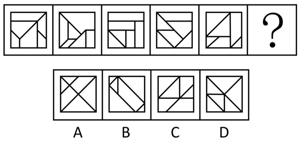

- **A**. A
- **B**. B　✅
- **C**. C
- **D**. D

**答案**：B

**官方解析**

元素组成不同，且无明显属性规律，优先考虑数量规律。观察发现，题干图形封闭区域明显，考虑面数量，但题干与选项图形的面数量均为6，无法选出答案，考虑面的细化，再次观察发现，题干图形基本含有三角形面，考虑三角形面的数量，题干图形三角形面数量依次为0、1、2、3、4，所以“？”处图形的三角形面数量应为5，只有B项符合。
故正确答案为B。

---

### 第 2 题　qid 16593132 · 图形推理

从所给的四个选项中，选择最合适的一个填入问号处，使之呈现一定的规律性：

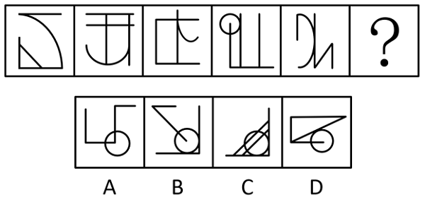

- **A**. A
- **B**. B
- **C**. C
- **D**. D　✅

**答案**：D

**官方解析**

元素组成不同，且无明显属性规律，考虑数量规律。观察发现，题干图形线条交叉明显，且每幅图都有相切，考虑切点数。题干图形切点数均为1，故？处图形切点数也应为1，只有D项符合。
故正确答案为D。

---

### 第 3 题　qid 16593170 · 图形推理

从所给的四个选项中，选择最适合的一个填入问号处，使之呈现一定的规律性：

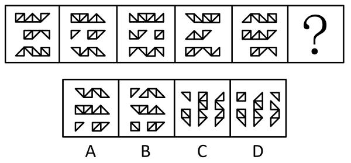

- **A**. A　✅
- **B**. B
- **C**. C
- **D**. D

**答案**：A

**官方解析**

解析一：元素组成相同，优先考虑位置规律。观察发现，题干相邻两幅图形中，左侧三列元素整体向右平移1列，最右侧一列元素移动到最左侧后，又整体向下平移1行（如下图所示），只有A项符合规律。

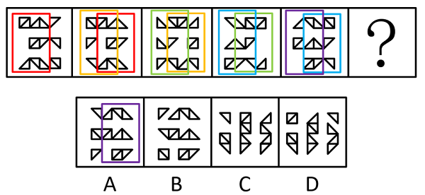

解析二：元素组成相同，优先考虑位置规律。观察发现，题干所有图形均向右平移一格，走到头换到下一行，最后一行走完又走到第一行，所有图形首尾相连，循环往复，如图箭头所示。

图中标记1的图形，问号处位置如图，排除C、D两项；

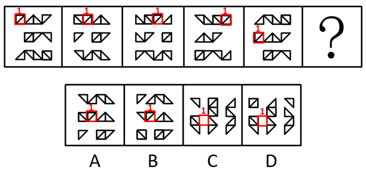

A、B两项的区别在于标记1的图形前面的图形，如图画圈图形，观察发现，只有A符合。

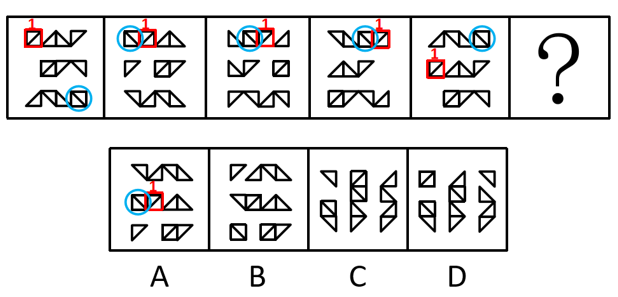

故正确答案为A。

---

### 第 4 题　qid 16593143 · 图形推理

从所给的四个选项中，选择最合适的一个填入问号处，使之呈现一定的规律性：

- **A**. A　✅
- **B**. B
- **C**. C
- **D**. D

**答案**：A

**官方解析**

元素组成基本相同，优先考虑位置规律。观察发现，如下图所示，题干每幅图中的虚线依次顺时针移动其半条边长的距离，长实线依次向上循环移动其半条边长的距离，“U”字形图形依次顺时针旋转，只有A项符合规律。

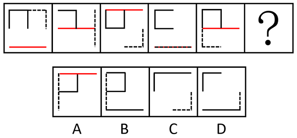

故正确答案为A。

---

### 第 5 题　qid 10204458 · 图形推理

请从所给的四个选项中，选择最合适的一个填入问号处，使之呈现一定的规律性：

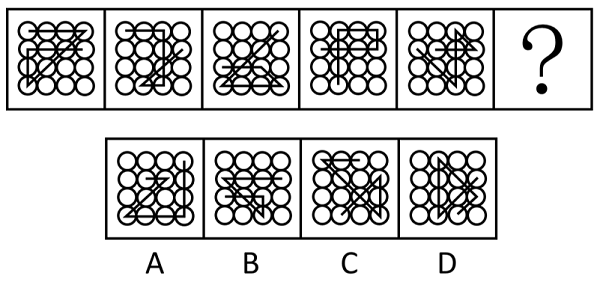

- **A**. A
- **B**. B
- **C**. C　✅
- **D**. D

**答案**：C

**官方解析**

元素组成相同，优先考虑位置规律。观察发现，题干所有图形都有一个十字交点，该十字交点依次在内圈顺时针平移一格，故？处图形该十字交点的位置应在内圈的右下角，只有C项符合。

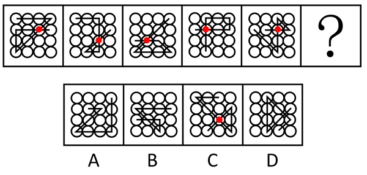

故正确答案为C。

---

### 第 6 题　qid 10204454 · 图形推理

请从所给的四个选项中，选择最合适的一个填入问号处，使之呈现一定的规律性：

- **A**. A
- **B**. B
- **C**. C　✅
- **D**. D

**答案**：C

**官方解析**

元素组成不同，且无明显属性规律，考虑数量规律。观察发现，题干图形均由黑球和白球构成，且黑白球分割明显，考虑部分数。题干图形中，黑球部分数依次为1、1、3、3、2，白球部分数依次为1、2、1、2、4，单独看无规律，考虑运算。黑球部分数+白球部分数依次为2、3、4、5、6，故问号处应选择一个黑球部分数+白球部分数为7的图形，只有C项符合。
故正确答案为C。

---

### 第 7 题　qid 10204457 · 图形推理

把下面的六个图形分为两类，使每一类图形都有各自的共同特征或规律，分类正确的一项是：

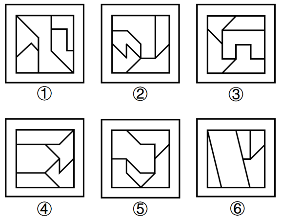

- **A**. ①③④，②⑤⑥
- **B**. ①③⑤，②④⑥
- **C**. ①⑤⑥，②③④　✅
- **D**. ①④⑥，②③⑤

**答案**：C

**官方解析**

本题为分组分类题目。观察发现，题干图形内部被线条分割，优先考虑面数量，所有图形面数量均为5，且均明显存在最大面，最大面出现等腰元素，可优先考虑最大面的对称性，图①⑤⑥最大面均为中心对称图形，图②③④最大面均为轴对称图形，即图①⑤⑥一组，图②③④一组。
故正确答案为C。

---

### 第 8 题　qid 16593173 · 图形推理

下列纸盒的外表面展开图中，哪一个折叠成的纸盒和其他三个不一样？

- **A**. A
- **B**. B　✅
- **C**. C
- **D**. D

**答案**：B

**官方解析**

将选项展开图标上序号，如下图所示（各选项面都相同，故相同的面用相同字母表示），逐一进行分析。

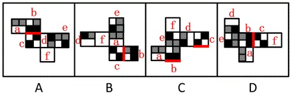

A项：面b、面c相邻，公共边紧邻面b与面c的黑块（如上图所示）； 

B项：面b、面c相邻，公共边没有紧邻面b的黑块（如上图所示）；

C项：面b、面c相邻，公共边紧邻面b与面c的黑块（如上图所示）；

D项：面b、面c相邻，公共边紧邻面b与面c的黑块（如上图所示）。

综上，只有B项与其他三项不同。

本题为选非题，故正确答案为B。

---

### 第 9 题　qid 16593172 · 图形推理

下图为15个白色和5个灰色正方体组合而成的多面体，将其经A、B、C三个顶点切开后，正确的截面是：

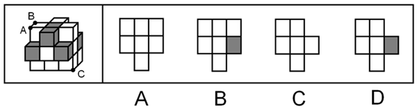

- **A**. A
- **B**. B
- **C**. C　✅
- **D**. D

**答案**：C

**官方解析**

本题考查截面图。根据平面公理“过不在一条直线上的三点，有且只有一个平面”可以得出，A、B、C三个顶点可以确定一个唯一的截面，如下图所示：

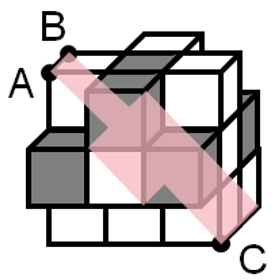

逆时针旋转即可得到如下截面图：

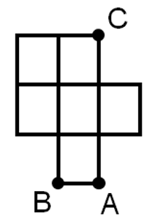

故正确答案为C。

---

### 第 10 题　qid 16593168 · 图形推理

下图为15个白色和5个灰色正方体组合而成的多面体，右边哪一个不可能是其某个角度的视图？

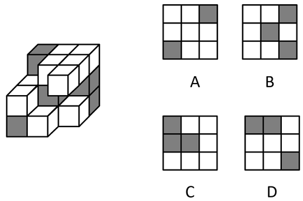

- **A**. A
- **B**. B　✅
- **C**. C
- **D**. D

**答案**：B

**官方解析**

本题考查三视图，逐一分析选项。

A项：题干立体图形从仰视（即从下往上）的视角可以看到下图的图形，再将视角顺时针或逆时针旋转后，即为A项视图，排除；

B项：该项不是题干立体图形的视图，当选；

C项：题干立体图形从右视（即从右往左）的视角可以看到下图的图形，再将视角旋转后，即为C项视图，排除；

D项：题干立体图形从后视（即从后往前）的视角可以看到下图的图形，再将视角顺时针旋转后，即为D项视图，排除。

本题为选非题，故正确答案为B。

---

### 第 11 题　qid 16593136 · 定义判断

职场义警是指认为自己在没有正式授权的情况下，能够监控周围环境中是否存在违反公司规范的迹象，并在自认为适当或合理的时候对感知到的违规同事进行直接或间接处罚的人。
根据上述定义，下列属于职场义警的是：

- **A**. 小张认为公司强制加班的行为违反了劳动法，于是向公司主管部门进行实名举报
- **B**. 戴红袖标的居委会王阿姨在斑马线义务执勤时，对乱闯红灯的行人进行口头批评
- **C**. 有同事利用上班时间闲聊，老周看不过去，瞅准机会找到这位同事进行批评教育　✅
- **D**. 保卫科小刘专门就公司员工安全意识弱现象向领导进行汇报，建议领导通报批评

**答案**：C

**官方解析**

第一步：找出定义关键词。
“在没有正式授权的情况下”、“监控到违反公司规范的迹象”、“自认为适当或合理的时候对违规同事进行处罚”。
第二步：逐一分析选项。
A项：小张认为公司行为违反劳动法，于是向公司主管部门进行实名举报，其中举报行为并非惩罚行为，不符合“自认为适当或合理的时候对违规同事进行处罚”，不符合定义，排除；
B项：居委会王阿姨对违反交通规则的行人进行批评是发生在其义务执勤期间，监督行人遵守交通规则是王阿姨的工作内容，不符合“在没有正式授权的情况下”，不符合定义，排除；
C项：老周对上班闲聊的同事进行批评教育，但并未提及老周的身份是领导，所以他并没有权力批评教育该同事，符合“在没有正式授权的情况下”，老周瞅准机会直接批评上班闲聊的同事，符合“自认为适当或合理的时候对违规同事进行处罚”，符合定义，当选；
D项：关注员工安全意识的问题在保卫科小刘的工作范围之内，不符合“在没有正式授权的情况下”，不符合定义，排除。
故正确答案为C。

---

### 第 12 题　qid 10204473 · 定义判断

述情障碍是指个体情感功能相对受限，个体无法识别自己或他人的情感，在生活中常常表现为无法找到合适的言语来表达个人感情的一种人格特征。
根据上述定义，下列涉及述情障碍的是：

- **A**. 面对同事的误解和质疑，小刘依然没有半句解释，一如既往地选择了沉默
- **B**. 在铁证如山的事实面前，一向能言善辩的嫌疑人犹如泄了气的皮球，一句话也说不出来
- **C**. 小马理解不了人们为何总是在散发恶臭的垃圾面前常常皱眉，对社会丑恶现象也视而不见
- **D**. 面对老师的批评，其他几位被批评的同学已经羞得无地自容，但小刚却还挤眉弄眼笑嘻嘻　✅

**答案**：D

**官方解析**

第一步：找出定义关键词。
“个体无法识别自己或他人的情感”、“无法找到合适的言语来表达个人感情”。
第二步：逐一分析选项。
A项：小刘在面对同事的误解和质疑时选择沉默，没有体现小刘“无法识别自己或他人的情感”，而且沉默也不代表“无法找到合适的言语来表达个人感情”，不符合定义，排除；
B项：嫌疑人无话可说是因为铁证如山，不符合“个体无法识别自己或他人的情感”、“无法找到合适的言语来表达个人感情”，不符合定义，排除；
C项：小马只是无法理解他人在垃圾面前皱眉的行为，没有体现“个体无法识别自己的情感”，也不符合“无法找到合适的言语来表达个人感情”，不符合定义，排除；
D项：面对老师批评时其他同学在羞愧，但小刚没有羞愧，说明小刚对自己或他人的情感识别上存在问题，符合“个体无法识别自己或他人的情感”，“挤眉弄眼笑嘻嘻”的行为体现了“无法找到合适的言语来表达个人感情”，符合定义，当选。
故正确答案为D。

---

### 第 13 题　qid 16593139 · 定义判断

矛盾职业认同是指从业者对自身职业兼具认同和不认同，或认同职业某一方面而不认同其他方面，反映了个体对自身职业的复杂情感。
根据上述定义，下列属于矛盾职业认同的是：

- **A**. 小强对未来就业感到迷茫，一方面认为本专业相对好就业，另一方面觉得工作压力会很大
- **B**. 虽然觉得社会上有很多人对网络主播并不认同，但小飞却决定将主播当作一生的事业来做
- **C**. 小刚的父母希望他毕业后考公务员，但小刚自己却更喜欢做一名教师
- **D**. 老汪觉得送快递很累，但工作时间相对自由，因此他还是决定干下去　✅

**答案**：D

**官方解析**

第一步：找出定义关键词。
“从业者”、“对自身职业兼具认同和不认同”、“认同职业某一方面而不认同其他方面”。
第二步：逐一分析选项。
A项：小强还未就业，不符合“从业者”，不符合定义，排除；
B项：社会上有很多人对网络主播并不认同，但小飞本人却对主播事业很坚定，仅体现出小飞对于主播事业的认同，不符合“对自身职业兼具认同和不认同”、“认同职业某一方面而不认同其他方面”，不符合定义，排除；
C项：父母希望小刚考公务员，小刚自己却更喜欢做一名教师，不明确小刚是否为从业者，并且仅体现了父母和小刚关于小刚未来职业的想法不同，不符合“对自身职业兼具认同和不认同”、“认同职业某一方面而不认同其他方面”，不符合定义，排除；
D项：老汪是快递员，符合“从业者”，他觉得送快递很累，但工作时间相对自由，符合“对自身职业兼具认同和不认同”、“认同职业某一方面而不认同其他方面”，符合定义，当选。
故正确答案为D。

---

### 第 14 题　qid 10204471 · 定义判断

邻里效应是指在一定的空间范围内，经验丰富的邻里行为会对其他个体的社会经济行为产生影响，从而吸引其他个体出于收益考虑，向其学习、模仿和跟从。
根据上述定义，下列属于邻里效应的是:

- **A**. 老赵去年种的玉米格外高产，今年村里的邻居都跟着他家买一样的种子　✅
- **B**. 老孙的儿子初中毕业后选择上职高，这吸引了村里其他孩子也进了职高
- **C**. 村东的小张新买了一辆小轿车，村西的小李看到后，也买了一辆
- **D**. 小冯看了网上的装修图后很心动，也照图装修了自己家

**答案**：A

**官方解析**

第一步：找出定义关键词。
“经验丰富的邻里行为会对其他个体的社会经济行为产生影响”、“吸引其他个体出于收益考虑”、“向其学习、模仿和跟从”。
第二步：逐一分析选项。
A项：老赵去年种的玉米格外高产，符合“经验丰富的邻里行为会对其他个体的社会经济行为产生影响”，邻居都跟着他家买一样的种子，符合“吸引其他个体出于收益考虑”、“向其学习、模仿和跟从”，符合定义，当选； 
B项：村里其他孩子和老孙的儿子一样选择了上职高，不符合“对其他个体的社会经济行为产生影响”、“吸引其他个体出于收益考虑”，不符合定义，排除；
C项：小李只是效仿小张买了一辆小轿车，未体现出小李购买小轿车的目的，不符合“吸引其他个体出于收益考虑”，不符合定义，排除；
D项：小冯按照网上的装修图装修了自己家，不符合“经验丰富的邻里行为”，不符合定义，排除。
故正确答案为A。

---

### 第 15 题　qid 16593140 · 定义判断

逆向选择性监管是指在某些监管领域中，监管者对违规程度较低的目标群体严加监管，对违规程度更高的监管对象却相对宽松，使得监管强度与对象违规程度成反比的组织现象。
根据上述定义，下列属于逆向选择性监管的是：

- **A**. 监管部门对证照齐全的大中型校外培训机构严加管控，却对问题突出的个体培训疏于管控　✅
- **B**. 候车时，守序排队的人上车没有座位，而插队的人却有座位，对此公交车司机却不加干预
- **C**. 班主任把易犯错误且屡教不改的学生座位调整在前排，以便任课老师监督
- **D**. 在每年的消费者权益保护日晚会上，监管部门都会重点曝光一些违规产品

**答案**：A

**官方解析**

第一步：找出定义关键词。
“在监管领域中”、“对违规程度较低的目标群体严加监管”、“对违规程度更高的监管对象相对宽松”。
第二步：逐一分析选项。
A项：监管部门对证照齐全的培训机构严加管控，证照齐全说明其违规程度相对较低，但却严加管控，符合“在监管领域中”、“对违规程度较低的目标群体严加监管”，对问题突出的个体培训疏于管控，问题突出说明违规程度更高，符合“对违规程度更高的监管对象相对宽松”，符合定义，当选；
B项：司机对守序排队和插队行为都不加干预，说明根本就不存在监管，不符合“对违规程度较低的目标群体严加监管”、“对违规程度更高的监管对象相对宽松”，不符合定义，排除；
C项：班主任调整易犯错误且屡教不改的学生的座位，以便任课老师监督，说明是对违规程度更高的对象严加看管，不符合“对违规程度更高的监管对象相对宽松”，不符合定义，排除；
D项：监管部门重点曝光一些违规产品，没有体现对不同群体的区别监管，不符合“对违规程度较低的目标群体严加监管”、“对违规程度更高的监管对象相对宽松”，不符合定义，排除。
故正确答案为A。

---

### 第 16 题　qid 16593146 · 定义判断

即兴能力是企业在紧急、不可预测环境下，计划与行动同时进行，通过对资源进行利用和整合呈现出创造性，从而自发地实现预期目标的能力。
根据上述定义，下列属于即兴能力的是：

- **A**. 企业聚餐，员工老杨一杯酒下肚，情绪立即高涨起来，即兴为大家表演了诗朗诵
- **B**. 负责公司招聘的人力资源部通过对考生即兴演讲效果的比较，确定最终录用人员
- **C**. 某企业面对技术封锁，边调整发展规划，边创新研发技术，最终成长为行业巨头　✅
- **D**. 为应对未来劳动力成本大幅攀升的不利影响，企业启动了机器设备升级换代工作

**答案**：C

**官方解析**

第一步：找出定义关键词。
“企业在紧急、不可预测环境下”、“计划与行动同时进行”、“通过对资源进行利用和整合呈现出创造性”、“自发地实现预期目标”。
第二步：逐一分析选项。
A项：该项中员工老杨在企业聚餐时的表现属于个人行为，不符合“企业在紧急、不可预测环境下”，不符合定义，排除；
B项：该项中负责公司招聘的人力资源部对考生的考核和录用属于人力资源部的日常工作，不符合“企业在紧急、不可预测环境下”，也未表现出计划和行动情况，不符合“计划与行动同时进行”，不符合定义，排除；
C项：该项中某企业面对技术封锁，符合“企业在紧急、不可预测环境下”，调整发展规划，创新研发技术，符合“计划与行动同时进行”、“通过对资源进行利用和整合呈现出创造性”，最终成长为行业巨头，符合“自发地实现预期目标”，符合定义，当选；
D项：该项中为应对未来劳动力成本大幅攀升的不利影响，企业采取了一些措施，说明已经预知未来如何，不符合“企业在紧急、不可预测环境下”，不符合定义，排除。
故正确答案为C。

---

### 第 17 题　qid 10204460 · 定义判断

适应性绩效是指个体应对、响应和支持变化的行为表现，具有一定动态发展性，它对于个人、团队和企业的创新以及维持企业在动态变化的环境中持续高效运作均具有重要意义。
根据上述定义，下列属于适应性绩效的是：

- **A**. 企业为适应市场环境，加速剥离非核心业务，以维持主营业务的竞争力
- **B**. 为响应绿色低碳生产要求，公司董事会决定关闭高污染高耗能生产项目
- **C**. 50多岁的赵老师对人工智能技术产生了很大兴趣，专门学习了有关课程
- **D**. 为了适应公司海外市场的快速拓展，销售骨干小刘开始学起了第二外语　✅

**答案**：D

**官方解析**

第一步：找出定义关键词。
“个体”、“应对、响应和支持变化的行为表现”。
第二步：逐一分析选项。
A项：企业为适应市场环境，加速剥离非核心业务，主体是企业，不符合“个体”，不符合定义，排除；
B项：公司董事会决定关闭高污染高耗能生产项目，主体是公司董事会，不符合“个体”，不符合定义，排除；
C项：50多岁的赵老师，符合“个体”，但他因为对人工智能技术感兴趣而学习有关课程，不符合“应对、响应和支持变化的行为表现”，不符合定义，排除；
D项：销售骨干小刘，符合“个体”，他为了适应公司海外市场的快速拓展，开始学起了第二外语，符合“应对、响应和支持变化的行为表现”，符合定义，当选。
故正确答案为D。

---

### 第 18 题　qid 16593131 · 定义判断

警觉性市场学习是指企业或组织为提高深度市场洞察而提前建立预警系统，并保持注意力集中以预测市场变化或感知客户需求微弱信号的学习行为。
根据上述定义，下列属于警觉性市场学习的是：

- **A**. 公司提醒小吴要想在职场中保持优势地位，避免被淘汰，就必须利用业余时间多学习
- **B**. 阳阳上课时注意力不集中，为帮他养成良好学习习惯，家长聘请了心理专家进行干预
- **C**. 某知名企业组建市场调研部，定期监测市场动向，积极培训员工，努力规避潜在风险　✅
- **D**. 某房地产开发商通过暂缓开发或拖延施工进度等方式，试图化解可能面临的发展危机

**答案**：C

**官方解析**

第一步：找出定义关键词。
“企业或组织”、“为提高深度市场洞察而提前建立预警系统”、“预测市场变化或感知客户需求”。
第二步：逐一分析选项。
A项：公司提醒小吴利用业余时间多学习避免被淘汰，是公司对员工的提醒，不属于对市场变化的预测和对客户需求的感知，不符合“预测市场变化或感知客户需求”，不符合定义，排除；
B项：家长聘请心理专家帮助阳阳养成良好的学习习惯，其中阳阳的家长不属于企业或组织，不符合“企业或组织”，不符合定义，排除；
C项：某知名企业组建市场调研部，定期监测市场动向，符合“企业或组织”、“为提高深度市场洞察而提前建立预警系统”、“预测市场变化或感知客户需求”，符合定义，当选；
D项：某房地产开发商使用暂缓开发或拖延施工进度等方式，是为了化解可能面临的发展危机，而不是对市场变化的预测和对客户需求的感知，不符合“预测市场变化或感知客户需求”，不符合定义，排除。
故正确答案为C。

---

### 第 19 题　qid 16593141 · 定义判断

领导者对下属或员工的过错惩罚有两种，权变惩罚与非权变惩罚，领导权变惩罚是指领导根据下属的过失程度酌情采取惩罚；领导非权变惩罚是指因下属的过失行为，领导施加了与下属实际绩效和表现不相符的过度惩罚。
根据上述定义，下列属于领导非权变惩罚的是：

- **A**. 小刘操作机床时，故意违反操作规程造成机床主机严重受损，公司根据相关规定对其进行加重处罚
- **B**. 因甲方无法如期履行合同义务，乙方领导指示法务部门根据合同约定条款严肃追究甲方的违约责任
- **C**. 刘律师因疏忽大意错过了案件上诉期，尽管其已获得委托人谅解，但律所仍对刘律师施以顶格处罚
- **D**. 小郑不小心给客户少发了部分产品，发现后及时补发，按规定只需罚款，但是经理却坚持要将他开除　✅

**答案**：D

**官方解析**

第一步：找出定义关键词。
领导权变惩罚：“领导根据下属的过失程度酌情采取惩罚”；
领导非权变惩罚：“领导根据下属的过失，施加了与下属实际绩效和表现不相符的过度惩罚”。
第二步：逐一分析选项。
A项：小刘故意违反操作造成机床主机严重受损，公司对其加重处罚是依据公司的规定，不符合“领导根据下属的过失，施加了与下属实际绩效和表现不相符的过度惩罚”，不符合“领导非权变惩罚”定义，排除；
B项：乙方领导追究甲方的违约责任，其中甲方不属于乙方的下属，且追究违约责任是依据合同约定的条款，不符合“领导根据下属的过失，施加了与下属实际绩效和表现不相符的过度惩罚”，不符合“领导非权变惩罚”定义，排除；
C项：刘律师因自身疏忽错过了案件上诉期，虽获得委托人谅解，但刘律师的行为属于失职，故律所对刘律师施以顶格处罚也是合理的，不符合“领导根据下属的过失，施加了与下属实际绩效和表现不相符的过度惩罚”，不符合“领导非权变惩罚”定义，排除；
D项：小郑在发现给客户少发了产品后及时补发，按规定只需罚款，但经理却要坚持开除小郑，这种惩罚是过度的，符合“领导根据下属的过失，施加了与下属实际绩效和表现不相符的过度惩罚”，符合“领导非权变惩罚”定义，当选。
故正确答案为D。

---

### 第 20 题　qid 16593160 · 定义判断

积极独处是个体主动选择与他人的交际分离，选择自我自由并投入到有意义的、愉快的活动中，从而产生的一种内在积极体验。
根据上述定义，下列属于积极独处的是：

- **A**. 小孙睡眠质量不好，外出工作时一般都不和同事一起住
- **B**. 小钱已经锁定了晚上的演唱会门票，谢绝了同事下班后聚餐的邀请
- **C**. 为了准备研究生入学考试，小赵几乎不参加社交活动，他感到很充实　✅
- **D**. 小周适应不了职场人际关系，辞职后不愿出去找工作，整日在家刷视频

**答案**：C

**官方解析**

第一步：找出定义关键词。
“个体主动选择与他人的交际分离”、“选择自我自由并投入到有意义的、愉快的活动中”、“产生内在积极体验”。
第二步：逐一分析选项。
A项：选项指出小孙因为睡眠质量不好所以在外出工作时不和同事一起住，小孙只是晚上不和同事一起住，并不是要和同事“交际分离”，不符合“个体主动选择与他人的交际分离”，不符合定义，排除；
B项：选项指出小钱因为晚上要看演唱会所以谢绝了当晚的聚餐邀请，并不是要和同事“交际分离”，不符合“个体主动选择与他人的交际分离”，不符合定义，排除；
C项：选项指出小赵为了准备研究生入学考试几乎不参加社交活动，符合“个体主动选择与他人的交际分离”、“选择自我自由并投入到有意义的、愉快的活动中”，他感到很充实，符合“产生内在积极体验”，符合定义，当选；
D项：选项指出小周适应不了职场人际关系而不愿出去找工作，并且整日在家刷视频，“整日刷视频”不是有意义的活动，不符合“选择自我自由并投入到有意义的、愉快的活动中”，不符合定义，排除。
故正确答案为C。

---

### 第 21 题　qid 16593133 · 类比推理

文字：汉字

- **A**. 判断：概念
- **B**. 宇宙：恒星
- **C**. 中国：北京
- **D**. 工人：矿工　✅

**答案**：D

**官方解析**

第一步：判断题干词语间逻辑关系。
汉字是记录汉语的文字，二者是种属关系。
第二步：判断选项词语间逻辑关系。
A项：概念不是判断的一种，二者不是种属关系，与题干逻辑关系不一致，排除；
B项：宇宙是包括一切天体的无限空间，恒星是本身能发出光和热的天体，恒星是宇宙的组成部分，二者是组成关系，与题干逻辑关系不一致，排除；
C项：北京是中国的组成部分，二者是组成关系，与题干逻辑关系不一致，排除；
D项：矿工是开采矿物的工人，二者是种属关系，与题干逻辑关系一致，当选。
故正确答案为D。

---

### 第 22 题　qid 16593162 · 类比推理

前因后果：因果

- **A**. 内忧外患：忧患
- **B**. 南征北战：征战
- **C**. 左顾右盼：顾盼
- **D**. 有始无终：始终　✅

**答案**：D

**官方解析**

第一步：判断题干词语间逻辑关系。
前因后果指的是事物的因果报应，后泛指整个事件；因果指的是原因与结果的关系，二者没有语义关系，考虑拆分。“前”和“后”是反义关系，“因”和“果”组成第二个词，分别代表原因和结果两个不同的方面，且先“因”后“果”。
第二步：判断选项词语间逻辑关系。
A项：“内”和“外”是反义关系，但是“忧”和“患”指的都是忧虑的事情，二者为近义关系，与题干逻辑关系不一致，排除；
B项：“南”和“北”是反义关系，但是“征”和“战”指的都是出发去作战，二者为近义关系，与题干逻辑关系不一致，排除；
C项：“左”和“右”是反义关系，但是“顾”和“盼”指的都是看，二者为近义关系，与题干逻辑关系不一致，排除；
D项：“有”和“无”是反义关系，“始”和“终”组成第二个词，分别代表开始和结束两个不同的方面，且先“始”后“终”，与题干逻辑关系一致，当选。
故正确答案为D。

---

### 第 23 题　qid 16593145 · 类比推理

飞机：机库：机场

- **A**. 课桌：桌椅：桌面
- **B**. 药品：药盒：药箱　✅
- **C**. 乘客：客车：车站
- **D**. 汽车：车轮：车轴

**答案**：B

**官方解析**

第一步：判断题干词语间逻辑关系。
飞机停在机库里，二者是存放地点对应关系；飞机停在机场里，二者是存放地点对应关系。
第二步：判断选项词语间逻辑关系。
A项：桌面是课桌的一部分，二者不是存放地点对应关系，与题干逻辑关系不一致，排除；
B项：药品放在药盒里，二者是存放地点对应关系；药品放在药箱里，二者是存放地点对应关系，与题干逻辑关系一致，当选；
C项：客车运输乘客，二者不是存放地点对应关系，与题干逻辑关系不一致，排除；
D项：车轮是汽车的组成部分，二者不是存放地点对应关系，与题干逻辑关系不一致，排除。
故正确答案为B。

---

### 第 24 题　qid 16593147 · 类比推理

制造：中国制造：智能化中国制造

- **A**. 小说：长篇小说：中长篇科幻小说
- **B**. 批评：自我批评：剖析式自我批评　✅
- **C**. 学习：深度学习：机器人深度学习
- **D**. 锻炼：体育锻炼：有意识体育锻炼

**答案**：B

**官方解析**

第一步：判断题干词语间逻辑关系。
中国制造是制造的一种，前两词构成种属关系；智能化中国制造是中国制造的一种，后两词构成种属关系，且“智能化”是对中国制造具体属性的描述。
第二步：判断选项词语间逻辑关系。
A项：长篇小说是小说的一种，前两词构成种属关系；中长篇科幻小说是中长篇小说的一种，不是长篇小说，后两词不构成种属关系，与题干逻辑关系不一致，排除；
B项：自我批评是批评的一种，前两词构成种属关系；剖析式自我批评是自我批评的一种，后两词构成种属关系，且“剖析式”是对自我批评具体属性的描述，与题干逻辑关系一致，保留；
C项：深度学习是学习的一种，前两词构成种属关系；机器人深度学习是指机器人利用深度学习技术进行学习，与“深度学习”不构成种属关系，与题干逻辑关系不一致，排除；
D项：体育锻炼是锻炼的一种，前两词构成种属关系；有意识体育锻炼是体育锻炼的一种，后两词构成种属关系，且“有意识”是对体育锻炼具体属性的描述，与题干逻辑关系一致，保留。
对比B、D两项，题干中“中国制造”与B项中“自我批评”都是主谓结构，D项中“体育锻炼”不是主谓结构，且题干中“智能化”与B项中“剖析式”结构一致，而D项中“有意识”与题干结构不同，故B项与题干逻辑关系更为一致。
故正确答案为B。

---

### 第 25 题　qid 16593151 · 类比推理

风吹：草低：见牛羊

- **A**. 浪打：船摇：靠舵手
- **B**. 光照：叶肥：促生长
- **C**. 游人：如织：显道窄
- **D**. 雨淋：花落：闻余香　✅

**答案**：D

**官方解析**

第一步：判断题干词语间逻辑关系。
风吹导致草低，草低导致见牛羊，第一词和第二词、第二词和第三词之间分别构成因果对应关系。
第二步：判断选项词语间逻辑关系。
A项：浪打导致船摇，二者构成因果对应关系，但船摇需要靠舵手，二者不构成因果对应关系，与题干逻辑关系不一致，排除；
B项：光照导致叶肥，叶肥是促生长的结果，与题干逻辑关系不一致，排除；
C项：游人如织形容游人多得像织布的线一样，密密麻麻，如织是用来形容游人的，二者不构成因果对应关系，与题干逻辑关系不一致，排除；
D项：雨淋导致花落，花落导致闻余香，第一词和第二词、第二词和第三词之间分别构成因果对应关系，与题干逻辑关系一致，当选。
故正确答案为D。

---

### 第 26 题　qid 16593155 · 类比推理

窗户：窗帘：遮光

- **A**. 桌子：桌布：防污　✅
- **B**. 电脑：鼠标：操作
- **C**. 座椅：座垫：美观
- **D**. 茶杯：茶叶：茶水

**答案**：A

**官方解析**

第一步：判断题干词语间逻辑关系。
窗帘挂在窗户上，二者为配套使用的对应关系；遮光是窗帘的功能，二者为功能对应关系。
第二步：判断选项词语间逻辑关系。
A项：桌布铺在桌子上，二者为配套使用的对应关系；防污是桌布的功能，二者为功能对应关系，与题干逻辑关系一致，当选；
B项：鼠标连接在电脑上，二者为配套使用的对应关系；操作鼠标，二者为动宾关系，与题干逻辑关系不一致，排除；
C项：座垫铺在座椅上，二者为配套使用的对应关系；美观是座垫的或然属性，二者为属性对应关系，与题干逻辑关系不一致，排除；
D项：茶叶是制作茶水的原材料，二者是原材料对应关系，与题干逻辑关系不一致，排除。
故正确答案为A。

---

### 第 27 题　qid 16593169 · 类比推理

信息科技：生物科技：科技

- **A**. 机械工业：智能工业：工业　✅
- **B**. 纺织产业：物流产业：产业
- **C**. 公共交通：城市交通：交通
- **D**. 商品住房：保障住房：住房

**答案**：A

**官方解析**

第一步：判断题干词语间逻辑关系。
信息科技会利用生物科技，生物科技会利用信息科技，二者为相互利用、相互融合的关系，信息科技和生物科技都是科技的一种，前两词分别与第三词构成种属关系。
第二步：判断选项词语间逻辑关系。
A项：机械工业会利用智能工业，智能工业会利用机械工业，二者为相互利用、相互融合的关系，机械工业和智能工业都是工业的一种，前两词分别与第三词构成种属关系，与题干逻辑关系一致，当选；
B项：纺织产业会利用物流产业，但物流产业不会利用纺织产业，二者不是相互利用、相互融合的关系，与题干逻辑关系不一致，排除；
C项：有的公共交通是城市交通，有的公共交通不是城市交通，有的城市交通是公共交通，有的城市交通不是公共交通，二者为交叉关系，不是相互利用、相互融合的关系，与题干逻辑关系不一致，排除；
D项：商品住房和保障住房（保障性住房），二者不是相互利用、相互融合的关系，与题干逻辑关系不一致，排除。
故正确答案为A。

---

### 第 28 题　qid 10204461 · 类比推理

政治家：文学家：思想家

- **A**. 污染物：氧化物：硫化物
- **B**. 科幻片：纪录片：故事片　✅
- **C**. 马铃薯：西红柿：农作物
- **D**. 运动员：跆拳道：大学生

**答案**：B

**官方解析**

第一步：判断题干词语间逻辑关系。
政治家、文学家和思想家是人的三种不同身份，三者互为交叉关系。
第二步：判断选项词语间逻辑关系。
A项：氧化物与硫化物为并列关系，二者分别与污染物构成交叉关系，与题干逻辑关系不一致，排除；
B项：科幻片、纪录片和故事片是对影视作品从三个不同的角度划分的，三者互为交叉关系，与题干逻辑关系一致，当选；
C项：马铃薯和西红柿是两种不同的农作物，前两词是并列关系，且分别与第三词构成种属关系，与题干逻辑关系不一致，排除；
D项：有的大学生是运动员，有的大学生不是运动员，有的运动员是大学生，有的运动员不是大学生，二者构成交叉关系，但是跆拳道是一种运动，与其余两词不构成交叉关系，与题干逻辑关系不一致，排除。
故正确答案为B。

---

### 第 29 题　qid 10204459 · 类比推理

山西：陈醋：粮食

- **A**. 甘肃：秦艽：植物
- **B**. 河南：汝瓷：瓷土　✅
- **C**. 四川：蜀绣：丝绸
- **D**. 陕西：剪纸：纸张

**答案**：B

**官方解析**

第一步：判断题干词语间逻辑关系。
陈醋是山西的特产，二者为特产和产地的对应关系，粮食是制作陈醋的原材料，二者为原材料的对应关系，且粮食经过发酵做成陈醋，发酵是化学变化。
第二步：判断选项词语间逻辑关系。
A项：秦艽是一种植物，也是中药，分布在蒙古，俄罗斯西伯利亚和远东地区，中国大陆的内蒙古、宁夏、河北、陕西、新疆、东北、山西等地，秦艽和甘肃不是特产和产地的对应关系，与题干逻辑关系不一致，排除；
B项：汝瓷是河南特产，二者为特产和产地的对应关系，瓷土是汝瓷的原材料，且瓷土需经过塑形后烧制做成汝瓷，烧制是化学变化，与题干逻辑关系一致，当选；
C项：蜀绣是巴蜀地区流行的一种民间工艺，对应的产地是四川，二者为特产和产地的对应关系，蜀绣的原材料是丝绸，但是在丝绸上用蚕丝线绣花纹做蜀绣的过程发生的是物理变化，与题干逻辑关系不一致，排除；
D项：剪纸是一种用剪刀或刻刀在纸上剪刻花纹，用于装点生活或配合其他民俗活动的民间艺术，剪纸不是陕西特产，与题干逻辑关系不一致，排除。
故正确答案为B。

---

### 第 30 题　qid 10204468 · 类比推理

（    ） 对于 主演 相当于 顾客 对于 （    ）

- **A**. 配角；消费者
- **B**. 主角；主顾　✅
- **C**. 男主角；客户
- **D**. 导演；店主

**答案**：B

**官方解析**

逐一代入选项。
A项：配角指戏剧、影视等艺术表演中的次要角色或次要演员，主演指扮演戏剧或影视剧中主角的人，二者为并列关系；顾客与消费者为交叉关系，前后逻辑关系不一致，排除；
B项：主角指戏剧、影视等艺术表演中的主要角色或主要演员，主演指扮演戏剧或影视剧中主角的人，二者为全同关系；主顾即顾客，二者为全同关系，前后逻辑关系一致，当选；
C项：主演指扮演戏剧或影视剧中主角的人，男主角是主演，二者为种属关系；客户与顾客为全同关系，前后逻辑关系不一致，排除；
D项：主演指扮演戏剧或影视剧中主角的人，导演是负责组织和指导演出工作的人，主演配合导演，二者为工作的对应关系；店主和顾客是买卖关系中的双方，二者为交易的对应关系，前后逻辑关系不一致，排除。
故正确答案为B。

---

### 第 31 题　qid 10204463 · 逻辑判断

前不久，某地烧烤突然在网上火爆出圈，线上“山呼海啸”般的流量迅速转化为线下高度集聚的客流，一时间，某地烧烤成为现象级“民众盛宴”。最近，网上开始出现一些某地烧烤“凉了”的帖子，依据有三：一是客流量下降，二是一些烧烤店开始转让门面，三是网络搜索热度大不如前。
以下哪项组合如果为真，最能质疑上述帖子的观点?
①与其说是“凉了”，不如说是回归常态。眼下，某地烧烤虽然“降温”，但相较“火”起来前还是热得多
②某地烧烤的火爆吸引了众多入局者，品味和服务好的店铺依然客流不息，有些店面转让出局很正常
③互联网制造热点具有更新换代快、生命周期短等特点。任何网红的热度都难以持续，但这并不等于“凉了”
④一场让全民或围观或参与的烧烤让更多人认识了某地，良好的消费环境和优质的公共服务令人印象深刻

- **A**. ①②
- **B**. ③④
- **C**. ①②③　✅
- **D**. ①②③④

**答案**：C

**官方解析**

第一步：找出论点和论据。
论点：某地烧烤“凉了”。
论据：一是客流量下降，二是一些烧烤店开始转让门面，三是网络搜索热度大不如前。
本题论点讨论的是某地烧烤“凉了”，论据讨论的是“凉了”的原因，要求从选项中选择有削弱力度的多项，可以先不预设。
第二步：逐一分析选项。
①指出该地的烧烤只是回归常态，火热程度“降温”，但比“火”之前还是“热”，因此不是“凉了”，可以削弱；
②指出品味和服务好的店铺依然客流不息，即没有“凉”，指出有些店面转让出局很正常，因此论据中第二条所提出的一些烧烤店铺转让，也不等于“凉了”，可以削弱；
③指出互联网制造的热点正常而言是难以持续的，但难以持续不等于“凉了”，因此论据中第三条所指的网络搜索热度大不如前，不等于“凉了”，可以削弱；
④指出烧烤让更多人认识了该地，消费环境和公共服务给人留下了深刻印象，但没有提及现在该地烧烤业的发展情况，话题不一致，无法削弱。
综上，能削弱的有①②③。
故正确答案为C。

---

### 第 32 题　qid 10204472 · 逻辑判断

科学家一直在对珠峰顶部积雪的厚度进行测量研究，过去由于没有探地雷达，测量研究结果具有不确定性，一般认为珠峰顶部积雪深度在0.92到3.5米之间。最近，中国研究人员在珠峰北坡，利用探地雷达沿着海拔7000米以上的山脊设置了26个测量点，通过采集大量数据得出结论，珠峰顶部积雪比以前认为的要深得多，平均达9.5米。
以下哪项如果为真，最能支持上述结论?

- **A**. 探地雷达的测量结果证明了珠峰山脊的地形相对平坦
- **B**. 集中于珠峰山脊的26个测量点显示，各点积雪深度均为9.5米
- **C**. 探地雷达对珠峰北坡海拔7000米以上山脊反复测量的结果可靠
- **D**. 雪和岩石表面差异很大，探地雷达可准确确定这两种物质的边界　✅

**答案**：D

**官方解析**

第一步：找出论点和论据。
论点：中国研究人员在珠峰北坡利用探地雷达沿着海拔7000米以上的山脊设置了26个测量点，通过采集大量数据得出结论，珠峰顶部积雪比以前认为的要深得多，平均达9.5米。
论据：无。
本题只有论点，没有论据，加强优先考虑必要条件或补充论据，即可利用探地雷达得出珠峰顶部积雪平均厚度，或补充能够证明论点成立的依据。
第二步：逐一分析选项。
A项：该项是说探地雷达的测量结果证明了珠峰山脊的地形相对平坦，但论点讨论的是利用探地雷达是否可以得出珠峰顶部积雪的平均厚度，话题不一致，无关选项，无法加强，排除；
B项：该项是说珠峰山脊的26个测量点显示，各点积雪的深度均为9.5米，补充了实验数据，证明珠峰顶部积雪的平均深度可能达到9.5米，补充论据，可以加强，保留；
C项：该项是说探地雷达对珠峰海拔7000米以上山脊反复测量的结果可靠，说明可以利用探地雷达测量积雪深度，补充论据，可以加强，保留；
D项：该项是说雪和岩石表面差异很大，探地雷达可准确确定这两种物质的边界，如果探地雷达不能准确确定这两种物质的边界，那么利用探地雷达就无法准确测量积雪的深度，故该项是论点成立的必要条件，可以加强，保留；
对比B、C、D三项，B项只是补充了测量点位的数据，且论点是说珠峰的顶部积雪深度平均达到9.5米，而题干中只是通过26个观测点得出的珠峰顶部积雪深度，是局部推出了整体，故26个观测点的积雪深度均为9.5米不是论点成立的必要条件，C项只是说明雷达测量的结果可靠，而D项具体说明了探地雷达确实可以测量积雪的原理，综上，必要条件大于补充论据，且D项比C项表述更明确，故D项力度更强。
故正确答案为D。

---

### 第 33 题　qid 16593174 · 逻辑判断

视觉（光）是哺乳动物重要的感知，其促进幼年大脑发育的功能得到了广泛关注。在发育过程中视网膜自感光神经节细胞是最早具有感光功能的视网膜感光细胞，专家认为它可能是介导光促进幼年大脑发育最关键的感光细胞。
以下哪项如果为真，最能支持专家的观点？

- **A**. 蜻蜓拥有近乎三百六十度的视野，它们不用频繁地扭动头部，就可以发现目标猎物
- **B**. 新生儿出生前视网膜已经发育，随着婴儿月龄增加，追物能力变强，视野扩大，多增加光环境可以促进新生儿大脑发育
- **C**. 细胞光感受的缺失，会导致幼鼠在学习速度上的缺陷，但这种缺陷可以被幼年时人为激活该细胞或视上核的催产素神经元所弥补　✅
- **D**. 小蝙蝠的视杆细胞主要用于感受暗光，虽然它们具有视力，但回声定位能力却是其感知周围环境的主要手段，可以忽略视觉对它的重要性

**答案**：C

**官方解析**

第一步：找出论点和论据。
论点：它（视网膜自感光神经节细胞）可能是介导光促进幼年大脑发育最关键的感光细胞。
论据：在发育过程中视网膜自感光神经节细胞是最早具有感光功能的视网膜感光细胞。
本题论点和论据均在讨论视网膜自感光神经节细胞和感光的关系，论点论据话题一致，加强优先考虑补充论据，即解释原因或举例子。
第二步：逐一分析选项。
A项：选项讨论的是蜻蜓可利用近三百六十度的视野来发现目标猎物，而论点讨论的是视网膜自感光神经节细胞对幼年大脑发育的影响，话题不一致，无法加强，排除；
B项：选项讨论的是多增加光环境可以促进新生儿大脑发育，而论点讨论的是视网膜自感光神经节细胞对幼年大脑发育的影响，话题不一致，无法加强，排除；
C项：选项指出幼鼠在学习速度上的缺陷可以被幼年时人为激活视网膜自感光神经节细胞所弥补，说明该细胞确实能介导光促进幼年大脑发育，补充论据，可以加强，当选；
D项：该项指出小蝙蝠的视杆细胞主要用于感受暗光，而论点讨论的是视网膜自感光神经节细胞对幼年大脑发育的影响，话题不一致，无法加强，排除。
故正确答案为C。

---

### 第 34 题　qid 16593157 · 逻辑判断

某高校针对去年起图书馆的图书借阅情况做了调查，数据显示，文学类书籍的借阅量大大超过了科技类书籍。因此，文学类书籍的受欢迎程度要高于科技类书籍。
以下哪项如果为真，最能削弱上述论证？

- **A**. 科技类书籍学习难度较大
- **B**. 文学类书籍占该校图书馆馆藏一半以上　✅
- **C**. 该校就读文科专业的学生接近三分之二
- **D**. 除了文学类书籍，法律、哲学类书籍也很受欢迎

**答案**：B

**官方解析**

第一步：找出论点和论据。
论点：文学类书籍的受欢迎程度要高于科技类书籍。
论据：某高校针对去年起图书馆的图书借阅情况做了调查，数据显示，文学类书籍的借阅量大大超过了科技类书籍。
本题论点探讨的是文学类书籍受欢迎程度更高，论据探讨的文学类书籍的借阅量更大，论点论据话题不一致，削弱优先考虑拆桥，即说明借阅量大不等于受欢迎程度高。
第二步：逐一分析选项。
A项：科技类书籍的学习难度较大会导致其受欢迎程度较低，解释了论点成立的原因，为加强项，无法削弱，排除；
B项：文学类书籍占该校图书馆馆藏一半以上，即图书馆中文学类书籍的总量超过了科技类书籍，两类书籍的总量不一致，在两类书籍总量不一致的情况下，借阅量无法准确反映受欢迎程度，为拆桥项，可以削弱，当选；
C项：该校有接近三分之二的学生就读“文科”专业（教学上哲学、历史、政治、法律等学科均属于“文科”专业），论点论据探讨的是“文学类”书籍，而非“文科”书籍，因此无法确定就读“文科”专业对借阅“文学类”书籍的影响，选项与题干话题不一致，无法削弱，排除；
D项：指出该校法律、哲学类书籍的情况，与论点探讨的话题无关，为无关项，无法削弱，排除。
故正确答案为B。

---

### 第 35 题　qid 16593159 · 逻辑判断

有研究报告指出，当前地球上有近一半的开花植物受到灭绝的威胁，数量超过10万种。而鉴于90%的药物来自植物，因此人类可能会失去大多数药物来源。
以下哪项如果为真最能质疑上述观点？

- **A**. 动物以及真菌类也是重要的药物来源
- **B**. 植物受威胁甚至濒临灭绝的情况明显超过动物
- **C**. 地球上的植物大概有40万种，当前开发为药用植物的有1万多种　✅
- **D**. 植物的药用价值也正是其濒临灭绝的主要原因，亟需寻找可替代药物

**答案**：C

**官方解析**

第一步：找出论点和论据。
论点：人类可能会失去大多数药物来源。
论据：人类90%的药物来自植物，而当前地球上有近一半的开花植物受到灭绝的威胁，数量超过10万种。
本题论点讨论的是人类可能会失去大多数药物来源，论据讨论的是人类90%的药物来自植物，而近一半的开花植物受到灭绝的威胁，故论点论据话题不一致，削弱优先考虑拆桥，即在“近一半的开花植物灭绝”和“人类失去大多数药物来源”之间断开联系即可。
第二步：逐一分析选项。
A项：动物以及真菌类也是重要的药物来源，只是重要的药物来源，但不清楚动物以及真菌类在药物来源中的占比，无法削弱论点中的“大多数药物来源”，为不明确项，无法削弱，排除；
B项：植物受威胁甚至濒临灭绝的情况明显超过动物，比较植物和动物濒临灭绝的情况，与论点人类可能会失去大多数药物来源无关，为无关项，无法削弱，排除；
C项：地球上的植物大概有40万种，当前开发为药用植物的有1万多种，即地球上的植物足够多，尽管近一半的开花植物受到灭绝的威胁，人类只开发药用植物一万多种，还剩很多植物可以开发为药用植物，即在“近一半的开花植物灭绝”和“人类失去大多数药物来源”之间断开联系，为拆桥项，可以削弱，当选；
D项：植物的药用价值也正是其濒临灭绝的主要原因，是在谈论植物濒临灭绝的原因，与论点人类可能会失去大多数药物来源无关，为无关项，无法削弱，排除。
故正确答案为C。

---

### 第 36 题　qid 16593166 · 逻辑判断

世界上一些棉花种植区域的虫害导致全球棉花价格大幅上涨，相比之下，大豆的价格长期保持稳定，由于棉花成熟快，甲国许多大豆种植者计划停止大豆种植而改种棉花。所以，至少在未来几年内，棉花价格的高涨将大幅提高棉花种植者的收入。
以下哪项如果为真，最能削弱上述论证？

- **A**. 过去几年大豆种植成本显著增加，预计将继续攀升
- **B**. 很少有消费者愿意为棉织品支付比现在更高的价格
- **C**. 甲国新研发的杀虫剂价格低廉，还能有效杀死棉花害虫
- **D**. 未来几年，甲国的棉花和棉花制品需求量不会急剧增加　✅

**答案**：D

**官方解析**

第一步：找出论点和论据。
论点：至少在未来几年内，棉花价格的高涨将大幅提高棉花种植者的收入。
论据：世界上一些棉花种植区域的虫害导致全球棉花价格大幅上涨，相比之下，大豆的价格长期保持稳定，由于棉花成熟快，甲国许多大豆种植者计划停止大豆种植而改种棉花。
本题论点讨论的是棉花价格的高涨将大幅提高棉花种植者的收入，论据讨论的是因全球棉花价格大幅上涨及棉花成熟快，甲国许多大豆种植者认为种棉花的收入会更高，从而计划停止大豆种植而改种棉花，论点论据都在讨论种棉花会提高种植者的收入，二者话题一致，削弱可以考虑削弱论点。
第二步：逐一分析选项。
A项：该项指出大豆种植成本预计将继续攀升，而论点讨论的是种棉花是否会提高种植者的收入，话题不一致，无法削弱，排除；
B项：该项指出很少有消费者愿意为棉织品支付比现在更高的价格，说明消费者不愿意买单，所以种棉花挣不了钱，可以削弱，保留；
C项：该项指出甲国新研发的杀虫剂价格低廉，还能有效杀死棉花害虫，结合题干开头提及的棉花因虫害而涨价，说明由于甲国有便宜杀虫剂，所以就没有虫害，产量也不会下降，棉花就不会涨价进而不会提高种植者收入，可以削弱，保留；
D项：该项指出未来几年，甲国的棉花和棉花制品需求量不会急剧增加，而收入是由棉花价格和销量共同决定的，甲国消费者需求量不会急剧增加，故甲国棉花及棉花制品销量和价格可能不会有明显增加，从而将不会大幅提高棉花种植者的收入，削弱论点，可以削弱，保留。
对比B、C、D三项，D项中通过“未来几年”、“需求量”与论点中的“未来几年”、“收入”相呼应，与题干关系更紧密，而B、C两项均未提及具体时间，反驳“收入增加”的内容不如D项更直接。
本题的主要争议点在CD项：
1.有同学质疑D项觉得虽然需求量不会急剧增加，但是“棉花价格会大幅上涨”，那就大幅提高棉花种植者的收入了呀。注意，在种棉花的人多了，需求不会急剧增加的情况下，棉花价格就不可能大幅上涨，所以“价格会大幅上涨”这个假设就不成立。
已知种棉花的人多了，且“收入=价格*销量”，D项说“需求量不会急剧增加”，可以推出“棉花价格不会大幅上涨”且“销量不会急剧增加”，那么最终“种植者收入也就不会大幅提高”，D项可以削弱论点；
C项因为有杀虫剂，所以棉花的价格不会大幅上涨，但是没有提到需求量，也就是没有考虑到“销量”问题，此处没有D项全面。
2.题干认为棉花价格上涨是因为“虫害”，C项强调甲国新研发的杀虫剂价格低廉，能有效杀死棉花害虫，即可以解决虫害问题，题干的问题被解决了，那么棉花价格也就不会上涨，最终“种植者收入就不会大幅提高”，从与题干内容的相关性上，C项的“杀虫剂”更贴合论证内容，这点C项比D项好。
综上，本题是争议题，CD项各有道理，在这道题中主要学习的思路有：
一是“因为收入=价格*销量，所以讨论收入是否会提高时，价格和销量两方面都能考虑到的选项更优”；
二是“哪个选项跟文段讨论的话题更相关更接近，哪个选项的力度更强”。
一般这两种选项不会同时出现，因为这道题一起出现了，所以就有了争议，争议题不纠结，不作为备考重点，学习基本思路即可。
故正确答案为D。

---

### 第 37 题　qid 16593138 · 逻辑判断

借助水文气象卫星20年采集的数据，科学家看到全球56%的海水变得越来越绿，这些海水都处在南纬40度和北纬40度之间的热带和亚热带水域，海水颜色由上层海水所含物质决定，深蓝色意味着海洋中没有太多生物，绿色则代表海里存在着以浮游植物为基础的生态系统，科学家据此认为，气候变暖让这片海域变得越来越绿。
以下哪项如果为真，最能支持上述结论？

- **A**. 变绿海域都处在热带和亚热带，特别是赤道附近
- **B**. 如果海洋持续变暖，海洋变绿现象会持续地加剧
- **C**. 气候变暖会大大加速热带和亚热带海洋浮游植物生长　✅
- **D**. 模拟海洋生态系统证明气候变暖与海水变绿之间存在正相关关系

**答案**：C

**官方解析**

第一步：找出论点和论据。
论点：气候变暖让热带和亚热带海域变得越来越绿。
论据：全球56%的海水变得越来越绿，这些海水都处在南纬40度和北纬40度之间的热带和亚热带水域，海水颜色由上层海水所含物质决定，深蓝色意味着海洋中没有太多生物，绿色则代表海里存在着以浮游植物为基础的生态系统。
本题论点讨论的是气候变暖让热带和亚热带海域变得越来越绿，论据讨论的是绿色则代表海里存在着以浮游植物为基础的生态系统，论据和论点话题不一致，加强优先考虑搭桥，即在“浮游植物”和“气候变暖”之间建立联系。
第二步：逐一分析选项。
A项：该项说的是变绿海域处在何地，论点说的是海域变得越来越绿的原因，话题不一致，无法加强，排除；
B项：该项说的是如果海洋持续变暖，海洋变绿现象会持续地加剧，说明气候变暖会导致海洋持续变暖，进而导致海洋变绿，补充论据，可以加强，保留；
C项：该项说的是气候变暖会大大加速热带和亚热带海洋浮游植物生长，在“浮游植物”和“气候变暖”之间建立联系，为搭桥项，可以加强，保留；
D项：该项说的是模拟海洋系统证明气候变暖与海洋变绿之间存在正相关关系，补充论据，可以加强，保留。
对比B、C、D三项，C项为搭桥项，B项和D项均为补充论据，C项的加强力度大于B、D两项。
故正确答案为C。

---

### 第 38 题　qid 16593175 · 逻辑判断

帕金森病作为一种严重的神经变性疾病，其背后发生的潜在原因尚不清楚，尽管遗传突变已经成为诱发帕金森病的一种已知原因，但90%的病例仍然是零星发生的，且没有明确的遗传起源，最新研究发现，环境因素如肠道微生物代谢产物会破坏人类产生多巴胺的神经元，导致类似帕金森病的症状出现，这一发现表明潜在的环境因素是帕金森病的诱因之一。
以下哪项如果为真，最能支持上述观点？

- **A**. 人类微生物组可能影响神经退行性疾病
- **B**. 帕金森病患者的肠道微生物组环境与健康人不同
- **C**. 帕金森病诱因的发现为开发新型疗法提供了方向
- **D**. 杀虫剂和工业化学物质等与机体神经退化之间存在明显关联　✅

**答案**：D

**官方解析**

第一步：找出论点和论据。
论点：潜在的环境因素是帕金森病的诱因之一。
论据：环境因素如肠道微生物代谢产物会破坏人类产生多巴胺的神经元，导致类似帕金森病的症状出现。
本题论据在讨论环境因素中的肠道因素会导致类似帕金森病的症状出现，论点在讨论潜在的环境因素是帕金森病的诱因之一，论点论据均在讨论环境因素导致帕金森病，二者话题一致，加强优先考虑补充论据。
第二步：逐一分析选项。
A项：该项说的人类微生物组可能影响神经退行性疾病，帕金森病是最常见的神经退行性疾病之一，说明人类微生物组可能会对帕金森病有影响，具有可能的加强作用，保留；
B项：该项说的是帕金森病患者的肠道微生物组环境与健康人不同，说明由于两类人的肠道微生物不同，所以有可能是肠道微生物引发的帕金森，有一定的加强力度，保留；
C项：该项说的是帕金森病诱因发现的现实意义，与题干讨论的潜在的环境因素是否是帕金森病诱因的话题无关，为无关项，无法加强，排除；
D项：该项说的是杀虫剂和工业化学物质等与机体神经退化之间存在明显关联，而杀虫剂和工业化学物质确实是生活环境中存在的，举例说明环境因素是帕金森病的诱因，补充论据，可以加强，保留。
对比A、B、D三项，A项和B项均为可能性的加强，而D项是明确的举例加强，D项的加强力度大于A、B两项。
故正确答案为D。

---

### 第 39 题　qid 16593134 · 类比推理

小赵、小李、小周、小孙、小钱五人一起参与“谁是卧底”的游戏。已知五人中有两人是卧底，且存在以下情况：
①小赵、小李两人中至少有一人是卧底
②如果小李是卧底，小周一定是卧底
③只有在小孙是卧底时，小钱才是卧底
④如果小钱不是卧底，那么小赵也不是卧底
⑤小孙不是卧底
则卧底是：

- **A**. 小赵和小钱
- **B**. 小钱和小李
- **C**. 小李和小周　✅
- **D**. 小赵和小周

**答案**：C

**官方解析**

第一步：分析题干条件。

①小赵 或 小李是卧底；

②小李是卧底小周是卧底；

③小钱是卧底小孙是卧底；

④小赵是卧底小钱是卧底；

⑤小孙不是卧底；

⑥五人中有两人是卧底。

第二步：根据题干条件进行推理。

条件⑤为确定信息，从确定信息开始推理。结合条件③，根据“否后必否前”可以得出小钱不是卧底。结合条件④，根据“否后必否前”可知，小赵不是卧底。结合条件①，根据“或关系否一推一”可以得出小李是卧底，再结合条件②，根据“肯前必肯后”可以得出小周是卧底，对应C项。

故正确答案为C。

---

### 第 40 题　qid 16593130 · 类比推理

某单位邀请7位评标专家甲、乙、丙、丁、戊、己、庚参加评标工作，7位评标专家随机被分成两组，其中第一组3人，第二组4人，但分组须符合以下要求：
①甲和丙不能在同一个小组
②如果乙在第一组，那么丁必须在第一组
③如果戊在第一组，那么丙必须在第二组
④己必须在第二组
如果丙、戊在同一组，那么不可能在同一组的是：

- **A**. 甲和乙
- **B**. 甲和丁
- **C**. 乙和庚　✅
- **D**. 丙和庚

**答案**：C

**官方解析**

第一步：分析题干条件。

（1）甲和丙不能在同一个小组；

（2）乙在第一组丁在第一组；

（3）戊在第一组丙在第二组；

（4）己在第二组；

（5）丙、戊在同一组；

（6）第一组3人，第二组4人。

第二步：根据题干条件进行推理。

根据条件（3），如果戊在第一组，那么丙应该在第二组，与条件（5）“丙、戊在同一组”矛盾，所以戊在第二组，则丙也在第二组。此时结合条件（1）可知，甲在第一组；结合条件（4）己在第二组和条件（6）可得表格如下。此时还余乙、丁、庚3人未分组。

结合条件（2），假设乙在第一组，则丁也在第一组，此时甲、乙、丁在第一组，丙、戊、己、庚在第二组；假设乙在第二组，此时甲、丁、庚在第一组，乙、戊、丙、己在第二组。综上，乙和庚一定不可能在同一组。

本题为选非题，故正确答案为C。

---

## 资料分析

### 材料 1

        截止2022年12月，我国网民规模约为10.67亿，较2021年12月新增网民约3549万，互联网普及率达75.6%，较2021年12月提升2.6个百分点。我国网民使用手机上网的比例达99.8%，较2021年12月增加0.1个百分点；使用电视上网的比例为25.9%；使用台式电脑、笔记本电脑、平板电脑上网的比例分别为34.2%、32.8%和28.5%。我国城镇网民规模约为7.59亿，占网民整体的71.1%，农村网民规模约为3.08亿，较2021年12月增长约2371万，占网民整体的28.9%。

        2022年12月，20-29岁、30-39岁、40-49岁网民占比分别为14.2%、19.6%和16.7%；50岁及以上网民群体占比由2021年12月的26.8%提升至30.8%，互联网进一步向中老年群体渗透。

        2022年12月，线上办公用户规模约达5.4亿，较2021年12月增加7078万户，占整体网民的50.6%。互联网医疗用户规模约达3.63亿，较2021年12月增加约6466万，占网民整体的34%。农村地区在线教育和互联网医疗用户分别占农村网民整体的31%和21.5%，较上年分别增加2.7%和4.1%。

#### 第 1 题　qid 16593065 · 综合

截至2022年12月，我国20岁以上网民人数是20岁以下网民人数的：

- **A**. 不到3倍
- **B**. 3-4倍之间
- **C**. 4-5倍之间　✅
- **D**. 5倍以上

**答案**：C

**官方解析**

根据题干“截至2022年12月······是······的”，结合材料时间为2022年12月，且选项为倍数，可判定本题为现期倍数问题。定位文字材料第二段可得：2022年12月，我国20-29岁、30-39岁、40-49岁网民占比分别为14.2%、19.6%和16.7%；50岁及以上网民群体占比由2021年12月的26.8%提升至30.8%。则截至2022年12月，我国20岁以上网民人数占比=14.2%+19.6%+16.7%+30.8%=81.3%，20岁以下网民人数占比=1-81.3%=18.7%，则题干所求，在C项范围内。 

故正确答案为C。 

---

#### 第 2 题　qid 16593066 · 增长

截至2022年12月，我国城镇网民规模同比增速约为：

- **A**. 1.2%
- **B**. 1.6%　✅
- **C**. 2.0%
- **D**. 2.4%

**答案**：B

**官方解析**

根据题干“截至2022年12月······同比增速约为”，可判定本题为一般增长率问题。定位文字材料第一段可得：截止2022年12月，我国网民规模约为10.67亿，较2021年12月新增网民约3549万。我国城镇网民规模约为7.59亿，农村网民规模约为3.08亿，较2021年12月增长约2371万。由于我国网民规模的同比增长量=城镇网民规模的同比增长量+农村网民规模的同比增长量，则2022年12月，我国城镇网民规模同比增长约3549-2371=1178万=0.1178亿。根据公式：增长率。

故正确答案为B。

---

#### 第 3 题　qid 10204490 · 综合

根据上述材料，截止2022年12月我国网民使用上网前3位的设备是：

- **A**. 手机、台式电脑、笔记本电脑　✅
- **B**. 手机、笔记本电脑、平板电脑
- **C**. 手机、电视、台式电脑
- **D**. 电视、台式电脑、平板电脑

**答案**：A

**官方解析**

定位文字材料第一段可知：截止2022年12月，我国网民使用手机上网的比例达99.8%，使用电视上网的比例为25.9%，使用台式电脑、笔记本电脑、平板电脑上网的比例分别为34.2%、32.8%和28.5%。故截止2022年12月我国网民使用上网前3位的设备是：手机（99.8%）、台式电脑（34.2%）、笔记本电脑（32.8%）。
故正确答案为A。

---

#### 第 4 题　qid 16593067 · 增长

2019-2022年，当年12月我国城镇与农村互联网普及率同比增量相差在1个百分点以内的年份有几个？

- **A**. 1　✅
- **B**. 2
- **C**. 3
- **D**. 4

**答案**：A

**官方解析**

根据题干“2019-2022年，当年12月······同比增量······”，可判定本题为增长量计算问题。定位统计图可知2018年12月-2022年12月我国城镇与农村互联网的普及率。根据公式：增长量=现期量-基期量，则2019-2022年，当年12月我国城镇与农村互联网普及率同比增量差值分别为：

2019年：，不满足；

2020年：，不满足；

2021年：，满足；

2022年：，不满足。

综上可知，2019-2022年，当年12月我国城镇与农村互联网普及率同比增量相差在1个百分点以内的年份仅有1个（2021年）。

故正确答案为A。

---

#### 第 5 题　qid 16593068 · 增长

以下柱状图中，最能准确反映2019年12月-2022年12月全国互联网普及率同比增量变化趋势的是（横轴位置代表增量为0）：

- **A**. 

- **B**. 

- **C**. 

　✅
- **D**. 

**答案**：C

**官方解析**

根据题干“······最能准确反映2019年12月-2022年12月全国互联网普及率同比增量变化趋势的是······”，可判定本题为增长量比较问题。定位统计图可知2018年12月-2022年12月全国互联网普及率。根据公式：增长量=现期量-基期量，则2019年12月-2022年12月全国互联网普及率同比增量分别为：
2019年12月：64.5%-59.6%=4.9%，即同比增长4.9个百分点；
2020年12月：70.4%-64.5%=5.9%，即同比增长5.9个百分点；
2021年12月：73.0%-70.4%=2.6%，即同比增长2.6个百分点；
2022年12月：75.6%-73.0%=2.6%，即同比增长2.6个百分点。
观察可知，同比增量呈先上升再下降最后相等的趋势，且2020年12月与2019年12月同比增量仅相差1个百分点，与C项变化趋势一致。
故正确答案为C。

---

### 材料 2

        2022年中国锂电池出货量658GWh，同比增长101.1%。2022年中国动力锂电池装车量达294.6GWh，同比增长90.7%，高于全球同比增速18.9个百分点，占全球动力锂电池装车量的56.9%。

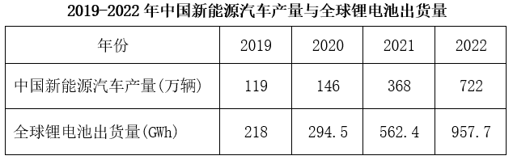

#### 第 6 题　qid 16593070 · 综合

2019-2022年，中国数码锂电池年均出货量在以下哪个范围内？

- **A**. 不到45GWh
- **B**. 45-47GWh之间　✅
- **C**. 47-49GWh之间
- **D**. 49GWh以上

**答案**：B

**官方解析**

根据题干“2019-2022年······年均······在以下哪个范围内”，结合材料时间为2019-2022年，可判定本题为现期平均数问题。定位统计图可得：2019-2022年中国数码锂电池出货量分别为：36.5GWh、46.2GWh、53.5GWh、48.0GWh。则2019-2022年中国数码锂电池年均出货量为GWh，在B项范围内。

故正确答案为B。

---

#### 第 7 题　qid 16593071 · 综合

2019-2022年，中国锂电池年出货量超过全球锂电池年出货量一半的年份有几个？

- **A**. 1
- **B**. 2
- **C**. 3　✅
- **D**. 4

**答案**：C

**官方解析**

定位统计表和统计图可知：2019-2022年全球锂电池出货量和中国各类型锂电池出货量。故各年份中国锂电池出货量分别为：2019年，9.5+36.5+71.0=117.0GWh；2020年，16.2+46.2+80.0=142.4GWh；2021年47.7+53.5+226.0=327.2GWh。定位文字材料第一段可知：2022年中国锂电池出货量658GWh。若想找出中国锂电池年出货量的年份，则需找出中国锂电池年出货量×2&gt;全球锂电池年出货量的年份。比较可知：2019年，117.0×2=234GWh&gt;218GWh；2020年，142.4×2=284.8GWh&lt;294.5GWh；2021年，327.2×2=654.4GWh&gt;562.4GWh；2022年，658×2=1316GWh&gt;957.7GWh。满足题意的有：2019年、2021年、2022年，共3个年份。

故正确答案为C。

---

#### 第 8 题　qid 10204493 · 增长

以下锂电池出货量指标中同比增速最快的是：

- **A**. 2021年储能锂电池出货量　✅
- **B**. 2021年动力锂电池出货量
- **C**. 2022年储能锂电池出货量
- **D**. 2022年动力锂电池出货量

**答案**：A

**官方解析**

根据题干“······同比增速最快的是”，可判定本题为一般增长率问题。定位图形材料可得，2020-2022年储能锂电池出货量分别为16.2GWh、47.7GWh、130GWh，2020-2022年动力锂电池出货量分别为80GWh、226GWh、480GWh。根据公式：增长率，则各选项同比增长率分别为：

2021年储能锂电池出货量：；

2021年动力锂电池出货量：；

2022年储能锂电池出货量：；

2022年动力锂电池出货量：；

观察发现，2021年储能锂电池出货量同比增速最快。

故正确答案为A。

---

#### 第 9 题　qid 16593073 · 综合

2021年，全球动力锂电池装车量约为多少GWh？

- **A**. 271.5
- **B**. 295.6
- **C**. 301.4　✅
- **D**. 323.6

**答案**：C

**官方解析**

根据题干“2021年······约为多少GWh”，结合材料时间为2022年，可判定本题为基期计算问题。定位文字材料可得：2022年中国动力锂电池装车量达294.6GWh，同比增长90.7%，高于全球同比增速18.9个百分点，占全球动力锂电池装车量的56.9%。根据公式：整体，则2022年全球动力锂电池装车量为GWh。根据公式：基期量，结合2022年全球动力锂电池装车量同比增速为90.7%-18.9%=71.8%，则题干所求为GWh，与C项最接近。

故正确答案为C。

---

#### 第 10 题　qid 16593075 · 比重

以下饼图中，最能准确反映2022年中国锂电池出货量中，储能锂电池、数码锂电池和动力锂电池占比关系的是：
（黑色：储能锂电池  白色：数码锂电池  斜杠：动力锂电池）

- **A**. 

- **B**. 

- **C**. 

- **D**. 
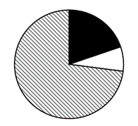
　✅

**答案**：D

**官方解析**

根据题干“······最能准确反映2022年······占比关系的是”，结合材料时间为2022年，可判定本题为现期比重问题。定位统计图可得：2022年中国储能锂电池出货量为130.0GWh，数码锂电池出货量为48.0GWh，动力锂电池出货量为480.0GWh；定位文字材料可得：2022年中国锂电池出货量658GWh。根据公式：比重，则在2022年中国锂电池出货量中，动力锂电池出货量占比，A项中动力锂电池出货量占比为75%，C项中超过75%，排除A、C两项；储能锂电池出货量（130.0GWh）是数码锂电池出货量（48.0GWh）的2倍多，B项两部分占比相近，排除B项，D项当选。

故正确答案为D。

---

### 材料 3

        2023年前5个月，天津口岸出口汽车约17.2万辆，同比增长29.5%，总价值约100.1亿元人民币，同比增长40.2%。

        2023年前5个月，汽车出口带动天津口岸整体出口同比增加。汽车出口占同期天津口岸出口商品总值的2.2%，较上年同期提升0.3个百分点。1~5月民营企业出口活力明显，民营企业出口约10.6万辆，同比增长64.3%，占同期天津口岸汽车出口总量的61.6%，占比较上年同期提升13个百分点。新能源汽车出口成为新的增长点，出口约11万辆，同比增长50.2%。

#### 第 11 题　qid 10204497 · 增长

2023年1-5月，天津口岸出口汽车均价同比上涨为：

- **A**. 8%　✅
- **B**. 12%
- **C**. 16%
- **D**. 20%

**答案**：A

**官方解析**

根据题干“2023年1-5月······均价同比上涨为”，结合选项为百分数，可判定本题为平均数的增长率问题。定位文字材料第一段可得：2023年前5个月，天津口岸出口汽车约17.2万辆，同比增长29.5%（b），总价值约100.1亿元人民币，同比增长40.2%（a）。根据公式：平均数的增长率，则2023年1-5月，天津口岸出口汽车均价同比上涨，结合选项，只有A项满足。

故正确答案为A。

---

#### 第 12 题　qid 16593080 · 综合

2023年1~5月，天津口岸出口商品总值在以下哪个范围内？

- **A**. 不到4000亿元
- **B**. 4000~4400亿元之间
- **C**. 4400~4800亿元之间　✅
- **D**. 4800亿元以上

**答案**：C

**官方解析**

根据“2023年1~5月······商品总值······”，结合资料给出了2023年1~5月天津口岸汽车出口总值及其占比，且选项带单位，可判定本题为现期比重问题。定位文字资料第一段可得：2023年前5个月，天津口岸出口汽车总价值约100.1亿元人民币；定位文字资料第二段可得：2023年前5个月，汽车出口占同期天津口岸出口商品总值的2.2%。根据公式：整体，可得所求亿元，在C项范围内。

故正确答案为C。

---

#### 第 13 题　qid 16593081 · 增长

2023年1~5月，民营企业出口汽车同比约增加了多少万辆？

- **A**. 3
- **B**. 4　✅
- **C**. 5
- **D**. 6

**答案**：B

**官方解析**

根据题干“······同比约增加了多少万辆”，可判定本题为增长量计算问题。定位文字材料第二段可得：2023年1~5月，民营企业出口汽车约10.6万辆，同比增长64.3%。根据公式：增长量，则题干所求万辆。

故正确答案为B。

---

#### 第 14 题　qid 16593082 · 综合

2022年1~5月，天津口岸出口新能源汽车约占天津口岸出口汽车的：

- **A**. 46%
- **B**. 50%
- **C**. 55%　✅
- **D**. 64%

**答案**：C

**官方解析**

根据题干“2022年1~5月······占······”，结合材料时间为2023年前5个月，可判定本题为基期比重问题。定位文字材料第一段可知：2023年前5个月，天津口岸出口汽车约17.2万辆（B），同比增长29.5%（b）。定位文字材料第二段可知：2023年前5个月，天津口岸出口新能源汽车约11万辆（A），同比增长50.2%（a）。根据公式：基期比重，则所求比重。

故正确答案为C。

---

#### 第 15 题　qid 16593083 · 增长

2023年1~5月，天津口岸出口汽车平均单价同比增长率最大的月份是：

- **A**. 1月
- **B**. 2月　✅
- **C**. 4月
- **D**. 5月

**答案**：B

**官方解析**

根据题干“······平均单价同比增长率最大······”，可以判定本题为平均数的增长率问题。定位表格可得2023年1~5月天津口岸汽车出口值的同比增速（a）和出口车辆数的同比增速（b），根据公式：平均数的增长率，则2023年1~5月天津口岸出口汽车平均单价同比增长率分别为：1月，；2月，； 4月，；5月，。比较可知，2023年1~5月天津口岸出口汽车平均单价同比增长率最大的月份是2月。

故正确答案为B。

---
