# 2024年江苏省公务员录用考试《行测》题（A类）（网友回忆版）

> 省考 · 2024 年 · 6 个模块 · 共 130 题

- [政治理论](#%E6%94%BF%E6%B2%BB%E7%90%86%E8%AE%BA) · 3 题
- [常识判断](#%E5%B8%B8%E8%AF%86%E5%88%A4%E6%96%AD) · 12 题
- [言语理解与表达](#%E8%A8%80%E8%AF%AD%E7%90%86%E8%A7%A3%E4%B8%8E%E8%A1%A8%E8%BE%BE) · 30 题
- [数量关系](#%E6%95%B0%E9%87%8F%E5%85%B3%E7%B3%BB) · 19 题
- [判断推理](#%E5%88%A4%E6%96%AD%E6%8E%A8%E7%90%86) · 46 题
- [资料分析](#%E8%B5%84%E6%96%99%E5%88%86%E6%9E%90) · 20 题

---

## 政治理论

### 第 1 题　qid 13628288 · 时事政治

党的二十大报告指出，中国式现代化既有各国现代化的共同特征，更有基于自己国情的中国特色。关于中国式现代化的内涵和意义，下列表述正确的是：
①有与世界各国现代化相同的任务
②是人类历史上难度最大的现代化
③是独立自主、和平发展的现代化
④创造了一种全新的人类文明形态

- **A**. ①②③
- **B**. ①②④
- **C**. ①③④
- **D**. ②③④　✅

**答案**：D

**官方解析**

本题考查政治常识。
①错误，②正确，习近平总书记在《中国式现代化是强国建设、民族复兴的康庄大道》的文章中指出：“第一，人口规模巨大的现代化。这是中国式现代化的显著特征。人口规模不同，现代化的任务就不同，其艰巨性、复杂性就不同，发展途径和推进方式也必然具有自己的特点。现在，全球进入现代化的国家也就20多个，总人口10亿左右。中国14亿多人口整体迈入现代化，规模超过现有发达国家人口的总和，将极大地改变现代化的世界版图。这是人类历史上规模最大的现代化，也是难度最大的现代化。”
③正确，习近平总书记在《中国式现代化是强国建设、民族复兴的康庄大道》的文章中指出：“第五，走和平发展道路的现代化。坚持和平发展，在坚定维护世界和平与发展中谋求自身发展，又以自身发展更好维护世界和平与发展，推动构建人类命运共同体，是中国式现代化的突出特征······中国式现代化坚持独立自主、自力更生，依靠全体人民的辛勤劳动和创新创造发展壮大自己，通过激发内生动力与和平利用外部资源相结合的方式来实现国家发展，不以任何形式压迫其他民族、掠夺他国资源财富，而是为广大发展中国家提供力所能及的支持和帮助。”
④正确，党的二十大报告中“三、新时代新征程中国共产党的使命任务”指出：“中国式现代化的本质要求是：坚持中国共产党领导，坚持中国特色社会主义，实现高质量发展，发展全过程人民民主，丰富人民精神世界，实现全体人民共同富裕，促进人与自然和谐共生，推动构建人类命运共同体，创造人类文明新形态。”
故②③④表述正确。
故正确答案为D。

---

### 第 2 题　qid 17900950 · 时事政治

2023年10月18日，习近平主席在第三届“一带一路”国际合作高峰论坛上宣布，中国将采取行动支持高质量共建“一带一路”。关于中国将采取的行动，下列表述正确的有：
①支持建设开放型世界经济
②完善“一带一路”国际合作机制
③构建“一带一路”立体互联互通网络
④启动“一带一路”科技创新行动计划

- **A**. ①②③　✅
- **B**. ①②④
- **C**. ②③④
- **D**. ①③④

**答案**：A

**官方解析**

本题考查政治常识。
①②③正确：2023年10月18日，习近平主席在第三届“一带一路”国际合作高峰论坛开幕式上发表了题为《建设开放包容、互联互通、共同发展的世界》的主旨演讲，宣布了中国支持高质量共建“一带一路”的八项行动，包括：构建“一带一路”立体互联互通网络、支持建设开放型世界经济、开展务实合作、促进绿色发展、推动科技创新、支持民间交往、建设廉洁之路、完善“一带一路”国际合作机制。
④错误：习近平主席在讲话中指出，中方将继续实施“一带一路”科技创新行动计划，举办首届“一带一路”科技交流大会，未来5年把同各方共建的联合实验室扩大到100家，支持各国青年科学家来华短期工作。故“启动‘一带一路’科技创新行动计划”说法错误。
故正确答案为A。

---

### 第 3 题　qid 13628287 · 时事政治

近期举行的中央金融工作会议提出，要坚定不移走中国特色金融发展之路，加快建设中国特色现代金融体系。关于中国特色现代金融体系的建设要求，下列表述正确的是：
①要突出政治性、人民性
②要加快国际金融一体化进程
③需要更完善的金融监管体系
④需要打造现代金融机构和市场体系

- **A**. ①②③
- **B**. ①②④
- **C**. ①③④　✅
- **D**. ②③④

**答案**：C

**官方解析**

本题考查政治常识。
中央金融工作会议于2023年10月30日至31日在北京举行。中共中央总书记、国家主席、中央军委主席习近平出席会议并发表重要讲话。
①正确，会议强调，当前和今后一个时期，做好金融工作必须坚持和加强党的全面领导，以习近平新时代中国特色社会主义思想为指导，全面贯彻党的二十大精神，完整、准确、全面贯彻新发展理念，深刻把握金融工作的政治性、人民性，以加快建设金融强国为目标······不断开创新时代金融工作新局面。
②错误，国际金融一体化是随着国际经济一体化的发展，各国金融市场和各类金融市场之间的界限逐步消失，全球性的多功能的国际金融市场逐步形成的趋势。但此次会议未提及有关国际金融一体化的内容。
③正确，会议强调，金融是国民经济的血脉，是国家核心竞争力的重要组成部分，要加快建设金融强国，全面加强金融监管，完善金融体制，优化金融服务，防范化解风险，坚定不移走中国特色金融发展之路，推动我国金融高质量发展，为以中国式现代化全面推进强国建设、民族复兴伟业提供有力支撑。
④正确，会议指出，高质量发展是全面建设社会主义现代化国家的首要任务，金融要为经济社会发展提供高质量服务······要着力打造现代金融机构和市场体系，疏通资金进入实体经济的渠道。
故①③④正确。
故正确答案为C。

---

## 常识判断

### 第 1 题　qid 17900947 · 经济常识

党的二十届二中全会通过的《党和国家机构改革方案》提出，要设立新的党中央决策议事协调机构，组建新的党中央职能部门和办事机构，在重要领域设立新的党中央派出机关。下列新设立或组建的党中央机构与其性质对应正确的是：

- **A**. 中央金融工作委员会——党中央办事机构
- **B**. 中央社会工作部——党中央派出机关
- **C**. 中央港澳工作办公室——党中央职能部门
- **D**. 中央科技委员会——党中央决策议事协调机构　✅

**答案**：D

**官方解析**

本题考查政治常识。
A项错误：《党和国家机构改革方案》在“一、深化党中央机构改革”部分指出：“（二）组建中央金融工作委员会。统一领导金融系统党的工作，指导金融系统党的政治建设、思想建设、组织建设、作风建设、纪律建设等，作为党中央派出机关，同中央金融委员会办公室合署办公。”故中央金融工作委员会为党中央派出机关。
B项错误：《党和国家机构改革方案》在“一、深化党中央机构改革”部分指出：“（四）组建中央社会工作部。负责统筹指导人民信访工作，指导人民建议征集工作，统筹推进党建引领基层治理和基层政权建设，统一领导全国性行业协会商会党的工作，协调推动行业协会商会深化改革和转型发展，指导混合所有制企业、非公有制企业和新经济组织、新社会组织、新就业群体党建工作，指导社会工作人才队伍建设等，作为党中央职能部门。”故中央社会工作部为党中央职能部门。
C项错误：《党和国家机构改革方案》在“一、深化党中央机构改革”部分指出：“（五）组建中央港澳工作办公室。承担在贯彻‘一国两制’方针、落实中央全面管治权、依法治港治澳、维护国家安全、保障民生福祉、支持港澳融入国家发展大局等方面的调查研究、统筹协调、督促落实职责，在国务院港澳事务办公室基础上组建，作为党中央办事机构，保留国务院港澳事务办公室牌子。”故中央港澳工作办公室为党中央办事机构。
D项正确：《党和国家机构改革方案》在“一、深化党中央机构改革”部分指出：“（三）组建中央科技委员会。加强党中央对科技工作的集中统一领导，统筹推进国家创新体系建设和科技体制改革，研究审议国家科技发展重大战略、重大规划、重大政策，统筹解决科技领域战略性、方向性、全局性重大问题，研究确定国家战略科技任务和重大科研项目，统筹布局国家实验室等战略科技力量，统筹协调军民科技融合发展等，作为党中央决策议事协调机构。”
故正确答案为D。

---

### 第 2 题　qid 13628291 · 经济常识

2023年是我国自贸试验区建设十周年。十年来，自贸试验区在贸易、投资、金融、航运、人才等方面对接国际通行规则，取得一系列突破性创新成果。下列不属于突破性创新成果的是：

- **A**. 创设境外金融投资账户，加快推进资本市场国际化　✅
- **B**. 实施外商投资准入前国民待遇加负面清单管理模式
- **C**. 建立以国际贸易“单一窗口”为核心的贸易便利化模式
- **D**. 实施跨境服务贸易负面清单管理，推进服务业综合开放

**答案**：A

**官方解析**

本题考查政治常识。
A项错误，B、C、D三项正确，2023年9月27日，在国新办举行的自贸试验区建设十周年新闻发布会上，商务部副部长盛秋平用“五个率先”概括了十年来自贸区试验区取得的一系列突破性、引领性的创新成果，即：“一是率先实施外商投资准入前国民待遇加负面清单管理模式，推动投资管理体制实现历史性变革。二是率先建立以国际贸易‘单一窗口’为核心的贸易便利化模式，有力支撑贸易强国建设。三是率先以跨境服务贸易负面清单管理模式为代表推进服务业综合开放，推动各类高端要素自由便捷流动。四是率先实施‘证照分离’等政府管理改革，促进营商环境改善和政府职能加速转变。五是率先探索自由贸易账户，金融开放创新稳步推进。”
本题为选非题，故正确答案为A。

---

### 第 3 题　qid 17900952 · 法律常识

清末思想家魏源说：“强人之所不能，事必不立；禁人之所必犯，法必不行。”下列西方名句最契合魏源这句话含义的是：

- **A**. 法律之内，应有天理人情在　✅
- **B**. 立法者通过塑造公民的习惯而使他们变好
- **C**. 无国家强制力之法，犹如不燃烧的火、不发亮的光
- **D**. 只要法律不再有力量，一切合法的东西也都不会再有力量

**答案**：A

**官方解析**

本题考查法律常识。
“强人之所不能，事必不立；禁人之所必犯，法必不行。”这句话的含义是：强迫他人做力不能及的事情，这件事肯定不能成功；以人必定会违背的规定来禁止他人，这样的法令必定不能施行。该句强调尊重实际，顺应人性，方能取得实效。
A项正确：“法律之内，应有天理人情在”强调的是法理与情理的关系，从法的历史来看，最好的法往往发轫于习惯、民俗、社会道德、公义等“人情细节”，它代表着公理和所有的公民人情。与题干表述的含义一致。
B项错误：“立法者通过塑造公民的习惯而使他们变好”强调的是法的作用，说明法能够指引人民塑造良好的习惯。题干表述并未体现这一点。
C项错误：“无国家强制力之法，犹如不燃烧的火、不发亮的光”强调的是国家强制力对法的重要性，说明法由国家强制力保障实施。题干表述并未体现这一点。
D项错误：“只要法律不再有力量，一切合法的东西也都不会再有力量”强调的是法的地位，说明法律在整个社会调整机制和全部社会规范体系中居于主导地位，一切国家及社会行为均须以法律为依据。题干表述并未体现这一点。
故正确答案为A。

---

### 第 4 题　qid 13628307 · 法律常识

我国《公务员法》规定，公务员不得从事或者参与营利性活动，在企业或者其他营利性组织中兼任职务。下列情形属于违反规定的是：

- **A**. 副市长何某兼任市工商业联合会主席
- **B**. 法官赵某开设证券账户并买卖公司股票
- **C**. 警察张某转让继承取得的某有限责任公司股权
- **D**. 税务人员熊某作为小股东出资设立有限责任公司　✅

**答案**：D

**官方解析**

本题考查法律常识。
A项错误，工商业联合会是中国共产党领导的以民营企业和民营经济人士为主体，具有统战性、经济性、民间性有机统一基本特征的人民团体和商会组织，并非营利性组织，何某可以兼任职务。
B项错误，根据《中共中央办公厅、国务院办公厅关于党政机关工作人员个人证券投资行为若干规定》第三条规定：“党政机关工作人员个人可以买卖股票和证券投资基金······”选项中，赵某可以买卖公司股票。
C项错误，根据《中华人民共和国民法典》第一百二十四条第一款规定：“自然人依法享有继承权。”选项中，张某作为自然人有权继承股权，其转让股权属于合法行使对该股权的所有权，不属于从事营利性活动。
D项正确，根据《中华人民共和国民法典》第七十六条规定：“以取得利润并分配给股东等出资人为目的成立的法人，为营利法人。营利法人包括有限责任公司、股份有限公司和其他企业法人等。”选项中，有限责任公司属于营利法人，其目的是取得利润并分配给股东等出资人，熊某作为小股东出资设立有限责任公司属于从事营利性活动。
故正确答案为D。

---

### 第 5 题　qid 13628318 · 人文常识

保安李某值班时看到马路上王某失控翻车，立即前往救助，途中不慎摔倒而受伤。施救时，李某因方法不当致王某面部受伤。在众人的救助下王某获救。对此，下列说法正确的是：

- **A**. 李某救助中不慎摔伤，王某应给予其适当的补偿　✅
- **B**. 李某施救时致王某面部受伤，应承担损害赔偿责任
- **C**. 李某的救助效果不佳，无权请求王某承担部分损失
- **D**. 李某的救助属于维护公共利益，其受伤应视同工伤

**答案**：A

**官方解析**

本题考查法律常识。
A项正确，C项错误，根据《中华人民共和国民法典》第一百八十三条规定：“因保护他人民事权益使自己受到损害的，由侵权人承担民事责任，受益人可以给予适当补偿。没有侵权人、侵权人逃逸或者无力承担民事责任，受害人请求补偿的，受益人应当给予适当补偿。”题干中，李某因救助王某不慎摔倒而受伤，王某应给予其适当的补偿，李某不会因为救助效果不佳而丧失请求王某给予适当补偿的权利。
B项错误，根据《中华人民共和国民法典》第一百八十四条规定：“因自愿实施紧急救助行为造成受助人损害的，救助人不承担民事责任。”题干中，李某属于自愿救助王某，因自愿实施紧急救助行为造成王某面部受伤，李某无需承担损害赔偿责任。
D项错误，根据《工伤保险条例》第十五条规定：“职工有下列情形之一的，视同工伤：（一）在工作时间和工作岗位，突发疾病死亡或者在48小时之内经抢救无效死亡的；（二）在抢险救灾等维护国家利益、公共利益活动中受到伤害的；（三）职工原在军队服役，因战、因公负伤致残，已取得革命伤残军人证，到用人单位后旧伤复发的。”题干中，李某并不是在抢险救灾等维护公共利益的活动中受到伤害，不能认定为工伤。
故正确答案为A。

---

### 第 6 题　qid 17900949 · 科技常识

谚语“蜻蜓低飞，天要下雨”，是人类通过观察动物的活动来预报天气所得到的经验总结。这一经验总结所体现的哲理是：

- **A**. 人类只有通过自己的实践活动才能把握信息
- **B**. 人类的意识或思想活动是信息及其运动的中介
- **C**. 人类通过意识活动把握客观事物运动变化的规律　✅
- **D**. 人类观察动物活动所获得的信息是一种自然信息

**答案**：C

**官方解析**

本题考查政治常识。
A项错误：实践是认识的唯一来源，但认识的途径却包括直接经验和间接经验两种：前者是指由亲身参加变革现实的实践所获得的知识；后者是指从别人或书本那里学习得来的知识。
B项错误：信息是意识活动借以展开的中介，人类的意识活动能够帮助我们建立起正常的信息机制，在获得、储存和处理信息这三者之间建立起完整的连接链条和意义秩序。
C项正确：所谓“蜻蜓低飞，天要下雨”，并不是蜻蜓向我们发出了某种特定信息，而是人类意识或思维活动在不同的事件之间建立了联系，使得一种事物或现象的出现，在某种程度上代表了另一种事物或现象的存在，究其本质，是人的意识活动把握了客观事物运动变化的相互联系及其规律的结果。
D项错误：自然信息是指一切自然物发出的信息，它包括来自无机界和生物界的信息，如：我们观察到的宇宙间星球的运动变化；地球上的各种自然现象；我们欣赏的风景等。社会信息是指反映人类社会运动状态和方式的信息，其来源有两大方面：一是来源于人们对自然信息的观察研究；二是来源于人们构成社会时，社会系统联系沟通的需要，以及反映和交流人们的思想感情及意识形态的需要。人类观察动物活动所获得的信息来源于人们对自然信息的观察研究，属于社会信息。
故正确答案为C。

---

### 第 7 题　qid 17900959 · 科技常识

古往今来，人类逐水而居，文明伴随而生，人类生产生活同湿地有着密切联系。下列关于湿地的说法不正确的是：

- **A**. 能吸收二氧化碳气体
- **B**. 是哺乳动物种群的栖息地
- **C**. 会排放出甲烷、氨气　✅
- **D**. 具有不可替代的综合功能

**答案**：C

**官方解析**

本题考查地理国情。
湿地被称为地球的“肾”，可分为自然和人工两大类。自然湿地包括沼泽地、泥炭地、湖泊、河流、海滩和盐沼等，人工湿地主要有水稻田、水库、池塘等。
A项正确：湿地丰富的水分条件适宜植物生长，大部分湿地都有茂盛的植物，它们可以大量吸收空气中的二氧化碳。
B项正确：湿地为动物提供了丰富的食物来源 ，是哺乳动物、两栖动物、鸟类等的重要栖息地，也是鸟类长途迁徙中的理想落脚地。
C项错误：由于湿地水体的厌氧环境，且拥有大量微生物，被固定的碳在湿地环境中会通过呼吸作用或微生物的分解作用再次释放到大气中，碳释放以二氧化碳和甲烷为主。（氨气主要来自于化肥施用和家畜蓄养等农业活动，同时也有少量来自交通运输和工业等排放。）
D项正确：湿地不仅为人类的生产、生活提供多种资源，而且具有巨大的环境功能和效益，在抵御洪水、调节径流、蓄洪防旱、控制污染、调节气候、控制土壤侵蚀、促淤造陆、美化环境等方面有其他系统不可替代的综合功能。
本题为选非题，故正确答案为C。
【备注】本题存在瑕疵。C项中，湿地特别是使用氮肥的人工湿地，会释放一定的氨气。

---

### 第 8 题　qid 17900958 · 法律常识

2023年7月，我国多部门联合公布《生成式人工智能服务管理暂行办法》，对具有文本图片、音频、视频等内容生成能力的模型及相关技术的服务应用加以规范。对此，下列说法正确的是：

- **A**. 我国将对生成式人工智能应用场景实施统一管理
- **B**. 我国开始重视对内容生成能力这一人工智能关键要素的管理　✅
- **C**. 该办法对生成式人工智能的规范可以解决“网络杀熟”问题
- **D**. 我国对人工智能的运用还处于起步阶段是该办法“暂行”的原因之一

**答案**：B

**官方解析**

本题考查政治常识。
2023年7月，国家网信办联合国家发展改革委、教育部、科技部、工业和信息化部、公安部、广电总局公布《生成式人工智能服务管理暂行办法》（以下简称《办法》）。
A项错误：《办法》在“第二章 技术发展与治理”部分指出：“鼓励生成式人工智能技术在各行业、各领域的创新应用，生成积极健康、向上向善的优质内容，探索优化应用场景，构建应用生态体系。”由此可见，我国并未对生成式人工智能应用场景实施统一管理。
B项正确：《办法》作为全球范围内针对生成式人工智能的首部专门立法，以鼓励创新发展为基调，以个人合法权益、公共利益、国家安全为底线，在原则理念和规制范围上统筹发展与安全，不仅是监管生成式人工智能的中国探索，也为全球人工智能治理开辟了新的道路。由此可见，我国开始重视对内容生成能力这一人工智能关键要素的管理。
C项错误：《中华人民共和国个人信息保护法》第二十四条第一款规定：“个人信息处理者利用个人信息进行自动化决策，应当保证决策的透明度和结果公平、公正，不得对个人在交易价格等交易条件上实行不合理的差别待遇。”由此可知，《中华人民共和国个人信息保护法》的相关规定可以解决“网络杀熟”问题。
D项错误：近年来，我国人工智能的运用处于蓬勃发展阶段，诸如图像分类、语音识别、知识问答、人机对弈、无人驾驶等人工智能技术实现了从“不能用、不好用”到“可以用”的技术突破，迎来爆发式增长的新高潮。《办法》“暂行”的主要原因是接受实践的检验，发现、修改问题，然后正式颁布。
故正确答案为B。

---

### 第 9 题　qid 17900960 · 人文常识

下图描绘的是被称为“二牛抬杠”的我国传统农业耕作场景，其中最能体现的管理职能是：

- **A**. 激励
- **B**. 控制
- **C**. 计划
- **D**. 组织　✅

**答案**：D

**官方解析**

本题考查管理常识。
“二牛抬杠”是南诏时期的一种特殊耕作方式，也称“二牛三夫”耕作法。耕作时，两牛相距约七八尺，中间横抬一“杠”，“杠”后接续辕犁。一人在前牵牛；一人坐于“杠”上，脚踏辕犁，控制犁铧入土深浅；一人在后扶持犁把。
A项错误：激励职能是企业管理者用科学的方法调动职工的积极性和创造性，挖掘职工的内在潜力的一系列管理活动。与“二牛抬杠”无关。
B项错误：控制职能是管理者要对组织的运行状况加以监督，通过控制可发现当初的计划与实际的偏差，采取有利的行动纠正偏差，保证计划的实行，确保原来的目标得以实现。与“二牛抬杠”无关。
C项错误：计划职能是指管理者预测未来、确定目标、制定实现这些目标的行动方针的过程，它涉及原因与目的、活动与内容、人员安排、时间安排、空间安排以及手段与方法的选择等问题。与“二牛抬杠”无关。
D项正确：组织职能是指所确定的任务由谁来完成以及如何管理和协调这些任务的过程。“二牛抬杠”中，牛与人均有明确具体的分工，也展现了人管理、协调这些任务的过程，体现了组织职能。
故正确答案为D。

---

### 第 10 题　qid 17900956 · 人文常识

近日，商务部等部门对中华老字号进行复核，将多个存在经营问题甚至丧失商标所有权和使用权的品牌移出中华老字号名录。对此，下列说法不正确的是：

- **A**. 被移出中华老字号名录的品牌将退出市场　✅
- **B**. 我国对中华老字号采取的是动态管理机制
- **C**. 复核后的中华老字号不得超越原有经营范围
- **D**. 通过复核可以提升中华老字号品牌的竞争力

**答案**：A

**官方解析**

本题考查管理常识。
A项错误：中华老字号是指历史底蕴深厚、文化特色鲜明、工艺技术独特、设计制造精良、产品服务优质、营销渠道高效、社会广泛认同的品牌（字号、商标等），并不等同于经营许可，因此，被移出中华老字号名录的品牌并不意味着就退出市场了，其仍然可以继续经营，只是不能再使用中华老字号标识。
B项正确：2023年，商务部、文化和旅游部、国家市场监督管理总局、国家文物局、国家知识产权局联合印发了《中华老字号示范创建管理办法》（以下简称《办法》）。《办法》第四条规定：“中华老字号示范创建遵循‘自愿申报、自主创建、优中择优、动态管理’的原则。”
C项正确：《办法》第二十一条规定：“商务部会同相关部门原则上每3年对中华老字号开展复核。对复核中发现已经不符合中华老字号条件的，商相关部门作出移出中华老字号名录、收回中华老字号标识使用权及牌匾的决定。”复核只审核其是否还符合中华老字号条件，并不会增加其经营范围，且企业经营范围由经营许可决定，复核后企业仍旧应当按照原有经营范围开展生产经营活动。
D项正确：复核后，管理部门会将存在经营问题甚至丧失商标所有权和使用权的品牌移出中华老字号名录，这种做法有利于倒逼企业合法合规经营，及时改善生产经营过程中存在的问题，从而提升品牌的竞争力。
本题为选非题，故正确答案为A。

---

### 第 11 题　qid 17900957 · 人文常识

在公共场所规范设置包括禁烟标识、室外吸烟点标识及引导标识在内的控烟标识，有利于推进无烟环境建设。关于控烟标识，下列说法正确的是：

- **A**. 所有公共场所的室内外都应设置控烟标识
- **B**. 控烟标识属于禁止性标识，按标准应使用红色
- **C**. 设置控烟标识要符合人们的行为习惯和平均视高　✅
- **D**. 控烟标识应该有统一的材质、尺寸、形状和内容

**答案**：C

**官方解析**

本题考查管理常识。
A项错误：禁烟场所应当设置禁烟标识；公共场所非禁止吸烟的室外区域，可以设置吸烟区，吸烟点应当张贴明显的引导标识。“所有公共场所的室内外都应设置控烟标识”的说法过于绝对。
B项错误：控烟标识包括禁烟标识、室外吸烟点标识及引导标识，并不仅仅是禁止性标识。
C项正确：控烟标识是为了正确引导群众控制吸烟，所以其设置必须符合人们的行为习惯和平均视高，在显著位置张贴，以便吸引进入该场所人员的注意。
D项错误：各单位可根据自身实际情况，在禁止吸烟标识基本图形基础上制作不同形式的警示标识、提示牌及控烟宣传台卡、桌签等控烟宣传品。
故正确答案为C。

---

### 第 12 题　qid 17900964 · 科技常识

我国“十四五”规划和2035年远景目标中明确提出了“分级分类推进新型智慧城市建设”的目标，这要求城市治理要实现从数据汇集到数据使用。智慧城市建设可由①城市运行中心、②一网通办、③电子政务、④数字化决策四个阶段构成。按照从数据汇集到数据使用的顺序，下列对四个阶段排序正确的是：

- **A**. ③—②—④—①　✅
- **B**. ③—①—②—④
- **C**. ①—④—③—②
- **D**. ①—④—②—③

**答案**：A

**官方解析**

本题考查管理常识。
智慧城市的本质特征是人类智慧驱动城市发展，一般认为，智慧城市发展需要经历四个阶段：数字化、网络化、智能化、智慧化。
①城市运行中心即城市运管服平台，以物联网、大数据、人工智能等技术为支撑，实现城市运行管理“一网统管”。其属于智慧城市建设的第四阶段，即万物互联阶段，城市各部分功能在人类智慧的驱使下优化运行，实现城市智慧化，基本建成智慧城市。
②一网通办即进一张网办全部事，指打通不同部门的信息系统，群众只需操作一个办事系统，就能办成不同领域的事项，解决办不完的手续、盖不完的章、跑不完的路这些“关键小事”。其属于智慧城市建设的第二阶段，即通过互联网将数字化的城市部件传输连接起来，实现网络化。
③电子政务是指利用信息技术手段，实现政府的组织结构和工作流程的优化重组，提高服务效率和公开性的政务信息化系统。其属于智慧城市建设的第一阶段，即推进数字化，使我们生活的世界可以通过数字表述出来。
④数字化决策是指决策者需要所有可用的工具，以帮助他们对数据提出正确的问题。决策智能可以帮助领导者获得有意义、可操作的业务见解和建议。随着数据和见解变得越来越重要，帮助做出明智决策并提供预测结果的决策智能将成为数字化转型新趋势。其属于智慧城市建设的第三阶段，即在网络传输的基础上实现局部智能反应与调控。
故排序正确的为③②④①。
故正确答案为A。

---

## 言语理解与表达

### 材料 1

        提示词工程师，一个与人工智能（AI）相关的新职业悄然兴起。其职责是与生成式人工智能进行高质量对话，用设计、管理与优化相关行业的提示词来进行大模型训练，配合技术提升整体产品表现。可以这么理解：人工智能已经开始进入无数具体的行业领域，如同刚入职的“新人”，需要一位行业资深前辈贴身“传帮带”，助其快速适应业务、成为“熟手”。

        这些“传帮带”的师父们，就是AI训练应用场景下的提示词工程师。在国内招聘平台上，这个岗位仍处于动态定义的过程中，未必严谨地以“提示词工程师”的字样出现，可能名为AI训练师，或是AI产品运营，也可能叫作AI“文生图”绘画师，但岗位描述都指向人工智能生成内容训练。毫无疑问，从需求端已经能感受到这一职业的水涨船高。

        初看这个新职业，总有些<u>            </u>，因为它超出了专业对口的思维方式。说它是与AI技术相关吧，它要求从业者有其他垂直领域的专业性，尤其是法律、宗教、艺术这样的领域；说它是内容生产吧，它的从业者又必须高度理解AI逻辑，有产品经理思维打底。它非文非理、非农非工，既跨界又难以充分量化，要求的是一种人文与技术的综合性，以及一种高度开放的思维、技术伴随式学习能力。

        有论者分析，这个职业可能是暂时的，因为它适配的是大语言模型进入具体应用场景的阶段。但其实，这个职业本身也正处于生成之中，谁又能定论没有新的发育可能呢？其所内含的职业精神本就指向人文精神与人工智能的动态调适。当AI快速进入人类生存的各个层面、各个细分领域，这种调适每个人都要经历，并指向了两个相辅相成的方面——既包含我们对AI的适应（使用、伴随学习、合作创造），也包括我们对AI的规训（日常训练、伦理制约）。未来，<u>这就是一个人的社会化的基本内容</u>，而“提示词工程师”则会成为每个现代人的一个侧面。

        值得注意的是，对于我们怎么找工作、怎么看待工作，“提示词工程师”兴起还带来了另外一个重要的信号：未来，最容易被替代的工作是那些易于标准化的职业、易于模式化的流程，不容易被替代的则是那些具有“人”的综合性特征的职业。后者，可能是独特的艺术家、具有原创性的创作者、技术人文复合型人才，也可能是插花师、护士、电工这样具有人的“具身性”的职业。换句话说，在AI的吞噬中稍稍保持的竞争性，要么来自一个确实高度复杂的思维，要么来自一个可以面对面的肉身。

        风吹云走，这样的职业分化已经近在眼前。此刻看似能“上岸”的职业、此刻被争抢的“饭碗”，是否有想象中那么稳定？可能还需选择者长思。

#### 第 1 题　qid 13628198 · 逻辑填空

填入文章第三自然段画横线处最恰当的一项是：

- **A**. 光彩耀目
- **B**. 莫可名状　✅
- **C**. 不堪言状
- **D**. 不知所以

**答案**：B

**官方解析**

根据“初看这个新职业······说它是与AI技术相关吧，它要求······法律、宗教、艺术这样的领域；说它是内容生产吧，它······有产品经理思维打底”及“它非文非理、非农非工，既跨界又难以充分量化”可知，横线处所填成语应体现新职业涉及专业较多，比较复杂，难以描述之意。B项“莫可名状”指事物极复杂微妙，无法描述，符合文意，当选。A项“光彩耀目”指光采鲜明，视之耀眼，文段并非强调新职业光彩耀眼，与文意不符，排除；C项“不堪言状”指无法用语言来形容，形容某种情况极其严重或恶劣，常用于贬义，与文段感情色彩不符，排除；D项“不知所以”指不知道事情发生的原因，文段并未讨论新职业产生的原因，与文意不符，排除。
故正确答案为B。
【文段出处】光明网《透过泡沫，看看那些不容易被替代的职业》

---

#### 第 2 题　qid 13628200 · 语句表达

文章第四自然段画横线句子中的“这”指的是：

- **A**. 人类对AI的适应和规训　✅
- **B**. 每个人对社会的适应过程
- **C**. 人文精神与AI动态调适
- **D**. 提示词工程师适配的对象

**答案**：A

**官方解析**

定位文章第四段结尾，首先根据画横线句子“这就是一个人的社会化的基本内容”可知，“这”指代的内容应属于人的社会化的基本内容，结合指代词之前的内容进行分析，前文先指出提示词工程师所内含的职业精神指向人文精神与人工智能的动态调适，随后指出这种调适指向两个相辅相成的方面，即人类对AI的适应和规训，故画横线句子中的“这”指的是人类对AI的适应和规训，对应A项。
B项，“每个人对社会的适应过程”范围扩大，文段强调的是人类与“AI”之间的关系，排除；
C项，“动态调适”属于提示词工程师的职业精神，并非人的社会化的基本内容，排除；
D项，“提示词工程师适配的对象”文段并未提及，无中生有，排除。
故正确答案为A。
【文段出处】光明网《透过泡沫，看看那些不容易被替代的职业》

---

#### 第 3 题　qid 13628202 · 片段阅读

关于提示词工程师，下列说法与文意不符的是：

- **A**. 与之相关的岗位尚处于动态定义的过程之中
- **B**. 是近期兴起的一个与人工智能相关的新职业
- **C**. 是一个暂时存在但又较容易被替换掉的职业　✅
- **D**. 从业者需要具备创新思维和较高的学习能力

**答案**：C

**官方解析**

A项，根据第二段“······提示词工程师。在国内招聘平台上，这个岗位仍处于动态定义的过程中”可知，“相关的岗位尚处于动态定义的过程之中”符合文意，排除；
B项，根据第一段“提示词工程师，一个与人工智能（AI）相关的新职业悄然兴起”可知，该职业是近期兴起的新职业，且与人工智能相关，符合文意，排除；
C项，根据第四段“有论者分析，这个职业可能是暂时的······这个职业本身也正处于生成之中，谁又能定论没有新的发育可能呢”可知，该职业并不一定是暂时的、易被替换的，表述过于绝对，与文意不符，当选；
D项，根据第三段“它非文非理、非农非工······以及一种高度开放的思维、技术伴随式学习能力”可知，从业者是需要具备创新思维及较高学习能力的，符合文意，排除。
本题为选非题，故正确答案为C。
【文段出处】光明网《透过泡沫，看看那些不容易被替代的职业》

---

#### 第 4 题　qid 13628205 · 片段阅读

根据文意，下列职业在未来最有可能被AI替代的是：

- **A**. 非遗传承人
- **B**. 美发师
- **C**. 幼儿保育员
- **D**. 播音员　✅

**答案**：D

**官方解析**

根据文章第五段“未来，最容易被替代的工作是那些易于标准化的职业、易于模式化的流程······在AI的吞噬中稍稍保持的竞争性，要么来自一个确实高度复杂的思维，要么来自一个可以面对面的肉身”可知，易于标准化、模式化的职业容易被替代，而拥有高度复杂的思维或需要面对面服务的职业则不容易被替代。
A项，“非遗传承人”符合“拥有高度复杂的思维”的特性，且非遗大部分只能依靠活态传承，不容易被替代，排除；
B项，“美发师”符合“面对面服务”的特性，不容易被替代，排除；
C项，“幼儿保育员”符合“面对面服务”的特性，不容易被替代，排除；
D项，“播音员”符合“易于标准化、模式化”的特性，最可能被替代，当选。
故正确答案为D。
【文段出处】光明网《透过泡沫，看看那些不容易被替代的职业》

---

#### 第 5 题　qid 13628207 · 片段阅读

这篇文章的主要意图是：

- **A**. 告知读者提示词工程师这一职业悄然兴起的原因
- **B**. 引导读者透过提示词工程师对职业选择进行思考　✅
- **C**. 说明现在的热门职业未来不一定具有良好的前景
- **D**. 介绍提示词工程师所具有的职业特征与市场需求

**答案**：B

**官方解析**

文章第一段引出提示词工程师这一职业，并说明这一职业产生的原因，文段第二段说明提示词工程师的定义，第三段说明提示词工程师的特征，第四段指出提示词工程师尚在生成，有新发育的可能，未来会成为每个现代人的一个侧面，第五段通过“值得注意的是”、第六段通过“需”引出文段对策，即需要对职业选择进行思考，故文段主要通过对提示词工程师的讨论，说明我们在职业选择的时候应进行长远思考，对应B项。
A项，仅对应第一段“人工智能已经开始进入无数具体的行业领域······助其快速适应业务、成为‘熟手’”，非重点，排除；
C项，仅对应第六段“此刻看似能‘上岸’的职业、此刻被争的‘饭碗’，是否有想象中那么稳定？”问题表述部分，非重点，文章强调选择职业时需要谨慎思考，且缺少文段核心话题“提示词工程师”，排除；
D项，“职业特征与市场需求”对应第二段和第三段内容，非重点，排除。
故正确答案为B。
【文段出处】光明网《透过泡沫，看看那些不容易被替代的职业》

---

#### 第 6 题　qid 5919286 · 片段阅读

改革开放以来，中国经济发展取得了举世瞩目的成就，但在加速工业化和城镇化过程中消耗了大量能源、水、土地、矿产等资源。“高投入、高消耗、低产出”的粗放发展方式未得到彻底扭转，高质量发展面临的资源约束长期偏紧。党的十八大以来，我国部署实施全面节约战略，大幅降低能源、水、土地利用强度。大力发展循环经济，推动资源节约集约高效利用，取得积极成效。进入新发展阶段，实现高质量发展、推动产业转型升级、更好满足美好生活需要，都对资源节约和高效利用提出了更高要求。
这段文字意在强调：

- **A**. 高质量发展以资源大量消耗作为代价
- **B**. 我国资源消耗总量曾经长期居高不下
- **C**. 经济发展与资源的开发利用息息相关
- **D**. 新发展阶段需科学配置高效利用资源　✅

**答案**：D

**官方解析**

文段首先指出改革开放以来中国经济发展取得的成就，接着通过转折词“但”指出在发展过程中存在资源消耗过大、发展方式粗放以及资源约束长期偏紧等问题，接着指出党的十八大以来我国通过一系列做法在资源节约方面取得了积极成效，进入了新发展阶段，最后尾句通过“提出了更高要求”提出对策，强调新发展阶段需要更好地节约及高效利用资源，对应D项。
A、B两项，“以资源大量消耗作为代价”和“资源消耗总量曾经长期居高不下”均对应文段提出问题部分的内容，非重点，排除；
C项，“息息相关”偏离文段中心，文段重点强调新发展阶段提出的更高要求，并非强调关联性，排除。
故正确答案为D。
【文段出处】人民日报《科学配置促进资源节约和高效利用（新论）》

---

#### 第 7 题　qid 17900902 · 片段阅读

当古籍遇上高科技，人们可以从一个特别的角度触摸到中华优秀传统文化细腻的肌理。文明与技艺相生相伴，中国古代的印刷术对书籍制作和知识传播产生了深远的影响，深刻改变了世界文明发展的进程。当我们通过VR技术沉浸式体验古人制作书籍的过程时，当我们借助数字博物馆点开一本古籍时，源远流长的传统文化不仅是可知的，更是可感的。随着科技的发展，传统文化传播的方式也获得了新拓展。
这段文字意在说明：

- **A**. 技术推动了文明的发展与知识传播
- **B**. 高科技正在改变人们对古籍的认识
- **C**. 借助科技手段能更好传播传统文化　✅
- **D**. 应以高科技守护中华优秀传统文化

**答案**：C

**官方解析**

文段开篇引出话题，即在高科技的帮助下，人们可以通过古籍感受中华优秀传统文化。随后用“中国古代的印刷术”及“VR技术”举例，论证以古籍作为媒介，通过科技可以更好地传播和感受传统文化。最后点明观点，即科技发展可以拓展传统文化传播的方式。故文段重点强调借助科技手段能更好地传播传统文化，对应C项。
A项：“技术推动了文明的发展与知识传播”对应举例论证部分，非重点，排除。
B项：文段并未提及人们对古籍本身的认识和想法，“改变人们对古籍的认识”无中生有，排除。
D项：“守护中华优秀传统文化”文段并未提及，无中生有，排除。
故正确答案为C。
【文段出处】《当古籍遇上高科技》

---

#### 第 8 题　qid 17900912 · 片段阅读

近年来，“个人碳账户”逐渐走进人们的日常生活。打开手机应用软件，骑行、购买节能产品、不选一次性餐具等都可折算成“减排量”，在个人账户里一目了然。登录“碳普惠”“碳积分”“碳宝包”等小程序，低碳行动就可转换为减碳积分，积分还能进行绿色消费。这些包含个人碳排放场景应用、数据采集核算、积分跨界兑换等功能在内的碳减排支持体系，就属于“个人碳账户”。它简便又直观，能够帮助普通人算清“碳账”。
根据文意，建立“个人碳账户”的主要意义在于：

- **A**. 引导人们在日常生活中采取低碳行动
- **B**. 通过个人“碳账”管理推动绿色消费　✅
- **C**. 可利用信息技术完善碳减排系统建设
- **D**. 有助于更好地采集个人碳排放数据

**答案**：B

**官方解析**

文段开篇引出“个人碳账户”的话题，并介绍低碳行为的“减排量”在“个人碳账户”可以一目了然，接着介绍在一些小程序中低碳行动能带来的好处，后文指出这些碳减排支持体系就属于“个人碳账户”，最后通过指代词“它”进行总结，强调“个人碳账户”简便直观，能够帮助人们算清“碳账”。故文段为“分—总”结构，重点强调“个人碳账户”简便直观，能帮助人们算清绿色消费相关的“碳账”，更好地推动绿色消费，对应B项。
A项：文段重点论述“碳账”对于“消费”的作用，“采取低碳行动”不及B项“绿色消费”与文段对应准确，排除。
C项：“完善碳减排系统建设”偏离文段重点，文段重点论述帮助人们算清“碳账”，推动绿色消费，排除。
D项：“采集个人碳排放数据”仅对应“数据采集核算”，表述片面，文段还介绍了“积分跨界兑换”等，排除。
故正确答案为B。
【文段出处】《“个人碳账户”还应更多些》

---

#### 第 9 题　qid 17900923 · 片段阅读

我们常说，雨水会将空气中的污染物、颗粒物冲刷下来，变成近似污水的“初期雨水”。其实，只有降雨达到天气预报所说的“中雨”，才有这种效果。如果只是微微细雨，不足以将颗粒物沉降。空气湿度增大，颗粒物尤其细颗粒物的吸湿性会增长，就是说PM2.5遇到湿气会膨胀，导致浓度不降反升。即使在强降雨时，前两个小时PM2.5浓度也有可能出现不降反升的情况。另外，湿度大的时候，近地面大气一般比较稳定，扩散能力弱，许多污染物易溶于水并发生化学反应，产生新的污染物，导致空气更浑浊。
最适合做这段文字标题的是：

- **A**. 雨后的空气质量
- **B**. 当PM2.5遇到雨水
- **C**. 雨后空气就会清新吗　✅
- **D**. 为何雨后空气质量会变差

**答案**：C

**官方解析**

文段开篇指出雨水会将空气中的污染物、颗粒物冲刷下来，变成近似污水的“初期雨水”，即雨后空气质量会变好。随后通过转折词“其实”引出重点，即只有降雨达到天气预报所说的“中雨”，才会将空气中的污染物、颗粒物冲刷下来，空气质量才会变好。后文通过由“另外”构成的并列结构分别论述“‘微微细雨’和‘强降雨’的情况下PM2.5浓度会上升”以及“湿度大的时候空气会更浑浊”，对前文观点进行解释说明。故文段重点在转折之后，即只有降雨达到天气预报所说的“中雨”时，才会将空气中的污染物、颗粒物冲刷下来，空气才会变好，而非下雨后空气就会变好，对应C项。
A项：“雨后的空气质量”偏离文段核心话题，文段意在强调只有降雨达到天气预报所说的“中雨”时，空气质量才会变好，而非介绍雨后的空气质量如何，排除；
B项：“PM2.5”对应后文解释说明部分的内容，非重点，排除；
D项：“雨后空气质量会变差”偏离文段核心话题，文段意在强调只有降雨达到天气预报所说的“中雨”时，空气质量才会变好，而非介绍“为何雨后空气质量会变差”，且雨后空气质量变差的原因对应后文解释说明部分的内容，非重点，排除。
故正确答案为C。

---

#### 第 10 题　qid 17900951 · 片段阅读

通过“线下生产+线上数据分析”模式，传统产业能够在规模化生产之外，探索开展个性化定制服务。比如，先生产小批量产品投放市场，再通过数据分析细分需求决定是否扩大生产。这种“轻资产、快反应”的柔性供应链模式，增加了产品研发、制造和流通的弹性，能帮助解决传统供应链模式下机会成本高、运转周期长等问题。这样的生产变革，能够通过精细化运营实现供需精准匹配，是一种更加适合中小企业数字化转型的模式，能让中小企业以“小单快返”的新模式轻装上阵，形成独特的竞争优势。
这段文字意在说明：

- **A**. 传统产业需借助数据分析突破固有局限
- **B**. 数字赋能可助力中小企业提升竞争优势　✅
- **C**. 供需的动态平衡是中小企业发展的关键
- **D**. 企业的数字化转型重在构建柔性供应链

**答案**：B

**官方解析**

文段开篇介绍传统产业可以通过“线下生产+线上数据分析”模式探索开展个性化定制服务，随后通过“比如”进行举例说明，介绍“轻资产、快反应”的柔性供应链模式可以解决传统供应链模式下的一系列问题，最后通过指代词“这样”总结前文，强调数字化可以帮助中小企业形成竞争优势，对应B项。
A项：“借助数据分析突破固有局限”对应举例的内容，非重点，排除。
C项：缺少文段主题词“数字化”，排除。
D项：“柔性供应链”对应举例的内容，非重点，且“企业”范围扩大，文段强调“中小企业”，排除。
故正确答案为B。
【文段出处】《促进数字技术和实体经济深度融合（人民时评）》

---

#### 第 11 题　qid 17900726 · 片段阅读

与射电望远镜相比，大型光学望远镜对环境的要求更加苛刻，比如晴夜数、天光背景亮度、视宁度等，所以优质的光学观测台址是稀缺资源。此前国际优质的大型光学望远镜几乎都集中在西半球。而我国青海省冷湖台址区域每年可观测时间达300天，可沉降水汽柱也远优于其他地区的大型光学天文台。冷湖所在的经度区域尚属世界大型光学望远镜的空白区，由于天文观测常需要接力观测，随着冷湖天文观测基地的建设，这里将成为国际光学天文研究的重要基地。
下列说法与文意不符的是：

- **A**. 东半球优质光学观测设施相对稀缺
- **B**. 大型光学天文台建设选址难度大
- **C**. 大型光学望远镜对环境要求高，故观测精度高于射电望远镜　✅
- **D**. 冷湖地区得天独厚的环境将使其成为天文科学研究重镇

**答案**：C

**官方解析**

A项：根据“此前国际优质的大型光学望远镜几乎都集中在西半球”可知，西半球优质光学观测设施较多，东半球优质光学观测设施相对稀缺，该项表述正确，排除。
B项：根据“与射电望远镜相比，大型光学望远镜对环境的要求更加苛刻，比如晴夜数、天光背景亮度、视宁度等，所以优质的光学观测台址是稀缺资源”可知，该项表述正确，排除。
C项：文段并未比较大型光学望远镜与射电望远镜的“观测精度”，该项无中生有，且文段并未论述“对环境要求高”与“观测精度高”之间的因果关系，该项强加因果，当选。
D项：根据“冷湖所在的经度区域尚属世界大型光学望远镜的空白区，由于天文观测常需要接力观测，随着冷湖天文观测基地的建设，这里将成为国际光学天文研究的重要基地”可知，该项表述正确，排除。
本题为选非题，故正确答案为C。
【文段出处】《在冷湖，追逐最亮的星（科技自立自强）》

---

#### 第 12 题　qid 17900924 · 语句表达

博物馆研学，要“研之有物”“学而广博”。博物馆研学不是“打卡”拍照的旅游，也不仅是提供托管服务，而是要让年轻一代明白，生而为中国人，最根本的是有中国人独特的精神世界，有百姓日用而不觉的价值观。近年来，中华文明探源工程等重大工程的研究成果，进一步证实了我国悠久的人类史和璀璨的文化史，其中也包含着中华优秀传统文化、革命文化和社会主义先进文化。这些都被缩影于文物当中。因此，博物馆研学，就是要                    。
填入画横线部分最恰当的一项是：

- **A**. 从文物中学习这些文化　✅
- **B**. 深入了解中华文明的独特性
- **C**. 不断提高自身文化素养
- **D**. 有的放矢地学习历史和文化

**答案**：A

**官方解析**

横线位于文段尾句，且由横线前的“因此”可知，横线处是对前文的总结。文段开篇指出博物馆研学要“研之有物”“学而广博”，随后强调博物馆研学要让年轻一代明白生而为中国人，最根本的是有中国人独特的精神世界，接着指出近年来一系列重大工程的研究成果证实了我国的历史中包含着各种文化，之后通过“这些”总结前文，指出文化都被缩影于文物之中，故前文强调文物对文化的载体作用，对应A项。
B、C两项：B项“中华文明的独特性”及C项“提高自身文化素养”文段均未提及，无中生有，与前文衔接不当，且均未提及文段核心话题“文物”，偏离文段核心话题，排除。
D项：未提及文段核心话题“文物”，偏离文段核心话题，排除。
故正确答案为A。
【文段出处】《博物馆研学，如何研之有物、学而广博》

---

#### 第 13 题　qid 17900918 · 片段阅读

有人认为，知识本来是一个整体，学科拆散了它，跨学科便是将分散的知识重新整合，是对过度专业化的反对。不过，我们可能低估了跨学科的难度。使用几个不同学科的概念，或与其他学科的研究者合写一篇论文，把那些本无多少新意的内容转换成混杂多个学科术语的表述，并不是真正的跨学科研究。“跨学科”不同于“多学科”，后者指两个或两个以上学科的简单组合，例如由不同学科教师团队讲授的特定课程。在这种情况下，学科之间仅是一种相邻关系，并没有真正结合。
这段文字意在说明：

- **A**. 跨学科需要对知识重新整合
- **B**. 跨学科需不同学科的交叉融合
- **C**. 多学科和跨学科存在着差异
- **D**. 当下对跨学科的认识存在误区　✅

**答案**：D

**官方解析**

文段开篇提出某人的观点，即知识本来是一个整体，学科拆散了它，接着引出“跨学科”的话题，指出跨学科便是将分散的知识重新整合，随后通过转折词“不过”强调我们可能低估了跨学科的难度，然后通过使用不同学科的概念和与其他学科的研究者合写一篇论文都不是真正的跨学科研究、“跨学科”不同于“多学科”等内容进行具体解释说明。故文段意在强调我们当下对跨学科认识不足，低估了跨学科的难度，对应D项。
A项：“对知识重新整合”属于转折词“不过”之前的内容，非重点，排除。
B项：“需不同学科的交叉融合”文段未提及，无中生有，排除。
C项：“存在着差异”属于后文解释说明的内容，非重点，排除。
故正确答案为D。
【文段出处】《文科人“跨学科”，一种修辞，一场苦修》

---

#### 第 14 题　qid 17900935 · 片段阅读

电力作为一种特殊商品，供求实时平衡尤其重要。近年来，我国以风电、光伏发电为代表的新能源发展成效显著，装机规模连续多年稳居全球首位。发展新能源综合效益巨大，但要立得住、立得稳、立得好，需要电网输配、电源、储能等协同支撑。新能源供给消纳体系有助于提升能源安全保障能力，推动绿色低碳发展。只有供给和消纳双管齐下、整体谋划，才能切实推动新能源大规模、高比例、市场化、高质量发展。
这段文字意在强调：

- **A**. 我国新能源的装机规模位居世界首位
- **B**. 我国应完善新能源供给消纳体系建设　✅
- **C**. 新能源高质量发展事关国家能源安全
- **D**. 新能源电力需要具有实时平衡的特性

**答案**：B

**官方解析**

文段开篇引出“电力”的话题，指出供求实时平衡对电力的重要性，接着介绍我国新能源发展成效显著、装机规模大的背景，之后通过转折词“但”指出发展新能源需要多方面协同支撑，随后指出新能源供给消纳体系能保障能源安全，推动绿色低碳发展，尾句通过“只有······才······”强调推动新能源向好发展离不开供给和消纳的支持。故文段核心话题为“新能源供给消纳体系”，对应B项。
A项：缺少文段主题词“新能源供给消纳体系”，并且“装机规模位居世界首位”为文段转折前的内容，非重点，排除。
C、D两项：均缺少文段主题词“新能源供给消纳体系”，排除。
故正确答案为B。
【文段出处】《让新能源发得出供得上用得好（经济新方位·巩固经济回升向好趋势）》

---

#### 第 15 题　qid 10204658 · 片段阅读

汉代农业生产水平逐渐提高，生活物资较为丰富，上层社会在饮食上更加考究，饮食文化随之蓬勃发展。这一时期，烹饪技艺也大幅提升，尤其是中原地区与周边民族的饮食文化交流频繁，一些新的烹饪方法如“羌煮貊炙”即被引入。“羌煮”即煮或涮羊肉、鹿肉；而“貊炙”则类似于烤全羊，较之中原烤法，所烤之物更大。《释名》中说：“貊炙，全体炙之，各自以刀割，出于胡貊之为也。”“羌煮貊炙”做出的肉食鲜嫩味美，此类烹饪方法在黄河流域逐渐流传开来，受到人们的青睐。
这段文字重在说明：

- **A**. 社会发展是汉代饮食文化蓬勃发展的重要因素
- **B**. “羌煮貊炙”一词是胡汉饮食文化交流的表征
- **C**. 汉代中原地区吸收了不少其他民族的烹饪方法
- **D**. 汉代烹饪技艺的提升与民族文化交融密切相关　✅

**答案**：D

**官方解析**

文段开篇交代背景，指出随着汉代农业生产水平的提高，饮食文化也蓬勃发展。随后通过指代词“这一时期”及程度词“尤其是”，强调在此期间烹饪技艺在频繁的民族文化交流中大幅提升，紧接着以“‘羌煮貊炙’”进行举例说明。故文段意在强调民族间的文化交流促进了烹饪技艺的发展，对应D项。
A项，对应开篇背景引入内容，非重点，排除；
B项，对应举例说明内容，非重点，排除；
C项，偏离文段核心话题“文化交流”，排除。
故正确答案为D。
 【文段出处】光明网《汉代“美食风尚”——烧烤》

---

#### 第 16 题　qid 17900722 · 片段阅读

近年来，我国数据产量每年保持约30%的增速，厘清各主体的数据权利与义务，有利于优化数据资产管理，促进数据有序流通。从安全角度看，数据分类分级是数据安全的基础。对于关系国家安全或重大公共利益的公共数据，要明确其公有性质，所有权归国家，根据数据级别采取不同的保护措施。对于承载个人信息的数据，应划定隐私与一般数据的边界，在保护隐私的同时通过脱敏、加密等技术手段促进一般数据流通使用。
这段文字意在强调：

- **A**. 我国数据生产增长迅猛
- **B**. 需创新研发数据使用流通技术手段
- **C**. 数据保护事关国家安全
- **D**. 应分类分级推进数据确权授权使用　✅

**答案**：D

**官方解析**

文段开篇介绍我国数据产量每年递增的背景，并指出厘清各主体的数据权利与义务的意义。随后从安全角度指出数据分类分级是数据安全的基础，并从公共数据和个人信息数据两方面具体论述数据分级分类对数据安全的意义。故文段重点强调数据分级分类对数据安全的重要性，对应D项。
A项：“数据生产增长迅猛”对应文段开头背景引入部分，非重点，排除；
B项：“创新研发数据使用流通技术手段”文段并未提及，无中生有，排除；
C项：数据保护对国家安全的重要性对应后文解释说明部分，非重点，且后文除了国家安全还提到了重大公共利益、个人信息数据，表述片面，排除。
故正确答案为D。
【文段出处】《加快建立完善数据产权制度（经济时评）》

---

#### 第 17 题　qid 5919289 · 片段阅读

一般来说，高速公路扩容改造方案主要有两种：一种是改扩建，即通过对既有高速公路进行拼宽或分离增建车道，提高通行能力；另一种是在既有高速公路通道内另建新线。在无特殊条件制约情况下，扩容改造项目应优先利用既有高速公路改扩建。因为既有高速公路一般占据了通道内较为理想的线位，周边相关路网及配套产业设施已基本形成，另建新线，往往难以取代既有公路承担的交通功能，若选择新线，工程、征拆、投资等规模都较大。
关于优先利用既有高速公路改扩建的理由，文段未涉及的是：

- **A**. 工程造价征拆投资等投入相对较低
- **B**. 既有高速公路线的线位已充分论证
- **C**. 可以大大减少设计周期以缩短工期　✅
- **D**. 与现有路网和经济带的适应性最佳

**答案**：C

**官方解析**

A项，根据“若选择新线，工程、征拆、投资等规模都较大”可知，文段提及了利用既有高速公路改扩建的“工程造价征拆投资等投入相对较低”，表述正确，排除；
B项，根据“既有高速公路一般占据了通道内较为理想的线位”“另建新线，往往难以取代既有公路承担的交通功能”可知，既有高速公路线位通常较为理想，建新线难以取代其交通功能，故“既有高速公路线的线位已充分论证”表述正确，排除；
C项，文段未提及“设计周期”“工期”相关的话题，无中生有，当选；
D项，根据“既有高速公路······周边相关路网及配套产业设施已基本形成，另建新线，往往难以取代既有公路承担的交通功能”可知，另建新线往往无法与现有的相关路网和配套产业设施相匹配，故“与现有路网和经济带的适应性最佳”表述正确，排除。
本题为选非题，故正确答案为C。
【文段出处】人民日报《扩容改造，让高速公路筋骨更强健》

---

#### 第 18 题　qid 17900922 · 片段阅读

几千年来，中医药生生不息。“传承不泥古，创新不离宗”，是中医药长盛不衰的秘诀。所谓“传承不泥古”，就是要领悟和把握中医药的精髓，不拘泥于经典，不死记方药，而是举一反三、灵活应用，不断超越古人的局限。所谓“创新不离宗”，就是在守住中医根本的基础上，与时俱进，大胆创新，正确处理变与不变的关系，因时制宜、因地制宜、因人制宜，使古老的中医药焕发新光彩。
这段文字主要说明的是：

- **A**. 中医药应如何承前启后代代相传　✅
- **B**. 中医药发展需要超越古方的局限
- **C**. 中医药传承必须坚守中医的根本
- **D**. 中医药创新需要处理好哪些问题

**答案**：A

**官方解析**

文段开篇提出观点，即“传承不泥古，创新不离宗”是中医药长盛不衰的秘诀，随后通过并列的形式分别介绍“传承不泥古”和“创新不离宗”的具体做法。故文段重点强调中医药如何长盛不衰、代代相传，对应A项。
B项：“超越古方的局限”仅对应“传承不泥古”的做法，表述片面，排除。
C项：“坚守中医的根本”仅对应“创新不离宗”的做法，表述片面，排除。
D项：文段重点强调中医药如何传承，“中医药创新”偏离文段重点，排除。
故正确答案为A。
【文段出处】《让中医代代薪火相传（无影灯）》

---

#### 第 19 题　qid 5919292 · 片段阅读

生产性服务业包括研发设计、信息数据、人力资源、现代物流等领域，涉及农业、工业等产业的多个环节，具有专业性强、创新活跃、产业融合度高、带动作用显著等特点。国际经验表明，制造业发展到一定阶段后，其附加值和市场竞争力的提升更多的是靠现代生产性服务业的支撑。相较而言，我国生产性服务业发展相对滞后，总量不足、结构不合理等问题仍较突出。推动中国制造由大到强，需要我们推动生产性服务业向专业化和价值链高端延伸，更好服务制造业高质量发展。
这段文字意在强调：

- **A**. 应进一步推动生产性服务业高质量发展　✅
- **B**. 生产性服务业包括多领域涉及众多产业
- **C**. 生产性服务业与制造业的发展息息相关
- **D**. 更好服务制造业是生产性服务业的目标

**答案**：A

**官方解析**

文段开篇引出“生产性服务业”这一话题，接着介绍其对于制造业的重要性，随后提出我国生产性服务业发展的突出问题，尾句通过“需要”针对前文问题提出对策，即要推动生产性服务业向专业化和价值链高端延伸。故文段重点为尾句对策，对应A项，其中“高质量发展”对应“向专业化和价值链高端延伸”。
B项“包括多领域涉及众多产业”、C项“与制造业的发展息息相关”均对应对策前的内容，非重点，排除；
D项，没有体现生产性服务业未来的发展方向是“高质量”，且选项为非对策表述，排除。
故正确答案为A。
【文段出处】人民日报《进一步推动生产性服务业发展（观象台）》

---

#### 第 20 题　qid 13628170 · 语句表达

①这样经济潜能才能得到充分释放，经济增长的边界才会不断拓展
②产权制度发挥着重要作用
③能不能让各种资源都参与到经济活动中并充分发挥作用
④通过有效的组合配置充分发挥要素价值，进而产生更大的经济效益
⑤在经济发展中实现“人尽其才，物尽其用”，就是要求各种资源作为生产要素都参与到经济活动中
⑥能不能保证生产要素的组合配置以最优的方式稳定地实现进而提高全要素生产率
将以上6个句子重新排列，语序正确的是：

- **A**. ⑤⑥②①③④
- **B**. ⑤④①③⑥②　✅
- **C**. ③⑥②①⑤④
- **D**. ③④⑤⑥①②

**答案**：B

**官方解析**

对比选项，判断首句。⑤句指出要在经济发展中实现“人尽其才，物尽其用”的目标，要求各种资源作为生产要素都参与到经济活动中，③句提出问题，论述能不能让各种资源都参与到经济中并发挥作用，对比发现，首句特征不明显，无法确定首句。
继续寻找文段线索发现，①句中出现指代词“这样”且结合后文的必要条件关联词“才”可知，重在论述由对策带来的效果，即经济潜能得到充分释放，经济边界得到拓展，故“这样”应指代前文中带来这种效果的对策。观察选项，①句前有②句、④句和⑥句，④句出现表示对策的标志词“通过······”，论述借助有效的组合配置充分发挥要素的价值，产生更大的经济效益，可以与①句构成指代词捆绑，而②句强调产权制度的重要性，⑥句通过“能不能”提出问题，均未出现具体做法，无法与①句构成捆绑，排除A、C、D三项，锁定B项。
故正确答案为B。
【文段出处】人民网《社会主义市场经济本质上是法治经济》

---

#### 第 21 题　qid 17900928 · 逻辑填空

“不一则不专，不专则不能。”持之以恒的专注追求，不仅是科研求索的唯一捷径，也是成就一切事业的关键基石。古往今来，多少有所建树者，正是在坚守一个人、一辈子、一件事的信念中，创造了令人            的非凡业绩，留下了让世界惊叹的不朽        。
依次填入画横线部分最恰当的一项是：

- **A**. 刮目相看 成就　✅
- **B**. 另眼相待 丰碑
- **C**. 叹为观止 华章
- **D**. 拍案叫绝 功绩

**答案**：A

**官方解析**

第一空，搭配“业绩”，且“创造了令人······的非凡业绩，留下了让世界······的不朽······”相同句式表并列，故横线处应体现创造了令人惊叹的业绩之意。A项“刮目相看”指用新的眼光来看待，C项“叹为观止”形容所见到的事物好到了极点，均符合文意，保留。B项“另眼相待”指用另一种眼光看待，多指看待某个人（或某种人）不同于一般，与文意不符，排除；D项“拍案叫绝”指拍着桌子叫好，形容非常赞赏，强调对某人的作品或者话语等赞赏，与“业绩”搭配不当，排除。
第二空，根据相同句式表并列可知，横线处需对应“业绩”，即所取得的事业成绩。A项“成就”指成绩、业绩，符合文意，当选。C项“华章”指称颂他人诗文华丽的赞美之词，文段此处指有所建树者自己所取得的事业成绩，并非称颂他人的赞美之词，与文意不符，排除。
故正确答案为A。
【文段出处】《“一辈子办成一件事”的人生价值》

---

#### 第 22 题　qid 17900933 · 逻辑填空

随着人工智能和机器人研发的迅猛发展，与此相关的伦理问题也引起多方关注。令人欣慰的是，一些科研单位            ，面对人工智能等新兴科技带来的挑战，         不同学科、不同领域的力量，积极探索如何解决诸如人工智能和机器人伦理问题。
依次填入画横线部分最恰当的一项是：

- **A**. 迎难而上 聚集
- **B**. 一马当先 汇聚
- **C**. 因势利导 融合
- **D**. 高瞻远瞩 整合　✅

**答案**：D

**官方解析**

第一空，根据后文“面对人工智能等新兴科技带来的挑战······积极探索如何解决诸如人工智能和机器人伦理问题”可知，横线处应体现“一些科研单位”敢于直面问题，主动寻求解决方法之意，A项“迎难而上”意思是就算遇到困难也不退缩，迎着困难去克服它，符合文意，保留；D项“高瞻远瞩”形容目光远大，放于此处体现科研单位面对新兴科技的挑战及问题，思考谋划，积极应对的态度，符合文意，保留。B项“一马当先”形容领先，走在前列，也比喻工作走在群众前面，积极带头，文段并未强调积极带头，且无对比的语境，不符合文意，排除；C项“因势利导”指顺着事物发展的趋势很好地加以引导，侧重强调发挥引导作用，而文段则强调主动探索解决问题的方法，与文意无关，排除。
第二空，横线处搭配“力量”，D项“整合”指通过调整、整顿、协调重新组合，填入横线处意为科研单位将不同学科领域的力量协调组合，实现彼此的资源共享和协同工作，形成有价值有效率的一个整体，使其共同发力，从而解决新兴科技带来的诸多问题，符合文意，当选。A项“聚集”指集合、凑在一起，填入文段表示单纯把不同力量集合起来，填入横线处表达让不同学科领域力量共同发力解决新兴科技问题的举措时，不如D项更加贴切，排除。
故正确答案为D。
【文段出处】长江日报《我们当然不能把机器人只视为“钳子”》

---

#### 第 23 题　qid 5919300 · 逻辑填空

北极和南极是地球的极巅，它们遥相呼应，各据一方。冰天雪地是极地的特色，寒冷干燥是那里的常态，那里            ，生态环境却别有洞天，企鹅在南极雪地疾走，白熊在北极冰水游泳，苍鹰在高峰之巅盘旋······神奇的世界、迷人的景象，令人            。
依次填入画横线部分最恰当的一项是：

- **A**. 与世隔绝 心旷神怡
- **B**. 寸草不生 怦然心动
- **C**. 人迹罕至 心驰神往　✅
- **D**. 冰冻三尺 赏心悦目

**答案**：C

**官方解析**

第一空，横线前“那里”指代的是极地，根据前文“冰天雪地”“寒冷干燥”可知，横线处成语也应体现极地的特点，且根据横线后转折词“却”可知，横线前后语义相反，横线后描写极地生态环境别有洞天，各类动物在此处生存，故横线处成语应体现极地的环境不适合生物的生存。C项“人迹罕至”指人的足迹很少到达，符合文意，保留。A项“与世隔绝”指与外界社会隔断往来，置于此处程度过重，排除；B项“寸草不生”形容土地贫瘠，环境恶劣，连一点儿草都不长，与后文的“生态环境却别有洞天”相互矛盾，排除；D项“冰冻三尺”比喻事态的严重不是一天造成的，是日积月累而成的，形容长时间形成的问题，与文意无关，排除。
第二空，代入验证，根据前文“神奇的世界、迷人的景象”可知，横线处成语应形容极地景象带给人类的美好感受，C项“心驰神往”形容思想集中在追求和向往的事情或地方上，置于此处能够体现极地风景美丽，人们想要到达之意，当选。
故正确答案为C。
【文段出处】人民日报《极地科考 造福人类》

---

#### 第 24 题　qid 5919324 · 逻辑填空

国防教育应面向全民，没有一个人、一个行业、一个领域可以            ，国防意识和国防素养不可能自发形成，必须            地推动国防教育进机关、进学校、进企业、进社区、进乡村、进军营、进网络等，实现全民国防教育“全覆盖”。
依次填入画横线部分最恰当的一项是：

- **A**. 漠不关心 全力以赴
- **B**. 置身事外 坚持不懈　✅
- **C**. 袖手旁观 持之以恒
- **D**. 作壁上观 矢志不渝

**答案**：B

**官方解析**

第一空，根据“面向全民”“不可能自发形成”“实现全民国防教育‘全覆盖’”可知，要让所有人、行业、领域都参与到国防教育当中，B项“置身事外”指把自己放在事情之外，毫不关心，与“没有”搭配，可以体现出“国防教育应面向全民”，保留。A项“漠不关心”指对人或事情一点儿也不关心，侧重强调不关心，与文段“面向全民”对应不当，排除；C项“袖手旁观”比喻置身事外，既不过问，也不协助别人，D项“作壁上观”比喻站在一旁看着，不动手帮助，均侧重强调“不提供帮助”，文段并无“提供帮助”之意，排除。
第二空，代入验证，B项“坚持不懈”指坚持到底，一点不松懈，与“不可能自发形成”“实现全民国防教育‘全覆盖’”等内容相对应，可以体现进行国防教育是一个需要持续发力、久久为功的过程，符合文意，当选。
故正确答案为B。
【文段出处】《新时代全民国防教育工作大家谈》

---

#### 第 25 题　qid 5919311 · 逻辑填空

人们很早就发现太阳并非一成不变，而是源源不断地往外喷发物质和能量，时而        、时而猛烈。黑子、耀斑、日冕物质抛射等太阳活动            ，所引发的太阳风暴不断搅动着日地、太阳系空间和行星周围的环境，在太空中产生各种各样短时间尺度的变化。
依次填入画横线部分最恰当的一项是：

- **A**. 平缓 此起彼伏　✅
- **B**. 舒缓 瞬息万变
- **C**. 温和 接踵而至
- **D**. 平和 绵延不绝

**答案**：A

**官方解析**

本题可从第二空入手。横线处搭配“太阳活动”，且根据后文“引发的太阳风暴不断搅动着太阳系空间和行星周围的环境”可知，横线处应表达太阳活动接连不断之意。A项“此起彼伏”指这里起来，那里落下，表示连续不断，与“太阳活动”搭配恰当，且与文意相符，保留。B项“瞬息万变”指在极短的时间内变化快而多，文段强调多种不同类型的太阳活动接连不断，而非变化多，与文意不符，且置于此处程度过重，排除；C项“接踵而至”指人们前脚跟着后脚，接连不断地来，形容人接连而来或事情持续发生，侧重强调事情发生得很紧凑，间隔很短，而A项“此起彼伏”强调多个事物无规律地连续出现，两项对比，A项“此起彼伏”与“黑子、耀斑、日冕物质抛射等太阳活动”的出现规律更契合，故排除C项；D项“绵延不绝”指接连不断，一直延续下去，多搭配“山川”“文化”“文明”等，与“太阳活动”搭配不当，排除。
第一空，代入验证。根据“时而······时而······”可知，横线处词语与“猛烈”语义相反。A项“平缓”指平稳、缓慢，与“猛烈”语义相反，符合文意，当选。
故正确答案为A。
【文段出处】《“太空天气预报”的作用（开卷知新）》

---

#### 第 26 题　qid 5919341 · 逻辑填空

社会治理现代化是中国式现代化社会治理领域的具体表现，        于中国式现代化道路的生成脉络中，凝结了改革开放以来特别是新时代以来我国社会治理的新理念、          ，现代治理精神和中华善治传统在新时代            。
依次填入画横线部分最恰当的一项是：

- **A**. 孕育 新方法 一脉相承
- **B**. 蕴含 新经验 交相辉映　✅
- **C**. 贯通 新举措 并驾齐驱
- **D**. 发轫 新视野 相辅相成

**答案**：B

**官方解析**

本题从第二空入手，搭配“凝结”。B项“经验”指从多次实践中得到的知识或技能，与“凝结”搭配恰当，保留。A项“方法”指达到某种目的而采取的途径、步骤、手段等，C项“举措”指举动、行为，均非抽象概念，且与“凝结”搭配不当，排除；D项“视野”即通过眼睛所能看到的事物，同时也指人的思想或知识的领域，通常搭配“拓展”，与“凝结”搭配不当，排除。
再看第三空，代入验证。横线处形容“现代治理精神”和“中华善治传统”的关系，B项“交相辉映”指各种光亮、色彩等互相映照，置于此处可表示二者在新时代共同闪耀，均发展很好，符合文意，保留。
第一空，代入验证。B项“蕴含”指包含在内，置于此处表示社会治理现代化包含在中国式现代化道路的生成脉络之中，符合文意，当选。
故正确答案为B。
【文段出处】《郭晔：中国社会治理为人类治理文明注入新内涵》

---

#### 第 27 题　qid 13628175 · 逻辑填空

识才爱才敬才用才，是我们党的优秀传统。我们必须积极营造尊重人才、            的社会环境，公正平等、竞争择优的制度环境，待遇适当、保障        的生活环境，为人才            钻研业务创造良好条件。
依次填入画横线处最恰当的一项是：

- **A**. 唯才是举 合理 坚定不移
- **B**. 任人唯贤 全面 凝神聚力
- **C**. 求贤若渴 有力 心无旁骛　✅
- **D**. 量才录用 完善 竭尽所能

**答案**：C

**官方解析**

第一空，根据“、”可知，横线处所填成语与“尊重人才”构成并列关系，语义相近，应体现出对人才的重视，A项“唯才是举”指只要是有才能的人就提拔或推荐，B项“任人唯贤”指任用德才兼备的人，而不管他跟自己的关系是否亲密，C项“求贤若渴”指寻求贤才的心情非常迫切，均可体现对于人才的重视，符合文意，保留。D项“量才录用”指根据才能的大小来录取任用人才，更强调要有选择性地任用人才而非重视人才，与文意无关，排除。
第二空，搭配“保障”，且根据“待遇适当”“钻研业务创造良好条件”可知，横线处应体现我们党对人才的生活环境予以保障，B项“全面”指所有方面，各个方面的总和，C项“有力”指有力量，分量重，均可体现我们党努力为人才创造良好的生活环境，符合文意，保留。A项“合理”指合乎道理或事理，与“保障”搭配不当，排除。
第三空，根据“我们必须积极营造尊重人才······竞争择优的制度环境”“待遇适当······的生活环境”可知，横线处应体现我们党为人才提供良好制度环境和生活环境，是为了让人才能够安心钻研业务，C项“心无旁骛”指心中没有另外的杂念，形容心思集中，专心致志，可体现让人才集中心思钻研业务，没有后顾之忧，符合文意，当选。B项“凝神聚力”指统一思想，团结力量，文段中并未体现人才要团结，与文意不符，排除。
故正确答案为C。
【文段出处】人民日报《建设人才强国，厚植人才资源竞争优势》

---

#### 第 28 题　qid 13628187 · 逻辑填空

构建高水平全民健身公共服务体系，体现在以人民为中心的系统性建构中。从按人口要素        资源布局，到推动全民健身公共服务城乡区域        发展；从构建多层级健身设施网络和城镇社区15分钟健身圈，到建立分学段、跨区域的四级青少年体育赛事体系，人民对高品质生活的需求，决定了体育是            的内容。
依次填入画横线部分最恰当的一项是：

- **A**. 规划 平衡 举足轻重
- **B**. 调整 协同 必不可少
- **C**. 统筹 均衡 不可或缺　✅
- **D**. 优化 协调 至关重要

**答案**：C

**官方解析**

第一空，根据“从······到······；从······到······”可知，后文内容是对首句“构建高水平全民健身公共服务体系，体现在以人民为中心的系统性建构中”的具体展开，“构建”指建立，侧重从无到有的过程，横线处也应体现从无到有之意，A项“规划”指比较全面的、长远的发展计划，C项“统筹”指通盘筹划，均可体现从无到有的过程，保留。B项“调整”指重新调配整顿，D项“优化”指采取一定措施使变得优秀，均侧重于在已有的基础上做些调配，并非是从无到有的过程，排除。
第二空，搭配“发展”，形容全民健身公共服务城乡区域发展的情况，A项“平衡”指倾向于保持稳定的情况，C项“均衡”指平衡，均与“发展”搭配恰当，保留。
第三空，搭配“内容”，C项“不可或缺”表示非常重要，不能有一点点的缺失，通常形容必不可少的因素或部分，与“内容”搭配恰当，当选。A项“举足轻重”比喻能起到影响全局的关键作用，通常搭配“地位”“作用”等，与“内容”搭配不当，排除。
故正确答案为C。
【文段出处】人民网《全民健身迎来全新发展契机（体坛观澜）》

---

#### 第 29 题　qid 17900963 · 逻辑填空

没想到，它们有朝一日会从            的乡土植物变成“网红”。它明明是花，长得像鸟，花型奇特，形似禾雀，三五成群，憨态可掬，颇具自然        。它明明是藤，但茎干直径30多厘米，并非            ，而是虬曲苍劲，粗壮如树。
依次填入画横线部分最恰当的一项是：

- **A**. 鲜为人知 风致 细若游丝
- **B**. 平淡无奇 情趣 攀缘依附
- **C**. 微不足道 风韵 柔若无骨
- **D**. 无人问津 野趣 弱不禁风　✅

**答案**：D

**官方解析**

第一空，根据“从······变成······”可知，横线处应与“网红”语义相反，体现不受关注，没人注意之意。A项“鲜为人知”指很少有人知道，D项“无人问津”比喻没有人来探问、尝试或购买，均符合文意，保留。B项“平淡无奇”指没有什么显著或出色的地方，强调平凡，C项“微不足道”指非常渺小，不值得一提，强调渺小、不重要，均与文意不符，排除。

第二空，搭配“自然”。横线处应体现花型有自然的感觉。A项“风致”指风味、风趣，D项“野趣”指山野的情趣，均与“自然”搭配恰当，保留。
第三空，根据“并非······而是······”可知，横线处应与“虬曲苍劲，粗壮如树”语义相反，体现没有力量之意。D项“弱不禁风”形容身体娇弱，连风吹都经受不起，与文意相符，当选。A项“细若游丝”形容非常细小微弱，若有若无，与文意不符，排除。
故正确答案为D。
【文段出处】《鸟革翚飞 禾雀归巢》

---

#### 第 30 题　qid 13628191 · 逻辑填空

“地铁会合点”的选择虽然并非大手笔，但蕴含着城市善治的大道理。城市让生活更美好，这不仅体现在高楼大厦、车水马龙的繁华图景里，也蕴含在日常生活的            中。满足老百姓更高品质的生活需求，不仅需要用科技手段实现          ，也需要用“绣花功夫”提升公共场域管理服务的精细化、          水平。
依次填入画横线处最恰当的一项是：

- **A**. 细枝末节 智能化 人性化　✅
- **B**. 日积月累 便捷化 差异化
- **C**. 熙熙攘攘 数字化 多元化
- **D**. 井然有序 一体化 制度化

**答案**：A

**官方解析**

第一空，根据“‘地铁会合点’的选择并非大手笔”“不仅体现在高楼大厦、车水马龙的繁华图景里，也蕴含在日常生活的”可知，横线处所填成语与“繁华图景”相对，应表达“城市让生活更美好”在日常生活的点滴细节中也有体现。A项“细枝末节”比喻事情或问题的细小而无关紧要的部分，符合文意，保留。B项“日积月累”指长时间地积累，D项“井然有序”指整整齐齐，次序分明，条理清楚，均无法与“繁华图景”对应，排除；C项“熙熙攘攘”形容人来人往，非常热闹，与前文“车水马龙的繁华图景”语义重复，排除。
第二空，代入验证，根据“用科技手段”可知，横线处所填词语应体现科技感。A项“智能化”指事物在计算机网络、大数据、物联网和人工智能等技术的支持下，所具有的能满足人的各种需求的属性，符合文意，保留。
第三空，代入验证，根据顿号可知，横线处所填词语与“精细化”对应，且根据“绣花功夫”可知，意在表达要优化提升管理服务的细节。A项“人性化”指设法使符合人性发展的要求，符合文意，当选。
故正确答案为A。
【文段出处】光明网－时评频道《【光明观澜】“地铁会合点”细节变化蕴含城市治理观念升级》

---

## 数量关系

### 第 1 题　qid 5919074 · 数学运算

-6，-2，-10，6，-26，（    ）

- **A**. -90
- **B**. 90
- **C**. -38
- **D**. 38　✅

**答案**：D

**官方解析**

观察数列，无明显特征，优先考虑多级数列。后一项减前一项得到新数列：4，-8，16，-32，（    ），是公比为-2的等比数列，则下一项为（-32）×（-2）=64。故题干所求项为（-26）+64=38。
故正确答案为D。

---

### 第 2 题　qid 5919077 · 数学运算

1.1，2.3，5.8，13.21，34.55，（    ）

- **A**. 89.144　✅
- **B**. 89.151
- **C**. 99.144
- **D**. 99.151

**答案**：A

**官方解析**

观察数列，各项均为小数，优先考虑机械划分数列。整数部分和小数部分分开看无规律，考虑整体看。观察发现，后一项整数部分=前一项整数部分+前一项小数部分，则所求项整数部分为34+55=89；后一项小数部分=前一项小数部分+后一项整数部分，则所求项小数部分为55+89=144。故题干所求项为89.144。
故正确答案为A。

---

### 第 3 题　qid 5919079 · 数学运算

，，9，18，，（    ）

- **A**. 
27

- **B**. 

- **C**. 

　✅
- **D**. 
54

**答案**：C

**官方解析**

方法一：观察数列，出现根号，将原数列统一转化为根号形式：，，，，，（    ），根号内数字变化趋势较大，可以考虑拆分。则原数列可转化为，，，，，（    ）。根号内数列的左子列分别为1，2，3，4，5，（    ），是自然数数列，则下一项为6；右子列分别为3，9，27，81，243，（    ），是公比为3的等比数列，则下一项为。故题干所求项为。

方法二：数列局部之间存在明显的倍数关系，优先考虑作商数列。后一项除以前一项得到新数列：，，2，，（    ），进一步可转化为，，，，（    ）。根号内分母部分分别为1，2，3，4，（    ），是自然数数列，则下一项分母部分为5；根号内分子部分分别为6，9，12，15，（    ），是公差为3的等差数列，则下一项分子部分为15+3=18。因此新数列下一项为。故题干所求项为。

故正确答案为C。

---

### 第 4 题　qid 5919082 · 数学运算

，，，，，（    ）。

- **A**. 

- **B**. 

- **C**. 

　✅
- **D**. 

**答案**：C

**官方解析**

数列各项均为分数，考虑分数数列。分子、分母分开看无明显规律，考虑整体看。各项分子、分母相加得到新数列：3，6，12，24，48，（    ），是公比为2的等比数列，则新数列下一项为48×2=96，即所求项分子、分母之和为96，观察选项，只有C项47+49=96满足。
故正确答案为C。

---

### 第 5 题　qid 5919083 · 数学运算

某厂推出含酒的新品种巧克力，每颗的质量为10克，其中含酒2%，售价为17.5元，若酒的密度为0.9克/毫升，则500毫升酒做成的巧克力销售额为（    ）。

- **A**. 35875元
- **B**. 36375元
- **C**. 37625元
- **D**. 39375元　✅

**答案**：D

**官方解析**

根据公式：质量=密度×体积，可得500毫升酒的质量=0.9×500=450克，每颗巧克力含酒质量=10×2%=0.2克。则500毫升酒做成的巧克力销售额元。

故正确答案为D。

---

### 第 6 题　qid 5919084 · 数学运算

一列长为210米的动车以180千米/小时的速度行驶。某乘客拍窗外风景视频时，恰好拍到平行铁轨上一列长420米、相向而行的高速列车，该高速列车经过窗户的时间是3.6秒。若不计窗户长度，则该高速列车的速度为（    ）。

- **A**. 210千米/时
- **B**. 240千米/时　✅
- **C**. 450千米/时
- **D**. 630千米/时

**答案**：B

**官方解析**

如下图所示，乘客拍到该高速列车即为车窗与平行列车的车头相对重合，该高速列车完全经过即为车窗与平行列车的车尾相对重合，则本题可转化为车窗与平行列车车尾的相遇问题，相遇距离即为平行列车的车长。根据相遇公式：，可得千米/时，则该高速列车的速度=420-180=240千米/时。

故正确答案为B。

---

### 第 7 题　qid 5919085 · 数学运算

某商店购进一款无线路由器，进价100元/个，加价30%出售，半年后将剩下的打7折全部售出，共盈利7410元。若成本利润率为19%，则打7折售出的无线路由器共有（    ）。

- **A**. 90个
- **B**. 100个
- **C**. 105个
- **D**. 110个　✅

**答案**：D

**官方解析**

设打7折售出的无线路由器数量为x个，打折前售出的无线路由器数量为y个。根据题意则有：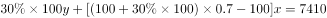；，整理可得：30y-9x=7410⋯⋯①；x+y=390⋯⋯②，解得x=110。

故正确答案为D。

---

### 第 8 题　qid 15121118 · 数学运算

市社保中心引进机器人提高服务效率。某岗位小张、小王和小李完结一单任务分别需要6分钟、5分钟和4分钟，3人一天最多可完结259单。机器人处理一单仅需2分钟，处理工单中的80%可正常完结，剩余的20%仍需人工重新办理。若某天小张出差，则当天小王、小李和机器人（机器人与人的工作时间相同）最多可以完结的工单总量为：

- **A**. 357单　✅
- **B**. 399单
- **C**. 427单
- **D**. 469单

**答案**：A

**官方解析**

根据题意可知，小张、小王和小李每小时完结任务的单数分别为单、单和单，3人一天最多可完结259单，则一天工作时间为小时。已知机器人每小时可处理单，处理工单中的80%可正常完结，剩余20%仍需人工重新办理，若机器人剩余工单由人工重新办理，那么在相同时间内，人工少做的单数与其相同，故无需考虑机器人处理失败的单数，由此可得当天小王、小李和机器人最多可完结30×7×80%+7×（12+15）=7×（24+27）=357单。

故正确答案为A。

---

### 第 9 题　qid 5919088 · 数学运算

某超市为回馈消费者，将举办购物抽奖活动。每人只能抽奖一次，奖金有三种：一等奖888元，二等奖88元，三等奖8元。若前100个中奖者的奖金总额为2480元，则其中获得三等奖的最少有：

- **A**. 95人
- **B**. 89人
- **C**. 79人　✅
- **D**. 69人

**答案**：C

**官方解析**

设获得一、二、三等奖的人数分别为x人、y人、z人，根据前100个中奖者的奖金总额为2480元，可列方程组：，整理可得：，①×11-②得到：10z-100x=790，即z=10x+79。若想要获得三等奖的人数z最少，则x应尽量小，则当x=0时，z=79，即获得三等奖的最少有79人。

故正确答案为C。

---

### 第 10 题　qid 5919089 · 数学运算

已知某家族4位成员的年龄总和为142岁，且他们的年龄恰好成等差数列，若其中一位的年龄为47岁，则这4人中最年长者的年龄为（    ）。

- **A**. 65岁
- **B**. 70岁　✅
- **C**. 83岁
- **D**. 90岁

**答案**：B

**官方解析**

根据选项可知，47岁不是最年长者的年龄。又根据等差数列性质可知，4位成员中，第二大和第三大的年龄和为岁，且由于，则47岁应是第二大的年龄，那么第三大的年龄为71-47=24岁，年龄公差为47-24=23岁，故这4人中最年长者的年龄为47+23=70岁。

故正确答案为B。

---

### 第 11 题　qid 5919090 · 数学运算

小王去超市买办公用品，经费恰好可以买18个计算器或者买30个订书机或者买50个档案盒，若购买了6个计算器、8个订书机后，剩下的经费全部购买了档案盒，则他购买档案盒的个数是：

- **A**. 10
- **B**. 14
- **C**. 20　✅
- **D**. 26

**答案**：C

**官方解析**

方法一：赋值小王购买办公用品的经费为450（18、30和50的最小公倍数）元，则每个计算器为元，每个订书机为元，每个档案盒为元。若小王购买了6个计算器、8个订书机，则剩余经费为450-25×6-15×8=180元，还可购买档案盒个。

方法二：设小王购买办公用品的经费为a元，计算器的价格为x元/个，订书机的价格为y元/个，档案盒的价格为z元/个。根据题意可得：a=18x=30y=50z，即，，。若小王购买了6个计算器、8个订书机，则剩余经费为元，还可购买档案盒个。

故正确答案为C。

---

### 第 12 题　qid 5919092 · 数学运算

某品牌奶茶所用纸杯均为圆台型。已知M型纸杯的上、下口直径分别为70毫米、50毫米，高为80毫米；N型纸杯的上、下口直径分别为60毫米、45毫米，高为60毫米。则M型纸杯与N型纸杯的侧面积之比为（    ）。

- **A**. 16：7
- **B**. 32：21　✅
- **C**. 48：35
- **D**. 64：49

**答案**：B

**官方解析**

本题考查求圆台的侧面积，，其中r和R分别为上、下底面的半径，l为侧面母线长（如下图所示）。M型纸杯：毫米，毫米，则毫米；N型纸杯：r=22.5毫米，R=30毫米，则毫米。故所求比例为。

故正确答案为B。

---

### 第 13 题　qid 5919095 · 数学运算

小张所在单位共有4个科室，现以科室为单位组织文艺演出，每个科室出2个节目。演出结束后，因8个节目都非常精彩，决定从中随机选3个节目参加上级组织的汇演。则小张所在科室出的节目至少有一个被选送参加汇演的概率是：

- **A**. 

- **B**. 

- **C**. 

- **D**. 

　✅

**答案**：D

**官方解析**

根据题意，总情况是从8个节目中随机选出3个，情况数为种；符合条件的情况是小张所在科室出的2个节目中至少有一个被选送，即有1个节目或者2个节目被选送。正面情况较复杂，可从反面分析。反面情况为3个选送节目均不来自小张所在的科室，则从另外8-2=6个节目中随机选出3个，情况数为种。故题干所求概率。

故正确答案为D。

---

### 第 14 题　qid 5919097 · 数学运算

某夫妇拟从2023年12月1日（星期五）起实施健身计划。妻子的计划是当天的日期为质数就游泳，丈夫的计划是每周一、三、五游泳。按该夫妇的计划，他们2023年12月同日游泳的天数是（    ）。

- **A**. 5
- **B**. 4
- **C**. 3　✅
- **D**. 2

**答案**：C

**官方解析**

因丈夫每周一、三、五游泳，且2023年12月1日为周五，所以2023年12月丈夫前三次游泳的日期为1日（周五）、4日（周一）、6日（周三），以7天一星期的周期进行推算，2023年12月丈夫游泳的日期如下表所示：

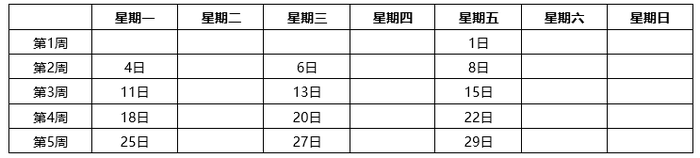

其中日期为质数的有11日、13日、29日，共3天，即该夫妇2023年12月同日游泳的天数是3天。

故正确答案为C。

---

### 第 15 题　qid 5919099 · 数学运算

甲、乙、丙三人合作完成一项任务。乙先做9天，再和甲合作6天，完成了任务的60%，剩下的任务，若由丙做，恰好10天完成。甲、乙、丙三人的工作效率之比是：

- **A**. 5：4：6　✅
- **B**. 6：4：5
- **C**. 10：15：12
- **D**. 12：15：10

**答案**：A

**官方解析**

根据题意可得，9×乙+6×（甲+乙）=60%×工作总量······①，10×丙=（1-60%）×工作总量······②，①÷②可得：，则2甲+5乙=5丙，依次代入选项：

A项：赋值甲、乙、丙三人的工作效率分别为5、4、6，则2×5+5×4=30=5×6，满足题干条件，当选；

B项：赋值甲、乙、丙三人的工作效率分别为6、4、5，则，不满足题干条件，排除；

C项：赋值甲、乙、丙三人的工作效率分别为10、15、12，则，不满足题干条件，排除；

D项：赋值甲、乙、丙三人的工作效率分别为12、15、10，则，不满足题干条件，排除。

故正确答案为A。

---

### 第 16 题　qid 5919100 · 数学运算

某公司派出5名人力资源专员去2个一线城市和2个二线城市参加秋季招聘会。若每名专员只去其中1个城市，每个一线城市至少派1名专员，每个二线城市只派1名专员，则不同的派出方法共有（    ）。

- **A**. 60种
- **B**. 72种
- **C**. 120种　✅
- **D**. 144种

**答案**：C

**官方解析**

5名专员分配到4个城市，其中每个一线城市至少派1名专员，每个二线城市只派1名专员，则5名专员中有3名专员分配到2个一线城市（分别为2名专员和1名专员），其余2名专员分配到2个二线城市（各1名专员）。从5名专员中选出2名专员，再从剩下3名专员中选出1名专员，这两组人分配到2个一线城市，有种；剩下2名专员分配到2个二线城市，有种。分步用乘法，则不同的派出方法共有60×2=120种。

故正确答案为C。

---

### 第 17 题　qid 5919101 · 数学运算

小陆参加植树活动，他到达植树地点时，第一排预设点位中的9个已有人在植树，若他在第一排剩余的任意点位上植树，都恰好有一个相邻点位有人在植树，则该植树点第一排的预设点位最多有：

- **A**. 27个　✅
- **B**. 28个
- **C**. 29个
- **D**. 30个

**答案**：A

**官方解析**

根据题意，小陆在第一排剩余的任意点位上植树，都恰好有一个相邻点位有人在植树，且要求预设点位数尽可能多，则每个已有人在植树的点位之间应该有两个无人植树的点位，如下图所示。（圆形和三角形分别代表无人植树和已有人在植树的点位）

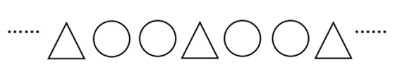

为使预设点位数尽可能多，则第一个已有人在植树的点位左侧最多可安排一个无人植树的点位，最后一个已有人在植树的点位右侧最多可安排一个无人植树的点位，如下图所示。

即相当于每3个点位为一个周期，每个周期中有1个已有人在植树的点位，且位于中间位置。根据已有人在植树的点位有9个，则该植树点第一排最多有9×3=27个预设点位。 

故正确答案为A。

---

### 第 18 题　qid 5919108 · 数学运算

某基层工会共有180名会员，举行甲、乙两项工会活动，60%的会员参加甲活动，50%的会员参加乙活动，若只参加甲活动的会员有80人，则只参加乙活动的会员有（    ）。

- **A**. 10人
- **B**. 28人
- **C**. 62人　✅
- **D**. 72人

**答案**：C

**官方解析**

根据题意可得，参加甲活动的会员人数为180×60%=108人，参加乙活动的会员人数为180×50%=90人，根据“只参加甲活动的会员有80人”，可得甲、乙两项活动都参加的会员人数为108-80=28人，如下图所示：

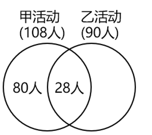

则只参加乙活动的会员有90-28=62人。

故正确答案为C。

---

### 第 19 题　qid 5919119 · 数学运算

如图所示，ABCDEF是一个边长为2的正六边形，圆O是的内切圆，则圆O的面积是（    ）。

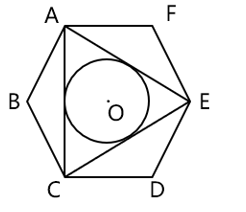

- **A**. 

　✅
- **B**. 

- **C**. 

- **D**. 

**答案**：A

**官方解析**

方法一：由于ABCDEF是正六边形，可得AC=CE=EA，即为正三角形，则内切圆的圆心O即为正六边形ABCDEF的中心。作的中线AH，连接FO，为正三角形，如下图所示：

已知AF=FE=2，且正六边形内角，则，。在直角中，，，且AO=AF=2，所以所求圆半径OH=AH-AO=3-2=1，所求圆面积。

方法二：如下图所示，连接AO、FO，为正三角形，由于AO为的中线且，则，AG为的中线，即所求圆半径，所求圆面积。

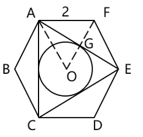

故正确答案为A。

---

## 判断推理

### 材料 1

某企业的生产部、研发部和财务部分别需要招聘1名员工，有3名博士生、3名硕士生和3名本科生前来应聘。该公司人事部小王对招聘结果做了如下预测：

（1）如果生产部录用本科生，那么研发部录用硕士生；

（2）如果研发部录用博士生，那么生产部录用博士生；

（3）如果财务部录用本科生或者硕士生，那么研发部录用本科生。

#### 第 1 题　qid 16095257 · 逻辑判断

如果3个部门录用的人员学历各不相同，那么以下哪种情况符合小王的预测？

- **A**. 生产部录用硕士生，财务部录用本科生
- **B**. 研发部录用博士生，财务部录用硕士生
- **C**. 生产部录用博士生，研发部录用本科生　✅
- **D**. 财务部录用本科生，研发部录用硕士生

**答案**：C

**官方解析**

第一步：分析题干条件。

（1）生产部录用本科生研发部录用硕士生；

（2）研发部录用博士生生产部录用博士生；

（3）财务部录用本科生 或 财务部录用硕士生研发部录用本科生；

（4）有3名博士生、3名硕士生和3名本科生；

（5）3个部门录用的人员学历各不相同。

第二步：根据题干条件进行推理。

根据条件（2）和条件（5）可以推出研发部没有录用博士生，因为如果“研发部录用博士生”，根据条件（2）可以推出生产部也录用博士生，与条件（5）矛盾，所以研发部没有录用博士生，排除B项；

根据条件（3）和条件（5）可以推出财务部没有录用本科生，因为如果“财务部录用本科生”，根据条件（3）可以推出研发部也录用本科生，与条件（5）矛盾，所以财务部没用录用本科生，排除A、D两项。

故正确答案为C。

---

#### 第 2 题　qid 16095260 · 类比推理

如果研发部录用硕士生，那么以下哪种情况不符合小王的预测？

- **A**. 生产部录用博士生
- **B**. 财务部录用博士生
- **C**. 生产部录用本科生
- **D**. 财务部录用硕士生　✅

**答案**：D

**官方解析**

第一步：分析题干条件。

（1）生产部录用本科生研发部录用硕士生；

（2）研发部录用博士生生产部录用博士生；

（3）财务部录用本科生 或 财务部录用硕士生研发部录用本科生；

（4）有3名博士生、3名硕士生和3名本科生；

（5）研发部录用硕士生。

第二步：根据题干条件进行推理。

条件（5）为确定信息，以此为起点开始推理。

根据条件（5）“研发部录用硕士生”以及题干条件“每个部门只招聘1名员工”，可以推出“研发部没有录用本科生”，是对条件（3）的否后，否后必否前，可以推出“财务部没有录用本科生 且 财务部没有录用硕士生”，即财务部只能录用博士生，D项不符合小王的预测，当选。

本题为选非题，故正确答案为D。

---

### 材料 2

市住建局3名工作人员小郑、小周、小刘打算参加“青年党员下基层”调研活动。可选的有小微堵点改造、跨区断头路建设、小型城市客厅打造、历史街区微改造4个调研项目。指导调研的有王教授、钱教授、马教授，且他们只能指导上述三位工作人员，已知：

（1）每位工作人员参加的项目都必须有教授指导，每位教授至少指导一位工作人员；

（2）每位工作人员只能参加一个项目，提倡多人合作；

（3）每位教授只能指导一个项目，一个项目也可由多位教授共同指导；

（4）小郑参加小微堵点改造或跨区断头路建设项目，钱教授指导历史街区微改造项目。

#### 第 3 题　qid 16095254 · 类比推理

参加或指导小微堵点改造项目的不可能同时有以下哪两个人？

- **A**. 王教授和马教授
- **B**. 马教授和小刘
- **C**. 小刘和小周　✅
- **D**. 小周和王教授

**答案**：C

**官方解析**

第一步：分析题干条件。
（1）每位工作人员参加的项目都必须有教授指导，每位教授至少指导一位工作人员；
（2）每位工作人员只能参加一个项目，提倡多人合作；
（3）每位教授只能指导一个项目，一个项目也可由多位教授共同指导；
（4）小郑参加小微堵点改造或跨区断头路建设项目，钱教授指导历史街区微改造项目。
第二步：根据题干条件进行推理。
提问方式为“不可能”，优先考虑代入法。
代入A项，若指导小微堵点改造项目的是王教授和马教授，由条件（4）可知，指导历史街区微改造项目的是钱教授，结合条件（1）中的“每位教授至少指导一位工作人员”可知，历史街区微改造项目必须有工作人员参加，此时只要这两个项目都分别有至少一位工作人员参加即可，与题干条件不矛盾，该项可能成立，排除；
代入B项，若指导小微堵点改造项目的是马教授，参加小微堵点改造项目的是小刘，由条件（4）可知，指导历史街区微改造项目的是钱教授，结合条件（1）中的“每位教授至少指导一位工作人员”可知，历史街区微改造项目必须有工作人员参加，小郑参加小微堵点改造或跨区断头路建设项目，那么此时小周参加历史街区微改造项目即可，与题干条件不矛盾，该项可能成立，排除；
代入C项，若参加小微堵点改造项目的是小刘和小周，由条件（4）可知，小郑参加小微堵点改造或跨区断头路建设项目，此时3名工作人员中没有人可以参加由钱教授指导的历史街区微改造项目，不符合条件（1）中的“每位教授至少指导一位工作人员”，该项不可能成立，当选；
代入D项，若参加小微堵点改造项目的是小周，指导小微堵点改造项目的是王教授，由条件（4）可知，小郑参加小微堵点改造或跨区断头路建设项目，钱教授指导历史街区微改造项目，结合条件（1）中的“每位教授至少指导一位工作人员”可知，历史街区微改造项目必须有工作人员参加，此时小刘参加历史街区微改造项目即可，与题干条件不矛盾，该项可能成立，排除。
本题为选非题，故正确答案为C。

---

#### 第 4 题　qid 16095256 · 类比推理

如果小周参加小型城市客厅打造项目，则以下哪一项一定为真？

- **A**. 小刘参加历史街区微改造项目　✅
- **B**. 王教授指导小型城市客厅打造项目
- **C**. 马教授指导小微堵点改造项目
- **D**. 小郑参加跨区断头路建设项目

**答案**：A

**官方解析**

第一步：分析题干条件。
（1）每位工作人员参加的项目都必须有教授指导，每位教授至少指导一位工作人员；
（2）每位工作人员只能参加一个项目，提倡多人合作；
（3）每位教授只能指导一个项目，一个项目也可由多位教授共同指导；
（4）小郑参加小微堵点改造或跨区断头路建设项目，钱教授指导历史街区微改造项目；
（5）小周参加小型城市客厅打造项目。
第二步：根据题干条件进行推理。
条件（4）与条件（5）中有确定信息，优先从确定信息入手推理。由条件（4）可知，钱教授指导历史街区微改造项目，结合条件（1）中的“每位教授至少指导一位工作人员”可知，历史街区微改造项目一定有工作人员参加；由条件（4）可知，小郑参加小微堵点改造或跨区断头路建设项目，由条件（5）可知，小周参加小型城市客厅打造项目，结合条件（2）中的“每位工作人员只能参加一个项目”可知，参加历史街区微改造项目的工作人员不可能是小郑、小周，且只有3名工作人员，所以小刘一定参加历史街区微改造项目，对应A项。
故正确答案为A。

---

#### 第 5 题　qid 5919637 · 类比推理

保护知识产权：保护创新

- **A**. 人之初：性本善
- **B**. 德不孤：必有邻
- **C**. 勤有功：戏无益
- **D**. 经一事：长一智　✅

**答案**：D

**官方解析**

第一步：判断题干词语间逻辑关系。
“保护知识产权”是“保护创新”的重要手段和举措，通过“保护知识产权”能达到“保护创新”的目的，二者为方式与目的的对应关系。
第二步：判断选项词语间逻辑关系。
A项：“人之初，性本善”的意思是人出生之初，禀性本身都是善良的。“人之初”与“性本善”不是方式与目的的对应关系，与题干逻辑关系不一致，排除。
B项：“德不孤，必有邻”的意思是有道德的人是不会孤单的，必定会有志同道合的人来与他为伴。“德不孤”与“必有邻”不是方式与目的的对应关系，与题干逻辑关系不一致，排除。
C项：“勤有功，戏无益”的意思是人只要勤奋努力，就会有所成就；而嬉戏贪玩则对人没有任何好处。“勤有功”与“戏无益”不是方式与目的的对应关系，与题干逻辑关系不一致，排除。
D项：“经一事，长一智”的意思是亲身经历了某件事情，就能增长关于这方面的知识。通过“经一事”能达到“长一智”的目的，二者为方式与目的的对应关系，与题干逻辑关系一致，当选。
故正确答案为D。

---

#### 第 6 题　qid 5919659 · 类比推理

年华未暮：容貌先秋

- **A**. 十年树木：百年树人
- **B**. 宁为玉碎：不为瓦全
- **C**. 言者无心：听者有意　✅
- **D**. 人无远虑：必有近忧

**答案**：C

**官方解析**

第一步：判断题干词语间逻辑关系。
“年华未暮，容貌先秋”的意思是未到衰老的年纪，而容颜已经老去，虽然“年华未暮”，但是“容貌先秋”，二者为转折的对应关系。
第二步：判断选项词语间逻辑关系。
A项：“十年树木，百年树人”的意思是培植树木需要十年，培育人才需要百年，指培养人才很不容易，二者为并列关系，与题干逻辑关系不一致，排除；
B项：“宁为玉碎，不为瓦全”的意思是宁愿做高贵的玉器而破碎，也不愿做低贱的瓦器得以保全，比喻宁为正义事业而牺牲，也不苟且偷生，二者为并列关系，与题干逻辑关系不一致，排除；
C项：“言者无心，听者有意”的意思是说话的人不注意，而听话的人却很留神，虽然“言者无心”，但是“听者有意”，二者为转折的对应关系，与题干逻辑关系一致，当选；
D项：“人无远虑，必有近忧”的意思是人若没有长远的谋虑，一定很快就有忧患，二者为条件的对应关系，与题干逻辑关系不一致，排除。
故正确答案为C。

---

#### 第 7 题　qid 5919643 · 类比推理

吴王好剑客：百姓多创瘢

- **A**. 白日依山尽：黄河入海流
- **B**. 问君何能尔：心远地自偏
- **C**. 海上生明月：天涯共此时
- **D**. 烽火连三月：家书抵万金　✅

**答案**：D

**官方解析**

第一步：判断题干词语间逻辑关系。
“吴王好剑客，百姓多创瘢”的意思是吴王喜爱精通剑术的侠客，为此老百姓身上伤痕累累。因为“吴王好剑客”，所以“百姓多创瘢”，二者为因果对应关系。
第二步：判断选项词语间逻辑关系。
A项：“白日依山尽，黄河入海流”的意思是太阳依傍着西山慢慢地沉落，滔滔黄河朝着大海汹涌奔流。“白日依山尽”与“黄河入海流”为并列关系，与题干逻辑关系不一致，排除。
B项：“问君何能尔？心远地自偏”的意思是问我如何能做到这样，只要心中所想远离世俗，自然就会觉得所处地方僻静了。“问君何能尔”不是“心远地自偏”的原因，二者不是因果对应关系，与题干逻辑关系不一致，排除。
C项：“海上生明月，天涯共此时”的意思是茫茫的海上升起一轮明月，使人忆起远隔天涯海角的亲友，此时应该都在望着这轮明月。“海上生明月”不是“天涯共此时”的原因，二者不是因果对应关系，与题干逻辑关系不一致，排除。
D项：“烽火连三月，家书抵万金”的意思是连绵的战火已经持续很长时间了，家书难得，一封抵得上万两黄金。因为“烽火连三月”，所以“家书抵万金”，二者为因果对应关系，与题干逻辑关系一致，当选。
故正确答案为D。

---

#### 第 8 题　qid 12334408 · 类比推理

停：行：止

- **A**. 日：月：星
- **B**. 满：亏：盈
- **C**. 没：有：无　✅
- **D**. 萌：荣：枯

**答案**：C

**官方解析**

第一步：判断题干词语间逻辑关系。
“停”和“止”均指“停止”，第一词与第三词为全同关系，“行”指“走、移动”，“停”、“止”与“行”是两种不同的状态，且除了“停（止）”就是“行”，第一词和第三词均与第二词构成矛盾关系。
第二步：判断选项词语间逻辑关系。
A项：“日”、“月”、“星”三者为并列关系，与题干逻辑关系不一致，排除；
B项：“满”指“达到容量的极点”，“盈”指“充满、多出来”，第一词与第三词为近义关系，“亏”指“受损失、欠缺”，“盈”和“亏”语义相反，第二词与第三词构成反义关系，且生意除了“盈”和“亏”外还有“不盈不亏”，第一词和第三词与第二词并不构成矛盾关系，与题干逻辑关系不一致，排除；
C项：“没”和“无”均指“没有、不存在”，第一词与第三词为全同关系，“有”指“存在”，“没”、“无”与“有”是两种不同的状态，且除了“没（无）”就是“有”，第一词和第三词均与第二词构成矛盾关系，与题干逻辑关系一致，当选；
D项：“萌”、“荣”、“枯”分别指植物或草木“发芽”、“茂盛”、“失去水分”，三者为状态先后顺序的对应关系，与题干逻辑关系不一致，排除。
故正确答案为C。

---

#### 第 9 题　qid 5919658 · 类比推理

球赛：球员：裁判

- **A**. 教学：教师：家长
- **B**. 庭审：被告：法官　✅
- **C**. 球场：球员：观众
- **D**. 手术：患者：护士

**答案**：B

**官方解析**

第一步：判断题干词语间逻辑关系。
“球员”参与“球赛”，二者为活动与主体的对应关系；“裁判”判罚“球员”，二者为主体与被判罚对象的对应关系。
第二步：判断选项词语间逻辑关系。
A项：“教师”参与“教学”，二者为活动与主体的对应关系，但“家长”不能判罚“教师”，与题干逻辑关系不一致，排除。
B项：“被告”参与“庭审”，二者为活动与主体的对应关系；“法官”判罚“被告”，二者为主体与被判罚对象的对应关系。与题干逻辑关系一致，当选。
C项：“球员”在“球场”打球，二者是地点与主体的对应关系，与题干逻辑关系不一致，排除。
D项：“患者”接受“手术”，而不是参与“手术”，且“护士”不能判罚“患者”，与题干逻辑关系不一致，排除。
故正确答案为B。

---

#### 第 10 题　qid 17900967 · 类比推理

戏剧：壁画：生活

- **A**. 陈设：衣饰：性格　✅
- **B**. 字形：字音：情感
- **C**. 文章：书法：人品
- **D**. 时针：钟表：时间

**答案**：A

**官方解析**

第一步：判断题干词语间逻辑关系。
“戏剧”和“壁画”是两种不同的艺术形式，二者为并列关系中的反对关系；“戏剧”和“壁画”都能够反映“生活”，前两个词分别与第三个词构成反映对象的对应关系。
第二步：判断选项词语间逻辑关系。
A项：“陈设”和“衣饰”是两种不同的外在表现，二者为并列关系中的反对关系；“陈设”和“衣饰”都能够反映“性格”，前两个词分别与第三个词构成反映对象的对应关系。与题干逻辑关系一致，当选。
B项：“字形”指字的形体，“字音”指字的读音，二者为并列关系中的反对关系，但二者均不能反映“情感”，与题干逻辑关系不一致，排除。
C项：“文章”和“书法”是两种不同的艺术作品，二者为并列关系中的反对关系，但“书法”不能反映“人品”，与题干逻辑关系不一致，排除。
D项：“时针”是“钟表”的组成部分，二者为包容关系中的组成关系，与题干逻辑关系不一致，排除。
故正确答案为A。

---

#### 第 11 题　qid 17900968 · 类比推理

海军装备：军事装备：维护

- **A**. 田径比赛：跳高比赛：举行
- **B**. 舞蹈表演：艺术表演：观赏　✅
- **C**. 购车补贴：购房补贴：发放
- **D**. 数字贸易：新兴贸易：互惠

**答案**：B

**官方解析**

第一步：判断题干词语间逻辑关系。
“海军装备”是一种“军事装备”，二者为包容关系中的种属关系；“维护海军装备”“维护军事装备”，第三个词与前两个词分别构成动宾关系。
第二步：判断选项词语间逻辑关系。
A项：“跳高比赛”是一种“田径比赛”，二者为包容关系中的种属关系，但词语顺序与题干相反，与题干逻辑关系不一致，排除。
B项：“舞蹈表演”是一种“艺术表演”，二者为包容关系中的种属关系；“观赏舞蹈表演”“观赏艺术表演”，第三个词与前两个词分别构成动宾关系。与题干逻辑关系一致，当选。
C项：“购车补贴”和“购房补贴”是两种不同的补贴，二者为并列关系，与题干逻辑关系不一致，排除。
D项：“数字贸易”是一种“新兴贸易”，二者为包容关系中的种属关系；“互惠”是贸易的特点，第三个词与前两个词分别构成属性对应关系。与题干逻辑关系不一致，排除。
故正确答案为B。

---

#### 第 12 题　qid 17900969 · 类比推理

实践成果：阶段成果：理论成果

- **A**. 经济创新：文化创新：政治创新
- **B**. 阅读辅导：读写辅导：写作辅导
- **C**. 环岛旅行：红色旅行：太空旅行
- **D**. 物质文明：现代文明：精神文明　✅

**答案**：D

**官方解析**

第一步：判断题干词语间逻辑关系。
根据获取途径的不同，成果可分为“实践成果”和“理论成果”，二者为矛盾关系；“阶段成果”指一定时间或任务阶段取得的工作成果，与“实践成果”和“理论成果”分别构成交叉关系。
第二步：判断选项词语间逻辑关系。
A项：创新可分为“经济创新”“文化创新”“政治创新”等，三者为并列关系，与题干逻辑关系不一致，排除。
B项：“读写辅导”是针对阅读、写作开展的辅导，由“阅读辅导”和“写作辅导”组成，第二个词与第一、三个词分别构成组成关系，与题干逻辑关系不一致，排除。
C项：根据旅行的目的地不同，旅行可分为“环岛旅行”“太空旅行”等，二者为反对关系，与题干逻辑关系不一致，排除。
D项：根据形式不同，文明可分为“物质文明”和“精神文明”，二者为矛盾关系；“现代文明”与“物质文明”和“精神文明”分别构成交叉关系。与题干逻辑关系一致，当选。
故正确答案为D。

---

#### 第 13 题　qid 5919649 · 类比推理

杞人忧天 之于 （    ） 相当于  （    ） 之于 自不量力

- **A**. 庸人自扰；螳臂当车　✅
- **B**. 局促不安；蜉蝣撼树
- **C**. 叶公好龙；夜郎自大
- **D**. 郑人买履；自以为是

**答案**：A

**官方解析**

逐一代入选项。
A项：“杞人忧天”借指为不必要忧虑的事情而忧虑，“庸人自扰”指本来没有问题而自己瞎着急或自找麻烦，二者为近义关系；“螳臂当车”比喻不正确估计自己的力量，去做办不到的事情，必然招致失败，“自不量力”指不能正确估计自己的力量（多指做力不能及的事情），二者为近义关系。前后逻辑关系一致，当选。
B项：“杞人忧天”借指为不必要忧虑的事情而忧虑，“局促不安”的意思是拘谨不自然，形容举止拘束，心中不安，二者无明显逻辑关系；“蜉蝣撼树”比喻通过贬低他人来抬高自己，“自不量力”指不能正确估计自己的力量（多指做力不能及的事情），二者无明显逻辑关系。前后逻辑关系不一致，排除。
C项：“杞人忧天”借指为不必要忧虑的事情而忧虑，“叶公好龙”比喻说是爱好某事物，其实并不真爱好，二者无明显逻辑关系；“夜郎自大”指妄自尊大，“自不量力”指不能正确估计自己的力量（多指做力不能及的事情），二者为近义关系。前后逻辑关系不一致，排除。
D项：“杞人忧天”借指为不必要忧虑的事情而忧虑，“郑人买履”指照搬条文，不考虑客观实际的教条做法，二者无明显逻辑关系；“自以为是”指认为自己的看法和做法都正确，不接受别人的意见，“自不量力”指不能正确估计自己的力量（多指做力不能及的事情），二者无明显逻辑关系。前后逻辑关系不一致，排除。
故正确答案为A。

---

#### 第 14 题　qid 5919655 · 类比推理

牙齿磨损 之于 （    ） 相当于 （    ） 之于 经济活力

- **A**. 年龄大小；用电总量　✅
- **B**. 牙齿脱落；社会效益
- **C**. 骨骼磨损；发展指数
- **D**. 坚硬食物；经济疲软

**答案**：A

**官方解析**

逐一代入选项。
A项：牙齿磨损程度可以反映年龄大小，用电总量大小可以反映经济活力，二者均为对应关系，前后逻辑关系一致，当选；
B项：牙齿磨损可能会导致牙齿脱落，二者为因果关系；经济活力是指一国一定时期内经济中总供给和总需求的增长速度及其潜力，社会效益是指各种经济活动及科学技术、教育、文学、艺术等在社会上产生的非经济性效果和利益，与经济活力为并列关系，前后逻辑关系不一致，排除；
C项：牙齿磨损不是一种骨骼磨损，二者无明显逻辑关系；经济活力是指一国一定时期内经济中总供给和总需求的增长速度及其潜力，而发展指数是指衡量某一领域发展程度的一种数据标准，经济活力会影响发展指数，二者为对应关系，前后逻辑关系不一致，排除；
D项：食用坚硬食物会导致牙齿磨损，二者为因果关系；经济疲软说明经济活力低，二者为对应关系，前后逻辑关系不一致，排除。
故正确答案为A。

---

#### 第 15 题　qid 17900833 · 图形推理

从所给的四个选项中，选择最合适的一个填入问号处，使之呈现一定的规律性。

- **A**. A
- **B**. B
- **C**. C
- **D**. D　✅

**答案**：D

**官方解析**

元素组成不同，且无明显属性规律，考虑数量规律。观察发现，图形中出现类似天平的示意图，将两端小元素转化为质量关系，可得：&gt;，&gt;，&gt;，&gt;，&gt;。串联后可得：&gt;&gt;&gt;&gt;。故问号处图形中两个小元素也应符合此规律，排除B、C两项。继续观察发现，题干图形中天平依次倾向于左侧、右侧、左侧、右侧、左侧、？，故问号处图形中的天平应倾向于右侧，只有D项符合。

故正确答案为D。

---

#### 第 16 题　qid 16095253 · 图形推理

请从四个选项中选出最恰当的一项填入问号处，使题干图形呈现一定的规律性。

- **A**. A
- **B**. B　✅
- **C**. C
- **D**. D

**答案**：B

**官方解析**

元素组成基本相同，题干每幅图形都是由直线和小白圆组成，考虑功能元素的标记作用。观察发现，小白圆只标记1条线，且若把每幅图的最外面那条线当作第1条线，那么小白圆依次标记在第1条线、第2条线、第3条线、第4条线、第5条线上，故？处图形中的小白圆应只标记在第6条线上，只有B项符合。
故正确答案为B。

---

#### 第 17 题　qid 12334416 · 图形推理

从所给的四个选项中，选择最合适的一个填入问号处，使之呈现一定的规律性。

- **A**. A
- **B**. B　✅
- **C**. C
- **D**. D

**答案**：B

**官方解析**

元素组成相同，优先考虑位置规律。九宫格优先横向看，第一行中，图一经过逆时针旋转得到图二，图二经过上下翻转得到图三；第二行经验证，符合该规律；第三行应用规律，只有B项符合。

故正确答案为B。

---

#### 第 18 题　qid 10975255 · 图形推理

从所给的四个选项中，选择最合适的一个填入问号处，使之呈现一定的规律性。

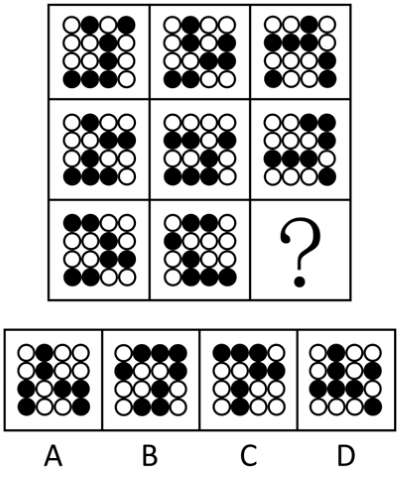

- **A**. A　✅
- **B**. B
- **C**. C
- **D**. D

**答案**：A

**官方解析**

元素组成相同，但无位置规律和属性规律，考虑数量规律。九宫格优先横向看，观察发现，题干已知图形中黑球的数量均为7，排除B项。继续观察发现，题干已知图形中黑球和白球分堆明显，考虑部分数，题干已知图形中黑球和白球的部分数均为3，问号处图形也应遵循此规律，只有A项符合。
故正确答案为A。

---

#### 第 19 题　qid 17900966 · 图形推理

从所给的四个选项中，选择最合适的一个填入问号处，使之呈现一定的规律性。

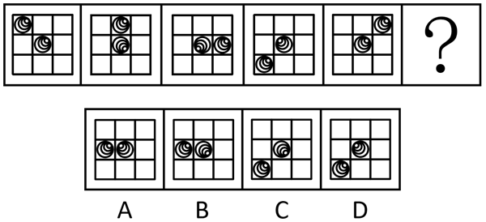

- **A**. A
- **B**. B　✅
- **C**. C
- **D**. D

**答案**：B

**官方解析**

元素组成相同，优先考虑位置规律。观察发现，题干已知图形均可看作九宫格，考虑内、外圈分开看。从第一幅图到第五幅图，外圈的依次顺时针移动1、2、3、4格，故从第五幅图到问号处图形，外圈的应顺时针移动5格，排除C、D两项；内部的依次顺时针旋转90°，只有B项符合。

故正确答案为B。

---

#### 第 20 题　qid 17900982 · 图形推理

选项四个图形中，只有一个是由题干的四个图形拼合（只能通过上、下、左、右平移）而成的，请把它找出来。

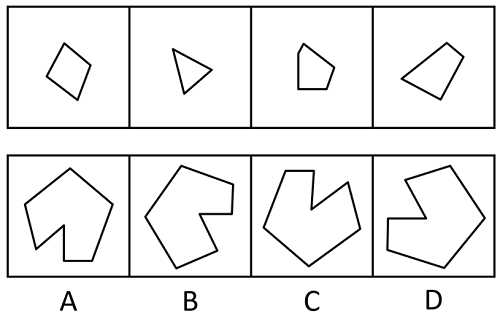

- **A**. A　✅
- **B**. B
- **C**. C
- **D**. D

**答案**：A

**官方解析**

本题考查平面拼合，可采用平行且等长相消的方法解题。消去平行且等长的线段后进行拼合可得到轮廓图，即为A项。平行且等长相消的方式如下图所示。

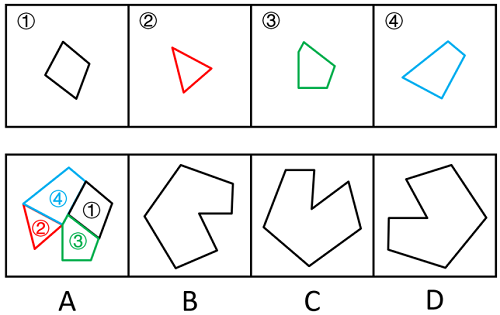

故正确答案为A。

---

#### 第 21 题　qid 10975247 · 图形推理

选项四个图形中，只有一个是由题干的四个图形拼合（只能通过上、下、左、右平移）而成的，请把它找出来。

- **A**. A
- **B**. B　✅
- **C**. C
- **D**. D

**答案**：B

**官方解析**

本题考查平面拼合，可采用平行且等长相消的方法解题。消去平行且等长的线段后进行拼合可得到轮廓图，即为B项。平行且等长相消的方式如下图所示。

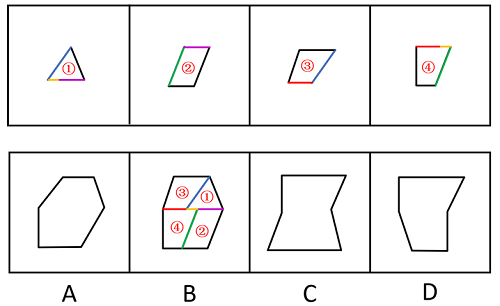

故正确答案为B。

---

#### 第 22 题　qid 16095258 · 图形推理

选项四个图形中，只有一个是由题干的四个图形拼合（只能通过上、下、左、右平移）而成的，请把它找出来。

- **A**. A
- **B**. B　✅
- **C**. C
- **D**. D

**答案**：B

**官方解析**

本题考查平面拼合，可采用平行且等长相消的方法解题。消去平行且等长的线段后进行组合可得到轮廓图，即为B项。平行且等长相消的方式如下图所示。

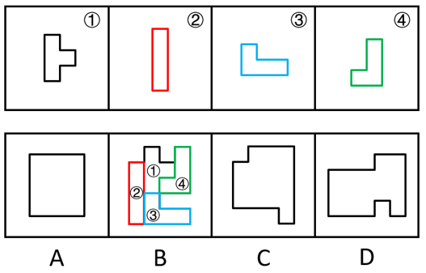

故正确答案为B。

---

#### 第 23 题　qid 17900987 · 图形推理

选项四个图形中，只有一个是由题干的四个图形拼合（只能通过上、下、左、右平移）而成的，请把它找出来。

- **A**. A
- **B**. B
- **C**. C
- **D**. D　✅

**答案**：D

**官方解析**

本题考查平面拼合。曲线类图形，消去弯曲程度一致且等长的线条后进行拼合可得到轮廓图，即为D项，拼合方式如下图所示。

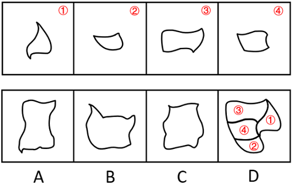

故正确答案为D。

---

#### 第 24 题　qid 10975248 · 图形推理

左边图形恰好可以分割为右边的某三个图形（可以平移、旋转，但不可翻转），请找出不属于分割所得的图形。

- **A**. A
- **B**. B　✅
- **C**. C
- **D**. D

**答案**：B

**官方解析**

本题考查平面拼合。A、D两项图形旋转后与C项图形进行拼合，可得到题干轮廓图，拼合方式如下图所示。

本题为选非题，故正确答案为B。

---

#### 第 25 题　qid 10975249 · 图形推理

左边给定的是六面体的外表面展开图，右边哪一项能由它折叠而成？

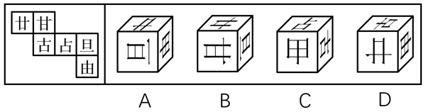

- **A**. A　✅
- **B**. B
- **C**. C
- **D**. D

**答案**：A

**官方解析**

将题干展开图中的面依次标上序号，如下图所示，逐一分析选项。

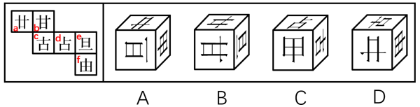

A项：选项由面a、面e与面f构成，选项与题干展开图一致，当选。

B项：选项由面a、面b与面e构成，题干展开图中面e内“旦”字的单一长横线紧挨着面f，而选项中面e内“旦”字的单一长横线紧挨着面b，选项与题干展开图不一致，排除。

C项：选项由面c、面d与面f构成，题干展开图中面c与面d的公共边不挨着面d内“占”字上半部分的短横线，而选项中面c与面d的公共边挨着面d内“占”字上半部分的短横线，选项与题干展开图不一致，排除。

D项：选项由面a、面c与面f构成，题干展开图中面c与面f的公共边与面f内“由”字的最长线垂直，而选项中面c与面f的公共边与面f内“由”字的最长线平行，选项与题干展开图不一致，排除。

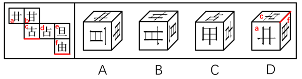

故正确答案为A。

---

#### 第 26 题　qid 10975257 · 图形推理

下列是四个正方体的外表面展开图，其中哪个展开图还原成正方体后，存在同一个公共顶点的三个面上的数字之和为8？

- **A**. A
- **B**. B
- **C**. C　✅
- **D**. D

**答案**：C

**官方解析**

若想展开图还原成正方体后，存在同一个公共顶点的三个面上的数字之和为8，需要“面1、面2、面5”或者“面1、面3、面4”相邻，即三个面存在公共点。
A项：面1和面4为相对面，故面1、面3和面4不存在公共点；面2和面5为相对面，故面1、面2和面5不存在公共点。两种情况均不符合要求，排除。
B项：面1和面4为相对面，故面1、面3和面4不存在公共点；面2和面5为相对面，故面1、面2和面5不存在公共点。两种情况均不符合要求，排除。
C项：面1、面2和面5两两相邻，即三个面存在公共点，符合要求，当选。
D项：面3和面4为相对面，故面1、面3和面4不存在公共点；面1和面5为相对面，故面1、面2和面5不存在公共点。两种情况均不符合要求，排除。
故正确答案为C。

---

#### 第 27 题　qid 16095252 · 图形推理

将下列三棱锥的展开图还原成三棱锥后，有一个与其他三个不一样，请把它找出来。

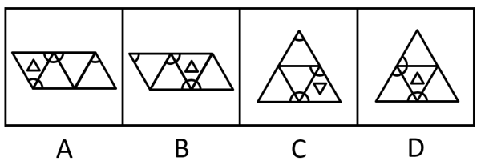

- **A**. A
- **B**. B
- **C**. C
- **D**. D　✅

**答案**：D

**官方解析**

本题考查空间重构。在选项展开图中，以只有两个扇形的面上的空白顶点作为起始点，进行顺时针画边，如下图所示，逐一分析选项。

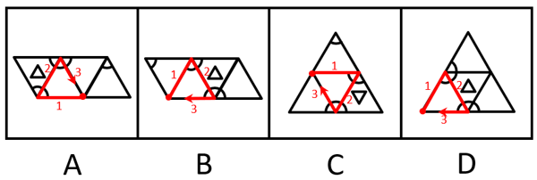

A项：选项中右边两个面为图案一样的面，边1不挨着其中任意一个面中的小扇形。

B项：选项中最左边和最右边两个面为图案一样的面，边1不挨着其中任意一个面中的小扇形。

C项：选项中最上边和左下边为图案一样的面，边1不挨着其中任意一个面中的小扇形。

D项：选项中最上边和右下边为图案一样的面，边1与最上边面中的小扇形有公共点。

本题为选非题，故正确答案为D。

---

#### 第 28 题　qid 17900755 · 图形推理

下列立体图形的视图不可能是所给四个选项中的哪一个？

- **A**. A　✅
- **B**. B
- **C**. C
- **D**. D

**答案**：A

**官方解析**

本题考查三视图。B、C、D三项：如下图所示，按图中箭头方向观察，均可看到，排除。

A项：如下图所示，按图中箭头方向观察立体图形，圆柱与下方立体图形的连接处应有一条横线，故该项不是题干立体图形的视图，当选。

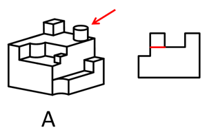

本题为选非题，故正确答案为A。

---

#### 第 29 题　qid 12304865 · 逻辑判断

一只鸟除非两翼健壮并以共同的力量来推动身体，否则它不能飞向天空。根据以上陈述，可以推出以下哪些结论？
①一只鸟如果两翼健壮并以共同的力量来推动身体，那么它能够飞向天空
②一只鸟如果能够飞向天空，那么它两翼健壮并以共同的力量来推动身体
③一只鸟若两翼不健壮或不能以共同的力量来推动身体，那么它不能飞向天空
④一只鸟如果不能飞向天空，那么它两翼不健壮或不能以共同力量来推动身体

- **A**. ①②
- **B**. ②③　✅
- **C**. ③④
- **D**. ②④

**答案**：B

**官方解析**

第一步：翻译题干。

题干翻译为：飞向天空两翼健壮 且 以共同的力量来推动身体。

第二步：逐一分析选项。

①翻译为：两翼健壮 且 以共同的力量来推动身体飞向天空，是对题干逻辑关系的肯后，肯后无必然结论，无法推出；

②翻译为：飞向天空两翼健壮 且 以共同的力量来推动身体，是对题干逻辑关系的肯前，肯前必肯后，可以推出；

③翻译为：两翼健壮 或 以共同的力量来推动身体飞向天空，是对题干逻辑关系的否后，否后必否前，可以推出；

④翻译为：飞向天空两翼健壮 或 以共同的力量来推动身体，是对题干逻辑关系的否前，否前无必然结论，无法推出。

综上所述，②③可以推出，对应B项。

故正确答案为B。

---

#### 第 30 题　qid 10975246 · 逻辑判断

某学校模拟派出骨干教师指导山区教师人才培训项目。甲、乙、丙、丁四位教师积极报名参加，学校决定从他们四人中挑选出若干人员，考虑到各方面情况，派出人员要符合以下要求：
①只有乙参加，甲才参加；
②如果丙参加，那么丁不参加；
③如果乙参加，那么丙也参加。
根据以上信息，以下哪项不可能为真？

- **A**. 甲和丙参加
- **B**. 丁参加，乙不参加
- **C**. 甲和丁参加　✅
- **D**. 甲参加，丁不参加

**答案**：C

**官方解析**

第一步：翻译题干条件。

（1）甲乙；

（2）丙丁；

（3）乙丙。

将（1）（2）（3）串联可得：（4）甲乙丙丁。

第二步：根据题干条件进行推理。

根据条件（4）可知，甲参加时丁一定不参加，因此C项不可能为真。

本题为选非题，故正确答案为C。

---

#### 第 31 题　qid 2579002 · 逻辑判断

马王堆汉墓由长沙国丞相及其妻儿三座墓组成，在墓群中出土的帛书《道德经》与传世本《道德经》存在文字出入，如帛书中的“道可道非恒道，名可名非恒名”，在传世本中为“道可道非常道，名可名非常名”，考虑到古代存在帝王讳名制，有学者据此断定帛书《道德经》至少问世于汉文帝刘恒在位（公元前179-公元前157年）之前。
以下哪项为真，可以支持该学者？

- **A**. 长沙国丞相死于公元前186年
- **B**. 长沙国丞相的妻儿死于公元前168年之后
- **C**. “道可道非恒道，名可名非恒名”与“道可道非常道，名可名非常名”同义
- **D**. 帝王讳名制在秦朝从宗族内部扩展到社会整体，汉朝继承了秦朝的许多制度　✅

**答案**：D

**官方解析**

第一步：找出论点和论据。
论点：帛书《道德经》至少问世于汉文帝刘恒在位（公元前179-公元前157年）之前。
论据：在墓群中出土的帛书《道德经》与传世本《道德经》存在文字出入，如帛书中的“道可道非恒道，名可名非恒名”，在传世本中为“道可道非常道，名可名非常名”，考虑到古代存在帝王讳名制。
本题论点指出帛书《道德经》至少问世于刘恒在位之前，论据是帛书《道德经》并没有避讳刘恒的名字，且古代存在帝王讳名制，论点论据话题紧密，可以理解为话题一致，加强优先考虑补充论据。
第二步：逐一分析选项。
A项：指出长沙国丞相死于公元前186年，即在刘恒在位之前去世，但根据去世时间无法判断墓中物品的问世时间，不能加强，排除；
B项：指出长沙国丞相的妻儿死于公元前168年之后，无法确定死亡时间，且根据去世时间无法判断墓中物品的问世时间，不能加强，排除；
C项：指出帛书《道德经》与传世本《道德经》的两句话含义相同，无法确定“恒”改为“常”的原因，也无法确定帛书《道德经》的问世时间，话题不一致，不能加强，排除；
D项：指出帝王讳名制是秦朝的制度，而汉朝继承了秦朝的许多制度，即汉朝很可能存在帝王讳名制，而帛书《道德经》中没有避讳刘恒的名字，那就很可能出现在汉文帝刘恒在位之前，有利于论点的成立，补充论据，当选。
故正确答案为D。

---

#### 第 32 题　qid 2172762 · 逻辑判断

近年来，V国巴沙鱼因在进口时已完成分割、切块、去刺等工序，加工成本比国产黑鱼低，一直是制作酸菜鱼的重要原料。但今年酸菜鱼市场对V国巴沙鱼的需求减弱，其份额逐渐被国产黑鱼占据。
以下哪项为真，最能解释上述现象？

- **A**. 随着国产黑鱼产、供、销体系完善，其价格降低　✅
- **B**. V国巴沙鱼进入中国需要经有关部门食品安全检测，需较长时间
- **C**. 过去几年爆火的以V国巴沙鱼为原料的酸菜鱼预制菜今年销售份额降低
- **D**. 以国产黑鱼为原料的酸菜鱼味道更鲜美，受到对价格不敏感的消费者喜爱

**答案**：A

**官方解析**

第一步：找出题干矛盾。
V国巴沙鱼加工成本比国产黑鱼低，一直是制作酸菜鱼的重要原料，但今年酸菜鱼市场对V国巴沙鱼的需求减弱，其份额逐渐被国产黑鱼占据。
第二步：逐一分析选项。
A项：该项指出国产黑鱼价格降低了，之前对V国巴沙鱼需求强是因为加工成本低，而现在随着国产黑鱼价格的降低，V国巴沙鱼逐渐失去价格优势，因此酸菜鱼市场就会减少对V国巴沙鱼的需求，其份额逐渐被价格降低的国产黑鱼占据，可以解释题干矛盾，当选；
B项：该项指出V国巴沙鱼进入中国需要较长的检测时间，但该问题一直存在，无法解释为何“今年”酸菜鱼市场对V国巴沙鱼的需求减弱，其份额逐渐被国产黑鱼占据，无法解释题干矛盾，排除；
C项：该项指出今年以V国巴沙鱼为原料的酸菜鱼预制菜销售份额降低，可以导致对V国巴沙鱼的一部分需求减弱，但不能解释为什么其份额逐渐被国产黑鱼占据，无法解释题干矛盾，排除；
D项：该项指出以国产黑鱼为原料的酸菜鱼味道更鲜美，受到对价格不敏感的消费者喜爱，但该情况一直存在，不只出现在“今年”，且无法判断“对价格不敏感的消费者”数量多少，是否可以代表全部消费者，无法解释题干矛盾，排除。
故正确答案为A。

---

#### 第 33 题　qid 17900831 · 逻辑判断

人体总能量代谢主要由静息代谢水平和活动能量代谢水平决定。静息代谢指人体在静止状态下消耗的能量，活动能量代谢指人们在日常活动或运动状态下所消耗的能量。近年来，M市成年人的总能量代谢水平呈现下降趋势。有人据此认为，M市成年人的静息代谢水平近年来也呈下降趋势。
以下哪项如果为真，最能支持上述人士的观点？

- **A**. 近年来，M市成年人逐渐重视饮食结构均衡，减少各种高能量食物摄入
- **B**. 近年来，M市成年人开始重视身体锻炼，平均每天的锻炼时长有所增加　✅
- **C**. 近年来，M市成年人劳动强度普遍降低，许多人不再从事高强度体力劳动
- **D**. 近年来，M市成年人总能量代谢水平下降幅度比活动能量代谢水平下降幅度小

**答案**：B

**官方解析**

第一步：找出论点和论据。
论点：M市成年人的静息代谢水平近年来也呈下降趋势。
论据：人体总能量代谢主要由静息代谢水平和活动能量代谢水平决定。近年来，M市成年人的总能量代谢水平呈现下降趋势。
本题论点说的是“静息代谢水平呈下降趋势”，即部分下降，而论据说的是“总能量代谢水平呈下降趋势”，即整体下降，加强优先考虑补充论据，即说明另一部分（活动能量代谢水平）的情况。
第二步：逐一分析选项。
A项：该项指出M市的成年人减少高能量食物摄入，而论点说的是静息代谢水平呈下降趋势，话题不一致，无法加强，排除。
B项：该项指出M市的成年人平均每天的锻炼时长有所增加，说明活动能量代谢水平在上升，结合论据中总能量代谢水平下降，可以推出静息代谢水平下降，补充论据，可以加强，当选。
C项：该项指出M市的成年人劳动强度降低，说明活动能量代谢水平在下降，结合论据中总能量代谢水平下降，无法推出静息代谢水平一定下降了（静息代谢水平也可能上升了，但上升幅度小于活动能量代谢水平的下降幅度），为不明确项，无法加强，排除。
D项：该项指出M市成年人总能量代谢水平下降幅度比活动能量代谢水平下降幅度小，当整体下降的幅度小于一个因素下降的幅度时，另一个因素的变化情况无法确定，为不明确项，无法加强，排除。
故正确答案为B。

---

#### 第 34 题　qid 16095272 · 类比推理

甲：小明十岁就能用英语与英国人流利对话，语言天赋真是出类拔萃。
乙：小明跟着父母在英国住了两年，能流利对话不足为奇。
以下哪项与题干对话方式最为相似？

- **A**. 
甲：这款热水器的价格比市面上常见的热水器高出一倍，太不划算了

乙：这款产品用的是航天级别的材料，在同材质热水器中性价比很高
　✅
- **B**. 
甲：小李以前容易冲动，进入职场一年后稳重多了

乙：小李承担了单位大量重要工作，变得稳重一点理所当然

- **C**. 
甲：小张的数学一直很好，进入高中后，物理、化学等科目的学习很轻松

乙：数学强调科学思维，掌握科学思维的人学习物理、化学当然没有难度

- **D**. 
甲：小刘在过去的一年中连续犯下三起盗窃案，真是无可救药

乙：人非圣贤，孰能无过，相信在经过改造之后他会洗心革面

**答案**：A

**官方解析**

第一步：分析题干逻辑关系。
甲根据“小明十岁就能用英语与英国人流利对话”的现象，得出“小明的语言天赋出类拔萃”的结论，而乙提出“小明跟着父母在英国住了两年”的理由来解释现象，用“能流利对话不足为奇”来否定甲的结论。
第二步：逐一分析选项。
A项：甲根据“这款热水器的价格比市面上常见的热水器高出一倍”的现象，得出“这款热水器不划算”的结论，乙提出“这款产品用的是航天级别的材料”的理由来解释现象，用“在同材质热水器中性价比很高”来否定甲的结论，与题干对话方式一致，当选；
B项：甲提出“小李以前容易冲动，进入职场一年后稳重多了”的结论，乙提出“小李承担了单位大量重要工作，变得稳重一点理所当然”的理由来解释甲的结论，与题干对话方式不一致，排除；
C项：甲提出“小张的数学一直很好，进入高中后，物理、化学等科目的学习很轻松”的结论，乙提出“数学强调科学思维，掌握科学思维的人学习物理、化学当然没有难度”的理由来解释甲的结论，与题干对话方式不一致，排除；
D项：甲根据“小刘在过去的一年中连续犯下三起盗窃案”的现象，得出“小刘无可救药”的结论，乙得出的观点“相信在经过改造之后小刘会洗心革面”是一种预测，而非事实，用预测否定甲的结论，与题干对话方式不一致，排除。
故正确答案为A。

---

#### 第 35 题　qid 12304873 · 逻辑判断

卖早点、修家电、配钥匙·····老百姓家门口的社区商业，是以社区居民为服务对象、服务半径为步行15分钟左右范围内的商业形态。近年来，许多城市大力推进社区商业建设，以更好地满足居民的消费需求。不过，也有专家担忧，家门口商业服务的完善，在给居民生活带来便利的同时可能也会使快递业逐步萎缩。
以下哪项如果为真，最能缓解上述专家的担忧？

- **A**. 为了方便居民，很多城市推进社区商业建设时，都将快递驿站作为社区商业的重要组成部分
- **B**. 社区商业主要提供汽车保养、幼儿托管等服务类业态，社区购物在居民整体购物消费中占比很少　✅
- **C**. 社会经济发展必然包含新旧行业的更迭，社区商业作为新的消费增长点，吸纳了大量传统行业的劳动者就业
- **D**. 许多大型商超组建了自己的配送车队，可为周边5公里范围内居民提供商品一小时送达服务

**答案**：B

**官方解析**

第一步：找出论点和论据。
论点：家门口商业服务的完善，在给居民生活带来便利的同时可能也会使快递业逐步萎缩。
论据：无。
本题提问为“缓解上述专家的担忧”即削弱上述专家的担忧，且只有论点没有论据，削弱优先考虑削弱论点，即说明家门口商业服务的完善不会使快递业逐步萎缩。
第二步：逐一分析选项。
A项：该项说的是很多城市将快递驿站作为社区商业的重要组成部分，说明家门口商业服务完善后快递驿站依然很重要，可能不会使快递业逐步萎缩，削弱论点，可以削弱，保留；
B项：该项说的是社区购物在居民整体购物消费中占比很少，说明社区商业的建设对居民原有的购物方式影响不大，也就不会使快递业逐步萎缩，削弱论点，可以削弱，保留；
C项：该项说的是社区商业吸纳了大量传统行业的劳动者就业，是在说社区商业促进了就业，并未提及对快递业的影响，为无关项，无法削弱，排除；
D项：该项说的是许多大型商超提供限时配送服务，大型商超不属于社区商业，提供的配送服务不属于快递业，为无关项，无法削弱，排除。
对比A、B两项，A项说的是快递驿站的重要性，但是快递驿站重要并不能明确说明快递业的情况，而B项明确说明了对居民原有的购物方式影响不大，即不会对快递业有影响，综合对比，B项比A项更加明确，因此优选B项。
故正确答案为B。

---

#### 第 36 题　qid 10975252 · 逻辑判断

某学校举办田径运动会，所有参加800米跑的运动员都参加了100米跑，所有参加100米跑的运动员都参加了跳高，有些参加跳远的运动员参加了投掷链球，所有参加跳远的运动员都没有参加跳高。
根据以上陈述，不能推出以下哪项？

- **A**. 所有参加800米跑的运动员都参加了跳高
- **B**. 所有参加投掷链球的运动员都没有参加跳高
- **C**. 所有参加跳远的运动员都没有参加100米跑
- **D**. 有些参加800米跑的运动员参加了跳远　✅

**答案**：D

**官方解析**

第一步：翻译题干。

（1）参加800米跑参加100米跑；

（2）参加100米跑参加跳高；

（3）有的参加跳远参加投掷链球；

（4）参加跳远参加跳高。

将（1）（2）（4）串联可得：（5）参加800米跑参加100米跑参加跳高参加跳远。

第二步：逐一分析选项。

A项：翻译为“参加800米跑参加跳高”，“参加800米跑”是对条件（5）的肯前，肯前必肯后，可以推出，排除。

B项：翻译为“参加投掷链球参加跳高”，将条件（3）换位可得“有的参加投掷链球参加跳远”，与条件（4）串联可得“有的参加投掷链球参加跳远参加跳高”，“有的”无法推出“所有”，即“所有参加投掷链球的运动员都没有参加跳高”可能为真，也可能为假，保留。

C项：翻译为“参加跳远参加100米跑”，“参加跳远”是对条件（5）的否后，否后必否前，可以推出，排除。

D项：翻译为“有的参加800米跑参加跳远”，与条件（5）矛盾，无法推出，保留。

对比B、D两项，B项可能为真，D项一定为假，择优选D项。

本题为选非题，故正确答案为D。

---

#### 第 37 题　qid 16095269 · 逻辑判断

评价某份试卷中的试题质量通常有难度和区分度等指标，一道单选题的难度通常用正确选择试题答案的人数与参加测验的总人数的比值来表示。区分度指的是试题对考生实际水平的区分程度和区分的有效性，一道单选题的区分度指数D的计算公式为：，其中为高分组（试卷总得分排在前27%的考生）该题的难度，为低分组（试卷总得分排在后27%的考生）该题的难度。

根据以上陈述，可以推出以下哪项？

- **A**. 一道难度为1的单选题区分度指数为0.1
- **B**. 任一单选题的区分度指数不可能为负值
- **C**. 一道难度为0.27的单选题的最大区分度指数为0.5
- **D**. 一道单选题的难度也可以表示为该题的平均得分与该题分值的比值　✅

**答案**：D

**官方解析**

日常结论题，根据题干信息逐一分析选项。

A项：若一道单选题的难度为1，意味着参加测验的所有人都答对了，则高分组和低分组的人都答对了，说明高分组该题的难度，低分组该题的难度，则区分度指数D=0，而不是0.1，该项表述错误，排除；

B项：若有一道题高分组答对的人数少于低分组，此时高分组该题的难度小于低分组该题的难度，即，则这道题的区分度指数D为负数，该项表述错误，排除；

C项：若一道单选题的难度为0.27，说明正确选择试题答案的人数与参加测验的总人数的比值为0.27，假设参加测验的总人数为100人，则正确选择试题答案的人数为27人，并且此时高分组与低分组均各有27人，如果想要计算最大区分度指数，则需要使的值尽可能大，即尽可能取最大值，同时尽可能取最小值，即需要使正确选择试题答案的27人均属于高分组，即，同时，低分组全部答错，即，则此时这道题的最大区分度指数，而不是0.5，该项表述错误，排除；

D项：，该项表述正确，当选。

故正确答案为D。

---

#### 第 38 题　qid 12304874 · 逻辑判断

一项研究发现，成年小白鼠去除一个关键生物钟基因后，昼夜节律完全消失，虽然生活质量有所下降，但寿命并未受到显著影响，心血管健康状况甚至有所改善。据此，研究人员推断昼夜节律缺失对健康的危害可能没有我们想象得那么大。
回答以下哪个问题最有助于评价上述研究人员所做出的推断？

- **A**. 成年小白鼠去除生物钟基因后出现的心血管情况改善是否会延长小白鼠的寿命
- **B**. 成年小白鼠去除生物钟基因之后的休息时间是否与未去除之前的休息时间相同
- **C**. 成年小白鼠去除生物钟基因后的寿命和心血管健康状况能否代表整体健康状况　✅
- **D**. 成年小白鼠去除生物钟基因之后的生活质量是否会影响小白鼠的整体健康状况

**答案**：C

**官方解析**

第一步：找出论点和论据。
论点：昼夜节律缺失对健康的危害可能没有我们想象得那么大。
论据：成年小白鼠去除一个关键生物钟基因后，昼夜节律完全消失，虽然生活质量有所下降，但寿命并未受到显著影响，心血管健康状况甚至有所改善。
本题论点讨论的是“昼夜节律缺失”和“整体健康状况”之间的关系，论据讨论的是“昼夜节律缺失”和“寿命、心血管健康状况”之间的关系，二者话题不一致，且提问方式为“最有助于”评价研究人员的推断，可以考虑搭桥，即建立“寿命、心血管健康状况”与“整体健康状况”之间的关系。
第二步：逐一分析选项。
A项：该项讨论的是“心血管健康状况”与“寿命”之间的关系，而不是“寿命、心血管健康状况”与“整体健康状况”之间的关系，即使心血管状况改善能够延长寿命，仍无法得知整体健康状况如何，无助于评价研究人员的推断，排除；
B项：该项讨论的是“去除生物钟基因前后的休息时间”，论点说的是“昼夜节律缺失”和“整体健康状况”的关系，话题不一致，无助于评价研究人员的推断，排除；
C项：该项讨论的是“寿命、心血管健康状况”与“整体健康状况”之间的关系，如果寿命和心血管健康状况能代表整体健康状况，则说明研究人员的推断成立，有助于评价研究人员的推断，当选；
D项：该项讨论的是“生活质量”与“整体健康状况”之间的关系，但研究人员是通过“寿命”与“心血管健康状况”得出的论点，不如C项更有助于评价研究人员的推断，排除。
故正确答案为C。

---

#### 第 39 题　qid 16095268 · 定义判断

迭代学习：指学习者通过不间断的目标训练，更好地理解学习内容，不断提升技能完善自身能力的学习方式。
下列不属于迭代学习的是：

- **A**. 小周参加专业技能大赛，实操环节丢了不少分，他不断强化训练，再次参加就获得了二等奖。又经过一年训练，综合技能有了显著提高，自己也十分自信
- **B**. 学习者要熟练掌握数学运算需经历数年大致相同的过程，先是加减法，之后是乘除法，接下来是混合运算，逐渐进入更高阶的运算
- **C**. 李教授经常深入社区举办科普讲座，最初因为专业性过强，听众很少，后来引入了市民关注的鲜活案例，听众越来越多；最近又融入了不少优秀传统文化元素，感染力越来越强
- **D**. 多家公司推出了各自的AI自然语言处理模型，有的只能与人进行简单对话，有的能在收到指令后几秒钟内交出一份质量不错的作业，有些已经能够针对各种问题给出比较专业的建议　✅

**答案**：D

**官方解析**

第一步：找出定义关键词。
“学习者”、“通过不间断的目标训练”、“更好地理解学习内容，不断提升技能完善自身能力”。
第二步：逐一分析选项。
A项：小周通过不断强化训练，从一开始参加专业技能大赛的实操环节丢不少分，到再次参加获得二等奖，到最后综合技能显著提高，符合“学习者”、“通过不间断的目标训练”、“更好地理解学习内容，不断提升技能完善自身能力”，符合定义，排除；
B项：学习者通过不断的学习，掌握的数学运算从一开始的加减法、乘除法到混合运算，到最后进入更高阶的运算，符合“学习者”、“通过不间断的目标训练”、“更好地理解学习内容，不断提升技能完善自身能力”，符合定义，排除；
C项：李教授的科普讲座从一开始的专业性强、听众少到引入市民关注的案例后听众越来越多，到最后融入文化元素、感染力越来越强，符合“学习者”、“通过不间断的目标训练”、“更好地理解学习内容，不断提升技能完善自身能力”，符合定义，排除；
D项：多家公司推出各自的AI自然语言处理模型，有的只能简单与人对话，有的能写作业，有的已能给出比较专业的建议，这些是不同AI对于自然语言处理的不同结果，并没有体现AI不间断学习的过程，不符合“学习者”、“通过不间断的目标训练”、“更好地理解学习内容，不断提升技能完善自身能力”，不符合定义，当选。
本题为选非题，故正确答案为D。

---

#### 第 40 题　qid 10975250 · 定义判断

钝感力：指在工作、生活中能够尽快摆脱消极情绪或困扰，从容应对外部压力，或者冷静面对个人成绩，坚持既定目标的心理防御机制。
下列不属于钝感力的是：

- **A**. 谷先生每次回顾自己的创业经历，都把成功归因于百折不挠的韧劲：无论碰到多少磨难，始终没有被困难打倒，一直沿着目标不断地向前
- **B**. 邱奶奶已经90岁，眼不花，耳不聋，腿脚麻利。她的体会是：人生在世，不如意事十之八九，迅速忘掉不愉快的事，保持乐观情绪就能长寿
- **C**. 杜先生从去年开始坚持在健身中心锻炼，提高身体素质，缓解工作压力。现在再也不像以前那样容易感冒，即使工作到深夜也不觉得累　✅
- **D**. 钟先生性格稳重，听到表扬从不得意忘形，遇到批评也不垂头丧气，心无旁骛地钻研业务，近几年取得了很多令人羡慕的专业成就

**答案**：C

**官方解析**

第一步：找出定义关键词。
“能够尽快摆脱消极情绪或困扰，从容应对外部压力”“冷静面对个人成绩，坚持既定目标”。
第二步：逐一分析选项。
A项：谷先生创业时始终没有被困难打倒，一直沿着目标不断地向前，说明其没有因困难长期处于消极情绪之中，符合“能够尽快摆脱消极情绪或困扰，从容应对外部压力”，符合定义，排除。
B项：邱奶奶认为自己长寿的秘诀是迅速忘掉不愉快的事，保持乐观情绪，符合“能够尽快摆脱消极情绪或困扰，从容应对外部压力”，符合定义，排除。
C项：杜先生坚持健身，身体素质明显提高，未提及心理和思想方面的感受，不符合“能够尽快摆脱消极情绪或困扰，从容应对外部压力”“冷静面对个人成绩，坚持既定目标”，不符合定义，当选。
D项：钟先生听到表扬从不得意忘形，符合“冷静面对个人成绩，坚持既定目标”，遇到批评也不垂头丧气，符合“能够尽快摆脱消极情绪或困扰，从容应对外部压力”，符合定义，排除。
本题为选非题，故正确答案为C。

---

#### 第 41 题　qid 10975251 · 定义判断

潮汐式管理：指管理者根据时间的不同，差异化、精细化管理特定公共资源，最大限度开发和利用现有资源，有效提升公众幸福指数的管理方法。
下列不属于潮汐式管理的是：

- **A**. 某市在主城区的一些特定道路上划定特殊停车位，实行“夜停晨走”制度，老城区停车位不足的问题得到了有效缓解
- **B**. 某街道对摆摊经营实行定时定点画线管理，商贩按指定时间、地点出摊，既不影响交通，又方便了周围居民生活
- **C**. 每年的旅游旺季，某景区附近的居民小区让外地游客免费使用地下停车场车位，大家在网上对此纷纷点赞　✅
- **D**. 某市实行居民电动汽车充电桩分时电价政策，峰谷收费标准不同。高峰时段按照正常标准，低谷时段则按照不同的优惠幅度收费

**答案**：C

**官方解析**

第一步：找出定义关键词。
“管理者根据时间的不同”、“差异化、精细化管理特定公共资源”、“最大限度开发和利用现有资源，有效提升公众幸福指数”。
第二步：逐一分析选项。
A项：某市划定特殊停车位，实行“夜停晨走”制度，符合“管理者根据时间的不同”、“差异化、精细化管理特定公共资源”，停车位不足的问题得到了有效缓解，符合“最大限度开发和利用现有资源，有效提升公众幸福指数”，符合定义，排除。
B项：某街道对摆摊经营实行定时定点画线管理，符合“管理者根据时间的不同”、“差异化、精细化管理特定公共资源”，商贩出摊既不影响交通又方便了周围居民生活，符合“最大限度开发和利用现有资源，有效提升公众幸福指数”，符合定义，排除。
C项：某居民小区让外地游客免费使用地下停车场车位，该举措是小区做的，没有提及管理者管理公共资源，不符合“管理者根据时间的不同”、“差异化、精细化管理特定公共资源”，并且只是免费使用了车位，体现不出对资源的最大限度开发，不符合“最大限度开发和利用现有资源，有效提升公众幸福指数”，不符合定义，当选。
D项：某市实行居民电动汽车充电桩分时电价政策，峰谷收费标准不同，符合“管理者根据时间的不同”、“差异化、精细化管理特定公共资源”，低谷时段优惠收费，符合“最大限度开发和利用现有资源，有效提升公众幸福指数”，符合定义，排除。
本题为选非题，故正确答案为C。

---

#### 第 42 题　qid 10975253 · 定义判断

城市漫游：指按照预定主题和路线，漫步城市街区，在向导带领下深度体验城市变迁或历史文化的旅游方式。
下列属于城市漫游的是：

- **A**. 韩先生周末带外地同学游览本市的步行街——河西大道，聊得口干舌燥，买了两杯竹筒奶茶，在“我在河西大道很想你”路牌下拍了很多照片
- **B**. 小方周六日经常把年迈的父母接到城里游玩。由于父母腿脚不太利索，一天通常只游玩一两个景点。周围邻居都夸小方很孝顺
- **C**. 在外漂泊多年的任女士今年回到了故乡，昔日一览无余的小城现在到处高楼林立，为了寻找童年的记忆，她已经走遍了这里的大街小巷
- **D**. 某地旅行社推出了主打“像本地人一样行走在运河边”的新产品，三四个小时的穿城徒步让游客累得抬不起腿，大家仍觉得意犹未尽　✅

**答案**：D

**官方解析**

第一步：找出定义关键词。
“漫步城市街区”、“在向导带领下”、“深度体验城市变迁或历史文化”。
第二步：逐一分析选项。
A项：韩先生带外地同学游览步行街，并不是向导带领，不符合“在向导带领下”，且只是在路牌下拍照，没有深度体验城市变迁或历史文化，不符合“深度体验城市变迁或历史文化”，不符合定义，排除。
B项：小方父母是在小方的陪同下游玩景点，不符合“在向导带领下”，且游玩的景点不确定是否在城市街区，不符合“漫步城市街区”，不符合定义，排除。
C项：任女士回到故乡并自己走遍了大街小巷，并没有向导带领，不符合“在向导带领下”，不符合定义，排除。
D项：某旅行社推出了穿城徒步的产品，且该产品让游客像本地人一样体验当地文化，符合“漫步城市街区”、“在向导带领下”、“深度体验城市变迁或历史文化”，符合定义，当选。
故正确答案为D。

---

#### 第 43 题　qid 10975254 · 定义判断

数字游民：指工作时间不受限制，地域可以自主选择，利用网络数字手段完成本职工作的从业人员。
下列属于数字游民的是：

- **A**. 小雷辞职后游走在不同的城市，白天在市区游玩特色街区，晚上到热闹的广场跟着市民一起跳舞，随时随地向天南地北的粉丝直播，月收入比以前多得多　✅
- **B**. 康女士居住在很远的小区，每天通勤时间差不多需要三四个小时，工作十分辛苦。最近，她的居家办公申请得到了批准，不用天天去公司打卡了
- **C**. 黄先生年初被公司派驻到某山区工作，闲暇之余利用微信公众号帮助当地乡亲销售土特产，并通过网络众筹建起了雪乡旅舍，有时亲自担任导游。默默无闻的小山村很快变成了远近闻名的旅游村
- **D**. 潮玩设计师周先生到新公司后，再也不担心迟到早退。昨天也许还是短裤、T恤和凉鞋，明天就换成了密不透风的户外运动装。他要做的只是每天晚上将自己的灵感、新想法报告给部门主管

**答案**：A

**官方解析**

第一步：找出定义关键词。
“工作时间不受限制”、“地域可以自主选择”、“利用网络数字手段完成本职工作”。
第二步：逐一分析选项。
A项：小雷作为自媒体从业者，游走在不同城市，符合“地域可以自主选择”，随时随地向粉丝直播，说明其工作并不受时间的限制，且利用互联网完成工作，符合“工作时间不受限制”、“利用网络数字手段完成本职工作”，符合定义，当选。
B项：康女士因通勤时间很长申请了居家办公，说明其工作地点虽然是家里但还是受公司管理，工作时间受到限制，不符合“工作时间不受限制”，不符合定义，排除。
C项：黄先生被公司派驻到某山区工作，说明其工作地点比较固定，不符合“地域可以自主选择”，不符合定义，排除。
D项：周先生的新工作不需要考虑迟到早退，但仍需要每天晚上汇报工作，说明其工作时间仍受到一定的限制，不符合“工作时间不受限制”，同时，未明确体现周先生可自由选择办公地点，不符合“地域可以自主选择”，不符合定义，排除。
故正确答案为A。

---

#### 第 44 题　qid 10975256 · 定义判断

代际责任：指在不超出自身能力的前提下，相邻两代人的一方向另一方主动提供经济帮扶、生活照顾、健康保障、精神抚慰等各种支持的行为。
下列不属于代际责任的是：

- **A**. 苏女士把父母接到身边后，忙乎了一个多月，带着父母熟悉小区健身器材，到社区老年活动中心打牌下棋，在公园找人聊天，终于帮他们重新找到了“组织”
- **B**. 邵先生和妻子一直在城里忙于打拼，女儿正在读小学。每到寒暑假，邵先生的父母都会专程赶到城里，把孙女接回农村老家痛痛快快地玩上整个假期
- **C**. 罗奶奶像无数为孩子婚事发愁的长辈一样，每到周末就去附近公园的相亲角浏览展板上的照片、简历，觉得合适的就记下基本情况、电话号码。虽然快三十岁的孙女根本不着急，她却一直乐此不疲　✅
- **D**. 毛先生喜欢第一时间把遇到的趣事分享到家族微信群，却很少得到期待的回应，一怒之下退了群。后来，儿子又把他请回，还邀约了几位有同样爱好的长辈，群里逐渐热闹起来，他也时不时点赞或评论几句

**答案**：C

**官方解析**

第一步：找出定义关键词。
“不超出自身能力的前提下”、“相邻两代人”、“一方向另一方主动提供经济帮扶、生活照顾、健康保障、精神抚慰等各种支持”。
第二步：逐一分析选项。
A项：苏女士将把父母接到身边，且主动协助他们适应环境、找到“组织”，符合“相邻两代人”、“一方向另一方主动提供经济帮扶、生活照顾、健康保障、精神抚慰等各种支持”，符合定义，排除。
B项：邵先生的父母会在寒暑假时专程把孙女接回农村老家，这减轻了忙于工作的邵先生夫妇的负担，符合“相邻两代人”、“一方向另一方主动提供经济帮扶、生活照顾、健康保障、精神抚慰等各种支持”，符合定义，排除。
C项：罗奶奶乐此不疲地去相亲角浏览照片、简历以帮助孙女完成婚事，但这属于祖孙之间的支持，不符合“相邻两代人”，不符合定义，当选。
D项：毛先生因不能得到期待的回应而生气退群，儿子请回他，且邀约了几位有同样爱好的长辈，使父亲情绪好转，符合“相邻两代人”、“一方向另一方主动提供经济帮扶、生活照顾、健康保障、精神抚慰等各种支持”，符合定义，排除。
本题为选非题，故正确答案为C。

---

#### 第 45 题　qid 16095273 · 定义判断

消费者教育：指通过有计划的宣传或培训，引导民众更新消费观念，掌握消费技能，培养消费习惯，使其形成产品购买的合理预期。
下列属于消费者教育的是：

- **A**. 丁先生根据亲身经历写出了一份新疆自驾游的攻略，包括具体线路、沿途景点门票、酒店、美食等，还推荐了几个口碑很好的当地导游，发布到了多家网站上，大批网友经过验证后给予了好评
- **B**. 某网站的帖子图文并茂地分析了各种榨汁机、豆浆机、养生壶、料理机的优缺点，推荐了一款黑科技“破壁机”，详细介绍了它的材质、功能、操作方法以及明星的使用体验，最后还附上了商家的二维码　✅
- **C**. 某购物网站邀请网络写手连载长篇小说，让员工发动亲朋好友评论转发，大批粉丝追更到凌晨，网站贴心地附上了缓解眼睛疲劳的新产品供大家免费试用，两三个月后，访问量和营业额都有了显著提高
- **D**. 某知名品牌菜刀拍蒜后刀身断裂的视频在多个社交网站引发网友吐槽，厂家回应称视频中的菜刀属于高科技新品，硬度高，材质脆，受横向冲击时容易断裂，不适合拍蒜

**答案**：B

**官方解析**

第一步：找出定义关键词。
“有计划的宣传或培训”、“引导民众更新消费观念，掌握消费技能，培养消费习惯”、“形成产品购买的合理预期”。
第二步：逐一分析选项。
A项：丁先生写出新疆自驾游攻略，目的是为了方便大家更便捷的出游，并非为了引导民众更新消费观念，不符合“引导民众更新消费观念，掌握消费技能，培养消费习惯”，不符合定义，排除；
B项：某网站分析了一些小家电的优缺点，让消费者了解相关产品的不同性能，符合“有计划的宣传或培训”，其中推荐了一款“破壁机”，并附上商家的二维码，目的是为了让消费者选择购买，符合“引导民众更新消费观念，掌握消费技能，培养消费习惯”、“形成产品购买的合理预期”，符合定义，当选；
C项：某购物网站邀请网络写手连载长篇小说，并为熬夜追更的粉丝免费提供缓解眼睛疲劳的新产品，目的是为了提高网站的访问量和营业额，并非为了引导民众更新消费观念，不符合“引导民众更新消费观念，掌握消费技能，培养消费习惯”，不符合定义，排除；
D项：厂家对菜刀质量问题的回应，目的是为了解释菜刀因拍蒜而刀身断裂的原因，并非为了引导民众更新消费观念，不符合“引导民众更新消费观念，掌握消费技能，培养消费习惯”，不符合定义，排除。
故正确答案为B。

---

#### 第 46 题　qid 16095297 · 定义判断

灯谜是独具特色的中华优秀传统文化，可以根据谜面和谜底的关系分为多种类型。其中，摘顶格指去掉谜底的共同部首就扣合谜面；秋千格指从后往前读谜底就扣合谜面；白头格指谜底的第一个字作谐音读就扣合谜面。
根据上述定义，对下列三个灯谜的类型判断正确的是：
（1）谜面：黄昏（打一地名）。谜底：洛阳
（2）谜面：郎貌（打一花名）。谜底：芙蓉
（3）谜面：思量（打一文具）。谜底：算盘

- **A**. （1）秋千格，（2）白头格，（3）摘顶格
- **B**. （1）白头格，（2）摘顶格，（3）秋千格　✅
- **C**. （1）白头格，（2）秋千格，（3）摘顶格
- **D**. （1）秋千格，（2）摘顶格，（3）白头格

**答案**：B

**官方解析**

第一步：找出定义关键词。
摘顶格：“去掉谜底的共同部首就扣合谜面”；
秋千格：“从后往前读谜底就扣合谜面”；
白头格：“谜底的第一个字作谐音读就扣合谜面”。
第二步：逐一分析选项。
（1）“洛”谐音“落”，太阳落下就是黄昏，符合“谜底的第一个字作谐音读就扣合谜面”，属于白头格。
（2）“芙蓉”去掉共同部首“艹”即为夫容，也就是郎貌，符合“去掉谜底的共同部首就扣合谜面”，属于摘顶格。
（3）“算盘”从后往前读即为“盘算”，“盘算”有思量的意思，符合“从后往前读谜底就扣合谜面”，属于秋千格。
综上，（1）为白头格，（2）为摘顶格，（3）为秋千格。
故正确答案为B。

---

## 资料分析

### 材料 1

        2023年第二季度末，全国跨省联网定点医疗机构54.3万家。其中，住院费用跨省联网定点医疗机构7.4万家，环比增长10.2%；普通门诊费用跨省联网定点医疗机构15.1万家，环比增长28.9%；门诊慢特病相关治疗费用跨省联网定点医疗机构3.9万家，环比增长75.9%；跨省联网定点零售药店27.9万家，环比增长12.8%。

        2023年第二季度，全国跨省联网异地就医费用直接结算2854.1万人次，减少个人垫付394.1亿元，环比分别增长46.0%和32.6%。其中，住院费用跨省联网直接结算282.6万人次，减少个人垫付354.3亿元，环比分别增长32.9%和31.8%；门诊费用跨省联网直接结算2571.6万人次，减少个人垫付39.8亿元，环比分别增长47.6%和40.1%。

        2023年第二季度，全国门诊费用跨省联网直接结算中，普通门诊费用跨省联网直接结算1886.7万人次，减少个人垫付26.5亿元，环比分别增长49.6%和36.8%。门诊慢特病相关治疗费用跨省联网直接结算59.7万人次，减少个人垫付5.5亿元，环比分别增长89.5%和97.9%。跨省联网定点零售药店直接结算625.2万人次，减少个人垫付7.8亿元，环比分别增长39.0%和24.6%。通过国家统一线上备案渠道成功办理备案177.0万人次，环比增长3.5%。

#### 第 1 题　qid 5919124 · 增长

2023年第二季度末，全国跨省联网定点零售药店环比增加：

- **A**. 3.2万家　✅
- **B**. 3.4万家
- **C**. 3.6万家
- **D**. 3.8万家

**答案**：A

**官方解析**

根据题干“2023年第二季度末······环比增加”，结合选项带单位，可判定本题为增长量计算问题。定位文字资料第一段可知，2023年第二季度末全国跨省联网定点零售药店为27.9万家，环比增长12.8%。根据公式：增长量，则2023年第二季度末全国跨省联网定点零售药店环比增长量为万家，与A项最接近。

故正确答案为A。

---

#### 第 2 题　qid 5919125 · 平均数

2023年第二季度，全国住院费用跨省联网直接结算人均减少个人垫付：

- **A**. 1.15万元
- **B**. 1.20万元
- **C**. 1.25万元　✅
- **D**. 1.30万元

**答案**：C

**官方解析**

根据题干“2023年第二季度······人均减少个人垫付”，结合资料时间为2023年第二季度，可判定本题为现期平均数问题。定位文字资料第二段可知，2023年第二季度全国住院费用跨省联网直接结算282.6万人次，减少个人垫付354.3亿元。则题干所求万元。

故正确答案为C。

---

#### 第 3 题　qid 5919126 · 比重

2023年第二季度，全国跨省联网异地就医费用直接结算人次占上半年的比重为：

- **A**. 57.1%
- **B**. 59.3%　✅
- **C**. 60.4%
- **D**. 61.2%

**答案**：B

**官方解析**

根据题干“2023年第二季度······占······的比重为”，结合资料时间为2023年第二季度，可判定本题为现期比重问题。定位文字资料第二段可知，2023年第二季度全国跨省联网异地就医费用直接结算2854.1万人次，环比增长46.0%。已知上半年=第一季度+第二季度，根据公式：基期量、比重，则2023年第二季度全国跨省联网异地就医费用直接结算人次占上半年的比重为。

故正确答案为B。

---

#### 第 4 题　qid 5919129 · 平均数

2023年第二季度，全国跨省联网异地就医费用直接结算减少个人垫付人均金额环比有所增加的是：

- **A**. 门诊费用跨省联网直接结算
- **B**. 普通门诊费用跨省联网直接结算
- **C**. 跨省联网定点零售药店直接结算
- **D**. 门诊慢特病相关治疗费用跨省联网直接结算　✅

**答案**：D

**官方解析**

根据题干“2023年第二季度······人均金额环比有所增加的是”，可判定本题为两期平均数比较问题。已知直接结算减少个人垫付人均金额。定位文字资料第二段和第三段可知2023年第二季度全国门诊费用跨省联网、普通门诊费用跨省联网、门诊慢特病相关治疗费用跨省联网以及跨省联网定点零售药店直接结算人次数与减少个人垫付总金额的环比增速。根据两期平均数比较结论“当分子的增长率大于分母的增长率时，平均数上升”。比较可知：门诊费用跨省联网直接结算，40.1%&lt;47.6%；普通门诊费用跨省联网直接结算，36.8%&lt;49.6%；跨省联网定点零售药店直接结算，24.6%&lt;39.0%；门诊慢特病相关治疗费用跨省联网直接结算，97.9%&gt;89.5%。则2023年第二季度，只有门诊慢特病相关治疗费用跨省联网直接结算减少个人垫付人均金额环比有所增加，对应D项。

故正确答案为D。

---

#### 第 5 题　qid 5919131 · 综合

能够从上述资料中推出的是：

- **A**. 2023年第二季度末，全国住院费用跨省联网定点医疗机构同比增加0.6万家
- **B**. 2023年第二季度，全国门诊费用跨省联网直接结算的人次比住院费用跨省联网直接结算的人次多8.1倍　✅
- **C**. 2023年第二季度，通过国家统一线上备案渠道成功办理备案的患者都享受了全国跨省联网异地就医费用直接结算的服务
- **D**. 2023年第二季度末，全国门诊慢特病相关治疗费用跨省联网定点医疗机构数的环比增量不少于普通门诊费用跨省联网定点医疗机构数的环比增量

**答案**：B

**官方解析**

A项：定位文字资料第一段可知，2023年第二季度末全国住院费用跨省联网定点医疗机构7.4万家，环比增长10.2%。但材料中没有给出同比相关数据，无法推出，错误；

B项：定位文字资料第二段可知，2023年第二季度全国住院费用跨省联网直接结算282.6万人次，门诊费用跨省联网直接结算2571.6万人次。则2023年第二季度全国门诊费用跨省联网直接结算的人次比住院费用跨省联网直接结算的人次多倍，正确；

C项：定位文字资料第二段可知，2023年第二季度全国跨省联网异地就医费用直接结算2854.1万人次；定位文字资料第三段可知，2023年第二季度通过国家统一线上备案渠道成功办理备案177.0万人次。材料中没有涉及两者关系的相关叙述，无法推出，错误；

D项：定位文字资料第一段可知，2023年第二季度末全国普通门诊费用跨省联网定点医疗机构15.1万家，环比增长28.9%；门诊慢特病相关治疗费用跨省联网定点医疗机构3.9万家，环比增长75.9%。根据公式：增长量，则2023年第二季度末，全国普通门诊费用跨省联网定点医疗机构数的环比增长量万家，全国门诊慢特病相关治疗费用跨省联网定点医疗机构数的环比增长量万家&lt;3.5万家，错误。

故正确答案为B。

---

### 材料 2

#### 第 6 题　qid 17900761 · 增长

2023年第二季度，该市工业用电量同比增加：

- **A**. 4.5亿千瓦时
- **B**. 3.8亿千瓦时　✅
- **C**. 11.7亿千瓦时
- **D**. 3.0亿千瓦时

**答案**：B

**官方解析**

根据题干“2023年第二季度，该市工业用电量同比增加”，结合选项带单位，可判定本题为增长量计算问题。定位表格资料可知，2022年1—3月该市累计工业用电量为81.6亿千瓦时，1—6月累计为169.8亿千瓦时；2023年1—3月该市累计工业用电量为81.3亿千瓦时，1—6月累计为173.3亿千瓦时。则所求增长量=2023年第二季度工业用电量-2022年第二季度工业用电量=（173.3-81.3）-（169.8-81.6）=92-88.2=3.8亿千瓦时。
故正确答案为B。

---

#### 第 7 题　qid 17900762 · 综合

2022年第一季度—2023年第二季度，该市进出口总额最多的季度是：

- **A**. 2022年第二季度
- **B**. 2022年第三季度
- **C**. 2022年第四季度　✅
- **D**. 2023年第二季度

**答案**：C

**官方解析**

定位表格资料可知，该市2022年1—3月累计进出口总额为1388.0亿元，1—6月累计进出口总额为2988.0亿元，1—9月累计进出口总额为4566.0亿元，1—12月累计进出口总额为6292.0亿元；2023年1—3月累计进出口总额为1443.0亿元，1—6月累计进出口总额为2915.0亿元。则该市各季度进出口总额分别为：2022年第二季度=2988.0-1388.0=1600亿元；2022年第三季度=4566.0-2988.0=亿元；2022年第四季度=6292.0-4566.0=亿元；2023年第二季度=2915.0-1443.0=亿元。比较可得，2022年第四季度该市进出口总额最多。

故正确答案为C。

---

#### 第 8 题　qid 17900763 · 增长

2023年第二季度，该市第三产业增加值是：

- **A**. 2623亿元　✅
- **B**. 2766亿元
- **C**. 3262亿元
- **D**. 4087亿元

**答案**：A

**官方解析**

根据题干“2023年第二季度，该市第三产业增加值是”，结合资料给出该市2023年1—3月、1—6月的地区生产总值和第三产业增加值占比，可判定本题为现期比重计算问题。定位表格资料可知，该市2023年1—3月、1—6月累计地区生产总值分别为4230.0亿元、8317.0亿元，第三产业增加值占比分别为65.4%、64.8%。根据公式：部分=整体×比重，可得2023年第二季度该市第三产业增加值=2023年1—6月第三产业增加值-2023年1—3月第三产业增加值=8317.0×64.8%-4230.0×65.4%&lt;8317×65%-4230×65%=（8317-4230）×65%=4087×65%&lt;4100×65%=2665亿元，只有A项符合。
故正确答案为A。

---

#### 第 9 题　qid 17900764 · 增长

2023年上半年，该市地区生产总值、社会消费品零售总额、实际利用外资、工业用电量四个指标中同比增速最快的是：

- **A**. 地区生产总值
- **B**. 社会消费品零售总额
- **C**. 实际利用外资　✅
- **D**. 工业用电量

**答案**：C

**官方解析**

根据题干“2023年上半年······同比增速最快的是”，可判定本题为一般增长率问题。定位表格资料可知，2022年1—6月该市累计地区生产总值为7879.0亿元，社会消费品零售总额为4000.0亿元，实际利用外资为35.3亿美元，工业用电量为169.8亿千瓦时；2023年1—6月该市累计地区生产总值为8317.0亿元，社会消费品零售总额为4358.0亿元，实际利用外资为39.6亿美元，工业用电量为173.3亿千瓦时。根据公式：增长率，可得各选项的增速分别为：地区生产总值，；社会消费品零售总额，；实际利用外资，；工业用电量，。比较可知，2023年上半年，四个指标中实际利用外资的同比增速最快。

故正确答案为C。

---

#### 第 10 题　qid 17900765 · 综合

能够从上述资料中推出的是：

- **A**. 2023年1—6月，该市进口额没有超过1100亿元
- **B**. 2023年第二季度，该市出口额环比增速高于进出口总额环比增速　✅
- **C**. 2022年第二季度—2023年第二季度，该市季度固定资产投资最大值是1705亿元
- **D**. 2022年1月—2023年6月，该市月平均社会消费品零售总额超过700亿元

**答案**：B

**官方解析**

A项：定位表格资料可知，该市2023年1—6月累计进出口总额为2915.0亿元，出口占进出口总额的比重为58.1%。根据公式：部分=整体×比重，则2023年1—6月该市进口额=2915.0×（1-58.1%）=2915×41.9%&gt;2900×40%=1160亿元，即超过了1100亿元，错误；

B项：定位表格资料可知，该市2023年1—3月累计、1—6月累计出口占进出口总额的比重分别为57.8%、58.1%。1—6月累计=第一季度（1—3月累计）+第二季度，根据混合比重结论“混合后居中”可得，第一季度出口额占比（57.8%）&lt;1—6月累计出口额占比（58.1%）&lt;第二季度出口额占比，可知第二季度出口额占比环比上升。根据两期比重比较结论“当a（部分增长率）&gt;b（整体增长率）时，比重上升”，反之，当比重上升时，a&gt;b，故2023年第二季度出口额环比增速（a）&gt;进出口总额环比增速（b），正确；

C项：定位表格资料可知该市2022—2023年上半年固定资产投资额。则2022年第二季度固定资产投资=3040.0-1323.0=1717亿元&gt;1705亿元，错误；

D项：定位表格资料可知，该市2022年1—12月累计社会消费品零售总额为7832.0亿元，2023年1—6月累计社会消费品零售总额为4358.0亿元。则2022年1月—2023年6月该市月平均社会消费品零售总额亿元&lt;700亿元，错误。

故正确答案为B。

---

### 材料 3

        2023年上半年，江苏省、设区市国资委监管企业实现营业收入、利润分别为6121亿元、678亿元，同比分别增长8.3%、16.1%，其中，省国资委监管企业实现营业收入、利润分别为2091亿元、306亿元，分别增长4%、30.4%。

        2023年6月末，江苏省、设区市国资委监管企业资产总额89864亿元，同比增长7.7%；资产负债率63.6%，较上年末上升0.8个百分点。其中省国资委监管企业资产总额24049亿元，增长6.7%，资产负债率64.8%，下降0.1个百分点。

#### 第 11 题　qid 15121225 · 增长

2023年上半年，江苏省国资委监管企业实现营业收入约同比增加：

- **A**. 61亿元
- **B**. 80亿元　✅
- **C**. 84亿元
- **D**. 100亿元

**答案**：B

**官方解析**

根据题干“2023年上半年······同比增加”，结合选项带单位，可判定本题为增长量计算问题。定位文字材料第一段可得：2023年上半年，江苏省国资委监管企业实现营业收入2091亿元，增长4%。根据公式：增长量，则所求为亿元。

故正确答案为B。

---

#### 第 12 题　qid 15121239 · 综合

2022年末，江苏省国资委监管企业的资产负债率比省、设区市国资委监管企业高：

- **A**. 1.2个百分点
- **B**. 1.8个百分点
- **C**. 2.1个百分点　✅
- **D**. 2.4个百分点

**答案**：C

**官方解析**

定位文字材料第二段可得：2023年6月末，江苏省、设区市国资委监管企业资产负债率63.6%，较上年末上升0.8个百分点。其中省国资委监管企业资产负债率64.8%，下降0.1个百分点。则2022年末，江苏省国资委监管企业的资产负债率为64.8%+0.1%=64.9%，江苏省、设区市国资委监管企业的资产负债率为63.6%-0.8%=62.8%，故所求为64.9%-62.8%=2.1%，即高2.1个百分点。
故正确答案为C。

---

#### 第 13 题　qid 15121249 · 增长

2020年下半年~2023年上半年，江苏省、设区市国资委监管企业利润环比增加最多的半年是：

- **A**. 2020年下半年
- **B**. 2021年上半年
- **C**. 2022年上半年
- **D**. 2023年上半年　✅

**答案**：D

**官方解析**

根据题干“2020年下半年~2023年上半年······环比增加最多的半年是”，可判定本题为增长量比较问题。定位统计图可得：2020年上半年~2022年下半年，江苏省、设区市国资委监管企业利润分别为460亿元、573亿元、725亿元、480亿元、584亿元、504亿元；定位文字材料第一段可得：2023年上半年，江苏省、设区市国资委监管企业利润为678亿元。根据公式：增长量=现期量-基期量，可得2020年下半年的环比增量为573-460=113亿元，2021年上半年的环比增量为725-573=152亿元，2022年上半年的环比增量为584-480=104亿元，2023年上半年的环比增量为678-504=174亿元。比较可知，2023年上半年江苏省、设区市国资委监管企业利润环比增加最多。
故正确答案为D。

---

#### 第 14 题　qid 15121370 · 增长

2023年6月末，江苏设区市国资委监管企业资产总额同比增速的计算式可表示为（    ）。

- **A**. 

　✅
- **B**. 

- **C**. 

- **D**. 

**答案**：A

**官方解析**

根据题干“2023年6月末······同比增速的计算式可表示为”，可判定本题为一般增长率问题。定位文字材料第二段可得：2023年6月末，江苏省、设区市国资委监管企业资产总额89864亿元，同比增长7.7%；其中省国资委监管企业资产总额24049亿元，增长6.7%。则2023年6月末，江苏设区市国资委监管企业资产总额为89864-24049=65815亿元；根据公式：基期量，可得2022年6月末，江苏设区市国资委监管企业资产总额为亿元；根据公式：增长率，可得所求增长率为。

故正确答案为A。

---

#### 第 15 题　qid 15121381 · 综合

从上述材料中不能推出的是：

- **A**. 2023年上半年，江苏省国资委监管企业营业收入利润率同比有所提高
- **B**. 2023年上半年，江苏省、设区市国资委监管企业利润环比增速比上年同期快
- **C**. 2023年上半年，江苏省国资委监管企业利润占江苏省、设区市国资委监管企业利润的比重同比有所提高
- **D**. 2020年下半年~2023年上半年，江苏省、设区市国资委监管企业半年营业收入同比与环比增速具有相同的变动趋势　✅

**答案**：D

**官方解析**

A项：定位文字材料第一段可得：2023年上半年，江苏省国资委监管企业实现营业收入、利润分别增长4%、30.4%。根据公式：利润率及两期比重比较结论“若部分增长率（a）&gt;整体增长率（b），则比重上升，反之比重下降”，可知a（30.4%）&gt;b（4%），比重上升，即2023年上半年，江苏省国资委监管企业营业收入利润率同比有所提高，正确；

B项：定位文字材料第一段可得：2023年上半年，江苏省、设区市国资委监管企业利润为678亿元；定位统计图可得：2021年下半年~2022年下半年，江苏省、设区市国资委监管企业利润分别为480亿元、584亿元、504亿元。根据公式：增长率，则2023年上半年，江苏省、设区市国资委监管企业利润环比增速，2022年上半年环比增速，即2023年上半年环比增速比上年同期快，正确；

C项：定位文字材料第一段可得：2023年上半年，江苏省、设区市国资委监管企业利润同比增长16.1%，其中，省国资委监管企业利润增长30.4%。根据两期比重比较结论“若部分增长率（a）&gt;整体增长率（b），则比重上升，反之比重下降”，可知a（30.4%）&gt;b（16.1%），则比重上升，正确；

D项：定位文字材料第一段可得：2023年上半年，江苏省、设区市国资委监管企业营业收入为6121亿元；定位统计图可得2020年上半年~2022年下半年江苏省、设区市国资委监管企业营业收入。但由于材料中无2019年下半年营业收入的数据，无法计算出2020年下半年同比增速，故无法判定同比与环比增速的变化趋势是否相同，错误。

本题为选非题，故正确答案为D。

---

### 材料 4

        2022年，我国网络购物用户8.5亿人，使用率为79.2%；网络直播用户7.5亿人，比上年增长6.8%，占网民总数的70.3%；直播电商行业交易额为3.5万亿元，较2017年增长178倍，直播电商行业渗透率（直播电商行业渗透率）为25.3%；重点监测电商平台直播场次超1.2亿场，较2020年增长5倍；直播电商行业三大平台交易额分别为1.5万亿元、0.9万亿元和0.8万亿元。

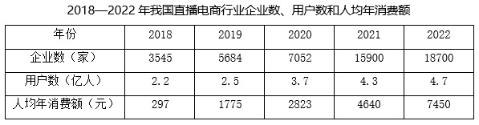

#### 第 16 题　qid 17900916 · 综合

2022年我国网络零售交易额为：

- **A**. 0.9万亿元
- **B**. 8.5万亿元
- **C**. 13.8万亿元　✅
- **D**. 15.3万亿元

**答案**：C

**官方解析**

根据题干“2022年我国网络零售交易额为”，结合资料时间为2022年及资料给出直播电商行业渗透率，可判定本题为现期比重问题。定位文字资料可知，2022年我国直播电商行业交易额为3.5万亿元，直播电商行业渗透率为25.3%。根据公式：整体，可得题干所求万亿元，与C项最接近。

故正确答案为C。

---

#### 第 17 题　qid 17900920 · 综合

2022年与2021年我国直播电商行业交易额之比为：

- **A**. 5：3
- **B**. 6：5
- **C**. 7：3
- **D**. 7：4　✅

**答案**：D

**官方解析**

根据题干“2022年与2021年······之比为”，可判定本题为比值计算问题。定位文字资料可知，2022年我国直播电商行业交易额为3.5万亿元；定位表格资料可知，2021年我国直播电商行业用户数为4.3亿人，人均年消费额为4640元。则2021年我国直播电商行业交易额万亿元，故题干所求比值约为3.5：2=7：4。

故正确答案为D。

---

#### 第 18 题　qid 17900939 · 增长

若2019-2022年我国直播电商行业企业数、用户数、人均年消费额的年均增速分别用、、表示。则下列关系式正确的是：

- **A**. 

- **B**. 

　✅
- **C**. 

- **D**. 

**答案**：B

**官方解析**

根据题干“······年均增速······下列关系式正确的是”，可判定本题为年均增长率问题。定位表格资料可知2018-2022年我国直播电商行业企业数、用户数及人均年消费额。根据年均增长率公式：（n为年份差），当年份差相同时，直接比较即可。则2019-2022年我国直播电商行业企业数、用户数、人均年消费额的分别为：企业数，；用户数，；人均年消费额，。则年均增速由低到高排序为。

故正确答案为B。

---

#### 第 19 题　qid 17900953 · 比重

下列能够表示2022年我国直播电商行业三大平台交易额比例关系的示意图是：

- **A**. 

　✅
- **B**. 

- **C**. 
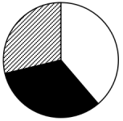

- **D**. 

**答案**：A

**官方解析**

根据题干“······2022年······比例关系的示意图是”，结合资料时间为2022年，可判定本题为现期比重问题。定位文字资料可知，2022年我国直播电商行业三大平台交易额分别为1.5万亿元、0.9万亿元和0.8万亿元。因为1.5&lt;0.9+0.8，所以1.5万亿元未占到三大平台交易额的一半，排除B、D两项；又因为1.5万亿元明显大于0.9万亿元，所以排除C项。
故正确答案为A。

---

#### 第 20 题　qid 17900955 · 综合

能够从上述资料中推出的是：

- **A**. 2017年我国直播电商行业交易额超过250亿元
- **B**. 2020年我国直播电商行业直播场次超过2000万场　✅
- **C**. 2019—2022年，我国直播电商行业企业数增速逐年加快
- **D**. 2019—2022年，我国直播电商行业用户数增加最多的是2022年

**答案**：B

**官方解析**

A项：定位文字资料可知，2022年我国直播电商行业交易额为3.5万亿元，较2017年增长178倍。根据公式：基期量，可得2017年我国直播电商行业交易额亿元，未超过250亿元，错误。 

B项：定位文字资料可知，2022年我国重点监测电商平台直播场次超1.2亿场，较2020年增长5倍。根据公式：基期量，可得2020年我国重点监测电商平台直播场次超过亿场=2000万场，2020年我国直播电商行业直播场次必然多于重点监测电商平台直播场次，即超过2000万场，正确。

C项：定位表格资料可知2018—2022年我国直播电商行业企业数。根据公式：增长率，可得2021年直播电商行业企业数同比增速，2022年直播电商行业企业数同比增速，则2021年同比增速&gt;2022年同比增速，并非逐年加快，错误。

D项：定位表格资料可知2018—2022年我国直播电商行业用户数。根据公式：增长量=现期量-基期量，可得2019—2022年我国直播电商行业用户数同比增长量分别为：2019年，2.5-2.2=0.3亿人；2020年，3.7-2.5=1.2亿人；2021年，4.3-3.7=0.6亿人；2022年，4.7-4.3=0.4亿人。因此2019—2022年我国直播电商行业用户数增加最多的是2020年，错误。

故正确答案为B。

---
