# 2024年江苏省公务员录用考试《行测》题（B类）（网友回忆版）

> 省考 · 2024 年 · 6 个模块 · 共 134 题

- [政治理论](#%E6%94%BF%E6%B2%BB%E7%90%86%E8%AE%BA) · 4 题
- [常识判断](#%E5%B8%B8%E8%AF%86%E5%88%A4%E6%96%AD) · 16 题
- [言语理解与表达](#%E8%A8%80%E8%AF%AD%E7%90%86%E8%A7%A3%E4%B8%8E%E8%A1%A8%E8%BE%BE) · 25 题
- [数量关系](#%E6%95%B0%E9%87%8F%E5%85%B3%E7%B3%BB) · 19 题
- [判断推理](#%E5%88%A4%E6%96%AD%E6%8E%A8%E7%90%86) · 50 题
- [资料分析](#%E8%B5%84%E6%96%99%E5%88%86%E6%9E%90) · 20 题

---

## 政治理论

### 第 1 题　qid 13628288 · 时事政治

党的二十大报告指出，中国式现代化既有各国现代化的共同特征，更有基于自己国情的中国特色。关于中国式现代化的内涵和意义，下列表述正确的是：
①有与世界各国现代化相同的任务
②是人类历史上难度最大的现代化
③是独立自主、和平发展的现代化
④创造了一种全新的人类文明形态

- **A**. ①②③
- **B**. ①②④
- **C**. ①③④
- **D**. ②③④　✅

**答案**：D

**官方解析**

本题考查政治常识。
①错误，②正确，习近平总书记在《中国式现代化是强国建设、民族复兴的康庄大道》的文章中指出：“第一，人口规模巨大的现代化。这是中国式现代化的显著特征。人口规模不同，现代化的任务就不同，其艰巨性、复杂性就不同，发展途径和推进方式也必然具有自己的特点。现在，全球进入现代化的国家也就20多个，总人口10亿左右。中国14亿多人口整体迈入现代化，规模超过现有发达国家人口的总和，将极大地改变现代化的世界版图。这是人类历史上规模最大的现代化，也是难度最大的现代化。”
③正确，习近平总书记在《中国式现代化是强国建设、民族复兴的康庄大道》的文章中指出：“第五，走和平发展道路的现代化。坚持和平发展，在坚定维护世界和平与发展中谋求自身发展，又以自身发展更好维护世界和平与发展，推动构建人类命运共同体，是中国式现代化的突出特征······中国式现代化坚持独立自主、自力更生，依靠全体人民的辛勤劳动和创新创造发展壮大自己，通过激发内生动力与和平利用外部资源相结合的方式来实现国家发展，不以任何形式压迫其他民族、掠夺他国资源财富，而是为广大发展中国家提供力所能及的支持和帮助。”
④正确，党的二十大报告中“三、新时代新征程中国共产党的使命任务”指出：“中国式现代化的本质要求是：坚持中国共产党领导，坚持中国特色社会主义，实现高质量发展，发展全过程人民民主，丰富人民精神世界，实现全体人民共同富裕，促进人与自然和谐共生，推动构建人类命运共同体，创造人类文明新形态。”
故②③④表述正确。
故正确答案为D。

---

### 第 2 题　qid 13628289 · 新思想

习近平总书记在中央全面深化改革委员会第二次会议强调：“建设更高水平开放型经济新体制是我们主动作为以开放促改革、促发展的战略举措。”关于建设更高水平开放型经济新体制的措施，下列表述正确的是：
①促进金融保险业的全面开放
②积极参与国际贸易规则的制定
③营造国际化法治化便利化营商环境
④推动要素流动开放向管理标准开放转变

- **A**. ①②③
- **B**. ①②④
- **C**. ①③④
- **D**. ②③④　✅

**答案**：D

**官方解析**

本题考查政治常识。
①错误，习近平总书记在中央全面深化改革委员会第二次会议强调，建设更高水平开放型经济新体制是我们主动作为以开放促改革、促发展的战略举措，要围绕服务构建新发展格局，以制度型开放为重点，聚焦投资、贸易、金融、创新等对外交流合作的重点领域深化体制机制改革。故“全面开放”表述过于绝对，应为“高水平对外开放”。
②正确，中央全面深化改革委员会第二次会议指出，当前，我国发展面临复杂严峻的国际形势。要完善开放型经济新体制的顶层设计，深化贸易投资领域体制机制改革。《“十四五”对外贸易高质量发展规划》中“三、重点任务 （十）营造良好发展环境”部分指出：“积极参与国际经贸规则制定。坚定支持多边贸易体制，维护世界贸易组织基本原则，积极参与世界贸易组织改革，继续推动恢复上诉机构正常运行，建设性参与渔业补贴、投资便利化、电子商务、服务贸易国内规制、中小微企业、贸易与环境等议题谈判和讨论。”积极参与国际贸易规则的制定有利于建设更高水平开放型经济新体制。
③正确，中央全面深化改革委员会第二次会议指出，要完善开放型经济新体制的顶层设计······全面优化营商环境，完善服务保障体系，充分发挥我国综合优势，以国内大循环吸引全球资源要素，提升贸易投资合作质量和水平。2021年6月2日，李克强总理在全国深化“放管服”改革着力培育和激发市场主体活力电视电话会议上发表重要讲话，部署持续一体推进“放管服”改革，打造市场化法治化国际化营商环境，培育壮大市场主体，更大程度激发市场活力和社会创造力。营造国际化法治化便利化营商环境有利于建设更高水平开放型经济新体制。
④正确，《中共中央 国务院关于新时代加快完善社会主义市场经济体制的意见》中“一、总体要求”部分指出：“坚持扩大高水平开放和深化市场化改革互促共进。坚定不移扩大开放，推动由商品和要素流动型开放向规则等制度型开放转变，吸收借鉴国际成熟市场经济制度经验和人类文明有益成果，加快国内制度规则与国际接轨，以高水平开放促进深层次市场化改革。”故“向管理标准开放转变”符合向制度型开放转变的政策。
故②③④表述正确。
故正确答案为D。

---

### 第 3 题　qid 13628294 · 新思想

2023年9月，习近平总书记在黑龙江考察调研时强调，要增强发展新动能，加快形成新质生产力。关于新质生产力，下列理解正确的是：
①代表着一种生产力的跃迁
②是符合高质量发展要求的生产力
③依靠创新驱动是形成新质生产力的关键
④形成新质生产力要靠传统产业的转型升级

- **A**. ①②③　✅
- **B**. ①②④
- **C**. ①③④
- **D**. ②③④

**答案**：A

**官方解析**

本题考查政治常识。
新质生产力，是2023年9月习近平总书记在黑龙江考察调研期间首次提到的新的词汇，强调整合科技创新资源，引领发展战略性新兴产业和未来产业，加快形成新质生产力。
①②③正确，新质生产力有别于传统生产力，涉及领域新、技术含量高，依靠创新驱动是其中关键。从经济学角度看，新质生产力代表一种生产力的跃迁。它是科技创新在其中发挥主导作用的生产力，高效能、高效率、高质量，区别于依靠大量资源投入、高度消耗资源能源的生产力发展方式，是摆脱了传统增长路径、符合高质量发展要求的生产力，是数字时代更显创新性、更具融合性、更体现新内涵的生产力。
④错误，新质生产力的载体是现代产业，而非传统产业的转型升级。近年来我国持续加大对重大科技项目的投入力度，将自主可控关键核心技术应用到产业链中，一大批新兴产业、未来产业成为新质生产力成长的主阵地。
故正确答案为A。

---

### 第 4 题　qid 13628287 · 时事政治

近期举行的中央金融工作会议提出，要坚定不移走中国特色金融发展之路，加快建设中国特色现代金融体系。关于中国特色现代金融体系的建设要求，下列表述正确的是：
①要突出政治性、人民性
②要加快国际金融一体化进程
③需要更完善的金融监管体系
④需要打造现代金融机构和市场体系

- **A**. ①②③
- **B**. ①②④
- **C**. ①③④　✅
- **D**. ②③④

**答案**：C

**官方解析**

本题考查政治常识。
中央金融工作会议于2023年10月30日至31日在北京举行。中共中央总书记、国家主席、中央军委主席习近平出席会议并发表重要讲话。
①正确，会议强调，当前和今后一个时期，做好金融工作必须坚持和加强党的全面领导，以习近平新时代中国特色社会主义思想为指导，全面贯彻党的二十大精神，完整、准确、全面贯彻新发展理念，深刻把握金融工作的政治性、人民性，以加快建设金融强国为目标······不断开创新时代金融工作新局面。
②错误，国际金融一体化是随着国际经济一体化的发展，各国金融市场和各类金融市场之间的界限逐步消失，全球性的多功能的国际金融市场逐步形成的趋势。但此次会议未提及有关国际金融一体化的内容。
③正确，会议强调，金融是国民经济的血脉，是国家核心竞争力的重要组成部分，要加快建设金融强国，全面加强金融监管，完善金融体制，优化金融服务，防范化解风险，坚定不移走中国特色金融发展之路，推动我国金融高质量发展，为以中国式现代化全面推进强国建设、民族复兴伟业提供有力支撑。
④正确，会议指出，高质量发展是全面建设社会主义现代化国家的首要任务，金融要为经济社会发展提供高质量服务······要着力打造现代金融机构和市场体系，疏通资金进入实体经济的渠道。
故①③④正确。
故正确答案为C。

---

## 常识判断

### 第 1 题　qid 13628291 · 经济常识

2023年是我国自贸试验区建设十周年。十年来，自贸试验区在贸易、投资、金融、航运、人才等方面对接国际通行规则，取得一系列突破性创新成果。下列不属于突破性创新成果的是：

- **A**. 创设境外金融投资账户，加快推进资本市场国际化　✅
- **B**. 实施外商投资准入前国民待遇加负面清单管理模式
- **C**. 建立以国际贸易“单一窗口”为核心的贸易便利化模式
- **D**. 实施跨境服务贸易负面清单管理，推进服务业综合开放

**答案**：A

**官方解析**

本题考查政治常识。
A项错误，B、C、D三项正确，2023年9月27日，在国新办举行的自贸试验区建设十周年新闻发布会上，商务部副部长盛秋平用“五个率先”概括了十年来自贸区试验区取得的一系列突破性、引领性的创新成果，即：“一是率先实施外商投资准入前国民待遇加负面清单管理模式，推动投资管理体制实现历史性变革。二是率先建立以国际贸易‘单一窗口’为核心的贸易便利化模式，有力支撑贸易强国建设。三是率先以跨境服务贸易负面清单管理模式为代表推进服务业综合开放，推动各类高端要素自由便捷流动。四是率先实施‘证照分离’等政府管理改革，促进营商环境改善和政府职能加速转变。五是率先探索自由贸易账户，金融开放创新稳步推进。”
本题为选非题，故正确答案为A。

---

### 第 2 题　qid 13628292 · 人文常识

殷墟遗址考古证实，3000多年前的殷墟文明是一个灿烂的文明，在中华文明乃至人类文明发展史上具有划时代的意义。关于殷墟文明的成就，下列表述正确的是：
①已有个、十、百、千、万等数字概念
②发明了圭表、日晷、漏刻等计时工具
③采取阴阳合历，并将一年分为12个月
④认识并掌握人类十多种疾病及治疗方法

- **A**. ①②③
- **B**. ①②④
- **C**. ①③④　✅
- **D**. ②③④

**答案**：C

**官方解析**

本题考查人文常识。
①正确，早在五、六千年以前，古代中国人就发明了简洁的数学符号，到了三千多年前的商朝时期，刻在甲骨和陶器上面的数字已经非常常见，通过对殷墟出土的甲骨文的研究，发现其中有表示个、十、百、千、万等数字概念，这说明当时中国人的计算方法，已经采用了人类现行的“十进制”。
②错误，圭表是三千年多年前，西周丞相周公旦在河南登封县设置的一种以测定日影长度来确定时间的仪器。《诗经·国风·定之方中》篇有，“定之方中，作于楚宫。揆之以日，作于楚室······”，确切记载使用圭表的时间为公元前659年。日晷的使用时间非常久远，古巴比伦人在远古时代的6000年前就开始使用了，中国则是在3000年前的周朝。漏刻又称刻漏、漏壶，其最早记载见于西周时期周公旦所著的《周礼》。
③正确，殷历法采取融合了阴历和阳历的阴阳合历，将一年分为12个月，并采取增加闰月的方法，解决了与回归年实际太阳日的矛盾，这些方法仍为中国现行的农历所沿用。
④正确，商代晚期已能认识人类的10多种疾病，如疟疾等，除用药物治疗外，还能应用针砭、按摩等治疗方法，达到了较高水平。
故①③④正确。
故正确答案为C。

---

### 第 3 题　qid 13628293 · 科技常识

为了更好推动能源生产和消费革命，保障国家能源安全，我国要深化电力体制改革，加快构建新型电力系统。关于新型电力系统，下列说法不正确的是：

- **A**. 以坚强、智能、柔性电网为枢纽平台
- **B**. 以石化能源的清洁化利用建设为主体　✅
- **C**. 实现源、网、荷、储的智能协同运行
- **D**. 实现用户侧与电力系统高度灵活互动

**答案**：B

**官方解析**

本题考查政治常识。
2023年6月2日，《新型电力系统发展蓝皮书》(以下简称《蓝皮书》)正式发布。
A项正确，《蓝皮书》“二、形势要求与内涵特征”部分指出，“（二）新型电力系统的内涵和特征······新型电力系统是以确保能源电力安全为基本前提，以满足经济社会高质量发展的电力需求为首要目标，以高比例新能源供给消纳体系建设为主线任务，以源网荷储多向协同、灵活互动为坚强支撑，以坚强、智能、柔性电网为枢纽平台，以技术创新和体制机制创新为基础保障的新时代电力系统，是新型能源体系的重要组成和实现‘双碳’目标的关键载体。”
B项错误，《构建以新能源为主体的新型电力系统行动方案（2021-2030年）》“一、构建新型电力系统的重大意义”部分指出，“2021年3月15日，习近平总书记在中央财经委第九次会议上提出，构建以新能源为主体的新型电力系统。”
C项正确，《蓝皮书》“二、形势要求与内涵特征”部分指出，“四是电力系统调控运行模式由单向计划调度向源网荷储多元智能互动转变。”
D项正确，《蓝皮书》“三、三个发展阶段及显著特点”部分指出，“（三）巩固完善期（2045年至2060年）······电力生产和消费关系深刻变革，用户侧与电力系统高度灵活互动。”
本题为选非题，故正确答案为B。

---

### 第 4 题　qid 13628309 · 经济常识

为支持扩大内需，更好服务实体经济，货币政策应更多采取结构性工具，加强对重点领域和薄弱环节的支持。下列不属于结构性货币政策工具的是：

- **A**. 碳减排支持工具
- **B**. 普惠养老专项再贷款
- **C**. 地方政府专项债券　✅
- **D**. 小微贷款减息支持

**答案**：C

**官方解析**

本题考查经济常识。
结构性货币政策工具是中国人民银行认真贯彻落实党中央、国务院决策部署，发挥好货币政策工具的总量和结构双重功能，围绕支持普惠金融、绿色发展、科技创新等国民经济重点领域和薄弱环节，服务经济高质量发展，逐步构建了适合中国国情的结构性货币政策工具体系。具体工具包括支农再贷款、支小再贷款、再贴现、普惠小微贷款支持工具（可以是小微贷款减息支持）、抵押补充贷款、碳减排支持工具、支持煤炭清洁高效利用专项再贷款、科技创新再贷款、普惠养老专项再贷款、交通物流专项再贷款。
A项正确，碳减排支持工具于2021年推出，目的是以稳步有序、精准直达方式，支持清洁能源、节能环保、碳减排技术等重点领域的发展，并撬动更多社会资金促进碳减排。
B项正确，普惠养老专项再贷款于2022年推出，目的是支持金融机构向普惠养老服务机构提供优惠利率贷款，降低普惠养老服务机构的融资成本，推动增加普惠养老服务供给，加快健全养老服务体系。
C项错误，地方政府专项债券指省级政府为有一定收益的公益性项目发行的、以公益性项目对应的政府性基金收入或专项收入作为还本付息资金来源的政府债券，其并非围绕着国民经济的重点领域和薄弱环节，故不属于结构性货币政策，而是属于财政政策。
D项正确，按照国务院常务会议决定，2021年12月，中国人民银行创设普惠小微贷款支持工具，支持对象为地方法人金融机构，对其发放的普惠小微贷款，按照余额增量的2%提供激励资金，鼓励持续增加普惠小微贷款。
本题为选非题，故正确答案为C。

---

### 第 5 题　qid 13628319 · 人文常识

为了使行政执法既有力度又有温度，推动执法要求与执法形式相统一、执法效果与社会效果相统一，各地运用多种方式推行柔性执法。关于柔性执法，说法正确的是：

- **A**. 最关键的是实现行政执法方式的根本转变
- **B**. 执法监管实现从事后监管向事前指导转变　✅
- **C**. 对行政相对人的初次违法行为应免于处罚
- **D**. 优先适用于人身健康和生命财产安全领域

**答案**：B

**官方解析**

本题考查法律常识。
A项错误，《法治政府建设实施纲要（2021－2025年）》在第五点“健全行政执法工作体系，全面推进严格规范公正文明执法”指出，创新行政执法方式。广泛运用说服教育、劝导示范、警示告诫、指导约谈等方式，努力做到宽严相济、法理相融，让执法既有力度又有温度。因此，柔性执法是创新行政执法方式而非从根本转变行政执法方式。
B项正确，柔性执法是一种注重运用多种手段来引导行政相对人行为的正确方向，给相对人一定的灵活度，促使其选择最小成本的行为方式。执法监管实现从事后监管向事前指导转变有利于引导行政相对人自觉遵守法律，释放市场主体活力，宽严相济、法理相融，符合柔性执法的精神。
C项错误，根据《中华人民共和国行政处罚法》第三十三条第一款规定：“违法行为轻微并及时改正，没有造成危害后果的，不予行政处罚。初次违法且危害后果轻微并及时改正的，可以不予行政处罚。”
D项错误，柔性执法作为一种行政执法的理念，具有非强制性、引导性等特点，而人身健康和生命财产安全关系到人民群众切身利益，综合各地区各领域推行柔性执法的具体措施来看，都不属于优先适用领域，甚至是排除适用柔性执法的领域。
故正确答案为B。

---

### 第 6 题　qid 13628307 · 法律常识

我国《公务员法》规定，公务员不得从事或者参与营利性活动，在企业或者其他营利性组织中兼任职务。下列情形属于违反规定的是：

- **A**. 副市长何某兼任市工商业联合会主席
- **B**. 法官赵某开设证券账户并买卖公司股票
- **C**. 警察张某转让继承取得的某有限责任公司股权
- **D**. 税务人员熊某作为小股东出资设立有限责任公司　✅

**答案**：D

**官方解析**

本题考查法律常识。
A项错误，工商业联合会是中国共产党领导的以民营企业和民营经济人士为主体，具有统战性、经济性、民间性有机统一基本特征的人民团体和商会组织，并非营利性组织，何某可以兼任职务。
B项错误，根据《中共中央办公厅、国务院办公厅关于党政机关工作人员个人证券投资行为若干规定》第三条规定：“党政机关工作人员个人可以买卖股票和证券投资基金······”选项中，赵某可以买卖公司股票。
C项错误，根据《中华人民共和国民法典》第一百二十四条第一款规定：“自然人依法享有继承权。”选项中，张某作为自然人有权继承股权，其转让股权属于合法行使对该股权的所有权，不属于从事营利性活动。
D项正确，根据《中华人民共和国民法典》第七十六条规定：“以取得利润并分配给股东等出资人为目的成立的法人，为营利法人。营利法人包括有限责任公司、股份有限公司和其他企业法人等。”选项中，有限责任公司属于营利法人，其目的是取得利润并分配给股东等出资人，熊某作为小股东出资设立有限责任公司属于从事营利性活动。
故正确答案为D。

---

### 第 7 题　qid 13628314 · 法律常识

我国《道路交通安全法》规定，行人的过失发生交通事故，无过错的机动车也要承担部分责任，这改变了过去某些地方针对上述情形由行人负全责的规定。这一改变所体现的法律理念是：

- **A**. 法律具有普遍性，不针对个别人制定法律
- **B**. 法律保障下的自由，才是现实和稳定的自由
- **C**. 法律保障基本人权，约束和限制公共权力
- **D**. 法律价值的基础是人，秩序是法律的工具性价值　✅

**答案**：D

**官方解析**

本题考查法律常识。
A项错误，法是指由国家制定或认可并由国家强制力保障实施的，反映由特定物质生活条件决定的统治阶级意志，以权利和义务为基础，以确认、保护和发展统治阶级所期望的社会关系和社会秩序为目的的行为规范体系。可知，法律不是针对个别人制定。另外法具有普遍性，是指在国家权力所及的范围内具有普遍的约束力，对社会全体成员有效，人人必须遵守。选项本身说法无误，但题干中并未体现。
B项错误，自由是指法通过制度的保障，使主体的行为任意化，有法律才有自由。因此，选项本身说法无误，但题干中，“改变了过去某些地方针对上述情形由行人负全责的规定”更强调责任的认定，而不是主体的行为，并未体现法的自由价值。
C项错误，根据《中华人民共和国宪法》第三十三条第三款规定：“国家尊重和保障人权。”人权是指所有人与生俱来的权利，主要包括生存和发展的权利。题干中，“改变了过去某些地方针对上述情形由行人负全责的规定”未体现生存和发展的权利。
D项正确，秩序主要是指社会秩序，是指通过法律机构、法律规范、法律权威所形成的一种法律状态，是法律的工具性价值。题干中，“改变了过去某些地方针对上述情形由行人负全责的规定”体现了行人的过失发生交通事故时如何担责，是通过法律规范等规定的，表现出通过法所形成的一种有关于交通秩序的法律形态。
故正确答案为D。

---

### 第 8 题　qid 13628318 · 人文常识

保安李某值班时看到马路上王某失控翻车，立即前往救助，途中不慎摔倒而受伤。施救时，李某因方法不当致王某面部受伤。在众人的救助下王某获救。对此，下列说法正确的是：

- **A**. 李某救助中不慎摔伤，王某应给予其适当的补偿　✅
- **B**. 李某施救时致王某面部受伤，应承担损害赔偿责任
- **C**. 李某的救助效果不佳，无权请求王某承担部分损失
- **D**. 李某的救助属于维护公共利益，其受伤应视同工伤

**答案**：A

**官方解析**

本题考查法律常识。
A项正确，C项错误，根据《中华人民共和国民法典》第一百八十三条规定：“因保护他人民事权益使自己受到损害的，由侵权人承担民事责任，受益人可以给予适当补偿。没有侵权人、侵权人逃逸或者无力承担民事责任，受害人请求补偿的，受益人应当给予适当补偿。”题干中，李某因救助王某不慎摔倒而受伤，王某应给予其适当的补偿，李某不会因为救助效果不佳而丧失请求王某给予适当补偿的权利。
B项错误，根据《中华人民共和国民法典》第一百八十四条规定：“因自愿实施紧急救助行为造成受助人损害的，救助人不承担民事责任。”题干中，李某属于自愿救助王某，因自愿实施紧急救助行为造成王某面部受伤，李某无需承担损害赔偿责任。
D项错误，根据《工伤保险条例》第十五条规定：“职工有下列情形之一的，视同工伤：（一）在工作时间和工作岗位，突发疾病死亡或者在48小时之内经抢救无效死亡的；（二）在抢险救灾等维护国家利益、公共利益活动中受到伤害的；（三）职工原在军队服役，因战、因公负伤致残，已取得革命伤残军人证，到用人单位后旧伤复发的。”题干中，李某并不是在抢险救灾等维护公共利益的活动中受到伤害，不能认定为工伤。
故正确答案为A。

---

### 第 9 题　qid 13628338 · 人文常识

业主万某将汽车临时停在小区标有禁止停车标志的地点，取车时发现车子被剐蹭。万某要求物业公司调取监控录像，但物业公司因监控设施故障无法告知相关情况，万某起诉物业公司请求赔偿损害，对此，下列说法正确的是：

- **A**. 万某的汽车是他人剐蹭的，物业公司不承担责任
- **B**. 万某违反了禁止停车规定，应自行承担所受损失
- **C**. 物业公司对监控未尽管理义务，应对万某承担相应责任　✅
- **D**. 万某和物业公司对汽车被剐蹭都存在过错，应均等分担损失

**答案**：C

**官方解析**

本题考查法律常识。
A、B、D三项错误，C项正确，根据《中华人民共和国民法典》第一千一百七十三条规定：“被侵权人对同一损害的发生或者扩大有过错的，可以减轻侵权人的责任。”第一千一百九十八条第二款规定：“因第三人的行为造成他人损害的，由第三人承担侵权责任；经营者、管理者或者组织者未尽到安全保障义务的，承担相应的补充责任。经营者、管理者或者组织者承担补充责任后，可以向第三人追偿。”题目中，万某作为被侵权人将汽车临时停在小区标有禁止停车标志的地点，万某存在过错，此时可以减轻侵权人的责任，而非免除侵权人的责任；同时物业公司因监控设施故障无法告知相关情况，未尽到安全保障义务，应承担相应的补充责任。
故正确答案为C。

---

### 第 10 题　qid 13628348 · 法律常识

许某酒后无证驾驶无号牌的两轮摩托车发生交通事故，被交警部门认定为醉酒驾驶。交警部门对许某无证牌驾驶摩托行为作出罚款300元的处罚，人民法院以危险驾驶罪判处许某拘役3个月并处罚金2000元。此后，交警部门又以许某醉酒驾车为由吊销其小型汽车驾驶证，对此，下列说法正确的是：

- **A**. 许某被交警部门所处的罚款，不能折抵其危险驾驶罪的罚金
- **B**. 交警部门对许某的不同行为作出不同的处罚，不违背一事不再罚原则　✅
- **C**. 交警部门吊销许某与涉案交通事故无关的汽车驾驶证，该处罚违法
- **D**. 许某被判处刑事处罚后，交警部门再吊销其驾驶证违反过罚相当原则

**答案**：B

**官方解析**

本题考查法律常识。
A项错误，根据《中华人民共和国行政处罚法》第三十五条第二款规定：“违法行为构成犯罪，人民法院判处罚金时，行政机关已经给予当事人罚款的，应当折抵相应罚金；行政机关尚未给予当事人罚款的，不再给予罚款。”
B项正确，根据《中华人民共和国行政处罚法》第二十九条规定：“对当事人的同一个违法行为，不得给予两次以上罚款的行政处罚。同一个违法行为违反多个法律规范应当给予罚款处罚的，按照罚款数额高的规定处罚。”因此，交警部门对许某的不同行为作出不同的处罚，不违背一事不再罚原则。
C项错误，根据《中华人民共和国道路交通安全法》第九十一条第二款规定：“醉酒驾驶机动车的，由公安机关交通管理部门约束至酒醒，吊销机动车驾驶证，依法追究刑事责任；五年内不得重新取得机动车驾驶证。”题目中，许某醉酒驾驶，交警部门吊销其机动车驾驶证，符合法律规定。
D项错误，过罚相当原则是指行政主体对违法行为人适用行政处罚，所科罚种和处罚幅度要与违法行为人的违法过错程度相适应，既不轻过重罚，也不重过轻罚，避免畸轻畸重的不合理、不公正的情况。题目中，许某醉酒驾驶，交警部门吊销其机动车驾驶证，符合法律规定，并不违反过罚相当原则。
故正确答案为B。

---

### 第 11 题　qid 13628376 · 法律常识

某区市场监督管理局执法人员林某在张某的商店查获了一批不合格花生油并当场扣押，第二天向张某开具了扣押决定书，其中载明“扣押花生油10多箱”“扣押期限15日”。关于林某的执法行为，下列说法正确的是：

- **A**. 林某的执法行为属于行政处罚
- **B**. 林某有权单独扣押张某的财产
- **C**. 林某开具扣押决定书的时间合法
- **D**. 林某开具的扣押决定书记载内容不当　✅

**答案**：D

**官方解析**

本题考查法律常识。
A项错误，根据《中华人民共和国行政处罚法》第九条规定：“行政处罚的种类：（一）警告、通报批评；（二）罚款、没收违法所得、没收非法财物；（三）暂扣许可证件、降低资质等级、吊销许可证件；（四）限制开展生产经营活动、责令停产停业、责令关闭、限制从业；（五）行政拘留；（六）法律、行政法规规定的其他行政处罚。”根据《中华人民共和国行政强制法》第九条规定：“行政强制措施的种类：（一）限制公民人身自由；（二）查封场所、设施或者财物；（三）扣押财物；（四）冻结存款、汇款；（五）其他行政强制措施。”因此，林某作出扣押的执法行为不属于行政处罚，属于行政强制措施。
B项错误，根据《中华人民共和国行政强制法》第十八条规定：“行政机关实施行政强制措施应当遵守下列规定：（一）实施前须向行政机关负责人报告并经批准；（二）由两名以上行政执法人员实施；（三）出示执法身份证件；（四）通知当事人到场；（五）当场告知当事人采取行政强制措施的理由、依据以及当事人依法享有的权利、救济途径；（六）听取当事人的陈述和申辩；（七）制作现场笔录；（八）现场笔录由当事人和行政执法人员签名或者盖章，当事人拒绝的，在笔录中予以注明；（九）当事人不到场的，邀请见证人到场，由见证人和行政执法人员在现场笔录上签名或者盖章；（十）法律、法规规定的其他程序。”
C项错误，根据《中华人民共和国行政强制法》第二十四条第一款规定：“行政机关决定实施查封、扣押的，应当履行本法第十八条规定的程序，制作并当场交付查封、扣押决定书和清单。”因此，林某开具扣押决定书的时间不合法。
D项正确，根据《中华人民共和国行政强制法》第二十四条第二款规定：“查封、扣押决定书应当载明下列事项：（一）当事人的姓名或者名称、地址；（二）查封、扣押的理由、依据和期限；（三）查封、扣押场所、设施或者财物的名称、数量等；（四）申请行政复议或者提起行政诉讼的途径和期限；（五）行政机关的名称、印章和日期。”因此，林某在扣押决定书上载明“扣押花生油10多箱”，属于记载数据不精确。
故正确答案为D。

---

### 第 12 题　qid 13628356 · 人文常识

罗某在地铁口架设音响设备弹唱，摆放二维码收取观众打赏。城管执法人员认为罗某未取得演艺许可，占道经营，劝其离开。罗某不听劝阻，执法人员现场告知其违法，扣押了音响设备。对此，下列说法正确的是：

- **A**. 听众欣赏罗某弹唱后的扫码打赏，属于赠与
- **B**. 罗某的弹唱具有一定的盈利性，构成经营行为　✅
- **C**. 罗某的弹唱属于自娱自乐，无需取得演艺许可证
- **D**. 执法人员有权制止罗某弹唱，但无权扣押其音响设备

**答案**：B

**官方解析**

本题考查法律常识。
A项错误，B项正确，罗某摆放收款二维码，以自己弹唱、路人“打赏”的方式获取收益，是以营利为目的提供服务，虽然交易对价出于路人自愿，但仍属于服务交易行为，不能因其未明码标价就否定其经营行为本质，因此，罗某的弹唱具有一定的盈利性，构成经营行为，听众扫码打赏的行为，并不属于赠与。
C项错误，营业性演出是指以营利为目的为公众举办的现场文艺表演活动。罗某摆放收款二维码，以自己弹唱、路人“打赏”的方式获取收益，因此，罗某的弹唱不属于自娱自乐，需取得演艺许可证。
D项错误，根据《中华人民共和国行政强制法》第十六条第一款规定：“行政机关履行行政管理职责，依照法律、法规的规定，实施行政强制措施。”罗某在地铁口架设音响设备弹唱，占道经营，执法人员有权制止罗某弹唱，也有权扣押其音响设备。
故正确答案为B。

---

### 第 13 题　qid 17900731 · 法律常识

刘某擅自扩建烧烤店，相邻业主高某向区城管监察大队举报。城管监察大队责令刘某限期拆除违法建筑，刘某未执行该处罚。高某提起民事诉讼，请求判处刘某排除妨害。城管监察大队以高某已提起民事诉讼为由中止执法。高某遂提起行政诉讼，要求城管监察大队履职。关于本案，下列说法正确的是：

- **A**. 高某请求排除妨害行使的是物权性救济措施　✅
- **B**. 城管监察大队中止执法的行为符合法律规定
- **C**. 在行政诉讼终结前，法院应中止民事案件的审理
- **D**. 若高某在民事诉讼中败诉，则刘某的扩建行为合法

**答案**：A

**官方解析**

本题考查法律常识。
A项正确：《中华人民共和国民法典》第二百三十六条规定：“妨害物权或者可能妨害物权的，权利人可以请求排除妨害或者消除危险。”
B项错误：《中华人民共和国行政强制法》第四十四条规定：“对违法的建筑物、构筑物、设施等需要强制拆除的，应当由行政机关予以公告，限期当事人自行拆除。当事人在法定期限内不申请行政复议或者提起行政诉讼，又不拆除的，行政机关可以依法强制拆除。”第三十九条规定：“有下列情形之一的，中止执行：（一）当事人履行行政决定确有困难或者暂无履行能力的；（二）第三人对执行标的主张权利，确有理由的；（三）执行可能造成难以弥补的损失，且中止执行不损害公共利益的；（四）行政机关认为需要中止执行的其他情形。中止执行的情形消失后，行政机关应当恢复执行。对没有明显社会危害，当事人确无能力履行，中止执行满三年未恢复执行的，行政机关不再执行。”本题中，高某提起民事诉讼不属于中止执行的情形，城管监察大队中止执法的行为不符合法律规定。
C项错误：《中华人民共和国民事诉讼法》第一百五十三条规定：“有下列情形之一的，中止诉讼：（一）一方当事人死亡，需要等待继承人表明是否参加诉讼的；（二）一方当事人丧失诉讼行为能力，尚未确定法定代理人的；（三）作为一方当事人的法人或者其他组织终止，尚未确定权利义务承受人的；（四）一方当事人因不可抗拒的事由，不能参加诉讼的；（五）本案必须以另一案的审理结果为依据，而另一案尚未审结的；（六）其他应当中止诉讼的情形。中止诉讼的原因消除后，恢复诉讼。”本题中，不存在中止诉讼的情形。
D项错误：刘某的扩建行为合法与否应当结合该行为具体情节、相关证据材料和相关法律法规规定等综合认定，高某在民事诉讼中败诉并不当然意味着该扩建行为合法。
故正确答案为A。

---

### 第 14 题　qid 17900727 · 经济常识

某公司未取得食品药品的生产许可，把当地山泉水净化并罐装，以原装进口饮用水的名义销售，销售额达千万元。何某知悉该饮用水为假冒品，便大量购买，并向检察机关举报。对此，下列说法正确的是：

- **A**. 检察机关有权以销售额为基数，请求判令该公司支付惩罚性赔偿金　✅
- **B**. 检察机关有权提起公益诉讼，并将胜诉后所得到的赔偿金归入国库
- **C**. 何某明知该公司销售的是假冒饮用水而购买，无权请求惩罚性赔偿
- **D**. 何某虽购买了假冒饮用水但未造成严重损害，无权请求惩罚性赔偿

**答案**：A

**官方解析**

本题考查法律常识。
《中华人民共和国民事诉讼法》第五十八条规定：“对污染环境、侵害众多消费者合法权益等损害社会公共利益的行为，法律规定的机关和有关组织可以向人民法院提起诉讼。人民检察院在履行职责中发现破坏生态环境和资源保护、食品药品安全领域侵害众多消费者合法权益等损害社会公共利益的行为，在没有前款规定的机关和组织或者前款规定的机关和组织不提起诉讼的情况下，可以向人民法院提起诉讼。前款规定的机关或者组织提起诉讼的，人民检察院可以支持起诉。”《中华人民共和国消费者权益保护法》第五十五条第一款规定：“经营者提供商品或者服务有欺诈行为的，应当按照消费者的要求增加赔偿其受到的损失，增加赔偿的金额为消费者购买商品的价款或者接受服务的费用的三倍；增加赔偿的金额不足五百元的，为五百元。法律另有规定的，依照其规定。”本题中，该案件属于食品药品安全领域侵害众多消费者合法权益的情形，检察机关有权提起诉讼。该公司把当地山泉水净化并罐装的行为构成欺诈，应向消费者支付三倍的惩罚性赔偿。何某虽“知假买假”，但根据目前司法实践，该行为并不影响其请求支付惩罚性赔偿，只是在数额方面法院会在“生活消费”范围内支持惩罚性赔偿请求。
故正确答案为A。

---

### 第 15 题　qid 17900724 · 法律常识

苏某进入一未经批准销售卡片盲盒的直播间，在主播的推荐下购买了一款兑奖卡片并中了小奖。为中大奖，苏某又花费了近万元购买卡片，但无一中奖。苏某便以主播及其所在公司为被告提起诉讼，请求判令返还购买卡片的款项。关于本案，下列说法正确的是：

- **A**. 主播的推荐构成欺诈，应向苏某承担赔偿责任
- **B**. 苏某与该公司之间的债权债务关系应受法律保护
- **C**. 苏某为获取博弈利益，无权要求返还购买卡片的款项　✅
- **D**. 苏某后续购买卡片无一中奖，法院应支持其诉讼请求

**答案**：C

**官方解析**

本题考查法律常识。
A项错误：《中华人民共和国民法典》第一百四十八条规定：“一方以欺诈手段，使对方在违背真实意思的情况下实施的民事法律行为，受欺诈方有权请求人民法院或者仲裁机构予以撤销。”本题中，主播的行为并不是通过欺诈手段，使对方陷入违背真实意思的情况下实施民事法律行为。
B、D两项错误，C项正确：苏某购买卡片盲盒的行为，并非用于生产生活需要，而是为了获得高额的中奖机会，本质上已经脱离了正常的经营者和消费者之间的关系，并非法律规定的一种正常消费行为或销售行为。卡片本身不具有相应的价值或者相对高额的价值，苏某又以盲盒类形式购买，从形式上看符合彩票的外在表现形式，属于类似购买彩票行为。同时，针对此类购买彩票的行为，在经营方未取得国家经营许可的前提下产生的债权债务应评价为非法债务，不受国家法律保护。
故正确答案为C。

---

### 第 16 题　qid 17900732 · 科技常识

某商场举行抽奖活动，宣称特等奖为某品牌新能源汽车的一年使用权，并未附加其他条件。韩某中奖后兑奖时，商场却根据与汽车厂商的合同，要求韩某交纳10万元押金和汽车使用保险费。对此，下列说法正确的是：

- **A**. 商场的抽奖宣传是商业广告，没有法律约束力
- **B**. 商场实施了欺诈，韩某有权要求商场承担惩罚性赔偿
- **C**. 韩某有权获得汽车使用权，商场需支付押金和保险费　✅
- **D**. 韩某有权直接起诉商场和汽车厂商，要求履行合同义务

**答案**：C

**官方解析**

本题考查法律常识。
A项错误：《中华人民共和国民法典》第四百七十三条规定：“要约邀请是希望他人向自己发出要约的表示。拍卖公告、招标公告、招股说明书、债券募集办法、基金招募说明书、商业广告和宣传、寄送的价目表等为要约邀请。商业广告和宣传的内容符合要约条件的，构成要约。”由于商场的抽奖活动宣传已经明确到具体的奖品类型与使用期限，符合要约条件，该抽奖宣传的商业广告应视为要约，具有法律约束力。
B项错误：《中华人民共和国民法典》第一百四十八条规定：“一方以欺诈手段，使对方在违背真实意思的情况下实施的民事法律行为，受欺诈方有权请求人民法院或者仲裁机构予以撤销。”商场的行为并不是以欺诈手段，并使消费者违背真实意思实施民事法律行为。
C项正确：《中华人民共和国民法典》第一百四十条规定：“行为人可以明示或者默示作出意思表示。沉默只有在有法律规定、当事人约定或者符合当事人之间的交易习惯时，才可以视为意思表示。”由于商场在抽奖活动前期宣传中对“中奖需支付押金及使用期间的保险费用”这一事项未进行明示，商场应秉持诚信原则，按照前期宣传的内容向中奖者兑付奖项，不能事后再增设条件。韩某无须支付押金和保险费。
D项错误：《中华人民共和国民法典》第四百六十五条规定：“依法成立的合同，受法律保护。依法成立的合同，仅对当事人具有法律约束力，但是法律另有规定的除外。”合同具有相对性，韩某仅有权直接起诉商场，要求其履行合同义务。
故正确答案为C。

---

## 言语理解与表达

### 材料 1

        提示词工程师，一个与人工智能（AI）相关的新职业悄然兴起。其职责是与生成式人工智能进行高质量对话，用设计、管理与优化相关行业的提示词来进行大模型训练，配合技术提升整体产品表现。可以这么理解：人工智能已经开始进入无数具体的行业领域，如同刚入职的“新人”，需要一位行业资深前辈贴身“传帮带”，助其快速适应业务、成为“熟手”。

        这些“传帮带”的师父们，就是AI训练应用场景下的提示词工程师。在国内招聘平台上，这个岗位仍处于动态定义的过程中，未必严谨地以“提示词工程师”的字样出现，可能名为AI训练师，或是AI产品运营，也可能叫作AI“文生图”绘画师，但岗位描述都指向人工智能生成内容训练。毫无疑问，从需求端已经能感受到这一职业的水涨船高。

        初看这个新职业，总有些<u>            </u>，因为它超出了专业对口的思维方式。说它是与AI技术相关吧，它要求从业者有其他垂直领域的专业性，尤其是法律、宗教、艺术这样的领域；说它是内容生产吧，它的从业者又必须高度理解AI逻辑，有产品经理思维打底。它非文非理、非农非工，既跨界又难以充分量化，要求的是一种人文与技术的综合性，以及一种高度开放的思维、技术伴随式学习能力。

        有论者分析，这个职业可能是暂时的，因为它适配的是大语言模型进入具体应用场景的阶段。但其实，这个职业本身也正处于生成之中，谁又能定论没有新的发育可能呢？其所内含的职业精神本就指向人文精神与人工智能的动态调适。当AI快速进入人类生存的各个层面、各个细分领域，这种调适每个人都要经历，并指向了两个相辅相成的方面——既包含我们对AI的适应（使用、伴随学习、合作创造），也包括我们对AI的规训（日常训练、伦理制约）。未来，<u>这就是一个人的社会化的基本内容</u>，而“提示词工程师”则会成为每个现代人的一个侧面。

        值得注意的是，对于我们怎么找工作、怎么看待工作，“提示词工程师”兴起还带来了另外一个重要的信号：未来，最容易被替代的工作是那些易于标准化的职业、易于模式化的流程，不容易被替代的则是那些具有“人”的综合性特征的职业。后者，可能是独特的艺术家、具有原创性的创作者、技术人文复合型人才，也可能是插花师、护士、电工这样具有人的“具身性”的职业。换句话说，在AI的吞噬中稍稍保持的竞争性，要么来自一个确实高度复杂的思维，要么来自一个可以面对面的肉身。

        风吹云走，这样的职业分化已经近在眼前。此刻看似能“上岸”的职业、此刻被争抢的“饭碗”，是否有想象中那么稳定？可能还需选择者长思。

#### 第 1 题　qid 13628198 · 逻辑填空

填入文章第三自然段画横线处最恰当的一项是：

- **A**. 光彩耀目
- **B**. 莫可名状　✅
- **C**. 不堪言状
- **D**. 不知所以

**答案**：B

**官方解析**

根据“初看这个新职业······说它是与AI技术相关吧，它要求······法律、宗教、艺术这样的领域；说它是内容生产吧，它······有产品经理思维打底”及“它非文非理、非农非工，既跨界又难以充分量化”可知，横线处所填成语应体现新职业涉及专业较多，比较复杂，难以描述之意。B项“莫可名状”指事物极复杂微妙，无法描述，符合文意，当选。A项“光彩耀目”指光采鲜明，视之耀眼，文段并非强调新职业光彩耀眼，与文意不符，排除；C项“不堪言状”指无法用语言来形容，形容某种情况极其严重或恶劣，常用于贬义，与文段感情色彩不符，排除；D项“不知所以”指不知道事情发生的原因，文段并未讨论新职业产生的原因，与文意不符，排除。
故正确答案为B。
【文段出处】光明网《透过泡沫，看看那些不容易被替代的职业》

---

#### 第 2 题　qid 13628200 · 语句表达

文章第四自然段画横线句子中的“这”指的是：

- **A**. 人类对AI的适应和规训　✅
- **B**. 每个人对社会的适应过程
- **C**. 人文精神与AI动态调适
- **D**. 提示词工程师适配的对象

**答案**：A

**官方解析**

定位文章第四段结尾，首先根据画横线句子“这就是一个人的社会化的基本内容”可知，“这”指代的内容应属于人的社会化的基本内容，结合指代词之前的内容进行分析，前文先指出提示词工程师所内含的职业精神指向人文精神与人工智能的动态调适，随后指出这种调适指向两个相辅相成的方面，即人类对AI的适应和规训，故画横线句子中的“这”指的是人类对AI的适应和规训，对应A项。
B项，“每个人对社会的适应过程”范围扩大，文段强调的是人类与“AI”之间的关系，排除；
C项，“动态调适”属于提示词工程师的职业精神，并非人的社会化的基本内容，排除；
D项，“提示词工程师适配的对象”文段并未提及，无中生有，排除。
故正确答案为A。
【文段出处】光明网《透过泡沫，看看那些不容易被替代的职业》

---

#### 第 3 题　qid 13628202 · 片段阅读

关于提示词工程师，下列说法与文意不符的是：

- **A**. 与之相关的岗位尚处于动态定义的过程之中
- **B**. 是近期兴起的一个与人工智能相关的新职业
- **C**. 是一个暂时存在但又较容易被替换掉的职业　✅
- **D**. 从业者需要具备创新思维和较高的学习能力

**答案**：C

**官方解析**

A项，根据第二段“······提示词工程师。在国内招聘平台上，这个岗位仍处于动态定义的过程中”可知，“相关的岗位尚处于动态定义的过程之中”符合文意，排除；
B项，根据第一段“提示词工程师，一个与人工智能（AI）相关的新职业悄然兴起”可知，该职业是近期兴起的新职业，且与人工智能相关，符合文意，排除；
C项，根据第四段“有论者分析，这个职业可能是暂时的······这个职业本身也正处于生成之中，谁又能定论没有新的发育可能呢”可知，该职业并不一定是暂时的、易被替换的，表述过于绝对，与文意不符，当选；
D项，根据第三段“它非文非理、非农非工······以及一种高度开放的思维、技术伴随式学习能力”可知，从业者是需要具备创新思维及较高学习能力的，符合文意，排除。
本题为选非题，故正确答案为C。
【文段出处】光明网《透过泡沫，看看那些不容易被替代的职业》

---

#### 第 4 题　qid 13628205 · 片段阅读

根据文意，下列职业在未来最有可能被AI替代的是：

- **A**. 非遗传承人
- **B**. 美发师
- **C**. 幼儿保育员
- **D**. 播音员　✅

**答案**：D

**官方解析**

根据文章第五段“未来，最容易被替代的工作是那些易于标准化的职业、易于模式化的流程······在AI的吞噬中稍稍保持的竞争性，要么来自一个确实高度复杂的思维，要么来自一个可以面对面的肉身”可知，易于标准化、模式化的职业容易被替代，而拥有高度复杂的思维或需要面对面服务的职业则不容易被替代。
A项，“非遗传承人”符合“拥有高度复杂的思维”的特性，且非遗大部分只能依靠活态传承，不容易被替代，排除；
B项，“美发师”符合“面对面服务”的特性，不容易被替代，排除；
C项，“幼儿保育员”符合“面对面服务”的特性，不容易被替代，排除；
D项，“播音员”符合“易于标准化、模式化”的特性，最可能被替代，当选。
故正确答案为D。
【文段出处】光明网《透过泡沫，看看那些不容易被替代的职业》

---

#### 第 5 题　qid 13628207 · 片段阅读

这篇文章的主要意图是：

- **A**. 告知读者提示词工程师这一职业悄然兴起的原因
- **B**. 引导读者透过提示词工程师对职业选择进行思考　✅
- **C**. 说明现在的热门职业未来不一定具有良好的前景
- **D**. 介绍提示词工程师所具有的职业特征与市场需求

**答案**：B

**官方解析**

文章第一段引出提示词工程师这一职业，并说明这一职业产生的原因，文段第二段说明提示词工程师的定义，第三段说明提示词工程师的特征，第四段指出提示词工程师尚在生成，有新发育的可能，未来会成为每个现代人的一个侧面，第五段通过“值得注意的是”、第六段通过“需”引出文段对策，即需要对职业选择进行思考，故文段主要通过对提示词工程师的讨论，说明我们在职业选择的时候应进行长远思考，对应B项。
A项，仅对应第一段“人工智能已经开始进入无数具体的行业领域······助其快速适应业务、成为‘熟手’”，非重点，排除；
C项，仅对应第六段“此刻看似能‘上岸’的职业、此刻被争的‘饭碗’，是否有想象中那么稳定？”问题表述部分，非重点，文章强调选择职业时需要谨慎思考，且缺少文段核心话题“提示词工程师”，排除；
D项，“职业特征与市场需求”对应第二段和第三段内容，非重点，排除。
故正确答案为B。
【文段出处】光明网《透过泡沫，看看那些不容易被替代的职业》

---

#### 第 6 题　qid 5919286 · 片段阅读

改革开放以来，中国经济发展取得了举世瞩目的成就，但在加速工业化和城镇化过程中消耗了大量能源、水、土地、矿产等资源。“高投入、高消耗、低产出”的粗放发展方式未得到彻底扭转，高质量发展面临的资源约束长期偏紧。党的十八大以来，我国部署实施全面节约战略，大幅降低能源、水、土地利用强度。大力发展循环经济，推动资源节约集约高效利用，取得积极成效。进入新发展阶段，实现高质量发展、推动产业转型升级、更好满足美好生活需要，都对资源节约和高效利用提出了更高要求。
这段文字意在强调：

- **A**. 高质量发展以资源大量消耗作为代价
- **B**. 我国资源消耗总量曾经长期居高不下
- **C**. 经济发展与资源的开发利用息息相关
- **D**. 新发展阶段需科学配置高效利用资源　✅

**答案**：D

**官方解析**

文段首先指出改革开放以来中国经济发展取得的成就，接着通过转折词“但”指出在发展过程中存在资源消耗过大、发展方式粗放以及资源约束长期偏紧等问题，接着指出党的十八大以来我国通过一系列做法在资源节约方面取得了积极成效，进入了新发展阶段，最后尾句通过“提出了更高要求”提出对策，强调新发展阶段需要更好地节约及高效利用资源，对应D项。
A、B两项，“以资源大量消耗作为代价”和“资源消耗总量曾经长期居高不下”均对应文段提出问题部分的内容，非重点，排除；
C项，“息息相关”偏离文段中心，文段重点强调新发展阶段提出的更高要求，并非强调关联性，排除。
故正确答案为D。
【文段出处】人民日报《科学配置促进资源节约和高效利用（新论）》

---

#### 第 7 题　qid 5919287 · 片段阅读

传统的职业技术认证，特别是高端职业的认证通常与学历背景密切相关。随着互联网技术的进步，知识获取变得更为便利，也使得从业人员知识面更加开阔广泛，从而在一定程度上减弱了职业技术认证与学历背景之间的联系。新型职业的技能认证需要考虑专业知识，又因其服务的个性化特征，必须纳入消费者评价的考量。在这种情况下，新型职业的认证标准需兼顾专业技术技能评价和保障消费者权益。
这段文字讨论的重点是：

- **A**. 新型职业技术的发展异于传统职业
- **B**. 新型职业技术认证需要考虑的因素　✅
- **C**. 新型职业技术认证需要消费者认可
- **D**. 新型职业均具有鲜明的个性化特征

**答案**：B

**官方解析**

文段首先指出传统的职业技术认证与学历背景相关，接着说明互联网技术的进步在一定程度上减弱了职业技术认证与学历背景之间的联系，然后指出新型职业的技能认证需要考虑专业知识和消费者评价，尾句提出对策，即新型职业的认证标准需兼顾专业技术技能评价和保障消费者权益。故文段重点强调新型职业的认证需要考虑多种因素，对应B项。
A项，“新型职业技术”偷换主题词，文段的主题词是“新型职业的认证”，排除；
C项，“消费者认可”仅为新型职业技术认证需要考虑的一个因素，表述片面，排除；
D项，“具有鲜明的个性化特征”对应“又因其服务的个性化特征”，为对策前内容，非重点，排除。
故正确答案为B。
【文段出处】光明日报《新职业助力中国新经济业态焕发新活力》

---

#### 第 8 题　qid 13628177 · 语句表达

菟丝草只能攀附寄生在其他植物上。它们的生长永远成不了规模，也不能长久，一般是第一年生机勃勃，第二、第三年就会枯萎而死。原因何在？主要是它们将寄生植物体上的营养成分吸走了太多，导致被寄生的植物生命力和抵抗力迅速下降，进而抵御不了虫害和自然灾害的攻击，最后枯死。                    ？所寄生的植物死了，菟丝草也就活不长了，枯死也就在所难免。
填入画横线处最恰当的一项是：

- **A**. 皮之不存，毛将焉附　✅
- **B**. 覆巢之下，安有完卵
- **C**. 茂树之下，岂有丰草
- **D**. 城门失火，殃及池鱼

**答案**：A

**官方解析**

本题为语句填空题，横线位于文段中间，需结合上下文语境进行分析。横线前引出“菟丝草”的话题，并提出菟丝草第二、第三年就会枯萎而死的情况，接着解释原因，即菟丝草的寄生会导致寄生植物体枯死。横线后指出所寄生的植物死了，菟丝草也会枯死。结合上下文，均在围绕“菟丝草”与所寄生的植物之间存活的联系进行阐述，故横线处也应说明“寄生植物体枯死”与“菟丝草枯死”这两件事之间的联系。A项“皮之不存，毛将焉附”意思是皮都没有了，毛还长在哪儿？比喻事物失去了借以生存的基础，就不能存在，符合文意，当选。
B项，“覆巢之下，安有完卵”意思是整体遭殃，部分也不能保全，“菟丝草”和“寄生植物体”不是“整体”与“部分”的关系，与文意不符，排除；
C项，“茂树之下，岂有丰草”意思是茂密的树林下面没有旺盛的青草，比喻在强大的势力下，弱者会受到压制和侵害，该句中“茂树”为生长茂密的树林，与文段中“寄生植物体枯死”前后矛盾，与文意不符，排除；
D项，“城门失火，殃及池鱼”意思是城门着了火，大家都用护城河的水救火，水用尽了，鱼也就干死了，这里“城门”和“池鱼”是不相关的两个个体，“池鱼”无辜受到牵连，但是文段中“菟丝草”和“寄生植物体”是寄生关系，“菟丝草”并不无辜，故与文意不符，排除。
故正确答案为A。
【文段出处】今晚报《寄生》

---

#### 第 9 题　qid 5919289 · 片段阅读

一般来说，高速公路扩容改造方案主要有两种：一种是改扩建，即通过对既有高速公路进行拼宽或分离增建车道，提高通行能力；另一种是在既有高速公路通道内另建新线。在无特殊条件制约情况下，扩容改造项目应优先利用既有高速公路改扩建。因为既有高速公路一般占据了通道内较为理想的线位，周边相关路网及配套产业设施已基本形成，另建新线，往往难以取代既有公路承担的交通功能，若选择新线，工程、征拆、投资等规模都较大。
关于优先利用既有高速公路改扩建的理由，文段未涉及的是：

- **A**. 工程造价征拆投资等投入相对较低
- **B**. 既有高速公路线的线位已充分论证
- **C**. 可以大大减少设计周期以缩短工期　✅
- **D**. 与现有路网和经济带的适应性最佳

**答案**：C

**官方解析**

A项，根据“若选择新线，工程、征拆、投资等规模都较大”可知，文段提及了利用既有高速公路改扩建的“工程造价征拆投资等投入相对较低”，表述正确，排除；
B项，根据“既有高速公路一般占据了通道内较为理想的线位”“另建新线，往往难以取代既有公路承担的交通功能”可知，既有高速公路线位通常较为理想，建新线难以取代其交通功能，故“既有高速公路线的线位已充分论证”表述正确，排除；
C项，文段未提及“设计周期”“工期”相关的话题，无中生有，当选；
D项，根据“既有高速公路······周边相关路网及配套产业设施已基本形成，另建新线，往往难以取代既有公路承担的交通功能”可知，另建新线往往无法与现有的相关路网和配套产业设施相匹配，故“与现有路网和经济带的适应性最佳”表述正确，排除。
本题为选非题，故正确答案为C。
【文段出处】人民日报《扩容改造，让高速公路筋骨更强健》

---

#### 第 10 题　qid 17900722 · 片段阅读

近年来，我国数据产量每年保持约30%的增速，厘清各主体的数据权利与义务，有利于优化数据资产管理，促进数据有序流通。从安全角度看，数据分类分级是数据安全的基础。对于关系国家安全或重大公共利益的公共数据，要明确其公有性质，所有权归国家，根据数据级别采取不同的保护措施。对于承载个人信息的数据，应划定隐私与一般数据的边界，在保护隐私的同时通过脱敏、加密等技术手段促进一般数据流通使用。
这段文字意在强调：

- **A**. 我国数据生产增长迅猛
- **B**. 需创新研发数据使用流通技术手段
- **C**. 数据保护事关国家安全
- **D**. 应分类分级推进数据确权授权使用　✅

**答案**：D

**官方解析**

文段开篇介绍我国数据产量每年递增的背景，并指出厘清各主体的数据权利与义务的意义。随后从安全角度指出数据分类分级是数据安全的基础，并从公共数据和个人信息数据两方面具体论述数据分级分类对数据安全的意义。故文段重点强调数据分级分类对数据安全的重要性，对应D项。
A项：“数据生产增长迅猛”对应文段开头背景引入部分，非重点，排除；
B项：“创新研发数据使用流通技术手段”文段并未提及，无中生有，排除；
C项：数据保护对国家安全的重要性对应后文解释说明部分，非重点，且后文除了国家安全还提到了重大公共利益、个人信息数据，表述片面，排除。
故正确答案为D。
【文段出处】《加快建立完善数据产权制度（经济时评）》

---

#### 第 11 题　qid 17900726 · 片段阅读

与射电望远镜相比，大型光学望远镜对环境的要求更加苛刻，比如晴夜数、天光背景亮度、视宁度等，所以优质的光学观测台址是稀缺资源。此前国际优质的大型光学望远镜几乎都集中在西半球。而我国青海省冷湖台址区域每年可观测时间达300天，可沉降水汽柱也远优于其他地区的大型光学天文台。冷湖所在的经度区域尚属世界大型光学望远镜的空白区，由于天文观测常需要接力观测，随着冷湖天文观测基地的建设，这里将成为国际光学天文研究的重要基地。
下列说法与文意不符的是：

- **A**. 东半球优质光学观测设施相对稀缺
- **B**. 大型光学天文台建设选址难度大
- **C**. 大型光学望远镜对环境要求高，故观测精度高于射电望远镜　✅
- **D**. 冷湖地区得天独厚的环境将使其成为天文科学研究重镇

**答案**：C

**官方解析**

A项：根据“此前国际优质的大型光学望远镜几乎都集中在西半球”可知，西半球优质光学观测设施较多，东半球优质光学观测设施相对稀缺，该项表述正确，排除。
B项：根据“与射电望远镜相比，大型光学望远镜对环境的要求更加苛刻，比如晴夜数、天光背景亮度、视宁度等，所以优质的光学观测台址是稀缺资源”可知，该项表述正确，排除。
C项：文段并未比较大型光学望远镜与射电望远镜的“观测精度”，该项无中生有，且文段并未论述“对环境要求高”与“观测精度高”之间的因果关系，该项强加因果，当选。
D项：根据“冷湖所在的经度区域尚属世界大型光学望远镜的空白区，由于天文观测常需要接力观测，随着冷湖天文观测基地的建设，这里将成为国际光学天文研究的重要基地”可知，该项表述正确，排除。
本题为选非题，故正确答案为C。
【文段出处】《在冷湖，追逐最亮的星（科技自立自强）》

---

#### 第 12 题　qid 5919292 · 片段阅读

生产性服务业包括研发设计、信息数据、人力资源、现代物流等领域，涉及农业、工业等产业的多个环节，具有专业性强、创新活跃、产业融合度高、带动作用显著等特点。国际经验表明，制造业发展到一定阶段后，其附加值和市场竞争力的提升更多的是靠现代生产性服务业的支撑。相较而言，我国生产性服务业发展相对滞后，总量不足、结构不合理等问题仍较突出。推动中国制造由大到强，需要我们推动生产性服务业向专业化和价值链高端延伸，更好服务制造业高质量发展。
这段文字意在强调：

- **A**. 应进一步推动生产性服务业高质量发展　✅
- **B**. 生产性服务业包括多领域涉及众多产业
- **C**. 生产性服务业与制造业的发展息息相关
- **D**. 更好服务制造业是生产性服务业的目标

**答案**：A

**官方解析**

文段开篇引出“生产性服务业”这一话题，接着介绍其对于制造业的重要性，随后提出我国生产性服务业发展的突出问题，尾句通过“需要”针对前文问题提出对策，即要推动生产性服务业向专业化和价值链高端延伸。故文段重点为尾句对策，对应A项，其中“高质量发展”对应“向专业化和价值链高端延伸”。
B项“包括多领域涉及众多产业”、C项“与制造业的发展息息相关”均对应对策前的内容，非重点，排除；
D项，没有体现生产性服务业未来的发展方向是“高质量”，且选项为非对策表述，排除。
故正确答案为A。
【文段出处】人民日报《进一步推动生产性服务业发展（观象台）》

---

#### 第 13 题　qid 5919295 · 片段阅读

底线思维是一种富有哲学智慧的思维能力，是对中华优秀传统文化中相关思想观念的继承和发展。比如，孔子讲的“人无远虑，必有近忧”，孟子讲的“生于忧患而死于安乐”，都强调要增强忧患意识、防范化解风险，体现了底线思维。底线思维还是对唯物辩证法的坚持和运用。现实生活中矛盾无处不在、无时不有。要从矛盾的两个方面一分为二地看事物，不能只看有利的一面，忽视不利的一面，而是要通盘考虑各种因素，居安思危、未雨绸缪。
下列关于“底线思维”的说法不符合文意的是：

- **A**. 传承和发展了中华优秀传统文化
- **B**. 集中了儒家学说思想文化的精髓　✅
- **C**. 体现了辩证唯物主义的思维方法
- **D**. 具有忧患意识且凝聚了哲学智慧

**答案**：B

**官方解析**

A项，根据“底线思维是一种富有哲学智慧的思维能力，是对中华优秀传统文化中相关思想观念的继承和发展”可知，表述正确，排除；
B项，根据“孔子讲的‘人无远虑，必有近忧’，孟子讲的‘生于忧患而死于安乐’，都强调要增强忧患意识、防范化解风险，体现了底线思维”可知，文段表达的是孔孟思想体现了底线思维，而非底线思维集中了儒家学说思想文化的精髓，表述错误，当选；
C项，根据“底线思维还是对唯物辩证法的坚持和运用”可知，表述正确，排除；
D项，根据“底线思维是一种富有哲学智慧的思维能力”及“孔子讲的‘人无远虑，必有近忧’，孟子讲的‘生于忧患而死于安乐’，都强调要增强忧患意识、防范化解风险，体现了底线思维”可知，表述正确，排除。
本题为选非题，故正确答案为B。
【文段出处】人民日报《坚持底线思维（思想纵横）》

---

#### 第 14 题　qid 5919296 · 片段阅读

陶瓷是陶器和瓷器的总称。早在公元前8000年前的新石器时代，我们的祖先就发明了陶器。到了距今约2000年的东汉时期，成熟的瓷器也登上了历史舞台，进入百姓生活中。现如今，随着科学技术的迅猛发展，更多新型陶瓷以其高韧性、高抗弯强度和高耐磨性等优点被广泛用于各行各业。目前，科研人员还在研发更多超轻、耐用、耐高温、耐腐蚀的陶瓷材料，有望用于未来航天器的隔热保护。
下列说法与文意不符的是：

- **A**. 陶器的出现比瓷器的发明要早六千年　✅
- **B**. 东汉时期陶器已经进入百姓生活之中
- **C**. 新型陶瓷材料以其特殊物理性质应用广泛
- **D**. 新型陶瓷材料未来有用于航天的发展前景

**答案**：A

**官方解析**

A项，根据“到了距今约2000年的东汉时期，成熟的瓷器也登上了历史舞台”可知，文段仅论述了“成熟瓷器”出现的时间，而非瓷器首次出现的时间，且在文段出现的具体年份中，“公元前8000年前的新石器时代”与“距今约2000年的东汉时期”，两者间隔时间也并非“六千年”，表述错误，当选；
B项，根据“早在公元前8000年前的新石器时代，我们的祖先就发明了陶器。到了距今约2000年的东汉时期，成熟的瓷器也登上了历史舞台，进入百姓生活中”可知，一方面陶器早在新石器时代就被发明使用，另一方面成熟瓷器通过“也”与前文论述的陶器并列，说明陶器在东汉时期同样进入百姓生活中，表述正确，排除；
C项，根据“更多新型陶瓷以其高韧性、高抗弯强度和高耐磨性等优点被广泛用于各行各业”可知，表述正确，排除；
D项，根据“科研人员还在研发更多超轻、耐用、耐高温、耐腐蚀的陶瓷材料，有望用于未来航天器的隔热保护”可知，表述正确，排除。
本题为选非题，故正确答案为A。
【文段出处】知网《陶瓷家族新成员》

---

#### 第 15 题　qid 13628170 · 语句表达

①这样经济潜能才能得到充分释放，经济增长的边界才会不断拓展
②产权制度发挥着重要作用
③能不能让各种资源都参与到经济活动中并充分发挥作用
④通过有效的组合配置充分发挥要素价值，进而产生更大的经济效益
⑤在经济发展中实现“人尽其才，物尽其用”，就是要求各种资源作为生产要素都参与到经济活动中
⑥能不能保证生产要素的组合配置以最优的方式稳定地实现进而提高全要素生产率
将以上6个句子重新排列，语序正确的是：

- **A**. ⑤⑥②①③④
- **B**. ⑤④①③⑥②　✅
- **C**. ③⑥②①⑤④
- **D**. ③④⑤⑥①②

**答案**：B

**官方解析**

对比选项，判断首句。⑤句指出要在经济发展中实现“人尽其才，物尽其用”的目标，要求各种资源作为生产要素都参与到经济活动中，③句提出问题，论述能不能让各种资源都参与到经济中并发挥作用，对比发现，首句特征不明显，无法确定首句。
继续寻找文段线索发现，①句中出现指代词“这样”且结合后文的必要条件关联词“才”可知，重在论述由对策带来的效果，即经济潜能得到充分释放，经济边界得到拓展，故“这样”应指代前文中带来这种效果的对策。观察选项，①句前有②句、④句和⑥句，④句出现表示对策的标志词“通过······”，论述借助有效的组合配置充分发挥要素的价值，产生更大的经济效益，可以与①句构成指代词捆绑，而②句强调产权制度的重要性，⑥句通过“能不能”提出问题，均未出现具体做法，无法与①句构成捆绑，排除A、C、D三项，锁定B项。
故正确答案为B。
【文段出处】人民网《社会主义市场经济本质上是法治经济》

---

#### 第 16 题　qid 5919298 · 逻辑填空

革命文物见证光荣历史，传承红色基因。技术的进步，给革命文物传播带来了全新的        。通过网上博物馆，观众可以突破时间空间的限制，随时随地参观游览。通过多媒体情景展示，观众可以            ，重温当年情境。
依次填入画横线部分最恰当的一项是：

- **A**. 契机 设身处地
- **B**. 载体 感同身受
- **C**. 形式 抚今追昔
- **D**. 机遇 身临其境　✅

**答案**：D

**官方解析**

本题可从第二空入手，根据“重温当年情境”可知，横线处所填词语应体现通过多媒体情景展示，观众可以回到当年那个情景当中，D项“身临其境”指亲自到了那个环境，符合文意，保留。A项“设身处地”是指设想自己处在别人的地位或环境，侧重替别人着想，与文意不符，排除；B项“感同身受”指心里很感激，就像自己亲身感受到恩惠一样，与“重温当年情境”无关，排除；C项“抚今追昔”指面对眼前景物追思往事，文段是通过多媒体情景展示，看到革命文物，就像回到当时的那个情景当中，而不是说看着现在的景物回想过去的事，与文意不符，排除。
第一空，代入验证，D项“机遇”指机会，有利的境遇，可以体现技术进步给革命文物传播带来的积极作用，符合文意，当选。
故正确答案为D。
【文段出处】人民日报《增强革命文化的吸引力》

---

#### 第 17 题　qid 5919324 · 逻辑填空

国防教育应面向全民，没有一个人、一个行业、一个领域可以            ，国防意识和国防素养不可能自发形成，必须            地推动国防教育进机关、进学校、进企业、进社区、进乡村、进军营、进网络等，实现全民国防教育“全覆盖”。
依次填入画横线部分最恰当的一项是：

- **A**. 漠不关心 全力以赴
- **B**. 置身事外 坚持不懈　✅
- **C**. 袖手旁观 持之以恒
- **D**. 作壁上观 矢志不渝

**答案**：B

**官方解析**

第一空，根据“面向全民”“不可能自发形成”“实现全民国防教育‘全覆盖’”可知，要让所有人、行业、领域都参与到国防教育当中，B项“置身事外”指把自己放在事情之外，毫不关心，与“没有”搭配，可以体现出“国防教育应面向全民”，保留。A项“漠不关心”指对人或事情一点儿也不关心，侧重强调不关心，与文段“面向全民”对应不当，排除；C项“袖手旁观”比喻置身事外，既不过问，也不协助别人，D项“作壁上观”比喻站在一旁看着，不动手帮助，均侧重强调“不提供帮助”，文段并无“提供帮助”之意，排除。
第二空，代入验证，B项“坚持不懈”指坚持到底，一点不松懈，与“不可能自发形成”“实现全民国防教育‘全覆盖’”等内容相对应，可以体现进行国防教育是一个需要持续发力、久久为功的过程，符合文意，当选。
故正确答案为B。
【文段出处】《新时代全民国防教育工作大家谈》

---

#### 第 18 题　qid 5919300 · 逻辑填空

北极和南极是地球的极巅，它们遥相呼应，各据一方。冰天雪地是极地的特色，寒冷干燥是那里的常态，那里            ，生态环境却别有洞天，企鹅在南极雪地疾走，白熊在北极冰水游泳，苍鹰在高峰之巅盘旋······神奇的世界、迷人的景象，令人            。
依次填入画横线部分最恰当的一项是：

- **A**. 与世隔绝 心旷神怡
- **B**. 寸草不生 怦然心动
- **C**. 人迹罕至 心驰神往　✅
- **D**. 冰冻三尺 赏心悦目

**答案**：C

**官方解析**

第一空，横线前“那里”指代的是极地，根据前文“冰天雪地”“寒冷干燥”可知，横线处成语也应体现极地的特点，且根据横线后转折词“却”可知，横线前后语义相反，横线后描写极地生态环境别有洞天，各类动物在此处生存，故横线处成语应体现极地的环境不适合生物的生存。C项“人迹罕至”指人的足迹很少到达，符合文意，保留。A项“与世隔绝”指与外界社会隔断往来，置于此处程度过重，排除；B项“寸草不生”形容土地贫瘠，环境恶劣，连一点儿草都不长，与后文的“生态环境却别有洞天”相互矛盾，排除；D项“冰冻三尺”比喻事态的严重不是一天造成的，是日积月累而成的，形容长时间形成的问题，与文意无关，排除。
第二空，代入验证，根据前文“神奇的世界、迷人的景象”可知，横线处成语应形容极地景象带给人类的美好感受，C项“心驰神往”形容思想集中在追求和向往的事情或地方上，置于此处能够体现极地风景美丽，人们想要到达之意，当选。
故正确答案为C。
【文段出处】人民日报《极地科考 造福人类》

---

#### 第 19 题　qid 13628188 · 逻辑填空

项目化学习是指从真实的问题情境出发，        学生在一段时间内持续开展探究，        创造性地解决问题，并最终形成项目成果的教学方式。目前，不少地区和学校已经在项目设计、实施方式、评价方法上积累了一定经验。
依次填入画横线部分最恰当的一项是：

- **A**. 引导 尝试　✅
- **B**. 组织 实时
- **C**. 激励 力求
- **D**. 启发 同步

**答案**：A

**官方解析**

本题可从第二空入手，根据“从真实的问题情境出发”以及“最终形成项目成果”可知，横线处词语需表达学生在探究过程中试图创造性地解决问题。A项“尝试”指试验，C项“力求”指尽最大的努力，均符合文意，保留。B项“实时”指与某事发生、发展的实际时间同步（做某事），D项“同步”泛指相互关联的事物在进行速度上协调一致，均强调时间、步调的一致，而根据前文“学生在一段时间内持续开展探究”可知，探究时间较长，探究问题与解决问题并非同时完成，与文意不符，排除。
第一空，根据“从真实的问题情境出发”可知，项目化学习是让学生利用真实的问题情境开展探究进而解决问题，A项“引导”指带领，或指引、诱导，置于此处意为利用真实的问题情境诱导学生开展探究，符合文意，当选。C项“激励”指激发，鼓励，着重强调用言行使振作起来，激发情感，而使受到更强的鼓励，“真实的问题情境”无法鼓励学生，与文意不符，排除。
故正确答案为A。
【文段出处】中国网教育《项目化学习让学生成为学习的主人》

---

#### 第 20 题　qid 5919350 · 逻辑填空

当前，全球生物多样性下降趋势尚未得到根本        ，植物保护形势仍然十分严峻。保护植物就是保护人类的未来。我们应加快建立以国家公园为主体的自然保护地体系，让重要自然生态系统得到最        的保护，          建设国家植物园体系，构建以国家植物园为主体的全国植物迁地保护网络。
依次填入画横线部分最恰当的一项是：

- **A**. 控制 严密 高规格
- **B**. 抑制 有效 高水平
- **C**. 遏制 严格 高质量　✅
- **D**. 压制 有力 高标准

**答案**：C

**官方解析**

第一空，搭配“趋势”，根据“植物保护形势仍然十分严峻”可知，全球生物多样性下降趋势仍然存在，A项“控制”指掌握住不使任意活动或越出范围，B项“抑制”指压下去、控制，C项“遏制”指阻止、制止，置于此处均能体现全球生物多样性下降趋势仍然存在，符合文意，保留。D项“压制”指用强力限制，置于此处程度过重，且多搭配“对手”“火力”等，与“趋势”搭配不当，排除。
第二空，根据“加快建立以国家公园为主体的自然保护地体系”“建设国家植物园体系，构建以国家植物园为主体的全国植物迁地保护网络”可知，对自然生态系统要形成体系化、整体性、全方位保护，A项“严密”指周密、没有疏漏，C项“严格”指遵守或执行规定、规则十分认真、不偏离原则、不容马虎，均符合文意，保留。B项“有效”指有成效、有效果，侧重结果层面，而文段通过“建立”“建设”“构建”强调保护的举措，不如A、C两项更贴合文意，排除。
第三空，根据文意可知，文段侧重强调让植物得到更充分的保护，故横线处词语应体现更好地建设国家植物园体系，C项“高质量”侧重强调产品或工作更优，符合文意，当选。A项“高规格”侧重规范、格局更高，文段并未体现“格局更高”，且一般不与“建设”直接搭配使用，应论述为“建设高规格的国家植物园体系”，搭配不当，排除。
故正确答案为C。
【文段出处】人民日报《保护植物就是保护人类的未来（生态论苑）》

---

#### 第 21 题　qid 13628187 · 逻辑填空

构建高水平全民健身公共服务体系，体现在以人民为中心的系统性建构中。从按人口要素        资源布局，到推动全民健身公共服务城乡区域        发展；从构建多层级健身设施网络和城镇社区15分钟健身圈，到建立分学段、跨区域的四级青少年体育赛事体系，人民对高品质生活的需求，决定了体育是            的内容。
依次填入画横线部分最恰当的一项是：

- **A**. 规划 平衡 举足轻重
- **B**. 调整 协同 必不可少
- **C**. 统筹 均衡 不可或缺　✅
- **D**. 优化 协调 至关重要

**答案**：C

**官方解析**

第一空，根据“从······到······；从······到······”可知，后文内容是对首句“构建高水平全民健身公共服务体系，体现在以人民为中心的系统性建构中”的具体展开，“构建”指建立，侧重从无到有的过程，横线处也应体现从无到有之意，A项“规划”指比较全面的、长远的发展计划，C项“统筹”指通盘筹划，均可体现从无到有的过程，保留。B项“调整”指重新调配整顿，D项“优化”指采取一定措施使变得优秀，均侧重于在已有的基础上做些调配，并非是从无到有的过程，排除。
第二空，搭配“发展”，形容全民健身公共服务城乡区域发展的情况，A项“平衡”指倾向于保持稳定的情况，C项“均衡”指平衡，均与“发展”搭配恰当，保留。
第三空，搭配“内容”，C项“不可或缺”表示非常重要，不能有一点点的缺失，通常形容必不可少的因素或部分，与“内容”搭配恰当，当选。A项“举足轻重”比喻能起到影响全局的关键作用，通常搭配“地位”“作用”等，与“内容”搭配不当，排除。
故正确答案为C。
【文段出处】人民网《全民健身迎来全新发展契机（体坛观澜）》

---

#### 第 22 题　qid 13628175 · 逻辑填空

识才爱才敬才用才，是我们党的优秀传统。我们必须积极营造尊重人才、            的社会环境，公正平等、竞争择优的制度环境，待遇适当、保障        的生活环境，为人才            钻研业务创造良好条件。
依次填入画横线处最恰当的一项是：

- **A**. 唯才是举 合理 坚定不移
- **B**. 任人唯贤 全面 凝神聚力
- **C**. 求贤若渴 有力 心无旁骛　✅
- **D**. 量才录用 完善 竭尽所能

**答案**：C

**官方解析**

第一空，根据“、”可知，横线处所填成语与“尊重人才”构成并列关系，语义相近，应体现出对人才的重视，A项“唯才是举”指只要是有才能的人就提拔或推荐，B项“任人唯贤”指任用德才兼备的人，而不管他跟自己的关系是否亲密，C项“求贤若渴”指寻求贤才的心情非常迫切，均可体现对于人才的重视，符合文意，保留。D项“量才录用”指根据才能的大小来录取任用人才，更强调要有选择性地任用人才而非重视人才，与文意无关，排除。
第二空，搭配“保障”，且根据“待遇适当”“钻研业务创造良好条件”可知，横线处应体现我们党对人才的生活环境予以保障，B项“全面”指所有方面，各个方面的总和，C项“有力”指有力量，分量重，均可体现我们党努力为人才创造良好的生活环境，符合文意，保留。A项“合理”指合乎道理或事理，与“保障”搭配不当，排除。
第三空，根据“我们必须积极营造尊重人才······竞争择优的制度环境”“待遇适当······的生活环境”可知，横线处应体现我们党为人才提供良好制度环境和生活环境，是为了让人才能够安心钻研业务，C项“心无旁骛”指心中没有另外的杂念，形容心思集中，专心致志，可体现让人才集中心思钻研业务，没有后顾之忧，符合文意，当选。B项“凝神聚力”指统一思想，团结力量，文段中并未体现人才要团结，与文意不符，排除。
故正确答案为C。
【文段出处】人民日报《建设人才强国，厚植人才资源竞争优势》

---

#### 第 23 题　qid 5919341 · 逻辑填空

社会治理现代化是中国式现代化社会治理领域的具体表现，        于中国式现代化道路的生成脉络中，凝结了改革开放以来特别是新时代以来我国社会治理的新理念、          ，现代治理精神和中华善治传统在新时代            。
依次填入画横线部分最恰当的一项是：

- **A**. 孕育 新方法 一脉相承
- **B**. 蕴含 新经验 交相辉映　✅
- **C**. 贯通 新举措 并驾齐驱
- **D**. 发轫 新视野 相辅相成

**答案**：B

**官方解析**

本题从第二空入手，搭配“凝结”。B项“经验”指从多次实践中得到的知识或技能，与“凝结”搭配恰当，保留。A项“方法”指达到某种目的而采取的途径、步骤、手段等，C项“举措”指举动、行为，均非抽象概念，且与“凝结”搭配不当，排除；D项“视野”即通过眼睛所能看到的事物，同时也指人的思想或知识的领域，通常搭配“拓展”，与“凝结”搭配不当，排除。
再看第三空，代入验证。横线处形容“现代治理精神”和“中华善治传统”的关系，B项“交相辉映”指各种光亮、色彩等互相映照，置于此处可表示二者在新时代共同闪耀，均发展很好，符合文意，保留。
第一空，代入验证。B项“蕴含”指包含在内，置于此处表示社会治理现代化包含在中国式现代化道路的生成脉络之中，符合文意，当选。
故正确答案为B。
【文段出处】《郭晔：中国社会治理为人类治理文明注入新内涵》

---

#### 第 24 题　qid 5919344 · 逻辑填空

农业文化遗产是一种活态的、至今仍在生产领域发挥作用的生产        ，是古人生存智慧的集中体现。我国拥有悠久灿烂的农耕文明，形成了以精耕细作和生态循环为        的农耕体系，在长期的生产实践中        了丰富的农业文化遗产。
依次填入画横线部分最恰当的一项是：

- **A**. 方式 特色 产生
- **B**. 形态 特点 形成
- **C**. 机制 特质 发展
- **D**. 系统 特征 创造　✅

**答案**：D

**官方解析**

第一空，搭配“农业文化遗产”，D项“系统”指若干部分相互联系、相互作用，形成的具有某些功能的整体，可以搭配“农业文化遗产”，且能呼应后文“古人生存智慧的集中体现”，保留。A项“方式”指言行所采用的方法和形式，“农业文化遗产”并非只是生产方式，排除；B项“形态”指事物存在的样貌，或在一定条件下的表现形式，“农业文化遗产”并非是一种表现形式，且与“活态”语义重复，排除；C项“机制”指有机体的构造、功能和相互关系，或指某些自然现象的物理、化学规律，“农业文化遗产”并非是某种规律或构造，排除。
第二空，代入验证，根据文意可知，横线处所填词语应体现我国农耕体系有精耕细作和生态循环的标志，D项“特征”指事物可供识别的特殊的征象或标志，符合文意，保留。
第三空，代入验证，搭配“农业文化遗产”，D项“创造”指发明，制造前所未有的事物，与“农业文化遗产”搭配恰当，当选。
故正确答案为D。
【文段出处】光明网《【河南青年网评大赛】让农业文化遗产在新时代重焕生机》

---

#### 第 25 题　qid 13628191 · 逻辑填空

“地铁会合点”的选择虽然并非大手笔，但蕴含着城市善治的大道理。城市让生活更美好，这不仅体现在高楼大厦、车水马龙的繁华图景里，也蕴含在日常生活的            中。满足老百姓更高品质的生活需求，不仅需要用科技手段实现          ，也需要用“绣花功夫”提升公共场域管理服务的精细化、          水平。
依次填入画横线处最恰当的一项是：

- **A**. 细枝末节 智能化 人性化　✅
- **B**. 日积月累 便捷化 差异化
- **C**. 熙熙攘攘 数字化 多元化
- **D**. 井然有序 一体化 制度化

**答案**：A

**官方解析**

第一空，根据“‘地铁会合点’的选择并非大手笔”“不仅体现在高楼大厦、车水马龙的繁华图景里，也蕴含在日常生活的”可知，横线处所填成语与“繁华图景”相对，应表达“城市让生活更美好”在日常生活的点滴细节中也有体现。A项“细枝末节”比喻事情或问题的细小而无关紧要的部分，符合文意，保留。B项“日积月累”指长时间地积累，D项“井然有序”指整整齐齐，次序分明，条理清楚，均无法与“繁华图景”对应，排除；C项“熙熙攘攘”形容人来人往，非常热闹，与前文“车水马龙的繁华图景”语义重复，排除。
第二空，代入验证，根据“用科技手段”可知，横线处所填词语应体现科技感。A项“智能化”指事物在计算机网络、大数据、物联网和人工智能等技术的支持下，所具有的能满足人的各种需求的属性，符合文意，保留。
第三空，代入验证，根据顿号可知，横线处所填词语与“精细化”对应，且根据“绣花功夫”可知，意在表达要优化提升管理服务的细节。A项“人性化”指设法使符合人性发展的要求，符合文意，当选。
故正确答案为A。
【文段出处】光明网－时评频道《【光明观澜】“地铁会合点”细节变化蕴含城市治理观念升级》

---

## 数量关系

### 第 1 题　qid 5919133 · 数学运算

-9，-1，11，29，56，（    ）。

- **A**. 78.5
- **B**. 93
- **C**. 96.5　✅
- **D**. 100

**答案**：C

**官方解析**

数列无明显特征，优先考虑多级数列。后项-前项可得新数列：8，12，18，27，（    ），是公比为1.5的等比数列，则新数列下一项为27×1.5=40.5。故所求项=56+40.5=96.5。
故正确答案为C。

---

### 第 2 题　qid 15121096 · 数学运算

65.11，72.9，83.11，98.17，117.9，（    ）。

- **A**. 140.17
- **B**. 140.5　✅
- **C**. 148.13
- **D**. 148.17

**答案**：B

**官方解析**

数列各项均为小数，优先考虑机械划分。整数部分形成数列：65，72，83，98，117，（    ），作差后得到新数列：7，11，15，19，（    ），是公差为4的等差数列，则整数部分下一项为117+19+4=140，排除C、D两项；观察发现，小数部分为整数部分的各位数字相加，只有B项（1+4+0=5）满足。
故正确答案为B。

---

### 第 3 题　qid 15121123 · 数学运算

，，，，，（    ）。

- **A**. 

- **B**. 

- **C**. 

- **D**. 

　✅

**答案**：D

**官方解析**

观察数列，有开方数和被开方数，优先考虑机械划分。原数列可转化为：，，，，，（    ）。被开方数形成数列：3，5，9，17，33，（    ），后项减前项得到：2，4，8，16，（    ），是公比为2的等比数列，下一项为16×2=32，则所求项被开方数为33+32=65。开方数形成数列：2，5，10，17，26，（    ），后项减前项得到：3，5，7，9，（    ），是公差为2的等差数列，下一项为9+2=11，则所求项开方数为26+11=37。故所求项为。

故正确答案为D。

---

### 第 4 题　qid 5919082 · 数学运算

，，，，，（    ）。

- **A**. 

- **B**. 

- **C**. 

　✅
- **D**. 

**答案**：C

**官方解析**

数列各项均为分数，考虑分数数列。分子、分母分开看无明显规律，考虑整体看。各项分子、分母相加得到新数列：3，6，12，24，48，（    ），是公比为2的等比数列，则新数列下一项为48×2=96，即所求项分子、分母之和为96，观察选项，只有C项47+49=96满足。
故正确答案为C。

---

### 第 5 题　qid 5919083 · 数学运算

某厂推出含酒的新品种巧克力，每颗的质量为10克，其中含酒2%，售价为17.5元，若酒的密度为0.9克/毫升，则500毫升酒做成的巧克力销售额为（    ）。

- **A**. 35875元
- **B**. 36375元
- **C**. 37625元
- **D**. 39375元　✅

**答案**：D

**官方解析**

根据公式：质量=密度×体积，可得500毫升酒的质量=0.9×500=450克，每颗巧克力含酒质量=10×2%=0.2克。则500毫升酒做成的巧克力销售额元。

故正确答案为D。

---

### 第 6 题　qid 5919084 · 数学运算

一列长为210米的动车以180千米/小时的速度行驶。某乘客拍窗外风景视频时，恰好拍到平行铁轨上一列长420米、相向而行的高速列车，该高速列车经过窗户的时间是3.6秒。若不计窗户长度，则该高速列车的速度为（    ）。

- **A**. 210千米/时
- **B**. 240千米/时　✅
- **C**. 450千米/时
- **D**. 630千米/时

**答案**：B

**官方解析**

如下图所示，乘客拍到该高速列车即为车窗与平行列车的车头相对重合，该高速列车完全经过即为车窗与平行列车的车尾相对重合，则本题可转化为车窗与平行列车车尾的相遇问题，相遇距离即为平行列车的车长。根据相遇公式：，可得千米/时，则该高速列车的速度=420-180=240千米/时。

故正确答案为B。

---

### 第 7 题　qid 5919085 · 数学运算

某商店购进一款无线路由器，进价100元/个，加价30%出售，半年后将剩下的打7折全部售出，共盈利7410元。若成本利润率为19%，则打7折售出的无线路由器共有（    ）。

- **A**. 90个
- **B**. 100个
- **C**. 105个
- **D**. 110个　✅

**答案**：D

**官方解析**

设打7折售出的无线路由器数量为x个，打折前售出的无线路由器数量为y个。根据题意则有：；，整理可得：30y-9x=7410⋯⋯①；x+y=390⋯⋯②，解得x=110。

故正确答案为D。

---

### 第 8 题　qid 15121118 · 数学运算

市社保中心引进机器人提高服务效率。某岗位小张、小王和小李完结一单任务分别需要6分钟、5分钟和4分钟，3人一天最多可完结259单。机器人处理一单仅需2分钟，处理工单中的80%可正常完结，剩余的20%仍需人工重新办理。若某天小张出差，则当天小王、小李和机器人（机器人与人的工作时间相同）最多可以完结的工单总量为：

- **A**. 357单　✅
- **B**. 399单
- **C**. 427单
- **D**. 469单

**答案**：A

**官方解析**

根据题意可知，小张、小王和小李每小时完结任务的单数分别为单、单和单，3人一天最多可完结259单，则一天工作时间为小时。已知机器人每小时可处理单，处理工单中的80%可正常完结，剩余20%仍需人工重新办理，若机器人剩余工单由人工重新办理，那么在相同时间内，人工少做的单数与其相同，故无需考虑机器人处理失败的单数，由此可得当天小王、小李和机器人最多可完结30×7×80%+7×（12+15）=7×（24+27）=357单。

故正确答案为A。

---

### 第 9 题　qid 15121125 · 数学运算

新华书店在售的某书籍有精装本和平装本，精装本售价80元/本，平装本售价50元/本，每购买20本精装本赠送1本平装本。若某单位花12100元购买了200本（含赠送的平装本），则其中精装本有：

- **A**. 75本　✅
- **B**. 77本
- **C**. 79本
- **D**. 81本

**答案**：A

**官方解析**

由选项可知，购买精装本的数量并非20的整数倍，考虑代入排除法解题，设购买了x本平装本。

代入A项：若精装本有75本，由，可知赠送了3本平装本。由此可列式：75+x+3=200，解得x=122，买这些书籍共花费75×80+122×50=12100元，满足题意，无需验证其他选项。

故正确答案为A。

---

### 第 10 题　qid 5919089 · 数学运算

已知某家族4位成员的年龄总和为142岁，且他们的年龄恰好成等差数列，若其中一位的年龄为47岁，则这4人中最年长者的年龄为（    ）。

- **A**. 65岁
- **B**. 70岁　✅
- **C**. 83岁
- **D**. 90岁

**答案**：B

**官方解析**

根据选项可知，47岁不是最年长者的年龄。又根据等差数列性质可知，4位成员中，第二大和第三大的年龄和为岁，且由于，则47岁应是第二大的年龄，那么第三大的年龄为71-47=24岁，年龄公差为47-24=23岁，故这4人中最年长者的年龄为47+23=70岁。

故正确答案为B。

---

### 第 11 题　qid 15121231 · 数学运算

某公司6个部门共192名员工，其中5个部门的员工人数之比为2：3：4：5：6。现将6个部门合并成3个，每个部门都由原来的两个部门合并而成。若合并后3个部门的员工人数之比为3：4：5，则合并前人数最少的部门的员工有：

- **A**. 16人　✅
- **B**. 17人
- **C**. 18人
- **D**. 19人

**答案**：A

**官方解析**

设其中5个部门的员工人数分别为2x、3x、4x、5x、6x，另外1个部门的员工人数为a，则有2x+3x+4x+5x+6x+a=192，整理可得20x+a=192。合并前人数最少的部门员工人数为2x或a，因人数为整数，则20x的尾数为0，a的尾数为2-0=2，观察选项尾数均不满足，则可判断合并前人数最少的部门为2x人，根据所求应为2的倍数，可排除B、D两项。由于求人数最少，则从小到大代入。代入A项，2x=16，解得x=8，即其中5个部门的员工人数分别为16、24、32、40、48，则a=192-20x=32。设合并后3个部门的员工人数分别为3y、4y、5y，则有3y+4y+5y=192，解得y=16，即合并后3个部门的员工人数分别为48、64、80，因16+32=48，24+40=64，48+32=80，满足题干所有条件，当选。
故正确答案为A。

---

### 第 12 题　qid 5919092 · 数学运算

某品牌奶茶所用纸杯均为圆台型。已知M型纸杯的上、下口直径分别为70毫米、50毫米，高为80毫米；N型纸杯的上、下口直径分别为60毫米、45毫米，高为60毫米。则M型纸杯与N型纸杯的侧面积之比为（    ）。

- **A**. 16：7
- **B**. 32：21　✅
- **C**. 48：35
- **D**. 64：49

**答案**：B

**官方解析**

本题考查求圆台的侧面积，，其中r和R分别为上、下底面的半径，l为侧面母线长（如下图所示）。M型纸杯：毫米，毫米，则毫米；N型纸杯：r=22.5毫米，R=30毫米，则毫米。故所求比例为。

故正确答案为B。

---

### 第 13 题　qid 15121256 · 数学运算

财务部推荐本部门员工小王和小李参加公司最佳员工评选。若小王、小李成功入选的概率分别为0.6和0.5，两人都成功入选的概率为0.25，则财务部有员工被评为公司最佳员工的概率为：

- **A**. 0.6
- **B**. 0.75
- **C**. 0.8
- **D**. 0.85　✅

**答案**：D

**官方解析**

方法一：由，说明小王、小李各自成功入选并非相互独立事件，两人分别入选的概率包含了两人同时入选的概率。

由两人都成功入选的概率为0.25，小王入选的概率为0.6，则只有小王入选的概率为0.6-0.25=0.35；同理，只有小李入选的概率为0.5-0.25=0.25。则所求“有员工被评为公司最佳员工”的概率即为至少有1人入选的概率，根据分类用加法，则有员工被评为公司最佳员工的概率=只有小王入选的概率+只有小李入选的概率+两人都入选的概率=0.35+0.25+0.25=0.85。

方法二：本题可将总概率视为1，由于小王、小李各自成功入选并非相互独立事件，两人分别入选的概率包含了两人同时入选的概率，故可用容斥思维分析，如下图所示：

有员工被评为公司最佳员工的概率=至少有一人入选的概率，根据两集合容斥原理公式：。

故正确答案为D。

---

### 第 14 题　qid 5919097 · 数学运算

某夫妇拟从2023年12月1日（星期五）起实施健身计划。妻子的计划是当天的日期为质数就游泳，丈夫的计划是每周一、三、五游泳。按该夫妇的计划，他们2023年12月同日游泳的天数是（    ）。

- **A**. 5
- **B**. 4
- **C**. 3　✅
- **D**. 2

**答案**：C

**官方解析**

因丈夫每周一、三、五游泳，且2023年12月1日为周五，所以2023年12月丈夫前三次游泳的日期为1日（周五）、4日（周一）、6日（周三），以7天一星期的周期进行推算，2023年12月丈夫游泳的日期如下表所示：

其中日期为质数的有11日、13日、29日，共3天，即该夫妇2023年12月同日游泳的天数是3天。

故正确答案为C。

---

### 第 15 题　qid 15121202 · 数学运算

一项工程由甲、乙、丙三个工程队合作完成，他们的工作效率之比为5：6：4。已知甲、乙合作需60天完成，现两人合作若干天后，剩余工程由丙单独完成，共用74天，则甲、乙合作的天数是：

- **A**. 52　✅
- **B**. 53
- **C**. 54
- **D**. 55

**答案**：A

**官方解析**

根据题意，赋值甲、乙、丙三个工程队的工作效率分别为5、6、4，已知甲、乙合作需60天完成，则工作总量为60×（5+6）=660。设现甲、乙两人合作x天，则剩余工程由丙单独完成需要（74-x）天，可得：，解得：x=52，即甲、乙合作的天数为52天。

故正确答案为A。

---

### 第 16 题　qid 5919100 · 数学运算

某公司派出5名人力资源专员去2个一线城市和2个二线城市参加秋季招聘会。若每名专员只去其中1个城市，每个一线城市至少派1名专员，每个二线城市只派1名专员，则不同的派出方法共有（    ）。

- **A**. 60种
- **B**. 72种
- **C**. 120种　✅
- **D**. 144种

**答案**：C

**官方解析**

5名专员分配到4个城市，其中每个一线城市至少派1名专员，每个二线城市只派1名专员，则5名专员中有3名专员分配到2个一线城市（分别为2名专员和1名专员），其余2名专员分配到2个二线城市（各1名专员）。从5名专员中选出2名专员，再从剩下3名专员中选出1名专员，这两组人分配到2个一线城市，有种；剩下2名专员分配到2个二线城市，有种。分步用乘法，则不同的派出方法共有60×2=120种。

故正确答案为C。

---

### 第 17 题　qid 15121168 · 数学运算

某高校运动会开幕式的学生表演方阵中，有3排是研究生，其余都是本科生。若本科生的人数是270，则研究生的人数是：

- **A**. 42
- **B**. 45
- **C**. 54　✅
- **D**. 171

**答案**：C

**官方解析**

设本科生有x排，则方阵为（x+3）排、（x+3）列，故研究生人数，本科生人数，因直接计算较复杂，考虑代入排除法。

A项：研究生人数，解得x=11，再验证本科生人数，排除；

B项：同理，，解得x=12，验证，排除；

C项：同理，，解得x=15，验证，当选；

D项：同理，，解得x=54，验证，排除。

故正确答案为C。

---

### 第 18 题　qid 5919108 · 数学运算

某基层工会共有180名会员，举行甲、乙两项工会活动，60%的会员参加甲活动，50%的会员参加乙活动，若只参加甲活动的会员有80人，则只参加乙活动的会员有（    ）。

- **A**. 10人
- **B**. 28人
- **C**. 62人　✅
- **D**. 72人

**答案**：C

**官方解析**

根据题意可得，参加甲活动的会员人数为180×60%=108人，参加乙活动的会员人数为180×50%=90人，根据“只参加甲活动的会员有80人”，可得甲、乙两项活动都参加的会员人数为108-80=28人，如下图所示：

则只参加乙活动的会员有90-28=62人。

故正确答案为C。

---

### 第 19 题　qid 5919119 · 数学运算

如图所示，ABCDEF是一个边长为2的正六边形，圆O是的内切圆，则圆O的面积是（    ）。

- **A**. 

　✅
- **B**. 

- **C**. 

- **D**. 

**答案**：A

**官方解析**

方法一：由于ABCDEF是正六边形，可得AC=CE=EA，即为正三角形，则内切圆的圆心O即为正六边形ABCDEF的中心。作的中线AH，连接FO，为正三角形，如下图所示：

已知AF=FE=2，且正六边形内角，则，。在直角中，，，且AO=AF=2，所以所求圆半径OH=AH-AO=3-2=1，所求圆面积。

方法二：如下图所示，连接AO、FO，为正三角形，由于AO为的中线且，则，AG为的中线，即所求圆半径，所求圆面积。

故正确答案为A。

---

## 判断推理

### 材料 1

某企业的生产部、研发部和财务部分别需要招聘1名员工，有3名博士生、3名硕士生和3名本科生前来应聘。该公司人事部小王对招聘结果做了如下预测：

（1）如果生产部录用本科生，那么研发部录用硕士生；

（2）如果研发部录用博士生，那么生产部录用博士生；

（3）如果财务部录用本科生或者硕士生，那么研发部录用本科生。

#### 第 1 题　qid 16095257 · 逻辑判断

如果3个部门录用的人员学历各不相同，那么以下哪种情况符合小王的预测？

- **A**. 生产部录用硕士生，财务部录用本科生
- **B**. 研发部录用博士生，财务部录用硕士生
- **C**. 生产部录用博士生，研发部录用本科生　✅
- **D**. 财务部录用本科生，研发部录用硕士生

**答案**：C

**官方解析**

第一步：分析题干条件。

（1）生产部录用本科生研发部录用硕士生；

（2）研发部录用博士生生产部录用博士生；

（3）财务部录用本科生 或 财务部录用硕士生研发部录用本科生；

（4）有3名博士生、3名硕士生和3名本科生；

（5）3个部门录用的人员学历各不相同。

第二步：根据题干条件进行推理。

根据条件（2）和条件（5）可以推出研发部没有录用博士生，因为如果“研发部录用博士生”，根据条件（2）可以推出生产部也录用博士生，与条件（5）矛盾，所以研发部没有录用博士生，排除B项；

根据条件（3）和条件（5）可以推出财务部没有录用本科生，因为如果“财务部录用本科生”，根据条件（3）可以推出研发部也录用本科生，与条件（5）矛盾，所以财务部没用录用本科生，排除A、D两项。

故正确答案为C。

---

#### 第 2 题　qid 16095260 · 类比推理

如果研发部录用硕士生，那么以下哪种情况不符合小王的预测？

- **A**. 生产部录用博士生
- **B**. 财务部录用博士生
- **C**. 生产部录用本科生
- **D**. 财务部录用硕士生　✅

**答案**：D

**官方解析**

第一步：分析题干条件。

（1）生产部录用本科生研发部录用硕士生；

（2）研发部录用博士生生产部录用博士生；

（3）财务部录用本科生 或 财务部录用硕士生研发部录用本科生；

（4）有3名博士生、3名硕士生和3名本科生；

（5）研发部录用硕士生。

第二步：根据题干条件进行推理。

条件（5）为确定信息，以此为起点开始推理。

根据条件（5）“研发部录用硕士生”以及题干条件“每个部门只招聘1名员工”，可以推出“研发部没有录用本科生”，是对条件（3）的否后，否后必否前，可以推出“财务部没有录用本科生 且 财务部没有录用硕士生”，即财务部只能录用博士生，D项不符合小王的预测，当选。

本题为选非题，故正确答案为D。

---

### 材料 2

市住建局3名工作人员小郑、小周、小刘打算参加“青年党员下基层”调研活动。可选的有小微堵点改造、跨区断头路建设、小型城市客厅打造、历史街区微改造4个调研项目。指导调研的有王教授、钱教授、马教授，且他们只能指导上述三位工作人员，已知：

（1）每位工作人员参加的项目都必须有教授指导，每位教授至少指导一位工作人员；

（2）每位工作人员只能参加一个项目，提倡多人合作；

（3）每位教授只能指导一个项目，一个项目也可由多位教授共同指导；

（4）小郑参加小微堵点改造或跨区断头路建设项目，钱教授指导历史街区微改造项目。

#### 第 3 题　qid 16095254 · 类比推理

参加或指导小微堵点改造项目的不可能同时有以下哪两个人？

- **A**. 王教授和马教授
- **B**. 马教授和小刘
- **C**. 小刘和小周　✅
- **D**. 小周和王教授

**答案**：C

**官方解析**

第一步：分析题干条件。
（1）每位工作人员参加的项目都必须有教授指导，每位教授至少指导一位工作人员；
（2）每位工作人员只能参加一个项目，提倡多人合作；
（3）每位教授只能指导一个项目，一个项目也可由多位教授共同指导；
（4）小郑参加小微堵点改造或跨区断头路建设项目，钱教授指导历史街区微改造项目。
第二步：根据题干条件进行推理。
提问方式为“不可能”，优先考虑代入法。
代入A项，若指导小微堵点改造项目的是王教授和马教授，由条件（4）可知，指导历史街区微改造项目的是钱教授，结合条件（1）中的“每位教授至少指导一位工作人员”可知，历史街区微改造项目必须有工作人员参加，此时只要这两个项目都分别有至少一位工作人员参加即可，与题干条件不矛盾，该项可能成立，排除；
代入B项，若指导小微堵点改造项目的是马教授，参加小微堵点改造项目的是小刘，由条件（4）可知，指导历史街区微改造项目的是钱教授，结合条件（1）中的“每位教授至少指导一位工作人员”可知，历史街区微改造项目必须有工作人员参加，小郑参加小微堵点改造或跨区断头路建设项目，那么此时小周参加历史街区微改造项目即可，与题干条件不矛盾，该项可能成立，排除；
代入C项，若参加小微堵点改造项目的是小刘和小周，由条件（4）可知，小郑参加小微堵点改造或跨区断头路建设项目，此时3名工作人员中没有人可以参加由钱教授指导的历史街区微改造项目，不符合条件（1）中的“每位教授至少指导一位工作人员”，该项不可能成立，当选；
代入D项，若参加小微堵点改造项目的是小周，指导小微堵点改造项目的是王教授，由条件（4）可知，小郑参加小微堵点改造或跨区断头路建设项目，钱教授指导历史街区微改造项目，结合条件（1）中的“每位教授至少指导一位工作人员”可知，历史街区微改造项目必须有工作人员参加，此时小刘参加历史街区微改造项目即可，与题干条件不矛盾，该项可能成立，排除。
本题为选非题，故正确答案为C。

---

#### 第 4 题　qid 16095256 · 类比推理

如果小周参加小型城市客厅打造项目，则以下哪一项一定为真？

- **A**. 小刘参加历史街区微改造项目　✅
- **B**. 王教授指导小型城市客厅打造项目
- **C**. 马教授指导小微堵点改造项目
- **D**. 小郑参加跨区断头路建设项目

**答案**：A

**官方解析**

第一步：分析题干条件。
（1）每位工作人员参加的项目都必须有教授指导，每位教授至少指导一位工作人员；
（2）每位工作人员只能参加一个项目，提倡多人合作；
（3）每位教授只能指导一个项目，一个项目也可由多位教授共同指导；
（4）小郑参加小微堵点改造或跨区断头路建设项目，钱教授指导历史街区微改造项目；
（5）小周参加小型城市客厅打造项目。
第二步：根据题干条件进行推理。
条件（4）与条件（5）中有确定信息，优先从确定信息入手推理。由条件（4）可知，钱教授指导历史街区微改造项目，结合条件（1）中的“每位教授至少指导一位工作人员”可知，历史街区微改造项目一定有工作人员参加；由条件（4）可知，小郑参加小微堵点改造或跨区断头路建设项目，由条件（5）可知，小周参加小型城市客厅打造项目，结合条件（2）中的“每位工作人员只能参加一个项目”可知，参加历史街区微改造项目的工作人员不可能是小郑、小周，且只有3名工作人员，所以小刘一定参加历史街区微改造项目，对应A项。
故正确答案为A。

---

#### 第 5 题　qid 5919628 · 类比推理

合作：共赢

- **A**. 写作：发表
- **B**. 投入：产出　✅
- **C**. 就业：招聘
- **D**. 纳税：退税

**答案**：B

**官方解析**

第一步：判断题干词语间逻辑关系。
合作是为了共赢，二者为方式目的对应关系。
第二步：判断选项词语间逻辑关系。
A项：写作是为了发表，二者为方式目的对应关系，与题干逻辑关系一致，保留；
B项：投入是为了产出，二者为方式目的对应关系，与题干逻辑关系一致，保留；
C项：招聘可以让人就业，二者不是方式目的对应关系，与题干逻辑关系不一致，排除；
D项：纳税不是为了退税，二者不是方式目的对应关系，与题干逻辑关系不一致，排除。
比较A、B两项，题干中合作“一定”是为了共赢，二者之间的关系是必然的，A项写作“可能”是为了发表，二者之间的关系是或然的，B项投入“一定”是为了产出，二者之间的关系是必然的，故B项与题干逻辑关系更为一致。
故正确答案为B。

---

#### 第 6 题　qid 5919626 · 类比推理

开汽车：方向盘

- **A**. 做笔记：笔记本
- **B**. 扫卫生：鸡毛掸
- **C**. 打台球：台球杆　✅
- **D**. 煮稀饭：压力锅

**答案**：C

**官方解析**

第一步：判断题干词语间逻辑关系。
用方向盘开汽车，二者是工具对应关系，且方向盘是开汽车必需的工具。
第二步：判断选项词语间逻辑关系。
A项：用笔记本做笔记，二者是工具对应关系，但笔记本不是做笔记必需的工具，与题干逻辑关系不一致，排除；
B项：用鸡毛掸扫卫生，二者是工具对应关系，但鸡毛掸不是扫卫生必需的工具，与题干逻辑关系不一致，排除；
C项：用台球杆打台球，二者是工具对应关系，且台球杆是打台球必需的工具，与题干逻辑关系一致，当选；
D项：用压力锅煮稀饭，二者是工具对应关系，但压力锅不是煮稀饭必需的工具，与题干逻辑关系不一致，排除。
故正确答案为C。

---

#### 第 7 题　qid 5919659 · 类比推理

年华未暮：容貌先秋

- **A**. 十年树木：百年树人
- **B**. 宁为玉碎：不为瓦全
- **C**. 言者无心：听者有意　✅
- **D**. 人无远虑：必有近忧

**答案**：C

**官方解析**

第一步：判断题干词语间逻辑关系。
“年华未暮，容貌先秋”的意思是未到衰老的年纪，而容颜已经老去，虽然“年华未暮”，但是“容貌先秋”，二者为转折的对应关系。
第二步：判断选项词语间逻辑关系。
A项：“十年树木，百年树人”的意思是培植树木需要十年，培育人才需要百年，指培养人才很不容易，二者为并列关系，与题干逻辑关系不一致，排除；
B项：“宁为玉碎，不为瓦全”的意思是宁愿做高贵的玉器而破碎，也不愿做低贱的瓦器得以保全，比喻宁为正义事业而牺牲，也不苟且偷生，二者为并列关系，与题干逻辑关系不一致，排除；
C项：“言者无心，听者有意”的意思是说话的人不注意，而听话的人却很留神，虽然“言者无心”，但是“听者有意”，二者为转折的对应关系，与题干逻辑关系一致，当选；
D项：“人无远虑，必有近忧”的意思是人若没有长远的谋虑，一定很快就有忧患，二者为条件的对应关系，与题干逻辑关系不一致，排除。
故正确答案为C。

---

#### 第 8 题　qid 16095251 · 类比推理

雷击：停电：电梯停运

- **A**. 生病：住院：四肢酸疼
- **B**. 通胀：加息：资金回流　✅
- **C**. 增收：免签：航班增加
- **D**. 奋斗：成长：自立自强

**答案**：B

**官方解析**

第一步：判断题干词语间逻辑关系。
“雷击”导致“停电”，“停电”导致“电梯停运”，三者为因果对应关系。
第二步：判断选项词语间逻辑关系。
A项：“生病”导致“住院”，二者为因果对应关系，但“住院”一般不会导致“四肢酸疼”，二者不是因果对应关系，与题干逻辑关系不一致，排除；
B项：“通胀”指通货膨胀，“加息”指央行提高利息的行为，“通胀”时货币购买力下降，投资者为避免所持货币贬值，往往会兑换成其他货币，造成资金外流，此时各国央行往往会用“加息”来激励储蓄、抑制交易，进而应对“通胀”，“加息”后利率变高，会吸引投资者将货币兑换回来，造成“资金回流”。“通胀”导致“加息”，“加息”导致“资金回流”，三者为因果对应关系，与题干逻辑关系一致，保留；
C项：“免签”指外籍人士过境时，不必申请签证即可过境，由于“免签”简化了过境程序，可能吸引外籍游客入境，因此“免签”会导致“航班增加”，“航班增加”会导致“增收”，三者为因果对应关系，但词语顺序与题干不一致，与题干逻辑关系不一致，排除；
D项：“奋斗”使人“成长”，“成长”使人“自立自强”，三者为因果对应关系，与题干逻辑关系一致，保留。
对比B、D两项，题干的“电梯停运”和B项的“资金回流”均为主谓结构，而D项的“自立自强”为并列结构，因此B项与题干逻辑关系更为一致，当选。
故正确答案为B。

---

#### 第 9 题　qid 5919632 · 类比推理

海：海沟：海量

- **A**. 天：天眼：天堑
- **B**. 碑：碑座：碑林
- **C**. 火：火焰：火气　✅
- **D**. 心：心房：心腹

**答案**：C

**官方解析**

第一步：判断题干词语间逻辑关系。
“海沟”指深度超过6000米的狭长的海底凹地，其中“海”是指海洋，是海的本义；“海量”指极大的数量、很大的酒量或宽宏的度量，其中“海”指像海一样，是海的引申义。二者含义不同，且第二个词为本义，第三个词为引申义。
第二步：判断选项词语间逻辑关系。
A项：“天眼”指佛教所说五眼之一、道教所说天神之眼，其中“天”指天空，是天的本义；“天堑”指天然形成的隔断交通的大沟，其中“天”指天然的，不是天的引申义，与题干逻辑关系不一致，排除；
B项：“碑座”指石碑下边的底座，“碑林”指聚集在一起的众多石碑，其中“碑”均指刻着文字或图画，竖起来作为纪念物或标记的石头，均是碑的本义，与题干逻辑关系不一致，排除；
C项：“火焰”指燃烧着的可燃气体，其中“火”指物体燃烧时所发出的光和焰，是火的本义；“火气”多指怒气、暴躁的脾气，其中“火”指像火一样，是火的引申义。二者含义不同，且第二个词为本义，第三个词为引申义，与题干逻辑关系一致，当选；
D项：“心房”指心脏内部上面左右两个空腔，也指人的内心，其中“心”是指心脏，是心的本义；“心腹”指亲信的人，其中“心”不是指像心一样，与题干逻辑关系不一致，排除。
故正确答案为C。

---

#### 第 10 题　qid 12304866 · 类比推理

学习：求知的钥匙：钥匙

- **A**. 腊味：时间的味道：味道
- **B**. 背诵：记忆的根本：根本
- **C**. 理想：人生的灯塔：灯塔　✅
- **D**. 勤奋：成才的秘诀：秘诀

**答案**：C

**官方解析**

第一步：判断题干词语间逻辑关系。
“学习”可以比喻成“求知的钥匙”，二者为比喻象征关系；“求知的钥匙”并非真实的“钥匙”，二者为对应关系。
第二步：判断选项词语间逻辑关系。
A项：“腊味”是腊鱼、腊肉、腊肠、腊鸡等食品的统称，可以比喻成“时间的味道”，二者为比喻象征关系；“时间的味道”并非真实的“味道”，二者为对应关系，与题干逻辑关系一致，保留；
B项：“背诵”是“记忆的根本”，二者不是比喻象征关系，与题干逻辑关系不一致，排除；
C项：“理想”可以比喻成“人生的灯塔”，二者为比喻象征关系；“人生的灯塔”并非真实的“灯塔”，二者为对应关系，与题干逻辑关系一致，保留；
D项：“勤奋”是“成才的秘诀”，二者不是比喻象征关系，与题干逻辑关系不一致，排除。
对比A、C两项，题干的“学习”和C项的“理想”都是抽象的，而A项的“腊味”是实物，且题干的“钥匙”和C项的“灯塔”都是实物，而A项的“味道”是抽象的，故C项与题干逻辑关系更为一致，当选。
故正确答案为C。

---

#### 第 11 题　qid 16095259 · 类比推理

手术机器人：医疗设备：高新装备

- **A**. 公办中学：事业单位：教育机构　✅
- **B**. 重大项目：在建工程：跨境设施
- **C**. 耄耋老人：健康老人：高龄老人
- **D**. 管理成本：人力成本：生产成本

**答案**：A

**官方解析**

第一步：判断题干词语间逻辑关系。
手术机器人既是医疗设备，又是高新装备，第一词与后两词均是种属关系；有的医疗设备是高新装备，有的医疗设备不是高新装备，有的高新装备是医疗设备，有的高新装备不是医疗设备，后两词是交叉关系。
第二步：判断选项词语间逻辑关系。
A项：事业单位指接受国家或地方财政拨款，从事教育、科技、文化、卫生等活动，具备法人条件的社会服务组织。公办中学既是事业单位，又是教育机构，第一词与后两词均是种属关系；有的事业单位是教育机构，有的事业单位不是教育机构，有的教育机构是事业单位，有的教育机构不是事业单位，后两词是交叉关系，与题干逻辑关系一致，当选；
B项：有的重大项目是在建工程，有的重大项目不是在建工程，有的在建工程是重大项目，有的在建工程不是重大项目，前两词是交叉关系，与题干逻辑关系不一致，排除；
C项：耄耋老人指八九十岁的老人，有的耄耋老人是健康老人，有的耄耋老人不是健康老人，有的健康老人是耄耋老人，有的健康老人不是耄耋老人，前两词是交叉关系，与题干逻辑关系不一致，排除；
D项：管理成本与生产成本是并列关系，与题干逻辑关系不一致，排除。
故正确答案为A。

---

#### 第 12 题　qid 16095262 · 逻辑判断

要戒满，满则招损：要戒急，急则不达

- **A**. 要戒贪，不贪难腐：要戒抄，抄袭无创
- **B**. 要戒浮，不浮则深：要戒夸，夸则常虚
- **C**. 要戒骄，骄则无识：要戒躁，不躁则稳
- **D**. 要戒粗，粗则易错：要戒惰，惰则无进　✅

**答案**：D

**官方解析**

第一步：判断题干词语间逻辑关系。
“要戒满，满则招损”指要警惕自满，骄傲自满则会招致损害，“要戒急，急则不达”指要警惕性急，急于求成反而干不好事，二者为并列关系，且结构相同，结构都是“要戒某事，该事会产生某种后果”。
第二步：判断选项词语间逻辑关系。
A项：“要戒贪，不贪难腐”指要警惕贪婪，不贪婪很难产生腐败，“要戒抄，抄袭无创”指要警惕抄袭，抄袭就不会有创新，二者为并列关系，但第一句“要戒贪，不贪难腐”的结构是“要戒某事，没有该事就不容易产生某种后果”，与题干的结构不同，与题干逻辑关系不一致，排除；
B项：“要戒浮，不浮则深”指要警惕浮躁，不浮躁就能理解得更深刻，“要戒夸，夸则常虚”指要警惕虚夸不实，常常虚夸就会不真实，二者为并列关系，但第一句“要戒浮，不浮则深”的结构是“要戒某事，没有该事就能获得某种好处”，与题干的结构不同，与题干逻辑关系不一致，排除；
C项：“要戒骄，骄则无识”指要警惕产生骄傲自满的情绪，骄傲就会没有见识，“要戒躁，不躁则稳”指要警惕产生急躁、浮躁的情绪，不浮躁则能行稳致远，二者为并列关系，但第二句“要戒躁，不躁则稳”的结构是“要戒某事，没有该事就能获得某种好处”，与题干的结构不同，与题干逻辑关系不一致，排除；
D项：“要戒粗，粗则易错”指要警惕粗心大意，粗心就容易出错，“要戒惰，惰则无进”指要警惕懒惰，懒惰就不会有进步，二者为并列关系，且结构相同，结构都是“要戒某事，该事会产生某种后果”，与题干逻辑关系一致，当选。
故正确答案为D。

---

#### 第 13 题　qid 5919631 · 类比推理

敬重 之于 （    ） 相当于 （    ） 之于 拘谨

- **A**. 尊重；谨慎
- **B**. 蔑视；拘束
- **C**. 尊崇；豪放
- **D**. 鄙视；洒脱　✅

**答案**：D

**官方解析**

逐一代入选项。
A项：“敬重”指恭敬尊重，“尊重”指尊敬，敬重，二者为近义关系；“谨慎”指对外界事物或自己的言行密切注意，以免发生不利或不幸的事情，“拘谨”指（言语、行动）过分谨慎，拘束，二者无明显逻辑关系，前后逻辑关系不一致，排除；
B项：“敬重”指恭敬尊重，“蔑视”指轻视、小看，二者为反义关系；“拘束”指过分约束自己，显得不自然，“拘谨”指（言语、行动）过分谨慎，拘束，二者为近义关系，前后逻辑关系不一致，排除；
C项：“敬重”指恭敬尊重，“尊崇”指尊敬推崇，二者为近义关系；“豪放”指气魄大而无所拘束，“拘谨”指（言语、行动）过分谨慎，拘束，二者为反义关系，前后逻辑关系不一致，排除；
D项：“敬重”指恭敬尊重，“鄙视”指轻视、看不起，二者为反义关系；“洒脱”指（言谈、举止、风格）自然、不拘束，“拘谨”指（言语、行动）过分谨慎，拘束，二者为反义关系，前后逻辑关系一致，当选。
故正确答案为D。

---

#### 第 14 题　qid 5919655 · 类比推理

牙齿磨损 之于 （    ） 相当于 （    ） 之于 经济活力

- **A**. 年龄大小；用电总量　✅
- **B**. 牙齿脱落；社会效益
- **C**. 骨骼磨损；发展指数
- **D**. 坚硬食物；经济疲软

**答案**：A

**官方解析**

逐一代入选项。
A项：牙齿磨损程度可以反映年龄大小，用电总量大小可以反映经济活力，二者均为对应关系，前后逻辑关系一致，当选；
B项：牙齿磨损可能会导致牙齿脱落，二者为因果关系；经济活力是指一国一定时期内经济中总供给和总需求的增长速度及其潜力，社会效益是指各种经济活动及科学技术、教育、文学、艺术等在社会上产生的非经济性效果和利益，与经济活力为并列关系，前后逻辑关系不一致，排除；
C项：牙齿磨损不是一种骨骼磨损，二者无明显逻辑关系；经济活力是指一国一定时期内经济中总供给和总需求的增长速度及其潜力，而发展指数是指衡量某一领域发展程度的一种数据标准，经济活力会影响发展指数，二者为对应关系，前后逻辑关系不一致，排除；
D项：食用坚硬食物会导致牙齿磨损，二者为因果关系；经济疲软说明经济活力低，二者为对应关系，前后逻辑关系不一致，排除。
故正确答案为A。

---

#### 第 15 题　qid 16095265 · 图形推理

请从四个选项中选出最恰当的一项填入问号处，使题干图形呈现一定的规律性。

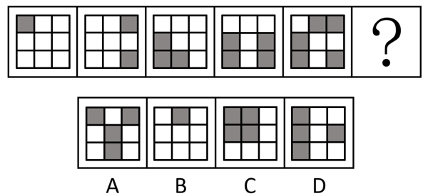

- **A**. A
- **B**. B
- **C**. C
- **D**. D　✅

**答案**：D

**官方解析**

元素组成不同，优先考虑属性规律。题干图形整体比较规整，优先考虑对称性。观察发现，题干图形均为轴对称图形，且对称轴依次逆时针旋转。故？处图形也应为轴对称图形，且对称轴为水平方向，只有D项符合。

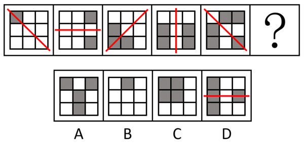

故正确答案为D。

---

#### 第 16 题　qid 16095270 · 图形推理

请从四个选项中选出最恰当的一项填入问号处，使题干图形呈现一定的规律性。

- **A**. A
- **B**. B　✅
- **C**. C
- **D**. D

**答案**：B

**官方解析**

元素组成不同，且每幅图均由小元素构成，优先考虑元素的种类和个数。观察发现，题干图形的元素个数依次为4、5、6、7、8，元素的种类数均为3，则？处图形的元素个数应为9，种类数应为3，排除A、D两项。继续观察发现，题干图形均有全开放小元素，排除C项。
故正确答案为B。

---

#### 第 17 题　qid 16095253 · 图形推理

请从四个选项中选出最恰当的一项填入问号处，使题干图形呈现一定的规律性。

- **A**. A
- **B**. B　✅
- **C**. C
- **D**. D

**答案**：B

**官方解析**

元素组成基本相同，题干每幅图形都是由直线和小白圆组成，考虑功能元素的标记作用。观察发现，小白圆只标记1条线，且若把每幅图的最外面那条线当作第1条线，那么小白圆依次标记在第1条线、第2条线、第3条线、第4条线、第5条线上，故？处图形中的小白圆应只标记在第6条线上，只有B项符合。
故正确答案为B。

---

#### 第 18 题　qid 16095263 · 图形推理

请从四个选项中选出最恰当的一项填入问号处，使题干图形呈现一定的规律性。

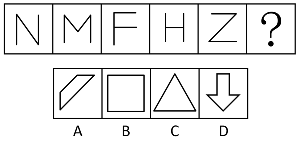

- **A**. A　✅
- **B**. B
- **C**. C
- **D**. D

**答案**：A

**官方解析**

元素组成不同，且属性规律没有答案，考虑数量规律。题干图形均由直线构成，考虑直线数，但整体数直线没有规律，继续观察发现，题干每幅图都仅有1组平行线，则？处图形也应仅有1组平行线，只有A项符合。

故正确答案为A。

---

#### 第 19 题　qid 12304867 · 图形推理

请从四个选项中选出最恰当的一项填入问号处，使题干图形呈现一定的规律性。

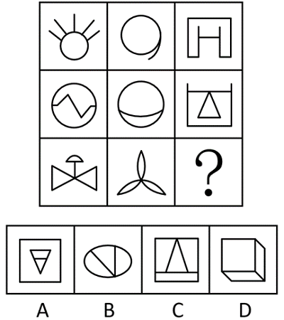

- **A**. A
- **B**. B
- **C**. C
- **D**. D　✅

**答案**：D

**官方解析**

元素组成不同，优先考虑属性规律。观察发现，题干出现全直线、全曲线图形，可以考虑曲直性。九宫格优先看横行，第一行图形分别为有曲有直图形、全曲线图形、全直线图形；经验证，第二行符合此规律；第三行应用此规律，故“？”处图形应是全直线图形，排除B项；继续观察发现，题干图形出现明显封闭空间，考虑面数量，第一行图形面数量均为1，第二行图形面数量均为2，第三行前两幅图形面数量均为3，故“？”处图形面数量应为3，排除C项；对比A、D两项，A项图形部分数为2，D项图形部分数为1，题干图形部分数均为1，只有D项符合。
故正确答案为D。

---

#### 第 20 题　qid 12304868 · 图形推理

请从四个选项中选出最恰当的一项填入问号处，使题干图形呈现一定的规律性。

- **A**. A
- **B**. B
- **C**. C　✅
- **D**. D

**答案**：C

**官方解析**

元素组成不同，优先考虑属性规律。观察发现，题干图形中黑白球整体较为规整，优先考虑对称性。九宫格优先看横行，第一行依次为斜轴对称图形、横轴对称图形和仅中心对称图形，经验证，第二行符合此规律，第三行应用此规律，故？处应为仅中心对称图形，排除B、D两项；继续观察发现，第一行每幅图形黑球的个数分别为6、8、10，经验证，第二行符合此规律，第三行应用规律，故？处图形黑球的个数应为10，只有C项符合。
故正确答案为C。

---

#### 第 21 题　qid 16095267 · 图形推理

下边四个图形中，只有一个是由上边的四个图形拼合（只能通过上、下、左、右平移）而成的，请把它找出来。

- **A**. A
- **B**. B　✅
- **C**. C
- **D**. D

**答案**：B

**官方解析**

本题考查平面拼合，可采用平行且等长相消的方式解题。消去平行且等长的线段后进行组合即可得到轮廓图，即为B项。平行且等长相消的方式如下图所示：

故正确答案为B。

---

#### 第 22 题　qid 16095271 · 图形推理

下边四个图形中，只有一个是由上边的四个图形拼合（只能通过上、下、左、右平移）而成的，请把它找出来。

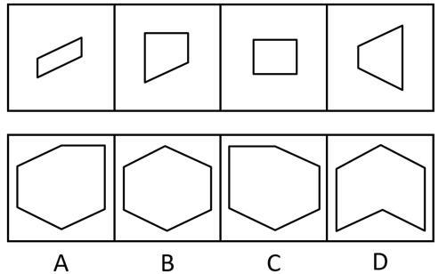

- **A**. A　✅
- **B**. B
- **C**. C
- **D**. D

**答案**：A

**官方解析**

本题考查平面拼合，可采用平行且等长相消的方式解题。消去平行且等长的线段后进行组合即可得到轮廓图，即为A项。平行且等长相消的方式如下图所示：

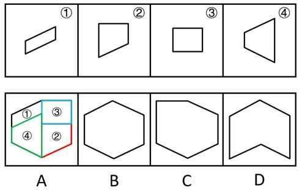

故正确答案为A。

---

#### 第 23 题　qid 16095258 · 图形推理

选项四个图形中，只有一个是由题干的四个图形拼合（只能通过上、下、左、右平移）而成的，请把它找出来。

- **A**. A
- **B**. B　✅
- **C**. C
- **D**. D

**答案**：B

**官方解析**

本题考查平面拼合，可采用平行且等长相消的方法解题。消去平行且等长的线段后进行组合可得到轮廓图，即为B项。平行且等长相消的方式如下图所示。

故正确答案为B。

---

#### 第 24 题　qid 16095266 · 图形推理

下边四个图形中，只有一个是由上边的四个图形拼合（只能通过上、下、左、右平移）而成的，请把它找出来。

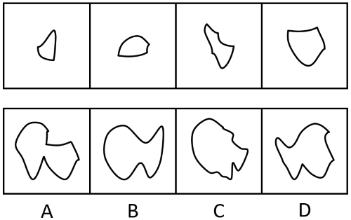

- **A**. A
- **B**. B　✅
- **C**. C
- **D**. D

**答案**：B

**官方解析**

本题考查平面拼合，消去弯曲程度一致且等长的曲线后进行拼合，即可得到轮廓图，即为B项。具体拼合方式如下图所示：

故正确答案为B。

---

#### 第 25 题　qid 12304870 · 图形推理

左边图形恰好可以分割为右边的某三个图形（可以平移、旋转，但不可翻转），请找出不属于分割所得的图形。

- **A**. A
- **B**. B
- **C**. C　✅
- **D**. D

**答案**：C

**官方解析**

本题考查平面拼合，可采用平行且等长相消的方式解题。A项、B项与D项消去平行且等长的线段后进行组合即可得到题干轮廓图。平行且等长相消的方式如下图所示：

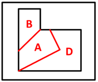

本题为选非题，故正确答案为C。

---

#### 第 26 题　qid 16095261 · 图形推理

左边给定的是六面体的外表面展开图，右边哪一项能由它折叠而成？

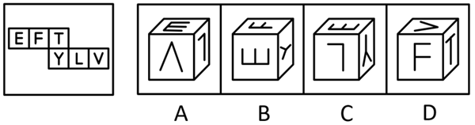

- **A**. A
- **B**. B
- **C**. C　✅
- **D**. D

**答案**：C

**官方解析**

本题考查空间重构，逐一分析选项。

A项：选项由E面、L面与V面构成，题干展开图中E面字母的开口对着F面，而选项中E面字母的开口对着L面，选项与题干展开图不一致，排除；

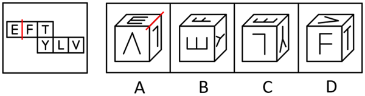

B项：选项由E面、F面与Y面构成，题干展开图中Y面字母的小开口对着T面，而选项中Y面字母的小开口对着E面，选项与题干展开图不一致，排除；

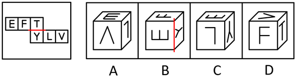

C项：选项由E面、Y面与L面构成，选项与题干展开图一致，当选；

D项：选项由F面、T面与V面构成，题干展开图中V面字母的开口对着T面，而选项中V面字母的尖角对着T面，选项与题干展开图不一致，排除。

故正确答案为C。

---

#### 第 27 题　qid 12304871 · 图形推理

下列是四个正方体的外表面展开图，其中哪个展开图还原成正方体后，存在有同一个公共顶点的三个面，且其上的数字之和为8？

- **A**. A
- **B**. B　✅
- **C**. C
- **D**. D

**答案**：B

**官方解析**

观察发现，选项展开图的六个面中出现的数字均分别为1-6，若想在1-6中选出3个数字相加刚好是8，只有两种情况：①面1、面2和面5两两相邻；②面1、面3和面4两两相邻。逐一分析选项：

A项：面1和面4为相对面，故面1、面3和面4无法两两相邻；面2和面5为相对面，故面1、面2和面5无法两两相邻。两种情况均不符合要求，排除；

B项：面1、面2和面5两两相邻，存在同一个公共顶点（如下图所示），且其上的数字之和为8，满足要求，当选；

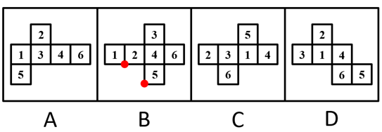

C项：面3和面4为相对面，故面1、面3和面4无法两两相邻；面1和面2为相对面，故面1、面2和面5无法两两相邻。两种情况均不符合要求，排除；

D项：面3和面4为相对面，故面1、面3和面4无法两两相邻；面1和面5为相对面，故面1、面2和面5无法两两相邻。两种情况均不符合要求，排除。

故正确答案为B。

---

#### 第 28 题　qid 16095252 · 图形推理

将下列三棱锥的展开图还原成三棱锥后，有一个与其他三个不一样，请把它找出来。

- **A**. A
- **B**. B
- **C**. C
- **D**. D　✅

**答案**：D

**官方解析**

本题考查空间重构。在选项展开图中，以只有两个扇形的面上的空白顶点作为起始点，进行顺时针画边，如下图所示，逐一分析选项。

A项：选项中右边两个面为图案一样的面，边1不挨着其中任意一个面中的小扇形。

B项：选项中最左边和最右边两个面为图案一样的面，边1不挨着其中任意一个面中的小扇形。

C项：选项中最上边和左下边为图案一样的面，边1不挨着其中任意一个面中的小扇形。

D项：选项中最上边和右下边为图案一样的面，边1与最上边面中的小扇形有公共点。

本题为选非题，故正确答案为D。

---

#### 第 29 题　qid 12304861 · 图形推理

左图是由14个黑白小正方体组成的立体图形，右面四个选项中有一项不是该立体图形的视图，请把它找出来。

- **A**. A　✅
- **B**. B
- **C**. C
- **D**. D

**答案**：A

**官方解析**

本题考查三视图。

A项：该项不是该立体图形的视图，若为轮廓一致的主视图，应如下图所示，当选；

B项：从上往下可以看到，为俯视图，排除；

C项：从左往右可以看到，为左视图，排除；

D项：从后往前可以看到，为后视图，排除。

本题为选非题，故正确答案为A。

---

#### 第 30 题　qid 12304865 · 逻辑判断

一只鸟除非两翼健壮并以共同的力量来推动身体，否则它不能飞向天空。根据以上陈述，可以推出以下哪些结论？
①一只鸟如果两翼健壮并以共同的力量来推动身体，那么它能够飞向天空
②一只鸟如果能够飞向天空，那么它两翼健壮并以共同的力量来推动身体
③一只鸟若两翼不健壮或不能以共同的力量来推动身体，那么它不能飞向天空
④一只鸟如果不能飞向天空，那么它两翼不健壮或不能以共同力量来推动身体

- **A**. ①②
- **B**. ②③　✅
- **C**. ③④
- **D**. ②④

**答案**：B

**官方解析**

第一步：翻译题干。

题干翻译为：飞向天空两翼健壮 且 以共同的力量来推动身体。

第二步：逐一分析选项。

①翻译为：两翼健壮 且 以共同的力量来推动身体飞向天空，是对题干逻辑关系的肯后，肯后无必然结论，无法推出；

②翻译为：飞向天空两翼健壮 且 以共同的力量来推动身体，是对题干逻辑关系的肯前，肯前必肯后，可以推出；

③翻译为：两翼健壮 或 以共同的力量来推动身体飞向天空，是对题干逻辑关系的否后，否后必否前，可以推出；

④翻译为：飞向天空两翼健壮 或 以共同的力量来推动身体，是对题干逻辑关系的否前，否前无必然结论，无法推出。

综上所述，②③可以推出，对应B项。

故正确答案为B。

---

#### 第 31 题　qid 12304860 · 逻辑判断

古代战场，两军对峙。攻方统帅召集将军商讨破敌之策，甲、乙、丙三位将军意见如下：
甲：正面攻敌和烧敌粮草都要实施；
乙：或者不烧敌粮草，或者侧面奇袭；
丙：或者正面攻敌和烧敌粮草不都实施，或者实施侧面奇袭。
最终只有一位将军的意见被统帅采纳。
根据以上陈述，攻方采取的行动中不可能包含以下哪项？

- **A**. 实施烧敌粮草
- **B**. 实施侧面奇袭　✅
- **C**. 实施正面攻敌
- **D**. 不实施正面攻敌

**答案**：B

**官方解析**

第一步：分析题干条件。

（1）甲：正面攻敌 且 烧敌粮草；

（2）乙：烧敌粮草 或 侧面奇袭；

（3）丙：（正面攻敌 或 烧敌粮草） 或 侧面奇袭。

第二步：根据题干条件进行推理。

提问为“不可能”，优先采用代入法。

代入A项：甲的意见可能被采纳，乙、丙的意见可能不被采纳，有符合题干要求“只有一位将军的意见被统帅采纳”的可能，排除；

代入B项：乙和丙的意见均被采纳，不符合题干要求“只有一位将军的意见被统帅采纳”，当选；

代入C项：甲的意见可能被采纳，乙、丙的意见可能不被采纳，有符合题干要求“只有一位将军的意见被统帅采纳”的可能，排除；

代入D项：甲的意见没被采纳，丙的意见被采纳，乙的意见可能不被采纳，有符合题干要求“只有一位将军的意见被统帅采纳”的可能，排除。

本题为选非题，故正确答案为B。

---

#### 第 32 题　qid 12304864 · 逻辑判断

大学通常是一个城市重要的文化中心，很多人期待大学校园能够向公众开放，让公众感受城市的文化氛围。然而，有些高校管理者认为，大学是高校师生学习研究的主要场所。如果向公众开放，很多人会涌入校园，破坏学校的教学科研秩序。
以下哪项如果为真，最能削弱上述高校管理者的观点？

- **A**. 只要加强校园精细化管理，即使打开校门也能有效避免因开放带来的问题　✅
- **B**. 有不少大学是没有围墙的，这些学校的教学科研秩序并未受到明显的影响
- **C**. 大学只有开放，与外界共享文化资源才能发挥文化引领、服务社会的功能
- **D**. 许多人进入校园不仅想感受文化氛围，更想进入图书馆阅读或到教室听课

**答案**：A

**官方解析**

第一步：找出论点和论据。
论点：大学是高校师生学习研究的主要场所。如果向公众开放，很多人会涌入校园，破坏学校的教学科研秩序。
论据：无。
本题只有论点没有论据，削弱优先考虑削弱论点。
第二步：逐一分析选项。
A项：指出加强精细化管理就能有效避免开放校园带来的问题，说明开放不会破坏教学科研秩序，削弱论点，保留；
B项：指出不少大学没有围墙，教学科研秩序也没有受到明显的影响，没有围墙说明这些学校是向公众开放的，举反例说明开放不会破坏教学科研秩序，削弱论点，保留；
C项：指出开放大学校园的好处，并未提及开放校园是否会破坏教学科研秩序，话题不一致，无法削弱，排除；
D项：指出许多人想进入校园的原因，并未提及开放校园是否会破坏教学科研秩序，话题不一致，无法削弱，排除。
对比A、B两项，A项是整体性削弱，B项是部分削弱，A项的削弱力度大于B项，A项当选。
故正确答案为A。

---

#### 第 33 题　qid 12304869 · 逻辑判断

疫苗的作用原理是通过刺激免疫系统制造保护性抗体，以抵御未来的感染。传统疫苗的生产需要大规模细胞培养，但当流行性疫病爆发时，资源密集型生产方式限制了疫苗应对疫情的及时性和有效性。因此，亟需研究人员开发独立于细胞培养的疫苗生产技术，以应对可能爆发的大规模流行性疫病。
以下哪项不是上述论证成立所必需的假设？

- **A**. 开发疫苗是人类防御流行性疫病的有效手段之一
- **B**. 需要大规模细胞培养的疫苗技术都是资源密集型的
- **C**. 资源密集型生产中的不确定因素会影响疫苗研发的速度与质量
- **D**. 独立于细胞培养技术生产的疫苗不需要刺激免疫系统制造保护性抗体　✅

**答案**：D

**官方解析**

第一步：找出论点和论据。
论点：亟需研究人员开发独立于细胞培养的疫苗生产技术，以应对可能爆发的大规模流行性疫病。
论据：传统疫苗的生产需要大规模细胞培养，但当流行性疫病爆发时，资源密集型生产方式限制了疫苗应对疫情的及时性和有效性。
本题为选非题，找出论证成立必需的假设排除即可。
第二步：逐一分析选项。
A项：该项是说开发疫苗是人类防御流行性疫病的有效手段之一，如果选项不成立，那么开发疫苗包括独立于细胞培养的疫苗生产技术，是无法应对可能爆发的大规模流行性疫病的，即选项不成立论点也不成立，是论证成立必需的假设，排除；
B项：该项是说需要大规模细胞培养的疫苗技术都是资源密集型的，如果选项不成立，那么需要大规模细胞培养的传统疫苗生产方式就可能不是资源密集型的，也就不会受限，因此也就没有必要去开发独立于细胞培养的疫苗生产技术，选项不成立论点也不成立，是论证成立必需的假设，排除；
C项：该项是说资源密集型生产中的不确定因素会影响疫苗研发的速度与质量，如果选项不成立，那么传统疫苗生产方式就不会受限，因此也就没有必要去开发独立于细胞培养的疫苗生产技术，选项不成立论点也不成立，是论证成立必需的假设，排除；
D项：该项是说独立于细胞培养技术生产的疫苗不需要刺激免疫系统制造保护性抗体，其中“刺激免疫系统制造保护性抗体”是疫苗的作用原理，题干论证是通过生产工艺受限得出开发独立于细胞培养的疫苗生产技术的论点，作用原理与生产技术话题不一致，不是论证成立必需的假设，当选。
本题为选非题，故正确答案为D。

---

#### 第 34 题　qid 12304873 · 逻辑判断

卖早点、修家电、配钥匙·····老百姓家门口的社区商业，是以社区居民为服务对象、服务半径为步行15分钟左右范围内的商业形态。近年来，许多城市大力推进社区商业建设，以更好地满足居民的消费需求。不过，也有专家担忧，家门口商业服务的完善，在给居民生活带来便利的同时可能也会使快递业逐步萎缩。
以下哪项如果为真，最能缓解上述专家的担忧？

- **A**. 为了方便居民，很多城市推进社区商业建设时，都将快递驿站作为社区商业的重要组成部分
- **B**. 社区商业主要提供汽车保养、幼儿托管等服务类业态，社区购物在居民整体购物消费中占比很少　✅
- **C**. 社会经济发展必然包含新旧行业的更迭，社区商业作为新的消费增长点，吸纳了大量传统行业的劳动者就业
- **D**. 许多大型商超组建了自己的配送车队，可为周边5公里范围内居民提供商品一小时送达服务

**答案**：B

**官方解析**

第一步：找出论点和论据。
论点：家门口商业服务的完善，在给居民生活带来便利的同时可能也会使快递业逐步萎缩。
论据：无。
本题提问为“缓解上述专家的担忧”即削弱上述专家的担忧，且只有论点没有论据，削弱优先考虑削弱论点，即说明家门口商业服务的完善不会使快递业逐步萎缩。
第二步：逐一分析选项。
A项：该项说的是很多城市将快递驿站作为社区商业的重要组成部分，说明家门口商业服务完善后快递驿站依然很重要，可能不会使快递业逐步萎缩，削弱论点，可以削弱，保留；
B项：该项说的是社区购物在居民整体购物消费中占比很少，说明社区商业的建设对居民原有的购物方式影响不大，也就不会使快递业逐步萎缩，削弱论点，可以削弱，保留；
C项：该项说的是社区商业吸纳了大量传统行业的劳动者就业，是在说社区商业促进了就业，并未提及对快递业的影响，为无关项，无法削弱，排除；
D项：该项说的是许多大型商超提供限时配送服务，大型商超不属于社区商业，提供的配送服务不属于快递业，为无关项，无法削弱，排除。
对比A、B两项，A项说的是快递驿站的重要性，但是快递驿站重要并不能明确说明快递业的情况，而B项明确说明了对居民原有的购物方式影响不大，即不会对快递业有影响，综合对比，B项比A项更加明确，因此优选B项。
故正确答案为B。

---

#### 第 35 题　qid 17900750 · 逻辑判断

某高校准备进行青年大学生宣传活动。拟从张、王、李3位男士和赵、陈、丁3位女士中挑出3人组成宣讲小组，要求既要有男性又要有女性。已知：
（1）若选张，则也选陈；
（2）王、李之中至多选1人；
（3）赵、丁之中至少选1人。
根据上述信息，不能推出以下哪项？

- **A**. 陈、丁之中至少选1人
- **B**. 张、王之中至多选1人
- **C**. 赵、陈之中至少选1人
- **D**. 李、赵之中至多选1人　✅

**答案**：D

**官方解析**

第一步：分析题干条件。

（1）张（男）陈（女）；

（2）王（男） 或 李（男）；

（3）赵（女） 或 丁（女）；

（4）6人中选3人，既要有男性又要有女性。

第二步：根据题干条件进行推理。

提问方式为“不能推出”，优先考虑代入法。

选项不是确定信息，且涉及“至少”“至多”，可以考虑反向代入，即否定选项后代入题干条件，若与题干矛盾，则说明该项成立，若满足题干条件，则说明该项不成立。

A项：假设A项不成立，即（陈 或 丁），等价于陈 且 丁，根据条件（4）可以推出赵入选；根据条件（1）可知“陈张”，可以推出张不入选，此时为满足条件（4）6人中选3人，王、李均入选，但与条件（2）矛盾，假设不成立，故该项为真，排除。

B项：假设B项不成立，即张 且 王，根据条件（1）可知“张陈”，此时已满足条件（4）6人中选3人，则其余李、赵、丁均未入选，与条件（3）矛盾，假设不成立，故该项为真，排除。

C项：假设C项不成立，即（赵 或 陈），等价于赵 且 陈，根据条件（4）可以推出丁入选；根据条件（1）可知“陈张”，可以推出张不入选，此时为满足条件（4）6人中选3人，王、李均入选，与条件（2）矛盾，假设不成立，故该项为真，排除。

D项：假设D项不成立，即李 且 赵，根据条件（2）可以推出王不入选，根据条件（1）可知，若张入选，则陈也入选，此时入选4人，不满足条件（4），故张不入选，陈、丁中任意一位入选均满足题干条件，即假设成立，故该项为假，当选。

本题为选非题，故正确答案为D。

---

#### 第 36 题　qid 12304874 · 逻辑判断

一项研究发现，成年小白鼠去除一个关键生物钟基因后，昼夜节律完全消失，虽然生活质量有所下降，但寿命并未受到显著影响，心血管健康状况甚至有所改善。据此，研究人员推断昼夜节律缺失对健康的危害可能没有我们想象得那么大。
回答以下哪个问题最有助于评价上述研究人员所做出的推断？

- **A**. 成年小白鼠去除生物钟基因后出现的心血管情况改善是否会延长小白鼠的寿命
- **B**. 成年小白鼠去除生物钟基因之后的休息时间是否与未去除之前的休息时间相同
- **C**. 成年小白鼠去除生物钟基因后的寿命和心血管健康状况能否代表整体健康状况　✅
- **D**. 成年小白鼠去除生物钟基因之后的生活质量是否会影响小白鼠的整体健康状况

**答案**：C

**官方解析**

第一步：找出论点和论据。
论点：昼夜节律缺失对健康的危害可能没有我们想象得那么大。
论据：成年小白鼠去除一个关键生物钟基因后，昼夜节律完全消失，虽然生活质量有所下降，但寿命并未受到显著影响，心血管健康状况甚至有所改善。
本题论点讨论的是“昼夜节律缺失”和“整体健康状况”之间的关系，论据讨论的是“昼夜节律缺失”和“寿命、心血管健康状况”之间的关系，二者话题不一致，且提问方式为“最有助于”评价研究人员的推断，可以考虑搭桥，即建立“寿命、心血管健康状况”与“整体健康状况”之间的关系。
第二步：逐一分析选项。
A项：该项讨论的是“心血管健康状况”与“寿命”之间的关系，而不是“寿命、心血管健康状况”与“整体健康状况”之间的关系，即使心血管状况改善能够延长寿命，仍无法得知整体健康状况如何，无助于评价研究人员的推断，排除；
B项：该项讨论的是“去除生物钟基因前后的休息时间”，论点说的是“昼夜节律缺失”和“整体健康状况”的关系，话题不一致，无助于评价研究人员的推断，排除；
C项：该项讨论的是“寿命、心血管健康状况”与“整体健康状况”之间的关系，如果寿命和心血管健康状况能代表整体健康状况，则说明研究人员的推断成立，有助于评价研究人员的推断，当选；
D项：该项讨论的是“生活质量”与“整体健康状况”之间的关系，但研究人员是通过“寿命”与“心血管健康状况”得出的论点，不如C项更有助于评价研究人员的推断，排除。
故正确答案为C。

---

#### 第 37 题　qid 12304862 · 逻辑判断

宋朝以前，中国人的烹饪方式主要是蒸、煮、烤。到了宋朝，炒菜开始大行其道。宋朝为什么流行炒菜？学界有三种解释：“铁锅论”者认为，铁锅始现于宋朝，有了铁锅才能炒菜；“劈柴论”者认为，蒸煮比煎炒耗费更多的劈柴，宋朝劈柴较稀缺，老百姓只好改蒸煮为煎炒；“植物油论”者认为，宋朝植物油供应充足，用植物油炒菜才流行起来。
以下哪项如果为真，最能支持“植物油论”者的观点？

- **A**. 早在战国时期，既能煮菜又能炒菜的铁锅就已经出现，传至宋朝并不奇怪
- **B**. 烧烤比蒸煮更耗费燃料，但宋朝人除了偏好炒菜之外也非常热衷于烧烤
- **C**. 南北朝时期著名典籍《齐民要术》中已载有胡麻油等植物油的榨取方法
- **D**. 宋朝的榨油工艺已经成熟，原材料种植面积大幅增加，植物油价格下降　✅

**答案**：D

**官方解析**

第一步：找出论点和论据。
论点：宋朝植物油供应充足，用植物油炒菜才流行起来。
论据：无。
本题只有论点没有论据，加强优先考虑补充论据，即解释原因或举例子。
第二步：逐一分析选项。
A项：该项讨论的是铁锅早在战国时期就已经出现，传至宋朝并不奇怪，而论点讨论的是宋朝植物油供应充足，用植物油炒菜才流行起来，话题不一致，无法加强，排除；
B项：该项讨论的是烧烤比蒸煮更费燃料，且宋朝人也热衷于烧烤，而论点讨论的是宋朝植物油供应充足，用植物油炒菜才流行起来，话题不一致，无法加强，排除；
C项：该项讨论的是南北朝时期就已记载植物油的榨取方法，出现不代表普及，也不代表供应充足，无法判断宋朝植物油的情况，为不明确项，无法加强，排除；
D项：该项讨论的是宋朝榨油工艺已成熟，且原材料种植面积增加，植物油价格下降，解释了为什么宋朝植物油供应充足，补充论据，可以加强，当选。
故正确答案为D。

---

#### 第 38 题　qid 12304863 · 逻辑判断

某车间共有18人，他们分别来自山东、江苏、浙江、安徽和福建5省。在18人中，每省至少有1人，且来自各省的人数均不相同。已知：
来自山东和江苏的共有5人；
来自江苏和浙江的共有6人；
来自浙江和福建的共有7人；
根据上述信息，可以推出以下哪项？

- **A**. 18人中来自山东的有1人
- **B**. 18人中来自浙江的有2人
- **C**. 18人中来自福建的有5人
- **D**. 18人中来自安徽的有6人　✅

**答案**：D

**官方解析**

第一步：分析题干条件。
（1）山东+江苏=5；
（2）江苏+浙江=6；
（3）浙江+福建=7；
（4）山东+江苏+浙江+安徽+福建=18；
（5）在18人中，每省至少有1人，且来自各省的人数均不相同。
第二步：根据题干条件进行推理。
将条件（1）和（3）相加可得条件（6）：山东+江苏+浙江+福建=12。
再用条件（4）与条件（6）相减可得：安徽=6，对应D项。
故正确答案为D。

---

#### 第 39 题　qid 16095269 · 逻辑判断

评价某份试卷中的试题质量通常有难度和区分度等指标，一道单选题的难度通常用正确选择试题答案的人数与参加测验的总人数的比值来表示。区分度指的是试题对考生实际水平的区分程度和区分的有效性，一道单选题的区分度指数D的计算公式为：，其中为高分组（试卷总得分排在前27%的考生）该题的难度，为低分组（试卷总得分排在后27%的考生）该题的难度。

根据以上陈述，可以推出以下哪项？

- **A**. 一道难度为1的单选题区分度指数为0.1
- **B**. 任一单选题的区分度指数不可能为负值
- **C**. 一道难度为0.27的单选题的最大区分度指数为0.5
- **D**. 一道单选题的难度也可以表示为该题的平均得分与该题分值的比值　✅

**答案**：D

**官方解析**

日常结论题，根据题干信息逐一分析选项。

A项：若一道单选题的难度为1，意味着参加测验的所有人都答对了，则高分组和低分组的人都答对了，说明高分组该题的难度，低分组该题的难度，则区分度指数D=0，而不是0.1，该项表述错误，排除；

B项：若有一道题高分组答对的人数少于低分组，此时高分组该题的难度小于低分组该题的难度，即，则这道题的区分度指数D为负数，该项表述错误，排除；

C项：若一道单选题的难度为0.27，说明正确选择试题答案的人数与参加测验的总人数的比值为0.27，假设参加测验的总人数为100人，则正确选择试题答案的人数为27人，并且此时高分组与低分组均各有27人，如果想要计算最大区分度指数，则需要使的值尽可能大，即尽可能取最大值，同时尽可能取最小值，即需要使正确选择试题答案的27人均属于高分组，即，同时，低分组全部答错，即，则此时这道题的最大区分度指数，而不是0.5，该项表述错误，排除；

D项：，该项表述正确，当选。

故正确答案为D。

---

#### 第 40 题　qid 16095272 · 类比推理

甲：小明十岁就能用英语与英国人流利对话，语言天赋真是出类拔萃。
乙：小明跟着父母在英国住了两年，能流利对话不足为奇。
以下哪项与题干对话方式最为相似？

- **A**. 
甲：这款热水器的价格比市面上常见的热水器高出一倍，太不划算了

乙：这款产品用的是航天级别的材料，在同材质热水器中性价比很高
　✅
- **B**. 
甲：小李以前容易冲动，进入职场一年后稳重多了

乙：小李承担了单位大量重要工作，变得稳重一点理所当然

- **C**. 
甲：小张的数学一直很好，进入高中后，物理、化学等科目的学习很轻松

乙：数学强调科学思维，掌握科学思维的人学习物理、化学当然没有难度

- **D**. 
甲：小刘在过去的一年中连续犯下三起盗窃案，真是无可救药

乙：人非圣贤，孰能无过，相信在经过改造之后他会洗心革面

**答案**：A

**官方解析**

第一步：分析题干逻辑关系。
甲根据“小明十岁就能用英语与英国人流利对话”的现象，得出“小明的语言天赋出类拔萃”的结论，而乙提出“小明跟着父母在英国住了两年”的理由来解释现象，用“能流利对话不足为奇”来否定甲的结论。
第二步：逐一分析选项。
A项：甲根据“这款热水器的价格比市面上常见的热水器高出一倍”的现象，得出“这款热水器不划算”的结论，乙提出“这款产品用的是航天级别的材料”的理由来解释现象，用“在同材质热水器中性价比很高”来否定甲的结论，与题干对话方式一致，当选；
B项：甲提出“小李以前容易冲动，进入职场一年后稳重多了”的结论，乙提出“小李承担了单位大量重要工作，变得稳重一点理所当然”的理由来解释甲的结论，与题干对话方式不一致，排除；
C项：甲提出“小张的数学一直很好，进入高中后，物理、化学等科目的学习很轻松”的结论，乙提出“数学强调科学思维，掌握科学思维的人学习物理、化学当然没有难度”的理由来解释甲的结论，与题干对话方式不一致，排除；
D项：甲根据“小刘在过去的一年中连续犯下三起盗窃案”的现象，得出“小刘无可救药”的结论，乙得出的观点“相信在经过改造之后小刘会洗心革面”是一种预测，而非事实，用预测否定甲的结论，与题干对话方式不一致，排除。
故正确答案为A。

---

#### 第 41 题　qid 16095255 · 定义判断

温情执法：指执法人员在依法查处违法行为的过程中，综合考量各种特殊因素，对违法者进行灵活处置以体现法治温度的执法行为。
下列不属于温情执法的是：

- **A**. 冬天，许多菜农在路边叫卖，给城市交通卫生带来了挑战。区城管部门调研后划出28个覆盖全区的固定销售点，与菜农签订“摊前三包”协议，菜农卖得更安心了，城市面貌大有改观　✅
- **B**. 民警发现电信诈骗嫌疑人王某潜回家中后迅速抓捕。当时，王某刚把4岁女儿从幼儿园接回家。民警为避免小女孩受惊，迅速收起警察证和手铐。以吃饭为名把王某带了出去
- **C**. 交警小周在公路上进行安全巡逻时，发现一辆电动三轮车严重超员。处罚过程中得知因为老人突然生病，全家人带他到县城治疗，小周用警车把他们送到医院
- **D**. 某县卫生健康执法人员在查处无证行医过程中，发现郑某正在出租屋行医。得知小诊所是他家最主要的经济来源，郑某已考取职业资格证书，县卫生部门协助他办理了医生执业证书和执业许可证

**答案**：A

**官方解析**

第一步：找出定义关键词。
“执法人员”、“在依法查处违法行为的过程中”、“对违法者进行灵活处置以体现法治温度”。
第二步：逐一分析选项。
A项：区城管部门所做的工作是“调研后划出28个覆盖全区的固定销售点，与菜农签订‘摊前三包’协议”，并非查处违法行为，不符合“在依法查处违法行为的过程中”，不符合定义，当选；
B项：民警抓捕诈骗嫌疑人王某，符合“执法人员”、“在依法查处违法行为的过程中”，为避免小女孩受惊，民警迅速收起警察证和手铐，以吃饭为名把王某带了出去，符合“对违法者进行灵活处置以体现法治温度”，符合定义，排除；
C项：交警小周在巡逻时处罚电动三轮车严重超员行为，符合“执法人员”、“在依法查处违法行为的过程中”，小周得知超员的原因是老人突然生病，便用警车把他们送到医院，符合“对违法者进行灵活处置以体现法治温度”，符合定义，排除；
D项：卫生健康执法人员在查处无证行医过程中，符合“执法人员”、“在依法查处违法行为的过程中”，得知郑某的难处，县卫生部门协助他办理了医生执业证书和执业许可证，符合“对违法者进行灵活处置以体现法治温度”，符合定义，排除。
本题为选非题，故正确答案为A。

---

#### 第 42 题　qid 16095264 · 定义判断

选择支持效应：指人们做出某一选择后，就会找出多种理由来证明它的正确性，并排斥其他可能选择的现象。
下列属于选择支持效应的是：

- **A**. 孔女士周末喜欢开车带小孩到周边景点亲子游，每次总会带上同事朱女士的女儿。她认为两人是朋友，这样的活动既可以开阔孩子视野，又可以密切两家关系。朱女士偶尔也会一同去
- **B**. 钱先生的餐馆开业后，顾客首次进店消费享受8折优惠，第二次以后7折优惠。家人都担心会亏本，他却坚信只要有了回头客，生意一定会越来越好
- **C**. 曹女士常常到小商店买日用品，觉得既省钱又省心。儿子发现她刚买的运动鞋几天就穿坏了，劝她到商场买品牌运动鞋，她不以为然，认为这鞋便宜，穿着又很舒服，自己身体硬朗，不会出什么事儿　✅
- **D**. 某野生动物园为了保护自然生态及游客安全，分片区建了许多防护围栏，有网友抱怨：“参观这个动物园要走不少冤枉路”。景区很快就规划出最佳游览线路图并在园内各处作了醒目“标记”

**答案**：C

**官方解析**

第一步：找出定义关键词。
“人们做出某一选择后”、“会找出多种理由来证明它的正确性”、“排斥其他可能选择”。
第二步：逐一分析选项。
A项：孔女士周末喜欢开车带小孩到周边景点亲子游，每次总会带上同事朱女士的女儿，符合“人们做出某一选择后”，孔女士认为两人是朋友，这样的活动既可以开阔孩子视野，又可以密切两家关系，符合“会找出多种理由来证明它的正确性”，但并没有体现“排斥其他可能选择”，不符合定义，排除；
B项：钱先生的餐馆开业后，采取了一些优惠措施，符合“人们做出某一选择后”，钱先生坚信只要有了回头客，生意就会越来越好，只体现了“有回头客”这一种理由，不符合“会找出多种理由来证明它的正确性”，不符合定义，排除；
C项：曹女士常常到小商店买日用品，符合“人们做出某一选择后”，她认为小商店买的运动鞋便宜，穿着又很舒服，自己身体硬朗，不会出什么事儿，符合“会找出多种理由来证明它的正确性”，儿子劝曹女士到商场买品牌运动鞋，她不以为然，符合“排斥其他可能选择”，符合定义，当选；
D项：某野生动物园分片区建了许多防护围栏，符合“人们做出某一选择后”，有网友抱怨动物园的缺点，景区很快就做出改进，不符合“排斥其他可能选择”，不符合定义，排除。
故正确答案为C。

---

#### 第 43 题　qid 16095268 · 定义判断

迭代学习：指学习者通过不间断的目标训练，更好地理解学习内容，不断提升技能完善自身能力的学习方式。
下列不属于迭代学习的是：

- **A**. 小周参加专业技能大赛，实操环节丢了不少分，他不断强化训练，再次参加就获得了二等奖。又经过一年训练，综合技能有了显著提高，自己也十分自信
- **B**. 学习者要熟练掌握数学运算需经历数年大致相同的过程，先是加减法，之后是乘除法，接下来是混合运算，逐渐进入更高阶的运算
- **C**. 李教授经常深入社区举办科普讲座，最初因为专业性过强，听众很少，后来引入了市民关注的鲜活案例，听众越来越多；最近又融入了不少优秀传统文化元素，感染力越来越强
- **D**. 多家公司推出了各自的AI自然语言处理模型，有的只能与人进行简单对话，有的能在收到指令后几秒钟内交出一份质量不错的作业，有些已经能够针对各种问题给出比较专业的建议　✅

**答案**：D

**官方解析**

第一步：找出定义关键词。
“学习者”、“通过不间断的目标训练”、“更好地理解学习内容，不断提升技能完善自身能力”。
第二步：逐一分析选项。
A项：小周通过不断强化训练，从一开始参加专业技能大赛的实操环节丢不少分，到再次参加获得二等奖，到最后综合技能显著提高，符合“学习者”、“通过不间断的目标训练”、“更好地理解学习内容，不断提升技能完善自身能力”，符合定义，排除；
B项：学习者通过不断的学习，掌握的数学运算从一开始的加减法、乘除法到混合运算，到最后进入更高阶的运算，符合“学习者”、“通过不间断的目标训练”、“更好地理解学习内容，不断提升技能完善自身能力”，符合定义，排除；
C项：李教授的科普讲座从一开始的专业性强、听众少到引入市民关注的案例后听众越来越多，到最后融入文化元素、感染力越来越强，符合“学习者”、“通过不间断的目标训练”、“更好地理解学习内容，不断提升技能完善自身能力”，符合定义，排除；
D项：多家公司推出各自的AI自然语言处理模型，有的只能简单与人对话，有的能写作业，有的已能给出比较专业的建议，这些是不同AI对于自然语言处理的不同结果，并没有体现AI不间断学习的过程，不符合“学习者”、“通过不间断的目标训练”、“更好地理解学习内容，不断提升技能完善自身能力”，不符合定义，当选。
本题为选非题，故正确答案为D。

---

#### 第 44 题　qid 16095273 · 定义判断

消费者教育：指通过有计划的宣传或培训，引导民众更新消费观念，掌握消费技能，培养消费习惯，使其形成产品购买的合理预期。
下列属于消费者教育的是：

- **A**. 丁先生根据亲身经历写出了一份新疆自驾游的攻略，包括具体线路、沿途景点门票、酒店、美食等，还推荐了几个口碑很好的当地导游，发布到了多家网站上，大批网友经过验证后给予了好评
- **B**. 某网站的帖子图文并茂地分析了各种榨汁机、豆浆机、养生壶、料理机的优缺点，推荐了一款黑科技“破壁机”，详细介绍了它的材质、功能、操作方法以及明星的使用体验，最后还附上了商家的二维码　✅
- **C**. 某购物网站邀请网络写手连载长篇小说，让员工发动亲朋好友评论转发，大批粉丝追更到凌晨，网站贴心地附上了缓解眼睛疲劳的新产品供大家免费试用，两三个月后，访问量和营业额都有了显著提高
- **D**. 某知名品牌菜刀拍蒜后刀身断裂的视频在多个社交网站引发网友吐槽，厂家回应称视频中的菜刀属于高科技新品，硬度高，材质脆，受横向冲击时容易断裂，不适合拍蒜

**答案**：B

**官方解析**

第一步：找出定义关键词。
“有计划的宣传或培训”、“引导民众更新消费观念，掌握消费技能，培养消费习惯”、“形成产品购买的合理预期”。
第二步：逐一分析选项。
A项：丁先生写出新疆自驾游攻略，目的是为了方便大家更便捷的出游，并非为了引导民众更新消费观念，不符合“引导民众更新消费观念，掌握消费技能，培养消费习惯”，不符合定义，排除；
B项：某网站分析了一些小家电的优缺点，让消费者了解相关产品的不同性能，符合“有计划的宣传或培训”，其中推荐了一款“破壁机”，并附上商家的二维码，目的是为了让消费者选择购买，符合“引导民众更新消费观念，掌握消费技能，培养消费习惯”、“形成产品购买的合理预期”，符合定义，当选；
C项：某购物网站邀请网络写手连载长篇小说，并为熬夜追更的粉丝免费提供缓解眼睛疲劳的新产品，目的是为了提高网站的访问量和营业额，并非为了引导民众更新消费观念，不符合“引导民众更新消费观念，掌握消费技能，培养消费习惯”，不符合定义，排除；
D项：厂家对菜刀质量问题的回应，目的是为了解释菜刀因拍蒜而刀身断裂的原因，并非为了引导民众更新消费观念，不符合“引导民众更新消费观念，掌握消费技能，培养消费习惯”，不符合定义，排除。
故正确答案为B。

---

#### 第 45 题　qid 16095274 · 定义判断

风险交流：指管理者面对公共事务中某种可能出现的风险，与社会公众提前公开透明的双向交流，以赢得民众信任的管理措施。
下列属于风险交流的是：

- **A**. 区市场监督管理部门针对外卖、网购食品抽检过程中发现的质量问题，通过微信公众号连续曝光相关企业并公布相应的处罚措施，每个帖子都得到群众的点赞
- **B**. 某市计划建设一个大型铝铜冶炼项目，参加听证会的当地居民纷纷反对，相关方面话题在网络媒体上也不断发酵。有关部门决定继续进行科学评估并公布相关数据，在得到公众理解和支持前暂缓开工　✅
- **C**. 台风到来之前某市气象、水利、自然资源、交通运输等部门会及时发布灾害气象橙色预警，通过广播电视、媒体网站、手机短信等渠道提醒居民防范风险，并迅速发放了大批防灾救灾物资
- **D**. 某小区物业最近专门发了通知，小区广场上的热身器材存在安全隐患，即将进行更换，提醒居民近期不要使用。有喜欢锻炼的业主说，总算盼到了这个消息了，已经好多天不敢去了

**答案**：B

**官方解析**

第一步：找出定义关键词。
“管理者”、“面对公共事务中某种可能出现的风险”、“与社会公众提前公开透明的双向交流”、“以赢得民众信任”。
第二步：逐一分析选项。
A项：区市场监督管理部门在抽检过程中发现质量问题，并通过微信公众号进行曝光，说明质量问题的风险已经发生，不符合“面对公共事务中某种可能出现的风险”，不符合定义，排除；
B项：某市计划建设铝铜冶炼项目，举办听证会与当地居民进行沟通，符合“管理者”、“面对公共事务中某种可能出现的风险”、“与社会公众提前公开透明的双向交流”，与会居民纷纷反对，故有关部门决定在得到公众理解和支持前暂缓开工，说明举办听证会是为了得到居民的支持，符合“以赢得民众信任”，符合定义，当选；
C项：相关部门在台风到来之前发布预警，提醒居民防范风险，同时发放防灾救灾物资，只说明了相关部门为了预防风险发生而采取的行为，并未体现居民与相关部门之间的信息交流，不符合“与社会公众提前公开透明的双向交流”，不符合定义，排除；
D项：某小区物业发布通知提醒居民，热身器材存在安全隐患近期不要使用，只说明了小区物业为了预防风险发生而采取的行为，并未体现小区居民与物业之间的信息交流，不符合“与社会公众提前公开透明的双向交流”，不符合定义，排除。
故正确答案为B。

---

#### 第 46 题　qid 16095275 · 定义判断

文字讨好症：指网络对话过程中，通过调整用词、添加语气词或特定符号避免聊天时带来的冷漠与疏离，让对话变得更加轻松、愉悦、舒适。
下列属于文字讨好症的是：

- **A**. 
小胡正忙得不可开交，突然收到同事微信，请他帮忙校对文档有没有错误，小胡回复“”，同事回复道：“好，有问题随时沟通。”

- **B**. 
小刘刚把年终考核表发给人事秘书就收到回复：“格式不对，请重新修改！”小刘立即回复：“嗯嗯，好的好的，你们太能折腾了。”

- **C**. 
遇到同事吐槽领导，老赵虽然不太认同，但总是习惯性地附和；听到朋友的旅游经历，不管喜不喜欢，都会竖起大拇指：“哇哇哇！太棒了！”

- **D**. 
小秦下班到家累瘫在沙发上，突然收到客户投诉信息，立刻坐起来逐字逐句推敲回复用语，“好哒”“好滴”“”不断在屏幕上跳动
　✅

**答案**：D

**官方解析**

第一步：找出定义关键词。
“网络对话过程中”、“调整用词、添加语气词或特定符号”、“避免聊天时带来的冷漠与疏离，让对话变得更加轻松、愉悦、舒适”。
第二步：逐一分析选项。
A项：小胡正忙时接到同事请求帮助的信息，回复“OK”的表情，是用简洁的回复以节约时间，同事回复“随时沟通”，属于正常的工作交流，不符合“调整用词、添加语气词或特定符号”、“避免聊天时带来的冷漠与疏离，让对话变得更加轻松、愉悦、舒适”，不符合定义，排除；
B项：小刘收到需要修改文件格式的信息后回复“嗯嗯，好的好的，你们太能折腾了”，属于不耐烦的语气，不符合“避免聊天时带来的冷漠与疏离，让对话变得更加轻松、愉悦、舒适”，不符合定义，排除；
C项：听到朋友的旅游经历，老赵都会竖起大拇指进行附和，说明两人的对话方式为面对面，不符合“网络对话过程中”，不符合定义，排除；
D项：小秦下班后收到客户的投诉信息并回复，符合“网络对话过程中”，推敲回复用语，并发送“好哒”“好滴”的词语以及“抱拳”的表情，符合“调整用词、添加语气词或特定符号”、“避免聊天时带来的冷漠与疏离，让对话变得更加轻松、愉悦、舒适”，符合定义，当选。
故正确答案为D。

---

#### 第 47 题　qid 16095292 · 定义判断

鸡蛋理论：源自一家食品公司配方齐全的蛋糕粉滞销，后来故意去掉其中的蛋黄，让顾客烘培时自行添加，蛋糕粉反而变得畅销的案例。现指对于一个物品付出的劳动或情感越多就越容易高估其价值的认知规律；也指在不增加难度的前提下，让消费者适当参与部分生产环节打造个性化产品以增加成就感，进而提高销售效果的商业经营策略。
下列不属于鸡蛋理论的是：

- **A**. 张女士周日买了鸡腿和调料包，带着五岁的儿子一起动手涂抹调料、添加葱姜、搅拌均匀，放进空气炸锅烤上几分钟，就成了香喷喷的DIY鸡腿，孩子竟一连吃了五六个
- **B**. 小梅选购毕业礼物时发现一家销售定制手环的网店，商家介绍说可以免费在手环上刻印自己姓名，她一下子买了二十多个，收到礼物的同学都很开心
- **C**. 赵先生画出设计图草稿后，总会发到部门工作群，并附上一些考虑不太成熟的小问题请大家参与评论。因为每次都会有不少人踊跃参与，最终的设计方案在公司很容易通过　✅
- **D**. 很多草莓种植户在销售期，都会开放“自采自买”模式，自己采摘的草莓自己买下。价格不一定比超市或者菜场便宜，但是顾客有满满的收获感和满足感，吃起来更香了

**答案**：C

**官方解析**

第一步：找出定义关键词。
“一个物品付出的劳动或情感越多就越容易高估其价值”、“让消费者适当参与部分生产环节打造个性化产品”、“增加成就感，提高销售效果”。
第二步：逐一分析选项。
A项：张女士带着儿子一起制作鸡腿，儿子在制作鸡腿的过程中付出了劳动且最终一连吃了五六个，符合“一个物品付出的劳动或情感越多就越容易高估其价值”，符合定义，排除；
B项：商家介绍可以在手环上刻印姓名，小梅便在网店为同学们定制了二十多个带自己姓名的手环，符合“让消费者适当参与部分生产环节打造个性化产品”、“增加成就感，提高销售效果”，符合定义，排除；
C项：赵先生将设计图草稿中的问题发到部门工作群和其他同事一起讨论，最终的设计方案很容易通过，说明部门的内部讨论可以有效完善设计方案，但没有高估设计方案的价值，不符合“一个物品付出的劳动或情感越多就越容易高估其价值”，且设计方案的内部讨论不涉及消费者，也不符合“让消费者适当参与部分生产环节打造个性化产品”、“增加成就感，提高销售效果”，不符合定义，当选；
D项：草莓种植户在销售期开放“自采自买”模式，顾客可以将自己采摘的草莓买下，符合“让消费者适当参与部分生产环节打造个性化产品”、“增加成就感，提高销售效果”，符合定义，排除。
本题为选非题，故正确答案为C。

---

#### 第 48 题　qid 16095295 · 定义判断

疗愈经济：指帮助人们释放学习、工作和生活压力，以舒缓焦虑情绪，保持心理健康的商业经营活动。
下列属于疗愈经济的是：

- **A**. 整天忙忙碌碌、疲惫不堪的小兰，昨天跟着同事到了一家健身房，两三个小时下来汗流浃背，感觉更累了，但是焦虑情绪却得到了舒缓　✅
- **B**. 赵先生提交的设计方案被否决后，约了几个同事到郊区野炊，晚上还举办了篝火晚会，大伙儿的郁闷心情消失得无影无踪
- **C**. 李先生父子周末在农家乐玩了一天，回家后妻子看到他们满身泥巴，一直叨叨叨叨，李先生听后心烦意乱，一头钻进了书房
- **D**. 在农村长大的冯先生住进一家民宿后，看到墙上挂着多幅八十年代的黑白老照片，一下子就仿佛回到自己的童年，心情舒畅

**答案**：A

**官方解析**

第一步：找出定义关键词。
“帮助人们释放学习、工作和生活压力”、“舒缓焦虑情绪，保持心理健康”、“商业经营活动”。
第二步：逐一分析选项。
A项：小兰整天忙碌、疲惫不堪，去健身房健身之后焦虑情绪得到缓解，符合“帮助人们释放学习、工作和生活压力”、“舒缓焦虑情绪，保持心理健康”、“商业经营活动”，符合定义，当选；
B项：赵先生和几个同事到郊区野炊、举办篝火晚会，不属于商业经营活动，不符合“商业经营活动”，不符合定义，排除；
C项：李先生父子在前往农家乐之前是否存在学习、工作和生活压力及焦虑情绪不明确，不符合“帮助人们释放学习、工作和生活压力”、“舒缓焦虑情绪，保持心理健康”，不符合定义，排除；
D项：冯先生在住进民宿之前是否存在学习、工作和生活压力及焦虑情绪不明确，不符合“帮助人们释放学习、工作和生活压力”、“舒缓焦虑情绪，保持心理健康”，不符合定义，排除。
故正确答案为A。

---

#### 第 49 题　qid 16095303 · 定义判断

温暖现实主义：指一种特定的艺术创作手法。其特征是以真实生活为背景，从现实困境中努力挖掘真善美因素，重在展示迎难而上、奋起拼搏等精神，激励人们追求光明与未来。
下列属于温暖现实主义的是：

- **A**. 某电影讲述了一个缉毒警察侦破贩毒案件的故事。其中的一些场景让观众有点喘不过气，同时也感受到了缉毒警察的艰辛和英勇
- **B**. 某长篇小说讲述了地球很快将被太阳吞没，人类克服重重困难，在地球表面建成了多台超级发动机，最终推动地球去外太空寻找美好家园的故事
- **C**. 某话剧演绎了两个大学生毕业后来到陌生城市打拼，合租在不足10平米的小阁楼中，创业成功后回到家乡，利用学到的本领带领乡亲们共同致富的故事　✅
- **D**. 某电视剧以小学教育为题材，揭示当今部分城市家庭遭遇的教育问题，展现了孩子上学的艰辛和家长的无奈，播出后引发许多年轻父母的共鸣

**答案**：C

**官方解析**

第一步：找出定义关键词。
“以真实生活为背景”、“从现实困境中努力挖掘真善美因素”、“激励人们追求光明与未来”。
第二步：逐一分析选项。
A项：电影中讲述的故事让观众感受到了缉毒警察的艰辛和英勇，但电影只讲述了缉毒警察侦破贩毒案件，不符合“从现实困境中努力挖掘真善美因素”、“激励人们追求光明与未来”，不符合定义，排除；
B项：长篇小说中讲述的地球很快将被太阳吞没，人类去外太空寻找美好家园的故事并非真实事件，不符合“以真实生活为背景”，不符合定义，排除；
C项：话剧中演绎的大学生毕业后到陌生城市打拼，符合“以真实生活为背景”，合租在小阁楼中进行创业，并在成功后带领乡亲们共同致富，符合“从现实困境中努力挖掘真善美因素”、“激励人们追求光明与未来”，符合定义，当选；
D项：电视剧中揭示了部分家庭遭遇的教育问题，展现了孩子上学的艰辛和家长的无奈，不符合“从现实困境中努力挖掘真善美因素”、“激励人们追求光明与未来”，不符合定义，排除。
故正确答案为C。

---

#### 第 50 题　qid 16095297 · 定义判断

灯谜是独具特色的中华优秀传统文化，可以根据谜面和谜底的关系分为多种类型。其中，摘顶格指去掉谜底的共同部首就扣合谜面；秋千格指从后往前读谜底就扣合谜面；白头格指谜底的第一个字作谐音读就扣合谜面。
根据上述定义，对下列三个灯谜的类型判断正确的是：
（1）谜面：黄昏（打一地名）。谜底：洛阳
（2）谜面：郎貌（打一花名）。谜底：芙蓉
（3）谜面：思量（打一文具）。谜底：算盘

- **A**. （1）秋千格，（2）白头格，（3）摘顶格
- **B**. （1）白头格，（2）摘顶格，（3）秋千格　✅
- **C**. （1）白头格，（2）秋千格，（3）摘顶格
- **D**. （1）秋千格，（2）摘顶格，（3）白头格

**答案**：B

**官方解析**

第一步：找出定义关键词。
摘顶格：“去掉谜底的共同部首就扣合谜面”；
秋千格：“从后往前读谜底就扣合谜面”；
白头格：“谜底的第一个字作谐音读就扣合谜面”。
第二步：逐一分析选项。
（1）“洛”谐音“落”，太阳落下就是黄昏，符合“谜底的第一个字作谐音读就扣合谜面”，属于白头格。
（2）“芙蓉”去掉共同部首“艹”即为夫容，也就是郎貌，符合“去掉谜底的共同部首就扣合谜面”，属于摘顶格。
（3）“算盘”从后往前读即为“盘算”，“盘算”有思量的意思，符合“从后往前读谜底就扣合谜面”，属于秋千格。
综上，（1）为白头格，（2）为摘顶格，（3）为秋千格。
故正确答案为B。

---

## 资料分析

### 材料 1

        2023年第二季度末，全国跨省联网定点医疗机构54.3万家。其中，住院费用跨省联网定点医疗机构7.4万家，环比增长10.2%；普通门诊费用跨省联网定点医疗机构15.1万家，环比增长28.9%；门诊慢特病相关治疗费用跨省联网定点医疗机构3.9万家，环比增长75.9%；跨省联网定点零售药店27.9万家，环比增长12.8%。

        2023年第二季度，全国跨省联网异地就医费用直接结算2854.1万人次，减少个人垫付394.1亿元，环比分别增长46.0%和32.6%。其中，住院费用跨省联网直接结算282.6万人次，减少个人垫付354.3亿元，环比分别增长32.9%和31.8%；门诊费用跨省联网直接结算2571.6万人次，减少个人垫付39.8亿元，环比分别增长47.6%和40.1%。

        2023年第二季度，全国门诊费用跨省联网直接结算中，普通门诊费用跨省联网直接结算1886.7万人次，减少个人垫付26.5亿元，环比分别增长49.6%和36.8%。门诊慢特病相关治疗费用跨省联网直接结算59.7万人次，减少个人垫付5.5亿元，环比分别增长89.5%和97.9%。跨省联网定点零售药店直接结算625.2万人次，减少个人垫付7.8亿元，环比分别增长39.0%和24.6%。通过国家统一线上备案渠道成功办理备案177.0万人次，环比增长3.5%。

#### 第 1 题　qid 5919124 · 增长

2023年第二季度末，全国跨省联网定点零售药店环比增加：

- **A**. 3.2万家　✅
- **B**. 3.4万家
- **C**. 3.6万家
- **D**. 3.8万家

**答案**：A

**官方解析**

根据题干“2023年第二季度末······环比增加”，结合选项带单位，可判定本题为增长量计算问题。定位文字资料第一段可知，2023年第二季度末全国跨省联网定点零售药店为27.9万家，环比增长12.8%。根据公式：增长量，则2023年第二季度末全国跨省联网定点零售药店环比增长量为万家，与A项最接近。

故正确答案为A。

---

#### 第 2 题　qid 5919125 · 平均数

2023年第二季度，全国住院费用跨省联网直接结算人均减少个人垫付：

- **A**. 1.15万元
- **B**. 1.20万元
- **C**. 1.25万元　✅
- **D**. 1.30万元

**答案**：C

**官方解析**

根据题干“2023年第二季度······人均减少个人垫付”，结合资料时间为2023年第二季度，可判定本题为现期平均数问题。定位文字资料第二段可知，2023年第二季度全国住院费用跨省联网直接结算282.6万人次，减少个人垫付354.3亿元。则题干所求万元。

故正确答案为C。

---

#### 第 3 题　qid 5919126 · 比重

2023年第二季度，全国跨省联网异地就医费用直接结算人次占上半年的比重为：

- **A**. 57.1%
- **B**. 59.3%　✅
- **C**. 60.4%
- **D**. 61.2%

**答案**：B

**官方解析**

根据题干“2023年第二季度······占······的比重为”，结合资料时间为2023年第二季度，可判定本题为现期比重问题。定位文字资料第二段可知，2023年第二季度全国跨省联网异地就医费用直接结算2854.1万人次，环比增长46.0%。已知上半年=第一季度+第二季度，根据公式：基期量、比重，则2023年第二季度全国跨省联网异地就医费用直接结算人次占上半年的比重为。

故正确答案为B。

---

#### 第 4 题　qid 5919129 · 平均数

2023年第二季度，全国跨省联网异地就医费用直接结算减少个人垫付人均金额环比有所增加的是：

- **A**. 门诊费用跨省联网直接结算
- **B**. 普通门诊费用跨省联网直接结算
- **C**. 跨省联网定点零售药店直接结算
- **D**. 门诊慢特病相关治疗费用跨省联网直接结算　✅

**答案**：D

**官方解析**

根据题干“2023年第二季度······人均金额环比有所增加的是”，可判定本题为两期平均数比较问题。已知直接结算减少个人垫付人均金额。定位文字资料第二段和第三段可知2023年第二季度全国门诊费用跨省联网、普通门诊费用跨省联网、门诊慢特病相关治疗费用跨省联网以及跨省联网定点零售药店直接结算人次数与减少个人垫付总金额的环比增速。根据两期平均数比较结论“当分子的增长率大于分母的增长率时，平均数上升”。比较可知：门诊费用跨省联网直接结算，40.1%&lt;47.6%；普通门诊费用跨省联网直接结算，36.8%&lt;49.6%；跨省联网定点零售药店直接结算，24.6%&lt;39.0%；门诊慢特病相关治疗费用跨省联网直接结算，97.9%&gt;89.5%。则2023年第二季度，只有门诊慢特病相关治疗费用跨省联网直接结算减少个人垫付人均金额环比有所增加，对应D项。

故正确答案为D。

---

#### 第 5 题　qid 5919131 · 综合

能够从上述资料中推出的是：

- **A**. 2023年第二季度末，全国住院费用跨省联网定点医疗机构同比增加0.6万家
- **B**. 2023年第二季度，全国门诊费用跨省联网直接结算的人次比住院费用跨省联网直接结算的人次多8.1倍　✅
- **C**. 2023年第二季度，通过国家统一线上备案渠道成功办理备案的患者都享受了全国跨省联网异地就医费用直接结算的服务
- **D**. 2023年第二季度末，全国门诊慢特病相关治疗费用跨省联网定点医疗机构数的环比增量不少于普通门诊费用跨省联网定点医疗机构数的环比增量

**答案**：B

**官方解析**

A项：定位文字资料第一段可知，2023年第二季度末全国住院费用跨省联网定点医疗机构7.4万家，环比增长10.2%。但材料中没有给出同比相关数据，无法推出，错误；

B项：定位文字资料第二段可知，2023年第二季度全国住院费用跨省联网直接结算282.6万人次，门诊费用跨省联网直接结算2571.6万人次。则2023年第二季度全国门诊费用跨省联网直接结算的人次比住院费用跨省联网直接结算的人次多倍，正确；

C项：定位文字资料第二段可知，2023年第二季度全国跨省联网异地就医费用直接结算2854.1万人次；定位文字资料第三段可知，2023年第二季度通过国家统一线上备案渠道成功办理备案177.0万人次。材料中没有涉及两者关系的相关叙述，无法推出，错误；

D项：定位文字资料第一段可知，2023年第二季度末全国普通门诊费用跨省联网定点医疗机构15.1万家，环比增长28.9%；门诊慢特病相关治疗费用跨省联网定点医疗机构3.9万家，环比增长75.9%。根据公式：增长量，则2023年第二季度末，全国普通门诊费用跨省联网定点医疗机构数的环比增长量万家，全国门诊慢特病相关治疗费用跨省联网定点医疗机构数的环比增长量万家&lt;3.5万家，错误。

故正确答案为B。

---

### 材料 2

#### 第 6 题　qid 15121341 · 综合

2022年我国酱油进口量与“十三五”时期（2016-2020年）的年均进口量相差：

- **A**. 0.19万吨　✅
- **B**. 0.21万吨
- **C**. 0.23万吨
- **D**. 0.25万吨

**答案**：A

**官方解析**

根据题干“······‘十三五’时期（2016-2020年）的年均进口量······”，可判定本题为现期平均数问题。定位表格可知2016-2020年、2022年我国酱油进口量。根据公式：平均数，则“十三五”时期（2016-2020年）的年均进口量万吨，故2022年我国酱油进口量与“十三五”时期（2016-2020年）的年均进口量相差1.36-1.17=0.19万吨。

故正确答案为A。

---

#### 第 7 题　qid 15121354 · 增长

2016-2022年我国酱油进出口总额比上年减少的年份是：

- **A**. 2016年
- **B**. 2018年
- **C**. 2020年　✅
- **D**. 2022年

**答案**：C

**官方解析**

根据题干“2016-2022年······比上年减少的年份是”，可判定本题为增长量计算问题。定位表格可知2015-2022年我国酱油进口额与出口额。根据公式：增长量=现期量-基期量，选项中2016年、2018年、2020年、2022年进出口总额同比增量分别为：

2016年，（2109+11940）-（1758+11320）&gt;0，不符合题意；

2018年，，不符合题意；

2020年，，符合题意；

2022年，，不符合题意。

故正确答案为C。

---

#### 第 8 题　qid 15121362 · 增长

2016-2022年我国酱油进口量、出口量、进口额、出口额4个指标中年均增速最快的是：

- **A**. 进口量
- **B**. 出口量
- **C**. 进口额
- **D**. 出口额　✅

**答案**：D

**官方解析**

根据题干“2016-2022年······年均增速最快的是”，可判定本题为年均增长率问题。定位表格可知2015年、2022年我国酱油进口量、出口量、进口额、出口额。根据公式：，年份差相同时，比较即可。进口量，；出口量，；进口额，；出口额，。比较可知，2016-2022年我国酱油出口额年均增速最快。

故正确答案为D。

---

#### 第 9 题　qid 15121371 · 比重

2022年我国酱油进口额占进出口总额的比重是：

- **A**. 8.2%
- **B**. 9.4%　✅
- **C**. 10.1%
- **D**. 10.7%

**答案**：B

**官方解析**

根据题干“2022年······占······的比重是”，结合材料给出2022年的数据，可判定本题为现期比重问题。定位表格可得：2022年我国酱油进口额为1905万美元，出口额为18385万美元。根据公式：比重，则2022年我国酱油进口额占进出口总额的比重是。

故正确答案为B。

---

#### 第 10 题　qid 15121390 · 综合

从上述材料中不能推出的是：

- **A**. 2022年我国酱油进口均价比出口均价高50%以上
- **B**. 2016-2022年我国酱油出口量年均增加超过0.9万吨
- **C**. 2022年我国酱油出口量占进出口总量的比重比上年有所提高
- **D**. 2016-2022年我国酱油进口量和进口额均比上年增加的年份有5个　✅

**答案**：D

**官方解析**

A项：定位表格可知2022年我国酱油进、出口量及进、出口额。根据公式：均价，则2022年我国酱油进口均价为美元/吨，出口均价为美元/吨，前者比后者高，正确；

B项：定位表格可得：2015年与2022年我国酱油的出口量分别为11.74万吨和18.61万吨。根据公式：年均增长量，则2016-2022年我国酱油出口量年均增加万吨，正确；

C项：定位表格可知2021年与2022年我国酱油出口量与进口量。方法一：根据公式：比重，则2022年出口量占进出口总量的比重为，2021年的比重为，前者大于后者，即2022年我国酱油出口量占进出口总量的比重比上年有所提高，正确；

方法二：出口量+进口量=进出口总量，且2022年出口量同比增速为正（18.61＞18.34），进口量同比增速为负（1.17＜1.35），根据混合增长率口诀“混合后居中”，则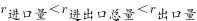。又根据两期比重比较结论“部分增长率＞整体增长率，则比重上升”，，则2022年我国酱油出口量占进出口总量的比重比上年有所提高，正确；

D项：定位表格可知2015-2022年各年我国酱油进口量和进口额。进口量和进口额均比上年增加的年份有2016年、2017年、2019年和2021年，共4个年份，错误。

本题为选非题，故正确答案为D。

---

### 材料 3

        2023年上半年，江苏省、设区市国资委监管企业实现营业收入、利润分别为6121亿元、678亿元，同比分别增长8.3%、16.1%，其中，省国资委监管企业实现营业收入、利润分别为2091亿元、306亿元，分别增长4%、30.4%。

        2023年6月末，江苏省、设区市国资委监管企业资产总额89864亿元，同比增长7.7%；资产负债率63.6%，较上年末上升0.8个百分点。其中省国资委监管企业资产总额24049亿元，增长6.7%，资产负债率64.8%，下降0.1个百分点。

#### 第 11 题　qid 15121225 · 增长

2023年上半年，江苏省国资委监管企业实现营业收入约同比增加：

- **A**. 61亿元
- **B**. 80亿元　✅
- **C**. 84亿元
- **D**. 100亿元

**答案**：B

**官方解析**

根据题干“2023年上半年······同比增加”，结合选项带单位，可判定本题为增长量计算问题。定位文字材料第一段可得：2023年上半年，江苏省国资委监管企业实现营业收入2091亿元，增长4%。根据公式：增长量，则所求为亿元。

故正确答案为B。

---

#### 第 12 题　qid 15121239 · 综合

2022年末，江苏省国资委监管企业的资产负债率比省、设区市国资委监管企业高：

- **A**. 1.2个百分点
- **B**. 1.8个百分点
- **C**. 2.1个百分点　✅
- **D**. 2.4个百分点

**答案**：C

**官方解析**

定位文字材料第二段可得：2023年6月末，江苏省、设区市国资委监管企业资产负债率63.6%，较上年末上升0.8个百分点。其中省国资委监管企业资产负债率64.8%，下降0.1个百分点。则2022年末，江苏省国资委监管企业的资产负债率为64.8%+0.1%=64.9%，江苏省、设区市国资委监管企业的资产负债率为63.6%-0.8%=62.8%，故所求为64.9%-62.8%=2.1%，即高2.1个百分点。
故正确答案为C。

---

#### 第 13 题　qid 15121249 · 增长

2020年下半年~2023年上半年，江苏省、设区市国资委监管企业利润环比增加最多的半年是：

- **A**. 2020年下半年
- **B**. 2021年上半年
- **C**. 2022年上半年
- **D**. 2023年上半年　✅

**答案**：D

**官方解析**

根据题干“2020年下半年~2023年上半年······环比增加最多的半年是”，可判定本题为增长量比较问题。定位统计图可得：2020年上半年~2022年下半年，江苏省、设区市国资委监管企业利润分别为460亿元、573亿元、725亿元、480亿元、584亿元、504亿元；定位文字材料第一段可得：2023年上半年，江苏省、设区市国资委监管企业利润为678亿元。根据公式：增长量=现期量-基期量，可得2020年下半年的环比增量为573-460=113亿元，2021年上半年的环比增量为725-573=152亿元，2022年上半年的环比增量为584-480=104亿元，2023年上半年的环比增量为678-504=174亿元。比较可知，2023年上半年江苏省、设区市国资委监管企业利润环比增加最多。
故正确答案为D。

---

#### 第 14 题　qid 15121370 · 增长

2023年6月末，江苏设区市国资委监管企业资产总额同比增速的计算式可表示为（    ）。

- **A**. 

　✅
- **B**. 

- **C**. 

- **D**. 

**答案**：A

**官方解析**

根据题干“2023年6月末······同比增速的计算式可表示为”，可判定本题为一般增长率问题。定位文字材料第二段可得：2023年6月末，江苏省、设区市国资委监管企业资产总额89864亿元，同比增长7.7%；其中省国资委监管企业资产总额24049亿元，增长6.7%。则2023年6月末，江苏设区市国资委监管企业资产总额为89864-24049=65815亿元；根据公式：基期量，可得2022年6月末，江苏设区市国资委监管企业资产总额为亿元；根据公式：增长率，可得所求增长率为。

故正确答案为A。

---

#### 第 15 题　qid 15121381 · 综合

从上述材料中不能推出的是：

- **A**. 2023年上半年，江苏省国资委监管企业营业收入利润率同比有所提高
- **B**. 2023年上半年，江苏省、设区市国资委监管企业利润环比增速比上年同期快
- **C**. 2023年上半年，江苏省国资委监管企业利润占江苏省、设区市国资委监管企业利润的比重同比有所提高
- **D**. 2020年下半年~2023年上半年，江苏省、设区市国资委监管企业半年营业收入同比与环比增速具有相同的变动趋势　✅

**答案**：D

**官方解析**

A项：定位文字材料第一段可得：2023年上半年，江苏省国资委监管企业实现营业收入、利润分别增长4%、30.4%。根据公式：利润率及两期比重比较结论“若部分增长率（a）&gt;整体增长率（b），则比重上升，反之比重下降”，可知a（30.4%）&gt;b（4%），比重上升，即2023年上半年，江苏省国资委监管企业营业收入利润率同比有所提高，正确；

B项：定位文字材料第一段可得：2023年上半年，江苏省、设区市国资委监管企业利润为678亿元；定位统计图可得：2021年下半年~2022年下半年，江苏省、设区市国资委监管企业利润分别为480亿元、584亿元、504亿元。根据公式：增长率，则2023年上半年，江苏省、设区市国资委监管企业利润环比增速，2022年上半年环比增速，即2023年上半年环比增速比上年同期快，正确；

C项：定位文字材料第一段可得：2023年上半年，江苏省、设区市国资委监管企业利润同比增长16.1%，其中，省国资委监管企业利润增长30.4%。根据两期比重比较结论“若部分增长率（a）&gt;整体增长率（b），则比重上升，反之比重下降”，可知a（30.4%）&gt;b（16.1%），则比重上升，正确；

D项：定位文字材料第一段可得：2023年上半年，江苏省、设区市国资委监管企业营业收入为6121亿元；定位统计图可得2020年上半年~2022年下半年江苏省、设区市国资委监管企业营业收入。但由于材料中无2019年下半年营业收入的数据，无法计算出2020年下半年同比增速，故无法判定同比与环比增速的变化趋势是否相同，错误。

本题为选非题，故正确答案为D。

---

### 材料 4

#### 第 16 题　qid 15121335 · 增长

2015-2022年我国游戏市场用户数增加最多的年份是：

- **A**. 2016年
- **B**. 2018年　✅
- **C**. 2019年
- **D**. 2020年

**答案**：B

**官方解析**

根据题干“······增加最多······”，可以判定本题为增长量比较问题。定位表格材料可得，2015-2020年我国游戏市场用户数分别为534、566、583、626、641、665百万人。根据公式：增长量=现期量-基期量，可得选项中各年份我国游戏市场用户数增长量如下：
2016年，566-534=32百万人；
2018年，626-583=43百万人；
2019年，641-626=15百万人；
2020年，665-641=24百万人。
比较可知，2018年我国游戏市场用户数增加最多。
故正确答案为B。

---

#### 第 17 题　qid 15121343 · 综合

2015-2022年我国游戏市场销售收入和用户数量变动趋势相同的年份有：

- **A**. 4个
- **B**. 5个
- **C**. 7个
- **D**. 8个　✅

**答案**：D

**官方解析**

定位表格材料可得2014-2022年我国游戏市场用户数量，定位图形材料可得2014-2022年我国游戏市场销售收入。经比较可知，2015-2021年我国游戏市场销售收入和用户数量每年均递增，2022年我国游戏市场销售收入和用户数量均下降，所以2015-2022年我国游戏市场销售收入和用户数量变动趋势每年都相同，共有8个年份。
故正确答案为D。

---

#### 第 18 题　qid 15121349 · 增长

2022年我国游戏市场销售收入比2014年增长：

- **A**. 1.3倍　✅
- **B**. 1.8倍
- **C**. 2.3倍
- **D**. 2.8倍

**答案**：A

**官方解析**

根据题干“2022年······比2014年增长”，结合选项为倍数，可判定本题为一般增长率问题。定位图形材料可得，2022年和2014年我国游戏市场销售收入分别为2659亿元和1145亿元。根据公式：增长率，则2022年我国游戏市场销售收入比2014年增长，即增长1.38倍，与A项最接近。

故正确答案为A。

---

#### 第 19 题　qid 15121365 · 增长

若2023-2025年我国游戏市场销售收入每年按2020-2022年的年均增速增长，则2025年我国游戏市场销售收入将达到：

- **A**. 2648亿元
- **B**. 2834亿元
- **C**. 3062亿元　✅
- **D**. 3286亿元

**答案**：C

**官方解析**

根据题干“若2023-2025年······每年按2020-2022年的年均增速增长，则2025年我国游戏市场销售收入将达到”，可判定本题为现期计算问题。定位图形材料可得，2022年和2019年我国游戏市场销售收入分别为2659和2309亿元，设2020-2022年的年均增速为r，则，因此。若2023-2025年与2020-2022年保持相同的年均增速，则2025年我国游戏市场销售收入亿元，与C项最接近。

故正确答案为C。

---

#### 第 20 题　qid 15121378 · 增长

2022年我国游戏市场销售收入增长率与2021年相差：

- **A**. 3.9个百分点
- **B**. 8.4个百分点
- **C**. 12.7个百分点
- **D**. 16.7个百分点　✅

**答案**：D

**官方解析**

根据题干“2022年······增长率与2021年相差”，结合选项为“百分点”，可判定本题为一般增长率问题。定位图形材料可得，2022-2020年我国游戏市场销售收入分别为2659、2965、2787亿元。根据公式：增长率，则2022年我国游戏市场销售收入增长率，2021年增长率。故2022年我国游戏市场销售收入增长率与2021年相差6.4%-（-10.2%）=16.6%，即16.6个百分点，与D项最接近。

故正确答案为D。

---
