# 2024年陕西省公务员录用考试《行测》题（网友回忆版）

> 省考 · 2024 年 · 6 个模块 · 共 120 题

- [政治理论](#%E6%94%BF%E6%B2%BB%E7%90%86%E8%AE%BA) · 6 题
- [常识判断](#%E5%B8%B8%E8%AF%86%E5%88%A4%E6%96%AD) · 14 题
- [言语理解与表达](#%E8%A8%80%E8%AF%AD%E7%90%86%E8%A7%A3%E4%B8%8E%E8%A1%A8%E8%BE%BE) · 40 题
- [数量关系](#%E6%95%B0%E9%87%8F%E5%85%B3%E7%B3%BB) · 10 题
- [判断推理](#%E5%88%A4%E6%96%AD%E6%8E%A8%E7%90%86) · 30 题
- [资料分析](#%E8%B5%84%E6%96%99%E5%88%86%E6%9E%90) · 20 题

---

## 政治理论

### 第 1 题　qid 16593085 · 时事政治

在2023年12月召开的中央经济工作会议上，习近平总书记全面总结2023年经济工作，深刻分析当前经济形势，系统部署2024年经济工作。下列关于做好2024年经济工作的要求，表述正确的有：
①强化宏观政策逆周期和跨周期调节
②坚持稳中求进、以进促稳、先立后破
③积极的财政政策要适度加力、提质增效
④稳健的货币政策要灵活适度、精准有效

- **A**. ①②
- **B**. ①②③
- **C**. ②③④
- **D**. ①②③④　✅

**答案**：D

**官方解析**

本题考查政治常识。
2023年12月11日至12日，中央经济工作会议在北京举行。
①②正确，会议要求，明年要坚持稳中求进、以进促稳、先立后破，多出有利于稳预期、稳增长、稳就业的政策，在转方式、调结构、提质量、增效益上积极进取，不断巩固稳中向好的基础。要强化宏观政策逆周期和跨周期调节，继续实施积极的财政政策和稳健的货币政策，加强政策工具创新和协调配合。
③正确，会议要求，积极的财政政策要适度加力、提质增效。要用好财政政策空间，提高资金效益和政策效果。优化财政支出结构，强化国家重大战略任务财力保障。合理扩大地方政府专项债券用作资本金范围。落实好结构性减税降费政策，重点支持科技创新和制造业发展。严格转移支付资金监管，严肃财经纪律。增强财政可持续性，兜牢基层“三保”底线。严控一般性支出。党政机关要习惯过紧日子。
④正确，会议要求，稳健的货币政策要灵活适度、精准有效。保持流动性合理充裕，社会融资规模、货币供应量同经济增长和价格水平预期目标相匹配。发挥好货币政策工具总量和结构双重功能，盘活存量、提升效能，引导金融机构加大对科技创新、绿色转型、普惠小微、数字经济等方面的支持力度。促进社会综合融资成本稳中有降。保持人民币汇率在合理均衡水平上的基本稳定。
综上所述，①②③④均表述正确。
故正确答案为D。

---

### 第 2 题　qid 16593033 · 新思想

党的十八大以来，习近平总书记始终高度重视“三农”工作，把解决好“三农”问题作为全党工作的重中之重。下列关于《中共中央国务院关于做好2023年全面推进乡村振兴重点工作的意见》中的举措，表述正确的是：
①把永久基本农田全部建成高标准农田
②树立大食物观，加快构建多元化食物供给体系
③发展现代设施农业，鼓励地方对设施农业建设给予信贷贴息
④深化东西部劳务协作，实施防止返贫就业攻坚行动，确保脱贫劳动力就业规模稳定在3000万人以上
⑤严格耕地占补平衡管理，实行部门联合开展补充耕地验收评定和“市县审核、省级复核、社会监督”机制

- **A**. ①②③④⑤
- **B**. ①②③④
- **C**. ②③⑤
- **D**. ②③④⑤　✅

**答案**：D

**官方解析**

本题考查政治常识。
2023年2月13日，《中共中央国务院关于做好2023年全面推进乡村振兴重点工作的意见》发布。
①错误，文件指出：“（七）加强高标准农田建设。完成高标准农田新建和改造提升年度任务，重点补上土壤改良、农田灌排设施等短板，统筹推进高效节水灌溉，健全长效管护机制。制定逐步把永久基本农田全部建成高标准农田的实施方案。”即逐步把永久基本农田全部建成高标准农田，而非2023年把永久基本农田全部建成高标准农田。
②正确，文件指出：“（四）构建多元化食物供给体系。树立大食物观，加快构建粮经饲统筹、农林牧渔结合、植物动物微生物并举的多元化食物供给体系，分领域制定实施方案。”
③正确，文件指出：“（三）发展现代设施农业。实施设施农业现代化提升行动。加快发展水稻集中育秧中心和蔬菜集约化育苗中心······鼓励地方对设施农业建设给予信贷贴息。”
④正确，文件指出：“（十五）增强脱贫地区和脱贫群众内生发展动力······深化东西部劳务协作，实施防止返贫就业攻坚行动，确保脱贫劳动力就业规模稳定在3000万人以上。”
⑤正确，文件指出：“（六）加强耕地保护和用途管控。严格耕地占补平衡管理，实行部门联合开展补充耕地验收评定和‘市县审核、省级复核、社会监督’机制，确保补充的耕地数量相等、质量相当、产能不降。”
故②③④⑤表述正确。
故正确答案为D。

---

### 第 3 题　qid 16593128 · 新思想

2023年，《习近平著作选读》第一卷、第二卷出版发行，这是党和国家政治生活中的一件大事。下列著作内容和篇名对应正确的是：

- **A**. 生态环境是关系党的使命宗旨的重大政治问题，也是关系民生的重大社会问题——《加强生态文明建设必须坚持的原则》　✅
- **B**. 做好新形势下宣传思想工作，必须自觉承担起举旗帜、聚民心、育新人、兴文化、展形象的使命任务——《开展党史学习教育要突出重点》
- **C**. 我们说的共同富裕是全体人民共同富裕，是人民群众物质生活和精神生活都富裕，不是少数人的富裕，也不是整齐划一的平均主义——《在全国脱贫攻坚总结表彰大会上的讲话》
- **D**. “两个维护”要体现在坚决贯彻党中央决策部署的行动上，体现在履职尽责、做好本职工作的实效上，体现在党员、干部的日常言行上——《不断提高政治判断力、政治领悟力、政治执行力》

**答案**：A

**官方解析**

本题考查政治常识。
A项正确，《加强生态文明建设必须坚持的原则》指出，生态环境是关系党的使命宗旨的重大政治问题，也是关系民生的重大社会问题。广大人民群众热切期盼加快提高生态环境质量。我们要积极回应人民群众所想、所盼、所急，大力推进生态文明建设，提供更多优质生态产品，不断满足人民群众日益增长的优美生态环境需要。
B项错误，《宣传思想工作的使命任务》指出，做好新形势下宣传思想工作，必须自觉承担起举旗帜、聚民心、育新人、兴文化、展形象的使命任务，促进全体人民在理想信念、价值理念、道德观念上紧紧团结在一起，为服务党和国家事业全局作出更大贡献。《开展党史学习教育要突出重点》是习近平同志2021年2月20日在党史学习教育动员大会上讲话的一部分。
C项错误，《扎实推动共同富裕》指出，共同富裕是社会主义的本质要求，是中国式现代化的重要特征。我们说的共同富裕是全体人民共同富裕，是人民群众物质生活和精神生活都富裕，不是少数人的富裕，也不是整齐划一的平均主义。《在全国脱贫攻坚总结表彰大会上的讲话》（2021年2月25日）中指出，我国脱贫攻坚战取得了全面胜利，区域性整体贫困得到解决，完成了消除绝对贫困的艰巨任务，创造了又一个彪炳史册的人间奇迹。
D项错误，《带头做到“两个维护”，着力推进中央和国家机关党的政治建设》指出，“两个维护”要体现在坚决贯彻党中央决策部署的行动上，体现在履职尽责、做好本职工作的实效上，体现在党员、干部的日常言行上。带头做到“两个维护”，从根本上讲就是要做到对党忠诚，既要体现高度的理性认同、情感认同，又要有坚决的维护定力和能力。《不断提高政治判断力、政治领悟力、政治执行力》是习近平同志2020年12月24日、25日主持中共十九届中央政治局民主生活会时讲话的要点。
故正确答案为A。

---

### 第 4 题　qid 16592966 · 时事政治

党的十八大以来，以习近平同志为核心的党中央始终把未成年人工作摆在突出位置。2024年1月1日起施行的《未成年人网络保护条例》是我国第一部针对未成年人网络保护的专门性综合立法，是贯彻落实习近平法治思想的生动体现。下列关于该条例内容表述正确的有几项？
①国家教育部门负责统筹协调未成年人网络保护工作
②网络产品和服务提供者不得为未成年人提供游戏账号租售服务
③网络产品和服务提供者不得通过自动化决策方式向未成年人进行商业营销
④网络直播服务提供者应当建立网络直播发布者真实身份信息动态核验机制
⑤网络服务提供者可根据实际引导未成年人参与应援集资、投票打榜、刷量控评等网络活动

- **A**. 2项
- **B**. 3项　✅
- **C**. 4项
- **D**. 5项

**答案**：B

**官方解析**

本题考查法律常识。
①错误，根据《未成年人网络保护条例》第三条第一款规定：“国家网信部门负责统筹协调未成年人网络保护工作，并依据职责做好未成年人网络保护工作。”
②正确，根据《未成年人网络保护条例》第四十六条第二款规定：“网络产品和服务提供者不得为未成年人提供游戏账号租售服务。”
③正确，根据《未成年人网络保护条例》第二十四条第三款规定：“网络产品和服务提供者不得通过自动化决策方式向未成年人进行商业营销。”
④正确，根据《未成年人网络保护条例》第三十一条第二款规定：“网络直播服务提供者应当建立网络直播发布者真实身份信息动态核验机制，不得向不符合法律规定情形的未成年人用户提供网络直播发布服务。”
⑤错误，根据《未成年人网络保护条例》第四十五条规定：“网络游戏、网络直播、网络音视频、网络社交等网络服务提供者应当采取措施，防范和抵制流量至上等不良价值倾向，不得设置以应援集资、投票打榜、刷量控评等为主题的网络社区、群组、话题，不得诱导未成年人参与应援集资、投票打榜、刷量控评等网络活动，并预防和制止其用户诱导未成年人实施上述行为。”
综上，②③④三项内容均表述正确。
故正确答案为B。

---

### 第 5 题　qid 16593129 · 马克思主义

习近平新时代中国特色社会主义思想是当代中国马克思主义、21世纪马克思主义。下列对此理解正确的有几项：
①党的十九大把习近平新时代中国特色社会主义思想确立为党必须长期坚持的指导思想并庄严地写入党章
②习近平新时代中国特色社会主义思想是马克思主义中国化最新成果，是当今时代最现实、最鲜活的马克思主义
③今天我们所处的时代同马克思所处的时代相比发生了巨大而深刻的变化，已经脱离了马克思主义所指明的历史时代
④习近平新时代中国特色社会主义思想，始终把马克思主义作为中国共产党人的“真经”，始终坚持马克思主义基本原理

- **A**. 1项
- **B**. 2项
- **C**. 3项　✅
- **D**. 4项

**答案**：C

**官方解析**

本题考查政治常识。
①正确，中国共产党第十九次全国代表大会，把习近平新时代中国特色社会主义思想确立为党必须长期坚持的指导思想并庄严地写入党章，实现了党的指导思想的与时俱进。这是一个历史性决策和历史性贡献，体现了党在政治上理论上的高度成熟、高度自信。
②正确，习近平新时代中国特色社会主义思想是马克思主义中国化最新成果，是当代中国马克思主义、21世纪马克思主义，是新时代中国共产党的思想旗帜，是实现中华民族伟大复兴的行动指南。习近平马克思主义观是习近平新时代中国特色社会主义思想的理论精髓，是中国共产党马克思主义观演进与升华的最新成果。这一重大思想为发展马克思主义作出了具有鲜明中国风格、中国气派、时代特色、实践品格的原创性贡献，谱写了马克思主义的新篇章，是当今时代最现实、最鲜活的马克思主义。
③错误，2017年9月29日，习近平总书记在十八届中央政治局第四十三次集体学习时发表重要讲话并明确指出：“尽管我们所处的时代同马克思所处的时代相比发生了巨大而深刻的变化，但从世界社会主义500年的大视野来看，我们依然处在马克思主义所指明的历史时代。” 
④正确，习近平新时代中国特色社会主义思想始终坚持马克思主义基本原理，既坚持把马克思主义作为中国共产党人的“真经”，又坚持把马克思主义基本原理同中国具体实际相结合，同中华优秀传统文化相结合，实现了马克思主义的创造性升华，是当代中国马克思主义。
故①②④表述正确。
故正确答案为C。

---

### 第 6 题　qid 16592943 · 新思想

习近平总书记强调，要坚定维护宪法权威和尊严，推动宪法完善和发展，更好发挥宪法在治国理政中的重要作用。下列有关表述正确的有几项：
①要加强宪法理论研究和宣传教育，坚持知识普及、理论阐释、观念引导全面发力
②加快完善以宪法为核心的中国特色社会主义法律体系，不断提高宪法实施和监督水平
③坚持宪法确定的中国共产党领导地位不动摇，坚持宪法确定的人民民主专政的国体和人民代表大会制度的政体不动摇
④宪法是治国安邦的总章程，是我们党治国理政的根本法律依据，是国家政治和社会生活的最高法律规范

- **A**. 1项
- **B**. 2项
- **C**. 3项
- **D**. 4项　✅

**答案**：D

**官方解析**

本题考查政治常识。
①②③正确，中共中央总书记、国家主席、中央军委主席习近平在第十个国家宪法日到来之际作出重要指示，强调要坚定政治制度自信，坚持宪法确定的中国共产党领导地位不动摇，坚持宪法确定的人民民主专政的国体和人民代表大会制度的政体不动摇。要贯彻新时代中国特色社会主义法治思想，坚持宪法规定、宪法原则、宪法精神全面贯彻，坚持宪法实施、宪法解释、宪法监督系统推进，加快完善以宪法为核心的中国特色社会主义法律体系，不断提高宪法实施和监督水平。要加强宪法理论研究和宣传教育，坚持知识普及、理论阐释、观念引导全面发力，在全社会大力弘扬宪法精神、社会主义法治精神，推动宪法实施成为全体人民的自觉行动。
④正确，中共中央总书记、国家主席、中央军委主席习近平在第十个国家宪法日到来之际作出重要指示指出，宪法是治国安邦的总章程，是我们党治国理政的根本法律依据，是国家政治和社会生活的最高法律规范。
综上所述，①②③④均表述正确，共有4项。
故正确答案为D。

---

## 常识判断

### 第 1 题　qid 16593025 · 法律常识

《中华人民共和国法律援助法》对于规范和促进法律援助工作、保障公民和有关当事人合法权益具有重大意义。下列情况属于可经指派获得法律援助的是：
①15岁的学生小明涉嫌贩卖毒品，没有委托辩护人
②25岁的精神病人赵某涉嫌抢劫，其患病多年经济困难，没有委托辩护人
③35岁的村民张某因向村中水井投毒，可能被判处死刑，没有委托辩护人
④45岁的聋哑人李某创设公司后涉嫌逃税罪，其个人资产过亿，没有委托辩护人

- **A**. ①②③
- **B**. ②③④
- **C**. ①③④
- **D**. ①②③④　✅

**答案**：D

**官方解析**

本题考查法律常识。
①②③④正确，根据《中华人民共和国法律援助法》第二十五条第一款规定：“刑事案件的犯罪嫌疑人、被告人属于下列人员之一，没有委托辩护人的，人民法院、人民检察院、公安机关应当通知法律援助机构指派律师担任辩护人：（一）未成年人；（二）视力、听力、言语残疾人；（三）不能完全辨认自己行为的成年人；（四）可能被判处无期徒刑、死刑的人；（五）申请法律援助的死刑复核案件被告人；（六）缺席审判案件的被告人；（七）法律法规规定的其他人员。”其中，①中小明是未成年人，②中赵某是不能完全辨认自己行为的成年人。
故正确答案为D。

---

### 第 2 题　qid 16593034 · 经济常识

根据中共中央、国务院2023年3月印发的《党和国家机构改革方案》，下列关于本次改革方案的表述错误的是：

- **A**. 证券业之外的金融业监管由国家金融监督管理总局统一负责
- **B**. 统筹数字资源整合共享和开发利用，是国家数据局的职责之一
- **C**. 在农业农村部加挂国家乡村振兴局牌子，不再保留单设的国家乡村振兴局
- **D**. 将工业和信息化部的国家高新技术产业开发区等科技园区建设职责划入科学技术部　✅

**答案**：D

**官方解析**

本题考查政治常识。
A项正确，《党和国家机构改革方案》指出：“（八）组建国家金融监督管理总局。统一负责除证券业之外的金融业监管，强化机构监管、行为监管、功能监管、穿透式监管、持续监管，统筹负责金融消费者权益保护，加强风险管理和防范处置，依法查处违法违规行为，作为国务院直属机构······”
B项正确，《党和国家机构改革方案》指出：“（十四）组建国家数据局。负责协调推进数据基础制度建设，统筹数据资源整合共享和开发利用，统筹推进数字中国、数字经济、数字社会规划和建设等，由国家发展和改革委员会管理······”
C项正确，《党和国家机构改革方案》指出：“（十五）优化农业农村部职责。为统筹抓好以乡村振兴为重心的‘三农’各项工作······推动农村社会事业和公共服务发展等职责划入农业农村部，在农业农村部加挂国家乡村振兴局牌子。全国脱贫攻坚目标任务完成后的过渡期内，有关帮扶政策、财政支持、项目安排保持总体稳定，资金项目相对独立运行管理。不再保留单设的国家乡村振兴局。”
D项错误，《党和国家机构改革方案》指出“（七）重新组建科学技术部······将科学技术部的组织拟订高新技术发展及产业化规划和政策，指导国家自主创新示范区、国家高新技术产业开发区等科技园区建设，指导科技服务业、技术市场、科技中介组织发展等职责划入工业和信息化部······”
本题为选非题，故正确答案为D。

---

### 第 3 题　qid 16593076 · 人文常识

《礼记·曲礼》有言：“男子二十冠而字。”古人名与字的含义通常有一定关联，或相同相近，或相关相辅，或相反相成，下列历史人物名与字的对应关系与其他三项不同的是：

- **A**. 曹丕，字子桓
- **B**. 周瑜，字公瑾
- **C**. 杜甫，字子美
- **D**. 朱熹，字元晦　✅

**答案**：D

**官方解析**

本题考查人文常识。
“古者，名以正体，字以表德。”古人不但有名，而且有字。《礼记·曲礼》上说：“男子二十冠而字”，意思是说男子到20岁行冠礼、取字。且古人取表字十分讲究，一般和自己的名字有关联，有这样几种取字方法：①表字和名意义相同，又叫“并列式”；②表字和名意思相近，但不完全相同，可以互为辅助，称作“辅助式”；③表字和名意思正相反，这种情况可称为“矛盾式”。
A项正确，曹丕，字子桓。“丕”字在《说文解字》里意为“大”，“桓”的意思取大，与“丕”的意思一致。名和字意义相同。
B项正确，周瑜，字公瑾。“瑜”和“瑾”均出自《楚辞·九章·怀沙》，原文为“怀瑾握瑜兮，穷不知所示。”故“瑜”和“瑾”均意指美玉。名和字意义相同。
C项正确，杜甫，字子美。“甫”是古代美男子的称呼；“美”是男人长得好看的意思。名和字意义相同。
D项错误，朱熹，字元晦。“熹”为明亮之意，而“晦”则是昏暗的意思。名与字意义相反，与其他三项不同。
本题为选非题，故正确答案为D。

---

### 第 4 题　qid 16592951 · 人文常识

唐代是丝绸之路的鼎盛时期，当时丝绸之路上的商队可能携带的商品是：

- **A**. 线装本的《史记》
- **B**. 精心制作的宣德炉
- **C**. 《司马温公神道碑》拓片
- **D**. 鎏金工艺制作的莲瓣银茶托　✅

**答案**：D

**官方解析**

本题考查人文常识。
A项错误，线装书是指以线类进行装订的图书类型，又称古线装。中国古代的纸本书，经历了卷轴和册页两个阶段。卷轴由卷、轴、缥、带组装成。汉、唐代只有这种卷轴形式的书。宋代是书籍印刷爆发的时代，开始出现多种多样的装订方法，宋代是书籍装订形式最重要的一个时期，是书籍装订形式大发展时期与奠定时期，不仅蝴蝶装、包背装等明确产成在宋代，线装书也产成于宋代。唐代丝绸之路上的商队不可能携带线装本的《史记》。
B项错误，宣德炉是由明宣宗朱瞻基在大明宣德三年参与设计监造的铜香炉，简称“宣炉”，是中国历史上第一次运用风磨铜铸成的铜器。唐代丝绸之路上的商队不可能携带精心制作的宣德炉。
C项错误，《司马温公神道碑》是宋代苏轼五十三岁时奉宋哲宗之命为司马光撰写的碑文，碑文充满了苏轼对司马光的尊敬怀念之情。唐代丝绸之路上的商队不可能携带其拓片。
D项正确，鎏金是一种金属加工工艺，始于战国，同时中国也是世界上最早使用这一技术的国家。1957年陕西省西安市唐长安城平康坊遗址出土了唐朝鎏金莲瓣银茶托，茶托盘底心下凹，周围有凸起托圈。唐代丝绸之路上的商队有可能携带鎏金工艺制作的莲瓣银茶托。
故正确答案为D。

---

### 第 5 题　qid 10204648 · 人文常识

讲述宋史时，“燕云十六州”是绕不开的话题，下列有关叙述不正确的是：

- **A**. 周世宗柴荣北伐时收复了部分州
- **B**. 澶渊之盟正式将燕云十六州割让给辽国　✅
- **C**. 高梁河之战使北宋失去了完全收复燕云十六州的时机
- **D**. 燕云十六州是我国北方以幽州和云州为中心的十六个州

**答案**：B

**官方解析**

本题考查人文常识。
A项正确，周世宗柴荣是后周第二位皇帝，在位期间励精图治。公元959年，柴荣北伐辽国，准备收复赵德钧、石敬瑭时代被契丹人占据的幽燕地区。起初，大军势如破竹，连克三关三州，但在商议攻取幽州的时候柴荣突发疾病，只得自雄州回师，不久后病逝。
B项错误，五代十国时期，后晋开国皇帝石敬瑭即位后，割幽、蓟、瀛、莫、涿、檀、顺、新、妫、儒、武、云、应、寰、朔、蔚十六州以与契丹，仍许岁输帛三十万匹。此举正式将燕云十六州割让给辽国。公元1005年，宋辽在澶州签订合约，合约规定，辽宋约为兄弟之国，宋每年送给辽岁币银10万两、绢20万匹，宋辽以白沟河为边界。因澶州（河南濮阳）在宋朝亦称澶渊郡，故史称“澶渊之盟”。
C项正确，高梁河之战是宋军为夺取幽州，在高梁河被辽军击败的一次作战。公元979年，宋太宗赵炅为夺回后晋石敬瑭割给契丹的燕云十六州，于太平兴国四年五月平北汉后，未经休整和准备，即转兵攻辽，企图乘其不备，一举夺取幽州。不料在辽军的反击和增援下，宋军全线溃退。此战结束了宋朝统一的步伐，并且在军事上总体开始处于劣势，使北宋失去了完全收复燕云十六州的时机。
D项正确，“燕云”一名最早见于《宋史·地理志》。燕云十六州，指中国北方以幽州（今北京）和云州（今山西大同）为中心的十六个州，即今北京、天津北部（海河以北），以及河北北部、山西北部地区。
本题为选非题，故正确答案为B。

---

### 第 6 题　qid 16593017 · 人文常识

戏曲是中华优秀传统文化的重要组成部分，下列有关说法错误的是：

- **A**. 京剧、豫剧、评剧、黄梅戏、越剧是中国戏剧五大剧种
- **B**. 《群英会》是依据《水浒传》改编的传统京剧　✅
- **C**. 黄梅戏代表剧目中有《天仙配》和《女驸马》
- **D**. 豫剧与梆子腔关系紧密

**答案**：B

**官方解析**

本题考查人文常识。
A项正确，中国戏曲剧种种类繁多，其中“京剧、豫剧、评剧、黄梅戏、越剧”为五大戏曲剧种。京剧在清光绪年间形成于北京，现已成为中国影响最大、最具有代表性的一个剧种。豫剧也称河南梆子、河南高调，形成于清朝初年，至今已有300多年历史，是洛阳、河南的主要剧种，在国内外影响仅次于京剧。评剧是我国北方地区的一种地方戏，在华北、东北及其他一些地区流行很广，是广大人民所喜闻乐见的剧种之一。黄梅戏起源于湖北黄梅，是安徽省的主要地方戏曲剧种，是十八世纪后期在皖、鄂、赣三省毗邻地区形成的一种民间小戏。评剧原名“平腔梆子戏”，俗称“唐山落子”，“蹦蹦戏”。越剧，是以嵊县一带的民间说唱艺术“落地唱书”为基础，并在余姚鹦歌（秧歌）和湖州滩簧的影响下发展形成的。
B项错误，京剧以历史故事为主要演出内容，传统剧目约有一千三百多个，常演的在三四百个以上，其中《群英会》等剧目家喻户晓，为广大观众所熟知。《群英会》是依据《三国演义》第45回改编的传统京剧，故事叙述：曹操谋士蒋干，与周瑜故交，请求过江劝降。周瑜将计就计，盛会隆重宴请诸将和挚友，号称“群英会”。
C项正确，黄梅戏中有许多为人熟知的优秀剧目，代表剧目中有《天仙配》和《女驸马》。《天仙配》讲述了七仙女不顾天规，私自下凡与董永结为伉俪，憧憬美好生活，最终被玉帝生生拆散的爱情故事。《女驸马》讲述了民女冯素珍冒死救夫，经历了种种曲折，终于如愿以偿，成就了美满姻缘的故事。
D项正确，豫剧因早期演员用本嗓演唱，起腔与收腔时用假声翻高尾音带“讴”，又叫“河南讴”。豫剧在声腔上属梆子腔系。豫剧划分主要有五大流派：以开封为中心的唱法称“祥符调”；以商丘为中心的唱法称“豫东调”，又称“东路调”；以洛阳为中心流传的唱法称为“豫西调”，又称“西府调”；流行于豫东南的称“沙河调”，又叫“本地梆”；建国后，在杨兰春等的领导下，对豫剧四大地域流派唱腔进行了综合吸收和大幅改革，运用科学的发音，融入了歌剧元素，形成了“现代流派”，又称“现代戏流派”。
本题为选非题，故正确答案为B。

---

### 第 7 题　qid 16593124 · 经济常识

下列关于国债逆回购的说法正确的是：

- **A**. 投资者可以通过银行网点购买国债逆回购
- **B**. 国债逆回购是以国家为主体进行债券回购
- **C**. 国债逆回购本质上是一种短期资金借贷方式　✅
- **D**. 国债逆回购利率上行20个基点表示利率增加2%

**答案**：C

**官方解析**

本题考查经济常识。
A项错误，投资者应选择有国债逆回购业务的证券营业部开户。此外，证券交易所还会和投资者签一个“指定交易协议”，所以投资者应在证券交易所开户进行交易。但不可以通过银行网点进行购买。
B项错误，国债逆回购参与主体大致分为两类：第一类为融资方，一般是商业银行、非银行金融机构等，第二类为资金出借方，一般有个人投资者、基金公司、保险公司等。所以国债逆回购并不是以国家为主体进行债券回购。
C项正确，国债逆回购本质就是一种短期贷款，即将资金通过国债回购市场拆出，其实就是一种短期贷款。个人通过国债回购市场把自己的资金借出去，获得固定的利息收益；而回购方，也就是借款人用自己的国债作为抵押获得这笔借款，到期后还本付息。
D项错误，基点是利率的计数单位，一个百分点等于100个基点，也叫BP。如原来利率是3.25%，下降25个基点，就成了3%。此处上行20个基点表示利率增加0.2%。
故正确答案为C。

---

### 第 8 题　qid 16593047 · 人文常识

2022年7月，美国宇航局（NASA）公布韦伯太空望远镜（JWST）拍摄的遥远气态星云一颗新生恒星的照片，其边缘区域的下半部尘埃和上半部气体形成的明显分界线，被天文学家称为“宇宙悬崖”。那么下列哪项最可能是“宇宙悬崖”的形成原因？

- **A**. 由天体内力作用，产生断层
- **B**. 受重力作用，因滑坡或坍塌造成
- **C**. 受流水及重力作用，沿断层节理面形成
- **D**. 由新生恒星强烈的紫外线辐射侵蚀而成　✅

**答案**：D

**官方解析**

本题考查地理国情。
A项错误，内力作用指由地球内部的能，主要是放射热能、重力能、地球旋转能、地球内的化学能等所引起的地质作用。断层是地壳受力发生断裂，沿断裂面两侧岩块发生的显著相对位移的构造。与题干无关。
B项错误，重力地质作用又称“负荷地质作用”或“斜坡重力地质作用”，是指在重力作用下，地表物体具有向低处移动的能力。主要影响是发生滑坡、倒石堆、雪崩等。与题干无关。
C项错误，海蚀崖是指其基岩海岸受海蚀及重力崩落作用，常沿断层节理或层理面形成的陡壁悬崖。与题干无关。
D项正确，从公布照片上看，“宇宙悬崖”像一座映照在月光下崎岖的山脉，是位于船底座星云西北角的一个名为NGC 3324的年轻的恒星形成区的边缘，距离我们大约7600光年。所谓的山脉，有些高达7光年高，散布着在红外光下成像的闪闪发光的年轻恒星。强烈的紫外线辐射和来自位于该区域上方的极大质量、炽热的年轻恒星的恒星风从星云中雕刻出一个海绵状区域。来自这些恒星的炽热紫外线辐射正在通过缓慢侵蚀星云的壁来雕刻它。
故正确答案为D。

---

### 第 9 题　qid 16593135 · 科技常识

宝石是用于装饰的、有经济价值的矿物及生物矿物和岩石的总称，呈现晶体、集合体等形态，是地球送给人类的珍贵礼物。下列不属于宝石形成机制的是（    ）。

- **A**. 由炽热岩浆喷发所生成的熔岩蒸汽冷凝产生
- **B**. 岩浆冷却凝固时浓缩的成分结晶后形成
- **C**. 在地核内部高温高压变质瘤结成型　✅
- **D**. 从岩浆产生的热液中结晶生长

**答案**：C

**官方解析**

本题考查地理国情。
A、B两项正确，按岩石性质，宝石可分三类：火成岩（岩浆岩）、变质岩与沉积岩。岩浆岩又称火成岩，是由炽热岩浆喷出地表或侵入地壳冷却凝固所形成的岩石。岩浆在冷却过程中，由于温度和压力的变化，会形成不同类型的火成岩，包括侵入岩和喷出岩。火成岩中的宝石，如钻石和蓝宝石，通常是在岩浆上升到地表的过程中，由于冷却速度的不同而形成的。变质岩是由火成岩或沉积岩在高温高压下经历化学和物理变化而形成。沉积岩，又称为水成岩，是由地表或接近地表的水溶液结晶而成的，这些水溶液可能含有特定的矿物质，如二氧化碳和二氧化硅。沉积岩通常成层堆叠，如石灰岩和页岩，它们可以形成各种宝石，如蛋白石和绿松石。
C项错误，宝石分布在地壳和地幔中，不是在地核内部高温高压变质瘤结成型。
D项正确，当水热与地球内部岩浆相互作用时，形成热液。从岩浆产生的热液中可以形成结晶，当岩浆冷却时，如果有合适的温度、压力、空间和足够时间就可以形成宝石，包括紫水晶、黄晶以及祖母绿等。
本题为选非题，故正确答案为C。

---

### 第 10 题　qid 16593236 · 科技常识

下列病毒与其主要感染的人体系统对应正确的是：

- **A**. 狂犬病毒——免疫系统
- **B**. 流感病毒——神经系统
- **C**. 乙肝病毒——消化系统　✅
- **D**. 艾滋病毒——生殖系统

**答案**：C

**官方解析**

本题考查科技常识。
A项错误，狂犬病毒主要感染神经系统。人类被携带狂犬病毒的动物咬伤后，狂犬病毒会从伤口处进入人体，但并不会马上侵染神经元，而是在肌肉内停留一段时间，这就是潜伏期。潜伏期之后，狂犬病毒会经过运动神经和骨骼肌之间的连接，进入神经系统，一旦狂犬病毒开始侵染神经系统，便会在神经元之间高速运输，神经系统会受到致命的破坏。狂犬病毒主要是通过动物咬抓伤传播。
B项错误，流感病毒是一种影响上呼吸道和下呼吸道的传染性病毒性疾病，主要感染呼吸系统，通过空气飞沫传播。
C项正确，乙肝病毒主要感染消化系统。乙肝病毒主要感染身体中的肝脏部位，可能会造成肝功能损伤，肝脏属于消化系统。乙肝的传播方式主要是血液传播、性传播和母婴传播。
D项错误，艾滋病毒主要感染免疫系统。艾滋病毒会攻击并逐渐破坏人类的免疫系统，致使宿主在被感染时得不到保护。感染人类免疫缺陷病毒并且去世的人，往往死于继发感染或者癌症。艾滋病毒主要是血液传播、性传播和母婴传播。
故正确答案为C。

---

### 第 11 题　qid 16593108 · 人文常识

小明被困在一个无人、无食物来源但有淡水的荒岛上。假如他在等待救援期间可以从相同重量的葡萄、馒头、酸奶、花生仁这四种食物中选择一种，那么为了能在岛上生存的时间最长，他应该选择的食物是（    ）。

- **A**. 葡萄
- **B**. 馒头
- **C**. 酸奶
- **D**. 花生仁　✅

**答案**：D

**官方解析**

本题考查科技常识。
A项错误，葡萄的主要成分是水分和糖类，每100克葡萄的热量约为45大卡。每100克葡萄中水分占到81克，碳水化合物为15.7克左右，蛋白质为0.7克，脂肪为0.6克，因此为了能在岛上生存的时间最长不适合选择葡萄。
B项错误，馒头的主要成分是糖类，每100克馒头的热量约为230千卡。每100克馒头中碳水化合物的含量为47克，蛋白质为7克，脂肪为1.1克，因此为了能在岛上生存的时间最长不适合选择馒头。
C项错误，酸奶是牛奶经过乳酸菌发酵而成，主要含有蛋白质、脂肪、乳酸菌、钙以及多种维生素，每100克酸奶的热量约为70大卡。每100克酸奶中的蛋白质含量为4.3克左右，脂肪为2.9克左右。因此为了能在岛上生存的时间最长不适合选择酸奶。
D项正确，花生仁的主要成分是脂肪、蛋白质、碳水化合物，每100克花生仁的热量约为560大卡。每100克花生中蛋白质的含量为24.8克左右，脂肪为44.3克左右，碳水化合物为21.7克左右。相同重量的花生所含能量最多，因此为了能在岛上生存的时间最长应该选择花生仁。
故正确答案为D。

---

### 第 12 题　qid 16593079 · 科技常识

酶是具有高度特异性和高度催化效能的生物催化剂，在人类的生产生活中具有重要的应用。以下有关酶的添加应用对应错误的是（    ）。

- **A**. 白酒——淀粉酶
- **B**. 果汁——纤维素酶
- **C**. 脱脂奶——乳糖酶　✅
- **D**. 加酶洗衣粉——蛋白酶

**答案**：C

**官方解析**

本题考查科技常识。
A项正确，淀粉酶是水解淀粉和糖原的酶类总称，通常通过淀粉酶催化水解织物上的淀粉浆料。淀粉酶可以用作果汁加工中的淀粉分解和提高过滤速度以及蔬菜加工、糖浆制造、葡萄糖等加工制造。在白酒酿酒过程中，以淀粉为原料酿酒，需经过两个主要过程，一是淀粉糖化过程；二是酒精发酵过程。淀粉吸水膨胀，加热糊化，形成结构疏松的淀粉，在淀粉酶的作用下分解为低分子的单糖；单糖在脱羧酶、脱氢酶的催化下分解，逐渐分解形成二氧化碳和酒精。
B项正确，纤维素酶是一类能够降解纤维素的酶，其主要作用是水解果汁中的纤维素成分，使其分解成可溶性物质。水果中含有纤维素、果胶等大分子物质，在榨汁时，这些物质会影响出汁率并使榨出的果汁浑浊，易出现沉淀。添加纤维素酶、果胶酶可以将果胶、纤维素分解成小分子的可溶性的物质，从而提高出汁率并使果汁饮料澄清。
C项错误，乳糖酶是人体中的一种消化酶，是以母乳、奶粉为主要营养来源的婴幼儿体内最重要的消化酶，乳糖酶的主要功能是消化乳糖，将乳糖水解成能够被人体吸收的半乳糖和葡萄糖。乳糖酶主要用于乳品工业，可使低甜度和低溶解度的乳糖转变为较甜的、溶解度较大的单糖，还可使冰淇淋、浓缩乳、淡炼乳中乳糖结晶析出的可能性降低，同时增加甜度。脱脂奶主要通过离心分离将牛奶中的脂肪和非脂肪部分分离而获得。二者并无直接关联。
D项正确，加酶洗衣粉中添加了多种酶制剂，如碱性蛋白酶制剂和碱性脂肪酶制剂等。这些酶制剂不仅可以有效地清除衣物上的污渍，而且对人体没有毒害作用，并且这些酶制剂及其分解产物能够被微生物分解，不会污染环境。
本题为选非题，故正确答案为C。

---

### 第 13 题　qid 10204646 · 科技常识

下列表述不符合物理常识的是：

- **A**. 一杯泡好的茶，用勺子作圆形搅动茶叶会向杯底中心聚集
- **B**. 用洗衣机洗裤子并脱干后，取出时经常会看到裤兜被翻出来
- **C**. 在河流的弯道上，外圈河床要比内圈浅，因为泥沙会被河水带到外圈　✅
- **D**. 锅里剩下最后几根面条时，用筷子在锅中作圆形搅动，使面汤旋转起来，面条会集中到锅底中心

**答案**：C

**官方解析**

本题考查科技常识。
A项正确，当搅动茶杯里的水时，水会做圆周运动。由于茶杯壁会对水产生摩擦，减慢水的流速。所以此时茶杯壁处的流速小于茶杯中心处的流速。由伯努利原理（等高流动时，流速越大，压力越小）可知，茶杯壁处水的压强要大于中心处的压强，形成高压的边界层，引起二次流，从而形成一个新的螺旋，这个螺旋会推动茶叶向心运动。
B项正确，当洗衣机转动时，衣服兜口附近流体有一个相当的速度，而衣服兜的底部流体的速度就要小。这是因为裤兜的底部是在裤筒里，上衣的衣兜底部也是裹在衣服的里头，所以那里的流体相对于衣服的速度要小得多。根据伯努利定律，衣兜底部的压强就比衣兜口附近的大，这种压差就会驱使水从衣兜底部流向衣兜口。洗衣机反复转动，压差就一次次使流体从兜底流向兜口，这种流动就足以把衣兜翻过来。
C项错误，二次流是指一种流动引起的另一种性质不同的流动。在河流的弯道上，由于二次流而使河底处水流所携带的沙子、砾石等从弯段的外侧移走，而在弯段的内侧堆积起来，结果造成河道的外侧被掏深而内侧则变浅。故应该是“外侧深而内侧浅”，而不是“外圈河床要比内圈浅”。
D项正确，如果将旋转起来的面汤看为一次流动，这时微团体做圆周运动，微团加速度指向圆心，其加速度与压力梯度符号相反，压强由锅中心向锅边是增加的，又由于锅底这层流速很小，惯性力与压差不平衡，由此将面条带到锅底中心，这就是所谓的二次流现象，正是这个流动将面条带到锅底中心。
本题为选非题，故正确答案为C。

---

### 第 14 题　qid 16593144 · 人文常识

瑟是我国古代一种弦乐器，弦发出的音与弦的粗细和张力有关。我国古代这方面的经验积累相当早，文献记载也很多，以下选项没有体现这一原理的是：

- **A**. 《礼记·乐记》：清庙之瑟，朱弦而疏越，壹倡而三叹，有遗音者也　✅
- **B**. 《韩非子·外储说左下》：夫瑟以小弦为大声，以大弦为小声
- **C**. 《月令章句》：瑟前其柱则清，却其柱则浊
- **D**. 《春诸纪闻》：缓其商弦，与宫同音

**答案**：A

**官方解析**

本题考查科技常识。
A项错误，“清庙之瑟，朱弦而疏越，壹倡而三叹，有遗音者也”其含义为：“伴奏《清庙》乐章的瑟，拨着用熟丝制成的弦，疏通琴底的调音孔，一人领唱，三人应和咏叹，形式简朴但余音袅袅。”这说明了瑟在演奏《清庙》时的重要性。不符合题干弦发出的音与弦的粗细和张力有关。
B项正确，“夫瑟以小弦为大声，以大弦为小声”其含义为：“瑟这种乐器，小弦发出的声音较大，大弦发出的声音较小”。这说明长短相同时弦越细，振动越快，音高越高。可证明音高与弦的粗细成反比。符合题干弦发出的音与弦的粗细和张力有关。
C项正确，“瑟前其柱则清，却其柱则浊”其含义为：“鼓瑟的时候，‘前其柱’弦的张力增大，音调升高；‘却其柱’弦的张力减小，音调降低”。符合题干弦发出的音与弦的粗细和张力有关。
D项正确，“缓其商弦，与宫同音”其含义为：“如果把商弦适当松动，它的音高就会降低至与宫音相同的高度”。这说明音高与弦的张力成正比。想要得到一个新的音高，在只改变弦的张力，而不改变弦的长短和密度的情况下就可以做到。符合题干弦发出的音与弦的粗细和张力有关。
本题为选非题，故正确答案为A。

---

## 言语理解与表达

### 第 1 题　qid 16593050 · 逻辑填空

面对北宋王朝百余年的积贫积弱，怀“回天转地”之气概、视“天下大治”为己任的王安石，从“继道而行”“以道求治”的哲学立场和政治观念出发，借论周公之政畅抒其立法施治的观点，其        显然不仅仅是治必有法，而更在于强调治须“良法”。
填入划横线部分最恰当的一项是：

- **A**. 缘由
- **B**. 动机
- **C**. 设想
- **D**. 意图　✅

**答案**：D

**官方解析**

根据横线前“其”指代“王安石”，并结合横线后“显然不仅仅是······更在于强调治须‘良法’”可知，横线处所在句子属于对王安石“立法施治”观点主要思想的解释说明。故横线处应表达“主要思想、主旨”之意，D项“意图”指希望达到某种目的的想法，符合文意，当选。
A项“缘由”指事情发生的原因，B项“动机”指内在心理过程或内部动力，C项“设想”指想象，假想，均与文段语义不符，排除。
故正确答案为D。
【文段出处】光明日报《立善法于天下，则天下治》

---

### 第 2 题　qid 16593293 · 逻辑填空

鸿雁南飞、菊花盛开之时，文人墨客秋思绵延，绘就一幅幅绚丽多姿的晚秋画卷。卢纶笔下的寒露是“数派清泉黄菊盛，一林寒露紫梨繁”，一派明艳繁茂；王安石眼中却是“空庭得秋长漫漫，寒露入暮愁衣单”，满眼的寂寥惆怅；元稹诗里描绘“寒露惊秋晚，朝看菊渐黄。千家风扫叶，万里雁随阳”，充盈着            。
依次填入划横线部分最恰当的一项是：

- **A**. 恬淡之意
- **B**. 肃杀之气　✅
- **C**. 离愁之情
- **D**. 清丽之美

**答案**：B

**官方解析**

横线处所填词语对应元稹的诗句，诗中“寒露惊秋晚，朝看菊渐黄。千家风扫叶，万里雁随阳”所描绘的是“深秋寒露时节，菊花渐黄，秋风吹起，留下满地落叶，大雁随着太阳的方向南飞”的景象，故横线处所填词语应表达深秋时节，菊花渐黄，风吹落叶的萧瑟景象，B项“肃杀之气”形容秋冬天气寒冷，草木凋落，置于此处可体现秋风萧瑟、树叶凋零的秋日景色，符合文意，当选。
A项“恬淡之意”指心境平静、淡泊名利，C项“离愁之情”指离别的愁苦、思念，D项“清丽之美”指清新明亮、优雅美丽，均无法对应元稹诗句中秋天的景色，不符合文意，排除。
故正确答案为B。
【文段出处】光明日报《寒露：秋寒渐起 秋粮入库》

---

### 第 3 题　qid 16593231 · 逻辑填空

20世纪下半叶兴起的信息通信技术等高新科技，有两个明显特征：一是与每个人的日常生活            ，无人能须臾脱离高新科技的影响；二是高新科技发展速度        ，科技风险随之增加且难以预测。科技创新活动一旦脱靶，将造成不可逆的负面影响甚至巨大灾难。为此，需努力控制科技伦理问题的出现，避免被动治理局面。
依次填入画横线部分最恰当的一项是：

- **A**. 休戚与共 惊人
- **B**. 如影随形 迅速
- **C**. 息息相关 迅猛　✅
- **D**. 一脉相连 飞快

**答案**：C

**官方解析**

第一空，根据后文“无人能须臾脱离高新科技的影响”可知，横线处所填内容需体现出科技与人们日常生活联系非常紧密的语义，B项“如影随形”形容关系密切不可分离，C项“息息相关”形容关系密切，均符合文意，保留。A项“休戚与共”指共同承受幸福与灾祸，文段未提及幸福与灾祸等利害关系，排除；D项“一脉相连”指从同一血统、派别世代相承流传下来，文段未提及“世代相承”，排除。
第二空，横线处搭配“发展速度”，C项“迅猛”指迅速而猛烈，与“发展速度”搭配恰当，当选。B项“迅速”与“速度”搭配不当，排除。
故正确答案为C。
【文段出处】论述百练：科技伦理治理

---

### 第 4 题　qid 16593246 · 逻辑填空

数字社会中，用户已经离不开各种必须的应用软件，一些应用软件虽然是在用户知情的前提下收集用户个人信息，但很多时候用户都是被逼无奈地同意。比如，下载App后，要么同意其收集自己的个人信息，要么放弃注册使用。这种貌似        的“二选一”，实际上是通过霸王条款限制了用户的选择自由。
填入划横线部分最恰当的一项是：

- **A**. 均等
- **B**. 自由　✅
- **C**. 恰当
- **D**. 公平

**答案**：B

**官方解析**

根据“貌似······实际上······”可知，转折前后语义相反，再根据转折后“通过霸王条款限制了用户的选择自由”可知，转折前应体现随意选择、自由选择之意。B项“自由”指由自己作主，不受限制和约束，符合文意，当选。
A项“均等”指相等，C项“恰当”指合适，妥当，D项“公平”指公正，不偏不倚，均与文段语境不符，排除。
故正确答案为B。
【文段出处】光明日报《严打非法“采挖” 保护个人信息安全》

---

### 第 5 题　qid 10204657 · 逻辑填空

碳达峰和碳中和“双碳”目标的提出是        生态环境发展趋势、推动经济方式升级的迫切需要。        碳达峰和碳中和的“双碳”目标，需要将长期绿色低碳发展战略纳入美丽中国建设总体框架，制定灵活的低碳发展战略目标和实施战略，强化国家战略科技力量和低碳前沿技术，深化生态环境领域的国际合作等。
依次填入画横线部分最恰当的一项是：

- **A**. 顺乎 确定
- **B**. 符合 实现
- **C**. 顺应 锚定　✅
- **D**. 适应 明确

**答案**：C

**官方解析**

第一空，搭配“发展趋势”，且横线所在分句与后文“推动经济方式升级”构成并列，故横线处所填词语需体现“双碳”目标的提出是基于生态环境发展趋势之意，C项“顺应”指顺着某种趋势去适应，D项“适应”指符合客观条件或需要，均与“发展趋势”搭配恰当，且可体现出满足生态环境发展趋势之意，符合文意，保留。A项“顺乎”指遵从，常搭配“天意”“自然”等，与“发展趋势”搭配不当，排除；B项“符合”指与存在的式样、形式或标准一致，无法体现顺从生态环境发展趋势之意，排除。
第二空，搭配“‘双碳’目标”，且根据后文“需要······”可知，横线处所填词语需体现达成目标之意，C项“锚定”指稳定住，可体现达成目标之意，且“锚定目标”为常见热词搭配，当选。D项“明确”指清晰明白，侧重强调清晰之意，无法体现出达成目标之意，排除。
故正确答案为C。
【文段出处】中国社会科学网《锚定“双碳”目标 建设美丽中国》

---

### 第 6 题　qid 16593125 · 逻辑填空

音乐诗画《听此青绿——乐咏千里江山》以十三幅        图景展现传世名画《千里江山图》中的景观和风情，借鉴《高山流水》《渔舟唱晚》《梅花三弄》等古曲的艺术表达，融合编钟、箜篌、筑等民族乐器和西洋铜管乐，加入绘画、书法、意境化舞蹈等表现方式，为千山万壑、江河交错的盛景注入        而深邃、浑厚而轻盈的悠远神韵。
依次填入划横线部分最恰当的一项是：

- **A**. 壮丽 磅礴　✅
- **B**. 华丽 壮阔
- **C**. 宏伟 清雅
- **D**. 绮丽 恢宏

**答案**：A

**官方解析**

第一空，搭配“图景”，且根据“十三幅······图景”“传世名画《千里江山图》”可知，横线处所填词语需体现图景的恢宏壮阔。A项“壮丽”指宏伟瑰丽、雄壮美丽，C项“宏伟”指雄伟而宽大，均符合文意，保留。B项“华丽”指美丽而有光彩，常搭配衣着、语言，侧重于华美，与文意不符，排除；D项“绮丽”指鲜艳美丽，侧重于颜色鲜艳，但文段并非单指图画颜色鲜艳，与文意不符，排除。
第二空，横线处所填词语对应“千山万壑、江河交错的盛景”，A项“磅礴”形容气势盛大，广大无边，可以用来形容前文描述的盛大的场面，符合文意，当选。C项“清雅”指清新秀雅，与文意不符，排除。
另外，本题也可从整体语境入手，把握两空之间的关系。本题两空所填词语都是在修饰《千里江山图》所展示出的雄浑壮阔的图景，所以两空所填词语语义相近，A项“壮丽”和“磅礴”都有宏大壮阔的意思，近义关系最为明显，符合文意，当选。而其他三项所设的两个词语均不如A项对应明显，排除。
故正确答案为A。
【文段出处】中国新闻网《“听”千里江山，东西方乐器共同奏响音乐诗画&lt;听此青绿&gt;》

---

### 第 7 题　qid 16593257 · 逻辑填空

从遏制“舌尖上的浪费”，到刹住“车轮上的腐败”，再到        “会所里的歪风”；从多措并举遏制“天价月饼”“天价烟酒”，到厉行节约、反对浪费成为社会新风尚，再到婚事新办、丧事简办被越来越多人接受······党风政风        社风民风，人民群众成了作风建设的参与者和受益者。
依次填入画横线部分最恰当的一项是：

- **A**. 取缔 指引
- **B**. 遏止 引导
- **C**. 整治 引领　✅
- **D**. 整顿 指点

**答案**：C

**官方解析**

第一空，搭配“会所里的歪风”，根据“从遏制‘舌尖上的浪费’，到刹住‘车轮上的腐败’，再到······”可知，横线处所填词语应与“遏制”“刹住”语义相近，C项“整治”指整顿、治理，D项“整顿”指使紊乱的变为整齐，不健全的健全起来（多指纪律、作风等），均符合文意，保留。A项“取缔”指明令取消、关闭，禁止，多搭配“场所”“作坊”等，与“会所里的歪风”搭配不当，排除；B项“遏止”指阻止，多搭配“行为”“发展趋势”等，与“会所里的歪风”搭配不当，排除。
第二空，结合文意可知，横线处应体现“党风政风”与“社风民风”之间的关系，C项“引领”指引导带领，填入文段可体现出“党风政风”对“社风民风”的带动之意，当选。D项“指点”意思是指示，点明，多搭配人，与前后文搭配不当，排除。
故正确答案为C。
【文段出处】云南网《党员干部要时刻整理“廉洁清单”》

---

### 第 8 题　qid 16593263 · 逻辑填空

腾冲地震台主要采取的是监测火山地震、地表变形、火山气体这三类手段。这也是世界范围内在火山监测中应用最多的传统“地基”监测手段。不过，如果仅依赖“地基”手段，由于监测点位        、范围小、成本高、效率低等问题，无法实现整个火山区的大范围场式监测，难以为火山活动        及危险性评估提供全面、准确的信息保障。
依次填入画横线部分最恰当的一项是：

- **A**. 稀少 形态
- **B**. 稀疏 状态　✅
- **C**. 稀奇 状况
- **D**. 稀零 形状

**答案**：B

**官方解析**

第一空，搭配“监测点位”，且根据后文“无法实现整个火山区的大范围场式监测”可知，横线处所填词语需体现监测点位较少，不足以覆盖整个火山区之意，A项“稀少”指事物存在或出现得少、B项“稀疏”指间隔远，不稠密、D项“稀零”形容稀疏的样子，均符合文意，保留。C项“稀奇”意为稀少而奇特，文段并未体现监测点位的奇特，与文意不符，排除。
第二空，搭配“火山活动”，由横线后内容“难以为火山活动······提供全面、准确的信息保障”可知，横线处需体现火山活动涉及方面较多，仅依赖三种“地基”手段无法全面掌握，B项“状态”指物质系统所处的状况，用于此处搭配火山活动，可体现整个火山活动的多种情况，符合文意，当选。A项“形态”指事物存在的样貌，或在一定条件下的表现形式，用在此处搭配火山活动，更多侧重的是火山活动的外在形式，与文意不符，排除；D项“形状”指物体通过面或线条组合而呈现的外表，与“火山活动”搭配不当，排除。
故正确答案为B。
【文段出处】中国国家地理《火山爆发 离我们有多远？》

---

### 第 9 题　qid 16593045 · 逻辑填空

金秋时节，五彩斑斓的丰收画卷在广袤大地徐徐展开。14亿人的饭碗，依赖有限耕地上的产出，良种的重要性不言而喻。“种地不选种，累死落个空”“好种多打粮”“千算万算，不如良种合算”······一句句        而直白的农谚，道出一粒小小的种子如何承载粮食安全这“国之大者”。当良种与土地相遇，丰收的希望便开始        。
依次填入划横线部分最恰当的一项是：

- **A**. 朴陋 酝酿
- **B**. 朴实 滋生
- **C**. 俭朴 点燃
- **D**. 朴素 孕育　✅

**答案**：D

**官方解析**

第一空，搭配“农谚”，且根据前文的“‘种地不选种，累死落个空’‘好种多打粮’‘千算万算，不如良种合算’”以及与后文“直白”构成并列，语义相近可知，横线处所填词语应体现农谚语言朴实、不浮夸之意，B项“朴实”、D项“朴素”均符合文意，保留。A项“朴陋”指朴素简陋，多形容“陈设”，与“农谚”搭配不当，排除；C项“俭朴”指俭省朴素，多形容“生活习惯”，与“农谚”搭配不当，排除。
第二空，搭配“希望”，且根据“当良种与土地相遇，丰收的希望便开始”可知，文段感情色彩积极，D项“孕育”指怀胎生育，比喻在既存的事物中酝酿着新事物，感情色彩偏积极，符合文意，当选。B项“滋生”指繁殖，生育，多用于消极语境，如“滋生细菌”“滋生腐败”，与文段感情色彩不符，排除。
故正确答案为D。
【文段出处】光明网《【领航中国】把种子牢牢攥在自己手里》

---

### 第 10 题　qid 16593282 · 逻辑填空

据介绍，光学产品的装配和调试，直接影响成像效果。高精密复杂光学系统对性能有严苛的要求，不仅要实现狭小空间内超精密光学镜片的精密装调，还需        光学系统的稳定性。高精密复杂光学系统的装配和调试，往往靠经验丰富的匠人        精密仪器完成，存在装调难度大、周期长、制造加工一致性差等问题。
依次填入划横线部分最恰当的一项是：

- **A**. 维持 制作
- **B**. 确保 配合　✅
- **C**. 保持 组合
- **D**. 确认 搭配

**答案**：B

**官方解析**

第一空，根据前文“高精密复杂光学系统对性能有严苛的要求”可知，横线处应体现保证稳定性之意。A项“维持”指保持使继续存在，B项“确保”指确实地保持或保证，C项“保持”指维持下去，使不减弱或消失，均符合文意，保留。D项“确认”指明确承认，与文意不符，排除。
第二空，形容 “匠人”和“仪器”二者的关系，且根据前文“高精密复杂光学系统的装配和调试，往往靠······”可知，横线处应该表达往往靠匠人和仪器共同协作完成之意，B项“配合”指各方面相互协作完成共同的任务，可以形容“匠人”和“仪器”二者的关系，且符合文意，当选。A项“制作”指的是用原材料做成各种不同的作品，与文意不符，排除；C项“组合”指组织成为整体，无法形容“匠人”和“仪器”二者的关系，排除。
故正确答案为B。
【文段出处】人民网《航天光学定心车床实现微米级自动调整》

---

### 第 11 题　qid 10204422 · 逻辑填空

雷暴是夏季最常见的天气现象之一，在一般人眼中，雷暴意味着电闪雷鸣、暴雨倾盆，常常造成严重的            。但在热爱天象的摄影师眼中，雷暴是融“声、光、电”为一体的独特            。尤其是充满压迫感的雷暴云，云团犹如巨大的飞碟悬浮于天空，旋转凝聚的同时云中闪电不断、雷声滚滚，彰显着大自然的威力。
依次填入画横线部分最恰当的一项是：

- **A**. 自然灾害 自然景观　✅
- **B**. 自然灾荒 自然景况
- **C**. 自然灾变 自然景象
- **D**. 自然灾患 自然景物

**答案**：A

**官方解析**

第一空，搭配“雷暴”，A项“自然灾害”指给人类生存带来危害或损害人类生活环境的自然现象，D项“自然灾患”指自然方面的灾害、灾难，均与“雷暴”搭配恰当，保留。B项“自然灾荒”指因灾害造成的粮食歉收、土地荒芜、物品严重缺乏等状况，侧重饥荒，不符合雷暴天气带来的结果，排除；C项“自然灾变”指因自然现象反常而引起的灾害，与文段“最常见”表述相悖，排除。
第二空，搭配“雷暴”，A项“自然景观”是天然景观和人为景观的自然方面的总称，与“雷暴”搭配恰当，当选。D项“自然景物”中“景物”指可供观赏的景色和事物，与“雷暴”搭配不当，排除。
故正确答案为A。
【文段出处】《中国国家地理》2022年第08期

---

### 第 12 题　qid 16593120 · 逻辑填空

中华民族的历史是各民族共同创造的。其间汉族的发展也是因为有其他民族        、        而不断进步。汉族人口多，原本是由许多少数民族混血形成的，故汉族的贡献也包含了许多少数民族的贡献。
依次填入划横线部分最恰当的一项是：

- **A**. 参加 融合
- **B**. 参与 融入　✅
- **C**. 汇合 创造
- **D**. 凝聚 交融

**答案**：B

**官方解析**

第一空，搭配“其他民族”，且根据并列关联词“也”可知，横线处所填词语与前文语义相近，由前文“中华民族的历史是各民族共同创造的”及后文“汉族的贡献也包含了许多少数民族的贡献”可知，应体现出汉族的发展中也包含了其他民族的共同创造、积极贡献之意，A项“参加”指参与、加入，B项“参与”指介入，参加，均符合文意，保留。C项“汇合”指（水流）聚集、会合，多指空间上从四面八方汇聚到某一点，与文意无关，排除；D项“凝聚”指聚集、积聚，常见搭配为“凝聚共识”“凝聚力量”等，与“其他民族”搭配不当，且无法体现汉族的发展离不开其他民族的积极贡献之意，排除。
第二空，根据“汉族人口多，原本是由许多少数民族混血形成的，故汉族的贡献也包含了许多少数民族的贡献”可知，汉族的发展是少数民族共同参与、共同努力的结果，B项“融入”指小的事物进入大的整体，成为整体的一部分，符合文意，当选。A项“融合”指融化汇合，合成一体，文段并未提及汉族的发展与少数民族的发展合成一体，与文意不符，排除。
故正确答案为B。
【文段出处】《民族学考研：中华民族共同体形成、发展、壮大与巩固之自发阶段的历史后》

---

### 第 13 题　qid 16592996 · 逻辑填空

湿地被誉为“地球之肾”，和森林、海洋一起，构成了地球的三大生态系统，它在净化水质、        水源、调节气候、        生物多样性等方面，具有不可替代的生态价值。
依次填入划横线部分最恰当的一项是:

- **A**. 滋养 维持
- **B**. 涵养 维护　✅
- **C**. 保护 衡量
- **D**. 充沛 助力

**答案**：B

**官方解析**

第一空，搭配“水源”，且根据文意可知，横线处词语形容湿地对水源的作用，B项“涵养”指蓄积并保持（水分等），C项“保护”指尽力照顾，使不受损害，均与“水源”搭配恰当且符合文意，保留。A项“滋养”指供给养分，与“水源”搭配不当，排除；D项“充沛”指充足而旺盛，为形容词，常用以形容精力、雨水等等，如精力充沛、雨水充沛，而横线处应填入动词，用法不当，排除。
第二空，搭配“生物多样性”，且根据横线后“具有不可替代的生态价值”可知，横线处词语应体现湿地对于生物多样性的积极作用，B项“维护”指维持保护，使免于遭受破坏，与“生物多样性”搭配恰当且符合文意，当选。C项“衡量”指比较、评定，考虑、斟酌，无法体现湿地对生物多样性的积极作用，排除。
故正确答案为B。
【文段出处】红网-芙蓉国评论《守护“地球之肾”，描绘人类诗意栖居“工笔画”》

---

### 第 14 题　qid 16593028 · 逻辑填空

我国已经形成了相对完善的中药质量标准控制体系，        了中药材源头种植到终端产品流通的各个环节。医院积极利用现代制药新技术        了传统医院中药制剂的给药剂型和给药方法，走科学化的特色制剂发展方式，满足群众多元化用药需求。
依次填入划横线部分最恰当的一项是:

- **A**. 包揽 改革
- **B**. 蕴涵 改换
- **C**. 涵盖 改变　✅
- **D**. 囊括 改成

**答案**：C

**官方解析**

第一空，搭配“各个环节”，根据“我国已经形成了相对完善的中药质量标准控制体系”可知，横线处应体现“包含”之意，C项“涵盖”指包括、覆盖，D项“囊括”指把全部包罗在内，均与“各个环节”搭配得当，符合文意，保留。A项“包揽”指兜揽过来，全部承担，常用以搭配任务等等，与文意不符，排除；B项“蕴涵”意思是包含在内，侧重于“内涵”，常搭配“思想”“哲理”等，与“各个环节”搭配不当，排除。
第二空，搭配“新技术”，根据“走科学化的特色制剂发展方式，满足群众多元化用药需求”可知，文段意在说明新技术让传统方法有所变化，故横线处应体现“变化”之意，C项“改变”指的是事物变得和原来不一样，搭配得当，符合文意，当选。D项“改成”指将一种用途或目的改变为另一种，填入此处表达将新技术改成老技术之意，显然不符合常理，排除。
故正确答案为C。
【文段出处】光明网《何明丰：推动中医药现代化制剂中心建设，满足群众用药需求》

---

### 第 15 题　qid 10204644 · 逻辑填空

在当今世界，科学家利用基因编辑技术，为“复活”灭绝物种        了生态修复的新途径，但挽救濒危物种，保护生物多样性才是核心要义，人类需要采取组合措施来遏制和        生物多样性丧失的严峻形势。
依次填入划横线部分最恰当的一项是：

- **A**. 发明 拯救
- **B**. 开拓 扭转　✅
- **C**. 发现 抢救
- **D**. 开辟 缓解

**答案**：B

**官方解析**

第一空，搭配“新途径”，B项“开拓”指开辟、扩展，C项“发现”指经过研究探索，看到或找到前人没有看到或找到的事物或规律，D项“开辟”指开创、拓展，均与“新途径”搭配恰当，保留。A项“发明”指创造出前所未有的新事物，常与具体事物搭配，与“新途径”搭配不当，排除。
第二空，搭配“严峻形势”，且根据“采取组合措施来遏制”可知，横线处词语应体现不让“严峻形势”继续发展下去，且语义程度较重。B项“扭转”指纠正或改变某种现象或局面，符合文意，当选。C项“抢救”指在紧急危险的情况下迅速救护，与“严峻形势”搭配不当，排除；D项“缓解”指使矛盾缓和或程度减轻，置于此处程度较轻，排除。
故正确答案为B。
【文段出处】《陈林博：消失的北极“企鹅”》

---

### 第 16 题　qid 16593233 · 逻辑填空

中国汉字经历岁月洗礼，            ，如今已发展出成熟而多样的字体系统。随着科学技术的        ，激光照排技术替代活字印刷，让汉字的传播方式发生了革命性变化，而数字媒体的        使汉字字体的设计迎来了质的飞跃。当我们以全新的视角重新审视汉字时，会发现其创新的设计方法如万花筒般千姿百态、绚丽多彩。
依次填入划横线部分最恰当的一项是：

- **A**. 久久为功  提升  创新
- **B**. 历久弥新  增长  融合
- **C**. 薪火相传  更迭  介入　✅
- **D**. 厚积薄发  普及  应用

**答案**：C

**官方解析**

第一空，搭配“汉字”，且根据前后文“中国汉字经历岁月洗礼”以及“如今已发展出成熟而多样的字体系统”可知，横线处应体现中国汉字历经漫长的时间而发展出如今的成熟字体系统之意，B项“历久弥新”指经历长久的时间而更加鲜活，更加有活力，更显价值，C项“薪火相传”比喻学问和技艺一代代地继承下去，D项“厚积薄发”指经过长时间的积累和准备而获得大的成功，均符合文意，保留。A项“久久为功”意为要持之以恒，锲而不舍，与“汉字”搭配不当，且文段并未体现汉字需要坚持之意，与文意不符，排除。
第二空，搭配“科学技术”，且根据“激光照排技术替代活字印刷”可知，横线处应体现科学技术取得进步之意，C项“更迭”指轮流更替，置于此处可体现新技术取代旧技术，符合文意，保留。B项“增长”指增加，提高，与“科学技术”搭配不当，排除；D项“普及”指普遍推广，与文意无关，排除。
第三空，代入验证，C项“介入”指参与、干预，置于此处可体现汉字字体的设计在数字媒体的助力之下迎来新发展之意，符合文意，当选。
故正确答案为C。
【文段出处】光明日报《汉字设计，激发传统文化新活力》

---

### 第 17 题　qid 10204645 · 逻辑填空

数字治理借助于现代信息技术手段，        了对政府组织的流程再造与体制机制重塑，提升了公共产品和服务需求匹配的精准度，        了社会公共资源配置，增强了政府与社会以及公众之间的协同与信任，        了数字时代的人文精神，本质上就是在更加高效地创造公共价值。
依次填入划横线部分最恰当的一项是：

- **A**. 履行 强化 改变
- **B**. 达到 支配 拓展
- **C**. 实现 优化 凝聚　✅
- **D**. 落实 调整 适应

**答案**：C

**官方解析**

第一空，搭配“流程再造与体制机制重塑”，C项“实现”指使成为事实，D项“落实”指落到实处，均搭配得当，保留。A项“履行”指实践自己答应做的或应该做的事，一般搭配“职责”“承诺”“合同”等，B项“达到”指实现、完成或到达某一特定的标准、目标或程度，一般搭配“目标”“水平”“要求”等，均与“流程再造与体制机制重塑”搭配不当，排除。
第二空，搭配“资源配置”，且根据“提升了公共产品和服务需求匹配的精准度”“增强了政府与社会以及公众之间的协同与信任”可知，文段感情色彩积极，C项“优化”指加以改变或选择使优良，“优化资源配置”为常见搭配，且与文段感情色彩相符，保留。D项“调整”指改变原有的情况，使适应客观环境和要求，感情色彩中性，与文段感情色彩不符，排除。
第三空，代入验证，C项“凝聚”指思想、感情或力量的集中和汇聚，与“精神”搭配得当，当选。
故正确答案为C。
【文段出处】理论学刊《基于公共价值的城市数字治理：理论阐释与实践路径》

---

### 第 18 题　qid 16593294 · 逻辑填空

历史上的关羽之所以经历由人到神的        跃升，从根本上讲，是因为他的道德品行和人格气质满足了不同时代价值信仰重构的精神需求，即在关公身上蕴含着中华优秀文化            的核心价值。那么这种核心价值是什么？主张刚、毅、直、俭者有之，认为孝、悌、忠、信者有之，可谓众说多歧，            。
依次填入画横线部分最恰当的一项是：

- **A**. 提高  一脉相承  鞭辟入里
- **B**. 擢拔  一以贯之  莫衷一是　✅
- **C**. 提携  一如既往  各执一词
- **D**. 擢用  自始至终  众口难调

**答案**：B

**官方解析**

本题可从第三空入手，根据“可谓”可知，横线处成语是对前句的解释说明，且与“众说多歧”构成近义并列，体现出“有不同看法”之意，B项“莫衷一是”形容意见分歧，没有一致的看法，符合文意，保留；C项“各执一词”意思是各人坚持各人的说法，形容意见不一致，符合文意，保留。A项“鞭辟入里”形容能透彻说明问题，切中要害，文段未提及切中要害，与文意无关，排除；D项“众口难调”比喻不容易使所有的人都满意，文段并未强调不容易，与文意无关，排除。
再看第二空，搭配“核心价值”，B项“一以贯之”指用一种思想贯穿始终，体现“思想”的连续性，可与前文“不同时代”形成对应，保留。C项“一如既往”指完全和过去一样，与“核心价值”搭配不当，排除。
第一空，代入验证，横线处与“跃升”搭配，B项“擢拔”指拔取、提拔，搭配得当，当选。
故正确答案为B。
【文段出处】光明日报《历史上的关公文化及其现代性转型-历史上关公文化的核心内涵》

---

### 第 19 题　qid 16593158 · 逻辑填空

“巴赫金对话”理论的概念经过西方社会学的发展，被        成一种克服现代性危机、重构认同与共同体的有效手段。具体到政治传播的        里，强调政府与公众的“垂直对话”，其本质是政府紧密围绕民生民意与社会需求，通过及时的信息公开        不确定性，弥合不同意见并最终确认共同价值的手段。
依次填入划横线部分最恰当的一项是：

- **A**. 推演 领域 消灭
- **B**. 演绎 语境 消弭　✅
- **C**. 论证 情境 消损
- **D**. 归纳 环境 消解

**答案**：B

**官方解析**

第一空，根据横线前后语义可知，横线处需体现出将“巴赫金对话”这一理论发展成一种克服现代性危机、重构认同与共同体的有效手段，即将理论具体应用的过程，A项“推演”指把原理等加以说明并推广运用，B项“演绎”指铺陈、表现，均符合文意，保留。C项“论证”指论述并证明，与横线后“成”搭配不当，排除；D项“归纳”指由一系列具体的事实概括出一般的原理，与文意相反，排除。
第二空，横线处搭配“政治传播”，且强调政府与公众的“垂直对话”，B项“语境”指使用语言的环境，与文段中的“对话”对应恰当，保留。A项“领域”指一种特定的范围或区域，语义尚可，但对比“语境”，不如“语境”与“对话”对应更为恰当，排除。
第三空，代入验证，横线处搭配“不确定性”，根据后文“弥合不同意见”可知，此处需体现出使“不确定性”消失之意，B项“消弭”指清除、消除某些不好的事情，符合文意，当选。
故正确答案为B。
【文段出处】光明网《政府新闻发布可更精准》

---

### 第 20 题　qid 16593286 · 逻辑填空

暗物质，一种在物质起源和宇宙        过程中具有重要地位的物质，约占整个宇宙物质质量的85%。但它看不见、摸不着，几乎不和任何物体发生作用。为了捕捉到这        又“腼腆”的暗物质，21世纪以来，国际上        开展了20多个探测实验。人们相信，谁先揭开它的面纱，谁就将促成人类对物质世界和宇宙认识的又一次重大飞跃。
依次填入画横线部分最恰当的一项是：

- **A**. 蜕变  严肃  持续
- **B**. 演化  神秘  相继　✅
- **C**. 运动  神奇  广泛
- **D**. 膨胀  冷酷  及时

**答案**：B

**官方解析**

第一空，所填词语修饰宇宙的某个过程。B项“演化”指生态的群落或自然群落的逐渐进化，C项“运动”指运行转动，D项“膨胀”指扩大、增长，均符合文意，保留。A项“蜕变”比喻形质的改变、转化，通常不与“宇宙”搭配使用，排除。
第二空，根据文段可知，横线处应体现暗物质“看不见、摸不着”的性质。B项“神秘”指难以捉摸，置于文段能体现看不见、摸不着的特点，且与后文“揭开它的面纱”对应恰当，保留。C项“神奇”指非常奇妙，侧重奇特巧妙，与B项“神秘”对比，不如B项与前后文对应恰当，排除；D项“冷酷”指冷淡苛刻，与文意不符，排除。
第三空，代入验证，根据文段“21世纪以来”“开展了20多个探测实验”可知，横线处应体现在不停探索暗物质之意，B项“相继”指连续不断，符合文意，当选。
故正确答案为B。
【文段出处】光明日报《中国锦屏地下实验室：捕捉最“弱”的光》

---

### 第 21 题　qid 16593074 · 片段阅读

冰冻圈主要分布在地球两极和中低纬度的高山地区，在气候系统和气候变化中扮演着重要角色。极地温度对于全球的影响力也许比我们想象中要大得多。可以说，极地温度就像一个遥控器，控制着地球上其他地方的“恒定”温度。卫星数据显示，北极的浮冰正在加速消融、减少。冰越来越少，意味着地球能够反射到太空的阳光变少了，也意味着更多深海海水被暴露出来去吸收阳光而变暖，地球会变得更暖，冰会融化得更快，而且很难恢复，如此往复，会放大全球的温度变化情况。
与这段文字的意思相符的一项是：

- **A**. 极地和高山地区地表上存在多年冰体
- **B**. 极地温度决定着地球上其他地方的温度
- **C**. 北极冰冻圈的加速融化会导致全球变暖　✅
- **D**. 极地冰冻圈的融化速度慢于中低纬度高山冰冻圈

**答案**：C

**官方解析**

A项，根据“冰冻圈主要分布在地球两极和中低纬度的高山地区”可知，“多年冰体”无中生有，排除；
B项，根据“极地温度就像一个遥控器，控制着地球上其他地方的‘恒定’温度”可知，文段表达的意思是极地温度控制其他地方，使其有一个“恒定”温度，而非控制其他地方温度的高低，偷换概念，排除；
C项，根据“卫星数据显示，北极的浮冰正在加速消融、减少”以及“冰越来越少，意味着······地球会变得更暖”可知，加速融化会导致全球变暖，表述正确，当选；
D项，文段并未提及“中低纬度高山冰冻圈的融化速度”，无关对比，排除。
故正确答案为C。
【文段出处】学习强国《假如冰冻圈融化了会怎么样？》

---

### 第 22 题　qid 16593253 · 片段阅读

到2030年，我国数字人整体市场规模将达2700亿元。数字人应用的多元拓展，得益于我国数字技术的不断进步和产业布局的持续完善。我国数字人产业上下游均已具备一定规模的企业集群，有较深厚的技术积累。看上游，成像设备产品已发展成熟，智能传感器等关键技术正被集中攻坚；看下游，应用领域加速从文娱行业向制造业、现代服务业延伸。同时，数字人产品制作企业高速发展、相关服务平台正加快打造，数字人制作水平明显提升，数字人产业将加快走向成熟。
对这段文字理解不正确的是：

- **A**. 数字人应用场景将更为广泛
- **B**. 目前数字人产业仍处在成长期
- **C**. 我国数字人市场发展前景良好
- **D**. 智能传感器等关键技术已有重大突破　✅

**答案**：D

**官方解析**

A项，根据“应用领域加速从文娱行业向制造业、现代服务业延伸”可知，表述正确，排除；
B项，根据“智能传感器等关键技术正被集中攻坚”“相关服务平台正加快打造”“数字人产业将加快走向成熟”可知，表述正确，排除；
C项，根据“到2030年，我国数字人整体市场规模将达2700亿元”“我国数字人产业上下游均已具备一定规模的企业集群······数字人产业将加快走向成熟”可知，表述正确，排除；
D项，根据“智能传感器等关键技术正被集中攻坚”可知，“正”表示正在进行，而“已”属于完成时，偷换时态，当选。
本题为选非题，故正确答案为D。
【文段出处】人民日报《数字人产业加快走向成熟》

---

### 第 23 题　qid 16593035 · 片段阅读

如今无论什么季节，任何水果都能随时买回家尝鲜，很多人对此并不赞同，理由是反季水果的种植过程中总会有不利于健康的因素，因此他们在选购水果的时候，会侧重购买当季、当地产的水果。但是，果蔬中是否存在不利于健康的因素，与自然栽种还是大棚栽种没有必然联系。随着现代化农业技术的推广应用，大棚栽种水果技术越来越成熟，所有的保鲜剂、食品添加剂、植物生长调节剂，只要是国家相关标准允许使用的，且在规定的用量下，对人体健康是没有危害的。
这段文字旨在说明：

- **A**. 人们倾向于购买当季当地产的水果
- **B**. 反季水果在种植过程中会产生不利于健康的因素
- **C**. 水果是否存在不利于健康的因素与栽种方式的选择无关　✅
- **D**. 应加强现代农业技术的推广应用，减少添加剂对健康的危害

**答案**：C

**官方解析**

文段开篇指出很多人不赞同随时购买任何水果的做法，之后阐述原因，接下来通过转折词“但是”强调果蔬中是否存在不利于健康的因素与栽种方法无关，之后具体介绍大棚栽种水果的情况，并指出只要添加剂是国家相关标准允许使用的且用量符合规定就不会危害人体健康。故文段重在强调反季水果并没有不健康，水果健康与否与栽种方法无关，对应C项。
A项“购买当季当地产的水果”、B项“在种植过程中会产生不利于健康的因素”均对应转折之前的内容，非重点，排除；
D项，未包含文段核心话题“水果”，且文段强调反季水果在满足各项标准规定条件的前提下对人体健康没有危害，而非选项中所表达的“减少添加剂对健康的危害”的对策，与文意不符，排除。
故正确答案为C。
【文段出处】澎湃新闻《【网络辟谣】反季水果不健康？应保持多样性！》

---

### 第 24 题　qid 16593171 · 片段阅读

腹泻早期由于胃肠道急性充血、水肿、发炎和渗出，肠蠕动活跃且处于痉挛状态，其消化吸收功能比较弱，脂肪、蛋白质会出现吸收、代谢障碍，这时可以进食一些淀粉类食物，如大米粥、藕粉、面糊、细挂面、面片等，可避免呕吐，减少体液的流失，有利于止泻，还可以有效地养护肠道。如果腹泻严重或出汗较多，还应适当给患者多喝一些米汁，以补充体内水、电解质的不足。
这段文字旨在说明：

- **A**. 饮食调理是治疗腹泻的重要手段
- **B**. 腹泻早期吃淀粉类食物有利止泻　✅
- **C**. 食用淀粉类食物可有效治疗腹泻
- **D**. 吃含淀粉的流质食物可养护肠道

**答案**：B

**官方解析**

文段开篇介绍了早期腹泻的特征是消化吸收功能比较弱，紧接着指出这时进食一些淀粉类食物有利于止泻和养护肠道，随后通过关联词“还”，介绍了腹泻严重的时候，喝一些米汁有利于补充相应物质，故文段为“还”所引导的并列结构，重点论述了腹泻早期可以通过摄入淀粉类食物缓解症状，对应B项。
A项，偏离文段核心话题“淀粉类食物”，排除；
C项，“有效治疗腹泻”无中生有，且未体现“腹泻早期”这一前提，排除；
D项，“含淀粉的流质食物”主题词缩小，文段核心话题为“淀粉类食物”，且“养护肠道”偏离文段中心，排除。
故正确答案为B。
【文段出处】人民网《肠炎治疗过程中的饮食需求——食品》

---

### 第 25 题　qid 16593256 · 片段阅读

新农人，不同于传统农民，也异于新型职业农民，他们多是从城市回流农村的新群体。如果说过去大部分年轻人以跳出农门为奋斗目标之一的话，近年来，跳回农门正在成为新时尚。新农人带来了新技术、新商业模式和运营理念，创造了新的就业机会和空间，丰富并拓展了农村经济业态。但在现实中，新农人融入农村社会网络，激活产业网络并没有那么容易。不少人虽然在物理意义上返乡回乡了，但在社会关系上仍是“异乡人”。正如不少调研所显示的，新农人不了解农村，不知道如何与农民打交道，难以有效嵌入当地产业网络开展分工合作。
这段文字主要说明了：

- **A**. 新农人，回得去并不等于融得进　✅
- **B**. 新农人需补短板，否则创业难成
- **C**. 新农人具备新理念，掌握新技术
- **D**. 时代呼唤更多新农人回农村创业

**答案**：A

**官方解析**

文段首句介绍了新农人的含义， 之后指出近年来年轻人跳回农门正在成为新时尚。接下来论述新农人带给农村的积极影响，然后通过转折关联词“但”引出重点，指出新农人融入农村社会网络，激活产业网络并不容易，不少人在社会关系上仍是“异乡人”，并没有真正融入农村。尾句通过调研情况对前文的问题进行进一步的解释说明。文段重在提出新农人返乡之后面临难以融入农村的问题，A项是对文段重点的概括，当选。
B项，“需补短板”表述不明确，没有指出“融入难”这一关键问题，偏离文段重点，排除；
C项，“具备新理念，掌握新技术”对应转折前的内容，非重点，排除；
D项，“时代呼唤更多新农人回农村”无中生有，排除。
故正确答案为A。
【文段出处】《让村里来的新农人留得下闯得开》

---

### 第 26 题　qid 16593061 · 片段阅读

伴随着人类社会的发展进步，我们对时间精准度和稳定性的要求越来越高。目前氢钟的计时已经非常精准，但从长远来看，仍然存在着稳定性不够的问题。研究脉冲星的一个重要价值，就在于弥补这一问题。脉冲星具有稳定的旋转周期，每万亿年才会慢1秒，具有长期的稳定性。而且，脉冲星是永不“断电”的，不像氢钟这样的精密仪器需要精心的保护，脉冲星则没有这样的担忧，没有什么能够干扰到脉冲星，只要几架大型射电望远镜便可接收到它们的信号。
这段文字主要说明了：

- **A**. 脉冲星可以满足人类对时间精准度和稳定性的要求
- **B**. 脉冲星有稳定旋转周期，能满足对时间稳定性的要求
- **C**. 脉冲星具有极强精准性和稳定性，有很多潜在的应用
- **D**. 将氢钟和脉冲星结合，可得到精准、稳定的时间系统　✅

**答案**：D

**官方解析**

文段开篇交代背景，指出当前人类对时间精准度和稳定性的要求越来越高，并利用氢钟进行精准计时，接着通过转折关联词“但”引出目前氢钟计时存在稳定性不够的问题，随后针对这一问题，提出对策，即“研究脉冲星”能弥补氢钟计时稳定性不够这一问题，后文从“脉冲星具有稳定的旋转周期”及“抗干扰能力强”两个方面对脉冲星的“稳定性”进行解释说明，支撑论证前文对策。故文段为分总分结构，重点强调脉冲星能弥补氢钟计时稳定性不够的问题，使计时系统能够满足人们对时间精准度和稳定性的双重需求，对应D项。
A项，“脉冲星可以满足人类对时间精准度的要求”文段未提及，文中只是强调脉冲星具备稳定性这一特点，对其精准性的论述并未涉及，无中生有，排除；
B项，“脉冲星有稳定旋转周期”为文段论述脉冲星具备稳定性的其中一个原因，表述片面，且为文段解释说明部分，属于分述句内容，非重点，排除；
C项，“极强精准性”和“有很多潜在的应用”文段均未提及，无中生有，排除。
故正确答案为D。
【文段出处】光明日报《“眨眼睛”的星星：探秘脉冲星》

---

### 第 27 题　qid 16593014 · 片段阅读

目前，学术界对数字经济在促进乡村产业振兴中的实际作用方面已有一定研究，但对数字经济影响乡村产业振兴的内在机制等尚缺乏系统的理论阐释，由此可能夸大或弱化数字经济在乡村产业振兴中的作用，甚至有可能导致政策制定的偏差。因此，我们拟在厘清数字经济对乡村产业振兴的关键作用基础上，从效率提升、产业变革、结构优化三个角度剖析数字经济促进乡村产业振兴的内在机制，并立足现实提出相应的实现路径。
这段文字接下来最可能介绍：

- **A**. 数字经济促进乡村产业振兴的方法
- **B**. 数字经济对乡村产业振兴的关键作用　✅
- **C**. 数字经济如何使乡村产业振兴的效率得以提升
- **D**. 借助数字经济促进乡村产业振兴的过程中有哪些现实制约

**答案**：B

**官方解析**

本题为接语选择题，需通读全文，重点把握文段最后论述的核心话题。文段开篇引出“数字经济”和“乡村产业振兴”的话题，接着通过转折词“但”提出问题，即目前对数字经济影响乡村产业振兴的内在机制等缺乏系统的理论阐释，然后分析了该问题带来的危害，即不利于正确认识数字经济在乡村产业振兴中的作用，甚至可能导致政策制定的偏差，随后通过“因此”总结上文，强调要先厘清数字经济对乡村产业振兴的关键作用，再从效率提升、产业变革、结构优化三个角度进行剖析，接着立足现实提出实现路径。故文段最后论述的核心话题为“数字经济”和“乡村产业振兴”，接下来应继续围绕这两个话题展开论述，且应先介绍数字经济对乡村产业振兴的关键作用，对应B项。
A项，“方法”强调对策，按照正常的逻辑顺序，应先介绍数字经济对乡村产业振兴的作用，然后再提出对策，故A项应放在B项之后进行论述，排除；
C项，是针对乡村产业振兴的效率提升提出对策，根据文段最后的结论句可知，应先介绍数字经济对乡村产业振兴的作用，然后再从效率提升角度进行剖析，故C项应放在B项之后进行论述，排除；
D项，文段最后并未提及“制约”，无中生有，与前文衔接不当，排除。
故正确答案为B。
【文段出处】中州学刊《数字经济促进乡村产业振兴的机制与路径研究》

---

### 第 28 题　qid 16593057 · 片段阅读

神经科学领域已有研究揭示脑衰老的分子、细胞、器官、系统多层级多种生物学特征，它们相互依赖、彼此互为联系，共同构成脑衰老特征及其发生机制的复杂性。此外，该领域新技术和新方法的应用也使研究内容得到极大丰富与发展。在对抗衰老过程中维持脑健康及其功能，是一项挑战，运动可以通过改善脑衰老的生物学特征及生理功能，促进脑的可塑性。因此，临床实践中运动干预可作为补充策略，改善衰老人群及相关慢性疾病患者的脑健康。
最适合做这段文字标题的是：

- **A**. 运动促进脑生长：加强认知与记忆
- **B**. 运动干预脑衰老：新进展与再认识　✅
- **C**. 运动改变脑结构：挑战性与安全性
- **D**. 运动影响脑健康：运动疗法有前景

**答案**：B

**官方解析**

文段开篇指出神经科学领域对于脑衰老特征及其发生机制已有研究，之后通过“此外”指出新技术和新方法的应用使其研究内容得到极大丰富与发展，随后提出运动可以改善脑衰老的生物学特征及生理功能，促进脑的可塑性。尾句通过“因此”总结前文，强调运动干预可以作为改善衰老人群及相关慢性疾病患者脑健康的补充策略。文段重在强调运动对于脑衰老的积极影响，对应B项。
A项“运动促进脑生长”、C项“运动改变脑结构”、D项“运动影响脑健康”均未提及主题词“脑衰老”，偏离文段核心话题，排除。
故正确答案为B。
【文段出处】《运动干预脑衰老：新进展与再认识》

---

### 第 29 题　qid 16593072 · 片段阅读

目前我国氢能应用占比最大的领域是工业领域。氢能与建筑融合，是近年兴起的一种绿色建筑新理念。在电力领域，氢能可成为一种新型的储能形式。从清洁低碳角度看，氢能可以在钢铁、化工、公路运输、航运和航空等难以深度脱碳的行业领域发挥重要作用。从安全高效角度看，氢能可以促进更高份额的可再生能源发展。此外，氢能与电能作为能源枢纽，更容易耦合热能、冷能、燃料等多种能源，共同建立互联互通的现代能源网络，形成极具韧性的能源供应体系。
这段文字意在说明：

- **A**. 氢能产业发展有所突破
- **B**. 氢能产业链涉及多种技术和行业领域
- **C**. 氢能的应用正在引发深刻的能源变革　✅
- **D**. 氢能作为一种替代能源进入人们的视野

**答案**：C

**官方解析**

文段首句介绍氢能在我国工业领域中的广泛应用和重要地位，然后指出氢能应用在绿色建筑方面的潜力，以及氢能在电力领域中可成为一种新型的储能形式，接着从清洁低碳角度论述氢能应用可推动诸多行业实现绿色转型，最后介绍氢能应用的安全高效性。故整个文段从不同的领域以及角度围绕氢能应用进行介绍，指出其在我国的重要性和广泛的应用，对应C项。
A、B两项，“氢能产业发展”“氢能产业链”均偏离文段核心，文段重在强调“氢能的应用”，且“产业”无中生有，排除；
D项，缺少核心话题“氢能的应用”，“进入人们的视野”属于刚刚被发现的阶段而文段已经进入应用相对成熟期了，语义不符，另外“作为一种替代能源”文段并未提及，无中生有，排除。
故正确答案为C。
【文段出处】光明日报《氢能，现代能源体系新密码》

---

### 第 30 题　qid 16593053 · 片段阅读

碳纤维是由有机纤维经过一系列热处理转化而成，含碳量高于90%的无机高性能纤维，是一种力学性能优异的新材料，其比重不到钢的五分之一。碳纤维树脂复合材料抗拉强度是钢的7至9倍，还具有出色的耐热性、优秀的抗腐蚀性与抗辐射性。以碳为主要原料，以碳纤维复合材料、石墨烯等为核心的新一代复合材料是21世纪最具应用前景的新材料，可应用于飞机结构材料、人工韧带等身体代用材料以及火箭外壳、工业机器人等领域，但碳纤维复合材料发展也面临着高质量树脂基材缺乏等发展瓶颈问题。
根据这段文字，下列说法正确的是：

- **A**. 碳纤维是一种含碳量高的有机纤维
- **B**. 碳正成为21世纪的主导型先进材料
- **C**. 碳纤维树脂复合材料的抗拉强度优于钢　✅
- **D**. 碳纤维树脂复合材料是一种最耐热且最坚硬的材料

**答案**：C

**官方解析**

A项，根据“碳纤维是由有机纤维经过一系列热处理转化而成，含碳量高于90%的无机高性能纤维”可知，碳纤维是一种“无机高性能纤维”，而非“有机纤维”，偷换概念，排除；
B项，根据“以碳为主要原料，以碳纤维复合材料、石墨烯等为核心的新一代复合材料是21世纪最具应用前景的新材料”可知，21世纪最具应用前景的新材料是“新一代复合材料”而非“碳”本身，偷换概念，排除；
C项，根据“碳纤维树脂复合材料抗拉强度是钢的7至9倍”可知，选项表述正确，当选；
D项，根据“碳纤维树脂复合材料抗拉强度是钢的7至9倍，还具有出色的耐热性、优秀的抗腐蚀性与抗辐射性”可知，“最”表述绝对，且“最坚硬”无中生有，排除。
故正确答案为C。

---

### 第 31 题　qid 16593277 · 片段阅读

各地景区大规模免门票提振旅游业，加快推进景区转型，景区出现了几个新变化：一是旅游门槛降低、吸引力竞争力提升；二是创新活力激发，探索摆脱门票经济，许多景区免门票后收入不降反升，通过发展二次消费增加综合收入；三是“景区+”和“+景区”趋势凸显，景区免门票与民宿、户外等新热点新业态加快融合，形成新的文旅消费空间和场景。各地政府和景区运营者逐渐认识到，要以创新理念推动景区发展，单纯依赖门票收入很难适应新形势下的市场竞争和大众旅游多元化消费需求，应更注重提升旅游综合消费、释放综合效益。
这段文字意在说明：

- **A**. 持续推进完善景区门票价格形成机制
- **B**. 疫情冲击下旅游业发生了几个新变化
- **C**. 要用旅游新理念推动景区新发展　✅
- **D**. “景区+”和“+景区”趋势凸显

**答案**：C

**官方解析**

文段开篇指出当下各地景区为了加快推进转型，出现了几个新变化，随后针对这些新变化从三个方面进行了具体阐述。文段尾句对前文进行总结并提出对策，即要以创新理念推动景区发展，比起单纯依赖门票收入应更注重提升旅游综合消费、释放综合效益。故文段意在强调当下的景区发展离不开创新理念的推动，对应C项。
A项，“完善景区门票价格形成机制”文段并未提及，无中生有，排除；
B项，“旅游业发生了几个新变化”对应文段开头，为对策前的表述，非重点，排除；
D项，“‘景区+’和‘+景区’”仅对应景区门票新变化之一，表述片面，且为文段非重点内容，排除。
故正确答案为C。
【文段出处】光明网《以全域旅游理念推进景区创新发展》

---

### 第 32 题　qid 16593032 · 片段阅读

文化遗产保护体系，是针对与保护对象有关的内部、外部考察范围，所确定的定性、定量、定形态的科学研究体系，也是一个发展着的动态体系。伴随着人类社会价值观念的演变，有关文化遗产资源的观念也不断发生变化，对文化多样性和生物多样性的尊重必然更加突出，文化遗产的外延种类和评价体系也必然不断丰富。
接下来最有可能介绍：

- **A**. 要重视文化遗产的保护方向
- **B**. 要建立新的文化遗产资源观　✅
- **C**. 要将更多文化遗产资源纳入保护范畴
- **D**. 在着力保护文化遗产物质载体的同时，还要重视发掘和保存非物质文化遗产

**答案**：B

**官方解析**

本题为接语选择题，需通读全文，重点关注文段最后谈论的核心话题。文段首先围绕“文化遗产保护体系”的概念进行详细介绍，随后指出“文化遗产资源的观念”随着人类社会价值观念的演变也在不断发生变化，并从两方面进行具体论述。因此文段接下来应继续围绕“文化遗产资源的观念”的话题展开论述，对应B项。
A项“文化遗产的保护方向”、D项“文化遗产物质载体”“非物质文化遗产”均与文段最后谈论的核心话题不一致，与前文衔接不当，排除；
C项，“将更多文化遗产资源纳入保护范畴”仅能对应尾句“文化遗产的外延种类不断丰富”，表述片面，且“更多文化遗产资源纳入”这一举措的实施，应在树立正确的观念之后，即文化遗产的观念发生变化，建立全新的文化遗产资源观，故与前文衔接不够紧密，排除。
故正确答案为B。
【文段出处】知网《全球视野下中国文化遗产保护新发展》

---

### 第 33 题　qid 16593161 · 语句表达

经济活动的可持续性和相关金融资产的价值依赖于生物多样性和环境提供的生态系统服务。与气候变化类似，生物多样性丧失也是本世纪面临的最大危机之一。导致环境恶化和气候变化的罪魁祸首是大量不考虑环境影响、破坏生物多样性、只顾赚钱的投资活动。因此，                  。
填入划横线部分最恰当的一句是：

- **A**. 在保护生物多样性方面金融业有着不可推卸的责任　✅
- **B**. 人类将面临气候变化和生物多样性丧失的巨大危机
- **C**. 应逐步建立对金融机构管理的监管框架和稳定机制
- **D**. 导致环境恶化的根本原因是大量经济活动的可持续性

**答案**：A

**官方解析**

横线在文段结尾，且由“因此”可知，横线处应总结前文内容。文段首句指出经济活动的可持续性和相关金融资产的价值依赖于生物多样性和环境提供的生态系统服务，接着指出与气候变化类似，生物多样性的丧失也是本世纪面临的危机，随后指出大量不顾后果的投资活动会导致环境恶化和气候变化，结合前一句可知，这类投资活动也会导致生物多样性的丧失。尾句应总结上文，指出金融活动和生物多样性之间的联系，对应A项。
文段讨论的是经济、金融与生物多样性之间的联系，B项缺少“经济、金融”这一话题，C项缺少“生物多样性”这一话题，均不符合文意，排除；
D项，“经济活动的可持续性”对应文段首句，并非环境和气候恶化的原因，偏离文段重点，排除。
故正确答案为A。
【文段出处】《专访马骏：生物多样性风险应被纳入金融监管框架》

---

### 第 34 题　qid 16593024 · 语句表达

元素周期表是化学科学的基石，在化学发展史上具有里程碑意义。作为元素周期表中的“住户”，元素的发现几乎与人类文明相伴。像铁、铜、金、银等容易以单质形态存在的元素发现得最早，之后从铁器时代到青铜时代，从炼金术到电解技术，从核辐射到核裂变，                    ，新“住户”不断占据各自的位置。直至今日，仍然有新的元素被发现（合成），而且关于元素在生命起源、物种进化中的作用以及元素如何精准调控材料性能及生命过程等仍然是科学家们非常关注的科学问题。
填入划横线处最恰当的一句是:

- **A**. 元素周期表逐步被填充并扩展　✅
- **B**. 元素周期表被有序地组织起来
- **C**. 元素周期表得到较完美的呈现
- **D**. 元素在周期表不同行列排列着

**答案**：A

**官方解析**

横线位于文段中间，需联系前后文共同分析。文段开篇引出元素周期表这一话题，并且指出“元素的发现几乎与人类文明相伴”，即元素周期表里的元素随着文明的提高不断增加，随后通过“铁、铜、金、银”等进行举例说明。横线后依旧强调不断有新的元素被发现。故横线处应体现随着时间的发展不断有新的元素被发现，并被填入元素周期表中，对应A项。
B项“有序地组织起来”、C项“较完美的呈现”、D项“不同行列排列着”文段均未提及，与前后文衔接不当，排除。
故正确答案为A。
【文段出处】中华读书报《更完美的元素周期表一定会出现》

---

### 第 35 题　qid 16593219 · 语句表达

众多民间手艺、戏曲等非物质文化遗产的遗失，与文化传承人缺乏丰厚的收入有关。即便以外部力量进行保护性抢救，往往也只是将其“标本化”，难以恢复其原生活力。                    。比如，《中国通史》等纪录片在视频平台上收费观看，使传统文化释放出可观的商业价值，纪录片创作方、版权方、播出方实现商业共赢；有花丝镶嵌技艺非遗传承人入驻电商平台，一年多来售出超20万件工艺产品。
填入画横线部分最恰当的一项是：

- **A**. 文化产业在新的发展能量集聚下将释放出更多精彩
- **B**. 正是对传统文化的创新演绎成就了文化产业的发展
- **C**. 只有新媒体技术的加持，才能推动传统文化的传播
- **D**. 只有文化消费市场活跃，传统文化创作才能有动力　✅

**答案**：D

**官方解析**

横线出现在文段中间，需结合前后文内容进行分析。文段开篇指出部分非物质文化遗产的遗失与文化传承人缺乏丰厚的收入有关，接着指出通过外部力量难以恢复其原生活力。横线后通过“比如”进行举例论证，分别以“《中国通史》”“花丝镶嵌技艺”为例，论证“收费观看”“释放商业价值”“实现商业共赢”“入驻电商平台”等一系列举措对于拯救非遗起到的重要作用。故前后文围绕“收入”“收费”“经济价值”进行论述，此类话题均可体现出经济效益的含义，故横线处所填内容需包含核心话题“经济效益”，对应D项“文化消费市场活跃”，且“只有······才······”的句式也体现出文化消费市场的活跃对于拯救非遗至关重要，与前后文衔接恰当。
A项“新的发展能量”、B项“创新演绎”、C项“新媒体技术”均与“收入”“经济效益”等核心话题无关，排除。
故正确答案为D。
【文段出处】光明日报《用数字技术为优秀传统文化赋新能》

---

### 第 36 题　qid 16593163 · 片段阅读

社会心理学先驱所罗门·阿希通过一系列著名的阿希从众实验证明，即使是判断“三段线段谁最长”这样的简单任务，人们的回答也会受到他人的强烈影响，进而在并无胁迫的情况下服从某种群体规范。人们为什么会服从规范？这可能源于群体中的个人害怕被其他成员视为“一匹离群之马（越轨者）”而遭到孤立。人的这种顺从行为在动物身上也有所体现。比较心理学家本内特·加利夫的研究发现，挪威大鼠会忽视自己的偏好转而选择同伴偏爱的食物味道，尽管有时这种味道并不怎么好。
这段话所要表达的中心思想是：

- **A**. 人的行为活动容易受到他人的影响
- **B**. 离群之马都会遭到社会群体的孤立
- **C**. 人们在无胁迫下往往会服从群体规范　✅
- **D**. 挪威大鼠会忽视自己偏好而选择顺从

**答案**：C

**官方解析**

文段开篇引出阿希从众实验，说明即使是面对简单的任务，人们也会受到他人的影响，并通过递进关联词“进而”得出结论，即人们在并无胁迫的情况下会服从某种群体规范。随后对人们服从规范的原因进行解释，并通过“挪威大鼠”的例子进一步说明了这种顺从行为。故文段重在强调人们在并无胁迫的情况下会服从某种群体规范，对应C项。
A项对应“进而”之前的内容，B项“离群之马”对应原因解释的内容，D项“挪威大鼠”对应尾句的例子，均为非重点内容，排除。
故正确答案为C。

---

### 第 37 题　qid 16593012 · 片段阅读

数字文化产业是数字技术与文化创意的融合创生。数字技术从根本上改变了文化生产的创意、生产、传播、流通和消费等价值链的生成机制与内生结构，提高了文化创意的产生速度，丰富了文化内容的创意数量，提高了文化传播和流通的精准度和互动性，拓展了文化消费的体验感和辐射面。文化产品在创意、生产、传播、流通与消费等环节中，运用各类数字技术，将文化符号、审美感知和价值观念等文化内容转化为具有可感知性、可复制性、可推广性的数字文化产品，提升了文化产业高感知、高技术和高品质的价值内涵。
与这段文字的意思不相符的一项是:

- **A**. 数字技术改变了文化产业的机制和形态
- **B**. 文化创意是文化运用数字技术后的结果　✅
- **C**. 数字技术具有转化文化产品形象的功能
- **D**. 数字技术渗透于文化产业的各个环节中

**答案**：B

**官方解析**

A项，根据“数字技术从根本上改变了文化生产的创意、生产、传播、流通和消费等价值链的生成机制与内生结构······拓展了文化消费的体验感和辐射面”可知，表述正确，排除；
B项，根据“数字文化产业是数字技术与文化创意的融合创生”可知，文化创意并不是文化运用数字技术后的结果，表述错误，当选；
C项，根据“文化产品在创意、生产、传播、流通与消费等环节中，运用各类数字技术······转化为具有可感知性、可复制性、可推广性的数字文化产品”可知，表述正确，排除；
D项，根据“数字技术从根本上改变了文化生产的创意、生产、传播、流通和消费等价值链的生成机制与内生结构”“文化产品在创意、生产、传播、流通与消费等环节中，运用各类数字技术”可知，表述正确，排除。
本题为选非题，故正确答案为B。
【文段出处】《人民论坛·学术前沿》2022年12月上 《数字文化产业高质量发展的融合机制：连接、赋能与共生》

---

### 第 38 题　qid 16593078 · 片段阅读

实践是人的思维方式得以形成的最切近的现实基础，人的思维方式是实践的要素、结构、过程、程序、规律的观念反映，是实践方式的内化与积淀。没有实践活动，也就没有思维方式或思维结构。而思维方式或思维结构一经形成，又成为人们进行认知活动、评价活动和实践活动的思维的框架、定势、模式、取向。实践方式作为由实践的各种要素、活动构成的实践逻辑，经过实践的无数次的重复，逐步扬弃了具体实践活动的个别性、特殊性与偶然性而具备了一般性、普遍性与必然性，人类实践也逐渐趋向稳定、成熟并形成了相对稳定的模式。
与这段文字的意思相符的一项是：

- **A**. 实践即是一种思维方式
- **B**. 思维即是一种实践方式
- **C**. 实践方式形成思维方式　✅
- **D**. 思维方式形成实践方式

**答案**：C

**官方解析**

A、B两项，根据“实践是人的思维方式得以形成的最切近的现实基础，人的思维方式是实践的要素、结构、过程、程序、规律的观念反映，是实践方式的内化与积淀”可知，实践是思维方式形成的基础，两者概念并不等同，因此均表述错误，排除；
C项，根据“人的思维方式是实践的要素、结构、过程、程序、规律的观念反映，是实践方式的内化与积淀。没有实践活动，也就没有思维方式或思维结构”可知，表述正确，当选；
D项，根据“而思维方式或思维结构一经形成，又成为人们进行认知活动、评价活动和实践活动的思维的框架、定势、模式、取向”可知，思维方式形成后，会成为人们进行各种活动的思维的框架、定势、模式、取向，而非“形成实践方式”，表述错误，排除。
故正确答案为C。
【文段出处】《思维、思维方式与当代中国思维方式的建构（期刊&lt;马克思主义哲学&gt;2022年第5期）》

---

### 第 39 题　qid 16593289 · 语句表达

①已经投入应用的主要是针对健康人群开发的、精准性稍差一些的非植入式设备
②到目前为止，科学家们已经发明了多种获取脑电波的设备
③近些年来，科学家们则在开发用于特殊病人的植入式设备上花费了大量精力
④但基于安全性、伦理性等方面的考虑，一直没有在人类的临床上取得突破
⑤这类设备被称为脑机芯片或干脆简称为脑机接口，它能获得更加精准的脑电信息，也能将外界电信号更加精准地输入大脑
⑥然而随着人工智能相关技术和工程技术、材料技术的飞速发展，不少科学家又开始了这类尝试
将以上6个句子重新排列，语序正确的是：

- **A**. ③②①⑥⑤④
- **B**. ③⑥④①②⑤
- **C**. ②①③⑤④⑥　✅
- **D**. ②④①③⑤⑥

**答案**：C

**官方解析**

对比选项，确定首句。②句引出脑电波设备的话题，可以作首句，保留C、D两项。③句出现“则”，为关联词后半部分，不适合作首句，排除A、B两项。
继续分析所给语句，⑥句出现“然而”及“这类尝试”，既有转折关系又有指代词，据此可寻找捆绑内容，⑥句介绍技术的飞速发展，使得科学家又开始了原有的尝试，结合选项分析，⑥句前分别是④⑤两句，④句介绍因为安全性和伦理性等方面的考虑，在人类临床上未取得突破，可与⑥句捆绑构成转折关系，且“这类尝试”指代前文的“临床”，C项当选。⑤句介绍设备的名称及其工作原理，无法与⑥句捆绑构成转折关系，排除D项。
故正确答案为C。
【文段出处】光明日报《脑机接口：人工智能下一站？》

---

### 第 40 题　qid 16593235 · 片段阅读

伴随着城市化快速发展的步伐，今天的少年儿童与乡土田园渐行渐远。如何开展既符合时代特色又“接地气”的耕读教育？这道“考题”，考验的是学校与教师勇于创新的意识、因地制宜的本领。很多学校意识到：“耕”离不开土地和自然，“读”重在学习广博有趣的各类知识、涵养自强不息的人格品德、树立报效国家的崇高志气。于是，越来越多的学生被老师们带到原野田间，越来越多的课堂开设在了大自然里。学生们饶有兴致地学习农耕知识、活泼健朗地舒展心胸情怀，耕读教育的真正意义由此得以实现。
对这段文字概括最恰当的一项是：

- **A**. 耕读为本，计之久远
- **B**. 古为今用.耕读传家
- **C**. 劳动教育能够激发内生动力
- **D**. 在“土味”课堂实现耕读教育的价值　✅

**答案**：D

**官方解析**

文段开篇指出随着时代发展，少年儿童存在与乡土田园远离的问题，并提出疑问：如何开展好耕读教育，随后详细解释了“耕”与“读”，后文通过“于是”对前文进行总结并回答前文提出的问题，强调开展好耕读教育，需要亲近原野田间，回归大自然，这样学生能更好地学习和舒展心胸情怀，耕读教育的真正意义得以实现，对应D项。
A项，“计之久远”意为要规划好以后要走的路，表述不明确，且缺乏文段核心话题“教育”，排除；
B项，“古为今用”文段未提及，无中生有，排除；
C项，“劳动教育”范围扩大，文段核心话题为“耕读教育”，偏离文段中心，排除。
故正确答案为D。
【文段出处】《“耕”以强体，“读”以润心》

---

## 数量关系

### 第 1 题　qid 16592946 · 数学运算

大学生创业主要集中在高科技、智力服务、连锁加盟和自媒体运营四个领域。某学院今年选择创业的大学毕业生不到50人，其中选择智力服务领域、连锁加盟领域和自媒体运营领域的分别占，和。那么该学院今年选择高科技领域创业的大学毕业生有多少人?

- **A**. 1　✅
- **B**. 3
- **C**. 5
- **D**. 7

**答案**：A

**官方解析**

根据“其中选择智力服务领域、连锁加盟领域和自媒体运营领域的分别占，和”可知，总人数是7、2、3的倍数，又因7、2、3互质，所以总人数为7×2×3=42的倍数。由于选择创业的大学毕业生不到50人，则总人数为42人。因此选择智力服务领域、连锁加盟领域和自媒体运营领域的人数分别为：人、人、人，则选择高科技领域创业的大学毕业生有42-6-21-14=1人。

故正确答案为A。

---

### 第 2 题　qid 16593220 · 数学运算

某公园绿化管理部门采购了100片围栏，每片长1米且不可弯折。现拆分拟围成5块周长相等且互不相邻的矩形花卉区域。若不考虑拼接间隙，那么这5块区域的最大与最小面积最多可相差多少平方米？

- **A**. 10
- **B**. 12
- **C**. 16　✅
- **D**. 25

**答案**：C

**官方解析**

根据题意，这5块矩形花卉区域周长相等，则每块矩形的周长为米。因为围栏不可弯折，则矩形的宽最小为1米，那么：

当宽为1米时，长为米，面积为1×9=9平方米；

当宽为2米时，长为米，面积为2×8=16平方米；

当宽为3米时，长为米，面积为3×7=21平方米；

当宽为4米时，长为米，面积为4×6=24平方米；

当宽为5米时，长为米，面积为5×5=25平方米。

综上可得，面积最大为25平方米，最小为9平方米，最多相差25-9=16平方米。

故正确答案为C。

---

### 第 3 题　qid 16592948 · 数学运算

某单位为解决职工暑期“带娃难”的问题，开设了暑托班。开班时男孩与女孩的比例为3：4，后来有2个男孩、1个女孩退出暑托班，此时男孩与女孩的比例为2：3。那么开班时女孩有多少人?

- **A**. 10
- **B**. 12
- **C**. 14
- **D**. 16　✅

**答案**：D

**官方解析**

方法一：设开班时男孩有3x人，女孩有4x人，后来有2个男孩、1个女孩退出，可得，解得x=4，则开班时女孩有16人。

方法二：开班时男孩、女孩的比例为3：4，则开班时女孩为4的倍数，排除A、C两项；后来女孩退出1人后为3的倍数，将B项代入12-1=11，不满足3的倍数，排除；D项16-1=15，满足3的倍数，当选。

故正确答案为D。

---

### 第 4 题　qid 16592953 · 数学运算

某旅游公司定制甲、乙两种纪念品，第一次共定制50个。试销后根据反馈，第二次定制两种纪念品共70个，其中乙纪念品个数是第一次的。已知甲纪念品单价为15元，第一次定制花费1150元，那么第二次定制花费多少元?

- **A**. 1150　✅
- **B**. 1725
- **C**. 2300
- **D**. 2875

**答案**：A

**官方解析**

根据题意，第二次定制的乙变为第一次的，假设第二次定制的甲也变为第一次的，则第二次总定制数量为个，第二次总金额为元。此时比实际第二次定制少了70-12.5＝57.5个甲，总金额少了57.5×15＝862.5元，所以实际第二次定制花费287.5+862.5=1150元。

故正确答案为A。

---

### 第 5 题　qid 16592955 · 数学运算

某农产品基地对外供应一批农副产品。假设这批农副产品每天都有定量的自然损耗，如果提货方每天运走1.5吨产品，则50天运完；如果提货方每天运走2吨产品，则40天运完。那么这批农副产品有多少吨?

- **A**. 75
- **B**. 80
- **C**. 100　✅
- **D**. 110

**答案**：C

**官方解析**

根据题意，设每天定量的自然损耗为x吨，根据农副产品总量不变可列式：1.5×50+50x=2×40+40x，解得x=0.5，即每天定量的自然损耗为0.5吨，故这批农副产品有1.5×50+0.5×50=100吨。
故正确答案为C。

---

### 第 6 题　qid 16592938 · 数学运算

某地人工湖景区开辟了沿湖福道和环湖乐道两条圆形观景道供市民休闲健身（如下图所示）。小李和他的妈妈分别沿乐道和福道从A、B两地同时同向而行（A、B两点间距离为50米），小李骑自行车的速度是妈妈步行速度的6倍，已知妈妈步行速度为每小时5千米，妈妈沿福道步行一周的时间是小李骑行乐道时间的4倍，那么这个湖面的面积约多少万平方米?（圆周率取3）

- **A**. 2
- **B**. 3　✅
- **C**. 4
- **D**. 6

**答案**：B

**官方解析**

设小李骑行外圆（乐道）的半径为R、妈妈步行内圆（福道）的半径为r，如下图所示：

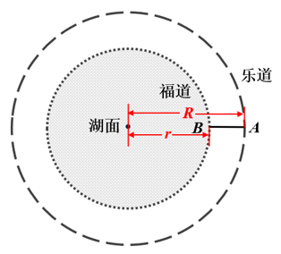

设小李骑行外圆一周的时间为t，则妈妈步行内圆一周的时间为4t。因两人的路程分别为内外两圆的周长，则可列式：······①，······②，根据A、B两点间距离为50米，即R=r+50，联立①②式，解得r=100米，则湖面面积（图中内圆面积）。

故正确答案为B。

---

### 第 7 题　qid 16592970 · 数学运算

某社区服务中心拟引入优质资源为本社区45名老人提供居家养老服务。已知老人的年龄构成如下（设老人的年龄为x）：有17人，有12人，有11人，90岁及以上有5人。现从该社区中随机抽取两名老人了解居家养老服务情况，那么这两名老人恰好都在80岁以上（含80岁）的概率是：

- **A**. 

　✅
- **B**. 

- **C**. 

- **D**. 

**答案**：A

**官方解析**

根据概率问题公式，概率。总情况数为45名老人随机选两人，共有种情况。满足要求的情况数为在80岁以上（含80岁）的11+5=16人中随机选两人，共有种情况。则所求概率。

故正确答案为A。

---

### 第 8 题　qid 16592959 · 数学运算

原油A每吨的价格为0.3万元，可提炼苯乙烯0.5吨，提炼过程中每吨原油产生的废气量为0.4吨；原油B每吨的价格为0.4万元，可提炼苯乙烯0.7吨，提炼过程中每吨原油产生的废气量为0.3吨。若要提炼至少1.9吨的苯乙烯且产生的废气量不超过1吨，则购买原油的最低费用为多少万元？

- **A**. 1
- **B**. 1.1　✅
- **C**. 1.2
- **D**. 1.3

**答案**：B

**官方解析**

根据题意可知，原油A提炼出1吨苯乙烯的成本为万元，原油B提炼出1吨苯乙烯的成本为万元，因此购买原油B提炼苯乙烯的费用更低；每吨A、B原油产生的废气量分别为0.4吨、0.3吨，原油B产生废气量更少，综合考虑应尽可能多购买原油B。提炼1.9吨的苯乙烯，优先购买原油B：······0.5（注：默认每类原油都购买整数吨），即最多购买2吨原油B，提炼剩下的0.5吨的苯乙烯还需要购买1吨原油A，此时共产生废气量为2×0.3+0.4=1吨，符合题干要求，则最低费用为2×0.4+0.3=1.1万元。

故正确答案为B。

备注：本题若不默认按整数吨购买，计算为万元，也需选择B项。 

---

### 第 9 题　qid 16592957 · 数学运算

气象学中，24小时内降落在某面积上的雨水深度叫做日降雨量（不考虑渗漏、蒸发、流失等损耗，单位：mm），将日降雨量记为w，其等级划分如下：小雨（），中雨（），大雨（），暴雨（）。某地某日用一个圆锥形容器接了24小时的雨水（如下图所示），则该地日降雨量等级是：

- **A**. 暴雨
- **B**. 大雨
- **C**. 中雨　✅
- **D**. 小雨

**答案**：C

**官方解析**

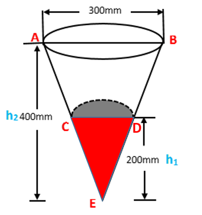

由题意可得，总降雨量为圆锥CDE的体积，本题所求日降雨量w是降落在直径为300mm面积上的水深。如图，，所以，由此可得mm，总降雨量。则所求日降雨量 ，求得mm，在中雨范围内。

故正确答案为C。

---

### 第 10 题　qid 16592954 · 数学运算

莱洛三角形是以等边三角形三个顶点为圆心，边长为半径，在顶点的对边画弧所得的封闭图形，这种形状的钻头可钻出四角为圆弧的正方形的孔洞（如左下图所示）。现将某莱洛三角形钻头所钻孔洞近似为正方形，测得该正方形孔洞截面积为（如右下图所示），则该钻头的截面积为：

- **A**. 

- **B**. 

- **C**. 

- **D**. 

　✅

**答案**：D

**官方解析**

如下图所示，扇形GEF与AC相切于点H，连接GH，则，且三角形GEF为正三角形，则GE=GF=EF=GH=AB，即三角形GEF的边长与正方形ABDC的边长相等。已知，则EF=AB=5cm，。由于正三角形内角为，，则所求钻头的截面积。

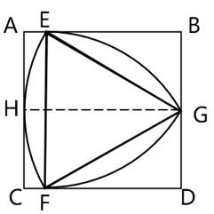

故正确答案为D。

---

## 判断推理

### 第 1 题　qid 16593031 · 图形推理

从所给四个选项中，选择最合适的一个填入问号处，使之呈现一定的规律性。

- **A**. A
- **B**. B
- **C**. C　✅
- **D**. D

**答案**：C

**官方解析**

元素组成相同，优先考虑位置规律。观察发现，题干图形内圈和外圈的黑球数量均相同，优先内外分开看。如下图所示，标记为①的黑球在内圈每次逆时针移动一格，标记为②③的黑球在外圈每次顺时针移动三格，只有C项符合规律。

故正确答案为C。

---

### 第 2 题　qid 16593026 · 图形推理

把下面的六个图形分为两类，使每一类图形都有各自的共同特征或规律，分类正确的一项是：

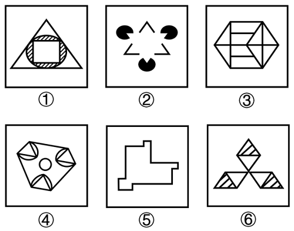

- **A**. ①④⑥，②③⑤
- **B**. ①②③，④⑤⑥
- **C**. ①⑤⑥，②③④　✅
- **D**. ①③⑤，②④⑥

**答案**：C

**官方解析**

本题为分组分类题目。元素组成不同，且题干出现很多等腰三角形，优先考虑对称性。观察发现，图②③④均是轴对称图形，图①⑤⑥均不是轴对称图形，即图①⑤⑥为一组，图②③④为一组。

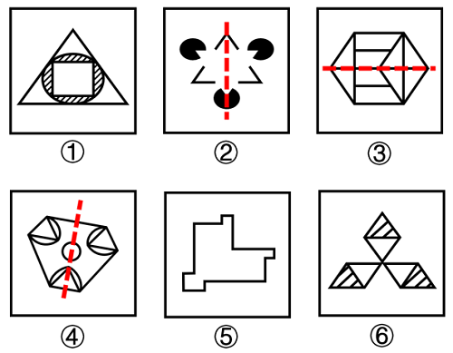

故正确答案为C。

注1：可能有部分同学根据对称轴数量是1还是3将题干分为①③⑤一组和②④⑥一组，然而本题图①、图⑥均存在由斜线构成的阴影，考虑到斜线也是图形的一部分，而斜线之间并不对称，因此认为图①和图⑥均不是轴对称图形。此外，若认为图⑤存在从右上到左下的对称轴，则画出该“对称轴”后，可以发现“对称轴”两侧的线条并不完全对应等长，图⑤也不是轴对称图形。

注2：分组分类题目优先考虑两组图形分别具有各自的规律，无法分成具有各自规律的两组时，才考虑将图形分成一组具有该规律，一组不具有该规律。

---

### 第 3 题　qid 16593204 · 图形推理

把下面的六个图形分为两类，使每一类图形都有各自的共同特征或规律，分类正确的一项是：

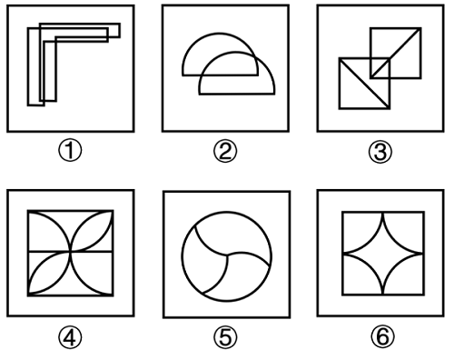

- **A**. ①④⑥，②③⑤
- **B**. ①②③，④⑤⑥
- **C**. ①⑤⑥，②③④
- **D**. ①②⑥，③④⑤　✅

**答案**：D

**官方解析**

本题为分组分类题目。元素组成不同，且无明显属性规律，考虑数量规律。题干出现“日”字和“田”字变形图、交圆切圆变形图，优先考虑笔画数。观察发现，图①②⑥的笔画数均为1，图③④⑤的笔画数均为2，即图①②⑥为一组，图③④⑤为一组。
故正确答案为D。

---

### 第 4 题　qid 16593023 · 图形推理

从所给四个选项中，选择最合适的一个填入问号处，使之呈现一定的规律性。

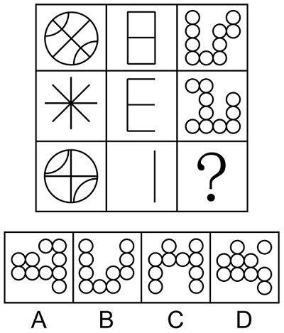

- **A**. A
- **B**. B
- **C**. C
- **D**. D　✅

**答案**：D

**官方解析**

九宫格横行观察无规律，但竖着看发现，相同线条重复出现，优先考虑样式规律中的加减同异。第一列图1和图2求异得到图3；经验证，第二列满足此规律；第三列应用此规律，故“？”处应选择图1和图2求异得到的图形，只有D项符合。
故正确答案为D。

---

### 第 5 题　qid 16593205 · 图形推理

左边为给定的立体图形，从任一角度观看，下面哪项不是该多面体的视图？

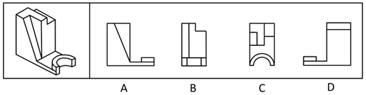

- **A**. A
- **B**. B
- **C**. C　✅
- **D**. D

**答案**：C

**官方解析**

本题考查三视图。如下图所示，A、B、D三项按图中箭头方向观察，均可看到，排除；

C项为从上往下观察该立体图形，看到的视图正中间应为一条长横线，如下图所示，该项视图错误，当选。

本题为选非题，故正确答案为C。

---

### 第 6 题　qid 16593022 · 定义判断

湖陆风是指湖陆之间相互转换的热力环流现象。入夜以后，陆地降温速度比湖水快，近地面空气变冷变重，而湖水降温慢，温度比陆地高，空气暖而轻，形成上升气流，陆上气流流向湖心形成陆风。太阳升起后，陆地吸热和升温速度比湖水快，直至陆上空气升温形成上升气流，湖面空气流向陆地形成湖风。
根据上述定义，下列诗句最能体现湖陆风现象的是：

- **A**. 轮台九月风夜吼，一川碎石大如斗，随风满地石乱走
- **B**. 潮没具区薮，潦深云梦田。朝随北风去，暮逐南风旋　✅
- **C**. 鸱枭养子庭树上，曲墙空屋多旋风
- **D**. 鹊飞山月曙，蝉噪野风秋

**答案**：B

**官方解析**

第一步：找出定义关键词。
“湖陆之间相互转换的热力环流现象”。
第二步：逐一分析选项。
A项：诗句的意思是轮台九月整夜里狂风怒号，到处的碎石块块大如斗，狂风吹得斗大乱石满地走。诗句只涉及陆地上的风，没有涉及湖水，不符合“湖陆之间相互转换的热力环流现象”，不符合定义，排除；
B项：诗句的意思是潮水沉没于太湖，潮水沉没于云梦泽里的田地，早上顺着北风驾船进入湖中打鱼采菱，傍晚乘着南风，可以毫不费力地驾船回家。诗句描写了湖水和陆地之间风的形成情况，符合“湖陆之间相互转换的热力环流现象”，符合定义，当选；
C项：诗句的意思是庭院里的树上，凶猛的猫头鹰都养出了小雏；曲折的院墙，空荡的房屋，多有旋风翻卷。诗句只涉及陆地上的风，没有涉及湖水，不符合“湖陆之间相互转换的热力环流现象”，不符合定义，排除；
D项：诗句的意思是曙光微明，月挂西山，鹊鸟出林，寒蝉在初秋的野外晨风中嘶声噪鸣。诗句只涉及陆地上的风，没有涉及湖水，不符合“湖陆之间相互转换的热力环流现象”，不符合定义，排除。
故正确答案为B。

---

### 第 7 题　qid 16593020 · 定义判断

磁滞现象指的是磁场把未带磁性的铁磁性物质（如铁、钴、镍及其合金等）磁化，使之带有磁性，但外加磁场去除后，铁磁性物质的磁性也不会马上消除，仍保有磁性的现象。
根据上述定义，下列属于磁滞现象的是：

- **A**. 当水中溶解了某些铁磁性物质，水在强磁场下流过时，周围金属物体中会产生磁感应现象，金属中有电流流过
- **B**. 由导线将电池、小灯泡、电流表、开关连接成闭合电路，闭合开关时，灯泡亮暗、电流表指针的指向等都会有变化
- **C**. 电饭锅中的温控元件都有设置好的温度值，电饭锅运行达到一定温度后，感温磁钢会消磁，依靠弹簧的反作用力断开电源
- **D**. 把烧红的铁片放置在子午线的方向，使铁分子顺着地球磁场方向排列，达到磁化目的，之后挪动铁片，铁分子仍然按照磁场方向排列　✅

**答案**：D

**官方解析**

第一步：找出定义关键词。
“磁场把未带磁性的铁磁性物质(如铁、钴、镍及其合金等）磁化”、“外加磁场去除后，铁磁性物质的磁性也不会马上消除”。
第二步：逐一分析选项。
A项：带有铁磁性物质的水在强磁场下流过时，周围的金属物体会产生磁感应现象，但未提及磁场去除后，是否还会有磁感应现象，不符合“外加磁场去除后，铁磁性物质的磁性也不会马上消除”，不符合定义，排除；
B项：由导线将电池、小灯泡、电流表、开关连接成闭合电路，闭合开关时，灯泡亮暗、电流表指针指向会有变化，没有涉及磁化，不符合“磁场把未带磁性的铁磁性物质(如铁、钴、镍及其合金等）磁化”，不符合定义，排除；
C项：电饭锅运行达到设定温度后，感温磁钢会消磁，说明感温磁钢本身具有磁性，不符合“磁场把未带磁性的铁磁性物质(如铁、钴、镍及其合金等）磁化”，不符合定义，排除；
D项：把烧红的铁片放置在子午线方向，铁分子顺着地球磁场方向排列，磁场使铁片磁化，符合“磁场把未带磁性的铁磁性物质(如铁、钴、镍及其合金等）磁化”，挪动铁片后铁分子仍然按照磁场方向排列，说明铁片磁性没有马上消除，符合“外加磁场去除后，铁磁性物质的磁性也不会马上消除”，符合定义，当选。
故正确答案为D。

---

### 第 8 题　qid 16592935 · 定义判断

供应商绿色压力是指企业供应商的环保意识和环保行为对企业绿色创新的影响。它会促使企业显著改进产品生产流程，以减少对自然资源的使用，并在产品生命周期内减少有害物质的释放。研究表明，供应商的绿色环保意识越强，绿色环保行为越主动，就越有可能通过供应链来影响链上企业的绿色创新行为。
根据上述定义，下列属于供应商绿色压力的是:

- **A**. 随着绿色意识的增强，消费者更愿意选择资源节约和环境友好的产品
- **B**. 随着国家生态建设的推进，企业会更加谨慎地选择自己的下游客户
- **C**. 供应商可以为链上企业提供“绿色创新”方面的资源和知识
- **D**. 供应商的绿色环保行为倒逼企业进行绿色创新行为　✅

**答案**：D

**官方解析**

第一步：找出定义关键词。
“企业供应商的环保意识和环保行为”、“对企业绿色创新的影响”。
第二步：逐一分析选项。
A项：随着绿色意识的增强，消费者更愿意选择资源节约和环境友好的产品，未提及企业，不符合“企业供应商的环保意识和环保行为”、“对企业绿色创新的影响”，不符合定义，排除；
B项：随着国家生态建设的推进，企业会更加谨慎地选择自己的下游客户，未提及企业的环保意识和绿色创新行为，不符合“企业供应商的环保意识和环保行为”、“对企业绿色创新的影响”，不符合定义，排除；
C项：供应商为链上企业提供“绿色创新”方面的资源和知识，但不明确是否对这些企业产生了绿色创新的影响，不符合“对企业绿色创新的影响”，不符合定义，排除；
D项：供应商的绿色环保行为，符合“企业供应商的环保意识和环保行为”，倒逼企业进行绿色创新行为，符合“对企业绿色创新的影响”，符合定义，当选。
故正确答案为D。

---

### 第 9 题　qid 16592937 · 定义判断

正常化偏见，就是指大家对某个事物感到习惯后，就会产生安于现状、不愿意再去尝试新事物的惰性心理。
根据上述定义，下列不属于正常化偏见的是：

- **A**. 某些喜欢看西医的病人排斥看中医
- **B**. 上了年纪的老年人更倾向去菜市场买菜
- **C**. 只要吃外卖，小张就只使用某平台下单
- **D**. 当人们试吃样品满意后更有可能进店消费　✅

**答案**：D

**官方解析**

第一步：找出定义关键词。
“对某个事物感到习惯后”、“产生安于现状、不愿意再去尝试新事物的惰性心理”。
第二步：逐一分析选项。
A项：习惯看西医的病人会不愿意去尝试看中医，符合“对某个事物感到习惯后”、“产生安于现状、不愿意再去尝试新事物的惰性心理”，符合定义，排除；
B项：老年人更倾向去菜市场买菜，即老年人习惯了去菜市场而不愿意去别的地方（商超、线上平台等）买菜，符合“对某个事物感到习惯后”、“产生安于现状、不愿意再去尝试新事物的惰性心理”，符合定义，排除；
C项：小张只使用某一个平台下单点外卖，说明小张习惯了使用该平台而不愿意使用其他平台，符合“对某个事物感到习惯后”、“产生安于现状、不愿意再去尝试新事物的惰性心理”，符合定义，排除；
D项：人们试吃样品满意后会更有可能进店消费，人们进店消费是因为“试吃样品满意”，不符合“对某个事物感到习惯后”、“产生安于现状、不愿意再去尝试新事物的惰性心理”，不符合定义，当选。
本题为选非题，故正确答案为D。

---

### 第 10 题　qid 16593009 · 定义判断

肿瘤侵犯，指的是肿块发展后引起相邻部位的反应和变化。肿瘤浸润，是指肿瘤细胞发展扩大透过原发部位的浆膜层转移到相邻组织和器官。肿瘤转移，指肿瘤由原发器官通过血液、淋巴等方式到达另一个远处器官。
根据上述定义，下列属于肿瘤侵犯的是：

- **A**. 宋阿姨近期体检发现患有乳腺癌，医生告知癌细胞已到达胸壁组织
- **B**. 经检查，老赵的肺部有五个毛玻璃结节，医生提醒他要定期复查
- **C**. 老王的胰腺肿瘤经过三个月的无效治疗已经蔓延到肝脏
- **D**. 老张肺部的肿块碰触心脏薄膜，引起心包积液　✅

**答案**：D

**官方解析**

第一步：找出定义关键词。
肿瘤侵犯：“肿块发展后引起相邻部位的反应和变化”；
肿瘤浸润：“肿瘤细胞发展扩大透过原发部位的浆膜层转移到相邻组织和器官”；
肿瘤转移：“肿瘤由原发器官通过血液、淋巴等方式到达另一个远处器官”。
第二步：逐一分析选项。
A项：癌细胞到达了胸壁组织，但无法确定是否引起了胸壁组织的反应和变化，不符合“引起相邻部位的反应和变化”，不符合“肿瘤侵犯”定义，排除；
B项：检查出老赵的肺部有结节，并未涉及其他部位，不符合“肿块发展后引起相邻部位的反应和变化”，不符合“肿瘤侵犯”定义，排除；
C项：胰腺肿瘤蔓延到了肝脏，但无法确定是否引起了肝脏的反应和变化，不符合“引起相邻部位的反应和变化”，不符合“肿瘤侵犯”定义，排除；
D项：肺部肿块碰触心脏薄膜，符合“肿块发展”，引起心包积液，符合“引起相邻部位的反应和变化”，符合“肿瘤侵犯”定义，当选。
故正确答案为D。

---

### 第 11 题　qid 16593013 · 定义判断

在统计学中，生态谬误是指用一种高层次的分析单位做调查，却用另一种低层次的分析单位做结论，即运用数据时错误地将整组的汇总结果应用到组内的单位中。
根据以上定义，下列属于生态谬误的是：

- **A**. 一项调研发现甲地居民的收入普遍比乙地居民的收入更高，由此认为甲地教师的收入高于乙地教师的收入　✅
- **B**. 服务业占比大的区域比服务业占比小的区域更容易吸引高层次人才，由此认为服务业占比大的区域高层次人才更多
- **C**. 某杂志开设了读者意见反馈邮箱，几天后收到28个不喜欢时装栏目的反馈邮件。某编辑认为有读者不喜欢，就一定有读者喜欢
- **D**. 某公司规定，上一年工资数额在公司前6%的要降低工资，小王上一年的工资低于公司的平均水平，可以推出小王今年的工资可能降低

**答案**：A

**官方解析**

第一步：找出定义关键词。
“运用数据时错误地将整组的汇总结果应用到组内的单位中”。
第二步：逐一分析选项。
A项：根据“甲地居民普遍比乙地居民的收入高”，得到“甲地教师比乙地教师的收入高”，即将整组数据的结果用来得到部分个体的结论，符合“运用数据时错误地将整组的汇总结果应用到组内的单位中”，符合定义，当选；
B项：根据“服务业占比大的区域更容易吸引高层次人才”，得到“服务业占比大的区域高层次人才更多”，前后均为服务业占比大的区域和服务业占比小的区域的对比，不符合“运用数据时错误地将整组的汇总结果应用到组内的单位中”，不符合定义，排除；
C项：根据“有28个不喜欢时装栏目的反馈邮件”，得到“有读者不喜欢，就一定有读者喜欢”，不涉及数据间的错误运用，不符合“运用数据时错误地将整组的汇总结果应用到组内的单位中”，不符合定义，排除；
D项：根据“小王上一年的工资低于公司的平均水平”，得到“小王今年的工资可能降低”，前后均为小王的工资，是根据过去的数据推导现在的情况，不符合“运用数据时错误地将整组的汇总结果应用到组内的单位中”，不符合定义，排除。
故正确答案为A。

---

### 第 12 题　qid 16593209 · 定义判断

政策合成谬误，是指从各部门来看，每项政策都是对的，组合起来实施时却是错的。政策分解谬误，是指不该分解的系统性任务被分解了，有的分解到各部门、各地方，有的分解到各个时间段。
根据上述定义，下列属于政策分解谬误的是：

- **A**. 为了让居民买得起房，某省各部门实施了一系列举措调控房价，几年后该省的房地产商数量明显减少
- **B**. 为了推动乡村振兴，某乡镇决定帮扶辖区内村民养殖黑山羊，一年后黑山羊数量剧增，导致附近山林遭到破坏
- **C**. 为了加快新能源产业的发展，某省出台政策鼓励居民购买电动汽车，半年后发现，该省范围内充电桩数量严重不足
- **D**. 某地政府欲出台一部环境卫生管理条例，其中各部分内容被分配到相关部门草拟，但最终统筹草案后发现各部分之间难以衔接　✅

**答案**：D

**官方解析**

第一步：找出定义关键词。
政策合成谬误：“从各部门来看，每项政策都是对的”、“组合起来实施时却是错的”；
政策分解谬误：“不该分解的系统性任务被分解了”、“有的分解到各部门、各地方，有的分解到各个时间段”。
第二步：逐一分析选项。
A项：为了让居民买得起房，某省各部门实施了一系列举措调控房价，符合“从各部门来看，每项政策都是对的”，但几年后该省的房地产商数量明显减少，说明最终的结果可能并不好，符合“组合起来实施时却是错的”，符合“政策合成谬误”定义，不符合“政策分解谬误”定义，排除；
B项：某乡镇决定帮扶辖区内村民养殖黑山羊，没有体现出政策被分解，不符合“不该分解的系统性任务被分解了”，不符合“政策分解谬误”定义，排除；
C项：某省出台政策鼓励居民购买电动汽车，没有体现出政策被分解，不符合“不该分解的系统性任务被分解了”，不符合“政策分解谬误”定义，排除；
D项：某地政府欲出台一部环境卫生管理条例，是一个系统性的任务，其中各部分内容被分配到相关部门草拟，符合“有的分解到各部门、各地方，有的分解到各个时间段”，但最终统筹后发现各部分难以衔接，说明该任务不应该被分解，符合“不该分解的系统性任务被分解了”，符合“政策分解谬误”定义，当选。
故正确答案为D。

---

### 第 13 题　qid 16593213 · 定义判断

“嗜睡”是一种睡眠失调现象，患者会持续感到极端疲倦，昏昏欲睡，往往会在毫无预警的情况下睡着，甚至是在活动中途突然入睡。“醉睡”则指酒醒后并没有完全清醒的状态，“醉睡”往往伴随混乱、迷惑、甚至暴力反应和失忆。
根据上述定义，下列选项未体现“嗜睡”或“醉睡”的是：

- **A**. 昨夜雨疏风骤，浓睡不消残酒
- **B**. 终日昏昏醉梦间，忽闻春尽强登山
- **C**. 老眠早觉常残夜，病力先衰不待年　✅
- **D**. 临川税驾忽数月，嗜睡爱闲常闭门

**答案**：C

**官方解析**

第一步：找出定义关键词。
嗜睡：“睡眠失调现象”、“持续感到极端疲倦，昏昏欲睡”、“在毫无预警的情况下睡着”；
醉睡：“酒醒后并没有完全清醒的状态”、“伴随混乱、迷惑、甚至暴力反应和失忆”。
第二步：逐一分析选项。
A项：诗句意思是昨夜雨下得稀疏，风刮得很急，酣睡一夜，然而醒来之后依然觉得还有一点酒意没有消尽，符合“酒醒后并没有完全清醒的状态”，符合“醉睡”定义，排除；
B项：诗句意思是整日昏昏沉沉恍若梦中，忽然发现春天即将过去便强打精神登山赏景，符合“睡眠失调现象”、“持续感到极端疲倦，昏昏欲睡”，符合“嗜睡”定义，排除；
C项：诗句意思是人老了之后晚上睡眠很少，常常很早就醒来，坐送残夜，等待天晓，因为有病，身体早早地衰老，恐怕不到致仕之年，就要告老还乡了，说的是年老之后睡眠变少，不符合定义，当选；
D项：诗句意思是在临川休息住宿一晃几个月过去了，喜欢睡觉热爱闲适不被打扰，所以经常闭门谢客，符合“持续感到极端疲倦，昏昏欲睡”，符合“嗜睡”定义，排除。
本题为选非题，故正确答案为C。

---

### 第 14 题　qid 16592930 · 定义判断

生物学重复是指对不同生物个体或者不同生物群体的样品采用相同的处理方式进行实验。技术重复则是指对同一样品进行的多次相同实验。
根据上述定义，下列属于生物学重复的是：

- **A**. 采集小王的血样一次并采用三种不同方式分别进行一次检测
- **B**. 采用三种不同方式对分三次采集的小王血样各进行一次检测
- **C**. 采集小王、小李、小张三人的血样并用同样方式分别进行一次检测　✅
- **D**. 采集小王、小李、小张三人的血样混合后用三种方式进行三次检测

**答案**：C

**官方解析**

第一步：找出定义关键词。
生物学重复：“不同生物个体或者不同生物群体的样品”、“采用相同的处理方式”；
技术重复：“同一样品”、“多次相同实验”。
第二步：逐一分析选项。
A项：仅采集小王的血样一次，不符合“不同生物个体或者不同生物群体的样品”，采用三种不同方式，不符合“采用相同的处理方式”，不符合“生物学重复”定义，排除；
B项：采用三种不同方式，不符合“采用相同的处理方式”，分三次采集的都是小王血样，不符合“不同生物个体或者不同生物群体的样品”，不符合“生物学重复”定义，排除；
C项：采集小王、小李、小张三人的血样，符合“不同生物个体或者不同生物群体的样品”，用同样方式分别进行一次检测，符合“采用相同的处理方式”，符合“生物学重复”定义，当选；
D项：用三种方式进行三次检测，不符合“采用相同的处理方式”，不符合“生物学重复”定义，排除。
故正确答案为C。

---

### 第 15 题　qid 16592979 · 定义判断

相变指的是物质微观粒子在不同聚集状态间的转变。在等温等压条件下，从一相转变为另一相时吸收或放出的热量是相变潜热。第一类相变是指伴有相变潜热和体积突变的相变。第二类相变则不伴有相变潜热和体积突变，但有热容跃变。
根据上述定义，下列属于第一类相变的是：

- **A**. 
热致变色印刷工艺采用遇热可产生色变的物质，如金属碘化物、络合物等，制成油墨在印品上形成色变层

- **B**. 
在1个大气压的情况下，1公斤的冰转变成同温度的水，要吸收79.6千卡的热量，与此同时体积亦收缩
　✅
- **C**. 
含羞草叶茎部的叶褥含有很多水分，当叶片振动时，叶褥中的水分流向其它地方，叶片逐渐干瘪蜷缩到一起

- **D**. 
核磁共振成像是通过使人体本身的磁场和仪器自身的磁性物质相互作用形成检测显影，进而查看到病变的位置

**答案**：B

**官方解析**

第一步：找出定义关键词。

相变：“物质微观粒子在不同聚集状态间的转变”；

相变潜热：“在等温等压条件下”、“从一相转变为另一相时”、“吸收或放出的热量”；

第一类相变：“伴有相变潜热和体积突变的相变”；

第二类相变：“不伴有相变潜热和体积突变，但有热容跃变”。

第二步：逐一分析选项。

A项：热致变色印刷工艺采用“遇热”可产生色变的物质，“遇热”表明温度发生了变化，不符合“在等温等压条件下”，不符合“相变潜热”定义，故也不符合“伴有相变潜热和体积突变的相变”，不符合“第一类相变”定义，排除；

B项：在1个大气压的情况下，符合“在等温等压条件下”，1公斤的冰转变成同温度的水，符合“从一相转变为另一相时”，要吸收79.6千卡的热量，符合“吸收或放出的热量”，符合“相变潜热”定义，与此同时体积亦收缩，符合“伴有相变潜热和体积突变的相变”，符合“第一类相变”定义，当选；

C项：当含羞草的叶片振动时，叶褥中的水分流向其它地方，叶片逐渐干瘪蜷缩到一起，不符合“物质微观粒子在不同聚集状态间的转变”，不符合“相变”定义，故也不符合“第一类相变”定义，排除；

D项：核磁共振成像是通过使人体本身的磁场和仪器自身的磁性物质相互作用形成检测显影，进而查看到病变的位置，不符合“物质微观粒子在不同聚集状态间的转变”，不符合“相变”定义，故也不符合“第一类相变”定义，排除。

故正确答案为B。

---

### 第 16 题　qid 16593210 · 类比推理

网箱养殖：深海养殖

- **A**. 网络设备：无线网卡
- **B**. 成人教育：职业教育　✅
- **C**. 载人飞船：返回舱
- **D**. 娱乐项目：剧本杀

**答案**：B

**官方解析**

第一步：判断题干词语间逻辑关系。
有的网箱养殖是深海养殖，有的网箱养殖不是深海养殖，有的深海养殖是网箱养殖，有的深海养殖不是网箱养殖，二者为交叉关系。
第二步：判断选项词语间逻辑关系。
A项：无线网卡是一种网络设备，二者为种属关系，与题干逻辑关系不一致，排除；
B项：有的成人教育是职业教育，有的成人教育不是职业教育，有的职业教育是成人教育，有的职业教育不是成人教育，二者为交叉关系，与题干逻辑关系一致，当选；
C项：返回舱是载人飞船的一部分，二者为组成关系，与题干逻辑关系不一致，排除；
D项：剧本杀是一种娱乐项目，二者为种属关系，与题干逻辑关系不一致，排除。
故正确答案为B。

---

### 第 17 题　qid 16593036 · 类比推理

牡丹花：牵牛花

- **A**. 金枪鱼：八爪鱼
- **B**. 东北菜：黄花菜
- **C**. 布谷鸟：啄木鸟　✅
- **D**. 变色龙：霸王龙

**答案**：C

**官方解析**

第一步：判断题干词语间逻辑关系。
“牡丹花”和“牵牛花”是两种不同的花，二者为并列关系。
第二步：判断选项词语间逻辑关系。
A项：“金枪鱼”是鱼类，而“八爪鱼”是软体动物，二者不是并列关系，与题干逻辑关系不一致，排除；
B项：“东北菜”是东北地区的本土菜系，“黄花菜”是一种可以食用的植物，二者不是并列关系，与题干逻辑关系不一致，排除；
C项：“布谷鸟”和“啄木鸟”是两种不同的鸟，二者为并列关系，与题干逻辑关系一致，当选；
D项：“变色龙”是一种爬行动物，“霸王龙”是一种恐龙，而变色龙不是恐龙，二者不是并列关系，与题干逻辑关系不一致，排除。
故正确答案为C。

---

### 第 18 题　qid 16593015 · 类比推理

服装：唐装：西装

- **A**. 刷牙：牙刷：牙膏
- **B**. 豪车：赛车：轿车
- **C**. 旗帜：国旗：红旗
- **D**. 武术：太极拳：咏春拳　✅

**答案**：D

**官方解析**

第一步：判断题干词语间逻辑关系。
唐装和西装是两种不同的服装，后两词为并列关系，且均与第一词构成种属关系。
第二步：判断选项词语间逻辑关系。
A项：牙刷和牙膏是刷牙时配套使用的工具，后两词为配套使用关系，与题干逻辑关系不一致，排除；
B项：豪车、赛车和轿车是从不同的划分角度命名的汽车，三者互为交叉关系，与题干逻辑关系不一致，排除；
C项：有的国旗是红旗，有的国旗不是红旗，有的红旗是国旗，有的红旗不是国旗，后两词为交叉关系，与题干逻辑关系不一致，排除；
D项：太极拳和咏春拳是两种不同的武术，后两词为并列关系，且均与第一词构成种属关系，与题干逻辑关系一致，当选。
故正确答案为D。

---

### 第 19 题　qid 16593007 · 类比推理

锁骨：肋骨：坐骨

- **A**. 头脑：头皮：头发
- **B**. 腹腔：口腔：鼻腔
- **C**. 盲肠：大肠：直肠
- **D**. 颈椎：胸椎：腰椎　✅

**答案**：D

**官方解析**

第一步：判断题干词语间逻辑关系。
锁骨、肋骨、坐骨是三种不同的人体骨骼，三者为并列关系。
第二步：判断选项词语间逻辑关系。
A项：头脑由头发、头皮、肌肉、骨骼和脑体组成，后两词均与第一词构成组成关系，与题干逻辑关系不一致，排除；
B项：腹腔、口腔、鼻腔是三种不同的人体部位，三者为并列关系，与题干逻辑关系一致，保留；
C项：大肠是消化管的下段，可分为盲肠、阑尾、结肠、直肠和肛管5部分，第一词与第三词为并列关系，且均与第二词构成组成关系，与题干逻辑关系不一致，排除；
D项：颈椎、胸椎、腰椎是三种不同的椎骨，三者为并列关系，与题干逻辑关系一致，保留。
对比B、D两项，题干中锁骨、肋骨、坐骨所在的位置依次为从上到下，B项中腹腔、口腔、鼻腔所在的位置依次为从下到上，而D项中颈椎、胸椎、腰椎所在的位置依次为从上到下，因此D项与题干逻辑关系更为一致，当选。
故正确答案为D。

---

### 第 20 题　qid 16593030 · 类比推理

数字经济 对于 （    ） 相当于 （    ） 对于 人工智能

- **A**. 信息工具 家用电器
- **B**. 信息技术 无人驾驶　✅
- **C**. 数字资源 现代农业
- **D**. 数字货币 远程医疗

**答案**：B

**官方解析**

逐一代入选项。
A项：数字经济是以新一代信息技术为依托的一种新经济形态，数字经济一定需要利用信息工具，二者为必然利用的对应关系；家用电器可能需要利用人工智能，二者为或然利用的对应关系，前后逻辑关系不一致，排除；
B项：数字经济一定需要利用信息技术，二者为必然利用的对应关系；无人驾驶一定需要利用人工智能，二者为必然利用的对应关系，前后逻辑关系一致，当选；
C项：数字经济一定需要利用数字资源，二者为必然利用的对应关系；现代农业可能需要利用人工智能，二者为或然利用的对应关系，前后逻辑关系不一致，排除；
D项：数字经济的发展导致了数字货币的产生，二者为产物的对应关系；远程医疗可能需要利用人工智能，二者为或然利用的对应关系，前后逻辑关系不一致，排除。
故正确答案为B。

---

### 第 21 题　qid 16593029 · 逻辑判断

河西走廊西部的荒原地处内陆，气候干燥，大部分地方都是戈壁沙漠，绿洲面积仅占总面积的很小一部分。千百年来，这里留下了一座又一座的古城址，它们有的彼此连缀，仿佛庞大的星座，有的则间断闪耀，形成多层结构。专家认为，水源变化是形成多个古城址的原因。
以下哪项如果为真，最能支持上述专家的观点？

- **A**. 河西走廊西部的部分地区素有“世界风库”之称，每年三分之一的时间刮着七级以上大风
- **B**. 一旦水量减少，耕地很快会沙化，古城烟火无以为继，人们就会寻找新的绿洲再建一座城　✅
- **C**. 在1000多年的时间中，河西走廊骆驼城的地下水位下降了几十米
- **D**. 在河西走廊，古城都是依水而建

**答案**：B

**官方解析**

第一步：找出论点和论据。
论点：水源变化是形成多个古城址的原因。
论据：无。
本题只有论点，没有论据，加强优先考虑补充论据，即解释原因或举例子。
第二步：逐一分析选项。
A项：该项讨论的是河西走廊部分地区每年的刮风情况，而论点讨论的是水源变化是否是形成多个古城址的原因，话题不一致，无法加强，排除；
B项：该项讨论的是水量减少会引起耕地沙化，人们就会寻找新的绿洲再建一座城，所以一旦水源变化，那么就要换新城址，解释了为什么水源变化是形成多个古城址的原因，补充论据，可以加强，当选；
C项：该项讨论的是在1000多年中，河西走廊骆驼城地下水位的变化，但是不明确其他城址的水源变化，无法判断水源变化是否是形成多个古城址的原因，为不明确项，无法加强，排除；
D项：该项讨论的是在河西走廊，古城都是依水而建，说明河西走廊的古城都坐落在水源的附近，但是无法判断水源变化是否是形成多个古城址的原因，为不明确项，无法加强，排除。
故正确答案为B。

---

### 第 22 题　qid 16592994 · 逻辑判断

白居易在《荔枝图序》中言道：“若离本枝，一日而色变，二日而香变，三日而味变，四五日外，色香味尽去矣。”研究表明，荔枝难以保鲜是因为果实的呼吸强度很高，导致果实品质急剧下降。
以下哪项如果为真，最能支持上述研究结论？

- **A**. 荔枝的可食用部位不是像桃子那样的果皮，而是“假果皮”，它与外皮之间没有直接的维管束相连，外皮失水时不能直接从果肉处获得补充
- **B**. 荔枝离枝后会继续分解糖分：氧气充足时，糖分会分解为二氧化碳；氧气不足时，糖分会转化为一些影响风味的醇、醛类物质　✅
- **C**. 荔枝自身会不断产生乙烯，加速果实成熟甚至腐烂，自然更容易变质
- **D**. 荔枝花能产生花蜜，并且它们的蜜腺很发达，是很好的蜜源植物

**答案**：B

**官方解析**

第一步：找出论点和论据。
论点：荔枝难以保鲜是因为果实的呼吸强度很高，导致果实品质急剧下降。
论据：无。
本题只有论点没有论据，加强优先考虑补充论据，即解释原因或举例子。
第二步：逐一分析选项。
A项：该项讨论的是荔枝的可食用部位是“假果皮”以及外皮失水时的情况，但外皮失水与论点中果实的呼吸强度无明确关联，话题不一致，无法加强，排除；
B项：该项讨论的是荔枝离枝后会继续分解糖分，以及分别在氧气充足时和氧气不足时的糖分转化情况，说明荔枝的果实确实存在呼吸作用，补充论据，可以加强，当选；
C项：该项讨论的是荔枝自身不断产生的乙烯会导致其变质，但乙烯的产生与论点中果实的呼吸强度无明确关联，话题不一致，无法加强，排除；
D项：该项讨论的是荔枝花能产生花蜜，与论点中果实的呼吸强度完全无关，话题不一致，无法加强，排除。
故正确答案为B。

---

### 第 23 题　qid 16593005 · 逻辑判断

长期只给中老年人提供一些对大脑神经系统有益的营养素，如DHA、抗氧化剂等，对预防脑力衰老似乎没有明显的效果，但改变整体的膳食模式则有利于延缓中老年人的认知退化。研究者发现地中海膳食和得舒膳食模式能保护老年人的认知能力。绿叶蔬菜、鱼类和全谷物是这两种膳食模式强调要充分摄入的三类核心食物。此外，还要严格限制油炸、高盐、甜食饮料等，因为它们不利于预防肥胖和三高，而这些则都是加剧认知退化的重要因素。
以下哪项如果为真，最能支持上述研究发现？

- **A**. 食用蔬果总量高的老年人认知能力保持得较好
- **B**. 地中海膳食、得舒膳食等饮食模式有利于延缓认知退化
- **C**. 预防脑力衰老仅靠摄入营养素或改变整体的膳食模式是不够的
- **D**. 全谷物有利于控制血糖，绿叶蔬菜有利于改善血脂，鱼类所含的脂肪酸更易消化　✅

**答案**：D

**官方解析**

第一步：找出论点和论据。
论点：地中海膳食和得舒膳食模式能保护老年人的认知能力。
论据：绿叶蔬菜、鱼类和全谷物是这两种膳食模式强调要充分摄入的三类核心食物。此外，还要严格限制油炸、高盐、甜食饮料等，因为它们不利于预防肥胖和三高，而这些则都是加剧认知退化的重要因素。
本题论点和论据都在说地中海膳食和得舒膳食模式与老年人认知之间的关系，二者话题一致，加强优先考虑补充论据。
第二步：逐一分析选项。
A项：该项说的是蔬果总量高的老年人认知能力保持得较好，但论点中的地中海膳食和得舒膳食模式并没有强调摄入的蔬果总量要高，话题不一致，无法加强，排除；
B项：该项说的是地中海膳食、得舒膳食等饮食模式有利于延缓认知退化，但没有详细展开说明这两种饮膳食模式如何延缓认知退化，只是简单对论点进行重复，可以加强，保留；
C项：该项说的是预防脑力衰老不能仅靠摄入营养素或改变整体的膳食模式，而论点说的是地中海膳食和得舒膳食模式能否保护老年人的认知能力，话题不一致，无法加强，排除；
D项：该项说的是全谷物、绿叶蔬菜、鱼类三种食物分别可以控制血糖、改善血脂、易被消化，说明按照论点中的两种膳食模式摄入的三类核心食物可以帮助控制三高（高血压、高血糖、高血脂），而论据中提到“三高是加剧认知退化的重要因素”，这表明地中海膳食和得舒膳食模式确实能延缓认知退化、保护老年人的认知能力，解释原因，可以加强，保留。
对比B、D两项，B项只是重复论点，而D项解释说明了“膳食模式中的三类核心食物”与“三高”之间的关系，是对论证逻辑的补充，加强力度强于简单重复论点，故D项更为合适。
故正确答案为D。

---

### 第 24 题　qid 16593021 · 逻辑判断

对世界上最常见的火山类型而言，含水量较高的岩浆往往储存在地壳更深处。水在很大程度上引发并助长了火山爆发，岩浆的含水量越多，岩浆上升得越快，喷发就越猛烈。此时，岩浆的浮力不再是岩浆喷发的关键，岩浆中越多的水分含量才意味着越多的气泡和潜在更猛烈的喷发。
以下哪项如果为真，最能加强上述研究发现？

- **A**. 岩浆之所以能通过地壳裂缝上升，是因为岩浆比周围岩石的浮力更大
- **B**. 若除水外还有额外的浮力，也会在火山被触发时将更多的岩浆带到地面
- **C**. 水和岩浆的混合物在上升过程中有时会发生脱气现象，使混合物变得更加粘稠，导致上升缓慢甚至停滞
- **D**. 水和岩浆的混合物储存在火山中，当岩浆上升到地表附近后，压力下降就会形成气泡，气泡迅速膨胀导致岩浆喷射而出　✅

**答案**：D

**官方解析**

第一步：找出论点和论据。
论点：水在很大程度上引发并助长了火山爆发，岩浆的含水量越多，岩浆上升得越快，喷发就越猛烈。此时，岩浆的浮力不再是岩浆喷发的关键，岩浆中越多的水分含量才意味着越多的气泡和潜在更猛烈的喷发。
论据：无。
本题只有论点，没有论据，加强优先考虑补充论据。
第二步：逐一分析选项。
A项：该项说的是因为岩浆浮力更大，所以岩浆能上升，强调了浮力对岩浆上升的重要性，而论点说的是岩浆的含水量越多则岩浆喷发得越猛烈，浮力并不是岩浆喷发的关键，削弱论点，无法加强，排除；
B项：该项说的是除水之外的浮力对岩浆喷发的影响，而论点讨论的是岩浆的含水量对岩浆喷发的影响，为无关项，无法加强，排除；
C项：该项说的是水和岩浆的混合物有时会导致岩浆上升缓慢，而论点说的是岩浆的含水量越多则岩浆喷发得越猛烈，削弱论点，无法加强，排除；
D项：该项说的是水和岩浆的混合物在上升到地表附近后会因为压力下降形成气泡，气泡迅速膨胀导致岩浆喷射，解释了水越多就意味着气泡越多，进而会造成岩浆的猛烈喷发，补充论据，可以加强，当选。
故正确答案为D。

---

### 第 25 题　qid 16592940 · 逻辑判断

某智库调查表明，某省2022年的长租房成交量呈不断上涨的趋势，排在全国前列，成交总量超过3000套，较去年增长超过40%，有效解决了新市民、青年人等群体的住房难题。因此有专家认为，加快发展长租房市场是我国解决住房难题的一剂良药。
以下哪项如果为真，最能削弱上述结论？

- **A**. 长租房市场发展时间短，目前缺乏有效监管
- **B**. 2022年，我国的长租房市场规模已达1.73万亿元
- **C**. 长租房无法享受与购房者同等的公共服务，在一二线城市难以推广　✅
- **D**. 有数据表明，我国租赁人口约有2.2亿，占流动人口总数的90%左右

**答案**：C

**官方解析**

第一步：找出论点和论据。
论点：加快发展长租房市场是我国解决住房难题的一剂良药。
论据：某省2022年的长租房成交量呈不断上涨的趋势，排在全国前列，成交总量超过3000套，较去年增长超过40%，有效解决了新市民、青年人等群体的住房难题。
本题的论点和论据均在讨论发展长租房能有效解决住房难题，二者话题一致，削弱优先考虑削弱论点。
第二步：逐一分析选项。
A项：该项说的是长租房市场缺乏有效监管，论点说的是发展长租房能有效解决住房难题，话题不一致，无法削弱，排除；
B项：该项说的是我国长租房市场的规模比较大，论点说的是发展长租房能有效解决住房难题，话题不一致，无法削弱，排除；
C项：该项说的是长租房在一二线城市难以推广，说明发展长租房无法解决我国一二线城市的住房难题，削弱论点，可以削弱，当选；
D项：该项说的是我国租赁人口多、占流动人口的比例大，说明我国租房需求大，需要发展租赁市场，补充论据，无法削弱，排除。
故正确答案为C。

---

### 第 26 题　qid 16593018 · 逻辑判断

心理学家曾做过一个实验，将被试者分为两组，给他们看同一张交通事故的照片，并询问有关车速的问题。对第一组问“你认为是以多快的速度相撞的”，而对第二组则问“你认为是以多快的速度猛烈撞击到一起的”。后者是让人想到撞击非常猛烈的表达方式。一周后，再询问被试者“汽车的挡风玻璃是否撞碎了”（实际上并没有撞碎）。结果显示，回答“是”的人，第二组的比例比第一组多两倍以上。心理学家由此得出结论：人类的记忆并不是固定的，而是根据之后获取的信息而变化。
以下哪项如果为真，最能削弱心理学家的结论？

- **A**. 第二组被试者的人数比第一组的多
- **B**. 第二组被试者的记忆力本来就偏弱　✅
- **C**. 时隔一周再询问的合理性有待斟酌
- **D**. 两组被试者在认知水平上没有差距

**答案**：B

**官方解析**

第一步：找出论点和论据。
论点：人类的记忆并不是固定的，而是根据之后获取的信息而变化。
论据：让两组被试者看同一张交通事故的照片，并询问有关车速的问题。第二组的问题是让人想到撞击非常猛烈的表达方式。一周后，再询问被试者“汽车的挡风玻璃是否撞碎了”（实际上并没有撞碎）。结果显示，回答“是”的人，第二组的比例比第一组多两倍以上。
本题论据是用实验表明回答不同的问题对人的记忆力存在影响，论点是基于此得出的结论，二者话题一致，削弱优先考虑削弱论点，且论据是对比实验，也可指出实验起点不一致或实验不可靠。
第二步：逐一分析选项。
A项：该项指出两组被试者的人数存在差异，但实验对比的是各组中回答“是”的比例，与各组被试者的人数无关，为无关项，无法削弱，排除；
B项：该项指出第二组被试者的记忆力本来就“偏弱”，说明两组被试者的“记忆力”本身就存在差异，即实验起点不一致，可以削弱，当选；
C项：该项指出时隔一周再询问的合理性“有待斟酌”，不明确时隔一周再询问对被试者的回答是否会产生影响，为不明确项，无法削弱，排除；
D项：该项指出两组被试者在认知水平上没有差距，说明实验起点一致，为加强项，无法削弱，排除。
故正确答案为B。

---

### 第 27 题　qid 16592978 · 逻辑判断

与储存能量的白色脂肪细胞不同，棕色脂肪细胞会将能量以热的形式消耗掉。实验发现，正在死亡的棕色脂肪细胞会分泌出大量肌苷。接收到肌苷分子信号后，不仅周围的棕色细胞被激活，就连周围的白色脂肪细胞也被转化成棕色脂肪细胞。但是肌苷转运蛋白能将肌苷转至细胞内降低了细胞外的肌苷浓度，致使肌苷的“促燃”作用大打折扣。对照实验证实，喂食高能量饮食并同时使用肌苷转运蛋白抑制剂的小鼠仍然较瘦，且免受糖尿病的困扰。
由此可以推出：

- **A**. 肌苷能调节棕色脂肪细胞在生物体中的产热过程
- **B**. 棕色脂肪细胞有助于身体维持体温，抵御寒冬
- **C**. 刺激棕色脂肪细胞，能够增加身体能量燃烧　✅
- **D**. 干扰转运蛋白活性的物质可用于肥胖症治疗

**答案**：C

**官方解析**

日常结论题，根据题干信息逐一分析选项。
A项：根据第四句话“肌苷转运蛋白能将肌苷转至细胞内降低了细胞外的肌苷浓度，致使肌苷的‘促燃’作用大打折扣”可知，是“肌苷转运蛋白”可以调节产热过程，而不是“肌苷”，偷换概念，无法推出，排除；
B项：根据第一句话“棕色脂肪细胞会将能量以热的形式消耗掉”可知，没有提及是否能维持体温，无中生有，无法推出，排除；
C项：根据第一句话“棕色脂肪细胞会将能量以热的形式消耗掉”和第三句话“接收到肌苷分子信号后，不仅周围的棕色细胞被激活”可知，刺激棕色细胞后，棕色细胞会将能量燃烧，可以推出，当选；
D项：题干讨论的是“肌苷转运蛋白”，但该项讨论的是“转运蛋白”，因此无法推出，排除。
故正确答案为C。

---

### 第 28 题　qid 16593208 · 逻辑判断

土楼是客家文化的象征，主要集中在福建。其实，在广东潮汕地区也存在大量土楼，仅潮州饶平县就有781座。潮汕的土楼始建于元代，盛于明清，迄今已有700余年的营造史。专家认为，土楼生于乱世，是应潮客先民们聚族而居，集体防卫的需要而产生的。
要得到上述结论，需要补充的前提是：

- **A**. 在古老的土楼守护下，家族得以躲过漫长岁月中的种种侵袭和战乱
- **B**. 潮汕历史上有过漫长的山海动荡，从明至清屡遭山贼、海盗的侵扰　✅
- **C**. 千百年来，大量的客家人和闽南人从陆路和水路迁入潮汕，带去了土楼文化
- **D**. 潮汕地区古有“无村不寨”的说法，曾有大量军事性、封闭型的围寨，类型多样

**答案**：B

**官方解析**

第一步：找出论点和论据。
论点：土楼生于乱世，是应潮客先民们聚族而居，集体防卫的需要而产生的。
论据：无。
本题只有论点没有论据，且提问方式为“前提”，加强优先考虑必要条件。
第二步：逐一分析选项。
A项：该项指出家族在土楼的守护下躲过侵袭和战乱，说明土楼有防卫的作用，补充论据，可以加强，保留；
B项：该项指出潮汕从明至清屡遭侵扰，如果潮汕未在此时期内遭受侵扰，那么就无需建造土楼用于防卫，是论点成立的必要条件，可以加强，保留；
C项：该项指出土楼文化是由客家人和闽南人带来的，并未说明土楼因何而生，无法加强，排除；
D项：该项指出潮汕曾有类型多样的围寨，并未说明土楼是因何而生的，无法加强，排除。
对比A、B两项，B项必要条件的加强力度大于A项的补充论据，B项当选。
故正确答案为B。

---

### 第 29 题　qid 16593011 · 类比推理

某单位由于工作需要，本周六必须安排赵、钱、孙、李、周、吴、郑7名工作人员值班，每个人都要值半天班，上午安排4人一起值班，下午安排3人一起值班。值班人员的分配满足下列条件：
(1）赵和孙不在一起值班；
(2）周和孙不在一起值班；
(3）如果郑在下午值班，那么赵和李也在下午值班；
(4）或者钱在上午值班，或者郑在下午值班。
根据以上信息，必须在上午值班的工作人员是：

- **A**. 钱和郑　✅
- **B**. 赵和郑
- **C**. 赵和周
- **D**. 吴和孙

**答案**：A

**官方解析**

第一步：分析题干条件。

(1）赵和孙不在一起值班；

(2）周和孙不在一起值班；

(3）郑下午值班赵 且 李下午值班；

(4）钱上午值班 或 郑下午值班；

(5）上午4人值班，下午3人值班。

第二步：根据题干条件进行推理。

根据条件（1）（2）可知，赵和孙不在一起值班，周和孙也不在一起值班，那么赵和周在一起值班；结合条件（3），如果郑在下午值班，那么赵和李也在下午值班，此时周也应该在下午值班，下午值班的人数为4，与条件（5）矛盾，因此郑一定在上午值班；再结合条件（4），钱上午值班或郑下午值班，根据或关系“否一推一”可知，钱一定在上午值班，即钱和郑在上午值班。

故正确答案为A。

---

### 第 30 题　qid 16593211 · 类比推理

学校计划开展暑期夏令营活动，就陈老师和林老师是否担任夏令营带队老师，几个家长纷纷猜测：
吴妈妈：如果陈老师没去带队，林老师肯定也没去；
李妈妈：陈老师是这个夏令营活动的策划者，她一定会去带队；
郑妈妈：你们等着看吧，陈老师和林老师至少有一个人会去；
张妈妈：我认为林老师会去带队，陈老师要回家探亲不会去。
结果发现其中两个妈妈猜对了，两个妈妈猜错了。请问猜对了的妈妈是：

- **A**. 李妈妈和郑妈妈
- **B**. 吴妈妈和张妈妈
- **C**. 吴妈妈和李妈妈
- **D**. 郑妈妈和张妈妈　✅

**答案**：D

**官方解析**

第一步：分析题干找关系。

吴妈妈：陈老师带队林老师带队；

李妈妈：陈老师带队；

郑妈妈：陈老师带队 或 林老师带队；

张妈妈：林老师带队 且 陈老师带队。

吴妈妈和张妈妈的猜测为矛盾关系，必有一真一假。

第二步：看其余。

根据题干可知，四人的猜测为两真两假，故李妈妈和郑妈妈也必有一真一假。若李妈妈的猜测为真，那么郑妈妈的猜测也为真，不符合一真一假，因此李妈妈的猜测为假，郑妈妈的猜测为真，即陈老师没带队，再结合“或关系否一推一”可知，林老师带队，进而可以得出张妈妈的猜测为真。

故正确答案为D。

---

## 资料分析

### 材料 1

#### 第 1 题　qid 16592975 · 增长

表格所列国家中，相较于2012年，2022年全球创新指数增长最快的国家是：

- **A**. 美国
- **B**. 中国　✅
- **C**. 英国
- **D**. 印度

**答案**：B

**官方解析**

根据题干“······相较于2012年，2022年······增长最快的国家是”，可判定本题为一般增长率比较问题。定位统计表可得：2012年美国全球创新指数为57.7，2022年为61.8；2012年中国全球创新指数为45.4，2022年为55.3；2012年英国全球创新指数为61.2，2022年为59.7；2012年印度全球创新指数为35.7，2022年为36.6。根据公式：增长率，则相较于2012年，2022年选项中国家全球创新指数同比增速分别为：

美国：；

中国：；

英国：；

印度：。

综上，表格所列国家中，相较于2012年，2022年全球创新指数增长最快的国家是中国。

故正确答案为B。

---

#### 第 2 题　qid 16592980 · 平均数

表格所列国家中，2022年全球创新指数排名前五位国家的平均创新指数是：

- **A**. 58.54
- **B**. 59.74
- **C**. 60.84
- **D**. 61.14　✅

**答案**：D

**官方解析**

根据题干“······2022年······平均创新指数是”，可判定本题为现期平均数问题。定位统计表可得：2022年全球创新指数排名前五位的国家分别是瑞士（64.6）、美国（61.8）、瑞典（61.6）、英国（59.7）、荷兰（58.0）。利用“削峰填谷”，以60为基准，分别作差得：4.6、1.8、1.6、-0.3、-2，，则排名前五位国家的平均创新指数=60+1.14=61.14。

故正确答案为D。

---

#### 第 3 题　qid 16592984 · 综合

关于2021年，下列国家全球创新指数大小比较，错误的是：

- **A**. 瑞士>瑞典>美国
- **B**. 英国>韩国>荷兰
- **C**. 芬兰>新加坡>丹麦
- **D**. 俄罗斯>巴西>印度　✅

**答案**：D

**官方解析**

定位统计表可知2021年部分国家全球创新指数。代入选项验证：
A项：瑞士（65.5）&gt;瑞典（63.1）&gt;美国（61.3），正确；
B项：英国（59.8）&gt;韩国（59.3）&gt;荷兰（58.6），正确；
C项：芬兰（58.4）&gt;新加坡（57.8）&gt;丹麦（57.3），正确；
D项：俄罗斯（36.6）&gt;巴西（34.2）&lt;印度（36.4），错误。
本题为选非题，故正确答案为D。

---

#### 第 4 题　qid 16592986 · 增长

2022年，中国、巴西、俄罗斯、印度、南非五国创新指数之和同比：

- **A**. 增长约3.2%
- **B**. 增长约4.8%
- **C**. 下降约3.2%　✅
- **D**. 下降约4.8%

**答案**：C

**官方解析**

根据题干“2022年······创新指数之和同比”，结合选项为“增长/下降+百分数”，可判定本题为一般增长率问题。定位统计表可知2021年及2022年中国、巴西、俄罗斯、印度、南非五国创新指数。则2021年中国、巴西、俄罗斯、印度、南非五国创新指数之和为，2022年五国创新指数之和为。根据公式：增长率，则题干所求为，与C项最接近。

故正确答案为C。

---

#### 第 5 题　qid 16592988 · 综合

能够从上述资料推出的是：

- **A**. 2022年，韩国创新指数同比下降幅度超过丹麦　✅
- **B**. 2022年，中国创新指数在全球的排名比2012年上升20位
- **C**. 表格所列年份中，全球创新指数均在58及以上的国家有5个
- **D**. 2022年，表格所列全球创新指数同比增长的国家中，其创新指数同比增量均不少于0.5

**答案**：A

**官方解析**

A项：定位统计表可得，2021年、2022年韩国创新指数分别为59.3、57.8，丹麦分别为57.3、55.9。根据公式：增长率，可得2022年韩国创新指数同比增速，即降幅为2.5%；丹麦创新指数同比增速，即降幅为2.4%。则2022年韩国创新指数同比下降幅度超过丹麦，正确；

B项：材料只给出部分国家创新指数的数据，无法得出2012年、2022年中国在全球的排名，错误；

C项：定位统计表可得，2012年、2021年、2022年全球创新指数均在58及以上的国家分别为瑞士（68.2、65.5、64.6）、瑞典（64.8、63.1、61.6）、英国（61.2、59.8、59.7）、荷兰（60.5、58.6、58.0），共4个国家，并非5个国家，错误；

D项：定位统计表可得，2021年、2022年印度创新指数分别为36.4、36.6。2022年印度创新指数同比增量=现期量-基期量=36.6-36.4=0.2&lt;0.5，并非均不少于0.5，错误。

故正确答案为A。

---

### 材料 2

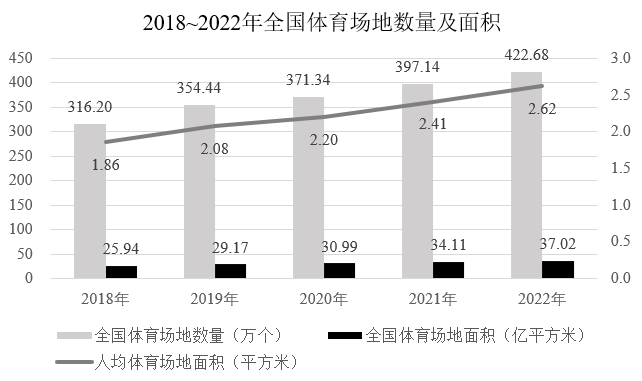

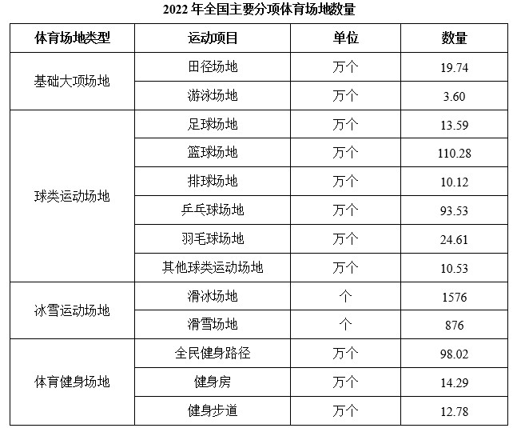

#### 第 6 题　qid 10204589 · 增长

2019~2022年全国体育场地面积增长最快的年份是：

- **A**. 2019年　✅
- **B**. 2020年
- **C**. 2021年
- **D**. 2022年

**答案**：A

**官方解析**

根据题干“2019~2022年······增长最快的年份是”，可判定本题为一般增长率问题。定位统计图可知2018~2022年全国体育场地面积。根据公式：增长率，则2019~2022年全国体育场地面积同比增长率分别为：

2019年：；

2020年：；

2021年：；

2022年：。

比较发现，2019~2022年全国体育场地面积增长最快的年份是2019年。

故正确答案为A。

---

#### 第 7 题　qid 16592939 · 综合

2022年全国每万人拥有的体育场地数量约为：

- **A**. 26.2个
- **B**. 29.9个　✅
- **C**. 34.7个
- **D**. 39.4个

**答案**：B

**官方解析**

根据题干“2022年全国每万人拥有的体育场地数量约为”，结合统计图给出2022年数据，可判定本题为现期平均数问题。定位统计图可知，2022年全国体育场地数量为422.68万个，全国体育场地面积为37.02亿平方米，人均体育场地面积为2.62平方米。因为人均体育场地面积，所以2022年全国每万人拥有的体育场地数量个，与B项最接近。

故正确答案为B。

---

#### 第 8 题　qid 16592941 · 增长

2022年全国人均体育场地面积同比增量约为2018~2022年年均增长量的：

- **A**. 108.7%
- **B**. 110.5%　✅
- **C**. 115.6%
- **D**. 118.2%

**答案**：B

**官方解析**

根据题干“2022年······同比增量约为······年均增长量的”，结合选项为百分数，可判定本题为比值计算问题。定位统计图可得：2018年、2021年、2022年全国人均体育场地面积分别为1.86平方米、2.41平方米、2.62平方米。根据公式：增长量=现期量-基期量，可得2022年全国人均体育场地面积同比增量=2.62-2.41=0.21平方米；根据公式：年均增长量，可得2018~2022年全国人均体育场地面积年均增长量平方米。则所求。

故正确答案为B。

---

#### 第 9 题　qid 16592945 · 综合

2022年，按运动项目划分场地数量之和最接近全国体育场地数量25%的是：

- **A**. 游泳场地+全民健身路径
- **B**. 健身步道+全民健身路径
- **C**. 篮球场地+滑雪场地
- **D**. 排球场地+乒乓球场地　✅

**答案**：D

**官方解析**

根据题干“2022年······之和最接近全国体育场地数量25%的是”，可判定本题为现期比重问题。定位统计图可知2022年全国体育场地数量为422.68万个；定位表格可知按运动项目划分场地数量。根据公式：部分=整体×比重，全国体育场地数量的25%为422.68×25%万个。各选项场地数量之和为：A项，3.60万个+98.02万个万个；B项，12.78万个+98.02万个=110.8万个；C项，110.28万个+876个万个；D项，10.12万个+93.53万个万个。分析可得，103.7万个与105.7万个差值最小，即排球场地与乒乓球场地数量之和最接近全国体育场地数量的25%。

故正确答案为D。

---

#### 第 10 题　qid 16592947 · 综合

能够从上述资料推出的是：

- **A**. 2022年全国每个体育场地平均面积大于900平方米
- **B**. 2022年足球、篮球、排球场地数量之和少于体育健身场地数量
- **C**. 2022年全国体育场地数量同比增速比2021年提高了2个百分点
- **D**. 2022年全国主要分项体育场地数量占全国体育场地数量的95%以上　✅

**答案**：D

**官方解析**

A项：定位统计图可得，2022年全国体育场地数量为422.68万个，全国体育场地面积37.02亿平方米。则2022年全国每个体育场地平均面积万平方米平方米＜900平方米，错误；

B项：定位统计表可得，2022年全国足球场地13.59万个，篮球场地110.28万个，排球场地10.12万个；体育健身场地中，全民健身路径98.02万个，健身房14.29万个，健身步道12.78万个。则2022年足球、篮球、排球场地数量之和=13.59+110.28+10.12=133.99万个，体育健身场地数量=98.02+14.29+12.78=125.09万个，即足球、篮球、排球场地数量之和多于体育健身场地数量，错误；

C项：定位统计图可得，2020-2022年全国体育场地数量分别为371.34万个、397.14万个、422.68万个。根据公式：增长率，则2022年全国体育场地数量同比增速，2021年全国体育场地数量同比增速，后者分子大分母小，则2022年同比增速&lt;2021年同比增速，即2022年全国体育场地数量同比增速较2021年有所下降，错误；

D项：定位统计图可得，2022年全国体育场地数量为422.68万个；定位统计表可得2022年全国主要分项体育场地数量。则2022年全国主要分项体育场地数量=19.74+3.60+13.59+110.28+10.12+93.53+24.61+10.53+0.1576+0.0876+98.02+14.29+12.7820+4+14+110+10+94+25+11+98+14+13=413万个。根据公式：比重，可得2022年全国主要分项体育场地数量占全国体育场地数量的比重，正确。

故正确答案为D。

---

### 材料 3

        2022年，我国废钢铁、废有色金属等十个品种（详见表格）再生资源回收总重量约为37067.7万吨，同比下降2.62%，回收总金额约为13140.6亿元，同比下降4.05%。2022年废有色金属中废铅回收重量同比增长5.56%。2022年我国报废机动车回收数量399.1万辆，同比增长32.9%，回收数量占我国机动车保有量的。

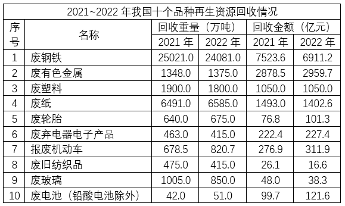

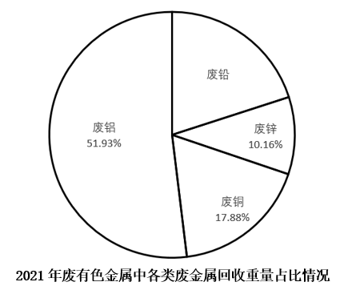

#### 第 11 题　qid 10204654 · 增长

相比2021年，2022年我国十个品种再生资源回收总金额同比下降了约：

- **A**. 511亿元
- **B**. 532亿元
- **C**. 555亿元　✅
- **D**. 578亿元

**答案**：C

**官方解析**

根据题干“相比2021年，2022年······同比下降了约”，结合选项单位为“亿元”，可判定本题为增长量计算问题。定位文字材料可得：2022年我国十个品种再生资源回收总金额约为13140.6亿元，同比下降4.05%。根据公式：增长量，则题干所求亿元，即下降了约548亿元，与C项最接近。

故正确答案为C。

---

#### 第 12 题　qid 16592983 · 平均数

相比2021年，2022年我国废纸平均回收价格（平均回收价格）：

- **A**. 下调约170元/吨　✅
- **B**. 下调约347元/吨
- **C**. 上调约170元/吨
- **D**. 上调约347元/吨

**答案**：A

**官方解析**

根据题干“相比2021年，2022年······平均回收价格······”，结合选项为上调/下调约+单位，可判定本题为平均数的增长量问题。定位统计表可知：2021年和2022年我国废纸回收重量分别为6491.0万吨和6585.0万吨；2021年和2022年我国废纸回收金额分别为1493.0亿元和1402.6亿元。根据平均回收价格，可知题干所求元/吨，与A项最为接近。

故正确答案为A。

---

#### 第 13 题　qid 16592987 · 增长

按2022年我国十个品种再生资源回收重量从大到小进行排序，以下哪个折线图能准确反映排名前5位再生资源同比增量的变化趋势？

- **A**. 

- **B**. 

- **C**. 

- **D**. 

　✅

**答案**：D

**官方解析**

根据题干“······同比增量的变化趋势”，可判定本题为增长量比较问题。定位统计表可得2021年和2022年我国十个品种再生资源回收重量，其中2022年再生资源回收重量从大到小排名前5位的为废钢铁（24081.0万吨）、废纸（6585.0万吨）、废塑料（1800.0万吨）、废有色金属（1375.0万吨）、废玻璃（850.0万吨）。根据公式：增长量=现期量-基期量，可得2022年排名前5位再生资源的同比增量分别为：
废钢铁：24081.0-25021.0=-940万吨；
废纸：6585.0-6491.0=94万吨；
废塑料：1800.0-1900.0=-100万吨；
废有色金属：1375.0-1348.0=27万吨；
废玻璃：850.0-1005.0=-155万吨。
综上可知，废钢铁的同比增量最小，应处于折线图最低点，A、B、C三项中排名第一的废钢铁的同比增量均不在最低点位置，排除。
故正确答案为D。

---

#### 第 14 题　qid 16592990 · 综合

2022年我国废有色金属中废铅回收重量约为：

- **A**. 261万吨
- **B**. 275万吨
- **C**. 285万吨　✅
- **D**. 291万吨

**答案**：C

**官方解析**

根据题干“2022年我国废有色金属中废铅······”，结合材料时间为2022年，可判定本题为现期计算问题。定位统计表可得，2021年我国废有色金属回收重量为1348.0万吨；定位饼状图可得，2021年废有色金属中废铅回收重量占比=1-51.93%-17.88%-10.16%=20.03%；定位文字材料可得，2022年废有色金属中废铅回收重量同比增长5.56%。根据公式：部分=整体×比重，现期量=基期量×（1+增长率），则所求万吨。

故正确答案为C。

---

#### 第 15 题　qid 16592992 · 综合

能够从上述资料中推出的是：

- **A**. 截止2022年底，我国机动车保有量约为4170万辆
- **B**. 2022年我国十个品种再生资源平均回收价格最高的是废有色金属
- **C**. 2021年回收金额排前两名的再生资源回收金额之和的比值超过75%　✅
- **D**. 2022年除废铅以外的废有色金属回收重量总和比2021年的有所下降

**答案**：C

**官方解析**

A项：定位文字材料可得：2022年我国报废机动车回收数量399.1万辆，回收数量占我国机动车保有量的。根据公式：整体，可知截止2022年底，我国机动车保有量为万辆，错误；

B项：定位统计表可知2022年我国十个品种再生资源的回收重量以及回收金额。根据公式：平均回收价格，可得2022年废有色金属的平均回收价格为万元/吨；废电池（铅酸电池除外）的平均回收价格为万元/吨，可知废有色金属的平均回收价格低于废电池（铅酸电池除外），则2022年我国十个品种再生资源平均回收价格最高的并非废有色金属，错误；

C项：定位文字材料可得：2022年，我国废钢铁、废有色金属等十个品种再生资源回收总金额约为13140.6亿元，同比下降4.05%。定位统计表可知2021年我国十个品种再生资源的回收金额。观察可知：2021年回收金额排前两名的再生资源分别为废钢铁（7523.6亿元）、废有色金属（2878.5亿元），根据公式：基期量，则所求为，正确；

D项：定位文字材料可得：2022年废有色金属中废铅回收重量同比增长5.56%。定位统计表可得：2021年、2022年废有色金属的回收重量分别为1348.0万吨、1375.0万吨。定位统计图可知2021年废有色金属中除废铅以外的各类废金属回收重量的占比情况。

方法一：定位统计图可知，2021年废有色金属中废铅回收重量的占比为1-（51.93%+17.88%+10.16%）=1-79.97%=20.03%。根据公式：部分=整体×比重，可知2021年废有色金属中废铅回收重量为万吨，则2021年废有色金属中除废铅以外的各类废金属回收重量约为1348.0-270=1078万吨。根据公式：现期量=基期量×（1+增长率），可知2022年废有色金属中废铅回收重量为万吨，则2022年废有色金属中除废铅以外的各类废金属回收重量为1375.0-285=1090万吨&gt;1078万吨，即2022年除废铅以外的废有色金属回收重量总和比2021年的有所上升，错误。

方法二：2021年废有色金属中除废铅以外的废有色金属回收重量的占比为51.93%+17.88%+10.16%=79.97%，则2021年废有色金属中废铅回收重量的占比为1-79.97%=20.03%。根据公式：增长率，可知2022年废有色金属的回收重量同比增长率为，设2022年除废铅以外的废有色金属回收重量总和的同比增长率为r，根据线段法“距离与基期量成反比”，可知：，解得：，即2022年除废铅以外的废有色金属回收重量总和比2021年的有所上升，错误。

故正确答案为C。

---

### 材料 4

        2022年，全国共有260家银行机构和29家理财公司累计新发理财产品2.94万只，同比下降38.23%，降幅比上年同期扩大7.22个百分点；累计募集资金89.62万亿元，同比减少32.57万亿元。

        截至2022年底，全国共有278家银行机构和29家理财公司有存续的理财产品，共存续产品3.47万只，同比下降4.41%；存续规模27.65万亿元，同比下降4.66%。分机构类型来看，理财公司存续产品13947只，存续规模22.24万亿元，同比增长29.36%。银行机构中，城商行存续产品9064只，存续规模2.45万亿元，同比下降32.34%；农村金融机构存续产品7808只，存续规模1.09万亿元，同比下降2.63%；股份制银行存续产品1208只，存续规模0.88万亿元，同比下降82.99%；大型银行存续产品668只，存续规模0.92万亿元，同比下降49.26%；其他机构存续产品1980只，存续规模0.07万亿元，同比下降13.42%。

        截至2022年底，持有理财产品的投资者数量为9671.27万个，较年初增长18.96%，其中机构投资者数量为95.95万个，数量占比同比提升了0.22个百分点；在持有理财产品的个人投资者中，数量最多的是风险偏好为二级（稳健型）的投资者，占比35.44%。

#### 第 16 题　qid 10204588 · 综合

2021年银行机构存续的理财产品存续规模约为多少万亿元？

- **A**. 5.4
- **B**. 6.7
- **C**. 10.5
- **D**. 11.8　✅

**答案**：D

**官方解析**

根据题干“2021年银行机构存续的理财产品存续规模约为······万亿元”，结合材料所给的是2022年银行机构和理财公司存续的理财产品总存续规模及理财公司的存续规模，可以判定本题为基期和差问题。定位文字材料第二段可得：2022年全国银行机构和理财公司存续的理财产品总存续规模27.65万亿元，同比下降4.66%；理财公司存续的理财产品存续规模22.24万亿元，同比增长29.36%。根据公式：基期量，则2021年银行机构存续的理财产品存续规模为万亿元，与D项最接近。

故正确答案为D。

---

#### 第 17 题　qid 16592961 · 平均数

2022年不同机构每只存续理财产品平均存续金额从大到小排前三名的是：

- **A**. 大型银行、理财公司、城商行
- **B**. 理财公司、大型银行、城商行
- **C**. 大型银行、理财公司、股份制银行
- **D**. 理财公司、大型银行、股份制银行　✅

**答案**：D

**官方解析**

根据题干“2022年······每只存续理财产品平均存续金额······”，结合材料时间为2022年，可判定本题为现期平均数问题。定位文字材料第二段可得∶截至2022年底，理财公司存续产品13947只，存续规模22.24万亿元；城商行存续产品9064只，存续规模2.45万亿元；股份制银行存续产品1208只，存续规模0.88万亿元；大型银行存续产品668只，存续规模0.92万亿元。根据每只存续理财产品平均存续金额，则2022年下列机构每只存续理财产品平均存续金额分别为：理财公司，亿元/只；城商行，亿元/只；股份制银行，亿元/只；大型银行，亿元/只。比较可知，2022年不同机构每只存续理财产品平均存续金额从大到小排前三名的是理财公司、大型银行、股份制银行。

故正确答案为D。

---

#### 第 18 题　qid 16592962 · 综合

按存续产品只数、存续规模分别对2022年6类机构（理财公司、大型银行、股份制银行、城商行、农村金融机构、其他机构）从大到小进行排列，两种排列中位次不一致的机构数量有：

- **A**. 1个
- **B**. 2个　✅
- **C**. 3个
- **D**. 4个

**答案**：B

**官方解析**

定位文字材料第二段可得，2022年理财公司、大型银行、股份制银行、城商行、农村金融机构、其他机构存续产品只数从大到小进行排列为：理财公司（13947只）&gt;城商行（9064只）&gt;农村金融机构（7808只）&gt;其他机构（1980只）&gt;股份制银行（1208只）&gt;大型银行（668只）；存续规模从大到小进行排列为：理财公司（22.24万亿元）&gt;城商行（2.45万亿元）&gt;农村金融机构（1.09万亿元）&gt;大型银行（0.92万亿元）&gt;股份制银行（0.88万亿元）&gt;其他机构（0.07万亿元）。两种排列中位次不一致的机构有大型银行、其他机构，共2个。
故正确答案为B。

---

#### 第 19 题　qid 16592965 · 综合

以存续规模计算市场份额，2022年理财公司存续理财产品的市场份额是2021年理财公司的多少倍？

- **A**. 0.45
- **B**. 0.78
- **C**. 1.36　✅
- **D**. 1.56

**答案**：C

**官方解析**

根据题干“······2022年······是2021年······的多少倍”，结合材料时间为2022年，可判定本题为现期倍数问题。定位文字材料第二段可得：截至2022年底，全国共有278家银行机构和29家理财公司有存续的理财产品，存续规模同比下降4.66%（b）。分机构类型来看，理财公司存续规模同比增长29.36%（a）。以存续规模计算市场份额，理财公司存续理财产品的市场份额为其存续规模占全国存续规模的比重。根据公式：现期比重，基期比重，则所求倍数倍。

故正确答案为C。

---

#### 第 20 题　qid 16592967 · 综合

能够从上述资料中推出的是：

- **A**. 2021年持有理财产品的个人投资者数量占比为98.88%
- **B**. 2022年新发理财产品中平均每只产品募集资金低于2021年
- **C**. 2022年城商行存续产品存续金额在银行机构存续产品中比例为8.85%
- **D**. 2022年持有理财产品的个人投资者中风险偏好为二级的数量约为3393万个　✅

**答案**：D

**官方解析**

A项：定位文字材料第三段可得：截至2022年底，持有理财产品的投资者数量为9671.27万个，其中机构投资者数量为95.95万个，数量占比同比提升了0.22个百分点。根据公式：比重，则2021年机构投资者数量占持有理财产品的投资者数量的比重为，故2021年持有理财产品的个人投资者数量占比&gt;1-0.78%=99.22%，不可能为98.88%，错误；

B项：定位文字材料第一段可得：2022年，全国共有260家银行机构和29家理财公司累计新发理财产品2.94万只，同比下降38.23%（b）；累计募集资金89.62万亿元，同比减少32.57万亿元。根据公式：增长率，则累计募集资金同比增速。根据两期平均数比较结论：当a&gt;b时，平均数上升，-26.7%&gt;-38.23%，则2022年新发理财产品中平均每只产品募集资金高于2021年，错误；

C项：定位文字材料第二段可得：截至2022年底，全国共有278家银行机构和29家理财公司有存续的理财产品，共存续产品3.47万只，存续规模27.65万亿元。分机构类型来看，理财公司存续产品13947只，存续规模22.24万亿元。银行机构中，城商行存续产品9064只，存续规模2.45万亿元。根据公式：比重，则2022年城商行存续产品存续金额在银行机构存续产品中比例，远高于8.85%，错误；

D项：定位文字材料第三段可得：截至2022年底，持有理财产品的投资者数量为9671.27万个，其中机构投资者数量为95.95万个，在持有理财产品的个人投资者中，数量最多的是风险偏好为二级（稳健型）的投资者，占比35.44%。根据公式：部分=整体×比重，则2022年持有理财产品的个人投资者中风险偏好为二级的数量万个，非常接近于3393万个，正确。

故正确答案为D。

---
