# 2025年江苏省公务员录用考试《行测》题（C类）（网友回忆版）

> 省考 · 2025 年 · 6 个模块 · 共 117 题

- [政治理论](#%E6%94%BF%E6%B2%BB%E7%90%86%E8%AE%BA) · 11 题
- [常识判断](#%E5%B8%B8%E8%AF%86%E5%88%A4%E6%96%AD) · 9 题
- [言语理解与表达](#%E8%A8%80%E8%AF%AD%E7%90%86%E8%A7%A3%E4%B8%8E%E8%A1%A8%E8%BE%BE) · 24 题
- [数量关系](#%E6%95%B0%E9%87%8F%E5%85%B3%E7%B3%BB) · 19 题
- [判断推理](#%E5%88%A4%E6%96%AD%E6%8E%A8%E7%90%86) · 34 题
- [资料分析](#%E8%B5%84%E6%96%99%E5%88%86%E6%9E%90) · 20 题

---

## 政治理论

### 第 1 题　qid 13319187 · 毛中特

习近平新时代中国特色社会主义思想从理论和实践结合上，科学地回答了新时代坚持和发展什么样的中国特色社会主义、怎样坚持和发展中国特色社会主义，建设什么样的社会主义现代化强国、怎样建设社会主义现代化强国，建设什么样的长期执政的马克思主义政党、怎样建设长期执政的马克思主义政党等重大时代课题，提出一系列原创性的治国理政新理念新思想新战略。关于习近平新时代中国特色社会主义思想的历史地位，下列表述正确的是：
①继承和发展马克思列宁主义、毛泽东思想、邓小平理论、“三个代表”重要思想、科学发展观，是马克思主义在当代中国发展最新理论成果，开辟了马克思主义中国化时代化的新境界
②把马克思主义基本原理同中国具体实际相结合，同中华优秀传统文化相结合，使马克思主义这个魂脉和中华优秀传统文化这个根脉内在贯通、相互成就，是中华民族的文化主体性最有力的体现，是中华文化和中国精神的时代精华
③确立了社会主义市场经济体制的改革目标和基本构架，确立了社会主义初级阶段的基本经济制度和分配制度，开创了全面深化改革新局面，推进党的建设新的伟大工程
④是全党全国各族人民为实现中华民族伟大复兴而奋斗的行动指南，是新时代党和国家发展事业的根本遵循

- **A**. ①②③
- **B**. ①②④　✅
- **C**. ①③④
- **D**. ②③④

**答案**：B

**官方解析**

本题考查理论与政策。
①正确，党的十九大报告指出，习近平新时代中国特色社会主义思想，是对马克思列宁主义、毛泽东思想、邓小平理论、“三个代表”重要思想、科学发展观的继承和发展，是马克思主义中国化最新成果，是党和人民实践经验和集体智慧的结晶，是中国特色社会主义理论体系的重要组成部分，是全党全国人民为实现中华民族伟大复兴而奋斗的行动指南，必须长期坚持并不断发展。党的二十大报告提出的“六个必须坚持”，即必须坚持人民至上、坚持自信自立、坚持守正创新、坚持问题导向、坚持系统观念、坚持胸怀天下，集中体现了习近平新时代中国特色社会主义思想的世界观和方法论，是马克思主义世界观方法论中国化时代化的最新成果。
②正确，习近平新时代中国特色社会主义思想既坚持了马克思主义的根本立场和基本原理，又从中华优秀传统文化中汲取了丰富营养，实现了马克思主义与中华优秀传统文化的有机融合，推动了中华文化的创造性转化和创新性发展。所以，它把马克思主义基本原理同中国具体实际相结合，同中华优秀传统文化相结合，使马克思主义这个魂脉和中华优秀传统文化这个根脉内在贯通、相互成就，是中华民族的文化主体性最有力的体现，是中华文化和中国精神的时代精华。
③错误，“确立了社会主义市场经济体制的改革目标和基本构架，确立了社会主义初级阶段的基本经济制度和分配制度”等主要是邓小平理论、三个代表重要思想、科学发展观的重要成果，并不是习近平新时代中国特色社会主义思想的特定贡献。习近平新时代中国特色社会主义思想主要是推进全面深化改革向广度和深度进军，而不是确立社会主义市场经济体制等的最初阶段的内容。
④正确，习近平新时代中国特色社会主义思想为实现中华民族伟大复兴的中国梦提供了科学理论指引和行动纲领，从思想上、理论上、战略上、行动上为党和国家事业发展指明了方向，对于团结带领全国各族人民全面建成社会主义现代化强国、全面推进中华民族伟大复兴具有重大而深远的意义。因此，可以说它是全党全国各族人民为实现中华民族伟大复兴而奋斗的行动指南，是新时代党和国家发展事业的根本遵循。
故①②④说法正确。
故正确答案为B。

---

### 第 2 题　qid 13319179 · 毛中特

党的十八大以来以习近平同志为核心的党中央把全面从严治党纳入“四个全面”战略布局，深入推进新时代党的建设新的伟大工程，提出一系列新理念新思想新战略，形成习近平总书记关于党的建设的重要思想。党在革命性锻造中更加坚强有力、更加充满活力。全面从严治党开辟了百年大党自我革命的新境界。关于新时代全面从严治党取得的历史性开创性成就，下列表述正确的是：
①牢牢抓住“关键少数”，坚持从领导干部抓起，以上率下
②提出让人民监督政府是跳出历史周期率第一个答案
③开展了史无前例的反腐败斗争，取得压倒性胜利并全面巩固
④把制度建设贯穿党的政治各方面，形成比较完善的党内法规体系
⑤以党的政治建设统领党的建设的各项工作，不断增强党组织政治功能

- **A**. ①②③⑤
- **B**. ①②④⑤
- **C**. ①③④⑤　✅
- **D**. ②③④⑤

**答案**：C

**官方解析**

本题考查理论与政策。
①正确，党的十八大以来，全面从严治党过程中，始终强调抓住领导干部这个 “关键少数”，以上率下，要求领导干部以身作则、率先垂范，带头遵守党纪国法，执行党的各项规定，以实际行动引领广大党员干部廉洁从政、担当作为。
②错误，毛泽东同志在延安的窑洞里给出了跳出历史周期率的第一个答案，即让人民监督政府。而在新时代，习近平总书记给出了第二个答案，这就是自我革命。
③正确，2023年1月9日，中共中央总书记、国家主席、中央军委主席习近平在中国共产党第二十届中央纪律检查委员会第二次全体会议上发表重要讲话。讲话指出：“新时代10年，我们党不断深化对自我革命规律的认识，不断推进党的建设理论创新、实践创新、制度创新，在构建全面从严治党体系上积累了丰富成果······我们开展史无前例的反腐败斗争，坚持无禁区、全覆盖、零容忍，不敢腐、不能腐、不想腐一体推进，‘打虎’、‘拍蝇’、‘猎狐’多管齐下，查处一大批腐败分子，消除党内严重政治隐患，反腐败斗争取得压倒性胜利并全面巩固，成功走出一条中国特色反腐败之路······”
④正确，2023年1月9日，中共中央总书记、国家主席、中央军委主席习近平在中国共产党第二十届中央纪律检查委员会第二次全体会议上发表重要讲话。讲话指出：“新时代10年，我们党不断深化对自我革命规律的认识，不断推进党的建设理论创新、实践创新、制度创新，在构建全面从严治党体系上积累了丰富成果······我们把制度建设贯穿党的各项建设，与时俱进完善党章，聚焦加强党的领导和党的建设推进制度创新，形成比较完善的党内法规体系，搭建起党和国家监督体系‘四梁八柱’，把权力关进制度的笼子，为新时代党的建设提供了根本性、全局性、稳定性、长期性保障······”
⑤正确，党的十八大以来，全面从严治党强调以党的政治建设为统领，把政治标准和政治要求贯穿党的思想建设、组织建设、作风建设、纪律建设以及制度建设、反腐败斗争始终，不断增强党组织政治功能和组织功能，确保党的团结统一和行动一致。
故①③④⑤表述正确。
故正确答案为C。

---

### 第 3 题　qid 13319185 · 新思想

2023年7月，习近平总书记在江苏考察时强调，江苏有能力也有责任在推进中国式现代化进程中走在前、做示范，希望江苏在科技创新上取得新突破，在强链补链延链上展现新作为，在建设中华民族现代文明上探索新经验，在推进社会治理现代化上实现新提升。为贯彻落实总书记赋予江苏“四个新”的重大任务，下列做法正确的有：
①打造全国重要的产业科技创新高地，使高质量发展更多依靠创新驱动的内涵型增长，强化企业科技创新主体地位，深化科技体制改革和人才发展体制机制改革
②巩固传统产业领先地位，加快打造具有国际竞争力的战略性新兴产业集群，全面提升产业基础高级化和产业链现代化水平，加快构建以先进制造业为骨干的现代化产业体系
③加强优秀传统文化的保护传承和创新发展，大力发展现代科技、教育事业，全面提升人民群众的科学文化素质，繁荣发展文化事业和文化产业，持续推进城乡公共文化服务标准化、均等化
④加快健全社会保障体系，健全就业促进机制和就业公共服务体系，完善社会治理体系，推进社会治理数字化，推进应急管理体系和能力现代化

- **A**. 1项
- **B**. 2项
- **C**. 3项
- **D**. 4项　✅

**答案**：D

**官方解析**

本题考查理论与政策。
①正确，习近平总书记指出，中国式现代化关键在科技现代化。江苏要在科技创新上率先取得新突破，打造全国重要的产业科技创新高地，使高质量发展更多依靠创新驱动的内涵型增长。要强化企业科技创新主体地位，促进创新要素向企业集聚，不断提高科技成果转化和产业化水平。要深化科技体制改革和人才发展体制机制改革······
②正确，习近平总书记强调，要把坚守实体经济、构建现代化产业体系作为强省之要，巩固传统产业领先地位，加快打造具有国际竞争力的战略性新兴产业集群，推动数字经济与先进制造业、现代服务业深度融合，全面提升产业基础高级化和产业链现代化水平，加快构建以先进制造业为骨干的现代化产业体系。
③正确，习近平总书记指出，建设中华民族现代文明，是推进中国式现代化的必然要求，是社会主义精神文明建设的重要内容。江苏要加强优秀传统文化的保护传承和创新发展，积极参与建设长江和大运河两大国家文化公园。要大力发展现代科技、教育事业，全面提升人民群众的科学文化素质。要繁荣发展文化事业和文化产业，持续推进城乡公共文化服务标准化、均等化······
④正确，习近平总书记强调，江苏必须在保障和改善民生、推进社会治理现代化上走在前列。要加快健全社会保障体系，健全就业促进机制和就业公共服务体系，做好重点群体就业工作。要坚持和发展新时代“枫桥经验”、“浦江经验”，完善社会治理体系，健全城乡基层治理体系和乡村治理协同推进机制，推进社会治理数字化。要推进应急管理体系和能力现代化······
故做法正确的有①②③④，共4项。
故正确答案为D。

---

### 第 4 题　qid 13319189 · 新思想

习近平总书记指出，中华民族有着五千多年的悠久历史和灿烂文化，而且中华文化从远古一直延续发展到今天，是世界上唯一绵延不断，且以国家形态发展至今的伟大文明，具有突出的连续性。关于中华文化为何具有突出的连续性，下列说法正确的是：
①强大的文化主体性，夯实了中华文明连续性的内在支撑
②浩如烟海的文化典籍成为中华文明连续性的天然载体
③独特又稳定的地理环境，筑牢了中华文明连续性的自然基础
④中华文化“中和”的文化价值诉求奠定了中华文明连续性的价值底蕴

- **A**. ①②③
- **B**. ①②④
- **C**. ①③④
- **D**. ②③④　✅

**答案**：D

**官方解析**

本题考查理论与政策。
①错误，《中华文明源远流长的连续性》中指出：“厚重的文化积累是中华文明突出连续性的内在支撑。一个文明能够从不断裂、历久弥新，其中决定连续性的深层次原因必与既有的文化密切相关。换言之，同一个国家‘不断裂’状态的维持，一是其国民的人类遗传基因延续不辍，二是其国家文化基因世代传承。”
②正确，《习近平总书记这样谈中华文明的连续性》中指出：“中华民族创造了浩如烟海的文化典籍，中华文明在这些代代相传的典籍中得以记载和传承，如四书五经等儒家典籍向来是历代儒家学子首要研学之书，从未中断。······在我国出土的大量考古成果充分展示着中华文明起源和发展的历史脉络，从中可见中华文明传承悠久且从未中断。”由此可见，浩如烟海的文化典籍成为中华文明连续性的天然载体。
③正确，《中华文明源远流长的连续性》中指出：“独特的地理气候是中华文明突出连续性的自然基础。”《连续性：中华文明的首要特性》中指出：“中华文明成为人类历史上唯一一个绵延5000多年至今未曾中断的灿烂文明。而这主要得益于以下三个因素：第一，独特稳定的地理环境。”
④正确，《连续性：中华文明的首要特性》中指出：“第二，‘中和’的文化价值诉求。中华文明源远流长、博大精深，其中儒家、道家成为中华文明的主流思想······‘中’就是要把握适当的限度，使自己的言行合乎标准。‘中和’所代表的中性智慧强调的是事物双方的相辅相成、共生共存，从而做到不偏不倚、执两用中······总而言之，‘中和’的文化价值诉求成就了‘贵和持中、自强不息’的中华文明，奠定了中华文明源远流长的价值底蕴。”
故②③④表述正确。
故正确答案为D。

---

### 第 5 题　qid 13319196 · 新思想

习近平总书记指出，全面依法治国是国家治理的一场深刻革命。我们要坚持走中国特色社会主义法治道路、建设中国特色社会主义法治体系、建设社会主义法治国家。关于中国特色社会主义法治道路的核心要义，下列理解正确的是：
①中国特色社会主义制度是中国特色社会主义法治体系的根本制度基础
②党的领导是中国特色社会主义最本质的特征，是社会主义法治最根本的保证
③中国特色社会主义法治理论是法治体系的理论指导，是全面推进依法治国的行动指南
④弘扬社会主义法治精神、传承中华优秀传统法律文化是社会主义法治建设的首要任务

- **A**. ①②③　✅
- **B**. ①②④
- **C**. ①③④
- **D**. ②③④

**答案**：A

**官方解析**

本题考查理论与政策。
①②③正确，《习近平新时代中国特色社会主义思想学习纲要》中“八、全面推进依法治国”部分指出：“中国特色社会主义法治道路的核心要义，就是要坚持党的领导，坚持中国特色社会主义制度，贯彻中国特色社会主义法治理论。党的领导是中国特色社会主义最本质的特征，是社会主义法治最根本的保证。坚持中国特色社会主义法治道路，最根本的是坚持党的领导。中国特色社会主义制度是中国特色社会主义法治体系的根本制度基础，是全面推进依法治国的根本制度保障。中国特色社会主义法治理论是中国特色社会主义法治体系的理论指导和学理支撑，是全面推进依法治国的行动指南。”
④错误，《法治中国建设规划（2020－2025年）》中“二、全面贯彻实施宪法，坚定维护宪法尊严和权威”部分指出：“建设法治中国，必须高度重视宪法在治国理政中的重要地位和作用，坚持依宪治国、依宪执政，把全面贯彻实施宪法作为首要任务，健全保证宪法全面实施的体制机制，将宪法实施和监督提高到新水平。”
故①②③表述正确。
故正确答案为A。

---

### 第 6 题　qid 13319195 · 时事政治

习近平总书记在党的二十届三中全会上提出，到2035年，全面建成高水平社会主义市场经济体制，为中国式现代化提供重要保障。下列做法属于构建高水平社会主义市场经济体制举措的是：
①培育壮大先进制造业集群，推进制造业高端化、智能化、绿色化发展
②推动市场基础制度规则统一、市场监管公平统一、市场设施高标准联通
③坚持和落实“两个毫不动摇”，促进各种所有制经济优势互补、共同发展
④依法平等长久保护各种所有制经济产权，建立高效的知识产权综合管理体制

- **A**. ①②③
- **B**. ①②④
- **C**. ①③④
- **D**. ②③④　✅

**答案**：D

**官方解析**

本题考查理论与政策。
2024年7月18日，中国共产党第二十届中央委员会第三次全体会议审议通过了《中共中央关于进一步全面深化改革、推进中国式现代化的决定》（以下简称《决定》）。
①错误，《决定》在“三、健全推动经济高质量发展体制机制”部分指出“（9）健全促进实体经济和数字经济深度融合制度。加快推进新型工业化，培育壮大先进制造业集群，推动制造业高端化、智能化、绿色化发展······”故此举措说法无误，但不属于构建高水平社会主义市场经济体制。
②正确，《决定》在“二、构建高水平社会主义市场经济体制”部分指出“（6）构建全国统一大市场。推动市场基础制度规则统一、市场监管公平统一、市场设施高标准联通。加强公平竞争审查刚性约束，强化反垄断和反不正当竞争，清理和废除妨碍全国统一市场和公平竞争的各种规定和做法······”
③正确，《决定》在“二、构建高水平社会主义市场经济体制”部分指出“（5）坚持和落实‘两个毫不动摇’。毫不动摇巩固和发展公有制经济，毫不动摇鼓励、支持、引导非公有制经济发展，保证各种所有制经济依法平等使用生产要素、公平参与市场竞争、同等受到法律保护，促进各种所有制经济优势互补、共同发展。”
④正确，《决定》在“二、构建高水平社会主义市场经济体制”部分指出“（7）完善市场经济基础制度。完善产权制度，依法平等长久保护各种所有制经济产权，建立高效的知识产权综合管理体制······”
综上，②③④正确。
故正确答案为D。

---

### 第 7 题　qid 13319193 · 时事政治

习近平总书记多次深刻阐释“以人民为中心”的执政理念。党的二十届三中全会将这一执政理念确定为进一步全面深化改革必须遵循的原则，强调坚持以人民为中心，尊重人民主体地位和首创精神，人民有所呼、改革有所应，做到改革为了人民、改革依靠人民、改革成果由人民共享。某市的下列举措符合“以人民为中心”的原则的是：
①创办共富市集，减免低收入群众和灵活就业收入人员摊位费
②建立“百姓会客厅”机制，密切联系群众，问计于民、问需于民
③全国推进公用事业市场化改革提升，提升资源配置效率，减轻财政负担
④持续完善积分落户制，促进有稳定就业的外来人口有序实现市民化

- **A**. ①②③
- **B**. ①②④　✅
- **C**. ①③④
- **D**. ②③④

**答案**：B

**官方解析**

本题考查理论与政策。
“以人民为中心的发展思想”是习近平总书记于2015年10月26日至29日，党的十八届五中全会提出的治国方针理论。所谓以人民为中心，就是要抓住人民最关心最直接最现实的利益问题，不断保障和改善民生，促进社会公平正义，在更高水平上实现幼有所育、学有所教、劳有所得、病有所医、老有所养、住有所居、弱有所扶，让发展成果更多更公平惠及全体人民，不断促进人的全面发展，朝着实现全体人民共同富裕不断迈进。
①正确，“创办共富市集，减免低收入群众和灵活就业收入人员摊位费”能够增加这部分人的收入，有利于共同富裕的实现，是符合“以人民为中心”原则的举措。
②正确，“建立‘百姓会客厅’机制，密切联系群众，问计于民、问需于民”可以更好地抓住人民最关心最直接最现实的利益问题，以便解决这些问题，是符合“以人民为中心”原则的举措。
③错误，“全国推进公用事业市场化改革提升，提升资源配置效率，减轻财政负担”更多强调为财政减负，和人民并无直接联系。
④正确，“持续完善积分落户制，促进有稳定就业的外来人口有序实现市民化”能够更好解决外来人口养老育幼、买房医疗等问题，提高这一群体的幸福感，是符合“以人民为中心”原则的举措。
综上，①②④正确。
故正确答案为B。

---

### 第 8 题　qid 13319194 · 新思想

习近平总书记强调，就业是最基本的民生，事关人民群众切身利益，事关经济社会健康发展，事关国家长治久安。要实施就业优先战略，促进高质量充分就业。关于促进高质量充分就业，下列表述正确的是：
①在宏观层面，高质量充分就业主要包括就业机会充分、就业环境公平、就业结构优化、人岗匹配高效、劳动关系和谐等
②在微观层面，高质量充分就业主要表现为每个公民不仅有活干，而且工作稳定、收入合理、保障可靠、职业安全等
③高质量充分就业是一个很高的要求，也是一个循序渐进的过程，必须尽力而为、量力而行；必须充分调动人民群众的积极性主动性创造性，引导大家依靠努力奋斗创造幸福生活
④促进高质量充分就业。要始终坚持就业优先，着力解决结构性就业矛盾，完善重点群体就业支持政策，深化就业体制机制改革，加强劳动者权益保障

- **A**. ①②③
- **B**. ①②④
- **C**. ①③④　✅
- **D**. ②③④

**答案**：C

**官方解析**

本题考查理论与政策。
2024年11月1日出版的第21期《求是》杂志发表了中共中央总书记、国家主席、中央军委主席习近平的重要文章《促进高质量充分就业》。
①③正确，②错误，文章指出，党的二十大科学把握就业形势新变化，顺应人民群众新期待，着眼扎实推进高质量发展和全体人民共同富裕，作出了促进高质量充分就业的重大部署。在宏观层面，高质量充分就业主要包括就业机会充分、就业环境公平、就业结构优化、人岗匹配高效、劳动关系和谐等；在微观层面，高质量充分就业主要表现为劳动者不仅有活干，而且工作稳定、收入合理、保障可靠、职业安全等。当然，这是一个很高的要求，也是一个循序渐进的过程，必须尽力而为、量力而行；必须充分调动人民群众的积极性主动性创造性，引导大家依靠努力奋斗创造幸福生活，不能不劳而获、坐享其成。
④正确，文章指出，促进高质量充分就业，是新时代新征程就业工作的新定位、新使命·····这里，我着重强调5点。第一，始终坚持就业优先······第二，着力解决结构性就业矛盾······第三，完善重点群体就业支持政策······第四，深化就业体制机制改革······第五，加强劳动者权益保障······
综上，①③④表述正确。
故正确答案为C。

---

### 第 9 题　qid 13319197 · 新思想

习近平总书记对江苏生态文明建设念兹在兹，反复叮嘱江苏要“把保护生态环境摆在更加突出的位置”“走出一条生态优先、绿色发展的新路子”。为贯彻落实总书记的重要指示精神，江苏全面加快推进美丽江苏建设，推动实现人与自然和谐共生的现代化。关于全面推进美丽江苏建设的举措，下列说法正确的是：
①加强苏北海岸带的国土空间管控，一律不得新增围海和填海
②建设黄河故道千里生态富民廊道，构建江淮生态经济区湖群绿心
③推动江河湖海各展所长，统筹推进长江和大运河国家文化公园建设
④增强省域森林、湿地、土壤、海洋等生态系统固碳作用，支持里下河地区提升生态系统碳汇能力

- **A**. ①②③
- **B**. ①②④
- **C**. ①③④
- **D**. ②③④　✅

**答案**：D

**官方解析**

本题考查理论与政策。
①错误，《国务院关于&lt;江苏省国土空间规划（2021—2035年）&gt;的批复》在“二、筑牢安全发展的空间基础”部分指出：“······除国家重大项目外，全面禁止围填海；严格无居民海岛管理。”
②③正确，《中共江苏省委江苏省人民政府关于全面推进美丽江苏建设的实施意见》在“四、打造美丽江苏建设示范样板”部分“（十二）塑造‘水韵江苏’品牌”中指出：“以水为脉，推动江河湖海各展所长，统筹推进长江和大运河国家文化公园建设，着力打造太湖全国湖泊治理标杆，构筑蓝湾百里生态百里缤纷百里沿海岸线，建设黄河故道千里生态富民廊道，构建江淮生态经济区湖群绿心，彰显各具特色、各现其美的‘水韵江苏’风采。”
④正确，《中共江苏省委江苏省人民政府关于全面推进美丽江苏建设的实施意见》在“二、加快发展方式绿色低碳转型”部分“（二）积极稳妥推进碳达峰碳中和”中指出：“落实碳达峰碳中和‘1+N’政策体系，推动能耗双控逐步转向碳排放双控······增强省域森林、湿地、土壤、海洋等生态系统固碳作用，支持里下河地区提升生态系统碳汇能力。深入推进减污降碳协同创新。”
故②③④说法正确。
故正确答案为D。

---

### 第 10 题　qid 11226410 · 新思想

党的十八大以来，以习近平同志为核心的党中央站在巩固党的执政基础和维护国家政权安全的高度，坚持和加强党对基层治理的领导，不断推进基层治理理论创新、实践创新和制度创新。习近平总书记围绕基层治理发表一系列重要论述，立意高远，内涵丰富，思想深刻，为新时代推进基层治理现代化提供了根本遵循和科学指南，关于总书记基层治理重要论述的精神实质和精髓要义，下列理解正确的有：
①鲜明树立大抓基层的工作导向
②深入阐述推进基层治理现代化的价值取向
③深刻阐明基层治理在国家治理体系中的地位作用
④科学擘画党组织领导的共建共治共享的基层治理格局
⑤明确提出构建富有活力和效率的新型基层社会治理体系的工作要求

- **A**. 2项
- **B**. 3项
- **C**. 4项
- **D**. 5项　✅

**答案**：D

**官方解析**

本题考查理论与政策。
2024年5月，求是网发表题为《基层是党的执政之基、力量之源》的文章，以下简称文章。
①正确，文章指出，鲜明树立大抓基层的工作导向。习近平总书记高度重视抓基层打基础，强调“各级都要重视基层、关心基层、支持基层”，“要树立大抓基层的鲜明导向，推动改革举措落到基层，使基层真正强起来”，同时要求“持续深化整治形式主义为基层减负，为基层干部干事创业创造良好条件”。
②正确，文章指出，深入阐述推进基层治理现代化的价值取向。习近平总书记强调，“保障和改善民生没有终点，只有连续不断的新起点”，“创新社会治理，最终是为了让群众得实惠”······总书记“身入”基层，更“心到”基层，充分彰显了大党大国领袖深厚的人民情怀，生动诠释了以人民为中心的价值取向。
③正确，文章指出，深刻阐明基层治理在国家治理体系中的地位作用。基础不牢，地动山摇。习近平总书记深刻指出，“基层是党的执政之基、力量之源”，“基层是一切工作的落脚点”······只有把基层党组织建设强、把基层政权巩固好，中国特色社会主义的根基才能稳固。我国国家治理体系的一个优势就是把城乡社区基础筑牢。
④正确，文章指出，科学擘画党组织领导的共建共治共享的基层治理格局。习近平总书记强调，“基层社区事务很多很繁杂，单靠政府是干不了、也干不好的，必须充分发挥社会各方面作用，激发全社会活力”。党的十九大提出打造共建共治共享的社会治理格局，党的二十大部署建设人人有责、人人尽责、人人享有的社会治理共同体。近年来，各地区各部门坚决贯彻落实党中央决策部署，不断完善党委领导、政府负责、社会协同、公众参与、法治保障的社会治理体系，构建党组织领导的共建共治共享的城乡基层治理格局。
⑤正确，文章指出，明确提出构建富有活力和效率的新型基层社会治理体系的工作要求。习近平总书记十分关心基层治理创新和治理效能提升，多次强调要“健全党组织领导的自治、法治、德治相结合的基层治理体系”，“要着力推进社会治理系统化、科学化、智能化、法治化”。2024年4月，总书记在重庆考察时进一步要求，“继续推动资源下沉、完善服务设施，强化网格化管理、信息化支撑，提高社区精细化治理、精准化服务水平”，“让城市治理更智能、更高效、更精准”，为提升基层治理效能指明前进方向。
故①②③④⑤表述正确，共5项。
故正确答案为D。

---

### 第 11 题　qid 13319206 · 新思想

新中国成立75年以来，中国共产党团结带领全国各族人民勠力同心、砥砺奋进，经济实力实现了跨越式发展，深刻改变了世界发展格局。关于新中国成立75年来的经济发展成就，下列表述正确的是：
①经济总量跃居世界第二位
②连续十四年保持了世界第一制造业大国地位
③谷物产量跃居世界第二位
④改革开放以来成为世界经济增长的重要引擎

- **A**. ①②③
- **B**. ①②④　✅
- **C**. ①③④
- **D**. ②③④

**答案**：B

**官方解析**

本题考查经济常识。
2024年9月，国家统计局发布新中国75年经济社会发展成就系列报告（以下简称报告）。
①正确，报告在“一、从积贫积弱到世界第二大经济体，经济实力、综合国力和国际影响力实现历史性跨越”部分的“（一）国民经济快速增长，经济实力空前跃升”中指出：“······经济总量连续跨越重要关口······2023年超过126万亿元，稳居世界第二大经济体······”
②正确，报告在“二、从瓶颈制约到优势支撑，基础产业和基础设施空前加强”部分的“（一）工农业生产能力突飞猛进，主要产品产量全球第一”中指出：“······制造业增加值连续14年位居世界第一，占世界份额30%左右，成为驱动全球制造业发展的重要引擎······”
③错误，报告在“二、从瓶颈制约到优势支撑，基础产业和基础设施空前加强”部分的“（一）工农业生产能力突飞猛进，主要产品产量全球第一”中指出：“······粮食总产量由1949年的2264亿斤增加到2023年的13908亿斤，增长5.1倍；谷物、肉类、花生、茶叶、水果等农产品产量居全球首位······”
④正确，报告在“一、从积贫积弱到世界第二大经济体，经济实力、综合国力和国际影响力实现历史性跨越”部分的“（三）综合国力跃居世界前列，国际影响力日益彰显”中指出：“新中国成立初期，我国经济总量占世界比重很小，至1978年也仅为1.7%，居世界第10位。改革开放以来，我国经济持续快速增长，成为世界经济增长的重要引擎和稳定力量······”
故表述正确的是①②④。
故正确答案为B。

---

## 常识判断

### 第 1 题　qid 11226406 · 人文常识

巩固和完善农村基本经营制度是党的农村政策的基石，是促进乡村全面振兴、加快建设农业强国的制度基础。关于巩固和完善农业农村基本经营制度的要求，下列表述正确的是：
①坚持稳定土地承包关系
②坚持家庭经营基础性地位
③坚持土地集中连片流转
④坚持农村土地农民集体所有

- **A**. ①②③
- **B**. ①②④　✅
- **C**. ①③④
- **D**. ②③④

**答案**：B

**官方解析**

本题考查理论与政策。
①②④正确，《关于完善农村土地所有权承包权经营权分置办法的意见》在“二、总体要求”部分“（二）基本原则”中指出：“守住政策底线。坚持和完善农村基本经营制度，坚持农村土地集体所有，坚持家庭经营基础性地位，坚持稳定土地承包关系，不能把农村土地集体所有制改垮了，不能把耕地改少了，不能把粮食生产能力改弱了，不能把农民利益损害了。”
③错误，《农村土地经营权流转管理办法》在“第一章 总则”部分指出：“第四条 土地经营权流转应当因地制宜、循序渐进，把握好流转、集中、规模经营的度，流转规模应当与城镇化进程和农村劳动力转移规模相适应，与农业科技进步和生产手段改进程度相适应，与农业社会化服务水平提高相适应，鼓励各地建立多种形式的土地经营权流转风险防范和保障机制。”因此，要引导农村土地经营权有序流转，而非坚持土地集中连片流转。
故①②④表述正确。
故正确答案为B。

---

### 第 2 题　qid 11226408 · 法律常识

根据《农村集体经济组织法》，非农村集体经济组织成员长期在农村集体经济组织工作，对集体做出贡献的，经农村集体经济组织成员大会全体成员四分之三以上同意，可以享有的权利是：
①参与分配集体收益
②可以取得宅基地使用权
③享受农村集体经济组织提供的服务和福利
④集体土地被征收征用时参与分配土地补偿费等

- **A**. ①②
- **B**. ①③　✅
- **C**. ②④
- **D**. ③④

**答案**：B

**官方解析**

本题考查法律常识。
①③正确，②④错误，根据《农村集体经济组织法》第十五条规定：“非农村集体经济组织成员长期在农村集体经济组织工作，对集体做出贡献的，经农村集体经济组织成员大会全体成员四分之三以上同意，可以享有本法第十三条第七项、第九项、第十项规定的权利。”第十三条规定：“农村集体经济组织成员享有下列权利：（一）依照法律法规和农村集体经济组织章程选举和被选举为成员代表、理事会成员、监事会成员或者监事；（二）依照法律法规和农村集体经济组织章程参加成员大会、成员代表大会，参与表决决定农村集体经济组织重大事项和重要事务；（三）查阅、复制农村集体经济组织财务会计报告、会议记录等资料，了解有关情况；（四）监督农村集体经济组织的生产经营管理活动和集体收益的分配、使用，并提出意见和建议；（五）依法承包农村集体经济组织发包的农村土地；（六）依法申请取得宅基地使用权；（七）参与分配集体收益；（八）集体土地被征收征用时参与分配土地补偿费等；（九）享受农村集体经济组织提供的服务和福利；（十）法律法规和农村集体经济组织章程规定的其他权利。”
故正确答案为B。

---

### 第 3 题　qid 11226413 · 人文常识

“全面深化改革是一场深刻的社会革命，是一项复杂的系统工程，必须以科学的方法论为指导方能行稳致远。”这句话与下列古语所蕴含的理念相契合的是：

- **A**. 事必有法，然后可成　✅
- **B**. 于安思危，于治忧乱
- **C**. 备豫不虞，为国常道
- **D**. 取之有度，用之有节

**答案**：A

**官方解析**

本题考查马克思主义。
“全面深化改革是一场深刻的社会革命，是一项复杂的系统工程，必须以科学的方法论为指导方能行稳致远。”强调了科学方法的重要性。
A项正确，“事必有法，然后可成”意思是任何事情都有方法，只有找到合适的方法，才能成功。强调了科学方法的重要性，蕴含的理念与题干一致。
B项错误，“于安思危，于治忧乱”意思是即使居于安乐的环境里，也要想到可能出现的危险；即使处在稳定的境况中，也要忧虑可能发生的动乱。‌强调的是矛盾的同一性，即矛盾双方相互依存、相互转化。蕴含的理念与题干不一致。
C项错误，“备豫不虞，为国常道”意思是事先防备意外之事，是治理国家的常道。强调了防患于未然的重要性，蕴含的理念与题干不一致。
D项错误，“取之有度，用之有节”意思是在获取资源时要有限度，在使用时要节制。强调了质量互变原理中“度”的重要性观点，蕴含的理念与题干不一致。
故正确答案为A。

---

### 第 4 题　qid 11226414 · 人文常识

下面图片是我国为纪念某一特定节日而发行的纪念邮票，据此可判断该节日是：

- **A**. 青年节
- **B**. 教师节　✅
- **C**. 植树节
- **D**. 重阳节

**答案**：B

**官方解析**

本题考查人文常识。
A项错误，青年节是5月4日，邮票中没有任何与青年节相关的元素，如五四青年节相关的历史事件、标志等。
B项正确，第一张邮票写着“9月10日教师节”；第二张邮票左侧有“立德树人”的文字，“立德树人”是教育的根本任务；第三张邮票左侧有“教师节·师恩难忘”的文字。都表明这些邮票是为纪念教师节发行的。
C项错误，植树节是3月12日，邮票中没有种植树木、树苗等与植树节直接相关的元素。
D项错误，重阳节是农历9月9日，有登高祈福、拜神祭祖、晒秋、赏菊、饮宴祈寿等习俗，邮票中没有相关的元素。
故正确答案为B。

---

### 第 5 题　qid 11226417 · 人文常识

七巧板是一种古老的中国传统智力玩具，由一个正方形切割成的大小、形状各异的七块板组成。它们可以拼成许多图形，其原理在我国现代社区治理中多有体现。下列我国社区治理实践与七巧板的原理相契合的是：

- **A**. 网格化管理　✅
- **B**. 社区服务外包
- **C**. 河湖长制
- **D**. 首问责任制

**答案**：A

**官方解析**

本题考查管理常识。
A项正确，网格化，就是将城区行政性地划分为一个个的“网格”，使这些网格成为政府管理基层社会的单元。网格化管理依托统一的城市管理以及数字化平台，将城市管理辖区按照一定的标准划分成为单元网格。通过加强对单元网格的部件和事件巡查，建立一种监督和处置互相分离的形式。
B项错误，社区公共服务外包是一种新型的政府提供社区公共服务的模式。它将社区公共服务的提供和生产的概念区分开来，较好地兼顾了服务提供的效率和公平，而专业的社工、非营利组织和营利性组织进入社区服务领域，大大改善了社区的服务环境，满足社区人群对公共服务日益提升的多元化需求。
C项错误，河湖长制即河长制、湖长制的统称，是由各级党政负责同志担任河湖长，负责组织领导相应河湖治理和保护的一项生态文明建设制度创新。通过构建责任明确、协调有序、监管严格、保护有力的河湖管理保护机制，为维护河湖健康生命、实现河湖功能永续利用提供制度保障。
D项错误，首问责任制是针对群众对机关内设机构职责分工和办事程序不了解、不熟悉的实际问题，而采取的一项便民工作制度。该制度规定群众来访时，机关在岗被询问的工作人员即为首问责任人。要求首问责任人对群众提出的问题或要求，无论是否是自己职责（权）范围内的事，都要给群众一个满意的答复。
故正确答案为A。

---

### 第 6 题　qid 13319234 · 科技常识

当人们乘坐列车进藏时，会在青藏铁路旁发现一个特别的景象，路基两旁时不时会闪过一排排金属管，这些金属管插入地底，露出地面的部分高达两米（如图所示）。关于这些金属管的作用，下列说法正确的是：

- **A**. 收集传导气象信息
- **B**. 实时监控路基安全
- **C**. 阻挡动物横穿铁路
- **D**. 保护冻土层的结构　✅

**答案**：D

**官方解析**

本题考查地理国情。
D项正确，A、B、C三项错误，青藏高原由于海拔高气温低，冻土层分布广泛。随着温度的变化，土体会产生多次冻融和冻胀，这样的过程容易造成土层结构破坏、地基承载力降低、边坡失稳等问题。为了减少温度上升冻土融化下沉造成的路基下沉，需要在路基沿线架设热棒。热棒是一种高约4米、内部中空、外部有散热片的金属柱子，其根部有很多空心管通入路基之中，当路基受热有水汽出现，这些水汽就会顺着空心管道上升至热棒中。高原地区的气温低、风力大，寒冷的风吹过热棒的散热片后，把热量带走，水汽就此也降温凝结。故这些金属管的作用为保护冻土层的结构。
故正确答案为D。

---

### 第 7 题　qid 11226412 · 人文常识

某地遭遇特大暴雨灾害，地处深山的M社区断水断电断网，成为一座孤岛，洪水冲毁附近铁路，千名乘客滞留车厢。紧急关头，社区党支部孟书记带领党员和居民安置转运近千名滞留乘客，解决他们的吃、住等问题，保障了他们的生命财产安全，为后续救援赢得了宝贵时间。关于孟书记事迹所体现的职业道德，下列表述最贴切的是：

- **A**. 秉公用权，公私分明，努力维护和促进社会公平正义
- **B**. 依法履职，严格按照法定的权限、程序和方式执行公务
- **C**. 精通业务知识，勤勉敬业、求真务实，兢兢业业做好本职工作
- **D**. 敢于担当、无私奉献，面对困难奋勇而上，面对危机挺身而出　✅

**答案**：D

**官方解析**

本题考查毛中特。
A项错误，“秉公用权，公私分明，努力维护和促进社会公平正义”主要侧重于在权力使用过程中不偏不倚，处理公共事务时公正无私，维护社会公平正义。而题干中孟书记的事迹重点在于他面对特大暴雨灾害这种紧急困难情况时的应对举措，并没有突出权力使用以及公平正义相关方面。
B项错误，“依法履职，严格按照法定的权限、程序和方式执行公务”强调的是在执行公务时遵循法律规定的权限和程序。但题干主要围绕孟书记带领大家积极应对灾害，保障滞留乘客生命财产安全展开，并没有涉及到依法依规按程序执行公务的内容。
C项错误，“精通业务知识，勤勉敬业、求真务实，兢兢业业做好本职工作”着重体现的是对业务知识的掌握以及工作态度方面。题干重点突出的是孟书记在面临特大暴雨灾害这种危机情况时的担当和奉献精神，并非强调业务知识和日常工作态度。
D项正确，“敢于担当、无私奉献，面对困难奋勇而上，面对危机挺身而出”很好地契合了孟书记在社区遭遇特大暴雨灾害、乘客滞留的危机时刻，带领党员和居民积极安置转运滞留乘客，解决各种问题，保障生命财产安全的行为，充分体现了孟书记在困难和危机面前敢于承担责任、无私奉献的精神品质。
故正确答案为D。

---

### 第 8 题　qid 11226418 · 人文常识

张某与李某同住一个小区，双方发生借款纠纷，张某起诉到法院，法院判决李某应偿还借款，但李某未履行生效判决。为此，张某在小区业主群向李某讨债，并在小区公告栏、电梯间等处张贴判决书。李某认为张某侵犯了其个人权益。对此，下列说法正确的是：

- **A**. 张某正当行使权利，其讨债行为不构成侵权
- **B**. 张某向李某公开讨债，侵犯了李某的名誉权
- **C**. 张某公开张贴判决书，侵犯了李某的隐私权　✅
- **D**. 张某应当申请法院强制执行，无权自行讨债

**答案**：C

**官方解析**

本题考查法律常识。
A项错误，C项正确，根据《中华人民共和国民法典》第一千零三十二条规定：“自然人享有隐私权。任何组织或者个人不得以刺探、侵扰、泄露、公开等方式侵害他人的隐私权。隐私是自然人的私人生活安宁和不愿为他人知晓的私密空间、私密活动、私密信息。”题中，张某未经许可，将带有李某个人信息的判决书公布到小区，侵犯了李某的隐私权。
B项错误，根据《中华人民共和国民法典》第一千零二十四条规定：“民事主体享有名誉权。任何组织或者个人不得以侮辱、诽谤等方式侵害他人的名誉权。名誉是对民事主体的品德、声望、才能、信用等的社会评价。”题中，张某未经许可，将带有李某个人信息的判决书公布到小区，并未以侮辱、诽谤等方式侵害李某的名誉权。
D项错误，根据《中华人民共和国民事诉讼法》第二百四十七条规定：“发生法律效力的民事判决、裁定，当事人必须履行。一方拒绝履行的，对方当事人可以向人民法院申请执行，也可以由审判员移送执行员执行。调解书和其他应当由人民法院执行的法律文书，当事人必须履行。一方拒绝履行的，对方当事人可以向人民法院申请执行。”因此，张某可以申请法院强制执行，但是也有权自行讨债。
故正确答案为C。

---

### 第 9 题　qid 11226419 · 法律常识

燕某、郑某是某小区业主委员会的主任和委员，同时也是业主微信群的群主和管理员。业主徐某在业主群中发言，质疑业主委员会不依法办事，并与多位业主发生争执，郑某将其移出群。徐某向燕某投诉，要求重新入群，燕某拒绝并将其拉黑。徐某认为其人格受到贬损，欲将燕某、郑某起诉至法院，对此，下列说法正确的是：

- **A**. 郑某作为管理员不拥有平台赋予的“踢人”权力
- **B**. 燕某作为群主将业主徐某拉黑，侵害了其人格权
- **C**. 入群、退群、移出群等行为不属于民事诉讼受案范围　✅
- **D**. 业主微信群的群主、管理员没有自主选择群成员的权力

**答案**：C

**官方解析**

本题考查法律常识。
A、D两项错误，根据《互联网群组信息服务管理规定》第九条第一款规定：“互联网群组建立者、管理者应当履行群组管理责任，依据法律法规、用户协议和平台公约，规范群组网络行为和信息发布，构建文明有序的网络群体空间。”题中，业主微信群的群主、管理员有权依照规定履行包括将群成员移出群组、自主选择群成员在内的群组管理职责。
B项错误，根据《中华人民共和国民法典》第九百九十条规定：“人格权是民事主体享有的生命权、身体权、健康权、姓名权、名称权、肖像权、名誉权、荣誉权、隐私权等权利。除前款规定的人格权外，自然人享有基于人身自由、人格尊严产生的其他人格权益。”题中，并未表明燕某发表过对徐某侮辱、诽谤的内容，燕某作为群主将业主徐某拉黑不构成对其人格权的侵犯。
C项正确，根据《中华人民共和国民事诉讼法》第三条规定：“人民法院受理公民之间、法人之间、其他组织之间以及他们相互之间因财产关系和人身关系提起的民事诉讼，适用本法的规定。”入群、退群、移出群等行为不涉及公民之间的人身和财产关系，不产生民事法律关系，因此不属于民事诉讼受案范围。
故正确答案为C。

---

## 言语理解与表达

### 材料 1

        大地的深处，一粒粒种子正悄然从土壤中苏醒。它们曾在土壤的怀抱中沉睡，身上<u>        </u>着生命的力量。在被称为“种子诺亚方舟”的国家作物种质库里，借助科技的力量，无数跨越时空的种子在此“<u>        </u>”。

        国家作物种质库有几个特点：第一是容量大——拥有150万份的总容量，是目前全球最大的国家级农作物种质资源库；第二是保存方式体系化，它囊括了现在所有植物种质资源保存的技术条件，包括低温种子保存、试管苗保存、超低温保存和DNA保存；第三是实现了自动化信息化管理。

        农稳社稷，种子为基。作物种质资源是支撑粮食丰收的一个重要基础——正如国家作物种质库的设计理念“承接上苍之甘露，孕育万物之繁衍”。因此，种质资源库的使命就是长久、安全地保存好这些种质资源，为农业发展提供支撑。

        种质资源最主要的保存方式是低温种子保存，国家作物种质库采用低温和45%以下相对湿度保存种子。全球约有90%的种质资源是以种子形式保存的。种质资源保存的方式还有超低温。超低温保存需要用到的工具是液氮罐，国家作物种质库的一个液氮罐大概能够保存1万份种质资源。

        像香蕉这些没有种子的作物，通常是把一棵一棵的植株种到种质资源圃里保存，这是无性繁殖作物种质资源非常重要的一种保存方式。但是植株在露天环境中，会面临自然灾害以及病虫害威胁。为了应对这个情况，在种质资源圃保存的基础上，配套超低温保存，把植株的一些关键组织取下来，经过一系列处理后，放到的液氮里去，这样就能够永久保存下来。

        芒果等热带水果也需要液氮保存。虽然芒果有种子，但很多芒果果核很大，不能忍耐脱水、不能耐受低温，所以一般也不能放在低温种子库保存，就需要把芒果种子的胚，即生长点取下来，经过一系列处理之后放到液氮里保存。

        种质资源还可以采用试管苗保存。把植株的茎尖等生长点取下来，放在瓶子里——瓶子下面有看上去像果冻一样的培养基，它能提供营养让茎尖在上面慢慢生长。超低温和试管苗，主要都是用来保存无性繁殖作物和一些多年生的作物。如果作物方便转化成试管苗，那么就会用这种方式来保存。如果不太方便转化成试管苗，作物就先在液氮罐里进行超低温保存。

        试管苗方式保存的种质资源处在活跃的生长状态。试管苗属于真正的“温室里的花朵”，但是如果需要的话，把它们从瓶子里拿出来以后，再经过一些“锻炼”，就可以迅速恢复生产。种子在瓶子里是在不断生长的，因此也会不断消耗，当培养基的营养用完之后，或苗子长“老”了之后，就需要把它的生长点再拿下来，换一个瓶子，让它的生命周而复始无限循环下去。

        每一粒种子都承载着生命的希望，从一粒小小的种子到丰收的田野，这是一场科技与自然的默契合作。国家作物种质库不仅是种子的守护者，更是未来农业发展的基石。这些看似平凡的种子，正汇聚成中华民族的繁荣根基，支撑着农业强国的梦想。

#### 第 1 题　qid 13319302 · 逻辑填空

依次填入文中画横线部分最恰当的一项是：

- **A**. 积蓄 安家　✅
- **B**. 蕴藏 休憩
- **C**. 涵养 冬眠
- **D**. 勃发 修炼

**答案**：A

**官方解析**

本题可从第二空入手。根据“种子诺亚方舟”可知，横线处应体现国家作物种质库像诺亚方舟一样，将无数跨越时空的种子安置起来，使其存活下来。A项“安家”指安置家庭，置于此处能够生动形象地体现出种子在种质库中存活的状态，符合文意，保留。B项“休憩”指休息，C项“冬眠”指某些动物在寒冷的冬季休眠，D项“修炼”指道家修养练功、炼丹等活动，均与文意不符，排除。
第一空，代入验证。横线处应体现种子与“生命的力量”之间的关系，且根据“一粒粒种子正悄然从土壤中苏醒”可知，横线处应体现种子具有了生命的力量。A项“积蓄”指积聚、储存，符合文意，当选。
故正确答案为A。
【文段出处】科普时报《在“种子诺亚方舟”守护农业火种》

---

#### 第 2 题　qid 13319303 · 片段阅读

关于“超低温保存”种质资源，下列表述与文意相符的是：

- **A**. 未必都需要使用液氮罐保存作物的种子
- **B**. 大都需要与种质资源圃保存法配套使用
- **C**. 可有效减少自然灾害对种质资源的影响　✅
- **D**. 可以直接保存芒果这类热带水果的种子

**答案**：C

**官方解析**

A项：根据第四段“超低温保存需要用到的工具是液氮罐”可知，选项表述与文意相悖，排除。
B项：根据第五段“但是植株在露天环境中，会面临自然灾害以及病虫害威胁。为了应对这个情况，在种质资源圃保存的基础上，配套超低温保存······这样就能够永久保存下来”可知，种质资源圃保存法与超低温保存法配套使用效果会更好，但并未提及大都需要配套使用，无中生有，排除。
C项：根据第五段“但是植株在露天环境中，会面临自然灾害以及病虫害威胁。为了应对这个情况，在种质资源圃保存的基础上，配套超低温保存······这样就能够永久保存下来”可知，选项表述正确，当选。
D项：根据第六段“虽然芒果有种子，但很多芒果果核很大，不能忍耐脱水、不能耐受低温，所以一般也不能放在低温种子库保存，就需要把芒果种子的胚，即生长点取下来，经过一系列处理之后放到液氮里保存”可知，选项表述与文意相悖，排除。
故正确答案为C。
【文段出处】科普时报《在“种子诺亚方舟”守护农业火种》

---

#### 第 3 题　qid 13319305 · 片段阅读

根据文意推断，在国家作物种质库里，玉米最可能采用的保存方式是：

- **A**. 低温种子保存　✅
- **B**. 试管苗保存
- **C**. 超低温保存
- **D**. 种质资源圃保存

**答案**：A

**官方解析**

A项：根据第四段“种质资源最主要的保存方式是低温种子保存，国家作物种质库采用低温和45%以下相对湿度保存种子。全球约有90%的种质资源是以种子形式保存的”可知，玉米作为有种子的作物，最有可能采用低温种子保存的方式，当选。

B、C两项：根据第七段“超低温和试管苗，主要都是用来保存无性繁殖作物和一些多年生的作物”可知，玉米并非无性繁殖或多年生作物，通常不会通过试管苗、超低温的方式保存，均排除。

D项：根据第五段“像香蕉这些没有种子的作物，通常是把一棵一棵的植株种到种质资源圃里保存，这是无性繁殖作物种质资源非常重要的一种保存方式”可知，玉米为有种子的作物，通常不会通过种质资源圃方式保存，排除。

故正确答案为A。

【文段出处】科普时报《在“种子诺亚方舟”守护农业火种》

---

#### 第 4 题　qid 13319306 · 片段阅读

作者在介绍国家作物种质库诸多特点时，重点说明的是：

- **A**. 容量大且独一无二
- **B**. 保存方式齐备完善　✅
- **C**. 管理方式精准智能
- **D**. 设计理念别具匠心

**答案**：B

**官方解析**

文章第二段总体介绍了国家作物种质库“容量大”“保存方式体系化”“实现了自动化信息化管理”这三个特点，但文章第四至八段分别详细介绍了低温种子保存、种质资源圃保存、超低温保存、试管苗保存等多种保存方式及其适用情况等内容，故作者在介绍国家作物种质库诸多特点时，重点说明的是其保存方式多样化、体系化，对应B项。
A、C、D三项：A项“容量大”、C项“管理方式”、D项“设计理念”均只是简单提及，并未展开重点说明，排除。
故正确答案为B。
【文段出处】科普时报《在“种子诺亚方舟”守护农业火种》

---

#### 第 5 题　qid 13319307 · 片段阅读

下列最适合做这篇文章标题的是：

- **A**. 作物种质库里的未来农业
- **B**. 平凡的种子，不平凡的“家”
- **C**. 国家作物种质库：生命的起点
- **D**. “种子诺亚方舟”守护农业火种　✅

**答案**：D

**官方解析**

文章第一段引出“种子诺亚方舟”的话题，即国家作物种质库的概念，第二段介绍了国家作物种质库的三个特点，第三段介绍了作物种质资源的重要作用及种质资源库的使命，第四至八段详细介绍了种质资源的保存方式，第九段总结全文，再次指出种子和国家作物种质库的重要意义，即国家作物种质库不仅是种子的守护者，更是未来农业发展的基石。故文章主要围绕“种子诺亚方舟”即国家作物种质库展开，强调其对保护种子、支撑我国成为农业强国的重要性，D项契合文章中心，且表述生动形象，当选。
A项：文章强调的是国家作物种质库对保护种子、支撑我国成为农业强国的重要性，而非单纯阐述“作物种质库”与“未来农业”的关系，偏离文章中心，排除。
B项：“不平凡的‘家’”表述不明确，没有突出国家作物种质库对保护种子、支撑我国成为农业强国的重要性，排除。
C项：“生命的起点”概念范围扩大，文章仅强调“保护种子”，偏离文章中心，排除。
故正确答案为D。
【文段出处】科普时报《在“种子诺亚方舟”守护农业火种》

---

#### 第 6 题　qid 13319266 · 片段阅读

在江苏，自动驾驶已成为创新技术重塑物流运输产业的重要载体。搭载多类型传感器的智慧重型卡车，一旦切换到智能辅助驾驶状态，驾驶员就变身为安全员，只需坐在车上监管，智慧重型卡车会根据实时路况减速、避让或变道。除了智慧重型卡车，应用于港口的自动驾驶集装箱卡车也已完成技术验证的初始阶段，驶入了大规模商业应用的快车道。行驶在物流园区与制造业企业之间的自动驾驶物流车，则在智驾系统助力下，实现了物流业与制造业的深度融合。
这段文字重在说明：

- **A**. 自动驾驶在江苏的应用场景已经越来越广阔
- **B**. 物流车应用智能技术使得驾驶员获得了解放
- **C**. 自动驾驶促进了江苏物流运输业的发展升级　✅
- **D**. 物流车因智能技术的加持应用范围不断扩大

**答案**：C

**官方解析**

文段开篇指出自动驾驶成为江苏地区创新技术重塑物流运输产业的重要载体，接着通过智慧重型卡车、自动驾驶集装箱卡车、自动驾驶物流车的例子，对前文进行举例论证，具体说明自动驾驶在江苏物流运输领域的应用和积极影响。故文段重点强调自动驾驶促进江苏地区重塑物流运输产业，对应C项。
A项：“应用场景已经越来越广阔”表述不明确，文段强调自动驾驶在江苏物流运输业的应用，排除。
B项：“驾驶员获得了解放”对应举例论证的部分内容，非重点，排除。
D项：“智能技术”范围扩大，文段的主题词为“自动驾驶”，排除。
故正确答案为C。
【文段出处】人民日报《自动驾驶，让货运更智慧》

---

#### 第 7 题　qid 12100969 · 片段阅读

近年来，网购发展势头迅猛，各类购物节层出不穷。每到大促销那几天，网络延迟、抢不到货、运力紧张等问题会直接影响消费者购物体验。为此，商家和平台想出了很多应对方法，预售便是其中之一。预售最直接的好处，就是提前知道能卖多少。通过预售，能对未来销售量作出较为精准的预测，从而解决备货和周转问题。如果遇到购物节，预售还能提前制造话题、增加活动曝光度，唤醒消费者的潜在需求。预售打了个时间差，也缓解了平台在购物节期间的流量压力。
这段文字意在说明：

- **A**. 网络商家和平台选择预售模式的原因　✅
- **B**. 网络购物节期间预售发挥的重要作用
- **C**. 预售能提升消费者促销期间购物体验
- **D**. 预售的好处是能刺激消费者购物需求

**答案**：A

**官方解析**

文段开篇指出在大促销的时候会出现一些影响消费者购物体验的问题，接着通过“应对方法”给出对策，即预售，然后从多个方面详细解释了预售的好处。故文段重点在于对策，强调商家和平台选择预售的模式来解决大促销期间购物产生的问题，对应A项。
B项：“预售发挥的重要作用”对应解释说明的内容，非重点，排除。
C项：“提升消费者促销期间购物体验”表述片面，文段说的是除了消费者获得好处外，商家和平台也获得了好处，排除。
D项：“刺激消费者购物需求”对应解释说明的内容，非重点，且表述片面，排除。
故正确答案为A。
【文段出处】经济日报《商家为什么爱预售》

---

#### 第 8 题　qid 13319272 · 片段阅读

口口相传的经验是讲故事的人的灵感来源。在劳动的氛围中讲故事，是一种交流方式。每一个讲故事的人都会在故事中留下自己的痕迹，就像制陶人会在陶器上留下自己的印记一样。人在放松的状态下听故事，内心会想记下这些故事，并有对他人转述故事的愿望，这就构成了听故事的人与讲故事的人之间的关系。讲故事的人就像智者一样，能讲出自己的人生经验，也能讲出他人的经验、历史的经验，他们能让故事的火把生活的灯芯点燃。
这段文字中“在故事中留下自己的痕迹”的含义最有可能是：

- **A**. 每个故事都会被讲故事的人加入一些自身经历
- **B**. 讲故事的人会结合个人阅历对故事进行再加工　✅
- **C**. 讲故事的人会向听故事的人讲自己的人生经验
- **D**. 每个故事在被多个人讲述之后内容会发生变化

**答案**：B

**官方解析**

文段开篇表明讲故事的人的灵感源于口口相传的经验，接着指出讲故事的人会在故事中留下自己的痕迹，并用制陶人做类比，强调讲故事的人会在故事中留下属于自己的印记，然后从听故事的人的角度，阐述听故事的人与讲故事的人之间的互动关系，最后把讲故事的人比作智者，强调他们既能讲出自己的人生经验，也能传达他人的经验和历史的经验，进一步说明讲故事的人会在故事中留下属于自己的独特印记。故“在故事中留下自己的痕迹”指的是讲故事的人会在故事中加入自己的人生经验，或者自己对他人经验、历史经验的理解，对应B项。
A、D两项：“每个故事”主体错误，文段中“留下自己的痕迹”的主体应该是“讲故事的人”，均排除。
C项：“讲自己的人生经验”表述片面，文段提到讲故事的人还能讲他人的经验和历史的经验，排除。
故正确答案为B。
【文段出处】网易《火与灯芯》

---

#### 第 9 题　qid 13319269 · 片段阅读

司法建议最初源于行政诉讼。近年来，司法建议的适用范围不断拓展，从保障法院裁判执行措施，进阶升级为社会矛盾纠纷的预防性机制。司法建议既是对传统“治未病”理念的继承，也是对新时代“枫桥经验”的一项创新性实践。通过司法建议，对案件审理过程中发现的可能影响社会和谐的隐患或因素提出建议，以预防纠纷再次发生。有效的司法建议不仅能预先准确找出矛盾纠纷产生的原因，还能进一步提升法院的权威，彰显司法的人文关怀。
下列关于司法建议的说法，与文意不符的是：

- **A**. 适用范围正在逐步地扩大
- **B**. 不会弱化司法机关的权威
- **C**. 可有效避免社会矛盾产生　✅
- **D**. 是一种更柔性的治理方式

**答案**：C

**官方解析**

A项：根据“近年来，司法建议的适用范围不断拓展”可知，该项表述正确，排除。
B项：根据“有效的司法建议不仅能预先准确找出矛盾纠纷产生的原因，还能进一步提升法院的权威”可知，该项表述正确，排除。
C项：根据“近年来，司法建议的适用范围不断拓展，从保障法院裁判执行措施，进阶升级为社会矛盾纠纷的预防性机制”“通过司法建议，对案件审理过程中发现的可能影响社会和谐的隐患或因素提出建议，以预防纠纷再次发生”可知，司法建议目前只能起到“预防社会矛盾纠纷”“预防纠纷再次发生”的作用，“有效避免社会矛盾产生”表述过于绝对，当选。
D项：根据“有效的司法建议不仅能······还能······彰显司法的人文关怀”可知，该项表述正确，排除。
本题为选非题，故正确答案为C。
【文段出处】光明日报《司法建议：为柔性治理提供一副“良方”》

---

#### 第 10 题　qid 13319281 · 片段阅读

有关数据显示：2024年1—7月，高端装备制造业销售收入同比增长8.3%，占制造业总销售收入的比重为16.5%，较上年同期提高0.5个百分点；智能设备制造业销售收入同比增长12.4%；高耗能制造业销售收入占制造业比重为30.7%，较上年同期下降0.8个百分点，节能降耗工作有序推进；制造业企业采购环境治理服务金额同比增长6.2%，增速较2023年加快2.4个百分点，治污投入不断加大。
这段文字重在说明：

- **A**. 制造业持续不断在国民经济发展中起领跑作用
- **B**. 经济发展亮点频现呈现出持续向好的发展态势
- **C**. 制造业正向高端化智能化绿色化发展扎实推进　✅
- **D**. 经济发展与生态治理齐头并进为实现双赢努力

**答案**：C

**官方解析**

文段首先列举了2024年1—7月高端装备制造业销售收入增长的数据，接着通过分号进行衔接，列举了智能设备制造业销售收入增长、高耗能制造业销售收入降低的数据，以及制造业企业采购环境治理服务金额增长的数据。故文段为由分号衔接的并列结构，需全面概括，强调制造业正在向着高端、智能、低耗能、少污染的方向发展，对应C项。
A项：“领跑作用”文段并未提及，无中生有，排除。
B、D两项：均缺少文段核心话题“制造业”，排除。
故正确答案为C。
【文段出处】人民日报《透过增值税发票看经济亮点》

---

#### 第 11 题　qid 12100985 · 片段阅读

海洋牧场，顾名思义就像是在海洋中建设“牧场”，如同在大草原上放牧牛羊一样，通过科学规划和管理，对鱼、虾、贝、藻等海洋资源进行有计划的海上牧养。有专家推算，海洋向人类提供食物的能力，相当于全世界陆地耕地面积所提供食物的1000倍。在全球粮食供应矛盾日益突出的今天，解决好中国这个人口大国的吃饭问题、保障粮食安全，要树立大食物观，既向陆地要食物，也向海洋要食物，建设海上牧场、“蓝色粮仓”。
最适合做这段文字标题的是：

- **A**. 渔牧齐抓，保障粮食安全
- **B**. 陆海兼收，树立大食物观
- **C**. “牧场”，奏响“深海乐章”
- **D**. “种粮”于海，打造“蓝色粮仓”　✅

**答案**：D

**官方解析**

文段开篇对“海洋牧场”的概念进行解释，指出其像在大草原上放牧一样，在海洋中对鱼、虾等海洋资源进行有计划的牧养，接着通过专家推算强调海洋提供食物的能力巨大，最后介绍在全球粮食供应矛盾日益突出的背景下，解决好中国的吃饭问题、保障粮食安全，要树立大食物观，既向陆地要食物，也向海洋要食物，需建设海上牧场、“蓝色粮仓”。故文段重点强调要建设海洋牧场来保障粮食安全，对应D项。
A、B两项：A项“渔牧齐抓”和B项“陆海兼收”均表述宏观，没有突出“海洋牧场”这一核心内容，文段重点强调在海洋中进行类似于在陆地上放牧的行为，排除。
C项：偏离文段核心话题“粮食”，排除。
故正确答案为D。
【文段出处】今日头条《发展海洋牧场，建设“蓝色粮仓”，这两件事要做好》

---

#### 第 12 题　qid 13319268 · 片段阅读

“N无”的极简婚礼已成为年轻人婚礼的新趋势，包括“三无”“四无”“五无”婚礼。具体指的是无早起、无接亲、无仪式、无车队、无煽情、无主持、无婚纱、无接亲堵门、无场地布置、无伴娘伴郎等各种“无”的随意搭配组合。他们取消有当众表演之嫌的过度煽情催泪环节，使用简单环保的装饰，将婚礼上布置场地的鲜花送给宾客，直接用蔬果布置现场和婚车，结束后作为伴手礼赠予亲朋。这些对婚礼的“整顿”，实则是年轻人追求“实用主义”与自我满足在婚礼中的表现。
下列关于极简婚礼的说法，与文意不符的是：

- **A**. 让传统、现代和个性在婚礼中更好融合
- **B**. 是对固有的婚礼模式和长辈安排的反抗　✅
- **C**. 年轻人在婚礼中的消费越来越回归理性
- **D**. 年轻人在婚礼中的表现越来越尊重内心

**答案**：B

**官方解析**

A项：根据“具体指的是······各种‘无’的随意搭配组合。他们取消有当众表演之嫌的过度煽情催泪环节，使用简单环保的装饰，将婚礼上布置场地的鲜花送给宾客，直接用蔬果布置现场和婚车”可知，“随意搭配组合”体现出个性，结合“使用简单环保的装饰，将婚礼上布置场地的鲜花送给宾客，直接用蔬果布置现场和婚车”可知，既有对传统环节的沿用，也体现出现代性，该项表述正确，排除。
B项：“对固有的婚礼模式和长辈安排的反抗”文段未提及，无中生有，当选。
C项：根据“使用简单环保的装饰，将婚礼上布置场地的鲜花送给宾客，直接用蔬果布置现场和婚车”可知，“使用简单环保的装饰”及“用蔬果布置”体现出年轻人在婚礼消费中的理性，该项表述正确，排除。
D项：根据“这些对婚礼的‘整顿’，实则是年轻人追求‘实用主义’与自我满足在婚礼中的表现”可知，“尊重内心”表述正确，排除。
本题为选非题，故正确答案为B。
【文段出处】中国青年报《“整顿”的风吹到了婚礼》

---

#### 第 13 题　qid 13319277 · 片段阅读

数字货币利用大数据与区块链技术，能够高效记录并存储交易信息及货币流向。这种技术的应用使得货币的创造、流通和监控过程变得更加透明和高效。具体来说，大数据技术的运用使得货币政策的制定者可以快速获取大量实时的经济活动数据，极大提高了数据的准确性和政策制定的针对性。区块链技术的特性——分布式账本，为货币流通提供了一个安全可靠的环境，确保了交易信息的不可篡改和实时追踪，降低了监控成本并减少了实施滞后。此类技术革新为中央银行在制定和实施货币政策时提供了强大的数据支撑，使政策更加精准地匹配经济情况的实际需求。
这段文字重在说明：

- **A**. 数字货币使货币政策的制定实施更精准和高效　✅
- **B**. 数字货币在金融监管方面具有较大的应用价值
- **C**. 大数据与区块链技术有利于推动宏观经济发展
- **D**. 大数据与区块链技术为货币流通提供安全保障

**答案**：A

**官方解析**

文段开篇引出“数字货币”这一概念，指出其利用大数据与区块链技术使得货币的创造、流通和监控过程变得更加透明和高效，接下来通过“具体来说”分别从大数据技术可提高数据的准确性、政策制定的针对性以及区块链技术能降低监控成本并减少实施滞后这两方面对数字货币的作用进行解释说明，尾句通过指代词“此类技术革新”指代前文内容，得出结论，强调数字货币能为中央银行制定和实施货币政策时提供数据支撑，让政策更精准匹配需求。故文段重点强调数字货币对货币政策的正向作用，主题词为“数字货币”与“货币政策”，对应A项。
B项：“在金融监管方面具有较大的应用价值”对应文段中数字货币的一项作用，除此之外，数字货币还有“创造”“流通”等方面的作用，选项表述片面，且选项并未提及文段主题词“货币政策”，偏离文段重点，排除。
C项：“推动宏观经济发展”概念范围扩大，文段仅论述“货币政策”，且选项并未提及文段主题词“数字货币”与“货币政策”，排除。
D项：“安全保障”对应文段解释说明中“区块链技术”的作用，属于数字货币中的一项技术运用，非重点且表述片面，另外选项并未提及文段主题词“数字货币”与“货币政策”，排除。
故正确答案为A。

---

#### 第 14 题　qid 12100972 · 语句表达

近年来，随着科技的发展，AI已经深入到文艺创作的各个领域，并逐渐兴起一场艺术创作模式革命。在流行音乐领域，一批AI作曲软件快速迭代升级，有效推动了新作品的结构优化，增强了旋律扩写能力，一定程度上促进了流行音乐作品的优胜劣汰。AI创作门槛越来越低，使得“全民制作人”成为可能。此种背景下，                    ，成为热门话题。
填入画横线部分最恰当的一项是：

- **A**. AI对流行音乐创作影响几何　✅
- **B**. 流行音乐人应如何利用AI创作
- **C**. AI作曲软件如何促成全民制作人
- **D**. 流行音乐领域未来如何与AI共生

**答案**：A

**官方解析**

横线出现在文段结尾，且为尾句的分句，故需结合横线前内容以及横线所在尾句内容进行分析。文段开篇提到AI深入文艺创作的各个领域，并带来一场艺术创作模式革命，接着具体阐述AI在流行音乐领域所带来的影响，指出AI作曲软件的升级促进了流行音乐作品的优胜劣汰以及AI创作门槛低使“全民制作人”成为可能，尾句通过“此种背景下”总结前文，横线后指出“成为热门话题”。故横线处应继续围绕“AI”和“流行音乐创作”进行论述，概括AI对流行音乐创作产生的影响，对应A项。
B项：“流行音乐人应如何利用AI创作”表述错误，文段重点论述AI对流行音乐创作整体产生的影响，排除。
C项：“AI作曲软件如何促成全民制作人”只是AI影响流行音乐创作的一个方面，表述片面，排除。
D项：“流行音乐领域未来如何与AI共生”强调的是未来的共生关系，而文段更多是在论述当下AI对流行音乐创作已经产生的影响，排除。
故正确答案为A。
【文段出处】光明网《AI作曲：会给流行音乐带来什么》

---

#### 第 15 题　qid 13319282 · 片段阅读

地震预警不等于预测。地震预警简单来说，就是利用两个“时间差”。地震发生时，会产生两种重要的地震波：一种是速度较快但震动较弱的纵波，一种是速度较慢但震动较大的横波。地震发生后，地震仪捕捉到纵波，对地震波信息进行快速处理，计算出地震参数、影响程度和预警时间。抢在横波到达之前，将信息通过更快的电磁波形式分发。目前我国已建设了很多地震预警监测台站，覆盖数十个省份，形成了世界上规模最大的地震预警网。
下列说法与文意不符的是：

- **A**. 可以凭借纵横波时间差进行地震预测　✅
- **B**. 地震横波比地震纵波产生的危害更大
- **C**. 地震纵波可先于横波被地震仪捕捉到
- **D**. 通过地震预警可以尽早得知地震信息

**答案**：A

**官方解析**

A项，根据“地震预警不等于预测······一种是速度较慢但震动较大的横波”可知，“地震预测”偷换概念，当选；
B项，根据“一种是速度较快但震动较弱的纵波，一种是速度较慢但震动较大的横波”可知，通常震动越大危害相对越大，表述正确，排除；
C项，根据“地震发生后，地震仪捕捉到纵波······抢在横波到达之前······”可知，表述正确，排除；
D项，根据“地震发生后，地震仪捕捉到纵波，对地震波信息进行快速处理······将信息通过更快的电磁波形式分发”可知，表述正确，排除。
本题为选非题，故正确答案为A。
【文段出处】澎湃新闻《地震预警来临的几秒钟内，我们可以做什么？》

---

#### 第 16 题　qid 12100975 · 片段阅读

日常生活中，用来加工米饭、馒头等主食的原料，几乎都来自禾本科植物。在成为主食重要来源的过程中，禾本科植物经历了漫长的进化和选择阶段。在长期的物种进化中，野生种经过天然杂交、遗传物质自然加倍，以及异常气候及环境胁迫导致的自然选择，逐步形成了人类可以作为食物进行种植的禾本科植物类型。禾本科植物适应性强，易于推广种植，其籽粒便于储藏、加工，且营养丰富。禾本科植物分布范围广，抗逆性比较强，遗传多样性丰富，因此在不同类型环境中都能种植，并获得较理想的产量。
这段文字重在说明：

- **A**. 禾本科植物适应性强且便于种植
- **B**. 禾本科植物成为主食主要原料的缘由　✅
- **C**. 禾本科植物籽粒的营养十分丰富
- **D**. 禾本科植物经历的进化和选择的过程

**答案**：B

**官方解析**

文段开篇指出禾本科植物是主食的主要原料，接着说明禾本科植物在成为主食重要来源的过程中，经历了漫长的进化和选择阶段，并具体说明了其形成人类可以作为食物进行种植的禾本科植物类型的进化过程，随后论述禾本科植物自身的特点和种植优势。故文段重在强调禾本科植物成为主食主要原料的原因，对应B项。
A、C两项：均对应禾本科植物优势中的一部分，表述片面，排除。
D项：“禾本科植物经历的进化和选择的过程”非重点，排除。
故正确答案为B。
【文段出处】人民网《主食为何大多来自禾本科？》

---

#### 第 17 题　qid 13319280 · 片段阅读

作为一类代谢功能多样的特殊微生物，光合细菌具有强大的生化催化能力和营养益生功能，可以制备多种多样的生物制剂。目前国内科研院所和医药厂商对光合细菌在医药产品开发领域的研究仍处于起步阶段。随着科学技术水平不断进步，研究者对光合细菌类群特殊代谢能力的理解将进一步加深，有助于持续激发该类细菌的产业化潜力。除生产新式治疗药物外，还可利用光合细菌适应极端环境的生存优势，结合基因工程技术，设计开发工程菌株，通过微生物催化作用实现分子结构重组，用以大量生产重要原料药物，或可替代化学制药技术。总体而言，深度拓展光合细菌在医药研究领域的研究，具有良好的应用前景与实践意义，有望推动微生物制药工程可持续发展。
从这段文字提取关键词最恰当的一项是：

- **A**. 特殊微生物 光合细菌 生物制药
- **B**. 特殊微生物 代谢能力 产业化
- **C**. 光合细菌 产业化 制药技术
- **D**. 光合细菌 代谢功能 医药应用　✅

**答案**：D

**官方解析**

文段开篇引出“光合细菌”这一话题，指出其可以制备多种多样的生物制剂，接着指出虽然目前国内对光合细菌在医药产品开发领域的研究处于起步阶段，但是随着科技水平的进步，研究者对光合细菌的代谢能力的理解将进一步加深，有助于激发其产业化潜力，其可用于生产药物或替代化学制药技术，最后通过“总体而言”进行总结，强调拓展光合细菌在医药研究领域的研究有良好的应用前景与实践意义。故文段围绕光合细菌在医药方面的应用展开论述，D项“光合细菌”“代谢功能”“医药应用”能够很好地概括文段重点，当选。
A项：“特殊微生物”非重点，排除。
B项：缺少文段主题词“光合细菌”，偏离文段中心，排除。
C项：“制药技术”表述片面，无法全面概况光合细菌在医药方面的应用，且“产业化”非重点，排除。
故正确答案为D。
【文段出处】知网《光合细菌代谢与其在医药领域的应用》

---

#### 第 18 题　qid 13319285 · 逻辑填空

目前，我国快递业务已经达到了前所未有的新高度，业务量已突破1000亿件大关。快递物流是经济活力            的“风向标”，不仅            出行业的蓬勃跃升，更彰显了我国经济的繁荣活力与无限潜能。
依次填入画横线部分最恰当的一项是：

- **A**. 毋庸置疑 显示
- **B**. 名副其实 映照　✅
- **C**. 当之无愧 折射
- **D**. 理所当然 展示

**答案**：B

**官方解析**

本题所给选项较为接近，需对比择优。第一空，根据“目前，我国快递业务已经达到了前所未有的新高度，业务量已突破1000亿件大关”与“快递物流是经济活力······的‘风向标’”可知，横线处应体现快递物流作为经济活力的“风向标”这个名称与实际是相符的。B项“名副其实”指名称或名声与实际相符合，符合文意，保留。A项“毋庸置疑”指无须怀疑，侧重强调确定性，D项“理所当然”指从道理上讲应该这样，侧重强调合理性，C项“当之无愧”指完全当得起，没有惭愧和不足的地方，多用于积极的语境，而“风向标”能够反映事物发展的趋势与方向，感情色彩为中性，且文段中“业务量已突破1000亿件大关”仅为客观事实的陈述，侧重于客观和名称相符合，故三项均不符合文意，均排除。
第二空，代入验证。根据“更彰显了我国经济的繁荣活力与无限潜能”可知，快递行业的业务量能够体现出行业的蓬勃发展。B项“映照”指照射，能形象地表达出快递物流映射出行业的蓬勃跃升，当选。
故正确答案为B。
【文段出处】红网《快递业务突破千亿件：“小包裹”跑出“大经济”》

---

#### 第 19 题　qid 12100976 · 逻辑填空

在全世界地质学家和古生物学家的共同努力下，地球演化史的时间框架已经建立，国际年代地层表也就            ，并且国际地层委员会每年都会对其进行优化更新。随着国际年代地层表的            ，世界各国的地质学家可以更好地研究地球的构造与变化，为保护地球、服务人类生态文明建设做出贡献。
依次填入画横线部分最恰当的一项是：

- **A**. 水到渠成 精益求精
- **B**. 呼之欲出 大功告成
- **C**. 应运而生 日臻完善　✅
- **D**. 瓜熟蒂落 精雕细琢

**答案**：C

**官方解析**

本题可从第二空入手。根据前文“国际地层委员会每年都会对其进行优化更新”可知，横线处所填成语应体现不断优化更新之意。C项“日臻完善”指一天天逐步达到完美的境地，符合文意，保留。A项“精益求精”比喻已经很好了，还要求更好，主语通常为人，与“国际年代地层表”搭配不当，排除。B项“大功告成”指巨大工程或重要任务宣告完成，侧重完成，与文意不符，排除。D项“精雕细琢”形容做事仔细用心，与“国际年代地层表”搭配不当，排除。
第一空，代入验证。根据“在全世界地质学家······时间框架已经建立”可知，横线处所填成语应体现在地球演化史的时间框架建立这一背景下，国际年代地层表随之产生。C项“应运而生”指随着某种形势而产生，符合文意，当选。
故正确答案为C。
【文段出处】《地球的年龄怎么算？》

---

#### 第 20 题　qid 12100977 · 逻辑填空

金秋十月，正是新疆最美的时节。天山南北片片胡杨林叠翠流金，城市间平坦宽敞的马路            ，现代化建筑            ，一座座现代化城市吸引着来自四面八方的游客。
依次填入画横线部分最恰当的一项是：

- **A**. 参差交错 比比皆是
- **B**. 整齐划一 巍然挺立
- **C**. 纵横交错 鳞次栉比　✅
- **D**. 秩序井然 错落有致

**答案**：C

**官方解析**

第一空，搭配“马路”，且根据文意与选项内容可知，横线处需体现城市间平坦宽敞的马路的布局。C项“纵横交错”指横的、竖的交叉在一起，能形象地体现出马路横竖交叉的布局，与实际情况相符，且符合语境，保留。A项“参差交错”指各种不同的事物错综复杂地交织在一起，用于此处表示马路规划不整齐、交叉混乱，与“平坦宽敞”的马路规划不符，排除；B项“整齐划一”指有条有理，全都一样，用于形容马路的分布情况程度过重，马路的铺设无法做到完全一致，与实际不符，排除；D项“秩序井然”形容有次序、条理分明的样子，多用于形容管理有序的场景，而非马路的分布情况，排除。
第二空，代入验证。横线处搭配“现代化建筑”。C项“鳞次栉比”形容房屋等密集整齐地排列，符合现代化建筑排列紧密有序的特点，符合文意，当选。
故正确答案为C。
【文段出处】新华网《天山长城 大漠华章——新疆生产建设兵团成立70周年综述》

---

#### 第 21 题　qid 13319289 · 逻辑填空

中华法系形成于秦朝，至隋唐日趋成熟，宋元明清时期        形成了影响深远的成文法典，在历史发展中        而成的中华法系彰显了中华优秀传统法律文化自我发展、回应挑战的主体性与生命力，也反映了中华文明            的延续性。
依次填入画横线部分最恰当的一项是：

- **A**. 陆续 积淀 源远流长
- **B**. 相继 淬炼 一脉相承　✅
- **C**. 渐次 聚集 薪火相传
- **D**. 稳步 嬗变 生生不息

**答案**：B

**官方解析**

第一空，根据“中华法系形成于秦朝······形成了影响深远的成文法典”“延续性”可知，横线处所填词语应体现时间的连续性。A项“陆续”表示前后相继，时断时续，B项“相继”指一个跟着一个，连续不断，C项“渐次”指逐步、渐渐，均符合文意，保留。D项“稳步”比喻有把握地按一定步骤进行，与文意不符，排除。
第二空，根据文意可知，横线处所填词语应体现中华法系不断完善的形成过程。A项“积淀”指积累沉淀，B项“淬炼”指反复经受考验，磨炼，均符合文意，保留。C项“聚集”指集合、凑在一起，多指不同空间的事物聚合在一块儿，无法体现前文所述的不断完善的过程，与文意不符，排除。
第三空，根据“中华法系形成于秦朝······形成了影响深远的成文法典”“中华法系彰显了中华优秀传统法律文化自我发展······的延续性”可知，横线处所填成语应体现连贯性，连续性。B项“一脉相承”指从同一个血统或派别世代承接流传下来，符合文意，当选。A项“源远流长”比喻历史悠久，根底深厚，与文意不符，排除。
故正确答案为B。
【文段出处】光明日报《从优秀传统法律文化看中华文明的突出特性》

---

#### 第 22 题　qid 13319295 · 逻辑填空

对于人类而言，“逝去之物”总具有独特的魅力。人们难以遏制对“起源”的遐想，并做出            般的追问。考古发掘让早已湮灭的文明再见天日，通过窥探遗迹的里里外外、角角落落，用发现的物证来        历史的图景。文物既旧也新，它不仅可以证实或证伪我们关于历史的记忆和想象，更重要的是复活了被遗忘的文明的璀璨艺术，让那些            的美再次绽放。
依次填入画横线部分最恰当的一项是：

- **A**. 剥茧抽丝 再现 深藏不露
- **B**. 愚公移山 组合 巧夺天工
- **C**. 精卫填海 拼合 不为人知
- **D**. 夸父逐日 还原 不可替代　✅

**答案**：D

**官方解析**

第一空，根据“人们难以遏制对‘起源’的遐想”以及“追问”可知，横线处应体现人们对探索、追求“起源”的坚决、执着之意。B项“愚公移山”比喻以顽强的毅力和不怕困难、人定胜天的斗争精神去征服自然、改造世界，C项“精卫填海”比喻不畏艰难，不达目的誓不罢休的坚强意志，D项“夸父逐日”比喻决心很大，均符合文意，保留。A项“剥茧抽丝”形容分析事物极为细致，而且一步一步很有层次，无法体现执着之意，与文意不符，排除。
第二空，横线处应与“物证”及“历史的图景”搭配，且由“早已湮灭的文明再见天日”及“复活了被遗忘的文明的璀璨艺术”可知，横线处重点强调通过物证来让历史图景重现之意。D项“还原”指事物恢复原状，与“物证”“历史的图景”均搭配恰当，且符合文意，保留。B项“组合”指组织成为整体，C项“拼合”指合在一起，组合，均无法体现“重现”之意，且均与“历史的图景”搭配不当，排除。
第三空，代入验证。横线处应与“美”搭配，且根据“‘逝去之物’总具有独特的魅力”可知，横线处应体现文物、文明之美的特殊性。D项“不可替代”指某人或某物是不能够用他人或他物来进行代替的，符合文意，且与“美”搭配恰当，当选。
故正确答案为D。
【文段出处】中国社会科学网《文物中的文明与艺术》

---

#### 第 23 题　qid 13319294 · 逻辑填空

中国探月20年，拉近了            与普通公众生活的距离。当一粒棉花种子在月球上生根发芽，当月球车玉兔微博下满是网友的祝福，当中小学教材换上了崭新的中国月面图······越来越多的人与探月工程的某项成果、某个侧面            ，一个共识在人们心中不断        ：我们离月球并不遥远！
依次填入画横线部分最恰当的一项是：

- **A**. 碧海青天 邂逅相逢 汇集
- **B**. 浩瀚苍穹 心心相印 回响
- **C**. 星辰大海 不期而遇 凝聚　✅
- **D**. 蟾宫折桂 情投意合 激荡

**答案**：C

**官方解析**

第一空，根据后文可知，中国探月20年拉近了太空与普通公众生活的距离。B项“浩瀚苍穹”形容广阔的宇宙，符合文意，保留。C项“星辰大海”比喻未知的领域或遥远的目标，置于此处可用来形容人们所知甚少的太空，符合文意，保留。A项“碧海青天”指碧绿的海，湛蓝的天，形容水天一色，旷远无边；也形容嫦娥在广寒宫夜夜看着空阔的碧海青天，心情孤寂凄凉，后比喻女子对爱情的坚贞，D项“蟾宫折桂”的意思是在月宫中攀折桂花，比喻科举应试得中，均无法用来形容太空，排除。
第二空，根据“当一粒棉花种子······换上了崭新的中国月面图”可知，横线处应体现越来越多的人接触到了探月成果。C项“不期而遇”指未经约定而意外相遇，可以体现人们接触到了探月工程的某项成果或某个侧面，符合文意，保留。B项“心心相印”形容彼此心意一致，无法与“成果”“侧面”搭配，排除。
第三空，代入验证。横线处搭配“共识”。C项“凝聚”指聚集、积聚，“凝聚共识”为常见搭配，当选。
故正确答案为C。
【文段出处】《一场跨越时空的征途（新语）》

---

#### 第 24 题　qid 13319296 · 逻辑填空

在新中国科技史和工业史上，中国核事业的奠基之作、            的“一堆一器”，作为我国建设的第一项原子能设施，彰显了新中国的硬实力。从基础研究，到“两弹一艇”研制，再到和平利用原子能，“一堆一器”            。虽然，通过报刊书本、影视荧屏，我们对“一堆一器”并不完全陌生。然而，当它们“活生生”地出现在眼前时，惊喜与感动依旧            ，关于它们的故事与传奇、过往与现状，依然牵动人心。
依次填入画横线部分最恰当的一项是：

- **A**. 闻名遐迩 举足轻重 情不自胜
- **B**. 声名显赫 劳苦功高 不期而至
- **C**. 大名鼎鼎 功不可没 油然而生　✅
- **D**. 举世无双 功勋卓著 汹涌澎湃

**答案**：C

**官方解析**

第一空，根据“奠基之作”“作为我国建设的第一项原子能设施，彰显了新中国的硬实力”“我们对‘一堆一器’并不完全陌生”可知，横线处应体现“一堆一器”具有重要地位，能够对外彰显我国实力，大家都有所了解。A项“闻名遐迩”形容名声很大，B项“声名显赫”形容名声盛大，C项“大名鼎鼎”形容名气很大，极其有名，均符合文意，保留。D项“举世无双”指世界上再没有第二个这样的人或物，形容极其罕见稀有，强调独特性，文段没有对“一堆一器”的唯一性和独特性进行介绍，与文意不符，排除。
第二空，根据“奠基之作”可知，横线处应体现“一堆一器”在基础研究等过程中的重要作用。A项“举足轻重”形容身份或地位特殊，一举一动足以影响全局，C项“功不可没”指功劳极大，不可抹灭，均符合文意，保留。B项“劳苦功高”形容做事勤苦，功劳很大，多用以慰问和赞颂别人，文段并未体现“一堆一器”在基础研究等过程中劳累勤苦，与文意不符，排除。
第三空，根据“关于它们的故事与传奇、过往与现状，依然牵动人心”可知，横线处应体现人们看到“一堆一器”出现在眼前时，还是会惊喜、感动。C项“油然而生”形容某种好的思想感情自然而然地产生，符合文意，当选。A项“情不自胜”指感情悲痛得无法忍受，与文意不符，排除。
故正确答案为C。
【文段出处】人民日报《把“历史数据”转化为“当代记忆”》

---

## 数量关系

### 第 1 题　qid 11226690 · 数学运算

-4，-3，1，10，26，（    ）

- **A**. 38
- **B**. 51　✅
- **C**. 77
- **D**. 73

**答案**：B

**官方解析**

数列无明显特征，优先考虑多级数列。后项-前项可得新数列：1，4，9，16，（    ），新数列各项均为幂次数，可转化为，，，，（    ），底数为连续自然数列，指数均为2，则新数列下一项为，故所求项为26+25=51。

故正确答案为B。

---

### 第 2 题　qid 11226496 · 数学运算

2.32，8.48，18.72，32.108，50.162，（    ）

- **A**. 72.243　✅
- **B**. 72.339
- **C**. 81.243
- **D**. 81.339

**答案**：A

**官方解析**

数列各项均为小数，优先考虑机械划分。整数部分形成数列：2，8，18，32，50，（    ），作差后得到新数列：6，10，14，18，（    ），是公差为4的等差数列，则整数部分下一项为50+18+4=72，排除C、D两项；小数部分形成数列：32，48，72，108，162，（    ），是公比为1.5的等比数列，则小数部分下一项为162×1.5=243，故所求项为72.243。
故正确答案为A。

---

### 第 3 题　qid 11226696 · 数学运算

-2，0，1，，，（    ）

- **A**. 

- **B**. 

- **C**. 

- **D**. 

　✅

**答案**：D

**官方解析**

方法一：数列部分存在分数且选项均为分数，优先考虑分数数列。对数列进行反约分可得：，，，，，（    ），分子部分为：，0，1，3，7，（    ），后项减前项可得：，1，2，4，（    ），是公比为2的等比数列，则下一项为4×2=8，即分子的下一项为7+8=15；分母为，，1，2，4，（    ），是公比为2的等比数列，则分母的下一项为4×2=8。故所求项为。

方法二：观察数列无明显特征，考虑多级数列。后项-前项得到新数列：2，1，，，（    ），是公比为的等比数列，则下一项为。故所求项为。

方法三：观察数列无明显特征，考虑递推数列。观察发现：-2÷2+1=0，0÷2+1=1，，，规律为：第一项÷2+1=第二项，故所求项为。

故正确答案为D。

---

### 第 4 题　qid 13319473 · 数学运算

，，14，，，（    ）

- **A**. 

- **B**. 

- **C**. 

　✅
- **D**. 
23

**答案**：C

**官方解析**

观察数列，有特殊符号“+”，考虑机械划分。原数列可转化为：，，，，，（    ）。“+”之前部分：5，7，11，13，17，（    ），是质数数列，则下一项为19；“+”之后部分：，，，，，（    ），根号下是合数数列，则下一项为。故所求项为。

故正确答案为C。

---

### 第 5 题　qid 13319470 · 数学运算

2024年11月17日，我国自主设计建造的首艘大洋钻探船“梦想”号正式入列，船上建有基础地质、海洋科学、地球物理等实验室。假设这三个实验室各有1项实验需连续重复进行40次。3项科学实验同时开始，且各实验室单次实验时长不变，若基础地质实验结束时，海洋科学实验还有8次未进行，地球物理实验还有16次未进行，则海洋科学实验结束时，地球物理实验尚需进行（    ）。

- **A**. 4次
- **B**. 8次
- **C**. 10次　✅
- **D**. 12次

**答案**：C

**官方解析**

由题意可知，基础地质实验结束时，海洋科学实验完成了40-8=32次，地球物理实验完成了40-16=24次，则在相同时间内海洋科学、地球物理两个实验室完成的实验次数之比为32：24=4：3。当海洋科学实验结束时，地球物理实验已完成次，尚需进行40-30=10次。

故正确答案为C。

---

### 第 6 题　qid 13319471 · 数学运算

在巴黎奥运会男子10米气步枪射击决赛中，江苏选手以252.2环的成绩夺得金牌并打破奥运会纪录。10米气步枪射击比赛用的靶纸上有10个同心圆，最大圆的直径为45.5mm，相邻两个圆的直径均相差5mm（10环直径为0.5mm），如果随机向靶纸射击且未脱靶。那么命中6环到6.9环的概率（    ）。

- **A**. 小于0.1　✅
- **B**. 介于0.1~0.2之间
- **C**. 介于0.2~0.3之间
- **D**. 介于0.3~0.4之间

**答案**：A

**官方解析**

根据题意，靶纸如下图所示：

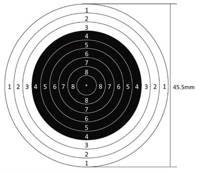

靶纸上10个同心圆的直径构成首项为45.5mm、公差为-5mm的等差数列。根据等差数列通项公式：，则6环所处同心圆的直径为45.5+（6-1）×（-5）=20.5mm，半径为mm；7环所处同心圆的直径为20.5-5=15.5mm，半径为mm。

根据公式：概率P，总情况为随机向靶纸射击且未脱靶，其面积为（）；满足条件的情况为命中6环到6.9环，即处在6环所在圆环中，其面积为（），则命中6环到6.9环的概率P，只有A项符合。

故正确答案为A。

---

### 第 7 题　qid 13319472 · 数学运算

某单位组织45名员工参观第十五届中国国际航空航天博览会。其中，21人参观了新一代隐身战斗机歼-35A，22人参观了嫦娥六号取回的月背月壤样品，19人参观了大型无人机战舰“虎鲸”。所有员工中，这三种展览都未参观的有5人，至少参观两种的有12人，则这三种展览都参观的有（    ）。

- **A**. 7人
- **B**. 8人
- **C**. 9人
- **D**. 10人　✅

**答案**：D

**官方解析**

根据题意，设参观两种展览的员工有x人，参观三种展览的员工有y人。根据三集合容斥原理非标准型公式：A+B+C-满足两项-2×满足三项=总数-都不，可列式：21+22+19-x-2y=45-5，整理得：x+2y=22······①；根据“至少参观两种的有12人”，可得：x+y=12······②，①式减②式可得：y=10，故这三种展览都参观的有10人。
故正确答案为D。

---

### 第 8 题　qid 13319476 · 数学运算

借景是古典园林建筑常用的构景手段之一，已知某景区中轴线（在同一水平面）上有两座相距200米的建筑物，其中一座建筑物为平顶，高度为23.7米；另一座建筑物为顶尖，高度为133.7米，其中顶尖的部分高度为22米。若身高为1.7米的小王从中轴线上某处看向平顶建筑物时，发现恰好能够看到尖顶建筑物的整个尖顶部分（如图所示）。则小王所站位置和平顶建筑物的直线距离为（    ）。

- **A**. 30米
- **B**. 40米
- **C**. 50米　✅
- **D**. 60米

**答案**：C

**官方解析**

根据题意可作图如下，令小王身高为BC、平顶建筑为DE、尖顶建筑为FH，过点C作垂线交ED于M点，过点E作垂线交FH于N点。平顶建筑（DE）、尖顶建筑（FH）、小王（BC）在同一水平面上，即，则。因此，，则······①。根据下图可知，EN=DF=200米，ME=DE-DM=DE-BC=23.7-1.7=22米，NG=FH-FN-GH=FH-DE-GH=133.7-23.7-22=88米，代入①式可得：，解得CM=50米，即BD=50米，故小王所站位置和平顶建筑物的直线距离为50米。

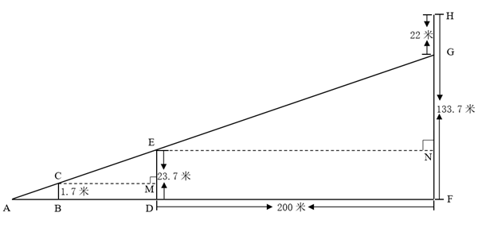

故正确答案为C。

---

### 第 9 题　qid 13319474 · 数学运算

为探访诗意乡村，聆听城市脉搏，父子两人报名参加半程马拉松，已知上坡路段父亲的速度是儿子的1.2倍，下坡路段父亲的速度是儿子的80%，其他路段两人速度相同，结果父子同时到达终点，若上、下坡路段的距离之比为1：2，则父亲上、下坡路段的速度之比为（    ）。

- **A**. 1：3
- **B**. 2：5
- **C**. 5：12
- **D**. 1：2　✅

**答案**：D

**官方解析**

设上坡路段儿子的速度为x，则父亲的速度为1.2x；设下坡路段儿子的速度为y，则父亲的速度为0.8y；赋值上、下坡路段的距离分别为1、2。根据“父子同时到达终点”，可列式：，化简可得：y=3x，则父亲上、下坡路段的速度之比为。

故正确答案为D。

---

### 第 10 题　qid 13319477 · 数学运算

某农场使用M、N两架无人机喷洒农药，先由M无人机工作2小时，再由N无人机工作5小时，可喷洒完整片农田；两架无人机同时工作1小时后，有三分之二的农田尚未喷洒。如果仅由M无人机喷洒农药，那么喷洒完整片农田需要（    ）。

- **A**. 3.5小时
- **B**. 4.5小时　✅
- **C**. 5小时
- **D**. 5.5小时

**答案**：B

**官方解析**

用M、N分别表示两架无人机的工作效率，根据题意可得：，化简得M：N=2：1。赋值M无人机的工作效率为2，N无人机的工作效率为1，则喷洒整片农田的工作量为2×2+5×1=9，仅由M无人机喷洒农药，那么喷洒完整片农田需要9÷2=4.5小时。

故正确答案为B。

---

### 第 11 题　qid 13319475 · 数学运算

某市正在深入推进“智改数转网联”升级行动计划，力争实现全市规模以上企业全覆盖。目前，全市规模以上企业2080家，其中未完成升级的规模以上企业比已完成升级的多0.6倍，那么已完成升级的规模以上企业有（    ）。

- **A**. 780家
- **B**. 800家　✅
- **C**. 1280家
- **D**. 1300家

**答案**：B

**官方解析**

设已完成升级的规模以上企业有x家，则未完成升级的规模以上企业有（1+0.6）x=1.6x家。根据题意可得：x+1.6x=2080，解得x=800。
故正确答案为B。

---

### 第 12 题　qid 13319478 · 数学运算

甲、乙两瓶质量和浓度均相同的酒精溶液，在甲瓶中加入20克水、乙瓶中加入50克浓度为30%的酒精溶液后，浓度仍然相等。若继续在甲瓶中加入30克纯酒精，溶液又恢复到最初浓度，则乙瓶酒精溶液最初的质量是（    ）。

- **A**. 100克　✅
- **B**. 110克
- **C**. 120克
- **D**. 150克

**答案**：A

**官方解析**

设甲、乙两瓶酒精溶液最初的质量均为m克，浓度均为n。根据题意可知：在甲瓶中加入20克水后，继续在甲瓶中加入30克纯酒精，溶液又恢复到最初浓度。结合公式：浓度，可列式：，解得n=60%；根据“在甲瓶中加入20克水、乙瓶中加入50克浓度为30%的酒精溶液后，浓度仍然相等”，可列式：。

方法一：根据公式：，可将方程化简为：，解得m=100。

方法二：方程正面求解比较复杂，可将选项代入验证，代入A项：，等式成立，符合题意，当选。

故正确答案为A。

---

### 第 13 题　qid 13319480 · 数学运算

一场演出的节目有舞蹈《水韵江苏》、歌曲《让世界充满爱》和《绣红旗》、小品《幸福一家人》、魔术《奇幻之旅》、杂技《力量》。若要求两首歌曲分别作为开头曲和结尾曲，舞蹈与杂技相邻演出，小品和魔术不能相邻演出，则节目演出的排列顺序有（    ）。

- **A**. 8种　✅
- **B**. 12种
- **C**. 18种
- **D**. 24种

**答案**：A

**官方解析**

根据题意，要求两首歌曲分别作为开头曲和结尾曲，有种情况；要求舞蹈与杂技相邻演出，故可先将舞蹈和杂技捆绑起来，由于演出有先后顺序，有种情况；要求小品和魔术不能相邻演出，可用插空法，先将舞蹈和杂技作为整体安排到两首歌曲中间，再将小品和魔术插入中间的2个空中，有种情况。分步用乘法，则共有2×2×2=8种节目演出的排列顺序。

故正确答案为A。

---

### 第 14 题　qid 13319486 · 数学运算

某地考古出土了一种呈长方体的青铜器，测得其长、宽、高分别为60cm、40cm、60cm。为了防止氧化，有关部门为其做个半球形的保护罩，则该保护罩（厚度忽略不计）的表面积至少为（    ）。

- **A**. 

- **B**. 

- **C**. 

　✅
- **D**. 

**答案**：C

**官方解析**

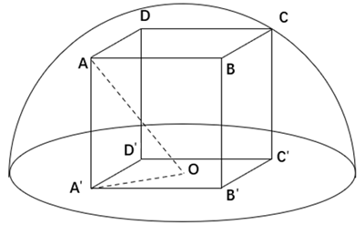

如图所示，使半球形保护罩既能罩住长方体又表面积最小，则长方体顶点A、B、C、D均与球面相切，O为底面中点，连接OA即为球体的半径。连接，则是长方形对角线的一半，且，，则根据勾股定理，，。因为三角形为直角三角形，且，则根据勾股定理，。根据公式：球体表面积，可得该保护罩的表面积为。

故正确答案为C。

备注： ①本题所求保护罩的表面积不包含底面。因为通常所说的“罩子”是没有底面的，即使罩子有底面，往往底面材质和罩子材质也不一样，会更厚一些，和题目中厚度忽略不计矛盾，故本题答案不能为A。

②由于本题的长方体是文物，因此不能随意调整摆放的情况，即不能以40cm为高算最值，故本题答案不能为D。

---

### 第 15 题　qid 13319481 · 数学运算

某场国际跳水比赛设有7名裁判，分别给运动员每一跳打分，所打分数均为0.5的整数倍，且最低为0分，最高为10分。运动员每一跳得分的具体计算规则为：去掉两个最高分和两个最低分，剩下的3个分数之和乘以难度系数即为这一跳的得分。若某运动员第一跳的难度系数为3.0，得分为66分，则7名裁判给这名运动员第一跳打分的平均数最多为（    ）。

- **A**. 7.5分
- **B**. 7.8分
- **C**. 8.0分　✅
- **D**. 8.2分

**答案**：C

**官方解析**

根据题意：中间三个分数之和×3=66，可知中间三个分数之和为22。要使7名裁判打分的平均数最多，则需让其他4名裁判打的分数尽量多。第一、第二高的两个分数最高可取10分，第六、第七高的分数最多可与第五高的分数相同，故应让第五高的分数尽量高。设第五高的分数为x，因为中间三个分数（第三、第四、第五）总和为定值22，若想第五高的分数x尽量高，则第三、第四高的分数应尽量低，列表构造如下：

则有3x=22，解得，因为裁判所打分数均为0.5的整数倍，故第五高的分数最高取7分。第六、第七高的分数最多也均可取7分。此时具体分数如下：

或者

此时7名裁判给这名运动员第一跳打分的平均数最多为分。

故正确答案为C。

---

### 第 16 题　qid 13319482 · 数学运算

用若干玫瑰花制作玫瑰花束，若每束8枝余3枝，9枝余5枝，如果将这些玫瑰花全部用完，制成数量各不相同的3束玫瑰花，那么数量最多的那一束至少有玫瑰花（    ）。

- **A**. 18枝
- **B**. 20枝
- **C**. 21枝　✅
- **D**. 23枝

**答案**：C

**官方解析**

设每束8枝有a束，每束9枝有b束，根据玫瑰花总枝数相同可列式：8a+3=9b+5，整理可得：8a=9b+2。根据奇偶特性可知，8a和2均为偶数，则9b为偶数，即b为偶数。根据要求数量最多的一束玫瑰花最少，那么玫瑰花总枝数要最少，即b取值要尽量小，分情况讨论：

若b=2，则a=2.5，不是整数，不符合题意；

若b=4，则a=4.75，不是整数，不符合题意；

若b=6，则a=7，符合题意，则此时玫瑰花总枝数最少为8×7+3=59枝。要使数量最多的一束玫瑰花枝数最少，则另外两束玫瑰花枝数要尽可能多，设数量最多的一束玫瑰花最少有x枝，又因3束玫瑰花枝数各不相同，可得玫瑰花枝数如下：

根据玫瑰花总共有59枝，可列式：x+x-1+x-2=59，解得，问最少，向上取整21枝。

故正确答案为C。

---

### 第 17 题　qid 13319483 · 数学运算

某5A级景区门票90元/人，教师免票、大学生半票，乘坐索道另付70元/人。某校教师和大学生共110人到该景区研学，若支付的门票和索道费共11750元，则参与研学的教师有（    ）。

- **A**. 6人
- **B**. 10人或20人
- **C**. 10人
- **D**. 6人或20人　✅

**答案**：D

**官方解析**

设参与研学的教师有x人，则参与研学的大学生有（110-x）人；设乘坐索道的有y人，则未乘坐索道的有（110-y）人。根据题意，大学生半票后为元/人，则门票费共元；索道费共70y元。根据“若支付的门票和索道费共11750元”，可列方程45×（110-x）+70y=11750，整理得14y-9x=1360。优先考虑代入选项进行验证，代入x=6，解得y=101，符合题意；代入x=10，解得，为非整数，不符合题意，排除；代入x=20，解得y=110，符合题意。综上，参与研学的教师有6人或20人。

故正确答案为D。

备注：此题表述不太严谨，可以选择乘坐索道也可以选择不乘坐索道，若更改表述为“若乘坐索道另付70元/人”，会更加严谨。

---

### 第 18 题　qid 13319490 · 数学运算

小张打羽毛球膝盖受伤，需每隔4天去医院做一次理疗，如果他7月2日去，则7月的理疗有1次在星期六、1次在星期日，其余都在工作日；如果他7月3日去，则7月的理疗只有1次在星期日，其余都在工作日，那么7月31日是（    ）。

- **A**. 星期四　✅
- **B**. 星期三
- **C**. 星期二
- **D**. 星期一

**答案**：A

**官方解析**

小张每隔4天去医院做一次理疗，即每5天做一次理疗。如果7月2日去做理疗，则7月做理疗的日期分别为2日、7日、12日、17日、22日、27日；如果7月3日去做理疗，则7月做理疗的日期分别为3日、8日、13日、18日、23日、28日，代入选项：

A项：7月31日是星期四，则7月日历如下表所示：

即7月2日为星期三，7日为星期一，12日为星期六，17日为星期四，22日为星期二，27日为星期日，满足“如果他7月2日去，则7月的理疗有1次在星期六、1次在星期日，其余都在工作日”的条件；7月3日为星期四，8日为星期二，13日为星期日，18日为星期五，23日为星期三，28日为星期一，满足“如果他7月3日去，则7月的理疗只有1次在星期日，其余都在工作日”的条件。满足所有条件，当选。其他选项无需验证。

故正确答案为A。

---

### 第 19 题　qid 13319485 · 数学运算

某科技园区计划铺设电缆联通A、B、C、D、E、F六栋办公楼，可以铺设电缆的线路如下图所示，每条边上的数字表示两栋楼之间线路的长度（单位：10米），则铺设电缆的总长度最短是（    ）。

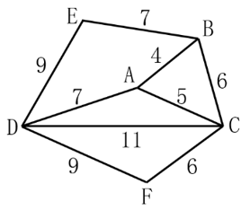

- **A**. 280米
- **B**. 290米　✅
- **C**. 310米
- **D**. 350米

**答案**：B

**官方解析**

若要铺设电缆总长度最短，则铺设的线路应尽量少且每条线路的长度应尽量短。六栋办公楼，最少需要5条线路即可联通。最短路径优先，选择AB、AC、CF、BE、AD，此时六栋楼均被连通且铺设电缆的总长度最短，故所求为（4+5+6+7+7）×10=290米。
故正确答案为B。

---

## 判断推理

### 材料 1

在环太湖自行车比赛中，冲刺阶段排在前四位的是甲、乙、丙、丁四名选手（如图，圆圈表示选手），他们来自江苏、上海、浙江和安徽，所骑自行车颜色是蓝色、灰色、白色和黄色。已知：

（1）江苏选手在选手丙的东南面；

（2）上海选手在赛道的东部位置，他所骑自行车是蓝色的；

（3）骑灰色自行车的选手不是排在第四位；

（4）选手丁排在第三位，选手乙来自浙江；

（5）安徽选手排在骑黄色自行车的选手之前，排在选手甲之后。

#### 第 1 题　qid 11367790 · 逻辑判断

根据上述信息，可以推出以下哪项？

- **A**. 甲来自江苏，排第二位
- **B**. 乙来自浙江，排第四位　✅
- **C**. 丙来自安徽，排第一位
- **D**. 丁来自上海，排第三位

**答案**：B

**官方解析**

第一步：分析题干条件。

（1）江苏选手在选手丙的东南面；

（2）上海选手在赛道的东部位置，他所骑自行车是蓝色的；

（3）骑灰色自行车的选手不是排在第四位；

（4）选手丁排在第三位，选手乙来自浙江；

（5）安徽选手排在骑黄色自行车的选手之前，排在选手甲之后。

第二步：根据题干条件进行推理。

根据条件（1）江苏选手在丙的东南面，可以推出丙是第2名，江苏选手是第3名；

根据条件（2）上海选手在赛道东部以及江苏选手是第3名，可以推出上海选手是第1名，且自行车是蓝色的；

根据条件（3）以及第1名自行车是蓝色的，可以推出灰色自行车的选手不是第2名，就是第3名；

根据条件（4）以及江苏选手是第3名，可以推出丁是江苏选手；

根据条件（5）、上海选手是第1名以及江苏选手是第3名，可以推出安徽选手是第2名，甲是第1名，具体如下表所示。

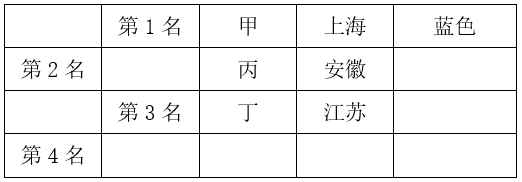

综合上述结论，可以推出第4名是乙，来自浙江，B项当选。

故正确答案为B。

---

#### 第 2 题　qid 11367792 · 逻辑判断

如果丙所骑自行车是白色，则可以推出以下哪项？

- **A**. 选手甲所骑自行车不是蓝色的
- **B**. 选手乙所骑自行车是灰色的
- **C**. 安徽选手所骑自行车是黄色的
- **D**. 江苏选手所骑自行车是灰色的　✅

**答案**：D

**官方解析**

第一步：分析题干条件。

（1）江苏选手在选手丙的东南面；

（2）上海选手在赛道的东部位置，他所骑自行车是蓝色的；

（3）骑灰色自行车的选手不是排在第四位；

（4）选手丁排在第三位，选手乙来自浙江；

（5）安徽选手排在骑黄色自行车的选手之前，排在选手甲之后；

（6）丙的自行车是白色的。

第二步：根据题干条件进行推理。

根据上一题的结论，第1名为选手甲，来自上海，自行车是蓝色的，排除A项；

根据条件（6）丙的自行车是白色的，结合上一题的结论可以推出第2名为选手丙，来自安徽，自行车是白色的，排除C项；

再根据条件（3）骑灰色自行车的选手不是排在第四位，结合上一题的结论可以推出第3名选手丁来自江苏，自行车是灰色的，那么第4名选手乙来自浙江，自行车是黄色的（具体如下表所示），D项当选。

故正确答案为D。

---

#### 第 3 题　qid 11367761 · 类比推理

元宇宙：虚拟性

- **A**. 实验：前瞻性
- **B**. 决策：可行性
- **C**. 宣传：普遍性
- **D**. 总结：概括性　✅

**答案**：D

**官方解析**

第一步：判断题干词语间逻辑关系。
元宇宙是通过虚拟增强的物理现实，是呈现收敛性和物理持久性特征的、基于未来互联网的具有链接感知和共享特征的3D虚拟空间。元宇宙一定具有虚拟性，二者是必然属性的对应关系。
第二步：判断选项词语间逻辑关系。
A项：实验不一定具有前瞻性，二者是或然属性的对应关系，与题干逻辑关系不一致，排除；
B项：决策不一定具有可行性，二者是或然属性的对应关系，与题干逻辑关系不一致，排除；
C项：宣传不一定具有普遍性，二者是或然属性的对应关系，与题干逻辑关系不一致，排除；
D项：总结指总结后概括出来的结论。总结一定具有概括性，二者是必然属性的对应关系，与题干逻辑关系一致，当选。
故正确答案为D。

---

#### 第 4 题　qid 12100994 · 类比推理

柿子：柿饼

- **A**. 土豆：土豆泥
- **B**. 花生：花生糖
- **C**. 椰子：椰子汁
- **D**. 葡萄：葡萄干　✅

**答案**：D

**官方解析**

第一步：判断题干词语间逻辑关系。
“柿子”是制作“柿饼”的原材料，二者为原材料与成品的对应关系。
第二步：判断选项词语间逻辑关系。
A项：“土豆”是制作“土豆泥”的原材料，二者为原材料与成品的对应关系，与题干逻辑关系一致，保留；
B项：“花生”是制作“花生糖”的原材料，二者为原材料与成品的对应关系，与题干逻辑关系一致，保留；
C项：“椰子”是制作“椰子汁”的原材料，二者为原材料与成品的对应关系，与题干逻辑关系一致，保留；
D项：“葡萄”是制作“葡萄干”的原材料，二者为原材料与成品的对应关系，与题干逻辑关系一致，保留。
对比A、B、C、D四项，题干“柿子”制成“柿饼”和D项“葡萄”制成“葡萄干”的过程中都需要经过“晾晒”，而A项“土豆”制成“土豆泥”、B项“花生”制成“花生糖”、C项“椰子”制成“椰子汁”均不需要经过“晾晒”，故D项与题干逻辑关系更为一致，当选。
故正确答案为D。

---

#### 第 5 题　qid 11367764 · 类比推理

热极生风：穷极思变

- **A**. 鼓空声高：人狂话大
- **B**. 绳锯木断：水滴石穿
- **C**. 人闲生病：石闲生苔　✅
- **D**. 得道多助：失道寡助

**答案**：C

**官方解析**

第一步：判断题干词语间逻辑关系。
“热极生风”意思是一个地方热得太厉害，不久便会产生大风；“穷极思变”意思是在穷困艰难的时候，就要想办法改变现状。二者无明显语义关系，考虑拆分。因为“热极”所以“生风”，因为“穷极”所以“思变”，二者拆分之后均为因果关系，且“热极生风”和“穷极思变”均可指“事物在极端状态下会发生变化”。
第二步：判断选项词语间逻辑关系。
A项：“鼓空声高”意思是鼓里面是空的时候声音反而大；“人狂话大”意思是没有真才实学的人往往狂妄自大，好说大话，喜欢吹牛。因为“鼓空”所以“声高”，因为“人狂”所以“话大”，二者拆分之后均为因果关系，但“鼓空声高”无法指“事物在极端状态下会发生变化”，与题干逻辑关系不一致，排除；
B项：“绳锯木断”意思是以绳当锯，也能锯断木头；“水滴石穿”意思是水滴不断地滴，可以滴穿石头。因为“绳锯”所以“木断”，因为“水滴”所以“石穿”，二者拆分之后均为因果关系，但“绳锯木断”和“水滴石穿”均无法指“事物在极端状态下会发生变化”，与题干逻辑关系不一致，排除；
C项：“人闲生病”意思是人闲得无聊就容易生病；“石闲生苔”意思是闲置的石头很容易长出青苔。因为“人闲”所以“生病”，因为“石闲”所以“生苔”，二者拆分之后均为因果关系，且“人闲生病”和“石闲生苔”均可指“事物在极端状态下会发生变化”，与题干逻辑关系一致，当选；
D项：“得道多助”意思是坚持正义就能得到多方面的支持与帮助；“失道寡助”意思是违背正义必然陷于孤立。因为“得道”所以“多助”，因为“失道”所以“寡助”，二者拆分之后均为因果关系，但“得道多助”和“失道寡助”均无法指“事物在极端持续状态下会发生变化”，与题干逻辑关系不一致，排除。
故正确答案为C。
本题为争议题。若看题干第一个词“热极生风”与物有关，第二个词“穷极思变”与人有关；A项第一个词“鼓空声高”与物有关，第二个词“人狂话大”与人有关，C项刚好顺序反了，也有同学会选择A项，此考法历年真题也确实考过。两种理解方式均有合理之处，考生无需过于纠结不严谨的题，重点学习此类题的解题思路即可，这种同时涉及物和人的成语或诗句可能会考查的两个角度，一是具体意思的类似，二是由物到人或由人到物的类比。

---

#### 第 6 题　qid 11367770 · 类比推理

苍鹰：鸿雁：书信

- **A**. 加油：注水：鼓劲
- **B**. 下海：上岸：录取　✅
- **C**. 须眉：巾帼：围脖
- **D**. 疆域：河山：国土

**答案**：B

**官方解析**

第一步：判断题干词语间逻辑关系。
“苍鹰”和“鸿雁”都是鸟类，二者为并列关系；“鸿雁”是书信的代称，可以比喻“书信”，第二词与第三词构成比喻象征义，且第一词与第三词无必然逻辑关系。
第二步：判断选项词语间逻辑关系。
A项：“加油”和“注水”都是动作，二者为并列关系；“加油”可用于支持，指勉励他人或自己，可以比喻“鼓劲”，第一个词与第三个词构成比喻象征义，词语顺序与题干不一致，与题干逻辑关系不一致，排除；
B项：“下海”和“上岸”都是动作，二者为并列关系；“上岸”指舍舟登陆，也指考生被录取，可以比喻“录取”，第二词与第三词构成比喻象征义，且第一词与第三词无必然逻辑关系，与题干逻辑关系一致，当选；
C项：“须眉”指胡须和眉毛，也可以比喻男子，“巾帼”指古代妇女的头巾和发饰，也可以比喻女子，二者为并列关系；但“巾帼”不能比喻“围脖”，与题干逻辑关系不一致，排除；
D项：“疆域”指国家领土，“河山”指国家的疆土，“国土”指国家的领土，第一个词和第三个词意思一致，二者为全同关系，与题干逻辑关系不一致，排除。
故正确答案为B。

---

#### 第 7 题　qid 11367768 · 类比推理

压舱石：就业：社会稳定

- **A**. 先手棋：专利：科技创新
- **B**. 基本盘：耕地：粮食生产　✅
- **C**. 晴雨表：管理：人才培养
- **D**. 主阵地：学校：知识传播

**答案**：B

**官方解析**

第一步：判断题干词语间逻辑关系。
“压舱石”本意为船舶、飞机等交通工具上为了保持平衡和稳定而放置的重物，后比喻对事物发展起到稳定、支撑作用的关键因素、重要力量或基础保障。“就业”是“社会稳定”的“压舱石”，三者为对应关系。
第二步：判断选项词语间逻辑关系。
A项：“先手棋”本来指围棋、象棋等棋类游戏中，先走的一方所下的第一步棋，具有争取主动的优势，后引申为在竞争、行动等过程中，为了占据主动地位而采取的第一步或关键的起始行动、策略等。“专利”不是“科技创新”的“先手棋”，三者不构成对应关系，与题干逻辑关系不一致，排除；
B项：“基本盘”指事物最基础、最根本的部分。“耕地”是“粮食生产”的“基本盘”，三者为对应关系，与题干逻辑关系一致，保留；
C项：“晴雨表”比喻能敏锐地反映某种变化或在事情发生前出现征兆的事物。“管理”不是“人才培养”的“晴雨表”，三者不构成对应关系，与题干逻辑关系不一致，排除；
D项：“主阵地”指在军事作战中，军队主要据守和作战的地区或位置，现在常用来指在某个领域、行业或工作中，起主导、核心作用，集中力量进行主要活动或发挥主要作用的地方、领域或平台等。“学校”是“知识传播”的“主阵地”，三者为对应关系，与题干逻辑关系一致，保留。
对比B、D两项，题干的“压舱石”强调“就业”是维持“社会稳定”的重要基础和关键因素，对“社会稳定”起着支撑作用，B项的“基本盘”强调“耕地”是“粮食生产”的根本和基础，对“粮食生产”起着支撑作用，而D项的“主阵地”没有体现这种基础和支撑作用。且题干的“压舱石”和B项的“基本盘”都是物品，而D项的“主阵地”为地点，故B项与题干逻辑关系更为一致，当选。
故正确答案为B。

---

#### 第 8 题　qid 11367767 · 类比推理

森林 之于 （    ） 相当于 （    ） 之于 社会

- **A**. 气候 法制　✅
- **B**. 氧气 自然
- **C**. 系统 国家
- **D**. 树木 家庭

**答案**：A

**官方解析**

逐一代入选项。
A项：森林会调节气候，二者为对应关系；法制会约束或调节社会，二者为对应关系，前后逻辑关系一致，当选；
B项：森林会释放氧气，二者为产物的对应关系；自然会影响社会，而社会也会改造自然，二者为互相影响的对应关系，前后逻辑关系不一致，排除；
C项：森林是一种生态系统，二者为种属关系；国家可以指阶级统治的工具，也可以指一个国家的整个区域，但国家不是一种社会，二者不是种属关系，前后逻辑关系不一致，排除；
D项：树木是森林的组成部分，二者为组成关系；家庭是社会的组成部分，二者为组成关系，但前后词语顺序相反，前后逻辑关系不一致，排除。
故正确答案为A。

---

#### 第 9 题　qid 12100997 · 图形推理

请从四个选项中选出最恰当的一项填入问号处，使题干图形呈现一定的规律性。

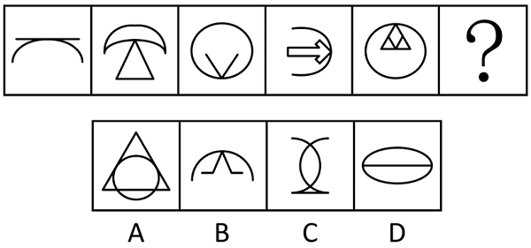

- **A**. A
- **B**. B　✅
- **C**. C
- **D**. D

**答案**：B

**官方解析**

元素组成不同，且属性规律无答案，考虑数量规律。观察发现，题干图形中的曲线和直线均有明显相交，考虑曲直交点数。题干图形的曲直交点数均为1，故？处应选择有1个曲直交点的图形，只有B项符合。
故正确答案为B。

---

#### 第 10 题　qid 11367769 · 图形推理

请从四个选项中选出最恰当的一项填入问号处，使题干图形呈现一定的规律性。

- **A**. A
- **B**. B
- **C**. C　✅
- **D**. D

**答案**：C

**官方解析**

题干中每幅图形均由1个单独小矩形和4个相连的小矩形构成。观察发现，单独小矩形的方向在每幅图中依次呈水平、竖直，交替放置，故？处应选择一个单独小矩形竖直放置的图形，排除A、D两项；继续观察发现，4个相连的小矩形中，与单独小矩形方向一致的数量依次为2、1、2、1、2，交替出现，只有C项符合。
故正确答案为C。

---

#### 第 11 题　qid 11367773 · 图形推理

请从四个选项中选出最恰当的一项填入问号处，使题干图形呈现一定的规律性。

- **A**. A
- **B**. B
- **C**. C　✅
- **D**. D

**答案**：C

**官方解析**

元素组成不同，且无明显属性规律，考虑数量规律。观察发现，题干出现多个 “日”字变形图，考虑笔画数。题干图形均为一笔画图形，？处应用规律，排除A、B两项；继续观察发现，题干每幅图形均存在两个三角形面，故？处应选一个存在两个三角形面的图形，只有C项符合。
故正确答案为C。

---

#### 第 12 题　qid 11367796 · 图形推理

左边给定的图形是由右边哪些图形拼合（只可平移，不可旋转和翻转）而成的？

- **A**. ①②③④
- **B**. ①②③⑤
- **C**. ②③④⑤
- **D**. ①③④⑤　✅

**答案**：D

**官方解析**

本题考查平面拼合，可采用平行且等长相消的方式解题。左边给定的图形是由右边①③④⑤拼合而成的。平行且等长相消的方式如下图所示：

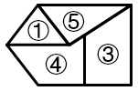

故正确答案为D。

---

#### 第 13 题　qid 11367783 · 类比推理

上边四张纸片，每张纸片一面是黑色，另一面是白色，下边仅有一项能由它们拼合（可以平移、旋转、翻转）而成，请把它找出来。

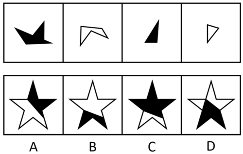

- **A**. A
- **B**. B
- **C**. C　✅
- **D**. D

**答案**：C

**官方解析**

本题考查平面拼合，可以平移、旋转、翻转，且每张纸片一面是黑色，另一面是白色，需要考虑翻转后的颜色变化。将题干图形标上序号，如下图所示，逐一进行分析。

A项：中间的三角形是由图③旋转后平移过去的，颜色应该是黑色，而选项是白色，排除；

B项：下方的多边形是由图②旋转后平移过去的，颜色应该是白色，而选项是黑色，排除；

C项：可以由题干图形拼合而成，拼合方式如图所示，当选；

D项：右上角的多边形与题干四张纸片的形状均不相同，无法由题干图形拼合而成，排除。

故正确答案为C。

---

#### 第 14 题　qid 11367785 · 图形推理

左边给定的是一个立方体，右边哪一项可能是它的外表面展开图？

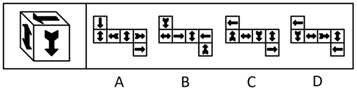

- **A**. A
- **B**. B
- **C**. C
- **D**. D　✅

**答案**：D

**官方解析**

将题干立体图和选项展开图的面均标上序号，如下图所示，逐一进行分析。

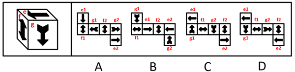

A项：题干立体图中g面中箭头的箭尾对着e面，而选项中无论是g1面还是g2面，箭头的箭尾均对着f2面，选项展开图与题干立体图不一致，排除；

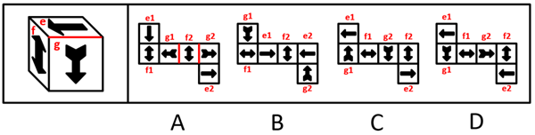

B项：题干立体图中e面中箭头指向f面中箭头的尖，而选项中无论是e1面还是e2面，箭头均指向f2面中箭头的箭身，选项展开图与题干立体图不一致，排除；

C项：以e面中单箭头尖指向的边为起始边，在题干立体图和选项展开图中进行顺时针画边（如下图所示），题干立体图中边4对应g面中的箭尾，而选项中无论是e1面还是e2面，边4均不对应g面中的箭尾，选项展开图与题干立体图不一致，排除；

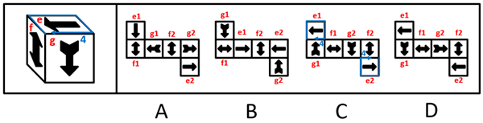

D项：题干由e1面、g1面和f2面组成，选项展开图与题干立体图一致，当选。

故正确答案为D。

---

#### 第 15 题　qid 12101001 · 图形推理

左边给定的是六面体的外表面展开图，右边哪一项能由它折叠而成？

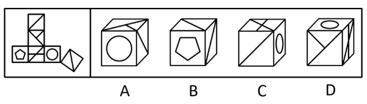

- **A**. A
- **B**. B　✅
- **C**. C
- **D**. D

**答案**：B

**官方解析**

本题考查六面体。将展开图中右下角的面移动，并给每个面标号，如下图所示，逐一进行分析。

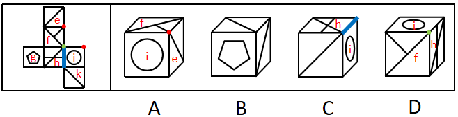

A项：选项一定有面i和面f，右面为面e或面k，展开图中面f和面k为相对面，无法同时出现，故右面为面e。展开图中面e、面f和面i的公共点引出一条线，而选项中三个面的公共点引出两条线，选项与题干展开图不一致，排除；

B项：选项由面e、面g与面k构成，选项与题干展开图一致，当选；

C项：选项一定有面h和面i，展开图中面h与面i的公共边挨着面h中的两条线，而选项中两个面的公共边只挨着面h中的一条线，选项与题干展开图不一致，排除；

D项：选项由面f、面h和面i构成，展开图中三个面的公共点引出两条线，而选项中三个面的公共点只引出一条线，选项与题干展开图不一致，排除。

故正确答案为B。

---

#### 第 16 题　qid 11367788 · 图形推理

下面4个立体图形均由大小相同的8个白色小立方体和4个灰色小立方体堆叠而成，其中一个立体图形的某一视图可能是由纯白小方格组成的，请把它找出来。

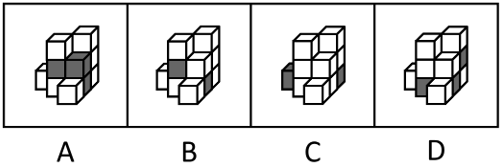

- **A**. A
- **B**. B
- **C**. C
- **D**. D　✅

**答案**：D

**官方解析**

本题考查三视图。A、B、C三项中的立体图形不可能某一视图由纯白小方格组成，排除。D项中，立体图形的正面能看到7个白色小立方体和3个灰色小立方体，所以其背面应还有1个白色小立方体和1个灰色小立方体。如下图所示，当灰色小立方体在最下层摆放，白色小立方体摆放在该灰色小立方体的上方时，其俯视图由纯白小方格组成。

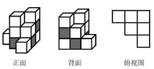

故正确答案为D。

---

#### 第 17 题　qid 11367777 · 逻辑判断

只有为了人民的现代化，才有意义；只有依靠人民的现代化，才有动力。新时代以来，我们坚持民生为大，书写了经济快速发展和社会长期稳定两大奇迹新篇章。只要坚持一切为了人民、一切依靠人民，就能充分调动广大人民的积极性。
根据以上信息，可以推出以下哪项？

- **A**. 不是为了人民的现代化，就是没有意义的现代化　✅
- **B**. 不坚持民生为大，就不能创造经济快速发展和社会长期稳定两大奇迹
- **C**. 如果没能调动广大人民的积极性，则没有坚持一切为了人民
- **D**. 只有坚持一切依靠人民，才能充分调动广大人民的积极性

**答案**：A

**官方解析**

第一步：翻译题干。

①现代化有意义为了人民的现代化；

②现代化有动力依靠人民的现代化；

③坚持一切为了人民 且 坚持一切依靠人民充分调动广大人民的积极性。

第二步：逐一分析选项。

A项：翻译为“为了人民的现代化现代化有意义”，是对①的否后，否后必否前，可以推出，当选；

B项：翻译为“坚持民生为大创造经济快速发展和社会长期稳定两大奇迹”，二者不存在逻辑关系，无法推出，排除；

C项：翻译为“调动广大人民的积极性坚持一切为了人民”，是对③的否后，否后必否前，即“充分调动广大人民的积极性坚持一切为了人民 或 坚持一切依靠人民”，无法得出“坚持一切为了人民”一定为真，无法推出，排除；

D项：翻译为“充分调动广大人民的积极性坚持一切依靠人民”，是对③的肯后，但肯后得不到确定性的结论，无法推出，排除。

故正确答案为A。

---

#### 第 18 题　qid 12101003 · 逻辑判断

地名是一个社会的基本公共信息，是自然地理、生产生活、历史文化的重要载体，在经济社会发展中发挥着基础性作用。民政部印发通知，提出以乡村地名采集上图标注为牵引，全面推进乡村地名命名管理、地名标志设置维护。对此，有专家称这一举措有助于传承中华民族悠久的历史文化。
以下哪项如果为真，最能支持上述专家的论断？

- **A**. 地名作为一种蕴含丰富价值的资源，融入了人们的价值取向、文化思想观念等内容
- **B**. 地名属于专有名词，每个地名都有对应的读音和含义，体现了人们对美好生活的期盼
- **C**. 地名是人类历史“活化石”，在中华民族千百年的传承中被赋予更多含义，成为中华文明的独特载体　✅
- **D**. 一些地方存在着地名不规范的现象，给基层治理、公共服务以及人们的生产生活带来诸多困扰

**答案**：C

**官方解析**

第一步：找出论点和论据。
论点：这一举措（以乡村地名采集上图标注为牵引，全面推进乡村地名命名管理、地名标志设置维护）有助于传承中华民族悠久的历史文化。
论据：无。
本题只有论点，没有论据，加强优先考虑补充论据。
第二步：逐一分析选项。
A项：该项指出地名融入了人们的价值取向、文化思想观念等内容，人们的价值取向、文化思想观念等内容是中华民族历史文化的具体体现，补充论据，可以加强，保留；
B项：该项指出每个地名都有对应的读音和含义，体现了人们对美好生活的期盼，但无法证明地名命名管理是否有助于传承中华民族悠久的历史文化，无法加强，排除；
C项：该项指出地名在中华民族千百年的传承中被赋予更多含义，成为中华文明的独特载体，解释了为什么地名命名管理有助于传承中华民族悠久的历史文化，补充论据，可以加强，保留；
D项：该项指出一些地方存在着地名不规范的现象以及由此带来的困扰，而论点说的是地名命名管理有助于传承中华民族悠久的历史文化，话题不一致，无法加强，排除。
对比A、C两项，题干论点的关键词为“有助于传承中华民族悠久的历史文化”，A项说的是具体体现即“人们的价值取向、文化思想观念等内容”，而C项指出“地名在中华民族千百年的传承中被赋予更多含义”，C项表述的范围比A项更大、更全面，C项当选。
故正确答案为C。

---

#### 第 19 题　qid 12101032 · 逻辑判断

某学校开通了甲、乙、丙3趟校直通车，分别在校门口、图书馆、教学楼、宿舍楼、行政楼5个地点选择一些地方设置班车停靠点，每趟班车设置了3个停靠点，每个停靠点都有1至2趟班车停靠，已知：
（1）在校门口停靠点的班车趟数量最少；
（2）若乙班车不在教学楼和图书馆停靠，则丙班车在校门口停靠；
（3）若丙班车不在行政楼、教学楼和图书馆停靠，则仅有乙班车在宿舍楼停靠。
根据上述信息，可以推断出以下哪项?

- **A**. 甲班车在教学楼停靠
- **B**. 乙班车在行政楼停靠
- **C**. 甲、乙班车在宿舍楼停靠　✅
- **D**. 乙、丙班车在宿舍楼停靠

**答案**：C

**官方解析**

第一步：分析题干条件。

（1）在校门口停靠点的班车趟数量最少；

（2）乙班车不在教学楼和图书馆停靠丙班车在校门口停靠；

（3）丙班车不在行政楼、教学楼和图书馆停靠仅有乙班车在宿舍楼停靠；

（4）3趟班车每趟设置了3个停靠点，每个停靠点都有1至2趟班车停靠。

第二步：根据题干条件进行推理。

根据条件（1）和条件（4）可以推出，校门口有1趟班车停靠，其余4个停靠点行政楼、教学楼、图书馆和宿舍楼均有2趟班车停靠；

根据宿舍楼有2趟班车停靠，可以推出“仅有乙班车在宿舍楼停靠”不成立，再结合条件（3）的逆否可以推出，丙班车在行政楼、教学楼和图书馆停靠；

再根据条件（4）可以推出，丙班车不在校门口和宿舍楼停靠，宿舍楼又有2趟班车停靠，那么甲、乙班车在宿舍楼停靠，满足题干所有条件，C项当选。

故正确答案为C。

注：本题条件（2）中的“在教学楼和图书馆停靠”和条件（3）中的“在行政楼、教学楼和图书馆停靠”需理解成“一个整体”，不能理解成且关系，进行逆否时无需使用德摩根定律进行推理，这样才能得出正确答案。

---

#### 第 20 题　qid 11367780 · 逻辑判断

一项调查显示，某公司有70%的员工存在压力过大、健康隐患等问题。为此，公司计划建立一个“健康角”，提供瑜伽课程和心理咨询服务。公司管理层预测，设立“健康角”能改善员工的身心状态，提高整体工作效率。
回答以下哪个问题，最有助于评价公司管理层作出的上述预测？

- **A**. 员工是否有需求和兴趣参与“健康角”活动　✅
- **B**. 其他实施类似福利计划的公司是否取得了成效
- **C**. 该调查数据是否反映公司员工真实的身心状况
- **D**. 该公司是否有足够预算用于“健康角”长期运营

**答案**：A

**官方解析**

第一步：找出论点和论据。
论点：设立“健康角”能改善员工的身心状态，提高整体工作效率。
论据：无。
本题只有论点，没有论据，且提问方式为“最有助于”评价公司管理层作出的预测，问题对预测成立越重要越有帮助，可优先考虑必要条件。
第二步：逐一分析选项。
A项：该项讨论的是员工是否有需求和兴趣参与“健康角”，如果员工对“健康角”没有需求和兴趣，就不会参与该活动，那设立“健康角”就达不到预期效果，即该问题成立是预测成立的必要条件，有助于评价公司管理层的预测，当选；
B项：该项讨论的是其他公司，而论点讨论的是该公司，主体不一致，无助于评价公司管理层的预测，排除；
C项：该项讨论的是该调查数据是否反映公司员工真实的身心状况，即使该数据不能反映真实情况，也不代表该公司员工身心状况是良好的，因此无法据此判断“健康角”是否能实现预期效果，无助于评价公司管理层的预测，排除；
D项：该项讨论的是该公司是否有足够预算用于“健康角”长期运营，而论点讨论的是该公司设立“健康角”能否取得预期效果，话题不一致，无助于评价公司管理层的预测，排除。
故正确答案为A。

---

#### 第 21 题　qid 11367786 · 逻辑判断

海草是由陆地植物演化到适应海洋环境的高等植物。一种或几种海草连片生长，共同形成广袤柔软的“海草床”。海草床是最高效的碳捕获和碳封存系统之一，贮存碳的效率比森林高90倍，碳封存时间可达上千年。然而海草床是脆弱的生态系统，受自然环境变化和人类活动影响较大，全球范围内海草床正面临严峻退化趋势。基于如上原因，有专家建议，亟需开展“海底种草”生态修复工作，加强对海草床的保护。
以下哪项如果为真，最能支持上述专家的建议？

- **A**. 当前全球气候变暖日益加剧，科学家已发现人类生产生活排放的碳化合物是变暖的主要元凶　✅
- **B**. 海草床可以通过光合作用吸收环境中的无机碳，将其高效地固定、转化为有机碳并进行积累
- **C**. 有些地方海岸线侵蚀严重，加强海草床保护和修复，能有效防止或减缓海滩和海岸遭受侵蚀
- **D**. 海草床具有水质净化和调控功能，能吸收水体中的营养盐和重金属，降低海水悬浮物的浓度

**答案**：A

**官方解析**

第一步：找出论点和论据。
论点：亟需开展“海底种草”生态修复工作，加强对海草床的保护。
论据：海草床是最高效的碳捕获和碳封存系统之一，贮存碳的效率比森林高90倍，碳封存时间可达上千年。然而海草床是脆弱的生态系统，受自然环境变化和人类活动影响较大，全球范围内海草床正面临严峻退化趋势。
本题论点说的是亟需修复和保护海草床，论据说的是海草床是最高效的碳捕获和碳封存系统之一，但正面临严峻退化趋势，二者话题基本一致，加强优先考虑补充论据。
第二步：逐一分析选项。
A项：该项说的是全球气候变暖日益加剧，而其主要元凶是人类生产生活排放的碳化合物，那么固碳就显得尤为重要，而海草床可以固碳，故应亟需开展“海底种草”生态修复工作，该项指出目前碳排放问题较严重是填补了论据推出论点过程中的漏洞，补充论据，保留；
B项：该项说的是海草床可以将无机碳高效地固定、转化为有机碳并进行积累，说明海草床贮存碳的效率较高，是对论据的重复，可以加强，保留；
C项：该项说有些地方海岸线侵蚀严重，加强海草床保护和修复，能有效防止或减缓海滩和海岸遭受侵蚀，但未提及其与碳化合物的关系，话题不一致，无法加强，排除；
D项：该项说的是海草床具有水质净化和调控功能，但没有体现这些功能对碳化合物的作用，无法证明“亟需”修复和保护海草床，无法加强，排除。
对比A、B两项，A项填补了论据推出论点过程中的漏洞，而B项只是重复论据，因此A项的加强力度更强。
故正确答案为A。

---

#### 第 22 题　qid 11367795 · 类比推理

甲：在手机市场增长缓慢的大环境下，折叠屏手机销量连续多年保持两位数的增长，折叠屏手机将是手机研发的下一个风口
乙：折叠屏手机经历多年发展仍只占手机整体销量的1.6%，由此来看，折叠屏手机不值得手机厂商投入太多精力
以下哪项与上述对话方式最为相似？

- **A**. 
甲：2017年企业应用AI技术比例约为20%，到2023年提高至50%，AI技术将是国家经济发展的重点

乙：AI技术经历多年发展已经在社会方方面面起着重要作用，但传统行业仍是经济中的重要部分，同样需要重视

- **B**. 
甲：这次期末考试，张明的成绩平均每科提高了5分，这表明张明过去一年在学习上认真了许多

乙：这次期末考试比较简单，全班同学各科平均分都提高了10分之多，由此看来，张明在过去一年没有认真学习

- **C**. 
甲：过去三年某出版社的错别字检出量大大增加，必须增加相应的人手以避免错别字检出数量继续增加

乙：过去三年该出版社出版总量大大增加，但错别字检出率维持在万分之一左右，远低于国家标准，无需增加人手
　✅
- **D**. 
甲：一项调查显示，超过90%的大学生在不请假的情况下缺过课，这一现象说明课堂纪律没有得到很好的遵守

乙：这项调查主要针对大四学生，如果是大一学生，则缺过课的比例不超过20%，可见大学课堂纪律得到了很好的遵守

**答案**：C

**官方解析**

第一步：分析题干逻辑关系。
甲根据“折叠屏手机销量连续多年保持两位数的增长”的现象，得出“折叠屏手机将是手机研发的下一个风口”的结论，而乙提出“折叠屏手机经历多年发展仍只占手机整体销量的1.6%”，通过说明折叠屏手机在手机整体销量中的占比仍很低反驳了甲的结论。
第二步：逐一分析选项。
A项：甲根据“企业应用AI技术比例在2023年提高至50%”的现象，得出“AI技术将是国家经济发展的重点”的结论，乙提出“传统行业仍是经济中的重要部分，同样需要重视”，并未反驳甲的结论，与题干对话方式不一致，排除；
B项：甲根据“张明的成绩平均每科提高了5分”的现象，得出“张明过去一年在学习上认真了许多”的结论，而乙提出“全班同学各科平均分都提高了10分之多”，通过说明张明的成绩提升幅度小于全班同学的平均水平反驳了甲的结论，与题干对话方式不一致，排除；
C项：甲根据“过去三年某出版社的错别字检出量大大增加”的现象，得出“必须增加相应的人手以避免错别字检出数量继续增加”的结论，而乙提出“过去三年该出版社出版总量大大增加，但错别字检出率维持在万分之一左右”，通过说明错别字的数量占文本总字数的比例很低反驳了甲的结论，与题干对话方式一致，当选；
D项：甲根据“一项调查显示，超过90%的大学生在不请假的情况下缺过课”的现象，得出“课堂纪律没有得到很好的遵守”的结论，而乙提出“这项调查主要针对大四学生，如果是大一学生，则缺过课的比例不超过20%”，通过说明调查的样本不具代表性反驳了甲的结论，与题干对话方式不一致，排除。
故正确答案为C。

---

#### 第 23 题　qid 12101008 · 逻辑判断

近年来，AI在世界范围内掀起一波接一波的热潮，它的颠覆性应用让许多行业受益。然而，今年4月发布的一份研究报告显示，近一年来，经济与企业类AI谣言量增速达99.91%。某权威调查机构称，生成虚假文章的网站数量自2023年5月以来激增1000%以上，涉及15种语言。据此，有专家预测，如果任由这种情况发展下去，AI输出内容的质量会呈现断崖式下降。
以下哪项如果为真，最能支持上述专家的预测？

- **A**. AI输出的内容虽然形式上非常合理，但是一旦深入分析，就会发现很多地方站不住脚
- **B**. 缺乏批判性思维的情况下，AI可能让人陷入认知幻觉，扭曲公众对现实和科学共识的集体理解
- **C**. AI生成的大量虚假、垃圾内容会源源不断地回流互联网，“污染”训练AI模型的数据　✅
- **D**. AI生成、伪造或篡改文本、图片、音频和视频的现象越来越普遍，产生了大量信息垃圾

**答案**：C

**官方解析**

第一步：找出论点和论据。
论点：如果任由这种情况发展下去，AI输出内容的质量会呈现断崖式下降。
论据：今年4月发布的一份研究报告显示，近一年来，经济与企业类AI谣言量增速达99.91%。某权威调查机构称，生成虚假文章的网站数量自2023年5月以来激增1000%以上，涉及15种语言。
本题论据和论点都在讨论AI输出质量的情况，话题一致，加强优先考虑补充论据。
第二步：逐一分析选项。
A项：该项指出AI输出的内容深入分析后就会发现很多地方站不住脚，说的是AI输出的内容存在问题，但没有提及“AI谣言、虚假信息”对“AI输出内容的质量”的影响，话题不一致，无法加强，排除；
B项：该项指出AI可能对人产生的负面影响，但没有提及“AI谣言、虚假信息”对“AI输出内容的质量”的影响，话题不一致，无法加强，排除；
C项：该项指出AI生成的大量虚假、垃圾内容会源源不断地回流互联网，“污染”训练AI模型的数据，进而导致AI输出内容的质量变差，补充论据，可以加强，当选；
D项：该项指出AI生成、伪造或篡改文本、图片、音频和视频的现象越来越普遍，产生了大量信息垃圾，属于重复论据，没有提及“AI输出内容的质量断崖式下降”，无法加强，排除。
故正确答案为C。

---

#### 第 24 题　qid 11367774 · 逻辑判断

甲、乙、丙三人毕业后同时进入某单位实习，由于表现较好，实习结束后他们将分到人事处、财务处、办公室正式入职。有人对他们各自的工作部门进行了如下猜测：
（1）甲入职的部门是人事处；
（2）乙入职的部门不是财务处；
（3）丙入职的部门不是人事处。
实际上，上述三个猜测只有一个是对的。
根据上述信息，可以推出甲、乙、丙入职的部门依次为：

- **A**. 人事处 财务处 办公室
- **B**. 办公室 财务处 人事处
- **C**. 财务处 办公室 人事处　✅
- **D**. 人事处 办公室 财务处

**答案**：C

**官方解析**

第一步：分析题干条件。
（1）甲入职的部门是人事处；
（2）乙入职的部门不是财务处；
（3）丙入职的部门不是人事处；
（4）三个猜测只有一个是对的。
题干条件没有矛盾关系，也没有反对关系，考虑题干假设或选项代入，选项信息充分，优先考虑代入法。
第二步：逐一代入选项。
代入A项：条件（1）为真，条件（2）为假，条件（3）为真，有两个猜测为真，与条件（4）矛盾，排除；
代入B项：条件（1）为假，条件（2）为假，条件（3）为假，三个猜测均为假，与条件（4）矛盾，排除；
代入C项：条件（1）为假，条件（2）为真，条件（3）为假，只有一个猜测为真，符合条件（4），当选；
代入D项：条件（1）为真，条件（2）为真，条件（3）为真，三个猜测均为真，与条件（4）矛盾，排除。
故正确答案为C。

---

#### 第 25 题　qid 12101016 · 定义判断

预期管理：指政府部门通过发布会、社交媒体等方式，与社会公众进行互动性交流，以提高政策接受度，塑造稳定的运行环境，确保预期目标实现的管理方式。
下列属于预期管理的是：

- **A**. 进入冬季后，市生态环境局每天通过电视台实时发布空气质量监测数据，市民出门前都会随时收看
- **B**. 县文旅局为了促进旅游业发展，制作了上百个短视频，在多个社交平台上宣传当地的美景和特色文化
- **C**. 针对野猪频繁出没危害居民生命财产安全的事件，区农业农村局出台了补偿规定，并在听证会上答复了广大市民的提问　✅
- **D**. 某电商平台公布了平台补贴与政府“以旧换新”补贴叠加使用的申领方案，收到网民提出的各种建议后，又进行了多处修改

**答案**：C

**官方解析**

第一步：找出定义关键词。
“政府部门”、“通过发布会、社交媒体等方式”、“与社会公众进行互动性交流”、“提高政策接受度，塑造稳定的运行环境，确保预期目标实现”。
第二步：逐一分析选项。
A项：市生态环境局通过电视台发布空气质量监测数据，只是市生态环境局发布信息的方式，并未体现与社会公众的互动性交流，不符合“与社会公众进行互动性交流”，不符合定义，排除；
B项：县文旅局制作了上百个短视频，在多个社交平台上宣传当地的美景和特色文化，未体现与社会公众的互动性交流，不符合“与社会公众进行互动性交流”，不符合定义，排除；
C项：区农业农村局针对野猪危害居民生命财产安全的事件出台了补偿规定，并在听证会上答复了广大市民的提问，符合“政府部门”、“通过发布会、社交媒体等方式”、“与社会公众进行互动性交流”、“提高政策接受度，塑造稳定的运行环境，确保预期目标实现”，符合定义，当选；
D项：某电商平台公布了平台补贴及政府补贴的申领方案，但电商平台不属于政府部门，不符合“政府部门”，不符合定义，排除。
故正确答案为C。

---

#### 第 26 题　qid 11367804 · 定义判断

数字意境：指通过数字技术赋能将优秀传统文化以沉浸式的艺术形式进行创新表达，凸显视觉效果呈现，以展现其文化韵味和审美意境。
下列属于数字意境的是：

- **A**. 某电视台文化节目中，大学生们来到文化古迹现场，与考古专家互动，在诵读、观察、探究中加深对中华传统文化的理解
- **B**. 某景区排练的舞蹈节目中，以当地石窟为真实背景，利用三维动画技术复原了壁画中飞天与金刚的舞蹈，使静止的文化符号变成了动感的形象　✅
- **C**. 某艺术研究院和多家企业合作，对古代编钟复制件进行高精细度的音源采集，最终实现对这一传统瑰宝的数字化复原
- **D**. 某博物馆从古代名画《千里江山图》《百花图卷》中选取“意象”元素，实景搭建了沉浸式体验展厅，观众犹如身临其境

**答案**：B

**官方解析**

第一步：找出定义关键词。
“通过数字技术赋能”、“将优秀传统文化以沉浸式的艺术形式进行创新表达”、“凸显视觉效果呈现”。
第二步：逐一分析选项。
A项：某电视台文化节目中，大学生们来到文化古迹现场，与考古专家互动，未体现数字技术，不符合“通过数字技术赋能”，不符合定义，排除；
B项：利用三维动画技术，体现了数字技术，符合“通过数字技术赋能”，复原了石窟壁画中飞天与金刚的舞蹈，使静止的文化符号变成了动感的形象，符合“将优秀传统文化以沉浸式的艺术形式进行创新表达”、“凸显视觉效果呈现”，符合定义，当选；
C项：对古代编钟复制件进行高精细度的音源采集，最终实现对这一传统瑰宝的数字化复原，只是对其音源进行复原，不涉及创新表达，不符合“将优秀传统文化以沉浸式的艺术形式进行创新表达”、“凸显视觉效果呈现”，不符合定义，排除；
D项：某博物馆从古代名画中选取“意象”元素，实景搭建了沉浸式体验展厅，观众犹如身临其境，不明确是否使用了数字技术，不符合“通过数字技术赋能”，不符合定义，排除。
故正确答案为B。

---

#### 第 27 题　qid 11367797 · 定义判断

创意环保教育：指为了培养青少年生态环保意识而开展的与单向教育模式不同的互动性课外活动。
下列属于创意环保教育的是：

- **A**. 每周六晚上，刘老师都会带领一群小小昆虫“发烧友”，在山林、草坪中探索奇妙的昆虫世界，探讨人与自然的和谐关系　✅
- **B**. 王先生发现儿子对地理、生物知识很感兴趣，就给他买了许多书。儿子在增长知识的同时也萌生了更强的环保意识
- **C**. 刘女士收到家长群的通知，要求学生提交用空牛奶盒完成的手工环保作业，她只好网购一些空盒子，因为家里几乎不喝牛奶
- **D**. 清江社区利用微信公众号、户外海报等载体，对废旧电池回收问题进行通俗易懂的讲解，居民纷纷表示再也不会随意乱扔电池

**答案**：A

**官方解析**

第一步：找出定义关键词。
“培养青少年生态环保意识”、“与单向教育模式不同”、“互动性课外活动”。
第二步：逐一分析选项。
A项：刘老师带领小小昆虫“发烧友”在山林、草坪中探索昆虫世界，是在户外由老师带领开展的活动，且探讨了人与自然的和谐关系，说明老师与学生之间存在互动，是为了培养生态环保意识，符合“培养青少年生态环保意识”、“与单向教育模式不同”、“互动性课外活动”，符合定义，当选；
B项：王先生给儿子买了许多书，儿子通过看书萌生了更强的环保意识，是儿子单向学习书籍知识，不符合“互动性课外活动”，不符合定义，排除；
C项：家长群的通知要求学生提交用空牛奶盒完成的手工环保作业，刘女士为了帮孩子完成作业网购空盒子，没有体现环保，且只是为了完成作业，也未体现互动性，不符合“培养青少年生态环保意识”、“互动性课外活动”，不符合定义，排除；
D项：清江社区对废旧电池回收问题进行讲解，居民表示再也不会乱扔电池，说明清江社区的讲解是针对居民，而非青少年，不符合“培养青少年生态环保意识”，不符合定义，排除。
故正确答案为A。

---

#### 第 28 题　qid 11367806 · 定义判断

多元共治：指针对社会运行中的复杂问题，由政府、社会组织、公民等主体共同参与，多方合作的社会治理模式。
下列属于多元共治的是：

- **A**. 针对辖区内河道持续多年的污染问题，某县水利、环保等部门成立联合工作小组，决心打赢河道污染治理的攻坚战
- **B**. 针对居民停车位、充电桩严重不足的问题，某街道统筹规划电动自行车停放充电区域，优化地下非机动车库安全设施，消除电动自行车“上楼入户”的隐患
- **C**. 某区政府在老旧小区改造、公共服务等社区工作中，鼓励业委会、志愿者充分发挥各自作用，遇到问题加强沟通，满足居民的合理诉求　✅
- **D**. 某村两面临山，农林交错，靠近交通要道，火灾防治压力巨大。村民自发组织巡查队，检测上报森林火情，有效遏制了火灾多发的势头

**答案**：C

**官方解析**

第一步：找出定义关键词。
“政府、社会组织、公民等主体共同参与”、“多方合作的社会治理模式”。
第二步：逐一分析选项。
A项：某县水利、环保等部门联合治理河道污染，不涉及社会组织和公民等主体，不符合“政府、社会组织、公民等主体共同参与”，不符合定义，排除；
B项：某街道统筹规划电动自行车停放充电区域，优化地下非机动车库安全设施，不涉及社会组织和公民等主体，不符合“政府、社会组织、公民等主体共同参与”、“多方合作的社会治理模式”，不符合定义，排除；
C项：某区政府在社区工作中，鼓励业委会、志愿者充分发挥各自作用，符合“政府、社会组织、公民等主体共同参与”、“多方合作的社会治理模式”，符合定义，当选；
D项：村民自发组织巡查队，检测上报森林火情，不涉及政府等主体，不符合“政府、社会组织、公民等主体共同参与”、“多方合作的社会治理模式”，不符合定义，排除。
故正确答案为C。

---

#### 第 29 题　qid 11367799 · 定义判断

森林模式：指企业在发展过程中借助内外部竞争不断克服自身短板，带动行业和谐发展，最终形成群体优势的发展模式。
下列属于森林模式的是：

- **A**. 某家具厂针对市场动态需求，研发出一系列新产品，市场占有率不断攀升。本地其他厂家也加大了研发力度，家具行业很快成了当地的支柱产业　✅
- **B**. 某公司定期举办专题研讨会，让员工与国内外同行进行交流，开阔眼界，取长补短，提高业务素质
- **C**. 近年来，某林区大力推进“种、苗、造、抚、管”一体化生产经营模式，保持与周围环境和谐发展的良好势头，培育出了森林可持续经营的样板林区
- **D**. 某公司实行末位淘汰制，业绩排名靠后的员工将被调换工作岗位。每个人都感受到了巨大的压力，产品销售额直线上升，企业的规模和影响力越来越大

**答案**：A

**官方解析**

第一步：找出定义关键词。
“企业”、“借助内外部竞争不断克服自身短板”、“带动行业和谐发展、形成群体优势”。
第二步：逐一分析选项。
A项：某家具厂针对市场动态需求，研发出一系列新产品，本地其他厂家也加大了研发力度，符合“企业”、“借助内外部竞争不断克服自身短板”，家具行业成了当地的支柱产业，符合“带动行业和谐发展、形成群体优势”，符合定义，当选；
B项：某公司员工与国内外同行进行交流，取长补短，提高业务素质，符合“企业”，但不明确该公司是否带动了所在行业的发展，不符合“带动行业和谐发展、形成群体优势”，不符合定义，排除；
C项：某林区推进一体化生产经营模式，保持与周围环境和谐发展的良好势头，符合“企业”，该林区成为了样板林区，但不明确其是否带动了所在行业的发展，不符合“带动行业和谐发展、形成群体优势”，不符合定义，排除；
D项：某公司实行末位淘汰制，规模和影响力越来越大，符合“企业”、“借助内外部竞争不断克服自身短板”，但不明确该公司是否带动了所在行业的发展，不符合“带动行业和谐发展、形成群体优势”，不符合定义，排除。
故正确答案为A。

---

#### 第 30 题　qid 11367805 · 定义判断

正向情绪价值：指通过积极性的言语或行动，为他人带来舒服、愉悦、安全等良性感受的人际交往能力。
下列属于正向情绪价值的是：

- **A**. 林女士是一位经验丰富的住家月嫂，看到自己照护的孩子健康成长和新手父母们满意的笑容，她体会到了自己的价值
- **B**. 陈先生大学毕业后当过游戏主播、网络写手、保险推销员，不久前又在酒吧驻唱。父母很尊重他的选择，从不横加干涉
- **C**. 秦女士到时装店买衣服，刚一进门，几个营业员就围了上来，拼命夸她身材好，穿什么都好看。她虽然半信半疑，还是忍不住买了几件
- **D**. 赵先生是同事心目中的“显眼包”，每次聚会的时候，只要他一开口，大家就会笑得前仰后合，工作中的压力一扫而空　✅

**答案**：D

**官方解析**

第一步：找出定义关键词。
“通过积极性的言语或行动”、“为他人带来良性感受”、“人际交往能力”。
第二步：逐一分析选项。
A项：林女士是一位经验丰富的住家月嫂，她照护的孩子健康成长和新手父母们的满意说明林女士具备一定的专业能力，但没有体现“人际交往能力”，不符合定义，排除；
B项：陈先生大学毕业后做过多种工作，父母尊重他的选择而不加干涉，不符合“通过积极性的言语或行动”、“为他人带来良性感受”，不符合定义，排除；
C项：营业员拼命夸秦女士身材好，秦女士对此半信半疑，说明营业员的话没有给秦女士带来良性感受，不符合“为他人带来良性感受”，不符合定义，排除；
D项：赵先生在每次与同事的聚会中，都能让大家笑得前仰后合，工作压力一扫而空，体现了赵先生良好的人际交往能力，符合“通过积极性的言语或行动”、“为他人带来良性感受”、“人际交往能力”，符合定义，当选。
故正确答案为D。

---

#### 第 31 题　qid 12101019 · 定义判断

错位沟通：指在日常交流中，由于对彼此的意图和情感理解不一致，导致沟通效果不佳或产生误解。
下列属于错位沟通的是：

- **A**. 小杨希望给同事留下沉稳的印象，在单位总是言辞谨慎，很少和同事闲聊，大家都以为他不愿意和人接触
- **B**. 李老师在公开课上讲解一道专业难题，由于相应的背景知识不足，听众始终无法听明白李老师的意思
- **C**. 小张夫妇就孩子的教育问题发生了激烈的争吵，小张认为孩子应该多做课外习题提升成绩，而妻子认为童年就该无忧无虑尽情玩耍
- **D**. 小王打电话告诉女友，临时又要加班，没法一起去看电影。女友冷淡地回复“你去工作吧，我不重要的”，小王一下子就无心工作了　✅

**答案**：D

**官方解析**

第一步：找出定义关键词。
“在日常交流中”、“对彼此的意图和情感理解不一致”、“导致沟通效果不佳或产生误解”。
第二步：逐一分析选项。
A项：小杨希望给同事留下沉稳的印象，在单位总是很少和同事交流，而同事都以为他不愿意和人接触，这个误解并不是在日常交流中产生的误会，不符合“在日常交流中”，不符合定义，排除；
B项：李老师在公开课上讲解专业难题，听众因相应的背景知识不足而无法听懂，听不懂是听众的知识储备不足导致的，不符合“在日常交流中”、“对彼此的意图和情感理解不一致”，不符合定义，排除；
C项：小张夫妇就孩子的教育问题发生了激烈的争吵，是夫妻二人对于孩子教育观念的不同，不符合“对彼此的意图和情感理解不一致”，不符合定义，排除；
D项：小王打电话告诉女友，临时又要加班，没法一起去看电影，女友冷淡地回复“你去工作吧，我不重要的”，说明双方在沟通中产生了误解，符合“在日常交流中”、“对彼此的意图和情感理解不一致”、“导致沟通效果不佳或产生误解”，符合定义，当选。
故正确答案为D。

---

#### 第 32 题　qid 12101025 · 定义判断

达人探店：指网络博主为了打通商品与消费者的信息隔膜，以直播、视频等形式展示真实的产品体验和消费场景，并在网络平台上发布个人评价的行为。
下列属于达人探店的是：

- **A**. 高先生是网上小有名气的食评家，直播时常常让老板和大厨当场下不了台，被网友称为“六亲不认”，收获了大量粉丝，很多餐馆因此改进了菜品和服务　✅
- **B**. 某知名穿搭博主经常购买各品牌的当季新款时装，在各种社交媒体发布变装视频，其穿搭风格被一些网友模仿
- **C**. 健身教练石先生录制了健身教学网课，为提升课程销量，在社交平台上发布了包含大量学员体验及评价的推介视频
- **D**. 带爸妈外出游玩时，胡女士有时会对当地景点的适老性设施情况进行评价，拍摄成攻略短视频，被网民赞誉为史上最靠谱的老年旅游活地图

**答案**：A

**官方解析**

第一步：找出定义关键词。
“网络博主”、“为了打通商品与消费者的信息隔膜”、“以直播、视频等形式展示真实的产品体验和消费场景”、“在网络平台上发布个人评价”。
第二步：逐一分析选项。
A项：高先生是网上小有名气的食评家，符合“网络博主”、“在网络平台上发布个人评价”，他在直播时常常让老板和大厨当场下不了台，符合“以直播、视频等形式展示真实的产品体验和消费场景”，符合定义，当选；
B项：某知名穿搭博主经常购买各品牌的当季新款时装，并在各种社交媒体发布变装视频，这属于自身穿搭风格的展示，并非为了让消费者了解商品本身的情况，不符合“为了打通商品与消费者的信息隔膜”，不符合定义，排除；
C项：健身教练石先生在社交平台上发布包含大量学员体验及评价的推介视频是为了提升课程销量，不符合“为了打通商品与消费者的信息隔膜”，不符合定义，排除；
D项：带爸妈外出游玩时，胡女士会拍摄攻略短视频，并对当地景点的适老性设施情况进行评价，主要针对的是适老性设施而非景点本身，并非为了让消费者了解商品本身的情况，不符合“为了打通商品与消费者的信息隔膜”，不符合定义，排除。
故正确答案为A。

---

#### 第 33 题　qid 11367800 · 定义判断

情感虹吸：指现实生活中难以得到心理慰藉的中老年人，在网络世界中因为受到情感诱导而盲目消费，导致个人钱财严重受损的现象。
下列属于情感虹吸的是：

- **A**. 在外地工作的朱先生发现母亲退休后将退休金的一大半都用于购买一种“三无”保健品，原来该产品的推销员几乎每周都会来陪母亲聊家常
- **B**. 酒店大厨赵先生在网络平台上免费教授烹饪知识，因其手艺精湛，说话幽默，嘴巴又甜，受到了无数妈妈级粉丝的喜爱，每天都能得到不少打赏
- **C**. 儿子考上大学后，刘女士每天晚上都会定时打开手机，在主播们的嘘寒问暖中感受一丝安慰，偶尔也为他们刷一些小礼物
- **D**. 独居的李奶奶每天都泡在“50后时光”直播间，为主播刷“火箭”“跑车”等礼物，成为了“榜一大哥”，两个月内花掉了多年的积蓄　✅

**答案**：D

**官方解析**

第一步：找出定义关键词。
“现实生活中难以得到心理慰藉的中老年人”、“在网络世界中”、“受到情感诱导而盲目消费”、“导致个人钱财严重受损”。
第二步：逐一分析选项。
A项：母亲退休后购买“三无”保健品，该产品的推销员几乎每周都会来陪母亲聊家常，没有体现利用“网络”，不符合“在网络世界中”，不符合定义，排除；
B项：赵先生每天都能得到不少来自妈妈级粉丝的打赏，但未提到这些妈妈级粉丝的钱财是否严重受损，不符合“导致个人钱财严重受损”，不符合定义，排除；
C项：刘女士每天晚上都会定时打开手机，偶尔为主播们刷一些小礼物，未提到刘女士的钱财是否严重受损，不符合“导致个人钱财严重受损”，不符合定义，排除；
D项：独居的李奶奶每天都泡在“50后时光”直播间，符合“现实生活中难以得到心理慰藉的中老年人”、“在网络世界中”，为主播刷礼物，两个月内花掉了多年的积蓄，符合“受到情感诱导而盲目消费”、“导致个人钱财严重受损”，符合定义，当选。
故正确答案为D。

---

#### 第 34 题　qid 12101022 · 定义判断

电梯效应：指在相对封闭、狭小的空间中，受各种因素影响，人或动物自动减少身体接触，有意控制动作幅度或降低音量的现象。
下列属于电梯效应的是：

- **A**. 封闭屋舍中饲养的大猩猩会克制兴奋情绪，很少大喊大叫，避免与同伴关系紧张　✅
- **B**. 地铁里人们大多习惯性地刷着手机、戴耳机听音乐，或者关注车厢里的广告用语
- **C**. 很多出租车中，司机在主驾和副驾、前排座椅与后排座椅之间用亚克力材料进行了实质隔断
- **D**. 当乘坐轮椅的病人在医院搭乘电梯时，电梯中的其他人会主动避让，给他腾出足够空间

**答案**：A

**官方解析**

第一步：找出定义关键词。
“在相对封闭、狭小的空间中”、“人或动物自动减少身体接触，有意控制动作幅度或降低音量”。
第二步：逐一分析选项。
A项：在封闭屋舍中，符合“在相对封闭、狭小的空间中”，大猩猩会克制兴奋情绪，很少大喊大叫，符合“人或动物自动减少身体接触，有意控制动作幅度或降低音量”，符合定义，当选；
B项：在地铁里，符合“在相对封闭、狭小的空间中”，人们习惯性地刷着手机、戴耳机听音乐，说明这是一种习惯，并非有意控制动作幅度或降低音量，不符合“人或动物自动减少身体接触，有意控制动作幅度或降低音量”，不符合定义，排除；
C项：在出租车里，符合“在相对封闭、狭小的空间中”，在主驾和副驾、前排座椅与后排座椅之间用亚克力材料进行了实质隔断，是为了确保乘客和司机的安全，并非有意控制动作幅度或降低音量，不符合“人或动物自动减少身体接触，有意控制动作幅度或降低音量”，不符合定义，排除；
D项：在医院搭乘电梯，符合“在相对封闭、狭小的空间中”，电梯中的其他人会主动避让病人，是为了保护病人的安全，并非有意控制动作幅度或降低音量，不符合“人或动物自动减少身体接触，有意控制动作幅度或降低音量”，不符合定义，排除。
故正确答案为A。

---

## 资料分析

### 材料 1

        新中国成立75年来，从“造不了”到“造得出”再到“造得好”，中国制造实现跨越式增长。我国工业增加值从1952年的120亿元增加到2023年的39.9万亿元，500种主要工业产品中四成以上产品产量位居全球第一。

        1978年我国工业增加值为1621亿元，1992年突破1.0万亿元，2007年达10.7万亿元，2012年达20.9万亿元；2013-2023年工业增加值年均增长5.7%。2023年，我国原煤产量47.1亿吨，比1949年增长146倍；粗钢产量10.2亿吨，增长6449倍；水泥产量20.2亿吨，增长3064倍；平板玻璃产量9.7亿重量箱，增长897倍；化肥产量5714万吨，增长9522倍。2023年，我国汽车产量3011.3万辆，比上年增长9.3%，其中新能源汽车产量944.3万辆，增长30.3%；手机、微型计算机、彩色电视机、工业机器人产量分别为15.7亿台、3.3亿台、1.9亿台、43.0万套，均位居全球首位。

        2023年，我国工业增加值占GDP比重为31.7%，制造业增加值占GDP比重为26.2%。规模以上装备制造业增加值比上年增长6.8%，占规模以上工业增加值比重为33.6%，比2012年提高5.4个百分点；规模以上高技术制造业增加值增长2.7%，占规模以上工业增加值比重为15.7%，比2012年提高6.3个百分点。

#### 第 1 题　qid 13319324 · 增长

2023年我国制造业增加值为：

- **A**. 27.4万亿元
- **B**. 30.1万亿元
- **C**. 33.0万亿元　✅
- **D**. 36.7万亿元

**答案**：C

**官方解析**

根据题干“2023年我国制造业增加值为”，结合材料时间为2023年，且材料只给出制造业增加值占GDP的比重，可判定本题为现期比重问题。定位文字材料第一段可知：我国工业增加值从1952年的120亿元增加到2023年的39.9万亿元；定位文字材料第三段可知：2023年，我国工业增加值占GDP比重为31.7%，制造业增加值占GDP比重为26.2%。根据公式：整体，则2023年我国GDP万亿元，故2023年我国制造业增加值万亿元。与C项最接近。

故正确答案为C。

---

#### 第 2 题　qid 13319327 · 比重

2012年，我国规模以上装备制造业增加值占规模以上工业增加值的比重，与规模以上高技术制造业增加值占规模以上工业增加值的比重相差：

- **A**. 14.8个百分点
- **B**. 18.8个百分点　✅
- **C**. 19.2个百分点
- **D**. 19.8个百分点

**答案**：B

**官方解析**

根据题干“2012年······占······的比重，与······占······的比重相差”，结合材料时间为2023年，可判定本题为基期比重问题。定位文字材料第三段可知：2023年，我国规模以上装备制造业增加值比上年增长6.8%，占规模以上工业增加值比重为33.6%，比2012年提高5.4个百分点；规模以上高技术制造业增加值增长2.7%，占规模以上工业增加值比重为15.7%，比2012年提高6.3个百分点。则2012年，我国规模以上装备制造业增加值占规模以上工业增加值的比重为33.6%-5.4%=28.2%，规模以上高技术制造业增加值占规模以上工业增加值的比重为15.7%-6.3%=9.4%。故2012年二者比重相差28.2%-9.4%=18.8%，即18.8个百分点。
故正确答案为B。

---

#### 第 3 题　qid 13319328 · 综合

2022年我国非新能源汽车产量为：

- **A**. 1854.2万辆
- **B**. 1891.1万辆
- **C**. 2030.4万辆　✅
- **D**. 2067.0万辆

**答案**：C

**官方解析**

根据题干“2022年我国非新能源汽车产量为”，结合材料给出2023年我国汽车产量和新能源汽车产量，可判定本题为基期和差问题。定位文字材料第二段可得：2023年，我国汽车产量3011.3万辆，比上年增长9.3%，其中新能源汽车产量944.3万辆，增长30.3%。根据公式：基期量，则题干所求万辆，与C项最接近。

故正确答案为C。

---

#### 第 4 题　qid 13319329 · 增长

下列时间段中，我国工业增加值年均增量最大的是：

- **A**. 1979-1992年
- **B**. 1979-2007年
- **C**. 1979-2012年
- **D**. 1979-2023年　✅

**答案**：D

**官方解析**

根据题干“下列时间段中······年均增量最大的是”，可判定本题为年均增长量问题。定位文字材料第一、二段可得：我国工业增加值从1952年的120亿元增加到2023年的39.9万亿元；1978年我国工业增加值为1621亿元，1992年突破1.0万亿元，2007年达10.7万亿元，2012年达20.9万亿元。根据公式：年均增长量，可得选项各时间段我国工业增加值年均增长量分别为：1979-1992年年均增长量亿元；1979-2007年年均增长量亿元；1979-2012年年均增长量亿元；1979-2023年年均增长量亿元。比较可知，1979-2023年我国工业增加值年均增量最大。

故正确答案为D。

---

#### 第 5 题　qid 13319330 · 综合

下列选项中，能够从上述资料推出的是：

- **A**. 1949年我国平板玻璃产量不足110万重量箱　✅
- **B**. 2018-2023年，我国工业增加值年均增长5.7%
- **C**. 2023年我国有近200种主要工业产品的产量位居全球第一
- **D**. 以1949年为基期，2023年我国工业产品产量增长最快的是水泥

**答案**：A

**官方解析**

A项：定位文字材料第二段可得，2023年，我国平板玻璃产量9.7亿重量箱，比1949年增长897倍。根据公式：基期量，可得1949年我国平板玻璃产量万&lt;110万重量箱，正确；

B项：定位文字材料第二段可得，2013-2023年我国工业增加值年均增长5.7%，未给出与2018年相关的数据，故无法推出2018-2023年我国工业增加值年均增长率，错误；

C项：定位文字材料第一段可得，我国工业增加值从1952年的120亿元增加到2023年的39.9万亿元，500种主要工业产品中四成以上产品产量位居全球第一。则2023年我国主要工业产品产量位居全球第一的种类多于500×40%=200种，错误；

D项：定位文字材料第二段可得，2023年，我国水泥产量20.2亿吨，比1949年增长3064倍；化肥产量5714万吨，比1949年增长9522倍。9522&gt;3064，故以1949年为基期，2023年我国化肥产量增长速度快于水泥，错误。

故正确答案为A。

---

### 材料 2

        2023年，M市接待过夜游客10190万人次，比上年增长88.1%。其中，核心片区接待过夜游客8326万人次，增长99.9%；东北片区接待过夜游客1125万人次，增长38.2%；东南片区接待过夜游客739万人次，增长70.1%。旅游及相关产业增加值占全市地区生产总值的比重为4.0%，比上年提高0.3个百分点。

#### 第 6 题　qid 11226433 · 增长

2023年M市东南片区接待的过夜游客比上年多：

- **A**. 221万人次
- **B**. 305万人次　✅
- **C**. 434万人次
- **D**. 519万人次

**答案**：B

**官方解析**

根据“2023年······比上年多”，结合选项带单位，可判定本题为增长量计算问题。定位文字材料可得：2023年，M市东南片区接待过夜游客739万人次，增长70.1%。根据公式：增长量=，则所求万人次，与B项最接近。

故正确答案为B。

---

#### 第 7 题　qid 11226435 · 增长

2023年M市东北片区接待过夜游客人次增长对全市接待过夜游客增长的贡献率为：

- **A**. 

　✅
- **B**. 

- **C**. 

- **D**. 

**答案**：A

**官方解析**

根据“2023年······对······增长的贡献率为”，可判定本题为现期比重问题。定位文字材料可得：2023年，M市接待过夜游客10190万人次，比上年增长88.1%。东北片区接待过夜游客1125万人次，增长38.2%。 根据公式：增长量，增长贡献率，则所求。

故正确答案为A。

---

#### 第 8 题　qid 11226436 · 综合

2023年M市地区生产总值为：

- **A**. 14223亿元
- **B**. 15088亿元
- **C**. 24140亿元
- **D**. 30175亿元　✅

**答案**：D

**官方解析**

根据题干“2023年······总值为”，结合材料中给出了2023年M市旅游及相关产业增加值和其占全市地区生产总值的比重，可判定本题为现期比重问题。定位文字材料可得：2023年M市旅游及相关产业增加值占全市地区生产总值的比重为4.0%；定位统计表可得：2023年M市旅游及相关产业增加值为1207亿元。根据公式：整体，则所求亿元。

故正确答案为D。

---

#### 第 9 题　qid 11226437 · 比重

2023年M市核心片区接待过夜游客人次占全市接待过夜游客人次的比重比上年提高的幅度：

- **A**. 超过8.2个百分点
- **B**. 介于7.3~8.2个百分点之间
- **C**. 介于4.5~7.3个百分点之间　✅
- **D**. 不足4.5个百分点

**答案**：C

**官方解析**

根据“2023年······占······比重比上年提高······”，可判定本题为两期比重问题。定位文字材料可得：2023年，M市接待过夜游客10190万人次（B），比上年增长88.1%（b）。其中，核心片区接待过夜游客8326万人次（A），增长99.9%（a）。根据公式：两期比重差，可得所求，即提高的幅度约为4.8个百分点，在C项范围内。

故正确答案为C。

---

#### 第 10 题　qid 11226438 · 综合

下列选项中，不能从上述资料推出的是：

- **A**. 2022年M市旅游社国内旅游组织游客200多万人次
- **B**. 2023年M市A级景区接待的游客中有60%以上的游客在该市过夜　✅
- **C**. 2023年M市旅游及相关产业增加值增速快于该市地区生产总值的增速
- **D**. 2023年M市东北和东南片区接待过夜游客人次之和的增速不超过54.2%

**答案**：B

**官方解析**

A项：定位表格材料可得，2023年，M市旅游社国内旅游组织游客830万人次，比上年增长312.6%。根据公式：基期量，则所求万人次，正确；

B项：定位表格材料可得2023年M市A级景区接待游客人次。但材料并未给出A级景区接待过夜游客数量，无法推出其过夜游客占比，错误；

C项：定位文字材料可得，2023年，M市旅游及相关产业增加值占全市地区生产总值的比重比上年提高0.3个百分点。根据两期比重逆运用结论：当比重上升时，部分增长率&gt;整体增长率，则2023年M市旅游及相关产业增加值增速快于该市地区生产总值的增速，正确；

D项：定位文字材料可得，2023年，M市东北片区接待过夜游客1125万人次，增长38.2%；东南片区接待过夜游客739万人次，增长70.1%。根据混合增长率口诀“混合后居中，偏向基期较大的（一般用现期量代替基期量）”，2023年M市东北片区接待过夜游客人次（1125万人次）&gt;东南片区接待过夜游客人次（739万人次），则，正确。

本题为选非题，故正确答案为B。

---

### 材料 3

        2024年1-8月，我国国有及国有控股企业（以下简称国有企业）营业收入53.8万亿元，同比增长1.4%；利润总额2.9万亿元，下降2.1%；应缴税费3.9万亿元，增长0.7%。8月末，国有企业资产负债率64.9%，同比上升0.1个百分点。

#### 第 11 题　qid 11226440 · 综合

2015-2023年，我国国有企业年末资产负债率的中位数是：

- **A**. 63.9%
- **B**. 64.0%
- **C**. 64.6%　✅
- **D**. 64.7%

**答案**：C

**官方解析**

定位表格材料可得：2015-2023年，我国国有企业年末资产负债率从大到小排序为：66.3%、66.1%、65.7%、64.7%、64.6%、64.4%、64.0%、63.9%、63.7%，共9个数据，则所求中位数为64.6%（第五位）。
故正确答案为C。

---

#### 第 12 题　qid 11226442 · 增长

2016-2023年，我国国有企业营业收入、利润总额、应缴税费均增长的年份有：

- **A**. 2个
- **B**. 3个　✅
- **C**. 4个
- **D**. 5个

**答案**：B

**官方解析**

定位表格材料可知2015-2023年我国国有企业的营业收入、利润总额、应缴税费。观察发现，2016-2023年，我国国有企业营业收入每年均增长；利润总额增长的年份有2017年、2018年、2019年、2021年、2023年；应缴税费增长的年份有2017年、2018年、2021年、2022年。因此，2016-2023年，我国国有企业营业收入、利润总额、应缴税费均增长的年份有2017年、2018年、2021年，共3个。
故正确答案为B。

---

#### 第 13 题　qid 11226443 · 综合

2016-2023年，我国国有企业营业收入利润率最高的年份是：

- **A**. 2017年
- **B**. 2018年
- **C**. 2019年
- **D**. 2021年　✅

**答案**：D

**官方解析**

据题干“2016-2023年······营业收入利润率最高的年份是”，结合营业收入利润率，可判定本题为现期比重问题。定位表格材料可得2015-2023年我国国有企业的营业收入和利润总额。则2017年、2018年、2019年、2021年我国国有企业营业收入利润率依次为：、、、，比较可知，2021年我国国有企业营业收入利润率最高。

故正确答案为D。

---

#### 第 14 题　qid 11226447 · 增长

若2016-2023年我国国有企业营业收入、利润总额和应缴税费年均增速分别用、、表示，则下列关系正确的是：

- **A**. 

　✅
- **B**. 

- **C**. 

- **D**. 

**答案**：A

**官方解析**

根据题干“······年均增速······”，可判定本题为年均增长率问题。定位统计表可得2015年、2023年我国国有企业营业收入、利润总额和应缴税费。根据年均增长率公式：（n为年份差），当年份差相同时，直接比较即可。则2016-2023年我国国有企业营业收入、利润总额和应缴税费的分别为：营业收入，；利润总额，；应缴税费，。则年均增速的排序为应缴税费（）&lt;营业收入（）&lt;利润总额（）。

故正确答案为A。

---

#### 第 15 题　qid 11226449 · 综合

下列选项中，能够根据上述资料算出的是：

- **A**. 2015年我国国有企业应缴税费增量
- **B**. 2024年8月末我国国有企业资产总额
- **C**. 2022年1-8月我国国有企业营业收入
- **D**. 2023年末与当年8月末我国国有企业资产负债率之差　✅

**答案**：D

**官方解析**

A项：定位表格材料可得，2015年我国国有企业应缴税费为3.9万亿元。材料中无其他数据，无法推出2015年我国国有企业应缴税费增量，错误；
B项：定位文字材料可得，2024年8月末，国有企业资产负债率64.9%。材料中无其他数据，无法推出2024年8月末我国国有企业资产总额，错误；
C项：定位文字材料可得，2024年1-8月，我国国有及国有控股企业（以下简称国有企业）营业收入53.8万亿元，同比增长1.4%。材料中无其他数据，无法推出2022年1-8月我国国有企业营业收入，错误；
D项：定位文字材料可得，2024年8月末，国有企业资产负债率64.9%，同比上升0.1个百分点；定位表格材料可得，2023年末我国国有企业资产负债率为64.6%。则2023年8月末我国国有企业资产负债率为64.9%-0.1%=64.8%，题干所求资产负债率之差=64.8%-64.6%=0.2%，即0.2个百分点，可以推出，正确。
故正确答案为D。

---

### 材料 4

        2023年我国机电产品进出口总额29025亿美元，比上年增长0.1%，占货物进出口总额的比重为49.0%。其中，出口19750亿美元，增长2.6%，占货物出口总额的比重为58.5%；进口9275亿美元，下降5.5%，占货物进口总额的比重为36.3%。

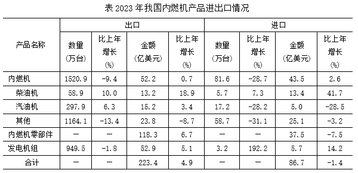

#### 第 16 题　qid 13319349 · 综合

2023年我国货物进出口总额是：

- **A**. 5.3万亿美元
- **B**. 5.8万亿美元
- **C**. 5.9万亿美元　✅
- **D**. 6.0万亿美元

**答案**：C

**官方解析**

根据“2023年······总额是”，结合材料给出了2023年我国机电产品进出口总额及其占货物进出口总额的比重，可判定本题为现期比重问题。定位文字材料可得：2023年我国机电产品进出口总额29025亿美元，占货物进出口总额的比重为49.0%。根据公式：整体，则所求万亿美元。

故正确答案为C。

---

#### 第 17 题　qid 13319351 · 增长

2023年我国柴油机出口数量比上年多：

- **A**. 5.02万台
- **B**. 5.35万台　✅
- **C**. 5.89万台
- **D**. 6.19万台

**答案**：B

**官方解析**

根据题干“2023年······数量比上年多”，结合选项带单位，可判定本题为增长量计算问题。定位统计表可得：2023年我国柴油机出口数量为58.9万台，同比增长10.0%。 根据公式：增长量，则所求万台。

故正确答案为B。

---

#### 第 18 题　qid 13319352 · 比重

对于2023年我国柴油机、汽油机和其他内燃机出口额占内燃机出口总额比重的大小关系，下列图示正确的是：

- **A**. 

　✅
- **B**. 

- **C**. 
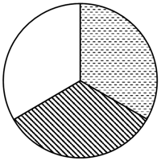

- **D**. 
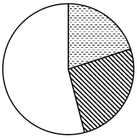

**答案**：A

**官方解析**

根据题干“对于2023年······占······比重······”，结合材料时间为2023年，可判定本题为现期比重问题。定位统计表可得：2023年，我国内燃机出口总额为52.2亿美元，柴油机、汽油机和其他内燃机出口额分别为13.2亿美元、15.2亿美元、23.8亿美元。比较可知，其他内燃机出口额明显最大，排除B、C两项；根据公式：比重，则其他内燃机出口额占比，排除D项。

故正确答案为A。

---

#### 第 19 题　qid 13319353 · 增长

2023年我国柴油机、汽油机的下列进出口指标值比上年高的是：

- **A**. 柴油机出口平均价格、汽油机进口平均价格
- **B**. 柴油机进口平均价格、汽油机出口平均价格
- **C**. 汽油机出口平均价格、汽油机进口平均价格
- **D**. 柴油机出口平均价格、柴油机进口平均价格　✅

**答案**：D

**官方解析**

根据题干“2023年······下列进出口指标值比上年高的是”，结合选项为“平均价格”，可判定本题为两期平均数比较问题。定位统计表可得：2023年，我国柴油机出口数量和出口金额同比增速分别为10.0%（）、18.9%（），进口数量和进口金额同比增速分别为7.3%（）、41.7%（）；汽油机出口数量和出口金额同比增速分别为6.3%（）、3.4%（），进口数量和进口金额同比增速分别为-28.2%（）、-28.5%（）。根据平均价格，结合两期平均数比较结论“分子增长率（a）&gt;分母增长率（b），平均数上升”，则满足题干要求的有柴油机出口平均价格（18.9%&gt;10.0%）、柴油机进口平均价格（41.7%&gt;7.3%）。

故正确答案为D。

---

#### 第 20 题　qid 13319355 · 综合

下列选项中，不能从上述资料推出的是：

- **A**. 2023年我国内燃机零部件的进、出口差额比上年有所扩大
- **B**. 2023年我国柴油机进口平均价格比出口平均价格高10倍多　✅
- **C**. 2023年我国内燃机产品进口额占机电产品进口额的比重比上年有所提高
- **D**. 2023年我国发电机组和内燃机零部件出口额之和的增长率一定高于5.9%

**答案**：B

**官方解析**

A项，定位统计表可知，2023年我国内燃机零部件的进口额为37.5亿美元，同比增长-7.5%；出口额为118.3亿美元，同比增长6.7%。

方法一：可知2023年我国内燃机零部件的进、出口差额为（118.3-37.5）亿美元，根据公式：基期量，则2022年我国内燃机零部件的进、出口差额为亿美元，由于，，则亿美元&lt;（118.3-37.5）亿美元，即2023年我国内燃机零部件的进、出口差额比上年有所扩大，正确；

方法二：由于出口额-进口额=进、出口差额，则出口额=进口额+进、出口差额。根据混合增长率口诀：混合后居中，可知，即2023年我国内燃机零部件的进、出口差额同比增长率大于6.7%，一定比上年有所扩大，正确；

B项，定位统计表可知，2023年我国柴油机进口数量为5.7万台，进口额为13.4亿美元；出口数量为58.9万台，出口额为13.2亿美元。根据公式：平均价格，可知2023年我国柴油机进口平均价格为万美元/台；出口平均价格为万美元/台。根据公式：高几倍=多几倍=是几倍-1，可知所求为倍，即2023年我国柴油机进口平均价格比出口平均价格高9倍多，错误；

C项，定位文字材料可知，2023年我国机电产品进口额同比下降5.5%（b）；定位统计表可知，2023年我国内燃机产品进口额同比增长-1.4%（a）。根据两期比重比较结论：部分增长率a＞整体增长率b时，比重上升。由于-1.4%＞-5.5%，则2023年我国内燃机产品进口额占机电产品进口额的比重比上年有所提高，正确；

D项，定位统计表可知，2023年我国发电机组出口额为52.9亿美元，同比增长5.1%；内燃机零部件出口额为118.3亿美元，同比增长6.7%。根据混合增长率口诀：混合后居中，偏向基期量大的（一般用现期量代替），可知，即，则2023年我国发电机组和内燃机零部件出口额之和的增长率一定高于5.9%，正确。

本题为选非题，故正确答案为B。

---
