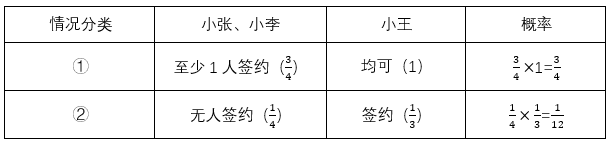
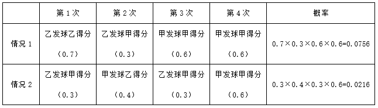
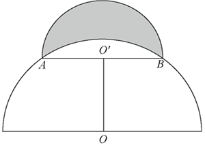
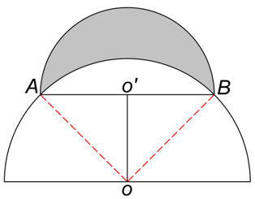
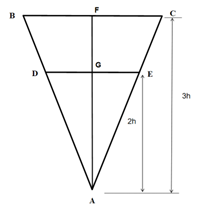
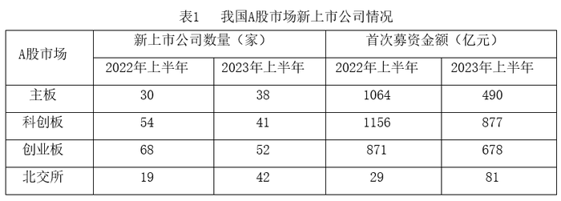
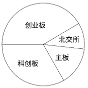
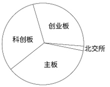
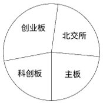
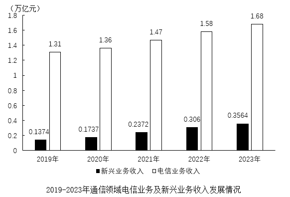

# 2025年江西省公务员录用考试《行测》题（网友回忆版）

> 省考 · 2025 年 · 6 个模块 · 共 135 题

- [政治理论](#%E6%94%BF%E6%B2%BB%E7%90%86%E8%AE%BA) · 20 题
- [常识判断](#%E5%B8%B8%E8%AF%86%E5%88%A4%E6%96%AD) · 15 题
- [言语理解与表达](#%E8%A8%80%E8%AF%AD%E7%90%86%E8%A7%A3%E4%B8%8E%E8%A1%A8%E8%BE%BE) · 30 题
- [数量关系](#%E6%95%B0%E9%87%8F%E5%85%B3%E7%B3%BB) · 15 题
- [判断推理](#%E5%88%A4%E6%96%AD%E6%8E%A8%E7%90%86) · 35 题
- [资料分析](#%E8%B5%84%E6%96%99%E5%88%86%E6%9E%90) · 20 题

---

## 政治理论

### 第 1 题　qid 13504664 · 新思想

习近平总书记指出，我们要坚定不移走中国特色社会主义政治发展道路，坚持和完善我国根本政治制度、基本政治制度、重要政治制度，不断健全人民当家作主制度体系。以下哪项是我国根本政治制度：

- **A**. 党领导的多党合作和政治协商制度
- **B**. 人民代表大会制度　✅
- **C**. 民族区域自治制度
- **D**. 基层群众自治制度

**答案**：B

**官方解析**

本题考查理论与政策。
B项正确，A、C、D三项错误，坚持中国特色社会主义制度，就是要坚持把根本政治制度、基本政治制度、基本经济制度和其他各方面机制体制有机结合起来。我国的根本政治制度是人民代表大会制度；我国的基本政治制度是中国共产党领导的多党合作和政治协商制度、民族区域自治制度以及基层群众自治制度。
故正确答案为B。

---

### 第 2 题　qid 13504476 · 时事政治

习近平总书记指出，人心是最大的政治，统一战线是凝聚人心、汇聚力量的强大法宝，关于统一战线，下列表述正确的是：
①统战工作的本质要求是大团结大联合，解决的就是人心和力量问题
②统一战线是党领导的统一战线，其最鲜明的特征是坚持以人民为中心
③发展壮大爱国爱港爱澳力量，增强港澳同胞的爱国精神，形成更广泛的国内外支持“一国两制”的统一战线
④关键是要坚持求同存异，发扬“团结一批评一团结”的优良传统，在尊重多样性中寻求一致性

- **A**. ①②③
- **B**. ①②④
- **C**. ①③④　✅
- **D**. ②③④

**答案**：C

**官方解析**

本题考查理论与政策。
①正确，在2022年7月29日至30日召开的中央统战工作会议上，习近平总书记指出，统一战线是党克敌制胜、执政兴国的重要法宝，是团结海内外全体中华儿女实现中华民族伟大复兴的重要法宝，必须长期坚持······统战工作的本质要求是大团结大联合，解决的就是人心和力量问题······
②错误，在2022年7月29日至30日召开的中央统战工作会议上，习近平总书记指出，加强新时代统一战线工作，根本在于坚持党的领导。中国共产党领导是统一战线最鲜明的特征，坚持党的领导是统一战线最根本、最核心的问题。故“最鲜明的特征是坚持以人民为中心”说法错误。
③正确，二十大报告在“十三、坚持和完善‘一国两制’，推进祖国统一”中指出：“‘一国两制’是中国特色社会主义的伟大创举，是香港、澳门回归后保持长期繁荣稳定的最佳制度安排，必须长期坚持······发展壮大爱国爱港爱澳力量，增强港澳同胞的爱国精神，形成更广泛的国内外支持‘一国两制’的统一战线······”
④正确，《习近平总书记关于做好新时代党的统一战线工作的重要思想学习读本》中强调：“‘团结——批评——团结’是我们党处理党内矛盾和人民内部矛盾的基本原则和基本方式，也是党领导的统一战线的优良传统······习近平总书记指出：‘关键是要坚持求同存异，发扬‘团结——批评——团结’的优良传统，在尊重多样性中寻求一致性，找到最大公约数、画出最大同心圆。’”
故正确的是①③④。
故正确答案为C。

---

### 第 3 题　qid 13504475 · 新思想

习近平总书记强调，要坚持城乡融合发展，畅通城乡要素流动。关于城乡融合发展，下列说法正确的有几项？
①城乡融合发展是中国式现代化的必然要求
②推进以乡镇为重要载体的新型城镇化建设，发展各具特色的乡镇经济
③发展新型农村集体经济，构建产权明晰、分配合理的运行机制
④完善覆盖农村人口的常态化防止返贫致贫机制
⑤允许农户合法拥有的住房通过出租、入股、合作等方式盘活利用

- **A**. 1项
- **B**. 2项
- **C**. 3项
- **D**. 4项　✅

**答案**：D

**官方解析**

本题考查理论与政策。
2024年7月18日，中国共产党第二十届中央委员会第三次全体会议通过《中共中央关于进一步全面深化改革 推进中国式现代化的决定》（以下简称《决定》）。
①正确，《决定》在“六、完善城乡融合发展体制机制”部分指出：“城乡融合发展是中国式现代化的必然要求。必须统筹新型工业化、新型城镇化和乡村全面振兴，全面提高城乡规划、建设、治理融合水平······”
②错误，2024年11月4日至6日，习近平总书记在湖北考察时指出，推进以县城为重要载体的新型城镇化建设，发展各具特色的县域经济。故“乡镇经济”说法错误。
③正确，《决定》在“六、完善城乡融合发展体制机制”部分指出：“（21）巩固和完善农村基本经营制度······发展新型农村集体经济，构建产权明晰、分配合理的运行机制，赋予农民更加充分的财产权益。”
④正确，《决定》在“六、完善城乡融合发展体制机制”部分指出：“（22）完善强农惠农富农支持制度······完善覆盖农村人口的常态化防止返贫致贫机制，建立农村低收入人口和欠发达地区分层分类帮扶制度。”
⑤正确，《决定》在“六、完善城乡融合发展体制机制”部分指出：“（23）深化土地制度改革······允许农户合法拥有的住房通过出租、入股、合作等方式盘活利用。”
故正确的有①③④⑤，共4项。
故正确答案为D。

---

### 第 4 题　qid 12882018 · 新思想

习近平总书记强调，中国式现代化，民生为大。新时代新征程，各级党委和政府秉持人民为上，加强对政府工作的领导，增加普惠性、基础性、兜底性，民生建设决定人民最关键最直接最现实的利益问题，不断推动民政事务高质量发展。下列属于民政工作的有几项？
①健全分层分级社会救助体系，推进社会救助法律法规
②做好儿童福利工作，加强新时代儿童福利工作基层制度
③推进老年人友好型城市，完善社区养老，持续营造敬老孝亲社会氛围
④规范地名命名、更名、使用管理，加强社区边界建设

- **A**. 1项
- **B**. 2项
- **C**. 3项
- **D**. 4项　✅

**答案**：D

**官方解析**

本题考查理论与政策。
民政工作可概括为四个方面：一是社会救助和社会福利方面的工作，主要包括城乡低保、五保供养、救灾救济、慈善、社会捐助、福利彩票、福利机构管理等工作；二是基层民主政治建设方面的工作，主要是农村村民自治和城市社区建设工作；三是服务军队和国防建设方面的工作，主要包括双拥、优抚、安置等工作；四是管理专项社会事务方面的工作，主要是民间组织、区划地名、婚姻登记、殡葬管理、收养登记等。
①正确，社会救助包括城乡最低生活保障、临时救助、特困人员救助供养等，是民政工作的重要职责之一。健全社会救助体系，推进相关法律法规建设，有助于更好地保障困难群众的基本生活，维护社会公平正义。
②正确，儿童福利工作涉及儿童收养、儿童保护、困境儿童保障、农村留守儿童关爱等方面，是民政工作的重要内容。加强儿童福利基层制度建设，能够为儿童提供更好的保障和服务，促进儿童健康成长。
③正确，民政部门承担着推进养老服务体系建设的职责，包括发展居家和社区养老服务、建设养老机构、制定老年人福利政策等。推进老年人友好型城市建设，完善社区养老服务，营造敬老孝亲社会氛围，有利于积极应对人口老龄化，提高老年人的生活质量。
④正确，地名管理是民政工作的一部分。规范地名命名、更名与使用管理，有助于提高地名管理的科学性和规范性，方便社会交往和经济发展；加强社区边界建设，对于明确社区范围、促进社区治理和服务具有重要意义。
故①②③④正确，共4项。
故正确答案为D。

---

### 第 5 题　qid 13504477 · 新思想

习近平总书记指出，现代化产业体系是现代化国家的物质技术基础，关于现代化产业体系建设，下列表述正确的有几项？
①坚持把发展经济的着力点放在国有企业上
②推动制造业高端化、智能化、绿色化发展
③推动战略性新兴产业融合集群发展
④推动现代服务业同先进制造业、现代农业深度融合
⑤优化基础设施布局、结构、功能和系统集成，构建现代化基础设施体系

- **A**. 5项
- **B**. 4项　✅
- **C**. 3项
- **D**. 2项

**答案**：B

**官方解析**

本题考查理论与政策。
②③④⑤正确，①错误，二十大报告在“四、加快构建新发展格局，着力推动高质量发展”中指出“（二）建设现代化产业体系。坚持把发展经济的着力点放在实体经济上，推进新型工业化，加快建设制造强国、质量强国、航天强国、交通强国、网络强国、数字中国。实施产业基础再造工程和重大技术装备攻关工程，支持专精特新企业发展，推动制造业高端化、智能化、绿色化发展······推动战略性新兴产业融合集群发展，构建新一代信息技术、人工智能、生物技术、新能源、新材料、高端装备、绿色环保等一批新的增长引擎。构建优质高效的服务业新体系，推动现代服务业同先进制造业、现代农业深度融合······优化基础设施布局、结构、功能和系统集成，构建现代化基础设施体系。”故“发展经济的着力点放在国有企业上”说法错误。
故正确答案为B。

---

### 第 6 题　qid 13504415 · 新思想

习近平总书记强调，要持之以恒推进党的自我革命，确保党永远不变质、不变色。关于党的自我革命，下列说法正确的有几项？
①坚持制度治党、依规治党，以党章为根本，以民主集中制为核心，完善党内法规制度体系
②推进党的自我革命，要强化党的自我监督，完善党内监督的各项制度机制，不断健全党内监督体系
③勇于自我革命是我们党最鲜明的品格和最大优势
④推进党的自我革命必须坚持结果导向

- **A**. 1项
- **B**. 2项
- **C**. 3项　✅
- **D**. 4项

**答案**：C

**官方解析**

本题考查理论与政策。
①正确，党的二十大报告中“十五、坚定不移全面从严治党，深入推进新时代党的建设新的伟大工程”部分指出：“（三）完善党的自我革命制度规范体系。坚持制度治党、依规治党，以党章为根本，以民主集中制为核心，完善党内法规制度体系，增强党内法规权威性和执行力，形成坚持真理、修正错误，发现问题、纠正偏差的机制。”
②正确，《求是》杂志发表的习近平总书记署名文章《深入推进党的自我革命》中指出：“第九，以自我监督和人民监督相结合为强大动力。自我监督和人民监督是有机统一、相辅相成的。推进党的自我革命，要强化党的自我监督，完善党内监督的各项制度机制，不断健全党内监督体系。”
③正确，《求是》杂志发表的习近平总书记署名文章《深入推进党的自我革命》中指出：“勇于自我革命是我们党最鲜明的品格和最大优势。党的性质宗旨、初心使命决定了我们党始终代表最广大人民根本利益。”
④错误，《求是》杂志发表的习近平总书记署名文章《深入推进党的自我革命》中指出：“推进党的自我革命必须坚持问题导向，保持战略定力，标本兼治、综合施策、协同发力、锲而不舍、久久为功，积小胜为大胜，在不断解决大党独有难题中彰显大党优势。”故“坚持结果导向”的说法错误。
故①②③说法正确，共3项。
故正确答案为C。

---

### 第 7 题　qid 13504486 · 时事政治

2024年6月，和平共处五项原则发表70周年纪念大会在北京举行，习近平总书记在会上指出，构建人类命运共同体理念与和平共处五项原则一脉相承，下列有关说法正确的是：
①构建人类命运共同体理念顺应了平等和共生的时代潮流，开辟了和平和进步的新境界
②和平共处五项原则的出发点就是维护弱小国家在强权政治环境中的利益和诉求
③和平共处五项原则为不同社会制度国家建立和发展关系提供了正确指导
④中国式现代化的本质要求之一就是推动构建人类命运共同体

- **A**. ①②③
- **B**. ①②④
- **C**. ①③④
- **D**. ②③④　✅

**答案**：D

**官方解析**

本题考查理论与政策。
①错误，习近平总书记在和平共处五项原则发表70周年纪念大会上的讲话中指出：“构建人类命运共同体理念······顺应和平、发展、合作、共赢的时代潮流，开辟了和平和进步的新境界。”故“平等和共生的时代潮流”说法错误。
②正确，习近平总书记在和平共处五项原则发表70周年纪念大会上的讲话中指出：“第四，和平共处五项原则为国际秩序改革和完善贡献了历史智慧。五项原则的出发点就是维护弱小国家在强权政治环境中的利益和诉求，旗帜鲜明反帝、反殖、反霸，摒弃了穷兵黩武、以强凌弱的丛林法则，为推动国际秩序朝着更加公正合理方向发展奠定了重要思想基础。”
③正确，习近平总书记在和平共处五项原则发表70周年纪念大会上的讲话中指出：“第二，和平共处五项原则为不同社会制度国家建立和发展关系提供了正确指导。”
④正确，党的二十大报告提出：“中国式现代化的本质要求包括坚持中国共产党领导，坚持中国特色社会主义，实现高质量发展，发展全过程人民民主，丰富人民精神世界，实现全体人民共同富裕，促进人与自然和谐共生，推动构建人类命运共同体，创造人类文明新形态。”
综上，②③④正确。
故正确答案为D。

---

### 第 8 题　qid 13504663 · 新思想

习近平总书记强调，要加强新时代廉洁文化建设，教育引导广大党员、干部增强不想腐的自觉，清清白白做人、干干净净做事。下列属于加强新时代廉洁文化建设的举措有几项？
①开办红色廉洁文化专题展览，在红色教育中传承党的廉洁基因
②对新入职党员、干部及时开展廉洁教育，扣好年轻干部廉洁从政第一粒扣子
③注重从优秀传统家训家规中汲取营养，开展红色家风传承活动
④挖掘历史文献、文化经典、文物古迹中的廉洁思想，整理古圣先贤、清官廉吏的嘉言懿行

- **A**. 1项
- **B**. 2项
- **C**. 3项
- **D**. 4项　✅

**答案**：D

**官方解析**

本题考查理论与政策。
①正确，《关于加强新时代廉洁文化建设的意见》指出：“注重发掘总结党反对腐败、建设廉洁政治的历史和经验，提炼革命文化蕴含的廉洁理念，运用好革命博物馆、纪念馆、党史馆等红色资源，开办红色廉洁文化专题展览，在红色教育中传承党的廉洁基因。”
②正确，《关于加强新时代廉洁文化建设的意见》指出：“对新入职党员、干部及时开展廉洁教育，扣好年轻干部廉洁从政第一粒扣子。”
③正确，《关于加强新时代廉洁文化建设的意见》指出：“注重从优秀传统家训家规中汲取营养，开展红色家风传承活动，把对党忠诚纳入家庭家教家风建设。”
④正确，《关于加强新时代廉洁文化建设的意见》指出：“挖掘历史文献、文化经典、文物古迹中的廉洁思想，整理古圣先贤、清官廉吏的嘉言懿行，推动中华优秀传统文化创造性转化、创新性发展。”
故①②③④表述正确，有4项。
故正确答案为D。

---

### 第 9 题　qid 13504414 · 新思想

习近平总书记指出，人无信不立，企业和企业家更是如此。下列属于引导企业和企业家诚信合规经营举措的有几项？
①加快城市一刻钟便民生活圈建设
②鼓励第三方机构开展服务消费评价
③依托“信用中国”网站上线“信誉信息”板块
④加强对相关经营主体行政处罚等信用信息的归集、公示

- **A**. 1项
- **B**. 2项
- **C**. 3项　✅
- **D**. 4项

**答案**：C

**官方解析**

本题考查理论与政策。
①错误，“加快城市一刻钟便民生活圈建设”主要是为了提升居民生活便利性，完善城市商业设施布局，该举措与引导企业和企业家诚信合规经营无关。
②③④正确，《国务院关于促进服务消费高质量发展的意见》中“六、优化服务消费环境”的“（十六）引导诚信合规经营”部分指出：“依托‘信用中国’网站和国家企业信用信息公示系统，上线‘信誉信息’板块，加强对相关经营主体登记备案、行政许可、行政处罚等信用信息的归集、公示，引导更多经营主体守信重信。加强服务质量监测评价，完善评价指标体系，定期发布监测评价结果，鼓励第三方机构开展服务消费评价。”
故②③④表述正确，有3项。
故正确答案为C。

---

### 第 10 题　qid 13504480 · 新思想

党的二十大强调，国家安全是民族复兴的根基，社会稳定是国家强盛的前提，必须坚定不移贯彻总体国家安全观，把维护国家安全贯穿党和国家工作各方面全过程，确保国家安全和社会稳定。下列表述不正确的是：

- **A**. 坚持党中央对国家安全工作的集中统一领导，完善高效权威的国家安全领导体制
- **B**. 坚持安全第一、应急为主，建立大安全大应急框架，完善公共安全体系　✅
- **C**. 加强海外安全保障能力建设，维护我国公民、法人在海外合法权益
- **D**. 强化食品药品安全监管，健全生物安全监管预警防控体系

**答案**：B

**官方解析**

本题考查理论与政策。
A项正确，党的二十大报告中“十一、推进国家安全体系和能力现代化，坚决维护国家安全和社会稳定”部分指出：“（一）健全国家安全体系。坚持党中央对国家安全工作的集中统一领导，完善高效权威的国家安全领导体制。”
B项错误，党的二十大报告中“十一、推进国家安全体系和能力现代化，坚决维护国家安全和社会稳定”部分指出：“（三）提高公共安全治理水平。坚持安全第一、预防为主，建立大安全大应急框架，完善公共安全体系，推动公共安全治理模式向事前预防转型。”因此“应急为主”表述错误。
C项正确，党的二十大报告“十一、推进国家安全体系和能力现代化，坚决维护国家安全和社会稳定”部分指出：“（二）增强维护国家安全能力。坚定维护国家政权安全、制度安全、意识形态安全，加强重点领域安全能力建设，确保粮食、能源资源、重要产业链供应链安全，加强海外安全保障能力建设，维护我国公民、法人在海外合法权益，维护海洋权益，坚定捍卫国家主权、安全、发展利益。”
D项正确，党的二十大报告“十一、推进国家安全体系和能力现代化，坚决维护国家安全和社会稳定”部分指出：“（三）提高公共安全治理水平······提高防灾减灾救灾和重大突发公共事件处置保障能力，加强国家区域应急力量建设。强化食品药品安全监管，健全生物安全监管预警防控体系。加强个人信息保护。”
本题为选非题，故正确答案为B。

---

### 第 11 题　qid 13504670 · 马克思主义

党的二十大强调，必须坚持人民至上。人民性是马克思主义的本质属性，党的理论是来自人民、为了人民、造福人民的理论，人民的创造性实践是理论创新的不竭源泉。一切脱离人民的理论都是苍白无力的，一切不为人民造福的理论都是没有生命力的。下列选项体现了坚持人民至上的是：
①站稳人民立场 ②把握人民愿望 ③尊重人民创造 ④集中人民智慧

- **A**. ①②
- **B**. ①③
- **C**. ①③④
- **D**. ①②③④　✅

**答案**：D

**官方解析**

本题考查理论与政策。
①②③④正确，党的二十大报告指出：“必须坚持人民至上。人民性是马克思主义的本质属性，党的理论是来自人民、为了人民、造福人民的理论，人民的创造性实践是理论创新的不竭源泉。一切脱离人民的理论都是苍白无力的，一切不为人民造福的理论都是没有生命力的。我们要站稳人民立场、把握人民愿望、尊重人民创造、集中人民智慧，形成为人民所喜爱、所认同、所拥有的理论，使之成为指导人民认识世界和改造世界的强大思想武器。”
故正确答案为D。

---

### 第 12 题　qid 13504478 · 新思想

习近平总书记指出，如期实现建军一百年奋斗目标，加快把人民军队建成世界一流军队，是全面建设社会主义现代化国家的战略要求。关于实现建军一百年奋斗目标，下列举措恰当的是：
①加强军史学习教育，繁荣发展强军文化，强化战斗精神培育
②加强军人军属荣誉激励和权益保障，做好退役军人服务保障工作
③积极开展军事斗争，塑造安全态势，遏控危机冲突，阻止局部战争
④研究掌握信息化智能化战争特点规律，创新军事战略指导，发展人民战争战略战术

- **A**. ①②③
- **B**. ①②④　✅
- **C**. ①③④
- **D**. ②③④

**答案**：B

**官方解析**

本题考查理论与政策。
①正确，党的二十大报告在“十二、实现建军一百年奋斗目标，开创国防和军队现代化新局面”部分指出：“全面加强人民军队党的建设，确保枪杆子永远听党指挥······加强军史学习教育，繁荣发展强军文化，强化战斗精神培育。”
②正确，党的二十大报告在“十二、实现建军一百年奋斗目标，开创国防和军队现代化新局面”部分指出：“加强军人军属荣誉激励和权益保障，做好退役军人服务保障工作。”
③错误，党的二十大报告在“十二、实现建军一百年奋斗目标，开创国防和军队现代化新局面”部分指出：“加强军事力量常态化多样化运用，坚定灵活开展军事斗争，塑造安全态势，遏控危机冲突，打赢局部战争。”故"积极开展军事斗争"“阻止局部战争”表述错误，应为“灵活开展军事斗争”“打赢局部战争”。
④正确，党的二十大报告在“十二、实现建军一百年奋斗目标，开创国防和军队现代化新局面”部分指出：“研究掌握信息化智能化战争特点规律，创新军事战略指导，发展人民战争战略战术。”
故①②④表述正确。
故正确答案为B。

---

### 第 13 题　qid 13504667 · 时事政治

党的二十届三中全会提出，聚焦发展全过程人民民主。关于健全全过程人民民主制度体系的举措，下列说法正确的有几项？
①坚持好、完善好、运行好人民代表大会制度
②发挥人民政协作为专门协商机构作用，健全深度协商互动、意见充分表达、广泛凝聚共识的机制
③发挥工会、共青团、妇联等群团组织联系服务群众的桥梁纽带作用
④健全协商于决策之前的落实机制，完善协商成果实施及监督机制
⑤建立港澳同胞和海外华侨华人政治引领机制

- **A**. 5项
- **B**. 4项
- **C**. 3项　✅
- **D**. 2项

**答案**：C

**官方解析**

本题考查理论与政策。
2024年7月18日，中国共产党第二十届中央委员会第三次全体会议通过《中共中央关于进一步全面深化改革 推进中国式现代化的决定》（以下简称《决定》）。
①③正确，《决定》在“八、健全全过程人民民主制度体系”部分“（29）加强人民当家作主制度建设”中指出：“坚持好、完善好、运行好人民代表大会制度······发挥工会、共青团、妇联等群团组织联系服务群众的桥梁纽带作用。”
②正确，④错误，《决定》在“八、健全全过程人民民主制度体系”部分“（30）健全协商民主机制”中指出：“发挥人民政协作为专门协商机构作用，健全深度协商互动、意见充分表达、广泛凝聚共识的机制，加强人民政协反映社情民意、联系群众、服务人民机制建设······健全协商于决策之前和决策实施之中的落实机制，完善协商成果采纳、落实、反馈机制。”
⑤错误，《决定》在“八、健全全过程人民民主制度体系”部分“（32）完善大统战工作格局”中指出：“完善党外知识分子和新的社会阶层人士政治引领机制。全面构建亲清政商关系，健全促进非公有制经济健康发展、非公有制经济人士健康成长工作机制。完善港澳台和侨务工作机制。”
故①②③表述正确，共3项。
故正确答案为C。

---

### 第 14 题　qid 12881996 · 时事政治

党的二十届三中全会提出，要健全社会治理体系。关于健全社会治理体系，下列表述不准确的是：

- **A**. 健全城乡社区治理体系，及时把矛盾纠纷化解在基层、化解在萌芽状态
- **B**. 提高市域社会治理能力，强化市民热线等公共服务平台功能
- **C**. 坚持和发展“枫桥经验”是健全社会治理体系的基础和前提　✅
- **D**. 健全发挥家庭家教家风建设在基层治理中作用的机制

**答案**：C

**官方解析**

本题考查理论与政策。
A项正确，党的二十大报告中“十一、推进国家安全体系和能力现代化，坚决维护国家安全和社会稳定”部分的“（四）完善社会治理体系”指出：“······在社会基层坚持和发展新时代‘枫桥经验’，完善正确处理新形势下人民内部矛盾机制，加强和改进人民信访工作，畅通和规范群众诉求表达、利益协调、权益保障通道，完善网格化管理、精细化服务、信息化支撑的基层治理平台，健全城乡社区治理体系，及时把矛盾纠纷化解在基层、化解在萌芽状态。”
B、D两项正确，《中共中央关于进一步全面深化改革、推进中国式现代化的决定》（以下简称《决定》）中“十三、推进国家安全体系和能力现代化”部分的“（52）健全社会治理体系”指出：“提高市域社会治理能力，强化市民热线等公共服务平台功能，健全‘高效办成一件事’重点事项清单管理机制和常态化推进机制。健全社会心理服务体系和危机干预机制。健全发挥家庭家教家风建设在基层治理中作用的机制。深化行业协会商会改革。健全社会组织管理制度。”
C项错误，《决定》中“十三、推进国家安全体系和能力现代化”部分的“（52）健全社会治理体系”指出：“坚持和发展新时代‘枫桥经验’，健全党组织领导的自治、法治、德治相结合的城乡基层治理体系，完善共建共治共享的社会治理制度。”健全社会治理体系是一个复杂的系统工程，涉及到诸多方面的基础和前提条件。坚持和发展“枫桥经验”是健全社会治理体系的重要内容和有效途径，具有极其重要的作用。故“基础和前提”这种表述不准确。
本题为选非题，故正确答案为C。

---

### 第 15 题　qid 13504416 · 时事政治

党的二十届三中全会提出，高水平社会主义市场经济体制是中国式现代化的重要保障，关于构建高水平社会主义市场经济体制，下列举措不恰当的是：

- **A**. 完善市场准入制度，优化新业态新领域市场准入环境
- **B**. 推动市场基础制度规则统一、市场监管公平统一、市场设施高标准联通
- **C**. 加强财政政策和货币政策协调配合，着力扩大内需，增强消费对优化供给结构的基础性作用　✅
- **D**. 建立国有企业履行战略使命评价制度，完善国有企业分类考核评价体系，开展国有经济增加值核算

**答案**：C

**官方解析**

本题考查理论与政策。
A项正确，《中共中央关于进一步全面深化改革 推进中国式现代化的决定》在“二、构建高水平社会主义市场经济体制”部分指出：“（7）完善市场经济基础制度······完善市场准入制度，优化新业态新领域市场准入环境······”
B项正确，《中共中央关于进一步全面深化改革 推进中国式现代化的决定》在“二、构建高水平社会主义市场经济体制”部分指出：“（6）构建全国统一大市场。推动市场基础制度规则统一、市场监管公平统一、市场设施高标准联通。加强公平竞争审查刚性约束，强化反垄断和反不正当竞争······”
C项错误，二十大报告在“四、加快构建新发展格局，着力推动高质量发展”部分指出：“（一）构建高水平社会主义市场经济体制······健全宏观经济治理体系，发挥国家发展规划的战略导向作用，加强财政政策和货币政策协调配合，着力扩大内需，增强消费对经济发展的基础性作用和投资对优化供给结构的关键作用。”故“消费对优化供给结构的基础性作用”的表述错误。
D项正确，《中共中央关于进一步全面深化改革 推进中国式现代化的决定》在“二、构建高水平社会主义市场经济体制”部分指出：“（5）坚持和落实‘两个毫不动摇’······建立国有企业履行战略使命评价制度，完善国有企业分类考核评价体系，开展国有经济增加值核算。推进能源、铁路、电信、水利、公用事业等行业自然垄断环节独立运营和竞争性环节市场化改革，健全监管体制机制。”
本题为选非题，故正确答案为C。

---

### 第 16 题　qid 13504479 · 时事政治

党的二十届三中全会提出，健全因地制宜发展新质生产力体制机制，推动技术革命性突破、生产要素创新性配置、产业深度转型升级，推动劳动者、劳动资料、劳动对象优化组合和更新跃升，催生新产业、新模式、新动能，发展以高技术、高效能、高质量为特征的生产力。关于发展新质生产力，下列举措恰当的是：
①加强新领域新赛道制度供给，建立未来产业投入增长机制
②强化投资监管，限制私募股权投资，更好发挥政府投资基金作用
③放开环保、安全等制度约束，加快形成同新质生产力相适应的生产关系
④以国家标准提升引领传统产业优化升级，支持企业用数智技术、绿色技术改造提升传统产业

- **A**. ①②
- **B**. ①④　✅
- **C**. ②③④
- **D**. ①②③④

**答案**：B

**官方解析**

本题考查理论与政策。
党的二十届三中全会通过了《中共中央关于进一步全面深化改革 推进中国式现代化的决定》，以下简称《决定》。
①④正确，《决定》中“三、健全推动经济高质量发展体制机制”部分的“（8）健全因地制宜发展新质生产力体制机制”中指出：“加强关键共性技术、前沿引领技术、现代工程技术、颠覆性技术创新，加强新领域新赛道制度供给，建立未来产业投入增长机制，完善推动新一代信息技术、人工智能、航空航天、新能源、新材料、高端装备、生物医药、量子科技等战略性产业发展政策和治理体系，引导新兴产业健康有序发展。以国家标准提升引领传统产业优化升级，支持企业用数智技术、绿色技术改造提升传统产业。强化环保、安全等制度约束。”
②错误，《决定》中“三、健全推动经济高质量发展体制机制”部分的“（8）健全因地制宜发展新质生产力体制机制”中指出：“鼓励和规范发展天使投资、风险投资、私募股权投资，更好发挥政府投资基金作用，发展耐心资本。”故“限制私募股权投资”说法错误。
③错误，《决定》中“三、健全推动经济高质量发展体制机制”部分的“（8）健全因地制宜发展新质生产力体制机制”中指出：“强化环保、安全等制度约束。健全相关规则和政策，加快形成同新质生产力更相适应的生产关系，促进各类先进生产要素向发展新质生产力集聚，大幅提升全要素生产率。”故“放开环保、安全等制度约束”说法错误。
故①④表述正确。
故正确答案为B。

---

### 第 17 题　qid 13504465 · 新思想

建设中国特色社会主义法治体系，是全面推进依法治国的总抓手。下列举措不属于完善中国特色社会主义法治体系内容的是：

- **A**. 健全人大对行政机关、监察机关、审判机关、检察机关监督制度　✅
- **B**. 健全国际商事仲裁和调解制度，培育国际一流仲裁机构、律师事务所
- **C**. 完善行政处罚等领域行政裁量权基准制度，推动行政执法体系标准跨区域衔接
- **D**. 加强和改进未成年人权益保护，强化未成年人犯罪预防和治理，制定专门矫治教育规定

**答案**：A

**官方解析**

本题考查理论与政策。
A项错误，《中共中央关于进一步全面深化改革 推进中国式现代化的决定》在“八、健全全过程人民民主制度体系”部分指出：“（29）加强人民当家作主制度建设······健全人大对行政机关、监察机关、审判机关、检察机关监督制度，完善监督法及其实施机制，强化人大预算决算审查监督和国有资产管理、政府债务管理监督······”故本项为“健全全过程人民民主制度体系”而非“完善中国特色社会主义法治体系”的内容。
B项正确，《中共中央关于进一步全面深化改革 推进中国式现代化的决定》在“九、完善中国特色社会主义法治体系”部分指出：“（37）加强涉外法治建设。建立一体推进涉外立法、执法、司法、守法和法律服务、法治人才培养的工作机制······健全国际商事仲裁和调解制度，培育国际一流仲裁机构、律师事务所。积极参与国际规则制定。”
C项正确，《中共中央关于进一步全面深化改革 推进中国式现代化的决定》在“九、完善中国特色社会主义法治体系”部分指出：“（34）深入推进依法行政······深化行政执法体制改革，完善基层综合执法体制机制，健全行政执法监督体制机制。完善行政处罚等领域行政裁量权基准制度，推动行政执法标准跨区域衔接······”
D项正确，《中共中央关于进一步全面深化改革 推进中国式现代化的决定》在“九、完善中国特色社会主义法治体系”部分指出：“（36）完善推进法治社会建设机制······改进法治宣传教育，完善以实践为导向的法学院校教育培养机制。加强和改进未成年人权益保护，强化未成年人犯罪预防和治理，制定专门矫治教育规定。”
本题为选非题，故正确答案为A。

---

### 第 18 题　qid 13504666 · 时事政治

关于党的重要会议与其审议通过的决定，下列对应正确的是：

- **A**. 党的十八届三中全会——《中共中央关于深化党和国家机构改革的决定》
- **B**. 党的十九届四中全会——《中共中央关于全面推进依法治国若干重大问题的决定》
- **C**. 党的二十大——《中共中央关于全面深化改革若干重大问题的决定》
- **D**. 党的二十届三中全会——《中共中央关于进一步全面深化改革、推进中国式现代化的决定》　✅

**答案**：D

**官方解析**

本题考查理论与政策。
A、C两项错误，2018年2月28日，中国共产党第十九届中央委员会第三次全体会议通过了《中共中央关于深化党和国家机构改革的决定》；2013年11月12日中国共产党第十八届中央委员会第三次全体会议通过了《中共中央关于全面深化改革若干重大问题的决定》。
B项错误，2014年10月20日至23日，中国共产党第十八届中央委员会第四次全体会在北京召开。会议通过《中共中央关于全面推进依法治国若干重大问题的决定》；2019年10月31日，中国共产党第十九届中央委员会第四次全体会议通过了《中共中央关于坚持和完善中国特色社会主义制度、推进国家治理体系和治理能力现代化若干重大问题的决定》。
D项正确，2024年7月18日，中国共产党第二十届中央委员会第三次全体会议通过《中国共产党第二十届中央委员会第三次全体会议公报》，全会审议通过《中共中央关于进一步全面深化改革、推进中国式现代化的决定》。
故正确答案为D。

---

### 第 19 题　qid 13504665 · 新思想

坚定理想信念，坚守共产党人精神追求，始终是共产党人安身立命的根本。关于推动理想信念教育常态化制度化，下列表述不恰当的是：

- **A**. 形成网上思想道德教育统一化、标准化实施机制　✅
- **B**. 建立健全道德领域突出问题协同治理机制，完善“扫黄打非”长效机制
- **C**. 健全诚信建设长效机制，教育引导全社会自觉遵守法律，遵循公序良俗
- **D**. 优化英模人物宣传学习机制，创新爱国主义教育和各类群众性主题活动组织机制

**答案**：A

**官方解析**

本题考查理论与政策。
A项错误，B、C、D三项正确，《中共中央关于进一步全面深化改革 推进中国式现代化的决定》中“十、深化文化体制机制改革”部分的“（38）完善意识形态工作责任制”中指出：“推动理想信念教育常态化制度化。完善培育和践行社会主义核心价值观制度机制。改进创新文明培育、文明实践、文明创建工作机制。实施文明乡风建设工程。优化英模人物宣传学习机制，创新爱国主义教育和各类群众性主题活动组织机制，推动全社会崇尚英雄、缅怀先烈、争做先锋。构建中华传统美德传承体系，健全社会公德、职业道德、家庭美德、个人品德建设体制机制，健全诚信建设长效机制，教育引导全社会自觉遵守法律、遵循公序良俗，坚决反对拜金主义、享乐主义、极端个人主义和历史虚无主义。形成网上思想道德教育分众化、精准化实施机制。建立健全道德领域突出问题协同治理机制，完善‘扫黄打非’长效机制。”故“统一化、标准化实施机制”说法错误，应为“分众化、精准化实施机制”。
本题为选非题，故正确答案为A。

---

### 第 20 题　qid 13504420 · 新思想

数字贸易是数字经济的重要组成部分，已成为国际贸易发展的新趋势和经济的新增长点，关于数字贸易改革创新发展，下列表述不正确的是：

- **A**. 按照创新为要、安全为基，扩大开放、合作共赢，深化改革、系统治理，试点先行、重点突破的原则，促进数字贸易改革创新发展
- **B**. 到2035年，可数字化交付的服务贸易规模占我国服务贸易总额的比重提高到50%以上
- **C**. 发展云外包、平台分包等服务外包新业态新模式，推动服务外包加快数字化转型
- **D**. 鼓励引入数据安全、数据资产、数字信用等第三方国际服务机构　✅

**答案**：D

**官方解析**

本题考查理论与政策。
2024年11月28日，《中共中央办公厅 国务院办公厅关于数字贸易改革创新发展的意见》（以下简称《意见》）对外发布。
A、B两项正确，《意见》在“一、总体要求”部分指出：“按照创新为要、安全为基，扩大开放、合作共赢，深化改革、系统治理，试点先行、重点突破的原则，促进数字贸易改革创新发展。主要目标是：到2029年，可数字化交付的服务贸易规模稳中有增，占我国服务贸易总额的比重提高到45%以上······到2035年，可数字化交付的服务贸易规模占我国服务贸易总额的比重提高到50%以上；有序、安全、高效的数字贸易治理体系全面建立，制度型开放水平全面提高。”
C项正确，《意见》在“二、支持数字贸易细分领域和经营主体发展”中“（二）持续优化数字服务贸易”部分指出：“促进数字金融、在线教育、远程医疗、数字化交付的专业服务等数字服务贸易创新发展，提升品牌和标准影响力。发展云外包、平台分包等服务外包新业态新模式，推动服务外包加快数字化转型。”
D项错误，《意见》在“四、完善数字贸易治理体系”中“（十一）加快构建数字信任体系”部分指出：“加快数字贸易认证体系建设，促进数字信任前沿技术的开发创新与应用推广，培育数字信任生态。推动数字证书、电子签名等国际互认。鼓励数据安全、数据资产、数字信用等第三方服务机构国际化发展。”
本题为选非题，故正确答案为D。

---

## 常识判断

### 第 1 题　qid 13504687 · 法律常识

个人信息应受法律保护，下列做法符合个人信息保护法律规定的是：

- **A**. 某县政府网站“信息公开”栏目公布农机购置补贴发放情况，内容包括购机农户姓名、身份证号、购机型号、银行账号等基本情况
- **B**. 某音乐视频教学类APP要求使用者授权其照片、文件、手机设备号、人脸等信息才提供其产品和服务，使用者同意该授权
- **C**. 某住户与同层邻居一起团购可视门铃，分别安装在自己家门口，不仅能看到自家门前情况，也能看到邻居家门前情况　✅
- **D**. 某小区以刷脸作为业主出入小区的唯一验证方式，不同意某业主提出的使用密码、门禁卡等其他验证方式的要求

**答案**：C

**官方解析**

本题考查法律常识。
A项错误，根据《中华人民共和国民法典》第一千零三十九条规定：“国家机关、承担行政职能的法定机构及其工作人员对于履行职责过程中知悉的自然人的隐私和个人信息，应当予以保密，不得泄露或者向他人非法提供。”选项中，县政府网站公布农机购置补贴发放情况，不得将农户的身份证号、银行账号等个人信息公开。
B项错误，根据《中华人民共和国个人信息保护法》第十六条规定：“个人信息处理者不得以个人不同意处理其个人信息或者撤回同意为由，拒绝提供产品或者服务；处理个人信息属于提供产品或者服务所必需的除外。”选项中，某音乐视频教学类APP要求授权个人信息才提供服务的做法违反法律规定。
C项正确，根据《中华人民共和国民法典》第一千零三十三条第二、三项规定：“除法律另有规定或者权利人明确同意外，任何组织或者个人不得实施下列行为：（二）进入、拍摄、窥视他人的住宅、宾馆房间等私密空间；（三）拍摄、窥视、窃听、公开他人的私密活动；”（注意：本题存在争议，C项的表述并不能认定邻居之间明确同意可视门铃拍摄自家的门前情况。建议掌握该知识点即可）
D项错误，根据《最高人民法院关于审理使用人脸识别技术处理个人信息相关民事案件适用法律若干问题的规定》第十条第一款规定：“物业服务企业或者其他建筑物管理人以人脸识别作为业主或者物业使用人出入物业服务区域的唯一验证方式，不同意的业主或者物业使用人请求其提供其他合理验证方式的，人民法院依法予以支持。”某业主有权提出使用密码、门禁卡等其他验证方式的要求。
故正确答案为C。

---

### 第 2 题　qid 13504425 · 法律常识

下列关于法规的表述正确的是：

- **A**. 国家监察委员会根据宪法、法律和行政法规，制定监察法规
- **B**. 《中华人民共和国军事设施保护法》和《国际军事合作工作条例》都属于军事法规
- **C**. 地方性法规是指各地方政府按照宪法、法律、行政法规的规定制定的规范性法律文件
- **D**. 党内法规是体现党的统一意志，规范党的领导和党的建设活动、依靠党的纪律保证实施的专门规章制度　✅

**答案**：D

**官方解析**

本题考查法律常识。
A项错误，根据《中华人民共和国立法法》第一百一十八条规定：“国家监察委员会根据宪法和法律、全国人民代表大会常务委员会的有关决定，制定监察法规，报全国人民代表大会常务委员会备案。”因此，国家监察委员会制定监察法规的根据包含宪法和法律、全国人民代表大会常务委员会的有关决定，并不包括行政法规。
B项错误，根据《中华人民共和国立法法》第十条第三款规定：“全国人民代表大会常务委员会制定和修改除应当由全国人民代表大会制定的法律以外的其他法律；在全国人民代表大会闭会期间，对全国人民代表大会制定的法律进行部分补充和修改，但是不得同该法律的基本原则相抵触。”第一百一十七条规定：“中央军事委员会根据宪法和法律，制定军事法规。”由此说明，《中华人民共和国军事设施保护法》属于法律，由全国人民代表大会常务委员会制定。《国际军事合作工作条例》属于军事法规，由中央军委制定。
C项错误，根据《中华人民共和国立法法》第八十条规定：“省、自治区、直辖市的人民代表大会及其常务委员会根据本行政区域的具体情况和实际需要，在不同宪法、法律、行政法规相抵触的前提下，可以制定地方性法规。”第八十一条第一款规定：“设区的市的人民代表大会及其常务委员会根据本市的具体情况和实际需要，在不同宪法、法律、行政法规和本省、自治区的地方性法规相抵触的前提下，可以对城乡建设与管理、生态文明建设、历史文化保护、基层治理等方面的事项制定地方性法规······”因此，地方性法规是由特定的地方人大及其常委会制定，并非地方政府制定。
D项正确，根据《中国共产党党内法规制定条例》第三条第一款规定：“党内法规是党的中央组织，中央纪律检查委员会以及党中央工作机关和省、自治区、直辖市党委制定的体现党的统一意志、规范党的领导和党的建设活动、依靠党的纪律保证实施的专门规章制度。”
故正确答案为D。

---

### 第 3 题　qid 13504689 · 人文常识

下列案例中，当事人的主张能够获得法院支持的是：

- **A**. 王某以妻子未经自己同意擅自流产为由，主张妻子侵犯自己的生育权，要求进行损害赔偿
- **B**. 张某与妻子离婚时，以女方一天也没有回家住过为由，主张返还按照习俗给付的18万元彩礼　✅
- **C**. 李某认为自己在婚后通过转让发明专利获得的收入为个人财产，主张不能用于偿还夫妻共同债务
- **D**. 某父母为已婚女儿出资购房，并约定房屋为女儿所有，其女婿孙某离婚时主张该房屋属于家庭共同财产

**答案**：B

**官方解析**

本题考查法律常识。
A项错误，根据《最高人民法院关于适用〈中华人民共和国民法典〉婚姻家庭编的解释（一）》第二十三条规定：“夫以妻擅自中止妊娠侵犯其生育权为由请求损害赔偿的，人民法院不予支持；夫妻双方因是否生育发生纠纷，致使感情确已破裂，一方请求离婚的，人民法院经调解无效，应依照民法典第一千零七十九条第三款第五项的规定处理。”因此，王某以其妻子未经自己同意擅自流产为由，主张妻子侵犯自己的生育权，该主张无法获得法院支持。
B项正确，根据《最高人民法院关于适用〈中华人民共和国民法典〉婚姻家庭编的解释（一）》第五条第一款规定：“当事人请求返还按照习俗给付的彩礼的，如果查明属于以下情形，人民法院应当予以支持：（一）双方未办理结婚登记手续；（二）双方办理结婚登记手续但确未共同生活；（三）婚前给付并导致给付人生活困难。”因此，张某的情况符合“未共同生活”的条件，法院可以支持其返还彩礼的请求。
C项错误，根据《中华人民共和国民法典》第一千零六十二条第一款规定：“夫妻在婚姻关系存续期间所得的下列财产，为夫妻的共同财产，归夫妻共同所有：（一）工资、奖金、劳务报酬；（二）生产、经营、投资的收益；（三）知识产权的收益；（四）继承或者受赠的财产，但是本法第一千零六十三条第三项规定的除外；（五）其他应当归共同所有的财产。”因此，李某在婚后通过转让发明专利获得的收入为共同财产，其主张不能用于偿还夫妻共同债务，不能获得法院支持。
D项错误，根据《中华人民共和国民法典》第一千零六十三条规定：“下列财产为夫妻一方的个人财产：（一）一方的婚前财产；（二）一方因受到人身损害获得的赔偿或者补偿；（三）遗嘱或者赠与合同中确定只归一方的财产；（四）一方专用的生活用品；（五）其他应当归一方的财产。”某父母为已婚女儿出资购房，并约定房屋为女儿所有，属于赠与合同中确定只归一方的财产，因此，该房屋属于其女儿的个人财产，其女婿孙某离婚时主张该房屋属于家庭共同财产，不能获得法院支持。
故正确答案为B。

---

### 第 4 题　qid 13504423 · 人文常识

“超级满月”是月球位于近地点时刚好出现满月，使月亮看起来又大又亮的现象。其发生需要满足的条件是：

- **A**. 农历初一前后，地球运动到太阳与月球之间
- **B**. 农历初一前后，月球运动到太阳与地球之间
- **C**. 农历十五前后，地球运动到太阳与月球之间　✅
- **D**. 农历十五前后，月球运动到太阳与地球之间

**答案**：C

**官方解析**

本题考查地理国情。
C项正确，A、B、D三项错误，满月发生在农历十五前后，此时月球运行至地球背向太阳的一侧，即地球位于太阳和月球之间（三者近似直线），月球被太阳照亮的半球完全朝向地球，形成“满月”。若此时月球恰好位于近地点，则为“超级满月”。
故正确答案为C。

---

### 第 5 题　qid 13504489 · 人文常识

某商业银行拟为具有1年投资经历的客户李某提供理财服务，下列做法符合规定的是：

- **A**. 向李某介绍理财产品的预期收益率
- **B**. 允许李某提前赎回其所购买的封闭式理财产品
- **C**. 向李某销售高于李某风险承受能力等级的理财产品
- **D**. 其理财子公司在李某首次购买相关理财产品前通过电子渠道评估李某风险承受能力　✅

**答案**：D

**官方解析**

本题考查法律常识。
A项错误，根据《商业银行理财业务监督管理办法》第二十六条第三款规定：“商业银行发行理财产品，不得宣传理财产品预期收益率，在理财产品宣传销售文本中只能登载该理财产品或者本行同类理财产品的过往平均业绩和最好、最差业绩······”题中，该商业银行不能向李某介绍理财产品的预期收益率。
B项错误，根据《商业银行理财业务监督管理办法》第十条第二款规定：“本办法所称封闭式理财产品是指有确定到期日，且自产品成立日至终止日期间，投资者不得进行认购或者赎回的理财产品。开放式理财产品是指自产品成立日至终止日期间，理财产品份额总额不固定，投资者可以按照协议约定，在开放日和相应场所进行认购或者赎回的理财产品。”题中，封闭式理财产品在投资期限内不允许提前赎回。
C项错误，根据《商业银行理财业务监督管理办法》第二十九条第一款规定：“商业银行只能向投资者销售风险等级等于或低于其风险承受能力等级的理财产品，并在销售文件中明确提示产品适合销售的投资者范围，在销售系统中设置销售限制措施······”题中，该商业银行不能向李某销售高于其风险承受能力等级的理财产品。
D项正确，根据《商业银行理财子公司管理办法》第二十七条第一款规定：“银行理财子公司销售理财产品的，应当在非机构投资者首次购买理财产品前通过本公司渠道（含营业场所和电子渠道）进行风险承受能力评估······”题中，其理财子公司在李某首次购买相关理财产品前通过电子渠道评估李某风险承受能力符合规定。
故正确答案为D。

---

### 第 6 题　qid 13504401 · 经济常识

中国外汇交易中心公布某日人民币兑美元中间价报7.1101，而一月前人民币兑美元中间价报6.8928，下列与之相关说法正确的是：

- **A**. 人民币兑美元中间价属于人民币在岸价　✅
- **B**. 相较于一月前，人民币兑美元是相对升值
- **C**. 中国证券监督管理委员会是负责全国外汇市场的监督管理机构
- **D**. 人民币兑美元中间价为银行间外汇市场中人民币兑美元汇率的算术平均值

**答案**：A

**官方解析**

本题考查经济常识。
A项正确，D项错误，在岸人民币是指在中国大陆境内交易的人民币，其价格形成机制是基于中国外汇交易中心在每日银行间外汇市场开盘前，向各银行间外汇市场做市商询价，去掉最高和最低报价后，将剩余做市商报价加权平均得到人民币兑美元中间价，并非简单的算术平均值。这个中间价作为当日银行间即期外汇市场以及银行柜台交易汇率的中间价，对在岸人民币汇率的定价起到关键作用。所以，人民币兑美元中间价是在岸人民币价格体系中的重要参考指标，属于人民币在岸价的范畴。
B项错误，一月前人民币兑美元中间价是6.8928，而某日是7.1101，说明同样数量的人民币能兑换的美元数量减少了，人民币相对美元是贬值的，而不是升值。
C项错误，国家外汇管理局负责全国外汇市场的监督管理工作；承担结售汇业务监督管理的责任；培育和发展外汇市场，而不是中国证券监督管理委员会。
故正确答案为A。

---

### 第 7 题　qid 13504399 · 科技常识

人们日常体检中的很多仪器，其原理都和射线有关，目前最常用的是伽马射线和伦琴射线，下列关于这两种射线的说法错误的是（    ）。

- **A**. 这两种射线都属于电磁波
- **B**. 伽马射线的辐射性较强，不能用于食品杀菌　✅
- **C**. 伦琴射线可用于CT（电子计算机断层扫描）检查中
- **D**. 这两种射线的辐射伤害可以用不同厚度的铅板来阻挡

**答案**：B

**官方解析**

本题考查科技常识。
A项正确，电磁波按照波长从长到短（频率从低到高）可分为无线电波、微波、红外线、可见光、紫外线、伦琴射线（X射线）、伽马射线等。
B项错误，伽马射线是原子核受激发后产生的，波长极短，频率极高。利用伽马射线进行食品杀菌是一种常见的食品辐照保鲜技术。该技术利用放射性元素（如钴-60、铯-137）产生的伽马射线对食品进行照射，能够杀死食品中的细菌、霉菌、酵母菌等微生物，还可以抑制食品中害虫的生长和繁殖，从而达到延长食品保质期、防止食品腐败变质的目的。
C项正确，伦琴射线是原子内层电子受激发后产生的，具有较高的频率和能量。CT检查主要是利用精确准直的X射线（即伦琴射线）束对人体进行断层扫描，X射线穿过人体时，由于人体不同组织对X射线的吸收和衰减程度不同，探测器会接收穿过人体后的X射线强度信息，这些信息被传输到计算机中，计算机利用专门的算法对数据进行处理和重建，从而生成人体被扫描部位的断层图像，医生可以根据这些图像来观察人体内部的结构和病变情况。
D项正确，伽马射线和伦琴射线都具有较强的穿透能力，而铅板具有高密度、高原子序数的特点，能够有效地吸收和散射这些射线，从而起到防护作用。一般来说，射线能量越高，需要的铅板厚度就越大，以达到足够的防护效果，阻挡射线对人体或其他物体的伤害。所以，可以根据实际情况，使用不同厚度的铅板来阻挡伽马射线和伦琴射线的辐射伤害。
本题为选非题，故正确答案为B。

---

### 第 8 题　qid 13504400 · 人文常识

以下关于我国航母的说法错误的是：

- **A**. 目前我国列装的航母满载排水量均超过5万吨
- **B**. “福建舰”是我国自主建造的弹射型国产航母，采用平直通长飞行板
- **C**. 我国首艘国产航母“辽宁舰”于2012年入列，目前已形成体系作战能力　✅
- **D**. 2019年12月，中国第二艘航母被正式命名为“山东舰”，其突破了船体结构，动力核心设备这两项重大技术瓶颈

**答案**：C

**官方解析**

本题考查科技常识。
A项正确，目前我国列装的航母包括辽宁舰、山东舰和福建舰三艘。其中辽宁舰和山东舰属于6万吨级的中型航母，而福建舰是满载排水量8万余吨的大型航母，所以目前我国列装的航母满载排水量均超过5万吨。
B项正确，“福建舰”是我国完全自主设计建造的首艘弹射型航空母舰，采用平直通长飞行甲板，配置电磁弹射和阻拦装置。
C项错误，我国首艘国产航母是“山东舰”，2019年入列。“辽宁舰”2012年入列，前身是苏联海军的“瓦良格”号，并非我国首艘国产航母。
D项正确，2019年12月17日，中国第二艘航母（第一艘国产航母）正式交付海军。山东舰入列仪式在海南三亚某军港举行，经中央军委批准，中国第一艘国产航母命名为“中国人民解放军海军山东舰”，舷号为“17”。山东舰突破了船体结构、动力核心设备这两项制约中国航母事业发展的重大技术瓶颈，以及发电机组、综合电力系统、节能减排装置等船舶动力产品设计建造关键技术。
本题为选非题，故正确答案为C。

---

### 第 9 题　qid 13504668 · 人文常识

下列关于我国重要历史文物的叙述错误的是：

- **A**. 青铜器“利簋”又名“武王征商簋”，其铭文记载了武王伐纣这一历史事件
- **B**. 三星堆遗址出土了青铜大立人像、青铜神树、金面罩等珍贵文物
- **C**. 新疆出土的汉代织锦护臂，织有“五星出东方利中国”八字
- **D**. 位于陕西西安的半坡遗址出土了嵌绿松石象牙杯　✅

**答案**：D

**官方解析**

本题考查人文常识。
A项正确，利簋，又名“武王征商簋”、“周代天灭簋”、“檀公簋”，西周早期青铜器，1976年出土于陕西临潼县（今西安市临潼区）零口镇，现收藏于中国国家博物馆，是迄今能确知的最早的西周青铜器。利簋内壁铸有铭文。这些铭文详细记载了周武王征伐商纣王这一重大历史事件，明确记录了在甲子日清晨，武王对伐纣进行了占卜，得到吉兆后，便迅速出师，当天就一举打败了商军。
B项正确，三星堆遗址位于四川省广汉市三星堆镇鸭子河南岸，是新石器时代至商周的蜀文化遗址。1929年，该遗址被村民燕道诚最早发现，是目前中国西南地区发现的分布范围最广、延续时间最长、文化内涵最丰富的古文化遗址。1986年，三星堆1号、2号“祭祀坑”，出土青铜大立人像、青铜神树、青铜面具、金面罩、金杖、象牙等上千件珍贵文物。
C项正确，五星出东方利中国，为汉代织锦护臂，国家一级文物，中国首批禁止出国（境）展览文物。1995年10月，中日尼雅遗址学术考察队成员在新疆和田地区民丰县尼雅遗址一处古墓中发现该织锦，收藏于新疆维吾尔自治区博物馆。
D项错误，嵌绿松石象牙杯为商晚期牙雕，1976年在河南省安阳市殷墟妇好墓出土，现收藏于中国社会科学院考古研究所。陕西西安的半坡遗址是新石器时代仰韶文化聚落遗址，主要出土了大量的彩陶、石器、骨器等文物。
本题为选非题，故正确答案为D。

---

### 第 10 题　qid 13504402 · 人文常识

下列诗文涉及的人物或事件对应的时期错误的是：

- **A**. 合从离衡，佩印者六——战国
- **B**. 饮马瀚海，封狼居胥——东汉　✅
- **C**. 被遇神宗，致位宰相——北宋
- **D**. 血战歼倭，勋垂闽浙——明朝

**答案**：B

**官方解析**

本题考查人文常识。
A项正确，“合从离衡，佩印者六”出自《史记·苏秦列传》，指的是苏秦游说六国合作抗秦，佩有六国相印。苏秦为战国时期人物。
B项错误，“饮马瀚海，封狼居胥”出自《史记·卫将军骠骑列传》，指的是霍去病带领汉军深入漠北，大败匈奴，在狼居胥山举行祭天封礼，在瀚海让马饮水，彰显了汉朝军队的赫赫战功和强大军威。霍去病为西汉而非东汉时期人物。
C项正确，“被遇神宗，致位宰相”出自《宋史·王安石传》，指的是王安石受到宋神宗的知遇之恩，得以官至宰相。王安石是北宋时期人物。
D项正确，“血战歼倭，勋垂闽浙”出自《明神宗实录》，指的是戚继光等人经过残酷激烈的战斗，歼灭了倭寇，在福建和浙江地区立下了不朽的功勋。戚继光为明朝时期人物。
本题为选非题，故正确答案为B。

---

### 第 11 题　qid 13504669 · 人文常识

下列有关中国古代建筑的说法错误的是：

- **A**. 楼是“重屋”，指的是两层及以上的建筑物
- **B**. 阁是一种半开放的建筑，常建于水边供人们赏景　✅
- **C**. 舫是仿照船型而造的一种建筑，又被称为“不系舟”
- **D**. 亭一般为开敞性结构，没有围墙，顶部可分为六角、八角等形状

**答案**：B

**官方解析**

本题考查人文常识。
A项正确，《说文解字》释“楼”为“重屋”，即多层建筑，如黄鹤楼、岳阳楼均为典型楼阁式建筑。
B项错误，阁以“高耸、封闭性”为主，结构上常有平座（悬挑平台），内部多层，用于藏书、供奉佛像等；阁通常四面开窗但墙体完整，与“亭”“榭”的开放性不同。临水建筑多为“榭”或“轩”，而阁多建于高地或庭院中。
C项正确，舫是园林中仿船形的一种建筑，因其形似船而不能航行，又被称为“不系舟”，这一别称源自《庄子·列御寇》，比喻超脱自在，与舫的静态观赏功能契合。
D项正确，亭的核心特征是“有顶无墙”，其顶部造型多样，涵盖圆形、扇形等，六角、八角为常见形制。
本题为选非题，故正确答案为B。

---

### 第 12 题　qid 13504417 · 科技常识

藻蓝蛋白是一种可从螺旋藻中提取分离得到的色素蛋白，可制成营养保健品，以下关于藻蓝蛋白说法错误的是：

- **A**. 藻蓝蛋白在强酸环境下不稳定
- **B**. 藻蓝蛋白是一种可食用的天然色素
- **C**. 藻蓝蛋白至少由C、H、O、N四种元素组成
- **D**. 藻蓝蛋白呈现蓝色是由于其吸收了蓝光的缘故　✅

**答案**：D

**官方解析**

本题考查科技常识。
A项正确，藻蓝蛋白是蛋白质，强酸会破坏其空间结构（变性），故蛋白质在强酸环境下不稳定。
B项正确，藻蓝蛋白是天然色素，且属于可食用的天然色素，现已广泛应用于食品（如冰淇淋、饮料）和保健品中。
C项正确，氨基酸是蛋白质的基本组成单位，至少含C、H、O、N四种元素。藻蓝蛋白是蛋白质，故藻蓝蛋白至少由C、H、O、N四种元素组成。
D项错误，物质颜色由其反射或透射的光决定。藻蓝蛋白主要吸收红光和橙黄光等，而对蓝光的吸收较少，故藻蓝蛋白因反射或透射蓝光而呈蓝色。
本题为选非题，故正确答案为D。

---

### 第 13 题　qid 13504403 · 科技常识

细菌A能产生水解氨苄青霉素的酶而具有氨苄青霉素抗性，细菌B没有，将细菌A和细菌B放在一起培养一段时间，发现部分细菌B也获得了氨苄青霉素抗性，把具有氨苄青霉素抗性的细菌B继续培养，其子代均具有氨苄青霉素抗性，由此可以推断，细菌B获得了细菌A的哪种物质而具有氨苄青霉素抗性？

- **A**. DNA　✅
- **B**. RNA
- **C**. 蛋白质
- **D**. 氨苄青霉素

**答案**：A

**官方解析**

本题考查科技常识。
A项正确，细菌的遗传物质是DNA，抗性基因通常位于DNA上。在细菌A和B共同培养时，可能发生了基因转移现象，比如通过转化、转导或接合等方式，使细菌A中携带氨苄青霉素抗性基因的DNA片段进入细菌B，使细菌B获得抗性。
B项错误，细菌的遗传物质是DNA，RNA不是细菌遗传信息的主要载体，不具备像DNA那样稳定的遗传特性，难以将抗性基因稳定地传递给子代。
C项错误，蛋白质是生命活动的主要承担者，不具备遗传物质的特性，不能将抗性相关的遗传信息传递给细菌B。即使细菌B摄入了细菌A的蛋白质，这些蛋白质也会在细菌B的细胞内被分解为氨基酸等基本单位。
D项错误，氨苄青霉素是一种抗生素，不是遗传物质，不具备传递遗传信息和赋予细菌抗性的能力。
故正确答案为A。

---

### 第 14 题　qid 13504671 · 人文常识

下列选项与无线充电器主要工作原理相同的是：

- **A**. 微波炉
- **B**. 电磁炉　✅
- **C**. 电热毯
- **D**. 电熨斗

**答案**：B

**官方解析**

本题考查科技常识。
无线充电器的主要工作原理是电磁感应，主要通过线圈间变化的磁场产生感应电流来实现能量传递。
A项错误，微波炉是利用微波来加热食物，微波使食物中的水分子高频振动产生大量热能，从而加热食物，与电磁感应无关。
B项正确，电磁炉利用线圈产生交变磁场，当导磁性锅具（如铁锅）置于磁场中时，锅底会因电磁感应产生涡流，涡流的焦耳热效应使锅具发热。其主要工作原理为电磁感应，与无线充电器主要工作原理相同。
C项错误，电热毯内部有电阻丝，通过电阻丝产生焦耳热，属于电阻加热，即电能直接转化为热能，主要工作原理为电流的热效应，与电磁感应无关。
D项错误，传统电熨斗通过电阻丝加热底板，蒸汽熨斗则通过电加热水产生蒸汽，核心为电阻加热或蒸汽加热，主要工作原理为电流的热效应，与电磁感应无关。
故正确答案为B。

---

### 第 15 题　qid 13504404 · 科技常识

以下生活常识正确的是：

- **A**. 飞机舷窗采用椭圆状设计可以减少飞机内外压力差
- **B**. 如果汽车挡风玻璃出现小裂缝，可以通过在裂纹末尾钻一个适当大小的洞来阻止裂缝的扩散　✅
- **C**. 在地面上将一堆苹果堆成圆锥状，底部正中央的那个苹果，受到的压力最大，最容易被压坏
- **D**. 往烧得通红的滚烫铁板上滴几滴水，如果看到水滴悬浮在空中，没有马上蒸发，是因为铁板温度不够高

**答案**：B

**官方解析**

本题考查科技常识。
A项错误，飞机舷窗采用椭圆状设计，主要是因为飞机在高空飞行时，机舱内压力高于外部，机身会向外膨胀。圆形或椭圆状设计能让压力均匀分布，避免应力集中，降低舷窗破裂风险。而不是减少飞机内外压力差。
B项正确，通过在汽车挡风玻璃的裂缝的末端钻孔，可以消除应力集中点，防止裂缝进一步扩散，这种方法被称为“止裂孔”，是一种常见的临时修复方法。需要注意的是，这种方法只能暂时解决问题，最终仍需要专业修复或更换挡风玻璃。止裂孔的原理是中断裂纹的扩展路径，减少应力集中。
C项错误，当苹果堆成圆锥状时，由于颗粒物质的成拱现象，压力会沿着堆叠的方向向下传递并分散到果堆外围部分，从而形成中间颗粒受力小的“压力凹陷”情况。所以，底部正中央的苹果所受压强比同一层中附近的其他苹果要小，不是最容易被压坏的。
D项错误，莱顿弗罗斯特效应是指液体在接触远高于其沸点的高温表面时，液体底部迅速汽化形成一层蒸气层，使液体悬浮并减缓蒸发速度的现象。往烧得通红的滚烫铁板上滴几滴水，如果看到水滴悬浮在空中，没有马上蒸发，恰恰说明铁板温度非常高，而不是不够高。
故正确答案为B。

---

## 言语理解与表达

### 第 1 题　qid 13504672 · 逻辑填空

从航天任务连战连捷到重大航空工程深入推进，从空间科学探索到航天科技成果服务经济社会发展，十年来，一次次振奋人心的火箭腾飞，一项项令人惊叹的航空成就，        出航天人接续奋斗的轨迹。
填入画横线部分最恰当的一项是：

- **A**. 见证
- **B**. 描摹
- **C**. 创造
- **D**. 勾勒　✅

**答案**：D

**官方解析**

搭配“轨迹”，且根据“一次次振奋人心的火箭腾飞，一项项令人惊叹的航空成就”可知，横线处应表达展现出了航天人接续奋斗的轨迹之意，D项“勾勒”指用线条描画出轮廓，与“轨迹”搭配恰当，且符合文意，当选。A项“见证”指当场目睹可以做证，与文意不符，且与“轨迹”搭配不当，排除；B项“描摹”指照原样描写或描画，文段并未体现照原样之意，与文意不符，排除；C项“创造”指想出新方法、建立新理论、做出新的成绩或东西，与“轨迹”搭配不当，排除。
故正确答案为D。
【文段出处】人民网《10年来航天任务连战连捷 重大工程深入推进》

---

### 第 2 题　qid 13504674 · 逻辑填空

全球粒子物理研究主要强国纷纷提出了各自未来的“希格斯工厂”方案。最近几年，在一些国家和地区制定的粒子物理发展规划中，希格斯粒子的研究            地均居于核心地位。中国物理学会高能物理分会的决议中，也明确写明，我国提出的环形正负电子对撞机是我国未来高能加速器物理发展的首选项目。
填入画横线部分最恰当的一项是：

- **A**. 一成不变
- **B**. 千篇一律
- **C**. 出乎意料
- **D**. 无一例外　✅

**答案**：D

**官方解析**

根据横线前“主要强国纷纷提出了各自未来的‘希格斯工厂’方案”以及横线之后的“中国物理学会高能物理分会的决议中，也明确写明”可知，文段意在说明包括中国在内的多个国家和地区都把希格斯粒子的研究提到了粒子物理发展规划的核心地位，D项“无一例外”指都是这样，没有其他特殊的，符合文意，当选。
A项“一成不变”指一经形成，不再改变，亦泛指墨守成规，不知变通，与文意不相符，排除；
B项“千篇一律”指事物只有一种形式，呆板无新意，文段并非强调一些国家和地区的研究没有新意、没有变化，而是强调大家均如此，与文意不相符，排除；
C项“出乎意料”指事先对情况与结果的估计，超出人们的料想猜测，与文意相悖，排除。
故正确答案为D。
【文段出处】光明日报《对撞机，究竟是个什么机》

---

### 第 3 题　qid 13504421 · 逻辑填空

司马迁说：“余读孔氏书，想见其为人。适鲁，观仲尼庙堂······祗回留之，不能去。”“余读《离骚》······悲其志。适长沙，观屈原所自沉渊······想见其为人。”《史记》的“太史公曰”据信有120余篇，大多            ，彰显客观公正的史学观。唯有对孔子和屈原则是带着浓烈的个人情感，以基本相同的笔调，发出了触动人们心灵的赞叹。
填入画横线部分最恰当的一项是：

- **A**. 隐晦曲折
- **B**. 直言不讳
- **C**. 秉笔直评　✅
- **D**. 光明正大

**答案**：C

**官方解析**

横线后“彰显客观公正的史学观”对横线处进行解释说明，且需要与后文“唯有对孔子和屈原则是带着浓烈的个人情感”形成语义相反，因此横线处应体现《史记》的“太史公曰”是秉持客观公正的态度、不带有过多个人情感来进行书写。C项“秉笔直评”指拿起笔不加隐讳地径直写出，置于文段可体现出《史记》的“太史公曰”不隐瞒、不夸大、真实地反映情况之意，符合文意，当选。A项“隐晦曲折”指写文章或说话时用隐隐约约、转弯抹角的方式来表达某种思想，无法体现出客观公正之意，与文意不符，排除；B项“直言不讳”指说话坦率，毫无顾忌，侧重表达方式的直白坦率，与文段强调《史记》“太史公曰”的内容客观公正无关，与文意不符，排除；D项“光明正大”形容襟怀坦白，行为正派，而横线处修饰《史记》“太史公曰”的写作内容，并非行为，搭配不当，排除。
故正确答案为C。
【文段出处】《屈原的文化高度：与日月同辉》

---

### 第 4 题　qid 13504675 · 逻辑填空

综合，意味着包容和吸纳。武术、杂技、魔术等表演“绝活儿”，凡是有益于戏曲创作的，皆可为戏曲所用。当下流行的“跨界融合”，无论是戏曲汲取其他当代艺术元素的创新，还是戏曲给予其他艺术样式灵感与素材，实质上都与中国戏曲综合性艺术特征相        。综合意味着            ，而不是自设边界。
依次填入画横线部分最恰当的一项是：

- **A**. 契合 吐故纳新　✅
- **B**. 投合 兼收并蓄
- **C**. 迎合 推陈出新
- **D**. 符合 融会贯通

**答案**：A

**官方解析**

第一空，搭配“艺术特征”，且根据前文“综合，意味着包容和吸纳”可知，文段强调“跨界融合”与中国戏曲综合性艺术特征在本质上是相同的，故横线处所填词语要体现出相同、相符之意。A项“契合”指符合，D项“符合”指相合，均符合文意，保留。B项“投合”指相合、合得来，多表述为意气投合、性情投合，与“艺术特征”搭配不当，排除；C项“迎合”指有意使自己的言行或举动适合别人心意，感情色彩偏消极，与文段感情色彩不符，排除。
第二空，根据“无论是戏曲汲取其他当代艺术元素的创新”以及“意味着······而不是”可知，横线处所填成语与“自设边界”语义相反，强调戏曲应当对外开放，并汲取创新元素，A项“吐故纳新”比喻扬弃旧的，吸收新的，符合文意，当选。D项“融会贯通”指各方面的知识或道理融合贯穿起来，从而得到系统透彻的理解，未提及“汲取创新元素”之意，排除。
故正确答案为A。
【文段出处】光明网《戏曲创新 从源头活水到海纳百川》

---

### 第 5 题　qid 13504673 · 语句表达

县域经济是与城市经济空间衔接、相互支撑，又相对独立运行的国民经济基本单元。发展县域经济，既是        扩大内需战略基点、畅通国民经济循环的重要抓手，又是推动乡村振兴、实现城乡融合发展的关键        ，必须坚持精准发力、重点突破，推动县域经济高质量发展，为现代化建设提供更为坚实的物质技术基础。
依次填入画横线部分最恰当的一项是：

- **A**. 坚持 环节
- **B**. 扭住 支撑　✅
- **C**. 把握 纽带
- **D**. 抓住 枢纽

**答案**：B

**官方解析**

第一空，搭配“重要抓手”，根据文意可知，横线处所填词语应体现掌握之意，B项“扭住”表示用手紧紧抓住或揪住某人或某物，C项“把握”指抓住，D项“抓住”指牢牢抓住，不放松，均可以和“抓手”进行搭配，符合文意，保留。A项“坚持”指不改变不动摇，始终如一，与“抓手”搭配不当，排除。
第二空，根据“既是······重要抓手，又是······”可知，横线处所填词语应体现推动乡村振兴、实现城乡融合发展的重要作用，B项“支撑”指顶住物体使不倒塌，符合文意，当选。C项“纽带”比喻起联系作用的人或事物，D项“枢纽”指事物相互联系的中心环节、事物的关键之处，而县域经济并不是连接乡村振兴和城乡融合发展，表意不符，均排除。
故正确答案为B。
【文段出处】经济日报《县域经济提质增效的着力点》

---

### 第 6 题　qid 13504676 · 逻辑填空

大数据、人工智能、虚拟现实等新兴技术不断改写信息传播        ，“融媒”“智媒”快速迭代升级。在万物皆媒、虚实同构的传播语境下，融会贯通不同传播主体、不同传播方式，实现资源跨国配置、价值跨界创造，尤其是要        各国青年群体的媒介使用习惯和内容选择偏好，研究他们在视听文本、审美旨趣方面的特点，才能有效地增强中华文明的国际影响力。
依次填入画横线部分最恰当的一项是：

- **A**. 模式 认清
- **B**. 版图 熟悉
- **C**. 格局 洞悉　✅
- **D**. 形式 明确

**答案**：C

**官方解析**

第一空，根据“大数据、人工智能、虚拟现实等新兴技术不断改写信息传播”及“‘融媒’‘智媒’快速迭代升级”可知，横线处所填词语应体现新兴技术改变了信息传播的方式、状态。A项“模式”指某种事物的标准形式或使人可以照着做的标准样式，C项“格局”指结构和格式，D项“形式”指事物的形状、结构等，均符合文意，保留。B项“版图”原指户籍和地图，今借指国家的领土、疆域，与文意无关，且与“信息传播”搭配不当，排除。
第二空，“尤其”表递进，且根据“有效地增强中华文明的国际影响力”可知，横线处所填词语程度较重，体现出要深入了解各国青年群体的媒介使用习惯和内容选择偏好，C项“洞悉”指很清楚地知道，强调深入、透彻地了解，程度轻重与文段相符，当选。A项“认清”指认识清楚，D项“明确”指清晰明白而确定不移，与“洞悉”相比，均程度较轻，排除。
故正确答案为C。
【文段出处】人民日报《提升中华文明的传播效能（新论）》

---

### 第 7 题　qid 13504424 · 逻辑填空

不同国家和民族之间的对话，很大一部分是建立在世界意识的基础之上。世界之大，个人只能涉足有限的处所；作为一种彼此相知的语汇，文学可以帮助不同民族的人们            ，乃至共同参与世界。所以，世界范围            的文学经典展示了“人类”的存在。“人类”生活在地球的各个角落，然而，他们是相互联系的共同体——不论他们自己能否意识到这一点。
依次填入画横线部分最恰当的一项是：

- **A**. 心中有数 形形色色
- **B**. 心心相印 跃然纸上
- **C**. 心领神会 林林总总　✅
- **D**. 融会贯通 多姿多彩

**答案**：C

**官方解析**

第一空，根据前文“不同国家和民族之间的对话”以及“作为一种彼此相知的语汇，文学可以帮助不同民族的人们······”可知，横线处要表达出文学能帮助不同民族的人们相互理解的意思，C项“心领神会”指对方没有明说，心里已经领会，符合文意，保留。A项“心中有数”指对情况和问题有基本的了解，处理事情有一定把握，无法体现出不同民族的人们相互理解的意思，与文意不符，排除；B项“心心相印”指彼此的心意不用说出，就可以互相了解，形容彼此的思想感情完全一致，置于此处程度过重，排除；D项“融会贯通”指各方面的知识或道理融合贯穿起来，从而得到系统透彻的理解，与文意无关，排除。
第二空，代入验证，横线处与“文学经典”搭配，且根据前文“世界范围”可知，横线处要表达出世界上众多文学经典的意思，C项“林林总总”形容人或事物众多，与文意相符，当选。
故正确答案为C。
【文段出处】光明日报《以文学这门“世界语言”沟通心灵》

---

### 第 8 题　qid 13504436 · 逻辑填空

青春的样子，本就是有理想、敢担当、能        、肯奋斗的样子。树立积极的就业观念，到祖国和人民最需要的地方发挥光和热，在乡村振兴、卫国戍边等各领域各方面工作中争当排头兵和生力军，不仅能够留下无悔的青春记忆，而且将在基层        中获得受用终身的精神财富，为走好职业生涯提供            的滋养。
依次填入画横线部分最恰当的一项是：

- **A**. 作为 磨难 日久弥新
- **B**. 刻苦 磨练 经久不衰
- **C**. 吃苦 磨砺 源源不断　✅
- **D**. 奉献 磨炼 滔滔不竭

**答案**：C

**官方解析**

第一空，搭配“能”，且体现青春的样子。C项“吃苦”指经受艰苦，D项“奉献”指付出，不求回报，均与“能”搭配恰当且符合文意，保留。A项“作为”指建树，成就，通常表述为“有作为”而非“能作为”，排除；B项“刻苦”指肯下苦功夫、能吃苦，为形容词，置于文段用法错误，排除。
第二空，横线处所填词语体现在基层历练中获得精神财富。C项“磨砺”和D项“磨炼”均指在艰难困苦的环境中锻炼，符合文意，保留。
第三空，搭配“滋养”，且根据“获得受用终身的精神财富”可知，精神财富可以滋养终身。C项“源源不断”形容接连不断，符合文意，当选。D项“滔滔不竭”意思是像流水一样连续不断，形容话多，与“滋养”搭配不当，排除。
故正确答案为C。
【文段出处】人民日报《人民时评：树立正确的就业观》

---

### 第 9 题　qid 13504428 · 逻辑填空

网络直播本质而言是一种“眼球经济”，极具效仿意味和引导效应。如果本该弘扬正能量、        真善美的镜头，却频频出现打擦边球、违背社会公序良俗的行为，那么长此以往不仅会        直播行业的健康发展，也会        风清气正的环境。
依次填入画横线部分最恰当的一项是：

- **A**. 散布 妨碍 损害
- **B**. 撒播 阻挠 腐化
- **C**. 传递 干扰 摧毁
- **D**. 传播 阻碍 侵蚀　✅

**答案**：D

**官方解析**

第一空，搭配“真善美”，C项“传递”指由一方交给另一方，D项“传播”指广泛散布、传递，均与“真善美”搭配恰当，保留。A项“散布”指分散到各处或广泛传播，多用于消极语境，如“散布谣言”等，与横线处的感情色彩不符，排除；B项“撒播”一般指把种子均匀地撒在田地里，常搭配具体对象，与“真善美”这一抽象概念搭配不当，排除。
第二空，根据“却频频出现打擦边球、违背社会公序良俗的行为”可知，横线处应体现不良的网络直播行为对直播行业健康发展产生消极影响之意。C项“干扰”意思是打扰、妨碍，D项“阻碍”指使不能顺利通过或发展，均符合文意，保留。
第三空，搭配“环境”，且根据前文可知，横线处应体现不良的网络直播行为对风清气正的环境产生不利影响之意。D项“侵蚀”指逐渐侵害使变坏，与“环境”搭配恰当，且符合文意，当选。C项“摧毁”指用强大的力量破坏，“摧毁风清气正的环境”程度过重，排除。
故正确答案为D。
【文段出处】人民网《人民艺起评：莫让低俗成为网络直播的标签》

---

### 第 10 题　qid 13504683 · 逻辑填空

一些家长对孩子近视存在认识误区，认为近视可以逆转，不带孩子到正规医院眼科验光、配镜，而是给孩子尝试各种        。其实一旦孩子确诊为近视，就要及时在专业医师的指导下配镜，控制或        近视发展。专家呼吁，家长应帮助孩子养成良好的用眼习惯，        孩子过早接触电子产品，多带孩子参加户外活动。
依次填入画横线部分最恰当的一项是：

- **A**. 古方 缓解 防止
- **B**. 疗法 遏止 预防
- **C**. 秘方 减轻 提防
- **D**. 偏方 延缓 避免　✅

**答案**：D

**官方解析**

第一空，根据“不带孩子到正规医院眼科验光、配镜，而是······”可知，横线处应与“正规”语义相反，形容“非正规”的方法。C项“秘方”指奇秘或巧妙的方法，D项“偏方”指民间流传不见于古典医学著作的中药方，均含有“非正规方法”之意，保留。A项“古方”指古代流传下来的方法及技巧，B项“疗法”指治疗的方法，均无法体现“非正规方法”之意，排除。
第二空，横线处搭配“发展”，且与“控制”语义相近，D项“延缓”指使发展缓慢，符合文意，保留。C项“减轻”指使程度减少，与“发展”搭配不当，排除。
第三空，代入验证。D项“避免”指设法不使某种情形发生，符合文意，当选。
故正确答案为D。
【文段出处】新华网《新华全媒+丨世界视力日：保护青少年美好“视”界》

---

### 第 11 题　qid 13504680 · 逻辑填空

一般人不了解文字与思想情感的密切关系，以为更改和调整字句，不过是求语句顺畅和文字漂亮些，其实改动了文字，就同时        了思想情感，内容和形式也随之而变。作家唯有对人生百态有了深广的体悟后，才能用恰如其分的文字把自己的体验表现出来。咬文嚼字，表面上像只是斟酌文字的        ，实际上是在        思想认识和情感表达。
依次填入画横线部分最恰当的一项是：

- **A**. 弱化  精美  强调
- **B**. 变动  分量  调整　✅
- **C**. 翻转  精确  提高
- **D**. 影响  优美  明确

**答案**：B

**官方解析**

第一空，根据“内容和形式也随之而变”可知，横线处词语应体现出改变之意，B项“变动”指变化、更动，D项“影响”指对他人或周围事物起作用，均可体现出改变之意，保留。A项“弱化”指使某种事物变弱，减轻程度，与文意不符，排除；C项“翻转”指变换、推翻，侧重彻底改变，置于此处程度过重，排除。
第二空，搭配“文字”，B项“分量”指所占的比重、重量，D项“优美”指美好，均与“文字”搭配恰当，保留。
第三空，根据“更改和调整字句”“改动了文字”等内容可知，横线处词语应体现出“咬文嚼字”实际上改变了思想认识和情感表达之意，B项“调整”指改变原有的情况，符合文意，当选。D项“明确”指清晰明白而且确定不移，与文意不符，排除。
故正确答案为B。
【文段出处】光明日报《朱光潜：提升文学的趣味和境界》

---

### 第 12 题　qid 13504490 · 片段阅读

人工智能所带来的智能化和自动化社会发展趋势提升了社会生产效率，并对传统公共管理者的决策和服务角色带来挑战。人工智能作为新型的权利所有者逐渐代替传统公共管理者，作为基于计算逻辑、算法规则和数据的公共管理者参与到社会治理过程之中，从而使未来人工智能场景下的公共管理者角色由“事务性供给”转向“公共性维护”，这一趋势在将传统的公共管理者从社会事务管理中解放出来的同时，也淡化了传统公共管理者在社会中的管理者角色，使社会治理逐渐呈现由自由平等的生产者联合治理的特点。
这段话所要表达的中心思想是：

- **A**. 人工智能消除公共权利
- **B**. 人工智能加速生产者联合
- **C**. 人工智能提高技术治理能力
- **D**. 人工智能推动社会自主管理的实现　✅

**答案**：D

**官方解析**

文段开篇指出人工智能提升了社会生产效率，同时也为传统公共管理带来了挑战，接着指出人工智能参与到社会治理过程之中，使传统公共管理者角色由“事务性供给”转向“公共性维护”，之后通过“这一趋势”总结前文，指出人工智能对传统公共管理者带来的影响，最后通过因果标志词“使”得出结论，强调人工智能使得社会治理呈现出新特点，即社会治理由自由生产者联合治理，对应D项。
A项，“消除公共权利”文段并未提及，无中生有，且“消除”程度过重，文段仅为“淡化了传统公共管理者在社会中的管理者角色”，排除；
B项，文段强调“社会治理”模式的转变，而不是单纯强调生产者联合这一现象本身，偏离文段核心话题，排除；
C项，“技术治理能力”文段并未提及，无中生有，且文段核心话题为“社会治理”，“技术治理”概念偷换，排除。
故正确答案为D。

---

### 第 13 题　qid 13504411 · 片段阅读

历史早期季节体系的发展演变与农事周期之间具有紧密联系。殷商及其以前的“二时”观念是围绕种植粟、黍等农作物的农事活动而产生的一种社会时间，殷商以来对冬小麦的推广种植并使其嵌入到固有的农业结构中，推动了先秦时期人们“四时”观念的萌生与演进。所以，“四时”观念的产生，是在对既有的“二时”观念进一步细化的基础上得以实现的，而冬小麦的推广种植及其在农业生产中重要地位的逐渐凸显，成为人们细化“二时”观念为“四时”观念的契机。
这段文字主要讲述的是：

- **A**. 社会时间超过自然时间之外而独立存在
- **B**. 先秦“四时”观念与“二时”观念的联系
- **C**. 冬小麦的推广种植在农业生产中的重要地位
- **D**. 冬小麦的推广种植与先秦“四时”观念的产生　✅

**答案**：D

**官方解析**

文段开篇指出历史早期季节体系与农事周期联系紧密，接着说明殷商及其以前的“二时”观念与农事活动相关，随后指出殷商以来冬小麦的推广种植推动了先秦时期“四时”观念的萌生与演进，最后通过结论词“所以”强调冬小麦的推广种植是人们将“二时”观念细化为“四时”观念的契机。故文段主要论述冬小麦的推广种植促进先秦“四时”观念的产生，对应D项。
A项，“社会时间”对应结论词前的内容“殷商······一种社会时间”，非重点，且“超过自然时间之外而独立存在”文段未提及，无中生有，排除；
B项未提及文段主题词“冬小麦”，C项未提及文段主题词“四时”，均排除。
故正确答案为D。
【文段出处】《小麦的推广种植与先秦时期“四时”观念的强化》

---

### 第 14 题　qid 13504681 · 片段阅读

当前，中国的移动短视频行业由增量市场转向存量市场，短视频行业格局稳中有变；长短视频在角逐中呈现融合发展态势，“短视频+直播”成为热门传播形态；主流媒体强势布局短视频，短视频在媒体深度融合中的社会价值日益凸显。在行业发展热点中，多维场景推进“短视频+”跨界融合、差异化布局创新盈利模式、短视频创新推动城市传播与乡村振兴，平台社会责任意识助力短视频行业有序发展。但是，内容同质化与浅层次叙事、侵权频发与直播乱象等都成为短视频行业发展需要解决的重点问题。
这段文字主要介绍了当前我国移动短视频行业的：

- **A**. 总体概况　✅
- **B**. 社会价值
- **C**. 发展格局
- **D**. 疑难问题

**答案**：A

**官方解析**

文段首先介绍了我国移动短视频“由增量市场转向存量市场”“格局稳中有变”的行业现状，接着介绍了长短视频融合及“短视频+直播”的发展趋势，之后介绍了短视频在媒体深度融合中的社会价值以及发展热点，最后指出其存在“内容同质化与浅层次叙事”等多方面问题，故文段从行业现状、发展趋势等多个维度介绍了我国移动短视频行业的总体概况，对应A项。
B项“社会价值”、C项“发展格局”、D项“疑难问题”均只对应文段的部分内容，表述片面，排除。
故正确答案为A。
【文段出处】中国知网-《我国移动短视频发展现状及趋势》

---

### 第 15 题　qid 13504686 · 片段阅读

我国主要粮食品种供给充足，但在资源和环境双重约束下，构建多元食物供给体系还面临较大压力。现代设施农业包含设施种植、设施畜牧、设施渔业和工厂化育秧设施、粮食烘干设施、仓储冷链物流设施等公共服务设施，可以利用现代信息技术、生物技术、工程装备技术与现代经营管理方式，突破资源、环境和市场的限制，拓宽农业发展时空，缓解粮食生产面临的问题，尽可能规避市场风险。
与这段文字意思相符的一项是：

- **A**. 我国设施农业应用广泛，粮食品种供给充足
- **B**. 现代经营管理方式构建了多元食物供给体系
- **C**. 解决育秧难问题，须建设工厂化育秧设施
- **D**. 现代设施农业可以突破资源、环境的制约　✅

**答案**：D

**官方解析**

A项，根据“我国主要粮食品种供给充足”可知，“粮食品种供给充足”范围扩大，与文意不符，排除；
B项，根据“构建多元食物供给体系还面临较大压力”可知，“多元食物供给体系”还没有构建完毕，与文意不符，排除；
C项，“育秧难问题”文段并未提及，无中生有，排除；
D项，根据“现代设施农业包含设施种植······突破资源、环境和市场的限制”可知，表述正确，当选。
故正确答案为D。
【文段出处】人民日报《因地制宜发展现代设施农业（纵横）》

---

### 第 16 题　qid 13504473 · 片段阅读

在海洋中，人们一直认为固氮作用多是通过蓝细菌完成的，但实际上也有其他的固氮菌在大海中进行固氮作用。研究人员在固氮作用活跃海域的海水样本中发现了编码固氮酶的基因片段，不过，这些基因并不属于蓝细菌，反而与在陆地上能和豆类共生的根瘤菌关系密切。因此研究人员推测，这些基因所属的固氮菌很可能也是一种共生根瘤菌。这种固氮菌总是集中出现在硅藻体内的同一位置。新发现成功地将根瘤菌的宿主范围从陆地上的豆科植物扩展至海洋中的硅藻，进一步观测发现，这种共生现象在海洋中广泛存在。
这段文字意在说明：

- **A**. 大海中存在着很多共生的固氮菌
- **B**. 海洋中的硅藻是根瘤菌的主要宿主
- **C**. 根瘤菌-硅藻共生体也是海洋固氮的主要参与者　✅
- **D**. 除蓝细菌外，海洋中还有其他固氮菌进行固氮作用

**答案**：C

**官方解析**

文段开篇指出人们一直以来认为固氮作用多是通过蓝细菌完成的，随后通过转折“但实际上”指出还有其他的固氮菌。接下来介绍了研究人员发现了编码固氮酶的基因片段，并通过转折“不过”强调这些基因和根瘤菌关系密切，随后通过“因此”进行总结，指出这些基因所属的固氮菌很可能也是一种共生根瘤菌，随后指出这种固氮菌出现在硅藻体内的同一位置，尾句进一步论述该发现的意义。故文段重在说明研究人员的新发现，即在硅藻体内的这一共生根瘤菌也能参与海洋的固氮作用，对应C项。
A项，对应文段尾句，非重点，且未提及文段主题词“根瘤菌”，排除；
B项，未提及根瘤菌“固氮”这一重要作用，偏离文段重点，排除；
D项，“还有其他固氮菌”表述不及C项明确，排除。
故正确答案为C。

---

### 第 17 题　qid 13504468 · 片段阅读

起伏越多越大的地形，越不利于上方气流的稳定，因此，在山地丘陵和城镇的上空，哪怕雷暴云产生了滚轴云，也很容易因地形的扰乱而被迅速破坏。而在广袤、平坦的海洋上空，滚轴云却可以经久不散。同样广袤的内蒙古大草原，看起来也理应利于滚轴云的频繁生成。但是，与大海低空湿润的空气相比，草原低空的空气未必湿润，而暖湿气流是雷暴云生长的基础。如果低空湿度不够，雷暴云即使形成，也难以在低空中形成大量的云体。
这段文字主要介绍了：

- **A**. 滚轴云是雷暴云生长的前提
- **B**. 暖湿气流是滚轴云形成的基础
- **C**. 地形和湿度是雷暴云形成的关键
- **D**. 内陆中滚轴云比海洋更少的原因　✅

**答案**：D

**官方解析**

文段开篇指出起伏大的地形不利于滚轴云稳定，山地丘陵和城镇上空的滚轴云易被破坏，接着指出海洋上空地形平坦，滚轴云可经久不散。紧接着引出内蒙古大草原，指出草原理应利于滚轴云的频繁生成，随后通过“但是”反驳前文观点，指出草原低空空气湿度不够，难以在低空中形成大量的云体。故文段并列从山地丘陵和城镇地形角度和草原低空的空气湿度两个方面说明内陆比海洋滚轴云少的原因，对应D项。
A项，文段强调雷暴云对滚轴云形成有影响，“滚轴云是雷暴云生长的前提”因果倒置，排除；
B项，“暖湿气流”仅对应湿度一个方面，表述片面，排除；
C项，文段中强调的是内陆与海洋滚轴云形成情况的对比，偏离重点，且文段重点强调“滚轴云”，“雷暴云”偷换概念，排除。
故正确答案为D。
【文段出处】中国国家地理《海岛 海上天象奇观的最佳观景台》

---

### 第 18 题　qid 13504685 · 语句表达

传统文化与数字文明相遇，在“尼山对话”专题活动中获得了更为直观的体现。“礼”有了形象，“乐”有了声音，居延汉简、敦煌遗书可以数字巡游，阿房宫、未央殿可以“云端漫步”，我们有了一个全新的角度审视传统文化。传统文化的数字化叙事过程，                    。传统文化依托数字技术，在内容互嵌基础上创新转化为符合人们文化体验需要的新模式，不仅连接过去与现在，也将在未来展现出更强大的感染力与魅力。
填入画横线部分最恰当的一项是：

- **A**. 构筑了国家文化软实力的新优势
- **B**. 成为人类文明进步的一个重要标志
- **C**. 为人工智能技术与传统文化的融合发展开辟新道路
- **D**. 是对中华优秀传统文化内容的再创造与再阐释的过程　✅

**答案**：D

**官方解析**

本题为语句填空题，横线在文段中间，需承上启下。横线前通过“尼山对话”专题活动，列举了传统文化与数字文明相遇的具体表现，如“礼”有了形象、“乐”有了声音、古籍可以数字巡游、古建筑可以“云端漫步”，强调了数字技术为传统文化带来的新视角。横线后指出传统文化依托数字技术，在内容上创新转化为符合文化体验需要的新模式，展现出强大的感染力与魅力。故横线处应体现数字化对传统文化内容创新转化相关的内容，对应D项。
A、B两项，文段并未涉及“国家文化软实力”“人类文明进步”，均偏离文段核心话题，且未体现出传统文化内容创新转化，与后文衔接不当，排除；
C项，“人工智能技术”偷换概念，文段强调的是“数字技术”，排除。
故正确答案为D。
【文段出处】《光明日报》《【光明时评】当传统文化与数字文明相遇》

---

### 第 19 题　qid 13504392 · 片段阅读

与工业经济、数字经济相比，生物经济最大的特点是打破了数字经济“赢者通吃”的商业模式，具有资源依赖性强、技术多样性高、市场垄断程度低等特点，为生物资源丰富、生物技术相对落后的国家提供了一次难得的、可能实现跨越式发展的机遇。我国生物资源丰富、市场潜力大，生物技术已有良好基础，做强做大生物经济，不仅能有效缓解甚至最终解决粮食安全、能源安全、环境安全、生物安全等问题，而且能够大幅度提高人民健康水平，推进新一轮经济增长。
这段文字旨在说明：

- **A**. 我国生物经济的发展现状与前景研判　✅
- **B**. 全球生物经济演进的规律和发展布局
- **C**. 中国面临生物经济的巨大机遇和挑战
- **D**. 生物经济对构建新发展格局意义重大

**答案**：A

**官方解析**

文段开篇引出“生物经济”的话题，详细介绍了生物经济的特点，并指出生物经济“为生物资源丰富、生物技术相对落后的国家提供了一次难得的、可能实现跨越式发展的机遇”。接着指出我国有良好的生物基础，并点明做大做强生物经济，不仅能有效缓解甚至最终解决粮食安全、能源安全、环境安全、生物安全等问题，而且能够大幅度提高人民健康水平，推进新一轮经济增长。故文段重在围绕“生物经济”及“我国”展开论述，强调我国发展生物经济有良好的基础，及做大做强生物经济的好处，对应A项。
B项，缺少文段核心话题“我国”，且“全球生物经济演进的规律和发展布局”无中生有，排除；
C项，“中国面临生物经济的挑战”无中生有，排除；
D项，缺少文段核心话题“我国”，且“新发展格局”无中生有，排除。
故正确答案为A。
【文段出处】光明网《我国生物经济发展现状与前景研判》

---

### 第 20 题　qid 13504493 · 片段阅读

不少消费者在选择食品时会关注其添加剂种类及含量，尽管他们对很多添加剂并不了解，但是配料表成分简单、化学名称成分少，成为他们购买食品的主要考量。事实上，规范使用的食品添加剂本身是安全的，完全不使用食品添加剂的食品在现代食品工业环境里很难找到。食品添加剂被认为是食品工业的标志产物，正因为食品工业的成熟，才让更丰富的食品进入消费者的视野。目前看来，食品安全和添加剂知识科普道阻且长。
这段文字意在说明：

- **A**. 食品安全和食品添加剂的关系
- **B**. 消费者应理性看待食品添加剂
- **C**. 食品添加剂是食品工业成熟的标志
- **D**. 需要不断加强食品添加剂知识科普　✅

**答案**：D

**官方解析**

文段开篇指出消费者选择食品时会关注添加剂，且倾向于购买配料表成分简单、化学名称成分少的食品，接着通过“事实上”进行转折，指出规范使用的食品添加剂是安全的，且正因为食品工业的成熟，才让更多丰富食品进入消费者视野，即公众对食品添加剂存在误解，尾句指出目前食品安全和添加剂知识科普道阻且长。故文段层层铺垫，最后提出问题，即食品安全和添加剂知识科普道阻且长，选项需围绕“食品添加剂知识科普”给出针对性对策，对应D项。
A、C两项，均对应文段非重点的部分，且缺少文段主题词“知识科普”，偏离文段中心，排除；
B项，文段并非强调消费者应如何看待食品添加剂，而是强调要通过“知识科普”这一对策纠正消费者对于食品添加剂的错误认知，因此B项偏离文段中心，排除。
故正确答案为D。
【文段出处】消费日报《食品企业为配料表“瘦身”》

---

### 第 21 题　qid 13504471 · 语句表达

蝶翅是承载着复杂功能的器官。例如，蝶翅上的鳞片能够帮助蝶类调控体温，主要作用原理是通过张开或闭合鳞片，调节入射光线的角度，减少或增加对阳光中热能的吸收，将体温维持在正常范围。雄蝶的蝶翅可能具有一些特殊的发香鳞，这些发香鳞混于普通鳞片之中，具有腺体，可产生挥发性的信息素以便在求偶过程中吸引雌蝶。此外，很多蝶翅的图案和花纹还具有吓退捕食者或转移捕食者攻击目标的作用。可见，                    ，在蝶类生命活动中发挥着不可或缺的作用。
填入画横线部分最恰当的一项是:

- **A**. 鳞片和多形态的翅纹提高了蝴蝶的自我保护能力
- **B**. 蝶翅鳞片具体功能因蝴蝶种类不同而有差异
- **C**. 具有多种功能的蝶翅是成为拟态高手的关键
- **D**. 蝶翅集控温、求偶、御敌等功能于一体　✅

**答案**：D

**官方解析**

横线位于文段结尾，且由“可见”引导，所填句子应对前文内容进行总结。文段开篇提出蝶翅承载复杂的功能，接着通过“例如”举例说明，介绍蝶翅上的鳞片能够帮助蝶类调控体温，随后又介绍雄蝶蝶翅上的发香鳞可用于求偶，紧接着通过并列标志词“此外”介绍蝶翅的图案和花纹有吓退捕食者或转移捕食者攻击目标的作用，横线处所填内容是对前文的总结，强调蝶翅具有多种功能，对应D项。
A项，“提高了蝴蝶的自我保护能力”仅涉及其中一个方面，表述片面，排除；
B项，“蝶翅鳞片具体功能因蝴蝶种类不同而有差异”文段未提及，无中生有，排除；
C项，“拟态高手”文段未提及，无中生有，排除。
故正确答案为D。

---

### 第 22 题　qid 13504413 · 片段阅读

我们都知道很多植物的种子是靠动物来传播的，很多木本植物，喜欢利用鸟类来帮助它们传播种子。但对草本植物来说，有更适合它们的“工具人”——蚂蚁，而这些利用蚂蚁传播种子的植物有一个专有名词——蚁播植物。蚂蚁小，蚁播植物的种子也非常不起眼。原来，草本植物在种子上带了块营养丰富的“肉”，这个“肉”富含蚂蚁所需的油脂或者其他营养成分，而被叫做“油质体”。不管油质体种类是有多么丰富多彩，外形是有多么天差地别，但都逃不了两项原则：既要充当着诱惑蚂蚁的食物，还要作为蚂蚁叼着这些种子的抓手。
接下来最有可能讲的是：

- **A**. 蚂蚁如何处理蚁播植物
- **B**. “油质体”如何充当着诱惑蚂蚁的食物　✅
- **C**. 鸟类如何帮助木本植物传播它们的种子
- **D**. 草本植物的“油质体”被其他植物“偷食”

**答案**：B

**官方解析**

本题为接语选择题，应在通读全文的基础上，重点关注文段最后论述的核心话题。文段开篇指出很多植物的种子靠动物来传播，接着通过转折关联词“但”指出草本植物更适合靠蚂蚁传播种子，接着介绍草本植物种子上存在“油质体”，既要充当诱惑蚂蚁的食物，又要作为蚂蚁叼种子的抓手。故文段最后论述的核心话题为“油质体”和“蚂蚁”，且根据逻辑应先论述“油质体”如何作为食物诱惑蚂蚁，对应B项。
A项“蚂蚁如何处理蚁播植物”、C项“鸟类如何帮助木本植物传播种子”均偏离文段最后论述的核心话题“油质体”，排除；
D项“其他植物”偏离文段最后论述的核心话题“蚂蚁”，无法和尾句衔接，排除。
故正确答案为B。
【文段出处】《什么，蚂蚁竟然也能“种地”？！》

---

### 第 23 题　qid 13504412 · 片段阅读

近年来，预制菜的种类和形制不断丰富，逐渐走上了大众餐桌。预制菜的方便、高效，顺应了当前快节奏生活和年轻消费群体的需求，具有广阔发展前景。预制菜产业的发展壮大，催生了更加细分的市场需求。撑起这些细分市场的，不仅是冷链物流等技术的发展进步，还有互联网营销模式的创新。预制菜不仅为群众餐桌增添了选择，也为餐饮企业经营创造了新的增长点。无论是原料生产采购、食材加工烹饪，还是物流运输、市场售卖，每个环节都规范有序，才能保证菜品质量过硬，保障消费者的身体健康和合法权益。
这段文字重在说明：

- **A**. 要拓宽预制菜销售渠道
- **B**. 预制菜的潜在风险消费评估
- **C**. 要推动预制菜产业健康发展　✅
- **D**. 制定预制菜质量评价规范刻不容缓

**答案**：C

**官方解析**

文段开篇交代预制菜走上大众餐桌的背景，引出预制菜的话题，接着介绍了预制菜的优点，并指出其具有广阔的发展前景，随后指出预制菜产业的发展壮大，催生了细分的市场需求，之后介绍了预制菜带来的积极影响，尾句通过“······才”引出对策，强调预制菜多个环节都做到规范有序的重要性，文段重点为尾句的对策，对应C项。
A项，文段强调预制菜每个环节都要规范有序，“拓宽预制菜销售渠道”偏离文段重点，排除；
B项、文段整体对预制菜的态度倾向是积极正向的，“潜在风险消费评估”表意消极，与文意不符，排除；
D项，文段尾句重在强调预制菜的各个环节必须规范有序的进行，才能保证其过硬的品质，并非仅仅局限于“制定质量评价规范”，且“刻不容缓”强调情势紧迫，必须马上去做，片刻不可拖延，文中并无如此紧急的问题和形势，无中生有，排除。
故正确答案为C。
【文段出处】人民网《推动预制菜产业健康发展（微观）》

---

### 第 24 题　qid 13504682 · 片段阅读

上门代厨、上门收纳整理、上门推拿、上门养老······近年来，各类上门服务新业态涌现，为市场经济输入新鲜血液。但“上门经济”并非只有红利没有烦恼。调查发现，目前“上门经济”面临监管存在盲区、消费者维权难、取证溯源难等问题，亟待加强规范引导。规范是保障行业健康有序发展、维护各方合法权益的基础。只有把规矩立起来，加强规范引导，才能促进“上门经济”良性发展。
最适合做这段文字标题的是：

- **A**. “上门经济”规范有序方能行稳致远　✅
- **B**. “上门经济”并非只有红利没有烦恼
- **C**. “上门经济”为市场经济输入新血液
- **D**. “上门经济”既要敞开门也要守好门

**答案**：A

**官方解析**

文段开篇论述各类上门服务新业态涌现给市场经济带来活力，接着通过转折关联词“但”指出“上门经济”存在监管盲区、消费者维权难、取证溯源难等问题，并通过“亟待”提出对策，强调要对其加强规范引导，尾句通过“只有······才”再次强调，确立规矩，加强规范引导才能促进“上门经济”的良性发展。故文段为提出问题—解决问题的结构，重在提对策，强调“上门经济”的发展需加强规范引导，对应A项。
B项，对应文段问题表述，非重点，排除；
C项，对应文段开篇部分，为转折前内容，非重点，排除；
D项，“要敞开门也要守好门”表述不明确，未体现对策“加强规范引导”，偏离文段中心，排除。
故正确答案为A。
【文段出处】安徽日报《“上门经济”立规才能长远》

---

### 第 25 题　qid 13504433 · 片段阅读

典籍版本资源有多种形式。除书籍外，印刷古籍的雕版，有文字记录的简帛、金石器物、石刻、碑刻、拓本、绘画、纸币、档案及近代以来各种类型的媒介等，均可纳入典籍版本资源的范畴。从广义上来说，凡是能够印证中华文明、以物证史、以物叙史、可以直观感受或触摸的实物，都可视为典籍版本资源。典籍版本资源是中华文明的“活化石”，是中国历史不绝如缕、一脉相承的“见证人”，也是中国文化影响世界的“实证者”。它为全面深入了解中华文明提供了一把钥匙，具有不可比拟的独特优势，在推动建设中华民族现代文明方面发挥着重要作用。
这段文字重在讨论典籍版本：

- **A**. 资源范畴与文化价值　✅
- **B**. 文献属性与社会作用
- **C**. 形式类型与历史意蕴
- **D**. 实物来源与优势地位

**答案**：A

**官方解析**

文段开篇介绍典籍版本资源具有多种形式，包括书籍、雕版、简帛等，从广义上来说凡是能印证中华文明的实物都可视为典籍版本资源。此部分重点论述了典籍版本的资源范畴。随后介绍典籍版本资源是中华文明的“活化石”、是中国历史的“见证人”、是中国文化影响世界的“实证者”，为全面深入了解中华文明提供了钥匙，在推动建设中华民族现代文明方面发挥着重要作用。此部分重点强调典籍版本的文化价值。故文段为并列结构，分别论述了典籍版本的资源范畴及其文化价值，对应A项。
B项，文段并未提及典籍版本的“文献属性”，无中生有，排除；
C项，“历史意蕴”对应文段“是中国历史不绝如缕、一脉相承的‘见证人’”，仅为“文化价值”的一部分，表述片面，排除；
D项，“实物来源”文段并未提及，且“优势地位”相比于“文化价值”表述不明确，排除。
故正确答案为A。
【文段出处】社科院专刊总第674期《发挥典籍版本资源作用推动建设中华民族现代文明》

---

### 第 26 题　qid 13504492 · 片段阅读

隐私计算作为一项可以实现数据在流转过程中“可用不可见”的技术，其价值被快速发掘并放大，成为数据安全、数据保护市场的关注焦点。隐私计算为解决数据存证、数据流通安全及隐私保护等问题提供了基础支撑，为海量复杂数据要素的全面流通提供了坚实的技术保障。这使隐私计算等技术成为驱动金融科技纵深发展的重要引擎。然而，隐私计算也面临着算力挑战。未来应重点探索隐私计算安全、性能、效果的平衡与统一，构建高安全、高效率、高可能的数据流通生态，实现隐私计算扩大应用落地范围，更好地推动数字经济发展。
这段文字未谈论隐私计算的：

- **A**. 应用前景
- **B**. 技术保障　✅
- **C**. 发展难题
- **D**. 发展方向

**答案**：B

**官方解析**

A项，根据“隐私计算为解决数据存证、数据流通安全及隐私保护等问题提供了基础支撑······这使隐私计算等技术成为驱动金融科技纵深发展的重要引擎”可知，“应用前景”文段已谈论，排除；
B项，根据“隐私计算为解决数据存证、数据流通安全及隐私保护等问题提供了基础支撑，为海量复杂数据要素的全面流通提供了坚实的技术保障”可知，隐私计算是海量复杂数据要素全面流通的技术保障，但文段并未提及隐私计算的技术保障，无中生有，当选；
C项，根据“然而，隐私计算也面临着算力挑战”可知，“发展难题”文段已谈论，排除；
D项，根据“未来应重点探索隐私计算安全、性能、效果的平衡与统一······实现隐私计算扩大应用落地范围，更好地推动数字经济发展”可知，“发展方向”文段已谈论，排除。
本题为选非题，故正确答案为B。

---

### 第 27 题　qid 13504396 · 片段阅读

从交通出行到餐饮消费，从垃圾分类到噪声治理，群众的日常生活与城市治理息息相关。提升城市治理精细化水平，也是适应城市发展新阶段、新要求，打造宜居、韧性、智慧城市的必然要求。过去5年，我国常住人口城镇化率稳步提升，由大规模增量建设转为存量提质改造和增量结构调整并重。在这样的大背景下，燃气管网、桥梁等如何实现实时监测，红绿灯如何配时，公园绿地如何布局等，都考验着城市治理精细化水平。
这段文字接下来最可能介绍的是：

- **A**. 城市治理智能化带来的新问题
- **B**. 如何进行城市软硬件增量建设
- **C**. 城市精细化治理与百姓的关联性
- **D**. 如何提升城市治理的精细化水平　✅

**答案**：D

**官方解析**

本题为接语选择题，需通读全文，重点关注文段最后谈论的核心话题。文段开篇引出“城市治理”这一话题，指出群众的日常生活与城市治理息息相关，随后通过“必然要求”强调提升城市治理精细化水平的重要性，并简单介绍过去5年我国城镇化发展情况，尾句通过“在这样的大背景下”对前文总结，强调诸多民生事宜都考验着城市治理精细化水平。故文段最后讨论的核心话题为“城市治理精细化水平”，根据话题一致原则，后文应继续围绕这一话题展开，对应D项。
A项“城市治理智能化”、B项“城市软硬件增量建设”文段均未提及，无中生有，且均未提及文段最后讨论的核心话题“城市治理精细化水平”，排除；
C项，文段开头以及尾句已经论述过群众的日常生活与城市精细化治理息息相关，后文不会再继续论述，且未提及文段最后讨论的核心话题“城市治理精细化水平”，排除。
故正确答案为D。
【文段出处】人民日报《城市治理要下足绣花功夫（人民时评）》

---

### 第 28 题　qid 13504456 · 片段阅读

人类古基因组研究，就是通过解析过去的人类骨骼化石或是人类遗址沉积物里残存的古代人类的DNA信息，来了解他们的形成和演化过程。通过获取数十万年至数百年以前人群的DNA信息，能够解析他们的亲代及子代之间，以及和我们现在生活着的人群之间的遗传差异和亲缘联系，从而追溯到相关人群的来源。自首例尼安德特人和丹尼索瓦人的基因组数据发布以来，世界范围内已有超过6000例人类古基因组数据发表。世界各地人群基因组数据及相关研究不仅揭示出人类遗传图谱里许多新的支系，而且大致勾勒出全球人群过去数十万年迁徙、演化、交流与适应的历史脉络。
由此可以推出：

- **A**. 人类古基因组包含的信息量十分庞大　✅
- **B**. 古基因组捕获技术广泛应用于人类古基因研究中
- **C**. 人类古基因组研究确定了全球人群演化的历史脉络
- **D**. 目前已有超过6000例尼安德特人和丹尼索瓦人的古基因组数据发表

**答案**：A

**官方解析**

A项，根据“通过获取数十万年至数百年以前人群的DNA信息，能够解析他们的亲代及子代之间，以及和我们现在生活着的人群之间的遗传差异和亲缘联系，从而追溯到相关人群的来源”可知，表述正确，当选；
B项，“古基因组捕获技术”文段并未提及，无中生有，排除；
C项，根据“世界各地人群基因组数据及相关研究不仅揭示出人类遗传图谱里许多新的支系，而且大致勾勒出全球人群过去数十万年迁徙、演化、交流与适应的历史脉络”可知，“确定”一词表述过于绝对，排除；
D项，根据“自首例尼安德特人和丹尼索瓦人的基因组数据发布以来，世界范围内已有超过6000例人类古基因组数据发表”可知，“超过6000例尼安德特人和丹尼索瓦人”偷换概念，排除。
故正确答案为A。
【文段出处】中国科学《古DNA探秘东亚人群演化图谱》

---

### 第 29 题　qid 13504495 · 语句表达

①这种电池可以被用于驱动各种低功率、一次性可丢弃的电子器件
②加上一点水，纸带上的盐会溶解，释放出带电离子，这些离子在纸带上弥散激活电池组
③纸张和锌的生物可降解性，使这种电池能够最大程度减少可丢弃、低功率电子器件带来的环境影响
④纸带上分布着氯化钠，纸带较短端浸了蜡，含有石墨薄片的油墨印制在纸带一面，有锌粉的油墨印制在纸带的另一面
⑤一种新电池，主要由一个1平方厘米的电池单元组成，还包含3种印在长方形纸带上的油墨
⑥这种油墨将电池组正负极和两根电线连接起来，电线位于有蜡的那端
将以上6个句子重新排列，语序正确的是：

- **A**. ⑤①⑥④②③
- **B**. ⑤③④⑥①②
- **C**. ⑤④⑥②①③　✅
- **D**. ⑤⑥④③②①

**答案**：C

**官方解析**

观察选项，首句均为⑤句，可通过对比⑤句之后的内容进行判断。⑤句引出“新电池”的话题，并介绍了其主要组成部分，包括1平方厘米的电池单元以及印在长方形纸带上的3种油墨，⑤句之后有①、③、④、⑥四个句子。①句介绍的是“这种电池”的功用范围，①句解题线索不明显；④句详细描述了纸带的物质分布情况，包括纸带较短端浸了蜡以及纸带两面分别印制有含石墨薄片和锌粉的油墨，而③句介绍了纸张和锌的生物可降解性对电池性能的影响，根据逻辑顺序，应先指出纸带上有“锌”再论述其具体作用，故④句在③句之前，排除B项；⑥句介绍的是油墨的功能及“电线位于有蜡的那端”，根据逻辑顺序，应先指出纸带上有油墨和蜡，之后再论述油墨的功能及与“蜡”相关内容，故④句在⑥句之前，排除A、D两项，锁定C项。
验证C项，⑤句引出话题，介绍新电池的组成部分，④⑥②三句对新电池组成部分及如何激活电池组作了介绍，①③两句对新电池的优势作了阐述，逻辑恰当，当选。
故正确答案为C。
【文段出处】光明网《加点水，激活纸电池》

---

### 第 30 题　qid 13504388 · 片段阅读

压力感和焦虑都是情绪反应。处于压力之下的人会出现烦躁、疲劳等心理和身体症状，而焦虑的人会出现持续和过度担忧，即使没有压力来源，这种担忧也不会消失。压力感是身体对危险或压力情况的自然和必要反应，可以由特定事件或情况触发，即所谓的压力源。通常，一旦压力情况得到解决，这些症状就会消失。焦虑的特点是过度担心或持续恐惧，在压力源消失后仍会继续存在。焦虑的症状可能与压力感的症状相似，但往往更持久。控制压力感和焦虑，可以尝试使用一些放松技巧，如保持均衡饮食、定期锻炼等。
与这段文字意思不符的一项是：

- **A**. 压力感和焦虑两者之间存在差别
- **B**. 压力感的症状往往比焦虑的症状短暂
- **C**. 压力源消失后，压力感和焦虑就会消失　✅
- **D**. 通过身心锻炼有利于减轻压力感和焦虑

**答案**：C

**官方解析**

A项，根据“压力感是身体对危险或压力情况的自然和必要反应······焦虑的症状可能与压力感的症状相似，但往往更持久”可知，压力感与焦虑之间存在区别，表述正确，排除；
B项，根据“焦虑的症状可能与压力感的症状相似，但往往更持久”可知，表述正确，排除；
C项，根据“焦虑的特点是过度担心或持续恐惧，在压力源消失后仍会继续存在”可知，焦虑不会因为压力源消失而消失，与文意相悖，当选；
D项，根据“控制压力感和焦虑，可以尝试使用一些放松技巧，如保持均衡饮食、定期锻炼等”可知，表述正确，排除。
本题为选非题，故正确答案为C。
【文段出处】参考消息网《紧张和焦虑，傻傻分不清？》

---

## 数量关系

### 第 1 题　qid 13504431 · 数学运算

某小区组织“情满金秋”柑橘采摘活动，参加人员按年龄分成老、中、青三组，老年组、中年组的人数之比为5：2，中年组、青年组的人数之比为3：4。老年组、中年组、青年组平均每人采摘速度之比为1：2：3。已知青年组共采摘80斤柑橘，那么三组人员一共采摘柑橘：

- **A**. 170斤　✅
- **B**. 212斤
- **C**. 255斤
- **D**. 298斤

**答案**：A

**官方解析**

根据题干“老年组、中年组的人数之比为5：2，中年组、青年组的人数之比为3：4”，则老年组、中年组、青年组的人数之比为15：6：8，设老年组、中年组、青年组的人数分别为15a、6a、8a，根据题干“老年组、中年组、青年组平均每人采摘速度之比为1：2：3”，设老年组、中年组、青年组平均每人采摘速度分别为b、2b、3b，由题意得，青年组一共采摘8a×3b=80，解得。老年组与中年组共采摘的柑橘重量为斤，故三组人员一共采摘的柑橘重量为90+80=170斤。

故正确答案为A。

---

### 第 2 题　qid 13504501 · 数学运算

某汽车生产基地计划生产燃油车和电动汽车2种不同的汽车，为了响应国家节能减排政策，总公司规定每生产一辆燃油车减去2个环保积分，生产一辆电动汽车增加3个环保积分，已知生产一辆燃油车、电动车的利润分别为2万元、1万元，该基地每月最多能生产3000辆汽车。那么环保积分总和不为负数的情况下，该基地一个月的最大利润是多少万元？

- **A**. 5200
- **B**. 5000
- **C**. 4800　✅
- **D**. 4000

**答案**：C

**官方解析**

根据题意，设生产电动车x辆，燃油车y辆，根据题意可得到：······①，且······②。因题目要求总利润最大，因此需要尽可能多的生产车辆，即x+y尽量大，让x+y=3000，则x=3000-y，代入②式可得：，解得。题目要求总利润最大，则要多生产利润较大的车辆，即多生产燃油车，也就是y取最大值1800，此时x=3000-1800=1200辆。则总利润最大为x+2y=1200＋2×1800=4800万元。

故正确答案为C。

---

### 第 3 题　qid 12881893 · 数学运算

某展览馆最多可以容纳1040人。该展览馆有A、B、C三个逃生出口，其中A出口每分钟可以通过150人，B出口每分钟可以通过100人，C出口每分钟可以通过80人，从A、B、C出口到达安全疏散点分别还需要1分钟、3分钟、2分钟。那么展览馆在满员情况下，全部人员紧急疏散到安全疏散点至少需要多少分钟？

- **A**. 7
- **B**. 6
- **C**. 5　✅
- **D**. 4

**答案**：C

**官方解析**

根据题意可知，全部人员紧急疏散到安全疏散点的时间=人员通过出口逃生时间+从出口到达安全疏散点的时间，从A、B、C出口到达安全疏散点分别需要1分钟、3分钟、2分钟。设至少需要n分钟，才可将全部人员疏散，根据三个出口疏散人员数相加为总人数，可列式：150（n-1）+100（n-3）+80（n-2）=1040，解n=5，即全部人员紧急疏散到安全疏散点至少需要5分钟。
故正确答案为C。

---

### 第 4 题　qid 13504430 · 数学运算

小明在网络二手交易平台按照每张150元的价格转手了两张珍藏版CD，其中一张盈利25%，另一张亏损25%，则小明转手这两张CD总的盈亏情况是：

- **A**. 不盈不亏
- **B**. 盈利20元
- **C**. 亏损20元　✅
- **D**. 亏损25元

**答案**：C

**官方解析**

每张CD转手价格为150元，则盈利25%的CD原价为元；亏损25%的CD原价为元。可得小明购买两张CD原价为120+200=320元，转手价格为150×2=300元，亏损了20元钱。

故正确答案为C。

---

### 第 5 题　qid 13504438 · 数学运算

某企业到A大学招聘，小张、小李和小王3位毕业生前去应聘。若小张、小李2人中至少有1人签约的概率是，小王签约的概率是，那么3人中至少有1人签约该企业的概率是多少？

- **A**. 

- **B**. 

- **C**. 

- **D**. 

　✅

**答案**：D

**官方解析**

方法一：由题意分类讨论可得：

则3人中至少有1人签约该企业的概率为：。

方法二：本题也可反向思考，即计算3人均未签约的概率，均未签约的概率，则3人中至少有1人签约该企业的概率。

故正确答案为D。

---

### 第 6 题　qid 13504498 · 数学运算

21分制的羽毛球比赛，每赢一球得1分，下一球由上一球得分方发球，20：20平局以后，先多得2分的一方获胜，若甲发球时甲得分的概率为0.6、乙发球时乙得分的概率为0.7，各球的结果相互独立，乙将比分追成20：20平后，甲最终以23：21的比分获胜的概率在以下哪个范围？

- **A**. 0.05-0.1　✅
- **B**. 0.1-0.15
- **C**. 0.15-0.2
- **D**. 0.2-0.25

**答案**：A

**官方解析**

根据题意可知，甲发球时甲得分的概率为0.6，则甲发球时乙得分的概率为1-0.6=0.4；乙发球时乙得分的概率为0.7，则乙发球时甲得分的概率为1-0.7=0.3。根据题意，乙将比分追成20：20平后，甲最终以23：21的比分获胜，则后续还要进行4次发球，乙将比分追平，第1次乙发球，乙仅有一次得分在第1次或第2次，甲第3次和第4次一定得分，分情况讨论如下：

则乙将比分追成20：20平后，甲最终以23：21的比分获胜的概率为0.0756+0.0216=0.0972，在A项0.05-0.1的范围内。

故正确答案为A。

---

### 第 7 题　qid 12881895 · 数学运算

某风景区内有5个收费景点，门票分别为10元、10元、20元、20元、20元。老李花了40元购买门票，依次游览了不同景点。那么可能的游览方式有多少种？

- **A**. 6
- **B**. 18
- **C**. 24　✅
- **D**. 60

**答案**：C

**官方解析**

老李花了40元购买门票，依次游览了不同景点，分情况讨论：

分类一，游览2个门票为20元的景点：从3个门票为20元的景点中选出2个，考虑顺序，有种情况；

分类二，游览2个门票为10元的景点和1个门票为20元的景点：先从3个门票为20元的景点中选择1个，有3种情况；再将2个10元门票的景点全部选出，有1种情况；最后将选出的3个景点进行排序，有种情况。分步用乘法，共有3×6=18种情况。

分类用加法，所求总情况数=6+18=24种。

故正确答案为C。

---

### 第 8 题　qid 13504547 · 数学运算

某研究机构对不同蔬果的代谢质量进行评分，分数越高代表代谢质量越高。现有13种蔬果，其中2种蔬果为5分，4种蔬果为4分，3种蔬果为3分，4种蔬果为2分，那么从中选取3种蔬果得分总和不低于13分的组合共有多少种？

- **A**. 21
- **B**. 19　✅
- **C**. 16
- **D**. 13

**答案**：B

**官方解析**

选取3种蔬果得分总和不低于13分，则分数组合有（5、5、4）、（5、5、3）、（5、4、4）三类情况，分类讨论情况数：

①选取两个5分、一个4分，有种情况；

②选取两个5分、一个3分，有种情况；

③选取一个5分、两个4分，有种情况。

则得分总和不低于13分的组合共有4+3+12=19种。

故正确答案为B。

---

### 第 9 题　qid 13504481 · 数学运算

某地军工驿站就业直通车送6名工人到A、B、C三个开发区务工，实现从“家门”直达“厂门”就业。若A开发区至少需要2名工人，B、C开发区至少各安排1名工人，每名工人只能去其中的一个开发区，则共有多少种不同的安排方法？

- **A**. 180
- **B**. 320
- **C**. 345
- **D**. 360　✅

**答案**：D

**官方解析**

根据题目要求，分类讨论如下：

（1）A区4人，则B区、C区各1人：有种情况；

（2）A区3人，则B区2人、C区1人或B区1人、C区2人：有种情况；

（3）A区2人，则：

①B区3人、C区1人或B区1人、C区3人：有种情况；

②B区、C区各2人：有种情况。

综上，共有30+120+120+90=360种不同的安排方法。

故正确答案为D。

---

### 第 10 题　qid 13504561 · 数学运算

在台风影响下，B、E两个受灾严重的村庄急需电力救援，村庄E位于AB中点处（如下图所示，为等腰直角三角形），电力救援部门需要在长为6公里的AC路段上确定临时送电站F的位置，从点F分别搭建两条电路FE与FB，要求这两条电路长度之和最小，则临时送电站F的位置距离点A：

- **A**. 
公里

- **B**. 
1.5公里

- **C**. 
2公里
　✅
- **D**. 
3公里

**答案**：C

**官方解析**

本题属于平面几何求最短路径问题，以AC为对称轴作E点的对称点（如下图），与AC交于点G，连接与AC交于点F，再连接EF、，则两条线路长度之和最小为。因为为等腰直角三角形，可得，则，可得，已知E为AB中点，则，，即公里。

故正确答案为C。

---

### 第 11 题　qid 13504505 · 数学运算

高速公路某路段转向处靠近居民楼，为减少噪声需设置隔音板（如下图所示），安装隔音板范围为公路转向处的一段圆曲线（即从点A至点B圆弧），测控人员在过点A、B的两条切线的交点C处，测得从A到B转角为，若此圆曲线的半径OA=1km，则这段隔音板的安装长度为：

- **A**. 

- **B**. 

- **C**. 

　✅
- **D**. 

**答案**：C

**官方解析**

因为AC、BC与弧线相切，故、。已知，四边形OACB内角和为，则。根据弧长公式：弧长，则点A至点B弧长，即这段隔音板的安装长度为km。

故正确答案为C。

---

### 第 12 题　qid 13504513 · 数学运算

为丰富儿童的暑假生活，某公园在半径为米的半圆形水池旁修建了一个弯月形儿童戏水池（如下图所示）。该弯月形戏水池可看作是由半径为20米的半圆和半径为米的半圆O的圆弧围成的阴影部分，圆心距为20米且垂直于直径AB，那么该戏水池的面积为多少平方米？

- **A**. 
400
　✅
- **B**. 

- **C**. 
800

- **D**. 

**答案**：A

**官方解析**

如图所示，根据题意可知半圆O的半径为米，半圆的半径为r=20米。连接OA、OB，可得米，又因为，可得和均为等腰直角三角形，则。故平方米，平方米；根据扇形面积公式：，可得：平方米。

综上，所求戏水池面积平方米。

故正确答案为A。

---

### 第 13 题　qid 13504523 · 数学运算

某三层高的露天平台每层可视作圆柱体（如下图所示）。已知每层高5米，下层直径100米，中层直径80米，上层直径68米，现要对平台的外表面进行清洁维护，共需要维护多少平方米？

- **A**. 

　✅
- **B**. 

- **C**. 

- **D**. 

**答案**：A

**官方解析**

由图可知，平台的外表面是由三层平台的上表面和侧面组成的。三层平台的上表面相当于直径为100米的大圆面积，侧面则由三个圆柱体侧面积组成。由于大圆直径为100米，则半径为50米，三层平台的上表面面积；上层侧面积平方米；中层侧面积平方米；下层侧面积平方米。故共需要维护平方米。

故正确答案为A。

---

### 第 14 题　qid 13504522 · 数学运算

妈妈将一个圆锥形冰淇淋（如下图所示，顶面是半径为3厘米的平面）将距离顶面三分之一高的位置平行切开，下面那块给小安，上面那块给小凡，那么小安吃的冰淇淋份量是小凡的多少倍？

- **A**. 

- **B**. 

- **C**. 

- **D**. 

　✅

**答案**：D

**官方解析**

该圆锥体轴截面如图所示，根据题意，设圆锥形冰淇淋的高为3h，则AG=2h。，则，即，得GE=2厘米。根据公式：，。

故正确答案为D。

---

### 第 15 题　qid 13504500 · 数学运算

某农科所将一块上底长为20米的直角梯形状实验田划分为4个完全相同的区域（如下图所示），种上4个不同品种的玉米，产量分别为110、115、125和130千克。那么，该实验田玉米的平均产量为多少千克/平方米？

- **A**. 0.6
- **B**. 0.8　✅
- **C**. 1
- **D**. 1.25

**答案**：B

**官方解析**

如上图所示，结合题意可知AE+ED=20米，且四个梯形为全等梯形，则OE=ED=OF，AE=FH，由此可得AB=FH+OE=AE+ED=20米，BH=AE+OF=AE+ED=20米，BC=2×BH=40米。梯形ABCD的面积为平方米。该实验田玉米总产量为110+115+125+130=480千克，则该实验田玉米的平均产量为千克/平方米。

故正确答案为B。

---

## 判断推理

### 第 1 题　qid 13504504 · 图形推理

从所给的四个选项中，选择最合适的一个填入问号处，使之呈现一定的规律性。

- **A**. A
- **B**. B　✅
- **C**. C
- **D**. D

**答案**：B

**官方解析**

元素组成不同，无明显属性规律，考虑数量规律。观察发现，题干图形中出现明显曲线和多边形，考虑线的数量。题干图形中既有曲线又有直线，考虑曲线和直线分开数。题干图形中曲线数量均为2，所以“？”处图形的曲线数量应为2，排除A项；直线数量均为7，所以“？”处图形的直线数量应为7，只有B项符合。
故正确答案为B。

---

### 第 2 题　qid 13504515 · 图形推理

从所给的四个选项中，选择最合适的一个填入问号处，使之呈现一定的规律性。

- **A**. A
- **B**. B
- **C**. C　✅
- **D**. D

**答案**：C

**官方解析**

元素组成相同，考虑位置规律。观察第一组图形位置可知，从图一到图三，田字格中每一区域都是由前一幅图同位置顺时针旋转得到，第二组应遵循相同的旋转规律，田字格中每一区域都是由前一幅图同位置顺时针旋转得到，只有C项符合。

故正确答案为C。

---

### 第 3 题　qid 13504521 · 图形推理

下面三视图依次与三个几何图形对应，三个几何图形的正确顺序是：

- **A**. ②①③
- **B**. ②③①
- **C**. ①③②
- **D**. ③①②　✅

**答案**：D

**官方解析**

本题考查三视图。图一左上方是③的主视图，图一右上方是③的左视图，图一左下方是③的俯视图；图二左上方是①的主视图，图二右上方是①的左视图，图二左下方是①的俯视图；图三左上方是②的主视图，图三右上方是②的左视图，图三左下方是②的俯视图。
故正确答案为D。

---

### 第 4 题　qid 13504506 · 图形推理

下图左侧给定的是3×3×3的正方体被分解后的多面体，切去的部分可以由给定的①、②和③三个多面体组合而成。以下哪项能填入问号处？

- **A**. A
- **B**. B　✅
- **C**. C
- **D**. D

**答案**：B

**官方解析**

本题考查立体拼合。题干正方体中切去的部分可以由①、②以及B项三个多面体旋转后拼合而成，具体拼合过程如下图所示：

故正确答案为B。

---

### 第 5 题　qid 12881897 · 图形推理

把下面的六个图形分为两类，使每一类图形都有各自的共同特征或规律，分类正确的一项是：

- **A**. ①③④，②⑤⑥
- **B**. ①②⑥，③④⑤　✅
- **C**. ①③⑤，②④⑥
- **D**. ①④⑥，②③⑤

**答案**：B

**官方解析**

元素组成不同，且无明显属性规律，考虑数量规律。题干图形出现“日”字变形图及出头端点，优先考虑笔画数。观察发现，图①②⑥均为2笔画图形，图③④⑤均为3笔画图形。即图①②⑥为一组，图③④⑤为一组。
故正确答案为B。

---

### 第 6 题　qid 13504502 · 定义判断

拓扑绝缘体是一种内部绝缘、界面允许电荷移动的材料，在拓扑绝缘体的内部，电子能带结构和常规的绝缘体相似，但在其表面或边界上存在特殊的量子态，这些量子态位于块体能带结构的带隙之中，从而能够导电。
根据上述定义，以下哪项是拓扑绝缘体?

- **A**. 量子点接触是一种纳米尺度的电子器件，其整体的导电性质可以通过调整器件的尺寸和形状来调控
- **B**. 氮化镓中由半导体异质结中的特殊电子结构形成的二维电子气，虽然其并不是一种材料，但在一定条件下能够导电
- **C**. 纯石墨烯本身不导电，但是经过一些工艺加工后，会表现出在一定条件下可以允许表面电荷移动形成导电能力的一种量子效应　✅
- **D**. 镧钡铜氧体系的超导陶瓷，是一类在临界温度时电阻为零的陶瓷材料，它还表现出完全抗磁性的行为，在传输过程中几乎没有能量消耗

**答案**：C

**官方解析**

第一步：找出定义关键词。
“内部绝缘、界面允许电荷移动的材料”。
第二步：逐一分析选项。
A项：量子点接触可以通过调整器件的尺寸和形状来调控整体的导电性，未提及其内部和外部的导电情况，不符合“内部绝缘、界面允许电荷移动的材料”，不符合定义，排除；
B项：氮化镓中的二维电子气在一定条件下能够导电，不符合“内部绝缘、界面允许电荷移动的材料”，不符合定义，排除；
C项：纯石墨烯本身不导电，符合“内部绝缘”，经过一些工艺加工后可以允许表面电荷移动形成导电能力，符合“界面允许电荷移动”，符合定义，当选；
D项：镧钡铜氧体系的超导陶瓷是一类在临界温度时电阻为零的陶瓷材料，没有提及其导电性，不符合“内部绝缘、界面允许电荷移动的材料”，不符合定义，排除。
故正确答案为C。

---

### 第 7 题　qid 13504507 · 定义判断

马氏体相变是一种晶体结构变化。由于外界物理作用，比如温度、外力或者磁场的变化，一些材料的晶体结构会失去稳定性，原子发生短距离的移动，导致结构畸变。这种非原子扩散型的结构变化被称为马氏体相变。马氏体相变的一个重要特性是形状记忆效应，即基于两种结构相互转变和变体滑移，材料外形发生明显变化并能恢复原态。
根据上述定义，下列未体现马氏体相变的是：

- **A**. 将形状扭曲的别针放到热水里，别针立刻就能恢复原状
- **B**. 起扩张血管作用的心脏支架用在外周血管时，因为挤压而变形　✅
- **C**. 通过电流加热控制合金网状结构变化，制造了能模仿蠕虫前进的机器人
- **D**. 采用镍钛弓丝的牙齿矫形器受口腔温度影响，可产生形状恢复力，为牙齿矫形提供所需的力量

**答案**：B

**官方解析**

第一步：找出定义关键词。
“由于外界物理作用，比如温度、外力或者磁场的变化”、“材料外形发生明显变化并能恢复原态”。
第二步：逐一分析选项。
A项：形状扭曲的别针放到热水里，立刻就能恢复原状，说明由于温度的作用，别针的外形发生变化并恢复原状，符合“由于外界物理作用，比如温度、外力或者磁场的变化”、“材料外形发生明显变化并能恢复原态”，符合定义，排除；
B项：心脏支架因为挤压而变形，说明由于外力的作用，支架的外形发生变化，但未体现支架是否可以恢复原状，不符合“材料外形发生明显变化并能恢复原态”，不符合定义，当选；
C项：通过加热控制合金网状结构变化，制造了能模仿蠕虫前进的机器人，蠕虫的前进需要重复进行肢体的伸缩，说明由于温度的作用，机器人的外形发生变化并恢复原状，符合“由于外界物理作用，比如温度、外力或者磁场的变化”、“材料外形发生明显变化并能恢复原态”，符合定义，排除；
D项：镍钛弓丝的牙齿矫形器受口腔温度影响，可产生形状恢复力，说明由于温度的作用，牙齿矫形器的外形发生变化并恢复原状，符合“由于外界物理作用，比如温度、外力或者磁场的变化”、“材料外形发生明显变化并能恢复原态”，符合定义，排除。
本题为选非题，故正确答案为B。

---

### 第 8 题　qid 13504509 · 定义判断

合意是指当事人双方或者多方意思表示达成一致。决议是指多个主体根据表决原则做出的决定，是经由多数决策程序机制得出的意思表示，决议结果对团体内部全体成员都有效。
根据上述定义，下列属于决议的是：

- **A**. 李某、王某驾车和陈某的车相撞，经过调解员调解，李某、王某和陈某就交通事故的赔偿金额达成一致意见
- **B**. 某上市公司召开股东会就增加注册资本事宜进行投票，虽然有12%的股东投反对票，但仍通过了决定　✅
- **C**. 黄某要求解除婚姻关系，他的妻子坚决不同意：“离婚不是一个人说了算”
- **D**. 某学院组织全体50名教师投票推选年度优秀教师

**答案**：B

**官方解析**

第一步：找出定义关键词。
合意：“当事人双方或者多方意思表示达成一致”；
决议：“多个主体”、“根据表决原则做出的决定”、“经由多数决策程序机制得出的意思表示”、“决议结果对团体内部全体成员都有效”。
第二步：逐一分析选项。
A项：李某、王某驾车和陈某的车相撞，最后就交通事故赔偿金额达成一致意见，是当事人双方意思达成一致，并非由决策程序机制得出的意思表示，符合“当事人双方或者多方意思表示达成一致”，不符合“经由多数决策程序机制得出的意思表示”，符合合意的定义，不符合决议的定义，排除；
B项：上市公司召开股东会进行投票，最终通过了决定，是多个主体经过决策程序机制得出的结果，对团体内部成员都有效，符合“多个主体”、“根据表决原则做出的决定”、“经由多数决策程序机制得出的意思表示”、“决议结果对团体内部全体成员都有效”，符合决议的定义，当选；
C项：黄某要求解除婚姻关系，其妻子不同意，只是夫妻双方的意见分歧，并非是由多数决策程序机制得出的意思表示，不符合“经由多数决策程序机制得出的意思表示”，不符合决议的定义，排除；
D项：学院组织全体教师投票推选优秀教师，只是处在投票阶段，并未做出最后的决定，不符合“根据表决原则做出的决定”、“决议结果对团体内部全体成员都有效”，不符合决议的定义，排除。
故正确答案为B。

---

### 第 9 题　qid 12881894 · 定义判断

失眠是最常见的睡眠障碍，但生活中并不是所有的睡不着觉都叫做失眠，其必须包含三大要素，即持续的睡眠困难（入睡困难，即入睡时间超过三十分钟；睡眠维持障碍，即整夜觉醒次数不少于两次；早醒、睡眠质量下降以及总睡眠时间减少）、有充足的睡眠机会、出现相关的日间功能受损。可见，失眠不是因当前的客观条件让人无法睡觉，而是想睡却持续性睡不着，并且影响了日常的生活。
根据上述定义，下列诗句最能体现失眠的是：

- **A**. 官初罢后归来夜，天欲明前睡觉时
- **B**. 自经丧乱少睡眠，长夜沾湿何由彻　✅
- **C**. 暮归冲雨寒无睡，自把新诗百遍开
- **D**. 抱得秋情不忍眠，自向秋屏移泪烛

**答案**：B

**官方解析**

第一步：找出定义关键词。
“持续的睡眠困难（入睡困难，即入睡时间超过三十分钟；睡眠维持障碍，即整夜觉醒次数不少于两次；早醒、睡眠质量下降以及总睡眠时间减少）”、“有充足的睡眠机会”、“日间功能受损”、“不是因当前的客观条件让人无法睡觉”、“想睡却持续性睡不着”。
第二步：逐一分析选项。
A项：意思是“刚刚辞去官职回到家中时，已经是夜晚了，但在天色将明未明之时，诗人就已经醒来”，“官初罢后”不符合“持续性睡不着”，不符合定义，排除；
B项：意思是“自从安史之乱之后，我睡眠的时间很少，长夜漫漫，屋漏床湿，怎能挨到天亮”，“自经丧乱少睡眠”符合“持续的睡眠困难”，“长夜”符合“有充足的睡眠机会”，“丧乱”符合“不是因当前的客观条件让人无法睡觉”，符合定义，当选；
C项：意思是“此番风雨之夜辗转无眠，起来把新诗一遍一遍地写下”，是因为“风雨之夜”无法入眠，不符合“持续的睡眠困难”，不符合“不是因当前的客观条件让人无法睡觉”，不符合定义，排除；
D项：意思是“怀着秋日的感伤无法入眠，向着屏风移动流泪的蜡烛”，“不忍眠”体现的是不想睡，不符合“想睡却持续性睡不着”，不符合定义，排除。
故正确答案为B。

---

### 第 10 题　qid 13504511 · 定义判断

计算亲属关系亲疏远近的单位是亲等，国际最为通用的是罗马法亲等计算法和寺院法亲等计算法，二者关于旁系血亲的计算法有所不同：罗马法亲等计算法是从己身往上数至双方共同的直系血亲即同源人，每经一代为一亲等，再往下数至要计算的人，也是每经一代为一亲等，所有数字相加就是双方之间的亲等数；寺院法亲等计算法是从己身和所要计算的人分别往上数至血缘同源人，两边的亲等数相等时，就采用一边的亲等数，如果亲等数不等，则采用多的一方的亲等数。
根据上述定义，下列符合罗马法亲等计算法的是：

- **A**. 自己与外甥的女儿之间的亲等是三亲等
- **B**. 表妹与堂妹之间的亲等，都是四亲等
- **C**. 姑侄之间的亲等是二亲等
- **D**. 自己与伯父之间是三亲等　✅

**答案**：D

**官方解析**

第一步：找出定义关键词。

罗马法亲等计算法：“从己身往上数至双方共同的直系血亲即同源人，每经一代为一亲等”、“再往下数至要计算的人，也是每经一代为一亲等”、“所有数字相加”；

寺院法亲等计算法：“从己身和所要计算的人分别往上数至血缘同源人”、“两边的亲等数相等时，就采用一边的亲等数”、“亲等数不等，则采用多的一方的亲等数”。

第二步：逐一分析选项。

A项：自己与外甥的女儿的同源人是自己的父母，从自己到父母经过“自己父母”，共1代，从父母到外甥的女儿经过“父母姐姐/妹妹外甥外甥的女儿”，共3代，1+3=4，因此为四亲等，不符合定义，排除；

B项：当表妹为妈妈的兄弟姐妹的女儿时，与堂妹（父亲的兄弟的女儿）没有共同的直系血亲，无血缘关系和亲等关系，不符合定义，排除；

C项：姑姑和侄子的同源人是侄子的爷爷，从姑姑到侄子的爷爷经过“姑姑爷爷”，共1代，从爷爷到侄子经过“爷爷父亲侄子”，共2代，1+2=3，因此为三亲等，不符合定义，排除；

D项：自己与伯父的同源人是自己的爷爷，从自己到爷爷经过“自己父亲爷爷”，共2代，从爷爷到伯父经过“爷爷伯父”，共1代，2+1=3，因此为三亲等，符合定义，当选。

故正确答案为D。

---

### 第 11 题　qid 13504508 · 定义判断

近零碳建筑是指建筑物通过适应气候特征和场地条件，最大幅度地降低建筑对能源的需求，运行过程中全电化，不使用燃气，建筑排放的碳量处于较低水平。近零碳建筑不仅利用各种方法减少自身产生的碳排放，还收集并利用雨水、太阳能等可再生能源，最终达到零废水、零能耗、零废弃物的理想状态。
下列做法不符合近零碳建筑理念的是：

- **A**. 加大物联网、大数据、人工智能等技术在建筑上的应用
- **B**. 淘汰预制模块化建筑技术，采用传热系数高的幕墙建材　✅
- **C**. 实现建筑内空调精细化运行，始终保持温湿度的独立控制
- **D**. 利用集成地源热泵、空气源热泵、光伏发电等可再生能源

**答案**：B

**官方解析**

第一步：找出定义关键词。
“建筑物通过适应气候特征和场地条件”、“最大幅度地降低建筑对能源的需求”、“运行过程中全电化，不使用燃气”、“建筑排放的碳量处于较低水平”、“利用雨水、太阳能等可再生能源”、“零废水、零能耗、零废弃物”。
第二步：逐一分析选项。
A项：加大物联网、大数据和人工智能技术在建筑上的应用，各项技术能够实现智能化识别、定位、跟踪、监管等功能，有利于能源管理和优化，符合“建筑物通过适应气候特征和场地条件”、“最大幅度地降低建筑对能源的需求”，符合定义，排除；
B项：建筑技术采用传热系数高的幕墙建材，会导致传热更快，保温隔热性能更差，反而增加建筑的能耗，不利于低碳，不符合“最大幅度地降低建筑对能源的需求”，不符合定义，当选；
C项：实现建筑内空调精细化运行，可以减少能源的消耗，符合“最大幅度地降低建筑对能源的需求”、“建筑排放的碳量处于较低水平”，符合定义，排除；
D项：利用集成地源热泵、空气源热泵、光伏发电等可再生能源，符合“建筑物通过适应气候特征和场地条件”、“利用雨水、太阳能等可再生能源”，符合定义，排除。
本题为选非题，故正确答案为B。

---

### 第 12 题　qid 12881898 · 定义判断

印客也称in客，指的是把自己在网络平台上所写的、画的、摘录的任何文字和图片整理成册，自己制作或请人制作成具有保存价值并体现个性的印刷品的人。
根据以上定义，下列属于印客的是：

- **A**. 小楠是某大学的特聘教师，撰写不少高水平学术文章，去年她将这些文章分类整理成册，目前正与出版社商量印刷排版事宜
- **B**. 小雪是某印刷服务社的美工，具备较高专业素养，业务内容是美化处理客户发来的图片和文字，成品在网络上得到海量好评
- **C**. 小影是某网站的专栏作家，在网络上发表多篇高阅读量和点赞量的文章，不少读者将她的文章打印出来，作为范本交流学习
- **D**. 小芳是某企业员工，经常在微博上用图片加文字的形式表达心灵感悟，她定期收集这些记录，请专业人士排版设计印刷成册　✅

**答案**：D

**官方解析**

第一步：找出定义关键词。
“把自己在网络平台上所写的、画的、摘录的任何文字和图片整理成册”、“自己制作或请人制作成印刷品”。
第二步：逐一分析选项。
A项：大学教师小楠将撰写的学术文章整理成册并准备印刷，但没有体现这些学术文章是在网络平台上写的，不符合“把自己在网络平台上所写的、画的、摘录的任何文字和图片整理成册”，不符合定义，排除；
B项：小雪是美化处理“客户”发来的图片和文字，并非是“自己”在网上写、画或摘录的文字和图片，不符合“把自己在网络平台上所写的、画的、摘录的任何文字和图片整理成册”，不符合定义，排除；
C项：读者将小影在网络平台上写的文章打印出来，并非小影自己将这些文章打印出来，也未体现小影请读者打印，不符合“自己制作或请人制作成印刷品”，不符合定义，排除；
D项：小芳定期收集自己在微博上用图片加文字所表达出来的内容，并请专业人士印刷成册，符合“把自己在网络平台上所写的、画的、摘录的任何文字和图片整理成册”、“自己制作或请人制作成印刷品”，符合定义，当选。
故正确答案为D。

---

### 第 13 题　qid 13504455 · 定义判断

免疫电镜技术是将抗原抗体反应的特异性和电子显微镜的高分辨率相结合，在亚细胞和超微结构水平上对抗原进行定位分析的一种高精确度的技术。
根据上述定义，下列不属于免疫电镜技术的是：

- **A**. 酶的催化作用对其底物的反应可形成不同的电子密度，运用电子显微镜来观察，可确定酶的存在，从而对抗原进行定位
- **B**. 胶体金与铁蛋白一样具有高电子密度，将沙门氏菌的抗血清与胶体金颗粒结合，可以明确病原物抗原在电镜水平的定位
- **C**. 铁蛋白通过交联剂与抗体等物质的共价结合，其分辨率高、散射能力强，借助电镜可以准确描述抗原抗体复合物的定位
- **D**. 微流体检测芯片中的免疫电极体系有镀金基层、导电聚合物层和抗体层，三者自下而上依次贴合，提高检测定位的水平　✅

**答案**：D

**官方解析**

第一步：找出定义关键词。
“将抗原抗体反应的特异性和电子显微镜的高分辨率相结合”、“在亚细胞和超微结构水平上对抗原进行定位分析”。
第二步：逐一分析选项。
A项：该项中运用电子显微镜观察酶的催化作用，符合“将抗原抗体反应的特异性和电子显微镜的高分辨率相结合”，通过确定酶的存在来对抗原进行定位，符合“在亚细胞和超微结构水平上对抗原进行定位分析”，符合定义，排除；
B项：该项中将沙门氏菌的抗血清与胶体金颗粒结合，利用电子显微镜明确抗原定位，符合“将抗原抗体反应的特异性和电子显微镜的高分辨率相结合”、“在亚细胞和超微结构水平上对抗原进行定位分析”，符合定义，排除；
C项：该项中铁蛋白通过交联剂与抗体等物质的共价结合，借助电镜准确描述抗原抗体复合物的定位，符合“将抗原抗体反应的特异性和电子显微镜的高分辨率相结合”、“在亚细胞和超微结构水平上对抗原进行定位分析”，符合定义，排除；
D项：该项中只是提到微流体检测芯片中的免疫电极体系有不同的层结构来提高检测定位水平，但没有提及使用电子显微镜，不符合“将抗原抗体反应的特异性和电子显微镜的高分辨率相结合”，不符合定义，当选。
本题为选非题，故正确答案为D。

---

### 第 14 题　qid 13504472 · 定义判断

意思主义和表示主义是解释确定语言含义的两种方法。当语言发生歧义时，意思主义认为应当按照言语者内心所欲表达的真实意思来确定语言含义，而无需在意别人如何理解；反之，表示主义主张语言一旦表达出来便与言语者没有关系了，应当按照社会公众的通常理解来确定语言的含义。
根据上述定义，下列说法最能体现意思主义的是：

- **A**. 误载不害真意　✅
- **B**. 人同此心，心同此理
- **C**. 一千个读者有一千个哈姆雷特
- **D**. 横看成岭侧成峰，远近高低各不同

**答案**：A

**官方解析**

第一步：找出定义关键词。
意思主义：“按照言语者内心所欲表达的真实意思来确定语言含义”；
表示主义：“按照社会公众的通常理解来确定语言的含义”。
第二步：逐一分析选项。
A项：“误载不害真意”指表意人与相对人已达成意思表示一致，不因合同文本中出现的用词错误而影响双方已经达成的真实合意，强调要按照表意人（言语者）内心真实的意思来确定，符合“按照言语者内心所欲表达的真实意思来确定语言含义”，符合“意思主义”定义，当选；
B项：“人同此心，心同此理”的意思是合情合理的事，大家想法都会相同，不符合“按照言语者内心所欲表达的真实意思来确定语言含义”，不符合“意思主义”定义，排除；
C项：“一千个读者有一千个哈姆雷特”指人们对同一艺术作品的解读因个体差异而呈现多样性，不符合“按照言语者内心所欲表达的真实意思来确定语言含义”，不符合“意思主义”定义，排除；
D项：“横看成岭侧成峰，远近高低各不同”的意思是从正面、侧面看庐山山岭连绵起伏、山峰耸立，从远处、近处、高处、低处看庐山，庐山呈现各种不同的样子，不符合“按照言语者内心所欲表达的真实意思来确定语言含义”，不符合“意思主义”定义，排除。
故正确答案为A。

---

### 第 15 题　qid 13504484 · 逻辑判断

在某个定义域上有加减乘除等多种二元运算（用★代表其中一种），如果在定义域内存在一个数w，对于定义域范围内的每个数m（包括w），都有w★m=m，则称w为该种二元运算上的左幺元。
以下关于左幺元的叙述正确的是：

- **A**. 在整数范围内的乘法运算中，1是左幺元　✅
- **B**. 在整数范围内的加法运算中，1是左幺元
- **C**. 在整数范围内的减法运算中，0是左幺元
- **D**. 在整数范围内的除法运算中，0是左幺元

**答案**：A

**官方解析**

第一步：找出定义关键词。
“如果w，对于定义域范围内的每个数m（包括w），都有w★m=m”。
第二步：逐一分析选项。
A项：1乘以任何整数都等于原来的数，符合“如果w，对于定义域范围内的每个数m（包括w），都有w★m=m”，符合定义，当选；
B项：1加任何整数都不等于原来的数，不符合“如果w，对于定义域范围内的每个数m（包括w），都有w★m=m”，不符合定义，排除；
C项：0减去除0外的任何整数都不等于原来的数，不符合“如果w，对于定义域范围内的每个数m（包括w），都有w★m=m”，不符合定义，排除；
D项：0除以除0外的任何整数都不等于原来的数，不符合“如果w，对于定义域范围内的每个数m（包括w），都有w★m=m”，不符合定义，排除。
故正确答案为A。

---

### 第 16 题　qid 12882052 · 类比推理

柠檬水：酸梅汤

- **A**. 橘子汁：香蕉水
- **B**. 梅子酒：葡萄干
- **C**. 苹果派：草莓挞　✅
- **D**. 西瓜霜：荔枝蜜

**答案**：C

**官方解析**

第一步：判断题干词语间逻辑关系。
“柠檬水”和“酸梅汤”是两种不同的饮品，二者为并列关系。
第二步：判断选项词语间逻辑关系。
A项：“橘子汁”是橘子压榨出的汁水，“香蕉水”是由多种有机溶剂混合而成的无色透明液体，因具香蕉气味而得名，二者不是并列关系，与题干逻辑关系不一致，排除；
B项：“梅子酒”是将梅子放置于米类蒸馏酒里长时间浸泡入味的一种浸泡酒，“葡萄干”是借助于太阳热或人工加热使葡萄果实脱水形成的固态食品，二者不是并列关系，与题干逻辑关系不一致，排除；
C项：“苹果派”是以苹果、面粉、黄油等为原材料加工而成的一种甜点，“草莓挞”是以草莓、面粉、黄油、糖、牛奶等为原材料制作的一种甜品，二者为并列关系，与题干逻辑关系一致，当选；
D项：“西瓜霜”是西瓜的成熟果实与芒硝经加工而成的白色结晶粉末，也是一种中药，“荔枝蜜”是采用荔枝的花而酿制的蜂蜜，是南方地区生产的上等蜂蜜，带有清淡的荔枝花香味，二者不是并列关系，与题干逻辑关系不一致，排除。
故正确答案为C。

---

### 第 17 题　qid 13504483 · 类比推理

宜居带：液态水

- **A**. 舒适区： 页岩气
- **B**. 生物圈：有机物　✅
- **C**. 无人区：可燃冰
- **D**. 地震带：火山岩

**答案**：B

**官方解析**

第一步：判断题干词语间逻辑关系。
液态水是成为宜居带的必要条件，二者为必要条件的对应关系。
第二步：判断选项词语间逻辑关系。
A项：页岩气与舒适区没有必然关系，二者不是必要条件的对应关系，与题干逻辑关系不一致，排除；
B项：生物圈是地表有机体包括微生物及其自下而上环境的总称，是行星地球特有的圈层，有机物是生物圈的必要条件，二者为必要条件的对应关系，与题干逻辑关系一致，当选；
C项：可燃冰分布于深海或陆域永久冻土中，与无人区没有必然联系，二者不是必要条件的对应关系，与题干逻辑关系不一致，排除；
D项：地震带和火山岩都是板块运动形成的，火山岩经常分布在地震带上，但二者并非必要条件的对应关系，与题干逻辑关系不一致，排除。
故正确答案为B。

---

### 第 18 题　qid 13504429 · 类比推理

低碳排放：保护环境

- **A**. 候鸟迁徙：气候变化
- **B**. 昆虫叮咬：过敏反应
- **C**. 收集数据：调查研究　✅
- **D**. 滴水成冰：热胀冷缩

**答案**：C

**官方解析**

第一步：判断题干词语间逻辑关系。
低碳排放是为了保护环境，二者为方式目的的对应关系。
第二步：判断选项词语间逻辑关系。
A项：候鸟迁徙是因为气候变化，二者为因果的对应关系，与题干逻辑关系不一致，排除；
B项：昆虫叮咬会导致过敏反应，二者为因果的对应关系，与题干逻辑关系不一致，排除；
C项：收集数据是为了调查研究，二者为方式目的的对应关系，与题干逻辑关系一致，当选；
D项：滴水成冰意思是水滴下去就结成冰，形容天气十分寒冷；热胀冷缩指物体受热时会膨胀，遇冷时会收缩的特性，二者不是方式目的的对应关系，与题干逻辑关系不一致，排除。
故正确答案为C。

---

### 第 19 题　qid 13504453 · 类比推理

言之无文：行之不远

- **A**. 一叶障目：不见泰山　✅
- **B**. 宁为玉碎：不为瓦全
- **C**. 藏诸名山：传之其人
- **D**. 取之不尽：用之不竭

**答案**：A

**官方解析**

第一步：判断题干词语间逻辑关系。
“言之无文，行之不远”的意思是说话没有文采，就传播不远，因为“言之无文”，所以“行之不远”，二者为因果关系。
第二步：判断选项词语间逻辑关系。
A项：“一叶障目，不见泰山”的意思是一片树叶挡住了眼睛，连面前高大的泰山都看不见，因为“一叶障目”，所以“不见泰山”，二者为因果关系，与题干逻辑关系一致，当选；
B项：“宁为玉碎，不为瓦全”的意思是指宁愿做高贵的玉器而破碎，也不愿做低贱的瓦器得以保全，二者不是因果关系，与题干逻辑关系不一致，排除；
C项：“藏诸名山，传之其人”的意思是指把著作藏在名山，传给后来志趣相投的人，二者不是因果关系，与题干逻辑关系不一致，排除；
D项：“取之不尽，用之不竭”的意思是指拿不完用不尽，二者为并列关系，与题干逻辑关系不一致，排除。
故正确答案为A。

---

### 第 20 题　qid 13504485 · 类比推理

车辆：货车：运输

- **A**. 温室气体：甲烷：二氧化碳
- **B**. 未来产业：量子信息：研究监管
- **C**. 自我意识：人格：心理调节
- **D**. 绿色能源：太阳能：发电　✅

**答案**：D

**官方解析**

第一步：判断题干词语间逻辑关系。
货车是一种车辆，前两词为种属关系，货车可以用来运输，后两词为功能对应关系。
第二步：判断选项词语间逻辑关系。
A项：甲烷和二氧化碳均是一种温室气体，第一词与后两词分别构成种属关系，且后两词为并列关系，与题干逻辑关系不一致，排除；
B项：量子信息是一种未来产业，前两词为种属关系，研究监管不是量子信息的功能，后两词不是功能对应关系，与题干逻辑关系不一致，排除；
C项：自我意识对人格的形成、发展有作用，前两词不是种属关系，心理调节不是人格的功能，后两词不是功能对应关系，与题干逻辑关系不一致，排除；
D项：太阳能是一种绿色能源，前两词为种属关系，太阳能可以用来发电，后两词为功能对应关系，与题干逻辑关系一致，当选。
故正确答案为D。

---

### 第 21 题　qid 12882053 · 类比推理

石料：木材：印章

- **A**. 毛笔：墨水：书法
- **B**. 湘绣：蜀绣：刺绣
- **C**. 宣纸：年画：国画
- **D**. 搪瓷：塑料：脸盆　✅

**答案**：D

**官方解析**

第一步：判断题干词语间逻辑关系。
石料和木材均可以用来制作印章，前两词为并列关系，分别与第三词构成原材料与成品的对应关系。
第二步：判断选项词语间逻辑关系。
A项：毛笔和墨水配套使用可以用来书写书法作品，前两词为配套使用的对应关系，第一词与第三词也不是原材料与成品的对应关系，与题干逻辑关系不一致，排除；
B项：湘绣和蜀绣是中国刺绣中两个不同的门类，前两词为并列关系，分别与第三词构成种属关系，与题干逻辑关系不一致，排除；
C项：绘制年画和国画会用到宣纸，前两词不是并列关系，第二词与第三词也不是原材料与成品的对应关系，与题干逻辑关系不一致，排除；
D项：搪瓷和塑料均可以用来制作脸盆，前两词为并列关系，分别与第三词构成原材料与成品的对应关系，与题干逻辑关系一致，当选。
故正确答案为D。

---

### 第 22 题　qid 12882054 · 类比推理

衰弱：噪声：听力

- **A**. 锻炼：饮食：健康
- **B**. 杠杆：重力：质量
- **C**. 降低：摩擦：速度　✅
- **D**. 气候变暖：冰层融化：环境

**答案**：C

**官方解析**

第一步：判断题干词语间逻辑关系。
噪声会导致听力衰弱，且噪声是原因，听力衰弱是结果，听力衰弱构成主谓结构。
第二步：判断选项词语间逻辑关系。
A项：饮食不会导致健康锻炼，且饮食不是原因，与题干逻辑关系不一致，排除；
B项：重力是地球对物体的吸引力，物体的质量越大，重力越大，重力不是原因，与题干逻辑关系不一致，排除；
C项：摩擦会导致速度降低，且摩擦是原因，速度降低是结果，速度降低构成主谓结构，与题干逻辑关系一致，当选；
D项：气候变暖会导致冰层融化，进一步会影响环境，冰层融化是结果，而非原因，与题干逻辑关系不一致，排除。
故正确答案为C。

---

### 第 23 题　qid 12881899 · 类比推理

名垂青史：光耀千秋：光前裕后

- **A**. 畏首畏尾：犹犹豫豫：瞻前顾后　✅
- **B**. 投鼠忌器：缩手缩脚：慎终追远
- **C**. 光宗耀祖：光耀门楣：落叶归根
- **D**. 空前绝后：开天辟地：继往开来

**答案**：A

**官方解析**

第一步：判断题干词语间逻辑关系。
“名垂青史”意思是好的名声和事迹载入史籍永远流传；“光耀千秋”意思是光辉照耀千年，形容功绩或荣耀长久流传，影响深远；“光前裕后”意思是给前人增光，为后代造福，多用来称颂他人功业隆盛。三者为近义关系。
第二步：判断选项词语间逻辑关系。
A项：“畏首畏尾”形容疑虑过多；“犹犹豫豫”形容拿不定主意；“瞻前顾后”意思是看看前面再看看后面，形容做事以前考虑周密谨慎，也指顾虑太多，犹豫不定。三者为近义关系，与题干逻辑关系一致，当选；
B项：“投鼠忌器”意思是要打老鼠又怕打坏了旁边的器物，比喻想打击坏人而又有所顾忌；“缩手缩脚”意思是因寒冷而四肢不能舒展的样子，也形容做事胆小，顾虑多，不敢放手；“慎终追远”旧指慎重地办理父母丧事，虔诚地祭祀远代祖先，后也指谨慎从事，追念前贤。第三个词与前两个词不是近义关系，与题干逻辑关系不一致，排除；
C项：“光宗耀祖”意思是为祖先、宗族增添光彩；“光耀门楣”意思是做出了让家门荣耀的事情；“落叶归根”比喻事物有一定的归宿，多指客居他乡的人终要回到本乡。第三个词与前两个词不是近义关系，与题干逻辑关系不一致，排除；
D项：“空前绝后”意思是从前没有过，以后也不会有，多用来形容非凡的成就或盛况；“开天辟地”比喻空前的，自古以来没有过的；“继往开来”意思是继承前人的事业，并为将来开辟道路。三者不是近义关系，与题干逻辑关系不一致，排除。
故正确答案为A。

---

### 第 24 题　qid 12882055 · 类比推理

（    ） 对于 松树 相当于 CPU 对于 （    ）

- **A**. 松果  显卡
- **B**. 植物  电器
- **C**. 松子  电脑　✅
- **D**. 松茸  芯片

**答案**：C

**官方解析**

逐一代入选项。
A项：松果是松树的组成部分，二者为组成关系；CPU和显卡均为电脑的部件，二者为并列关系，前后逻辑关系不一致，排除；
B项：松树是植物，二者为种属关系；CPU不是电器，二者不是种属关系，前后逻辑关系不一致，排除；
C项：松子是松树的组成部分，二者为组成关系；CPU是电脑的组成部分，二者为组成关系，前后逻辑关系一致，当选；
D项：松茸是一种真菌，通常生长在松树根部附近，二者为共生关系；CPU是一种芯片，二者为种属关系，前后逻辑关系不一致，排除。
故正确答案为C。

---

### 第 25 题　qid 12882056 · 类比推理

（    ） 对于 运动器材 相当于 玫瑰 对于 （    ）

- **A**. 单杠  爱情
- **B**. 哑铃  花卉　✅
- **C**. 健身  精油
- **D**. 铸铁  月季

**答案**：B

**官方解析**

逐一代入选项。
A项：单杠是一种运动器材，二者是种属关系；玫瑰可象征爱情，二者是比喻象征关系，前后逻辑关系不一致，排除；
B项：哑铃是一种运动器材，二者是种属关系；玫瑰是一种花卉，二者也是种属关系，前后逻辑关系一致，当选；
C项：运动器材有健身的作用，二者是功能的对应关系；玫瑰是制作精油的一种原材料，二者是原材料与成品的对应关系，前后逻辑关系不一致，排除；
D项：‌铸铁是制作运动器材的一种原材料‌，二者是原材料与成品的对应关系；玫瑰和月季是同属蔷薇科的两种不同花卉，二者是反对关系，前后逻辑关系不一致，排除。
故正确答案为B。

---

### 第 26 题　qid 13504491 · 逻辑判断

某研究团队发布了一项关于睡眠习惯、时间与癌症风险的研究。研究分析了近1.5万人，发现睡眠时间短导致癌症风险升高，和睡眠时间为6-8小时的参与者相比，夜间睡眠时间少于6小时的人，患癌风险升高41%，和午睡时间多于60分钟的参与者相比，从不午睡的参与者患癌风险升高60%。
以下哪项如果为真，最能加强上述观点：

- **A**. 睡眠时间短会损害免疫功能、降低人体对肿瘤细胞的识别和消灭能力　✅
- **B**. 人类环境、卫生资源和睡眠习惯的变化，导致癌症发病原因发生了变化
- **C**. 夜间睡眠时间短或不午睡的参与者，大多年龄较大且缺少锻炼，健康状况不佳
- **D**. 和总睡眠时间为7-8小时的参与者相比，总睡眠时间少于7小时的男性，患癌风险升高69%

**答案**：A

**官方解析**

第一步：找出论点和论据。
论点：睡眠时间短导致癌症风险升高。
论据：和睡眠时间为6-8小时的参与者相比，夜间睡眠时间少于6小时的人，患癌风险升高41%，和午睡时间多于60分钟的参与者相比，从不午睡的参与者患癌风险升高60%。
论据在说夜间睡眠时间短和从不午睡的参与者患癌风险高，论点在说睡眠时间短导致癌症风险升高，二者话题一致，加强考虑补充论据。
第二步：逐一分析选项。
A项：该项指出“睡眠时间短会损害免疫功能、降低人体对肿瘤细胞的识别和消灭能力”，解释了睡眠时间短与患癌风险高之间的关系，补充论据，可以加强，保留；
B项：该项指出人类环境、卫生资源和睡眠习惯的变化使得癌症发病原因发生了变化，并未说明睡眠时间短和癌症风险高有关系，无法加强，排除；
C项：该项指出夜间睡眠时间短或不午睡的参与者，年龄较大且缺少锻炼，但并未说明年龄较大、缺少锻炼是否癌症风险就会高，为不明确项，无法加强，排除；
D项：该项指出睡眠时间短于7小时的男性患癌风险升高了69%，举例说明睡眠时间短与患癌风险高之间存在关系，补充论据，可以加强，保留。
比较A、D两项，A项是解释原因，D项举例，解释原因的加强力度大于举例，A项的加强力度更强。
故正确答案为A。

---

### 第 27 题　qid 13504470 · 逻辑判断

在长期的进化过程中，蝙蝠（狐蝠除外）获得了对夜间飞行十分有利的回声定位能力，可以将喉咙和鼻子处生成的超声波以短脉冲形式发射到周围，并且能用耳朵接收反射回的声波，以此来确定自身到物体的距离、物体所在方向以及物体形状等。一般来说，蝙蝠的寿命比其他相同体型的哺乳类动物要长3.5倍，有科学家推测，蝙蝠的夜行性和飞行能力可以降低它们被捕食的风险，这可能对其寿命的延长有所帮助。
以下哪项如果为真，最能加强上述科学家的推测：

- **A**. 在夜间飞行时，如果蝙蝠的耳朵被堵住，它们就无法顺利地躲避障碍物
- **B**. 倒挂姿势不仅有助于蝙蝠起飞，还可以使它们睡在洞穴顶部等隐蔽场所
- **C**. 黑暗中蝙蝠能够正确识别周围环境，这有助于它们成功躲避天敌的侵扰　✅
- **D**. 蝙蝠体内抑制病毒感染和增殖的蛋白质较多，即使感染病毒也不会发病

**答案**：C

**官方解析**

第一步：找出论点和论据。
论点：蝙蝠的夜行性和飞行能力可以降低它们被捕食的风险，这可能对其寿命的延长有所帮助。
论据：在长期的进化过程中，蝙蝠（狐蝠除外）获得了对夜间飞行十分有利的回声定位能力，可以将喉咙和鼻子处生成的超声波以短脉冲形式发射到周围，并且能用耳朵接收反射回的声波，以此来确定自身到物体的距离、物体所在方向以及物体形状等。一般来说，蝙蝠的寿命比其他相同体型的哺乳类动物要长3.5倍。
本题论点和论据均在讨论蝙蝠的夜行性、飞行能力及其寿命，论点和论据话题一致，加强优先考虑补充论据。
第二步：逐一分析选项。
A项：选项说的是在夜间飞行时，如果蝙蝠的耳朵被堵住，它们就无法顺利地躲避障碍物，说明蝙蝠的耳朵对其顺利地躲避障碍物的重要性，是在重复论据，与论点讨论的蝙蝠的夜行性和飞行能力是否可以降低它们被捕食的风险，以及这是否可能对其寿命的延长有所帮助无关，无关项，无法加强，排除；
B项：选项说的是倒挂姿势不仅有助于蝙蝠起飞，还可以使它们睡在洞穴顶部等隐蔽场所，是在讨论蝙蝠倒挂姿势的好处，但论点讨论的是蝙蝠的夜行性和飞行能力是否可以降低它们被捕食的风险，以及这是否可能对其寿命的延长有所帮助，话题不一致，无法加强，排除；
C项：选项说的是黑暗中蝙蝠能够正确识别周围环境，这有助于它们成功躲避天敌的侵扰，是在解释为什么蝙蝠的夜行性可以降低它们被捕食的风险，补充论据，可以加强，当选；
D项：选项说的是蝙蝠体内抑制病毒感染和增殖的蛋白质较多，即使感染病毒也不会发病，但论点讨论的是蝙蝠的夜行性和飞行能力是否可以降低它们被捕食的风险，以及这是否可能对其寿命的延长有所帮助，话题不一致，无法加强，排除。
故正确答案为C。

---

### 第 28 题　qid 13504487 · 逻辑判断

有研究人员针对素食对心血管疾病高危人群的影响进行数据分析发现，素食与低密度脂蛋白胆固醇、葡萄糖水平和体重的显著改善有关，因此，研究人员提出素食可有效降低胆固醇、血糖和体重。
以下哪项如果为真，不能削弱上述结论：

- **A**. 快餐店素食套餐含有精制碳水化合物、蔗糖、玉米糖浆等，热量更高
- **B**. 部分素食含有大量反式脂肪酸，反式脂肪酸的摄入会引起胆固醇升高
- **C**. 广义上的素食不仅包括蔬菜等纯素食，还包括鸡蛋、奶和乳制品　✅
- **D**. 素食中的蔬菜多是油炸的，这使素食者变胖的风险更大

**答案**：C

**官方解析**

第一步：找出论点和论据。
论点：素食可有效降低胆固醇、血糖和体重。
论据：素食与低密度脂蛋白胆固醇、葡萄糖水平和体重的显著改善有关。
本题论点和论据讨论的均是“素食”和“胆固醇、血糖和体重”的关系，二者话题一致，且本题为选非题，排除能够削弱的选项即可。
第二步：逐一分析选项。
A项：选项指出“快餐店素食套餐含有精制碳水化合物、蔗糖、玉米糖浆等，热量更高”，说明素食可能无法降低血糖和体重，削弱论点，可以削弱，排除；
B项：选项指出“部分素食含有大量反式脂肪酸，反式脂肪酸的摄入会引起胆固醇升高”，说明素食无法降低胆固醇，削弱论点，可以削弱，排除；
C项：选项指出“广义上的素食”包含哪些，但并未说明素食是否能够“有效降低胆固醇、血糖和体重”，话题不一致，为无关项，无法削弱，当选；
D项：选项指出“素食中的蔬菜多是油炸的，这使素食者变胖的风险更大”，说明素食无法降低体重，削弱论点，可以削弱，排除。
本题为选非题，故正确答案为C。

---

### 第 29 题　qid 13504503 · 逻辑判断

大蚕蛾具有其他昆虫无法比拟的巨大翅膀，长度可达28cm，是自然界中最为绚丽灿烂的昆虫之一。在自然界中，为了吸引异性，许多动物都拥有鲜艳美丽的外形，因此，科学家认为，大蚕蛾的“锦衣华服”是用于吸引异性，从而增加交配繁殖的几率。
以下哪项如果为真，最能削弱上述结论：

- **A**. 绝大部分种类的大蚕蛾生存繁衍于群山密林之中，昼伏夜出，无法看清同类的翅膀　✅
- **B**. 大蚕蛾翅膀的绚丽来自于鳞片的密集排布，能折射和衍射光线，从而让天敌分心或疑惑
- **C**. 大蚕蛾头顶的触角是重要的感觉器官，主要起到嗅觉和触觉作用，可以通过触角进行信息交流
- **D**. 大蚕蛾雌雄两性的色泽不同，雄性大体呈橘黄色，翅膀以杏黄色为主，雌性为青白色，翅膀以淡绿色为主

**答案**：A

**官方解析**

第一步：找出论点和论据。
论点：大蚕蛾的“锦衣华服”是用于吸引异性，从而增加交配繁殖的几率。
论据：在自然界中，为了吸引异性，许多动物都拥有鲜艳美丽的外形。
本题论点和论据均在讨论“外形”和“吸引异性”的关系，二者话题一致，削弱优先考虑削弱论点。
第二步：逐一分析选项。
A项：该项指出绝大部分种类的大蚕蛾生存繁衍于群山密林，无法看清同类的翅膀，说明大蚕蛾无法依靠外形吸引异性，增加交配繁殖的几率，削弱论点，可以削弱，当选；
B项：该项指出大蚕蛾翅膀绚丽的原因，绚丽的翅膀能让天敌分心或疑惑，但并未提及绚丽翅膀能否吸引异性，增加交配繁殖的几率，话题不一致，无法削弱，排除；
C项：该项指出大蚕蛾头顶的触角能起到哪些作用，而论点讨论的是大蚕蛾的绚丽翅膀能否吸引异性，增加交配繁殖的几率，话题不一致，无法削弱，排除；
D项：该项指出大蚕蛾雌雄两性的色泽区别，而论点讨论的是大蚕蛾的绚丽翅膀能否吸引异性，增加交配繁殖的几率，话题不一致，无法削弱，排除。
故正确答案为A。

---

### 第 30 题　qid 13504447 · 逻辑判断

与人类的眼球是一整个球形不同，鸟类眼球是由一大一小的两个半球构成，小的半球是角膜，大的半球是视网膜，在角膜周围有一圈小骨片形成的一个环状的支撑性的脊，这个骨片环即巩膜环，保护眼球的同时也限制了眼球的转动，人类在走路时，通过眼球的转动抵消走路时的振动来保持视觉的稳定，而鸟类无法大幅度地转动眼球。因此，很多鸟类走路时，让头部先移至前方保持稳定，身体再前进。保持不动的头部像是向后缩了一样，于是就成了脖子一伸一缩的样子。
由此可以推出：

- **A**. 鸟类的眼球构造有助于形成更锐利的远视力
- **B**. 鸟类走路时脖子的伸缩有助于维持身体的平衡
- **C**. 鸟类通过颈部运动让眼睛成像保持更持久的稳定　✅
- **D**. 鸟类通过运动头部来获得视差以增强空间的深度感知

**答案**：C

**官方解析**

日常结论题，根据题干信息逐一分析选项。
A项：题干中第一句介绍了鸟类的眼球构造，但没有提及此眼球构造有助于形成更锐利的远视力，无中生有，排除；
B项：题干中指出鸟类走路时脖子的伸缩有助于保持视觉的稳定，但没有提及有助于维持身体的平衡，无中生有，排除；
C项：题干中指出鸟类无法大幅度地转动眼球来保持视觉的稳定。因此，鸟类走路时，让头部先移至前方保持稳定，身体再前进，出现脖子一伸一缩的样子，可以推出鸟类是通过颈部运动让眼睛成像保持更持久的稳定，当选；
D项：题干中指出鸟类通过运动头部来保持视觉的稳定，但没有提及通过运动头部来获得视差以增强空间的深度感知，无中生有，排除。
故正确答案为C。

---

### 第 31 题　qid 13504512 · 类比推理

某研究指出，阻力训练可以帮助预防或延缓阿尔茨海默病（AD）。研究者给小鼠的尾部绑上拉力带，将其放置在一个倾斜的木板上并训练向上爬，训练四周后，小鼠的血液样本分析表明，参与阻力训练小鼠的大脑中很少出现-淀粉样蛋白累积，皮质酮（相当于人类分泌的皮质醇）也处于正常水平。除此之外，阻力训练增加了小鼠大脑中小胶质细胞的数量，这种细胞在AD早期对大脑有重要保护作用，比如清除-淀粉样蛋白的多肽和细胞碎片，减轻大脑局部炎症。

以上论述如果为真，必须基于的前提是：

- **A**. 
皮质醇水平在AD早期阶段会呈现升高的趋势

- **B**. 
大脑中累积的-淀粉样蛋白是导致罹患AD的元凶
　✅
- **C**. 
阻力训练会使小胶质细胞从促炎状态转变成抗炎症状态

- **D**. 
皮质醇会在压力过大时生成并使得个体容易焦虑和躁动

**答案**：B

**官方解析**

第一步：找出论点和论据。

论点：阻力训练可以帮助预防或延缓阿尔茨海默病。

论据：研究者给小鼠的尾部绑上拉力带，将其放置在一个倾斜的木板上并训练向上爬，训练四周后，小鼠的血液样本分析表明，参与阻力训练小鼠的大脑中很少出现-淀粉样蛋白累积，皮质酮（相当于人类分泌的皮质醇）也处于正常水平。除此之外，阻力训练增加了小鼠大脑中小胶质细胞的数量，这种细胞在AD早期对大脑有重要保护作用。

本题论点讨论的是阻力训练可以帮助预防或延缓阿尔茨海默病（AD），论据讨论的是阻力训练可以减少-淀粉样蛋白累积、使皮质醇处于正常水平；同时阻力训练也可以增加小胶质细胞的数量，从而保护早期AD患者的大脑。其中，论据中的“减少-淀粉样蛋白累积、使皮质醇处于正常水平”与论点中的“帮助预防或延缓阿尔茨海默病（AD）”话题不一致，且提问方式为“前提”，优先考虑搭桥，即建立“减少-淀粉样蛋白累积、使皮质醇处于正常水平”与“帮助预防或延缓阿尔茨海默病（AD）”的联系。

第二步：逐一分析选项。

A项：指出皮质醇水平在AD早期阶段会呈现升高的趋势，但不明确使皮质醇处于正常水平是否有助于预防或延缓阿尔茨海默病，为不明确项，无法加强，排除；

B项：指出-淀粉样蛋白积累会导致罹患AD，说明-淀粉样蛋白是AD的病因，即减少-淀粉样蛋白有助于预防罹患AD，在“减少-淀粉样蛋白累积”与“帮助预防或延缓阿尔茨海默病”之间建立联系，为搭桥项，是论述成立的前提，当选；

C项：指出阻力训练会使小胶质细胞从促炎状态转变成抗炎症状态，而减少炎症在AD早期对大脑有保护作用，解释了阻力训练有可能帮助预防或延缓阿尔茨海默病，补充论据，但并非论述成立的前提，排除；

D项：指出皮质醇会在压力过大时生成并使得个体容易“焦虑和躁动”，与论点讨论的“阿尔茨海默病”无关，为无关项，无法加强，排除。

故正确答案为B。

---

### 第 32 题　qid 13504459 · 逻辑判断

景德镇是著名的瓷器之都，一条名为昌河的河流从景德镇北方流过。船通过昌河进入鄱阳湖再进入长江，最终入海把景德镇的瓷器行销世界。为什么瓷器的辉煌是在景德镇？专家认为，这与景德镇地处河流密布的水运区紧密相关。
要使上述结论成立，还需基于以下哪一前提：

- **A**. 昌河的水质适合烧制瓷器，为景德镇的瓷器提供了丰富水源
- **B**. 水运适合运输贵重物品，航行十分平稳，虽有摇晃，但无颠簸
- **C**. 有人考证外国人把中国称为“China”，音译是“昌南”，即昌江之南的意思
- **D**. 历史上，水路是中国贸易的重要渠道，瓷器大部分是通过水路运往全国乃至世界各地的　✅

**答案**：D

**官方解析**

第一步：找出论点和论据。
论点：这（瓷器的辉煌在景德镇）与景德镇地处河流密布的水运区紧密相关。
论据：景德镇是著名的瓷器之都，一条名为昌河的河流从景德镇北方流过。船通过昌河进入鄱阳湖再进入长江，最终入海把景德镇的瓷器行销世界。
本题论点和论据都在讨论景德镇瓷器的辉煌与水运密切相关，二者话题一致，提问为“前提”，加强优先考虑必要条件。
第二步：逐一分析选项。
A项：昌河为景德镇烧制瓷器提供了合适、丰富的水源，说明昌河水作为“原材料”有助于烧制景德镇瓷器，而论点讨论的是景德镇瓷器的辉煌是否与水运密切相关，话题不一致，为无关项，无法加强，排除；
B项：水运平稳的特点适合运输贵重物品，但并不清楚其中是否包含瓷器，为不明确项，无法加强，排除；
C项：有人考证China是昌江之南的音译，而论点讨论的是景德镇瓷器的辉煌是否与水运密切相关，话题不一致，为无关项，无法加强，排除；
D项：如果水路不是中国贸易的重要渠道，瓷器大部分不是通过水路运往全国乃至世界各地的，那么说明瓷器的贸易与水运关系不大，景德镇瓷器的辉煌就不可能与水运密切相关，论点无法成立，因此该项是论点成立的必要条件，可以加强，当选。
故正确答案为D。

---

### 第 33 题　qid 12881902 · 逻辑判断

人类的饮食需在更具营养的同时减少对气候的影响。因此，未来饮食策略应思考降低温室气体的排放，多考虑基于海产的“蓝色”饮食。海产品是良好的蛋白、脂肪酸、维生素和矿物质来源，其中有一半营养密度高于牛肉、猪肉和鸡肉。专家通过资料分析了全球野外捕捞和养殖的海产品营养密度及其对气候的影响发现，野外捕捞鲑鱼、鲱鱼及养殖贻贝、牡蛎等海产品温室气体排放量较低，对气候的影响也小。因此，可持续的海产品消费能够在为人类提供更多营养的同时减轻环境压力。
由此可以推出：

- **A**. 为进一步降低碳排放，渔业应采用节能高效的捕捞技术
- **B**. 未来，人们在饮食策略中将大量采用海产品替代其他肉类
- **C**. 每一物种的生产或捕获方法的差异，会给气候变化带来很大不同
- **D**. 鼓励以海产的“蓝色”饮食替代其他动物蛋白，或可帮助应对气候变化　✅

**答案**：D

**官方解析**

日常结论题，根据题干信息逐一分析选项。
A项：题干并未提及应采用哪种捕捞技术，无中生有，无法推出，排除；
B项：题干仅指出未来应“多考虑”基于海产的“蓝色”饮食，但这不意味着人们在饮食策略中将“大量采用”海产品替代其他肉类，建议不代表一定会发生，且表述过于绝对，无法推出，排除；
C项：题干仅针对野外捕捞鲑鱼、鲱鱼及养殖贻贝、牡蛎等部分海产品进行了温室气体排放量以及对气候影响的分析，并未提及“每一物种”的生产或捕获方法差异对气候变化有“很大不同”，范围扩大，且表述过于绝对，无法推出，排除；
D项：题干第二句指出降低温室气体排放应多考虑基于海产的“蓝色”饮食，题干的第四句指出部分海产品温室气体排放量较低，最后一句指出可持续的海产品消费能够减轻环境压力，说明鼓励以基于海产的“蓝色”饮食代替其他动物蛋白，可能能够帮助应对气候变化，可以推出，当选。
故正确答案为D。

---

### 第 34 题　qid 13504432 · 类比推理

某市举办智能数控技能大赛，小周、小吴、小郑、小王、小钱进入了决赛。比赛后，有记者询问他们的感受，他们回答如下：
小周：小郑整场发挥得都很好，我觉得冠军非他莫属；
小吴：我觉得冠军一定会在我、小周、小钱三人之中产生；
小郑：我自我感觉不好，这次与冠军无缘了；
小钱：我连季军都拿不到；
小王：我不会是亚军。
已知本次比赛产生了冠军、亚军、季军各一人，且在五人中只有一个人的回答与比赛结果相符。那么，获得亚军的是：

- **A**. 小王　✅
- **B**. 小吴
- **C**. 小郑
- **D**. 小钱

**答案**：A

**官方解析**

第一步：找出题干矛盾命题。

小周：小郑冠军；

小吴：小吴冠军 或 小周冠军 或 小钱冠军；

小郑：小郑冠军；

小钱：小钱前三；

小王：小王亚军。

分析题干条件可知，小周和小郑说的话为矛盾关系，必有一真一假。

第二步：根据题干条件推理。

根据题干条件可知，只有一个人的回答为真，则回答为真的人一定在小周和小郑之间，小吴、小钱和小王的回答均为假。小王说自己不是亚军为假，则小王是亚军，对应A项。

故正确答案为A。

---

### 第 35 题　qid 13504446 · 逻辑判断

某公园计划从桃树、李树、杨树、柳树、松树中选择几种树种植，树种的选择满足下列条件：
（1）如果选桃树，那么不选松树； 
（2）要么选桃树，要么选李树；
（3）至少选3种树种植；
（4）桃树和杨树至多选1种；
（5）李树和柳树至多选1种。
由此可以推出：

- **A**. 种李树和桃树，不种松树
- **B**. 种桃树和柳树，不种杨树
- **C**. 种李树和杨树，不种松树
- **D**. 种杨树和松树，不种桃树　✅

**答案**：D

**官方解析**

第一步：分析题干条件。

（1）桃树松树；

（2）要么选桃树，要么选李树；

（3）至少选3种树种植；

（4）桃树 或 杨树；

（5）李树 或 柳树。

第二步：根据题干条件进行推理。

题干条件中“桃树”提及次数最多，可优先从此处入手进行推理。

若种桃树，结合条件（1）（2）（4）可得，不能种松树、李树和杨树，结合题干信息共有“桃树、李树、杨树、柳树、松树”这5种树，则此时只能种桃树和柳树这两种树，与条件（3）矛盾，故不能种桃树。

不种桃树，结合条件（2）可得，要种植李树；结合条件（5）否一推一可得，不种柳树。结合题干信息共有“桃树、李树、杨树、柳树、松树”这5种树，根据上述结论“不种桃树”和“不种柳树”，结合条件（3）可得，种李树、杨树和松树，只有D项说法完全正确。

故正确答案为D。

---

## 资料分析

### 材料 1

        2023年全国著作权（包括作品著作权、计算机软件著作权、著作权质权）登记总量达8923901件，同比增长40.46%，增速比上年同期增加39个百分点。根据各省、自治区、直辖市版权局和中国版权保护中心作品登记信息统计，2023年全国共完成作品著作权登记6428277件，同比增长42.30%，登记量前五位的分别是：北京市1101072件，同比增加53802件；山东省873826件，同比增加619459件；福建省710648件，同比增加424814件；中国版权保护中心493070件，同比增加1476件；上海市412660件，同比增加30660件。从作品类型来看，登记量最多的是美术作品3296437件，第二是摄影作品2501968件，第三是文字作品329128件，前三类作品类型登记量占作品著作权登记总量的95.32%，该比例比上年同期增加4.86个百分点。

        2023年全国共完成著作权质权登记411件，同比增长17.43%，涉及主债务金额995817.4万元，同比增长82.82%；涉及担保金额985783.88万元，同比增长80.85%。其中计算机软件著作权质权登记361件，涉及主债务金额917149.06万元，涉及担保金额907399.56万元；作品（除计算机软件之外）著作权质权登记50件，同比下降26.47%，涉及主债务金额78668.34万元，同比下降55.13%，涉及担保金额78384.32万元，同比下降55.46%。

#### 第 1 题　qid 13504439 · 综合

2021年全国著作权登记总量约为：

- **A**. 626万件　✅
- **B**. 656万件
- **C**. 685万件
- **D**. 728万件

**答案**：A

**官方解析**

根据题干“2021年全国著作权登记总量约为”，结合材料时间为2023年，可判定本题为间隔基期问题。定位文字材料第一段可得：2023年全国著作权（包括作品著作权、计算机软件著作权、著作权质权）登记总量达8923901件，同比增长40.46%（），增速比上年同期增加39个百分点。则2022年全国著作权登记总量的同比增速为40.46%-39%=1.46%（）。根据公式：，则2023年全国著作权登记总量比2021年增长了（）。根据公式：间隔基期量，则所求为万件，与A项最接近。

故正确答案为A。

---

#### 第 2 题　qid 12881909 · 增长

以下折线图中，最能准确反映2023年各省、自治区、直辖市版权局和中国版权保护中心作品著作权登记量前五位的同比增长率情况的是（按登记量从大到小排列）：

- **A**. 

- **B**. 

　✅
- **C**. 

- **D**. 

**答案**：B

**官方解析**

根据题干“······同比增长率情况的是······”，可判定本题为一般增长率问题。定位文字材料第一段可知，根据各省、自治区、直辖市版权局和中国版权保护中心作品登记信息统计，2023年登记量前五位的分别是：北京市1101072件，同比增加53802件；山东省873826件，同比增加619459件；福建省710648件，同比增加424814件；中国版权保护中心493070件，同比增加1476件；上海市412660件，同比增加30660件。根据公式：，则2023年各省、自治区、直辖市版权局和中国版权保护中心作品著作权登记量前五位的同比增长率分别为：

北京市，；

山东省，；

福建省，；

中国版权保护中心，；

上海市，。

观察数据可知，山东省登记量同比增长率最大，则第2个点最高，排除D项；上海市登记量同比增长率与北京市接近，且前者略高于后者，则第5个点略高于第1个点，仅B项满足。

故正确答案为B。

---

#### 第 3 题　qid 13504442 · 综合

2022年北京市作品著作权登记量约占同年全国作品著作权登记总量的：

- **A**. 10%
- **B**. 13%
- **C**. 18%
- **D**. 23%　✅

**答案**：D

**官方解析**

根据题干“2022年······占······的”，结合材料时间为2023年，可判定本题为基期比重问题。定位文字材料第一段可得：2023年全国共完成作品著作权登记6428277件，同比增长42.30%；北京市1101072件，同比增加53802件。根据公式：基期量，可得2022年全国共完成作品著作权登记量为件；根据公式：基期量=现期量-增长量，可得2022年北京市作品著作权登记量为1101072-53802=1047270件；根据公式：比重，可得所求为。

故正确答案为D。

---

#### 第 4 题　qid 13504444 · 平均数

2023年平均每件计算机软件著作权质权登记涉及主债务金额比作品（除计算机软件之外）著作权质权登记高约：

- **A**. 1135万元
- **B**. 1056万元
- **C**. 967万元　✅
- **D**. 825万元

**答案**：C

**官方解析**

根据题干“2023年平均每件······比······高约”，结合材料时间为2023年，且选项为具体值，可判定本题为现期平均数问题。定位文字材料第二段可得：2023年，计算机软件著作权质权登记361件，涉及主债务金额917149.06万元；作品（除计算机软件之外）著作权质权登记50件，涉及主债务金额78668.34万元。根据公式：平均数，则所求万元，与C项最接近。

故正确答案为C。

---

#### 第 5 题　qid 13504445 · 综合

不能从上述资料中推出的是：

- **A**. 2023年全国共完成计算机软件著作权登记2495213件
- **B**. 2023年全国作品著作权登记总量同比增量超过200万件　✅
- **C**. 2023年计算机软件著作权质权登记在著作权质权登记中比重同比上升
- **D**. 2023年平均每件作品（除计算机软件之外）著作权质权登记涉及主债务金额同比下降

**答案**：B

**官方解析**

A项：定位文字材料第一段可得：2023年全国著作权（包括作品著作权、计算机软件著作权、著作权质权）登记总量达8923901件，全国共完成作品著作权登记6428277件；定位文字材料第二段可得：2023年全国共完成著作权质权登记411件。故2023年全国共完成计算机软件著作权登记8923901-6428277-411=2495213件，正确；

B项：定位文字材料第一段可得：2023年全国作品著作权登记6428277件，同比增长42.30%。根据公式：增长量，则2023年全国作品著作权登记总量同比增量万件，错误；

C项：定位文字材料第二段可得：2023年全国共完成著作权质权登记411件，同比增长17.43%（b）；其中计算机软件著作权质权登记361件；作品（除计算机软件之外）著作权质权登记50件，同比下降26.47%。由于全国共完成著作权质权登记件数=计算机软件著作权质权登记件数+作品（除计算机软件之外）著作权质权登记件数，根据混合增长率口诀：混合居中，则计算机软件著作权质权登记增长率（a）&gt;全国共完成著作权质权登记增长率17.43%（b）&gt;作品（除计算机软件之外）著作权质权登记增长率-26.7%。根据两期比重比较口诀：当部分的增长率（a）&gt;整体的增长率（b）时，比重上升，故2023年计算机软件著作权质权登记在著作权质权登记中比重同比上升，正确；

D项：定位文字材料第二段可得，2023年作品（除计算机软件之外）著作权质权登记50件，同比下降26.47%（b），涉及主债务金额78668.34万元，同比下降55.13%（a）。根据两期平均数比较结论：当分子的增长率（a）&lt;分母的增长率（b）时，平均数下降。涉及主债务金额的同比增速（-55.13%）&lt;登记件数的同比增速（-26.47%），故2023年平均每件作品（除计算机软件之外）著作权质权登记涉及主债务金额同比下降，正确。

本题为选非题，故正确答案为B。

---

### 材料 2

#### 第 6 题　qid 13504463 · 比重

2023年上半年，我国A股市场主板中新上市公司首次募资金额占比与去年同期相比，下降了：

- **A**. 1个百分点
- **B**. 7个百分点
- **C**. 11个百分点　✅
- **D**. 18个百分点

**答案**：C

**官方解析**

根据题干“2023年上半年······占比与去年同期相比，下降了”，结合选项为多少个百分点，可判定本题为两期比重问题。定位表1可得2023年上半年和2022年上半年我国A股市场主板、科创板、创业板和北交所中新上市公司首次募资金额。则2023年上半年，我国A股市场中新上市公司首次募资总金额为亿元；2022年上半年为亿元。根据公式：比重，故题干所求为，即下降了11个百分点。

故正确答案为C。

---

#### 第 7 题　qid 13504462 · 增长

2016-2022年期间，我国A股市场新上市公司的首次募资金额同比增长超过15%的年份有：

- **A**. 3个　✅
- **B**. 4个
- **C**. 5个
- **D**. 6个

**答案**：A

**官方解析**

根据题干“2016-2022年期间······同比增长超过15%的年份有”，可判定本题为一般增长率问题。定位统计图可知2015-2022年我国A股市场新上市公司的首次募资金额。根据公式：一般增长率，则2016-2022年期间，我国A股市场新上市公司的首次募资金额同比增长率分别为：

2016年，，不符合；

2017年，，符合；

2018年，，不符合；

2019年，，符合；

2020年，，符合；

2021年，，不符合；

2022年，，不符合。

因此，同比增长率超过15%的年份有2017年、2019年、2020年，共3个。

故正确答案为A。

---

#### 第 8 题　qid 12881912 · 增长

2023年上半年，北交所新上市公司平均募资金额同比增量在以下哪个范围？

- **A**. 超过0.7亿元
- **B**. 0.5~0.7亿元
- **C**. 0.3~0.5亿元　✅
- **D**. 低于0.3亿元

**答案**：C

**官方解析**

根据题干“2023年上半年······平均募资金额同比增量······”，可判定本题为平均数的增长量问题。定位统计表可得，2023年上半年北交所新上市公司42家，募资金额81亿元；2022年上半年新上市公司19家，募资金额29亿元。根据公式：平均募资金额，则所求亿元，在C项范围内。

故正确答案为C。

---

#### 第 9 题　qid 13504464 · 比重

下列饼状图可以描述表1中2023年上半年各板块新上市公司数量占比情况的是：

- **A**. 

- **B**. 

- **C**. 

- **D**. 

　✅

**答案**：D

**官方解析**

根据题干“······2023年上半年······占比情况的是”，结合表格材料时间为2023年上半年，可判定本题为现期比重问题。定位表1可得，2023年上半年我国A股市场新上市公司中主板38家、科创板41家、创业板52家、北交所42家。其中，科创板新上市公司数量与北交所非常接近，而A、B、C三项中科创板新上市公司数量均明显大于北交所的2倍，排除；只有D项符合，当选。
故正确答案为D。

---

#### 第 10 题　qid 13504466 · 综合

能够从上述资料中推出的是：

- **A**. 2022年下半年，我国A股市场新上市公司首次募资总金额高于2022年上半年
- **B**. 2022年下半年，我国A股市场新上市公司平均每家首次募资金额约为10.7亿元　✅
- **C**. 2016-2022年期间，我国A股市场新上市公司数量增长率最大的年份出现在2019年
- **D**. 2023年上半年，我国A股市场新上市公司数量与首次募资金额都小于2022年上半年

**答案**：B

**官方解析**

A项：定位统计图可知，2022年我国A股市场新上市公司首次募资金额为5870亿元；定位统计表可知2022年上半年我国A股市场主板、科创板、创业板、北交所新上市公司首次募资金额。2022年上半年我国A股市场新上市公司首次募资总金额为亿元，则2022年下半年我国A股市场新上市公司首次募资总金额为5870-3120=2750亿元，则2022年下半年低于2022年上半年，错误；

B项：定位统计图可知，2022年我国A股市场新上市公司数量为428家；定位统计表可知2022年上半年我国A股市场主板、科创板、创业板、北交所新上市公司数量；根据本题A项可知，2022年下半年我国A股市场新上市公司首次募资总金额为2750亿元。2022年上半年我国A股市场新上市公司总数量为30+54+68+19=171家。故题干所求亿元，正确；

C项：定位统计图可知2015-2022年我国A股市场新上市公司数量。根据公式：增长率，可得2019年我国A股市场新上市公司数量同比增长率、2020年同比增长率，2019年同比增长率小于2020年， 2019年同比增长率并非最大，错误；

D项：定位统计表可知2023年上半年我国A股市场主板、科创板、创业板、北交所新上市公司数量。根据本题B项可知，2022年上半年我国A股市场新上市公司总数量为171家。2023年上半年我国A股市场新上市公司总数量为38+41+52+42=173家，则2023年上半年大于2022年上半年，错误。

故正确答案为B。

---

### 材料 3

        2023年，我国数字经济规模持续扩大。数字经济核心产业增加值超过12万亿元，约占GDP的10%。电子信息制造业增加值同比增长3.4%；电信业务收入1.68万亿元；互联网业务收入1.75万亿元；软件业务收入12.33万亿元。以云计算、大数据、物联网等为代表的新兴业务中，云计算、大数据业务收入同比增长37.5%，物联网业务收入同比增长20.3%。高技术制造业、高技术服务业投资分别同比增长9.9%、11.4%。高技术制造业中，计算机、通信和其他电子设备制造业投资同比增长9.3%。

#### 第 11 题　qid 13504448 · 综合

2022年我国软件业务收入在以下哪个范围：

- **A**. 10.7-10.9万亿元　✅
- **B**. 10.9-11.1万亿元
- **C**. 11.1-11.3万亿元
- **D**. 11.3-11.5万亿元

**答案**：A

**官方解析**

根据题干“2022年······在以下哪个范围”，结合材料时间为2023年，可判定本题为基期计算问题。定位文字材料可得：2023年，我国软件业务收入12.33万亿元；定位统计表可得：2023年我国软件业务收入同比增速为13.40%。根据公式：基期量，则2022年我国软件业务收入万亿元，在A项范围内。

故正确答案为A。

---

#### 第 12 题　qid 13504449 · 增长

2019-2023年，互联网业务收入同比增速高于电子信息制造业增加值同比增速的年份有：

- **A**. 1个
- **B**. 2个
- **C**. 3个
- **D**. 4个　✅

**答案**：D

**官方解析**

定位表格材料可得：2019-2023年，互联网业务收入同比增速分别为21.40%、12.50%、21.20%、-1.10%、6.80%；2019-2023年，电子信息制造业增加值同比增速分别为9.30%、7.70%、15.70%、7.60%、3.40%。则2019-2023年，互联网业务收入同比增速高于电子信息制造增加值同比增速的年份有2019年、2020年、2021年、2023年，共4个年份。
故正确答案为D。

---

#### 第 13 题　qid 12881906 · 综合

2023年，新兴业务收入与电信业务收入的比值，较2019年上升了约：

- **A**. 11个百分点
- **B**. 10.7个百分点　✅
- **C**. 10.3个百分点
- **D**. 9.8个百分点

**答案**：B

**官方解析**

根据题干“2023年······与······的比值，较2019年上升了约”，可判定本题为比值计算问题。定位统计图可得：2019年，新兴业务收入、电信业务收入分别为0.1374万亿元、1.31万亿元；2023年分别为0.3564万亿元、1.68万亿元。可知2023年，新兴业务收入与电信业务收入的比值为，2019年，新兴业务收入与电信业务收入的比值为。则所求为21.2%-10.5%=10.7%，即上升了约10.7个百分点。

故正确答案为B。

---

#### 第 14 题　qid 13504450 · 增长

按照2023年的同比增速，2025年互联网业务收入预计在以下哪个范围：

- **A**. 1.6-1.8万亿元
- **B**. 1.8-2.0万亿元　✅
- **C**. 2.0-2.2万亿元
- **D**. 超过2.2万亿元

**答案**：B

**官方解析**

根据题干“按照2023年的同比增速，2025年······在以下哪个范围”，可判定本题为现期计算问题。定位文字材料可得：2023年互联网业务收入1.75万亿元；定位表格材料可得：2023年我国互联网业务收入同比增速为6.80%。根据公式：现期量，可得2025年互联网业务收入，略小于1.9999，在B项范围内。

故正确答案为B。

---

#### 第 15 题　qid 13504452 · 综合

能够从上述资料中推出的是：

- **A**. 2023年，高技术制造业投资低于高技术服务业投资
- **B**. 2021-2023年新兴业务收入与电信业务收入的比值逐年上升　✅
- **C**. 2023年，电信业务收入与互联网业务收入之和高于软件业务收入
- **D**. 2023年计算机、通信和其他电子设备制造业投资较2020年翻了一番

**答案**：B

**官方解析**

A项：定位文字材料可得：2023年，高技术制造业、高技术服务业投资分别同比增长9.9%、11.4%，但无投资额具体数值，无法推出，错误；

B项：定位柱状图可得：2021-2023年新兴业务收入分别为0.2372万亿元、0.3060万亿元、0.3564万亿元；电信业务收入分别为1.47万亿元、1.58万亿元、1.68万亿元。则2021-2023年新兴业务收入与电信业务收入的比值分别为：2021年，；2022年，；2023年，。故2021-2023年新兴业务收入与电信业务收入的比值逐年上升，正确；

C项：定位文字材料可得：2023年，电信业务收入1.68万亿元；互联网业务收入1.75万亿元；软件业务收入12.33万亿元。电信业务收入与互联网业务收入之和（1.68+1.75=3.43万亿元）&lt;软件业务收入（12.33万亿元），并非高于，错误；

D项：定位表格材料可得：2021-2023年计算机、通信和其他电子设备制造业投资同比增速分别为22.30%、18.80%、9.30%。根据公式：现期量=基期量×（1+增长率），有2023年投资额=2020年投资额×（1+22.30%）（1+18.80%）（1+9.30%），则，即不到2倍，并非翻一番，错误。

故正确答案为B。

---

### 材料 4

        2023年，我国制浆造纸及纸制品全行业完成纸浆、纸及纸板和纸制品产量合计29139万吨，同比增长2.63%。其中纸及纸板产量12965万吨，与2022年的12425万吨相比同比增长4.35%，增速比2022年扩大了1.71个百分点。

        2023年，全国纸及纸板消费量13165万吨，同比增长6.14%，增速比2022年扩大了8.08个百分点；人均年消费量93.37千克，同比增长6.30%。

        2023年，全国2567家造纸及纸板生产企业部分经济指标如下：营业收入8019亿元；成品存货440亿元，同比下降7.65%；利润总额269亿元，同比增长3.01%；资产11316亿元，同比增长2.11%；资产负债率58.05%；负债总额6569亿元，同比增长2.82%。

        2023年，我国东部地区11个省（区、市）纸及纸板产量为8843万吨，占全国纸及纸板产量比例为68.2%，同比增长5.44%；中部地区8个省占比为19.2%，同比增长2.51%；西部地区12个省（区、市）占比为12.6%，同比增长1.43%。我国有18个省（区、市）纸及纸板产量超过100万吨，产量合计12597万吨，占全国纸及纸板总产量的97.16%。

#### 第 16 题　qid 13504434 · 综合

2021年全国纸及纸板产量约为：

- **A**. 11715万吨
- **B**. 12105万吨　✅
- **C**. 12762万吨
- **D**. 13227万吨

**答案**：B

**官方解析**

根据题干“2021年全国纸及纸板产量约为”，结合材料给出2023年、2022年相关数据，可判定本题为基期计算问题。定位文字材料第一段可知：2023年纸及纸板产量12965万吨，与2022年的12425万吨相比同比增长4.35%，增速比2022年扩大了1.71个百分点。则2022年全国纸及纸板产量同比增速为4.35%-1.71%=2.64%。根据公式：基期量，则2021年全国纸及纸板产量为万吨，与B项最接近。

故正确答案为B。

---

#### 第 17 题　qid 13504435 · 增长

2022年全国纸及纸板消费量同比增速与产量同比增速相比约：

- **A**. 低4.58个百分点　✅
- **B**. 低0.5个百分点
- **C**. 高5.37个百分点
- **D**. 高1.79个百分点

**答案**：A

**官方解析**

定位文字材料第一段可得：2023年，全国纸及纸板产量12965万吨，与2022年的12425万吨相比同比增长4.35%，增速比2022年扩大了1.71个百分点；定位文字材料第二段可得：2023年，全国纸及纸板消费量13165万吨，同比增长6.14%，增速比2022年扩大了8.08个百分点。可得2022年全国纸及纸板消费量同比增速为6.14%-8.08%=-1.94%，产量同比增速为4.35%-1.71%=2.64%，则消费量同比增速与产量同比增速的差为-1.94%-2.64%=-4.58%，因此，2022年全国纸及纸板消费量同比增速与产量同比增速相比低4.58个百分点。
故正确答案为A。

---

#### 第 18 题　qid 12882058 · 增长

2023年，造纸及纸板生产企业部分经济指标同比增速按从高到低排列，正确的是（    ）。

- **A**. 成品存货、利润总额、资产、负债总额
- **B**. 成品存货、利润总额、负债总额、资产
- **C**. 利润总额、负债总额、资产、成品存货　✅
- **D**. 利润总额、资产、负债总额、成品存货

**答案**：C

**官方解析**

定位文字材料第三段可得：2023年，全国2567家造纸及纸板生产企业部分经济指标如下：成品存货同比下降7.65%；利润总额同比增长3.01%；资产同比增长2.11%；负债总额同比增长2.82%。则2023年这4个经济指标同比增速按从高到低排列为：利润总额（3.10%）、负债总额（2.82%）、资产（2.11%）、成品存货（-7.65%）。
故正确答案为C。

---

#### 第 19 题　qid 13504440 · 综合

2023年我国东部地区纸及纸板产量与中部地区相比约多：

- **A**. 4倍以上
- **B**. 3-4倍
- **C**. 2-3倍　✅
- **D**. 1-2倍

**答案**：C

**官方解析**

根据题干“2023年······与······相比约多”，结合选项为倍数，且材料时间为2023年，可判定本题为现期倍数问题。

方法一：定位文字材料第一段可得：2023年，我国······其中纸及纸板产量12965万吨；定位文字材料第四段可得：2023年，我国东部地区11个省（区、市）纸及纸板产量为8843万吨，中部地区8个省占比为19.2%。根据公式：部分=整体×比重，则题干所求倍数倍，在C项范围内。

方法二：定位文字材料第一段可得：2023年，我国······其中纸及纸板产量12965万吨；定位文字材料第四段可得：2023年，我国东部地区11个省（区、市）纸及纸板产量占全国纸及纸板产量比例为68.2%；中部地区8个省占比为19.2%。根据公式：部分=整体×比重，则题干所求倍数倍，在C项范围内。

故正确答案为C。

---

#### 第 20 题　qid 13504441 · 综合

能够从上述资料中推出的是：

- **A**. 2023年全国纸浆的产量超过10000万吨
- **B**. 2022年全国纸及纸板人均年消费量超过90千克
- **C**. 2023年纸及纸板产量超过100万吨的18个省（区、市）都不属于西部地区
- **D**. 2023年全国2567家造纸及纸板生产企业的营业收入不超过利润总额的30倍　✅

**答案**：D

**官方解析**

A项：定位文字材料第一段可得：2023年，我国纸浆、纸及纸板和纸制品产量合计29139万吨，纸及纸板产量12965万吨。材料并未给出2023年全国纸浆或纸制品产量的相关数据，无法直接或间接计算2023年全国纸浆的产量，错误；

B项：定位文字材料第二段可得：2023年，全国纸及纸板人均年消费量93.37千克，同比增长6.30%。根据公式：基期量，则2022年全国纸及纸板人均年消费量千克，即人均年消费量低于90千克，错误；

C项：定位文字材料第四段可得：2023年，我国西部地区12个省（区、市）占比为12.6%，我国有18个省（区、市）纸及纸板产量超过100万吨，产量合计12597万吨，占全国纸及纸板总产量的97.16%。97.16%+12.6%=109.76%&gt;100%，即纸及纸板产量超过100万吨的省（区、市）与我国西部地区12个省（区、市）之和超过整体，说明二者之间必然有交集，则2023年纸及纸板产量超过100万吨的18个省（区、市）一定有属于西部地区的，错误；

D项：定位文字材料第三段可得：2023年，全国2567家造纸及纸板生产企业的营业收入8019亿元，利润总额269亿元。则所求倍数倍，即不超过利润总额的30倍，正确。

故正确答案为D。

---
