# 2026年安徽省公务员录用考试《行测》题（网友回忆版）

> 省考 · 2026 年 · 6 个模块 · 共 125 题

- [政治理论](#%E6%94%BF%E6%B2%BB%E7%90%86%E8%AE%BA) · 16 题
- [常识判断](#%E5%B8%B8%E8%AF%86%E5%88%A4%E6%96%AD) · 14 题
- [言语理解与表达](#%E8%A8%80%E8%AF%AD%E7%90%86%E8%A7%A3%E4%B8%8E%E8%A1%A8%E8%BE%BE) · 25 题
- [数量关系](#%E6%95%B0%E9%87%8F%E5%85%B3%E7%B3%BB) · 15 题
- [判断推理](#%E5%88%A4%E6%96%AD%E6%8E%A8%E7%90%86) · 35 题
- [资料分析](#%E8%B5%84%E6%96%99%E5%88%86%E6%9E%90) · 20 题

---

## 政治理论

### 第 1 题　qid 17934106 · 新思想

习近平总书记指出，政绩观问题是一个根本性问题，关乎立党为公、执政为民。关于树立和践行正确政绩观，下列说法正确的有几项？
①坚持为人民出政绩、以实干出政绩
②坚持为官一任、造福一方 
③坚持功成不必在我、功成必定有我
④坚持既为一域增光、又为全局添彩
⑤坚持一张蓝图绘到底、一茬接着一茬干

- **A**. 2 项
- **B**. 3 项
- **C**. 4 项
- **D**. 5 项　✅

**答案**：D

**官方解析**

本题考查新思想。
①正确，2026年1月20日，习近平总书记在省部级主要领导干部学习贯彻党的二十届四中全会精神专题研讨班开班式上发表重要讲话强调：“顺利完成‘十五五’时期目标任务，必须着力提高党领导经济社会发展能力和水平。各级干部特别是领导干部要进一步加强学习，钻研党的创新理论，提高专业素养，增强实干本领。要树立和践行正确政绩观，坚持从实际出发、按规律办事，自觉为人民出政绩、以实干出政绩。”
②正确，2020年5月，习近平总书记参加十三届全国人大三次会议内蒙古代表团审议时强调：“必须把为民造福作为最重要的政绩······各级领导干部要树立正确的权力观、政绩观、事业观，不慕虚荣，不务虚功，不图虚名，切实做到为官一任、造福一方。”
③⑤正确，2020年11月14日，习近平总书记在南京主持召开全面推动长江经济带发展座谈会时强调：“推动长江经济带发展，要拿出‘功成不必在我’的精神境界和‘功成必定有我’的历史担当，保持历史耐心和战略定力，一张蓝图绘到底，一茬接着一茬干，确保一江清水绵延后世、惠泽人民。”
④正确，2020年10月10日，习近平总书记在中央党校（国家行政学院）中青年干部培训班开班式上的重要讲话中强调，领导干部想问题、作决策，一定要对国之大者心中有数，多打大算盘、算大账，少打小算盘、算小账，善于把地区和部门的工作融入党和国家事业大棋局，做到既为一域争光、更为全局添彩。
综上，①②③④⑤表述正确，共5项。
故正确答案为D。

---

### 第 2 题　qid 16069954 · 新思想

习近平总书记强调，要坚持以铸牢中华民族共同体意识为主线，不断推进民族团结进步事业，推动党的民族工作高质量发展。关于铸牢中华民族共同体意识，下列说法正确的有几项?
①广泛交往交流交融是推进中华民族共同体建设的重要途径
②加强对青少年的历史文化教育，全面推广普及国家通用语言文字，全面推行使用国家统编教材
③要坚持和完善民族区域自治制度，逐步完善相关法律法规和差别化区域支持政策，依法保障各族群众合法权益
④要引导各族群众不断增强对伟大祖国、中华民族、中华文化、中国共产党、中国特色社会主义的认同

- **A**. 1项
- **B**. 2项
- **C**. 3项
- **D**. 4项　✅

**答案**：D

**官方解析**

本题考查新思想。
2024年9月27日，全国民族团结进步表彰大会在北京举行。习近平总书记出席大会并发表重要讲话。
①正确，习近平总书记在讲话中指出：“第四，推动各民族全方位嵌入，积极促进各民族交往交流交融。广泛交往交流交融是推进中华民族共同体建设的重要途径。”
②正确，习近平总书记在讲话中指出：“第二，着力构筑中华民族共有精神家园······加强对青少年的历史文化教育，全面推广普及国家通用语言文字，全面推行使用国家统编教材，把中华民族共同体意识从小就植入孩子们的心灵。”
③正确，习近平总书记在讲话中指出：“第五，依法治理民族事务，不断提高民族事务治理能力和水平。要坚持和完善民族区域自治制度，逐步完善相关法律法规和差别化区域支持政策，依法保障各族群众合法权益。加强法治宣传教育，引导各族群众增强国家意识、公民意识、法治意识。”
④正确，习近平总书记在讲话中指出：“第一，始终坚持党的领导，不断巩固各民族团结奋斗的共同思想政治基础······要引导各族群众不断增强对伟大祖国、中华民族、中华文化、中国共产党、中国特色社会主义的认同，牢固树立休戚与共、荣辱与共、生死与共、命运与共的共同体理念。”
故①②③④表述正确，共4项。
故正确答案为D。

---

### 第 3 题　qid 16070303 · 新思想

习近平总书记指出，要推动公共文化服务标准化、均等化，坚持政府主导、社会参与、重心下移、共建共享，完善公共文化服务体系，提高基本公共文化服务的覆盖面和适用性。关于完善公共文化服务体系，下列举措正确的有几项？
①做好文化馆、乡镇（街道）综合文化站、村（社区）综合性文化服务中心等的规划建设
②推动优质文化资源向沿海发达地区集中，促进公共文化服务差异化发展
③实施全国智慧图书馆体系建设、公共文化云建设等项目
④实施广播电视惠民工程，完善农村文化基础设施网络
⑤推动各民族文化的传承保护和创新交融，提升民族地区公共文化服务水平

- **A**. 2项
- **B**. 3项
- **C**. 4项　✅
- **D**. 5项

**答案**：C

**官方解析**

本题考查新思想。
2021年9月9日，国务院新闻办公室发布《国家人权行动计划（2021—2025年）》（以下简称《行动计划》）。
①正确，《行动计划》在“一、经济、社会和文化权利”部分“（七）文化权利”中指出：“完善公共文化服务基础设施。做好公共图书馆、文化馆、博物馆、美术馆、乡镇（街道）综合文化站、村（社区）综合性文化服务中心等的规划建设。健全各级各类公共文化服务基础设施。”
②错误、④正确，《行动计划》在“一、经济、社会和文化权利”部分“（七）文化权利”中指出：“补齐公共文化服务短板。落实国家基本公共服务标准要求，加强基层文化建设，增加供给总量，优化供给结构，推动优质文化资源向农村地区、革命老区、民族地区、边疆地区倾斜，缩小城乡和地区之间公共文化服务差距。实施广播电视惠民工程，完善农村文化基础设施网络。”故“推动优质文化资源向沿海发达地区集中，促进公共文化服务差异化发展”说法有误，应为“推动优质文化资源向农村地区、革命老区、民族地区、边疆地区倾斜，缩小城乡和地区之间公共文化服务差距”。
③正确，《行动计划》在“一、经济、社会和文化权利”部分“（七）文化权利”中指出：“推动公共数字文化建设。统筹推进公共文化数字化重点工程建设。实施全国智慧图书馆体系建设、公共文化云建设等项目。”
⑤正确，《行动计划》在“四、特定群体权益保障”部分“（一）少数民族权益”中指出：“保障少数民族文化权利。推动各民族文化的传承保护和创新交融，提升民族地区公共文化服务水平。保护和传承少数民族传统文化。做好少数民族古籍保护、抢救、整理、出版和研究工作。开展少数民族古籍数字化建设。办好第六届全国少数民族文艺会演。开展好少数民族语电视剧译制片源捐赠工作。”
综上，①③④⑤表述正确，共4项。
故正确答案为C。

---

### 第 4 题　qid 16069953 · 新思想

习近平总书记强调，要牢固树立和践行绿水青山就是金山银山的理念，坚定不移走生态优先、绿色发展之路。关于绿色发展，下列表述正确的有几项?
①坚持绿色发展是发展观的一场深刻革命
②要坚持经济优先、技术优先、人工恢复为主的方针，像保护眼睛一样保护自然和生态环境
③应暂缓绿色发展领域的多边合作平台建设，以应对现有国际环境治理合作存在的诸多风险与挑战
④不仅要从政策上加强管理和保护，而且要从全球变化、碳循环机理等方面加深认识，依靠科技创新破解绿色发展难题

- **A**. 1项
- **B**. 2项　✅
- **C**. 3项
- **D**. 4项

**答案**：B

**官方解析**

本题考查新思想。
①正确，2017年6月21日至23日，习近平总书记在山西考察工作时强调：“坚持绿色发展是发展观的一场深刻革命。要从转变经济发展方式、环境污染综合治理、自然生态保护修复、资源节约集约利用、完善生态文明制度体系等方面采取超常举措，全方位、全地域、全过程开展生态环境保护。”
②错误，2018年5月18日至19日，全国生态环境保护大会在北京召开，习近平总书记出席会议并发表重要讲话，他指出：“新时代推进生态文明建设，必须坚持好以下原则。一是坚持人与自然和谐共生，坚持节约优先、保护优先、自然恢复为主的方针，像保护眼睛一样保护生态环境，像对待生命一样对待生态环境，让自然生态美景永驻人间······”故“要坚持经济优先、技术优先、人工恢复为主的方针”表述有误，应为“坚持节约优先、保护优先、自然恢复为主的方针”。
③错误，2024年7月18日，二十届三中全会通过的《中共中央关于进一步全面深化改革 推进中国式现代化的决定》在“七、完善高水平对外开放体制机制”中指出：“（28）完善推进高质量共建‘一带一路’机制。继续实施‘一带一路’科技创新行动计划，加强绿色发展、数字经济、人工智能、能源、税收、金融、减灾等领域的多边合作平台建设······”故“应暂缓绿色发展领域的多边合作平台建设”表述错误，应为“加强绿色发展······等领域的多边合作平台建设”。
④正确，2016年5月30日，习近平总书记在全国科技创新大会、两院院士大会、中国科协第九次全国代表大会上强调：“绿色发展是生态文明建设的必然要求，代表了当今科技和产业变革方向，是最有前途的发展领域······不仅要研究生态恢复治理防护的措施，而且要加深对生物多样性等科学规律的认识；不仅要从政策上加强管理和保护，而且要从全球变化、碳循环机理等方面加深认识，依靠科技创新破解绿色发展难题，形成人与自然和谐发展新格局。”
综上，①④表述正确，共2项。
故正确答案为B。

---

### 第 5 题　qid 16069974 · 新思想

习近平总书记指出，中国愿同世界各国一道，把握信息革命发展的历史主动，携手构建网络空间命运共同体，让互联网更好造福人民、造福世界。关于构建网络空间命运共同体，下列表述正确的是：
①尊重网络主权，维护网络安全，共同构建和平、安全、开放、合作的网络空间
②全球网络主要由跨国公司提供，网络空间未来应由跨国公司携手经营
③倡导发展优先，构建更加普惠繁荣的网络空间
④保障数据安全，建立单边、保密的国际互联网治理体系
⑤深化网络安全务实合作，有力打击网络违法犯罪行为

- **A**. ①③⑤　✅
- **B**. ①④⑤
- **C**. ①②③⑤
- **D**. ①②③④⑤

**答案**：A

**官方解析**

本题考查新思想。
①正确，2014年11月19日，习近平总书记在向首届世界互联网大会致贺词中强调：“中国正在积极推进网络建设，让互联网发展成果惠及13亿中国人民。中国愿意同世界各国携手努力，本着相互尊重、相互信任的原则，深化国际合作，尊重网络主权，维护网络安全，共同构建和平、安全、开放、合作的网络空间，建立多边、民主、透明的国际互联网治理体系。”
②错误，2022年11月7日，国务院新闻办公室发布的《携手构建网络空间命运共同体》白皮书在“三、构建网络空间命运共同体的中国贡献”部分“（三）积极参与网络空间治理”中指出：“中国始终认为，国家不分大小、强弱、贫富，都是平等成员，都有权平等参与国际规则与秩序建构，确保网络空间未来发展由各国人民共同掌握。”同时，全球网络基础设施与治理体系以主权国家为核心主体，跨国公司仅为重要的商业服务提供者，而非“主要提供者”。故“网络空间未来应由跨国公司携手经营”表述错误，应为“确保网络空间未来发展由各国人民共同掌握”。
③正确，2023年11月8日，习近平总书记向2023年世界互联网大会乌镇峰会开幕式发表的视频致辞指出：“我们倡导发展优先，构建更加普惠繁荣的网络空间。深化数字领域国际交流合作，加速科技成果转化。加快信息化服务普及，缩小数字鸿沟，在互联网发展中保障和改善民生，让更多国家和人民共享互联网发展成果。”
④错误，2015年12月16日，习近平总书记在第二届世界互联网大会开幕式上的讲话中指出：“第五，构建互联网治理体系，促进公平正义。国际网络空间治理，应该坚持多边参与、多方参与，由大家商量着办，发挥政府、国际组织、互联网企业、技术社群、民间机构、公民个人等各个主体作用，不搞单边主义，不搞一方主导或由几方凑在一起说了算······”故“建立单边、保密的国际互联网治理体系”表述错误，应为“国际网络空间治理，应该坚持多边参与、多方参与，由大家商量着办”。
⑤正确，2023年11月9日，人民日报发表的文章《共同推动构建网络空间命运共同体迈向新阶段》指出：“‘我们倡导安危与共，构建更加和平安全的网络空间。’只有尊重网络主权，遵守网络空间国际规则，深化网络安全务实合作，有力打击网络违法犯罪行为，加强数据安全和个人信息保护，才能妥善应对科技发展带来的规则冲突、社会风险、伦理挑战，更好维护网络空间安全。”
故①③⑤表述正确。
故正确答案为A。

---

### 第 6 题　qid 16070156 · 时事政治

制定“十五五”规划建议，系统谋划“十五五”时期经济社会发展，是实现党的二十大描绘的宏伟蓝图、分阶段有步骤推进中国式现代化的需要，意义重大。关于“十五五”规划建议，下列表述正确的有几项？
①适度超前建设新型基础设施，推进信息通信网络、全国一体化算力网、重大科技基础设施等建设和集约高效利用
②推动量子科技、生物制造、第六代移动通信等成为新的经济增长点
③建设法治经济、信用经济，打造市场化法治化国际化一流营商环境
④健全与常住人口相匹配的公共资源配置机制，加强县域基本公共服务供给统筹

- **A**. 1项
- **B**. 2项
- **C**. 3项
- **D**. 4项　✅

**答案**：D

**官方解析**

本题考查新思想。
2025年10月23日，中国共产党第二十届中央委员会第四次全体会议通过《中共中央关于制定国民经济和社会发展第十五个五年规划的建议》（以下简称《建议》）。
①正确，《建议》在“三、建设现代化产业体系，巩固壮大实体经济根基”部分指出：“（10）构建现代化基础设施体系。加强基础设施统筹规划，优化布局结构，促进集成融合，提升安全韧性和运营可持续性。适度超前建设新型基础设施，推进信息通信网络、全国一体化算力网、重大科技基础设施等建设和集约高效利用，推进传统基础设施更新和数智化改造。”
②正确，《建议》在“三、建设现代化产业体系，巩固壮大实体经济根基”部分指出：“前瞻布局未来产业，探索多元技术路线、典型应用场景、可行商业模式、市场监管规则，推动量子科技、生物制造、氢能和核聚变能、脑机接口、具身智能、第六代移动通信等成为新的经济增长点。”
③正确，《建议》在“二、‘十五五’时期经济社会发展的指导方针和主要目标”部分指出：“坚持有效市场和有为政府相结合。充分发挥市场在资源配置中的决定性作用，更好发挥政府作用，构建统一、开放、竞争、有序的市场体系，建设法治经济、信用经济，打造市场化法治化国际化一流营商环境，形成既‘放得活’又‘管得好’的经济秩序。”
④正确，《建议》在“十一、加大保障和改善民生力度，扎实推进全体人民共同富裕”部分指出：“（44）稳步推进基本公共服务均等化。建立基本公共服务均等化评价标准，完善基本公共服务范围和内容，制定实现基本公共服务均等化的目标、路径、措施，推动更多公共服务向基层下沉、向农村覆盖、向边远地区和生活困难群众倾斜，健全与常住人口相匹配的公共资源配置机制。加强县域基本公共服务供给统筹，完善投入保障长效机制。全面深化事业单位改革。”
综上，①②③④表述正确，共4项。
故正确答案为D。

---

### 第 7 题　qid 15833825 · 新思想

党的十八大以来，以习近平同志为核心的党中央坚定不移推进全面从严治党，取得一系列理论创新、实践创新、制度创新成果，构建起全面从严治党体系，开辟了百年大党自我革命新境界。下列关于全面从严治党的表述准确的是（    ）。
①严密党的组织体系，关键是坚持党中央权威和集中统一领导，根本在做到“两个维护”
②制度建设要与管党治党需要相适应、与党的各项建设相配套，全方位织密制度的笼子
③新时代党的建设是以党的组织建设为统领、党的各项建设同向发力综合发力的系统工程
④着力抓好政治监督、领导班子特别是“一把手”监督、“三重一大”事项监督以及权力集中、资金密集、资源富集等重点领域的监督

- **A**. ①②③
- **B**. ①②④　✅
- **C**. ②③④
- **D**. ①②③④

**答案**：B

**官方解析**

本题考查新思想。
2025年2月16日，《求是》杂志发表习近平总书记重要文章《健全全面从严治党体系》。
①正确，文章指出：“第一，健全上下贯通、执行有力的组织体系······只有党的组织体系严密起来，党的各级组织政治功能和组织功能充分发挥出来，全面从严治党才能持续向纵深推进。严密党的组织体系，关键是坚持党中央权威和集中统一领导，根本在做到‘两个维护’。”
②正确，文章指出：“第四，健全科学完备、有效管用的制度体系。全面从严治党政治性、原则性强，必须有一套科学完备的制度来规范。制度建设要与管党治党需要相适应、与党的各项建设相配套，全方位织密制度的笼子。”
③错误，文章指出：“······新时代党的建设是以党的政治建设为统领、党的各项建设同向发力综合发力的系统工程，必须以党中央关于党的建设的重要思想、关于党的自我革命的重要思想为根本遵循，坚持和加强党的全面领导和党中央集中统一领导······”故“以党的组织建设为统领”表述有误，应为“以党的政治建设为统领”。
④正确，文章指出：“第三，健全精准发力、标本兼治的监管体系······要突出监督重点，着力抓好政治监督、领导班子特别是‘一把手’监督、‘三重一大’事项监督以及权力集中、资金密集、资源富集等重点领域的监督，切实让特权现象和腐败问题无所遁形。”
综上，①②④表述准确。
故正确答案为B。

---

### 第 8 题　qid 15833828 · 新思想

党的十八大以来，以习近平同志为核心的党中央高度重视海洋工作和海洋事业发展，将海洋强国建设作为实现中华民族伟大复兴的重大战略任务，通盘谋划、整体推进海洋强国建设。关于建设海洋强国，下列表述准确的是：
①统筹处理人与自然的关系、发展和保护的关系是推进海洋强国建设的重大原则
②建设海洋强国必须进一步关心海洋、认识海洋、经略海洋，加快海洋科技创新步伐
③建设强大的现代化海军是建设世界一流军队的重要标志，是建设海洋强国的战略支撑
④建设海洋强国所需的关键技术主要靠对外开放引进，靠充分发挥国外关键技术经验优势

- **A**. ①②③　✅
- **B**. ①②④
- **C**. ①③④
- **D**. ②③④

**答案**：A

**官方解析**

本题考查新思想。
①正确，2024年1月11日，求是网发表的文章《准确把握新形势下海洋资源开发保护要求》指出：“美丽海洋是美丽中国的重要组成部分，碧海蓝天也是金山银山。统筹处理人与自然的关系、发展和保护的关系是推进海洋强国建设的重大原则······”
②正确，2018年6月12日，习近平总书记在山东青岛考察时强调：“海洋经济发展前途无量。建设海洋强国，必须进一步关心海洋、认识海洋、经略海洋，加快海洋科技创新步伐。”
③正确，2017年5月24日，习近平总书记视察海军机关时强调：“建设强大的现代化海军是建设世界一流军队的重要标志，是建设海洋强国的战略支撑，是实现中华民族伟大复兴中国梦的重要组成部分。”
④错误，2022年4月10日，习近平总书记在中国海洋大学三亚海洋研究院调研考察时，对建设海洋强国作出重要指示，强调要推动海洋科技实现高水平自立自强，加强原创性、引领性科技攻关，把装备制造牢牢抓在自己手里，努力用我们自己的装备开发油气资源，提高能源自给率，保障国家能源安全。故建设海洋强国所需的关键技术不能主要靠对外开放引进，而应加强原创性、引领性科技攻关，把装备制造牢牢抓在自己手里。
综上，①②③表述准确。
故正确答案为A。

---

### 第 9 题　qid 16069911 · 时事政治

党的二十大报告指出，坚持把发展经济的着力点放在实体经济上，推进新型工业化，加快建设制造强国、质量强国、航天强国、交通强国、网络强国、数字中国。关于发展实体经济，下列说法正确的是：
①金融是实体经济的血脉，为实体经济服务是金融的天职
②要增强资本市场服务实体经济功能，积极有序发展股权融资
③要实现实体经济、科技创新、现代金融、人力资源协同发展
④要促进实体经济和数字经济深度融合，有序推动实体经济脱实向虚
⑤要推动资源要素向实体经济集聚、政策措施向实体经济倾斜、工作力量向实体经济加强

- **A**. ①②③⑤　✅
- **B**. ②③④
- **C**. ①②④⑤
- **D**. ③④⑤

**答案**：A

**官方解析**

本题考查新思想。
①正确，2026年2月1日出版的第3期《求是》杂志发表了习近平总书记的重要文章《走好中国特色金融发展之路，建设金融强国》，文章指出：“······坚持把金融服务实体经济作为根本宗旨。实体经济是金融的根基，金融是实体经济的血脉，服务实体经济是金融的天职······”
②正确，2017年7月召开的全国金融会议指出：“金融是国之重器，是国民经济的血脉······要增强资本市场服务实体经济功能，积极有序发展股权融资，提高直接融资比重······”
③正确，党的十九大报告在“五、贯彻新发展理念，建设现代化经济体系”部分指出：“必须坚持质量第一、效益优先······着力加快建设实体经济、科技创新、现代金融、人力资源协同发展的产业体系，着力构建市场机制有效、微观主体有活力、宏观调控有度的经济体制，不断增强我国经济创新力和竞争力。”
④错误，2026年2月1日出版的第3期《求是》杂志发表了习近平总书记的重要文章《走好中国特色金融发展之路，建设金融强国》，文章指出：“······我国金融必须守好服务实体经济本分，推动高质量发展，决不能脱实向虚。”十五五规划纲要在“第十三章 全方位推进数智技术赋能”部分指出：“促进实体经济和数字经济深度融合。”故“有序推动实体经济脱实向虚”表述有误。
⑤正确，《习近平新时代中国特色社会主义思想学习纲要》在“九、以新发展理念引领经济高质量发展”部分指出：“······要加快发展先进制造业，坚定不移建设制造强国。推动互联网、大数据、人工智能同实体经济深度融合，推动资源要素向实体经济集聚、政策措施向实体经济倾斜、工作力量向实体经济加强······”
故正确的有①②③⑤。
故正确答案为A。

---

### 第 10 题　qid 16070174 · 新思想

推进中国式现代化是一个系统工程，需要统筹兼顾、系统谋划、整体推进，正确处理好一系列重大关系。下列与之相关的表述正确的有（    ）。
①活力与秩序：中国式现代化应当而且能够实现活而不乱、活跃有序的动态平衡
②守正与创新：守正才能不迷失方向、不犯颠覆性错误，创新才能把握时代、引领时代
③战略与策略：要增强策略的前瞻性，准确把握事物发展的必然趋势，以科学的战略预见未来、引领未来
④效率与公平：中国式现代化既要创造比资本主义更高的效率，又要更有效地维护社会公平，更好实现效率与公平相兼顾、相促进、相统一

- **A**. 1项
- **B**. 2项
- **C**. 3项　✅
- **D**. 4项

**答案**：C

**官方解析**

本题考查新思想。
2023年10月1日，《求是》杂志发表习近平总书记重要文章《推进中国式现代化需要处理好若干重大关系》，以下简称文章。
①正确，文章指出：“五是活力与秩序的关系。在现代化的历史进程中，处理好这对关系是一道世界性难题。中国式现代化应当而且能够实现活而不乱、活跃有序的动态平衡。”
②正确，文章指出：“三是守正与创新的关系。守正创新是我们党在新时代治国理政的重要思想方法。守正才能不迷失方向、不犯颠覆性错误，创新才能把握时代、引领时代。”
③错误，文章指出：“二是战略与策略的关系。战略与策略是我们党领导人民改造世界、变革实践、推动历史发展的有力武器······要增强战略的前瞻性，准确把握事物发展的必然趋势，敏锐洞悉前进道路上可能出现的机遇和挑战，以科学的战略预见未来、引领未来。”故“策略的前瞻性”表述有误，应为“战略的前瞻性”。
④正确，文章指出：“四是效率与公平的关系。中国式现代化既要创造比资本主义更高的效率，又要更有效地维护社会公平，更好实现效率与公平相兼顾、相促进、相统一。”
故①②④表述正确，共3项。
故正确答案为C。

---

### 第 11 题　qid 16069901 · 新思想

城乡融合发展是中国式现代化的必然要求。关于城乡融合发展，下列说法正确的有几项？
①要把乡村振兴战略这篇大文章做好，必须走城乡融合发展之路
②在现代化进程中，如何处理好工农关系、城乡关系，在一定程度上决定着现代化的成败
③要顺应城乡融合发展大趋势，破除妨碍城乡要素平等交换、双向流动的制度壁垒
④振兴乡村，不能就乡村论乡村，还是要强化以工补农、以城带乡，加快形成工农互促、城乡互补、协调发展、共同繁荣的新型工农城乡关系

- **A**. 1项
- **B**. 2项
- **C**. 3项
- **D**. 4项　✅

**答案**：D

**官方解析**

本题考查新思想。
①正确，2018年9月21日，习近平总书记在十九届中央政治局第八次集体学习时讲话指出：“要把乡村振兴战略这篇大文章做好，必须走城乡融合发展之路。我们一开始就没有提城市化，而是提城镇化，目的就是促进城乡融合。要向改革要动力，加快建立健全城乡融合发展体制机制和政策体系。”
②正确，2018年9月21日，习近平总书记在十九届中央政治局第八次集体学习时讲话指出：“我一直强调，没有农业农村现代化，就没有整个国家现代化。在现代化进程中，如何处理好工农关系、城乡关系，在一定程度上决定着现代化的成败。”
③正确，2022年12月23日，习近平总书记在中央农村工作会议上讲话指出：“要顺应城乡融合发展大趋势，破除妨碍城乡要素平等交换、双向流动的制度壁垒，促进发展要素、各类服务更多下乡，率先在县域内破除城乡二元结构。”
④正确，2020年12月28日，习近平总书记在中央农村工作会议上讲话指出：“第六，推动城乡融合发展见实效。振兴乡村，不能就乡村论乡村，还是要强化以工补农、以城带乡，加快形成工农互促、城乡互补、协调发展、共同繁荣的新型工农城乡关系。”
综上，①②③④说法正确，共4项。
故正确答案为D。

---

### 第 12 题　qid 16070240 · 新思想

就业是最基本的民生，事关人民群众切身利益，事关经济社会健康发展，事关国家长治久安。关于促进高质量充分就业，下列举措恰当的有几项？
①引导退役军人围绕国家重点扶持领域创业
②推动农村低收入人口就业帮扶常态化，防止因失业导致规模性返贫
③鼓励支持企业吸纳就业、自主创业，统筹用好公益性岗位，确保不出现零就业家庭
④对各种类型的就业困难高校毕业生均按照规定给予一定的社会保险补贴
⑤提升青年就业服务效能，强化针对性职业指导、职业介绍、技能培训、见习实习，形成衔接校内校外、助力成长成才的服务支撑

- **A**. 5项
- **B**. 4项
- **C**. 3项　✅
- **D**. 2项

**答案**：C

**官方解析**

本题考查新思想。
2024年9月15日，中共中央、国务院发布《关于实施就业优先战略促进高质量充分就业的意见》，以下简称《意见》。
①正确，《意见》在“四、完善重点群体就业支持体系”部分指出：“（十）做好退役军人就业服务保障。健全学历教育与职业技能培训、创业培训、个性化培训并行的退役军人教育培训体系······引导退役军人围绕国家重点扶持领域创业。”
②正确，《意见》在“四、完善重点群体就业支持体系”部分指出：“（十一）拓宽农村劳动力就业增收空间。壮大县域富民产业，推出一批适应乡村全面振兴需要的新职业，注重引导外出人才返乡、城市人才下乡创业，实施以工代赈，加快形成双向流动、互融互通的统筹城乡就业格局······推动农村低收入人口就业帮扶常态化，防止因失业导致规模性返贫。”
③错误，《意见》在“四、完善重点群体就业支持体系”部分指出：“（十二）完善困难人员就业援助制度······鼓励支持企业吸纳就业、自主创业，统筹用好公益性岗位，确保零就业家庭动态清零。”故“确保不出现零就业家庭”表述错误，应为“确保零就业家庭动态清零”。
④错误，《意见》在“四、完善重点群体就业支持体系”部分指出：“（十三）优化自主创业灵活就业保障制度······对就业困难人员、离校2年内未就业高校毕业生灵活就业的，按照规定给予一定的社会保险补贴。”故“各种类型的就业困难高校毕业生”表述错误，应为“就业困难人员、离校2年内未就业高校毕业生灵活就业的”。
⑤正确，《意见》在“四、完善重点群体就业支持体系”部分指出：“（九）拓展高校毕业生等青年就业成才渠道······提升青年就业服务效能，强化针对性职业指导、职业介绍、技能培训、见习实习，形成衔接校内校外、助力成长成才的服务支撑。”
综上，①②⑤说法正确，共3项。
故正确答案为C。

---

### 第 13 题　qid 16070340 · 新思想

优化政务服务、提升行政效能是优化营商环境、建设全国统一大市场的必然要求，对加快构建新发展格局、推动高质量发展具有重要意义。关于优化政务服务、提升行政效能，下列举措恰当的是：
①推进关联事项集成办，为企业和群众提供“一件事一次办”“一类事一站办”服务
②推进线下办事“只进一门”，要求所有的银行网点、邮政网点、园区等都要设置便民服务点
③推进企业和群众诉求“一线应答”，根据需要设置重点领域专席，不断提升12345热线接办效率
④推进线上办事“一网通办”，推动各类政务服务事项和应用“应接尽接、应上尽上”，政府服务事项全面纳入同级政务服务平台管理和办理

- **A**. ①②
- **B**. ①③　✅
- **C**. ②④
- **D**. ③④

**答案**：B

**官方解析**

本题考查新思想。
2024年01月16日，《国务院关于进一步优化政务服务提升行政效能推动“高效办成一件事”的指导意见》（以下简称《意见》）发布。
①正确，《意见》在“三、全面深化政务服务模式创新”部分指出：“（四）推进关联事项集成办。从企业和群众视角出发，将需要多个部门办理或跨层级办理，关联性强、办理量大、办理时间相对集中的多个事项集成办理，为企业和群众提供‘一件事一次办’、‘一类事一站办’服务。明确每个‘一件事’的牵头部门和配合部门及各自职责，强化跨部门政策、业务、系统协同和数据共享······”
②错误，《意见》在“二、全面加强政务服务渠道建设”部分指出：“（一）推进线下办事‘只进一门’······有关部门单设的政务服务窗口应整合并入本级政务服务中心，确不具备整合条件的要纳入一体化管理，按统一要求提供规范服务。结合经济社会发展状况、人口分布情况，统筹推进乡镇（街道）便民服务中心和村（社区）便民服务站建设。鼓励在有条件、有需求的银行网点、邮政网点、园区等设置便民服务点，探索利用集成式自助终端提供‘24小时不打烊’服务。国务院部门可根据实际需要设立政务服务大厅，集中提供办事服务。”故“要求所有的银行网点、邮政网点、园区等都要设置便民服务点”表述错误，应为“鼓励在有条件、有需求的银行网点、邮政网点、园区等设置便民服务点”。
③正确，《意见》在“二、全面加强政务服务渠道建设”部分指出：“（三）推进企业和群众诉求‘一线应答’。依托12345政务服务便民热线加强政务服务热线归并，根据需要设置重点领域专席，不断提升12345热线接办效率，高效受理政务服务咨询、投诉、求助、建议和在线办理指导等诉求。建立健全‘接诉即办’机制，更好发挥热线直接面向企业和群众的窗口作用，及时了解问题建议，推动解决服务问题······”。
④错误，《意见》在“二、全面加强政务服务渠道建设”部分指出：“（二）推进线上办事‘一网通办’······加强省级政务服务平台网上统一受理端建设，推动办件信息实时共享，实现办事申请‘一次提交’、办理结果‘多端获取’。依托各级政务服务平台整合联通各类办事服务系统，推动各类政务服务事项和应用‘应接尽接、应上尽上’，除法律法规另有规定或涉及国家秘密等外，政务服务事项全部纳入同级政务服务平台管理和办理。”故“政府服务事项全面纳入同级政务服务平台管理和办理”表述错误，应为“除法律法规另有规定或涉及国家秘密等外，政务服务事项全部纳入同级政务服务平台管理和办理”。
综上，①③表述正确。
故正确答案为B。

---

### 第 14 题　qid 16069951 · 马克思主义

习近平总书记曾说：“我们要有钉钉子的精神，钉钉子往往不是一锤子就能钉好的，而是要一锤一锤接着敲，直到把钉子钉实钉牢，钉牢一颗再钉下一颗，不断钉下去，必然大有成效。如果东一榔头西一棒子，结果很可能是一颗钉子都钉不上、钉不牢。”这句话最能体现的哲学原理是：
①量变与质变辩证统一
②肯定与否定辩证统一
③主要矛盾与次要矛盾辩证统一
④尊重客观规律与发挥主观能动性辩证统一

- **A**. ①②
- **B**. ②③
- **C**. ③④
- **D**. ①④　✅

**答案**：D

**官方解析**

本题考查马克思主义。
①正确，钉钉子要一锤一锤接着敲，直到钉实钉牢，体现了量的积累（每一锤）达到一定程度必然引起质的飞跃（钉牢一颗钉子）；不断钉下去，必然大有成效，体现了量变与质变的辩证统一关系。
②错误，“肯定与否定辩证统一”指事物内部包含肯定和否定的因素，要通过辩证否定实现发展。题干强调的是持续用力、循序渐进，并未涉及对事物自身的肯定与否定。
③错误，“主要矛盾与次要矛盾辩证统一”指在复杂事物发展过程中要抓关键、抓重点，统筹兼顾。题干强调的是工作方法上的持续性和连贯性，批评“东一榔头西一棒子”，重在防止分散用力，而非区分主次矛盾。
④正确，钉钉子要尊重“一锤子钉不好”的客观规律，必须一锤一锤钉，又要发挥主观能动性，一锤一锤接着敲，不断钉下去，只有把二者结合起来，才能取得实效，体现了尊重客观规律与发挥主观能动性的辩证统一关系。
故①④表述正确。
故正确答案为D。

---

### 第 15 题　qid 16070154 · 时事政治

“五年来，我们党以巨大的政治勇气和强烈的责任担当，提出一系列新理念新思想新战略，出台一系列重大方针政策，推出一系列重大举措，推进一系列重大工作，解决了许多长期想解决而没有解决的难题，办成了许多过去想办而没有办成的大事，推动党和国家事业发生历史性变革。”这段话最直接体现了马克思主义哲学的哪一观点？

- **A**. 一切从实际出发
- **B**. 人的意识具有能动性　✅
- **C**. 人民群众是历史的创造者
- **D**. 生产关系反作用于生产力

**答案**：B

**官方解析**

本题考查马克思主义。
A项错误，一切从实际出发是马克思主义哲学的根本要求，该观点强调的是理论联系实际，实事求是，从客观实际出发来认识和解决问题。题干强调的是提出新理念新思想新战略、出台方针政策等发挥人的主观能动性，最终推动历史性变革，而并未直接强调这些行动是基于对实际情况的客观认识以及从实际出发来解决问题。
B项正确，意识的能动作用是指意识能动地反映世界和通过实践改造世界的能力和作用，其最突出的表现是通过指导实践改造客观世界。题干明确描述了党通过提出新理念新思想新战略、出台方针政策等主动性的行动，推动了党和国家事业的历史性变革，直接体现了人的意识的能动性。
C项错误，人民群众是历史的创造者强调的是人民群众在历史发展中的决定性作用。题干强调的是党发挥主观能动性最终推动了党和国家事业的历史性变革，而并未直接强调人民，也并未强调人民群众在历史发展中的决定性作用。
D项错误，生产关系反作用于生产力强调的是生产关系对生产力的发展不是消极被动的，而是具有巨大的反作用，其讨论的是生产关系和生产力之间的相互作用关系。题干强调的是“党和国家事业的全面历史性变革”，不局限于经济领域，也不直接讲生产关系调整。
故正确答案为B。

---

### 第 16 题　qid 16069958 · 新思想

中国共产党党报党刊的发展历程，与中国共产党的奋斗历程密不可分。下列说法错误的是：

- **A**. 《布尔塞维克》是解放战争时期中国共产党创办的中央机关刊物　✅
- **B**. 《人民日报》由《晋察冀日报》和晋冀鲁豫《人民日报》合并而来
- **C**. 《红色中华》创刊于江西瑞金，初期为中华苏维埃共和国临时中央政府机关报
- **D**. 《求是》杂志是党中央指导全党全国工作的重要思想理论阵地，前身是中共中央主办的《红旗》杂志

**答案**：A

**官方解析**

本题考查人文常识。
A项错误，《布尔塞维克》于1927年10月至1932年7月出版，其名称源自俄语“共产党”的音译，属于中共中央在第二次国内革命战争时期的地下理论机关刊物。而解放战争时期是1946年至1949年。
B项正确，1948年5月，晋察冀与晋冀鲁豫边区合并为华北解放区，同年6月15日，《晋察冀日报》和晋冀鲁豫《人民日报》合并为《人民日报》，是中国共产党中央委员会机关报。
C项正确，1931年12月11日，《红色中华》创刊于江西瑞金，初期为中华苏维埃共和国临时中央政府机关报，《红色中华》的任务是发挥中央政府对苏维埃运动的积极领导作用。
D项正确，《求是》杂志是中国共产党中央委员会主办的机关刊物，是党中央指导全党全国工作的重要思想理论阵地。《求是》杂志创刊于1988年7月1日，其前身是1958年中共中央创办的《红旗》杂志。
本题为选非题，故正确答案为A。

---

## 常识判断

### 第 1 题　qid 16069956 · 人文常识

“二十四史”是中国历代史学家精心编撰的纪传体史书，是中华民族珍贵的文化遗产。下列说法正确的是：

- **A**. 《后汉书》记载了侯景之乱
- **B**. 《南史》是南朝范晔编撰的史书
- **C**. 《汉书》中《艺文志》是记述经济制度的专篇
- **D**. 《史记》卷次中《五帝本纪》排序在《殷本纪》之前　✅

**答案**：D

**官方解析**

本题考查人文常识。
A项错误，《后汉书》是南朝宋范晔编撰的史书，创作于南朝宋元嘉年间，是一部记载东汉历史的纪传体断代史。《后汉书》主要记述了上起东汉的汉光武帝建武元年（25年），下至汉献帝建安二十五年（220年），共195年的史事。而侯景之乱发生在南北朝时期的梁朝，属于南朝历史事件，时间远晚于东汉，不可能出现在《后汉书》中。
B项错误，《南史》是中国历代官修正史“二十四史”之一，记述上起宋武帝刘裕永初元年（420年），下迄陈后主陈叔宝祯明三年（589年），包含南朝宋、齐、梁、陈四个朝代共一百七十年的历史。《南史》与《北史》为姊妹篇，由李大师及其子李延寿两代人编撰完成，而非范晔。
C项错误，《汉书》由东汉班固编撰，班昭、马续补作，是中国首部纪传体断代史，成书于汉和帝年间，与《史记》《后汉书》《三国志》并称“前四史”。《汉书》中的《艺文志》在西汉刘歆《七略》基础上改编而成，是中国古代第一部系统性的图书目录、学术源流专篇，主要记录当时存世典籍、分类与学术流派。而记述经济制度、财政、农业、工商业等内容的专篇是《食货志》。
D项正确，《史记》是西汉史学家司马迁撰写的纪传体史书，是中国历史上第一部纪传体通史，记载了上至上古传说中的黄帝时代，下至汉武帝太初四年间共三千多年的历史。全书由十二本纪、十表、八书、三十世家、七十列传构成，其中“本纪”是全书提纲，以王朝的更替为体，按年月时间记述帝王的言行政绩，照历史时间顺序：《五帝本纪》居首，其后依次为《夏本纪》《殷本纪》《周本纪》等。五帝时代早于殷商，因此《五帝本纪》在卷次排序上位于《殷本纪》之前。
故正确答案为D。

---

### 第 2 题　qid 16069939 · 人文常识

关于我国考古发现，下列说法错误的是:

- **A**. 良渚文化主要分布于太湖地区，其文化遗址最大特色是所出土的玉器
- **B**. 仰韶文化主要分布在黄河支流汇集的中原地区，其中较著名的是元谋人遗址　✅
- **C**. 大汶口文化主要分布在泰山周围地区，氏族墓地中晚期出现了男女合葬现象
- **D**. 龙山文化是新石器时代晚期的文化，其陶器已开始使用轮制技术，器型规整

**答案**：B

**官方解析**

A项正确，良渚文化是我国长江下游太湖流域新石器时代晚期的重要文化，距今约5300—4300年。该文化以大型古城址、祭坛、水利系统和大量制作精美的玉琮、玉璧、玉钺等礼器为突出特征，玉器工艺发达，象征着较高的社会等级与早期国家形态。
B项错误，仰韶文化是黄河中游地区新石器时代的代表性文化，以彩陶为典型标志，著名遗址有陕西西安半坡遗址、河南陕县庙底沟遗址等。元谋人遗址位于云南元谋县，属于旧石器时代早期古人类遗址，与仰韶文化在时代、地域、文化属性上均不相符。
C项正确，大汶口文化主要分布在以泰山为中心的黄河下游地区，距今约6500—4500 年。其墓葬材料丰富，早期以单人葬为主，中晚期出现男女合葬、夫妻合葬，同时墓葬规模与随葬品差异明显，反映出私有制出现、贫富分化与社会阶层逐步形成。
D项正确，龙山文化是新石器时代晚期文化，主要分布于黄河中下游地区，距今约4500—4000 年。该文化普遍掌握快轮制陶技术，陶器以黑陶为代表，胎质细腻、器壁轻薄、造型规整，标志着我国史前制陶工艺达到较高水平。
本题为选非题，故正确答案为B。

---

### 第 3 题　qid 16069972 · 人文常识

下列诗文与人物对应错误的是（    ）。

- **A**. 服牛乘马，衣裳是制—轩辕氏
- **B**. 尝谷教民，爰制农事—神农氏
- **C**. 木德风姓，八卦创焉—老聃　✅
- **D**. 始作书契，以代结绳—仓颉

**答案**：C

**官方解析**

本题考查人文常识。
A项正确，出自三国时期曹植的《黄帝赞》，意思为驯服牛马作为交通工具，制作衣裳，开创文明礼制。歌颂黄帝（轩辕氏）做出的贡献。
B项正确，出自出自明代孙承恩的《古像赞二百零五首·其三·神农》，意思为神农氏亲自尝试各种谷物，教导民众耕种，并制定了农耕的规章制度。此外，神农氏也尝百草，发明医药等。
C项错误，出自三国时期曹植的《伏羲赞》，意思为伏羲作为东方木德之君，承风姓之始，首创八卦。因此对应的人物为伏羲。老聃就是老子，姓李名耳，字聃，春秋末期思想家、哲学家，道家学派创始人。
D项正确，出自《四体书势》，意思为仓颉最早创造了文字，用来代替过去结绳记事的方法。
本题为选非题，故正确答案为C。

---

### 第 4 题　qid 15833835 · 法律常识

下列关于我国行政处罚制度的说法，错误的是（    ）。

- **A**. 乡镇人民政府、街道办事处有权行使部分行政处罚权
- **B**. 限制人身自由的行政处罚，只能由法律和行政法规设定　✅
- **C**. 对行政处罚不服的，受处罚者均有权依法提起行政复议或者行政诉讼
- **D**. 不满十四周岁的未成年人有违法行为的，不予行政处罚，责令监护人加以管教

**答案**：B

**官方解析**

本题考查法律常识。
A项正确，根据《中华人民共和国行政处罚法》第二十四条第一、二款规定：“省、自治区、直辖市根据当地实际情况，可以决定将基层管理迫切需要的县级人民政府部门的行政处罚权交由能够有效承接的乡镇人民政府、街道办事处行使，并定期组织评估。决定应当公布。承接行政处罚权的乡镇人民政府、街道办事处应当加强执法能力建设，按照规定范围、依照法定程序实施行政处罚。”
B项错误，根据《中华人民共和国行政处罚法》第十条第二款规定：“限制人身自由的行政处罚，只能由法律设定。”第十一条第一款规定：“行政法规可以设定除限制人身自由以外的行政处罚。”本项中，行政法规不能设定限制人身自由的行政处罚。
C项正确，根据《中华人民共和国行政处罚法》第七条第一款规定：“公民、法人或者其他组织对行政机关所给予的行政处罚，享有陈述权、申辩权；对行政处罚不服的，有权依法申请行政复议或者提起行政诉讼。”
D项正确，根据《中华人民共和国行政处罚法》第三十条规定：“不满十四周岁的未成年人有违法行为的，不予行政处罚，责令监护人加以管教；已满十四周岁不满十八周岁的未成年人有违法行为的，应当从轻或者减轻行政处罚。”
本题为选非题，故正确答案为B。

---

### 第 5 题　qid 16069975 · 法律常识

《民营经济促进法》规定平等对待民营经济组织，保障公平竞争。下列做法符合该规定的是：

- **A**. 某市规范性文件规定，限制信用等级B级以下的民营企业参加政府采购交易活动
- **B**. 某市严格把控数据安全，限缩民营企业使用公共交通数据的授权范围
- **C**. 某银行风控规范要求，民营企业信贷审批需要公司法人提供连带保证
- **D**. 某银行合理设置小型民营企业不良贷款容忍度、健全尽职免责机制　✅

**答案**：D

**官方解析**

本题考查法律常识。
A项错误，根据《中华人民共和国民营经济促进法》第十四条第一款规定：“公共资源交易活动应当公开透明、公平公正，依法平等对待包括民营经济组织在内的各类经济组织。”本项中，以信用等级为由限制民营企业参与政府采购，属于排斥民营经济组织参与公共资源交易，违反平等对待、公平竞争原则，因此，某市限制信用等级B级以下的民营企业参加政府采购交易活动，不符合《中华人民共和国民营经济促进法》规定。
B项错误，根据《中华人民共和国民营经济促进法》第十二条规定：“国家保障民营经济组织依法平等使用资金、技术、人力资源、数据、土地及其他自然资源等各类生产要素和公共服务资源，依法平等适用国家支持发展的政策。”第十三条规定：“各级人民政府及其有关部门依照法定权限，在制定、实施政府资金安排、土地供应、排污指标、公共数据开放、资质许可、标准制定、项目申报、职称评定、评优评先、人力资源等方面的政策措施时，平等对待民营经济组织。”因此，限缩民营企业使用公共数据的授权范围，剥夺其平等使用数据要素的权利，不符合《中华人民共和国民营经济促进法》规定。
C项错误，根据《中华人民共和国民营经济促进法》第二十四条规定：“金融机构在授信、信贷管理、风控管理、服务收费等方面应当平等对待民营经济组织。金融机构违反与民营经济组织借款人的约定，单方面增加发放贷款条件、中止发放贷款或者提前收回贷款的，依法承担违约责任。”因此，对民营企业单独设置“法人连带保证”的额外担保要求，违反金融机构平等对待民营经济组织的原则，不符合《中华人民共和国民营经济促进法》规定。
D项正确，根据《中华人民共和国民营经济促进法》第二十条规定：“国务院有关部门依据职责发挥货币政策工具和宏观信贷政策的激励约束作用，按照市场化、法治化原则，对金融机构向小型微型民营经济组织提供金融服务实施差异化政策，督促引导金融机构合理设置不良贷款容忍度、建立健全尽职免责机制、提升专业服务能力，提高为民营经济组织提供金融服务的水平。”因此，某银行合理设置小型民营企业不良贷款容忍度、健全尽职免责机制，符合《中华人民共和国民营经济促进法》规定。
故正确答案为D。

---

### 第 6 题　qid 16070161 · 经济常识

关于金融知识，下列说法错误的是：

- **A**. 外汇结构性理财产品可以挂钩大宗商品、对冲基金、黄金石油等标的
- **B**. 股票净值，又称股票的票面价值，是指每股股票所包含的实际资产的价值　✅
- **C**. 开放式基金是指基金份额总额不固定，基金份额可以在基金合同约定的时间和场所申购或赎回的基金
- **D**. 债券的票面利率取决于债券发行时的市场利率、债券期限、发行者信用水平、债券的流动性水平等因素

**答案**：B

**官方解析**

本题考查经济常识。
A项正确，外汇结构性理财产品是一种将固定收益类资产与金融衍生品结合的理财产品。它们通常会设定一个最低保本额，保本额上的浮动收益取决于产品挂钩标的的表现。这些挂钩标的可以非常广泛，包括大宗商品、境外上市的股票价格或指数、对冲基金和黄金石油等。
B项错误，股票净值亦称“股票的账面价值”，指每个普通股能够分配到的公司会计账面上的净价值，是股票所含实际资产的价值。它等于公司净值减去流通在外的公司优先股总面额后的余额再除以流通在外的普通股数。“股票的票面价值”是一个固定的数值，主要用于表明股票所代表的资本数额和在公司总股本中的比例，但它并不直接反映股票的实际资产的价值。
C项正确，按基金运作方式不同，基金可分为封闭式基金和开放式基金。其中开放式基金是指基金份额总额不固定，基金份额可以在基金合同约定的时间和场所申购或者赎回的基金。
D项正确，债券的票面利率取决于债券发行时的市场利率、债券期限、发行者信用水平、债券的流动性水平等因素。发行时市场利率越高，票面利率就越高；债券期限越长，票面利率就越高；发行者信用水平越高，票面利率就越低；债券的流动性越高，票面利率就越低。
本题为选非题，故正确答案为B。

---

### 第 7 题　qid 16069959 · 人文常识

下列语句与其所蕴含的经济学原理对应正确的是：

- **A**. 物以多为贱——沉没成本
- **B**. 酒香不怕巷子深——买方市场
- **C**. 众人拾柴火焰高——规模经济　✅
- **D**. 物至而反，冬夏是也。致至而危，累棋是也——边际效用递增

**答案**：C

**官方解析**

本题考查经济常识。
A项错误，“物以多为贱”反映的是供给影响价格的供需原理，供大于求，价格下跌；供小于求，价格上升。所以“物以多为贱”反映的是商品供给过剩导致价格下跌。沉没成本指已发生且不可回收的支出，如已经流逝的时间、金钱或精力等，与物品贵贱无关。
B项错误，买方市场指商品供大于求导致买方占据交易优势的市场形态。反之，卖方市场指商品供不应求促使卖方掌握主动权的市场形态。“酒香不怕巷子深”描述优质产品无需广告即可吸引消费者，体现的是卖方占据主导地位，所以应该是卖方市场。
C项正确，规模经济指随着生产规模扩大，单位产品的平均成本下降，效率提升。“众人拾柴火焰高”形象比喻集体协作能放大产出效益，与企业通过扩大生产、分工协作降低单位成本的经济逻辑相符合。
D项错误，“物至而反，冬夏是也。致至而危，累棋是也”大意为事物发展到极致必转向反面，对应经济学中的边际效用递减，即随着消费者对某种物品消费量的增加，每增加消费一单位该物品带来的满足感递减，甚至转为负效用。而边际效用递增是指随着消费者对某种物品的消费量增加，每增加消费一单位该物品所带来的满足感逐步上升。
故正确答案为C。

---

### 第 8 题　qid 16070153 · 地理国情

我国幅员辽阔，各地风土人情迥异，天南地北皆有壮美景色。下列有关说法错误的是（    ）。

- **A**. 新疆天山天池和长白山天池同属火山湖　✅
- **B**. 海南是个多民族聚居的省份，其少数民族中黎族人口最多
- **C**. 福建武夷山、四川青城山、江西龙虎山都属于典型的丹霞地貌
- **D**. 山东泰山地形高峻，河流短小流急，多瀑布，形成潭瀑交替的景观

**答案**：A

**官方解析**

本题考查地理国情。
A项错误，长白山天池是火山多次喷发后，火山口塌陷积水形成的典型火山口湖，属于火山湖的范畴；而新疆天山天池是冰川刨蚀、冰碛物堵塞形成的冰碛堰塞湖，不属于火山湖的范畴。
B项正确，海南省是我国多民族聚居的热带岛屿省份，有30余个民族成分，世居民族包含黎族、苗族、回族等。根据第七次全国人口普查数据，其中黎族人口超149万，占全省少数民族总人口84%以上，是海南人口最多的少数民族，也是海南独有的世居少数民族。
C项正确，丹霞地貌以陆相红色砂砾岩为成景基底，经流水侵蚀、风化剥落等作用形成赤壁丹崖的核心景观。福建武夷山、江西龙虎山、四川青城山均为我国丹霞地貌典型代表；其中武夷山是世界文化与自然双重遗产，江西龙虎山是“中国丹霞”世界自然遗产的核心组成部分。
D项正确，泰山为断块隆升山地，主峰玉皇顶与周边平原相对高差超1300米，整体地形高峻、地势起伏剧烈。受地形限制，区域内河流短小流急，流水侵蚀作用形成大量瀑布与冲蚀深潭，最终造就了潭瀑交替的特色水文景观。
本题为选非题，故正确答案为A。

---

### 第 9 题　qid 17467551 · 人文常识

肥胖会严重影响人体健康，饮食控制是治疗肥胖症的一种有效手段。在摄入量相同且不考虑烹饪方式的情况下，下列四份食谱中热量值最低的是（    ）。

- **A**. 鸭肉、馒头、马铃薯、葡萄
- **B**. 鲈鱼、大米饭、黄瓜、橙子　✅
- **C**. 鸡蛋、花卷、胡萝卜、榴莲
- **D**. 五花肉、烧饼、鲜香菇、西瓜

**答案**：B

**官方解析**

本题考查科技常识。
相同摄入量且不考虑烹饪方式的情况下，食材中脂肪、糖类或碳水化合物含量越高，整体热量值越高；低脂优质蛋白、高膳食纤维蔬菜及低糖水果占比越高，整体热量值越低。
A项错误，鸭肉脂肪含量中等，馒头与马铃薯均为淀粉含量较高的主食，葡萄含糖量偏高。整体食材脂肪与碳水化合物占比偏高，因此该食谱整体热量处于中等水平。
B项正确，鲈鱼为低脂高蛋白的白肉，热量密度显著偏低，大米饭为常规精制主食，黄瓜属于极低热量的高纤维蔬菜，橙子为低糖水果。全餐以低脂、低糖、高纤维食材为主，脂肪与精制碳水占比最低，故该食谱热量值最低。
C项错误，花卷为精制淀粉类主食，胡萝卜相比黄瓜而言，碳水化合物含量较高，榴莲为高脂高糖水果，热量密度极高，大幅提升了整份食谱的热量水平。
D项错误，五花肉为高脂肪肉类，热量密度极高，烧饼属于高油高淀粉主食，二者共同构成极高热量来源，即便鲜香菇与西瓜热量较低，也无法降低整体热量，故该食谱为四组中热量最高的组合。
故正确答案为B。

---

### 第 10 题　qid 16070217 · 科技常识

炎炎夏日，花露水是人们常备的避暑物品。花露水以乙醇、香精、蒸馏水为主要原料混合配制，颜色多为淡湖蓝、绿、黄。下列有关说法正确的是（    ）。

- **A**. 花露水具有消毒杀菌作用　✅
- **B**. 花露水可以消除蚊子叮咬的肿包
- **C**. 花露水放在暴晒的车内没有安全隐患
- **D**. 在患处擦拭花露水能有效改善过敏性皮炎症状

**答案**：A

**官方解析**

本题考查科技常识。

A项正确，花露水以乙醇、香精、蒸馏水为主要原料配制而成，其中乙醇（酒精）浓度通常在50%-75%，主流产品多为70%左右，该浓度区间能使微生物蛋白质变性，起到良好的消毒杀菌作用，可用于日常去污、抑菌、防痱、止痒等场景。

B项错误，花露水对于蚊虫叮咬后产生的肿包没有促进消除的作用，酒精挥发吸热可以暂时止痒，某些花露水中含有的薄荷、冰片等成分也有清凉止痒效果。被蚊虫叮咬后，如果皮肤已有破损，涂抹花露水反而可能加重创面刺激，正确的做法是选用炉甘石洗剂或合规的糖皮质激素类药膏。

C项错误，花露水含有大量酒精，属于易燃易爆物品。在夏季暴晒的车内，温度可高达以上，密闭空间内酒精大量挥发，会形成易燃易爆的混合气体，遇静电、明火极易引发燃烧甚至爆炸，因此花露水严禁长时间放在暴晒的车内。

D项错误，花露水中的酒精、香精等成分会刺激本就受损的皮肤屏障，加重过敏性皮炎的红肿、灼热感，甚至诱发更严重的过敏反应。皮炎患者应避免使用花露水，及时就医并使用专用药物治疗。

故正确答案为A。

---

### 第 11 题　qid 16069971 · 人文常识

咖啡因是一种中枢神经兴奋剂，能够暂时驱走睡意并恢复精力，咖啡、茶和能量饮料中都含有咖啡因成分。下列有关说法正确的是（    ）。

- **A**. 过量饮用能量饮料可能引发心脏不适　✅
- **B**. 茶叶颜色的深浅能反映咖啡因的含量多少
- **C**. 未经发酵的绿茶，咖啡因含量比完全发酵的红茶高
- **D**. 相比常压下煮出的咖啡，蒸汽加压煮的咖啡所含咖啡因含量更低

**答案**：A

**官方解析**

本题考查科技常识。
A项正确，能量饮料通常含有高浓度咖啡因及其他兴奋成分（如牛磺酸、瓜拉纳等），过量摄入咖啡因会导致中枢神经与心血管系统兴奋，可能引发心脏不适，导致心率加快、血压升高、心悸、心律异常等。
B项错误，茶叶颜色的深浅与咖啡因含量无直接关联。茶叶颜色由发酵程度和氧化程度决定（如绿茶未发酵，颜色浅；红茶全发酵，颜色深），而咖啡因含量主要取决于茶树品种、采摘部位、冲泡方式等。
‌C项错误，未经发酵的绿茶与完全发酵的红茶之间的咖啡因含量高低无固定规律，同原料前提下，绿茶与红茶咖啡因总量相近。因为咖啡因实际含量更多取决于茶树品种、嫩度、冲泡条件，与是否发酵无必然高低关系。
D项错误，咖啡因溶出率与压力、温度、时间呈正相关，相比常压下煮出的咖啡，蒸汽加压（如意式浓缩咖啡的制作方法）属于高温高压短时间萃取，单位体积咖啡液中所含咖啡因含量更高，而非“更低”。
故正确答案为A。

---

### 第 12 题　qid 16069917 · 科技常识

下列选项体现的物理原理与其他选项不同的是（    ）。

- **A**. 三角形的泡泡棒吹出的泡泡总是趋于球状
- **B**. 植物根部的毛细管从土壤中吸收水分
- **C**. 眼镜镜片的表面镀膜可以防蓝光　✅
- **D**. 雨后荷叶上的水珠呈球形

**答案**：C

**官方解析**

本题考查科技常识。
A、D两项正确，三角形的泡泡棒吹出的泡泡最终呈球形，雨后荷叶上的水珠呈球形，都是因为液体表面张力的作用，表面张力会使液体表面尽可能收缩到最小表面积（相同体积下球形表面积最小），因此体现的是表面张力原理。
B项正确，毛细作用是液体表面对固体表面的吸引力。当毛细管插入浸润液体中，管内液面上升，高于管外液面；毛细管插入不浸润液体中，管内液体下降，低于管外液面。植物根部毛细管从土壤中吸水，利用的是毛细现象，而毛细现象本质上是液体表面张力与附着层分子相互作用力共同作用的结果，核心原理是表面张力。
C项错误，眼镜镜片的表面镀膜防蓝光，利用的是光的干涉原理。镜片表面镀多层纳米级光学薄膜，蓝光入射时，在膜层上表面与下表面分别反射，两束反射光相位相反、发生相消干涉，大幅降低蓝光透过率。与表面张力无关。
本题为选非题，故正确答案为C。

---

### 第 13 题　qid 16070218 · 地理国情

极光是一种绚丽多彩的大气发光现象，一般只在南北两极的高纬度地区出现，它的形成与太阳活动、地球磁场和高层大气的相互作用有关。由此判断观测极光需要的条件是（    ）。

- **A**. 太阳活动强烈，月圆的夜晚
- **B**. 太阳活动强烈，晴朗的夜晚　✅
- **C**. 太阳活动微弱，多云的夜晚
- **D**. 太阳活动微弱，下雨的夜晚

**答案**：B

**官方解析**

本题考查科技常识。
A项错误，B项正确，极光的产生依赖于太阳活动释放的高能带电粒子与地球磁场的相互作用。当太阳活动强烈时，更多高能带电粒子进入地球两极，激发高层大气中的原子发光，形成极光。而极光亮度较低，需在无云层遮挡且无其他光污染的晴朗夜晚才能清晰观测。但月圆的夜晚通常月光强烈，明亮的月光会严重削弱极光的可见度，甚至使其完全不可见。故“太阳活动强烈，晴朗的夜晚”可以观测到极光。
‌C、D两项错误，太阳活动微弱时，太阳风强度降低，进入地球两极的高能带电粒子减少，极光出现的频率和强度显著降低，甚至无法形成可见极光。下雨意味着云层厚密，而在多云的夜晚，云层会完全遮挡极光，不具备极光的观测条件。
故正确答案为B。

---

### 第 14 题　qid 16070166 · 人文常识

若将一个弹簧拉力器的一端固定在天花板上，握住另一端用力缓慢竖直下拉，假设弹簧具有一定的质量且均匀分布，则弹簧拉力器最可能断裂的位置是（    ）。

- **A**. 弹簧拉力器的上部　✅
- **B**. 弹簧拉力器的中部
- **C**. 弹簧拉力器的下部
- **D**. 上、下部同时断裂

**答案**：A

**官方解析**

本题考查科技常识。
A项正确，弹簧自身有均匀分布的质量，缓慢下拉过程中，弹簧上部不仅要承受人手施加的拉力，还要承担下方整段弹簧的全部重力，越靠近上端，弹簧所承受的总张力越大，应力也最大，因此最容易在此处发生断裂。
B项错误，中部弹簧仅需承受人手拉力与下方一半弹簧的重力，所受张力明显小于上端，应力水平不足以使其先于上部断裂。
C现错误，下部弹簧只需要承受人手施加的拉力，无需承担额外的弹簧自重，所受张力最小，是整根弹簧中应力最低的位置，几乎不会最先断裂。
D项错误，由于弹簧上下位置的受力存在显著差异，上部受力远大于下部，应力分布极不均匀，不可能出现上下同时达到断裂极限的情况。
故正确答案为A。

---

## 言语理解与表达

### 第 1 题　qid 16069882 · 逻辑填空

中国有着悠久灿烂的文明，同时开创了人类历史上最为            的现代化进程，中国故事精彩非凡、激动人心，也需要精彩讲述、更好传播。
填入画横线部分最恰当的一项是：

- **A**. 五彩斑斓
- **B**. 流光溢彩
- **C**. 波澜壮阔　✅
- **D**. 汹涌澎湃

**答案**：C

**官方解析**

横线处所填成语搭配“现代化进程”，且根据文意可知，横线处应体现中国现代化进程气势宏大、规模宏伟。C项“波澜壮阔”比喻声势雄壮或规模巨大，多用于形容事业、进程等，与“现代化进程”搭配恰当，且符合文意，当选。
A项“五彩斑斓”指多种颜色错杂而繁多耀眼，B项“流光溢彩”形容光彩明亮华丽，跳动闪烁，均多用于形容色彩，与“现代化进程”搭配不当，排除；D项“汹涌澎湃”多形容声势浩大，不可阻挡，常用来形容水流、情绪等，与“现代化进程”搭配不当，排除。
故正确答案为C。
【文段出处】人民网《以中国话语讲好中国故事（新论）》

---

### 第 2 题　qid 16069880 · 逻辑填空

《永乐大典》成书于明永乐六年，是中国古代最大的类书，《不列颠百科全书》称其为“世界有史以来最大的百科全书”，共计22937卷，11095册，约3.7亿字，收先秦至明初的各类典籍七八千种，被称为典籍        、佚书宝库。

- **A**. 本源
- **B**. 渊薮　✅
- **C**. 桂冠
- **D**. 文荟

**答案**：B

**官方解析**

顿号提示横线处与“佚书宝库”构成并列，且根据“世界有史以来最大的百科全书”“收先秦至明初的各类典籍七八千种”可知，横线处应体现《永乐大典》汇聚了各类典籍之意，B项“渊薮”指人或事物聚集的地方，置于此处表达典籍汇集之意，为常见表达，符合文意，当选。
A项“本源”指事物产生的根源，横线处强调的是典籍的汇聚，而非根源，排除；
C项“桂冠”指竞赛中的冠军，与文意无关，排除；
D项“文荟”指文化、文艺精华汇聚之所或文化荟萃的状态‌，常被用作机构、场所或活动的名称，“文”与“典籍”重复，排除。
故正确答案为B。
【文段出处】长江日报《&lt;永乐大典&gt;是怎样上“热搜”的》

---

### 第 3 题　qid 16069895 · 逻辑填空

未来，数字科技将会持续深度赋能文化产业，数字文化产业新模式、新业态更加丰富，文化产业的产业链、生态链、价值链更为        。我们应着重培养市场主体，探索建构文化全产业链，        文化供给与文化需求的错位，引导文化企业坚持社会效益与经济效益的高度统一，不断提升文化产品和服务的供给质量。
依次填入画横线部分最恰当的一项是：

- **A**. 完备 消解　✅
- **B**. 完善 拉开
- **C**. 完好 弥补
- **D**. 完美 避开

**答案**：A

**官方解析**

本题可从第二空入手，横线处词语搭配“错位”，根据 “应着重培养市场主体，探索建构文化全产业链”“引导文化企业坚持社会效益与经济效益的高度统一”可知，横线处应表达要解决、消除文化供给与需求不匹配、不协调的问题。A项“消解”意为消释、消除，与“错位”搭配恰当，符合文意，保留。B项“拉开”指摆开，放开，增加差距，置于此处表达让错位变得更大，与文意相悖，排除；C项“弥补”指补偿、填补，常搭配“短板”“不足”等，与“错位”搭配不当，排除；D项“避开”指躲开、回避，侧重主动绕开问题，不主动解决，文段强调要主动消除错位，与“错位”搭配不当且与文意不符，排除。
第一空，代入验证。搭配“产业链、生态链、价值链”，且根据“数字科技将会持续深度赋能文化产业，数字文化产业新模式、新业态更加丰富”可知，横线处应表达相关产业链条变得齐全，完整，A项“完备”指应该有的全都有了，符合文意，当选。
故正确答案为A。
【文段出处】云南师范大学学报（哲学社会科学版）《“十四五”我国文化产业高质量发展的战略定位与路径选择》

---

### 第 4 题　qid 16069963 · 逻辑填空

现有研究认为，虚拟孵化之所以能培育创业企业，是基于网络聚集了人力和资本资源，帮助创业企业实现了资源        。事实上，无论是传统孵化还是虚拟孵化，提供资源是孵化平台帮助创业企业克服新生        、获取竞争优势的重要方式。
依次填入画横线部分最恰当的一项是：

- **A**. 汇聚 颓势
- **B**. 聚积 弱势
- **C**. 聚拢 态势
- **D**. 聚合 劣势　✅

**答案**：D

**官方解析**

本题可从第二空入手，根据文意及顿号可知，横线处所填词语与“新生”搭配且与后文的“优势”构成反义并列关系，表达创业企业处于新生阶段，面临着竞争中的不利条件或不足之处之意。B项“弱势”指力量弱小的地位或状态，D项“劣势”指在力量或态势上处于比对方不利的条件或地位，置于此处都能表达出新生企业在竞争中相对不利的状况，符合文意，保留。A项“颓势”指衰败、没落的趋势或形势，通常用于描述事物已经出现明显的衰败迹象，但新生企业处于起步和成长初期，只是相对基础薄弱、竞争力不足，而非已呈现出衰败的趋势，与文意不符，排除；C项“态势”指状态和形势，为中性词，无法体现出新生企业面临的不利状况，排除。
第一空，搭配“资源”，且根据文意可知，横线处词语表示因网络聚集了人力和资本资源为创业企业带来的积极作用，应与前文的“聚集”在语义上构成对应。D项“聚合”指聚集并结合，强调不仅集中，还能整合为一体，常搭配“资源”，能很好地体现虚拟孵化将人力和资本资源整合为一个有机整体的过程，符合文意，当选。B项“聚积”强调的是通过长时间的积累使数量增多，常搭配“财富”“物资”等，侧重于积累的过程，而文段强调的是虚拟孵化借助网络对人力和资本资源进行整合，并非单纯数量上的积累，与文意不符，排除。
故正确答案为D。
【文段出处】知网《虚拟孵化对创业企业数字化的使能机理：组织学习视角的案例研究》

---

### 第 5 题　qid 16069929 · 逻辑填空

高山草甸四周海拔较高的陡峭山地往往是不同生态系统的交界处，生存环境和食物资源更为多样，这使得赤狐可以大展拳脚，        在不同景观的边缘，将捕食效率最大化，同时也将风险降至最低，可谓            。即使在内蒙古达赉湖、宁夏贺兰山等地，赤狐的洞穴也经常出现。
依次填入画横线部分最恰当的一项是：

- **A**. 逡巡 从容不迫
- **B**. 盘桓 张弛有度
- **C**. 游走 进退自如　✅
- **D**. 驻留 攻守兼备

**答案**：C

**官方解析**

第一空，根据“······在不同景观的边缘，将捕食效率最大化，同时也将风险降至最低”可知，横线处所填词语需体现赤狐能够主动、灵活地穿梭在不同景观边缘的意思，C项“游走”指四处走动、来回移动，置于此处能够体现赤狐的动态性和灵活性，符合文意，保留。A项“逡巡”指有所顾虑而徘徊不前，文段并未体现赤狐有所顾虑，排除；B项“盘桓”指逗留、徘徊，D项“驻留”指在某处暂时停留，两项均强调“停留不走”的状态，与文意不符，排除。
第二空，代入验证。C项“进退自如”指无论是前进还是后退都能得心应手，可对应前文“捕食效率最大化”（进）和“风险降至最低”（退），与文意相符，当选。
故正确答案为C。

---

### 第 6 题　qid 16069947 · 逻辑填空

史诗类电视剧可以被视为一种文化记忆的        ，其目的不仅是呈现特定时期的历史社会文本，而且也是向观众传递镌刻在历史中的社会价值和思想观念。经由历史重现，向观众传递正确的社会价值和思想观念，是史诗类电视剧创制的            。
依次填入画横线部分最恰当的一项是：

- **A**. 表现 金科玉律
- **B**. 投影 玉圭金臬
- **C**. 展示 不二之选
- **D**. 再现 应有之义　✅

**答案**：D

**官方解析**

第一空，横线处形容“史诗类电视剧”与“文化记忆”之间的关系，根据横线后“呈现特定时期的历史社会文本”可知，横线处应体现出“史诗类电视剧”能够把文化记忆呈现、还原出来之意，A项“表现”意为表示出来，C项“展示”指清楚地摆出来、明显地表现，D项“再现”指（过去的事情）再次出现，均符合文意且与“文化记忆”搭配恰当，保留。B项“投影”意为投射在一个面或一条线上的物体的影子或图形，比喻甲事物在乙事物上面表现出来的迹象，文段并无“投射”之意，排除。
第二空，根据横线前“也是向观众传递镌刻在历史中的社会价值和思想观念”及“向观众传递正确的社会价值和思想观念”可知，横线处应体现“史诗类电视剧”应该通过其创作向观众传达正确的社会价值和思想观念之意，D项“应有之义”指应该有的义理，符合文意，当选。A项“金科玉律”比喻必须遵守、不能变更的信条，具有强制性和权威性，置于此处程度过重，排除；C项“不二之选”意为没有比这个选择更好的了，文段并无“选择”的语境，与文意不符，排除。
故正确答案为D。
【文段出处】光明日报《在酸甜苦辣中向阳而生》

---

### 第 7 题　qid 16069937 · 逻辑填空

一种能监测心脏术后并发症的新设备可以完成比传统的起搏器更复杂的监测。起搏器只能提供心脏的整体图像，但新设备可以提供更        的图像，具体显示出心脏哪些区域功能不正常。其上分布的微电极阵列可从心房的多个位置绘制电信号活动，并按需传递电刺激，以便在        的时候解除房颤，恢复正常心律。
依次填入画横线部分最恰当的一项是：

- **A**. 清晰 需要
- **B**. 细致 关键　✅
- **C**. 直观 适当
- **D**. 完整 凶险

**答案**：B

**官方解析**

第一空，根据横线前转折词“但”及后文“具体显示出心脏哪些区域功能不正常”可知，横线处所填词语应与“整体”构成转折关系，表达新设备提供的图像更具体、更精细之意。B项“细致”指精细周密，符合文意，保留。A项“清晰”指清楚，而文段并未对比图像的清晰度，且其反义词应为“模糊”，无法与“整体”构成转折，排除；C项“直观”指直接观察的，与具体、精细无关，排除；D项“完整”指没有损坏或残缺，与“整体”语义相近，无法构成转折关系，排除。
第二空，代入验证。B项“关键”比喻事物最紧要的部分，对事情起决定作用的因素，置于此处能表达在重要、紧急时刻解除房颤之意，逻辑合理，当选。
故正确答案为B。
【文段出处】《可溶解的心脏监测设备》

---

### 第 8 题　qid 16069949 · 逻辑填空

托育服务是由3岁以下婴幼儿的法定监护人之外的人或机构，在特定时间内进行的一种组织化、系统化的照顾服务活动。在现代社会中，妇女外出就业造成的亲职抚育困境愈发        。家庭结构的小型化也造成婴幼儿照顾的代际支持        ，加之年轻父母对婴幼儿照护要求的精细化，托育服务作为一种          儿童福利，越来越成为城市工薪家庭的重要选择。
依次填入画横线部分最恰当的一项是：

- **A**. 突出 薄弱 辅助性
- **B**. 明显 短缺 基础性
- **C**. 普遍 不足 补充性　✅
- **D**. 典型 欠缺 支持性

**答案**：C

**官方解析**

第一空，搭配“亲职抚育困境”“愈发”，A项“突出”指超过一般地显露出来，B项“明显”指清楚地显露出来，容易让人看出或感觉到，C项“普遍”指广泛而有共同性，均与“亲职抚育困境”“愈发”搭配恰当，保留。D项“典型”指具有代表性的人或事物，与“愈发”搭配不当，且文段未提及该困境代表了什么样的人或事物，排除。
第二空，搭配“代际支持”，根据“托育服务作为一种······儿童福利，越来越成为城市工薪家庭的重要选择”可知，横线处所填词语应体现代际支持不够之意，B项“短缺”指缺乏，不足，C项“不足”表示数量或程度上的不充分，无法满足需求，均符合文意且搭配恰当，保留。A项“薄弱”指容易破坏或动摇，不雄厚，不坚强，一般搭配“兵力”“基础”“意志”，与“代际支持”搭配不当，排除。
第三空，根据“托育服务是由3岁以下婴幼儿的法定监护人之外······系统化的照顾服务活动”可知，横线处所填词语应体现托育是额外的支持之意，C项“补充性”指因不足或损失而加以添补的，符合文意，当选。B项“基础性”指基本的，与文意不符，排除。
故正确答案为C。
【文段出处】学术论坛期刊《我国托育服务的社区化转向：逻辑与路径》

---

### 第 9 题　qid 16070308 · 逻辑填空

人工智能技术飞速发展，逐渐向人类智能水平逼近。科学家们在研究过程中愈发清晰地意识到，许多棘手的问题并非单凭一家公司之力就能成功解决。除了至今            的“电车难题”外，还有日益重要的价值观        问题——当AI拥有了自主设定目标的能力时，又该如何确保这些由AI自行确定的目标符合人类利益、与人类价值观相        ？
依次填入画横线部分最恰当的一项是：

- **A**. 争论不休 构建 吻合
- **B**. 流口常谈 践行 出入
- **C**. 悬而未决 对齐 契合　✅
- **D**. 束手无策 匹配 切合

**答案**：C

**官方解析**

第一空，搭配“电车难题”，且根据“许多棘手的问题并非单凭一家公司之力就能成功解决”可知，横线处所填成语应表达“电车难题”至今没有解决之意，C项“悬而未决”指一直拖在那里，没有得到解决，符合文意，保留。A项“争论不休”比喻双方或多方对某一个问题各执一端，讨论不出最终的结果，谁也不肯停下来，B项“流口常谈”指人人挂在嘴上的老话，均无法体现没有解决之意，排除；D项“束手无策”形容遇到问题时毫无解决的办法，程度过重，且主语通常为人，一般表述为“令人束手无策的‘电车难题’”，排除。
第二空，代入验证。搭配“价值观”，C项“对齐”指的是使两个或多个事物在位置、方向或功能上达到整齐、一致或协调的状态，与“价值观”搭配恰当，保留。
第三空，代入验证。根据“、”可知，横线处所填词语与“符合”意思接近，C项“契合”指投合，符合，符合文意，当选。
故正确答案为C。
【文段出处】微信公众号：中国战略新兴产业《从互撕到约谈：马斯克与奥特曼的“AI冷战”突然破冰？》

---

### 第 10 题　qid 16069881 · 逻辑填空

近年来，随着“中华文明探源研究”“考古中国”等重大项目的深入实施，中国考古学界积极推动多学科交叉融合，不断利用新手段、新工具提升田野考古发掘水平与研究阐释能力，        了历史轴线，        了历史信度，丰富了历史内涵，        了历史场景。
依次填入画横线部分最恰当的一项是：

- **A**. 廓张 平添 加强
- **B**. 延伸 增强 活化　✅
- **C**. 接续 提高 恢复
- **D**. 拓长 充实 还原

**答案**：B

**官方解析**

第一空，搭配“历史轴线”，且根据“不断利用新手段、新工具提升田野考古发掘水平与研究阐释能力”以及“丰富了历史内涵”可知，横线处所填词语应体现新手段、新工具的使用使历史轴线延长之意。B项“延伸”指延长、伸展，D项“拓长”指扩展并延长，均与“历史轴线”搭配恰当，保留。A项“廓张”指扩散、扩大，与“历史轴线”搭配不当，排除；C项“接续”指接着前面的，继续，文段未体现历史轴线曾处于中断状态之意，与文意不符，排除。
第二空，搭配“历史信度”，B项“增强”指增进、加强，与“历史信度”搭配恰当，保留。D项“充实”指丰富、充足，常搭配“细节”“内容”“队伍”等，与“历史信度”搭配不当，排除。
第三空，代入验证，B项“活化”指使物质、细胞、机体恢复或增强活力，与“历史场景”搭配恰当，当选。
故正确答案为B。
【文段出处】社科院专刊《深化文化遗产研究阐释工作》

---

### 第 11 题　qid 16069925 · 片段阅读

目前，以京津冀、长三角、粤港澳大湾区、成渝、中部地区城市群为核心的快递枢纽集群建设已基本成形，全球性国际寄递中心、境外地面网络和海外仓加快建设，农村寄递服务网络实现下乡进村，宅递、箱递、站递等多元化末端服务体系初步形成。我国快递业拥有专业物流园区400多个，营业网点41.3万处，快递运输汽车27万多辆，全货机近200架。重点城市群内快件1日达、国内重点城市间次日达已成为常态。
这段文字意在说明：

- **A**. 我国快递业通过完善基础设施推动了城乡寄送服务均衡发展
- **B**. 我国快递业将聚焦全球寄递网络建设以提升国际运输时效
- **C**. 我国快递业依托“枢纽+网络”建设实现了物流及寄递能力全面发展　✅
- **D**. 我国快递业在农村寄递网络建设及寄递时效提升上成效显著

**答案**：C

**官方解析**

文段开篇指出“以城市群为核心的快递枢纽集群”已基本建设成形，随后指出“全球性国际寄递中心、境外地面网络和海外仓”加快建设、“农村寄递服务网络”实现下乡进村。接下来通过列数据的形式说明我国快递业物流能力显著增强，进而提升了寄递能力。故文段通过并列结构说明快递业依托枢纽集群与地面网络，提升了物流能力和寄递能力，对应C项。
A项“城乡”、B项“全球寄递网络”、D项“农村”均仅对应文段部分内容，文段提及我国快递业覆盖城市与农村，同时“全球性国际寄递中心、境外地面网络和海外仓”也加快建设，表述片面，排除。
故正确答案为C。
【文段出处】求是网《更好发挥快递业引领作用 有效降低全社会物流成本》

---

### 第 12 题　qid 16069924 · 片段阅读

美，向来不是强造出来的，落在城市绿化上更是如此。一座美丽城市的内核，在于人们对大自然的珍爱与敬畏、人与自然的和谐共生。近年来，我国的城市绿化得到快速发展，遍布公园广场的观赏草坪、街道两旁齐整的行道树、绿草如茵的足球场都为园林城市建设增色不少，极大地提升了观赏性与舒适度。但一些城市绿化中也出现了相互跟风、贪美求贵、追求“四季有花”等现象，不仅成为城市建设的不能承受之重，也与生态文明建设的初衷背道而驰。
接下来作者最有可能讲述的是：

- **A**. 如何实事求是地进行城市绿化　✅
- **B**. 城市绿化要综合考虑多种可能
- **C**. 城市绿化绝不能贪美求贵
- **D**. 让城市绿化更好地造福人民

**答案**：A

**官方解析**

文段以城市绿化之美不能强造开篇，进而论述美丽城市的内核是人与自然和谐共生，随后阐述我国城市绿化快速发展带来的成效。接着通过转折词“但”引出当前城市绿化存在的问题，并强调其负面影响。按照行文逻辑，接下来最可能围绕“如何纠正这些问题、正确开展绿化”展开论述。文段的问题核心是“跟风、贪美求贵、追求‘四季有花’等”，本质是“不实事求是”，因此接下来最可能讲“如何实事求是地开展绿化”，对应A项。
B项，“综合考虑多种可能”表述不明确，未明确指向文段中“跟风、贪美求贵、追求‘四季有花’”的具体问题，针对性不强，排除；
C项，仅针对文段中“贪美求贵”这一个现象，表述片面，排除；
D项，强调意义效果，未针对尾句问题提出解决对策，逻辑不连贯，排除。
故正确答案为A。
【文段出处】新华时评《城市绿化不能贪美求贵》

---

### 第 13 题　qid 16069930 · 片段阅读

在我国，对农业生产造成重大危害的多数昆虫都具有迁飞性。草地贪夜蛾、黏虫等具有“春夏北迁，秋冬南迁”的习性。由于昆虫个体小、重量轻，飞行能力有限，远距离迁飞主要借助气流运载。季风、台风、西太平洋副热带高压的位置与强度变化等因素都会对害虫的迁飞扩散产生重要影响。每年春夏，害虫大军从中南半岛等地随西南季风迁飞入我国，之后又随西南季风或东南季风暖湿气流继续北上。到了秋冬，草地贪夜蛾、黏虫等为逃避低温环境，只好迁回温暖的南方。这是昆虫逃避不良环境条件的一种生存对策。
这段文字重在说明害虫大军迁飞的：

- **A**. 地域密码
- **B**. 季节规律　✅
- **C**. 环境影响
- **D**. 生存策略

**答案**：B

**官方解析**

文段开篇引出话题“多数昆虫都具有迁飞性”，随后提出观点，草地贪夜蛾、黏虫等具有“春夏北迁，秋冬南迁”的习性，即害虫大军迁飞的季节规律。后文对其进行原因解释，从季风、台风、西太平洋副热带高压的位置与强度变化等因素具体论述如何影响其迁飞的季节规律，文段最后一句通过“这”对前文“逃避低温环境”进行补充说明。故文段重在说明害虫大军迁飞的季节规律，对应B项。
A项“地域密码”文段并非重点描述，虽然提及南北方，但“春夏北迁，秋冬南迁”重点是强调季节的规律，排除；
C项“环境影响”对应“季风、台风、西太平洋副热带高压的位置与强度变化等因素”，为原因解释部分内容，非重点，排除；
D项“生存策略”出现在尾句，是对“逃避低温环境”进行的补充说明，并非全文重点，排除。
故正确答案为B。
【文段出处】中国农业科学院植物保护研究所《一探究竟 “虫军”迁飞的气象“密码”》

---

### 第 14 题　qid 16070287 · 片段阅读

20世纪中叶，分子生物学诞生，开启了在分子水平上研究生命及其活动的现代生命科学时代。这个时期的研究者采用“碎片化”的模式来研究生命及其生理或病理活动。但是，研究者逐渐认识到，生命活动并非是由一个个基因或蛋白质“零件”独立完成的，而是建立在生命体内众多基因、蛋白质和其他化学小分子形成的复杂相互作用之上；对于高等生物而言，除了分子层面复杂的相互作用网络外，还有着细胞、组织和器官等不同介观层面各种组分之间的相互作用。
根据这段文字，可以推出：

- **A**. 生命活动是一种复杂系统的整体行为　✅
- **B**. 低等生物的生命活动由基因独立完成
- **C**. 分子层面的研究是理解高等生物的关键
- **D**. 现代科学主要采用“碎片化”模式研究生命活动

**答案**：A

**官方解析**

A项，根据“生命活动并非是由一个个基因或蛋白质‘零件’独立完成的，而是建立在生命体内众多基因、蛋白质和其他化学小分子形成的复杂相互作用之上······还有着细胞、组织和器官等不同介观层面各种组分之间的相互作用”可知，表述正确，当选；
B项，根据“生命活动并非是由一个个基因或蛋白质‘零件’独立完成的”可知，文段是一个普遍性的陈述，并未区分低等生物和高等生物，尽管后文提及高等生物有额外的介观层面相互作用，但并不意味着低等生物的生命活动可以由基因独立完成，无中生有，排除；
C项，根据“除了分子层面复杂的相互作用网络外，还有着细胞、组织和器官等不同介观层面各种组分之间的相互作用”可知，除了“分子层面的研究”，还存在“细胞、组织和器官等不同介观层面”，未提及分子层面的研究是理解高等生物的“关键”，偷换逻辑，排除；
D项，根据“20世纪中叶，分子生物学诞生······这个时期的研究者采用‘碎片化’的模式来研究生命及其生理或病理活动”和“但是，研究者逐渐认识到，生命活动并非是······”可知，20 世纪中叶使用了“碎片化”的模式，后来研究者逐渐认识到该模式的弊端，故无法得出现代科学“主要采用”“碎片化”模式研究生命活动，排除。
故正确答案为A。
【文段出处】中国网《生命大科学：从微观到介观的组学研究》

---

### 第 15 题　qid 16069943 · 片段阅读

晚安牛奶的最大卖点在于“高褪黑素含量”。有品牌标明“褪黑素含量：12500pg/盒”，1pg等于万亿分之一克。而褪黑素的有效剂量在0.1~0.3毫克，这意味着需要喝约8000盒这种牛奶才能达到治疗剂量，因此晚安牛奶助眠更依赖于其安慰剂效应。如果某人有轻微的失眠困扰，还达不到临床上失眠的诊断标准，又能够排除器质性或精神疾病因素导致的失眠，个体比较相信晚安牛奶，或者喝后有效，在这种有益无害的前提下，不妨食用。
这段文字意在强调：

- **A**. 晚安牛奶的助眠效果主要源自心理作用　✅
- **B**. 晚安牛奶能助眠是商家的虚假宣传
- **C**. 多喝晚安牛奶才能起到助眠作用
- **D**. 晚安牛奶有较好的助眠效果

**答案**：A

**官方解析**

文段首先通过晚安牛奶的最大卖点，引出“高褪黑素含量”话题，之后通过数据对比指出品牌标明的褪黑素含量远远达不到褪黑素的治疗剂量，随后通过结论词“因此”引出结论，即晚安牛奶助眠更依赖于其安慰剂效应。最后进行补充说明，指出在某些轻微、非器质性或精神疾病因素导致的失眠且在本人相信等情况下可以食用。故文段重在强调晚安牛奶助眠效果的真正来源是安慰剂作用，即心理作用，对应A项。
B项，“商家的虚假宣传”文段并未提及，无中生有，排除；
C项，“多喝晚安牛奶才能起到助眠作用”非重点，虽然文段提到“需要喝约8000盒”，但这只是为了证明晚安牛奶的褪黑素含量低，排除；
D项，“晚安牛奶有较好的助眠效果”偏离重点，文段重点强调“晚安牛奶的助眠效果主要靠安慰剂作用”，排除。
故正确答案为A。
【文段出处】中华网《网红“晚安牛奶”真能助眠吗？医生：喝8000瓶才有效》

---

### 第 16 题　qid 16069932 · 语句表达

①如今，有些文字砖在未被发现前就已经消匿了，尽量多地发现并解读文字砖，成为了钩沉历史的重要途径
②我国古代的很多国家工程都实行“物勒工名”制
③砖上的文字记录了长城修建者的信息，甚至还有远隔百里千里之外的地名
④在今天河北、北京、山西等地的明长城上有一些带有文字的砖，它们被称为长城文字砖
⑤长城文字砖上的每个文字都是史书之外的鲜活符号，为我们解锁那段历史提供了秘钥
⑥透过文字砖，我们可以辨识出某段长城是由谁修造的，还可通过上面的地名探察明朝国防的客兵制度
将以上6个句子重新排列，语序正确的是：

- **A**. ②③④⑥⑤①
- **B**. ④⑤②⑥③①
- **C**. ②④⑥⑤③①
- **D**. ④③②⑥⑤①　✅

**答案**：D

**官方解析**

对比选项，确定首句。②句介绍中国古代很多国家都实行“物勒工名”这一制度，介绍“物勒工名”的背景，④句通过下定义，引出“长城文字砖”这一话题，二者均适合作为首句，无法排除选项。
观察题干，可以发现①句、⑤句、⑥句都介绍了“长城文字砖”对解答历史的重要意义，③句介绍了长城文字砖上的文字信息。故根据行文逻辑可以判断，文段应先介绍文字砖上的信息内容，再介绍基于其具备的重要历史价值。因此③句应在①句、⑤句、⑥句之前，排除B、C两项，保留A、D两项。
对比A、D两项发现，可通过确定③句和④句的顺序确定答案。③句介绍长城文字砖上记录的具体信息，④句通过下定义的方式引出长城文字砖的话题，应先引出文字砖的话题，再具体介绍砖上的信息内容，故④句应在③句之前，排除A项，D项当选。
故正确答案为D。
【文段出处】中国国家地理《透过文字砖 看明长城隐藏的历史信息》

---

### 第 17 题　qid 16069878 · 片段阅读

智能社会的演进模糊了社会心态与社会行为的边界，呈现出线上线下虚实共生、心态风险与行动风险交织缠绕的特征，这对社会心态的治理策略与治理工具提出了新的挑战。社交软件的分享机制与算法推荐规律，都以对人类心理特征的精准利用为前提。此类技术往往把复杂的人类互动过程简化为点赞、转发等二元化的态度立场或简单行为，虽然便利了个体表达观点，却可能导致网络行为高度两极化，让许多事实错误但情绪饱满的虚假信息快速传播，成为网络空间治理的一大顽疾。
这段文字意在强调：

- **A**. 智能社会对社会心态治理提出了新的挑战　✅
- **B**. 智能化加速了从社会心态到社会行为的转化
- **C**. 社交软件的算法可能导致网络行为高度两极化
- **D**. 智能社会当务之急是要加强网络空间治理

**答案**：A

**官方解析**

文段开篇介绍了智能社会演进所呈现的特征，并指出这对社会心态的治理提出了新挑战。随后指出社交软件的分享机制与算法推荐规律会简化人类的互动行为，导致网络行为高度两极化，让虚假信息传播，成为网络空间治理的一大顽疾，即对前文进行了解释说明。故文段重点在首句，强调智能社会的演进对社会心态治理提出了新挑战，对应A项。
B项，“加速了从社会心态到社会行为的转化”无中生有，文段未提及，排除；
C项，“可能导致网络行为高度两极化”对应分述句部分，非重点，且缺少文段主题词“智能社会”，排除；
D项，文段的问题是“智能社会对社会心态的治理提出新挑战”，若想提对策，也应该是针对“社会心态”，“要加强网络空间治理”偏离文段核心，对策不具备针对性，排除。
故正确答案为A。
【文段出处】光明日报《以“智”臻“善”：社会心态治理的发展趋势》

---

### 第 18 题　qid 16069968 · 片段阅读

普惠金融体系面临的重要挑战之一是服务对象存在标准化数据少、个体风险高、抵押品少、个性化需求多等特征，因此发展普惠金融需要不同类型的金融机构和企业共同分担风险和损失，比如融资担保等风险共担机制即为解决上述问题的一种手段，不过费用设计、合作模式等都有待于进一步创新。
这段文字意在说明：

- **A**. 普惠金融体系费用设计和合作模式亟待创新
- **B**. 普惠金融体系建设要逐步拓宽金融服务领域
- **C**. 普惠金融体系建设有必要完善风险共担机制　✅
- **D**. 普惠金融体系面临来自服务对象的多重挑战

**答案**：C

**官方解析**

文段首先介绍了普惠金融体系面临的一大重要挑战，为问题引入。随后以“因此”+“需要”引导对策“发展普惠金融需要不同类型的金融机构和企业共同分担风险和损失”，并以“比如”引导举例论证，结尾处虽出现转折词“不过”，但其引导的“费用设计、合作模式等都有待于进一步创新”实为对风险共担机制的具体完善。所以中心句仍为“因此”引导的对策句，对应C项。
A项，对应文段尾句对“风险共担机制”补充说明的内容，非文段重点，且C项既包含文段的核心对策“风险共担机制”，又通过“有必要完善”概括了“费用设计、合作模式等都有待于进一步创新”，更为全面完整，故排除A项；
B项，“逐步拓宽金融服务领域”文段未提及，无中生有，排除；
D项，“面临来自服务对象的多重挑战”为问题表述，非重点，排除。
故正确答案为C。
【文段出处】《建设高质量普惠金融体系：目标任务、发展实践和挑战应对》

---

### 第 19 题　qid 16069876 · 片段阅读

人形机器人的传感器像是人类的眼睛、耳朵和皮肤，扮演着感知器官的角色。视觉传感器通过摄像头捕捉环境图像；声音传感器接收并解析语音指令；力觉传感器仿效人体的力觉感受，精确感知与外界的接触力；触觉传感器模仿人类触觉，精准感知物体的形状和硬度。控制系统是人形机器人的大脑，借助计算单元和智能算法处理数据并作出决策。多种智能算法的应用让机器人越来越接近人类，比如利用深度神经网络，处理视觉、语音识别等任务。
根据这段文字，对“人形机器人的设计原理”概括最准确的是：

- **A**. 借助多功能传感器实现智能化处理
- **B**. 仿生学与机械工程的有机融合
- **C**. 赋予精准触觉，提升感知能力
- **D**. 传感技术与控制理论的集成突破　✅

**答案**：D

**官方解析**

文段首先指出人形机器人的传感器扮演感知器官的角色，并具体介绍视觉、声音、力觉和触觉传感器的作用。随后指出控制系统如同人类大脑，借助计算单元和智能算法处理数据并作出决策，并说明智能算法的应用使其更接近人类。故文段为并列结构，从传感器与控制系统两个角度论述了人形机器人的设计原理，对应D项。
A项“多功能传感器”、C项“触觉”和“提升感知能力”均仅对应传感器部分，未提及“控制系统”，表述片面，排除；
B项，“机械工程”文段未提及，无中生有，排除。
故正确答案为D。
【文段出处】人民日报《探索人形机器人的奥秘（开卷知新）》

---

### 第 20 题　qid 16069933 · 语句表达

通过将城市物联网系统与互联网系统进行充分融合，借助大数据、云计算等数字信息处理技术，管理者可以将城市运行过程中所产生的海量数据资源进行充分整合，在提取有效信息后进行优化决策，形成科学可行的城市治理方案。利用物联网技术改造城市传统基础设施，将其接入城市物联网系统并使其智能化，由此可以增进城市各子系统同使用者、管理者之间的高效协作关系，                    。
填入画横线处最恰当的是：

- **A**. 进而提高城市系统的整体运行效率　✅
- **B**. 从而更好发挥物联网的价值创造功能
- **C**. 有效提升互联网和物联网的可靠性和安全性
- **D**. 从多个维度改善城市环境和人们的生活质量

**答案**：A

**官方解析**

横线出现在文段结尾，且为尾句的分句，故需结合横线前内容以及横线所在尾句内容进行分析。文段开篇提出城市物联网与互联网融合能形成科学可行的城市治理方案，紧接着论述通过物联网技术改造传统基础设施能增进城市各子系统同使用者、管理者之间的高效协作关系，故横线处应承接前文“高效协作”，体现其对城市系统的直接影响，即提升城市系统整体运行效率，对应A项。
B项，“发挥价值创造功能”偏离文段核心话题“城市治理”，表述片面，排除；
C项，“可靠性和安全性”文段中未提及，无中生有，排除；
D项，“城市环境和人们的生活质量”文段中未提及，无中生有，且与前文“高效协作”衔接不当，排除。
故正确答案为A。
【文段出处】经济与管理评论编辑部《新发展阶段物联网赋能经济高质量发展的路径与支持体系研究 》

---

### 第 21 题　qid 16069873 · 片段阅读

“低空风怪”也叫下击暴流，是一股从雷暴云中快速下沉的强烈气流。如同瀑布一泻千里直击山石，“风怪”在触及地面后向四周爆发出强大的冲击力。当“风怪”呼啸而下时，速度最高可达每秒100米，比高铁还快。不仅如此，它还会在低空形成猛然四散的强风，击中地面时爆发出的水平风力最大可达17级，足以掀翻火车、轮船。“风怪”造成的大风会在几百米内风向突变，对飞机起降危害很大。
接下来作者最有可能讲述的是：

- **A**. “低空风怪”的定义及其特征
- **B**. “低空风怪”威力强、危害大
- **C**. 能否对“低空风怪”作出预警　✅
- **D**. “低空风怪”与龙卷风的差异

**答案**：C

**官方解析**

本题为接语选择题，需要在通读全文的基础上，重点关注文段最后讨论的核心话题。文段开篇引出“低空风怪”这一话题，随后分别论述了其冲击力强、风速快、风力大的特点，尾句强调“低空风怪”的危害，即对飞机起降危害性很大。故下文应该继续围绕“低空风怪”的危害性进一步延伸，最有可能探讨预警“低空风怪”的相关话题，C项当选。
A项“‘低空风怪’的定义及其特征”与B项“‘低空风怪’威力强、危害大”均为前文已论述过的内容，后文不会再次论述，排除；
D项，“龙卷风”文段并未提及，与前文衔接不当，排除。
故正确答案为C。
【文段出处】光明网·文摘报《降服“低空风怪”》

---

### 第 22 题　qid 16070179 · 片段阅读

一年中的大部分时间，成年棕熊都是离群索居的动物。但当大量鲑鱼洄游到湖中繁殖时，常常会有几十头棕熊同时聚集在湖边。过高的种群密度和相对有限的理想捕鱼位置，决定了它们必须竞争进食序列。在这个巨大的“餐桌”周围，进食的座次是由实力来决定的，成年公熊之间常常为了争夺捕鱼位置在湖畔发生激烈打斗，胜者赢得一切。在这个时期，湖畔通常是被雄性棕熊所占据的，当雌性带着幼年棕熊靠近时，狂暴的公熊会驱赶它们，幼熊易遭到撕咬而死亡。
由这段文字无法推出：

- **A**. 成年棕熊在争夺食物时竞争非常激烈
- **B**. 成年棕熊的进食序列主要由实力决定
- **C**. 鲑鱼繁殖期的湖畔对幼熊会更加危险
- **D**. 雌熊带幼熊靠近湖畔是为了捕食鲑鱼　✅

**答案**：D

**官方解析**

A项：根据“成年公熊之间常常为了争夺捕鱼位置在湖畔发生激烈打斗”可知，符合文意，排除；
B项：根据“在这个巨大的‘餐桌’周围，进食的座次是由实力来决定的”可知，符合文意，排除；
C项：根据“当大量鲑鱼洄游到湖中繁殖时，······在这个时期······当雌性带着幼年棕熊靠近时，狂暴的公熊会驱赶它们，幼熊易遭到撕咬而死亡”可知，符合文意，排除；
D项：文段仅指出“当雌性带着幼年棕熊靠近时，狂暴的公熊会驱赶它们”，但并未提及它们靠近的目的是捕食鲑鱼，无中生有，当选。
本题为选非题，故正确答案为D。
【文段出处】中国国家地理网《堪察加棕熊 为森林“运氮”的鲑鱼猎手》

---

### 第 23 题　qid 16069890 · 片段阅读

有人认为海山是孤立的水下岛屿。事实真是这样吗？因为海洋的分割，岛屿上确实会形成相对孤立的岛屿生物群，生物群落比较独特，特有种比例高，但总体多样性低。在海山上，除鱼虾等游泳动物外，大型生物主要是一些固着生活或移动能力差的动物，它们主要通过海流转移和扩散幼体。海山是否“孤立”，取决于栖息其上的生物幼体扩散是否受到限制。地形和海流的相互作用可在海山顶部形成封闭环流，从而留住幼虫。但这些现象出现的频率很低，即便出现也不持久，因此难以将海山长期隔离成水下孤岛。
最适合做这段文字标题的是：

- **A**. 人类最不了解的生物栖息地
- **B**. 海山：特有种的乐园
- **C**. 海山是孤立的水下岛屿吗？　✅
- **D**. 海山：深海中的生命孤岛

**答案**：C

**官方解析**

文段开篇引出“海山是否是孤立的水下岛屿”的话题，然后进行分析，先是介绍了岛屿的生物群落总体多样性较低，接着又阐述了在海山上大型生物基本都是靠海流转移和扩散幼体，然后指出海山是否“孤立”与生物幼体扩散是否受到限制有关，又分析封闭环流虽然能够留住幼虫，但这些现象出现的频率很低，最后通过“因此”引出观点，说明海山并非是水下孤岛。故文段整体围绕海山是否是孤立的水下岛屿这一话题展开，对应C项。
A项，缺少文段主题词“海山”，排除；
B项，“特有种”属于结论词“因此”之前的内容，非重点，排除；
D项，与文意相悖，文段强调海山难以被隔离成水下孤岛，排除。
故正确答案为C。
【文段出处】《这类深海秘境人类只探索过其中1%，那里是生命“孤岛”还是“绿洲”？》

---

### 第 24 题　qid 16069894 · 片段阅读

在深度学习的过程中，实际确定误差并非易事。为解决这一问题，当前深度学习领域应用“损失函数”实现误差最小化，即在人工智能的学习过程中，找到能够最小化损失函数值的参数。但损失函数的形式会随具体情况而有所不同，难以全面掌握其特性，因此需要引入微分。微分主要用于分析某个变量的变化如何影响函数的值。通过对损失函数进行微分，可以明了参数变化时损失函数值的变化，进而调整参数值，让损失函数的值尽可能小。在针对性地进行编程后，人工智能能够自动完成上述任务。
对这段文字概括最恰当的是：

- **A**. 通过对损失函数进行微分，深度学习能实现误差最小化　✅
- **B**. 引入微分后，损失函数能帮助人工智能实现自主深度学习
- **C**. 损失函数在深度学习中主要用于确定误差
- **D**. 损失函数对深度学习的参数优化具有重要意义

**答案**：A

**官方解析**

文段开篇介绍在深度学习过程中确定实际误差并非易事，接下来指出用“损失函数”实现误差最小化，随后“但”转折引出损失函数形式会随具体情况而有所不同，难以全面掌握其特性，紧接着通过“因此”强调需要引入微分，后文继续说明对损失函数微分能明确参数变化对损失值的影响，进而调整参数值让损失函数的值尽可能小，且进行针对性编程后人工智能就可自动完成任务。故文段核心在于对损失函数进行微分能帮助深度学习实现误差最小化，对应A项。
B项，文段重点是“误差最小化”，并非“实现自主深度学习”，偏离文段中心，排除；
C、D两项，均缺少“微分”这一主题词，偏离文段中心，排除。
故正确答案为A。

---

### 第 25 题　qid 16069897 · 片段阅读

绿色供应链是一种在整个供应链中综合考虑环境影响和资源效率的现代管理模式。它以绿色制造理论和供应链管理技术为基础，涉及供应商、生产商、销售商、消费者和回收商，目的是使产品从物料获取、加工、包装、仓储、运输、使用到报废处理的整个过程，对环境影响最小，资源利用率最高。资源材料是绿色供应链的基础，其可持续性供给是实现绿色供应链的根本条件。
根据这段文字，可以推出的是：

- **A**. 传统供应链对环境影响的关注度较低
- **B**. 应用绿色供应链，生产商和供应商最为关键
- **C**. 绿色供应链的核心目标是增强可持续发展
- **D**. 若资源材料供给不可持续，绿色供应链则难以实现　✅

**答案**：D

**官方解析**

A项，文段仅介绍了绿色供应链“综合考虑环境影响”，未提及传统供应链对环境影响的关注度，无中生有，排除；
B项，根据“它以绿色制造理论和供应链管理技术为基础，涉及供应商、生产商、销售商、消费者和回收商”可知，“生产商和供应商最为关键”表述过于绝对，排除；
C项，根据“目的是使产品从物料获取、加工、包装、仓储、运输、使用到报废处理的整个过程，对环境影响最小，资源利用率最高”可知，“核心目标是增强可持续发展”表述错误，排除；
D项，根据“资源材料是绿色供应链的基础，其可持续性供给是实现绿色供应链的根本条件”可知，若资源材料供给不可持续，作为根本条件缺失，绿色供应链则难以实现，表述正确，当选。
故正确答案为D。
【文段出处】中国知网《打造绿色供应链 如何让电机“转”得更省》

---

## 数量关系

### 第 1 题　qid 16070159 · 数学运算

运动心率即人体在运动时保持的心率状态，保持最佳的运动心率对于运动安全及运动效果来说都十分重要。一般来说，正常人最佳运动心率的范围是：最大运动心率=（220-年龄）×0.8次/分；最小运动心率=（220-年龄）×0.6次/分。那么正常人40岁时，最佳运动心率的范围为：

- **A**. 108~132次/分
- **B**. 132~144次/分
- **C**. 108~144次/分　✅
- **D**. 144~176次/分

**答案**：C

**官方解析**

根据题干给出的公式，当正常人40岁时，最大运动心率=（220-40）×0.8=144次/分；最小运动心率=（220-40）×0.6=108次/分。故正常人40岁时，最佳运动心率的范围为：108~144次/分。
故正确答案为C。

---

### 第 2 题　qid 16070160 · 数学运算

木星冲日，即木星、地球和太阳三者处于一条直线上，且地球位于太阳和木星之间。已知2024年12月8日发生了木星冲日，若木星绕太阳公转的周期约为12个地球年，则下一次木星冲日发生于下列哪个时间段？

- **A**. 2025年7月~9月
- **B**. 2026年1月~3月　✅
- **C**. 2026年4月~6月
- **D**. 2026年7月~9月

**答案**：B

**官方解析**

已知地球绕太阳公转的周期为1个地球年，相当于钟表的分针（短且快）；木星绕太阳公转的周期约为12个地球年，相当于钟表的时针（长且慢）。“木星冲日，即木星、地球和太阳三者处于一条直线上，且地球位于太阳和木星之间”，相当于分针和时针重合。两针角速度差为圈/年，则重合周期为年1年零33天。已知2024年12月8日发生了木星冲日，则下一次约为2026年1月10日，在B项范围内。

故正确答案为B。

---

### 第 3 题　qid 16070162 · 数学运算

某数字展馆沿入口两侧各设有3个展位。现需安排数字产品展位和人工智能展位各3个，且数字产品展位不能都安排在同一侧，那么共有多少种安排方式？

- **A**. 244
- **B**. 648　✅
- **C**. 684
- **D**. 720

**答案**：B

**官方解析**

方法一：根据题意，要求数字产品的3个展位不能都安排在同一侧，分类讨论如下：

（1）左侧有1个数字产品展位和2个人工智能展位，其余展位在右侧，有种安排方式；

（2）左侧有2个数字产品展位和1个人工智能展位，其余展位在右侧，有种安排方式。

综上，共有324+324=648种安排方式。

方法二：可考虑逆向思维。总情况为将6个展位任意放置在左右两侧的6个位置，有种安排方式。要求数字产品的3个展位不能都安排在同一侧，反面为数字产品的3个展位均放在同一侧。从左、右两侧选择其中一侧，放入数字产品的3个展位，另一侧放入人工智能的3个展位，有种安排方式。因此，共有720-72=648种安排方式。

故正确答案为B。

---

### 第 4 题　qid 16070173 · 数学运算

某县拟对某段运河开展河道治理。甲公司治理1米需要用时1.5天，投入5万元；乙公司治理1米需要用时2天，投入4万元。甲、乙两公司不能同时作业，若要求在365天内完成不少于200米的治理工作，则至少需要治理费用：

- **A**. 832万元
- **B**. 845万元
- **C**. 860万元
- **D**. 870万元　✅

**答案**：D

**官方解析**

根据题意要求总费用最少，则需治理总量尽量少，即完成200米的治理工作即可。又因甲公司治理费用为5万元/米，乙公司为4万元/米，要使总治理费用最低，则需乙公司治理距离尽量长。设乙公司治理x米，则甲公司治理（200-x）米，根据治理天数在365天内，可列式：，解得，x最大为130。则总治理费用最低为5×（200-130）+4×130=870万元。

故正确答案为D。

---

### 第 5 题　qid 16070165 · 数学运算

城区某中学安排2位数学老师、4位英语老师到A、B两所乡村中学任教，要求两所乡村中学各安排3位老师，其中A中学至少需要安排1位数学老师。那么有多少种不同的安排方式？

- **A**. 9
- **B**. 12
- **C**. 16　✅
- **D**. 20

**答案**：C

**官方解析**

方法一：根据题意，A中学可以安排1位数学老师或2位数学老师，分类讨论如下：

（1）A中学安排1位数学老师、2位英语老师，其余老师安排给B中学，有种安排方式；

（2）A中学安排2位数学老师、1位英语老师，其余老师安排给B中学，有种安排方式。

分类用加法，则A中学至少需要安排1位数学老师的方式有12+4=16种。

方法二：可考虑逆向思维。总情况为从6位老师中选3位去A中学，有种安排方式。要求A中学至少需要安排1位数学老师，反面为安排到A中学的3位老师全是英语老师，有种安排方式。因此，共有20-4=16种安排方式。

故正确答案为C。

---

### 第 6 题　qid 17467542 · 数学运算

杜甫在《绝句》中写道：“两个黄鹂鸣翠柳，一行白鹭上青天。”从这十四个字中任取两个字，则声母相同的概率是多少？

- **A**. 

- **B**. 

　✅
- **C**. 

- **D**. 

**答案**：B

**官方解析**

从十四个字中任取两个字，总的情况数为种。十四个字的拼音分别为“liǎng gè huáng lí míng cuì liǔ，yì háng bái lù shàng qīng tiān。”其中相同的声母只有4个“l”和2个“h”。其中两个字声母均为l的情况数为种，两个字声母均为h的情况数为种，分类用加法，则满足“两个字声母相同”条件的情况数为6+1=7种。根据公式：概率，则题干所求概率。

故正确答案为B。

---

### 第 7 题　qid 16070168 · 数学运算

体操世锦赛男团预赛一共有单杠、双杠、自由体操、鞍马、吊环、跳马六个项目，每个国家的比赛项目顺序由抽签决定。那么某个国家第一个比赛项目不是单杠，且自由体操不在双杠之后的概率是多少?

- **A**. 

　✅
- **B**. 

- **C**. 

- **D**. 

**答案**：A

**官方解析**

根据题意，第一个比赛项目是六个项目中的任意一项的概率均为，则第一个比赛项目不是单杠的概率为；自由体操要么在双杠之前，要么在双杠之后，要求自由体操不在双杠之后，则自由体操在双杠之前，概率为。分步用乘法，则所求概率。

故正确答案为A。

---

### 第 8 题　qid 16070169 · 数学运算

为了节约资源，保护环境，某企业需要购买A、B两种型号的污水处理设备共8台。A型设备月污水处理能力为240吨，价格为每台12万元，B型设备月污水处理能力为160吨，价格为每台10万元，企业最多支出90万元购买设备，且要求月污水处理能力不低于1600吨。那么A型污水处理设备最多可购买：

- **A**. 3台
- **B**. 4台
- **C**. 5台　✅
- **D**. 6台

**答案**：C

**官方解析**

方法一：根据题意可得A、B两种型号的设备每万元月污水处理能力分别为吨、吨，相同支出情况下A型设备污水处理能力更强，但A型设备价格较高，结合题目问A型污水处理设备最多可购买多少，可从最大选项开始代入验证：

代入D项，A型设备6台，则B型设备8-6=2台，总费用=6×12+2×10=72+20=92万元，超过90万预算，排除；

代入C项，A型设备5台，则B型设备8-5=3台，总费用=5×12+3×10=60+30=90万元，刚好符合预算，总处理能力，符合能力要求。

故正确答案为C。

方法二：设购买A型设备x台，则B型设备(8-x)台。根据企业最多支出90万元可得，根据要求月污水处理能力不低于1600吨可得，解得，因此A型设备最多可购买5台。

故正确答案为C。

---

### 第 9 题　qid 16070163 · 数学运算

随着新型清洁能源、现代生态农牧的发展，昔日戈壁荒滩不仅成为光伏“蓝海”，还变成了养殖数万只“光伏羊”的繁茂草原。牧民甲、乙家中都有若干只“光伏羊”，乙若给甲20只羊，甲的羊数将是乙的K倍；甲若给乙K只羊，乙的羊数将是甲的一半；若K为正整数，那么K的值可能有多少个？

- **A**. 5
- **B**. 6
- **C**. 7
- **D**. 8　✅

**答案**：D

**官方解析**

设牧民甲、乙家中的光伏羊分别有x只、y只。根据题意可列方程组：，将①式x=k（y-20）-20代入②式可得：k（y-20）-20-k=2（y+k），整理可得，变形后可得，根据题意y为正整数，且k为正整数，则k-2为66的约数。对66进行因式分解：66=1×66=2×33=3×22=6×11，因此66的约数共8个，k-2共8种情况：

当k-2=1时，k=3，y=89只，x=187只；

当k-2=2时，k=4，y=56只，x=124只；

当k-2=3时，k=5，y=45只，x=105只；

当k-2=6时，k=8，y=34只，x=92只；

当k-2=11时，k=13，y=29只，x=97只；

当k-2=22时，k=24，y=26只，x=124只；

当k-2=33时，k=35，y=25只，x=155只；

当k-2=66时，k=68，y=24只，x=252只。

则k值共有8种可能。

故正确答案为D。

---

### 第 10 题　qid 16070268 · 数学运算

一家三口去旅游，拍摄单人照、合照一共68张。合照的数量比单人照的两倍少一张；合照中，全家福占了三分之二，且孩子出现的次数为爸爸妈妈出现次数之和的一半；孩子的单人照比爸爸、妈妈单人照数量之和多1张。那么孩子出现的照片一共有：

- **A**. 52张　✅
- **B**. 48张
- **C**. 45张
- **D**. 37张

**答案**：A

**官方解析**

根据“单人照、合照一共68张。合照的数量比单人照的两倍少一张”，可得单人照为张，合照为68−23=45张。因为“孩子的单人照比爸爸、妈妈单人照数量之和多1张”，则孩子单人照为张，爸爸、妈妈单人照为23−12=11张。由于“合照中，全家福占了三分之二”，则全家福数量为张，两人合照数量为45−30=15张。

设有孩子的两人合照为x张，则没有孩子的两人合照为(15−x)张。根据 “合照中孩子出现的次数为爸爸妈妈出现次数之和的一半”，可得方程，解得x=10。所以孩子出现的照片一共有12+30+10=52张。

故正确答案为A。

---

### 第 11 题　qid 17467567 · 数学运算

某小区内有一块直角扇形的草坪如下图所示，两条互相垂直的小路AC与BC分别长4米和3米。物业公司准备在四边形OACB围成的区域种植丁香花。如果小路面积忽略不计，则丁香花种植面积为多少平方米？

- **A**. 11　✅
- **B**. 12
- **C**. 13
- **D**. 14

**答案**：A

**官方解析**

连接AB，且延长CB、AO相交于D点，如下图所示：

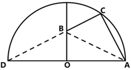

已知，AC=4米，BC=3米，在直角三角形ABC中，斜边米。由于AD所对圆周角为，故AD为直径，AO=OD，则与全等，BD=AB=5米，CD=CB+BD=3+5=8米。，，。所求面积。

故正确答案为A。

---

### 第 12 题　qid 16070196 · 数学运算

某风力发电机的三片风叶之间两两所成的角度为，当其中一片风叶OB与塔杆叠合时，一位身高1.8米的技术人员站在另一片风叶OA端头的正下方，测得塔杆顶部仰角为（如左下图所示）；若该技术人员站在离塔杆60米处，则测得塔杆顶部仰角为（如右下图所示）。那么风叶转动时叶片顶端最高离地面：

- **A**. 81.8米
- **B**. 89.8米
- **C**. 95.8米
- **D**. 101.8米　✅

**答案**：D

**官方解析**

根据题意，在风叶转动过程中，叶片垂直地面达到最高点时顶端距地面最远，如图所示，最大距离=OA+OD+1.8米。

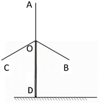

根据题干右图所示，且，可得为等腰直角三角形，技术人员离塔杆60米，可得OE=EP=60米；根据题干左图所示，且，根据勾股定理可得，直角三边之比为，则米；根据题意，相邻风叶夹角均为，则且，人在A点正下方，则，，同理可得直角三边之比为，则米。

综上，题干所求=OA+OD+1.8米=40米+60米+1.8米=101.8米。

故正确答案为D。

---

### 第 13 题　qid 16070171 · 数学运算

小刚新做了一个鞋柜，鞋柜的纵截面如左下图所示。鞋柜水平深度28.8厘米，隔板与水平面夹角为，这个格子刚好放得下一个15厘米高的鞋盒，则这双鞋的鞋码最大是：（参考数据：，，）

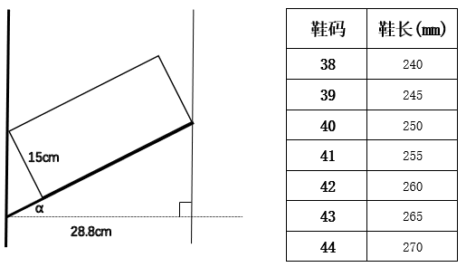

- **A**. 40
- **B**. 41　✅
- **C**. 42
- **D**. 43

**答案**：B

**官方解析**

如下图所示，已知，，，所以，。

在直角中，，所以；

在直角中，，所以；

所以，BC=CE-BE=30-4.35=25.65cm=256.5mm，对应题中表格可知，最大可放41码的鞋。

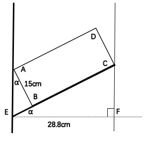

故正确答案为B。

---

### 第 14 题　qid 16070290 · 数学运算

某林场计划扩大荒原造林面积。下图中区域的荒原造林工作已由两人花费一天的时间完成。若将的AB边延长一倍到点D，BC边延长两倍到点E，CA边延长三倍到点F。假设每人的工作效率一致，则至少需要增加几人才能在接下来的5天内完成剩余区域的荒原造林工作？

- **A**. 3
- **B**. 5　✅
- **C**. 6
- **D**. 12

**答案**：B

**官方解析**

作辅助线连接DC、EA、BF，从点C向BA作垂线与AB交于点G。根据题意可知，DB=BA，CE=2BC，AF=3AC。设为S。将以DB为底，以CG为高；以BA为底，以CG为高，则与等底等高，故。同理，。同理，以CE为底，以BC为底，则与底之比为2:1，高相等，故。同理，。同理，以AF为底，以AC为底，与的底之比为3:1，高相等，故。同理。由于，故。则除了外的剩余区域面积为。由于每人工作效率一致，将每人工作效率赋值为1。根据两人花费一天的时间完成区域的面积S，则有2×1×1=S，即S=2。设需要增加n人在接下来的5天完成剩余区域面积17S，则有（2+n）×1×5=17S，结合S=2，解得n=4.8人，求最小，n向上取整为5，即至少增加5人可满足题干要求。

故正确答案为B。

---

### 第 15 题　qid 16070176 · 数学运算

为庆祝春节，某村计划在村口的两根圆柱体石柱上缠绕灯带。每根石柱需绕上3圈灯带，起始点为A，终点为B，如下图所示。若每根石柱高为5米，横截面圆的周长为4米，那么两根石柱所需的灯带总长度最短为多少米？

- **A**. 13
- **B**. 25
- **C**. 26　✅
- **D**. 50

**答案**：C

**官方解析**

根据题干要求“两根石柱所需的灯带总长度最短”，即求A点到B点的长度最短，已知每根石柱高为5米，横截面圆的周长为4米，将石柱侧面展开成平面图形（如下图所示），则所求AB长度最短即图中直角三角形的斜边。根据直角三角形勾股定理：，则，故两根石柱所需灯带总长度最短为13×2=26米。

故正确答案为C。

---

## 判断推理

### 第 1 题　qid 16070185 · 定义判断

回归效应，是指极端样本在后续观测中更接近总体均值的趋势，表现为个体极端特征随时间推移逐渐减弱。
根据上述定义，下列体现了回归效应的是：

- **A**. 龙生龙，凤生凤，老鼠的儿子会打洞
- **B**. 尺寸小的豌豆子代会变大，尺寸大的豌豆子代会变小　✅
- **C**. 一对父母身高近两米，他们的孩子成年后身高也近两米
- **D**. 某篮球运动员平均每场得分为20分，但在某场比赛中得了40分

**答案**：B

**官方解析**

第一步：找出定义关键词。
“更接近总体均值”、“个体极端特征”、“随时间推移逐渐减弱”。
第二步：逐一分析选项。
A项：龙生龙、凤生凤强调的是遗传稳定性，个体极端特征没有减弱，反而保持，不符合定义，排除；
B项：尺寸小（极端偏小）的豌豆子代变大，尺寸大（极端偏大）的豌豆子代变小，个体极端特征随时间推移逐渐减弱，都向中间的总体尺寸均值靠拢，符合定义，当选；
C项：父母身高近两米，孩子身高也近两米，个体极端特征没有减弱，反而保持，不符合定义，排除；
D项：只说了一场得40分（极端高分），但没有后续数据说明得分向20分的均值回归，不符合定义，排除。
故正确答案为B。

---

### 第 2 题　qid 16070186 · 定义判断

可编程物质是指一种可以根据用户输入或自主感应而以编程方式来改变自身物理性质的物质。
根据上述定义，下列不涉及可编程物质的是：

- **A**. 某智能水泥通过内嵌的传感器，自主控制水泥应力的释放以保持建筑物结构稳定
- **B**. 某智能布料由高分子复合纤维织成，输入不同电压会改变其电场，从而根据预设编码显现不同图案
- **C**. 通过添加纳米颗粒和化学反应物，某新型水泥可以实现自动修复裂缝和损坏，从而延长建筑的寿命　✅
- **D**. 某智能玻璃使用Socket网络编程技术，可根据外部光照强度和内部信号来改变透明度，调节室内光线以节省能源

**答案**：C

**官方解析**

第一步：找出定义关键词。
“根据用户输入或自主感应”、“以编程方式”、“改变自身物理性质”。
第二步：逐一分析选项。
A项：智能水泥通过内嵌的传感器自主控制应力的释放来保持建筑物结构稳定，属于“自主感应”、“以编程方式”、“改变自身物理性质”，符合定义，排除；
B项：智能布料通过输入不同电压改变电场，根据预设编码显现不同图案，属于“用户输入”、“以编程方式”、“改变自身物理性质”，符合定义，排除；
C项：新型水泥通过添加纳米颗粒和化学反应物实现自动修复，属于材料本身的化学特性，不符合“根据用户输入或自主感应”、“以编程方式”，不符合定义，当选；
D项：智能玻璃通过网络编程技术，根据外部光照强度和内部信号来改变透明度，属于“自主感应”、“以编程方式”、“改变自身物理性质”，符合定义，排除。
本题为选非题，故正确答案为C。

---

### 第 3 题　qid 16070190 · 定义判断

心理学中的自我关怀，也被称作自我怜悯、自我同情，指能够保护个体远离自我批评、反刍思维的一种积极的自我认知态度。当个体处在困难、挫折、痛苦、失望等情景中时，对自己消极的状态能够保持开放和友善的态度，能够安抚和关心自己。
根据上述定义，下列未体现自我关怀的是：

- **A**. 此情可待成追忆，只是当时已惘然　✅
- **B**. 僵卧孤村不自哀，尚思为国戍轮台
- **C**. 丈夫生世会几时，安能蹀躞垂羽翼
- **D**. 莫因诗卷愁成谶，春鸟秋虫自作声

**答案**：A

**官方解析**

第一步：找出定义关键词。
“能够保护个体远离自我批评、反刍思维的一种积极的自我认知态度”、“当个体处在困难、挫折、痛苦、失望等情景中时”、“对自己消极的状态能够保持开放和友善的态度”、“能够安抚和关心自己”。
第二步：逐一分析选项。
A项：意思是“此时此景为什么要现在才追忆，只因为当时心中只是一片茫然。”说明诗人沉浸在过去的遗憾、消极情绪中反复回味，是典型的反刍思维，不符合“能够保护个体远离自我批评、反刍思维的一种积极的自我认知态度”、“当个体处在困难、挫折、痛苦、失望等情景中时”、“对自己消极的状态能够保持开放和友善的态度”、“能够安抚和关心自己”，不符合定义，当选；
B项：意思是“穷居孤村，躺卧不起，不为自己的处境而感到哀伤，心中还想着替国家戍守边疆。”其中“僵卧孤村”体现出诗人目前处于挫折和困难中，但“不自哀”体现出诗人身处逆境却不自我哀怜、不自我批评，是一种积极的态度，符合“能够保护个体远离自我批评、反刍思维的一种积极的自我认知态度”、“当个体处在困难、挫折、痛苦、失望等情景中时”，符合定义，排除；
C项：意思是“大丈夫一辈子能有多长时间，怎么能畏缩不前、垂头丧气，像鸟儿收起翅膀那样憋屈？”体现出诗人面对挫折时的不甘心和对自己的鼓励，是一种积极的态度，符合“当个体处在困难、挫折、痛苦、失望等情景中时”、“对自己消极的状态能够保持开放和友善的态度”，符合定义，排除；
D项：意思是“不要忧愁自己写的愁苦之诗会成为吉凶的预言，春天的鸟儿和秋天的虫儿都会发出自己的声音。”体现出诗人面对愁绪、消极状态时，不自我批评，能够接纳并安抚自己，符合“能够保护个体远离自我批评、反刍思维的一种积极的自我认知态度”、“当个体处在困难、挫折、痛苦、失望等情景中时”、“对自己消极的状态能够保持开放和友善的态度”、“能够安抚和关心自己”，符合定义，排除。
本题为选非题，故正确答案为A。

---

### 第 4 题　qid 16070188 · 定义判断

凯伊效应是指当一束高粘度的假塑性流体倾倒至固体表面时，固体表面会把液束向上反弹出去。其原理为快速下落的液束冲击下方堆积的黏性流体，流体表面因为受到冲击粘度变小，受到撞击后形成一个酒窝状的凹坑，同时粘度降低的表面充当了润滑剂的作用，最终使得下落的液束被反弹出去。
根据上述定义，下列属于凯伊效应的是：

- **A**. 用肥皂水冲洗勺子，肥皂水碰到勺子后会沿着勺子曲面流下去
- **B**. 在喷水池喷出的水柱上放乒乓球，水柱会托举乒乓球向上跳跃
- **C**. 水流冲过土壤中的孔隙或裂缝时，形成了类似管道的水流通道
- **D**. 将洗发水从高处快速倒向桌面，堆积的洗发水会突然跳起一束　✅

**答案**：D

**官方解析**

第一步：找出定义关键词。
“高粘度的假塑性流体倾倒至固体表面”、“液束向上反弹出去”。
第二步：逐一分析选项。
A项：肥皂水碰到勺子后沿着勺子曲面流下去，液束没有反弹，不符合“液束向上反弹出去”，不符合定义，排除；
B项：水柱托举乒乓球向上跳跃，不涉及液束反弹，不符合“液束向上反弹出去”，不符合定义，排除；
C项：水流冲过孔隙或裂缝形成类似管道的水流通道，不涉及液束反弹，不符合“液束向上反弹出去”，不符合定义，排除；
D项：将洗发水从高处快速倒向桌面，洗发水是高粘度假塑性流体，符合“高粘度的假塑性流体倾倒至固体表面”，堆积的洗发水突然跳起一束，符合“液束向上反弹出去”，符合定义，当选。
故正确答案为D。

---

### 第 5 题　qid 17467530 · 定义判断

复冰现象是指当冰的表面受压，压力令其熔点降低，使得冰化成水，一旦压力消失，熔点提高至原来的水平，水又变为冰的现象。
根据上述定义，下列不属于复冰现象的是：

- **A**. 将两块水平放置的冰砖面对面压实，松手后两块冰砖粘在了一起
- **B**. 在一块很大的冰上放一条金属线，金属线两端分别连着两个重物，金属线缓慢穿越冰块而且不会将其切开
- **C**. 在滑冰场上滑冰时，冰刀留下道道痕迹，但很快刀痕会全部消失，留下完好如初的冰面
- **D**. 水结冰时，所释放的热量在其内部形成压力、产生气泡，这使得结成的冰看上去不透明　✅

**答案**：D

**官方解析**

第一步：找出定义关键词。
“冰受压化成水”、“压力消失水又变为冰”。
第二步：逐一分析选项。
A项：两块冰砖压实，说明冰在受压时先化成了水，松开粘一块说明刚刚化的水又结冰了，符合“冰受压化成水”、“压力消失水又变为冰”，符合定义，排除；
B项：金属线能够穿过冰，说明冰受压化成了水，金属线穿过之后压力解除，但冰不会被切开，说明水又结冰，符合“冰受压化成水”、“压力消失水又变为冰”，符合定义，排除；
C项：刀痕消失，说明冰刀离开冰面后，压力消失，水膜重新结冰，冰面恢复平整，符合“冰受压化成水”、“压力消失水又变为冰”，符合定义，排除；
D项：水结冰时内部产生压力和气泡，仅仅是水结冰的单向凝固过程，并没有体现冰化水现象，不符合“冰受压化成水”、“压力消失水又变为冰”，不符合定义，当选。
本题为选非题，故正确答案为D。

---

### 第 6 题　qid 16070189 · 定义判断

印随效应是一种特殊的学习方式，与一般的条件反射或习惯形成不同，它只在动物幼雏智力发展的一个特定阶段内发生，这个阶段被称为敏感期或关键期。如果错过了这个短暂时期，动物就很难或者无法学习到相应的行为。印随效应的发生有两个必要条件：一是刺激物必须是活动的，二是刺激物必须与动物幼雏有一定的亲缘关系或相似性。印随效应不仅存在于动物幼雏中，也存在于人类婴儿中。
根据上述定义，下列体现了印随效应的是：

- **A**. 小婷读小学时被寄养在二姨家，她对二姨有深深的依恋和信任感
- **B**. 退役的搜救犬在被陈大爷收养后，每天都忠诚地跟在陈大爷身边
- **C**. 小花从小睡觉都要抱一个布娃娃，如果离了布娃娃她就哭闹不止
- **D**. 刚孵出的雏鹅先看到一只鸭子，随后鸭子去哪里它就会跟到哪里　✅

**答案**：D

**官方解析**

第一步：找出定义关键词。
“是一种特殊的学习方式”、“只在动物幼雏智力发展的敏感期或关键期内发生”、“一是刺激物必须是活动的”、“二是刺激物必须与动物幼雏有一定的亲缘关系或相似性”、“也存在于人类婴儿中”。
第二步：逐一分析选项。
A项：寄养在二姨家的小婷已经读小学，不属于婴儿阶段，不符合“也存在于人类婴儿中”，不符合定义，排除；
B项：退役的搜救犬已是成年犬，不属于动物幼雏，不符合“只在动物幼雏智力发展的敏感期或关键期内发生”，不符合定义，排除；
C项：小花离了布娃娃就哭闹不止，布娃娃不是活物，不符合“一是刺激物必须是活动的”，不符合定义，排除；
D项：刚孵出的雏鹅，符合“只在动物幼雏智力发展的敏感期或关键期内发生”，雏鹅先看到一只鸭子后跟随鸭子，符合“是一种特殊的学习方式”、“一是刺激物必须是活动的”、“二是刺激物必须与动物幼雏有一定的亲缘关系或相似性”，符合定义，当选。
故正确答案为D。

---

### 第 7 题　qid 16070191 · 定义判断

偏序集是一个集合与其上元素之间的一种关系组成的整体，该关系需满足三个条件：
①自反性：集合中每个元素与自身有此关系
②反对称性：若元素A与B，B与A互有此关系，则A与B必为同一元素
③传递性：若A与B，B与C有此关系，则A与C有此关系
根据上述定义，下列属于偏序集的是：

- **A**. 设集合为一天中所有的时间点，定义集合上的关系为某时间点不晚于另一时间点　✅
- **B**. 设集合为书架上所有的书，定义集合上的关系为某本书与另一本书摆在同一层
- **C**. 设集合为某班级的所有同学，定义集合上的关系为朋友关系
- **D**. 设集合为所有整数，定义集合上的关系为不等于

**答案**：A

**官方解析**

第一步：找出定义关键词。
“集合中每个元素与自身有此关系”、“若元素A与B，B与A互有此关系，则A与B必为同一元素”、“若A与B，B与C有此关系，则A与C有此关系”。
第二步：逐一分析选项。
A项：设A、B、C为一天中的三个时间点，即有“A不晚于A，B不晚于B，C不晚于C”，符合“集合中每个元素与自身有此关系”，若“A不晚于B且B不晚于A，可以得到A=B”，符合“若元素A与B，B与A互有此关系，则A与B必为同一元素”，若“A不晚于B，B不晚于C，则A不晚于C”，符合“若A与B，B与C有此关系，则A与C有此关系”，符合定义，当选；
B项：设A、B为书架上的两本书，通过“A与B在同一层，B与A在同一层，无法得到A和B一定是同一本书”，不符合“若元素A与B，B与A互有此关系，则A与B必为同一元素”，不符合定义，排除；
C项：设A、B、C为班级中的三位同学，若“A和B是朋友，B和C是朋友，无法得到A和C一定是朋友”，不符合“若A与B，B与C有此关系，则A与C有此关系”，不符合定义，排除；
D项：任意整数都等于自身，即任意整数和自身都没有“不等于”关系，不符合“集合中每个元素与自身有此关系”，不符合定义，排除。
故正确答案为A。

---

### 第 8 题　qid 17467562 · 定义判断

疤痕效应是指人在遭受创伤后，伤口经过一段时间的恢复会愈合，但留下的疤痕会时刻提醒人们过去的伤痛，并对人的心理造成持续的影响。在社会学中，疤痕效应泛指重大事件会使人们的行为模式趋于保守，更加厌恶风险，进而导致人们对于事物的看法和决策产生偏差。
根据上述定义，下列未体现疤痕效应的是：

- **A**. 一朝被蛇咬，十年怕井绳
- **B**. 经历台风袭击后，老刘会经常囤积一些非必要生活用品，以备不时之需
- **C**. 五年前老陈投资失败后，将所有积蓄存入银行，不再选择其他理财方式
- **D**. 杨教授儿时经历过饥荒，深刻理解粮食的重要性，矢志培育优质高产的小麦种子　✅

**答案**：D

**官方解析**

第一步：找出定义关键词。
“重大事件”、“趋于保守”、“更加厌恶风险”、“人们对于事物的看法和决策产生偏差”。
第二步：逐一分析选项。
A项：意思是被蛇咬伤的创伤事件后，长达十年里看到外形相似的绳子都会心生恐惧，被蛇咬属于重大创伤事件，怕井绳是行为上的风险回避，符合“重大事件”、“趋于保守”、“更加厌恶风险”、“人们对于事物的看法和决策产生偏差”，符合定义，排除；
B项：经历台风袭击后，符合“重大事件”，老刘经常囤积非必要生活用品，说明行为模式转为保守，决策因过往创伤出现偏差，符合“趋于保守”、“更加厌恶风险”、“人们对于事物的看法和决策产生偏差”，符合定义，排除；
C项：五年前投资失败后，符合“重大事件”，老陈将所有积蓄存银行，不再选择其他理财方式，说明他厌恶风险，决策因过往创伤发生根本性的保守转变，符合“趋于保守”、“更加厌恶风险”、“人们对于事物的看法和决策产生偏差”，符合定义，排除；
D项：杨教授儿时经历过饥荒，矢志培育优质高产的小麦种子，说明他主动投身科研，并未厌恶风险，而是将经历转化为解决问题的动力，不符合“趋于保守”、“更加厌恶风险”、“人们对于事物的看法和决策产生偏差”，不符合定义，当选。
本题为选非题，故正确答案为D。

---

### 第 9 题　qid 16070192 · 定义判断

新污染物筛查主要有两类：非靶向筛查是不针对特定的目标污染物，基于全扫描分析获取对样品成分的表达；疑似筛查是根据先验的化学结构信息和质谱采集的特征发现样品中可能存在的化学物质。
根据上述定义，下列最能体现疑似筛查的是：

- **A**. 小肖利用全二维气相色谱—质谱法分析废水样品，发现污水处理过程中产生了苯并三唑类化合物
- **B**. 课题组筛查化工园区土壤中的污染物，对识别到的化合物的检测频率和相对含量进行打分，最终选出了36种优先污染物
- **C**. 研究小组筛查了潜在内分泌干扰物列表中的化学物，发现一半以上的个人护理产品中含有与发育损害或内分泌干扰有关的成分　✅
- **D**. 吴教授采用效应导向分析方法筛查出石油和香烟浸出液中导致芳基烃受体（AhR）反应的组分，并鉴定出这些组分中导致AhR反应的化合物

**答案**：C

**官方解析**

第一步：找出定义关键词。
非靶向筛查：“不针对特定的目标污染物”、“基于全扫描分析获取对样品成分的表达”；
疑似筛查：“根据先验的化学结构信息和质谱采集的特征”、“发现样品中可能存在的化学物质”。
第二步：逐一分析选项。
A项：小肖利用全二维气相色谱—质谱法分析废水样品发现了苯并三唑类化合物，符合“不针对特定的目标污染物”、“基于全扫描分析获取对样品成分的表达”，符合非靶向筛查定义，不符合疑似筛查定义，排除；
B项：对识别到的化合物的检测频率和相对含量进行打分，最终“选出”了36种优先污染物，“选出”意味着不是新发现的，是对已有识别结果的后续处理，不符合“发现样品中可能存在的化学物质”，不符合疑似筛查定义，排除；
C项：筛查潜在内分泌干扰物列表中的化学物，符合“根据先验的化学结构信息和质谱采集的特征”，发现一半以上的个人护理产品中含有与发育损害或内分泌干扰有关的成分，符合“发现样品中可能存在的化学物质”，符合疑似筛查定义，当选；
D项：吴教授采用“效应导向”分析方法筛查出石油和香烟浸出液中导致芳基烃受体（AhR）反应的组分，是从效应倒推成分，不符合“根据先验的化学结构信息和质谱采集的特征”，不符合疑似筛查定义，排除。
故正确答案为C。

---

### 第 10 题　qid 16070199 · 定义判断

敏化电极法指的是在指示电极上覆盖一层物质，使电极能提高或改变其选择性，进而检测物质的方法，包括气敏电极法、酶电极法等。其中，气敏电极法在指示电极上覆盖的是特殊的透气膜或空隙间隔，使待测气体可以通过。酶电极法在电极敏感膜上覆盖的是含酶凝胶或悬浮液，待测物可以向酶膜扩散。
根据上述定义，下列属于气敏电极法的是：

- **A**. 
在pH电极上覆盖乙烯材料，气体穿过覆盖物进入中介溶液，引起化学平衡移动，进而计算出浓度
　✅
- **B**. 
某种能将乙醇转化为电流的微生物经培养后可形成微生物膜，当电极放置在膜上时可检测出乙醇的浓度

- **C**. 
给pH电极装上葡萄糖氧化酶膜，当电极插入待测溶液时，酶催化产生化学反应，进而测定葡萄糖含量

- **D**. 
在植株鲜样中加偏磷酸溶液，打碎成浆后，取样品滤液加活性炭及硼酸钠溶液，进而测定抗坏血酸含量

**答案**：A

**官方解析**

第一步：找出定义关键词。

敏化电极法：“指示电极上覆盖一层物质”、“电极能提高或改变其选择性”、“检测物质”；

气敏电极法：“指示电极上覆盖的是特殊的透气膜或空隙间隔”、“待测气体可以通过”；

酶电极法：“电极敏感膜上覆盖的是含酶凝胶或悬浮液”、“待测物可以向酶膜扩散”。

第二步：逐一分析选项。

A项：在pH电极上覆盖乙烯材料，符合“指示电极上覆盖的是特殊的透气膜或空隙间隔”，气体穿过覆盖物进入中介溶液，从而计算出浓度，符合“待测气体可以通过”，符合“气敏电极法”定义，当选；

B项：电极放置在微生物膜上检测出乙醇的浓度，乙醇不属于气体，不符合“待测气体可以通过”，不符合“气敏电极法”定义，排除；

C项：给pH电极装上葡萄糖氧化酶膜，符合“电极敏感膜上覆盖的是含酶凝胶或悬浮液”，电极插入待测溶液时，酶催化产生化学反应，进而测定葡萄糖含量，符合“待测物可以向酶膜扩散”，符合“酶电极法”定义，不符合“气敏电极法”定义，排除；

D项：在植株鲜样中加偏磷酸溶液，取样品滤液加活性炭及硼酸钠溶液来测定抗坏血酸含量，不涉及电极，不符合“指示电极上覆盖一层物质”，不符合“敏化电极法”，不符合定义，排除。

故正确答案为A。

---

### 第 11 题　qid 16070200 · 逻辑判断

端粒是染色体末端的一段重复的核苷酸序列。当端粒长度变得非常短时，就更容易导致细胞的衰老和凋亡。有研究发现，每天每增加一杯速溶咖啡摄入量，端粒长度对应的等效年龄减少0.38年，因而速溶咖啡摄入量与端粒长度呈负相关。不过，研究结果也显示，研磨咖啡摄入量与端粒长度的相关性没有统计学意义，不能证实研磨咖啡也会减少端粒长度对应的等效年龄。该研究认为，饮用速溶咖啡会导致衰老，饮用研磨咖啡则不会，因而后者更健康。
以下哪项如果为真，不能支持上述结论？

- **A**. 速溶咖啡中往往会添加白砂糖、乳粉等，这些成分容易导致衰老
- **B**. 实验中使用的部分速溶咖啡样本，其实是现场研磨咖啡豆制作的　✅
- **C**. 与相同量的研磨咖啡相比较，速溶咖啡中导致衰老的铅含量更高
- **D**. 制作研磨咖啡时，会使用滤纸吸附咖啡白醇等对人体有害的物质

**答案**：B

**官方解析**

第一步：找出论点和论据。
论点：饮用速溶咖啡会导致衰老，饮用研磨咖啡则不会，因而后者更健康。
论据：每天每增加一杯速溶咖啡摄入量，端粒长度对应的等效年龄减少0.38年，因而速溶咖啡摄入量与端粒长度呈负相关。不过，研究结果也显示，研磨咖啡摄入量与端粒长度的相关性没有统计学意义，不能证实研磨咖啡也会减少端粒长度对应的等效年龄。
本题论点与论据都在说饮用速溶咖啡会导致衰老，但饮用研磨咖啡则不会。论点和论据话题一致，加强优先考虑补充论据，即解释原因或举例子，且本题为选非题，将可以加强的选项排除即可。
第二步：逐一分析选项。
A项：该项讨论的是速溶咖啡中往往会添加白砂糖、乳粉等，这些成分容易导致衰老，解释了为什么饮用速溶咖啡会导致衰老，补充论据，可以加强，排除；
B项：该项讨论的是实验中使用的部分速溶咖啡样本，其实是现场研磨咖啡豆制作的，那么就不确定造成衰老的是否为速溶咖啡，说明实验不科学、不准确，可以削弱，不能加强，当选；
C项：该项讨论的是与相同量的研磨咖啡相比较，速溶咖啡中导致衰老的铅含量更高，说明饮用速溶咖啡会导致衰老，饮用研磨咖啡则相较不会，补充论据，可以加强，排除；
D项：该项讨论的是制作研磨咖啡时，会使用滤纸吸附咖啡白醇等对人体有害的物质，解释了为什么饮用研磨咖啡会更加健康，补充论据，可以加强，排除。
本题为选非题，故正确答案为B。

---

### 第 12 题　qid 16070197 · 逻辑判断

鱼通过鳃的呼吸作用，从水中吸收钙离子，进入耳石囊内与碳酸根离子结合形成碳酸钙、随后沉积形成耳石，它具有维持鱼身平衡及辅助听觉的作用。鱼耳石的日周轮、年轮和产卵轮等时间记号，记录了鱼类生长过程中的环境信息。通过分析鱼耳石形态和化学组成等方式，我们可以了解鱼类生活史特征及其栖息环境的变化。
以下哪项如果为真，最能加强上述论证？

- **A**. 许多鱼类的寿命可长达数十年之久
- **B**. 环境污染可能导致鱼停止生长甚至死亡
- **C**. 不同鱼类的耳石大小不同，难以据此判断鱼类的生长环境情况
- **D**. 相对于鳞片、鳍条，鱼耳石的形态结构和化学组成更稳定，保存时间更长　✅

**答案**：D

**官方解析**

第一步：找出论点和论据。
论点：通过分析鱼耳石形态和化学组成等方式，我们可以了解鱼类生活史特征及其栖息环境的变化。
论据：鱼耳石的日周轮、年轮和产卵轮等时间记号，记录了鱼类生长过程中的环境信息。
本题论点和论据均在讨论“分析鱼耳石有助于了解鱼类生活的环境”，二者话题一致，加强可以考虑补充论据。
第二步：逐一分析选项。
A项：该项说的是许多鱼类的寿命很长，而论点讨论的是分析鱼耳石有助于了解鱼类生活的环境，话题不一致，不能加强，排除;
B项：该项说的是环境污染对鱼的不良影响，而论点讨论的是分析鱼耳石有助于了解鱼类生活的环境，话题不一致，不能加强，排除;
C项：该项说的是根据耳石难以判断鱼类的生长环境，是对论点进行削弱，不能加强，排除;
D项：该项说的是鱼耳石形态结构和化学组成更稳定，保存时间更长，补充论据说明鱼耳石在了解鱼类的生活史特征及其栖息环境的变化方面更有优势，可以加强，当选。
故正确答案为D。

---

### 第 13 题　qid 14143246 · 图形推理

近日，考古学家发现了一块展示约1.25亿年前肉食性哺乳动物爬兽袭击较大植食性恐龙鹦鹉嘴龙的化石。化石中，鹦鹉嘴龙呈俯卧姿态，后肢折叠在身体两侧；爬兽的身体向右盘绕，俯坐在鹦鹉嘴龙背侧，抓扒着猎物的下巴并撕咬肋骨，其小腿则被鹦鹉嘴龙的后腿夹住。研究者认为，这一发现首次挑战了“恐龙在白垩纪期间几乎没有受到同时代哺乳动物威胁”的观点。
以下哪项如果为真，最不能支持上述研究者的结论？

- **A**. 已能够确认爬兽与鹦鹉嘴龙纠缠在一起并同时葬身于火山喷发
- **B**. 在发现该标本前就有其他观点认为爬兽会捕食鹦鹉嘴龙等恐龙　✅
- **C**. 通过恐龙骨架上的牙印证明了爬兽当时正啃食鹦鹉嘴龙的尸体
- **D**. 在一块爬兽标本的胃中曾发现有鹦鹉嘴龙幼年个体的骨骼残留

**答案**：B

**官方解析**

第一步：找出论点和论据。

论点：这一发现首次挑战了“恐龙在白垩纪期间受到过同时代哺乳动物威胁”的观点。

论据：考古学家发现了一块展示约1.25亿年前肉食性哺乳动物爬兽袭击较大植食性恐龙鹦鹉嘴龙的化石。化石中，鹦鹉嘴龙呈俯卧姿态，后肢折叠在身体两侧；爬兽的身体向右盘绕，俯坐在鹦鹉嘴龙背侧，抓扒着猎物的下巴并撕咬肋骨，其小腿则被鹦鹉嘴龙的后腿夹住。

从论据“化石显示二者身体纠缠在一起”到论点“恐龙受到过威胁”，注意身体纠缠威胁，所以论据到论点的推理是有漏洞的，可以补充论据填补漏洞，也可以直接加强论点，且本题为选非题，排除可以加强的选项即可。

第二步：逐一分析选项。

A项：该项指出能够确认爬兽与鹦鹉嘴龙纠缠在一起，论据讨论的也是二者在化石中呈现的纠缠在一起的形态，所以该项的表述是对论据内容的重复，具有一定的加强力度，可以加强，排除；

B项：该项指出在发现该标本前就有其他观点认为爬兽会捕食恐龙，说明此次考古研究并非“首次”发现恐龙在白垩纪期间受到过同时代哺乳动物威胁，直接削弱论点，无法加强，当选；

C项：该项指出可证明爬兽当时正啃食鹦鹉嘴龙的尸体，结合论据中“二者身体纠缠在一起”的表述，说明在鹦鹉嘴龙死之前有和爬兽纠缠的过程，可体现出哺乳动物对恐龙的威胁，可以加强，排除；

D项：该项指出在爬兽标本的胃中发现有鹦鹉嘴龙幼年个体的骨骼残留，结合论据中“二者身体纠缠在一起”的表述，说明爬兽对恐龙有威胁，可以加强，排除。

本题为选非题，故正确答案为B。

---

### 第 14 题　qid 16070289 · 逻辑判断

紫杉醇是治疗癌症的明星药物。紫杉醇通过作用于细胞内的微管蛋白，保持微管的稳定性来抑制细胞的有丝分裂，控制癌细胞发展，从而达到治疗目的。香榧中含有紫杉醇，因此，有观点认为，多食用香榧可以治疗癌症。
以下哪项如果为真，最能削弱上述结论？

- **A**. 紫杉醇对正常细胞产生的影响目前还未可知
- **B**. 香榧中紫杉醇含量微乎其微，几乎可以忽略不计　✅
- **C**. 香榧含有丰富的蛋白质，可以增强癌症患者的免疫力
- **D**. 对于分裂速度比正常细胞快的癌细胞，紫杉醇表现出更明显的抑制作用

**答案**：B

**官方解析**

第一步：找出论点和论据。
论点：多食用香榧可以治疗癌症。
论据：香榧中含有紫杉醇，紫杉醇通过作用于细胞内的微管蛋白，保持微管的稳定性来抑制细胞的有丝分裂，控制癌细胞发展，从而达到治疗目的。
本题论点在讨论“多食用香榧可以治疗癌症”，论据在讨论“香榧中的紫杉醇能治疗癌症”，论点和论据话题不一致，削弱优先考虑拆桥，即拆断“食用香榧”和“紫杉醇”之间的联系。
第二步：逐一分析选项。
A项：该项指出“紫杉醇对正常细胞产生的影响目前还未可知”，而题干讨论的是“紫杉醇对癌细胞的影响”，话题不一致，无法削弱，排除；
B项：论点讨论的是“多食用香榧可以治疗癌症”，原因是“香榧中的紫杉醇能治疗癌症”，该项指出“香榧中紫杉醇含量微乎其微，几乎可以忽略不计”，即不能通过日常食用香榧取得治疗癌症的效果，断开了论点和论据之间的联系，为拆桥项，可以削弱，当选；
C项：该项指出“香榧可以增强癌症患者的免疫力”，但增强免疫力不等于可以治疗癌症，话题不一致，无法削弱，排除；
D项：该项指出“紫杉醇能抑制癌细胞”，补充论据，为加强项，无法削弱，排除。
故正确答案为B。

---

### 第 15 题　qid 17467563 · 类比推理

小王把仙女座、猎户座、大熊座、人马座、狮子座五个星座在星空图上的位置用A、B、C、D、E随机标记。已知：如果仙女座或猎户座中有一个在位置C上，则大熊座在位置B上；如果狮子座在位置C上，则人马座在位置E上。
如果人马座在位置B上，那么下列哪项必然为真？

- **A**. 大熊座在位置C上　✅
- **B**. 狮子座在位置C上
- **C**. 仙女座在位置C上
- **D**. 猎户座在位置C上

**答案**：A

**官方解析**

第一步：翻译题干条件。

（1）仙女座在位置C 或 猎户座在位置C大熊座在位置B；

（2）狮子座在位置C人马座在位置E；

（3）人马座在位置B。

第二步：根据题干条件进行推理。

根据条件（3）人马座在位置B，可知大熊座不在位置B，是对条件（1）的否后，根据否后必否前，可以推出仙女座不在位置C且猎户座不在位置C，排除C、D两项；

根据条件（3）人马座在位置B，可知人马座不在位置E，是对条件（2）的否后，根据否后必否前，可以推出狮子座不在位置C，排除B项。

故正确答案为A。

---

### 第 16 题　qid 16070292 · 逻辑判断

我国幅员辽阔，物产丰富。2022年海洋原油产量5800万吨，但是缺少高精度海洋勘测设备和技术，这严重制约了国家海洋油气勘探开发进程。2023年我国自主研发的海底地震勘探采集设备——“海脉”在渤海投入使用，这将极大提升我国海洋油气藏勘探精度。由此可以预期我国海洋原油产量将会提升。
以下哪项是上述论证成立的必要前提？

- **A**. 
“海脉”可以“看”清埋藏几千米深的陆地油气储层

- **B**. 
“海脉”能捕捉到海底相当于蚊子声大小的信号

- **C**. 
当前我国已经具有开采海洋原油的各项技术、设备和能力
　✅
- **D**. 
成千上万个“海脉”节点采集的数据信息可以处理成地震剖面

**答案**：C

**官方解析**

第一步：找出论点和论据。
论点：我国海洋原油产量将会提升。
论据：“海脉”在渤海投入使用，这将极大提升我国海洋油气藏勘探精度。
本题论点讨论的是我国海洋原油产量将会提升，论据讨论的是“海脉”的使用将极大提升我国海洋油气藏勘探精度，二者话题不一致，提问为“必要前提”，加强优先考虑搭桥和补充必要条件。
A项：该项指出“海脉”可以“看”清陆地油气储层，但并未说明“看”清陆地油气储层是否能提升我国海洋原油产量，为不明确项，无法加强，排除；
B项：该项指出“海脉”能捕捉到海底的微弱信号，但并未说明捕捉到海底的微弱信号是否能提升我国海洋原油产量，为不明确项，无法加强，排除；
C项：该项指出我国已经具有开采海洋原油的各项技术、设备和能力，只有具备开采能力，勘探精度提升才能带来产量提升，如果我国不具备开采海洋原油的各项技术、设备和能力，那么即使勘探精度提升，产量也无法提升，因此该项是论点成立的必要条件，当选；
D项：该项指出成千上万个“海脉”节点采集的数据信息可以处理成地震剖面，但并未说明得到的地震剖面是否能提升我国海洋原油产量，为不明确项，无法加强，排除。
故正确答案为C。

---

### 第 17 题　qid 16070213 · 逻辑判断

某研究团队发布了一项关于视觉感知对热舒适判断影响机制的研究，研究选取典型景观实景照片在实验室进行视觉刺激实验，从心理、行为、生理三个维度展开互证，发现人们通过快速扫视捕获热环境相关景观要素信息，视觉感知信息结合个体热联想经验会转换为热舒适判断，且视觉刺激引发的皮电变化率与阴影、植物总体占比率呈显著正相关，说明阴影和植物总体占比率可能是影响公园热舒适体验的关键因素。
要使上述结论成立，还需基于以下哪一前提?

- **A**. 光照强度变化不会通过非视觉途径影响皮电反应及热舒适判断
- **B**. 阴影和植物总体占比率高的区域，实际热环境温度通常更低
- **C**. 个体热联想经验主要源于日常生活中的户外环境体验
- **D**. 皮电变化率可作为衡量人体热舒适感受的指标　✅

**答案**：D

**官方解析**

第一步：找出论点和论据。
论点：阴影和植物总体占比率可能是影响公园热舒适体验的关键因素。
论据：人们通过快速扫视捕获热环境相关景观要素信息，视觉感知信息结合个体热联想经验会转换为热舒适判断，且视觉刺激引发的皮电变化率与阴影、植物总体占比率呈显著正相关。
本题论点讨论的是“阴影和植物总体占比率”和“热舒适体验”之间的关系，论据讨论的是“皮电变化率”和“阴影和植物总体占比率”之间的关系，二者话题不一致，加强优先考虑搭桥，即在“热舒适体验”和“皮电变化率”之间建立联系。
第二步：逐一分析选项。
A项：该项强调的是光照强度变化不会通过非视觉途径影响皮电反应及热舒适判断，说明实验中关于视觉感知对热舒适判断的影响研究是严谨的，有一定的加强力度，但不是上述论证成立的前提，排除；
B项：该项强调的是阴影和植物总体占比率高的区域实际温度反而更低，而论点讨论的是影响公园热舒适体验的关键因素是阴影和植物总体占比率，话题不一致，无法加强，排除；
C项：该项指出个体热联想经验的来源是户外环境体验，而论点讨论的是影响公园热舒适体验的关键因素是阴影和植物总体占比率，话题不一致，无法加强，排除；
D项：该项指出衡量人体热舒适感受的指标是皮电变化率，建立了“皮电变化率”和“热舒适体验”之间的联系，为搭桥项，是论证成立的前提，当选。
故正确答案为D。

---

### 第 18 题　qid 16070293 · 逻辑判断

研究人员发现，与摄入盐水的对照组小鼠相比，摄入葡萄球菌肠毒素SEA的小鼠会出现明显干呕现象。人类癌症患者使用化疗药物也会有类似的恶心和呕吐反应。研究显示，小鼠肠道内的SEA毒素激活了肠内壁的肠嗜铬细胞，释放出血清素，血清素又与肠道的感觉神经元受体结合，将信号传递到脑干中的特定神经元从而引发干呕，当特定神经元被灭活后，小鼠干呕显著减少。研究还发现，特定神经元被灭活后，其他动物的干呕也会显著减少。
由此可以推出：

- **A**. 如果不摄入葡萄球菌肠毒素，那么小鼠就不会出现干呕现象
- **B**. 开发出灭活特定神经元的药物或能帮助化疗病人减少呕吐　✅
- **C**. SEA毒素与肠道的感觉神经元受体结合会引发动物的干呕
- **D**. 切断小鼠脑干中特定神经元的信号传递或能引发干呕

**答案**：B

**官方解析**

日常结论题，根据题干信息逐一分析选项。
A项：题干指出“摄入葡萄球菌肠毒素SEA的小鼠会出现明显干呕现象”，并未提到不摄入葡萄球菌肠毒素的情况，无法推出，排除；
B项：题干指出“人类癌症患者使用化疗药物也会有类似的恶心和呕吐反应”和“当特定神经元被灭活后，小鼠干呕显著减少。研究还发现，特定神经元被灭活后，其他动物的干呕也会显著减少”，说明灭活特定神经元能减少动物干呕，而化疗呕吐与此相似，因此开发出灭活特定神经元的药物有可能帮助化疗病人减少呕吐，可以推出，当选；
C项：题干指出“小鼠肠道内的SEA毒素激活了肠内壁的肠嗜铬细胞，释放出血清素，血清素又与肠道的感觉神经元受体结合，将信号传递到脑干中的特定神经元从而引发干呕”，说明与受体结合的是血清素，并非SEA毒素，无法推出，排除；
D项：题干指出“当特定神经元被灭活后，小鼠干呕显著减少”，说明切断信号传递能够减少干呕，而非引发干呕，无法推出，排除。
故正确答案为B。

---

### 第 19 题　qid 16070296 · 逻辑判断

甲、乙、丙、丁、戊、己、庚7人分别去P、Q、R、S四个不同的值班点，根据工作安排，每个值班点至少有1人，至多有3人；每个人只能去1个值班点；要求Q值班点有3人值班。同时，还需满足下列条件：
（1）去R值班点的人数与去P值班点的人数一样
（2）如果甲、乙、丙中至多2人去Q值班点，那么只有丁去S值班点
（3）只有乙和庚去S值班点，丁或戊才不去S值班点
根据上述信息，下列哪项必然为真？

- **A**. 乙去Q值班点，戊去S值班点　✅
- **B**. 甲去Q值班点，丁去P值班点
- **C**. 己去P值班点，庚去R值班点
- **D**. 丙去P值班点，戊去S值班点

**答案**：A

**官方解析**

第一步：分析题干条件。

（1）甲、乙、丙、丁、戊、己、庚7人去P、Q、R、S四个值班点，每个值班点至少有1人，至多有3人，每个人只能去1个值班点，Q值班点有3人；

（2）R值班点人数=P值班点人数；

（3）甲、乙、丙至多2人去Q值班点只有丁去S值班点；

（4）丁 或 戊不去S值班点乙和庚去S值班点。

第二步：根据题干条件进行推理。

由条件（1）（2）可确定各值班点的人数为Q值班点3人、S值班点2人、P值班点1人、R值班点1人。S值班点2人是对条件（3）的否后，否后必否前，可推知甲、乙、丙3人均去Q值班点。乙去Q值班点，就不能再去S值班点，是对条件（4）的否后，否后必否前，可推知丁、戊均去S值班点。己、庚的值班点无法确定，只有A项必然为真。

故正确答案为A。

---

### 第 20 题　qid 17467534 · 逻辑判断

青藏高原被誉为“亚洲水塔”，是全球气候变化敏感区和指示区。这里分布着地球海拔最高数量最多的高原湖泊群，面积约占全国的百分之五十，对区域水循环、生态环境和气候调节具有重要意义。如果青藏高原降水增加或者冰川加速消融，那么青藏高原的湖泊将会持续扩张，并且导致潜在的流域合并或重组，威胁到该地区的基础设施和生态安全。由此可以推出：

- **A**. 如果青藏高原的湖泊没有持续扩张，那么青藏高原的降水没有增加且冰川并没有加速消融　✅
- **B**. 如果青藏高原降水增加或者冰川加速消融，将会导致其潜在的流域合并
- **C**. 如果青藏高原降水没有增加，那么其潜在的流域没有合并和重组
- **D**. 如果青藏高原的流域合并或重组，那么青藏高原降水增加

**答案**：A

**官方解析**

第一步：翻译题干。

青藏高原降水增加 或 冰川加速消融（青藏高原的湖泊将会持续扩张） 且 （潜在的流域合并 或 重组）。

第二步：逐一分析选项。

A项：翻译为：青藏高原的湖泊将会持续扩张青藏高原降水增加 且 冰川加速消融，是否定题干箭头后“且关系”的一部分，否后必否前，可以推出，当选；

B项：翻译为：青藏高原降水增加 或 冰川加速消融潜在的流域合并，是对题干的肯前，肯前必肯后，应推出“潜在的流域合并 或 重组”，而非“潜在的流域合并”，不能推出，排除；

C项：翻译为：青藏高原降水增加潜在的流域合并和重组，是否定题干箭头前“或关系”的一部分，不是否前，且否前得不到确定结论，不能推出，排除；

D项：翻译为：青藏高原的流域合并 或 重组青藏高原降水增加，是肯定题干箭头后“且关系”的一部分，不是肯后，且肯后得不到确定结论，不能推出，排除。

故正确答案为A。

---

### 第 21 题　qid 17467529 · 图形推理

从所给的四个选项中，选择最合适的一个填入问号处，使之呈现一定的规律性。

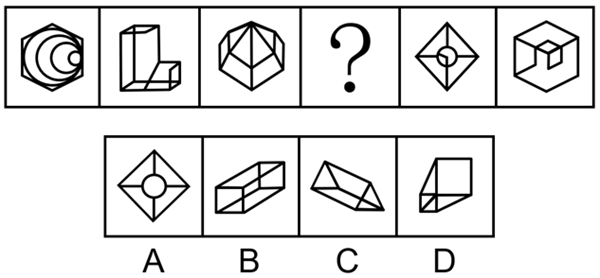

- **A**. A
- **B**. B　✅
- **C**. C
- **D**. D

**答案**：B

**官方解析**

元素组成不同，且无明显属性规律，考虑数量规律。观察发现，题干图形出现明显封闭区域，优先考虑数面。题干图形的面数量依次为10、9、8、？、6、5，故“？”处图形的面数量应为7，只有B项符合。
故正确答案为B。

---

### 第 22 题　qid 16070178 · 图形推理

从所给的四个选项中，选择最合适的一个填入问号处，使之呈现一定的规律性：

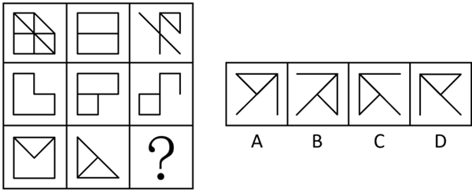

- **A**. A
- **B**. B
- **C**. C　✅
- **D**. D

**答案**：C

**官方解析**

元素组成相似，且相同线条重复出现，优先考虑样式规律中的加减同异。九宫格优先横向看，观察发现，第二行图形只能先将图2左右翻转，然后与图1求异，才可得到图3；经验证，第一行也符合此规律；第三行应用此规律，因此？处图形应将图2左右翻转，然后与图1求异得到，只有C项符合。
故正确答案为C。

---

### 第 23 题　qid 16070177 · 图形推理

从所给的四个选项中，选择最合适的一个填入问号处，使之呈现一定的规律：

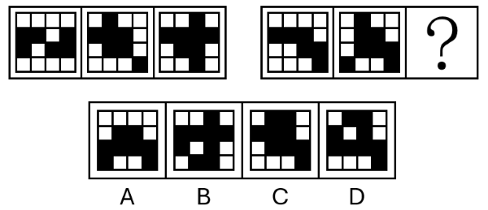

- **A**. A
- **B**. B
- **C**. C
- **D**. D　✅

**答案**：D

**官方解析**

元素组成不同，且无明显属性规律，考虑数量规律。观察发现，题干图形均由黑块和白块构成，且分堆明显，考虑部分数。第一组图，黑块部分数明显无规律，白块部分数为2、3、4，依次递增1；第二组图，前两幅图白块部分数依次为2、3，故问号处图形白块部分数应为4，对应D项。
故正确答案为D。

---

### 第 24 题　qid 16070182 · 图形推理

左图是一个带把手的立方体纸盒，右边哪项可能是其外表面展开图？

- **A**. A
- **B**. B　✅
- **C**. C
- **D**. D

**答案**：B

**官方解析**

A项：数字1的面和数字4的面为相对面，相对面不能同时出现，选项展开图与题干立体图不一致，排除；
B项：选项展开图与题干立体图一致，当选；
C项：题干立体图中，数字4的面和数字6的面中的数字书写方向是一致的，而选项中这两个面中的数字书写方向不一致，选项展开图与题干立体图不一致，排除；
D项：题干立体图中，数字4的面和数字6的面中的数字书写方向是一致的，而选项中这两个面中的数字书写方向不一致，选项展开图与题干立体图不一致，排除。
故正确答案为B。

---

### 第 25 题　qid 16070184 · 图形推理

从所给的四个选项中，选择最合适的一个填入问号处，使之呈现一定的规律性：

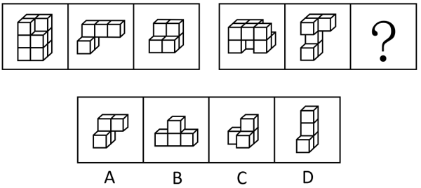

- **A**. A
- **B**. B　✅
- **C**. C
- **D**. D

**答案**：B

**官方解析**

本题考查立体拼合。第一组图的图一由图二和图三拼合而成，第二组图的图一也应由图二与“？”处图形拼合而成，对应B项。 

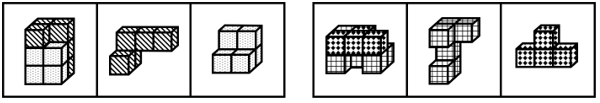

故正确答案为B。

---

### 第 26 题　qid 16069970 · 类比推理

寓意：寓言

- **A**. 序言：正文
- **B**. 情节：童话　✅
- **C**. 报告文学：新闻
- **D**. 著作：诗集

**答案**：B

**官方解析**

第一步：判断题干词语间逻辑关系。
寓言是用假托的故事或自然物的拟人手法来说明某个道理或教训的文学作品，寓意是寓言所包含的核心内涵，二者是组成关系。
第二步：判断选项词语间逻辑关系。
A项：序言和正文是同一篇作品里的两个组成部分，二者是并列关系，与题干逻辑关系不一致，排除；
B项：童话是通过丰富的想象、幻想和夸张来编写的适合于儿童欣赏的故事，情节是童话的核心组成部分，二者是组成关系，与题干逻辑关系一致，当选；
C项：报告文学是一种散文体裁，以现实生活中具有典型意义的真人真事为题材,经过适当的艺术加工而成,兼有新闻报道特点，报告文学和新闻不是组成关系，与题干逻辑关系不一致，排除；
D项：所有诗集都是著作，二者是种属关系，与题干逻辑关系不一致，排除。
故正确答案为B。

---

### 第 27 题　qid 17467541 · 类比推理

星期：星期一

- **A**. 年：正月　✅
- **B**. 细胞：培养基
- **C**. 牙齿：牙龈
- **D**. 节能灯：电源

**答案**：A

**官方解析**

第一步：判断题干词语间逻辑关系。
星期包含星期一，星期一是星期中的其中一天，二者为组成关系。
第二步：判断选项词语间逻辑关系。
A项：年包含正月，正月是农历一年中的第一个月，二者为组成关系，与题干逻辑关系一致，当选；
B项：细胞在培养基中培养，二者为对应关系，与题干逻辑关系不一致，排除；
C项：牙齿和牙龈是口腔内不同的结构，二者为并列关系，与题干逻辑关系不一致，排除；
D项：节能灯工作需要电源供电，二者为条件对应关系，与题干逻辑关系不一致，排除。
故正确答案为A。

---

### 第 28 题　qid 17467545 · 类比推理

蛋白质：有机物

- **A**. 故宫：北京
- **B**. 5G基站：通讯设施　✅
- **C**. 显示屏：折叠屏
- **D**. 固态硬盘：台式机硬盘

**答案**：B

**官方解析**

第一步：判断题干词语间逻辑关系。
蛋白质是有机物，二者为种属关系。
第二步：判断选项词语间逻辑关系。
A项：故宫在北京，二者为地点对应关系，与题干逻辑关系不一致，排除；
B项：5G基站是通讯设施，二者为种属关系，与题干逻辑关系一致，当选；
C项：折叠屏是显示屏，二者为种属关系，但顺序与题干相反，与题干逻辑关系不一致，排除；
D项：有的固态硬盘是台式机硬盘，有的固态硬盘不是台式机硬盘，有的台式机硬盘是固态硬盘，有的台式机硬盘不是固态硬盘，二者为交叉关系，与题干逻辑关系不一致，排除。
故正确答案为B。

---

### 第 29 题　qid 17467528 · 类比推理

随波逐流：盲从

- **A**. 杯水车薪：坚持
- **B**. 心不在焉：专注
- **C**. 临渊羡鱼：空想　✅
- **D**. 据理力争：反驳

**答案**：C

**官方解析**

第一步：判断题干词语间逻辑关系。
“随波逐流”意思是随着波浪起伏，跟着流水漂荡，比喻没有坚定的立场和主见，随大流；“盲从”意思是盲目地附和、随从别人，二者为近义关系。
第二步：判断选项词语间逻辑关系。
A项：“杯水车薪”意思是用一杯水去救一车着了火的柴草，比喻力量太小或东西太少，无济于事，与“坚持”不是近义关系，与题干逻辑关系不一致，排除；
B项：“心不在焉”意思是心思不在这里，思想不集中；“专注”指专心注意，二者是反义关系，与题干逻辑关系不一致，排除；
C项：“临渊羡鱼”意思是面对着深渊，希望得到鱼，比喻仅有空想而无实际行动，与“空想”是近义关系，与题干逻辑关系一致，当选；
D项：“据理力争”意思是依据道理，竭力维护自己方面的权益、观点等；“反驳”指说出自己的理由来否定别人不同的意见，二者不是近义关系，与题干逻辑关系不一致，排除。
故正确答案为C。

---

### 第 30 题　qid 16069962 · 类比推理

鸡犬不宁：安居乐业

- **A**. 羊质虎皮：色厉内荏
- **B**. 莺歌燕舞：鸟语花香
- **C**. 海底捞针：探囊取物　✅
- **D**. 蝇营狗苟：寡廉鲜耻

**答案**：C

**官方解析**

第一步：判断题干词语间逻辑关系。
“鸡犬不宁”意思是连鸡狗都不得安宁，形容搅扰得很厉害，“安居乐业”意思是安定地生活，愉快地工作，二者为反义关系。
第二步：判断选项词语间逻辑关系。
A项：“羊质虎皮”意思是羊虽然披上虎皮，但怯弱的本性不变，比喻外强内弱，虚有其表，“色厉内荏”意思是外表强横，内心怯懦，形容外表凶恶强横，实际上内心虚弱怯懦，二者为近义关系，与题干逻辑关系不一致，排除；
B项：“莺歌燕舞”意思是黄莺歌唱，燕子飞舞，形容大好春光或大好形势，“鸟语花香”意思是鸟儿叫，花儿飘香，多形容春天魅人的景象，二者为近义关系，与题干逻辑关系不一致，排除；
C项：“海底捞针”比喻极难找到，“探囊取物”意思是伸手到袋子里取东西，比喻能够轻而易举地办成某件事情，二者为反义关系，与题干逻辑关系一致，当选；
D项：“蝇营狗苟”意思是像苍蝇那样飞来飞去，像狗那样苟且偷生，形容人不顾廉耻，到处钻营，“寡廉鲜耻”意思是不廉洁，不知羞耻，二者为近义关系，与题干逻辑关系不一致，排除。
故正确答案为C。

---

### 第 31 题　qid 14143348 · 类比推理

树枝：秸秆：柴火

- **A**. 石斛：沉香：中药　✅
- **B**. 尘土：烟雾：污染
- **C**. 蚕蛾：蚊子：成虫
- **D**. 火车：汽车：车厢

**答案**：A

**官方解析**

第一步：判断题干词语间逻辑关系。
树枝和秸秆都是柴火，前两词为并列关系，均与第三词构成种属关系，且树枝、秸秆均为植物类。
第二步：判断选项词语间逻辑关系。
A项：石斛和沉香都是中药，前两词为并列关系，均与第三词构成种属关系，且石斛、沉香均为植物类，与题干逻辑关系一致，当选；
B项：尘土和烟雾都是污染物，会导致污染，前两词为并列关系，均与第三词构成因果对应关系，与题干逻辑关系不一致，排除；
C项：蚕和蚊子是完全变态昆虫，完全变态昆虫的发育需要经历卵、幼虫、蛹、成虫四个时期，蚕蛾和蚊子均是成虫，前两词为并列关系，均与第三词构成种属关系，但蚕和蚊子均为动物类，与题干逻辑关系不一致，排除；
D项：火车和汽车都是交通工具，二者为并列关系，车厢为火车和汽车的组成部分，前两词均与第三词构成组成关系，与题干逻辑关系不一致，排除。
故正确答案为A。

---

### 第 32 题　qid 14142894 · 类比推理

照相机：凸透镜：照相

- **A**. 火炕：煤炭：取暖
- **B**. 潜水艇：鱼鳔：潜水
- **C**. 飞机：起落架：飞行
- **D**. 微波炉：磁控管：加热　✅

**答案**：D

**官方解析**

第一步：判断题干词语间逻辑关系。
凸透镜是照相机的组成部分，二者为组成关系；照相是照相机的功能，且该功能依靠凸透镜实现。
第二步：判断选项词语间逻辑关系。
A项：煤炭在火炕里，二者为地点对应关系，不是组成关系，与题干逻辑关系不一致，排除；
B项：鱼鳔是潜水艇设计灵感的来源，二者为仿生对应关系，不是组成关系，与题干逻辑关系不一致，排除；
C项：起落架是飞机的组成部分，二者为组成关系；飞行是飞机的功能，但起落架的主要功能是帮助飞机起落，而非在飞行过程中使用，因此飞行功能不依靠起落架实现，与题干逻辑关系不一致，排除；
D项：磁控管是微波炉的组成部分，二者为组成关系；加热是微波炉的功能，且该功能依靠磁控管实现，与题干逻辑关系一致，当选。
故正确答案为D。

---

### 第 33 题　qid 17467547 · 类比推理

杏仁：腰果：坚果

- **A**. 餐具：饭碗：饭勺
- **B**. 门框：门楣：门扇
- **C**. 礼单：礼帖：礼仪
- **D**. 火枪：火炮：火器　✅

**答案**：D

**官方解析**

第一步：判断题干词语间逻辑关系。
杏仁和腰果都是坚果，二者为并列关系中的反对关系，均与第三个词语构成包容关系中的种属关系。
第二步：判断选项词语间逻辑关系。
A项：饭碗和饭勺都是餐具，二者为反对关系，均与第一个词语构成种属关系，词语顺序不同，与题干逻辑关系不一致，排除；
B项：门楣是门框上部的横梁结构，二者为包容关系中的组成关系，与题干逻辑关系不一致，排除；
C项：礼单和礼帖都是传统礼仪文书‌，二者为反对关系，但礼单和礼帖均是礼仪的体现，与第三个词语构成对应关系，与题干逻辑关系不一致，排除；
D项：火枪和火炮都是火器，二者为反对关系，均与第三个词语构成种属关系，与题干逻辑关系一致，当选。
故正确答案为D。

---

### 第 34 题　qid 14142904 · 类比推理

（    ）对于 景点 相当于 车水马龙 对于（    ）

- **A**. 游人如织 街市　✅
- **B**. 惊鸿一瞥 人群
- **C**. 天然画卷 剧场
- **D**. 鬼斧神工 陋巷

**答案**：A

**官方解析**

逐一代入选项。
A项：游人如织形容游人多得像织布的线一样，密密麻麻，可以用来形容景点，二者为特点与描述对象的对应关系；车水马龙指车如流水，马如游龙一般，形容热闹繁华的景象，可以用来形容街市，二者为特点与描述对象的对应关系，前后逻辑关系一致，当选；
B项：惊鸿一瞥指人只是匆匆看了一眼，却给人留下极深的印象，与景点无明显逻辑关系；车水马龙指车如流水，马如游龙一般，形容热闹繁华的景象，不能用来形容人群，前后逻辑关系不一致，排除；
C项：天然画卷指自然形成的、未经人工加工修饰的美丽景观，可以用来形容景点；车水马龙指车如流水，马如游龙一般，形容热闹繁华的景象，不能用来形容剧场，前后逻辑关系不一致，排除；
D项：鬼斧神工原意是像鬼神制作出来的，形容艺术技巧高超，不像是人力所能达到的，可以用来形容景点（如景点的建筑）；车水马龙指车如流水，马如游龙一般，形容热闹繁华的景象，不能用来形容陋巷，前后逻辑关系不一致，排除。
故正确答案为A。

---

### 第 35 题　qid 16070194 · 类比推理

龙葵碱 对于 （    ） 相当于 （    ） 对于 面团发酵

- **A**. 芝麻开花；无氧呼吸
- **B**. 土豆发芽；二氧化碳　✅
- **C**. 冬瓜落霜；线粒体
- **D**. 香蕉成熟；葡萄糖

**答案**：B

**官方解析**

逐一代入选项。
A项：“芝麻开花”是芝麻植株生长的一个自然阶段，与“龙葵碱”无明显逻辑关系；“无氧呼吸”是“面团发酵”过程中酵母等微生物所采用的一种生理过程，二者为对应关系，前后逻辑关系不一致，排除；
B项：“土豆发芽”会产生“龙葵碱”，二者为活动与其产物的对应关系；“面团发酵”过程中酵母等微生物代谢会产生“二氧化碳”，二者为活动与其产物的对应关系，前后逻辑关系一致，当选；
C项：“冬瓜落霜”是指冬瓜在成熟的时候，表面会生出一层白霜，和“龙葵碱”无明显逻辑关系；“线粒体”是酵母菌的细胞器，酵母菌可以用来“面团发酵”，二者为对应关系，前后逻辑关系不一致，排除；
D项：“香蕉成熟”与“龙葵碱”无明显逻辑关系；“葡萄糖”是“面团发酵”过程中酵母进行发酵作用的重要能量来源和底物，二者为对应关系，前后逻辑关系不一致，排除。
故正确答案为B。

---

## 资料分析

### 材料 1

        近年来，我国低空经济发展表现出巨大潜力，2023年底全国低空经济规模超5000亿元，2030年底有望达到2万亿元。截至2024年底，全国在册通用机场达475个，较2023年增加26个。截至2023年底，全国通用航空企业达689家，在册通用航空器数量3303架，通用航空完成飞行时长137.1万小时，同比增长12.4%。其中，载客类完成2.8万小时，同比增长55.1%，载人类完成14.5万小时，同比增长34.7%，其他类完成69.6万小时，同比增长8.3%；非经营性作业时长完成50.2万小时，同比增长11.2%。

        截至2024年底，全国无人机生产企业近700家，截至2023年底，全国获得通用航空经营许可证且使用民用无人机的通用航空企业19825家，同比净增4695家；全行业无人机拥有者注册用户92.9万个，其中，个人用户84.9万个，企业、事业、机关法人单位用户8万个；全行业注册无人机共126.7万架，同比增长32.2%；全行业有效无人机操控员执照共19.44万本，同比增长27.2%。2023年，全年无人机累计飞行2311万小时，同比增长11.8%。

#### 第 1 题　qid 16070255 · 平均数

在2023年底的基础上，要确保2030年底全国低空经济规模达到2万亿元，那么从2024年开始，全国低空经济规模平均每年增量约为：

- **A**. 1468亿元
- **B**. 1643亿元
- **C**. 1875亿元
- **D**. 2143亿元　✅

**答案**：D

**官方解析**

根据题干“······那么从2024年开始，全国低空经济规模平均每年增量约为”，结合选项为具体值，可判定本题为年均增长量问题。定位文字材料第一段可得：近年来，我国低空经济发展表现出巨大潜力，2023年底全国低空经济规模超5000亿元，2030年底有望达到2万亿元。根据公式：年均增长量，则所求，对应D项。

故正确答案为D。

---

#### 第 2 题　qid 17467569 · 增长

2024年，全国在册通用机场数量比2023年约增加了：

- **A**. 2%
- **B**. 4%
- **C**. 6%　✅
- **D**. 8%

**答案**：C

**官方解析**

根据题干“2024年······比2023年约增加了”，结合选项为百分数，可判定本题为一般增长率计算问题。定位文字材料第一段可知：截至2024年底，全国在册通用机场达475个，较2023年增加26个。根据公式：增长率，则所求增长率，与C项最接近。

故正确答案为C。

---

#### 第 3 题　qid 16070256 · 综合

2023年我国通用航空完成飞行时长比2022年约多：

- **A**. 13万小时
- **B**. 15万小时　✅
- **C**. 17万小时
- **D**. 19万小时

**答案**：B

**官方解析**

根据题干“2023年······比2022年约多”，结合选项带单位，可判定本题为增长量计算问题。定位文字材料第一段可得：2023年我国通用航空完成飞行时长137.1万小时，同比增长12.4%。根据公式：增长量，则题目所求万小时。

故正确答案为B。

---

#### 第 4 题　qid 16070258 · 比重

2023年底，全行业无人机拥有者注册用户中，个人用户占比与企业、事业、机关法人单位用户占比约相差：

- **A**. 8.6个百分点
- **B**. 82.8个百分点　✅
- **C**. 83.8个百分点
- **D**. 91.4个百分点

**答案**：B

**官方解析**

根据题干“2023年底······占比······”，结合材料时间为2023年，可判定本题为现期比重问题。定位文字材料第二段可得：截至2023年底，全行业无人机拥有者注册用户92.9万个，其中，个人用户84.9万个，企业、事业、机关法人单位用户8万个。根据公式：比重，可得所求为。

故正确答案为B。

---

#### 第 5 题　qid 16070259 · 综合

不能从上述资料中推出的是：

- **A**. 2022年，载客类通用航空完成飞行时长约1.8万小时
- **B**. 2023年，通用航空完成飞行时长小于无人机累计飞行时长
- **C**. 若保持2023年同比增速不变，那么2026年全行业有效无人机操控员执照将超过35万本
- **D**. 2023年，全国获得通用航空经营许可证且使用民用无人机的通用航空企业数量的同比增速不超过30%　✅

**答案**：D

**官方解析**

A项：定位文字材料第一段可得：截至2023年底，载客类通用航空完成飞行时长2.8万小时，同比增长55.1%。根据公式：基期量，则2022年载客类通用航空完成飞行时长万小时，正确；

B项：定位文字材料第一段可得：截至2023年底，通用航空完成飞行时长137.1万小时；定位文字材料第二段可得：2023年，全年无人机累计飞行2311万小时。比较可知，2023年通用航空完成飞行时长小于无人机累计飞行时长，正确；

C项：定位文字材料第二段可得：截至2023年底，全行业有效无人机操控员执照共19.44万本，同比增长27.2%。根据公式：现期量，则所求为万本&gt;35万本，正确；

D项：定位文字材料第二段可得：截至2023年底，全国获得通用航空经营许可证且使用民用无人机的通用航空企业19825家，同比净增4695家。根据公式：增长率，则所求为，错误。

本题为选非题，故正确答案为D。

---

### 材料 2

       2025年上半年，Q市12348公共法律服务热线有效接听解答咨询量（以下简称法律热线咨询量）为102428人次。按咨询事项分类统计，前十事项的咨询量合计占法律热线咨询量的85.85%，同比提升0.65个百分点。法律热线咨询量超过1万人次的共四项：咨询量最多的事项是民事诉讼程序，数量为20846人次，同比增长38.3%；其次为经济合同，数量为16819人次；第三名劳动合同与第四名劳动报酬相差无几，分别为10708人次、10682人次。

#### 第 6 题　qid 16070270 · 综合

2025年第二季度Q市法律热线咨询量约为：

- **A**. 4.83万人次
- **B**. 4.96万人次　✅
- **C**. 5.12万人次
- **D**. 5.23万人次

**答案**：B

**官方解析**

定位文字材料可得，2025年上半年Q市法律热线咨询量为102428人次；定位统计图可得，2025年一季度Q市法律热线咨询量为52802人次。根据公式：第二季度数据=上半年数据-第一季度数据，则2025年第二季度Q市法律热线咨询量为102428-52802=49626人次万人次，对应B项。

故正确答案为B。

---

#### 第 7 题　qid 17467526 · 增长

2024年上半年Q市法律热线咨询量同比增速约为：

- **A**. -4.6%
- **B**. -4.0%　✅
- **C**. -3.5%
- **D**. -3.1%

**答案**：B

**官方解析**

根据题干“2024年上半年······同比增速约为”，可判定本题为一般增长率问题。定位统计图可得：2023年第一、二季度Q市法律热线咨询量分别为47010人次、49483人次，2024年第一、二季度Q市法律热线咨询量分别为42504人次、50085人次。根据公式：，可得2024年上半年Q市法律热线咨询量同比增速，与B项最接近。

故正确答案为B。

---

#### 第 8 题　qid 16070277 · 综合

以下折线图中，最能准确反映2022-2025年间Q市法律热线咨询量第二季度环比增量变化趋势的是：

- **A**. 

　✅
- **B**. 

- **C**. 

- **D**. 

**答案**：A

**官方解析**

根据题干“······第二季度环比增量变化趋势的是”，可判定本题为增长量比较问题。定位统计图可知：2022年第一季度、第二季度Q市法律热线咨询量分别为34658人次、34027人次；2023年第一季度、第二季度Q市法律热线咨询量分别为47010人次、49483人次；2024年第一季度、第二季度Q市法律热线咨询量分别为42504人次、50085人次；2025年第一季度Q市法律热线咨询量为52802人次。定位文字材料可得：2025年上半年，Q市法律热线咨询量为102428人次。则2025年第二季度Q市法律热线咨询量为102428-52802=49626人次。（说明：2025年第二季度Q市法律热线咨询量本材料第一小题已计算过，本题求解时可直接用）。根据公式：增长量=现期量-基期量，可得2022-2025年Q市法律热线咨询量第二季度环比增量分别为：

2022年第二季度，人次；

2023年第二季度，人次；

2024年第二季度，人次；

2025年第二季度，人次。

综上可知，环比增量呈先上升后下降趋势，且2022年第二季度环比增量（-600人次）&gt;2025年第二季度环比增量（-3000人次），与A项变化趋势一致。

故正确答案为A。

速算提示：

观察数据可知，2022年、2025年第二季度环比增量均为负，2023年、2024年第二季度环比增量均为正，即折线图第一个点和第四个点应处于较低的两个位置，排除C、D两项；2022年第二季度，人次，2025年第二季度，人次，则第四个点应为最低点，排除B项。

---

#### 第 9 题　qid 16070278 · 综合

2024年上半年Q市法律热线咨询量中前十事项的咨询量约为：

- **A**. 9.19万人次
- **B**. 8.27万人次
- **C**. 7.89万人次　✅
- **D**. 6.38万人次

**答案**：C

**官方解析**

根据题干“2024年上半年Q市法律热线咨询量中前十事项的咨询量约为”，结合材料时间为2025年上半年，且材料中给出2025年上半年Q市法律热线咨询量中前十事项咨询量的占比，可判定本题为基期比重问题。定位文字材料可得：2025年上半年，Q市按咨询事项分类统计，前十事项的咨询量合计占法律热线咨询量的85.85%，同比提升0.65个百分点；定位统计图可得：2024年Q市一和二季度法律热线咨询量分别为：42504人次、50085人次。则2024年上半年Q市法律热线咨询量中前十事项咨询量占比为85.85%-0.65%=85.2%；2024年上半年Q市法律热线咨询量为42504+50085=92589人次。根据公式：部分=整体×比重，故题干所求为万人次，与C项最接近。

故正确答案为C。

---

#### 第 10 题　qid 16070280 · 综合

能够从上述资料中推出的是：

- **A**. 2024年上半年民事诉讼程序咨询量不超过1.4万人次
- **B**. 2022-2024年，下半年法律热线咨询量均高于上半年
- **C**. 2023-2024年，法律热线咨询量出现同比增长的季度有7个
- **D**. 2025年上半年，前十事项咨询量中劳动合同的占比超过11%　✅

**答案**：D

**官方解析**

A项：定位文字材料可得：2025年上半年，咨询量最多的事项是民事诉讼程序，数量为20846人次，同比增长38.3%。根据公式：基期量，则所求人次万人次，即2024年上半年民事诉讼程序咨询量超过1.4万人次，错误；

B项：定位统计图可知2022-2024年各季度法律热线咨询量。因上半年=一季度+二季度，下半年=三季度+四季度，则2023年上半年法律热线咨询量=47010+49483=96493人次，下半年法律热线咨询量=49429+39991=89420人次，即2023年下半年法律热线咨询量低于上半年，错误；

C项：定位统计图可知2022-2024年各季度法律热线咨询量。比较可知，2023年法律热线咨询量出现同比增长的季度有一季度、二季度、三季度，2024年出现同比增长的季度有二季度、三季度、四季度，共6个，错误；

D项：定位文字材料可得：2025年上半年，Q市12348公共法律服务热线有效接听解答咨询量（以下简称法律热线咨询量）为102428人次。按咨询事项分类统计，前十事项的咨询量合计占法律热线咨询量的85.85%，第三名劳动合同为10708人次。根据公式：比重，则所求，即占比超过11%，正确。

故正确答案为D。

---

### 材料 3

        截至2024年末，我国60岁及以上人口突破3亿，达到31031万人。养老服务相关企业约16万家，比2023年底增长24.36%。全国共有各类养老机构和设施40.6万个，养老床位合计799.3万张。其中，注册登记的养老机构4.0万个，比上年下降1.2%，床位507.7万张（护理型床位占比为65.7%），社区养老服务机构和设施36.6万个，床位291.5万张。

        2024年，中央预算内投资75.9亿元支持202个养老设施建设项目，其中11.4亿元用于支持27项公立医疗卫生机构医养结合项目。全国医疗卫生机构与养老服务机构签约合作超过8.5万对；医养结合机构超过8400家，床位总数超过210万张。

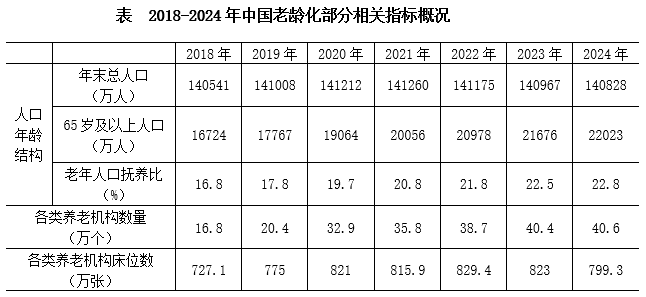

        其中，老年人口抚养比。

#### 第 11 题　qid 16070309 · 比重

2024年末，我国60岁及以上人口中，65岁及以上的人口占比约为：

- **A**. 51%
- **B**. 61%
- **C**. 71%　✅
- **D**. 81%

**答案**：C

**官方解析**

根据题干“2024年末······中······占比约为”，结合材料给出2024年末相关数据，可判定本题为现期比重问题。定位文字材料第一段可得：截至2024年末，我国60岁及以上人口突破3亿，达到31031万人；定位统计表可得：2024年，我国65岁及以上人口为22023万人。根据公式：比重，可得题干所求。

故正确答案为C。

---

#### 第 12 题　qid 16070310 · 平均数

2024年末，我国注册登记的养老机构平均拥有护理型床位约：

- **A**. 68张
- **B**. 83张　✅
- **C**. 103张
- **D**. 127张

**答案**：B

**官方解析**

根据题干“2024年末······平均拥有······约”，结合材料时间为2024年末，可判定本题为现期平均数问题。定位文字材料第一段可得：截至2024年末，我国注册登记的养老机构4.0万个，床位507.7万张（护理型床位占比为65.7%)。根据公式：部分=整体×比重、平均数，则2024年末我国注册登记的养老机构平均拥有护理型床位数张，与B项最接近。

故正确答案为B。

计算提示：本题为多步乘除运算，采用百化分来简化运算。，则，与B项最接近。

---

#### 第 13 题　qid 16070311 · 增长

2019年，我国养老机构数量的增长速度约为65岁及以上老年人口增长速度的：

- **A**. 2.4倍
- **B**. 3.1倍
- **C**. 3.4倍　✅
- **D**. 4.2倍

**答案**：C

**官方解析**

根据题干“2019年······约为······的”，结合选项为多少倍，且材料时间给出2019年，可判定本题为现期倍数问题。定位统计表可得：2018年、2019年我国养老机构数量分别为16.8万个、20.4万个；2018年、2019年我国65岁及以上老年人口分别为16724万人、17767万人。根据公式：增长率，则2019年我国养老机构数量的同比增速；2019年我国65岁及以上老年人口的同比增速。则所求倍，与C项最接近。

故正确答案为C。

---

#### 第 14 题　qid 16070312 · 综合

根据老年人口抚养比的计算公式，2022年我国0-14岁的人口数约为：

- **A**. 23968万人　✅
- **B**. 24522万人
- **C**. 34795万人
- **D**. 96592万人

**答案**：A

**官方解析**

根据题干“根据老年人口抚养比的计算公式，2022年······人口数约为”，可判定本题为比值计算问题。根据统计表可得：2022年末我国总人口为141175万人，65岁及以上人口为20978万人，老年人口抚养比为21.8%。根据公式：老年人口抚养比，则15-64岁人口数万人，2022年我国0-14岁的人口数=2022年末总人口数-（15-64岁人口数+65岁及以上人口数）=141175-（96229+20978）=141175-117207=23968万人。

故正确答案为A。

---

#### 第 15 题　qid 17467565 · 综合

不能从上述资料中推出的是：

- **A**. 2024年底，医养结合机构的平均床位数高于注册登记养老机构的平均床位数
- **B**. 2021~2024年，我国各类养老机构的数量持续增长，但床位数并未同步增长
- **C**. 2024年，平均用于支持每项公立医疗卫生机构医养结合项目的中央预算内投资资金超过4000万元
- **D**. 2018~2024年，我国15~64岁人口数始终保持下降的趋势　✅

**答案**：D

**官方解析**

A项：定位文字材料第一段可得，2024年底，全国注册登记的养老机构4.0万个，床位507.7万张；定位文字材料第二段可得，医养结合机构超过8400家，床位总数超过210万张。则2024年底医养结合机构的平均床位数张，注册登记养老机构的平均床位数张，前者大于后者，正确；

B项：定位统计表可得，2021~2024年各年我国各类养老机构的数量分别为35.8万个、38.7万个、40.4万个、40.6万个，床位数分别为815.9万张、829.4万张、823万张、799.3万张。观察数据，2021~2024年我国各类养老机构的数量持续增长，但床位数并未同步增长，正确；

C项：定位文字材料第二段可得，2024年，中央预算内投资11.4亿元用于支持27项公立医疗卫生机构医养结合项目。则所求万元&gt;4000万元，正确；

D项：定位统计表可得，2018~2024年各年份我国65岁及以上人口数和老年人口抚养比。根据公式：老年人口抚养比，可得2018年我国15~64岁人口数万人，2019年我国15~64岁人口数万人，则2018年我国15~64岁人口数&lt;2019年，非始终保持下降的趋势，错误。

本题为选非题，故正确答案为D。

---

### 材料 4

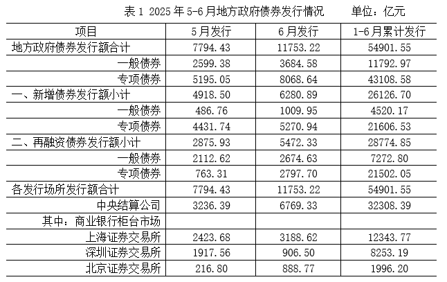

#### 第 16 题　qid 16070229 · 综合

2025年6月，地方政府债券投资者总持有额的环比增量约为：

- **A**. 5514亿元
- **B**. 6124亿元
- **C**. 6514亿元　✅
- **D**. 7124亿元

**答案**：C

**官方解析**

根据题干“2025年6月······的环比增量约为”，可判定本题为增长量计算问题。定位表2可得：2025年5月和6月地方政府债券投资者总持有额分别为510036.49亿元、516550.47亿元。根据公式：增长量=现期量-基期量，则2025年6月地方政府债券投资者总持有额的环比增量=516550.47-510036.49516550-510036=6514亿元。

故正确答案为C。

---

#### 第 17 题　qid 16070230 · 比重

2025年1-4月，再融资债券发行额占地方政府债券累计发行额的比重在下列哪个范围内？

- **A**. 35%~45%
- **B**. 45%~55%
- **C**. 55%~65%　✅
- **D**. 65%~75%

**答案**：C

**官方解析**

根据题干“2025年1-4月······占······的比重在下列哪个范围内”，结合材料时间为2025年，可判定本题为现期比重问题。定位表1可得：2025年1-6月地方政府债券累计发行额为54901.55亿元，6月发行额为11753.22亿元，5月发行额为7794.43亿元；2025年1-6月再融资债券累计发行额为28774.85亿元，6月发行额为5472.33亿元，5月发行额为2875.93亿元。根据公式：比重，且2025年1-4月=2025年1-6月累计-6月-5月，可得所求为，在C项范围内。

故正确答案为C。

---

#### 第 18 题　qid 16070232 · 增长

关于2025年6月各类地方政府债券发行额的环比增速，下列排序正确的是：

- **A**. 再融资专项债券>新增一般债券>再融资一般债券>新增专项债券　✅
- **B**. 新增一般债券>新增专项债券>再融资一般债券>再融资专项债券
- **C**. 再融资专项债券>再融资一般债券>新增一般债券>新增专项债券
- **D**. 再融资专项债券>新增一般债券>新增专项债券>再融资一般债券

**答案**：A

**官方解析**

根据题干“关于2025年6月······环比增速，下列排序正确的是”，可判定本题为一般增长率问题。定位表1可得2025年5月、6月地方新增一般债券、新增专项债券、再融资一般债券、再融资专项债券的发行额。根据公式：增长率，可得2025年6月各类地方政府债券发行额的环比增速分别如下：

新增一般债券：；

新增专项债券：；

再融资一般债券：；

再融资专项债券：。

综上，正确排序为再融资专项债券&gt;新增一般债券&gt;再融资一般债券&gt;新增专项债券。

故正确答案为A。

---

#### 第 19 题　qid 16070235 · 综合

下列选项和如下饼图相符的是：

- **A**. 2025年5月各发行场所发行额：1-中央结算公司、2-上海证券交易所、3-深圳证券交易所、4-北京证券交易所
- **B**. 2025年6月各发行场所发行额：1-中央结算公司、2-上海证券交易所、3-深圳证券交易所、4-北京证券交易所
- **C**. 2025年5月地方政府债券发行额：1-新增一般债券、2-新增专项债券、3-再融资一般债券、4-再融资专项债券
- **D**. 2025年6月地方政府债券发行额：1-新增一般债券、2-新增专项债券、3-再融资一般债券、4-再融资专项债券　✅

**答案**：D

**官方解析**

A项：定位表1可知：2025年5月地方政府中央结算公司债券发行额3236.39亿元&gt;上海证券交易所债券发行额2423.68亿元，与饼状图不符，错误；
B项：定位表1可知：2025年6月地方政府中央结算公司债券发行额6769.33亿元&gt;上海证券交易所债券发行额3188.62亿元，与饼状图不符，错误；
C项：定位表1可知：2025年5月地方政府再融资一般债券发行额2112.62亿元，远大于再融资专项债券发行额763.31亿元，与饼状图不符，错误；
D项：定位表1可知：2025年6月地方政府新增一般债券发行额1009.95亿元、新增专项债券发行额5270.94亿元、再融资一般债券发行额2674.63亿元、再融资专项债券发行额2797.70亿元，与饼状图完全符合，正确。
故正确答案为D。

---

#### 第 20 题　qid 17467533 · 综合

能够从上述资料中推出的是：

- **A**. 与2025年5月相比，所有机构在6月均增持了地方政府债券
- **B**. 2025年1-4月地方政府债券平均发行额低于6月地方政府债券发行额　✅
- **C**. 2025年5月与6月上海证券交易所发行额占1-6月总发行额的比重差异超过7个百分点
- **D**. 对比2025年5月与6月的机构投资者持有情况，不存在持有金额上升、占比却下降的机构

**答案**：B

**官方解析**

A项：定位统计表2可知2025年5月及6月各机构持有地方政府债券的相关金额。观察发现，2025年6月信用社持有地方政府债券（2630.15亿元）低于2025年5月（2662.62亿元），错误；

B项：定位统计表1可知，2025年5月、6月、1-6月地方政府债券发行额分别为7794.43亿元、11753.22亿元、54901.55亿元。根据公式：平均数，则2025年1-4月地方政府债券平均发行额亿元，即低于6月地方政府债券发行额（11753.22亿元），正确；

C项：定位统计表1可知，2025年5月、6月、1-6月上海证券交易所发行额分别为2423.68亿元、3188.62亿元、12343.77亿元。根据公式：比重，则所求为，即比重差异未超过7个百分点，错误；

D项：定位统计表2可知2025年5月及6月各机构投资者持有地方政府债券的相关金额及占比情况。观察发现，2025年6月商业银行持有金额（371255.62亿元）高于2025年5月（366807.08亿元），2025年6月商业银行所占比重（71.87%）低于2025年5月（71.92%），错误。

故正确答案为B。

---
