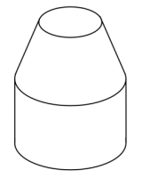
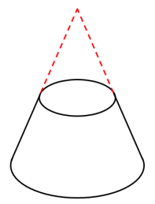
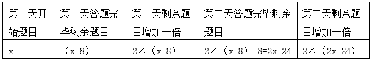
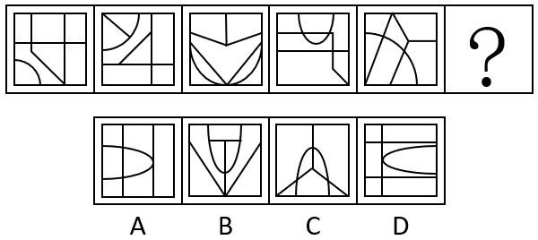
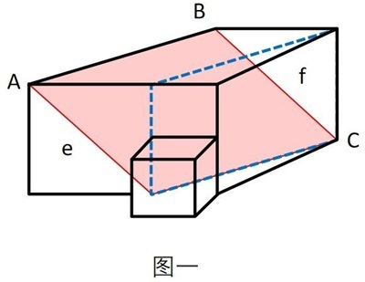
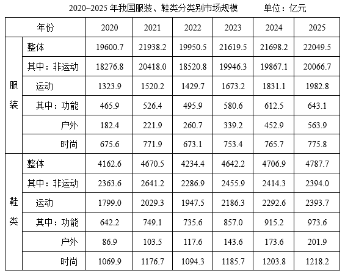

# 2026年海南省公务员录用考试《行测》题（网友回忆版）

> 省考 · 2026 年 · 6 个模块 · 共 105 题

- [政治理论](#%E6%94%BF%E6%B2%BB%E7%90%86%E8%AE%BA) · 15 题
- [常识判断](#%E5%B8%B8%E8%AF%86%E5%88%A4%E6%96%AD) · 14 题
- [言语理解与表达](#%E8%A8%80%E8%AF%AD%E7%90%86%E8%A7%A3%E4%B8%8E%E8%A1%A8%E8%BE%BE) · 23 题
- [数量关系](#%E6%95%B0%E9%87%8F%E5%85%B3%E7%B3%BB) · 14 题
- [判断推理](#%E5%88%A4%E6%96%AD%E6%8E%A8%E7%90%86) · 24 题
- [资料分析](#%E8%B5%84%E6%96%99%E5%88%86%E6%9E%90) · 15 题

---

## 政治理论

### 第 1 题　qid 16069981 · 时事政治

党的二十届四中全会提出，加快农业农村现代化，扎实推进乡村全面振兴。下列与之相关说法正确的是（    ）。
①坚持把解决好“三农”问题作为全党工作重中之重
②统筹发展科技农业、绿色农业、质量农业、品牌农业
③稳定土地承包关系，稳步推进三轮承包到期后再延长三十年试点
④因地制宜完善乡村建设实施机制，分类有序、一体化推进乡村振兴
⑤健全财政优先保障、金融重点倾斜、社会积极参与的多元投入格局，确保乡村振兴投入力度不断增强

- **A**. ①②③
- **B**. ①②⑤　✅
- **C**. ①②④⑤
- **D**. ②③④⑤

**答案**：B

**官方解析**

本题考查新思想。
2025年10月23日，《中共中央关于制定国民经济和社会发展第十五个五年规划的建议》发布，以下简称《建议》。
①正确，《建议》在“八、加快农业农村现代化，扎实推进乡村全面振兴”部分指出：“坚持把解决好‘三农’问题作为全党工作重中之重，促进城乡融合发展，持续巩固拓展脱贫攻坚成果，推动农村基本具备现代生活条件，加快建设农业强国。”
②正确，③错误，《建议》在“八、加快农业农村现代化，扎实推进乡村全面振兴”部分指出：“（25）提升农业综合生产能力和质量效益。坚持产量产能、生产生态、增产增收一起抓，统筹发展科技农业、绿色农业、质量农业、品牌农业，把农业建成现代化大产业······稳定土地承包关系，稳步推进二轮承包到期后再延长三十年试点。”故③中“三轮承包”表述错误，应为“二轮承包”。
④错误，《建议》在“八、加快农业农村现代化，扎实推进乡村全面振兴”部分指出：“（26）推进宜居宜业和美乡村建设。学习运用‘千万工程’经验，因地制宜完善乡村建设实施机制，分类有序、片区化推进乡村振兴，逐步提高农村基础设施完备度、公共服务便利度、人居环境舒适度。”故“一体化”表述错误，应为“片区化”。
⑤正确，《建议》在“八、加快农业农村现代化，扎实推进乡村全面振兴”部分指出：“（27）提高强农惠农富农政策效能。健全财政优先保障、金融重点倾斜、社会积极参与的多元投入格局，确保乡村振兴投入力度不断增强。保护和调动农民务农种粮积极性，强化价格、补贴、保险等政策支持和协同。”
故①②⑤表述正确。
故正确答案为B。

---

### 第 2 题　qid 16070032 · 时事政治

习近平总书记强调，学习好贯彻好党的二十届四中全会精神，是当前和今后一个时期全党全国的一项重大政治任务。关于党的二十届四中全会精神，下列表述正确的是（    ）。

- **A**. 把捍卫经济安全摆在首位，加强重点领域国家安全能力建设，突出保障事关国家长治久安、经济健康稳定、人民安居乐业的重大安全
- **B**. 坚定不移推动高质量发展，构建以新兴产业和未来产业为骨干的现代化产业体系
- **C**. 坚定不移扩大高水平对外开放，做强国内国际大循环，加快构建新发展格局
- **D**. 加强普惠性、基础性、兜底性民生建设，稳步推进基本公共服务均等化　✅

**答案**：D

**官方解析**

本题考查新思想。
2025年10月23日，党的二十届四中全会审议通过了《中共中央关于制定国民经济和社会发展第十五个五年规划的建议》（以下简称《建议》）。
A项错误，《建议》在：“十三、推进国家安全体系和能力现代化，建设更高水平平安中国”部分指出：“（50）加强重点领域国家安全能力建设。锻造实战实用的国家安全能力，突出保障事关国家长治久安、经济健康稳定、人民安居乐业的重大安全，把捍卫政治安全摆在首位······”故“把捍卫经济安全摆在首位”表述错误，应为“把捍卫政治安全摆在首位”。
B项错误，《建议》在“三、建设现代化产业体系，巩固壮大实体经济根基”部分指出：“······坚持把发展经济的着力点放在实体经济上，坚持智能化、绿色化、融合化方向，加快建设制造强国、质量强国、航天强国、交通强国、网络强国，保持制造业合理比重，构建以先进制造业为骨干的现代化产业体系。故“以新兴产业和未来产业为骨干”表述错误，应为“以先进制造业为骨干”。
C项错误，2026年1月1日出版的第1期《求是》杂志发表了习近平总书记的重要文章《学习好贯彻好党的二十届四中全会精神》。文章指出：“第二，加快构建新发展格局。做强国内大循环、畅通国内国际双循环，是我们把握发展主动权、塑造国际合作和竞争新优势的战略举措······坚定不移扩大高水平对外开放，维护多边贸易体制······”故“做强国内国际大循环”表述错误，应为“做强国内大循环”。
D项正确，《建议》在“十一、加大保障和改善民生力度，扎实推进全体人民共同富裕”部分指出：“实现人民对美好生活的向往是中国式现代化的出发点和落脚点。坚持尽力而为、量力而行，加强普惠性、基础性、兜底性民生建设······（44）稳步推进基本公共服务均等化。建立基本公共服务均等化评价标准，完善基本公共服务范围和内容，制定实现基本公共服务均等化的目标、路径、措施······”
故正确答案为D。

---

### 第 3 题　qid 16069985 · 马克思主义

习近平总书记在纪念中国人民抗日战争暨世界反法西斯战争胜利80周年招待会上强调：“一时强弱在于力，千秋胜负在于理。正义、光明、进步必将战胜邪恶、黑暗、反动。”这一论述最能体现马克思主义的哪些基本观点？（    ）
①上层建筑和经济基础具有同一性
②事物的主要矛盾决定事物发展的方向
③事物的发展是前进性与曲折性的统一
④人的认识能够反映和改造世界

- **A**. ①③
- **B**. ②③　✅
- **C**. ①④
- **D**. ③④

**答案**：B

**官方解析**

本题考查马克思主义。
①错误，马克思主义认为，经济基础决定上层建筑，上层建筑反作用于经济基础，二者是辩证统一的，并非简单的“具有同一性”。且题干围绕“一时强弱”与“千秋胜负”展开，强调正义、进步力量最终必胜，核心是历史发展趋势与规律问题，并未涉及社会结构中的经济基础与上层建筑的关系。
②正确，马克思主义认为，主要矛盾是指在复杂事物发展过程中处于支配地位、对事物发展起决定作用的矛盾。“一时强弱在于力”中的“力”即当下凸显的矛盾，造成一时强弱之分；而“千秋胜负在于理”中的“理”即符合历史发展规律的正义力量，是决定历史长期走向的核心因素，体现了主要矛盾对事物发展方向的决定作用。
③正确，马克思主义认为，事物发展的总趋势是前进的、上升的，但发展的道路是曲折的、迂回的，任何新事物的成长都要经历一个由弱到强的过程。题干中“一时强弱在于力”体现了事物发展的曲折性，即反动、落后势力可能在短期内凭借力量占据优势；“千秋胜负在于理”“正义、光明、进步必将战胜邪恶、黑暗、反动”则鲜明体现了历史发展的前进性和必然性。整句话既承认暂时的力量对比，又坚信长远的正义必胜，体现了事物的发展是前进性与曲折性的统一。
④错误，马克思主义认为，认识是实践基础上主体对客体的能动的反映，即认识能够反映世界，同时认识可以指导实践改造世界，但认识本身无法直接改造世界，故选项本身说法存在错误。
故②③表述正确。
故正确答案为B。

---

### 第 4 题　qid 16069988 · 新思想

习近平总书记强调，“十五五”时期，必须把因地制宜发展新质生产力摆在更加突出的战略位置。下列与之相关表述正确的是（    ）。
①要统筹推进教育科技人才一体发展
②要完善国家创新体系，激发各类创新主体活力
③要在加强基础研究、提高原始创新能力上持续用力
④要全面推进传统产业转型升级、积极发展新兴产业、超前布局未来产业

- **A**. ①②③
- **B**. ①②④
- **C**. ②③④
- **D**. ①②③④　✅

**答案**：D

**官方解析**

本题考查新思想。
①②③④正确，2025年4月30日，习近平总书记在上海主持召开部分省区市“十五五”时期经济社会发展座谈会并发表重要讲话强调，“十五五”时期，必须把因地制宜发展新质生产力摆在更加突出的战略位置，以科技创新为引领、以实体经济为根基，坚持全面推进传统产业转型升级、积极发展新兴产业、超前布局未来产业并举，加快建设现代化产业体系。要完善国家创新体系，激发各类创新主体活力，瞄准世界科技前沿，在加强基础研究、提高原始创新能力上持续用力，在突破关键核心技术、前沿技术上抓紧攻关。要统筹推进教育科技人才一体发展，筑牢新质生产力发展的基础性、战略性支撑。
故正确答案为D。

---

### 第 5 题　qid 16069991 · 新思想

习近平总书记指出，全面依法治国是国家治理的一场深刻革命，关系党执政兴国，关系人民幸福安康，关系党和国家长治久安。关于全面依法治国，下列说法正确的是（    ）。
①全面依法治国是中国特色社会主义的本质要求和重要保障
②全面依法治国要坚持依法治国、依法执政、依法行政共同推进
③全面依法治国要坚持法治国家、法治政府、法治社会一体建设
④全面依法治国要坚持依法治国和依规治党有机统一

- **A**. ①②③
- **B**. ①②④
- **C**. ②③④
- **D**. ①②③④　✅

**答案**：D

**官方解析**

本题考查新思想。
①②③④正确，2017年10月18日，党的十九大报告在“三、新时代中国特色社会主义思想和基本方略”部分指出：“（六）坚持全面依法治国。全面依法治国是中国特色社会主义的本质要求和重要保障······坚持依法治国、依法执政、依法行政共同推进，坚持法治国家、法治政府、法治社会一体建设，坚持依法治国和以德治国相结合，依法治国和依规治党有机统一，深化司法体制改革，提高全民族法治素养和道德素质。”
故正确答案为D。

---

### 第 6 题　qid 16069993 · 新思想

习近平总书记强调，要站在推进强国建设、民族复兴伟业的战略高度，推动我国未来产业发展不断取得新突破。关于推动我国未来产业发展，下列举措恰当的有几项？（    ）
①要综合考虑国家战略需求、技术成熟程度、要素支撑条件等因素，发挥优势、同步发展
②要发挥政府主体作用，推动各类创新资源向企业集聚
③要充分发挥新型举国体制优势，坚持“产业出题、科技答题”
④要统筹发展和安全，探索科学有效的监管方式，防范相关风险，确保既“放得活”又“管得好”

- **A**. 1项
- **B**. 2项　✅
- **C**. 3项
- **D**. 4项

**答案**：B

**官方解析**

本题考查新思想。
2026年1月30日下午，中共中央政治局就前瞻布局和发展未来产业进行第二十四次集体学习。习近平总书记在听取讲解和讨论后发表重要讲话。
①错误，习近平总书记强调：“要聚焦‘十五五’时期我国未来产业发展的主攻方向，科学论证技术路线，提升前沿技术战略预判能力。要综合考虑国家战略需求、技术成熟程度、要素支撑条件等因素，因地制宜、错位发展。要强化产业协同，推动未来产业同新兴产业、传统产业相得益彰。”故“发挥优势、同步发展”表述错误，应为“因地制宜、错位发展”。
②错误，习近平总书记强调：“很多未来产业的兴起是靠企业一步步突破带动的。要发挥企业主体作用，推动各类创新资源向企业集聚，大力培育核心技术领先、创新能力强的科技领军企业和高新技术企业，引领带动产业向前沿和高端领域迈进。”故“要发挥政府主体作用”表述错误，应为“要发挥企业主体作用”。
③正确，习近平总书记指出：“科技突破的程度，很大程度上决定未来产业发展的速度、广度、深度。要充分发挥新型举国体制优势，坚持‘产业出题、科技答题’，加大重点领域关键核心技术攻关力度，加强基础研究战略性、前瞻性、体系化布局，加快科技成果转化应用。”
④正确，习近平总书记强调：“未来产业发展涉及面广，必须健全治理体系。要统筹发展和安全，探索科学有效的监管方式，防范相关风险，确保既‘放得活’又‘管得好’。要深化国际合作，积极推动各方标准共建、规则共商、产业共促。各级领导干部要加强科技前沿知识学习，努力做到知科技、懂产业、善决策。”
综上，③④表述正确，共2项。
故正确答案为B。

---

### 第 7 题　qid 16069999 · 新思想

习近平总书记指出，加快构建全国统一大市场，着力整治一些领域的“内卷式”竞争。关于深刻认识和综合整治“内卷式”竞争，下列说法正确的是（    ）。

- **A**. “内卷式”竞争的根源是我国的人口基数过大
- **B**. “内卷式”竞争是市场经济发展的必然现象
- **C**. “内卷式”竞争会带来资源耗损、无序竞争　✅
- **D**. 整治“内卷式”竞争要从严从实从快

**答案**：C

**官方解析**

本题考查新思想。
2025年7月，《求是》杂志发表《深刻认识和综合整治“内卷式”竞争》（以下简称文章）。
A项错误，文章指出，作为当前经济发展中的突出现象，“内卷式”竞争的形成原因具有多维性和复杂性，涉及企业、行业、政府多个方面，既有经济发展和技术进步等规律性因素，也有深层次体制机制问题，还有经济主体的路径依赖等原因，是多种因素综合形成的。由此可见，“内卷式”竞争与人口基数无直接关联。
B项错误，文章指出，市场配置资源是最有效率的形式，竞争是市场经济运行的重要机制。通过竞争优化资源配置、实现优胜劣汰，倒逼企业不断创新技术、改善经营管理，进而提高经济运行效率，促进经济发展、技术进步，这是市场经济的优势所在······市场竞争有利于提高资源配置效率，可一旦竞争过了头、越了界，演变成无序“内卷”，就会扭曲市场机制、破坏市场公平，造成诸多负面影响。因此，竞争过度是市场经济演进中的阶段性问题，并非“必然现象”。
C项正确，文章指出，现实中，“内卷式”竞争表现不同、特征各异，主要涉及企业和地方政府两类行为主体······从地方政府行为看，“内卷式”竞争主要表现为：一是为招引企业、培育产业，人为制造政策洼地，违规实施税费、补贴、用地等不公平非普惠的优惠政策，导致无序竞争；二是不顾地方产业基础和资源禀赋情况，盲目上马新兴产业、重点产业，造成行业内大量重复建设和生产过剩；三是为保护本地市场、扶持本地企业，设置或明或暗的市场壁垒，区别对待各类企业，破坏公平竞争秩序。故“内卷式”竞争会带来资源耗损、无序竞争说法正确。
D项错误，文章指出，整治“内卷式”竞争是一项复杂的系统性工程，不可能一蹴而就、一招制胜，需要遵循经济规律，汇集各方力量，多管齐下，综合整治。故“从快”表述错误。
故正确答案为C。

---

### 第 8 题　qid 16069982 · 新思想

习近平总书记指出，在长期实践中，中国和中亚国家探索形成了“互尊、互信、互利、互助，以高质量发展推进共同现代化”的“中国—中亚精神”。下列属于其独特精神内涵的是（    ）。
①坚持相互尊重、平等相待，国家不分大小一视同仁，有事大家商量着办，协商一致作决策
②坚持互利共赢、共同发展，互为优先伙伴，互予发展机遇，兼顾各方利益，实现多赢共生
③坚持普惠包容、和谐共生，中国将大力支持中亚国家能源绿色低碳发展，不再新建境外煤电项目
④坚持深化互信、同声相应，坚定支持彼此维护国家独立、主权、领土完整和民族尊严，不做任何损害彼此核心利益的事
⑤坚持守望相助、同舟共济，支持彼此走符合国情的发展道路，办好自己的事情，合力应对各类风险挑战，共同维护地区安全稳定

- **A**. ①②④
- **B**. ①②④⑤　✅
- **C**. ①③④⑤
- **D**. ②③④⑤

**答案**：B

**官方解析**

本题考查新思想。
①②④⑤正确，③错误，当地时间2025年6月17日下午，第二届中国—中亚峰会在阿斯塔纳独立宫举行。中国国家主席习近平在发表主旨发言时表示，在长期实践中，我们探索形成了“互尊、互信、互利、互助，以高质量发展推进共同现代化”的“中国—中亚精神”：坚持相互尊重、平等相待，国家不分大小一视同仁，有事大家商量着办，协商一致作决策；坚持深化互信、同声相应，坚定支持彼此维护国家独立、主权、领土完整和民族尊严，不做任何损害彼此核心利益的事；坚持互利共赢、共同发展，互为优先伙伴，互予发展机遇，兼顾各方利益，实现多赢共生；坚持守望相助、同舟共济，支持彼此走符合国情的发展道路，办好自己的事情，合力应对各类风险挑战，共同维护地区安全稳定。
故正确答案为B。

---

### 第 9 题　qid 16069875 · 新思想

建设美丽中国是全面建设社会主义现代化国家的重要目标。关于在推进中国式现代化过程中建设美丽中国，下列说法正确的是：

- **A**. 全面推进以国家公园为主体的自然保护地体系建设　✅
- **B**. 健全绿色低碳发展机制，推动碳排放双控向能耗双控全面转型
- **C**. 健全横向生态保护补偿机制，突出重要流域上游生态环境的治理责任
- **D**. 坚持生态环境管理全国一盘棋，强化全国范围内一致性的环境管理制度

**答案**：A

**官方解析**

本题考查新思想。
A项正确，《中共中央关于制定国民经济和社会发展第十五个五年规划的建议》在“十二、加快经济社会发展全面绿色转型，建设美丽中国”部分指出：“严守生态保护红线，全面推进以国家公园为主体的自然保护地体系建设，有序设立新的国家公园。”
B项错误，党的二十大报告在“十、推动绿色发展，促进人与自然和谐共生”部分指出：“立足我国能源资源禀赋，坚持先立后破，有计划分步骤实施碳达峰行动。完善能源消耗总量和强度调控，重点控制化石能源消费，逐步转向碳排放总量和强度‘双控’制度。”故“推动碳排放双控向能耗双控全面转型”说法错误，应为“推动能耗双控向碳排放双控全面转型”。
C项错误，党的二十届三中全会通过的《中共中央关于进一步全面深化改革 推进中国式现代化的决定》在“十二、深化生态文明体制改革”部分指出：“（48）健全生态环境治理体系。推进生态环境治理责任体系、监管体系、市场体系、法律法规政策体系建设······推动重要流域构建上下游贯通一体的生态环境治理体系······推进生态综合补偿，健全横向生态保护补偿机制，统筹推进生态环境损害赔偿。”故“突出重要流域上游生态环境的治理责任”说法错误，应为“推动重要流域构建上下游贯通一体的生态环境治理体系”。
D项错误，《中共中央办公厅 国务院办公厅关于加强生态环境分区管控的意见》指出：“生态环境分区管控是以保障生态功能和改善环境质量为目标，实施分区域差异化精准管控的环境管理制度，是提升生态环境治理现代化水平的重要举措。”故“强化全国范围内一致性的环境管理制度”表述错误，应为“实施分区域差异化精准管控的环境管理制度”。
故正确答案为A。

---

### 第 10 题　qid 16069986 · 时事政治

2025年12月，中央经济工作会议在北京举行，部署了2026年经济工作。下列与之相关说法正确的是（    ）。

- **A**. 增强中央转移支付力度，帮助地方政府积极有序化解债务风险
- **B**. 加强财政科学管理，逐步降低财政赤字、债务总规模和支出总量
- **C**. 继续实施适度宽松的货币政策，把物价合理回升作为货币政策重要考量　✅
- **D**. 持续深化资本市场投融资综合改革，扩大中小金融机构增量，优化存量

**答案**：C

**官方解析**

本题考查新思想。
2025年12月10日至11日，中央经济工作会议在北京举行。中共中央总书记、国家主席、中央军委主席习近平出席会议并发表重要讲话。
A项错误，会议指出：“坚持守牢底线，积极稳妥化解重点领域风险。着力稳定房地产市场，因城施策控增量、去库存、优供给，鼓励收购存量商品房重点用于保障性住房等。深化住房公积金制度改革，有序推动‘好房子’建设。加快构建房地产发展新模式。积极有序化解地方政府债务风险，督促各地主动化债，不得违规新增隐性债务。优化债务重组和置换办法，多措并举化解地方政府融资平台经营性债务风险。”故“增强中央转移支付力度”表述错误，化解地方债务风险的核心责任一般在地方政府。
B项错误，C项正确，会议指出：“明年经济工作在政策取向上，要坚持稳中求进、提质增效，发挥存量政策和增量政策集成效应，加大逆周期和跨周期调节力度，提升宏观经济治理效能。要继续实施更加积极的财政政策。保持必要的财政赤字、债务总规模和支出总量，加强财政科学管理，优化财政支出结构，规范税收优惠、财政补贴政策······要继续实施适度宽松的货币政策。把促进经济稳定增长、物价合理回升作为货币政策的重要考量，灵活高效运用降准降息等多种政策工具，保持流动性充裕，畅通货币政策传导机制······”故B项中“逐步降低财政赤字、债务总规模和支出总量”表述错误，应为“保持必要的财政赤字、债务总规模和支出总量”。
D项错误，会议指出：“坚持改革攻坚，增强高质量发展动力活力。制定全国统一大市场建设条例，深入整治‘内卷式’竞争。制定和实施进一步深化国资国企改革方案，完善民营经济促进法配套法规政策。加紧清理拖欠企业账款。推动平台企业和平台内经营者、劳动者共赢发展。拓展要素市场化改革试点。健全地方税体系。深入推进中小金融机构减量提质，持续深化资本市场投融资综合改革。”故“扩大中小金融机构增量，优化存量”表述错误，应为“深入推进中小金融机构减量提质”。
故正确答案为C。

---

### 第 11 题　qid 16070045 · 时事政治

2025年底，中共中央政治局召开民主生活会强调，锲而不舍落实中央八项规定精神，以优良作风凝心聚力真抓实干。关于作风问题，下列说法不准确的是（    ）。

- **A**. 作风问题核心是党同人民群众的关系问题
- **B**. 党强大的人格力量集中体现为党的优良作风
- **C**. 透过党性看作风，在解决党性问题的基础上解决好作风问题　✅
- **D**. 抓作风建设，重点突出坚定理想信念、践行根本宗旨、加强道德修养

**答案**：C

**官方解析**

本题考查新思想。
2025年3月，中共中央党史和文献研究院编辑的《习近平关于加强党的作风建设论述摘编》出版发行，以下简称《论述摘编》。
A项正确，《论述摘编》中“三、作风问题核心是党同人民群众的关系问题”部分指出：“作风问题核心是党同人民群众的关系问题。马克思主义政党执政后特别是长期执政后的最大危险是脱离群众。”
B项正确，《论述摘编》中“一、党的作风关系人心向背，决定党和国家事业成败”部分指出：“我们党作为马克思主义执政党，不但要有强大的真理力量，而且要有强大的人格力量。真理力量集中体现为我们党的正确理论，人格力量集中体现为我们党的优良作风。”
C项错误，《论述摘编》中“二、作风问题本质上是党性问题”部分指出：“我们改进作风，不能简单就事论事，以为把眼前存在的作风问题从面上解决了就万事大吉了，而是要举一反三，透过作风看党性，在解决作风问题的基础上解决好党性问题。”故“透过党性看作风”说法错误，应为“透过作风看党性”。
D项正确，《论述摘编》中“二、作风问题本质上是党性问题”部分指出：“作风问题本质上是党性问题。抓作风建设，就要返璞归真、固本培元，重点突出坚定理想信念、践行根本宗旨、加强道德修养。”
本题为选非题，故正确答案为C。

---

### 第 12 题　qid 16069872 · 新思想

高质量发展是全面建设社会主义现代化国家的首要任务。下列对高质量发展核心要求的理解，正确的有几项？
①高质量发展当然要做大蛋糕，但它同时要求分好蛋糕
②高质量发展意味着可以暂时容忍一定程度的环境污染以换取发展空间
③高质量发展不仅仅是对经济领域的要求，也包括社会、文化、生态等各个领域
④推动经济社会发展绿色化、低碳化是实现高质量发展的关键环节

- **A**. 1项
- **B**. 2项
- **C**. 3项　✅
- **D**. 4项

**答案**：C

**官方解析**

本题考查新思想。
①正确，2022年1月17日，习近平总书记在2022年世界经济论坛视频会议上发表题为《坚定信心 勇毅前行 共创后疫情时代美好世界》的演讲中指出：“中国要实现共同富裕，但不是搞平均主义，而是要先把‘蛋糕’做大，然后通过合理的制度安排把‘蛋糕’分好，水涨船高、各得其所，让发展成果更多更公平惠及全体人民。”
②错误，2013年5月24日，中共中央政治局就大力推进生态文明建设进行第六次集体学习，习近平总书记强调：“要正确处理好经济发展同生态环境保护的关系，牢固树立保护生态环境就是保护生产力、改善生态环境就是发展生产力的理念，更加自觉地推动绿色发展、循环发展、低碳发展，决不以牺牲环境为代价去换取一时的经济增长。”故“可以暂时容忍一定程度的环境污染以换取发展空间”说法错误，应为“决不以牺牲环境为代价去换取一时的经济增长”。
③正确，2021年，习近平总书记参加十三届全国人大四次会议青海代表团审议时强调：“高质量发展不只是一个经济要求，而是对经济社会发展方方面面的总要求；不是只对经济发达地区的要求，而是所有地区发展都必须贯彻的要求；不是一时一事的要求，而是必须长期坚持的要求。”
④正确，党的二十大报告中“十、推动绿色发展，促进人与自然和谐共生”部分指出：“（一）加快发展方式绿色转型。推动经济社会发展绿色化、低碳化是实现高质量发展的关键环节。”
综上，①③④表述正确，共3项。
故正确答案为C。

---

### 第 13 题　qid 16069804 · 新思想

关于政治和法治的关系，下列说法错误的是（    ）。

- **A**. 法治相对于政治，居于主导地位　✅
- **B**. 法治当中有政治，没有脱离政治的法治
- **C**. 法治工作是政治性很强的业务工作，也是业务性很强的政治工作
- **D**. 全面推进依法治国这件大事能不能办好，最关键的是方向是不是正确、政治保证是不是坚强有力

**答案**：A

**官方解析**

本题考查新思想。
A项错误，2024年7月2日，大兴普法文章《学思想·兴法治丨习近平法治思想学习问答（第45期）》指出：“政治是法治的前提和基础。经济基础最直接地作用于政治，又通过政治作用于其他上层建筑，包括法律、法治。政治相对于法治，居于主导地位，政治的发展变化一定会促使法治发生调整和变化。”故“法治相对于政治，居于主导地位”表述有误，应为“政治相对于法治，居于主导地位”。
B项正确，2015年10月19日，《人民日报》文章《法治与政治辩证统一》指出：“理论和现实都表明，法治当中有政治，没有脱离政治的法治，法治与政治是辩证统一的。”
C项正确，《习近平法治思想学习纲要》在“十、坚持建设德才兼备的高素质法治工作队伍——关于全面依法治国的基础性保障”中“1.建设一支德才兼备的高素质法治工作队伍至关重要”部分指出：“（104）当前，我国法治工作队伍总体上是好的······习近平总书记指出：‘法治工作是政治性很强的业务工作，也是业务性很强的政治工作。’”
D项正确，2014年10月28日，习近平总书记发表的文章《关于&lt;中共中央关于全面推进依法治国若干重大问题的决定&gt;的说明》在“三、关于需要说明的几个问题”部分指出：“第一，党的领导和依法治国的关系。党和法治的关系是法治建设的核心问题。全面推进依法治国这件大事能不能办好，最关键的是方向是不是正确、政治保证是不是坚强有力，具体讲就是要坚持党的领导，坚持中国特色社会主义制度，贯彻中国特色社会主义法治理论。”
本题为选非题，故正确答案为A。

---

### 第 14 题　qid 16069777 · 新思想

总体国家安全观是建设更高水平平安中国的重要遵循，必须坚定不移贯彻。关于贯彻总体国家安全观，下列举措不恰当的是：

- **A**. 进一步健全国家安全体系
- **B**. 着力完善国家安全力量布局
- **C**. 推动公共安全治理模式向着重事后整顿转型　✅
- **D**. 全面加强国家安全教育，筑牢国家安全人民防线

**答案**：C

**官方解析**

本题考查新思想。
2022年10月16日，习近平总书记在中国共产党第二十次全国代表大会上作了题为《高举中国特色社会主义伟大旗帜 为全面建设社会主义现代化国家而团结奋斗》的报告（以下简称二十大报告）。
A、B两项正确，二十大报告中的“十一、推进国家安全体系和能力现代化，坚决维护国家安全和社会稳定”部分指出：“（一）健全国家安全体系······完善国家安全力量布局，构建全域联动、立体高效的国家安全防护体系。”
C项错误，二十大报告中的“十一、推进国家安全体系和能力现代化，坚决维护国家安全和社会稳定”部分指出：“（三）提高公共安全治理水平。坚持安全第一、预防为主，建立大安全大应急框架，完善公共安全体系，推动公共安全治理模式向事前预防转型······”故“向着重事后整顿转型”表述错误，应为“向事前预防转型”。
D项正确，二十大报告中的“十一、推进国家安全体系和能力现代化，坚决维护国家安全和社会稳定”部分指出：“（二）增强维护国家安全能力······全面加强国家安全教育，提高各级领导干部统筹发展和安全能力，增强全民国家安全意识和素养，筑牢国家安全人民防线。”
本题为选非题，故正确答案为C。

---

### 第 15 题　qid 16069987 · 新思想

《中共中央关于制定国民经济和社会发展第十五个五年规划的建议》提出，要如期实现建军一百年奋斗目标，高质量推进国防和军队现代化。下列举措不属于高质量推进国防和军队现代化的是（    ）。

- **A**. 壮大战略威慑力量，维护全球战略平衡和稳定
- **B**. 全面落实勤俭建军方针，走高效益、低成本、可持续发展路子
- **C**. 建设先进国防科技工业体系，优化国防科技工业布局，推进军民标准通用化
- **D**. 完善涉外国家安全机制，构建海外安全保障体系，加强反制裁、反干预、反“长臂管辖”斗争　✅

**答案**：D

**官方解析**

本题考查新思想。
2025年10月23日，中国共产党第二十届中央委员会第四次全体会议通过《中共中央关于制定国民经济和社会发展第十五个五年规划的建议》（以下简称《建议》）。
A项正确，《建议》在“十四、如期实现建军一百年奋斗目标，高质量推进国防和军队现代化”部分指出：“（53）加快先进战斗力建设。壮大战略威慑力量，维护全球战略平衡和稳定。推进新域新质作战力量规模化、实战化、体系化发展，加快无人智能作战力量及反制能力建设，加强传统作战力量升级改造。”
B项正确，《建议》在“十四、如期实现建军一百年奋斗目标，高质量推进国防和军队现代化”部分指出：“（54）推进军事治理现代化······加强重大决策咨询评估和重大项目监管，推进军费预算管理改革，改进军事采购制度，完善军队建设统计评估体系，全面落实勤俭建军方针，走高效益、低成本、可持续发展路子。持续深化政治整训，弘扬优良传统，加强重点行业和领域整肃治理。”
C项正确，《建议》在“十四、如期实现建军一百年奋斗目标，高质量推进国防和军队现代化”部分指出：“（55）巩固提高一体化国家战略体系和能力。深化跨军地改革，构建各司其职、紧密协作、规范有序的跨军地工作格局。加快新兴领域战略能力建设，推动新质生产力同新质战斗力高效融合、双向拉动。建设先进国防科技工业体系，优化国防科技工业布局，推进军民标准通用化。”
D项错误，《建议》在“十三、推进国家安全体系和能力现代化，建设更高水平平安中国”部分指出：“（49）健全国家安全体系······落实国家安全责任制，促进全链条全要素协同联动，形成体系合力。完善涉外国家安全机制，构建海外安全保障体系，加强反制裁、反干预、反‘长臂管辖’斗争，深化国际执法安全合作，推动完善全球安全治理。强化国家安全教育，筑牢人民防线。”故该项不属于“高质量推进国防和军队现代化”举措。
本题为选非题，故正确答案为D。

---

## 常识判断

### 第 1 题　qid 16069761 · 人文常识

下列与肥料有关的说法错误的是（    ）。

- **A**. 钾肥具有抗倒伏的功效
- **B**. 尿素是一种常见的氮肥
- **C**. “化作春泥”体现了腐殖化作用
- **D**. 复合肥料可为农作物提供有机质　✅

**答案**：D

**官方解析**

本题考查科技常识。

A项正确，钾肥能促进作物茎秆细胞壁木质素合成，主要作用是增强作物茎秆的机械强度和韧性，促进作物根系发达、茎秆健壮，从而显著提升作物的抗倒伏、抗病虫害等抗逆能力，因此钾肥具有抗倒伏的功效。

B项正确，尿素是人体蛋白质代谢的主要终产物，化学式为，含氮量为40%以上，是目前使用最广泛、含氮量最高的固体氮肥之一，适用于各类土壤和作物，肥效较高且相对温和。

C项正确，“化作春泥”描述的是植物残体、枯枝落叶等有机物质在土壤中经过微生物分解、转化，逐渐形成腐殖质的过程，这一过程体现了腐殖化作用，腐殖质能改善土壤结构、提升土壤肥力。

D项错误，复合肥料是指同时含有氮、磷、钾中两种或两种以上大量营养元素的化学肥料，其核心作用是为农作物提供氮、磷、钾等矿质养分，并不含有机质；有机质主要来源于农家肥、堆肥、绿肥、腐殖质等有机肥，因此复合肥料不能为农作物提供有机质。

本题为选非题，故正确答案为D。

---

### 第 2 题　qid 16069758 · 人文常识

下列论文的主标题与副标题匹配不恰当的是：

- **A**. 我欲乘风归去——苏轼豪放词的发生
- **B**. 春蚕到死丝方尽——李商隐无题诗浅探
- **C**. 常记溪亭日暮——白居易西湖美景诗赏析　✅
- **D**. 美人如花隔云端——李白女性诗用典研究

**答案**：C

**官方解析**

A项正确，“我欲乘风归去”出自北宋苏轼的《水调歌头·明月几时有》。词句意思是我想要乘着清风回到天上的宫阙。词句意境豪迈，体现了苏轼的豪放词风，与副标题匹配恰当。
B项正确，“春蚕到死丝方尽”出自唐代李商隐的《无题·相见时难别亦难》。诗句意思是春蚕直到死去才会把丝吐尽，以春蚕吐丝比喻深情执着。这首诗是其无题诗的代表作，与副标题匹配恰当。
C项错误，“常记溪亭日暮”出自宋代李清照的《如梦令·常记溪亭日暮》，并非白居易的作品。词句意思是常常想起在溪边亭中游玩，直到夕阳西下的情景。词句描写李清照早年游玩之景，与“白居易西湖美景诗赏析”匹配不当。
D项正确，“美人如花隔云端”出自唐代李白的《长相思·其一》。诗句意思是所思美人像鲜花一般美好，却远在云天之外。诗句塑造动人女性形象，与副标题匹配恰当。
本题为选非题，故正确答案为C。

---

### 第 3 题　qid 15833811 · 地理国情

下列李白所作诗句描述的名山与现在我国的地理分区对应错误的是（    ）。

- **A**. 西上太白峰，夕阳穷登攀——西北地区
- **B**. 我有万古宅，嵩阳玉女峰——华中地区
- **C**. 日照香炉生紫烟，遥看瀑布挂前川——华东地区
- **D**. 衡山苍苍入紫冥，下看南极老人星——华南地区　✅

**答案**：D

**官方解析**

本题考查地理国情。
A项正确，“西上太白峰，夕阳穷登攀”出自唐代李白的《登太白峰》，意思是向西攀登太白峰，在日落时分才登上峰巅。诗句中的“太白峰”即太白山，又称太乙山、太一山，是秦岭山脉的主峰，位于陕西省宝鸡市眉县、太白县、周至县交界处，按照通用行政地理分区标准，陕西省属于西北五省之一（陕、甘、宁、青、新）。
B项正确，“我有万古宅，嵩阳玉女峰”出自唐代李白的《送杨山人归嵩山》，意思是我有万古不坏的仙宅，那就是嵩山之阳的玉女峰。诗句中“嵩阳”指嵩山之南；“玉女峰”为嵩山支脉太皇山二十四峰之一，因峰北有石如女而得此名。嵩山主体位于河南省登封市境内，按照通用分区标准，河南省属于华中三省之一（豫、鄂、湘）。
C项正确，“日照香炉生紫烟，遥看瀑布挂前川”出自唐代李白的《望庐山瀑布》，意思是太阳照耀香炉峰生出袅袅紫烟，远远望去瀑布像长河悬挂山前。诗句描述的主体是庐山，位于江西省九江市庐山市境内，按照通用分区标准，江西省属于华东七省一市之一（上海、江苏、浙江、安徽、福建、江西、山东与台湾）。
D项错误，“衡山苍苍入紫冥，下看南极老人星”出自唐代李白的《与诸公送陈郎将归衡阳》，意思是衡山在夜色的天空下愈发苍翠，从山上俯视着南方升起的老人星。诗句描述的主体是衡山，位于湖南省衡阳市南岳区境内，按照通用分区标准，湖南省属于华中三省之一（豫、鄂、湘）。
本题为选非题，故正确答案为D。

---

### 第 4 题　qid 16070103 · 人文常识

下列与电有关说法正确的是（    ）。

- **A**. 风力发电利用了电磁感应原理，水力发电没有
- **B**. 电动机是能够把电能转换成机械能的一种装置　✅
- **C**. 微波炉加热食品是电流的热效应在生活中的应用
- **D**. “摩擦生电”是因为在两个物体间产生了新的电荷

**答案**：B

**官方解析**

本题考查科技常识。
A项错误，风力发电是利用风机叶片转动带动发电机转子切割磁力线，从而产生感应电流，其基本原理是电磁感应；水力发电同样是利用水流推动水轮机转动，带动发电机转子切割磁力线产生感应电流，同样基于电磁感应原理。因此，风力发电和水力发电都利用了电磁感应原理。
B项正确，电动机是一种能够将电能转化为机械能的装置，其工作原理是通电导体在磁场中受到力的作用而运动，从而输出机械能。
C项错误，微波炉加热食品是利用微波（一种电磁波）使食物中的水分子和脂肪分子高速振动、相互摩擦而产生热量，这属于电磁能向热能的转化；电流的热效应是指电流通过导体时使导体发热的现象（如电炉、电热毯），微波炉不属于电流的热效应在生活中的应用。
D项错误，“摩擦生电”的本质是两种不同材料相互摩擦时，电子从一个物体转移到另一个物体，使一个物体带正电、另一个物体带负电，这是电荷的转移过程，而非“产生了新的电荷”。电荷既不能创造也不能消灭，只能从一个物体转移到另一个物体。
故正确答案为B。

---

### 第 5 题　qid 16069830 · 人文常识

下列关于物态变化的说法，错误的是（    ）。

- **A**. 夏天往饮料中加冰是因其熔化吸热
- **B**. 东北雾凇的形成是由于发生了凝华
- **C**. 冬天凝结在车窗上的雾气是液态的
- **D**. 沸腾和蒸发涉及的物态变化不一样　✅

**答案**：D

**官方解析**

本题考查科技常识。
A项正确，熔化是物质从固态变为液态的过程，根据物态变化规律，熔化过程需要吸收热量。冰块从周围环境（包括饮料）吸收热量，使饮料温度降低，符合熔化的物理规律。
B项正确，凝华是指物质从气态直接变成固态的过程。雾凇俗称树挂，是指过冷却雾滴直接冻结在物体迎风面上，或空气中的饱和水汽直接凝华而形成的乳白色不透明的冰晶物，属于凝华现象。
‌C项正确，冬天车窗上的“雾气”，是因为车内温暖潮湿的水蒸气遇到冰冷的车窗玻璃后，放热液化成雾状小水珠附着在玻璃上，这些呈雾状的小水珠是液态的。
D项错误，蒸发和沸腾是汽化的两种不同方式。蒸发是在液体表面发生的汽化过程，沸腾则是在液体内部和表面上同时发生的剧烈的汽化现象。二者都是物质由液态变为气态，本质都属于汽化这一物态变化，只是发生条件、剧烈程度不同。
本题为选非题，故正确答案为D。

---

### 第 6 题　qid 16069766 · 人文常识

下列关于我国古代绘画说法错误的是：

- **A**. “妙手丹青”中包含两种矿物染料
- **B**. 《清明上河图》是纸本水墨画　✅
- **C**. “胸有成竹”是苏轼对文同的评价
- **D**. “点染”是一种古代绘画技法

**答案**：B

**官方解析**

本题考查人文常识。
A项正确，“妙手丹青”中的“丹青”确实指代两种矿物染料。“丹”指朱砂，是一种红色的矿物颜料；“青”指石青（如蓝铜矿）或曾青，是一种蓝色的矿物颜料。因此，该成语字面上包含了两种矿物染料，用来借代绘画艺术。
B项错误，《清明上河图》是由北宋画家张择端绘制的长卷，其绘制材质是“绢”（一种丝织品），而非纸张。同时，画作中运用了色彩渲染，属于“设色”作品，而非单纯的水墨画。因此《清明上河图》并非纸本水墨画，而是绢本设色风俗画。
C项正确，“胸有成竹”出自苏轼的《文与可画筼筜谷偃竹记》，是苏轼评价表兄文同（文与可）画竹时，心中先有完整意象，再下笔作画，因此是苏轼对文同的评价。
D项正确，“点染”是中国古代的一种绘画技法。根据记载，北齐颜之推在《颜氏家训·杂艺》中提到“武烈太子偏能写真，坐上宾客，随宜点染，即成数人”。在古代画论中，“点染无法”也被列为绘画十二忌之一，指设色时点染不得法，可见其作为一种技法的客观存在。
本题为选非题，故正确答案为B。

---

### 第 7 题　qid 16069809 · 人文常识

下列关于鸦片战争和第二次鸦片战争说法错误的是：

- **A**. 鸦片战争是英、法两国联合发动的侵略战争　✅
- **B**. 电影《火烧圆明园》以第二次鸦片战争为背景
- **C**. 第二次鸦片战争迫使清政府签订了《天津条约》
- **D**. “三元里前声若雷，千众万众同时来”与鸦片战争有关

**答案**：A

**官方解析**

本题考查人文常识。
A项错误，1840年，英国为扭转对华贸易逆差，向中国走私鸦片，林则徐虎门销烟成为战争借口，英国发动鸦片战争；1856-1860年，英法等国为进一步打开中国市场、扩大侵略权益，以“修约”被拒为借口，发动第二次鸦片战争。故英、法两国联合发动鸦片战争表述错误，鸦片战争（第一次鸦片战争）是英国单独发动的。
B项正确，火烧圆明园发生在第二次鸦片战争期间，1860年，英法联军攻占北京，抢劫并焚毁圆明园。电影《火烧圆明园》正是以第二次鸦片战争为背景。
C项正确，第二次鸦片战争中，清政府被迫与英、法、俄、美四国签订《天津条约》；与英国、法国、俄国签订《北京条约》等。
D项正确，选项诗句出自清代爱国诗人张维屏的七言古诗《三元里》，写于1841年，歌颂三元里抗英斗争。诗句意思为：“三元里村前，民众呐喊声如雷鸣，成千上万的人从各处一同赶来，奋起反抗英国侵略者。”第一次鸦片战争期间，英军在广州三元里一带骚扰作恶，激起民众反抗，三元里人民自发组织起来围歼英军，是近代中国第一次大规模民间反侵略斗争。
本题为选非题，故正确答案为A。

---

### 第 8 题　qid 16070125 · 法律常识

在我国，驾驶证、社会保障卡、居民身份证和护照等属于依法可以证明身份的证件。下列与之相关说法正确的是（    ）。

- **A**. B1驾驶证的准驾车型不包括家用小型汽车
- **B**. 社会保障卡具备办理工伤和失业事务的功能　✅
- **C**. 居民身份证号码的最后一位数字用来表示性别
- **D**. 中华人民共和国普通护照的签发机关为外交部

**答案**：B

**官方解析**

本题考查科技常识。
A项错误，B1驾驶证，是《机动车驾驶证申领和使用规定》中规定的一种驾驶证类别，它是准驾中型载客汽车（核载10-19人）的法定证照，并可驾驶C1、C2、C3、C4及M类车型。家用小型汽车属于C1准驾范围，故B1驾驶证的准驾车型包括家用小型汽车。
B项正确，社会保障卡是劳动者在劳动保障领域办事的电子凭证。持卡人可以凭卡就医，进行医疗保险个人账户结算；可以凭卡办理养老保险事务；可以凭卡到相关部门办理求职登记和失业登记手续，申领失业保险金，申请参加就业培训；可以凭卡申请劳动能力鉴定和申领享受工伤保险待遇等。
C项错误，公民身份号码由18位数字构成，前6位为根据《行政区划代码管理办法》确定的行政区划代码，第7至14位为出生日期码，第15至17位为顺序码（第17位兼具性别标识功能，奇数代表男性，偶数代表女性），第18位（最后一位）为校验码（按ISO 7064：1983标准生成，数值10用罗马数字X表示）。
D项错误，因私普通护照是中华人民共和国国家移民管理局签发给因定居、探亲、学习、就业、旅行、商务活动等非公务原因出国的中国公民的旅行证件，持照人可凭该护照证明国籍和身份。中华人民共和国国家移民管理局受中华人民共和国公安部管理，而非受外交部管理。
故正确答案为B。

---

### 第 9 题　qid 16069760 · 地理国情

下列关于亚洲的地理知识说法错误的是（    ）。

- **A**. 东亚地区没有内陆国家　✅
- **B**. 东南亚跨南、北两个半球
- **C**. 中亚地区以大陆性气候为主
- **D**. 古巴比伦文明产生在西亚地区

**答案**：A

**官方解析**

本题考查地理国情。
A项错误，东亚包括中国、日本、韩国、朝鲜、蒙古五个国家，其中蒙古是无出海口、完全被陆地包围的内陆国家（被中国与俄罗斯包围），同时蒙古国也是世界上第二大的内陆国。
B项正确，东南亚由中南半岛和马来群岛两大部分组成，赤道横穿马来群岛中部，因此东南亚地跨南、北两个半球，该区域同时还地跨太平洋与印度洋两大核心大洋，是亚洲海上交通的关键枢纽。
C项正确，中亚深居亚欧大陆内部，远离海洋，海洋湿润气流难以抵达，区域内以温带大陆性气候为主，核心气候特征为干旱少雨、气温年较差与日较差大，也造就了区域内以内流河、内流湖为主的水文特征。
D项正确，古巴比伦文明是世界四大古文明之一，发源于西亚的两河流域（幼发拉底河、底格里斯河）之间的冲积平原（美索不达米亚），该区域核心在今伊拉克境内，属于西亚核心地带。
本题为选非题，故正确答案为A。

---

### 第 10 题　qid 16069779 · 地理国情

水是生命之源、生态之基、生产之要，更是文明之本，在中华民族的文明发展史上，水始终占据着特殊的地位。下列与水有关的说法错误的是：

- **A**. 《尚书·禹贡》是与河流密切相关的著作
- **B**. “兵无常势，水无常形”是孙武论兵的名言
- **C**. “坎坎伐檀兮，置之河之干兮”出自《诗经》
- **D**. 最早提出“水能载舟、亦能覆舟”的是唐太宗　✅

**答案**：D

**官方解析**

本题考查人文常识。
A项正确，《尚书·禹贡》是中国古代地理学的重要文献，被认为是第一篇具有系统性地理观念的著作，《禹贡》以自然地理实体（山脉、河流等）为标志，将全国划分为9个区（即九州），并对每区（州）的疆域、山脉、河流、植被、土壤、物产、贡赋、少数民族、交通等自然和人文地理现象作了简要描述。此外，《禹贡》还分述了导山、导水、水功和以京都为中心的五服制度，其内容与河流密切相关。
B项正确，“兵无常势，水无常形”出自《孙子·虚实篇》，意思是用兵作战要根据敌情的变化来采取灵活机动的战略战术，不能墨守某种作战方法。
C项正确，“坎坎伐檀兮，置之河之干兮”出自《诗经·伐檀》，意思是砍伐檀树声坎坎啊，把砍到的檀树一棵棵堆放在河边。
D项错误，“水能载舟、亦能覆舟”最早出自于战国时期荀子及其弟子所著的《荀子·王制》，内容是：“《传》曰：‘君者，舟也；庶人者，水也。水则载舟，水则覆舟’。”后世据此典故引申出成语“水能载舟，亦能覆舟”。贞观六年，唐太宗与群臣论治国之道，提出：“天子者，有道则人推而为主，无道则人弃而不用，诚可畏也。”魏征接着说道：“臣又闻古语云：君，舟也；人，水也。水能载舟，亦能覆舟。陛下以为可畏，诚如圣旨。”
本题为选非题，故正确答案为D。

---

### 第 11 题　qid 16070011 · 法律常识

根据《中华人民共和国村民委员会组织法》，下列说法错误的是（    ）。

- **A**. 需由村民会议或者村民代表会议决定的重要事项，应当先经村党组织研究讨论
- **B**. 村民委员会具有基层群众性自治组织法人资格，村民委员会主任为法定代表人
- **C**. 村民委员会成员实行近亲属回避，根据具体情况吸纳妇女成员　✅
- **D**. 村民委员会应当设立村务公开栏，公布的期限不得少于十五日

**答案**：C

**官方解析**

本题考查法律常识。
A项正确，根据《中华人民共和国村民委员会组织法》第二十八第三款规定：“需由村民会议或者村民代表会议决定的重要事项，应当先经村党组织研究讨论。”
B项正确，根据《中华人民共和国村民委员会组织法》第十三条规定：“村民委员会具有基层群众性自治组织法人资格，村民委员会主任为法定代表人。村民委员会可以从事为履行职能所需要的民事活动，但是不得提供担保。”
C项错误，根据《中华人民共和国村民委员会组织法》第八条第二款规定：“村民委员会成员中，应当有妇女成员。村民委员会成员实行近亲属回避。”因此，村民委员会成员中应当有妇女成员，并非根据具体情况吸纳妇女成员。
D项正确，根据《中华人民共和国村民委员会组织法》第三十五条第四款规定：“村民委员会应当设立村务公开栏，可以采用现代信息技术进行村务公开。公布的期限不得少于十五日。村民委员会应当保证公布事项的真实性，并接受村民的查询。”
本题为选非题，故正确答案为C。

---

### 第 12 题　qid 16069775 · 科技常识

下列与常用电器有关的说法正确的有几项？
①LED灯通常会比卤素灯更加节能
②油烟机工作时电能转化成机械能
③空调的压缩机通常装在室外机中
④洗衣机运行过程中会产生向心力

- **A**. 1项
- **B**. 2项
- **C**. 3项　✅
- **D**. 4项

**答案**：C

**官方解析**

本题考查科技常识。

①正确，LED灯是半导体电子跃迁直接发光（冷光源），它可以直接把电能转化为光能。卤素灯靠钨丝高温发光（热光源），大量电能转化为热能。因此LED灯比卤素灯更加节能，是公认更高效的照明方案。

②正确，油烟机核心是电机驱动风轮旋转：电能电机内部电磁作用产生旋转力矩带动风轮高速转动形成机械能（动能）。风轮的机械能再转化为气流的动能与风压，实现吸排油烟。因此油烟机工作时，电能主要转化为机械能。

③正确，家用最常见的分体式空调（挂机/柜机），压缩机、冷凝器、散热风扇都装在室外机中；室内机只有蒸发器、风机与电控。压缩机工作产生大量热，室外机直接向室外散热，效率更高。

④错误，洗衣机运行（尤其脱水）时，桶壁对衣物的弹力提供向心力，让衣物做圆周运动，方向指向圆心。但是衣服上的水珠因衣物纤维的拉力不足以提供所需向心力，沿切线飞出，因此实现了脱水。需要注意的是，向心力是由弹力提供的，不是一种独立产生的力。

综上，①②③表述正确，共3项。 

故正确答案为C。

---

### 第 13 题　qid 16070092 · 法律常识

中华法系源远流长，中华优秀传统法律文化蕴含丰富法治思想和深邃政治智慧，是中华文化瑰宝。关于中华优秀传统法律文化，下列说法错误的是（    ）。

- **A**. “民胞物与”出自《墨子》　✅
- **B**. “礼法并施”是荀子的主要思想
- **C**. “仁，人心也”记载在《孟子》中
- **D**. 古代“录囚”体现了“仁”的精神

**答案**：A

**官方解析**

本题考查人文常识。
A项错误，选项词句出自北宋张载《西铭》，原文为：“民，吾同胞；物，吾与也。”意思为：把所有人当作同胞，把万物当作朋友。体现仁爱万物、天下一家的博大胸怀。
B项正确，“礼法并施”是战国后期思想家荀子提出的政治理念，主张将儒家礼制与法家法治相结合。“礼法并施”以"性恶论"为基础，主张"礼高于法，法以礼为原则"，二者统合于治理模式。
C项正确，选项词句出自《孟子·告子上》，意思是：仁，是人本来就有的善心、本心。
D项正确，录囚（也作“虑囚”）是古代一种司法复核制度，上级官员/皇帝定期审问、检查在押囚犯，纠正错案、平反冤案、宽赦轻罪。录囚强调慎刑、恤刑、爱惜人命，不滥杀、不冤枉，是儒家仁政、仁爱精神在司法里的体现。
本题为选非题，故正确答案为A。

---

### 第 14 题　qid 16069916 · 地理国情

在春秋战国时期，今天的河南省分别被燕国和赵国占据，因此也被称为“燕赵之地”。由于受武侠文化影响颇深，再加上地处军事重地，这一地区自古就英雄频出，以“燕赵多慷慨悲歌之士”著称，其中就包括知名典故“将相和”的主角廉颇和蔺相如、三国蜀汉政权建立者刘备、唐朝名相魏征等。在文化领域，这一地区同样贡献了大量人才，如名列“元曲四大家”之首的关汉卿、世界上第一个将圆周率计算到小数点后七位的南北朝时期数学家祖冲之、制订出极为精确天文历法的唐代天文学家郭守敬、写有不朽地理名著的北魏地理学家郦道元，等等。
这段文字画横线部分表述错误的有几处？

- **A**. 1
- **B**. 2　✅
- **C**. 3
- **D**. 4

**答案**：B

**官方解析**

本题考查人文常识。
①错误，燕国与赵国是春秋战国时期北方重要诸侯国，其核心统治区域主要位于今天的河北省、北京市、天津市以及山西省北部一带，因此这一地区历史上被称为“燕赵之地”。而今天的河南省在春秋战国时期主要隶属于晋国、郑国、宋国、魏国、韩国等国，与燕、赵两国并无直接的隶属关系。因此“今天的河南省分别被燕国和赵国占据”表述有误。
②正确，“将相和”是战国时期赵国著名的历史典故，主要人物是廉颇与蔺相如。廉颇是赵国战功卓著的武将，蔺相如凭借智慧与胆识在外交上为赵国立下大功，被封为上卿，位居廉颇之上。廉颇起初心生不满，后来得知蔺相如以国家大局为重，主动负荆请罪，二人最终成为刎颈之交，共同辅佐赵国。
③正确，关汉卿是元代最杰出的杂剧作家，籍贯有解州（今山西省运城）、大都（今北京市）和祁州（今河北省安国市）等说，终其一生，长期活动于大都（今北京市）一带。关汉卿与白朴、马致远、郑光祖并称为“元曲四大家”，居四大家之首。他一生创作杂剧数量众多，题材广泛，风格泼辣深刻，代表作《窦娥冤》更是中国古代戏曲史上的巅峰之作，对后世戏曲发展影响深远。因此“名列‘元曲四大家’之首的关汉卿”属于燕赵之地的文化人才，表述正确。（该选项存在争议，但有争议的三种说法里，两个都属于燕赵之地的这个范围，故我们认为该选项正确。）
④错误，郭守敬，邢州邢台县（今河北省邢台市信都区）人，是元代著名的天文学家、数学家、水利工程专家。他在天文观测、历法编制、仪器制造等方面都取得了极高成就，主持编制的《授时历》是中国古代最精密的历法之一，其精度在当时世界上处于领先水平。因此郭守敬属于燕赵之地的文化人才，但他是元代的天文学家而非唐代，表述有误。
⑤正确，郦道元，北魏范阳涿县人（今河北省涿州市），是北魏时期著名地理学家，他以《水经》为底本，广泛搜集资料并结合实地考察，撰写了《水经注》这一古代地理学名著。该书详细记载了全国一千多条河流的源流、流经区域、地理风貌、历史典故与人文传说，内容丰富、考证严谨，既是地理学巨著，也具有极高的文学价值。因此“北魏地理学家郦道元”属于燕赵之地的文化人才，表述正确。
综上，①④表述错误，共2处。
本题为选非题，故正确答案为B。

---

## 言语理解与表达

### 第 1 题　qid 16069765 · 逻辑填空

岭南盆景注重自然美与人工美的和谐统一，通过修剪、蟠扎、嫁接等多种技法，将树木、山石、水景等自然元素巧妙地融入盆中，创造出“            ”的艺术效果。
填入画横线部分最恰当的一项是：

- **A**. 一叶知秋
- **B**. 管中窥豹
- **C**. 一日千里
- **D**. 咫尺千里　✅

**答案**：D

**官方解析**

横线处形容“艺术效果”，根据“岭南盆景注重自然美与人工美的和谐统一······将树木、山石、水景等自然元素巧妙地融入盆中”可知，横线处所填成语意在指出盆景可将自然界的树木、山水等景色浓缩于方寸之中，达到“以小见大、缩景于盆”的艺术效果。D项“咫尺千里”指距离虽近，却像远在千里之外，在艺术创作中常用来形容在狭小的空间内展现出辽阔深远的意境，符合文意，当选。
A项“一叶知秋”比喻通过个别的细微的迹象，可以看到整个形势的发展趋向，侧重于推理和预见，与文意不符，排除；
B项“管中窥豹”指从竹管的小孔里看豹，只看到豹身上的一块斑纹，比喻所见不全面，只看到事物的一部分，与盆景追求的“小中见大”之意不符，并且“从小孔里看”的方式与“盆景”这一主题词无法对应，排除；
C项“一日千里”原形容马跑得很快，后比喻进展极快，侧重于速度，与盆景的艺术效果无关，与文意不符，排除。
故正确答案为D。
【文段出处】广州日报《一盆一景一世界 广州市文化馆“岭南盆景艺术传承推广季”启动》

---

### 第 2 题　qid 16070152 · 逻辑填空

“比上有余，比下不足”这八个字大致概括了宋史史料的数量特征。由于“比上有余”，治宋史者无“巧妇无米”、“            ”之感；因为“比下不足”，治宋史者无“老虎吃天，无处下手”之叹。
填入画横线部分最恰当的一项是：

- **A**. 黔驴技穷
- **B**. 山穷水尽　✅
- **C**. 顾此失彼
- **D**. 青黄不接

**答案**：B

**官方解析**

分析文意可知，文段以“比上有余，比下不足”形容宋史史料的数量特征，这意味着与比它更好、更多的朝代比，宋史史料是够多、够用的；而与比它更差、更少的朝代比，宋史史料又没多到泛滥，也就是说既不会太少，没材料可用，也不会太多，多到看不完、无从下手。横线处位于“由于‘比上有余’”引导的分句中且通过顿号与“巧妇无米”构成近义并列，用以描述因史料严重缺乏而导致的困境。B项“山穷水尽”指山和水都到了尽头，前面再没有路可走了，比喻陷入绝境，置于此处可形容因史料不足而产生的极端困窘感，符合文意，当选。
A项“黔驴技穷”比喻有限的一点本领已经用完，再没有别的办法了，侧重于“本领、技能用尽”，而非“材料、条件缺乏”，与文意不符，排除；
C项“顾此失彼”指顾了这个，丢了那个，形容忙乱或慌张的情景，无法全面照顾，侧重于处理多项事务时的忙乱和失衡，与“史料匮乏的困境”的语义无关，排除；
D项“青黄不接”指庄稼还没有成熟，陈粮已经吃完，比喻人力或物力等暂时缺乏，接续不上，侧重新旧资源衔接不上的暂时困境，而非文段“巧妇无米”所强调的史料根本性的缺乏，不合文意，排除。
故正确答案为B。
【文段出处】史学月刊《书中自有问题在》

---

### 第 3 题　qid 16070031 · 逻辑填空

声音权与肖像权一样，都是每个人不容侵犯的合法权益。在日常生活中，肖像权因肖像直观可见而更易被理解和        ，比如明星头像被盗用，大家一眼就能看出不妥。但声音无形，一些人便误以为其中有“操作空间 ”，这也成了部分商家            通过AI 训练生成“仿制声音 ”的心理诱因。
依次填入画横线部分最恰当的一项是：

- **A**. 感知 巧立名目
- **B**. 识别 明目张胆
- **C**. 维系 投机取巧
- **D**. 重视 堂而皇之　✅

**答案**：D

**官方解析**

第一空，横线处搭配“肖像权”，且根据“肖像直观可见······比如明星头像被盗用，大家一眼就能看出不妥” 可知，横线处表达肖像权容易被识别，能引起大家重视之意。A项“感知”指感觉，D项“重视”指认为重要而认真对待，均符合文意，保留。B项“识别”指辨别、辨认，“肖像”可以“识别”，而“肖像权”通常不与“识别”搭配使用， C项“维系”指维持联系，亦与“肖像权”搭配不当，均排除。
第二空，横线处修饰商家通过 AI训练生成“仿制声音 ”的行为，根据 “一些人便误以为其中有‘操作空间’” 可知，横线处表达商家自认为有理而不加掩饰地做此事。D项“堂而皇之”指公开、不加掩饰且表面正当，契合商家的心理与行为，当选。 A项“巧立名目”指虚构名义以达到不正当目的的行为，文中无“虚构名义”之意，排除。
故正确答案为D。 
【文段出处】劳动报《“声音被偷”，这样滥用AI要不得》

---

### 第 4 题　qid 16070121 · 逻辑填空

大杜鹃（俗称布谷鸟）不筑巢，而是将卵产在其他鸟类的巢中，幼鸟出生后会将宿主的蛋或幼鸟挤出巢外，        宿主的喂养，其繁殖方式十分独特。2024年，有两只大杜鹃在云南新平县金山丫口鸟类监测环志站被标上环志，先是飞往非洲过冬，后又在俄罗斯的堪察加半岛度夏，        展现出跨越洲际的强大迁徙能力。
依次填入画横线部分最恰当的一项是：

- **A**. 攫取 客观
- **B**. 独占 清晰　✅
- **C**. 骗取 直观
- **D**. 独享 完整

**答案**：B

**官方解析**

第一空，搭配“宿主的喂养”，结合前文“幼鸟出生后会将宿主的蛋或幼鸟挤出巢外”可知，大杜鹃幼鸟将宿主的后代清除后，会独自获得宿主的喂养。B项“独占”指独自占有，D项“独享”指独自享受，均符合文意，保留。A项“攫取”指强行夺取，文段中宿主为主动喂养，并非喂养资源被强行夺取，不符合文意，排除；C项“骗取”指用欺骗的手段取得，文段侧重幼鸟排挤宿主后代后独自占有喂养资源，而非强调“欺骗”，不符合文意，排除。
第二空，搭配“迁徙能力”，横线处需体现通过环志监测信息，明确大杜鹃迁徙轨迹，让这种能力得到充分印证。B项“清晰”指清楚、明确，借助具体轨迹让抽象的能力一目了然，符合文意，当选。D项“完整”侧重没有残缺、全面齐全，文段仅提及非洲和堪察加半岛两个迁徙节点，并未呈现迁徙路线的全貌，排除。
故正确答案为B。
【文段出处】央视网《候鸟“打卡”哀牢山迁徙通道 鸟类环志工作启动》

---

### 第 5 题　qid 16070130 · 逻辑填空

今天，人工智能技术已经深刻改变了人类与环境互动的能力和        ，正在推动人类社会新的范式变革。人类个体最理想的发展路径或许是让人工智能继续发挥其强大的工具性能，更好地使用人工智能以进一步提升人类主体性和          ，通过人机协同突破人类认知边界，让人工智能高效参与到人类“源于无”的创新中。
依次填入画横线部分最恰当的一项是：

- **A**. 角色 创造力　✅
- **B**. 模式 价值观
- **C**. 逻辑 参与度
- **D**. 维度 能动性

**答案**：A

**官方解析**

本题可从第二空入手，根据“通过人机协同突破人类认知边界，让人工智能高效参与到人类‘源于无’的创新中”可知，横线处所填词语需体现人类在人工智能的辅助下实现更高层次的发展与创新。A项“创造力”指产生新思想、创造新事物的能力，符合文意，保留。B项“价值观”指是非、重要性的判断标准，与“提升”搭配不当，且与文意不符，排除；C项“参与度”侧重介入某件事的程度，文段并非强调“参与程度”，与文意无关，排除；D项“能动性”侧重主动行动的能力，文段重点强调高层次的发展与创新，而非单纯强调主动作为，与文意不符，排除。
第一空，代入验证，横线处需体现人工智能对人类与环境互动的改变，A项“角色”比喻生活中某种类型的人物，在此体现人类与环境互动中的定位、作用，符合文意，当选。
故正确答案为A。
【文段出处】期刊《作始也简，将毕必巨：从工具革命到革命工具》

---

### 第 6 题　qid 16070123 · 逻辑填空

火灾救援本就应该            ，耽误时间损失的不仅是财产，也可能会是生命。因此，道路交通安全法对包括消防车在内的特种车辆，赋予其执行紧急任务时的优先通行权，其他车辆和行人应当让行。对一般公众而言，区分是不是紧急任务，最        的方式就是听警报器是否发出警报，看标志灯具是否亮起。
依次填入画横线部分最恰当的一项是：

- **A**. 刻不容缓  理想
- **B**. 迫在眉睫  便捷
- **C**. 争分夺秒  简单　✅
- **D**. 急不可待  常规

**答案**：C

**官方解析**

第一空，根据“火灾救援”及“耽误时间损失的不仅是财产，也可能会是生命”可知，横线处成语应体现抓紧时间，不耽误之意，A项“刻不容缓”形容形势紧迫，一刻也不允许拖延，C项“争分夺秒”指不放过一分一秒，形容对时间抓得很紧，充分利用时间，均符合文意，保留。B项“迫在眉睫”形容事情已到眼前，情势十分紧迫，侧重事情马上要发生，与救援行动抢时间、不耽误的语境不符，排除；D项“急不可待”指急得不能等待，形容心怀急切或形势紧迫，常用于形容人的心情，与“火灾救援”搭配不当，排除。
第二空，根据“对一般公众而言”以及“听警报器是否发出警报，看标志灯具是否亮起”可知，横线处应体现方式是最直接的、无需技术含量之意，C项“简单”形容事物不复杂，符合文意，当选。A项“理想”指符合希望的，使人满意的，与文意不符，排除。
故正确答案为C。
【文段出处】新京报快评《大货车蛇形走位阻挡消防车，如此嚣张该罚》

---

### 第 7 题　qid 16070018 · 逻辑填空

说起某地的地理情况，它既可以指这一地区的山川水文、地形走势、气候等自然要素，也可能涉及行政区划、人口分布、风俗习惯等看似和地理关系不大，却又            地决定了一个地方发展模式的人文要素。正是因为这门学科的外延如此        ，地理的学习才成了一项复杂的系统性工作。
依次填入画横线部分最恰当的一项是：

- **A**. 不言而喻 宽广
- **B**. 不容置疑 抽象
- **C**. 潜移默化 模糊
- **D**. 实实在在 丰富　✅

**答案**：D

**官方解析**

第一空，根据“却”可知，横线处与前文构成转折关系，转折前指出诸多要素“看似和地理关系不大”，横线处则应体现这些要素对地方发展模式的决定作用是明确的，这些要素和地方发展模式是有较大关联的。D项“实实在在”形容真实存在、不夸张的事物，能体现人文要素对发展模式的决定作用是真切存在的，符合文意，保留。A项“不言而喻”指不用说就可以明白，也形容道理很浅显，通常放在句子最后使用，如“······的重要性不言而喻”“······的分量不言而喻”，置于此处用法不当，排除；B项“不容置疑”指不允许有什么怀疑，侧重于权威性、不可质疑，文段未体现对人文要素作用的质疑，而是强调其“切实影响”，排除；C项“潜移默化”指人的思想或性格不知不觉受到感染、影响而发生了变化，文段并无不知不觉受到影响之意，与文意不符，排除。
第二空，代入验证。根据前文“既可以指这一地区的山川水文、地形走势、气候等自然要素，也可能涉及行政区划、人口分布、风俗习惯等·····人文要素”可知，横线处表达地理这门学科的外延包含内容很多。D项“丰富”指种类多或数量大，符合文意，当选。
故正确答案为D。
【文段出处】公众号地球知识局《地图上的全景中国地理，性价比很高，仅3.1折！》

---

### 第 8 题　qid 16069754 · 逻辑填空

今天，人们出游已不再满足于            、拍照留念，而是希望体验风土人情、感受人文精神。            的“城市伴手礼”，能满足游客“带走一座城记忆”的情感需求，更能提供独特的审美体验和精神享受，创造新的消费场景、业态和模式。
依次填入画横线部分最恰当的一项是：

- **A**. 蜻蜓点水 花样翻新
- **B**. 走马观花 别具一格　✅
- **C**. 囫囵吞枣 独出心裁
- **D**. 浅尝辄止 特立独行

**答案**：B

**官方解析**

第一空，根据“不再······而是······”可知，横线处成语应与“体验风土人情、感受人文精神”的含义相反，表达不再满足不深入、走过场式的旅游。A项“蜻蜓点水”意为做事肤浅不深入，B项“走马观花”比喻匆忙地不深入细致地观察事物，均符合文意，保留。C项“囫囵吞枣”指读书等不加分析地笼统接受，通常用于学习或理解事物，D项“浅尝辄止”指做事不深入钻研或学习不求甚解，多用于读书、研究学习的语境，均不适合描述出游观光，排除。
第二空，搭配“城市伴手礼”，根据“能满足游客‘带走一座城记忆’的情感需求，更能提供独特的审美体验和精神享受”可知，横线处成语应表达独特、有当地特色之意。B项“别具一格”意为具有独特的风格，与“城市伴手礼”搭配恰当，且符合文意，当选。A项“花样翻新”意为通过改变形式或手法实现创新，侧重形式、样式不断更新，不强调独特、特色，与文意不符，排除。
故正确答案为B。
【文段出处】人民网《“城市伴手礼”中的人文经济学》

---

### 第 9 题　qid 10686680 · 逻辑填空

奶皮子与糖葫芦的组合，精准        了年轻人“怀旧+猎奇”的双重心理，因此迅速风靡各地。对这些消费者而言，在快节奏的现代生活中，排队3小时的等待不再是        ，而是为热爱付出的仪式感；为此花费数十元也不再是        的消费支出，而是犒劳自己的“小确幸”。
依次填入画横线部分最恰当的一项是：

- **A**. 契合 负累 轻率
- **B**. 击中 煎熬 单纯　✅
- **C**. 捕捉 浪费 奢侈
- **D**. 匹配 虚耗 高昂

**答案**：B

**官方解析**

本题从第二空入手，根据“不再是······而是······”可知，横线处与“为热爱付出的仪式感”语义相反，应体现等待是消极的、令人不快的体验。A项“负累”指负担，B项“煎熬”比喻折磨，D项“虚耗”指白白地消耗，均符合文意，保留。C项“浪费”指不充分利用，不合理，不珍惜，不必要地废弃，与文意无关，排除。
第三空，搭配“消费支出”，且根据“不再是······而是······”可知，横线处与“犒劳自己的‘小确幸’”语义相反，“小确幸”指日常生活中微小而确实的幸福与满足，故横线处应体现消费支出仅仅是花钱，无法带来其他的附属价值。B项“单纯”指单一，符合文意，保留。A项“轻率”指随随便便，不慎重，与“消费支出”搭配不当，排除；D项“高昂”指昂贵或激昂高扬，与文段“花费数十元”的语境不符，排除。
第一空，代入验证，搭配“双重心理”，且根据后文“迅速风靡各地”可知，奶皮子与糖葫芦的组合与年轻人的心理相符合，B项“击中”比喻触及，切中，符合文意，当选。
故正确答案为B。
【文段出处】新京报快评《98元一串糖葫芦，何以被年轻人捧成“顶流”》

---

### 第 10 题　qid 16069908 · 逻辑填空

眼睛是十分        的人体器官，对它“动刀”需要万分谨慎，因为任何一个环节的        都可能造成严重后果。互联网时代，千万不能通过网上的            ，就选择一家医院去做近视手术。
依次填入画横线部分最恰当的一项是:

- **A**. 复杂 松懈 流言蜚语
- **B**. 关键 差池 一面之词
- **C**. 精密 疏漏 只言片语　✅
- **D**. 独特 失误 不经之谈

**答案**：C

**官方解析**

第一空，描述眼睛作为人体器官的特点，根据后文“对它‘动刀’需要万分谨慎” “任何一个环节······都可能造成严重后果”可知，横线处所填词语应突出眼睛结构精细、重要的特性， A项“复杂”指事物的种类、头绪等多而杂，B项“关键”指事物最紧要的部分，C项“精密”指精确细密，均符合文意，保留。D项“独特”指特有的，特别的，独一无二、与众不同的，文段并未将眼睛与其他器官对比，且与后文无法对应，排除。
第二空，与“环节”搭配，且根据“造成严重后果”可知，横线处应体现手术过程中任何一个环节出现的小问题都可能造成严重后果。B项“差池”指差错、意外的事，C项“疏漏”指疏忽遗漏，强调因疏忽而造成的错漏缺失，均符合文意，且与“环节”搭配恰当，保留。A项“松懈”指放松懈怠，多指态度、纪律松散，与“环节”搭配不当，排除。
第三空，形容“网上的”信息，根据“千万不能通过网上的······，就选择一家医院去做近视手术”可知，横线处应体现网络信息的特性。C项“只言片语”指个别的词句或片段的话，契合互联网时代信息碎片化的特征，符合语境，当选。B项“一面之词”指争执中一方的话，通常用于纠纷场景，与语境不符，排除。
故正确答案为C。
【文段出处】读者——《第一批做近视手术的人，现在后悔了吗？》

---

### 第 11 题　qid 16070015 · 片段阅读

科学启蒙是需要良器的。市面上能买到的儿童科学实验套装琳琅满目，但多数停留在“好玩”层面，对科学原理的通俗讲解相对较少。以科普、百科为旗号的立体书、翻翻书、洞洞书，也多停留在现象描绘、现实陈述层面。诸如悬索桥如何受力、电能如何产生、火箭为什么能冲出地球之类的“原理之问”，也有童书涉及，但数量占比就少得多了。科学启蒙光“好玩”还不够，还要“能懂”。“好玩”可以更好激发科学好奇心，“能懂”则可以更好满足科学求知欲。好奇心爆棚、求知欲强烈，青少年才能从小打牢科学素养的根基。
这段文字意在强调（    ）。

- **A**. 科普读物的质量良莠不齐
- **B**. 科普图书应注重原理讲解
- **C**. 科学启蒙需要兼顾“能懂”　✅
- **D**. “好玩”激发科学好奇心

**答案**：C

**官方解析**

文段开篇指出科学启蒙需要良器，随后介绍市面上儿童科学实验套装及科普童书存在对科学原理讲解较少的问题，并以“悬索桥如何受力”等“原理之问”为例，紧接着提出对策，科学启蒙不仅要“好玩”，还要“能懂”，最后通过论述“好玩”及“能懂”的作用进一步说明两者兼顾对打牢青少年科学素养根基的重要性。故文段重在强调科学启蒙在“好玩”的同时还要兼顾“能懂”，对应C项。
A项，“质量良莠不齐”文段并未提及，无中生有，排除；
B项，“科普图书”范围缩小，文段重点为“科学启蒙”，排除；
D项，“激发科学好奇心”对应解释说明，非重点，且缺少文段主题词“能懂”，排除。
故正确答案为C。
【文段出处】人民日报《从稚童送“芯片”说起（金台随笔）》

---

### 第 12 题　qid 16070006 · 片段阅读

地球大气和海洋中的氧气，从几乎为零逐步增长至接近现代水平，是地球宜居环境形成和生命演化的重要基础。如何准确重建地质历史时期海洋与大气的氧气含量，是地球科学前沿课题之一。钼作为一种对氧化还原条件敏感的元素，其同位素组成被广泛用于追溯古海洋的氧化还原历史。然而，要准确解读这一“地球化学密码”，必须首先厘清现代海洋中钼的来源、去向及其同位素平衡机制。
这段文字未提及（    ）。

- **A**. 氧气增长对宜居环境形成的作用
- **B**. 钼同位素在古海洋研究中的价值
- **C**. 古海洋时期钼与其同位素的关系　✅
- **D**. 厘清现代海洋中钼来源的必要性

**答案**：C

**官方解析**

A项，根据“地球大气和海洋中的氧气，从几乎为零逐步增长至接近现代水平，是地球宜居环境形成和生命演化的重要基础”可知，文段有提及，排除；
B项，根据“钼作为一种对氧化还原条件敏感的元素，其同位素组成被广泛用于追溯古海洋的氧化还原历史”可知，文段有提及，排除；
C项，“古海洋时期钼与其同位素的关系”文段并未提及，无中生有，当选；
D项，根据“要准确解读这一‘地球化学密码’，必须首先厘清现代海洋中钼的来源、去向及其同位素平衡机制”可知，文段有提及，排除。
本题为选非题，故正确答案为C。
【文段出处】中国能源报《解读“地球化学密码”，我国科研人员有了新发现！》

---

### 第 13 题　qid 16069980 · 片段阅读

电池充放电全靠锂离子在正负极间“往返跑”，锂离子就像电池中的“快递员”，负责把电子从电池正极送到负极，固态电解质就是它们“送快递”的“高速公路”。常用的硫化物固体电解质硬度高、脆如陶瓷，而金属锂电极却软得像橡皮泥。这两种材料贴合时，就像把橡皮泥粘在陶瓷板上，界面处坑坑洼洼，这样难走的路会影响电池充放电效率。近来，我国多个科研团队纷纷出手，三大关键技术的突破让“陶瓷板”和“橡皮泥”实现严丝合缝，有望打通固态电池的续航瓶颈，实现固态电池性能的跨越式升级。
关于固态电池，这段文字未提及（    ）。

- **A**. 技术突破将带来性能提升
- **B**. 电极新材料的创新之处　✅
- **C**. 界面接触问题的形成原因
- **D**. 电解质材料的物理特性

**答案**：B

**官方解析**

A项，根据“三大关键技术的突破让‘陶瓷板’和‘橡皮泥’实现严丝合缝，有望打通固态电池的续航瓶颈，实现固态电池性能的跨越式升级”可知，“技术突破将带来性能提升”文段已提及，排除；
B项，文段并未提及“电极新材料的创新之处”，无中生有，当选；
C项，根据“常用的硫化物固体电解质硬度高、脆如陶瓷，金属锂电极却软得像橡皮泥。这两种材料贴合时，就像把橡皮泥粘在陶瓷板上，界面处坑坑洼洼，这样难走的路，会影响电池充放电效率”可知，“界面接触问题的形成原因”文段已提及，排除；
D项，根据“常用的硫化物固体电解质硬度高、脆如陶瓷”可知，“电解质材料的物理特性”文段已提及，排除。
本题为选非题，故正确答案为B。
【文段出处】央视网《新进展、新突破、新标准 这些科技“硬核”技术彰显中国力量》

---

### 第 14 题　qid 16070104 · 片段阅读

唐代名医孙思邈认为：“天下物类皆是灵药，万物之中，无一物而非药者。”换言之，只要运用得当，任何东西都有可能是药物。事实上，传统中药种类繁多，包括草木类、矿物类、动物类和食物类药物。例如，药物学专著《本草纲目》收载药物近1900种，其中包含水、尘土、纺织品等千奇百怪的物质。因此，传统中药学的核心是透过治疗的镜头探察整个物质世界。
下列说法中不符合作者观点的是：

- **A**. 整个世界本就是一个巨大的药材库
- **B**. 传统中药学通过观察世界进行治疗　✅
- **C**. 药物的种类超出了人们的一般认知
- **D**. 药物与非药物之间并没有本质区别

**答案**：B

**官方解析**

A项，根据“天下物类皆是灵药，万物之中，无一物而非药者”以及“只要运用得当，任何东西都有可能是药物”可知，整个世界都可视为药材库，与文意相符，排除；
B项，根据“传统中药学的核心是透过治疗的镜头探察整个物质世界”可知，文段指出以治疗为视角去探察万物，而非“通过观察世界进行治疗”，逻辑颠倒，与原文不符，当选；
C项，根据“药物学专著《本草纲目》收载药物近1900种，其中包含水、尘土、纺织品等千奇百怪的物质”可知，药物种类繁多且千奇百怪，超出了人们的一般认知，与文意相符，排除；
D项，根据“天下物类皆是灵药，万物之中，无一物而非药者”“换言之，只要运用得当，任何东西都有可能是药物”可知，药物与非药物之间并没有本质区别，与文意相符，排除。
本题为选非题，故正确答案为B。
【文段出处】北京日报客户端《毒药能治病？这本书揭秘中古时期丰富的中药文化》

---

### 第 15 题　qid 16069997 · 片段阅读

人类已探测到的100多次引力波事件中，绝大多数来自双黑洞并合，双黑洞是如何形成和演化的？目前学术界尚无定论。中国科学家首次提出新颖的三体系统“极端质量比旋近双星”理论设想，即双黑洞是被一个超大质量致密天体抓住，形成“三人组”。双黑洞在这个致密天体附近“跳舞”，进而辐射多频段的引力波。为证实该设想，他们深入研究已探测到的引力波事件，最终将目标锁定在GW190814。该事件中的两个黑洞质量相差近10倍，如此悬殊的组合，很可能就是因为它们背后存在一个致密天体，让它们在彼此引力拉扯下越靠越近。
最适合做这段文字标题的是（    ）。

- **A**. 双黑洞并合之谜已被破解
- **B**. 引力波的探测历程与突破
- **C**. 双黑洞“三人组”理论亮相　✅
- **D**. GW190814事件独特性解析

**答案**：C

**官方解析**

文段开篇介绍引力波绝大多数来自双黑洞并合，而双黑洞如何形成和演化尚无定论，接着指出中国科学家首次提出三体系统“极端质量比旋近双星”理论设想，即双黑洞与超大质量致密天体形成“三人组”，进而辐射多频段的引力波。后文详细介绍了科学家为证实该设想的具体研究过程。故文段重点介绍的是中国科学家提出的双黑洞“三人组”理论设想，对应C项。
A项，“双黑洞并合之谜已被破解”无中生有，科学家只是提出理论设想，并非已经破解谜团，排除；
B项，“引力波”偏离文段重点，且“探测历程”无中生有，排除；
D项，“GW190814事件”为解释说明部分，非文段重点，排除。
故正确答案为C。
【文段出处】新华网《星空有约丨我国科研人员首次发现：双黑洞背后可能隐藏第三个致密天体》

---

### 第 16 题　qid 16070008 · 片段阅读

棉花花朵的子房包含着未来会发育成棉籽的胚珠。棉花开花授粉后，胚珠的表皮细胞开始分化，一部分向外突起、伸长，发育成棉纤维，胚珠本身受精后发育成种子（棉籽）。棉纤维是主产品，广泛应用于纺织工业；棉籽传统上被视为副产品，实则浑身是宝——棉籽仁可以榨油，残渣（棉籽粕）是优质的蛋白质饲料原料。棉纤维和种子的发育同时进行，共享母体植株供给的营养与能量。前期大量研究表明，许多影响纤维和种子最终表型的基因均在胚珠发育早期集中表达，此时代谢活动也极为旺盛，决定了后续纤维的产量、品质和种子的营养价值。
这段文字接下来最可能讲的是（    ）。

- **A**. 棉籽仁及棉籽粕的加工技术
- **B**. 棉纤维以及棉籽的经济价值
- **C**. 棉花种子的品质以及营养价值判断
- **D**. 胚珠发育早期的基因表达与代谢调控机制　✅

**答案**：D

**官方解析**

本题为接语选择题，通读全文，重点关注文段最后论述的核心话题。文段开篇引出棉花胚珠，然后介绍胚珠发育成棉纤维和棉籽，并论述了棉纤维和棉籽的用途。接着指出棉纤维和种子发育同时进行且共享营养与能量，尾句指出影响纤维和种子最终表型的基因在胚珠发育早期集中表达，此时代谢活动极为旺盛，决定了后续纤维和种子的相关情况。所以文段最后论述的核心话题为“胚珠发育早期的基因表达和代谢活动”，根据话题一致原则，文段接下来应继续围绕“胚珠发育早期的基因表达和代谢活动”展开论述，对应D项。
A项“棉籽仁及棉籽粕的加工技术”、C项“品质以及营养价值判断”均与文段最后论述的核心话题不一致，衔接不当，排除；
B项，“经济价值”前文已有详细论述，后文不会再阐述，排除。
故正确答案为D。
【文段出处】中国科学报《打开棉花“总开关”：从经验育种到多元化品种设计》

---

### 第 17 题　qid 16069984 · 片段阅读

太空水资源的发现，有助于人类更好地认识地球上的水到底从何而来。科研人员也可以通过后续研究，寻找与地球环境类似的宜居星球。外太空的水或许并不能帮科学家探寻到地外生命，但足以为人类实现星际旅行和外星定居带来新的希望和可能性。
这段文字意在说明太空水资源的（    ）。

- **A**. 研究意义　✅
- **B**. 具体构成
- **C**. 可能来源
- **D**. 发现过程

**答案**：A

**官方解析**

文段开篇表明太空水资源的发现有助于人类认识地球上水的来源，接着通过“也”引导并列结构，指出科研人员能借此寻找宜居星球，最后说明外太空的水还为人类星际旅行和外星定居带来新希望与可能性。故整个文段为并列结构，重点讨论太空水资源的研究意义，对应A项。
B项“具体构成”、C项“可能来源”、D项“发现过程”文段均未提及，无中生有，排除。
故正确答案为A。
【文段出处】科普时报《太空找水，人类为何如此执着》

---

### 第 18 题　qid 16070055 · 片段阅读

明代中国，传统经济向市场经济转型，在需求供给经济规律指引下，本土内生原发型变革推动了中国走向海外。中国是当时世界上最大的经济体，也是最大的白银需求国，白银在世界贸易中是国际通用结算方式。这种国际交换关系，一端联系中国商品，另一端联系海外白银。围绕中国的三条海上主干线，跨越三大洲，构建全球贸易网络，形成了市场网络的全球性链接。
根据这段文字，明代中国走向海外的主要驱动力是（    ）。

- **A**. 中国需要大量的白银以供消费
- **B**. 跨越三大洲的全球贸易网络的形成
- **C**. 中国作为当时世界最大经济体的影响力
- **D**. 需求供给经济规律指引下的市场经济转型　✅

**答案**：D

**官方解析**

由提问方式可知，本题重点是寻找明代中国走向海外的主要驱动力，因此阅读文段时需重点锁定“推动中国走向海外的核心因素”，排除背景、条件、结果等无关信息。
文段开篇指出明代中国传统经济向市场经济转型，在需求供给经济规律指引下，本土内生原发型变革推动中国走向海外，直接对应题干要求寻找的“主要驱动力”。随后具体阐述中国在当时国际贸易中的地位以及白银在贸易中的作用，是对核心驱动力的补充说明，解释了中国能够走向海外、参与国际贸易的客观条件和物质基础。接着阐述这种围绕中国的国际交换关系，最终形成了市场网络的全球性链接，即介绍中国走向海外后产生的具体成果。故明代中国走向海外的主要驱动力应为在需求供给经济规律指引下，本土内生原发型变革，对应D项。
A项，根据“中国是当时世界上最大的经济体，也是最大的白银需求国，白银在世界贸易中是国际通用结算方式”可知，“中国需要大量的白银以供消费”是中国走向海外的具体背景与表现，并非主要驱动力，排除；
B项，根据“围绕中国的三条海上主干线，跨越三大洲，构建全球贸易网络，形成了市场网络的全球性链接”可知，“全球贸易网络的形成”是中国走向海外后产生的结果，而非主要驱动力，排除；
C项，根据“中国是当时世界上最大的经济体”可知，其经济地位是客观背景，是后文补充的参与国际贸易的条件，文段未提及该地位的“影响力”是走向海外的主要驱动力，排除。
故正确答案为D。
【文段出处】中国社会科学网《何以全球化：明代中国与世界》

---

### 第 19 题　qid 16070005 · 片段阅读

西方传统海洋政治叙事往往基于一国利益的考量，主张通过控制海洋、战胜敌国进而实现“制海”的战略目标，但这种依托个体理性构建的海洋治理观无视海洋治理的全球公共性和整体关联性，给国际社会带来的是大国争霸海洋和海洋治理赤字，因而亟须代之以新的海洋治理理念和叙事。新型海洋命运共同体叙事遵循关系理性，以构建关系共同体和命运共同体为长远目标，主张关系治理和合作治理，促进国家间关系和谐及“人海和谐”，进而推动全球海洋治理和善治，真正实现人类的“治海”理想。
假如这是一篇论文的摘要，那么最适合作为论文标题的是（    ）。

- **A**. 大变局下的全球海洋治理与中国
- **B**. 对新时期中国参与全球海洋治理的思考
- **C**. 从“制海”到“治海”：构建海洋命运共同体　✅
- **D**. 海洋命运共同体：海洋治理体系变革的中国贡献

**答案**：C

**官方解析**

文段开篇指出西方传统海洋政治叙事主张通过控制海洋、战胜敌国实现“制海”目标，但存在无视海洋治理的全球公共性和整体关联性，引发争霸与治理赤字的弊端。随后提出亟须新的海洋治理理念，引出新型海洋命运共同体叙事，其遵循关系理性，主张关系治理和合作治理，目标是实现“治海”理想。故文段围绕海洋治理理念从“制海”到“治海”的转变展开论述，核心话题为构建海洋命运共同体，对应C项。
A、B两项，均未提及文段主题词“海洋命运共同体”，排除；
D项，未体现从“制海”到“治海”的转变过程，重点强调“中国贡献”，偏离了文段核心，排除。
故正确答案为C。
【文段出处】人民论坛网·国家治理网《从“制海”到“治海”：构建海洋命运共同体》

---

### 第 20 题　qid 16070129 · 片段阅读

只有交通大发展，主产粮区和经济中心分开才成为可能。古代最大规模的粮食转移，就是大运河漕运。北京北枕燕山，西倚太行，南领平原，东望渤海，处于内蒙古高原、华北平原和东北平原联结带。明清时大运河一头连到北京，另一头是钱粮税赋的来源地江南。正是运河上往来如梭的船只，保障了京师朝廷的正常运转，也让北京成为东北亚的十字路口。相比于大运河的南粮北运，今天的北粮南运，其实与中国一千年来的整体经验相反。但是如果纵观中国历史，就会发现粮食转移的变化远不止这一次。
这段文字摘自某篇文章，该文章的主题最可能是（    ）。

- **A**. 大运河对中国历史的影响
- **B**. 中国粮食生产的时空格局　✅
- **C**. 首都北京的自然地理特征
- **D**. 古代内陆交通的发展历程

**答案**：B

**官方解析**

文段开篇说明交通大发展可以将主产粮区的粮食运往经济中心。随后列举古代粮食转移的案例进行论证，古代通过大运河将产粮区江南的粮食运往北京，并说明这一举措对北京的意义。接着文段强调今天的“北粮南运”与历史上大运河的“南粮北运”是相反的，由此可知历史上粮食的主产地是南方地区，而今天粮食的主产地是北方地区，粮食产地的变化引发了粮食转运路线的改变。文段末尾通过转折词“但是”强调在中国历史上，粮食转移的变化较多。故文段围绕核心话题“粮食”展开，并强调从古至今粮食产地发生多次变化，对应B项。
A项“对中国历史的影响”、D项“古代内陆交通的发展历程”文段均未提及，无中生有，且缺少主题词“粮食”，排除；
C项，“首都北京的自然地理特征”为举例内容，非重点，且缺少主题词“粮食”，排除。
故正确答案为B。
【文段出处】北粮南运时代，中国北方在供养南方？

---

### 第 21 题　qid 16070017 · 片段阅读

价格、品质和服务决定了一款产品是否具备竞争力。无论是保证品质还是提供服务，这些动作都是有成本的。若一味追求低价，不断压榨商家的利润空间，很可能导致用心经营的商家或被迫以次充好，或因资金链断裂而被劣币驱逐。特别是在当前经济环境承压、消费有效需求不足的背景下，平台打价格战，为此兜底的商家遭受的打击无疑是毁灭性的。长此以往，行业生态必将被破坏殆尽，微观企业生存都成问题，遑论各个产业的高质量发展。为低价又劣质的产品买单的消费者，还是最大的受害者。
这段文字意在说明（   ）。

- **A**. 平台打价格战可能会造成严重恶果　✅
- **B**. 企业在经营上面临前所未有的挑战
- **C**. 品质与服务才是产品的核心竞争力
- **D**. 良好的市场生态能使各方从中受益

**答案**：A

**官方解析**

文段开篇指出价格、品质和服务共同决定产品竞争力，且品质和服务均有成本。接着表明若一味追求低价、打价格战可能导致用心经营的商家被驱逐、行业生态被破坏、企业生存艰难，消费者最终也受害。故文段围绕“价格”展开，强调一味追求低价、打价格战的危害极大，对应A项。
B项，“前所未有的挑战”表述不明确，排除；
C项，“品质与服务是核心竞争力”为文段开头引出话题部分，非重点，排除；
D项，文段强调价格战的危害，未提及“良好市场生态使各方受益”，无中生有，排除。
故正确答案为A。
【文段出处】《为低价狂欢的时代过去了》

---

### 第 22 题　qid 16070029 · 语句表达

我们常说的“视听盛宴”是一种联觉反应，它是视觉和听觉的感官联合。我们在观看表演时，看到了宏伟的场面，听到了振奋人心的音乐，就会产生震撼感；如果我们看到的是舞者翩翩起舞，听到的是优美的音乐，就会觉得心旷神怡。                    。如《梁山伯与祝英台》“十八相送”中的双人舞，非常轻曼、凄美，可如果伴奏音乐是美国西部牛仔音乐，就会使人产生很不舒服的撕裂感。
填入画横线部分最恰当的一项是（    ）。

- **A**. 如果表演和音乐搭配不当，就会让产生的感觉大打折扣　✅
- **B**. 人们看到冲击性较大的图片时，会引发听觉区域的兴奋
- **C**. 当视觉与听觉配合失衡时，舞蹈的美感会严重受损
- **D**. 我们在观看电影时，需要视觉和听觉的共同作用

**答案**：A

**官方解析**

横线位于文段中间，需结合前后文进行分析。横线前指出“视听盛宴”是视觉和听觉的感官联合，接着指出当看到的表演和听到的音乐相契合时，会给人带来很好的感受。横线后又通过举例说明，当看到的表演和听到的音乐配合不当时，会给人带来很不舒服的撕裂感。故横线处所填内容应承上启下，体现表演和音乐搭配不当会产生不良感觉之意，对应A项。
B项，“图片”无中生有，与后文“如”中的例子无法衔接，排除；
C项，“舞蹈”虽与后文例子衔接得当，但前文长句为并列结构，“舞蹈”仅对应分号之后，因此有概念范围缩小之嫌，不及A项更为准确，排除；
D项，“电影”无中生有，且“需要共同作用”表述不当，文段表达的是表演和音乐需搭配得当，而非只是共同作用，无法与前后文衔接，排除。
故正确答案为A。
【文段出处】大科技微信公众号《你能听到GIF的声音吗？》

---

### 第 23 题　qid 16070021 · 语句表达

①所以，经典的意义不仅仅在于为我们提供某种现实的启示
②不仅仅是对文章的解读，更有观念上的激荡
③我们对于经典的关注，并不是为了获取某种特定的知识
④在阅读经典的过程中，我们一方面领略了以往思想家的心路历程，另一方面又可以和历史上的思想家展开某种独特的对话，形成一种思想上的互动
⑤在与以往思想家的沟通、互动中，我们可以不断深入社会，并由此推动对世界和人本身的理解
⑥更多的是要回溯前人所经历的思想智慧的历程
将以上6个句子重新排列，语序正确的一项是：

- **A**. ③②①④⑥⑤
- **B**. ⑤④②③⑥①
- **C**. ③⑥①④②⑤　✅
- **D**. ⑤④③⑥②①

**答案**：C

**官方解析**

本题可从尾句入手。⑤句“我们可以······，并由此推动对世界和人本身的理解”是对前文经典意义的总结，属于结论性尾句；①句指出“所以，经典的意义不仅仅在于······”未完整点明经典的意义何在，不适合做尾句，因此排除B、D两项，保留A、C两项。
对比A、C两项，③句后所接句子分别为②句和⑥句。⑥句“更多的是”作为肯定表述，可与③句的“并不是······”构成反义并列，两句衔接恰当，C项当选。②句“不仅仅······”无法与③句的“并不是······”对应，两句逻辑上无法衔接，排除A项。
故正确答案为C。
【文段出处】搜狐《宣讲家文稿：历史中的经典及其意义》

---

## 数量关系

### 第 1 题　qid 16069941 · 数学运算

某市低空经济示范区要为8个无人机起降点设计航线网络。若任意两个起降点之间最多1条航线，且每个起降点至少连接3条航线，问最少需要设计多少条航线？

- **A**. 12　✅
- **B**. 22
- **C**. 28
- **D**. 56

**答案**：A

**官方解析**

把题干中提到的8个无人机起降点理解为平面几何图形的8个顶点，航线为点与点之间的连线，即为该几何图形的边。题目要求“每个起降点至少连接3条航线，且要使航线数最少”，可以判断出每个起降点只需连接三条航线可使总航线数最少，即构成的图形中每个顶点的度数为3（一个顶点的度数指的是与该顶点相连的边的数量）。由此这个题目可以理解为：有8个顶点的平面几何图形（无重复边），每个顶点的度数为3，求图形的边数。这类题型可以根据“握手定理”解决：所有顶点度数之和=边数×2。该题目共8个顶点，每个顶点的度数为3，8个顶点度数之和=8×3=24，根据“握手定理”的公式可以求得：边数，因此该图形最少的边数为12条，即最少需要设计12条航线。

故正确答案为A。

备注：关于“握手定理”的理解，可以把每个顶点都想象成一个参加会议的人，他们之间相互握手，每一次握手构成一条“边”，每个人握手的次数就是顶点的度数。每一次握手都会涉及两个人，所以一次握手事件会分别被双方记录一次，次数计入到自己的握手次数中，算成自己的度数。所以可得：总握手次数（总度数）=2×握手事件发生的次数（边的数量）。

---

### 第 2 题　qid 16070059 · 数学运算

某新能源汽车充电站有快充桩和慢充桩，比例为3：1，快充桩每车充电不超过30分钟，慢充桩每车充电不超过120分钟。若某日共服务车辆312辆，且每个充电桩均满负荷运行，则该充电站的充电桩个数最多有多少个？

- **A**. 8　✅
- **B**. 16
- **C**. 20
- **D**. 24

**答案**：A

**官方解析**

设该充电站的慢充桩有x个，则快充桩有3x个。根据题意，快充桩每车充电不超过30分钟即0.5小时，则当天（24小时）快充桩服务车辆共辆，慢充桩每车充电不超过120分钟即2小时，则当天慢充桩服务车辆共辆。根据题意，可列式：，解得x=2，则该充电站的充电桩个数最多有2+3×2=8个。

故正确答案为A。

---

### 第 3 题　qid 16070060 · 数学运算

某AI训练任务需完成X亿次浮点运算。若使用云服务器单独计算，A型需12小时，B型需15小时。实际先由A型工作3小时后，加入B型共同工作。但因任务负载变化，共同工作时效率均下降20%。问完成全部任务需多少小时？

- **A**. 6.25
- **B**. 7.5
- **C**. 9.25　✅
- **D**. 10.5

**答案**：C

**官方解析**

赋值工作总量为60，则A型云服务器的效率为，B型云服务器的效率为。根据“共同工作时效率均下降20%”，可知效率下降后A型的效率变为5×（1-20%）=4，B型的效率变为4×（1-20%）=3.2。设B型云服务器加入后又工作了x小时，根据题意可列式：，解得x=6.25。故完成全部任务需6.25+3=9.25小时。

故正确答案为C。

---

### 第 4 题　qid 16070133 · 数学运算

某光伏电站使用正方形太阳能板构成一正方形阵列，总面积为576平方米。若将板间距再扩大1米，总阵列面积变为784平方米。则正方形太阳能板的边长可能是：

- **A**. 4.6米　✅
- **B**. 5.1米
- **C**. 5.6米
- **D**. 6.1米

**答案**：A

**官方解析**

设正方形阵列每边有N块太阳能板，则每边中间有（N-1）个间隔，设每段间隔长y米，每块太阳能板边长为x米。根据正方形面积等于边长的平方，，，可知正方形阵列的边长增加了28-24=4米。正方形阵列的边长扩大是由于板间距扩大，可得：，解得N=5。根据题意，原正方形阵列边长=太阳能板总长+间隔总长，即24=5x+4y，由于间隔长，则，即米，只有A项满足。

故正确答案为A。

---

### 第 5 题　qid 16070122 · 数学运算

一架无人机配送货物到5千米外的站点，无人机载重时速30千米/小时、空载时速45千米/小时。每次装卸时间合计5分钟，且最多载货3件。则连续配送60件货物到站点的最短时间在以下哪个范围？（单位：分钟）

- **A**. 不到420
- **B**. 420~430　✅
- **C**. 430~440
- **D**. 超过440

**答案**：B

**官方解析**

每次最多载货3件，配送60件货物，至少需次。载货运送单程需要小时分钟=10分钟，空载返回单程需要小时分钟分钟，每次装卸时间合计5分钟。题干所求为配送货物到站点的最短时间，则最后一次配送后不需要返回，用时总计为分钟，在B项范围内。

故正确答案为B。

---

### 第 6 题　qid 16069763 · 数学运算

某商店第1天销售m件商品，从第2天开始，每天都比前一天多卖n件，其前10天售出的商品是前5天的2.5倍。问m是n的多少倍？

- **A**. 5
- **B**. 6
- **C**. 7
- **D**. 8　✅

**答案**：D

**官方解析**

根据题意，设商店每天销售商品的销量为首项、公差d=n的等差数列。根据等差数列求和公式：，该商店前10天的销量为：；前5天的销量为：。又根据：前10天售出的商品是前5天的2.5倍，则10m+45n=2.5×（5m+10n），解得：。即m是n的8倍。

故正确答案为D。

---

### 第 7 题　qid 16069786 · 数学运算

甲和乙从全长n米的环形跑道上某一点同时匀速出发，如两人同向跑步，则甲第一次追上乙的用时是两人反向跑步第一次相遇用时的8倍。如两人反向跑步，那么第一次相遇时乙跑了多少米？

- **A**. 

- **B**. 

- **C**. 

- **D**. 

　✅

**答案**：D

**官方解析**

根据题意，设两人反向跑步第一次相遇时所用时间为t，甲的速度为，乙的速度为，根据环形相遇公式，可得······①；则两人同向追及时间为8t，根据环形追及公式，······②；将①-②可得，故两人反向跑步，第一次相遇时乙跑了米。

故正确答案为D。

---

### 第 8 题　qid 16069808 · 数学运算

某企业每周从下属8个门店中随机选择6个进行巡查。问下周巡查的门店正好有5个与本周相同的概率为：

- **A**. 

- **B**. 

- **C**. 

　✅
- **D**. 

**答案**：C

**官方解析**

根据题意，下周巡查门店的情况为从8个门店中随机选择6个进行巡查，总情况数种；满足条件的情况为“下周巡查的门店正好有5个与本周相同”，先从本周巡查的6个门店中选择5个与下周相同，情况数为种；再从本周没选的2个门店里选1个，情况数为种，则满足条件的情况数=6×2=12种。根据公式：概率，则题干所求概率。

故正确答案为C。

---

### 第 9 题　qid 16069892 · 数学运算

某容器下部分是一个圆柱，上部分是一个圆台，圆台底面刚好与圆柱重合。已知圆台上面半径的2倍等于圆台底面半径，圆台的高和圆柱相等。现匀速向容器内注水，3秒装满了圆柱部分的一半，那么还需要多长时间才能装满整个容器（容器壁厚忽略不计）？

- **A**. 6秒
- **B**. 6.5秒　✅
- **C**. 7秒
- **D**. 7.5秒

**答案**：B

**官方解析**

设圆台上面半径为r，高为h，则圆台下面半径与圆柱半径均为2r，圆柱的高度为h。

方法一：下方圆柱体积为，将上方圆台母线延长相交于一点（如图所示），所求圆台体积可看做一个大圆锥体积与上方小圆锥体积之差。大圆锥底面为圆台下底面，半径为2r；小圆锥底面为圆台上底面，半径为r，大圆锥与小圆锥相似，底面半径之比为2r：r=2：1，即相似比为2：1，大圆锥与小圆锥高度之比也为2：1，圆台高为h，则大圆锥高为2h，小圆锥高为h。故小圆锥体积，大圆锥体积，圆台体积=大圆锥体积-小圆锥体积。该容器总体积。目前容器内注水体积为下方圆柱部分的一半，即注水体积，注水时间为3秒，注水速度不变，则注水体积与注水时间成正比，设还需注水时间为t秒，则，解得t=6.5秒。

方法二：下方圆柱体积为，上方圆台体积，该容器总体积。目前容器内注水体积为下方圆柱部分的一半，即注水体积，注水时间为3秒，注水速度不变，则注水体积与注水时间成正比，设还需注水时间为t秒，则，解得t=6.5秒。

故正确答案为B。

粉笔备注：圆台体积公式

R—圆台底面半径

r—圆台顶面半径

h—圆台高度

---

### 第 10 题　qid 16069798 · 数学运算

某农学院在一块正方形试验田中划出4块尽可能大、且彼此相切的等大圆形土地，并计划在灰色、黑色区域分别种植小麦和玉米（如下图所示）。问小麦和玉米的种植面积之比为：

- **A**. 

　✅
- **B**. 
2：1

- **C**. 

- **D**. 

**答案**：A

**官方解析**

赋值每个圆的半径为1，则正方形边长为4。过AB、AD中点分别作平行于边长的直线EF、GH，相交于O点。因为4个圆大小相等，则把中间灰色区域分成4个面积大小相等的部分MON，那么小麦的种植面积=一个圆的面积+4个MON的面积=正方形AEOG的面积。根据圆的面积公式：，可得玉米的种植面积为。则小麦和玉米的种植面积之比为。

故正确答案为A。

---

### 第 11 题　qid 16069802 · 数学运算

一条输电线沿着A地的东北方向（）布设，B地、C地均在A地正东方向，距离A地分别为4公里、6公里，D地在C地正北方向2公里处。现从输电线的某处P点分别搭建两条电缆至B、D两地，则这两条电缆长度之和最小为多少公里？

- **A**. 

- **B**. 

- **C**. 

- **D**. 

　✅

**答案**：D

**官方解析**

根据几何最短路径问题的结论，选择点B作输电线的镜像对称点，连接点和点D，并与输电线交于点P。则点P为搭建两条电缆长度之和最小的位置。

根据题意可得：，且，则为等腰直角三角形。因为AB=4公里，故。因此。又因为BC=CD=2公里，且，则为等腰直角三角形。故公里。且，则，根据勾股定理公里。

故正确答案为D。

---

### 第 12 题　qid 16070157 · 数学运算

某地城市足球比赛火热，一场比赛票价有三种：预售票10元/张，优待票20元/张，正式票40元/张，已知比赛共售出4万张门票，总收入为90万元，且售出的预售票是优待票数量的一半。问正式票共售出多少张？

- **A**. 8000
- **B**. 9000
- **C**. 10000　✅
- **D**. 12000

**答案**：C

**官方解析**

设预售票为x万张，正式票为y万张，根据“售出的预售票是优待票数量的一半”，则优待票为2x万张。结合“比赛共售出4万张门票”可列式：x+2x+y=4，化简得：3x+y=4······①；根据“总收入为90万元”可列式：10x+20×2x+40y=90，化简得：5x+4y=9······②。联立①②两式，解得：y=1万张。
故正确答案为C。

---

### 第 13 题　qid 16069782 · 数学运算

小刘在某APP上学习党史知识，第一天有若干道题，答完8道后，剩下未答完的题目数量自动增加一倍；第二天答8道题，剩下未答完的题目数量又增加一倍；第三天答8道题后正好答完，问第一天开始时有多少道题？

- **A**. 14　✅
- **B**. 15
- **C**. 16
- **D**. 17

**答案**：A

**官方解析**

方法一：设第一天开始时有x道题，每天剩余题目如下：

根据题干第三天答8道题后正好答完，可得方程：，解得：x=14。故第一天开始时有14道题。

方法二：根据题意，第二天答题剩余题目增加一倍后的题量，第三天答8道题后正好答完，考虑代入排除法：

代入A项，当第一天开始有14道题时，第一天答题完毕剩余题量为14-8=6道，增加一倍后剩余题目为2×6=12道，第二天答题完毕剩余题量为12-8=4道，增加一倍后剩余题目为4×2=8道，第三天答8道题后正好答完，符合题意，当选；

代入B项，当第一天开始有15道题时，第一天答题完毕剩余题量为15-8=7道，增加一倍后剩余题目为2×7=14道，第二天答题完毕剩余题量为14-8=6道，增加一倍后剩余题目为2×6=12道，第三天答8道题后不能正好答完，排除；

代入C项，当第一天开始有16道题时，第一天答题完毕剩余题量为16-8=8道，增加一倍后剩余题目为2×8=16道，第二天答题完毕剩余题量为16-8=8道，增加一倍后剩余题目为2×8=16道，第三天答8道题后不能正好答完，排除；

代入D项，当第一天开始有17道题时，第一天答题完毕剩余题量为17-8=9道，增加一倍后剩余题目为2×9=18道，第二天答题完毕剩余题量为18-8=10道，增加一倍后剩余题目为2×10=20道，第三天答8道题后不能正好答完，排除。

故正确答案为A。

备注：代入A项符合题目所有条件，其他选项无需代入。

---

### 第 14 题　qid 16069866 · 数学运算

某电脑设有6位开机密码，且每一位密码都是字母a、b、c、d中的一个。若密码必须包含a、b字母至少各1个，且首尾字母相同，问符合要求的密码有多少种？

- **A**. 320
- **B**. 450
- **C**. 570　✅
- **D**. 960

**答案**：C

**官方解析**

根据题意，出现至少······，正面考虑较为复杂，可以从反面考虑。

即：正面情况数=总情况数-反面情况数。

总情况数即首尾字母相同，中间位置字母任选：

第一步：确定首尾字母，有a、b、c、d共种选择；

第二步：确定中间4个位置，每个位置都可从4个字母中任选，共种选择；

总情况数=4×256=1024种情况。

反面情况数可分类讨论：

根据两集合容斥原理，反面情况数=不含a的情况数+不含b的情况数-既不含a也不含b的情况数（重复计算部分）

①不含a的情况：即所有位置只有b、c、d共3个字母可供选择。

第一步：确定首尾字母，有b、c、d共种选择；

第二步：确定中间4个位置，每个位置都可从3个字母中任选，共种选择；

不含a的情况数=3×81=243种情况；

②不含b的情况：即所有位置只有a、c、d共3个字母可供选择。

第一步：确定首尾字母，有a、c、d共种选择；

第二步：确定中间4个位置，每个位置都可从3个字母中任选，共种选择；

不含b的情况数=3×81=243种情况；

③既不含a也不含b的情况：即所有位置只有c、d共2个字母可供选择。

第一步：确定首尾字母，有c、d共种选择；

第二步：确定中间4个位置，每个位置都可从2个字母中任选，共种选择；

既不含a也不含b的情况数=2×16=32种情况；

所以，反面情况数=243+243−32=454种。

因此，正面情况数=总情况数-反面情况数=1024−454=570种。

故正确答案为C。

---

## 判断推理

### 第 1 题　qid 16069886 · 图形推理

从所给的四个选项中，选择最合适的一个填入问号处，使之呈现一定规律性：

- **A**. A
- **B**. B　✅
- **C**. C
- **D**. D

**答案**：B

**官方解析**

元素组成相同，但无明显位置规律，也无明显属性规律，考虑数量规律。观察发现，题干图形均存在大面积黑块，且黑块有明显分堆，优先考虑黑白块的部分数。第一组图形中，黑块部分数依次为1、2、3，第二组前两幅图形的黑块部分数依次为1、2，故“？”处图形的黑块部分数应为3，只有B项符合。
故正确答案为B。

---

### 第 2 题　qid 16069776 · 图形推理

从所给的四个选项中，选择最合适的一个填入问号处，使之呈现一定规律性：

- **A**. A
- **B**. B
- **C**. C　✅
- **D**. D

**答案**：C

**官方解析**

元素组成不同，且无明显属性规律，考虑数量规律。观察发现，题干图形封闭面明显，优先考虑面数量。题干图形的面数量均为7，因此“？”处图形的面数量应为7，D项图形的面数量为8，排除。继续观察发现，题干图形内部均由直线和曲线构成，其中全直线面数量依次为5、4、3、2、1，呈递减规律，故“？”处图形的全直线面数量应为0，只有C项符合。
故正确答案为C。

---

### 第 3 题　qid 16069800 · 图形推理

以下哪两个图形交换位置之后，整个图形序列将呈现一定的规律性？

- **A**. ②和③
- **B**. ③和④
- **C**. ④和⑤
- **D**. ⑤和⑥　✅

**答案**：D

**官方解析**

解析一：元素组成不同，且无明显属性规律，考虑数量规律。观察发现，题干每幅图形的内部线条均与外框相交，且内部线条与外框的交点数均为3。继续观察发现，图①到图④的3个框上交点每次沿顺时针方向移动一个边，交换图⑤和图⑥后，六个图形交点移动规律连贯，对应D项。
解析二：元素组成不同，且无明显属性规律，考虑数量规律。观察发现，题干每幅图都是一个六边形被内部线条分割成3个面，其中有且只有一个面与外边框有3条边重合，观察这3条重合边，图①到图④的3条重合边每次沿顺时针方向移动一个边，交换图⑤和图⑥后，六个图形的3条重合边移动规律连贯，对应D项。
故正确答案为D。

---

### 第 4 题　qid 15833801 · 图形推理

经过A、B、C三点所截出的图形为：

- **A**. A
- **B**. B
- **C**. C
- **D**. D　✅

**答案**：D

**官方解析**

本题考查截面图。根据小正方体与大多面体的接触方式可发现，大多面体的e、f面的夹角为钝角，所以经过A、B、C三点不能截出矩形面，排除A、B项，再根据边的比例关系排除C项(截面如图1所示)。

故正确答案为D。

---

### 第 5 题　qid 16070128 · 图形推理

左下图为14个白色、2个灰色和2个黑色正方体组成的多面体的左视图和主视图，问哪一项可能是其正确的俯视图？（    ）

- **A**. A　✅
- **B**. B
- **C**. C
- **D**. D

**答案**：A

**官方解析**

本题考查三视图。根据主视图可知，该多面体的右上方没有正方体；根据左视图可知，该多面体的中后方没有正方体；根据所有选项俯视图可知，该多面体的左前方没有正方体，此时对于3×3×3形式的大立方体来说，该多面体应缺失9个小正方体。又已知该多面体有14个白色、2个灰色和2个黑色共计18个小正方体，故该多面体的其他位置均应存在小正方体。

结合左视图、主视图，可以确定符合要求的立体图形如下图所示。

立体图形对应的俯视图如下图所示，对应A项。

故正确答案为A。

---

### 第 6 题　qid 16070026 · 定义判断

情绪方言是特定文化或亚文化群体中形成的社会性情绪表达系统，其通过共享的符号规则、行为模式及认知框架，在群体内部传递、识别并规范情绪体验，具有地域性、传承性，且能与其他文化群体的情绪表达模式形成显著区分。
根据上述定义，下列不属于情绪方言的是（    ）。

- **A**. 北极圈某游牧部落的成员通过凝视积雪反光角度的细微变化，传递对猎物的敬畏等复杂情绪
- **B**. 某沙漠贸易群体在扎营时，用靴尖绘制族群特定沙纹图案表达情绪，如螺旋表交易诚意，折线表怀疑等
- **C**. 某海岛社群在集体捕鱼前吟唱特定旋律，代表对海洋风险的集体忧虑，而外来者常误以为是普通劳作号子
- **D**. 某公司业务分淡季、旺季，公司员工也逐渐形成了喝浓缩咖啡代表旺季工作压力大，喝奶茶代表淡季工作舒心的职场亚文化默契　✅

**答案**：D

**官方解析**

第一步：找出定义关键词。
“特定文化或亚文化群体中形成的社会性情绪表达系统”、“通过共享的符号规则、行为模式及认知框架，在群体内部传递、识别并规范情绪体验”、“具有地域性、传承性，且能与其他文化群体的情绪表达模式形成显著区分”。
第二步：逐一分析选项。
A项：北极圈某游牧部落的成员通过凝视积雪反光角度的细微变化传递复杂情绪，属于特定地域文化群体的符号化情绪表达，具有鲜明传承性和文化区分性，符合“特定文化或亚文化群体中形成的社会性情绪表达系统”、“通过共享的符号规则、行为模式及认知框架，在群体内部传递、识别并规范情绪体验”、“具有地域性、传承性，且能与其他文化群体的情绪表达模式形成显著区分”，符合定义，排除；
B项：某沙漠贸易群体用特定沙纹图案表达情绪，是群体内部共享的符号系统，具有地域性、传承性和文化特异性，符合“特定文化或亚文化群体中形成的社会性情绪表达系统”、“通过共享的符号规则、行为模式及认知框架，在群体内部传递、识别并规范情绪体验”、“具有地域性、传承性，且能与其他文化群体的情绪表达模式形成显著区分”，符合定义，排除；
C项：某海岛社群以吟唱特定旋律传递集体忧虑，是群体内部传承的情绪表达模式，外来者难以理解，体现文化区分性，符合“特定文化或亚文化群体中形成的社会性情绪表达系统”、“通过共享的符号规则、行为模式及认知框架，在群体内部传递、识别并规范情绪体验”、“具有地域性、传承性，且能与其他文化群体的情绪表达模式形成显著区分”，符合定义，排除；
D项：某公司员工以饮品习惯隐喻工作压力，虽是职场亚文化中的情绪默契，但缺乏地域性、传承性及显著的文化区分特征，更接近临时性、情境化的职场习惯，不符合“具有地域性、传承性，且能与其他文化群体的情绪表达模式形成显著区分”，不符合定义，当选。
本题为选非题，故正确答案为D。

---

### 第 7 题　qid 16070062 · 定义判断

环境福利绩效是衡量经济活动主体在实现经济目标过程中，对生态环境带来积极影响程度的综合指标。它涵盖资源利用效率、污染减排成效、生态系统保护成果等多个维度，评估在获取经济收益的同时，为生态环境创造的福利增值，旨在全面反映经济活动对环境改善的贡献，以推动可持续发展模式的构建。
根据上述定义，下列不属于环境福利绩效的是（    ）。

- **A**. 某大型企业在塌陷区铺设光伏板，年发电4.8亿度，与此同时还雇佣了300名失业矿工担任运维人员
- **B**. 某企业车队将车辆全部更换为纯电动车，虽然因购车支出挤占培训经费3亿元，但同时可降低碳排放15%
- **C**. 某市划拨经费改造透水路面等生态设施，大大降低了内涝发生率，同时减少排水管网维修支出1.2亿元/年　✅
- **D**. 某钢铁厂将余热接入市政供暖，替代燃煤锅炉，减少PM2.5排放41%，覆盖区域冬季呼吸道疾病就诊量下降29%

**答案**：C

**官方解析**

第一步：找出定义关键词。
“在实现经济目标过程中”、“对生态环境带来积极影响”。
第二步：逐一分析选项。
A项：某大型企业在塌陷区铺设光伏板以此发电，符合“在实现经济目标过程中”，光伏是清洁能源，减少了化石能源的使用，同时塌陷区得到开发利用，符合“对生态环境带来积极影响”，符合定义，排除；
B项：某企业车队将车辆全部更换为纯电动车，符合“在实现经济目标过程中”，降低碳排放15%，符合“对生态环境带来积极影响”，符合定义，排除；
C项：某市划拨经费改造透水路面等生态设施，属于城市公共基础设施与生态治理工程，并非经济活动主体追求经济目标的行为，不符合“在实现经济目标过程中”，不符合定义，当选；
D项：某钢铁厂将余热接入市政供暖，符合“在实现经济目标过程中”，减少PM2.5排放41%，符合“对生态环境带来积极影响”，符合定义，排除。
本题为选非题，故正确答案为C。

---

### 第 8 题　qid 16069992 · 定义判断

人口粘性是以人口迁移惰性与地理空间稳定性为核心特征的社会地理现象，指特定区域内居民因资源依赖、社会交往、文化认同或制度约束等因素，形成对原居地的长期驻留倾向，抑制人口外迁动力，从而维持或强化区域人口规模与结构稳定性。
根据上述定义，下列属于人口粘性的是（    ）。

- **A**. 老刘退休后搬迁至深圳和子女一起生活，但每年清明节都会返乡扫墓
- **B**. 在上海打工的赵某十年来一直租住在房租低廉的城中村，虽然日均通勤3小时，但仍不打算迁离
- **C**. 山东农户李某每年冬季赴海南种植反季瓜菜，春季返乡务农，虽然每年往返，但多了一份额外收入
- **D**. 煤矿工人孙某因国企改制获得矿区住房产权，子女教育依托企业附属学校，尽管薪资偏低仍拒绝南下务工　✅

**答案**：D

**官方解析**

第一步：找出定义关键词。
“资源依赖、社会交往、文化认同或制度约束”、“对原居地的长期驻留倾向”。
第二步：逐一分析选项。
A项：老刘退休后搬去深圳，每年清明节返乡扫墓，说明老刘已经搬走、定居外地，只是偶尔回去，不符合“对原居地的长期驻留倾向”，不符合定义，排除；
B项：赵某在上海城中村租房，说明赵某并非长期驻留原居地，不符合“对原居地的长期驻留倾向”，不符合定义，排除；
C项：李某冬季去海南，春季回山东务农，说明李某并非长期驻留原居地，不符合“对原居地的长期驻留倾向”，不符合定义，排除；
D项：孙某有矿区住房产权、子女在企业附属学校上学，薪资低也不南下，说明是对矿区住房产权及子女企业附属学校有资源依赖，符合“资源依赖、社会交往、文化认同或制度约束”，且薪资偏低也拒绝南下，说明确实存在长期驻留倾向，符合“对原居地的长期驻留倾向”，符合定义，当选。
故正确答案为D。

---

### 第 9 题　qid 16069978 · 定义判断

种间互作是一种以跨物种直接或间接影响为核心特征的生态学现象，不同物种通过竞争、捕食、互利共生等关系，在资源利用、空间分配或生理功能上产生动态关联，驱动群落结构演化、物种适应性分化及生态系统功能维持，其作用机制可表现为促进、抑制或协同进化。
根据上述定义，下列属于种间互作的是（    ）。

- **A**. 一西伯利亚狼群中的两只公狼因争夺头狼地位发生争斗，导致群体内部等级重构
- **B**. 酸雨导致土壤pH值下降，间接影响蚯蚓与植物根系之间通过养分循环的共生关系
- **C**. 旱季来临，持续的干旱导致塞伦盖蒂草原的羚羊与斑马同时向植物茂盛的水源地迁徙
- **D**. 兔子感染某类寄生虫后行动迟缓更易被郊狼捕食，郊狼继而成为了寄生虫的新宿主，该类寄生虫由此提高了传播效率　✅

**答案**：D

**官方解析**

第一步：找出定义关键词。
“跨物种直接或间接影响”、“不同物种”、“竞争、捕食、互利共生等关系”、“资源利用、空间分配或生理功能上产生动态关联”、“驱动群落结构演化、物种适应性分化及生态系统功能维持”。
第二步：逐一分析选项。
A项：西伯利亚狼群中的两只公狼属于同一物种，不符合“不同物种”，不符合定义，排除；
B项：酸雨导致土壤pH值下降，间接影响蚯蚓与植物的共生关系，是外在环境因素对这两个物种的关系产生了影响，并非物种之间的直接或间接相互作用，不符合“跨物种直接或间接影响”、“资源利用、空间分配或生理功能上产生动态关联”、“驱动群落结构演化、物种适应性分化及生态系统功能维持”，不符合定义，排除；
C项：羚羊与斑马同时向植物茂盛的水源地迁徙，是受干旱环境影响的被动行为，并非物种之间的直接或间接相互作用，不符合“跨物种直接或间接影响”、“资源利用、空间分配或生理功能上产生动态关联”、“驱动群落结构演化、物种适应性分化及生态系统功能维持”，不符合定义，排除；
D项：兔子、寄生虫、郊狼，符合“不同物种”，寄生虫感染兔子使得兔子更易被郊狼捕食，郊狼捕食兔子后成为寄生虫新宿主提升了寄生虫的传播效率，符合“跨物种直接或间接影响”、“竞争、捕食、互利共生等关系”、“资源利用、空间分配或生理功能上产生动态关联”、“驱动群落结构演化、物种适应性分化及生态系统功能维持”，符合定义，当选。
故正确答案为D。

---

### 第 10 题　qid 16069983 · 定义判断

差错导向是指个体对错误本身以及应对错误方式的主观看法，差错掩盖导向指个体出于自我形象或短期利益的维护而产生对负面评价或惩罚的恐惧，倾向于通过否认、隐藏或推卸责任等方式掩盖错误，避免他人察觉。差错学习导向指个体以开放的心态将错误视为改进机会，主动反思错误原因、总结经验并积极调整行为以实现自我提升。
根据上述定义，下列属于差错学习导向的是（    ）。

- **A**. 某餐厅食材变质导致多名顾客食物中毒，餐厅经理把原因归结为“厨师与采购沟通不足，导致食材新鲜度不达标”
- **B**. 某三甲医院建立“无惩罚差错上报系统”，医护人员可匿名分享失误案例以供全院学习　✅
- **C**. 小赵在考试失利后大量刷题，但拒绝分析错题原因导致相同知识点反复出错
- **D**. 某企业宣称“已从用户数据泄露事件中汲取教训”，但并未升级安全系统

**答案**：B

**官方解析**

第一步：找出定义关键词。
差错导向：“个体对错误本身以及应对错误方式”、“主观看法”；
差错掩盖导向：“个体出于自我形象或短期利益的维护”、“对负面评价或惩罚的恐惧”、“通过否认、隐藏或推卸责任等方式掩盖错误”、“避免他人察觉”；
差错学习导向：“个体以开放的心态将错误视为改进机会”、“主动反思并积极调整行为”、“以实现自我提升”。
第二步：逐一分析选项。
A项：餐厅经理将中毒事件简单归咎于沟通不足，未主动反思问题根源、未总结经验、未采取改进措施，不符合“主动反思并积极调整行为”、“以实现自我提升”，不符合“差错学习导向”定义，排除；
B项：医院建立无惩罚差错上报系统，医护人员可匿名分享失误案例以供学习，符合“个体以开放的心态将错误视为改进机会”、“主动反思并积极调整行为”、“以实现自我提升”，符合“差错学习导向”定义，当选；
C项：小赵拒绝分析错题原因，不符合“主动反思并积极调整行为”，不符合“差错学习导向”定义，排除；
D项：企业未升级安全系统，不符合“主动反思并积极调整行为”，不符合“差错学习导向”定义，排除。
故正确答案为B。

---

### 第 11 题　qid 16069990 · 定义判断

解构式技能重组是一种主动的学习策略，指学习者为突破复杂技能的学习瓶颈，有意识地将目标技能分解为若干个独立的、可单独训练的核心子模块，然后对这些子模块进行高强度的专项练习，待各模块熟练后，再将其重新整合，最终实现对整体技能的精通。
根据上述定义，下列属于解构式技能重组的是（    ）。

- **A**. 某厨师学徒严格按照菜谱，从食材处理到火候掌握一步步学习制作一道新派融合菜，最终成功复刻了这道菜肴
- **B**. 小赵为准备一场重要演讲，将自己以往演讲中反响最好的几个案例和金句进行重新编排和串联，形成了一套全新的演讲稿
- **C**. 为提高百米自由泳成绩，某游泳运动员聘请体能师进行为期三个月的核心力量与腿部爆发力专项训练，有效增强划水与打腿效果
- **D**. 小高为提升篮球突破能力，认真练习了变向运球、篮下脚步和非惯用手上篮动作，并在对抗训练中流畅组合运用，得分效率大增　✅

**答案**：D

**官方解析**

第一步：找出定义关键词。
“学习者为突破复杂技能的学习瓶颈”、“将目标技能分解为若干个独立的、可单独训练的核心子模块”、“对这些子模块进行高强度的专项练习”、“各模块熟练后，再将其重新整合”、“最终实现对整体技能的精通”。
第二步：逐一分析选项。
A项：厨师学徒严格按照菜谱，从食材处理到火候掌握一步步学习，是按流程顺序模仿学习，并非将复杂技能分解、专项训练再整合，不符合“将目标技能分解为若干个独立的、可单独训练的核心子模块”、“对这些子模块进行高强度的专项练习”、“各模块熟练后，再将其重新整合”，不符合定义，排除；
B项：小赵只是将以往演讲中反响最好的几个案例和金句重新编排和串联，仅是对内容的重组，并非对演讲技能进行分解、专项训练再整合，不符合“将目标技能分解为若干个独立的、可单独训练的核心子模块”、“对这些子模块进行高强度的专项练习”、“各模块熟练后，再将其重新整合”，不符合定义，排除；
C项：游泳运动员进行了核心力量与腿部爆发力的专项训练后，有效增强划水与打腿效果，但未体现两个模块的整合，不符合“各模块熟练后，再将其重新整合”，不符合定义，排除；
D项：小高以篮球突破这一整体技能为目标，将其拆解为变向运球、篮下脚步、非惯用手上篮动作3个独立可训练的核心子模块，认真练习后，在对抗训练中流畅组合运用，得分效率大增，符合“学习者为突破复杂技能的学习瓶颈”、“将目标技能分解为若干个独立的、可单独训练的核心子模块”、“对这些子模块进行高强度的专项练习”、“各模块熟练后，再将其重新整合”、“最终实现对整体技能的精通”，符合定义，当选。
故正确答案为D。

---

### 第 12 题　qid 16069973 · 定义判断

分权时序是指政府或组织在权力分配过程中，依据特定逻辑，分阶段、按顺序逐步下放权力的策略，其核心逻辑是通过“时序规划”降低分权风险，确保权力下放与承接能力、管理成熟度相匹配。
根据上述定义，下列属于分权时序的是：

- **A**. 某企业市场部根据产品推广计划安排不同地区的促销活动时间
- **B**. 某政府部门在公共设施建设中，根据项目进度和资金安排分阶段推进不同区域的设施建设
- **C**. 某公司研发团队在产品研发过程中，根据项目进度安排团队不同成员的工作任务和时间顺序
- **D**. 某矿区开展生态修复项目时，地方政府优先赋予矿区环境监管权，但未同步下放排污费征收权　✅

**答案**：D

**官方解析**

第一步：找出定义关键词。
“政府或组织在权力分配过程中”、“分阶段、按顺序逐步下放权力”。
第二步：逐一分析选项。
A项：某企业市场部根据产品推广计划安排不同地区的促销活动时间，属于工作时间安排，没有体现权力分配与下放权力，不符合“政府或组织在权力分配过程中”、“分阶段、按顺序逐步下放权力”，不符合定义，排除；
B项：某政府部门根据项目进度和资金安排分阶段推进公共设施建设，属于项目建设推进，没有体现权力分配与下放权力，不符合“政府或组织在权力分配过程中”、“分阶段、按顺序逐步下放权力”，不符合定义，排除；
C项：某公司研发团队根据项目进度安排成员工作任务和时间顺序，属于工作分工与进度安排，没有体现权力分配与下放权力，不符合“政府或组织在权力分配过程中”、“分阶段、按顺序逐步下放权力”，不符合定义，排除；
D项：地方政府优先赋予矿区环境监管权，未同步下放排污费征收权，体现权力分配与下放权力，符合“政府或组织在权力分配过程中”、“分阶段、按顺序逐步下放权力”，符合定义，当选。
故正确答案为D。

---

### 第 13 题　qid 15833802 · 类比推理

瑟：磬

- **A**. 针灸：推拿　✅
- **B**. 书法：茶道
- **C**. 鲁班：庖丁
- **D**. 梨园：杏坛

**答案**：A

**官方解析**

第一步：判断题干词语间逻辑关系。
瑟是一种中国古代汉族弹拨乐器；磬是一种中国古代汉族石制打击乐器，二者属于同一类别下的两种事物，构成并列关系。
第二步：判断选项词语间逻辑关系。
A项：针灸和推拿是两种不同的中医传统疗法，二者属于同一类别下的两种事物，与题干逻辑关系一致，当选；
B项：书法特指用毛笔写汉字的艺术，茶道指通过沏茶、品茶以及相关的礼节来陶冶性情的饮茶技艺，二者不属于同一类别的不同事物，与题干逻辑关系不一致，排除；
C项：庖丁泛指厨师，与鲁班不是并列关系，与题干逻辑关系不一致，排除；
D项：梨园为戏院或戏曲界的别称；杏坛原指孔子聚徒讲学之处，后泛称教育场所，二者不属于同一类别的不同事物，与题干逻辑关系不一致，排除。
故正确答案为A。

---

### 第 14 题　qid 16069769 · 类比推理

江山：画卷

- **A**. 琴弦：心声
- **B**. 节气：农事
- **C**. 火药：军事
- **D**. 春雨：甘露　✅

**答案**：D

**官方解析**

第一步：判断题干词语间逻辑关系。
江山可以被比喻为画卷，二者为比喻象征义。
第二步：判断选项词语间逻辑关系。
A项：琴弦是传递心声的工具，二者不是比喻象征义，与题干逻辑关系不一致，排除；
B项：农事活动依据节气，二者为依据对应关系，与题干逻辑关系不一致，排除；
C项：火药可用于军事领域，二者为应用领域对应关系，与题干逻辑关系不一致，排除；
D项：春雨可以被比喻为甘露，二者为比喻象征义，与题干逻辑关系一致，当选。
故正确答案为D。

---

### 第 15 题　qid 17467572 · 类比推理

暴雨：洪水预警：加高堤坝

- **A**. 地震：余震监测：稳固房屋　✅
- **B**. 旱灾：人工降雨：水库蓄水
- **C**. 台风：航线取消：航班延误
- **D**. 寒潮：供暖启动：道路结冰

**答案**：A

**官方解析**

第一步：判断题干词语间逻辑关系。
洪水预警是暴雨发生以后的监控手段，加高堤坝是防灾措施。
第二步：判断选项词语间逻辑关系。
A项：余震监测是地震发生以后的监控手段，稳固房屋是防灾措施，与题干逻辑关系一致，当选；
B项：人工降雨不是旱灾发生以后的监控手段，与题干逻辑关系不一致，排除；
C项：航线取消不是台风发生以后的监控手段，与题干逻辑关系不一致，排除；
D项：供暖启动不是寒潮发生以后的监控手段，与题干逻辑关系不一致，排除。
故正确答案为A。

---

### 第 16 题　qid 15833805 · 类比推理

故事：寓言：格言

- **A**. 地形：平原：山地
- **B**. 住宅：别墅：厂房　✅
- **C**. 钟表：指针：发条
- **D**. 地区：盆地：山川

**答案**：B

**官方解析**

第一步：判断题干词语间逻辑关系。
寓言是假托故事说明道理或教训的文学作品，寓言是故事，第二词与第一词构成种属关系；格言是可作为行为准则、蕴含教育意义的精练定型语句，格言不是故事，第三词与第一词构成反向种属关系。
第二步：判断选项词语间逻辑关系。
A项：平原和山地都是地形，后两词与第一词均构成种属关系，与题干逻辑关系不一致，排除；
B项：别墅是住宅，第二词与第一词构成种属关系；厂房不是住宅，第三词与第一词构成反向种属关系，与题干逻辑关系一致，当选；
C项：指针和发条都是钟表的组成部分，后两词与第一词均构成组成关系，与题干逻辑关系不一致，排除；
D项：盆地是地形，不是地区，第二词与第一词构成反向种属关系，与题干逻辑关系不一致，排除。
故正确答案为B。

---

### 第 17 题　qid 16070051 · 类比推理

移动支付 对于 （    ） 相当于 （    ） 对于 资源优化

- **A**. 手机操作；平台运营
- **B**. 远程购物；通讯网络
- **C**. 便捷交易；共享单车　✅
- **D**. 电子支付；汽车租赁

**答案**：C

**官方解析**

逐一代入选项。
A项：移动支付需要通过手机操作实现，二者为条件对应关系；平台运营实现了资源优化，二者为方式与结果对应关系，前后逻辑关系不一致，排除；
B项：远程购物需要通过移动支付实现，二者为条件对应关系；通讯网络与资源优化没有必然关联，前后逻辑关系不一致，排除；
C项：移动支付实现了便捷交易，共享单车实现了资源优化，二者均为方式与结果对应关系，前后逻辑关系一致，当选；
D项：移动支付是电子支付的一种，二者为种属关系；汽车租赁实现了资源优化，二者为方式与结果对应关系，前后逻辑关系不一致，排除。
故正确答案为C。

---

### 第 18 题　qid 16069773 · 类比推理

（    ） 对于 轨道 相当于 候鸟 对于 （    ）

- **A**. 卫星；迁徙路线　✅
- **B**. 车道；大雁
- **C**. 汽车；湿地公园
- **D**. 马路；丹顶鹤

**答案**：A

**官方解析**

逐一代入选项。
A项：卫星沿着轨道运行，二者是主体与运动轨迹的对应关系；候鸟沿着迁徙路线飞行，二者是主体与运动轨迹的对应关系，前后逻辑关系一致，当选；
B项：车道和轨道是两种不同的道路设施，二者是并列关系；大雁是一种候鸟，二者是种属关系，前后逻辑关系不一致，排除；
C项：某些特殊的轨道汽车可以在轨道上行驶，二者是主体与运动轨迹的对应关系；湿地公园是候鸟的栖息地，二者是地点的对应关系，前后逻辑关系不一致，排除；
D项：马路和轨道是两种不同的道路设施，二者是并列关系；丹顶鹤是一种候鸟，二者是种属关系，前后逻辑关系不一致，排除。
故正确答案为A。

---

### 第 19 题　qid 16069794 · 逻辑判断

某大学研发的B系列首颗卫星B-1正常在轨运行时间达到了其设计寿命。但是，第二批3颗B系列卫星（B-2/3/4）仅运行2个月便坠入大气层，远低于其设计寿命。对于B系列卫星在轨寿命短的原因，有研究人员认为B-1发射于2021年，整体处于太阳活动周的上升初期，空间天气水平相对较低；而B-2/3/4发射于2024年，其运行期间处于太阳活动高年，空间天气急剧增强，导致B系列卫星寿命缩短。但也有科学家认为，低轨大气密度大幅增加引发了B-2/3/4卫星的加速陨落。
以下哪项如果为真，最能质疑上述科学家的观点？

- **A**. 空间天气的急剧增强会导致低轨大气密度大幅度增加　✅
- **B**. 低轨大气密度增加会对卫星产生阻力，使卫星轨道高度衰减
- **C**. 太阳活动在上升期、峰值期和下降期的太阳辐射指数不同
- **D**. 低轨大气密度受到地磁活动和地球自转、公转等因素影响

**答案**：A

**官方解析**

第一步：找出论点和论据。
论点：低轨大气密度大幅增加引发了B-2/3/4卫星的加速陨落。
论据：无。
本题只有论点没有论据，削弱优先考虑削弱论点，即说明卫星的加速陨落并非由低轨大气密度大幅增加导致的。
第二步：逐一分析选项。
A项：该项说的是空间天气的急剧增强会导致低轨大气密度大幅度增加，即导致B-2/3/4卫星加速陨落的根本原因是空间天气的急剧增强，而非低轨大气密度大幅增加，削弱论点，可以削弱，当选；
B项：该项说的是低轨大气密度增加会对卫星产生阻力，使卫星轨道高度衰减，解释了低轨大气密度增加如何导致卫星加速陨落，为加强项，无法削弱，排除；
C项：该项说的是太阳活动在不同时期的太阳辐射指数不同，与论点讨论的低轨大气密度大幅增加是否会导致卫星加速陨落无关，为无关项，无法削弱，排除；
D项：该项说的是低轨大气密度受到地磁活动和地球自转、公转等因素影响，讨论的是影响低轨大气密度的原因，与论点讨论的低轨大气密度大幅增加是否会导致卫星加速陨落无关，为无关项，无法削弱，排除。
故正确答案为A。

---

### 第 20 题　qid 16070053 · 类比推理

最近，落地护眼灯受到家长们追捧。它高达2米左右，外形酷似街边路灯，所以又被称为“大路灯”。“大路灯”采用上下双光源设计，一个光源照向书桌，另一个照向天花板，相当于把台灯和顶灯融为一盏灯，让室内光照更明亮柔和。一些商家据此宣称，“大路灯”能护眼、防近视。
以下哪项如果为真，最能质疑商家观点？

- **A**. 目前无直接临床证据证明“大路灯”对近视防控有效果　✅
- **B**. “大路灯”不是医疗器械，具有医疗效果的宣传不可信
- **C**. 在模拟太阳光光谱环境下学习的学生，近视发生率较低
- **D**. 家长只需注意“大路灯”是否明确标注执行了行业标准

**答案**：A

**官方解析**

第一步：找出论点和论据。
论点：“大路灯”能护眼、防近视。
论据：“大路灯”采用上下双光源设计，一个光源照向书桌，另一个照向天花板，相当于把台灯和顶灯融为一盏灯，让室内光照更明亮柔和。
本题论点讨论“大路灯”能护眼、防近视，论据讨论“大路灯”的照明效果明亮柔和，因为照明效果明亮柔和，所以能护眼、防近视，论点与论据话题一致，削弱优先考虑削弱论点。
第二步：逐一分析选项。
A项：选项指出目前无直接临床证据证明“大路灯”对近视防控有效果，说明商家宣称的内容并没有科学证据，削弱论点，可以削弱，当选；
B项：选项指出“大路灯”具有医疗效果的宣传不可信，而医疗效果指医疗技术人员依据相关法律法规和医疗卫生相关标准和规定，运用医学科学技术对患某种疾病的病人进行诊断、检查、治疗，使其机体和心理恢复到正常状态，即题干论点中提到的“能护眼、防近视”并不属于医疗效果，因此无法直接说明“大路灯”是否能护眼、防近视，不明确项，无法削弱，排除；
C项：选项指出在模拟太阳光光谱环境下学习的学生，近视发生率较低，不明确“大路灯”模拟的灯光是否为太阳光光谱环境，无法削弱，排除；
D项：选项指出家长只需注意“大路灯”是否执行了行业标准，行业标准的严格执行与“大路灯”能护眼、防近视无关，无法削弱，排除。
故正确答案为A。

---

### 第 21 题　qid 16070027 · 逻辑判断

儿童安全座椅可以在碰撞发生或急停时防止或最大限度减轻对儿童的伤害，同时还能有效降低非碰撞场景下的伤害风险，例如车辆突发制动、行驶过程中车门意外开启等。在2021年修订的《中华人民共和国未成年人保护法》中，儿童安全座椅首次被写入全国性法律。然而，该法实行至今，儿童安全座椅的配备情况仍不容乐观。
以下哪项如果为真，最能解释上述现象？

- **A**. 目前，在0至6岁儿童的家长中，仅有67.53%的受访者为儿童配备了儿童安全座椅
- **B**. 有调查显示，大部分已配备儿童安全座椅的家庭，仅在长途出行时才会使用该座椅
- **C**. 行车时“大人抱着孩子最安全”“车速慢就没事”等错误观念在人们心目中根深蒂固　✅
- **D**. 上述法律规定应当配备儿童安全座椅，这是当前对未使用儿童安全座椅的行为作出处罚的主要依据

**答案**：C

**官方解析**

第一步：找出题干矛盾。
儿童安全座椅能有效保护儿童，且已被写入全国性法律，但儿童安全座椅的配备情况仍不容乐观。
第二步：逐一分析选项。
A项：指出儿童安全座椅的配备比例数据，仅说明配备情况不容乐观，并未解释出现这一现象的原因，不能解释题干矛盾，排除；
B项：指出大部分已配备儿童安全座椅的家庭，仅在长途出行时才会使用该座椅，讨论的是已配备儿童安全座椅的家庭的使用情况，而题干讨论的是儿童安全座椅的配备情况，话题不一致，不能解释题干矛盾，排除；
C项：指出行车时“大人抱着孩子最安全”“车速慢就没事”等错误观念在人们心目中根深蒂固，直接说明即使法律有规定、产品有作用，很多人仍因观念问题不主动配备，能够解释为何儿童安全座椅的配备情况仍不容乐观，可以解释题干矛盾，当选；
D项：指出该法律是对未使用儿童安全座椅的行为作出处罚的主要依据，但不能解释为何该法实行至今，儿童安全座椅的配备情况仍不容乐观，不能解释题干矛盾，排除。
‌故正确答案为C。

---

### 第 22 题　qid 16070140 · 逻辑判断

近年来，不少高校在课程论文、毕业论文中明确列出AI工具的“可用清单”与“禁用边界”，要求学生声明是否使用AI。国际主流学术期刊与出版机构也相继更新投稿须知，强调AI不得署名为作者，要求披露AI使用情况，并重申作者对论文内容的最终责任。面对AI的迅猛发展，这些规范回应迅速，态度审慎，体现了学术共同体对伦理风险的高度重视。因此，这些AI使用规范的出台，有利于防止学术不端的出现。
以下哪项如果为真，最能削弱上述论证？

- **A**. 无论是教学科研，还是论文写作与数据处理，在当前的学术界，AI的使用已经成为常态
- **B**. 除了作者自我披露，目前不存在可靠的AI检测工具来检测是否使用以及在多大程度上使用了AI　✅
- **C**. 在学术实践中，AI不只被用于代写等极端场景，还参与到梳理论证结构、优化逻辑衔接、润色语言表达等各个环节
- **D**. 上述规则只是在形式上作了更新，但其核心依然延续了传统学术不端治理的路径，即划定允许与禁止的边界并加以惩戒

**答案**：B

**官方解析**

第一步：找出论点和论据。
论点：这些AI使用规范的出台，有利于防止学术不端的出现。
论据：不少高校在课程论文、毕业论文中明确列出AI工具的“可用清单”与“禁用边界”，要求学生声明是否使用AI。国际主流学术期刊与出版机构也相继更新投稿须知，强调AI不得署名为作者，要求披露AI使用情况，并重申作者对论文内容的最终责任。面对AI的迅猛发展，这些规范回应迅速，态度审慎，体现了学术共同体对伦理风险的高度重视。
本题论点与论据均在讨论AI使用规范与防止学术不端的关系，二者话题一致，削弱可以优先考虑削弱论点。 
第二步：逐一分析选项。
A项：指出学术界AI使用已成为常态，只能说明用的多，无法说明AI使用规范能否防止学术不端，无关选项，无法削弱，排除；
B项：指出除了作者自我披露，目前不存在可靠的AI检测工具来检测是否使用以及在多大程度上使用了AI，说明是否使用AI只能靠作者的自我披露，并没有有效的监测方式，那么想学术不端的人可以用了AI却不声明，AI使用规范就失去了作用，进而无法防止学术不端行为，削弱论点，可以削弱，当选；
C项：指出AI用途广泛，无法说明AI使用规范能否防止学术不端，无关选项，无法削弱，排除；
D项：指出AI使用规范只在形式上作了更新，其核心依然延续了传统学术不端治理的路径，只能说明AI使用规范与传统方式一致，但这无法说明AI使用规范能否防止学术不端，无法削弱，排除。
故正确答案为B。

---

### 第 23 题　qid 16069781 · 逻辑判断

继黄金、白银价格大幅拉涨后，近日期货市场上铂金价格也出现了上涨。作为有色金属，铂、钯等铂族金属可吸收氢气，是汽车尾气催化剂以及氢能等新兴应用场景的关键原材料。有专家认为，此轮铂金行情看涨并非短期情绪驱动，铂金价格将持续走高。
以下除哪一项外，均能支持上述专家的观点？

- **A**. 由于国际市场的需要，未来燃油汽车产业和清洁能源行业对铂金的需求会持续扩大
- **B**. 在美元信用走弱的趋势下，交易市场基于稳定预期，会将投资目光转向黄金、白银、铂金等贵金属
- **C**. 铂金具有化学稳定性、催化活性和生物相容性，一直以来被广泛应用于航空航天、生物医药等现代高科技产业　✅
- **D**. N国拥有全球70%以上铂金产量，但该国近期面临电力短缺、矿体老化和运营成本上升等情况，导致全球铂金供应不足进一步加剧

**答案**：C

**官方解析**

第一步：找出论点和论据。
论点：此轮铂金行情看涨并非短期情绪驱动，铂金价格将持续走高。
论据：近日期货市场上铂金价格也出现了上涨。作为有色金属，铂、钯等铂族金属可吸收氢气，是汽车尾气催化剂以及氢能等新兴应用场景的关键原材料。
本题论点与论据都在说铂族金属是新兴应用场景的关键原材料，所以后续价格会持续走高，论点和论据话题一致，加强优先考虑补充论据，即解释原因或举例子，且本题为选非题，将可以加强的选项排除即可。
第二步：逐一分析选项。
A项：该项讨论的是燃油汽车产业和清洁能源行业对铂金的需求会持续扩大，而需求扩大会带来铂金价格的持续走高，补充论据，可以加强，排除；
B项：该项讨论的是美元信用走弱，使得资金流向黄金、白银、铂金等贵金属，资金流入铂族金属时会增加铂族金属的需求，而需求增加会带来铂金价格的持续走高，补充论据，可以加强，排除；
C项：该项讨论的是铂金因化学稳定性、催化活性等，一直被广泛应用于航空航天、生物医药等高科技产业，只能表明其用途广泛，并未提到其未来需求增加或供给减少，不能证明其价格是否会持续走高，为不明确项，无法加强，当选；
D项：该项讨论的是N国铂金产量占全球70%以上，但其面临电力短缺、矿体老化、运营成本上升等情况导致全球铂金供应不足加剧，说明铂金供给减少，而供给减少会带来铂金价格的持续走高，补充论据，可以加强，排除。
本题为选非题，故正确答案为C。

---

### 第 24 题　qid 16069793 · 逻辑判断

近期的一项研究发现，氢排放会间接加剧全球变暖，1990年至2020年累积的氢排放为工业化后的全球平均气温上升“贡献”了0.02摄氏度。氢气间接加剧全球变暖的主要原因是它会消耗大气中能够分解温室气体甲烷的天然净化物质，大气中的氢气越多，这类天然净化物质就越少，从而延长甲烷在大气中的留存时间，加剧升温。此外，另有研究发现，近三十年人类活动在整体规模、强度与对全球影响范围上显著增强。由此可见，人类活动加剧了全球变暖。
上述论证的成立，必须基于以下哪一前提？

- **A**. 人类活动排放的大量二氧化碳是推动全球变暖的元凶
- **B**. 1990年至2020年间，全球氢气排放量的增加主要由于人类活动　✅
- **C**. 氢气与这类天然净化物质的反应会生成臭氧、水蒸气等温室气体
- **D**. 氢气排放会对人类的工业、农业等活动产生直接或间接不利影响

**答案**：B

**官方解析**

第一步：找出论点和论据。
论点：人类活动加剧了全球变暖。
论据：氢排放会间接加剧全球变暖，1990年至2020年累积的氢排放为工业化后的全球平均气温上升“贡献”了0.02摄氏度。氢气间接加剧全球变暖的主要原因是它会消耗大气中能够分解温室气体甲烷的天然净化物质，大气中的氢气越多，这类天然净化物质就越少，从而延长甲烷在大气中的留存时间，加剧升温。此外，另有研究发现，近三十年人类活动在整体规模、强度与对全球影响范围上显著增强。
本题论点讨论的是人类活动加剧了全球变暖，论据讨论的是氢排放加剧全球变暖，且近三十年人类活动增强。论点和论据有话题不一致的地方，加强可考虑搭桥，即建立“人类活动”与“氢排放”之间的联系。
第二步：逐一分析选项。
A项：该项说人类活动排放的大量二氧化碳是推动全球变暖的元凶，补充论据说明人类活动加剧了全球变暖，可以加强，保留；
B项：该项说1990年至2020年间（即近三十年），全球氢气排放量的增加主要由于人类活动，建立了“人类活动”与“氢排放”之间的联系，搭桥项，可以加强，保留；
C项：该项说氢气会通过反应生成温室气体，但没有提及人类活动，无法说明是否是人类活动加剧了全球变暖，话题不一致，无法加强，排除；
D项：该项说氢气排放会对人类活动产生影响，没有提及全球变暖，与论点讨论的人类活动加剧全球变暖话题不一致，无法加强，排除。
对比A、B两项，B项搭桥的加强力度大于A项补充论据，当选。
故正确答案为B。

---

## 资料分析

### 材料 1

        2009年，民营企业进出口3.45万亿元，占同期我国进出口总额的22.9%，比重首次超过国有企业。2019年，民营企业进出口13.49万亿元，占同期我国进出口总额的42.7%，首次成为第一大外贸经营主体并保持至今。2024年，民营企业进出口占同期我国进出口总额的55.5%。2025年前两个月，民营企业进出口3.69万亿元。

        2022年，我国有进出口实绩的民营企业数量迈上50万家台阶。2024年，我国有进出口实绩的民营企业数量达60.9万家，占我国有进出口实绩企业的87.1%。

        2024年，民营企业出口高新技术产品3.05万亿元，较2019年增长94.5%，占我国同类商品出口比重较2019年（下同）提升17.5个百分点至48.6%。手机、汽车（包括底盘）、蓄电池、电脑、船舶出口额较2019年分别增长123.8%、10.5倍、461.6%、83.9%、375%，占比分别提升30.1个、18.3个、19.4个、11.2个、20.3个百分点至59.7%、51.5%、69.4%、27.2%、38.6%。2025年前两个月，民营企业上述商品出口额同比分别增长11.8%、11%、20.3%、1.7%、25.2%。

        2024年，民营企业进口大宗商品1.91万亿元，较2019年增长107.8%。同期，国有企业、外商投资企业大宗商品进口额占我国大宗商品进口额比重分别较2019年下降8.6个、0.7个百分点至55.4%、9.3%。

        2025年前两个月，民营企业对传统市场（美国、欧盟、日本、我国香港地区、英国等）、东盟、拉美分别进出口1.26万亿元、6310.2亿元、3247.9亿元，同比分别增长4%、增长4.8%、下降1.3%。

#### 第 1 题　qid 17467575 · 增长

2019年我国进出口总额比2009年约增加多少万亿元？

- **A**. 10
- **B**. 13
- **C**. 17　✅
- **D**. 20

**答案**：C

**官方解析**

根据题干“2019年······比2009年······约增加多少万亿元”，可判定本题为增长量计算问题。定位文字材料第一段可得：2009年，民营企业进出口3.45万亿元，占同期我国进出口总额的22.9%；2019年，民营企业进出口13.49万亿元，占同期我国进出口总额的42.7%。根据公式：整体、增长量=现期量-基期量，则题干所求万亿元，与C项最接近。

故正确答案为C。

---

#### 第 2 题　qid 16069815 · 比重

将手机、蓄电池、船舶三类商品按2019年民营企业出口额占我国同类产品出口额比重从高到低排列，正确的是：

- **A**. 手机、船舶、蓄电池
- **B**. 蓄电池、船舶、手机
- **C**. 蓄电池、手机、船舶　✅
- **D**. 船舶、手机、蓄电池

**答案**：C

**官方解析**

根据题干“······按2019年······比重从高到低排列······”，结合材料时间为2024年，可判定本题为基期比重问题。定位文字材料第三段可得：2024年，手机、蓄电池、船舶出口额占比较2019年分别提升30.1个、19.4个、20.3个百分点至59.7%、69.4%、38.6%。则2019年这三类商品占比分别为：手机=59.7%-30.1%=29.6%、蓄电池=69.4%-19.4%=50%、船舶=38.6%-20.3%=18.3%。综上，2019年所占比重从高到低排列为蓄电池、手机、船舶。
故正确答案为C。

---

#### 第 3 题　qid 16069817 · 综合

2019年，国有企业大宗商品进口额约是外商投资企业大宗商品进口额的多少倍？

- **A**. 5.2
- **B**. 5.8
- **C**. 6.4　✅
- **D**. 7.0

**答案**：C

**官方解析**

根据题干“2019年······是······的多少倍”，结合材料时间为2024年，可判定本题为基期倍数问题。定位文字材料第四段可得：2024年，国有企业、外商投资企业大宗商品进口额占我国大宗商品进口额比重分别较2019年下降8.6个、0.7个百分点至55.4%、9.3%。则2019年国有企业、外商投资企业大宗商品进口额占我国大宗商品进口额比重分别为55.4%+8.6%=64%、9.3%+0.7%=10%。则题干所求倍数。

故正确答案为C。

---

#### 第 4 题　qid 16069865 · 比重

关于2025年前两个月民营企业进出口总额，以下饼图能准确反映传统市场（白色）、东盟（灰色）和其他地区（黑色）占比关系的是：

- **A**. 

　✅
- **B**. 

- **C**. 

- **D**. 

**答案**：A

**官方解析**

根据题干“······2025年前两个月······占比关系的是”，结合材料时间涉及2025年前两个月，可判定本题为现期比重问题。定位文字材料第一段可得：2025年前两个月，民营企业进出口3.69万亿元；定位文字材料第五段可得：2025年前两个月，民营企业对传统市场、东盟分别进出口1.26万亿元、6310.2亿元。根据公式：比重，

则民营企业进出口总额中，对传统市场和东盟所占比重之和为稍大于50%，排除C、D两项；民营企业对传统市场进出口额是对东盟进出口额的倍，排除B项。

故正确答案为A。

---

#### 第 5 题　qid 16069885 · 综合

能够从上述资料中推出的是：

- **A**. 2024年3-12月民营企业进出口总额
- **B**. 2024年前两个月民营企业高新技术产品出口额
- **C**. 2024年前两个月民营企业手机、电脑进出口总额
- **D**. 2024年非民营企业高新技术产品出口额相较2019年增速　✅

**答案**：D

**官方解析**

A项：定位文字材料第一段可得：2024年民营企业进出口占同期我国进出口总额的55.5%，2025年前两个月民营企业进出口3.69万亿元。没有给出2024年3-12月民营企业进出口总额相关数据，无法推出，错误；

B项：定位文字材料第三段可得：2024年民营企业出口高新技术产品3.05万亿元。没有给出2024年前两个月民营企业高新技术产品出口额相关数据，无法推出，错误；

C项：定位文字材料第三段可得：2024年民营企业手机、电脑出口额较2019年的增速及比重变化，2025年前两个月民营企业手机、电脑出口额的同比增速。没有给出2024年前两个月民营企业手机、电脑进出口总额相关数据，无法推出，错误；

D项：定位文字材料第三段可得：2024年民营企业出口高新技术产品3.05万亿元，较2019年增长94.5%，占我国同类商品出口比重较2019年（下同）提升17.5个百分点至48.6%。则2024年非民营企业高新技术产品出口额=高新技术产品出口额-民营企业高新技术产品出口额万亿元，2019年非民营企业高新技术产品出口额万亿元。根据公式：增长率，2024年非民营企业高新技术产品出口额相较2019年的增速，可以推出，正确。

故正确答案为D。

---

### 材料 2

#### 第 6 题　qid 16069826 · 平均数

2025年，我国服装整体市场规模比2020~2024年间的平均值高：

- **A**. 不到1000亿元
- **B**. 1000~1300亿元　✅
- **C**. 1300~1600亿元
- **D**. 1600亿元以上

**答案**：B

**官方解析**

根据题干“2025年······比2020~2024年间的平均值高”，可判定本题为现期平均数问题。定位统计表可得：2020~2025年我国服装整体市场规模分别为19600.7亿元、21938.2亿元、19950.5亿元、21619.5亿元、21698.2亿元、22049.5亿元。则所求亿元，在B项范围内。

故正确答案为B。

---

#### 第 7 题　qid 16069828 · 比重

2025年，我国运动鞋类市场规模占鞋类市场规模的比重比运动服装占服装市场规模的比重高约多少个百分点？

- **A**. 37
- **B**. 41　✅
- **C**. 45
- **D**. 49

**答案**：B

**官方解析**

根据题干“2025年······比重高约多少个百分点”，可判定本题为现期比重问题。定位表格材料可得：2025年我国鞋类市场规模4787.7亿元，其中运动鞋类市场规模2393.7亿元；我国服装市场规模22049.5亿元，其中运动服装市场规模1982.8亿元。根据公式：比重，则题干所求，即高约41个百分点。

故正确答案为B。

---

#### 第 8 题　qid 16069831 · 增长

如保持2025年同比增量不变，我国运动服装市场规模将在哪一年首次超过运动鞋类市场规模？

- **A**. 2034年　✅
- **B**. 2035年
- **C**. 2036年
- **D**. 2037年

**答案**：A

**官方解析**

根据题干“如保持2025年同比增量不变······将在哪一年首次超过······”，可判定本题为现期计算问题。定位统计表可得：2024年我国运动服装市场规模为1831.1亿元，运动鞋类市场规模为2292.6亿元；2025年我国运动服装市场规模为1982.8亿元，运动鞋类市场规模为2393.7亿元。根据公式：增长量=现期量-基期量，可得2025年我国运动服装市场规模同比增量=1982.8-1831.1=151.7亿元，我国运动鞋类市场规模同比增量=2393.7-2292.6=101.1亿元。根据公式：现期量=基期量+增长量×n，可列式：1982.8+151.7×n&gt;2393.7+101.1×n，解得n&gt;8.1，则n取整最小为9，即如保持2025年同比增量不变，我国运动服装市场规模将在2025+9=2034年首次超过运动鞋类市场规模。
故正确答案为A。

---

#### 第 9 题　qid 16069832 · 增长

以下柱状图反映了2022~2025年间，哪一类商品市场规模同比增量的变化趋势（横轴位置代表增量为0）？

- **A**. 户外服装
- **B**. 时尚服装
- **C**. 功能鞋类　✅
- **D**. 时尚鞋类

**答案**：C

**官方解析**

根据题干“以下柱状图反映了2022~2025年间······同比增量的变化趋势（横轴位置代表增量为0）”，可判定本题为增长量比较问题。定位统计表可得2021~2025年我国户外服装、时尚服装、功能鞋类、时尚鞋类各年份市场规模。根据公式：增长量=现期量-基期量，结合柱形图变化趋势分析如下：
A项，户外服装，2022年同比增长量=260.7-221.9&gt;0，而柱状图中2022年同比增长量为负，不符合柱状图变化趋势，排除；
B项，时尚服装，2022年同比增长量=673.1−771.9=−98.8亿元，2023年同比增长量=753.4−673.1=80.3亿元，2022年同比增长量的绝对值（98.8亿元）&gt;2023年同比增长量的绝对值（80.3亿元），不符合柱状图变化趋势，排除；
C项，功能鞋类，2022年同比增长量=735.6−749.1=-13.5亿元，2023年同比增长量=857.0−735.6=121.4亿元，2024年同比增长量=915.2−857.0=58.2亿元，2025年同比增长量=973.6−915.2=58.4亿元，符合柱状图变化趋势，当选；
D项，时尚鞋类，2022年同比增长量=1094.3−1176.7=−82.4亿元，2023年同比增长量=1185.7−1094.3=91.4亿元，2023年同比增长量的绝对值（91.4亿元）是2022年同比增长量绝对值（82.4亿元）的1倍多，而柱状图中前者是后者的好几倍，不符合柱状图变化趋势，排除。
故正确答案为C。

---

#### 第 10 题　qid 16069834 · 综合

不能从上述资料中推出的是：

- **A**. 2023~2025年，我国非运动服装市场规模不到6万亿元
- **B**. 2023~2025年，我国功能服装市场规模同比增速逐年加快　✅
- **C**. 2021~2025年，我国非运动鞋类市场规模比运动鞋类高不到1万亿元
- **D**. 2025年，我国功能鞋类市场规模同比增量占运动鞋类市场规模同比增量的一半以上

**答案**：B

**官方解析**

A项：定位统计表可得，2023~2025年各年份我国非运动服装市场规模分别为19946.3亿元、19867.1亿元、20066.7亿元。则2023~2025年，我国非运动服装市场规模为19946.3+19867.1+20066.7=59880.1亿元&lt;6万亿元，正确；

B项：定位统计表可得，2022~2025年各年份我国功能服装市场规模分别为495.9亿元、580.6亿元、612.5亿元、643.1亿元。根据公式：增长率，则2023年我国功能服装市场规模同比增速，2024年我国功能服装市场规模同比增速，2023年同比增速&gt;2024年同比增速，同比增速并非逐年加快，错误；

C项：定位统计表可得，2021~2025年各年份我国非运动鞋类和运动鞋类市场规模。则所求=2641.2+2286.9+2455.9+2414.3+2394.0-（2029.3+1947.5+2186.3+2292.6+2393.7）2600＋2300+2500+2400+2400-（2000+1900+2200+2300+2400）=12200-10800=1400亿元&lt;1万亿元，正确；

D项：定位统计表可得，2024年、2025年我国功能鞋类市场规模分别为915.2亿元、973.6亿元，运动鞋类市场规模分别为2292.6亿元、2393.7亿元。根据公式：增长量=现期量-基期量、比重，则所求，正确。

本题为选非题，故正确答案为B。

---

### 材料 3

        2025年12月，我国新能源汽车产销量分别为171.8万辆和171万辆，同比分别增长12.3%和7.2%，环比分别下降8.6%和6.2%。其中，纯电动车销量110.8万辆，同比增长13.8%，环比下降5.3%；插电式混动销量59.9万辆，同比下降3.7%，环比下降8.1%。2025年新能源汽车产销量分别为1662.6万辆和1649万辆，同比分别增长29%和28.2%。其中，纯电动车销量1062.2万辆，同比增长37.6%；插电式混动销量586.1万辆，同比增长14%。2025年新能源汽车渗透率（新能源汽车销量占汽车销量比重）47.9%，同比上升7个百分点；12月新能源汽车渗透率52.3%，环比下降0.9个百分点。2025年新能源汽车出口261.5万辆，同比增长1倍；12月新能源汽车出口30万辆，同比增长1.2倍，环比下降0.1%。

        2025年12月，我国动力和储能电池产量201.7GWh（1GWh=100万千瓦时），环比增长14.4%，同比增长62.1%；销量199.3GWh，环比增长11.1%，同比增长57.5%。其中，动力电池销量143.8GWh，环比增长7.3%，同比增长49.2%。出口方面：12月我国动力和储能电池出口32.6GWh。其中，动力电池出口量19GWh，环比减少10.4%，同比增长47.1%，储能电池出口量13.6GWh，环比增长23.9%，同比增长52.2%。装车量方面：12月国内动力电池装车量（生产的新能源汽车上安装的所有动力电池的总能量）98.1GWh，环比增长4.9%，同比增长35.1%。

#### 第 11 题　qid 16069867 · 综合

2025年12月，我国除纯电动和插电式混动之外的新能源汽车销量占汽车总销量的：

- **A**. 不到0.1%　✅
- **B**. 0.1%~0.3%
- **C**. 0.3%~0.6%
- **D**. 0.6%以上

**答案**：A

**官方解析**

根据题干“2025年12月······占······”，结合材料时间为2025年12月，可判定本题为现期比重问题。定位文字材料第一段可知：2025年12月，我国新能源汽车销量为171万辆，纯电动车销量110.8万辆，插电式混动销量59.9万辆，新能源汽车渗透率（新能源汽车销量占汽车销量比重）52.3%。根据公式：比重，则题干所求为，在A项范围内。

故正确答案为A。

---

#### 第 12 题　qid 16069868 · 综合

2024年12月，我国新能源汽车出口量比2024年月均出口量：

- **A**. 低不到1万辆
- **B**. 低1万辆以上
- **C**. 高不到1万辆
- **D**. 高1万辆以上　✅

**答案**：D

**官方解析**

根据题干“2024年12月······比2024年月均······”，结合材料时间为2025年，可判定本题为基期和差问题。定位文字材料第一段可知：2025年新能源汽车出口261.5万辆，同比增长1倍；12月新能源汽车出口30万辆，同比增长1.2倍。根据公式：基期量、平均数，可得2024年12月我国新能源汽车出口量万辆；2024年我国新能源汽车月均出口量万辆，则所求差值=13.6−10.9&gt;1万辆，即高1万辆以上。

故正确答案为D。

---

#### 第 13 题　qid 16069869 · 综合

2025年11月，我国动力电池出口量约是储能电池出口量的多少倍？

- **A**. 1.3
- **B**. 1.6
- **C**. 1.9　✅
- **D**. 2.2

**答案**：C

**官方解析**

根据题干“2025年11月······约是······的多少倍”，结合材料时间为2025年12月，可判定本题为基期倍数问题。定位文字材料第二段可得：2025年12月，我国动力电池出口量19GWh（A），环比减少10.4%（a）；储能电池出口量13.6GWh（B），环比增长23.9%（b）。根据公式：基期倍数，则所求为，与C项最接近。

故正确答案为C。

---

#### 第 14 题　qid 16069870 · 平均数

2025年12月国内平均每生产1辆新能源汽车安装的动力电池能量比上月：

- **A**. 低不到10千瓦时
- **B**. 低10千瓦时以上
- **C**. 高不到10千瓦时　✅
- **D**. 高10千瓦时以上

**答案**：C

**官方解析**

根据题干“2025年12月······平均每······比上月”，结合选项高/低+具体单位，可判定本题为平均数的增长量问题。定位文字材料第一段可得：2025年12月，我国新能源汽车产量为171.8万辆（B），环比下降8.6%（b）；定位文字材料第二段可得：2025年12月，国内动力电池装车量（生产的新能源汽车上安装的所有动力电池的总能量）98.1GWh（A），环比增长4.9%（a）。根据公式：平均数的增长量，可得所求为千瓦时/辆，即高不到10千瓦时/辆。

故正确答案为C。

---

#### 第 15 题　qid 17467573 · 综合

某企业去年获得碳配额100万吨，实际排放115万吨，实际排放量和获得配额之间的缺口需购买配额弥补。已知缺口的10%以内可以用30元/吨的价格购买，其余部分需以50元/吨的市价购买。问共需要多少万元？

- **A**. 450
- **B**. 620
- **C**. 720　✅
- **D**. 750

**答案**：C

**官方解析**

根据题意，该企业实际排放量和获得配额之间的缺口为115-100=15万吨，其中15×10%=1.5万吨可以用30元/吨的价格购买，需要1.5×30=45万元，其余15-1.5=13.5万吨需以50元/吨的市价购买，需要13.5×50=675万元，则共需要45+675=720万元。
故正确答案为C。

---
