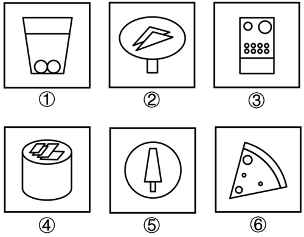
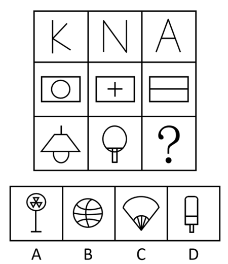
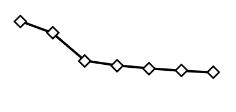

# 2026年湖北省公务员录用考试《行测》题（网友回忆版）

> 省考 · 2026 年 · 6 个模块 · 共 125 题

- [政治理论](#%E6%94%BF%E6%B2%BB%E7%90%86%E8%AE%BA) · 16 题
- [常识判断](#%E5%B8%B8%E8%AF%86%E5%88%A4%E6%96%AD) · 9 题
- [言语理解与表达](#%E8%A8%80%E8%AF%AD%E7%90%86%E8%A7%A3%E4%B8%8E%E8%A1%A8%E8%BE%BE) · 30 题
- [数量关系](#%E6%95%B0%E9%87%8F%E5%85%B3%E7%B3%BB) · 15 题
- [判断推理](#%E5%88%A4%E6%96%AD%E6%8E%A8%E7%90%86) · 35 题
- [资料分析](#%E8%B5%84%E6%96%99%E5%88%86%E6%9E%90) · 20 题

---

## 政治理论

### 第 1 题　qid 16069957 · 新思想

党的十八大以来，以习近平同志为核心的党中央坚定不移推进全面从严治党，取得一系列理论创新、实践创新、制度创新成果，构建起全面从严治党体系，开辟了百年大党自我革命新境界。下列关于全面从严治党的表述不准确的是（    ）。

- **A**. 制度建设要与管党治党需要相适应、与党的各项建设相配套，全方位织密制度的笼子
- **B**. 严密党的组织体系，关键是坚持党中央权威和集中统一领导，根本在做到“两个维护”
- **C**. 新时代党的建设是以党的组织建设为统领、党的各项建设同向发力综合发力的系统工程　✅
- **D**. 着力抓好政治监督、领导班子特别是“一把手”监督、“三重一大”事项监督以及权力集中、资金密集、资源富集等重点领域的监督

**答案**：C

**官方解析**

本题考查新思想。
2025年2月16日，《求是》杂志发表习近平总书记重要文章《健全全面从严治党体系》，以下简称文章。
A项正确，文章指出：“第四，健全科学完备、有效管用的制度体系。全面从严治党政治性、原则性强，必须有一套科学完备的制度来规范。制度建设要与管党治党需要相适应、与党的各项建设相配套，全方位织密制度的笼子。”
B项正确，文章指出：“第一，健全上下贯通、执行有力的组织体系······只有党的组织体系严密起来，党的各级组织政治功能和组织功能充分发挥出来，全面从严治党才能持续向纵深推进。严密党的组织体系，关键是坚持党中央权威和集中统一领导，根本在做到‘两个维护’。”
C项错误，文章指出：“······新时代党的建设是以党的政治建设为统领、党的各项建设同向发力综合发力的系统工程，必须以党中央关于党的建设的重要思想、关于党的自我革命的重要思想为根本遵循，坚持和加强党的全面领导和党中央集中统一领导······”故“以党的组织建设为统领”表述有误，应为“以党的政治建设为统领”。
D项正确，文章指出：“第三，健全精准发力、标本兼治的监管体系······要突出监督重点，着力抓好政治监督、领导班子特别是‘一把手’监督、‘三重一大’事项监督以及权力集中、资金密集、资源富集等重点领域的监督，切实让特权现象和腐败问题无所遁形。”
本题为选非题，故正确答案为C。

---

### 第 2 题　qid 16070227 · 新思想

习近平总书记指出，讲好中国故事，传播好中国声音，展示真实、立体、全面的中国，是加强我国国际传播能力建设的重要任务。关于加强我国国际传播能力建设，下列表述正确的是：
①要提升国际传播体系稳定性，防范国际传播格局重构
②要全面提升国际传播效能，建强适应新时代国际传播需要的专门人才队伍
③要倡导和平的国际舆论环境，不参与国际舆论斗争，塑造谦逊谦和的大国形象
④推动走出去、请进来管理便利化，扩大国际人文交流合作

- **A**. ①②
- **B**. ②④　✅
- **C**. ①③
- **D**. ③④

**答案**：B

**官方解析**

本题考查新思想。
①错误，④正确，《中共中央关于进一步全面深化改革、推进中国式现代化的决定》在“十、深化文化体制机制改革”部分中指出：“（41）构建更有效力的国际传播体系。推进国际传播格局重构，深化主流媒体国际传播机制改革创新，加快构建多渠道、立体式对外传播格局。加快构建中国话语和中国叙事体系，全面提升国际传播效能。建设全球文明倡议践行机制。推动走出去、请进来管理便利化，扩大国际人文交流合作。”故“防范国际传播格局重构”表述错误，应为“推进国际传播格局重构”。
②正确，③错误，2021年5月31日，习近平总书记在中共中央政治局第三十次集体学习时指出：“我们党历来高度重视对外传播工作……积极推动中华文化走出去，有效开展国际舆论引导和舆论斗争，初步构建起多主体、立体式的大外宣格局······要全面提升国际传播效能，建强适应新时代国际传播需要的专门人才队伍······”故“不参与国际舆论斗争”表述错误，应为“有效开展国际舆论引导和舆论斗争”。
综上，②④表述正确。
故正确答案为B。

---

### 第 3 题　qid 16069951 · 马克思主义

习近平总书记曾说：“我们要有钉钉子的精神，钉钉子往往不是一锤子就能钉好的，而是要一锤一锤接着敲，直到把钉子钉实钉牢，钉牢一颗再钉下一颗，不断钉下去，必然大有成效。如果东一榔头西一棒子，结果很可能是一颗钉子都钉不上、钉不牢。”这句话最能体现的哲学原理是：
①量变与质变辩证统一
②肯定与否定辩证统一
③主要矛盾与次要矛盾辩证统一
④尊重客观规律与发挥主观能动性辩证统一

- **A**. ①②
- **B**. ②③
- **C**. ③④
- **D**. ①④　✅

**答案**：D

**官方解析**

本题考查马克思主义。
①正确，钉钉子要一锤一锤接着敲，直到钉实钉牢，体现了量的积累（每一锤）达到一定程度必然引起质的飞跃（钉牢一颗钉子）；不断钉下去，必然大有成效，体现了量变与质变的辩证统一关系。
②错误，“肯定与否定辩证统一”指事物内部包含肯定和否定的因素，要通过辩证否定实现发展。题干强调的是持续用力、循序渐进，并未涉及对事物自身的肯定与否定。
③错误，“主要矛盾与次要矛盾辩证统一”指在复杂事物发展过程中要抓关键、抓重点，统筹兼顾。题干强调的是工作方法上的持续性和连贯性，批评“东一榔头西一棒子”，重在防止分散用力，而非区分主次矛盾。
④正确，钉钉子要尊重“一锤子钉不好”的客观规律，必须一锤一锤钉，又要发挥主观能动性，一锤一锤接着敲，不断钉下去，只有把二者结合起来，才能取得实效，体现了尊重客观规律与发挥主观能动性的辩证统一关系。
故①④表述正确。
故正确答案为D。

---

### 第 4 题　qid 16069952 · 新思想

下列选项中，习近平用语与其蕴含的思想、观点对应恰当的是：
①我将无我，不负人民——全心全意为人民服务
②功成不必在我、功成必定有我——方向决定前途，道路决定命运
③江山就是人民，人民就是江山——民为邦本
④时代是出卷人，我们是答卷人，人民是阅卷人——时代造就英雄，伟大来自平凡

- **A**. ①②
- **B**. ①③　✅
- **C**. ②④
- **D**. ③④

**答案**：B

**官方解析**

本题考查新思想。
①正确，“我将无我，不负人民”出自习近平总书记于2019年3月首次提出的重要表述，源于其回答意大利众议长关于执政理念的提问。该表述集中体现了中国共产党领导人以人民为中心的执政思想，强调为中国人民谋幸福、为中华民族谋复兴的使命担当。“全心全意为人民服务”是中国共产党始终坚持的根本宗旨，体现了党与人民群众的根本关系。其核心要求是将人民利益置于首位，以实现、维护和发展最广大人民根本利益为一切工作的出发点和落脚点。故二者蕴含的思想、观点对应恰当。
②错误，“功成不必在我、功成必定有我”出自习近平总书记于2018年4月在深入推动长江经济带发展座谈会上的讲话。该表述意为功绩、事业的成功未必在我手中、在我任期、在我有生之年得到实现，但成功的过程一定有我的参与贡献。“方向决定前途，道路决定命运”出自习近平总书记于2018年12月18日在庆祝改革开放40周年大会上发表的重要讲话，讲的是道路、方向、制度问题。故二者蕴含的思想、观点对应不恰当。
③正确，“江山就是人民，人民就是江山”是习近平总书记于2021年2月20日在党史学习教育动员大会上首次完整、公开提出的。这一表述彰显了中国共产党人民至上的根本立场，阐明了人民是国家主人、是历史创造者，党打江山守江山守的是人民的心，始终为人民谋幸福、依靠人民创造历史伟业。“民为邦本”出自《尚书·五子之歌》，意思是老百姓是国家的根本，根本牢固了国家才能安宁，体现了我国早期的民本思想。故二者蕴含的思想、观点对应恰当。
④错误，“时代是出卷人，我们是答卷人，人民是阅卷人”出自习近平总书记于2018年1月5日在学习贯彻党的十九大精神研讨班开班式上发表的讲话。这句话深刻回答了新赶考路上“谁来出卷”“谁来答卷”“谁来阅卷”等根本问题，生动诠释了中国共产党一以贯之的初心使命。“时代造就英雄，伟大来自平凡”是习近平总书记于2021年2月25日在全国脱贫攻坚总结表彰大会上发表重要讲话时提出的，它深刻阐释了伟大与平凡、时代与个人的辩证关系，是对奋斗精神、人民力量、英雄观的高度概括。故二者蕴含的思想、观点对应不恰当。
故①③表述正确。
故正确答案为B。

---

### 第 5 题　qid 16069974 · 新思想

习近平总书记指出，中国愿同世界各国一道，把握信息革命发展的历史主动，携手构建网络空间命运共同体，让互联网更好造福人民、造福世界。关于构建网络空间命运共同体，下列表述正确的是：
①尊重网络主权，维护网络安全，共同构建和平、安全、开放、合作的网络空间
②全球网络主要由跨国公司提供，网络空间未来应由跨国公司携手经营
③倡导发展优先，构建更加普惠繁荣的网络空间
④保障数据安全，建立单边、保密的国际互联网治理体系
⑤深化网络安全务实合作，有力打击网络违法犯罪行为

- **A**. ①③⑤　✅
- **B**. ①④⑤
- **C**. ①②③⑤
- **D**. ①②③④⑤

**答案**：A

**官方解析**

本题考查新思想。
①正确，2014年11月19日，习近平总书记在向首届世界互联网大会致贺词中强调：“中国正在积极推进网络建设，让互联网发展成果惠及13亿中国人民。中国愿意同世界各国携手努力，本着相互尊重、相互信任的原则，深化国际合作，尊重网络主权，维护网络安全，共同构建和平、安全、开放、合作的网络空间，建立多边、民主、透明的国际互联网治理体系。”
②错误，2022年11月7日，国务院新闻办公室发布的《携手构建网络空间命运共同体》白皮书在“三、构建网络空间命运共同体的中国贡献”部分“（三）积极参与网络空间治理”中指出：“中国始终认为，国家不分大小、强弱、贫富，都是平等成员，都有权平等参与国际规则与秩序建构，确保网络空间未来发展由各国人民共同掌握。”同时，全球网络基础设施与治理体系以主权国家为核心主体，跨国公司仅为重要的商业服务提供者，而非“主要提供者”。故“网络空间未来应由跨国公司携手经营”表述错误，应为“确保网络空间未来发展由各国人民共同掌握”。
③正确，2023年11月8日，习近平总书记向2023年世界互联网大会乌镇峰会开幕式发表的视频致辞指出：“我们倡导发展优先，构建更加普惠繁荣的网络空间。深化数字领域国际交流合作，加速科技成果转化。加快信息化服务普及，缩小数字鸿沟，在互联网发展中保障和改善民生，让更多国家和人民共享互联网发展成果。”
④错误，2015年12月16日，习近平总书记在第二届世界互联网大会开幕式上的讲话中指出：“第五，构建互联网治理体系，促进公平正义。国际网络空间治理，应该坚持多边参与、多方参与，由大家商量着办，发挥政府、国际组织、互联网企业、技术社群、民间机构、公民个人等各个主体作用，不搞单边主义，不搞一方主导或由几方凑在一起说了算······”故“建立单边、保密的国际互联网治理体系”表述错误，应为“国际网络空间治理，应该坚持多边参与、多方参与，由大家商量着办”。
⑤正确，2023年11月9日，人民日报发表的文章《共同推动构建网络空间命运共同体迈向新阶段》指出：“‘我们倡导安危与共，构建更加和平安全的网络空间。’只有尊重网络主权，遵守网络空间国际规则，深化网络安全务实合作，有力打击网络违法犯罪行为，加强数据安全和个人信息保护，才能妥善应对科技发展带来的规则冲突、社会风险、伦理挑战，更好维护网络空间安全。”
故①③⑤表述正确。
故正确答案为A。

---

### 第 6 题　qid 16070303 · 新思想

习近平总书记指出，要推动公共文化服务标准化、均等化，坚持政府主导、社会参与、重心下移、共建共享，完善公共文化服务体系，提高基本公共文化服务的覆盖面和适用性。关于完善公共文化服务体系，下列举措正确的有几项？
①做好文化馆、乡镇（街道）综合文化站、村（社区）综合性文化服务中心等的规划建设
②推动优质文化资源向沿海发达地区集中，促进公共文化服务差异化发展
③实施全国智慧图书馆体系建设、公共文化云建设等项目
④实施广播电视惠民工程，完善农村文化基础设施网络
⑤推动各民族文化的传承保护和创新交融，提升民族地区公共文化服务水平

- **A**. 2项
- **B**. 3项
- **C**. 4项　✅
- **D**. 5项

**答案**：C

**官方解析**

本题考查新思想。
2021年9月9日，国务院新闻办公室发布《国家人权行动计划（2021—2025年）》（以下简称《行动计划》）。
①正确，《行动计划》在“一、经济、社会和文化权利”部分“（七）文化权利”中指出：“完善公共文化服务基础设施。做好公共图书馆、文化馆、博物馆、美术馆、乡镇（街道）综合文化站、村（社区）综合性文化服务中心等的规划建设。健全各级各类公共文化服务基础设施。”
②错误、④正确，《行动计划》在“一、经济、社会和文化权利”部分“（七）文化权利”中指出：“补齐公共文化服务短板。落实国家基本公共服务标准要求，加强基层文化建设，增加供给总量，优化供给结构，推动优质文化资源向农村地区、革命老区、民族地区、边疆地区倾斜，缩小城乡和地区之间公共文化服务差距。实施广播电视惠民工程，完善农村文化基础设施网络。”故“推动优质文化资源向沿海发达地区集中，促进公共文化服务差异化发展”说法有误，应为“推动优质文化资源向农村地区、革命老区、民族地区、边疆地区倾斜，缩小城乡和地区之间公共文化服务差距”。
③正确，《行动计划》在“一、经济、社会和文化权利”部分“（七）文化权利”中指出：“推动公共数字文化建设。统筹推进公共文化数字化重点工程建设。实施全国智慧图书馆体系建设、公共文化云建设等项目。”
⑤正确，《行动计划》在“四、特定群体权益保障”部分“（一）少数民族权益”中指出：“保障少数民族文化权利。推动各民族文化的传承保护和创新交融，提升民族地区公共文化服务水平。保护和传承少数民族传统文化。做好少数民族古籍保护、抢救、整理、出版和研究工作。开展少数民族古籍数字化建设。办好第六届全国少数民族文艺会演。开展好少数民族语电视剧译制片源捐赠工作。”
综上，①③④⑤表述正确，共4项。
故正确答案为C。

---

### 第 7 题　qid 16070305 · 新思想

习近平总书记强调，要推动森林“水库、钱库、粮库、碳库”更好联动，实现生态效益、经济效益、社会效益相统一。下列表述与这一要求相契合的有几项？
①手中有粮，心中不慌
②绿水青山就是金山银山
③增绿就是增优势，护林就是护财富
④环境就是民生，青山就是美丽，蓝天也是幸福

- **A**. 1项
- **B**. 2项
- **C**. 3项　✅
- **D**. 4项

**答案**：C

**官方解析**

本题考查新思想。
①错误，2020年5月23日，习近平总书记在看望参加全国政协十三届三次会议的经济界委员并参加联组会时强调：“对我们这样一个有着14亿人口的大国来说，农业基础地位任何时候都不能忽视和削弱，手中有粮、心中不慌在任何时候都是真理。”故“手中有粮，心中不慌”强调农业对我国的重要性，但并未体现生态效益、经济效益、社会效益相统一。
②正确，2005年8月15日，时任浙江省委书记的习近平同志，在湖州市安吉县余村考察时，首次提出“绿水青山就是金山银山”的科学论断。2018年5月18日，习近平总书记在全国生态环境保护大会上发表重要讲话指出：“绿水青山既是自然财富、生态财富，又是社会财富、经济财富。保护生态环境就是保护自然价值和增值自然资本，就是保护经济社会发展潜力和后劲，使绿水青山持续发挥生态效益和经济社会效益。”故“绿水青山就是金山银山”体现了生态效益、经济效益、社会效益相统一。
③正确，2023年9月6日，习近平总书记在黑龙江漠河考察时指出：“要坚持造林与护林并重；要树立增绿就是增优势、护林就是护财富的理念，在保护的前提下让老百姓通过发展林下经济增加收入。”“增绿”“护林”体现了生态效益，“增优势”体现了社会效益，“护财富”体现了经济效益，故“增绿就是增优势，护林就是护财富”体现了生态效益、经济效益、社会效益相统一。
④正确，2016年1月18日，习近平总书记在省部级主要领导干部学习贯彻党的十八届五中全会精神专题研讨班上发表重要讲话指出：“我讲过，环境就是民生，青山就是美丽，蓝天也是幸福，绿水青山就是金山银山；保护环境就是保护生产力，改善环境就是发展生产力。”“环境”“青山”“蓝天”体现了生态效益，“民生”“美丽”“幸福”体现了社会效益和经济效益，故“环境就是民生，青山就是美丽，蓝天也是幸福”体现了生态效益、经济效益、社会效益相统一。
故相契合的有②③④，共3项。
故正确答案为C。

---

### 第 8 题　qid 16069911 · 时事政治

党的二十大报告指出，坚持把发展经济的着力点放在实体经济上，推进新型工业化，加快建设制造强国、质量强国、航天强国、交通强国、网络强国、数字中国。关于发展实体经济，下列说法正确的是：
①金融是实体经济的血脉，为实体经济服务是金融的天职
②要增强资本市场服务实体经济功能，积极有序发展股权融资
③要实现实体经济、科技创新、现代金融、人力资源协同发展
④要促进实体经济和数字经济深度融合，有序推动实体经济脱实向虚
⑤要推动资源要素向实体经济集聚、政策措施向实体经济倾斜、工作力量向实体经济加强

- **A**. ①②③⑤　✅
- **B**. ②③④
- **C**. ①②④⑤
- **D**. ③④⑤

**答案**：A

**官方解析**

本题考查新思想。
①正确，2026年2月1日出版的第3期《求是》杂志发表了习近平总书记的重要文章《走好中国特色金融发展之路，建设金融强国》，文章指出：“······坚持把金融服务实体经济作为根本宗旨。实体经济是金融的根基，金融是实体经济的血脉，服务实体经济是金融的天职······”
②正确，2017年7月召开的全国金融会议指出：“金融是国之重器，是国民经济的血脉······要增强资本市场服务实体经济功能，积极有序发展股权融资，提高直接融资比重······”
③正确，党的十九大报告在“五、贯彻新发展理念，建设现代化经济体系”部分指出：“必须坚持质量第一、效益优先······着力加快建设实体经济、科技创新、现代金融、人力资源协同发展的产业体系，着力构建市场机制有效、微观主体有活力、宏观调控有度的经济体制，不断增强我国经济创新力和竞争力。”
④错误，2026年2月1日出版的第3期《求是》杂志发表了习近平总书记的重要文章《走好中国特色金融发展之路，建设金融强国》，文章指出：“······我国金融必须守好服务实体经济本分，推动高质量发展，决不能脱实向虚。”十五五规划纲要在“第十三章 全方位推进数智技术赋能”部分指出：“促进实体经济和数字经济深度融合。”故“有序推动实体经济脱实向虚”表述有误。
⑤正确，《习近平新时代中国特色社会主义思想学习纲要》在“九、以新发展理念引领经济高质量发展”部分指出：“······要加快发展先进制造业，坚定不移建设制造强国。推动互联网、大数据、人工智能同实体经济深度融合，推动资源要素向实体经济集聚、政策措施向实体经济倾斜、工作力量向实体经济加强······”
故正确的有①②③⑤。
故正确答案为A。

---

### 第 9 题　qid 16069904 · 时事政治

党的二十届四中全会指出，“十五五”时期是基本实现社会主义现代化夯实基础、全面发力的关键时期，在基本实现社会主义现代化进程中具有承前启后的重要地位。关于“十五五”规划，下列说法正确的是：

- **A**. 加强原始创新和关键核心技术攻关，推动科技创新和产业创新深度融合　✅
- **B**. 把发展经济的着力点向传统实体产业转移，巩固壮大传统实体产业根基
- **C**. 积极稳妥推进和实现碳达峰，发展集中式能源，逐步缩减全国碳排放权交易市场
- **D**. 发挥积极财政政策作用，适当加强地方事权、提高地方财政支出比重，增加地方自主财力

**答案**：A

**官方解析**

本题考查新思想。
2025年10月23日，中国共产党第二十届中央委员会第四次全体会议通过《中共中央关于制定国民经济和社会发展第十五个五年规划的建议》（以下简称《建议》）。
A项正确，《建议》在“四、加快高水平科技自立自强，引领发展新质生产力”部分指出：“（11）加强原始创新和关键核心技术攻关。完善新型举国体制，采取超常规措施，全链条推动集成电路、工业母机、高端仪器、基础软件、先进材料、生物制造等重点领域关键核心技术攻关取得决定性突破······（12）推动科技创新和产业创新深度融合。统筹国家战略科技力量建设，增强体系化攻关能力。强化科技基础条件自主保障，统筹科技创新平台基地建设。完善区域创新体系，布局建设区域科技创新中心和产业科技创新高地，强化国际科技创新中心策源功能······”
B项错误，《建议》在“三、建设现代化产业体系，巩固壮大实体经济根基”部分指出：“现代化产业体系是中国式现代化的物质技术基础。坚持把发展经济的着力点放在实体经济上，坚持智能化、绿色化、融合化方向，加快建设制造强国、质量强国、航天强国、交通强国、网络强国，保持制造业合理比重，构建以先进制造业为骨干的现代化产业体系。”故“把发展经济的着力点向传统实体产业转移，巩固壮大传统实体产业根基”表述错误，应为“坚持把发展经济的着力点放在实体经济上，巩固壮大实体经济根基”。
C项错误，《建议》在“十二、加快经济社会发展全面绿色转型，建设美丽中国”部分指出：“（47）积极稳妥推进和实现碳达峰。实施碳排放总量和强度双控制度。深入实施节能降碳改造。推动煤炭和石油消费达峰。完善碳排放统计核算体系，稳步实施地方碳考核、行业碳管控、企业碳管理、项目碳评价、产品碳足迹等政策制度。发展分布式能源，建设零碳工厂和园区。扩大全国碳排放权交易市场覆盖范围，加快温室气体自愿减排交易市场建设······”故“发展集中式能源，逐步缩减全国碳排放权交易市场”表述错误，应为“发展分布式能源，扩大全国碳排放权交易市场覆盖范围”。
D项错误，《建议》在“六、加快构建高水平社会主义市场经济体制，增强高质量发展动力”部分指出：“（20）提升宏观经济治理效能。发挥积极财政政策作用，增强财政可持续性······适当加强中央事权、提高中央财政支出比重。增加地方自主财力。加强财会监督。加快构建同高质量发展相适应的政府债务管理长效机制。”故“适当加强地方事权、提高地方财政支出比重”表述错误，应为“适当加强中央事权、提高中央财政支出比重”。
故正确答案为A。

---

### 第 10 题　qid 16070174 · 新思想

推进中国式现代化是一个系统工程，需要统筹兼顾、系统谋划、整体推进，正确处理好一系列重大关系。下列与之相关的表述正确的有（    ）。
①活力与秩序：中国式现代化应当而且能够实现活而不乱、活跃有序的动态平衡
②守正与创新：守正才能不迷失方向、不犯颠覆性错误，创新才能把握时代、引领时代
③战略与策略：要增强策略的前瞻性，准确把握事物发展的必然趋势，以科学的战略预见未来、引领未来
④效率与公平：中国式现代化既要创造比资本主义更高的效率，又要更有效地维护社会公平，更好实现效率与公平相兼顾、相促进、相统一

- **A**. 1项
- **B**. 2项
- **C**. 3项　✅
- **D**. 4项

**答案**：C

**官方解析**

本题考查新思想。
2023年10月1日，《求是》杂志发表习近平总书记重要文章《推进中国式现代化需要处理好若干重大关系》，以下简称文章。
①正确，文章指出：“五是活力与秩序的关系。在现代化的历史进程中，处理好这对关系是一道世界性难题。中国式现代化应当而且能够实现活而不乱、活跃有序的动态平衡。”
②正确，文章指出：“三是守正与创新的关系。守正创新是我们党在新时代治国理政的重要思想方法。守正才能不迷失方向、不犯颠覆性错误，创新才能把握时代、引领时代。”
③错误，文章指出：“二是战略与策略的关系。战略与策略是我们党领导人民改造世界、变革实践、推动历史发展的有力武器······要增强战略的前瞻性，准确把握事物发展的必然趋势，敏锐洞悉前进道路上可能出现的机遇和挑战，以科学的战略预见未来、引领未来。”故“策略的前瞻性”表述有误，应为“战略的前瞻性”。
④正确，文章指出：“四是效率与公平的关系。中国式现代化既要创造比资本主义更高的效率，又要更有效地维护社会公平，更好实现效率与公平相兼顾、相促进、相统一。”
故①②④表述正确，共3项。
故正确答案为C。

---

### 第 11 题　qid 16069901 · 新思想

城乡融合发展是中国式现代化的必然要求。关于城乡融合发展，下列说法正确的有几项？
①要把乡村振兴战略这篇大文章做好，必须走城乡融合发展之路
②在现代化进程中，如何处理好工农关系、城乡关系，在一定程度上决定着现代化的成败
③要顺应城乡融合发展大趋势，破除妨碍城乡要素平等交换、双向流动的制度壁垒
④振兴乡村，不能就乡村论乡村，还是要强化以工补农、以城带乡，加快形成工农互促、城乡互补、协调发展、共同繁荣的新型工农城乡关系

- **A**. 1项
- **B**. 2项
- **C**. 3项
- **D**. 4项　✅

**答案**：D

**官方解析**

本题考查新思想。
①正确，2018年9月21日，习近平总书记在十九届中央政治局第八次集体学习时讲话指出：“要把乡村振兴战略这篇大文章做好，必须走城乡融合发展之路。我们一开始就没有提城市化，而是提城镇化，目的就是促进城乡融合。要向改革要动力，加快建立健全城乡融合发展体制机制和政策体系。”
②正确，2018年9月21日，习近平总书记在十九届中央政治局第八次集体学习时讲话指出：“我一直强调，没有农业农村现代化，就没有整个国家现代化。在现代化进程中，如何处理好工农关系、城乡关系，在一定程度上决定着现代化的成败。”
③正确，2022年12月23日，习近平总书记在中央农村工作会议上讲话指出：“要顺应城乡融合发展大趋势，破除妨碍城乡要素平等交换、双向流动的制度壁垒，促进发展要素、各类服务更多下乡，率先在县域内破除城乡二元结构。”
④正确，2020年12月28日，习近平总书记在中央农村工作会议上讲话指出：“第六，推动城乡融合发展见实效。振兴乡村，不能就乡村论乡村，还是要强化以工补农、以城带乡，加快形成工农互促、城乡互补、协调发展、共同繁荣的新型工农城乡关系。”
综上，①②③④说法正确，共4项。
故正确答案为D。

---

### 第 12 题　qid 16070175 · 新思想

建设质量强国是推动高质量发展，促进我国经济由大向强转变的重要举措，是满足人民美好生活需要的重要途径。关于建设质量强国，下列表述正确的有（    ）。
①建立健全强制性与自愿性相结合的质量披露制度
②支持开展质量公益诉讼和集体诉讼，有效执行商品质量惩罚性赔偿制度
③深化检验检测认证机构资质审批制度改革，全面实施告知承诺和优化审批服务
④加强工程质量监督队伍建设，全面推行政府购买服务方式委托社会力量辅助工程质量监督检查
⑤鼓励支持中小微企业实施技术改造、质量改进、品牌建设，提升中小微企业质量技术创新能力

- **A**. 4项　✅
- **B**. 3项
- **C**. 2项
- **D**. 1项

**答案**：A

**官方解析**

本题考查新思想。
2023年2月，中共中央、国务院印发《质量强国建设纲要》（以下简称《纲要》）。
①正确，《纲要》在“十、推进质量治理现代化”部分指出：“（二十六）健全质量政策制度······建立质量分级标准规则，实施产品和服务质量分级，引导优质优价，促进精准监管。建立健全强制性与自愿性相结合的质量披露制度，鼓励企业实施质量承诺和标准自我声明公开。”
②正确，《纲要》在“十、推进质量治理现代化”部分指出：“（二十五）加强质量法治建设······支持开展质量公益诉讼和集体诉讼，有效执行商品质量惩罚性赔偿制度。健全产品和服务质量担保与争议处理机制，推行第三方质量争议仲裁。加强质量法治宣传教育，普及质量法律知识。”
③正确，《纲要》在“九、构建高水平质量基础设施”部分指出：“（二十二）优化质量基础设施管理······深化检验检测机构市场化改革，加强公益性机构功能性定位、专业化建设，推进经营性机构集约化运营、产业化发展。深化检验检测认证机构资质审批制度改革，全面实施告知承诺和优化审批服务，优化规范检验检测机构资质认定程序。”
④错误，《纲要》在“六、提升建设工程品质”部分指出：“（十三）强化工程质量保障······强化工程建设全链条质量监管，完善日常检查和抽查抽测相结合的质量监督检查制度，加强工程质量监督队伍建设，探索推行政府购买服务方式委托社会力量辅助工程质量监督检查。”故“全面推行”表述有误，应为“探索推行”。
⑤正确，《纲要》在“八、增强企业质量和品牌发展能力”部分指出：“（十九）加快质量技术创新应用······支持企业牵头组建质量技术创新联合体，实施重大质量改进项目，协同开展产业链供应链质量共性技术攻关。鼓励支持中小微企业实施技术改造、质量改进、品牌建设，提升中小微企业质量技术创新能力。”
故①②③⑤表述正确，共4项。
故正确答案为A。

---

### 第 13 题　qid 16069955 · 新思想

加强数字政府建设是创新政府治理理念和方式、形成数字治理新格局、推进国家治理体系和治理能力现代化的重要举措。下列关于数字政府建设的基本原则，表述正确的有几项?
①坚持党的全面领导，充分发挥党总揽全局、协调各方的领导核心作用
②坚持以市场为中心，始终把满足人民群众物质生活的迫切需求作为目标
③坚持整体协同，强化系统观念，加强系统集成，全面提升数字政府集约化建设水平
④坚持数据赋能，建立健全数据治理制度和标准体系，加强数据汇聚融合、共享开放和开发利用

- **A**. 1项
- **B**. 2项
- **C**. 3项　✅
- **D**. 4项

**答案**：C

**官方解析**

本题考查新思想。
2022年6月23日，国务院发布了《关于加强数字政府建设的指导意见》，以下简称《意见》。
①正确，《意见》“一、发展现状和总体要求”中“2.基本原则”部分指出：“坚持党的全面领导。充分发挥党总揽全局、协调各方的领导核心作用，全面贯彻党中央、国务院重大决策部署，将坚持和加强党的全面领导贯穿数字政府建设各领域各环节，贯穿政府数字化改革和制度创新全过程，确保数字政府建设正确方向。”
②错误，《意见》“一、发展现状和总体要求”中“2.基本原则”部分指出：“坚持以人民为中心。始终把满足人民对美好生活的向往作为数字政府建设的出发点和落脚点······”故“以市场为中心，始终把满足人民群众物质生活的迫切需求作为目标”说法错误，应为“以人民为中心，始终把满足人民对美好生活的向往作为数字政府建设的出发点和落脚点”
③正确，《意见》“一、发展现状和总体要求”中“2.基本原则”部分指出：“坚持整体协同。强化系统观念，加强系统集成，全面提升数字政府集约化建设水平，统筹推进技术融合、业务融合、数据融合，提升跨层级、跨地域、跨系统、跨部门、跨业务的协同管理和服务水平······”
④正确，《意见》“一、发展现状和总体要求”中“2.基本原则”部分指出：“坚持数据赋能。建立健全数据治理制度和标准体系，加强数据汇聚融合、共享开放和开发利用，促进数据依法有序流动，充分发挥数据的基础资源作用和创新引擎作用，提高政府决策科学化水平和管理服务效率，催生经济社会发展新动能。”
故①③④正确，共3项。
故正确答案为C。

---

### 第 14 题　qid 16070302 · 新思想

建设教育强国，基点在基础教育。基础教育搞得越扎实，教育强国步伐就越稳、后劲就越足。关于加强基础教育，下列举措正确的有几项？
①提升寄宿制学校办学条件和管理水平，办好必要的乡村小规模学校
②统筹推进市域内高中阶段学校多样化发展，加快扩大普通高中教育资源供给
③强化家庭教育主阵地作用，健全学校家庭社会协同育人机制
④建立基础教育各学段学龄人口变化监测预警制度，优化中小学和幼儿园布局
⑤深入开展县域义务教育优质均衡督导评估，有序推进市域义务教育优质均衡发展

- **A**. 4项　✅
- **B**. 3项
- **C**. 2项
- **D**. 1项

**答案**：A

**官方解析**

本题考查新思想。
2025年1月，中共中央 国务院印发《教育强国建设规划纲要（2024—2035年）》（以下简称《纲要》）。
①⑤正确，《纲要》在“三、办强办优基础教育，夯实全面提升国民素质战略基点”部分指出：“（八）推动义务教育优质均衡发展和城乡一体化······提升寄宿制学校办学条件和管理水平，办好必要的乡村小规模学校······深入开展县域义务教育优质均衡督导评估，有序推进市域义务教育优质均衡发展。”
②正确，《纲要》在“三、办强办优基础教育，夯实全面提升国民素质战略基点”部分指出：“（九）促进学前教育普及普惠和高中阶段学校多样化发展······统筹推进市域内高中阶段学校多样化发展，加快扩大普通高中教育资源供给。”
③错误，《纲要》在“三、办强办优基础教育，夯实全面提升国民素质战略基点”部分指出：“（十）统筹推进‘双减’和教育教学质量提升······强化学校教育主阵地作用，全面提升课堂教学水平，加强对学习困难学生的辅导······”故“强化家庭教育主阵地作用”说法错误，应为“强化学校教育主阵地作用”。
④正确，《纲要》在“三、办强办优基础教育，夯实全面提升国民素质战略基点”部分指出：“（七）健全与人口变化相适应的基础教育资源统筹调配机制······建立基础教育各学段学龄人口变化监测预警制度，优化中小学和幼儿园布局。”
故①②④⑤说法正确，共4项。
故正确答案为A。

---

### 第 15 题　qid 16070340 · 新思想

优化政务服务、提升行政效能是优化营商环境、建设全国统一大市场的必然要求，对加快构建新发展格局、推动高质量发展具有重要意义。关于优化政务服务、提升行政效能，下列举措恰当的是：
①推进关联事项集成办，为企业和群众提供“一件事一次办”“一类事一站办”服务
②推进线下办事“只进一门”，要求所有的银行网点、邮政网点、园区等都要设置便民服务点
③推进企业和群众诉求“一线应答”，根据需要设置重点领域专席，不断提升12345热线接办效率
④推进线上办事“一网通办”，推动各类政务服务事项和应用“应接尽接、应上尽上”，政府服务事项全面纳入同级政务服务平台管理和办理

- **A**. ①②
- **B**. ①③　✅
- **C**. ②④
- **D**. ③④

**答案**：B

**官方解析**

本题考查新思想。
2024年01月16日，《国务院关于进一步优化政务服务提升行政效能推动“高效办成一件事”的指导意见》（以下简称《意见》）发布。
①正确，《意见》在“三、全面深化政务服务模式创新”部分指出：“（四）推进关联事项集成办。从企业和群众视角出发，将需要多个部门办理或跨层级办理，关联性强、办理量大、办理时间相对集中的多个事项集成办理，为企业和群众提供‘一件事一次办’、‘一类事一站办’服务。明确每个‘一件事’的牵头部门和配合部门及各自职责，强化跨部门政策、业务、系统协同和数据共享······”
②错误，《意见》在“二、全面加强政务服务渠道建设”部分指出：“（一）推进线下办事‘只进一门’······有关部门单设的政务服务窗口应整合并入本级政务服务中心，确不具备整合条件的要纳入一体化管理，按统一要求提供规范服务。结合经济社会发展状况、人口分布情况，统筹推进乡镇（街道）便民服务中心和村（社区）便民服务站建设。鼓励在有条件、有需求的银行网点、邮政网点、园区等设置便民服务点，探索利用集成式自助终端提供‘24小时不打烊’服务。国务院部门可根据实际需要设立政务服务大厅，集中提供办事服务。”故“要求所有的银行网点、邮政网点、园区等都要设置便民服务点”表述错误，应为“鼓励在有条件、有需求的银行网点、邮政网点、园区等设置便民服务点”。
③正确，《意见》在“二、全面加强政务服务渠道建设”部分指出：“（三）推进企业和群众诉求‘一线应答’。依托12345政务服务便民热线加强政务服务热线归并，根据需要设置重点领域专席，不断提升12345热线接办效率，高效受理政务服务咨询、投诉、求助、建议和在线办理指导等诉求。建立健全‘接诉即办’机制，更好发挥热线直接面向企业和群众的窗口作用，及时了解问题建议，推动解决服务问题······”。
④错误，《意见》在“二、全面加强政务服务渠道建设”部分指出：“（二）推进线上办事‘一网通办’······加强省级政务服务平台网上统一受理端建设，推动办件信息实时共享，实现办事申请‘一次提交’、办理结果‘多端获取’。依托各级政务服务平台整合联通各类办事服务系统，推动各类政务服务事项和应用‘应接尽接、应上尽上’，除法律法规另有规定或涉及国家秘密等外，政务服务事项全部纳入同级政务服务平台管理和办理。”故“政府服务事项全面纳入同级政务服务平台管理和办理”表述错误，应为“除法律法规另有规定或涉及国家秘密等外，政务服务事项全部纳入同级政务服务平台管理和办理”。
综上，①③表述正确。
故正确答案为B。

---

### 第 16 题　qid 16069958 · 新思想

中国共产党党报党刊的发展历程，与中国共产党的奋斗历程密不可分。下列说法错误的是：

- **A**. 《布尔塞维克》是解放战争时期中国共产党创办的中央机关刊物　✅
- **B**. 《人民日报》由《晋察冀日报》和晋冀鲁豫《人民日报》合并而来
- **C**. 《红色中华》创刊于江西瑞金，初期为中华苏维埃共和国临时中央政府机关报
- **D**. 《求是》杂志是党中央指导全党全国工作的重要思想理论阵地，前身是中共中央主办的《红旗》杂志

**答案**：A

**官方解析**

本题考查人文常识。
A项错误，《布尔塞维克》于1927年10月至1932年7月出版，其名称源自俄语“共产党”的音译，属于中共中央在第二次国内革命战争时期的地下理论机关刊物。而解放战争时期是1946年至1949年。
B项正确，1948年5月，晋察冀与晋冀鲁豫边区合并为华北解放区，同年6月15日，《晋察冀日报》和晋冀鲁豫《人民日报》合并为《人民日报》，是中国共产党中央委员会机关报。
C项正确，1931年12月11日，《红色中华》创刊于江西瑞金，初期为中华苏维埃共和国临时中央政府机关报，《红色中华》的任务是发挥中央政府对苏维埃运动的积极领导作用。
D项正确，《求是》杂志是中国共产党中央委员会主办的机关刊物，是党中央指导全党全国工作的重要思想理论阵地。《求是》杂志创刊于1988年7月1日，其前身是1958年中共中央创办的《红旗》杂志。
本题为选非题，故正确答案为A。

---

## 常识判断

### 第 1 题　qid 16070158 · 人文常识

关于社会保险，下列说法正确的是：

- **A**. 灵活就业人员可以参加职工基本医疗保险　✅
- **B**. 失业者领取失业保险金的期限与累计缴费年限无关
- **C**. 同一统筹地区内用人单位工伤保险执行统一缴费费率
- **D**. 生育保险待遇中的生育津贴按职工本人上年度的月平均工资计发

**答案**：A

**官方解析**

本题考查经济常识。
A项正确，根据《中华人民共和国社会保险法》第二十三条第二款规定：“无雇工的个体工商户、未在用人单位参加职工基本医疗保险的非全日制从业人员以及其他灵活就业人员可以参加职工基本医疗保险，由个人按照国家规定缴纳基本医疗保险费。”
B项错误，根据《中华人民共和国社会保险法》第四十六条规定：“失业人员失业前用人单位和本人累计缴费满一年不足五年的，领取失业保险金的期限最长为十二个月；累计缴费满五年不足十年的，领取失业保险金的期限最长为十八个月；累计缴费十年以上的，领取失业保险金的期限最长为二十四个月。重新就业后，再次失业的，缴费时间重新计算，领取失业保险金的期限与前次失业应当领取而尚未领取的失业保险金的期限合并计算，最长不超过二十四个月。”因此，失业者领取失业保险金的期限与累计缴费年限有关。
C项错误，根据《工伤保险条例》第八条规定：“工伤保险费根据以支定收、收支平衡的原则，确定费率。国家根据不同行业的工伤风险程度确定行业的差别费率，并根据工伤保险费使用、工伤发生率等情况在每个行业内确定若干费率档次。行业差别费率及行业内费率档次由国务院社会保险行政部门制定，报国务院批准后公布施行。统筹地区经办机构根据用人单位工伤保险费使用、工伤发生率等情况，适用所属行业内相应的费率档次确定单位缴费费率。”因此，同一统筹地区内的工伤保险会根据不同行业确定差别费率，而不是执行统一缴费费率。
D项错误，根据《中华人民共和国社会保险法》第五十六条规定：“职工有下列情形之一的，可以按照国家规定享受生育津贴：（一）女职工生育享受产假；（二）享受计划生育手术休假；（三）法律、法规规定的其他情形。生育津贴按照职工所在用人单位上年度职工月平均工资计发。”因此，生育津贴按照职工所在用人单位上年度职工月平均工资计发，而不是‌按职工本人月均工资计发。
故正确答案为A。

---

### 第 2 题　qid 12326749 · 法律常识

根据《中华人民共和国广告法》，下列属于违法行为的有几项？
①在广告中使用国旗、国歌
②在广告中使用国家机关工作人员的名义或者形象
③电视台以介绍健康、养生知识等形式变相发布医疗、药品、医疗器械、保健食品广告
④对升学、通过考试、获得学位学历或者合格证书，或者对教育、培训的效果作出保证性承诺
⑤教育、培训广告中利用科研单位、学术机构、专业人士的名义或者形象作推荐、证明

- **A**. 2项
- **B**. 3项
- **C**. 4项
- **D**. 5项　✅

**答案**：D

**官方解析**

本题考查法律常识。
①错误，根据《中华人民共和国广告法》第九条第一项规定：“广告不得有下列情形：（一）使用或者变相使用中华人民共和国的国旗、国歌、国徽，军旗、军歌、军徽；”因此，无论商业目的如何，在广告中使用国旗、国歌均属于违法行为。
②错误，根据《中华人民共和国广告法》第九条第二项规定：“广告不得有下列情形：（二）使用或者变相使用国家机关、国家机关工作人员的名义或者形象；”因此，国家机关及其工作人员的形象代表公权力，将其在广告中使用属于违法行为。
③错误，根据《中华人民共和国广告法》第十九条规定：“广播电台、电视台、报刊音像出版单位、互联网信息服务提供者不得以介绍健康、养生知识等形式变相发布医疗、药品、医疗器械、保健食品广告。”选项中，电视台以健康、养生知识为幌子，实则发布医疗、药品等禁止类广告，属于典型的变相发布，因此，属于违法行为。
④错误，根据《中华人民共和国广告法》第二十四条第一项规定：“教育、培训广告不得含有下列内容：（一）对升学、通过考试、获得学位学历或者合格证书，或者对教育、培训的效果作出明示或者暗示的保证性承诺。”因此，教育、培训广告中对升学、通过考试、获得学位学历或者合格证书，或者对教育、培训的效果作出保证性承诺，属于违法行为。
⑤错误，根据《中华人民共和国广告法》第二十四条第三项规定：“教育、培训广告不得含有下列内容：（三）利用科研单位、学术机构、教育机构、行业协会、专业人士、受益者的名义或者形象作推荐、证明。”因此，教育、培训广告中利用科研单位、学术机构、专业人士的名义或者形象作推荐、证明属于违法行为。
综上，①②③④⑤均属于违法行为。
故正确答案为D。

---

### 第 3 题　qid 16069959 · 人文常识

下列语句与其所蕴含的经济学原理对应正确的是：

- **A**. 物以多为贱——沉没成本
- **B**. 酒香不怕巷子深——买方市场
- **C**. 众人拾柴火焰高——规模经济　✅
- **D**. 物至而反，冬夏是也。致至而危，累棋是也——边际效用递增

**答案**：C

**官方解析**

本题考查经济常识。
A项错误，“物以多为贱”反映的是供给影响价格的供需原理，供大于求，价格下跌；供小于求，价格上升。所以“物以多为贱”反映的是商品供给过剩导致价格下跌。沉没成本指已发生且不可回收的支出，如已经流逝的时间、金钱或精力等，与物品贵贱无关。
B项错误，买方市场指商品供大于求导致买方占据交易优势的市场形态。反之，卖方市场指商品供不应求促使卖方掌握主动权的市场形态。“酒香不怕巷子深”描述优质产品无需广告即可吸引消费者，体现的是卖方占据主导地位，所以应该是卖方市场。
C项正确，规模经济指随着生产规模扩大，单位产品的平均成本下降，效率提升。“众人拾柴火焰高”形象比喻集体协作能放大产出效益，与企业通过扩大生产、分工协作降低单位成本的经济逻辑相符合。
D项错误，“物至而反，冬夏是也。致至而危，累棋是也”大意为事物发展到极致必转向反面，对应经济学中的边际效用递减，即随着消费者对某种物品消费量的增加，每增加消费一单位该物品带来的满足感递减，甚至转为负效用。而边际效用递增是指随着消费者对某种物品的消费量增加，每增加消费一单位该物品所带来的满足感逐步上升。
故正确答案为C。

---

### 第 4 题　qid 16069956 · 人文常识

“二十四史”是中国历代史学家精心编撰的纪传体史书，是中华民族珍贵的文化遗产。下列说法正确的是：

- **A**. 《后汉书》记载了侯景之乱
- **B**. 《南史》是南朝范晔编撰的史书
- **C**. 《汉书》中《艺文志》是记述经济制度的专篇
- **D**. 《史记》卷次中《五帝本纪》排序在《殷本纪》之前　✅

**答案**：D

**官方解析**

本题考查人文常识。
A项错误，《后汉书》是南朝宋范晔编撰的史书，创作于南朝宋元嘉年间，是一部记载东汉历史的纪传体断代史。《后汉书》主要记述了上起东汉的汉光武帝建武元年（25年），下至汉献帝建安二十五年（220年），共195年的史事。而侯景之乱发生在南北朝时期的梁朝，属于南朝历史事件，时间远晚于东汉，不可能出现在《后汉书》中。
B项错误，《南史》是中国历代官修正史“二十四史”之一，记述上起宋武帝刘裕永初元年（420年），下迄陈后主陈叔宝祯明三年（589年），包含南朝宋、齐、梁、陈四个朝代共一百七十年的历史。《南史》与《北史》为姊妹篇，由李大师及其子李延寿两代人编撰完成，而非范晔。
C项错误，《汉书》由东汉班固编撰，班昭、马续补作，是中国首部纪传体断代史，成书于汉和帝年间，与《史记》《后汉书》《三国志》并称“前四史”。《汉书》中的《艺文志》在西汉刘歆《七略》基础上改编而成，是中国古代第一部系统性的图书目录、学术源流专篇，主要记录当时存世典籍、分类与学术流派。而记述经济制度、财政、农业、工商业等内容的专篇是《食货志》。
D项正确，《史记》是西汉史学家司马迁撰写的纪传体史书，是中国历史上第一部纪传体通史，记载了上至上古传说中的黄帝时代，下至汉武帝太初四年间共三千多年的历史。全书由十二本纪、十表、八书、三十世家、七十列传构成，其中“本纪”是全书提纲，以王朝的更替为体，按年月时间记述帝王的言行政绩，照历史时间顺序：《五帝本纪》居首，其后依次为《夏本纪》《殷本纪》《周本纪》等。五帝时代早于殷商，因此《五帝本纪》在卷次排序上位于《殷本纪》之前。
故正确答案为D。

---

### 第 5 题　qid 16069939 · 人文常识

关于我国考古发现，下列说法错误的是:

- **A**. 良渚文化主要分布于太湖地区，其文化遗址最大特色是所出土的玉器
- **B**. 仰韶文化主要分布在黄河支流汇集的中原地区，其中较著名的是元谋人遗址　✅
- **C**. 大汶口文化主要分布在泰山周围地区，氏族墓地中晚期出现了男女合葬现象
- **D**. 龙山文化是新石器时代晚期的文化，其陶器已开始使用轮制技术，器型规整

**答案**：B

**官方解析**

A项正确，良渚文化是我国长江下游太湖流域新石器时代晚期的重要文化，距今约5300—4300年。该文化以大型古城址、祭坛、水利系统和大量制作精美的玉琮、玉璧、玉钺等礼器为突出特征，玉器工艺发达，象征着较高的社会等级与早期国家形态。
B项错误，仰韶文化是黄河中游地区新石器时代的代表性文化，以彩陶为典型标志，著名遗址有陕西西安半坡遗址、河南陕县庙底沟遗址等。元谋人遗址位于云南元谋县，属于旧石器时代早期古人类遗址，与仰韶文化在时代、地域、文化属性上均不相符。
C项正确，大汶口文化主要分布在以泰山为中心的黄河下游地区，距今约6500—4500 年。其墓葬材料丰富，早期以单人葬为主，中晚期出现男女合葬、夫妻合葬，同时墓葬规模与随葬品差异明显，反映出私有制出现、贫富分化与社会阶层逐步形成。
D项正确，龙山文化是新石器时代晚期文化，主要分布于黄河中下游地区，距今约4500—4000 年。该文化普遍掌握快轮制陶技术，陶器以黑陶为代表，胎质细腻、器壁轻薄、造型规整，标志着我国史前制陶工艺达到较高水平。
本题为选非题，故正确答案为B。

---

### 第 6 题　qid 16069917 · 科技常识

下列选项体现的物理原理与其他选项不同的是（    ）。

- **A**. 三角形的泡泡棒吹出的泡泡总是趋于球状
- **B**. 植物根部的毛细管从土壤中吸收水分
- **C**. 眼镜镜片的表面镀膜可以防蓝光　✅
- **D**. 雨后荷叶上的水珠呈球形

**答案**：C

**官方解析**

本题考查科技常识。
A、D两项正确，三角形的泡泡棒吹出的泡泡最终呈球形，雨后荷叶上的水珠呈球形，都是因为液体表面张力的作用，表面张力会使液体表面尽可能收缩到最小表面积（相同体积下球形表面积最小），因此体现的是表面张力原理。
B项正确，毛细作用是液体表面对固体表面的吸引力。当毛细管插入浸润液体中，管内液面上升，高于管外液面；毛细管插入不浸润液体中，管内液体下降，低于管外液面。植物根部毛细管从土壤中吸水，利用的是毛细现象，而毛细现象本质上是液体表面张力与附着层分子相互作用力共同作用的结果，核心原理是表面张力。
C项错误，眼镜镜片的表面镀膜防蓝光，利用的是光的干涉原理。镜片表面镀多层纳米级光学薄膜，蓝光入射时，在膜层上表面与下表面分别反射，两束反射光相位相反、发生相消干涉，大幅降低蓝光透过率。与表面张力无关。
本题为选非题，故正确答案为C。

---

### 第 7 题　qid 16070218 · 地理国情

极光是一种绚丽多彩的大气发光现象，一般只在南北两极的高纬度地区出现，它的形成与太阳活动、地球磁场和高层大气的相互作用有关。由此判断观测极光需要的条件是（    ）。

- **A**. 太阳活动强烈，月圆的夜晚
- **B**. 太阳活动强烈，晴朗的夜晚　✅
- **C**. 太阳活动微弱，多云的夜晚
- **D**. 太阳活动微弱，下雨的夜晚

**答案**：B

**官方解析**

本题考查科技常识。
A项错误，B项正确，极光的产生依赖于太阳活动释放的高能带电粒子与地球磁场的相互作用。当太阳活动强烈时，更多高能带电粒子进入地球两极，激发高层大气中的原子发光，形成极光。而极光亮度较低，需在无云层遮挡且无其他光污染的晴朗夜晚才能清晰观测。但月圆的夜晚通常月光强烈，明亮的月光会严重削弱极光的可见度，甚至使其完全不可见。故“太阳活动强烈，晴朗的夜晚”可以观测到极光。
‌C、D两项错误，太阳活动微弱时，太阳风强度降低，进入地球两极的高能带电粒子减少，极光出现的频率和强度显著降低，甚至无法形成可见极光。下雨意味着云层厚密，而在多云的夜晚，云层会完全遮挡极光，不具备极光的观测条件。
故正确答案为B。

---

### 第 8 题　qid 16070172 · 人文常识

《黄帝内经》中“是故圣人不治已病治未病”的思想是中医养生的重要理念，倡导通过饮食、运动、情志调节等方式增强体质，未病先防。下列古诗词中描述的行为不符合“治未病”理念的是（    ）。

- **A**. 天寒常早睡，不待日光敛
- **B**. 修性以保神，安心以全身
- **C**. 抽刀断水水更流，举杯消愁愁更愁　✅
- **D**. 食惟半饱无兼味，酒至三分莫过频

**答案**：C

**官方解析**

本题考查文化常识。
“治未病”意为未病先防、养生、顺自然。
A项正确，诗句出自宋代释文珦的五言古诗《早睡》。意思为天气冷了就早早睡觉，不等太阳完全落山就休息。选项内容顺应天时、规律作息，符合“治未病”的养生理念。
B项正确，诗句出自三国魏嵇康的经典养生名篇《养生论》。意思为修养性情、调摄心性，以此保养精神、守护心神；安定内心、平和情志，以此保全身体、养护生命。选项内容符合“治未病”的养生理念。
C项错误，诗句出自唐代李白的《宣州谢朓楼饯别校书叔云》。意思为拔刀断水水却更加汹涌奔流，举杯消愁愁情上却更加浓烈。过量饮酒伤神伤身，不符合“治未病”理念。
D项正确，诗句出自明代龚廷贤的养生名篇《摄养诗》。意思为吃饭只吃半饱（七八分饱），不追求多种油腻、浓烈的味道，饮食清淡简单。喝酒只喝到三分微醺即可，不要频繁饮酒。饮食有节、不过量饮酒，符合“治未病”的养生理念。
本题为选非题，故正确答案为C。

---

### 第 9 题　qid 17467551 · 人文常识

肥胖会严重影响人体健康，饮食控制是治疗肥胖症的一种有效手段。在摄入量相同且不考虑烹饪方式的情况下，下列四份食谱中热量值最低的是（    ）。

- **A**. 鸭肉、馒头、马铃薯、葡萄
- **B**. 鲈鱼、大米饭、黄瓜、橙子　✅
- **C**. 鸡蛋、花卷、胡萝卜、榴莲
- **D**. 五花肉、烧饼、鲜香菇、西瓜

**答案**：B

**官方解析**

本题考查科技常识。
相同摄入量且不考虑烹饪方式的情况下，食材中脂肪、糖类或碳水化合物含量越高，整体热量值越高；低脂优质蛋白、高膳食纤维蔬菜及低糖水果占比越高，整体热量值越低。
A项错误，鸭肉脂肪含量中等，馒头与马铃薯均为淀粉含量较高的主食，葡萄含糖量偏高。整体食材脂肪与碳水化合物占比偏高，因此该食谱整体热量处于中等水平。
B项正确，鲈鱼为低脂高蛋白的白肉，热量密度显著偏低，大米饭为常规精制主食，黄瓜属于极低热量的高纤维蔬菜，橙子为低糖水果。全餐以低脂、低糖、高纤维食材为主，脂肪与精制碳水占比最低，故该食谱热量值最低。
C项错误，花卷为精制淀粉类主食，胡萝卜相比黄瓜而言，碳水化合物含量较高，榴莲为高脂高糖水果，热量密度极高，大幅提升了整份食谱的热量水平。
D项错误，五花肉为高脂肪肉类，热量密度极高，烧饼属于高油高淀粉主食，二者共同构成极高热量来源，即便鲜香菇与西瓜热量较低，也无法降低整体热量，故该食谱为四组中热量最高的组合。
故正确答案为B。

---

## 言语理解与表达

### 第 1 题　qid 16070155 · 逻辑填空

当前人类已全面进入知识经济时代，高质量发展越来越依靠知识和创新。教育强国、科技强国、人才强国具有共生性，            。科技强国要求高科技自立自强，成为世界主要科学中心；人才强国要求提高自主培养质量，成为世界重要人才中心。科技和人才离不开高质量教育体系，因此“三大强国”的统筹部署有利于支撑“两个中心”建设。
填入画横线部分最恰当的一项是：

- **A**. 异曲同工
- **B**. 同气连枝　✅
- **C**. 同日而语
- **D**. 同声相应

**答案**：B

**官方解析**

根据“教育强国、科技强国、人才强国具有共生性”“科技强国要求高科技自立自强，成为世界主要科学中心；人才强国要求提高自主培养质量，成为世界重要人才中心。科技和人才离不开高质量教育体系”可知，横线处应体现三者互相离不开、联系紧密之意。B项“同气连枝” 比喻同胞的兄弟姐妹，现引申为彼此的关系很密切，互相依存，符合文意，当选。A项“异曲同工”指不同的做法收到同样效果，并未体现三者关系紧密之意，排除；C项“同日而语”指放在同一时间谈论，多用于否定句式，文段并未讨论时间关系，排除；D项“同声相应”指志趣、意见相同的人互相响应，自然地结合在一起，与文意不符，排除。
故正确答案为B。
【文段出处】华中师范大学国家教育治理研究院《教育科技人才三位一体 共同支撑高质量发展》

---

### 第 2 题　qid 16069882 · 逻辑填空

中国有着悠久灿烂的文明，同时开创了人类历史上最为            的现代化进程，中国故事精彩非凡、激动人心，也需要精彩讲述、更好传播。
填入画横线部分最恰当的一项是：

- **A**. 五彩斑斓
- **B**. 流光溢彩
- **C**. 波澜壮阔　✅
- **D**. 汹涌澎湃

**答案**：C

**官方解析**

横线处所填成语搭配“现代化进程”，且根据文意可知，横线处应体现中国现代化进程气势宏大、规模宏伟。C项“波澜壮阔”比喻声势雄壮或规模巨大，多用于形容事业、进程等，与“现代化进程”搭配恰当，且符合文意，当选。
A项“五彩斑斓”指多种颜色错杂而繁多耀眼，B项“流光溢彩”形容光彩明亮华丽，跳动闪烁，均多用于形容色彩，与“现代化进程”搭配不当，排除；D项“汹涌澎湃”多形容声势浩大，不可阻挡，常用来形容水流、情绪等，与“现代化进程”搭配不当，排除。
故正确答案为C。
【文段出处】人民网《以中国话语讲好中国故事（新论）》

---

### 第 3 题　qid 16069880 · 逻辑填空

《永乐大典》成书于明永乐六年，是中国古代最大的类书，《不列颠百科全书》称其为“世界有史以来最大的百科全书”，共计22937卷，11095册，约3.7亿字，收先秦至明初的各类典籍七八千种，被称为典籍        、佚书宝库。

- **A**. 本源
- **B**. 渊薮　✅
- **C**. 桂冠
- **D**. 文荟

**答案**：B

**官方解析**

顿号提示横线处与“佚书宝库”构成并列，且根据“世界有史以来最大的百科全书”“收先秦至明初的各类典籍七八千种”可知，横线处应体现《永乐大典》汇聚了各类典籍之意，B项“渊薮”指人或事物聚集的地方，置于此处表达典籍汇集之意，为常见表达，符合文意，当选。
A项“本源”指事物产生的根源，横线处强调的是典籍的汇聚，而非根源，排除；
C项“桂冠”指竞赛中的冠军，与文意无关，排除；
D项“文荟”指文化、文艺精华汇聚之所或文化荟萃的状态‌，常被用作机构、场所或活动的名称，“文”与“典籍”重复，排除。
故正确答案为B。
【文段出处】长江日报《&lt;永乐大典&gt;是怎样上“热搜”的》

---

### 第 4 题　qid 16069895 · 逻辑填空

未来，数字科技将会持续深度赋能文化产业，数字文化产业新模式、新业态更加丰富，文化产业的产业链、生态链、价值链更为        。我们应着重培养市场主体，探索建构文化全产业链，        文化供给与文化需求的错位，引导文化企业坚持社会效益与经济效益的高度统一，不断提升文化产品和服务的供给质量。
依次填入画横线部分最恰当的一项是：

- **A**. 完备 消解　✅
- **B**. 完善 拉开
- **C**. 完好 弥补
- **D**. 完美 避开

**答案**：A

**官方解析**

本题可从第二空入手，横线处词语搭配“错位”，根据 “应着重培养市场主体，探索建构文化全产业链”“引导文化企业坚持社会效益与经济效益的高度统一”可知，横线处应表达要解决、消除文化供给与需求不匹配、不协调的问题。A项“消解”意为消释、消除，与“错位”搭配恰当，符合文意，保留。B项“拉开”指摆开，放开，增加差距，置于此处表达让错位变得更大，与文意相悖，排除；C项“弥补”指补偿、填补，常搭配“短板”“不足”等，与“错位”搭配不当，排除；D项“避开”指躲开、回避，侧重主动绕开问题，不主动解决，文段强调要主动消除错位，与“错位”搭配不当且与文意不符，排除。
第一空，代入验证。搭配“产业链、生态链、价值链”，且根据“数字科技将会持续深度赋能文化产业，数字文化产业新模式、新业态更加丰富”可知，横线处应表达相关产业链条变得齐全，完整，A项“完备”指应该有的全都有了，符合文意，当选。
故正确答案为A。
【文段出处】云南师范大学学报（哲学社会科学版）《“十四五”我国文化产业高质量发展的战略定位与路径选择》

---

### 第 5 题　qid 16069945 · 逻辑填空

勤劳智慧的黔东南人民始终        着与大自然“万物共生”的传统，响应季节变化，熟悉土地秉性，主动顺应、融入大自然生态系统，形成了生态养殖、种植和绿色循环、发展的完整生物链。作为典型的人工生态系统，从江稻鱼鸭复合系统具有保护生物多样性、控制病虫害、调节气候、        水源等多种生态功能。
依次填入画横线部分最恰当的一项是：

- **A**. 坚守 涵养　✅
- **B**. 遵守 滋润
- **C**. 恪守 蓄积
- **D**. 信守 保持

**答案**：A

**官方解析**

第一空，搭配“传统”，A项“坚守”指坚定遵守，不背离，B项“遵守”指依照规定行动，不违背，C项“恪守”指严格遵守，均与“传统”搭配恰当，保留。D项“信守”指忠诚地遵守，常搭配“承诺”等，与“传统”搭配不当，排除。
第二空，搭配“水源”，A项“涵养”指蓄积并保持（水分等），与“水源”搭配恰当，当选。B项“滋润”指增添水分，使不干枯，与“水源”搭配不当，排除；C项“蓄积”指积聚储存，与“水源”搭配不当，且不及A项“涵养”语义丰富，排除。
故正确答案为A。
【文段出处】光明网《稻鱼鸭共生：这一人工生态系统何以在黔东南流传千年？》

---

### 第 6 题　qid 16069937 · 逻辑填空

一种能监测心脏术后并发症的新设备可以完成比传统的起搏器更复杂的监测。起搏器只能提供心脏的整体图像，但新设备可以提供更        的图像，具体显示出心脏哪些区域功能不正常。其上分布的微电极阵列可从心房的多个位置绘制电信号活动，并按需传递电刺激，以便在        的时候解除房颤，恢复正常心律。
依次填入画横线部分最恰当的一项是：

- **A**. 清晰 需要
- **B**. 细致 关键　✅
- **C**. 直观 适当
- **D**. 完整 凶险

**答案**：B

**官方解析**

第一空，根据横线前转折词“但”及后文“具体显示出心脏哪些区域功能不正常”可知，横线处所填词语应与“整体”构成转折关系，表达新设备提供的图像更具体、更精细之意。B项“细致”指精细周密，符合文意，保留。A项“清晰”指清楚，而文段并未对比图像的清晰度，且其反义词应为“模糊”，无法与“整体”构成转折，排除；C项“直观”指直接观察的，与具体、精细无关，排除；D项“完整”指没有损坏或残缺，与“整体”语义相近，无法构成转折关系，排除。
第二空，代入验证。B项“关键”比喻事物最紧要的部分，对事情起决定作用的因素，置于此处能表达在重要、紧急时刻解除房颤之意，逻辑合理，当选。
故正确答案为B。
【文段出处】《可溶解的心脏监测设备》

---

### 第 7 题　qid 16069929 · 逻辑填空

高山草甸四周海拔较高的陡峭山地往往是不同生态系统的交界处，生存环境和食物资源更为多样，这使得赤狐可以大展拳脚，        在不同景观的边缘，将捕食效率最大化，同时也将风险降至最低，可谓            。即使在内蒙古达赉湖、宁夏贺兰山等地，赤狐的洞穴也经常出现。
依次填入画横线部分最恰当的一项是：

- **A**. 逡巡 从容不迫
- **B**. 盘桓 张弛有度
- **C**. 游走 进退自如　✅
- **D**. 驻留 攻守兼备

**答案**：C

**官方解析**

第一空，根据“······在不同景观的边缘，将捕食效率最大化，同时也将风险降至最低”可知，横线处所填词语需体现赤狐能够主动、灵活地穿梭在不同景观边缘的意思，C项“游走”指四处走动、来回移动，置于此处能够体现赤狐的动态性和灵活性，符合文意，保留。A项“逡巡”指有所顾虑而徘徊不前，文段并未体现赤狐有所顾虑，排除；B项“盘桓”指逗留、徘徊，D项“驻留”指在某处暂时停留，两项均强调“停留不走”的状态，与文意不符，排除。
第二空，代入验证。C项“进退自如”指无论是前进还是后退都能得心应手，可对应前文“捕食效率最大化”（进）和“风险降至最低”（退），与文意相符，当选。
故正确答案为C。

---

### 第 8 题　qid 14143359 · 逻辑填空

这些“山环水绕”的地方虽然山不高，水的形态也无太大差别，但这里是自然优美的        。这里有花岗岩、石灰岩、红色砂岩三大造景岩石，每一种都造就了独具        的美，如花岗岩的雄浑，石灰岩的秀美，红色砂岩造就的赤壁丹霞······然而，这块“山环水绕”之地，永远在          中展现出无穷的多样性，如花岗岩造就的黄山式的景观在江西三清山上再现，红色砂岩造就的广东仁化碧水丹崖式的风景在福建泰宁重演。
依次填入画横线部分最恰当的一项是：

- **A**. 代表 生态 丰富性
- **B**. 特例 风情 共同性
- **C**. 范例 特色 同一性
- **D**. 典范 个性 统一性　✅

**答案**：D

**官方解析**

第一空，根据“这里有花岗岩、石灰岩、红色砂岩三大造景岩石，每一种都造就了独具······的美”可知，横线处意在表达这些“山环水绕”的地方能够体现出自然优美之意。A项“代表”指显示同一类的共同特征的人或事物，C项“范例”指可以当作典范的事例，D项“典范”指可以作为学习、效仿标准的人或事物，均符合文意，保留。B项“特例”指特殊的事例，由前文“虽然山不高，水的形态也无太大差别”可知，文段并未体现这里有“特殊”之意，排除。
第二空，根据“如花岗岩的雄浑，石灰岩的秀美，红色砂岩造就的赤壁丹霞······”可知，横线处应体现三大造景岩石造就的美各有独特之处，C项“特色”指事物所表现的独特的色彩、风格，D项“个性”指事物的特性，均能够体现出“不一样”之意，保留。A项“生态”指生物在一定的自然环境下生存和发展的状态，也指生物的生理特性和生活习性，与文中造景岩石的地质景观之美无关，且无法体现出独特之处，排除。
第三空，根据“如花岗岩造就的黄山式的景观在江西三清山上再现，红色砂岩造就的广东仁化碧水丹崖式的风景在福建泰宁重演”可知，横线处应体现不同地域的同类景观存在共通规律与内在特质。D项“统一性”指共有的特质和特性，侧重内在规律一致、共有特质相通，与文意相符，且能与“多样性”对应，当选。C项“同一性”指具有完全相同的性质，侧重强调事物间毫无差异，与后文“多样性”表意矛盾，排除。
故正确答案为D。

---

### 第 9 题　qid 16069931 · 逻辑填空

在一般印象里，香水是比较晚近的舶来品，但这里的“香水”指的是发展成熟的香精香水。20世纪初，香港的广生行和上海中西大药房        引进了淡香精香水“佛罗里达水”，借用欧阳修词中“花露重，草烟低，人家帘幕垂”的句子，命名为“花露水”。这种淡绿色香水主要使用玫瑰与麝香香精，在此后数十年里        中国，是中国最流行的香调。所以，有人将花露水称为中国最早的香水，也不能说没有依据。
依次填入画横线部分最恰当的一项是：

- **A**. 先后 遍及
- **B**. 率先 风靡　✅
- **C**. 抢先 享誉
- **D**. 分别 席卷

**答案**：B

**官方解析**

第一空，根据“在一般印象里，香水是比较晚近的舶来品”“有人将花露水称为中国最早的香水”可知，横线处要体现出香港的广生行和上海中西大药房在较早的时候就引进了香水，B项“率先”指带头，首先，C项“抢先”指赶在别人前头，争先，均符合文意，保留。A项“先后”指前后相继，侧重香港的广生行和上海中西大药房这两家引进香水的先后顺序，D项“分别”指分头，各自，均与文意不符，排除。
第二空，根据“是中国最流行的香调”可知，横线处要体现出花露水在此后数十年里很流行之意，B项“风靡”指草木随风而倒，形容事物很风行，符合文意，当选。C项“享誉”指在社会上取得声誉，以此体现其品质好口碑好之意，而文段仅仅表达流行之意，与文意不符，排除。
故正确答案为B。
【文段出处】光明网《中国古代的“香水”》

---

### 第 10 题　qid 16069950 · 逻辑填空

马的移动能力强且速度快，有了马的        ，人类的畜牧规模必然会有所        ，聚落的大小、位置以及聚落之间的距离也会随之出现一定程度的变化。
依次填入画横线部分最恰当的一项是：

- **A**. 参与 改变
- **B**. 帮助 精简
- **C**. 协助 扩大　✅
- **D**. 介入 增加

**答案**：C

**官方解析**

第一空，根据“有了马的······人类的畜牧规模”可知，横线处应体现马在人类畜牧活动中所起到的作用。A项“参与”指参加，B项“帮助”指替人出力、出主意或给予物质上、精神上的支援，C项“协助”指从旁提供帮助或辅助，均与文意相符，保留。D项“介入”指插入其中进行干预，强调主动干预，与文中“马”这一主体特性不符，排除。
第二空，搭配“规模”，且根据“马的移动能力强且速度快”可知，横线处应体现马对人类畜牧规模变化起到积极作用。C项“扩大”指使（范围、规模等）比原来大，与“规模”搭配恰当，且与文意相符，当选。A项“改变”指事物发生显著的差别，置于横线处仅能体现规模发生变化，无法体现是积极的变化还是消极的变化，与C项相较，“扩大”更契合文意，排除；B项“精简”指去掉不必要的，留下必要的，与文意相悖，排除。
故正确答案为C。
【文段出处】中国社会科学网《骑马术在欧亚草原的流行与在中国的兴起》

---

### 第 11 题　qid 16069936 · 逻辑填空

约有20%的人出生时至少携带一个名为APOE4的基因变异拷贝。该变异使人年老时更易患心脏病，但这种变异却没有被淘汰。研究发现，APOE4基因可能具有抵消其他负面影响的        好处，如携带APOE4的儿童可以更好地清除肠道寄生虫，而携带这种基因的女性会生育更多的孩子。这种生育优势可能使该致病基因在人类进化过程中得以        。
依次填入画横线部分最恰当的一项是：

- **A**. 潜在 延续　✅
- **B**. 特殊 发展
- **C**. 显性 保存
- **D**. 隐性 入选

**答案**：A

**官方解析**

第一空，根据“携带APOE4的儿童可以更好地清除肠道寄生虫”可知，横线处应体现APOE4基因有一些不为人知的好处，这些好处不是马上就能显现出来之意。A项“潜在”指存在于事物内部尚未显露出来的，D项“隐性”指性质或性状不表现在外的，均符合文意，保留。B项“特殊”强调特别、与众不同，与文意不符，排除；C项“显性”指明显表现出来，与文意相悖，排除。
第二空，根据“携带这种基因的女性会生育更多的孩子。这种生育优势可能使该致病基因在人类进化过程中”可知，横线处应体现因为这种生育优势，致病基因得以留存下来之意。A项“延续”指照原来样子继续下去，符合文意，当选。D项“入选”指中选、当选，与文意不符，排除。
故正确答案为A。
【文段出处】《常见阿尔茨海默病基因可能让人类祖先有更多孩子》

---

### 第 12 题　qid 16069881 · 逻辑填空

近年来，随着“中华文明探源研究”“考古中国”等重大项目的深入实施，中国考古学界积极推动多学科交叉融合，不断利用新手段、新工具提升田野考古发掘水平与研究阐释能力，        了历史轴线，        了历史信度，丰富了历史内涵，        了历史场景。
依次填入画横线部分最恰当的一项是：

- **A**. 廓张 平添 加强
- **B**. 延伸 增强 活化　✅
- **C**. 接续 提高 恢复
- **D**. 拓长 充实 还原

**答案**：B

**官方解析**

第一空，搭配“历史轴线”，且根据“不断利用新手段、新工具提升田野考古发掘水平与研究阐释能力”以及“丰富了历史内涵”可知，横线处所填词语应体现新手段、新工具的使用使历史轴线延长之意。B项“延伸”指延长、伸展，D项“拓长”指扩展并延长，均与“历史轴线”搭配恰当，保留。A项“廓张”指扩散、扩大，与“历史轴线”搭配不当，排除；C项“接续”指接着前面的，继续，文段未体现历史轴线曾处于中断状态之意，与文意不符，排除。
第二空，搭配“历史信度”，B项“增强”指增进、加强，与“历史信度”搭配恰当，保留。D项“充实”指丰富、充足，常搭配“细节”“内容”“队伍”等，与“历史信度”搭配不当，排除。
第三空，代入验证，B项“活化”指使物质、细胞、机体恢复或增强活力，与“历史场景”搭配恰当，当选。
故正确答案为B。
【文段出处】社科院专刊《深化文化遗产研究阐释工作》

---

### 第 13 题　qid 16070308 · 逻辑填空

人工智能技术飞速发展，逐渐向人类智能水平逼近。科学家们在研究过程中愈发清晰地意识到，许多棘手的问题并非单凭一家公司之力就能成功解决。除了至今            的“电车难题”外，还有日益重要的价值观        问题——当AI拥有了自主设定目标的能力时，又该如何确保这些由AI自行确定的目标符合人类利益、与人类价值观相        ？
依次填入画横线部分最恰当的一项是：

- **A**. 争论不休 构建 吻合
- **B**. 流口常谈 践行 出入
- **C**. 悬而未决 对齐 契合　✅
- **D**. 束手无策 匹配 切合

**答案**：C

**官方解析**

第一空，搭配“电车难题”，且根据“许多棘手的问题并非单凭一家公司之力就能成功解决”可知，横线处所填成语应表达“电车难题”至今没有解决之意，C项“悬而未决”指一直拖在那里，没有得到解决，符合文意，保留。A项“争论不休”比喻双方或多方对某一个问题各执一端，讨论不出最终的结果，谁也不肯停下来，B项“流口常谈”指人人挂在嘴上的老话，均无法体现没有解决之意，排除；D项“束手无策”形容遇到问题时毫无解决的办法，程度过重，且主语通常为人，一般表述为“令人束手无策的‘电车难题’”，排除。
第二空，代入验证。搭配“价值观”，C项“对齐”指的是使两个或多个事物在位置、方向或功能上达到整齐、一致或协调的状态，与“价值观”搭配恰当，保留。
第三空，代入验证。根据“、”可知，横线处所填词语与“符合”意思接近，C项“契合”指投合，符合，符合文意，当选。
故正确答案为C。
【文段出处】微信公众号：中国战略新兴产业《从互撕到约谈：马斯克与奥特曼的“AI冷战”突然破冰？》

---

### 第 14 题　qid 16069878 · 片段阅读

智能社会的演进模糊了社会心态与社会行为的边界，呈现出线上线下虚实共生、心态风险与行动风险交织缠绕的特征，这对社会心态的治理策略与治理工具提出了新的挑战。社交软件的分享机制与算法推荐规律，都以对人类心理特征的精准利用为前提。此类技术往往把复杂的人类互动过程简化为点赞、转发等二元化的态度立场或简单行为，虽然便利了个体表达观点，却可能导致网络行为高度两极化，让许多事实错误但情绪饱满的虚假信息快速传播，成为网络空间治理的一大顽疾。
这段文字意在强调：

- **A**. 智能社会对社会心态治理提出了新的挑战　✅
- **B**. 智能化加速了从社会心态到社会行为的转化
- **C**. 社交软件的算法可能导致网络行为高度两极化
- **D**. 智能社会当务之急是要加强网络空间治理

**答案**：A

**官方解析**

文段开篇介绍了智能社会演进所呈现的特征，并指出这对社会心态的治理提出了新挑战。随后指出社交软件的分享机制与算法推荐规律会简化人类的互动行为，导致网络行为高度两极化，让虚假信息传播，成为网络空间治理的一大顽疾，即对前文进行了解释说明。故文段重点在首句，强调智能社会的演进对社会心态治理提出了新挑战，对应A项。
B项，“加速了从社会心态到社会行为的转化”无中生有，文段未提及，排除；
C项，“可能导致网络行为高度两极化”对应分述句部分，非重点，且缺少文段主题词“智能社会”，排除；
D项，文段的问题是“智能社会对社会心态的治理提出新挑战”，若想提对策，也应该是针对“社会心态”，“要加强网络空间治理”偏离文段核心，对策不具备针对性，排除。
故正确答案为A。
【文段出处】光明日报《以“智”臻“善”：社会心态治理的发展趋势》

---

### 第 15 题　qid 16069943 · 片段阅读

晚安牛奶的最大卖点在于“高褪黑素含量”。有品牌标明“褪黑素含量：12500pg/盒”，1pg等于万亿分之一克。而褪黑素的有效剂量在0.1~0.3毫克，这意味着需要喝约8000盒这种牛奶才能达到治疗剂量，因此晚安牛奶助眠更依赖于其安慰剂效应。如果某人有轻微的失眠困扰，还达不到临床上失眠的诊断标准，又能够排除器质性或精神疾病因素导致的失眠，个体比较相信晚安牛奶，或者喝后有效，在这种有益无害的前提下，不妨食用。
这段文字意在强调：

- **A**. 晚安牛奶的助眠效果主要源自心理作用　✅
- **B**. 晚安牛奶能助眠是商家的虚假宣传
- **C**. 多喝晚安牛奶才能起到助眠作用
- **D**. 晚安牛奶有较好的助眠效果

**答案**：A

**官方解析**

文段首先通过晚安牛奶的最大卖点，引出“高褪黑素含量”话题，之后通过数据对比指出品牌标明的褪黑素含量远远达不到褪黑素的治疗剂量，随后通过结论词“因此”引出结论，即晚安牛奶助眠更依赖于其安慰剂效应。最后进行补充说明，指出在某些轻微、非器质性或精神疾病因素导致的失眠且在本人相信等情况下可以食用。故文段重在强调晚安牛奶助眠效果的真正来源是安慰剂作用，即心理作用，对应A项。
B项，“商家的虚假宣传”文段并未提及，无中生有，排除；
C项，“多喝晚安牛奶才能起到助眠作用”非重点，虽然文段提到“需要喝约8000盒”，但这只是为了证明晚安牛奶的褪黑素含量低，排除；
D项，“晚安牛奶有较好的助眠效果”偏离重点，文段重点强调“晚安牛奶的助眠效果主要靠安慰剂作用”，排除。
故正确答案为A。
【文段出处】中华网《网红“晚安牛奶”真能助眠吗？医生：喝8000瓶才有效》

---

### 第 16 题　qid 16069925 · 片段阅读

目前，以京津冀、长三角、粤港澳大湾区、成渝、中部地区城市群为核心的快递枢纽集群建设已基本成形，全球性国际寄递中心、境外地面网络和海外仓加快建设，农村寄递服务网络实现下乡进村，宅递、箱递、站递等多元化末端服务体系初步形成。我国快递业拥有专业物流园区400多个，营业网点41.3万处，快递运输汽车27万多辆，全货机近200架。重点城市群内快件1日达、国内重点城市间次日达已成为常态。
这段文字意在说明：

- **A**. 我国快递业通过完善基础设施推动了城乡寄送服务均衡发展
- **B**. 我国快递业将聚焦全球寄递网络建设以提升国际运输时效
- **C**. 我国快递业依托“枢纽+网络”建设实现了物流及寄递能力全面发展　✅
- **D**. 我国快递业在农村寄递网络建设及寄递时效提升上成效显著

**答案**：C

**官方解析**

文段开篇指出“以城市群为核心的快递枢纽集群”已基本建设成形，随后指出“全球性国际寄递中心、境外地面网络和海外仓”加快建设、“农村寄递服务网络”实现下乡进村。接下来通过列数据的形式说明我国快递业物流能力显著增强，进而提升了寄递能力。故文段通过并列结构说明快递业依托枢纽集群与地面网络，提升了物流能力和寄递能力，对应C项。
A项“城乡”、B项“全球寄递网络”、D项“农村”均仅对应文段部分内容，文段提及我国快递业覆盖城市与农村，同时“全球性国际寄递中心、境外地面网络和海外仓”也加快建设，表述片面，排除。
故正确答案为C。
【文段出处】求是网《更好发挥快递业引领作用 有效降低全社会物流成本》

---

### 第 17 题　qid 16069968 · 片段阅读

普惠金融体系面临的重要挑战之一是服务对象存在标准化数据少、个体风险高、抵押品少、个性化需求多等特征，因此发展普惠金融需要不同类型的金融机构和企业共同分担风险和损失，比如融资担保等风险共担机制即为解决上述问题的一种手段，不过费用设计、合作模式等都有待于进一步创新。
这段文字意在说明：

- **A**. 普惠金融体系费用设计和合作模式亟待创新
- **B**. 普惠金融体系建设要逐步拓宽金融服务领域
- **C**. 普惠金融体系建设有必要完善风险共担机制　✅
- **D**. 普惠金融体系面临来自服务对象的多重挑战

**答案**：C

**官方解析**

文段首先介绍了普惠金融体系面临的一大重要挑战，为问题引入。随后以“因此”+“需要”引导对策“发展普惠金融需要不同类型的金融机构和企业共同分担风险和损失”，并以“比如”引导举例论证，结尾处虽出现转折词“不过”，但其引导的“费用设计、合作模式等都有待于进一步创新”实为对风险共担机制的具体完善。所以中心句仍为“因此”引导的对策句，对应C项。
A项，对应文段尾句对“风险共担机制”补充说明的内容，非文段重点，且C项既包含文段的核心对策“风险共担机制”，又通过“有必要完善”概括了“费用设计、合作模式等都有待于进一步创新”，更为全面完整，故排除A项；
B项，“逐步拓宽金融服务领域”文段未提及，无中生有，排除；
D项，“面临来自服务对象的多重挑战”为问题表述，非重点，排除。
故正确答案为C。
【文段出处】《建设高质量普惠金融体系：目标任务、发展实践和挑战应对》

---

### 第 18 题　qid 16069964 · 片段阅读

斑翅果蝇的雌虫会在多种软皮水果中产卵，其幼虫在果实内取食，导致水果腐烂。近日，科研人员利用“基因剪刀”技术将影响斑翅果蝇性别发育的基因修改成让雌虫无法正常产卵但对雄虫无影响的版本后，斑翅果蝇的绝大多数后代都会继承这个基因变化，实现基因驱动。科学家认为，人为实现基因驱动，让特定基因在生物群体中传播开来，可以控制有害生物的数量或增强濒危物种的抗病能力。此前已有研究团队用相关方法消灭传播疟疾的蚊子，此次用于斑翅果蝇这种农业害虫尚属首次。
这段文字主要介绍了：

- **A**. “基因剪刀”技术是一项高效的抗虫害技术
- **B**. “基因剪刀”技术增强了濒危物种的抗病能力
- **C**. 通过基因驱动可以控制有害生物的数量
- **D**. 研究人员用“基因剪刀”技术对抗斑翅果蝇　✅

**答案**：D

**官方解析**

文段首先指出斑翅果蝇雌虫产卵会危害软皮水果，接着说明科研人员用“基因剪刀”技术修改其性别发育基因，实现基因驱动，随后介绍基因驱动具有控制有害生物数量或增强濒危物种抗病能力的作用，尾句进一步强调，此次将该技术用于斑翅果蝇这种农业害虫是首次尝试。故文段围绕“基因剪刀”技术与“斑翅果蝇”展开，重点强调研究人员运用“基因剪刀”技术对抗斑翅果蝇这一具体研究，对应D项。
A项，“高效的抗虫害技术”侧重对技术本身的属性评价，但文段并未提及该技术是否“高效”，且文段核心是介绍该技术针对斑翅果蝇的具体应用实践，选项缺少文段主题词“斑翅果蝇”，偏离文段重点，排除；
B项，“增强了濒危物种的抗病能力”仅为“基因剪刀”技术实现基因驱动后可能带来的效果之一，并非文段所阐述的核心内容，表述片面且非重点，且缺少文段主题词“斑翅果蝇”，排除；
C项，“控制有害生物的数量”仅为基因驱动可能带来的效果之一，并非文段所阐述的核心内容，表述片面且非重点，且缺少文段主题词“基因剪刀”技术与“斑翅果蝇”，排除。
故正确答案为D。
【文段出处】新华网《美国研究用“基因剪刀”对抗农业害虫斑翅果蝇》

---

### 第 19 题　qid 16069930 · 片段阅读

在我国，对农业生产造成重大危害的多数昆虫都具有迁飞性。草地贪夜蛾、黏虫等具有“春夏北迁，秋冬南迁”的习性。由于昆虫个体小、重量轻，飞行能力有限，远距离迁飞主要借助气流运载。季风、台风、西太平洋副热带高压的位置与强度变化等因素都会对害虫的迁飞扩散产生重要影响。每年春夏，害虫大军从中南半岛等地随西南季风迁飞入我国，之后又随西南季风或东南季风暖湿气流继续北上。到了秋冬，草地贪夜蛾、黏虫等为逃避低温环境，只好迁回温暖的南方。这是昆虫逃避不良环境条件的一种生存对策。
这段文字重在说明害虫大军迁飞的：

- **A**. 地域密码
- **B**. 季节规律　✅
- **C**. 环境影响
- **D**. 生存策略

**答案**：B

**官方解析**

文段开篇引出话题“多数昆虫都具有迁飞性”，随后提出观点，草地贪夜蛾、黏虫等具有“春夏北迁，秋冬南迁”的习性，即害虫大军迁飞的季节规律。后文对其进行原因解释，从季风、台风、西太平洋副热带高压的位置与强度变化等因素具体论述如何影响其迁飞的季节规律，文段最后一句通过“这”对前文“逃避低温环境”进行补充说明。故文段重在说明害虫大军迁飞的季节规律，对应B项。
A项“地域密码”文段并非重点描述，虽然提及南北方，但“春夏北迁，秋冬南迁”重点是强调季节的规律，排除；
C项“环境影响”对应“季风、台风、西太平洋副热带高压的位置与强度变化等因素”，为原因解释部分内容，非重点，排除；
D项“生存策略”出现在尾句，是对“逃避低温环境”进行的补充说明，并非全文重点，排除。
故正确答案为B。
【文段出处】中国农业科学院植物保护研究所《一探究竟 “虫军”迁飞的气象“密码”》

---

### 第 20 题　qid 16069894 · 片段阅读

在深度学习的过程中，实际确定误差并非易事。为解决这一问题，当前深度学习领域应用“损失函数”实现误差最小化，即在人工智能的学习过程中，找到能够最小化损失函数值的参数。但损失函数的形式会随具体情况而有所不同，难以全面掌握其特性，因此需要引入微分。微分主要用于分析某个变量的变化如何影响函数的值。通过对损失函数进行微分，可以明了参数变化时损失函数值的变化，进而调整参数值，让损失函数的值尽可能小。在针对性地进行编程后，人工智能能够自动完成上述任务。
对这段文字概括最恰当的是：

- **A**. 通过对损失函数进行微分，深度学习能实现误差最小化　✅
- **B**. 引入微分后，损失函数能帮助人工智能实现自主深度学习
- **C**. 损失函数在深度学习中主要用于确定误差
- **D**. 损失函数对深度学习的参数优化具有重要意义

**答案**：A

**官方解析**

文段开篇介绍在深度学习过程中确定实际误差并非易事，接下来指出用“损失函数”实现误差最小化，随后“但”转折引出损失函数形式会随具体情况而有所不同，难以全面掌握其特性，紧接着通过“因此”强调需要引入微分，后文继续说明对损失函数微分能明确参数变化对损失值的影响，进而调整参数值让损失函数的值尽可能小，且进行针对性编程后人工智能就可自动完成任务。故文段核心在于对损失函数进行微分能帮助深度学习实现误差最小化，对应A项。
B项，文段重点是“误差最小化”，并非“实现自主深度学习”，偏离文段中心，排除；
C、D两项，均缺少“微分”这一主题词，偏离文段中心，排除。
故正确答案为A。

---

### 第 21 题　qid 16069876 · 片段阅读

人形机器人的传感器像是人类的眼睛、耳朵和皮肤，扮演着感知器官的角色。视觉传感器通过摄像头捕捉环境图像；声音传感器接收并解析语音指令；力觉传感器仿效人体的力觉感受，精确感知与外界的接触力；触觉传感器模仿人类触觉，精准感知物体的形状和硬度。控制系统是人形机器人的大脑，借助计算单元和智能算法处理数据并作出决策。多种智能算法的应用让机器人越来越接近人类，比如利用深度神经网络，处理视觉、语音识别等任务。
根据这段文字，对“人形机器人的设计原理”概括最准确的是：

- **A**. 借助多功能传感器实现智能化处理
- **B**. 仿生学与机械工程的有机融合
- **C**. 赋予精准触觉，提升感知能力
- **D**. 传感技术与控制理论的集成突破　✅

**答案**：D

**官方解析**

文段首先指出人形机器人的传感器扮演感知器官的角色，并具体介绍视觉、声音、力觉和触觉传感器的作用。随后指出控制系统如同人类大脑，借助计算单元和智能算法处理数据并作出决策，并说明智能算法的应用使其更接近人类。故文段为并列结构，从传感器与控制系统两个角度论述了人形机器人的设计原理，对应D项。
A项“多功能传感器”、C项“触觉”和“提升感知能力”均仅对应传感器部分，未提及“控制系统”，表述片面，排除；
B项，“机械工程”文段未提及，无中生有，排除。
故正确答案为D。
【文段出处】人民日报《探索人形机器人的奥秘（开卷知新）》

---

### 第 22 题　qid 16069924 · 片段阅读

美，向来不是强造出来的，落在城市绿化上更是如此。一座美丽城市的内核，在于人们对大自然的珍爱与敬畏、人与自然的和谐共生。近年来，我国的城市绿化得到快速发展，遍布公园广场的观赏草坪、街道两旁齐整的行道树、绿草如茵的足球场都为园林城市建设增色不少，极大地提升了观赏性与舒适度。但一些城市绿化中也出现了相互跟风、贪美求贵、追求“四季有花”等现象，不仅成为城市建设的不能承受之重，也与生态文明建设的初衷背道而驰。
接下来作者最有可能讲述的是：

- **A**. 如何实事求是地进行城市绿化　✅
- **B**. 城市绿化要综合考虑多种可能
- **C**. 城市绿化绝不能贪美求贵
- **D**. 让城市绿化更好地造福人民

**答案**：A

**官方解析**

文段以城市绿化之美不能强造开篇，进而论述美丽城市的内核是人与自然和谐共生，随后阐述我国城市绿化快速发展带来的成效。接着通过转折词“但”引出当前城市绿化存在的问题，并强调其负面影响。按照行文逻辑，接下来最可能围绕“如何纠正这些问题、正确开展绿化”展开论述。文段的问题核心是“跟风、贪美求贵、追求‘四季有花’等”，本质是“不实事求是”，因此接下来最可能讲“如何实事求是地开展绿化”，对应A项。
B项，“综合考虑多种可能”表述不明确，未明确指向文段中“跟风、贪美求贵、追求‘四季有花’”的具体问题，针对性不强，排除；
C项，仅针对文段中“贪美求贵”这一个现象，表述片面，排除；
D项，强调意义效果，未针对尾句问题提出解决对策，逻辑不连贯，排除。
故正确答案为A。
【文段出处】新华时评《城市绿化不能贪美求贵》

---

### 第 23 题　qid 16069873 · 片段阅读

“低空风怪”也叫下击暴流，是一股从雷暴云中快速下沉的强烈气流。如同瀑布一泻千里直击山石，“风怪”在触及地面后向四周爆发出强大的冲击力。当“风怪”呼啸而下时，速度最高可达每秒100米，比高铁还快。不仅如此，它还会在低空形成猛然四散的强风，击中地面时爆发出的水平风力最大可达17级，足以掀翻火车、轮船。“风怪”造成的大风会在几百米内风向突变，对飞机起降危害很大。
接下来作者最有可能讲述的是：

- **A**. “低空风怪”的定义及其特征
- **B**. “低空风怪”威力强、危害大
- **C**. 能否对“低空风怪”作出预警　✅
- **D**. “低空风怪”与龙卷风的差异

**答案**：C

**官方解析**

本题为接语选择题，需要在通读全文的基础上，重点关注文段最后讨论的核心话题。文段开篇引出“低空风怪”这一话题，随后分别论述了其冲击力强、风速快、风力大的特点，尾句强调“低空风怪”的危害，即对飞机起降危害性很大。故下文应该继续围绕“低空风怪”的危害性进一步延伸，最有可能探讨预警“低空风怪”的相关话题，C项当选。
A项“‘低空风怪’的定义及其特征”与B项“‘低空风怪’威力强、危害大”均为前文已论述过的内容，后文不会再次论述，排除；
D项，“龙卷风”文段并未提及，与前文衔接不当，排除。
故正确答案为C。
【文段出处】光明网·文摘报《降服“低空风怪”》

---

### 第 24 题　qid 16070239 · 片段阅读

当人们将光照程度作为城市发达程度的衡量标准时，大都市的星光也正在“黯淡消失”。曾几何时，夜晚璀璨的星空带给人无限的遐思，但是随着城市化进程的加快，越来越多生活在城市里的人发现，星星似乎“消失不见”了。天文学家表示，近年来光污染状况迅速恶化，超过三分之一的人类看不到夜空中明亮的银河。发光二极管和其他形式的照明正以惊人的速度照亮夜空。由于光污染的加剧，20年后人类可能无法看到夜晚的星空。
最适合做这段文字标题的是：

- **A**. 星光黯淡：寻找消失的星星
- **B**. 光污染：亮了城市，暗了星空　✅
- **C**. 星星点灯：照不亮城市的夜空
- **D**. 光污染：让星星们“无处可藏”

**答案**：B

**官方解析**

文段开篇介绍人们将光照程度作为衡量城市发达程度的标准，同时大都市的星光在“黯淡消失”，接着指出随着城市化进程加快，城市的星星似乎“消失不见”了。后文通过天文学家的观点，强调城市光污染状况迅速恶化，部分人类已经看不到夜空中明亮的银河，最后指出未来人类可能看不见夜晚的星空，故文段整体围绕“光污染”展开，介绍其照亮城市的同时也“暗淡”了星空，对应B项。
A项，未提及核心话题“光污染”，且“寻找消失的星星”文段并未提及，无中生有，排除；
C项，未提及核心话题“光污染”，且“星星点灯”文段并未提及，无中生有，排除；
D项，“无处可藏”与文意相悖，且缺少对城市的影响，表述片面，排除。
故正确答案为B。
【文段出处】中国科学报《光污染：亮了城市，暗了星空》科技日报《光污染或致20年后难见星空》

---

### 第 25 题　qid 16070287 · 片段阅读

20世纪中叶，分子生物学诞生，开启了在分子水平上研究生命及其活动的现代生命科学时代。这个时期的研究者采用“碎片化”的模式来研究生命及其生理或病理活动。但是，研究者逐渐认识到，生命活动并非是由一个个基因或蛋白质“零件”独立完成的，而是建立在生命体内众多基因、蛋白质和其他化学小分子形成的复杂相互作用之上；对于高等生物而言，除了分子层面复杂的相互作用网络外，还有着细胞、组织和器官等不同介观层面各种组分之间的相互作用。
根据这段文字，可以推出：

- **A**. 生命活动是一种复杂系统的整体行为　✅
- **B**. 低等生物的生命活动由基因独立完成
- **C**. 分子层面的研究是理解高等生物的关键
- **D**. 现代科学主要采用“碎片化”模式研究生命活动

**答案**：A

**官方解析**

A项，根据“生命活动并非是由一个个基因或蛋白质‘零件’独立完成的，而是建立在生命体内众多基因、蛋白质和其他化学小分子形成的复杂相互作用之上······还有着细胞、组织和器官等不同介观层面各种组分之间的相互作用”可知，表述正确，当选；
B项，根据“生命活动并非是由一个个基因或蛋白质‘零件’独立完成的”可知，文段是一个普遍性的陈述，并未区分低等生物和高等生物，尽管后文提及高等生物有额外的介观层面相互作用，但并不意味着低等生物的生命活动可以由基因独立完成，无中生有，排除；
C项，根据“除了分子层面复杂的相互作用网络外，还有着细胞、组织和器官等不同介观层面各种组分之间的相互作用”可知，除了“分子层面的研究”，还存在“细胞、组织和器官等不同介观层面”，未提及分子层面的研究是理解高等生物的“关键”，偷换逻辑，排除；
D项，根据“20世纪中叶，分子生物学诞生······这个时期的研究者采用‘碎片化’的模式来研究生命及其生理或病理活动”和“但是，研究者逐渐认识到，生命活动并非是······”可知，20 世纪中叶使用了“碎片化”的模式，后来研究者逐渐认识到该模式的弊端，故无法得出现代科学“主要采用”“碎片化”模式研究生命活动，排除。
故正确答案为A。
【文段出处】中国网《生命大科学：从微观到介观的组学研究》

---

### 第 26 题　qid 16069897 · 片段阅读

绿色供应链是一种在整个供应链中综合考虑环境影响和资源效率的现代管理模式。它以绿色制造理论和供应链管理技术为基础，涉及供应商、生产商、销售商、消费者和回收商，目的是使产品从物料获取、加工、包装、仓储、运输、使用到报废处理的整个过程，对环境影响最小，资源利用率最高。资源材料是绿色供应链的基础，其可持续性供给是实现绿色供应链的根本条件。
根据这段文字，可以推出的是：

- **A**. 传统供应链对环境影响的关注度较低
- **B**. 应用绿色供应链，生产商和供应商最为关键
- **C**. 绿色供应链的核心目标是增强可持续发展
- **D**. 若资源材料供给不可持续，绿色供应链则难以实现　✅

**答案**：D

**官方解析**

A项，文段仅介绍了绿色供应链“综合考虑环境影响”，未提及传统供应链对环境影响的关注度，无中生有，排除；
B项，根据“它以绿色制造理论和供应链管理技术为基础，涉及供应商、生产商、销售商、消费者和回收商”可知，“生产商和供应商最为关键”表述过于绝对，排除；
C项，根据“目的是使产品从物料获取、加工、包装、仓储、运输、使用到报废处理的整个过程，对环境影响最小，资源利用率最高”可知，“核心目标是增强可持续发展”表述错误，排除；
D项，根据“资源材料是绿色供应链的基础，其可持续性供给是实现绿色供应链的根本条件”可知，若资源材料供给不可持续，作为根本条件缺失，绿色供应链则难以实现，表述正确，当选。
故正确答案为D。
【文段出处】中国知网《打造绿色供应链 如何让电机“转”得更省》

---

### 第 27 题　qid 16070179 · 片段阅读

一年中的大部分时间，成年棕熊都是离群索居的动物。但当大量鲑鱼洄游到湖中繁殖时，常常会有几十头棕熊同时聚集在湖边。过高的种群密度和相对有限的理想捕鱼位置，决定了它们必须竞争进食序列。在这个巨大的“餐桌”周围，进食的座次是由实力来决定的，成年公熊之间常常为了争夺捕鱼位置在湖畔发生激烈打斗，胜者赢得一切。在这个时期，湖畔通常是被雄性棕熊所占据的，当雌性带着幼年棕熊靠近时，狂暴的公熊会驱赶它们，幼熊易遭到撕咬而死亡。
由这段文字无法推出：

- **A**. 成年棕熊在争夺食物时竞争非常激烈
- **B**. 成年棕熊的进食序列主要由实力决定
- **C**. 鲑鱼繁殖期的湖畔对幼熊会更加危险
- **D**. 雌熊带幼熊靠近湖畔是为了捕食鲑鱼　✅

**答案**：D

**官方解析**

A项：根据“成年公熊之间常常为了争夺捕鱼位置在湖畔发生激烈打斗”可知，符合文意，排除；
B项：根据“在这个巨大的‘餐桌’周围，进食的座次是由实力来决定的”可知，符合文意，排除；
C项：根据“当大量鲑鱼洄游到湖中繁殖时，······在这个时期······当雌性带着幼年棕熊靠近时，狂暴的公熊会驱赶它们，幼熊易遭到撕咬而死亡”可知，符合文意，排除；
D项：文段仅指出“当雌性带着幼年棕熊靠近时，狂暴的公熊会驱赶它们”，但并未提及它们靠近的目的是捕食鲑鱼，无中生有，当选。
本题为选非题，故正确答案为D。
【文段出处】中国国家地理网《堪察加棕熊 为森林“运氮”的鲑鱼猎手》

---

### 第 28 题　qid 16069933 · 语句表达

通过将城市物联网系统与互联网系统进行充分融合，借助大数据、云计算等数字信息处理技术，管理者可以将城市运行过程中所产生的海量数据资源进行充分整合，在提取有效信息后进行优化决策，形成科学可行的城市治理方案。利用物联网技术改造城市传统基础设施，将其接入城市物联网系统并使其智能化，由此可以增进城市各子系统同使用者、管理者之间的高效协作关系，                    。
填入画横线处最恰当的是：

- **A**. 进而提高城市系统的整体运行效率　✅
- **B**. 从而更好发挥物联网的价值创造功能
- **C**. 有效提升互联网和物联网的可靠性和安全性
- **D**. 从多个维度改善城市环境和人们的生活质量

**答案**：A

**官方解析**

横线出现在文段结尾，且为尾句的分句，故需结合横线前内容以及横线所在尾句内容进行分析。文段开篇提出城市物联网与互联网融合能形成科学可行的城市治理方案，紧接着论述通过物联网技术改造传统基础设施能增进城市各子系统同使用者、管理者之间的高效协作关系，故横线处应承接前文“高效协作”，体现其对城市系统的直接影响，即提升城市系统整体运行效率，对应A项。
B项，“发挥价值创造功能”偏离文段核心话题“城市治理”，表述片面，排除；
C项，“可靠性和安全性”文段中未提及，无中生有，排除；
D项，“城市环境和人们的生活质量”文段中未提及，无中生有，且与前文“高效协作”衔接不当，排除。
故正确答案为A。
【文段出处】经济与管理评论编辑部《新发展阶段物联网赋能经济高质量发展的路径与支持体系研究 》

---

### 第 29 题　qid 16069948 · 语句表达

如今，网络和数字媒介已成为未成年人生活的基本环境。短视频以沉浸式体验让他们轻松获得各种热点、热梗和表情包，“老铁”“666”等迅速进入他们的话语体系，甚至成为特定圈层的身份标识。在各大社交媒体上，家长们担心“孩子不好好说话”，老师们交流“如何引导学生正确用语”。诙谐幽默的网络语言在丰富人类表达的同时，                    。在“人机共生”时代，如何培育未成年人的语言文化素养值得重视。
填入画横线处最恰当的是：

- **A**. 也成为人们理解文化和世界的重要方式
- **B**. 也对原有规范的语言文化体系造成冲击　✅
- **C**. 更需要思考机器智能环境下的文化素养提升问题
- **D**. 越来越多的人感受到“文字失语”的困扰

**答案**：B

**官方解析**

本题为语句填空题，横线在文段中间，需结合前后文进行分析。文段开篇指出各种网络语言进入了未成年人的话语体系，但与此同时，家长与老师对此种现象表示了担心并给予正确引导。可知，网络语言虽丰富了人类的表达，但仍有负面影响。B项中“对原有规范的语言文化体系造成冲击”准确对应概括了前文中“不好好说话”“引导学生正确用语”等问题，并且与后文“重视如何培育未成年人语言文化素养”这一对策高度契合，当选。
A项，“理解文化和世界”文段并未提及，无中生有，排除；
C项，缺少文段核心话题“语言”，且“机器智能”文段并未提及，无中生有，排除；
D项，“文字失语”指因网络文化和流行语的影响，导致语言表达能力下降的现象，但横线之前强调“丰富人类表达”，与前文语义矛盾，无法衔接，排除。
故正确答案为B。
【文段出处】《“人机共生”时代更须注重语言规范》

---

### 第 30 题　qid 16069928 · 语句表达

①一段时间里，长视频葆有一种艺术优越感，认为台网联动就是把影视作品切成片段挪到网上
②这种长短阵营划分实际上是专业作品和民间段子的区分
③但在当今短视频崛起的网络视频生态中，长视频不可再孤芳自赏，而应打开视野，与更多短视频及受众进行联结交流
④剧场化不是让长视频成为网络视听阵营的“孤勇者”，而是在精品化战略基础上思考如何利用短视频为作品铺垫引流
⑤的确，长视频是一种综合艺术，包含文学、戏剧、音乐、歌舞等多种艺术元素
⑥网络视频原无长短之分，只因短视频的崛起，专业生产的影视作品才以长视频的概念区别于用户生产模式的短视频
将以上6个句子重新排列，语序正确的是：

- **A**. ⑥④①②③⑤
- **B**. ④⑥②①⑤③　✅
- **C**. ⑤①②③⑥④
- **D**. ①⑤③②④⑥

**答案**：B

**官方解析**

观察选项，确定首句。①句指出长视频葆有艺术优越感及对台网联动的认识，④句对“剧场化”下定义，指出剧场化是在精品化战略基础上思考如何利用短视频为长视频作品铺垫引流，⑥句说明长短视频划分的由来，三句均可作首句，故保留A、B、D三项。⑤句以“的确”开头，“的确”指完全确实，多用于佐证前文观点，故不适合直接作首句，排除C项。
继续观察发现，②句出现指代词“这”，可考虑指代词捆绑解题。②句核心围绕“长短视频的阵营划分”展开，前文需围绕此话题论述。观察A、B、D三项可知，②句前分别为①、③、⑥句。⑥句介绍因短视频的崛起才有了长短视频之分，与②句话题一致，可构成指代词捆绑，B项当选。①句介绍长视频葆有艺术优越感，③句介绍当下长视频的发展方向，二者均无法与②句构成指代词捆绑，排除A、D两项。
故正确答案为B。
【文段出处】光明日报《影视节目创作传播：长短视频互利共生》

---

## 数量关系

### 第 1 题　qid 16070159 · 数学运算

运动心率即人体在运动时保持的心率状态，保持最佳的运动心率对于运动安全及运动效果来说都十分重要。一般来说，正常人最佳运动心率的范围是：最大运动心率=（220-年龄）×0.8次/分；最小运动心率=（220-年龄）×0.6次/分。那么正常人40岁时，最佳运动心率的范围为：

- **A**. 108~132次/分
- **B**. 132~144次/分
- **C**. 108~144次/分　✅
- **D**. 144~176次/分

**答案**：C

**官方解析**

根据题干给出的公式，当正常人40岁时，最大运动心率=（220-40）×0.8=144次/分；最小运动心率=（220-40）×0.6=108次/分。故正常人40岁时，最佳运动心率的范围为：108~144次/分。
故正确答案为C。

---

### 第 2 题　qid 16070169 · 数学运算

为了节约资源，保护环境，某企业需要购买A、B两种型号的污水处理设备共8台。A型设备月污水处理能力为240吨，价格为每台12万元，B型设备月污水处理能力为160吨，价格为每台10万元，企业最多支出90万元购买设备，且要求月污水处理能力不低于1600吨。那么A型污水处理设备最多可购买：

- **A**. 3台
- **B**. 4台
- **C**. 5台　✅
- **D**. 6台

**答案**：C

**官方解析**

方法一：根据题意可得A、B两种型号的设备每万元月污水处理能力分别为吨、吨，相同支出情况下A型设备污水处理能力更强，但A型设备价格较高，结合题目问A型污水处理设备最多可购买多少，可从最大选项开始代入验证：

代入D项，A型设备6台，则B型设备8-6=2台，总费用=6×12+2×10=72+20=92万元，超过90万预算，排除；

代入C项，A型设备5台，则B型设备8-5=3台，总费用=5×12+3×10=60+30=90万元，刚好符合预算，总处理能力，符合能力要求。

故正确答案为C。

方法二：设购买A型设备x台，则B型设备(8-x)台。根据企业最多支出90万元可得，根据要求月污水处理能力不低于1600吨可得，解得，因此A型设备最多可购买5台。

故正确答案为C。

---

### 第 3 题　qid 16070165 · 数学运算

城区某中学安排2位数学老师、4位英语老师到A、B两所乡村中学任教，要求两所乡村中学各安排3位老师，其中A中学至少需要安排1位数学老师。那么有多少种不同的安排方式？

- **A**. 9
- **B**. 12
- **C**. 16　✅
- **D**. 20

**答案**：C

**官方解析**

方法一：根据题意，A中学可以安排1位数学老师或2位数学老师，分类讨论如下：

（1）A中学安排1位数学老师、2位英语老师，其余老师安排给B中学，有种安排方式；

（2）A中学安排2位数学老师、1位英语老师，其余老师安排给B中学，有种安排方式。

分类用加法，则A中学至少需要安排1位数学老师的方式有12+4=16种。

方法二：可考虑逆向思维。总情况为从6位老师中选3位去A中学，有种安排方式。要求A中学至少需要安排1位数学老师，反面为安排到A中学的3位老师全是英语老师，有种安排方式。因此，共有20-4=16种安排方式。

故正确答案为C。

---

### 第 4 题　qid 17467542 · 数学运算

杜甫在《绝句》中写道：“两个黄鹂鸣翠柳，一行白鹭上青天。”从这十四个字中任取两个字，则声母相同的概率是多少？

- **A**. 

- **B**. 

　✅
- **C**. 

- **D**. 

**答案**：B

**官方解析**

从十四个字中任取两个字，总的情况数为种。十四个字的拼音分别为“liǎng gè huáng lí míng cuì liǔ，yì háng bái lù shàng qīng tiān。”其中相同的声母只有4个“l”和2个“h”。其中两个字声母均为l的情况数为种，两个字声母均为h的情况数为种，分类用加法，则满足“两个字声母相同”条件的情况数为6+1=7种。根据公式：概率，则题干所求概率。

故正确答案为B。

---

### 第 5 题　qid 16070168 · 数学运算

体操世锦赛男团预赛一共有单杠、双杠、自由体操、鞍马、吊环、跳马六个项目，每个国家的比赛项目顺序由抽签决定。那么某个国家第一个比赛项目不是单杠，且自由体操不在双杠之后的概率是多少?

- **A**. 

　✅
- **B**. 

- **C**. 

- **D**. 

**答案**：A

**官方解析**

根据题意，第一个比赛项目是六个项目中的任意一项的概率均为，则第一个比赛项目不是单杠的概率为；自由体操要么在双杠之前，要么在双杠之后，要求自由体操不在双杠之后，则自由体操在双杠之前，概率为。分步用乘法，则所求概率。

故正确答案为A。

---

### 第 6 题　qid 16070167 · 数学运算

某冷链物流公司每天至少要运送160吨海鲜从甲港口到乙市场，公司有8辆A型冷链运输车和4辆B型冷链运输车，且只有10名驾驶员。A型车每天每辆可运输24吨，运费350元；B型车每天每辆可运输20吨，运费450元。那么公司每天的运费最少为：

- **A**. 2450元　✅
- **B**. 2550元
- **C**. 2650元
- **D**. 2900元

**答案**：A

**官方解析**

求每天的运费最少，优先考虑使用费用低的车型。根据题意可知，A型车的运费（350元）更低，则尽量多用A型车。要满足每天至少运送160吨，，车辆为整数，向上取整为7辆，即7辆A型车可满足运送要求，且运费最少，运费为7×350=2450元。

故正确答案为A。

---

### 第 7 题　qid 17467567 · 数学运算

某小区内有一块直角扇形的草坪如下图所示，两条互相垂直的小路AC与BC分别长4米和3米。物业公司准备在四边形OACB围成的区域种植丁香花。如果小路面积忽略不计，则丁香花种植面积为多少平方米？

- **A**. 11　✅
- **B**. 12
- **C**. 13
- **D**. 14

**答案**：A

**官方解析**

连接AB，且延长CB、AO相交于D点，如下图所示：

已知，AC=4米，BC=3米，在直角三角形ABC中，斜边米。由于AD所对圆周角为，故AD为直径，AO=OD，则与全等，BD=AB=5米，CD=CB+BD=3+5=8米。，，。所求面积。

故正确答案为A。

---

### 第 8 题　qid 16070176 · 数学运算

为庆祝春节，某村计划在村口的两根圆柱体石柱上缠绕灯带。每根石柱需绕上3圈灯带，起始点为A，终点为B，如下图所示。若每根石柱高为5米，横截面圆的周长为4米，那么两根石柱所需的灯带总长度最短为多少米？

- **A**. 13
- **B**. 25
- **C**. 26　✅
- **D**. 50

**答案**：C

**官方解析**

根据题干要求“两根石柱所需的灯带总长度最短”，即求A点到B点的长度最短，已知每根石柱高为5米，横截面圆的周长为4米，将石柱侧面展开成平面图形（如下图所示），则所求AB长度最短即图中直角三角形的斜边。根据直角三角形勾股定理：，则，故两根石柱所需灯带总长度最短为13×2=26米。

故正确答案为C。

---

### 第 9 题　qid 16070290 · 数学运算

某林场计划扩大荒原造林面积。下图中区域的荒原造林工作已由两人花费一天的时间完成。若将的AB边延长一倍到点D，BC边延长两倍到点E，CA边延长三倍到点F。假设每人的工作效率一致，则至少需要增加几人才能在接下来的5天内完成剩余区域的荒原造林工作？

- **A**. 3
- **B**. 5　✅
- **C**. 6
- **D**. 12

**答案**：B

**官方解析**

作辅助线连接DC、EA、BF，从点C向BA作垂线与AB交于点G。根据题意可知，DB=BA，CE=2BC，AF=3AC。设为S。将以DB为底，以CG为高；以BA为底，以CG为高，则与等底等高，故。同理，。同理，以CE为底，以BC为底，则与底之比为2:1，高相等，故。同理，。同理，以AF为底，以AC为底，与的底之比为3:1，高相等，故。同理。由于，故。则除了外的剩余区域面积为。由于每人工作效率一致，将每人工作效率赋值为1。根据两人花费一天的时间完成区域的面积S，则有2×1×1=S，即S=2。设需要增加n人在接下来的5天完成剩余区域面积17S，则有（2+n）×1×5=17S，结合S=2，解得n=4.8人，求最小，n向上取整为5，即至少增加5人可满足题干要求。

故正确答案为B。

---

### 第 10 题　qid 16070196 · 数学运算

某风力发电机的三片风叶之间两两所成的角度为，当其中一片风叶OB与塔杆叠合时，一位身高1.8米的技术人员站在另一片风叶OA端头的正下方，测得塔杆顶部仰角为（如左下图所示）；若该技术人员站在离塔杆60米处，则测得塔杆顶部仰角为（如右下图所示）。那么风叶转动时叶片顶端最高离地面：

- **A**. 81.8米
- **B**. 89.8米
- **C**. 95.8米
- **D**. 101.8米　✅

**答案**：D

**官方解析**

根据题意，在风叶转动过程中，叶片垂直地面达到最高点时顶端距地面最远，如图所示，最大距离=OA+OD+1.8米。

根据题干右图所示，且，可得为等腰直角三角形，技术人员离塔杆60米，可得OE=EP=60米；根据题干左图所示，且，根据勾股定理可得，直角三边之比为，则米；根据题意，相邻风叶夹角均为，则且，人在A点正下方，则，，同理可得直角三边之比为，则米。

综上，题干所求=OA+OD+1.8米=40米+60米+1.8米=101.8米。

故正确答案为D。

---

### 第 11 题　qid 16070173 · 数学运算

某县拟对某段运河开展河道治理。甲公司治理1米需要用时1.5天，投入5万元；乙公司治理1米需要用时2天，投入4万元。甲、乙两公司不能同时作业，若要求在365天内完成不少于200米的治理工作，则至少需要治理费用：

- **A**. 832万元
- **B**. 845万元
- **C**. 860万元
- **D**. 870万元　✅

**答案**：D

**官方解析**

根据题意要求总费用最少，则需治理总量尽量少，即完成200米的治理工作即可。又因甲公司治理费用为5万元/米，乙公司为4万元/米，要使总治理费用最低，则需乙公司治理距离尽量长。设乙公司治理x米，则甲公司治理（200-x）米，根据治理天数在365天内，可列式：，解得，x最大为130。则总治理费用最低为5×（200-130）+4×130=870万元。

故正确答案为D。

---

### 第 12 题　qid 16070171 · 数学运算

小刚新做了一个鞋柜，鞋柜的纵截面如左下图所示。鞋柜水平深度28.8厘米，隔板与水平面夹角为，这个格子刚好放得下一个15厘米高的鞋盒，则这双鞋的鞋码最大是：（参考数据：，，）

- **A**. 40
- **B**. 41　✅
- **C**. 42
- **D**. 43

**答案**：B

**官方解析**

如下图所示，已知，，，所以，。

在直角中，，所以；

在直角中，，所以；

所以，BC=CE-BE=30-4.35=25.65cm=256.5mm，对应题中表格可知，最大可放41码的鞋。

故正确答案为B。

---

### 第 13 题　qid 16070268 · 数学运算

一家三口去旅游，拍摄单人照、合照一共68张。合照的数量比单人照的两倍少一张；合照中，全家福占了三分之二，且孩子出现的次数为爸爸妈妈出现次数之和的一半；孩子的单人照比爸爸、妈妈单人照数量之和多1张。那么孩子出现的照片一共有：

- **A**. 52张　✅
- **B**. 48张
- **C**. 45张
- **D**. 37张

**答案**：A

**官方解析**

根据“单人照、合照一共68张。合照的数量比单人照的两倍少一张”，可得单人照为张，合照为68−23=45张。因为“孩子的单人照比爸爸、妈妈单人照数量之和多1张”，则孩子单人照为张，爸爸、妈妈单人照为23−12=11张。由于“合照中，全家福占了三分之二”，则全家福数量为张，两人合照数量为45−30=15张。

设有孩子的两人合照为x张，则没有孩子的两人合照为(15−x)张。根据 “合照中孩子出现的次数为爸爸妈妈出现次数之和的一半”，可得方程，解得x=10。所以孩子出现的照片一共有12+30+10=52张。

故正确答案为A。

---

### 第 14 题　qid 16070181 · 数学运算

某款蛋堡锅的锅盘为直径24厘米的圆，其中排布着7个全等的深度均为2厘米的圆柱状凹槽，锅盘的金属用料与表面积成正比（厚度忽略不计，锅盘可近似看作如右下图所示的图形）。厂家现推出凹槽加深30%的升级款，则升级后的锅盘用料约增加多少倍？

- **A**. 0.13　✅
- **B**. 0.21
- **C**. 0.3
- **D**. 0.69

**答案**：A

**官方解析**

根据题意，锅盘的表面积=直径24厘米的圆形面积+7个等深的圆柱体侧面积。锅盘升级后，圆形面积不变，圆柱体的高变大30%。则锅盘半径cm，每个圆形小凹槽的半径cm，升级后的高为2×(1+30%)=2.6cm。根据圆柱侧面积公式，则题干所求。

故正确答案为A。

---

### 第 15 题　qid 16070163 · 数学运算

随着新型清洁能源、现代生态农牧的发展，昔日戈壁荒滩不仅成为光伏“蓝海”，还变成了养殖数万只“光伏羊”的繁茂草原。牧民甲、乙家中都有若干只“光伏羊”，乙若给甲20只羊，甲的羊数将是乙的K倍；甲若给乙K只羊，乙的羊数将是甲的一半；若K为正整数，那么K的值可能有多少个？

- **A**. 5
- **B**. 6
- **C**. 7
- **D**. 8　✅

**答案**：D

**官方解析**

设牧民甲、乙家中的光伏羊分别有x只、y只。根据题意可列方程组：，将①式x=k（y-20）-20代入②式可得：k（y-20）-20-k=2（y+k），整理可得，变形后可得，根据题意y为正整数，且k为正整数，则k-2为66的约数。对66进行因式分解：66=1×66=2×33=3×22=6×11，因此66的约数共8个，k-2共8种情况：

当k-2=1时，k=3，y=89只，x=187只；

当k-2=2时，k=4，y=56只，x=124只；

当k-2=3时，k=5，y=45只，x=105只；

当k-2=6时，k=8，y=34只，x=92只；

当k-2=11时，k=13，y=29只，x=97只；

当k-2=22时，k=24，y=26只，x=124只；

当k-2=33时，k=35，y=25只，x=155只；

当k-2=66时，k=68，y=24只，x=252只。

则k值共有8种可能。

故正确答案为D。

---

## 判断推理

### 第 1 题　qid 17467529 · 图形推理

从所给的四个选项中，选择最合适的一个填入问号处，使之呈现一定的规律性。

- **A**. A
- **B**. B　✅
- **C**. C
- **D**. D

**答案**：B

**官方解析**

元素组成不同，且无明显属性规律，考虑数量规律。观察发现，题干图形出现明显封闭区域，优先考虑数面。题干图形的面数量依次为10、9、8、？、6、5，故“？”处图形的面数量应为7，只有B项符合。
故正确答案为B。

---

### 第 2 题　qid 16070180 · 图形推理

把下面的六个图形分为两类，使每一类图形都有各自的共同特征或规律，分类正确的一项是：

- **A**. ①②④，③⑤⑥
- **B**. ①②⑥，③④⑤
- **C**. ①③⑥，②④⑤　✅
- **D**. ①④⑥，②③⑤

**答案**：C

**官方解析**

本题为分组分类题目。元素组成相似，且相同元素“圆”重复出现，优先考虑样式规律中的遍历。观察发现，图①③⑥中的圆均位于图形内部，图②④⑤中的圆均位于图形外部，即图①③⑥为一组，图②④⑤为一组。
故正确答案为C。

---

### 第 3 题　qid 17467550 · 图形推理

从所给四个选项中，选择最合适的一个填入问号处，使之呈现一定规律。

- **A**. A　✅
- **B**. B
- **C**. C
- **D**. D

**答案**：A

**官方解析**

元素组成不同，且无明显属性规律，考虑数量规律。观察发现，题干图形线条交叉明显，优先考虑交点数。第一行图形的交点数依次为1、2、3，第二行图形的交点数依次为4、5、6，第三行图形的交点数依次为7、8、？，故？处应为9个交点的图形，只有A项符合。
故正确答案为A。

---

### 第 4 题　qid 16070182 · 图形推理

左图是一个带把手的立方体纸盒，右边哪项可能是其外表面展开图？

- **A**. A
- **B**. B　✅
- **C**. C
- **D**. D

**答案**：B

**官方解析**

A项：数字1的面和数字4的面为相对面，相对面不能同时出现，选项展开图与题干立体图不一致，排除；
B项：选项展开图与题干立体图一致，当选；
C项：题干立体图中，数字4的面和数字6的面中的数字书写方向是一致的，而选项中这两个面中的数字书写方向不一致，选项展开图与题干立体图不一致，排除；
D项：题干立体图中，数字4的面和数字6的面中的数字书写方向是一致的，而选项中这两个面中的数字书写方向不一致，选项展开图与题干立体图不一致，排除。
故正确答案为B。

---

### 第 5 题　qid 16070184 · 图形推理

从所给的四个选项中，选择最合适的一个填入问号处，使之呈现一定的规律性：

- **A**. A
- **B**. B　✅
- **C**. C
- **D**. D

**答案**：B

**官方解析**

本题考查立体拼合。第一组图的图一由图二和图三拼合而成，第二组图的图一也应由图二与“？”处图形拼合而成，对应B项。 

故正确答案为B。

---

### 第 6 题　qid 16070188 · 定义判断

凯伊效应是指当一束高粘度的假塑性流体倾倒至固体表面时，固体表面会把液束向上反弹出去。其原理为快速下落的液束冲击下方堆积的黏性流体，流体表面因为受到冲击粘度变小，受到撞击后形成一个酒窝状的凹坑，同时粘度降低的表面充当了润滑剂的作用，最终使得下落的液束被反弹出去。
根据上述定义，下列属于凯伊效应的是：

- **A**. 用肥皂水冲洗勺子，肥皂水碰到勺子后会沿着勺子曲面流下去
- **B**. 在喷水池喷出的水柱上放乒乓球，水柱会托举乒乓球向上跳跃
- **C**. 水流冲过土壤中的孔隙或裂缝时，形成了类似管道的水流通道
- **D**. 将洗发水从高处快速倒向桌面，堆积的洗发水会突然跳起一束　✅

**答案**：D

**官方解析**

第一步：找出定义关键词。
“高粘度的假塑性流体倾倒至固体表面”、“液束向上反弹出去”。
第二步：逐一分析选项。
A项：肥皂水碰到勺子后沿着勺子曲面流下去，液束没有反弹，不符合“液束向上反弹出去”，不符合定义，排除；
B项：水柱托举乒乓球向上跳跃，不涉及液束反弹，不符合“液束向上反弹出去”，不符合定义，排除；
C项：水流冲过孔隙或裂缝形成类似管道的水流通道，不涉及液束反弹，不符合“液束向上反弹出去”，不符合定义，排除；
D项：将洗发水从高处快速倒向桌面，洗发水是高粘度假塑性流体，符合“高粘度的假塑性流体倾倒至固体表面”，堆积的洗发水突然跳起一束，符合“液束向上反弹出去”，符合定义，当选。
故正确答案为D。

---

### 第 7 题　qid 16070185 · 定义判断

回归效应，是指极端样本在后续观测中更接近总体均值的趋势，表现为个体极端特征随时间推移逐渐减弱。
根据上述定义，下列体现了回归效应的是：

- **A**. 龙生龙，凤生凤，老鼠的儿子会打洞
- **B**. 尺寸小的豌豆子代会变大，尺寸大的豌豆子代会变小　✅
- **C**. 一对父母身高近两米，他们的孩子成年后身高也近两米
- **D**. 某篮球运动员平均每场得分为20分，但在某场比赛中得了40分

**答案**：B

**官方解析**

第一步：找出定义关键词。
“更接近总体均值”、“个体极端特征”、“随时间推移逐渐减弱”。
第二步：逐一分析选项。
A项：龙生龙、凤生凤强调的是遗传稳定性，个体极端特征没有减弱，反而保持，不符合定义，排除；
B项：尺寸小（极端偏小）的豌豆子代变大，尺寸大（极端偏大）的豌豆子代变小，个体极端特征随时间推移逐渐减弱，都向中间的总体尺寸均值靠拢，符合定义，当选；
C项：父母身高近两米，孩子身高也近两米，个体极端特征没有减弱，反而保持，不符合定义，排除；
D项：只说了一场得40分（极端高分），但没有后续数据说明得分向20分的均值回归，不符合定义，排除。
故正确答案为B。

---

### 第 8 题　qid 16070186 · 定义判断

可编程物质是指一种可以根据用户输入或自主感应而以编程方式来改变自身物理性质的物质。
根据上述定义，下列不涉及可编程物质的是：

- **A**. 某智能水泥通过内嵌的传感器，自主控制水泥应力的释放以保持建筑物结构稳定
- **B**. 某智能布料由高分子复合纤维织成，输入不同电压会改变其电场，从而根据预设编码显现不同图案
- **C**. 通过添加纳米颗粒和化学反应物，某新型水泥可以实现自动修复裂缝和损坏，从而延长建筑的寿命　✅
- **D**. 某智能玻璃使用Socket网络编程技术，可根据外部光照强度和内部信号来改变透明度，调节室内光线以节省能源

**答案**：C

**官方解析**

第一步：找出定义关键词。
“根据用户输入或自主感应”、“以编程方式”、“改变自身物理性质”。
第二步：逐一分析选项。
A项：智能水泥通过内嵌的传感器自主控制应力的释放来保持建筑物结构稳定，属于“自主感应”、“以编程方式”、“改变自身物理性质”，符合定义，排除；
B项：智能布料通过输入不同电压改变电场，根据预设编码显现不同图案，属于“用户输入”、“以编程方式”、“改变自身物理性质”，符合定义，排除；
C项：新型水泥通过添加纳米颗粒和化学反应物实现自动修复，属于材料本身的化学特性，不符合“根据用户输入或自主感应”、“以编程方式”，不符合定义，当选；
D项：智能玻璃通过网络编程技术，根据外部光照强度和内部信号来改变透明度，属于“自主感应”、“以编程方式”、“改变自身物理性质”，符合定义，排除。
本题为选非题，故正确答案为C。

---

### 第 9 题　qid 16070199 · 定义判断

敏化电极法指的是在指示电极上覆盖一层物质，使电极能提高或改变其选择性，进而检测物质的方法，包括气敏电极法、酶电极法等。其中，气敏电极法在指示电极上覆盖的是特殊的透气膜或空隙间隔，使待测气体可以通过。酶电极法在电极敏感膜上覆盖的是含酶凝胶或悬浮液，待测物可以向酶膜扩散。
根据上述定义，下列属于气敏电极法的是：

- **A**. 
在pH电极上覆盖乙烯材料，气体穿过覆盖物进入中介溶液，引起化学平衡移动，进而计算出浓度
　✅
- **B**. 
某种能将乙醇转化为电流的微生物经培养后可形成微生物膜，当电极放置在膜上时可检测出乙醇的浓度

- **C**. 
给pH电极装上葡萄糖氧化酶膜，当电极插入待测溶液时，酶催化产生化学反应，进而测定葡萄糖含量

- **D**. 
在植株鲜样中加偏磷酸溶液，打碎成浆后，取样品滤液加活性炭及硼酸钠溶液，进而测定抗坏血酸含量

**答案**：A

**官方解析**

第一步：找出定义关键词。

敏化电极法：“指示电极上覆盖一层物质”、“电极能提高或改变其选择性”、“检测物质”；

气敏电极法：“指示电极上覆盖的是特殊的透气膜或空隙间隔”、“待测气体可以通过”；

酶电极法：“电极敏感膜上覆盖的是含酶凝胶或悬浮液”、“待测物可以向酶膜扩散”。

第二步：逐一分析选项。

A项：在pH电极上覆盖乙烯材料，符合“指示电极上覆盖的是特殊的透气膜或空隙间隔”，气体穿过覆盖物进入中介溶液，从而计算出浓度，符合“待测气体可以通过”，符合“气敏电极法”定义，当选；

B项：电极放置在微生物膜上检测出乙醇的浓度，乙醇不属于气体，不符合“待测气体可以通过”，不符合“气敏电极法”定义，排除；

C项：给pH电极装上葡萄糖氧化酶膜，符合“电极敏感膜上覆盖的是含酶凝胶或悬浮液”，电极插入待测溶液时，酶催化产生化学反应，进而测定葡萄糖含量，符合“待测物可以向酶膜扩散”，符合“酶电极法”定义，不符合“气敏电极法”定义，排除；

D项：在植株鲜样中加偏磷酸溶液，取样品滤液加活性炭及硼酸钠溶液来测定抗坏血酸含量，不涉及电极，不符合“指示电极上覆盖一层物质”，不符合“敏化电极法”，不符合定义，排除。

故正确答案为A。

---

### 第 10 题　qid 17467562 · 定义判断

疤痕效应是指人在遭受创伤后，伤口经过一段时间的恢复会愈合，但留下的疤痕会时刻提醒人们过去的伤痛，并对人的心理造成持续的影响。在社会学中，疤痕效应泛指重大事件会使人们的行为模式趋于保守，更加厌恶风险，进而导致人们对于事物的看法和决策产生偏差。
根据上述定义，下列未体现疤痕效应的是：

- **A**. 一朝被蛇咬，十年怕井绳
- **B**. 经历台风袭击后，老刘会经常囤积一些非必要生活用品，以备不时之需
- **C**. 五年前老陈投资失败后，将所有积蓄存入银行，不再选择其他理财方式
- **D**. 杨教授儿时经历过饥荒，深刻理解粮食的重要性，矢志培育优质高产的小麦种子　✅

**答案**：D

**官方解析**

第一步：找出定义关键词。
“重大事件”、“趋于保守”、“更加厌恶风险”、“人们对于事物的看法和决策产生偏差”。
第二步：逐一分析选项。
A项：意思是被蛇咬伤的创伤事件后，长达十年里看到外形相似的绳子都会心生恐惧，被蛇咬属于重大创伤事件，怕井绳是行为上的风险回避，符合“重大事件”、“趋于保守”、“更加厌恶风险”、“人们对于事物的看法和决策产生偏差”，符合定义，排除；
B项：经历台风袭击后，符合“重大事件”，老刘经常囤积非必要生活用品，说明行为模式转为保守，决策因过往创伤出现偏差，符合“趋于保守”、“更加厌恶风险”、“人们对于事物的看法和决策产生偏差”，符合定义，排除；
C项：五年前投资失败后，符合“重大事件”，老陈将所有积蓄存银行，不再选择其他理财方式，说明他厌恶风险，决策因过往创伤发生根本性的保守转变，符合“趋于保守”、“更加厌恶风险”、“人们对于事物的看法和决策产生偏差”，符合定义，排除；
D项：杨教授儿时经历过饥荒，矢志培育优质高产的小麦种子，说明他主动投身科研，并未厌恶风险，而是将经历转化为解决问题的动力，不符合“趋于保守”、“更加厌恶风险”、“人们对于事物的看法和决策产生偏差”，不符合定义，当选。
本题为选非题，故正确答案为D。

---

### 第 11 题　qid 17467530 · 定义判断

复冰现象是指当冰的表面受压，压力令其熔点降低，使得冰化成水，一旦压力消失，熔点提高至原来的水平，水又变为冰的现象。
根据上述定义，下列不属于复冰现象的是：

- **A**. 将两块水平放置的冰砖面对面压实，松手后两块冰砖粘在了一起
- **B**. 在一块很大的冰上放一条金属线，金属线两端分别连着两个重物，金属线缓慢穿越冰块而且不会将其切开
- **C**. 在滑冰场上滑冰时，冰刀留下道道痕迹，但很快刀痕会全部消失，留下完好如初的冰面
- **D**. 水结冰时，所释放的热量在其内部形成压力、产生气泡，这使得结成的冰看上去不透明　✅

**答案**：D

**官方解析**

第一步：找出定义关键词。
“冰受压化成水”、“压力消失水又变为冰”。
第二步：逐一分析选项。
A项：两块冰砖压实，说明冰在受压时先化成了水，松开粘一块说明刚刚化的水又结冰了，符合“冰受压化成水”、“压力消失水又变为冰”，符合定义，排除；
B项：金属线能够穿过冰，说明冰受压化成了水，金属线穿过之后压力解除，但冰不会被切开，说明水又结冰，符合“冰受压化成水”、“压力消失水又变为冰”，符合定义，排除；
C项：刀痕消失，说明冰刀离开冰面后，压力消失，水膜重新结冰，冰面恢复平整，符合“冰受压化成水”、“压力消失水又变为冰”，符合定义，排除；
D项：水结冰时内部产生压力和气泡，仅仅是水结冰的单向凝固过程，并没有体现冰化水现象，不符合“冰受压化成水”、“压力消失水又变为冰”，不符合定义，当选。
本题为选非题，故正确答案为D。

---

### 第 12 题　qid 16070189 · 定义判断

印随效应是一种特殊的学习方式，与一般的条件反射或习惯形成不同，它只在动物幼雏智力发展的一个特定阶段内发生，这个阶段被称为敏感期或关键期。如果错过了这个短暂时期，动物就很难或者无法学习到相应的行为。印随效应的发生有两个必要条件：一是刺激物必须是活动的，二是刺激物必须与动物幼雏有一定的亲缘关系或相似性。印随效应不仅存在于动物幼雏中，也存在于人类婴儿中。
根据上述定义，下列体现了印随效应的是：

- **A**. 小婷读小学时被寄养在二姨家，她对二姨有深深的依恋和信任感
- **B**. 退役的搜救犬在被陈大爷收养后，每天都忠诚地跟在陈大爷身边
- **C**. 小花从小睡觉都要抱一个布娃娃，如果离了布娃娃她就哭闹不止
- **D**. 刚孵出的雏鹅先看到一只鸭子，随后鸭子去哪里它就会跟到哪里　✅

**答案**：D

**官方解析**

第一步：找出定义关键词。
“是一种特殊的学习方式”、“只在动物幼雏智力发展的敏感期或关键期内发生”、“一是刺激物必须是活动的”、“二是刺激物必须与动物幼雏有一定的亲缘关系或相似性”、“也存在于人类婴儿中”。
第二步：逐一分析选项。
A项：寄养在二姨家的小婷已经读小学，不属于婴儿阶段，不符合“也存在于人类婴儿中”，不符合定义，排除；
B项：退役的搜救犬已是成年犬，不属于动物幼雏，不符合“只在动物幼雏智力发展的敏感期或关键期内发生”，不符合定义，排除；
C项：小花离了布娃娃就哭闹不止，布娃娃不是活物，不符合“一是刺激物必须是活动的”，不符合定义，排除；
D项：刚孵出的雏鹅，符合“只在动物幼雏智力发展的敏感期或关键期内发生”，雏鹅先看到一只鸭子后跟随鸭子，符合“是一种特殊的学习方式”、“一是刺激物必须是活动的”、“二是刺激物必须与动物幼雏有一定的亲缘关系或相似性”，符合定义，当选。
故正确答案为D。

---

### 第 13 题　qid 16070192 · 定义判断

新污染物筛查主要有两类：非靶向筛查是不针对特定的目标污染物，基于全扫描分析获取对样品成分的表达；疑似筛查是根据先验的化学结构信息和质谱采集的特征发现样品中可能存在的化学物质。
根据上述定义，下列最能体现疑似筛查的是：

- **A**. 小肖利用全二维气相色谱—质谱法分析废水样品，发现污水处理过程中产生了苯并三唑类化合物
- **B**. 课题组筛查化工园区土壤中的污染物，对识别到的化合物的检测频率和相对含量进行打分，最终选出了36种优先污染物
- **C**. 研究小组筛查了潜在内分泌干扰物列表中的化学物，发现一半以上的个人护理产品中含有与发育损害或内分泌干扰有关的成分　✅
- **D**. 吴教授采用效应导向分析方法筛查出石油和香烟浸出液中导致芳基烃受体（AhR）反应的组分，并鉴定出这些组分中导致AhR反应的化合物

**答案**：C

**官方解析**

第一步：找出定义关键词。
非靶向筛查：“不针对特定的目标污染物”、“基于全扫描分析获取对样品成分的表达”；
疑似筛查：“根据先验的化学结构信息和质谱采集的特征”、“发现样品中可能存在的化学物质”。
第二步：逐一分析选项。
A项：小肖利用全二维气相色谱—质谱法分析废水样品发现了苯并三唑类化合物，符合“不针对特定的目标污染物”、“基于全扫描分析获取对样品成分的表达”，符合非靶向筛查定义，不符合疑似筛查定义，排除；
B项：对识别到的化合物的检测频率和相对含量进行打分，最终“选出”了36种优先污染物，“选出”意味着不是新发现的，是对已有识别结果的后续处理，不符合“发现样品中可能存在的化学物质”，不符合疑似筛查定义，排除；
C项：筛查潜在内分泌干扰物列表中的化学物，符合“根据先验的化学结构信息和质谱采集的特征”，发现一半以上的个人护理产品中含有与发育损害或内分泌干扰有关的成分，符合“发现样品中可能存在的化学物质”，符合疑似筛查定义，当选；
D项：吴教授采用“效应导向”分析方法筛查出石油和香烟浸出液中导致芳基烃受体（AhR）反应的组分，是从效应倒推成分，不符合“根据先验的化学结构信息和质谱采集的特征”，不符合疑似筛查定义，排除。
故正确答案为C。

---

### 第 14 题　qid 16070193 · 定义判断

玻尔兹曼宇宙是玻尔兹曼为了解释宇宙初始阶段的熵之谜提出的假说。基于“整个系统的熵增加，则系统某些部分的熵可以减少”的事实，它设想在宇宙初始物质的随机运动过程中偶然产生一个熵较低的区域，从这个区域诞生了我们所熟知的宇宙。玻尔兹曼大脑假说认为，如果一个新结构可由随机的熵减少所触发产生，那么一个拥有“宇宙记忆”的大脑因为比较简单，所以它的出现概率远比宇宙这种复杂结构的出现概率大得多。
根据上述定义，最有可能得出的结论是：

- **A**. 玻尔兹曼大脑假说是由玻尔兹曼提出的
- **B**. 玻尔兹曼宇宙假说认为宇宙可能是唯一的
- **C**. 玻尔兹曼大脑假说质疑玻尔兹曼宇宙假说的理论基础　✅
- **D**. 玻尔兹曼大脑假说反对存在玻尔兹曼宇宙，主张我们可能只是一些大脑

**答案**：C

**官方解析**

第一步：找出定义关键词。
玻尔兹曼宇宙假说：宇宙是随机运动中偶然出现的低熵区域。
玻尔兹曼大脑假说：在同样的随机熵减机制下，简单的“大脑”比整个宇宙更容易出现。
第二步：逐一分析选项。
A项：题干中仅提及了“玻尔兹曼宇宙假说”是由玻尔兹曼提出的，但未提及“玻尔兹曼大脑假说”是由谁提出的，故无法推出，排除； 
B项：题干中“玻尔兹曼宇宙假说”仅仅是在假设宇宙是如何诞生的，但未提及宇宙是否是唯一的，无法推出，排除；
C项：“玻尔兹曼宇宙假说”认为“宇宙”是随机运动偶然产生的，按照这个说法，题干最后一句说随机运动偶然产生的更应该是“简单的大脑”，而非“宇宙”，所以“玻尔兹曼大脑假说”是对“玻尔兹曼宇宙假说”的质疑，可以推出，当选；
D项：题干中“玻尔兹曼大脑假说”并未提及我们是否可能是那些拥有“宇宙记忆”的大脑，无法推出，排除。
故正确答案为C。

---

### 第 15 题　qid 16070191 · 定义判断

偏序集是一个集合与其上元素之间的一种关系组成的整体，该关系需满足三个条件：
①自反性：集合中每个元素与自身有此关系
②反对称性：若元素A与B，B与A互有此关系，则A与B必为同一元素
③传递性：若A与B，B与C有此关系，则A与C有此关系
根据上述定义，下列属于偏序集的是：

- **A**. 设集合为一天中所有的时间点，定义集合上的关系为某时间点不晚于另一时间点　✅
- **B**. 设集合为书架上所有的书，定义集合上的关系为某本书与另一本书摆在同一层
- **C**. 设集合为某班级的所有同学，定义集合上的关系为朋友关系
- **D**. 设集合为所有整数，定义集合上的关系为不等于

**答案**：A

**官方解析**

第一步：找出定义关键词。
“集合中每个元素与自身有此关系”、“若元素A与B，B与A互有此关系，则A与B必为同一元素”、“若A与B，B与C有此关系，则A与C有此关系”。
第二步：逐一分析选项。
A项：设A、B、C为一天中的三个时间点，即有“A不晚于A，B不晚于B，C不晚于C”，符合“集合中每个元素与自身有此关系”，若“A不晚于B且B不晚于A，可以得到A=B”，符合“若元素A与B，B与A互有此关系，则A与B必为同一元素”，若“A不晚于B，B不晚于C，则A不晚于C”，符合“若A与B，B与C有此关系，则A与C有此关系”，符合定义，当选；
B项：设A、B为书架上的两本书，通过“A与B在同一层，B与A在同一层，无法得到A和B一定是同一本书”，不符合“若元素A与B，B与A互有此关系，则A与B必为同一元素”，不符合定义，排除；
C项：设A、B、C为班级中的三位同学，若“A和B是朋友，B和C是朋友，无法得到A和C一定是朋友”，不符合“若A与B，B与C有此关系，则A与C有此关系”，不符合定义，排除；
D项：任意整数都等于自身，即任意整数和自身都没有“不等于”关系，不符合“集合中每个元素与自身有此关系”，不符合定义，排除。
故正确答案为A。

---

### 第 16 题　qid 17467545 · 类比推理

蛋白质：有机物

- **A**. 故宫：北京
- **B**. 5G基站：通讯设施　✅
- **C**. 显示屏：折叠屏
- **D**. 固态硬盘：台式机硬盘

**答案**：B

**官方解析**

第一步：判断题干词语间逻辑关系。
蛋白质是有机物，二者为种属关系。
第二步：判断选项词语间逻辑关系。
A项：故宫在北京，二者为地点对应关系，与题干逻辑关系不一致，排除；
B项：5G基站是通讯设施，二者为种属关系，与题干逻辑关系一致，当选；
C项：折叠屏是显示屏，二者为种属关系，但顺序与题干相反，与题干逻辑关系不一致，排除；
D项：有的固态硬盘是台式机硬盘，有的固态硬盘不是台式机硬盘，有的台式机硬盘是固态硬盘，有的台式机硬盘不是固态硬盘，二者为交叉关系，与题干逻辑关系不一致，排除。
故正确答案为B。

---

### 第 17 题　qid 16069970 · 类比推理

寓意：寓言

- **A**. 序言：正文
- **B**. 情节：童话　✅
- **C**. 报告文学：新闻
- **D**. 著作：诗集

**答案**：B

**官方解析**

第一步：判断题干词语间逻辑关系。
寓言是用假托的故事或自然物的拟人手法来说明某个道理或教训的文学作品，寓意是寓言所包含的核心内涵，二者是组成关系。
第二步：判断选项词语间逻辑关系。
A项：序言和正文是同一篇作品里的两个组成部分，二者是并列关系，与题干逻辑关系不一致，排除；
B项：童话是通过丰富的想象、幻想和夸张来编写的适合于儿童欣赏的故事，情节是童话的核心组成部分，二者是组成关系，与题干逻辑关系一致，当选；
C项：报告文学是一种散文体裁，以现实生活中具有典型意义的真人真事为题材,经过适当的艺术加工而成,兼有新闻报道特点，报告文学和新闻不是组成关系，与题干逻辑关系不一致，排除；
D项：所有诗集都是著作，二者是种属关系，与题干逻辑关系不一致，排除。
故正确答案为B。

---

### 第 18 题　qid 17467541 · 类比推理

星期：星期一

- **A**. 年：正月　✅
- **B**. 细胞：培养基
- **C**. 牙齿：牙龈
- **D**. 节能灯：电源

**答案**：A

**官方解析**

第一步：判断题干词语间逻辑关系。
星期包含星期一，星期一是星期中的其中一天，二者为组成关系。
第二步：判断选项词语间逻辑关系。
A项：年包含正月，正月是农历一年中的第一个月，二者为组成关系，与题干逻辑关系一致，当选；
B项：细胞在培养基中培养，二者为对应关系，与题干逻辑关系不一致，排除；
C项：牙齿和牙龈是口腔内不同的结构，二者为并列关系，与题干逻辑关系不一致，排除；
D项：节能灯工作需要电源供电，二者为条件对应关系，与题干逻辑关系不一致，排除。
故正确答案为A。

---

### 第 19 题　qid 17467528 · 类比推理

随波逐流：盲从

- **A**. 杯水车薪：坚持
- **B**. 心不在焉：专注
- **C**. 临渊羡鱼：空想　✅
- **D**. 据理力争：反驳

**答案**：C

**官方解析**

第一步：判断题干词语间逻辑关系。
“随波逐流”意思是随着波浪起伏，跟着流水漂荡，比喻没有坚定的立场和主见，随大流；“盲从”意思是盲目地附和、随从别人，二者为近义关系。
第二步：判断选项词语间逻辑关系。
A项：“杯水车薪”意思是用一杯水去救一车着了火的柴草，比喻力量太小或东西太少，无济于事，与“坚持”不是近义关系，与题干逻辑关系不一致，排除；
B项：“心不在焉”意思是心思不在这里，思想不集中；“专注”指专心注意，二者是反义关系，与题干逻辑关系不一致，排除；
C项：“临渊羡鱼”意思是面对着深渊，希望得到鱼，比喻仅有空想而无实际行动，与“空想”是近义关系，与题干逻辑关系一致，当选；
D项：“据理力争”意思是依据道理，竭力维护自己方面的权益、观点等；“反驳”指说出自己的理由来否定别人不同的意见，二者不是近义关系，与题干逻辑关系不一致，排除。
故正确答案为C。

---

### 第 20 题　qid 16069962 · 类比推理

鸡犬不宁：安居乐业

- **A**. 羊质虎皮：色厉内荏
- **B**. 莺歌燕舞：鸟语花香
- **C**. 海底捞针：探囊取物　✅
- **D**. 蝇营狗苟：寡廉鲜耻

**答案**：C

**官方解析**

第一步：判断题干词语间逻辑关系。
“鸡犬不宁”意思是连鸡狗都不得安宁，形容搅扰得很厉害，“安居乐业”意思是安定地生活，愉快地工作，二者为反义关系。
第二步：判断选项词语间逻辑关系。
A项：“羊质虎皮”意思是羊虽然披上虎皮，但怯弱的本性不变，比喻外强内弱，虚有其表，“色厉内荏”意思是外表强横，内心怯懦，形容外表凶恶强横，实际上内心虚弱怯懦，二者为近义关系，与题干逻辑关系不一致，排除；
B项：“莺歌燕舞”意思是黄莺歌唱，燕子飞舞，形容大好春光或大好形势，“鸟语花香”意思是鸟儿叫，花儿飘香，多形容春天魅人的景象，二者为近义关系，与题干逻辑关系不一致，排除；
C项：“海底捞针”比喻极难找到，“探囊取物”意思是伸手到袋子里取东西，比喻能够轻而易举地办成某件事情，二者为反义关系，与题干逻辑关系一致，当选；
D项：“蝇营狗苟”意思是像苍蝇那样飞来飞去，像狗那样苟且偷生，形容人不顾廉耻，到处钻营，“寡廉鲜耻”意思是不廉洁，不知羞耻，二者为近义关系，与题干逻辑关系不一致，排除。
故正确答案为C。

---

### 第 21 题　qid 17467543 · 类比推理

清明：传统节日：春节

- **A**. 神话：民间文学：舞蹈
- **B**. 手机：家用电器：冰箱
- **C**. 电话：通讯工具：快递
- **D**. 足球：体育用品：哑铃　✅

**答案**：D

**官方解析**

第一步：判断题干词语间逻辑关系。
清明和春节都是传统节日，二者为并列关系中的反对关系，且均与第二个词构成包容关系中的种属关系。
第二步：判断选项词语间逻辑关系。
A项：舞蹈不是民间文学，后两词不构成种属关系，与题干逻辑关系不一致，排除；
B项：手机不是家用电器，前两词不构成种属关系，与题干逻辑关系不一致，排除；
C项：快递不是通讯工具，后两词不构成种属关系，与题干逻辑关系不一致，排除；
D项：足球和哑铃都是体育用品，二者为反对关系，且均与第二个词构成种属关系，与题干逻辑关系一致，当选。
故正确答案为D。

---

### 第 22 题　qid 16069961 · 类比推理

树枝：秸秆：柴火

- **A**. 车前：沉香：中药　✅
- **B**. 尘土：烟雾：污染
- **C**. 蚕蛾：蚊子：成虫
- **D**. 火车：汽车：车厢

**答案**：A

**官方解析**

第一步：判断题干词语间逻辑关系。
树枝和秸秆都是柴火，前两词为并列关系，均与第三词构成种属关系，且树枝、秸秆均为植物类。
第二步：判断选项词语间逻辑关系。
A项：车前和沉香都是中药，前两词为并列关系，均与第三词构成种属关系，且车前、沉香均为植物类，与题干逻辑关系一致，当选；
B项：尘土和烟雾都是污染物，会导致污染，前两词为并列关系，均与第三词构成因果对应关系，与题干逻辑关系不一致，排除；
C项：蚕和蚊子是完全变态昆虫，完全变态昆虫的发育需要经历卵、幼虫、蛹、成虫四个时期，蚕蛾和蚊子均是成虫，前两词为并列关系，均与第三词构成种属关系，但蚕和蚊子均为动物类，与题干逻辑关系不一致，排除；
D项：火车和汽车都是交通工具，二者为并列关系，车厢为火车和汽车的组成部分，前两词均与第三词构成组成关系，与题干逻辑关系不一致，排除。

故正确答案为A。

---

### 第 23 题　qid 17467547 · 类比推理

杏仁：腰果：坚果

- **A**. 餐具：饭碗：饭勺
- **B**. 门框：门楣：门扇
- **C**. 礼单：礼帖：礼仪
- **D**. 火枪：火炮：火器　✅

**答案**：D

**官方解析**

第一步：判断题干词语间逻辑关系。
杏仁和腰果都是坚果，二者为并列关系中的反对关系，均与第三个词语构成包容关系中的种属关系。
第二步：判断选项词语间逻辑关系。
A项：饭碗和饭勺都是餐具，二者为反对关系，均与第一个词语构成种属关系，词语顺序不同，与题干逻辑关系不一致，排除；
B项：门楣是门框上部的横梁结构，二者为包容关系中的组成关系，与题干逻辑关系不一致，排除；
C项：礼单和礼帖都是传统礼仪文书‌，二者为反对关系，但礼单和礼帖均是礼仪的体现，与第三个词语构成对应关系，与题干逻辑关系不一致，排除；
D项：火枪和火炮都是火器，二者为反对关系，均与第三个词语构成种属关系，与题干逻辑关系一致，当选。
故正确答案为D。

---

### 第 24 题　qid 17467537 · 类比推理

光刻机 对于 （    ） 相当于 （    ） 对于 核燃料

- **A**. 芯片  离心机　✅
- **B**. 计算器  核电站
- **C**. 光盘  压铸机
- **D**. 紫外线光源  核裂变

**答案**：A

**官方解析**

逐一代入选项。
A项：光刻机是生产芯片的设备，二者为生产设备与产品的对应关系；离心机是生产核燃料的设备，二者为生产设备与产品的对应关系，前后逻辑关系一致，当选；
B项：光刻机是生产计算器中的芯片的设备，二者对应关系；核燃料是核电站的能量来源，二者为能量来源的对应关系，前后逻辑关系不一致，排除；
C项：光刻机是生产芯片的设备，光盘是一种利用激光扫描记录和读取信息的光学存储介质，二者没有明显逻辑关系；压铸机是用于压力铸造的机器，核燃料是可在核反应堆中通过核裂变或核聚变释放核能的材料，二者没有明显逻辑关系，前后逻辑关系不一致，排除；
D项：紫外线光源是光刻机的组成部分，二者为组成关系；核裂变是核燃料释放能量的方式，二者为对应关系，前后逻辑关系不一致，排除。
故正确答案为A。

---

### 第 25 题　qid 16070195 · 类比推理

（    ）对于 庐山 相当于 车水马龙 对于（    ）

- **A**. 游人如织 街市　✅
- **B**. 惊鸿一瞥 人群
- **C**. 天然画卷 剧场
- **D**. 鬼斧神工 陋巷

**答案**：A

**官方解析**

逐一代入选项。
A项：游人如织形容游人多得像织布的线一样，密密麻麻，可以用来形容庐山的景象，二者为特点与描述对象的对应关系；车水马龙指车如流水，马如游龙一般，形容热闹繁华的景象，可以用来形容街市，二者为特点与描述对象的对应关系，前后逻辑关系一致，当选；
B项：惊鸿一瞥指人只是匆匆看了一眼，却给人留下极深的印象，与庐山无明显逻辑关系；车水马龙指车如流水，马如游龙一般，形容热闹繁华的景象，不能用来形容人群，前后逻辑关系不一致，排除；
C项：天然画卷指自然形成的、未经人工加工修饰的美丽景观，可以用来形容庐山的景象；车水马龙指车如流水，马如游龙一般，形容热闹繁华的景象，不能用来形容剧场，前后逻辑关系不一致，排除；
D项：鬼斧神工原意是像鬼神制作出来的，形容艺术技巧高超，不像是人力所能达到的，可以用来形容庐山的景象；车水马龙指车如流水，马如游龙一般，形容热闹繁华的景象，不能用来形容陋巷，前后逻辑关系不一致，排除。
故正确答案为A。

---

### 第 26 题　qid 16070202 · 逻辑判断

近年来，东海海域经常出现鲸搁浅现象，海洋学家推测是因为东海海岸线很长，而且这里拥有丰富的浮游生物和鱼类资源，容易引鲸洄游至此，进而导致鲸搁浅的现象发生。
以下描写鲸搁浅的选项中，最能支持上述结论的是（    ）。

- **A**. 闰鱼，无定形，闰年秋潮，飓风推出海，其大吞舟也
- **B**. 房鱼，出海，极大，如房。或随潮汐陷沙上，土人割脂熬油
- **C**. 大凡东海有巨鱼流入内地者，必无目，无目，故随潮而进也
- **D**. 见大鲸驱群鲛，逐肥鱼于渤澥之尾······贪而不能止，北蹙于碣石，槁焉　✅

**答案**：D

**官方解析**

第一步：找出论点和论据。
论点：东海海岸线很长，且拥有丰富的浮游生物和鱼类资源，容易引鲸洄游至此，进而导致鲸搁浅的现象发生。
论据：无。
本题只有论点，没有论据，加强优先考虑补充论据。
第二步：逐一分析选项。
A项：该项翻译为：一种只在闰年出现的、形态不定的鱼（闰鱼），在闰年秋季的大潮期间，被风暴推上海岸，其体型巨大到足以吞没船只。该项表明巨鱼是被飓风推上岸的，与论点中“食物吸引洄游导致搁浅”无关，话题不一致，无法加强，排除；
B项：该项翻译为：房鱼，出现在海里，体型极大，如同房屋一般。有时会随着潮汐搁浅在沙滩上，当地人便割取其脂肪来熬油。该项表明巨鱼因潮汐被困沙滩，与论点中“食物吸引洄游导致搁浅”无关，话题不一致，无法加强，排除；
C项：该项翻译为：凡是东海有巨大的鱼流入内陆水域的，必定没有眼睛，因为没有眼睛，所以只能随着潮水进退。该项表明巨鱼因无目才随潮水进入内地搁浅，与论点中“食物吸引洄游导致搁浅”无关，话题不一致，无法加强，排除；
D项：该项翻译为：看到大鲸驱赶一群鲨鱼，追逐肥美的鱼群于渤海近海区域······因为贪食无法停止，最终向北困于碣石一带，最终干涸搁浅。该项表明鲸鱼是追逐食物（鱼类资源）而来，最终搁浅，补充论据，可以加强，当选。
故正确答案为D。

---

### 第 27 题　qid 16070200 · 逻辑判断

端粒是染色体末端的一段重复的核苷酸序列。当端粒长度变得非常短时，就更容易导致细胞的衰老和凋亡。有研究发现，每天每增加一杯速溶咖啡摄入量，端粒长度对应的等效年龄减少0.38年，因而速溶咖啡摄入量与端粒长度呈负相关。不过，研究结果也显示，研磨咖啡摄入量与端粒长度的相关性没有统计学意义，不能证实研磨咖啡也会减少端粒长度对应的等效年龄。该研究认为，饮用速溶咖啡会导致衰老，饮用研磨咖啡则不会，因而后者更健康。
以下哪项如果为真，不能支持上述结论？

- **A**. 速溶咖啡中往往会添加白砂糖、乳粉等，这些成分容易导致衰老
- **B**. 实验中使用的部分速溶咖啡样本，其实是现场研磨咖啡豆制作的　✅
- **C**. 与相同量的研磨咖啡相比较，速溶咖啡中导致衰老的铅含量更高
- **D**. 制作研磨咖啡时，会使用滤纸吸附咖啡白醇等对人体有害的物质

**答案**：B

**官方解析**

第一步：找出论点和论据。
论点：饮用速溶咖啡会导致衰老，饮用研磨咖啡则不会，因而后者更健康。
论据：每天每增加一杯速溶咖啡摄入量，端粒长度对应的等效年龄减少0.38年，因而速溶咖啡摄入量与端粒长度呈负相关。不过，研究结果也显示，研磨咖啡摄入量与端粒长度的相关性没有统计学意义，不能证实研磨咖啡也会减少端粒长度对应的等效年龄。
本题论点与论据都在说饮用速溶咖啡会导致衰老，但饮用研磨咖啡则不会。论点和论据话题一致，加强优先考虑补充论据，即解释原因或举例子，且本题为选非题，将可以加强的选项排除即可。
第二步：逐一分析选项。
A项：该项讨论的是速溶咖啡中往往会添加白砂糖、乳粉等，这些成分容易导致衰老，解释了为什么饮用速溶咖啡会导致衰老，补充论据，可以加强，排除；
B项：该项讨论的是实验中使用的部分速溶咖啡样本，其实是现场研磨咖啡豆制作的，那么就不确定造成衰老的是否为速溶咖啡，说明实验不科学、不准确，可以削弱，不能加强，当选；
C项：该项讨论的是与相同量的研磨咖啡相比较，速溶咖啡中导致衰老的铅含量更高，说明饮用速溶咖啡会导致衰老，饮用研磨咖啡则相较不会，补充论据，可以加强，排除；
D项：该项讨论的是制作研磨咖啡时，会使用滤纸吸附咖啡白醇等对人体有害的物质，解释了为什么饮用研磨咖啡会更加健康，补充论据，可以加强，排除。
本题为选非题，故正确答案为B。

---

### 第 28 题　qid 16070197 · 逻辑判断

鱼通过鳃的呼吸作用，从水中吸收钙离子，进入耳石囊内与碳酸根离子结合形成碳酸钙、随后沉积形成耳石，它具有维持鱼身平衡及辅助听觉的作用。鱼耳石的日周轮、年轮和产卵轮等时间记号，记录了鱼类生长过程中的环境信息。通过分析鱼耳石形态和化学组成等方式，我们可以了解鱼类生活史特征及其栖息环境的变化。
以下哪项如果为真，最能加强上述论证？

- **A**. 许多鱼类的寿命可长达数十年之久
- **B**. 环境污染可能导致鱼停止生长甚至死亡
- **C**. 不同鱼类的耳石大小不同，难以据此判断鱼类的生长环境情况
- **D**. 相对于鳞片、鳍条，鱼耳石的形态结构和化学组成更稳定，保存时间更长　✅

**答案**：D

**官方解析**

第一步：找出论点和论据。
论点：通过分析鱼耳石形态和化学组成等方式，我们可以了解鱼类生活史特征及其栖息环境的变化。
论据：鱼耳石的日周轮、年轮和产卵轮等时间记号，记录了鱼类生长过程中的环境信息。
本题论点和论据均在讨论“分析鱼耳石有助于了解鱼类生活的环境”，二者话题一致，加强可以考虑补充论据。
第二步：逐一分析选项。
A项：该项说的是许多鱼类的寿命很长，而论点讨论的是分析鱼耳石有助于了解鱼类生活的环境，话题不一致，不能加强，排除;
B项：该项说的是环境污染对鱼的不良影响，而论点讨论的是分析鱼耳石有助于了解鱼类生活的环境，话题不一致，不能加强，排除;
C项：该项说的是根据耳石难以判断鱼类的生长环境，是对论点进行削弱，不能加强，排除;
D项：该项说的是鱼耳石形态结构和化学组成更稳定，保存时间更长，补充论据说明鱼耳石在了解鱼类的生活史特征及其栖息环境的变化方面更有优势，可以加强，当选。
故正确答案为D。

---

### 第 29 题　qid 16070289 · 逻辑判断

紫杉醇是治疗癌症的明星药物。紫杉醇通过作用于细胞内的微管蛋白，保持微管的稳定性来抑制细胞的有丝分裂，控制癌细胞发展，从而达到治疗目的。香榧中含有紫杉醇，因此，有观点认为，多食用香榧可以治疗癌症。
以下哪项如果为真，最能削弱上述结论？

- **A**. 紫杉醇对正常细胞产生的影响目前还未可知
- **B**. 香榧中紫杉醇含量微乎其微，几乎可以忽略不计　✅
- **C**. 香榧含有丰富的蛋白质，可以增强癌症患者的免疫力
- **D**. 对于分裂速度比正常细胞快的癌细胞，紫杉醇表现出更明显的抑制作用

**答案**：B

**官方解析**

第一步：找出论点和论据。
论点：多食用香榧可以治疗癌症。
论据：香榧中含有紫杉醇，紫杉醇通过作用于细胞内的微管蛋白，保持微管的稳定性来抑制细胞的有丝分裂，控制癌细胞发展，从而达到治疗目的。
本题论点在讨论“多食用香榧可以治疗癌症”，论据在讨论“香榧中的紫杉醇能治疗癌症”，论点和论据话题不一致，削弱优先考虑拆桥，即拆断“食用香榧”和“紫杉醇”之间的联系。
第二步：逐一分析选项。
A项：该项指出“紫杉醇对正常细胞产生的影响目前还未可知”，而题干讨论的是“紫杉醇对癌细胞的影响”，话题不一致，无法削弱，排除；
B项：论点讨论的是“多食用香榧可以治疗癌症”，原因是“香榧中的紫杉醇能治疗癌症”，该项指出“香榧中紫杉醇含量微乎其微，几乎可以忽略不计”，即不能通过日常食用香榧取得治疗癌症的效果，断开了论点和论据之间的联系，为拆桥项，可以削弱，当选；
C项：该项指出“香榧可以增强癌症患者的免疫力”，但增强免疫力不等于可以治疗癌症，话题不一致，无法削弱，排除；
D项：该项指出“紫杉醇能抑制癌细胞”，补充论据，为加强项，无法削弱，排除。
故正确答案为B。

---

### 第 30 题　qid 16070203 · 逻辑判断

一项关于离子通道Piezo2的介导性慢性疼痛超敏反应功能的研究表明，Piezo2是一个机械敏感通道，会在压力的刺激下激活伤害性感受器，当Piezo2发生功能丧失型突变时，患者对轻微的触摸或振动不再敏感；当它发生功能获得型突变时，患者通常被诊断为其它疾病。
以下哪项如果为真，最能削弱上述结论？

- **A**. 有的慢性疼痛综合征患者的伤害性感受器在无机械刺激时仍然活跃
- **B**. 有的Piezo2功能丧失型突变患者在强烈挤压皮肤时激活了伤害性感受器
- **C**. 有的患者发生Piezo2功能获得型突变，被诊断出患有复杂发育障碍疾病
- **D**. 有的患者发生Piezo2功能丧失型突变，伤害性感受器对机械刺激更敏感　✅

**答案**：D

**官方解析**

第一步：找出论点和论据。
论点：Piezo2是一个机械敏感通道，会在压力的刺激下激活伤害性感受器，当Piezo2发生功能丧失型突变时，患者对轻微的触摸或振动不再敏感；当它发生功能获得型突变时，患者通常被诊断为其它疾病。
论据：无。
本题论点讨论的是Piezo2会在压力的刺激下激活伤害性感受器，并给出Piezo2功能丧失型突变和功能获得型突变的两种表现。只有论点，没有论据，削弱优先考虑削弱论点。
第二步：逐一分析选项。
A项：该项指出有的慢性疼痛综合征患者伤害性感受器在“无机械刺激时”仍活跃，而论点讨论的是Piezo2通道在“压力刺激时”的表现，话题不一致，无法削弱，排除；
B项：该项指出有的Piezo2功能丧失型突变患者在“强烈挤压皮肤时”激活了伤害性感受器，但不明确其在“轻微的触摸或振动时”是否能激活伤害性感受器，不明确选项，无法削弱，排除；
C项：该项指出有的患者发生Piezo2功能获得型突变，被诊断出患有复杂发育障碍疾病，对论点中“发生功能获得型突变时，患者通常被诊断为其它疾病”进行支持，具有一定加强力度，无法削弱，排除；
D项：该项指出有的患者发生Piezo2功能丧失型突变，伤害性感受器对机械刺激更敏感，举例削弱论点中“Piezo2发生功能丧失型突变时，患者对轻微的触摸或振动不再敏感”，削弱论点，可以削弱，当选。
故正确答案为D。

---

### 第 31 题　qid 14143246 · 图形推理

近日，考古学家发现了一块展示约1.25亿年前肉食性哺乳动物爬兽袭击较大植食性恐龙鹦鹉嘴龙的化石。化石中，鹦鹉嘴龙呈俯卧姿态，后肢折叠在身体两侧；爬兽的身体向右盘绕，俯坐在鹦鹉嘴龙背侧，抓扒着猎物的下巴并撕咬肋骨，其小腿则被鹦鹉嘴龙的后腿夹住。研究者认为，这一发现首次挑战了“恐龙在白垩纪期间几乎没有受到同时代哺乳动物威胁”的观点。
以下哪项如果为真，最不能支持上述研究者的结论？

- **A**. 已能够确认爬兽与鹦鹉嘴龙纠缠在一起并同时葬身于火山喷发
- **B**. 在发现该标本前就有其他观点认为爬兽会捕食鹦鹉嘴龙等恐龙　✅
- **C**. 通过恐龙骨架上的牙印证明了爬兽当时正啃食鹦鹉嘴龙的尸体
- **D**. 在一块爬兽标本的胃中曾发现有鹦鹉嘴龙幼年个体的骨骼残留

**答案**：B

**官方解析**

第一步：找出论点和论据。

论点：这一发现首次挑战了“恐龙在白垩纪期间受到过同时代哺乳动物威胁”的观点。

论据：考古学家发现了一块展示约1.25亿年前肉食性哺乳动物爬兽袭击较大植食性恐龙鹦鹉嘴龙的化石。化石中，鹦鹉嘴龙呈俯卧姿态，后肢折叠在身体两侧；爬兽的身体向右盘绕，俯坐在鹦鹉嘴龙背侧，抓扒着猎物的下巴并撕咬肋骨，其小腿则被鹦鹉嘴龙的后腿夹住。

从论据“化石显示二者身体纠缠在一起”到论点“恐龙受到过威胁”，注意身体纠缠威胁，所以论据到论点的推理是有漏洞的，可以补充论据填补漏洞，也可以直接加强论点，且本题为选非题，排除可以加强的选项即可。

第二步：逐一分析选项。

A项：该项指出能够确认爬兽与鹦鹉嘴龙纠缠在一起，论据讨论的也是二者在化石中呈现的纠缠在一起的形态，所以该项的表述是对论据内容的重复，具有一定的加强力度，可以加强，排除；

B项：该项指出在发现该标本前就有其他观点认为爬兽会捕食恐龙，说明此次考古研究并非“首次”发现恐龙在白垩纪期间受到过同时代哺乳动物威胁，直接削弱论点，无法加强，当选；

C项：该项指出可证明爬兽当时正啃食鹦鹉嘴龙的尸体，结合论据中“二者身体纠缠在一起”的表述，说明在鹦鹉嘴龙死之前有和爬兽纠缠的过程，可体现出哺乳动物对恐龙的威胁，可以加强，排除；

D项：该项指出在爬兽标本的胃中发现有鹦鹉嘴龙幼年个体的骨骼残留，结合论据中“二者身体纠缠在一起”的表述，说明爬兽对恐龙有威胁，可以加强，排除。

本题为选非题，故正确答案为B。

---

### 第 32 题　qid 16070293 · 逻辑判断

研究人员发现，与摄入盐水的对照组小鼠相比，摄入葡萄球菌肠毒素SEA的小鼠会出现明显干呕现象。人类癌症患者使用化疗药物也会有类似的恶心和呕吐反应。研究显示，小鼠肠道内的SEA毒素激活了肠内壁的肠嗜铬细胞，释放出血清素，血清素又与肠道的感觉神经元受体结合，将信号传递到脑干中的特定神经元从而引发干呕，当特定神经元被灭活后，小鼠干呕显著减少。研究还发现，特定神经元被灭活后，其他动物的干呕也会显著减少。
由此可以推出：

- **A**. 如果不摄入葡萄球菌肠毒素，那么小鼠就不会出现干呕现象
- **B**. 开发出灭活特定神经元的药物或能帮助化疗病人减少呕吐　✅
- **C**. SEA毒素与肠道的感觉神经元受体结合会引发动物的干呕
- **D**. 切断小鼠脑干中特定神经元的信号传递或能引发干呕

**答案**：B

**官方解析**

日常结论题，根据题干信息逐一分析选项。
A项：题干指出“摄入葡萄球菌肠毒素SEA的小鼠会出现明显干呕现象”，并未提到不摄入葡萄球菌肠毒素的情况，无法推出，排除；
B项：题干指出“人类癌症患者使用化疗药物也会有类似的恶心和呕吐反应”和“当特定神经元被灭活后，小鼠干呕显著减少。研究还发现，特定神经元被灭活后，其他动物的干呕也会显著减少”，说明灭活特定神经元能减少动物干呕，而化疗呕吐与此相似，因此开发出灭活特定神经元的药物有可能帮助化疗病人减少呕吐，可以推出，当选；
C项：题干指出“小鼠肠道内的SEA毒素激活了肠内壁的肠嗜铬细胞，释放出血清素，血清素又与肠道的感觉神经元受体结合，将信号传递到脑干中的特定神经元从而引发干呕”，说明与受体结合的是血清素，并非SEA毒素，无法推出，排除；
D项：题干指出“当特定神经元被灭活后，小鼠干呕显著减少”，说明切断信号传递能够减少干呕，而非引发干呕，无法推出，排除。
故正确答案为B。

---

### 第 33 题　qid 17467534 · 逻辑判断

青藏高原被誉为“亚洲水塔”，是全球气候变化敏感区和指示区。这里分布着地球海拔最高数量最多的高原湖泊群，面积约占全国的百分之五十，对区域水循环、生态环境和气候调节具有重要意义。如果青藏高原降水增加或者冰川加速消融，那么青藏高原的湖泊将会持续扩张，并且导致潜在的流域合并或重组，威胁到该地区的基础设施和生态安全。由此可以推出：

- **A**. 如果青藏高原的湖泊没有持续扩张，那么青藏高原的降水没有增加且冰川并没有加速消融　✅
- **B**. 如果青藏高原降水增加或者冰川加速消融，将会导致其潜在的流域合并
- **C**. 如果青藏高原降水没有增加，那么其潜在的流域没有合并和重组
- **D**. 如果青藏高原的流域合并或重组，那么青藏高原降水增加

**答案**：A

**官方解析**

第一步：翻译题干。

青藏高原降水增加 或 冰川加速消融（青藏高原的湖泊将会持续扩张） 且 （潜在的流域合并 或 重组）。

第二步：逐一分析选项。

A项：翻译为：青藏高原的湖泊将会持续扩张青藏高原降水增加 且 冰川加速消融，是否定题干箭头后“且关系”的一部分，否后必否前，可以推出，当选；

B项：翻译为：青藏高原降水增加 或 冰川加速消融潜在的流域合并，是对题干的肯前，肯前必肯后，应推出“潜在的流域合并 或 重组”，而非“潜在的流域合并”，不能推出，排除；

C项：翻译为：青藏高原降水增加潜在的流域合并和重组，是否定题干箭头前“或关系”的一部分，不是否前，且否前得不到确定结论，不能推出，排除；

D项：翻译为：青藏高原的流域合并 或 重组青藏高原降水增加，是肯定题干箭头后“且关系”的一部分，不是肯后，且肯后得不到确定结论，不能推出，排除。

故正确答案为A。

---

### 第 34 题　qid 16070296 · 逻辑判断

甲、乙、丙、丁、戊、己、庚7人分别去P、Q、R、S四个不同的值班点，根据工作安排，每个值班点至少有1人，至多有3人；每个人只能去1个值班点；要求Q值班点有3人值班。同时，还需满足下列条件：
（1）去R值班点的人数与去P值班点的人数一样
（2）如果甲、乙、丙中至多2人去Q值班点，那么只有丁去S值班点
（3）只有乙和庚去S值班点，丁或戊才不去S值班点
根据上述信息，下列哪项必然为真？

- **A**. 乙去Q值班点，戊去S值班点　✅
- **B**. 甲去Q值班点，丁去P值班点
- **C**. 己去P值班点，庚去R值班点
- **D**. 丙去P值班点，戊去S值班点

**答案**：A

**官方解析**

第一步：分析题干条件。

（1）甲、乙、丙、丁、戊、己、庚7人去P、Q、R、S四个值班点，每个值班点至少有1人，至多有3人，每个人只能去1个值班点，Q值班点有3人；

（2）R值班点人数=P值班点人数；

（3）甲、乙、丙至多2人去Q值班点只有丁去S值班点；

（4）丁 或 戊不去S值班点乙和庚去S值班点。

第二步：根据题干条件进行推理。

由条件（1）（2）可确定各值班点的人数为Q值班点3人、S值班点2人、P值班点1人、R值班点1人。S值班点2人是对条件（3）的否后，否后必否前，可推知甲、乙、丙3人均去Q值班点。乙去Q值班点，就不能再去S值班点，是对条件（4）的否后，否后必否前，可推知丁、戊均去S值班点。己、庚的值班点无法确定，只有A项必然为真。

故正确答案为A。

---

### 第 35 题　qid 17467563 · 类比推理

小王把仙女座、猎户座、大熊座、人马座、狮子座五个星座在星空图上的位置用A、B、C、D、E随机标记。已知：如果仙女座或猎户座中有一个在位置C上，则大熊座在位置B上；如果狮子座在位置C上，则人马座在位置E上。
如果人马座在位置B上，那么下列哪项必然为真？

- **A**. 大熊座在位置C上　✅
- **B**. 狮子座在位置C上
- **C**. 仙女座在位置C上
- **D**. 猎户座在位置C上

**答案**：A

**官方解析**

第一步：翻译题干条件。

（1）仙女座在位置C 或 猎户座在位置C大熊座在位置B；

（2）狮子座在位置C人马座在位置E；

（3）人马座在位置B。

第二步：根据题干条件进行推理。

根据条件（3）人马座在位置B，可知大熊座不在位置B，是对条件（1）的否后，根据否后必否前，可以推出仙女座不在位置C且猎户座不在位置C，排除C、D两项；

根据条件（3）人马座在位置B，可知人马座不在位置E，是对条件（2）的否后，根据否后必否前，可以推出狮子座不在位置C，排除B项。

故正确答案为A。

---

## 资料分析

### 材料 1

#### 第 1 题　qid 16070229 · 综合

2025年6月，地方政府债券投资者总持有额的环比增量约为：

- **A**. 5514亿元
- **B**. 6124亿元
- **C**. 6514亿元　✅
- **D**. 7124亿元

**答案**：C

**官方解析**

根据题干“2025年6月······的环比增量约为”，可判定本题为增长量计算问题。定位表2可得：2025年5月和6月地方政府债券投资者总持有额分别为510036.49亿元、516550.47亿元。根据公式：增长量=现期量-基期量，则2025年6月地方政府债券投资者总持有额的环比增量=516550.47-510036.49516550-510036=6514亿元。

故正确答案为C。

---

#### 第 2 题　qid 16070230 · 比重

2025年1-4月，再融资债券发行额占地方政府债券累计发行额的比重在下列哪个范围内？

- **A**. 35%~45%
- **B**. 45%~55%
- **C**. 55%~65%　✅
- **D**. 65%~75%

**答案**：C

**官方解析**

根据题干“2025年1-4月······占······的比重在下列哪个范围内”，结合材料时间为2025年，可判定本题为现期比重问题。定位表1可得：2025年1-6月地方政府债券累计发行额为54901.55亿元，6月发行额为11753.22亿元，5月发行额为7794.43亿元；2025年1-6月再融资债券累计发行额为28774.85亿元，6月发行额为5472.33亿元，5月发行额为2875.93亿元。根据公式：比重，且2025年1-4月=2025年1-6月累计-6月-5月，可得所求为，在C项范围内。

故正确答案为C。

---

#### 第 3 题　qid 16070232 · 增长

关于2025年6月各类地方政府债券发行额的环比增速，下列排序正确的是：

- **A**. 再融资专项债券>新增一般债券>再融资一般债券>新增专项债券　✅
- **B**. 新增一般债券>新增专项债券>再融资一般债券>再融资专项债券
- **C**. 再融资专项债券>再融资一般债券>新增一般债券>新增专项债券
- **D**. 再融资专项债券>新增一般债券>新增专项债券>再融资一般债券

**答案**：A

**官方解析**

根据题干“关于2025年6月······环比增速，下列排序正确的是”，可判定本题为一般增长率问题。定位表1可得2025年5月、6月地方新增一般债券、新增专项债券、再融资一般债券、再融资专项债券的发行额。根据公式：增长率，可得2025年6月各类地方政府债券发行额的环比增速分别如下：

新增一般债券：；

新增专项债券：；

再融资一般债券：；

再融资专项债券：。

综上，正确排序为再融资专项债券&gt;新增一般债券&gt;再融资一般债券&gt;新增专项债券。

故正确答案为A。

---

#### 第 4 题　qid 16070235 · 综合

下列选项和如下饼图相符的是：

- **A**. 2025年5月各发行场所发行额：1-中央结算公司、2-上海证券交易所、3-深圳证券交易所、4-北京证券交易所
- **B**. 2025年6月各发行场所发行额：1-中央结算公司、2-上海证券交易所、3-深圳证券交易所、4-北京证券交易所
- **C**. 2025年5月地方政府债券发行额：1-新增一般债券、2-新增专项债券、3-再融资一般债券、4-再融资专项债券
- **D**. 2025年6月地方政府债券发行额：1-新增一般债券、2-新增专项债券、3-再融资一般债券、4-再融资专项债券　✅

**答案**：D

**官方解析**

A项：定位表1可知：2025年5月地方政府中央结算公司债券发行额3236.39亿元&gt;上海证券交易所债券发行额2423.68亿元，与饼状图不符，错误；
B项：定位表1可知：2025年6月地方政府中央结算公司债券发行额6769.33亿元&gt;上海证券交易所债券发行额3188.62亿元，与饼状图不符，错误；
C项：定位表1可知：2025年5月地方政府再融资一般债券发行额2112.62亿元，远大于再融资专项债券发行额763.31亿元，与饼状图不符，错误；
D项：定位表1可知：2025年6月地方政府新增一般债券发行额1009.95亿元、新增专项债券发行额5270.94亿元、再融资一般债券发行额2674.63亿元、再融资专项债券发行额2797.70亿元，与饼状图完全符合，正确。
故正确答案为D。

---

#### 第 5 题　qid 17467533 · 综合

能够从上述资料中推出的是：

- **A**. 与2025年5月相比，所有机构在6月均增持了地方政府债券
- **B**. 2025年1-4月地方政府债券平均发行额低于6月地方政府债券发行额　✅
- **C**. 2025年5月与6月上海证券交易所发行额占1-6月总发行额的比重差异超过7个百分点
- **D**. 对比2025年5月与6月的机构投资者持有情况，不存在持有金额上升、占比却下降的机构

**答案**：B

**官方解析**

A项：定位统计表2可知2025年5月及6月各机构持有地方政府债券的相关金额。观察发现，2025年6月信用社持有地方政府债券（2630.15亿元）低于2025年5月（2662.62亿元），错误；

B项：定位统计表1可知，2025年5月、6月、1-6月地方政府债券发行额分别为7794.43亿元、11753.22亿元、54901.55亿元。根据公式：平均数，则2025年1-4月地方政府债券平均发行额亿元，即低于6月地方政府债券发行额（11753.22亿元），正确；

C项：定位统计表1可知，2025年5月、6月、1-6月上海证券交易所发行额分别为2423.68亿元、3188.62亿元、12343.77亿元。根据公式：比重，则所求为，即比重差异未超过7个百分点，错误；

D项：定位统计表2可知2025年5月及6月各机构投资者持有地方政府债券的相关金额及占比情况。观察发现，2025年6月商业银行持有金额（371255.62亿元）高于2025年5月（366807.08亿元），2025年6月商业银行所占比重（71.87%）低于2025年5月（71.92%），错误。

故正确答案为B。

---

### 材料 2

        近年来，我国低空经济发展表现出巨大潜力，2023年底全国低空经济规模超5000亿元，2030年底有望达到2万亿元。截至2024年底，全国在册通用机场达475个，较2023年增加26个。截至2023年底，全国通用航空企业达689家，在册通用航空器数量3303架，通用航空完成飞行时长137.1万小时，同比增长12.4%。其中，载客类完成2.8万小时，同比增长55.1%，载人类完成14.5万小时，同比增长34.7%，其他类完成69.6万小时，同比增长8.3%；非经营性作业时长完成50.2万小时，同比增长11.2%。

        截至2024年底，全国无人机生产企业近700家，截至2023年底，全国获得通用航空经营许可证且使用民用无人机的通用航空企业19825家，同比净增4695家；全行业无人机拥有者注册用户92.9万个，其中，个人用户84.9万个，企业、事业、机关法人单位用户8万个；全行业注册无人机共126.7万架，同比增长32.2%；全行业有效无人机操控员执照共19.44万本，同比增长27.2%。2023年，全年无人机累计飞行2311万小时，同比增长11.8%。

#### 第 6 题　qid 16070255 · 平均数

在2023年底的基础上，要确保2030年底全国低空经济规模达到2万亿元，那么从2024年开始，全国低空经济规模平均每年增量约为：

- **A**. 1468亿元
- **B**. 1643亿元
- **C**. 1875亿元
- **D**. 2143亿元　✅

**答案**：D

**官方解析**

根据题干“······那么从2024年开始，全国低空经济规模平均每年增量约为”，结合选项为具体值，可判定本题为年均增长量问题。定位文字材料第一段可得：近年来，我国低空经济发展表现出巨大潜力，2023年底全国低空经济规模超5000亿元，2030年底有望达到2万亿元。根据公式：年均增长量，则所求，对应D项。

故正确答案为D。

---

#### 第 7 题　qid 17467569 · 增长

2024年，全国在册通用机场数量比2023年约增加了：

- **A**. 2%
- **B**. 4%
- **C**. 6%　✅
- **D**. 8%

**答案**：C

**官方解析**

根据题干“2024年······比2023年约增加了”，结合选项为百分数，可判定本题为一般增长率计算问题。定位文字材料第一段可知：截至2024年底，全国在册通用机场达475个，较2023年增加26个。根据公式：增长率，则所求增长率，与C项最接近。

故正确答案为C。

---

#### 第 8 题　qid 16070256 · 综合

2023年我国通用航空完成飞行时长比2022年约多：

- **A**. 13万小时
- **B**. 15万小时　✅
- **C**. 17万小时
- **D**. 19万小时

**答案**：B

**官方解析**

根据题干“2023年······比2022年约多”，结合选项带单位，可判定本题为增长量计算问题。定位文字材料第一段可得：2023年我国通用航空完成飞行时长137.1万小时，同比增长12.4%。根据公式：增长量，则题目所求万小时。

故正确答案为B。

---

#### 第 9 题　qid 16070257 · 综合

关于2022年底通用航空飞行时长，下列排序正确的是：

- **A**. 其他类>非经营性>载人类　✅
- **B**. 其他类>载客类>非经营性
- **C**. 非经营性>其他类>载人类
- **D**. 载人类>载客类>非经营性

**答案**：A

**官方解析**

根据题干“关于2022年底······下列排序正确的是”，结合材料时间为2023年底，可判定本题为基期比较问题。定位文字材料第一段可得：截至2023年底，载客类完成2.8万小时，同比增长55.1%，载人类完成14.5万小时，同比增长34.7%，其他类完成69.6万小时，同比增长8.3%；非经营性作业时长完成50.2万小时，同比增长11.2%。根据公式：基期量，则2022年底各类通用航空飞行时长情况如下：

载客类：万小时；

载人类：万小时；

其他类：万小时；

非经营类：万小时。

综上可知，2022年底各类通用航空飞行时长排序为：其他类&gt;非经营性&gt;载人类&gt;载客类。

故正确答案为A。

---

#### 第 10 题　qid 16070259 · 综合

不能从上述资料中推出的是：

- **A**. 2022年，载客类通用航空完成飞行时长约1.8万小时
- **B**. 2023年，通用航空完成飞行时长小于无人机累计飞行时长
- **C**. 若保持2023年同比增速不变，那么2026年全行业有效无人机操控员执照将超过35万本
- **D**. 2023年，全国获得通用航空经营许可证且使用民用无人机的通用航空企业数量的同比增速不超过30%　✅

**答案**：D

**官方解析**

A项：定位文字材料第一段可得：截至2023年底，载客类通用航空完成飞行时长2.8万小时，同比增长55.1%。根据公式：基期量，则2022年载客类通用航空完成飞行时长万小时，正确；

B项：定位文字材料第一段可得：截至2023年底，通用航空完成飞行时长137.1万小时；定位文字材料第二段可得：2023年，全年无人机累计飞行2311万小时。比较可知，2023年通用航空完成飞行时长小于无人机累计飞行时长，正确；

C项：定位文字材料第二段可得：截至2023年底，全行业有效无人机操控员执照共19.44万本，同比增长27.2%。根据公式：现期量，则所求为万本&gt;35万本，正确；

D项：定位文字材料第二段可得：截至2023年底，全国获得通用航空经营许可证且使用民用无人机的通用航空企业19825家，同比净增4695家。根据公式：增长率，则所求为，错误。

本题为选非题，故正确答案为D。

---

### 材料 3

       2025年上半年，Q市12348公共法律服务热线有效接听解答咨询量（以下简称法律热线咨询量）为102428人次。按咨询事项分类统计，前十事项的咨询量合计占法律热线咨询量的85.85%，同比提升0.65个百分点。法律热线咨询量超过1万人次的共四项：咨询量最多的事项是民事诉讼程序，数量为20846人次，同比增长38.3%；其次为经济合同，数量为16819人次；第三名劳动合同与第四名劳动报酬相差无几，分别为10708人次、10682人次。

#### 第 11 题　qid 16070270 · 综合

2025年第二季度Q市法律热线咨询量约为：

- **A**. 4.83万人次
- **B**. 4.96万人次　✅
- **C**. 5.12万人次
- **D**. 5.23万人次

**答案**：B

**官方解析**

定位文字材料可得，2025年上半年Q市法律热线咨询量为102428人次；定位统计图可得，2025年一季度Q市法律热线咨询量为52802人次。根据公式：第二季度数据=上半年数据-第一季度数据，则2025年第二季度Q市法律热线咨询量为102428-52802=49626人次万人次，对应B项。

故正确答案为B。

---

#### 第 12 题　qid 16070274 · 增长

2025年第一季度Q市法律热线咨询量环比增长速度约为：

- **A**. 24.23%
- **B**. 19.50%
- **C**. -19.68%
- **D**. -16.44%　✅

**答案**：D

**官方解析**

根据题干“2025年第一季度······环比增长速度约为”，可判定本题为一般增长率问题。定位统计图可得：2024年第四季度、2025年第一季度Q市法律热线咨询量分别为63193人次、52802人次。根据公式：增长率，可得2025年第一季度Q市法律热线咨询量环比增长速度，与D项最接近。

故正确答案为D。

---

#### 第 13 题　qid 16070277 · 综合

以下折线图中，最能准确反映2022-2025年间Q市法律热线咨询量第二季度环比增量变化趋势的是：

- **A**. 

　✅
- **B**. 

- **C**. 

- **D**. 

**答案**：A

**官方解析**

根据题干“······第二季度环比增量变化趋势的是”，可判定本题为增长量比较问题。定位统计图可知：2022年第一季度、第二季度Q市法律热线咨询量分别为34658人次、34027人次；2023年第一季度、第二季度Q市法律热线咨询量分别为47010人次、49483人次；2024年第一季度、第二季度Q市法律热线咨询量分别为42504人次、50085人次；2025年第一季度Q市法律热线咨询量为52802人次。定位文字材料可得：2025年上半年，Q市法律热线咨询量为102428人次。则2025年第二季度Q市法律热线咨询量为102428-52802=49626人次。（说明：2025年第二季度Q市法律热线咨询量本材料第一小题已计算过，本题求解时可直接用）。根据公式：增长量=现期量-基期量，可得2022-2025年Q市法律热线咨询量第二季度环比增量分别为：

2022年第二季度，人次；

2023年第二季度，人次；

2024年第二季度，人次；

2025年第二季度，人次。

综上可知，环比增量呈先上升后下降趋势，且2022年第二季度环比增量（-600人次）&gt;2025年第二季度环比增量（-3000人次），与A项变化趋势一致。

故正确答案为A。

速算提示：

观察数据可知，2022年、2025年第二季度环比增量均为负，2023年、2024年第二季度环比增量均为正，即折线图第一个点和第四个点应处于较低的两个位置，排除C、D两项；2022年第二季度，人次，2025年第二季度，人次，则第四个点应为最低点，排除B项。

---

#### 第 14 题　qid 16070278 · 综合

2024年上半年Q市法律热线咨询量中前十事项的咨询量约为：

- **A**. 9.19万人次
- **B**. 8.27万人次
- **C**. 7.89万人次　✅
- **D**. 6.38万人次

**答案**：C

**官方解析**

根据题干“2024年上半年Q市法律热线咨询量中前十事项的咨询量约为”，结合材料时间为2025年上半年，且材料中给出2025年上半年Q市法律热线咨询量中前十事项咨询量的占比，可判定本题为基期比重问题。定位文字材料可得：2025年上半年，Q市按咨询事项分类统计，前十事项的咨询量合计占法律热线咨询量的85.85%，同比提升0.65个百分点；定位统计图可得：2024年Q市一和二季度法律热线咨询量分别为：42504人次、50085人次。则2024年上半年Q市法律热线咨询量中前十事项咨询量占比为85.85%-0.65%=85.2%；2024年上半年Q市法律热线咨询量为42504+50085=92589人次。根据公式：部分=整体×比重，故题干所求为万人次，与C项最接近。

故正确答案为C。

---

#### 第 15 题　qid 16070280 · 综合

能够从上述资料中推出的是：

- **A**. 2024年上半年民事诉讼程序咨询量不超过1.4万人次
- **B**. 2022-2024年，下半年法律热线咨询量均高于上半年
- **C**. 2023-2024年，法律热线咨询量出现同比增长的季度有7个
- **D**. 2025年上半年，前十事项咨询量中劳动合同的占比超过11%　✅

**答案**：D

**官方解析**

A项：定位文字材料可得：2025年上半年，咨询量最多的事项是民事诉讼程序，数量为20846人次，同比增长38.3%。根据公式：基期量，则所求人次万人次，即2024年上半年民事诉讼程序咨询量超过1.4万人次，错误；

B项：定位统计图可知2022-2024年各季度法律热线咨询量。因上半年=一季度+二季度，下半年=三季度+四季度，则2023年上半年法律热线咨询量=47010+49483=96493人次，下半年法律热线咨询量=49429+39991=89420人次，即2023年下半年法律热线咨询量低于上半年，错误；

C项：定位统计图可知2022-2024年各季度法律热线咨询量。比较可知，2023年法律热线咨询量出现同比增长的季度有一季度、二季度、三季度，2024年出现同比增长的季度有二季度、三季度、四季度，共6个，错误；

D项：定位文字材料可得：2025年上半年，Q市12348公共法律服务热线有效接听解答咨询量（以下简称法律热线咨询量）为102428人次。按咨询事项分类统计，前十事项的咨询量合计占法律热线咨询量的85.85%，第三名劳动合同为10708人次。根据公式：比重，则所求，即占比超过11%，正确。

故正确答案为D。

---

### 材料 4

        截至2024年末，我国60岁及以上人口突破3亿，达到31031万人。养老服务相关企业约16万家，比2023年底增长24.36%。全国共有各类养老机构和设施40.6万个，养老床位合计799.3万张。其中，注册登记的养老机构4.0万个，比上年下降1.2%，床位507.7万张（护理型床位占比为65.7%），社区养老服务机构和设施36.6万个，床位291.5万张。

        2024年，中央预算内投资75.9亿元支持202个养老设施建设项目，其中11.4亿元用于支持27项公立医疗卫生机构医养结合项目。全国医疗卫生机构与养老服务机构签约合作超过8.5万对；医养结合机构超过8400家，床位总数超过210万张。

        其中，老年人口抚养比。

#### 第 16 题　qid 16070309 · 比重

2024年末，我国60岁及以上人口中，65岁及以上的人口占比约为：

- **A**. 51%
- **B**. 61%
- **C**. 71%　✅
- **D**. 81%

**答案**：C

**官方解析**

根据题干“2024年末······中······占比约为”，结合材料给出2024年末相关数据，可判定本题为现期比重问题。定位文字材料第一段可得：截至2024年末，我国60岁及以上人口突破3亿，达到31031万人；定位统计表可得：2024年，我国65岁及以上人口为22023万人。根据公式：比重，可得题干所求。

故正确答案为C。

---

#### 第 17 题　qid 16070310 · 平均数

2024年末，我国注册登记的养老机构平均拥有护理型床位约：

- **A**. 68张
- **B**. 83张　✅
- **C**. 103张
- **D**. 127张

**答案**：B

**官方解析**

根据题干“2024年末······平均拥有······约”，结合材料时间为2024年末，可判定本题为现期平均数问题。定位文字材料第一段可得：截至2024年末，我国注册登记的养老机构4.0万个，床位507.7万张（护理型床位占比为65.7%)。根据公式：部分=整体×比重、平均数，则2024年末我国注册登记的养老机构平均拥有护理型床位数张，与B项最接近。

故正确答案为B。

计算提示：本题为多步乘除运算，采用百化分来简化运算。，则，与B项最接近。

---

#### 第 18 题　qid 16070312 · 综合

根据老年人口抚养比的计算公式，2022年我国0-14岁的人口数约为：

- **A**. 23968万人　✅
- **B**. 24522万人
- **C**. 34795万人
- **D**. 96592万人

**答案**：A

**官方解析**

根据题干“根据老年人口抚养比的计算公式，2022年······人口数约为”，可判定本题为比值计算问题。根据统计表可得：2022年末我国总人口为141175万人，65岁及以上人口为20978万人，老年人口抚养比为21.8%。根据公式：老年人口抚养比，则15-64岁人口数万人，2022年我国0-14岁的人口数=2022年末总人口数-（15-64岁人口数+65岁及以上人口数）=141175-（96229+20978）=141175-117207=23968万人。

故正确答案为A。

---

#### 第 19 题　qid 16070313 · 综合

2018-2024年，变化趋势与以下折线图相符的指标是：

- **A**. 年末总人口数
- **B**. 15-64岁人口数
- **C**. 各类养老机构数
- **D**. 各类养老机构的平均床位数　✅

**答案**：D

**官方解析**

A项：定位统计表可得2018-2024年中国年末总人口数。其中2018年（140541万人）&lt;2019年（141008万人），即第1个点低于第2个点，不符合折线图的变化趋势，排除；

B项：定位统计表可得2018-2024年中国65岁及以上人口数和老年人口抚养比。根据公式：老年人口抚养比，可得：15-64岁人口数，则15-64岁人口数分别为：2018年，万人；2019年，万人&gt;2018年（万人），即第1个点低于第2个点，不符合折线图的变化趋势，排除；

C项：定位统计表可得2018-2024年中国各类养老机构数量。其中2018年（16.8万个）&lt;2019年（20.4万个），即第1个点低于第2个点，不符合折线图的变化趋势，排除；

D项：定位统计表可得2018-2024年中国各类养老机构数量以及各类养老机构床位数。根据公式：平均床位数，则各类养老机构的平均床位数分别为：2018年，张；2019年，张；2020年，张；2021年，张；2022年，张；2023年，张；2024年，张。符合折线图的变化趋势，当选。

故正确答案为D。

---

#### 第 20 题　qid 17467565 · 综合

不能从上述资料中推出的是：

- **A**. 2024年底，医养结合机构的平均床位数高于注册登记养老机构的平均床位数
- **B**. 2021~2024年，我国各类养老机构的数量持续增长，但床位数并未同步增长
- **C**. 2024年，平均用于支持每项公立医疗卫生机构医养结合项目的中央预算内投资资金超过4000万元
- **D**. 2018~2024年，我国15~64岁人口数始终保持下降的趋势　✅

**答案**：D

**官方解析**

A项：定位文字材料第一段可得，2024年底，全国注册登记的养老机构4.0万个，床位507.7万张；定位文字材料第二段可得，医养结合机构超过8400家，床位总数超过210万张。则2024年底医养结合机构的平均床位数张，注册登记养老机构的平均床位数张，前者大于后者，正确；

B项：定位统计表可得，2021~2024年各年我国各类养老机构的数量分别为35.8万个、38.7万个、40.4万个、40.6万个，床位数分别为815.9万张、829.4万张、823万张、799.3万张。观察数据，2021~2024年我国各类养老机构的数量持续增长，但床位数并未同步增长，正确；

C项：定位文字材料第二段可得，2024年，中央预算内投资11.4亿元用于支持27项公立医疗卫生机构医养结合项目。则所求万元&gt;4000万元，正确；

D项：定位统计表可得，2018~2024年各年份我国65岁及以上人口数和老年人口抚养比。根据公式：老年人口抚养比，可得2018年我国15~64岁人口数万人，2019年我国15~64岁人口数万人，则2018年我国15~64岁人口数&lt;2019年，非始终保持下降的趋势，错误。

本题为选非题，故正确答案为D。

---
