# 2016年423联考《行测》题（陕西卷）

> 联考 · 2016 年 · 5 个模块 · 共 125 题

- [常识判断](#%E5%B8%B8%E8%AF%86%E5%88%A4%E6%96%AD) · 25 题
- [言语理解与表达](#%E8%A8%80%E8%AF%AD%E7%90%86%E8%A7%A3%E4%B8%8E%E8%A1%A8%E8%BE%BE) · 35 题
- [数量关系](#%E6%95%B0%E9%87%8F%E5%85%B3%E7%B3%BB) · 10 题
- [判断推理](#%E5%88%A4%E6%96%AD%E6%8E%A8%E7%90%86) · 35 题
- [资料分析](#%E8%B5%84%E6%96%99%E5%88%86%E6%9E%90) · 20 题

---

## 常识判断

### 第 1 题　qid 1796332 · 经济常识

下列关于党的重要思想，按提出时间先后顺序排列正确的是：
①社会主义市场经济理论    ②“三个代表”重要思想
③社会主义本质理论           ④构建社会主义和谐社会理念

- **A**. ①②③④
- **B**. ①②④③
- **C**. ③①②④　✅
- **D**. ③②①④

**答案**：C

**官方解析**

①社会主义市场经济理论：1992年10月12日，中共十四大报告明确指出，中国经济体制改革的目标是建立社会主义市场经济体制，以利于进一步解放和发展生产力。
②“三个代表”重要思想：2000年2月，江泽民在广东考察工作，第一次提出“三个代表”要求。2002年11月，江泽民在党的十六大报告中进一步阐述了“三个代表”重要思想的时代背景、历史地位、精神实质和指导意义。党的十六大把“三个代表”重要思想同马克思列宁主义、毛泽东思想、邓小平理论一道，确立为党必须长期坚持的指导思想并写入党章。
③社会主义本质理论：1992年初，邓小平在“南方谈话”中提出：“社会主义的本质，是解放生产力，发展生产力，消灭剥削，消除两极分化，最终达到共同富裕”。
④构建社会主义和谐社会理念：2004年9月19日，党的十六届四中全会第一次明确提出，共产党作为执政党，要“坚持最广泛最充分地调动一切积极因素，不断提高构建社会主义和谐社会的能力”。这是在党的文件中第一次把和谐社会建设放到同经济建设、政治建设、文化建设并列的突出位置。
由此可知，按照提出时间从先至后顺序为③①②④。
故正确答案为C。

---

### 第 2 题　qid 1796314 · 人文常识

关于当代文学，下列说法错误的是：

- **A**. 《白鹿原》曾获得“茅盾文学奖”
- **B**. 《平凡的世界》是史铁生的作品　✅
- **C**. 余华是先锋文学的代表人物之一
- **D**. 电影《大红灯笼高高挂》由苏童的小说改编

**答案**：B

**官方解析**

A项正确，《白鹿原》是陈忠实的代表作。1997年，该小说获得中国第四届茅盾文学奖。
B项错误，《平凡的世界》是中国作家路遥创作的一部百万字的小说，并非由史铁生创作。1991年3月，《平凡的世界》获中国第三届茅盾文学奖。
C项正确，余华是当代文学中先锋派小说的代表作家之一，主要作品有《现实一种》《活着》《许三观卖血记》。
D项正确，《大红灯笼高高挂》改编自苏童的小说《妻妾成群》。
本题为选非题，故正确答案为B。

---

### 第 3 题　qid 1796132 · 人文常识

关于古代思想家，下列对应错误的是：

- **A**. 独与天地精神往来——荀子　✅
- **B**. 虽千万人，吾往矣——孟子
- **C**. 知其不可而为之——孔子
- **D**. 摩顶放踵利天下——墨子

**答案**：A

**官方解析**

A项错误，“独与天地精神往来，而不敖倪于万物，不谴是非，以与世俗处”出自《庄子·天下第三十三》，并不是荀子的观点。
B项正确，“虽千万人吾往矣”出自《孟子·公孙丑上》，意为：纵然面对千万人（阻止），我也勇往直前。孟子认为这是一种勇气和气魄，代表一种勇往直前的精神。
C项正确，子路宿于石门。晨门曰：“奚自？”子路曰：“自孔氏。”曰:“是知其不可而为之者与？”此对话出自《论语·宪问》。《论语》并非孔子所作，但以孔子思想为内容。“知其不可而为之”，这是做人的大道理。人要有一点锲而不舍的追求精神，以及坚守理想并为理想而献身的信念。
D项正确，“墨子兼爱，摩顶放踵利天下，为之”出自《孟子·尽心上》。意为：墨子主张兼爱，磨秃头顶，磨破脚跟，只要是对天下有利，一切都愿意做。此句虽出自《孟子》，但反映的思想对应的是墨子。
本题为选非题，故正确答案为A。

---

### 第 4 题　qid 1797806 · 人文常识

下列古代宫廷建筑与帝王对应错误的是：

- **A**. 鹿台——秦始皇　✅
- **B**. 台城——梁武帝
- **C**. 思子台——汉武帝
- **D**. 大明宫——唐玄宗

**答案**：A

**官方解析**

鹿台，商纣王所建之宫苑建筑，地点应在商都附近。周武王伐纣，商纣王发兵拒之于牧野（河南新乡），发生大战。纣兵战败，商纣王逃至都城沫邑（河南淇县）鹿台。因此鹿台与秦始皇无关。A项错误。
梁武帝萧衍因为侯景之乱而饿死在台城。B项正确。
思子台指汉武帝所作归来望思之台。C项正确。
大明宫初建于唐太宗贞观八年（634年），名永安宫，是李世民为太上皇李渊而修建的夏宫，也就是避暑用的宫殿，自唐高宗起，先后有17位唐朝皇帝在此处理朝政，历时达二百余年。唐玄宗也在此处理朝政。D项正确。
本题为选非题，故正确答案为A。

---

### 第 5 题　qid 1796252 · 科技常识

下列对诗词中的物理现象描述错误的是：

- **A**. 坐地日行八万里，巡天遥看一千河——地球的公转　✅
- **B**. 两岸青山相对出，孤帆一片日边来——运动的相对性
- **C**. 八月秋高风怒号，卷我屋上三重茅——空气振动发声
- **D**. 飞流直下三千尺，疑是银河落九天——势能转化为动能

**答案**：A

**官方解析**

A项错误，“坐地日行八万里”是指地球自转。地球赤道半径约6378公里，地球自转一周，人行的路程为周长值约为：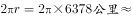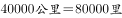。

B项正确，“两岸青山相对出”，研究的对象是“青山”，运动状态是“出”，青山是运动的，是相对于船来说的；“孤帆一片日边来”，研究的对象是“孤帆”，运动状态是“来”，船是运动的，相对于日（或两岸、青山）来说的。同一个物体，以不同的参照物，它的运动状态可能不同，这就是运动和静止的相对性。

C项正确，“八月秋高风怒号”中的风声是空气振动发出的声音。

D项正确，“飞流直下三千尺”，是因为水受到重力的作用，从高处往低处流，在此过程中势能减小，减小的势能转化为动能。

本题为选非题，故正确答案为A。

---

### 第 6 题　qid 1796226 · 人文常识

关于生活知识，下列说法错误的是：

- **A**. 缺碘可能会患“大脖子病”
- **B**. 吃水果有助于补充维生素
- **C**. 甲醛可以用作药品的防腐剂　✅
- **D**. 回收废电池可减少重金属污染

**答案**：C

**官方解析**

A项正确，“大脖子病”学名甲状腺肿，是碘缺乏病的主要表现之一。碘是甲状腺合成甲状腺激素的重要原料之一，碘缺乏时合成甲状腺激素不足，反馈引起垂体分泌过量的促甲状腺激素（TSH），刺激甲状腺增生肥大。
B项正确，维生素是维持人体生命活动必需的一类有机物质，也是保持人体健康的重要活性物质。
维生素具有外源性，人体自身只能合成维生素D，不能满足人体需要，大部分维生素以维生素原的形式存在于食物中，需要通过食物补充。蔬菜水果中含有多种维生素。
C项错误，甲醛有刺激性气味，对人体有害。低浓度就会使人产生不适感，长期、低浓度接触甲醛会引起头痛、头晕、乏力、感觉障碍、免疫力降低；长期接触甲醛可引发呼吸功能障碍和肝中毒性病变，表现为肝细胞损伤、肝辐射能异常等。
D项正确，电池主要含镉、锰、汞、锌等重金属，若被弃于自然环境中，重金属成份会随渗液溢出，造成地下水和土壤的污染，日积月累会严重危害人类健康。
本题为选非题，故正确答案为C。

---

### 第 7 题　qid 1796166 · 人文常识

下列关于微波的说法正确的是：

- **A**. 微波的频率比一般无线电波的频率低
- **B**. 含水量多少对微波加热效果没有影响
- **C**. 微波会被玻璃、塑料和瓷器等物体反射
- **D**. 微波通信容量大、质量好、传输距离远　✅

**答案**：D

**官方解析**

A项错误，微波是指频率为300MHz~300GHz的电磁波。微波频率比一般的无线电波频率高，通常也称为“超高频电磁波”。
B项错误，水分子属极性分子，介电常数较大，其介质损耗因数也很大，对微波具有强吸收能力。
C项错误，微波可以穿过玻璃、陶瓷、塑料等绝缘材料，但不会消耗能量，也不会被反射。
D项正确，由于微波频率很高，所以在不大的相对带宽下，其可用的频带很宽，可达数百甚至上千兆赫兹，这是低频无线电波无法比拟的。这意味着微波的信息容量大，所以现代多路通信系统，包括卫星通信系统，几乎都是在微波波段内工作的。
故正确答案为D。

---

### 第 8 题　qid 1796238 · 人文常识

在生活中，下列哪一做法或现象与热胀冷缩无关：

- **A**. 夏天在架设电线时，不宜把电线绷得太紧
- **B**. 往保温瓶灌开水时，不灌满比灌满更容易保温　✅
- **C**. 把刚煮熟的鸡蛋放到冷水中浸一下，更容易剥壳
- **D**. 冬天往玻璃杯中倒开水，应先用少量开水预热杯子

**答案**：B

**官方解析**

夏天比较热，电线吸收热量，处于伸张状态；天气转凉后，电线因释放热量，会收缩。所以绷太紧容易导致收缩过量产生拉力，电线容易形变，当形变超过临界值，就会发生断裂，产生事故。A项说法与热胀冷缩有关。
空气是热的不良导体，如果水没有完全灌满，相对于水直接接触瓶盖来说，相当于多了一层保温层。B项说法与热胀冷缩无关。
大多数物质都有“热胀冷缩”的物理特性。但是，各种物质的伸缩程度又各不相同。鸡蛋是由硬的蛋壳和软的蛋白、蛋黄组成的，当温度剧烈变化时，蛋白和蛋壳的步调会不一致，形成了蛋白与蛋壳的脱离。因此，就不会连蛋壳带蛋白一起剥下来。C项说法与热胀冷缩有关。
玻璃是热的不良导体，热量在玻璃中传得很慢，杯子中倒进热水后，玻璃里面一面很快被加热，体积膨胀，但杯子外壁还没有被加热，体积不变，这样就会造成杯子破裂。D项说法与热胀冷缩有关。 
本题为选非题，故正确答案为B。

---

### 第 9 题　qid 1796328 · 科技常识

关于疫苗，下列说法错误的是：

- **A**. 根据费用支付方式，分政府免费提供和公民自费自愿接种两类
- **B**. 牛痘疫苗彻底消灭天花，是人类用疫苗迎战病毒的首次胜利
- **C**. 接种疫苗是预防传染病最有效、最经济的手段
- **D**. 目前乙肝疫苗是世界上使用量最大的一种疫苗　✅

**答案**：D

**官方解析**

A项正确，按照费用支付方式，中国预防接种的疫苗分为两类：第一类疫苗，是指政府免费向公民提供，公民应当依照政府的规定受种的疫苗；第二类疫苗，是指由公民自费并且自愿受种的其他疫苗。
B项正确，18世纪后，牛痘用作免疫接种以预防高传染性的天花。世界卫生组织已经宣布天花在地球上绝迹——人类彻底消灭了天花，这是疫苗战胜病毒的首度成功案例。
C项正确，接种疫苗是预防和控制传染病最经济、有效的公共卫生干预措施。
D项错误，流感疫苗在全球已经使用超过60年，目前每年使用量都以亿计，是全球使用量最大的一种疫苗。乙肝疫苗并不是世界上使用量最大的疫苗。
本题为选非题，故正确答案为D。

---

### 第 10 题　qid 1797768 · 法律常识

关于药品，下列说法错误的是：

- **A**. 大部分药品属于处方药，如注射剂、毒麻药品等
- **B**. 非处方药不需要凭执业医师处方即可自行购买和使用
- **C**. 处方药不可擅自使用、停用或增减剂量，否则可能引起严重后果
- **D**. 药品说明书用以指导医生和患者选择、使用药品，但不具法律意义　✅

**答案**：D

**官方解析**

处方药就是必须凭执业医师或执业助理医师处方才可调配、购买和使用的药品。大部分药品属于处方药，特殊药品也属于处方药：各类麻醉类药品、抗癌类药品以及精神类药品，因此A项正确；
非处方药是指为方便公众用药，在保证用药安全的前提下，经国家卫生行政部门规定或审定后，不需要医师或其它医疗专业人员开写处方即可购买的药品，一般公众凭自我判断，按照药品标签及使用说明就可自行使用，因此B项正确；
处方药必须凭执业医师或执业助理医师处方才可调配、购买和使用。不可擅自使用、停用或增减剂量，否则可能引起严重后果，因此C项正确；
药品说明书是载明药品的重要信息的法定文件，具有重要的法律意义。我国《药品管理法》第四十九条第一款规定，药品包装应当按照规定印有或者贴有标签并附有说明书，因此D项错误。
本题为选非题，故正确答案为D。

---

### 第 11 题　qid 1797784 · 人文常识

关于农作物，下列对应错误的是：（  ）

- **A**. 豆类、薯类——粮食作物
- **B**. 花生、向日葵——经济作物
- **C**. 西红柿、青梅——蔬菜作物　✅
- **D**. 玉米、紫云英——饲料作物

**答案**：C

**官方解析**

A项正确：粮食作物是对谷类作物（小麦，水稻，玉米）、薯类作物（包括甘薯、马铃薯等）及豆类作物（包括大豆、蚕豆、豌豆、绿豆等）的总称。
B项正确：经济作物一般指为工业，特别是指为轻工业提供原料的作物。我国纳入人工栽培的经济作物种类繁多，包括纤维作物（如棉、麻等）、油料作物（如芝麻、花生、向日葵等）、糖料作物（如甘蔗、甜菜等）、三料（饮料、香料、调料）作物、药用作物、染料作物、观赏作物、水果和其他经济作物等。
C项错误：蔬菜作物主要有萝卜、白菜、芹菜、韭菜、蒜、葱、胡萝卜、菜瓜、菊芋、刀豆、芫荽、莴笋、黄花、辣椒、黄瓜、西红柿等；果类有梨、青梅、苹果、桃、杏、核桃、李子、樱桃、草莓、沙果、红枣等品种。青梅属于果类作物。
D项正确：饲料作物如玉米、紫云英等，2015年中央1号文件明确提出：“支持青贮玉米和苜蓿等饲草料种植，开展粮改饲和种养结合模式试点。”
本题为选非题，故正确答案为C。

---

### 第 12 题　qid 1796174 · 人文常识

下列关于国家征收农民集体所有土地补偿的规定，说法错误的是：

- **A**. 征收农民集体土地，需要按照被征收土地的原用途予以补偿
- **B**. 征收耕地以外其他土地的补偿标准由省、自治区、直辖市规定
- **C**. 被征收土地上的附着物和青苗的补偿标准，由市、县人民政府规定　✅
- **D**. 征收耕地应给予土地补偿费、安置补助费、地上附着物和青苗的补偿费

**答案**：C

**官方解析**

根据《中华人民共和国土地管理法》第四十七条相关规定，征收土地的，按照被征收土地的原用途给予补偿。征收耕地的补偿费用包括土地补偿费、安置补助费以及地上附着物和青苗的补偿费。征收其他土地的土地补偿费和安置补助费标准，由省、自治区、直辖市参照征收耕地的土地补偿费和安置补助费的标准规定。被征收土地上的附着物和青苗的补偿标准，由省、自治区、直辖市规定。
本题为选非题，故正确答案为C。
【注】由于《中华人民共和国土地管理法》于2019年进行了修正，此题已经过时，了解即可。

---

### 第 13 题　qid 1796170 · 科技常识

下列哪组气体对环境的负面影响最大？

- **A**. 一氧化氮、二氧化硫　✅
- **B**. 二氧化碳、水蒸气
- **C**. 氢气、稀有气体
- **D**. 甲烷、氮气

**答案**：A

**官方解析**

A项，一氧化氮是一种无色无味，难溶于水的有毒气体，在空气中易被氧化成二氧化氮，而后者有强烈腐蚀性和毒性。一氧化氮对环境有危害，对水体、土壤和大气可造成污染。二氧化硫是最常见、最简单的硫氧化物，是大气主要污染物之一。在大气中，二氧化硫会氧化而形成硫酸雾或硫酸盐气溶胶，是环境酸化的重要前驱物。二者对环境均有较大危害。
B项，二氧化碳是空气中常见的温室气体，是一种气态化合物，常温下是一种无色无味、不助燃、不可燃的气体，密度比空气大。二氧化碳对环境的负面影响主要是因为它具有保温的作用，会逐渐使地球表面温度升高，被认为是加剧温室效应的主要来源。水蒸气是水的气体形式，其对环境的负面影响在于水蒸气是一种温室气体，可能会造成温室效应。
C项，氢气在常温常压下是一种极易燃烧、无色透明、无臭无味的气体，是世界上已知的密度最小的气体，没有毒性。医学上用氢气来治疗部分疾病。其危险在于易燃易爆性，对环境没有明显负面影响。稀有气体即惰性气体，是指元素周期表上的0族元素。天然存在的稀有气体有六种，即氦（He）、氖（Ne）、氩（Ar）、氪（Kr）、氙（Xe）和具放射性的氡（Rn）。一般无毒，只有在浓度比较高时对人体产生不良影响，对环境的负面影响较小。
D项，甲烷是最简单的有机物，在自然界的分布很广，是天然气、沼气、坑气等的主要成分。甲烷对环境的负面影响主要体现在它是一种温室气体，可能会造成温室效应。氮气通常状况下是一种无色无味的气体，而且一般氮气比空气密度小。氮气的化学性质不活泼，常温下很难跟其他物质发生反应，但在高温、高能量条件下可与某些物质发生化学变化，用来制取对人类有用的新物质。氮气对环境没有明显负面影响。
综上比较，一氧化氮和二氧化硫对环境的负面影响最大。
故正确答案为A。

---

### 第 14 题　qid 1796256 · 科技常识

关于“螳螂捕蝉，黄雀在后”，下列说法错误的是：

- **A**. 蝉、螳螂和黄雀都是消费者
- **B**. 螳螂和黄雀的行为都属于先天性行为
- **C**. 螳螂、蝉和黄雀组成了一个生态系统　✅
- **D**. 蝉和螳螂属于节肢动物，黄雀属于鸟类

**答案**：C

**官方解析**

A项正确，消费者在自然界中的定义：为食物链中的一个环节，代表着不能生产，只能通过消耗其他生物来达到自我存活的生物。螳螂、蝉、黄雀符合消费者的概念。
B项正确，先天性行为，就是生来就有的一种本能，由动物体内的遗传物质所决定的行为，如蜜蜂采蜜，蚂蚁建巢，蜘蛛织网，鸟类迁徙，动物捕食等。与先天性行为相对的后天性行为，是动物在遗传物质的基础上，通过环境因素的作用，由生活经验和学习而获得的行为，能让动物更好地适应环境。
C项错误，生态环境的组成成分包括非生物的物质和能量、生产者、消费者、分解者。螳螂、蝉和黄雀均为消费者，故螳螂、蝉和黄雀不能构成一个生态系统。
D项正确，螳螂和蝉属于无脊椎动物中的节肢动物，黄雀属于鸟类。
本题为选非题，故正确答案为C。

---

### 第 15 题　qid 1797818 · 人文常识

下列常见的心理现象与成语对应错误的是：

- **A**. 晕轮效应——爱屋及乌
- **B**. 首因效应——一鼓作气　✅
- **C**. 门槛效应——得寸进尺
- **D**. 从众效应——人云亦云

**答案**：B

**官方解析**

本题考查科技常识。
晕轮效应又称“光环效应”，属于心理学范畴，是指当认知者对一个人的某种特征形成好或坏的印象后，他还倾向于据此推论该人其他方面的特征。本质上是一种以偏概全的认知上的偏误。晕轮效应愈来愈多地被应用在企业管理上，其对组织管理的负面影响主要是体现在各种组织决策上。爱屋及乌指的是因为爱一个人而连带爱他屋上的乌鸦。比喻爱一个人而连带地关心到与他有关的人或物。两者意思对等，因此A项正确。
门槛效应又称得寸进尺效应，是指一个人一旦接受了他人的一个微不足道的要求，为了避免认知上的不协调，或想给他人以前后一致的印象，就有可能接受更大的要求。因此C项正确。
从众效应，也称乐队花车效应，是指当个体受到群体的影响(引导或施加的压力)，会怀疑并改变自己的观点、判断和行为，朝着与群体大多数人一致的方向变化。也就是指：个体受到群体的影响而怀疑、改变自己的观点、判断和行为等，以和他人保持一致。也就是通常人们所说的“随大流”。人云亦云指的是人家怎么说，自己也跟着怎么说。指没有主见，只会随声附和。两者意思对等，因此D项正确。
首因效应指交往双方形成的第一次印象对今后交往关系的影响，也就是“先入为主”带来的效果。虽然这些第一印象并非总是正确的，但却是最鲜明、最牢固的，并且决定着以后双方交往的进程。如果一个人在初次见面时给人留下良好的印象，那么人们就愿意和他接近，彼此也能较快地取得相互了解，并会影响人们对他以后一系列行为和表现的解释。一鼓作气出自《曹刿论战》，意思是第一次击鼓能够振作士兵的勇气，第二次击鼓士兵的勇气会衰弱，第三次击鼓士兵的勇气就竭尽了。后多喻趁锐气旺盛之时一举成事或鼓足干劲，一往直前。显然，首因效应和一鼓作气的意思不对应。因此B项错误。
本题为选非题，故正确答案为B。

---

### 第 16 题　qid 1796178 · 人文常识

下图所示的是哪种典型地貌？

- **A**. 喀斯特地貌
- **B**. 冰川地貌
- **C**. 丹霞地貌
- **D**. 风蚀地貌　✅

**答案**：D

**官方解析**

A项错误，喀斯特地貌是具有溶蚀力的水对可溶性岩石（大多为石灰岩）进行溶蚀作用等所形成的地表和地下形态的总称。喀斯特地貌地面上往往崎岖不平，岩石绚丽，奇峰林立。

B项错误，冰川地貌是由冰川作用塑造的地貌，属于气候地貌范畴。地貌类型比较多样，按成因分为侵蚀地貌和堆积地貌两类。图中所示并非冰川地貌的特征。
C项错误，丹霞地貌系指由产状水平或平缓的层状铁钙质混合不均匀胶结而成的红色碎屑岩，受垂直或高角度节理切割，并在差异风化、重力崩塌、流水溶蚀、风力侵蚀等综合作用下形成的有陡崖的城堡状、宝塔状、针状、柱状、棒状、方山状或峰林状的地貌特征。
D项正确，风蚀地貌是经由风和风沙流对土壤表面物质及基岩进行的吹蚀和磨蚀作用所形成的地表形态。题干图片所示的是风蚀地貌中的雅丹地貌，是一种河湖相土状堆积物地区发育的风蚀土墩和风蚀凹地相间的地貌形态。其发育过程是：挟沙气流磨蚀地面，地面出现风蚀沟槽，磨蚀作用进一步发展，沟槽扩展为风蚀洼地；洼地之间的地面相对高起，成为风蚀土墩。
故正确答案为D。

---

### 第 17 题　qid 1797826 · 人文常识

下列哪种球类运动的标准场地面积最大？

- **A**. 网球
- **B**. 篮球
- **C**. 排球
- **D**. 足球　✅

**答案**：D

**官方解析**

排球场长度为18米，宽度为9米。篮球场地长28米，宽15米，是一个长方形的平面。标准网球场地长36.6米，宽18.3米，面积不小于648平方米。足球场地长度90~120米，宽度45~90米。由此可知，足球场地面积最大。所以A、B、C三项错误。
故正确答案为D。

---

### 第 18 题　qid 1796160 · 人文常识

洲际导弹通常指射程大于8000公里的远程弹道式导弹。目前，中国研制的洲际弹道导弹主要是什么系列的？

- **A**. “东风”系列　✅
- **B**. “长征”系列
- **C**. “红旗”系列
- **D**. “天宫”系列

**答案**：A

**官方解析**

A项，“东风”系列，是中华人民共和国一系列近程、中远程和洲际弹道导弹。“东风”系列是目前世界上唯一覆盖各种类型弹道导弹的陆基弹道导弹系列。
B项，“长征”系列为我国运载火箭型号命名。中国自1956年开始展开现代火箭的研制工作。1964年6月29日，中国自行设计研制的中程火箭试飞成功之后，即着手研制多级火箭，向空间技术进军。经过了五年多的艰苦努力，1970年4月24日“长征一号”运载火箭诞生，首次发射“东方红一号”卫星成功。现在“长征”系列火箭已经走向世界，享誉全球，在国际发射市场占有重要一席。
C项，“红旗”系列防空导弹构成了我国地空防空导弹的主体。红旗系列防空导弹涵盖了中远程、中高空到近程超低空的火力范围，已经形成一个庞大的家族，担负着中国防空的重任。
D项，“天宫”系列是我国空间站项目的命名方式。早在1992年，中国就确立了以建立空间站为目标的航天计划。这一计划分三步，第一步是载人飞船阶段，目标是能够把宇航员送到太空，正常运行若干天，并成功返回。第二步是空间实验室阶段，在这个阶段要解决组装、交互对接、补给以及循环利用等四大技术。这些技术关系到空间站的组装、宇航员在空间站的生存等关键问题。第三步是建造载人空间站阶段，解决较大规模、长期有人照料的空间应用问题。“天宫”一号就是中国在第二步计划中为了解决交互对接问题而发射的一个目标飞行器。
故正确答案为A。

---

### 第 19 题　qid 1796124 · 法律常识

下列不属于夫妻共同财产的是：

- **A**. 婚前房屋在婚后所得的租金
- **B**. 夫妻关系存续期间，军人的复员费和自主择业费
- **C**. 赠与合同中确定只归一方的财产　✅
- **D**. 婚姻存续期间虽未实际取得，但明确可以取得的知识产权收益

**答案**：C

**官方解析**

A项正确，根据最高人民法院民一庭意见——个人所有房屋的婚后收益认定及其处理中表明：“一方个人所有的房屋婚后用于出租，其租金收入属于经营性收入，应认定为夫妻共同财产。”
B项正确，根据《最高人民法院关于适用中华人民共和国民法典婚姻家庭编的解释（一）》第七十一条规定：“人民法院审理离婚案件，涉及分割发放到军人名下的复员费、自主择业费等一次性费用的，以夫妻婚姻关系存续年限乘以年平均值，所得数额为夫妻共同财产。”
C项错误，根据《中华人民共和国民法典》第一千零六十三条规定：“下列财产为夫妻一方的个人财产：（一）一方的婚前财产；（二）一方因受到人身损害获得的赔偿或者补偿；（三）遗嘱或者赠与合同中确定只归一方的财产；（四）一方专用的生活用品；（五）其他应当归一方的财产。”
D项正确，根据《中华人民共和国民法典》第一千零六十二条规定：“夫妻在婚姻关系存续期间所得的下列财产，为夫妻的共同财产，归夫妻共同所有：······（三）知识产权的收益······”根据《最高人民法院关于适用中华人民共和国民法典婚姻家庭编的解释（一）》第二十四条规定：“民法典第一千零六十二条第一款第三项规定的‘知识产权的收益’，是指婚姻关系存续期间，实际取得或者已经明确可以取得的财产性收益。”
本题为选非题，故正确答案为C。

---

### 第 20 题　qid 1796298 · 人文常识

甲于2010年3月1日开始使用“红红太阳”牌商标，乙同年4月1日开始使用相同商标。商标局于2011年5月10日同一天收到甲、乙关于“红红太阳”商标的申请文件，但甲的文件是5月8日寄出的，乙的文件是5月5日寄出的。商标局应初步审定公告谁的申请？

- **A**. 公告甲的申请，因甲、乙虽同时申请，但甲使用在先　✅
- **B**. 同时公告，因甲、乙申请日期相同
- **C**. 公告乙的申请，因乙申请在先
- **D**. 可以由商标局自由裁定

**答案**：A

**官方解析**

《中华人民共和国商标法》第三十一条规定：“两个或者两个以上的商标注册申请人，在同一种商品或者类似商品上，以相同或者近似的商标申请注册的，初步审定并公告申请在先的商标；同一天申请的，初步审定并公告使用在先的商标，驳回其他人的申请，不予公告。”
《商标法实施条例》第十八条第一款规定：“商标注册的申请日期以商标局收到申请书件的日期为准。”题目表述的寄出时间是迷惑信息，按照相关法律的规定，商标局应先初步审定公告甲的商标申请。
故正确答案为A。

---

### 第 21 题　qid 1797802 · 人文常识

下列分别属于陆上丝绸之路和海上丝绸之路起点的城市是（    ）。

- **A**. 西安 扬州
- **B**. 西安 泉州　✅
- **C**. 西安 广州
- **D**. 西安 福州

**答案**：B

**官方解析**

本题考查人文常识。
陆上丝绸之路起源于西汉时期，汉武帝派张骞出使西域所开辟的陆上通道。其以首都长安（今西安）为起点，经甘肃、新疆，到中亚、西亚，并连接地中海各国的陆上通道。
海上丝绸之路是指古代中国与世界其他地区进行经济文化交流交往的海上通道。海上丝绸之路是由当时东西洋间一系列港口网点组成的国际贸易网，唐宋元属于其繁盛期，其中泉州为联合国教科文组织唯一认定的海上丝绸之路起点。
因此，陆上丝绸之路的起点是西安，海上丝绸之路的起点是泉州。
故正确答案为B。

---

### 第 22 题　qid 1797808 · 地理国情

2016年10月16日是中国工农红军三大主力部队在甘肃会宁胜利会师（    ）纪念日。

- **A**. 65周年
- **B**. 70周年
- **C**. 75周年
- **D**. 80周年　✅

**答案**：D

**官方解析**

本题考查毛中特。
1936年10月，红一、二、四方面军分别于甘肃会宁、将台堡胜利会师，标志着具有伟大历史意义的红军长征的胜利结束。长征的胜利，表明了以毛泽东为核心的中国共产党及其领导的中国工农红军具有战胜任何困难的无比顽强的生命力，是一支不可战胜的力量。2016年10月16日是中国工农红军三大主力部队在甘肃会宁胜利会师80周年。
故正确答案为D。

---

### 第 23 题　qid 1797810 · 地理国情

“十三五”期间，陕西经济社会乘风破浪而行，2020年预计全省生产总值会达到（    ）元，人均收入会超过（    ）美元。

- **A**. 3万亿，1万　✅
- **B**. 3.5万亿，1.2万
- **C**. 3.8万亿，1.5万
- **D**. 4万亿，2万

**答案**：A

**官方解析**

本题考查政治常识。
2016年陕西省政府工作报告中提出：“十三五”的主要发展目标是，在提高质量与效益基础上，经济增长高于全国平均水平。2020年，生产总值达到3万亿元、人均超过1万美元，城乡居民收入赶超全国平均水平，现行标准下农村贫困人口全部脱贫，基本公共服务实现均等化，人民生活水平和质量进一步提高，同步够格全面建成小康社会，“三个陕西”建设迈上更高水平。
故正确答案为A。

---

### 第 24 题　qid 2253312 · 人文常识

凤翔彩绘泥塑是我国民间艺术宝藏之一，下列不属于凤翔彩绘泥塑的是（　　）。

- **A**. 泥玩具
- **B**. 挂片
- **C**. 立人
- **D**. 陶艺　✅

**答案**：D

**官方解析**

本题考查人文常识。
凤翔彩绘泥塑是陕西省宝鸡市凤翔县的一种传统民间艺术，凤翔彩绘泥塑有三大类型，一是泥玩具，以动物造型为主，多塑十二生肖形象；二是挂片，有脸谱、虎头、牛头、狮子头、麒麟送子、八仙过海等；三是立人，主要为中国民间传说及历史故事中的人物造像。
因此，A、B、C三项正确，D项错误。
本题为选非题，故正确答案为D。

---

### 第 25 题　qid 1796180 · 经济常识

假如某国出现比较严重的经济衰退，该国当局却不能运用货币政策进行调节。这个国家可能是：

- **A**. 德国　✅
- **B**. 美国
- **C**. 英国
- **D**. 新加坡

**答案**：A

**官方解析**

货币政策是指中央银行为实现既定的目标，运用各种工具调节货币供应量来调节市场利率，通过市场利率的变化来影响民间的资本投资，影响总需求来影响宏观经济运行的各种方针措施。
A项正确，德国属于欧元区国家，而欧洲中央银行负责制定欧盟欧元区的金融及货币政策。欧洲中央银行是超国家层面的中央银行和欧盟成员国的各国家中央银行的有机结合。因此一旦发生经济衰退，德国不能运用独立的货币政策进行调节，必须符合欧洲中央银行的整体政策要求。英国不属于欧元区国家，有自己独立的货币英镑。美国和新加坡均有自己的独立货币美元和新加坡元，三个国家都有独立的中央银行，可以使用货币政策调节本国经济。B、C、D三项不符合题意，排除。
故正确答案为A。

---

## 言语理解与表达

### 第 1 题　qid 1796084 · 逻辑填空

科普影评的作者应寻找科学与电影的交汇点，将科普和艺术            ，启迪思想。他们将前沿领域研究成果，结合电影转化为更轻松易懂的文字，面向更多读者。
填入画横线部分最恰当的一项是：

- **A**. 融会贯通　✅
- **B**. 合二为一
- **C**. 珠联璧合
- **D**. 相提并论

**答案**：A

**官方解析**

横线处与前文“交汇点”对应，应体现出科普和艺术交汇之意。A项“融会贯通”是指把各方面的知识和道理融化汇合，得到全面透彻的理解，符合文意，当选。
B项“合二为一”是指将两者合为一个整体，“科普”与“艺术”是不同的两个领域，无法变成一个整体，排除；
C项“珠联璧合”用来比喻杰出的人才或美好的事物结合在一起，一般不与“将······”连用，排除；
D项“相提并论”是指把不同的人或不同的事放在一起谈论或看待，并无“交汇”之意，排除。
故正确答案为A。
【文段出处】《我国科普影评如何迎头赶上？》

---

### 第 2 题　qid 1796270 · 逻辑填空

古人行文简略，优秀的作品常常“字不虚设”，阅读者决定不予深究的地方，有可能正是作者用心良苦之所在。因此我们阅读时不宜有所偏，应该像作家写作这些文章时那样“      ”。
填入划横线部分最恰当的一项是：

- **A**. 孜孜不倦
- **B**. 精益求精
- **C**. 字斟句酌　✅
- **D**. 心无旁骛

**答案**：C

**官方解析**

文段开头点明“古人行文简略”“优秀的作品常常‘字不虚设’”可知，作家写作是很珍惜文字的，“因此我们阅读时不宜有所偏，应该像作家写作这些文章时那样”，那阅读者的状态就应该是仔细品味。
A项“孜孜不倦”是指工作或学习勤奋不知疲倦，排除；
B项“精益求精”侧重好上加好追求更完美，排除；
C项“字斟句酌”即对每一字、每一句都仔细斟酌、推敲，符合文意，当选；
D项“心无旁骛”形容心无杂念、专心致志的状态，排除。
故正确答案为C。
【出处】《求知在字外》

---

### 第 3 题　qid 1796080 · 逻辑填空

中国互联网发展的过程中，“鼓励原创”的版权意识与互联网的免费共享精神，一直在        中牵绊着发展。当众多网友对网络“免费午餐”津津乐道时，损害的却是创造者的创作热情以及出版业的长远发展。
填入画横线部分最恰当的一项是：

- **A**. 逆境
- **B**. 竞争
- **C**. 矛盾　✅
- **D**. 挑战

**答案**：C

**官方解析**

文段谈论“中国互联网发展的过程”“版权意识”与“免费共享精神”是如何牵绊着发展，很明显，“版权意识”具有排他性，归原创者专有，而“免费共享”重在分享，二者相互背离，显然是一对矛盾的关系。
A项“逆境”指不利的处境，无法体现二者关系，排除。
B项“竞争”是个体或群体间力图胜过或压倒对方的心理需要和行为活动，排除。
C项“矛盾”指客观事物和人类思维内部各个对立面之间互相依赖又互相排斥的关系，符合文意，当选。
D项“挑战”指激使敌方出战，也指完成某项艰难的任务，排除。
故正确答案为C。
【文段出处】网易新闻《国民数字普及但付费意愿较低》

---

### 第 4 题　qid 1797832 · 逻辑填空

一个人不能失忆，一个国家当然就更不能失忆了，但是因为历史的原因，有时候会有意无意地试图______某方面的回忆。对于这种无奈的现实，我们能够理解，但是并不是说就应该支持或者默认这么做。在具备了条件之后，我们还是应该寻找和______我们的记忆。
依次填入划横线部分最恰当的一项是：

- **A**. 回避  恢复　✅
- **B**. 隐藏  修复
- **C**. 躲避  还原
- **D**. 掩盖  复原

**答案**：A

**官方解析**

第一空，填入的词要能和“回忆”搭配，A项“回避”指让开，躲开，B项“隐藏”指藏起来不让发现，D项“掩盖”指隐藏，隐瞒，均符合文意，与“回忆”搭配恰当，保留。C项“躲避”指故意离开或隐蔽起来，搭配的对象一般是人或者困难，与“回忆”搭配不当，排除。
第二空，所填词语与“记忆”构成搭配，“恢复记忆”为常见固定搭配，A项当选。B项“修复”指修整使恢复原样，文段中“记忆”原样并没有变化，用在此处不合适，排除；D项“复原”一般指病后恢复健康或者恢复原状，不符合语境，排除。
故正确答案为A。
【文段出处】《光靠声讨是断绝不了谣言的》

---

### 第 5 题　qid 1796082 · 逻辑填空

人类的寿命与基因有关，体内有多个基因            着你的生命长短。研究表明，那些在恶劣环境下控制机体防御功能的基因，能够显著地改善多种生物的健康状况并且延长其寿命。了解这些基因的运作            ，或许可以帮助我们找到消除老年疾病、延长人类生命的秘诀。
依次填入画横线部分最恰当的一项是：

- **A**. 操控  规律
- **B**. 支配  原理
- **C**. 决定  机制　✅
- **D**. 主宰  流程

**答案**：C

**官方解析**

第一空，横线处搭配“长短”，体现基因对人类生命长短起到的作用。C项“决定”指某事物成为另一事物的先决条件，起主导作用，符合文意，且与“长短”搭配恰当，保留。A项“操控”指的是掌握运用或驾驭得心应手，毫无阻碍，B项“支配”是指支配主体按照给定的条件和目标，对支配客体施加影响的过程和行为，D项“主宰”指支配，统治，掌握，均无法对应文段中基因对人类生命长短所起到的作用，且均与“长短”搭配不当，排除。
第二空，代入验证，根据“了解这些基因的运作”，可知基因对于生命的作用是复杂的，C项“机制”指各要素之间的结构关系和运行方式，有机体的构造、功能及其相互关系，当选。
故正确答案为C。
【文段出处】网易科技《长寿基因挑战寿命极限》

---

### 第 6 题　qid 1796214 · 逻辑填空

在西班牙，“慢食”一直是在人们头脑中                的饮食观念。与“慢食”一脉相承的是西班牙人“慢生活”的态度：大厦电梯里面没有关门按键，大家都是等待电梯门缓缓关上；和午餐相伴的还有午睡，尤其在西班牙南部最为炎热的地方，小店业主都会在14点到17点之间关门，那是他们               的午休时段。
依次填入画横线部分最恰当的一项是：

- **A**. 嗤之以鼻   板上钉钉
- **B**. 坚不可摧   不可更改
- **C**. 积重难返   翘首以待
- **D**. 根深蒂固   雷打不动　✅

**答案**：D

**官方解析**

第一空，根据文意在西班牙“慢食”，一直是种饮食观念，接着提到与“慢食”对应的一脉相承“慢生活”态度，说明西班牙人长久都有这种观念。A项“嗤之以鼻”用鼻子吭声冷笑，表示轻蔑，不合题意，排除；B项“坚不可摧”意思是非常坚固，摧毁不了，一般用来形容精神、意志等，不合题意，排除；C项“积重难返”指长期形成的不良的风俗、习惯不易改变，文段中并没有提到“慢食”观念是不良风气，排除C项；D项“根深蒂固”比喻基础深厚，不容易动摇，一般用来形容观念、思想等，符合题意。
验证第二空，文中“小店业主都会在14点到17点之间关门”说明午休时段是小店业主们无论如何不会更改的休息时间，“雷打不动”形容态度坚定，不可动摇，也形容严格遵守规定，决不变更，符合文意。
故正确答案为D。
【出处】三联生活周刊《巴塞罗那,美食之旅开始的地方》

---

### 第 7 题　qid 1796208 · 逻辑填空

经济全球化促使世界主要国家实力对比关系发生深刻变化，出现强与弱、盛与衰的实力转换，国际角色与位序的           ，最终会导致国际社会中的权力分配结构产生调整。同时，彼此间的机制化、制度化、常态化的             与相互协调已经成为处理国家间关系、解决国家间经济利益矛盾的主要方式。
依次填入划横线部分最恰当的一项是：

- **A**. 善变  对话
- **B**. 演变  商榷
- **C**. 嬗变  磋商　✅
- **D**. 变迁  协商

**答案**：C

**官方解析**

第一空，所填词语搭配“角色与位序”。A项“善变”强调变化无常，容易改变，一般用于人，或其他有主观能动性的主体，不能搭配“角色与位序”，排除。D项“变迁”常搭配宏观整体的概念，如时代、历史、社会变迁，与“角色与位序”搭配不当，排除。B项“演变”指发展变化（历时较久的）；C项“嬗变”指演变；两者均能搭配“角色与位序”，保留。
第二空，由横线后的“与”可知，所填词语与“相互协调”并列，意思相近。C项“磋商”指反复商量，仔细讨论，填入横线处表示国家间互相商讨，与“相互协调”意思相近，符合语境，当选。B项“商榷”通常搭配为“值得商榷”或“商榷一番”，不能表述为“彼此间的商榷”，搭配不当，排除。
故正确答案为C。
【文段出处】《经济全球化与国际关系发展新趋势》

---

### 第 8 题　qid 1796088 · 逻辑填空

法治和礼治发生在两种不同的社会         中。这里所谓的礼治也许就是通常所谓的人治，但是礼治一词不会像人治一词那样容易引起         ，以致有人觉得社会秩序是可以由个人好恶来维持的了。
依次填入划横线部分最恰当的一项是：

- **A**. 形态    歧义
- **B**. 模式    偏差
- **C**. 情态    误解　✅
- **D**. 形势    干扰

**答案**：C

**官方解析**

第一空，文中“法治和礼治”是两种不同的社会治理方式。A项“形态”指事物存在的样貌，或在一定条件下的表现形式，B项“模式”指事物的标准样式，C项“情态”指情状、状态，D项“形势”指事物发展的状况，第一空很难排除，再看第二空。
第二空，搭配“引起”，B项“偏差”是指运动物体偏离确定方向的角度，也指工作上的差错，D项“干扰”指打扰，妨碍、使混乱，均与“引起”搭配不当，排除。“以致有人觉得社会秩序是可以由个人好恶来维持的了”，是对“礼治”“人治”的错误理解，C项“误解”指对于某事物产生了错误的认知，符合文意，当选。A项“歧义”指同一（语言文字）两种或多种不同的意义，有两种或几种可能的解释，与文意不符，排除。
故正确答案为C。
【文段出处】《乡土中国-礼治秩序》

---

### 第 9 题　qid 1796192 · 逻辑填空

对互联网企业来讲，从用户那里收集到的信息主要包括消费习惯、行为特征、个人数据等。企业可以通过收集这些信息去开展大数据分析，进一步挖掘用户的潜在消费能力和更          的价值，从而为用户提供更具        的服务。
依次填入划横线部分最恰当的一项是：

- **A**. 市场化 独创性
- **B**. 多元化 针对性　✅
- **C**. 智能化 实用性
- **D**. 规模化 多样性

**答案**：B

**官方解析**

第一空，搭配“价值”，根据前文“消费习惯、行为特征、个人数据等”可知，企业通过分析这些多方面的用户信息，挖掘出的价值应是多方面的、丰富的。B项“多元化”意味着具有多种形式或方面，符合文意，保留。A项“市场化”市场化是以市场机制为基础配置资源的经济运行方式，通过价格调节实现供需平衡，与文意无关，排除；C项“智能化”指具备智能的特点，与“价值”搭配不当，排除；D项“规模化”强调规模扩大，与用户价值的多样性无关，排除。
第二空，代入验证。根据“从用户那里收集到的信息主要包括消费习惯、行为特征、个人数据等”可知，企业依据对用户多方面信息的分析和挖掘出的价值，能为用户提供更贴合用户自身特点和需求的服务。B项“针对性”表示针对特定对象采取特定措施，体现了根据用户不同情况提供服务，符合文意，当选。
故正确答案为B。
【文段出处】《大数据时代，保护用户数据不能因噎废食》

---

### 第 10 题　qid 1796100 · 逻辑填空

宜居带是指一颗恒星周围的一定距离范围，在这一范围内水可以以液态形式存在。由于液态水被科学家认为是生命生存_________的元素，因此如果一颗行星恰好落在这一范围内，那么它就被认为有更大的________拥有生命或至少拥有生命可以生存的环境。
依次填入画横线部分最恰当的一项是：

- **A**. 缺一不可  范围
- **B**. 举足轻重  条件
- **C**. 至关重要  优势
- **D**. 必不可少  机会　✅

**答案**：D

**官方解析**

第一空，由文意可知，所填词语要表达“液态水”对于“生命生存”有非常重要的作用，B项“举足轻重”指地位极为重要、C项“至关重要”指相当地重要、D项“必不可少”指绝对需要的，均符合文意，保留。A项“缺一不可”意为少一样也不行，主语常搭配多个事物，但是文段此处主语只有“液态水”一种元素，排除。
第二空，文段意为“行星”恰好处在有液态水的范围，拥有生命的可能会更大，B项“条件”意思是事物存在、发展的影响因素；所具备或处于的状况，与题意不符，排除。C项“优势”是需要在对比中来显现的，而文段并没有与其他行星对比之意，排除。D项“机会”符合语义语境，当选。
故正确答案为D。
【文段出处】凤凰网《人类移民外太空,是梦想还是幻想?》

---

### 第 11 题　qid 1796096 · 逻辑填空

日前，被称为“法国大展”的“名馆名家名作”纪念中法建交50周年特展在国家博物馆展出。这是一次重量级的展览，10幅名作都是从法国各大国立博物馆________的精品之作，_______了法国从文艺复兴到当代的艺术精华。
依次填入画横线部分最恰当的一项是：

- **A**. 精挑细选  再现
- **B**. 沙里淘金  展现
- **C**. 百里挑一  融合
- **D**. 优中选优  浓缩　✅

**答案**：D

**官方解析**

第一空，文中“这是一次重量级的展览”“10幅名作都是从法国各大国立博物馆”的“精品之作”可知，文段体现的是从好的作品中选出更好的。D项“优中选优”符合文意，保留；A项“精挑细选”是指非常仔细地挑选，强调的是挑选的动作而非文段表达的从好的当中选出更好的意思，排除；B项“沙里淘金”比喻好东西不易得或者做事费力大而收效少，也比喻从大量的材料里选择精华，从一堆普通的东西中寻找好的东西，而文段中“法国各大国立博物馆”里一定都是精品，排除；C项“百里挑一”意思是一百个当中就挑出这一个来，形容人才出众，不可多得，也没有体现出从精品当中挑选的意思，排除。
第二空，考查的是实词的固定搭配，与“精华”搭配，代入验证D项，“浓缩精华”是常用搭配，当选。
故正确答案为D。
【文段出处】人民网《博物馆：不该被忽视的免费课堂》

---

### 第 12 题　qid 1796098 · 逻辑填空

在这个时代，人与人之间虽然在空间和情感上越来越______，但是每个人的利益却又________地与他人的利益和行为紧密地联系在一起。这促成人们主动参与公共事务，呼吁公共利益。
依次填入画横线部分最恰当的一项是：

- **A**. 冷漠  无孔不入
- **B**. 疏离  前所未有　✅
- **C**. 隔绝  迫不得已
- **D**. 封闭  始料未及

**答案**：B

**官方解析**

第一空，横线前后文意有明显的转折关系，故根据“与他人的利益和行为紧密地联系在一起”可知，所填词语需要与“紧密联系”形成转折，且能同时搭配“空间和情感”。 B项“疏离”指疏远隔离，D项“封闭”指严密盖住、关住或堵住等，使不能通行或随便打开，均符合文意，且能与“空间和情感”构成搭配，保留。A项“冷漠”无法同时搭配“空间”和“情感”，“冷漠”意思是冷淡，不关注，常用“态度冷漠”，无法与“空间”搭配，排除；C项“隔绝”可与“空间”搭配，常用“与世隔绝”，但无法与“情感”搭配，排除。
第二空，B项“前所未有”，指从来没有过的，常用作褒义，在此用来形容联系的紧密程度，且与前文“在这个时代”的时间状语构成对应，符合语义，当选。D项“始料未及”指没有想到，在意料之外的，而文段并没有之前有所设想之意，排除。
故正确答案为B。
【文段出处】《错位的呼吁》

---

### 第 13 题　qid 1796262 · 逻辑填空

暗物质是最大的谜团之一，不过一旦天文学家接受其存在，很多其他宇宙难题便可     。例如，暗物质似乎能解释为何银河系的盘状结构边缘存在如此大的扭曲。虽然围绕银河系运行的星系会对银河系产生扰动，但如果没有暗物质的放大作用，它们微弱的引力效应对银河系也是      。
依次填入划横线部分最恰当的一项是：

- **A**. 举一反三 望尘莫及
- **B**. 迎刃而解 鞭长莫及　✅
- **C**. 拨云见日 爱莫能助
- **D**. 昭然若揭 无能为力

**答案**：B

**官方解析**

第一空，根据文意“暗物质是最大的谜团之一，不过一旦天文学家接受其存在”就可以解决很多宇宙难题。A项“举一反三”意为从一件事情类推而知道其他许多事情，没有解决难题的意思，排除。B项“迎刃而解”比喻处理事情、解决问题很顺利，搭配得当，符合文意，保留。C项“拨云见日”比喻冲破黑暗见到光明，也比喻疑团消除，心里顿时明白，不合题意，排除。D项“昭然若揭”形容真相全部暴露，一切都明明白白，不合题意，排除。
验证第二空，B项“鞭长莫及”比喻力量达不到，与“微弱的引力效应”相对应，体现暗物质的重要作用，当选。
故正确答案为B。

---

### 第 14 题　qid 1796102 · 逻辑填空

在人类文明史上，古埃及人和两河流域的苏美尔人，都曾创造过古老的文字。然而，随着时间的流逝，这些文字早已消亡。时至今日，__________的古老文字，唯有中国人创立的汉字。作为伟大的汉文化的载体和媒介，汉字依然_______，堪称当今世界上最有生命力的文字之一。
依次填入画横线部分最恰当的一项是：

- **A**. 硕果仅存  长盛不衰　✅
- **B**. 凤毛麟角  源远流长
- **C**. 出类拔萃  博大精深
- **D**. 鹤立鸡群  方兴未艾

**答案**：A

**官方解析**

第一空，根据文意由在人类文明史曾经一些文明“创造过古老的文字”，现在“这些文字早已消亡”和“唯有中国人创立的汉字”可知，世界上的古老文字如今只剩下汉字。A项“硕果仅存”比喻由于时间的推移，留存下来仅存的人或事物，当选；B项“凤毛麟角”比喻珍贵而稀少的人或物，与文意不符，排除；C项“出类拔萃”指超出同类之上，多指人的品德才能，多用来形容人的优秀，与“古老文字”搭配不当，排除；D项“鹤立鸡群”比喻一个人的仪表或才能在周围一群人里显得很突出，与文意不符，排除。
验证第二空，A项“长盛不衰”指长时间保持旺盛的势头，与后文“堪称当今世界上最有生命力的文字之一”形成对应。
故正确答案为A。
【文段出处】《古代东亚文化圈的基本特征二》

---

### 第 15 题　qid 1796086 · 逻辑填空

尽管古人对日食怀有恐惧感，认为日食是“天狗吃太阳”，但是鉴于太阳对于人类的重要作用，人们必须采取            的措施加以拯救，如用锣鼓和鞭炮的声音来驱赶“恶狗”。尽管现在听起来            ，不过这类故事却使观赏日食变得神秘而有趣。
依次填入画横线部分最恰当的一项是：

- **A**. 行之有效  急于求成
- **B**. 大张旗鼓  啼笑皆非
- **C**. 力所能及  匪夷所思　✅
- **D**. 恰如其分  不可理喻

**答案**：C

**官方解析**

第一空，根据后文“用锣鼓和鞭炮的声音来驱赶‘恶狗’”可知，实行该措施并没有成效。C项“力所能及”指自己的能力所能办到的，符合文意，保留。A项“行之有效”指实行起来有成效，D项“恰如其分”是指办事或说话正合分寸，均与文意相悖，排除；B项“大张旗鼓”指声势和规模很大，也比喻公开，用法通常为“大张旗鼓地做某事”，不能用来修饰“措施”，排除。
第二空，代入验证，横线处所填成语用来形容“用锣鼓和鞭炮的声音来驱赶‘恶狗’”这一行为让现代人不解。C项“匪夷所思”指事物怪异或人的言、行离奇，不是一般人按照常理所能想象的，符合文意，当选。

故正确答案为C。

【文段出处】北京晚报 《为日全食上书国务院 天文学家澄清日食“绯闻”》

---

### 第 16 题　qid 1796104 · 逻辑填空

一方面，社会对带薪休假制度热切欢迎，而且对于落实和执行不力可谓________；但另一方面，具体到实际维权行动中，对不落实带薪休假者，即便在劳动争议案件中，也很少有人提及，而因此直接举报者更是________。
依次填入划横线部分最恰当的一项是：

- **A**. 嗤之以鼻  门可罗雀
- **B**. 冷嘲热讽  寡不敌众
- **C**. 口诛笔伐  寥寥无几　✅
- **D**. 疾言厉色  势单力薄

**答案**：C

**官方解析**

第一空，根据文意“社会对带薪休假制度热切欢迎”，对于落实和执行不力的行为，则必定十分不满。A项“嗤之以鼻”，用鼻子吭声冷笑，表示轻蔑，程度太轻，排除。B项“冷嘲热讽”，用尖刻辛辣的语言进行讥笑和讽刺，程度较轻，排除。C项“口诛笔伐”指从口头和书面上对坏人坏事进行揭露和声讨，符合语义语境，保留。D项“疾言厉色”形容对人发怒说话时的神情，通常与人搭配。文中主体是“社会”不是“人”，故排除。
验证第二空，C项“寥寥无几”形容数量少，与前文“很少有人提及”对应，当选。
故正确答案为C。
【文段出处】新华网《“带薪休假零举报”折射制度尴尬》

---

### 第 17 题　qid 1796204 · 逻辑填空

天池经历了漫长的无名时期，后来伴随着天池传说的兴起，天池也开始       。谈到天池传说，还有一个缘由：人们面对神奇的山水之境时，总爱把神灵的光环罩在山水的头上，使山水之景与神灵之气       ，即所谓“山不在高，有仙则名”。
依次填入划横线部分最恰当的一项是：

- **A**. 声名鹊起 相得益彰　✅
- **B**. 门庭若市 相映成趣
- **C**. 脱颖而出 相濡以沫
- **D**. 广为人知 相视莫逆

**答案**：A

**官方解析**

第一空，由文段的“天池经历了漫长的无名时期”“天池传说的兴起”可知，天池开始有名气被知晓。A项“声名鹊起”意为名声突然大振，知名度迅速提高，D项“广为人知”意为流传很广，大家都知道，均符合文意，保留。B项“门庭若市”是形容来的人多非常热闹，与“名气”无关，排除。C项“脱颖而出”比喻本领全部显露出来，也指工作时通过努力超人一等，常强调与他人的对比，文中并无此意，排除。
第二空，横线处所填词语是形容山水之景与神灵之气之间的关系，后文的“山不在高，有仙则名”是对前文的解释。D项“相视莫逆”形容彼此间友谊深厚，无所违逆于心，主语为人，不能是物，且“山水之景”与“神灵之气”无所谓友谊深厚，排除。A项“相得益彰”意为两个人或两件事物互相配合，双方的能力和作用更能显示出来，能体现出山水之景与神灵之气的结合使得山水之景更为美好的意境，符合文意，当选。
故正确答案为A。
【成语积累】
相映成趣：指相互衬托着，显得很有趣味，很有意思。
相濡以沫：比喻同在困难的处境里，用微薄的力量互相帮助。
【文段出处】《古今世界的瑶池和天池》

---

### 第 18 题　qid 1796186 · 逻辑填空

现代传媒尤其是电子传媒有着比传统纸质传媒更宽广的尺度，            更多批判的意识和更多的异端。无数专家、学者在电子传媒会客厅中针对各种社会现象接受访谈，发表意见，甚至不乏              的声音。分析之深、论证之严密、言论之犀利，传统媒体均无法                  。
依次填入画横线部分最恰当的一项是：

- **A**. 鼓励    特立独行   相提并论
- **B**. 滋生    针锋相对    同日而语
- **C**. 允许   振聋发聩   一目了然
- **D**. 容纳   惊世骇俗   望其项背　✅

**答案**：D

**官方解析**

第一空，由“更宽广的尺度”“更多批判的意识和更多的异端”可知，电子传媒与传统纸质传媒相比，对不同观点、态度更为宽容，这体现出对不同声音接纳包容的姿态。A项“鼓励”过于积极，文中没有鼓励赞赏的含义，排除；B项“滋生”指繁殖，也指引起，文段要同时搭配“批判的意识”和“异端”，“滋生”感情色彩偏消极，与“批判的意识”搭配不当，排除；C项“允许”、D项“容纳”均能体现出电子传媒对不同观点态度的宽容接纳，符合文意，保留。
第二空，要搭配“声音”，C项“振聋发聩”和D项“惊世骇俗”均可。
第三空，根据文意可知，“分析之深、论证之严密、言论之犀利”是电子传媒的优点。D项“望其项背”表示赶得上或比得上，多用于否定式，“无法望其项背”为常见固定搭配，填入横线用以强调现代传媒较于传统媒体的优势很大，当选。C项“一目了然”形容事物、事情原委很清晰，一看就知道是怎样的，与文意不符，排除。
故正确答案为D。
【文段出处】《传媒娱乐主义转向及其成因分析》

---

### 第 19 题　qid 1796242 · 逻辑填空

从长期看来，人民币国际化并逐步发展成为储备货币                  。一方面，中国经济基本面长期向好的             没有变；另一方面，人民币的币值一直比较稳定，稳中有升，这些都为有强烈“保值增值”需求的各国央行提供了储备人民币的强大         。
依次填入画横线部分最恰当的一项是：

- **A**. 势如破竹 态势 动机
- **B**. 势不可挡 趋势 动力　✅
- **C**. 势在必行 势态 信心
- **D**. 势如累卵 形势 信念

**答案**：B

**官方解析**

第一空，文段论述的是人民币国际化并逐步发展已成为趋势，A项“势如破竹”指形势就像劈竹子，形容节节胜利，毫无阻碍、B项“势不可挡”比喻来势迅猛，不可抵挡，二者均可表达已成为趋势之意，符合文意，保留。C项“势在必行”强调某件事必须去做，而文段仅是从客观角度指人民币有成为储备货币的趋势，并非强调逐步发展为储备货币的必须性，不符合文意，排除。D项“势如累卵”比喻形势非常危急，不符合文意，排除。
第二空，要与“长期向好的”搭配，A项“态势”、B项“趋势”均可保留。
第三空，搭配“提供”，可知是由外力给予的。B项“动力”体现了现实情况对各国央行选择人民币产生的推动力量，且“提供动力”为常见搭配，符合文意，当选。A项“动机”是内在心理过程或内部动力，与“提供”搭配不当，排除。
故正确答案为B。
【文段出处】《外国央行抢做人民币生意 其成储备货币势不可挡》

---

### 第 20 题　qid 1796092 · 片段阅读

秦汉四百年间，政治与文化相互推动，形成互补机制，其效应是：统一被认为是合理的、正常的，分裂则被认为是违理的、反常的。秦汉文化造成的这一定势，深刻地影响了此后两千年的中国历史。国家统一，使多元文化整合的速度与力度加强；而整合后的一统文化，具有强大的凝聚力和向心力，又反过来推动政治一统。
这段文字意在强调：

- **A**. 政治与文化存在紧密联系
- **B**. 秦汉文化对于后世影响深远　✅
- **C**. 中国文化具有强大的向心力
- **D**. 国家统一的前提是文化的一统整合

**答案**：B

**官方解析**

文段开篇指出秦汉文化造成的定势：政治与文化相互推动、存在互补，然后通过指代词“这”指代前文所述的秦汉文化对后世影响，得出结论：秦汉文化影响了此后两千年的中国历史。尾句具体介绍了影响的表现，故文段的重点在于强调秦汉文化对历史的影响，B项论述符合文段中心。
A项：偏离“秦汉文化”这一主题词，排除；
C项：“中国文化”不等同于“秦汉文化”，属于偷换概念，排除；
D项：对应尾句，属于解释说明部分，不是重点，排除。
故正确答案为B。

---

### 第 21 题　qid 1796090 · 片段阅读

汪曾祺曾说语言不是外部的东西，它是和内在的思想同时存在、不可剥离的。在他看来写小说就是写语言，语文课学的是语言，但语言不是空壳，而是要承载各种各样的思想、哲学、伦理、道德的。怎么做人，如何对待父母兄弟姐妹，如何对待朋友，如何对待民族、国家和自己的劳动等，这些在语文课里是与语言并存的。从这个意义来讲，语文教育必须吸收和继承传统文化，而诗歌无疑是传统文化的集大成者。
这段文字意在说明：

- **A**. 诗歌中包含丰富的思想、伦理和道德元素
- **B**. 脱离内在思想的语文教育是空洞无物的
- **C**. 必须重视诗歌在语文教育中的作用　✅
- **D**. 语文教育需要和思想品德教育同步进行

**答案**：C

**官方解析**

文段开篇从汪曾祺的观点入手论述了语言与思想的关系，结尾以“从这个意义来讲”指代前文，得出结论，强调“语文教育”与“诗歌”的联系，故文段为“分—总”结构。C项为文段中心句的同义替换，当选。
A项：缺少关键词“语文教育”，排除；
B项：表述不明确，且“空洞无物”是问题的表述，非重点，排除；
D项：缺少关键词“诗歌”，排除。
故正确答案为C。

---

### 第 22 题　qid 1796116 · 片段阅读

马克·吐温有一次在教堂听牧师演讲，最初他觉得牧师讲得很好，使人感动，准备捐款。过了十分钟，牧师还没有讲完，他就有些不耐烦了，于是他决定只捐一些零钱。又过了十分钟，牧师还没有讲完，于是他决定一分钱也不捐。在心理学上，这种刺激过多和作用时间过久而引起心理极不耐烦或反抗的现象，被称为“超限效应”。目前旨在帮助肌萎缩侧索硬化症患者的“冰桶挑战”项目，也应警惕因过度娱乐化而产生这种效应。以秀开始，但不以秀结尾，留下慈善真精神而不仅是明星录影集，这场跨国接力才算圆满。
对这段文字概括最准确的是：

- **A**. “冰桶挑战”应避作秀之嫌　✅
- **B**. 要弱化明星在慈善中的作用
- **C**. 要把握慈善娱乐化的分寸
- **D**. 应适时预防“超限效应”

**答案**：A

**官方解析**

文段首先用马克·吐温的例子介绍“超限效应”的定义，即刺激过多和作用时间过久而引起心理极不耐烦或反抗的现象，接下来引出“冰桶挑战”项目这个话题，并通过“应”提出对策，要警惕过度娱乐化。尾句进行补充说明，“这场跨国接力”即指代“冰桶挑战”项目，强调其要留下慈善真精神而非以作秀结尾。故文段的重点强调“冰桶挑战”应警惕过度娱乐化产生的作秀行为，对应A项。
B项：“明星”非文段强调的重点，且“慈善”范围扩大，文段强调的是“冰桶挑战”，排除；
C项：“慈善娱乐化”范围扩大，文段谈论的主题词为“冰桶挑战”，排除；
D项：“适时”强调时机，而文段强调的是不要过度娱乐化而作秀，未强调要挑合适的时间，且文段重点谈论的是“冰桶挑战”，排除。
故正确答案为A。
【文段出处】《冰桶挑战：以秀开始，但不以秀结尾》

---

### 第 23 题　qid 1796112 · 片段阅读

政府采购作为公共财政管理的一项重要制度安排，本意是规范政府购买行为、节约财政资金、从源头上防治腐败。采购部门不从价格上把关，便违背了制度的初衷。中国社科院公布的一份调研显示，一些地方政府在采购办公用品过程中，有近八成的商品高于市场价格。这反映了两个方面的问题，一方面是采购需求的不合理，只求贵的不求对的；另一方面则是政府采购招标环节中存在猫腻。政府采购谁来监督一直是采购制度的软肋所在，采购招标在没有阳光的空间操作，反而导致了“逆市场竞争”的乱象。
这段文字意在强调：

- **A**. 政府采购制度的初衷是防止腐败
- **B**. 政府采购需要在相关监督下进行　✅
- **C**. 采购需求的不合理导致政务腐败
- **D**. 政府采购中存在大量的违规行为

**答案**：B

**官方解析**

文段为“分-总”结构，前文阐述了政府采购的初衷，后文着重分析了政府采购存在问题的原因是缺少监督，根据文段提出的原因给出合理的对策，对应B项，故B项正确。
A项为文段前部分内容，非重点，排除；
C项“采购需求的不合理”为一方面的问题，片面且问题本身非重点，排除；
D项为问题表述，非重点，排除。
故正确答案为B。

---

### 第 24 题　qid 1796172 · 片段阅读

英国科学家宣称，已找到了一种替代全球定位系统（GPS）的方法，而无需借助任何空间技术。研究发现，激光能够限制并冷却放置于真空条件下的原子，将温度降至绝对零度以上的百万分之一度。在这样的温度下，原子对地球的磁性和重力领域的变化极度敏感。研究者利用这些成果，可以在一台小型装置上限制原子，研究它们的波动，从而定位其运动，并准确查明它们的所在位置。此时，其踪迹定位工作会交由一个仅有1米长的装置来完成，关键在于如何把它打造成微缩装置，以便将其安装在智能手机之中。
这段文字主要介绍的是：

- **A**. 智能手机应用程序的革新
- **B**. 激光在科技创新中的新用途
- **C**. 新定位系统在前沿领域的应用
- **D**. 利用原子进行定位的原理　✅

**答案**：D

**官方解析**

文段首句指出英国科学家宣称已找到了一种替代全球定位系统的方法，接下来对新的定位方法进行具体阐述，通过“限制并冷却放置于真空条件下的原子”“在一台小型装置上限制原子”来进行定位，可知文段强调的是利用原子进行定位的原理，对应D项，当选。
A项“智能手机”非文段重点，且“应用程序的革新”文中未体现，排除；
B项“激光”偏离主题词，非文段重点，且“新用途”表述不明确，排除；
C项“在前沿领域的应用”无中生有，排除。
故正确答案为D。

---

### 第 25 题　qid 1797864 · 片段阅读

由于冰河期消失、气候转暖，中石器时代的绘画由洞窟转移到露天岩壁。随着人们狩猎工具的进步，对大自然征服力的增强，动物形象在绘画中逐渐减少并失去原始的野性，而人类活动开始成为绘画描绘的主要对象。岩画主要分布在北欧和西班牙的拉文特地区。它们以人类狩猎为主要情节，以表现人物、动物的运动和速度为特点，把运动中的形象表现成剪影效果或带状样式，以拉长的四肢和夸张的动作强调动势，表现狩猎场面中的紧张和活力。构图具有浓厚的情节性和生活气息，但忽略细节刻画，用色单纯。
根据这段文字，关于中石器时代的岩画，以下说法正确的是：

- **A**. 风格细腻而精致
- **B**. 多表现动物野性
- **C**. 再现了人类生活　✅
- **D**. 色彩鲜艳、丰富

**答案**：C

**官方解析**

文段首句指出中石器时代绘画场所的变化，根据“中石器时代的绘画由洞窟转移到露天岩壁”可知，整个文段都是围绕中石器时代的岩画展开，通过“而”指出人类活动成为中石器岩画的主要对象，之后具体阐述中石器岩画如何呈现人类活动，因此文段重点阐述中石器岩画再现了人类生活，对应C项。
A项，根据“忽略细节刻画”可知“风格细腻精致”错误，排除；
B项，根据“动物形象在绘画中逐渐减少并失去原始的野性”可知“多表现动物野性”错误，排除；
D项，根据“用色单纯”可知“丰富”错误，排除。
故正确答案为C。

【文段出处】《中石器时代的北欧岩画》

---

### 第 26 题　qid 1796094 · 片段阅读

“据理力争”不是最佳的表达方式，太用力，太急切地想说明道理，反而少了从容淡定。它反映出“力争”者的不够自信，也表明他对听众辨别事理能力的低估。
以下与作者表述的观点最接近的是：

- **A**. 有理不在声高　✅
- **B**. 公道自在人心
- **C**. 此时无声胜有声
- **D**. 针尖不必对麦芒

**答案**：A

**官方解析**

文段为“观点+解释说明”结构，首句提出观点“据理力争”不是最佳的表达方式，缺少从容淡定，后文为解释说明部分，文段首句为中心句，强调“据理力争”不是好的表达方式，不用太用力、太急切，要从容淡定些。A项“有理不在声高”指有理不用说的太大声，可对应文段“不要太用力，要从容淡定的表达”，与文段作者的观点最相近，A项当选。
B项“公道自在人心”指公正的道理自然存在于众人的心里，指群众对事情的是非曲直知道的清楚明白，首先，语句并非是一种表达方式，其次，语句可理解为公道自在人心，我们根本不用说，而文段表达的是要说，但不用说得太用力、急切，排除；
C项“此时无声胜有声”，指有时候不说话比说话更有用，文段并非强调“无声”，而是声音大小，排除；
D项“针尖不必对麦芒”比喻双方不必针锋相对，用于形容两者之间的关系，文段并无两者的语境，排除。
故正确答案为A。

---

### 第 27 题　qid 1796118 · 片段阅读

我国古代对于公文的保密最早可以追溯到夏朝。据史书记载，太史令将“图法”（即国家的重要典志、档案）“宫藏”；商朝时，设立了守藏史这一官职，专门负责保管政府公务文书和典册；周朝继承了商朝的传统，将文书正本收藏于天府——我国历史上最早的中央档案机构。到了秦朝时，在文书上玺印封缄，在传递过程中使用“封泥”已是普遍的一种做法。到了东汉时期，办公文件保密用的“封泥”竟然成为把守关隘的比喻词。《后汉书·隗嚣传》记载：“（王）元请以一丸泥为大王东封函谷关，此万世一时也。”说明守关如封泥，应小心翼翼，不得有一丝疏漏。
这段文字主要介绍的是：

- **A**. 历代公文的保密方法　✅
- **B**. “封泥”一词的演变过程
- **C**. 档案储存办法的演变
- **D**. 史书对文书保存方法的记载

**答案**：A

**官方解析**

文段为按时间先后顺序论述的并列结构，首句指出文段的核心话题“我国古代对于公文的保密”，接着依次论述了夏朝、商朝、周朝、秦朝和东汉时期的公文保密办法。对文段内容进行归纳概括，可知A项契合文段中心，当选。
B项：“封泥”只出现在秦朝和东汉，表述片面，排除；
C、D两项：主题词与文段不符，文段谈论的是公文的保密方法而非“档案储存方法”或“文书保存方法”，排除。
故正确答案为A。
【文段出处】《古代公文保密有方》

---

### 第 28 题　qid 1796290 · 片段阅读

可见光通信技术的原理非常简单，光亮代表1，光灭代表0，亮灭的组合就携带了信息。不过，由于可见光的频率远远高于无线网络通信信号，其传播的直线性很强，稍有阻挡就会导致通信中断。考虑到技术发展趋势和产品实用性，可见光通信不大会替代无线网络而在家庭中得到广泛应用，但这并不是说这种技术没有实用价值。这种技术在广播式的公共通信中有着令人兴奋的应用前景。运用可见光通信技术，发光二极管信号灯可告诉司机前方直行有拥堵现象，建议右转走另外的道路。
从这段文字我们可以推出：

- **A**. 可见光通信技术的使用将使得城市真正变成智能之城
- **B**. 目前可见光通信的核心技术已有了巨大突破
- **C**. 可见光通信技术将在公共通信中大放异彩　✅
- **D**. 可见光通信技术将使得家庭网络发生翻天覆地的变化

**答案**：C

**官方解析**

文段先阐述了可见光通信技术的原理和特性，因其传播的直线性导致应用局限，后文通过“但”进行转折，强调其在公共通信中的应用前景，并进一步补充说明。故文段重在强调可见光通信技术在公共通信中有很好的应用，与C项吻合，且C项中“大放异彩”和文段中的“令人兴奋的应用前景”对应。
A、B两项：A项中的“智能之城”、B项中的“核心技术已有了巨大突破”均为无中生有，排除。
D项：可见光通信技术对“家庭网络”的影响与文意相悖，排除。
故正确答案为C。

---

### 第 29 题　qid 1796164 · 片段阅读

人的自尊可以划分为有条件的自尊和无条件的自尊。前者是通过达到一些预设的标准来获得的自尊，自我价值感有赖于这些标准的实现，而非自我的本真需要，比如认为拥有美貌才有价值感。有条件自尊者往往并不了解自己的需要，其衡量自尊的标准是内化得来的。如果父母的爱是有条件的，对自己欲求的行为进行奖励，对不欲求的行为进行惩罚，这就把行为标准强加给了儿童，儿童会不自觉地把这种标准当作自己的人生追求。有条件的自尊往往通过强烈的自我意识表现出来，这样的人总是通过他人的眼光来看待自己。
与这段文字的意思相符的一项是：

- **A**. 人的本真需求是有条件自尊的来源
- **B**. 父母的过分溺爱会损害孩子的自尊
- **C**. 有条件自尊者往往过于在意外界的评价　✅
- **D**. 父母给孩子制定行为标准对其成长不利

**答案**：C

**官方解析**

根据文段尾句的表述“有条件的自尊往往通过强烈的自我意识表现出来，这样的人总是通过他人的眼光来看待自己”可知，有条件的自尊者对外界的评价往往过于在意，对应C项。根据第二句内容“前者是通过达到一些预设的标准来获得的自尊······而非自我的本真需要”，可知A项错误。B项“父母的过分溺爱”在原文中没有提到，无中生有，排除。D项“对其成长不利”在文段中没有提到，作者并未对父母制定标准的效果进行评价，排除。
故正确答案为C。

---

### 第 30 题　qid 1796296 · 语句表达

诗歌的面貌并不完全取决于作者人品的高下，而是与作者的学力素养、心灵的敏感程度有更为直接的关系。换句话说，                                                               。典型的例子就是晋代的潘岳，他虽然有“拜路尘”的卑劣行径，但其《闲居赋》一文却展现了一份清雅独绝的隐逸情怀。
填入画横线部分最恰当的一项是：

- **A**. 一个品格并不高尚的人同样有可能创作出动人的诗篇　✅
- **B**. 人格是否高尚并不是决定作品质量高下的唯一要素
- **C**. 一些杰作的作者反而更擅长掩饰自己的真实品格
- **D**. “知人知面不知心”的情况在创作领域尤为常见

**答案**：A

**官方解析**

横线出现在文段中间，需结合上下文分析。前文指出诗歌面貌与作者学力素养、心灵敏感程度更直接相关，不完全取决于人品高下。后文以潘岳为例，说明他虽人品有问题却创作出了有清雅情怀的作品。故横线处应体现人品不高尚也能创作出好诗篇，对应A项。
B项，“作品质量高下”表述宽泛，未明确指向诗歌，且未突出品格不高也能创作好诗，表述不明确，排除；
C项，“掩饰自己的真实品格”文段未提及，无中生有，排除；
D项，“知人知面不知心”与文段讨论的诗歌创作和作者品格的关系不相关，与文意无关，排除。
故正确答案为A。

---

### 第 31 题　qid 1796244 · 片段阅读

大数据是指规模极其巨大，以致很难通过一般软件工具加以获取、管理、处理并整理成为有用资讯的海量数据。其具有大量、高速、多样和价值密度低四个特点，被认为是人类新世纪的“新财富”，价值“堪比石油”，发达国家纷纷将开发利用大数据作为夺取新一轮制高点的重要目标，就是个明证。
这段文字意在说明：

- **A**. 大数据在处理上还存在技术难度
- **B**. 大数据背后隐藏着巨大的价值　✅
- **C**. 发达国家在开发利用大数据上已经先行一步
- **D**. 开发利用大数据已成为国家竞争的一个热点

**答案**：B

**官方解析**

文段首先介绍了“大数据”的概念，接着介绍了其特点和价值，随后以发达国家重视开发大数据的做法作为“明证”，对前文进行解释说明，故文段为“观点解释说明”的结构，重在强调大数据的潜在价值，对应B项。

A项为文段首句介绍的大数据概念的内容，非重点，排除；C、D两项为解释说明的内容，非重点，排除。

故正确答案为B。

【文段出处】《“大数据”时代向我们逼来》

---

### 第 32 题　qid 1796266 · 片段阅读

中微子是一种基本粒子，在宏观的宇宙起源及演化中扮演着极为重要的角色。由于没有质量并且不带电荷，和其他物质的相互作用极其微弱，这使得中微子的运动轨迹不会发生改变。那些来自遥远宇宙、来自黑洞边缘或者来自宇宙线发源地的中微子，可以告诉人类那些“源”在哪里，甚至可以让我们一探黑洞的究竟。
最适合做本段文字标题的是：

- **A**. 令人惊喜的存在
- **B**. 特立独行的中微子
- **C**. 中微子：宇宙的使者　✅
- **D**. 触不可及：“隐形”的中微子

**答案**：C

**官方解析**

本段文字围绕中微子进行论述，首句指出中微子在宇宙中的重要作用，随后指出中微子由于无质量无电荷的特点使其运动轨迹不变，而这稳定的运动轨迹恰恰可以让中微子告诉大家“源”在宇宙的哪里，故C项“宇宙的使者”中的“使者”一词很好地解释了中微子的作用，当选。A项没有主题词，不符合标题填入的原则，排除。B项的“特立独行”侧重特殊性，表述相较于C项而言不够准确，且没有体现出中微子的作用，排除。D项“触不可及”在原文中并未体现，与文意不符，排除。
故正确答案为C。

---

### 第 33 题　qid 1797880 · 片段阅读

心理科普教育是一项系统工程，需要方方面面的共同配合。某区开展了各类特色的心理科普教育活动。街道和社区是心理科普教育的主阵地，各街道也把此项工作列为社区教育的重点；区委组织部、区人力资源和社会保障部门、区教育部门、区妇联等相关单位从实际出发，开展了针对性强的心理科普教育，对稳定职工队伍起到了积极的作用。
最适合做本段文字标题的是：

- **A**. 某区开展了大量的心理科普活动
- **B**. 共同推进心理科普教育，形成良好工作氛围　✅
- **C**. 心理科普教育是社区教育的重点
- **D**. 各单位开展了有针对性的心理科普教育

**答案**：B

**官方解析**

首句通过“需要”引出对策，指出心理科普教育需要方方面面的配合，接下来以某区为例进行具体解释说明，故文段为“观点+解释”说明结构，意在强调心理科普教育需要配合，对应B项。
A项、C项和D项均是举例说明的内容，非重点，排除。
故正确答案为B。

---

### 第 34 题　qid 1796230 · 语句表达

①弹性分析方法是众多分析方法中研究产业吸纳能力的基本方法

②由此可以看出，文化创意产业弹性系数最大，对就业的吸纳能力最强，这和北京市不断调整经济结构、充分利用文化资源优势以及对文化创意产业的重视程度相关

③北京文化创意产业开辟了大量的就业空间，为各层次的人群和专业人士提供了就业平台

④自2006年以来，北京文化创意产业、第一产业、第二产业、第三产业的平均就业弹性分别为0.59、-0.08、-0.36、0.39

⑤所谓就业弹性，是指描述经济增长与就业增长之间关系的指标，即在某一时期内经济增长所带来的就业增长的比率，它与经济结构和劳动力成本等因素相关

⑥为了进一步确定文化创意产业对北京就业的吸纳空间，研究者采用弹性分析方法进行了研究

将以上六个句子重新排列，语序正确的是：

- **A**. ①⑤④②⑥③
- **B**. ③⑥①⑤④②　✅
- **C**. ①⑥⑤④②③
- **D**. ③⑤④⑥①②

**答案**：B

**官方解析**

本题可先确定尾句，比较②句和③句，③句为阐述现状的表述，②句通过“由此可以看出”进行总结得出结论，适合做尾句，排除A、C两项；
③句提到“北京文化创意产业开辟了大量的就业空间”，⑤句是对“就业弹性”下定义的表述，③句和⑤句话题不一致，排除D项；
⑥句提到“为了进一步确定文化创意产业对北京就业的吸纳空间”，根据“文化创意产业”“就业空间”等共同信息捆绑，确定③句之后接⑥句，对应B项，当选。
故正确答案为B。

---

### 第 35 题　qid 1797870 · 语句表达

①最早的单质碘便是法国人从海藻中发现的，海藻也是最早的碘生产原料 
②我国大部分地区都缺碘，碘不足可能会引起甲状腺肿病和地方性克汀病 
③近年来，随着人们对食品纯天然的追求，海藻碘盐越来越受到欢迎 
④碘在自然界中比较稀少，但是海洋中的藻类却有较高的含碘量 
⑤碘是人体必需的微量元素之一，有“智力元素”之称 
⑥因此从1995年起，我国开始实施食盐强制加碘 
将以上六个句子重新排列，语序正确的是：（  ）

- **A**. ②⑤⑥③①④
- **B**. ③①④⑤②⑥
- **C**. ④③①⑤⑥②
- **D**. ⑤②⑥④①③　✅

**答案**：D

**官方解析**

对比选项，确定首句。②句介绍我国大部分地区缺碘的情况与危害，③句介绍海藻碘盐受到欢迎，④句介绍碘在自然界中的分布情况，⑤句给碘进行下定义，引出碘的话题，按照逻辑顺序可知，应先引出碘的话题，再进行具体介绍，故⑤句更适合做首句，A、B、C三项排除，锁定D项。
验证D项。⑤句给碘进行下定义，引出碘的话题，②句介绍我国大部分地区缺碘的情况与危害，⑥句提出对策，实施食盐强制加碘。随后④①③详细介绍通过提取海藻当中的碘，可实现海藻碘盐的制作，逻辑通顺，D项当选。
故正确答案为D。
【文段出处】《这些东西里都有海洋的身影》

---

## 数量关系

### 第 1 题　qid 2253319 · 数学运算

某班共有42名同学，喜欢读小说的有25人，喜欢读诗歌的有30人，既喜欢读小说又喜欢读诗歌的同学最少有多少人？

- **A**. 8
- **B**. 9
- **C**. 10
- **D**. 11
- **E**. 12
- **F**. 13　✅
- **G**. 14
- **H**. 15

**答案**：F

**官方解析**

由两集合容斥原理公式“”可得，，整理得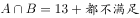。想让最小，两者都不喜欢的同学应尽量少，取值为0，此时。

故正确答案为F。

---

### 第 2 题　qid 2253320 · 数学运算

某高校艺术学院分音乐系和美术系两个系别，已知学院男生人数占总人数的，且音乐系男女生人数之比为1∶3，美术系男女生人数之比为2∶3。问音乐系和美术系的总人数比为多少？

- **A**. 2∶1　✅
- **B**. 3∶2
- **C**. 3∶1
- **D**. 5∶4
- **E**. 1∶2
- **F**. 2∶3
- **G**. 1∶3
- **H**. 4∶5

**答案**：A

**官方解析**

方法一：设音乐系人，美术系人，根据题意音乐系与美术系男生之和占总人数的，可得：，解得，故。

方法二：音乐系男生的比重为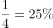，美术系男生的比重为，混合后占的比重为，根据线段法画图如下：

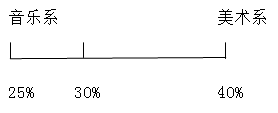

量与距离成反比，因此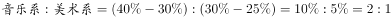。

故正确答案为A。

---

### 第 3 题　qid 2253321 · 数学运算

A工程队的效率是B工程队的2倍，某工程交给两队共同完成需要6天，如果两队的工作效率均提高一倍，且B队中途休息了1天，问要保证工程按原来的时间完成，A队中途最多可以休息几天？

- **A**. 8
- **B**. 7
- **C**. 6
- **D**. 5
- **E**. 4　✅
- **F**. 3
- **G**. 2
- **H**. 1

**答案**：E

**官方解析**

A工程队的效率是B工程队的2倍，可以赋值A工程队效率为2，B工程队效率为1，此时工程总量为。如果两队的工作效率均提高一倍，A工程队效率即为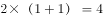，B工程队效率为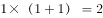。设A工程队休息t天，则有，解得。

故正确答案为E。

---

### 第 4 题　qid 2253322 · 数学运算

A、B两辆车同时从甲地出发驶向乙地，A车到达乙地后立即返回，返回途中与B车相遇，相遇点距乙地30公里，相遇后A车经过4小时返回甲地，B车经过0.5小时到达乙地，则A车往返一趟总共用了多少小时？

- **A**. 

- **B**. 

　✅
- **C**. 

- **D**. 
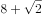

- **E**. 

- **F**. 
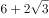

- **G**. 

- **H**. 

**答案**：B

**官方解析**

方法一：设A、B两车从出发到相遇用时为t小时、相遇地点为丙地。由题意可知，乙丙之间的距离为30公里，B车用时为0.5小时，则B车速度为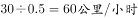。从甲到丙，A车用时4小时，B车用时t小时，二者路程一定，速度和时间成反比，则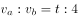，即，可得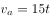。根据A车来看，甲乙之间的距离为；根据B车来看，甲乙之间的距离为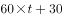；因此可得：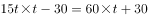，化简得，解方程得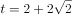。则A车在甲乙两地之间往返一趟总共用了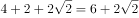小时。

方法二：如图所示，从丙到乙B车用时0.5小时，由题意可知A车速度快于B车，则从丙到乙A车用时应小于0.5小时。因此从甲到乙，A车用时小于4.5小时，往返全程用时应小于9小时。观察选项，只有B项小于9小时。

故正确答案为B。

---

### 第 5 题　qid 2253323 · 数学运算

甲、乙两个相同的杯子中分别装满了浓度为和的两种溶液。将甲杯中倒出一半溶液，用乙杯中的溶液将甲杯加满混合，然后再将已经加满的甲杯中的溶液全部倒入一杯清水中且未溢出，溶液浓度变为。若该溶液密度与水完全相同，问原甲杯中溶液的质量是这杯清水质量的多少倍？

- **A**. 1
- **B**. 2
- **C**. 3
- **D**. 4　✅
- **E**. 5
- **F**. 6
- **G**. 7
- **H**. 8

**答案**：D

**官方解析**

由题意可知，甲倒出一半后又用乙杯中的溶液加满，即浓度为的溶液和等量的浓度为的溶液混合。根据两种溶液的量相等，混合后溶液浓度为原两溶液浓度的平均数，则混合后的浓度为。

又将浓度为的甲与清水（可看作浓度为）混合，混合后浓度为，根据线段法：距离（浓度差）与量（溶液质量）成反比，则，即原甲杯中溶液的质量是清水质量的4倍。

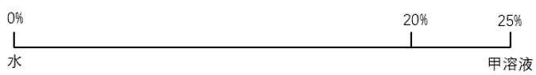

故正确答案为D。

---

### 第 6 题　qid 2253324 · 数学运算

某种商品原价25元，成本为15元，每天可销售20个。现在每降价1元就可以多卖5个，为获得最大利润，需要按照多少元来卖？

- **A**. 23
- **B**. 22　✅
- **C**. 21
- **D**. 20
- **E**. 19
- **F**. 18
- **G**. 17
- **H**. 16

**答案**：B

**官方解析**

假设降价x元，利润为y，则，判定其为一元二次函数，当x的值为函数对称轴时，y值最大。令，则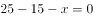，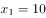；或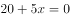，，当x的值取对称轴时，y取得最大值，此时售价为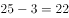元。

故正确答案为B。

---

### 第 7 题　qid 2253325 · 数学运算

一个工程师加工2张桌子和4张凳子共需要10个小时，加工4张桌子和8张椅子需要22个小时。问如果他加工桌子、凳子和椅子各10张，共需要多少小时？

- **A**. 42.5
- **B**. 45
- **C**. 47.5
- **D**. 50
- **E**. 52.5　✅
- **F**. 55
- **G**. 57.5
- **H**. 60

**答案**：E

**官方解析**

方法一：假设每张桌子、凳子、椅子的所需时间分别为小时、小时、小时。

则，a、b、c的值不一定为整数，所以可以使用赋“0”法，为了方便计算，可以赋，则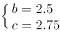，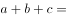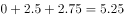，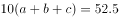。

方法二：假设每张桌子、凳子、椅子的所需时间分别为小时、小时、小时。

则，化简得到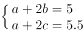两式相加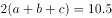，所需时间为52.5小时。

故正确答案为E。

---

### 第 8 题　qid 2253326 · 数学运算

6个小朋友围成一圈做游戏，小华和小明需要挨在一起，问有多少种安排方法？

- **A**. 720
- **B**. 180
- **C**. 560
- **D**. 480
- **E**. 360
- **F**. 240
- **G**. 120
- **H**. 48　✅

**答案**：H

**官方解析**

小华和小明需要挨在一起，可将小华和小明绑在一起做为一个整体，再与剩余4个小朋友进行环形排列，因此可有种安排方法。

故正确答案为H。

---

### 第 9 题　qid 2253327 · 数学运算

有100人参加五项活动，参加人数最多的活动的人数不超过参加人数最少活动人数的两倍，问参加人数最少的活动最少有多少人参加？

- **A**. 10
- **B**. 11
- **C**. 12　✅
- **D**. 13
- **E**. 14
- **F**. 15
- **G**. 16
- **H**. 17

**答案**：C

**官方解析**

将五项活动按参加人数由多到少依次排序为1、2、3、4、5，则参加人数最少的活动为第5项，设第5项活动有x人参加。要使第5项活动参加的人数最少，则其余四项活动参加人数应尽量多，根据题意可知，则其他四项活动参加人数最多可均为人。可列式为,解得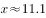，问最少应向上取整，则参加人数最少的活动最少有12人参加。

故正确答案为C。

---

### 第 10 题　qid 2253328 · 数学运算

一个正六边形，边长为50米，一个人从正六边形的一个角点出发沿边长跑步，跑了500米后，问此人与出发点的直线距离为多少米？

- **A**. 

- **B**. 
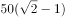

- **C**. 

- **D**. 
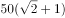

- **E**. 
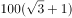

- **F**. 

- **G**. 
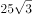

- **H**. 

　✅

**答案**：H

**官方解析**

正六边形的边长为50米，则周长为300米，假设此人从A点顺时针跑，500米后应在B点，此时与出发点的距离为AB，做CD垂直于AB，是一个三个角分别为、、的直角三角形。在直角三角形中，角对应的边等于斜边的一半，则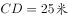，根据勾股定理可计算得BD为米，因此边AB应为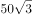米。

故正确答案为H。

---

## 判断推理

### 第 1 题　qid 1796366 · 图形推理

从所给四个选项中，选择最合适的一个填入问号处，使之呈现一定的规律性：

- **A**. A
- **B**. B　✅
- **C**. C
- **D**. D

**答案**：B

**官方解析**

图形元素组成相同，优先考虑位置规律。九宫格优先横向观察，观察第一行发现“○”绕着三角形的边逆时针每次移动一条边，第二行验证此规律成立，因此问号处的“○”应在三角形下面的那条边上，排除C、D两项。观察A、B两项发现，“○”所处的位置不同，一个在三角形外部，一个在三角形内部，因此应考虑两个元素之间的位置关系。经观察发现前两行中都有两个图形“○”位于三角形内部，一个图形“○”位于三角形外部，因此问号处的“○”应于三角形的内部，排除A项。
故正确答案为B。

---

### 第 2 题　qid 1796138 · 图形推理

从所给四个选项中，选择最合适的一个填入问号处，使之呈现一定的规律性：

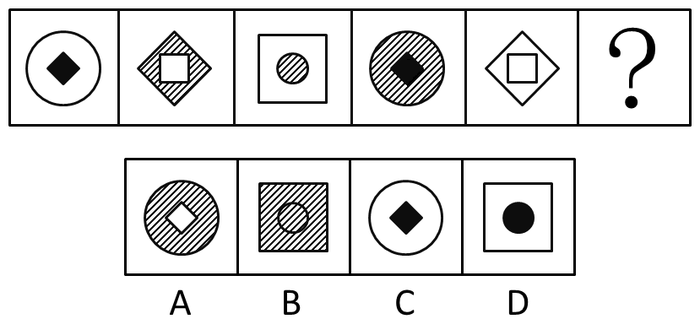

- **A**. A
- **B**. B　✅
- **C**. C
- **D**. D

**答案**：B

**官方解析**

图形元素组成相似，同一个元素不止一次出现，优先考虑遍历。图形都是由内外两个图形组成，优先考虑分开看。外部图形的形状分别为○、◇、□、○、◇，形状遍历，最后问号处应为□，排除A、C两项；B、D两项内部图形形状相同，区别在于颜色，而题干内部图形的颜色分别是黑、白、阴影、黑、白，颜色遍历，最后一幅应该是阴影，排除D项。
故正确答案为B。

---

### 第 3 题　qid 1796430 · 图形推理

把下面的六个图形分为两类，使每一类图形都有各自的共同特征或规律，分类正确的一项是：

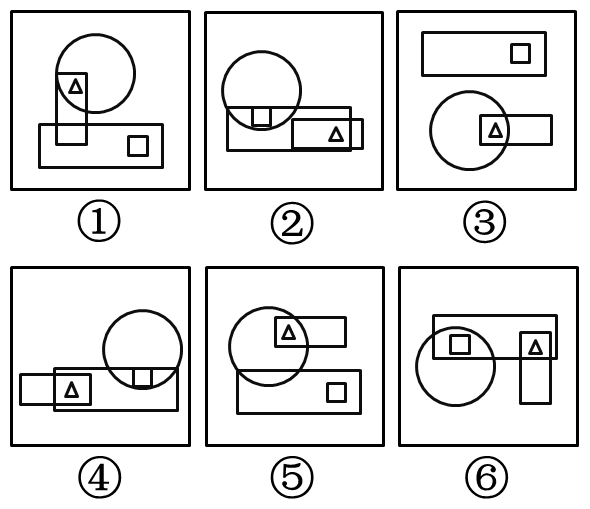

- **A**. ①②③，④⑤⑥
- **B**. ①④⑤，②③⑥
- **C**. ①④⑥，②③⑤
- **D**. ①③⑤，②④⑥　✅

**答案**：D

**官方解析**

本题为分组分类题目。观察发现，每幅图形均有一个小三角形和一个小正方形，优先考虑功能元素。图①③⑤中只有小三角形在两个图形相交区域内，图②④⑥中小三角形和小正方形均在两个图形的相交区域内，因此①③⑤为一组，②④⑥为一组。
故正确答案为D。

---

### 第 4 题　qid 1797874 · 图形推理

从所给四个选项中，选择最合适的一个填入问号处，使之呈现一定的规律性：

- **A**. A　✅
- **B**. B
- **C**. C
- **D**. D

**答案**：A

**官方解析**

考查图形的总点数，第一横行总点数为：5、6、7，第二横行总点数为：7、8、9，第三横行总点数为9、10、11，因此排除C、D两项，而且所有图形内部都有三角形，排除B项，选择A项。
故正确答案为A。

---

### 第 5 题　qid 1796364 · 图形推理

从所给四个选项中，选择最合适的一个填入问号处，使之符合所给的题干所示：

- **A**. A
- **B**. B
- **C**. C　✅
- **D**. D

**答案**：C

**官方解析**

观察题干和选项可知，五角星面是一个特殊的面，由第一个图形可以发现五角星黑色尖端部位所指向的面是“○”的面，选项A中五角星黑色尖端部位所指向的面是“\”面，排除；选项B中五角星黑色尖端部位所指向的面是“□”面，排除；选项D中五角星黑色尖端部位所指向的面是“空白面”，排除。
故正确答案为C。

---

### 第 6 题　qid 1796380 · 定义判断

诱发运动是指由于一个物体的运动使其相邻的一个静止物体产生运动的错觉现象。
根据上述定义，下列属于诱发运动的是：

- **A**. 在黑板前点燃一支蜡烛，并注视着烛光会看到烛光在运动
- **B**. 多张图片按一定空间间隔与时间距离相继呈现形成电影
- **C**. 注视瀑布的某一处，再看周围的树木，会觉得树木在向上飞升
- **D**. 当我们注视夜空时，会看到月亮在动，而云是静止的　✅

**答案**：D

**官方解析**

第一步：找到定义关键词。
“由于一个物体的运动”、“使其相邻的一个静止物体产生运动的错觉”。
第二步：逐一分析选项。
A项：烛光本来就会随风摇动，并不存在让一个静止的物体产生运动的错觉，不符合“使其相邻的一个静止物体产生运动的错觉”，不符合定义，排除；
B项：电影的动态画面是多张图片连续切换的结果，而不是一个物体的运动使相邻静止的物体产生运动的错觉，不符合“由于一个物体的运动”、“使其相邻的一个静止物体产生运动的错觉”，不符合定义，排除；
C项：在注视瀑布后，瀑布向下运动的影像会暂时留在视网膜上，当视线转移到静止的树木时，大脑会误判为树木在向上运动，是运动后效。之所以会觉得树木朝着瀑布向上飞升，原因是长时间注视，不符合“使其相邻的一个静止物体产生运动的错觉”，不符合定义，排除；
D项：注视夜空时会看到月亮在动，而云是静止的，之所以出现这种情况是因为云在运动，给人产生了错觉误以为月亮在运动，符合“由于一个物体的运动”、“使其相邻的一个静止物体产生运动的错觉”，符合定义，当选。
故正确答案为D。

---

### 第 7 题　qid 2253317 · 定义判断

择一的因果关系是指两个或者两个以上的行为人都实施了可能对他人造成损害的危险行为，并且已经造成了损害结果，但是无法确定其中谁是加害人。
根据上述定义，下列存在择一的因果关系的是：

- **A**. 甲、乙两人在搬卸货物过程中因操作不当，造成货物损坏
- **B**. 甲在乙的饮水中下毒，乙喝下后在毒发前又因琐事与丙发生争吵，丙一怒之下用刀刺死了乙
- **C**. 甲、乙共同绑架了丙，甲负责向丙的家人索要赎金，乙为避免被丙认出，将丙残忍杀害
- **D**. 甲、乙、丙三人带着相同的猎枪和子弹外出狩猎，甲、乙看到一只猎物出现在丙附近，二人同时开枪，结果其中一枪打中了丙　✅

**答案**：D

**官方解析**

第一步：找出定义关键词。
“两个或者两个以上的行为人”、“实施了可能对他人造成损害的危险行为”、“已经造成了损害结果”、“无法确定其中谁是加害人”。
第二步：逐一分析选项。
A项：甲、乙两人在搬卸货物过程中因操作不当，造成货物损坏，损坏的是货物，不符合“实施了可能对他人造成损害的危险行为”，不符合定义，排除； 
B项：乙喝下甲下毒的水后，在毒发前又因琐事与丙发生争吵，丙一怒之下用刀刺死了乙，非常明确丙为加害人，不符合“无法确定其中谁是加害人”，不符合定义，排除；
C项：乙为避免被丙认出，将丙残忍杀害，非常明确乙为加害人，不符合“无法确定其中谁是加害人”，不符合定义，排除；
D项：甲、乙看到一只猎物出现在丙附近，二人同时开枪，结果其中一枪打中了丙，但无法确定是谁打中的，符合“已经造成了损害结果”、“无法确定其中谁是加害人”，符合定义，当选。
故正确答案为D。

---

### 第 8 题　qid 1796460 · 定义判断

初级群体指的是由面对面互动所形成的、具有亲密的人际关系和浓厚的感情色彩的社会群体；次级群体指的是其成员为了某种特定的目标集合在一起，通过明确的规章制度结成正规关系的社会群体。
根据上述定义，下列涉及次级群体的是：

- **A**. 亲友团来到比赛现场为小李助威
- **B**. 小赵要到大城市上学了，山里的乡亲们都到村口为他送行
- **C**. 小王考上了研究生，公司的同事一起为他庆贺　✅
- **D**. 20年之后，小张儿时的玩伴建立了一个微信群

**答案**：C

**官方解析**

第一步：找到定义关键词。
关键词为初级群体是由“面对面互动所形成”、“具有亲密的人际关系和浓厚的感情色彩”，次级群体是为了“某种特定的目标”、“通过明确的规章制度”。
第二步：逐一分析选项。
A项：亲友团来到比赛现场为小李助威，群体为亲友团，是通过血缘关系或共同爱好结成的，而不是通过“明确的规章制度”，不符合定义，排除；
B项：小赵考上大学山里乡亲为他送行体现的是一种人际关系和感情色彩，属于初级群体，没有涉及到特定的目标和规章制度，排除；
C项：小王考上研究生，同事为他庆祝，这个群体指的是公司群体，大家的共同目标就是努力工作，把公司搞好，同时这个关系群中有严格的公司规章制度，属于次级群体，当选；
D项：小张的玩伴建立了微信群体现的是亲密的人际关系，属于初级群体，没有涉及到特定的目标和规章制度，排除。
故正确答案为C。

---

### 第 9 题　qid 1796308 · 定义判断

博喻又称连比，就是用几个喻体从不同角度反复设喻去说明一个本体。博喻运用得当，能给人留下深刻的印象。运用博喻能加强语意，增添气势。博喻能将事物的特征或事物的内涵从不同侧面、不同角度表现出来，这是其他类型的比喻所无法达到的。
根据上述定义，下列属于博喻的是：

- **A**. 这个整天同钢铁打交道的技术员，他的心倒不像钢铁那样
- **B**. 桃花潭水深千尺，不及汪伦送我情
- **C**. 上海人叫小瘪三的那批角色，也很像我们的党八股，干瘪得很，样子十分难看
- **D**. 试问闲愁都几许？一川烟草，满城风絮，梅子黄时雨　✅

**答案**：D

**官方解析**

第一步：找出定义关键词。
“用几个喻体从不同角度反复设喻去说明一个本体”。
第二步：逐一分析选项。
A项：“他的心倒不像钢铁那样”是用钢铁来比喻心，只涉及一个喻体，不符合“用几个喻体从不同角度反复设喻去说明一个本体”，不符合定义，排除；
B项：意思是看那桃花潭水，纵然深有千尺，也比不上汪伦送我之情，是将潭水深度与感情进行比较，不存在比喻，不符合“用几个喻体从不同角度反复设喻去说明一个本体”，不符合定义，排除；
C项：上海人叫小瘪三的那批角色很像党八股，是用党八股来比喻小瘪三，只涉及一个喻体，不符合“用几个喻体从不同角度反复设喻去说明一个本体”，不符合定义，排除；
D项：意思是要问我的忧伤有多深多长。就像烟雨一川青草，就像随风飘转的柳絮，梅子黄时的雨水，无边无际。用“一川烟草”“满城风絮”“梅子黄时雨”来比喻“闲愁”，符合“用几个喻体从不同角度反复设喻去说明一个本体”，符合定义，当选。
故正确答案为D。

---

### 第 10 题　qid 1796382 · 定义判断

不规则需求是指某些物品或者服务的市场需求在不同季节，或一周不同日子，甚至一天不同时间上下波动很大的一种需求状况。
根据上述定义，下列哪项属于不规则需求？

- **A**. 早晚高峰期出租车供不应求　✅
- **B**. 某品牌牙刷分为软、硬、中三种以面向不同消费者
- **C**. 某电商店庆打折，活动当天点击量剧增
- **D**. 某博物馆引进一批梵高画作巡展，游客蜂拥而至

**答案**：A

**官方解析**

第一步：找到定义关键词。
关键词为“某些物品或者服务的市场需求”、“不同季节，或一周不同日子，甚至一天不同时间”、“上下波动很大”。
第二步：逐一分析选项。
A项：早晚高峰期出租车供不应求，即出租车服务的市场需求在一天的不同时间上下波动很大，符合定义，当选；
B项：只提到牙刷品牌对牙刷分类，并未提到消费者的反应如何，也不存在需求上下波动，不符合定义，排除；
C项：“店庆打折，活动当天点击量剧增”说明这种打折服务的市场需求很大，并未体现出需求上下波动，不符合定义，排除；
D项：“博物馆引进梵高画作后游客蜂拥而至”说明人们对欣赏梵高画作的需求很大，并未体现出需求上下波动，不符合定义，排除。
故正确答案为A。

---

### 第 11 题　qid 2114644 · 定义判断

红叶子理论认为，一个人职业的成功不在于红叶子数目的多少，而在于他是否具备一片特别硕大的红叶子，这片特别硕大的红叶子不是与生俱来的，需要根据个人优势不断努力才能获得。
根据上述定义，下列哪项能用红叶子理论解释？

- **A**. 小刘虽然偶尔迟到，但对工作尽职尽责、富有团队精神
- **B**. 小张本科学习数学专业，但是他觉得数学专业比较枯燥，所以他选择攻读经济学硕士
- **C**. 小李的销售能力和财务水平一般，但对市场特别敏感，他努力发展这方面优势，最后成了一名企业家　✅
- **D**. 小文是英语系学生，但口语不太好，她辅修了国际法方面的课程，最后成了一名出色的律师

**答案**：C

**官方解析**

第一步：找到定义关键词。
关键词为“职业的成功在于他具有一片特别硕大的红叶子”、“需要靠个人优势不断努力获得”。
第二步：逐一分析选项。
A项：小刘对工作尽职尽责，富有团队精神，没有体现出这是他的个人优势，也没体现出他在不断努力，不符合定义，排除；
B项：小张觉得数学专业枯燥选择了读经济学硕士，没有体现出他的个人优势，也没体现出个人的不断努力，不符合定义，排除；
C项：小李销售水平一般，但是对市场特别敏感，体现了他的个人优势，对市场敏感，同时他努力发展优势体现了他个人不断努力，能用红叶子理论解释，当选；
D项：小文是英语系学生，口语不好，辅修国际法方面的课程最后成为出色律师，说的是虽然有劣势，但是成功了，并没有体现出他的个人优势和特色，不符合定义，排除。
故正确答案为C。

---

### 第 12 题　qid 2114604 · 定义判断

生物学研究发现，成群的蚂蚁中，大部分蚂蚁很勤劳，寻找、搬运食物争先恐后，少数蚂蚁却东张西望不干活。当食物来源断绝或蚁窝被破坏时，那些勤快的蚂蚁一筹莫展。“懒蚂蚁”则“挺身而出”，带领众伙伴向它早已侦察到的新的食物源转移。这就是所谓的懒蚂蚁效应。
根据上述定义，下列属于懒蚂蚁效应的是：

- **A**. 某经理用人不拘一格，看重的是坚韧和正直，而非学历背景
- **B**. 某汽车公司鼓励员工创新，允许员工在上班时间钻研技术
- **C**. 通信工程师待遇优厚，工作时间自由，擅长攻克技术难题　✅
- **D**. 在金融危机中，某外贸公司凭借多元化经营手段渡过了难关

**答案**：C

**官方解析**

第一步：找到定义关键词。
该定义类似寓言，需理解含义：懒蚂蚁是指没有做本来该做的工作，看似东张西望不干活，但实际上是侦查新的食物来源，解决面临的困难。
简单说，就是平时看似没干活，但在关键时刻可以通过创新来解决困难。
第二步：逐一分析选项。
A项：说的是经理的用人标准，并没有涉及员工如何工作，是否干了本职工作之外的创新工作，不符合定义，排除；
B项：“允许员工在上班时间钻研技术”说明员工上班时间可以不做本来该做的工作，而去进行钻研创新，但这只是公司的规定，员工是否真的会这样去做，尚不确定，而且员工能否钻研出新的成果，选项也没有提到，与C项明确指出工程师“擅长攻克技术难题”相比，表述不够明确，不符合定义，排除；
C项：工程师“工作时间自由，擅长攻克难题”，说明工程师的工作环境相对宽松，主要工作就是解决一般员工难以解决的问题，与“懒蚂蚁”相似，看似东张西望不干活，但当出现紧急情况时，可以挺身而出解决困难，符合定义，当选；
D项：并未提到员工如何工作，是否干了本职工作之外的创新工作，不符合定义，排除。
故正确答案为C。

---

### 第 13 题　qid 1797838 · 定义判断

企业从银行或海外取得外汇借款后并不是直接使用外汇资金，而是将外汇结汇给银行，取得人民币资金加以使用，这种现象称之为贷款替代。
根据上述定义，下列哪项属于贷款替代？

- **A**. 人民币升值后，一些企业纷纷减少人民币负债，增加外汇负债，然后再用人民币进行投资　✅
- **B**. 国内经济过热，商业银行对人民币贷款的发放从紧。某贸易公司出于财务考虑转向外资银行贷款，获得外币资金
- **C**. 王明觉得人民币利率高于美元，因此他申请美元贷款，然后将外汇结汇给银行，从而获得人民币资金
- **D**. 小宇出国旅游前去银行兑换了一些外币，到国外后他使用信用卡结算，回国后用人民币还款

**答案**：A

**官方解析**

第一步：找出定义关键词。
“企业”、“不是直接使用外汇资金”、“取得人民币资金加以使用”。
第二步：逐一分析选项。
A项：一些企业增加外汇负债，然后再用人民币进行投资，符合不直接使用外汇资金，而是取得人民币加以使用，符合定义，当选；
B项：某贸易公司获得外币资金，但并没有转换为人民币加以使用，不符合定义，排除；
C项：主体是王明，不符合定义主体企业，不符合定义，排除；
D项：主体是小宇，不符合定义主体企业，不符合定义，排除。
故正确答案为A。

---

### 第 14 题　qid 2114614 · 定义判断

“气候难民”指的是生存因气候变暖等特殊气候因素而受到威胁的人们，这是一个逐渐扩大的族群。某基金会发表的一份报告称，在未来40年，全球约5到6亿人都面临着沦为“气候难民”的危险。
下列描述中被迫迁移的人们，不属于“气候难民”的是：

- **A**. 卡特里娜飓风使得墨西哥海岸的众多居民逃离家乡
- **B**. 印度洋海啸导致了印度、泰国等多国居民被迫迁移　✅
- **C**. 土地沙漠化使曾经繁荣的楼兰古国消亡，国民外迁
- **D**. 海平面上涨使马尔代夫领导人为国民另觅栖身之所

**答案**：B

**官方解析**

第一步：找到定义关键词。
关键词为“气候变暖”、“导致生存受到威胁”、“逐渐扩大的人群”。
第二步：逐一分析选项。
A项：卡特里娜飓风是由于特殊气候因素引起的，同时众多居民逃离家乡是一种生存威胁，属于“气候难民”，排除；
B项：印度洋海啸不是由气候因素引起的，一般是由地震或者气象变化产生的破坏性波浪，不属于“气候难民”，为正确答案，当选；
C项：土地沙漠化是由于气候变异或者人类活动引起的，属于“气候难民”，排除；
D项：海平面上涨是由于气候因素引起的，导致国民生存受到威胁，符合定义，排除。
本题为选非题，故正确答案为B。

---

### 第 15 题　qid 1796272 · 定义判断

精益生产是通过系统结构、人员组织、运行方式和市场供求等方面的变革，最大限度地消除浪费和降低库存以及缩短生产周期，力求实现低成本准时生产的技术，其最终目的是通过流程整体优化、均衡物流、高效利用资源、消灭一切库存和浪费，达到用最少的投入向顾客提供最完美价值的目的。
根据上述定义，下列属于精益生产的是：

- **A**. 为了抢占市场，甲公司不断提高空间利用率
- **B**. 乙公司投入了大量资金以缩短其产品生产周期
- **C**. 丙公司的强大供货体系保证它能随时满足客户
- **D**. 丁公司充分发挥自身优势建立了超快的物流系统　✅

**答案**：D

**官方解析**

第一步：找到定义关键词。
题干中精益生产的方式是“通过系统结构、人员组织、运行方式和市场供求等方面的变革”，目的是“整体优化、均衡物流、高效利用资源”，达到“最少的投入向顾客提供最完美的价值”。
第二步：逐一分析选项。
A项：题干中的目的是为顾客提供最完美的价值，A项中的目的是抢占市场，不符合定义，排除；
B项：题干中的方式是通过系统结构、人员组织、运行方式和市场供求等方面，B是通过资金的调整，不符合定义，排除；
C项：只说到有强大的供货体系，但是这个供货体系是否经过各方面的变革，是否是最优化的并没有提及，该选项不够明确；
D项：充分发挥自身优势就是对公司优势资源的高效利用，建立超快物流体系符合“均衡物流，高效利用资源”，符合定义。
C、D两项比较而言，D项更加明确地体现了对优势资源的充分利用，实现了均衡物流、高效利用资源的效果。
故正确答案为D。

---

### 第 16 题　qid 1796410 · 类比推理

黄连：苦涩

- **A**. 班级：团结
- **B**. 钻石：坚硬　✅
- **C**. 花朵：鲜红
- **D**. 城市：繁华

**答案**：B

**官方解析**

第一步：分析题干词语间的逻辑关系。
黄连是一种草本植物，其味入口一定是极苦，因此苦涩是黄连的一种必然属性。
第二步：逐一分析选项。
A选项：班级可能团结可能不团结，不是一种必然属性关系，与题干逻辑不符，排除；
B选项：钻石是指经过琢磨的金刚石。金刚石在天然矿物中的硬度最高，因此坚硬是钻石的必然属性，与题干逻辑关系一致，为正确答案，当选；
C选项：鲜红是花朵的属性，但花朵不一定是鲜红的，花朵的颜色可以多样，不是必然属性，与题干逻辑不符，排除；
D选项：城市不一定繁华，不是一种必然属性关系，与题干逻辑不符，排除。
故正确答案为B。

---

### 第 17 题　qid 1797842 · 类比推理

苏轼：春江水暖鸭先知

- **A**. 李煜：自是人生长恨水长东　✅
- **B**. 刘禹锡：江春入旧年
- **C**. 李商隐：照影摘花花似面
- **D**. 晏殊：那人却在灯火阑珊处

**答案**：A

**官方解析**

第一步：分析题干词语的逻辑关系。
对应关系，诗人对应诗句。
第二步：逐一分析选项。
A项：“自是人生长恨水长东”出自李煜的《相见欢》，对应正确，当选；
B项：“江春入旧年”的作者不是刘禹锡，而是王湾，对应错误，排除；
C项：“照影摘花花似面”的作者不是李商隐，而是欧阳修，对应错误，排除；
D项：“那人却在灯火阑珊处”的作者不是晏殊，是辛弃疾，对应错误，排除。
故正确答案为A。

---

### 第 18 题　qid 2114670 · 类比推理

指鹿为马：颠倒黑白

- **A**. 师心自用：固执己见　✅
- **B**. 目无全牛：鼠目寸光
- **C**. 不以为然：不屑一顾
- **D**. 不孚众望：众望所归

**答案**：A

**官方解析**

第一步：分析题干中词语的逻辑关系。
“指鹿为马”意思是指着鹿，说是马，比喻故意颠倒黑白，混淆是非。
“颠倒黑白”意思是把黑的说成白的，白的说成黑的，比喻歪曲事实，混淆是非，指鹿为马。
二者为近义词。
第二步：逐一分析选项。
A项：“师心自用”形容自以为是，不肯接受别人的正确意见，“固执己见”是指顽固地坚持自己的意见，不肯改变，二者为近义词，符合题干逻辑关系，当选；
B项：“目无全牛”意思是眼中没有完整的牛，只有牛的筋骨结构，形容技艺已经到达非常纯熟的地步，“鼠目寸光”比喻目光短浅，缺乏远见，二者不是近义词，不符合题干逻辑关系，排除；
C项：“不以为然”意思是不认为是对的，表示不同意或否定，“不屑一顾”意思是认为不值得一看，形容极端轻视，二者不是近义词，不符合题干逻辑关系，排除；
D项：“不孚众望”意思是不能使大家信服，未符合大家的期望，“众望所归”是指某人得到大家的信赖，希望他担任某项工作或完成事情，二者不是近义词，不符合题干逻辑关系，排除。
故正确答案为A。

---

### 第 19 题　qid 1797804 · 类比推理

商品：琳琅满目

- **A**. 商场：熙熙攘攘
- **B**. 公司：运筹帷幄
- **C**. 教学：紧张有序　✅
- **D**. 家庭：相亲相爱

**答案**：C

**官方解析**

第一步：判断题干词语间的逻辑关系。
琳琅满目可以修饰商品，琳琅满目的商品。
第二步：判断选项词语间的逻辑关系。
A项：熙熙攘攘可以修饰人群，但是不能修饰商场，与题干逻辑关系不一致，排除；
B项：运筹帷幄可以修饰人，但是不能修饰公司，与题干逻辑关系不一致，排除；
C项：紧张有序可以修饰教学，紧张有序的教学，与题干逻辑关系一致，当选；
D项：相亲相爱可以修饰人，但是不能修饰家庭，与题干逻辑关系不一致，排除。
故正确答案为C。

---

### 第 20 题　qid 2114688 · 类比推理

沟通：手机：金属

- **A**. 招聘：面试：简介
- **B**. 物流：运输：公路
- **C**. 卫星：科技：科学家
- **D**. 露营：帐篷：帆布　✅

**答案**：D

**官方解析**

第一步：判断题干词语间逻辑关系。
“手机”用于“沟通”，“手机”的材质是“金属”。
第二步：判断选项词语间逻辑关系。
A项： “面试”是“招聘”的一个环节，与题干逻辑关系不一致，排除。
B项： “运输”是“物流”的一个环节，与题干逻辑关系不一致，排除。
C项： “卫星”是“科技”发展的成果，与题干逻辑关系不一致，排除。
D项：“帐篷”用于“露营”，“帐篷”的材质是“帆布”，与题干逻辑关系一致，当选。
故正确答案为D。

---

### 第 21 题　qid 2114680 · 类比推理

（  ）对于 美丽 相当于 春风满面 对于 （  ）

- **A**. 楚楚动人 愉快　✅
- **B**. 笑靥如花 兴奋
- **C**. 眉开眼笑 高兴
- **D**. 心地善良 滋润

**答案**：A

**官方解析**

A项：楚楚动人形容姿容美好，动人心神，形容人很美丽。春风满面形容人心情愉快，满脸笑容，形容人很愉快，当选；
B项：笑靥如花形容女子的笑脸像花儿一样美丽，但春风满面不形容兴奋，排除；
C项：眉开眼笑形容人高兴愉快的样子，也不形容人美丽，排除；
D项：心地善良指有道德、德行好，不形容美丽，排除。
故正确答案为A。

---

### 第 22 题　qid 1797844 · 类比推理

报刊：新闻：眼睛

- **A**. 出版社：书籍：眼睛
- **B**. 唱片：歌曲：耳朵　✅
- **C**. 土地：玉米：嘴巴
- **D**. 法院：法律：大脑

**答案**：B

**官方解析**

第一步：分析题干词语的逻辑关系。
眼睛看报刊上的新闻，为对应关系，报刊是新闻的载体之一。
第二步：逐一分析选项。
A项：出版社不是书籍的载体，而是出版书籍的场所，和题干逻辑关系不一致，排除；
B项：耳朵听唱片里的歌曲，唱片是歌曲的载体之一，和题干逻辑关系一致，当选；
C项：土地不是玉米的载体，而是种玉米的场所，和题干逻辑关系不一致，排除；
D项：法院依据法律办事，不是法律的载体，和题干逻辑关系不一致，排除。
故正确答案为B。

---

### 第 23 题　qid 1796234 · 类比推理

出行：雾霾：口罩

- **A**. 休息：沙发：电视
- **B**. 超车：公路：路标
- **C**. 勘探：野外：地图　✅
- **D**. 娱乐：海滨：游泳

**答案**：C

**官方解析**

第一步：判断题干词语间逻辑关系。
“出行”是行为，“雾霾”是环境，“口罩”是工具，可以造句为“在雾霾天气出行需要戴口罩”，三者为特殊环境中的行为与特殊工具的对应关系。
第二步：判断选项词语间逻辑关系。
A项：“沙发”是家具，不是环境，与题干逻辑关系不一致，排除；
B项：“路标”是指路的一种工具，在“公路”上“超车”的时候不需要“路标”，与题干逻辑关系不一致，排除；
C项：“勘探”是行为，“野外”是环境，“地图”是工具，可以造句为“在野外勘探需要用到地图”，三者为特殊环境中的行为与特殊工具的对应关系，与题干逻辑关系一致，当选；
D项：“游泳”不是工具，与题干逻辑关系不一致，排除。
故正确答案为C。

---

### 第 24 题　qid 2114658 · 类比推理

水：森林：煤炭

- **A**. 雪：丰年：喜悦
- **B**. 表扬：自信：乐观
- **C**. 氮：蛋白质：智力　✅
- **D**. 闪电：雨：打伞

**答案**：C

**官方解析**

第一步：分析题干词语的逻辑关系。
水是森林存在的必要条件，森林是产生煤炭的必要条件。
第二步：逐一分析选项。
A选项：瑞雪预示着丰年，但雪不是丰年的必要条件，丰年会让人喜悦，但也不是必要条件，不符合题干逻辑关系，排除；
B选项：表扬可能会让人更有自信，自信与乐观是并列关系，不符合题干逻辑关系，排除；
C选项：氮是组成蛋白质的元素之一，没有氮，蛋白质就不存在，氮是蛋白质存在的必要条件，没有蛋白质就没有动物和人类，也不可能存在智力，蛋白质是智力存在的必要条件，符合题干逻辑关系，当选；
D选项：闪电并不是雨产生的必要条件，而是打雷的必要条件，不符合题干逻辑关系，排除。
故正确答案为C。

---

### 第 25 题　qid 1797848 · 类比推理

秦朝：嬴政：咸阳：西汉

- **A**. 北宋：赵匡胤：开封：南宋
- **B**. 唐朝：李世民：长安：后梁
- **C**. 明朝：朱元璋：应天：清朝　✅
- **D**. 清朝：康熙：北京：民国

**答案**：C

**官方解析**

第一步：判断题干词语间逻辑关系。
题干四组词之间是对应关系，这四个词语依次代表着：朝代、该朝代的开国皇帝、该朝代的都城和下一个新朝代。
第二步：判断选项词语间逻辑关系。
A项：北宋、南宋在历史上是一个朝代，南宋王朝是北宋王朝的延续，因此南宋并非北宋的下一个新朝代，与题干逻辑关系不一致，排除；
B项：唐朝的开国皇帝不是李世民，而是李渊，与题干逻辑关系不一致，排除；
C项：明朝的开国皇帝是朱元璋，应天府是明朝的都城，明朝的下一个新朝代是清朝，与题干逻辑关系一致，当选；
D项：清朝的开国皇帝不是康熙，而是皇太极，与题干逻辑关系不一致，排除。
故正确答案为C。

---

### 第 26 题　qid 1796286 · 逻辑判断

一个没有普通话一级甲等证书的人不可能成为一个主持人，因为主持人不能发音不标准。
上述论证还需基于以下哪一前提？

- **A**. 没有一级甲等证书的人都会发音不标准　✅
- **B**. 发音不标准的主持人可能没有一级甲等证书
- **C**. 一个发音不标准的人有可能获得一级甲等证书
- **D**. 一个发音不标准的主持人不可能成为一个受人欢迎的主持人

**答案**：A

**官方解析**

第一步：找到题干论点论据。

论点：没有一级甲等证书的人不能成为主持人，即：没有一级甲等证书不是主持人（1）。

论据：主持人不能发音不标准，即：主持人发音标准（2）。

论点说的是“一级甲等证书”和“主持人”，论据说的是“主持人”和“发音”，二者话题不一致，要想加强优先考虑搭桥，且由论据搭向论点，即“发音标准有一级甲等证书”。

第二步：逐一分析选项。

A项：没有一级甲等证书发音不标准，其等价命题为：发音标准→有一级甲等证书，最强搭桥项，当选；

B项：发音不标准的可能没有证书，既是可能性的表述，同时也不符合我们需要的条件逻辑，排除；

C项：发音不标准的可能获得证书，既是可能性的表述，同时也不符合我们需要的条件逻辑，排除；

D项：说的是发音标准与受欢迎之间的关系，排除。

故正确答案为A。

---

### 第 27 题　qid 2253318 · 逻辑判断

在某图书馆中，涉及民国时期的历史书均只存放于第二层的专业书库中，外文类的典藏书籍均只存放于第三层的珍本阅览室中。小林周末到该图书馆借了一本外文类历史书。
由此可以推出小林借的书（　　）。

- **A**. 是珍本书
- **B**. 不是珍本书
- **C**. 是涉及民国时期的典藏书籍
- **D**. 不是涉及民国时期的典藏书籍　✅

**答案**：D

**官方解析**

方法一：整理题干条件。

①民国历史二层专业书库；②外文典藏三层珍本。

从题干已知条件推不出任何确定结论，因此本题采用代入法。

假设A项正确：小林借的是珍本书，是条件②的肯后，肯后推不出必然结论，为不确定项；

假设B项正确：小林借的不是珍本书，是条件②的否后，否后必否前，—三层珍本—外文典藏，题干说小林借的是外文书，和题干矛盾，因此也得不出必然结论，为不确定项；

假设C项正确，是民国时期的典藏书籍，那么说明这本书是民国历史书，也是外文典藏书，就把翻译后的表达式的①②的前件都肯定了，肯前必肯后，得到的是小林借书既是只能在二层又是只能在三层，矛盾。因此小林借的肯定不是民国时期的典藏书籍，D项正确。

故正确答案为D。

方法二：整理题干条件。

①民国历史二层专业书库；②外文典藏三层珍本。

从题干已知小林借的是“外文类历史书”只存放于第三层，不可能在第二层，因此不涉及民国时期内容。

故正确答案为D。

---

### 第 28 题　qid 1796206 · 类比推理

理论认为，反物质是正常物质的反状态，当正反物质相遇时，双方就会相互湮灭抵消，发生爆炸并产生巨大能量，有人认为，反物质是存在的，因为到目前为止没有任何证据证明反物质是不存在的。
以下哪项与题干中的论证方式相同？

- **A**. 圣女贞德的审问者们曾对她说，我们没有证据证明上帝与你有过对话，你可能是在胡编乱造，也可能精神失常
- **B**. 动物进化论是正确的，例如始祖鸟就是陆地生物向鸟类进化过程中的一类生物
- **C**. 既然不能证明平行世界不存在，那么平行世界就是存在的　✅
- **D**. 长白山天池有怪兽，因为有人看见过怪兽曾在天池内活动的踪迹

**答案**：C

**官方解析**

第一步：分析题干的论证方式。
因为没有任何证据证明反物质是不存在的，所以反物质是存在的。这种论证方式是诉诸无知，其论证模式是：没有证明S为真，所以S为假的；没有证明S为假，所以S为真的。
第二步：逐一分析选项。
A选项，“没有证据证明上帝与你有过对话，你可能是在胡编乱造，也可能精神失常”，并不符合题干的论证模式，排除；
B选项，论证方式为举例论证，即抛出一个观点，然后举出一个例子来证明这个观点，不符合题干的论证模式，排除；
C选项，“不能证明平行世界不存在，那么平行世界就是存在的”完全符合题干的论证模式，当选；
D选项，因为有活动踪迹，所以有怪兽，这是因为有证据所以得到一个结论，不符合题干的论证模式，排除。
故正确答案为C。

---

### 第 29 题　qid 1796110 · 逻辑判断

人们在社会生活中常会面临选择，要么选择风险小，报酬低的机会；要么选择风险大，报酬高的机会。究竟是在个人决策的情况下富于冒险性，还是在群体决策的情况下富于冒险性？有研究表明，群体比个体更富有冒险精神，群体倾向于获利大但成功率小的行为。
以下哪项如果为真，最能支持上述研究结论？

- **A**. 在群体进行决策时，人们往往会比个人决策时更倾向于向某一个极端偏斜，从而背离最佳决策　✅
- **B**. 个体会将其意见与群体其他成员相互比较，因其想要被其他群体成员所接受及喜爱，所以个体往往会顺从群体的一般意见
- **C**. 在群体决策中，很可能出现以个体或子群体为主发表意见、进行决策的情况，使群体决策为个体或子群体所左右
- **D**. 群体决策有利于充分利用其成员不同的教育程度、经验和背景，他们的广泛参与有利于最高决策的科学性

**答案**：A

**官方解析**

第一步：找到论点论据。
论点：群体比个体更具有冒险精神，群体倾向于获利大但成功率小的行为。
本题没有论据。
第二步：逐一分析选项。
A选项：群体作决策时比个人更容易走极端，将群体决策和个人决策做比较，解释了群体决策与个人决策之间存在差距的原因，可能会导致群体倾向于获利大但成功率小的行为，有一定的加强作用；
B选项：说的是在群体中个体会偏向于群体的一般意见，论证的是个体在群体中是坚持自己独特意见还是屈众，跟论题不一致，所以排除；
C选项：群体决策可能会被个体或者子群体所主导，也就是说群体决策可能和个体决策是一样的，而不是比个体决策更具有冒险精神，有削弱的意思，排除；
D选项：题干中没有涉及到决策的科学性与成功率，为无关选项，排除。
B、D两项为无关选项，C项有削弱的意思，只有A项有一定的加强作用，比较而言只能选A。
故正确答案为A。

---

### 第 30 题　qid 1796280 · 逻辑判断

酒精本身没有明显的致癌能力。但是许多流行病学调查发现，喝酒与多种癌症的发生风险正相关——也就是说，喝酒的人群中，多种癌症的发病率升高了。
以下哪项如果为真，最能支持上述发现？

- **A**. 
酒精在体内的代谢产物乙醛可以稳定地附着在DNA分子上，导致癌变或者突变
　✅
- **B**. 
东欧地区的人广泛食用甜烈性酒，该地区的食管癌发病率很高 

- **C**. 
烟草中含有多种致癌成分，其在人体内代谢物与酒精在人体内代谢物相似

- **D**. 
有科学家估计，如果美国人都戒掉烟酒，那么的消化道癌可以避免 

**答案**：A

**官方解析**

第一步：找到题干论点论据。
论点：喝酒与多种癌症发生风险正相关。
无论据。
第二步：逐一分析选项。
A选项，说明了酒精在人体内的代谢产物是可以致癌的，解释了题干中所说“酒精无致癌能力，但是饮酒的人中患癌症的几率高”，属于解释论点加强；
B选项，以东欧的人和甜烈性酒作为例子，属于举例加强，加强力度比解释论点加强要弱。并且A选项说的是酒精和人体，是普遍性的，B选项说的是东欧的人，以及甜烈性酒，都属于个例，根据整体加强力度大于局部加强力度的原则，也可排除B项；
C选项，烟草能够致癌，其在人体内代谢物与酒精的代谢物相似，属于类比加强。但是类比只是一种可能性加强，要想证明酒精的代谢物能致癌，还是要进一步分析酒精与烟草致癌机理是否一致，其实还是需要类似A项那样的解释，故不如A项明确，排除；
D选项，如果戒掉烟酒，可避免消化道癌，但不清楚到底是烟致癌还是酒致癌，还是两者在一起能致癌，所以属于不明确选项，排除。
故正确答案为A。

---

### 第 31 题　qid 1796276 · 逻辑判断

有报道称，由于人类大量排放温室气体，过去150多年中全球气温一直在持续上升。但与1970年至1998年相比，1999年至今全球表面平均气温的上升速度明显放缓，近15年来该平均气温的上升幅度不明显，因此全球变暖并不是那么严重。
如果以下各项为真，最能削弱上述论证的是？

- **A**. 海洋和气候系统的调整过程使得海洋表层热量向深海输送
- **B**. 此现象在上世纪50~70年代曾出现过，随后又开始加速变暖　✅
- **C**. 联合国气候专家指出，空气中的二氧化碳浓度处于80万年来的最高点
- **D**. 近几年发生多起因气候变暖而产生的自然灾害

**答案**：B

**官方解析**

第一步：找到论点和论据。
论点：全球变暖并不严重。
论据：与1970年至1998年相比，1999年至今全球表面平均气温的上升速度明显放缓，近15年来该平均气温的上升幅度不明显。
第二步：逐一分析选项。
A项：海洋表层热量向深海输送，解释了地球表面温度上升为什么会减缓，补充论据，为加强项，无法削弱，排除；
B项：此现象指的是全球表面平均气温上升速度放缓的现象，这个现象曾经出现过，但随后又加速变暖，即：气温上升速度的放缓并不能得出变暖不严重，有可能之后全球变暖会更加严重，可以削弱，当选；
C项：首先专家的意见不一定符合实情，其次二氧化碳和全球变暖的关系题干中也没提到，需进一步说明才能明确，为无关项，无法削弱，排除；
D项：题干主题是全球变暖这件事儿会不会变得更严重，而D项说的是气候变暖所带来的后果是什么，二者话题并不一致，为无关项，无法削弱，排除。
故正确答案为B。

---

### 第 32 题　qid 1796284 · 逻辑判断

记者采访时的提问要具体、简洁明了，切忌空泛、笼统、不着边际。约翰·布雷迪在《采访技巧》中剖析了记者采访时向访问对象提出诸如“您感觉如何？”等问题的弊端，认为这些提问“实际上在信息获取上等于原地踏步，它使采访对象没法回答，除非用含混不清或枯燥无味的话来应付。”
由此可以推出：

- **A**. 记者采访时的提问如果具体、简洁明了，就不会给采访对象带来回答的困难
- **B**. 采访对象如果没法回答提问，说明他没有用含混不清或枯燥无味的话来应付
- **C**. 采访对象只有用含混不清或枯燥无味的话来应付，才能回答那些空泛、笼统的提问　✅
- **D**. 诸如“您感觉如何？”这样的问题，只能使采访对象抓不住问题的要点而作泛泛的或言不由衷的回答

**答案**：C

**官方解析**

第一步：翻译题干。

除非，否则不这个关联词可翻译为：后前的形式，因此，题干最后一句话翻译为：

回答了含混不清或枯燥无味。

第二步：逐一翻译选项。

A项：记者采访时的提问如果具体、简洁明了是否能给采访对象带来回答的困难，原文当中完全没有提到过，属于无中生有的选项，排除；

B项：可翻译为：没法回答没有（含混不清或枯燥无味），否前否后，与题干的翻译形式不一致，排除；

C项：可翻译为：回答含混不清或枯燥无味，与题干翻译形式一致，符合题意，当选；

D项：选项中因为采访对象抓不住要点而作泛泛的或言不由衷的回答，原文说的是采用含混不清或枯燥无味，不等同于泛泛或言不由衷，属于概念的偷换，并且这么回答的原因是什么，题干也没有提到，排除。

故正确答案为C。

---

### 第 33 题　qid 1796108 · 逻辑判断

某市为了实施文化强市战略，在2008年、2010年先后建成了两个图书馆，2008年底共办理市民借书证7万余个，到2010年底共办理市民借书证13余万个。2011年，该市又在新区建立了第三个图书馆，于2012年初落成开放，截止2012年底，全市共计办理市民借书证20余万个，市政府由此认为，该项举措是有实效的，因为在短短的4年间，光顾图书馆的市民增加了近两倍。
以下哪项如果为真，最能削弱上述结论？

- **A**. 图书馆要不断购置新书，维护成本也很高，这会影响该市其他文化设施建设
- **B**. 该市有两所高等学校，许多在校生也办理了这3个图书馆的借书证
- **C**. 很多办理了第一个图书馆借书证的市民又办理了另外两个图书馆的借书证　✅
- **D**. 该市新区建设发展迅速，4年间很多外来人口大量涌入新区

**答案**：C

**官方解析**

第一步：找到论点论据。
论点：该项举措（建图书馆）是有实效的。
论据：在建成三个图书馆的4年内，光顾图书馆的市民增加了近两倍。
论据说的是光顾图书馆的市民多了，论点说的是举措是有实效的，根据论据可以合理推出论点，因此话题一致，削弱优先考虑削弱论点，也可以考虑削弱论据。
第二步：逐一分析选项。
A项：该项说的是图书馆的维护成本高，与论点讨论的建图书馆能否取得实效无关，话题不一致，不能削弱，排除；
B项：该项说的两所高校的学生也办理了借书证，说明建立图书馆对这两所高校的学生有帮助，有一定的实效，可以加强，不能削弱，排除；
C项：该项说的是一个市民办理三个借书证，这样就是说明看书的人并不一定在增加，只是一人办多证，削弱论据，可以削弱，当选；
D项：该项说的是4年间很多外来人口大量涌入新区，外来人口对于借书证影响不明确，为不明确选项，无法削弱，排除。
故正确答案为C。

---

### 第 34 题　qid 1796278 · 逻辑判断

近日，火星车在加勒陨坑拍摄的图像发现，火星陨坑内的远古土壤存在着类似地球土壤裂纹剖面的土壤样本，通常这样的土壤存在于南极干燥谷和智利阿塔卡马沙漠，这暗示着远古时期火星可能存在生命。
以下哪项如果为真，最能支持上述结论？

- **A**. 地球沙漠土壤中存在土块，具有多孔中空结构，硫酸盐浓度较高，这一特征在火星土壤层并不明显
- **B**. 化学物质分析显示，陨坑内土壤的化学风化过程以及粘土沉积中橄榄石矿损耗情况与地球土壤的状况较为接近
- **C**. 这些火星远古土壤样本仅表明火星早期可能曾是温暖潮湿的，那时的环境比现今更具宜居性
- **D**. 土壤裂纹剖面中的磷损耗特别引人注意，因为地球土壤也存在这种现象，这是由于微生物的活跃性所致　✅

**答案**：D

**官方解析**

第一步：找出论点和论据。
论点：远古时期火星可能存在生命。
论据：火星陨坑内的远古土壤存在着类似地球土壤裂纹剖面的土壤样本。
第二步：逐一分析选项。
A项：地球沙漠土壤与火星土壤不同，是对论据的削弱，无法加强，排除。
B项：经化学物质分析后，陨坑内土壤与地球上土壤的化学风化过程相似，与论据表意相同，是对论据的加强，保留。
C项：火星远古土壤样本情况仅表明火星早期的环境比现在宜居，但并没有明确说明当时是否存在生命，不明确选项，排除。
D项：磷在土壤裂纹剖面中有损耗，说明有微生物存在，解释了为什么看到土壤裂纹剖面就说明可能有生命，属于搭桥加强。
B、D两项都能加强，但是D项搭桥的加强力度强于重复论据的B项。
故正确答案为D。

---

### 第 35 题　qid 1796106 · 逻辑判断

干细胞遍布人体，因为拥有变成任何类型细胞的能力而令科学家们着迷，这种能力意味着它们有可能修复或者取代受损的组织。而通过激光刺激干细胞生长很有可能实现组织生长，因此研究人员认为激光技术或许将成为医学领域的一种变革工具。
以下哪项如果为真，最能支持上述结论？

- **A**. 不同波段的激光对机体组织作用的原理尚不清楚
- **B**. 已有病例表明，激光会对儿童视网膜造成损伤，影响视力
- **C**. 目前激光刺激生长法尚未在人类机体上进行试验，风险还待评估
- **D**. 用激光治疗带有牙洞的臼齿，受损的牙体组织能逐渐恢复　✅

**答案**：D

**官方解析**

第一步：找到题干论点论据。
论点：激光技术或许将成为医学领域的一种变革工具；
论据：激光刺激干细胞生长可能实现组织生长，干细胞具有可以变成任何类型细胞的能力。
第二步：逐一分析选项。
A选项，讨论的是不同波段的激光对人体的组织作用的原理不清楚，属于不明确选项，排除；
B选项，用激光对儿童视网膜影响的例子来证明激光技术会对人体有损伤，属于举例削弱，排除；
C选项，没有在人体试验，风险还待评估，属于不明确选项，排除；
D选项，用有洞的牙齿来作为例子，证明激光技术确实能够成为医学领域变革的工具，举例加强，当选。
故正确答案为D。

---

## 资料分析

### 材料 1

根据以下资料，回答下列问题。

        2015年1-3月，国有企业营业总收入103155.5亿元，同比下降。其中，中央企业收入63191.3亿元，同比下降。地方国有企业收入39964.2亿元，同比下降。

        1-3月，国有企业营业总成本100345.5亿元，同比下降，其中销售费用、管理费用和财务费用同比分别下降、增长和增长。其中，中央企业成本60216.5亿元，同比下降；地方国有企业成本40129亿元，同比下降。

        1-3月，国有企业利润总额4997.3亿元，同比下降。国有企业应交税金9383亿元，同比增长。

        3月末，国有企业资产总额1054875.4亿元，同比增长；负债总额685766.3亿元，同比增长；所有者权益合计369109.1亿元，同比增长。其中，中央企业资产总额554658.3亿元，同比增长；负债总额363304亿元，同比增长；所有者权益为191354.4亿元，同比增长。地方国有企业资产总额500217.1亿元，同比增长；负债总额322462.3亿元，同比增长；所有者权益为177754.7亿元，同比增长。

#### 第 1 题　qid 1796340 · 综合

2014年1-3月，国有企业营业总收入最接近：

- **A**. 10.5万亿元
- **B**. 11万亿元　✅
- **C**. 11.5万亿元
- **D**. 12万亿元

**答案**：B

**官方解析**

根据题干中“2014年1~3月”，可以判断本题为基期计算问题。定位文字材料第一段，2015年1~3月，国有企业营业总收入103155.5亿元，同比下降。代入基期公式：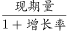=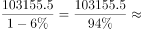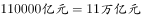。

故正确答案为B。

---

#### 第 2 题　qid 1796336 · 增长

2015年1-3月，在销售费用、管理费用和财务费用中，占国有企业营业总成本的比重同比上升的有几项？

- **A**. 0
- **B**. 1
- **C**. 2
- **D**. 3　✅

**答案**：D

**官方解析**

根据题干中“2015年1-3月······占国有企业营业总成本的比重”，可以判定本题为两期比重问题。只需比较部分量的增长率a和整体量的增长率b，为上升。定位文字材料第二段，销售费用的增长率（下降）、管理费用的增长率（增长）及财务费用的增长率（增长）均大于国有企业营业总成本的增长率b（下降），即比重上升；因此，比重上升的有3项。

故正确答案为D。

---

#### 第 3 题　qid 1796334 · 比重

2015年3月末，中央企业所有者权益占国有企业总体比重比上年同期约：

- **A**. 下降了0.7个百分点　✅
- **B**. 下降了1.5个百分点
- **C**. 上升了0.7个百分点
- **D**. 上升了1.5个百分点

**答案**：A

**官方解析**

根据题干中“2015年3月”“比上年同期”“占比重”，可以判定本题为两期比重问题。定位文字材料第四段，可以得到中央企业所有者权益为191354.4亿元，同比增长；国有企业所有者权益合计369109.1亿元，同比增长。代入两期比重公式，先判断上升还是下降，由可判断为下降，排除C、D两项。&lt;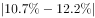，故答案应小于，只有A项满足。

故正确答案为A。

---

#### 第 4 题　qid 1796338 · 综合

2015年3月末，中央企业的资产负债率（负债总额÷资产总额）约在以下哪个范围内？

- **A**. 
以下

- **B**. 
-

- **C**. 
-
　✅
- **D**. 
以上 

**答案**：C

**官方解析**

根据题干中“2015年3月末······资产负债率（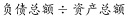）”，可以判断本题为比值计算问题。参看第四段材料，中央企业负债总额363304亿元，资产总额554658.3亿元，代入资产负债率公式：

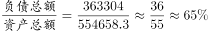。因此在~范围内。

故正确答案为C。

---

#### 第 5 题　qid 1796342 · 综合

能够从上述资料中推出的是：

- **A**. 2015年1-3月，中央和地方国有企业营业成本均低于同期营业收入
- **B**. 2014年1-3月，国有企业应交税金占同期营业总收入的一成以上
- **C**. 2015年3月末，国有企业资产总额同比增长不到12万亿元　✅
- **D**. 2015年3月末，地方国有企业资产负债率高于上年同期水平

**答案**：C

**官方解析**

A项，定位文字材料第一段和第二段，2015年1-3月，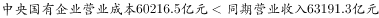，成本低于收入；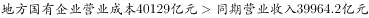，成本高于收入，错误；

B项，定位文字材料第一段和第三段，2014年1~3月国有企业应交税金占同期营业总收入的比重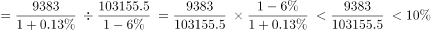，不足一成，错误；

C项，定位文字材料第四段，2015年3月末，国有企业资产总额同比增长量=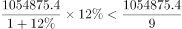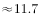万亿元，正确；

D项，定位文字材料第四段，地方国有企业资产负债率（）是否高于上年同期水平，需要比较负债总额的增长率a与资产总额的增长率b，而，故地方国有企业资产负债率低于上年同期水平，错误。

故正确答案为C。

---

### 材料 2

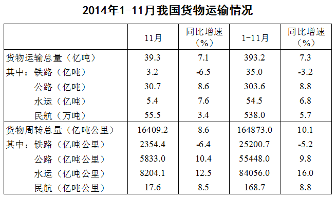 

#### 第 6 题　qid 1796142 · 综合

2014年1~10月我国货物运输总量为多少亿吨？

- **A**. 340.2
- **B**. 353.9　✅
- **C**. 366.5
- **D**. 393.2

**答案**：B

**官方解析**

定位表格，2014年1~11月货物运输总量为393.2亿吨，11月为39.3亿吨，故求2014年1~10月货物运输总量，可判定此题为简单加减计算问题。2014年1~10月我国货物运输总量=393.2-39.3=353.9亿吨。
故正确答案为B。

---

#### 第 7 题　qid 1796168 · 综合

2013年1~10月我国货物运输总量最大的领域是：

- **A**. 水运
- **B**. 民航
- **C**. 铁路
- **D**. 公路　✅

**答案**：D

**官方解析**

由题干“2013年1—10月我国货运运输总量最大的领域”可知，本题是基期比较问题，比较各领域1—10月基期货物运输总量即可。观察表格可知，各领域1—11月和11月同比增速相差不大，故本题可直接比较1—10月现期值。铁路运输总量为35.0-3.2=31.8亿吨，公路运输总量为303.6-30.7=272.9亿吨，水路运输总量为54.5-5.4=49.1亿吨，民航运输总量为538.0-55.5=482.5万吨，可明显看出公路272.9亿吨最大。（注意单位换算，1亿吨=10000万吨）
故正确答案为D。

---

#### 第 8 题　qid 1796152 · 比重

2013年11月我国货物周转总量中，水运周转量占比在以下哪个范围之内？

- **A**. 低于40%
- **B**. 40%~50%　✅
- **C**. 50%~60%
- **D**. 高于60%

**答案**：B

**官方解析**

由题干“2013年11月份......水运周转量占比”可知，本题为基期比重问题。定位表格材料，查找数据代入为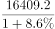，即，略小于，因此水运周转量占比为~。

故正确答案为B。

---

#### 第 9 题　qid 1796176 · 比重

哪些运输方式在2014年11月的货物运输量占当月货物运输总量的比重超过上年同期水平？

- **A**. 仅铁路
- **B**. 仅公路
- **C**. 铁路和民航
- **D**. 公路和水运　✅

**答案**：D

**官方解析**

由题干“比重超过上年同期水平”可知，本题为两期比重问题，仅需比较a与b的大小关系即可，当a＞b时，比重高于上年同期水平。由表格可知，11月货物运输总量同比增速b=7.1%，铁路同比增速=-6.5%，公路同比增速=8.6%，水运同比增速=7.6%，民航同比增速=3.4%，同比增速高于7.1%的有公路和水运两项。

故正确答案为D。

---

#### 第 10 题　qid 1796162 · 综合

关于2014年1~11月我国货物运输状况，能够从上述资料中推出的是：

- **A**. 月均货物运输量约为33亿吨
- **B**. 每吨货物平均运输距离为500多公里
- **C**. 铁路货运量占总体比重低于其货物周转量占总体比重　✅
- **D**. 公路货物周转量同比增量高于水运货物周转量同比增量

**答案**：C

**官方解析**

由题干“能够从上述资料中推出的是”，可知本题为综合分析问题，找出正确选项。

A项，2014年1—11月货物运输总量为393.2亿吨，可知月均货物运输量=亿吨，错误；

B项，每吨货物平均运输距离==，错误；

C项，铁路货运量占总体比重=&lt;10%，铁路货物周转量占总体比重=&gt;10%，因此铁路货运量占总体比重低于其货物周转量占总体比重，正确；

D项，定位表格货物周转量中公路和水运，2014年1—11月公路货物周转量为55448亿吨公里，增长率为9.8%，2014年1—11月水运货物周转量为84056亿吨公里，增长率为16%，可知水运现期量和增长率均大于公路，根据“大大则大”，水运货物周转量同比增量高于公路货物周转量同比增量，错误。

故正确答案为C。

---

### 材料 3

        2015年2月，我国快递业务量完成8.2亿件，同比增长；业务收入完成136.0亿元，同比增长。消费者对快递业务进行的申诉中，有效申诉（确定企业责任的）占总申诉量的，为消费者挽回经济损失229.8万元。

        2015年2月，全国每百万件快递业务中，有效申诉量为23.4件，对企业1的每百万件有效申诉量为75.13件，环比增长，对企业2的每百万件有效申诉量为32.56件，环比增长，对企业3的每百万件有效申诉量为31.86件，环比增长，对企业4的每百万件有效申诉量为17.81件，环比增长。

#### 第 11 题　qid 1797912 · 平均数

2015年2月，平均每笔快递业务的收入在以下哪个范围之内？

- **A**. 低于17元　✅
- **B**. 17～19元
- **C**. 19～21元
- **D**. 高于21元

**答案**：A

**官方解析**

由题干“2015年2月”判断现期，“平均每笔快递业务收入”判断平均数问题，故本题为现期平均数计算问题。定位文字材料第一段“2015年2月份，我国快递业务量完成8.2亿件，业务收入完成136.0亿元”可得。

故正确答案为A。

---

#### 第 12 题　qid 1797914 · 综合

2015年2月，消费者对快递业务的全部申诉量约为：

- **A**. 1.96万件　✅
- **B**. 2.36万件
- **C**. 1.96亿件
- **D**. 2.36亿件

**答案**：A

**官方解析**

由题干“2015年2月”判断现期，“消费者对快递业务的全部申诉量”和文字材料第一段“占全部申诉量的”判断本题为现期比重中总量的计算问题。定位文字材料第一段“2015年2月份，快递业务量完成8.2亿件”和文字材料第二段“2015年2月，全国每百万件快递业务中有效申诉量为23.4件”可得，，，略大于1.9万件，与A项最接近。

故正确答案为A。

---

#### 第 13 题　qid 1797916 · 综合

将4家企业按2015年1月每百万件快递业务丢失损毁的有效申诉量从高到低排序，正确的是：

- **A**. 企业2，企业1，企业3，企业4
- **B**. 企业1，企业2，企业3，企业4
- **C**. 企业2，企业1，企业4，企业3
- **D**. 企业1，企业2，企业4，企业3　✅

**答案**：D

**官方解析**

由题干“2015年1月由高到低排序”判断本题为环比基期比较问题，定位第一张表格可得四个企业2015年2月每百万件快递业务丢失损毁有效申诉量现期值，定位第二张表格可得四个企业的环比增速，故企业1、2、3、4的环比基期分别为、、、，可得企业1最高，企业3最低，只有D项满足。

故正确答案为D。

---

#### 第 14 题　qid 1797918 · 比重

2015年2月4家企业中，有几家企业的投递服务有效申诉量占该企业当月有效申诉量的比重高于上月水平：

- **A**. 1家
- **B**. 2家　✅
- **C**. 3家
- **D**. 4家

**答案**：B

**官方解析**

由题干“2015年2月比重高于上月水平”判断本题为环比两期比重比较问题。定位文字材料第二段可得四个企业的总有效申诉量的环比增长率分比为；定位第二个表格材料第四列可得四个企业的投递业务有效申诉量环比增长率分别为。根据两期比重比较公式可得a&gt;b比重上升，可得上述企业中只有，故有2家企业比重上升。

故正确答案为B。

---

#### 第 15 题　qid 1797920 · 综合

能够从上述材料推出的是：

- **A**. 2014年2月，全国快递业务完成量为8亿多件
- **B**. 2015年2月，全国每百万件快递业务中，非有效申诉不到1件　✅
- **C**. 2015年2月，四家企业的每百万件快递业务有效申诉量都高于全国水平
- **D**. 2015年2月，企业1的每百万快递业务延误有效申诉量超过任何企业的2倍

**答案**：B

**官方解析**

由题干“能够推出的是”判断本题为综合分析问题。

A项：定位文字材料第一段可得“2015年2月份，快递业务量完成8.2亿件，同比增长”，故2014年2月应为   ，错误；

B项：2015年2月有效申诉量为19188件，，故。根据第一段文字材料可得，故每百万件快递业务中，非有效申诉量，正确；

C项：定位文字材料第二段可得“每百万件快递业务有效申诉量”、、、、，可以看出企业4小于全国平均水平，错误；

D项：定位第一个表格材料，可得，，，错误。

故正确答案为B。

---

### 材料 4

#### 第 16 题　qid 1796248 · 综合

2014年下半年全国租赁贸易进出口总额约为多少亿美元？

- **A**. 55
- **B**. 62
- **C**. 67　✅
- **D**. 74

**答案**：C

**官方解析**

根据图形可知2014年4月－2015年4月各月租赁贸易进出口总额，题干求2014年下半年进出口总额，可判定此题为简单加减计算问题。2014年下半年（7-12月），与C项最接近。

故正确答案为C。

---

#### 第 17 题　qid 1796220 · 增长

下列月份中，全国租赁贸易进出口总额环比增速最快的是：

- **A**. 2014年5月
- **B**. 2014年9月
- **C**. 2014年12月　✅
- **D**. 2015年2月

**答案**：C

**官方解析**

由题干“各月环比增速最快的是”可知，本题为一般增长率的比较问题，可直接比较的分数大小关系，分数最大则增速最快。根据图形可知各月份进出口总额，故各项环比增速分别为：。

其中B、D两项明显小于2，排除。，与相比，分子小、分母大，故A项分数较小，则C项较大。

故正确答案为C。

---

#### 第 18 题　qid 1796202 · 综合

2015年一季度全国租赁贸易进出口总额较上一季度约：

- **A**. 
增长了

- **B**. 
降低了
　✅
- **C**. 
增长了

- **D**. 
降低了

**答案**：B

**官方解析**

题干要求求出2015年一季度相比上一季度（2014年四季度）的环比增速，可判定此题为一般增长率的计算问题。定位图表可得，；。环比增速=，即降低了，与B项最为接近。

故正确答案为B。

---

#### 第 19 题　qid 1796228 · 增长

2014年5月~2015年4月间，全国租赁贸易进出口总额及同比增速均高于上月的月份有几个？

- **A**. 5
- **B**. 6　✅
- **C**. 7
- **D**. 8

**答案**：B

**官方解析**

定位图形材料，全国租赁贸易进出口总额及增长率均高于上月的有2014年5、7、9、12月和2015年2、4月，总共6个月。
故正确答案为B。

---

#### 第 20 题　qid 1796210 · 综合

能够从上述资料中推出的是：

- **A**. 2015年4月全国租赁贸易进出口额比2013年4月翻了一番
- **B**. 2015年1~4月月均全国租赁贸易进出口额超过8亿美元
- **C**. 2013年8~9月全国租赁贸易进出口额超过20亿美元　✅
- **D**. 表中全国租赁贸易进出口额同比下降的月份占总数的三分之一

**答案**：C

**官方解析**

A项：由图形材料可知2015年4月，全国租赁贸易进出口额6.94亿美元，而2014年4月全国租赁贸易进出口额3.39亿美元，同比增长，那么2015年4月全国租赁贸易进出口额是2013年4月的，而非翻一番（2倍），错误；

B项：由图形材料可知2015年1-4月，全国租赁贸易进出口总额分别为6.90、12.09、5.29、6.94亿美元，求平均可得，错误；

C项：由图形材料可知2014年8月和9月，全国租赁贸易进出口额分别为8.57、14.58亿美元，同比增长、，则2013年8—9月的全国租赁贸易进出口额为亿美元，正确；

D项：由图形材料可得，全国租赁贸易进出口额同比下降的月份为2014年4月、8月、11月及2015年3月，共4个月，而2014年4月-2015年4月共13个月，故占比不到三分之一，错误。

故正确答案为C。

---
