# 2017年422联考《行测》题（吉林卷乙级）

> 联考 · 2017 年 · 6 个模块 · 共 98 题

- [政治理论](#%E6%94%BF%E6%B2%BB%E7%90%86%E8%AE%BA) · 1 题
- [常识判断](#%E5%B8%B8%E8%AF%86%E5%88%A4%E6%96%AD) · 19 题
- [言语理解与表达](#%E8%A8%80%E8%AF%AD%E7%90%86%E8%A7%A3%E4%B8%8E%E8%A1%A8%E8%BE%BE) · 30 题
- [数量关系](#%E6%95%B0%E9%87%8F%E5%85%B3%E7%B3%BB) · 8 题
- [判断推理](#%E5%88%A4%E6%96%AD%E6%8E%A8%E7%90%86) · 30 题
- [资料分析](#%E8%B5%84%E6%96%99%E5%88%86%E6%9E%90) · 10 题

---

## 政治理论

### 第 1 题　qid 2050526 · 新思想

习近平指出，领导干部要不忘初心，坚守正道，必须坚定文化自信。没有中华优秀传统文化、革命文化、社会主义先进文化的底蕴和滋养，信仰信念难以深沉而执着。与这段话观点一致的是：

- **A**. 正本清源，独树一帜　✅
- **B**. 海纳百川，有容乃大
- **C**. 薪火相传，推陈出新
- **D**. 各美其美，和而不同

**答案**：A

**官方解析**

A项正确：这句话意在说明要不忘初心，坚守正道，从根源上坚定信念，整顿清理，对应正本清源；另外要发扬中华优秀传统文化、革命文化、社会主义先进文化，形成我们特有的中华文化，对应独树一帜。
B项错误：“海纳百川，有容乃大”比喻人的心胸宽广可以包容一切。题干中并没有体现出包容一切的含义，坚定文化自信，尤其是中国的传统文化和社会主义文化，体现了我国的特点和特色，并非包容的含义，而是更具特色和适合国情。
C项错误：“薪火相传”比喻学问和技艺代代相传；“推陈出新”意为去掉旧事物的糟粕，取其精华，并使它向新的方向发展。题干中虽然体现有继承的意思，但是没有体现出推陈出新的含义。
D项错误：“各美其美，和而不同”，说明要尊重事物多样性。题干中没有强调文化的多样性。
故正确答案为A。

---

## 常识判断

### 第 1 题　qid 2050522 · 人文常识

党的十八大以来，一些标志性话语深刻反映了中央治国理政新理念。其中，下列标志性话语与治国理政新理念对应错误的是：

- **A**. “刮骨疗毒，壮士断腕”——加强党风廉政建设
- **B**. “踏石留印，抓铁有痕”——推动国防军队改革　✅
- **C**. “凝聚共识，合作共赢”——发展大国外交
- **D**. “一个都不能少”——全面建成小康社会

**答案**：B

**官方解析**

B项错误：习近平在十八届中央纪委二次全会上的讲话中指出：“要以踏石留印、抓铁有痕的劲头抓下去，善始善终、善做善成，防止虎头蛇尾，让全党全体人民来监督，让人民群众不断看到实实在在的成效和变化。”意在强调要持续深入抓作风建设、表达反腐倡廉的坚定决心，而非推动国防军队改革。
A项正确：习近平在中国共产党第十八届中央纪委第三次全体会议上发表重要讲话，他强调，全党同志要深刻认识反腐败斗争的长期性、复杂性、艰巨性，以猛药去疴、重典治乱的决心，以刮骨疗毒、壮士断腕的勇气，坚决把党风廉政建设和反腐败斗争进行到底。
C项正确：在亚信会议、巴黎气候大会等区域性和国际性的会议上，习主席强调各国要凝聚共识，促进对话，加强协作，在追求本国利益时兼顾各国合理关切，发展合作共赢的新型伙伴关系，体现了我国外交政策的导向。
D项正确：2016年春节前夕，习近平到江西看望慰问广大干部群众，他对乡亲们说，我们党是全心全意为人民服务的党，将继续大力支持老区发展，让乡亲们日子越过越好。在扶贫的路上，不能落下一个贫困家庭，丢下一个贫困群众。从中我们看到了在全面实现小康道路上，一个都不能少。
本题为选非题，故正确答案为B。

---

### 第 2 题　qid 2050534 · 人文常识

翻开古代诗词，你可以一一品味诗人们深切的思想感情。读王维、孟浩然，你懂得了什么是钟情山水；读杜甫、白居易，你懂得了什么是忧民情结；读辛弃疾、陆游，你懂得了什么是爱国情怀，这段话体现的哲理是：

- **A**. 不同事物有不同的矛盾　✅
- **B**. 矛盾的普遍性和特殊性相互转化
- **C**. 同一矛盾的两个不同方面各有特殊性
- **D**. 同一事物在发展的不同阶段上有不同的矛盾

**答案**：A

**官方解析**

王维、孟浩然都是唐代山水田园派的诗人，他们以山水等自然景观为主要描写对象，歌咏田园生活。杜甫是唐代现实主义诗人，心系苍生，胸怀国事。白居易创作了大量反映民生疾苦的讽喻诗。辛弃疾，南宋词人，命运多舛，但恢复中原的爱国信念始终没有动摇。陆游，南宋文学家、爱国诗人，其诗饱含爱国热情对后世影响深远。这些诗人所处的社会环境不同，思想意识不同，创作角度不同，因而创作出的诗作不同，体现了不同事物有不同的矛盾。A项符合题意。
B、C、D项的哲理题干中没有体现。
故正确答案为A。

---

### 第 3 题　qid 2050546 · 人文常识

在生活实践中，人们会自觉不自觉地思考世界、思考周围的人和事，在思考中会触及各种具有哲学性质的问题，下列属于哲学层面的思考的是：

- **A**. 劳动力是商品吗
- **B**. 陶瓷是硅酸盐材料吗
- **C**. 存在就是被感知吗　✅
- **D**. 水为什么往低处流

**答案**：C

**官方解析**

抓住题目当中的关键词“属于哲学层面的思考”来解题。
A项错误：劳动力商品说是马克思主义政治经济学的重要范畴，属于经济层面的思考。

B项错误：硅酸盐材料是指不含碳酸氢氧结合的化合物，属于化学层面的思考。
C项正确：“存在就是被感知”是英国哲学家贝克莱的名言，他是近代经验主义的重要代表之一，开创了主观唯心主义。“存在就是被感知吗”属于哲学层面的思考。
D项错误：水往低处流是地球引力所致，属于物理层面的思考。
故正确答案为C。

---

### 第 4 题　qid 2050554 · 人文常识

下列古代为官理念出自道家的是：

- **A**. 君使臣以礼，臣事君以忠
- **B**. 不义而富且贵，于我如浮云
- **C**. 以道佐人主者，不以兵强天下　✅
- **D**. 邦有道则仕，邦无道则可卷而怀之

**答案**：C

**官方解析**

C项正确：此句话出自老子的《道德经》，意思是用“道”辅佐君王的人，不会依靠军队去强行征服天下。
A项错误：此句话出自《论语》，意思是君王任用臣子要符合礼的规范，臣子侍奉君主要有心，是儒家思想。
B项错误：此句话出自《论语》，意思是用不义的手段得到富与贵，对于我，那些富与贵就如同天上的浮云，体现的是儒家思想。
D项错误：此句话出自《论语》，意思是国家治理有道，则做官，如果治理无道，则应隐退藏身，此处的道并非道家所说的道，更多的是体现好的方式方法或者方向途径的意思，体现的是儒家的思想。
故正确答案为C。

---

### 第 5 题　qid 2050560 · 人文常识

在我国文化用语中经常出现“别称”或“代称”。下列关于“别称”和“代称”的表述错误的是：

- **A**. 李清照词“人比黄花瘦”中的黄花是菊花
- **B**. 古人用“弄璋之喜”来祝贺他人升官　✅
- **C**. 人们称妇女为“巾帼”是由于妇女戴的头巾叫巾帼
- **D**. “及笄之年”指古代女子年满十五岁，到了可结婚的年纪

**答案**：B

**官方解析**

B项错误：“弄璋之喜”是指祝贺人家生男孩。古人把璋给男孩玩，希望他将来有玉一样的品德，“弄璋”即中国民间对生男的古称。始见周代诗歌中。祝贺人家生女孩是“弄瓦之喜”，瓦是纺车上的零件，希望她将来能胜任女工的意思。
本题为选非题，故正确答案为B。

---

### 第 6 题　qid 2050568 · 人文常识

2016年农民李某把自家的10亩土地入股流转给某民营农业科技有限公司，成为该公司的股东和员工。年底，她除每亩地获得保底租金1000元外，又领了的分红，加上每月工资1200元，一年下来能挣四万多。李某的收入：

①属于按生产要素分配

②受公司经营状况的影响

③属于按劳分配

④受股票价格波动的影响

- **A**. ①②　✅
- **B**. ③④
- **C**. ①④
- **D**. ②③

**答案**：A

**官方解析**

①正确：按生产要素分配，是指按照进行物质资料生产时所投入的生产要素的多少进行收益分配的一种方式。生产要素主要包括劳动力、技术、人才、资本、管理、土地、房屋等。题干中，租金1000元属于按土地要素分配，的分红属于按资本要素分配，月工资1200元属于按劳动力要素分配，以上均属于按生产要素分配。

②正确：入股之后的分红会受到公司经营状况的影响，收入高利润好，就能分的多一些。

③错误：按劳分配是在公有制经济中的分配方式，与题意不符。

④错误：本题中没有体现股票，且股票决定劳动收入等明显不符合常理。

故正确答案为A。

---

### 第 7 题　qid 2050572 · 人文常识

下列四组诗句分别反映了中国古代四种传统节日习俗，其起源与佛教没有直接关联的是：

- **A**. 谁家见月能闲坐，何处闻灯不看来
- **B**. 今朝佛粥交相馈，更觉江村节物新
- **C**. 风雨梨花寒食过，几家坟上子孙来　✅
- **D**. 道场普渡妥幽魂，原有盂兰古意存

**答案**：C

**官方解析**

C项错误：此句诗出自元代高启的《送陈秀才还沙上省墓》，意思是在风雨中，梨花落尽了，寒食节也过去了，清明扫墓的时候，有几户人家的坟墓还会有后人来祭拜呢。讲的是清明节，清明节据传始于古代帝王将相“墓祭”之礼，后来民间亦相仿效，于此日祭祖扫墓，历代沿袭而成为中华民族一种固定的风俗，与佛教没有直接关系，错误。
A项正确：此句诗出自唐代崔液的《上元夜》，意思是有谁家能见到元宵的月亮而能够无动于衷不去观赏呢，有哪里看到处处都在闹花灯而忍得住不去看呢。讲的是元宵节，元宵赏灯始于东汉明帝时期，明帝提倡佛教，听说佛教有正月十五日僧人观佛舍利，点灯敬佛的做法，就命令这一天夜晚在皇宫和寺庙里点灯敬佛，令士族庶民都挂灯。以后这种佛教礼仪节日逐渐形成民间盛大的节日。该节经历了由宫廷到民间，由中原到全国的发展过程。
B项正确：此句诗出自宋朝陆游的《十二月八日步至西村》，意思是腊日里人们互赠、食用着佛粥（即腊八粥），更感觉到清新的气息，讲的是腊八节，腊八节，俗称“腊八”，即农历十二月初八，古人有祭祀祖先和神灵、祈求丰收吉祥的传统，一些地区有喝腊八粥的习俗。相传这一天还是佛祖释迦牟尼成道之日，称为“法宝节”，是佛教盛大的节日之一。
D项正确：此句诗出自清代文人王凯泰的《中元节有感》，讲的是中元节。中元节，俗称鬼节、施孤、七月半，佛教称为盂兰盆节。
本题为选非题，故正确答案为C。

---

### 第 8 题　qid 2050582 · 人文常识

在中国传统文化中，鸡具有君子风范。《韩诗外传》说鸡有五德：

- **A**. 文德、武德、勇德、仁德、信德　✅
- **B**. 智德、勇德、武德、礼德、义德
- **C**. 智德、武德、勇德、礼德、信德
- **D**. 文德、勇德、武德、仁德、义德

**答案**：A

**官方解析**

A项正确：《韩诗外传》是一部记述中国古代史实、传闻的著作，作者是西汉人韩婴。《韩诗外传》有云：“君独不见夫鸡乎，头戴冠者文也，足傅距者武也，敌在前敢斗者勇也，见食相呼者仁也，守夜不失时者信也。”意思是：您难道没看见那鸡吗？头上戴着冠，这是有文采；脚后面有距，这是有武勇；敌人在前面，它敢前去打斗，这是勇敢；看见食物招呼别的伙伴，这是有仁德；守夜不会忘记报时，这是守信用。即鸡有五德：文德、武德、勇德、仁德、信德。
故正确答案为A。

---

### 第 9 题　qid 2050594 · 人文常识

发展工业旅游能使人牢记工业文明的历史足迹，某旅游团组织开展一次“工业旅游”，根据下图内容及顺序判断，该旅游团游览的工业文明依次是：

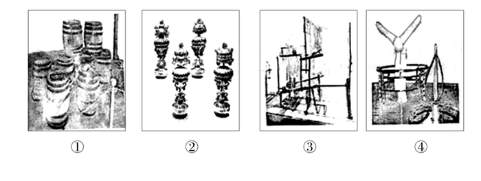

- **A**. 啤酒酿制技术、青铜器制作技术、纺织技术、风电技术
- **B**. 橡胶加工技术、景泰蓝制作技术、服装技术、采油技术
- **C**. 啤酒酿制技术、景泰蓝制作技术、纺织技术、风电技术　✅
- **D**. 橡胶加工技术、青铜器制作技术、服装技术、采油技术

**答案**：C

**官方解析**

C项正确：图中①为啤酒酿制过程中使用的木桶，②为景泰蓝摆件，③为纺纱车，④为风力发电机，因此正确顺序为啤酒酿制技术、景泰蓝制作技术、纺织技术、风电技术。
本题可采用排除法，首先，图片中最容易判断的是④，很明显可以看出图中是风力发电机，因此可以排除B项和D项。观察A项和C项，只有关于图中②的内容是不同的，而②中的摆件整体较小，有很多精美的细节，而青铜器通常比较粗糙，边缘褶皱少，因此可以确定②为景泰蓝制作技术，不是青铜器制作技术。
故正确答案为C。

---

### 第 10 题　qid 2050508 · 地理国情

下列关于云的说法错误的是：

- **A**. 冷却云中强烈的气旋扰动使飞机发生波动　✅
- **B**. 积雨云中的雷电会给飞机带来极大的危险
- **C**. 贝母云常见于高纬度地区，有珍珠般光泽
- **D**. 夜光云出现在黄昏后的夜空，有银色光泽

**答案**：A

**官方解析**

A项错误，空气中的水蒸气遇冷凝结为小水滴，当空气中存在大量凝结核时，无数小水滴附着在凝结核上，形成云的外观。因此，云的形成离不开水蒸气冷却这一过程，而云的具体分类中，并无冷却云这一独立的概念。此外，气旋是大气由高压区吹向低压区时，在地转偏向力的作用下而形成的旋涡。气旋作为一种大气的水平运动，不会引起飞机波动（颠簸），只可引起飞机的摇晃。因此，飞机飞行在云层中如遇到强烈气旋，会发生摇晃而非波动（颠簸）。
B项正确，积雨云是积状云的一种，是由于空气以对流运动形式造成绝热冷却，使水汽饱和凝结而成。积雨云是影响航空运输安全最重要的天气现象之一，发展强盛阶段的积雨云会产生诸如湍流、积冰、暴雨、冰雹、雷击等现象，对飞行安全会造成重大影响。
C项正确，在较高的纬度地区，在距地面20－30公里的平流层内，有时可见到一种很高的云，叫“贝母云”。在白天，它看上去像薄卷云，但在日出日落时，它有珍珠般的光泽，非常明亮，并以光谱中所有的颜色接连转变。
D项正确，夜光云是凌晨或黄昏时出现于地球高纬度地区高空的一种发光而透明的波状云，距地面的高度一般在80km左右，常呈淡蓝色或银灰色，是夜光云中的冰晶颗粒散射太阳光的结果。
本题为选非题，故正确答案为A。

---

### 第 11 题　qid 2050514 · 地理国情

下列地貌与成因的连线，正确的是：

- **A**. 黄土高原沟壑纵横--风力沉积
- **B**. 云南的石林---流水侵蚀　✅
- **C**. 华北平原---地壳上升的结果
- **D**. 四川盆地---海浪侵蚀

**答案**：B

**官方解析**

B项正确：云南石林世界地质公园位于云南省昆明市石林彝族自治县境内，保存和展现了最多样化的喀斯特地貌形态。喀斯特是水对可溶性岩石进行以化学溶蚀作用为主，流水的冲蚀、潜蚀和崩塌等机械作用为辅的地质作用，以及由这些作用所产生的现象的总称。由喀斯特作用所造成地貌，被称为喀斯特地貌。
A项错误：黄土高原位于中国中部偏北部，为中国四大高原之一。黄土高原是世界上水土流失最严重和生态环境最脆弱的地区之一，地势由西北向东南倾斜，经流水长期强烈侵蚀，逐渐形成千沟万壑、地形支离破碎的特殊自然景观。因此黄土高原沟壑纵横是由流水侵蚀而不是风力沉积作用而成的。
C项错误：华北平原是中国三大平原之一，是中国东部大平原的重要组成部分。华北平原中生代时期曾经为隆起区，后来在漫长的时间里逐渐变为了大平原。华北平原主要由黄河、海河、淮河、滦河冲积而成，并非是地壳上升的结果。
D项错误：四川盆地是中国四大盆地之一，位于亚洲大陆中南部。关于四川盆地的形成原因，一直以来人们普遍认为是晚三叠世到白垩世时期中国广泛发生的地壳运动——燕山运动使盆地周围褶皱隆起，并且其构造受基底构造的影响极大，经过多次剧烈变动，才造成现代地貌的基本特征，并非海浪侵蚀形成。
故正确答案为B。

---

### 第 12 题　qid 2050520 · 科技常识

生物学家认为，人体有两个大脑系统存在，一个是头颅中的大脑系统，另一个是胸腹内的“第二大脑”系统。下列诗词描写的活动与“第二大脑”系统有关的是：

- **A**. 自从弃置便衰朽，世事蹉跎成白首
- **B**. 一向年光有限身，等闲离别易消魂
- **C**. 无可奈何花落去，似曾相识燕归来
- **D**. 料得年年肠断处，明月夜，短松冈　✅

**答案**：D

**官方解析**

“第二大脑”实际上也就是肠道内的神经系统，由分散在食管、胃、小肠、结肠组织上的神经元、神经传感器和蛋白质组成。与头颅中的大脑工作原理一样，它们相互之间也快速传递着信息，独立地感知、接受信号，并作出相关的反应，使人产生“愉悦”或“不适”的感觉，但它不能像真正意义上的大脑那样具有思维功能。
D项正确，“料得年年肠断处，明月夜，短松冈”出自宋代诗人苏轼的词作品《江城子·乙卯正月二十日夜记梦》第三四句，全词表达了作者怀念亡妻的悼念之情。作者用“肠断处”表达出自己的悲痛之情，与“第二大脑”系统的定义相符合。
A项错误，“自从弃置便衰朽，世事蹉跎成白首”出自唐朝诗人王维的古诗作品《老将行》，释义为：“自被摈弃不用便开始衰朽，世事随时光流逝而人成白首。”没有与“第二大脑”系统相关联的内容。
B项错误，“一向年光有限身，等闲离别易销魂”出自晏殊的《浣溪沙》，该句话的意思是片刻的时光，有限的生命，宛若江水东流，一去不返，让人深感悲伤。此句诗词与“第二大脑”系统没有关联。
C项错误，“无可奈何花落去，似曾相识燕归来”出自于宋代晏殊的《浣溪沙》，大意为那花儿落去我也无可奈何，那归来的燕子似曾相识，没有提到与“第二大脑”系统相关联的内容，故排除。
故正确答案为D。

---

### 第 13 题　qid 2050540 · 人文常识

下列新闻标题用语存在明显错误的是：

- **A**. 

- **B**. 

- **C**. 
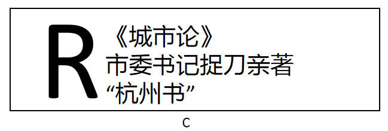
　✅
- **D**. 
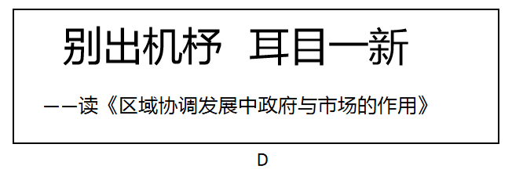

**答案**：C

**官方解析**

C项错误，古人把代人作文称为“捉刀”，“亲著”是亲自著述，可见如果是“捉刀”就不是“亲著”，两者互相矛盾。《城市论》显然是市委书记“亲著”，而非“捉刀”之作。故此处新闻标题用语存在明显错误。
A项正确，“琴瑟和鸣”一般用来比喻夫妇情笃和好，此处作者用来形容“一带一路”与“杭州共识”的良好关系，不存在明显错误。
B项正确，“共振”是物理学上的一个专业术语，是指一物理系统在特定频率下，比其他频率以更大的振幅做振动，这些特定频率称之为共振频率。此处用来形容文艺评论与时代发展的关系，没有明显错误。
D项正确，“别出机杼”指诗文创作另辟途径，不落俗套，“耳目一新”指听到的、看到的跟以前完全不同，使人感到新鲜。此标题没有明显错误。
本题为选非题，故正确答案为C。

---

### 第 14 题　qid 2050558 · 人文常识

下列有关输血和输液的说法错误的是：

- **A**. 输血时一般应该是以输同型血为原则
- **B**. 根据病情需要有时可以进行成分输血
- **C**. 成年人一次献血500cc不影响健康　✅
- **D**. 输血前先鉴定献血者与受血者血型

**答案**：C

**官方解析**

C项错误，人体血液量一般是体重左右，一个体重50公斤的人，血液量约4公斤，也就是4000毫升左右，一次性失血不超过血液总量是安全的。因此我国规定献血者体重男士50公斤以上,女士45公斤以上，一次献血量最高为400毫升，这样可以保证每个献血者献血都在安全范围。因此成年人一次献血500毫升可能会影响健康。

A项正确，输血以输同型血为原则。例如：正常情况下A型人输A型血，B型血的人输B型血。紧急情况下，AB血型的人可以接受任何血型，O型血可以输给任何血型的人。

B项正确，根据病情需要有时可以进行成分输血，即将血液的各种成分加以分离提纯通过静脉输入体内，优点为：一血多用，节约血源，针对性强，疗效好，副作用少，便于保存和运输。

D项正确，输血前先鉴定献血者与受血者血型，输血时一般应该是以输同型血为原则。

本题为选非题，故正确答案为C。

---

### 第 15 题　qid 2050570 · 科技常识

严重缺氧的病人输氧时，要在纯氧中混入的（二氧化碳），目的是：

- **A**. 
用维持呼吸中枢的兴奋
　✅
- **B**. 
节约氧气

- **C**. 
让人体吸收

- **D**. 
用增加氧气罐压力

**答案**：A

**官方解析**

A项正确：给严重缺氧的病人输氧时，一方面要满足病人对氧的需要，另一方面还要提高病人的呼吸中枢的兴奋性，加强病人的呼吸能力。二氧化碳是调节呼吸的有效生理刺激。当吸入二氧化碳含量较高的混合气体时，会使肺泡内二氧化碳含量升高，动脉血中二氧化碳的含量也随之升高，这样就形成了对呼吸中枢的有效刺激，呼吸中枢的活动就加强，使呼吸加强。因此给严重缺氧的病人输氧时，要在纯氧中混入的，目的是用维持呼吸中枢的兴奋。

B项错误：加入并不能节约氧气，故B项并非在纯氧中混入的的原因。

C项错误：加入的确可以让人体吸收，但是更重要的原因是维持呼吸中枢的兴奋。

D项错误：氧气罐中加满纯氧，也可以增加氧气罐压力，故D项并非在纯氧中混入的的原因。

故正确答案为A。

---

### 第 16 题　qid 2050574 · 地理国情

某校在长白山举行地理夏令营活动。在野外，老师要求同学们除了文字记录外，还要将看到的典型地貌和地质结构描绘出来，同学们应采用的绘画技法是：

- **A**. 速写　✅
- **B**. 工笔
- **C**. 写意
- **D**. 留白

**答案**：A

**官方解析**

A项正确，速写是在较短时间内迅速将对象描绘下来的一种绘画形式。它具有收集绘画素材、训练造型能力两大方面的功能。典型地貌和地质结构描绘应采用速写。
B项错误，工笔亦称“细笔”，与“写意”对称，中国画技法名，属于工整细致一类密体的画法，用细致的笔法制作，着重线条美，一丝不苟是工笔画的特色。
C项错误，写意，国画的一种画法。用笔不讲究工细，注重神态的表现和抒发作者的情趣，是一种形简而意丰的表现手法。
D项错误，留白是中国艺术作品创作中常用的一种手法，极具中国美学特征。留白一词指书画艺术创作中为使整个作品画面、章法更为协调精美而有意留下相应的空白，留有想象的空间。
故正确答案为A。

---

### 第 17 题　qid 2050586 · 人文常识

下列古代汲水灌溉工具与应用原理对应错误的是：

- **A**. 桔槔——杠杆原理
- **B**. 辘轳——轮轴原理
- **C**. 翻车——对称守恒原理　✅
- **D**. 筒车——叶轮原理

**答案**：C

**官方解析**

A项正确：桔槔始见于《墨子·备城门》，作“颉皋”。是一种利用杠杆原理的取水机械。
B项正确：辘轳，汉族民间提水设施，流行于北方地区。由辘轳头、支架、井绳、水斗等部分构成。利用轮轴原理制成的井上汲水的起重装置。
C项错误：中国古代链传动的最早应用就是在翻车上，是农业灌溉机械的一项重大改进。翻车并没有应用对称守恒原理，此原理经常用在协同反应中描述分子轨道。
D项正确：筒车是和翻车相类似的提水机具。这是利用湍急的水流转动车轮，使装在车轮上的水筒，自动戽水，提上岸来进行灌溉。
本题为选非题，故正确答案为C。

---

### 第 18 题　qid 2050596 · 科技常识

中国首位80后女航天员王亚平，随神舟十号飞船进入太空飞行15天。飞行中她不会碰到的情况是：

- **A**. 看到绚丽多彩的极光
- **B**. 四周一片漆黑
- **C**. 穿过稠密的大气层
- **D**. 听到远处星体爆炸的声音　✅

**答案**：D

**官方解析**

A项正确：在太空飞行时，可以看到地球两极出现的极光。

B项正确：宇宙空间接近真空状态，四周的背景都是漆黑的。
C项正确：在从太空飞行返回时，需要穿过稠密的大气层才能回到地球。
D项错误：声音的传播是需要介质的，比如固体，液体，气体。太空接近真空状态，不能传声，所以航天员不可能听到爆炸声。
本题为选非题，故正确答案为D。

---

### 第 19 题　qid 2050602 · 人文常识

关于人体消化和吸收的叙述，错误的是：

- **A**. 胃吸收酒精的能力较强
- **B**. 胆汁不具有促进脂肪消化的功能　✅
- **C**. 大肠的作用是排泄未吸收的食物
- **D**. 肝被誉为“物质代谢中枢”

**答案**：B

**官方解析**

A项正确：酒的化学成分是乙醇，在消化道内不需要消化即可吸收，吸收快而且完全。一般在胃中吸收。胃内有无食物、胃壁的功能状况、饮料含酒精的多少以及饮酒习惯均可影响酒精的吸收。

B项错误：肝脏分泌的胆汁中不含消化酶，但胆汁对脂肪有乳化作用，能把脂肪变成微小颗粒，增加了脂肪与消化酶的接触面积，从而有利于脂肪的消化。

C项正确：大肠是对食物残渣中的水分进行吸收，并且可以将食物残渣自身形成粪便排出的脏器。

D项正确：被誉为“物质代谢中枢”的是肝脏，肝脏是身体内以代谢功能为主的一个器官，并在身体里面扮演着去氧化，储存肝糖，分泌性蛋白质的合成等等。肝脏也制造消化系统中的胆汁。

本题为选非题，故正确答案为B。

---

## 言语理解与表达

### 材料 1

        我离开小山村的老家，已然四十多年。常想起的，却是老家曾经光洁滑亮的门槛。

        都说童年时的所见所闻和遇到的刺激，在一个人大脑皮层中会形成最初的沟回，打下最深的烙印--或许真是这样吧。当年的小山村，清一色是木结构房。于是，门槛就成为住宅的一个“不起眼”的重要构件。

        ······

        在小山村，新建的门槛都会被刷上桐油，而当木头敞开每一寸肌肤，激活每一个细胞，将桐油饱饱地吸纳进去时，便呈现出黄金的底色，裸裎着山村家乡的胎记。而记忆中，我一直以为，门槛就是家的代名词，跨出门槛就等于离开了家。因而，自从离开小山村去城里读书后，平日里我总是把门槛当作自己的感情“拐杖”。

        时光变迁，而今，养我长大送我离家的祖父祖母皆已作古，就连老宅也因为小叔家“建新拆旧”的需要而夷为平地。小山村的那些老宅正在消失，门槛也随之消失。但我总以为，物质的门槛可以消匿，但充溢过往人间喜怒哀乐故事的“门槛”终究可以永存，并给人以永恒的回味和启迪。是啊，人生里跨越门槛的抬脚与落地、放下与收回，都会与我们的命运相交，影响我们的人生之路。

#### 第 1 题　qid 2050626 · 片段阅读

第一段的“却”字看似突兀，实有其用意，即：

- **A**. 强调门槛看似不起眼却令我难以忘怀　✅
- **B**. 突出时光变迁和家乡巨变给人的沧桑感
- **C**. 暗示门槛对作者所具有的拐杖作用
- **D**. 引出虽已远去却令作者难忘的儿时故事

**答案**：A

**官方解析**

根据文段可知作者已经离开家乡四十多年，但是对于“门槛”这一小的物件记忆很深刻，故文段第一段的转折词“却”，用于引出“门槛”这一话题，表达作者对其的深刻印象，对应A项。
B项，文段未涉及“沧桑感”，无中生有，排除。
C项，“拐杖作用”出现在倒数第二段，而“却”之后仅是引出“门槛”这一概念，排除。
D项，“儿时故事”扩大了范围，文段重点论述的是“门槛”，排除。
故正确答案为A。
【文段出处】《它曾充溢人间安乐》

---

#### 第 2 题　qid 2050632 · 片段阅读

文中的省略号表示有一段文字被略去了，这段文字最可能写的是：

- **A**. 作者家乡的自然环境和风俗习惯
- **B**. 老宅的习用建材和结构特色
- **C**. 门槛“不起眼”的原因和重要性　✅
- **D**. 大脑沟回的主要功能和分区

**答案**：C

**官方解析**

重点关注上文最后一句话，强调的是门槛是“不起眼”的重要构件，接下来应该延续这一话题继续论述其不起眼的原因，对应C项。
A项没有提到上文最后一句话的核心话题即“门槛”，排除；
B项“习用建材和结构特色”概念扩大，上文最后一句话仅是围绕“门槛”在论述，排除；
D项“大脑沟回”偏离上文话题，排除。
故正确答案为C。
【文段出处】《它曾充溢人间安乐》

---

#### 第 3 题　qid 2050638 · 片段阅读

下列理解与表述，不符合原文意思的一项是：

- **A**. 家乡老宅的门槛寄托着作者淡淡的乡愁
- **B**. 要留住传统就要放慢建新拆旧的脚步　✅
- **C**. 跨越门槛就像人生道路的一次次选择
- **D**. 涂有黄金底色的门槛是家乡的独特印记

**答案**：B

**官方解析**

A项，通过第三段的“门槛是家的代名词”“跨出门槛就等于离开了家”“把门槛当做自己的感情拐杖”可知，门槛寄托了作者的乡愁，该项表述正确；
B项，最后一段强调的是物质的“门槛”可以消失，而应保留精神上的“门槛”，并未表述“需放慢建新拆旧的脚步”，无中生有，不符合文意；
C项，对应最后一句话，“人生里跨越门槛的抬脚与落地、放下与收回，都会与我们的命运相交，影响我们的人生之路”，根据此句可知，跨越门槛的过程包含着一次次的人生选择，故该项表述正确；
D项，对应第三段“黄金的底色裸裎着家乡的胎记”，而胎记是独一无二的，故该项表述正确。
本题为选非题，故正确答案为B。
【文段出处】《它曾充溢人间安乐》

---

#### 第 4 题　qid 2050646 · 片段阅读

下列作为短文标题最恰当的一项是：

- **A**. 门槛，永不褪色的记忆　✅
- **B**. 时光，从门槛上匆匆跨过
- **C**. 门槛
- **D**. 门槛，跨过去就是门，跨不过就是坎

**答案**：A

**官方解析**

文章开篇引入“门槛”这一话题，之后详细论述门槛的特征及强调其是家乡的象征，最后总结升华整篇文章，重点表达“精神上的门槛应该永存”，对应A项。
B项，“时光”并非文段论述重点，排除；
C项，表述范围过大，无法与文段中心契合，文段重在强调对于门槛的记忆，排除；
D项，无中生有，排除。
故正确答案为A。
【文段出处】《它曾充溢人间安乐》

---

#### 第 5 题　qid 2050650 · 片段阅读

本文没有给我们提供的信息是：

- **A**. 桐油在作者家乡曾被普遍用于门槛上漆
- **B**. 作者家乡老宅的门大多是木制而成的
- **C**. 一些古朴的村落正消失在城镇化大潮中　✅
- **D**. 已人到中年身在异乡的作者是少小离家

**答案**：C

**官方解析**

A项，根据第三段“新建的门槛都会被刷上桐油”可知，桐油在作者家乡普遍用于门槛上漆，表述正确。  
B项，根据第二段“当年的小山村，清一色是木结构房”，第三段“新建的门槛都会被刷上桐油，而当木头敞开每一寸肌肤······将桐油饱饱地吸纳进去时”可知，作者家乡老宅多是木制结构，并且门槛也是木制而成，表述正确。
C项，根据第四段“就连老宅也因为小叔家‘建新拆旧’的需要而夷为平地。小山村的那些老宅正在消失······”可知，消失的是“老宅”而不是“村落”，表述错误。
D项，根据第一段“我离开小山村的老家，已然四十多年”，第三段“自从离开小山村去城里读书后”可知，表述正确。
本题是选非题，故正确答案为C。
【文段出处】《它曾充溢人间安乐》

---

#### 第 6 题　qid 2050536 · 语句表达

每年12月9日，不少高校都会举行“一二•九大合唱”。年轻的大学生通过合唱比赛的方式，跨越时空，与八十多年前的那群青年对话，缅怀那段“                    ”的激情岁月。
填入画横线处最恰当的诗词是：

- **A**. 书生意气，挥斥方遒　✅
- **B**. 壮志饥餐胡虏肉，笑谈渴饮匈奴血
- **C**. 一身转战三千里，一剑曾当百万师
- **D**. 仰天大笑出门去，我辈岂是蓬蒿人

**答案**：A

**官方解析**

横线出现在末尾，前文论述“高校”中“年轻的大学生”与“一二•九”运动时的青年对话，缅怀年少意气风发的时光，A项“书生意气，挥斥方遒”出自毛泽东词《沁园春•长沙》，意为读书人意气风发、热情奔放、劲头正足，符合文意，当选。
B项出自岳飞的《满江红》，意为满怀壮志，发誓喝敌人的鲜血，吃敌人的肉，强调人对敌人的刻骨仇恨和报仇雪耻的坚定决心和豪情壮志，文段侧重强调缅怀“一二•九”运动青年的那段时光，而非对敌人的刻骨仇恨，排除；
C项出自王维的《老将行》，“一剑曾当百万师”指功勋卓著，“一二•九运动”标志着中国人民抗日民主运动新高潮的来到，未达到“当百万师”的程度，程度过重，排除；
D项出自李白的《南陵别儿童入京》，李白奉唐玄宗征召进京，意为仰天大笑，出门登程去，满腹诗书经纶，我等岂能甘做庸人，表示诗人踌躇满志的心态，文段强调缅怀激情澎湃、意气风发的时光，而非踌躇满志，不甘于平庸，排除。
故正确答案为A。
【文段出处】《人民日报谈港人合唱〈我的祖国〉：是家国情怀》

---

#### 第 7 题　qid 2050542 · 片段阅读

一对夫妻，因为上班时间常错开，有时甚至好几天都碰不上面。结婚近30年来，丈夫每次都会写一张纸条放在枕头下面留给下班回来的妻子看。根据微信团队的统计，2月14日0点到18点，520的微信红包共发出960万个，与这些“烧钱”的情感表达方式相比，“枕下情书”成本显然要低得多。然而，真诚的态度，坚持的力量，让“枕下情书”既感动了当事人，也打动了许多读者。伴随着市场化和商品化的进程，人们情感表达的手段越来越单一化。礼物是否贵重往往代表着心意与诚意，让情感表达的成本越来越高，“谈感情伤钱”成为一种尴尬的现实。正因为如此，“枕下情书”才显得弥足珍贵。
这段话作者最想表达的观点是：

- **A**. 用金钱衡量感情很尴尬
- **B**. 情感表达手段过于单一
- **C**. 感情中真诚态度更珍贵　✅
- **D**. 追求虚荣已成社会主流

**答案**：C

**官方解析**

文段首先把“枕下情书”的事例与“烧钱”的情感表达方式进行对比，随后通过转折词“然而”强调真诚的态度让“枕下情书”感动了当事人和读者，接下来进行具体的解释说明，尾句通过“正因为如此”进一步强调“枕下情书”背后的真诚显得弥足珍贵，故文段的重点对应C项，当选。
A项未提及文段的主题词“真诚的态度”，排除；B项“情感表达手段”非文段的重点，排除；D项“追求虚荣”无中生有，且表意过于消极，排除。
故正确答案为C。
【文段出处】《快餐时代情感表达的别样方式》

---

#### 第 8 题　qid 2050550 · 片段阅读

目前上班每天8小时，中间吃一顿饭，因为这顿饭至少浪费一小时时间，得不偿失。如果吃两顿，上午10点上班，下午4点下班，两头吃饭时间都宽裕，对身体也好，符合早吃饱、晚吃早的养生理念。每天6小时上班效率高，精力集中，不间断就不浪费时间，晚上还能拉动社会消费，第二天晚起会儿也无碍。
这段文字主要想说明：

- **A**. 吃三顿饭弊大于利
- **B**. 吃饭是民生头等事
- **C**. 吃饭要讲时间成本
- **D**. 吃两顿饭好处多多　✅

**答案**：D

**官方解析**

文段开篇提出上班时中间吃一顿饭浪费时间、得不偿失，接着提出“如果吃两顿饭”就会有很多好处，即时间宽裕、对身体好、符合养生理念、上班效率高、晚上可拉动社会消费等，故全文通过“中间吃一顿饭”与“吃两顿饭”进行对比，重点强调“吃两顿饭”好处多，对应D项。A项“吃三顿饭”可对应首句“中间吃一顿”，非重点，文段重点是“吃两顿”，排除。B项“民生头等事”文段未提及，无中生有，排除。C项“时间成本”只是“吃两顿”的好处之一，表述片面，排除。
故正确答案为D。
【文段出处】《两顿》

---

#### 第 9 题　qid 2050556 · 片段阅读

真正的冬是属于北方的，记忆中北方的雪就像一位硬汉，狂风呼啸，大雪纷飞，一整夜便厚可没膝，一积就一个多星期，捧在手里不化，踩在脚下硬成冰，尽显着雄奇的风格。和三五好友手牵着手，踩着滑溜溜的冰面小心翼翼挪行，每一步都要付出极大勇气。从冰层下面传来“哗啦啦”一阵闷响，便齐刷刷被吓得尖声惊叫，定格一样地僵住，仿佛冰面上随时会豁开大口把我们吞进去。当蹚水过地雷区似的连挪带滑溜到岸边，虽然面色如土，心里却感到前所未有的刺激和兴奋。
这段文字主要描写的是：

- **A**. 北方冰雪带来的特殊体验　✅
- **B**. 挥之不去的一缕乡愁
- **C**. 冰封雪飘的北国风光
- **D**. 北方冬天带来的童年乐趣

**答案**：A

**官方解析**

文段开篇交代背景，描述北方冬雪的特点，接着论述在冬雪里和三五好友牵手滑冰带来的刺激和兴奋的体验，故文段重点强调的是北方冰雪带给人的独特体验，对应A项。B项扩大范围，文段谈论的是北方，且“乡愁”无中生有，排除；C项“北国风光”只对应前文北方冬雪的场景和特点，未提及后文滑冰的体验，概括不全面，排除；D项，文段未提及“童年”，“童年乐趣”无中生有，排除。
故正确答案为A。
【文段出处】《冬之忆》

---

#### 第 10 题　qid 2050564 · 语句表达

“孩子们带我们看帆船落日、出海、沙滩散步、跳伞，很开心。”这是一位高中数学老师在鸡年春节期间发布的一则朋友圈，也是无数中国家庭春节团圆相聚的新缩影。春节期间的数据显示，团聚主体没有变，但团聚的方式却有了新变化，许多家庭“要么在景区，要么在去景区的路上”。旅游______________。
填入画横线处最恰当的一句是：

- **A**. 为春节团聚提供了新形式　✅
- **B**. 正成为春节消费的新热点
- **C**. 是观察当代中国的新窗口
- **D**. 为子女尽孝提供了新样板

**答案**：A

**官方解析**

横线出现在末尾，需对文段内容进行概括总结。文段首先通过一位高中数学老师春节期间发朋友圈的现象，引出旅游是中国家庭春节团聚的新缩影，接下来通过转折词“但”指出团聚方式发生了新变化，因此文段强调的是旅游是春节团聚的一种新方式，对应A项。B项“春节消费”、C、D两项未包含文段核心话题，且“观察当代中国”、“提供新样板”均为无中生有的表述，与前文衔接不当，排除。
故正确答案为A。
【文段出处】《呵护好“旅行箱里的中国”》

---

#### 第 11 题　qid 2050576 · 片段阅读

古人形容漂亮可以用“貌比潘安”“玉树临风”“顾盼神飞”，我们只会说“高富帅”“白富美”；古人形容人难看可以用“东施效颦”“獐头鼠目”，我们只会说“矮穷矬”“颜值低”；古人表达悲伤用“我心伤悲，莫知我哀”，我们只会用“蓝瘦香菇”······也许这种对比有些极端，但如果有一天你张口闭口只会习惯性地说“高富帅”“矮穷矬”，就会遗失了祖先留给我们的宝贵的语言财富。
这段文字意在说明：

- **A**. 流行语威胁传统语言财富　✅
- **B**. 语言随着时代发展而改变
- **C**. 古汉语已经被大众所厌弃
- **D**. 用流行语说话更简单直白

**答案**：A

**官方解析**

文段首先通过并列结构把古人与现代人在形容漂亮、难看、悲伤时使用的不同语言进行对比，接着在尾句通过转折词“但”引出文段重点，强调现在我们只会说流行语，遗失了祖先留给我们的宝贵的语言财富，对应A项。
B项：“改变”表述不明确，并且没有提到“传统语言”这一核心话题，排除。
C项：“已经”表述错误，文段所述仅是一种假设，尚未发生，并且“厌弃”表意过于消极，排除。
D项：“用流行语说话更简单直白”与文意相悖，并且没有提到“传统语言”，排除。
故正确答案为A。
【文段出处】《流行语与流行病》

---

#### 第 12 题　qid 2050580 · 片段阅读

我有很多书想读，却读不进去，以致很多想了解的学问，都难以了解。牟宗三先生回忆年轻时在北大读书，有一天得到熊十力的《新唯识论》，一个晚上就读完了。这怎么可能呢？这部书一直放在书架上，我曾多次打开它，但都读不进去。有一次，我在美国作家迪拉德的《听溪者的朝圣》上，看到这个说法：《道德经》写的是“生活的艺术”。对于只有五千言的老子《道德经》，我从来没有读通过，因此无法得出一个贯通的看法。于是，我以“如何生活”的角度去读，结果第一次读通老子，并且得出中心思想，感觉非常不错。
这段话表达的主要观点是：

- **A**. 找到合适的角度读书则更易读通　✅
- **B**. 书读不通便不能了解更多的学问
- **C**. 只有自己感兴趣的书才能易读通
- **D**. 某些理论性较强的书应多读几遍

**答案**：A

**官方解析**

文段开篇提出问题，指出很多书想读却读不进去，后文通过论述阅读美国作家的书，找到了读《道德经》恰当的角度和方法，即“生活的艺术”，尾句通过结论词“于是”对前文进行总结，指出从“如何生活”的角度阅读即可读通并得出中心思想，故文段强调的是读书要找到合适的角度，对应A项，当选。B项是“书读不通”带来的后果，非文段的重点，排除；C项“自己感兴趣”、D项“多读几遍”，均无中生有，文段强调的是“合适的角度”，排除。
故正确答案为A。
【文段出处】《读书要先有个目的》

---

#### 第 13 题　qid 2050584 · 片段阅读

中国人常会举全族之力兴建家庙，以此弘扬家族传承，彰显先祖荣光；集地方财力设立乡祠，以此纪念故土先贤，宣示人杰地灵。至于身处异乡的客商们，则集资兴建会馆，以乡谊抱团，互相帮衬彼此提携。这是中国传统文化的特色。
下列没有体现文中所指的“中国传统文化特色”的是：

- **A**. 越鸟南栖
- **B**. 叶落归根
- **C**. 安土重迁
- **D**. 功成身退　✅

**答案**：D

**官方解析**

“中国传统文化特色”出现在尾句且由“这”引导，故是对前文内容的总结。文段首先通过并列结构指出，中国人会“兴建家庙”和“设立乡祠”，接下来指出身处异乡的客商们也会“集资兴建会馆，以乡谊抱团”，可知文中的“中国传统文化特色”指的是对于故乡的看重。A项“越鸟南栖”比喻不忘乡情；B项“叶落归根”指有一定归宿；C项“安土重迁”指安于乡土，不愿迁移，均能体现出对乡土的看重，排除。D项“功成身退”指大功告成，自行隐退，与对故乡的情感无关，当选。
本题是选非题，故正确答案为D。
【文段出处】《南望长安是今朝》

---

#### 第 14 题　qid 2050588 · 片段阅读

法国的候车大厅设有故事自动分发机。上设1、3、5三个圆形按钮，分别代表阅读耗时一分钟、三分钟和五分钟的故事，底下设有打印纸出口。按下任意按钮，就会随机打出一张印有故事的小纸条，供旅客在候车时或旅途中阅读，且不收一分钱。所谓故事，并非只是段子，他们中大多数是“风雅”发轫的正规文学作品，有小说、诗歌、散文、童话等等。据了解，故事自动分发机项目在启动之初，就搜集到4万篇各种体裁的文学作品，且这些作品全部是原创，这在其他国家或许是难以想象的。
从这段文字中无法推出的是：

- **A**. 故事分发机为原创作品提供了发布平台
- **B**. “免费写，免费看”的模式会持续下去　✅
- **C**. 故事自动分发机满足了乘客的文化需求
- **D**. 故事分发机契合了法国浓厚的文学氛围

**答案**：B

**官方解析**

A项，根据“搜集到4万篇各种体裁的文学作品，且这些作品全部是原创”可知，“为原创作品提供了发布平台”表述正确，排除；
B项，文段只是介绍了故事自动分发机的情况，并没有表明这种模式以后是否会持续下去，故“会持续下去”无中生有，当选；
C项，根据“他们中大多数是‘风雅’发轫正规文学作品”可知，“满足了乘客的文化需求”表述正确，排除；
D项，根据“这在其他国家或许是难以想象的”可知，“契合了法国浓厚的文学氛围”表述正确，排除。
此题为选非题，故正确答案为B。
【文段出处】《法国车站现故事自动分发机 给旅客“精神零食”》

---

#### 第 15 题　qid 2050592 · 语句表达

如果按照距离太阳的远近来排序，地球在大行星里可以排到老三。比地球更靠近太阳的是金星和水星，它们的公转轨道位于地球的内侧，因此天文学家也称它们为“内行星”。当地球、内行星和太阳按此次序严格位于一条直线上时，由于强烈的亮度反差，我们会发现内行星像一个小黑点一样在日面上缓缓移动，这就是凌日。如果通过日面的是金星，那么就称之为“金星凌日”。
根据文意，下列说法错误的是：

- **A**. 当地球、内行星和太阳处在同一直线上时就有凌日现象　✅
- **B**. 凌日现象就是太阳被一个小的暗星体所遮挡
- **C**. 金星运行到太阳和地球之间时才有金星凌日
- **D**. 与金星凌日类似的现象还有水星凌日

**答案**：A

**官方解析**

A项，根据文段“当地球、内行星和太阳按此次序严格位于一条直线上时”可知，只有三者的顺序是地球、内行星和太阳，且三者位于一条直线时，才会产生凌日现象，故“当地球、内行星和太阳处在同一直线上时就有凌日现象”表述过于绝对，当选；
B项，根据文段“我们会发现内行星像一个小黑点一样在日面上缓缓移动，这就是凌日”可知，凌日现象的产生是因为被遮挡，表述正确，排除；
C项，根据“金星是内行星”和“地球、内行星和太阳按此次序严格位于一条直线上······称之为‘金星凌日’”可知，表述正确，排除；
D项，根据“金星和水星都是内行星”可知，“与金星凌日类似的现象还有水星凌日”表述正确，排除。
本题是选非题，故正确答案为A。
【文段出处】《有一种天象 你这辈子再也看不到了》

---

#### 第 16 题　qid 2050600 · 逻辑填空

在充满变量的世界，我们是眼花缭乱的观望者，也是置身其间的推动者。曾经走街串巷的叫卖声不见了，只需手指轻轻一点即可享受送货上门的电商火了起来；全家人乃至几家人守着一台电视机等待每天一集电视剧的场景不见了，取而代之的是乱花渐欲迷人眼的多屏时代；人们获取信息的渠道不仅早已多样化，而且信息芜杂难辨——“       ”，是我们生活中的常态，容不得视而不见，也容不得退避。
填入画横线部分最恰当的一项是：

- **A**. 难
- **B**. 变　✅
- **C**. 乱
- **D**. 散

**答案**：B

**官方解析**

文段开篇由“在充满变量的世界，我们是置身其间的推动者”强调世界在发生变化。接下来通过三个并列的例子“曾经的叫卖声不见了，电商火起来了”“很多人聚在一起看电视的场景不见了，多屏时代出现了”“信息渠道比之前多样化了”进行详细的解释说明，强调我们的生活发生的“变化”。尾句呼应首句“变量的世界”，对应B项“变”，当选。
A项“难”侧重强调困难，D项“散”侧重强调分散，均与文意无关，排除；C项“乱”只是对应文段解释说明中的后两个分句，表述片面，且“乱”语义消极，排除。
故正确答案为B。
【文段出处】人民日报《我们为什么如此钟情于春节》

---

#### 第 17 题　qid 2050606 · 逻辑填空

近两年有一种产自东北的非主流水果——菇娘（这个“娘”在东北读作三声，并缀以儿化音）颇有         之势。每逢春夏之交，大大小小的水果铺子，都少不了菇娘小巧的身影，而它特有的香气与口感据说确实俘获了不少姑娘的舌尖呢。
填入画横线部分最恰当的一项是：

- **A**. 一步登天
- **B**. 后来居上
- **C**. 反客为主
- **D**. 登堂入室　✅

**答案**：D

**官方解析**

根据“近两年产自东北的非主流水果”“大大小小的水果铺子，都少不了菇娘的身影”可知，横线处所填成语表达“菇娘近两年刚刚出现，目前卖得特别好”之意，体现一种由浅入深，逐渐发展向好的态势，D项“登堂入室”强调“从浅入深，达到高水平”的过程，与文段对应准确，当选。A项“一步登天”常用于形容人突然得志，爬上高位，常用作贬义词，与文段语境不符，排除；B项“后来居上”用以称赞后起之秀超过前辈，文段并未体现菇娘与其他水果的对比，排除；C项“反客为主”意为客人反过来成为主人，比喻变被动为主动，根据“菇娘”本就“产自东北”可知，以“主、客”指代显然不妥，排除。
故正确答案为D。
【文段出处】人民网《菇娘与时尚的方式》

---

#### 第 18 题　qid 2050610 · 逻辑填空

春晚相声《新虎口遐想》的出现，其最现实的意义就在于它实现了相声本质的回归，讽刺的分寸感好，对社会不良现象反思有力。只是      春晚时间的限制，结尾比较仓促，实在是美中不足的遗憾。但是          ，它回归了本质，找回了初心。
依次填入画横线部分最恰当的一项是：

- **A**. 由于  大醇小疵
- **B**. 囿于  瑕不掩瑜　✅
- **C**. 困于  毋庸置疑
- **D**. 缘于  不言而喻

**答案**：B

**官方解析**

本题从第二空入手，根据转折关联词“但是”可知，横线处所填成语与前文“美中不足的遗憾”语义相反，且对应“回归了本质，找回了初心”，横线处应强调相声总体上是不错的，带有积极的感情色彩。B项“瑕不掩瑜”比喻缺点掩盖不了优点，缺点是次要的，优点是主要的，与文段对应恰当，符合语境，保留。A项“大醇小疵”指大体纯正，而略有缺点，强调有好有坏，为中性词，C项“毋庸置疑”指不必怀疑，D项“不言而喻”指道理很明显，均无法对应“美中不足”，与前文无法形成转折关系，排除。
第一空，代入验证，B项“囿于”指受（某种情况）拘束，多用于消极语境，可体现相声《新虎口遐想》因为表演时间有限，所以“结尾比较仓促”，出现了“美中不足的遗憾”，符合文意，当选。
故正确答案为B。 
【文段出处】《三十年，两次“虎口脱险”：相声也要“惩恶扬善”》

---

#### 第 19 题　qid 2050674 · 逻辑填空

如今越来越多没营养的综艺节目占据了市场的      。而《朗读者》却别具一格，“慢下来”用“朗读”做电视，这才是真正稀缺而有价值的电视文化。《朗读者》证明文化类节目未必“冷”，《朗读者》节目组把这份对精神文化的尊重     到节目中来。
依次填入画横线部分最恰当的一项是：

- **A**. 主体   移植　✅
- **B**. 主流   传达
- **C**. 首席   延伸
- **D**. 份额   演绎

**答案**：A

**官方解析**

第一空，根据“《朗读者》是稀缺而有价值的电视文化”可知，横线处所填词语表示“没有营养的综艺节目”在市场中很多。A项“主体”指事物的主要部分，B项“主流”指事物发展的主要方面，均符合文意，保留。C项“首席”指最尊贵的席位，用在此处程度过重，排除；D项“份额”指在总份数中的一定比例，体现不出“没有营养的综艺节目很多”之意，排除。
第二空，横线处所填词语表示将“对精神文化的尊重”体现在节目中。A项“移植”可以体现把精神文化转移并根植到节目中，符合文意，当选。B项“传达”表示向外传递，与“到节目中来”搭配不当，排除。
故正确答案为A。
【文段出处】《&lt;朗读者&gt;观众“零差评”：重拾内心深处的文化渴望》

---

#### 第 20 题　qid 2050548 · 逻辑填空

《中国诗词大会》推广传统诗词文化的成效         。观众在春节期间远离了牌桌和酒席，坐在电视机前欣赏选手的精彩对决。将古诗词元素融入于现代生活中，或许是传承传统文化的好方法。虽然不是每个人都要写诗成为诗人，古诗词欣赏能力也未必与背诵能力成正比，但在日常文字表达中化用古诗词，足以让一个人在精神上     起来。
依次填入画横线部分最恰当的一组是：

- **A**. 有目共睹 雍容　✅
- **B**. 家喻户晓 充实
- **C**. 立竿见影 丰盈
- **D**. 显而易见 从容

**答案**：A

**官方解析**

第一空，搭配“成效”，B项“家喻户晓”形容家家户户都知道，形容人所共知，名气大，与“成效”搭配不当，排除；C项“立竿见影”比喻立刻见到功效，强调速度快，通过“坐在电视机前欣赏选手的精彩对决”可知，节目能产生一定的社会影响，但并非立马就能看到功效，故“立竿见影”用在此处程度过重，排除。
第二空，对比A、D两项，D项“从容”指为人处事不惊慌，A项“雍容”是从容不迫的意思，同时也指仪态温文大方，两者相比，“雍容”更侧重文雅大方。根据文段语境可知，在日常表达中用古诗词会让整个人看起来更有气质，更加的温文尔雅，腹有诗书气自华，所以“雍容”符合文段语境，当选。
故正确答案为A。
【文段出处】《&lt;中国诗词大会&gt;热播 传统文化不能只活在秀场上》

---

#### 第 21 题　qid 2050562 · 逻辑填空

汉语是一种能产性极强的语言，在网络语境催生下，大量新颖别致、有时代内涵的新词族______，它们在类推机制下以共同的语素为基础，形成可不断扩充的庞大词汇家族。如：“微X”词族、“晒X”词族、“X奴”词族等等。诸如此类的表达在当下的口语交际中______。
依次填入画横线部分最恰当的一组是：

- **A**. 一鸣惊人 遍地开花
- **B**. 脱颖而出 屡见不鲜
- **C**. 横空出世 细大不捐
- **D**. 异军突起 俯拾皆是　✅

**答案**：D

**官方解析**

第一空，根据“在网络语境催生下”中“催生”二字可知，横线处要体现大量新词族“出现”之意。C项“横空出世”形容人或物高大，横在空中，浮出人世，或比喻卓尔不群，D项“异军突起”比喻新生派别或新生力量突然出现，两者均符合文意，保留。A项“一鸣惊人”比喻平时很一般，突然做出惊人的事情，B项“脱颖而出”形容本领全都显露出来，均不用于形容新生事物，排除。
第二空，根据前文“不断扩充的庞大词汇家族”可知，这些网络新词族在当下的口语交际中运用普遍，D项“俯拾皆是”形容到处都是，符合语境，当选。C项“细大不捐”表示小的大的都不抛弃，常指收罗的东西多，毫无遗漏，与文意无关，排除。
故正确答案为D。
【文段出处】《网络时代汉语口语表达日趋多样化》

---

#### 第 22 题　qid 2050566 · 逻辑填空

客观地说，“网红”并不一定是________。这个时代，站在互联网风口，猪都能飞起来，何况是有看点、有炒点的“网红”呢？社会原子化、娱乐疯魔化、价值的多元、舆论的分野……给了“网红”勃兴与风靡的最佳土壤。若三观正，有节操，“网红”也可以“最美”；可一旦陷入眼球经济的“名利场”，这个时候，资本只要稍稍抛个媚眼，“网红”经济就容易_______。
依次填入画横线部分最恰当的一组是：

- **A**. 牛鬼蛇神  剑走偏锋
- **B**. 洪水猛兽  走火入魔　✅
- **C**. 妖魔鬼怪  鬼迷心窍
- **D**. 狼烟烽火  趋之若鹜

**答案**：B

**官方解析**

第一空，搭配“网红”，且根据后文“若三观正，有节操，‘网红’也可以‘最美’”可知，横线处表达“网红”并不一定是坏人，A项“牛鬼蛇神”比喻形形色色的坏人，B项“洪水猛兽”比喻极大的祸害，C项“妖魔鬼怪”比喻各种危害人民利益的邪恶势力，均可形容“坏人”，可保留。D项“狼烟烽火”指古代边防军事利用烽火台传递信息的方式，不能修饰“网红”，排除。
第二空，根据“陷入眼球经济的‘名利场’”可知，横线处表达“网红”经济一旦陷入名利场就会出现问题，故横线修饰“网红经济”，并结合文段语境可知，应填入表消极感情色彩且语义程度偏重的成语，B项“走火入魔”指对某种事物迷恋到失去理智的地步，符合文意，当选；A项“剑走偏锋”指不走常规，找一些新的、不同以往的办法来解决问题，文段中并不涉及解决问题，且“剑走偏锋”常作为中性词出现，与文段消极的感情色彩亦不相符，排除；C项“鬼迷心窍”指鬼怪迷惑住心窍，指人对问题认识不清，对比B项“走火入魔”，语义程度较轻，且不如“走火入魔”与“陷入······‘名利场’”对应的更为恰当，排除。
故正确答案为B。
【文段出处】《“网红”不该沦为低俗的“代名词”》

---

#### 第 23 题　qid 2050578 · 逻辑填空

青山隐隐，芳草萋萋，春天的脚步总是来去匆匆。“二月里来好春光”的余音还在耳畔____，____之间便到了细雨纷纷、祭扫亲人的清明时节。
依次填入画横线部分最恰当的一组是：

- **A**. 缭绕 蓦然
- **B**. 回响 忽然
- **C**. 飘荡 遽然
- **D**. 萦绕 倏忽　✅

**答案**：D

**官方解析**

第一空，搭配“余音”，B项“回响”指声音一再地发出和折回，通常不与“余音”搭配，排除。A项“缭绕”指一圈圈向上飘起，C项“飘荡”指在空中飘浮、飘摆或飞升，D项“萦绕”比喻声音在某些地方旁边旋转、回复，填入文段均可，保留。
第二空，根据文意可知，横线处表达时间过的飞快，从二月转眼之间到了清明时节，D项“倏忽”可以形容时间或光阴迅速流逝，填入文段语义合适，当选。A项“蓦然”、C项“遽然”均有猛然的意思，填入文段程度过重，排除。
故正确答案为D。
【文段出处】《永远的墓志铭》

---

#### 第 24 题　qid 2050598 · 片段阅读

魏文王问名医扁鹊说：“你们家兄弟三人，都精于医术，到底哪一位最好呢？”扁鹊答说：“长兄最好，中兄次之，我最差。”文王再问：“那么为什么你最出名呢？”扁鹊答说：“我长兄治病，是治病于病情发作之前。由于一般人不知道他事先能铲除病因，所以他的名气无法传出去，只有我们家的人才知道。我中兄治病，是治病于病情初起之时。一般人认为他只能治轻微的小病，所以他的名气只及于本乡里。而我扁鹊治病，是治病于病情严重之时。一般人都看到我在经脉上穿针管来放血、在皮肤上敷药等大手术，所以认为我的医术高明，名气因此响遍全国。”文王说：“你说得好极了。”
这个故事不能给公务员工作带来的启示是：

- **A**. 事后处理不如事中处理
- **B**. 事中处理不如事前处理
- **C**. 疏忽可能造成重大损失　✅
- **D**. 不要为表面现象所迷惑

**答案**：C

**官方解析**

文段故事中提到人们认为扁鹊是兄弟中医术最精的，扁鹊解释说因为兄长和中兄分别在病情发作之前和病情初起之时治病，自己是在病情严重之时治病，人们都能看见扁鹊做大手术而看不到兄长和中兄治病的过程，所以才认为扁鹊的医术高明。根据文段“长兄最好，中兄次之，我最差”可知，“事后”“事中”“事前”分别对应扁鹊、中兄以及兄长的治病过程，事前处理的兄长医术最好，事中处理的中兄医术次之，事后处理的扁鹊医术最差，可知A、B两项为文段给出的启示；根据人们看到扁鹊做手术的过程就认为他医术最高明可知，D项也为文段给出的启示。
C项“疏忽”在文段中并未提及，符合题干中选非的提问。
本题为选非题，故正确答案为C。
【文段出处】小学语文试题

---

#### 第 25 题　qid 2050618 · 逻辑填空

近年来，荒唐滑稽的文化闹剧时有所闻。有的地方，在举行某种群众性的活动时，全体穿着所谓的“汉服”，就让人哭笑不得。在今天复活古代的服饰，就算是弘扬优秀的传统文化？如果把弘扬传统文化理解成穿古代服装，一齐行跪拜礼，这就_____让人哭笑不得，_____令人欲哭无泪了。凡此种种，都是________的典型表现。
依次填入画横线部分最恰当的一组是：

- **A**. 不是 而是 食古不化　✅
- **B**. 不是 就是 生吞活剥
- **C**. 非但 反而 生搬硬套
- **D**. 不仅 而且 囫囵吞枣

**答案**：A

**官方解析**

第一、二空，文段首先指出文化闹剧经常出现，接着具体举例，最后强调如果把弘扬文化理解成古代服装和行跪拜礼，那就让人连哭也哭不出来了。关联词连接的“哭笑不得”和“欲哭无泪”，显然更强调后者。而B项“不是……就是……”为选择关联词，表达“两者选择其一”的意思，但并无着重强调哪个，排除。其余三项均可。
第三空，“凡此种种”对上文进行了概括，故横线处重在强调今天复活古代的服饰并不是对传统文化真正的理解，一古一今准确对应A项“食古不化”，“食古不化”指对所学的古代知识理解得不深不透，不善于按现在的情况来运用，语义最为恰当，当选。C项“生搬硬套”指不顾实际情况，机械地运用别人的经验，照抄别人的办法；D项“囫囵吞枣”比喻对事物不加分析思考，C、D两项均不能体现出今天对于古代文化的不理解，排除。
故正确答案为A。
【文段出处】《继承传统切忌食古不化》

---

#### 第 26 题　qid 2050622 · 逻辑填空

某些意义上讲，与现代白话文一道_______于20世纪初的中国科幻文学，起点是很高的，因为当初在中国力推科幻文学的“科幻粉”中，有着不少文学史上的“大腕”级人物。然而因科幻文学今日之_______，以至于许多实实在在的事例，在今天不熟悉文学史的人听来，反倒像是_______了，因为，寒酸久了，再怎么说自己“出身高贵”也难取信于人。
依次填入画横线部分最恰当的一组是：

- **A**. 发端 凋敝 低人一等
- **B**. 滥觞 式微 无稽之谈　✅
- **C**. 起源 衰落 天方夜谭
- **D**. 发轫 衰败 胡说八道

**答案**：B

**官方解析**

本题可以从第三空入手，由后文的“寒酸久了，再怎么说自己‘出身高贵’也难取信于人。”可知横线处的成语表达难以让人相信之意。B项“无稽之谈”、D项“胡说八道”都可以指没有根据或没有道理地瞎说，填入此处语义均可，二者的区别在于前者比较书面化，后者表述过于口语化。通过文段中“力推”、“取信”，以及前面两个空格可能用到的“滥觞”、“发轫”、“式微”等词，可以得出，文段整体风格偏书面化，因此排除D项；A项“低人一等”指社会地位低下，与文意不符，排除；C项“天方夜谭”比喻虚诞夸饰的议论，荒诞不经的说法，程度过重，排除，正确答案锁定B项。
第一空代入验证，“滥觞”指事物的起源，与后文的时间搭配得当，当选。
第二空代入验证，“然而”表示转折，前文讲述中国科幻文学有很多，转折之后说明中国科幻文学发展势头减弱，“式微”指由盛而衰，符合文意，当选。
故正确答案为B。
【文段出处】《那些年你所不知道的“科幻迷”》

---

#### 第 27 题　qid 2050662 · 语句表达

①这就造成人们像蚕蛹一般，越来越蜷缩进小小的“信息茧房”当中。
②研究表明，人类会习惯性地从已有的信念和假设角度来搜索、解读和获取信息，忽略甚至不看与自己价值观取向相左的消息。
③以情感诉求为支柱的“后真相”，其特征就是飘忽不定，科学精神更无从谈起。
④历史无法言说新闻具体是在哪一天诞生的，但可以肯定的是，假新闻在新闻诞生那天起就存在至今，并如同幽灵一般影响着公众情绪。
⑤假新闻泛滥，以至于《牛津词典》2016年年度词汇是“后真相”。
⑥不久前，欧洲国家马其顿的一座小城威莱斯，因出现了假新闻“淘金热”而登上西方各大媒体。
将以上6个句子重新排列，语序正确的是：

- **A**. ⑤④①⑥③②
- **B**. ②⑤③⑥④①
- **C**. ⑥⑤③②①④
- **D**. ④⑥⑤③②①　✅

**答案**：D

**官方解析**

对比选项，判断首句②④⑤⑥，发现④⑤⑥句存在共同信息“假新闻”，可以先进行比较。④句介绍假新闻的产生，⑤句列举《牛津词典》案例，是对假新闻现象的具体论证，⑥句列举“淘金热”也是对假新闻现象的举例论证。对比可知，⑤句、⑥句是对④句的详细展开论证，故④句应在⑤句⑥句之前，基本锁定D项。
继续观察发现，①句和②句均包含了共同信息“信息”，可将其进行捆绑；①句中代词“这”指代②句“人类会习惯性地从已有的信念和假设角度来搜索、解读和获取信息，忽略甚至不看与自己价值观取向相左的消息”这一想法，①句、②句构成良好衔接，且代词常常放在尾句起到总结前文，引出结论的作用。
故正确答案为D。
【文段出处】《信息时代更考验媒体素养》

---

#### 第 28 题　qid 2050668 · 片段阅读

吃药还是输液，本不是选择的难题。吃药是最常用和最便利的治疗手段，但口服药物的效率不高也是常识；输液使得药物直接进入血液，效用和利用度更高，但滥输液的副作用同样不小。不过，自从有了输液，不仅“挂个水好得快”被医生推荐，而且患者群体也对“输液好得快”普遍认同，主动要求医生输液的不在少数，有些患者还对医生不给输液颇有微词。
这段文字意在说明：

- **A**. 患者缺乏科学的健康知识
- **B**. 人们对输液存在认识误区　✅
- **C**. 输液见效快是其最大缺陷
- **D**. 推荐输液的医生不够专业

**答案**：B

**官方解析**

文段首句引出吃药与输液的选择这一话题，接下来介绍吃药和输液各自的利弊。接着通过关联词“不过”进行转折引出重点，强调具有副作用的滥输液经常被医生推荐，且患者也过度信任和依赖输液这种治疗方式。故文段重点在于指出医生和患者对“输液”的认识都存在误区，对应B项。
A项，文段围绕“输液”论述，“健康知识”概念扩大，排除；
C项，“最大缺陷”无中生有，表达亦过于绝对，排除；
D项，只提到了“医生”没有提到“患者”，表述片面，且“不够专业”无中生有，排除。
故正确答案为B。
【文段出处】《全面停止门诊输液，你怎么看》

---

#### 第 29 题　qid 2050670 · 片段阅读

古代的石桥拱形大多为半圆形，这种建筑形式尽管比较优美完整，但因为拱顶造成桥高坡陡，车马行人非常不便。作为一条贯通南北的枢纽，“学步桥”的建造者采用了圆弧拱形式，使石拱高度大为降低，桥面过渡平稳，车辆行人非常方便，达到了低桥面便于过往、大跨度便于行船的双重目的。而且相对于传统的建筑形式用料省、施工方便。
对这段文字的主旨概括最准确的是：

- **A**. 介绍圆形拱石桥设计方案的优越性
- **B**. 指出古石桥在建筑风格上的唯美性
- **C**. 突出学步桥在建筑形式上的创新性　✅
- **D**. 比较传统石桥和圆弧拱桥的实用性

**答案**：C

**官方解析**

文段首句介绍石拱桥的建筑形式会给车马行人带来不便，之后介绍了“学步桥”采用圆弧拱的设计，增加了便利性而且节省用料和施工。故文段重点在于介绍“学步桥”在建筑形式上的创新，对应C项。
A项“拱石桥”、B项“古石桥”均为偷换概念，文段重点为“学步桥”，排除；
D项，“传统石桥”仅为首句引入部分，非重点，文段重在强调新型的“学步桥”，排除。
故正确答案为C。
【文段出处】《学步桥》

---

#### 第 30 题　qid 2050672 · 片段阅读

①没有人可以精力无限、奔腾不息，忙碌周期与休憩周期相结合才能让生命充满精彩。②适度的停顿犹如登山过程中的休整，是从胜利走向胜利、从激昂迈向激昂的必经阶段。③就像电影镜头，长短镜头结合在一起，才会形成缤纷多彩的画面节奏。独处不仅是忙碌之间的停顿，更像是一次身心调整、精神蓄力。④所谓“静一分，慧一分”，养一团清静之气，擎一片悠然心光，映照自己同万物的关系，正是独处的本意。
“苏轼有句名言，‘善养身者，使之能逸而能劳’。”这句话在原文中的恰当位置是：

- **A**. ③
- **B**. ②
- **C**. ①　✅
- **D**. ④

**答案**：C

**官方解析**

首先分析要填入的句子，苏轼的名言表达“养身”应当劳逸结合。文段第一句指出应“忙碌”与“休憩”相结合，与“劳逸结合”联系最为密切，填入文段①、②处均可，排除A、D两项。又因为第一句话是对苏轼观点的解释说明，故观点应放在句首，对应C项。
将句子代入验证，首先通过苏轼的名言引出生活应当劳逸结合，接下来用登山和电影的比喻说明“适度的休息”是必要的，最后阐述“独处”的意义，文段前后逻辑紧密，衔接得当。
故正确答案为C。
【文段出处】《别整天忙于赶场应酬，独处放松才能看到生命的全貌》

---

## 数量关系

### 第 1 题　qid 2050620 · 数学运算

，，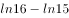，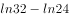，（    ），

- **A**. 

　✅
- **B**. 
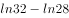

- **C**. 

- **D**. 

**答案**：A

**官方解析**

题干中各式子计算结果不容易求出，不能比较前后项的数值关系，考虑分别抽出各式子真数组成新的数列。其中减号前面的对数真数组成新数列：4，8，16，32，（    ），128，可判断是公比为2的等比数列，括号中数字应为64。减号后面的对数真数组成新数列：3，8，15，24，（    ），48，作差得到新数列5，7，9，（    ），（    ），是公差为2的等差数列，故括号内应为11，13，继而推出原数列括号内为35。综上所述，题干中括号内应为。

故正确答案为A。

---

### 第 2 题　qid 2050630 · 数学运算

，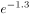，（），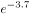，（），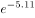 

- **A**. 
，

- **B**. 
，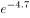

- **C**. 
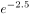，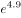

- **D**. 
，
　✅

**答案**：D

**官方解析**

题干中各式子计算结果不容易求出，不能比较前后项的数值关系。由于底数均为，考虑指数组成的数列：0.1，-1.3，（），-3.7，（），-5.11，因为小数位数不固定，考虑机械划分。

整数部分：0，-1，（），-3，（），-5，括号中可以是（-2），（-4）或者（2），（4）。小数部分1，3，（），7，（），11，括号中应为（5）（9）。综上分析，题干括号内应为，。

故正确答案为D。

---

### 第 3 题　qid 2050642 · 数学运算

123456，61234，4612，（），62，2

- **A**. 326
- **B**. 261
- **C**. 246　✅
- **D**. 512

**答案**：C

**官方解析**

数列位数逐渐减少，且只出现1-6这6个数字，考虑位数的操作。观察可得，每一项将数字最右一位移到最左边，再删去最右一位，即为下一项数字。例如123456将最右边的6移到最左边得到612345，再删去最右一位，得到61234。
故按此规律，括号前的数为4612，其最右一位移到最左边得到2461，再删去最右一位，得到括号内的数为246。
故正确答案为C。

---

### 第 4 题　qid 2050648 · 数学运算

小明的父亲生病要做手术，现在有四家三甲级医院可以选择，小明调查到在2016年，医院甲动手术的总人数为1000人，动手术后康复出院902人；医院乙动手术总人数为2000人，1860人手术后康复出院；医院丙动手术的总人数为3000人，手术后康复出院2730人；医院丁动手术的总人数为1500人，手术后未康复人数111人。通过以上数据手术康复率最高的医院是：

- **A**. 丙
- **B**. 乙　✅
- **C**. 甲
- **D**. 丁

**答案**：B

**官方解析**

各医院手术康复率如下，甲：；乙：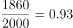；丙：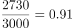；丁：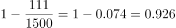，手术康复率最高的医院是乙。

故正确答案为B。

---

### 第 5 题　qid 2050652 · 数学运算

姐弟四人要为妈妈买生日礼物，四个人的钱合在一起是180元，如果老大钱数增加8元，老二钱数减少8元，老三钱数乘以2倍，老四钱数减少到原来的一半，则此时四个人的钱数相同。若其中两人的钱数凑在一起正好买一个价格为68元的音乐盒，则这两个人是：

- **A**. 老二和老三　✅
- **B**. 老大和老三
- **C**. 老大和老二
- **D**. 老二和老四

**答案**：A

**官方解析**

方法一：设四个人相同的钱数为元，则这四人的原有钱数分别为：、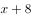、、，而这四人原来的钱数之和为180元，可得方程如下：，解得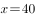。则这四人的原有钱数分别为：32、48、20、80元，那么能恰好凑成68元的是48元和20元，即老二和老三两人。

方法二：已知四个人钱合在一起是180元，设姐弟四人分别有、、、元，则可以得到，其中两人的钱数凑在一起正好买价格为68元的音乐盒，代入A项：，根据上式化简，得到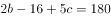，解得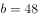，，满足。

故正确答案为A。

---

### 第 6 题　qid 2050656 · 数学运算

已知张先生的童年占去了他年龄的，再过了他进入成年，又过了他结婚了，婚后3年他的儿子出生了，儿子7岁时，他们的年龄和为某个素数的平方，则张先生结婚时的年龄是：

- **A**. 38岁
- **B**. 32岁　✅
- **C**. 28岁
- **D**. 42岁

**答案**：B

**官方解析**

假设张先生结婚的年龄为，可得：。

代入A项：，不是平方数，排除A项；

代入B项：，7是素数，满足题意；

代入C项：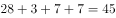，不是平方数，排除C项；

代入D项：，不是平方数，排除D项。

故正确答案为B。

---

### 第 7 题　qid 2050660 · 数学运算

两个人带着宠物狗玩游戏，两人相距200米，并以相同速度相向而行，与此同时，宠物狗以的速度，在两人之间折返跑，当两人相距60米时，那么宠物狗总共跑的距离为：

- **A**. 270米
- **B**. 240米
- **C**. 210米　✅
- **D**. 300米

**答案**：C

**官方解析**

两人相距200米，以相同速度相向而行，相距60米时所用时间为：秒，则宠物狗总共跑的距离为：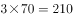米。

故正确答案为C。

---

### 第 8 题　qid 2050664 · 数学运算

悟空与二郎神在离地面1米的空中决斗，两人相距2米，悟空想用分身直接偷袭二郎神，为了不引起对方的警觉，分身必须在地面反弹一次再进行攻击，则分身到达二郎神的位置所走的最短距离为：

- **A**. 
米
　✅
- **B**. 
米

- **C**. 
米

- **D**. 
米

**答案**：A

**官方解析**

要让分身到达二郎神的距离最短，两点之间连线最短，则应使悟空的分身镜像与二郎神之间的距离最短，如图得到分身的镜像，连线二郎神，距离最短为 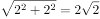米。

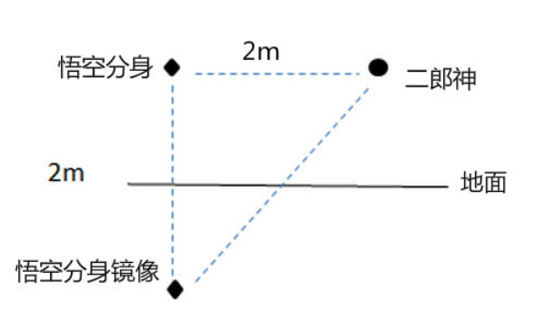

故正确答案为A。

---

## 判断推理

### 材料 1

某园林依中轴线布局，从前到后依次排列着七个庭院，这七个庭院分别以汉字“天”、“地”、“人”、“日”、“月”、“星”、“辰”来命名。已知：

①“天”字庭院不是最前面的庭院。

②“星”字庭院和“辰”字庭院相邻。

③“地”、“人”两庭院间隔的庭院数与“日”、“月”两庭院间隔的庭院数相同。

#### 第 1 题　qid 2050676 · 类比推理

根据上述信息，“天”字庭院可能是：

- **A**. 第一个庭院
- **B**. 第五个庭院　✅
- **C**. 第四个庭院
- **D**. 第二个庭院

**答案**：B

**官方解析**

根据条件①“天”字庭院不是最前面的庭院，可知“天”不可能是第一个庭院，排除A选项；
代入B选项，“天”在第五个庭院，“星”和“辰”在第六个和第七个两个庭院，“地”、“人”、“日”、“月”在第一个至第四个庭院，可以满足条件③，比如“地”、“人”在第一个和第二个两个庭院，“日”、“月”在第三个和第四个两个庭院，所以此项是可能成立的，当选；
代入C选项，“天”在第四个庭院，根据条件②“星”字庭院和“辰”字庭院相邻，“星”和“辰”可以选择的是四种情况第一个和第二个、第二个和第三个、第五个和第六个、第六个和第七个，这四种情况无论哪一种情况都不能满足条件③，所以此项是不可能对的，排除；
代入D选项，“天”在第二个庭院，根据条件②“星”字庭院和“辰”字庭院相邻，“星”和“辰”可以选择的是四种情况第三个和第四个、第四个和第五个、第五个和第六个、第六个和第七个，这四种情况无论哪一种情况都不能满足条件③，所以此项是不可能对的，排除。
故正确答案为B。

---

#### 第 2 题　qid 2050678 · 类比推理

如果第二个庭院是“辰”字庭院，则下列一定为真的是：

- **A**. 第七个庭院是“天”字庭院
- **B**. 第一个庭院是“星”字庭院　✅
- **C**. 第三个庭院是“地”字庭院
- **D**. 第五个庭院是“日”字庭院

**答案**：B

**官方解析**

根据题干条件第二个庭院是“辰”字庭院，再结合条件②“星”字庭院和“辰”字庭院相邻。只有两种情况，第一种是：

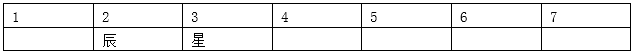

第二种是：

对于第一种情况，要满足条件③，“地”、“人”与“日”、“月”这四个庭院要安排在第四个、第五个、第六个和第七个这四个庭院，所以“天”字庭院就一定是第一个庭院，但是与条件①矛盾，所以，第一种情况不成立，也就是说只有第二种情况成立，所以“星”在第一个庭院。

故正确答案为B。

---

#### 第 3 题　qid 2050476 · 定义判断

滑坡谬误，是指不合理地使用连串的因果关系，将“可能性”转化为“必然性”，把小概率事件当做必然发生的事件进行推理的一种逻辑谬误。

根据上述定义，下列漫画中出现的逻辑谬误属于滑坡谬误是：

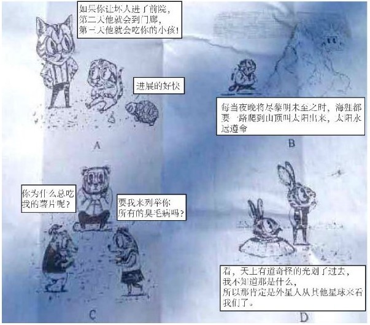

- **A**. A　✅
- **B**. B
- **C**. C
- **D**. D

**答案**：A

**官方解析**

第一步，找出定义关键词。
“不合理地使用连串的因果关系”、“将‘可能性’转化为‘必然性’，把小概率事件当做必然发生的事件进行推理”。
第二步，逐一分析选项。
A项：“第一天坏人进前院，第二天到门廊，第三天吃掉你的小孩”，该选项的三个事件之间有连串的因果关系；同时该选项将“到门廊”与“吃小孩”这两个可能发生的小概率事件当做了必然事件。符合题干定义，当选；
B项：每个夜晚将尽黎明将至时，太阳都要升起，没有体现将“可能性”转化为“必然性”事件进行推理。不符合题干定义，排除；
C项：问：“为什么总吃我的薯片？”答：“要我来列举你所有的臭毛病吗？”两个人之间的对话没有体现连串的因果关系，也没有体现将“可能性”转化为“必然性”事件进行推理，不符合题干定义，排除；
D项：该选项没有体现连串的因果关系，排除。
故正确答案为A。

---

#### 第 4 题　qid 2050478 · 定义判断

泛化是指人和动物一旦学会对某一特定的条件刺激做出条件反应以后，其他与该条件刺激相类似的刺激也会引发其条件反应。
根据上述定义，下列现象属于泛化的是：

- **A**. 曾经被大狗咬过多次的人，日后见到小狗也会产生恐惧　✅
- **B**. 看到别人的一个行为得到了奖赏之后，自己常常会效仿
- **C**. 孩子做了好事，得到一粒糖作为奖赏，他就会再做好事
- **D**. 浸淫古玩行当数年的专家，真品赝品，很容易辨别出来

**答案**：A

**官方解析**

第一步，找出定义关键词。
“人和动物一旦学会对某一特定的条件刺激做出条件反应以后”、“其他与该条件刺激相类似的刺激也会引发其条件反应”。
第二步，逐一分析选项。
A项：“被大狗咬过多次的人”会产生对大狗的恐惧，符合“对某一特定的条件刺激做出条件反应”这一关键词；同时“见到小狗也会产生恐惧”是因为遇到了与大狗相似的刺激，符合“其他与该条件刺激相类似的刺激也会引发其条件反应”，符合题干定义，当选；
B项：看到别人的一个行为得到了奖赏之后，自己常常会效仿，没有体现“其他与该条件刺激相类似的刺激也会引发其条件反应”这一关键词。不符合题干定义，排除；
C项：“孩子做了好事，得到一粒糖作为奖赏，他就会再做好事”，该选项逻辑错误，题干的逻辑是刺激在先，反应在后；而该选项是做事在先，刺激（给奖励）在后，并且孩子再做好事也是为了再得到奖励，不属于“相类似的刺激”。不符合题干定义，排除；
D项：古玩行当数年的专家遇到真品与赝品会产生不同的反应，不符合题干定义，排除。
故正确答案为A。

---

#### 第 5 题　qid 2050484 · 定义判断

货币贬值，是货币升值的对称，是指货币所代表的价值量或含金量的降低。表现在两个方面：一是货币在国内购买力的下降，二是本国货币对外币的比价（对外汇率）下降。
根据上述定义，下列描述属于人民币贬值的是：

- **A**. 100美元去年兑换600元人民币，今年可兑换700元人民币　✅
- **B**. 100元人民币去年可以买20斤大米，今年可以买30斤大米
- **C**. 100美元去年兑换600元人民币，今年仍兑换600元人民币
- **D**. 100美元去年兑换600元人民币，今年可兑换500元人民币

**答案**：A

**官方解析**

第一步：找出定义关键词。
“价值量或含金量降低”、“货币在国内购买力的下降”、“本国货币对外币的比价（对外汇率）下降”。
第二步：逐一分析选项。
A项：100美元可以兑换的人民币变多，说明了人民币对美元的比价下降，符合“对外汇率下降”，符合定义，当选；
B项：100元人民币可以购买更多的大米说明人民币在国内购买力上升了，不符合“货币在国内购买力下降”，不符合定义，排除；
C项：100美元兑换的人民币不变，说明人民币对美元的比价没有变化，不符合“对外汇率下降”，不符合定义，排除；
D项：100美元可以兑换的人民币变少，说明了人民币对美元的比价有所上升，不符合“对外汇率下降”，不符合定义，排除。
故正确答案为A。

---

#### 第 6 题　qid 2050490 · 定义判断

破窗效应是犯罪学的一个理论，该理论认为环境中的不良现象如果被放任存在，会诱使人们效仿，甚至变本加厉。
根据上述定义，下列体现了破窗效应的是：

- **A**. 千里之堤，溃于蚁穴
- **B**. 一屋不扫，何以扫天下
- **C**. 一条街道有些许纸屑，人们最终会理所当然地将垃圾随处丢弃　✅
- **D**. 小孩打破了窗户，必将导致主人更换玻璃，从而推动社会就业

**答案**：C

**官方解析**

第一步：找出定义关键词。
“不良现象如果被放任存在”、“诱使人们效仿”、“变本加厉”。
第二步：逐一分析选项。
A项：“千里之堤，溃于蚁穴”，意思是千里长的大堤，往往因蚂蚁洞穴而崩溃。比喻小事不慎将酿成大祸。没有体现“诱使人们效仿”，不符合定义，排除；
B项：“一屋不扫，何以扫天下”，意思是从一点一滴的小事开始积累，才能做成一番大事业。没有体现出“诱使人们效仿”，排除；
C项：一条街道有些许纸屑，符合“不良现象如果被放任存在”，人们最终会理所当然地将垃圾随处丢弃，符合“诱使人们效仿”、“变本加厉”，符合定义，当选；
D项：窗户被打破，但是导致主人更换玻璃，不符合“不良现象如果被放任存在”，不符合定义，排除。
故正确答案为C。

---

#### 第 7 题　qid 2050500 · 定义判断

顺应性迁移，是指将原有认知经验应用于新情境中时，调整原有的经验或对新旧经验加以概括，形成一种能包容新旧经验的更高一级的认知结构，以适应外界的变化。顺应性迁移的根本特点是自下而上。
根据上述定义，下列现象属于顺应性迁移的是：

- **A**. 对网络、战争、游戏等概念进行重新组合，就会形成网络战争游戏的新概念
- **B**. 原有认知结构中的概念“鱼”，由带鱼、草鱼等概念组成，现在要学习鳗鱼，就把它纳入“鱼”的概念中，从而获得鳗鱼这一新概念的意义
- **C**. 在日常生活中，先形成了报纸、电视等概念，当这些概念不能解释“计算机网络”这个新概念时，就建立一个概念“媒体”来标志这一类事物　✅
- **D**. 对一些原有的舞蹈动作进行重新调整和排列之后，编排出一套新的舞蹈动作

**答案**：C

**官方解析**

第一步：找出定义关键词。
“原有认知经验应用于新情境”、“调整原有的经验或对新旧经验加以概括”、“形成一种能包容新旧经验的更高一级的认知结构”、“自下而上”。
第二步：逐一分析选项。
A项：网络战争游戏这一概念由网络、战争、游戏等概念重新组合而成，网络、战争、游戏均属于旧的概念，未体现新旧概念的整合；而新概念不能包容原来的网络、战争、游戏的概念，没有体现“形成一种能包容新旧经验的更高一级的认知结构”，不符合定义，排除；
B项：原有的经验是鱼，新的经验是鳗鱼，鳗鱼不能包含鱼，不符合“能包容新旧经验的更高一级的认知结构”，不符合定义，排除；
C项：报纸、电视等概念是旧经验，计算机网络是新经验，媒体这个概念是由新旧概念概括而来的，符合“调整原有的经验或对新旧经验加以概括”，并且媒体比报纸、电视、计算机网络更高一级，符合“形成一种能包容新旧经验的更高一级的认知结构”，符合定义，当选；
D项：新舞蹈动作只是将原有的舞蹈动作进行重新调整和排列形成的，没有形成新的认知结构，不符合定义，排除。
故正确答案为C。

---

#### 第 8 题　qid 2050504 · 定义判断

把喜欢跟着前面的路线走的习惯称之为“跟随者”习惯，把盲目跟从习惯和思维惯性而做出反应导致失败结果的现象称为“毛毛虫效应”。
根据上述定义，下列没有体现毛毛虫效应的是：

- **A**. 部分股民信奉买涨不买跌，结果却是经常被套牢
- **B**. 小王认为法不责众，就和同事执行了错误命令
- **C**. 小张把头发染成了流行色，结果越看越觉得不好看
- **D**. 怕事的小李和其他同学在小明作弊时保持沉默　✅

**答案**：D

**官方解析**

第一步：找出定义关键词。
“盲目跟从习惯和思维”、“导致失败结果的现象”。
第二步：逐一分析选项。
A项：股民信奉买涨不买跌，符合“盲目跟从习惯和思维”，结果却是经常被套牢，符合“导致失败结果的现象”，符合题干定义，排除。
B项：小王认为法不责众，是小王的一种思维习惯，符合“盲目跟从习惯和思维”，执行了错误命令，符合“导致失败结果的现象”，符合题干定义，排除。
C项：小张把头发染成流行色，“流行色”体现了盲目跟从，流行的不一定适合他，他觉着不好看也体现了失败的结果，符合定义，排除。
D项：小明作弊，小李和其他同学保持沉默是因为怕事，不是看别人沉默所以自己才沉默，未体现盲目跟从，也未体现出失败的结果，不符合定义，当选。
本题为选非题，故正确答案为D。

---

#### 第 9 题　qid 2050512 · 定义判断

不可抗力，是指不能预见、不能避免并不能克服的客观情况。因不可抗力不能履行合同或者造成他人损害的，不承担民事责任，法律另有规定的除外。
根据上述定义，下列情况不属于不可抗力的是：

- **A**. 因天气原因不能起飞而导致的航班延误
- **B**. 因地震致房屋倒塌，使租赁合同不能履行
- **C**. 因出口国发生战争而导致的货物延期交付
- **D**. 因卖方工厂倒闭而导致的不能交付货物　✅

**答案**：D

**官方解析**

第一步：找出定义关键词。
“不能预见、不能避免并不能克服”、“客观情况”。
第二步：逐一分析选项。
A项：天气符合“不能预见、不能避免并不能克服”，也符合“客观原因”，符合定义，排除；
B项：地震符合“不能预见、不能避免并不能克服”，也符合“客观原因”，符合定义，排除；
C项：战争符合“不能预见、不能避免并不能克服”，也符合“客观原因”，符合定义，排除；
D项：工厂倒闭是一种主观原因，是可以预见的，也是可以避免和克服的，不符合“客观原因”，也不符合“不能预见、不能避免并不能克服”，不符合定义，当选。
本题为选非题，故正确答案为D。

---

#### 第 10 题　qid 2050518 · 定义判断

踢猫效应，是一种典型的负面情绪的传递机制：人的愤怒情绪和不满情绪，往往会沿着社会关系链条由强到弱依次传递，从金字塔尖—直传递至金字塔底层，而处在最底层的个体，往往由于无处发泄，成了最终的受害者，进而影响其行为。
根据上述定义，下列最符合踢猫效应的是：

- **A**. 淘气的小男孩在学校把另一位同学推倒了，老师批评他几句，他回家后跟家长哭了起来
- **B**. 李某出差把宠物狗委托邻居照看，因狗生病二人闹翻了脸，自此两家孩子也不一起玩了
- **C**. 一位母亲在单位受到领导的批评，回家后把淘气的女儿骂了一通，女儿把遥控器摔坏了　✅
- **D**. 小明妈妈在公园门口卖饮料，有一位卖冰糕的女士经常对她发泄不满情绪，二人吵了起来

**答案**：C

**官方解析**

第一步：找出定义关键词。
“人的愤怒情绪和不满情绪”、“沿着社会关系链条由强到弱依次传递”、“最底层的个体，往往由于无处发泄，成了最终的受害者”、“影响其行为”。
第二步：逐一分析选项。
A项：小男孩被老师批评，回家跟父母哭，并没有发泄愤怒或不满情绪，同时从男孩到父母，也不符合“沿着社会关系链条由强到弱依次传递”，不符合定义，排除；
B项：李某与邻居闹翻了，孩子也不一起玩，虽然属于愤怒情绪，但是不明确两家孩子不一起玩是否与他们有关，没有明确体现出他们将负面情绪传递给孩子，不符合定义，排除；
C项：母亲被领导批评，符合“人的愤怒情绪和不满情绪”，回家骂了女儿，符合“沿着社会关系链条由强到弱依次传递”，女儿把遥控器摔坏，符合“影响其行为”，符合定义，当选；
D项：卖冰糕的女士对小明妈妈发泄不满情绪，符合“人的愤怒情绪和不满情绪”，但是小明妈妈与卖冰糕的女士均为卖东西的商贩，不符合“沿着社会关系链条由强到弱依次传递”，不符合定义，排除。
故正确答案为C。

---

#### 第 11 题　qid 2050524 · 定义判断

具体行政行为的错误，是指在具体行政行为中，行政主体所作的意思表示或者外界理解的意思表示与其真实意思存在明显的矛盾。具体行政行为的瑕疵，是指具体行政行为不具备合法的要件。
根据上述定义，下列属于有瑕疵的具体行政行为的是：

- **A**. 某政府部门在计算一笔拆迁补偿费时，其适用的法律条文错误
- **B**. 某工商部门在对无证经营的某个体工商户做出行政处罚的程序中存在违规行为
- **C**. 某税务机关在对某公司做出的税务处罚通知书中将5000元处罚金额写为500元
- **D**. 某公安机关在对张某做出罚款的行政处罚决定书上未加盖公章　✅

**答案**：D

**官方解析**

第一步，找出定义关键词。
“具体的行政行为不具备合法的要件”。
第二步，逐一分析选项。
A项：计算拆迁补偿费时适用法律条文错误，体现了行政主体所作的意思表示与其真实意思存在明显的矛盾，是具体行政行为的错误，而非具体行政行为的瑕疵，不符合定义，排除；
B项：做出行政处罚的程序中存在违规行为，不代表该行政处罚行为本身不具备合法要件，不符合有瑕疵的具体行政行为，排除；
C项：税务处罚通知书中5000元处罚金额写成500元，是行政主体所作的意思与其真实意思存在矛盾，应符合有错误的具体行政行为，不符合有瑕疵的具体行政行为，排除；
D项：行政处罚书未加盖公章，即该行政处罚书没有生效。该行为一定不具备合法的要件，符合有瑕疵的具体行政行为，当选。
故正确答案为D。

---

#### 第 12 题　qid 2050530 · 定义判断

机械表演，是指对作品的表演使用机械设备予以公开播放的行为，不包括公开放映电影和通过广播传播作品的行为。
根据上述定义，下列行为属于机械表演行为的是：

- **A**. 甲超市使用电视机公开播放存在电脑里的歌曲　✅
- **B**. 丙美术馆公开展览一大批书法作品和摄影作品
- **C**. 丁商场通过幻灯机公开再现存在电脑里的电影
- **D**. 乙电台在广播节目播出同时，在网上同步播出

**答案**：A

**官方解析**

第一步，找出定义关键词。
“对作品的表演使用机械设备予以公开播放”、“不包括公开放映电影和通过广播传播作品”。 
第二步，逐一分析选项。
A项：使用电视机公开播放符合“使用机械设备公开播放”，播放电脑里存储的歌曲也符合“不包括公开放映电影和通过广播传播作品”，符合题干定义，当选； 
B项：该美术馆公开展览不符合“使用机械设备公开播放”，不符合题干定义，排除；
C项：通过幻灯机公开播放的是电影，与“不包括公开放映电影”相冲突，不符合题干定义，排除；
D项：公开播放的作品是广播节目，与“不包括通过广播传播作品”相冲突，不符合题干定义，排除。
故正确答案为A。

---

#### 第 13 题　qid 2050480 · 类比推理

蛇：腿

- **A**. 鸡：翅膀
- **B**. 狮：爪子
- **C**. 牛：尾巴
- **D**. 鲸：鱼鳃　✅

**答案**：D

**官方解析**

第一步：判断题干词语间逻辑关系。
蛇没有腿，腿不是蛇的组成部分。
第二步：判断选项词语间逻辑关系。
A项：鸡有翅膀，翅膀是鸡的一部分，与题干逻辑关系不一致，排除；
B项：狮有爪子，爪子是狮的一部分，与题干逻辑关系不一致，排除；
C项：牛有尾巴，尾巴是牛的一部分，与题干逻辑关系不一致，排除；
D项：鲸不是鱼，没有鱼鳃，鱼鳃不是鲸的一部分，与题干逻辑关系一致，当选。
故正确答案为D。

---

#### 第 14 题　qid 2050482 · 类比推理

人文科学：物理

- **A**. 茶叶：红茶
- **B**. 北方人：湖北人　✅
- **C**. 工业：重工业
- **D**. 薄荷糖：牛奶糖

**答案**：B

**官方解析**

第一步：判断题干词语间逻辑关系。
自然科学、社会科学（包含人文科学）和思维科学是科学体系的三大支柱，物理属于自然科学, 不是人文科学且物理和人文科学不在同一层级上。
第二步：判断选项词语间逻辑关系。
A项：红茶是一种茶叶，两者是种属关系，与题干逻辑关系不一致，排除；
B项：湖北在秦岭淮河以南，属于南方，所以湖北人是南方人，不是北方人。北方人与南方人并列，所以湖北人和北方人不在同一层级上，与题干逻辑关系一致，当选；
C项：重工业是一种工业，种属关系，与题干逻辑关系不一致，排除；
D项：薄荷糖与牛奶糖两者是并列关系中的反对关系，但两者在同一层级上，与题干逻辑关系不一致，排除。
故正确答案为B。

---

#### 第 15 题　qid 2050486 · 类比推理

植物：裸子植物：红杉

- **A**. 学校：中学：小学
- **B**. 国家：民族：公司
- **C**. 科学：物理学：力学　✅
- **D**. 星系：星座：太阳

**答案**：C

**官方解析**

第一步：判断题干词语间逻辑关系。
裸子植物是一种植物，红杉是一种裸子植物，都是种属关系。
第二步：判断选项词语间逻辑关系。
A项：中学是一种学校，种属关系，小学与中学并列，与题干逻辑关系不一致，排除；
B项：民族是国家的组成部分，二者为组成关系；公司与民族无必然联系，与题干逻辑关系不一致，排除；
C项：物理学是一种科学，力学是属于物理学，都是种属关系，与题干逻辑关系一致，当选；
D项：星系是由几千亿颗恒星组成的巨大恒星系统，星座是表示星空中方位的区域，两者无必然联系，太阳是星系中的一部分，组成关系，与题干逻辑关系不一致，排除。
故正确答案为C。

---

#### 第 16 题　qid 2050492 · 类比推理

作品：文字作品：摄影作品

- **A**. 人身权：姓名权：肖像权　✅
- **B**. 糖果：棒棒糖：水果糖
- **C**. 科学：自然科学：经济学
- **D**. 面食：面条：重庆小面

**答案**：A

**官方解析**

第一步：判断题干词语间逻辑关系。
作品包括文字作品与摄影作品，前者与后两者是种属关系，后两者是并列关系。
第二步：判断选项词语间逻辑关系。
A项：人身权包括姓名权与肖像权，前者与后两者是种属关系，姓名权与肖像权并列，与题干逻辑关系一致，当选；
B项：棒棒糖与水果糖都是糖果，种属关系，但棒棒糖与水果糖是交叉关系，有的棒棒糖是水果糖，有的棒棒糖不是水果糖，有的水果糖是棒棒糖，有的水果糖不是棒棒糖，与题干逻辑关系不一致，排除；
C项：自然科学与经济学都属于科学，种属关系，经济学属于社会科学，社会科学与自然科学并列，与题干逻辑关系不一致，排除；
D项：面条是一种面食，重庆小面是一种面条，都是种属关系，与题干逻辑关系不一致，排除。
故正确答案为A。

---

#### 第 17 题　qid 2050496 · 类比推理

电视台对于（  ），相当于（  ）对于蚂蚁

- **A**. 电台  蟋蟀　✅
- **B**. 电视  蚁巢
- **C**. 媒介  昆虫
- **D**. 网络  工蚁

**答案**：A

**官方解析**

逐一代入选项。
A项：电台指是通过声音来传达信息的媒介，电视台是通过声音和图像来传达信息的媒介，两者是并列关系，蟋蟀与蚂蚁并列，前后逻辑关系一致，当选；
B项：电视是接收电视台传播信息的工具，蚁巢是蚂蚁的居住场所，前后逻辑关系不一致，排除；
C项：电视台是一种媒介，蚂蚁是一种昆虫，都是种属关系，但词语顺序反了，排除；
D项：电视台和网络都是传播媒介，两者是并列关系，工蚁是一种蚂蚁，两者是种属关系，前后逻辑关系不一致，排除。
故正确答案为A。

---

#### 第 18 题　qid 2050498 · 类比推理

（1）控制不住购买的冲动
（2）收拆网购快递很幸福
（3）囤积许多无用的货物
（4）网络购物方便且实惠
（5）自己的钱包捉襟见肘

- **A**. （2）-（1）-（4）-（3）-（5）
- **B**. （4）-（2）-（1）-（3）-（5）　✅
- **C**. （4）-（1）-（3）-（2）-（5）
- **D**. （2）-（1）-（5）-（3）-（4）

**答案**：B

**官方解析**

第一步：先确定逻辑关系最为明显的事件顺序。
观察题干，五个事件主要围绕“过度网购导致钱包捉襟见肘”的过程。逻辑关系的先后顺序比较明显的是事件（3）和事件（5），只有先“囤积许多无用的货物”，才会让“自己的钱包捉襟见肘”，因此事件（3）和事件（5）相邻，且事件（3）排在事件（5）前面，同时容易判断事件（5）应该排在最后，排除C、D项。 
第二步：逐一对照选项并判断正确答案。
根据第一步得到的结果可以判断只有A项和B项符合，通过分析事件（4）和（2）都是在讲网购的好处，导致了事件（1）“控制不住购买的冲动”，事件（4）和（2）应该排在事件（1）前面，从而排除A项。
故正确答案为B。

---

#### 第 19 题　qid 2050502 · 类比推理

（1）实地考察探因求发展
（2）蔬菜滞销被菜农丢弃
（3）种植油麦菜面积大增
（4）种植油麦菜收益很高
（5）组织菜农做品牌农业

- **A**. （1）-（5）-（3）-（4）-（2）
- **B**. （5）-（4）-（3）-（2）-（1）
- **C**. （4）-（3）-（2）-（1）-（5）　✅
- **D**. （3）-（2）-（1）-（4）-（5）

**答案**：C

**官方解析**

第一步：先确定逻辑关系最为明显的事件顺序。
观察题干，五个事件主要围绕“菜农种菜滞销到做品牌农业”的过程。逻辑关系的先后顺序比较明显的是事件（3）和事件（4），由于“种植油麦菜收益很高”，使得“种植油麦菜面积大增”，因此事件（3）和事件（4）相邻，且事件（3）排在事件（4）后面，排除A、D项。
第二步：逐一对照选项并判断正确答案。
根据第一步得到的结果可以判断只有B项和C项符合，通过分析事件（1）、（2）、（5）发现（1）、（5）都是为解决蔬菜滞销采取的方法，事件（1）和（5）应该排在事件（2）后面，从而排除B项。
故正确答案为C。

---

#### 第 20 题　qid 2050506 · 类比推理

（1）单车领域竞争激烈
（2）单车数量日益增多
（3）共享单车试水成功
（4）“野蛮生长”到达尽头
（5）政策收紧监管来临

- **A**. （2）－（1）－（4）－（3）－（5）
- **B**. （3）－（2）－（1）－（4）－（5）
- **C**. （3）－（1）－（2）－（5）－（4）　✅
- **D**. （2）－（4）－（1）－（5）－（3）

**答案**：C

**官方解析**

第一步：先确定逻辑关系最为明显的事件顺序。
观察题干，五个事件主要围绕“共享单车发展”的过程。事件（1）和事件（2）的先后顺序并不明确，但可以确定首先发生的应该是事件（3）“共享单车试水成功”，排除A、D项。
第二步：逐一对照选项并判断正确答案。
根据第一步得到的结果可以判断只有B项和C项符合，通过分析事件（4）和（5）得知，只有先“政策收紧监管来临”，才会导致“野蛮生长到达尽头”，因此（4）和（5）相邻，且事件（5）排在事件（4）前面，排除B项。
故正确答案为C。

---

#### 第 21 题　qid 2050510 · 类比推理

（1）盗版App网络泛滥
（2）恶意木马植入手机
（3）用户手机资费损失
（4）用户下载安装App
（5）正版流行App问世

- **A**. （5）－（1）－（2）－（4）－（3）
- **B**. （1）－（3）－（5）－（4）－（2）
- **C**. （1）－（2）－（3）－（5）－（4）
- **D**. （5）－（1）－（4）－（2）－（3）　✅

**答案**：D

**官方解析**

第一步：先确定逻辑关系最为明显的事件顺序。
观察题干，五个事件主要围绕“APP导致用户资费损失”的过程。逻辑关系的先后顺序比较明显的是事件（1）和事件（5），只有先“正版流行App问世”，才会出现“盗版App网络泛滥”，因此事件（1）和（5）相邻，且事件（5）排在事件（1）前面，同时容易判断事件（5）为首句，排除B、C项。
第二步：逐一对照选项并判断正确答案。
根据第一步得到的结果可以判断只有A项和D项符合，通过分析事件（4）和（2）发现，先使“用户下载安装App”，才能使得“恶意木马植入手机”，因此事件（2）和事件（4）相邻，且事件（4）排在事件（2）前面，从而排除A项。
故正确答案为D。

---

#### 第 22 题　qid 2050516 · 类比推理

（1）坚辞不受，防微杜渐
（2）接受别人送礼的鱼吃
（3）用俸禄长久地买鱼吃
（4）丢掉相位，再无鱼吃
（5）贪小失大，一发不可收拾

- **A**. （2）－（5）－（4）－（1）－（3）　✅
- **B**. （3）－（2）－（5）－（4）－（1）
- **C**. （3）－（2）－（4）－（5）－（1）
- **D**. （2）－（4）－（5）－（3）－（1）

**答案**：A

**官方解析**

第一步：先确定逻辑关系最为明显的事件顺序。
观察题干，五个事件主要围绕“接受别人送礼的鱼和用俸禄买鱼”的过程。逻辑关系的先后顺序比较明显的是事件（2）和事件（4）（5），一开始先“接受别人送礼的鱼吃”，导致“贪小失大，一发不可收拾”，最后“丢掉相位，再无鱼吃”，因此事件（2）、（4）、（5）相邻，排序为（2）－（5）－（4），排除C、D项。 
第二步：逐一对照选项并判断正确答案。
根据第一步得到的结果可以判断只有A项和B项符合，通过分析事件（1）和（3）可知，只有“坚辞不受，防微杜渐”，才能“用俸禄长久地买鱼吃”，（1）应该排在事件（3）前面，从而排除B项。
故正确答案为A。

---

#### 第 23 题　qid 2050590 · 逻辑判断

在一项实验中，研究者让大学生回忆他们在高中时期的成绩，告知他们研究者将会从高中获取其真实成绩，所以撒谎没有任何意义。结果显示：参与者回忆起的成绩有五分之一都和实际不符，而不同等级的成绩，被误记的概率也是不同的。分数越高越不容易记错：得了A的时候总是能准确地被回忆起来，但得了F的时候却难以被想起。
根据以上信息，可以推出的是：

- **A**. 人们记忆中的成绩可能比真实的成绩更优秀　✅
- **B**. 一般来说，人们最擅长的就是对细节的遗忘
- **C**. 错误的记忆可以保护我们对公平正义的信念
- **D**. 错误的记忆让我们自我感觉良好，利于健康

**答案**：A

**官方解析**

本题属于日常结论题型，根据题干信息逐一分析选项。
A项：根据题干“参与者回忆起的成绩有五分之一都和实际不符”、“分数越高越不容易记错”可以推知人们记忆中的成绩可能比真实成绩更优秀，能够从题干中推出，当选；
B项：“最擅长的就是对细节的遗忘”中的“最擅长”，在题干中并未提及，属于无中生有，不能从题干中推出，排除；
C项：“公平正义的信念”在题干中未提及，属于无中生有，不能从题干中推出，排除；
D项：是否“利于健康”在题干中未提及，属于无中生有，不能从题干中推出，排除。
故正确答案为A。

---

#### 第 24 题　qid 2050604 · 逻辑判断

俗话说“每逢佳节胖三斤，仔细一看三公斤”。春节过后，人们摸着肚子上突然显露的一圈肥肉细思极恐，迫不及待地开始了新一轮的疯狂节食和运动。不过，很多人通过运动、节食减肥好一段时间了，但是仍然看不到效果。
以下哪项如果为真，最能解释上述现象：

- **A**. 减肥欲速则不达，事实上，减肥速度最好是要控制在一个月减一到两公斤
- **B**. 在减肥的过程中不宜天天称体重，一周一次就好，最好在起床空腹时称重
- **C**. 太瘦的人身体内的蛋白量比较低，处于一种低水平健康状态，易受伤害
- **D**. 人体对体重的下降很敏感，会通过刺激饥饿感来提醒自己多吃以维持体重　✅

**答案**：D

**官方解析**

第一步：找出题干矛盾。
“很多人通过运动、节食减肥好一段时间了，但是仍然看不到效果”。
第二步：逐一分析选项。
A项：选项说明减肥欲速则不达，是针对减肥速度而言，题干中没有明确好一段时间是多久以及减肥的效果如何定性评价等，选项强调的是减肥速度，而要解释的是为什么减肥减不下来，此选项无法解释题干的现象，排除；
B项：称体重的频次和称体重的时间与题干中的现象（为何通过运动、节食减肥却仍看不出效果）无关，为无关选项，不能解释题干中的现象，排除；
C项：说明太瘦的人蛋白量处于低水平状态，容易受伤害，易受伤害与减肥无关，二者为不同的话题范畴，不能解释题干中的现象，排除；
D项：说明由于人们对体重下降敏感，在体重下降时会刺激饥饿感提醒自己多吃，减肥一段时间，仍然看不到效果，能够解释题干中的现象，当选。
故正确答案为D。

---

#### 第 25 题　qid 2050608 · 逻辑判断

酵素是一种无需消化就能被人体吸收的小分子营养品，其营养物质由原材料中的微生物转化和增殖产生。此外，这些微生物利用蔬果里的维生素、氨基酸等物质进行代谢转化也能产生营养物质。酵素里还含有微量的酶，其中以糖化酶和蛋白酶为主，这些酶可以将糖转化为细胞可用的物质。近年来，酵素产品被商家大肆宣传，声称酵素有减肥功效，使得一些爱美的消费者对其趋之若鹜。
以下哪项如果为真，最能反驳上述商家的观点：

- **A**. 服用某些含有益生菌及多种微生物的酵素类产品，具有一定的瘦身效果
- **B**. 在一定条件下，酵素类产品中的益生菌和微生物有促进肠道蠕动的作用
- **C**. 酵素进入人体后，其中的酶会被消化系统降解，无法发挥生物催化作用　✅
- **D**. 市场上不合格的酵素类产品，可能会对服用者的身体造成巨大伤害

**答案**：C

**官方解析**

第一步：找出论点论据。
论点即商家的观点：酵素有减肥功效。
论据：酵素里还含有微量的酶，其中以糖化酶和蛋白酶为主，这些酶可以将糖转化为细胞可用的物质。
第二步：逐一分析选项。
A项：某些酵素类产品具有一定的瘦身效果，说明酵素有减肥的功效，举例加强论点，无法削弱论点，排除。
B项：酵素类产品中的益生菌和微生物有促进肠道蠕动的作用，肠道蠕动是否带来瘦身未知，无法削弱论点，排除。
C项：说明酵素进入人体之后，其中将糖转化为细胞可用物质的酶会被降解，无法发挥酶具有的生物催化作用，说明论据没有用，否定论据，当选。
D项：题干讨论的是酵素类产品，并不是市场上不合格的酵素类产品，话题不一致，属于无关选项，排除。
故正确答案为C。

---

#### 第 26 题　qid 2050614 · 逻辑判断

有些单位实行竞争性薪酬体系，员工的工作业绩会与他人对比评估，由此决定是否能够加薪。在庆业公司，加薪往往要考虑到员工的教育经历和工作经验。但是，庆业公司的新任总经理认为，应该倡导团队精神，在公司中营造一种和谐融洽的工作环境。
以下哪项如果为真，可以成为新任总经理观点成立的前提：

- **A**. 竞争是毫无价值的
- **B**. 合作的价值高于竞争　✅
- **C**. 公司不同，环境不同
- **D**. 是否加薪没有统一标准

**答案**：B

**官方解析**

第一步，找到论点和论据。
论点（新任总经理的观点）：应该倡导团队精神，在公司中营造一种和谐融洽的工作环境。
论据：无明显论据。
第二步，逐一分析选项。
A项：说明竞争毫无价值，但是没有说明合作、团队精神是否有价值，此选项为无关选项，排除；
B项：说明合作高于竞争，强调了合作的价值，同时论点强调了团队精神，是论点成立的必要条件，当选；
C项：公司不同，环境不同与是否应该提倡团队精神无关，不能支持题干论点，排除；
D项：加薪有没有统一标准与是否应该提倡团队精神无关，不能支持题干论点，排除。
故正确答案为B。

---

#### 第 27 题　qid 2050624 · 逻辑判断

天气与我们息息相关。天气预报是很多人每天都要关注的事情。但它有时候并不准确：明明“说好”是晴天，但自己刚出门就被大雨淋了。不过，我国气象科学技术虽然与发达国家存在一定的差距，但已基本上接近。
以下哪项结果为真，最能解释上述现象：

- **A**. 
24小时晴雨预报准确率基本达
　✅
- **B**. 
预报消息越新，其准确率也就越高

- **C**. 
美国的暴雨准确率一般也只有

- **D**. 
地域性较强的天气，预报准确率低

**答案**：A

**官方解析**

第一步：找出题干矛盾。

本题属于原因解释类题目，需要解释的现象为：我国气象科学技术虽然与发达国家存在一定的差距，但已基本上接近，但是天气预报有时候并不准确。

第二步：逐一分析选项。

A项：24小时晴雨预报准确率基本达，说明天气预报并不是完全正确的，是存在一定的失误的，这样就能解释题干中“我国气象技术不低但是也有不准确的时候”的矛盾，当选；

B项：预报消息越新，其准确率也就越高说的是预报消息的时间与准确率之间的关系，并不能解释题干的矛盾，排除；

C项：美国的暴雨准确率一般也只有，说的是美国的暴雨准确率，但是题干的矛盾点是中国的气象的准确率与技术不低之间的矛盾，并不能解释题干的矛盾，排除；

D项：地域性较强的天气，预报准确率低说的是地域性与气象预报准确率之间的关系，题干的矛盾并没有涉及到地域性强弱的问题，所以并不能解释题干的矛盾，排除。

故正确答案为A。

---

#### 第 28 题　qid 2050628 · 逻辑判断

近日，曼彻斯特大学的科学家宣布，他们已经可以通过精确控制石墨烯膜中的孔径，从咸水中过滤出普通的盐，从而保证饮用的安全性。据此，有科学家宣称这种技术可以让海水变成饮用水，从而彻底改变世界各地的缺水问题。
以下哪项如果为真，最能支持上述论证：

- **A**. 从前石墨烯氧化物膜已显示出了进行气体分离的强大潜力
- **B**. 随着气候变化的影响，许多国家的城市供水出现短缺问题
- **C**. 这一技术将为制盐业提高脱盐技术的效率开辟新的可能性
- **D**. 通过改变滤孔大小，可以实现石墨烯膜的大规模工业生产　✅

**答案**：D

**官方解析**

本题属于加强题型。
第一步，找出论点和论据。
论点：通过精确控制石墨烯膜中的孔径，从咸水中过滤出普通的盐——这种技术可以让海水变成饮用水，从而彻底改变世界各地的缺水问题。
论据：没有明显的论据。
第二步：逐一分析选项。
A项：此项强调的是石墨烯氧化物膜显示出了进行气体分离的能力，但是气体分离的能力并不能说明可以控制石墨烯膜中的孔径，与题干论点无关，属于无关选项，排除；
B项：此项强调的是现在许多国家的城市供水出现短缺问题，但是与“控制石墨烯膜中的孔径”这种技术能不能改变缺水问题这一论点无关，属于无关选项，排除；
C项：此项说的是这一技术将可能有助于制盐业生产率的提高，有助于制盐业生产率的提高,说明这项技术对于保证饮用的安全性是有效果的，但是能不能推广进而彻底改变世界各地的缺水问题是不确定的，所以不明确，排除；
D项：此项说的是通过改变滤孔大小，可以实现石墨烯膜的大规模工业生产，如果不可以实现石墨烯膜的大规模工业生产，那么这项技术就不可能推广至全球使用，进而改变世界各地的缺水问题，是题干论证存在的必要条件，当选。
故正确答案为D。

---

#### 第 29 题　qid 2050636 · 类比推理

一次，皇帝称赞《文选》中郭璞的《游仙诗》写得好，石动筒听了说：“如果让我来写，肯定胜过他一倍”。皇帝听了很不高兴，就令他也写一首，看看如何“胜过一倍”。 石动筒说：“郭璞的《游仙诗》里有两句话：‘青溪千余仞，中有一道士。’我作两句：‘青溪二千仞，中有二道士。’这难道还不胜过他一倍？”
这则故事中的石动筒所犯的逻辑错误是：

- **A**. 偷换概念　✅
- **B**. 错误类比
- **C**. 因果倒置
- **D**. 自相矛盾

**答案**：A

**官方解析**

石动筒所说的“肯定胜过他一倍”的意思是对于郭璞的《游仙诗》中的具体的数量单位“千仞”、“道士数量”；皇帝理解的“肯定胜过他一倍”的意思是石动筒作的诗比郭璞的《游仙诗》的质量要高出一倍。两个人对于“肯定胜过他一倍”理解的意思完全不一样，所以属于偷换概念。
故正确答案为A。

---

#### 第 30 题　qid 2050640 · 逻辑判断

民间有“三九补一冬，来年无病痛”和“冬令进补，开春打虎”等说法，所以大多数人都认为冬季是最佳进补的季节。
以下哪项如果为真，最能削弱上述观点：

- **A**. 当人们缺乏某些必需的营养时，应根据情况选用对应的补药
- **B**. 冬天空气干燥，及时补充水分或多吃水果，对人体健康有益
- **C**. 如果不缺乏营养，过分补充某一种营养，可能会对身体有害
- **D**. 过去冬天保暖措施不佳且人多数营养不良，现在情况已相反　✅

**答案**：D

**官方解析**

本题属于削弱题型。
第一步：找出论点和论据。
论点：大多数人都认为冬季是最佳进补的季节。
论据：民间有“三九补一冬，来年无病痛”和“冬令进补，开春打虎”的说法。
第二步：逐一分析选项。
A项：此项强调的是缺乏营养时如何选补药，与什么季节无关，所以与题干的论点无关，属于无关选项，排除；
B项：此项强调的是冬天吃水果和补充水分对身体有益处，题干论点中说的是冬天进补，说的是补充营养，所以两者说的不是一个概念。同时，对身体有益处说的是对当下身体的益处，也与题干中说的对第二年春天的身体有益处无关，所以是无关选项，排除；
C项：此项强调的是对于不缺乏营养的人补充营养时会产生的后果，与题干冬天是不是要补充营养这一论点无关，所以是无关选项，排除；
D项：过去冬天人们的身体营养情况与现在的人们不一样，所以以前民间对于冬天补充营养的说法并不能适用于今天的人们，削弱了论证，当选。
故正确答案为D。

---

## 资料分析

### 材料 1

        中关村上市公司协会公布的《2016年中关村上市公司竞争力报告》显示，2015年中关村上市公司总营业收入达到2.34万亿元，同比增长，截至2015年底，中关村上市公司总市值达到48175亿元，同比增幅，较2011年增长了约34824亿元。

        中关村上市公司中有接近六成的企业研发投入力度较高，其中有67家（公司数量占比）企业的研发强度在及以上，达到了国际高科技领先企业的水平。

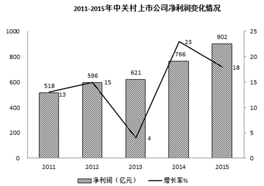

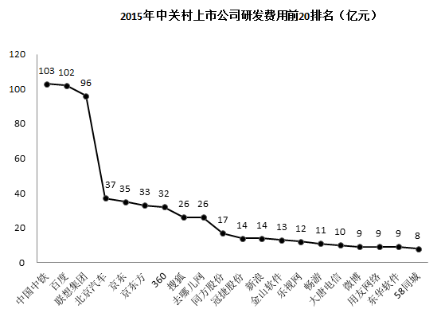

#### 第 1 题　qid 2050634 · 增长

2015年与2014年相比，中关村上市公司总营业收入增加了：

- **A**. 0.51万亿元　✅
- **B**. 0.65万亿元
- **C**. 1.83万亿元
- **D**. 0.41万亿元

**答案**：A

**官方解析**

根据题干所求“2015年与2014年相比······营业收入增加了”，选项带单位，可判定此题为增长量计算问题。定位文字材料第一段，“2015年中关村上市公司总营业收入达到2.34万亿元，同比增长”。代入公式：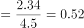万亿元，最接近A项。

故正确答案为A。

---

#### 第 2 题　qid 2050644 · 增长

2015年与2014年相比，中关村上市公司净利润同比增速：

- **A**. 上升了18个百分点
- **B**. 下降了5个百分点　✅
- **C**. 上升了5个百分点
- **D**. 下降了18个百分点

**答案**：B

**官方解析**

根据题干所求“2015年与2014年相比······同比增速”，选项为百分点变化，可判定此题为增长率问题。定位统计图，2015年中关村上市公司净利润增长率为，2014年为。，即2015年增速比2014年下降5个百分点。

故正确答案为B。

---

#### 第 3 题　qid 2050654 · 综合

资料显示，2015年中关村上市公司数量约为：

- **A**. 67家
- **B**. 22家
- **C**. 10家
- **D**. 210家　✅

**答案**：D

**官方解析**

根据题干所求“2015年中关村上市公司数量”，材料已知部分公司数量及占比，可判定此题为现期比重问题。定位文字材料第二段，“有67家（公司数量占比）企业的研发强度在及以上”，代入公式：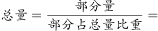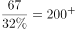，最接近D项。

故正确答案为D。

---

#### 第 4 题　qid 2050658 · 增长

2011-2015年间，中关村上市公司净利润年均增加值约为：

- **A**. 96亿元　✅
- **B**. 77亿元
- **C**. 57亿元
- **D**. 103亿元

**答案**：A

**官方解析**

根据题干所求“2011-2015年间······年均增加值”可判定此题为年均增长量计算问题。定位柱状图可得，2015年净利润为902亿元、2011年为518亿元，代入公式：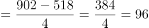亿元。

故正确答案为A。

---

#### 第 5 题　qid 2050666 · 综合

下列关于中关村上市公司的说法，错误的是：

- **A**. 2015年与2011年相比，中关村上市公司总市值，翻了两番多　✅
- **B**. 2011至2015年间，中关村上市公司净利润增速呈震荡起伏变动
- **C**. 2015年排名前3位的公司研发总费用约占前20位研发总费用的近一半
- **D**. 2015年约有近三分之一企业的研发强度达到了国际高科技领先企业的水平

**答案**：A

**官方解析**

A项：定位文字材料第一段，2015年中关村上市公司总市值达到48175亿元，较2011年增长了约34824亿元，则2015年总市值是2011年的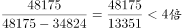，故翻了不到两番，错误；

B项：定位第一个折线图可发现，净利润增速在2011至2015年间起伏呈交替变化趋势，正确；

C项：定位第二个折线图，排名前3位的公司研发总费用为亿元，前20位的公司研发费用总和为该图中所有数据相加，亿元，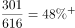，占比接近一半，正确；

D项：定位文字材料第二段，“有67家（公司数量占比）企业的研发强度在及以上，达到了国际高科技领先企业的水平”，，正确。

本题为选非题，故正确答案为A。

---

### 材料 2

        2016年是中国脱贫攻坚首战之年，全年超过1000万人告别贫困；中央和省级财政扶贫资金首次超过1000亿元；各类金融机构累计发放扶贫小额贷款2772亿元；产业扶贫为脱贫不断“换血”，其中2016年旅游扶贫覆盖到2.26万个贫困村，据不完全统计，河南、甘肃、河北等地2016年贫困地区农民人均可支配收入增长速度普遍高于当地农民人均可支配收入增速。其中，河南省贫困地区人均可支配收入可达9734.9元，处于中部地区领先水平；福建贫困地区人均可支配收入增长高达，高于全国农民人均可支配收入增长的平均水平。

#### 第 6 题　qid 2050528 · 平均数

2011-2016年全国城镇居民人均可支配收入与前一年相比增长最多的年份是：

- **A**. 2012　✅
- **B**. 2013
- **C**. 2014
- **D**. 2015

**答案**：A

**官方解析**

由题干“2011-2016年······与前一年相比增长最多的年份是”，可判定该题是增长量比较问题。定位数据图一中数据，可得全国城镇居民人均可支配收入与前一年相比增长分别为：2012年增长量元；2013年增长量元；2014年增长量元；2015年增长量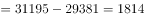元。所以2011-2016年全国城镇居民人均可支配收入与前一年相比增长最多的年份是2012年。

故正确答案为A。

---

#### 第 7 题　qid 2050532 · 增长

2016年部分省份贫困地区农村居民人均可支配收入增速高于全国农村居民人均可支配收入增速的省份个数有：

- **A**. 1
- **B**. 4
- **C**. 6
- **D**. 8　✅

**答案**：D

**官方解析**

由题干“2016年部分省份贫困地区······高于······个数有”，可知只需要计算出全国农村居民人均可支配收入增速比较即可，可判定该题是一般增长率问题。定位数据图一中数据，可得2016年全国农村居民人均可支配收入增速，观察数据图二中数据，8个省份贫困地区农村居民人均可支配收入增速均高于。

故正确答案为D。

---

#### 第 8 题　qid 2050538 · 平均数

2011-2016年全国农村居民人均可支配收入超过9000元的年份有：

- **A**. 1
- **B**. 2
- **C**. 3　✅
- **D**. 4

**答案**：C

**官方解析**

由题干“2011-2016年全国······超过9000元的年份有”，图一各年数据给出，可判定该题是简单计算问题。定位数据图一中数据，2011-2016年全国农村居民人均可支配收入超过9000元的年份有2014年9892元，2015年11422元，2016年12363元，总共3年超过9000元。
故正确答案为C。

---

#### 第 9 题　qid 2050544 · 平均数

2011-2016年城乡居民人均可支配收入的比值变化趋势为：

- **A**. 波浪形变化
- **B**. 逐年递减　✅
- **C**. 逐年递增
- **D**. 直线形变化

**答案**：B

**官方解析**

由题干“2011-2016年······比值变化趋势为”，比值变化趋势其实也就是比值大小变化情况，可判定该题是比值比较问题。定位数据图一中数据，可得2011-2016年城乡居民人均可支配收入的比值分别为：2011年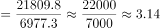；2012年；2013年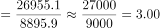；2014年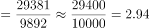；2015年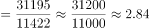；2016年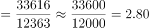，所以2011-2016年城乡居民人均可支配收入的比值，呈逐年递减趋势。

故正确答案为B。

---

#### 第 10 题　qid 2050552 · 综合

从上述资料中可以推出的是：

- **A**. 河南、甘肃、河北等地2016年贫困地区农民人均可支配收入增长速度普遍高于当地居民人均可支配收入增速
- **B**. 全国农村居民人均可支配收入增速呈逐年上涨趋势
- **C**. 2016年河南省贫困地区农村居民人均可支配收入与全国农村居民人均可支配收入的差额为3500元
- **D**. 2015年江西省贫困地区农村居民人均可支配收入约为8230元　✅

**答案**：D

**官方解析**

A项：定位文字材料，河南、甘肃、河北等地2016年贫困地区农民人均可支配收入增长速度普遍高于当地农民人均可支配收入增速，是当地农民而不是当地居民，错误；

B项：增长率的比较可用进行比较，定位数据图一中数据，2012年：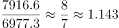；2013年：，所以2012年全国农村居民人均可支配收入增速快于2013年，错误；

C项：定位数据图一和二中数据，可得2016年河南省贫困地区农村居民人均可支配收入与全国农村居民人均可支配收入的差额，错误；

D项：定位数据图二中数据，可得2015年江西省贫困地区农村居民人均可支配收入元，约为8230元，正确。

故正确答案为D。

---
