# 2017年422联考《行测》题（吉林卷甲级）

> 联考 · 2017 年 · 6 个模块 · 共 103 题

- [政治理论](#%E6%94%BF%E6%B2%BB%E7%90%86%E8%AE%BA) · 2 题
- [常识判断](#%E5%B8%B8%E8%AF%86%E5%88%A4%E6%96%AD) · 18 题
- [言语理解与表达](#%E8%A8%80%E8%AF%AD%E7%90%86%E8%A7%A3%E4%B8%8E%E8%A1%A8%E8%BE%BE) · 35 题
- [数量关系](#%E6%95%B0%E9%87%8F%E5%85%B3%E7%B3%BB) · 8 题
- [判断推理](#%E5%88%A4%E6%96%AD%E6%8E%A8%E7%90%86) · 30 题
- [资料分析](#%E8%B5%84%E6%96%99%E5%88%86%E6%9E%90) · 10 题

---

## 政治理论

### 第 1 题　qid 2051962 · 马克思主义

习近平总书记指出，问题是事物矛盾的表现形式，我们强调增强问题意识，坚持问题导向。这句话的哲学依据是：

- **A**. 具体问题具体分析是认识和解决问题的关键
- **B**. 承认矛盾的普遍性是认识和解决问题的关键　✅
- **C**. 坚持问题导向才能体现中国共产党的宗旨
- **D**. 问题意识是中国特色社会主义的理论基础

**答案**：B

**官方解析**

B项正确：习近平总书记在中央政治局第二十次集体学习时强调，要学习掌握事物矛盾运动的基本原理，不断强化问题意识，积极面对和化解前进中遇到的矛盾。问题是事物矛盾的表现形式，我们强调增强问题意识、坚持问题导向，就是承认矛盾的普遍性、客观性，就是要善于把认识和化解矛盾作为打开工作局面的突破口。
故正确答案为B。

---

### 第 2 题　qid 2051988 · 新思想

中国共产党不断总结经验，汲取教训，领导中国革命一步一步走向胜利，仔细观察下图，如果用一个主题概括图中事件的教训最突出的一项应是：

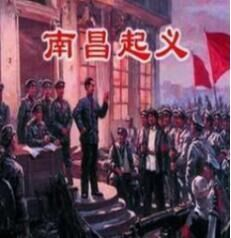

- **A**. 必须武装反抗国民党反动派
- **B**. 必须把工作重点从城市转入农村　✅
- **C**. 必须建立党对军队的绝对领导
- **D**. 必须建立广泛的革命统一战线

**答案**：B

**官方解析**

本题考查毛中特。
B项正确：南昌起义、秋收起义的失败，说明了敌人的力量主要集中在城市中，党从中得到的最主要的教训是必须将工作重心从城市转入农村，建立农村革命根据地。
A项错误：武装反抗是从大革命失败中得出的教训。1927年8月1日，南昌起义打响了武装反抗国民党反动派的第一枪。8月7日，中共中央在汉口召开八七会议，确定了开展土地革命和武装反抗国民党反动派的总方针，并决定发动秋收起义。因此A项不是从这两个起义中吸取的教训。
C项错误：三湾改编已经把“支部设在连上”实际上确立了党对军队的绝对领导。古田会议正式确定党对军队绝对领导为人民军队建设的根本原则。
D项错误：历史上，中国共产党在不同时期，为完成不同的历史任务，倡议和建立了革命统一战线、工农民主统一战线、抗日民族统一战线、人民民主统一战线和爱国统一战线。秋收起义和南昌起义都没有提到统一战线的有关内容。
故正确答案为B。

---

## 常识判断

### 第 1 题　qid 2050522 · 人文常识

党的十八大以来，一些标志性话语深刻反映了中央治国理政新理念。其中，下列标志性话语与治国理政新理念对应错误的是：

- **A**. “刮骨疗毒，壮士断腕”——加强党风廉政建设
- **B**. “踏石留印，抓铁有痕”——推动国防军队改革　✅
- **C**. “凝聚共识，合作共赢”——发展大国外交
- **D**. “一个都不能少”——全面建成小康社会

**答案**：B

**官方解析**

B项错误：习近平在十八届中央纪委二次全会上的讲话中指出：“要以踏石留印、抓铁有痕的劲头抓下去，善始善终、善做善成，防止虎头蛇尾，让全党全体人民来监督，让人民群众不断看到实实在在的成效和变化。”意在强调要持续深入抓作风建设、表达反腐倡廉的坚定决心，而非推动国防军队改革。
A项正确：习近平在中国共产党第十八届中央纪委第三次全体会议上发表重要讲话，他强调，全党同志要深刻认识反腐败斗争的长期性、复杂性、艰巨性，以猛药去疴、重典治乱的决心，以刮骨疗毒、壮士断腕的勇气，坚决把党风廉政建设和反腐败斗争进行到底。
C项正确：在亚信会议、巴黎气候大会等区域性和国际性的会议上，习主席强调各国要凝聚共识，促进对话，加强协作，在追求本国利益时兼顾各国合理关切，发展合作共赢的新型伙伴关系，体现了我国外交政策的导向。
D项正确：2016年春节前夕，习近平到江西看望慰问广大干部群众，他对乡亲们说，我们党是全心全意为人民服务的党，将继续大力支持老区发展，让乡亲们日子越过越好。在扶贫的路上，不能落下一个贫困家庭，丢下一个贫困群众。从中我们看到了在全面实现小康道路上，一个都不能少。
本题为选非题，故正确答案为B。

---

### 第 2 题　qid 2051970 · 人文常识

“有时候文明只是十公分的宽度，有时候只是一张纸的厚度，当我们把十公分的盲道让出来，当我们在椅子上垫一张纸，每个人的一小步构成了中国文明进步的一大步。”这段话蕴含的道理是：

- **A**. 质变是量变的结果，要重视量的积累　✅
- **B**. 只要抓住时机，就能实现事物的质变
- **C**. 要注重系统内部结构的优化趋向
- **D**. 要立足整体，发挥整体统率作用

**答案**：A

**官方解析**

A项正确：每个人的一小步累积起来就是量变，量变达到一定量的积累就会引起质变，一小步的积累达到量变引起文明一大步的质变，质变是量变的结果。
故正确答案为A。

---

### 第 3 题　qid 2051972 · 人文常识

积极者说，人生犹如一首歌，有低音也有高调，抑扬顿挫是人生美妙的旋律；消极者说，人生犹如一场戏，有高潮也有低潮，喜怒哀乐是人生无奈的节奏。这段话反映的哲理是：

- **A**. 人们对事物的反映具有主体性特点　✅
- **B**. 受知识水平制约,认识具有反复性
- **C**. 正确的认识产生于激烈的争论之中
- **D**. 人们不可能形成对事物的一致看法

**答案**：A

**官方解析**

A项正确：对于人生有起有落这件事，积极者和消极者有不同的认识，这说明人们对事物的认识是从主观感受出发的，具有主体性特点。
B项错误：认识过程的反复性是指人们对于一个复杂事物的认识往往要经过由感性认识到理性认识、再由理性认识到实践的多次反复才能完成。而题干中说的是人们对同一件事情的不同认识，不涉及认识的反复性。
C项错误：题干中讲的是人们对同一件事物的不同认识，这是人从自身出发的主观认识，不涉及认识的正确性。
D项错误：由于观察的角度不同，人们对同一事物会有不同的正确反映，每个人对事物认知的标准和看法都不一样，但是在有些事物上，人们通过相互交流和互相学习，可能达成一致看法，例如科学界的某些公理。
故正确答案为A。

---

### 第 4 题　qid 2050582 · 人文常识

在中国传统文化中，鸡具有君子风范。《韩诗外传》说鸡有五德：

- **A**. 文德、武德、勇德、仁德、信德　✅
- **B**. 智德、勇德、武德、礼德、义德
- **C**. 智德、武德、勇德、礼德、信德
- **D**. 文德、勇德、武德、仁德、义德

**答案**：A

**官方解析**

A项正确：《韩诗外传》是一部记述中国古代史实、传闻的著作，作者是西汉人韩婴。《韩诗外传》有云：“君独不见夫鸡乎，头戴冠者文也，足傅距者武也，敌在前敢斗者勇也，见食相呼者仁也，守夜不失时者信也。”意思是：您难道没看见那鸡吗？头上戴着冠，这是有文采；脚后面有距，这是有武勇；敌人在前面，它敢前去打斗，这是勇敢；看见食物招呼别的伙伴，这是有仁德；守夜不会忘记报时，这是守信用。即鸡有五德：文德、武德、勇德、仁德、信德。
故正确答案为A。

---

### 第 5 题　qid 2050560 · 人文常识

在我国文化用语中经常出现“别称”或“代称”。下列关于“别称”和“代称”的表述错误的是：

- **A**. 李清照词“人比黄花瘦”中的黄花是菊花
- **B**. 古人用“弄璋之喜”来祝贺他人升官　✅
- **C**. 人们称妇女为“巾帼”是由于妇女戴的头巾叫巾帼
- **D**. “及笄之年”指古代女子年满十五岁，到了可结婚的年纪

**答案**：B

**官方解析**

B项错误：“弄璋之喜”是指祝贺人家生男孩。古人把璋给男孩玩，希望他将来有玉一样的品德，“弄璋”即中国民间对生男的古称。始见周代诗歌中。祝贺人家生女孩是“弄瓦之喜”，瓦是纺车上的零件，希望她将来能胜任女工的意思。
本题为选非题，故正确答案为B。

---

### 第 6 题　qid 2051982 · 人文常识

九是中国古代最高统治者的专属数字。西周时期，只有天子可用九鼎，后世只有皇帝的龙袍可绣九条金龙。与此直接相关的制度是：

- **A**. 分封制
- **B**. 宗法制
- **C**. 礼乐制　✅
- **D**. 九品中正制

**答案**：C

**官方解析**

C项正确：礼乐制是维护封建制度的文化制度。周朝通过礼乐制度来规范贵族的身份地位，要求贵族在衣、食、住、行等方面都要符合自己的身份，贵贱长幼之间要有明显的差别。就连如何称呼“死”，不同等级的贵族也不一样。“九”作为中国古代最高统治者的专属数字，体现的是统治者的身份地位，因此与此直接相关的制度是礼乐制。
A项错误：分封制也称分封制度或封建制，即狭义的“封建”，由共主或中央王朝给宗族姻亲、功臣子弟、前朝遗民分封领地和相当的治权，属于政治制度范畴。与题干信息无直接关联。
B项错误：宗法制度是由氏族社会父系家长制演变而来的，是王族贵族按血缘关系分配国家权力，以便建立世袭统治的一种制度。其特点是宗族组织和国家组织合二为一，宗法等级和政治等级完全一致。与题干信息无直接关联。
D项错误：九品中正制，是魏晋南北朝时期重要的选官制度，是魏文帝曹丕采纳尚书令陈群的意见，命其制定的制度。虽然名字里面含有“九”字，但是与题干中“九”字体现统治者地位这个信息无直接关联。
故正确答案为C。

---

### 第 7 题　qid 2050572 · 人文常识

下列四组诗句分别反映了中国古代四种传统节日习俗，其起源与佛教没有直接关联的是：

- **A**. 谁家见月能闲坐，何处闻灯不看来
- **B**. 今朝佛粥交相馈，更觉江村节物新
- **C**. 风雨梨花寒食过，几家坟上子孙来　✅
- **D**. 道场普渡妥幽魂，原有盂兰古意存

**答案**：C

**官方解析**

C项错误：此句诗出自元代高启的《送陈秀才还沙上省墓》，意思是在风雨中，梨花落尽了，寒食节也过去了，清明扫墓的时候，有几户人家的坟墓还会有后人来祭拜呢。讲的是清明节，清明节据传始于古代帝王将相“墓祭”之礼，后来民间亦相仿效，于此日祭祖扫墓，历代沿袭而成为中华民族一种固定的风俗，与佛教没有直接关系，错误。
A项正确：此句诗出自唐代崔液的《上元夜》，意思是有谁家能见到元宵的月亮而能够无动于衷不去观赏呢，有哪里看到处处都在闹花灯而忍得住不去看呢。讲的是元宵节，元宵赏灯始于东汉明帝时期，明帝提倡佛教，听说佛教有正月十五日僧人观佛舍利，点灯敬佛的做法，就命令这一天夜晚在皇宫和寺庙里点灯敬佛，令士族庶民都挂灯。以后这种佛教礼仪节日逐渐形成民间盛大的节日。该节经历了由宫廷到民间，由中原到全国的发展过程。
B项正确：此句诗出自宋朝陆游的《十二月八日步至西村》，意思是腊日里人们互赠、食用着佛粥（即腊八粥），更感觉到清新的气息，讲的是腊八节，腊八节，俗称“腊八”，即农历十二月初八，古人有祭祀祖先和神灵、祈求丰收吉祥的传统，一些地区有喝腊八粥的习俗。相传这一天还是佛祖释迦牟尼成道之日，称为“法宝节”，是佛教盛大的节日之一。
D项正确：此句诗出自清代文人王凯泰的《中元节有感》，讲的是中元节。中元节，俗称鬼节、施孤、七月半，佛教称为盂兰盆节。
本题为选非题，故正确答案为C。

---

### 第 8 题　qid 2051984 · 经济常识

在经济生活中一种经济现象的出现往往引起另一种现象的产生。下列表述能体现这一关系的是：

- **A**. 美元兑人民币汇率下跌，赴美旅游费用一定会上涨
- **B**. 水务公司供水价格提高，会使居民生活用水量大幅减少
- **C**. 上海至广州的高铁开通，上海飞广州航班的客流量可能下降　✅
- **D**. 重大节日免收小型客车通行费，导致居民消费以享受型为主

**答案**：C

**官方解析**

C项正确：高铁与飞机互为替代品，高铁开通，坐飞机的人可能会减少。
A项错误：美元兑人民币汇率下跌，相同的人民币纸币可换到的美元纸币变多了，赴美旅游费用下降。
B项错误：水是生活必需品，且没有替代品，所以水的需求价格弹性很小。即使供水价格大幅提高，居民的用水量也不会产生较大波动。
D项错误：因果之间没有必然联系。
故正确答案为C。

---

### 第 9 题　qid 2050568 · 人文常识

2016年农民李某把自家的10亩土地入股流转给某民营农业科技有限公司，成为该公司的股东和员工。年底，她除每亩地获得保底租金1000元外，又领了的分红，加上每月工资1200元，一年下来能挣四万多。李某的收入：

①属于按生产要素分配

②受公司经营状况的影响

③属于按劳分配

④受股票价格波动的影响

- **A**. ①②　✅
- **B**. ③④
- **C**. ①④
- **D**. ②③

**答案**：A

**官方解析**

①正确：按生产要素分配，是指按照进行物质资料生产时所投入的生产要素的多少进行收益分配的一种方式。生产要素主要包括劳动力、技术、人才、资本、管理、土地、房屋等。题干中，租金1000元属于按土地要素分配，的分红属于按资本要素分配，月工资1200元属于按劳动力要素分配，以上均属于按生产要素分配。

②正确：入股之后的分红会受到公司经营状况的影响，收入高利润好，就能分的多一些。

③错误：按劳分配是在公有制经济中的分配方式，与题意不符。

④错误：本题中没有体现股票，且股票决定劳动收入等明显不符合常理。

故正确答案为A。

---

### 第 10 题　qid 2050574 · 地理国情

某校在长白山举行地理夏令营活动。在野外，老师要求同学们除了文字记录外，还要将看到的典型地貌和地质结构描绘出来，同学们应采用的绘画技法是：

- **A**. 速写　✅
- **B**. 工笔
- **C**. 写意
- **D**. 留白

**答案**：A

**官方解析**

A项正确，速写是在较短时间内迅速将对象描绘下来的一种绘画形式。它具有收集绘画素材、训练造型能力两大方面的功能。典型地貌和地质结构描绘应采用速写。
B项错误，工笔亦称“细笔”，与“写意”对称，中国画技法名，属于工整细致一类密体的画法，用细致的笔法制作，着重线条美，一丝不苟是工笔画的特色。
C项错误，写意，国画的一种画法。用笔不讲究工细，注重神态的表现和抒发作者的情趣，是一种形简而意丰的表现手法。
D项错误，留白是中国艺术作品创作中常用的一种手法，极具中国美学特征。留白一词指书画艺术创作中为使整个作品画面、章法更为协调精美而有意留下相应的空白，留有想象的空间。
故正确答案为A。

---

### 第 11 题　qid 2050586 · 人文常识

下列古代汲水灌溉工具与应用原理对应错误的是：

- **A**. 桔槔——杠杆原理
- **B**. 辘轳——轮轴原理
- **C**. 翻车——对称守恒原理　✅
- **D**. 筒车——叶轮原理

**答案**：C

**官方解析**

A项正确：桔槔始见于《墨子·备城门》，作“颉皋”。是一种利用杠杆原理的取水机械。
B项正确：辘轳，汉族民间提水设施，流行于北方地区。由辘轳头、支架、井绳、水斗等部分构成。利用轮轴原理制成的井上汲水的起重装置。
C项错误：中国古代链传动的最早应用就是在翻车上，是农业灌溉机械的一项重大改进。翻车并没有应用对称守恒原理，此原理经常用在协同反应中描述分子轨道。
D项正确：筒车是和翻车相类似的提水机具。这是利用湍急的水流转动车轮，使装在车轮上的水筒，自动戽水，提上岸来进行灌溉。
本题为选非题，故正确答案为C。

---

### 第 12 题　qid 2052008 · 人文常识

下列著名建筑中，其建筑风格属于哥特式的是：

- **A**. 
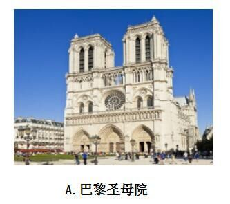
　✅
- **B**. 

- **C**. 
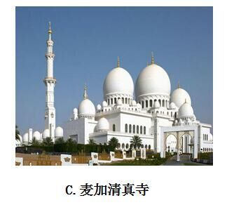

- **D**. 
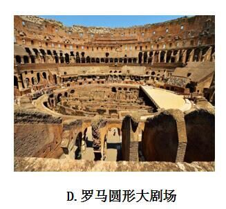

**答案**：A

**官方解析**

A项正确：哥特式建筑盛行于12至15世纪，它的造型风格以高、直、尖和强烈的向上感为特征，巴黎圣母院是法国典型的哥特式建筑。
B项错误：中国故宫属于中国古代建筑，不属于哥特式风格。
C项错误：麦加清真寺属于伊斯兰教建筑，不属于哥特式风格。
D项错误：罗马圆形大剧场属于罗马式建筑，不属于哥特式风格。
故正确答案为A。

---

### 第 13 题　qid 2050596 · 科技常识

中国首位80后女航天员王亚平，随神舟十号飞船进入太空飞行15天。飞行中她不会碰到的情况是：

- **A**. 看到绚丽多彩的极光
- **B**. 四周一片漆黑
- **C**. 穿过稠密的大气层
- **D**. 听到远处星体爆炸的声音　✅

**答案**：D

**官方解析**

A项正确：在太空飞行时，可以看到地球两极出现的极光。

B项正确：宇宙空间接近真空状态，四周的背景都是漆黑的。
C项正确：在从太空飞行返回时，需要穿过稠密的大气层才能回到地球。
D项错误：声音的传播是需要介质的，比如固体，液体，气体。太空接近真空状态，不能传声，所以航天员不可能听到爆炸声。
本题为选非题，故正确答案为D。

---

### 第 14 题　qid 2052010 · 人文常识

下列解说词出自电视专题片，其中符合自然常识的是：

- **A**. “每年除夕夜，这里的爆竹声都震耳欲聋，烟雾弥漫不见明月。”
- **B**. “他把神鼓当作月亮，而那七只鹿崽就是环绕着他的北斗七星。”
- **C**. “天快亮了，月亮还挂在天空，他突然想起来今天是农历初八。”
- **D**. “黎明时分，一弯月牙与金星同现东方低空，这便是金星合月。”　✅

**答案**：D

**官方解析**

D项正确：金星合月，也就是金星和月亮正好运行到同一经度上，两者之间的距离达到最近，它是行星合月天象中的一种。2015年9月10日晨出现过金星合月现象，2017年7月24日晨也出现过这一现象。
A项错误：除夕时月相应该为新月，晚上无法观测，并非因为烟雾弥漫而看不到。
B项错误：北斗七星并不环绕着月亮。
C项错误：农历初八时月相为上弦月，出现在上半夜，到半夜时分月亮就落下了，天快亮的时候是观测不到的。
故正确答案为D。

---

### 第 15 题　qid 2050602 · 人文常识

关于人体消化和吸收的叙述，错误的是：

- **A**. 胃吸收酒精的能力较强
- **B**. 胆汁不具有促进脂肪消化的功能　✅
- **C**. 大肠的作用是排泄未吸收的食物
- **D**. 肝被誉为“物质代谢中枢”

**答案**：B

**官方解析**

A项正确：酒的化学成分是乙醇，在消化道内不需要消化即可吸收，吸收快而且完全。一般在胃中吸收。胃内有无食物、胃壁的功能状况、饮料含酒精的多少以及饮酒习惯均可影响酒精的吸收。

B项错误：肝脏分泌的胆汁中不含消化酶，但胆汁对脂肪有乳化作用，能把脂肪变成微小颗粒，增加了脂肪与消化酶的接触面积，从而有利于脂肪的消化。

C项正确：大肠是对食物残渣中的水分进行吸收，并且可以将食物残渣自身形成粪便排出的脏器。

D项正确：被誉为“物质代谢中枢”的是肝脏，肝脏是身体内以代谢功能为主的一个器官，并在身体里面扮演着去氧化，储存肝糖，分泌性蛋白质的合成等等。肝脏也制造消化系统中的胆汁。

本题为选非题，故正确答案为B。

---

### 第 16 题　qid 2050520 · 科技常识

生物学家认为，人体有两个大脑系统存在，一个是头颅中的大脑系统，另一个是胸腹内的“第二大脑”系统。下列诗词描写的活动与“第二大脑”系统有关的是：

- **A**. 自从弃置便衰朽，世事蹉跎成白首
- **B**. 一向年光有限身，等闲离别易消魂
- **C**. 无可奈何花落去，似曾相识燕归来
- **D**. 料得年年肠断处，明月夜，短松冈　✅

**答案**：D

**官方解析**

“第二大脑”实际上也就是肠道内的神经系统，由分散在食管、胃、小肠、结肠组织上的神经元、神经传感器和蛋白质组成。与头颅中的大脑工作原理一样，它们相互之间也快速传递着信息，独立地感知、接受信号，并作出相关的反应，使人产生“愉悦”或“不适”的感觉，但它不能像真正意义上的大脑那样具有思维功能。
D项正确，“料得年年肠断处，明月夜，短松冈”出自宋代诗人苏轼的词作品《江城子·乙卯正月二十日夜记梦》第三四句，全词表达了作者怀念亡妻的悼念之情。作者用“肠断处”表达出自己的悲痛之情，与“第二大脑”系统的定义相符合。
A项错误，“自从弃置便衰朽，世事蹉跎成白首”出自唐朝诗人王维的古诗作品《老将行》，释义为：“自被摈弃不用便开始衰朽，世事随时光流逝而人成白首。”没有与“第二大脑”系统相关联的内容。
B项错误，“一向年光有限身，等闲离别易销魂”出自晏殊的《浣溪沙》，该句话的意思是片刻的时光，有限的生命，宛若江水东流，一去不返，让人深感悲伤。此句诗词与“第二大脑”系统没有关联。
C项错误，“无可奈何花落去，似曾相识燕归来”出自于宋代晏殊的《浣溪沙》，大意为那花儿落去我也无可奈何，那归来的燕子似曾相识，没有提到与“第二大脑”系统相关联的内容，故排除。
故正确答案为D。

---

### 第 17 题　qid 2052018 · 人文常识

下列四个选项，能正确表示食物链的是：

- **A**. 
大鱼小鱼虾

- **B**. 
草羊狼
　✅
- **C**. 
阳光草兔

- **D**. 
昆虫青蛙蛇

**答案**：B

**官方解析**

在生态系统内，各种生物之间由于食物而形成的一种联系，叫做食物链。食物链的开始通常是绿色植物（生产者），从绿色植物开始至少要有三个营养级。
B项正确：羊以草为食，狼以羊为食，且从绿色植物（草）开始。
A项错误：食物链方向错误。
C项错误：食物链最开始的是绿色植物（生产者）而非阳光。
D项错误：昆虫已经是食草动物，没从绿色植物（生产者）开始。
故正确答案为B。

---

### 第 18 题　qid 2050540 · 人文常识

下列新闻标题用语存在明显错误的是：

- **A**. 

- **B**. 

- **C**. 

　✅
- **D**. 

**答案**：C

**官方解析**

C项错误，古人把代人作文称为“捉刀”，“亲著”是亲自著述，可见如果是“捉刀”就不是“亲著”，两者互相矛盾。《城市论》显然是市委书记“亲著”，而非“捉刀”之作。故此处新闻标题用语存在明显错误。
A项正确，“琴瑟和鸣”一般用来比喻夫妇情笃和好，此处作者用来形容“一带一路”与“杭州共识”的良好关系，不存在明显错误。
B项正确，“共振”是物理学上的一个专业术语，是指一物理系统在特定频率下，比其他频率以更大的振幅做振动，这些特定频率称之为共振频率。此处用来形容文艺评论与时代发展的关系，没有明显错误。
D项正确，“别出机杼”指诗文创作另辟途径，不落俗套，“耳目一新”指听到的、看到的跟以前完全不同，使人感到新鲜。此标题没有明显错误。
本题为选非题，故正确答案为C。

---

## 言语理解与表达

### 材料 1

       近段时间，一个“才子”、一个“佳人”陆续成为朋友圈里的刷屏人物。前者是赵雷，一位民谣歌手，凭着一首《成都》，在湖南卫视节目《歌手》中一登台，就拿到了第二名的好成绩；后者是武亦姝，一名中学生，在《中国诗词大会》上一鸣惊人，成功问鼎。一个现代、一个传统，两人的“意外火爆”，看似不搭边，其实，“<u>这</u>”背后或有着相似奥秘。

       撇开《成都》的曲调不说，它的词本身就是一首诗歌。“让我掉下眼泪的，不止昨夜的酒。让我依依不舍的，不止你的温柔······分别总是在九月，回忆是思念的愁”，抑扬顿挫的韵律、画面十足的文字，就像冬日的一缕阳光，给我们带来温暖而沉静的安抚。难怪有人在安静听完这首歌后，感慨：“成都因为赵雷的《成都》更加成都。”话虽绕，却点出了《成都》火的缘由。

       同样，武亦姝的火，也不仅仅因为她的外表和气质，更是她身上浸润的深厚文化底蕴对集体记忆的唤醒。从“七月在野，八月在宇，九月在户，十月蟋蟀入我床下”，再到“塞上长城空自许，镜中衰鬓已先斑”，武亦姝用舞台上的惊艳表现，唤醒了无数观众共同的文化记忆。很多人或许在忙碌的生活中，早已经忘记了诗词的意义，但蓦然回首，却发现那些纯洁心灵、净化灵魂的传统文化，就隐藏在心灵深处。

       其实，不管是打动人心的民谣，还是古典雅致的诗词，流淌于其间的，正是“雅文化”的血液。古典诗词，自不用说。不少民谣，也正是因为其历经打磨后，刻画出人生的百态，引发大家的共鸣，由此才成为“爆款”。

#### 第 1 题　qid 2052052 · 片段阅读

第一段中划线的“这”指代的是：

- **A**. 赵雷与武亦姝的才情
- **B**. “看似不搭边”
- **C**. “意外火爆”　✅
- **D**. 赵雷与武亦姝的佳绩

**答案**：C

**官方解析**

首先定位原文，“这”出现在尾句，指代尾句谈论的现象，即“两人的‘意外火爆’”，对应C项。
A项“才情”、D项“佳绩”均不是尾句谈论的内容，排除；
B项“看似不搭边”是对这种现象不恰当的评价，而非这种现象指代的内容，排除。
故正确答案为C。
【文段出处】 《武亦姝和赵雷为何火了》

---

#### 第 2 题　qid 2052054 · 片段阅读

在作者看来，第二段中网友的那句话想表达的是：

- **A**. 成都是能给你更多安抚感的温暖之城
- **B**. 《成都》一炮打红使成都更加广为人知
- **C**. 《成都》唱出了关于城市和情感的共同心曲　✅
- **D**. 成都因为一首歌而更令人向往和眷恋

**答案**：C

**官方解析**

根据《成都》“就像冬日的一缕阳光，给我们带来温暖而沉静的安抚”可知，网友听完《成都》后感慨“成都因为赵雷的《成都》更加成都”是因为歌曲与城市相结合唱出了人们的心声，引起情感的共鸣，对应C项。
A项强调的是成都这座城市，没有体现出歌曲《成都》的作用，排除；
B项“广为人知”、D项“令人向往和眷恋”均不能体现出“温暖而沉静的安抚”作用，排除。
故正确答案为C。
【文段出处】 《武亦姝和赵雷为何火了》

---

#### 第 3 题　qid 2052056 · 片段阅读

文中引用歌词、诗词的最主要作用是：

- **A**. 表达作者对所引用歌词诗词的由衷喜爱
- **B**. 唤起读者关于城市和诗词的集体记忆　✅
- **C**. 丰富表现手法以增益该文的韵律之美
- **D**. 证明歌词的诗化和武亦姝的腹有诗书

**答案**：B

**官方解析**

首先定位歌词和诗词的位置，分别出现在第二段和第三段。第二段引用《成都》的歌词体现了歌词本身像诗歌一样优美，同时通过网友的感概可知，歌曲火爆的原因正在于歌词传达了对成都这座城市的感情，唤醒了人们心底对于这座城市的记忆。第三段引用大量的诗词阐明了武亦姝“火爆”是因为“她身上浸润的深厚文化底蕴唤醒了无数观众共同的文化记忆”。故文中引用歌词、诗词的最主要作用在于唤起读者对于成都这座城市和中国古诗词的共同记忆，对应B项。
A项“作者由衷的喜爱”、C项“增益该文的韵律之美”文段均未陈述，无中生有，排除；
D项只是围绕“歌词、诗词”本身的浅层作用，太过肤浅，而文段引用歌词、诗词最主要的作用是分析论证赵雷和武亦姝火爆的原因，即能唤起读者共同的文化记忆，引起共鸣，故排除。
故正确答案为B。
【文段出处】 《武亦姝和赵雷为何火了》

---

#### 第 4 题　qid 2052058 · 片段阅读

根据文意，赵雷、武亦姝“火爆”的主要原因是：

- **A**. 人们对于诗词的感情偏好
- **B**. “雅文化”引起了情感共振　✅
- **C**. 民谣和诗词都朗朗上口
- **D**. 两档电视节目极具观赏性

**答案**：B

**官方解析**

根据文章第四段“不管是打动人心的民谣，还是古典雅致的诗词，流淌于其间的，正是‘雅文化’的血液”可知，赵雷、武亦姝“火爆”是由于两者均含有“雅文化”，对应B项。
A、C、D三项均无法对应“雅文化”，排除。
故正确答案为B。
【文段出处】 《武亦姝和赵雷为何火了》

---

#### 第 5 题　qid 2052060 · 片段阅读

最适合做这篇短文标题的是：

- **A**. 赵雷和武亦姝火了，“玄机”何在？　✅
- **B**. 《成都》与诗词：戳中泪点和嗨点
- **C**. 一首歌，一座城；一首诗，一份情怀
- **D**. 人的心灵需要有意义的文化来滋养

**答案**：A

**官方解析**

文章首先陈述赵雷和武亦姝两人“火爆”的现象，后文分别阐述导致两人“火爆”的原因，最后总结全文指出两人“火爆”的原因，即均“流淌着‘雅文化’”，故文章重点阐述的是赵雷和武亦姝“火爆”的原因，对应A项“‘玄机’何在”，当选；
B项“泪点和嗨点”、D项“心灵······滋养”文段均未陈述，无中生有，排除；
C项，反推文段应为并列结构，而文段实为因果结构，与文段结构不符，排除。
故正确答案为A。
【文段出处】 《武亦姝和赵雷为何火了》

---

#### 第 6 题　qid 2051952 · 语句表达

冬日饮茶，自带几分禅意。窗外寒风呼啸，窗前水沸炉暖，茶香因为寒冷的映衬，愈发清冽，直抵心源。有人说，若要体会冬天的妙处，必经时间的淘洗与打磨，如同体会茶气一般，必要走过高山与峡谷，看尽湖泊与激流，从盼望“                    ”到“快日明窗闲试墨，寒泉古鼎自煎茶”，酒茶之间，岁月酿出了酒香，日子氤氲着茶气。平淡天真里，是静穆，是微笑，是禅意在吹拂。
填入画横线处最恰当的诗句是：

- **A**. 一曲新词酒一杯，去年天气旧亭台
- **B**. 东篱把酒黄昏后，有暗香盈袖
- **C**. 寒夜客来茶当酒，竹炉汤沸火初红
- **D**. 晚来天欲雪，能饮一杯无　✅

**答案**：D

**官方解析**

横线出现在文段中间，要结合上下文进行分析。前文强调冬日饮茶的禅意，体会冬日妙处需经时间淘洗打磨，后文给出诗句“快日明窗闲试墨，寒泉古鼎自煎茶”，描绘的是冬日闲适、悠然煎茶的恬淡状态，后文说明酒茶之间，岁月酿出了酒香，故横线处需填入与冬日饮酒相关的诗句，D项“晚来天欲雪，能饮一杯无”描绘天色将晚、大雪将至，邀请友人共饮的画面，既可对应前文盼望的心境，又可与后文构成衔接，当选。
A项“一曲新词酒一杯，去年天气旧亭台”侧重怀旧、感伤，抒发物是人非的惆怅，与冬日饮茶、闲适禅意无关，排除；
B项“东篱把酒黄昏后，有暗香盈袖”描写秋日赏菊的场景，与文段核心话题“冬日”不符，排除；
C项“寒夜客来茶当酒，竹炉汤沸火初红”体现寒夜煮茶、以茶代酒的场景，与后文“寒泉古鼎自煎茶”重复，无法与后文“酒茶之间，岁月酿出了酒香，日子氤氲着茶气”构成衔接，排除。
故正确答案为D。
【文段出处】《茶心如雪》

---

#### 第 7 题　qid 2051954 · 逻辑填空

第二季《中国诗词大会》在春节期间播放，观众可以参与互动，实现合家欢的观赏效果。《中国诗词大会》不            ，采用了紧张刺激的追逐赛、争霸赛等多维度比赛形式，摆脱了说教意味，把各个年龄段的观众吸引到电视机前。
填入画横线部分最恰当的一项是：

- **A**. 纸上谈兵
- **B**. 夸夸其谈
- **C**. 徒托空言
- **D**. 坐而论道　✅

**答案**：D

**官方解析**

对应后文“采用了紧张刺激的追逐赛、争霸赛等多维度比赛形式”、“摆脱了说教意味”可知，横线处应体现，《中国诗词大会》比较刺激有趣，不是僵硬说教，D项“坐而论道”原指坐着议论政事，后泛指空谈大道理，填入文段语义合适，当选。A项“纸上谈兵”比喻空谈理论，不能解决实际问题，文段中并未提及要解决问题，排除；B项“夸夸其谈”形容说话浮夸不切实际，与后文不能形成反义对应，排除；C项“徒托空言”指只说空话，并不实行，文段并未强调不实行之意，排除。
故正确答案为D。
【文段出处】《创新形式 活化传统》

---

#### 第 8 题　qid 2050672 · 片段阅读

①没有人可以精力无限、奔腾不息，忙碌周期与休憩周期相结合才能让生命充满精彩。②适度的停顿犹如登山过程中的休整，是从胜利走向胜利、从激昂迈向激昂的必经阶段。③就像电影镜头，长短镜头结合在一起，才会形成缤纷多彩的画面节奏。独处不仅是忙碌之间的停顿，更像是一次身心调整、精神蓄力。④所谓“静一分，慧一分”，养一团清静之气，擎一片悠然心光，映照自己同万物的关系，正是独处的本意。
“苏轼有句名言，‘善养身者，使之能逸而能劳’。”这句话在原文中的恰当位置是：

- **A**. ③
- **B**. ②
- **C**. ①　✅
- **D**. ④

**答案**：C

**官方解析**

首先分析要填入的句子，苏轼的名言表达“养身”应当劳逸结合。文段第一句指出应“忙碌”与“休憩”相结合，与“劳逸结合”联系最为密切，填入文段①、②处均可，排除A、D两项。又因为第一句话是对苏轼观点的解释说明，故观点应放在句首，对应C项。
将句子代入验证，首先通过苏轼的名言引出生活应当劳逸结合，接下来用登山和电影的比喻说明“适度的休息”是必要的，最后阐述“独处”的意义，文段前后逻辑紧密，衔接得当。
故正确答案为C。
【文段出处】《别整天忙于赶场应酬，独处放松才能看到生命的全貌》

---

#### 第 9 题　qid 2050578 · 逻辑填空

青山隐隐，芳草萋萋，春天的脚步总是来去匆匆。“二月里来好春光”的余音还在耳畔____，____之间便到了细雨纷纷、祭扫亲人的清明时节。
依次填入画横线部分最恰当的一组是：

- **A**. 缭绕 蓦然
- **B**. 回响 忽然
- **C**. 飘荡 遽然
- **D**. 萦绕 倏忽　✅

**答案**：D

**官方解析**

第一空，搭配“余音”，B项“回响”指声音一再地发出和折回，通常不与“余音”搭配，排除。A项“缭绕”指一圈圈向上飘起，C项“飘荡”指在空中飘浮、飘摆或飞升，D项“萦绕”比喻声音在某些地方旁边旋转、回复，填入文段均可，保留。
第二空，根据文意可知，横线处表达时间过的飞快，从二月转眼之间到了清明时节，D项“倏忽”可以形容时间或光阴迅速流逝，填入文段语义合适，当选。A项“蓦然”、C项“遽然”均有猛然的意思，填入文段程度过重，排除。
故正确答案为D。
【文段出处】《永远的墓志铭》

---

#### 第 10 题　qid 2050674 · 逻辑填空

如今越来越多没营养的综艺节目占据了市场的      。而《朗读者》却别具一格，“慢下来”用“朗读”做电视，这才是真正稀缺而有价值的电视文化。《朗读者》证明文化类节目未必“冷”，《朗读者》节目组把这份对精神文化的尊重     到节目中来。
依次填入画横线部分最恰当的一项是：

- **A**. 主体   移植　✅
- **B**. 主流   传达
- **C**. 首席   延伸
- **D**. 份额   演绎

**答案**：A

**官方解析**

第一空，根据“《朗读者》是稀缺而有价值的电视文化”可知，横线处所填词语表示“没有营养的综艺节目”在市场中很多。A项“主体”指事物的主要部分，B项“主流”指事物发展的主要方面，均符合文意，保留。C项“首席”指最尊贵的席位，用在此处程度过重，排除；D项“份额”指在总份数中的一定比例，体现不出“没有营养的综艺节目很多”之意，排除。
第二空，横线处所填词语表示将“对精神文化的尊重”体现在节目中。A项“移植”可以体现把精神文化转移并根植到节目中，符合文意，当选。B项“传达”表示向外传递，与“到节目中来”搭配不当，排除。
故正确答案为A。
【文段出处】《&lt;朗读者&gt;观众“零差评”：重拾内心深处的文化渴望》

---

#### 第 11 题　qid 2050610 · 逻辑填空

春晚相声《新虎口遐想》的出现，其最现实的意义就在于它实现了相声本质的回归，讽刺的分寸感好，对社会不良现象反思有力。只是      春晚时间的限制，结尾比较仓促，实在是美中不足的遗憾。但是          ，它回归了本质，找回了初心。
依次填入画横线部分最恰当的一项是：

- **A**. 由于  大醇小疵
- **B**. 囿于  瑕不掩瑜　✅
- **C**. 困于  毋庸置疑
- **D**. 缘于  不言而喻

**答案**：B

**官方解析**

本题从第二空入手，根据转折关联词“但是”可知，横线处所填成语与前文“美中不足的遗憾”语义相反，且对应“回归了本质，找回了初心”，横线处应强调相声总体上是不错的，带有积极的感情色彩。B项“瑕不掩瑜”比喻缺点掩盖不了优点，缺点是次要的，优点是主要的，与文段对应恰当，符合语境，保留。A项“大醇小疵”指大体纯正，而略有缺点，强调有好有坏，为中性词，C项“毋庸置疑”指不必怀疑，D项“不言而喻”指道理很明显，均无法对应“美中不足”，与前文无法形成转折关系，排除。
第一空，代入验证，B项“囿于”指受（某种情况）拘束，多用于消极语境，可体现相声《新虎口遐想》因为表演时间有限，所以“结尾比较仓促”，出现了“美中不足的遗憾”，符合文意，当选。
故正确答案为B。 
【文段出处】《三十年，两次“虎口脱险”：相声也要“惩恶扬善”》

---

#### 第 12 题　qid 2051958 · 片段阅读

春秋末至战国时期，各家往往以早期记载的五帝、三代作为理想标准，衡量各诸侯国的治理效果。孔子欲恢复周礼，表明他心目中是认可周代文武之治的。荀子反对孟子言必称三代、盲目崇拜先王的历史观，而大讲“法后王”，认为今胜于古。汉代儒家的古今观主要是秉承了孔、孟先师祖述尧舜、宪章文武的是古非今论，而东汉前期思想家王充则旗帜鲜明地提出“汉盛于周”的历史发展标准。宋代以后，又多了个汉唐评价标准。到底三代与汉唐孰优孰劣，人们也辩论不已。其实，争论背后的实质是用什么样的模本看待当时的治理成效。
对这段文字的主旨概括最准确的是：

- **A**. 表明古代治国思想的历史借鉴
- **B**. 阐述各家对治国效果的评价依据　✅
- **C**. 列举各家治理方案的主要差异
- **D**. 叙述了国家治理理念的历史沿革

**答案**：B

**官方解析**

文段首先介绍了春秋末至战国时期，各家以五帝、三代作为衡量治理效果的标准，接着通过孔子、荀子等例子进行详细的解释说明，随后分别介绍了汉代儒家、东汉前期及汉唐的历史发展标准，尾句通过“其实”转折之后强调实质是用哪种模本来看待治理成效，即“治国效果的评价依据”，对应B项。
A项“历史借鉴”无中生有，文段并未提及要借鉴哪种模式，排除；C项“治理方案”无中生有，文段强调的是评价治理效果的标准，排除；D项“治理理念”非重点，文段重在强调评价治理效果而非如何治理国家的理念，排除。
故正确答案为B。
【文段出处】《中国古代有关治理理念的争论》

---

#### 第 13 题　qid 2051964 · 片段阅读

音乐节目《蒙面唱将猜猜猜》的乐视视频总播放量达到7.5亿，领跑周日档综艺。在节目导演看来，一旦做足了“视觉”方面的隐藏，会发现，除了那些音色特别有辨识度的歌手，其实没有那么好猜。很多成名的歌手想借助“蒙面”展示他们不为大众所熟悉的潜能。那些音色有辨识度的歌手，试图去打破原有的演唱标签，但实际在操作过程中，有些歌手能隐藏住，而那几位最具有标签化特征的歌手还是藏不住。
根据以上文字，这个节目成功的关键在于：

- **A**. 不排斥辨识度很高的歌手
- **B**. 尊重了综艺节目的制作规律
- **C**. 把歌手真容遮盖得很严实
- **D**. 打破观众对歌手的固有印象　✅

**答案**：D

**官方解析**

文段首先介绍了《蒙面唱将猜猜猜》这档节目很成功，接着介绍了节目成功的原因，即做足了“视觉”的隐藏，许多歌手便没那么好猜，他们可以借助“蒙面”展示不为大众所熟悉的潜能。后文通过音色具有辨识度的歌手进行解释，详细说明了除了个别特征明显的歌手，大部分都打破原有标签，展现自身潜能。故节目成功的关键在于让歌手撕下固有标签，对应D项。
A项“不排斥歌手”、B项“尊重制作规律”均与文段提到的节目成功的原因无关，排除；C项“把歌手真容遮盖得很严实”只是节目设置视觉隐藏的方式，并非节目成功的原因，排除。
故正确答案为D。
【文段出处】《导演揭秘:&lt;蒙面唱将&gt;烧脑造型和名字的由来》

---

#### 第 14 题　qid 2050668 · 片段阅读

吃药还是输液，本不是选择的难题。吃药是最常用和最便利的治疗手段，但口服药物的效率不高也是常识；输液使得药物直接进入血液，效用和利用度更高，但滥输液的副作用同样不小。不过，自从有了输液，不仅“挂个水好得快”被医生推荐，而且患者群体也对“输液好得快”普遍认同，主动要求医生输液的不在少数，有些患者还对医生不给输液颇有微词。
这段文字意在说明：

- **A**. 患者缺乏科学的健康知识
- **B**. 人们对输液存在认识误区　✅
- **C**. 输液见效快是其最大缺陷
- **D**. 推荐输液的医生不够专业

**答案**：B

**官方解析**

文段首句引出吃药与输液的选择这一话题，接下来介绍吃药和输液各自的利弊。接着通过关联词“不过”进行转折引出重点，强调具有副作用的滥输液经常被医生推荐，且患者也过度信任和依赖输液这种治疗方式。故文段重点在于指出医生和患者对“输液”的认识都存在误区，对应B项。
A项，文段围绕“输液”论述，“健康知识”概念扩大，排除；
C项，“最大缺陷”无中生有，表达亦过于绝对，排除；
D项，只提到了“医生”没有提到“患者”，表述片面，且“不够专业”无中生有，排除。
故正确答案为B。
【文段出处】《全面停止门诊输液，你怎么看》

---

#### 第 15 题　qid 2050670 · 片段阅读

古代的石桥拱形大多为半圆形，这种建筑形式尽管比较优美完整，但因为拱顶造成桥高坡陡，车马行人非常不便。作为一条贯通南北的枢纽，“学步桥”的建造者采用了圆弧拱形式，使石拱高度大为降低，桥面过渡平稳，车辆行人非常方便，达到了低桥面便于过往、大跨度便于行船的双重目的。而且相对于传统的建筑形式用料省、施工方便。
对这段文字的主旨概括最准确的是：

- **A**. 介绍圆形拱石桥设计方案的优越性
- **B**. 指出古石桥在建筑风格上的唯美性
- **C**. 突出学步桥在建筑形式上的创新性　✅
- **D**. 比较传统石桥和圆弧拱桥的实用性

**答案**：C

**官方解析**

文段首句介绍石拱桥的建筑形式会给车马行人带来不便，之后介绍了“学步桥”采用圆弧拱的设计，增加了便利性而且节省用料和施工。故文段重点在于介绍“学步桥”在建筑形式上的创新，对应C项。
A项“拱石桥”、B项“古石桥”均为偷换概念，文段重点为“学步桥”，排除；
D项，“传统石桥”仅为首句引入部分，非重点，文段重在强调新型的“学步桥”，排除。
故正确答案为C。
【文段出处】《学步桥》

---

#### 第 16 题　qid 2051974 · 片段阅读

有这样一则寓言：几个小孩子每天都在一处院子前嬉闹。院子主人不胜其扰，拿出25元分给这几个孩子，感谢他们让院子充满热闹。第二天院子主人分给孩子们15元，第三天只拿出5元，解释说积蓄花光了，请孩子们免费来玩。孩子们很失望，从此再没来玩耍，院子恢复了安静。心理学上，“动机是行为的原形”，内部动机遵从的是内心意愿，外部动机则是在外界物质、荣誉等刺激下形成的。一个小小的物质激励，让孩子们“为快乐而玩”的内部动机，转化成“为报酬而玩”的外部动机。孩子们因此忘记了玩耍本身的快乐意义。
这段文字能给公务员工作带来的启示是：

- **A**. 面对工作，要有主人翁意识
- **B**. 面对挑战，要敢于担当
- **C**. 面对群众，要讲究工作方法　✅
- **D**. 面对问题，要严谨求实

**答案**：C

**官方解析**

文段讲述了这样一则寓言故事：孩子的嬉闹让院子主人不胜其扰，院子主人通过“给报酬”这一非常巧妙的方式方法来改变孩子们的玩耍动机，让他们从“为快乐而玩”转变为“为报酬而玩”，最终达到让院子恢复安静的目的。院子主人并没有与孩子发生正面冲突，而是在无形中化解难题，文段重在强调院子主人在解决问题时所采取的方法非常巧妙，对应C项。
A项“主人翁意识”、B项“敢于担当”和D项“严谨求实”在文段中均未体现，属于无中生有，排除。
故正确答案为C。

---

#### 第 17 题　qid 2051994 · 逻辑填空

美国耶鲁大学持续12年的研究表明：由父母同时带大的孩子智商高，他们在学校里的成绩往往更好，将来走向社会也更容易成功。尽管很多男性已经领悟到父教的_______，但现实生活中父教的缺位并不鲜见。中国家庭分工普遍注重“男主外，女主内”，男性投入到孩子身上的时间自然就会减少。有些男性存在浓厚的“大男子主义”情结，认为父教是“_______”，就算有时间，也不愿陪伴孩子；还有的父亲尚未认识到父教的必要性和重要性。
依次填入横线处最恰当的一项是：

- **A**. 大有可为  小题大做
- **B**. 不可或缺  雕虫小技　✅
- **C**. 大有裨益  家长里短
- **D**. 至关重要  大材小用

**答案**：B

**官方解析**

第一空，转折词“但”连接前后语义相反，“但”之后说“父教缺位现象普遍”，故横线处要体现出“父教不能缺位”之意，B项“不可或缺”符合文意，保留。A项“大有可为”比喻所做之事很有发展前途，C项“大有裨益”形容某件事对人益处很大，文段侧重点在“父教很重要、不能缺少”并非“有前途”、“有益处”，均排除；D项“至关重要”虽然语义与文段相符，但搭配有误，我们可以说“父教至关重要”，但不说“父教的至关重要”，排除。
第二空，代入验证，根据“男主外，女主内”、“大男子主义”可知，父亲的主业是“对外”，而对“家庭之事”、“教育孩子之事”父亲并不认为是重要的，故“父教”是“雕虫小技”，语义恰当，B项当选。
故正确答案为B。
【文段出处】《家庭教育父亲角色不能缺位》

---

#### 第 18 题　qid 2051998 · 语句表达

5G中的“G”是英文“Generation”的缩写，代表通信技术发展的时代。从诞生至今，移动通信技术已经先后经历了1G、2G、3G和4G几个重要世代。1G时代，移动语音通话成为了现实；2G时代，我们实现了移动全覆盖；3G让移动进入宽带时期；4G让网络速率得到大幅提升；而今天，我们即将迎来峰值速率可达10Gb/秒以上的第五代通信技术。______。《人民日报》指出，5G与3G、4G研究的一个重要区别，是其被认为是第一次将用户体验作为研究的重要核心。5G时代，重要的不再是速度，而是提供更多的应用和服务体验。
填入横线处与上下文衔接最恰当的一项是：

- **A**. 每一代联接技术都在悄悄改变着世界
- **B**. 5G概念已提出多年，何时才能真正投入使用呢
- **C**. 5G技术的推进，将使万物互联成为现实
- **D**. 如果你认为5G提升的只是速度，那就错了　✅

**答案**：D

**官方解析**

横线出现在文段中间，起到承上启下的作用，故横线处除了要与整个文段话题相符，还要与上下文语义保持一致。前文提出“5G”这一话题，并通过介绍1G、2G、3G、4G的情况引出“峰值速率可达10Gb/秒以上的第五代通信技术”，即强调“5G”速度更快；横线后强调“5G时代重要的不再是速度，而是提供更多的应用和服务体验”。由此可知，横线处论述的含义应为“5G”除了“速度”还有其他方面的价值，故对应D项。
A项缺少“5G”这一主题词，排除；B项“何时才能真正投入使用呢”与后文衔接不当，如填入此项后文应该对这一问题给出回答，排除；C项“万物互联成为现实”无中生有，排除。
故正确答案为D。
【文段出处】《科技潮人看过来！第五代移动通信技术（5G）完全解读》

---

#### 第 19 题　qid 2052006 · 逻辑填空

来自市场研究机构的统计显示，全球关于人工智能的专利申请数量，美国、中国、日本位列前三，三国占总体专利的。不过，尽管人工智能的发展_______，但这一项技术目前并不完美。人工智能才刚刚起步，现在不少应用其实是为人工智能而人工智能，市场相对比较浮躁。人工智能不能只停留在_______，必须用来解决实际需求。

依次填入画横线部分最恰当的一组是：

- **A**. 势不可挡  理论
- **B**. 日新月异  发明
- **C**. 风生水起  概念　✅
- **D**. 欣欣向荣  发明

**答案**：C

**官方解析**

本题可从第二个空入手，根据人工智能“必须用来解决实际需求”可知，横线处的意思为不能解决实际需求，故排除B、D两项的“发明”。C项“概念”可与后文的“解决实际需求”相反。而A项“理论”与实践相对，根据上文，人工智能已经投入实践了，而非仅有理论，排除A项。
验证第一空，“但”之后说“这一技术不完美”，故横线处要体现“人工智能发展很好”这一语义。“风生水起”形容事情做得有生气，蓬勃兴旺，符合文意。
故正确答案为C。
【文段出处】《人工智能大步流星聚力前行 中国企业能分多少蛋糕》

---

#### 第 20 题　qid 2052012 · 片段阅读

近年来，遛娃师渐渐多了起来。他们大多拥有幼教或体育专业背景，形象阳光，除了能迅速和孩子们打成一片，还能设计各种游戏桥段，同时具备一定的医护知识。简单来说，一名合格的遛娃师，要懂娃、会遛娃、能护娃。有招聘启事对遛娃师的要求为：让孩子们玩得开心的同时，增强与成年人交际、沟通的能力。作为一个新兴职业，遛娃师的市场状况如何？一家遛娃公司的负责人介绍，一般的遛娃师月收入5000元左右，最高等级过万元不稀奇，但是目前人数较少，人才缺口很大。
从这段文字中无法推出的是：

- **A**. 幼儿陪玩已走向社会化
- **B**. 遛娃师的就业率会很高
- **C**. 幼儿教育市场日趋成熟　✅
- **D**. 遛娃师职业素养很重要

**答案**：C

**官方解析**

A项，根据文段“近年来，遛娃师渐渐多了起来”、“作为一个新兴职业”可知，“已走向社会化”表述正确，排除；
B项，根据文段“目前人数较少，人才缺口很大”可知，“就业率会很高”表述正确，排除；
C项，“幼儿教育市场”无中生有，文段谈论的主体是“遛娃师”，没有提到“幼儿教育市场”，表述错误，当选；
D项，根据文段“他们大多拥有幼教或体育专业背景······同时具备一定的医护知识······一名合格的遛娃师，要懂娃、会遛娃、能护娃”可知，“职业素养很重要”表述正确，排除。
本题为选非题，故正确答案为C。

---

#### 第 21 题　qid 2052016 · 逻辑填空

我们怎么就不能_______呢？一辆随处可骑的共享单车，方便价廉，不用担心丢失损毁，你的责任仅是用完放好，多好的事情啊，怎么就不能在朗朗乾坤之下健康成长呢？我们年轻时说好了“要做共产主义接班人”，五六十年过去了，连个共享单车都不能容，眼看着单车一方面泛滥成灾，另一方面又共享不成。城市里堆积如山的单车不能_______，浪费了大量的公共资源，还污染了环境，加剧了人文环境的恶化。
依次填入画横线部分最恰当的一组是：

- **A**. 共襄盛举  物尽其用　✅
- **B**. 凝心聚力  善始善终
- **C**. 守望相助  各得其所
- **D**. 同舟共济  物有所值

**答案**：A

**官方解析**

第一空，根据后文“怎么就不能在朗朗乾坤之下健康成长呢？”“连个共享单车都不能容”可知，横线处表达我们对单车正确的态度和做法。A项“共襄盛举”指齐心协力完成一项任务，B项“凝心聚力”指将大家的想法、思路和力量凝聚在一起,均可，保留。C项“守望相助”指为了对付来犯的敌人或意外的灾祸，互相援助、共同防御，文段只是针对“共享单车”的做法，而非“来犯的敌人或意外的灾祸”，排除；D项“同舟共济”比喻在困难时，大家同心协力，共同渡过难关，文段没有提及“遇到困难”，排除。
第二空，搭配“单车”，根据后文“浪费了大量的公共资源，还污染了环境，加剧了人文环境的恶化”可知，横线处表达单车不能“充分的发挥效用”的意思。A项“物尽其用”指充分利用资源，一点不浪费，符合文意，当选。B项“善始善终”指事情从开头到结尾都做得很好，不符合文意，且和“单车”搭配不当，排除。
故正确答案为A。
【文段出处】《我们民族为什么容不下一辆“共享”单车？》

---

#### 第 22 题　qid 2052032 · 逻辑填空

一天顺手拿起手机翻看通讯录，发现里面存储的600多个姓名和号码，_______有近一半不知是谁，更记不起是什么时间、什么地点存留下来的。仔细想一想，大概是在不同的时机和场合，与这些_______的人有过简单的一面之缘，当时就存留下来了。
依次填入画横线部分最恰当的一组是：

- **A**. 显然  机缘巧合
- **B**. 俨然  南来北往
- **C**. 竟然  萍水相逢
- **D**. 居然  素昧平生　✅

**答案**：D

**官方解析**

第一空，根据“600多个姓名和号码，有近一半不知是谁，更记不起是什么时间、什么地点存留下来的”，可知文段体现的是“惊讶”之意，C项“竟然”和D项“居然”均可。A项“显然”指非常明显，显而易见，和文意相悖，排除；B项“俨然”指整齐的样子，并不表示惊讶，排除。
第二空，根据“不知是谁”、“一面之缘”，可知横线处表达“不认识的人”，D项“素昧平生”指过去没见过面的人，符合文意。C项“萍水相逢”指比喻素不相识之人偶然相遇，“相逢”与后文“一面之缘”重复，排除。
故正确答案为D。
【文段出处】《激活人生删除键》

---

#### 第 23 题　qid 2052038 · 片段阅读

曾有新闻报道，一位家长带着两个孩子逛商场，两个孩子从玻璃扶栏上掉下，当场死亡，这使家长陷入无限的哀痛与自责中。同样，获得了第89届奥斯卡金像奖最佳影片和最佳导演提名的电影《海边的曼彻斯特》，片中人物李，因为自己的过失导致三个幼子葬身火海。李在事情发生多年之后离开故乡，一个人住在没有家具的小公寓里，做着粗重的底层工作。他整天浑浑噩噩，不与人交往，仿佛生活在永远不会结束的冬天。从心理学上看，他其实患上了持续哀痛障碍。   
这段文字是一篇文章的开头，接下来的内容最可能是：

- **A**. 介绍持续哀痛障碍第三个案例
- **B**. 解释持续哀痛障碍的基本含义　✅
- **C**. 概括持续哀痛障碍的行为表现
- **D**. 分析影片中人物李的心理特征

**答案**：B

**官方解析**

根据提问方式可知，本题为接语选择题，应在通读全文的基础上，重点关注文段最后论述的核心话题。文段以“同样”为标志词，分别介绍了两个家长因自己过失使孩子死亡的案例，然后尾句从心理学的角度指出这是持续哀痛障碍，引出“持续哀痛障碍”这一话题，故文段接下来应该对“持续哀痛障碍”的含义进行解释，对应B项“基本含义”。
A项，文段尾句已经通过案例引出“持续哀痛障碍”这一话题，故下文应介绍其含义而非继续介绍案例，排除；C项“行为表现”对应文段“陷入无限的哀痛与自责”“整天浑浑噩噩，不与人交往”，是已经论述过的内容，排除；D项与文段最后论述的核心话题“持续哀痛障碍”不一致，排除。
故正确答案为B。
【文段出处】《中国科学院心理研究所：丧子带来的持续哀痛障碍有多可怕》

---

#### 第 24 题　qid 2050618 · 逻辑填空

近年来，荒唐滑稽的文化闹剧时有所闻。有的地方，在举行某种群众性的活动时，全体穿着所谓的“汉服”，就让人哭笑不得。在今天复活古代的服饰，就算是弘扬优秀的传统文化？如果把弘扬传统文化理解成穿古代服装，一齐行跪拜礼，这就_____让人哭笑不得，_____令人欲哭无泪了。凡此种种，都是________的典型表现。
依次填入画横线部分最恰当的一组是：

- **A**. 不是 而是 食古不化　✅
- **B**. 不是 就是 生吞活剥
- **C**. 非但 反而 生搬硬套
- **D**. 不仅 而且 囫囵吞枣

**答案**：A

**官方解析**

第一、二空，文段首先指出文化闹剧经常出现，接着具体举例，最后强调如果把弘扬文化理解成古代服装和行跪拜礼，那就让人连哭也哭不出来了。关联词连接的“哭笑不得”和“欲哭无泪”，显然更强调后者。而B项“不是……就是……”为选择关联词，表达“两者选择其一”的意思，但并无着重强调哪个，排除。其余三项均可。
第三空，“凡此种种”对上文进行了概括，故横线处重在强调今天复活古代的服饰并不是对传统文化真正的理解，一古一今准确对应A项“食古不化”，“食古不化”指对所学的古代知识理解得不深不透，不善于按现在的情况来运用，语义最为恰当，当选。C项“生搬硬套”指不顾实际情况，机械地运用别人的经验，照抄别人的办法；D项“囫囵吞枣”比喻对事物不加分析思考，C、D两项均不能体现出今天对于古代文化的不理解，排除。
故正确答案为A。
【文段出处】《继承传统切忌食古不化》

---

#### 第 25 题　qid 2050622 · 逻辑填空

某些意义上讲，与现代白话文一道_______于20世纪初的中国科幻文学，起点是很高的，因为当初在中国力推科幻文学的“科幻粉”中，有着不少文学史上的“大腕”级人物。然而因科幻文学今日之_______，以至于许多实实在在的事例，在今天不熟悉文学史的人听来，反倒像是_______了，因为，寒酸久了，再怎么说自己“出身高贵”也难取信于人。
依次填入画横线部分最恰当的一组是：

- **A**. 发端 凋敝 低人一等
- **B**. 滥觞 式微 无稽之谈　✅
- **C**. 起源 衰落 天方夜谭
- **D**. 发轫 衰败 胡说八道

**答案**：B

**官方解析**

本题可以从第三空入手，由后文的“寒酸久了，再怎么说自己‘出身高贵’也难取信于人。”可知横线处的成语表达难以让人相信之意。B项“无稽之谈”、D项“胡说八道”都可以指没有根据或没有道理地瞎说，填入此处语义均可，二者的区别在于前者比较书面化，后者表述过于口语化。通过文段中“力推”、“取信”，以及前面两个空格可能用到的“滥觞”、“发轫”、“式微”等词，可以得出，文段整体风格偏书面化，因此排除D项；A项“低人一等”指社会地位低下，与文意不符，排除；C项“天方夜谭”比喻虚诞夸饰的议论，荒诞不经的说法，程度过重，排除，正确答案锁定B项。
第一空代入验证，“滥觞”指事物的起源，与后文的时间搭配得当，当选。
第二空代入验证，“然而”表示转折，前文讲述中国科幻文学有很多，转折之后说明中国科幻文学发展势头减弱，“式微”指由盛而衰，符合文意，当选。
故正确答案为B。
【文段出处】《那些年你所不知道的“科幻迷”》

---

#### 第 26 题　qid 2050584 · 片段阅读

中国人常会举全族之力兴建家庙，以此弘扬家族传承，彰显先祖荣光；集地方财力设立乡祠，以此纪念故土先贤，宣示人杰地灵。至于身处异乡的客商们，则集资兴建会馆，以乡谊抱团，互相帮衬彼此提携。这是中国传统文化的特色。
下列没有体现文中所指的“中国传统文化特色”的是：

- **A**. 越鸟南栖
- **B**. 叶落归根
- **C**. 安土重迁
- **D**. 功成身退　✅

**答案**：D

**官方解析**

“中国传统文化特色”出现在尾句且由“这”引导，故是对前文内容的总结。文段首先通过并列结构指出，中国人会“兴建家庙”和“设立乡祠”，接下来指出身处异乡的客商们也会“集资兴建会馆，以乡谊抱团”，可知文中的“中国传统文化特色”指的是对于故乡的看重。A项“越鸟南栖”比喻不忘乡情；B项“叶落归根”指有一定归宿；C项“安土重迁”指安于乡土，不愿迁移，均能体现出对乡土的看重，排除。D项“功成身退”指大功告成，自行隐退，与对故乡的情感无关，当选。
本题是选非题，故正确答案为D。
【文段出处】《南望长安是今朝》

---

#### 第 27 题　qid 2050592 · 语句表达

如果按照距离太阳的远近来排序，地球在大行星里可以排到老三。比地球更靠近太阳的是金星和水星，它们的公转轨道位于地球的内侧，因此天文学家也称它们为“内行星”。当地球、内行星和太阳按此次序严格位于一条直线上时，由于强烈的亮度反差，我们会发现内行星像一个小黑点一样在日面上缓缓移动，这就是凌日。如果通过日面的是金星，那么就称之为“金星凌日”。
根据文意，下列说法错误的是：

- **A**. 当地球、内行星和太阳处在同一直线上时就有凌日现象　✅
- **B**. 凌日现象就是太阳被一个小的暗星体所遮挡
- **C**. 金星运行到太阳和地球之间时才有金星凌日
- **D**. 与金星凌日类似的现象还有水星凌日

**答案**：A

**官方解析**

A项，根据文段“当地球、内行星和太阳按此次序严格位于一条直线上时”可知，只有三者的顺序是地球、内行星和太阳，且三者位于一条直线时，才会产生凌日现象，故“当地球、内行星和太阳处在同一直线上时就有凌日现象”表述过于绝对，当选；
B项，根据文段“我们会发现内行星像一个小黑点一样在日面上缓缓移动，这就是凌日”可知，凌日现象的产生是因为被遮挡，表述正确，排除；
C项，根据“金星是内行星”和“地球、内行星和太阳按此次序严格位于一条直线上······称之为‘金星凌日’”可知，表述正确，排除；
D项，根据“金星和水星都是内行星”可知，“与金星凌日类似的现象还有水星凌日”表述正确，排除。
本题是选非题，故正确答案为A。
【文段出处】《有一种天象 你这辈子再也看不到了》

---

#### 第 28 题　qid 2052044 · 片段阅读

世界烹饪的三大风味体系中，法餐和土耳其的美食文化项目已先后于2010年和2011年入选世界非遗名录。博大精深的中国饮食文化缺失于世界非物质文化遗产名录，是餐饮界的一大憾事。关于申遗工作，世界各国都是举国家之力来做。在国内，其他非物质文化遗产的申请工作基本靠政府推动，但美食申遗现在多由行业协会和民间组织在推动，而仅靠协会自身的资金、能力、难度很大。
这段文字意在暗示：

- **A**. 中国的饮食文化没有产生广泛的国际影响
- **B**. 其他国家申遗工作的经验未必适用于中国
- **C**. 政府部门应尽早地积极推动中餐申遗工作　✅
- **D**. 美食申遗未能成功是因为误读了评选标准

**答案**：C

**官方解析**

文段开篇首先指出在世界烹饪的三大体系中，只有中国饮食文化未被收入非遗名录这一现状，接着进一步分析，将国内外情况进行对比，指出与其他各国举国家之力申遗不同，我国的美食申遗工作主要由协会承担而非政府推动，导致申遗难度很大，故文段结构为提出问题—分析问题，故文段意在强调应由政府推动我国美食申遗的工作，对应C项。
A项“广泛的国际影响”、D项“误读评选标准”均无中生有，文段未提及，排除；B项，文段肯定了其他国家举国家之力申遗的做法，“未必适用”与文意相悖，排除。
故正确答案为C。
【文段出处】《中餐申遗究竟难在哪儿》

---

#### 第 29 题　qid 2052046 · 片段阅读

故宫推出一款名叫《皇帝的一天》的App，演示了皇帝的一天。皇帝5点就得起床，换装、读书、请安、上早朝、御门听政，然后才是吃早饭。接下来召见大臣，批阅奏章，练武射箭······忙到下午3点半才能歇一会儿，吃第二顿饭。一天只吃两顿，还不能吃饱。《胤禛美人图》和《紫禁城祥瑞》2款App也相继上线。随后，故宫再推《韩熙载夜宴图》和《每日故宫》手机应用、《清代皇帝服饰》iPad应用。故宫的设计师团队以故宫藏品的文化信息为元素，迄今已开发了8700多种文化创意产品。
这段文字意在说明：

- **A**. 电子产品成为故宫文创产品的主流
- **B**. 故宫文物是文创产品的灵感来源
- **C**. 文创产品把故宫文化带入现代生活　✅
- **D**. 参观浏览只是寓教于乐的一部分

**答案**：C

**官方解析**

文段首先列举了故宫推出的几款电子产品，尾句进行总结，指出故宫的设计师团队已设计出了多种此类文化创意产品。整个文段为“分-总”结构，重点强调通过这些文创产品，故宫的文化已打破了时空的局限进入人们的现代生活，故文段的重点对应C项；
A项，文段并未将电子产品与其他文创产品进行对比，“主流”无中生有，排除；
B项，文段重在强调“文创产品”而非“文物”，且“灵感来源”无中生有，排除；
D项，“参观浏览”非重点，偏离文段中心，排除。
故正确答案为C。
【文段出处】《让故宫里的文物“活”起来》

---

#### 第 30 题　qid 2052048 · 片段阅读

每天早上，小王都要躺在床上浏览700多位微信好友的朋友圈动态、100多个公众号的订阅文章、50多个群聊的闲言碎语，再加上微博、QQ等其他社交工具，全部浏览完要花掉他1个多小时的时间。不仅起床前，连上厕所、吃饭、等车、坐车的一切零碎时间，小王都在看手机，直到这一天结束，最后再看一眼朋友圈，他才能安心睡觉。不断浏览让他觉得充实，但到底读到了什么，他还真的回答不上来。
这段文字所针对的现象是：

- **A**. 沉迷网络社交工具带来的困惑　✅
- **B**. 对于年轻人来说读书有些奢侈
- **C**. 阅读速度跟不上网络更新速度
- **D**. 很多网络文章阅读价值都不大

**答案**：A

**官方解析**

文段首先描述了小王整天在各类社交工具上花费大量时间的生活状态，尾句通过转折关联词“但是”引出文段的重点，即大量的浏览并未使小王真正有所收获，A项为中心句的同义替换，当选。
B项“读书奢侈”、D项“网络文章的阅读价值”均无中生有，文段未提及，排除；C项，文段并未把阅读速度与网络的更新速度进行对比，“跟不上”无中生有，排除。
故正确答案为A。
【文段出处】《碎片化快节奏的信息时代 如何做一个靠谱的阅读者》

---

#### 第 31 题　qid 2050550 · 片段阅读

目前上班每天8小时，中间吃一顿饭，因为这顿饭至少浪费一小时时间，得不偿失。如果吃两顿，上午10点上班，下午4点下班，两头吃饭时间都宽裕，对身体也好，符合早吃饱、晚吃早的养生理念。每天6小时上班效率高，精力集中，不间断就不浪费时间，晚上还能拉动社会消费，第二天晚起会儿也无碍。
这段文字主要想说明：

- **A**. 吃三顿饭弊大于利
- **B**. 吃饭是民生头等事
- **C**. 吃饭要讲时间成本
- **D**. 吃两顿饭好处多多　✅

**答案**：D

**官方解析**

文段开篇提出上班时中间吃一顿饭浪费时间、得不偿失，接着提出“如果吃两顿饭”就会有很多好处，即时间宽裕、对身体好、符合养生理念、上班效率高、晚上可拉动社会消费等，故全文通过“中间吃一顿饭”与“吃两顿饭”进行对比，重点强调“吃两顿饭”好处多，对应D项。A项“吃三顿饭”可对应首句“中间吃一顿”，非重点，文段重点是“吃两顿”，排除。B项“民生头等事”文段未提及，无中生有，排除。C项“时间成本”只是“吃两顿”的好处之一，表述片面，排除。
故正确答案为D。
【文段出处】《两顿》

---

#### 第 32 题　qid 2052050 · 片段阅读

春节前夕，职员小李想给外地的父母换一台60英寸大电视，如何选择合适产品，他和妻子的想法不同，一直在纠结。小李觉得在天猫买更划算，妻子却看中了京东送的扫地机器人这个赠品。“这款电视，爸妈住的城市京东无货，咱先收货再把这么大电视寄回家，估计邮费也要好几百元。”小李仔细比对了两家电商的销售细则。“我们再看看国美、苏宁吧。”妻子说，“在苏宁买这台电视，顺丰送货入户，价保15天，还有新人礼包199元；国美现在满1000减100，新会员注册还送200元现金······”
对这段文字概括最准确的一项是：

- **A**. 有些顾客存在价格选择的焦虑　✅
- **B**. 顾客似乎不是很在意消费快感
- **C**. 选择多反而更难做出明智选择
- **D**. 每逢节日商家都上演营销大战

**答案**：A

**官方解析**

文段开头首先指出对于电视机的选购，小李和妻子想法不同，一直在纠结，通过后文“划算”“赠品”以及“邮费”可知，纠结点主要在于在价格上存在差异，故文段重在强调消费者在选购商品时常常陷入价格因素的比较而产生焦虑，对应A项。
B项“消费快感”无中生有，文段重在强调价格因素，排除；
C项表述不明确，未突出消费者选购商品时在价格方面的纠结状态，排除；
D项“商家”非重点，文段强调的是顾客的选择，偏离文段中心，排除。
故正确答案为A。
【文段出处】《花钱，我有“消费焦虑症”》

---

#### 第 33 题　qid 2052064 · 语句表达

（1）古人云：“少而好学，如日出之阳；壮而好学，如日中之光；老而好学，如秉烛之明。”
（2）未来，“智本”将成为第一生产要素。学会给自己持续充电，其实是最有价值的个人投资。
（3）随着社会对人才的评价标准变得日益多元，我们更需牢固树立终身学习理念，祛除浮躁之风，自觉将学习融入生命全过程。
（4）终身学习具有外溢性、高效性、累积性等显著特征。
（5）风物长宜放眼量，学习不能只看“亩产效应”。
将以上5个句子重新排列，语序正确的是：

- **A**. （5）（2）（1）（4）（3）　✅
- **B**. （3）（1）（2）（5）（4）
- **C**. （1）（5）（4）（3）（2）
- **D**. （4）（1）（2）（3）（5）

**答案**：A

**官方解析**

观察选项，对比首句，分别是①句、③句、④句、⑤句。①句借用古言引出话题，④句论述终身学习的特征，⑤句引出学习的话题，三者均适合作为首句，保留A、C、D三项；③句出现递进关联词“更”，不适合作为首句，排除B项。
进一步观察发现，③句出现递进关联词，递进后围绕终身学习展开，指出应树立终身学习的理念，故递进前也应围绕终身学习这一话题展开论述。观察选项，选项中③句前有②句和④句，②句强调“智本”的重要性，并指出最有价值的个人投资就是给自己充电，④句论述终身学习的特征，对比而言④句与③句话题一致，语义程度加重，可构成关联词捆绑，保留A、C两项，排除D项。
进一步观察发现，⑤句指出学习不能只看“亩产效应”，要有长远眼光。对比选项，⑤句后有②句和④句，④句论述终身学习的特征，与⑤句话题不一致，排除 C项；②句强调持续学习是最有价值的个人投资，可与⑤句“放眼长远、重视长期价值”形成直接呼应，锁定A项，当选。
故正确答案为A。
【文段出处】人民日报《学习不能只看“亩产效应”》

---

#### 第 34 题　qid 2052066 · 片段阅读

实际上，评价睡眠质量好坏的标准，不是睡眠时间的长短，而在于第二天的精神状态。只要第二天感觉精力充沛，没有觉得不舒服，这就表明睡眠质量高，是健康的睡眠。不让健康睡眠成为奢侈品，需要每个人的自我努力，如养成健康的生活方式，注意劳逸结合，避免熬夜，按时睡觉，既保障睡眠时间，更应注重睡眠质量。
对这段文字的议题概括最精准的是：

- **A**. 深度睡眠与健康
- **B**. 睡眠的质量
- **C**. 健康的睡眠　✅
- **D**. 生活方式与睡眠

**答案**：C

**官方解析**

文段首先介绍了如何评价睡眠质量的好坏，随后强调什么是“健康的睡眠”，接着通过“需要”进行呼吁，指出每个人都需努力，不能让“健康睡眠”成为奢侈品，并在后文进行了举例说明，故文段重点讨论的核心话题为“健康睡眠”，对应C项。
A项“深度睡眠”无中生有，排除；
B项“睡眠的质量”对应文段首句，起到引出话题的作用，非重点，排除；
D项“生活方式”对应尾句例子当中的内容，非重点，且如根据“生活方式与睡眠”反推，文段应为并列结构，与本文段结构不相符，排除；
故正确答案为C。
【文段出处】《健康睡眠不能成现代人奢侈品》

---

#### 第 35 题　qid 2052068 · 片段阅读

奢侈品诞生的意义在于唯一性，真正的奢侈品是不能用机器大规模生产的。换句话说，当众多奢侈品牌放低身段、追求规模化生产以获得丰厚利润时，就已然丢弃了自身的“奢侈”属性。从这个意义上说，不管营销战略如何调整，只要实现奢侈品“平常化”的商业思维不变，今天的奢侈品就很可能失去彰显身份的定位。
这段文字强调：

- **A**. 奢侈品营销，品牌定位不能错位　✅
- **B**. 奢侈品进入寻常百姓家
- **C**. 奢侈品的发展趋势是大规模生产
- **D**. 奢侈品不再奢侈

**答案**：A

**官方解析**

文段开篇指出“奢侈品诞生的意义在于唯一性，不能用机器大规模生产”，否则就会失去“奢侈”属性，随后以“从这个意义上说”为标志对全文进行总结，说明奢侈品要改变“平常化”的商业营销思维才不至于失去彰显身份的定位，对应A项。
B项“进入寻常百姓家”文段没有提及，无中生有，排除；C项表述与文意相悖，文段明确表明“真正的奢侈品是不能用机器大规模生产的”，排除；D项“不再奢侈”表述绝对，文段说的是“可能失去”，排除。
故正确答案为A。
【文段出处】《当奢侈品不再奢侈》

---

## 数量关系

### 第 1 题　qid 2050620 · 数学运算

，，，，（    ），

- **A**. 

　✅
- **B**. 

- **C**. 

- **D**. 

**答案**：A

**官方解析**

题干中各式子计算结果不容易求出，不能比较前后项的数值关系，考虑分别抽出各式子真数组成新的数列。其中减号前面的对数真数组成新数列：4，8，16，32，（    ），128，可判断是公比为2的等比数列，括号中数字应为64。减号后面的对数真数组成新数列：3，8，15，24，（    ），48，作差得到新数列5，7，9，（    ），（    ），是公差为2的等差数列，故括号内应为11，13，继而推出原数列括号内为35。综上所述，题干中括号内应为。

故正确答案为A。

---

### 第 2 题　qid 2050630 · 数学运算

，，（），，（）， 

- **A**. 
，

- **B**. 
，

- **C**. 
，

- **D**. 
，
　✅

**答案**：D

**官方解析**

题干中各式子计算结果不容易求出，不能比较前后项的数值关系。由于底数均为，考虑指数组成的数列：0.1，-1.3，（），-3.7，（），-5.11，因为小数位数不固定，考虑机械划分。

整数部分：0，-1，（），-3，（），-5，括号中可以是（-2），（-4）或者（2），（4）。小数部分1，3，（），7，（），11，括号中应为（5）（9）。综上分析，题干括号内应为，。

故正确答案为D。

---

### 第 3 题　qid 2051960 · 数学运算

缉毒警察截获某贩毒集团的密电，密电为暗示交易地点的房间号，请根据其他数字，协助警察推导出正确的房间号：12345，6234，1023，（  ），60

- **A**. 102
- **B**. 402　✅
- **C**. 310
- **D**. 231

**答案**：B

**官方解析**

由题意可知，房间号码为一组数列。观察数列，发现数字变化极大且倍数关系不明显，考虑为其他问题。观察前两项：12345，6234，有三个重复的数字234，并且第一项的首数加尾数等于第二项的首数即，观察第二、三项：6234，1023，其中有两个重复的数字23，同样的前一项第一个数加最后一个数等于下一项的开头数字，因此，其他数字02不变，所以为402。

故正确答案为B。

---

### 第 4 题　qid 2051966 · 数学运算

罐中有12颗围棋子，其中8颗白子，4颗黑子。从中任取3颗棋子。则至少有一颗黑子的情况有：

- **A**. 98种
- **B**. 164种　✅
- **C**. 132种
- **D**. 102种

**答案**：B

**官方解析**

方法一：至少有一个黑子的情况包括：有一颗黑子，有两颗黑子，有三颗黑子一共三种情况。分别讨论如下：

有一颗黑子（1黑2白）的情况数： ；

有两颗黑子（2黑1白）的情况数：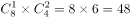 ；

有三颗黑子（3黑0白）的情况数：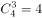 ；

 。

方法二：至少有一个黑子的分类情况较多，正面求解较为复杂考虑从反面出发求解。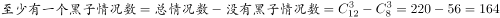 。

故正确答案为B。

---

### 第 5 题　qid 2051968 · 数学运算

古希腊数学家丢番图（Diophantus）的墓志铭：过路人，这儿埋葬着丢番图，他生命的六分之一是童年；再过了一生的十二分之一后，他开始长胡须，又过了一生的七分之一后他结了婚；婚后五年他有了儿子，但可惜儿子的寿命只有父亲的一半，儿子死后，老人再活了四年就结束了余生。根据这个墓志铭，丢番图的寿命为：

- **A**. 60
- **B**. 84　✅
- **C**. 77
- **D**. 63

**答案**：B

**官方解析**

方法一：假设丢番图的寿命为，则他儿子的寿命为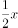。

由题可得， ， 解得。

方法二：根据“他生命的六分之一是童年”可知，丢番图的年龄是6的倍数，排除C、D两项。根据“又过了一生的七分之一后他结了婚”可知，丢番图的年龄是7的倍数，排除A项。

故正确答案为B。

---

### 第 6 题　qid 2051976 · 数学运算

在猫鼠游戏中，跑道为无顶和底的圆柱形，底或顶的圆周长度为5米。圆柱的高为12米，老鼠只能在顶端圆周逃跑并以0.5米/秒的速度从A点出发，与此同时，猫从B点出发匀速追击老鼠，并可以在圆柱形的表面选择任意路线追击。若猫想在A点恰好追及到跑了一圈的老鼠，则它至少要保持的速度为：

- **A**. 1.1米/秒
- **B**. 1.4米/秒
- **C**. 1.3米/秒
- **D**. 1.2米/秒　✅

**答案**：D

**官方解析**

根据题意可知，如果猫想在老鼠刚好跑一圈时追上老鼠，时间相同，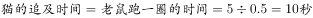。在时间为定值的前提下，若想速度最小，则需要所走路程最短，因此猫所走的路程为圆柱的高的长度12米，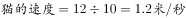。

故正确答案为D。

---

### 第 7 题　qid 2051978 · 数学运算

股神的骗局。就是所谓的“股神”第一天选定一批人，给其中一半人传递涨的信息，另一半传递跌的信息。第二天，在被传递正确信息的人中，再给其中一半人传递涨的信息，另一半人传递跌的信息。以此类推。若保证有人连续六天都接受到正确的消息，那么“股神”最初至少要选择的人数是：

- **A**. 8
- **B**. 64　✅
- **C**. 32
- **D**. 16

**答案**：B

**官方解析**

根据题意可知，若想最初人数最少，则剩下的人数需要最少为1人。反向推理：

因此，最初为64人。

故正确答案为B。

---

### 第 8 题　qid 2050664 · 数学运算

悟空与二郎神在离地面1米的空中决斗，两人相距2米，悟空想用分身直接偷袭二郎神，为了不引起对方的警觉，分身必须在地面反弹一次再进行攻击，则分身到达二郎神的位置所走的最短距离为：

- **A**. 
米
　✅
- **B**. 
米

- **C**. 
米

- **D**. 
米

**答案**：A

**官方解析**

要让分身到达二郎神的距离最短，两点之间连线最短，则应使悟空的分身镜像与二郎神之间的距离最短，如图得到分身的镜像，连线二郎神，距离最短为 米。

故正确答案为A。

---

## 判断推理

### 材料 1

某园林依中轴线布局，从前到后依次排列着七个庭院，这七个庭院分别以汉字“天”、“地”、“人”、“日”、“月”、“星”、“辰”来命名。已知：

①“天”字庭院不是最前面的庭院。

②“星”字庭院和“辰”字庭院相邻。

③“地”、“人”两庭院间隔的庭院数与“日”、“月”两庭院间隔的庭院数相同。

#### 第 1 题　qid 2050676 · 类比推理

根据上述信息，“天”字庭院可能是：

- **A**. 第一个庭院
- **B**. 第五个庭院　✅
- **C**. 第四个庭院
- **D**. 第二个庭院

**答案**：B

**官方解析**

根据条件①“天”字庭院不是最前面的庭院，可知“天”不可能是第一个庭院，排除A选项；
代入B选项，“天”在第五个庭院，“星”和“辰”在第六个和第七个两个庭院，“地”、“人”、“日”、“月”在第一个至第四个庭院，可以满足条件③，比如“地”、“人”在第一个和第二个两个庭院，“日”、“月”在第三个和第四个两个庭院，所以此项是可能成立的，当选；
代入C选项，“天”在第四个庭院，根据条件②“星”字庭院和“辰”字庭院相邻，“星”和“辰”可以选择的是四种情况第一个和第二个、第二个和第三个、第五个和第六个、第六个和第七个，这四种情况无论哪一种情况都不能满足条件③，所以此项是不可能对的，排除；
代入D选项，“天”在第二个庭院，根据条件②“星”字庭院和“辰”字庭院相邻，“星”和“辰”可以选择的是四种情况第三个和第四个、第四个和第五个、第五个和第六个、第六个和第七个，这四种情况无论哪一种情况都不能满足条件③，所以此项是不可能对的，排除。
故正确答案为B。

---

#### 第 2 题　qid 2050678 · 类比推理

如果第二个庭院是“辰”字庭院，则下列一定为真的是：

- **A**. 第七个庭院是“天”字庭院
- **B**. 第一个庭院是“星”字庭院　✅
- **C**. 第三个庭院是“地”字庭院
- **D**. 第五个庭院是“日”字庭院

**答案**：B

**官方解析**

根据题干条件第二个庭院是“辰”字庭院，再结合条件②“星”字庭院和“辰”字庭院相邻。只有两种情况，第一种是：

第二种是：

对于第一种情况，要满足条件③，“地”、“人”与“日”、“月”这四个庭院要安排在第四个、第五个、第六个和第七个这四个庭院，所以“天”字庭院就一定是第一个庭院，但是与条件①矛盾，所以，第一种情况不成立，也就是说只有第二种情况成立，所以“星”在第一个庭院。

故正确答案为B。

---

#### 第 3 题　qid 2051986 · 定义判断

文饰，是指无意识地通过似乎有理而实际上站不住脚的理由来为自己难以接受的情感、行为或动机辩护，以使其可以接受。
根据上述定义，下列现象不属于文饰的是：

- **A**. 对于自己得不到的东西，就说它一定是不好的
- **B**. 当得不到葡萄而只有柠檬时，就说柠檬是甜的
- **C**. 将个人高考的失败，完全归于家庭环境的影响
- **D**. 把自己恋爱的成功，简单归因于自己长得帅气　✅

**答案**：D

**官方解析**

第一步，找到定义关键词。
关键词为“无意识地通过似乎有理而实际上站不住脚的理由”、“自己难以接受的情感、行为或动机辩护”。
第二步，逐一分析选项。
A项：得不到就说它一定是不好的，是为自己得不到的东西进行辩护，理由站不住脚，同时也是为自己难以接受的情感、行为进行辩护，与定义关键词相符，符合定义，排除；
B项：得不到葡萄说柠檬是甜的，是为自己得不到葡萄而只得到柠檬进行辩护，理由站不住脚，同时也是为自己难以接受的行为进行辩护，与定义关键词相符，符合定义，排除；
C项：高考失利完全归于家庭环境的影响，理由站不住脚，同时也是为自己难以接受的情感、行为或动机辩护，与定义关键词相符，符合定义，排除；
D项：自己恋爱的成功并不是自己难以接受的情感、行为或动机，与定义关键词不符，不符合定义，当选。
本题为选非题，故正确答案为D。

---

#### 第 4 题　qid 2051990 · 定义判断

投射，是指主观地将属于自身的一些不良的思绪、动机或情感，赋予到他人或他物身上，推卸责任或把自己的过错归咎于他人，从而得到一种解脱。
根据上述定义，下列现象属于投射的是：

- **A**. 丈夫把自己多日来累积的对上司的愤怒和不满情绪，在家中对亲人发泄出来
- **B**. 一个男生对勤奋用功的女同学产生好感却不敢表达，暗地里开始比她更用功
- **C**. 一个学生考试作弊被抓，他认为别的同学也都作弊，比自己有过之而无不及　✅
- **D**. 一位丈夫在外玩得太晚，就专门为妻子带回来一件贵重的礼物来抵消愧疚之情

**答案**：C

**官方解析**

第一步，找到定义关键词。
关键词为“将属于自身的一些不良的思绪、动机或情感，赋予到他人或他物身上，推卸责任”或“把自己的过错归咎于他人”。
第二步，逐一分析选项。
A项：选项中丈夫在家中对亲人发泄来自上司的愤怒和不满情绪，不属于推卸责任或者将过错归咎于他人，不符合定义，排除；
B项：男生暗地里开始比女生更加用功，没有体现推卸责任或者将过错归咎于他人，不符合定义，排除；
C项：该学生作弊被抓，认为别的同学也都作弊，比自己有过之而无不及，是将自己的不良动机赋予到别的同学身上，与定义关键词相符，符合定义，当选；
D项：带礼物抵消愧疚之情不属于推卸责任或者将过错归咎于他人，不符合定义，排除。
故正确答案为C。

---

#### 第 5 题　qid 2051992 · 定义判断

白熊效应，源于美国哈佛大学社会心理学家丹尼尔·魏格纳的一个实验。他要求参与者尝试不要想象一只白色的熊，结果参与者的思维出现强烈反弹，很快就在脑海中浮现出一只白熊的形象。实验结果证实，当我们刻意转移注意力时，思维也开始出现无意识的“自主监视”行为——监视自己是否还在想不应该想的事情，使我们无法从根本上放弃对事情的关注。
根据上述定义，下列现象最符合白熊效应的是：

- **A**. 一般情况下，人们对自己喜欢的事物，总会不自觉地给予更多的关注
- **B**. 很多正处于青春期的孩子，家长越是不让他做什么，他就偏偏要去做
- **C**. 失恋的人努力想忘记昔日的恋人，却发现对方的形象在脑中愈加清晰　✅
- **D**. 人们往往对已完成的工作很快遗忘，对未完成的工作却更加念念不忘

**答案**：C

**官方解析**

第一步，找到定义关键词。
关键词为“刻意转移注意力时，思维也开始出现无意识的监视自己是否还在想不应该想的事情”、“无法从根本上放弃对事情的关注”。
第二步，逐一分析选项。
A项：人们对自己喜欢的事物给予更多的关注，不符合要刻意转移注意力，与定义关键词不相符，不符合定义，排除；
B项：家长越不让孩子做什么，孩子就偏偏要去做，不是孩子要刻意转移注意力，与定义关键词不相符，不符合定义，排除；
C项：失恋的人努力想忘记昔日的恋人属于刻意转移自己的注意力，但是却发现对方的形象在脑中愈加清晰，属于思维上开始出现无意识的监视自己是否还在想不应该想的事，无法从根本上放弃对失恋这件事情的关注，与定义关键词相符，符合定义，当选；
D项：对已完成的工作很快遗忘，对未完成的工作却更加念念不忘，没有体现要刻意转移注意力，不符合定义，排除。
故正确答案为C。

---

#### 第 6 题　qid 2050476 · 定义判断

滑坡谬误，是指不合理地使用连串的因果关系，将“可能性”转化为“必然性”，把小概率事件当做必然发生的事件进行推理的一种逻辑谬误。

根据上述定义，下列漫画中出现的逻辑谬误属于滑坡谬误是：

- **A**. A　✅
- **B**. B
- **C**. C
- **D**. D

**答案**：A

**官方解析**

第一步，找出定义关键词。
“不合理地使用连串的因果关系”、“将‘可能性’转化为‘必然性’，把小概率事件当做必然发生的事件进行推理”。
第二步，逐一分析选项。
A项：“第一天坏人进前院，第二天到门廊，第三天吃掉你的小孩”，该选项的三个事件之间有连串的因果关系；同时该选项将“到门廊”与“吃小孩”这两个可能发生的小概率事件当做了必然事件。符合题干定义，当选；
B项：每个夜晚将尽黎明将至时，太阳都要升起，没有体现将“可能性”转化为“必然性”事件进行推理。不符合题干定义，排除；
C项：问：“为什么总吃我的薯片？”答：“要我来列举你所有的臭毛病吗？”两个人之间的对话没有体现连串的因果关系，也没有体现将“可能性”转化为“必然性”事件进行推理，不符合题干定义，排除；
D项：该选项没有体现连串的因果关系，排除。
故正确答案为A。

---

#### 第 7 题　qid 2052028 · 定义判断

具有包容关系的两个概念中，外延较大的概念称为属概念，外延较小的概念称为种概念。由属概念过渡为它的某一个种概念，从而缩小概念外延的逻辑方法被称为概念的限制。概念的限制只能在具有包含关系的概念之间进行，不能在具有整体和部分关系的概念之间进行。
根据上述定义，下列对概念的限制正确的是：

- **A**. 
大学学院系

- **B**. 
公民中国公民作家

- **C**. 
合同租赁合同房屋租赁合同
　✅
- **D**. 
男子足球队队员足球队队员运动员

**答案**：C

**官方解析**

第一步，找到定义关键词。
由“属概念—外延较大的概念”过渡到“种概念—外延较小的概念”；“在包含关系的概念中进行”；“不能在具有整体和部分关系的概念之间进行”。
第二步，逐一分析选项。
A项：系是学院的组成部分，概念之间是整体和部分的关系，不符合定义，排除；
B项：公民到中国公民是由属概念过渡到种概念，是对公民这个概念外延的缩小，属于对概念的限制，但是作家并不是对中国公民这个概念进行外延的缩小，有些作家是中国公民，有的中国公民是作家，二者之间为交叉关系，不符合定义，排除；
C项：合同到租赁合同是由属概念过渡到种概念，是对合同这个概念外延的缩小，同时租赁合同到房屋租赁合同也是由属概念过渡到种概念，是对租赁合同这个概念外延的缩小，即房屋租赁合同是租赁合同的一种，租赁合同是合同的一种，与定义关键词相符，符合定义，当选；
D项：男子足球队队员到足球队队员是对男子足球队员这个概念外延的扩大，足球队队员到运动员是对足球运动员这个概念外延的扩大，与定义关键词不相符，不符合定义，排除。
故正确答案为C。

---

#### 第 8 题　qid 2050480 · 类比推理

蛇：腿

- **A**. 鸡：翅膀
- **B**. 狮：爪子
- **C**. 牛：尾巴
- **D**. 鲸：鱼鳃　✅

**答案**：D

**官方解析**

第一步：判断题干词语间逻辑关系。
蛇没有腿，腿不是蛇的组成部分。
第二步：判断选项词语间逻辑关系。
A项：鸡有翅膀，翅膀是鸡的一部分，与题干逻辑关系不一致，排除；
B项：狮有爪子，爪子是狮的一部分，与题干逻辑关系不一致，排除；
C项：牛有尾巴，尾巴是牛的一部分，与题干逻辑关系不一致，排除；
D项：鲸不是鱼，没有鱼鳃，鱼鳃不是鲸的一部分，与题干逻辑关系一致，当选。
故正确答案为D。

---

#### 第 9 题　qid 2051980 · 类比推理

证券：债券

- **A**. 山水画：人物画
- **B**. 油画：壁画
- **C**. 绘画：素描　✅
- **D**. 漫画：年画

**答案**：C

**官方解析**

第一步：判断题干词语间逻辑关系。
债券是证券的一种，二者是种属关系。
第二步：判断选项词语间逻辑关系。
A项：山水画与人物画是并列关系，与题干逻辑关系不一致，排除；
B项：壁画是指直接画在墙面上的画，有的壁画是油画，有的壁画不是油画。二者是交叉关系，与题干逻辑关系不一致，排除；
C项：素描是绘画的一种，二者是种属关系，与题干逻辑关系一致，当选；
D项：年画不是漫画的一种，与题干逻辑关系不一致，排除。
故正确答案为C。

---

#### 第 10 题　qid 2050608 · 逻辑判断

酵素是一种无需消化就能被人体吸收的小分子营养品，其营养物质由原材料中的微生物转化和增殖产生。此外，这些微生物利用蔬果里的维生素、氨基酸等物质进行代谢转化也能产生营养物质。酵素里还含有微量的酶，其中以糖化酶和蛋白酶为主，这些酶可以将糖转化为细胞可用的物质。近年来，酵素产品被商家大肆宣传，声称酵素有减肥功效，使得一些爱美的消费者对其趋之若鹜。
以下哪项如果为真，最能反驳上述商家的观点：

- **A**. 服用某些含有益生菌及多种微生物的酵素类产品，具有一定的瘦身效果
- **B**. 在一定条件下，酵素类产品中的益生菌和微生物有促进肠道蠕动的作用
- **C**. 酵素进入人体后，其中的酶会被消化系统降解，无法发挥生物催化作用　✅
- **D**. 市场上不合格的酵素类产品，可能会对服用者的身体造成巨大伤害

**答案**：C

**官方解析**

第一步：找出论点论据。
论点即商家的观点：酵素有减肥功效。
论据：酵素里还含有微量的酶，其中以糖化酶和蛋白酶为主，这些酶可以将糖转化为细胞可用的物质。
第二步：逐一分析选项。
A项：某些酵素类产品具有一定的瘦身效果，说明酵素有减肥的功效，举例加强论点，无法削弱论点，排除。
B项：酵素类产品中的益生菌和微生物有促进肠道蠕动的作用，肠道蠕动是否带来瘦身未知，无法削弱论点，排除。
C项：说明酵素进入人体之后，其中将糖转化为细胞可用物质的酶会被降解，无法发挥酶具有的生物催化作用，说明论据没有用，否定论据，当选。
D项：题干讨论的是酵素类产品，并不是市场上不合格的酵素类产品，话题不一致，属于无关选项，排除。
故正确答案为C。

---

#### 第 11 题　qid 2052014 · 逻辑判断

为什么减肥老反弹？科学家先用高脂饮食喂养小鼠。小鼠们变的过度肥胖之后，对其中的一部分进行正常饮食，它们随之恢复到最初体型。经多次循环上述喂养方式。研究者发现，每次当高脂——正常饮食的小鼠恢复到最初体重时，它们的耗氧量、能量消耗和其他肥胖指标均恢复到了正常值，但它们的每个饮食循环里净增长的体重多于一直保持高脂饮食的小鼠。是什么导致了多余的增重?科学家发现，高脂和低脂饮食的循环会改变小鼠肠道菌群的平衡，破坏了有益的黄酮类化合物，导致小鼠体重更容易增加。
以下哪项如果为真，不能支持上述结论：

- **A**. 研究发现，过度肥胖小鼠的菌群利用的黄酮类化合物更少　✅
- **B**. 人类和小鼠肠道的微生物群落，在减肥中存在类似的模式
- **C**. 当采用了黄酮类化合物膳食补充剂后，就能够抑制体重的过分反弹
- **D**. 当小鼠回归正常饮食并减轻体重后，体内被打破的菌群不会自行恢复

**答案**：A

**官方解析**

第一步：找到论点论据。
论点：减肥老是反弹。
论据：高脂和低脂饮食的循环会改变小鼠肠道菌群的平衡，破坏了有益的黄酮类化合物，导致小鼠体重更容易增加。
第二步：逐一分析选项。
A项：题干小鼠都是先养成过度肥胖，然后分组，一组一直胖，一组瘦胖循环，A项这里的过度肥胖不明确说的是哪组小鼠的情况，不能加强，当选；
B项：这道题论点目标是为了研究人为什么减肥反弹，用了老鼠做实验，所以，B项说人跟鼠类似，是为了说明鼠的结论可以代表人，所以B项可以支持，排除；
C项：小鼠补充黄酮类化合物后，能够抑制体重的过分反弹。说明黄酮类化合物被破坏是导致小鼠体重增加的原因，能加强，排除；
D项：如果打破的菌群会自行恢复，那其体内的黄酮类化合物就不会被破坏，小鼠体重就不会增加，故D选项为论点成立的必要条件，排除。
本题为选非题，故正确答案为A。

---

#### 第 12 题　qid 2052020 · 类比推理

甲：“杭州山美水美人更美。”
乙：“你的话不对，我同桌就是杭州人，怎么就美了?”
以下哪项与上述对话方式最为相似？

- **A**. 
甲：“现已查实，你的受贿金额总共为五万元，你认罪吗?”

乙：“有人受贿几十万也没事，我认什么罪?”

- **B**. 
甲：“你在提意见的时候，容易情绪激动，希望今后注意。”

乙：“难道我连给别人提意见的权利也没有了?”

- **C**. 
甲：“我认为人们都没有什么信仰可言。我深信这种说法。”

乙：“你不是正在信仰‘没有信仰的信仰’吗?”
　✅
- **D**. 
甲：“你们通宵达旦、吵吵嚷嚷地打麻将，影响别人休息。”

乙：“影响别人，又不影响你。”

**答案**：C

**官方解析**

第一步：分析题干中的论证方式。 
甲说杭州山美水美人更美，乙通过同桌是杭州人但不美的方式，直接举例对甲进行反驳。
第二步：逐一分析选项。
A项：甲说的话是一个问句，乙是通过反例对甲进行回复，与题干方式不一致，排除；
B项：甲让乙提建议时不要情绪激动，并不是说不让乙提建议，而乙认为自己有提建议的权利，与题干方式不一致，排除；
C项：甲的观点是人们都没有信仰，乙直接拿甲举例子，说甲深信这个观点就是一种信仰，对甲进行了反驳，与题干方式一致，当选；
D项：甲说的“别人”指除了打麻将之外的其他所有人，乙认为“别人”不包括甲，是除甲之外的其他人，此处是偷换概念，与题干方式不一致，排除。
故正确答案为C。

---

#### 第 13 题　qid 2050640 · 逻辑判断

民间有“三九补一冬，来年无病痛”和“冬令进补，开春打虎”等说法，所以大多数人都认为冬季是最佳进补的季节。
以下哪项如果为真，最能削弱上述观点：

- **A**. 当人们缺乏某些必需的营养时，应根据情况选用对应的补药
- **B**. 冬天空气干燥，及时补充水分或多吃水果，对人体健康有益
- **C**. 如果不缺乏营养，过分补充某一种营养，可能会对身体有害
- **D**. 过去冬天保暖措施不佳且人多数营养不良，现在情况已相反　✅

**答案**：D

**官方解析**

本题属于削弱题型。
第一步：找出论点和论据。
论点：大多数人都认为冬季是最佳进补的季节。
论据：民间有“三九补一冬，来年无病痛”和“冬令进补，开春打虎”的说法。
第二步：逐一分析选项。
A项：此项强调的是缺乏营养时如何选补药，与什么季节无关，所以与题干的论点无关，属于无关选项，排除；
B项：此项强调的是冬天吃水果和补充水分对身体有益处，题干论点中说的是冬天进补，说的是补充营养，所以两者说的不是一个概念。同时，对身体有益处说的是对当下身体的益处，也与题干中说的对第二年春天的身体有益处无关，所以是无关选项，排除；
C项：此项强调的是对于不缺乏营养的人补充营养时会产生的后果，与题干冬天是不是要补充营养这一论点无关，所以是无关选项，排除；
D项：过去冬天人们的身体营养情况与现在的人们不一样，所以以前民间对于冬天补充营养的说法并不能适用于今天的人们，削弱了论证，当选。
故正确答案为D。

---

#### 第 14 题　qid 2050482 · 类比推理

人文科学：物理

- **A**. 茶叶：红茶
- **B**. 北方人：湖北人　✅
- **C**. 工业：重工业
- **D**. 薄荷糖：牛奶糖

**答案**：B

**官方解析**

第一步：判断题干词语间逻辑关系。
自然科学、社会科学（包含人文科学）和思维科学是科学体系的三大支柱，物理属于自然科学, 不是人文科学且物理和人文科学不在同一层级上。
第二步：判断选项词语间逻辑关系。
A项：红茶是一种茶叶，两者是种属关系，与题干逻辑关系不一致，排除；
B项：湖北在秦岭淮河以南，属于南方，所以湖北人是南方人，不是北方人。北方人与南方人并列，所以湖北人和北方人不在同一层级上，与题干逻辑关系一致，当选；
C项：重工业是一种工业，种属关系，与题干逻辑关系不一致，排除；
D项：薄荷糖与牛奶糖两者是并列关系中的反对关系，但两者在同一层级上，与题干逻辑关系不一致，排除。
故正确答案为B。

---

#### 第 15 题　qid 2052024 · 类比推理

海啸：地震

- **A**. 天亮：鸡鸣
- **B**. 高血压：血压计
- **C**. 中毒：蘑菇　✅
- **D**. 沙滩：阳光

**答案**：C

**官方解析**

第一步：判断题干词语间逻辑关系。
地震可能引发海啸，二者是或然因果关系。
第二步：判断选项词语间逻辑关系。
A项：一般鸡鸣常指天明之前，天亮与鸡鸣没有明显的因果关系，与题干逻辑关系不一致，排除；
B项：血压计是测量血压的仪器，能检测出高血压，与题干逻辑关系不一致，排除；
C项：蘑菇可能引发中毒，二者是或然因果关系，与题干逻辑关系一致，当选；
D项：在沙滩上晒阳光，二者是对应关系，与题干逻辑关系不一致，排除。
故正确答案为C。

---

#### 第 16 题　qid 2052026 · 类比推理

逻辑学：光学

- **A**. 芝士：奶酪
- **B**. 教师：医生
- **C**. 黄瓜：萝卜　✅
- **D**. 男人：女人

**答案**：C

**官方解析**

第一步：分析题干词语间逻辑关系。
逻辑学是研究思维规律的学科，光学是物理学的重要分支学科，也是与光学工程技术相关的学科，二者都是科学研究的学科，二者为并列关系中的反对关系。
第二步：判断选项词语间逻辑关系。
A项：芝士是奶酪的别称，二者为全同关系，不符合题干的逻辑关系，排除；
B项：教师和医生是交叉关系(除了教师和医生是交叉关系，教师和医生也可以是两种不同的职业，是并列关系，但是这样的解释不能得出唯一答案，所以选择解释是交叉关系)，有的医生是教师，有的教师是医生，不符合题干的逻辑关系，排除；
C项：黄瓜和萝卜都是蔬菜，二者为并列关系中的反对关系，符合题干的逻辑关系，当选；
D项：男人和女人是并列关系中的矛盾关系，不符合题干逻辑关系，排除。
故正确答案为C。

---

#### 第 17 题　qid 2052030 · 类比推理

快餐：中式快餐：日式快餐

- **A**. 团队：队长：队员
- **B**. 行为：合法行为：非法行为
- **C**. 颜色：黑色：白色　✅
- **D**. 体育课：音乐课：英语课

**答案**：C

**官方解析**

第一步：分析题干词语间逻辑关系。
中式快餐和日式快餐是并列关系中的反对关系，二者都是快餐的一种。
第二步：判断选项词语间逻辑关系。
A项：队长和队员组成团队，二者是组成关系，不符合题干的逻辑关系，排除；
B项：合法行为和非法行为都是行为的一种，但是合法行为和非法行为是并列关系中的矛盾关系，不符合题干的逻辑关系，排除；
C项：黑色和白色是并列关系中的反对关系，二者都是颜色的一种，符合题干的逻辑关系，当选；
D项：体育课、音乐课、英语课，三者为并列关系，不符合题干的逻辑关系，排除。
故正确答案为C。

---

#### 第 18 题　qid 2052036 · 类比推理

QQ：微信：FaceBook

- **A**. 手提电脑：打印机：数字电视
- **B**. 微博：论坛：互联网
- **C**. 人民日报：工人日报：光明日报　✅
- **D**. 医生：护士：患者

**答案**：C

**官方解析**

第一步：分析题干词语间逻辑关系。
QQ、微信、FaceBook，三者都是社交软件，是并列关系。
第二步：判断选项词语间逻辑关系。
A项：手提电脑、打印机、数字电视之间没有必然的逻辑关系，不符合题干的逻辑关系，排除；
B项：微博和论坛都需要依托互联网技术才能使用，不符合题干的逻辑关系，排除；
C项：人民日报、工人日报、光明日报，三者都是报纸，是并列关系，符合题干的逻辑关系，当选；
D项：患者是医生和护士的治疗对象，是对应关系，不符合题干的逻辑关系，排除。
故正确答案为C。

---

#### 第 19 题　qid 2052034 · 逻辑判断

科学家奇克发现，体重指数（BMI，一种利用身高与体重的比例来衡量胖瘦的方法）和记忆衰退之间具有清晰的联系。在实验中，BMI更高的参加者表现得更加糟糕。奇克的研究结果显示，肥胖可能会引起脑萎缩和记忆衰退。
以下哪项如果为真，最能质疑上述结论？

- **A**. 通过外科手术将肥胖的腹部脂肪移植入消瘦的小鼠体中，发现这些脂肪造成了消瘦小鼠的脑部炎症，改变了突触功能，导致了被移植小鼠的认知障碍
- **B**. 一个包括了500名参与者的脑部扫描研究证实，肥胖与因年龄增长而造成的大脑退化有密切关系，这种影响在中年人中尤为明显
- **C**. 某医学院报道，海马体位于大脑深处，负责学习和记忆的功能，腹部脂肪含量较高的中年人，其海马体的容量要比纤瘦的人小
- **D**. 有科学家发现，午餐时被分散注意力的人对于午餐的记忆比较模糊，导致他们在晚餐时会感到更饥饿，吃得更多。由此得出结论，记忆缺陷会引起体重增长　✅

**答案**：D

**官方解析**

第一步：找到论点论据。
论点：肥胖可能会引起脑萎缩和记忆衰退。
论据：体重指数（BMI，一种利用身高与体重的比例来衡量胖瘦的方法）和记忆衰退之间具有清晰的联系。在实验中，BMI更高的参加者表现得更加糟糕。
第二步：逐一分析选项。
A项：题干论点讨论的是肥胖会不会引发脑萎缩和记忆衰退，而选项说的是影响了认知障碍，话题不一致，不能削弱，排除；
B项：通过一项调查研究的例证说明肥胖会造成大脑退化，但大脑退化与脑萎缩和记忆衰退的关系未提，不明确，排除；
C项：腹部脂肪含量较高的中年人，其海马体的容量要比纤瘦的人小，但海马体的容量与脑萎缩和记忆衰退的关系不明确，排除；
D项：通过一项研究来说明不是肥胖导致的记忆衰退，而是因为记忆衰退而多吃饭，进而体重增长，属于因果倒置，可以削弱，当选。
故正确答案为D。

---

#### 第 20 题　qid 2052022 · 类比推理

平面设计：创意：构图

- **A**. 艺术：雕塑：杂技
- **B**. 音乐：旋律：节奏　✅
- **C**. 书法：毛笔：纸
- **D**. 古琴：瑶琴：七弦琴

**答案**：B

**官方解析**

第一步：判断题干词语间逻辑关系。
平面设计离不开创意和构图，是对应关系中的必要条件对应。
第二步：判断选项词语间逻辑关系。
A项：艺术包括雕塑和杂技，是包容关系中的种属关系，与题干逻辑关系不一致，排除；
B项：音乐离不开旋律和节奏，是对应关系中的必要条件对应，与题干逻辑关系一致，当选；
C项：书法的工具是毛笔和纸，是对应关系中的工具对应，与题干逻辑关系不一致，排除；
D项：古琴，又称瑶琴、玉琴、丝桐和七弦琴，三者是全同关系，与题干逻辑关系不一致，排除。
故正确答案为B。

---

#### 第 21 题　qid 2052004 · 类比推理

芒果对于（  ）相当于（  ）对于砂糖

- **A**. 芒果核 麦芽糖
- **B**. 芒果汁 甜菜　✅
- **C**. 水果 食堂
- **D**. 泰国芒 棒棒糖

**答案**：B

**官方解析**

逐一代入验证选项。
A项：芒果核是芒果的组成部分，二者是包容关系中的组成关系；砂糖与麦芽糖是并列关系。前后逻辑关系不一致，排除；
B项：芒果是制作芒果汁的原材料，二者是对应关系中的材料对应；甜菜是制作砂糖的原材料，二者是对应关系中的材料对应。前后逻辑关系一致，当选；
C项：芒果是一种水果，二者是包容关系中的种属关系；食堂与砂糖之间没有明显的逻辑关系。前后逻辑关系不一致，排除；
D项：泰国芒是一种芒果，二者是包容关系中的种属关系；砂糖是制作棒棒糖的原材料，二者是对应关系中的材料对应。前后逻辑关系不一致，排除。
故正确答案为B。

---

#### 第 22 题　qid 2050496 · 类比推理

电视台对于（  ），相当于（  ）对于蚂蚁

- **A**. 电台  蟋蟀　✅
- **B**. 电视  蚁巢
- **C**. 媒介  昆虫
- **D**. 网络  工蚁

**答案**：A

**官方解析**

逐一代入选项。
A项：电台指是通过声音来传达信息的媒介，电视台是通过声音和图像来传达信息的媒介，两者是并列关系，蟋蟀与蚂蚁并列，前后逻辑关系一致，当选；
B项：电视是接收电视台传播信息的工具，蚁巢是蚂蚁的居住场所，前后逻辑关系不一致，排除；
C项：电视台是一种媒介，蚂蚁是一种昆虫，都是种属关系，但词语顺序反了，排除；
D项：电视台和网络都是传播媒介，两者是并列关系，工蚁是一种蚂蚁，两者是种属关系，前后逻辑关系不一致，排除。
故正确答案为A。

---

#### 第 23 题　qid 2050590 · 逻辑判断

在一项实验中，研究者让大学生回忆他们在高中时期的成绩，告知他们研究者将会从高中获取其真实成绩，所以撒谎没有任何意义。结果显示：参与者回忆起的成绩有五分之一都和实际不符，而不同等级的成绩，被误记的概率也是不同的。分数越高越不容易记错：得了A的时候总是能准确地被回忆起来，但得了F的时候却难以被想起。
根据以上信息，可以推出的是：

- **A**. 人们记忆中的成绩可能比真实的成绩更优秀　✅
- **B**. 一般来说，人们最擅长的就是对细节的遗忘
- **C**. 错误的记忆可以保护我们对公平正义的信念
- **D**. 错误的记忆让我们自我感觉良好，利于健康

**答案**：A

**官方解析**

本题属于日常结论题型，根据题干信息逐一分析选项。
A项：根据题干“参与者回忆起的成绩有五分之一都和实际不符”、“分数越高越不容易记错”可以推知人们记忆中的成绩可能比真实成绩更优秀，能够从题干中推出，当选；
B项：“最擅长的就是对细节的遗忘”中的“最擅长”，在题干中并未提及，属于无中生有，不能从题干中推出，排除；
C项：“公平正义的信念”在题干中未提及，属于无中生有，不能从题干中推出，排除；
D项：是否“利于健康”在题干中未提及，属于无中生有，不能从题干中推出，排除。
故正确答案为A。

---

#### 第 24 题　qid 2052108 · 逻辑判断

公众是否应该在电视当中收看到真实的法庭审判?有国外学者认为，人们在电视中收看庭审，不是因为他们关心国家有效推行司法制度运行的能力。相反，他们要看到是目击证人作证的戏剧性效果——追求娱乐性。因此应当把摄像机移出法庭，免得公众把法律体系当成情景喜剧的脚本。
以下哪项如果为真，最能支持上述论证：

- **A**. 在成千上万的观众面前审理案件，法官和陪审员会变得格外小心翼翼
- **B**. 只要把对刑事诉讼中被告的审判搬上电视，观众基本上就认定他有罪
- **C**. 证人可能会因为担心自己的证词传入成千上万观众的耳中而拒绝作证
- **D**. 证人在法庭上的证词，经过电视传播之后，有时候会成为人们的笑资　✅

**答案**：D

**官方解析**

第一步：找出论点和论据。
论点：应当把摄像机移出法庭，免得公众把法律体系当成情景喜剧的脚本。
论据：人们要看到是目击证人作证的戏剧性效果——追求娱乐性。
第二步：逐一分析选项。
A项：说明引入摄像机会让法官和陪审员会变得格外小心翼翼，对于案件的审理是有利的还是不利的是不明确的，不能支持论点，排除；
B项：把审判搬上电视，观众会认为他有罪，观众认为被告有没有罪和被告是否真的有罪不一致，为无关项，不能支持论点，排除；
C项：证人可能会因为担心证词传出去而拒绝作证，说明有摄像机确实可能对法庭庭审产生不利，补充论据加强论点，保留；
D项：证人的证词播出之后，有时候会成为人们的笑资，补充论据加强论点，保留。
对比C项和D项，D项提到了笑资，和题干论据所说的观众追求娱乐性的理由更为贴近，因此D选项比C选项更好。
故正确答案为D。

---

#### 第 25 题　qid 2052000 · 逻辑判断

一对夫妻吵架后,丈夫气愤地说:“你该记住，无论什么时候，男人的思考总是对的，判断准确无误。而女人却是恰恰相反。”妻子听后马上回答：“是呀，你选我做妻子是绝对正确的，而我选你做丈夫是大错特错的。”        
对于妻子的上述回答，最恰当的评价是：

- **A**. 使用转移话题的方式，回避双方观点分歧，达到安抚对方情绪的效果
- **B**. 有两个对象某些相似的性质，推断出它们在其他性质上也有可能相似
- **C**. 表面上顺应对方的话题，真实意图却是以隐含的话意驳斥对方的诡辩　✅
- **D**. 通过列举一个与之相关的例子,来证明对方的诊断的真实性和有效性

**答案**：C

**官方解析**

A项：妻子并没有转移话题，依然在对丈夫的观点进行讨论，并且双方观点存在分歧，选项表述错误，排除；
B项：妻子的回答还是在说男人是否正确，女人是否错误，并没有做其他性质上是否相似的推断，选项表述错误，排除；
C项：顺应丈夫的话题，指出丈夫选妻子是绝对正确，即妻子绝对正确，而妻子选丈夫大错特错，即丈夫存在问题，驳斥了丈夫的观点，选项表述正确，当选；
D项：妻子列举的例子并没有证明丈夫的观点，而是驳斥，选项表述错误，排除。
故正确答案为C。

---

#### 第 26 题　qid 2051996 · 定义判断

兴趣图谱是以人与人之间的共同兴趣为链接纽带的图谱，以分享共同兴趣为基础，但这种分享不以人与人之间的相识为基础。社交图谱是基于你个人认识的社交链接，故而圈子有限。
根据上述定义，下列属于社交图谱的是：

- **A**. 微信公众号
- **B**. 微信朋友圈　✅
- **C**. 车友会
- **D**. 网络社区

**答案**：B

**官方解析**

第一步，找到定义关键词。
兴趣图谱关键词为“是以人与人之间的共同兴趣为链接纽带”、 “以分享共同兴趣为基础”、“不以人与人之间的相识为基础”。
社交图谱关键词为“基于你个人认识的社交链接”。
第二步，逐一分析选项。
A项：关注同一微信公众号的基础是受众对公众号内容的兴趣，属于以人与人之间的共同兴趣为链接纽带，且微信公众号的受众并不认识，属于兴趣图谱，排除；
B项：微信朋友圈是朋友之间分享的内容，但之间相互认识，是基于你个人认识的社交链接，属于社交图谱，当选；
C项：车友会是以汽车用户为主体的组织，共同兴趣是对车辆的信息交流，车友之间不一定相互认识，属于兴趣图谱，排除；
D项：网络社区的网友之间相互不认识，不是个人认识的社交链接，不属于社交图谱，排除。
故正确答案为B。

---

#### 第 27 题　qid 2050512 · 定义判断

不可抗力，是指不能预见、不能避免并不能克服的客观情况。因不可抗力不能履行合同或者造成他人损害的，不承担民事责任，法律另有规定的除外。
根据上述定义，下列情况不属于不可抗力的是：

- **A**. 因天气原因不能起飞而导致的航班延误
- **B**. 因地震致房屋倒塌，使租赁合同不能履行
- **C**. 因出口国发生战争而导致的货物延期交付
- **D**. 因卖方工厂倒闭而导致的不能交付货物　✅

**答案**：D

**官方解析**

第一步：找出定义关键词。
“不能预见、不能避免并不能克服”、“客观情况”。
第二步：逐一分析选项。
A项：天气符合“不能预见、不能避免并不能克服”，也符合“客观原因”，符合定义，排除；
B项：地震符合“不能预见、不能避免并不能克服”，也符合“客观原因”，符合定义，排除；
C项：战争符合“不能预见、不能避免并不能克服”，也符合“客观原因”，符合定义，排除；
D项：工厂倒闭是一种主观原因，是可以预见的，也是可以避免和克服的，不符合“客观原因”，也不符合“不能预见、不能避免并不能克服”，不符合定义，当选。
本题为选非题，故正确答案为D。

---

#### 第 28 题　qid 2049924 · 逻辑判断

奇虾是一类已经灭绝的大型无脊椎海洋动物，是目前已知最庞大的寒武纪动物。化石表明这种动物口器有十几排牙齿，直径有25厘米，粪便化石长10厘米，粗5厘米。由此推测，奇虾体长可能超过2米。
以下哪项如果为真，最能支持上述推测？

- **A**. 寒武纪时期，海洋虾类食物充足
- **B**. 25厘米直径的巨口奇虾可掠食当时的任何大型生物
- **C**. 对于大型无脊椎动物而言，牙齿越多身体越长　✅
- **D**. 寒武纪时期的海洋虾类，其牙齿和体长有比较固定的构成比例

**答案**：C

**官方解析**

第一步：找到论点论据。
论点：奇虾体长可能超过2米。
论据：这种动物口器有十几排牙齿，直径有25厘米，粪便化石长10厘米，粗5厘米。
第二步：逐一分析选项。
A项：虾类食物与奇虾体长无关，排除；
B项：没有提及奇虾体长，无关，排除；
C项：牙齿越多身体越长，说明论据和论点之间有关，是一种搭桥，可以支持，当选；
D项：牙齿和体长有固定的构成比例，但这个比例不明确，并且如果这个比例是固定的，那么我们可以得到一个确定奇虾体长的结论。而论点是一种可能性的表述，排除。
故正确答案为C。

---

#### 第 29 题　qid 2050518 · 定义判断

踢猫效应，是一种典型的负面情绪的传递机制：人的愤怒情绪和不满情绪，往往会沿着社会关系链条由强到弱依次传递，从金字塔尖—直传递至金字塔底层，而处在最底层的个体，往往由于无处发泄，成了最终的受害者，进而影响其行为。
根据上述定义，下列最符合踢猫效应的是：

- **A**. 淘气的小男孩在学校把另一位同学推倒了，老师批评他几句，他回家后跟家长哭了起来
- **B**. 李某出差把宠物狗委托邻居照看，因狗生病二人闹翻了脸，自此两家孩子也不一起玩了
- **C**. 一位母亲在单位受到领导的批评，回家后把淘气的女儿骂了一通，女儿把遥控器摔坏了　✅
- **D**. 小明妈妈在公园门口卖饮料，有一位卖冰糕的女士经常对她发泄不满情绪，二人吵了起来

**答案**：C

**官方解析**

第一步：找出定义关键词。
“人的愤怒情绪和不满情绪”、“沿着社会关系链条由强到弱依次传递”、“最底层的个体，往往由于无处发泄，成了最终的受害者”、“影响其行为”。
第二步：逐一分析选项。
A项：小男孩被老师批评，回家跟父母哭，并没有发泄愤怒或不满情绪，同时从男孩到父母，也不符合“沿着社会关系链条由强到弱依次传递”，不符合定义，排除；
B项：李某与邻居闹翻了，孩子也不一起玩，虽然属于愤怒情绪，但是不明确两家孩子不一起玩是否与他们有关，没有明确体现出他们将负面情绪传递给孩子，不符合定义，排除；
C项：母亲被领导批评，符合“人的愤怒情绪和不满情绪”，回家骂了女儿，符合“沿着社会关系链条由强到弱依次传递”，女儿把遥控器摔坏，符合“影响其行为”，符合定义，当选；
D项：卖冰糕的女士对小明妈妈发泄不满情绪，符合“人的愤怒情绪和不满情绪”，但是小明妈妈与卖冰糕的女士均为卖东西的商贩，不符合“沿着社会关系链条由强到弱依次传递”，不符合定义，排除。
故正确答案为C。

---

#### 第 30 题　qid 2050530 · 定义判断

机械表演，是指对作品的表演使用机械设备予以公开播放的行为，不包括公开放映电影和通过广播传播作品的行为。
根据上述定义，下列行为属于机械表演行为的是：

- **A**. 甲超市使用电视机公开播放存在电脑里的歌曲　✅
- **B**. 丙美术馆公开展览一大批书法作品和摄影作品
- **C**. 丁商场通过幻灯机公开再现存在电脑里的电影
- **D**. 乙电台在广播节目播出同时，在网上同步播出

**答案**：A

**官方解析**

第一步，找出定义关键词。
“对作品的表演使用机械设备予以公开播放”、“不包括公开放映电影和通过广播传播作品”。 
第二步，逐一分析选项。
A项：使用电视机公开播放符合“使用机械设备公开播放”，播放电脑里存储的歌曲也符合“不包括公开放映电影和通过广播传播作品”，符合题干定义，当选； 
B项：该美术馆公开展览不符合“使用机械设备公开播放”，不符合题干定义，排除；
C项：通过幻灯机公开播放的是电影，与“不包括公开放映电影”相冲突，不符合题干定义，排除；
D项：公开播放的作品是广播节目，与“不包括通过广播传播作品”相冲突，不符合题干定义，排除。
故正确答案为A。

---

## 资料分析

### 材料 1

        2012-2015年，我国国内生产总值年均增长率为，远高于世界同期（世界银行数据）的平均水平。对世界经济增长的贡献率平均约为。2015年被称为新常态元年，我国GDP占世界的比重为，比2012年高4个百分点。2015年GDP相当于美国的，比2012年提高11个百分点。我国依然是世界经济增长的最重要引擎。

        2015年，我国服务业增加值为34.16万亿元，2013-2015年均增长，服务业增加值在国内生产总值中的比重从2012年的提高到2015年的，连续三年保持国民经济第一大产业的地位，2015年，我国服务业投资额为31.19万亿元，2012-2015年均增长。

        网络消费增长强劲，2014年、2015年全年网上零售额分别为2.79万亿元、3.88万亿元，增长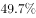和，其中实物商品网上零售额占当年社会消费品零售总额的和。

        网络服务高速增长。2013-2015年，规模以上服务企业中“互联网和相关服务业”营业收入分别增长，和，远高于同期规模以上服务业营业收入的增速。

        电子商务交易额快速增长。2014年电子商务交易额达16.4万亿元，增长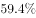；其中，自营电商交易额为8.7万亿元，增长。

        现代金融服务业支撑作用不断增强，2013-2015年，上市公司通过境内市场累计筹资年均增长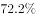。金融对重点领域支持力度明显加强。2014年，新增小微企业贷款2.1万亿元，占企业新增贷款，2015年末，主要农村金融机构贷款余额12.03万亿元，增长。

#### 第 1 题　qid 2052070 · 比重

2012年，我国国内生产总值占世界的比重为：

- **A**. 

　✅
- **B**. 

- **C**. 

- **D**. 

**答案**：A

**官方解析**

由题干“2012年……占……比重”可知本题为基期比重问题。定位材料第一段“2015我国GDP占世界的比重为，比2012年高4个百分点”，则2012年我国国内生产总值占世界的比重为。

故正确答案为A。

---

#### 第 2 题　qid 2052072 · 增长

按年均增长率为计算，2015年我国服务业增加值同比增加了：

- **A**. 1.3万亿元
- **B**. 31.6万亿元
- **C**. 2.6万亿元　✅
- **D**. 1.8万亿元

**答案**：C

**官方解析**

由题干“2015年……同比增加了”结合选项有单位，可知本题为增长量计算问题。定位材料第二段“2015年，我国服务业增加值为34.16万亿元”且题干要求按年均增长率计算，则： ，与C项最为接近。

故正确答案为C。

---

#### 第 3 题　qid 2052074 · 增长

2015年我国服务业投资额相当于2012年的增长率约为：

- **A**. 

- **B**. 

　✅
- **C**. 

- **D**. 

**答案**：B

**官方解析**

由题干“2015年……相当于2012年增长率约为”可知本题为一般增长率问题。定位材料第二段“2015年，我国服务业投资额为31.19万亿元，2012-2015年均增长”，由年均增长率公式： ，由增长率公式： 。

故正确答案为B。

---

#### 第 4 题　qid 2052076 · 综合

资料显示，2014年企业新增贷款额约为：

- **A**. 6万亿元
- **B**. 1万亿元
- **C**. 3万亿元
- **D**. 5万亿元　✅

**答案**：D

**官方解析**

由题干“2014年企业新增贷款额约为”结合材料“2014年，新增小微企业贷款2.1万亿元，占企业新增贷款”可知本题为现期比重问题，则2014年企业新增贷款额为：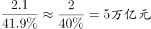。

故正确答案为D。

---

#### 第 5 题　qid 2052078 · 综合

下列说法错误的是：

- **A**. 2012-2015年间，我国服务业投资额增速快于GDP增速
- **B**. 2014年，在电子商务交易中自营电子商务交易是主体
- **C**. 资料显示，未来服务业的发展主要还是依靠传统服务业　✅
- **D**. 2015全年网上零售额比2013年增长了约2.02万亿元

**答案**：C

**官方解析**

A项：定位材料第一段和第二段“2012-2015年，我国国内生产总值年均增长率为。我国服务业投资额为31.19万亿元，2012-2015年均增长”，则2012-2015年间，我国服务业投资额增速快于GDP增速，正确；

B项：定位材料第五段“2014年电子商务交易额达16.4万亿元，其中，自营电商交易额为8.7万亿元”，则2014年，在电子商务交易中自营电子商务交易的占比为：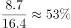，占比超过一半，是主体，正确；

C项：定位材料第四段“2013-2015年，规模以上服务企业中‘互联网和相关服务业’营业收入分别增长，和，远高于同期规模以上服务业营业收入的增速”可知互联网和相关服务业增速远高于服务业营业收入增速，未来服务业的发展主要依靠互联网和相关服务业，错误；

D项：定位材料第三段“2014年、2015年全年网上零售额分别为2.79万亿元、3.88万亿元，增长和，”，2013年全年网上零售额为：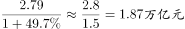，故2015年比2013年增长了：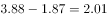万亿元，正确。

本题为选非题，故正确答案为C。

---

### 材料 2

下面是某省的对外贸易进出口总额的部分数据资料，请根据图表回答下述问题：

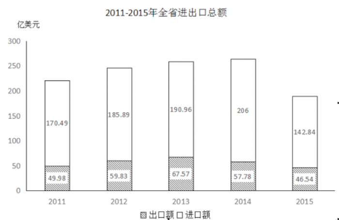

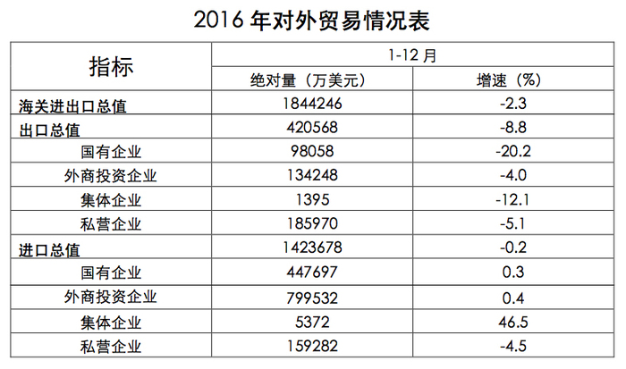

#### 第 6 题　qid 2052080 · 综合

以下各项中，该省净进口贸易总额数值最小的年份是：

- **A**. 2015　✅
- **B**. 2011
- **C**. 2012
- **D**. 2014

**答案**：A

**官方解析**

定位材料统计图，2011年进口额为170.49亿元、出口额为49.98亿元，2012年进口额为185.89亿元、出口额为59.83亿元，2014年进口额为206亿元、出口额为57.78亿元，2015年进口额为142.84亿元、出口额为46.54亿元。

，2011年，2012年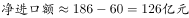，2014年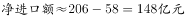，2015年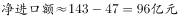。2015年净进口额最小。

故正确答案为A。

---

#### 第 7 题　qid 2052082 · 比重

根据图表，该省出口额占进出口贸易总额的比重最大的年份是：

- **A**. 2013　✅
- **B**. 2016
- **C**. 2015
- **D**. 2014

**答案**：A

**官方解析**

由题干所求“……占……比重”，可判定此题为现期比重问题。

定位图表，2013年出口额占进出口贸易总额的比重为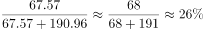；

2014年对应比重为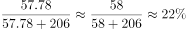；

2015年对应比重为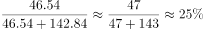；

2016年对应比重为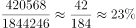。

2013年出口额占进出口贸易总额的比重最大。

故正确答案为A。

---

#### 第 8 题　qid 2052084 · 综合

下列企业中，2016年该省海关进出口差额最大的是：

- **A**. 国有企业
- **B**. 私营企业
- **C**. 集体企业
- **D**. 外商投资企业　✅

**答案**：D

**官方解析**

定位统计表，2016年国有企业出口绝对量为98058万美元、进口绝对量为447697万美元，外商投资企业出口绝对量为134248万美元、进口绝对量为799532万美元，集体企业出口绝对量为1395万美元、进口绝对量为5372万美元，私营企业出口绝对量为185970万美元、进口绝对量为159282万美元。

国有企业进出口差额为，外商投资企业进出口差额为，集体企业进出口差额为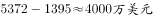，私营企业进出口差额为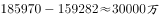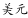。进出口差额最大的是外商投资企业。

故正确答案为D。

---

#### 第 9 题　qid 2052086 · 比重

2016年该省外商投资企业进出口总值占海关进出口总值的比重约为：

- **A**. 

- **B**. 

- **C**. 

　✅
- **D**. 

**答案**：C

**官方解析**

由题干所求“……占……比重”，可判定此题为现期比重问题。定位统计表，2016年该省外商投资企业进出口总值为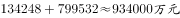，海关进出口总值为，2016年该省外商投资企业进出口总值占海关进出口总值的比重约为，与C项最接近。

故正确答案为C。

---

#### 第 10 题　qid 2052088 · 综合

根据材料，以下说法错误的一项是：

- **A**. 
2011-2015年，该省的进出口贸易总额的变化趋势是先增后减

- **B**. 
2016年该省私营企业出口总值增速最快
　✅
- **C**. 
2012年该省的进口额净增长大于2015年该省的进口额净增长

- **D**. 
2015年该省进口额的同比增长率为-

**答案**：B

**官方解析**

A项：观察图形材料可以看出，2011年-2014年该省的进出口贸易总额为递增趋势，2015年为减少趋势，正确；

B项：结合表格材料，2016年该省出口总值中外商投资增速（）最快，错误；

C项：2012年该省进口额为185.89亿美元，大于2011年进口额170.49亿美元，故2012年进口额的净增长为；2015年该省进口额为142.84亿美元，小于2014年进口额206亿美元，故2015年进口额的净增长为，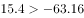，正确；

D项：结合表格材料，2015年该省进口额为142.84亿美元，2014年进口额为206亿美元。，正确。

本题为选非题，故正确答案为B。

---
