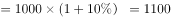
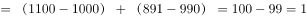
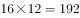
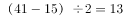
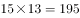

# 2017年422联考《行测》题（四川卷）

> 联考 · 2017 年 · 5 个模块 · 共 100 题

- [常识判断](#%E5%B8%B8%E8%AF%86%E5%88%A4%E6%96%AD) · 10 题
- [言语理解与表达](#%E8%A8%80%E8%AF%AD%E7%90%86%E8%A7%A3%E4%B8%8E%E8%A1%A8%E8%BE%BE) · 35 题
- [数量关系](#%E6%95%B0%E9%87%8F%E5%85%B3%E7%B3%BB) · 10 题
- [判断推理](#%E5%88%A4%E6%96%AD%E6%8E%A8%E7%90%86) · 30 题
- [资料分析](#%E8%B5%84%E6%96%99%E5%88%86%E6%9E%90) · 15 题

---

## 常识判断

### 第 1 题　qid 2051024 · 法律常识

以下行为属于行政诉讼受理范围的是：

- **A**. 行政机关对其工作人员的奖惩决定
- **B**. 行政机关对其工作人员的任免决定
- **C**. 行政机关对其工作人员的离退休决定
- **D**. 行政机关吊销其工作人员参股企业的营业执照　✅

**答案**：D

**官方解析**

本题考查法律常识。
A、B两项错误，《行政诉讼法》第十三条规定：“人民法院不受理公民、法人或者其他组织对下列事项提起的诉讼：（三）行政机关对行政机关工作人员的奖惩、任免等决定。”
C项错误，行政机关对其工作人员的离退休决定属于内部行政行为，不是具体行政行为，所以不属于人民法院行政诉讼的受案范围。
D项正确，根据《行政诉讼法》第十二条规定：“人民法院受理公民、法人和其它组织对拘留、罚款、吊销许可证和执照、责令停产停业、没收财物等行政处罚不服的提起的诉讼。因此，依此若对此行政处罚提起诉讼，法院应予受理。该项中，行政机关吊销其工作人员参股企业的营业执照，属于具体行政行为，属于行政诉讼受理范围。”
故正确答案为D。

---

### 第 2 题　qid 2051026 · 法律常识

王某（14周岁），蔡某（18周岁），共同策划实施了一起入室抢劫，抢劫过程中，二人将反抗的户主杀害，下列说法正确的是：

- **A**. 蔡某不能获得指定辩护
- **B**. 王某和蔡某构成了共同犯罪　✅
- **C**. 抢劫罪和故意杀人罪数罪并罚
- **D**. 王某是未成年人，不需要承担刑事责任

**答案**：B

**官方解析**

本题考查法律常识。
A项错误：依据《刑事诉讼法》第三十四条第三款规定：犯罪嫌疑人、被告人可能被判处无期徒刑、死刑，没有委托辩护人的，人民法院、人民检察院和公安机关应当通知法律援助机构指派律师为其提供辩护。而蔡某抢劫且致人死亡的行为，依据《刑法》第二百六十三条规定可能“处无期徒刑或死刑”，则蔡某是可以获得指定辩护的；
B项正确：按照《刑法》第二十五条第一款规定：共同犯罪是指二人以上共同故意犯罪。共同犯罪成立要件必须包括：2人或2人以上；有共同故意；有共同行为。依此王某、蔡某行为构成共同犯罪；
C项错误：抢劫罪的核心就是“压制反抗，强行取财”，本题中“将反抗的户主杀害”是为了实施抢劫而“压制反抗”，所以杀人仅仅是抢劫的手段而已，所以只定抢劫罪一罪。如果是抢劫后为了灭口把人杀了，才是数罪并罚；
D项错误：按照《刑法》第十七条第二款规定：已满十四周岁不满十六周岁的人，犯故意杀人、故意伤害致人重伤或者死亡、强奸、抢劫、贩卖毒品、放火、爆炸、投放危险物质罪的，应当负刑事责任。本题中，王某14周岁，实施了抢劫行为并致人死亡，应当承担刑事责任。
故正确答案为B。

---

### 第 3 题　qid 2051034 · 人文常识

下列关于古诗名句的说法，错误的是：

- **A**. “独在异乡为异客，每逢佳节倍思亲”中的“佳节”指的是中秋　✅
- **B**. “但使龙城飞将在，不教胡马度阴山”中的“飞将”指的是李广
- **C**. “窗含西岭千秋雪，门泊东吴万里船”中的“西岭”指的是岷山
- **D**. “忽如一夜春风来，千树万树梨花开”中的“梨花”指的是雪花

**答案**：A

**官方解析**

A项错误：“佳节”指的是重阳节。语出唐·王维《九月九日忆山东兄弟》独在异乡为异客，每逢佳节倍思亲。遥知兄弟登高处，遍插茱萸少一人。九月九日是重阳节，有登高、插茱萸习俗。
B项正确：语出唐·王昌龄《出塞·其二》。唐诗用典常用汉代人物，唐诗中飞将指李广。《史记·李广列传》载：广居右北平，匈奴闻之，号曰“汉之飞将军”，避之，数岁不敢入右北平。
C项正确：西岭指的是岷山山脉中的西岭雪山。西岭雪山位于成都市大邑县境内，距成都仅95公里，属世界自然遗产、大熊猫栖息地，因唐代大诗人杜甫的千古绝句“窗含西岭千秋雪，门泊东吴万里船”而得名。
D项正确：语出唐·岑参《白雪歌送武判官归京》，以比喻的手法描写了北国突降大雪时的情形，这一片白雪皑皑、银装素裹的景象，就像是一夜春风吹来，漫山遍野的梨花盛开了，描写冬季下雪天送武判官从轮台城回京时的雪景，把白雪比作梨花。
本题为选非题，故正确答案为A。

---

### 第 4 题　qid 2051038 · 地理国情

下列关于黄河的说法不正确的是：

- **A**. 共流经我国九个省区
- **B**. 是世界上含沙量最高的河流
- **C**. 发源于青海省，最后流入黄海　✅
- **D**. 上游、中游、下游各有其独特的环境特征

**答案**：C

**官方解析**

A项正确，黄河自西向东分别流经青海、四川、甘肃、宁夏、内蒙古、陕西、山西、河南及山东9个省（自治区）；
B项正确，黄河中上游以山地为主，中下游以平原、丘陵为主。由于河流中段流经中国黄土高原地区，因此夹带了大量的泥沙，所以它也被称为世界上含沙量最多的河流；
C项错误，黄河发源于青海省青藏高原的巴颜喀拉山脉，最后流入渤海而非黄海；
D项正确，根据黄河流经地区的独特自然环境和水文情势，将其作了上、中、下游的划分。其中，上游山高坡陡，落差大，水多沙少、河水较清、流量均匀是该河段的水文特征；中游夏秋季多暴雨，沙源丰富，多水多沙，洪峰流量大，含沙量高，河道淤积与侵蚀河段交互出现，峡谷与宽谷相间；下游河道坡降小，水流平缓，加之河道宽浅散乱，泥沙淤积严重，河床逐渐升高，两岸几乎全靠大堤为屏障。
本题为选非题，故正确答案为C。

---

### 第 5 题　qid 2051040 · 人文常识

下列中国历史上的变法与其内容对应不正确的是：

- **A**. 商鞅变法——实行郡县制
- **B**. 王安石变法——颁行保甲法
- **C**. 张居正变法——推行青苗法　✅
- **D**. 戊戌变法——开办京师大学堂

**答案**：C

**官方解析**

A项正确，秦孝公任用商鞅变法，第一次变法中有“令民为什伍”，实行连坐法；重农抑商，奖励耕织；按功授爵等，几年后又实施第二次变法，主要措施有统一秦国度量衡；废分封，行县制，废除井田等。此处的废分封，行县制即为题目中所说的郡县制的源头。
B项正确，1069年，宋神宗任用王安石为参知政事，主持变法，主要措施包括：
理财方面：青苗法、募役法、农田水利法、方田均税法、市易法；
军事方面：保甲法、将兵法；
教育方面：改革科举制度、整顿太学。
C项错误，张居正改革主要推行的是一条鞭法，青苗法是王安石变法的主要内容。
D项正确，戊戌变法期间，在文化教育方面的主要措施有：开办京师大学堂、各地设立中小学堂，废除八股，改试策论，设经济特科等。
本题为选非题，故正确答案为C。

---

### 第 6 题　qid 2050686 · 科技常识

在农业生产中若长期使用某种杀虫剂，会导致害虫的抗药性增强、杀虫效果减弱，其最主要原因是：

- **A**. 害虫体内积累的杀虫剂增强了自身的抗药性
- **B**. 杀虫剂造成害虫基因突变，产生了抗药性基因
- **C**. 抗药性强的害虫所产生的后代一定具有很强的抗药性
- **D**. 杀虫剂对害虫有选择作用，使抗药性强的害虫被保留下来　✅

**答案**：D

**官方解析**

A项错误：害虫体内积累的杀虫剂增加了害虫自身的耐药性，而非抗药性。
B项错误：基因突变是本来就存在的，是不定向的，并不是由于用了杀虫剂产生了抗药性基因。
C项错误：选项说法过于绝对，由于变异是不定向的，所产生的后代不一定都具有很强的抗药性。
D项正确：当使用某种杀虫剂后，绝大多数害虫被杀死，少数具有抗药性的个体生存下来并繁殖；抗药性害虫大量繁殖后，再用该种杀虫剂，会有比以前更多的个体生存下来。因此，杀虫剂对害虫起到一个定向选择的作用。
故正确答案为D。

---

### 第 7 题　qid 2051042 · 人文常识

超声波技术用途非常广泛，它使用类似于声波，但某项参数大于普通声波的振动技术来工作，所以称为超声波，这个大于普通声波的参数是：

- **A**. 波长
- **B**. 振幅
- **C**. 传播速度
- **D**. 频率　✅

**答案**：D

**官方解析**

人对声音的感觉有一定频率范围，大约每秒钟振动20次到20000次范围内，即频率范围是20Hz~20000Hz，如果物体振动频率低于20Hz或高于20000Hz人耳就听不到了。
高于20000Hz的频率就叫做超声波，而低于20Hz的频率就叫做次声波。据此可知，这个大于普通声波的参数是频率。
故正确答案为D。

---

### 第 8 题　qid 2049432 · 人文常识

下列关于食品药品监管说法正确的是：

- **A**. 获得“驰名商标”称号，且连续5年产品抽检合格的食品生产厂家，其所生产的食品可获免检资格
- **B**. 药品包装上印有“OTC”字样的，表明该药品为处方药
- **C**. 保健品、药品分别由国家市场监督管理总局、国家药品监督管理局批准注册　✅
- **D**. 个人姓名不可注册为食品商标

**答案**：C

**官方解析**

本题考查法律常识。
A项错误，《食品安全法》第八十七条：“县级以上人民政府食品安全监督管理部门应当对食品进行定期或者不定期的抽样检验，并依据有关规定公布检验结果，不得免检。进行抽样检验，应当购买抽取的样品，委托符合本法规定的食品检验机构进行检验，并支付相关费用；不得向食品生产经营者收取检验费和其他费用。”根据规定，不得免检。
B项错误，OTC是英文Over The Counter，是可在柜台上买到的药物的缩写，即那些不需要医生处方，消费者可直接在药房或药店中购取的药物。
C项正确，根据我国《保健食品注册与备案管理办法》第五条的规定，国家市场监督管理总局负责保健食品注册管理。根据我国《药品注册管理办法》第五条的规定，国家药品监督管理局主管全国药品注册管理工作，负责建立药品注册管理工作体系和制度，制定药品注册管理规范，依法组织药品审评审批以及相关的监督管理工作。
D项错误，《商标法》第十一条规定：“下列标志不得作为商标注册：（一）仅有本商品的通用名称、图形、型号的；（二）仅直接表示商品的质量、主要原料、功能、用途、重量、数量及其他特点的；（三）其他缺乏显著特征的。”我国法律并未规定个人姓名不可注册为食品商标，个人姓名注册为食品商标并未违反国家禁止性规定，典型的反例是“王守义十三香”。
故正确答案为C。

---

### 第 9 题　qid 2049444 · 科技常识

从生物学角度来讲，下列骨髓配对移植成功概率最大的是：

- **A**. A
- **B**. B
- **C**. C　✅
- **D**. D

**答案**：C

**官方解析**

骨髓移植即造血干细胞移植，是指正常人的造血干细胞通过静脉输注到患者体内，重建患者的造血功能和免疫功能，达到治疗某些疾病的目的。

在移植过程中人类白细胞抗原（HLA），是决定移植排斥反应高低的重要因素。在进行骨髓和其它器官移植时，供者和受者之间人类白细胞抗原（HLA）相容程度越高，排斥反应的发生率就越低，移植成功率和移植器官长期存活率就越高；反之，就越容易发生排斥反应。

A项错误，骨髓配型是做HLA分型，和血型无关，且子女与父母之间只有一半HLA抗原相合的机会（因为染色体一半来自父亲、另一半来自母亲），不可能有完全相合的机会，医学上叫做半相合，通常不能相互移植。

B项错误，丈夫和妻子之间没有血缘关系，而人类非血缘关系的HLA型别中，相合几率是四百分之一到万分之一。

C项正确，理论上说，HLA配型完全相合在同卵（同基因）双生兄弟姐妹间最高为，在非同卵（异基因）双生或亲生兄弟姐妹间其次，为1/4。兄妹二人虽然年龄相差12岁，但由于同父同母，配对移植成功率相比其它三个选项是最高的。

D项错误，爷爷为孙子献血和肝脏只能说明血型一致以及肝脏匹配度高，并不能说明HLA配型相合度高。

故正确答案为C。

---

### 第 10 题　qid 2049430 · 人文常识

下列语句与哲学原理对应错误的是：

- **A**. 横切牛羊竖切猪，要省力气看纹路——办事要按客观规律
- **B**. 工欲善其事，必先利其器——主观能动性发挥受客观条件限制
- **C**. 破屋更遭连夜雨，漏船又遇打头风——事物发展是前进性与曲折性的统一　✅
- **D**. 不登高山，不知天之高也；不临深渊，不知地之厚也——实践是真理的来源

**答案**：C

**官方解析**

本题考查哲学原理，需结合选项具体分析。
A项正确，做事情要按照客观规律，才能更加容易地完成。按照牛、羊、猪的原有纹路进行切割，会更加容易且省力气，遵循了客观规律。
B项正确，在发挥主观能动性的同时，会受到客观条件的限制。想要完成一件事，如果没有很好的利器就不能很好地完成，表明了在发挥主观能动性的同时会受客观条件的限制。
C项错误，屋子本来就破了，可是偏偏又赶上连夜下雨。船本来就漏水了，但是又赶上逆风航行。只体现出了事物发展过程中的曲折性，并未体现出前进性。
D项正确，登高山才知天之高，临深渊才知地之厚，通过实践才能获得真理，说明了实践是真理的来源。
本题为选非题，故正确答案为C。

---

## 言语理解与表达

### 材料 1

根据下面的材料回答问题。

①心理学领域有个术语叫作“羊群效应”，专门用来形容人类的从众心理。羊群有个习性，那就是跟着头羊走，无论前面那个大坑有多宽，只要有一头羊率先跳过去了，后面的羊便会跟着它往前跳。羊群效应一直是心理学研究的热点之一，社交网站的出现提供了一个绝佳的实验场，研究者们可以通过大数据的研究方法排除个案的影响。

②众所周知，在心理学领域单独研究某件个案是不科学的。就拿羊群效应来说，不可能把网民们对某件产品的评价单独拿出来研究，因为这件产品有可能确实质量很好。为了避免这个问题，美国麻省理工学院附属的斯隆商学院的希南·阿拉尔博士和他的同事们决定借鉴自然科学的研究方法，进行一次大规模随机对照实验。他们和一家社交网站合作，花了5个多月的时间对这家网站所有的网友评论做了一次实验。

③这是一家综合性社交网站，先由网友上传文章，再由其他网友做出评论。评论的内容是可以被打分的，要么点赞（大拇指朝上），要么给差评（大拇指朝下）。点赞的数量减去差评的数量就是每段评论的最终得分。研究人员和站方达成协议，事先为这5个月当中出现的101281篇评论进行打分。也就是说，每出现一篇评论，都立即由机器自动生成一个网友评论。当然，到底是点赞还是差评则是随机决定的，和帖子的内容无关。另外还有一定数量的评论不事先打分，作为对照组。

④结果显示，社交网站上的羊群效应还是相当明显的。研究人员一共收集到30.8515万次网友打分，发现事先被点赞的评论最终得正分的可能性比对照组高出，最终的得分也比平均值高了。相比之下，事先被点差评的评论则不受影响，和对照组没有区别。

⑤“如果机器给出的是负面评价，后面往往会有很多人试图进行修正，最终导致负面评价对一条评论的总得分没有影响。”阿拉尔博士评价说，“正面评价则没有这种情况，说明人们对于不符合自己意见的正面评价和负面评价的态度是不一样的，对于前者比较宽容。”

⑥牛津大学互联网学院的伯尔尼·霍根教授认同这一判断，他认为正面评价往往是一种广告，做出正面评价的人是想让更多的网友喜欢某件东西，而负面评价则是一种个人化的情绪发泄，这就是为什么一般社交网站点赞比差评多的原因所在。

⑦另外，评论的内容对于实验结果也有影响。文化、社会、政治和商业类的新闻评论容易受到羊群效应的影响，普通新闻和经济新闻则影响较小，这大概是因为前者比较主观，受个人观点影响大，容易走极端，而后者属于事实类新闻，比前者要客观得多，不太受个人因素的影响。

#### 第 1 题　qid 2051270 · 片段阅读

下列文字最适合放在文中的位置是：
值得一提的是，随机出现的点赞和差评的总数并不是一样的，因为在通常情况下，这家网站点赞的数量比差评要多。于是研究人员根据以往的情况，设定了随机点赞和差评的比例。从这个细节可以看出，研究人员对于实验材料的选取是非常细心的，尽量做到不影响网友的直观感觉。

- **A**. ②和③之间
- **B**. ③和④之间　✅
- **C**. ④和⑤之间
- **D**. ⑤和⑥之间

**答案**：B

**官方解析**

观察文段发现，③中提到了对网友上传文章评论内容的点赞及差评的数量情况，并就此作出对照试验。而需要填入的句子中出现了点赞及差评的具体实验表现，应紧随其后，接着④中给出了“结果”，这几段内容均讲述了实验的相关内容，存在共同信息，且符合逻辑顺序，衔接紧密，该段内容应该在③④之间。其他几项均不能构成话题的一致性，排除。
故正确答案为B。
【文段出处】《互联网时代的羊群效应》

---

#### 第 2 题　qid 2051272 · 片段阅读

关于“负面评价”，下列说法与原文不符的是：

- **A**. 该社交网站中的负面评价比正面评价少
- **B**. 负面评价往往带有个人的主观情绪色彩
- **C**. 人们通常并不介意负面评价是否与自己的观点相符　✅
- **D**. 网友的修正意见会最终抵消机器所给出的负面评价

**答案**：C

**官方解析**

A项，根据58题所填入的内容及⑥句中的最后一句话“社交网站的点赞比差评多”可知，表述正确，排除；
B项，根据⑥句中的论述“负面评价是一种情绪的宣泄”，可知负面评价带有主观的情绪色彩，表述正确，排除；
C项，根据⑤句可知，人们对于负面评价的态度不太宽容，想要去修正负面评价，故该项表述“不介意”与文段不符，表述错误，当选；
D项，对应⑤句，“人们会修正负面评价，最终抵消机器给出的评价”，可知该项表述正确，排除。
本题为选非题，故正确答案为C。
【文段出处】《互联网时代的羊群效应》

---

#### 第 3 题　qid 2051274 · 片段阅读

下列说法与原文不符的是：

- **A**. 正面评价往往会起到广告宣传的作用
- **B**. 事实类新闻更不易受羊群效应的影响
- **C**. 我们很难通过单独研究某件个案获得科学的结论
- **D**. 阿拉尔博士在社交网站的实验属于自然科学研究　✅

**答案**：D

**官方解析**

由第六段“他认为正面评价往往是一种广告，作出正面评价的人是想让更多的网友喜欢某件东西”可以得知，正面评价能够让更多的人喜欢，产生积极的宣传效果，对应A项表述，符合文意，排除。
由第七段“而后者属于事实类新闻，比前者要客观得多，不太受个人因素的影响”可知，事实类新闻更不易受羊群效应的影响，对应B项表述，符合文意，排除。
由第二段“在心理学领域单独研究某件个案是不科学的”可知，单独研究某件个案是不科学的，很难获得科学的结论，对应C项表述，符合文意，排除。
由第二段“阿拉尔博士和他的同事决定借鉴自然科学研究的方法”可知，阿拉尔博士只是借鉴自然科学研究的方法，并不是进行一项自然科学实验，因此D项表述偷换概念，不符合文意，当选。
本题为选非题，故正确答案为D。
【文段出处】《互联网时代的羊群效应》

---

#### 第 4 题　qid 2051278 · 片段阅读

这段文字意在说明：

- **A**. 网络消费者的从众心理
- **B**. 羊群效应在网络中的表现　✅
- **C**. 大数据在心理研究中的应用
- **D**. 社交网络中网友评价的误区

**答案**：B

**官方解析**

材料①开篇具体阐释“羊群效应”的概念，尾句强调“社交网站”是研究“羊群效应”的“绝佳的实验场”，接着材料②论述“社交网站成为绝佳试验场”的原因，材料③阐述具体的实验过程，材料④得出实验结果，即“社交网站上的‘羊群效应’还是十分明显的”，材料⑤⑥⑦对实验结果进行了具体分析，全篇材料重点强调“社交网站上的羊群效应很明显”，对应B项。
A项，由材料③“先由网友上传一篇文章，再由其他网友做出评论”可知，文段谈论的并非“消费者”，且未提及主题词“羊群效应”，排除；C项“心理研究”概念扩大，文段重点谈论的是“羊群效应”，其只是“心理研究”中的一个方面，排除；D项未提及主题词“羊群效应”，排除。
故正确答案为B。
【文段出处】《互联网时代的羊群效应》

---

#### 第 5 题　qid 2051280 · 片段阅读

实验者观察到下列四个现象，哪一现象能在最大程度上体现阿拉尔博士在文中提到的“修正”过程？

- **A**. 关于总统大选新闻的评论引发口水大战　✅
- **B**. 某知名品牌的新产品发布会的评价反响寥寥
- **C**. 关于股市走向分析的评价得到网友一致认可
- **D**. 网友对某场球赛胜负预测的评论呈“一边倒”态势

**答案**：A

**官方解析**

首先定位阿拉尔博士在文中提到的“修正”，即“如果机器给出的是负面评价，后面会有很多人试图进行修正”，所以很多人给出的评论是与事先给出的评论相反的，而不是一致。B项的“反响寥寥”不能体现出前后的评论相反，排除；C项“一致认可”和D项的“一边倒”不能体现“修正”的含义，排除；A项中的“口水战”可以体现出很多人对先前评论的反对，即“修正”，当选。
故正确答案为A。
【文段出处】《互联网时代的羊群效应》

---

#### 第 6 题　qid 2049476 · 逻辑填空

每个民族都有自己的优秀品格，同样每个民族都有自己的历史痼疾。健康而优秀的民族心理必然善于扬长避短，精于            ，长于“取其精华去其糟粕”。
填入画横线部分最恰当的一项是：

- **A**. 去芜存菁
- **B**. 弃旧图新
- **C**. 激浊扬清　✅
- **D**. 拨乱反正

**答案**：C

**官方解析**

文段通过“善于”、“精于”、“长于”结构一致表示并列，体现优秀民族心理三个方面的特征，且和前文“优秀品格”、“历史痼疾”形成对应。一般来说，文中出现三个并列排比时，各自的语义基本不会重复。而A项“去芜存菁”指除去杂质，保留精华，与“取其精华去其糟粕”语义重复，排除。B项“弃旧图新”指抛弃旧的，谋求新的，“优秀品格”并非新事物，排除。C项“激浊扬清”比喻清除坏的，发扬好的，用在此处表意恰当，“清”、“浊”分别对应“优秀品格”、“历史痼疾”，当选。D项“拨乱反正”指治平乱世，恢复正常；现也指纠正错误，整顿混乱局面，使之恢复正常，用在此处语义过重，且文段中无“整治混乱局面”的表述，排除。
故正确答案为C。
【文段出处】《大国崛起需要什么样的支撑？》

---

#### 第 7 题　qid 2051214 · 逻辑填空

怀有爱心的人必定真诚而大度，如果需要，他会           地展示自己的灵魂，捧出自己的心。爱的价值难以用金钱衡量，心藏龌龊的人甩出的大把金币，有时还不如贫穷的善者脸上的一丝微笑。
填入画横线部分最恰当的一项是：

- **A**. 推心置腹
- **B**. 开诚布公
- **C**. 毫不犹豫　✅
- **D**. 光明磊落

**答案**：C

**官方解析**

本题考查对应关系，横线处填入成语修饰“展示自己的灵魂，捧出自己的心”，对应前文“必定真诚而大度”，故所填词语与“必定”形成对应，“必定”表示必然一定， C项“毫不犹豫”指在处理事情上非常果断，没有片刻迟疑，与“必定”对应最为恰当，当选。
A项“推心置腹”指把赤诚的心交给人家，对应的是“捧出自己的心”，B项“开诚布公”指坦白无私，D项“光明磊落”形容人的行为正直坦白，对应的是“展示自己的灵魂”，这三个成语均和“必定”无法形成对应，排除。
故正确答案为C。
【文段出处】《爱是什么》

---

#### 第 8 题　qid 2051220 · 逻辑填空

南宋诗人周紫芝在《竹坡诗话》中记载：李氏家族有一人为官廉洁，公私分明。一天，他正在烛光下办理公务，有人送来一封家书。他当即灭掉公家的蜡烛，点燃自家的蜡烛，因为在他看来，公与私之间绝对不容混淆，这在今天看来有点            ，但所折射的公与私的严格区分仍然值得深思。
填入画横线部分最恰当的一项是：

- **A**. 自命清高
- **B**. 小题大做　✅
- **C**. 沽名钓誉
- **D**. 矫枉过正

**答案**：B

**官方解析**

横线之前的“这”指代前文李氏一官员的做法，根据“在他看来，公与私之间绝对不能混淆”可知，这位官员把一根蜡烛的小事也看的非常重要，B项“小题大做”指把小事当作大事来处理，与文段对应恰当。
A项“自命清高”指自以为清高，通常主语为人，“这”指代一种做法，与“自命清高”搭配不当，排除；
C项“沽名钓誉”指用某种不正当的手段捞取名誉，文段并未体现出使用不正当的手段，排除；
D项“矫枉过正”比喻纠正错误超过了应有的限度，文段并未阐述纠正错误，排除。
故正确答案为B。
【文段出处】《莫让“私”字入公门》

---

#### 第 9 题　qid 2051230 · 逻辑填空

好的作品会对一些人的人生产生重大和深远的影响。它能让人变得更加坚强，让人生目标更加      。曾几何时，一部《钢铁是怎样炼成的》，一部《平凡的世界》，成为许多青年人精神世界的“圣经”，成为他们一生中经受      、战胜苦难的强大精神动力。
依次填入画横线部分最恰当的一项是：

- **A**. 笃定  磨难　✅
- **B**. 确定  波折
- **C**. 淡定  磨炼
- **D**. 镇定  挫折

**答案**：A

**官方解析**

第一空，搭配“目标”，A项“笃定”指确定、有把握，B项“确定”指明确肯定，均与“目标”搭配恰当，保留。C项“淡定”指冷静镇定的态度，D项“镇定”指遇到紧急情况不慌乱，均形容人处于不慌乱的状态，与“目标”搭配不当，排除。
第二空，根据相同句式“经受······战胜······”可知，横线处应与“苦难”含义相近，体现痛苦、灾难之意，A项“磨难”指在艰难困苦的逆境中遭受折磨，符合文意，当选。B项“波折”指事情进行过程中所出现的曲折变化，与“苦难”相比程度太轻，排除。
故正确答案为A。
【文段出处】人民日报《雷剧横行 好作品向何处寻？》

---

#### 第 10 题　qid 2051232 · 逻辑填空

读完一本可心的书，就如同      的河床有了清流的浸润，如同精神的荒原有了生命的      ，人的精神状态立刻有了不同，颇有点“腹有诗书气自华”的感受，而察世事、思万物也有了些深度和张力。
依次填入画横线部分最恰当的一项是：

- **A**. 干燥  萌生
- **B**. 干旱  觉醒
- **C**. 干涸  萌动　✅
- **D**. 干裂  苏醒

**答案**：C

**官方解析**

第一空，根据“清流的浸润”可知，画横线处表示河床处于缺水的状态，选项的四个词语均可形容缺少水分，但A项“干燥”多修饰“气候”，与“河床”搭配不当，排除。
第二空，根据“精神的荒原”可知，横线处表示有生命在活动，C项“萌动”表示萌生活动，与“生命”搭配恰当，契合文意，当选。B项“觉醒”指醒悟、觉悟，文段表示生命在活动而非醒悟，排除；D项“苏醒”指从昏迷或沉睡中醒过来，文段并非强调生命在此之前昏迷或沉睡，仅强调活动，排除。
故正确答案为C。
【文段出处】《阅读是开掘精神荒原的铧犁》

---

#### 第 11 题　qid 2051236 · 逻辑填空

3D电视是一种能够      实际景物的真实空间关系的新型电视，对观众而言，延伸于屏幕的景物具有             的震撼效果。
依次填入画横线部分最恰当的一项是：

- **A**. 模仿  近在咫尺
- **B**. 展示  活灵活现
- **C**. 展现  栩栩如生
- **D**. 模拟  触手可及　✅

**答案**：D

**官方解析**

第一空，搭配“真实空间关系”，B项“展示”指清楚地摆出来，明显地表现出来，C项“展现”指显现出，展示，D项“模拟”指模仿，均与“真实空间关系”搭配恰当，保留。A项“模仿”指按照现成的样子做，与“真实空间关系”搭配不当，且3D电视并非模仿“实际景物”的产物，与文意不符，排除。
第二空，根据“真实空间关系”可知，横线处所填成语形容“延伸于屏幕的景物”近在手边，D项“触手可及”指近在手边，一伸手就可以接触到，符合文意，且能体现“震撼效果”，当选。B项“活灵活现”指神情逼真，使人感到好像亲眼看到一般，C项“栩栩如生”指艺术形象非常逼真，如同活的一样，均无法对应“真实空间关系”，排除。
故正确答案为D。
【文段出处】央视网《什么是3D电视》

---

#### 第 12 题　qid 2049308 · 逻辑填空

纵观现代化历程，中国改革一直是在争论中推进的，之所以能够顺利推进并取得举世瞩目的成就，就是因为主流意识形态具有强大的        力量，总是能够超越左与右，促使社会形成新的共识。而主流意识形态有这样强大的力量，恰恰是从不同社会思潮中汲取智慧，而不是              的“任性”。
依次填入画横线部分最恰当的一项是：

- **A**. 吸收  泥古不化
- **B**. 平衡  剑走偏锋
- **C**. 整合  刚愎自用　✅
- **D**. 柔化  恃才放旷

**答案**：C

**官方解析**

本题可从第二空入手，根据“是······而不是······”反义并列关联词可知，所填成语表示不汲取别人的智慧，且修饰“任性”，C项“刚愎自用”是指完全固执己见不听取别人的意见，与前文对应恰当，符合语境。A项“泥古不化”比喻拘泥于古代的成规或说法，不知根据具体情况，加以变通，文中并非是古人的说法，而是固执己见，排除；B项“剑走偏锋”是指寻找新的、不同以往的办法来解决问题，以求出奇制胜，侧重方法奇特而非“任性”，排除；D项“恃才放旷”是指倚仗自己的才能而对行为不加约束，文中并非强调倚仗才能，排除。基本锁定C项。
第一空代入验证，“整合”与“超越左与右，促使社会形成新的共识”对应准确，契合文意。
故正确答案为C。
【文段出处】《思潮是飘荡在社会中的幽灵》

---

#### 第 13 题　qid 2051238 · 逻辑填空

用中国品牌讲中国故事是一种艺术，必须善讲会讲。既讲品牌成长的经历、也讲品牌_____的精神，既讲大故事、也讲小故事，既讲老故事、也讲新故事，把中国品牌的故事讲得              ，使中国品牌成为当代中国形象的闪亮名片。
依次填入画横线部分最恰当的一项是：

- **A**. 彰显  娓娓动听　✅
- **B**. 包含  绘声绘色
- **C**. 展示  栩栩如生
- **D**. 蕴含  惟妙惟肖

**答案**：A

**官方解析**

本题可从第二空入手，横线处搭配“讲得”，A项“娓娓动听”形容善于说话使人喜欢听，B项“绘声绘色”往往用来形容叙述，描写生动逼真，均与“讲得”搭配恰当，保留。C项“栩栩如生”指艺术形象非常逼真，如同活的一样，D项“惟妙惟肖”形容描写或模仿得非常逼真，均与“讲得”搭配不当，排除。
第一空，A项“彰显”往往用在积极语境，B项“包含”为中性词，根据文段“是一种艺术”“使中国品牌成为当代中国形象的闪亮名片”可知“彰显”更好，A项当选。
故正确答案为A。
【文段出处】《用中国品牌讲中国故事》

---

#### 第 14 题　qid 2051240 · 逻辑填空

一个人从小就生活在平等、尊重的环境中，长大了就会更平等地对待人和事。反之，从小就生活在              的训导或者宠物般的溺爱中，就很难养成健康的人格，容易变得       ，甚至容易走极端。
依次填入画横线部分最恰当的一项是：

- **A**. 盛气凌人  平庸
- **B**. 吹毛求疵  固执
- **C**. 唠唠叨叨  偏激
- **D**. 居高临下  偏执　✅

**答案**：D

**官方解析**

第一空，通过“反之”可知，横线处与前文的“平等、尊重”形成反义并列关系，应体现不平等、不尊重的含义，B项“吹毛求疵”比喻过度挑剔别人的缺点，C项“唠唠叨叨”指说话啰嗦，说个没完，两者均与“不平等、不尊重”无关，排除。
第二空，根据“甚至”可知，横线处所填词语应比“极端”程度稍轻，且要体现出“不健康的人格”，D项“偏执”符合文意，当选。A项“平庸”指平常人做着平凡的事，与健康的人格无关，且无法与“极端”构成递进，排除。
故正确答案为D。
【文段出处】《平等是对生命最好的馈赠》

---

#### 第 15 题　qid 2051242 · 逻辑填空

虽然没有法律强制力做支撑的道德是虚妄的，但是法律在面对道德问题时，也总是会显得             ，这种力不从心的根本原因还是由于法律的外在属性与道德的内在属性之间的矛盾，社会秩序的大厦是法理与道德共同支撑的，如果道德不立，人心善变，法律终会             。
依次填入画横线部分最恰当的一项是：

- **A**. 相形见绌  回天乏力
- **B**. 爱莫能助  孤立无援
- **C**. 左支右绌  独木难支　✅
- **D**. 捉襟见肘  力所不逮

**答案**：C

**官方解析**

第一空，根据代词“这种”可知，横线处词语要体现“力不从心”之意，且与“显得”搭配，说明法律在面对道德问题的时候，想解决解决不了，能力不足，力量不够。C项“左支右绌”和D项“捉襟见肘”均指力量不够，应付不过来，符合文意，保留。A项“相形见绌”指跟同类相比，显出不足，与“力不从心”无关，排除；B项“爱莫能助”指心中关切同情，却没有力量帮助，文中“法律面对道德问题”并不是要帮助，而是解决不了，意思不符，且与“显得”搭配不当，排除。
第二空，“社会秩序的大厦是法理与道德共同支撑的”，说明法律和道德共同支撑社会秩序，没有道德，法律就会孤立无援，C项“独木难支”比喻单个力量单薄，维持不住全局，符合文意，表意形象，当选。D项“力所不逮”指力量达不到，不能体现“法律与道德”的密切关系，排除。
故正确答案为C。
【文段出处】《扶不扶，法律不能规范道德》

---

#### 第 16 题　qid 2051244 · 逻辑填空

如何看待各项指标的起落调整？如何领会稳增长、调结构、促改革的辩证用意？如何贯彻稳中求进的调控指引？      中国经济的复杂问题，需要             的专业剖析，更离不开格局宏大的战略思考。
依次填入画横线部分最恰当的一项是：

- **A**. 破解 具体而微　✅
- **B**. 反观 一丝不苟
- **C**. 解读 返观内视
- **D**. 反思 条分缕析

**答案**：A

**官方解析**

本题从第二空入手，根据“需要······更离不开······”可知，对策是从两个不同的方面入手，后面强调的是“宏大”，指宏伟、巨大，所以横线处所填词语应该表示“微小”的含义，A项“具体而微”，指事物的各个组成部分大体都有了，不过形状和规模比较小些，符合文意，保留。B项“一丝不苟”指做事认真，文段强调的是“小”，而非“认真”，排除；C项“返观内视”指自我反省，和“专业剖析”搭配不当，排除；D项“条分缕析”形容分析得有条理，很细致，与“剖析”语义重复，排除。
第一空，代入验证，“破解问题”搭配恰当，且后文“需要”提出破解问题的对策，符合文意，A项当选。
故正确答案为A。
【文段出处】《打好转变发展方式硬仗》

---

#### 第 17 题　qid 2051246 · 逻辑填空

研究者称，可爱的人真诚善良，平和亲切，他们会让对方放下      ，更愿意与之交朋友，适当地在家人和朋友面前学句夸张的“可爱语”，偶尔穿一次可爱的衣服，能让人显得有童趣，但如果一味地脱离年龄，刻意装可爱，只会是              。
依次填入画横线部分最恰当的一项是：

- **A**. 骄傲 事倍功半
- **B**. 自卑 削足适履
- **C**. 成见 东施效颦
- **D**. 戒备 适得其反　✅

**答案**：D

**官方解析**

本题从第二空入手，根据“但”表转折，可知前后语义相反，前面说偶尔装可爱可让人显得童趣，带来好处，故横线后应该表达刻意装可爱带来的消极影响，D项“适得其反”指恰恰得到与预期相反的结果，符合文意，保留。
A项“事倍功半”形容做事的方法费力大，收效小，反义词是“事半功倍”，不符合文意，排除；B项“削足适履”比喻不合理地迁就现成条件或不顾具体条件，生搬硬套，语意不符，排除；C项“东施效颦”比喻模仿别人，不但模仿不好，反而出丑，文段没有提及“模仿别人”，排除。
第一空，代入验证，“放下戒备”搭配恰当，且与后文“愿意与之交朋友”形成对应，D项当选。
故正确答案为D。
【文段出处】《做一个善良可爱女人》

---

#### 第 18 题　qid 2051248 · 逻辑填空

人格魅力是什么？就是人的信仰、气质、品德、才智等汇聚而成的感召力量，管理学者称之为            的号召力，凝心聚力的吸引力，             的感染力。
依次填入画横线部分最恰当的一项是：

- **A**. 说一不二 耳濡目染
- **B**. 一言九鼎 润物无声
- **C**. 一呼百应 潜移默化　✅
- **D**. 不令而行 春风化雨

**答案**：C

**官方解析**

第一空，横线处所填词语用来形容“号召力”。C项“一呼百应”意为一人呼喊，多人响应，强调“号召力”强，契合文意，保留；D项“不令而行” 意为领导者本身的行为正当，即使不以法令约束，人们也会自然而然的效法，走上正道，放在此处用来形容领导者正面的感召力尚可，保留。A项“说一不二”指一个人说话算数，不会改变，强调“信誉”，B项“一言九鼎”指说话有分量，起决定作用，强调人的身份地位重要，均与“感召力”无关，排除。
第二空，横线处所填词语形容“感染力”，C项“潜移默化”指人的思想或性格不知不觉受到感染、影响而发生了变化，与“感染力”搭配得当，当选。D项“春风化雨”比喻良好的熏陶和教育，与大语境不符，排除。
故正确答案为C。
【文段出处】人民日报《涵养人格的魅力》

---

#### 第 19 题　qid 2051250 · 逻辑填空

生命之所以美丽，正在于它有血有肉的过程中，始终高扬着一个美丽的主题，美丽之所以        ，正在于生命的底蕴中，始终流动着人类对世界最         的良知与渴望。
依次填入画横线部分最恰当的一项是：

- **A**. 恒久 基本
- **B**. 永恒 纯粹　✅
- **C**. 迷人 坚定
- **D**. 可贵 率真

**答案**：B

**官方解析**

第一空，由“之所以······正在于······”可知，后文是对横线处的解释说明，根据“生命的底蕴中，始终流动着人类······渴望”可知，横线处体现出“长久存在”之意，A项“恒久”、B项“永恒”填入此空均可，保留。
第二空，与“良知与渴望”搭配。A项“基本”与“良知”搭配尚可，但“渴望”意为迫切地希望，与“基本”程度上不符，排除。B项“纯粹”指不掺杂质的，与“良知与渴望”搭配恰当，当选。
故正确答案为B。
【文段出处】《读者卷首语－生命与美丽》

---

#### 第 20 题　qid 2049326 · 逻辑填空

到近几年，一度         的神经网络算法开始复兴。这个算法在一定程度上        了生物神经分层的构架，不仅能够不断调整优化各项行动的逻辑权重，还能够进行结果的         ，把结果重新作为输入进行训练。
依次填入画横线部分最恰当的一项是：

- **A**. 沉默  模仿  回馈
- **B**. 沉沦  仿真  回应
- **C**. 沉寂  模拟  反馈　✅
- **D**. 沉凝  仿照  反应

**答案**：C

**官方解析**

第一空，根据“一度”和“开始复兴”可知，横线处所填词语应与“复兴”语义相反，体现神经网络算法曾经有段时间不够兴盛，C项“沉寂”指消息全无，符合文意，保留。A项“沉默”形容不爱说话、一言不发，通常搭配人，且与兴盛程度无关，排除。B项“沉沦”指陷入罪恶的、困苦的境界，感情色彩偏消极，文段并非强调陷入不好的境地，与文意不符，排除。D项“沉凝”意为凝滞，不流动，与文意无关，排除。
第二空，代入验证，C项“模拟构架”搭配得当，且符合文意，保留；
第三空，代入验证，C项“反馈结果”搭配得当，且符合文意，当选。
故正确答案为C。
【文段出处】《人工智能赢了围棋，人类赢了未来》

---

#### 第 21 题　qid 2051256 · 逻辑填空

索尔仁尼琴的终极关怀，与托尔斯泰和陀思妥耶夫斯基               ，他们共同勾勒出俄罗斯文学的近现代        。在某种意义上，索氏就是两位先贤的        ：不仅同样叙写反抗黑暗和寻找光明的先知话语，而且擅长文学叙事。
依次填入画横线部分最恰当的一项是：

- **A**. 如出一辙 画卷 翻版　✅
- **B**. 一脉相承 轮廓 传人
- **C**. 异曲同工 轨迹 回响
- **D**. 不谋而合 图景 后学

**答案**：A

**官方解析**

本题可从第三空，横线处所填词语搭配“先贤”且冒号之后的内容对其进行解释说明，根据冒号后“同样”可知，索氏与先贤做法趋于一致，A项“翻版”指翻印的版本，强调两者有许多共同之处，符合文意，当选。
B项“传人”指接班人，后文未体现三人间传授与被传授的关系，仅强调时间上先后顺序，与文意不相符，排除；C项“回响”指声音一再地发出回声，常搭配“声音”，与“先贤”搭配不当，排除；D项“后学”指学问居于人后的学者、读书人，多作谦词，用以自称，与文意不符，排除。
第一、二空，代入验证，“如出一辙”比喻两件事情非常相似，对应后文“共同”，符合文意；“勾勒画卷”搭配得当，A项当选。
故正确答案为A。
【文段出处】《索尔仁尼琴的背影》

---

#### 第 22 题　qid 2049304 · 逻辑填空

雄企鹅这样煞费苦心地用石子来讨好雌企鹅绝非小题大做，而是由于筑巢的石子对它们有            的魅力。有好巢才能吸引好配偶，筑巢最好的雄企鹅，引起异性注意的机会最大。别致的巢能够        雄企鹅作为配偶的价值，确保配偶的珍贵投资——企鹅蛋不被冰雪冻坏，所以雄企鹅要            地通过建造新居来打败竞争对手。
依次填入画横线部分最恰当的一项是：

- **A**. 不可名状 体现 千方百计
- **B**. 无与伦比 昭示 不惜血本
- **C**. 不可抗拒 彰显 不遗余力　✅
- **D**. 无以复加 代表 千难万险

**答案**：C

**官方解析**

第一空，根据“绝非······而是······”可知，横线处所填词语与“小题大做”语义相反，表示筑巢石子的魅力大。B项“无与伦比”指事物非常完美，没有能跟它相比的，D项“无以复加”表示不可能再增加，指程度达到了极点，用在此处均程度过重，且“无以复加”一般不做定语修饰其他名词，常见用法为“魅力大到无以复加”，排除B、D两项。
第二空，搭配“价值”，A项“体现”与C项“彰显”用在此处均符合文意，保留。
第三空，修饰“通过建造新居来打败竞争对手”，“通过建造新居”即采取的方法，此处表示尽力去做，C项“不遗余力”指把全部的力量都使出来不保留，符合文意，当选。A项“千方百计”是指想尽一切办法，侧重方法多，文段仅提到一种方法，排除。
故正确答案为C。
【文段出处】《鸟类求偶炫耀之“勤劳获爱情”》

---

#### 第 23 题　qid 2051260 · 片段阅读

两千多年前，孔子在竹简上写下“君子和而不同”，这不仅成为中华文化的内在品格，也代表着中国对世界秩序的想象。不同国家、民族的思想文化各有千秋。文化的共存不是让一种文明普适化，而是要寻求大多数文明的共同点和公约数。毕竟，只有每一颗星星都发光，人类文明的星空才会更加璀璨。
这段文字主要说的是：

- **A**. 中华文化对世界的贡献
- **B**. 孔子对中华文化的影响
- **C**. 古人对世界秩序的想象
- **D**. 文化共存的实现途径　✅

**答案**：D

**官方解析**

文段开篇引用孔子的观点“君子和而不同”且通过“不仅······也”的并列结构强调其重要性，随后文段指出不同国家、民族的思想文化各有不同，而这些不同的文化需要共存，后文通过“不是······而是”的反义并列强调实现文化共存的途径为“寻求大多数文明的共同点和公约数”即“君子和而不同”，并通过“星星”的比喻进一步论证文化共存的重要意义，故文段围绕“和而不同”“文化共存”展开论述，D项包含主题词，当选。
A项，“中华文化的贡献”文段未提及，无中生有，排除；
B项“孔子对中华文化的影响”、C项“古人对世界秩序的想象”均对应文段开篇并列结构的一部分，表述片面，且非文段重点，排除。
故正确答案为D。
【文段出处】《我们为什么要“回到孔子”》

---

#### 第 24 题　qid 2051262 · 片段阅读

暖春三月，当你在华南植物园的姜园中漫步时，会看到一种头戴“高帽”的奇特植物，每当微风吹拂，就像是翩翩起舞的“美少女”，甚是惹人爱怜，“她”就是益智，属于姜科，为多年生草本植物，高1~3m；茎丛生；总状花序在花蕾时全部包藏于酷似“高帽”状的总苞片中；花冠白色，唇瓣粉白色，而中部具粉红色脉纹。由于花果均有很高的观赏性，益智是优良园林观赏植物。
这段文字介绍益智的：

- **A**. 植物种属
- **B**. 观赏价值　✅
- **C**. 生长习性
- **D**. 生存环境

**答案**：B

**官方解析**

文段首先把益智比喻成美少女，强调其外观之美，紧接着从高度、花序、颜色等方面继续介绍益智的外在形态，尾句进行总结，强调益智是优良的观赏植物，故文段重在说明益智具有很高的观赏性，对应B项。
A项，仅对应文段“益智属于姜科”，表述片面，排除；
C项“生长习性”和D项“生存环境”，文段并未提及，无中生有，排除。
故正确答案为B。
【文段出处】《戴“帽子”的植物——益智》

---

#### 第 25 题　qid 2051276 · 片段阅读

新兴城市或城市新区犹如一张白纸，摩天楼能凸显新城的现代化，体现出生机与繁华。但是，每个城市都有独特的格调，尤其是在老城区特别是历史文化遗迹众多的街区，摩天楼必须服从周围的环境，应不强调个性、不突出体量、不破坏景观的连续性与历史的均衡感，如上海金茂大厦的密檐式塔造型、台北101大厦的竹节造型等地域元素的使用，就是为了体现建筑与当地文化之间强有力的联系。
这段文字意在强调摩天楼建设：

- **A**. 需要符合城市的文化气质　✅
- **B**. 不能脱离城市的整体规划
- **C**. 必须立足于配套城市功能
- **D**. 不能忽视舒适性和安全性

**答案**：A

**官方解析**

文段首句引出话题“摩天楼”，接着通过转折提出文段的重点，强调“摩天楼必须服从周围的环境”，“如”后的例子对观点做了进一步解释说明，指出“建筑和当地文化要有强有力的联系”，故文段重在强调摩天楼建设与城市文化气质的协调统一，对应A项。
B项，“城市整体规划”的范围扩大，文段只强调建筑应与当地城市文化紧密联系，排除；
C项，“配套城市功能”和D项“舒适性和安全性”，文段均没有提到，无中生有，排除。
故正确答案为A。
【文段出处】《各地摩天楼拔地而起 城市发展须冷静》

---

#### 第 26 题　qid 2051208 · 片段阅读

打开微信朋友圈，能看到很多年轻父母拍照“晒娃”，看得多了，难免让人产生一种错觉，似乎有些父母把孩子“宠物化”了。事实上，不少家长对孩子的确有这种“宠物化”倾向，开心时会和孩子玩一玩逗一逗，温言细语，心情不好时就态度粗暴，拿孩子撒气，而在孩子成长过程中，当絮叨无效或“婆婆妈妈”令孩子逆反之后，一些“懒得废话”的家长就会诉诸暴力。
这段文字反映出一些年轻家长存在的主要问题是：

- **A**. 缺乏信息安全意识
- **B**. 心智显得不够成熟
- **C**. 利用孩子满足虚荣心
- **D**. 忽略孩子的心理需求　✅

**答案**：D

**官方解析**

文段先由朋友圈“晒娃”引出话题，指出似乎有些父母把孩子“宠物化”了，随后通过“事实上”引出观点，即不少家长确实有“宠物化”倾向，随后具体解释了这种倾向，即心情好时温柔互动，情绪不佳时则粗暴对待，甚至在孩子逆反时诉诸暴力。故文段强调的是这类年轻家长在养育孩子的过程中，只从自己的角度出发，将孩子视作“宠物”而非“独立个体”，没有考虑孩子的心理状况，对应D项，当选。
A项“缺乏信息安全意识”、C项“满足虚荣心”均对应文段开头的“晒娃”这一背景，非重点，排除；
B项，“心智不成熟”指想问题比较简单，做事不理性，考虑不全面，文段中“心情”好不好决定怎么对待孩子，并不能等同于“心智”，不如D项准确，排除。
故正确答案为D。
【文段出处】《年轻父母不应把孩子“宠物化”》

---

#### 第 27 题　qid 2051210 · 语句表达

一段中国的筝箫名曲，多有雨声中的幽远；一幅中国的山水古画，多有雨声中的迷蒙；一大堆中国古代的哲学，其所谓“自足”“求诸己”“尽其在我”一类的命题，作为几千年文明的意旨内核和情感基点，当然是事出有因，                        ，它们也许都来自作者们在雨声中的独处。
填入画横线部分最恰当的一项是：

- **A**. 雨声会让人心中安宁静谧
- **B**. 这是中国文化独有的意趣
- **C**. 所谓情由境生和感由事发　✅
- **D**. 就好像“小楼一夜听春雨”

**答案**：C

**官方解析**

分析文段，由两个分号可知，文段属于并列结构，首先分别指出“名曲”与雨声有关，“山水画”与雨声有关，故下文阐述的是“哲学”也与“雨声”有关。由横线之前的“事出有因”，与横线之后的“来自作者们在雨声中的独处”可知，横线上所填的句子应该表达古人的哲学观与雨之间存在着因果关系，对应C项，这里的“情”和“感”对应前文提到的哲学观，而“境”和“事”对应雨，当选。
A项：强调雨声让人内心宁静，没有体现出与哲学观之间的因果关系，排除；
B项：“中国文化”概念扩大，该句阐述的是“哲学”，排除；
D项：“小楼一夜听春雨”只涉及“雨”这一个方面，不能体现与哲学观之间的因果关系，排除。
故正确答案为C。
【文段出处】《雨读》

---

#### 第 28 题　qid 2051212 · 片段阅读

在层出不穷的网络热词中，我们可以清晰地找到各种民意的身影，在某一网络热词产生之后，网民常常会模仿热词的形式，创造出一个小型的系统，如在“被就业”产生之后，网民又创造出了“被幸福”等结构相似的“被”字系列，新词的不断涌现，使得这股“被XX”之风长盛不衰，也使得民众对于现实的无力、焦灼等心理状态被有效地传达到上层舆论系统。
最适合做这段文字标题的是：

- **A**. 网络热词中的民意　✅
- **B**. 长盛不衰的“被”字风
- **C**. 网民无穷的创造力
- **D**. 层出不穷的网络新词

**答案**：A

**官方解析**

文段首先提出观点，即在网络热词中体现着各种民意，紧接着通过“被就业”来进行举例论证，依旧围绕着民意的表达在阐述，故文段重在论述网络热词中所体现出来的民意，A项符合。
B项“被”字风、C项“网民的创造力”均是文段举例说明部分，非重点，排除。
D项未提到文段重点强调的网络热词背后的“民意”，非文段重点，排除。
故正确答案为A。
【文段出处】《网络热词层出不穷专家称热词转正需符合语言学规律》

---

#### 第 29 题　qid 2051216 · 语句表达

①每一类型的法制本身都经历适应社会发展或不适应社会发展的动态变化
②历史地看，奴隶制法、资本主义法、社会主义法因生产力的发展前后相继地依次更迭
③这种变化或表现为由盛入衰，或表现为弃旧扬新，没有永恒不变的法
④这一阶段的法制在总体上保持旧法体系的同时，不断地“部分质变”，增生着新法的因素，这类型法的因素不断增多
⑤在法的这种动态发展过程中，特别值得注意的是，法的“部分质变”贯穿于法的发展过程中，激励法的前承后继，不断完善
⑥在一种类型的法与取而代之的另一种类型的法之间，存在着一个为时漫长的过渡阶段
将以上6个句子重新排列，语序正确的是：

- **A**. ①③②⑤⑥④
- **B**. ②①③⑥④⑤　✅
- **C**. ①②⑥④⑤③
- **D**. ②⑥①③④⑤

**答案**：B

**官方解析**

从选项入手，判断首句，对比①和②首句特征不明显，无法判断。观察可知，③中出现“这种变化”，指代①中的“动态变化”，故①③捆绑，排除C项；④中的“这一阶段”指代⑥中的“过渡阶段”，故⑥④捆绑，排除D项；观察A、B两项，尾句存在差别，对比④句和⑤句，可发现，④句提出“部分质变”这一概念，而⑤句进一步阐述需要特别注意“部分质变”，故④句应在⑤句前，排除A项。
故正确答案为B。
【文段出处】《激励法学与法制发展》

---

#### 第 30 题　qid 2049438 · 语句表达

①然而哲学家罗素对康德不无讽刺地说，这只是一个出生在柯尼斯堡（康德的家乡）平原的人的想法，一个出生在阿尔卑斯山区的人就不会这样想
②牛顿和康德都持有一种绝对空间的观念
③但这些事物与空间无关，对空间不产生影响，其实这是一种绝对的虚空观
④牛顿说，绝对的空间，它与一切外在事物无关，它处处均匀，永不迁移；康德说，我们可以设想一种绝对虚空，里面空无一物
⑤我们的常识也支持这种看法，即空间是空的，可以在里面装各种事物，或者说空间像一个舞台，让各种事物在上面亮相表演
⑥从空间的角度看首都，是一件很有意思的事，但在此之前，需要先讨论空间的观念
将上述6个句子重新排列，语序正确的是：

- **A**. ⑥④①②⑤③
- **B**. ⑥②⑤③④①　✅
- **C**. ⑥②④①③⑤
- **D**. ④②⑤⑥①③

**答案**：B

**官方解析**

语句排序题，需从选项入手。根据选项对比首句，⑥句引出“空间”的观念，④句阐述了牛顿和康德对于空间的看法，为对⑥句的具体阐述，⑥句更适合作为首句，排除D项。
继续观察选项，可知⑥句后可能衔接④句或②句，对比可知，④句为牛顿和康德对于空间观念的具体阐述，②句说明牛顿和康德均对空间持有自己的观念，故④句为对②句的进一步解释说明，应置于②句之后，排除A项。
继续观察选项，先看顺承衔接，②句后可能衔接⑤句或④句，但通过阅读可知，⑤句中的“这种看法”可指代②句中的绝对空间观念，④句为解释牛顿对空间的观念，衔接均可，故从其他角度解题。观察选项不难发现，B、C两项的重大差别在于③句与⑤句顺序不同，③句中的“这些事物”可指代⑤句中的“各种事物”，故⑤应在③前，排除C项。
故正确答案为B。
【文段出处】《首都的空间与时间》

---

#### 第 31 题　qid 2051224 · 片段阅读

“选举”一词早已见诸古代文献，古人常用以描述人才选拔入仕，其含义完全不同于现代。中国古代选举制度，经历了从西汉到晚清，从察举到科举两千多年的发展，使得政治权利、经济财富和社会地位与名望、主要社会资源的分配，得以通过选拔来实现。中国社会从而由西周至春秋的“世袭社会”转变为一种“选举社会”，即从一种封闭的等级社会转变为一种流动的等级社会。宋以后，“士大夫多出草野”，统治阶级的再生产发生了转变，对个人和家族谋求上升的途径选择产生深刻影响，用“选举社会”的概念来解释从秦汉到晚清的社会结构的演变，比其他解释这一历史时期的概念，如侧重整治上层的“官僚帝国社会”的概念，更能显示中国历史文明的特色。
下列最适合做这段文字关键词的是：

- **A**. 选举 选举社会 社会结构　✅
- **B**. 选举 人才选拔 统治阶级
- **C**. 选举制度 世袭社会 选举社会
- **D**. 选举制度 社会资源分配 等级社会

**答案**：A

**官方解析**

文段首先指出“选举”在古代的含义是完全不同于现代的，接着详细说明选举在中国古代的应用范围，故“选举”应为其中一个主题词，排除C、D两项。对比A、B两项，可知B项“人才选拔”仅仅是选举的手段，而A项“选举社会”，是选举产生的结果，且文段最后用“更”强调其作用，说明其为文段重点阐述内容，排除B项。验证A项，文段后半部分重点论述了中国社会从“世袭社会”向“选举社会”的转变，即社会结构的转变，且最后说明用选举社会解释社会结构的演变，才更能显示中国历史文明的特色，可知“社会结构”为关键词之一，验证正确。
故正确答案为A。

---

#### 第 32 题　qid 2049490 · 语句表达

医生诊疗费用的低下与药品加成的过高，共同形成了以药养医的现状。它保证了公共医院在数据上的收支平衡，却导致了“大处方”“新特贵药”“过度医疗”等现象的出现，让医生和患者都容易成为扭结的医疗制度及以其为轴的社会冲突的代偿者。前一段时间，患者魏则西的去世和医生陈仲伟的遇害先后引起舆论大潮，两件新闻被附会了各种情绪，最终                    。其所展现出的，正是医患双输局面长久酝酿出的情绪瞬间决堤的效果。
填入画横线部分最恰当的一项是：

- **A**. 导致医患关系的紧张和对立局面
- **B**. 形成了喧闹的群体舆论冲突事件
- **C**. 异化成为群体对群体的谴责和喊话　✅
- **D**. 造成了医患之间矛盾的形成与扩散

**答案**：C

**官方解析**

横线在文段中间，需要分析上下文。文段首句指出当前存在以药养医的现状，接着论述以药养医引发的问题，即既损伤了医生的利益，也损伤了患者的利益。尾句中的“其”代指横线处，指出是医患长期矛盾导致情绪爆发的结果。C项“群体对群体”指的是医生与患者群体，“谴责和喊话”对应“情绪爆发”，“异化”一词现用来形容事情发展偏离了其原来的样子，故C项与前后文衔接恰当，且符合整个文段的语体风格，当选。
A项，“医患关系的紧张和对立”不能体现“情绪瞬间爆发”这层含义，与后文对应不当，排除；
B项，“群体舆论冲突事件”不能体现文段“医生和患者”这两种不同身份的人，且“喧闹的”一词相较于C项的用语显得过于随意，与文段的语体风格不符，排除；
D项，医患矛盾的“形成”并非两件新闻造成的，排除。
故正确答案为C。
【文段出处】《在医疗改革中彰显“人的尺度”》

---

#### 第 33 题　qid 2049478 · 片段阅读

文字概率相对于数字概率具有模糊性、非概率运算性和语义特性等特征。数字概率是一种更精确的风险表达方式，在风险沟通时人们对其能比较客观地传递、解释和利用。文字概率和数字概率在进化历史上出现时间不同，隶属的发展领域（语言和数学）也不同，所以其特征上的差异可能不止于以上所述。例如文字概率的非概率运算性表明，人们传达或接受文字概率表征的信息时不会按照概率规则进行审慎地运算，文字概率更多地引发直觉式思考，数字概率更多地引发分析式思考。
对这段文字概括最恰当的一项是：

- **A**. 文字概率与数字概率分属不同领域
- **B**. 数字概率其实优于文字概率
- **C**. 文字概率与数字概率不同　✅
- **D**. 数字概率与文字概率的思考方式不同

**答案**：C

**官方解析**

文段开篇介绍了文字概率和数字概率的特征，说明文字概率是模糊的，而数字概率更精确，表明两者特征的不同。接着说明文字概率和数字概率的出现时间不同、发展领域不同，随后通过“所以”得出结论，说明其特征上的差异可能还有更多，并举例详细说明。故文段意在表明文字概率和数字概率的特征是不同的，对应选项为C项。
A项中的“分属不同领域”、D项中的“思考方式”均为文字概率与数字概率之间差异的一个方面，无法完全概括文意，排除。
B项，文段仅仅是对比两者间的差异，而并未说明两者的好与坏，故“优于”表述无中生有，排除。
故正确答案为C。
【文段出处】《用文字概率衡量不确定性：特征和问题》

---

#### 第 34 题　qid 2051252 · 片段阅读

据悉，第四代光源的LED灯溢出的蓝光可能对视网膜造成损害，甚至导致失明。事实上，由于大多数光源发出的白光是通过蓝光LED芯片加上黄色荧光粉混合而成的，所以蓝光能量的比例高于其他。当前，我国在光生物安全性鉴定上主要参考《灯和灯系统的光生物安全性》国家推荐性标准，其标准的限值基于成人的实验数据。如果婴幼儿长时间直视LED光源，则会伤害视网膜。
这段文字意在强调：

- **A**. LED灯对健康的潜在危害
- **B**. 制定光生物安全新标准的必要性　✅
- **C**. 有必要补充光生物安全性的实验数据
- **D**. 应督促LED灯企业严格执行国家推荐标准

**答案**：B

**官方解析**

文段首先说明，第四代LED灯溢出的蓝光可能对视网膜产生的不良影响，且指出光源中的蓝光能量较高，即提出问题。接着指出我国在光生物安全性鉴定上使用的国家推荐性标准，是不全面的。故可知文段意在通过第四代LED灯的危害性，来说明我国应改变相关标准，对应选项为B。
A项，“对健康的潜在危害”表述不具体明确，文段已说明这种危害是对视力的损伤，且是问题的表述，对策更重要，排除；
C项，“补充实验数据”表述不明确，补充实验数据的目的即是更新标准，排除；
D项，文段意在强调“标准”不合理，故对策主体错误，排除。
故正确答案为B。
【文段出处】《LED蓝光溢出危害不容忽视》

---

#### 第 35 题　qid 2049388 · 片段阅读

传统经验医学正遭遇“不确定性”技术瓶颈，造成医疗资源浪费和医疗效果不尽如人意。相比传统诊疗手段，精准医学具有精准性和便捷性，一方面通过基因测序可以找出疾病相关的突变基因，从而迅速确定对症药物，减少弯路，提高疗效，同时还能够在患者遗传背景的基础上降低药物副作用；另一方面，精准医学检测所需的组织样本较少，可以减少诊断过程中对患者身体的损伤。可以预见，精准医学技术的出现，将显著改善疾病，尤其是癌症患者的诊疗体验和诊疗效果。
根据以上文字，对精准医学理解正确的是：

- **A**. 能减少药物使用，提高医疗效果，增强医疗的确定性
- **B**. 具有精准性和便捷性，因此拥有传统经验医学无可比拟的优越性
- **C**. 减少对患者的损伤和降低副作用，是其改善诊疗体验和效果的关键
- **D**. 可减少医源性损害，降低医疗资源耗费，获得优化的病患治疗效益　✅

**答案**：D

**官方解析**

文段开篇首先通过传统医学引出本文的核心话题精准医学，接着通过与传统医疗手段的对比突出精准医学的优势，并由“一方面······另一方面······”的并列结构进行具体列举，即一方面可以提高疗效，降低药品副作用，另一方面可以减少诊断过程对患者的身体损伤，尾句进一步强调精准医学的意义。
文段强调精准医学能够迅速确定对症药物，提高疗效，降低无谓的医疗资源消耗，减少诊断过程中对患者身体的损伤，显著改善病患治疗效果，D项概括最为精准全面。
A项，精准医学能够“迅速确定对症药物，减少弯路，提高疗效”，并不等于能够减少药物使用，曲解文意，排除；
B项“无可比拟”表述绝对，由原文可知，传统经验医学只是遭遇不确定性的技术瓶颈，排除；
C项“是其改善诊疗体验和效果的关键”文段未提及，无中生有，排除。
故正确答案为D。
【文段出处】《詹启敏：精准医学是未来社会发展的制高点》

---

## 数量关系

### 第 1 题　qid 2051100 · 数学运算

下图为以AC、AD和AF为直径画成的三个圆形，已知AB、BC、CD、DE和EF之间的距离彼此相等，问小圆、弯月以及弯月三部分的面积之比为：

- **A**. 4：5：16　✅
- **B**. 4：5：14
- **C**. 4：7：12
- **D**. 4：3：10

**答案**：A

**官方解析**

假设，由题意得，，即小圆、大圆、大圆的半径分别为1、1.5、2.5。根据圆的面积公式，，，，则。

故正确答案为A。

---

### 第 2 题　qid 2051222 · 数学运算

甲用1000万购买了一件艺术品并卖出，获利为买进价格的，随后甲用艺术品卖出价格的买入一件珠宝，并以珠宝买进价格的九折卖出，若上述交易中的其他费用忽略不计，则甲最终:

- **A**. 盈亏平衡
- **B**. 盈利1万　✅
- **C**. 盈利9万
- **D**. 盈利1.1万

**答案**：B

**官方解析**

由题意得，艺术品卖出的价格万元；珠宝买进价格万元；珠宝卖出价格万元，则甲最终盈利万元。

故正确答案为B。

---

### 第 3 题　qid 2051234 · 数学运算

甲乙两队举行智力抢答比赛，两队平均得分为92分，其中甲队平均得分为88分，乙队平均得分为94分，则甲乙两队人数之和可能是:

- **A**. 20
- **B**. 21　✅
- **C**. 23
- **D**. 25

**答案**：B

**官方解析**

方法一：设甲队有x人，乙队有y人，根据题意可列方程：92（x+y）=88x+94y，化简可得：2x=y。则甲乙两队人数之和=x+y=x+2x=3x，总人数为3的倍数，只有B项符合。

方法二：由题干中“平均分”可知，本题为平均数问题。根据线段法距离与量成反比，甲队和乙队平均得分的距离之比，由于平均得分的距离与人数成反比，则甲队和乙队的人数之比为1:2，总人数为3的倍数，观察选项，只有B选项符合。

故正确答案为B。

---

### 第 4 题　qid 2051326 · 数学运算

农户老张的田里有一堵16米长的围墙。老张想利用现有的围墙作为其中的一边，修建一个长和宽均为整数米的长方形养鸡场。如老张手头的材料最多只能新修41米长的围墙，则他能围出的长方形养鸡场面积最大为多少平方米？

- **A**. 195　✅
- **B**. 204
- **C**. 210
- **D**. 256

**答案**：A

**官方解析**

根据题意可知长方形的边一定不超过16米，假设长为16米，则宽的最大值为米，宽只能取整数12米，此时长方形面积为平方米，无选项对应；假设长为15米，则宽的最大值为米，面积为平方米，对应A选项；假设长为14米，则宽的最大值为米，宽只能取整数13米，此时面积为平方米；若长度继续减少，则会发现长方形面积继续减少。因此长方形面积最大为195平方米。

故正确答案为A。

---

### 第 5 题　qid 2051342 · 数学运算

甲车从A地，乙车从B地同时出发匀速相向行驶，第一次相遇距离A地100千米。两车继续前进到达对方起点后立即以原速度返回，在距离A地80千米的位置第二次相遇。则AB两地相距多少千米?

- **A**. 170
- **B**. 180
- **C**. 190　✅
- **D**. 200

**答案**：C

**官方解析**

方法一：两人第一次相遇共走了一个AB全程，第二次相遇共走了三个AB全程，两次相遇总路程之比为，因为速度和不变，所以两次相遇时间之比为。甲的速度不变，两次时间之比为，则路程之比也为。甲第一次相遇时的路程为100，设AB全程为，则甲第二次相遇时的路程为，则，解方程得千米。

方法二：根据单岸型相遇公式，两地相距的总路程千米。

故正确答案为C。

---

### 第 6 题　qid 2049284 · 数学运算

某兴趣组有男女生各5名，他们都准备了表演节目。现在需要选出4名学生各自表演1个节目，这4人中既要有男生、也要有女生，且不能由男生连续表演节目。那么，不同的节目安排有多少种？

- **A**. 3600
- **B**. 3000
- **C**. 2400　✅
- **D**. 1200

**答案**：C

**官方解析**

若有1个男生、3个女生表演节目，情况数为种；

若有2个男生、2个女生表演节目，先排女生，然后2个男生在女生的空中间排，情况数为种；

若有3个男生、1个女生表演节目，则一定会出现男生连续表演的情况，排除。

故总的情况数为种。

故正确答案为C。

---

### 第 7 题　qid 2049280 · 数学运算

如下图，正方形的迷你轨道边长为1米，1号电子机器人从点A以的速度顺时针绕轨道移动，2号电子机器人从点A以的速度逆时针绕轨道移动，则它们的第2017次相遇在：

- **A**. 点A
- **B**. 点C
- **C**. 点B
- **D**. 点D　✅

**答案**：D

**官方解析**

在环形跑道相遇问题当中，相遇一次即共跑一圈。故所求“第2017次相遇”应为两人共跑了2017圈。一圈的路程。结合相遇问题公式可得：，即，解得。此时，1号机器人共跑了。因顺时针移动，故应出现在D点位置，两人相遇。

故正确答案为D。

---

### 第 8 题　qid 2049282 · 数学运算

某电信公司推出两种手机收费方式：A种方式是月租20元，B种方式是月租0元。一个月的本地网内通话时间（分钟）与电话费（元）的函数关系如图所示，当通话150分钟时，这两种方式的电话费相差：

- **A**. 10元　✅
- **B**. 15元
- **C**. 20元
- **D**. 30元

**答案**：A

**官方解析**

方法一：假设A种方式每分钟电话费为元，B种方式每分钟电话费为元，根据图中100分钟，二者电话费用相等，则，即元，则150分钟时，二者电话费相差元。

方法二：如下图所示：由题意可得，三角形OMN相似于三角形PQN，N点到OM的横轴距离为100，到PQ的横轴距离为50，则，已知，则，即两种方式的电话费相差10元。

故正确答案为A。

---

### 第 9 题　qid 2050740 · 数学运算

某饮料店有纯果汁（即浓度为）10千克，浓度为的浓缩还原果汁20千克。若取纯果汁、浓缩还原果汁各10千克倒入10千克纯净水中，再倒入10千克的浓缩还原果汁，则得到的果汁浓度为：

- **A**. 

　✅
- **B**. 

- **C**. 

- **D**. 

**答案**：A

**官方解析**

方法一：根据题干可得，一共倒入纯果汁（即浓度为）10千克，纯净水10千克，浓度为的浓缩还原果汁20千克。可知最终溶液的量为千克，根据溶质，最终溶液溶质为千克。则最终果汁浓度。

方法二：根据题干可得，一共倒入纯果汁（即浓度为）10千克，纯净水10千克，浓度为的浓缩还原果汁20千克。先考虑纯果汁（即浓度为）10千克，纯净水10千克混合。两个溶液量相同，则混合后溶液浓度为，量为千克。再将20千克的溶液与20千克浓度为的浓缩还原果汁混合。两个溶液量相同，则混合后溶液浓度为。

故正确答案为A。

---

### 第 10 题　qid 2049288 · 数学运算

小王、小张、小李3人进行了多轮比赛，比赛按名次高低计分，得分均为正整数。多轮比赛结束后，小王得22分，小张和小李各得9分且小张在其中一轮比赛中获第一名。那么，三人共进行了多少轮比赛？

- **A**. 2
- **B**. 3
- **C**. 4
- **D**. 5　✅

**答案**：D

**官方解析**

由条件“每一轮的比赛按名次高低计分”，故每一轮的总得分为定值。多轮比赛结束后，三人总得分分。

若进行2轮比赛，小张得了一次第一名，则第一名的得分应该小于9分。小王一共得22分，即平均每轮11分，则必有一场得分超过9分，与第一名得分应该小于9分矛盾，排除A项；

若进行3轮比赛，则总得分应为3的倍数，40不是3的倍数，排除B项；

若进行4轮比赛，则小王平均每轮分，则第一名的得分至少6分。每轮得分分，根据得分各不相同，则一到三名分别6、3、1分。还有另一种情况，若第一名至第三名的得分分别为7、2、1分，则小张至少得10分（），凑不出小王的22分（），排除C项；

若进行了5轮比赛，则每轮的总得分分。假设按名次高低每人的得分分别为5、2、1分，三人得分情况可分别为：，，，D项满足构造。

故正确答案为D。

---

## 判断推理

### 第 1 题　qid 2051108 · 图形推理

从所给的四个选项中选择最合适的一个填入问号处，使之呈现一定的规律：

- **A**. A
- **B**. B
- **C**. C
- **D**. D　✅

**答案**：D

**官方解析**

元素组成基本相同，优先考虑位置规律。每幅图形中箭头的方向依次逆时针旋转，排除B、C两项；继续观察发现，题干图形的外框出现全曲线和全直线图形，考虑曲直性，题干图形外框的曲直性分别是全曲、全直、全曲、全直、全曲，故？处应该选择外框是全直线的图形，排除A项。

故正确答案为D。

---

### 第 2 题　qid 2051110 · 图形推理

从所给的四个选项中选择最合适的一个填入问号处，使之呈现一定的规律：

- **A**. A
- **B**. B
- **C**. C
- **D**. D　✅

**答案**：D

**官方解析**

元素组成不同，且无明显属性规律，优先考虑数量规律。题干每幅图形都有多个独立的小元素，数元素的个数和种类均无规律，考虑每幅图之间的元素差异，通过观察发现相邻图形间均含有一个相同的元素，因此？处也应该与前一幅图有一个相同元素，据此排除A、B、C选项。
故正确答案为D。

---

### 第 3 题　qid 2051112 · 图形推理

从所给的四个选项中选择最合适的一个填入问号处，使之呈现一定的规律：

- **A**. A
- **B**. B　✅
- **C**. C
- **D**. D

**答案**：B

**官方解析**

思路一：题干已知图形窟窿和线较多，先考虑数面，无明显规律，再考虑数线，图形均由10条直线组成，且选项也都是由10条直线组成，无法排除。无思路时，可以通过相邻比较的思维找规律，对比图1和图2，发现只有一条直线位置发生变化，图2到图3、图3到图4、图4到图5同理，也只有一条直线位置发生变化，故?处也应该与前一幅图只有一条直线位置发生变化，排除A、C、D。
故正确答案为B。
思路二：题干已知图形都有4个奇点，均为两笔画图形，选项中只有D项是两笔画。
故正确答案为D。

注：这道题不严谨，有争议，通过两笔画选到D项，这个思路没有问题，但是我们通过观察题干的出题形式以及图案排布，推测出题人可能更想考查的是相邻图形变动一条直线这个规律。
所以我们粉笔给出的倾向性答案是B项。

---

### 第 4 题　qid 2051116 · 图形推理

从所给的四个选项中选择最合适的一个填入问号处，使之呈现一定的规律：

- **A**. A
- **B**. B
- **C**. C
- **D**. D　✅

**答案**：D

**官方解析**

元素组成相似，考虑样式规律，图形间有相似的线条，优先考虑样式规律中的加减同异。九宫格优先按行看，并没有发现规律，再考虑按列看，通过观察发现，每一列图2与图3相加得到图1，故第三列图3还缺中间一条竖线和一条长横线，包括这两条线的只有D项。
故正确答案为D。

---

### 第 5 题　qid 2051170 · 图形推理

左边给定的是纸盒的外表面，下列能由它折叠而成的是：

- **A**. A　✅
- **B**. B
- **C**. C
- **D**. D

**答案**：A

**官方解析**

本题考查六面体的空间重构。

逐一分析选项。 

A项：与题干一致，当选；

B项：题干展开图中面e黑色三角形的底边挨着面f（上图题干中蓝色线条），而选项中挨着面f的边不是面e黑色三角形的底边（上图选项B中蓝色线条）排除；

C项：如上图所示，以面b黑正方形所在的点为起点开始顺时针画边，题干展开图中第四条边与面a相邻，而选项中第四条边与面e相邻，排除；

D项：题干展开图中面f在面e的下面，而选项中面f在面e的侧面，排除。

故正确答案为A。

---

### 第 6 题　qid 2051164 · 定义判断

供给侧改革就是从提高供给质量出发，用改革的办法推进结构调整，矫正要素配置扭曲，扩大有效供给，提高供给结构对需求变化的适应性和灵活性，提高全要素（劳动、土地、资本、创新）生产率，更好地满足广大人民群众的需求，促进经济社会持续健康发展。
根据上述定义，下列不符合供给侧改革要求的是：

- **A**. 减免企业税负，提高企业盈利
- **B**. 增大政府投资，建设各种基础设施　✅
- **C**. 推进产学研相结合，为企业提供技术支撑
- **D**. 改革户籍制，促进劳动力跨地区、跨部门流动

**答案**：B

**官方解析**

第一步，找出定义关键词。
“提高全要素（劳动、土地、资本、创新）生产率”。
第二步，逐一分析选项。
A项：减免企业税负，提高企业盈利体现了“资本”，符合定义，排除；
B项：增大政府投资属于投资，没有体现“劳动、土地、资本、创新”，投资是需求侧改革不是供给侧改革，不符合定义，当选；
C项：推进产学研结合体现了“创新”，符合定义，排除；
D项：改革户籍制，促进劳动力跨地区体现了“劳动”，符合定义，排除。
本题为选非题，故正确答案为B。

---

### 第 7 题　qid 2051172 · 定义判断

感情管理是指管理者通过自身的形象、行为、情感来调动职工积极性的一种管理办法。
根据以上定义，下列不属于感情管理的是：

- **A**. 车间主任从来不回避脏活累活，总是带头干
- **B**. 尽管李经理喜欢抽烟，但他从来不在员工面前抽　✅
- **C**. 每逢节假日，公司领导都会给员工发放节日慰问品
- **D**. 部门经理与员工一起聊天、吃饭，让大家畅所欲言

**答案**：B

**官方解析**

第一步，找出定义关键词。
“通过自身的形象、行为、情感”“调动职工积极性”。
第二步，逐一分析选项。
A项：“车间主任带头干”体现了通过自己的行为来调动职工的积极性，符合定义，排除；
B项：“李经理喜欢抽烟但不在员工面前抽”是他的行为，但不抽烟无法调动职工积极性，不符合定义，当选；
C项：“公司领导发放节日慰问品”是通过管理者的行为调动员工的积极性，符合定义，排除；
D项：“部门经理和员工一起聊天、吃饭”体现了通过自身的行为以及情感调动职工积极性，符合定义，排除。
本题为选非题，故正确答案为B。

---

### 第 8 题　qid 2051180 · 定义判断

正强化又称“阳性强化”，是指个体做出某种行为或反应，随后或同时得到某种奖励，从而使行为或反应强度、概率或速度增加的过程。也可以说，正强化是通过增加一个喜欢的刺激以提高事件发生的概率。
根据以上定义，下列属于正强化的是：

- **A**. 小明觉得电视上的宇航员叔叔很酷，下决心好好学习，长大了也要上太空
- **B**. 老师激励学生好好复习考试，承诺数学95分以上的同学可以不做假期作业
- **C**. 某中学规定上课玩手机的同学，手机一律没收，规定执行后，几乎没人敢玩手机了
- **D**. 父亲为了鼓励儿子努力学习，承诺儿子如果他能考进全班前三名，就带他出国旅游　✅

**答案**：D

**官方解析**

第一步，找出定义关键词。
“增加一个喜欢的刺激”、“提高事件发生的概率”。
第二步，逐一分析选项。
A项：小明觉得电视上的宇航员很酷并未体现“增加一个喜欢的刺激”，而是小明自己下决心，不符合定义，排除；
B项：老师承诺数学95分以上的同学可以不做假期作业并不是“增加一个喜欢的刺激”，而是减少一个不喜欢的事情，不符合定义，排除；
C项：上课玩手机没收手机是减少一个喜欢的事情，不符合定义，排除；
D项：父亲承诺儿子如果能考进全班前三名，就带他出国玩符合“增加一个喜欢的刺激”和目的，符合定义，当选。
故正确答案为D。

---

### 第 9 题　qid 2051182 · 定义判断

“城乡污染转移”是指在经济发展过程中，组织或个人将造成环境污染的设备、工艺、技术、产品以及其他有形或无形的污染物质，由城市转移至农村的行为，“城乡污染转移”已经成为农村环境形势日益严峻的主要原因之一。
根据以上定义，下列不属于“城乡污染转移”的是：

- **A**. 某市水泥厂每年有10万吨未经处理的工业废水流经附近乡村的河流
- **B**. 某镇的耕地接受城区搬迁过来的工厂产生的重金属残渣
- **C**. 为打造绿色文明城市形象，某市将重污染的钢铁厂迁至附近乡镇
- **D**. 某市为保证城区用水修建水库，致使下游许多村庄农田灌溉用水不足　✅

**答案**：D

**官方解析**

第一步：找到定义关键词。
“将造成环境污染的设备、工艺、技术、产品以及其他有形无形的污染物质”、“由城市转移至农村”。
第二步：逐一分析选项。
A项：工业废水属于“有形污染物质”，市水泥厂将其排放至乡村河流是“将污染物由城市转移至农村的行为”，符合定义，排除；
B项：城区的工厂产生的重金属残渣属于“有形污染物质”，将工厂由城区搬至乡镇是“将制造污染物的设备由城市转移至农村的行为”，符合定义，排除；
C项：重污染钢铁厂会产生“有形无形的污染物质”，将重污染钢铁厂迁至乡镇是“将制造污染物的设备由城市转移至农村的行为”，符合定义，排除；
D项：城区修建水库只是导致下游村庄农田灌溉用水不足，并没有产生污染环境的污染物，不符合定义，当选。
本题为选非题，故正确答案为D。

---

### 第 10 题　qid 2051188 · 定义判断

C2C是指消费者（consumer）与消费者（consumer）之间以信息网络技术为手段，以商品交换为中心的商务活动。
根据上述定义，下列活动属于C2C的是：

- **A**. 某小区推出“旧物置换”服务，业主可将家中不用的物品放到门卫室，与其他业主置换
- **B**. 大学生小李以2000元的价格在网上拍卖了自己的旧笔记本电脑，没想到买家居然是自己的同班同学小方　✅
- **C**. 每到毕业季，学校广场上的跳蚤市场都异常火爆，“甩卖”的学长学姐和“淘宝”的学弟学妹都各取所需，满载而归
- **D**. 小梅逛街时在某品牌服装专卖店相中了一款风衣，便记下了衣服吊牌上的信息，回来后从该品牌的官方网站上买了一件，省了不少钱

**答案**：B

**官方解析**

第一步：找出定义关键词。
“消费者与消费者之间”、“以信息网络技术为手段”、“以商品交换为中心”、“商务活动”。
第二步：逐一分析选项。
A项：“放到门卫室”，不符合“以信息网络技术为手段”，不符合定义，排除；
B项：小李在网上拍卖旧笔记本电脑运用了“信息网络技术手段”，是以“商品交换为中心”的商务活动，且小李和小方都是“消费者”，符合定义，当选；
C项：学校广场的“跳蚤市场”没有运用“信息网络技术手段”，不符合定义，排除；
D项：某品牌官方网站不属于“消费者”，因此不是“消费者与消费者”之间的商务活动，不符合定义，排除。
故正确答案为B。

---

### 第 11 题　qid 2049504 · 定义判断

沉默行为是指面对管理制度或生产活动等方面的隐患，为了避免人际冲突，害怕遭受打击报复或维护自身脸面等原因而有意保留自己想法的行为。
根据上述定义，下列属于沉默行为的是：

- **A**. 小王看到同事小赵的计划书有个明显的错误而没有指出来，在接下来与小赵的评比中小王的计划方案获得通过
- **B**. 老张意识到小明最近老是上班时间唱歌已经影响到了别人工作，但考虑到他是自己的徒弟，老张不但不向领导报告，还和其他抱怨的同事争辩　✅
- **C**. 尽管小马就如何提高顾客对公司服务的满意度有见解，由于前面发言的同事已经基本谈到该问题，所以小马也就没再接着说
- **D**. 小刘尽管在新产品开发报告会上有想法，但考虑到该想法尚不成熟，贸然提出可能会影响工作进度，因此在会上也就没发表意见

**答案**：B

**官方解析**

第一步，找出定义关键词。
“面对管理制度或生产活动等方面的隐患”、“为了避免人际冲突，害怕遭受打击报复或维护自身脸面”、“有意保留自己的想法的行为”。
第二步，逐一分析选项。
A项：两人参与评比属于竞争关系，并不是“为了避免人际冲突，害怕遭受打击报复或维护自身脸面”而没有指出来，而是为了自己赢，不符合定义，排除；
B项：小明上班时间唱歌已经影响到了别人工作，属于“管理制度或生产活动等方面的隐患”，老张不向领导报告的原因是小明是自己的徒弟，说明老张是为了维护自己作为师傅的脸面，属于“为了避免人际冲突，害怕遭受打击报复或维护自身脸面”，符合定义，当选；
C项：小马没有提出见解的原因是前面发言的同事已经谈到了这个问题，并不是“为了避免人际冲突，害怕遭受打击报复或维护自身脸面”，不符合定义，排除；
D项：小刘在会上没发表意见的原因是自己想法尚不成熟，并不是“为了避免人际冲突，害怕遭受打击报复或维护自身脸面”，不符合定义，排除。
故正确答案为B。

---

### 第 12 题　qid 2051192 · 定义判断

正向思维，是指大脑在处理问题时沿着习惯性、常规性的方向展开思维，并在一定范围内按照有一定顺序的、可预测的、程式化的方向进行思考。
根据上述定义，下列没有运用到正向思维的是：

- **A**. 王侯将相宁有种乎　✅
- **B**. 种瓜得瓜，种豆得豆
- **C**. 朝霞不出门，晚霞行千里
- **D**. 冬天来了，春天还会远吗

**答案**：A

**官方解析**

第一步：找出定义关键词。
“沿着习惯性、常规性的方向展开思维”、“按照有一定顺序的、可预测的、程式化的方向进行思考”。
第二步：逐一分析选项。
A项：“王侯将相宁有种乎”意思是那些称王侯拜将相的人，难道就比我们高贵吗？通过反问的语气来否认常规性观点（那些称王侯拜将相的人不一定比我们高贵），是一句非常带有反抗精神的话语，并没有按照习惯性的方向展开思维，不符合定义，当选；
B项：“种瓜得瓜，种豆得豆”是“种什么得什么”的常规性思维，是按照“可预测”的方向进行思考，符合定义，排除；
C项：“朝霞不出门，晚霞行千里”的意思是朝霞在东，表明阴雨天气在向我们进袭，所以就不应该出门。晚霞在西，表示最近几天里天气晴朗，可以出远门。这是古人根据长期的生活规律总结得来的，是按照“可预测”的方向进行思考，符合定义，排除；
D项：冬天结束了就是春天，“冬天来了，春天还会远吗”是按照“有一定顺序的方向”进行思考，符合定义，排除。
本题为选非题，故正确答案为A。

---

### 第 13 题　qid 2049506 · 定义判断

逆向激励是指政策设计初衷与实际执行效果呈现“事与愿违”的现象，逆向激励效应一旦被激发，不仅会导致现状恶化，损害政策制定者的信用，还将进一步强化相关负面后果，最终造成恶性循环。
根据上述定义，下列不属于逆向激励的是：

- **A**. 为了扭转治安问题，上世纪美国颁布了禁酒令，然而酒的销量不跌反升，而且由此又引发了新的犯罪问题
- **B**. 宋神宗为了整肃吏治、严明司法审判，下令凡是能找到错判事实的官员官升一级，结果这项举措却成了新旧官员相互攻讦的武器
- **C**. 为了更有利孩子成长而提供优裕的物质条件，然而却让其养成了好逸恶劳的恶习
- **D**. 老师在课堂上通过有意对害羞学生提问而帮助其克服容易紧张的问题　✅

**答案**：D

**官方解析**

第一步，找出定义关键词。
“政策设计初衷与实际执行效果呈现事与愿违的现象”、“导致现状恶化，强化了相关负面后果，造成恶性循环”。
第二步，逐一分析选项。
A项：为扭转治安问题颁布禁酒令，但酒的销量不降反升，符合“实际执行效果呈现事与愿违”，引发新的犯罪问题符合“现状恶化”，符合题干定义，排除；
B项：“为了整肃吏治、严明司法审判”是该项政策的设计初衷，新旧官员互相攻讦的武器符合“实际执行效果呈现事与愿违”并且“强化了相关负面后果”，符合题干定义，排除；
C项：“为了更有利于孩子成长”是设计初衷，“孩子养成了好逸恶劳的恶习”，符合“实际执行效果呈现事与愿违”并且“强化了相关负面后果”，符合题干定义，排除；
D项：“老师提问害羞的孩子帮助其克服容易紧张的问题”是设计初衷，但是没有说明实际执行效果是否出现事与愿违的现象，不符合题干定义，当选。
本题为选非题，故正确答案为D。

---

### 第 14 题　qid 2051196 · 定义判断

职业倦怠是指个体不能顺利应对工作压力时的一种极端反映，是个体在长时期压力体验下而产生的情感、态度和行为的衰竭状态。
根据以上定义，下列不属于职业倦怠的是：

- **A**. 某省队运动员小吴刻苦训练多年，但今年以来比赛都没有获奖，斗志丧失，训练时总是无精打采
- **B**. 小强大学毕业被父母安排到家族企业上班，没过几天他就心生倦意，迟到早退，找各种理由不去公司　✅
- **C**. 李老师多年带高三学生，为提高升学率殚精竭虑，临近高考经常失眠，容易头疼，对学生动不动就大加指责
- **D**. 王护士在医院工作多年，经常加班，临近年终又要应对各种考核，没有精力和同事来往，对病人也没有以前热情

**答案**：B

**官方解析**

第一步，找出定义关键词。
“个体不能顺利应对工作压力时的一种极端反映”、“是个体在长时期压力体验下而产生的情感、态度和行为的衰竭状态”。
第二步，逐一分析选项。
A项：刻苦训练多年符合“长时期压力体验”；斗志丧失，训练时无精打采符合“情感、态度衰竭状态”，符合定义，排除；
B项：小强在家族企业上班，没过几天就心生倦意，不符合“长时期压力体验下”这一关键词，不符合定义，当选；
C项：李老师多年带高三学生，为提高升学率而殚精竭虑，符合“个体在长时期压力体验”；并且失眠头疼属于行为的衰竭状态、对学生斥责符合“情感、态度的衰竭状态”，符合定义，排除；
D项：在医院工作多年，经常加班符合“长时期压力体验”；对病人没有以前热情符合“情感、态度的衰竭状态”，符合定义，排除。
本题为选非题，故正确答案为B。

---

### 第 15 题　qid 2049494 · 定义判断

拟态，是指某些生物在进化过程中具有与另一种生物或周围自然界物体的相似的形态，这种相似性很高，几乎难以分辨，可以保护某一物种或两个物种。
根据上述定义，下列选项属于拟态的是：

- **A**. 海豚、企鹅和带鱼虽然分别属于鲸类、鸟类和鱼类，但为了适应海洋生活，都进化出了流线形的身体
- **B**. 北极熊生活在白雪皑皑的北极，为了掩护自己捕食时不被猎物过早发现，皮毛逐渐变成与周围环境相似的白色
- **C**. 大鲵，俗名娃娃鱼，已在地球上生活了数亿年，其受到刺激时的叫声酷似人类婴儿哭声，让人听到不忍心伤害，对一些猎食动物也有威慑作用
- **D**. 杜鹃会将与宿主卵酷似的卵产在宿主巢内，其雏鸟在孵出后不久就会将宿主雏鸟挤出巢外，独享体型只有自己一半大小的宿主父母的喂食　✅

**答案**：D

**官方解析**

第一步，找出定义关键词。
“某些生物在进化过程中具有与另一种生物或周围自然界物体的相似的形态”、“相似性很高，几乎难以分辨”、“可以保护某一物种或两个物种”。
第二步，逐一分析选项。
A项：海豚、企鹅和带鱼这三种不同的物种都具有流线形身体这一相似性，但相似性是否很高，是否难以分辨不明确，不符合定义，排除；
B项：北极熊的皮毛逐渐变为与周围的环境相似的白色，只是颜色发生变化，但形态并没有发生改变，这是北极熊的保护色，没有体现了“某些生物在进化过程中具有与另一种生物或周围自然界物体的相似的形态”，不符合定义，排除；
C项：大鲵的叫声与婴儿相似，并不是形态的相似，不符合“某些生物在进化过程中具有与另一种生物或周围自然界物体的相似的形态”，不符合定义，排除；
D项：杜鹃产的卵与宿主卵酷似，符合“相似性很高，几乎难以分辨”，将宿主雏鸟挤出巢外符合“可以保护某一物种或两个物种”，符合定义，当选。
故正确答案为D。

---

### 第 16 题　qid 2050404 · 类比推理

猪：猪肝

- **A**. 鱼：鱼鳔　✅
- **B**. 马：马蹄
- **C**. 虫：虫草
- **D**. 虾：虾须

**答案**：A

**官方解析**

第一步：判断题干词语间逻辑关系。
猪肝是猪的内脏，二者是组成关系。
第二步：判断选项词语间逻辑关系。
A项：鱼鳔是鱼的内脏，二者是组成关系，与题干逻辑关系一致，当选；
B项：马蹄是马的组成部分，但不是马的内脏，与题干逻辑关系不一致，排除；
C项：虫草是冬虫夏草的子实体与僵虫菌核（幼虫尸体）构成的复合体，虫是虫草的原材料，与题干逻辑关系不一致，排除；
D项：虾须是虾的组成部分，但不是虾的内脏，与题干逻辑关系不一致，排除。
故正确答案为A。

---

### 第 17 题　qid 2051114 · 类比推理

词语：句子

- **A**. 概念：判断
- **B**. 定义：定理
- **C**. 书本：书籍
- **D**. 山谷：山脉　✅

**答案**：D

**官方解析**

第一步：判断题干词语间逻辑关系。
句子是由词语组成的，二者为组成关系。
第二步：判断选项词语间逻辑关系。
A项：理性认识包括概念、判断、推理三种形式，因此概念、判断属于并列关系，二者不符合题干中的逻辑关系，排除；
B项：定义是指对于一种事物的特征简要说明；定理是经过受逻辑限制的证明为真的陈述，二者不是组成关系，不符合题干中的逻辑关系，排除；
C项：书本是指装订成册的著作；书籍是指装订成册的图书和文字。二者是近义关系，不符合题干中的逻辑关系，排除；
D项：山脉是指一系列山连在一起，成一条线；山谷是指两山间低凹而狭窄处。山脉是由山谷组成的，二者为组成关系。与题干逻辑关系一致，当选。
故正确答案为D。

---

### 第 18 题　qid 2051142 · 类比推理

处之泰然：镇定

- **A**. 大义凛然：壮烈
- **B**. 虚怀若谷：谦虚　✅
- **C**. 杳如黄鹤：消失
- **D**. 似水流年：时间

**答案**：B

**官方解析**

第一步：判断题干词语间逻辑关系。
“处之泰然”是指对待发生的紧急情况或困难，安然自得，毫不在乎，表示很“镇定”，二者为近义词关系。
第二步：判断选项词语间逻辑关系。
A项：“大义凛然”常用来描写勇士受屈时或烈士遇难前的英勇气概，是形容英勇无畏，而不是形容“壮烈”，与题干逻辑关系不一致，排除。
B项：“虚怀若谷”意指胸怀像山谷那样深而且宽广，形容十分谦虚。与“谦虚”是近义词关系，与题干逻辑关系一致，当选。
C项：“杳如黄鹤”原指传说中仙人骑着黄鹤飞去，从此不再回来，现比喻无影无踪或下落不明，即是指没有消息。“消失”是指事物渐渐减少以至没有，事物不复存在。二者不是近义词关系，与题干逻辑关系不一致，排除。
D项：“似水流年”形容时间一去不复返、青春易逝。与“时间”不是近义词关系，与题干逻辑关系不一致，排除。
故正确答案为B。

---

### 第 19 题　qid 2051144 · 类比推理

梅：孤傲：品质

- **A**. 火：热情：性格　✅
- **B**. 月饼：团圆：食品
- **C**. 鸽子：和平：象征
- **D**. 红灯：禁行：信息

**答案**：A

**官方解析**

第一步：判断题干词语间逻辑关系。
孤傲是一种品质，梅象征着孤傲的品质。
第二步：判断选项词语间逻辑关系。
A项：热情是一种性格，火象征着热情的性格，与题干逻辑关系一致，当选；
B项：月饼象征团圆，但团圆不是一种食品，与题干逻辑关系不一致，排除；
C项：鸽子象征和平，但和平不是一种象征，与题干逻辑关系不一致，排除；
D项：禁行是一种命令信息，但红灯的作用是禁止人们通行，与题干逻辑关系不一致，排除。
故正确答案为A。

---

### 第 20 题　qid 2050696 · 类比推理

报纸：新闻：时效

- **A**. 饭店：食物：口感
- **B**. 电视：广告：效果　✅
- **C**. 车站：汽车：速度
- **D**. 展会：照片：像素

**答案**：B

**官方解析**

第一步：判断题干词语间逻辑关系。
报纸是新闻的载体，新闻有时效性，题干为对应关系。
第二步：判断选项词语间逻辑关系。
A项：饭店是售卖食物的场所，与题干逻辑关系不一致，排除；
B项：电视是广告的载体，广告有效果，为对应关系，与题干逻辑关系一致，当选；
C项：车站是汽车停泊的场所，不是载体，与题干逻辑关系不一致，排除；
D项：展会不是照片的载体，照片是展会展示的一种形式，像素的高低决定照片的清晰度，与题干逻辑关系不一致，排除。
故正确答案为B。

---

### 第 21 题　qid 2049378 · 类比推理

储存：光盘：硬盘

- **A**. 晾晒：绳索：衣架
- **B**. 吃饭：钢叉：锅铲
- **C**. 书写：签字笔：毛笔　✅
- **D**. 游泳：泳圈：泳衣

**答案**：C

**官方解析**

第一步：判断题干词语间逻辑关系。
光盘和硬盘两者是并列关系，主要功能都是储存数据，光盘和硬盘与储存是功能对应关系。
第二步：判断选项词语间逻辑关系。
A项：绳索和衣架两者是并列关系，衣架的主要功能是晾晒衣物，而绳索的主要功能是连接、牵引，不是晾晒，与题干逻辑关系不一致，排除；
B项：钢叉和锅铲两者是并列关系，钢叉的主要功能是协助吃饭，而锅铲的主要功能是炒菜，与题干逻辑关系不一致，排除；
C项：签字笔和毛笔两者是并列关系，主要功能是书写文字，签字笔和毛笔与书写是功能对应关系，与题干逻辑关系一致，当选；
D项：泳圈和泳衣两者是并列关系，泳圈的主要功能是协助游泳，泳衣是指游泳时专用的衣服，与题干逻辑关系不一致，排除。
故正确答案为C。

---

### 第 22 题　qid 2051162 · 类比推理

水对于（  ）相当于（  ）对于光合作用

- **A**. 生命 二氧化碳　✅
- **B**. 水蒸气 阳光
- **C**. 空气 氧气
- **D**. 灌溉 土壤

**答案**：A

**官方解析**

将选项逐一代入，判断前后两组词语的逻辑关系。
A项：水是生命的必要条件，二氧化碳是光合作用的必要条件，前后逻辑关系一致，当选；
B项：水达到沸点时，水就变成水蒸气，水蒸气是水的一种气态形式，两者是同一物质，光照是光合作用的必要条件，而阳光不是必要条件，前后逻辑关系不一致，排除；
C项：空气和水都是生物生存的必要条件，二者为并列关系，光合作用可以产生氧气，前后逻辑关系不一致，排除；
D项：水可以用来灌溉，土壤和光合作用没有必然的逻辑关系，前后逻辑关系不一致，排除。
故正确答案为A。

---

### 第 23 题　qid 2051186 · 类比推理

（  ） 对于 针灸 相当于 理财 对于 （  ）

- **A**. 中药  消费
- **B**. 中医  银行
- **C**. 治疗  储蓄　✅
- **D**. 推拿  利息

**答案**：C

**官方解析**

逐一代入验证选项。
A项：针灸是中医治疗疾病的方法，中药是中医治疗时使用的药材，两者无必然联系，理财与消费是对钱的不同使用方式，前后逻辑关系不一致，排除；
B项：针灸是中医治疗疾病的方法，理财是银行的一种业务，都是对应关系，但词语位置摆放顺序不一致，排除；
C项：针灸是一种治疗方式，储蓄是一种理财方式，前后逻辑关系一致，当选；
D项：推拿与针灸并列，理财可以获得利息，前者是并列关系，后者是对应关系，前后逻辑关系不一致，排除。
故正确答案为C。

---

### 第 24 题　qid 2051190 · 类比推理

（  ） 对于 规划 相当于 鸿沟 对于 （  ）

- **A**. 城市  协调
- **B**. 计划  河流
- **C**. 成功  隔阂
- **D**. 蓝图  界限　✅

**答案**：D

**官方解析**

逐一代入验证选项。
A项：城市规划是偏正结构。协调和鸿沟，二者没有明显逻辑关系。前后逻辑关系不一致，排除；
B项：计划与规划是近义词，鸿沟是一条古运河，比喻事物间明显的界限。前后逻辑关系不一致，排除；
C项：成功可以形容规划。隔阂指情意不相通，彼此思想有距离，鸿沟比喻事物间明显的界限，鸿沟比隔阂的程度更重。前后逻辑关系不一致，排除；
D项：用蓝图来比喻规划，用鸿沟来比喻界限。前后逻辑关系一致，当选。
故正确答案为D。

---

### 第 25 题　qid 2050406 · 类比推理

（  ）  对于 宋朝  相对于  （  ）  对于  汉朝

- **A**. 岳飞  陈胜
- **B**. 金人  匈奴人　✅
- **C**. 词  《汉书》
- **D**. 印刷术  万里长城

**答案**：B

**官方解析**

逐一代入选项。
A项：岳飞是宋朝人，陈胜是秦朝人而非汉朝人，前后逻辑关系不一致，排除；
B项：金人是宋朝的外患，匈奴人是汉朝的外患，前后逻辑关系一致，当选；
C项：词兴盛于宋朝；《汉书》是主要记载汉朝史事的史书。词是一类文体，《汉书》是具体的著作，前后逻辑关系不一致，排除；
D项：印刷术开始于隋唐时期的雕版印刷，北宋毕昇发明活字印刷术；“万里长城”这个称号首次出现在秦朝，与汉朝无必然联系，前后逻辑关系不一致，排除。
故正确答案为B。

---

### 第 26 题　qid 2049452 · 逻辑判断

有人认为“意象”是一个外来词，是英文“image”的译文，并把它和20世纪初的英美意象派诗歌联系起来。但其实，意象是中国古代文艺理论固有的概念和词语，并不是外来的东西。
以下各项如果为真，最能证明“意象”在我国的原生性的是：

- **A**. 英美意象派所提倡的“image”是指运用想象、幻想、譬喻所构成的各种具体鲜明的、可以感知的诗歌形象，与中国的“意象”含义不相同
- **B**. 很多主张把自己的情绪全部隐藏在意象背后，通过意象将它们暗示出来的英美意象派诗人实际上是深受中国古代诗歌的影响
- **C**. 我国古代诗歌诞生远远早于英美诗歌，我国古代的传说故事是很多英美意象派诗人创作的灵感来源
- **D**. 意象在南朝《文心雕龙》等著作中有提及，它没有确定的涵义和一致用法，有的指意中之象，有的指意和象，有的接近于今天所说的艺术形象　✅

**答案**：D

**官方解析**

第一步：找出论点和论据。
论点：意象是中国古代文艺理论固有的概念和词语，并不是外来的东西。
论据：无。
第二步：逐一分析选项。
A项：指出英美的“image”和中国的“意象”并非同一概念，但并不能直接说明“意象”在中国的原生性，为不明确选项，排除；
B项：英美意象派诗人深受中国古代诗歌的影响与意象一词是否来自中国无关，属于无关选项，排除；
C项：指出我国古代诗歌作为英美意象派诗人创作的灵感来源，但是并未明确说明“意象”这一概念是来自中国，为不明确选项，排除；
D项：南朝的《文心雕龙》等著作中提及意象一词，明确指出意象是中国古代文艺理论固有的概念和词语，不是外来的东西，补充论据，可以加强，当选。 
故正确答案为D。

---

### 第 27 题　qid 2051198 · 逻辑判断

2015年5月4日，财政部、国家税务总局发文，烟草消费税由提高至，并加征从量税，有专家认为，“税价联动”会使香烟价格随着税率的提高而提高，购买香烟的人会因此减少，从控烟角度说，这无疑是件好事。

以下哪项如果为真，最能削弱上述结论：

- **A**. 
烟草产量不会受到售价的影响

- **B**. 
收入水平的提高使人们对香烟的价格不太敏感
　✅
- **C**. 
世界上大多数国家的烟草消费税税率低于

- **D**. 
一些发达国家出现过提高烟草消费税后私烟泛滥的现象

**答案**：B

**官方解析**

第一步：找出论点论据。
论点：“税价联动”会使香烟价格随着税率的提高而提高，购买香烟的人会减少，从控烟角度说是好事。
论据：无。
第二步：逐一分析选项。
A项：烟草产量不会受到售价的影响，没有提及购买香烟人数减少的问题，属于无关选项，排除；
B项：收入水平的提高使人们对香烟价格不太敏感，说明价格不是购买香烟人考虑的因素，直接削弱论点，当选；
C项：世界上大多数国家的烟草消费税问题并不能说明我国购买香烟人数会减少，与论点无关，属于无关选项，排除；
D项：私烟泛滥和购买香烟的人数之间没有必然联系，无关选项，排除。
故正确答案为B。

---

### 第 28 题　qid 2051202 · 逻辑判断

研究人员对中风幸存者进行分组实验，他们让一组中风幸存者在研究人员的监督下进行为期3个月的户外健步走的锻炼。另一组不进行运动，而是接受治疗性按摩，实验结束后，研究人员发现在持续6分钟的测试中，步行组的人比按摩组的人走得更远，能比后者多走17.6%，研究者认为，身体适度受损的中风幸存者仅通过简单廉价的运动就能获得更有效的效果。
下列哪一项如果为真，最能削弱上述论证：

- **A**. 步行组的平均年龄为72岁，按摩组的平均年龄为65岁
- **B**. 与按摩组相比，体质的改善使得步行组中风幸存者生活质量更高
- **C**. 步行组中风幸存者还服用了相关治疗药物，按摩组停服了相关药物　✅
- **D**. 研究证明，对身体严重受损的中风幸存者来说，接受按摩的效果更佳

**答案**：C

**官方解析**

第一步：找出论点和论据。
论点：身体适度受损的中风幸存者仅通过简单廉价的运动就能获得更有效的效果。
论据：对中风幸存者分组实验，步行组比按摩组走得更远。
第二步：逐一分析选项。
A项：补充条件说明步行者平均年龄比按摩组年龄高，还能走得更远，补充论据，排除；
B项：体质的改善使得步行组生活质量更高，论点讨论是简单运动是否会获得更有效的效果，讨论话题不一致，不能削弱，排除；
C项：步行组服用了药物，按摩组未服用，说明实验情况不一样，还有是否服用药物在影响实验结果，属于他因削弱，当选；
D项：论点强调的是身体适度受损的人，而选项强调的是身体严重受损的人，与题干讨论的主体不一致，属于无关选项，排除。
故正确答案为C。

---

### 第 29 题　qid 2049358 · 逻辑判断

地方政府对经济的干预不仅表现在直接通过财政投资拉动经济增长，还表现为通过财政补贴、税收优惠、信贷优惠和降低土地等要素成本诱导性地干预企业的投资决策。国有企业因为与政府具有密切的产权关系，其控制权主要掌握在政府手中，这就造成国有企业往往成为政府干预和调控经济的手段。
以下各项如果为真，最能支持上述结论的是：

- **A**. 钢铁、水泥和电解铝等产能过剩行业中既有国有企业，也有民营企业
- **B**. 房地产行业前三强都是民营企业，它们多数都享受了信贷优惠
- **C**. 国有企业的投资决策通常会受到地方政府的直接指导和干预　✅
- **D**. 部分大中型国有企业被政府遴选为“重点企业”，享受税收、信贷优惠

**答案**：C

**官方解析**

第一步：找出论点和论据。
论点：国有企业往往成为政府干预和调控经济的手段。
论据：国有企业与政府具有密切的产权关系。
第二步：逐一分析选项。
A项：过剩行业中既有国有企业也有民营企业，与政府是否利用国有企业干预和调控经济无关，排除；
B项：房地产行业前三强都是民营企业，享受到了信贷优惠，说明的是民营企业受到了政府的干预，但题干讨论的是国企，无关选项，排除；
C项：国有企业投资决策会受到地方政府的直接指导和干预，补充论据举例加强，说明国有企业确实是政府干预和调控经济的手段，保留；
D项：部分大中型国有企业被政府遴选为“重点企业”，享受优惠，补充论据举例加强，保留；
C、D两项进行比较，D项部分企业，是部分加强，C项直接强调的是国有企业，属于整体加强，整体强于部分，C项当选。
故正确答案为C。

---

### 第 30 题　qid 2051206 · 逻辑判断

某景区举办萤火虫展，每天都会吸引大批游客来观赏，数日后，该景区萤火虫的数量急剧下降。景区负责人认为是游客的不文明行为破坏了萤火虫的生存环境。
以下哪项如果为真，能够支持景区负责人的观点：

- **A**. 萤火虫对生态环境的要求很高
- **B**. 游客不文明的行为在其他景区也存在
- **C**. 在规范游客行为后萤火虫灭亡数量急剧下降　✅
- **D**. 和萤火虫同类的昆虫数量受游客行为影响不大

**答案**：C

**官方解析**

第一步：找出论点论据。
论点：游客的不文明行为破坏了萤火虫的生存环境。
论据：某景区举办萤火虫展，大批游客观赏数日后，萤火虫的数量急剧下降。
第二步：逐一分析选项。
A项：萤火虫对生态环境要求高，但游客不文明行为是否破坏了其生存环境并不清楚，属于无关选项，排除；
B项：游客不文明的行为在其他景区也存在，不能说明该景区的游客不文明行为破坏了生存环境，属于无关选项，排除；
C项：规范游客行为后萤火虫灭亡数量急剧下降，说明就是游客不文明行为导致萤火虫灭亡，补充论据，可以加强，当选；
D项：其他同类的昆虫数量与萤火虫的无关，主体不一致，属于无关选项，排除。
故正确答案为C。

---

## 资料分析

### 材料 1

        2014年，某市全年实现社会消费品零售总额261.38亿元，比上年增长。按经营地统计，城镇消费品零售总额为178.6亿元，比上年增长，乡村消费品零售总额82.78亿元，比上年增长。按消费形态统计，批发业增长，零售业增长。

        全年消费价格总水平比上年增长。其中家庭设备用品及维修服务类累计下降；食品类、烟酒类、衣着类、医疗保健及个人用品类、交通与通信类、娱乐教育文化用品及服务类、居住类累计分别上升、、、、、、。

#### 第 1 题　qid 2051166 · 综合

2013年，该市城镇消费品零售总额约为多少亿元？

- **A**. 120.5
- **B**. 157.4　✅
- **C**. 178.6
- **D**. 206.5

**答案**：B

**官方解析**

由题干“2013年……总额约为……亿元”，而且材料给出的时间为2014年，可判定此题为基期计算问题。定位文字第一段，可知2014年城镇消费品零售总额为178.6亿元，增长率为，代入基期计算公式，亿元，与B项最接近。

故正确答案为B。

---

#### 第 2 题　qid 2051168 · 综合

与2009年相比，2014年该市社会消费品零售总额增量最接近多少亿元？

- **A**. 130
- **B**. 140
- **C**. 150　✅
- **D**. 160

**答案**：C

**官方解析**

由题干“与2009年相比，2014年……增量最接近”，可判定此题为增长量计算问题。定位图表可得，2010年社会消费品零售总额为131.34亿元，增长率为，2014年社会消费品零售总额为261.38亿元。代入基期计算公式计算2009年数据，亿元，则2014年比2009年的亿元，与C项最接近。

故正确答案为C。

---

#### 第 3 题　qid 2051184 · 增长

能准确反映2011-2014年间该市社会消费品零售总额同比增量的变化趋势的折线图是：

- **A**. 

　✅
- **B**. 

- **C**. 

- **D**. 

**答案**：A

**官方解析**

由题干“同比增量的变化趋势”，可判定此题为增长量比较问题。定位图表，可得2010-2014年历年零售总额数据，根据增长量公式：，可得：

；

；

；

。

观察数据可知，2013年（第三年）增量最高，2014年比2011和2012年都高，排除C、D项；2011和2012年很接近，但2011年要比2012年高，所以排除B项。

故正确答案为A。

---

#### 第 4 题　qid 2051194 · 增长

把不同的消费类型按该市2014年消费价格水平上涨幅度从高到低排列，以下正确的是：

- **A**. 居住类、衣着类、食品类、家庭设备用品及维修服务类
- **B**. 衣着类、居住类、家庭设备用品及维修服务类、食品类
- **C**. 居住类、衣着类、家庭设备用品及维修服务类、食品类
- **D**. 衣着类、居住类、食品类、家庭设备用品及维修服务类　✅

**答案**：D

**官方解析**

由题干“上涨幅度从高到低排列”，而且在材料中可以直接找出对应的上涨幅度数据，可判定此题为简单计算中的排序类题目。定位第二段文字材料，衣着类（）、居住类（）、食品类（）、家庭设备用品及维修服务类（)，D项的排序符合从高到低的要求。

故正确答案为D。

---

#### 第 5 题　qid 2051204 · 综合

关于该市社会消费品零售状况，能够从上述资料推出的是：

- **A**. 
2014年批发业销售额占社会消费品零售总额比重低于上年水平

- **B**. 
2010到2014年间，社会消费品零售总额增速慢于的年份有4个

- **C**. 
2013到2014年社会消费品零售总额之和高于前3年之和
　✅
- **D**. 
2014年烟酒类消费品价格增速快于居民消费总水平增速

**答案**：C

**官方解析**

A项，定位文字材料第一段，可知批发业销售额增长率，社会消费品零售总额增长率，根据两期比重差公式，因为，故比重上升，2014年比重高于上年水平，错误；

B项，定位图表，根据折线图和数据标签可知，2010年-2014年，只有2010、2012、2014这3年的增长率慢于，错误；

C项，定位图表，2013年和2014年的总额之和为亿元，前三年之和为亿元，，正确；

D项，定位文字材料第二段，可知2014年烟酒类消费品价格增速为，而居民消费总水平增速为，前者慢于后者，错误。

故正确答案为C。

---

### 材料 2

        2014年，上海市全年实现金融业增加值3268.43亿元，比上年增长。

        全年新增各类金融单位96家。其中，货币金融服务单位37家；资本市场服务单位40家。至年末，全市各类金融单位达到1336家。其中，货币金融服务单位601家；资本市场服务单位292家；保险业单位363家。

        至年末，全市中外资金融机构本外币各项存款余额73882.45亿元，比年初增加4612.96亿元；贷款余额47915.81亿元，比年初增加3424.23亿元。

        全年通过上海证券市场股票筹资3962.59亿元，比上年增长；发行公司债2955.2亿元，比上年下降。至年末，上海证券市场上市证券3758只，比上年增加972只，其中股票1039只，增加42只。

        全年金融市场（包括外汇市场）交易总额达到786.66万亿元，比上年增长。上海证券交易所各类有价证券总成交金额128.15万亿元，增长。其中，股票成交金额37.72万亿元，增长。上海期货交易所总成交金额126.47万亿元，增长。中国金融期货交易所总成交金额164.02万亿元，增长。银行间市场总成交金额361.51万亿元，增长。上海黄金交易所总成交金额6.51万亿元，增长。

#### 第 6 题　qid 2051122 · 综合

2014年，上海市全年新增货币金融服务单位在当年新增的各类金融单位中占（  ）。

- **A**. 两成多
- **B**. 三成多　✅
- **C**. 四成多
- **D**. 五成多

**答案**：B

**官方解析**

由题干“2014年······在······中占”，结合材料所给年份是2014年，可判定该题是现期比重问题。定位文字材料第二段，“2014全年新增各类金融单位96家。其中，货币金融服务单位37家”，可得所求比重（三成多）。

故正确答案为B。

---

#### 第 7 题　qid 2051126 · 综合

2014年间，上海市中外资金融机构本外币存贷款差（  ）。

- **A**. 增加了1千多亿元　✅
- **B**. 增加了2万多亿元
- **C**. 减少了1千多亿元
- **D**. 减少了2万多亿元

**答案**：A

**官方解析**

题目所求“2014年间······存贷款差增加了或者减少了······”，即2014年和2013年的存贷款之差。假设14年存贷款之差为，且14年存款增量为，贷款增量为，则13年存贷款之差为，则2014年和2013年的存贷款之差为，即增长量之差。定位文字材料第三段，“2014年末，全市中外资金融机构本外币各项存款余额比年初增加4612.96亿元；贷款余额比年初增加3424.23亿元”，所以2014年间上海市中外资金融机构本外币存贷款差亿元，即增加了1千多亿元。

故正确答案为A。

---

#### 第 8 题　qid 2051132 · 增长

2014年上海市股票成交金额比2013年增加约（  ）万亿元。

- **A**. 10
- **B**. 12
- **C**. 15　✅
- **D**. 18

**答案**：C

**官方解析**

由题干“2014年······比2013年增加······万亿元”，可判定该题为增长量计算问题。定位文字材料最后一段，“2014年股票成交金额37.72万亿元，增长”，所以2014年上海市股票成交金额比2013年的增长量，与C项最接近。

故正确答案为C。

---

#### 第 9 题　qid 2051136 · 增长

以下金融市场中，2014年成交金额同比增量最高的是（  ）。

- **A**. 上海证券交易所　✅
- **B**. 中国金融期货交易所
- **C**. 上海黄金交易所
- **D**. 上海期货交易所

**答案**：A

**官方解析**

由题干“2014年······同比增量最高的是······”，可判定该题是增长量比较问题。定位文字材料最后一段，“上海证券交易所各类有价证券总成交金额128.15万亿元，增长”“上海期货交易所总成交金额126.47万亿元，增长”“中国金融期货交易所总成交金额164.02万亿元，增长”“上海黄金交易所总成交金额6.51万亿元，增长”，可得2014年上海证券交易所成交金额同比增量万亿元；2014年中国金融期货交易所成交金额同比增量万亿元；2014年上海黄金交易所成交金额同比增量万亿元；2014年上海期货交易所总成交金额同比增量万亿元，所以2014年上海证券交易所成交金额同比增量最高。

故正确答案为A。

---

#### 第 10 题　qid 2051140 · 综合

能够从上述资料中推出的是（  ）。

- **A**. 2013年全年，上海市实现金融业增加值3000多亿元
- **B**. 2013年上海市证券交易所各类有价证券总成交额中，股票成交金额占比高于2014年
- **C**. 2014年末，上海市资本市场服务单位数量不到货币金融服务单位数量的一半　✅
- **D**. 2014年间，上海市银行间市场月均成交金额超过31万亿元

**答案**：C

**官方解析**

A项：定位文字材料第一段，“2014年，上海市全年实现金融业增加值3268.43亿元，比上年增长”，所以2013年上海市实现金融业增加值，错误；

B项：定位文字材料最后一段，上海证券交易所各类有价证券总成交金额增长，股票成交金额增长，则比重上升，故2014年股票成交金额占比2013年股票成交金额占比，错误；

C项：定位文字材料第二段，货币金融服务单位601家，资本市场服务单位292家，，所以2014年末上海市资本市场服务单位数量不到货币金融服务单位数量的一半，正确；

D项：定位文字材料最后一段，2014年间上海市银行间市场月均成交金额万亿元，所以2014年间上海市银行间市场月均成交金额低于31万亿元，错误。

故正确答案为C。

---

### 材料 3

        2012年全年货物进出口总额38668亿美元，比上年增长。其中，出口20489亿美元，增长；进口18178亿美元，增长。

#### 第 11 题　qid 2051124 · 比重

表中2012年进口数量最高的商品，其当年进口额占全国进口总额的比重为（  ）。

- **A**. 

- **B**. 

　✅
- **C**. 

- **D**. 

**答案**：B

**官方解析**

由题干“2012年······占······比重”，可知本题为现期比重问题。定位表格材料可知，2012年进口数量最高的商品为铁矿砂及其精矿（74355万吨）。定位文字和表格材料可知，2012年全年货物进口总额为18178亿美元，铁矿砂及其精矿的进口金额为956亿美元，故所求比重为：。

故正确答案为B。

---

#### 第 12 题　qid 2051128 · 增长

2012年我国主要商品的进口数量和金额都比去年增长的有（  ）种。

- **A**. 5
- **B**. 6
- **C**. 7　✅
- **D**. 8

**答案**：C

**官方解析**

数值比去年增长，即增长率大于0，定位表格材料可知，2012年我国进口数量和金额的增长率都大于0的有：谷物及谷物粉、大豆、食用植物油、氧化铝、煤（包括褐煤）、原油、未锻造的铜及铜材，共7种。
故正确答案为C。

---

#### 第 13 题　qid 2051130 · 综合

2012年间我国的贸易顺逆差关系与上年不同的国家或者地区是（    ）。

- **A**. 东盟　✅
- **B**. 日本
- **C**. 美国
- **D**. 欧盟

**答案**：A

**官方解析**

由题干“2012年间我国的贸易顺逆差关系与上年不同”可知本题为基期和差问题。定位表格材料，贸易顺逆差关系与上年不同，即为一年是顺差、一年是逆差。逐项验证答案：

东盟：2012年出口额和进口额分别为2043、1958，出口额进口额，为贸易顺差；

2011年出口额和进口额分别为、，出口额进口额，为贸易逆差，故东盟两年的贸易顺逆差关系不同。A项满足题意，无需验证剩余选项。

故正确答案为A。

---

#### 第 14 题　qid 2051134 · 综合

表中2012年对华进出口贸易额最高的国家或者地区，其贸易额是表中2012年对华贸易额最低的国家或地区的（    ）倍。

- **A**. 5.5
- **B**. 7.3
- **C**. 8.2　✅
- **D**. 12.8

**答案**：C

**官方解析**

由题干“2012年······是······倍”，可知本题为现期倍数问题。定位表格材料可知，进出口贸易额最高的地区是欧盟：亿美元，进出口贸易额最低的国家是印度：亿美元，故所求倍数为：倍。

故正确答案为C。

---

#### 第 15 题　qid 2051138 · 综合

能够从上述资料推出的是（    ）。

- **A**. 2012年我国全年货物进出口顺差额低于上年水平
- **B**. 2011年我国煤（包括褐煤）进口量高于原油进口量
- **C**. 2012年日本对华货物贸易额高于上年水平
- **D**. 2012年我国进口钢材的平均每吨价格超过1000美元　✅

**答案**：D

**官方解析**

A项：2012年我国全年货物进出口顺差额为亿美元；2011年我国全年货物进出口顺差额为亿美元，，则2012年我国全年货物进出口顺差额高于上年水平，错误；

B项：2011年我国煤（包括褐煤）进口数量为万吨；2011年我国原油进口数量为万吨，则2011年我国煤（包括褐煤）进口数量低于原油进口数量，错误；

C项：2012年日本对华货物贸易额进口额出口额亿美元；2011年日本对华货物贸易额进口额出口额亿美元，，则2012年日本对华货物贸易额低于上年水平，错误；

D项：2012年我国进口钢材的平均每吨价格，正确。

故正确答案为D。

---
