# 2017年422联考《行测》题（宁夏卷）

> 联考 · 2017 年 · 5 个模块 · 共 120 题

- [常识判断](#%E5%B8%B8%E8%AF%86%E5%88%A4%E6%96%AD) · 20 题
- [言语理解与表达](#%E8%A8%80%E8%AF%AD%E7%90%86%E8%A7%A3%E4%B8%8E%E8%A1%A8%E8%BE%BE) · 35 题
- [数量关系](#%E6%95%B0%E9%87%8F%E5%85%B3%E7%B3%BB) · 10 题
- [判断推理](#%E5%88%A4%E6%96%AD%E6%8E%A8%E7%90%86) · 35 题
- [资料分析](#%E8%B5%84%E6%96%99%E5%88%86%E6%9E%90) · 20 题

---

## 常识判断

### 第 1 题　qid 2049390 · 人文常识

我国自古就非常重视非物质文化遗产的保护，西汉时期所设立的相应保护机构是：

- **A**. 秘府
- **B**. 乐府　✅
- **C**. 鸿胪寺
- **D**. 大理寺

**答案**：B

**官方解析**

《非物质文化遗产法》第二条第一款规定：“本法所称非物质文化遗产，是指各族人民世代相传并视为其文化遗产组成部分的各种传统文化表现形式，以及与传统文化表现形式相关的实物和场所。包括：（一）传统口头文学以及作为其载体的语言；（二）传统美术、书法、音乐、舞蹈、戏剧、曲艺和杂技；（三）传统技艺、医药和历法；（四）传统礼仪、节庆等民俗；（五）传统体育和游艺；（六）其他非物质文化遗产。”
A项错误，秘府是指古代称禁中藏图书秘籍之所，非文化保护机构。秘府一称最早见于《汉书·艺文志》：“於是建藏书之策，置写书之官，下及诸子传说，皆充秘府。”
B项正确，乐府是西汉汉武帝时正式设立的管理音乐的官方机构，其任务是收集编纂各地民间音乐、整理改编与创作音乐、进行演唱及演奏等。音乐是种表演艺术，属于非物质文化遗产，故而乐府属于非物质文化遗产保护机构。
C项错误，鸿胪寺，北齐始置，掌诸侯王及少数民族首领迎送、接待、朝会、封授等礼仪，及赞导郊庙行礼，管理郡国计吏等事宜。主官为鸿胪寺卿，历代沿置。鸿胪寺相当于外交部门，非文化保护机构。
D项错误，大理寺是魏晋南北朝时期北齐初设，西汉尚无。大理寺是司法机构，掌刑狱案件审理，非文化保护机构。
故正确答案为B。

---

### 第 2 题　qid 2050686 · 科技常识

在农业生产中若长期使用某种杀虫剂，会导致害虫的抗药性增强、杀虫效果减弱，其最主要原因是：

- **A**. 害虫体内积累的杀虫剂增强了自身的抗药性
- **B**. 杀虫剂造成害虫基因突变，产生了抗药性基因
- **C**. 抗药性强的害虫所产生的后代一定具有很强的抗药性
- **D**. 杀虫剂对害虫有选择作用，使抗药性强的害虫被保留下来　✅

**答案**：D

**官方解析**

A项错误：害虫体内积累的杀虫剂增加了害虫自身的耐药性，而非抗药性。
B项错误：基因突变是本来就存在的，是不定向的，并不是由于用了杀虫剂产生了抗药性基因。
C项错误：选项说法过于绝对，由于变异是不定向的，所产生的后代不一定都具有很强的抗药性。
D项正确：当使用某种杀虫剂后，绝大多数害虫被杀死，少数具有抗药性的个体生存下来并繁殖；抗药性害虫大量繁殖后，再用该种杀虫剂，会有比以前更多的个体生存下来。因此，杀虫剂对害虫起到一个定向选择的作用。
故正确答案为D。

---

### 第 3 题　qid 2049402 · 人文常识

下列表述正确的是：

- **A**. 内陆国也可拥有并发展海军力量　✅
- **B**. 参与联合国维和行动的经费由各派驻国负担，但前提是派驻国的参谋军官、军事观察员及维和分队人员可以在被派驻国境内使用重武器
- **C**. 当发生超过里氏8级的地震时，国际医疗卫生组织及救援队伍可以不经地震发生国同意直接进入该国领土进行搜救工作
- **D**. 根据动力分类，潜艇可分为常规潜艇和核潜艇，其中常规潜艇属于战略潜艇，核潜艇属于攻击型潜艇

**答案**：A

**官方解析**

A项正确，首先主权国家有权发展自己武装力量；其次世界上有蒙古、巴拉圭等至少8个内陆国有成建制的海军部队。
B项错误，传统的维和行动基本可分为两类：一是由非武装的军事观察员组成的观察团监督停火、撤军或有关协定的执行；二是派出装备用于自卫的轻型武器的维和部队，以确保停火，缓和局势，为解决争端创造条件。维和部队的人员可以携带轻武器，不能携带重武器，而军事观察员是不能携带武器的。维和行动的经费由联合国负担，但最终由各成员国按照一定的标准分摊成本。
C项错误，自然灾害发生后，只有在灾害发生国同意且发出请求的情况下，其他国家或政府间国际组织的救援队伍及其人员方可入境实施救援，现行国际法尚未将“保护的责任”适用于自然灾害。
D项错误，战略潜艇和攻击型潜艇是按照用途分类的，核潜艇和常规潜艇是按照动力分类的。核潜艇和常规潜艇均可以既有战略潜艇，又有攻击型潜艇。
故正确答案为A。

---

### 第 4 题　qid 2049432 · 人文常识

下列关于食品药品监管说法正确的是：

- **A**. 获得“驰名商标”称号，且连续5年产品抽检合格的食品生产厂家，其所生产的食品可获免检资格
- **B**. 药品包装上印有“OTC”字样的，表明该药品为处方药
- **C**. 保健品、药品分别由国家市场监督管理总局、国家药品监督管理局批准注册　✅
- **D**. 个人姓名不可注册为食品商标

**答案**：C

**官方解析**

本题考查法律常识。
A项错误，《食品安全法》第八十七条：“县级以上人民政府食品安全监督管理部门应当对食品进行定期或者不定期的抽样检验，并依据有关规定公布检验结果，不得免检。进行抽样检验，应当购买抽取的样品，委托符合本法规定的食品检验机构进行检验，并支付相关费用；不得向食品生产经营者收取检验费和其他费用。”根据规定，不得免检。
B项错误，OTC是英文Over The Counter，是可在柜台上买到的药物的缩写，即那些不需要医生处方，消费者可直接在药房或药店中购取的药物。
C项正确，根据我国《保健食品注册与备案管理办法》第五条的规定，国家市场监督管理总局负责保健食品注册管理。根据我国《药品注册管理办法》第五条的规定，国家药品监督管理局主管全国药品注册管理工作，负责建立药品注册管理工作体系和制度，制定药品注册管理规范，依法组织药品审评审批以及相关的监督管理工作。
D项错误，《商标法》第十一条规定：“下列标志不得作为商标注册：（一）仅有本商品的通用名称、图形、型号的；（二）仅直接表示商品的质量、主要原料、功能、用途、重量、数量及其他特点的；（三）其他缺乏显著特征的。”我国法律并未规定个人姓名不可注册为食品商标，个人姓名注册为食品商标并未违反国家禁止性规定，典型的反例是“王守义十三香”。
故正确答案为C。

---

### 第 5 题　qid 2049422 · 人文常识

教练给某学员的便条上写道：今天你表现不错，跑位积极，速度达到每秒7米，全场跑动距离达到1.3千米，但要更注意与队友们的配合，毕竟60分钟的比赛不是你一个人的战斗。据此可知，该教练最可能从事的运动是：

- **A**. 足球
- **B**. 马拉松
- **C**. 篮球
- **D**. 橄榄球　✅

**答案**：D

**官方解析**

本题考查运动常识，需结合题目具体分析。
A项：错误，足球运动分为上下半场，每个半场时间为45分钟，全场比赛为90分钟，与题干中的60分钟的比赛时间不符。
B项：错误，学员速度达到每秒7米，全场跑动距离达到1.3千米，表明是一项爆发力的运动，马拉松全长42.195千米，是耐力型运动，速度不可能达到每秒7米，且与全场跑动距离1.3千米不符。
C项：错误，篮球运动比赛共分4节，每节10分钟或12分钟，总共比赛时长为40分钟或48分钟，跟题干中所说的60分钟的比赛时间不符合。
D项：正确，橄榄球运动属于爆发性的运动，需要运动员具备很快的速度，且是一项团体运动，需要队员配合才能取得胜利。标准的美式橄榄球比赛分为四节，每节15分钟，共60分钟。
故正确答案为D。

---

### 第 6 题　qid 2049430 · 人文常识

下列语句与哲学原理对应错误的是：

- **A**. 横切牛羊竖切猪，要省力气看纹路——办事要按客观规律
- **B**. 工欲善其事，必先利其器——主观能动性发挥受客观条件限制
- **C**. 破屋更遭连夜雨，漏船又遇打头风——事物发展是前进性与曲折性的统一　✅
- **D**. 不登高山，不知天之高也；不临深渊，不知地之厚也——实践是真理的来源

**答案**：C

**官方解析**

本题考查哲学原理，需结合选项具体分析。
A项正确，做事情要按照客观规律，才能更加容易地完成。按照牛、羊、猪的原有纹路进行切割，会更加容易且省力气，遵循了客观规律。
B项正确，在发挥主观能动性的同时，会受到客观条件的限制。想要完成一件事，如果没有很好的利器就不能很好地完成，表明了在发挥主观能动性的同时会受客观条件的限制。
C项错误，屋子本来就破了，可是偏偏又赶上连夜下雨。船本来就漏水了，但是又赶上逆风航行。只体现出了事物发展过程中的曲折性，并未体现出前进性。
D项正确，登高山才知天之高，临深渊才知地之厚，通过实践才能获得真理，说明了实践是真理的来源。
本题为选非题，故正确答案为C。

---

### 第 7 题　qid 2049316 · 人文常识

泰山在我国传统文化中具有特殊的意义，下列对泰山相关描述错误的是：

- **A**. “泰斗”，即“泰山北斗”，指在德行或事业方面为大家所敬仰的人
- **B**. 泰山位于山东省中部，又名“岱宗”“东岳”等，被誉为“五岳之首”
- **C**. “会当凌绝顶，一览众山小”是唐代诗人杜牧咏泰山的名句　✅
- **D**. 在古代，人们常用“老泰山”尊称岳父

**答案**：C

**官方解析**

C项错误：该句出自唐代诗人杜甫的《望岳》，是咏泰山的名句之一。
A项正确：“泰斗”是“泰山北斗”的简称，常被用于比喻在德行或事业的成就方面为众人所敬仰的人。
B项正确：泰山又名岱山、岱宗、岱岳、东岳、泰岳，位于山东省中部，有“五岳之首”、“五岳之长”、“天下第一山”之称。
D项正确：在古代，“老泰山”是对妻子父亲的一种称谓。又称“岳翁”、“岳父”、“岳丈”等。
本题为选非题，故正确答案为C。

---

### 第 8 题　qid 2049336 · 人文常识

我国古代人才测评方式主要有选、举、考、用四种，每一种测评方式都有与之对应的选拔制度，下列选项对应错误的是：

- **A**. 选——禅让制
- **B**. 举——察举制
- **C**. 考——科举制
- **D**. 用——九品中正制　✅

**答案**：D

**官方解析**

选、举、考、用是我国古代测评人才的主要方式。其中“选”即推选人才，具体形式有“禅位制”等；“举”即通过察举、荐举、贡举、保举等方式选拔人才；“考”指通过考察、考试、考绩、考验等形式选拔人才；“用”是指通过试用及使用决定人才的选用和升迁。
D项错误：“九品中正制”以血缘门第与现实德才表现为依据，重在考察而非试用或使用。
A项正确：“禅让制”即以贤能为标准，通过让位的办法来评选首领。
B项正确：“察举制”是由地方长官在辖区内随时考察、选取人才并推荐给上级或中央，经过试用考核再任命官职。
C项正确：“科举制”是一种典型的通过考试的方式选拔人才的手段。
本题为选非题，故正确答案为D。

---

### 第 9 题　qid 2049330 · 人文常识

对联是中华语言独特的艺术形式，它要求两行文字字数相同，意义相关，词性相当，结构相称，对仗工整，如能藏典更佳。下列选项是以不同地方为题材所作的对联，其中最恰当的一项是：

- **A**. 安徽和陕西：黄山为九州增色；瓷器与中国同名
- **B**. 湖南和湖北：八百里洞庭凭岳阳壮阔；两千年赤壁览黄鹤风流　✅
- **C**. 四川和贵州：川肴蜀绣渝州城，花径草堂；苗寨黔山黄果树，茅台赤水
- **D**. 内蒙古和黑龙江：碧草毡房，春风马背牛羊壮；苍松雪岭，沃野豆谷千里香

**答案**：B

**官方解析**

A项错误，黄山位于安徽，上联正确；与中国同名中的“瓷器”指的是景德镇的瓷器，下联描述的应当为江西省，故排除。
B项正确，上联中的洞庭湖和岳阳楼均位于湖南省；下联黄鹤楼和赤壁古战场均位于湖北省，且运用了三国时期“赤壁之战”的典故，符合题意。
C项错误，上联中渝州城指今重庆，重庆为直辖市，不属于四川省，故排除。
D项错误，上下联分别描述了内蒙古和黑龙江的景象，但是“牛羊壮”与“千里香”对仗不工整，“壮”是“牛羊”的特征，而“香”并不是“千里”特征，故排除。
故正确答案为B。

---

### 第 10 题　qid 2049444 · 科技常识

从生物学角度来讲，下列骨髓配对移植成功概率最大的是：

- **A**. A
- **B**. B
- **C**. C　✅
- **D**. D

**答案**：C

**官方解析**

骨髓移植即造血干细胞移植，是指正常人的造血干细胞通过静脉输注到患者体内，重建患者的造血功能和免疫功能，达到治疗某些疾病的目的。

在移植过程中人类白细胞抗原（HLA），是决定移植排斥反应高低的重要因素。在进行骨髓和其它器官移植时，供者和受者之间人类白细胞抗原（HLA）相容程度越高，排斥反应的发生率就越低，移植成功率和移植器官长期存活率就越高；反之，就越容易发生排斥反应。

A项错误，骨髓配型是做HLA分型，和血型无关，且子女与父母之间只有一半HLA抗原相合的机会（因为染色体一半来自父亲、另一半来自母亲），不可能有完全相合的机会，医学上叫做半相合，通常不能相互移植。

B项错误，丈夫和妻子之间没有血缘关系，而人类非血缘关系的HLA型别中，相合几率是四百分之一到万分之一。

C项正确，理论上说，HLA配型完全相合在同卵（同基因）双生兄弟姐妹间最高为，在非同卵（异基因）双生或亲生兄弟姐妹间其次，为1/4。兄妹二人虽然年龄相差12岁，但由于同父同母，配对移植成功率相比其它三个选项是最高的。

D项错误，爷爷为孙子献血和肝脏只能说明血型一致以及肝脏匹配度高，并不能说明HLA配型相合度高。

故正确答案为C。

---

### 第 11 题　qid 2049492 · 人文常识

下列选项中，没有体现生命现象的是：

- **A**. 梅雨季节，门环惹铜绿　✅
- **B**. 遭遇污染，汪洋变赤潮
- **C**. 只待时日，化蛹成彩蝶
- **D**. 水沁石板，青苔绘碧痕

**答案**：A

**官方解析**

本题考查生物常识。生命现象最本质的是新陈代谢，生殖和遗传也是重要的特征。
A项错误：“门环惹铜绿”是门环中的铜、水、空气中的氧气、二氧化碳，四种物质一起发生了化合反应生成了绿色的碱式碳酸铜，俗称“铜锈”，是化学变化，没有体现生命现象。
B项正确：赤潮是在特定的环境条件下，海水中某些浮游植物、原生动物或细菌爆发性增殖或高度聚集而引起水体变色的一种有害生态现象，其中植物动物有体现生命现象。
C项正确：“化蛹成彩蝶”是完全变形昆虫在幼虫和成虫之间的一个发育阶段。化蛹时，幼虫结构解体，成虫结构形成，初次出现翅，蛹皮裂开，咬开一条出路而蜕出，有体现生命现象。
D项正确：青苔是水生苔藓植物，色翠绿，生长在水中或陆地阴湿处，有体现生命现象。
本题为选非题，故正确答案为A。

---

### 第 12 题　qid 2050688 · 科技常识

某调查小组对部分生物进行了归类，他们把胡狼、棕熊和狮子归为一类，把丹顶鹤、蝙蝠、麻雀归为一类，把黄鳝、蛇和蚯蚓归为一类，这样归类的依据最可能是：

- **A**. 生活环境
- **B**. 肢体形态　✅
- **C**. 运动速度
- **D**. 繁殖方式

**答案**：B

**官方解析**

B项正确：按肢体形态来分，胡狼、棕熊和狮子均有四肢，四条腿行走；丹顶鹤、蝙蝠和麻雀都有翅膀，可飞行；黄鳝、蛇和蚯蚓都无足无翅。
A项错误：若按生活环境分，胡狼、狮子多分布于草原，而棕熊多分布于森林，不能归为一类；丹顶鹤多栖息于湿地，蝙蝠栖息于洞穴，麻雀喜欢靠近农田，不能归为一类；黄鳝在水中生存，蛇能水陆两栖，蚯蚓只能生存在泥土中，不能归为一类。
C项错误：若按运动速度分，蚯蚓的运动速度明显比黄鳝和蛇要慢，不能归为一类。
D项错误：若按繁殖方式分，蝙蝠为胎生，丹顶鹤、麻雀为卵生，不能归为一类。
故正确答案为B。

---

### 第 13 题　qid 2049496 · 人文常识

下列选项对烹饪方式的解释表述正确的是：

- **A**. 煸——将食物放在沸水中烫
- **B**. 煨——将各种食物混合加水煮
- **C**. 烩——用小火将食物慢慢地煮
- **D**. 焗——利用蒸汽使密闭容器中的食物变熟　✅

**答案**：D

**官方解析**

A项错误：煸，是原料投入锅中后中火热油不断翻炒至原料干香滋润而成菜的烹调方法，是一种较短时间加热成菜的方法。
B项错误：煨，是用小火（文火）慢慢地煮的烹调方法。
C项错误：烩，是指把米饭等和荤菜、素菜混在一起加水煮；也指炒菜后加少量的水和芡粉的一种烹饪方法。
D项正确：焗，是利用蒸汽使密闭容器中的食物变熟的烹调方法。
故正确答案为D。

---

### 第 14 题　qid 2049460 · 人文常识

下列器物及其属性分类对应错误的是：

- **A**. 钗、簪——饰品
- **B**. 笏、筷——餐具　✅
- **C**. 觥、杯——酒器
- **D**. 履、屐——鞋子

**答案**：B

**官方解析**

B项错误：笏，古代大臣上朝拿着的手板，用玉、象牙或竹片制成，上面可以记事。筷，是夹取食物的用具。笏不是餐具。
A项正确：钗，古代妇女的一种首饰，用金、玉、铜等制作。簪，属于古代发饰，用来绾定发髻或冠的长针。二者同属于饰品。
C项正确：觥，古代盛酒器，椭圆形或方形器身，圈足或四足，带盖。杯，盛酒、水、茶等的器皿，多为圆筒状或喇叭状，材质多为木、金属、玻璃或陶瓷。二者同属于盛酒器。
D项正确：履，又称“屦”，鞋子的代称。屐，用木头做鞋底的鞋，泛指鞋。二者同属于鞋子。
本题为选非题，故正确答案为B。

---

### 第 15 题　qid 2049466 · 科技常识

下列诗句体现了环境对生物影响的是：

- **A**. 梅子留酸软齿牙，芭蕉分绿与窗纱
- **B**. 花到岭南无月令，撞水撞粉透性灵　✅
- **C**. 秋阴不散霜飞晚，留得枯荷听雨声
- **D**. 芳树无人花自落，春山一路鸟空啼

**答案**：B

**官方解析**

B项正确：因为岭南地区得天独厚，气候温和雨水丰沛，肥沃而湿润的土壤，适宜各类花木生长，一年四季花开不断，以致“花到岭南无月令”，从而出现了“十月梅菊齐发，冬腊芙蕖更香”的独特景观。体现了环境对花期的影响，符合题干要求。
A项错误：“梅子留酸软齿牙，芭蕉分绿与窗纱”出自宋代杨万里的《闲居初夏午睡起》。意思是：梅子味道很酸，吃过之后，余酸还残留在牙齿之间；芭蕉初长，而绿荫映衬到纱窗上。此句选用梅子、芭蕉等物象来表现初夏的时令特点，不符题干要求。
C项错误：“秋阴不散霜飞晚，留得枯荷听雨声”出自唐代李商隐的《宿骆氏亭寄怀崔雍崔衮》。意思是：深秋的天空一片阴霾，霜飞的时节也来迟了。水中的荷叶早已凋残，只留了几片枯叶供人聆听雨珠滴响的声音。此句仅描述了阴沉霜晚的景象，不符题干要求。
D项错误：“芳树无人花自落，春山一路鸟空啼”出自唐代李华《春行寄兴》。意思是：春山之中，树木繁茂芬芳，然空无一人，花儿自开自落，一路上鸟儿空自鸣啼。此句只描述了诗人所见眼前景物，不符题干要求。
故正确答案为B。

---

### 第 16 题　qid 2051348 · 科技常识

日常生活中，我们常听到某些饮料的广告词称自己“富含钙、锌”等等，这里的“钙”“锌”指的是（  ）

- **A**. 夸克
- **B**. 分子
- **C**. 单质
- **D**. 元素　✅

**答案**：D

**官方解析**

D项正确，饮料的广告词称自己“富含钙、锌”等等，这里的“钙、锌”等一般不能以单质、氧化物、分子、原子等形式存在，这里所指的“钙、锌”是强调存在的元素，且与具体形态无关。
A、B项错误，分子和夸克是一种基本粒子，也是构成物质的基本单元，题干强调的不是物质的组成粒子，因此A、B项错误。
C项错误，“锌、钙”等单质一般呈固态，是不能直接食用的。
故正确答案为D。

---

### 第 17 题　qid 2049434 · 人文常识

下列做法正确的是：

- **A**. 用湿土包裹保存新鲜土豆
- **B**. 用铁罐存放冷却的浓硫酸　✅
- **C**. 用铝制器皿泡制老醋花生
- **D**. 用顶部带气孔的玻璃坛制作泡菜

**答案**：B

**官方解析**

本题考查科技常识。
A项错误，用湿土保存土豆湿度过大，会导致土豆霉烂。
B项正确，浓硫酸具有强氧化性，会与铝、铁等金属发生钝化作用，使金属表面形成致密的钝化膜，起到隔绝反应物的作用。
C项错误，食醋的主要成分——醋酸能与活泼金属铝反应，加快了铝制品的腐蚀，不适宜用铝制器皿泡制老醋花生。
D项错误，制作泡菜要密封，因为有氧条件下会抑制乳酸菌的发酵。
故正确答案为B。

---

### 第 18 题　qid 2049488 · 人文常识

下图左边为某工业园区区域指示牌内容，右边框内四个长方形为园区内各功能区域面积大小及分布大致示意，据此，指示牌所在位置最可能是：

- **A**. （1）
- **B**. （2）
- **C**. （3）　✅
- **D**. （4）

**答案**：C

**官方解析**

根据题干给出的四个区域的面积大小以及图例示意，可确定仓库区、包装区、生产区、休息区分布如下图所示：

看图角度一般正面面对试卷。根据题干给出四个区域的箭头指示，左上方为仓库区，右下方为包装区，右上方为生产区，休息区为正上方，所以指示牌应该在（3）处。

故正确答案为C。

（注：试卷所给四个区域为大致分布，如若从题干所给的指示牌与各个区域的距离为解题切入口，不能完全一一对应，则此题无解。另据一般人看指示牌习惯，应该先确定目标方向，所以在解此题时以箭头方向为主。）

---

### 第 19 题　qid 2049362 · 科技常识

下列表述错误的是：

- **A**. 长期饮用缺氟的水容易患上龋齿
- **B**. 纤维素属于糖类，是植物的主要成分　✅
- **C**. 锌、钙、铁等在人的生长发育期是必不可少的
- **D**. 油脂在体内经氧化放出能量，为维持恒定体温提供能量

**答案**：B

**官方解析**

A项：正确，龋齿俗称虫牙、蛀牙，是细菌性疾病，可以继发牙髓炎和根尖周炎。氟是人体重要的微量元素，是形成坚硬骨骼的必需元素，长期饮用缺氟的水容易患上龋齿，中老年人缺氟还会导致骨骼变脆而骨折。
B项：错误，纤维素是由葡萄糖组成的大分子多糖，不溶于水及一般有机溶剂，是植物细胞壁的主要成分，并非植物的主要成分。
C项：正确，钙铁锌都是人体必需的微量元素，钙，促进成骨和骨质强壮，还是神经肌肉等必不可少的物质；铁，合成血红蛋白必不可少的物质，缺乏会致贫血、乏力等；锌，亦是人体内环境中必不可少的微量元素，缺乏会致发育不良、头发枯黄、注意力分散等。
D项：正确，油脂的主要生理功能是贮存和供应热能，在代谢中可以提供的能量比糖类和蛋白质约高一倍。一克油脂在体内完全氧化时，大约可以产生39.8千焦的热能。
本题为选非题，故正确答案为B。

---

### 第 20 题　qid 2049386 · 人文常识

以下各项按时间先后顺序排列正确的是：

- **A**. 秦朝-南朝-北朝-唐朝
- **B**. 三叠纪-泥盆纪-侏罗纪-白垩纪
- **C**. 法国大革命-美国南北战争-辛亥革命-五四青年运动　✅
- **D**. 《论语》-《百年孤独》-《三国志》-《战争与和平》

**答案**：C

**官方解析**

A项：错误，秦朝（公元前221年－公元前207年），是由战国后期的秦国发展起来的中国历史上第一个大一统王朝；南朝（公元420年－公元589年），是中国南北朝时期存在于南方建立于建康（今南京）的宋、齐、梁、陈四个朝代的总称；北朝（公元386年—公元581年），指中国南北朝时期存在于北方五个朝代的总称，包括北魏、东魏、西魏、北齐和北周；唐朝（公元618年—907年），与当时的阿拉伯帝国并列为世界上最强盛的帝国，声誉远扬海外，与亚欧国家均有往来，唐朝以后海外多称中国人为唐人。因此按照出现的先后顺序排列正确的应为：秦朝—北朝—南朝—唐朝。
B项：错误，地质时代，可分为太古代、元古代、古生代、中生代和新生代5个时期。古生代包括寒武纪、奥陶纪、志留纪、泥盆纪、石炭纪、二叠纪；中生代可分为三叠纪，侏罗纪和白垩纪三个纪。因此正确排序应为：泥盆纪—三叠纪—侏罗纪—白垩纪。
C项：正确，法国大革命（1789年—1799年），法国特定历史时期，旧贵族旧观念逐渐被全新的天赋人权、三权分立等的民主思想所取代；美国南北战争（1861—1865）即美国内战，战争之初，北方为了维护国家统一而战，后来，演变为一场消灭奴隶制的革命战争；辛亥革命（1911—1912），是指发生于中国农历辛亥年，旨在推翻清朝专制帝制、建立共和政体的全国性革命；五四运动是1919年5月4日发生在北京的一场以青年学生为主，广大群众、市民、工商人士等中下阶层共同参与的，通过示威游行、请愿、罢工、暴力对抗政府等多种形式进行的爱国运动，是中国人民彻底的反对帝国主义、封建主义的爱国运动，又称“五四风雷”。
D项：错误，《论语》由孔子弟子及再传弟子编写而成，约成书于战国。《百年孤独》是20世纪哥伦比亚作家马尔克斯的代表作。《三国志》为西晋陈寿所做，大约成书于3世纪，晚于《论语》。《战争与和平》由托尔斯泰创作于19世纪，早于《百年孤独》。因此正确的排序应该是《论语》—《三国志》—《战争与和平》—《百年孤独》。
故正确答案为C。

---

## 言语理解与表达

### 第 1 题　qid 2049406 · 逻辑填空

雾霾问题是个棘手难题，但再棘手也得解决，而且难题破解还得摁下“快进键”。虽然从客观规律上看，治霾难                ，可就紧迫性而言，治霾还必须得                ，抓住那些核心症结对症施治。
依次填入画横线部分最恰当的一项是：

- **A**. 一劳永逸  釜底抽薪
- **B**. 一马当先  根治病灶
- **C**. 一蹴而就  只争朝夕　✅
- **D**. 一步登天  刻不容缓

**答案**：C

**官方解析**

第一空，根据前文“雾霾问题是个棘手难题”“摁下‘快进键’”，可知雾霾难以解决，但还要加快进行，故横线处成语表达“容易”“轻松”“快速”的意思，A项“一劳永逸”指形容一次把事情做好，以后就不用再做，C项“一蹴而就”比喻事情轻而易举，一下子就成功，均符合文意，保留。B项“一马当先”形容领先，也比喻工作走在群众前面，积极带头，与文意不符，排除；D项“一步登天”指比喻一下子达到极高的境界，横线处表达容易、轻松之意，而非“达到很高境界”，语意不符，排除。
第二空，根据“紧迫性”可知，横线处要体现时间上的紧迫性，C项“只争朝夕”指比喻抓紧时间，力争在最短的时间内达到目的，符合文意，当选。A项“釜底抽薪”比喻从根本上解决问题，体现不出“时间上的紧迫”之意，排除。
故正确答案为C。
【文段出处】《为雾霾天“自责”：问题再难且直面》

---

### 第 2 题　qid 2049428 · 逻辑填空

大连人直面历史，表现出了应有的        ，采取了极为        的做法，他们没有“砸碎一个旧世界，建立一个新世界”，而是完好地保留了那些欧式建筑、广场和绿地。
依次填入画横线部分最恰当的一项是：

- **A**. 气度  睿智
- **B**. 理智  开明　✅
- **C**. 魄力  大胆
- **D**. 胸襟  另类

**答案**：B

**官方解析**

本题可从第二空入手，后文是对横线处的解释说明，根据后文“没有砸碎旧世界”和“完好保留欧式建筑、广场、绿地”，体现出大连人在面对历史时“不守旧”、“包容”的做法，对应B项“开明”。A项“睿智”指聪颖明智，C项“大胆”指不畏惧困难，二者均体现不出“包容”的含义，排除；D项“另类”偏消极，和文段积极的感情色彩不符，排除。
第一空，代入验证，“理智”对应后文“没有砸碎旧世界”，语义相符。
故正确答案为B。
【文段出处】《大连，再不浪漫就老了》

---

### 第 3 题　qid 2049446 · 逻辑填空

对于社会性动物人类来说，社交的重要性                ，而社交活动中必不可少的技能就是要认清别人的脸。不幸得脸盲症的话，真是会                。
依次填入画横线部分最恰当的一项是：

- **A**. 昭然若揭  见笑于人
- **B**. 毋庸赘述  贻笑大方
- **C**. 不言而喻  窘态百出　✅
- **D**. 显而易见  羞愧难当

**答案**：C

**官方解析**

第一空，根据“社会性动物”可知，社交的重要性是很明显的，B项“毋庸赘述”指用不着多说，C项“不言而喻”指不用说话就能明白，D项“显而易见”指形容事情或道理很明显，极容易看清楚，均符合文意，保留。A项“昭然若揭”形容真相全部暴露，一切都明明白白，含贬义，与文段感情色彩不符，且常搭配罪恶真相，与文段中“重要性”搭配不当，排除。
第二空，根据“必不可少的技能就是要认清别人的脸”可知，横线处所填成语表示“脸盲症”人群在社交活动中会遭遇各种尴尬、难堪，C项“窘态百出”指尴尬无语、郁闷的状态，与文意相符，当选。B项“贻笑大方”指让内行人笑话，辨识人脸一事并无内行外行之分，排除；D项“羞愧难当”指感到十分羞愧内疚，置于文段处语义过重，与文意不符，排除。
故正确答案为C。
【文段出处】《人长大了，识别人脸的大脑区域也在变大》

---

### 第 4 题　qid 2049468 · 逻辑填空

当年的美丽楼兰，这个绿洲上的王国，丝绸之路的要塞，总是驼铃叮当，人迹熙攘，多么地令人眼热而起兵戎呢。周边的游牧民族厮杀终年不歇，北方的匈奴汹汹如潮肆意南侵，连大汉王朝也皇皇挺兵饮马于此。说话间，                的谋略，                的交响，绿野上驰骋的一世之雄，而今安在哉？
依次填入画横线部分最恰当的一项是：

- **A**. 纵横捭阖  金戈铁马　✅
- **B**. 经天纬地  秣马厉兵
- **C**. 汪洋恣肆  戎马倥偬
- **D**. 尔虞我诈  万马奔腾

**答案**：A

**官方解析**

第一空，“起兵戎”“南侵”“皇皇挺兵饮马于此”都体现文段为打仗的语境。故横线处应体现打仗语境且搭配“谋略”。B项“经天纬地”指以天为经,以地为纬，比喻人的才智极大。多表述为“经天纬地之人”“经天纬地之才”，确与“谋略”搭配不恰当，且不符合打仗的语境，故排除。C项“汪洋恣肆”形容文章、言论、书法等气势豪放，潇洒自如，与“谋略”搭配不当，且未体现打仗的语境，排除。A项“纵横捭阖”指用辞令测探、打动别人，形容在政治和外交上运用联合或分化的手段，符合语境且搭配谋略，保留；D项“尔虞我诈”表示彼此互相欺骗，能够体现打仗的语境，保留。
第二空，要符合打仗语境，且搭配“交响”，A项“金戈铁马”形容战士持枪驰马的雄姿，与“交响”搭配恰当，符合语境，当选。D项“万马奔腾”指形容群众性的活动声势浩大或场面热烈，与文意无关，排除。
故正确答案为A。

---

### 第 5 题　qid 2049462 · 逻辑填空

人世间所有长久的关系都是        的，就像拉开木门，面对一碗拉面，对旁边的人微笑着点一点头，说一句：“我开动了。”           。
依次填入画横线部分最恰当的一项是：

- **A**. 凉薄  不过如此
- **B**. 冷漠  原来如此
- **C**. 寡淡  仅此而已　✅
- **D**. 凄清  如是而已

**答案**：C

**官方解析**

第一空，搭配“长久的关系”，根据“就像”可知，后文的内容是对所填词语的解释说明，由“微笑着点一点头”可知，此处表示长久的关系比较平淡、不深厚，如君子之交一般。C 项“寡淡”指兴趣或情感等不浓厚、平淡，符合文意，且与“关系”搭配恰当。A 项“凉薄”指淡薄无情，通常与“天性”搭配，用在此处搭配不当，且程度过重，排除。B 项“冷漠”指（对人或事物）冷淡，毫不关心，感情色彩过于消极，与后文“微笑”的语境不符，排除。D 项“凄清”指凄凉冷清的心境或氛围，与“关系”搭配不当，排除。
第二空，代入验证，C 项“仅此而已”意为只是这样罢了，对应上文“关系都是寡淡的”，当选。
故正确答案为 C。
【文段出处】《勇敢的姑娘总会生长成自己的模样》

---

### 第 6 题　qid 2050722 · 逻辑填空

母亲一生始终未离开武陵山区，我也随着她和父亲在武陵山水间         。当我从武陵边镇来到乌江边的县城，被大家称为来自小河的人；当我从乌江来到长江边的涪陵区，仍被称为小河的边民。后来我明白，到了沿海，你来自内地；到了海外，你来自大陆，一个人一生就是载着家乡山水的           。
依次填入画横线部分最恰当的一项是：

- **A**. 迁徙  漂泊
- **B**. 游走  流浪
- **C**. 流连  远足
- **D**. 辗转  漂流　✅

**答案**：D

**官方解析**

第一空，根据文段“从武陵边镇来到乌江边的县城”“从乌江来到长江边的涪陵区”可知，作者在武陵山区经过很多地方，D项“辗转”指经过很多地方，填入文段语义合适，保留。A项“迁徙”指从一个地区迁移到另一个地区，通常规模较大，如动物迁徙、人口迁徙等，与文意不符，排除；B项“游走”指短暂地在一个地区游玩行走，而文段中并非强调作者在这些地区游玩，与文意不符，排除；C项“流连”指依恋而舍不得离去，无法体现出经过了很多地方，排除。
第二空，代入验证，D项“漂流”指漂泊，行踪无定，填入文段语义恰当，当选。
故正确答案为D。

---

### 第 7 题　qid 2049470 · 逻辑填空

全面的发展和自由却并不意味着毫无底线——尤其是一些媒体对西方工业化流水线生产的娱乐节目亦步亦趋，其作品之低俗令人愤怒。此时此刻，我们的监管部门更需              ，谨防不法分子借恶搞之名        传统价值。
依次填入画横线部分最恰当的一项是：

- **A**. 严阵以待  颠覆　✅
- **B**. 全民皆兵  蚕食
- **C**. 严防死守  侵蚀
- **D**. 全线狙击  污蔑

**答案**：A

**官方解析**

第一空，根据“其作品之低俗令人愤怒”及“谨防不法分子借恶搞之名        传统价值”可知，横线处所填成语应体现监管部门要做好防范与准备。A项“严阵以待”指严密部署、高度戒备，常用于形容对潜在威胁保持警惕并积极准备应对，C项“严防死守”指非常严格地防护并坚定地守住，均符合文意，保留。B项“全民皆兵”指将全体具备战斗能力的人民进行武装，形成随时可抗击外敌入侵的军事体系，与“监管部门”搭配不当，排除。D项“
全线狙击”多用于军事对抗场景，隐含冲突已发生，与“谨防”所体现的预防性立场不一致，排除。
第二空，根据“令人愤怒”“更需”“谨防”可知，文段的语义程度较重，A项“颠覆”指从根本上倾覆推翻，C项“侵蚀”指逐渐侵害使变坏，强调渐进的过程，“颠覆”比“侵蚀”程度更重，与文段对应更为恰当，A项当选。
故正确答案为A。
【文段出处】《评论：经典作品岂容恶搞》

---

### 第 8 题　qid 2049472 · 逻辑填空

阿兹特克文明的帝国都城——特诺奇蒂特兰，在给人以神秘感的同时，也透出一丝淡淡的忧伤。神话传说与真实故事的         ，光辉帝国史与悲惨殖民史的         ，令人在心驰神往的同时，感慨时过境迁、沧海桑田……
依次填入画横线部分最恰当的一项是：

- **A**. 纠缠  消散
- **B**. 交织  更迭　✅
- **C**. 重叠  嬗变
- **D**. 合契  幻灭

**答案**：B

**官方解析**

第一空，横线处应体现“神话传说与真实故事”的关系，B项“交织”意为错综复杂地合为一体，符合文意，保留。A项“纠缠”指相互缠绕、搅扰，感情色彩偏消极，排除；C项“重叠”指同样的东西层层堆叠，互相覆盖，侧重内容的重复、重合，D项“合契”指相符合、相一致，侧重完全契合、没有差异，而神话传说与真实故事不可能完全一样，排除C、D两项。
验证第二空，B项“更迭”指交换、交替，能体现出帝国从辉煌到被殖民的历史阶段的更替、转换，且与后文“时过境迁、沧海桑田”形成对应，符合文意，当选。
故正确答案为B。
【文段出处】北方网《阿兹特克文明的兴衰》

---

### 第 9 题　qid 2049304 · 逻辑填空

雄企鹅这样煞费苦心地用石子来讨好雌企鹅绝非小题大做，而是由于筑巢的石子对它们有            的魅力。有好巢才能吸引好配偶，筑巢最好的雄企鹅，引起异性注意的机会最大。别致的巢能够        雄企鹅作为配偶的价值，确保配偶的珍贵投资——企鹅蛋不被冰雪冻坏，所以雄企鹅要            地通过建造新居来打败竞争对手。
依次填入画横线部分最恰当的一项是：

- **A**. 不可名状 体现 千方百计
- **B**. 无与伦比 昭示 不惜血本
- **C**. 不可抗拒 彰显 不遗余力　✅
- **D**. 无以复加 代表 千难万险

**答案**：C

**官方解析**

第一空，根据“绝非······而是······”可知，横线处所填词语与“小题大做”语义相反，表示筑巢石子的魅力大。B项“无与伦比”指事物非常完美，没有能跟它相比的，D项“无以复加”表示不可能再增加，指程度达到了极点，用在此处均程度过重，且“无以复加”一般不做定语修饰其他名词，常见用法为“魅力大到无以复加”，排除B、D两项。
第二空，搭配“价值”，A项“体现”与C项“彰显”用在此处均符合文意，保留。
第三空，修饰“通过建造新居来打败竞争对手”，“通过建造新居”即采取的方法，此处表示尽力去做，C项“不遗余力”指把全部的力量都使出来不保留，符合文意，当选。A项“千方百计”是指想尽一切办法，侧重方法多，文段仅提到一种方法，排除。
故正确答案为C。
【文段出处】《鸟类求偶炫耀之“勤劳获爱情”》

---

### 第 10 题　qid 2049312 · 逻辑填空

30岁时，纳什突然出现了许多古怪的举动……最终，他因为幻听被确诊为严重的精神分裂症，后来是接二连三的诊治与复发。1962年，当他被认为是           的菲尔兹奖获得者时，他的精神状况却使他与奖项            。
依次填入画横线部分最恰当的一项是：

- **A**. 无可辩驳  饮恨败北
- **B**. 实至名归  擦肩而过
- **C**. 名正言顺  抱憾终身
- **D**. 理所当然  失之交臂　✅

**答案**：D

**官方解析**

第一空，表示当时的人对于纳什是否会获得菲尔兹奖的看法，A项“无可辩驳”指没有理由或根据来否定对方的意见，形容事实确凿，理由充足；C项“名正言顺”指做某事名义正当，道理也说得通；D项“理所当然”指按道理应当这样。三项置于文段处均符合文意，保留。B项“实至名归”是指有了真正的学识、本事就自然有了声誉，用于已经获得奖项的语境，根据后文转折可知其并未获奖，排除。
第二空，根据转折词“却”可知，所填词语表示纳什错失了这一奖项，D项“失之交臂”形容错过，符合文意，且形象生动。A项“饮恨败北”是含恨失败；C项“抱憾终身”指心存遗憾，主语常常是人，文段表示“他与奖项”的关系，用在此处搭配不当，排除。
故正确答案为D。
【文段出处】《约翰·纳什的一生：在得失博弈中获得均衡》

---

### 第 11 题　qid 2049308 · 逻辑填空

纵观现代化历程，中国改革一直是在争论中推进的，之所以能够顺利推进并取得举世瞩目的成就，就是因为主流意识形态具有强大的        力量，总是能够超越左与右，促使社会形成新的共识。而主流意识形态有这样强大的力量，恰恰是从不同社会思潮中汲取智慧，而不是              的“任性”。
依次填入画横线部分最恰当的一项是：

- **A**. 吸收  泥古不化
- **B**. 平衡  剑走偏锋
- **C**. 整合  刚愎自用　✅
- **D**. 柔化  恃才放旷

**答案**：C

**官方解析**

本题可从第二空入手，根据“是······而不是······”反义并列关联词可知，所填成语表示不汲取别人的智慧，且修饰“任性”，C项“刚愎自用”是指完全固执己见不听取别人的意见，与前文对应恰当，符合语境。A项“泥古不化”比喻拘泥于古代的成规或说法，不知根据具体情况，加以变通，文中并非是古人的说法，而是固执己见，排除；B项“剑走偏锋”是指寻找新的、不同以往的办法来解决问题，以求出奇制胜，侧重方法奇特而非“任性”，排除；D项“恃才放旷”是指倚仗自己的才能而对行为不加约束，文中并非强调倚仗才能，排除。基本锁定C项。
第一空代入验证，“整合”与“超越左与右，促使社会形成新的共识”对应准确，契合文意。
故正确答案为C。
【文段出处】《思潮是飘荡在社会中的幽灵》

---

### 第 12 题　qid 2049476 · 逻辑填空

每个民族都有自己的优秀品格，同样每个民族都有自己的历史痼疾。健康而优秀的民族心理必然善于扬长避短，精于            ，长于“取其精华去其糟粕”。
填入画横线部分最恰当的一项是：

- **A**. 去芜存菁
- **B**. 弃旧图新
- **C**. 激浊扬清　✅
- **D**. 拨乱反正

**答案**：C

**官方解析**

文段通过“善于”、“精于”、“长于”结构一致表示并列，体现优秀民族心理三个方面的特征，且和前文“优秀品格”、“历史痼疾”形成对应。一般来说，文中出现三个并列排比时，各自的语义基本不会重复。而A项“去芜存菁”指除去杂质，保留精华，与“取其精华去其糟粕”语义重复，排除。B项“弃旧图新”指抛弃旧的，谋求新的，“优秀品格”并非新事物，排除。C项“激浊扬清”比喻清除坏的，发扬好的，用在此处表意恰当，“清”、“浊”分别对应“优秀品格”、“历史痼疾”，当选。D项“拨乱反正”指治平乱世，恢复正常；现也指纠正错误，整顿混乱局面，使之恢复正常，用在此处语义过重，且文段中无“整治混乱局面”的表述，排除。
故正确答案为C。
【文段出处】《大国崛起需要什么样的支撑？》

---

### 第 13 题　qid 2049372 · 逻辑填空

他的新著可以归入“灿烂的书”之列。他用自己的性情和心智，        先贤的思想，不仅        出文化的基本框架，还        了文化的核心问题，对文化的几个比较复杂的问题，有几番精彩阐述。
依次填入画横线部分最恰当的一项是：

- **A**. 感悟  勾勒  探讨　✅
- **B**. 领悟  描绘  思考
- **C**. 感受  勾画  探求
- **D**. 领会  描摹  思忖

**答案**：A

**官方解析**

本题可从第二空入手，搭配“框架”，指大致的轮廓，A项“勾勒”，C项“勾画”均符合文意，保留。B项“描绘”指描写绘画，一般不和“框架”搭配，排除；D项“描摹”指照着底样写和画，不符合语境，排除。
第三空，根据空后“对文化的几个比较复杂的问题，有几番精彩阐述”可知，此处应该是对“文化的核心问题”进行了讨论。A项“探讨”指研究讨论，符合文意，保留。C项“探求”指探索追求，无法体现“讨论”的含义，排除。
第一空，代入验证，A项“感悟”指感受和领悟，和“思想”搭配得当，符合文意，当选。
故正确答案为A。
【文段出处】《把握住文化的灵魂》

---

### 第 14 题　qid 2049440 · 逻辑填空

在传播媒介极不发达的年代，要成为名人并非易事，他必须在某一领域                ，才能通过                  、书籍记载等方式广为人知。而在数字网络为媒介的时代，尤其在微博、微信公众号等自媒体平台上，人人都能成为信息和观点的发布者，人人都可能                ，出名的成本大幅度降低，于是“名人”遍地开花。
依次填入画横线部分最恰当的一项是：

- **A**. 独当一面  街谈巷议  一夜成名
- **B**. 崭露头角  红口白牙  声名远扬
- **C**. 出人头地  道听途说  一鸣惊人
- **D**. 出类拔萃  口耳相传  声名鹊起　✅

**答案**：D

**官方解析**

第一空，根据“广为人知”可知，横线处要体现成名必备的条件，强调“优秀”“出色”且被人知道之意，B项“崭露头角”、C项“出人头地”和D项“出类拔萃”均能体现此意。A项“独当一面”形容可以单独负责一个方面的工作，仅强调独立负责，与“被人知道”无关，排除。
第二空，横线所填词语与后文的“书籍记载”构成并列关系，均用来形容一种传播的方式，根据文意可知，作者对“传播媒介不发达的年代”持客观态度，B项“红口白牙”指正常人说出不负责任的话，C项“道听途说”指路上听来的、路上传播的话，泛指没有根据的传闻，语义色彩均偏消极，排除。
第三空，代入验证，D项“声名鹊起”指名声突然大振，知名度迅速提高，对应后文“‘名人’遍地开花”，符合文意，当选。
故正确答案为D。
【文段出处】《少一些“名人”，多一些“高人”》

---

### 第 15 题　qid 2049326 · 逻辑填空

到近几年，一度         的神经网络算法开始复兴。这个算法在一定程度上        了生物神经分层的构架，不仅能够不断调整优化各项行动的逻辑权重，还能够进行结果的         ，把结果重新作为输入进行训练。
依次填入画横线部分最恰当的一项是：

- **A**. 沉默  模仿  回馈
- **B**. 沉沦  仿真  回应
- **C**. 沉寂  模拟  反馈　✅
- **D**. 沉凝  仿照  反应

**答案**：C

**官方解析**

第一空，根据“一度”和“开始复兴”可知，横线处所填词语应与“复兴”语义相反，体现神经网络算法曾经有段时间不够兴盛，C项“沉寂”指消息全无，符合文意，保留。A项“沉默”形容不爱说话、一言不发，通常搭配人，且与兴盛程度无关，排除。B项“沉沦”指陷入罪恶的、困苦的境界，感情色彩偏消极，文段并非强调陷入不好的境地，与文意不符，排除。D项“沉凝”意为凝滞，不流动，与文意无关，排除。
第二空，代入验证，C项“模拟构架”搭配得当，且符合文意，保留；
第三空，代入验证，C项“反馈结果”搭配得当，且符合文意，当选。
故正确答案为C。
【文段出处】《人工智能赢了围棋，人类赢了未来》

---

### 第 16 题　qid 2049306 · 片段阅读

“治人者必先自治，责人者必先自责”，纪委是党风廉政建设的重要参与者和反腐败工作的组织协调者，纪检监察干部是党的纪律的执行者和捍卫者，手中掌握着监督执纪权力，更是时刻都面临着腐蚀与反腐蚀的考验。如若在作风和纪律问题上偏离一尺，党风廉政建设离党中央的要求就会偏离一丈。因此，要做好纪检监察工作，纪检监察干部首先就要加强自律、服从他律。
接下来最可能讲的是：

- **A**. 如何加强党风廉政建设
- **B**. 如何做好纪检监察工作
- **C**. 如何做好纪检干部队伍建设　✅
- **D**. 如何加强纪委工作作风建设

**答案**：C

**官方解析**

文段开篇提出纪委与纪检监察干部是廉政反腐的重要组成部分，时刻面临着考验。尾句通过“因此”引导结论，指出要做好纪检监察工作，重点在于纪检监察干部，后文应保持话题的一致，应继续围绕“纪检监察干部”来展开，详细论述如何建设好纪检监察干部的队伍，对应C项。
A、B、D三项：A项“党风廉政建设”、B项“纪检监察工作”、D项“纪委工作作风”均与文段最后论述的核心话题“纪检监察干部”不一致，排除。
故正确答案为C。
【文段出处】《如何真正发挥好纪委的作用？》

---

### 第 17 题　qid 2049314 · 语句表达

我国农业面临的成本上涨、价格倒挂、增收趋缓等突出矛盾和问题，一个根本制约是                                  。在农村劳动力转移就业不多时，“家家包地、户户种田”的经营方式，就能激发农村的活力，但随着城镇化的进一步深入，农业副业化、农户兼业化、农民老龄化问题逐渐浮出水面，培育懂农村、有闯劲且留得住的新型农业经营主体和服务主体，就成了一个迫在眉睫的问题。
填入画横线部分最恰当的一项是：

- **A**. 农村劳动力严重不足，农业生产方式开始落后
- **B**. 农村外出务工人员日益增多，农业合作化发展滞后
- **C**. 农村大部分劳动力流向城市，农业增长方式依旧落后
- **D**. 农村适龄劳动力长期净流出，农业经营方式转变滞后　✅

**答案**：D

**官方解析**

横线位于文段开头，需结合后文进行分析。横线后先提出农村劳动力转移就业不多时，“家家包地、户户种田”的经营方式是有效的，接着通过“但”指出，城镇化的深入使农业副业化、农户兼业化及农民老龄化问题浮出水面，后文提出培育新的农业经营方式迫在眉睫，故横线处应体现出农村劳动力不足、农业经营方式落后之意，对应D项。
A、B、C三项均未提及“农业经营方式”，偏离文段核心话题，无法与后文衔接，排除。
故正确答案为D。
【文段出处】《农业供给侧改革呼唤更多“城归”》

---

### 第 18 题　qid 2049320 · 语句表达

迁都是件大事，有“牵一发动千钧”的效果。不仅迁都国家的政治经济格局将随着新都的诞生而发生改变，其他国家也将依照新都的情况而改变与这个国家的联络方式，比如驻该国的使馆要迁到新都啦，随着该国的政治经济和人口分布的改变，对该国的经济政策也要变化啦等等。因此，迁都实际上牵扯到许多人的现实利益，                    ，由于众口难调，实施起来就格外困难。
填入画横线部分最恰当的一项是：

- **A**. 会有连锁反应
- **B**. 堪比世界难题
- **C**. 是个系统工程　✅
- **D**. 易致恶性循环

**答案**：C

**官方解析**

横线部分为尾句中的一个分句，需与其他分句共同构成对文段内容的总结。文段开头讲述迁都有“牵一发动千钧”的效果，然后进行解释说明，并以使馆迁都为例进行论证。“因此”引导结论，根据横线前“迁都实际上牵扯到许多人的现实利益”和横线后“实施困难”，可知横线表达迁都很复杂的意思，B项“堪比世界难题”程度过重，排除；D项“易致恶性循环”无中生有，文段没有提及，排除。
对比A、C两项，A项“连锁反应”侧重于一环扣一环的改变，文段只是表达迁都带来其他方面的改变，而没有类似于“迁都使政治经济改变，政治经济又导致其他方面改变”的意思，故“连锁反应”表述错误。而C项“系统工程”既可以表达前文“牵一发动千钧”的语意，又与“复杂”“实施困难”等对应准确，当选。
故正确答案为C。
【文段出处】《中国国家地理：世界大迁都》

---

### 第 19 题　qid 2049310 · 片段阅读

假若没有来自于碰撞的热储备，“地球发电机”就根本不会启动，地球也就不会拥有一个保护着地球生命的磁场了。太阳辐射会毫不留情地剥离大气层并冲击地球表面，地球不可避免地会遭遇和现在火星相同的命运。由此看来，我们这个适于居住的世界就好像是由一些互不相干的现象构建起来的，包括月亮的诞生、磁场的形成、板块构造和水的存在等等。假若没有那次碰撞，地球就没有足够的热能在地核中驱动热的对流运动，地球磁场也不会形成；假若没有水，地壳就可能太浓稠从而不会分解成构造板块。看看金星吧！它没有板块构造，没有水，没有磁场。
最适合做这段文字标题的一项是：

- **A**. 地球，宇宙的孤例
- **B**. 地球，碰撞的奇迹　✅
- **C**. 地球，必然的偶遇
- **D**. 地球，偶然的侥幸

**答案**：B

**官方解析**

文段首先通过反面论证指出没有碰撞的热储备就会产生许多不好的结果，引出文段的核心话题“碰撞”，接着通过“由此看来”进行分析，最后再次强调如果没有碰撞、没有水，地球就不会像现在这样适宜居住，并将地球与金星进行了对比，强调由于碰撞地球具备了适宜的条件。因此整个文段都在强调“碰撞”的重要性，对应B项。
A项“孤例”强调唯一性，文段并未提及地球是宇宙中的唯一，且没有体现出碰撞对于地球的作用，排除；C项“必然的偶遇”与D项“偶然的侥幸”表述均不明确，未提及碰撞，排除。
故正确答案为B。
【文段出处】《探索神秘的地下世界》

---

### 第 20 题　qid 2049380 · 片段阅读

快递包装标准滞后、回收循环难度大、环保意识不足，是阻碍快递包装绿色化的三大瓶颈。要打破这些瓶颈，还有大量的工作要做。比如，必须解决现行标准多为推荐性指标、约束力不强、执行有难度等问题，出台国家级的强制性标准；要解决对快递的“五花大绑”、过度包装问题，首先得解决野蛮装卸、分拣问题；要提高包装物料的循环利用率，很重要的一环是，对消费者而言，可再利用的包装物如纸箱、塑料等垃圾，要有地方处理。
最适合做以上文字标题的一项是：

- **A**. 做好组合拳助力快递绿色包装
- **B**. 快递包装绿色化任重道远　✅
- **C**. 实现快递包装绿色化还有三大瓶颈
- **D**. 快递包装绿色化需要社会综合治理

**答案**：B

**官方解析**

文段开篇介绍快递包装绿色化的三大瓶颈，随后提出观点“有大量的工作要做”，接着以“比如”为标志词，通过三个并列的分句举例说明需要解决的一些问题，即对“大量的工作要做”进行具体的解释说明，所以文段的重点在于“快递包装绿色化需要大量工作要做”，对应B项“任重道远”。
A项“组合拳”对应“比如”后的并列分句内容，是例子中内容，非重点，排除；C项“三大瓶颈”对应文段首句内容，非重点，文段侧重强调当下需要做很多工作，排除；D项“社会综合治理”为“比如”之后举例的内容，非重点，排除。
故正确答案为B。
【文段出处】《快递业绿色包装亟待推进》

---

### 第 21 题　qid 2050704 · 片段阅读

作为世界上第一部关于农业和手工业生产的综合性科技著作，《天工开物》十分重视理论阐述，而非单纯的技术描述，否则比之那些食谱、棋谱高明不了多少。有专家认为：“《天工开物》不只是中国，而且是整个东亚的一部代表性技术书，其包罗技术门类之广是欧洲技术书无法比拟的。”
根据这段文字，可以看出《天工开物》与食谱、棋谱最本质的区别在于：

- **A**. 前者为技术书，后者为工具书
- **B**. 前者重在逻辑，后者重在说明
- **C**. 前者重视理论，后者重视技术　✅
- **D**. 前者是科技著作，后者是操作规程

**答案**：C

**官方解析**

根据“《天工开物》十分重视理论阐述，而非单纯的技术描述，否则比之那些食谱、棋谱高明不了多少”可知，《天工开物》重视理论，而食谱、棋谱重视技术，对应C项。
A项“技术书”与“工具书”类似，不能体现两者的区别，且“工具书”无中生有，排除；
B项“逻辑”“说明”无中生有，文段没有提及，排除；
D项“科技著作”与“操作规程”不能体现出两者在本质上的不同，且“操作规程”无中生有，排除。
故正确答案为C。
【文段出处】《从《天工开物》看宋应星的超前思想》

---

### 第 22 题　qid 2049370 · 片段阅读

个人认为，电动汽车的部件品种应该由企业选择，市场来裁判。电池、电机、电控等部件的品种都很多，都应该由企业根据总体设计和市场进行选择，没有必要由标准来越俎代庖。欧、美、日法规当中低速电动车标准里面都没有限定电池，未排斥铅酸电池，而装有铅酸电池的中国品牌低速电动车畅销国外。因此，中国的低速电动车标准不应该限制铅酸电池。
文中“越俎代庖”的“庖”指的是：

- **A**. 装有铅酸电池的中国品牌低速电动车畅销国外的事实
- **B**. 欧、美、日法规里的中低速电动车标准
- **C**. 市场以及企业的总体设计　✅
- **D**. 国内对低速电动车的限定

**答案**：C

**官方解析**

词语理解题，先理解“越俎代庖”这一成语的意思，即比喻超出自己的业务范围去处理别人所管的事，“庖”字的意思就是别人应该处理的事情。明确之后，定位原文，重点关注“越俎代庖”前后句，根据前句可知，作者的观点是部件都应该根据设计和市场来选择，不应该由标准即国内对于电动车的限制来代替，“庖”是指本应该作为参考的“企业和市场”的选择，对应C项。
A项，仅是阐述事实，而并非标准所替代的某个行为，不符合文意，排除；
B项，为国外法规内设置的标准，文段阐述的是由标准代替市场与企业的选择，而非标准本身，排除；
D项“国内对低速电动车的限定”，未提到企业和市场的选择，排除。
故正确答案为C。
【文段出处】《院士谈电动汽车：限定品种不利新电池发展》

---

### 第 23 题　qid 2049388 · 片段阅读

传统经验医学正遭遇“不确定性”技术瓶颈，造成医疗资源浪费和医疗效果不尽如人意。相比传统诊疗手段，精准医学具有精准性和便捷性，一方面通过基因测序可以找出疾病相关的突变基因，从而迅速确定对症药物，减少弯路，提高疗效，同时还能够在患者遗传背景的基础上降低药物副作用；另一方面，精准医学检测所需的组织样本较少，可以减少诊断过程中对患者身体的损伤。可以预见，精准医学技术的出现，将显著改善疾病，尤其是癌症患者的诊疗体验和诊疗效果。
根据以上文字，对精准医学理解正确的是：

- **A**. 能减少药物使用，提高医疗效果，增强医疗的确定性
- **B**. 具有精准性和便捷性，因此拥有传统经验医学无可比拟的优越性
- **C**. 减少对患者的损伤和降低副作用，是其改善诊疗体验和效果的关键
- **D**. 可减少医源性损害，降低医疗资源耗费，获得优化的病患治疗效益　✅

**答案**：D

**官方解析**

文段开篇首先通过传统医学引出本文的核心话题精准医学，接着通过与传统医疗手段的对比突出精准医学的优势，并由“一方面······另一方面······”的并列结构进行具体列举，即一方面可以提高疗效，降低药品副作用，另一方面可以减少诊断过程对患者的身体损伤，尾句进一步强调精准医学的意义。
文段强调精准医学能够迅速确定对症药物，提高疗效，降低无谓的医疗资源消耗，减少诊断过程中对患者身体的损伤，显著改善病患治疗效果，D项概括最为精准全面。
A项，精准医学能够“迅速确定对症药物，减少弯路，提高疗效”，并不等于能够减少药物使用，曲解文意，排除；
B项“无可比拟”表述绝对，由原文可知，传统经验医学只是遭遇不确定性的技术瓶颈，排除；
C项“是其改善诊疗体验和效果的关键”文段未提及，无中生有，排除。
故正确答案为D。
【文段出处】《詹启敏：精准医学是未来社会发展的制高点》

---

### 第 24 题　qid 2049360 · 片段阅读

精准科学选人用人，要以坚持考实评准为基本前提。知人不深、察人不准，对干部的了解仅停留在感性上、印象上，往往会出现用人不当、用人失误。操千曲而后晓声，观千剑而后识器。精准科学识别一名干部的德才高低、能力强弱、作风好坏，必须经过长期的观察与了解。但在实际操作中，有的仅通过定期有限的考察就想掌握班子，仅依靠数次谈话就想吃透干部，这是不切实际的。要坚持把功夫下在平时，建立经常性分析研判制度，主动深入班子、走近干部，通过民主生活会、谈心谈话、实地调研等方式，全方位、多角度、立体式考察干部。
根据这段文字，下列对精准科学识别干部理解错误的是：

- **A**. 是用好人的基本前提　✅
- **B**. 其关键是看干部的平时表现
- **C**. 需要多维度、长时间的考察评价
- **D**. 必须包括才德、作风等多方面内容

**答案**：A

**官方解析**

A项“基本前提”表述过于绝对，文段中提到“往往会出现用人不当、用人失误”，“往往”一词表述较为温和。
B项对应文段“仅依靠数次谈话就想吃透干部，这是不切实际的，要坚持把功夫下在平时”，侧重强调“日常考察”的重要作用，表述正确。
C项对应文段“全方位、多角度、立体式考察干部”，表述正确。
D项对应文段“精准科学识别一名干部的德才高低、能力强弱、作风好坏，必须经过长期的观察与了解”，侧重强调需要长期对于这几个方面进行关注，表述正确。
本题为选非题，故正确答案为A。
【文段出处】《精准科学选好人用好人》

---

### 第 25 题　qid 2049398 · 片段阅读

常识告诉我们，越是高雅的艺术，越是经得起历史检验的经典，一开始接触都有点欣赏不了，要学会欣赏，得靠熏陶。从不懂到懂，从不会欣赏到学会欣赏，从无意识地懂得知识与道理，到有意识地进学堂接受传道授业，正是文明的台阶。审美的过程说到底，就是一个从审不懂到审得懂的过程。读书亦是如此，常识还告诉我们，读懂读透一本难懂的好书，特别是读进去一部经典作品，胜读很多本一般的书。传统的中国教育讲究记诵之学，读私塾要“念背打”。现在看来，除了“打”可以商榷之外，念书、背书的好处之多就不必多说了。
从以上文字可以推出作者的意图是：

- **A**. 说明读书在精不在多
- **B**. 劝导大家看点看不懂的东西　✅
- **C**. 指出文化修养的提升需要经典作品的熏陶
- **D**. 肯定中国传统教育的“念背”之法

**答案**：B

**官方解析**

文段开篇指出高雅的艺术，经得起检验的经典一开始欣赏不了，然后指出要靠熏陶，从不懂到懂很正常，并进一步论述，也就是说对于不懂的艺术慢慢弄懂很正常，接着说明读书亦是如此，前后表达并列，然后指出难懂的好书价值很大，好处很多，即搞懂难懂的书好处多多，所以文段是并列结构，前面指出不懂到懂很正常，后面指出搞懂不懂的好处多多，故作者对于难懂的不懂的东西倾向于要面对，慢慢搞懂，对应B项。
A项“在精”和C项“经典作品”偏离文段核心话题，排除；D项对应解释说明部分，非重点，排除。
故正确答案为B。
【文段出处】《人民日报悦读：看点看不懂的东西》

---

### 第 26 题　qid 2049416 · 片段阅读

长时间保持同一个姿势，容易导致下肢血液回流不畅，形成血栓。静脉血栓是血栓把血管堵塞，造成血液无法流通，从而引起肢体肿胀、疼痛，以及浅静脉扩张、曲张等临床表现。静脉血回流到心脏后，会进入肺部来完成氧气的交换。深静脉血栓在血管的一端与血管壁仅有轻度粘连，血栓另一端则自由地漂浮在血管壁内。热敷、按摩和挤压下肢，容易使血栓脱落，随血流流经心脏，最后“卡”在肺动脉里面，导致肺动脉的血流受阻，进而引发咳嗽、胸闷等症状，甚至导致窒息死亡，即肺栓塞。
对这段文字理解错误的是：

- **A**. 用热敷、按摩的方法来缓解静脉血栓是错误的
- **B**. 深静脉血栓比浅静脉扩张更加危险　✅
- **C**. 预防静脉血栓，需要人们运动起来
- **D**. 具有堵塞性是血栓的“原罪”

**答案**：B

**官方解析**

A项，根据尾句“热敷、按摩和挤压下肢，容易使血栓脱落······”可知，表述正确；
B项，无中生有，文段未将“深静脉血栓”与“浅静脉扩张”进行对比，表述错误；
C项，根据首句“长时间保持同一个姿势，容易导致下肢血液回流不畅，形成血栓”，可知表述正确；
D项，根据“静脉血栓是血栓把血管堵塞”，可知“堵塞性是血栓的‘原罪’”表述正确。
本题为选非题，故正确答案为B。
【文段出处】生命时报《小腿肿胀乱揉很危险》

---

### 第 27 题　qid 2050720 · 语句表达

①近地表气温递减率（NLR）是将气温由站点向网络进行插值过程中的重要参数，是影响气温空间分布的重要因素
②研究发现MODIS的夜间地表温度LST与站点观测的气温有很好的一致性，而且有较高的空间分辨率便于计算NLR，适用于分布式水文模型的模拟
③在高寒地区，气温影响积雪融化、冰川消融、冻土转化以及陆气之间的水分和能量交换等过程，使得该区域水文过程对气温非常敏感
④通常可以采用观测站点数据来获取NLR，而在观测站点较为缺乏的青藏高原等高海拔地区，可以采用遥感卫星数据（如MODIS的地表温度LST）来进行推算
⑤因此，获取准确的气温空间分布对于寒区水文模拟至关重要
将以上5个句子重新排序，语序正确的是：

- **A**. ①③④⑤②
- **B**. ③⑤①④②　✅
- **C**. ②①④③⑤
- **D**. ④②①③⑤

**答案**：B

**官方解析**

首先根据选项判断首句，①句介绍NLR的概念及其重要性，②指出较高的空间分辨率便于计算NLR，③指出水文过程与气温的关系，④介绍获取NLR的方式，分析内容可知，①是对“NLR”下定义引出话题，②④是对“NLR”的具体表述，故①在②④之前，排除C、D两项。对比A、B两项，区别在于③、⑤是否捆绑，根据文意可知，③、⑤均讲述寒区水文与气温的关系，故话题一致，需捆绑，对应B项。
故正确答案为B。
【文段出处】《青藏高原所基于卫星遥感估算的近地表气温递减率改进积雪过程的模拟》

---

### 第 28 题　qid 2050732 · 片段阅读

自人工智能这个领域开辟以来，研究者们就一直在试着捣鼓一个能作出创造性选择的人工智能。被视为现代人工智能之父的马文·明斯基，在1960年写下了这样的话：“我确信终有一天我们能得到拥有强大的解决问题能力的程序，方法是以错综复杂的方式组装一大堆启发式的部件——多目标优化、模式识别技巧、规划代数、递归管理过程等等。但在这些程序中，没有智能安坐。”智能不单是模式识别，但寻找智能的“位置”是个棘手问题，它一直困扰着人工智能研究者。
对画线部分理解正确的一项是：

- **A**. 人们能开发出具有解决问题能力的程序，但人工智能发展并不乐观　✅
- **B**. 人们能开发出具有解决问题能力的程序，但人工智能并没有出现
- **C**. 人们开发出的程序中并没有人工智能的位置
- **D**. 人们开发出的程序并不是人工智能

**答案**：A

**官方解析**

分析画线句子可知，马文·明斯基首先肯定人们可以开发出强大的解决问题能力的程序，并介绍具体方法，然后通过转折关联词“但”指出“在这些程序中，没有智能安坐”，即在人工智能的开发会取得一些成果，但也存在一些问题，同时对应后文的“棘手问题”可知，强调人工智能的发展还有难以突破的瓶颈，并不顺利，对应A项。
B项“人工智能并没有出现”表述过于绝对，排除；
C、D两项表述均不如A项全面，且“没有人工智能的位置”“并不是人工智能”表述过于绝对，排除。
故正确答案为A。
【文段出处】《机器人的艺术：人工智能会创作出什么样的作品？》

---

### 第 29 题　qid 2049482 · 片段阅读

喀拉拉的自然美景无与伦比，人情练达、古风犹存的民风也颇令当地人引以为傲。这里的人民友善而充满活力，受教育率在全印度位居第一。虽然整个印度的妇女识字率只有，但是喀拉拉邦的所有居民，包括女性，识字率已高达，印度其他地区常见的重男轻女现象在喀拉拉邦很难寻到踪迹。“民众科学运动”的科学家们自豪地说：“在喀拉拉，没有人不读报，没有人不谈政治，没有人不唱歌。”

这段文字主要讲述了喀拉拉地区：

- **A**. 人文环境和自然风光一样优越　✅
- **B**. 人们热爱读书、讨论政治和唱歌，崇尚精神文明
- **C**. 人文环境的独特之处在于既具有复古的淳朴，又具有现代的开放
- **D**. 女性较高的社会地位和受教育水平是喀拉拉邦民风淳朴友善的重要原因

**答案**：A

**官方解析**

文段开篇指出“喀拉拉”这一地区自然风景优美，而此地“民风”也让当地人引以为傲。接着后文对于“民风”具体展开论述，论述民风“友善”“不重男轻女”“爱唱歌”等等。故文段为总分结构，旨在说明喀拉拉民风让人骄傲，对应A项。
B项，对应尾句科学家们的话，非重点，且“崇尚精神文明”文段并未提及，排除；
C项，“复古的淳朴”、“现代的开放”文段并未提及，无中生有，排除；
D项，“女性地位较高”文段并未体现，且文段中“民风友善”和“受教育率”之间为并列关系，并非因果关系，选项表述与文意不符，排除。
故正确答案为A。
【文段出处】《最好的时光在路上》

---

### 第 30 题　qid 2049424 · 片段阅读

2016年是全球气候充满极端状况的一年。大气中的二氧化碳平均浓度已经超过400ppm（1ppm为百万分之一）警示线，甲烷浓度也飙升破纪录。气候变化的长期指标上升至新水平。南极和北极地区的海冰面积缩减严重，打破了最低纪录。俄罗斯、北极地区气温比长期平均温度高，格陵兰冰川开始融化的时间提前，且速度更快，北极地区正以全球平均值两倍的速度变暖。

与这段文字意思相符的一项是：

- **A**. 2016年全球气候变化最为极端
- **B**. 2016年大气中的二氧化碳含量创新高
- **C**. 2016年南北极的海冰面积创出新低　✅
- **D**. 2016年俄罗斯地区气温比格陵兰地区高

**答案**：C

**官方解析**

C项“2016年南北极的海冰面积创出新低”对应文段“南极和北极地区的海冰面积缩减严重，打破了最低记录。”表述正确，当选。

A项中的“最为极端”表述绝对，文段并无体现，排除。B项表述错误，文段讲述“大气中的二氧化碳平均浓度已经超过400ppm”不能得出“二氧化碳含量创新高”，排除。D项表述错误，俄罗斯、北极地区气温比长期平均温度高，不能得出“2016年俄罗斯地区气温比格陵兰地区高”，排除。

故正确答案为C。

【文段出处】《2016将成为史上最热年》

---

### 第 31 题　qid 2049490 · 语句表达

医生诊疗费用的低下与药品加成的过高，共同形成了以药养医的现状。它保证了公共医院在数据上的收支平衡，却导致了“大处方”“新特贵药”“过度医疗”等现象的出现，让医生和患者都容易成为扭结的医疗制度及以其为轴的社会冲突的代偿者。前一段时间，患者魏则西的去世和医生陈仲伟的遇害先后引起舆论大潮，两件新闻被附会了各种情绪，最终                    。其所展现出的，正是医患双输局面长久酝酿出的情绪瞬间决堤的效果。
填入画横线部分最恰当的一项是：

- **A**. 导致医患关系的紧张和对立局面
- **B**. 形成了喧闹的群体舆论冲突事件
- **C**. 异化成为群体对群体的谴责和喊话　✅
- **D**. 造成了医患之间矛盾的形成与扩散

**答案**：C

**官方解析**

横线在文段中间，需要分析上下文。文段首句指出当前存在以药养医的现状，接着论述以药养医引发的问题，即既损伤了医生的利益，也损伤了患者的利益。尾句中的“其”代指横线处，指出是医患长期矛盾导致情绪爆发的结果。C项“群体对群体”指的是医生与患者群体，“谴责和喊话”对应“情绪爆发”，“异化”一词现用来形容事情发展偏离了其原来的样子，故C项与前后文衔接恰当，且符合整个文段的语体风格，当选。
A项，“医患关系的紧张和对立”不能体现“情绪瞬间爆发”这层含义，与后文对应不当，排除；
B项，“群体舆论冲突事件”不能体现文段“医生和患者”这两种不同身份的人，且“喧闹的”一词相较于C项的用语显得过于随意，与文段的语体风格不符，排除；
D项，医患矛盾的“形成”并非两件新闻造成的，排除。
故正确答案为C。
【文段出处】《在医疗改革中彰显“人的尺度”》

---

### 第 32 题　qid 2049438 · 语句表达

①然而哲学家罗素对康德不无讽刺地说，这只是一个出生在柯尼斯堡（康德的家乡）平原的人的想法，一个出生在阿尔卑斯山区的人就不会这样想
②牛顿和康德都持有一种绝对空间的观念
③但这些事物与空间无关，对空间不产生影响，其实这是一种绝对的虚空观
④牛顿说，绝对的空间，它与一切外在事物无关，它处处均匀，永不迁移；康德说，我们可以设想一种绝对虚空，里面空无一物
⑤我们的常识也支持这种看法，即空间是空的，可以在里面装各种事物，或者说空间像一个舞台，让各种事物在上面亮相表演
⑥从空间的角度看首都，是一件很有意思的事，但在此之前，需要先讨论空间的观念
将上述6个句子重新排列，语序正确的是：

- **A**. ⑥④①②⑤③
- **B**. ⑥②⑤③④①　✅
- **C**. ⑥②④①③⑤
- **D**. ④②⑤⑥①③

**答案**：B

**官方解析**

语句排序题，需从选项入手。根据选项对比首句，⑥句引出“空间”的观念，④句阐述了牛顿和康德对于空间的看法，为对⑥句的具体阐述，⑥句更适合作为首句，排除D项。
继续观察选项，可知⑥句后可能衔接④句或②句，对比可知，④句为牛顿和康德对于空间观念的具体阐述，②句说明牛顿和康德均对空间持有自己的观念，故④句为对②句的进一步解释说明，应置于②句之后，排除A项。
继续观察选项，先看顺承衔接，②句后可能衔接⑤句或④句，但通过阅读可知，⑤句中的“这种看法”可指代②句中的绝对空间观念，④句为解释牛顿对空间的观念，衔接均可，故从其他角度解题。观察选项不难发现，B、C两项的重大差别在于③句与⑤句顺序不同，③句中的“这些事物”可指代⑤句中的“各种事物”，故⑤应在③前，排除C项。
故正确答案为B。
【文段出处】《首都的空间与时间》

---

### 第 33 题　qid 2049480 · 片段阅读

一只老钟对一只小钟说：“你一年要摆31536000下。”小钟吓坏了：“哇，这么多，这怎么可能？我怎么能完成那么多下呢！”另一只老钟笑着说：“不用怕，并不难啊，只要坚持每秒摆一下就可以了，试试看吧。”果然，小钟很轻松地就摆了一下，不知不觉一年过去了，小钟已经摆了31536000下！
下列选项最符合作者写作意图的是：

- **A**. 坚持下去，就可胜利
- **B**. 化整为零，圆梦更易　✅
- **C**. 不忘初心，方得始终
- **D**. 千里之行，始于足下

**答案**：B

**官方解析**

本题题干为寓言故事，需从中得出启示。老钟给小钟介绍了它的任务，小钟认为任务量大自己达不到，老钟为小钟提供了解决方法，即每秒坚持摆一下就能达成目标，即分成小目标，故可知文段意在表明，如果有看似很大的任务，需将其分解成一个个小目标来完成，更轻松、更容易，对应B项。
A项，文段意在强调将大任务分解开后，更易完成，坚持并非文段重点，排除；C项，“不忘初心”指不忘记自己最初的目标，文段中小钟并非忘了自己的目标，而是担心自己无法达成目标，故偏离文段重点，排除；D项，“千里之行，始于足下”意在强调要勇于尝试，迈出第一步，不如B项“化整为零”更能体现大任务与小目标间的对比，且体现不出轻松完成的结果，排除。
故正确答案为B。

---

### 第 34 题　qid 2049484 · 片段阅读

此刻，我们经历的时光，将来都会变成从前。时光如落花，盛开时我们忽略它的美，反而在它凋落之时嗅到它的余香。不只是爱情，所有的事，都是如此。我们拥有的时候，往往是漠然的，等到一切成为从前，才恍然觉得珍贵。
对这段文字概括最恰当的是：

- **A**. 旧事物，总是被诗化
- **B**. 因为失去，所以珍惜
- **C**. 偏是人间留不住，只恨当时作寻常　✅
- **D**. 逝水流年，拥有不如怀念

**答案**：C

**官方解析**

文段首先指出人们往往忽略此刻的时光，却在消逝之后意识到它的美好。尾句进一步总结指出，人们往往拥有时“漠然”，失去后才觉得“珍贵”，意在强调我们应当珍惜当前所拥有的。C项“只恨当时作寻常”可以体现出拥有时的漠然，“偏是人间留不住”又体现出失去后的珍惜，强调应当珍惜“当时”，与文段对应恰当，当选。
A项，对旧事物的“诗化”，不能体现出失去后的珍惜，表述不明确，排除；
B项，在失去和珍惜之间强加因果关系，与文意不符，排除；
D项，文意强调应珍惜当下拥有的，“拥有不如怀念”与文意相悖，排除。
故正确答案为C。
【文段出处】《被诗化的从前》

---

### 第 35 题　qid 2050750 · 片段阅读

凡是到达了的地方，都属于昨天。哪怕那山再青，那水再秀，那风再温柔。太深的流连便成了一种羁绊，绊住的不仅仅有双脚，还有未来。没见过大山的巍峨，真是遗憾；见了大山的巍峨没见过大海的浩瀚，仍然是遗憾；见了大海的浩瀚没见过大漠的广袤，依旧遗憾；见了大漠的广袤没见过森林的神秘，还是遗憾。
这段文字作者意在说明：

- **A**. 风光无限，在昨日更在明天
- **B**. 昨天已然过去，可怀念不可流连
- **C**. 只有不断出发，未来的精彩才会继续　✅
- **D**. 最美的风景，不是终点，而是在路上的自己

**答案**：C

**官方解析**

文段开篇通过“凡是到达了的地方，都属于昨天”，说明昨天不那么重要。后文提出问题“太深的流连会成为一种羁绊，不仅仅牵绊双脚还有羁绊未来”。随后通过并列的分述分析了“流连过去会产生遗憾”。本题为“提出问题—分析问题”的结构，故解决问题的对策是重点，即“只有不断出发，未来的精彩才会继续”，对应C项。
A项，强调美好的风景在哪，而文段重在强调对策，即不断向前出发，故非重点，排除；
B项，仅指出“不能流连过去”，表述不明确，未提到应重视“未来”，排除；
D项，强调“自己”，而文段强调“未来”，偏离中心，排除。
故正确答案为C。
【文段出处】《我喜欢出发》

---

## 数量关系

### 第 1 题　qid 2049284 · 数学运算

某兴趣组有男女生各5名，他们都准备了表演节目。现在需要选出4名学生各自表演1个节目，这4人中既要有男生、也要有女生，且不能由男生连续表演节目。那么，不同的节目安排有多少种？

- **A**. 3600
- **B**. 3000
- **C**. 2400　✅
- **D**. 1200

**答案**：C

**官方解析**

若有1个男生、3个女生表演节目，情况数为种；

若有2个男生、2个女生表演节目，先排女生，然后2个男生在女生的空中间排，情况数为种；

若有3个男生、1个女生表演节目，则一定会出现男生连续表演的情况，排除。

故总的情况数为种。

故正确答案为C。

---

### 第 2 题　qid 2050796 · 数学运算

如下图所示，将一个长8米，宽4米的长方形店铺划分为A、B、C三个小店铺，其中店铺B是面积为8平方米的等腰三角形，若店铺装修按每平方米500元计价，那么店铺C装修费为：

- **A**. 16000元
- **B**. 14000元
- **C**. 12000元
- **D**. 10000元　✅

**答案**：D

**官方解析**

根据题意，，，三角形A和三角形B高相等，三角形A的底边是三角形B的一半，所以，。。 

故正确答案为D。 

---

### 第 3 题　qid 2049278 · 数学运算

某单位有职工750人，其中青年职工350人，中年职工250人，老年职工150人。为了解该单位职工的健康情况，计划用等比例分层抽样的方法从中抽取样本。若样本中的青年职工为7人，则会抽取职工总人数为：

- **A**. 7
- **B**. 15　✅
- **C**. 25
- **D**. 35

**答案**：B

**官方解析**

由题意可得采用等比例分层抽样，即抽出的青年样本占青年职工的比例与总的样本占单位职工总数的比例相等，假设抽出职工总人数为，则，。

故正确答案为B。

---

### 第 4 题　qid 2049280 · 数学运算

如下图，正方形的迷你轨道边长为1米，1号电子机器人从点A以的速度顺时针绕轨道移动，2号电子机器人从点A以的速度逆时针绕轨道移动，则它们的第2017次相遇在：

- **A**. 点A
- **B**. 点C
- **C**. 点B
- **D**. 点D　✅

**答案**：D

**官方解析**

在环形跑道相遇问题当中，相遇一次即共跑一圈。故所求“第2017次相遇”应为两人共跑了2017圈。一圈的路程。结合相遇问题公式可得：，即，解得。此时，1号机器人共跑了。因顺时针移动，故应出现在D点位置，两人相遇。

故正确答案为D。

---

### 第 5 题　qid 2051104 · 数学运算

商场以每件80元的价格购进了某品牌衬衫500件，并以每件120元的价格销售了400件，要达到盈利的预期目标，剩下的衬衫最多可以降价：

- **A**. 15元
- **B**. 16元
- **C**. 18元
- **D**. 20元　✅

**答案**：D

**官方解析**

，预期利润至少为。设最多可降价元，根据题意可得：，解得，因此最多为20元。

故正确答案为D。

---

### 第 6 题　qid 2049282 · 数学运算

某电信公司推出两种手机收费方式：A种方式是月租20元，B种方式是月租0元。一个月的本地网内通话时间（分钟）与电话费（元）的函数关系如图所示，当通话150分钟时，这两种方式的电话费相差：

- **A**. 10元　✅
- **B**. 15元
- **C**. 20元
- **D**. 30元

**答案**：A

**官方解析**

方法一：假设A种方式每分钟电话费为元，B种方式每分钟电话费为元，根据图中100分钟，二者电话费用相等，则，即元，则150分钟时，二者电话费相差元。

方法二：如下图所示：由题意可得，三角形OMN相似于三角形PQN，N点到OM的横轴距离为100，到PQ的横轴距离为50，则，已知，则，即两种方式的电话费相差10元。

故正确答案为A。

---

### 第 7 题　qid 2049294 · 数学运算

如下图，一个正方体的表面上分别写着连续的6个整数，且每两个相对面上的两个数的和都相等，则这6个整数的和为：

- **A**. 53
- **B**. 52
- **C**. 51　✅
- **D**. 50

**答案**：C

**官方解析**

方法一：由条件“连续6个整数”，结合图形可得，6个整数中应包含“6-10”五个数，五个数的加和为。另外一个数应为5或11，所有数之和应为或，若为5则两两加和为15，但此时9和6是相邻面而不是相对面，排除；则C项满足。

方法二：由条件“每两个相对面上的两个数加和相等”，设每组相对面的数字加和为，一共3组相对面，3组相对面的总和应为，所求值应可被3整除，只有C项满足。

故正确答案为C。

---

### 第 8 题　qid 2050716 · 数学运算

甲乙两车的出发点相距360千米，如果甲乙在上午8点同时出发，相向行驶，分别在12点和17点到达对方出发点。但两车在到达对方出发点后，分别将行驶速度降低到原来的三分之一和一半，再返回各自出发点，那么在当日18点时，甲乙相距：

- **A**. 120千米
- **B**. 160千米　✅
- **C**. 200千米
- **D**. 240千米

**答案**：B

**官方解析**

由题干得，甲乙两地相距360千米，甲上午8点出发，12点即经过4小时到达乙出发点，则甲车速度；乙车8点出发，17点即经过9小时到达甲出发点，则乙车速度。到达后甲车速度降为原来的三分之一，故，乙车速度降为原来的一半，故。18点时，甲车返回的路程，乙车返回的路程，因此两车共行驶，则两车相距。

故正确答案为B。

---

### 第 9 题　qid 2049286 · 数学运算

在小李等车期间，有豪华型、舒适型、标准型三种旅游车随机开过。小李不知道豪华型的标准，只能通过前后两辆车进行对比。为此，小李采取的策略是：不乘坐第一辆，如果发现第二辆比第一辆更豪华就乘坐；如果不是，就乘坐最后一辆。那么，他能乘坐豪华型旅游车的概率是：

- **A**. 

　✅
- **B**. 

- **C**. 

- **D**. 

**答案**：A

**官方解析**

设标准型、舒适型、豪华型三种旅游车的代号分别为A、B、C。则三辆车依次通过的顺序有ABC、ACB、BAC、BCA、CAB、CBA六种。按照小李的策略，第一辆车不坐，如果第二辆车比第一辆豪华就坐，则ACB、BCA两种情况可以坐到豪华车；反之坐最后一辆，则BAC一种情况可以坐到豪华车。共有6种情况，其中有3种情况可以坐到豪华车，故可以坐到豪华车的概率。

故正确答案为A。

---

### 第 10 题　qid 2049290 · 数学运算

在一块四边形水田里，以连接四条边中点的形式划出了矩形区域种植莲藕，由此可知这块水田一定是：

- **A**. 对角线互相垂直的四边形　✅
- **B**. 菱形
- **C**. 对角线相等的四边形
- **D**. 矩形

**答案**：A

**官方解析**

所要求的结果为“连接四条边的中点后形成矩形”，简单画图可得C、D两种图形均无法形成矩形，而A、B两种图形均可以形成矩形。由下列A图可见，水田四边不一定相等，故不一定是菱形，排除B项。

故正确答案为A。

---

## 判断推理

### 第 1 题　qid 2049354 · 图形推理

从所给的四个选项中，选择最合适的一个填入问号处，使之呈现一定规律。

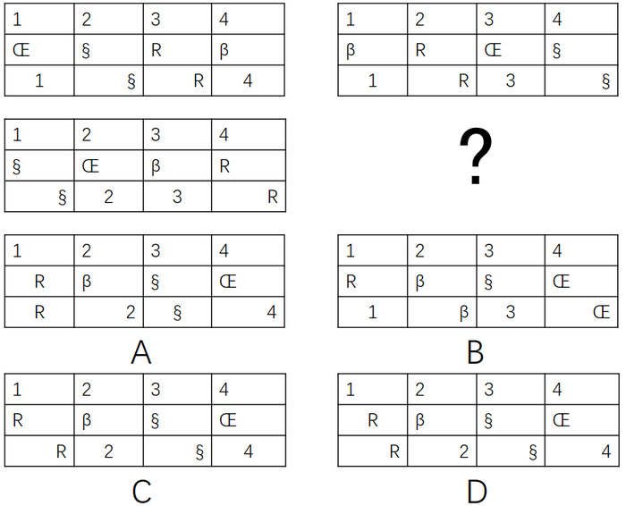

- **A**. A
- **B**. B
- **C**. C　✅
- **D**. D

**答案**：C

**官方解析**

观察图形，元素组成相似，考虑样式规律。前三组图中，每组图中的第一行的数字都在最左边，第二行的字符也都在最左边，第三行的数字在中间，字符在最右边，根据第二行的规律，排除A、D两项；比较BC发现，第三行的数字和字符不同，回到题干中发现，题干中第三行的字符都是R和§，排除B项。
故正确答案为C。

---

### 第 2 题　qid 2050694 · 图形推理

从所给的四个选项中，选择最合适的一个填入问号处，使之呈现一定的规律性：

- **A**. A
- **B**. B
- **C**. C
- **D**. D　✅

**答案**：D

**官方解析**

观察题干图形发现，每幅图都有黑圆和白圆，外框被线条分隔为两个区域，且两圆都在两个不同的区域内，观察选项，只有B项的外框被线条分隔为3个区域，据此排除B项；再次观察发现，白圆所在的区域大小远远大于黑圆所在的区域大小，A项相反，C项不好确定谁的区域更大，而D项非常明显地满足白圆所在的区域远远大于黑圆，择优选择D项。
故正确答案为D。

---

### 第 3 题　qid 2051350 · 图形推理

请从所给四个选项中选出一项和题干给出的图形一样。

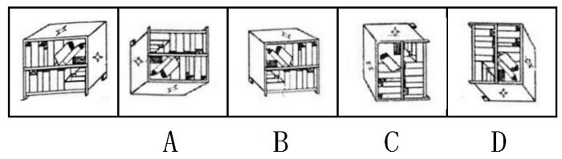

- **A**. A　✅
- **B**. B
- **C**. C
- **D**. D

**答案**：A

**官方解析**

原图是一个书柜，从题干的观察视角可以看到书柜的正面、右侧面和上面，并且上面和右侧面分别是一个四角星。
A项：由原图旋转180度得来的，和题干给出的图形是一样的，当选；
B项：通过观察书的方向，发现原图书倒向的面应该是四角星的面，但该项的图书倒向的面是空白面，和原图不符，排除；
C项：原图倒下的书有两本，而C项只有一本，不相符，排除；
D项：通过观察书的方向，是由原图顺时针旋转90度得到的，但是该选项的侧面出现了五角星，与原图不符，排除。
故正确答案为A。

---

### 第 4 题　qid 2050684 · 图形推理

从所给的四个选项中，选择最合适的一个填入问号处，使之呈现一定的规律性：

- **A**. A　✅
- **B**. B
- **C**. C
- **D**. D

**答案**：A

**官方解析**

元素组成相同，考虑位置规律。第一横行：图一左右翻转得到图二。同样，第二横行：图一左右翻转得到？处图形，所以？处时针应该指向右边，排除C。数字12应该发生左右翻转，排除D，对比A、B发现钟表的外圈圆颜色不一样，第二横行图一中的圆弧是右上黑、左下黑，左右翻转后应该是左上黑、右下黑，排除B项。
故正确答案为A。

---

### 第 5 题　qid 2050680 · 图形推理

从所给的四个选项中，选择最合适的一个填入问号处，使之呈现一定的规律性：

- **A**. A
- **B**. B
- **C**. C　✅
- **D**. D

**答案**：C

**官方解析**

元素组成相同，考虑位置规律。第一组图中第一幅图中的钥匙上下翻转得到第二幅图，同样，第二组图中把第一幅图的钥匙上下翻转得到？处图形，C项符合。
故正确答案为C。

---

### 第 6 题　qid 2050726 · 定义判断

触景生情是指受到某些情景的触动而产生某种情感；触景伤情是指受到某些情景的触动，而产生某种悲伤的情感。
根据上述定义，下列诗句符合触景伤情定义的有：
①老去风光不属身，黄金莫惜买青春 ②游丝一断浑无力，莫向东风怨别离
③葛岭花开二月天，游人来往说神仙 ④伤心桥下春波绿，曾是惊鸿照影来
⑤杨柳共春旗一色，落花与芝盖同飞 ⑥笑渐不闻声渐悄，多情却被无情恼
⑦劝君更尽一杯酒，西出阳关无故人 ⑧最是人间留不住，朱颜辞镜花辞树

- **A**. 0个
- **B**. 1个
- **C**. 2个
- **D**. 3个　✅

**答案**：D

**官方解析**

第一步：找出定义关键词。
受到某些情景的触动，而产生某种悲伤的情感。
第二步：逐一分析各个诗句。
①作者雍陶的《劝行乐》意思是当你老去的时候，虚名不属于你自己，这里青春指的是时间，做些有意义的事情，没有描写具体的景物，且后半句也只是劝人要爱护时间，不符合定义，排除；
②此诗句是《红楼梦》里探春命运的写照，远离家人远嫁他乡，亲情被割断，一个人孤孤单单天水飘摇，无法选择自己的归宿，就像一只风筝一样，充满悲伤情怀，用“风筝”之景描写探春命运，符合定义；
③这是袁枚的《湖上杂诗》意思是二月份葛岭花开了,来来往往的游客都在谈论神仙的事情，具体描写了景物，没有体现作者的悲伤情感，不符合定义，排除；
④这是陆游七十五岁时重游沈园（在今浙江绍兴）写下的悼亡诗《沈园》，意思是那座令人伤心的桥下，春水依然碧绿，当年这里我曾经见到她美丽的侧影惊鸿一现，作者看到情景触发了悲伤情感，符合定义；
⑤这是庾信的《三月三日华林园马射赋》王勃仿照本句写出落霞与孤鹜齐飞,秋水共长天一色,都是描写环境的上乘之作,讲究一个意境，没有体现悲伤的情感，不符合定义，排除；
⑥苏轼的《蝶恋花》墙里佳人的笑声慢慢越变越小，墙外的行人再也听不见了。多情的行人得不到回应，不由感到沮丧，为佳人的无情所懊恼，表现了悲伤的情感，符合定义；
⑦唐朝大诗人王维的《送元二使安西》再干了这杯酒吧,出了阳关,可就再也见不到老朋友了。这两句诗是诗人在一位朋友要去安西时所作的诗,表达了作者与友人依依惜别的神情，依依惜别不能等同于悲伤，不符合定义；
⑧王国维的一首词《蝶恋花》人逐渐老去，照镜子的时候已找不到年轻时候的脸庞；花谢了，纷纷从树枝上掉落下来，这些才最是人世间所不可挽回的自然规律的表现。这句话充分表达了作者对于岁月蹉跎催人老的感慨和无奈之情，表达的并非悲伤之情，不符合定义。
综上，诗句②④⑥符合定义触景伤情的定义，即符合触景伤情定义的诗句有3个。
故正确答案为D。

---

### 第 7 题　qid 2049498 · 定义判断

谶纬之学即对未来的一种政治预言，谶纬本身并不是科学的，但受现实条件的局限，常被人们利用。
根据上述定义，下列利用了谶纬之学的是：

- **A**. 大泽乡起义前，吴广在深夜模仿狐狸的声音大喊“大楚兴，陈胜王”　✅
- **B**. 汉武帝在位期间拓西域，退匈奴，史学家们将“武”字巧妙地诠释为“止戈为武”，以此来称赞他为华夏赢得平稳发展时间的历史功绩
- **C**. 国外一些不法分子编写预言某时某地将发生地质灾难的藏头诗并发布在网络上，以达到扰乱民心的效果
- **D**. 某位老人在家中财物被盗之后将自己的遭遇告诉了老李，老李看了老人手相后表示他还有大难，需要破财才能化解

**答案**：A

**官方解析**

第一步，找出定义关键词。
“对未来的一种政治预言”、“本身并不是科学的”、“受现实条件的局限，常被人们利用”。
第二步，逐一分析选项。
A项：“大楚兴，陈胜王”是在起义前出现的，并且起义是政治活动，体现了“对未来的一种政治预言”和“本身并不是科学的”，符合定义，当选；
B项：史学家们给汉武帝在位期间的功绩作出了极高的称赞和评价，这是对已发生事情的评价，不符合“对未来的一种政治预言”，不符合定义，排除；
C项：编写预言符合“对未来预测”，但是预言内容是地质灾难，不是政治内容或者活动，不符合定义，排除；
D项：老李给某位老人看手相符合“对未来预测”，但是预言内容是老人自身的灾难，不是政治内容或者活动，不符合定义，排除。
故正确答案为A。

---

### 第 8 题　qid 2049500 · 定义判断

镶嵌，是指为了把话说得轻缓或郑重些，有时故意用几个无关紧要的字有规则地镶在一个词或语句里，一般以镶加虚词和数词最为常见。它可分为镶字、嵌字和拼字三类。镶字，指在词语中插进别的词以延长音节或强调语意，以镶加虚字和数字最为常见；嵌字，指将一句话或一组相关的词语分散插入不同的语句之中，使其隐晦曲折，精巧风趣，发人深思；拼字，指将联合词组中的两个词或合成词中的两个语素分开来间错使用。
根据上述定义，下列属于拼字的是：

- **A**. 他比我学问高，但办起事来，我不输他一丝一毫
- **B**. 现在呀，老百姓过日子还是会精打细算、前思后想　✅
- **C**. 一去二三里，烟村四五家，亭台六七座，八九十枝花
- **D**. 他们这一路嘻嘻哈哈、打打闹闹的，真是人老心不老啊

**答案**：B

**官方解析**

第一步：找出定义关键词。
镶字：“词语中插进别的词”、“延长音节或强调语意”；
嵌字：“一句话或一组相关的词语”、“分散插入不同的语句之中”；
拼字：“联合词组、合成词”、“两个词或语素分开间错使用”。
第二步：逐一分析选项。
A项：“一丝一毫”只是在丝毫之间添加了数词“一”，属于镶字，不符合定义，排除；
B项：“精打细算”是将“精细”和“打算”这两个词分开间错来使用，“前思后想”是将“前后”和“思想”两个词分开间错来使用，符合定义，当选；
C项：“二三、四五、六七、八九十”是数词，将这几个数词插进了别的词中，属于镶字，不符合定义，排除；
D项：“嘻嘻哈哈”和“打打闹闹”，是将“嘻哈”和“打闹”两个词重复使用，并没有分开间错使用，不符合定义，排除。
故正确答案为B。

---

### 第 9 题　qid 2049504 · 定义判断

沉默行为是指面对管理制度或生产活动等方面的隐患，为了避免人际冲突，害怕遭受打击报复或维护自身脸面等原因而有意保留自己想法的行为。
根据上述定义，下列属于沉默行为的是：

- **A**. 小王看到同事小赵的计划书有个明显的错误而没有指出来，在接下来与小赵的评比中小王的计划方案获得通过
- **B**. 老张意识到小明最近老是上班时间唱歌已经影响到了别人工作，但考虑到他是自己的徒弟，老张不但不向领导报告，还和其他抱怨的同事争辩　✅
- **C**. 尽管小马就如何提高顾客对公司服务的满意度有见解，由于前面发言的同事已经基本谈到该问题，所以小马也就没再接着说
- **D**. 小刘尽管在新产品开发报告会上有想法，但考虑到该想法尚不成熟，贸然提出可能会影响工作进度，因此在会上也就没发表意见

**答案**：B

**官方解析**

第一步，找出定义关键词。
“面对管理制度或生产活动等方面的隐患”、“为了避免人际冲突，害怕遭受打击报复或维护自身脸面”、“有意保留自己的想法的行为”。
第二步，逐一分析选项。
A项：两人参与评比属于竞争关系，并不是“为了避免人际冲突，害怕遭受打击报复或维护自身脸面”而没有指出来，而是为了自己赢，不符合定义，排除；
B项：小明上班时间唱歌已经影响到了别人工作，属于“管理制度或生产活动等方面的隐患”，老张不向领导报告的原因是小明是自己的徒弟，说明老张是为了维护自己作为师傅的脸面，属于“为了避免人际冲突，害怕遭受打击报复或维护自身脸面”，符合定义，当选；
C项：小马没有提出见解的原因是前面发言的同事已经谈到了这个问题，并不是“为了避免人际冲突，害怕遭受打击报复或维护自身脸面”，不符合定义，排除；
D项：小刘在会上没发表意见的原因是自己想法尚不成熟，并不是“为了避免人际冲突，害怕遭受打击报复或维护自身脸面”，不符合定义，排除。
故正确答案为B。

---

### 第 10 题　qid 2049510 · 定义判断

小推车管理法是指通过把服务对象纳入到服务系统中，并挖掘服务对象潜在资源，与服务提供者共同提高管理服务水平的创新管理模式，该模式对服务提供者和服务接受者来说是一种双赢策略。
根据上述定义，下列选项属于小推车管理法的是：

- **A**. 学生家长群安排家长轮流给班级免费做清洁，学校为此节省了开支
- **B**. 某书店鼓励来购书和阅读的顾客自带小折叠凳，顾客感觉很贴心，书店的销售业绩有很大提升　✅
- **C**. 老张辞掉保姆，自己做起了家务，既锻炼了身体又节约了一笔开销
- **D**. 超市为了树立“环保、节能、负责”的企业形象，对自带环保包装袋的消费者发放电子红包

**答案**：B

**官方解析**

第一步：找出定义关键词。
方式：“把服务对象纳入到服务系统”、“挖掘服务对象潜在资源”。
目的：“与服务提供者共同提高管理服务水平”、“对服务提供者和接受者来说是双赢”。
第二步：逐一分析选项。
A项：学校的服务对象应该是“学生”，而非学生家长，不符合关键词“把服务对象纳入到服务系统”，不符合定义，排除；
B项：书店的服务对象是“顾客”，鼓励他们自带小折叠凳，符合关键词“把服务对象纳入到服务系统”、“挖掘服务对象潜在资源”，顾客觉得贴心，书店销售业绩提高，符合关键词“对服务提供者和接受者来说是双赢”，符合定义，当选；
C项：只提到了老张一个人，只是他有双重身份，既是服务提供者也是接受者，不满足关键词“把服务对象纳入到服务系统”，不符合定义，排除；
D项：超市对自带包装袋的消费者发放电子红包，消费者获利了，但是超市的环保形象有没有树立成功，并不知道，没有B项直接明确，排除。
故正确答案为B。

---

### 第 11 题　qid 2049506 · 定义判断

逆向激励是指政策设计初衷与实际执行效果呈现“事与愿违”的现象，逆向激励效应一旦被激发，不仅会导致现状恶化，损害政策制定者的信用，还将进一步强化相关负面后果，最终造成恶性循环。
根据上述定义，下列不属于逆向激励的是：

- **A**. 为了扭转治安问题，上世纪美国颁布了禁酒令，然而酒的销量不跌反升，而且由此又引发了新的犯罪问题
- **B**. 宋神宗为了整肃吏治、严明司法审判，下令凡是能找到错判事实的官员官升一级，结果这项举措却成了新旧官员相互攻讦的武器
- **C**. 为了更有利孩子成长而提供优裕的物质条件，然而却让其养成了好逸恶劳的恶习
- **D**. 老师在课堂上通过有意对害羞学生提问而帮助其克服容易紧张的问题　✅

**答案**：D

**官方解析**

第一步，找出定义关键词。
“政策设计初衷与实际执行效果呈现事与愿违的现象”、“导致现状恶化，强化了相关负面后果，造成恶性循环”。
第二步，逐一分析选项。
A项：为扭转治安问题颁布禁酒令，但酒的销量不降反升，符合“实际执行效果呈现事与愿违”，引发新的犯罪问题符合“现状恶化”，符合题干定义，排除；
B项：“为了整肃吏治、严明司法审判”是该项政策的设计初衷，新旧官员互相攻讦的武器符合“实际执行效果呈现事与愿违”并且“强化了相关负面后果”，符合题干定义，排除；
C项：“为了更有利于孩子成长”是设计初衷，“孩子养成了好逸恶劳的恶习”，符合“实际执行效果呈现事与愿违”并且“强化了相关负面后果”，符合题干定义，排除；
D项：“老师提问害羞的孩子帮助其克服容易紧张的问题”是设计初衷，但是没有说明实际执行效果是否出现事与愿违的现象，不符合题干定义，当选。
本题为选非题，故正确答案为D。

---

### 第 12 题　qid 2049508 · 定义判断

机器视觉，是指通过光学的装置和非接触的传感器自动地接收和处理一个真实物体的图像，以获得所需信息或用于控制机器人运动的装置。
根据上述定义，下列选项涉及机器视觉的是：

- **A**. 扁平化的摄像头通过暗光拍摄，发现沙发底部灰尘很多，向主人发出需要清洗的红色警报　✅
- **B**. 车载智能设备在路上通过定位系统、导航系统等语音提醒司机行车路线、各路段车速限制及前方天气情况等
- **C**. 新型眼镜在主人探险进入黑暗洞穴后捕捉到大量蝙蝠发出的超声波，立刻启动了面部保护模式
- **D**. 带有拍摄装置的迷你智能机器人进入考古人员难以到达的墓穴深处，拍摄到许多珍贵图像

**答案**：A

**官方解析**

第一步：找出定义关键词。

方式：“通过光学的装置和非接触的传感器”、“自动地接收和处理真实物体的图像”。

目的：“获得信息”、“控制机器人运动”。

第二步：逐一分析选项。

A项：通过摄像头暗光拍摄，符合关键词“通过光学的装置和非接触的传感器”，发现灰尘并汇报，符合关键词“自动地接收和处理真实物体的图像”和“获得信息”，符合定义，保留；

B项：通过定位系统、导航系统等不符合关键词“通过光学的装置和非接触的传感器”，不符合定义，排除；

C项：新型眼镜接收到蝙蝠发出的超声波，不符合关键词“自动地接收和处理真实物体的图像”，不符合定义，排除；

D项：带有拍摄装置的迷你智能机器人符合关键词“通过光学的装置和非接触的传感器”，拍摄到许多珍贵图像，符合关键词“自动地接收真实物体的图像”和“获得信息”，符合定义，保留。

<b>【备注】</b>

本题属于争议题，根据以下两点原因，我们粉笔给出的倾向性答案为A。

首先题干定义的方式为“接收和处理”，A项的“发现灰尘并汇报”符合“接收和处理”，但D项的“拍摄到许多珍贵图像”，更倾向于“接收真实物体的图像”，而非“接收和处理”，D项没有A项与定义更加贴切。

其次，我们通过查找原文，如下图所示，A项就是我们常说的“扫地机器人”，它是运用了机器视觉的。

故正确答案为A。 

---

### 第 13 题　qid 2049494 · 定义判断

拟态，是指某些生物在进化过程中具有与另一种生物或周围自然界物体的相似的形态，这种相似性很高，几乎难以分辨，可以保护某一物种或两个物种。
根据上述定义，下列选项属于拟态的是：

- **A**. 海豚、企鹅和带鱼虽然分别属于鲸类、鸟类和鱼类，但为了适应海洋生活，都进化出了流线形的身体
- **B**. 北极熊生活在白雪皑皑的北极，为了掩护自己捕食时不被猎物过早发现，皮毛逐渐变成与周围环境相似的白色
- **C**. 大鲵，俗名娃娃鱼，已在地球上生活了数亿年，其受到刺激时的叫声酷似人类婴儿哭声，让人听到不忍心伤害，对一些猎食动物也有威慑作用
- **D**. 杜鹃会将与宿主卵酷似的卵产在宿主巢内，其雏鸟在孵出后不久就会将宿主雏鸟挤出巢外，独享体型只有自己一半大小的宿主父母的喂食　✅

**答案**：D

**官方解析**

第一步，找出定义关键词。
“某些生物在进化过程中具有与另一种生物或周围自然界物体的相似的形态”、“相似性很高，几乎难以分辨”、“可以保护某一物种或两个物种”。
第二步，逐一分析选项。
A项：海豚、企鹅和带鱼这三种不同的物种都具有流线形身体这一相似性，但相似性是否很高，是否难以分辨不明确，不符合定义，排除；
B项：北极熊的皮毛逐渐变为与周围的环境相似的白色，只是颜色发生变化，但形态并没有发生改变，这是北极熊的保护色，没有体现了“某些生物在进化过程中具有与另一种生物或周围自然界物体的相似的形态”，不符合定义，排除；
C项：大鲵的叫声与婴儿相似，并不是形态的相似，不符合“某些生物在进化过程中具有与另一种生物或周围自然界物体的相似的形态”，不符合定义，排除；
D项：杜鹃产的卵与宿主卵酷似，符合“相似性很高，几乎难以分辨”，将宿主雏鸟挤出巢外符合“可以保护某一物种或两个物种”，符合定义，当选。
故正确答案为D。

---

### 第 14 题　qid 2049502 · 定义判断

隐性饥饿，是指机体由于营养不平衡或者缺乏某种维生素及人体必需矿物质，同时又存在其他营养成分过度摄入，从而产生隐蔽性营养需求的饥饿症状。
根据上述定义，下列属于隐性饥饿的是：

- **A**. 陈大爷下定决心节食，他最近以青菜和苹果代替主食，不沾油荤，终于有一天因饥饿难耐晕倒在地
- **B**. 小白为了获得健美身材，坚持每日六餐，每餐分量很少，分别含有主食、蔬果、蛋奶等，但同时高强度的健身训练还是让他浑身酸痛、疲惫不堪
- **C**. 王大爷因为肠胃虚弱，以清粥热汤作为主要饮食养生，不常吃大鱼大肉和生冷瓜果，后来因饮食缺少蛋白质和维他命而导致记忆力减退　✅
- **D**. 小李喜欢高盐、高糖分、高热量的垃圾食品，对医生的劝说无动于衷，在数年后的体检中发现自己存在高血糖、高血脂、高血压等问题

**答案**：C

**官方解析**

第一步：找到定义关键词。
原因：营养不平衡或缺乏某种维生素及必需矿物质，同时其他营养成分过度摄入。
结果：产生隐蔽性营养需求的饥饿症状。
第二步：逐一分析选项。
A项：陈大爷以青菜和苹果代替主食，不沾油荤，并没有体现缺乏某种维生素及人体必需矿物质，而是将饥饿症状表现了出来，不属于隐蔽性营养需求的饥饿症状，不符合定义，排除；
B项：小白是因为高强度的健身训练导致疲惫不堪，并没有体现出营养不平衡或其他营养成分过度摄入而产生饥饿症状，不符合定义，排除；
C项：王大爷因饮食缺少蛋白质和维他命导致记忆力减退，说明其机体营养不平衡且缺乏必需矿物质，记忆力减退属于隐蔽性饥饿症状，符合定义，当选；
D项：小李是盐、糖、热量摄入过度，但没有体现其营养不平衡或缺乏维生素或必需矿物质，不符合定义，排除。
故正确答案为C。

---

### 第 15 题　qid 2049486 · 定义判断

机械类比，就是将两个本质不同的事物，按其表面的相似来机械地加以比较而得出某些结论。
根据上述定义，下列不属于机械类比的是：

- **A**. 百姓无粟米充饥，何不食肉糜
- **B**. 无情最是台城柳，依旧烟笼十里堤
- **C**. 子子孙孙无穷匮也，而山不加增，何苦而不平　✅
- **D**. 西施病心而颦其里，其里之丑人见而美之，归亦捧心而颦其里

**答案**：C

**官方解析**

第一步，找出定义关键词。
“两个本质不同的事物”、“按其表面的相似来机械地加以比较而得出某些结论”。
第二步，逐一分析选项。
A项：“百姓无粟米充饥，何不食肉糜”意思是百姓肚子饿没米饭吃，为什么不去吃肉粥呢。 “粟米”和“肉糜”本质不同，符合“两个本质不同的事物”；二者都是食物，却没有考虑到百姓的现实生活条件，就认为百姓没米吃可以去吃肉粥，符合“按其表面的相似来机械地加以比较而得出某些结论”，符合定义，排除；
B项：“无情最是台城柳，依旧烟笼十里堤”的意思是大唐帝国江河日下，最无情的还是台城外的垂柳，依旧轻烟般地笼罩十里长堤。“台城柳”和“轻烟”本质不同，符合“两个本质不同的事物”；柳条和轻烟都很轻柔，却没有考虑到二者物理性质不同，就认为垂柳也会像轻烟一样笼罩着长堤，符合“按其表面的相似来机械地加以比较而得出某些结论”，符合定义，排除；
C项：“子子孙孙无穷匮也，而山不加增，何苦而不平”意思是子子孙孙没有穷尽，然而山却不会加大增高，愁什么山挖不平？“子孙”和“山”本质不同，符合“两个本质不同的事物”；但得出结论时并未提及二者表面相似性，不符合“按其表面的相似来机械地加以比较而得出某些结论”，不符合定义，当选；
D项：“西施病心而颦其里，其里之丑人见而美之，归亦捧心而颦其里”意思是西施患心口痛的病，难受地皱起了眉头走过乡里。乡里有个丑女人认为这样很美，也模仿西施，故意按着胸口，皱着眉头，走过乡里。“西施”和“丑人”，本质不同，符合“两个本质不同的事物”；二者都是人，丑人却没有考虑到两人相貌不同，就认为西施这么做好看，自己这么做也会好看，符合“按其表面的相似来机械地加以比较而得出某些结论”，符合定义，排除。
本题为选非题，故正确答案为C。

---

### 第 16 题　qid 2049378 · 类比推理

储存：光盘：硬盘

- **A**. 晾晒：绳索：衣架
- **B**. 吃饭：钢叉：锅铲
- **C**. 书写：签字笔：毛笔　✅
- **D**. 游泳：泳圈：泳衣

**答案**：C

**官方解析**

第一步：判断题干词语间逻辑关系。
光盘和硬盘两者是并列关系，主要功能都是储存数据，光盘和硬盘与储存是功能对应关系。
第二步：判断选项词语间逻辑关系。
A项：绳索和衣架两者是并列关系，衣架的主要功能是晾晒衣物，而绳索的主要功能是连接、牵引，不是晾晒，与题干逻辑关系不一致，排除；
B项：钢叉和锅铲两者是并列关系，钢叉的主要功能是协助吃饭，而锅铲的主要功能是炒菜，与题干逻辑关系不一致，排除；
C项：签字笔和毛笔两者是并列关系，主要功能是书写文字，签字笔和毛笔与书写是功能对应关系，与题干逻辑关系一致，当选；
D项：泳圈和泳衣两者是并列关系，泳圈的主要功能是协助游泳，泳衣是指游泳时专用的衣服，与题干逻辑关系不一致，排除。
故正确答案为C。

---

### 第 17 题　qid 2049408 · 类比推理

爸爸：叔父：兄弟

- **A**. 哥哥：婶婶：夫妻
- **B**. 妈妈：嫂子：婆媳　✅
- **C**. 姨妈：伯伯：兄妹
- **D**. 奶奶：姑姑：子女

**答案**：B

**官方解析**

第一步：判断题干词语间逻辑关系。
“叔父”是“爸爸”的弟弟，叔父与爸爸是兄弟关系。
第二步：判断选项词语间逻辑关系。
A项：婶婶是父亲的弟弟的妻子，与哥哥并不是夫妻关系，与题干逻辑关系不一致，排除；
B项：嫂子是哥哥的妻子，妈妈与嫂子是婆媳关系，与题干逻辑关系一致，当选；
C项：姨妈是母亲的姐姐或妹妹，伯伯是父亲的哥哥，姨妈和伯伯二者不是兄妹关系，与题干逻辑关系不一致，排除；
D项：姑姑是父亲的姐妹，奶奶与姑姑是母女关系，与子女一词不对应，与题干逻辑关系不一致，排除。
故正确答案为B。

---

### 第 18 题　qid 2050696 · 类比推理

报纸：新闻：时效

- **A**. 饭店：食物：口感
- **B**. 电视：广告：效果　✅
- **C**. 车站：汽车：速度
- **D**. 展会：照片：像素

**答案**：B

**官方解析**

第一步：判断题干词语间逻辑关系。
报纸是新闻的载体，新闻有时效性，题干为对应关系。
第二步：判断选项词语间逻辑关系。
A项：饭店是售卖食物的场所，与题干逻辑关系不一致，排除；
B项：电视是广告的载体，广告有效果，为对应关系，与题干逻辑关系一致，当选；
C项：车站是汽车停泊的场所，不是载体，与题干逻辑关系不一致，排除；
D项：展会不是照片的载体，照片是展会展示的一种形式，像素的高低决定照片的清晰度，与题干逻辑关系不一致，排除。
故正确答案为B。

---

### 第 19 题　qid 2049414 · 类比推理

火：火热

- **A**. 土：土气
- **B**. 水：水润　✅
- **C**. 金：金黄
- **D**. 木：木讷

**答案**：B

**官方解析**

第一步：判断题干词语间逻辑关系。
“火”是五行之一，“火”具有“火热”的必然属性，二者为属性对应关系。
第二步：判断选项词语间逻辑关系。
A项：“土”是五行之一，但“土气”不是“土”的属性，与题干逻辑关系不一致，排除；
B项：“水”是五行之一，且“水”具有“水润”的必然属性，与题干逻辑关系一致，当选；
C项：“金”是五行之一，但这里的“金”泛指一切金属，金属有很多种颜色，所以“金黄”并非“金”的必然属性，与题干逻辑关系不一致，排除；
D项：“木”是五行之一，但“木讷”不是“木”的属性，与题干逻辑关系不一致，排除。
故正确答案为B。
注：五行包括：金、木、水、火、土。

---

### 第 20 题　qid 2049418 · 类比推理

为虎添翼：如虎添翼

- **A**. 好为人师：善为人师　✅
- **B**. 一字不差：一字不落
- **C**. 无所不至：无所不知
- **D**. 耸人听闻：骇人听闻

**答案**：A

**官方解析**

第一步：判断题干词语间逻辑关系。
为虎添翼是指替老虎加上翅膀，比喻帮助坏人，增加恶人的势力。如虎添翼如同老虎长了翅膀，比喻强大的事物更加强大了，二者虽不是近义关系，但都是围绕同一个事件，表达了不同的意思，且为虎添翼是贬义词。
第二步：判断选项词语间逻辑关系。
A项：好为人师是指喜欢做别人的老师，形容不谦虚，自以为是，爱摆老资格，喜欢以教育者自居。善为人师是指善于做别人的老师，二者不是近义关系，同样也是围绕“为人师”这件事表达了不同的意思，且好为人师是贬义词，与题干逻辑关系一致，当选；
B项：一字不差是指一个字也没有更改，与原文雷同。一字不落是指整篇文章都仔细逐字逐句地阅读或背诵，一个字也不落下，二者是近义关系，与题干逻辑关系不一致，排除；
C项：无所不至与无所不知不是近义关系，但无所不至是指没有不到的地方，也指什么坏事都做绝了，无所不知是说什么事情都知道，二者并不是围绕同一件事表达不同的意思，与题干逻辑关系不一致，排除；
D项：耸人听闻和骇人听闻都是形容使人十分吃惊，二者是近义关系，与题干逻辑关系不一致，排除。
故正确答案为A。

---

### 第 21 题　qid 2050698 · 类比推理

少小离家：老大回乡

- **A**. 日落而息：日出而作　✅
- **B**. 今日高歌：明朝忧愁
- **C**. 三日打鱼：两天晒网
- **D**. 春种秋收：夏耕冬藏

**答案**：A

**官方解析**

第一步：判断题干词语间逻辑关系。
“少小”与“老大”是反义关系，“离家”与“回乡”也是反义关系。
第二步：判断选项词语间逻辑关系。
A项：“日落”与“日出”是反义关系，“而息”与“而作”也是反义关系，与题干逻辑关系一致，当选；
B项：“今日”与“明朝”不是反义关系，“高歌”和“忧愁”也不是反义关系，与题干逻辑关系不一致，排除；
C项：“三日”与“两天”不是反义关系，与题干逻辑关系不一致，排除；
D项：“春种”与“夏耕”不是反义关系，是事件的先后顺序，与题干逻辑关系不一致，排除。
故正确答案为A。

---

### 第 22 题　qid 2049364 · 类比推理

美丽：沉鱼落雁

- **A**. 独特：举世无双　✅
- **B**. 灵活：身手敏捷
- **C**. 厌恶：嗤之以鼻
- **D**. 粗心：三心二意

**答案**：A

**官方解析**

第一步：判断题干词语间逻辑关系。
沉鱼落雁，鱼见之沉入水底，雁见之降落沙洲，可以形容女子容貌极其美丽。沉鱼落雁比美丽的程度更深。
第二步：判断选项词语间逻辑关系。
A项：举世无双，是指全世界找不到第二个，可以形容人或事物极其独特。举世无双比独特的程度更深，与题干逻辑关系一致，当选；
B项：灵活可以形容敏捷，不呆板。灵活和身手敏捷并不存在程度上的差异，且身手敏捷并非成语，而题干第二个词为成语，因此与题干逻辑关系不一致，排除；
C项：嗤之以鼻，用鼻子吭声冷笑，表示轻蔑，不能用来形容厌恶，与题干逻辑关系不一致，排除；
D项：三心二意，又想这样又想那样，犹豫不定。常指不安心，不专一，不能用来形容粗心，与题干逻辑关系不一致，排除。
故正确答案为A。

---

### 第 23 题　qid 2049392 · 类比推理

旅行：交通

- **A**. 生活：工作
- **B**. 吃饭：食物　✅
- **C**. 睡觉：休息
- **D**. 病愈：康复

**答案**：B

**官方解析**

第一步：判断题干词语间逻辑关系。
交通是旅行的必要条件。
第二步：判断选项词语间逻辑关系。
A项：工作是生活的一部分，但并不是生活的必要条件，与题干逻辑关系不一致，排除；
B项：食物是吃饭的必要条件，与题干逻辑关系一致，当选；
C项：睡觉是休息的一种方式，两者是种属关系，与题干逻辑关系不一致，排除；
D项：病愈和康复两者是近义词，与题干逻辑关系不一致，排除。
故正确答案为B。

---

### 第 24 题　qid 2049352 · 类比推理

儿童：女童：未成年

- **A**. 房屋：桥梁：建筑
- **B**. 小狗：狗崽：犬　✅
- **C**. 佐料：酱油：调料
- **D**. 植物油：椰子油：菜籽油

**答案**：B

**官方解析**

第一步：判断题干词语间逻辑关系。
女童是儿童的一种，二者是种属关系。未成年是指未满十八周岁，儿童是未成年人，二者是种属关系。
第二步：判断选项词语间逻辑关系。
A项：房屋和桥梁是并列关系，房屋和桥梁二者并列与建筑是种属关系，与题干逻辑关系不一致，排除；
B项：狗崽是指刚出生的狗，与小狗是种属关系，小狗是犬的一种，二者也是种属关系，与题干逻辑关系一致，当选；
C项：酱油是调料的一种，与调料是种属关系，调料是指调味用的佐料，调料与佐料是种属关系，但与题干顺序不同，与题干逻辑关系不一致，排除；
D项：椰子油是植物油的一种，二者是种属关系，菜籽油是植物油的一种，二者也是种属关系，但与题干顺序不同，与题干逻辑关系不一致，排除。
故正确答案为B。

---

### 第 25 题　qid 2049426 · 类比推理

机密：保密：安全

- **A**. 肥胖：健身：成长
- **B**. 无知：学习：追赶
- **C**. 落后：努力：进步　✅
- **D**. 乐观：笑话：开朗

**答案**：C

**官方解析**

第一步：判断题干词语间逻辑关系。
机密形容重要的秘密，保密是指保护秘密不被泄露，保密是为了让机密的事物能够安全，安全是保密的目的。
第二步：判断选项词语间逻辑关系。
A项：健身是一种体育运动，健身是为了让肥胖的身体能够健康，与成长不对应，与题干逻辑关系不一致，排除；
B项：学习是为了让无知的人获得知识或技能，与追赶不对应，与题干逻辑关系不一致，排除；
C项：努力是让落后的事物能够进步，进步是努力的目的，与题干逻辑关系一致，当选；
D项：笑话有讥笑、讽刺的意思，开朗不是笑话的目的，与题干逻辑关系不一致，排除。
故正确答案为C。

---

### 第 26 题　qid 2051358 · 逻辑判断

有观点认为，意识体验是由一些特定脑区的特定神经集群以特定方式活动而突现的。当脑接收视觉刺激时，首先是脑后部的神经元对视觉刺激表征进行处理，然后投射到脑前部，在那里执行预测和计划的功能。当人对某个视觉刺激加以注意时，这些集群会得到加强，其中神经元的活动增强，同步性也增大，他们的信号在脑的前部和后部之间来回传输，最后在和其他集群的竞争中胜出。
以下各项如果为真，最能削弱上述观点的是：

- **A**. 不同的意识体验是由一些特殊的神经元集群所介导甚至产生的
- **B**. 意识是由脑整体功能在量上的增加所产生，是在含有大量神经递质的环境大群发放神经元的整体性质　✅
- **C**. 初级视皮层中有大量神经元集群对来自左眼的刺激有猛烈发放，但其对意识毫无贡献
- **D**. 同意识相关的特定脑区和神经元有着特殊的性质，不同的意识觉知归于特定的脑内连接

**答案**：B

**官方解析**

第一步：找到论点论据。
论点：意识体验是由一些特定脑区的特定神经集群以特定方式活动而突现的。
论据：当脑接收视觉刺激时，脑后部的神经元对视觉刺激表征进行处理，然后投射到脑前部，他们的信号在脑的前部和后部之间来回传输，最后在和其他集群的竞争中胜出。
第二步：逐一分析选项。
A项：不同的意识体验是由一些特殊的神经元集群所介导甚至产生的，补充论据，加强论证，排除；
B项：说的是意识是由大脑的整体功能产生的，而题干论点说的是由特定脑区的特定神经元产生的，削弱论点，当选；
C项：初级视皮层中的大量神经元是否是产生意识相关的特定神经元是不明确的，排除；
D项：不同的意识觉知归于特定的脑内连接，但是特定的脑内连接与特定神经集群的关系是不明确的，排除。
故正确答案为B。

---

### 第 27 题　qid 2049458 · 逻辑判断

目前，英国科学家提出一种观点，认为海绵这种没有大脑，甚至没有任何神经细胞，在地球生活了数亿年的动物在远古时代也曾经拥有神经细胞，但在随后的进化中放弃掉了。
如果以下各项为真，最能支持上述观点的是：

- **A**. 海绵拥有打造神经系统所需要的基因，而对于海绵来说，无论是大脑还是简单的神经系统，都可能是“累赘”，是对能量的浪费　✅
- **B**. 现在研究发现，拥有复杂神经系统的栉水母，才是其他所有动物的“姊妹群”，是动物祖先的最佳代表
- **C**. 已知年代最久远的拥有复杂大脑的动物出现时间远远早于海绵，它们拥有精密的类大脑结构，并拥有专门的神经网络
- **D**. 一些寄生虫与它们的近亲相比，就因为寄生这种生活方式失去了复杂的神经系统；而海绵与它们的近亲相比，生活方式类似于寄生

**答案**：A

**官方解析**

第一步：找出论点和论据。
 论点：海绵这种没有大脑，甚至没有任何神经细胞，在地球生活了数亿年的动物在远古时代也曾经拥有神经细胞，但在随后的进化中放弃掉了。
 论据：无。
 第二步：逐一分析选项。
 A项：海绵拥有打造神经系统所需要的基因，但大脑或简单的神经系统对于海绵来说都是“累赘”，是对能量的浪费，所以在进化的过程中可能会放弃大脑与神经系统，补充论据，当选；
 B项：题干讨论的是海绵，B项讨论的是拥有复杂神经系统的栉水母，为无关项，排除；
 C项：最久远的拥有复杂大脑的动物出现时间早于海绵，与海绵是否拥有大脑无关，为无关项，排除；
 D项：寄生这种生活方式使寄生虫失去了复杂的神经系统，海绵的生活方式类似于寄生，但是海绵是否因此失去神经系统不明确，为不明确选项，排除。
故正确答案为A。
【文段出处】《有些动物的大脑为何丢了？浪费能量无作用》

---

### 第 28 题　qid 2050742 · 类比推理

现有甲乙两艘船同时出发，同向行驶至某目的地。小明在甲船出发的瞬间开始从船头走向船尾，他出发时，甲、乙船头与目的地距离相等；当他走到船尾时，两船船尾与目的地距离相等。由此推论以下可能正确的是：
①乙船比甲船长，行驶速度比甲船快
②甲船比乙船短，行驶速度比乙船快
③甲乙两船长度相同、行驶速度相同
④乙船比甲船短，行驶速度比甲船快
⑤甲船比乙船长，行驶速度比乙船快

- **A**. ①③④
- **B**. ①②⑤
- **C**. ③④⑤
- **D**. ①③⑤　✅

**答案**：D

**官方解析**

在小明从船头走到船尾的过程中，两船行驶的时间相同。

  

若两船长度相同（如图1所示），则二者的路程也相同（S1=S2），时间相同情况下，速度必然相等，③正确；

若两船长度不同（如图2所示），则船长的路程就比较远（S1＞S2），则船长的速度更快，①⑤正确，②④错误。

故正确答案为D。

---

### 第 29 题　qid 2049450 · 逻辑判断

目前，有一种观点认为市面上以活性乳酸菌为卖点的酸奶其实很难补充乳酸菌，对肠道健康并没有什么益处。
以下各项如果为真，最能反驳这一观点的是：

- **A**. 不管是常温酸奶还是冷藏酸奶，其中乳酸、钙及蛋白质等有益物质都得到了很好保留
- **B**. 现在市面上大部分酸奶都是常温型、添加型的，在制作过程中大部分乳酸菌都被杀死了，不能被称为“酸奶”
- **C**. 酸奶中的蛋白质已经被乳酸菌凝冻化，因此很容易被吸收，这就减轻了肠胃消化负担　✅
- **D**. 酸奶的食用后血糖反应比米饭馒头等主食都低，而血糖反应异常可能引起多种症状

**答案**：C

**官方解析**

第一步：找到论点论据。
论点：市面上以活性乳酸菌为卖点的酸奶其实很难补充乳酸菌，对肠道健康并没有什么益处。
论据：无。
第二步：逐一分析选项。
A项：乳酸并非乳酸菌，有益物质得到了很好保留，但并不明确对肠道健康是否有益，为不明确选项，排除；
B项：说明市面上的酸奶并不能补充乳酸菌，加强了论点，排除；
C项：乳酸菌能够冻化蛋白质，间接说明酸奶中的乳酸菌能够起到减轻肠胃负担的作用，削弱了论点，当选；
D项：血糖反应与乳酸菌、肠道健康无关，排除。
故正确答案为C。

---

### 第 30 题　qid 2049454 · 逻辑判断

据报道，国际上有不少科学家声称，在新西兰周围发现了一块名为“西兰洲”的新大陆，它符合大洲认定标准的全部要求，是世界第八大洲，相信在不久的将来，各国的地理课本将会被改写。
得出“各国的地理课本将会被改写”的结论必须基于的前提是：

- **A**. 各国地理课本会因为“大陆”“大洲”等相关知识内容变化而改写　✅
- **B**. 认定大洲的标准具有权威性，并且在课本发行前不会改变
- **C**. 各国地理课本目前没有关于“世界第八大洲”的任何内容
- **D**. 各国地理课本本身都有关于“大陆”“大洲”等的内容

**答案**：A

**官方解析**

第一步：找出论点和论据。
 论点：相信在不久的将来，各国的地理课本将会被改写。
 论据：在新西兰周围发现了一块名为“西兰洲”的新大陆，它符合大洲认定标准的全部要求，是世界第八大洲。
 第二步：逐一分析选项。
 A项：各国的地理课本会因为“大陆”“大洲”等相关知识的内容变化而改写，建立了论点与论据之间的联系，搭桥项，保留；
 B项：强调认定大洲的标准具有权威性，证明论据“该大陆符合大洲认定标准的全部要求”具有可靠性，补充论据，保留；
 C项：各国地理课本目前没有关于“世界第八大洲”的任何内容，与发现新大洲，地理课本是否会被改写无关，无关选项，排除；
 D项：各国地理课本本身都有关于“大陆”“大洲”等的内容，与发现新大洲，地理课本是否会被改写无关，无关项，排除。
对比A、B两项，搭桥的加强力度大于补充论据，因此A项加强力度更大。
 故正确答案为A。

---

### 第 31 题　qid 2049448 · 逻辑判断

在学术交流会上，一位国外学者以没有遗迹、缺乏相应年代的文字记载而否定夏朝的存在。
以下各项如果为真，最能反驳这位国外学者的是：

- **A**. 曾经外国考古界以同样的理由否定商朝的存在，但随着对甲骨文研究的加深和殷墟的发现，他们不得不改写对中国历史的记录
- **B**. 与西方以石头为建筑材料、记录载体不同，我国古代多以木头为建筑材料、记录载体，此外我们还受到地质气候等影响，保存遗迹、文字等难度要更大
- **C**. 我国有很多关于夏朝的记载和传说，春秋时候杞国人在当时就被认为是夏人后裔，《史记》也有关于夏后氏（夏朝国王）称号等的准确记载　✅
- **D**. 该学者和团队前不久在爱琴海某小岛发现了尚未明确年代的小型石头建筑，他们结合当地人口头传说故事就认定这是史书记载的某文明

**答案**：C

**官方解析**

第一步：找到论点和论据。
论点：夏朝并不存在。
论据：没有遗迹、缺乏相应年代的文字记载。
第二步：逐一分析选项。
A项：试图用与商朝考古例子的类比，来削弱论点，商朝的考古经历是否一定也能在夏朝考古中重现不得而知，类比是一种非常弱的可能性削弱，需要比较其他选项，保留；
B项：说明中西方的遗迹和文字记录载体不同，且中国遗迹和文字保存难度大，但保存难度大并不意味着一定没有相应的遗迹和文字，不直接，排除；
C项：举例说明关于夏朝的文字准确记载在历史上确实是存在的，直接否定论据，相比于A项削弱力度更强，当选；
D项：爱琴海某小岛与夏朝完全无关，排除。
故正确答案为C。

---

### 第 32 题　qid 2050730 · 逻辑判断

英国“首席捕鼠官”虎斑猫拉里因为不勤于捕鼠，而被部分人以“未尽职工作”为由，要求下台，但同时一些媒体也发起支持行动，表示“权利义务不对等”，唐宁街（英国政府代称）没有任何理由让这位捕鼠官“下课”。
如果以下各项为真，最能支持媒体观点的是：

- **A**. 
调查显示，拉里任捕鼠官后，全国得到收养的流浪猫增加了，拉里的任职起到了良好的社会示范作用

- **B**. 
拉里天生不善捕鼠，它被选为捕鼠官并未经过唐宁街工作人员仔细考察

- **C**. 
唐宁街并未支付拉里薪水，其口粮全部由唐宁街工作人员花费购买
　✅
- **D**. 
由于外形可爱，性格温顺，拉里经常被安排额外的外交接待任务

**答案**：C

**官方解析**

第一步：找出论点和论据。
论点：唐宁街（英国政府代称）没有任何理由让这位捕鼠官“下课”。
论据：拉里权利义务不对等。
第二步：逐一分析选项。
A项：“得到收养的流浪猫增加了20%”说明了捕鼠官拉里对英国的流浪猫的现状有所改善，但捕鼠官的义务是捕鼠，所以该选项为无关项，排除；
B项：“拉里天生不善捕鼠”，说明拉里没有能力尽到自己的义务，但是它的权利和义务是否对等，并未提及，不能支持，排除；
C项：拉里的义务是捕鼠，权利应该是获得捕鼠的报酬，但是C项告诉我们唐宁街并未支付拉里薪水，其口粮全部由唐宁街工作人员花费购买，说明拉里即使完成了捕鼠的义务，也没有获得唐宁街给它的应有权利，所以拉里的权利和义务不对等，唐宁街没有任何理由让这位捕鼠官“下课”，可以支持，当选；
D项：与A同理，拉里因性格和外貌的原因被安排额外的外交接待任务，但外交不是捕鼠官的义务，无关项，排除。
故正确答案为C。

---

### 第 33 题　qid 2049350 · 逻辑判断

没有出席今晚宴会的人，要么没有被邀请，要么没有时间。
据此，可以推出：

- **A**. 被邀请的即使有时间也不一定出席今晚宴会
- **B**. 有时间且被邀请的不会参加今晚宴会
- **C**. 没被邀请的也不一定不出席今晚宴会　✅
- **D**. 被邀请的才能参加今晚的宴会

**答案**：C

**官方解析**

第一步：翻译题干。

没有出席今晚宴会的人→要么没有被邀请，要么没有时间；

“要么······要么······”的翻译为：两者选其一，也就是说二者都为真的时候，“要么······要么······”为假，二者都为假的时候，“要么······要么······”也为假。

第二步：逐一判断选项。

A项：根据题干已知条件可以推出：被邀请且有时间出席今晚宴会，“被邀请且有时间”属于否后，否后必否前，推出“出席今晚宴会”，A项说不一定出席，排除；

B项：根据题干已知条件可以推出：被邀请且有时间出席今晚宴会，“被邀请且有时间”属于否后，否后必否前，推出“出席今晚宴会”，B项说不出席，排除；

C项：没被邀请的人也不一定不出席今晚宴会，根据题干可以推出：没有被邀请且没有时间出席今晚宴会，意味着没被邀请的人也是有机会出席今晚宴会的，能推出，当选；

D项：参加今晚宴会被邀请，结合题干可知，“参加今晚宴会”属于否前，否前不能得到一个确定性的结论，不能推出，排除。

故正确答案为C。

---

### 第 34 题　qid 2049340 · 逻辑判断

与意大利、德国等欧洲国家不同，美国被一些球迷称为“足球荒漠”，他们认为在美国，足球一直被视为边缘运动。
下列各项如果为真，最能反驳这一看法的是：

- **A**. 美国足球队在世界杯等多项国际重大比赛上获得了傲人成绩，其在国际足联的排名有时甚至超过英格兰等传统足球强国
- **B**. 美国足球联赛起步虽晚，但发展飞速，现在其联赛水平已经超过阿根廷、巴西等传统足球强国
- **C**. 足球已经成为美国12～24岁年轻人的第二运动，其青少年足球人口绝对数量位居世界第一　✅
- **D**. 因为缺乏相应的足球文化土壤的培育，所以在美国从事足球运动的人都是真正热爱足球的人，没有复杂商业运作的足球运动更加纯粹

**答案**：C

**官方解析**

第一步：找出论点和论据。
论点：在美国，足球一直被视为边缘运动。
论据：无明显论据。
第二步：逐一分析选项。
A项：美国足球队取得傲人成绩，在国际足联的排名超过一些传统足球强国，仅仅强调的是美国足球队取得的成绩，足球运动是否在美国是边缘运动不明确，不明确项，排除；
B项：美国足球联赛起步虽晚，但发展迅速，其联赛水平已经超过阿根廷等一些足球强国，强调的仅仅是联赛的水平，联赛水平和足球运动是否边缘化之间的关系并不明确，不明确项，排除；
C项：足球已成为美国年轻人的第二运动，青少年足球人口绝对数量位居世界第一，强调的是足球运动人口多，意味着足球并不是一种参与人少的运动，不是边缘运动，直接削弱论点，当选；
D项：美国缺乏足球文化土壤的培育，一定程度上解释了为什么美国足球被视为边缘运动，具有一定的加强作用，排除。
故正确答案为C。

---

### 第 35 题　qid 2049358 · 逻辑判断

地方政府对经济的干预不仅表现在直接通过财政投资拉动经济增长，还表现为通过财政补贴、税收优惠、信贷优惠和降低土地等要素成本诱导性地干预企业的投资决策。国有企业因为与政府具有密切的产权关系，其控制权主要掌握在政府手中，这就造成国有企业往往成为政府干预和调控经济的手段。
以下各项如果为真，最能支持上述结论的是：

- **A**. 钢铁、水泥和电解铝等产能过剩行业中既有国有企业，也有民营企业
- **B**. 房地产行业前三强都是民营企业，它们多数都享受了信贷优惠
- **C**. 国有企业的投资决策通常会受到地方政府的直接指导和干预　✅
- **D**. 部分大中型国有企业被政府遴选为“重点企业”，享受税收、信贷优惠

**答案**：C

**官方解析**

第一步：找出论点和论据。
论点：国有企业往往成为政府干预和调控经济的手段。
论据：国有企业与政府具有密切的产权关系。
第二步：逐一分析选项。
A项：过剩行业中既有国有企业也有民营企业，与政府是否利用国有企业干预和调控经济无关，排除；
B项：房地产行业前三强都是民营企业，享受到了信贷优惠，说明的是民营企业受到了政府的干预，但题干讨论的是国企，无关选项，排除；
C项：国有企业投资决策会受到地方政府的直接指导和干预，补充论据举例加强，说明国有企业确实是政府干预和调控经济的手段，保留；
D项：部分大中型国有企业被政府遴选为“重点企业”，享受优惠，补充论据举例加强，保留；
C、D两项进行比较，D项部分企业，是部分加强，C项直接强调的是国有企业，属于整体加强，整体强于部分，C项当选。
故正确答案为C。

---

## 资料分析

### 材料 1

       2016年，全国民间固定资产投资为365219亿元，比上年名义增长，增速比1—11月份提高0.1个百分点，民间固定资产投资占全国固定资产投资的比重为，比1—11月份降低0.3个百分点，比上年降低3个百分点。

       分地区看，东部地区民间固定资产投资164674亿元，比上年增长；中部地区107881亿元，比上年增长，增速回落0.1个百分点；西部地区71056亿元，比上年增长，增速回落0.5个百分点；东北地区21608亿元，比上年下降，降幅收窄1.6个百分点。

       分产业看，第一产业民间固定资产投资15039亿元，比上年增长，增速比1—11月份回落0.5个百分点；第二产业增长，增速较去年提高0.3个百分点；第三产业167673亿元，年度增长，增速与1—11月份持平。第二产业中，工业民间固定投资180970亿元，比上年增长，比1—11月份提高0.3个百分点。

#### 第 1 题　qid 2050706 · 综合

东北地区2014年民间固定资产投资额为：

- **A**. 28582亿元
- **B**. 29200亿元
- **C**. 35864亿元
- **D**. 38624亿元　✅

**答案**：D

**官方解析**

根据材料所给数据是2016年，而题干所求为“东北地区2014年民间固定资产投资额”，可判定此题为间隔基期问题。

定位文字材料第二段“东北地区21608亿元，比上年下降，降幅收窄1.6个百分点”可知，2016年增长率，2015年增长率，则间隔增长率

则东北地区2014年民间固定资产投资额亿元，与D项最接近。

故正确答案为D。

---

#### 第 2 题　qid 2050708 · 比重

2015年，民间固定资产投资占全国固定资产投资的比重为：

- **A**. 

　✅
- **B**. 

- **C**. 

- **D**. 

**答案**：A

**官方解析**

定位文字材料首段末句，“2016年民间固定资产投资占全国固定资产投资的比重为······比上年降低3个百分点”，则2015年民间固定资产投资占全国固定资产投资的比重为。

故正确答案为A。

---

#### 第 3 题　qid 2050710 · 增长

表格中绝对量最大和最小的行业2016年增长额之差约为：

- **A**. 647亿元
- **B**. 688亿元
- **C**. 786亿元
- **D**. 827亿元　✅

**答案**：D

**官方解析**

由题干“2016年增长额之差”可知，本题为增长量计算问题。定位表格，绝对量最大的行业为公共设施管理业，2016年绝对量13441亿元，比上年增长，绝对量最小的行业为铁路运输业，2016年绝对量212亿元，比上年增长。两者增长额之差为亿元，与D选项最接近。

故正确答案为D。

---

#### 第 4 题　qid 2050712 · 综合

表格中投资较去年变幅最大的是：

- **A**. 煤炭开采和洗选业
- **B**. 黑色金属矿采选业　✅
- **C**. 铁路运输业
- **D**. 公共管理、社会保障和社会组织

**答案**：B

**官方解析**

由题干“较去年变幅最大”可知本题为一般增长率问题。定位表格材料可知，煤炭开采和洗选业为：，黑色金属矿采选业：，铁路运输业：，公共管理、社会保障和社会组织：。问的是变幅即变化幅度，变化幅度最大的是黑色金属矿采选业：。

故正确答案为B。

---

#### 第 5 题　qid 2050718 · 综合

根据所给资料，下列判断正确的是：

- **A**. 
2016年度，三大产业中，第三产业民间固定资产投资月增速最为平稳

- **B**. 
工业民间固定资产投资占第二产业民间固定资产投资的

- **C**. 
民间固定资产投资的主力是东部地区的民间固定资产投资
　✅
- **D**. 
各地区民间固定资产投资水平差距不明显

 

**答案**：C

**官方解析**

A项：定位文字材料第三段，“第三产业167673亿元，年度增长，增速与1—11月份持平”，无法知道每个月份的增速，无法判断，错误；

B项：定位文字材料第三段，第二产业中，工业民间固定投资180970亿元，第二产业民间固定资产投资，工业民间固定资产投资占第二产业民间固定资产投资的比重，错误；

C项：定位文字材料第二段，“东部地区民间固定资产投资164674亿元，中部地区107881亿元，西部地区71056亿元，东北地区21608亿元”，东部地区的民间固定资产投资额远远高于别的地区，是民间固定资产投资的主力, 正确；

D项：定位材料第二段，“东部地区民间固定资产投资164674亿元，中部地区107881亿元，西部地区71056亿元，东北地区21608亿元”，各地区民间固定资产投资额差距很大，错误。

故正确答案为C。

---

### 材料 2

下面是关于我国年轻人2016年各项消费的数据统计：

        2016年（全年366天），全国年轻人人均月收入为6726元。同时，存款额度也在增加，2016年年轻人的人均月存款为2340元，较2015年同比增加，而2015年的人均月存款较2014年增加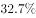。在贷款方面，月收入4000元以上的办理信用卡比例超过，而贷款年龄段比例则为：18-25岁占、26-35岁占、36-45岁占。年轻人每月平均记账次数约为41笔，其中上海以1.672笔的人均日记账次数居榜首。在消费方面，KTV的年人均消费由2014年的699.9元增加到2016年的814.6元；在旅游方面，人均年度交通支出达4985元。年轻人2016年在书本上的人均支出达到168元，相对于2015年的155元，同比增长。2016年，年轻人与雾霾相关的支出较2015年多出，人均支出达到998.7元；每日人均食品消费45.9元，比去年增加8.8元，早餐平均花费4.5元。

#### 第 6 题　qid 2049292 · 增长

下列各项关于2016年年轻人的人均数据中，较去年增幅最大的是：

- **A**. 每日食品消费额　✅
- **B**. 月存款额
- **C**. 年度书本支出
- **D**. 年度雾霾支出

**答案**：A

**官方解析**

根据题干所求“关于2016年……较去年增幅最大的是”，可判定此题为一般增长率比较问题。从材料可知“每日人均食品消费45.9元，比去年增加8.8元”，因此人均每日食品消费额增幅为。从材料可知2016年年轻人人均月存款额“较2015年同比增加”，人均年度书本支出“相对于2015年……同比增长”，年度雾霾支出“较2015年多出”。综上分析，增幅最大的为每日食品消费额。

故正确答案为A。

---

#### 第 7 题　qid 2049302 · 平均数

在2016年，上海年轻人人均全年记账次数多出全国年轻人：

- **A**. 118次
- **B**. 120次　✅
- **C**. 122次
- **D**. 124次

**答案**：B

**官方解析**

题目求2016年全年记账次数的比较，材料给出2016年“每月平均记账次数”和“日记账次数”，可判定此题为现期平均数问题。上海年轻人人均全年记账次数为：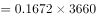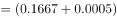次，全国年轻人人均全年记账次数为：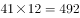次，因此上海年轻人比全国全年记账多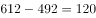次。

故正确答案为B。

---

#### 第 8 题　qid 2049300 · 平均数

2016年，全国年轻人的人均旅游交通支出占个人全年支出的比重为：

- **A**. 
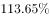

- **B**. 

- **C**. 
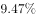
　✅
- **D**. 
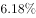

**答案**：C

**官方解析**

由题干“2016年……占……比重”，可判定该题为现期比重问题。由材料可知，2016年年轻人的人均旅游交通支出为4985元，，因此比重为。

故正确答案为C。

---

#### 第 9 题　qid 2049298 · 综合

下列不能从所给资料得出的是：

- **A**. 2016年18-35岁人员办理信用卡比例　✅
- **B**. 2014-2016年年轻人人均KTV消费年均增长率
- **C**. 2015年年轻人人均食品消费支出
- **D**. 2014年年轻人人均存款额度

**答案**：A

**官方解析**

A项，材料虽然给出18-35岁的贷款比例，但办理信用卡的比例有前提“月收入4000元以上”，而且各年龄层次贷款人员办理信用卡的比例也未必一样，不能求出；

B项，定位材料“KTV的年人均消费由2014年的699.9元增加到2016年的814.6元”，根据年均增长率公式：，，可求出；

C项，定位材料“每日人均食品消费45.9元，比去年增加8.8元”，可知2015年年轻人每日人均食品消费支出为：元，2015年年轻人人均食品消费支出为：元，可求出；

D项，定位材料“2016年年轻人的人均月存款为2340元，较2015年同比增加，而2015年的人均存款较2014年增加”，2014年年轻人人均月存款额度为元，2014年年轻人人均存款额度为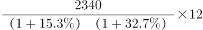元，可求出。

本题为选非题，故正确答案为A。

---

#### 第 10 题　qid 2049296 · 综合

下列关于年轻人的说法错误的是：

- **A**. 
2016年，贷款年龄在26-45岁的人群和办理信用卡且月收入在4000元以上的人群重合率达到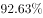
　✅
- **B**. 
在2016年，按平均来算，他们天天都记账

- **C**. 
在2016年，人均食品支出高出当年KTV、旅游交通、书本、雾霾支出总额约1.4倍

- **D**. 
2014年人均新增存款不足2万元

**答案**：A

**官方解析**

A项：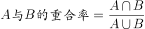，由材料无法求得2016年贷款年龄在26-45岁人群与办理信用卡且月收入在4000元以上人群的交集和并集，故重合率无法求出，错误；

B项：定位材料“年轻人每月平均记账次数约为41笔”，每月记账次数大于天数，可知按平均计算，年轻人“天天都记账”，正确；

C项：定位材料“每日人均食品消费45.9元”，可知全年食品消费为。KTV、旅游交通、书本、雾霾支出总额为：，则它们的倍数关系为：，所以人均食品支出高出KTV、旅游交通、书本、雾霾支出总额约：倍，正确；

D项：定位材料“2016年年轻人的人均月存款为2340元，较2015年同比增加，而2015年的人均月存款较2014年增加”，可知2016年相对于2014年人均存款的增长率为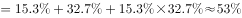。则2014年人均存款约为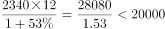元，2014年人均存款不足2万元，则2014年人均新增存款不足2万元，正确。

本题为选非题，故正确答案为A。

---

### 材料 3

        某年度某机构关于中国宠物主人消费行为及倾向调查回收的10680份有效问卷显示：女性养宠者占，宠物主人为“80-90后”占。将宠物定义为“孩子”“亲人”“朋友”和“宠物”的分别为、、和。的人月开销在100元以内，的人开销在101至500元之间，而花费在501至1000元之间的达到，月消费1000元以上的人群达到。在购买物品方面，购买宠物食物的人数达到有效问卷总人数的，其次为药品、保健品，以及日用品、玩具、服饰五项，均接近。宠物主人外出时，四成“委托亲朋照顾”，三成“一起带走”，委托寄养还不到。在训练方面，的宠物处于自主训练或放任生长的状态，但近一半人希望爱宠得到专业训练。在购买渠道方面，的被访问者选择综合电商平台，选择线下综合商店或专卖店者为，选择宠物类垂直电商平台的占，但其复购率更高。值得注意的是，目前宠物主人对购物类O2O服务有选择意向的不足。

#### 第 11 题　qid 2051084 · 比重

问卷中，男性养宠者占养宠人群的比重为：

- **A**. 

- **B**. 

- **C**. 

　✅
- **D**. 

**答案**：C

**官方解析**

根据问题中“男性养宠者占养宠人群的比重”可判定此题为现期比重问题。定位文字材料首句，“女性养宠者占”，则男性养宠物者占比为。

故正确答案为C。

---

#### 第 12 题　qid 2051086 · 综合

问卷中对宠物没有花费的人数约为：

- **A**. 38
- **B**. 36
- **C**. 34
- **D**. 32　✅

**答案**：D

**官方解析**

由题干“问卷中对宠物没有花费的人数约为”，而且材料中给出不同开销人员占比及问卷总人数，问没有花费的人数，可判定此题为现期比重问题。定位材料中“的人月开销在100元以内，的人……”，可知有消费的人占比为，则没有花费的人数占比为，所以，没有花费的人数总人数没有花费的人数占比人。

故正确答案为D。

---

#### 第 13 题　qid 2051088 · 综合

问卷中，选择综合电商平台和选择购物类O2O服务的消费者人数之比为：

- **A**. 
小于

- **B**. 
大于

- **C**. 
小于

- **D**. 
大于
　✅

**答案**：D

**官方解析**

由题干“……和……人数之比”，可知本题为比值计算问题。定位文字材料“的被访问者选择综合电商平台……对购物类O2O服务有选择意向的不足”，则两者之比为：，分母不足，分母变小，分数值变大，故两者之比大于。

故正确答案为D。

---

#### 第 14 题　qid 2051090 · 综合

问卷中，在药品、保健品，以及日用品、玩具、服饰方面有花销的总人次最可能有：

- **A**. 6408
- **B**. 9612
- **C**. 16020
- **D**. 32040　✅

**答案**：D

**官方解析**

由题干“······方面有花销的总人次······”，定位材料“回收的10680份有效问卷”“购买宠物食物的人数达到有效问卷总人数的，其次为药品、保健品，以及日用品、玩具、服饰五项，均接近”，可知本题为现期比重问题。，故药品、保健品、日用品、玩具、服饰这五项部分量的总和。

故正确答案为D。

---

#### 第 15 题　qid 2051092 · 综合

根据问卷，下列判断错误的是：

- **A**. 
只有的宠物接受过训练，专业训练消费潜力巨大
　✅
- **B**. 
绝大部分宠物主人对宠物的定义超越了宠物本身

- **C**. 
月均消费在101-1000元的是宠物消费的主流

- **D**. 
购物类O2O服务的市场还有待培育

**答案**：A

**官方解析**

逐项分析如下：

A项：定位文字材料后半段，“在训练方面，的宠物处于自主训练或放任生长的状态”，则自主训练的宠物占比小于，但自主训练和专业训练都属于训练，所以接受过训练的宠物占比小于，有可能超过，故A项说法“只有的宠物接受过训练”与其不符，错误；

B项：定位材料前半段，对宠物的定义超越宠物本身，定义为“孩子”“亲人”“朋友”的比重分别占到、、，合计占比超过，可以认定为“绝大部分宠物主人”，正确；

C项：定位材料前半段，101至500元和501至1000元的消费人群占比分别为和，合计占比超过，可以认定为“主流”，正确；

D项：定位材料最后一句，对购物类O2O服务有选择意向的不足，说明有超过的人暂时没有选择意向，符合“市场有待培育”，正确。

本题为选非题，故正确答案为A。

---

### 材料 4

#### 第 16 题　qid 2049338 · 综合

表一中，冰雪旅游综合得分最高的城市是：

- **A**. 乌鲁木齐
- **B**. 张家口
- **C**. 哈尔滨　✅
- **D**. 呼伦贝尔

**答案**：C

**官方解析**

求“表一中……冰雪旅游综合得分最高”，综合得分为，所以定位表一第4、5、6、7列。结合选项，只需将乌鲁木齐、张家口、哈尔滨、呼伦贝尔四个城市的相关数据进行比较即可。

方法一：

哈尔滨的综合得分最高。

方法二：比较选项对应的各项指标可以发现，哈尔滨的旅游期待指数远高于其他城市，同时哈尔滨的其他指数在四个城市中相对较高且与最高的城市相差不多，可直接判定哈尔滨的冰雪旅游综合得分最高。

故正确答案为C。

---

#### 第 17 题　qid 2049344 · 综合

表一中，游客期待指数和美誉度相差最大的是：

- **A**. 延庆　✅
- **B**. 哈尔滨
- **C**. 伊春
- **D**. 长春

**答案**：A

**官方解析**

定位表一第四列和第五列即可得出各城市对应游客期待指数和美誉度，延庆区两指数相差；哈尔滨市两指数相差；伊春市两指数相差；长春市两指数相差。因此，延庆区的游客期待指数和美誉度相差最大。

故正确答案为A。

---

#### 第 18 题　qid 2049332 · 平均数

表二中的各营销事件美誉度平均得分约为：

- **A**. 89.85
- **B**. 88.6　✅
- **C**. 86.7
- **D**. 83.3

**答案**：B

**官方解析**

由题干求“表二中······平均得分”可知，本题为现期平均数问题。根据“美誉度”，定位到表二第四列，各营销事件美誉度分别为89，87，88，91，88，90，90，89，88，86。

方法一：根据平均数公式，

。

方法二：求平均数采用削峰填谷法。观察数据，各营销事件美誉度多在88附近，取88为基准线，各事件的美誉度与之分别相差：1、-1、0、3、0、2、2、1、0、-2，相加的和为6，平均为,所以最终结果应比88多0.6，为88.6。

故正确答案为B。

---

#### 第 19 题　qid 2049356 · 综合

假定舆论声量、美誉度和创新指数得分分别占综合竞争力权重的、、，那么最具竞争力的3个营销事件分别是：

- **A**. 哈尔滨国际冰雪节、长春净月潭瓦萨国际滑雪节、黑龙江大型冰雪旅游直播show
- **B**. 哈尔滨国际冰雪节、长春净月潭瓦萨国际滑雪节、黑龙江全民冰雪活动日　✅
- **C**. 中国新疆冰雪旅游节暨冬季旅游产业博览会、鸟巢欢乐冰雪季、查干湖冬捕旅游节
- **D**. 哈尔滨国际冰雪节、长春净月潭瓦萨国际滑雪节、内蒙古冰雪那达慕

**答案**：B

**官方解析**

题干给出每种指数的权重计算总体竞争力，可判定此题为现期比重问题。由题干可知，。根据舆论声量、美誉度、创新指数定位表二，哈尔滨国际冰雪节各项指数基本都是最大，所以加权后也较大，排除C选项。余下选项中都有长春净月潭瓦萨国际滑雪节，不需要计算，三个选项的不同事件竞争力分别为：

；

；

。

故正确答案为B。

---

#### 第 20 题　qid 2049366 · 综合

根据所给资料，下列分析正确的是：

- **A**. 
所有城市游客期待指数和传播影响力均呈正相关

- **B**. 
美誉度最高的4个城市其核心竞争力也分列前四名

- **C**. 
得分最高的营销事件其分数高出第4名

- **D**. 
黑龙江的营销事件舆论声量高于吉林
　✅

**答案**：D

**官方解析**

A项：定位表一，游客期待指数与传播影响力变化趋势不一致，没有呈正相关，错误；

B项：美誉度最高的4个城市分别为呼伦贝尔、哈尔滨、吉林、沈阳，核心竞争力最高的4个城市分别为哈尔滨、长春、张家口、乌鲁木齐，二者不完全相同，错误；

C项：得分最高的营销事件为，第4名为，，错误；

D项：定位表二第三列， ，，黑龙江的高于吉林的，正确。

故正确答案为D。

---
