# 2017年422联考《行测》题（山东卷）

> 联考 · 2017 年 · 5 个模块 · 共 120 题

- [常识判断](#%E5%B8%B8%E8%AF%86%E5%88%A4%E6%96%AD) · 20 题
- [言语理解与表达](#%E8%A8%80%E8%AF%AD%E7%90%86%E8%A7%A3%E4%B8%8E%E8%A1%A8%E8%BE%BE) · 30 题
- [数量关系](#%E6%95%B0%E9%87%8F%E5%85%B3%E7%B3%BB) · 9 题
- [判断推理](#%E5%88%A4%E6%96%AD%E6%8E%A8%E7%90%86) · 40 题
- [资料分析](#%E8%B5%84%E6%96%99%E5%88%86%E6%9E%90) · 21 题

---

## 常识判断

### 第 1 题　qid 2049764 · 人文常识

关于我国的国家制度，下列说法错误的是：

- **A**. 我国是人民民主专政的社会主义国家
- **B**. 我国人民行使国家权力的机关是各级人民政府　✅
- **C**. 我国的国家机构实行民主集中制原则
- **D**. 我国经济制度的基础是全民所有制和劳动群众集体所有制

**答案**：B

**官方解析**

B项错误：《宪法》第二条第一款和第二款规定：“中华人民共和国的一切权力属于人民。人民行使国家权力的机关是全国人民代表大会和地方各级人民代表大会。”
A项正确：《宪法》第一条第一款规定：“中华人民共和国是工人阶级领导的、以工农联盟为基础的人民民主专政的社会主义国家。”
C项正确：《宪法》第三条第一款规定：“中华人民共和国的国家机构实行民主集中制的原则。”
D项正确：《宪法》第六条第一款规定：“中华人民共和国的社会主义经济制度的基础是生产资料的社会主义公有制，即全民所有制和劳动群众集体所有制。社会主义公有制消灭人剥削人的制度，实行各尽所能、按劳分配的原则。”
本题为选非题，故正确答案为B。

---

### 第 2 题　qid 2049770 · 人文常识

关于我国巡回法庭，下列说法错误的是：

- **A**. 巡回法庭作出的判决、裁定和决定，是最高人民法院的判决、裁定和决定
- **B**. 最高人民法院设立巡回法庭是对我国二审终审制的变通规定　✅
- **C**. 巡回法庭的受案范围暂不包括最高人民检察院抗诉的案件
- **D**. 巡回法庭根据审判工作需要，可以在巡回区内接待来访

**答案**：B

**官方解析**

B项错误：二审终审制是指一个案件经过两级人民法院审判即告终结的制度，对于第二审人民法院作出的终审判决、裁定，当事人等不得再提出上诉，人民检察院不得按照上诉审程序抗诉。而巡回法庭制度是指法院为方便群众诉讼，在辖区设置巡回地点，定期或不定期到巡回地点受理并审判案件的制度，也需遵循二审终审制。
A项正确：《最高人民法院关于巡回法庭审理案件若干问题的规定》第二条：“巡回法庭是最高人民法院派出的常设审判机构。巡回法庭作出的判决、裁定和决定，是最高人民法院的判决、裁定和决定。”
C项正确：《最高人民法院关于巡回法庭审理案件若干问题的规定》第三条第一款：“巡回法庭审理或者办理巡回区内应当由最高人民法院受理的以下案件：（一）全国范围内重大、复杂的第一审行政案件；（二）在全国有重大影响的第一审民商事案件；（三）不服高级人民法院作出的第一审行政或者民商事判决、裁定提起上诉的案件；（四）对高级人民法院作出的已经发生法律效力的行政或者民商事判决、裁定、调解书申请再审的案件；（五）刑事申诉案件；（六）依法定职权提起再审的案件；（七）不服高级人民法院作出的罚款、拘留决定申请复议的案件；（八）高级人民法院因管辖权问题报请最高人民法院裁定或者决定的案件；（九）高级人民法院报请批准延长审限的案件；（十）涉港澳台民商事案件和司法协助案件；（十一）最高人民法院认为应当由巡回法庭审理或者办理的其他案件。不包括最高人民检察院抗诉的案件。”
D项正确：《最高人民法院关于巡回法庭审理案件若干问题的规定》第九条：“巡回法庭根据审判工作需要，可以在巡回区内巡回审理案件、接待来访。”
本题为选非题，故正确答案为B。

---

### 第 3 题　qid 2049780 · 人文常识

某选区共有选民1889人，张某是候选人之一。在下列情况下，张某可以当选为该选区人大代表的是：

- **A**. 参加投票的有889人，张某获选票880张
- **B**. 参加投票的有1770人，张某获选票1781张
- **C**. 参加投票的有1881人，张某获选票697张
- **D**. 参加投票的有1001人，张某获选票792张　✅

**答案**：D

**官方解析**

A、C两项错误：《选举法》第四十五条规定，在选民直接选举人民代表大会代表时，选区全体选民的过半数参加投票，选举有效。代表候选人获得参加投票的选民过半数的选票时，始得当选。县级以上的地方各级人民代表大会在选举上一级人民代表大会代表时，代表候选人获得全体代表过半数的选票时，始得当选。A项中参加投票的889人不到选民1889人一半，无法当选。C项中张某获选票697张，未获得半数选票，无法当选。

B项错误：《选举法》第四十四条规定：“每次选举所投的票数，多于投票人数的无效，等于或者少于投票人数的有效。每一选票所选的人数，多于规定应选代表人数的作废，等于或者少于规定应选代表人数的有效。”选项中张某获选票数为1781张，多于参加投票的人数1770人，无法当选。
D项正确：《选举法》第四十五条规定，在选民直接选举人民代表大会代表时，选区全体选民的过半数参加投票，选举有效。代表候选人获得参加投票的选民过半数的选票时，始得当选。县级以上的地方各级人民代表大会在选举上一级人民代表大会代表时，代表候选人获得全体代表过半数的选票时，始得当选。选项中参加投票人数1001人超过全体选民1889人的一半，张某获选票792张超过参加投票选民1001人的一半，可以当选。
故正确答案为D。

---

### 第 4 题　qid 2049792 · 人文常识

赵某逛电器商场，准备购买一台豆浆机，其享有的权利不包括：

- **A**. 人身、财产安全不受损害的权利
- **B**. 选择购买何种品牌豆浆机的权利
- **C**. 拒绝保安因商场失窃而提出搜查其背包的权利
- **D**. 购买一台低价促销、有轻微划痕的豆浆机，一个月后以商品存在瑕疵为由提出退款的权利　✅

**答案**：D

**官方解析**

A项正确，《消费者权益保护法》第七条第一款：“消费者在购买、使用商品和接受服务时享有人身、财产安全不受损害的权利。”

B项正确，《消费者权益保护法》第九条第一款：“消费者享有自主选择商品或者服务的权利。”
C项正确，《消费者权益保护法》第二十七条：“经营者不得对消费者进行侮辱、诽谤，不得搜查消费者的身体及其携带的物品，不得侵犯消费者的人身自由。”
D项错误，《消费者权益保护法》第二十三条第一款规定：“经营者应当保证在正常使用商品或者接受服务的情况下其提供的商品或者服务应当具有的质量、性能、用途和有效期限；但消费者在购买该商品或者接受该服务前已经知道其存在瑕疵，且存在该瑕疵不违反法律强制性规定的除外。”
本题为选非题，故正确答案为D。

---

### 第 5 题　qid 2049804 · 法律常识

小张与小刘系夫妻，婚后小张患精神病，完全丧失辨认自己行为的能力，小刘准备离婚。下列说法符合法律规定的是：

- **A**. 小刘是小张第一顺位法定监护人，但其不能在离婚诉讼中作为小张的诉讼代理人　✅
- **B**. 小张的父亲作为小张的诉讼代理人参加离婚诉讼后，可以根据小张与小刘感情破裂的实际情况，代替小张对是否同意离婚作出意思表示
- **C**. 小张的父亲作为小张的诉讼代理人，如果不能到庭，法院不能判决准予离婚
- **D**. 如果小刘愿意放弃全部夫妻共同财产，则可以与小张协议离婚

**答案**：A

**官方解析**

A项正确：配偶作为原告提起离婚诉讼，被告为无民事行为能力人，需除了配偶外的近亲属作为诉讼代理人。A项中，小刘是小张的配偶，故其离婚诉讼中不能作为小张的诉讼代理人。
B项错误：诉讼代理人不能对是否同意离婚作出意思表示，因为法律赋予公民以婚姻自主权，由公民自主决定婚姻问题，他人不能替代。B项中，小张的父亲不能代替小张作出意思表示，是否离婚只能由法院根据婚姻状况及感情破裂程度，作出是否离婚的判决。
C项错误：无民事行为能力人的离婚诉讼，当事人的法定代理人应当到庭；法定代理人不能到庭的，人民法院应当在查清事实的基础上，依法作出判决。C项中，“法院不能判决”的表述错误。
D项错误：对于无民事行为能力人的离婚，只能通过诉讼进行，而不能协议离婚，因为无民事行为能力人不能进行民事活动，其所作出的意思表示是无效的。D项中，“可以与小张协议离婚”表述错误。
故正确答案为A。

---

### 第 6 题　qid 2049814 · 法律常识

根据我国刑事诉讼法的规定，下列证据应当予以直接排除的是：

- **A**. 采用刑讯逼供的方法收集的犯罪嫌疑人的供述　✅
- **B**. 收集犯罪嫌疑人贪污所得现金不符合法定程序的
- **C**. 收集合同诈骗罪涉案支票不符合法定程序，可能严重影响司法公正的
- **D**. 收集盗窃自行车不符合法定程序，不会影响司法公正，但无法作出合理解释的

**答案**：A

**官方解析**

根据《刑事诉讼法》第五十六条第一款规定：“采用刑讯逼供等非法方法收集的犯罪嫌疑人、被告人供述和采用暴力、威胁等非法方法收集的证人证言、被害人陈述，应当予以排除。收集物证、书证不符合法定程序，可能严重影响司法公正的，应当予以补正或者作出合理解释；不能补正或者作出合理解释的，对该证据应当予以排除。”
A项正确，采用刑讯逼供的方法收集犯罪嫌疑人的供述，应当予以直接排除。
B、C两项错误，“现金”“支票”属于“物证”，收集过程中不符合法定程序，可能严重影响司法公正的情况下，需要看能否“补正或者作出合理解释”，不能的才要排除，而不能直接排除。
D项错误，收集盗窃的“自行车”不会影响司法公正，不需直接排除。
故正确答案为A。

---

### 第 7 题　qid 2049822 · 人文常识

关于国家的政治制度，下列说法错误的是：

- **A**. 日本、泰国是君主立宪制国家
- **B**. 德国、俄罗斯是联邦制国家
- **C**. 英国是典型的多党制国家　✅
- **D**. 美国是典型的两党制国家

**答案**：C

**官方解析**

C项错误：英国是世界上最早出现资产阶级政党的，并最先确立和实行两党制的国家。目前英国属于议会内阁制下的两党制。
多党制是指在一个国家中，通常由不确定的两个或两个以上的政党联合执政的政治制度。比如意大利、荷兰、希腊等国实行多党制。
A项正确：君主立宪制指在保留君主制的前提下，通过立宪，树立人民主权、限制君主权力。日本为君主立宪国，宪法订明“主权在民”，天皇为日本国及人民团结的象征，但天皇没有政治实权。泰国政体为议会制君主立宪制。
B项正确：联邦制是一种复合制的国家结构，实行中央政府和地方政府分权。《德意志联邦共和国基本法》规定：德国是联邦制国家。俄罗斯联邦，简称俄联邦或俄罗斯，是由22个自治共和国、46个州、9个边疆区、4个自治区、1个自治州、3个联邦直辖市组成的联邦共和立宪制国家。
D项正确：两党制是指一国内两大政党轮流执政的政治制度。美国的两大政党是共和党和民主党。英国也属于两党制国家，包括保守党和工党。
本题为选非题，故正确答案为C。

---

### 第 8 题　qid 2049826 · 经济常识

与其他投资基金相比，下列哪项不是货币型基金的特点？

- **A**. 高流动性
- **B**. 风险性较高　✅
- **C**. 收益率较低
- **D**. 投资费用低

**答案**：B

**官方解析**

B项错误：货币型基金风险性低。货币市场工具的到期日通常很短，货币型基金投资组合的平均期限一般为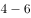个月，因此风险较低，其价格通常只受市场利率的影响。

A项正确：货币型基金流动性高。这些特点主要源于货币市场是一个低风险、流动性高的市场。同时，投资者可以不受到日期限制，随时可根据需要转让基金单位。

C项正确：货币型基金收益率较低。货币型基金的收益率一般跟短期利率有关，随行就市。

D项正确：货币型基金投资成本低。货币型基金通常不收取赎回费用，并且其管理费用也较低，货币型基金的年管理费用大约为基金资产净值的，低于传统的基金年管理费率。

本题为选非题，故正确答案为B。

---

### 第 9 题　qid 2049828 · 人文常识

同时具备“三国时期”“皇帝”“邺下文人集团”这三种特征的历史人物是：

- **A**. 曹操
- **B**. 曹丕　✅
- **C**. 刘邦
- **D**. 刘备

**答案**：B

**官方解析**

本题考查人文历史。
三国时期（公元220年－公元280年）是上承东汉下启西晋的一段历史时期，分为曹魏、蜀汉、东吴三个政权。邺下文人集团是以曹氏父子为中心的名流学士，因曹操建都邺城（今河北临漳县邺北城）得名，作品反映社会动乱与民生疾苦，悲天悯人，表现乱世英雄建功立业，收拾金瓯的使命感。
A项错误，曹操（公元155年－公元220年），字孟德，东汉末年杰出的政治家、军事家、文学家，三国中曹魏政权的奠基人，但曹操一生未称帝，不符合“皇帝”这一特征。
B项正确，曹丕（公元187年－公元226年），字子桓，建安二十五年（220年），曹丕受禅登基，以魏代汉，结束了汉朝四百多年的统治建立魏国，史称魏文帝。曹丕是中国三国时代杰出的诗人，他的五言和乐府清绮动人，现存诗约四十首。
C项错误，刘邦（公元前256年－公元前195年），沛丰邑中阳里人，汉朝开国皇帝，汉民族和汉文化的伟大开拓者之一、中国历史上杰出的政治家、卓越的战略家和指挥家。不符合“三国时期”“邺下文人集团”的特征。
D项错误，刘备（公元161年－公元223年），字玄德，东汉末年幽州涿郡涿县，西汉中山靖王刘胜的后代，三国时期蜀汉开国皇帝、政治家，史家又称他为先主。不符合“邺下文人集团”的特征。
故正确答案为B。

---

### 第 10 题　qid 2049838 · 人文常识

关于这幅图中的人物，下列说法不正确的是：

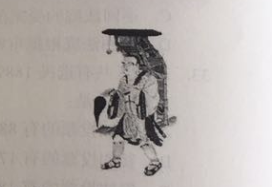

- **A**. 曾东渡日本传播佛法　✅
- **B**. 曾在古印度学习佛教圣典
- **C**. 大雁塔用于安置他所带回的佛经
- **D**. 《大唐西域记》是由其口述、弟子记录的游记

**答案**：A

**官方解析**

本题考查中国人文常识。图片为佛教绘画《玄奘负笈图》，相传为宋代无名画家所画。
A项错误：曾东渡日本传播佛法是鉴真。鉴真，唐朝僧人，应日本留学僧请求先后六次东渡，弘传佛法，促进了文化的传播与交流。
B项正确：玄奘为探究佛教各派学说分歧，于贞观年间一人西行五万里，历经艰辛到达印度佛教中心那烂陀寺取真经，前后十七年在印度学遍了当时的大小乘各种学说，共带回佛舍利150粒、佛像7尊、经论657部，并长期从事翻译佛经的工作。
C项正确：大雁塔位于陕西西安的大慈恩寺内，唐永徽三年（652年）玄奘为保存由天竺经丝绸之路带回长安的经卷佛像主持修建了大雁塔，最初五层，后加盖至九层，再后层数和高度又有数次变更，最后固定为今天所看到的七层塔身。
D项正确：《大唐西域记》是我国和世界最早的国际新闻作品集、佛教史籍，又称《西域记》，由玄奘口述，其弟子辩机撰文。本书是玄奘奉唐太宗敕命而著，贞观二十年成书。
本题为选非题，故正确答案为A。

---

### 第 11 题　qid 2049662 · 人文常识

沉积是自然界中一种重要的成岩过程，下列关于沉积的说法正确的是：

- **A**. 在构成岩石圈的三大岩类中，沉积岩所占比例最大
- **B**. 由于沉积过程中的压实作用，沉积岩的岩体内不存在孔隙
- **C**. 在搬运过程中，当水动力减弱时，较重的碎屑会先沉积下来　✅
- **D**. 沉积物一旦稳定成岩，就不会再被剥蚀搬运

**答案**：C

**官方解析**

A项错误，沉积岩、岩浆岩和变质岩是三种组成地球岩石圈的主要岩石。在地球地表，有的岩石是沉积岩，但如果按照从地球表面到16公里深的整个岩石圈算，沉积岩只占5。因此从整个岩石圈来看，沉积岩的比例不是最大的。

B项错误，通过压实作用沉积物发生脱水，孔隙度降低，体积缩小，密度增大，松软的沉积物变成固结的岩石。B项说法过于绝对，压实作用只会让孔隙度降低，不会完全没有孔隙。

C项正确，在流水的搬运途中，由于水的流速、流量的变化以及碎屑物本身大小、形状、比重等的差异，沉积顺序有先后之分。一般颗粒大、比重大的物质先沉积，颗粒小、比重小的物质后沉积。所以当水动力减弱时，较重的碎屑会先沉积下来。

D项错误，剥蚀搬运十分普遍，地表的岩石无时无刻不在经受着这种作用。即使像花岗岩、大理岩等算是坚硬的岩石，在风化作用下仍然不免遭到破坏。

故正确答案为C。

---

### 第 12 题　qid 2049664 · 人文常识

下列关于极光的说法正确的是：

- **A**. 多出现在高磁纬地区上空　✅
- **B**. 是地球所特有的现象
- **C**. 是极昼、极夜现象产生的原因
- **D**. 水汽、磁场和带电粒子是其产生的必要条件

**答案**：A

**官方解析**

极光是出现于星球的高磁纬地区上空，是一种绚丽多彩的发光现象。在南极被称为南极光，在北极被称为北极光。地球的极光是来自地球磁层或太阳的高能带电粒子流（太阳风）使高层大气分子或原子激发（或电离）而产生。
A项：正确，极光产生必备条件之一是高能粒子，由于地磁场的作用，这些高能粒子转向极区，所以极光常见于高磁纬地区。
B项：错误，极光不只在地球上出现，太阳系内具备大气、磁场、高能带电粒子的行星上也有极光。
C项：错误，产生极昼、极夜现象的原因是倾斜着的地球在沿椭圆形轨道绕太阳公转时，还绕着自身的倾斜地轴旋转。
D项：错误，极光产生的条件有三个：大气、磁场、高能带电粒子，水汽不是极光产生的必要条件。
故正确答案为A。

---

### 第 13 题　qid 2049666 · 人文常识

中国古代的姓、氏、名、字各有不同的意义。下列哪个人物的称谓是由姓和名构成的？

- **A**. 鲁班
- **B**. 屈原
- **C**. 苏东坡
- **D**. 辛弃疾　✅

**答案**：D

**官方解析**

A项：错误，鲁班，鲁非其姓，因是春秋时鲁国人故有此称。姬姓，公输氏，名班。人称公输盘、公输般、班输，或鲁般，惯称鲁班，尊称公输子。发明了锯子、曲尺、墨斗等。
B项：错误，屈原，屈为氏，姓芈；原为字，名平。战国时楚国人，《离骚》的作者，楚辞的主要创立者和作者，端午节源于纪念他。
C项：错误，苏东坡，东坡是他的号，姓苏，名轼，字子瞻。秦汉时期我国姓氏已合而为一。苏轼与欧阳修并称欧苏，为“唐宋八大家”之一。 
D项：正确，辛弃疾，是姓、名。辛弃疾，字幼安，号稼轩。有“词中之龙”之称，与李清照并称“济南二安”。
故正确答案为D。

---

### 第 14 题　qid 2049668 · 人文常识

关于诗句所描述的节日，下列对应正确的是：
①东篱把酒黄昏后，有暗香盈袖
②雨中禁火空斋冷，江上流莺独坐听
③莫唱江南古调，怨抑难招，楚江沉魄

- **A**. 元宵  清明  中秋
- **B**. 重阳  寒食  端午　✅
- **C**. 中秋  寒食  端午
- **D**. 元宵  清明  重阳

**答案**：B

**官方解析**

①东篱把酒黄昏后，出自宋·李清照《醉花阴》。此句中的“东篱”，借用晋·陶渊明的“采菊东篱下”（饮酒•其五），指的是黄昏把酒赏菊。赏菊为九月九日重阳习俗，重阳另有饮菊花酒、登高、插茱萸等习俗。
②雨中禁火空斋冷，出自唐·韦应物《寒食寄京师诸弟》。“禁火空斋冷”道出寒食节习俗。寒食节相传是晋文公为纪念介子推所设，在清明前一日或两日，有禁烟火、吃冷食的习俗。
③莫唱江南古调，怨抑难招，楚江沉魄，出自宋·吴文英《澡兰香•淮安重午》。“江南古调”应指离骚，古楚国方言所做歌曲。“楚江沉魄”道出屈原一心救楚，反遭驱逐，投古楚国汨罗江而死，端午节即后人为纪念他而来。有划龙舟、吃粽子、喝雄黄酒、挂艾草和菖蒲的习俗。
故正确答案为B。

---

### 第 15 题　qid 2049672 · 地理国情

“秦时明月汉时关，万里长征人未还。但使龙城飞将在，不教胡马度阴山。”关于《出塞》这首诗，下列说法错误的是：

- **A**. 我国的800毫米年等降水量线经过阴山山脉　✅
- **B**. “胡”是中国古代对北方和西方各少数民族的泛称
- **C**. 作者被誉为“七绝圣手”
- **D**. “飞将”指的是西汉名将李广

**答案**：A

**官方解析**

A项：错误，我国的800毫米年等降水量线，沿秦岭——淮河一线向西折向青藏高原东南边缘一线。北，止于秦岭淮河的江苏、河南、陕西等省，并未经过更北内蒙境内的阴山；
B项：正确，“胡”是中国古代对北方和西方各少数民族的泛称。如称匈奴为“胡”，其东之乌桓、鲜卑先世为“东胡”，西域各族为“西胡”。魏晋后，活动于中原地区的有些民族也常被称为“胡”，如“羯胡”“稽胡”等；
C项：正确，此诗作者王昌龄，字少伯，河东晋阳（今山西太原）人。盛唐著名边塞诗人，后人誉为“七绝圣手”。其诗以七绝见长，尤以登第之前赴西北边塞所作边塞诗最著，有“诗家夫子王江宁（指其官职江宁丞）”之誉；
D项：正确，《史记·李广列传》载：广居右北平，匈奴闻之，号曰“汉之飞将军”，避之，数岁不敢入右北平。
本题为选非题，故正确答案为A。

---

### 第 16 题　qid 2049674 · 科技常识

旅行者2号探测器于1977年8月20日在肯尼迪航天中心成功发射升空，近探过太阳系的四颗行星后，飞向了外太空。这四颗行星依次为：

- **A**. 水星、金星、火星、天王星
- **B**. 水星、金星、木星、天王星
- **C**. 木星、土星、天王星、海王星　✅
- **D**. 木星、火星、天王星、海王星

**答案**：C

**官方解析**

旅行者2号探测器是美国航天局研制的飞往太阳系外的两艘空间探测器的第二艘。探访顺序如下：
①木星，在1979年7月9日最接近，在距离木星云顶570,000公里（350,000英里）处掠过；
②土星，在1981年8月25日最接近，当太空船处于土星后方时（相对地球而言），它以雷达对土星的大气层上部进行探测，并量度了气温及密度等资料；
③天王星，在1986年1月24日最接近，并随即发现了10个之前未知的天然卫星；
④海王星，在1989年8月25日最接近，发现了海王星的大暗斑。
可知，近探顺序依次为木星、土星、天王星、海王星。
故正确答案为C。

---

### 第 17 题　qid 2049676 · 人文常识

下列哪一事件不是发生在魏晋南北朝时期？

- **A**. 七国之乱　✅
- **B**. 五胡乱华
- **C**. 王与马共天下
- **D**. 梁武帝舍身佛寺

**答案**：A

**官方解析**

本题考查历史常识。主要涉及中国历史的相关内容。
A项：错误，七国之乱是发生在西汉汉景帝时期的一次诸侯国叛乱。七国之乱是地方割据势力与中央专制皇权之间矛盾的爆发。七国之乱的平定，标志着西汉诸侯王势力的威胁基本被清除，中央集权得到巩固和加强。
B项：正确，五胡乱华指在西晋时期塞外众多游牧民族趁西晋八王之乱，国力衰弱之际，陆续建立的非汉族政权，形成与南方汉人政权对峙的时期。
C项：正确，“王与马，共天下”是说东晋时期琅琊王氏家族与当时皇室力量势均力敌，甚至还有过之，当时百姓称之为“王与马，共天下”，琅琊王氏进入极盛时期。 
D项：正确，南北朝时期佛教盛行，到了梁武帝时臻于鼎盛。据说当时仅建康（南京）城内就有寺院500余所，僧尼达10万余人。主要原因是梁武帝一心崇佛，极力发展佛教。他本人曾几次舍身到同泰寺（今南京鸡鸣寺）当和尚，被人称为“和尚皇帝”。
本题为选非题，故正确答案为A。

---

### 第 18 题　qid 2049678 · 人文常识

关于历史上的“南北”，下列说法错误的是：

- **A**. 禅宗自五祖弘忍之后分为南宗和北宗
- **B**. 董其昌将唐代以来的山水画分为南、北两宗
- **C**. “南洪北孔”指清代戏曲作家洪昇和孔尚任
- **D**. 李煜是南北朝时期南朝的帝王　✅

**答案**：D

**官方解析**

本题考查历史常识。主要涉及中国历史的相关内容。
D项：错误，李煜，南唐中主李璟第六子，初名从嘉，字重光，号钟隐、莲峰居士，南唐最后一位国君，南唐属于五代十国时期，而非南北朝；
A项：正确，南北宗，中国佛教禅宗至唐时形成的两个派别，禅宗自五祖弘忍以后，因北方神秀的渐悟说和南方慧能的顿悟说主张不同而形成；
B项：正确，董其昌在《容台别集•画旨》中论及“画分南北宗”：“禅家有南北二宗，唐时始分；画之南北二宗，亦唐时分也。”
C项：正确，南洪北孔指的是清初著名历史剧作家洪昇和孔尚任，他们分别以《长生殿》和《桃花扇》名震剧坛。
本题为选非题，故正确答案为D。

---

### 第 19 题　qid 2049682 · 人文常识

下列哪组成语均属于谦辞？

- **A**. 不吝赐教、班门弄斧
- **B**. 抛砖引玉、望尘莫及　✅
- **C**. 洗耳恭听、蓬荜生辉
- **D**. 高抬贵手、一孔之见

**答案**：B

**官方解析**

本题考查文学常识。谦辞，表示谦虚或谦恭的言辞，大都只能用于自称。
B项：正确，抛砖引玉：抛出砖去，引回玉来。比喻用自己不成熟的意见或作品引出别人更好的意见或好作品，谦词。望尘莫及：指望见走在前面的人带起的尘土而追赶不上，比喻远远落后，谦词。
A项：错误，不吝赐教：不吝惜自己的意见，希望别人给予指导，敬词。班门弄斧：比喻在行家面前卖弄本领，谦词。
C项：错误，洗耳恭听：指做好准备用心地聆听别人说的话，对自己有很大的帮助。请人讲话时的客气话，指专心地听，敬词。蓬荜生辉：指某事物使寒门增添光辉，多用作宾客来到家里，或赠送可以张挂的字画等物的客套话，谦词。
D项：错误，高抬贵手：原意手抬高一些就可以让人过去，引申是表示请求宽恕、通融时的客套用语，请求对方宽恕、原谅等，属于敬词。一孔之见：比喻狭小片面的见解，可用做谦辞，不做谦辞时，含贬义。
故正确答案为B。

---

### 第 20 题　qid 2049686 · 人文常识

关于地质年代与地层，下列说法错误的是：

- **A**. 当岩层之间有切割现象时，被切割的岩层比切割的岩层古老
- **B**. 发现大量三叶虫化石的岩层比发现大量鱼类化石的岩层古老
- **C**. 放射性同位素方法可用来测定岩层的形成年代
- **D**. 在全球范围内，形成于同一地质时期的岩层岩性都是相同的　✅

**答案**：D

**官方解析**

本题考查地理国情。
D项：错误，在全球范围内，形成于同一地质时期的岩层岩性都是相同的，表述过于绝对，形成于同一地质时期、同一地质环境下的岩石性质才大致相同。
A项：正确，岩层切割律又称穿插关系，就侵入岩与围岩的关系来说，总是侵入者年代新，被侵入者年代老，这就是切割律。即当岩层之间有切割现象时，被切割的岩层比切割的岩层古老。
B项：正确，地球相对年龄的确立主要依据于化石。自从英国地质学家史密斯提出“化石层序律”后，就把时间与生物演化阶段联系起来。人们知道，在不同时代的地层中含有不同的化石，同样，我们得到了这些化石后也可以推断产出这些化石的地层年代。三叶虫出现的时间要略早于鱼类。故发现大量三叶虫化石的岩层比发现大量鱼类化石的岩层古老。
C项：正确，该方法是1904年英国物理学家卢福首先提出的，此方法的基本原理是：假设岩石形成时，含有一定量的具放射性的母体同位素，随时间的流逝，该母体同位素蜕变，其含量逐渐减少，蜕变后形成的子体同位素则逐渐增多，只要测定母体同位素与子体同位素之比，则该比值就可作为岩石形成以来的时间的尺度。
本题为选非题，故正确答案为D。

---

## 言语理解与表达

### 第 1 题　qid 2049642 · 逻辑填空

美好的记忆，相信没有人舍得删除。从有利于人们身心健康的方向出发，科学家对于删除记忆的研究，从使人        痛苦开始。
填入画横线部分最恰当的一项是：

- **A**. 逃离
- **B**. 忘却　✅
- **C**. 摆脱
- **D**. 体验

**答案**：B

**官方解析**

根据文段“美好的记忆”、“删除记忆”可知，文段谈论的核心话题为“记忆”， B项“忘却”即忘记，与“记忆”形成对应，且与“痛苦”搭配得当，符合语境。
A项“逃离”指从某地或某种处境中逃跑离开，C项“摆脱”指脱离（牵制、束缚、困难等不利的情况），均表示脱离痛苦的行为和做法，文段强调的是去除头脑中的记忆，而非具体的行为，均排除；D项“体验”与“删除记忆”的意思相悖，排除。
故正确答案为B。
【文段出处】《删除记忆能否成真？》

---

### 第 2 题　qid 2049654 · 逻辑填空

解决当今人类遭遇的各种难题和危机，单靠一种文明价值的智慧和能量，常常显得           。只有充分挖掘和利用各种不同禀性的文明价值资源，才能帮助人类破解难题、走出危机。
填入画横线部分最恰当的一项是：

- **A**. 捉襟见肘　✅
- **B**. 格格不入
- **C**. 于事无补
- **D**. 顾此失彼

**答案**：A

**官方解析**

根据文中“单靠一种”、“只有充分挖掘和利用各种不同禀性的文明价值资源”可知，所填成语表示只靠一种文明并不够，应付不过来。B项“格格不入”形容彼此不协调，不相容，文段强调的是力量不够而非不协调，排除；C项“于事无补”指对事情毫无补益，用在此处程度过重，排除。A项“捉襟见肘”、D项“顾此失彼”语义相近，均能表达应付不过来的意思，但是相较于“顾此失彼”，“捉襟见肘”更加生动形象，且通常与“显得”搭配使用。
故正确答案为A。
【文段出处】《也说中西文明的互补与融合》

---

### 第 3 题　qid 2049660 · 逻辑填空

只要观察一下语言的变迁史，就会发现，语言体系一直具有强悍的自我         机制，会以一种温和的集体         模式，淘汰那些失效的语词。这意味着语言会利用时间效应来进行自我筛选和自我净化，只有数量很少的新语词能够穿越这种“时间筛子”，成为上一历史时段的“舌尖遗产”。
依次填入画横线部分最恰当的一项是：

- **A**. 更新  清洁
- **B**. 完善  舍弃
- **C**. 过滤  遗忘　✅
- **D**. 修正  扫除

**答案**：C

**官方解析**

第一空，根据文段信息“淘汰那些失效的语词”、“自我筛选和自我净化”可知，横线处所填词语表示把失效的语词去除，达到净化的效果。C项“过滤”指通过把不良成分分离出去实现净化，与文段对应恰当，保留。A项“更新”、B项“完善”均体现不出筛选和净化的过程，排除；D项“修正”指改正错误使之正确，文段并非改正错误，排除。
第二空，代入验证，C项“遗忘”与后文“利用时间效应”形成对应，符合语境，当选。
故正确答案为C。
【文段出处】《互联网语言繁殖能力强“脏词”的蔓延和流行需警惕》

---

### 第 4 题　qid 2049670 · 逻辑填空

从一开始，网络的开拓者们就相信：如果互联网要变成一个全球化的体系，一个开放、合作和透明的管理模式是              的。而这种模式基于自愿采纳原则，因为分享是它最大的           。
依次填入画横线部分最恰当的一项是：

- **A**. 必不可少  回报　✅
- **B**. 与生俱来  亮点
- **C**. 不可或缺  创新
- **D**. 事半功倍  动力

**答案**：A

**官方解析**

第一空，根据“如果互联网要变成一个全球化的体系”可知，此处表示“开放、合作和透明的管理模式”是其必须具备的条件，A项“必不可少”、C项“不可或缺”用在此处均可，保留；B项“与生俱来”表示一生下来就是如此，体现不出管理模式的必要性，排除；D项“事半功倍”强调效率高，文段说明的是“管理模式”不可缺少而非效率高低，排除。
第二空，根据“自愿”、“分享”可知，此处表示“这种模式”带来的好处和价值，A项“回报”符合文意，当选；文段并没有体现“创新”的做法，排除C项。
故正确答案为A。
【文段出处】《互联网：与生俱来的高效管理模式》

---

### 第 5 题　qid 2049684 · 逻辑填空

不可否认，          的阻隔，是阻碍情感交流的一个重要原因。但无论是语音聊天，还是视频通讯，其         便是不断缩短空间的距离。我们或许无法做到“父母在，不远游”，但至少可以多跟家人分享一下自己的喜怒哀乐，让父母在亲情的喃语中得到心灵的慰藉。
依次填入画横线部分最恰当的一项是：

- **A**. 时空  意义
- **B**. 地域  初衷　✅
- **C**. 环境  作用
- **D**. 信息  目的

**答案**：B

**官方解析**

第一空，根据“不断缩短空间的距离”可知，此处表示“空间”的阻隔，强调的是在不同地点，B项“地域”与“空间”对应恰当，保留。A项“时空”既包含时间，又包含空间，而文中只是提到了空间的间隔，“时间”并不存在阻隔，排除；C项“环境”、D项“信息”与空间距离无关，均排除。
第二空，代入验证，B项“初衷”指最初的愿望或心意，填入文段契合文意，当选。
故正确答案为B。
【文段出处】《让亲情甘泉滋润现代社会的土壤》

---

### 第 6 题　qid 2049696 · 逻辑填空

在很长的一个时期内，南极洲对人们来说是一个             的地方，古代和中世纪的地理学家，往往把南极周围画成一片无边无际的海洋，或者画成一个环形的海岛。从16世纪起，在几乎所有的地图上都画着南极的土地，但地理学家都是凭着自己的         画出来的，因为谁也没有见过这块土地。
依次填入画横线部分最恰当的一项是：

- **A**. 广阔无垠  经验
- **B**. 神秘莫测  理解
- **C**. 人迹罕至  推理
- **D**. 一无所知  想象　✅

**答案**：D

**官方解析**

第一空，根据“把南极周围画成一片无边无际的海洋，或者画成一个环形的海岛”“谁也没有见过”可知，文段强调人们对于南极并非很了解，B项“神秘莫测”、D项“一无所知”均符合文意，保留。A项“广阔无垠”形容极其宽广；C项“人迹罕至”指偏僻荒凉的地方很少有人来过，文段并未强调南极地域宽广或人少，均排除。
第二空，根据“因为谁也没有见过这块土地”可知，地理学家画出的南极仅凭其设想，D项“想象”符合文段语境，当选。B项“理解”表示依据事实或已知的道理进行剖析，与文意相悖，排除。
故正确答案为D。
【文段出处】《最晚发现的大陆》

---

### 第 7 题　qid 2049706 · 逻辑填空

我们这一辈人所享受到的现代生活，就像一座越来越豪华、先进、舒适的大厦。生活在这样一座大厦中，不能只是             。每个人不管这一辈子有多长，也不管能力大还是能力小，总要多多少少为这座大厦的发展和完善             ，多多少少为这个世界留下点什么。
依次填入画横线部分最恰当的一项是：

- **A**. 坐享其成  添砖加瓦　✅
- **B**. 好逸恶劳  出谋划策
- **C**. 得过且过  竭尽全力
- **D**. 拈轻怕重  精益求精

**答案**：A

**官方解析**

第一空，根据后文“多多少少为这个世界留下点什么”可知，横线处表达我们不能什么都不做。A项“坐享其成”指自己不出力而享受别人取得的成果，B项“好逸恶劳”指贪图安逸，厌恶劳动，填入文段语义合适。C项“得过且过”指过得去就行，多形容胸无大志，并非强调什么都不做，排除；D项“拈轻怕重”指接受工作时挑拣轻易的工作，害怕繁重的工作，文段并未涉及挑拣工作，排除。
第二空，所填词语表示要为这座大厦的发展付出行动，A项“添砖加瓦”比喻做一些工作，尽一点力量，填入文段语义合适，且与“大厦”形象对应，当选。B项“出谋划策”指为人出主意，并未涉及行动，排除。
故正确答案为A。
【文段出处】《书和读书人》

---

### 第 8 题　qid 2049712 · 逻辑填空

说德语的人方向感和次序感更强，说英语的人则更重视动作本身。根据英国最新研究结果，不同语言语法上的         会显著影响到以其为母语的人的认知能力。熟练掌握一门外语，能使人在            中获得认知能力的扩展。
依次填入画横线部分最恰当的一项是：

- **A**. 差异  潜移默化　✅
- **B**. 特点  耳濡目染
- **C**. 对比  日积月累
- **D**. 区别  不知不觉

**答案**：A

**官方解析**

第一空，根据首句可知，文段强调不同的语言对人产生不同的影响，“不同语言语法”指代前文的德语、英语，故第一空横线处应强调不同，A项“差异”、D项“区别”均可，保留。B项“特点”仅强调自身的特征，而非不同语言之间的差别，排除；C项“对比”强调的是过程，而非“不同”的结果，排除。
第二空，对应前文的“熟练掌握一门外语”，在不断的熟悉中，慢慢会获得认知能力的拓展。对比A、D两项，A项“潜移默化”指人的思想或性格不知不觉受到感染、影响而发生了变化，可体现出慢慢受到影响之意，当选。D项“不知不觉”指没有意识到，没有察觉到，表示受到影响时也并非慢慢受到影响，排除。
故正确答案为A。
【文段出处】《语言关乎世界观》

---

### 第 9 题　qid 2049722 · 逻辑填空

在娱乐方式多元化的今天，“            ”是不少人（特别是中青年群体）对待戏曲的态度。这里面固然存在           的偏见、难以静下心来欣赏戏曲之美等因素，却也有另一个无法回避的原因：一些戏曲虽然与观众之间没有屏幕之隔，却用艺术化的表演，讲述着与观众距离较远的生活。
依次填入画横线部分最恰当的一项是：

- **A**. 望洋兴叹  我行我素
- **B**. 望而生畏  一叶障目
- **C**. 敬而远之  先入为主　✅
- **D**. 知难而退  固步自封

**答案**：C

**官方解析**

第一空，后文是横线词语的解释说明，根据“偏见、难以静下心来欣赏戏曲之美”和“讲述着与观众距离较远的生活”可知，人们对于戏曲的态度是“不喜欢”，C项“敬而远之”指表示尊敬却有所顾虑不愿接近，符合文意，保留。A项“望洋兴叹”多比喻做事时因为不胜任或没有条件而感到无可奈何，侧重于“无奈”，排除；B项“望而生畏”指看见了就害怕，文段没有表达“害怕戏曲”的意思，排除；D项“知难而退”现指遇到困难退缩没勇气克服，“戏曲”并非一种“困难”，排除。
第二空，代入验证，C项“先入为主”指先听进去的话或先获得的印象往往在头脑中占有主导地位，以后再遇到不同的意见时，就不容易接受，和“偏见”搭配恰当，符合文意，当选。
故正确答案为C。

---

### 第 10 题　qid 2049740 · 逻辑填空

晚明江南的富裕，提供了附庸风雅的环境与条件，使得饮茶风尚引发了名牌效应。先是苏州虎丘茶风行，然后有大方和尚以虎丘制茶法在徽州松萝山制茶，造就了明末            的松萝茶。一旦成了名牌，人们追求时尚，            ，商家就有了商机，争相仿制，价格也直线上升。
依次填入画横线部分最恰当的一项是：

- **A**. 如雷贯耳  一掷千金
- **B**. 闻名遐迩  如影随形
- **C**. 声名鹊起  趋之若鹜　✅
- **D**. 风靡一时  蜂拥而至

**答案**：C

**官方解析**

本题可从第二空入手，根据“名牌”“追求时尚”“商家有了商机”，可知横线成语表达松萝茶受到人们的欢迎和追捧，A项“一掷千金”指用钱满不在乎，形容花钱大手大脚，这种挥霍置于此处程度过重，排除；B项“如影随形”比喻两个事物关系密切，文段表达人们对于松萝茶的态度，而非二者的关系，排除；D项“蜂拥而至”形容很多人乱哄哄地朝一个地方聚拢，“至”更侧重强调的是“地点”，而文段强调的是“追求时尚”，与“地点”无关，排除。C项“趋之若鹜”比喻许多人争着去追逐某些事物，“趋”对应文段中“追求”，符合文意，保留。
第一空，代入验证，C项“声名鹊起”形容名声突然大振，知名度迅速提高，对应前文“名牌效应”，符合文意，当选。
故正确答案为C。
【文段出处】《松萝茶的今生前世》

---

### 第 11 题　qid 2049606 · 片段阅读

长期处于草根状态的民间文化，大多难有连续性的书面记载。“非遗”申报的制度化要求，使申报本身成为步履维艰、绞尽脑汁的过程。最终，可能表格填得工工整整，视频也做得精美绝伦，但在一定程度上，却是将原本活态的文化形式化的过程。如此，便失去了申报“非遗”最初的意义与目的。
这段文字意在强调：

- **A**. 我国的民间文化缺乏系统化和连续性的传承
- **B**. “非遗”申报制度与民间文化的特点不相适应　✅
- **C**. 民间文化在申报“非遗”时遇到了极大的阻力
- **D**. 教条化的评价标准抑制了民间文化的生命力

**答案**：B

**官方解析**

文段开篇先介绍“民间文化难有连续书面记载”的现状，接下来指出“‘非遗’申报制度化使民间文化‘申报’过程艰难”这一问题，通过转折关联词“但”强调“非遗”申报的制度化要求使民间文化形式化，故文段重点强调“非遗”申报的制度化要求与民间文化不匹配，对应B项。
A项，对应文段首句，为背景引入内容，非重点，且没有主题词“非遗”申报的制度化，排除；
C项，“阻力”无中生有，文段重点阐述“非遗”申报的制度要求使民间文化变得形式化的结果，而并未提及过程中遇到的阻力，排除；
D项，“教条化的评价标准”表述不明确且扩大概念，文段强调的是“非遗”申报的制度化要求，排除。
故正确答案为B。
【文段出处】读书杂志《岳永逸：“非遗”的雾霾》

---

### 第 12 题　qid 2049610 · 语句表达

。在中国，新经济大多属于行政管理的范畴，在企业的准入、监管乃至人事制度领域，均存在不少过去体制遗留的障碍。应尽快推出负面清单，为新经济松绑。在旧经济保持增量的同时，通过新经济提质。未来，高科技产业和高附加值的现代服务业，将是中国经济的新引擎。与过往靠基础设施投资和制造业拉动经济增长的模式相比，政府调控与监管的观念、体制均需转变。过去那种把持行政审批来大上项目的做法，显然是行不通了。
填入画横线部分最恰当的一项是：

- **A**. 中国发展方式转型迫切需要现代国家治理体系
- **B**. 经济模式创新急需打破思维方式的禁锢
- **C**. 要发展新经济，需要厘清市场与政府的边界　✅
- **D**. 新经济是否能发展，取决于新技术能否及时补位

**答案**：C

**官方解析**

横线出现在文段开头，需结合后文内容分析。文段介绍“在中国······行政管理······障碍”，即政府管理新经济是存在问题的。“应”引导对策，指出政府在管理上需要做出改变，为新经济松绑。尾句“过去的把持行政审批······行不通了”说明政府要简政放权，故文段重点强调政府要给新经济“松绑”，对应C项。
A项，“中国发展方式转型”偏离文段核心话题，且“现代国家”无中生有，排除。
B项，“经济模式”文段未提及，且“思维方式”仅对应文段“观念”，未提及“体制”，表述片面，排除。
D项，“取决于新技术”属于无中生有，排除。
故正确答案为C。
【文段出处】财经周刊《能者上 庸者下 劣者汰》

---

### 第 13 题　qid 2049616 · 片段阅读

无论出于什么原因，网络语言低俗化都对网络文明建设造成了危害，甚至会从网上转到网下，降低整个社会的文明程度。当前，网络语言的发展路径已经很清晰：从虚拟空间进入口语表达，再进入书面语，最终有可能沉淀到语言应用的各个方面。如果任由网络低俗语言发展，久而久之它们就会成为约定俗成的惯用语，其负面效应不容忽视。
这段文字意在说明：

- **A**. 网络语言低俗化的负面效应已开始凸显
- **B**. 网络语言低俗化将会影响社会文明程度
- **C**. 应该警惕网络语言向习惯语转化的可能
- **D**. 急需采取措施治理网络语言低俗化趋势　✅

**答案**：D

**官方解析**

文段开篇指出网络语言低俗化会对社会造成危害，降低文明程度，后文“当前······沉淀到语言应用的各个方面”解释说明为何网络语言低俗化会对社会造成危害，尾句从反面提出对策，即不能任由网络语言低俗化发展，要对其进行管理，对应D项。
A项：“网络语言低俗化的负面效应”为问题表述，非重点，排除；
B项：“将会影响”为问题表述，且对应文段首句，非重点，排除；
C项：文段讨论的核心话题为“网络语言低俗化”，而非“网络语言”，该项偏离文段核心话题，且概念扩大，排除。
故正确答案为D。
【文段出处】《修复网络生态 清新网络空间》

---

### 第 14 题　qid 2049618 · 片段阅读

研究者对大熊猫肠道内的微生物进行分析后发现，虽然原本食肉的熊猫为了适应食物稀缺的环境而在距今240万到200万年间转为以竹子为食，并为此进化出了强壮的颌骨，但它们却没有进化出更长的消化道或分泌特定消化酶的能力，从而无法有效地分解竹纤维素。
最适合做这段文字标题的是：

- **A**. 口是腹非　✅
- **B**. 竹子与熊猫
- **C**. 尚未完成的进化
- **D**. 适应环境还是改变自己

**答案**：A

**官方解析**

提炼标题时应契合文段中心、言简意赅并兼具吸引力。文段开篇指出大熊猫为适应环境以竹子为食，口腔中的颌骨得到了进化，后文指出熊猫腹部并没有进化出更长的消化道或分泌特定消化酶的功能，导致其无法消化竹纤维，故文段强调的核心话题为熊猫可以吃竹子，却无法消化竹子。A项“口是腹非”中，“口是”对应“强壮的颌骨”，“腹非”指无法消化竹纤维，且“口是腹非”符合提炼标题的相关要求，当选。
B项，“竹子与熊猫”的“与”为并列关系，而文段并非并列关系文段，且选项表述不明确，未指明“竹子与熊猫”之间的关系，排除。
C项，“尚未完成的进化”表述不明确，未指明“尚未完成的进化”是什么，排除。
D项，“还是”说明两者之间要取其一，但文段未体现选择关系，而是明确指出熊猫改变了自身，排除。
故正确答案为A。

---

### 第 15 题　qid 2049624 · 语句表达

必读的书目都是被规定的经典，学生没有相对自由的选择权，而学生的喜好倾向、阅读能力各有不同，对于经典书目的阅读水准也千差万别。以作业形式出现的阅读要求，过多地讲究对段意的概括、人物的分析、读后的感想。这些阅读技法实则困囿了学生的视野，徒增负担的同时，也降低了他们的兴趣。殊不知，“                                    ”，通过阅读要教会学生的不单是阅读的技法，更重要的是帮助他们培养一种洞察、鉴赏和运用的能力。
填入画横线部分最恰当的一项是：

- **A**. 授人以鱼，不如授人以渔
- **B**. 欲速则不达，见小利则大事不成
- **C**. 形而上者谓之道，形而下者谓之器　✅
- **D**. 知之者不如好之者，好之者不如乐之者

**答案**：C

**官方解析**

横线在文段的中间，需结合后文内容进行分析。前文指出“老师一味传授阅读技巧却忽视学生真正需求”，随后通过“殊不知”进行转折，提出阅读的初衷“不单是掌握阅读技法，更要培养学生的洞察、鉴赏和运用能力”。故横线处所填内容要区分开浅层的技法和深层的能力，C项“形而上者谓之道，形而下者谓之器”，前半句意指精神层面的思维活动，后半句意指具体的方法、器物。“形而上”对应文段中更加重要的“学生洞察、鉴赏和运用的能力”，“形而下”对应相对简单的“阅读技法”，当选。
A项“授人以鱼，不如授人以渔”强调传授给人既有知识不如传授给人学习知识的方法。根据文意，前后文都提到了老师传授学生阅读的方法、技巧，只是除了技巧以外，老师更应通过阅读培养学生实践能力，排除。
B项“欲速则不达，见小利则大事不成”强调求速成反而达不到目的，贪图小利就办不成大事。文段没有关于“求速和贪图小利”的表述，排除。
D项“知之者不如好之者，好之者不如乐之者”强调学习的兴趣，文段虽然提到了学习兴趣的重要性，但重点强调阅读更应培养学生的实践能力，排除。
故正确答案为C。
【文段出处】《勿让“必读”绑架阅读的初衷》

---

### 第 16 题　qid 2049646 · 片段阅读

近年来跨境电商以左右的增速在持续高速发展，但进口商品增值税等税收占全国总税收比重却持续下降，2015年进口商品税收比2014年下降了近2000亿元。进口商品税收不仅未能伴随跨境电商的发展而同步增长，反而出现了较大幅度的下降。跨境电商税收新政有助于促进跨境电商与一般贸易税收体制的接轨，也有助于形成相关税收正常的增长机制。

这段文字意在说明：

- **A**. 进口商品税收与跨境电商发展密切相关
- **B**. 跨境电商税收新政出台有助于增加税收　✅
- **C**. 跨境电商与一般贸易税收体制如何接轨
- **D**. 如何建立跨境电商税收正常的增长机制

**答案**：B

**官方解析**

文段开篇提出问题，论述跨境电商发展良好，但是税收却下降了，随后用2015年的税收数据进行具体的解释说明，尾句“跨境电商税收新政······机制”为提出对策，即通过跨境电商税收新政能够解决税收下降的问题，对应B项。
A项：偏离文段核心话题，文段重在强调对策，而非介绍两者之间的关系，排除；
C、D两项：C项“如何接轨”和D项“如何建立”均表述不明确，文段明确论述对策为“跨境电商税收新政”，排除。
故正确答案为B。

---

### 第 17 题　qid 2049648 · 片段阅读

农村衰败，故乡消失，这是近些年媒体人提出的议题。学者的观察，时评人的关注，使得正在发生巨变的农村，被搬入舆论平台的焦点地带，农村话题时常与娱乐话题一起，成为社交媒体上的热搜词。但在这个长达十年的农村话题讨论期内，作家是缺席的。虽然有一种观点认为，作家面向社会发言最好的方式是作品，但也有不少人认为，作家不能仅仅通过写作虚构作品承担社会责任，巴尔扎克、雨果、托尔斯泰等国外作家，往往会通过行动以及公开演讲等方式，对公共事务和社会问题发表意见。
最适合做本段文字标题的是：

- **A**. 农村题材在今天缘何不再吃香
- **B**. 现代舆论话题中作家的边缘化
- **C**. 作家在农村衰败议题中的失语　✅
- **D**. 中外作家应对社会事务的不同

**答案**：C

**官方解析**

文段首先指出农村衰败是媒体人提出的议题，且成为热门话题，接着通过转折关联词“但”强调在农村话题中作家是缺席的，后文通过巴尔扎克等例子进行进一步补充说明，指出作家应该通过行动来对社会问题发表意见，故文段重在强调在农村话题中作家没有发挥出应有的作用，对应C项。
A项“农村题材不再吃香”与文意相悖，文段指出农村话题是社交媒体上的热搜词，排除；
B项“现代舆论话题”概念扩大，文段只强调的是“农村话题”，排除；
D项表述非重点，外国作家仅为文段中的例子，且“社会事务”偷换概念，排除。
故正确答案为C。
【文段出处】《作家面对农村衰败应该做些什么？》

---

### 第 18 题　qid 2049652 · 片段阅读

在历史上，文字有被神圣化的倾向，制度化教育基本上以抄本、刻本和印本上所记载的知识为核心。而民众在千百年间形成的口耳相传的知识，长期得不到应有的关注。在今天的教育制度和知识体系中，虽然有民俗学、文化人类学等关注民众知识和文化的学科，但总体而言，这种倾向一直没有得到有效矫正。从20世纪中叶开始，越来越多的学者意识到，以往偏重书面文化、轻视口头传承的倾向，给整体把握人类文明进程和知识体系带来了诸多弊端和限制。这种认识上的转变，形成了人文学术的某些新趋向和新领域，如“口述历史”“口头诗学”等。
这段文字意在说明：

- **A**. 学术界正在改变口头传承不受重视的状况
- **B**. 文字被神圣化的倾向需要进一步纠正
- **C**. 民间文化应纳入现代教育制度和知识体系中
- **D**. 口头文化是人文学术发展的新趋向和新领域　✅

**答案**：D

**官方解析**

文段首先指出，在历史上，文字有被神圣化的倾向，而口耳相传的知识得不到重视。接着论述今天的状况，强调虽出现了相关学科，但轻视口头文化的总体倾向并没有得到纠正，进而指出从20世纪中叶开始，学者意识到轻视口头传承会带来弊端，尾句通过“这种认识上的转变”对前文学者的认识进行总结，通过“形成了”引出转变的结果，即“口述历史”“口头诗学”等成为人文学术的新趋向和新领域，对应D项。
A项非文段重点内容，文段重在强调意识改变之后产生的结果，即“口头文化是人文学术发展的新趋向和新领域”，排除；
B项“文字被神圣化”对应首句中历史上的状况，非重点，排除；
C项“民间文化”偷换概念，文段重在强调口头文化，排除。
故正确答案为D。
【文段出处】《重视我们的口头传承》

---

### 第 19 题　qid 2049656 · 片段阅读

在亚当·斯密所处的古典时期，经济学本来在财富增长和人的幸福之间是存在一个契合点的，即理性人趋利避害的自利性选择有一个经济伦理的约束，这便是后来帕累托改进条件所要求的不损人前提下的利己。可是经济学本身承担的是最大化利益的学科任务，并且不断引入数学工具和抽象逻辑演绎的分析方法，这就使经济学越来越成为一个工具理性占上风的学科，朝着“中性”的、“非价值”判断的、“非道德”选择的趋势发展。
根据这段文字，我们可以知道：

- **A**. 经济伦理对经济学的约束越来越小　✅
- **B**. 古典经济学未使用抽象逻辑演绎的方法进行分析
- **C**. 亚当·斯密时期，经济学是一门以工具理性为主的学科
- **D**. 数学工具的引入打破了财富增长和人的幸福之间的契合点

**答案**：A

**官方解析**

文段开篇首先指出，古典时期的经济学存在经济伦理的约束，接下来通过“可是”进行转折，指出经济学不断引入新的工具和方法，尾句通过“这就使”进行总结，强调经济学逐渐成为一个工具理性占上风的学科，即经济伦理的约束越来越小，A项对应文段的重点，表述正确，当选。
B项，“未使用抽象逻辑演绎的方法”文段并未提及，无中生有，排除；
C项，与文意相悖，“亚当斯密时期”强调的经济伦理，而非工具理性，排除；
D项，“数学工具”表述片面，文段还提到“抽象逻辑演绎的分析方法”，且是否打破契合点也无从得知，排除。
故正确答案为A。
【文段出处】《关注人的幸福和发展是经济学的本来目标》

---

### 第 20 题　qid 2049658 · 片段阅读

世人所理解的国学，大都是“中国固有的或传统的学术文化”。而晚清以降的中国文化，因其接受了西学的洗礼，很容易被剔除出去。这也是很多大学的国学院在确定研究对象时，将边界划到辛亥革命的缘故。这么一来，国学也就成了“博物馆文化”——很优雅，也很美丽，但与现实生活越来越远。如何让中国文化重新“血脉贯通”，是每一个关心国学命运的读书人都必须认真考虑的。
这段文字认为，国学研究应该：

- **A**. 古今贯通　✅
- **B**. 西体中用
- **C**. 去粗取精
- **D**. 溯本求源

**答案**：A

**官方解析**

文段首先论述国学成为了“博物馆文化”，接着通过关联词“但”进行转折，指出博物馆文化与现实生活越来越远。文段尾句就这一问题指出，需要考虑如何让中国文化“血脉贯通”，即要去除边界、融汇古今，对应A项。
B项，“西体中用”文段并未强调在国学研究中要借鉴西方，偏离文段中心，排除；
C项，“去粗取精”除去杂质，留取精华，文段并未区分在国学研究中存在好坏两个方面，无中生有，排除；
D项，“溯本求源”指的是追寻根本，探求起源，文段重在强调“血脉贯通”即打通古今，而非单纯回到根本，排除。
故正确答案为A。
【文段出处】《国学视点》

---

### 第 21 题　qid 2049680 · 片段阅读

长期以来，由于我国奉行防御性国防政策，在战区空间划设上基本立足本土与近海防御，依照“守疆卫土”模式而建，军事触角很少延伸到疆土之外。但未来，我国所面临的发展危机将远远大于生存危机，要适应维护国家安全与发展利益新要求，应将周边、海外以及新型安全领域纳入战区经略范围，进一步拓展战区任务职能，使其更具外向性、开放性、积极性。尤其是随着多极化、全球化与信息化的飞速发展，国家传统安全领域开始向太空、网络、信息、电磁等领域拓展，未来战区经略范围应进一步向太空及临近空间拓展延伸，着力形成强而有力的多维立体战区空间态势。
这段文字意在表明，我国：

- **A**. 应拓展国防防御的范围
- **B**. 国防面临严峻的发展危机
- **C**. 传统安全领域受到新的挑战
- **D**. 国防战区经略要顺应时代要求　✅

**答案**：D

**官方解析**

文段首先阐述了我国当下国防政策的现状及问题即“军事触角很少延伸疆土之外”，接着由转折关系关联词“但是”引出解决目前问题的对策即“适应新要求······应将周边、海外及新型安全领域纳入战区经略范围”，强调“战区经略范围”需要进一步扩大，适应新的安全与发展要求，D项即为对这一对策的概括，当选。
A项“国防防御”对应文段首句，为转折之前的内容，非重点，文段重点强调的是“战区经略范围”，“战区经略”是一系列筹划治理的总称，而“防御”只侧重强调防守，表述片面，排除；
B项“发展危机”与C项“新的挑战”都是问题表述，非重点，文段重点在于如何解决当下的问题，排除。
故正确答案为D。
【文段出处】《战区战略制定应体现时代要求》

---

### 第 22 题　qid 2049688 · 片段阅读

对于电影文化的保护，博物馆、档案馆、图书馆、音像资料和私人收藏馆都分担了部分保护职能，看似大家在争着保护电影文化遗产，实际上却反映出保护工作的碎片化趋势。每个机构保护一点点，机构之间缺乏沟通和交流，缺乏基于保护维度的统一管理。这种碎片化的保护是非常低效的，因为缺乏沟通必然导致搞不清保护对象的家底，致使一些保护对象就处于未保护状态。保护对象的分散大大增加了遗产合理利用的难度，保护的意义和价值就会大打折扣。
这段文字意在说明：

- **A**. 保护主体的分散化，使电影保护工作困难重重
- **B**. 沟通是解决电影文化保护工作碎片化的途径
- **C**. 没有统一的保护制度，电影文化遗产难以传承
- **D**. 碎片化分工管理不利于电影文化遗产的保护　✅

**答案**：D

**官方解析**

文段首先阐述了我国电影文化保护的现状，随后由“实际上”这一转折词强调了“保护工作的碎片化趋势”这一问题，后具体分析其危害，指出这种保护方式非常低效，增加了遗产合理利用的难度，保护的意义和价值大打折扣。故文段重在强调碎片化保护对电影文化遗产保护不利， 对应D项。
A项“保护主体分散化”偷换概念，尾句中是“保护对象的分散化”，且文段重在强调碎片化保护的危害，选项偏离文段中心，排除。
B、C两项，根据“机构之间缺乏沟通和交流，缺乏基于保护维度的统一管理”可知，B项“缺乏沟通”和C项“缺乏基于保护维度的统一管理”分别对应了碎片化管理中存在的一部分问题，表述片面，排除。
故正确答案为D。
【文段出处】《谁来保护正在消亡的电影文化遗产？》

---

### 第 23 题　qid 2049690 · 片段阅读

大数据时代的到来已经毋庸置疑。在这种情况下，数据成为一种无形的资产，但很少有人知道如何将这种资产“变现”。对于一个普通的企业而言，企业不仅拥有宝贵的客户数据，同样也拥有供应商数据以及内部财务、设计、制造、管理等数据，而在过去的数十年间，许多中国企业都已经一步步完成信息化应用，各种信息化工具正在将企业的运营数据化。但少有企业真正从纷繁复杂的数据中获取更多有价值的信息，数据成为一种资产，这在很长一段时间内其实只是停留在了表面。
这段文字意在说明：

- **A**. 企业应使用信息化工具实现运营的数据化
- **B**. 企业应该进一步挖掘数据资产的潜在价值　✅
- **C**. 将数据变成资产是企业大数据应用的主要目的
- **D**. 现有数据模式难以满足企业运营数据化的需要

**答案**：B

**官方解析**

文段开篇介绍背景，即大数据时代已经到来，而后指出数据是一种无形资产，接着通过转折关联词“但”，强调少有人知道如何将大数据变现，即如何发挥大数据的价值，随后介绍企业拥有大数据的现状，尾句再次通过转折关联词“但”强调少有企业从数据中获取有价值的信息，而只是停留在表面。故文段意在强调，企业应做出改变，进一步挖掘数据的深层价值，对应B项。
A项，“信息化工具”为转折前的内容，非重点，且“应”与文段中表述的“正在”时态不符，排除；
C项，文中未提及“主要目的”这一话题，无中生有，排除；
D项，文中未提及“数据模式”这一概念，无中生有，排除。
故正确答案为B。
【文段出处】《IBM“转行”采矿业：掘金大数据》

---

### 第 24 题　qid 2049692 · 语句表达

①大约10年前，科学家对生物炭产生了兴趣
②但这项技术渐渐被人遗忘，其他地方的农民则没有使用生物炭的习惯
③现在，虽然这个想法已经渐渐淡出人们的视野，但土壤学家却开始探索将生物炭用于农业以及治理污染
④尽管农民们最近才开始接触生物炭，但实际上生物炭有着悠久的历史
⑤千百年前，生活在亚马逊河流域的人们就通过加热有机物制造出了生物炭，并用它造就了被称为“亚马逊黑土”的肥沃土壤
⑥当时，人们开始关注全球变暖问题，一部分人期望可以用生物炭将大量碳元素封存在地下
将以上6个句子重新排列，语序正确的是：

- **A**. ④⑤②①⑥③　✅
- **B**. ④③①⑤⑥②
- **C**. ⑤①⑥④③②
- **D**. ⑤⑥②①③④

**答案**：A

**官方解析**

语句排序题，从选项入手。对比首句④句与⑤句。④句引出“生物炭的历史悠久”这一话题，⑤句具体论述生物炭千百年的历史，对比可知，⑤句是对④句的详细展开说明，故④句应为首句，排除C、D两项。
对比A、B两项可知，区别在于④句后衔接⑤句还是③句，③句提到“这个想法”与④句中的“悠久历史”无法构成良好衔接，故排除B项。
验证A项，③句中的“这个想法”应该指代⑥句中“人们期望可以将碳元素封存”的想法。
故正确答案为A。                       
【文段出处】 《生物炭或可唤醒贫瘠土地》

---

### 第 25 题　qid 2049694 · 语句表达

①但这一技术并不是魔术，也不是漫画书作者的幻想，这是在对视频处理和图像的数学表现进行了基础研究后所得到的结果
②现在，“视频显微镜”让我们感觉自己就是一名探险家
③我们发现了一个全新的世界，在这个世界里，各种平时看不到的现象变得一目了然
④利用“视频显微镜”来观测那些看不见的微运动，感觉就像戴上了魔术眼镜或是突然获得了超人般的视觉
⑤这就像几个世纪前出现的第一部光学显微镜，它帮助人们识别出对健康和安全有威胁的因素
⑥我们在很早之前就已经知道了微运动的存在，但从未用双眼真正看到过，软件第一次为科学家展示了这些运动
将以上6个句子重新排列，语序正确的是：

- **A**. ②③④①⑤⑥
- **B**. ③②④⑤⑥①
- **C**. ④①⑥⑤②③　✅
- **D**. ⑥①④③②⑤

**答案**：C

**官方解析**

语句排序题，从选项入手。首先观察首句，②句提到“现在······我们感觉······”，前文应该有对于“过去”“以前”情况的描述，故不适合作首句，排除A项。
接着，观察到①句中出现转折词“但”，可从其入手，找到捆绑，①句与④句存在共同信息“魔术”，④句说明“像戴上了魔术眼镜”，①句转折之后说明“并不是魔术”，故④句在①句前并利用“这一技术”进行代词捆绑。排除B、D两项。
故正确答案为C。
【文段出处】《环球科学第110期》

---

### 第 26 题　qid 2049698 · 语句表达

①旧大陆的大西洋沿岸，漂浮的低气压风暴穿越墨西哥洋流的温暖水域，在西欧形成了比较湿润和温暖的气候
②接着，这又为原始人类和其他大型食肉动物提供了丰富的食物来源
③因此，植物生长茂盛，维持了北极圈以南地区大量食草动物的生存，比如猛犸象、驯鹿、野牛等
④大约3万年前，欧洲、亚洲北部和美洲的冰川开始融化
⑤触发人类历史的生态变化都与北半球大陆冰川最后一次消退有关
⑥在光秃秃的地表上，冻原和稀疏的森林首次生长出来
将以上6个句子重新排列，语序正确的是：

- **A**. ①②⑤④⑥③
- **B**. ④⑥①②③⑤
- **C**. ⑤④⑥①③②　✅
- **D**. ⑥①③⑤④②

**答案**：C

**官方解析**

对比选项，确定首句。对比①④⑤⑥，难以判断首句，进而寻找其他线索。②句中出现指代词“这”，可考虑指代词捆绑，②句之前应出现具体的“食物来源”，①句和④句均未提及可作为“食物来源”的内容，与②句无法捆绑，排除A、B、D三项。③句出现“猛犸象、驯鹿、野牛”，可作为食肉动物的“食物来源”，故③句、②句衔接得当，锁定C项。
验证C项，⑤句、④句讲到冰川融化，⑥句、①句提出森林生长、气候温暖湿润，③句介绍出现食草动物，②句阐述进而为食肉动物提供了食物来源，逻辑清晰。
故正确答案为C。
【文段出处】《人类历史之初》

---

### 第 27 题　qid 2049702 · 片段阅读

以往城市的规模取决于周围地区所能生产的粮食数量，因而，人口最稠密的城市都分布于流域地区，如尼罗河流域、新月沃地等。随着工业革命的发展和工厂体系的建立，大批的人涌入新的工业中心。新城市的大量人口因为能从世界各地获得粮食而得到供养。技术和医学上的进步能充分供应洁净的水、改善集中式排水系统和垃圾处理系统、保证充足的粮食供应以及预防和控制传染病，这些进步使城市生活变得更加舒适，世界各地的城市也因而开始以极快的速度发展。
这段文字主要说的是：

- **A**. 工业革命推动了世界各地的城市化进程　✅
- **B**. 工业革命的发生改变了人们的生活方式
- **C**. 粮食获取渠道的扩展使城市人口迅速增长
- **D**. 技术和医学的进步提高了人们的生活水平

**答案**：A

**官方解析**

文段开篇论述以往城市规模取决于周围地区粮食的产量，因此流域地区人口最为密集。随后介绍“工业革命”给人们带来的一些积极影响，尾句通过“这些进步”对前文进行总结，而“使”即因果关联词，引出城市生活的变化，紧接着后文通过“因而”对前文总结，重点强调工业革命带来的进步让城市快速发展，对应A项。
B项，“改变人们的生活方式”为“因而”引导的结论前，排除；
C项“粮食”、D项“技术和医学”均为结论前内容，且都是工业革命带来的好处之一，表述片面，排除。
故正确答案为A。
【文段出处】《L.S.斯塔夫里阿诺斯&lt;全球通史&gt;》

---

### 第 28 题　qid 2049704 · 片段阅读

中国的古代城市都有城墙吗？在人们以往的印象中，古代的城市似乎必然有城墙，尤其是都城，高耸的城墙彰示着皇权的至高无上，城墙的失守往往意味着帝国的末日。明清北京城、元大都、北宋汴梁城、隋唐长安城与东都洛阳城······这些城内的里坊格局，外围的高大城郭，构成了帝国都城最鲜明的物化表征。
这段文字接下来最有可能讲的是：

- **A**. 帝国都城的发展演变
- **B**. 古代都城城墙的作用
- **C**. 皇权与城市格局的关系
- **D**. 没有城墙的中国古代城市　✅

**答案**：D

**官方解析**

文段开篇提出疑问“中国的古代城市都有城墙吗？”显示出作者对此的怀疑态度，接着提到“似乎必然有城墙”亦反映了作者对此的不确定，接下来介绍了都城都有城墙并进行了详细解释说明，后文应具体描述不存在城墙的城市，与作者态度保持一致，故D项衔接得当，当选。
文段都在围绕“城墙”论述，故排除未提及“城墙”的A、C两项。B项“古代都城城墙的作用”在文段中已有体现，即“彰示着皇权的至高无上”，故后文不会再次论述，排除。
故正确答案为D。
【文段出处】《中国的都城千年无城墙？》

---

### 第 29 题　qid 2049710 · 片段阅读

“报刊的有机运动”是马克思提出的关于报刊报道新闻的过程理论，它被通俗地解释为新闻真实是一个动态的过程。很多时候，在事件发生初期，由于报道的不深入，没有充分的消息源，新闻传达给受众的信息往往是片面的，受众的判断也建立在这种片面的事实上。这正是新闻传播的一种特性，无论是受过专业训练的记者，还是现在活跃在各种社交平台的“公民记者”，都没有能力以“上帝视角”观察事件。而且，新闻报道不是给出最终结论的判决，而是对一个阶段所发生的新闻事实的描述。
这段文字旨在强调：

- **A**. 新闻真实是客观实际不断演变的过程
- **B**. 新闻应充分挖掘消息源进行深入报道
- **C**. 新闻报道是与事实真相逐渐接近的过程　✅
- **D**. 专业记者和公民记者都难以达到新闻真实​

**答案**：C

**官方解析**

文段首先提出马克思的“报刊有机运动”理论，并指出新闻最初的报道往往是片面的，接着通过程度标志词“这正是”，强调新闻传播中无法以“上帝视角”观察事件，尾句通过程度词“而且”，强调新闻报道是对新闻事实的阶段性描述，只是报道已经发生的事实，最终的结果需要随着时间的推移而慢慢了解，换言之，新闻报道是慢慢接近事实真相的过程，C项当选。
A项，“新闻真实”非文段重点，文段强调的是“新闻报道”，排除；
B项，“挖掘消息”“深入报道”与文段强调的“对一个阶段所发生的新闻事实的描述”不符，排除；
D项，“专业记者和公民记者”偏离文段核心话题“新闻报道”，排除。
故正确答案为C。
【文段出处】《反转的新闻离事实有多远》

---

### 第 30 题　qid 2049726 · 语句表达

目前新媒体的出版呈现出碎片化、标题化、娱乐化的趋势，内容杂乱，不成体系。这既和新媒体的内容展现方式以及人们的浅阅读习惯有关，同时也是因为新媒体的海量内容要在很短时间内处理，编辑力量跟不上，顾不上精耕细作。一旦新媒体结束跑马圈地阶段，腾出手来开始培养自己的编辑队伍，或高薪聘用传统出版业的编辑，那么，这种状况就会得到改观。
文中画横线部分“这种状况”指的是：

- **A**. 新媒体在内容生产方面的问题　✅
- **B**. 人们的浅阅读习惯
- **C**. 新媒体编辑力量不足
- **D**. 海量信息无法得到及时有效处理

**答案**：A

**官方解析**

文段首句提出问题，即新媒体出版存在的不良现状，接下来分析问题产生原因，尾句针对问题给出对策，故“这种状况”指的是新媒体在内容方面存在的问题。对应A项。
B、C、D三项都是问题产生的原因，而非问题本身，且表述不够全面，排除。
故正确答案为A。
【文段出处】《传统出版业的出路在哪里》

---

## 数量关系

### 第 1 题　qid 2049632 · 数学运算

小张的孩子出生的月份乘以29，出生的日期乘以24，所得的两个乘积加起来刚好等于900。问孩子出生在哪一个季度？

- **A**. 第一季度
- **B**. 第二季度
- **C**. 第三季度
- **D**. 第四季度　✅

**答案**：D

**官方解析**

假设出生的月份为a，出生的日期为b，根据题意可得：，不定方程常采用数字特性分析，24b能被3和4整除，900也能被3和4整除，故29a也能被3和4整除，因29不能被3和4整除，所以a是3和4的倍数即12的倍数，a作为月份数只能为12，故出生于12月，即第四季度。

故正确答案为D。

---

### 第 2 题　qid 2049634 · 数学运算

小王和小刘两人分别从甲镇和乙镇同时出发，匀速相向而行，1小时后他们在甲镇和乙镇之间的丙镇相遇，相遇后两人继续前进，小刘在小王到达乙镇之后27分钟到达甲镇，那么小王和小刘的速度之比为：

- **A**. 5：4　✅
- **B**. 6：5
- **C**. 3：2
- **D**. 4：3

**答案**：A

**官方解析**

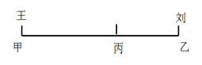

假设小王、小刘的速度分别为、，甲地到乙地的距离为，小王从甲到乙所需时间，小刘从乙到甲所需时间，二者相差27分钟，即，即。将选项代入验证：若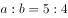，则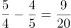，满足题意。

故正确答案为A。

---

### 第 3 题　qid 2049636 · 数学运算

某零件加工厂采用计件工资。已知合格品每件1元，优良品每件2元，瑕疵品不得工资。当生产的优良品达到生产总数的时，可额外获得400元奖励。某工人生产了3000个零件，共获得计件工资4000元，请问该工人生产的零件中，合格品最多为多少个？

- **A**. 2100
- **B**. 2000
- **C**. 1800　✅
- **D**. 1200

**答案**：C

**官方解析**

若优良品个数没有达到生产总数的，则优良品个数。由于零件总数一定，因此当瑕疵品个数为0时，工资可以取得最大值，则工资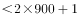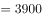元，不可能达到4000元。因此优良品个数必然达到了总数的，即最少为个，并额外获得400元奖励。

设优良品的个数为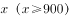、合格品的个数为，则瑕疵品的个数为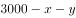，根据工资为4000元可列方程：，整理得：。要让的取值最大，则需要让的取值尽可能小，即取900，此时的最大值为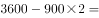个。

故正确答案为C。

---

### 第 4 题　qid 2049640 · 数学运算

某部门从8名员工中选派4人参加培训，其中2人参加计算机培训，1人参加英语培训，1人参加财务培训，问不同的选法有多少种？

- **A**. 256
- **B**. 840　✅
- **C**. 1680
- **D**. 5040

**答案**：B

**官方解析**

从8人中选2人参加计算机培训，方法为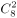，从剩余6人中选1人参加英语培训，方法为，从剩余5人中选1人参加财务培训，方法为，整体分步讨论，总的情况数为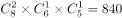。

故正确答案为B。

---

### 第 5 题　qid 2049644 · 数学运算

有A、B两家工厂分别建在河流的上游和下游，甲、乙两船分别从A、B港口出发前往两地中间的C港口。C港与A厂的距离比其与B厂的距离远10公里。乙船出发后经过4小时到达C港，甲船在乙船出发后1小时出发，正好与乙船同时到达。已知两船在静水中的速度都是32公里/小时，问河水流速是多少公里/小时？

- **A**. 4
- **B**. 5
- **C**. 6　✅
- **D**. 7

**答案**：C

**官方解析**

由题意可得，甲船比乙船多行驶10公里，甲船用时小时。设河水流速为，则有，解得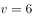公里/小时。

故正确答案为C。

---

### 第 6 题　qid 2049650 · 数学运算

某蔬菜生产基地欲将一批西红柿运往A市销售，有火车和汽车两种运输方式可选。火车运费15元/公里；汽车运费20元/公里。火车的装箱费用比汽车高1500元，选择汽车将比选择火车的总费用高600元，问蔬菜生产基地距A市多少公里？

- **A**. 360
- **B**. 420　✅
- **C**. 480
- **D**. 540

**答案**：B

**官方解析**

设蔬菜生产基地距A市公里，汽车装箱费用为元，则火车装箱费用为元，总费用=运输费用+装箱费用，那么，解得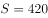公里。

故正确答案为B。

---

### 第 7 题　qid 2049622 · 数学运算

某统计部门对某地1000户居民的月均收入进行调查，调查结果如表所示。问下列关于被调查居民月均收入的算术平均数，表述正确的是：

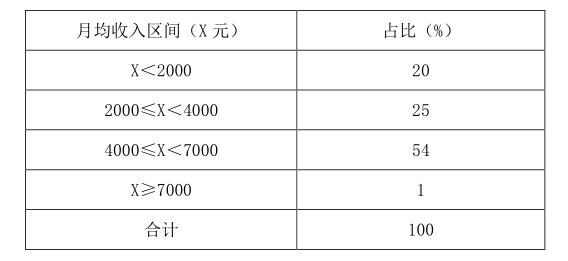

- **A**. 可能为1500元
- **B**. 可能为3000元　✅
- **C**. 不可能为5000元
- **D**. 不可能为12000元

**答案**：B

**官方解析**

若每个区间取最小值，

①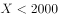，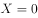，总收入为0元；

②，，收入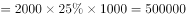元；

③，，收入元；

④，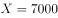，收入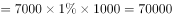元。

此时，月均收入的算术平均数最小为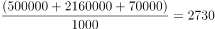元，分析各项：

A项：平均数不可能为1500元，错误；

B项：平均数大于等于2730元，有可能为3000元，正确；

C项：平均数大于等于2730元，有可能为5000元，错误；

D项：平均数大于等于2730元，有可能为12000元，错误。

故正确答案为B。

注意：的人虽然只占到，但是X的取值上不封顶，所以若这的人的收入近乎无穷大，则平均收入也会上不封顶，故平均数没有固定的最大值。

---

### 第 8 题　qid 2049626 · 数学运算

一副卡牌上面写着1到10的数字，甲和乙从中分别随机抽取三张牌，并比较其中较大的两张牌的牌面之积，数字大的人获胜。甲先抽出三张牌，上面的数字分别是2、6和8，问乙从剩下的牌中抽取三张牌的话，其胜过甲的概率：

- **A**. 
高于

- **B**. 
在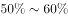之间

- **C**. 
在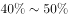之间
　✅
- **D**. 
低于

**答案**：C

**官方解析**

。总数为乙从剩下的七张牌中抽取三张牌，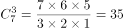。满足条件的数为两张牌的乘积大于，分情况：

①较大两个取10和9，剩下一个从1、3、4、5、7中取，共5种情况；

②较大两个取10和7，剩下一个从1、3、4、5中取，共4种情况；

③较大两个取10和5，剩下一个从1、3、4中取，共3种情况；

④较大两个取9和7，剩下一个从1、3、4、5中取，共4种情况；

则满足条件数共计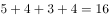种。则乙胜过甲的概率

故正确答案为C。

---

### 第 9 题　qid 2049630 · 数学运算

某社区道路如下图所示，社区民警早上9点整从A处的办公室出发，以每分钟50米的速度对社区内每一条道路进行巡查（要求完整走过整个社区内的每一段道路），问他最早什么时候能完成任务返回办公室？

- **A**. 9：54　✅
- **B**. 9：50
- **C**. 9：47
- **D**. 10：00

**答案**：A

**官方解析**

观察题目，图中一共有4个奇点，分别是D、F、G、P。根据最短路径原理，最短总距离为全程距离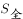加上最短的重复距离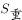，最短的重复距离为两组奇点在图中相连的线段长度。

先计算最短重复距离：。

再计算全程距离：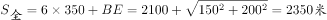。

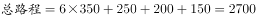米，速度为50米/分钟，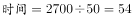分钟，即他最早9:54能完成任务返回办公室。 

故正确答案为A。

备注：正确的走法有很多，其中一例：ABCEBDEQPOFGDGPOFA。

---

## 判断推理

### 第 1 题　qid 2049820 · 图形推理

从所给的四个选项中，选出最合适的一个填入问号处，使之呈现一定的规律性。

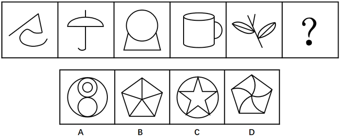

- **A**. A
- **B**. B
- **C**. C
- **D**. D　✅

**答案**：D

**官方解析**

观察图形，元素组成不同，且面数量明显，优先考虑数面。题干图形的面数量为0、1、2、3、4、？，问号处应为5个面，排除C项。其次，题干图形都是由曲线和直线组成，只有D项是既有曲线又有直线，排除A、B两项。
故正确答案为D。

---

### 第 2 题　qid 2049824 · 图形推理

从所给的四个选项中，选出最合适的一个填入问号处，使之呈现一定的规律性。

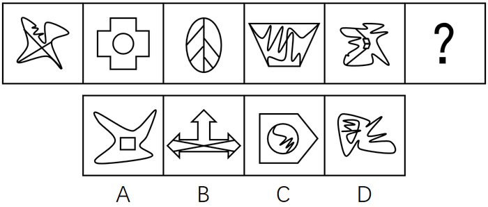

- **A**. A
- **B**. B
- **C**. C　✅
- **D**. D

**答案**：C

**官方解析**

观察图形，元素组成不同，优先考虑属性规律。题干图形1、3、5外曲内直，图形2、4外直内曲，“？”应为外直内曲的图形，对应C项。
故正确答案为C。

---

### 第 3 题　qid 2049830 · 图形推理

从所给的四个选项中，选出最合适的一个填入问号处，使之呈现一定的规律性。

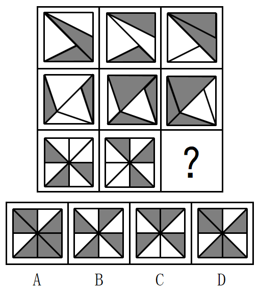

- **A**. A　✅
- **B**. B
- **C**. C
- **D**. D

**答案**：A

**官方解析**

观察图形，元素组成相似，外部轮廓相同，但内部黑白颜色不同，考虑黑白运算。第一行：、、、；第二行验证此规律成立；第三行应用此规律，左上角：，排除C项；第三行右下角：，排除D项；第三行右上角，，排除B项。

故正确答案为A。

---

### 第 4 题　qid 2049834 · 图形推理

从所给的四个选项中，选出最合适的一个填入问号处，使之呈现一定的规律性。

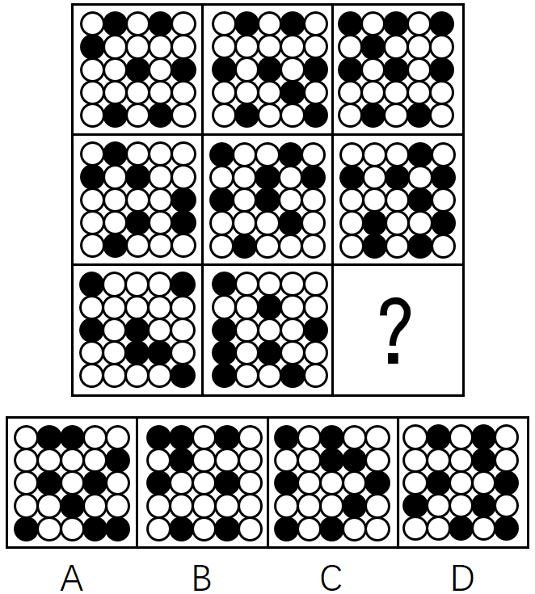

- **A**. A
- **B**. B
- **C**. C　✅
- **D**. D

**答案**：C

**官方解析**

观察图形，元素组成不同，考虑数量规律。题干每一行的黑点数量都为7、8、9，问号处应为9个小黑点，B项为8个小黑点，排除。第一行图形的小黑点都不挨着，第二行的小黑点有两个挨着的，第三行的小黑点有三个挨着的，如下图所示，问号处应该有3个小黑点挨着，对应C项。

故正确答案为C。

---

### 第 5 题　qid 2049840 · 图形推理

左边给定的是纸盒的外表面，下列哪项能由它折叠而成？

- **A**. A
- **B**. B
- **C**. C
- **D**. D　✅

**答案**：D

**官方解析**

本题考查六面体的空间重构。

A项：由面E、面G和面H构成，对题干和选项画边如下，题干边4与面H的白色三角形相邻，A选项边4与面H的黑色三角形相邻，与展开图不一致，排除；

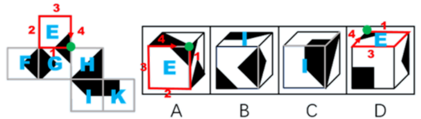

B项：由面I、面G和面F构成，对题干和选项画边如下，题干边1与面I的直角梯形的短直角边相邻，B选项边1与直角梯形的底边相邻，与展开图不一致，排除；

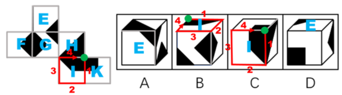

C项：由面H、面I、面K构成，对题干和选项画边如下，展开图中1号边对应面K，选项中1号边对应面H，与展开图不一致，排除；

D项：由面E、面K、面F构成，与展开图一致，当选。

故正确答案为D。

---

### 第 6 题　qid 2049844 · 图形推理

把下面的六个图形分为两类，使每一类图形都有各自的共同特征或规律，分类正确的一项是：

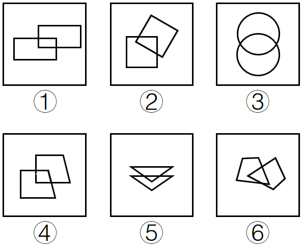

 

- **A**. ①④⑤，②③⑥　✅
- **B**. ①②④，③⑤⑥
- **C**. ①②⑤，③④⑥
- **D**. ①②⑥，③④⑤

**答案**：A

**官方解析**

每个图均由两个形状相同的图形相交构成，优先考虑图形间关系。两个图形相交于面，考虑相交面的形状。发现①④⑤相交部分的图形与两个图形的形状均相同，②③⑥相交部分的图形均与两个图形的形状不相同。
故正确答案为A。

---

### 第 7 题　qid 2049846 · 图形推理

把下面的六个图形分为两类，使每一类图形都有各自的共同特征或规律，分类正确的一项是：

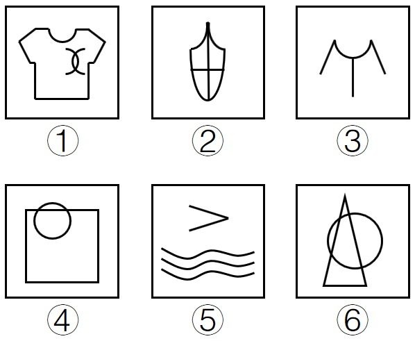

- **A**. ①②④，③⑤⑥
- **B**. ①②⑤，③④⑥　✅
- **C**. ①③⑥，②④⑤
- **D**. ①⑤⑥，②③④

**答案**：B

**官方解析**

图形元素组成不同，属性无明显规律，考虑数量规律。整体观察图形，①②⑤均有3条曲线，③④⑥均有1条曲线。
故正确答案为B。

---

### 第 8 题　qid 2049850 · 图形推理

把下面的六个图形分为两类，使每一类图形都有各自的共同特征或规律，分类正确的一项是：

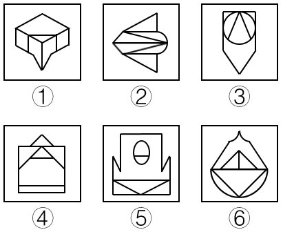

- **A**. ①②⑥，③④⑤　✅
- **B**. ①③⑤，②④⑥
- **C**. ①②④，③⑤⑥
- **D**. ①④⑥，②③⑤

**答案**：A

**官方解析**

图形元素组成不同，优先考虑属性规律。观察发现，题干每一幅图都是轴对称图形，其中图①、图②和图⑥的对称轴均与题干中的某条线重合；图③、图④和图⑤的对称轴均没有与题干中的某条线重合，因此图①、图②和图⑥为一组，图③、图④和图⑤为一组。
故正确答案为A。

---

### 第 9 题　qid 2049854 · 图形推理

把下面的六个图形分为两类，使每一类图形都有各自的共同特征或规律，分类正确的一项是：

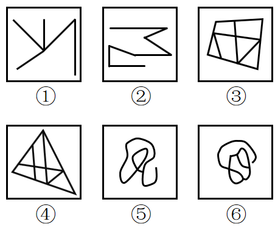

- **A**. ①②③，④⑤⑥
- **B**. ①③⑤，②④⑥
- **C**. ①②⑥，③④⑤
- **D**. ①④⑥，②③⑤　✅

**答案**：D

**官方解析**

图形组成不同，属性无明显规律，考虑数量规律。②明显是一笔画图形，优先数笔画。①④⑥均有4个奇点，为两笔画图形，②③⑤均有2个奇点，为一笔画图形。
故正确答案为D。

---

### 第 10 题　qid 2049860 · 图形推理

把下面的六个图形分为两类，使每一类图形都有各自的共同特征或规律，分类正确的一项是：

- **A**. ①②③，④⑤⑥
- **B**. ①③④，②⑤⑥
- **C**. ①③⑥，②④⑤
- **D**. ①④⑥，②③⑤　✅

**答案**：D

**官方解析**

图形组成不同，属性无明显规律，考虑数量规律。窟窿很多，但数面无规律；线也很多，数线也无规律。再观察发现，题干中线条交叉的图形较多，考虑数交点。①④⑥为10个交点，②③⑤为11个交点。
故正确答案为D。

---

### 第 11 题　qid 2049862 · 定义判断

危险犯，指行为人实施的危害行为造成法律规定的危险状态作为既遂标志的犯罪。这类犯罪不是以造成物质性的和有形的犯罪结果为标准，而以法定的客观危险状态的具备为标志。
根据上述定义，以下属于危险犯的是：

- **A**. 猥亵儿童
- **B**. 商业诈骗
- **C**. 诬告陷害
- **D**. 醉酒驾驶　✅

**答案**：D

**官方解析**

第一步：找到定义关键词。

“以造成法律规定的危险状态作为既遂标志”“不以造成物质性和有形的犯罪结果为标准”

第二步：逐一分析选项。

A项：猥亵儿童是指以刺激或满足欲求为目的，对儿童实施淫秽行为。它是以“有形的犯罪结果”为标准的，不符合定义，排除；

B项：商业诈骗是指一些以欺诈、瞒骗或违反信用为手法的非法行为，而此等行为则不以威胁或实际行使武力或暴力以达致目的。是以“造成物质性的犯罪结果”为标准，不符合定义，排除；

C项：诬告陷害是指捏造事实，作虚假告发，意图陷害他人，使他人受刑事追究的行为。使他人受刑事追究是一种“有形的犯罪结果”，不符合定义，排除；

D项：醉酒驾驶是指车辆驾驶人员血液中的酒精含量大于或者等于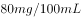的驾驶行为。只要是醉酒驾驶了车辆，就是一种危险状态，无需产生“物质性和有形的犯罪结果”，可以作为既遂标志，符合定义，当选。

故正确答案为D。

---

### 第 12 题　qid 2049870 · 定义判断

民族昆虫学是研究在一定社会中人类与昆虫相互关系的各种形式的学科。在研究昆虫的同时，研究社会的结构、人类的行为和昆虫之间的相互作用。
根据上述定义，以下各项中不属于民族昆虫学的研究范围的是：

- **A**. 研究具有某种宗教信仰的人食用昆虫的方式
- **B**. 研究某一民族将蝴蝶标本作为衣饰的原因
- **C**. 研究某一地区的人们利用昆虫娱乐的方式和原因
- **D**. 研究某一国家昆虫学的发展历史　✅

**答案**：D

**官方解析**

第一步：找到定义关键词。
“研究人类和昆虫相互关系”、“人类的行为和昆虫之间的相互作用”。
第二步：逐一分析选项。
A项：研究宗教信仰的人食用昆虫的方式，符合关键词“人类的行为和昆虫之间的相互关系”，符合定义，排除；
B项：研究某一民族将蝴蝶标本作为衣饰的原因，符合关键词“人类的行为和昆虫之间的相互关系”，符合定义，排除；
C项：研究人们利用昆虫娱乐的方式和原因，符合关键词“人类的行为和昆虫之间的相互关系”，符合定义，排除；
D项：只研究了某一国家昆虫学的发展，没有体现人的行为，不符合关键词“人类的行为和昆虫之间的相互作用”，不符合定义，当选。
本题为选非题，故正确答案为D。

---

### 第 13 题　qid 2049874 · 定义判断

税负转嫁，是指在商品交易过程中纳税人通过提高销售价格或压低购进价格的方法，将税收负担转移给购买者或供应者的一种经济现象。
根据上述定义，下列选项没有反映税负转嫁现象的是：

- **A**. 
提高烟草消费税后，某烟草批发商将进口卷烟价格相应提高了，进口卷烟的消费量明显下降

- **B**. 
对棉纱制造商征收棉纱税后，制造商开始提高棉纱出厂价格，因此批发商也提高了价格

- **C**. 
对化妆品在零售环节征税，零售商要求供应商降低货物价格，供应商又以同样方式要求制造商降低价格

- **D**. 
营业税提高后，织布厂在将布匹卖给印染厂时提高了价格，同时减少了本厂职工的工资
　✅

**答案**：D

**官方解析**

本题涉及常识。
第一步：找到定义关键词。
方式：“纳税人”通过“提高销售价格”或“压低购进价格”的方法。
目的：将税收负担“转移”给购买者或供应者。
第二步：逐一分析选项。
A项：烟草消费税征收的对象（纳税人）是所有从事烟草批发业务的单位和个人，烟草批发商属于烟草消费税的纳税人。纳税人提高进口卷烟的价格，是通过提高销售价格将烟草消费税转嫁给消费者，符合定义，排除；
B项：棉纱制造商作为“纳税人”通过“提高棉纱出厂价格”将税收负担“转移”给批发商即购买者，符合定义，排除；
C项：零售商作为化妆品零售环节征税的“纳税人”，通过“要求供应商降低价格的方式来压低购进价格”，进而将税收负担“转移”给供应者，符合定义，排除；
D项：织布厂将布匹卖给印染厂时提高了价格，看似符合税负转嫁的定义，但是织布厂在常识上并非营业税的纳税人。须知，在国家全面实行营改增（2016年5月）以前，从事制造业的企业须缴纳增值税，而从事服务业的企业须缴纳营业税；而全面实行营改增之后，所有行业都不再缴纳营业税，全部改成增值税。所以即使该选项的背景是在全面营改增之前，那么织布厂作为一个制造企业，应该缴纳的也是增值税，而非营业税，因此主体不符合“纳税人”，不涉及税负转嫁，不符合定义，当选。
本题为选非题，故正确答案为D。

---

### 第 14 题　qid 2049876 · 定义判断

去个性化，是指个人在群体压力或群体意识影响下，自我导向功能的削弱或责任感丧失，产生一些个人单独活动时不会出现的行为。去个性化有两个特点：一是身份的隐匿；二是责任感的模糊化。
根据上述定义，以下情境不属于去个性化的是：

- **A**. 网站论坛里面，一些匿名网友随意转发不实信息
- **B**. 路上老人跌倒，很多人在旁围观但无人伸出援手
- **C**. 足球比赛现场，球迷为裁判是否误判而争执打闹
- **D**. 某大型集会时，两小偷趁乱偷走价值连城的古董　✅

**答案**：D

**官方解析**

第一步，找出定义关键词。
原因：“个人在群体压力或群体意识影响下，自我导向功能的削弱或责任感丧失”。
结果：“产生一些个人单独活动时不会出现的行为”。
特点：“身份隐匿；责任感模糊化”。
第二步，逐一分析选项。
A项：匿名网友随意转发不实信息体现了原因“个人在群体压力或群体意识影响下，自我导向功能的削弱或责任感丧失”、“身份隐匿”、“责任感模糊化”，符合定义，排除；
B项：老人跌倒，很多人围观，均未伸出援手体现了原因“个人在群体压力或群体意识影响下，自我导向功能的削弱或责任感丧失”、结果“产生一些个人单独活动时不会出现的行为”、“身份隐匿”、“责任感模糊化”，符合定义，排除；
C项：球迷为裁判是否误判争执打闹体现了原因“个人在群体压力或群体意识影响下，自我导向功能的削弱或责任感丧失”、结果“产生一些个人单独活动时不会出现的行为”、“身份隐匿”，符合定义，排除；
D项：两个小偷偷东西是一种有目的性的自主行为，不符合原因“个人在群体压力或群体意识影响下，自我导向功能的削弱或责任感丧失”和结果“产生一些个人单独活动时不会出现的行为”，不符合定义，当选。
本题为选非题，故正确答案为D。

---

### 第 15 题　qid 2049882 · 定义判断

产品责任，是指产品在使用过程中因其缺陷（包括设计缺陷、制造缺陷和警示说明缺陷）而造成用户、消费者或公众的人身伤亡或财产损失时，依法应当由产品供给方（包括制造者、销售者、修理者等）承担的民事损害赔偿责任。
根据上述定义，以下情况明确属于产品供给方承担产品责任的是：

- **A**. 某高架桥因使用不达标准的钢筋导致坍塌造成行人受伤　✅
- **B**. 未经过敏皮试的患者在注射青霉素之后死亡
- **C**. 市民购买酸奶后未冷藏，饮用后生病住院
- **D**. 某婴儿误食成人维生素导致急性中毒

**答案**：A

**官方解析**

第一步，找出定义关键词。
原因：“产品的缺陷（包括设计缺陷、制造缺陷和警示说明缺陷）”。
结果：“用户、消费者或公众的人身伤亡或财产损失”。
第二步，逐一分析选项。
A项：因为高架桥的不达标钢筋导致行人受伤，符合关键词“产品的缺陷（包括设计缺陷、制造缺陷和警示说明缺陷）”和“用户、消费者或公众的人身伤亡或财产损失”，符合定义，当选；
B项：结果符合“用户、消费者或公众的人身伤亡或财产损失”，但原因是患者没有进行过敏皮试，不符合题干原因“产品的缺陷（包括设计缺陷、制造缺陷和警示说明缺陷）”，不符合定义，排除；
C项：结果符合“用户、消费者或公众的人身伤亡或财产损失”，但原因是市民未保存好酸奶，不符合题干原因“产品的缺陷（包括设计缺陷、制造缺陷和警示说明缺陷）”，不符合定义，排除；
D项：结果符合“用户、消费者或公众的人身伤亡或财产损失”，但原因是婴儿误食，不符合题干原因“产品的缺陷（包括设计缺陷、制造缺陷和警示说明缺陷）”，不符合定义，排除。
故正确答案为A。

---

### 第 16 题　qid 2049900 · 定义判断

众筹，即大众筹资或群众筹资，是指用“团购+预购”的形式，向网友募集项目资金的模式，由发起人、跟投人、平台构成，利用互联网传播的特性，让小企业、艺术家或个人对公众展示他们的创意，争取大家的关注和支持，进而获得所需要的资金援助，具有低门槛、多样性、依靠大众力量、注重创意的特征。
根据以上定义，以下行为属于众筹的是：

- **A**. 某地区盛产西瓜，小赵在网上发布消息组织预购，很多网友参与“团购”，瓜农根据预订信息种植，每年都能很快将西瓜销售一空　✅
- **B**. 小李希望为小区老人建设一个日常活动的活动区，他在小区的网站上发起集资活动，很快获得小区居民的响应，筹集到所需的经费
- **C**. 小辛设计了一个宠物喂食器，网友看到他“晒”的照片，纷纷要求购买，小辛集中接受了一批网友预订，用预订的费用进行了批量生产
- **D**. 小唐设计了一个养鸡场自动捡蛋机，为了批量生产，他在网上介绍自己的项目，一家投资公司看到之后，为小唐提供了生产所需的全部费用

**答案**：A

**官方解析**

第一步：找出定义关键词。
“大众筹资或群众筹资”、“团购+预购”、“利用互联网”、“向公众展示创意”、“获取资金援助”、“低门槛、多样性、依靠大众力量、注重创意”。
第二步：逐一分析选项。
A项：小赵在网上组织预购体现了小赵作为一个发起人“争取大家的关注和支持，进而获得所需要的资金援助”，网友团购并预定了西瓜，符合关键词“团购+预购”，瓜农根据预订信息种植体现了“依靠大众力量、注重创意的特征”（小赵的行为实际上是把原有的零售流程倒置，将销售前置，使得农业生产者可以根据销售预定情况了解市场的需求和行情，并可以在提前判断销量后组织生产，这是一种销售创意），符合定义，当选；
B项：在网站上发起建设老人日常活动区的集资活动，符合关键词“大众筹资或群众筹资”、“利用互联网”，但不符合关键词“团购+预购”，不符合定义，排除；
C项：小辛晒照片以及网友主动预定喂食器仅仅体现了网友主动预定，但没有体现出小辛“争取大家的关注和支持，进而获得所需要的资金援助”的目的，且网友主动预定喂食器没有明确地体现出是否为团购，不符合定义，排除；
D项：为了获得很多的资金来批量生产，小唐在网上介绍了自己的项目，符合关键词“利用互联网”，但有一家投资公司青睐并提供了全部所需费用，并不是“大众筹资或群众筹资”，不符合定义，排除。
故正确答案为A。

---

### 第 17 题　qid 2049914 · 定义判断

“饥饿营销”是指商品提供者有意调低产量，以期达到调控供求关系、制造供不应求“假象”、维持商品较高售价和利润率的目的。饥饿营销比较适合一些单价较高、不容易形成单个商品重复购买的行业。
根据上述定义，下列属于饥饿营销的是：

- **A**. 某厂商设计了新款笔记本电脑，与该品牌以往的一贯风格相差甚远，该厂商不确定是否能被市场接受，限量生产了3万台，上市后市场反应异常火爆，供不应求
- **B**. 某汽车品牌推出新款，很多人排队等候，甚至愿意加价购买，厂家宣称该款汽车产量有限，一直限量限售，以扩大“热销”影响　✅
- **C**. 某品牌一款经典白球鞋，一直销量稳定，近期受时尚界刮起的“怀旧风”影响，白球鞋销量大增，供不应求
- **D**. 近期高档白酒滞销，某知名品牌白酒生产商为保证效益，主动限产，调高售价，销售额未出现明显下滑

**答案**：B

**官方解析**

第一步：找出定义关键词。
“商品提供者有意调低产量”、“制造供不应求的假象”、“维持较高售价和利润率的目的”。
第二步：逐一分析选项。
A项：“限量生产了3万台”符合“有意调低产量”，但是其目的是为了检验能否被市场接受，而不是“维持较高售价和利润率的目的”，不符合定义，排除；
B项：很多人排队等候甚至加价，确实体现出了“供不应求”和“维持较高售价和利润率的目的”，但其是为了扩大“热销”影响而宣称产量有限说明极有可能是“假象”，符合关键词“制造供不应求的假象”，符合定义，当选；
C项：刮起“怀旧风”，所以经典白球鞋供不应求，没有体现出关键词“商品提供者有意调低产量”，不符合定义，排除；
D项：白酒生产商限产是因为高档白酒滞销，为保效益，所以限产，不符合关键词“制造供不应求的假象”，不符合定义，排除。
故正确答案为B。

---

### 第 18 题　qid 2049920 · 定义判断

一次文献，又称原始文献，指以作者本人的工作经验、观察或者实际研究成果为依据而创作的具有一定发明创造和一定新见解的原始文献。二次文献是对一次文献进行加工整理后的产物，即对无序的一次文献的外部特征如题名、作者、出处等进行著录，或将其内容提炼压缩成提要或文摘，并按照一定的学科或专业加以有序化而形成的文献形式。
根据上述定义，下列属于二次文献的是：

- **A**. 小刘摘抄优美词句的“好词好句”手册
- **B**. 小李整理实验记录、处理数据后写出的文章
- **C**. 小郭从出版社拿到的经济类新书目录和简介　✅
- **D**. 小赵购买的急救手册

**答案**：C

**官方解析**

第一步：找出定义关键词。
一次文献：“以作者本人的工作经验、观察或者实际研究成果为依据”、“创作的具有一定发明创造和一定新见解的原始文献”；
二次文献：“对一次文献进行加工整理后的产物”、“对无序的一次文献的外部特征如题名、作者、出处等进行著录”、“将其内容提炼压缩成提要或文摘”、“按照一定的学科或专业加以有序化”、“文献形式”。
第二步：逐一分析选项。
A项：小刘自己摘抄“好词好句”手册，既不符合“进行著录”，也不符合“将其内容提炼压缩成提要或文摘”，不符合二次文献的定义，排除；
B项：整理实验记录、处理数据后写出的文章是小李根据实际研究成果而创作的原始文献，属于一次文献，而不属于二次文献，不符合二次文献的定义，排除；
C项：经济类新书是一次文献，经济类新书目录和简介符合“将其内容提炼压缩成提要或文摘”，也符合“按照一定的学科或专业加以有序化”的“文献形式”，符合二次文献的定义，当选；
D项：小赵购买的急救手册不明确符不符合“对一次文献进行加工整理后的产物”，不符合二次文献的定义，排除。
故正确答案为C。

---

### 第 19 题　qid 2049926 · 定义判断

睡眠者效应指的是信源可信性的传播效果会随时间推移而发生改变的现象。也就是说，传播结束一段时间后，高可信性信源带来的正效果在下降，而低可信性信源带来的负效果却朝向正效果转化。
根据上述定义，以下哪项属于睡眠者效应？

- **A**. 名人广告只能带来短期内销售额的增加，时间一长，产品的销售额就迅速下降了　✅
- **B**. 某产品由于名称容易使人产生不好的联想，尽管质量上乘，但是一直打不开市场
- **C**. 小李前一天晚上看中的一件非常满意的商品，第二天早上一看，觉得不过如此，她迅速取消了订单
- **D**. 爱看武侠小说的李某年轻时常常有打抱不平的冲动，40岁之后的他变得谨慎持重了

**答案**：A

**官方解析**

第一步：找出定义关键词。
“信息传播结束一段时间后，高可靠性信息源带来的正效果在下降，而低可靠性信息源带来的负效果却朝向正效果转化”。
第二步，逐一分析选项。
A项：名人宣传产品带来销售额的增加，名人为产品做的广告对消费者具有高可靠性；销售额增加符合信息源带来的正效果；“时间一长，产品的销售额就迅速下降了”符合“高可靠性信息源带来的正效果在下降”。符合题干定义，当选；
B项：产品名称容易使人产生不好的联想，尽管质量好，但一直打不开市场。传播效果一直没有改变。不符合题干定义，排除；
C项：小李看中商品，并于第二天取消订单，都是其个人行为，没有体现信息的传播，不符合题干定义，排除；
D项：武侠小说多为虚构或者人为夸张，并不能构成可信性信源，不涉及高低之分，不符合题干定义，排除。
故正确答案为A。

---

### 第 20 题　qid 2049928 · 定义判断

预防成本是指为预防不良产品或服务出现而支付的成本。它包括计划与管理系统、人员训练、品质管制过程，以及加强对设计和生产两阶段的注意以减少不良产品出现的机率所产生的种种成本，这类成本一般都发生在生产之前。
根据上述定义，下列不属于“预防成本”的是：

- **A**. 某家具公司为搜集产品质量情报并对资料进行分析研究所支付的费用
- **B**. 某汽车厂商针对新型跑车的设计方案进行评价、试制和质量评审所支付的费用
- **C**. 某手机企业为改进手机品质在公司设立“产品升级奖”所产生的费用
- **D**. 某购物网站定期举办特惠活动，期间印制宣传手册或影像资料所花费的广告费用　✅

**答案**：D

**官方解析**

第一步：找出定义关键词。
“为预防不良产品或服务出现而支付的成本”、“计划与管理系统、人员训练、品质管制过程”、“加强对设计和生产两阶段的注意”、“减少不良产品出现的机率”、“发生在生产之前”。
第二步：逐一分析选项。
A项：“为搜集产品质量情报并对资料进行分析研究所支付的费用”符合“品质管制过程”、“加强对设计和生产两阶段的注意”、“减少不良产品出现的机率”，并且以上过程都“发生在生产之前”，符合定义，排除；
B项：“对新型跑车的设计方案进行评价、试制和质量评审”符合“加强对设计和生产两阶段的注意”、“品质管制过程”，并且以上过程“发生在生产之前”，符合定义，排除；
C项：“改进手机品质”符合“品质管制过程”，并且此过程“发生在生产之前”，符合定义，排除；
D项：为举办特惠活动而印制宣传手册或影像资料，特惠活动等发生在商品生产之后，不符合“发生在生产之前”，并且不涉及“为预防不良产品或服务出现而支付的成本”，不符合定义，当选。
本题为选非题，故正确答案为D。

---

### 第 21 题　qid 2049748 · 类比推理

烟灰：烟灰缸

- **A**. 黑板：黑板擦
- **B**. 鼠标：鼠标垫
- **C**. 首饰：首饰盒　✅
- **D**. 领带：领带夹

**答案**：C

**官方解析**

第一步：判断题干词语间逻辑关系。
烟灰缸是盛放烟灰的容器，二者是逻辑关系中物品与容器的对应关系。
第二步：判断选项词语间逻辑关系。
A项：黑板与黑板擦是配套关系，与题干逻辑关系不一致，排除；
B项：鼠标与鼠标垫是配套关系，与题干逻辑关系不一致，排除；
C项：首饰盒是盛放首饰的容器，与题干逻辑关系一致，当选；
D项：领带与领带夹是配套关系，与题干逻辑关系不一致，排除。
故正确答案为C。

---

### 第 22 题　qid 2049752 · 类比推理

上衣：领袖

- **A**. 兄弟：手足
- **B**. 时间：岁月
- **C**. 身体：耳目　✅
- **D**. 动物：鹰犬

**答案**：C

**官方解析**

第一步：判断题干词语间逻辑关系。
领袖是上衣的组成部分，二者是包容关系中的组成关系。
第二步：判断选项词语间逻辑关系。
A项：手足用来比喻兄弟，与题干逻辑关系不一致，排除；
B项：岁月指年月，泛指时间，与题干逻辑关系不一致，排除；
C项：耳目是身体的组成部分，二者是包容关系中的组成关系，与题干逻辑关系一致，当选；
D项：鹰、犬分别是两种动物，二者是包容关系中的种属关系，与题干逻辑关系不一致，排除。
故正确答案为C。

---

### 第 23 题　qid 2049756 · 类比推理

进展：变化

- **A**. 妥协：退让
- **B**. 口角：冲突　✅
- **C**. 开花：结果
- **D**. 喜欢：信任

**答案**：B

**官方解析**

第一步：判断题干词语间逻辑关系。
进展是变化的一种状态，二者是包容关系中的种属关系。
第二步：判断选项词语间逻辑关系。
A项：妥协是指为了避免冲突或争执而进行的让步，与退让是近义词关系，与题干逻辑关系不一致，排除；
B项：口角是一种冲突，二者是种属关系，冲突还包括肢体冲突等，与题干逻辑关系一致，当选；
C项：开花与结果是植物生长的两种不同的阶段，是并列关系，与题干逻辑关系不一致，排除；
D项：喜欢和信任是两种不同态度，二者是并列关系，与题干逻辑关系不一致，排除。
故正确答案为B。

---

### 第 24 题　qid 2049766 · 类比推理

作茧自缚：化蛹成蝶

- **A**. 灯蛾扑火：化羽归尘
- **B**. 雨润花开：春华秋实
- **C**. 鱼翔浅底：鹰击长空
- **D**. 凤凰浴火：涅槃重生　✅

**答案**：D

**官方解析**

第一步：判断题干词语间逻辑关系。
作茧自缚是指蚕吐丝作茧，把自己裹在里面，然后从虫到蛾，化蛹成蝶是指蝴蝶的孵化过程，即由蚕蛹吐丝结茧，然后从茧变成蝴蝶的过程，作茧自缚和化蛹成蝶存在先后顺序，先作茧自缚，再化蛹成蝶。
第二步：判断选项词语间逻辑关系。
A项：灯蛾扑火是指蛾扑向火源，比喻自己找死，化羽归尘是指化成羽毛归入尘土，前后两词没有明显的联系，与题干逻辑关系不一致，排除；
B项：雨润花开是指雨水充足花朵开放，春华秋实是指春天花开秋天结果，两词之间都提到花开，但是没有先后顺序，与题干逻辑关系不一致，排除；
C项：鱼翔浅底和鹰击长空都是指有雄心壮志的人需要在广阔的领域才能展示出才能，两词是近义词，与题干逻辑关系不一致，排除；
D项：凤凰浴火是指凤凰经历烈火的煎熬和痛苦的考验，涅槃重生是指置之死地而重生，两词存在先后顺序，先凤凰浴火，再涅槃重生，与题干逻辑关系一致，当选。
故正确答案为D。

---

### 第 25 题　qid 2049774 · 类比推理

风：风车：旋转

- **A**. 水：金鱼：游动
- **B**. 雷：闪电：暴雨
- **C**. 电：电车：行驶　✅
- **D**. 火：木柴：燃烧

**答案**：C

**官方解析**

第一步：判断题干词语间逻辑关系。
风车的主要动力来源是风，风可以让风车旋转。
第二步：判断选项词语间逻辑关系。
A项：水是金鱼的生存条件，金鱼游动依靠的是身体各个器官的配合，与题干逻辑关系不一致，排除；
B项：雷是由于云的摩擦放电产生的声音，闪电是因为云的摩擦放电产生光亮，暴雨天气一般会伴随有雷和闪电，与题干逻辑关系不一致，排除；
C项：电车的主要动力来源是电，电可以让电车行驶，与题干逻辑关系一致，当选；
D项：燃烧木柴产生火，与题干逻辑关系不一致，排除。
故正确答案为C。

---

### 第 26 题　qid 2049790 · 类比推理

玫瑰：植物：动物

- **A**. 童话：书籍：影像
- **B**. 画眉：鸟：鱼　✅
- **C**. 镜片：太阳镜：墨镜
- **D**. 雾：雨：风

**答案**：B

**官方解析**

第一步：判断题干词语间逻辑关系。
玫瑰是一种植物，玫瑰与植物是种属关系，植物与动物是并列关系。
第二步：判断选项词语间逻辑关系。
A项：书籍是童话的一种载体，二者是对应关系，与题干逻辑关系不一致，排除；
B项：画眉是一种鸟，二者是种属关系，鸟和鱼是并列关系，与题干逻辑关系一致，当选；
C项：镜片是太阳镜的组成部分，二者是组成关系，与题干逻辑关系不一致，排除；
D项：雾、雨、风都是不同的气象现象，三者是并列关系，与题干逻辑关系不一致，排除。
故正确答案为B。

---

### 第 27 题　qid 2049800 · 类比推理

口试：笔试：招聘

- **A**. 摄影：购物：旅游
- **B**. 招标：中标：建设
- **C**. 批发：零售：销售　✅
- **D**. 出口：内销：商品

**答案**：C

**官方解析**

第一步：判断题干词语间逻辑关系。
口试和笔试是并列关系，是招聘的不同方式。
第二步：判断选项词语间逻辑关系。
A项：摄影、购物是旅游过程中可能进行的不同的旅游活动，不是旅游方式的对应关系，与题干逻辑关系不一致，排除；
B项：招标、中标并不是建设方式，与题干逻辑关系不一致，排除；
C项：批发和零售是并列关系，是销售的不同方式，与题干逻辑关系一致，当选；
D项：商品是出口、内销的物品，不是方式的对应关系，与题干逻辑关系不一致，排除。
故正确答案为C。

---

### 第 28 题　qid 2049812 · 类比推理

年号：历法：计时

- **A**. 股票：基金：投资　✅
- **B**. 水坝：城墙：防洪
- **C**. 火把：流星：照明
- **D**. 手机：信函：洽谈

**答案**：A

**官方解析**

第一步：判断题干词语间逻辑关系。
年号是我国历代封建王朝用来纪年的一种名号，历法是推算年、月、日的方法，二者的主要功能都是计时。
第二步：判断选项词语间逻辑关系。
A项：股票、基金都是一种投资方式，股票、基金的主要功能都是投资，与题干逻辑关系一致，当选；
B项：水坝有防洪的功能，但城墙的主要功能不是防洪，与题干逻辑关系不一致，排除；
C项：火把有照明的功能，但流星的主要功能不是照明，与题干逻辑关系不一致，排除；
D项：手机、信函的主要功能是通讯，与洽谈不对应，与题干逻辑关系不一致，排除。
故正确答案为A。

---

### 第 29 题　qid 2049832 · 类比推理

家庭 对于 （  ） 相当于 细胞 对于 （  ）

- **A**. 社会  生物　✅
- **B**. 住房  细胞核
- **C**. 规范  秩序
- **D**. 和谐  营养

**答案**：A

**官方解析**

将选项逐一代入，判断各选项前后部分的逻辑关系。
A项：“社会”包含“家庭”，家庭是社会的组成部分，“生物”包含“细胞”，细胞是生物的组成部分，前后逻辑关系一致，当选；
B项：“住房”是“家庭”的住所，二者是对应关系，“细胞核”是“细胞”的组成部分，二者是组成关系，前后逻辑关系不一致，排除；
C项：“家庭”和“规范”之间没有直接的逻辑关系，“细胞”和“秩序”之间也没有直接的逻辑关系，排除；
D项：“和谐”可以用来形容家庭，可以是家庭的一种特征、属性，而“营养”是指生物所摄取的养料，“营养”也是“细胞”正常存活的必要物质，前后逻辑关系不一致，排除。
故正确答案为A。

---

### 第 30 题　qid 2049836 · 类比推理

插图 对于 （  ） 相当于 （  ） 对于 小说

- **A**. 漫画  散文
- **B**. 图画  语言
- **C**. 正文  文学
- **D**. 读物  序言　✅

**答案**：D

**官方解析**

将选项逐一代入，判断各选项前后部分的逻辑关系。
A项：漫画是指以虚构、夸饰等手法描绘图画来述事的一种绘画形式，插图是以文字为主的书刊中插入帮助说明内容的图画。有的插图是漫画，有的插图不是漫画；有的漫画是插图，有的漫画不是插图，二者是交叉关系。而散文和小说是两种不同的文学体裁，二者是并列关系，前后逻辑关系不一致，排除；
B项：插图是图画的一种，二者是种属关系；语言并不是小说的一种，二者不是种属关系，前后逻辑关系不一致，排除；
C项：插图和正文是著作的两个不同的组成部分，二者是并列关系；小说是一种文学体裁，文学和小说是对应关系，前后逻辑关系不一致，排除；
D项：有些读物是有插图的，插图是读物的一个或然组成部分；有些小说也是有序言的，序言是小说的一个或然组成部分，前后逻辑关系一致，当选。
故正确答案为D。

---

### 第 31 题　qid 2049918 · 逻辑判断

人们已经知道：如果果蝇体内的w基因发挥作用，雄性果蝇就不会向雌性果蝇求爱，转而追求同性。因此果蝇的同性恋行为被认为是由遗传因素决定的。最近，研究人员培养出w基因发挥作用的雄性果蝇，然后利用这种果蝇进行了实验。他们发现，果蝇的同性恋行为不仅受遗传因素影响，社会因素也发挥了很大的促进作用。
以下哪项如果为真，最能支持研究人员的发现？

- **A**. 如果这种雄性果蝇羽化为成虫后，只要进行一天以上的集体饲养，雄性果蝇就开始追逐其他雌性果蝇，显示出求爱行为；但如果这种果蝇羽化后是一只只隔离饲养的，则不会出现此种行为
- **B**. 如果这种雄性果蝇羽化后是一只只隔离饲养的，若干天后，果蝇就开始表现出对其他雄性果蝇的求爱行为；如果这种雄性果蝇羽化为成虫后是集体饲养的，则不会出现此种行为
- **C**. 如果这种雄性果蝇羽化为成虫后，只要进行一天以上的集体饲养，雄性果蝇就开始追逐其他雄性果蝇，显示出同性恋的求爱行为；但如果这种果蝇羽化后是一只只隔离饲养的，则不会出现此种行为　✅
- **D**. 如果这种雄性果蝇羽化后是一只只隔离饲养的，若干天后，果蝇就开始表现出对其他雌性果蝇的求爱行为；如果这种雄性果蝇羽化为成虫后是集体饲养的，则不会出现此种行为

**答案**：C

**官方解析**

第一步：找到论点论据。
论点：果蝇的同性恋行为不仅受遗传因素影响，社会因素也发挥了很大的促进行为。
论据：无。
第二步：逐一分析选项。
A项：没有谈及雄性果蝇的同性恋行为，无关，排除；
B项：说明集体饲养即社会因素没有促进反而抑制了果蝇的同性恋行为，削弱了论点，排除；
C项：说明一天以上的集体饲养即社会因素也能够促进果蝇的同性恋行为，补充论据，是加强项，当选；
D项：没有谈及雄性果蝇的同性恋行为，无关，排除。
故正确答案为C。

---

### 第 32 题　qid 2049922 · 逻辑判断

车主信息会影响汽车保费，比如年龄较大、女性、高学历的车主，保费相对较低，25岁以下的年轻人保费较高，出过交通事故的车主保费高；另外，汽车价格、车型、车龄甚至颜色都会影响保险费用。高价新车不一定比低价旧车保费贵，因为新车、好车的防盗装置、安全装置多；特定车型颜色鲜艳的车保费贵，比如爱开红色跑车的人，性格比较奔放，开车时相对不太谨慎。
根据上文，最有可能推出的是：

- **A**. 有过交通事故的红色跑车的18岁男性车主所交的保费高　✅
- **B**. 开豪华跑车的女性要比开平价汽车的男性所交的保费高
- **C**. 大龄、有研究生学历并购买新车的女性车主所交的保费低
- **D**. 谨慎细致的车主要比奔放活泼的车主所交的保费低

**答案**：A

**官方解析**

本题为日常结论题，题干中提到了几个会影响汽车保费的因素：车主年龄、性别、学历、是否出过交通事故、汽车价格、车型、车龄、颜色、车主性格。逐一分析选项：
A项：有过交通事故、红色跑车、18岁、男性均是保费较高的因素，保留；
B项：女性的保费较男性低，且豪华跑车的颜色不确定，因此豪华跑车和平价汽车保费高低不确定，不能推出，排除；
C项：大龄、研究生学历、女性都是保费较低的因素，但新车的保费较高还是较低无法确定，因此不能推出，排除；
D项：根据题干最后一句话可知，奔放活泼是保费较高的一个因素，保留。
比较选项，A项涉及的因素最多，因此最有可能推出的是A项。
故正确答案为A。

---

### 第 33 题　qid 2049924 · 逻辑判断

奇虾是一类已经灭绝的大型无脊椎海洋动物，是目前已知最庞大的寒武纪动物。化石表明这种动物口器有十几排牙齿，直径有25厘米，粪便化石长10厘米，粗5厘米。由此推测，奇虾体长可能超过2米。
以下哪项如果为真，最能支持上述推测？

- **A**. 寒武纪时期，海洋虾类食物充足
- **B**. 25厘米直径的巨口奇虾可掠食当时的任何大型生物
- **C**. 对于大型无脊椎动物而言，牙齿越多身体越长　✅
- **D**. 寒武纪时期的海洋虾类，其牙齿和体长有比较固定的构成比例

**答案**：C

**官方解析**

第一步：找到论点论据。
论点：奇虾体长可能超过2米。
论据：这种动物口器有十几排牙齿，直径有25厘米，粪便化石长10厘米，粗5厘米。
第二步：逐一分析选项。
A项：虾类食物与奇虾体长无关，排除；
B项：没有提及奇虾体长，无关，排除；
C项：牙齿越多身体越长，说明论据和论点之间有关，是一种搭桥，可以支持，当选；
D项：牙齿和体长有固定的构成比例，但这个比例不明确，并且如果这个比例是固定的，那么我们可以得到一个确定奇虾体长的结论。而论点是一种可能性的表述，排除。
故正确答案为C。

---

### 第 34 题　qid 2049930 · 逻辑判断

在亚洲某国山区，二月份和三月份出生的新生儿体质普遍不如其他月份的新生儿好。当地医务所的工作人员经过调查后认为，导致这一现象的主要原因是冬季的食物比较匮乏，孕妇不能很好地补充营养从而导致了新生儿体质虚弱。
以下哪项如果为真，最能支持上述调查结论？

- **A**. 该山区中少数能为孕妇提供足够营养的富有家庭在冬天依然生下体质虚弱的婴儿
- **B**. 决定新生儿体质的时期是生产前半年的营养情况，而非当月的营养情况
- **C**. 该山区的孕妇普遍患有一种冬季发作的疾病，这会使得她们体质下降进而影响婴儿的健康
- **D**. 该山区为数不多的几种冬季食物中普遍缺乏某种微量元素，这恰是新生儿所急需的　✅

**答案**：D

**官方解析**

第一步：找到论点论据。
论点：冬季食物比较匮乏是孕妇不能很好地补充营养的主要原因，从而导致了二月份和三月份出生的新生儿体质虚弱。
论据：无。
第二步：逐一分析选项。
A项：少数富有家庭冬天生下了体质虚弱的婴儿，所以说明新生儿体质虚弱并不是因为孕妇营养不足引起的，举例削弱，排除；
B项：半年前包括秋季和冬季，孕妇营养不足主要是由于秋季还是冬季，不明确，排除；
C项：冬季发作的疾病导致婴儿体质下降，并非孕妇营养不足，他因削弱，排除；
D项：冬季仅有的食物缺乏某微量元素，该微量元素是婴儿急需的，故导致婴儿体质虚弱，解释论点，可以支持，当选。
故正确答案为D。

---

### 第 35 题　qid 2049932 · 类比推理

研究显示，黑、灰色汽车是盗贼的最爱，亮色汽车很少被问津，白色汽车失窃率最低。心理学家分析认为，偷车贼往往有“黑暗型人格”，选择和自己性格颜色相反的汽车倒卖，让他们感觉不踏实。相比新款或豪车而言，盗车贼偏好有着三年车龄左右的大众车型，这种车保值且好转手。
根据上文，最有可能推出的是：

- **A**. 三年车龄的红色大众车型最易被盗
- **B**. 暗色系汽车在二手车市场最为畅销
- **C**. 崭新的白色豪华汽车不容易被盗　✅
- **D**. 最畅销的车型也是最易被盗的车型

**答案**：C

**官方解析**

根据题干所给信息逐一分析选项。
A项：与题干亮色汽车很少问津矛盾，排除；
B项：题干只提到黑、灰色汽车容易被盗，并不等同于暗色系汽车在二手车市场最畅销，无中生有，排除；
C项：由“白色汽车失窃率最低，相比新款或豪车而言，盗车贼偏好有着三年车龄左右的大众车型”可以推出，当选；
D项：题干未提到最畅销的车型与最易被盗的车型间的关系，无中生有，排除。
故正确答案为C。
【原文链接】《你的车遭小偷惦记了吗？》

---

### 第 36 题　qid 2049718 · 逻辑判断

水力压裂是一项有广泛应用前景的油气井增产措施，这种方法利用地面高压泵，通过井筒向油层挤注具有较高粘度的压裂液，将油层压开并产生裂缝，使油层与井筒之间建立起一条新的流体通道。压裂之后，油气井的产量一般会大幅度增长。但这种技术会给环境带来极大的破坏。
补充以下哪项论据，可以得到以上结论？

- **A**. 当注入压裂液的速度超过油层的吸收能力时，井底油层会形成很高的压力
- **B**. 为保证已压开的裂缝不致于闭合，需要注入顶替液进入裂缝，将其支撑起来
- **C**. 油气田的开发会影响附近居民的生活，居民用水的管道需要绕开井筒所在位置
- **D**. 向地表以下注入高强度的压裂液，可能会激活休眠地质断层，从而引发地震　✅

**答案**：D

**官方解析**

第一步：找到论点论据。
论点：利用水力压裂进行油气井增产这种措施之后，油气井的产量一般会大幅增长，但这种技术会给环境带来极大地破坏。
论据：无明显论据。
第二步：逐一分析选项。
A项：井底油层会形成很高的压力，和题干提到的是否会对环境造成影响无关，排除；
B项：需注入顶替液进入裂缝，将其撑起来，和题干提到的是否会对环境造成影响无关，排除；
C项：油气田的开发会影响居民的生活，但是否影响环境不明确，排除；
D项：注入压裂液会激活休眠地质断层引发地震，证明使用这种增产措施会导致发生地震，地震会给环境带来极大破坏，补充论据，能够支持题干观点，当选。
故正确答案为D。

---

### 第 37 题　qid 2049730 · 逻辑判断

快乐是非常个人的，也是非常主观的，它与物质、环境相关，但是更主要的是取决于一个人的心态。他人的快乐，未必是自己的快乐；自己的快乐，也未必是他人的快乐；将自己的快乐告诉别人，未必能给他人带来快乐；别人将快乐告诉自己，也未必会给自己带来快乐。
根据以上陈述，能够得出以下哪项？

- **A**. 他人的快乐可能给自己带来快乐
- **B**. 自己的快乐可能是他人的快乐
- **C**. 他人的快乐可能不是自己的快乐　✅
- **D**. 自己的快乐可能给他人带来快乐

**答案**：C

**官方解析**

根据题干已知信息逐一分析选项。
A项：题干他人的快乐未必给自己带来快乐，未必等价于可能不，推不出可能，选项内容正确性无法得知，排除；
B项：题干自己的快乐未必是他人的快乐，未必等价于可能不，推不出可能，选项内容正确性无法得知，排除；
C项：题干他人的快乐未必是自己的快乐，未必等价于可能不，正确，当选；
D项：题干自己的快乐未必给别人带来快乐，未必等价于可能不，推不出可能，选项内容正确性无法得知，排除。
故正确答案为C。

---

### 第 38 题　qid 2049818 · 类比推理

在下列的正方形矩阵中，每个小方格可填入一个汉字，要求每行每列以及粗线框成的4个小正方形中均含有天、地、日、月4个汉字。

根据上述条件，方格①中应填入的汉字是：

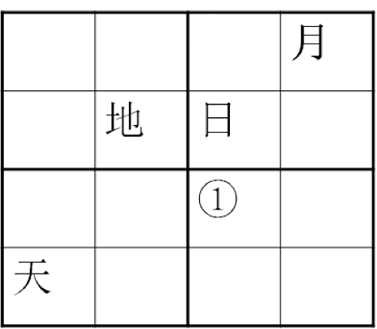

- **A**. 地
- **B**. 天　✅
- **C**. 月
- **D**. 日

**答案**：B

**官方解析**

第一步：找到题干中的已知信息

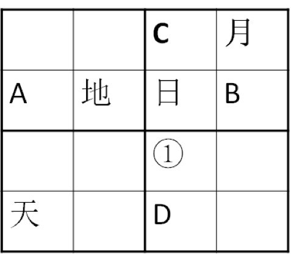

要求每行每列及粗线条的四个小正方形中均含有天、地、日、月四个汉字，找横纵信息最大交叉点，即A和B。那么A处不能填入“天”“地”和“日”字，所以A处只能填入“月”字，所以“B”处填入“天”字。观察图形右上角的小正方形，所以C处只能填入“地”字，又通过第四横行可知，D处不能填“天”，所以，①只能填“天”。

故正确答案为B。

---

### 第 39 题　qid 2049772 · 逻辑判断

某项研究中，研究者追踪了该国19万名在1974年至1994年期间出生的人的医疗数据，他们在2006年至2012年期间做过智力测试。在做智力测试时，大约有的调查对象正因感染而住院。研究人员发现，那些因感染而住院者的智商分数平均比一般人低1.76分。而那些因感染住了5次及以上医院的人，智商分数平均比一般人低9.44分。研究人员指出，人体感染会造成个体智商下降。

以下哪项如果为真，最能削弱以上结论？

- **A**. 大脑周围组织感染会影响大脑的智力水平
- **B**. 有证据表明，感染会影响痴呆病人的认知能力
- **C**. 智商是对心智能力的评价方式，存在着测量误差
- **D**. 患病使得患者情绪紧张，测试时注意力不集中　✅

**答案**：D

**官方解析**

第一步：找出论点和论据。
论点：人体感染会造成个体智商下降。
论据：因感染而住院者的智商分数平均比一般人低1.76分。而那些因感染住了5次及以上医院的人，智商分数平均比一般人低9.44分。
第二步：逐一分析选项。
A项：大脑周围组织感染会影响大脑的智力水平，加强论点，排除；
B项：感染会影响痴呆病人的认知能力，通过举例子的方式支持了题干论点，排除；
C项：智商是对心智能力的评价方式，存在着测量误差，但是否会影响测试结果并不明确，排除；
D项：患病使得患者情绪紧张，测试时注意力不集中，说明智商分数低不代表智商下降了，是因为注意力不集中，切断了论据“智商分数低”和论点“智商下降”之间的联系，属于拆桥项，能削弱，当选。
故正确答案为D。

---

### 第 40 题　qid 2049782 · 逻辑判断

学校工会举办“教工好声音”歌唱比赛，赛后参赛者们预测比赛结果。张老师说：“如果我能获奖，那么李老师也能获奖。”李老师说：“如果我能获奖，那么刘老师也能获奖。”刘老师说：“如果田老师没获奖，那么我也不能获奖。”比赛结果公布后发现，上述3位老师说的都对，并且上述四位老师中有三位获奖。
由此可以推出没有获奖的是：

- **A**. 张老师　✅
- **B**. 李老师
- **C**. 刘老师
- **D**. 田老师

**答案**：A

**官方解析**

第一步：翻译题干。

①：张获奖李获奖；

②：李获奖刘获奖；

③：田获奖刘获奖；

④：三人获奖。

第二步：分析选项。

由①②③可知：张获奖李获奖刘获奖田获奖；

由④知只有三位老师获奖，因此张老师一定没获奖，因为如果张老师获奖可以推出所有四位老师都获奖，与题干冲突。

故正确答案为A。

---

## 资料分析

### 材料 1

        2016年1季度，全国规模以上文化及相关产业企业共4.7万家，实现营业收入16719亿元，比上年同期增长，增速比上年全年增速提高1.7个百分点。 

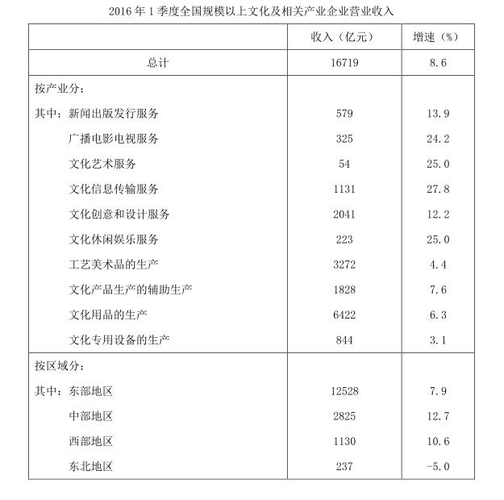 

#### 第 1 题　qid 2049708 · 平均数

如全国规模以上文化及相关产业企业数量无变化，则2016年1季度平均每家全国规模以上文化及相关产业企业的营业收入约比上年同期增长多少万元？

- **A**. 60
- **B**. 150
- **C**. 280　✅
- **D**. 500

**答案**：C

**官方解析**

根据题干“······2016年1季度平均每家······营业收入约比上年同期增长多少万元”，可判定本题为平均数的增长量问题。由于全国规模以上文化及相关产业企业数量无变化，因此用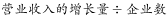即可。定位文字材料可得：2016年1季度，全国规模以上文化及相关产业企业共4.7万家，实现营业收入16719亿元，比上年同期增长，可知2016年1季度全国规模以上文化及相关产业企业营业收入的亿元。则平均每家全国规模以上文化及相关产业企业的营业收入约比上年同期增长万元。

故正确答案为C。

---

#### 第 2 题　qid 2049716 · 增长

在2016年1季度营业收入增速快于的产业中，当季营业收入高于全产业规模以上企业总营业收入的产业有几个？

- **A**. 1
- **B**. 2　✅
- **C**. 3
- **D**. 4

**答案**：B

**官方解析**

定位表格材料可知，2016年1季度营业收入增速快于的企业有：新闻出版发行服务，广播电影电视服务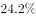，文化艺术服务，文化信息传输服务，文化创意和设计服务，文化休闲娱乐服务。定位文字材料第一段可知2016年1季度全国规模以上文化及相关产业企业实现营业收入16719亿元，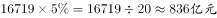，因此满足增长率大于的产业中，只有文化信息传输服务1131亿元和文化创意和设计服务2041亿元大于836亿元，满足题意的只有2个。

故正确答案为B。

---

#### 第 3 题　qid 2049720 · 增长

合并计算2016年1季度营业收入最高的两个产业，其营业收入总体增速最接近以下哪个数字？

- **A**. 4.4
- **B**. 5.1
- **C**. 5.7　✅
- **D**. 6.4

**答案**：C

**官方解析**

根据题干所求“合并计算2016年1季度营业收入最高的两个企业，其营业收入总体增速······”可判定此题为混合增长率问题。

定位表格材料可知，收入最高的两个企业为文化用品和工艺美术品，其增长率分别为和，根据混合增长率整体增长率居中，可知整体增长率一定在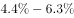之间，排除Ａ、Ｄ两项。

混合增长率整体增长率偏向基数大的，已知文化用品的生产收入6422亿元大于工艺美术品的生产收入3272亿元，所以增长率偏向于，而B项与的差值大于与的差值，排除B项。

故正确答案为C。

---

#### 第 4 题　qid 2049732 · 比重

以下哪个饼图能够最准确地反映全国各地区2016年1季度规模以上文化及相关产业营业收入的比重关系？

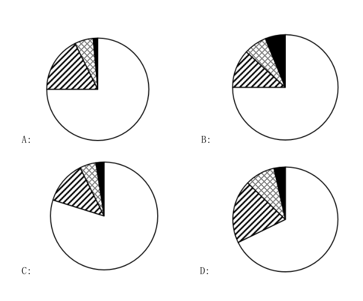

- **A**. A　✅
- **B**. B
- **C**. C
- **D**. D

**答案**：A

**官方解析**

根据题干所求“以下哪个饼图最能反映全国各地区2016年1季度······的比重关系”可判定此题为现期比重问题。

定位表格可知东部地区1季度营业收入为12528亿元，定位文字材料第一段可知2016年1季度全国规模以上文化及相关产业企业实现营业收入16719亿元，因此东部地区的比重为，观察图形，可排除C、D两项。

由表格材料可知，因此所占的比重之比同样大于10倍，观察图形，可排除B项。

故正确答案为A。

---

#### 第 5 题　qid 2049736 · 综合

关于2016年1季度全国规模以上文化及相关产业营业收入状况，能够从上述资料中推出的是：

- **A**. 生产相关产业营业收入增速快于服务相关产业
- **B**. 总体营业收入增速快于上年同期水平
- **C**. 营业收入最低的产业，营业收入增速最快
- **D**. 中西部地区企业营业收入占全国总体的比重上升　✅

**答案**：D

**官方解析**

A项：定位表格材料可知，服务相关产业收入（按产业分的前六行）增速最小的为，增长率混合后一定大于；生产相关产业收入（按产业分的后四行）增速最大的为，增长率混合后一定小于，所以生产相关产业收入增速一定小于服务相关产业收入增速，错误；

B项：材料中只能找到2016年一季度增速比2015年全年增速快1.7个百分点，但没有给出与2015年一季度的同比变化数据，故无法判断，错误；

C项：定位表格材料可知，营业收入最低的企业为文化艺术服务，而收入增速最快的为文化信息传输服务，错误；

D项：定位文字材料第一段可知，整体增长率即全国规模以上文化及相关产业企业实现营业收入增长率为，定位表格材料可知，中部地区营业收入增长率为，西部地区的增长率为。根据混合增长率整体居中，可知中西部的增长率在和之间，故中西部的增长率高于，则必然大于全国的增长率，根据两期比重变化的原理，，中西部占全国的比重上升，正确。

故正确答案为Ｄ。

---

### 材料 2

        2016年3月我国煤及褐煤进口量为1969万吨，环比增长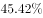，同比增长。3月我国出口煤及褐煤127万吨，环比增长36万吨，同比增长。

        3月焦炭出口量112万吨，环比增长24万吨，增长，同比增长；1~3月累计出口焦炭274万吨，累计同比增长。

        3月全国钢材出口量998万吨，环比增长，同比增长；1~3月累计出口钢材2783万吨，累计同比增长。3月份进口钢材127万吨，环比增长，同比增长；1~3月累计进口钢材313万吨，累计同比下降。

        铁矿石、原油、铜等大宗商品主要进口商品价格持续低位。2016年一季度，我国进口铁矿石2.42亿吨，增长；原油9110万吨，增长；铜143万吨，增长。同期，进口煤及褐煤4846万吨，下降；成品油775万吨，下降；钢材313万吨，下降。同期，我国进口价格总体下跌。其中，铁矿石进口均价同比下跌，原油下跌，成品油下跌，煤及褐煤下跌，铜下跌，钢材下跌。

#### 第 6 题　qid 2049700 · 增长

2016年3月我国出口煤及褐煤环比约增长多少个百分点？

- **A**. 25
- **B**. 30
- **C**. 35
- **D**. 40　✅

**答案**：D

**官方解析**

由题干求“2016年3月我国出口煤及褐煤环比约增长多少个百分点”可知，本题为一般增长率问题。定位材料第一段“2016年3月我国出口煤及褐煤127万吨，环比增长36万吨”，则所求增长率。

故正确答案为D。

注意：本题问法有瑕疵，应该问增长了百分之多少而不是多少个百分点，但本题答案为是没有任何问题的。

---

#### 第 7 题　qid 2049714 · 综合

2016年1~3月我国煤及褐煤进口量约比去年同期：

- **A**. 
下降
　✅
- **B**. 
下降

- **C**. 
增加

- **D**. 
增加

**答案**：A

**官方解析**

方法一：由题干求“2016年13月我国煤及褐煤进口量比去年同期”结合选项为百分数，可知本题为一般增长率问题。定位材料最后一段：“13月······同期，进口煤及褐煤4846万吨，下降”，即2016年13月煤及褐煤进口量比去年同期约下降。

方法二：由题干求“2016年1~3月我国煤及褐煤进口量比去年同期”结合选项为百分数，可知本题为一般增长率问题。定位表格数据，“2016年1~3月煤及褐煤进口量为4846万吨，2015年1~3月煤及褐煤进口量为4904万吨”，，增长率为负，说明约下降。

故正确答案为A。

---

#### 第 8 题　qid 2049728 · 增长

2016年第一季度进口均价同比下降幅度超过的有：

- **A**. 煤、铜
- **B**. 铜、钢材
- **C**. 铁矿石、原油　✅
- **D**. 铁矿石、成品油

**答案**：C

**官方解析**

定位材料第四段，“铁矿石进口均价同比下跌，原油下跌，成品油下跌，煤及褐煤下跌，铜下跌，钢材下跌”，故铁矿石、原油进口均价的同比下降幅度分别为和，均超过。

故正确答案为C。

---

#### 第 9 题　qid 2049734 · 综合

2015年3月份进口钢材约为多少万吨？

- **A**. 61.3
- **B**. 73.5
- **C**. 87.5　✅
- **D**. 101.3

**答案**：C

**官方解析**

材料给出的时间为2016年，求“2015年3月份进口钢材约为多少万吨”，可知本题为基期计算问题。定位材料第三段，“2016年3月份进口钢材127万吨，同比增长”，代入基期计算公式，，与C选项最接近。

故正确答案为C。

---

#### 第 10 题　qid 2049744 · 综合

能够从上述材料中推出的是：

- **A**. 2016年一季度原油进口量是铜的6倍
- **B**. 2016年3月份钢材出口量环比增长超过200万吨
- **C**. 2016年第一季度铁矿石进口均价降幅高于原油
- **D**. 2016年1~2月钢材月均进口量不到100万吨　✅

**答案**：D

**官方解析**

A项：定位材料第四段数据，2016年一季度原油进口量为9110万吨，2016年一季度铜进口量为143万吨，则所求，即2016年一季度原油进口量大于铜的6倍，错误；

B项：定位材料第三段数据，“2016年3月全国钢材出口量998万吨，环比增长”。代入增长量计算公式，万吨，错误；

C项：定位材料第四段，“2016年一季度，铁矿石进口均价同比下跌，原油下跌”，降幅分别为和，故2016年第一季度铁矿石进口均价降幅低于原油，错误；

D项：定位材料第三段，“2016年3月份进口钢材127万吨；1~3月累计进口钢材313万吨”，则2016年1-2月月均钢材进口量万吨，正确。

故正确答案为D。

---

### 材料 3

根据所给资料，回答111～115题。

        2016年1～7月份，同城、异地、国际/港澳台快递业务量分别占全部快递业务量的、和，业务收入如下图所示：

        1～7月份，东、中、西部地区快递业务收入的比重分别为、和，业务量比重分别为、和。与去年同期相比，东部地区快递业务收入比重下降了0.5个百分点，快递业务量比重下降了0.4个百分点；中部地区快递业务收入比重上升了0.3个百分点，快递业务量比重上升了0.4个百分点；西部地区快递业务收入比重上升了0.2个百分点，快递业务量比重持平。

#### 第 11 题　qid 2049596 · 比重

与上年同期相比，2016年1～7月国际/港澳台业务收入占同城、异地和国际/港澳台快递业总收入的比重：

- **A**. 下降了不到5个百分点　✅
- **B**. 下降了5个百分点以上
- **C**. 上升了不到5个百分点
- **D**. 上升了5个百分点以上

**答案**：A

**官方解析**

由题干“与上年同期相比，2016年1～7月······占······的比重”，可判定该题为两期比重问题。定位图中数据，2015年1～7月国际/港澳台业务收入占同城、异地和国际/港澳台快递业总收入的 ，2016年1～7月国际/港澳台业务收入占同城、异地和国际/港澳台快递业总收入的，

比低2.3个百分点，即下降了不到5个百分点。

故正确答案为A。

---

#### 第 12 题　qid 2049602 · 比重

2015年1～7月份，中部地区快递业务收入的比重为：

- **A**. 

　✅
- **B**. 

- **C**. 

- **D**. 

**答案**：A

**官方解析**

由题干“2015年1～7月份······的比重······”，可判定该题是基期比重问题。定位文字材料第二段，“2016年1～7月份中部地区快递业务收入的比重为，与去年同期相比中部地区快递业务收入比重上升了0.3个百分点”，所以2015年1～7月份中部地区快递业务收入的。

故正确答案为A。

---

#### 第 13 题　qid 2049604 · 综合

在函件、包裹、快递中，2016年7月业务量超过上半年月均业务量的有几类？

- **A**. 0
- **B**. 1　✅
- **C**. 2
- **D**. 3

**答案**：B

**官方解析**

由题干“2016年7月业务量超过上半年月均业务量的有”，可判定该题为现期平均数问题。只需计算出上半年月均业务量，与7月份进行比较。定位数据表中数据，函件2016年上半年；包裹2016年上半年；快递2016年上半年，故只有快递2016年7月业务量超过上半年月均业务量。

故正确答案为B。

---

#### 第 14 题　qid 2049608 · 综合

2016年7月，全国日均订销报纸多少万份？

- **A**. 4870　✅
- **B**. 5032
- **C**. 5206
- **D**. 5392

**答案**：A

**官方解析**

由题干“2016年7月······日均······多少万份”，可判定该题是现期平均数问题。定位数据表中数据，2016年7月全国订销报纸累计数150969.0万份且7月份有31天，所以2016年7月，与A选项最接近。

故正确答案为A。

---

#### 第 15 题　qid 2049612 · 综合

能够从上述材料中推出的是：

- **A**. 
2016年7月的函件数量是包裹数量的不到100倍

- **B**. 
2016年7月快递业务收入占邮政行业业务收入的比重高于
　✅
- **C**. 
2016年1～7月中、西部地区的快递业务量所占比重均比去年同期有所上升

- **D**. 
2016年1～7月国际/港澳台快递收入同比增速快于同城快递业务和异地快递业务

**答案**：B

**官方解析**

A项：定位数据表中数据，2016年7月的包裹数量的100倍为：，函件数量：27251.9，则有：，故2016年7月的函件数量高于包裹数量的100倍，错误；

B项：定位数据表中数据，2016年7月快递业务收入占邮政行业业务收入的，正确；

C项：定位文字材料第二段，与去年同期相比，2016年1～7月中部地区快递业务量比重上升了0.4个百分点，西部地区快递业务量比重持平，错误；

D项：定位数据图中数据，2016年1～7月国际/港澳台快递收入；2016年1～7月同城快递收入，所以2016年1～7月国际/港澳台快递收入同比增速慢于同城快递收入同比增速，错误。

故正确答案为B。

---

### 材料 4

        2016年4月份我国全社会用电量4569亿千瓦时，同比增长。其中，第一产业用电量86亿千瓦时，同比增长；第二产业用电量3316亿千瓦时，同比增长；第三产业用电量569亿千瓦时，同比增长；城乡居民生活用电量598亿千瓦时，同比增长。 

        1～4月份，我国全社会用电量18093亿千瓦时，同比增长。从不同产业看，第一产业用电量270亿千瓦时，同比增长；第二产业用电量12595亿千瓦时，同比增长；第三产业用电量2516亿千瓦时，同比增长，增速比上年同期提高2.1个百分点；城乡居民生活用电量2711亿千瓦时，同比增长，增速比上年同期提高5.4个百分点。

        从不同省份看，1～4月份全社会用电量增速前十位的省份依次为：西藏（）、新疆（）、江西（）、陕西（）、安徽（）、北京（）、浙江（）、广东（）、海南（）、湖北（）。

#### 第 16 题　qid 2049598 · 比重

2016年4月第二、三产业用电量占同期我国全社会用电量的比重约为：

- **A**. 

- **B**. 

- **C**. 

- **D**. 

　✅

**答案**：D

**官方解析**

由题干“2016年4月······占······比重约为”，可判定此题为现期比重问题。定位文字材料第一段可得：2016年4月我国全社会用电量4569亿千瓦时，第二产业用电量3316亿千瓦时，第三产业用电量569亿千瓦时，则比重为。 

故正确答案为D。

---

#### 第 17 题　qid 2049600 · 综合

2016年第一产业第一季度月均用电量约为多少亿千瓦时？

- **A**. 50
- **B**. 60　✅
- **C**. 90
- **D**. 180

**答案**：B

**官方解析**

由题干“2016年第一季度月均用电量”，可判定此题为现期平均数问题。定位材料可知，“1～4月份第一产业用电量270亿千瓦时······4月份第一产业用电量86亿千瓦时”，则1～3月第一产业用电量为亿千瓦时，所以第一季度月均用电量为亿千瓦时，与B项最接近。

故正确答案为B。

---

#### 第 18 题　qid 2049614 · 比重

2016年1～4月，第一、二、三产业中，用电量占全社会用电量比重高于上年同期水平的产业有几个？

- **A**. 0
- **B**. 1
- **C**. 2　✅
- **D**. 3

**答案**：C

**官方解析**

由题干“······占······比重高于上年同期”，可判定此题为两期比重比较问题。定位材料第二段，可知全社会用电量增长率为。第一产业用电量增长率为，第二产业用电量增长率为，第三产业用电量增长率为。根据两期比重原理，部分增长率大于整体增长率则比重上升，满足条件的有第一产业、第三产业。因此一共有2个产业满足题意。

故正确答案为C。

---

#### 第 19 题　qid 2049620 · 综合

与2014年同期相比，2016年1～4月第三产业用电量上升了约：

- **A**. 

- **B**. 

　✅
- **C**. 

- **D**. 

**答案**：B

**官方解析**

由题干“与2014年同期相比，2016年1～4月······上升”，且选项为百分数，可判定此题为间隔增长率问题。定位材料第二段，第三产业用电量2016年1～4月增长率为，2015年1～4月增长率为。代入间隔增长率公式，与B选项最接近。

故正确答案为B。

---

#### 第 20 题　qid 2049628 · 综合

能够从上述资料中推出的是：

- **A**. 
2016年第一季度全社会月均用电量高于4月水平

- **B**. 
2016年一季度我国全社会用电量同比增速超过
　✅
- **C**. 
2015年1～4月城乡居民生活用电量同比增长接近

- **D**. 
2016年1～4月份全社会用电量增速前5位的省份均来自西部地区

**答案**：B

**官方解析**

A项，定位材料第一、二段，2016年第一季度全社会用电量为亿千瓦时，则第一季度月均用电量为亿千瓦时，而4月全社会用电量为4569亿千瓦时，所以第一季度全社会月均用电量是低于4月水平，错误；

B项，定位材料第一、二段，2016年1～4月全社会用电量增速为，而4月份增速为，根据混合增长率原理（混合之后增长率居中），4月增速（）1~4月增速（）1~3月增速，因此可以判断第一季度（1～3月）增速必定超过，正确；

C项，定位材料第二段，“城乡居民生活用电……同比增长，增速比上年同期提高5.4个百分点”，则2015年1～4月增速为，错误；

D项，定位材料第三段，2016年1～4月份全社会用电量增速第3位的是江西省，第5位是安徽省，江西省和安徽省并不属于西部地区，错误。

故正确答案为B。

---

#### 第 21 题　qid 2049638 · 倍数

钢铁厂某年总产量的为型钢类，为钢板类，钢管类的产量正好是型钢和钢板产量之差的14倍，而钢丝的产量正好是钢管和型钢产量之和的一半，而其它产品共为3万吨。问该钢铁厂当年的产量为多少万吨？

- **A**. 48
- **B**. 42
- **C**. 36
- **D**. 28　✅

**答案**：D

**官方解析**

假设总产量为，则型钢类产量为，钢板类产量为，钢管类产量为，钢丝的产量为，则，解得万吨，则总产量万吨。

故正确答案为D。

---
