# 2017年422联考《行测》题（新疆卷）

> 联考 · 2017 年 · 6 个模块 · 共 116 题

- [政治理论](#%E6%94%BF%E6%B2%BB%E7%90%86%E8%AE%BA) · 1 题
- [常识判断](#%E5%B8%B8%E8%AF%86%E5%88%A4%E6%96%AD) · 24 题
- [言语理解与表达](#%E8%A8%80%E8%AF%AD%E7%90%86%E8%A7%A3%E4%B8%8E%E8%A1%A8%E8%BE%BE) · 30 题
- [数量关系](#%E6%95%B0%E9%87%8F%E5%85%B3%E7%B3%BB) · 11 题
- [判断推理](#%E5%88%A4%E6%96%AD%E6%8E%A8%E7%90%86) · 35 题
- [资料分析](#%E8%B5%84%E6%96%99%E5%88%86%E6%9E%90) · 15 题

---

## 政治理论

### 第 1 题　qid 2051402 · 新思想

2015年9月25日，为了新疆维吾尔自治区成立六十周年庆，中央代表团向自治区赠送了习近平总书记题词“（    ）”的贺匾，国泰“榴”芳等纪念品。

- **A**. 各族人民共创未来，实现中华民族梦想
- **B**. 民族团结一家亲
- **C**. 民族团结稳定，社会和谐发展
- **D**. 建设美丽新疆，共圆祖国梦想　✅

**答案**：D

**官方解析**

新疆维吾尔自治区成立六十周年庆，习近平所赠贺匾蔚为大观，以鲜艳的中国红为底色，正面是习近平总书记“建设美丽新疆，共圆祖国梦想”的题词，背面是维吾尔、哈萨克、蒙古、柯尔克孜4种少数民族文字对习近平总书记题词的翻译。
故正确答案为D。

---

## 常识判断

### 第 1 题　qid 2051406 · 地理国情

（  ）在新疆境内，是中国第二大盆地，海拔500米，中间是沙漠戈壁，边缘是绿洲。

- **A**. 准噶尔盆地　✅
- **B**. 塔里木盆地
- **C**. 柴达木盆地
- **D**. 吐鲁番盆地

**答案**：A

**官方解析**

A项正确：准噶尔盆地是我国第二大盆地，位于新疆，面积约38万平方公里。
B项错误：塔里木盆地是我国第一大盆地，位于新疆，面积约53万平方公里。
C项错误：柴达木盆地是我国第三大盆地，位于青海，面积约22万平方公里。
D项错误：吐鲁番盆地紧跟中国十大盆地，居第11位，位于新疆，面积约50140平方公里。
故正确答案为A。

---

### 第 2 题　qid 2051410 · 人文常识

在全区开展“两学一做”的学习，其中的“学转促”专项指的是（    ）。

- **A**. 学讲话、转作风、促落实　✅
- **B**. 学原著、转观念、促实施
- **C**. 学理论、转态度、促发展
- **D**. 学先进、转方向、促进步

**答案**：A

**官方解析**

根据《新疆自治区党委印发〈关于在“两学一做”学习教育中开展“学讲话、转作风、促落实”专项活动的实施方案〉的通知》（新党委字〔2017〕10号）文件可知，“学转促”专项指的是：学讲话、转作风、促落实
故正确答案为A。

---

### 第 3 题　qid 2051414 · 地理国情

新疆维吾尔自治区宗教活动场所管理经组织成员（    ）产生，并向该场所登记机关备案。

- **A**. 领导小组推选
- **B**. 经委派
- **C**. 民主选举
- **D**. 民主协商　✅

**答案**：D

**官方解析**

《新疆维吾尔自治区宗教事务条例》第十八条规定：宗教活动场所应当成立管理组织，实行民主管理。宗教活动场所管理组织的成员经民主协商推选产生，并向该场所登记机关备案。宗教活动场所管理组织的成员应当遵纪守法。
故正确答案为D。

---

### 第 4 题　qid 2051416 · 法律常识

为依法治疆提供坚强有力组织和人才保障采取的措施错误的是（）。

- **A**. 建设高素质法治专门队伍，要把政治坚强放在首位
- **B**. 把善于运用法治思维和法治方式推动工作的人选拔到领导的岗位上来
- **C**. 注重选拔在反分裂斗争中经受锻炼的人才
- **D**. 抓住领导班子建设这个关键，突出政绩标准　✅

**答案**：D

**官方解析**

《中共新疆维吾尔自治区委员会关于全面推进依法治疆建设法治新疆的意见》（以下简称《意见》）对依法治疆提供坚强有力组织和人才保障采取的措施做了明确规定。
A项正确：《意见》指出：建设高素质法治专门队伍。用好党中央支持政策，加强各级法治专门队伍建设。把政治坚强摆在首位。
B项正确：《意见》指出：抓住领导班子建设这个关键，突出政治标准，把善于运用法治思维和法治方式推动工作的人选拔到领导岗位上来，尤其注重选拔在反分裂斗争实践中经受锻炼和考验的法治人才。
C项正确：详析同B项。
D项错误：应为突出“政治标准”。
本题为选非题，故正确答案为D。

---

### 第 5 题　qid 2051418 · 法律常识

公安机关职权描述不正确的是（）。

- **A**. 需要调查取证的，应迅速开展调查
- **B**. 调查暴恐嫌疑人员，只能在公安机关进行　✅
- **C**. 关于暴恐相关调查，有权向单位、个人收集信息
- **D**. 针对暴恐嫌疑人员，要按照法律规定进行调查、盘问、传唤

**答案**：B

**官方解析**

A项正确，《反恐怖主义法》第四十九条规定：公安机关接到恐怖活动嫌疑的报告或者发现恐怖活动嫌疑，需要调查核实的，应当迅速进行调查。A项表述与其一致，故A项正确，故排除；
B项错误，《反恐怖主义法》第五十条规定：公安机关调查恐怖活动嫌疑，可以通知了解有关情况的人员到公安机关或者其他地点接受询问。B项“只能在公安机关进行”表述错误，当选；
C项正确，《反恐怖主义法》第五十一条规定：公安机关调查恐怖活动嫌疑，有权向有关单位和个人收集、调取相关信息和材料。有关单位和个人应当如实提供。C项表述与其一致，故C项正确，故排除；
D项正确，《反恐怖主义法》第五十条规定：公安机关调查恐怖活动嫌疑，可以依照有关法律规定对嫌疑人员进行盘问、检查、传唤，可以提取或者采集肖像、指纹、虹膜图像等人体生物识别信息和血液、尿液、脱落细胞等生物样本，并留存其签名。D项表述与其一致，故D项正确，故排除。
本题为选非题，故正确答案为B。

---

### 第 6 题　qid 2051420 · 人文常识

“十三五”规划中五个目标是（）、协调、开放、（）、（）。

- **A**. 创新、绿色、共享　✅
- **B**. 创新、共赢、绿色
- **C**. 绿色、共享、尊重
- **D**. 创新、共赢、生态

**答案**：A

**官方解析**

中国共产党第十八届中央委员会第五次全体会议审议通过了《中共中央关于制定国民经济和社会发展第十三个五年规划的建议》。会议公报指出，实现“十三五”时期发展目标，破解发展难题，厚植发展优势，必须牢固树立并切实贯彻创新、协调、绿色、开放、共享的发展理念。这是关系我国发展全局的一场深刻变革。全党同志要充分认识这场变革的重大现实意义和深远历史意义。
故正确答案为A。

---

### 第 7 题　qid 2049816 · 经济常识

下列关于“海上丝绸之路”的说法错误的是：

- **A**. 是陆上丝绸之路的一种补充形式　✅
- **B**. 是意大利人马可·波罗回国所走之路
- **C**. 始于秦汉，繁荣于唐宋，衰落于明清
- **D**. 是古代中外贸易和对外交往的海上通道

**答案**：A

**官方解析**

C项正确：“海上丝绸之路”的雏形在秦汉时期便已存在，目前已知有关中外海路交流的最早史载来自《汉书·地理志》，海上丝绸之路繁荣于唐宋时期，唐玄宗时设立市舶使专管海上对外贸易；宋时指南针用于海船，中国商船的远航能力大为加强；明清时期由于海禁政策，“海上丝绸之路”衰落。
D项正确：海上丝绸之路是古代中国与世界其他地区进行经济文化交流交往的海上通道。海上丝绸之路从中国东南沿海，经过中南半岛和南海诸国，穿过印度洋，进入红海，抵达东非和欧洲，成为中国与外国贸易往来和文化交流的海上大通道，并推动了沿线各国的共同发展。
A项表述不严谨，海上丝绸之路最开始确实是陆上丝绸之路补充，大量丝织品通过陆路西运，后来陆上通道阻塞、战乱、经济中心南移等原因，慢慢地演变为与陆上丝绸之路同等重要的贸易往来通道。
B项关于马可波罗是否来过中国，各国历史学家争议较大且各有充足的依据，从本题选项设置来看，该题认为是来过中国，按照大多数人的观点，马可波罗是沿着海上丝绸之路返回的。相比之下选A更合适。
本题为选非题，故正确答案为A。

---

### 第 8 题　qid 2049548 · 人文常识

下列说法错误的是：

- **A**. 2016年里约热内卢举办了第31届夏季奥林匹克运动会
- **B**. 河北张家口具有2022年第24届冬季奥运会的主办资格
- **C**. 动漫人物铁臂阿童木出任东京申奥特殊大使开创了先河　✅
- **D**. 北京是目前唯一获得夏季奥运会和冬季奥运会举办权的城市

**答案**：C

**官方解析**

A项正确，第31届夏季奥林匹克运动会，又称2016年里约热内卢奥运会，2016年8月5日至21日在巴西里约热内卢举行。
B项正确，第24届冬季奥林匹克运动会，将在2022年2月4日至2022年2月20日由中国北京市和张家口市联合举行。这是中国历史上第一次举办冬季奥运会，北京、张家口同为主办城市。
C项错误，日本著名动漫形象哆啦A梦将出任2020年东京申奥特殊大使。过去的申奥特殊大使多由奥运会的奖牌得主出任，动漫人物出任申奥特殊大使尚属首次。
D项正确，北京是目前唯一获得夏季奥运会和冬季奥运会举办权的城市。
本题为选非题，故正确答案为C。

---

### 第 9 题　qid 2049592 · 人文常识

下列关于国际战争的说法错误的是：

- **A**. 前苏联于1978年入侵阿富汗，持续十余年
- **B**. 1990年开始的海湾战争源于伊朗入侵科威特　✅
- **C**. 中东战争是以色列与周边阿拉伯国家所进行的5次大规模战争
- **D**. 1982年4月-6月，英国和阿根廷爆发了马尔维纳斯群岛海战

**答案**：B

**官方解析**

本题考查历史常识。主要涉及国际战争的相关内容。
B项错误，海湾战争是指1991年1月17日，以美国为首的多国联盟为恢复科威特主权，对伊拉克进行的战争，源于1990年8月2日伊拉克出兵入侵科威特。
A项正确，1979年苏联入侵阿富汗战争，1979年12月末，苏联入侵阿富汗导致的长达10年的战争，据考生回忆，此处选项中确为1978年，与史实不符，但综合B项比较之后，国家差别比1年差距更大，故B的错误更严重。
C项正确，中东战争，或称阿以战争、以阿战争，是指以色列与埃及、叙利亚等周围阿拉伯国家所进行的5次大规模战争（1948年、1956年、1967年、1973年、1982年）。
D项正确，马尔维纳斯群岛战争，简称马岛战争，是1982年4月到6月间，英国和阿根廷为争夺马岛的主权而爆发的一场战争。
本题为选非题，故正确答案为B。

---

### 第 10 题　qid 2049590 · 人文常识

下列我国的世界遗产不属于多省联合申遗的是：

- **A**. 土司遗址
- **B**. 丝绸之路
- **C**. 中国丹霞
- **D**. 大足石刻　✅

**答案**：D

**官方解析**

本题考查文化常识。
A项：留存至今的土司城寨及官署建筑遗存曾是“土司”的行政和生活中心。在2015年，德国波恩召开的第三十九届世界遗产大会上，中国申报的“中国土司遗产”成功列入世界文化遗产名录。中国土司遗产包括湖南永顺老司城遗址、贵州播州海龙屯遗址、湖北唐崖土司城遗址。故土司遗址属于多省联合申遗。
B项：丝绸之路，简称丝路，是指西汉（前202年—8年）时，由张骞出使西域开辟的以长安（今西安）为起点，经甘肃、新疆，到中亚、西亚，并联结地中海各国的陆上通道。因为这条路上主要贩运的是中国的丝绸，故得此名。丝绸之路是跨国系列文化遗产，属文化线路类型。它经过的路线长度大约8700公里，包括各类共33处遗迹。其中，中国境内有22处考古遗址、古建筑等遗迹，包括河南省4处、陕西省7处、甘肃省5处、新疆维吾尔自治区6处。故丝绸之路属于多省联合申遗。
C项：丹霞，这个术语指的是一种有着特殊地貌特征以及与众不同的红颜色的地貌景观（即“丹霞地貌”），像“玫瑰色的云彩”或者“深红色的霞光”。 在地质和地貌学层面上，丹霞可以定义如下：“丹霞是一种形成于西太平洋活性大陆边缘断陷盆地极厚沉积物上的地貌景观。它主要由红色砂岩和砾岩组成，反映了一个干热气候条件下的氧化陆相湖盆沉积环境。”“中国丹霞”于2010年8月1日在巴西利亚举行的第34届世界遗产大会上，经联合国教科文组织世界遗产委员会批准，被正式列入《世界遗产名录》。中国丹霞是由湖南崀山、广东丹霞山、福建泰宁、江西龙虎山等景区共同签订捆绑申报合作协议。故中国丹霞属于多省联合申遗。
D项：大足石刻位于重庆市大足区境内，是唐末、宋初时期宗教摩崖石刻，以佛教题材为主，儒、道教造像并陈，是著名的艺术瑰宝、历史宝库和佛教圣地，有“东方艺术明珠”之称。故大足石刻不属于多省联合申遗。
本题为选非题，故正确答案为D。

---

### 第 11 题　qid 2050110 · 人文常识

下列关于世界古代文明的说法正确的是：

- **A**. 《理想国》的作者是古希腊哲学家苏格拉底
- **B**. 古代埃及人建造的胡夫金字塔是世界上现存规模最大的金字塔　✅
- **C**. 公元1世纪前后，罗马帝国分裂为东罗马帝国和西罗马帝国
- **D**. 世界四大文明古国是指古代埃及、古代希腊、古代印度和古代中国

**答案**：B

**官方解析**

本题考查人文常识。
A项错误：《理想国》是古希腊著名哲学家柏拉图重要的对话体著作之一。
B项正确：胡夫金字塔塔高146.59米，因年久风化，顶端剥落10米，现高136.5米，它的规模是埃及至今发现的金字塔中最大的，也是世界上现存规模最大的金字塔。
C项错误：罗马帝国分裂，指的是395年1月17日，罗马皇帝狄奥多西逝世把国土分给两个儿子继承导致罗马帝国分裂的故事。罗马帝国分裂为东、西罗马帝国发生在公元4世纪前后。
D项错误：世界四大文明古国是指古巴比伦、古埃及、古印度和中国。古代希腊不属于四大文明古国。
故正确答案为B。

---

### 第 12 题　qid 2049778 · 人文常识

王某将自家三层楼房的承建工程承包给没有施工资质的包工头李某。双方合同约定，李某“包工不包料”，在施工过程中产生的一切责任由李某承担。李某找来邻居张某帮工，工资100元/天。施工过程中脚手架倒塌，将在地面上递砖块的张某压成重伤。张某要求包工头李某赔偿医药费、误工费等。李某不肯，双方闹至法院。那么，下列说法正确的是：

- **A**. 李某承担全部责任
- **B**. 王某、李某、张某都要承担责任
- **C**. 李某、张某承担责任，王某没有责任
- **D**. 王某、李某承担责任，张某没有责任　✅

**答案**：D

**官方解析**

本题考查法律常识。
根据《民法典》第一千一百九十二条规定：“个人之间形成劳务关系······提供劳务一方因劳务受到损害的，根据双方各自的过错承担相应的责任······”第一千一百九十三条规定：“承揽人在完成工作过程中造成第三人损害或者自己损害的，定作人不承担侵权责任。但是，定作人对定作、指示或者选任有过错的，应当承担相应的责任。”
题干当中王某是定作人，李某是承揽人，张某和李某是雇佣关系，张某被压成重伤，李某应该承担责任。王某将楼房承包给没有施工资质的李某，选人有过失，因此王某也应当承担相应的赔偿责任。
故正确答案为D。

---

### 第 13 题　qid 2049594 · 人文常识

下列言行体现公民没有自觉履行法定义务的是：
①“听说你养母病了？”“与我无关，我是被收养的。”
②“听说你生父病了？”“与我无关，我已经被叔叔收养了。”
③“爸，大学催缴学杂费了。”“你都成年了，自己挣钱交去。”
④“爸，小学催缴生活费了。”“我与你妈离婚了，找她要去。”

- **A**. ①③
- **B**. ①④　✅
- **C**. ②③
- **D**. ②④

**答案**：B

**官方解析**

本题考查法律常识。
①错误，根据《民法典》第一千零七十二条第二款规定：“继父或者继母和受其抚养教育的继子女间的权利义务关系，适用本法关于父母子女关系的规定。”且根据《民法典》第一千零六十七条规定：“父母不履行抚养义务的，未成年子女或者不能独立生活的成年子女，有要求父母给付抚养费的权利。成年子女不履行赡养义务的，缺乏劳动能力或者生活困难的父母，有要求成年子女给付赡养费的权利。”因此，养子女对养母有赡养的义务，养母生病之后养子女有赡养的义务。
②正确，根据《民法典》第一千一百一十一条第二款规定：“养子女与生父母以及其他近亲属间的权利义务关系，因收养关系的成立而消除。”因此，子女被收养之后对生父母没有赡养义务。
③正确，根据《民法典》第一千零六十七条规定：“父母不履行抚养义务的，未成年子女或者不能独立生活的成年子女，有要求父母给付抚养费的权利。成年子女不履行赡养义务的，缺乏劳动能力或者生活困难的父母，有要求成年子女给付赡养费的权利。”且根据《最高人民法院关于适用中华人民共和国民法典婚姻家庭编的解释（一）》第四十一条规定：“尚在校接受高中及其以下学历教育，或者丧失、部分丧失劳动能力等非因主观原因而无法维持正常生活的成年子女，可以认定为民法典第一千零六十七条规定的‘不能独立生活的成年子女’。”③中该子女为已成年的大学生，且不符合“不能独立生活的子女”的条件，因此，其父可以不支付其学杂费。
④错误，根据《民法典》第一千零八十四条第二款规定：“离婚后，父母对于子女仍有抚养、教育、保护的权利和义务。”父母与子女间的关系，不因父母离婚而消除。离婚后，父母不履行抚养义务的，未成年子女，有要求父母给付抚养费的权利。因此，父亲以离婚为借口，要求上小学的子女找母亲讨要生活费的行为不符合法律规定。
因此②③表述正确，①④表述错误。
本题为选非题，故正确答案为B。

---

### 第 14 题　qid 2049806 · 人文常识

下列行为属于公民正确行使法定权利的是：
①陈某向有关部门举报公交站旁的诈骗团伙
②林某将朋友送给他的手表又送给他的弟弟
③张某在妻子终止妊娠后第四个月起诉离婚
④吴某应聘时因受到用人单位性别歧视而起诉至法院

- **A**. ①②③
- **B**. ①②④　✅
- **C**. ②③④
- **D**. ①③④

**答案**：B

**官方解析**

本题考查法律常识。
①正确，根据《刑事诉讼法》第一百一十条第一款规定：“任何单位和个人发现有犯罪事实或者犯罪嫌疑人，有权利也有义务向公安机关、人民检察院或者人民法院报案或者举报。”
②正确，根据《民法典》第六百五十七条规定：“赠与合同是赠与人将自己的财产无偿给予受赠人，受赠人表示接受赠与的合同。”朋友把表送给林某后，所有权归林某，他有权处分，送给他弟弟合法。
③错误，根据《民法典》第一千零八十二条规定：“女方在怀孕期间、分娩后一年内或者终止妊娠后六个月内，男方不得提出离婚；但是，女方提出离婚或者人民法院认为确有必要受理男方离婚请求的除外。”
④正确，根据《就业促进法》第六十二条规定：“违反本法规定，实施就业歧视的，劳动者可以向人民法院提起诉讼。”
故正确答案为B。

---

### 第 15 题　qid 2050078 · 人文常识

磁共振成像系统（MRI）不可能对人体造成下列哪一伤害：

- **A**. 强静磁场
- **B**. 随时间变化的梯度场
- **C**. 射频场导致热效应
- **D**. 对人体的高能辐射　✅

**答案**：D

**官方解析**

磁共振的基本原理：是将人体置于特殊的磁场中，用无线电射频脉冲激发人体内氢原子核，引起氢原子核共振，并吸收能量。在停止射频脉冲后，氢原子核按特定频率发出射电信号，并将吸收的能量释放出来，被体外的接受器收录，经电子计算机处理获得图像，这就叫做核磁共振成像。
它对疾病的诊断具有很大的潜在优越性。它可以直接作出横断面、矢状面、冠状面和各种斜面的体层图像，不会产生CT检测中的伪影；不需注射造影剂；无电离辐射。MRI对检测脑内血肿、脑外血肿、脑肿瘤、颅内动脉瘤、动静脉血管畸形、脑缺血、椎管内肿瘤、脊髓空洞症和脊髓积水等颅脑常见疾病非常有效，同时对腰椎椎间盘后突、原发性肝癌等疾病的诊断也很有效。
核磁共振虽然广泛应用于疾病的检测，但它存在许多可能的伤害。MRI可能对人体造成的伤害主要包括以下方面：（1）强静磁场的危害。强静磁场是在有铁磁性物质存在的情况下，不论是埋植在患者体内还是在磁场范围内，都可能是危险因素。尤其是在高强度的静磁场中工作的员工，高强磁场有可能引起周围电子仪器和设备失效，影响带有心脏起搏器和胰岛素泵（或其他金属植入物）的人员健康。
（2）随时间变化的梯度场也会对人体造成伤害，因为其在受试者体内诱导产生电场而兴奋神经或肌肉。外周神经兴奋是梯度场安全的上限指标。在足够强度下，可以产生外周神经兴奋（如刺痛或叩击感），甚至引起心脏兴奋或心室振颤。
（3）射频场（RF）的致热效应：RF致热效应被认为是组织温度升高的唯一方式，因为它能穿透表层组织，直接加热组织内部。以眼睛为例，血管相对缺乏，因此散热慢且效率低，在RF辐射作用下有可能对视组织造成热损伤。
（4）噪声：MRI运行过程中产生的各种噪声，可能使某些患者的听力受到损伤。患者可有烦躁、语言交流障碍、焦虑、短时失聪和潜在的永久性听力损害。
据此可知A、B、C三项正确。
磁共振仪在工作时，会在人体周围产生一个超强磁场，接着向人体发射电磁波。但是电磁波对人的辐射危害极小，甚至都比不上你出去晒太阳时紫外线对你的伤害，真正有害的是CT等，故D项错误。
本题为选非题，故正确答案为D。

---

### 第 16 题　qid 2051426 · 科技常识

生活常识说法错误的是：（）。

- **A**. 水在真空中先沸腾后结冰
- **B**. 颜色较深的车隔热膜，隔热效果越好　✅
- **C**. 纯水在0度时不结冰
- **D**. 天凉的时候，湿润的地方比干燥的地方感觉冷

**答案**：B

**官方解析**

A项正确：水在真空中，由于压力骤降导致沸点剧降而沸腾，快速沸腾导致热量瞬间散失而结冰。
B项错误：汽车隔热膜的隔热效果和膜的颜色深浅没有必然的关系。目前的优质隔热膜，一般采用多层复合结构，每一层的设计功能不同，通过涂布特殊材质的粒子，可以分别反射不同波段的红外线和紫外线，有选择性的阻隔太阳光中的不同部分。优质的隔热膜不但能够高效的隔热，还能同时保证高的透光度，保障行车安全。
C项正确：在纯水情况下，在水温达到了0度时，不是一下子就结冰的，这是因为水的结冰要有结晶核心，当水极端纯净的时候，水里没有凝结核心，所以在水温刚刚达到0度时，还不会结冰，甚至稍微低于0度也不会结冰，这时就形成了所谓的“过冷水”，即低于0度的水。当然，在水温低到一定程度的时候，水分子结成冰晶，过冷水会立即结冰。
D项正确：水的比热很大，体温用来加热潮湿的空气要比加热干燥的空气消耗更多的热量，要是衣服也含水，那么加热起来更费劲，人就会感觉更凉。所以在湿度大的地方，衣服容易吸更多的水，衣服里面隔离的那些靠近皮肤的空气湿度也更大，就会让人感觉更冷。
本题为选非题，故正确答案为B。

---

### 第 17 题　qid 2049808 · 经济常识

随着我国社会逐步进入老龄化，现有的养老模式一般包括家庭养老、机构养老、社区养老和以房养老等。下列关于我国农村老人养老模式的表述错误的是：

- **A**. 张大爷根据四个儿子之间的协议，每月轮流到其中一个儿子家中生活
- **B**. 王大娘的两个儿子均没空照顾生活不能自理的老人，于是将其送到附近一家养老机构
- **C**. 李大爷选择将房子抵押给金融机构，由金融机构每月支付其养老费用　✅
- **D**. 赵大娘不愿离开熟悉的社区和朋友，于是选择在社区服务机构中养老

**答案**：C

**官方解析**

A项正确，家庭养老是指由家庭成员提供养老资源的养老方式和养老制度。张大爷轮流到四个儿子家生活，是家庭养老模式；
B项正确，《老年人权益保护法》第十五条：对生活不能自理的老年人，赡养人应当承担照料责任；不能亲自照料的，可以按照老年人的意愿委托他人或者养老机构等照料；
C项错误，《中华人民共和国民法典》第三百九十九条规定：“下列财产不得抵押：······（二）宅基地、自留地、自留山等集体所有土地的使用权，但是法律规定可以抵押的除外；······”农村的房子是建在宅基地上的，故李大爷不能做此选择；
D项正确，“社区养老”是以家庭养老为主，社区机构养老为辅，在为居家老人照料服务方面，又以上门服务为主，托老所服务为辅的整合社会各方力量的养老模式。赵大娘选择的是社区养老模式。
本题为选非题，故正确答案为C。

---

### 第 18 题　qid 2050166 · 科技常识

自来水厂用来进行水消毒处理的常用化学试剂是：

- **A**. 臭氧
- **B**. 氯气　✅
- **C**. 过氧化氢
- **D**. 碘伏

**答案**：B

**官方解析**

B项正确：自来水厂主要以氯气为消毒剂，氯气与水反应生成次氯酸，而次氯酸的强氧化性能导致微生物细胞中的酶被氧化并且蛋白质被阻止合成而死亡，从而实现了消毒。
A项错误：臭氧虽然也可用于水处理、水产养殖等领域，但是由于投资大、费用较氯化消毒高，消毒后对管道有腐蚀作用等缺点，臭氧并不是水消毒的常用化学剂。
C项错误：过氧化氢水溶液俗称双氧水，适用于医用伤口消毒及环境消毒和食品消毒。
D项错误：碘伏是单质碘与聚乙烯吡咯烷酮的不定型结合物，在医疗上用作杀菌消毒剂。
故正确答案为B。

---

### 第 19 题　qid 2049810 · 人文常识

近年来，粉尘爆炸事件屡见不鲜。下列粉尘中不容易引起爆炸的是：

- **A**. 肥皂粉
- **B**. 水泥粉　✅
- **C**. 面粉
- **D**. 奶粉

**答案**：B

**官方解析**

粉尘爆炸，指可燃性粉尘在爆炸极限范围内，遇到热源，瞬间剧烈燃烧，释放巨大压力和热量。爆炸危险性相对较高的可燃性粉尘有：金属制品，如铝粉、镁粉等；农副产品，如面粉、奶粉、饲料、玉米淀粉、大米淀粉等；木制品/纸制品，如木粉、纸浆粉等；纺织品，如棉花、亚麻等；橡胶和塑料制品，如树脂粉、橡胶粉等；冶金、有色、建材行业煤粉。
A项：错误，肥皂粉主要由油脂混合海藻灰或桦木灰等制成，易燃，易爆；
B项：正确，水泥粉主要成分是硅酸盐，不具有可燃性，不易爆；
C项：错误，面粉是粮食类易爆粉尘；
D项：错误，奶粉是粮食类易爆粉尘。
本题为选非题，故正确答案为B。

---

### 第 20 题　qid 2049786 · 人文常识

对着电视画面拍照，应关闭照相机闪光灯和室内照明灯，这样照出的照片画面更清晰。这是因为：

- **A**. 闪光灯和照明灯在电视屏上的反射光会干扰电视画面的透射光　✅
- **B**. 闪光灯和照明灯在电视屏上的反射光会干扰电视画面的散射光
- **C**. 闪光灯和照明灯在电视屏上的透射光会干扰电视画面的散射光
- **D**. 闪光灯和照明灯在电视屏上的透射光会干扰电视画面的反射光

**答案**：A

**官方解析**

闪光灯、照明灯和电视机屏幕都是光源，都会发光。电视机屏幕相当于透镜，当闪光灯和照明灯的光线照射到电视机屏幕上时，会发生光线反射，从而干扰到电视机自身发出的透射光。
故正确答案为A。

---

### 第 21 题　qid 2049542 · 科技常识

香烟点燃后，所产生的能减低红血球将氧输送到全身能力的成分是：

- **A**. 焦油
- **B**. 一氧化碳　✅
- **C**. 苯并芘
- **D**. 尼古丁

**答案**：B

**官方解析**

A项错误，焦油不能与血红蛋白结合。
B项正确，一氧化碳极易与血红蛋白结合，形成碳氧血红蛋白，使血红蛋白丧失携氧的能力和作用，造成组织窒息，严重时死亡。
C项错误，苯并芘是一种常见的高活性间接致癌物和突变原。苯并芘不能与血红蛋白结合。
D项错误，尼古丁会使人上瘾或产生依赖性，重复使用尼古丁会增加心跳速度和升高血压并降低食欲。大剂量的尼古丁会引起呕吐以及恶心，严重时人会死亡。尼古丁不能与血红蛋白结合。
故正确答案为B。

---

### 第 22 题　qid 2050122 · 科技常识

下列哪两种疾病是由细菌引起的：

- **A**. 手足口病、狂犬病
- **B**. 麻疹、腮腺炎
- **C**. 肺结核、破伤风　✅
- **D**. 非典型肺炎、水痘

**答案**：C

**官方解析**

本题考查科技常识。
A项错误，手足口病是由肠道病毒引起的传染病，最常见的是柯萨奇病毒A组16型和肠道病毒71型；狂犬病是由狂犬病毒所致的急性传染病，人多因被病兽咬伤而感染。

B项错误，麻疹是由麻疹病毒引起的传染性很强的急性呼吸道疾病，是儿童最常见的传染病之一；腮腺炎病因可分为感染性、免疫性、阻塞性及原因未明性炎症肿大等，最常见的是感染引起的腮腺炎，多为细菌性和病毒性。
C项正确，肺结核是由结核分枝杆菌引起的肺部慢性传染病，主要通过呼吸道传播；破伤风是破伤风梭菌经由皮肤或黏膜伤口侵人人体，在缺氧环境下生长繁殖，产生毒素而引起肌痉挛的一种特异性感染。
D项错误，非典型肺炎简称非典，泛指所有由某种未知的病原体引起的肺炎症状，这些病原体，有可能是冠状病毒、肺炎支原体、肺炎衣原体或嗜肺军团杆菌，也可泛指不是由细菌所引起的肺炎症状；水痘是由水痘-带状疱疹病毒初次感染引起的急性传染病，主要易感人群为婴幼儿和学龄前儿童。
故正确答案为C。

---

### 第 23 题　qid 2049562 · 人文常识

下列哪一选项描述的是竞争关系：

- **A**. 鹬蚌相争
- **B**. 不见兔子不撒鹰
- **C**. 螳螂捕蝉，黄雀在后
- **D**. 鸠占鹊巢　✅

**答案**：D

**官方解析**

生物间的关系按性质可归并为两类。一是种间互助性的相互关系，如共栖、共生等；二是种间对抗性的相互关系，如寄生、捕食、竞争等。
A项错误，鹬是一种水鸟，常在浅水边或水田中捕食小鱼、昆虫、河蚌等。鹬以蚌为食，两者为捕食关系。
B项错误，兔子与鹰是捕食关系。
C项错误，蝉与螳螂、螳螂与黄雀都是捕食关系。
D项正确，鸠和鹊为竞争关系。
故正确答案为D。

---

### 第 24 题　qid 2050136 · 人文常识

下列关于胎儿与母体关系的表述错误的是：

- **A**. 胎儿与母体具有不同的遗传物质
- **B**. 胎儿与母体的血液通过脐带相通　✅
- **C**. 胎儿在母体中的发育场所是子宫
- **D**. 胎儿与母体通过胎盘进行物质交换

**答案**：B

**官方解析**

A项正确：基因位于染色体上，是具有遗传效应的DNA片段，随染色体传给下一代。人类体细胞中有46条染色体，其中23条来自父方，23条来自母方。因此，胎儿具有与母体不同的遗传物质，胎儿遗传父母各自一半的染色体基因，即来自父母双方的基因共同控制着胎儿的性状。
B项错误：母亲主要是通过脐带给胎儿提供营养物质以及氧气，促进其正常发育，但红细胞并不能通过这种半透膜，由此可以看出，胎儿和母亲的血液不能相通。胎儿有自己的造血器官，可以自己制造血液。
C项正确：卵细胞受精以后开始分裂、分化，形成胚泡，然后形成囊胚，并植入母体子宫内膜中，吸收营养，继续发育。
D项正确：胎盘内有许多绒毛，绒毛内有毛细血管，这些毛细血管与脐带内的血管相通，绒毛与绒毛之间则充满了母体的血液。胎儿和母体通过胎盘上的绒毛进行物质交换。
本题为选非题，故正确答案为B。

---

## 言语理解与表达

### 第 1 题　qid 2050018 · 逻辑填空

在“互联网+”时代，通过教育信息化建设，可以突破           障碍，逐步缩小区域、城乡数字差距，扩大优质教育资源覆盖面，把优秀的教育资源送到农村去，送到最需要的地方去，让更多的孩子同在蓝天下共享优质教育。
填入画横线部分最恰当的一项是：

- **A**. 文化
- **B**. 思维
- **C**. 认知
- **D**. 空间　✅

**答案**：D

**官方解析**

横线处搭配“障碍”，根据文意可知，是“互联网+”能够突破这种障碍，即不用再受地域之间的限制，又根据后文解释“扩大优质教育资源覆盖面”，可知文段意在强调可突破空间方面的限制，即扩大空间，对应D项。
A项“文化”、B项“思维”、C项“认知”，与文段均无法对应，排除。
故正确答案为D。
【文段出处】《中央传来好消息！未来10年，你将享受到这些实惠》

---

### 第 2 题　qid 2050178 · 逻辑填空

随着3D打印技术的发展，人们将不再需要等待皮肤在实验室中研发出来，化妆品公司也将能够更加快速地通过        皮肤来创建相应的模型，而且还能够创建更加强大的原型。皮肤非常薄，对3D打印而言，制造皮肤将是一个相对        的过程。3D打印机中的一个注射器能够沿着器官线移动，并非常缓慢地挤压出细胞溶液。然后，再一层层增加，以此达到用户所想要的厚度。
依次填入画横线部分最恰当的一项是：

- **A**. 打印  容易　✅
- **B**. 复制  简单
- **C**. 保养  复杂
- **D**. 修复  简易

**答案**：A

**官方解析**

第一空，根据文意可知化妆品公司运用3D打印技术来建立模型，A项“打印”能够体现出3D打印技术的功能。B项“复制”、C项“保养”、D项“修复”均不是3D打印技术的功能，排除。
第二空，代入验证，根据后文可知，利用3D打印技术来制造皮肤没有太大难度，可以实现，A项“容易”填入文段语义合适，当选。
故正确答案为A。
【文段出处】《3D打印机将能打印人类皮肤》

---

### 第 3 题　qid 2049972 · 逻辑填空

2016年中央电视台春节联欢晚会表演的节目《华阴老腔一声喊》，吸纳了非物质文化遗产元素。它源于生活，既接地气又创新出彩，              。它的成功，关键在于华阴老腔的魅力，传统音乐元素没有随着岁月流逝而失去光泽，它在现代音乐的包装下还能              。
依次填入画横线部分最恰当的一项是：

- **A**. 雅俗共赏  熠熠生辉　✅
- **B**. 风靡一时  赏心悦目
- **C**. 曲高和寡  美不胜收
- **D**. 喜闻乐见  大放异彩

**答案**：A

**官方解析**

第一空，对应前文“既接地气又创新出彩”，可知华阴老腔兼具“接地气”“创新出彩”两个特点，受到观众喜爱。A项“雅俗共赏”形容文艺作品既优美，又通俗，各个层次的人都能欣赏，对应《华阴老腔一声喊》作品的两个特点，符合语境，保留。B项“风靡一时”形容一个事物在一个时期特别盛行，指流行，文段并非强调《华阴老腔一声喊》一时间流行起来，排除；C项“曲高和寡”比喻言论或作品不通俗，与“接地气”表达的通俗、贴近老百姓的意思完全相反，排除；D项“喜闻乐见”形容很受欢迎，虽符合语境，但相较于A项“雅俗共赏”而言，“喜闻乐见”与“接地气”和“创新”这两个特点的对应不及“雅俗共赏”中的一雅一俗，排除。因此答案基本锁定A项。
第二空，代入验证，对应前文“传统音乐元素没有······失去光泽”，可知传统音乐在现代音乐的包装下还具有光泽，焕发传统音乐自己的光彩。A项“熠熠生辉”形容光彩闪耀的样子，符合语义，当选。
故正确答案为A。
【文段出处】《王黎光：好作品要有灵性、灵气、灵魂》

---

### 第 4 题　qid 2050024 · 逻辑填空

汛期恶劣的环境，让查找堤坝渗漏部位和渗漏入、出水口变得极为困难。而如能及时对管涌渗漏进行快速            ，确定其具体位置、形状，采取相应有效措施，就能够            洪灾中可能发生的溃坝风险。
依次填入画横线部分最恰当的一项是：

- **A**. 监测  避让
- **B**. 检测  规避　✅
- **C**. 防堵  回避
- **D**. 封堵  避免

**答案**：B

**官方解析**

第一空，横线处所填词语与前文的“查找”形成对应，表示发现的意思，C项“防堵”指为预防渗漏而堵塞，堤坝已经渗漏，故不存在“防”，排除；D项 “封堵”为具体的措施，不能表达出发现的意思，且后文已出现“采取有效措施”的表述，故重复，排除。
第二空，B项“规避”与“风险”为常见固定搭配，当选；A项“避让”指躲避让开，通常搭配具体事物，如“避让行人”，不与“风险”搭配，排除。
故正确答案为B。
【文段出处】《防堵溃漏：技术比“卡车敢死队”管用》

---

### 第 5 题　qid 2050444 · 逻辑填空

良好的生态环境，是最公平的公共产品，是最        的民生福祉。当前，我国资源约束        ，环境污染严重，生态系统退化的问题十分严峻，人民群众对清新空气、干净饮水、安全食品、优美环境的要求越来越强烈。
依次填入画横线部分最恰当的一项是：

- **A**. 普遍  不力
- **B**. 重要  紧张
- **C**. 关键  不够
- **D**. 普惠  趋紧　✅

**答案**：D

**官方解析**

第一空，根据文意可知横线处表达：良好的生态环境对于民生福祉有好处，A项“普遍”仅强调全面、范围广，体现不出有好处之意，排除；B项“重要”、C项“关键”、D项“普惠”填入文段均可，保留。
第二空，搭配“资源约束”，“资源约束”指资源不足对于人们活动的限制，“资源约束趋紧”为固定搭配，表达资源对于人们活动的限制程度越来越高，D项当选；B项“紧张”与“约束”搭配不当，排除；C项“不够”填入横线指资源对人们活动的限制还不够还需要继续限制，与文意相悖，文段强调资源约束越来越严重，排除。
故正确答案为D。
【文段出处】《人民日报评论员：坚持绿色发展，着力改善生态环境》

---

### 第 6 题　qid 2049516 · 逻辑填空

20世纪90年代，有人        传统书信将被新兴的通信方式取代。然而我们惊奇地发现，传统的纸质书信依然健康发展，与电子通信方式            ，在当下生活中发挥着重要的作用。
依次填入画横线部分最恰当的一项是：

- **A**. 坦言 并驾齐驱
- **B**. 预言 并行不悖　✅
- **C**. 断言 相向而行
- **D**. 妄言 背道而驰

**答案**：B

**官方解析**

从第二空入手，根据转折关联词“然而”可知前后语义相反，前文提到“传统书信将被新兴的通信方式取代”，可知横线处表达传统书信不会被取代，两者可以同时存在，A项“并驾齐驱”比喻齐头并进，不分前后，B项“并行不悖”指同时进行，互相不违背，均符合文意，保留。C项“相向而行”表示面对面的朝对方方向行进，D项“背道而驰”比喻彼此的方向和目的完全相反，这两项均与文段表示的两者共存的意思不相符，排除。
第一空，根据文段中“将”可知，横线处表达对于未来事件发表言论，B项“预言”指对未来将发生的事情的预测，填入文段语义合适，当选。A项“坦言”则不能准确表示出是对将来事情的预测，排除。
故正确答案为B。
【文段出处】中学语文试题

---

### 第 7 题　qid 2050006 · 逻辑填空

本地杂草野花由于经历了千百年的自然        ，对当地气候和土质都有极好的适应性，根本不需要过多额外的养护。而且，与属于外来物种的人工草坪相比，本地杂草野花还有一个        就是生态安全。
依次填入画横线部分最恰当的一项是：

- **A**. 洗礼 优点
- **B**. 进化 长处
- **C**. 选择 优势　✅
- **D**. 淘汰 好处

**答案**：C

**官方解析**

第一空，根据文意可知，横线处所填词语表示杂草野花经历了千百年优胜劣汰的过程。B项“进化”、C项“选择”、D项“淘汰”填入文段，均符合文意，保留。A项“洗礼”指经受锻炼和考验，最终升华，变得越来越好，无法体现杂草野花优胜劣汰的过程，且与“自然”搭配不当，排除。
第二空，根据文段中的“与······人工草坪相比”可知，文段存在“比较”的语境。C项“优势”指比对方有利的形势或方面，常用在“比较”的语境中，语义恰当，当选。B项“长处”与D项“好处”仅仅是单方面强调“好”或“优”，不如C项“优势”与文段语境的契合度高，均排除。
故正确答案为C。
【文段出处】《城市绿化应保留杂草野花》

---

### 第 8 题　qid 2050016 · 逻辑填空

“一带一路”的宏伟构想，从历史深处走来，融通古今、连接中外，        和平、发展、合作、共赢的时代潮流，        丝绸之路沿途各国发展繁荣的梦想，        古老丝绸之路崭新的时代内涵，契合沿线国家的共同需求，为沿线国家优势互补、开放发展开启了新的机遇之窗。
依次填入画横线部分最恰当的一项是：

- **A**. 追溯 实现 植入
- **B**. 顺应 承载 赋予　✅
- **C**. 遵循 明晰 提出
- **D**. 适应 承接 蕴蓄

**答案**：B

**官方解析**

第一空，搭配“时代潮流”，B项“顺应”指顺从，适应，D项“适应”指适合，均搭配恰当，保留。A项“追溯”指追求根源，潮流并非根源，C项“遵循”指按照、依照，通常搭配“规律”等，均与“时代潮流”搭配不当，排除。
第二空，搭配“梦想”，B项“承载”指托着物体，承受它的重量，“承载梦想”为惯用搭配，搭配恰当，保留。D项“承接”侧重于接下来继续做某事，通常搭配“工程”“工作”等，与“梦想”搭配不当，排除。
将第三空代入验证，B项“赋予”指交给，与“内涵”搭配恰当，当选。
故正确答案为B。
【文段出处】《习近平提战略构想：“一带一路”打开“筑梦空间”》

---

### 第 9 题　qid 2050022 · 逻辑填空

语言本身就是人类文化长期            的智慧结晶。一切人类创造的思想文化成果都需要通过语言来深度表达和精彩            ，如果将文化视为人类精神或思维自觉            的形形色色的神奇“痕迹”，那么，语言就是这种“痕迹”中最鲜活、最深邃和最久远的核心部分。
依次填入画横线部分最恰当的一项是：

- **A**. 演进  描述  保存
- **B**. 培育  演绎  留传
- **C**. 发展  诠释  存留
- **D**. 积淀  阐释  遗留　✅

**答案**：D

**官方解析**

第一空，横线处所填词语与前文“文化”搭配且修饰后文“智慧结晶”，A项“演进”、C项“发展”均侧重强调变化，而“智慧结晶”表示智慧的凝聚而非变化，故排除。
第二空，出现并列关联词“和”，故横线处与前文的“表达”意思相近，B项“演绎”、D项“阐释”均符合文意，保留。
第三空，B项“留传”指留下并向下传，文段并无代代相传的意思，排除；D项“遗留”指遗落下来的，与“痕迹”对应恰当，当选。
故正确答案为D。
【文段出处】《中国表达提升文化软实力》

---

### 第 10 题　qid 2050090 · 逻辑填空

近日，国际著名学术杂志《自然—材料》（Nature Materials）刊登了铁基高温超导材料研究领域的一项重要       ——新型一维拓扑边界态的发现。拓扑超导体最              的应用就是高能量子计算机，它能在计算中发现错误，一旦出错就会在信息      过程中产生抵抗。
依次填入画横线部分最恰当的一项是：

- **A**. 进程 鼓舞人心 存储
- **B**. 进展 激动人心 处理　✅
- **C**. 成就 令人振奋 加工
- **D**. 成果 引以为傲 传输

**答案**：B

**官方解析**

第一空，横线之后通过破折号表示解释说明，此处表示一项新的科学发现，“进展”“成就”“成果”用在此处均可，A项“进程”指事物发展变化或进行的过程，强调的是过程，文段强调的是研究发现的结果，排除。
第二空，横线处强调拓扑超导体的重要应用，D项“引以为傲”指以此事感到骄傲，常见搭配为“令人引以为傲”，用在此处搭配不当，排除。
第三空，搭配“信息”，C项“加工”仅是一个环节，搭配不当，排除；B项“处理”包括存储、加工、传输等环节，用在此处搭配恰当，且表意全面，当选。
故正确答案为B。
【文段出处】《中国科学家发现一维拓扑边界态，有望突破高能量子计算机》

---

### 第 11 题　qid 2049968 · 片段阅读

维生素C又叫抗坏血酸，是一种水溶性维生素，溶液显酸性。医学研究表明，人类在不良情绪下，会产生过多氧自由基，损伤细胞和组织，导致皮肤失去弹性，出现皱纹。而维生素C与氧自由基发生反应，从而清除自由基，可有效避免肌肤老化。那么，维生素C又是如何美白皮肤的呢？原来，皮肤的颜色主要取决于肌肤中黑色素的含量。抑制酪氨酸酶的合成是美白的关键之一，而维生素C能抑制此酶的活性，阻断黑色素生成，且可将已形成的黑色素还原成无色的黑色素前质。
下列说法与原文不符的是：

- **A**. 维生素C能够避免肌肤老化
- **B**. 酪氨酸酶合成可以美白肌肤　✅
- **C**. 维生素C能阻断黑色素生成
- **D**. 不良情绪容易使人出现皱纹

**答案**：B

**官方解析**

根据文段内容“抑制酪氨酸酶的合成是美白的关键之一”，B项“酪氨酸酶合成可以美白肌肤”与文意相悖，当选。
根据“维生素C与氧自由基发生反应……可有效避免肌肤老化”可知，A项与文意相符，排除；根据“维生素C能抑制此酶的活性，阻断黑色素生成”可知，C项与文意相符，排除；根据“人类在不良情绪下……失去弹性，出现皱纹”可知，D项与文意相符，排除。
本题为选非题，故正确答案为B。
【文段出处】《补充VC对健康有益吗？》

---

### 第 12 题　qid 2049990 · 语句表达

大数据时代，正是通过挖掘个人选择偏好、生活轨迹、金融信用等数据，把握社会整体的需求、供给和趋势，进而更好地造福社会。有了大数据，企业可以据此实现颠覆式创新，创造个性化、定制化的产品。政府部门可以据此提高治理效能，相关政策可以更好辨症施治。对于个人而言，大数据带来的是更方便、更精准、更有效率。可以说，                    ，正在成为现代社会最重要的进步动力之一。
填入画横线部分最恰当的一项是：

- **A**. 大数据使得统计上显著的相关关系越来越多
- **B**. 大数据日益改变着人类日益普及的网络行为
- **C**. 大数据利用信息技术创造持久有力的竞争优势
- **D**. 大数据将信息从知识的载体进化为智慧的源泉　✅

**答案**：D

**官方解析**

文段首先阐述了大数据的积极作用，即可以利用数据更好造福社会，接着从企业、政府部门、个人三个角度分析了利用大数据带来的好处，最后以“可以说”表示总结，故横线处是对前文的概括，强调大数据的重要作用。
A项，“统计上显著的相关关系”无中生有，文中并未涉及，排除；
B项，“改变······网络行为”表述错误，文段中的“定制化的产品”及“给个人带来的方便”均是现实行为，排除；
C项，“竞争优势”仅能对应企业，表述片面，排除；
D项，“进化为智慧的源泉”恰好体现前文大数据的作用，且“进化”与后文“进步”对应恰当，符合文意，当选。
故正确答案为D。
【文段出处】《大数据时代，释放“数据”的力量》

---

### 第 13 题　qid 2049980 · 片段阅读

我国各地的雾霾，从总的方面来说是各种来源污染排放物经过一系列的化学和物理过程的产物，这里既有一次排放，还有二次化学转化和物理过程。从南到北情况十分复杂，当下的普遍情况既不同于当年伦敦的情况，也不同于洛杉矶的情况。曾有学者讲北京的情况属于“伦敦型”和“洛杉矶型”的复合型，实际上事情绝非是一个“复合型”可以概括。还让人担心的是：眼下从上到下，各省各地都认为燃煤是问题的根子，似乎实现城市燃气化以后，问题就可以大大解决了，其实我们的一次排放物或者说二次过程的产生物质决不只是一个二氧化硫，或者说再加上一个氮氧化合物那么简单。
对这段文字概括最恰当的是：

- **A**. 雾霾形成的主要特点
- **B**. 雾霾形成的原因复杂　✅
- **C**. 雾霾类型具有多样性
- **D**. 雾霾危害具有普遍性

**答案**：B

**官方解析**

文段开篇强调我国雾霾的成因复杂，即“经过一系列的化学和物理过程”，后文仍强调我国雾霾“从南到北情况十分复杂”，接下来引出学者的观点，且通过“实际上”“其实”进行转折，进一步强调雾霾产生的原因并非“燃煤”“一次排放”那么简单，故文段旨在强调“雾霾形成的原因复杂”，对应B项。
C项“类型”不是文段讨论的重点，文段强调的是雾霾的成因复杂，排除；
A项“雾霾形成特点”、D项“雾霾危害”文段均未提及，无中生有，排除。
故正确答案为B。
【文段出处】《面对重霾：怕不作为，更怕乱作为》

---

### 第 14 题　qid 2050002 · 片段阅读

当下，电视节目主打媒体融合和多终端传播的概念并不新鲜，只要在不同终端进行内容投放的节目都自称是媒体融合。技术拓展了媒体类型和渠道，真正的媒体融合要借鉴互联网的用户思维，要以不同渠道用户的多层次的“真实需求”为导向定制内容，与用户之间形成相互分享信息关系，形成媒体融合关键点。
这段文字意在强调：

- **A**. 在不同终端进行相同内容投放成为当下电视节目进行媒体融合的普遍做法
- **B**. 媒体融合本身不能提升节目的内容品质，但能让节目得到更好的传播与吸收
- **C**. 要做到媒体融合，就要把各种终端、渠道整合成一个有机体，形成信息传播的“生态圈”
- **D**. 以用户需求为出发点，内容生产者与用户之间形成相互分享信息关系，是媒体融合的关键　✅

**答案**：D

**官方解析**

文段开篇通过“当下”交代背景，引出“媒体融合”的话题，接下来通过强调词“真正”引出作者的观点，并通过“要”引导对策，即借鉴互联网的用户思维，以用户真实需求为导向，形成相互分享信息的关系，形成媒体融合的关键点。对文段的重点进行同义替换，对应D项。
A项对应首句背景的表述，非文段的重点，排除；B项文段未提及，无中生有，排除；C项没有提到“用户”，偏离文段的中心，排除。
故正确答案为D。
【文段出处】《媒体融合节目要以用户真实需求为导向》

---

### 第 15 题　qid 2049964 · 片段阅读

作为一个信息大平台、文化大熔炉，互联网对亿万网民的求知途径、思维方式、价值观念产生着重要影响。互联网的传播优势和舆论功能，为推动信息交流、促进文化繁荣、凝聚社会共识提供了全新的渠道和手段。然而网络不是世外桃源，离开法治和道德，网络谣言、网络诈骗、网络陷阱等就会大行其道，广大网民特别是青少年就可能深受其害。全国7亿多人上网，肯定需要建设和管理，我们要加强网络内容建设，做强网上正面宣传，培育积极健康、向上向善的网络文化。
对这段文字概括最恰当的一项是：

- **A**. 网络是把双刃剑，需要加强管理　✅
- **B**. 网络犯罪猖獗，需加强法治约束
- **C**. 网络既促进交流也带来网络犯罪
- **D**. 网络使用需加强引导，扬长避短

**答案**：A

**官方解析**

文段开篇介绍互联网带来的诸多好处，接着通过转折关联词“然而”指出网络带来的诸多问题，最后提出对策，即需要加强对网络本身的建设和管理，故文段的重点是对策，强调建设管理互联网，对应A项。
B项“需加强法治约束”对策表述错误，排除； C项是围绕对策之前的表述，非重点，排除；D项“网络使用需加强引导”只对应对策中的“宣传”，表述片面，且“网络使用”主题词错误，偏离文段核心，排除。
故正确答案为A。
【文段出处】《让网络空间天朗气清》

---

### 第 16 题　qid 2050008 · 片段阅读

家犬是人类的好朋友，它们虽差异巨大，却有共同祖先——灰狼。灰狼在全球分布非常广泛，但各地的家犬并不是从各地的灰狼演化而来。通过从基因组DNA入手，比较来自不同地区的家犬群体的遗传多样性，研究者发现，来自东亚南部地区的家犬群体具有最高的多样性。同时，系统发育树的结构也支持家犬这一共同的起源地。在系统发育树上，每一个枝的末端代表一个群体，亲缘关系较近的群体在树上的位置也会比较近。而来自东亚南部地区的家犬样品，都位于系统发育树的基部位置。
这段文字意在说明：

- **A**. 家犬起源于在全球具有非常广泛分布的灰狼
- **B**. 性情不同、形态各异的家犬有着共同起源地　✅
- **C**. 系统发育树原理为动物演化研究提供了支撑
- **D**. 基因组DNA的研究根本解决了家犬起源问题

**答案**：B

**官方解析**

文段开篇论述家犬的祖先是灰狼，后文通过转折关联词“但”重点强调各地家犬的起源，即并不是从多个地方的灰狼演化而来，随后通过“同时”引导并列结构，分别从“基因组DNA”及“系统发育树的结构”两方面对前文观点进行详细的解释说明，指出世界各地的家犬共同起源于“东亚南部地区”，B项为文段中心句的同义替换，当选。
A项，“灰狼”非重点，文段重在强调家犬共同的起源地，而非共同的祖先“灰狼”，排除；
C项，“系统发育树原理”仅对应“同时”之后的内容，表述片面，且“动物演化研究”范围扩大，文段讨论的核心话题为“家犬”，排除；
D项，“基因组DNA”为“同时”之前的内容，表述片面，且“根本解决”表述过于绝对，排除。
故正确答案为B。
【文段出处】《家犬全球迁徙图最新绘出》

---

### 第 17 题　qid 2050000 · 片段阅读

中国的FAST（500米口径球面射电望远镜）主体的落成为何引起海内外的热烈关注？原因有三。一是看得远。作为目前口径最大的射电望远镜，FAST在理论上可以接收到137亿光年以外的电磁信号。二是很灵活。FAST的索网结构可以随着天体移动变化，极大提升观测效率。三是高精度。FAST射电望远镜的结构，处处都是毫米级精度要求；用来编织索网的手臂般粗细的钢缆，加工精度都被控制在1毫米以内；最终的天线精度是3个毫米，小面板的制造精度是1.5个毫米。这一切意味着我们将能倾听来自宇宙更深处的声音，观测宇宙更隐蔽的奥秘。
这段文字最适合的标题是：

- **A**. 海内外热烈关注中国的FAST
- **B**. 走近中国FAST走进宇宙深处　✅
- **C**. 中国的FAST有三大过人之处
- **D**. 一起倾听来自宇宙深处的声音

**答案**：B

**官方解析**

文段开篇提出“中国的FAST为何引起海内外关注”的问题，接着从三个方面分析原因，尾句通过“这一切”总结前文，强调中国FAST意味着“我们将能倾听来自宇宙更深处的声音，观测宇宙更隐蔽的奥秘”，故文段重在强调“FAST”对于“宇宙”的作用，对应B项。
A项对应首句提出问题的表述，非重点，排除；C项“三大过人之处”非重点，且没有体现出对“宇宙”的作用，排除；D项只提到“宇宙”，没有提到“FAST”这一核心话题，偏离文段的中心，排除。
故正确答案为B。
【文段出处】《中国FAST将睁开天眼 射电望远镜带你探索宇宙奥秘》

---

### 第 18 题　qid 2049984 · 片段阅读

月球是地球唯一的自然卫星，也是人类目前唯一能够抵达的地外星球。在人造卫星之外，利用这颗自然卫星开展对地球的遥感观测，有着诸多的优势和不可替代性。月球表面积远远大于任何的人造卫星，因而在月球上布设遥感器，不用考虑载荷多少、大小、重量等，可同时置放很多不同类型的遥感器，形成主被动、全波段同步观测的能力，对于观测大尺度地球科学现象——全球环境变化、陆海气相互作用、板块构造及固体潮、三极对比研究等会有深入的认识，并有可能观测到先前未知的科学现象。
对上述文字概括最准确的是：

- **A**. 月球比人造卫星更加适合布设遥感器
- **B**. 月球对地观测有着天然的综合性优势　✅
- **C**. 月球有望能给空间对地观测带来革命
- **D**. 月球开辟对地观测科学与技术新方向

**答案**：B

**官方解析**

文段开篇先介绍背景“月球是地球唯一的自然卫星，也是人类目前唯一能够抵达的地外星球”，随即提出观点“利用月球开展对地球的遥感观测有优势和不可替代性”。接下来具体解释“优势和不可替代性”，即“月球表面积大，不用考虑遥感器的载荷、大小、重量等”“形成主被动、全波段同步观测能力，对于许多研究会有深入认识”，“可能观测到先前未知的科学现象”。故B项“综合性优势”为对文意的准确概括，当选。
A项“更加适合布设遥感器”只是月球的优势之一，表述片面，排除；C项“有望带来革命”相较于文段中“有可能观测到先前未知的科学现象”而言，程度过重，排除；D项中的“开辟新方向”无中生有，排除。
故正确答案为B。
【文段出处】《揭秘未来认识地球家园的遥感“星”》

---

### 第 19 题　qid 2050204 · 语句表达

①我们要感恩大自然造就我们的生命，给我们来到世界的机会，感恩大自然赋予我们丰富的生活所需资源
②宋代张载指出：“乾曰父，坤曰母”。就是说，天就是我们的父亲，地就是我们的母亲
③我们要树立人与天地万物同属一个生命世界、生死与共的天人观，树立感恩自然、爱护自然的大自然观、大环境观和大生态观
④大自然是我们生命所来与所归的地方，人人来自自然，在自然中生息，最后又回归自然
⑤阳光、空气和水，人们须臾不可离，没有大自然，人就无法生活和生存，人与自然生死攸关
⑥没有自然界，就没有我们的一切
将上述6个句子重新排列，语序正确的是：

- **A**. ⑥④②⑤①③
- **B**. ③①⑤④②⑥
- **C**. ②④③①⑥⑤
- **D**. ④②⑥①⑤③　✅

**答案**：D

**官方解析**

首先观察选项确定首句。②通过古人的话指出“天就是我们的父亲，地就是我们的母亲”，强调天地很重要，③提出对策指出要树立大自然观，不适合作为首句，排除B项；④通过下定义引出“自然界”这一核心话题，⑥为反面论证的表述，强调大自然很重要，可以应先引出大自然的话题再强调其重要，故⑥应在④之后，⑥不适合作首句，排除A项。
其次来对比C、D两项尾句，③提出对策，⑤指出大自然很重要，故③更适合作为文段的尾句，对应D项。
故正确答案为D。
【文段出处】《孝敬自然的追问》

---

### 第 20 题　qid 2049994 · 语句表达

①更令人震惊的是，这些土著们在语言和文化上表现出超乎想象的统一性
②他们没有航海设备，只有原始的舟筏，却在占据了将近地球三分之一面积的大洋中，找到了一个个孤悬海上的小岛
③他们有着相似的风俗习惯，在相隔极远、完全陌生的岛上，竟然可以用同一种语言进行简单交流
④原始的南岛语族，创造了航海奇迹
⑤这使得许多世纪后，“地理大发现”浪潮中驶入太平洋的西方航海家们惊异地发现，几乎他们每找到一处新的岛屿，都已有了土著们居住过的痕迹
⑥然后定居其上，传承和发展着自己的文化
将上述6个句子重新排列，语序正确的是：

- **A**. ④⑤②①③⑥
- **B**. ④②⑥⑤①③　✅
- **C**. ②⑥⑤④③①
- **D**. ③①②⑥④⑤

**答案**：B

**官方解析**

首先对比选项判断首句，首句分别是②、③、④三句，②③均有代词“他们”，指代不明确，不适合作首句，排除C、D两项。
对比A、B两项发现，④句后面分别是②和⑤，即需要对比②和⑤两句的先后顺序。②提到“他们找到了小岛”，⑤句提到了“土著居民有居住过的痕迹”，按照逻辑顺序，应该先找到小岛然后才能居住，因此②句在⑤句的前面，排除A项。
故正确答案为B。
【文段出处】《南岛语族：六千年前驶向太平洋的中国人？》

---

### 第 21 题　qid 2050012 · 片段阅读

能够感知味道的味细胞散布在舌头表面、喉咙、上颚深处名为软腭的部位等处。味细胞感知味道分子后，首先会通过味觉神经将信息传给延髓的弧束核。弧束核将接收到的味觉信息，传给大脑的初级味皮层，从而对味道的强度和性质进行分析。随后，味觉信息会与来自嗅觉、触觉、口感等信息相统合。至此，我们才形成对食物味的印象。在杏仁核（附着在海马体的末端，呈杏仁状，是边缘系统的一部分），我们会形成对食物的感情判断，下丘脑会分泌负责食欲的激素，海马体则形成我们对味道的记忆。
这段文字旨在说明：

- **A**. 海马体是形成我们对味道记忆的关钥
- **B**. 味细胞散布广泛使我们有效认知味道
- **C**. 大脑初级味皮层是信息相统合的关钥
- **D**. 帮我们认识味道的并非舌头而是大脑　✅

**答案**：D

**官方解析**

文段主要介绍了认识味道的过程：首先舌头上的味细胞感知到味道分子后通过味觉神经将味道信息传给弧束核，弧束核再传给大脑的初级味皮层来分析味道，至此形成对食物味道的印象，最后指出海马体形成对味道的记忆。根据整个过程可知，“大脑”在认识味道的过程中起重要作用，对应D项。
A项：“海马体”为解释说明部分的内容，非重点，且表述片面，排除。
B、C两项：“味细胞散布广泛”和“大脑初级味皮层”均是认识味道过程中的一环，非重点，排除。
故正确答案为D。
【文段出处】《认识味道的并非舌头而是大脑》

---

### 第 22 题　qid 2050094 · 语句表达

除了人类以外的灵长类动物都学不会发声，没有模仿所听到声音的能力——这种能力对于说话而言必不可少。但近日，研究者表示，灵长类动物能以近乎交谈的方式互相呼喊，因为它们会等待呼喊结束再发声。如果这种技能是后天习得的，那么它更接近人类的类似技能，因为婴儿是在咿呀学语的过程中学会这种技能的。这一发现或可帮助我们                                 。
填入画横线部分最恰当的一项是：

- **A**. 更好地分析人类交往的方式
- **B**. 更好地理解人类语言的起源　✅
- **C**. 更好地解决人类交流的障碍
- **D**. 更好地探索人类文明的起源

**答案**：B

**官方解析**

横线出现在结尾，通过“这一发现”对前文的内容进行总结，得出结论。文段首先阐述人类以外的灵长类动物没有模仿声音的能力，并指出这种能力对于说话非常重要，接下来通过转折词“但”引出研究者的观点，指出灵长类动物互相呼喊的方式和人类说话和学语思维过程有相似之处。根据“说话”、“学语”等词可知，文段强调这一发现能够帮助我们了解语言，对应B项。
A项“交往的方式”概念扩大，文段仅强调语言，排除。
C项“交流的障碍”在文段中均没有提及，无中生有，排除。
D项“人类文明的起源”范围扩大，文段仅强调语言，排除。
故正确答案为B。
【文段出处】《狨猴的交流帮助更好地理解人类语言的起源》

---

### 第 23 题　qid 2049992 · 片段阅读

植物或许被低估了。它们不仅记得何时被人触碰过，而且有研究表明，它们不必借助大脑或复杂的神经系统，就能进行复杂程度与人类不相上下的风险决策。面对两个花盆——其中一个营养含量恒定，另一个营养含量变化不定——如果营养条件足够差，植物会偏好神秘莫测的那个花盆。也许，这可以更好地解释为什么赌博输钱的人会继续赌下去，为什么在寒冷夜晚里，鸟儿即便不知能找到什么也要四处觅食，而不是守着数量确定却不够吃的食物。
以上文字意在说明：

- **A**. 恶劣条件下放手一搏，希冀求得生机或许是一切有机体的本能选择　✅
- **B**. 植物能进行任何复杂程度与人类不相上下的风险决策
- **C**. 植物懂得在危机中铤而走险，竭力求生
- **D**. 放弃已知的、确定的，选择未知的、神秘莫测的，是有机体的普遍选择

**答案**：A

**官方解析**

文段开篇提出“植物或许被低估了”，并指出植物能进行复杂程度与人类不相上下的风险决策，之后进行详细解释说明，指出植物在营养条件足够差的情况下偏好神秘莫测的花盆实验，尾句通过“这”总结前文，指出人、鸟和植物一样，在“输钱”“寒冷夜晚”即处境不好、有危机的情况下选择未知的事情，想要拼一拼、搏一搏以改变现状，对应A项。
B项“任何”表述过于绝对，排除；C项仅涉及“植物”这一主体，表述片面，排除；D项缺少前提，文段有机体作出放弃已知的前提是处境不好，有危机，而非在安逸的环境中，表述错误，排除。
故正确答案为A。
【文段出处】《植物没有大脑 却懂得铤而走险竭力求生》

---

### 第 24 题　qid 2050186 · 片段阅读

一位科学家用玻璃板把大鲨鱼和小鱼隔开，大鲨鱼欲捕食小鱼但屡屡撞到玻璃隔板；一段时间后悄悄移开隔板，大鲨鱼却不再攻击小鱼了。
这段文字接下来最可能讲述的是：

- **A**. 不同种族之间完全可以和谐相处
- **B**. 因循守旧者，只会一再品味失败
- **C**. 固化的经验对我们的思维影响不大
- **D**. 适应新环境，把握新机遇需要新思维　✅

**答案**：D

**官方解析**

本题为接语选择题，需通读全文，重点把握文段最后论述的核心话题。文段讲述了一个实验：大鲨鱼因屡次撞到隔板而放弃捕食小鱼，即便隔板被移开，也不再攻击小鱼。文段核心在于说明大鲨鱼因先前的固定经验形成了思维定式，即便环境改变仍受旧思维束缚。后文应围绕“思维定式”“旧经验”带来的启示展开论述，对应D项。
A项，“不同种族之间和谐相处”偏离文段“思维定式”的核心话题，排除；
B项，“因循守旧者只会品味失败”侧重批评守旧行为，未体现文段“环境已变但思维未变”的内容，偏离文段中心，排除；
C项，“固化经验对思维影响不大”与文意相悖，文段恰恰体现固化经验对思维影响深刻，排除。
故正确答案为D。
【文段出处】《脑子一固定，就很危险》

---

### 第 25 题　qid 2051022 · 片段阅读

超过一半的人要求将有意义和创意的网络词汇收入词典，代表的是对网络词汇的肯定与重视。但在今天，重视网络词汇，是否非得通过将之纳入词典的方式来表现？毕竟，相较于传统词汇的变化速度和路径，网络词汇已有很大的不同。比如，不少网络词汇可能火过一阵就开始被遗忘；比如，传统汉语中的新词一般是通过入选词典而被加以确认，从而逐渐被推广、使用，然而网络词汇更多源自自发式生长。
这段文字意在说明：

- **A**. 我们对网络词汇需要有开放的态度
- **B**. 网络词汇相较于传统词汇没有生命力
- **C**. 将某些网络词汇纳入词典，确有必要
- **D**. 网络词汇是否纳入词典，无关紧要　✅

**答案**：D

**官方解析**

文段首句指出“超过一半的人要求将有意义和创意的网络词汇收入词典”，后文提出问题——是否非得通过将之纳入词典的方式来表现对它的肯定与重视，后文通过两个例子进行详细的解释说明，即考虑到网络词汇的变化速度和路径，是否将网络词汇纳入词典并没有那么重要，对应D项。
A项，文段讨论的是网络词汇是否需要纳入词典，而不是我们对网络词汇的态度，排除；B项为“比如”之后的内容，非重点，且表述片面，排除；C项与文意表述相悖，排除。
故正确答案为D。
【文段出处】《网络词汇是否纳入词典真没那么重要》

---

### 第 26 题　qid 2049976 · 片段阅读

拿破仑在法国的崛起，极大地震撼了欧洲各国的王室。他们视法国大革命为洪水猛兽，不屑与拿破仑这样行伍出身的政治暴发户对话。1800年英、俄、奥等国组成的第二次反法同盟与拿破仑决战。拿破仑亲率两万兵马，出其不意地翻越了法国与意大利交界的羊肠小道，进入意大利境内，击败了奥军。同时，拿破仑又向沙皇保罗一世献殷勤，使他退出了反法同盟，最终使英国陷入孤立，不得不与法国签订《亚眠和约》，承认拿破仑在欧洲占领的疆土。
这段文字意在强调：

- **A**. 欧洲各国的王室非常害怕拿破仑在法国的崛起
- **B**. 拿破仑是个具有非凡军事才能与外交手腕的人　✅
- **C**. 英、俄、奥等国最终承认拿破仑在欧洲占领的疆土
- **D**. 拿破仑用不战而屈人之兵的战法，击败第二次反法同盟

**答案**：B

**官方解析**

文段首先指出拿破仑的崛起及各王室对他的偏见，接下来用并列标志词“同时”，分别从战争策略与外交能力两方面，论述了拿破仑是如何打破偏见被最终承认的。文段为并列结构，对文段两方面的内容进行全面概括，即“军事才能”与“外交手腕”，对应B项。
A项：“非常害怕”表述错误，与文段表述的“震撼”“不屑”不符，排除；
C项：主题词错误，文段强调的是拿破仑的能力，而非“英、俄、奥等国”的做法，排除；
D项：仅对应“同时”之后的内容，表述片面，排除。
故正确答案为B。
【文段出处】《拿破仑相信自己是最优秀的 所以他做到了最优秀》

---

### 第 27 题　qid 2050004 · 片段阅读

研究发现，长期吃核桃等坚果能改善一些与大脑功能相关的指标，和人们所期待的核桃“补脑”功能并不是一回事。截至目前，并没有直接的研究证据表明，吃了核桃之后，就能短期内提高人的智商，或者提高考试成绩。而且，多数人的智力会在20~30岁左右达到顶峰，之后则很难提升。正确的饮食包括日常摄入少量核桃等坚果，确实有利于延缓大脑衰老，减少包括中风在内的疾病风险，但那种吃了马上就“反应快了，记忆好了，智力蹭蹭往上跑了”之类的效果，只是我们的一种美好想象。
根据这段文字，下列说法正确的是：

- **A**. 长期吃核桃不能改善与大脑功能相关的指标
- **B**. 吃核桃短期内能够提高人的智商或考试成绩
- **C**. 吃核桃使多数人的智力在20~30岁达到顶峰
- **D**. 日常摄入适量核桃有利于延缓大脑衰老过程　✅

**答案**：D

**官方解析**

A项，根据“长期吃核桃等坚果能改善一些与大脑功能相关的指标”可知，与文段语义相悖，排除；
B项，根据“截至目前，并没有直接的研究证据表明，吃了核桃之后，就能短期内提高人的智商，或者提高考试成绩”可知，与文段语义相悖，排除；
C项，根据“多数人的智力会在20~30岁左右达到顶峰”可知，智力达到顶峰是正常的发育状况而非吃了核桃的结果，排除；
D项，对应“正确的饮食包括日常摄入少量核桃等坚果，确实有利于延缓大脑衰老”，表述正确，当选。
故正确答案为D。
【文段出处】《专家解答：核桃到底能不能补脑》

---

### 第 28 题　qid 2050224 · 片段阅读

目前，以“文化科技”“文化金融”“文化创意”等为代表的融合模式，已经得到广泛应用。“文化科技”，主要是促使高新技术成果向文化领域转化应用，强化文化对信息产业的内容支撑和创意提升。“文化金融”，重在引导各类社会资本投资文化领域，利用互联网金融模式，发挥金融创新对文化消费的刺激作用。“文化创意”，更多的是以文化为资源，以创意为手段，以产业为目的，发展文化创意产业，同时实现与其他产业的深度融合。

从宏观层面看，以上三个内容同属于“文化”融合趋势的哪一种形态：

- **A**. 跨平台融合
- **B**. 跨行业融合
- **C**. 跨路径融合
- **D**. 跨要素融合　✅

**答案**：D

**官方解析**

文段分别具体介绍了三种融合模式“文化科技”“文化金融”“文化创意”，形成并列结构，需概括全面、提取共性，结合“科技”“金融”“创意”三者，均属于文化产业当中的一个组成部分，即产业要素，对应D项“跨要素融合”。

A项“平台”指发展的空间、环境，如客户端、网站等均是现在文化发展常常会搭建的平台，而文段没有提及，无中生有，排除；

B项“行业”指的是对同类经济活动划分类别，如制造业、旅游业等等，对应原文仅能对应“金融”一个方面，表述片面，排除；

C项“路径”即发展的道路，往往涉及过去现在未来等时间维度，与文段无关，排除。

故正确答案为D。

【文段出处】《“文化”：产业融合发展的新形态》

---

### 第 29 题　qid 2049982 · 片段阅读

自然界产生的电磁辐射，又称为环境电磁波的本底辐射。本底辐射对人类生存环境无不良影响。“阳光也是一种电磁辐射，亿万年来我们正是依靠阳光的照射才生存到现在。”但是，另外一类电磁辐射源所发射的电磁波，会对环境产生不良影响，对人类健康造成危害。资料显示，环境中的电磁波辐射源包括人类发明、制造和使用的能够产生和辐射电磁波的一切电子仪器、装置和设备。这一类电磁辐射源，被称为电磁波辐射污染源。
下列说法与原文不符的是：

- **A**. 阳光属于本底辐射中的一种
- **B**. 雷达属于电磁波辐射污染源
- **C**. 电磁波不会对人类造成危害　✅
- **D**. 本底辐射对环境无不良影响

**答案**：C

**官方解析**

A项，根据“自然界产生的电磁辐射，又称为环境电磁波的本底辐射”及“阳光也是一种电磁辐射”可知，表述正确，排除；
B项，根据“人类发明、制造和使用的能够产生和辐射电磁波的一切电子仪器、装置和设备。这一类电磁辐射源，被称为电磁波辐射污染源”，雷达属于人类发明的电子仪器，故B项表述正确，排除；
C项，根据“另外一类电磁辐射源所发射的电磁波，会对环境产生不良影响，对人类健康造成危害”可知，表述与文意相悖，且与实际不符，当选；
D项，根据“本底辐射对人类生存环境无不良影响”可知，表述正确，排除。
本题为选非题，故正确答案为C。
【文段出处】科技日报《影响儿童认知，电磁波又被“黑”了吗》

---

### 第 30 题　qid 2049986 · 片段阅读

近年来，我国推行了一系列改革，为双创营造制度环境。大学生、海归、大企业高管和连续创业者、科技人员这支“新四军”的崛起，可以看作是创业主体从精英走向大众的一个强有力的信号。不过，因为机制体制不健全，一些法律、法规、政策存在矛盾，人的价值的最终实现还存在着不少障碍。倘若人的价值迟迟不能得到充分保障，创新创业者才能的释放势必会受到影响，诸多科技成果就可能烂在抽屉里，诸多科技企业就可能因为缺乏创新而死去。
这段文字意在强调：

- **A**. 改革要为双创营造制度环境
- **B**. 创业主体将从精英走向大众
- **C**. 机制体制阻碍人的价值实现
- **D**. 保障人的价值是双创的前提　✅

**答案**：D

**官方解析**

文段首先交代背景，指出我国通过改革为“双创”营造制度环境及创业主体发生变化，随后通过“不过”进行转折，提出“人的价值的最终实现还存在不少障碍”的问题，尾句通过反面提出对策，强调要充分保障人的价值，故文段重点强调保障人的价值对于双创的必要性，对应D项。
A项为转折前的表述，且“要”时态错误，根据文段首句可知，我国已经为双创营造了制度环境，排除；
B项为转折前的表述，且没有提到主题词“人的价值”，排除；
C项为问题的表述，非重点，且没有提到“双创”这一话题，排除。
故正确答案为D。
【文段出处】《人的价值不能体现，双创无从谈起》

---

## 数量关系

### 第 1 题　qid 2051398 · 数学运算

2.1，4.5，8.9，16.13，32.17，（）

- **A**. 64.19
- **B**. 64.21　✅
- **C**. 128.19
- **D**. 128.21

**答案**：B

**官方解析**

数列出现小数点，考虑机械划分。整数部分：2、4、8、16、32，整数部分为公比是2的等比数列，故下一项整数部分为64；小数部分：1、5、9、13、17，小数部分为公差是4的等差数列，故下一项小数部分为21。则所求项为：64.21。
故正确答案为B。

---

### 第 2 题　qid 2051412 · 数学运算

甲乙两个班各有30多名学生，甲班男女生比为5:6，乙班男女生比为5:4，问甲、乙两班男生总数比女生总数：

- **A**. 多1人　✅
- **B**. 少1人
- **C**. 多2人
- **D**. 少2人

**答案**：A

**官方解析**

根据题意可得甲班人数为的倍数，满足条件的数字只有33，其中男生人数为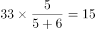人，女生人数为人；乙班人数为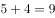的倍数，满足条件的数字只有36，其中男生人数为人，女生人数为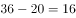人。男生总人数为人，女生总人数为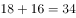人，男生总数比女生总数多1人。

故正确答案为A。

---

### 第 3 题　qid 2049760 · 数学运算

某地举办铁人三项比赛，全程为51.5千米，游泳、自行车、长跑的路程之比为。小陈在这三个项目花费的时间之比为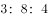，比赛中他长跑的平均速度是15千米/小时，且两次换项共耗时4分钟，那么他完成比赛共耗时多少？

- **A**. 2小时14分
- **B**. 2小时24分
- **C**. 2小时34分　✅
- **D**. 2小时44分

**答案**：C

**官方解析**

方法一：由列表可得，小陈在游泳、自行车、长跑三项比赛中的速度之比为，其中长跑的速度为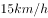，则自行车的速度应为，游泳的速度为，可得三段路程的实际耗时如表所示，共计：小时，加上4分钟的换项时间，一共用时2小时34分。

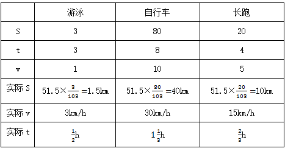

方法二：由三个项目所花时间之比为，项目总时间是15的倍数，再加上换项耗时4分钟，则比赛总时间应为15的倍数加上4分钟，结合选项只有C项（154分钟）满足。

故正确答案为C。

---

### 第 4 题　qid 2049788 · 数学运算

某单位准备扩建一矩形花圃，若将矩形花圃的长和宽各增加4米，则新矩形花圃的面积比原来的面积增加了40平方米。那么，原矩形花圃的周长是多少？

- **A**. 12米　✅
- **B**. 24米
- **C**. 32米
- **D**. 40米

**答案**：A

**官方解析**

假设原矩形花圃的长和宽分别为、，根据题意可得：，整理得，则原矩形花圃周长为米。

故正确答案为A。

---

### 第 5 题　qid 2051344 · 数学运算

某水库决定对堤坝进行处理。如下图所示，水库大坝的迎水面的坡角为，坝高为10米。现要加高大坝，使坡度为1：1（坡度坡角的正切值），那么大坝要加高多少米？

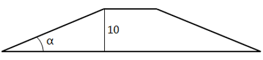

- **A**. 

　✅
- **B**. 
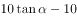

- **C**. 
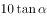

- **D**. 

**答案**：A

**官方解析**

截取大坝侧截面，如图所示为夹角为的直角三角形。设三角形底边为，则有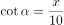，。现要加高大坝，使两直角边之比为1：1即，则，所需增加高度。 

故正确答案为A。

---

### 第 6 题　qid 2049532 · 数学运算

小王从编号分别为1、2、3、4、5的5本书中随机抽出3本，那么，这3本书的编号恰好为相邻三个整数的概率为：

- **A**. 

- **B**. 

- **C**. 

　✅
- **D**. 

**答案**：C

**官方解析**

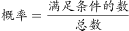。从5本书中随机抽出3本，总数为。这3本书的编号恰好为相邻三个整数即123，234，345三种情况，满足条件的数为3。故概率为：。

故正确答案为C。

---

### 第 7 题　qid 2049842 · 数学运算

如右图所示，甲和乙在面积为54π的半圆形游泳池内游泳，他们分别从位置A和B同时出发，沿直线同时游到位置C。若甲的速度为乙的2倍，则原来甲、乙两人相距：

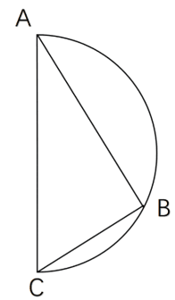

- **A**. 
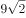米

- **B**. 
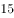米

- **C**. 
米

- **D**. 
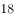米
　✅

**答案**：D

**官方解析**

由题意可得，甲的速度为乙的2倍，相同时间，距离与速度成正比，则，因AC为直径，则，又已知半圆的面积为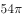，假设圆的半径为，则，，则，，，。

故正确答案为D。

---

### 第 8 题　qid 2049796 · 数学运算

某机场一条自动人行道长42m，运行速度0.75。小王在自动人行道的起始点将一件包裹通过自动人行道传递给位于终点位置的小明。小明为了节省时间，在包裹开始传递时，沿自动人行道逆行领取包裹并返回。假定小明的步行速度是1，则小明拿到包裹并回到自动人行道终点共需要的时间是：

- **A**. 24秒
- **B**. 42秒
- **C**. 48秒　✅
- **D**. 56秒

**答案**：C

**官方解析**

包裹开始传递时，速度为，小明逆向领取包裹速度为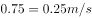，小明和包裹相遇需要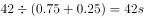，此时距离小明起点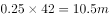，小明返回速度为，所需时间，共用时。

故正确答案为C。

---

### 第 9 题　qid 2050108 · 数学运算

某公司销售部拟派3名销售主管和6名销售人员前往3座城市进行市场调研，每座城市派销售主管1名，销售人员2名。那么，不同的人员派遣方案有：

- **A**. 540种　✅
- **B**. 1080种
- **C**. 1620种
- **D**. 3240种

**答案**：A

**官方解析**

根据题干可得，先排销售主管，销售主管的排法有：种；再排销售人员，销售人员的排法有：种；同时满足销售主管1名，销售人员2名，所以不同的人员派遣方案有：种。

故正确答案为A。

---

### 第 10 题　qid 2049754 · 数学运算

小明负责将某农场的鸡蛋运送到小卖部。按照规定，每送达1枚完整无损的鸡蛋，可得运费0.1元；若有鸡蛋破损，不仅得不到该枚鸡蛋的运费，每破损一枚鸡蛋还要赔偿0.4元。小明10月份共运送鸡蛋25000枚，获得运费2480元。那么，在运送过程中，鸡蛋破损了：

- **A**. 20枚
- **B**. 30枚
- **C**. 40枚　✅
- **D**. 50枚

**答案**：C

**官方解析**

设在运送过程中，鸡蛋破损了枚，则完好的鸡蛋有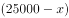枚。根据条件可列方程：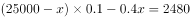，解得。

故正确答案为C。

---

### 第 11 题　qid 2049564 · 数学运算

某件刺绣产品，需要效率相当的三名绣工8天才能完成；绣品完成时，一人有事提前离开，绣品由剩下的两人继续完成；绣品完成时，又有一人离开，绣品由最后剩下的那个人做完。那么，完成该件绣品一共用了：

- **A**. 10天
- **B**. 11天
- **C**. 12天
- **D**. 13天　✅

**答案**：D

**官方解析**

设每名绣工的效率为1，则工程总量。此项工程分成三个阶段。

第一阶段三名绣工做，需要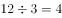天；

第二阶段两名绣工做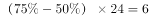，需要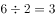天；

第三阶段一名绣工做，需要天。

完成该件绣品一共用了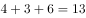天。

故正确答案为D。

---

## 判断推理

### 第 1 题　qid 2049954 · 图形推理

从所给的四个选项中，选择最合适的一个填入问号处，使之呈现一定的规律性：

- **A**. A
- **B**. B　✅
- **C**. C
- **D**. D

**答案**：B

**官方解析**

图形元素组成相似，优先考虑样式规律。因为第二组图中问号在中间，所以优先观察第一组图中第一个图形和第三个图形是如何得到第二个图形的。第一个图形与第三个图形去同求异得到图①，然后再逆时针旋转得到第二个图形，第二组满足同样的规律，第一个图形与第三个图形去同求异得到图②，再逆时针旋转得到的图形与B项相同。

故正确答案为B。

---

### 第 2 题　qid 2049948 · 图形推理

左边给定的是削掉一个角的纸盒，下列哪一项不是由它展开而成？

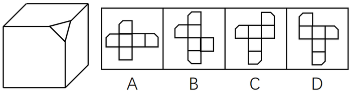

- **A**. A
- **B**. B
- **C**. C　✅
- **D**. D

**答案**：C

**官方解析**

题干图形切去了一个角，出现三个面缺角，三个缺角要重合，如上图所示，C项中1和是重合边，但没有缺角，即三个缺角不重合，所以C选项错误。

本题为选非题，故正确答案为C。

C项详解：

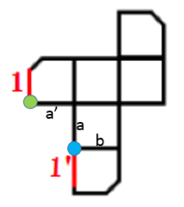

必备知识：首先要知道，六面体中一个顶点发射且只发射出三条边

①图中a和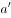是直角边，是同一条边，因此绿色的点和蓝色的点是同一个点；

②从蓝色点发出的a、b、三条线，因此绿色的点发出的应该也是a、b、三条线（原理见上面的必备知识）；

③那现在知道a和是同一条，因此剩下边1要么就是b，要么是。但是b已经不可能了（因为b这条边两边的面已经是确定的了），所以1只能是这条边，因此它俩折叠完后是重合的。

而题干缺角的三条边应该是互相挨着的，不可能出现C中一条缺口的边1和一条完整的边挨着，所以C错。

本题为选非题，故正确答案为C。

---

### 第 3 题　qid 2049952 · 图形推理

从所给的四个选项中，选择最合适的一个填入问号处，使之呈现一定的规律性：

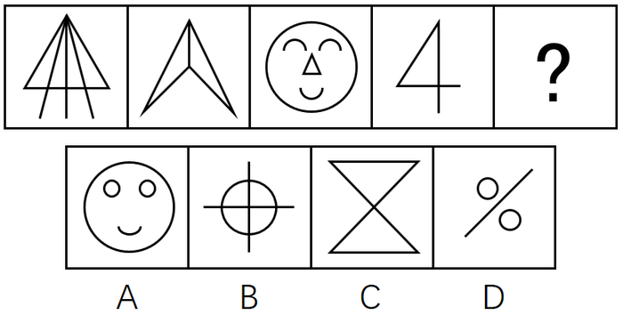

- **A**. A
- **B**. B
- **C**. C　✅
- **D**. D

**答案**：C

**官方解析**

图形元素组成不同，属性数量无明显规律，但整体观察题干发现，每个图形中都存在三角形，只有C选项符合。（注：B项中出现的是4个扇形，而不是三角形。）
故正确答案为C。

---

### 第 4 题　qid 2050074 · 图形推理

从所给的四个选项中，选出一个最合适的填入问号处，使之呈现一定的规律：

- **A**. A
- **B**. B　✅
- **C**. C
- **D**. D

**答案**：B

**官方解析**

题干图形间有明显的凹进和凸出部分，考虑图形拼合。如下图所示，题干图2逆时针旋转90度之后拼接在图1的右边，图3顺时针旋转90度后拼接在图2的下边，很明显，还缺一幅凸出两个尖的图形，最后就可拼成一个完整的正方形，观察选项，只有B项凸出两个尖。

故正确答案为B。

---

### 第 5 题　qid 2049956 · 图形推理

把下面的六个平面图形分为两类，使每一类图形都有各自的共同特征或规律，分类正确的一项是：

- **A**. ①②⑤，③④⑥
- **B**. ①③⑥，②④⑤
- **C**. ①②④，③⑤⑥
- **D**. ①③④，②⑤⑥　✅

**答案**：D

**官方解析**

图形元素组成不同，优先考虑属性规律。题干中6个图形都是对称图形，所以考虑对称性，①③④为中心对称图形，②⑤⑥为轴对称图形。
故正确答案为D。

---

### 第 6 题　qid 2049970 · 定义判断

随着科学技术的发展，人机交流已经成为现实，这其中的关键是脑机接口技术。所谓脑机接口，就是连接大脑与计算机之间的信息系统，可让大脑直接和计算机沟通。脑机接口可以从大脑传递信息到计算机，又可以从计算机传递信息进入大脑。
根据上述定义，下列应用不属于脑机接口技术的是：

- **A**. 某游戏玩家的大脑植入一部装置，通过该装置用意念控制机械手，端起杯子喝茶
- **B**. 某游戏玩家佩戴一套义肢设备，经过多次练习，凭着坚强意志力，实现独立行走　✅
- **C**. 某游戏玩家佩戴一种脸部饰品，饰品根据佩戴者的情绪变化作出相应的指示动作
- **D**. 某游戏玩家戴上一套高科技耳机，集中注意力，通过精神控制小球飞越各种障碍

**答案**：B

**官方解析**

第一步：找出定义关键词。
“连接大脑与计算机”、“可让大脑直接和计算机沟通”。
第二步：逐一分析选项。
A项：大脑植入装置并且可以通过装置用意念控制机械手，体现了“连接大脑和计算机”和“可让大脑直接和计算机沟通”，符合定义，排除；
B项：游戏玩家用坚强的意志力实现使用义肢设备独立行走，主要依靠的是坚强意志力，而不是大脑与计算机的沟通，不符合定义，当选；
C项：脸部饰品会根据佩戴者情绪变化作出相应的指示动作，情绪变化是大脑的表现，体现了“可让大脑直接和计算机沟通”，符合定义，排除；
D项：游戏玩家戴高科技耳机通过精神控制小球飞越各种障碍，体现了“可让大脑直接和计算机沟通”，符合定义，排除。
本题为选非题，故正确答案为B。

---

### 第 7 题　qid 2049936 · 定义判断

数据挖掘（Data mining）是指从大量的存储数据中利用统计、情报检索、模式识别、在线分析处理和专家系统（依靠过去的经验）等方法或技术，发现隐含在其中、事先不知道但又是潜在有用的信息和知识的信息处理过程。
根据上述定义，下列选项不属于数据挖掘应用的是：

- **A**. 
某高校要求教师使用网上教学管理系统，录入学生的期末考试成绩，以便借助短信群发软件告知学生成绩
　✅
- **B**. 
某国际快递和物流公司使用RFID（无线射频识别）技术在不同时间点跨境全程监控和调整药品装运的温度

- **C**. 
某大型网上书店在客户选购一种图书时，推出“购买该商品的用户还购买了”等栏目，从而增加可观收益

- **D**. 
某全球零售企业在分析上一年度消费者购物行为后推出“尿布啤酒”促销举措，使得二者销量大幅增加

**答案**：A

**官方解析**

第一步：找出定义关键词。

“从大量的存储数据中利用统计、情报检索、模式识别、在线分析处理和专家系统（依靠过去的经验）等方法或技术”、“发现隐含在其中、事先不知道但又是潜在有用信息和知识”。

第二步：逐一分析选项。

A项：录入学生期末考试成绩，并用短信群发软件告知学生成绩，“告知学生成绩”没有体现发现隐含在其中的信息。不符合定义，当选；

B项：国际快递和物流公司运输的药品符合“大量的存储数据”；“无线射频识别”符合模式识别、在线分析等方法和技术；而“监控并调整其温度”符合“发现有用信息”这一关键词，符合定义，排除；

C项：“购买该商品的用户还购买了”是通过以前购买过此图书的消费者还购买过其他商品的大量的数据分析而总结出来的，符合“对大量数据利用统计、情报检索”这一关键词，向客户推荐其他商品符合“隐含在其中，潜在有用信息”，符合定义，排除；

D项：“分析上一年度消费者购物行为”符合“对大量数据的统计、情报检索、在线分析处理······技术”，并且推出了“尿布啤酒”这一模式，符合“发现隐含在其中、事先不知道但又是潜在有用信息”，符合定义，排除。

本题为选非题，故正确答案为A。

---

### 第 8 题　qid 2049888 · 定义判断

非爱行为，指以爱的名义，对自己亲近的人进行非爱性的掠夺，即违背他人主观意愿，在精神与行为方面强制控制，迫使对方按照施控者的意愿去行为做事，这一行为往往发生在夫妻、恋人、父母与子女等最亲近的人之间。
根据上述定义，下列属于非爱行为的是：

- **A**. 张某按照医嘱，要求女儿每三个小时做一次牵引，以消除疼痛
- **B**. 林某强迫儿子每天练琴3小时，争取在钢琴大赛中取得好成绩　✅
- **C**. 陈某为防止患精神病的女儿逃逸，将其关在地下室禁止其出入
- **D**. 李某按照轮流陪护协议，要求妻子前往医院陪护患重病的母亲

**答案**：B

**官方解析**

第一步：找出定义关键词。
“违背他人主观意愿”、“强制控制”、“迫使对方按照施控者的意愿去做事”、“往往发生在夫妻、恋人、父母与子女等最亲近的人之间”
第二步：逐一分析选项。
A项：要求女儿做牵引，但女儿是否想要做没有明确表明，不能确定是否“违背他人主观意愿”、“强制控制”、“迫使对方按照施控者的意愿去做事”，不符合定义，排除；
B项：强迫儿子练琴中的“强迫”体现出儿子一定不愿意练琴，明确地符合关键词“违背他人主观意愿”、“强制控制”、“迫使对方按照施控者的意愿去做事”，符合定义，当选；
C项：把“精神病”女儿关在地下室，是出于对她的一种保护，不属于违背个人的主观意愿，不符合定义，排除；
D项：要求妻子照顾患病的母亲，但妻子是否想要照顾患病的母亲没有明确表明，不能确定是否“违背他人主观意愿”、“强制控制”、“迫使对方按照施控者的意愿去做事”，不符合定义，排除。
故正确答案为B。

---

### 第 9 题　qid 2049966 · 定义判断

心理会计是指人们在心里无意识地把财富划归不同的账户进行管理，并对结果（尤其是经济结果）加以编码、分类和估价的过程，且不同的心理账户有不同的记账方式和心理运算规则。小到个体、家庭，大到企业集团，都有一套或隐或显的心理账户系统，其心理记账方式与经济学和数学的运算方式都不相同，因此经常以非预期的方式影响着决策，使个体的决策违背最简单的理性经济法则。
根据上述定义，下列选项最能体现心理会计现象的是：

- **A**. 整日忧心忡忡的小李将自己全部存款的四分之三用于购买人寿保险
- **B**. 小陈已经攒够购买相机的钱，但他一定要等领到年底奖金再买相机　✅
- **C**. 小王在两家不同银行都有储蓄卡，但他总是去离家更近的银行取款
- **D**. 小刘因公司奖励出游某地感觉不错，后来自费重游此地却感觉不佳

**答案**：B

**官方解析**

第一步，找出定义关键词。
“人们在心里无意识地把财富划归不同的账户进行管理”、“对结果（尤其是经济结果）加以编码、分类和估价”、“不同的心理账户有不同的记账方式和心理运算规则”、“个体的决策违背最简单的理性经济法则”。
第二步，逐一分析选项。
A项：小李将自己存款的四分之三用于购买人寿保险，这是有意识对财富进行支出和管理，并未体现“人们在心里无意识地把财富划归不同的账户进行管理”，不符合定义，排除；
B项：小陈已经攒够购买相机的钱，但他一定要等领到年底奖金再买相机，无论是现在的存款还是年底奖金都是小陈自己的财富，而且无论是现在买还是之后买都是等价的商品。但是工资和年底奖金性质有所不同，所以小陈在心里上认为有差别，“心理账户”就不一样了，符合“人们在心里无意识地把财富划归不同的账户进行管理”，而且也“违背最简单的理性经济法则”，符合定义，当选；
C项：小王选择去哪家银行根据的是距离远近而非财富本身，不符合定义，排除；
D项：小刘对公司奖励的出游某地感觉很满意，但是对自费出游某地感觉不佳，第二次出游是小刘自费，涉及了对自己财富的管理，而第一次出游是公司的奖励，不涉及小刘对自己财富的管理，无法体现“人们在心里无意识地把财富划归不同的账户进行管理”，且D项中没有涉及小刘的决策“违背最简单的理性经济法则”，不符合定义，排除。
故正确答案为B。

---

### 第 10 题　qid 2050284 · 定义判断

逻辑思维是人的理性认识阶段，是人类反映事物本质和规律的认识过程。逻辑思维既涉及逻辑思维形式和逻辑方法规则，也涉及逻辑思维的基本规律。逻辑思维形式和逻辑方法规则是指把自然语言抽象概括为形式语言，形成初始符号或规则，用来研究概念、判断和推理，只在局部范围内起作用；逻辑思维基本规律是人类进行正确逻辑思维的根本准则和基本依据，普遍适用于人们的思维。
根据上述定义，下列选项违反逻辑思维形式和逻辑方法规则的是：

- **A**. 把不同概念相互混淆或改换同一概念的含义
- **B**. 把两个互相矛盾或反对的思想都认为是真的
- **C**. 对某个概念进行划分时存在越级划分的错误　✅
- **D**. 把没有经过证明的假设作为论证的充分前提

**答案**：C

**官方解析**

第一步：找到定义关键词。
“把自然语言抽象概括为形式语言”、“研究概念、判断和推理”、“局部范围内起作用”。
第二步：逐一分析选项。
A项：把不同概念混淆或改换同一概念的含义，这违反了逻辑的基本规律——同一律，排除；
B项：把两个互相矛盾或反对的思想都认为是真的，这违反逻辑的基本规律——矛盾律，排除；
C项：对某个概念进行划分是人们制定的规则，是可变的，因此这种越级划分的错误只是在局部范围内犯的错误，并不具有普适性，因此违反了逻辑思维形式和逻辑方法规则，当选；
D项：把没有经过证明的假设作为论证的充分前提，这违反逻辑的基本规律——充足理由律，排除。
故正确答案为C。
附：
同一律： 
一、同一律的内容和要求： 
１.内容：同一个思维过程中，每一思想与其自身是同一的；即“Ａ就是Ａ”。 
２.要求：同一个思维过程中，概念都要确定，并保持自身的同一，不得随意变更。 
二、违反同一律要求的逻辑错误： 
１.混淆概念或偷换概念：把两个不同的概念混淆起来，并用一个概念代替已经使用的另一个概念。 
２.转移论题或偷换论题：在同一思维过程中，改变原来的断定内容，或者用另一断定代替之。
矛盾律： 
一、矛盾律的内容和要求： 
１.内容：同一思维过程中，两个互相否定的思想不能同真，必有一假；即“非（既Ａ又非Ａ）”； 
２.要求：同一思维过程中，不能对不能同真的命题（矛盾关系、反对关系）同时加以肯定。
二、违反矛盾律要求的逻辑错误： 
１.自相矛盾：同时肯定了互相矛盾的命题。 
２.悖论：一种特殊的逻辑矛盾，即通过一个命题的真，可以推假，而通过它的假，又可推真。
充足理由律：
“充足理由律”包含有两方面意思：
第一，一切事物都有一个成因，这个成因决定了这个事物为什么会存在，为什么它是真实的，为什么它是这个样子而不是另外的样子。人们认识了这个成因，也就认识了这个事物，也就可以改变这个事物。正如莱布尼兹所说的：“如果不具有充足的理由，或者没有确定的理由，就什么也不能达到”。
第二，事物的感性存在，直观存在并不重要，只有事物背后的成因才是最为重要的，最真实的。

---

### 第 11 题　qid 2049960 · 定义判断

共享经济指借助网络第三方平台，基于闲置资源使用权的暂时性转移，实现生产要素的社会化，提高存量资产的使用效率以创造更多价值，促进社会经济的可持续发展。
根据上述定义，下列经济活动不属于共享经济的是：

- **A**. 王某从某网络平台订车去飞机场，方便快捷
- **B**. 李某从某网络平台贷款炒股，获得了预期收益　✅
- **C**. 马某旅行前从某网络平台预定民宿，抵达后入住
- **D**. 张某从某网络平台购买外卖美食，在家享受美味

**答案**：B

**官方解析**

第一步：找出定义关键词。

方式：“借助网络第三方平台”、“闲置资源使用权暂时性转移”。

目的：“促进社会经济的可持续发展”。

第二步：逐一分析选项。

A项：王某从网络平台订车去机场，通过网络第三方平台让车辆的使用权暂时性转移给王某，符合定义，排除；

B项：网络贷款炒股, 符合“借助网络第三方平台”，贷款也符合关键词“闲置资源使用权暂时性转移”，但如下图所示，银保监会规定互联网贷款资金不得用于股票，若违反即违规行为，违反社会主义主流价值观，故不符合定义关键词“促进社会经济的可持续发展”，不符合定义，当选；

C项：马某从网络平台预定民宿，通过网络第三方平台让民宿的使用权暂时性转移给马某，符合定义，排除；

D项：在网上订购美食，符合“借助网络第三方平台”，由外卖员送货到家，外卖员送货也符合定义关键词“闲置资源使用权暂时性转移”，另外，典型的外卖平台有饿了么、美团等等，这些都是共享经济模式下的知名企业，如下图所示，它们整合线下的闲散劳动力，共同获得经济红利，符合定义，排除。

本题为选非题，故正确答案为B。

附注：下图为2020安徽省考判断推理大纲中，明确给出标准答案的原题，因此本题答案为B项。

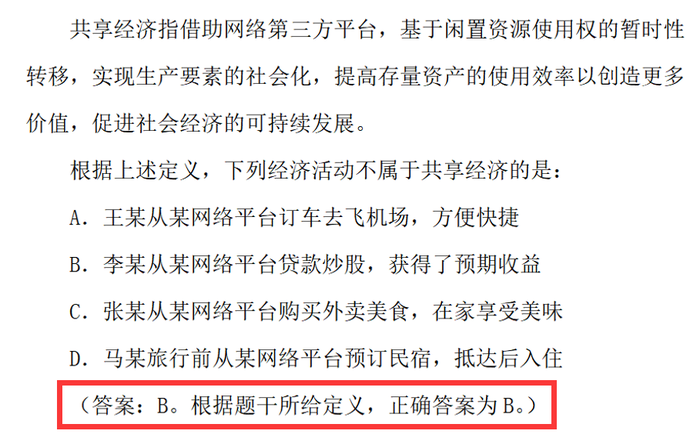

---

### 第 12 题　qid 2050088 · 定义判断

心理人类学是介于文化人类学与心理学之间的交叉学科，主要研究并了解文化对所属社会成员产生影响的心理机制，发现在个体水平上的心理变量与在总体水平上的文化、社会、经济、生态和生物变量之间的关系。
根据上述定义，下列选项属于心理人类学研究范畴的是：

- **A**. “五四”前后诗歌风格的比较
- **B**. 当代流行话语下的社会主流价值
- **C**. 草原文明与蒙古民族性格的养成　✅
- **D**. 从《背影》看作者对父亲态度的变化

**答案**：C

**官方解析**

第一步：找出定义关键词。
“文化对所属社会成员产生影响的心理机制”、“个体的心理变量与总体的文化、社会、经济、生态和生物变量之间的关系”。
第二步：逐一分析选项。
A项：只是简单比较诗歌风格，没有体现文化对社会成员的影响，不符合题干定义，排除；
B项：该项研究的是当下的主流价值观，不是文化对社会成员的影响，不符合题干定义，排除；
C项：草原文明与蒙古民族性格的养成，既有草原文化，也明确体现该文化对所属的社会成员（即蒙古民族）产生影响的心理机制（民族性格的养成），符合题干定义，当选；
D项：该项研究的是作者和父亲两个个体之间的关系，没有体现文化对社会成员的影响，不符合题干定义，排除。
故正确答案为C。

---

### 第 13 题　qid 2049962 · 定义判断

木椅子效应是指将成绩相等的两组学生分别安排坐在舒适的沙发椅和很不舒服的木椅子上学习，不久之后，坐木椅子的学生学习成绩要比坐沙发椅的学生成绩高出许多。原因是坐木椅子的学生因为不舒服而不断调整坐姿，表面看来好像不安而好动，实质却因此给脑部供应了更多的血液和营养；而坐沙发椅的学生，由于舒适而一动不动，致使血液循环相对减慢，脑部得到的血液和营养相对减少，学习效果因此就差了一些。
根据上述定义，下列选项最能体现木椅子效应的是：

- **A**. 某学生从小到大饱受责罚，学习成绩一直不理想
- **B**. 小刚每天步行上学和回家，风雨无阻却学得很好　✅
- **C**. 某家长为鼓励孩子暑天学习，每天为其提供冷饮
- **D**. 搬入新书房一个月后，小明的成绩名次一路攀升

**答案**：B

**官方解析**

第一步，找出定义关键词。
“坐不舒服木椅子的同学，学习成绩更好”、“坐舒适沙发椅的同学，学习效果差一些”。
第二步，逐一分析选项。
A项：学生从小到大饱受责罚，体现了不舒服的状态，但是学习成绩不理想，不符合“坐不舒服木椅子的同学，学习成绩更好”，不符合定义，排除；
B项：小刚每天步行上学和回家，风雨天也是如此，体现了不舒服的状态，并且学得很好，符合“坐不舒服木椅子的同学，学习成绩更好”符合定义，当选；
C项：家长每天鼓励孩子并为其提供冷饮，体现了舒服的状态，但未明确说明学习好坏，不符合“坐舒适沙发椅的同学，学习效果差一些”，不符合定义，排除；
D项：搬入新书房是否属于舒服的状态不明确，不符合“坐不舒服木椅子的同学，学习成绩更好”，不符合定义，排除。
故正确答案为B。

---

### 第 14 题　qid 2049958 · 定义判断

人类增强就是利用生物医学技术、智能技术、神经科学技术、信息技术和纳米技术等高新技术手段使健康人类的机体功能或能力超出其正常范围，从而使人类的体貌、寿命、人格、认知和行为等能力发生根本性变化并具有全新能力的一种技术手段，其目的是显著提高人类生活的质量。
根据上述定义，下列选项不属于人类增强的是：

- **A**. 演员赵某用药剂延缓衰老
- **B**. 医生建议老张去做心脏搭桥手术　✅
- **C**. 医生将传感器植入老陈大脑提高其记忆力
- **D**. 小王为了增加自己的身高服用类增高药物

**答案**：B

**官方解析**

第一步：找出定义关键词。
方式：利用高新技术手段使健康人类机体功能或能力超出正常范围，使人类的体貌、寿命、人格、认知和行为等能力发生根本性变化并具有全新能力。
目的：显著提高人类生活质量。
第二步：逐一分析选项。
A项：药剂属于一种生物医学技术，延缓衰老是人类机体功能超出正常范围的表现，使寿命发生了变化，符合定义，排除；
B项：老张做心脏搭桥手术说明老张的心脏有问题，是从不健康变为健康，而不是从健康变为超出正常范围，不符合定义，当选；
C项：传感器是一种高新技术手段，利用传感器提高记忆力使老陈的认知功能发生变化，符合定义，排除；
D项：服用类增高药物属于一种生物医学技术手段，利用该药物使小王的体貌发生变化，符合定义，排除。
本题为选非题，故正确答案为B。

---

### 第 15 题　qid 2049934 · 定义判断

我国婚姻法规定，禁止直系血亲和三代以内旁系血亲结婚。直系血亲是指和自己有直接血缘关系的亲属，三代以内旁系血亲是指与己身出自同一父母或同一祖父母、外祖父母，除直系血亲外的所有血亲。
根据上述定义，下列选项中的甲和乙可以结婚的是：

- **A**. 张某是甲（女）的姨父，乙系张某的儿子
- **B**. 李某是乙（女）的姑父，甲系李某的儿子
- **C**. 甲是林某与前夫的儿子，乙是林某与后夫的女儿
- **D**. 王某是张某的舅舅，甲系王某的儿子，乙系张某的女儿　✅

**答案**：D

**官方解析**

第一步，找出定义关键词。

“直系血亲是指和自己有直接血缘关系的亲属”、“三代以内旁系血亲是指与己身出自同一父母或同一祖父母、外祖父母，除直系血亲外的所有血亲”。

第二步，逐一分析选项。

A项：张某是甲（女）的姨父，乙是其姨父（张某）的儿子。甲的姨与乙的母亲是同一人，甲与其姨有血亲关系，乙与其母亲也有血亲关系，因此两人有血亲关系。符合定义，不能结婚，排除；

B项：李某是乙（女）的姑父，甲是其姑父（李某）的儿子。乙的姑姑与甲的母亲是同一人，乙与其姑姑有血亲关系，甲与其母亲也有血亲关系，因此两人有血亲关系。符合定义，不能结婚，排除；

C项：甲与乙出自同一外祖父母，属于三代以内旁系血亲，符合定义，不能结婚，排除；

D项：如下图，王某是张某的舅舅，甲系王某儿子，乙系张某女儿，甲、乙二人不符合“三代以内旁系血亲是指与己身出自同一父母或同一祖父母、外祖父母，除直系血亲外的所有血亲”的关系，不符合定义，可以结婚，当选。

故正确答案为D。 

---

### 第 16 题　qid 2049904 · 逻辑判断

汽车行业作为制造业中技术含量、智能化程度和产业集中度较高的代表，已经成为了德国“工业4.0”的先导阵地。长期处于2.0工业思维的中国汽车制造业要在全球占有一席之地，进行技术创新与变革和拥有丰富经验的资深人才必不可少，而高薪和福利成为吸引人才的制胜法宝。
由此可以推出：

- **A**. 如果能够吸引到资深人才，中国汽车制造业的改革就能成功
- **B**. 高薪和福利是很多中国职场人士选择职业时的一个重要关注点
- **C**. 不进行技术变革，中国汽车制造业就不能在全球占有一席之地　✅
- **D**. 德国汽车制造业在世界汽车行业具有举足轻重的地位和影响力

**答案**：C

**官方解析**

第一步：翻译题干。 

中国汽车制造业要在全球占有一席之地技术创新与变革且拥有丰富经验的资深人才。

第二步：逐一分析选项。

A项：吸引到资深人才中国汽车制造业的改革就能成功，属于对题干箭头后且关系中一项的肯定，且关系肯定其中一项不能得到确定性的结论，排除；

B项：高薪和福利是很多中国职场人士选择职业时的一个重要关注点，题干没有提到中国职场人士选择职业的问题，选项内容正确性无从得知，排除；

C项：不进行技术变革中国汽车制造业就不能在全球占有一席之地，属于对题干箭头后且关系中一项的否定，根据且关系一否全否，题干条件进行否后，否后必否前，当选；

D项：德国汽车制造业在世界汽车行业具有举足轻重的地位和影响力，从题干已知信息无从得知，排除。

故正确答案为C。

---

### 第 17 题　qid 2049896 · 逻辑判断

一项研究显示，先让受试者参加消除某项偏见的学习，并给受试者播放与消除该偏见学习相关联的声音。之后，让受试者进入深度睡眠状态，同时重复播放那些相关联的声音，以重新激活消除该偏见的学习。结果发现，该偏见比睡眠前大大减少，且睡眠质量越高，偏见减少得越多。研究人员由此推测，睡眠干预可减少社会偏见与歧视。
以下哪项如果为真，最能支持上述论证？

- **A**. 普通民众难以得到消除偏见学习的睡眠干预
- **B**. 睡眠充足、睡眠质量高的人比其他人更不易产生偏见与歧视
- **C**. 有身高歧视、相貌歧视的人经过睡眠干预后，歧视程度明显降低　✅
- **D**. 在接受睡眠干预的受试者中，有一部分人并不存在明显的偏见或歧视

**答案**：C

**官方解析**

第一步：找到论点和论据。
论点：睡眠干预可减少社会偏见与歧视。
论据：受试者先参加消除偏见的学习，然后在进入深度睡眠的同时播放与消除偏见学习相关联的声音，偏见比睡眠前大大减少，且睡眠质量越高，偏见减少得越多。
第二步：逐一分析选项。
A项：没有讨论睡眠干预的作用，为无关项，排除；
B项：讨论的是睡眠好的人不易产生偏见与歧视，但是并不能说明睡眠干预是否能消除已有的偏见，为无关项，排除；
C项：举例说明睡眠干预确实减少了某些社会偏见和歧视，如身高歧视、相貌歧视，可以支持，当选；
D项：指出实验中的一部分主体并无明显偏见或歧视，没有歧视的人与题干无关，为无关项，排除。
故正确答案为C。

---

### 第 18 题　qid 2049912 · 逻辑判断

作为抗衰老药物，雷帕霉素延长寿命的秘密在于能够阻断mTOR通道——这也是控制着影响细胞生长繁殖流程的“主开关”之一。当食物充足时，这种通道从激素和营养物质中获得信号使细胞吸收营养并生长，但细胞进行新陈代谢和生长的过程中会产生激发细胞老化的副产物；当限制食物热量的摄入时，这个通道可以发出信号使细胞停止生长，借此来延缓衰老。雷帕霉素可能是目前已发现的最有效可靠的抗衰老药物。
以下哪项如果为真，不能支持上述结论？

- **A**. 由于具有抑制细胞生长的作用，雷帕霉素被用于治疗某些癌症
- **B**. 雷帕霉素在延缓衰老的同时，使人更易受到细菌和病毒的侵袭　✅
- **C**. 试验研究已经证明雷帕霉素能够延长酵母、蠕虫和果蝇的寿命
- **D**. 雷帕霉素可以阻断mTOR通道，而不需要限制食物热量的摄入

**答案**：B

**官方解析**

第一步：找出论点和论据。
论点：雷帕霉素可能是目前已发现的最有效可靠的抗衰老药物。
论据：雷帕霉素可以阻断mTOR通道；当限制食物热量的摄入时，这个通道可以发出信号使细胞停止生长，借此来延缓衰老。
第二步：逐一分析选项。
A项：雷帕霉素具有抑制细胞生长的作用，能够加强题干观点，抑制细胞生长，延缓衰老，排除。
B项：雷帕霉素在延缓衰老的同时，使人更易受到细菌和病毒的侵袭，前半句说明雷帕霉素可以延缓衰老，但后半句表述的“使人更易受到细菌和病毒的侵袭”说明雷帕霉素并不是可靠的抗衰老药物，削弱题干论点，不能支持，当选。
C项：实验研究已经证明雷帕霉素能够延长酵母、蠕虫和果蝇的寿命，通过举例子的方式加强题干的观点，排除。
D项：雷帕霉素可以阻断mTOR通道，支持了题干论据，排除。
本题为选非题，故正确答案为B。

---

### 第 19 题　qid 2050076 · 逻辑判断

提高能源使用效率、鼓励能源灵活利用是英国减少温室气体排放政策的一个必要环节，它需要采用智能技术，包括通过智能表将能源使用信息从需求方面或客户发送到能源公司等。该信息可用于制定和实施更高效的能源使用条例。但英国消费者对此态度不一，因为该技术用于监控和支持能源高效率使用行为时，居民个人及家庭的能源数据不得不被动分享。所以，个人使用能源相关数据的被动分享有可能成为推广智能技术的最主要障碍。
以下哪项如果为真，最能支持上述结论？

- **A**. 
的调查者表示，不愿意因数据被动分享而降低个人能源使用比例

- **B**. 
的调查者认为，数据的被动分享大大增加个人隐私被侵犯的风险
　✅
- **C**. 
的调查者表示，那些关心气候变化的人更可能接受数据被动分享

- **D**. 
的调查者认为，数据不可能不被分享，否则智能技术不可能应用

**答案**：B

**官方解析**

本题属于加强题型。
第一步：找出论点和论据。
论点：个人使用能源相关数据的被动分享有可能成为推广智能技术的最主要障碍。
论据：智能技术会使得居民个人和家庭的能源数据被动分享。
第二步：逐一分析选项。
A项：此项强调多数人不同意因能源数据被动分享而降低个人能源使用比例，但题干并没有提及降低个人能源使用比例的问题，推广智能技术并不一定意味着降低能源使用比例，因此A项和论点无关，排除；
B项：数据的被动分享会增加隐私被侵犯的风险，解释了人们为什么不愿意被动分享个人能源数据，而推广智能技术必须要被动分享数据，因而也就解释了为何数据的被动分享会阻碍智能技术的推广，补充论据，加强论点，当选；
C项：该项只是说关心气候变化的人可能接受数据被动分享，并没有说明其他人愿意不愿意，所以不能确定被动分享是否会阻碍智能技术的推广，为不明确项，排除；
D项：此项强调数据分享在推广智能技术过程中的必要性，但数据分享是否重要和它是否会阻碍智能技术推广是两个话题，论题不一致，排除。
故正确答案为B。

---

### 第 20 题　qid 2049910 · 逻辑判断

英国一项研究发现，人只要在每餐饭前半小时喝一杯500毫升的水，并坚持3个月，体重就能减轻2至4公斤。研究团队邀请了84位超重的成人，随机分成2组，其中41位被要求在餐前喝500毫升水，另外43位则照常生活。3个月后，团队发现三餐前喝水的人，平均体重下降了4.3公斤；而餐前没喝水的人，平均体重只下降了0.81公斤。研究人员说，没有喝水的那组人，“平均运动量”比餐前饮水的人更高，这说明餐前喝适当的水真能减肥。
以下哪项如果为真，最能支持上述结论？

- **A**. 餐前喝水的那组人同时也注意控制饮食
- **B**. 餐前没喝水的人中有的体重减轻了4公斤
- **C**. 除了餐前喝水，两组的其他情况都是一样的　✅
- **D**. 餐前没喝水的人就餐中会喝更多的汤和饮料

**答案**：C

**官方解析**

第一步：找到论点和论据。
论点：餐前喝适当的水能减肥。
论据：餐前喝水的人比餐前没喝水的人平均体重下降得要多，且没有喝水的那组人“平均运动量”比餐前饮水的人更高。
第二步：逐一分析选项。
A项：说明可能有其他原因导致餐前喝水的人体重下降得更多，削弱了论点，排除；
B项：论据中说的是“平均体重”，个别人的体重与“平均体重”无关，排除；
C项：说明两组对象初始条件一致，可以支持，当选；
D项：餐前没喝水的人喝更多的汤和饮料，但是喝更多的汤和饮料并不代表体重一定降得比另一组更少，因为有可能固体的食物反而吃的少了，属于不明确选项，排除。
故正确答案为C。

---

### 第 21 题　qid 2049892 · 逻辑判断

很多家长认为，孩子不听话，“打屁屁”惩罚一下，至少能让孩子注意到自己的行为不当，变得更听话一些。还有一些人坚持“不严加管教会惯坏孩子”的传统信念，认为“打屁屁”是为孩子好。研究者对16万名儿童在过去5年里的经历进行研究，通过收集“打屁屁”行为的原数据加以分析，发现：打屁股会在儿童成长过程中造成智商低、攻击性行为高等多种负面影响。
以下哪项如果为真，最能支持上述结论？

- **A**. 
最新调查显示，智商相对较低的孩子大多数经常被家长打屁股

- **B**. 
本身不听话且更容易惹祸的孩子更有可能受到父母的严厉惩罚

- **C**. 
研究报告称全球大约的父母都有以打屁股管教孩子的经历

- **D**. 
被打屁股而困惑的孩子只懂得按家长要求去做而不会独立思考
　✅

**答案**：D

**官方解析**

第一步：找出论点和论据。
论点：打屁股会在儿童成长过程中造成智商低、攻击性行为高等多种负面影响。
论据：无明显论据。
第二步：逐一分析选项。
A项：智商相对较低的孩子大多数经常被家长打屁股，“智商相对较低”和“经常被家长打屁股”之间的因果关系并不明确，不能加强，排除；
B项：严厉惩罚与打屁股无必然联系，为无关项，排除；
C项：指出大多数父母都会打孩子屁股，但并未指出打屁股这一行为对儿童造成的后果，排除；
D项：指出孩子被打屁股后不会独立思考，而不会独立思考能力是负面影响，解释了论点，可以加强，当选。
故正确答案为D。

---

### 第 22 题　qid 2050212 · 逻辑判断

在汇率贬值期间，除非借入货币的利率和其他成本足够高，卖空贬值货币的投机活动不可避免。如果货币当局有足够的外汇储备坚持到最后，投机者就只能铩羽而归。但是，如果外汇储备不足，投机者最终就将“饱食远扬”，无论是在升值还是在贬值的压力下，如果汇率不能迅速反映市场的供求关系，将损害宏观经济稳定，不利于经济结构的调整。
如果以上论述为真，不能推出下列哪些结论？

- **A**. 或者货币当局有足够的外汇储备坚持到最后，或者投机者“饱食远扬”
- **B**. 如果汇率能够迅速反映市场的供求关系，那么就不会损害宏观经济稳定　✅
- **C**. 除非汇率迅速反映市场供求关系，否则会损害宏观经济稳定，不利于经济结构调整
- **D**. 如果借入货币的利率和其他成本不够高，那么卖空贬值货币的投机活动就不可避免

**答案**：B

**官方解析**

第一步：翻译题干。
题干第一句话省略了否则，补充完整即“除非借入货币的利率和其他成本足够高，否则不可避免卖空贬值货币的投机活动”，所以题干信息可翻译为：
（1）避免卖空贬值货币的投机活动→借入货币的利率和其他成本足够高；
（2）货币当局有足够外汇储备→投机者铩羽而归；
（3）货币当局外汇储备不足→投机者“饱食远扬”；
（4）汇率不能迅速反映市场供求关系→损害宏观经济稳定且不利于经济结构调整。
第二步：逐一分析选项。
A项：翻译为：货币当局有足够的外汇储备坚持到最后或投机者“饱食远扬”这句话的否1推1的形式就是：货币当局外汇储备不足→投机者饱食远扬，与条件（3）的翻译一致，能够推出，排除；
B项：汇率能够迅速反映市场供求关系是对条件（4）的否前，否前无法推出确定的结论，无法推出，当选；
C项：翻译为：-（损害宏观经济稳定且不利于经济结构调整）→汇率迅速反映市场供求关系，是对条件（4）的逆否，能够推出，排除；
D项：翻译为：借入货币的利率和其他成本不高→不能避免卖空贬值货币的投机活动，是对条件（1）的逆否，能够推出，排除。
本题为选非题，故正确答案为B。

---

### 第 23 题　qid 2049894 · 逻辑判断

柠烯，俗称柠檬精油。它通常被用于制作柑橘香味剂，是很多空气清新剂、身体喷雾剂等芳香剂重要的化学成分之一。柠烯本身并不可怕，因为该化学物质对人体不会形成大的危害，事实上，它可被用于食品的调味剂。然而柠烯一旦被喷入空气中，很快就会有所变化。研究表明，当柠烯暴露于普遍存在于空气的臭氧中时，两个柠烯分子会形成一个单分子化合物——甲醇。当房间中大量的柠烯被转化成甲醇时，其影响将迥然不同。
由此可以推出：

- **A**. 使用空气清新剂，可能会对我们自身有害处　✅
- **B**. 柠烯被用作食品的调味剂时，会对人体产生危害
- **C**. 如果房间中测出甲醇浓度高，则说明使用了太多芳香剂
- **D**. 在生活中，我们应该尽量避免使用含有柠烯成分的物品

**答案**：A

**官方解析**

根据题干所给信息逐一分析选项：
A项：由题干最后两句可得出，当选；
B项：题干说“柠烯本身并不可怕，因为该化学物质对人体不会形成大的危害，事实上，它可被用于食品的调味剂”，排除；
C项：题干只说当柠烯暴露于普遍存在于空气中的臭氧中时会形成甲醇，无中生有，排除；
D项：题干只是说柠烯喷入空气中可能有害，并非所有含有该成分的物品都有害，无中生有，排除。
故正确答案为A。

---

### 第 24 题　qid 2049908 · 类比推理

荷兰研究人员一直在试图模拟月球和火星的土壤条件进行农作物栽培实验。他们对该项实验种出的小红萝卜、豌豆、黑麦和西红柿进行初步分析。实验结果令人充满希望，这些产品不仅安全，而且可能比在地球土壤种出的农作物更健康。英国媒体称，能在火星土壤种出可食用作物，殖民火星的希望又向前迈进了一步。
如果以下各项为真，不能质疑英国媒体说法的是：

- **A**. 火星土壤重金属占比和地球土壤不一样　✅
- **B**. 在另一个同类实验中土豆的长势很糟糕
- **C**. 从实验到真正付诸实践还有很长的路要走
- **D**. 月球、火星、地球的气候条件有很大不同

**答案**：A

**官方解析**

第一步：找到论点和论据。
论点：能在火星土壤种出可食用作物，殖民火星的希望又向前迈进了一步。
论据：荷兰研究人员一直在试图模拟月球和火星的土壤条件进行农作物栽培实验。他们对该项实验种出的小红萝卜、豌豆、黑麦和西红柿进行初步分析。实验结果令人充满希望，这些产品不仅安全，而且可能比在地球土壤种出的农作物更健康。
第二步：逐一分析选项。
A项：火星土壤重金属占比和地球土壤不一样，题干中做实验时模拟的就是火星土壤，且最终的结果是种出的产品不仅安全还可能更健康，因此说土壤不一样没有任何意义，因此A选项无法质疑，当选；
B项：在另一个同类实验中土豆的长势很糟糕，举反例削弱，选非题，排除；
C项：从实验到真正付诸实践还有很长的路要走，说明实验和真正实践的差距性，可以质疑，选非题，排除；
D项：月球、火星、地球的气候条件有很大不同，而气候属于能否在火星生活的重要条件之一，属于补充新论据质疑，选非题，排除。
本题为选非题，故正确答案为A。

---

### 第 25 题　qid 2049902 · 逻辑判断

某科研机构提出潮湿的沙子是古埃及人在沙漠中搬运巨大石块和雕像的关键。研究人员指出，古埃及人将沉重的石块放上滑橇后，先在滑橇前铺设一层潮湿的沙子，再牵引它们，这种搬运方式起到了意想不到的效果。在实验中，研究人员使用流变仪测试沙子的硬度，以证实需要多少牵引力才能使一定数量的沙子变形，并在此基础上设计了牵引模型，从中发现将潮湿的沙子铺在滑橇前能更容易移动重物，而且沙子所含水分决定了沙子的硬度和牵引力。
如果以下哪项为真，最能支持上述结论？

- **A**. 在一幅古埃及墓室壁画中，一名男子站在滑橇前方，似乎正在浇水
- **B**. 滑橇牵引力与沙子硬度成反比，潮湿沙子的硬度是干燥沙子的两倍　✅
- **C**. 实验证明，铺设在滑橇前的潮湿沙子容易堆积，形成较大滑动阻力
- **D**. 一个实验室版的埃及滑橇被成功建造，能够模拟古埃及工地的实况

**答案**：B

**官方解析**

第一步：找到论点和论据。
论点：潮湿的沙子是古埃及人在沙漠中搬运巨大石块和雕像的关键。
论据：古埃及人将沉重的石块放上滑橇后，先在滑橇前铺设一层潮湿的沙子，再牵引它们，这种搬运方式起到了意想不到的效果。在实验中，研究人员使用流变仪测试沙子的硬度，以证实需要多少牵引力才能使一定数量的沙子变形，并在此基础上设计了牵引模型，从中发现将潮湿的沙子铺在滑橇前能更容易移动重物，而且沙子所含水分决定了沙子的硬度和牵引力。
第二步：逐一分析选项。
A项：在一幅古埃及墓室壁画中，滑橇前方的男子似乎在浇水，不明确到底有没有浇水，且没有提及“沙子”，属于无关选项，无法加强，排除；
B项：潮湿的沙子硬度大，相比于干燥沙子，潮湿沙子铺设在滑橇前所需的牵引力较小，也就更容易地移动放有重物的滑橇，解释了为什么潮湿会让牵引变得容易，属于解释加强，当选；
C项：潮湿的沙子容易堆积形成较大滑动阻力，不利于搬运巨大石块和雕像，削弱论点，排除；
D项：实验版的埃及滑橇能模拟古埃及工地的实况，并未提到潮湿的沙子在搬运中的作用，不明确，排除。
故正确答案为B。

---

### 第 26 题　qid 567355 · 类比推理

鱼：潜水艇

- **A**. 飞机：鸟
- **B**. 鲨鱼：泳衣
- **C**. 虾：汽车
- **D**. 蝙蝠：雷达　✅

**答案**：D

**官方解析**

第一步：判断题干词语间逻辑关系。
题目考查对应关系，鱼和潜水艇在仿生学中相对应，潜水艇是模仿鱼在水中沉浮的原理制造出的，二者是仿生学对应关系。
第二步：判断选项词语间逻辑关系。
A项：飞机和鸟在仿生学中相对应，飞机是模仿鸟的翅膀在空气中能受到浮力作用而制造出的，但顺序反了，与题干逻辑关系不一致，排除；
B项：鲨鱼与泳衣在仿生学中无对应，与题干逻辑关系不一致，排除；
C项：虾和汽车在仿生学中无对应，与题干逻辑关系不一致，排除；
D项：雷达是模仿蝙蝠在夜间安全飞行的原理制造出的，二者在仿生学中相对应，与题干逻辑关系一致，当选。
故正确答案为D。

---

### 第 27 题　qid 2050182 · 类比推理

虚数：复数

- **A**. 法律：刑法
- **B**. 麦子：水稻
- **C**. 祥林嫂：《祝福》
- **D**. 人工智能：计算机科学　✅

**答案**：D

**官方解析**

第一步：判断题干词语间逻辑关系。
虚数是指不实的数字或并非表明具体数量的数字，而复数包括实数部分和虚数部分，所有的虚数都是复数，二者是包容关系中的种属关系。
第二步：判断选项词语间逻辑关系。
A项：刑法是法律的一种，二者是包容关系中的种属关系，但是词的顺序反了，与题干逻辑关系不一致，排除；
B项：麦子和水稻是并列关系，与题干逻辑关系不一致，排除；
C项：祥林嫂是小说《祝福》中的人物，是逻辑关系中的对应关系，与题干逻辑关系不一致，排除；
D项：人工智能是计算机科学的一种，二者是包容关系中的种属关系，与题干逻辑关系一致，当选。
故正确答案为D。

---

### 第 28 题　qid 12325 · 类比推理

近视：眼镜

- **A**. 聋哑：手语　✅
- **B**. 中风：针灸
- **C**. 癌症：化疗
- **D**. 失明：墨镜

**答案**：A

**官方解析**

第一步：判断题干词语间的逻辑关系。
题干两词为对应关系。眼镜可以帮助近视患者看清事物，但不能治疗近视。
第二步：判断选项词语间的逻辑关系。
A项：手语可以帮助聋哑人交流，但不能治疗聋哑，与题干逻辑关系一致，当选；
B项：针灸是中风的一种治疗手段，与题干逻辑关系不一致，排除；
C项：化疗是癌症的一种治疗手段，与题干逻辑关系不一致，排除；
D项：墨镜不能帮助失明患者看清事物，二者无明显的逻辑关系，排除。
故正确答案为A。

---

### 第 29 题　qid 2049880 · 类比推理

中子：辐射：军事

- **A**. 货车：交通：运输
- **B**. 电解质：物理：化学
- **C**. 薄膜：隔热：大棚
- **D**. 干冰：吸热：消防　✅

**答案**：D

**官方解析**

第一步：判断题干词语间逻辑关系。
中子能够发生辐射反应，中子辐射能够应用在军事领域，有军事功能。
第二步：判断选项词语间逻辑关系。
A项：货车是一种交通工具，货车本身具有运输功能，与题干逻辑关系不一致，排除；
B项：电解质有导电的物理性质，电解质本身是一种化学物质，与题干逻辑关系不一致，排除；
C项：薄膜有隔热的作用，薄膜是制作大棚的一种材料，与题干逻辑关系不一致，排除；
D项：“干冰”是固态的二氧化碳，在升华过程中需要“吸热”，周围物体会降温，“干冰”“吸热”的特性能够应用于“消防”领域，有“消防”功能，与题干逻辑关系一致，当选。
故正确答案为D。

---

### 第 30 题　qid 2049868 · 类比推理

农家乐：农家：乐

- **A**. 一日游：一日：游
- **B**. 广场舞：广场：舞　✅
- **C**. 袋鼠跳：袋鼠：跳
- **D**. 颅内伤：颅内：伤

**答案**：B

**官方解析**

第一步：判断题干词语间逻辑关系。
农家乐是一项娱乐活动，农家是对应的场所，乐是该项活动的主题。
第二步：判断选项词语间逻辑关系。
A项：一日不是一日游对应的场所，与题干逻辑关系不一致，排除；
B项：广场舞是一项娱乐活动，广场是对应的场所，舞是该项活动的主题，与题干逻辑关系一致，当选；
C项：袋鼠不是袋鼠跳对应的场所，与题干逻辑关系不一致，排除；
D项：颅内是颅内伤对应的场所，但颅内伤不是一项娱乐活动，与题干不是同一范畴的概念，与题干逻辑关系不一致，排除。
故正确答案为B。

---

### 第 31 题　qid 2051494 · 类比推理

面粉：面包：充饥

- **A**. 芦苇：纸：书写
- **B**. 黄金：戒指：婚戒
- **C**. 轮胎：汽车：运输
- **D**. 琉璃：屏风：装饰　✅

**答案**：D

**官方解析**

第一步：判断题干词语间逻辑关系。
面粉是制作面包的原材料，二者是原材料与成品的对应关系；充饥是面包的功能，二者是成品和功能的对应关系。
第二步：判断选项词语间逻辑关系。
A项：芦苇是制作纸的原材料，书写是笔的功能，而不是纸的功能，纸是书写时的材料，与题干逻辑关系不一致，排除；
B项：黄金是制作戒指的原材料，婚戒是戒指的一种，是种属关系，与题干逻辑关系不一致，排除；
C项：轮胎是汽车的组成部分，与题干逻辑关系不一致，排除；
D项：琉璃是制作屏风的原材料，装饰是屏风的功能，与题干逻辑关系一致，当选。
故正确答案为D。

---

### 第 32 题　qid 2049946 · 类比推理

讨论：会议：方案

- **A**. 合作：课题：计划
- **B**. 研究：手机：销量
- **C**. 分析：汽车：技术
- **D**. 调研：基层：实情　✅

**答案**：D

**官方解析**

第一步：判断题干词语间逻辑关系。
造句子：讨论会议方案，没有唯一答案，因此按照第二种方式造句子，即在会议上讨论方案，讨论方案构成动宾短语。
第二步：判断选项词语间逻辑关系。
A项：应该是制定课题计划，而不是合作课题计划，与题干逻辑关系不一致，排除；
B项：在手机上研究销量，但手机是具体的工具，而题干会议并不是工具，与题干逻辑关系不一致，排除；
C项：不能在汽车上分析技术，且汽车也是具体工具，与题干逻辑关系不一致，排除；
D项：在基层调研实情，调研实情构成动宾短语，与题干逻辑关系一致，当选。
故正确答案为D。

---

### 第 33 题　qid 2049866 · 类比推理

进士：状元

- **A**. 河水：海水
- **B**. 银河：天文
- **C**. 学位：博士　✅
- **D**. 宪法：民法

**答案**：C

**官方解析**

第一步：判断题干词语间逻辑关系。
进士包含状元、榜眼、探花等，状元是进士中名次第一的称谓。二者为种属关系。
第二步：判断选项词语间逻辑关系。
A项：河水、海水是两种不同的水域，二者是并列关系，与题干逻辑关系不一致，排除；
B项：银河是天文领域的概念，二者是对应关系，与题干逻辑关系不一致，排除；
C项：学位包含学士、硕士、博士，博士是学位中等级最高的学术称号，二者为种属关系，与题干逻辑关系一致，当选；
D项：宪法是国家的根本法，民法是调整平等主体的公民、法人之间财产关系和人身关系的法律规范。民法的制定必须以宪法为基础，宪法的效力要高于民法，宪法属于上位法，民法属于下位法。与题干逻辑关系不一致，排除。
故正确答案为C。

---

### 第 34 题　qid 2049890 · 类比推理

违约 之于 （    ） 相当于 （    ） 之于 承诺

- **A**. 法律；民俗
- **B**. 处罚；兑现
- **C**. 合同；食言　✅
- **D**. 赔偿；责任

**答案**：C

**官方解析**

逐一代入选项。
A项：违约可能违背了法律，民俗和承诺之间没有直接的逻辑关系，前后逻辑关系不一致，排除；
B项：违约之后可能会被处罚，处罚是违约的结果，兑现承诺是动宾短语，前后逻辑关系不一致，排除；
C项：违约是违背了合同，食言是违背了承诺，前后逻辑关系一致，当选；
D项：违约之后可能需要赔偿，赔偿是违约的结果，做出承诺即意味着担负了一定的责任，但承诺不是责任的结果，前后逻辑关系不一致，排除。
故正确答案为C。

---

### 第 35 题　qid 2049886 · 类比推理

番茄 之于 （    ） 相当于 （    ） 之于 蹴鞠

- **A**. 美洲；中国
- **B**. 炒饭；健身
- **C**. 植物；人类
- **D**. 白菜；篮球　✅

**答案**：D

**官方解析**

逐一代入选项。
A项：番茄起源地是美洲，蹴鞠起源地是中国，但前后顺序不一致，排除；
B项：番茄是炒饭时可能用到的一种食材，蹴鞠作为一项体育运动有健身的功能，前后逻辑关系不一致，排除；
C项：番茄是一种植物，二者是种属关系，蹴鞠是人类发明的一种体育运动，前后逻辑关系不一致，排除；
D项：番茄、白菜是两种不同的蔬菜，二者是并列关系，篮球、蹴鞠是两种不同的体育运动，二者是并列关系，前后逻辑关系一致，当选。
故正确答案为D。

---

## 资料分析

### 材料 1

根据以下资料，回答下列小题。

        2015年国家自然科学基金委全年共接收173017项各类申请，同比增长约，择优资助各类项目40668项，比上年增加1579项，资助直接费用218.8亿元，平均资助强度（资助直接费用与资助项数的比值）53.8万元，各项工作取得新进展新成效。

        在研究项目系列方面，面上项目资助16709项，比上年增加1709项，占总项数的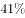，直接费用102.41亿元，平均资助率（资助项目占接收申请项目的比重），同比下降2.5个百分点。重点项目资助625项，同比增长约，直接费用17.88亿元。重大项目资助20项，直接费用3.18亿元。

        在人才项目系列方面，青年科学基金资助16155项，比上年减少266项，占总项数的，直接费用31.95亿元，平均资助率，同比下降0.7个百分点。地区科学基金资助2829项，比上年增加78项，直接费用10.96亿元，有力推进了欠发达区域人才稳定与培养。优秀青年科学基金资助400人，国家杰出青年科学基金资助198人，新资助创新研究群体项目38项，促进了优秀人才和团队成长。

#### 第 1 题　qid 2049576 · 平均数

2015年国家自然科学基金委全年平均资助率较2014年约：

- **A**. 
增加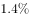

- **B**. 
减少
　✅
- **C**. 
增加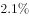

- **D**. 
减少

**答案**：B

**官方解析**

根据题干所求“2015年国家自然科学基金委全年平均资助率较2014年”和材料第二段“平均资助率（资助项目占接收申请项目的比重）”可判定此题为两期比重问题。定位材料第一段“2015年国家自然科学基金委全年共接收173017项各类申请，同比增长约，择优资助各类项目40668项，比上年增加1579项”,可求得2015年择优资助各类项目同比增长率为，根据两期比重比较公式：，因此2015年国家自然科学基金委全年平均资助率较2014年差值为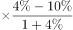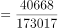，首先为负值，说明减少，排除A、C选项，而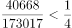，则减少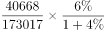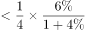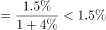，排除D选项。

故正确答案为B。

---

#### 第 2 题　qid 2051444 · 比重

2015年地区科学基金资助的直接费用占各类资助项目总额的比重约为：

- **A**. 

- **B**. 

- **C**. 

　✅
- **D**. 

**答案**：C

**官方解析**

根据题干所求“2015年······占······比重”，且材料数据为2015年，可判定本题为现期比重问题，定位文字材料第三段，“地区科学基金资助······直接费用10.96亿元”，定位第一段，“各类项目······资助直接费用218.8亿元”。。

故正确答案为C。

---

#### 第 3 题　qid 2049578 · 平均数

2015年重点项目的平均资助强度约为：

- **A**. 213万元
- **B**. 286万元　✅
- **C**. 342万元
- **D**. 398万元

**答案**：B

**官方解析**

根据题干所求“2015年重点项目的平均资助强度约为”和材料第一段“平均资助强度（资助直接费用与资助项数的比值）”可判定此题为比值计算问题。定位材料第二段“重点项目资助625项，直接费用17.88亿元”可知2015年重点项目的平均资助强度万元。

故正确答案为B。

---

#### 第 4 题　qid 2049582 · 综合

2014年国家自然科学基金委共接收青年科学基金的申请数约为：

- **A**. 5.1万份
- **B**. 5.9万份
- **C**. 6.5万份　✅
- **D**. 6.9万份

**答案**：C

**官方解析**

根据题干所求“2014年国家自然科学基金委共接收青年科学基金的申请数约为”和材料第二段平均资助率（资助项目占接收申请项目的比重），即，可判定此题为基期比重问题。定位材料第三段“在人才项目系列方面，青年科学基金资助16155项，比上年减少266项，平均资助率，同比下降0.7个百分点”，可知2014年平均资助率。2014年青年科学基金资助项目，因此2014年接收青年科学基金的申请数，与C项6.5万份最接近。

故正确答案为C。

---

#### 第 5 题　qid 2049584 · 综合

能够从上述资料中推出的是：

- **A**. 2015年重点项目的平均资助强度多于重大项目
- **B**. 2014年面上项目资助项数多于青年科学基金项目
- **C**. 2015年面上项目的平均资助率高于青年科学基金项目
- **D**. 2015年重点项目资助项数的同比增长率高于地区科学基金　✅

**答案**：D

**官方解析**

A项：由第二题可知2015年重点项目的平均资助强度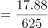亿元，定位材料第二段“重大项目资助20项，直接费用3.18亿元。”则重大项目的平均资助强度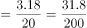亿元，分数比较大小，重点项目平均资助强度分子小且分母大，因此重点项目的平均资助强度小于重大项目的平均资助强度，错误；

B项：定位材料第二段“在研究项目系列方面，面上项目资助16709项，比上年增加1709项”可知2014年面上项目资助项数，定位材料第三段“青年科学基金资助16155项，比上年减少266项”可知2014年青年科学基金资助项数，，因此2014年面上项目资助项数少于青年科学基金项目，错误；

C项：定位材料第二段可知面上项目资助平均资助率，定位材料第三段可知青年科学基金资助平均资助率，因此面上项目资助平均资助率低于青年科学基金资助平均资助率，错误；

D项：定位材料第二段“重点项目资助625项，同比增长约”可知重点项目资助项数的同比增长率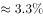，定位材料第三段“地区科学基金资助2829项，比上年增加78项，”可知地区科学基金资助的增长率，因此2015年重点项目资助项数的同比增长率高于地区科学基金同比增长率，正确。

故正确答案为D。

---

### 材料 2

#### 第 6 题　qid 2049524 · 比重

2015年税收收入占一般公共预算收入比重最大的是：

- **A**. 上海　✅
- **B**. 江苏
- **C**. 浙江
- **D**. 福建

**答案**：A

**官方解析**

由题干“2015年……占……比重最大”，而且材料时间为2015年，可判定此题为现期比重比较问题。定位表格第二列和第四列，所求。

上海：；江苏：

浙江：；福建：

故正确答案为A。

---

#### 第 7 题　qid 2051430 · 平均数

2015年一般公共预算收入高于表中七个省（市）平均值的有：

- **A**. 上海、安徽、福建、江西
- **B**. 江苏、浙江、安徽、山东
- **C**. 上海、江苏、浙江、山东　✅
- **D**. 安徽、福建、江西、山东

**答案**：C

**官方解析**

根据题干“2015年一般公共预算收入高于表中七个省（市）平均值”，可判定此题为平均数问题。

方法一：

代入表格数据，七个省（市）一般公共预算平均值为亿元，一般公共预算高于该平均值的省（市）为上海5519.5亿元、江苏8028.6亿元、浙江4809.5亿元、山东5529.3亿元。

方法二：

选项都为4个具体省（市）名称，问高于平均值的有几个，则只需要选择选项当中相对最大的四个城市即可。按照表格中一般公共预算排名前四的省（市）依次是：江苏、山东、上海、浙江，对应C项。

故正确答案为C。

---

#### 第 8 题　qid 2049536 · 增长

2015年江苏、浙江、江西三省的税收收入平均增速是：

- **A**. 

- **B**. 

- **C**. 

　✅
- **D**. 

**答案**：C

**官方解析**

由题干“江苏、浙江、江西三省的税收收入平均增速”，可判定此题为混合增长率问题。根据混合增长率原理：混合之后增长率居中不正中，偏向基数大。A项和D项超出三者的范围，排除。江苏（，基期值约为6000）和江西（，基期值约为1400）接近，看做一个整体，基期量约为7400，增长率在到之间，混合后约为。再与浙江（，基期值约为3900）混合，增长率偏向基数大的江苏和江西，所以选择与江苏、江西更接近的C项（）。

故正确答案为C。

---

#### 第 9 题　qid 2049540 · 综合

2015年一般公共预算收入与GDP的比值大于的省（市）有：

- **A**. 4个
- **B**. 5个　✅
- **C**. 6个
- **D**. 7个

**答案**：B

**官方解析**

由题干“比值大于的省（市）有”，可判定此题为现期比重问题。

上海：；

江苏：；

浙江：；

安徽：；

福建：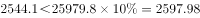；

江西：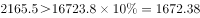；

山东：；

可得上海、江苏、浙江、安徽、江西一般公共预算收入与GDP的比值大于，共5个。

故正确答案为B。

---

#### 第 10 题　qid 2049570 · 综合

关于一般公共预算收入、税收收入、GDP等指标，下列说法错误的是：

- **A**. 
2015年上海一般公共预算收入占GDP的比值最高

- **B**. 
2015年江苏一般公共预算收入、税收收入、GDP均最高

- **C**. 
2015年山东税收收入占全国税收收入的比重较江西高出以上

- **D**. 
2015年全国一般公共预算收入占GDP的比重较2014年有所减少
　✅

**答案**：D

**官方解析**

A项，2015年各省市一般公共预算收入占GDP的比值：；；；；；；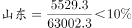，故上海的比值是最高的，正确；

B项，定位表格，对比可知江苏一般公共预算收入、税收收入、GDP数值均为各省市中最高，正确；

C项，定位表格第四列，山东2015年税收为4203.1亿元，江西为1516.9亿元，全国为124892亿元，，高出以上，正确；

D项：根据两期比重原理，部分增长率（一般公共预算收入增长率8.4%）大于总体增长率（GDP增长率6.9%），比重上升，错误。

本题为选非题，故正确答案为D。

---

### 材料 3

        2015年全国共建立社会捐助工作站、点和慈善超市3.0万个，比上一年减少0.2万个，其中：慈善超市9654个，同比下降。全年共接收社会捐赠款654.5亿元，其中：民政部门接收社会各界捐款44.2亿元，各类社会组织接收捐款610.3亿元。全年民政部门接收捐赠衣被4537.0万件，捐赠物资价值折合人民币5.2亿元。全年有1838.4万人次困难群众受益，同比增长，增长率较上一年下降27.5个百分点。全年有934.6万人次在社会服务领域提供了2700.7万小时的志愿服务，同比减少10.4万小时。 

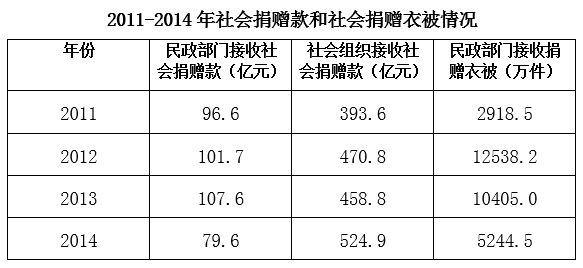

#### 第 11 题　qid 2049534 · 综合

2015年，全国建立的慈善超市较2014年约：

- **A**. 增加519个
- **B**. 减少519个　✅
- **C**. 增加686个
- **D**. 减少686个​

**答案**：B

**官方解析**

由题干“2015年……较2014年”结合选项增加或减少多少个，可判断本题是增长量计算问题。定位文字材料第一段，2015年慈善超市9654个，同比下降，增长量=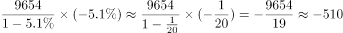（约减少510个），与B项最接近。

故正确答案为B。

---

#### 第 12 题　qid 2049552 · 比重

2012-2015年社会组织接收社会捐赠款占总捐赠款的比重最高的是：

- **A**. 2012年
- **B**. 2013年
- **C**. 2014年
- **D**. 2015年　✅

**答案**：D

**官方解析**

由题干“2012-2015······占······比重最高的是”，可判定该题是比值比较问题。定位文字材料和表中数据，2012-2015年社会组织接收社会捐赠款占总捐赠款的比重分别为：2012年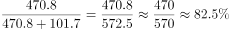；2013年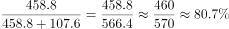；2014年；2015年，所以社会组织接收社会捐赠款占总捐赠款的比重最高的是2015年。

故正确答案为D。

---

#### 第 13 题　qid 2049568 · 综合

下面哪一张图能正确反映2011～2015年民政部门接收捐赠衣被数量的变化？

- **A**. 

　✅
- **B**. 

- **C**. 

- **D**. 

**答案**：A

**官方解析**

定位文字材料和表中数据，2011~2015年全国民政部门接收捐赠衣被数量分别为2918.5万件、12538.2万件、10405.0万件、5244.5万件、4537.0万件，所以2012年即第二个点最高，只有选项A满足条件。
故正确答案为A。

---

#### 第 14 题　qid 2051434 · 增长

2015年全年接收社会捐赠款的同比增长率较2014年：

- **A**. 约增加3.6个百分点
- **B**. 约减少3.6个百分点
- **C**. 约增加1.6个百分点　✅
- **D**. 约减少1.6个百分点

**答案**：C

**官方解析**

根据题干所求“2015年······同比增长率较2014年”结合选项都是百分点，可知本题为一般增长率问题。定位文字材料“2015······全年共接收社会捐赠款654.5亿元，”可知，定位表格材料可知，。则，。则2015年全年接收社会捐赠款的同比增长率较2014年增加，即增加了1.6个百分点。

故正确答案为C。

---

#### 第 15 题　qid 2049574 · 综合

能够从上述资料中推出的是：

- **A**. 2011-2015年民政部门接收的社会捐赠款在持续增加
- **B**. 2015年民政部门接收捐赠衣被同比增长率高于2014年的二分之一
- **C**. 2012-2015年社会组织接收社会捐赠款同比增长最快的年份是2012年　✅
- **D**. 相比2014年，2015年在社会服务领域提供志愿服务的人次有所增加

**答案**：C

**官方解析**

A项：定位表中数据，2014年民政部门接收的社会捐赠款79.6亿元小于2013年民政部门接收的社会捐赠款107.6亿元，错误；

B项：定位文字材料和表中数据，2015年民政部门接收捐赠衣被，2014年民政部门接收捐赠衣被。故：，正确；

C项：定位文字材料和表中数据，2012-2015年社会组织接收社会捐赠款同比增长率分别为：2012年；2013年；2014年；2015年，所以2012年同比增长最快，正确；

D项：定位文字材料，“全年有934.6万人次在社会服务领域提供了2700.7万小时的志愿服务，同比减少10.4万小时”，无法判断提供志愿服务的人次的变化，错误。

故正确答案为B和C。

【备注】本题为争议题。粉笔对B项和C项可能的争议点解释如下：

B项可能的争议点是：

①同比增长率是否可以为负数？根据本卷第四篇资料分析的表格数据可知，同比增长（）下面出现了-0.5这样的负数，所以同比增长率是可以为负数的。

②比较同比增长率高低时，是否需要带负号比较？根据近年全国各地类似真题可知，增长率比高低时，需要带负号比较，例如。

C项可能的争议点是：

2012-2015年增长最快的年份是否要考虑2012年？根据近年全国各地类似真题可知，如果提到2012-2015年的年均增长量或年均增长率等，一般不考虑2012年的增长情况（江苏例外）；但是如果提到2012-2015年增长最快/最多的年份，一般都是要考虑2012年当年的增长情况的，否则会使得很多国考省考题目变得没有答案。

基于以上分析，粉笔认为本题B、C答案没有明显错误，都应该是正确答案。

---
