# 2017年422联考《行测》题（江西卷）

> 联考 · 2017 年 · 5 个模块 · 共 135 题

- [常识判断](#%E5%B8%B8%E8%AF%86%E5%88%A4%E6%96%AD) · 25 题
- [言语理解与表达](#%E8%A8%80%E8%AF%AD%E7%90%86%E8%A7%A3%E4%B8%8E%E8%A1%A8%E8%BE%BE) · 40 题
- [数量关系](#%E6%95%B0%E9%87%8F%E5%85%B3%E7%B3%BB) · 15 题
- [判断推理](#%E5%88%A4%E6%96%AD%E6%8E%A8%E7%90%86) · 35 题
- [资料分析](#%E8%B5%84%E6%96%99%E5%88%86%E6%9E%90) · 20 题

---

## 常识判断

### 第 1 题　qid 2050760 · 人文常识

“临川四梦”是由明代戏剧作家、文学家汤显祖所作，其中不包括：

- **A**. 《牡丹亭》
- **B**. 《西厢记》　✅
- **C**. 《邯郸记》
- **D**. 《南柯记》

**答案**：B

**官方解析**

B项错误：临川四梦，又称玉茗堂四梦。临川文学的经典名作，指明代剧作家汤显祖的《牡丹亭》《紫钗记》《邯郸记》《南柯记》四剧的合称。《西厢记》全名《崔莺莺待月西厢记》，又称“北西厢”，元代中国戏曲剧本，作者王实甫。
本题为选非题，故正确答案为B。

---

### 第 2 题　qid 2050762 · 人文常识

下列历史人物按时间先后顺序排列正确的是：

- **A**. 嵇康-王勃-杜牧　✅
- **B**. 杜牧-王勃-嵇康
- **C**. 王勃-嵇康-杜牧
- **D**. 杜牧-嵇康-王勃

**答案**：A

**官方解析**

A项正确：嵇康，字叔夜，三国曹魏时期著名思想家、音乐家，文学家，竹林七贤的精神领袖，代表作《嵇康散集》；王勃，字子安，唐代诗人，初唐四杰之首，代表作《滕王阁序》等；杜牧，字牧之，晚唐诗人，代表作《樊川文集》。其先后顺序是嵇康-王勃-杜牧。
故正确答案为A。

---

### 第 3 题　qid 2050766 · 科技常识

2016年11月3日20时43分，从中国文昌航天发射场点火升空，完成首次发射任务并取得圆满成功的我国最大推力新一代运载火箭是：

- **A**. 长征七号
- **B**. 长征六号
- **C**. 长征五号　✅
- **D**. 长征八号

**答案**：C

**官方解析**

C项正确：长征五号于2016年11月3日在中国文昌航天发射场首飞成功，由此成为中国运载能力最大的火箭。
A项错误：长征七号运载火箭于2016年6月25日从中国文昌航天发射场首次成功发射，这也是文昌航天发射场的首次发射任务。长征七号是中国载人航天工程为发射货运飞船而全新研制的新一代中型运载火箭。
B项错误：长征六号于2015年9月20日在太原卫星发射中心点火发射，长征六号运载火箭是中华人民共和国上海航天技术研究院（中国航天科技集团公司第八研究院）研制的新一代无毒无污染小型液体运载火箭。
D项错误：长征八号运载火箭是中国运载火箭技术研究院正在研制的一型采用无毒无污染推进剂的新型中型运载火箭，主要面向具有国际竞争力的商业卫星发射任务。预计将在2020年实现首飞。
故正确答案为C。

---

### 第 4 题　qid 2050770 · 地理国情

关于热带季风气候，下列说法错误的是：

- **A**. 分布在纬度10度到回归线附近的亚洲大陆东南部等地
- **B**. 热带季风发达，一年中风向的季节变化不明显　✅
- **C**. 年降水量多，一般在1500-2000mm，集中在6-10月份（北半球）
- **D**. 全年高温，春秋极短

**答案**：B

**官方解析**

A项正确，热带季风气候分布在北纬10°到北回归线附近的亚洲东南部（如我国台湾南部、雷州半岛、海南岛和云南南部）、中南半岛、印度半岛大部、菲律宾等地。
B项错误，热带季风气候的降水与风向有着密切关系，冬季盛行来自大陆的东北风，降水少；夏季盛行来自印度洋的西南风，降水丰沛，其风向的季节变化明显。
C项正确，热带季风气候旱雨季明显，北半球降水集中在雨季（6-10月），且降水量大，年降水量一般在1500-2000mm。
D项正确，热带季风气候全年高温，年平均气温在20℃以上，春秋极短。
本题为选非题，故正确答案为B。

---

### 第 5 题　qid 2050774 · 人文常识

下列关于地震，说法错误的是：

- **A**. 按地震的成因，可分为构造地震、火山地震、塌陷地震和诱发地震四种
- **B**. 一次地震只有一个震级，但有多个烈度
- **C**. 四大地震带中，最大的地震带是环太平洋地震带　✅
- **D**. 距震中越近，烈度越大；反之越小

**答案**：C

**官方解析**

C项错误：世界上的地震主要集中分布在三大地震带上，即环太平洋地震带，欧亚地震带（地中海-喜马拉雅带）和海岭地震带，是三大地震带，而不是四大地震带。A、B、D三项说法均正确。
本题为选非题，故正确答案为C。

---

### 第 6 题　qid 2050778 · 人文常识

四大洋面积从大到小的排列顺序是：

- **A**. 太平洋——北冰洋——大西洋——印度洋
- **B**. 大西洋——太平洋——北冰洋——印度洋
- **C**. 大西洋——太平洋——印度洋——北冰洋
- **D**. 太平洋——大西洋——印度洋——北冰洋　✅

**答案**：D

**官方解析**

太平洋是世界上最大的洋，位于亚洲、大洋洲、美洲和南极洲之间，总面积约17868万平方千米；大西洋是地球上的第二大洋，大西洋位于欧洲、非洲和南北美洲之间，面积约9165.5万平方千米；印度洋是地球上第三大洋，位于亚洲、南极洲、大洋洲和非洲之间，总面积约为7617.4万平方千米；北冰洋是地球上最小的大洋，约1478.8万平方千米。因此，四大洋面积从大到小的排列顺序为：太平洋——大西洋——印度洋——北冰洋。
故正确答案为D。

---

### 第 7 题　qid 2050784 · 科技常识

被称为“东方凡高”，其画作在国外备受推崇，并在世界画坛产生很大影响的清初著名画家朱耷，擅长水墨花卉鱼鸟，他的别号是：

- **A**. 八大山人　✅
- **B**. 文山
- **C**. 古心
- **D**. 叠山

**答案**：A

**官方解析**

A项正确：朱耷，明末清初画家，中国画一代宗师。本名朱统，字雪个，号八大山人、个山、人屋、道朗等，江西南昌人。他擅书画，花鸟画以水墨写意为主，形象夸张奇特，笔墨凝炼沉毅，风格雄奇隽永；山水画师承董其昌，笔致简洁，有静穆之趣，得疏旷之韵。
故正确答案为A。

---

### 第 8 题　qid 2050870 · 人文常识

下列不属于开始于两汉时期政治经济制度的是：

- **A**. 刺史制
- **B**. 察举制
- **C**. 一条鞭法　✅
- **D**. 编户齐民

**答案**：C

**官方解析**

本题考查人文常识。
A项正确，刺史制度是汉武帝在秦御史监郡和汉初丞相史出刺基础上的独创，是君主专制主义中央集权的产物。
B项正确，察举制是中国古代选拔官吏的一种制度，确立于汉武帝时期。察举制不同于以前先秦时期的世官制和从隋唐时建立的科举制，它的主要特征是由地方长官在辖区内随时考察、选取人才并推荐给上级或中央，经过试用考核再任命官职。
C项错误，“一条鞭法”是明代嘉靖时期确立的赋税及徭役制度，之后由张居正于万历九年（公元1581年）推广到全国。新法规定：把各州县的田赋、徭役以及其他杂征总为一条，合并征收银两，按亩折算缴纳。这样大大简化了税制，方便征收税款。同时使地方官员难于作弊，进而增加财政收入。
D项正确，编户齐民是汉代政府实行的户籍制度，规定凡政府控制的户口都必须按姓名、年龄、籍贯、身份、相貌、财富情况等项目一一载入户籍，被正式编入政府户籍的平民百姓，称为“编户齐民”。
本题为选非题，故正确答案为C。

---

### 第 9 题　qid 2050872 · 地理国情

关于海洋环境，下列说法错误的是（    ）。

- **A**. 海洋是地球上水循环的起点
- **B**. 海洋水温在垂直方向上，上层和下层截然不同
- **C**. 波浪、潮汐和海流等都是海水运动形式
- **D**. 海洋可以分成四种地形区域：大陆架、大陆坡、大洋盆地和大洋高原　✅

**答案**：D

**官方解析**

A项正确：海洋环境指地球上广大连续的海和洋的总水域。包括海水、溶解和悬浮于海水中的物质、海底沉积物和海洋生物。海洋是地球上水循环的起点，海水受热蒸发，水蒸汽升到空中，再被气流带到陆地上来，使陆地上有降水和径流。陆地上有了水，生物才得到发展。
B项正确：海洋水温在垂直方向上，上层和下层截然不同。上部在1000～2000米的水层内，水温从表层向下层降低很快，而2000米以下则水温几乎没有变化。
C项正确：在各种力的作用下，海水的质点和水团不停运动着，波浪、潮汐和海流等都是海水的运动形式。
D项错误，海洋根据水深、海底坡度和海底沉积物等分成四种地形区域：大陆架、大陆坡、大洋盆地和海沟。
本题为选非题，故正确答案为D。

---

### 第 10 题　qid 2050874 · 科技常识

关于生物净化，下列说法错误的是：

- **A**. 植物净化大气主要是通过叶片的作用实现的
- **B**. 海洋中降解石油烃的微生物主要是酵母　✅
- **C**. 淡水生态系统中的生物净化，细菌起主导作用
- **D**. 生物净化能力都有一定的限度

**答案**：B

**官方解析**

B项错误：海洋中降解石油烃的微生物主要是细菌，此外，还有酵母、放线菌和丝状真菌。
A项正确：生物通过代谢作用，使污染的环境得到净化，提高环境对污染物的承载负荷，增加环境容量的作用，就叫做生物净化。植物净化大气主要是通过叶片的作用实现的。绿色植物（包括树木和草坪）净化大气的作用主要有：①吸收二氧化碳，放出氧气，维持人类环境中两者的平衡；②对降尘和飘尘有滞留过滤作用；③在植物抗性范围内能通过吸收而减少空气中二氧化硫、氟化氢、氯气等有害物质的含量；④在植物抗性范围内能减少臭氧的发生，减轻光化学烟雾污染；⑤有过滤细菌或杀菌作用；⑥对某些重金属有吸收和净化作用；⑦减轻噪声污染。
C项正确：河流、湖泊、水库等水体中生活着细菌、真菌、藻类、水草、原生动物、贝类、昆虫幼虫、鱼类等生物，对污染物会产生生物净化作用。淡水生态系统中的生物净化，细菌起主导作用。
D项正确：水体、空气和土壤的污染，只要不超过生态系统的负载能力，污染物就可以通过物理的、化学的和生物学的作用得到净化。如果环境污染物超过了生态系统的负载能力，生物净化作用就会遭到破坏，整个生态系统就有可能失去平衡，产生不良的后果。
本题为选非题，故正确答案为B。

---

### 第 11 题　qid 2050878 · 人文常识

下列古代名医与其所在朝代对应错误的是：

- **A**. 张仲景——隋朝　✅
- **B**. 孙思邈——唐朝
- **C**. 华佗——东汉
- **D**. 李时珍——明朝

**答案**：A

**官方解析**

A项错误：张仲景是东汉末年著名医学家，不是隋朝。张仲景被后人尊称为“医圣”。
B项正确：孙思邈是唐代著名医药学家、道士，被后人尊称为“药王”。
C项正确：华佗是东汉末年著名的医学家。
D项正确：李时珍是明代著名医药学家。
本题为选非题，故正确答案为A。

---

### 第 12 题　qid 2050880 · 科技常识

关于石油污染，下列说法错误的是：

- **A**. 石油污染的主要污染物是各种烃类化合物
- **B**. 石油污染会致使海洋缺氧
- **C**. 蒸发作用是海洋石油污染自然消失的重要因素
- **D**. 沉入海底的石油或石油氧化物不会再上浮到海面　✅

**答案**：D

**官方解析**

A项正确：石油污染的主要污染物是各种烃类化合物，主要有烷烃、环烷烃和芳烃等。

B项正确：大量石油涌入海洋后会造成海水严重缺氧，会使海洋中的生物很快窒息死亡。

C项正确：石油在扩散和漂移过程中，轻组分通过蒸发逸入大气，其速率随分子量、沸点、油膜表面积、厚度和海况而不同。含碳原子数小于12的烃在入海几小时内便大部分蒸发逸走，碳原子数在12～20的烃的蒸发要经过若干星期，碳原子数大于20的烃不易蒸发。蒸发作用是海洋油污染自然消失的一个重要因素。通过蒸发作用大约消除泄入海中石油总量的～。

D项错误：在海流和海浪的作用下，沉入海底的石油或石油氧化产物，还可再上浮到海面，造成二次污染。

本题为选非题，故正确答案为D。

---

### 第 13 题　qid 2050884 · 人文常识

下列不平等条约按签订时间先后顺序排列正确的是：

- **A**. 南京条约——天津条约——马关条约——辛丑条约　✅
- **B**. 天津条约——南京条约——马关条约——辛丑条约
- **C**. 南京条约——天津条约——辛丑条约——马关条约
- **D**. 天津条约——南京条约——辛丑条约——马关条约

**答案**：A

**官方解析**

1842年，清朝在与英国的第一次鸦片战争中战败，清政府代表在南京与英国签署《中英南京条约》；《天津条约》是清咸丰八年（1858年）第二次鸦片战争中英国、法国、俄国、美国强迫清政府在天津分别签订的不平等条约；《马关条约》是中国清朝政府和日本明治政府于1895年4月17日在日本马关签订的不平等条约；《辛丑条约》签定于光绪二十七年（1901年）。
故按条约的签订时间先后顺序排列，应为：南京条约——天津条约——马关条约——辛丑条约。
故正确答案为A。

---

### 第 14 题　qid 2050888 · 人文常识

香蕉的供给量增加是指供给量由于：

- **A**. 香蕉的需求量增加而引起的增加
- **B**. 人们对香蕉偏好的增加
- **C**. 香蕉的价格提高而引起的增加　✅
- **D**. 由于收入的增加而引起的增加

**答案**：C

**官方解析**

本题主要考查经济常识。
C项正确：供给量变动是指只有商品本身价格变动引起的该商品供给量的变动，其他影响供给的因素假设不变。因此香蕉的供给量增加是指供给量由于香蕉的价格提高而引起的增加。与供给量变动相对应的一个概念是供给变动。供给变动是由非价格因素引起的供给曲线的变动，A、B、D三项都属于供给的增加。
故正确答案为C。

---

### 第 15 题　qid 2050898 · 人文常识

关于利息，下列说法错误的是：

- **A**. 资本的报酬
- **B**. 劳动的报酬　✅
- **C**. 资本这一生产要素的价格
- **D**. 由资本市场的供求双方决定的

**答案**：B

**官方解析**

A、C两项正确：在资本市场上，投资者不会白白的向企业供应资本，企业必须为资本使用权的转让支付一定的报酬，即资本价格。在不考虑其他因素的情况下，“为资本使用权的转让支付一定的报酬”就是资本的报酬，也就是利息。故A、C两项正确；
B项错误：用人单位在生产过程中支付给劳动者的全部报酬包括三部分：一是货币工资，用人单位以货币形式直接支付给劳动者的各种工资、奖金、津贴、补贴等；二是实物报酬；三是社会保险。没有与利息相关的内容，故B项错误；
D项正确：利息，从其形式上看，是货币所有者因为发出货币资金而从借款者手中获得的报酬；从另一方面看，它是借款者使用货币资金必须支付的代价。利息是由资本市场的供求双方决定的。故D项正确。
本题为选非题，故正确答案为B。

---

### 第 16 题　qid 2050910 · 人文常识

甲将自有房屋出售给乙，乙将双方约定的房款支付给甲，将房子交给儿子丙使用。后由于价格变动，甲又将房子出售给丁，并办理了房屋过户手续。此时，该房屋的所有权归属：

- **A**. 甲
- **B**. 乙
- **C**. 丙
- **D**. 丁　✅

**答案**：D

**官方解析**

根据《中华人民共和国民法典》第二百零九条第一款规定：“不动产物权的设立、变更、转让和消灭，经依法登记，发生效力；未经登记，不发生效力，但是法律另有规定的除外。”由于甲与乙并未办理不动产登记，故该房屋物权并未发生变动。甲与丁办理了不动产登记，故房屋所有权归丁所有。
故正确答案为D。

---

### 第 17 题　qid 2050914 · 法律常识

关于民事法律关系，下列说法错误的是：

- **A**. 民事法律关系是平等主体之间的关系，一般是根据法律规定设立的　✅
- **B**. 民事法律关系一经确立，当事人一方即享有民事权利，而另一方便负有相应的民事义务
- **C**. 民事法律关系的保障措施具有补偿性和财产性
- **D**. 民事法律关系可分为财产法律关系和人身法律关系

**答案**：A

**官方解析**

A项错误：民事法律关系是平等主体之间的关系，一般是自愿设立的。只要当事人依其意思实施的行为不违反法律规定，所设立的法律关系就受法律保护。
B项正确：民事法律关系主体是指参与民事法律关系、享受民事权利和负担民事义务的人。民事法律关系一经确立，当事人一方即享有民事权利，而另一方便负有相应的民事义务。
C项正确：民事法律关系的保障措施具有补偿性和财产性。民法调整对象的平等性和财产性也表现在民事法律关系的保障手段上，即民事责任以财产补偿为主要内容，惩罚性和非财产性责任不是主要的民事责任形式。
D项正确：民事法律关系可分为财产法律关系和人身法律关系。财产法律关系是指直接与财产有关的具有财产内容的民事法律关系。人身关系是指与主体不可分离的，不直接具有财产内容的民事法律关系。
本题为选非题，故正确答案为A。

---

### 第 18 题　qid 2050918 · 人文常识

下列国家中，不是实行总统共和制的是：

- **A**. 巴西
- **B**. 美国
- **C**. 埃及
- **D**. 德国​　✅

**答案**：D

**官方解析**

D项错误：德国实行议会制。
A、B、C三项正确：巴西、美国、埃及都是实行总统共和制的。
本题为选非题，故正确答案为D。

---

### 第 19 题　qid 2050922 · 人文常识

“天无三日晴，地无三尺平”说的是：

- **A**. 广西
- **B**. 贵州　✅
- **C**. 云南
- **D**. 四川

**答案**：B

**官方解析**

“天无三日晴，地无三尺平”描述的是我国贵州省的特有景象。贵州省，年平均阴雨日数在200天以上，有“天无三日晴”之说；又因山脉绵延，河谷深切，地形崎岖，交通不便，有“地无三尺平”之说。
故正确答案为B。

---

### 第 20 题　qid 2050940 · 地理国情

江西的气候类型是：

- **A**. 热带季风气候
- **B**. 温带季风气候
- **C**. 亚热带季风气候　✅
- **D**. 温带大陆性气候

**答案**：C

**官方解析**

江西处于北回归线附近，属于亚热带气候范围。又因位于亚欧大陆东部，太平洋西岸，受海陆热力性质差的影响，使得江西地区夏季受来自太平洋的东南季风影响，高温多雨；冬季受来自亚欧大陆内部的西北季风影响，低温少雨。二者轮流控制，季节性交替，形成了亚热带季风气候。
故正确答案为C。

---

### 第 21 题　qid 2050946 · 法律常识

剥夺政治权利是一种附加刑，是指剥夺犯罪分子参加国家管理和政治活动权利的刑罚方法。下列权利中不属于剥夺政治权利的内容的是：

- **A**. 选举权和被选举权
- **B**. 言论、出版、集会、结社、游行、示威自由的权利
- **C**. 担任国家机关职务的权利和担任国有单位领导职务的权利
- **D**. 担任公司、企业领导职务的权利​　✅

**答案**：D

**官方解析**

D项符合题意：根据《刑法》第五十四条：剥夺政治权利是剥夺下列权利：(一)选举权和被选举权；(二)言论、出版、集会、结社、游行、示威自由的权利；(三)担任国家机关职务的权利；(四)担任国有公司、企业、事业单位和人民团体领导职务的权利。该项中“公司、企业”未明确规定为国有公司、国有企业。
A、B、C三项均属于剥夺政治权利范畴。
本题为选非题，故正确答案为D。

---

### 第 22 题　qid 2050954 · 人文常识

中国加入WTO之后至2016年取得了辉煌成就。截至2016年12月11日，中国加入WTO已达：

- **A**. 10年
- **B**. 15年　✅
- **C**. 16年
- **D**. 20年

**答案**：B

**官方解析**

B项正确：中国于2001年12月11日正式加入世贸组织，截至2016年12月11日正好达到15年。
故正确答案为B。

---

### 第 23 题　qid 2050964 · 人文常识

美国总统特朗普就职后签署了一系列行政命令，其中之一是特朗普签署行政命令宣布美国退出：

- **A**. FTA
- **B**. TTIP
- **C**. TPP　✅
- **D**. TRIPS

**答案**：C

**官方解析**

C项正确：2017年1月23日，美国总统特朗普在白宫签署行政命令，标志美国正式退出跨太平洋伙伴关系协定（TPP），特朗普政府将与美国盟友和其他国家发掘双边贸易机会。
A项错误：FTA为自由贸易协定的英文缩写。
B项错误：TTIP为跨大西洋贸易与投资伙伴协议的英文缩写。
D项错误：TRIPS为与贸易有关的知识产权协定的英文缩写。
故正确答案为C。

---

### 第 24 题　qid 2050972 · 科技常识

运用试管苹果技术来推广优良苹果品种，这种技术属于：

- **A**. 基因工程
- **B**. 细胞工程　✅
- **C**. 酶工程
- **D**. 发酵工程

**答案**：B

**官方解析**

B项正确：细胞工程技术是细胞生物学与遗传学的交叉领域，主要利用细胞生物学的原理和方法，结合工程学的技术手段，按照人们预先的设计，有计划地改变或创造细胞遗传性的技术。在果树、林木生产实践中应用细胞工程技术主要是微繁殖和去病毒技术。几乎所有的果树都患有病毒病，而且多是通过营养体繁殖代代相传的。用去病毒试管苗技术，可以有效地防止病毒病的侵害，恢复种性并加速繁殖速度。
A项错误：基因工程又称基因拼接技术和DNA重组技术，是以分子遗传学为理论基础，以分子生物学和微生物学的现代方法为手段，将不同来源的基因按预先设计的蓝图，在体外构建杂种DNA分子，然后导入活细胞，以改变生物原有的遗传特性、获得新品种、生产新产品。试管苹果并未用到该技术。
C项错误：酶工程（又称蛋白质工程学），是指工业上有目的地设置一定的反应器和反应条件，利用酶的催化功能，在一定条件下催化化学反应，生产人类需要的产品或服务于其它目的的一门应用技术。试管苹果并未用到该技术。
D项错误：发酵工程，是指采用现代工程技术手段，利用微生物的某些特定功能，为人类生产有用的产品，或直接把微生物应用于工业生产过程的一种新技术。发酵工程的内容包括菌种的选育、培养基的配制、灭菌、扩大培养和接种、发酵过程和产品的分离提纯等方面。试管苹果并未用到该技术。
故正确答案为B。

---

### 第 25 题　qid 2050976 · 人文常识

最早创造数字的是：

- **A**. 印度人　✅
- **B**. 希腊人
- **C**. 阿拉伯人
- **D**. 罗马人

**答案**：A

**官方解析**

本题考查人文历史。
数字是古代印度人在生产和实践中逐步创造出来的。在古代印度，进行城市建设时需要设计和规划，进行祭祀时需要计算日月星辰的运行，于是，数学计算就产生了。到公元前三世纪，印度出现了整套的数字，其中最有代表性的是婆罗门式：从“1”到“9”每个数都有专字。现代数字就是由这一组数字演化而来。
后来被阿拉伯人掌握、改进，并传到了西方，西方人便将这些数字称为阿拉伯数字。
故正确答案为A。

---

## 言语理解与表达

### 第 1 题　qid 2050754 · 逻辑填空

在水中自由地       ，闲暇的时候挣脱一切       ，到岸上享受晨风拂面，然后，一个华丽的俯冲，重新潜入关系之水，去做一条在波涛下微笑的鱼。
依次填入画横线部分最恰当的一项是：

- **A**. 翱翔 束缚
- **B**. 遨游 羁绊　✅
- **C**. 游弋 牢笼
- **D**. 徜徉 烦恼

**答案**：B

**官方解析**

第一空，所填词语对应“在水中”，A项“翱翔”一般指在高空飞行或盘旋，排除。
第二空，横线处搭配“挣脱”，D项“烦恼”常用搭配为“摆脱烦恼”，故排除；C项“牢笼”与前文“一切”搭配不当，排除；B项“挣脱一切羁绊”为常见用法。  
故正确答案为B。
【文段出处】《鱼在波涛下微笑》

---

### 第 2 题　qid 2050758 · 逻辑填空

在音乐的理论中，有所谓的“音乐的语言”；在语文形式美的理论中，应该     有所谓的“语言的音乐”。        音乐和语言不是一回事，         二者之间有一个共同点：音乐和语言都是靠声音来表现的。
依次填入画横线部分最恰当的一项是：

- **A**. 也 尽管 但是　✅
- **B**. 还 虽然 但是
- **C**. 也 不仅 而且
- **D**. 还 不但 而且

**答案**：A

**官方解析**

第一空，“；”连接前后分句表示并列，“也”表达并列，符合语境，而“还”表示递进，故排除B、D两项。
后两空，根据“不是一回事”与“有一个共同点”可知，前后呈转折关系，C项“不仅······而且······”表示递进，排除；A项“尽管······但是······”表示转折，符合语境，当选。
故正确答案为A。
【文段出处】《略论语言形式美》

---

### 第 3 题　qid 2050764 · 逻辑填空

唐前期的敦煌       了中国、印度、中亚、西亚、希腊等不同系统的宗教、文化、艺术。那时因为我们制度先进、文化发达，所以我们有              的气度与胸襟。中古时期的敦煌古代文化可以让我们真切地感受到中华民族处于领先时期充满活力的       。
依次填入画横线部分最恰当的一项是：

- **A**. 荟聚 宽广无限 风采
- **B**. 集聚 包罗万象 形象
- **C**. 汇聚 海纳百川 脉动　✅
- **D**. 积聚 包容万物 具象

**答案**：C

**官方解析**

第一空，根据横线后内容可知，所填词语意为敦煌融汇了不同系统的宗教、文化、艺术，D项“积聚”更侧重强调“积累”而非“融汇”，排除。
第二空，搭配“气度与胸襟”，C项“海纳百川”意指大海可以容得下成百上千条江河之水。比喻包容的东西非常广泛，而且数量很大。一个“纳”字形象地表现出中华文化极强的包容度，且“海纳百川，有容乃大”常用于形容“气度和胸襟”，保留。B项“包罗万象”形容内容丰富，应有尽有，更侧重于强调内容的丰富，而与“气度、胸襟”无关，排除；A项“宽广无限”核心词为“宽广”，如果说搭配“胸襟”还勉强合适，但无法搭配“气度”，排除。
第三空，代入验证，“感受脉动”搭配得当，且能更加形象生动地对应文段“充满活力”，C项当选。
故正确答案为C。
【文段出处】《敦煌古代文化遗产的当代价值》

---

### 第 4 题　qid 2050768 · 逻辑填空

三千多年来浩若烟海的歌谣、诗词、经史、曲赋、铭文、典籍，       了中华民族博大精深的思想智慧，       了中华文化不尽不竭的精神源泉。中国的语言文字在抑扬顿挫平仄韵律之中，在点横撇捺篆隶楷行之间，构建了中华民族       的文化图谱。
依次填入画横线部分最恰当的一项是：

- **A**. 保护 蕴含 华丽
- **B**. 保存 滋养 亮丽
- **C**. 保全 蕴涵 绚烂
- **D**. 保有 涵养 绚丽　✅

**答案**：D

**官方解析**

从第二空入手，搭配“精神源泉”，“源泉”指事物发生的根源，A项“蕴含”与C项“蕴涵”均指包含在内，“歌谣、诗词、经史等”与“精神源泉”之间并非包含关系，排除。B项“滋养”、D项“涵养”均可表示滋补养育、提供营养，搭配“精神源泉”表述恰当，保留。
第三空，搭配“文化图谱”，B项“亮丽”即明亮美丽，常修饰色彩、风景，与“文化图谱”搭配不当，排除。D项“绚丽”指绚烂美丽，强调绚烂，常说“绚丽的民族文化”，故放在此处修饰“文化图谱”恰当，保留。
第一空，代入验证，D项“保有”意为具有、拥有、留存，“浩若烟海的歌谣、诗词等保有博大精深的思想智慧”，表述恰当，当选。
故正确答案为D。
【文段出处】《飞扬的诗词 文化的乡愁》

---

### 第 5 题　qid 2050772 · 逻辑填空

面对基层治理难题，当然不能因为利益的        而将其束之高阁，也不能因为情感的        而长期“一事一法”。否则，一些问题可能会            ，失去改革的最佳“窗口期”，最终损害的还是群众的利益。
依次填入画横线部分最恰当的一项是：

- **A**. 冲突 纠纷 积习难改
- **B**. 牵扯 阻扰 根深蒂固
- **C**. 羁绊 纠葛 积重难返　✅
- **D**. 束缚 阻隔 积习深重

**答案**：C

**官方解析**

从第二空入手，“一事一法”指一件事使用一个法律，形容做事没有原则，则横线处表示由于情感的影响、干预，导致“一事一法”，A项“纠纷”指争执的事情，C项“纠葛”指纠缠不清的事情，均符合文意，保留。B项“阻扰”指阻挠扰乱，D项“阻隔”指阻挡隔绝，二者均侧重于“阻”，相较于“影响”而言，语义程度过重，排除。
第三空，搭配“问题”，A项“积习难改”指长期形成的旧习惯很难更改，“积习”与“问题”搭配不当，排除；C项“积重难返”指经过长时间形成的思想作风或习惯很难改变，也指长期积累的问题不易解决，对应前文“问题”，保留。
第一空，代入验证，“利益的羁绊”搭配恰当，C项当选。
故正确答案为C。
【文段出处】《治理者当走出办公室“捡芝麻”》

---

### 第 6 题　qid 2050782 · 逻辑填空

回顾历史，        东方文化与西方文化的渊源，打破西方文化等同于现代文化的逻辑，将西方文化        为一个地域性文化，有助于我们今天确立文化自信。
依次填入画横线部分最恰当的一项是：

- **A**. 明白 看作
- **B**. 了解 贬抑
- **C**. 熟悉 回归
- **D**. 明晰 还原　✅

**答案**：D

**官方解析**

本题可从第二空入手。A项“看作”即当作，“看作”与后文的“为”语义重复，应为“作为”或“看为”，排除。B项“贬抑”指贬低并压制，体现出消极的感情色彩，横线后的“有助于”说明文段表意积极，故感情色彩不符，排除。C项“回归”指回到、 返回，一般后面直接加宾语，如回归祖国、回归自然，不搭配“为" ，排除。D项“还原”指将事物恢复原状，“西方文化” 本身就属于“地域性文化”，故“还原”符合文意，且“还原为”搭配恰当， 保留。
第一空，代入验证。D项“明晰”指清晰、明白，与“渊源”搭配恰当，指清楚地了解文化渊源，符合文意，当选。
故正确答案为D。
【文段出处】《破除对西方文化的迷信》

---

### 第 7 题　qid 2050792 · 逻辑填空

故事拥有可以直抵人心的柔性力量。一个故事对       知识世界的帮助可能是微乎其微，对心灵世界的成长却可能是                。
依次填入画横线部分最恰当的一项是：

- **A**. 构造 无足轻重
- **B**. 建构 无关大局
- **C**. 建构 举足轻重　✅
- **D**. 构造 事关大局

**答案**：C

**官方解析**

第一空，对比“构造”和“建构”，“建构”原指建筑起一种构造，现主要应用在文化研究、社会科学和文学批评的分析上，与后文“知识世界”搭配恰当；“构造”做名词时指结构，做动词时指制造、建造，后通常搭配具体的事物，如“构造房屋”等，与“知识世界”搭配不当，排除A、D两项。
第二空，根据横线前的转折词“却”可知，横线处所填成语与“微乎其微”表意相反。“微乎其微”形容非常少或非常小，故横线处所填词语表达帮助很大之意，C项“举足轻重”指地位重要，符合文意和语境，当选。B项“无关大局”表示影响不大，与文意相悖，排除。
故正确答案为C。
【文段出处】《让陪伴成为孩子心底的阳光》

---

### 第 8 题　qid 2050798 · 逻辑填空

“一带一路”更是        “达则兼济天下”和“一花独放不是春、百花齐放春满园”的理念，准确        沿线国家发展，        沿线国家人民的现实诉求。
依次填入画横线部分最恰当的一项是：

- **A**. 秉承 助力 响应
- **B**. 坚持 助力 回应
- **C**. 秉承 对接 回应　✅
- **D**. 坚持 对接 响应

**答案**：C

**官方解析**

本题可从第三空入手。第三空搭配“人民的诉求”，“回应”意为应答，使用范围较广；而“响应”意为回声应和，常用来比喻用言语、行动表示赞同或支持（号召、倡议等），常用于下对上的语境，如积极响应国家号召等等。因此，“回应”置于此处更加恰当，排除A、D两项。
第二空，横线处所填词语搭配“准确”且文段表示“沿线国家”之间双向交流，C项“对接”一方面体现双方之间的沟通，且与“准确”搭配恰当，保留。“助力”与“准确”搭配不当，且“助力”仅体现单向帮助，排除B项。
第一空代入验证，“秉承理念”搭配恰当，C项当选。
故正确答案为C。
【文段出处】《“一带一路”与新发展理念的契合》

---

### 第 9 题　qid 2050808 · 逻辑填空

中华文化延续着我们的国家和民族的精神血脉，既需要            、代代守护，也需要与时俱进、推陈出新。为明天        下这个时代的文化精华，正是我们这一代人的文化责任。
依次填入画横线部分最恰当的一项是：

- **A**. 风雨兼程 积淀
- **B**. 薪火相传 沉淀　✅
- **C**. 继往开来 留下
- **D**. 承前启后 提取

**答案**：B

**官方解析**

第一空，顿号连接，表示并列，所以横线与“代代守护”意思相近，要体现出中华文化延续着，传承不息之意。B项“薪火相传”比喻精神不灭、一直流传。C项“继往开来”意思是继承前人的事业，开辟未来的道路。D项“承前启后”指继承前人事业，为后人开辟道路。B、C、D三项语意均可，保留。A项“风雨兼程”是指风雨中一直不停地赶路，强调的是不畏困难勇往直前的精神，体现不出中华文化延续着，传承不息之意，语意不符，排除。
第二空，搭配“精华”，且能和“下”连接，B项“沉淀”可以，沉淀下，当选。C项“留下”不可以，不能说留下下，排除；D项“提取”，常用提取出，不说提取下精华，排除。
故正确答案为B。
【文段出处】《习主席：中华文化延续着我们国家和民族的精神血脉》

---

### 第 10 题　qid 2050810 · 逻辑填空

十年久住的这海东的岛国，把我那同玫瑰露似的青春        了的这异乡的天地，到了将离的时候，倒反而生出了一种不忍与她        的心来。
依次填入画横线部分最恰当的一项是：

- **A**. 消遣 辞行
- **B**. 消磨 诀别　✅
- **C**. 消磨 辞行
- **D**. 消遣 诀别

**答案**：B

**官方解析**

第一空，根据前文“十年久住”，可知我珍贵的青春大部分都留在了岛上，所以，“消磨”在这里意为异乡的天地消耗了青春，保留B、C两项。“消遣”指用感兴趣的方式打发时间，打发空闲，语意不符，排除A、D两项。
第二空，根据“十年久住”“不忍”，可知此次不是一个简单的离开，“不忍”预示着“我”是不再来的，彻底分别，B项“诀别”可以和“不忍”形成对应，当选；而C项“辞行”就是一个正常的离开了，体现不出“不忍”，排除。
故正确答案为B。
【文段出处】《归航》

---

### 第 11 题　qid 2050812 · 逻辑填空

古猿本身结构具有与人相接近的形状，在一定的外界环境的作用下，古猿       有可能离开猿的体统而向着人的方向发展。
依次填入画横线部分最恰当的一项是：

- **A**. 因为 所以
- **B**. 只有 才
- **C**. 如果 就
- **D**. 因为 才　✅

**答案**：D

**官方解析**

第一空，“古猿本身结构具有与人相接近的形状”是其可以“向着人的方向发展”的原因，故横线处所填词语应为表示因果关系的关联词。A、D两项“因为”符合文意，保留。B项“只有”为表示条件的关联词，与文意不符，排除。C项“如果”为表示假设的关联词，与文意不符，排除。
第二空，“一定的外界环境的作用”是古猿“离开猿的体统而向着人的方向发展”的前提条件，故横线处所填词语需为必要条件引导词。D项“才”符合文意，当选。A项“所以”为因果关系关联词，且一般位于尾句的句首，不能位于一句话的中间位置，排除。
故正确答案为D。

---

### 第 12 题　qid 2050818 · 片段阅读

美国政府再度把中国最大电商平台列入其“恶名市场”黑名单，这类市场以兜售假货而闻名。阿里巴巴辩称，美国政府这一决定背后或许存在政治动机。四年前，阿里巴巴旗下在线集市淘宝网在对假货打击后，被撤下了该黑名单。但现在，淘宝再度被列入了该黑名单。“尽管近来的措施令人对未来产生积极的期待，但目前报告的造假和盗版水平高得难以接受”，美国贸易代表办公室称。该机构负责编制《恶名市场审查报告》。阿里巴巴表示，它对这一决定感到“非常失望”。
最适合做这段文字标题的是：

- **A**. 淘宝再度被美国列入“恶名市场”黑名单　✅
- **B**. 阿里巴巴与美国政府贸易摩擦
- **C**. 不公正的“恶名市场”黑名单
- **D**. 政治动机与跨国贸易

**答案**：A

**官方解析**

文段开篇指出“美国政府再度把中国最大电商平台列入其‘恶名市场’黑名单”的事实，随后进行详细说明，分别从阿里巴巴和美国两个方面讲述各自的态度和观点，故整个文段都是围绕“美国再次将淘宝列入‘恶名市场’黑名单”这一话题展开，故文段的重点对应A项。
B项“贸易摩擦”无中生有，文段没有提及二者在贸易方面的矛盾和冲突，排除；C项“不公正”无中生有，对于黑名单，阿里巴巴和美国政府持不同的态度，文段对于公不公正没有给出确定的结论，排除；D项“政治动机”是阿里巴巴的猜测，且属于后文具体说明的内容，非重点，排除。
故正确答案为A。
【文段出处】《淘宝再度被美国列入“恶名市场”黑名单》

---

### 第 13 题　qid 2050822 · 片段阅读

共享单车和共享汽车等新事物正如潮水般涌现，对此，在交通运输部2017年第三次例行发布会上，新闻发言人表示，鼓励支持共享单车这种“互联网交通出行”的创新方式，政府部门要加强规范和指导，企业要承担管理责任，提升服务水平，公众也要文明出行，共同促进共享单车的发展。而共享汽车实质是租赁范畴，鼓励各地在坚持公交优先发展战略前提下，研究探索共享汽车在当地城市交通中的合理定位。

这段文字主要表明：

- **A**. 共享单车和共享汽车面临的问题
- **B**. 政府部门如何鼓励支持共享单车这种出行的创新方式
- **C**. 共享汽车在城市交通中的定位问题
- **D**. 交通运输部对共享单车和共享汽车的态度　✅

**答案**：D

**官方解析**

文段开篇指出共享单车和共享汽车两种新型事物，接着介绍了交通运输部在发布会上新闻发言人的观点，先从“政府”“企业”和“公众”三个角度指出要促进共享单车的发展，然后又指出要研究探索共享汽车在城市交通中的合理定位，所以整个文段重在介绍交通运输部对共享单车和汽车的看法，对应D项“态度”，当选。
A项“问题”无中生有，文段没有提及，排除；B项“共享单车”和C项“共享汽车”均表述片面，文段强调的是对“共享单车和共享汽车”的态度，排除。
故正确答案为D。
【文段出处】《多地酝酿推出共享单车管理办法》

---

### 第 14 题　qid 2050826 · 片段阅读

标准是人类文明进步的成果。从中国古代的“车同轨，书同文”，到现代工业规模化生产，都是标准化的生动实践。伴随着经济全球化深入发展，标准化在便利经贸往来、支援产业发展、促进科技进步、规范社会治理中的作用日益凸显。要携手共建网络空间命运共同体，同样要通过完善规则体系，形成“通用语言”，进而互联互通、规范约束、协同发展。
文段接下来论述的是：

- **A**. 如何完善网络空间规则体系　✅
- **B**. 标准化的具体作用
- **C**. 共建网络空间命运共同体的理由
- **D**. 实施标准化的途径

**答案**：A

**官方解析**

根据提问方式可知，本题为接语选择题，应在阅读全文基础上，重点关注文段最后谈论的核心话题。文段首先介绍标准是文明进步的成果，并举例说明，随后介绍标准化的作用，尾句提出共建网络空间命运共同体，要完善规则体系，故文段接下来应该围绕“完善规则体系”这一话题，介绍其具体对策，对应A项。
B项“具体作用”文段已经论述，排除；C项“共建网络空间命运共同体的理由”无中生有，文段最后强调的是对策，而非原因，排除；D项“标准化”与文段最后谈论的核心话题不一致，排除。
故正确答案为A。
【文段出处】《秦安:完善网络空间规则体系》

---

### 第 15 题　qid 2050828 · 片段阅读

在当前情况下，即使要依法行事，也需要更多考虑社会影响；更不能把“依法拆违”变成殴打群众，这不仅让自己陷入被动，更会付出公信流失的代价。老百姓对党和政府的依赖，是靠像焦裕禄、谷文昌、杨善洲这样一批批好干部，以数十年之功换来的。这样的信任，不能在三五个执法者的暴力中流失。
对这段文字概括最准确的是：

- **A**. 只有好的干部才能得到老百姓的支持和依赖
- **B**. 法要依，社会影响同样要考虑
- **C**. 别让暴力执法侵蚀公信力　✅
- **D**. 公信流失不利于社会发展

**答案**：C

**官方解析**

文段首先通过并列结构进行对比，强调殴打群众会带来公信的流失。接着通过“焦裕禄”等例子说明老百姓对党和政府的依赖是靠好干部换来的。尾句通过“这样的信任”对前文进行总结，强调百姓对于政府的信任不能在暴力中流失，对应C项，当选。
A项，“好的干部才能得到老百姓的支持和依赖”为文中举例内容，非重点，排除；
B项，对应“更不能”之前，非重点，且没有点明“暴力执法”问题，排除；
D项，“不利于社会发展”无中生有，排除。
故正确答案为C。
【文段出处】人民日报《别让暴力执法侵蚀公信力》

---

### 第 16 题　qid 2050830 · 片段阅读

随着社会发展和科技进步，语言学与文学逐渐分家，最先是在社会上有众多职业需求的语言教学独立出来，成为以语言教学和语言研究为主要目的的专业大学，如北京外国语大学、北京语言大学，如今遍布世界各地的孔子学院也属这类学校。其次，随着录音技术、语图分析技术、计算机技术的发明和发展，语言学迅速发展成一门需要修建专用实验室、配备各种语音仪器和专业工程技术人员的新型工程技术学科。时至今日，新兴的语言学在医学、生理学、心理学、遗传与基因、刑事侦查、语言识别、自动控制、智能制造等高科技领域得到广泛使用。
根据这段文字，以下说法正确的是：

- **A**. 如今文学的作用不如语言的作用大
- **B**. 语言文学不分家
- **C**. 语言学和文学应该区分对待　✅
- **D**. 社会的发展和科技的进步离不开语言学的发展

**答案**：C

**官方解析**

文段开篇提出“随着社会的发展和科技进步，语言学与文学逐渐分家”，之后按“最先······其次······时至今日”的时间顺序阐明“语言学”的独立发展及应用，所以文段重在强调“语言学”逐步脱离“文学”，分家了，分家后语言学得到了蓬勃的发展，也就是说它俩分家是应该的，C项“应该区分对待”，当选。
A项“文学的作用不如语言的作用大”无中生有，文段并没有进行比较，排除；B项“语言文学不分家”与文意相反，文段说的是“逐渐分家”，分家后带来了蓬勃发展，故排除；D项“离不开”表述过于绝对，排除。
故正确答案为C。
【文段出处】《李蓝：国家应及时调整、统一学科分类体系》

---

### 第 17 题　qid 2050836 · 片段阅读

在联合国人权理事会举行的第34次会议上，通过关于“经济、社会、文化权利”和“粮食权”两个决议，决议明确表示要“构建人类命运共同体”，这是人类命运共同体重大理念首次载入人权理事会决议，标志着这一理念成为国际人权话语体系的重要组成部分。
最适合做这段文字标题的是：

- **A**. 人类命运共同体重大理念已成国际人权话语体系的重要组成部分
- **B**. 人类命运共同体重大理念首次载入人权理事会决议　✅
- **C**. 构建人类命运共同体势在必行
- **D**. 联合国人权理事会通过关于“经济、社会、文化权利”与“粮食权”决议

**答案**：B

**官方解析**

文段首先介绍了在人权理事会上通过两个决议，接着指出决议表示要“构建人类命运共同体”，随后通过“这”对前文进行总结，强调人类命运共同体这一理念首次载入决议，最后详细阐述了这一理念载入决议的重要意义，故文段重在强调人类命运共同体这一理念首次载入人权理事会决议，对应B项。
A项对应文段最后一个分句，为解释说明的表述，非重点，排除；
C项“势在必行”强调必须行动，无中生有，文段仅阐述“理念”，并未提及行动，排除；
D项“决议”非重点，文段重在强调人类命运共同体这一理念，排除。
故正确答案为B。
【文段出处】人民日报《人类命运共同体理念首次载入联合国人权理事会决议》

---

### 第 18 题　qid 2050840 · 语句表达

网络时代，几乎人人都能够给电影下评语，权威的声音逐渐淹没在喧嚣中。随着电影评论生态的变化，电影行业内也日益意识到客观公正“电影批评”的力量，                    ，调整自己浮躁的心态。
填入画横线部分最恰当的一项：

- **A**. 要放慢自己匆匆的脚步　✅
- **B**. 要多听听来自权威的声音
- **C**. 提升自身审美的渴望与需求
- **D**. 做专业态度与民间态度的摆渡人

**答案**：A

**官方解析**

横线为尾句中的一部分，需结合横线前后文进行分析。尾句谈论的是电影行业的做法，横线与后文的内容属于同一句话，联系紧密，所填语句与“调整自己浮躁的心态”形成对应，语义一致，A项“放慢自己匆匆的脚步”与“浮躁”对应准确，且和后文句式一致，当选。
B项“多听听权威的声音”与文段中“客观公正”文意不相符，要做到客观公正，需听取各方意见，而不仅仅是权威的声音，排除；
C项“提升审美”文段未提及，无中生有，排除；
D项“做专业态度与民间态度的摆渡人”并非电影行业自身心态的转变，且与后文“浮躁”无法对应，排除。
故正确答案为A。
【文段出处】《业界学界专家探讨“文化节目热”不喧哗，自有声》

---

### 第 19 题　qid 2050844 · 片段阅读

棉花花俗称草花，是棉花形成棉桃前所开的花朵，一直作为棉花产业的副产物被废弃。中国科学院新疆理化技术研究所的科技人员在对棉花花进行系统的化学成分分析研究时发现，棉花花含有丰富的黄酮类物质，具有良好的治疗老年痴呆的功效。他们采用现代工艺技术，将棉花花中的黄酮类物质提取出来，制成剂量小、药效明显、服用方便的“棉花花总黄酮片”，用于治疗轻中度老年痴呆症。2014年6月获批新疆首个中国中药5类新药临床试验。
对这段文字概括最准确的是：

- **A**. 黄酮类物质有助于治疗轻中度老年痴呆症
- **B**. 中国科学家变废为宝，发现棉花花新的价值　✅
- **C**. “棉花花总黄酮片”获批新疆首个中国中药5类新药临床试验
- **D**. 中国科学家从棉花花中提取治疗中度老年痴呆药并成功转让药企

**答案**：B

**官方解析**

文段开篇引入话题，并指出棉花花一直被废弃，后文通过“科技人员研究发现”引出观点，重点强调中国科学院的科技人员发现棉花花具有新的益处，即具有良好的治疗老年痴呆的功效，随后详细地阐述棉花花的益处以及研究现状。因此文段重点强调研究人员发现棉花花新的益处，B项为文段中心句的同义替换，当选。
A项，未提及文段核心话题“棉花花”，偏离文段重点，排除；
C项，“获批新疆首个中国中药5类新药临床试验”对应解释说明内容，非重点，排除；
D项，“成功转让药企”文段未提及，无中生有，排除。
故正确答案为B。
【文段出处】《科学家从棉花花中提取治疗老年痴呆药并成功转让药企》

---

### 第 20 题　qid 2050848 · 片段阅读

环保数据造假已成利益链条化，尽管企业是造假的第一责任主体，但板子显然不该只打在涉事企业身上。企业环保数据造假的“锅”，不应仅由涉事企业直接操作人员来背，潜居幕后的指挥者也应纳入执法视野。此外，地方环保部门是否出于数据“漂白”的考量而“睁一只眼闭一只眼”，设备生产商以及运行维护单位在多大程度上“配合”了企业的“造假定制”，这也都应予以关注。
这段文字意在说明：

- **A**. 环保数据造假已经体系化
- **B**. 打击环保数据造假，不应该只惩罚涉事企业
- **C**. 杜绝环保数据造假须全链条打击　✅
- **D**. 地方环保部门为了政绩，从而“漂白”环保数据

**答案**：C

**官方解析**

文段开篇提出问题“环保数据造假已成利益链条化”，随后通过转折关联词“但”强调“不该只打在涉事企业身上”，后文通过并列结构提出一系列具体的解决对策，“涉事企业直接操作人员、潜居幕后的指挥者也应纳入执法视野”“地方环保部门、设备生产商以及运行维护单位做法都应予以关注”，故文段重点强调环保造假需要全方位打击，C项为文段中心句的同义替换，当选。
A项“造假已经体系化”为问题的表述，非文段的重点，排除；
B项“不应该只惩罚涉事企业”表述不明确，排除；
D项“地方环保部门”对应“此外”之后的一个分句，表述片面，排除。
故正确答案为C。
【文段出处】《斩断环保数据造假利益链》

---

### 第 21 题　qid 2050776 · 片段阅读

没有声音，再好的画面也会“无感”。说话是一门艺术，折射着历史和传统的痕迹。以前，沿街售货的商贩往往选择放声吆喝。“叫卖声”不仅关乎生意和生计，“小楼一夜听春雨，深巷明朝卖桂花”，自然之声与市井之声的交织，也成就了生活的诗意。同样，人与人之间交往，既然见了面，互相之间何妨说句话。寒暄能打破沉寂，笑声能冲刷尴尬，有话好好说也能化解矛盾。
最适合做这段文字标题的是：

- **A**. 到什么山头唱什么歌
- **B**. 三寸不烂之舌，胜于百万之师
- **C**. 多说一句，驱散“无言的冷漠”　✅
- **D**. 无声不一定胜有声

**答案**：C

**官方解析**

文段是分总结构，开篇指出没有声音的画面是无感的。随后，通过叫卖声及一个诗句强调，声音的重要意义，即能打破沉寂、冲刷尴尬、化解矛盾。文段重在表明，声音的积极作用，C项“无言的冷漠”对应文段“打破沉寂、冲刷尴尬、化解矛盾”，为文段中心句的同义替换，当选。
A项“到什么山头唱什么歌”表示根据不同的情况说不同的话；B项“三寸不烂之舌，胜于百万之师”强调口才的重要性，文段未提及随机应变及口才的重要性，无中生有，均排除；D项“无声不一定胜有声”强调无声与有声的对比，文段未体现对比，未体现出声音的作用，排除。
故正确答案为C。
【文段出处】《多说一句，驱散“无言的冷漠”》

---

### 第 22 题　qid 2050780 · 片段阅读

相较于社会生活的复杂度，灵长类动物的饮食或能更好地预测其脑容量。这项发表于《自然—生态与演化》的研究是同类分析中迄今为止规模最大的，并对目前有关人类和一些灵长类动物为什么演化出了比大多数动物更大的脑部的假说提出质疑。在考虑到每个物种的演化亲缘关系及体型后，作者发现，吃水果的灵长类动物的脑组织比吃植物叶子的灵长类动物多左右。虽然作者的分析未能说明为什么吃水果会带来更大的大脑，但他们认为这可能是由认知需求（与记忆水果位置、手工提取果肉有关）和热量奖励（摄入热量丰富的水果，而非热量贫乏的植物叶子）联合驱动的。

与这段文字意思相符的是：

- **A**. 饮食或许与灵长类动物脑容量有必然的联系　✅
- **B**. 很多灵长类动物为什么演化出了比大多数动物更大的脑部的假说没有价值
- **C**. 吃水果的灵长类动物的脑组织比吃植物叶子的灵长类动物多的原因已明了
- **D**. 社会生活的复杂度不能预测灵长类动物脑容量

**答案**：A

**官方解析**

A项，根据“作者发现，吃水果的灵长类动物的脑组织比吃植物叶子的灵长类动物多左右，虽然作者的分析未能说明为什么吃水果会带来更大的大脑”可知，A项符合文意，当选；

B项，根据“研究是同类分析中迄今为止规模最大的，对目前有关人类和一些灵长类动物为什么演化出了比大多数动物更大的脑部的假说提出质疑”可知，文段并没有表明其无价值，排除；

C项，根据“虽然作者的分析未能说明为什么吃水果会带来更大的大脑，他们认为这可能是……”可知，这些原因只是推断或假设，排除；

D项，根据首句可知，社会生活的复杂度可以预测灵长类动物脑容量，排除。

故正确答案为A。

【文段出处】《饮食或能更好地预测灵长类动物脑容量》

---

### 第 23 题　qid 2050786 · 片段阅读

福格尔斯坦等人2015年1月在《科学》杂志上发表文章称，人体组织的癌症风险差异可以用干细胞分裂时出现的错误，即所谓“坏运气”来进行解释，三分之二的癌症基因突变是“坏运气”的结果，另三分之一归因于遗传和环境因素。《科学》杂志配发的一篇评论文章说，预计有关癌症“坏运气”理论的争论还会持续下去。还有专家认为，这项研究并不意味着否认通过改善环境和生活方式预防癌症的重要性，英国癌症研究会就认为，的癌症病例可以预防。

与这段文字意思不相符的是：

- **A**. “坏运气”这种解释并非哗众取宠，也具有一定的科学道理
- **B**. 癌症患者放弃治疗是一种理性的行为　✅
- **C**. 有关癌症“坏运气”理论学界褒贬不一，尚未有定论
- **D**. 癌症病例并非都不可预防

**答案**：B

**官方解析**

A项，根据“人体组织的癌症风险差异可以用干细胞分裂时出现的错误，即所谓‘坏运气’来进行解释”可知，“坏运气”这种解释有一定的科学道理，与原文相符，排除；

B项，“癌症患者放弃治疗是理性行为”属于无中生有，在文中并未体现，当选；

C项，与文段“预计有关癌症‘坏运气’理论的争论还会持续下去”表述相符，排除；

D项，与文段“的癌症病例可以预防”表述相符，排除。

本题为选非题，故正确答案为B。

【文段出处】《&lt;科学&gt;杂志重磅发现：癌症发生是因运气不好》

---

### 第 24 题　qid 2050788 · 片段阅读

人脸识别技术逐渐深入社会生活的潮流，很多人甚至把人脸识别万能化了。实际上，高科技应用的背后依然有可能存在风险、存在漏洞，虽然按照惯常看法，科技含量越高，其安全系数通常也越高，但正如3·15晚会展示的那样，随着科技的进步发展，仿真头套、全息投影、人脸跟踪等高科技手段不断出现，单一的人脸识别技术是有很大的局限性，没有绝对的安全概念可说。因此，在涉及隐私、支付等高级别安全场景使用时，注意将人脸与声纹、指纹、虹膜及其他生物认证信号相融合，而不是单一地采用人脸识别技术，这样安全的系数就会大大提升。
这段文字意在说明：

- **A**. 人脸识别技术渐成社会风尚
- **B**. 人脸识别技术有很大的局限性
- **C**. 高科技产品背后同样会存在问题
- **D**. 多重认证方式有助于提高安全系数　✅

**答案**：D

**官方解析**

文段首先指出人脸识别技术被很多人万能化，接着用“实际上”进行转折，指出高科技背后存在风险。后文通过“但”进行转折，强调单一的人脸识别技术有局限性，不是绝对的安全。尾句通过“因此”引出结论，即将多种生物认证方式结合会提升安全系数，对应D项，当选。
A项：“渐成社会风尚”为文段首句背景的阐述，非重点，排除；
B、C两项：为文段结论之前的内容，非重点，且没有提及多种认证方式这一关键信息，排除。
故正确答案为D。
【文段出处】《人脸识别:安全不能只靠“颜值”多种刷法更稳当》

---

### 第 25 题　qid 2050790 · 片段阅读

基础科学的精神在于穷理。基础科学研究需要经过刻苦训练、需要有深度的看法，才会有新的结果、好的创意。因此，基础科学研究不经过旷日持久的付出，很难有成功的机会。有些人因而认为，与其如此辛苦，不如等别人做好基础科学研究后拿过来用。但持此观点的人忘记了一点：只有自己体悟出来的理论，才最了解其长短，才能掌握其中的精髓，应用起来才能得心应手。树立穷理的精神，也需要哲学的滋养。毕竟，科学家也是有血有肉的人，有哲学精神和素养的支撑，才能塑造科学家的气质和意志。
这段文字意在说明：

- **A**. 基础科学研究意义重大
- **B**. 基础科学研究需要奉献精神
- **C**. 基础科学的本质是穷理
- **D**. 基础科学研究需要哲学滋养　✅

**答案**：D

**官方解析**

文段首先提出“基础科学的精神在于穷理”的观点，接着正反论证首句观点，就是说基础科学确实要穷理。接着列举了有些人的观点仍然论证基础科学的精神在于穷理。接着后文提出对策，树立穷理精神需要哲学的滋养，故文段重在强调基础科学研究需要哲学的滋养，对应D项。
A项“意义重大”在文段中并未提及，无中生有，排除；B项“奉献精神”对应文段“旷日持久的付出”，非重点，排除；C项“基础科学的本质是穷理”，文段并未提及基础科学的本质，且“穷理”非重点，文段重在强调穷理需要哲学滋养，排除。
故正确答案为D。
【文段出处】《基础科学研究需要哲学滋养》

---

### 第 26 题　qid 2050794 · 片段阅读

有人疑问，古诗文默写在高考语文中占比不多，为什么要让学生花那么多时间去背？以“应试心态”对待传统文化，难免会产生“划不划算”的困惑，我们重温那些代代相传的诗词文本，不是因为它们行将消失、即将毁灭，也不是因为我们忧思古人、恋旧复古，而是因为它们记述着我们民族所特有的精神追求、人文精神和智慧力量，是我们生生不息的文化滋养，是我们走向复兴的精神支撑。
这段文字意在强调：

- **A**. 我们需要从传统的“文化原乡”中汲取精神力量　✅
- **B**. 诗歌是古今一脉的文化印记
- **C**. 古诗文默写大有必要
- **D**. 诗心是个人的，而诗意是共同的

**答案**：A

**官方解析**

文段首先提出疑问，即古诗文默写占比不多为什么要花时间背，接着指出以“应试心态”对待传统文化就会产生这样的困惑，后文提出观点，即我们重温诗词文本是因为它们记述着民族的精神追求，是文化滋养和精神支撑，故文段重点强调传统文化非常重要，是我们的精神支撑，对应A项。
B项不是重点，文段重点强调的是诗词文本等传统文化的精神价值，排除；C项“古诗文默写”为文段开篇的例子，非重点，排除；D项“诗心”“诗意”在文段中并未提及，无中生有，排除。
故正确答案为A。
【文段出处】《在诗意里追寻“文化原乡”》

---

### 第 27 题　qid 2050800 · 片段阅读

由于在科普和科学传播方面的贡献，中国科学院国家天文台郑永春博士前段时间获得了美国天文学会行星科学分会颁发的卡尔·萨根奖，令人高兴，但面对这一新闻，不少科学界朋友都谈到：中国科学家的科普工作做得究竟如何？观察和思考告诉我们，中国科普工作其实不是做得多，而是太少；不是做得好，而是很不够；不是强于，而是输于世界同行，至少比发达国家差得多。
作者接下来最有可能讲述的是：

- **A**. 中国科普比发达国家少的原因
- **B**. 中国科普的现实
- **C**. 科普的重要性　✅
- **D**. 改善中国科学家不热衷于科普的途径

**答案**：C

**官方解析**

重点关注文段最后一句话，通过三个并列的句子描述了中国科普工作的现状，即科普工作做得还是太少、远远不够，真的是不好，顺应话题，中国的科普情况不好，故后文应该强调科普工作的重要性以改善现状，对应C项。
A项，“中国科普比发达国家少”是并列的一个方面，下文不应只针对这一方面分析原因，表述片面，排除；B项，“中国科普的现实”最后一句话就是在分析现状不好，是文段阐述过的内容，排除；D项，“改善中国科学家不热衷于科普”文段说的是中国科普的情况不好，并非科学家，话题不一致，排除。
故正确答案为C。
【文段出处】《袁志彬：中国科学家为什么不善科普？》

---

### 第 28 题　qid 2050802 · 片段阅读

据统计，我国儿童人口数为2.3亿，占全国总人口的，未来受到“二孩政策”的影响，儿童人口数将呈现增长趋势，儿童用药市场潜力巨大。但国内儿童用药医疗市场以上的份额，被为数不多的外资企业如惠氏、罗氏、施贵宝等占领。发达国家在对儿童专用药品的开发、临床试验等方面都有相应的政策支持，对药企给予税收、专利、市场和研究资助等方面的优惠措施。

这段文字意在强调：

- **A**. 国内儿童用药医疗市场潜力大
- **B**. 国内儿童用药医疗市场基本上被外资企业垄断
- **C**. 发达国家通过各种措施支持儿童专用药品的开发
- **D**. 国内需配套出台相应的政策支持儿童用药医疗市场　✅

**答案**：D

**官方解析**

文段首句指出我国儿童用药市场潜力巨大，接下来通过“但”进行转折，指出我国儿童用药医疗市场存在的问题，尾句介绍发达国家通过多项政策支持儿童医疗市场的发展的成功经验。故文段意在强调我国应借鉴发达国家的经验，给予儿童医药市场适当的扶持政策，对应D项。
A项：对应文段首句背景的表述，非重点，排除；
B项：对应文段问题的表述，非重点，排除；
C项：“发达国家”非文段强调的重点，文段意在通过发达国家的做法为我国提供借鉴，且“儿童专用药品的开发”表述片面，文段还提到临床试验等方面，排除。
故正确答案为D。
【文段出处】《儿童要用“儿童药”》

---

### 第 29 题　qid 2050804 · 语句表达

①人的一生约时间是在睡眠中度过，睡眠是人的生命再生产的过程

②在睡眠日把睡眠作为一个“公共议题”，这本身就说明人们的健康意识在提升

③没有良好的睡眠，就没有清醒的头脑和健康的体魄

④放在以前，人们常认为失眠是一个隐私问题，说出来会被人认为“有心事”，因此往往羞于启齿

⑤对健康而言，睡眠与阳光、空气、食物和水一样重要

⑥而当很多人都遭遇失眠的困扰，就说明睡眠不仅是一个个人问题、健康问题，更是一个群体性和社会性的现象

将以上6个句子重新排列，语序正确的是：

- **A**. ①⑤③②④⑥
- **B**. ①③⑤④②⑥　✅
- **C**. ⑤①③④⑥②
- **D**. ⑤③④①⑥②

**答案**：B

**官方解析**

首先对比选项判断首句，①是对“睡眠”下定义的表述，引出文段的话题，⑤介绍“睡眠”对健康的重要性，文段应先引出“睡眠”的话题，之后在对其重要性展开论述，故①更适合作首句，排除C、D两项。
接下来对比A、B两项，看③和⑤的顺序，③描述良好的睡眠对“头脑和健康”的重要性，⑤介绍睡眠对“健康”的重要性，⑤是对③中的一个方面进行分析，所以③应该在⑤的前面。排除A项。
故正确答案为B。
【文段出处】《用睡眠调整好生活的呼吸》

---

### 第 30 题　qid 2050806 · 片段阅读

自然界发生的绝大多数突变都是有害或中性的，通俗地说就是“毫无用处”，给生物体带来好处的突变极其罕见。但是生物进化过程中，由于不存在万能的上帝或者自以为是的精英，在每一个突变产生之时生物体都不知道这个突变有没有用，只有当它改变了生物体的表型特征之后，才会受到自然选择。当生物体，尤其是地球上最顽强的生物身处困境时，它们会通过提高突变率，来增加有益突变出现的机会，也就是增加解决困难的几率。
对这段文字概括最准确的是：

- **A**. 自然界的突变绝大多数都是“毫无用处”的
- **B**. 生物体会按照自身的实际情况产生适宜的突变　✅
- **C**. 自然界因容忍不计其数的“毫无用处”的突变而丰富多彩
- **D**. 人类应该帮助自然界杜绝“毫无用处”的突变，从而丰富自然生态

**答案**：B

**官方解析**

文段首先阐述了绝大数突变是有害或者中性的这一客观情况，紧接着通过“但是”进行转折，转折之后重点强调生物体会根据实际的情况来突变，也只有突变才能提高解决困难的几率，对应B项。
A项仅是转折前的论述，非文段重点，排除；
C项“丰富多彩”，文段并未提及，无中生有，排除；
D项“杜绝”表述过于绝对且文段并未提及，无中生有，排除。
故正确答案为B。
【文段出处】《看似“毫无作用”的论文，就真的无用吗？》

---

### 第 31 题　qid 2050834 · 语句表达

生活其间，你优雅，城市便不粗俗；你精神明亮，              。当文明传递在城市的每个神经末梢，流进每个居民的血液之中，我们就敢说，这是一座有品位的城市，一座宜居的城市，一座闪烁着文明之光的城市。
填入划横线部分最恰当的一项是：

- **A**. 城市便不灰暗阴沉　✅
- **B**. 城市便不急躁喧哗
- **C**. 城市便光鲜亮丽
- **D**. 城市便灿烂辉煌

**答案**：A

**官方解析**

填入横线的句子，与前句“城市便不粗俗”构成并列，应为相同的否定句式，首先排除C、D两项。并且还要与“明亮”形成反义对应，即不晦暗阴沉，锁定A项。B项“不急躁喧哗”是阐述安静的状态，应与喧闹的意思相对，而非明亮，排除。
故正确答案为A。
【文段出处】《人民日报评"地铁内吃凤爪"：你优雅 城市便不粗俗》

---

### 第 32 题　qid 2050838 · 片段阅读

投身法国总统大选的极右翼政党国民阵线主席玛丽娜·勒庞把自己的经济政策定义为“机智的保护主义”，宣称要通过竖高墙来恢复“法国制造”的荣耀。大西洋另一侧，当前美国政治中保护主义的味道也很浓。国会中的共和党人正试图建立一套“边境调整”制度，也就是说进口要纳税，而出口免税。甚至还有人谋划打响贸易战，精心计算着损失收益比。没有什么其他领域能像贸易一样，让政客和经济学家有那么大的分歧。
从这段文字可以看出，作者对“机智的保护主义”的态度是：

- **A**. 反对　✅
- **B**. 赞成
- **C**. 中立
- **D**. 没有态度

**答案**：A

**官方解析**

文段首先阐述了法国极右翼政党有关“保护主义”的设想，紧接着阐述美国也同样围绕政治中“保护主义”在进行较量，且文段最后一句话“没有什么其他领域能像贸易一样，让政客和经济学家有那么大的分歧”即强调政客们不遵循经济规律，都是有目的而为之，为的是争取自身的利益，带有明显的批判意味，且通过文段中“极右翼”、“宣称”、“试图”、“谋划打响贸易战”等词语可知，作者对于这种行为是否定的。
故正确答案为A。
【文段出处】《欧美政客搞保护主义的“小聪明”要不得》

---

### 第 33 题　qid 2050842 · 片段阅读

随着世界多极化、经济全球化的深入发展，全球治理问题成为又一个重要国际话题。世界各国面临多个需要携手解决的问题，治理需求上升，然而大国间由于嫌隙不断，协调能力变弱。过去作为全球问题主要解决者的欧美国家，自身问题重重，显得有心无力。在这种局面下，世界期待中国有所作为。
这段文字意在说明：

- **A**. 全球治理问题，国国有责
- **B**. 全球治理问题，欧美国家心有余而力不足
- **C**. 全球治理问题，中国正在走进世界舞台中央　✅
- **D**. 全球治理问题，亟需解决

**答案**：C

**官方解析**

文段开头介绍背景“世界各国面临多个需要携手解决的问题”，之后通过“然而”表转折，引出问题，欧美国家在治理国际问题方面力不从心，最后总结“在这种局面下”，引出文段重点，即在治理全球问题中“期待中国有所作为”，对应C项。
A项文段重点强调中国有所作为，而非“国国有责”，且欧美国家已经自顾不暇，排除；
B项论述其他国家的情况，并非文段重点，排除；
D项“亟需”强调时间上的紧迫性，在文段中无从体现，且表述不明确，未突出中国的重要作用，排除。
故正确答案为C。
【文段出处】《高考模拟题》

---

### 第 34 题　qid 2050846 · 片段阅读

不像围棋是有胜负关系的，在某种程度上可以被量化，诗歌所展现的语言的优美与丰富的人类内心世界，永远无法被量化、被标准化。人工智能在“阅读”上可以远远超出所有诗人，能够识别出哪些词是高频的，可以按照基本的诗歌规则组合出一首诗，但这种组合不是创作。在这个意义上，无法区别的，是糟糕的作品与机器人写的作品。如果把杜甫的诗和机器人写的诗混在一起，肯定容易区分。
对于人工智能的创作，作者的看法是：

- **A**. 人工智能创作的作品质量会超过人类的作品
- **B**. 人工智能的创作尚不能量化和标准化人类的内心世界　✅
- **C**. 人工智能的创作不足以与人类的作品媲美
- **D**. 人工智能的创作前景无限好

**答案**：B

**官方解析**

文段首句先指出“诗歌无法被量化”，接着引入“人工智能”这一话题，说明其即便依照诗歌规则对高频词汇进行组合，也并非“创作”，随后通过“在这个意义上”承接前文内容，指出人工智能创作与“糟糕的作品”无法区别，尾句通过“杜甫”的例子进一步表明作者的态度。故文段重在表明人工智能这种创作形式是无法量化和标准化人类的内心世界的，对应B项。
A项“会超过人类作品”、D项“前景无限好”与作者观点相悖，排除；
C项，文段重点强调的是无法与“人类的内心世界”相比，而非“人类的作品”，且结合尾句可知，文段强调是无法与“优秀的人类作品”相媲美，“人类的作品”概念扩大，排除。
故正确答案为B。
【文段出处】《不必担心“机器人会写诗”》

---

### 第 35 题　qid 2050850 · 片段阅读

中国目前面临的水困局，不但有严重的水污染，还有严重的水资源短缺。中国还处于工业化阶段，减少水资源需求以及污染物排放的压力大，治理难度显然也很大。但无论多难，治水已经没有丝毫退路，因为，“让群众喝上干净的水”，是政府对人民应尽的承诺。事实上，治水的目标，不仅是让人民喝上干净的水，也是让整个生态系统都喝上干净的水。
这段文字意在说明：

- **A**. 中国水污染和水资源短缺的现实
- **B**. 治理难度大的原因
- **C**. 治水的必要性　✅
- **D**. 治水的愿景

**答案**：C

**官方解析**

文段开头提出问题“我国面临严重的水污染问题，治理难度大”，之后“但”表转折，引出文段重点，“治水已经没有丝毫退路”，即面临困局，必须要大力治水，后文通过“因为”进行进一步解释，尾句解释治水的目标，再次强调治水的必要性，故文段重点强调转折之后的观点，即治水必须去做，没有退路。C项为其同义替换，当选。
A项，为文段问题的表述，非文段重点，只是为了引出要治水这一重点对策，排除；
B项，文段仅论述“治理难度大”，并未深入介绍原因，无中生有，排除；
D项，对应文段最后一句话，此处仅是对前文对策的补充说明，非重点，排除。
故正确答案为C。
粉笔提示：不是所有的“事实上”都是转折，它还有引导补充说明内容的作用，大家一定要注意。
【文段出处】《走出水困局只能赢》

---

### 第 36 题　qid 2050854 · 片段阅读

脚手架上的建筑工、寒风里的快递员、忙前忙后的餐厅服务员、为城市建设增添光彩的环卫工人，“再低微的骨头里也有江河”。关注这些可能淹没在“大词”中的个体,带着感情去正视解决，不断提升社会治理水平，相信，在一个农民工大国里，可以蹚出一条更从容、更安全、更正义的权益守护之路，让他们能够带着笑容、带着尊严，播种希望、走向明天。
这段文字意在说明：

- **A**. 法律是维权的重要武器，农民工权益纠纷理应被纳入法治轨道解决
- **B**. 农民工参与到社会治理的运行体制当中来
- **C**. 农民工权益守护之路艰难
- **D**. 从多维度上，全方位、全过程地为农民工群体“赋权”　✅

**答案**：D

**官方解析**

文段首先论述要关注农民工群体，接着提出具体对策，即正确看待、提升社会治理水平，尾句继续指出这一对策的意义，即守护他们的权益，故文段重点论述的是如何给农民工群体更全面的权益保障，对应D项。
A项中“法律”文段并未提及，无中生有，排除；B项“农民工参与到社会治理的运行体制当中来”也属于无中生有，排除；C项中“艰难”文段并未体现，且文段重点强调的是如何守护农民工的权益，而非问题本身，排除。
故正确答案为D。
【文段出处】《关于设置环卫工休息室》

---

### 第 37 题　qid 2050856 · 片段阅读

粽子在最早出口时，名称是一段冗长的名词解释，随着时间的推移，粽子被许多国家民众所熟知和喜爱，也回归于自己的名字“zongzi”。与其类似，二胡、太极、脸谱、阴阳、麻婆豆腐等带有浓厚“中国风”的事物，也都经历了从意译到音译的循序渐进。
这段文字意在说明：

- **A**. 带有浓厚“中国风”的事物更适宜意译
- **B**. 文化的国际认同从来都是润物无声　✅
- **C**. 推广中国传统文化需要有文化自信
- **D**. 跨国文化交流，是一张既知己，又知彼的往返票

**答案**：B

**官方解析**

文段开头以“粽子”为例，讲述了其从意译到音译的过程，“随着时间的推移”体现出了要得到认同需要时间的积淀，循序渐进，之后又引出了其他一些带有浓厚“中国风”的事物，也强调这些事物经历了从意译到音译循序渐进的过程，所以文段意在强调，对于文化的认同是一个潜移默化，循序渐进的过程，对应B项。
A项“更适宜意译”文段没有体现出来，文段没有对“意译”和“音译”进行比较，排除；C项“文化自信”文段未提及，无中生有，排除；D项强调跨国文化交流要知己知彼，而文段重在阐述文化认同的过程是循序渐进的，偏离文段中心，排除。
故正确答案为B。
【文段出处】《文化交流需懂你》

---

### 第 38 题　qid 2050860 · 片段阅读

“互联网+”下的“荷尔蒙经济”，烧旺了网络直播产业。与土豪粉丝一掷千金、千金买笑相伴的，是丑小鸭变天鹅、一夜暴富的传说，让美女、靓仔、资本都趋之若鹜，但也应该在法律法规与道德伦理容许的范围内。度没把握好，问题就来了。网络直播从最初的“主要看气质”到今天的主要拼胆量，以“直播造人”为标志，“无聊经济”“荷尔蒙经济”有低俗化、无耻化风险，受到公众诟病乃至法律惩戒是必然的。
这段文字意在强调：

- **A**. 网络直播面临的困局
- **B**. 网络直播盛行的原因
- **C**. 网络直播要自律更要他律　✅
- **D**. 网络直播的社会影响

**答案**：C

**官方解析**

文段开篇论述当下网络直播盛行的现状，接着通过转折关联词“但”引出对策，即网络直播“应该在法律法规与道德伦理容许的范围内”，结尾通过反面论证进一步强调要把握好“度”，否则便会受到法律惩戒。故文段重在强调网络直播应加强约束，在法律与道德容许的范围内进行，对应C项。A项：“困局”为问题表述，而文段重在提出解决办法，非重点，排除。B项：“原因”对应文段首句的内容，无法概括文段中心，排除。D项：“影响”对应文段第二句的内容，无法概括文段中心，排除。
故正确答案为C。
【文段出处】《网络直播乱象要自律更要严格监管》

---

### 第 39 题　qid 2050862 · 片段阅读

研究人员让志愿者在一个黑暗的屋子里长时间盯着屏幕上的一个小圆点，同时用红外照相机实时追踪志愿者的眼球运动和眨眼。志愿者每眨一次眼睛，小圆点就向右移动一厘米。志愿者事后表示并没有察觉到这细微的变化。经过大约30次眨眼，志愿者的视线适应了小圆点的同步移动，可以在眨眼之后自动偏向新的小圆点位移。
这段文字意在表明：

- **A**. 眨眼可以稳定视线　✅
- **B**. 眼球活动受噪音等因素的影响，不会引起视线的不稳定
- **C**. 眨眼时眼球转动，眼球总能回到在眼睛重新睁开时的那个位置
- **D**. 大脑无法判断人们眨眼前后所见物体的差异

**答案**：A

**官方解析**

由文段可知，开始实验时，志愿者眨眼次数少，视线不稳定，不能察觉到小圆点位置的细微位移。后续实验中，经过多次眨眼，志愿者的视线就能够适应小圆点的同步移动，并察觉到小圆点的位移。通过前后实验不同结果的对比可知，文段强调，眨眼能够影响志愿者视线的稳定性，自动调整捕捉细微的变化，对应A项。
B项“受噪音等因素的影响”无中生有，文段没有说明实验过程中有噪音干扰，排除；
C项“眼球总能回到在眼睛重新睁开时的那个位置”无中生有，文段没有指出眼球眨眼前后位置是否一样，排除；
D项“大脑无法判断”无中生有，文段对比实验的对象是“眼球运动和眨眼”，未提及实验过程中大脑如何判断，排除。
故正确答案为A。
【文段出处】《美国&lt;当代生物学&gt;：研究显示眨眼可以稳定视线》

---

### 第 40 题　qid 2050866 · 片段阅读

从全球范围看，移动互联网发展势头迅猛，大数据应用不可阻挡，个人信息和隐私的保护已经成为世界性、产业性的挑战。中国是世界上互联网活动最为活跃的国家之一，数亿网民的海量个人信息时刻都在看得到的光纤网络和看不到的4G网络上奔流不息。营造保障个人信息安全的法治环境、执法环境，是产业繁荣和用户安全的基础。从这个角度看，突破执法瓶颈，保障大数据时代个人信息安全对个人、对社会、对国家都有着举足轻重的意义。
这段文字主要强调：

- **A**. 保障大数据时代个人信息安全的背景
- **B**. 保障大数据时代个人信息安全的意义　✅
- **C**. 保障大数据时代个人信息安全所面临的挑战
- **D**. 保障大数据时代个人信息安全的措施

**答案**：B

**官方解析**

文段首先介绍时代背景，指出个人信息保护已成为世界性的挑战，接着以中国的情况为例，进一步强调保障个人信息安全的重要性，尾句通过“从这个角度看”总结上文，得出结论，即保障个人信息安全意义重大，对应B项。
A项：“背景”对应文段开头，主要作用为引出话题，非重点，排除；
C项：“面临的挑战”出现在分述部分，为问题表述，非重点，文段重在强调具体的对策带来的积极意义，排除；
D项：“措施”可用反推法，如果选择D项，文段应具体阐述保障大数据时代个人信息安全的具体方式，显然文中并未阐述，排除。
故正确答案为B。

---

## 数量关系

### 第 1 题　qid 2050926 · 数学运算

某公司研发出了一款新产品，当每件新产品的售价为3000元时，恰好能售出15万件。若新产品的售价每增加200元时，就要少售出1万件。如果该公司仅售出12万件新产品，那么该公司新产品的销售总额为：

- **A**. 4.72亿元
- **B**. 4.46亿元
- **C**. 4.64亿元
- **D**. 4.32亿元　✅

**答案**：D

**官方解析**

根据题意可知“新产品的售价每增加200元时，就要少售出1万件”，该公司最后销售12万件，则少售出了万件，售价增加了万元，则最后的售价为万元，因此该公司新产品的销售总额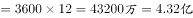。

故正确答案为D。

---

### 第 2 题　qid 2050938 · 数学运算

某高校今年计划招收各类学生6630人，比去年增长，其中本科生比去年减少，研究生的招生计划数比去年增加。那么，该校今年研究生的招生计划数为：

- **A**. 3052人
- **B**. 3161人
- **C**. 3270人　✅
- **D**. 3379人

**答案**：C

**官方解析**

今年招收6630人，比去年增长，则去年总人数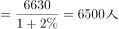，根据线段法，本科生和研究生增长率的距离之比为，由于增长率的距离和基期量成反比，则去年本科生和研究生人数之比为，因此去年研究生的招生计划数，今年研究生的招生计划数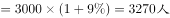。

故正确答案为C。

---

### 第 3 题　qid 2050962 · 数学运算

老张购进一批商品，共20件。销售时，每件合格的商品可以赚50元，不合格的商品一件亏20元。他卖出的这20件商品中有几件是不合格的，那么卖出这批商品可能赚：

- **A**. 690元
- **B**. 720元　✅
- **C**. 780元
- **D**. 850元

**答案**：B

**官方解析**

设不合格的产品有件（一定为正整数），则合格的产品有件。商品总利润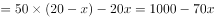，代入A选项，即，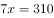，不是整数，排除；代入B选项，即，解得，满足是正整数的条件，正确。

故正确答案为B。

---

### 第 4 题　qid 2050984 · 数学运算

某乡有32户果农，其中有26户种了柚子树，有24户种了橘子树，还有5户既没有种柚子树也没有种橘子树，那么该乡同时种植柚子树和橘子树的果农有：

- **A**. 23户　✅
- **B**. 22户
- **C**. 21户
- **D**. 24户

**答案**：A

**官方解析**

由容斥原理公式可得，种柚子+种橘子-两种都种=总数-两种都不种，代入数字：，解得：两种都种户。

故正确答案为A。

---

### 第 5 题　qid 2050988 · 数学运算

某地区居民生活用水每月标准用水量的基本价格为每吨3元，若每月用水量超过标准用水量，超出部分按基本价格的收费。某户六月份用水25吨，共交水费83.1元，则该地区每月标准用水量为：

- **A**. 12吨
- **B**. 14吨
- **C**. 15吨
- **D**. 16吨　✅

**答案**：D

**官方解析**

设每月标准用水量为吨，则六月有，解得。

故正确答案为D。

---

### 第 6 题　qid 2050990 · 数学运算

某人雇用了甲、乙、丙三名工人加工一批零件，其中有87个零件不是甲加工的，有86个零件不是乙加工的，有85个零件不是丙加工的，那么甲加工的零件数是：

- **A**. 42个　✅
- **B**. 43个
- **C**. 44个
- **D**. 45个

**答案**：A

**官方解析**

根据题意可得方程组：，②式+③式-①式=2甲=84，解得甲=42个。因此，甲加工了42个零件。

---

### 第 7 题　qid 2050994 · 数学运算

一辆动车组列车和一辆快速列车相向而行，动车组列车的车长是260米，快速列车的车长是455米。坐在动车组列车上的人看快速列车驶过的时间是7秒，那么坐在快速列车上的人看动车组列车驶过的时间是：

- **A**. 3秒
- **B**. 4秒　✅
- **C**. 5秒
- **D**. 6秒

**答案**：B

**官方解析**

因为两车是相向而行，所以不管坐在动车组列车还是快速列车上，相对另一辆车的速度都一样，就是两车速度和。坐在动车组列车上，7秒可以让快速列车行驶过，则相对速度为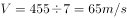。

坐在快速列车上，让动车组行驶过，则需要。

故正确答案为B。

---

### 第 8 题　qid 2051000 · 数学运算

某超市购进三种不同的糖，每种糖所用的费用相等，已知这三种糖每千克的费用分别为11元、12元、13.2元。如果把这三种糖混在一起成为什锦糖，那么这种什锦糖每千克的成本是：

- **A**. 12.6元
- **B**. 11.8元
- **C**. 12元　✅
- **D**. 11.6元

**答案**：C

**官方解析**

赋值法：根据题意，设三种糖购入的费用均为132元，那么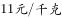的糖的重量为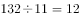千克；的糖的重量为千克；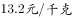的糖的重量为千克。三种糖总重量为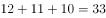千克，总费用为元，所以什锦糖每千克的成本是。

故正确答案为C。

---

### 第 9 题　qid 2051028 · 数学运算

3年前张三的年龄是他女儿的17倍，3年后张三的年龄是他女儿的5倍，那么张三的女儿现在：

- **A**. 2岁
- **B**. 3岁
- **C**. 4岁
- **D**. 5岁　✅

**答案**：D

**官方解析**

根据题意，设张三的女儿三年前的年龄为岁，则张三和他女儿现在、三年前和三年后的年龄有如下关系：

三年后张三的年龄是女儿的5倍则有：

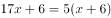，

解得，因此岁。

故正确答案为D。

---

### 第 10 题　qid 2051030 · 数学运算

如果从甲船看乙船，乙船在甲船的西偏北65°方向，那么从乙船看甲船，甲船在乙船的：

- **A**. 东偏南75°方向
- **B**. 东偏南65°方向　✅
- **C**. 西偏南75°方向
- **D**. 北偏东25°方向

**答案**：B

**官方解析**

根据题意，乙在甲的西边，则甲在乙的东边，乙在甲的北边，甲在乙的南边，排除CD项，因题干中只有一个角度65°，只有B项满足。如下图所示：

故正确答案为B。

---

### 第 11 题　qid 2051032 · 数学运算

某市出租车的计费方式如下：路程在2公里以内（含2公里）为8元；达到2公里后，每增加1公里收费1.9元；达到8公里以后，每增加1公里收费2.1元，增加不足1公里时按四舍五入计算。某乘客乘坐这种出租车交了44.6元车费，则该乘客乘坐此出租车行驶的路程为：

- **A**. 18公里
- **B**. 19公里
- **C**. 20公里　✅
- **D**. 21公里

**答案**：C

**官方解析**

根据选项可得，路程超过8公里且为整数，假设路程为，根据题意可列方程：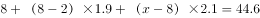，解得公里。

故正确答案为C。

---

### 第 12 题　qid 2051036 · 数学运算

从两双完全相同的鞋中，随机抽取一双鞋的概率是：

- **A**. 

　✅
- **B**. 

- **C**. 

- **D**. 
1

**答案**：A

**官方解析**

,两双相同的鞋子一共四只，则从四只里选出两只，总数为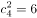,满足条件的一双鞋则是左脚一只，右脚一只。左脚一共两只，选其中一只是种情况，同理右脚也是两种情况，分步用乘法，种。所以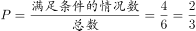。

故正确答案为A。

---

### 第 13 题　qid 2051044 · 数学运算

有A、B两瓶混合液，A瓶中水、油、醋的比例为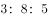，B瓶中水、油、醋的比例为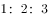，将A、B两瓶混合液倒在一起后，得到的混合液中水、油、醋的比例可能为：

- **A**. 
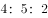

- **B**. 
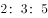

- **C**. 
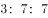
　✅
- **D**. 

**答案**：C

**官方解析**

混合前，水、油的比例A为，即油是水的3倍不到，B为，即油是水的2倍，则混合后，油和水的倍数在2倍到3倍之间，排除A、B、D项。故只有C项满足。 

故正确答案为C。

---

### 第 14 题　qid 2051046 · 数学运算

有一个20世纪80年代出生的人，如果他能活到80岁，那么有一年他的年龄的平方数正好等于那一年的年份。此人生于：

- **A**. 1985年
- **B**. 1984年
- **C**. 1983年
- **D**. 1980年　✅

**答案**：D

**官方解析**

假设出生的年份为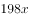，80岁时对应年份为，故年份对应的平方数取值范围为，取值验证：

若当他50岁时，年龄的平方数与那一年年份相同，，与题意不符，排除；

若当他40岁时，年龄的平方数与那一年年份相同，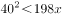，与题意不符，排除；

若当他45岁时，年龄的平方数与那一年年份相同，，且，满足题意，故此人出生于1980年。

故正确答案为D。

---

### 第 15 题　qid 2051048 · 数学运算

将一批葡萄平均分装在36个箱子中，发现箱子没有装满，如果每箱多装，则只需要使用箱子：

- **A**. 31个
- **B**. 32个　✅
- **C**. 33个
- **D**. 34个

**答案**：B

**官方解析**

假设原来每箱装的葡萄量为，葡萄总量为，多装，现在每箱装葡萄的量为，需要箱子：。

故正确答案为B。

---

## 判断推理

### 第 1 题　qid 2050876 · 图形推理

从所给四个选项中，选择最合适的一个填入问号处，使之呈现一定的规律性：

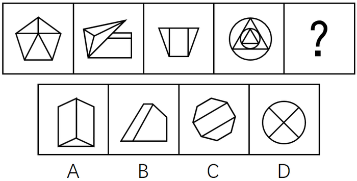

- **A**. A　✅
- **B**. B
- **C**. C
- **D**. D

**答案**：A

**官方解析**

元素组成不同，而题干中4幅图形均由多个面构成，优先考虑数量规律中面的关系。观察发现面数量分别为5、5、3、10，不呈现明显的规律。再观察发现，题干中每幅图形均含有三角形，而选项中只有A选项含有三角形。
故正确答案为A。

---

### 第 2 题　qid 2050882 · 图形推理

从所给四个选项中，选择最合适的一个填入问号处，使之呈现一定的规律性：

- **A**. A
- **B**. B　✅
- **C**. C
- **D**. D

**答案**：B

**官方解析**

元素组成不同，无明显的属性规律，考虑数量规律。观察发现，出现黑色粗线条图形，可优先考虑部分数。题干中4幅图形的部分数均为4，选项中只有B选项部分数为4，其余选项部分数均为3。
故正确答案为B。

---

### 第 3 题　qid 2050886 · 图形推理

从所给四个选项中，选择最合适的一个填入问号处，使之呈现一定的规律性：

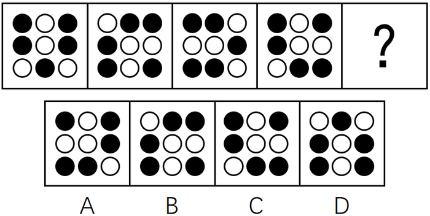

- **A**. A
- **B**. B
- **C**. C
- **D**. D　✅

**答案**：D

**官方解析**

思路一：通过观察发现，整体看图形都是轴对称图形，且对称轴方向依次逆时针旋转45°，问号处应选择一个竖轴对称的图形，即D选项。
思路二：通过观察发现，所有小黑点每次都沿图形外圈逆时针移动一格，问号处延续此规律，即D选项。
故正确答案为D。

---

### 第 4 题　qid 2050892 · 图形推理

从所给四个选项中，选择最合适的一个填入问号处，使之呈现一定的规律性：

- **A**. A
- **B**. B
- **C**. C　✅
- **D**. D

**答案**：C

**官方解析**

图形元素组成相似，优先考虑样式规律。第一组图形中，图1和图2黑块相加，内部直线去同存异，得到图3。第二组图形依照此规律，图1和图2黑块相加后，“？”号处内部应为4个小黑块，且中间的直线去掉，对应到C选项。
故正确答案为C。

---

### 第 5 题　qid 2050896 · 图形推理

从所给四个选项中，选择最合适的一个填入问号处，使之呈现一定的规律性：

- **A**. A
- **B**. B
- **C**. C
- **D**. D　✅

**答案**：D

**官方解析**

元素组成相似，且相同元素重复出现，优先考虑样式规律的遍历。观察发现题干相邻两图之间都有一个且只有一个相同的元素，只有D项符合。
故正确答案为D。

---

### 第 6 题　qid 2050902 · 定义判断

危机公关是指由于企业管理不善，同行竞争甚至遭遇恶意破坏或者外界特殊事件的影响，而给企业或者品牌带来危机，企业针对危机所采取的一系列自救行动，包括消除影响、恢复形象等。
根据上述定义，下列属于危机公关的是：

- **A**. 某智能手机制造商在行业竞争中失去领先地位，利润大幅下滑，公司高层决定转向新的领域
- **B**. 由于国际原油价格大幅上涨，使得汽油生产成本提高，公司领导召开会议研究对策
- **C**. 某智能手机制造商生产的一款手机由于电池缺陷被曝光后，该智能手机生产商通过媒体向公众道歉，并主动将问题手机召回　✅
- **D**. 台风将某公司的户外广告牌吹倒了，公司派人前去修复

**答案**：C

**官方解析**

第一步：找出定义关键词。
“由于企业管理不善，同行竞争甚至遭遇恶意破坏或者外界特殊事件的影响，而给企业或者品牌带来危机”、“企业针对危机所采取的一系列自救行动”。
第二步：逐一分析选项。
A项：智能手机制造商在行业竞争中失去领先地位，利润大幅下滑，符合“同行竞争给企业或者品牌带来危机”，公司高层决定转向新的领域，并非针对危机所采取的一系列自救行动，不符合定义，排除；
B项：国际原油价格大幅上涨，使得汽油生产成本提高，并未给企业或者品牌带来危机，不符合定义，排除；
C项：对于电池缺陷曝光事件给企业带来的危机，生产商采取自救行动，通过向公众道歉，并主动将问题手机召回，来挽回企业的声誉，消除影响，符合定义，当选；
D项：台风将某公司的户外广告牌吹倒，并未给企业或者品牌带来危机，不符合定义，排除。
故正确答案为C。

---

### 第 7 题　qid 2050906 · 定义判断

劳动争议是指在劳动者和劳动力使用者之间因劳动权利与义务发生分歧而引起的争议。
根据上述定义，下列属于劳动争议的是：

- **A**. 职工小周因工作调动的问题与当地劳动部门发生争执
- **B**. 某企业职工小张和小李因工作上意见不合而产生矛盾
- **C**. 两个单位之间因职工小刘的借调问题而产生矛盾
- **D**. 职工老王因工伤未能获得保险赔偿而与工厂争执　✅

**答案**：D

**官方解析**

第一步：找到定义关键词。
“劳动者和劳动力使用者之间因劳动权利与义务发生分歧而引起的争议”。
第二步：逐一分析选项。
A项：职工小周与当地劳动部门并非劳动者和劳动力使用者的关系，不符合定义，排除；
B项：企业职工小张和小李并非劳动者和劳动力使用者的关系，不符合定义，排除；
C项：两个单位并非劳动者和劳动力使用者的关系，不符合定义，排除；
D项：职工老王与工厂是劳动者和劳动力使用者的关系，因为工伤未能获得保险赔偿而争执，劳动者有获得保险赔偿的权利，工厂有支付保险赔偿的义务，是因劳动权利与义务发生分歧而引起的争议，符合定义，当选。
故正确答案为D。

---

### 第 8 题　qid 2050908 · 定义判断

典范借鉴是指从他人（或对方）那里发现、学习并应用最佳做法的过程，以达到帮助改善自身业绩的目的。
根据上述定义，下列属于典范借鉴的是：

- **A**. 小王刚学打扑克时总是输，后来掌握了打扑克的一些规则和技巧，他打扑克就经常赢
- **B**. 张三看见李四在某企业工作收入颇丰，随后他也应聘到该企业上班
- **C**. 小刚在同桌小红的帮助下，学习成绩大幅提高
- **D**. 某国企吸取国外著名企业生产同类产品的先进经验，降低成本，提高效益　✅

**答案**：D

**官方解析**

第一步，找出定义关键词。
“从他人（或对方）那里发现、学习并应用最佳做法的过程”、“帮助改善自身业绩的目的”。
第二步，逐一分析选项。
A项：“打扑克”只是娱乐消遣，没有体现“改善自身业绩”，不符合定义，排除；
B项：“张三看见李四在某企业工作收入颇丰，所以应聘到该企业上班”，没有体现“发现、学习并应用最佳做法”，不符合定义，排除；
C项：“小刚在同桌小红的帮助下”，是他人主动帮助他，不符合“从他人（或对方）那里发现、学习并应用”，并且学习成绩不属于业绩范畴，不符合定义，排除；
D项：“某国企吸取国外著名企业生产同类产品的先进经验”体现了“从他人（或对方）那里发现、学习并应用最佳做法的过程”，并且“提高效益”符合“改善自身业绩的目的”，符合定义，当选。
故正确答案为D。

---

### 第 9 题　qid 2050912 · 定义判断

流动偏好是指人们以货币的形式保持一部分资产的愿望和偏爱，它是一种心理动机，目的是应付日常开支、意外开支和在适当时机投机牟利。
根据上述定义，下列不属于流动偏好的是：

- **A**. 为了购买住宅商品房，小王参加工作后就开始为买房存钱　✅
- **B**. 最近一段时间股市行情一直不好，许多股民纷纷退出股市
- **C**. 银行一再降息，全国的储蓄率仍然很高
- **D**. 老刘平时节俭不乱花钱是怕突如其来的下岗后的拮据

**答案**：A

**官方解析**

第一步：找出定义关键词。
方式：以货币的形式保持一部分资产。
目的：应付日常开支、意外开支和在适当时机投机牟利活动需要。
第二步，逐一分析选项。
A项：购买住宅商品房，不属于应付日常开支、意外开支和在适当时机投机牟利，不符合定义，当选；
B项：股民退出股市是为了适当时机投机牟利，符合定义，排除；
C项：储蓄是把钱存入银行，是以货币的形式保持一部分资产，符合关键词，符合定义，排除；
D项：为怕下岗后生活拮据属于为了应付意外开支需要而保持资产，符合定义，排除。
本题为选非题，故正确答案为A。

---

### 第 10 题　qid 2050924 · 定义判断

商业秘密是指不为公众所知悉，能为权利人带来经济利益，具有实用性并经权利人采取保密措施的技术信息和经营信息。
根据上述定义，下列属于商业秘密的是：

- **A**. 云南白药的配方　✅
- **B**. 淘宝网“双十一”活动的具体细则
- **C**. 某军分区的管理规定
- **D**. 三七片的功效和作用

**答案**：A

**官方解析**

第一步，找出定义关键词。
“不为公众所知悉”、“能为权利人带来经济利益”、“具有实用性并经权利人采取保密措施的技术信息和经营信息”。
第二步，逐一分析选项。
A项：“云南白药的配方”是不对大众公开的，同时云南白药的相关产品能够为其生产厂家带来经济利益，并且“云南白药的配方”属于国家级保密处方，受到专利保护、行政保护、商标保护和商业秘密保护等，符合定义，当选；
B项：“淘宝网‘双十一’活动的具体细则”是对消费者公开的，以便于消费者能够享受到优惠，不符合“不为公众所知悉”，不符合定义，排除；
C项：“某军分区的管理规定”，是军区制定的规章制度，不能为权利人带来经济利益，不符合定义，排除；
D项：“三七片的功效和作用”是印刷在三七片的药品使用说明书上的，对大众是公开的，不符合“不为公众所知悉”，不符合定义，排除。
故正确答案为A。

---

### 第 11 题　qid 2050928 · 定义判断

工作扩大化是指在横向水平上增加工作任务的数目或变化性，使工作多样化。工作丰富化是指从纵向上赋予员工更复杂、更系列化的工作，使员工有更大的控制权。
根据上述定义，下列属于工作丰富化的是：

- **A**. 自助餐厅的伙计在面食、沙拉、蔬菜、饮品和甜点部都轮换工作
- **B**. 一家研究所，一个部门主管告诉他的下属，只要在预算内并且合法，他们就可以做想做的任何研究　✅
- **C**. 某公司员工小张不能胜任目前的岗位，领导安排他去了其他部门
- **D**. 快递公司的员工从原来只专门负责分拣货物增加到也负责分送到各个服务网点

**答案**：B

**官方解析**

第一步：找到定义关键词。
工作扩大化：“横向水平上增加工作任务的数目或变化性”、“使工作多样化”；
工作丰富化：“纵向上赋予员工更复杂、更系列化的工作”、“使员工有更大的控制权”。
第二步：逐一分析选项。
A项：自助餐厅的伙计在面食、沙拉部等轮换岗位，不符合“纵向上赋予员工更复杂、更系列化的工作”，不符合工作丰富化的定义，排除；
B项：部门主管让下属可以做想做的任何研究，符合“使员工有更大的控制权”，符合工作丰富化的定义，当选；
C项：小张不能胜任目前岗位，被安排到其他部门，不符合“纵向上赋予员工更复杂、更系列化的工作”，不符合工作丰富化的定义，排除；
D项：由只负责分拣增加到负责送到网点，不符合“纵向上赋予员工更复杂、更系列化的工作”，不符合工作丰富化的定义，排除。
故正确答案为B。

---

### 第 12 题　qid 2050930 · 定义判断

公地悲剧是指享用者都从自己私利出发，争取从中获取更多收益而付出的代价由大家负担。
根据上述定义，下列不属于公地悲剧的是：

- **A**. 军备竞赛的双方都面临着一个困境，一方面军事力量不断增加，另一方面国家安全却受到越来越多的威胁
- **B**. 博弈游戏中，任何“赢”的一方都是背离游戏的，任何“输”的一方也都是背离游戏的　✅
- **C**. 一群牧民一同在一块公共草场放牧。不少牧民都想多养羊增加个人收益，结果草场持续退化，直至无法养羊，最终导致所有牧民破产
- **D**. 有的企业把下水道污物、化学物质、放射性污染物和高温废弃物等排放到水体中，将有毒废气排放到大气中

**答案**：B

**官方解析**

第一步：找到定义关键词。
“享用者都从自己私利出发，争取从中获取更多收益而付出的代价由大家负担”。
第二步：逐一分析选项。
A项：为了能更好的军备竞赛，增加军事力量，体现了从自己私利出发，而国家安全受到越来越多的威胁，体现了付出的代价由大家负担，符合定义，排除；
B项：博弈游戏中，无论输赢都不是背离游戏的，只是针对博弈的两方都是背离游戏的，没有体现付出的代价由大家负担，不符合定义，当选；
C项：牧民想多养羊增加个人收益体现从自己私利出发，而造成草场退化、所有牧民破产，体现了付出的代价由大家负担，符合定义，排除；
D项：有的企业排放污染物，体现了从自己的私利出发，污染物的排放势必污染土壤、空气付出的代价由大家负担，符合定义，排除。
本题为选非题，故正确答案为B。

---

### 第 13 题　qid 2050932 · 定义判断

表象是指事物不在面前时，人们在头脑中出现的关于事物的形象，具有直观性、概括性、可操作性等特点，在形象思维中具有重要作用。
根据上述定义，下列属于表象的是：

- **A**. 没有见过北方冬日的人们，通过诵读毛泽东诗词《沁园春·雪》，可在头脑中形成北国风光的情景
- **B**. 猪八戒是吴承恩先生抽象出来的一个人物形象
- **C**. 当一个孩子盯着一幅画看上几分钟，闭上眼睛，依然能够清晰地记得这幅画的每一个细节　✅
- **D**. 当人们读到《红楼梦》中关于林黛玉生动的外貌描写时，似乎能看到林黛玉就站在眼前

**答案**：C

**官方解析**

第一步：找到定义关键词。
“事物不在面前”、“头脑出现”、“关于事物的形象”。
第二步：逐一分析选项。
A项：对没有见过的事物的主观想象，不符合定义，排除；
B项：猪八戒是作者主观想象的一个未出现过的人物形象，不符合定义，排除；
C项：当孩子闭眼时，这幅画形象在其脑中再次呈现，符合定义，当选；
D项：对没有见过的事物的主观想象，不符合定义，排除。
故正确答案为C。

---

### 第 14 题　qid 2050934 · 定义判断

反应性相倚是指在沟通过程中，沟通双方都以对方的行为作为自己行为的依据，做出相应的反应，而并不按照原来的计划进行沟通。
根据上述定义，下列属于反应性相倚的是：

- **A**. 小张同意按照编辑意见修改稿件，但希望保留原文的写作风格，与编辑沟通后，编辑表示同意　✅
- **B**. 张厂长在大会上宣读了关于加强劳动纪律的发言稿，由于制定的措施不合理，职工在下面议论纷纷，但他还是完成了自己的发言
- **C**. 王老师认为他为学生准备的口试题目并不难，但仍有一些学生回答不出，当学生要求王老师提示时，王老师断然拒绝
- **D**. 爸爸得知小红考试失利后，准备劝慰一番，但他发现小红的情绪并未受到影响，于是放弃了劝慰小红的打算

**答案**：A

**官方解析**

第一步：找出定义关键词。
“沟通双方”、“以对方的行为作为自己行为的依据”、“并不按照原来的计划进行沟通”。
第二步：逐一分析选项。
A项：小张和编辑是沟通双方，小张同意按照编辑意见修改稿件，编辑同意小张保留原文的写作风格，符合“以对方的行为作为自己行为的依据”、“并不按照原来的计划进行沟通”，符合定义，当选；
B项：尽管职工在下面议论纷纷，张厂长还是完成了自己的发言，不符合“以对方的行为作为自己行为的依据”，不符合定义，排除；
C项：当学生要求王老师提示时，王老师断然拒绝了，不符合“以对方的行为作为自己行为的依据”，不符合定义，排除；
D项：爸爸发现小红的情绪没受到影响，放弃劝慰小红，说明爸爸和小红之间可能并没有进行沟通，小红没有以爸爸的行为作为自己行为的依据，不符合定义，排除。
故正确答案为A。

---

### 第 15 题　qid 2050936 · 定义判断

演绎作品是指在已有作品的基础上，通过改编、翻译、注释、整理等创造性劳动而产生的作品。
根据上述定义，下列不属于演绎作品的是：

- **A**. 《基督山伯爵》的电影剧本
- **B**. 《飘》中英文对照版
- **C**. 《〈唐诗三百首〉经典诗句评析》　✅
- **D**. 《〈离骚〉难点词汇释义》

**答案**：C

**官方解析**

第一步：找出定义关键词。
“在已有作品的基础上”、“通过改编、翻译、注释、整理等创造性劳动”、“作品”。
第二步：逐一分析选项。
A项：电影剧本是指以文字描述整部影片的人物和动作内容所采取的写作形式。《基督山伯爵》是已有作品，《基督山伯爵》的电影剧本就是在已有作品的基础上，通过改编、整理等创造性劳动而产生的作品，符合定义。
B项：《飘》是已有作品，《飘》中英文对照版就是在已有作品的基础上，通过翻译、整理等创造性劳动而产生的作品，符合定义。
C项：《唐诗三百首》是已有作品，但对经典诗句进行评析不符合关键词“通过改编、翻译、注释、整理等创造性劳动”，不符合定义。
D项：《离骚》是已有作品，《〈离骚〉难点词汇释义》就是在已有作品的基础上，通过注释、整理等创造性劳动而产生的作品，符合定义。
本题为选非题，故正确答案为C。

---

### 第 16 题　qid 2050942 · 类比推理

电流强度：安培

- **A**. 功率：伏特
- **B**. 电阻：欧姆　✅
- **C**. 电荷：瓦特
- **D**. 压强：牛顿

**答案**：B

**官方解析**

第一步：判断题干词语间逻辑关系。
电流强度的单位是安培，二者是物理概念与单位的对应关系。
第二步：判断选项词语间逻辑关系。
A项：功率的单位是“瓦特”，而非“伏特”，与题干逻辑关系不一致，排除；
B项：电阻的单位是“欧姆”，二者之间是物理概念与单位的对应关系，与题干逻辑关系一致，当选；
C项：带正负电的基本粒子被称为电荷，它的单位不是“瓦特”，与题干逻辑关系不一致，排除；
D项：压强的单位是“帕斯卡”，而非“牛顿”，与题干逻辑关系不一致，排除。
故正确答案为B。

---

### 第 17 题　qid 2050948 · 类比推理

厨房：高压锅：电饭煲

- **A**. 运动场：球迷：座位
- **B**. 教室：课桌：讲台　✅
- **C**. 书桌：书架：台灯
- **D**. 农田：水稻：水牛

**答案**：B

**官方解析**

第一步：判断题干词语间逻辑关系。
高压锅和电饭煲都是厨房用具，两者是并列关系，且厨房是地点，高压锅和电饭煲都主要在厨房中使用，是物品与地点的对应关系。
第二步：判断选项词语间逻辑关系。
A项：“球迷”坐在“座位”上，不是并列关系，与题干逻辑关系不一致，排除；
B项：“课桌”和“讲台”都是教室用具，两者是并列关系，且教室是地点，课桌和讲台都主要在教室里使用，与题干逻辑关系一致，当选；
C项：“书桌”“书架”是属于家具，“台灯”是家电，与题干逻辑关系不一致，排除；
D项：“水稻”和“水牛”不是并列关系，与题干逻辑关系不一致，排除。
故正确答案为B。

---

### 第 18 题　qid 2050952 · 类比推理

精致：粗糙

- **A**. 河水：海水
- **B**. 山峰：深渊
- **C**. 违背：遵循　✅
- **D**. 怀疑：守信

**答案**：C

**官方解析**

第一步：判断题干词语间逻辑关系。
精致和粗糙是反义关系。
第二步：判断选项词语间逻辑关系。
A项：河水和海水是并列关系，而不是反义关系，与题干逻辑关系不一致，排除；
B项：山峰和深渊是并列关系，而不是反义关系，与题干逻辑关系不一致，排除；
C项：违背和遵循是反义关系，与题干逻辑关系一致，当选；
D项：怀疑和守信不是反义关系，与题干逻辑关系不一致，排除。
故正确答案为C。

---

### 第 19 题　qid 2050956 · 类比推理

失之毫厘：谬以千里

- **A**. 三十六计：走为上计
- **B**. 召之即来：挥之即去
- **C**. 种瓜得瓜：种豆得豆
- **D**. 前人栽树：后人乘凉　✅

**答案**：D

**官方解析**

第一步：判断题干词语间逻辑关系。
失之毫厘和谬以千里可以组成一句话，意思是相差虽小，但是造成的误差或错误极大。且失之毫厘会导致谬以千里，二者是因果关系。
第二步：判断选项词语间逻辑关系。
A项：三十六计和走为上计可以组成一句话，意思是事情已经到了无可奈何的地步，没有别的好办法，只能出走。三十六计和走为上计是组成关系，与题干逻辑关系不一致，排除；
B项：召之即来和挥之即去可以组成一句话，意思是非常听从指挥。召之即来和挥之即去是并列关系，与题干逻辑关系不一致，排除；
C项：种瓜得瓜和种豆得豆可以组成一句话，意思是做了什么事，得到什么样的结果。种瓜得瓜和种豆得豆是并列关系，与题干逻辑关系不一致，排除；
D项：前人栽树和后人乘凉可以组成一句话，意思是前人做的劳动，后人来享受。且前人栽树和后人乘凉是因果关系，与题干逻辑关系一致，当选。
故正确答案为D。

---

### 第 20 题　qid 2050958 · 类比推理

黑色：颜色

- **A**. 米饭：粮食　✅
- **B**. 小草：树木
- **C**. 粗心：信心
- **D**. 鱼：湖泊

**答案**：A

**官方解析**

第一步：判断题干词语间逻辑关系。
黑色是一种颜色，二者是种属关系。
第二步：判断选项词语间逻辑关系。
A项：米饭是一种粮食，二者是种属关系，与题干逻辑关系一致，当选；
B项：小草不是树木，二者不是种属关系，与题干逻辑关系不一致，排除；
C项：粗心不是信心，二者不是种属关系，与题干逻辑关系不一致，排除；
D项：鱼可以生活在湖泊里，二者不是种属关系，与题干逻辑关系不一致，排除。
故正确答案为A。

---

### 第 21 题　qid 2050814 · 类比推理

饭店：厨师：菜肴

- **A**. 监狱：狱警：囚犯
- **B**. 工厂：工人：产品　✅
- **C**. 舞台：演员：道具
- **D**. 学校：教师：学生

**答案**：B

**官方解析**

第一步：判断题干词语间逻辑关系。
厨师是一种职业，饭店是厨师工作的地点，菜肴是厨师的制作成品。
第二步：判断选项词语间逻辑关系。
A项：狱警是一种职业，监狱是狱警工作的地点，囚犯不是狱警的制作成品，而是狱警管理的对象，与题干逻辑关系不一致，排除；
B项：工人是一种职业，工厂是工人工作的地点，产品是工人的制作成品，与题干逻辑关系一致，当选；
C项：演员是一种职业，舞台是演员工作的地点，道具不是演员的制作成品，而是演员表演需要的工具，与题干逻辑关系不一致，排除；
D项：教师是一种职业，学校是教师工作的地点，学生不是教师的制作成品，而是教师授课的对象，与题干逻辑关系不一致，排除。
故正确答案为B。

---

### 第 22 题　qid 2050816 · 类比推理

商品：购买：商店

- **A**. 网购：付款：网络
- **B**. 看书：学习：图书馆
- **C**. 信件：邮寄：邮局　✅
- **D**. 股票：投资：账户

**答案**：C

**官方解析**

第一步：判断题干词语间逻辑关系。
购买商品是动宾结构，商店是购买商品的地点。
第二步：判断选项词语间逻辑关系。
A项：付款网购不是动宾结构，与题干逻辑关系不一致，排除；
B项：学习看书不是动宾结构，与题干逻辑关系不一致，排除；
C项：邮寄信件是动宾结构，邮局是邮寄信件的地点，与题干逻辑关系一致，当选；
D项：投资股票是动宾结构，但账户不是投资股票的地点，与题干逻辑关系不一致，排除。
故正确答案为C。

---

### 第 23 题　qid 2050820 · 类比推理

吊灯  对于（  ）  相当于  台历  对于（  ）

- **A**. 屋顶：墙壁
- **B**. 墙壁：客厅
- **C**. 客厅：桌子
- **D**. 屋顶：桌子　✅

**答案**：D

**官方解析**

逐一代入选项。
A项：吊灯安装在屋顶之上，为对应关系，台历与墙壁无明显的逻辑关系，墙壁对应的应该是挂历，前后逻辑关系不一致，排除；
B项：吊灯与墙壁无明显逻辑关系，与墙壁为对应关系的是壁灯，台历可以放在客厅中，为对应关系，前后逻辑关系不一致，排除；
C项：吊灯在客厅中，为场所的对应，台历在桌子上，但桌子不是场所，不是场所的对应，前后逻辑关系不一致，排除；
D项：吊灯可直接安装在屋顶上，台历可直接放置在桌子上，都为直接接触物品的对应关系，前后逻辑关系一致，当选。
故正确答案为D。

---

### 第 24 题　qid 2050824 · 类比推理

电动汽车：电动车：汽车

- **A**. 航天飞机：宇宙飞船：飞行器
- **B**. 军医：医生：军人　✅
- **C**. 研究生：研究：学生
- **D**. 法官：法律：官员

**答案**：B

**官方解析**

第一步：判断题干词语间逻辑关系。
电动车和汽车是交叉关系，电动汽车是二者交叉的部分。
第二步：判断选项词语间逻辑关系。
A项：宇宙飞船是飞行器的一种，二者为种属关系，与题干逻辑关系不一致，排除；
B项：医生和军人是交叉关系，军医是二者交叉的部分，与题干逻辑关系一致，当选；
C项：研究和学生不是交叉关系，与题干逻辑关系不一致，排除；
D项：官员和法律不是交叉关系，与题干逻辑关系不一致，排除。
故正确答案为B。

---

### 第 25 题　qid 2050832 · 类比推理

（  ）对于  冲突  相当于  （  ）  对于  交流

- **A**. 矛盾；接触　✅
- **B**. 战争；遭遇
- **C**. 麻烦；喜欢
- **D**. 陌生；熟悉

**答案**：A

**官方解析**

逐一代入验证选项。
A项：因为矛盾，所以产生冲突，两者是因果关系，因为接触，所以促进交流，前后逻辑关系一致，当选；
B项：冲突可能导致战争，两者是因果关系，遭遇和交流之间没有明显的关联，前后逻辑关系不一致，排除；
C项：麻烦和冲突之间没有明显联系，交流与喜欢之间没有明显联系，前后逻辑关系不一致，排除；
D项：陌生和冲突没有明显的因果关系，因为交流变得熟悉，两者是因果关系，前后逻辑关系不一致，排除。
故正确答案为A。

---

### 第 26 题　qid 2050852 · 逻辑判断

某市有甲乙丙丁四家书店，其中甲书店的各种图书都能在乙书店找到，在乙书店出售的图书一定也在丙书店出售，而丙书店有一些图书在丁书店中也有销售。
由此可以推出：

- **A**. 甲书店中有一些图书能在丁书店中找到
- **B**. 乙书店中有一些图书能在丁书店中找到
- **C**. 丁书店中所有的图书都能够在乙书店中找到
- **D**. 甲书店中所有的图书都能在丙书店中找到　✅

**答案**：D

**官方解析**

第一步：翻译题干。

①甲书店图书乙书店图书

②乙书店图书丙书店图书

③有的丙书店图书丁书店图书

将①、②串联成④甲书店图书乙书店图书丙书店图书

第二步：逐一分析选项。

A项：翻译为有的甲书店图书丁书店图书，无法推出，排除；

B项：翻译为有的乙书店图书丁书店图书，无法推出，排除；

C项：翻译为丁书店图书乙书店图书，无法推出，排除；

D项：翻译为甲书店图书丙书店图书，是对④的肯前推肯后，可以推出，当选。

故正确答案为D。

---

### 第 27 题　qid 2050858 · 逻辑判断

有四个人，他们分别是小偷、强盗、法官、警察。第一个人说：“第二个人不是小偷。”第二个人说：“第三个是警察。”第三个人说：“第四个人不是法官。”第四个人说：“我不是警察，而且除我之外只有警察会说实话。”如果第四个人说的是实话，那么以下说法正确的是：

- **A**. 第一个人是警察，第二个人是小偷
- **B**. 第一个人是小偷，第四个人是法官
- **C**. 第三个人是警察，第四个人是法官
- **D**. 第二个人是强盗，第三个人是小偷　✅

**答案**：D

**官方解析**

分析题干已知信息。
①第二个人不是小偷
②第三个人是警察
③第四个人不是法官
④第四个人不是警察，且只有第四个人和警察说真话
通过④可知①②③中，只有一个人说真话，故本题为真假推理题。因为三句话中，没有矛盾和反对关系，故可考虑代入排除。
A项：第一个人是警察，代入题干，即“第二个人不是小偷”为真，那么与A“第二个人是小偷”矛盾，排除；
B项：第一个人是小偷，那么他说的话是假话，代入题干，“第二个人不是小偷”为假，即第二个人是小偷，而小偷只有一个，不能两人都是小偷，排除；
C项：第三个人是警察，那么第三个人说真话，而题干第二个人说：“第三个是警察。”即两个人说了真话，排除。
故正确答案为D。

---

### 第 28 题　qid 2050864 · 类比推理

小李说：“我这次通过了所有科目的考试，拿到了机动车驾驶证。”如果小李说的不是事实，则下列选项一定正确的是：

- **A**. 小李至少有一个科目的考试没有通过　✅
- **B**. 小李只有一个科目的考试没有通过
- **C**. 小李至多有一个科目的考试没有通过
- **D**. 小李没有通过所有科目的考试

**答案**：A

**官方解析**

第一步：分析题干。
小李指出“所有科目的考试都通过了”，即“所有a都是b”。已知“小李说的不是事实”，即它的矛盾命题为真，根据“所有a都是b”的矛盾命题为“有a的不是b”可知，“有的科目的考试没有通过”为真。
第二步：逐一分析选项。
A项：“有的科目的考试没有通过”等价于“至少有一个科目的考试没有通过”，说法正确，当选；
B项：根据“有的科目的考试没有通过”无法确定“只有一个科目的考试没有通过”，说法不一定正确，排除；
C项：根据“有的科目的考试没有通过”无法确定“至多有一个科目的考试没有通过”，说法不一定正确，排除；
D项：“没有通过所有科目的考试”等同于“所有科目的考试都没通过”，根据“有的科目的考试没有通过”无法确定“所有科目的考试都没通过”，说法不一定正确，排除。
故正确答案为A。

---

### 第 29 题　qid 2050868 · 逻辑判断

某软件公司的员工中，三个广东人，一个北京人，三个北方人，有四个人只负责软件开发，有两个人只负责产品销售。如果以上的介绍涉及了该公司所有员工，则该公司的员工：

- **A**. 最少可能是7个人，最多可能是12个人
- **B**. 最少可能是7个人，最多可能是13个人
- **C**. 最少可能是6个人，最多可能是12个人　✅
- **D**. 最少可能是6个人，最多可能是13个人

**答案**：C

**官方解析**

要使得公司的员工人数最多，应当让所有集合尽可能相斥，但北京人一定是北方人，必须相容，其他均可相斥，故最多有3个广东人、3个北方人、4个只负责软件开发的人、2个只负责产品销售的人，共计12人；如果要使得公司的员工人数尽可能的少，应当让所有集合尽可能地相容，3个广东人，3个北方人（含北京人）共计6人以地域划分，而4个负责软件开发的人、2个负责产品销售的人也共计6人以职业划分，地域划分与职业划分相斥，但是二者可以相容，可将地域划分的人与职业划分的人交叉，实现人数的最少，即一个人拥有地域和职业两个划分标准，从而实现了最少可能达到的人数6人。
故正确答案为C。

---

### 第 30 题　qid 2050890 · 逻辑判断

所有刑事侦查专业的大四学生毕业后都当警察了，有的警察是党员，刑事侦查专业的大四学生都不是警察，由此可以推出的是：

- **A**. 有的党员是刑事侦查专业的大学毕业生
- **B**. 有的党员不是刑事侦查专业的大四学生　✅
- **C**. 有的刑事侦查专业的大四学生是党员
- **D**. 有的刑事侦查专业的大四学生不是党员

**答案**：B

**官方解析**

第一步：翻译题干。

①刑事侦查专业的大四学生毕业后警察；

②有的警察党员；

③刑事侦查专业的大四学生-警察。

第二步：逐一分析选项。

A项：翻译为有的党员刑事侦查专业的大学毕业生，从题干条件②有的警察党员，无法推出其是否是刑事侦查专业的大学毕业生，无法推出，排除；

B项：翻译为有的党员-刑事侦查专业的大四学生，由题干条件②有的警察是党员，可知有的党员是警察，根据条件③刑事侦查专业的大四学生-警察，可以推出有的党员-刑事侦查专业的大四学生，可以推出，当选；

C项：翻译为有的刑事侦查专业的大四学生党员，根据条件③刑事侦查专业的大四学生-警察，无法得知其是否是党员，无法推出，排除；

D项：翻译为有的刑事侦查专业的大四学生-党员，根据条件③刑事侦查专业的大四学生-警察，无法得知其是否是党员，无法推出，排除。

故正确答案为B。

---

### 第 31 题　qid 2050894 · 类比推理

某高校今年实行自主招生，经学校讨论决定，优先录取那些综合素质高的考生，而不是像绝大多数高校那样，根据考生笔试的成绩高低进行录取。此高校的这个决定最应具备作为前提条件的选项是：

- **A**. 综合素质低的考生就不是好学生
- **B**. 每个考生的综合素质是不同的
- **C**. 有能够评判考生综合素质高低的可行方法　✅
- **D**. 笔试成绩高的考生不一定是好学生

**答案**：C

**官方解析**

第一步：找到论点和论据。
论点：某高校自主招生，优先录取综合素质高的考生，而不是像其他高校根据笔试的成绩高低进行录取。
论据：无。
第二步：逐一分析选项。
A项：论点是优先录取那些综合素质高的考生，选项说的是综合素质低的考生就不是好学生，与论点无关，属于无关选项，不能加强论点，排除；
B项：综合素质是否不同与论点优先录取综合素质高的考生无关，属于无关选项，不能作为这个决定最应该具备的前提条件，不能加强论点，排除；
C项：优先录取那些综合素质高的考生的前提是有办法筛选出来，有评判考生综合素质高低的可行方法，能够优先录取出那些综合素质高的考生，是必要条件，这是此高校最应具备的前提条件，可以加强论点，当选；
D项：笔试成绩的高低与综合素质的高低无关，属于无关选项，不能作为这个决定最应该具备的前提条件，不能加强论点，排除。
故正确答案为C。

---

### 第 32 题　qid 2050900 · 逻辑判断

孔子说：“己所不欲，勿施于人。”
以下哪项不是上面这句话的逻辑推理：

- **A**. 若己所欲，则施于人　✅
- **B**. 只有己所欲，才能施于人
- **C**. 除非己所欲，否则不施于人
- **D**. 凡施于人的都应该是己所欲的

**答案**：A

**官方解析**

第一步：翻译题干。

己所不欲勿施于人。

第二步：逐一分析选项。

A项：翻译为己所欲施于人，否前推不出必然结论，无法推出，当选；

B项：翻译为施于人己所欲，否后推否前，可以推出，排除；

C项：翻译为施于人己所欲，否后推否前，可以推出，排除；

D项：翻译为施于人己所欲，否后推否前，可以推出，排除。

本题为选非题，故正确答案为A。

---

### 第 33 题　qid 2050904 · 逻辑判断

广告的目的是为了说服消费者相信他们购买的商品物有所值，没有哪个商家会故意强调自己的产品价格高。以下哪项如果为真，最能加强上述论断？

- **A**. 消费者认为便宜无好货，好货不便宜
- **B**. 广告能激发消费者的购买欲
- **C**. 广告能说服消费者去购买价格便宜的商品
- **D**. 广告能说服消费者去购买质量好的商品　✅

**答案**：D

**官方解析**

本题论点重点强调的是：广告的目的是为了让消费者认为物有所值，弱化了价格问题。本题只有论点没有论据，无法搭桥，因此要通过补充论据的方式来加强，找一个能够解释为什么广告会让消费者认为商品物有所值的选项，或者举例子说明广告的目的确实如论点所说，因此正确答案应该跟物有所值紧密相关，而不侧重价格问题。
第一步：找出论点和论据。
论点：广告的目的是为了说服消费者相信他们购买的商品物有所值，没有哪个商家会故意强调自己的产品价格高。
论据：无。
第二步：逐一分析选项。
A项：论点讨论的是广告的目的是什么，而A选项是消费者个人的消费观念，与广告的目的无关，不能加强，排除；
B项：广告能激发消费者的购买欲，“购买欲”与“物有所值”无明显关联性，属于无关选项，不能加强，排除；
C项：广告能说服消费者去购买价格便宜的商品，但是不能确定这些商品是否物有所值，不能加强，排除；
D项：题干中的观点是让消费者买物有所值的商品，本质就是在说服消费者买质量好的商品，该选项补充了论据，进一步解释说明了“物有所值”的意义，可以加强，当选。
故正确答案为D。

---

### 第 34 题　qid 2050916 · 逻辑判断

小明每个周末都要去校外上英语补习班，小强从来没有上过英语补习班。结果，这次期末考试，小明和小强的英语成绩分别是95分和55分。因此，小明的英语成绩比小强好的原因是由于上了校外补习班。
以下哪项如果为真，最能削弱上述论断：

- **A**. 英语补习班的老师教学不太认真
- **B**. 小红和小明同时上了英语补习班，她这次英语考了80分
- **C**. 上次英语考试，小明和小强的英语成绩分别为99分和39分　✅
- **D**. 小刚也没有上过英语补习班，他这次英语考了80分

**答案**：C

**官方解析**

第一步：找出论点和论据。
论点：小明的英语成绩比小强好的原因是由于上了校外补习班。
论据：小明每个周末都要去校外上英语补习班，小强从来没有上过英语补习班。结果，这次期末考试，小明和小强的英语成绩分别是95分和55分。
第二步：逐一分析选项。
A项：英语补习班老师的教学不太认真，不代表补习班对提高考试成绩没有帮助，跟小明比小强考的分数高无关，属于无关选项，不能削弱，排除；
B项：小红的分数比小强高，无法证明补习班对小明和小强成绩造成的影响，属于无关选项，不能削弱，排除；
C项：上次英语考试，小明和小强的英语成绩分别为99分和39分，而这次小明上了补习班却退步了，而小强则进步了，说明上补习班没有效果，可以削弱，当选；
D项：无论小刚上没上补习班，考多少分，都无法证明补习班对小明和小强成绩造成的影响，属于无关选项，不能削弱，排除。
故正确答案为C。

---

### 第 35 题　qid 2050920 · 逻辑判断

计算机程序员长时间对着电脑屏幕工作很容易患近视眼，为了帮助这部分人预防和缓解近视，公司为员工印发了宣传册，教大家预防和治疗近视的一些方法。
以下哪项如果为真，最能对上述宣传的效果提出质疑：

- **A**. 不经常对着电脑工作的人也可能患近视
- **B**. 预防和治疗近视的方法因人而异
- **C**. 预防和治疗近视需要眼科医生指导
- **D**. 近视很难进行自我预防和治疗　✅

**答案**：D

**官方解析**

第一步：找到论点论据。
论点：计算机程序员长时间对着电脑屏幕工作很容易患近视眼，为了帮助这部分人预防和缓解近视，公司为员工印发了宣传册，教大家预防和治疗近视的一些方法。
论据：没有论据。
第二步：逐一分析选项。
A项：不经常对着电脑工作的人也可能近视，这与预防和治疗近视的方法是否有效无直接关系，属无关选项，不能削弱，排除；
B项：预防和治疗近视的方法因人而异，与预防和治疗近视的方法是否有效无直接关系，属无关选项，不能削弱，排除；
C项：预防和治疗近视需要眼科医生指导，有无眼科医生指导与预防和治疗近视的方法是否有效无直接关系，属无关选项，不能削弱，排除；
D项：近视很难进行自我预防和治疗，说明通过这些方法达不到预防和缓解的目的，从而直接削弱了题干论点，可以削弱，当选。
故正确答案为D。

---

## 资料分析

### 材料 1

        2015年，江西规模以上工业增加值7268.9亿元，比上年增长。分轻重工业看，轻工业增加值2731.2亿元，增长；重工业4537.7亿元，增长。分经济类型看，国有企业增加值269.1亿元，增长；集体企业19.3亿元，下降；股份合作企业22.3亿元，下降；股份制企业2847.6亿元，增长；私营企业2992.2亿元，增长；外商及港澳台商投资企业1112.5亿元，增长。

        2015年江西省规模以上工业38个行业大类中34个突破增长，占比近九成。其中，电子、电子机械、纺织、农副产品、医药和有色等六大重点行业表现突出，分别增长、、、、、，合计实现增加值2707.0亿元，占规模以上工业的比重为，对规模以上工业增长的贡献率达。高新技术产业增加值1869.7亿元，增长，占规模以上工业的比重为，比上年提高0.8个百分点。抚州、赣州、吉安高新区晋升为国家级高新技术开发区，年末国家级高新技术开发区7家，居全国第六、中部第一；省级高新技术产业园区3家，比上年新增1家；国家高新技术产业化基地27个，居全国第一。

        2015年江西省规模以上工业企业实现主营业务收入32459.4亿元，比上年增长；实现利税总额3543.8亿元，增长，其中，利润总额2128.0亿元，增长。主营业务收入超百亿元的企业10户，其中，江铜集团2010.4亿元，居全省首位。

#### 第 1 题　qid 2050966 · 综合

2015年江西省规模以上工业企业的营业利润率与上年同期相比（  ）

- **A**. 有所上升
- **B**. 有所下降　✅
- **C**. 持平
- **D**. 无法判断

**答案**：B

**官方解析**

营业利润率，由题干“2015年江西省规模以上工业企业的营业利润率与上年同期相比”，结合选项，可知本题为两期比重的比较问题，仅需比较增长率与的大小关系即可。根据“利润总额”“主营业务收入”定位材料第三段，定位数据：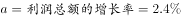，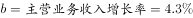，，即2015年江西省规模以上工业企业的营业利润率低于上年同期。

故正确答案为B。

---

#### 第 2 题　qid 2050968 · 比重

2014年江西省重工业增加值占规模以上工业增加值的比重为（    ）。

- **A**. 

- **B**. 

- **C**. 

　✅
- **D**. 

**答案**：C

**官方解析**

材料中给出的时间为2015年，由题干“2014年······占······比重”可知，本题为基期比重问题。根据“江西省重工业增加值”“规模以上工业增加值”定位材料第一段，定位数据，“2015年，江西规模以上工业增加值7268.9亿元，比上年增长”“重工业4537.7亿元，增长”，代入基期比重计算公式，2014年的比重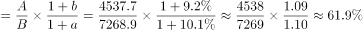。

故正确答案为C。

---

#### 第 3 题　qid 2050974 · 增长

2014年江西省规模以上工业增加值为（    ）。

- **A**. 6656.5亿元　✅
- **B**. 6945.3亿元
- **C**. 7268.9亿元
- **D**. 7937.6亿元

**答案**：A

**官方解析**

材料中给出的时间为2015年，由题干“2014年江西省规模以上工业增加值”可知，本题为基期计算问题。根据“规模以上工业增加值”定位材料第一段，定位数据，“2015年，江西规模以上工业增加值7268.9亿元，比上年增长”，代入基期计算公式，亿元，接近A选项。

故正确答案为A。

---

#### 第 4 题　qid 2050980 · 增长

2015年江西省规模以上工业38个行业大类中增长超过的行业有：

- **A**. 6个
- **B**. 7个
- **C**. 8个
- **D**. 无法计算　✅

**答案**：D

**官方解析**

由题干“2015年江西省规模以上工业38个行业大类增长”定位材料第二段，“2015年江西省规模以上工业38个行业大类中34个突破增长，占比近九成。其中，电子、电子机械、纺织、农副产品、医药和有色等六大重点行业表现突出，分别增长、、、、、”，材料中只给出6个大类的增长率，其余30多个大类未知，无法判断。

故正确答案为D。

---

#### 第 5 题　qid 2050982 · 综合

根据所给材料，下列表述正确的是（  ）

- **A**. 2015年江西省轻工业增加值占规模以上工业增加值的比重较上年有所上升
- **B**. 2015年江西省电子行业增加值同比增量最大
- **C**. 2015年江铜集团利税居全省各企业的首位
- **D**. 以上选项均错误　✅

**答案**：D

**官方解析**

A项：根据“2015年······比重较上年有所上升”可知，该选项为两期比重的比较，仅需比较增长率a与b的大小关系即可。根据“轻工业增加值”“规模以上工业增加值”定位材料第一段，定位数据，，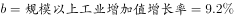，，2015年江西省轻工业增加值占规模以上工业增加值的比重较上年有所下降，错误；

B项：根据“电子行业”定位材料第二段，只有增长率，现期量未知，基期量未知，无法求增长量，无法判断增长量是否最大，错误；

C项：根据“江铜集团利税”定位材料第三段，“主营业务收入超百亿元的企业10户，其中，江铜集团2010.4亿元，居全省首位。”江铜集团利税数据未知，无法判断，错误。

故正确答案为D。

---

### 材料 2

        江西省2015年财政总收入3021.5亿元，比上年增长，财政总收入占生产总值的比重为，比上年提高1.0个百分点。其中，税收收入2373.0亿元，增长，占财政总收入比重为，其他收入648.5亿元。所有县（市、区）财政总收入突破6亿元，其中，财政总收入超10亿元的县（市、区）85个，比上年增加8个；超20亿元的36个，增加7个；超30亿元的17个，增加2个；超50亿元的5个，增加2个；百亿县实现零突破，南昌县财政总收入达100.9亿元。

#### 第 6 题　qid 2050986 · 比重

2014年江西省的税收收入占财政总收入的比重为（  ）。

- **A**. 

- **B**. 

　✅
- **C**. 

- **D**. 
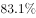

**答案**：B

**官方解析**

根据题干所求“2014年江西省的税收收入占财政总收入的比重”，材料数据为2015年，可判定此题为基期比重问题。

定位文字材料，2015年财政总收入B为3021.5亿元，增长率b为，税收收入A为2373.0亿元，增长率a为，占财政总收入比重为。代入公式，基期比重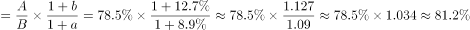，最接近B项。

故正确答案为B。

---

#### 第 7 题　qid 2050992 · 增长

2015年江西省财政总收入中的其他收入比上年（  ）。

- **A**. 
减少了

- **B**. 
减少了

- **C**. 
增加了

- **D**. 
增加了
　✅

**答案**：D

**官方解析**

题干求“2015年江西省财政总收入中的其他收入比上年”，选项为百分数，可判定本题为增长率问题。根据题意，财政总收入税收收入其他收入，已知财政总收入增长率为，税收收入增长率为，可判定此题为混合增长率问题。

因为税收增长率小于整体增长率，根据混合增长率居中原则，其他收入增长率应大于整体增长率，只有D项的增长率大于。

故正确答案为D。

---

#### 第 8 题　qid 2051004 · 增长

2011-2015年，江西省财政总收入同比增长率最低的年份，平均每月的财政收入约为（  ）。

- **A**. 242亿元
- **B**. 247亿元
- **C**. 252亿元　✅
- **D**. 257亿元

**答案**：C

**官方解析**

根据题干所求“平均每月的财政收入约为”，可判定此题为平均数问题。定位统计图可得，江西省财政总收入同比增长率最低的年份为2015年，该年财政总收入为3021.5亿元，平均每月的财政收入为亿元。

故正确答案为C。

---

#### 第 9 题　qid 2051010 · 增长

2011-2015年，有几年的江西省财政总收入同比增长低于380亿元？

- **A**. 3　✅
- **B**. 2
- **C**. 1
- **D**. 4

**答案**：A

**官方解析**

根据问题所求“有几年……同比增长低于380亿元”，可判定此题为增长量计算问题。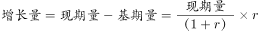，代入统计图数据，可得增长量分别为：

2011年：亿元；

2012年：亿元；

2013年：亿元；

2014年：亿元；

2015年：亿元。

同比增长低于380亿元的为2013、2014、2015年，共3年。

故正确答案为A。

---

#### 第 10 题　qid 2051066 · 综合

以下关于江西省财政总收入情况的描述与资料相符的是：

- **A**. 
2015年江西省财政总收入比5年前翻了一番

- **B**. 
2011年-2015年江西省财政总收入的增长幅度呈逐年下降的趋势
　✅
- **C**. 
2014年江西省财政总收入占生产总值比重为

- **D**. 
2014年江西省财政总收入不是主要来源于税收收入

**答案**：B

**官方解析**

A项：结合124题计算结果可得，2010年财政总收入亿元。2015年是2010年的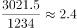倍，财政收入比5年前翻了一番，正确；

B项：定位图形材料折线部分可得，2011—2015年江西省财政总收入的同比增速分别为：、、、、，增长幅度呈逐年下降的趋势，正确；

C项：定位文字材料，“江西省2015年财政总收入占生产总值的比重为，比上年提高1.0个百分点”。则2014年所占比重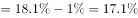，错误；

D项：结合文字材料与图形材料可得，2015年江西省税收收入占财政总收入比重为。其中，税收收入的同比增长率，财政总收入的同比增长率。由部分增长率小于整体增长率可得，税收收入在财政总收入中的比重下降，故2014年税收收入占财政总收入比重高于。税收收入应为财政总收入的主要来源，错误。

故正确答案为B和A。

【备注】可能的争议点：翻番是否必须为精确的2倍关系？根据近年的国考和省考真题可以推断，一般二倍以上关系也称作翻了一番，否则很多题目就没有正确答案。

基于以上分析，粉笔认为本题B、A答案没有明显错误，都应该是正确答案。

---

### 材料 3

        2015年全年我国粮食产量62144万吨，比上年增加1441万吨，增产。其中，夏粮产量14112万吨，增产；旱稻产量3369万吨，减产；秋粮产量44662万吨，增产。全年谷物产量57225万吨，比上年增产。其中，稻谷产量20825万吨，增产；小麦产量13019万吨，增产；玉米产量22458万吨，增产。

#### 第 11 题　qid 2050944 · 增长

2012-2015年，我国粮食产量增长率最小的年份是：

- **A**. 2012年
- **B**. 2013年
- **C**. 2015年
- **D**. 2014年　✅

**答案**：D

**官方解析**

由题干“2012-2015年......增长率最小的年份是”，可判定该题是一般增长率问题。定位图中数据，可得2012-2015年我国粮食产量增长率分别为：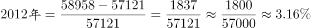；；；，所以2012-2015年我国粮食产量增长率最小的年份是2014年。

故正确答案为D。

---

#### 第 12 题　qid 2050950 · 综合

2014年，我国玉米产量比小麦产量多：

- **A**. 8642万吨
- **B**. 8958万吨　✅
- **C**. 9429万吨
- **D**. 9915万吨

**答案**：B

**官方解析**

由题干“2014年，我国玉米产量比小麦产量多”，结合文字材料2015年的产量与增长率均给出，可判定该题是基期和差问题。定位文字材料，“2015年小麦产量13019万吨，增产；玉米产量22458万吨，增产”，根据基期量，可得2014年小麦产量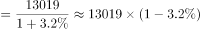万吨；2014年玉米产量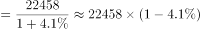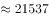万吨。2014年，我国玉米产量比小麦产量多万吨。与B项最接近。

故正确答案为B。

---

#### 第 13 题　qid 2050960 · 比重

2014年我国秋粮产量占当年粮食产量的比重：

- **A**. 与2015年相比，大幅上升
- **B**. 与2015年相比，大幅下降
- **C**. 与2015年大致相同　✅
- **D**. 无法比较

**答案**：C

**官方解析**

由题干“2014年······占······的比重与2015年相比”，可判定该题是两期比重问题。定位文字材料，“2015年全年我国粮食产量62144万吨，增产，秋粮产量44662万吨，增产”，与很接近，因此与2015年大致相同。

故正确答案为C。

---

#### 第 14 题　qid 2050970 · 比重

2015年我国稻谷产量占谷物产量的比重为：

- **A**. 

　✅
- **B**. 

- **C**. 

- **D**. 

**答案**：A

**官方解析**

由题干“2015年······的比重为”，可判定该题为现期比重问题。定位文字材料，“2015年谷物产量57225万吨，稻谷产量20825万吨”，可得2015年我国稻谷产量占谷物产量的。

故正确答案为A。

---

#### 第 15 题　qid 2050978 · 综合

根据所给我国粮食产量的相关数据，能够从资料中推出的是：

- **A**. 2015年，我国夏粮、旱稻、秋粮的产量均高于2014年
- **B**. 2015年，我国稻谷、小麦、玉米的产量均高于2014年　✅
- **C**. 2014年，我国稻谷产量是小麦产量的2.1倍
- **D**. 2014年，我国秋粮产量是旱稻产量的9.8倍

**答案**：B

**官方解析**

A项：定位文字材料，2015年夏粮产量增产；旱稻产量减产；秋粮产量增产，其中旱稻产量低于2014年，错误；

B项：定位文字材料，2015年稻谷产量增产；小麦产量增产；玉米产量增产，所以2015年我国稻谷、小麦、玉米的产量均高于2014年，正确；

C项：定位文字材料，可得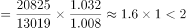，所以2014年我国稻谷产量不到小麦产量的2倍，错误；

D项：定位文字材料，可得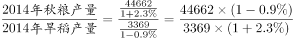，所以2014年我国秋粮产量高于旱稻产量的10倍，错误。

故正确答案为B。

---

### 材料 4

        我国2015年全年全社会固定资产投资562000亿元，固定资产投资（不含农户）551590亿元，增长。从各区域看，东部地区投资232107亿元，比上年增长；中部地区投资143118亿元，增长；西部地区投资140416亿元，增长；东北地区投资40806亿元，下降。

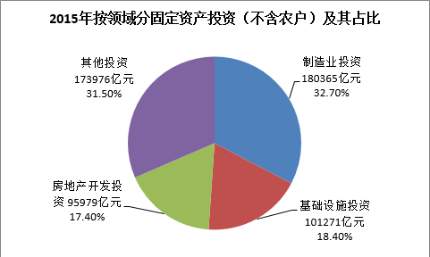

#### 第 16 题　qid 2050996 · 增长

我国2015年全年全社会固定资产投资同比增长（  ）

- **A**. 

- **B**. 

　✅
- **C**. 

- **D**. 
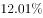

**答案**：B

**官方解析**

根据“我国······同比增长”，判定此题为一般增长率问题。定位图表，2015年全年全社会固定资产投资为562000亿元，2014年为512021亿元，故增长率为：。

故正确答案为B。

---

#### 第 17 题　qid 2050998 · 增长

2011-2015年，我国社会固定资产投资同比增长量最大的年份是（  ）

- **A**. 2012年
- **B**. 2014年
- **C**. 2013年　✅
- **D**. 2015年

**答案**：C

**官方解析**

根据“······同比增长量最大”，判定此题为增长量比较问题。增长量=现期量-基期量。

定位图表，2012年：，2013年：，2014年：，2015年：，最大为2013年。

故正确答案为C。

---

#### 第 18 题　qid 2051002 · 综合

2015年，我国制造业投资是基础设施投资的（  ）

- **A**. 1.78倍　✅
- **B**. 1.58倍
- **C**. 1.38倍
- **D**. 1.18倍

**答案**：A

**官方解析**

根据题干“2015年······是······的多少倍”可知，此题为现期倍数问题。定位图表，制造业投资占固定资产投资比重为，基础设施投资占固定资产投资比重为，则2015年我国制造业投资是基础设施投资的倍数为：倍。

故正确答案为A。

---

#### 第 19 题　qid 2051006 · 综合

根据所给材料，以下说法错误的是：

- **A**. 2015年，我国房地产投资的力度进一步加大　✅
- **B**. 2015年，我国西部地区投资和东北地区投资之和小于东部地区投资
- **C**. 2015年，我国中部地区投资大约是东北地区投资的3.5倍
- **D**. 2012年-2015年，我国全社会固定资产投资增长率最小的是2015年

**答案**：A

**官方解析**

A项：材料没有2014年房地产开发投资金额，所以不能判定投资的力度进一步加大，错误；

B项：“各区域看，东部地区投资232107亿元······西部地区投资140416亿元；东北地区投资40806亿元。”西部地区投资东北地区投资东部地区投资232107，正确；

C项：“中部地区投资143118亿元······东北地区投资40806亿元，”中部地区是东北地区的倍，正确；

D项：增长率比较：2012年增长率；2013年增长率；2014年增长率；2015年增长率，增长率最小的是2015年，正确。

本题为选非题，故正确答案为A。

---

#### 第 20 题　qid 2051008 · 比重

2015年，东部地区投资占全社会固定资产投资的比重比西部地区投资高（  ）

- **A**. 20.35个百分点
- **B**. 19.43个百分点
- **C**. 16.62个百分点
- **D**. 16.32个百分点　✅

**答案**：D

**官方解析**

根据“2015年······的比重比······高”，结合选项都是百分点，可知本题为现期比重问题。定位文字材料，“2015年，全年全社会固定资产投资562000亿元，东部地区投资232107亿元，西部地区投资140416亿元”，则比重差为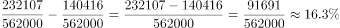，与D项最接近。

故正确答案为D。

---
