# 2017年422联考《行测》题（浙江B卷）

> 联考 · 2017 年 · 5 个模块 · 共 113 题

- [常识判断](#%E5%B8%B8%E8%AF%86%E5%88%A4%E6%96%AD) · 20 题
- [言语理解与表达](#%E8%A8%80%E8%AF%AD%E7%90%86%E8%A7%A3%E4%B8%8E%E8%A1%A8%E8%BE%BE) · 25 题
- [数量关系](#%E6%95%B0%E9%87%8F%E5%85%B3%E7%B3%BB) · 18 题
- [判断推理](#%E5%88%A4%E6%96%AD%E6%8E%A8%E7%90%86) · 35 题
- [资料分析](#%E8%B5%84%E6%96%99%E5%88%86%E6%9E%90) · 15 题

---

## 常识判断

### 第 1 题　qid 2049548 · 人文常识

下列说法错误的是：

- **A**. 2016年里约热内卢举办了第31届夏季奥林匹克运动会
- **B**. 河北张家口具有2022年第24届冬季奥运会的主办资格
- **C**. 动漫人物铁臂阿童木出任东京申奥特殊大使开创了先河　✅
- **D**. 北京是目前唯一获得夏季奥运会和冬季奥运会举办权的城市

**答案**：C

**官方解析**

A项正确，第31届夏季奥林匹克运动会，又称2016年里约热内卢奥运会，2016年8月5日至21日在巴西里约热内卢举行。
B项正确，第24届冬季奥林匹克运动会，将在2022年2月4日至2022年2月20日由中国北京市和张家口市联合举行。这是中国历史上第一次举办冬季奥运会，北京、张家口同为主办城市。
C项错误，日本著名动漫形象哆啦A梦将出任2020年东京申奥特殊大使。过去的申奥特殊大使多由奥运会的奖牌得主出任，动漫人物出任申奥特殊大使尚属首次。
D项正确，北京是目前唯一获得夏季奥运会和冬季奥运会举办权的城市。
本题为选非题，故正确答案为C。

---

### 第 2 题　qid 2049572 · 人文常识

某高校拟结合9月份我国通行的节日、纪念日举办校园文化系列活动，下列哪些主题会出现在当月的活动项目计划中：
①学习国防知识，增强国防观念     
②缅怀抗战先烈，弘扬抗战精神
③吾爱吾师，感念师恩               
④节约粮食，从我做起
⑤口腔健康，全身健康

- **A**. ②③④⑤
- **B**. ①②③⑤　✅
- **C**. ①③④⑤
- **D**. ①②④⑤

**答案**：B

**官方解析**

本题考查文化常识。①表示的是国家设定的对全民进行大规模国防教育的主题活动日，在每年9月的第三个星期六。②表示的是中国人民抗日战争胜利纪念日，从2014年起，在每年的9月3日。③表示的是教师节，在每年的9月10日。④表示的是世界粮食日，是世界各国政府每年在10月16日围绕发展粮食和农业生产举行纪念活动的日子。⑤表示的是爱牙日，每年的9月20日为全国的爱牙日。其中④是在10月，其他均在9月，故排除④，只有B选项符合。
故正确答案为B。

---

### 第 3 题　qid 2049592 · 人文常识

下列关于国际战争的说法错误的是：

- **A**. 前苏联于1978年入侵阿富汗，持续十余年
- **B**. 1990年开始的海湾战争源于伊朗入侵科威特　✅
- **C**. 中东战争是以色列与周边阿拉伯国家所进行的5次大规模战争
- **D**. 1982年4月-6月，英国和阿根廷爆发了马尔维纳斯群岛海战

**答案**：B

**官方解析**

本题考查历史常识。主要涉及国际战争的相关内容。
B项错误，海湾战争是指1991年1月17日，以美国为首的多国联盟为恢复科威特主权，对伊拉克进行的战争，源于1990年8月2日伊拉克出兵入侵科威特。
A项正确，1979年苏联入侵阿富汗战争，1979年12月末，苏联入侵阿富汗导致的长达10年的战争，据考生回忆，此处选项中确为1978年，与史实不符，但综合B项比较之后，国家差别比1年差距更大，故B的错误更严重。
C项正确，中东战争，或称阿以战争、以阿战争，是指以色列与埃及、叙利亚等周围阿拉伯国家所进行的5次大规模战争（1948年、1956年、1967年、1973年、1982年）。
D项正确，马尔维纳斯群岛战争，简称马岛战争，是1982年4月到6月间，英国和阿根廷为争夺马岛的主权而爆发的一场战争。
本题为选非题，故正确答案为B。

---

### 第 4 题　qid 2049816 · 经济常识

下列关于“海上丝绸之路”的说法错误的是：

- **A**. 是陆上丝绸之路的一种补充形式　✅
- **B**. 是意大利人马可·波罗回国所走之路
- **C**. 始于秦汉，繁荣于唐宋，衰落于明清
- **D**. 是古代中外贸易和对外交往的海上通道

**答案**：A

**官方解析**

C项正确：“海上丝绸之路”的雏形在秦汉时期便已存在，目前已知有关中外海路交流的最早史载来自《汉书·地理志》，海上丝绸之路繁荣于唐宋时期，唐玄宗时设立市舶使专管海上对外贸易；宋时指南针用于海船，中国商船的远航能力大为加强；明清时期由于海禁政策，“海上丝绸之路”衰落。
D项正确：海上丝绸之路是古代中国与世界其他地区进行经济文化交流交往的海上通道。海上丝绸之路从中国东南沿海，经过中南半岛和南海诸国，穿过印度洋，进入红海，抵达东非和欧洲，成为中国与外国贸易往来和文化交流的海上大通道，并推动了沿线各国的共同发展。
A项表述不严谨，海上丝绸之路最开始确实是陆上丝绸之路补充，大量丝织品通过陆路西运，后来陆上通道阻塞、战乱、经济中心南移等原因，慢慢地演变为与陆上丝绸之路同等重要的贸易往来通道。
B项关于马可波罗是否来过中国，各国历史学家争议较大且各有充足的依据，从本题选项设置来看，该题认为是来过中国，按照大多数人的观点，马可波罗是沿着海上丝绸之路返回的。相比之下选A更合适。
本题为选非题，故正确答案为A。

---

### 第 5 题　qid 2050110 · 人文常识

下列关于世界古代文明的说法正确的是：

- **A**. 《理想国》的作者是古希腊哲学家苏格拉底
- **B**. 古代埃及人建造的胡夫金字塔是世界上现存规模最大的金字塔　✅
- **C**. 公元1世纪前后，罗马帝国分裂为东罗马帝国和西罗马帝国
- **D**. 世界四大文明古国是指古代埃及、古代希腊、古代印度和古代中国

**答案**：B

**官方解析**

本题考查人文常识。
A项错误：《理想国》是古希腊著名哲学家柏拉图重要的对话体著作之一。
B项正确：胡夫金字塔塔高146.59米，因年久风化，顶端剥落10米，现高136.5米，它的规模是埃及至今发现的金字塔中最大的，也是世界上现存规模最大的金字塔。
C项错误：罗马帝国分裂，指的是395年1月17日，罗马皇帝狄奥多西逝世把国土分给两个儿子继承导致罗马帝国分裂的故事。罗马帝国分裂为东、西罗马帝国发生在公元4世纪前后。
D项错误：世界四大文明古国是指古巴比伦、古埃及、古印度和中国。古代希腊不属于四大文明古国。
故正确答案为B。

---

### 第 6 题　qid 2049778 · 人文常识

王某将自家三层楼房的承建工程承包给没有施工资质的包工头李某。双方合同约定，李某“包工不包料”，在施工过程中产生的一切责任由李某承担。李某找来邻居张某帮工，工资100元/天。施工过程中脚手架倒塌，将在地面上递砖块的张某压成重伤。张某要求包工头李某赔偿医药费、误工费等。李某不肯，双方闹至法院。那么，下列说法正确的是：

- **A**. 李某承担全部责任
- **B**. 王某、李某、张某都要承担责任
- **C**. 李某、张某承担责任，王某没有责任
- **D**. 王某、李某承担责任，张某没有责任　✅

**答案**：D

**官方解析**

本题考查法律常识。
根据《民法典》第一千一百九十二条规定：“个人之间形成劳务关系······提供劳务一方因劳务受到损害的，根据双方各自的过错承担相应的责任······”第一千一百九十三条规定：“承揽人在完成工作过程中造成第三人损害或者自己损害的，定作人不承担侵权责任。但是，定作人对定作、指示或者选任有过错的，应当承担相应的责任。”
题干当中王某是定作人，李某是承揽人，张某和李某是雇佣关系，张某被压成重伤，李某应该承担责任。王某将楼房承包给没有施工资质的李某，选人有过失，因此王某也应当承担相应的赔偿责任。
故正确答案为D。

---

### 第 7 题　qid 2049594 · 人文常识

下列言行体现公民没有自觉履行法定义务的是：
①“听说你养母病了？”“与我无关，我是被收养的。”
②“听说你生父病了？”“与我无关，我已经被叔叔收养了。”
③“爸，大学催缴学杂费了。”“你都成年了，自己挣钱交去。”
④“爸，小学催缴生活费了。”“我与你妈离婚了，找她要去。”

- **A**. ①③
- **B**. ①④　✅
- **C**. ②③
- **D**. ②④

**答案**：B

**官方解析**

本题考查法律常识。
①错误，根据《民法典》第一千零七十二条第二款规定：“继父或者继母和受其抚养教育的继子女间的权利义务关系，适用本法关于父母子女关系的规定。”且根据《民法典》第一千零六十七条规定：“父母不履行抚养义务的，未成年子女或者不能独立生活的成年子女，有要求父母给付抚养费的权利。成年子女不履行赡养义务的，缺乏劳动能力或者生活困难的父母，有要求成年子女给付赡养费的权利。”因此，养子女对养母有赡养的义务，养母生病之后养子女有赡养的义务。
②正确，根据《民法典》第一千一百一十一条第二款规定：“养子女与生父母以及其他近亲属间的权利义务关系，因收养关系的成立而消除。”因此，子女被收养之后对生父母没有赡养义务。
③正确，根据《民法典》第一千零六十七条规定：“父母不履行抚养义务的，未成年子女或者不能独立生活的成年子女，有要求父母给付抚养费的权利。成年子女不履行赡养义务的，缺乏劳动能力或者生活困难的父母，有要求成年子女给付赡养费的权利。”且根据《最高人民法院关于适用中华人民共和国民法典婚姻家庭编的解释（一）》第四十一条规定：“尚在校接受高中及其以下学历教育，或者丧失、部分丧失劳动能力等非因主观原因而无法维持正常生活的成年子女，可以认定为民法典第一千零六十七条规定的‘不能独立生活的成年子女’。”③中该子女为已成年的大学生，且不符合“不能独立生活的子女”的条件，因此，其父可以不支付其学杂费。
④错误，根据《民法典》第一千零八十四条第二款规定：“离婚后，父母对于子女仍有抚养、教育、保护的权利和义务。”父母与子女间的关系，不因父母离婚而消除。离婚后，父母不履行抚养义务的，未成年子女，有要求父母给付抚养费的权利。因此，父亲以离婚为借口，要求上小学的子女找母亲讨要生活费的行为不符合法律规定。
因此②③表述正确，①④表述错误。
本题为选非题，故正确答案为B。

---

### 第 8 题　qid 2049784 · 人文常识

下列教育家与其代表作对应不正确的是：

- **A**. 韩愈——《师说》
- **B**. 颜元——《存学编》
- **C**. 孟子——《劝学篇》　✅
- **D**. 陶行知——《教学做合一》

**答案**：C

**官方解析**

本题考查文学常识。主要涉及教育学的相关内容。
A项，正确：《师说》这篇文章是韩愈写给他的学生李蟠的，是一篇说明教师的重要作用、从师学习的必要性以及择师的原则的论说文。
B项，正确：《四存编》是颜元教育理论的代表作。《四存编》包括《存学编》、《存性编》、《存治编》、《存人编》。
C项，错误：《劝学》是《荀子》一书的首篇，又名《劝学篇》。劝学，就是鼓励学习。本篇较系统地论述了学习的理论和方法。
D项，正确：陶行知，中国人民教育家、思想家，《教学做合一》用陶行知的话说，是生活现象之说明，即教育现象之说明，在生活里，对事说是做，对己之长进说是学，对人之影响说是教，教学做只是一种生活之三方面，不是三个各不相谋的过程。“教学做是一件事，不是三件事。我们要在做上教，在做上学”。
本题为选非题，故正确答案为C。

---

### 第 9 题　qid 2049588 · 人文常识

“云母屏风烛影深，长河渐落晓星沉”描写的是一天之中的哪一时段：

- **A**. 黄昏
- **B**. 夜半
- **C**. 黎明　✅
- **D**. 午后

**答案**：C

**官方解析**

本题考查文学常识。该句诗出自李商隐的《嫦娥》。本句诗的意思是：云母屏风上烛影暗淡，银河在渐渐地消失，晨星渐渐沉没在黎明的曙光里。“沉”字逼真地描绘出晨星低垂、欲落未落的动态，主人公的心也似乎正在逐渐沉下去。“烛影深”“长河落”“晓星沉”，表明时间已到将晓未晓之际，着一“渐”字，暗示了时间的推移流逝。寂寞中的主人公，面对冷屏残烛、青天孤月，又度过了一个不眠之夜。故该句诗描写的是一天之中的黎明。
A项：错误，黄昏，指日落以后到天还没有完全黑的这段时间。也指昏黄，光色较暗。
B项：错误，夜半，即半夜。夜里12点钟前后。
C项：正确，黎明，指天快要亮或刚亮的时候。
D项：错误，午后，是指中午（12点）以后，称为下午。
故正确答案为C。

---

### 第 10 题　qid 2049586 · 人文常识

下列诗句中没有传达出幸福感的是：

- **A**. 却看妻子愁何在，漫卷诗书喜欲狂
- **B**. 两岸猿声啼不住，轻舟已过万重山
- **C**. 枝上柳绵吹又少，天涯何处无芳草　✅
- **D**. 春风得意马蹄疾，一日看尽长安花

**答案**：C

**官方解析**

本题考查人文历史。
A项正确，诗句出自杜甫的《闻官军收河南河北》，诗人听到安史之乱结束的消息欣喜若狂，凸显了急于返回故乡的欢快之情。
B项正确，诗句出自李白的《早发白帝城》，是李白流放途中遇赦返回时所创作的。把诗人遇赦后愉快的心情和江山的壮丽多姿、顺水行舟的流畅轻快融为一体。
C项错误，诗句出自苏轼的《蝶恋花·春景》，表现了词人对春光流逝的叹息，以及自己的情感不为人知的烦恼。
D项正确，诗句出自孟郊《登科后》，说他在春风里洋洋得意地跨马疾驰，一天就看完了长安的似锦繁花，表现出极度欢快的心情。
本题为选非题，故正确答案为C。

---

### 第 11 题　qid 2050096 · 人文常识

下列关于中国古代四大美女的说法正确的是：

- **A**. “云想衣裳花想容”是形容杨玉环美貌的诗句　✅
- **B**. “王允巧施连环计”与“羞花”讲的是貂蝉的故事
- **C**. “闭月”所形容的美女生活在崇尚“以肥为美”的时代
- **D**. “沉鱼”讲的是王昭君的故事，“落雁”讲的是西施的故事

**答案**：A

**官方解析**

A项正确：“云想衣裳花想容”是李白所作《清平调》第一首的首句，是诗人设想云朵想与杨贵妃的衣裳媲美，花儿想与杨贵妃的容貌比妍，用这种近似拟人的高超手法赞美杨贵妃衣着的绚丽轻盈，容颜的娇嫩可人；
B项错误：“王允巧施连环计”讲的是貂蝉的故事，“羞花”对应的是杨贵妃；
C项错误：“闭月”对应的是貂蝉，貂蝉生活在三国时期；崇尚“以肥为美”的时代是唐朝；
D项错误：“沉鱼”讲的是西施浣纱时的故事，“落雁”讲的是昭君出塞的故事。
故正确答案为A。

---

### 第 12 题　qid 2049808 · 经济常识

随着我国社会逐步进入老龄化，现有的养老模式一般包括家庭养老、机构养老、社区养老和以房养老等。下列关于我国农村老人养老模式的表述错误的是：

- **A**. 张大爷根据四个儿子之间的协议，每月轮流到其中一个儿子家中生活
- **B**. 王大娘的两个儿子均没空照顾生活不能自理的老人，于是将其送到附近一家养老机构
- **C**. 李大爷选择将房子抵押给金融机构，由金融机构每月支付其养老费用　✅
- **D**. 赵大娘不愿离开熟悉的社区和朋友，于是选择在社区服务机构中养老

**答案**：C

**官方解析**

A项正确，家庭养老是指由家庭成员提供养老资源的养老方式和养老制度。张大爷轮流到四个儿子家生活，是家庭养老模式；
B项正确，《老年人权益保护法》第十五条：对生活不能自理的老年人，赡养人应当承担照料责任；不能亲自照料的，可以按照老年人的意愿委托他人或者养老机构等照料；
C项错误，《中华人民共和国民法典》第三百九十九条规定：“下列财产不得抵押：······（二）宅基地、自留地、自留山等集体所有土地的使用权，但是法律规定可以抵押的除外；······”农村的房子是建在宅基地上的，故李大爷不能做此选择；
D项正确，“社区养老”是以家庭养老为主，社区机构养老为辅，在为居家老人照料服务方面，又以上门服务为主，托老所服务为辅的整合社会各方力量的养老模式。赵大娘选择的是社区养老模式。
本题为选非题，故正确答案为C。

---

### 第 13 题　qid 2049810 · 人文常识

近年来，粉尘爆炸事件屡见不鲜。下列粉尘中不容易引起爆炸的是：

- **A**. 肥皂粉
- **B**. 水泥粉　✅
- **C**. 面粉
- **D**. 奶粉

**答案**：B

**官方解析**

粉尘爆炸，指可燃性粉尘在爆炸极限范围内，遇到热源，瞬间剧烈燃烧，释放巨大压力和热量。爆炸危险性相对较高的可燃性粉尘有：金属制品，如铝粉、镁粉等；农副产品，如面粉、奶粉、饲料、玉米淀粉、大米淀粉等；木制品/纸制品，如木粉、纸浆粉等；纺织品，如棉花、亚麻等；橡胶和塑料制品，如树脂粉、橡胶粉等；冶金、有色、建材行业煤粉。
A项：错误，肥皂粉主要由油脂混合海藻灰或桦木灰等制成，易燃，易爆；
B项：正确，水泥粉主要成分是硅酸盐，不具有可燃性，不易爆；
C项：错误，面粉是粮食类易爆粉尘；
D项：错误，奶粉是粮食类易爆粉尘。
本题为选非题，故正确答案为B。

---

### 第 14 题　qid 2050122 · 科技常识

下列哪两种疾病是由细菌引起的：

- **A**. 手足口病、狂犬病
- **B**. 麻疹、腮腺炎
- **C**. 肺结核、破伤风　✅
- **D**. 非典型肺炎、水痘

**答案**：C

**官方解析**

本题考查科技常识。
A项错误，手足口病是由肠道病毒引起的传染病，最常见的是柯萨奇病毒A组16型和肠道病毒71型；狂犬病是由狂犬病毒所致的急性传染病，人多因被病兽咬伤而感染。

B项错误，麻疹是由麻疹病毒引起的传染性很强的急性呼吸道疾病，是儿童最常见的传染病之一；腮腺炎病因可分为感染性、免疫性、阻塞性及原因未明性炎症肿大等，最常见的是感染引起的腮腺炎，多为细菌性和病毒性。
C项正确，肺结核是由结核分枝杆菌引起的肺部慢性传染病，主要通过呼吸道传播；破伤风是破伤风梭菌经由皮肤或黏膜伤口侵人人体，在缺氧环境下生长繁殖，产生毒素而引起肌痉挛的一种特异性感染。
D项错误，非典型肺炎简称非典，泛指所有由某种未知的病原体引起的肺炎症状，这些病原体，有可能是冠状病毒、肺炎支原体、肺炎衣原体或嗜肺军团杆菌，也可泛指不是由细菌所引起的肺炎症状；水痘是由水痘-带状疱疹病毒初次感染引起的急性传染病，主要易感人群为婴幼儿和学龄前儿童。
故正确答案为C。

---

### 第 15 题　qid 2049786 · 人文常识

对着电视画面拍照，应关闭照相机闪光灯和室内照明灯，这样照出的照片画面更清晰。这是因为：

- **A**. 闪光灯和照明灯在电视屏上的反射光会干扰电视画面的透射光　✅
- **B**. 闪光灯和照明灯在电视屏上的反射光会干扰电视画面的散射光
- **C**. 闪光灯和照明灯在电视屏上的透射光会干扰电视画面的散射光
- **D**. 闪光灯和照明灯在电视屏上的透射光会干扰电视画面的反射光

**答案**：A

**官方解析**

闪光灯、照明灯和电视机屏幕都是光源，都会发光。电视机屏幕相当于透镜，当闪光灯和照明灯的光线照射到电视机屏幕上时，会发生光线反射，从而干扰到电视机自身发出的透射光。
故正确答案为A。

---

### 第 16 题　qid 2049798 · 人文常识

历法是推算年月日、使其与相关天象对应并协调时间的方法。现行历法主要有三种：阳历即太阳历，主要依据为回归年；阴历或称太阴历，主要依据为朔望月；阴阳历的平均历年为回归年，历月为朔望月。那么，我国农历属于：

- **A**. 阴历
- **B**. 阳历
- **C**. 阴阳历　✅
- **D**. 以上都不是

**答案**：C

**官方解析**

农历是我国传统历法，取月相的变化周期即朔望月为月的长度，参考太阳回归年为年的长度，通过设置闰月以使平均历年与回归年相适应。
A项：错误，阴历在天文学中主要指按月亮的月相周期来安排的历法。以月球绕行地球一周为一月，即以朔望月作为确定历月的基础。虽然有人称阴历为农历，但二者是有区别的；
B项：错误，阳历又称太阳历，是以地球绕太阳公转的运动周期为基础而制定的历法；
C项：正确，阴阳历是指兼顾太阳、月亮与地球关系的一种历法。阴阳历以月亮绕地球一周为1个月，但设置闰月，使得一年的平均天数与回归年的天数相符，因此这种历法与月相相符，也与地球绕太阳周期运动相符合。农历就是以历月为朔望月，平均历年为回归年，属于阴阳历；
D项错误。
故正确答案为C。

---

### 第 17 题　qid 2049794 · 科技常识

下列关于生活常识的表述错误的是：

- **A**. 
水在真空中会先沸腾后结冰

- **B**. 
颜色深的汽车隔热膜，隔热效果好
　✅
- **C**. 
纯水（只有水分子）在时不会结冰

- **D**. 
天凉时，湿润的地方比干旱的地方使人觉得更冷

**答案**：B

**官方解析**

A项正确：水的沸点随着气压的降低而降低，而真空中没有空气，所以水开始会沸腾，然后水变成水蒸气吸收热量，温度降低进而结冰。
B项错误：汽车贴隔热膜的主要目的，就是在汽车玻璃上形成一道隔绝层，阻止热量透过玻璃进入到车内。早期的隔热膜以染色工艺为主，靠颜色来隔热，需要颜色越深才能起到效果。而实际上这种方式并不好。现在的汽车隔热膜的隔热效果和膜的颜色深浅没有必然的关系。优质的隔热膜不但能够高效地隔热，还能同时保证高的透光度，保障行车安全。
C项正确：纯水只含水分子时，当温度降低到冰点以下时还会保持液态，这被称为过冷水。但是一旦有振动或凝结核加入（比如随机的灰尘、气泡以及不平整的容器壁）时就会迅速结晶。
D项正确：水的比热很大，用人的体温来加热潮湿的空气要比加热干燥的空气会消耗更多的热量，所以人会在湿润的地方感觉到更冷。
本题为选非题，故正确答案为B。

---

### 第 18 题　qid 2049542 · 科技常识

香烟点燃后，所产生的能减低红血球将氧输送到全身能力的成分是：

- **A**. 焦油
- **B**. 一氧化碳　✅
- **C**. 苯并芘
- **D**. 尼古丁

**答案**：B

**官方解析**

A项错误，焦油不能与血红蛋白结合。
B项正确，一氧化碳极易与血红蛋白结合，形成碳氧血红蛋白，使血红蛋白丧失携氧的能力和作用，造成组织窒息，严重时死亡。
C项错误，苯并芘是一种常见的高活性间接致癌物和突变原。苯并芘不能与血红蛋白结合。
D项错误，尼古丁会使人上瘾或产生依赖性，重复使用尼古丁会增加心跳速度和升高血压并降低食欲。大剂量的尼古丁会引起呕吐以及恶心，严重时人会死亡。尼古丁不能与血红蛋白结合。
故正确答案为B。

---

### 第 19 题　qid 2049562 · 人文常识

下列哪一选项描述的是竞争关系：

- **A**. 鹬蚌相争
- **B**. 不见兔子不撒鹰
- **C**. 螳螂捕蝉，黄雀在后
- **D**. 鸠占鹊巢　✅

**答案**：D

**官方解析**

生物间的关系按性质可归并为两类。一是种间互助性的相互关系，如共栖、共生等；二是种间对抗性的相互关系，如寄生、捕食、竞争等。
A项错误，鹬是一种水鸟，常在浅水边或水田中捕食小鱼、昆虫、河蚌等。鹬以蚌为食，两者为捕食关系。
B项错误，兔子与鹰是捕食关系。
C项错误，蝉与螳螂、螳螂与黄雀都是捕食关系。
D项正确，鸠和鹊为竞争关系。
故正确答案为D。

---

### 第 20 题　qid 2050078 · 人文常识

磁共振成像系统（MRI）不可能对人体造成下列哪一伤害：

- **A**. 强静磁场
- **B**. 随时间变化的梯度场
- **C**. 射频场导致热效应
- **D**. 对人体的高能辐射　✅

**答案**：D

**官方解析**

磁共振的基本原理：是将人体置于特殊的磁场中，用无线电射频脉冲激发人体内氢原子核，引起氢原子核共振，并吸收能量。在停止射频脉冲后，氢原子核按特定频率发出射电信号，并将吸收的能量释放出来，被体外的接受器收录，经电子计算机处理获得图像，这就叫做核磁共振成像。
它对疾病的诊断具有很大的潜在优越性。它可以直接作出横断面、矢状面、冠状面和各种斜面的体层图像，不会产生CT检测中的伪影；不需注射造影剂；无电离辐射。MRI对检测脑内血肿、脑外血肿、脑肿瘤、颅内动脉瘤、动静脉血管畸形、脑缺血、椎管内肿瘤、脊髓空洞症和脊髓积水等颅脑常见疾病非常有效，同时对腰椎椎间盘后突、原发性肝癌等疾病的诊断也很有效。
核磁共振虽然广泛应用于疾病的检测，但它存在许多可能的伤害。MRI可能对人体造成的伤害主要包括以下方面：（1）强静磁场的危害。强静磁场是在有铁磁性物质存在的情况下，不论是埋植在患者体内还是在磁场范围内，都可能是危险因素。尤其是在高强度的静磁场中工作的员工，高强磁场有可能引起周围电子仪器和设备失效，影响带有心脏起搏器和胰岛素泵（或其他金属植入物）的人员健康。
（2）随时间变化的梯度场也会对人体造成伤害，因为其在受试者体内诱导产生电场而兴奋神经或肌肉。外周神经兴奋是梯度场安全的上限指标。在足够强度下，可以产生外周神经兴奋（如刺痛或叩击感），甚至引起心脏兴奋或心室振颤。
（3）射频场（RF）的致热效应：RF致热效应被认为是组织温度升高的唯一方式，因为它能穿透表层组织，直接加热组织内部。以眼睛为例，血管相对缺乏，因此散热慢且效率低，在RF辐射作用下有可能对视组织造成热损伤。
（4）噪声：MRI运行过程中产生的各种噪声，可能使某些患者的听力受到损伤。患者可有烦躁、语言交流障碍、焦虑、短时失聪和潜在的永久性听力损害。
据此可知A、B、C三项正确。
磁共振仪在工作时，会在人体周围产生一个超强磁场，接着向人体发射电磁波。但是电磁波对人的辐射危害极小，甚至都比不上你出去晒太阳时紫外线对你的伤害，真正有害的是CT等，故D项错误。
本题为选非题，故正确答案为D。

---

## 言语理解与表达

### 第 1 题　qid 2049988 · 逻辑填空

中国绘画是以庄子哲学为精神宗旨的，其最高境界是在人与对象的双重自然状态下实现物我浑融。《庄子·田子方》载，宋元君招试画师，应试者皆               ，唯有一后到者，“解衣盘礴赢”，任性自然地投身于画作。宋元君称此人为“真画者”。所谓“真画者”，指的是突破规范束缚而进入自由率真的创作状态的画家。这是庄子为后世中国画家塑造的模范。
填入画横线部分最恰当的一项是：

- **A**. 循规蹈矩
- **B**. 墨守成规
- **C**. 按部就班
- **D**. 循规拘礼　✅

**答案**：D

**官方解析**

根据文意可知，横线处与“后到者”状态形成对比，后文“解衣盘礴赢”强调不拘礼节，“真画者”强调突破规范束缚，横线处应表达拘于礼节、遵守规范之意，D项“循规拘礼”指遵循规则、拘泥礼节，符合文意，当选。
A项“循规蹈矩”指遵守规矩，不敢违反，也指拘守旧准则，不敢稍做变动，B项“墨守成规”指思想保守，守着老规矩不肯改变，均只体现遵守规矩，体现不出拘于礼节的含义，与文意不符，排除；C项“按部就班”指做事按照一定的步骤和顺序，既不表示遵守规范也体现不出拘于礼节的含义，与文意不符，排除。
故正确答案为D。
【文段出处】光明日报《绝代画师吴道子》

---

### 第 2 题　qid 2049526 · 逻辑填空

哲人说：“你的心态就是你真正的主人。”乐观向上、心态阳光，即便一时身处困境，仍有“竹杖芒鞋轻胜马”的      ，在茫茫暗夜中亦能读出星星指引的方向。相反，悲观低沉、心态消极，          也能感受“夕阳西下，断肠人在天涯”的悲情，在一怀愁绪中迷失自我。
依次填入画横线部分最恰当的一项是：

- **A**. 坚韧    沧海一粟
- **B**. 旷达    杯水风波　✅
- **C**. 狂喜    瓜田李下
- **D**. 纯真    一叶知秋

**答案**：B

**官方解析**

第一空，横线处所填词语用于表达乐观阳光的人遇到困境依旧很从容豁达的心态。A项“坚韧”指在遭遇身体及精神困难、压力时，坚持而不放弃的忍受力，与乐观阳光的豁达心态不符，排除。B项“旷达”是指开朗、豁达，多形容人的心胸、性格，与“乐观”“阳光”形成对应，符合文意，保留。C项“狂喜”形容极端高兴的样子，表意过重，排除；D项“纯真”意为纯洁真挚，现在多用来形容小孩子或者单纯的小姑娘，与原文“乐观”“阳光”心态不符，排除。
第二空，代入验证，强调悲观的人遇到一点儿困难就容易产生悲观、消极的情绪。“杯水风波”意为一杯水引发的风波，指小问题、小困难，符合文意，当选。
故正确答案为B。
【文段出处】《扮好“三种角色”》

---

### 第 3 题　qid 2050082 · 逻辑填空

现实生活中，真正能够平心静气、             者，似乎为数不多。相反，惯于给灵魂做加法，喜欢抛头露面、彰显自我的人倒是不少。君不见，有的人只要有机会，不是东拉西扯、侃侃而谈，便是谈天说地、               。不少人喜欢把逛街购物、唱歌喝酒、头疼脑热、感冒鼻塞之类的闲事琐事无聊事，统统发到朋友圈里去。
依次填入画横线部分最恰当的一项是：

- **A**. 委曲求全 口若悬河
- **B**. 心如止水 指桑骂槐
- **C**. 波澜不惊 口诛笔伐
- **D**. 心无旁骛 津津乐道　✅

**答案**：D

**官方解析**

第一空，横线处通过顿号表示并列，与“平心静气”语义相近，且根据“相反”可知，与“惯于给灵魂做加法”语义相反，故所填词语要能够表达心情平和，态度冷静，不关注其他事物的语义。A项“委曲求全”指勉强迁就，以求保全，也指为了顾全大局而让步，与“平心静气”语义不一致，排除。B项“心如止水”指心里平静得像不动的水一样，形容坚持信念，不受外界影响，C项“波澜不惊”指看见风浪不惊慌，比喻心态镇定，D项“心无旁骛”指心思没有另外的追求，形容心思集中，专心致志，三者均符合文意，保留。
第二空，与“谈天说地”构成并列，且后文进行解释说明，所填词语表示很多人喜欢谈论生活琐事，D项“津津乐道”表示很感兴趣地谈论，符合语境，当选。B项“指桑骂槐”意思是指着桑树数落槐树，比喻表面上骂这个人，实际上骂那个人，感情色彩过于消极，与文意不符，排除；C项“口诛笔伐”指用言论或文字宣布罪状，进行声讨，用在此处程度过重且过于消极，排除。
故正确答案为D。
【文段出处】《给灵魂做“减法”》

---

### 第 4 题　qid 2050014 · 逻辑填空

古典农业社会中，人的乡愁和城市没有太大的关系。彼时的乡愁大抵是怀才不遇的流荡，以及战争带来的              和乡土难返。而现在，大多数“乡愁感慨”是具有城市生活经历的人发出的，他们发愁的是城市“工作好不好找，房子买不买得起”等等，过去随时可以返回的家乡，正逐渐消失在城市化运动中。因此，他们对乡愁的        可能完全不是同一个方向，甚至可能是“城愁”。
依次填入画横线部分最恰当的一项是：

- **A**. 背井离乡  认同　✅
- **B**. 流离失所  认识
- **C**. 民不聊生  认可
- **D**. 饥寒交迫  认知

**答案**：A

**官方解析**

第一空，根据“和”可知，所填成语需与“乡土难返”呈语义相近的并列，表达“远离故乡”之意，A项“背井离乡”指离开家乡到外地，符合文意且与“乡土难返”构成程度上的加重，符合文意。
B项“流离失所”指无处安身，到处流浪；C项“民不聊生”指老百姓无以为生，活不下去，强调生活窘迫；D项“饥寒交迫”指衣食无着，又饿又冷，形容生活极端贫困。B、C、D三项均与话题“乡愁”无关，故排除。答案基本锁定A项。
验证第二空，“认同”指承认、认可，与“乡愁”搭配得当。
故正确答案为A。
【文段出处】《乡愁未解脱，“城愁”已凸显：如何相看两不厌》

---

### 第 5 题　qid 2049558 · 逻辑填空

沿着卢瓦尔河，法国的历史被书写进河谷里          的城堡群中。想要探寻几百年间法国乃至欧洲王宫贵胄间的权力斗争，窥视          的宫廷秘事，就要从走进这一座座城堡开始。
依次填入画横线部分最恰当的一项是：

- **A**. 鳞次栉比    不可捉摸
- **B**. 星罗棋布    波诡云谲　✅
- **C**. 浩如烟海    变幻莫测
- **D**. 不计其数    变幻无常

**答案**：B

**官方解析**

第一空，搭配“城堡群”及“河谷”。A项“鳞次栉比”指房屋排列密而整齐，与“河谷”弯曲的特征不相符，搭配不当，排除；C项“浩如烟海”，常搭配典籍、图书，形容资料丰富，与“城堡群”搭配不当，排除。B项“星罗棋布”指数量很多，分布很广，符合文意，且搭配恰当，当选。D项“不计其数”指数目极多，没办法计算，程度过重，排除。
第二空，代入验证，横线处搭配“宫廷秘事”，“波诡云谲”形容事物变幻诡异莫测，搭配恰当。
故正确答案为B。

---

### 第 6 题　qid 2049972 · 逻辑填空

2016年中央电视台春节联欢晚会表演的节目《华阴老腔一声喊》，吸纳了非物质文化遗产元素。它源于生活，既接地气又创新出彩，              。它的成功，关键在于华阴老腔的魅力，传统音乐元素没有随着岁月流逝而失去光泽，它在现代音乐的包装下还能              。
依次填入画横线部分最恰当的一项是：

- **A**. 雅俗共赏  熠熠生辉　✅
- **B**. 风靡一时  赏心悦目
- **C**. 曲高和寡  美不胜收
- **D**. 喜闻乐见  大放异彩

**答案**：A

**官方解析**

第一空，对应前文“既接地气又创新出彩”，可知华阴老腔兼具“接地气”“创新出彩”两个特点，受到观众喜爱。A项“雅俗共赏”形容文艺作品既优美，又通俗，各个层次的人都能欣赏，对应《华阴老腔一声喊》作品的两个特点，符合语境，保留。B项“风靡一时”形容一个事物在一个时期特别盛行，指流行，文段并非强调《华阴老腔一声喊》一时间流行起来，排除；C项“曲高和寡”比喻言论或作品不通俗，与“接地气”表达的通俗、贴近老百姓的意思完全相反，排除；D项“喜闻乐见”形容很受欢迎，虽符合语境，但相较于A项“雅俗共赏”而言，“喜闻乐见”与“接地气”和“创新”这两个特点的对应不及“雅俗共赏”中的一雅一俗，排除。因此答案基本锁定A项。
第二空，代入验证，对应前文“传统音乐元素没有······失去光泽”，可知传统音乐在现代音乐的包装下还具有光泽，焕发传统音乐自己的光彩。A项“熠熠生辉”形容光彩闪耀的样子，符合语义，当选。
故正确答案为A。
【文段出处】《王黎光：好作品要有灵性、灵气、灵魂》

---

### 第 7 题　qid 2050086 · 逻辑填空

共享经济在以全新的方式——调动微小力量、分享闲置资源的形式，快速       着大众的生活方式，以低价高质的形式为大众带来更多便利。就是这样一种全新经济模式，在近几年来呈现高速狂飙的        。
依次填入画横线部分最恰当的一项是：

- **A**. 重塑 走势
- **B**. 构建 形式
- **C**. 重构 态势　✅
- **D**. 影响 趋势

**答案**：C

**官方解析**

第一空，搭配“生活方式”，据文意可知，破折号之后的内容是对“全新的方式”的解释说明，故横线处表达建立一种新的生活方式，A项“重塑”、C项“重构”均符合语境，保留。B项“构建”指建立，侧重强调从无到有，而文段强调是要建立一种新的，D项“影响”也与“全新的方式”无法形成对应，均排除。
第二空，根据文意可知，横线处表达近几年来的状态，C项“态势”指事物发展的形势和状态，用在此处搭配恰当，符合文意，当选。A项“走势”指事物或局势发展的动向，强调的是动态的过程，而文段强调的是当前的状态，排除。
故正确答案为C。
【文段出处】《让共享变“共犯”:是谁撕开共享经济监控危机?》

---

### 第 8 题　qid 2050016 · 逻辑填空

“一带一路”的宏伟构想，从历史深处走来，融通古今、连接中外，        和平、发展、合作、共赢的时代潮流，        丝绸之路沿途各国发展繁荣的梦想，        古老丝绸之路崭新的时代内涵，契合沿线国家的共同需求，为沿线国家优势互补、开放发展开启了新的机遇之窗。
依次填入画横线部分最恰当的一项是：

- **A**. 追溯 实现 植入
- **B**. 顺应 承载 赋予　✅
- **C**. 遵循 明晰 提出
- **D**. 适应 承接 蕴蓄

**答案**：B

**官方解析**

第一空，搭配“时代潮流”，B项“顺应”指顺从，适应，D项“适应”指适合，均搭配恰当，保留。A项“追溯”指追求根源，潮流并非根源，C项“遵循”指按照、依照，通常搭配“规律”等，均与“时代潮流”搭配不当，排除。
第二空，搭配“梦想”，B项“承载”指托着物体，承受它的重量，“承载梦想”为惯用搭配，搭配恰当，保留。D项“承接”侧重于接下来继续做某事，通常搭配“工程”“工作”等，与“梦想”搭配不当，排除。
将第三空代入验证，B项“赋予”指交给，与“内涵”搭配恰当，当选。
故正确答案为B。
【文段出处】《习近平提战略构想：“一带一路”打开“筑梦空间”》

---

### 第 9 题　qid 2049544 · 逻辑填空

近年来，一些不负责任的网络谣言泛滥成灾，极大地        着社会成本，        着世道人心。         网络谣言，净化网络环境，已经成为包括广大网民、互联网企业和管理部门等在内的全社会的共识。
依次填入画横线部分最恰当的一项是：

- **A**. 耗费    扰乱    遏止
- **B**. 消耗    损害    遏制　✅
- **C**. 耗尽    蛊惑    禁绝
- **D**. 侵蚀    破坏    杜绝

**答案**：B

**官方解析**

第一空，搭配“社会成本”，横线处体现谣言泛滥对社会成本带来的消耗。A项“耗费”指耗费使用，B项“消耗”指逐渐耗费、减损，均能与“社会成本”搭配，符合文意，保留。C项“耗尽”指消耗完毕、用尽所有，程度过重，文段仅强调成本受损，并非完全用尽，排除；D项“侵蚀”指逐渐侵害使变坏，多搭配“土地、健康、利益”等，与“社会成本”搭配不当，排除。
第二空，搭配“世道人心”，横线处体现谣言对人心风气的伤害之意。A项“扰乱”指搅乱、使混乱，B项“损害”指使蒙受伤害，均符合文意，保留。
第三空，搭配“网络谣言”，根据后文“净化网络环境”“全社会的共识”可知，横线处表达对网络谣言进行控制、约束，使其不再泛滥。B项“遏制”指控制、制止，侧重控制住态势，符合文意，当选。A项“遏止”指阻止、使停止，侧重从根本上完全停止，程度过重，且遏止的常见用法为“对暴动进行遏止”，后面基本不接宾语，排除。
故正确答案为B。
【文段出处】《遏制网络谣言的治本之策》

---

### 第 10 题　qid 2050022 · 逻辑填空

语言本身就是人类文化长期            的智慧结晶。一切人类创造的思想文化成果都需要通过语言来深度表达和精彩            ，如果将文化视为人类精神或思维自觉            的形形色色的神奇“痕迹”，那么，语言就是这种“痕迹”中最鲜活、最深邃和最久远的核心部分。
依次填入画横线部分最恰当的一项是：

- **A**. 演进  描述  保存
- **B**. 培育  演绎  留传
- **C**. 发展  诠释  存留
- **D**. 积淀  阐释  遗留　✅

**答案**：D

**官方解析**

第一空，横线处所填词语与前文“文化”搭配且修饰后文“智慧结晶”，A项“演进”、C项“发展”均侧重强调变化，而“智慧结晶”表示智慧的凝聚而非变化，故排除。
第二空，出现并列关联词“和”，故横线处与前文的“表达”意思相近，B项“演绎”、D项“阐释”均符合文意，保留。
第三空，B项“留传”指留下并向下传，文段并无代代相传的意思，排除；D项“遗留”指遗落下来的，与“痕迹”对应恰当，当选。
故正确答案为D。
【文段出处】《中国表达提升文化软实力》

---

### 第 11 题　qid 2050090 · 逻辑填空

近日，国际著名学术杂志《自然—材料》（Nature Materials）刊登了铁基高温超导材料研究领域的一项重要       ——新型一维拓扑边界态的发现。拓扑超导体最              的应用就是高能量子计算机，它能在计算中发现错误，一旦出错就会在信息      过程中产生抵抗。
依次填入画横线部分最恰当的一项是：

- **A**. 进程 鼓舞人心 存储
- **B**. 进展 激动人心 处理　✅
- **C**. 成就 令人振奋 加工
- **D**. 成果 引以为傲 传输

**答案**：B

**官方解析**

第一空，横线之后通过破折号表示解释说明，此处表示一项新的科学发现，“进展”“成就”“成果”用在此处均可，A项“进程”指事物发展变化或进行的过程，强调的是过程，文段强调的是研究发现的结果，排除。
第二空，横线处强调拓扑超导体的重要应用，D项“引以为傲”指以此事感到骄傲，常见搭配为“令人引以为傲”，用在此处搭配不当，排除。
第三空，搭配“信息”，C项“加工”仅是一个环节，搭配不当，排除；B项“处理”包括存储、加工、传输等环节，用在此处搭配恰当，且表意全面，当选。
故正确答案为B。
【文段出处】《中国科学家发现一维拓扑边界态，有望突破高能量子计算机》

---

### 第 12 题　qid 2050026 · 逻辑填空

所谓类文本，指的是出版物中所有作者文字之外的部分。尽管类文本也是阅读对象，但它们            地成为阅读的主体，甚至造成了对于文本的阅读            ，实在有            之嫌。
依次填入画横线部分最恰当的一项是：

- **A**. 反客为主  困难  以一持万
- **B**. 主客颠倒  妨碍  舍本逐末
- **C**. 太阿倒持  艰难  轻重倒置
- **D**. 喧宾夺主  障碍  本末倒置　✅

**答案**：D

**官方解析**

第一空，根据文意可知，类文本成为了阅读的主体，A项“反客为主”指客人反过来成为了主人；B项“主客颠倒”比喻事物轻重大小颠倒了位置；D项“喧宾夺主”比喻外来的或次要的事物占据了原有的或主要事物的位置。此三项均符合文意。C项“太阿倒持”比喻把大权交给别人，自己反受其害，不符合文意，排除。
第二空，B项“妨碍”填入横线处搭配不当，如填“妨碍”，应表述为“妨碍阅读”，排除。
第三空，D项“本末倒置”比喻把主次、轻重的位置弄颠倒了，类文本成了阅读主体属于“本末倒置”，当选。A项“以一持万”形容抓住关键，可以控制全局，不符合文意，排除。
故正确答案为D。
【文段出处】《需要捍卫的，是纸书还是“阅读”》

---

### 第 13 题　qid 2049994 · 语句表达

①更令人震惊的是，这些土著们在语言和文化上表现出超乎想象的统一性
②他们没有航海设备，只有原始的舟筏，却在占据了将近地球三分之一面积的大洋中，找到了一个个孤悬海上的小岛
③他们有着相似的风俗习惯，在相隔极远、完全陌生的岛上，竟然可以用同一种语言进行简单交流
④原始的南岛语族，创造了航海奇迹
⑤这使得许多世纪后，“地理大发现”浪潮中驶入太平洋的西方航海家们惊异地发现，几乎他们每找到一处新的岛屿，都已有了土著们居住过的痕迹
⑥然后定居其上，传承和发展着自己的文化
将上述6个句子重新排列，语序正确的是：

- **A**. ④⑤②①③⑥
- **B**. ④②⑥⑤①③　✅
- **C**. ②⑥⑤④③①
- **D**. ③①②⑥④⑤

**答案**：B

**官方解析**

首先对比选项判断首句，首句分别是②、③、④三句，②③均有代词“他们”，指代不明确，不适合作首句，排除C、D两项。
对比A、B两项发现，④句后面分别是②和⑤，即需要对比②和⑤两句的先后顺序。②提到“他们找到了小岛”，⑤句提到了“土著居民有居住过的痕迹”，按照逻辑顺序，应该先找到小岛然后才能居住，因此②句在⑤句的前面，排除A项。
故正确答案为B。
【文段出处】《南岛语族：六千年前驶向太平洋的中国人？》

---

### 第 14 题　qid 2049976 · 片段阅读

拿破仑在法国的崛起，极大地震撼了欧洲各国的王室。他们视法国大革命为洪水猛兽，不屑与拿破仑这样行伍出身的政治暴发户对话。1800年英、俄、奥等国组成的第二次反法同盟与拿破仑决战。拿破仑亲率两万兵马，出其不意地翻越了法国与意大利交界的羊肠小道，进入意大利境内，击败了奥军。同时，拿破仑又向沙皇保罗一世献殷勤，使他退出了反法同盟，最终使英国陷入孤立，不得不与法国签订《亚眠和约》，承认拿破仑在欧洲占领的疆土。
这段文字意在强调：

- **A**. 欧洲各国的王室非常害怕拿破仑在法国的崛起
- **B**. 拿破仑是个具有非凡军事才能与外交手腕的人　✅
- **C**. 英、俄、奥等国最终承认拿破仑在欧洲占领的疆土
- **D**. 拿破仑用不战而屈人之兵的战法，击败第二次反法同盟

**答案**：B

**官方解析**

文段首先指出拿破仑的崛起及各王室对他的偏见，接下来用并列标志词“同时”，分别从战争策略与外交能力两方面，论述了拿破仑是如何打破偏见被最终承认的。文段为并列结构，对文段两方面的内容进行全面概括，即“军事才能”与“外交手腕”，对应B项。
A项：“非常害怕”表述错误，与文段表述的“震撼”“不屑”不符，排除；
C项：主题词错误，文段强调的是拿破仑的能力，而非“英、俄、奥等国”的做法，排除；
D项：仅对应“同时”之后的内容，表述片面，排除。
故正确答案为B。
【文段出处】《拿破仑相信自己是最优秀的 所以他做到了最优秀》

---

### 第 15 题　qid 2050004 · 片段阅读

研究发现，长期吃核桃等坚果能改善一些与大脑功能相关的指标，和人们所期待的核桃“补脑”功能并不是一回事。截至目前，并没有直接的研究证据表明，吃了核桃之后，就能短期内提高人的智商，或者提高考试成绩。而且，多数人的智力会在20~30岁左右达到顶峰，之后则很难提升。正确的饮食包括日常摄入少量核桃等坚果，确实有利于延缓大脑衰老，减少包括中风在内的疾病风险，但那种吃了马上就“反应快了，记忆好了，智力蹭蹭往上跑了”之类的效果，只是我们的一种美好想象。
根据这段文字，下列说法正确的是：

- **A**. 长期吃核桃不能改善与大脑功能相关的指标
- **B**. 吃核桃短期内能够提高人的智商或考试成绩
- **C**. 吃核桃使多数人的智力在20~30岁达到顶峰
- **D**. 日常摄入适量核桃有利于延缓大脑衰老过程　✅

**答案**：D

**官方解析**

A项，根据“长期吃核桃等坚果能改善一些与大脑功能相关的指标”可知，与文段语义相悖，排除；
B项，根据“截至目前，并没有直接的研究证据表明，吃了核桃之后，就能短期内提高人的智商，或者提高考试成绩”可知，与文段语义相悖，排除；
C项，根据“多数人的智力会在20~30岁左右达到顶峰”可知，智力达到顶峰是正常的发育状况而非吃了核桃的结果，排除；
D项，对应“正确的饮食包括日常摄入少量核桃等坚果，确实有利于延缓大脑衰老”，表述正确，当选。
故正确答案为D。
【文段出处】《专家解答：核桃到底能不能补脑》

---

### 第 16 题　qid 2049980 · 片段阅读

我国各地的雾霾，从总的方面来说是各种来源污染排放物经过一系列的化学和物理过程的产物，这里既有一次排放，还有二次化学转化和物理过程。从南到北情况十分复杂，当下的普遍情况既不同于当年伦敦的情况，也不同于洛杉矶的情况。曾有学者讲北京的情况属于“伦敦型”和“洛杉矶型”的复合型，实际上事情绝非是一个“复合型”可以概括。还让人担心的是：眼下从上到下，各省各地都认为燃煤是问题的根子，似乎实现城市燃气化以后，问题就可以大大解决了，其实我们的一次排放物或者说二次过程的产生物质决不只是一个二氧化硫，或者说再加上一个氮氧化合物那么简单。
对这段文字概括最恰当的是：

- **A**. 雾霾形成的主要特点
- **B**. 雾霾形成的原因复杂　✅
- **C**. 雾霾类型具有多样性
- **D**. 雾霾危害具有普遍性

**答案**：B

**官方解析**

文段开篇强调我国雾霾的成因复杂，即“经过一系列的化学和物理过程”，后文仍强调我国雾霾“从南到北情况十分复杂”，接下来引出学者的观点，且通过“实际上”“其实”进行转折，进一步强调雾霾产生的原因并非“燃煤”“一次排放”那么简单，故文段旨在强调“雾霾形成的原因复杂”，对应B项。
C项“类型”不是文段讨论的重点，文段强调的是雾霾的成因复杂，排除；
A项“雾霾形成特点”、D项“雾霾危害”文段均未提及，无中生有，排除。
故正确答案为B。
【文段出处】《面对重霾：怕不作为，更怕乱作为》

---

### 第 17 题　qid 2049982 · 片段阅读

自然界产生的电磁辐射，又称为环境电磁波的本底辐射。本底辐射对人类生存环境无不良影响。“阳光也是一种电磁辐射，亿万年来我们正是依靠阳光的照射才生存到现在。”但是，另外一类电磁辐射源所发射的电磁波，会对环境产生不良影响，对人类健康造成危害。资料显示，环境中的电磁波辐射源包括人类发明、制造和使用的能够产生和辐射电磁波的一切电子仪器、装置和设备。这一类电磁辐射源，被称为电磁波辐射污染源。
下列说法与原文不符的是：

- **A**. 阳光属于本底辐射中的一种
- **B**. 雷达属于电磁波辐射污染源
- **C**. 电磁波不会对人类造成危害　✅
- **D**. 本底辐射对环境无不良影响

**答案**：C

**官方解析**

A项，根据“自然界产生的电磁辐射，又称为环境电磁波的本底辐射”及“阳光也是一种电磁辐射”可知，表述正确，排除；
B项，根据“人类发明、制造和使用的能够产生和辐射电磁波的一切电子仪器、装置和设备。这一类电磁辐射源，被称为电磁波辐射污染源”，雷达属于人类发明的电子仪器，故B项表述正确，排除；
C项，根据“另外一类电磁辐射源所发射的电磁波，会对环境产生不良影响，对人类健康造成危害”可知，表述与文意相悖，且与实际不符，当选；
D项，根据“本底辐射对人类生存环境无不良影响”可知，表述正确，排除。
本题为选非题，故正确答案为C。
【文段出处】科技日报《影响儿童认知，电磁波又被“黑”了吗》

---

### 第 18 题　qid 2049990 · 语句表达

大数据时代，正是通过挖掘个人选择偏好、生活轨迹、金融信用等数据，把握社会整体的需求、供给和趋势，进而更好地造福社会。有了大数据，企业可以据此实现颠覆式创新，创造个性化、定制化的产品。政府部门可以据此提高治理效能，相关政策可以更好辨症施治。对于个人而言，大数据带来的是更方便、更精准、更有效率。可以说，                    ，正在成为现代社会最重要的进步动力之一。
填入画横线部分最恰当的一项是：

- **A**. 大数据使得统计上显著的相关关系越来越多
- **B**. 大数据日益改变着人类日益普及的网络行为
- **C**. 大数据利用信息技术创造持久有力的竞争优势
- **D**. 大数据将信息从知识的载体进化为智慧的源泉　✅

**答案**：D

**官方解析**

文段首先阐述了大数据的积极作用，即可以利用数据更好造福社会，接着从企业、政府部门、个人三个角度分析了利用大数据带来的好处，最后以“可以说”表示总结，故横线处是对前文的概括，强调大数据的重要作用。
A项，“统计上显著的相关关系”无中生有，文中并未涉及，排除；
B项，“改变······网络行为”表述错误，文段中的“定制化的产品”及“给个人带来的方便”均是现实行为，排除；
C项，“竞争优势”仅能对应企业，表述片面，排除；
D项，“进化为智慧的源泉”恰好体现前文大数据的作用，且“进化”与后文“进步”对应恰当，符合文意，当选。
故正确答案为D。
【文段出处】《大数据时代，释放“数据”的力量》

---

### 第 19 题　qid 2049968 · 片段阅读

维生素C又叫抗坏血酸，是一种水溶性维生素，溶液显酸性。医学研究表明，人类在不良情绪下，会产生过多氧自由基，损伤细胞和组织，导致皮肤失去弹性，出现皱纹。而维生素C与氧自由基发生反应，从而清除自由基，可有效避免肌肤老化。那么，维生素C又是如何美白皮肤的呢？原来，皮肤的颜色主要取决于肌肤中黑色素的含量。抑制酪氨酸酶的合成是美白的关键之一，而维生素C能抑制此酶的活性，阻断黑色素生成，且可将已形成的黑色素还原成无色的黑色素前质。
下列说法与原文不符的是：

- **A**. 维生素C能够避免肌肤老化
- **B**. 酪氨酸酶合成可以美白肌肤　✅
- **C**. 维生素C能阻断黑色素生成
- **D**. 不良情绪容易使人出现皱纹

**答案**：B

**官方解析**

根据文段内容“抑制酪氨酸酶的合成是美白的关键之一”，B项“酪氨酸酶合成可以美白肌肤”与文意相悖，当选。
根据“维生素C与氧自由基发生反应……可有效避免肌肤老化”可知，A项与文意相符，排除；根据“维生素C能抑制此酶的活性，阻断黑色素生成”可知，C项与文意相符，排除；根据“人类在不良情绪下……失去弹性，出现皱纹”可知，D项与文意相符，排除。
本题为选非题，故正确答案为B。
【文段出处】《补充VC对健康有益吗？》

---

### 第 20 题　qid 2050008 · 片段阅读

家犬是人类的好朋友，它们虽差异巨大，却有共同祖先——灰狼。灰狼在全球分布非常广泛，但各地的家犬并不是从各地的灰狼演化而来。通过从基因组DNA入手，比较来自不同地区的家犬群体的遗传多样性，研究者发现，来自东亚南部地区的家犬群体具有最高的多样性。同时，系统发育树的结构也支持家犬这一共同的起源地。在系统发育树上，每一个枝的末端代表一个群体，亲缘关系较近的群体在树上的位置也会比较近。而来自东亚南部地区的家犬样品，都位于系统发育树的基部位置。
这段文字意在说明：

- **A**. 家犬起源于在全球具有非常广泛分布的灰狼
- **B**. 性情不同、形态各异的家犬有着共同起源地　✅
- **C**. 系统发育树原理为动物演化研究提供了支撑
- **D**. 基因组DNA的研究根本解决了家犬起源问题

**答案**：B

**官方解析**

文段开篇论述家犬的祖先是灰狼，后文通过转折关联词“但”重点强调各地家犬的起源，即并不是从多个地方的灰狼演化而来，随后通过“同时”引导并列结构，分别从“基因组DNA”及“系统发育树的结构”两方面对前文观点进行详细的解释说明，指出世界各地的家犬共同起源于“东亚南部地区”，B项为文段中心句的同义替换，当选。
A项，“灰狼”非重点，文段重在强调家犬共同的起源地，而非共同的祖先“灰狼”，排除；
C项，“系统发育树原理”仅对应“同时”之后的内容，表述片面，且“动物演化研究”范围扩大，文段讨论的核心话题为“家犬”，排除；
D项，“基因组DNA”为“同时”之前的内容，表述片面，且“根本解决”表述过于绝对，排除。
故正确答案为B。
【文段出处】《家犬全球迁徙图最新绘出》

---

### 第 21 题　qid 2049964 · 片段阅读

作为一个信息大平台、文化大熔炉，互联网对亿万网民的求知途径、思维方式、价值观念产生着重要影响。互联网的传播优势和舆论功能，为推动信息交流、促进文化繁荣、凝聚社会共识提供了全新的渠道和手段。然而网络不是世外桃源，离开法治和道德，网络谣言、网络诈骗、网络陷阱等就会大行其道，广大网民特别是青少年就可能深受其害。全国7亿多人上网，肯定需要建设和管理，我们要加强网络内容建设，做强网上正面宣传，培育积极健康、向上向善的网络文化。
对这段文字概括最恰当的一项是：

- **A**. 网络是把双刃剑，需要加强管理　✅
- **B**. 网络犯罪猖獗，需加强法治约束
- **C**. 网络既促进交流也带来网络犯罪
- **D**. 网络使用需加强引导，扬长避短

**答案**：A

**官方解析**

文段开篇介绍互联网带来的诸多好处，接着通过转折关联词“然而”指出网络带来的诸多问题，最后提出对策，即需要加强对网络本身的建设和管理，故文段的重点是对策，强调建设管理互联网，对应A项。
B项“需加强法治约束”对策表述错误，排除； C项是围绕对策之前的表述，非重点，排除；D项“网络使用需加强引导”只对应对策中的“宣传”，表述片面，且“网络使用”主题词错误，偏离文段核心，排除。
故正确答案为A。
【文段出处】《让网络空间天朗气清》

---

### 第 22 题　qid 2049992 · 片段阅读

植物或许被低估了。它们不仅记得何时被人触碰过，而且有研究表明，它们不必借助大脑或复杂的神经系统，就能进行复杂程度与人类不相上下的风险决策。面对两个花盆——其中一个营养含量恒定，另一个营养含量变化不定——如果营养条件足够差，植物会偏好神秘莫测的那个花盆。也许，这可以更好地解释为什么赌博输钱的人会继续赌下去，为什么在寒冷夜晚里，鸟儿即便不知能找到什么也要四处觅食，而不是守着数量确定却不够吃的食物。
以上文字意在说明：

- **A**. 恶劣条件下放手一搏，希冀求得生机或许是一切有机体的本能选择　✅
- **B**. 植物能进行任何复杂程度与人类不相上下的风险决策
- **C**. 植物懂得在危机中铤而走险，竭力求生
- **D**. 放弃已知的、确定的，选择未知的、神秘莫测的，是有机体的普遍选择

**答案**：A

**官方解析**

文段开篇提出“植物或许被低估了”，并指出植物能进行复杂程度与人类不相上下的风险决策，之后进行详细解释说明，指出植物在营养条件足够差的情况下偏好神秘莫测的花盆实验，尾句通过“这”总结前文，指出人、鸟和植物一样，在“输钱”“寒冷夜晚”即处境不好、有危机的情况下选择未知的事情，想要拼一拼、搏一搏以改变现状，对应A项。
B项“任何”表述过于绝对，排除；C项仅涉及“植物”这一主体，表述片面，排除；D项缺少前提，文段有机体作出放弃已知的前提是处境不好，有危机，而非在安逸的环境中，表述错误，排除。
故正确答案为A。
【文段出处】《植物没有大脑 却懂得铤而走险竭力求生》

---

### 第 23 题　qid 2049986 · 片段阅读

近年来，我国推行了一系列改革，为双创营造制度环境。大学生、海归、大企业高管和连续创业者、科技人员这支“新四军”的崛起，可以看作是创业主体从精英走向大众的一个强有力的信号。不过，因为机制体制不健全，一些法律、法规、政策存在矛盾，人的价值的最终实现还存在着不少障碍。倘若人的价值迟迟不能得到充分保障，创新创业者才能的释放势必会受到影响，诸多科技成果就可能烂在抽屉里，诸多科技企业就可能因为缺乏创新而死去。
这段文字意在强调：

- **A**. 改革要为双创营造制度环境
- **B**. 创业主体将从精英走向大众
- **C**. 机制体制阻碍人的价值实现
- **D**. 保障人的价值是双创的前提　✅

**答案**：D

**官方解析**

文段首先交代背景，指出我国通过改革为“双创”营造制度环境及创业主体发生变化，随后通过“不过”进行转折，提出“人的价值的最终实现还存在不少障碍”的问题，尾句通过反面提出对策，强调要充分保障人的价值，故文段重点强调保障人的价值对于双创的必要性，对应D项。
A项为转折前的表述，且“要”时态错误，根据文段首句可知，我国已经为双创营造了制度环境，排除；
B项为转折前的表述，且没有提到主题词“人的价值”，排除；
C项为问题的表述，非重点，且没有提到“双创”这一话题，排除。
故正确答案为D。
【文段出处】《人的价值不能体现，双创无从谈起》

---

### 第 24 题　qid 2049984 · 片段阅读

月球是地球唯一的自然卫星，也是人类目前唯一能够抵达的地外星球。在人造卫星之外，利用这颗自然卫星开展对地球的遥感观测，有着诸多的优势和不可替代性。月球表面积远远大于任何的人造卫星，因而在月球上布设遥感器，不用考虑载荷多少、大小、重量等，可同时置放很多不同类型的遥感器，形成主被动、全波段同步观测的能力，对于观测大尺度地球科学现象——全球环境变化、陆海气相互作用、板块构造及固体潮、三极对比研究等会有深入的认识，并有可能观测到先前未知的科学现象。
对上述文字概括最准确的是：

- **A**. 月球比人造卫星更加适合布设遥感器
- **B**. 月球对地观测有着天然的综合性优势　✅
- **C**. 月球有望能给空间对地观测带来革命
- **D**. 月球开辟对地观测科学与技术新方向

**答案**：B

**官方解析**

文段开篇先介绍背景“月球是地球唯一的自然卫星，也是人类目前唯一能够抵达的地外星球”，随即提出观点“利用月球开展对地球的遥感观测有优势和不可替代性”。接下来具体解释“优势和不可替代性”，即“月球表面积大，不用考虑遥感器的载荷、大小、重量等”“形成主被动、全波段同步观测能力，对于许多研究会有深入认识”，“可能观测到先前未知的科学现象”。故B项“综合性优势”为对文意的准确概括，当选。
A项“更加适合布设遥感器”只是月球的优势之一，表述片面，排除；C项“有望带来革命”相较于文段中“有可能观测到先前未知的科学现象”而言，程度过重，排除；D项中的“开辟新方向”无中生有，排除。
故正确答案为B。
【文段出处】《揭秘未来认识地球家园的遥感“星”》

---

### 第 25 题　qid 2049996 · 片段阅读

当20世纪各种文化遭受危机与困惑之时，学者们往往返身探求不同文明的原点和文化资源，通过世界性的比较与对话，以寻找未来的发展方向与道路。此时，音乐权威话语的主流地位也开始让位于对话。实现对话的前提是平等的价值观，以此为条件，中西音乐才有对话的可能。否则，我们只有听话的资格，而没有发言与对话的权利。因此，中国音乐传统不是以其提供给专业音乐创作的素材、音乐库、原料等来进行其价值定位的，而是参照当今东西方音乐文化比较研究而定位的。
对本段概括最恰当的一项是：

- **A**. 通过比较与对话探求解决文化危机的途径
- **B**. 中西音乐进行对话的前提是平等的价值观
- **C**. 探讨如何对中国音乐的传统进行价值定位　✅
- **D**. 通过平等对话以摆脱中国音乐传统的困境

**答案**：C

**官方解析**

文段开篇交代背景，在文化遭受危机与困惑之时，学者们往往通过比较与对话的方式探求发展方向与道路，接下来指出在音乐领域，中西音乐对话的前提是“平等的价值观”，尾句通过“因此”总结前文，重点强调“中国音乐传统”的定位需参照当今东西方音乐文化比较研究。C项为文段中心句的同义替换，且“如何”对应“因此”后的做法，当选。
A项：未包含文段主题词“音乐”，排除；
B项：“平等的价值观”为“因此”之前的内容，非重点，排除；
D项：“中国音乐传统的困境”在文段中并未提及，无中生有，排除。
故正确答案为C。

---

## 数量关系

### 第 1 题　qid 2050250 · 数学运算

1，，，，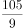，（  ）

- **A**. 
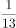

- **B**. 

- **C**. 

- **D**. 
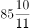
　✅

**答案**：D

**官方解析**

原数列可转化为：，，，，，（  ），观察可得分母是公差为2的等差数列，前后项分子存在明显倍数关系，倍数依次是1，3，5，7，倍数为公差为2的等差数列。则所求项分子为：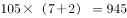，分母为：，即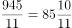。

故正确答案为D。

---

### 第 2 题　qid 2050256 · 数学运算

4，-2，1，3，2，6，11，（  ）

- **A**. 16
- **B**. 19　✅
- **C**. 22
- **D**. 25

**答案**：B

**官方解析**

数列起伏不定，作差没有规律，考虑递推。，则所求项：。

故正确答案为B。

---

### 第 3 题　qid 2050258 · 数学运算

-1，1，3，10，19，（  ），55

- **A**. 27
- **B**. 35　✅
- **C**. 43
- **D**. 56

**答案**：B

**官方解析**

数列单调递增，作差之后无明显规律，考虑作和。作和之后可得新数列：0，4，13，29，对新数列作差可得：4，9，16，为平方数数列，故下一项差应为25，即新数列下一项应为，则原数列所求项为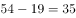。

故正确答案为B。

---

### 第 4 题　qid 2049760 · 数学运算

某地举办铁人三项比赛，全程为51.5千米，游泳、自行车、长跑的路程之比为。小陈在这三个项目花费的时间之比为，比赛中他长跑的平均速度是15千米/小时，且两次换项共耗时4分钟，那么他完成比赛共耗时多少？

- **A**. 2小时14分
- **B**. 2小时24分
- **C**. 2小时34分　✅
- **D**. 2小时44分

**答案**：C

**官方解析**

方法一：由列表可得，小陈在游泳、自行车、长跑三项比赛中的速度之比为，其中长跑的速度为，则自行车的速度应为，游泳的速度为，可得三段路程的实际耗时如表所示，共计：小时，加上4分钟的换项时间，一共用时2小时34分。

方法二：由三个项目所花时间之比为，项目总时间是15的倍数，再加上换项耗时4分钟，则比赛总时间应为15的倍数加上4分钟，结合选项只有C项（154分钟）满足。

故正确答案为C。

---

### 第 5 题　qid 2049532 · 数学运算

小王从编号分别为1、2、3、4、5的5本书中随机抽出3本，那么，这3本书的编号恰好为相邻三个整数的概率为：

- **A**. 

- **B**. 

- **C**. 

　✅
- **D**. 

**答案**：C

**官方解析**

。从5本书中随机抽出3本，总数为。这3本书的编号恰好为相邻三个整数即123，234，345三种情况，满足条件的数为3。故概率为：。

故正确答案为C。

---

### 第 6 题　qid 2049852 · 数学运算

妈妈为了给过生日的小东一个惊喜，在一底面半径为20cm、高为60cm的圆锥形生日帽内藏了一个圆柱形礼物盒。为了不让小东事先发现礼物盒，该礼物盒的侧面积最大为多少？

- **A**. 
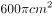
　✅
- **B**. 
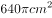

- **C**. 
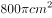

- **D**. 
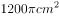

**答案**：A

**官方解析**

要想礼物盒侧面积尽可能大，则礼物盒应内接于圆锥形生日帽子，假设圆柱形礼物盒底面半径为，高为，如下图所示：C点在母线AF上，直角三角形ABC相似于直角三角形AOF，则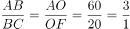，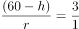，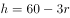。因礼物盒侧面积为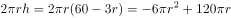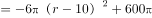，当时，礼物盒侧面积取得最大值为。

故正确答案为A。

---

### 第 7 题　qid 2050108 · 数学运算

某公司销售部拟派3名销售主管和6名销售人员前往3座城市进行市场调研，每座城市派销售主管1名，销售人员2名。那么，不同的人员派遣方案有：

- **A**. 540种　✅
- **B**. 1080种
- **C**. 1620种
- **D**. 3240种

**答案**：A

**官方解析**

根据题干可得，先排销售主管，销售主管的排法有：种；再排销售人员，销售人员的排法有：种；同时满足销售主管1名，销售人员2名，所以不同的人员派遣方案有：种。

故正确答案为A。

---

### 第 8 题　qid 2049768 · 数学运算

小张家距离工厂15千米，乘坐班车20分钟可到工厂。一天，他错过班车，改乘出租车上班。出租车出发时间比班车晚4分钟，送小张到工厂后出租车马上原路返回，在距离工厂1.875千米处与班车相遇。如果班车和出租车都是匀速运动且不计上下车时间，那么小张比班车早多少分钟到达工厂？

- **A**. 3
- **B**. 4　✅
- **C**. 5
- **D**. 6

**答案**：B

**官方解析**

小张家距离工厂的路程为15千米，班车20分钟可以到达。则班车的速度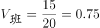千米分钟。出租车出发时间比班车晚4分钟，则出租车出发时，班车已走了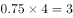千米，距离终点还剩千米。从此时开始到相遇，班车所走路程为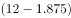千米，出租车所走路程为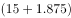千米，根据时间相等，路程和速度成正比，可得：，解得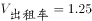千米分钟。从家到工厂，出租车行驶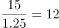分钟，加上晚出发的4分钟，共16分钟，比原来（即班车）提前4分钟到达。

故正确答案为B。

---

### 第 9 题　qid 2049566 · 数学运算

由于连日暴雨，某水库水位急剧上升，逼近警戒水位。假设每天降雨量一致，若打开2个水闸放水，则3天后正好到达警戒水位；若打开3个水闸放水，则4天后正好到达警戒水位。气象台预报，大雨还将持续七天，流入水库的水量将比之前多。若不考虑水的蒸发、渗透和流失，则至少打开几个水闸，才能保证接下来的七天都不会到达警戒水位？

- **A**. 5
- **B**. 6　✅
- **C**. 7
- **D**. 8

**答案**：B

**官方解析**

设水库原有水量为，警戒水位的水量为，每天降水量为，每个水闸每天放水量为1。则根据水库水量变化过程可得：

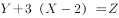；

可以解得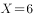，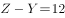。

气象台预报，流入水库的水量增加20%，则每天水库水量增加，设未来7天至少打开n个水闸可以保证水位低于警戒水位。则可得方程如下：

，代入数据可得，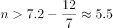，故至少打开5.5个水闸，应向上取整为6个水闸。

故正确答案为B。

---

### 第 10 题　qid 2049796 · 数学运算

某机场一条自动人行道长42m，运行速度0.75。小王在自动人行道的起始点将一件包裹通过自动人行道传递给位于终点位置的小明。小明为了节省时间，在包裹开始传递时，沿自动人行道逆行领取包裹并返回。假定小明的步行速度是1，则小明拿到包裹并回到自动人行道终点共需要的时间是：

- **A**. 24秒
- **B**. 42秒
- **C**. 48秒　✅
- **D**. 56秒

**答案**：C

**官方解析**

包裹开始传递时，速度为，小明逆向领取包裹速度为，小明和包裹相遇需要，此时距离小明起点，小明返回速度为，所需时间，共用时。

故正确答案为C。

---

### 第 11 题　qid 2049842 · 数学运算

如右图所示，甲和乙在面积为54π的半圆形游泳池内游泳，他们分别从位置A和B同时出发，沿直线同时游到位置C。若甲的速度为乙的2倍，则原来甲、乙两人相距：

- **A**. 
米

- **B**. 
米

- **C**. 
米

- **D**. 
米
　✅

**答案**：D

**官方解析**

由题意可得，甲的速度为乙的2倍，相同时间，距离与速度成正比，则，因AC为直径，则，又已知半圆的面积为，假设圆的半径为，则，，则，，，。

故正确答案为D。

---

### 第 12 题　qid 2050280 · 数学运算

如下图所示，某条河流一侧有A、B两家工厂，与河岸的距离分别为4km和5km，且A与B的直线距离为11km。为了处理这两家工厂的污水，需要在距离河岸1km处建造一个污水处理厂，分别铺设排污管道连接A、B两家工厂。假定河岸是一条直线，则排污管道总长最短是：

- **A**. 12km
- **B**. 13km　✅
- **C**. 14km
- **D**. 15km

**答案**：B

**官方解析**

如下图所示，过污水处理厂做河岸的平行线，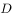为关于的对称点，则最短距离为，由题污水厂离河1km可得点距离到为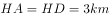，点距离等于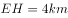，则。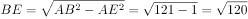，所以。

故正确答案为B。

---

### 第 13 题　qid 2049776 · 数学运算

某商店促销，购物满足一定金额可进行摸球抽奖，中奖率。规则如下：抽奖箱中有大小相同的若干个红球和白球，从中摸出两个球，如果都是红球，获一等奖；如果都是白球，获二等奖；如果是一红一白，获三等奖。假定一、二、三等奖的概率分别为0.1、0.3、0.6，那么抽奖箱中球的个数为：

- **A**. 5　✅
- **B**. 6
- **C**. 7
- **D**. 8

**答案**：A

**官方解析**

方法一：根据条件，设箱内一共有小球个，其中红球个。若从中摸出两个都是红球，则获一等奖，其概率为0.1。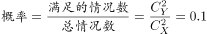，化简后得：。代入选项：

A项：当时，解得，当选；B项：当时，解得不为整数，排除；

C项：当时，解得不为整数，排除；D项:当时，解得不为整数，排除。

满足条件的只有A项。

方法二：一等奖的概率为0.1即，说明总情况数（即摸出2个球的情况数）一定是10的倍数。设球的个数为n，则总情况数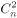是10的倍数，代入选项，只有当n＝5时满足。

故正确答案为A。

---

### 第 14 题　qid 2049754 · 数学运算

小明负责将某农场的鸡蛋运送到小卖部。按照规定，每送达1枚完整无损的鸡蛋，可得运费0.1元；若有鸡蛋破损，不仅得不到该枚鸡蛋的运费，每破损一枚鸡蛋还要赔偿0.4元。小明10月份共运送鸡蛋25000枚，获得运费2480元。那么，在运送过程中，鸡蛋破损了：

- **A**. 20枚
- **B**. 30枚
- **C**. 40枚　✅
- **D**. 50枚

**答案**：C

**官方解析**

设在运送过程中，鸡蛋破损了枚，则完好的鸡蛋有枚。根据条件可列方程：，解得。

故正确答案为C。

---

### 第 15 题　qid 2050118 · 数学运算

某大学考场在8个时间段内共安排了10场考试，除了中间某个时间段（非头尾时间段）不安排考试外，其他每个时间段安排1场或2场考试。那么，考场有多少种考试安排方式（不考虑考试科目的不同）？

- **A**. 210　✅
- **B**. 270
- **C**. 280
- **D**. 300

**答案**：A

**官方解析**

由题干“中间某个时间段（非头尾时间段）不安排考试”，因此第一步可以先计算不安排考试的时段，有种情况；第二步计算有7个时段安排考试，又“每个时间段安排1场或2场考试”，因此7个时段中有3个时段要安排两场考试，有种情况。所以该考场的考试安排方式有：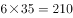种。

故正确答案为A。

---

### 第 16 题　qid 2049560 · 数学运算

如右图所示，幼儿园老师用边长为的正八边形纸皮，裁去四个同样大小的等腰直角三角形，做成长方体包装盒。如果用该包装盒存放体积为的立方体积木（不得凸出包装盒外沿），那么，这个盒子最多可以放入多少块积木？

- **A**. 75　✅
- **B**. 80
- **C**. 85
- **D**. 90

**答案**：A

**官方解析**

等腰直角三角形斜边长为，则直角边长为，即长方体的高为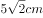。立方体积木的体积为，则积木的棱长为。长方体底面积为，则每层可放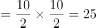块，高层。由于不得凸出包装盒外沿，所以最多放3层，这个盒子最多可以放入块积木。

故正确答案为A。

---

### 第 17 题　qid 2049564 · 数学运算

某件刺绣产品，需要效率相当的三名绣工8天才能完成；绣品完成时，一人有事提前离开，绣品由剩下的两人继续完成；绣品完成时，又有一人离开，绣品由最后剩下的那个人做完。那么，完成该件绣品一共用了：

- **A**. 10天
- **B**. 11天
- **C**. 12天
- **D**. 13天　✅

**答案**：D

**官方解析**

设每名绣工的效率为1，则工程总量。此项工程分成三个阶段。

第一阶段三名绣工做，需要天；

第二阶段两名绣工做，需要天；

第三阶段一名绣工做，需要天。

完成该件绣品一共用了天。

故正确答案为D。

---

### 第 18 题　qid 2049538 · 数学运算

为规范和平衡进口行业，国家对跨境电商进口施行新的税收政策，因此海外代购成本大幅上涨，代购商也相应提高了零售价。若某种代购商品国内零售价格上涨的额度是其海外采购成本上涨额度的2倍，这样消费者花6000元所能购买到的这种商品数量比之前减少了20件，代购商的利润率则从原先的上升到三分之一，那么税改后该代购商出售此种商品每件的利润是多少？

- **A**. 30元
- **B**. 25元
- **C**. 20元
- **D**. 15元　✅

**答案**：D

**官方解析**

设原来利润为a，税改后利润为b，则可得下表数据：

根据“国内零售价格上涨的额度是其海外采购成本上涨额度的2倍”，可得，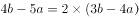，解得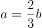。再根据6000元可购买商品数量减少20件可得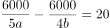，解得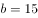。

故正确答案为D。

---

## 判断推理

### 第 1 题　qid 2049956 · 图形推理

把下面的六个平面图形分为两类，使每一类图形都有各自的共同特征或规律，分类正确的一项是：

- **A**. ①②⑤，③④⑥
- **B**. ①③⑥，②④⑤
- **C**. ①②④，③⑤⑥
- **D**. ①③④，②⑤⑥　✅

**答案**：D

**官方解析**

图形元素组成不同，优先考虑属性规律。题干中6个图形都是对称图形，所以考虑对称性，①③④为中心对称图形，②⑤⑥为轴对称图形。
故正确答案为D。

---

### 第 2 题　qid 2049954 · 图形推理

从所给的四个选项中，选择最合适的一个填入问号处，使之呈现一定的规律性：

- **A**. A
- **B**. B　✅
- **C**. C
- **D**. D

**答案**：B

**官方解析**

图形元素组成相似，优先考虑样式规律。因为第二组图中问号在中间，所以优先观察第一组图中第一个图形和第三个图形是如何得到第二个图形的。第一个图形与第三个图形去同求异得到图①，然后再逆时针旋转得到第二个图形，第二组满足同样的规律，第一个图形与第三个图形去同求异得到图②，再逆时针旋转得到的图形与B项相同。

故正确答案为B。

---

### 第 3 题　qid 2050160 · 图形推理

把下面的六个图形分为两类，使每一类图形都有各自的共同特征或规律，分类正确的一项是：

- **A**. ①③④，②⑤⑥
- **B**. ①②⑥，③④⑤　✅
- **C**. ①②⑤，③④⑥
- **D**. ①③⑥，②④⑤

**答案**：B

**官方解析**

本题为分组分类题目，题干中6幅图形均由一个正六面体和面内的3条对角线构成，考虑3条对角线之间的关系。观察发现，3条对角线之间不存在明显的垂直或者平行关系，考虑3条对角线所在面的关系。①②⑥三面中，三条对角线所标示的面存在相对面；而③④⑤三面中，三条对角线所在的面任意两面均两两相邻。
故正确答案为B。

---

### 第 4 题　qid 2050058 · 图形推理

从所给的四个选项中，选择最合适的一个填入问号处，使之呈现一定的规律性：

- **A**. A　✅
- **B**. B
- **C**. C
- **D**. D

**答案**：A

**官方解析**

图形组成不同，出现多个独立小元素，优先考虑元素个数和种类。

方法一：横向和竖向考虑题干图形的独立元素的种类和个数均无明显规律，图形中元素有黑有白，分开数，第一行：黑1白1，黑1白2，黑2白2；第二行：黑1白0，黑2白2，黑1白2；第三行：黑3白3，黑1白0，？。观察发现，黑白色两种元素个数的差值存在规律，白色元素个数减去黑色元素个数，出现“0、1、0、-1”的S型重复，如下图所示：

？处应该选择白色元素等于黑色元素的选项，即A选项。

故正确答案为A。

方法二：观察九宫格中有白色与黑色两种元素，如果按照白色元素（忽略形状）和黑色元素（忽略形状）两种元素样式来区分，经观察发现，黑色元素与白色元素加和都为12个，再加上A选项的一黑一白元素，则黑色元素与白色元素加和都为13个。

方法三：观察题干元素种类，第一行：2种，3种，4种；第二行：1种，4种，3种；第三行：6种，1种，？。观察发现，题干依次是：偶数个，奇数个，偶数个，奇数个，偶数个，奇数个，偶数个，奇数个，？，所以问号处要找一个偶数个的，只有A符合。

故正确答案为A。

---

### 第 5 题　qid 2049950 · 图形推理

如图所示，立方体上叠加圆柱体再打通一个圆柱孔，然后从任意面剖开，下面哪一项不可能是该立体的截面？

- **A**. A
- **B**. B　✅
- **C**. C
- **D**. D

**答案**：B

**官方解析**

A项：在图形下面的正方体中选一角，竖直向下可以切出，如图1所示；

B项：无法切出；

C项：在上面的圆柱横切，可以切出，如图2所示；

D项：在正方体的一个角斜着切，可以切出，如图3所示。

本题为选非题，故正确答案为B。

---

### 第 6 题　qid 2049948 · 图形推理

左边给定的是削掉一个角的纸盒，下列哪一项不是由它展开而成？

- **A**. A
- **B**. B
- **C**. C　✅
- **D**. D

**答案**：C

**官方解析**

题干图形切去了一个角，出现三个面缺角，三个缺角要重合，如上图所示，C项中1和是重合边，但没有缺角，即三个缺角不重合，所以C选项错误。

本题为选非题，故正确答案为C。

C项详解：

必备知识：首先要知道，六面体中一个顶点发射且只发射出三条边

①图中a和是直角边，是同一条边，因此绿色的点和蓝色的点是同一个点；

②从蓝色点发出的a、b、三条线，因此绿色的点发出的应该也是a、b、三条线（原理见上面的必备知识）；

③那现在知道a和是同一条，因此剩下边1要么就是b，要么是。但是b已经不可能了（因为b这条边两边的面已经是确定的了），所以1只能是这条边，因此它俩折叠完后是重合的。

而题干缺角的三条边应该是互相挨着的，不可能出现C中一条缺口的边1和一条完整的边挨着，所以C错。

本题为选非题，故正确答案为C。

---

### 第 7 题　qid 2050436 · 图形推理

从所给的四个选项中，选择最合适的一个填入问号处，使之呈现一定的规律性：

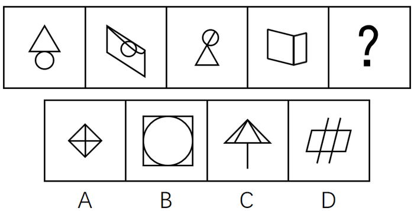

- **A**. A
- **B**. B　✅
- **C**. C
- **D**. D

**答案**：B

**官方解析**

图形元素组成不同，且无明显属性规律，考虑数量规律。观察题干发现第一幅图是切圆，第四幅图是“日”字的变形，选项当中有“田”字的变形和切圆，考虑数笔画数，进一步观察，题干中都是一笔画图形，故问号处也应是一笔画图形。选项A是两笔画，B是一笔画，C是两笔画，D是两笔画。
故正确答案为B。

---

### 第 8 题　qid 2049952 · 图形推理

从所给的四个选项中，选择最合适的一个填入问号处，使之呈现一定的规律性：

- **A**. A
- **B**. B
- **C**. C　✅
- **D**. D

**答案**：C

**官方解析**

图形元素组成不同，属性数量无明显规律，但整体观察题干发现，每个图形中都存在三角形，只有C选项符合。（注：B项中出现的是4个扇形，而不是三角形。）
故正确答案为C。

---

### 第 9 题　qid 2050172 · 图形推理

从所给的四个选项中，选择最合适的一个填入问号处，使之呈现一定的规律性：

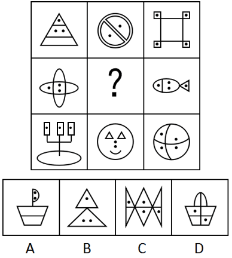

- **A**. A　✅
- **B**. B
- **C**. C
- **D**. D

**答案**：A

**官方解析**

元素组成不同，题干每幅图均出现小黑点，优先考虑功能元素。观察发现，第一行图形中，功能元素标记的面数量分别为2、2、4，，第三行图形中，功能元素标记的面数量分别为3、1、4，，第二行图形中，功能元素标记的面数量分别为2、？、3，那么？处应为功能元素标记面数量为1的图形，只有A项符合。

故正确答案为A。

---

### 第 10 题　qid 2050074 · 图形推理

从所给的四个选项中，选出一个最合适的填入问号处，使之呈现一定的规律：

- **A**. A
- **B**. B　✅
- **C**. C
- **D**. D

**答案**：B

**官方解析**

题干图形间有明显的凹进和凸出部分，考虑图形拼合。如下图所示，题干图2逆时针旋转90度之后拼接在图1的右边，图3顺时针旋转90度后拼接在图2的下边，很明显，还缺一幅凸出两个尖的图形，最后就可拼成一个完整的正方形，观察选项，只有B项凸出两个尖。

故正确答案为B。

---

### 第 11 题　qid 2049888 · 定义判断

非爱行为，指以爱的名义，对自己亲近的人进行非爱性的掠夺，即违背他人主观意愿，在精神与行为方面强制控制，迫使对方按照施控者的意愿去行为做事，这一行为往往发生在夫妻、恋人、父母与子女等最亲近的人之间。
根据上述定义，下列属于非爱行为的是：

- **A**. 张某按照医嘱，要求女儿每三个小时做一次牵引，以消除疼痛
- **B**. 林某强迫儿子每天练琴3小时，争取在钢琴大赛中取得好成绩　✅
- **C**. 陈某为防止患精神病的女儿逃逸，将其关在地下室禁止其出入
- **D**. 李某按照轮流陪护协议，要求妻子前往医院陪护患重病的母亲

**答案**：B

**官方解析**

第一步：找出定义关键词。
“违背他人主观意愿”、“强制控制”、“迫使对方按照施控者的意愿去做事”、“往往发生在夫妻、恋人、父母与子女等最亲近的人之间”
第二步：逐一分析选项。
A项：要求女儿做牵引，但女儿是否想要做没有明确表明，不能确定是否“违背他人主观意愿”、“强制控制”、“迫使对方按照施控者的意愿去做事”，不符合定义，排除；
B项：强迫儿子练琴中的“强迫”体现出儿子一定不愿意练琴，明确地符合关键词“违背他人主观意愿”、“强制控制”、“迫使对方按照施控者的意愿去做事”，符合定义，当选；
C项：把“精神病”女儿关在地下室，是出于对她的一种保护，不属于违背个人的主观意愿，不符合定义，排除；
D项：要求妻子照顾患病的母亲，但妻子是否想要照顾患病的母亲没有明确表明，不能确定是否“违背他人主观意愿”、“强制控制”、“迫使对方按照施控者的意愿去做事”，不符合定义，排除。
故正确答案为B。

---

### 第 12 题　qid 2050088 · 定义判断

心理人类学是介于文化人类学与心理学之间的交叉学科，主要研究并了解文化对所属社会成员产生影响的心理机制，发现在个体水平上的心理变量与在总体水平上的文化、社会、经济、生态和生物变量之间的关系。
根据上述定义，下列选项属于心理人类学研究范畴的是：

- **A**. “五四”前后诗歌风格的比较
- **B**. 当代流行话语下的社会主流价值
- **C**. 草原文明与蒙古民族性格的养成　✅
- **D**. 从《背影》看作者对父亲态度的变化

**答案**：C

**官方解析**

第一步：找出定义关键词。
“文化对所属社会成员产生影响的心理机制”、“个体的心理变量与总体的文化、社会、经济、生态和生物变量之间的关系”。
第二步：逐一分析选项。
A项：只是简单比较诗歌风格，没有体现文化对社会成员的影响，不符合题干定义，排除；
B项：该项研究的是当下的主流价值观，不是文化对社会成员的影响，不符合题干定义，排除；
C项：草原文明与蒙古民族性格的养成，既有草原文化，也明确体现该文化对所属的社会成员（即蒙古民族）产生影响的心理机制（民族性格的养成），符合题干定义，当选；
D项：该项研究的是作者和父亲两个个体之间的关系，没有体现文化对社会成员的影响，不符合题干定义，排除。
故正确答案为C。

---

### 第 13 题　qid 2049934 · 定义判断

我国婚姻法规定，禁止直系血亲和三代以内旁系血亲结婚。直系血亲是指和自己有直接血缘关系的亲属，三代以内旁系血亲是指与己身出自同一父母或同一祖父母、外祖父母，除直系血亲外的所有血亲。
根据上述定义，下列选项中的甲和乙可以结婚的是：

- **A**. 张某是甲（女）的姨父，乙系张某的儿子
- **B**. 李某是乙（女）的姑父，甲系李某的儿子
- **C**. 甲是林某与前夫的儿子，乙是林某与后夫的女儿
- **D**. 王某是张某的舅舅，甲系王某的儿子，乙系张某的女儿　✅

**答案**：D

**官方解析**

第一步，找出定义关键词。

“直系血亲是指和自己有直接血缘关系的亲属”、“三代以内旁系血亲是指与己身出自同一父母或同一祖父母、外祖父母，除直系血亲外的所有血亲”。

第二步，逐一分析选项。

A项：张某是甲（女）的姨父，乙是其姨父（张某）的儿子。甲的姨与乙的母亲是同一人，甲与其姨有血亲关系，乙与其母亲也有血亲关系，因此两人有血亲关系。符合定义，不能结婚，排除；

B项：李某是乙（女）的姑父，甲是其姑父（李某）的儿子。乙的姑姑与甲的母亲是同一人，乙与其姑姑有血亲关系，甲与其母亲也有血亲关系，因此两人有血亲关系。符合定义，不能结婚，排除；

C项：甲与乙出自同一外祖父母，属于三代以内旁系血亲，符合定义，不能结婚，排除；

D项：如下图，王某是张某的舅舅，甲系王某儿子，乙系张某女儿，甲、乙二人不符合“三代以内旁系血亲是指与己身出自同一父母或同一祖父母、外祖父母，除直系血亲外的所有血亲”的关系，不符合定义，可以结婚，当选。

故正确答案为D。 

---

### 第 14 题　qid 2049962 · 定义判断

木椅子效应是指将成绩相等的两组学生分别安排坐在舒适的沙发椅和很不舒服的木椅子上学习，不久之后，坐木椅子的学生学习成绩要比坐沙发椅的学生成绩高出许多。原因是坐木椅子的学生因为不舒服而不断调整坐姿，表面看来好像不安而好动，实质却因此给脑部供应了更多的血液和营养；而坐沙发椅的学生，由于舒适而一动不动，致使血液循环相对减慢，脑部得到的血液和营养相对减少，学习效果因此就差了一些。
根据上述定义，下列选项最能体现木椅子效应的是：

- **A**. 某学生从小到大饱受责罚，学习成绩一直不理想
- **B**. 小刚每天步行上学和回家，风雨无阻却学得很好　✅
- **C**. 某家长为鼓励孩子暑天学习，每天为其提供冷饮
- **D**. 搬入新书房一个月后，小明的成绩名次一路攀升

**答案**：B

**官方解析**

第一步，找出定义关键词。
“坐不舒服木椅子的同学，学习成绩更好”、“坐舒适沙发椅的同学，学习效果差一些”。
第二步，逐一分析选项。
A项：学生从小到大饱受责罚，体现了不舒服的状态，但是学习成绩不理想，不符合“坐不舒服木椅子的同学，学习成绩更好”，不符合定义，排除；
B项：小刚每天步行上学和回家，风雨天也是如此，体现了不舒服的状态，并且学得很好，符合“坐不舒服木椅子的同学，学习成绩更好”符合定义，当选；
C项：家长每天鼓励孩子并为其提供冷饮，体现了舒服的状态，但未明确说明学习好坏，不符合“坐舒适沙发椅的同学，学习效果差一些”，不符合定义，排除；
D项：搬入新书房是否属于舒服的状态不明确，不符合“坐不舒服木椅子的同学，学习成绩更好”，不符合定义，排除。
故正确答案为B。

---

### 第 15 题　qid 2049970 · 定义判断

随着科学技术的发展，人机交流已经成为现实，这其中的关键是脑机接口技术。所谓脑机接口，就是连接大脑与计算机之间的信息系统，可让大脑直接和计算机沟通。脑机接口可以从大脑传递信息到计算机，又可以从计算机传递信息进入大脑。
根据上述定义，下列应用不属于脑机接口技术的是：

- **A**. 某游戏玩家的大脑植入一部装置，通过该装置用意念控制机械手，端起杯子喝茶
- **B**. 某游戏玩家佩戴一套义肢设备，经过多次练习，凭着坚强意志力，实现独立行走　✅
- **C**. 某游戏玩家佩戴一种脸部饰品，饰品根据佩戴者的情绪变化作出相应的指示动作
- **D**. 某游戏玩家戴上一套高科技耳机，集中注意力，通过精神控制小球飞越各种障碍

**答案**：B

**官方解析**

第一步：找出定义关键词。
“连接大脑与计算机”、“可让大脑直接和计算机沟通”。
第二步：逐一分析选项。
A项：大脑植入装置并且可以通过装置用意念控制机械手，体现了“连接大脑和计算机”和“可让大脑直接和计算机沟通”，符合定义，排除；
B项：游戏玩家用坚强的意志力实现使用义肢设备独立行走，主要依靠的是坚强意志力，而不是大脑与计算机的沟通，不符合定义，当选；
C项：脸部饰品会根据佩戴者情绪变化作出相应的指示动作，情绪变化是大脑的表现，体现了“可让大脑直接和计算机沟通”，符合定义，排除；
D项：游戏玩家戴高科技耳机通过精神控制小球飞越各种障碍，体现了“可让大脑直接和计算机沟通”，符合定义，排除。
本题为选非题，故正确答案为B。

---

### 第 16 题　qid 2049936 · 定义判断

数据挖掘（Data mining）是指从大量的存储数据中利用统计、情报检索、模式识别、在线分析处理和专家系统（依靠过去的经验）等方法或技术，发现隐含在其中、事先不知道但又是潜在有用的信息和知识的信息处理过程。
根据上述定义，下列选项不属于数据挖掘应用的是：

- **A**. 
某高校要求教师使用网上教学管理系统，录入学生的期末考试成绩，以便借助短信群发软件告知学生成绩
　✅
- **B**. 
某国际快递和物流公司使用RFID（无线射频识别）技术在不同时间点跨境全程监控和调整药品装运的温度

- **C**. 
某大型网上书店在客户选购一种图书时，推出“购买该商品的用户还购买了”等栏目，从而增加可观收益

- **D**. 
某全球零售企业在分析上一年度消费者购物行为后推出“尿布啤酒”促销举措，使得二者销量大幅增加

**答案**：A

**官方解析**

第一步：找出定义关键词。

“从大量的存储数据中利用统计、情报检索、模式识别、在线分析处理和专家系统（依靠过去的经验）等方法或技术”、“发现隐含在其中、事先不知道但又是潜在有用信息和知识”。

第二步：逐一分析选项。

A项：录入学生期末考试成绩，并用短信群发软件告知学生成绩，“告知学生成绩”没有体现发现隐含在其中的信息。不符合定义，当选；

B项：国际快递和物流公司运输的药品符合“大量的存储数据”；“无线射频识别”符合模式识别、在线分析等方法和技术；而“监控并调整其温度”符合“发现有用信息”这一关键词，符合定义，排除；

C项：“购买该商品的用户还购买了”是通过以前购买过此图书的消费者还购买过其他商品的大量的数据分析而总结出来的，符合“对大量数据利用统计、情报检索”这一关键词，向客户推荐其他商品符合“隐含在其中，潜在有用信息”，符合定义，排除；

D项：“分析上一年度消费者购物行为”符合“对大量数据的统计、情报检索、在线分析处理······技术”，并且推出了“尿布啤酒”这一模式，符合“发现隐含在其中、事先不知道但又是潜在有用信息”，符合定义，排除。

本题为选非题，故正确答案为A。

---

### 第 17 题　qid 2049884 · 定义判断

描写就是用生动形象的语言，把人物或景物的状态具体地描绘出来。从描写的角度分，可分为正面描写和侧面描写。正面描写是指直接展现景物、环境的特点或通过描写人物的外貌、心理和行动来体现人物的个性特征。侧面描写又叫间接描写，是从侧面的角度烘托人物形象、景物特征或相关事态。
根据上述定义，下列选项既有正面描写，又有侧面描写的是：

- **A**. 一道残阳铺水中，半江瑟瑟半江红
- **B**. 大漠风尘日色昏，红旗半卷出辕门
- **C**. 天姥连天向天横，势拔五岳掩赤城　✅
- **D**. 千里莺啼绿映红，水村山郭酒旗风

**答案**：C

**官方解析**

第一步：找出定义关键词。
正面描写：“直接展现景物、环境的特点或通过描写人物的外貌、心理和行动来体现人物的个性特征”。
侧面描写：“侧面烘托人物的形象、景物特征或相关事态”。
第二步：逐一分析选项。
A项：“一道残阳铺水中”写的是傍晚时分，快要落山的夕阳，柔和地铺在江水之上，是正面描写傍晚的景色；“半江瑟瑟半江红”写的是晚霞斜映下的江水看上去好似鲜红色的，而绿波却又在红色上面滚动，也是正面描写江水的景色。都是正面描写，没有侧面描写，排除；
B项：“大漠风尘日色昏”写的是大漠之中，狂风呼啸，尘土飞扬，天色昏暗，是正面描写大漠的景色；“红旗半卷出辕门”写的是一队将士半卷着红旗出了军营，向敌军挺进，也是正面描写奔赴前线的戍边将士出征前的场景。都是正面描写，没有侧面描写，排除；
C项：“天姥连天向天横”写的是天姥山仿佛连接着天遮断了天空，是正面描写天姥山山势高；“势拔五岳掩赤城”写的是天姥山山势高峻超过五岳，遮掩过赤城山，并非在描写五岳和赤城山，而是通过对比从侧面凸显了天姥山的高。既有正面描写又有侧面描写，当选；
D项：“千里莺啼绿映红”正面描写到处莺歌燕舞，桃红柳绿；“水村山郭酒旗风”正面描写依山傍水的村庄和城郭，到处都有迎风招展的酒旗。都是正面描写，没有侧面描写，排除。
故正确答案为C。

---

### 第 18 题　qid 2049966 · 定义判断

心理会计是指人们在心里无意识地把财富划归不同的账户进行管理，并对结果（尤其是经济结果）加以编码、分类和估价的过程，且不同的心理账户有不同的记账方式和心理运算规则。小到个体、家庭，大到企业集团，都有一套或隐或显的心理账户系统，其心理记账方式与经济学和数学的运算方式都不相同，因此经常以非预期的方式影响着决策，使个体的决策违背最简单的理性经济法则。
根据上述定义，下列选项最能体现心理会计现象的是：

- **A**. 整日忧心忡忡的小李将自己全部存款的四分之三用于购买人寿保险
- **B**. 小陈已经攒够购买相机的钱，但他一定要等领到年底奖金再买相机　✅
- **C**. 小王在两家不同银行都有储蓄卡，但他总是去离家更近的银行取款
- **D**. 小刘因公司奖励出游某地感觉不错，后来自费重游此地却感觉不佳

**答案**：B

**官方解析**

第一步，找出定义关键词。
“人们在心里无意识地把财富划归不同的账户进行管理”、“对结果（尤其是经济结果）加以编码、分类和估价”、“不同的心理账户有不同的记账方式和心理运算规则”、“个体的决策违背最简单的理性经济法则”。
第二步，逐一分析选项。
A项：小李将自己存款的四分之三用于购买人寿保险，这是有意识对财富进行支出和管理，并未体现“人们在心里无意识地把财富划归不同的账户进行管理”，不符合定义，排除；
B项：小陈已经攒够购买相机的钱，但他一定要等领到年底奖金再买相机，无论是现在的存款还是年底奖金都是小陈自己的财富，而且无论是现在买还是之后买都是等价的商品。但是工资和年底奖金性质有所不同，所以小陈在心里上认为有差别，“心理账户”就不一样了，符合“人们在心里无意识地把财富划归不同的账户进行管理”，而且也“违背最简单的理性经济法则”，符合定义，当选；
C项：小王选择去哪家银行根据的是距离远近而非财富本身，不符合定义，排除；
D项：小刘对公司奖励的出游某地感觉很满意，但是对自费出游某地感觉不佳，第二次出游是小刘自费，涉及了对自己财富的管理，而第一次出游是公司的奖励，不涉及小刘对自己财富的管理，无法体现“人们在心里无意识地把财富划归不同的账户进行管理”，且D项中没有涉及小刘的决策“违背最简单的理性经济法则”，不符合定义，排除。
故正确答案为B。

---

### 第 19 题　qid 2049866 · 类比推理

进士：状元

- **A**. 河水：海水
- **B**. 银河：天文
- **C**. 学位：博士　✅
- **D**. 宪法：民法

**答案**：C

**官方解析**

第一步：判断题干词语间逻辑关系。
进士包含状元、榜眼、探花等，状元是进士中名次第一的称谓。二者为种属关系。
第二步：判断选项词语间逻辑关系。
A项：河水、海水是两种不同的水域，二者是并列关系，与题干逻辑关系不一致，排除；
B项：银河是天文领域的概念，二者是对应关系，与题干逻辑关系不一致，排除；
C项：学位包含学士、硕士、博士，博士是学位中等级最高的学术称号，二者为种属关系，与题干逻辑关系一致，当选；
D项：宪法是国家的根本法，民法是调整平等主体的公民、法人之间财产关系和人身关系的法律规范。民法的制定必须以宪法为基础，宪法的效力要高于民法，宪法属于上位法，民法属于下位法。与题干逻辑关系不一致，排除。
故正确答案为C。

---

### 第 20 题　qid 2050068 · 类比推理

救援：围魏救赵

- **A**. 进攻：风声鹤唳
- **B**. 防守：草木皆兵
- **C**. 追击：穷寇勿追　✅
- **D**. 转移：斗折蛇行

**答案**：C

**官方解析**

第一步：判断题干词语间逻辑关系。
围魏救赵，原指战国时齐军用围攻魏国的方法，迫使魏国撤回攻赵部队而使赵国得救。后指袭击敌人后方的据点以迫使进攻之敌撤退的战术。围魏救赵是救援的一种策略。二者是对应关系，同时在语义上有相关性。
第二步：判断选项词语间逻辑关系。
A项：风声鹤唳形容惊慌失措，或自相惊忧。与进攻没有明显的逻辑关系，与题干逻辑关系不一致，排除；
B项：草木皆兵是指把山上的草木都当做敌兵，形容人在惊慌时疑神疑鬼。与防守没有明显的逻辑关系，与题干逻辑关系不一致，排除；
C项：穷寇勿追是指不追无路可走的敌人，以免敌人情急反扑，造成自己的损失。也比喻不可逼人太甚。穷寇勿追是追击的一种策略，与题干逻辑关系一致，当选；
D项：斗折蛇行是指像北斗星一样弯曲，像蛇一样曲折行进。形容道路曲折蜿蜒。与转移没有明显的逻辑关系，与题干逻辑关系不一致，排除。
故正确答案为C。

---

### 第 21 题　qid 2049944 · 类比推理

盲动：一败涂地：重起炉灶

- **A**. 超速：风驰电掣：按部就班
- **B**. 跟风：鹦鹉学舌：真知灼见
- **C**. 熬夜：萎靡不振：养精蓄锐　✅
- **D**. 传神：生动逼真：洛阳纸贵

**答案**：C

**官方解析**

第一步：判断题干词语间逻辑关系。
因为盲动可能导致一败涂地，两者是或然因果关系，一败涂地之后需要重起炉灶。
第二步：判断选项词语间逻辑关系。
A项：超速是一种道路交通违法行为，风驰电掣形容非常迅速，与题干逻辑关系不一致，排除；
B项：鹦鹉学舌比喻人家怎么说，他也跟着怎么说，与跟风意思相近，与题干逻辑关系不一致，排除；
C项：因为熬夜可能导致萎靡不振，两者是或然因果关系，萎靡不振之后需要养精蓄锐，与题干逻辑关系一致，当选；
D项：生动逼真与传神两者意思相近，与题干逻辑关系不一致，排除。
故正确答案为C。

---

### 第 22 题　qid 2049946 · 类比推理

讨论：会议：方案

- **A**. 合作：课题：计划
- **B**. 研究：手机：销量
- **C**. 分析：汽车：技术
- **D**. 调研：基层：实情　✅

**答案**：D

**官方解析**

第一步：判断题干词语间逻辑关系。
造句子：讨论会议方案，没有唯一答案，因此按照第二种方式造句子，即在会议上讨论方案，讨论方案构成动宾短语。
第二步：判断选项词语间逻辑关系。
A项：应该是制定课题计划，而不是合作课题计划，与题干逻辑关系不一致，排除；
B项：在手机上研究销量，但手机是具体的工具，而题干会议并不是工具，与题干逻辑关系不一致，排除；
C项：不能在汽车上分析技术，且汽车也是具体工具，与题干逻辑关系不一致，排除；
D项：在基层调研实情，调研实情构成动宾短语，与题干逻辑关系一致，当选。
故正确答案为D。

---

### 第 23 题　qid 2049938 · 类比推理

鸿雁：笺札：书信

- **A**. 月老：红娘：媒人　✅
- **B**. 乾坤：天地：宇宙
- **C**. 红豆：相思：恋人
- **D**. 东宫：王子：储君

**答案**：A

**官方解析**

第一步：判断题干词语间逻辑关系。
鸿雁是一种鸟类，在古代可以指代书信，鸿雁与书信是比喻象征关系；笺札就是指书信，二者是全同关系。即第一词与第三词为比喻象征关系，第二词与第三词为全同关系。
第二步：判断选项词语间逻辑关系。
A项：月老是中国民间传说中专管婚姻的红喜神，后多用作媒人的代称，二者是比喻象征关系；红娘是以介绍婚姻为职业的中间人，就是指媒人，二者是全同关系，与题干逻辑关系一致，当选；
B项：乾坤不指代宇宙，二者不是比喻象征关系，与题干逻辑关系不一致，排除；
C项：红豆象征相思，且相思与恋人不是全同关系，与题干逻辑关系不一致，排除；
D项：东宫指代储君，二者是比喻象征关系；王子是帝王的儿子，并不等于储君，二者不是全同关系，与题干逻辑关系不一致，排除。
故正确答案为A。

---

### 第 24 题　qid 2049890 · 类比推理

违约 之于 （    ） 相当于 （    ） 之于 承诺

- **A**. 法律；民俗
- **B**. 处罚；兑现
- **C**. 合同；食言　✅
- **D**. 赔偿；责任

**答案**：C

**官方解析**

逐一代入选项。
A项：违约可能违背了法律，民俗和承诺之间没有直接的逻辑关系，前后逻辑关系不一致，排除；
B项：违约之后可能会被处罚，处罚是违约的结果，兑现承诺是动宾短语，前后逻辑关系不一致，排除；
C项：违约是违背了合同，食言是违背了承诺，前后逻辑关系一致，当选；
D项：违约之后可能需要赔偿，赔偿是违约的结果，做出承诺即意味着担负了一定的责任，但承诺不是责任的结果，前后逻辑关系不一致，排除。
故正确答案为C。

---

### 第 25 题　qid 2049886 · 类比推理

番茄 之于 （    ） 相当于 （    ） 之于 蹴鞠

- **A**. 美洲；中国
- **B**. 炒饭；健身
- **C**. 植物；人类
- **D**. 白菜；篮球　✅

**答案**：D

**官方解析**

逐一代入选项。
A项：番茄起源地是美洲，蹴鞠起源地是中国，但前后顺序不一致，排除；
B项：番茄是炒饭时可能用到的一种食材，蹴鞠作为一项体育运动有健身的功能，前后逻辑关系不一致，排除；
C项：番茄是一种植物，二者是种属关系，蹴鞠是人类发明的一种体育运动，前后逻辑关系不一致，排除；
D项：番茄、白菜是两种不同的蔬菜，二者是并列关系，篮球、蹴鞠是两种不同的体育运动，二者是并列关系，前后逻辑关系一致，当选。
故正确答案为D。

---

### 第 26 题　qid 2050076 · 逻辑判断

提高能源使用效率、鼓励能源灵活利用是英国减少温室气体排放政策的一个必要环节，它需要采用智能技术，包括通过智能表将能源使用信息从需求方面或客户发送到能源公司等。该信息可用于制定和实施更高效的能源使用条例。但英国消费者对此态度不一，因为该技术用于监控和支持能源高效率使用行为时，居民个人及家庭的能源数据不得不被动分享。所以，个人使用能源相关数据的被动分享有可能成为推广智能技术的最主要障碍。
以下哪项如果为真，最能支持上述结论？

- **A**. 
的调查者表示，不愿意因数据被动分享而降低个人能源使用比例

- **B**. 
的调查者认为，数据的被动分享大大增加个人隐私被侵犯的风险
　✅
- **C**. 
的调查者表示，那些关心气候变化的人更可能接受数据被动分享

- **D**. 
的调查者认为，数据不可能不被分享，否则智能技术不可能应用

**答案**：B

**官方解析**

本题属于加强题型。
第一步：找出论点和论据。
论点：个人使用能源相关数据的被动分享有可能成为推广智能技术的最主要障碍。
论据：智能技术会使得居民个人和家庭的能源数据被动分享。
第二步：逐一分析选项。
A项：此项强调多数人不同意因能源数据被动分享而降低个人能源使用比例，但题干并没有提及降低个人能源使用比例的问题，推广智能技术并不一定意味着降低能源使用比例，因此A项和论点无关，排除；
B项：数据的被动分享会增加隐私被侵犯的风险，解释了人们为什么不愿意被动分享个人能源数据，而推广智能技术必须要被动分享数据，因而也就解释了为何数据的被动分享会阻碍智能技术的推广，补充论据，加强论点，当选；
C项：该项只是说关心气候变化的人可能接受数据被动分享，并没有说明其他人愿意不愿意，所以不能确定被动分享是否会阻碍智能技术的推广，为不明确项，排除；
D项：此项强调数据分享在推广智能技术过程中的必要性，但数据分享是否重要和它是否会阻碍智能技术推广是两个话题，论题不一致，排除。
故正确答案为B。

---

### 第 27 题　qid 2049892 · 逻辑判断

很多家长认为，孩子不听话，“打屁屁”惩罚一下，至少能让孩子注意到自己的行为不当，变得更听话一些。还有一些人坚持“不严加管教会惯坏孩子”的传统信念，认为“打屁屁”是为孩子好。研究者对16万名儿童在过去5年里的经历进行研究，通过收集“打屁屁”行为的原数据加以分析，发现：打屁股会在儿童成长过程中造成智商低、攻击性行为高等多种负面影响。
以下哪项如果为真，最能支持上述结论？

- **A**. 
最新调查显示，智商相对较低的孩子大多数经常被家长打屁股

- **B**. 
本身不听话且更容易惹祸的孩子更有可能受到父母的严厉惩罚

- **C**. 
研究报告称全球大约的父母都有以打屁股管教孩子的经历

- **D**. 
被打屁股而困惑的孩子只懂得按家长要求去做而不会独立思考
　✅

**答案**：D

**官方解析**

第一步：找出论点和论据。
论点：打屁股会在儿童成长过程中造成智商低、攻击性行为高等多种负面影响。
论据：无明显论据。
第二步：逐一分析选项。
A项：智商相对较低的孩子大多数经常被家长打屁股，“智商相对较低”和“经常被家长打屁股”之间的因果关系并不明确，不能加强，排除；
B项：严厉惩罚与打屁股无必然联系，为无关项，排除；
C项：指出大多数父母都会打孩子屁股，但并未指出打屁股这一行为对儿童造成的后果，排除；
D项：指出孩子被打屁股后不会独立思考，而不会独立思考能力是负面影响，解释了论点，可以加强，当选。
故正确答案为D。

---

### 第 28 题　qid 2049910 · 逻辑判断

英国一项研究发现，人只要在每餐饭前半小时喝一杯500毫升的水，并坚持3个月，体重就能减轻2至4公斤。研究团队邀请了84位超重的成人，随机分成2组，其中41位被要求在餐前喝500毫升水，另外43位则照常生活。3个月后，团队发现三餐前喝水的人，平均体重下降了4.3公斤；而餐前没喝水的人，平均体重只下降了0.81公斤。研究人员说，没有喝水的那组人，“平均运动量”比餐前饮水的人更高，这说明餐前喝适当的水真能减肥。
以下哪项如果为真，最能支持上述结论？

- **A**. 餐前喝水的那组人同时也注意控制饮食
- **B**. 餐前没喝水的人中有的体重减轻了4公斤
- **C**. 除了餐前喝水，两组的其他情况都是一样的　✅
- **D**. 餐前没喝水的人就餐中会喝更多的汤和饮料

**答案**：C

**官方解析**

第一步：找到论点和论据。
论点：餐前喝适当的水能减肥。
论据：餐前喝水的人比餐前没喝水的人平均体重下降得要多，且没有喝水的那组人“平均运动量”比餐前饮水的人更高。
第二步：逐一分析选项。
A项：说明可能有其他原因导致餐前喝水的人体重下降得更多，削弱了论点，排除；
B项：论据中说的是“平均体重”，个别人的体重与“平均体重”无关，排除；
C项：说明两组对象初始条件一致，可以支持，当选；
D项：餐前没喝水的人喝更多的汤和饮料，但是喝更多的汤和饮料并不代表体重一定降得比另一组更少，因为有可能固体的食物反而吃的少了，属于不明确选项，排除。
故正确答案为C。

---

### 第 29 题　qid 2049908 · 类比推理

荷兰研究人员一直在试图模拟月球和火星的土壤条件进行农作物栽培实验。他们对该项实验种出的小红萝卜、豌豆、黑麦和西红柿进行初步分析。实验结果令人充满希望，这些产品不仅安全，而且可能比在地球土壤种出的农作物更健康。英国媒体称，能在火星土壤种出可食用作物，殖民火星的希望又向前迈进了一步。
如果以下各项为真，不能质疑英国媒体说法的是：

- **A**. 火星土壤重金属占比和地球土壤不一样　✅
- **B**. 在另一个同类实验中土豆的长势很糟糕
- **C**. 从实验到真正付诸实践还有很长的路要走
- **D**. 月球、火星、地球的气候条件有很大不同

**答案**：A

**官方解析**

第一步：找到论点和论据。
论点：能在火星土壤种出可食用作物，殖民火星的希望又向前迈进了一步。
论据：荷兰研究人员一直在试图模拟月球和火星的土壤条件进行农作物栽培实验。他们对该项实验种出的小红萝卜、豌豆、黑麦和西红柿进行初步分析。实验结果令人充满希望，这些产品不仅安全，而且可能比在地球土壤种出的农作物更健康。
第二步：逐一分析选项。
A项：火星土壤重金属占比和地球土壤不一样，题干中做实验时模拟的就是火星土壤，且最终的结果是种出的产品不仅安全还可能更健康，因此说土壤不一样没有任何意义，因此A选项无法质疑，当选；
B项：在另一个同类实验中土豆的长势很糟糕，举反例削弱，选非题，排除；
C项：从实验到真正付诸实践还有很长的路要走，说明实验和真正实践的差距性，可以质疑，选非题，排除；
D项：月球、火星、地球的气候条件有很大不同，而气候属于能否在火星生活的重要条件之一，属于补充新论据质疑，选非题，排除。
本题为选非题，故正确答案为A。

---

### 第 30 题　qid 2050080 · 类比推理

当一部小说赢得大奖之后，它在网上书店的口碑却往往会变差。但实际上，大赛评比中其他被提名的小说得分确实不如获奖的小说得分高。据此小李认为，大赛评委们选不出真正好的小说。
如果以下各项为真，不能削弱小李观点的是：

- **A**. 大奖提高了读者对获奖小说的期望值
- **B**. 一部小说获奖后作者知名度会迅速上升　✅
- **C**. 得奖吸引一些品位跟这本书不搭调的读者
- **D**. 喜爱这类小说的读者对获奖小说的评价很高

**答案**：B

**官方解析**

第一步：找出论点和论据。
论点：大赛评委们选不出真正好的小说。
论据：当一部小说赢得大奖之后，它在网上书店的口碑却往往会变差。但实际上，大赛评比中其他被提名的小说得分确实不如获奖的小说得分高。
第二步：逐一分析选项。
A项：大奖提高了读者对获奖小说的期望值，也就是说不是评委不会选，而是读者太苛刻，削弱论点，本题为选非题，排除；
B项：只是在说小说获奖后给作者带来的影响，与大赛评委们能不能选出真正好的小说无关，属于无关选项，本题为选非题，当选；
C项：小说获奖之后扩大了读者群，这本书不搭调的读者有可能会对小说不满意，读者的口味不同会使得网上的口碑变差，削弱论点，本题为选非题，排除；
D项：喜欢的人对获奖小说评价很高，削弱了口碑会变差的论据，本题为选非题，排除。
本题为选非题，故正确答案为B。

---

### 第 31 题　qid 2050084 · 逻辑判断

正常情况下，人的大脑左前颞叶及眶频皮层会抑制位于大脑后部、负责处理眼部信号的视觉系统的神经活动，而在FTD（额颞叶痴呆）患者中，这两个区域可能无法发出抑制性信号，如此，大脑就能以一种全新的方式来处理视觉和声音，尽管额叶的损伤可能会导致患者出现一些病态的异常行为，但也会将患者的艺术敏感性或其他创造力释放出来。可以说，FTD是通向艺术殿堂的一扇窗。
如果以下各项为真，最能质疑上述结论的是：

- **A**. 
只有不到的FTD患者在患病期间能成为杰出艺术家

- **B**. 
20世纪最伟大的100名艺术家里，没有一个是FTD患者 

- **C**. 
冥想或苦练能让右脑更具创造性进而开发出潜在艺术才能

- **D**. 
FTD患者患病后所获得的艺术才能只能是家族遗传的结果
　✅

**答案**：D

**官方解析**

第一步：找出论点和论据。

论点：FTD是通向艺术殿堂的一扇窗。

论据：FTD（额颞叶痴呆）患者的大脑能以一种全新的方式来处理视觉和声音，尽管额叶的损伤可能会导致患者出现一些病态的异常行为，但也会将患者的艺术敏感性或其他创造力释放出来。

第二步：逐一分析选项。

A项：“只有不到的FTD患者”说明还是有患者在这个期间成为杰出艺术家，但这并不能证明是否因为FTD导致的他成为了杰出的艺术家，属于不明确选项，排除；

B项：只是列举出了20世纪最伟大的100名艺术家中没有一个FTD患者，而除了这100名之外的其他艺术家中FTD患者有多少并不清楚，属于不明确选项，排除；

C项：右脑更具创造性进而开发出潜在艺术才能，并未涉及到FTD是否能将患者的艺术敏感性或其他创造力释放出来，无关项，排除；

D项：明确说明了FTD患者的艺术能力来源于家族遗传，而不是这个疾病，削弱论点，当选。

故正确答案为D。

---

### 第 32 题　qid 2049896 · 逻辑判断

一项研究显示，先让受试者参加消除某项偏见的学习，并给受试者播放与消除该偏见学习相关联的声音。之后，让受试者进入深度睡眠状态，同时重复播放那些相关联的声音，以重新激活消除该偏见的学习。结果发现，该偏见比睡眠前大大减少，且睡眠质量越高，偏见减少得越多。研究人员由此推测，睡眠干预可减少社会偏见与歧视。
以下哪项如果为真，最能支持上述论证？

- **A**. 普通民众难以得到消除偏见学习的睡眠干预
- **B**. 睡眠充足、睡眠质量高的人比其他人更不易产生偏见与歧视
- **C**. 有身高歧视、相貌歧视的人经过睡眠干预后，歧视程度明显降低　✅
- **D**. 在接受睡眠干预的受试者中，有一部分人并不存在明显的偏见或歧视

**答案**：C

**官方解析**

第一步：找到论点和论据。
论点：睡眠干预可减少社会偏见与歧视。
论据：受试者先参加消除偏见的学习，然后在进入深度睡眠的同时播放与消除偏见学习相关联的声音，偏见比睡眠前大大减少，且睡眠质量越高，偏见减少得越多。
第二步：逐一分析选项。
A项：没有讨论睡眠干预的作用，为无关项，排除；
B项：讨论的是睡眠好的人不易产生偏见与歧视，但是并不能说明睡眠干预是否能消除已有的偏见，为无关项，排除；
C项：举例说明睡眠干预确实减少了某些社会偏见和歧视，如身高歧视、相貌歧视，可以支持，当选；
D项：指出实验中的一部分主体并无明显偏见或歧视，没有歧视的人与题干无关，为无关项，排除。
故正确答案为C。

---

### 第 33 题　qid 2049904 · 逻辑判断

汽车行业作为制造业中技术含量、智能化程度和产业集中度较高的代表，已经成为了德国“工业4.0”的先导阵地。长期处于2.0工业思维的中国汽车制造业要在全球占有一席之地，进行技术创新与变革和拥有丰富经验的资深人才必不可少，而高薪和福利成为吸引人才的制胜法宝。
由此可以推出：

- **A**. 如果能够吸引到资深人才，中国汽车制造业的改革就能成功
- **B**. 高薪和福利是很多中国职场人士选择职业时的一个重要关注点
- **C**. 不进行技术变革，中国汽车制造业就不能在全球占有一席之地　✅
- **D**. 德国汽车制造业在世界汽车行业具有举足轻重的地位和影响力

**答案**：C

**官方解析**

第一步：翻译题干。 

中国汽车制造业要在全球占有一席之地技术创新与变革且拥有丰富经验的资深人才。

第二步：逐一分析选项。

A项：吸引到资深人才中国汽车制造业的改革就能成功，属于对题干箭头后且关系中一项的肯定，且关系肯定其中一项不能得到确定性的结论，排除；

B项：高薪和福利是很多中国职场人士选择职业时的一个重要关注点，题干没有提到中国职场人士选择职业的问题，选项内容正确性无从得知，排除；

C项：不进行技术变革中国汽车制造业就不能在全球占有一席之地，属于对题干箭头后且关系中一项的否定，根据且关系一否全否，题干条件进行否后，否后必否前，当选；

D项：德国汽车制造业在世界汽车行业具有举足轻重的地位和影响力，从题干已知信息无从得知，排除。

故正确答案为C。

---

### 第 34 题　qid 2049902 · 逻辑判断

某科研机构提出潮湿的沙子是古埃及人在沙漠中搬运巨大石块和雕像的关键。研究人员指出，古埃及人将沉重的石块放上滑橇后，先在滑橇前铺设一层潮湿的沙子，再牵引它们，这种搬运方式起到了意想不到的效果。在实验中，研究人员使用流变仪测试沙子的硬度，以证实需要多少牵引力才能使一定数量的沙子变形，并在此基础上设计了牵引模型，从中发现将潮湿的沙子铺在滑橇前能更容易移动重物，而且沙子所含水分决定了沙子的硬度和牵引力。
如果以下哪项为真，最能支持上述结论？

- **A**. 在一幅古埃及墓室壁画中，一名男子站在滑橇前方，似乎正在浇水
- **B**. 滑橇牵引力与沙子硬度成反比，潮湿沙子的硬度是干燥沙子的两倍　✅
- **C**. 实验证明，铺设在滑橇前的潮湿沙子容易堆积，形成较大滑动阻力
- **D**. 一个实验室版的埃及滑橇被成功建造，能够模拟古埃及工地的实况

**答案**：B

**官方解析**

第一步：找到论点和论据。
论点：潮湿的沙子是古埃及人在沙漠中搬运巨大石块和雕像的关键。
论据：古埃及人将沉重的石块放上滑橇后，先在滑橇前铺设一层潮湿的沙子，再牵引它们，这种搬运方式起到了意想不到的效果。在实验中，研究人员使用流变仪测试沙子的硬度，以证实需要多少牵引力才能使一定数量的沙子变形，并在此基础上设计了牵引模型，从中发现将潮湿的沙子铺在滑橇前能更容易移动重物，而且沙子所含水分决定了沙子的硬度和牵引力。
第二步：逐一分析选项。
A项：在一幅古埃及墓室壁画中，滑橇前方的男子似乎在浇水，不明确到底有没有浇水，且没有提及“沙子”，属于无关选项，无法加强，排除；
B项：潮湿的沙子硬度大，相比于干燥沙子，潮湿沙子铺设在滑橇前所需的牵引力较小，也就更容易地移动放有重物的滑橇，解释了为什么潮湿会让牵引变得容易，属于解释加强，当选；
C项：潮湿的沙子容易堆积形成较大滑动阻力，不利于搬运巨大石块和雕像，削弱论点，排除；
D项：实验版的埃及滑橇能模拟古埃及工地的实况，并未提到潮湿的沙子在搬运中的作用，不明确，排除。
故正确答案为B。

---

### 第 35 题　qid 2049906 · 逻辑判断

如果向大气排放的累积超过32000亿吨，那么到本世纪末，将升温控制在以内的门槛就守不住了。有科学家认为，为了达到将升温幅度控制在以内的目标，仅仅限制排放是不够的，必须在全球范围内大规模开展大气的回收行动，使大气污染程度得到有效控制和缓解。

若要使上述科学家的想法成立，最需要补充以下哪项作为前提？

- **A**. 
全球范围内普及关于气候变化的科学知识

- **B**. 
各国政府推出有效政策来控制排放量

- **C**. 
科学界整合资源来支持发展地球工程技术

- **D**. 
各地都建立能有效回收和储存的机制
　✅

**答案**：D

**官方解析**

第一步：找出论点和论据。

论点：为了达到将升温幅度控制在以内的目标，仅仅限制排放是不够的，必须在全球范围内大规模开展大气的回收行动，使大气污染程度得到有效控制和缓解。

论据：无。

本题第一句提出一个控制温度的目标，属于背景性介绍，因此只有论点，没有论据，且问题为“前提条件”，优先考虑补充必要条件。

第二步：逐一分析选项。

A项：全球范围内普及关于气候变化的科学知识，与是否开展大气的回收行动无关，排除。

B项：各国政府推出有效政策来控制排放量，但论点说仅靠控制排放量是不够的，还需要进行回收，该项未提及回收，不能作为支持的前提，排除。

C项：科学界整合资源来支持发展地球工程技术，与是否开展大气的回收行动无关，排除。

D项：各地都建立能有效回收和储存的机制，明确了回收的可行性，属于论点成立的必要条件，当选。

故正确答案为D。

---

## 资料分析

### 材料 1

根据以下资料，回答下列小题。

        2015年国家自然科学基金委全年共接收173017项各类申请，同比增长约，择优资助各类项目40668项，比上年增加1579项，资助直接费用218.8亿元，平均资助强度（资助直接费用与资助项数的比值）53.8万元，各项工作取得新进展新成效。

        在研究项目系列方面，面上项目资助16709项，比上年增加1709项，占总项数的，直接费用102.41亿元，平均资助率（资助项目占接收申请项目的比重），同比下降2.5个百分点。重点项目资助625项，同比增长约，直接费用17.88亿元。重大项目资助20项，直接费用3.18亿元。

        在人才项目系列方面，青年科学基金资助16155项，比上年减少266项，占总项数的，直接费用31.95亿元，平均资助率，同比下降0.7个百分点。地区科学基金资助2829项，比上年增加78项，直接费用10.96亿元，有力推进了欠发达区域人才稳定与培养。优秀青年科学基金资助400人，国家杰出青年科学基金资助198人，新资助创新研究群体项目38项，促进了优秀人才和团队成长。

#### 第 1 题　qid 2049576 · 平均数

2015年国家自然科学基金委全年平均资助率较2014年约：

- **A**. 
增加

- **B**. 
减少
　✅
- **C**. 
增加

- **D**. 
减少

**答案**：B

**官方解析**

根据题干所求“2015年国家自然科学基金委全年平均资助率较2014年”和材料第二段“平均资助率（资助项目占接收申请项目的比重）”可判定此题为两期比重问题。定位材料第一段“2015年国家自然科学基金委全年共接收173017项各类申请，同比增长约，择优资助各类项目40668项，比上年增加1579项”,可求得2015年择优资助各类项目同比增长率为，根据两期比重比较公式：，因此2015年国家自然科学基金委全年平均资助率较2014年差值为，首先为负值，说明减少，排除A、C选项，而，则减少，排除D选项。

故正确答案为B。

---

#### 第 2 题　qid 2049578 · 平均数

2015年重点项目的平均资助强度约为：

- **A**. 213万元
- **B**. 286万元　✅
- **C**. 342万元
- **D**. 398万元

**答案**：B

**官方解析**

根据题干所求“2015年重点项目的平均资助强度约为”和材料第一段“平均资助强度（资助直接费用与资助项数的比值）”可判定此题为比值计算问题。定位材料第二段“重点项目资助625项，直接费用17.88亿元”可知2015年重点项目的平均资助强度万元。

故正确答案为B。

---

#### 第 3 题　qid 2049580 · 比重

2015年面上项目资助项数占总资助项数的比重较上一年增加约：

- **A**. 
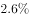
　✅
- **B**. 
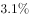

- **C**. 

- **D**. 

**答案**：A

**官方解析**

根据题干所求“2015年面上项目资助项数占总资助项数的比重较上一年增加约”判定此题为两期比重问题，定位材料第一段“择优资助各类项目40668项，比上年增加1579项，”和材料第二段“面上项目资助16709项，比上年增加1709项，占总项数的”已知2015年面上项目资助项数占总资助项数的比重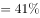，2014年面上项目资助项数占总资助项数的比重，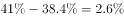，与A项最接近。

故正确答案为A。

---

#### 第 4 题　qid 2049582 · 综合

2014年国家自然科学基金委共接收青年科学基金的申请数约为：

- **A**. 5.1万份
- **B**. 5.9万份
- **C**. 6.5万份　✅
- **D**. 6.9万份

**答案**：C

**官方解析**

根据题干所求“2014年国家自然科学基金委共接收青年科学基金的申请数约为”和材料第二段平均资助率（资助项目占接收申请项目的比重），即，可判定此题为基期比重问题。定位材料第三段“在人才项目系列方面，青年科学基金资助16155项，比上年减少266项，平均资助率，同比下降0.7个百分点”，可知2014年平均资助率。2014年青年科学基金资助项目，因此2014年接收青年科学基金的申请数，与C项6.5万份最接近。

故正确答案为C。

---

#### 第 5 题　qid 2049584 · 综合

能够从上述资料中推出的是：

- **A**. 2015年重点项目的平均资助强度多于重大项目
- **B**. 2014年面上项目资助项数多于青年科学基金项目
- **C**. 2015年面上项目的平均资助率高于青年科学基金项目
- **D**. 2015年重点项目资助项数的同比增长率高于地区科学基金　✅

**答案**：D

**官方解析**

A项：由第二题可知2015年重点项目的平均资助强度亿元，定位材料第二段“重大项目资助20项，直接费用3.18亿元。”则重大项目的平均资助强度亿元，分数比较大小，重点项目平均资助强度分子小且分母大，因此重点项目的平均资助强度小于重大项目的平均资助强度，错误；

B项：定位材料第二段“在研究项目系列方面，面上项目资助16709项，比上年增加1709项”可知2014年面上项目资助项数，定位材料第三段“青年科学基金资助16155项，比上年减少266项”可知2014年青年科学基金资助项数，，因此2014年面上项目资助项数少于青年科学基金项目，错误；

C项：定位材料第二段可知面上项目资助平均资助率，定位材料第三段可知青年科学基金资助平均资助率，因此面上项目资助平均资助率低于青年科学基金资助平均资助率，错误；

D项：定位材料第二段“重点项目资助625项，同比增长约”可知重点项目资助项数的同比增长率，定位材料第三段“地区科学基金资助2829项，比上年增加78项，”可知地区科学基金资助的增长率，因此2015年重点项目资助项数的同比增长率高于地区科学基金同比增长率，正确。

故正确答案为D。

---

### 材料 2

根据以下资料，回答下列小题。

        2016年6月份，我国社会消费品零售总额26857亿元，同比增长，环比增长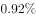。其中，限额以上单位消费品零售额13006亿元，同比增长。

        2016年1~6月份，我国社会消费品零售总额156138亿元，同比增长。其中，限额以上单位消费品零售额71075亿元，同比增长。

        按经营单位所在地分，2016年6月份，城镇消费品零售额23082亿元，同比增长；乡村消费品零售额3775亿元，同比增长。1~6月份，城镇消费品零售额134249亿元，同比增长；乡村消费品零售额21889亿元，同比增长。

        按消费类型分，2016年6月份，餐饮收入2907亿元，同比增长；商品零售23951亿元，同比增长。1~6月份，餐饮收入16683亿元，同比增长；商品零售139455亿元，同比增长。

        2016年1~6月份，全国网上零售额22367亿元，同比增长。其中，实物商品网上零售额18143亿元，同比增长。

#### 第 6 题　qid 2049848 · 综合

2016年5月份，全国社会消费品零售总额约为：

- **A**. 24594亿元
- **B**. 24283亿元
- **C**. 26612亿元　✅
- **D**. 27104亿元

**答案**：C

**官方解析**

材料中给出的时间为2016年6月，题干中的时间为2016年5月，可知，本题为基期计算问题。定位材料第一段，“2016年6月份，我国社会消费品零售总额26857亿元，环比增长”，代入基期计算公式，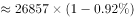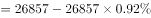，与C项最接近。

故正确答案为C。

---

#### 第 7 题　qid 2049856 · 比重

2015年1-6月份，限额以上单位消费品零售额占全国社会消费品零售总额的比重约为：

- **A**. 

- **B**. 

　✅
- **C**. 

- **D**. 

**答案**：B

**官方解析**

材料中给出的时间为2016年，题干中的时间为2015年，所求为“······占······比重”，可知，本题为基期比重问题。定位数据，“2016年1-6月份，我国社会消费品零售总额156138亿元，同比增长。其中，限额以上单位消费品零售额71075亿元，同比增长”，代入基期比重计算公式，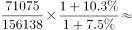。

故正确答案为B。

---

#### 第 8 题　qid 2049858 · 增长

2016年1-6月份，以下选项中，商品零售同比增速最快的是：

- **A**. 汽车
- **B**. 石油及制品
- **C**. 家用电器和音像器材
- **D**. 通讯器材　✅

**答案**：D

**官方解析**

定位表格第五列，2016年1-6月份，汽车同比增速为，石油及制品同比增速为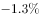，家用电器和音像器材同比增速为，通讯器材同比增速为，所以商品零售同比增速最快的为通讯器材。

故正确答案为D。

---

#### 第 9 题　qid 2049864 · 增长

2016年6月份，城镇消费品零售额比上年同期增加：

- **A**. 380亿元
- **B**. 2169亿元
- **C**. 1193亿元
- **D**. 2193亿元　✅

**答案**：D

**官方解析**

由题干求“2016年6月份，城镇消费品零售额比上年同期增加”，选项带单位“亿元”可知，本题为增长量计算问题。根据“2016年6月份，城镇消费品零售额”,定位材料第三段，定位数据，“2016年6月份，城镇消费品零售额23082亿元，同比增长”，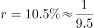，代入增长量计算公式，亿元。

故正确答案为D。

---

#### 第 10 题　qid 2049872 · 综合

关于社会消费品零售情况，能够从上述资料中推出的是：

- **A**. 2016年1-6月份，限额以上单位消费品零售额增速同比下滑
- **B**. 2016年1-6月份，乡村消费品零售额增速慢于城镇
- **C**. 2015年1-6月份，商品零售额超过餐饮收入的7倍　✅
- **D**. 2015年1-6月份，网络零售呈较慢增长的态势

**答案**：C

**官方解析**

A项：定位材料第二段，“2016年1-6月份，限额以上单位消费品零售额71075亿元，同比增长”，2015年1-6月份，限额以上单位消费品零售额增速未知，无法判断增速是否同比下滑，错误；

B项：定位材料第三段，“1-6月份，城镇消费品零售额134249亿元，同比增长；乡村消费品零售额21889亿元，同比增长”，，错误；

C项：定位材料第四段，“2016年1-6月份，餐饮收入16683亿元，同比增长；商品零售139455亿元，同比增长”，则2015年1-6月，，正确；

D项：定位材料第五段，“2016年1-6月份，全国网上零售额22367亿元，同比增长。”2016年之前的网络零售增速未知，无法判断2015年1-6月份网络零售增长趋势，错误。

故正确答案为C。

---

### 材料 3

        2015年全国共建立社会捐助工作站、点和慈善超市3.0万个，比上一年减少0.2万个，其中：慈善超市9654个，同比下降。全年共接收社会捐赠款654.5亿元，其中：民政部门接收社会各界捐款44.2亿元，各类社会组织接收捐款610.3亿元。全年民政部门接收捐赠衣被4537.0万件，捐赠物资价值折合人民币5.2亿元。全年有1838.4万人次困难群众受益，同比增长，增长率较上一年下降27.5个百分点。全年有934.6万人次在社会服务领域提供了2700.7万小时的志愿服务，同比减少10.4万小时。 

#### 第 11 题　qid 2049534 · 综合

2015年，全国建立的慈善超市较2014年约：

- **A**. 增加519个
- **B**. 减少519个　✅
- **C**. 增加686个
- **D**. 减少686个​

**答案**：B

**官方解析**

由题干“2015年……较2014年”结合选项增加或减少多少个，可判断本题是增长量计算问题。定位文字材料第一段，2015年慈善超市9654个，同比下降，增长量=（约减少510个），与B项最接近。

故正确答案为B。

---

#### 第 12 题　qid 2049546 · 增长

2015年受益的困难群众较2013年增长约：

- **A**. 

　✅
- **B**. 

- **C**. 

- **D**. 

**答案**：A

**官方解析**

由题干“2015年……较2013年增长约……”，结合选项都为“”，可判定该题为间隔增长率问题。定位文字材料，“困难群众受益，同比增长，增长率较上一年下降27.5个百分点”，则2015年增长率，2014年增长率，所以2015年受益的困难群众较2013年增长：，与A选项最接近。

故正确答案为A。

---

#### 第 13 题　qid 2049552 · 比重

2012-2015年社会组织接收社会捐赠款占总捐赠款的比重最高的是：

- **A**. 2012年
- **B**. 2013年
- **C**. 2014年
- **D**. 2015年　✅

**答案**：D

**官方解析**

由题干“2012-2015······占······比重最高的是”，可判定该题是比值比较问题。定位文字材料和表中数据，2012-2015年社会组织接收社会捐赠款占总捐赠款的比重分别为：2012年；2013年；2014年；2015年，所以社会组织接收社会捐赠款占总捐赠款的比重最高的是2015年。

故正确答案为D。

---

#### 第 14 题　qid 2049568 · 综合

下面哪一张图能正确反映2011～2015年民政部门接收捐赠衣被数量的变化？

- **A**. 

　✅
- **B**. 

- **C**. 

- **D**. 

**答案**：A

**官方解析**

定位文字材料和表中数据，2011~2015年全国民政部门接收捐赠衣被数量分别为2918.5万件、12538.2万件、10405.0万件、5244.5万件、4537.0万件，所以2012年即第二个点最高，只有选项A满足条件。
故正确答案为A。

---

#### 第 15 题　qid 2049574 · 综合

能够从上述资料中推出的是：

- **A**. 2011-2015年民政部门接收的社会捐赠款在持续增加
- **B**. 2015年民政部门接收捐赠衣被同比增长率高于2014年的二分之一
- **C**. 2012-2015年社会组织接收社会捐赠款同比增长最快的年份是2012年　✅
- **D**. 相比2014年，2015年在社会服务领域提供志愿服务的人次有所增加

**答案**：C

**官方解析**

A项：定位表中数据，2014年民政部门接收的社会捐赠款79.6亿元小于2013年民政部门接收的社会捐赠款107.6亿元，错误；

B项：定位文字材料和表中数据，2015年民政部门接收捐赠衣被，2014年民政部门接收捐赠衣被。故：，正确；

C项：定位文字材料和表中数据，2012-2015年社会组织接收社会捐赠款同比增长率分别为：2012年；2013年；2014年；2015年，所以2012年同比增长最快，正确；

D项：定位文字材料，“全年有934.6万人次在社会服务领域提供了2700.7万小时的志愿服务，同比减少10.4万小时”，无法判断提供志愿服务的人次的变化，错误。

故正确答案为B和C。

【备注】本题为争议题。粉笔对B项和C项可能的争议点解释如下：

B项可能的争议点是：

①同比增长率是否可以为负数？根据本卷第四篇资料分析的表格数据可知，同比增长（）下面出现了-0.5这样的负数，所以同比增长率是可以为负数的。

②比较同比增长率高低时，是否需要带负号比较？根据近年全国各地类似真题可知，增长率比高低时，需要带负号比较，例如。

C项可能的争议点是：

2012-2015年增长最快的年份是否要考虑2012年？根据近年全国各地类似真题可知，如果提到2012-2015年的年均增长量或年均增长率等，一般不考虑2012年的增长情况（江苏例外）；但是如果提到2012-2015年增长最快/最多的年份，一般都是要考虑2012年当年的增长情况的，否则会使得很多国考省考题目变得没有答案。

基于以上分析，粉笔认为本题B、C答案没有明显错误，都应该是正确答案。

---
